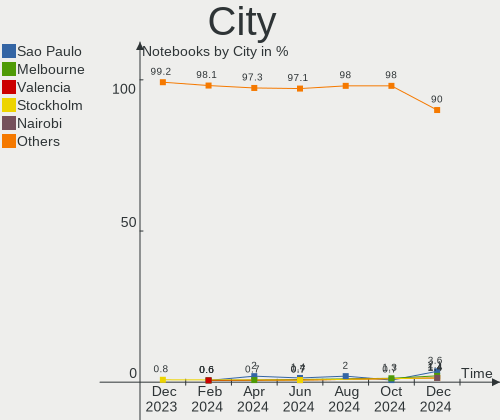
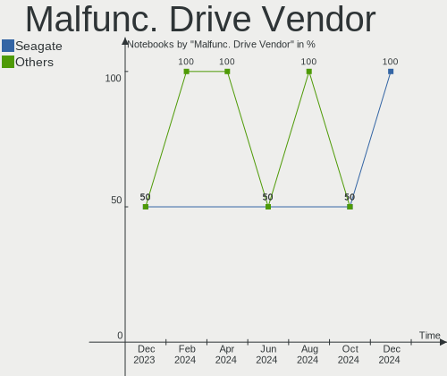
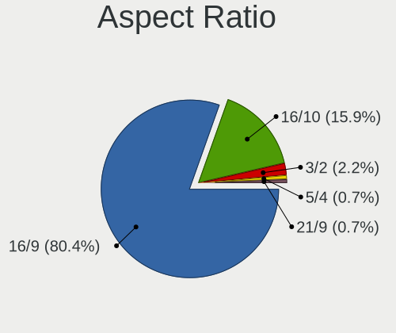

Zorin Hardware Trends (Notebook)
--------------------------------

A project to identify most popular hardware characteristics and track their change
over time based on data collected by Zorin users at https://Linux-Hardware.org.

Anyone can contribute to the study by uploading probes of their computers by
the [hw-probe](https://github.com/linuxhw/hw-probe) tool:

    sudo -E hw-probe -all -upload

Full-feature report is available here: https://linux-hardware.org/?view=trends&formfactor=notebook

Period: May, 2021.

Contents
--------

- [ OS                       ](#os)
- [ OS Family                ](#os-family)
- [ Kernel                   ](#kernel)
- [ Kernel Family            ](#kernel-family)
- [ Kernel Major Ver.        ](#kernel-major-ver)
- [ Arch                     ](#arch)
- [ DE                       ](#de)
- [ Display Server           ](#display-server)
- [ Display Manager          ](#display-manager)
- [ OS Lang                  ](#os-lang)
- [ Boot Mode                ](#boot-mode)
- [ Filesystem               ](#filesystem)
- [ Part. scheme             ](#part-scheme)
- [ Dual Boot with Linux/BSD ](#dual-boot-with-linux/bsd)
- [ Dual Boot (Win)          ](#dual-boot-win)
- [ Country                  ](#country)
- [ City                     ](#city)
- [ Vendor                   ](#vendor)
- [ Model                    ](#model)
- [ Model Family             ](#model-family)
- [ MFG Year                 ](#mfg-year)
- [ Form Factor              ](#form-factor)
- [ Secure Boot              ](#secure-boot)
- [ Coreboot                 ](#coreboot)
- [ RAM Size                 ](#ram-size)
- [ RAM Used                 ](#ram-used)
- [ Has CD-ROM               ](#has-cd-rom)
- [ Total Drives             ](#total-drives)
- [ Has Ethernet             ](#has-ethernet)
- [ Has WiFi                 ](#has-wifi)
- [ Has Bluetooth            ](#has-bluetooth)
- [ Drive Vendor             ](#drive-vendor)
- [ Drive Model              ](#drive-model)
- [ HDD Vendor               ](#hdd-vendor)
- [ SSD Vendor               ](#ssd-vendor)
- [ Drive Kind               ](#drive-kind)
- [ Drive Connector          ](#drive-connector)
- [ Drive Size               ](#drive-size)
- [ Space Total              ](#space-total)
- [ Space Used               ](#space-used)
- [ Malfunc. Drives          ](#malfunc-drives)
- [ Malfunc. Drive Vendor    ](#malfunc-drive-vendor)
- [ Malfunc. HDD Vendor      ](#malfunc-hdd-vendor)
- [ Malfunc. Drive Kind      ](#malfunc-drive-kind)
- [ Failed Drives            ](#failed-drives)
- [ Failed Drive Vendor      ](#failed-drive-vendor)
- [ Drive Status             ](#drive-status)
- [ Storage Vendor           ](#storage-vendor)
- [ Storage Model            ](#storage-model)
- [ Storage Kind             ](#storage-kind)
- [ CPU Vendor               ](#cpu-vendor)
- [ CPU Model                ](#cpu-model)
- [ CPU Model Family         ](#cpu-model-family)
- [ CPU Cores                ](#cpu-cores)
- [ CPU Sockets              ](#cpu-sockets)
- [ CPU Threads              ](#cpu-threads)
- [ CPU Op-Modes             ](#cpu-op-modes)
- [ CPU Microcode            ](#cpu-microcode)
- [ CPU Microarch            ](#cpu-microarch)
- [ GPU Vendor               ](#gpu-vendor)
- [ GPU Model                ](#gpu-model)
- [ GPU Combo                ](#gpu-combo)
- [ GPU Driver               ](#gpu-driver)
- [ GPU Memory               ](#gpu-memory)
- [ Monitor Vendor           ](#monitor-vendor)
- [ Monitor Model            ](#monitor-model)
- [ Monitor Resolution       ](#monitor-resolution)
- [ Monitor Diagonal         ](#monitor-diagonal)
- [ Monitor Width            ](#monitor-width)
- [ Aspect Ratio             ](#aspect-ratio)
- [ Monitor Area             ](#monitor-area)
- [ Pixel Density            ](#pixel-density)
- [ Multiple Monitors        ](#multiple-monitors)
- [ Net Controller Vendor    ](#net-controller-vendor)
- [ Net Controller Model     ](#net-controller-model)
- [ Wireless Vendor          ](#wireless-vendor)
- [ Wireless Model           ](#wireless-model)
- [ Ethernet Vendor          ](#ethernet-vendor)
- [ Ethernet Model           ](#ethernet-model)
- [ Net Controller Kind      ](#net-controller-kind)
- [ Used Controller          ](#used-controller)
- [ NICs                     ](#nics)
- [ IPv6                     ](#ipv6)
- [ Memory Vendor            ](#memory-vendor)
- [ Memory Model             ](#memory-model)
- [ Memory Kind              ](#memory-kind)
- [ Memory Form Factor       ](#memory-form-factor)
- [ Memory Size              ](#memory-size)
- [ Memory Speed             ](#memory-speed)
- [ Sound Vendor             ](#sound-vendor)
- [ Sound Model              ](#sound-model)
- [ Camera Vendor            ](#camera-vendor)
- [ Camera Model             ](#camera-model)
- [ Fingerprint Vendor       ](#fingerprint-vendor)
- [ Fingerprint Model        ](#fingerprint-model)
- [ Chipcard Vendor          ](#chipcard-vendor)
- [ Chipcard Model           ](#chipcard-model)
- [ Printer Vendor           ](#printer-vendor)
- [ Printer Model            ](#printer-model)
- [ Scanner Vendor           ](#scanner-vendor)
- [ Scanner Model            ](#scanner-model)
- [ Bluetooth Vendor         ](#bluetooth-vendor)
- [ Bluetooth Model          ](#bluetooth-model)
- [ Unsupported Devices      ](#unsupported-devices)
- [ Unsupported Device Types ](#unsupported-device-types)

OS
--

Installed operating systems

| Name     | Notebooks | Percent |
|----------|-----------|---------|
| Zorin 15 | 38        | 82.61%  |
| Zorin 16 | 8         | 17.39%  |

OS Family
---------

OS without a version

| Name  | Notebooks | Percent |
|-------|-----------|---------|
| Zorin | 46        | 100%    |

Kernel
------

Version of the Linux kernel

| Version                | Notebooks | Percent |
|------------------------|-----------|---------|
| 5.4.0-73-generic       | 17        | 36.96%  |
| 5.4.0-72-generic       | 14        | 30.43%  |
| 5.8.0-53-generic       | 5         | 10.87%  |
| 5.8.0-50-generic       | 3         | 6.52%   |
| 5.4.0-45-generic       | 3         | 6.52%   |
| 5.4.0-47-generic       | 2         | 4.35%   |
| 5.3.0-40-generic       | 1         | 2.17%   |
| 5.10.35-051035-generic | 1         | 2.17%   |

Kernel Family
-------------

Linux kernel without a distro release

| Version | Notebooks | Percent |
|---------|-----------|---------|
| 5.4.0   | 36        | 78.26%  |
| 5.8.0   | 8         | 17.39%  |
| 5.3.0   | 1         | 2.17%   |
| 5.10.35 | 1         | 2.17%   |

Kernel Major Ver.
-----------------

Linux kernel major version

| Version | Notebooks | Percent |
|---------|-----------|---------|
| 5.4     | 36        | 78.26%  |
| 5.8     | 8         | 17.39%  |
| 5.3     | 1         | 2.17%   |
| 5.10    | 1         | 2.17%   |

Arch
----

OS architecture (x86_64, i586, etc.)

| Name   | Notebooks | Percent |
|--------|-----------|---------|
| x86_64 | 38        | 82.61%  |
| i686   | 8         | 17.39%  |

DE
--

Desktop Environment

| Name    | Notebooks | Percent |
|---------|-----------|---------|
| GNOME   | 27        | 58.7%   |
| XFCE    | 16        | 34.78%  |
| Unknown | 3         | 6.52%   |

Display Server
--------------

X11 or Wayland

| Name    | Notebooks | Percent |
|---------|-----------|---------|
| X11     | 44        | 95.65%  |
| Wayland | 1         | 2.17%   |
| Unknown | 1         | 2.17%   |

Display Manager
---------------

SDDM, LightDM, etc.

| Name    | Notebooks | Percent |
|---------|-----------|---------|
| Unknown | 43        | 93.48%  |
| GDM     | 3         | 6.52%   |

OS Lang
-------

Language

| Lang  | Notebooks | Percent |
|-------|-----------|---------|
| en_US | 14        | 30.43%  |
| pt_BR | 4         | 8.7%    |
| en_IN | 3         | 6.52%   |
| de_DE | 3         | 6.52%   |
| nl_NL | 2         | 4.35%   |
| it_IT | 2         | 4.35%   |
| hu_HU | 2         | 4.35%   |
| es_ES | 2         | 4.35%   |
| es_CL | 2         | 4.35%   |
| es_AR | 2         | 4.35%   |
| en_GB | 2         | 4.35%   |
| sv_SE | 1         | 2.17%   |
| ja_JP | 1         | 2.17%   |
| fr_FR | 1         | 2.17%   |
| fr_CA | 1         | 2.17%   |
| es_MX | 1         | 2.17%   |
| en_ZA | 1         | 2.17%   |
| en_CA | 1         | 2.17%   |
| cs_CZ | 1         | 2.17%   |

Boot Mode
---------

EFI or BIOS

| Mode | Notebooks | Percent |
|------|-----------|---------|
| BIOS | 31        | 67.39%  |
| EFI  | 15        | 32.61%  |

Filesystem
----------

Type of filesystem

| Type    | Notebooks | Percent |
|---------|-----------|---------|
| Ext4    | 45        | 97.83%  |
| Overlay | 1         | 2.17%   |

Part. scheme
------------

Scheme of partitioning

| Type    | Notebooks | Percent |
|---------|-----------|---------|
| Unknown | 43        | 93.48%  |
| GPT     | 3         | 6.52%   |

Dual Boot with Linux/BSD
------------------------

Hosting more than one Linux/BSD

| Dual boot | Notebooks | Percent |
|-----------|-----------|---------|
| No        | 42        | 91.3%   |
| Yes       | 4         | 8.7%    |

Dual Boot (Win)
---------------

Hosting Linux and Windows

| Dual boot | Notebooks | Percent |
|-----------|-----------|---------|
| No        | 38        | 82.61%  |
| Yes       | 8         | 17.39%  |

Country
-------

Geographic location (country)

| Country      | Notebooks | Percent |
|--------------|-----------|---------|
| USA          | 7         | 15.22%  |
| Brazil       | 4         | 8.7%    |
| India        | 3         | 6.52%   |
| Germany      | 3         | 6.52%   |
| Canada       | 3         | 6.52%   |
| Argentina    | 3         | 6.52%   |
| UK           | 2         | 4.35%   |
| Netherlands  | 2         | 4.35%   |
| Mexico       | 2         | 4.35%   |
| Italy        | 2         | 4.35%   |
| Chile        | 2         | 4.35%   |
| Turkey       | 1         | 2.17%   |
| Sweden       | 1         | 2.17%   |
| Spain        | 1         | 2.17%   |
| South Africa | 1         | 2.17%   |
| Romania      | 1         | 2.17%   |
| Japan        | 1         | 2.17%   |
| Iran         | 1         | 2.17%   |
| Hungary      | 1         | 2.17%   |
| France       | 1         | 2.17%   |
| Estonia      | 1         | 2.17%   |
| Czechia      | 1         | 2.17%   |
| Croatia      | 1         | 2.17%   |
| Austria      | 1         | 2.17%   |

City
----

Geographic location (city)

| City              | Notebooks | Percent |
|-------------------|-----------|---------|
| Sikeston          | 2         | 4.35%   |
| Buenos Aires      | 2         | 4.35%   |
| Winnipeg          | 1         | 2.17%   |
| West Monroe       | 1         | 2.17%   |
| Vienna            | 1         | 2.17%   |
| Valdivia          | 1         | 2.17%   |
| Tehran            | 1         | 2.17%   |
| Tartu             | 1         | 2.17%   |
| Tacoma            | 1         | 2.17%   |
| São Paulo        | 1         | 2.17%   |
| Sokolov           | 1         | 2.17%   |
| Sidney            | 1         | 2.17%   |
| Sendai            | 1         | 2.17%   |
| Sao Goncalo       | 1         | 2.17%   |
| San Francisco     | 1         | 2.17%   |
| Rome              | 1         | 2.17%   |
| Rancagua          | 1         | 2.17%   |
| Onda              | 1         | 2.17%   |
| Nyiregyhaza       | 1         | 2.17%   |
| Mérida           | 1         | 2.17%   |
| Montreal          | 1         | 2.17%   |
| Mexicali          | 1         | 2.17%   |
| Mannheim          | 1         | 2.17%   |
| Las Vegas         | 1         | 2.17%   |
| Landskrona        | 1         | 2.17%   |
| Krapina           | 1         | 2.17%   |
| Kolkata           | 1         | 2.17%   |
| Johnstown         | 1         | 2.17%   |
| Istanbul          | 1         | 2.17%   |
| Hyderabad         | 1         | 2.17%   |
| Hugelsheim        | 1         | 2.17%   |
| Haren             | 1         | 2.17%   |
| Frankfurt am Main | 1         | 2.17%   |
| Florianópolis    | 1         | 2.17%   |
| Chennai           | 1         | 2.17%   |
| Ceilandia         | 1         | 2.17%   |
| Cape Town         | 1         | 2.17%   |
| Calvenzano        | 1         | 2.17%   |
| Caleta Olivia     | 1         | 2.17%   |
| Bordeaux          | 1         | 2.17%   |
| Birmingham        | 1         | 2.17%   |
| Arad              | 1         | 2.17%   |
| Amsterdam         | 1         | 2.17%   |
| Acton             | 1         | 2.17%   |

Vendor
------

Motherboard manufacturer

| Name                | Notebooks | Percent |
|---------------------|-----------|---------|
| Dell                | 9         | 19.57%  |
| Hewlett-Packard     | 8         | 17.39%  |
| Lenovo              | 7         | 15.22%  |
| ASUSTek Computer    | 7         | 15.22%  |
| Acer                | 5         | 10.87%  |
| Toshiba             | 2         | 4.35%   |
| Samsung Electronics | 2         | 4.35%   |
| TrekStor            | 1         | 2.17%   |
| Razer               | 1         | 2.17%   |
| HUAWEI              | 1         | 2.17%   |
| Google              | 1         | 2.17%   |
| Fujitsu             | 1         | 2.17%   |
| Arima               | 1         | 2.17%   |

Model
-----

Motherboard model

| Name                                  | Notebooks | Percent |
|---------------------------------------|-----------|---------|
| Dell Inspiron 14-3467                 | 2         | 4.35%   |
| TrekStor Notebook Slim S130           | 1         | 2.17%   |
| Toshiba Satellite P300                | 1         | 2.17%   |
| Toshiba Satellite P200                | 1         | 2.17%   |
| Samsung RV411/RV511/E3511/S3511/RV711 | 1         | 2.17%   |
| Samsung RF712                         | 1         | 2.17%   |
| Razer Book 13 - RZ09-0357             | 1         | 2.17%   |
| Lenovo ThinkPad Yoga 11e 20DAS0SF00   | 1         | 2.17%   |
| Lenovo ThinkPad T460 20FMS7DA00       | 1         | 2.17%   |
| Lenovo ThinkPad T440s 20ARS10700      | 1         | 2.17%   |
| Lenovo IdeaPad 330-15AST 81D6         | 1         | 2.17%   |
| Lenovo IdeaPad 100-15IBD 80QQ         | 1         | 2.17%   |
| Lenovo G40-30 80FY                    | 1         | 2.17%   |
| Lenovo 406822U                        | 1         | 2.17%   |
| HUAWEI BOHK-WAX9X                     | 1         | 2.17%   |
| HP ProBook 650 G2                     | 1         | 2.17%   |
| HP ProBook 4510s                      | 1         | 2.17%   |
| HP Pavilion g7                        | 1         | 2.17%   |
| HP Pavilion dv6700                    | 1         | 2.17%   |
| HP ENVY Notebook                      | 1         | 2.17%   |
| HP 435                                | 1         | 2.17%   |
| HP 255 G5                             | 1         | 2.17%   |
| Google Candy                          | 1         | 2.17%   |
| Fujitsu FMVNF40UK                     | 1         | 2.17%   |
| Dell Vostro 5490                      | 1         | 2.17%   |
| Dell Latitude E7240                   | 1         | 2.17%   |
| Dell Latitude D520                    | 1         | 2.17%   |
| Dell Inspiron 7520                    | 1         | 2.17%   |
| Dell Inspiron 3521                    | 1         | 2.17%   |
| Dell Inspiron 1525                    | 1         | 2.17%   |
| Dell G5 5587                          | 1         | 2.17%   |
| ASUS X540YA                           | 1         | 2.17%   |
| ASUS X540SA                           | 1         | 2.17%   |
| ASUS X406UAR                          | 1         | 2.17%   |
| ASUS UX31A                            | 1         | 2.17%   |
| ASUS T100TA                           | 1         | 2.17%   |
| ASUS K54C                             | 1         | 2.17%   |
| ASUS F5N                              | 1         | 2.17%   |
| Arima W351UI                          | 1         | 2.17%   |
| Acer V5-131                           | 1         | 2.17%   |
| Acer Swift SF313-51                   | 1         | 2.17%   |
| Acer Aspire 5538                      | 1         | 2.17%   |
| Acer Aspire 3100                      | 1         | 2.17%   |
| Acer AOD255E                          | 1         | 2.17%   |
| Unknown                               | 1         | 2.17%   |

Model Family
------------

Motherboard model prefix

| Name              | Notebooks | Percent |
|-------------------|-----------|---------|
| Dell Inspiron     | 5         | 10.87%  |
| Lenovo ThinkPad   | 3         | 6.52%   |
| Toshiba Satellite | 2         | 4.35%   |
| Lenovo IdeaPad    | 2         | 4.35%   |
| HP ProBook        | 2         | 4.35%   |
| HP Pavilion       | 2         | 4.35%   |
| Dell Latitude     | 2         | 4.35%   |
| Acer Aspire       | 2         | 4.35%   |
| TrekStor Notebook | 1         | 2.17%   |
| Samsung RV411     | 1         | 2.17%   |
| Samsung RF712     | 1         | 2.17%   |
| Razer Book        | 1         | 2.17%   |
| Lenovo G40-30     | 1         | 2.17%   |
| Lenovo 406822U    | 1         | 2.17%   |
| HUAWEI BOHK-WAX9X | 1         | 2.17%   |
| HP ENVY           | 1         | 2.17%   |
| HP 435            | 1         | 2.17%   |
| HP 255            | 1         | 2.17%   |
| Google Candy      | 1         | 2.17%   |
| Fujitsu FMVNF40UK | 1         | 2.17%   |
| Dell Vostro       | 1         | 2.17%   |
| Dell G5           | 1         | 2.17%   |
| ASUS X540YA       | 1         | 2.17%   |
| ASUS X540SA       | 1         | 2.17%   |
| ASUS X406UAR      | 1         | 2.17%   |
| ASUS UX31A        | 1         | 2.17%   |
| ASUS T100TA       | 1         | 2.17%   |
| ASUS K54C         | 1         | 2.17%   |
| ASUS F5N          | 1         | 2.17%   |
| Arima W351UI      | 1         | 2.17%   |
| Acer V5-131       | 1         | 2.17%   |
| Acer Swift        | 1         | 2.17%   |
| Acer AOD255E      | 1         | 2.17%   |
| Unknown           | 1         | 2.17%   |

MFG Year
--------

Motherboard manufacture year

| Year | Notebooks | Percent |
|------|-----------|---------|
| 2019 | 7         | 15.22%  |
| 2020 | 6         | 13.04%  |
| 2013 | 4         | 8.7%    |
| 2008 | 4         | 8.7%    |
| 2007 | 4         | 8.7%    |
| 2017 | 3         | 6.52%   |
| 2014 | 3         | 6.52%   |
| 2011 | 3         | 6.52%   |
| 2016 | 2         | 4.35%   |
| 2015 | 2         | 4.35%   |
| 2010 | 2         | 4.35%   |
| 2009 | 2         | 4.35%   |
| 2006 | 2         | 4.35%   |
| 2018 | 1         | 2.17%   |
| 2012 | 1         | 2.17%   |

Form Factor
-----------

Physical design of the computer

| Name     | Notebooks | Percent |
|----------|-----------|---------|
| Notebook | 46        | 100%    |

Secure Boot
-----------

Enabled or disabled

| State    | Notebooks | Percent |
|----------|-----------|---------|
| Disabled | 41        | 89.13%  |
| Enabled  | 5         | 10.87%  |

Coreboot
--------

Have coreboot on board

| Used | Notebooks | Percent |
|------|-----------|---------|
| No   | 45        | 97.83%  |
| Yes  | 1         | 2.17%   |

RAM Size
--------

Total RAM memory

| Size in GB | Notebooks | Percent |
|------------|-----------|---------|
| 3.01-4.0   | 12        | 26.09%  |
| 4.01-8.0   | 11        | 23.91%  |
| 1.01-2.0   | 8         | 17.39%  |
| 8.01-16.0  | 8         | 17.39%  |
| 0.51-1.0   | 3         | 6.52%   |
| 2.01-3.0   | 2         | 4.35%   |
| 16.01-24.0 | 2         | 4.35%   |

RAM Used
--------

Used RAM memory

| Used GB  | Notebooks | Percent |
|----------|-----------|---------|
| 1.01-2.0 | 22        | 47.83%  |
| 2.01-3.0 | 9         | 19.57%  |
| 0.51-1.0 | 7         | 15.22%  |
| 3.01-4.0 | 5         | 10.87%  |
| 4.01-8.0 | 3         | 6.52%   |

Has CD-ROM
----------

Has CD-ROM on board

| Presented | Notebooks | Percent |
|-----------|-----------|---------|
| Yes       | 24        | 52.17%  |
| No        | 22        | 47.83%  |

Total Drives
------------

Number of drives on board

| Drives | Notebooks | Percent |
|--------|-----------|---------|
| 1      | 40        | 86.96%  |
| 2      | 4         | 8.7%    |
| 3      | 1         | 2.17%   |
| 0      | 1         | 2.17%   |

Has Ethernet
------------

Has Ethernet on board

| Presented | Notebooks | Percent |
|-----------|-----------|---------|
| Yes       | 38        | 82.61%  |
| No        | 8         | 17.39%  |

Has WiFi
--------

Has WiFi module

| Presented | Notebooks | Percent |
|-----------|-----------|---------|
| Yes       | 45        | 97.83%  |
| No        | 1         | 2.17%   |

Has Bluetooth
-------------

Has Bluetooth module

| Presented | Notebooks | Percent |
|-----------|-----------|---------|
| Yes       | 30        | 65.22%  |
| No        | 16        | 34.78%  |

Drive Vendor
------------

Hard drive vendors

| Vendor              | Notebooks | Drives | Percent |
|---------------------|-----------|--------|---------|
| Toshiba             | 10        | 10     | 20.41%  |
| Seagate             | 7         | 7      | 14.29%  |
| WDC                 | 6         | 6      | 12.24%  |
| Samsung Electronics | 6         | 6      | 12.24%  |
| Unknown             | 4         | 4      | 8.16%   |
| SanDisk             | 3         | 3      | 6.12%   |
| Fujitsu             | 3         | 3      | 6.12%   |
| Hitachi             | 2         | 2      | 4.08%   |
| China               | 2         | 2      | 4.08%   |
| TrekStor            | 1         | 1      | 2.04%   |
| Transcend           | 1         | 1      | 2.04%   |
| SK Hynix            | 1         | 1      | 2.04%   |
| KIOXIA              | 1         | 1      | 2.04%   |
| Kingston            | 1         | 1      | 2.04%   |
| Intenso             | 1         | 1      | 2.04%   |

Drive Model
-----------

Hard drive models

| Model                                | Notebooks | Percent |
|--------------------------------------|-----------|---------|
| Toshiba MQ01ABF050 500GB             | 2         | 4.08%   |
| Toshiba MQ01ABD032 320GB             | 2         | 4.08%   |
| WDC WD7500BPKT-22PK4T0 752GB         | 1         | 2.04%   |
| WDC WD5000LPCX-24C6HT0 500GB         | 1         | 2.04%   |
| WDC WD3200BEVT-22ZCT0 320GB          | 1         | 2.04%   |
| WDC WD2500BEVT-22A23T0 250GB         | 1         | 2.04%   |
| WDC WD10JPVX-60JC3T0 1TB             | 1         | 2.04%   |
| WDC PC SN520 SDAPNUW-512G-1014 512GB | 1         | 2.04%   |
| Unknown SD/MMC/MS PRO 8GB            | 1         | 2.04%   |
| Unknown MMC Card  64GB               | 1         | 2.04%   |
| Unknown MMC Card  32GB               | 1         | 2.04%   |
| Unknown MMC Card  16GB               | 1         | 2.04%   |
| TrekStor TREKSTORSSD128GB            | 1         | 2.04%   |
| Transcend TS512GMTS430S 512GB SSD    | 1         | 2.04%   |
| Toshiba THNSNJ128GCSU 128GB SSD      | 1         | 2.04%   |
| Toshiba MQ04ABF100 1TB               | 1         | 2.04%   |
| Toshiba MQ01ABD100 1TB               | 1         | 2.04%   |
| Toshiba MK2552GSX 250GB              | 1         | 2.04%   |
| Toshiba MK2035GSS 200GB              | 1         | 2.04%   |
| Toshiba MK2016GAP 20GB               | 1         | 2.04%   |
| SK Hynix SC311 SATA 256GB SSD        | 1         | 2.04%   |
| Seagate ST640LM000 HM641JI 640GB     | 1         | 2.04%   |
| Seagate ST500VT000-1DK142 500GB      | 1         | 2.04%   |
| Seagate ST500LT012-9WS142 500GB      | 1         | 2.04%   |
| Seagate ST500LM021-1KJ152 500GB      | 1         | 2.04%   |
| Seagate ST320LT020-9YG142 320GB      | 1         | 2.04%   |
| Seagate ST1000LM035-1RK172 1TB       | 1         | 2.04%   |
| Seagate ST1000LM024 HN-M101MBB 1TB   | 1         | 2.04%   |
| SanDisk SSD PLUS 480GB               | 1         | 2.04%   |
| SanDisk SD8SN8U256G1002 256GB SSD    | 1         | 2.04%   |
| SanDisk SD5SE2256G1002E 256GB SSD    | 1         | 2.04%   |
| Samsung SSD SM841 mSATA 256GB        | 1         | 2.04%   |
| Samsung SSD 850 PRO 512GB            | 1         | 2.04%   |
| Samsung NVMe SSD Drive 512GB         | 1         | 2.04%   |
| Samsung MZVLB512HBJQ-00A00 512GB     | 1         | 2.04%   |
| Samsung HM641JI 640GB                | 1         | 2.04%   |
| Samsung HM321HI 320GB                | 1         | 2.04%   |
| KIOXIA NVMe SSD Drive 512GB          | 1         | 2.04%   |
| Kingston SA400S37480G 480GB SSD      | 1         | 2.04%   |
| Intenso 256GB                        | 1         | 2.04%   |
| Hitachi HTS543225L9SA00 250GB        | 1         | 2.04%   |
| Hitachi HTS541680J9SA00 80GB         | 1         | 2.04%   |
| Fujitsu MHZ2160BH G1 160GB           | 1         | 2.04%   |
| Fujitsu MHY2250BH 250GB              | 1         | 2.04%   |
| Fujitsu MHV2040BH 40GB               | 1         | 2.04%   |
| China SSD 4G                         | 1         | 2.04%   |
| China SSD 256GB                      | 1         | 2.04%   |

HDD Vendor
----------

Hard disk drive vendors

| Vendor              | Notebooks | Drives | Percent |
|---------------------|-----------|--------|---------|
| Toshiba             | 9         | 9      | 32.14%  |
| Seagate             | 7         | 7      | 25%     |
| WDC                 | 5         | 5      | 17.86%  |
| Fujitsu             | 3         | 3      | 10.71%  |
| Samsung Electronics | 2         | 2      | 7.14%   |
| Hitachi             | 2         | 2      | 7.14%   |

SSD Vendor
----------

Solid state drive vendors

| Vendor              | Notebooks | Drives | Percent |
|---------------------|-----------|--------|---------|
| SanDisk             | 3         | 3      | 25%     |
| Samsung Electronics | 2         | 2      | 16.67%  |
| China               | 2         | 2      | 16.67%  |
| TrekStor            | 1         | 1      | 8.33%   |
| Transcend           | 1         | 1      | 8.33%   |
| Toshiba             | 1         | 1      | 8.33%   |
| SK Hynix            | 1         | 1      | 8.33%   |
| Kingston            | 1         | 1      | 8.33%   |

Drive Kind
----------

HDD or SSD

| Kind    | Notebooks | Drives | Percent |
|---------|-----------|--------|---------|
| HDD     | 28        | 28     | 58.33%  |
| SSD     | 11        | 12     | 22.92%  |
| NVMe    | 4         | 4      | 8.33%   |
| MMC     | 3         | 3      | 6.25%   |
| Unknown | 2         | 2      | 4.17%   |

Drive Connector
---------------

SATA, SAS, NVMe, etc.

| Type | Notebooks | Drives | Percent |
|------|-----------|--------|---------|
| SATA | 39        | 41     | 82.98%  |
| NVMe | 4         | 4      | 8.51%   |
| MMC  | 3         | 3      | 6.38%   |
| SAS  | 1         | 1      | 2.13%   |

Drive Size
----------

Size of hard drive

| Size in TB | Notebooks | Drives | Percent |
|------------|-----------|--------|---------|
| 0.01-0.5   | 29        | 30     | 76.32%  |
| 0.51-1.0   | 9         | 10     | 23.68%  |

Space Total
-----------

Amount of disk space available on the file system

| Size in GB | Notebooks | Percent |
|------------|-----------|---------|
| 251-500    | 16        | 34.78%  |
| 101-250    | 14        | 30.43%  |
| 501-1000   | 6         | 13.04%  |
| 1-20       | 4         | 8.7%    |
| 21-50      | 2         | 4.35%   |
| 1001-2000  | 2         | 4.35%   |
| 51-100     | 2         | 4.35%   |

Space Used
----------

Amount of used disk space

| Used GB  | Notebooks | Percent |
|----------|-----------|---------|
| 1-20     | 27        | 58.7%   |
| 21-50    | 9         | 19.57%  |
| 51-100   | 5         | 10.87%  |
| 101-250  | 3         | 6.52%   |
| 251-500  | 1         | 2.17%   |
| 501-1000 | 1         | 2.17%   |

Malfunc. Drives
---------------

Drive models with a malfunction

| Model                           | Notebooks | Drives | Percent |
|---------------------------------|-----------|--------|---------|
| Seagate ST500LT012-9WS142 500GB | 1         | 1      | 100%    |

Malfunc. Drive Vendor
---------------------

Vendors of faulty drives

| Vendor  | Notebooks | Drives | Percent |
|---------|-----------|--------|---------|
| Seagate | 1         | 1      | 100%    |

Malfunc. HDD Vendor
-------------------

Vendors of faulty HDD drives

| Vendor  | Notebooks | Drives | Percent |
|---------|-----------|--------|---------|
| Seagate | 1         | 1      | 100%    |

Malfunc. Drive Kind
-------------------

Kinds of faulty drives

| Kind | Notebooks | Drives | Percent |
|------|-----------|--------|---------|
| HDD  | 1         | 1      | 100%    |

Failed Drives
-------------

Failed drive models

Zero info for selected period =(

Failed Drive Vendor
-------------------

Failed drive vendors

Zero info for selected period =(

Drive Status
------------

Number of failed and malfunc. drives

| Status   | Notebooks | Drives | Percent |
|----------|-----------|--------|---------|
| Detected | 41        | 45     | 91.11%  |
| Works    | 3         | 3      | 6.67%   |
| Malfunc  | 1         | 1      | 2.22%   |

Storage Vendor
--------------

Storage controller vendors

| Vendor              | Notebooks | Percent |
|---------------------|-----------|---------|
| Intel               | 34        | 75.56%  |
| AMD                 | 6         | 13.33%  |
| Samsung Electronics | 2         | 4.44%   |
| Sandisk             | 1         | 2.22%   |
| Nvidia              | 1         | 2.22%   |
| KIOXIA              | 1         | 2.22%   |

Storage Model
-------------

Storage controller models

| Model                                                                                  | Notebooks | Percent |
|----------------------------------------------------------------------------------------|-----------|---------|
| Intel Sunrise Point-LP SATA Controller [AHCI mode]                                     | 6         | 10.91%  |
| Intel 82801HM/HEM (ICH8M/ICH8M-E) SATA Controller [AHCI mode]                          | 4         | 7.27%   |
| Intel 82801HM/HEM (ICH8M/ICH8M-E) IDE Controller                                       | 4         | 7.27%   |
| Intel 82801GBM/GHM (ICH7-M Family) SATA Controller [IDE mode]                          | 4         | 7.27%   |
| Intel 7 Series Chipset Family 6-port SATA Controller [AHCI mode]                       | 4         | 7.27%   |
| AMD FCH SATA Controller [AHCI mode]                                                    | 3         | 5.45%   |
| Samsung NVMe SSD Controller SM981/PM981/PM983                                          | 2         | 3.64%   |
| Intel 82801IBM/IEM (ICH9M/ICH9M-E) 4 port SATA Controller [AHCI mode]                  | 2         | 3.64%   |
| Intel 82801G (ICH7 Family) IDE Controller                                              | 2         | 3.64%   |
| Intel 6 Series/C200 Series Chipset Family 6 port Mobile SATA AHCI Controller           | 2         | 3.64%   |
| Sandisk WD Blue SN500 / PC SN520 NVMe SSD                                              | 1         | 1.82%   |
| Nvidia MCP67 IDE Controller                                                            | 1         | 1.82%   |
| Nvidia MCP67 AHCI Controller                                                           | 1         | 1.82%   |
| KIOXIA Non-Volatile memory controller                                                  | 1         | 1.82%   |
| Intel Wildcat Point-LP SATA Controller [AHCI Mode]                                     | 1         | 1.82%   |
| Intel NM10/ICH7 Family SATA Controller [AHCI mode]                                     | 1         | 1.82%   |
| Intel Comet Lake SATA AHCI Controller                                                  | 1         | 1.82%   |
| Intel Celeron/Pentium Silver Processor SATA Controller                                 | 1         | 1.82%   |
| Intel Cannon Lake Mobile PCH SATA AHCI Controller                                      | 1         | 1.82%   |
| Intel Atom/Celeron/Pentium Processor x5-E8000/J3xxx/N3xxx Series SATA Controller       | 1         | 1.82%   |
| Intel Atom Processor E3800 Series SATA IDE Controller                                  | 1         | 1.82%   |
| Intel Atom Processor E3800 Series SATA AHCI Controller                                 | 1         | 1.82%   |
| Intel 82801 Mobile SATA Controller [RAID mode]                                         | 1         | 1.82%   |
| Intel 8 Series SATA Controller 1 [AHCI mode]                                           | 1         | 1.82%   |
| Intel 6 Series/C200 Series Chipset Family Mobile SATA Controller (IDE mode, ports 4-5) | 1         | 1.82%   |
| Intel 6 Series/C200 Series Chipset Family Mobile SATA Controller (IDE mode, ports 0-3) | 1         | 1.82%   |
| Intel 5 Series/3400 Series Chipset 4 port SATA AHCI Controller                         | 1         | 1.82%   |
| AMD SB7x0/SB8x0/SB9x0 SATA Controller [IDE mode]                                       | 1         | 1.82%   |
| AMD SB7x0/SB8x0/SB9x0 SATA Controller [AHCI mode]                                      | 1         | 1.82%   |
| AMD SB7x0/SB8x0/SB9x0 IDE Controller                                                   | 1         | 1.82%   |
| AMD IXP SB4x0 Serial ATA Controller                                                    | 1         | 1.82%   |
| AMD IXP SB4x0 IDE Controller                                                           | 1         | 1.82%   |

Storage Kind
------------

Kind of storage controller (IDE, SATA, NVMe, SAS, ...)

| Kind | Notebooks | Percent |
|------|-----------|---------|
| SATA | 32        | 64%     |
| IDE  | 13        | 26%     |
| NVMe | 4         | 8%      |
| RAID | 1         | 2%      |

CPU Vendor
----------

Processor vendors

| Vendor | Notebooks | Percent |
|--------|-----------|---------|
| Intel  | 38        | 82.61%  |
| AMD    | 8         | 17.39%  |

CPU Model
---------

Processor models

| Model                                         | Notebooks | Percent |
|-----------------------------------------------|-----------|---------|
| Intel Core i7-4600U CPU @ 2.10GHz             | 2         | 4.35%   |
| Intel Core i5-8250U CPU @ 1.60GHz             | 2         | 4.35%   |
| Intel Celeron CPU N2840 @ 2.16GHz             | 2         | 4.35%   |
| Intel Pentium Dual CPU T2370 @ 1.73GHz        | 1         | 2.17%   |
| Intel Genuine CPU T2400 @ 1.83GHz             | 1         | 2.17%   |
| Intel Genuine CPU T2130 @ 1.86GHz             | 1         | 2.17%   |
| Intel Core i7-6500U CPU @ 2.50GHz             | 1         | 2.17%   |
| Intel Core i7-2670QM CPU @ 2.20GHz            | 1         | 2.17%   |
| Intel Core i5-8300H CPU @ 2.30GHz             | 1         | 2.17%   |
| Intel Core i5-7200U CPU @ 2.50GHz             | 1         | 2.17%   |
| Intel Core i5-6300U CPU @ 2.40GHz             | 1         | 2.17%   |
| Intel Core i5-5200U CPU @ 2.20GHz             | 1         | 2.17%   |
| Intel Core i5-3317U CPU @ 1.70GHz             | 1         | 2.17%   |
| Intel Core i5-3210M CPU @ 2.50GHz             | 1         | 2.17%   |
| Intel Core i5-10210U CPU @ 1.60GHz            | 1         | 2.17%   |
| Intel Core i3-6100U CPU @ 2.30GHz             | 1         | 2.17%   |
| Intel Core i3-6006U CPU @ 2.00GHz             | 1         | 2.17%   |
| Intel Core i3-3217U CPU @ 1.80GHz             | 1         | 2.17%   |
| Intel Core i3-2310M CPU @ 2.10GHz             | 1         | 2.17%   |
| Intel Core i3 CPU M 380 @ 2.53GHz             | 1         | 2.17%   |
| Intel Core 2 Duo CPU T7500 @ 2.20GHz          | 1         | 2.17%   |
| Intel Core 2 Duo CPU T6570 @ 2.10GHz          | 1         | 2.17%   |
| Intel Core 2 Duo CPU T5450 @ 1.66GHz          | 1         | 2.17%   |
| Intel Core 2 Duo CPU P8600 @ 2.40GHz          | 1         | 2.17%   |
| Intel Celeron N4000 CPU @ 1.10GHz             | 1         | 2.17%   |
| Intel Celeron M CPU 410 @ 1.46GHz             | 1         | 2.17%   |
| Intel Celeron CPU N3050 @ 1.60GHz             | 1         | 2.17%   |
| Intel Celeron CPU N2940 @ 1.83GHz             | 1         | 2.17%   |
| Intel Celeron CPU B820 @ 1.70GHz              | 1         | 2.17%   |
| Intel Celeron CPU 550 @ 2.00GHz               | 1         | 2.17%   |
| Intel Celeron CPU 1007U @ 1.50GHz             | 1         | 2.17%   |
| Intel Atom CPU Z3775 @ 1.46GHz                | 1         | 2.17%   |
| Intel Atom CPU N455 @ 1.66GHz                 | 1         | 2.17%   |
| Intel Atom CPU N270 @ 1.60GHz                 | 1         | 2.17%   |
| Intel 11th Gen Core i7-1165G7 @ 2.80GHz       | 1         | 2.17%   |
| AMD Ryzen 7 3700U with Radeon Vega Mobile Gfx | 1         | 2.17%   |
| AMD Mobile Sempron Processor 3400+            | 1         | 2.17%   |
| AMD E2-7110 APU with AMD Radeon R2 Graphics   | 1         | 2.17%   |
| AMD E1-7010 APU with AMD Radeon R2 Graphics   | 1         | 2.17%   |
| AMD E-300 APU with Radeon HD Graphics         | 1         | 2.17%   |
| AMD Athlon X2 Dual Core Processor L310        | 1         | 2.17%   |
| AMD Athlon 64 X2 Dual-Core Processor TK-53    | 1         | 2.17%   |
| AMD A4-9125 RADEON R3, 4 COMPUTE CORES 2C+2G  | 1         | 2.17%   |

CPU Model Family
----------------

Processor model prefix

| Model              | Notebooks | Percent |
|--------------------|-----------|---------|
| Intel Core i5      | 9         | 19.57%  |
| Intel Celeron      | 8         | 17.39%  |
| Intel Core i3      | 5         | 10.87%  |
| Intel Core i7      | 4         | 8.7%    |
| Intel Core 2 Duo   | 4         | 8.7%    |
| Intel Atom         | 3         | 6.52%   |
| Intel Genuine      | 2         | 4.35%   |
| Other              | 1         | 2.17%   |
| Intel Pentium Dual | 1         | 2.17%   |
| Intel Celeron M    | 1         | 2.17%   |
| AMD Ryzen 7        | 1         | 2.17%   |
| AMD Mobile Sempron | 1         | 2.17%   |
| AMD E2             | 1         | 2.17%   |
| AMD E1             | 1         | 2.17%   |
| AMD E              | 1         | 2.17%   |
| AMD Athlon X2      | 1         | 2.17%   |
| AMD Athlon 64 X2   | 1         | 2.17%   |
| AMD A4             | 1         | 2.17%   |

CPU Cores
---------

Number of processor cores

| Number | Notebooks | Percent |
|--------|-----------|---------|
| 2      | 30        | 65.22%  |
| 4      | 10        | 21.74%  |
| 1      | 6         | 13.04%  |

CPU Sockets
-----------

Number of sockets

| Number | Notebooks | Percent |
|--------|-----------|---------|
| 1      | 46        | 100%    |

CPU Threads
-----------

Threads per core (Hyper-Threading)

| Number | Notebooks | Percent |
|--------|-----------|---------|
| 1      | 25        | 54.35%  |
| 2      | 21        | 45.65%  |

CPU Op-Modes
------------

CPU Operation Modes (32-bit, 64-bit)

| Op mode        | Notebooks | Percent |
|----------------|-----------|---------|
| 32-bit, 64-bit | 42        | 91.3%   |
| 32-bit         | 4         | 8.7%    |

CPU Microcode
-------------

Microcode number

| Number     | Notebooks | Percent |
|------------|-----------|---------|
| Unknown    | 7         | 15.22%  |
| 0x306a9    | 4         | 8.7%    |
| 0x30678    | 3         | 6.52%   |
| 0x206a7    | 3         | 6.52%   |
| 0x806ea    | 2         | 4.35%   |
| 0x6fd      | 2         | 4.35%   |
| 0x6e8      | 2         | 4.35%   |
| 0x406e3    | 2         | 4.35%   |
| 0x40651    | 2         | 4.35%   |
| 0x806ec    | 1         | 2.17%   |
| 0x806e9    | 1         | 2.17%   |
| 0x806c1    | 1         | 2.17%   |
| 0x706a1    | 1         | 2.17%   |
| 0x6fb      | 1         | 2.17%   |
| 0x6ec      | 1         | 2.17%   |
| 0x406c3    | 1         | 2.17%   |
| 0x306d4    | 1         | 2.17%   |
| 0x20655    | 1         | 2.17%   |
| 0x106ca    | 1         | 2.17%   |
| 0x106c2    | 1         | 2.17%   |
| 0x1067a    | 1         | 2.17%   |
| 0x10676    | 1         | 2.17%   |
| 0x10661    | 1         | 2.17%   |
| 0x08108109 | 1         | 2.17%   |
| 0x07030106 | 1         | 2.17%   |
| 0x07030105 | 1         | 2.17%   |
| 0x06006705 | 1         | 2.17%   |
| 0x05000119 | 1         | 2.17%   |

CPU Microarch
-------------

Microarchitecture

| Name          | Notebooks | Percent |
|---------------|-----------|---------|
| Silvermont    | 5         | 10.87%  |
| KabyLake      | 5         | 10.87%  |
| Skylake       | 4         | 8.7%    |
| IvyBridge     | 4         | 8.7%    |
| Core          | 4         | 8.7%    |
| SandyBridge   | 3         | 6.52%   |
| P6            | 3         | 6.52%   |
| K8 Hammer     | 3         | 6.52%   |
| Puma          | 2         | 4.35%   |
| Penryn        | 2         | 4.35%   |
| Haswell       | 2         | 4.35%   |
| Bonnell       | 2         | 4.35%   |
| Zen+          | 1         | 2.17%   |
| Westmere      | 1         | 2.17%   |
| TigerLake     | 1         | 2.17%   |
| Goldmont plus | 1         | 2.17%   |
| Excavator     | 1         | 2.17%   |
| Broadwell     | 1         | 2.17%   |
| Bobcat        | 1         | 2.17%   |

GPU Vendor
----------

Vendors of graphics cards

| Vendor | Notebooks | Percent |
|--------|-----------|---------|
| Intel  | 35        | 68.63%  |
| AMD    | 10        | 19.61%  |
| Nvidia | 6         | 11.76%  |

GPU Model
---------

Graphics card models

| Model                                                                                    | Notebooks | Percent |
|------------------------------------------------------------------------------------------|-----------|---------|
| Intel Skylake GT2 [HD Graphics 520]                                                      | 4         | 7.02%   |
| Intel Mobile 945GM/GMS/GME, 943/940GML Express Integrated Graphics Controller            | 4         | 7.02%   |
| Intel Atom Processor Z36xxx/Z37xxx Series Graphics & Display                             | 4         | 7.02%   |
| Intel 3rd Gen Core processor Graphics Controller                                         | 4         | 7.02%   |
| Intel Mobile 945GM/GMS, 943/940GML Express Integrated Graphics Controller                | 3         | 5.26%   |
| Intel UHD Graphics 620                                                                   | 2         | 3.51%   |
| Intel Mobile GM965/GL960 Integrated Graphics Controller (secondary)                      | 2         | 3.51%   |
| Intel Mobile GM965/GL960 Integrated Graphics Controller (primary)                        | 2         | 3.51%   |
| Intel Haswell-ULT Integrated Graphics Controller                                         | 2         | 3.51%   |
| Intel 2nd Generation Core Processor Family Integrated Graphics Controller                | 2         | 3.51%   |
| Nvidia GP108M [GeForce MX250]                                                            | 1         | 1.75%   |
| Nvidia GP107M [GeForce GTX 1050 Ti Mobile]                                               | 1         | 1.75%   |
| Nvidia GM108M [GeForce 940M]                                                             | 1         | 1.75%   |
| Nvidia GK208BM [GeForce 920M]                                                            | 1         | 1.75%   |
| Nvidia G86M [GeForce 8400M GS]                                                           | 1         | 1.75%   |
| Nvidia C67 [GeForce 7000M / nForce 610M]                                                 | 1         | 1.75%   |
| Intel TigerLake-LP GT2 [Iris Xe Graphics]                                                | 1         | 1.75%   |
| Intel Mobile GME965/GLE960 Integrated Graphics Controller                                | 1         | 1.75%   |
| Intel Mobile 945GSE Express Integrated Graphics Controller                               | 1         | 1.75%   |
| Intel Mobile 4 Series Chipset Integrated Graphics Controller                             | 1         | 1.75%   |
| Intel HD Graphics 620                                                                    | 1         | 1.75%   |
| Intel HD Graphics 5500                                                                   | 1         | 1.75%   |
| Intel GeminiLake [UHD Graphics 600]                                                      | 1         | 1.75%   |
| Intel Core Processor Integrated Graphics Controller                                      | 1         | 1.75%   |
| Intel CometLake-U GT2 [UHD Graphics]                                                     | 1         | 1.75%   |
| Intel CoffeeLake-H GT2 [UHD Graphics 630]                                                | 1         | 1.75%   |
| Intel Atom/Celeron/Pentium Processor x5-E8000/J3xxx/N3xxx Integrated Graphics Controller | 1         | 1.75%   |
| Intel Atom Processor D4xx/D5xx/N4xx/N5xx Integrated Graphics Controller                  | 1         | 1.75%   |
| AMD Wrestler [Radeon HD 6310]                                                            | 1         | 1.75%   |
| AMD Whistler [Radeon HD 6630M/6650M/6750M/7670M/7690M]                                   | 1         | 1.75%   |
| AMD Stoney [Radeon R2/R3/R4/R5 Graphics]                                                 | 1         | 1.75%   |
| AMD RV635/M86 [Mobility Radeon HD 3650]                                                  | 1         | 1.75%   |
| AMD RS780M [Mobility Radeon HD 3200]                                                     | 1         | 1.75%   |
| AMD RS482M [Mobility Radeon Xpress 200]                                                  | 1         | 1.75%   |
| AMD Picasso                                                                              | 1         | 1.75%   |
| AMD Mullins [Radeon R3 Graphics]                                                         | 1         | 1.75%   |
| AMD Mullins [Radeon R2 Graphics]                                                         | 1         | 1.75%   |
| AMD Chelsea LP [Radeon HD 7730M]                                                         | 1         | 1.75%   |

GPU Combo
---------

Combinations of graphics cards

| Name           | Notebooks | Percent |
|----------------|-----------|---------|
| 1 x Intel      | 30        | 65.22%  |
| 1 x AMD        | 9         | 19.57%  |
| Intel + Nvidia | 4         | 8.7%    |
| 1 x Nvidia     | 2         | 4.35%   |
| Intel + AMD    | 1         | 2.17%   |

GPU Driver
----------

Free vs proprietary

| Driver      | Notebooks | Percent |
|-------------|-----------|---------|
| Free        | 43        | 93.48%  |
| Proprietary | 3         | 6.52%   |

GPU Memory
----------

Total video memory

| Size in GB | Notebooks | Percent |
|------------|-----------|---------|
| Unknown    | 33        | 71.74%  |
| 0.01-0.5   | 8         | 17.39%  |
| 1.01-2.0   | 3         | 6.52%   |
| 0.51-1.0   | 2         | 4.35%   |

Monitor Vendor
--------------

Monitor vendors

| Vendor                  | Notebooks | Percent |
|-------------------------|-----------|---------|
| Chimei Innolux          | 9         | 19.57%  |
| Samsung Electronics     | 8         | 17.39%  |
| BOE                     | 8         | 17.39%  |
| AU Optronics            | 7         | 15.22%  |
| LG Display              | 4         | 8.7%    |
| LG Philips              | 2         | 4.35%   |
| Chi Mei Optoelectronics | 2         | 4.35%   |
| Sharp                   | 1         | 2.17%   |
| Seiko/Epson             | 1         | 2.17%   |
| Quanta Display          | 1         | 2.17%   |
| Dell                    | 1         | 2.17%   |
| BenQ                    | 1         | 2.17%   |
| Acer                    | 1         | 2.17%   |

Monitor Model
-------------

Monitor models

| Model                                                                    | Notebooks | Percent |
|--------------------------------------------------------------------------|-----------|---------|
| Chimei Innolux LCD Monitor CMN15C3 1920x1080 340x190mm 15.3-inch         | 2         | 4.35%   |
| Sharp LQ134R1JX48 SHP1528 3840x2400 288x180mm 13.4-inch                  | 1         | 2.17%   |
| Seiko/Epson LCD Monitor 1280x800                                         | 1         | 2.17%   |
| Samsung Electronics LCD Monitor SECD033 1920x1080 380x220mm 17.3-inch    | 1         | 2.17%   |
| Samsung Electronics LCD Monitor SEC5448 1920x1080 344x194mm 15.5-inch    | 1         | 2.17%   |
| Samsung Electronics LCD Monitor SEC4650 1400x1050 304x228mm 15.0-inch    | 1         | 2.17%   |
| Samsung Electronics LCD Monitor SEC4542 1280x800 303x190mm 14.1-inch     | 1         | 2.17%   |
| Samsung Electronics LCD Monitor SEC3847 1440x900 367x230mm 17.1-inch     | 1         | 2.17%   |
| Samsung Electronics LCD Monitor SEC3358 1280x800 331x207mm 15.4-inch     | 1         | 2.17%   |
| Samsung Electronics LCD Monitor SEC324A 1366x768 344x194mm 15.5-inch     | 1         | 2.17%   |
| Samsung Electronics LCD Monitor SEC3151 1366x768 344x194mm 15.5-inch     | 1         | 2.17%   |
| Quanta Display LCD Monitor QDS0041 1280x800 331x207mm 15.4-inch          | 1         | 2.17%   |
| LG Philips LCD Monitor LPLE800 1280x800 304x190mm 14.1-inch              | 1         | 2.17%   |
| LG Philips LCD Monitor LPLE300 1280x800 331x207mm 15.4-inch              | 1         | 2.17%   |
| LG Display LP156WH3-TLA2 LGD0210 1366x768 345x194mm 15.6-inch            | 1         | 2.17%   |
| LG Display LCD Monitor LGD053F 1920x1080 344x194mm 15.5-inch             | 1         | 2.17%   |
| LG Display LCD Monitor LGD0527 1366x768 309x174mm 14.0-inch              | 1         | 2.17%   |
| LG Display LCD Monitor LGD03DF 1366x768 344x194mm 15.5-inch              | 1         | 2.17%   |
| Dell E2014H DELD03B 1600x900 432x240mm 19.5-inch                         | 1         | 2.17%   |
| Chimei Innolux LCD Monitor CMN1738 1920x1080 381x214mm 17.2-inch         | 1         | 2.17%   |
| Chimei Innolux LCD Monitor CMN15DB 1366x768 344x193mm 15.5-inch          | 1         | 2.17%   |
| Chimei Innolux LCD Monitor CMN15D5 1920x1080 340x190mm 15.3-inch         | 1         | 2.17%   |
| Chimei Innolux LCD Monitor CMN1490 1366x768 309x173mm 13.9-inch          | 1         | 2.17%   |
| Chimei Innolux LCD Monitor CMN1487 1366x768 310x170mm 13.9-inch          | 1         | 2.17%   |
| Chimei Innolux LCD Monitor CMN140A 1920x1080 309x173mm 13.9-inch         | 1         | 2.17%   |
| Chimei Innolux LCD Monitor CMN1348 1920x1080 282x165mm 12.9-inch         | 1         | 2.17%   |
| Chi Mei Optoelectronics LCD Monitor CMO1719 1600x900 382x215mm 17.3-inch | 1         | 2.17%   |
| Chi Mei Optoelectronics LCD Monitor CMO1703 1440x900 367x230mm 17.1-inch | 1         | 2.17%   |
| BOE LCD Monitor BOE082E 1920x1080 309x174mm 14.0-inch                    | 1         | 2.17%   |
| BOE LCD Monitor BOE07DD 1920x1080 293x165mm 13.2-inch                    | 1         | 2.17%   |
| BOE LCD Monitor BOE0718 1920x1080 309x173mm 13.9-inch                    | 1         | 2.17%   |
| BOE LCD Monitor BOE06E2 1920x1080 309x173mm 13.9-inch                    | 1         | 2.17%   |
| BOE LCD Monitor BOE06A5 1366x768 344x194mm 15.5-inch                     | 1         | 2.17%   |
| BOE LCD Monitor BOE0615 1366x768 309x173mm 13.9-inch                     | 1         | 2.17%   |
| BOE LCD Monitor BOE05E9 1366x768 256x144mm 11.6-inch                     | 1         | 2.17%   |
| BOE LCD Monitor BOE05A8 1366x768 309x173mm 13.9-inch                     | 1         | 2.17%   |
| BenQ GW2480 BNQ78E7 1920x1080 527x296mm 23.8-inch                        | 1         | 2.17%   |
| AU Optronics LCD Monitor AUO8174 1280x800 331x207mm 15.4-inch            | 1         | 2.17%   |
| AU Optronics LCD Monitor AUO61D2 1024x600 220x130mm 10.1-inch            | 1         | 2.17%   |
| AU Optronics LCD Monitor AUO405C 1366x768 256x144mm 11.6-inch            | 1         | 2.17%   |
| AU Optronics LCD Monitor AUO28ED 1920x1080 344x193mm 15.5-inch           | 1         | 2.17%   |
| AU Optronics LCD Monitor AUO235C 1366x768 260x140mm 11.6-inch            | 1         | 2.17%   |
| AU Optronics LCD Monitor AUO206C 1366x768 277x156mm 12.5-inch            | 1         | 2.17%   |
| AU Optronics LCD Monitor AUO11C2 1024x600 195x113mm 8.9-inch             | 1         | 2.17%   |
| Acer ED273 ACR0575 1920x1080 531x299mm 24.0-inch                         | 1         | 2.17%   |

Monitor Resolution
------------------

Monitor screen resolution

| Resolution       | Notebooks | Percent |
|------------------|-----------|---------|
| 1366x768 (WXGA)  | 16        | 36.36%  |
| 1920x1080 (FHD)  | 14        | 31.82%  |
| 1280x800 (WXGA)  | 5         | 11.36%  |
| 1600x900 (HD+)   | 2         | 4.55%   |
| 1440x900 (WXGA+) | 2         | 4.55%   |
| 1024x600         | 2         | 4.55%   |
| 3840x2400        | 1         | 2.27%   |
| 2288x1287        | 1         | 2.27%   |
| 1400x1050        | 1         | 2.27%   |

Monitor Diagonal
----------------

Diagonal size in inches

| Inches  | Notebooks | Percent |
|---------|-----------|---------|
| 15      | 16        | 34.78%  |
| 13      | 7         | 15.22%  |
| 14      | 6         | 13.04%  |
| 17      | 5         | 10.87%  |
| 11      | 3         | 6.52%   |
| 24      | 2         | 4.35%   |
| 12      | 2         | 4.35%   |
| 19      | 1         | 2.17%   |
| 18      | 1         | 2.17%   |
| 10      | 1         | 2.17%   |
| 8       | 1         | 2.17%   |
| Unknown | 1         | 2.17%   |

Monitor Width
-------------

Physical width

| Width in mm | Notebooks | Percent |
|-------------|-----------|---------|
| 301-350     | 27        | 58.7%   |
| 201-300     | 8         | 17.39%  |
| 351-400     | 5         | 10.87%  |
| 501-600     | 2         | 4.35%   |
| 401-500     | 2         | 4.35%   |
| 101-200     | 1         | 2.17%   |
| Unknown     | 1         | 2.17%   |

Aspect Ratio
------------

Proportional relationship between the width and the height

| Ratio   | Notebooks | Percent |
|---------|-----------|---------|
| 16/9    | 32        | 74.42%  |
| 16/10   | 9         | 20.93%  |
| 4/3     | 1         | 2.33%   |
| Unknown | 1         | 2.33%   |

Monitor Area
------------

Area in inch²

| Area in inch² | Notebooks | Percent |
|----------------|-----------|---------|
| 101-110        | 16        | 34.78%  |
| 81-90          | 11        | 23.91%  |
| 71-80          | 3         | 6.52%   |
| 51-60          | 3         | 6.52%   |
| 131-140        | 3         | 6.52%   |
| 201-250        | 2         | 4.35%   |
| 121-130        | 2         | 4.35%   |
| 61-70          | 1         | 2.17%   |
| 41-50          | 1         | 2.17%   |
| 1-40           | 1         | 2.17%   |
| 151-200        | 1         | 2.17%   |
| 141-150        | 1         | 2.17%   |
| Unknown        | 1         | 2.17%   |

Pixel Density
-------------

Pixels per inch

| Density       | Notebooks | Percent |
|---------------|-----------|---------|
| 101-120       | 17        | 36.96%  |
| 121-160       | 16        | 34.78%  |
| 51-100        | 9         | 19.57%  |
| 161-240       | 2         | 4.35%   |
| More than 240 | 1         | 2.17%   |
| Unknown       | 1         | 2.17%   |

Multiple Monitors
-----------------

Total monitors connected

| Total | Notebooks | Percent |
|-------|-----------|---------|
| 1     | 42        | 91.3%   |
| 2     | 4         | 8.7%    |

Net Controller Vendor
---------------------

Controller vendors

| Vendor                   | Notebooks | Percent |
|--------------------------|-----------|---------|
| Realtek Semiconductor    | 23        | 30.26%  |
| Intel                    | 20        | 26.32%  |
| Qualcomm Atheros         | 15        | 19.74%  |
| Broadcom                 | 8         | 10.53%  |
| Marvell Technology Group | 4         | 5.26%   |
| Broadcom Limited         | 2         | 2.63%   |
| TP-Link                  | 1         | 1.32%   |
| Sitecom Europe           | 1         | 1.32%   |
| Ralink                   | 1         | 1.32%   |
| Nvidia                   | 1         | 1.32%   |

Net Controller Model
--------------------

Controller models

| Model                                                                       | Notebooks | Percent |
|-----------------------------------------------------------------------------|-----------|---------|
| Realtek RTL810xE PCI Express Fast Ethernet controller                       | 13        | 15.29%  |
| Realtek RTL8111/8168/8411 PCI Express Gigabit Ethernet Controller           | 8         | 9.41%   |
| Qualcomm Atheros QCA9565 / AR9565 Wireless Network Adapter                  | 5         | 5.88%   |
| Intel Wireless 7260                                                         | 4         | 4.71%   |
| Broadcom BCM4313 802.11bgn Wireless Network Adapter                         | 3         | 3.53%   |
| Qualcomm Atheros AR9485 Wireless Network Adapter                            | 2         | 2.35%   |
| Qualcomm Atheros AR242x / AR542x Wireless Network Adapter (PCI-Express)     | 2         | 2.35%   |
| Intel Wireless 8260                                                         | 2         | 2.35%   |
| Intel Wireless 3165                                                         | 2         | 2.35%   |
| Intel PRO/Wireless 3945ABG [Golan] Network Connection                       | 2         | 2.35%   |
| Intel Ethernet Connection I218-LM                                           | 2         | 2.35%   |
| TP-Link TL-WN823N v2/v3 [Realtek RTL8192EU]                                 | 1         | 1.18%   |
| Sitecom Europe WL-608 Wireless USB Adapter 54g                              | 1         | 1.18%   |
| Realtek RTL8822CE 802.11ac PCIe Wireless Network Adapter                    | 1         | 1.18%   |
| Realtek RTL8821CE 802.11ac PCIe Wireless Network Adapter                    | 1         | 1.18%   |
| Realtek RTL8192EU 802.11b/g/n WLAN Adapter                                  | 1         | 1.18%   |
| Realtek RTL8188EE Wireless Network Adapter                                  | 1         | 1.18%   |
| Realtek RTL8187B Wireless 802.11g 54Mbps Network Adapter                    | 1         | 1.18%   |
| Realtek RTL-8100/8101L/8139 PCI Fast Ethernet Adapter                       | 1         | 1.18%   |
| Ralink RT5390 Wireless 802.11n 1T/1R PCIe                                   | 1         | 1.18%   |
| Qualcomm Atheros QCA9377 802.11ac Wireless Network Adapter                  | 1         | 1.18%   |
| Qualcomm Atheros Killer E2400 Gigabit Ethernet Controller                   | 1         | 1.18%   |
| Qualcomm Atheros AR928X Wireless Network Adapter (PCI-Express)              | 1         | 1.18%   |
| Qualcomm Atheros AR9285 Wireless Network Adapter (PCI-Express)              | 1         | 1.18%   |
| Qualcomm Atheros AR8152 v1.1 Fast Ethernet                                  | 1         | 1.18%   |
| Qualcomm Atheros AR8151 v2.0 Gigabit Ethernet                               | 1         | 1.18%   |
| Nvidia MCP67 Ethernet                                                       | 1         | 1.18%   |
| Marvell Group 88E8072 PCI-E Gigabit Ethernet Controller                     | 1         | 1.18%   |
| Marvell Group 88E8055 PCI-E Gigabit Ethernet Controller                     | 1         | 1.18%   |
| Marvell Group 88E8040T PCI-E Fast Ethernet Controller                       | 1         | 1.18%   |
| Marvell Group 88E8040 PCI-E Fast Ethernet Controller                        | 1         | 1.18%   |
| Intel Wireless 7265                                                         | 1         | 1.18%   |
| Intel WiFi Link 5100                                                        | 1         | 1.18%   |
| Intel Wi-Fi 6 AX201                                                         | 1         | 1.18%   |
| Intel PRO/Wireless 5100 AGN [Shiloh] Network Connection                     | 1         | 1.18%   |
| Intel PRO/Wireless 4965 AG or AGN [Kedron] Network Connection               | 1         | 1.18%   |
| Intel Ethernet Connection I219-V                                            | 1         | 1.18%   |
| Intel Ethernet Connection I219-LM                                           | 1         | 1.18%   |
| Intel Comet Lake PCH-LP CNVi WiFi                                           | 1         | 1.18%   |
| Intel Centrino Wireless-N 1000 [Condor Peak]                                | 1         | 1.18%   |
| Intel Centrino Advanced-N 6235                                              | 1         | 1.18%   |
| Intel Cannon Lake PCH CNVi WiFi                                             | 1         | 1.18%   |
| Intel 82562GT 10/100 Network Connection                                     | 1         | 1.18%   |
| Broadcom NetLink BCM5906M Fast Ethernet PCI Express                         | 1         | 1.18%   |
| Broadcom NetLink BCM57785 Gigabit Ethernet PCIe                             | 1         | 1.18%   |
| Broadcom Limited BCM4318 [AirForce One 54g] 802.11g Wireless LAN Controller | 1         | 1.18%   |
| Broadcom Limited BCM4311 802.11a/b/g                                        | 1         | 1.18%   |
| Broadcom BCM4401-B0 100Base-TX                                              | 1         | 1.18%   |
| Broadcom BCM4322 802.11a/b/g/n Wireless LAN Controller                      | 1         | 1.18%   |
| Broadcom BCM43142 802.11b/g/n                                               | 1         | 1.18%   |
| Broadcom BCM4312 802.11b/g LP-PHY                                           | 1         | 1.18%   |

Wireless Vendor
---------------

Wireless vendors

| Vendor                | Notebooks | Percent |
|-----------------------|-----------|---------|
| Intel                 | 19        | 40.43%  |
| Qualcomm Atheros      | 12        | 25.53%  |
| Broadcom              | 6         | 12.77%  |
| Realtek Semiconductor | 5         | 10.64%  |
| Broadcom Limited      | 2         | 4.26%   |
| TP-Link               | 1         | 2.13%   |
| Sitecom Europe        | 1         | 2.13%   |
| Ralink                | 1         | 2.13%   |

Wireless Model
--------------

Wireless models

| Model                                                                       | Notebooks | Percent |
|-----------------------------------------------------------------------------|-----------|---------|
| Qualcomm Atheros QCA9565 / AR9565 Wireless Network Adapter                  | 5         | 10.64%  |
| Intel Wireless 7260                                                         | 4         | 8.51%   |
| Broadcom BCM4313 802.11bgn Wireless Network Adapter                         | 3         | 6.38%   |
| Qualcomm Atheros AR9485 Wireless Network Adapter                            | 2         | 4.26%   |
| Qualcomm Atheros AR242x / AR542x Wireless Network Adapter (PCI-Express)     | 2         | 4.26%   |
| Intel Wireless 8260                                                         | 2         | 4.26%   |
| Intel Wireless 3165                                                         | 2         | 4.26%   |
| Intel PRO/Wireless 3945ABG [Golan] Network Connection                       | 2         | 4.26%   |
| TP-Link TL-WN823N v2/v3 [Realtek RTL8192EU]                                 | 1         | 2.13%   |
| Sitecom Europe WL-608 Wireless USB Adapter 54g                              | 1         | 2.13%   |
| Realtek RTL8822CE 802.11ac PCIe Wireless Network Adapter                    | 1         | 2.13%   |
| Realtek RTL8821CE 802.11ac PCIe Wireless Network Adapter                    | 1         | 2.13%   |
| Realtek RTL8192EU 802.11b/g/n WLAN Adapter                                  | 1         | 2.13%   |
| Realtek RTL8188EE Wireless Network Adapter                                  | 1         | 2.13%   |
| Realtek RTL8187B Wireless 802.11g 54Mbps Network Adapter                    | 1         | 2.13%   |
| Ralink RT5390 Wireless 802.11n 1T/1R PCIe                                   | 1         | 2.13%   |
| Qualcomm Atheros QCA9377 802.11ac Wireless Network Adapter                  | 1         | 2.13%   |
| Qualcomm Atheros AR928X Wireless Network Adapter (PCI-Express)              | 1         | 2.13%   |
| Qualcomm Atheros AR9285 Wireless Network Adapter (PCI-Express)              | 1         | 2.13%   |
| Intel Wireless 7265                                                         | 1         | 2.13%   |
| Intel WiFi Link 5100                                                        | 1         | 2.13%   |
| Intel Wi-Fi 6 AX201                                                         | 1         | 2.13%   |
| Intel PRO/Wireless 5100 AGN [Shiloh] Network Connection                     | 1         | 2.13%   |
| Intel PRO/Wireless 4965 AG or AGN [Kedron] Network Connection               | 1         | 2.13%   |
| Intel Comet Lake PCH-LP CNVi WiFi                                           | 1         | 2.13%   |
| Intel Centrino Wireless-N 1000 [Condor Peak]                                | 1         | 2.13%   |
| Intel Centrino Advanced-N 6235                                              | 1         | 2.13%   |
| Intel Cannon Lake PCH CNVi WiFi                                             | 1         | 2.13%   |
| Broadcom Limited BCM4318 [AirForce One 54g] 802.11g Wireless LAN Controller | 1         | 2.13%   |
| Broadcom Limited BCM4311 802.11a/b/g                                        | 1         | 2.13%   |
| Broadcom BCM4322 802.11a/b/g/n Wireless LAN Controller                      | 1         | 2.13%   |
| Broadcom BCM43142 802.11b/g/n                                               | 1         | 2.13%   |
| Broadcom BCM4312 802.11b/g LP-PHY                                           | 1         | 2.13%   |

Ethernet Vendor
---------------

Ethernet vendors

| Vendor                   | Notebooks | Percent |
|--------------------------|-----------|---------|
| Realtek Semiconductor    | 22        | 57.89%  |
| Intel                    | 5         | 13.16%  |
| Marvell Technology Group | 4         | 10.53%  |
| Qualcomm Atheros         | 3         | 7.89%   |
| Broadcom                 | 3         | 7.89%   |
| Nvidia                   | 1         | 2.63%   |

Ethernet Model
--------------

Ethernet models

| Model                                                             | Notebooks | Percent |
|-------------------------------------------------------------------|-----------|---------|
| Realtek RTL810xE PCI Express Fast Ethernet controller             | 13        | 34.21%  |
| Realtek RTL8111/8168/8411 PCI Express Gigabit Ethernet Controller | 8         | 21.05%  |
| Intel Ethernet Connection I218-LM                                 | 2         | 5.26%   |
| Realtek RTL-8100/8101L/8139 PCI Fast Ethernet Adapter             | 1         | 2.63%   |
| Qualcomm Atheros Killer E2400 Gigabit Ethernet Controller         | 1         | 2.63%   |
| Qualcomm Atheros AR8152 v1.1 Fast Ethernet                        | 1         | 2.63%   |
| Qualcomm Atheros AR8151 v2.0 Gigabit Ethernet                     | 1         | 2.63%   |
| Nvidia MCP67 Ethernet                                             | 1         | 2.63%   |
| Marvell Group 88E8072 PCI-E Gigabit Ethernet Controller           | 1         | 2.63%   |
| Marvell Group 88E8055 PCI-E Gigabit Ethernet Controller           | 1         | 2.63%   |
| Marvell Group 88E8040T PCI-E Fast Ethernet Controller             | 1         | 2.63%   |
| Marvell Group 88E8040 PCI-E Fast Ethernet Controller              | 1         | 2.63%   |
| Intel Ethernet Connection I219-V                                  | 1         | 2.63%   |
| Intel Ethernet Connection I219-LM                                 | 1         | 2.63%   |
| Intel 82562GT 10/100 Network Connection                           | 1         | 2.63%   |
| Broadcom NetLink BCM5906M Fast Ethernet PCI Express               | 1         | 2.63%   |
| Broadcom NetLink BCM57785 Gigabit Ethernet PCIe                   | 1         | 2.63%   |
| Broadcom BCM4401-B0 100Base-TX                                    | 1         | 2.63%   |

Net Controller Kind
-------------------

Ethernet, WiFi or modem

| Kind     | Notebooks | Percent |
|----------|-----------|---------|
| WiFi     | 45        | 54.22%  |
| Ethernet | 38        | 45.78%  |

Used Controller
---------------

Currently used network controller

| Kind     | Notebooks | Percent |
|----------|-----------|---------|
| WiFi     | 38        | 77.55%  |
| Ethernet | 11        | 22.45%  |

NICs
----

Total network controllers on board

| Total | Notebooks | Percent |
|-------|-----------|---------|
| 2     | 37        | 80.43%  |
| 1     | 7         | 15.22%  |
| 0     | 2         | 4.35%   |

IPv6
----

IPv6 vs IPv4

| Used | Notebooks | Percent |
|------|-----------|---------|
| No   | 31        | 67.39%  |
| Yes  | 15        | 32.61%  |

Memory Vendor
-------------

Memory module vendors

| Vendor              | Notebooks | Percent |
|---------------------|-----------|---------|
| Samsung Electronics | 4         | 36.36%  |
| Micron Technology   | 3         | 27.27%  |
| SK Hynix            | 2         | 18.18%  |
| Unknown             | 1         | 9.09%   |
| Kingston            | 1         | 9.09%   |

Memory Model
------------

Memory module models

| Model                                                          | Notebooks | Percent |
|----------------------------------------------------------------|-----------|---------|
| Unknown RAM Module 512MB SODIMM DDR                            | 1         | 8.33%   |
| Unknown RAM Module 2GB SODIMM DDR                              | 1         | 8.33%   |
| SK Hynix RAM HYMP125S64CP8-S6 2GB SODIMM DDR2 975MT/s          | 1         | 8.33%   |
| SK Hynix RAM HMA851S6CJR6N-VK 4GB Row Of Chips DDR4 2667MT/s   | 1         | 8.33%   |
| Samsung RAM UBE3D4AA-MGCR 2048MB Row Of Chips LPDDR4 4267MT/s  | 1         | 8.33%   |
| Samsung RAM M471B5773CHS-CH9 2GB SODIMM DDR3 4199MT/s          | 1         | 8.33%   |
| Samsung RAM M471B5273CH0-CH9 4GB SODIMM DDR3 1334MT/s          | 1         | 8.33%   |
| Samsung RAM M471B5174EB0-YK0 4GB SODIMM DDR3 1600MT/s          | 1         | 8.33%   |
| Micron RAM MT52L512M32D2PF-10 4GB Row Of Chips LPDDR3 1867MT/s | 1         | 8.33%   |
| Micron RAM 8JSF25664HZ-1G1D1 2GB SODIMM DDR3 1066MT/s          | 1         | 8.33%   |
| Micron RAM 4ATF51264HZ-2G6E1 4096MB SODIMM DDR4 2667MT/s       | 1         | 8.33%   |
| Kingston RAM KNWMX1-ETB 4GB SODIMM DDR3 1600MT/s               | 1         | 8.33%   |

Memory Kind
-----------

Memory module kinds

| Kind   | Notebooks | Percent |
|--------|-----------|---------|
| DDR3   | 3         | 30%     |
| DDR4   | 2         | 20%     |
| SDRAM  | 1         | 10%     |
| LPDDR4 | 1         | 10%     |
| LPDDR3 | 1         | 10%     |
| DDR2   | 1         | 10%     |
| DDR    | 1         | 10%     |

Memory Form Factor
------------------

Physical design of the memory module

| Name         | Notebooks | Percent |
|--------------|-----------|---------|
| SODIMM       | 7         | 70%     |
| Row Of Chips | 3         | 30%     |

Memory Size
-----------

Memory module size

| Size | Notebooks | Percent |
|------|-----------|---------|
| 4096 | 6         | 50%     |
| 2048 | 5         | 41.67%  |
| 512  | 1         | 8.33%   |

Memory Speed
------------

Memory module speed

| Speed   | Notebooks | Percent |
|---------|-----------|---------|
| 2667    | 2         | 18.18%  |
| 1600    | 2         | 18.18%  |
| 4267    | 1         | 9.09%   |
| 4199    | 1         | 9.09%   |
| 1867    | 1         | 9.09%   |
| 1334    | 1         | 9.09%   |
| 1066    | 1         | 9.09%   |
| 975     | 1         | 9.09%   |
| Unknown | 1         | 9.09%   |

Sound Vendor
------------

Sound card vendors

| Vendor | Notebooks | Percent |
|--------|-----------|---------|
| Intel  | 37        | 75.51%  |
| AMD    | 9         | 18.37%  |
| Nvidia | 3         | 6.12%   |

Sound Model
-----------

Sound card models

| Model                                                                                             | Notebooks | Percent |
|---------------------------------------------------------------------------------------------------|-----------|---------|
| Intel Sunrise Point-LP HD Audio                                                                   | 7         | 11.86%  |
| Intel NM10/ICH7 Family High Definition Audio Controller                                           | 5         | 8.47%   |
| Intel 82801H (ICH8 Family) HD Audio Controller                                                    | 4         | 6.78%   |
| Intel 7 Series/C216 Chipset Family High Definition Audio Controller                               | 4         | 6.78%   |
| Intel Atom Processor Z36xxx/Z37xxx Series High Definition Audio Controller                        | 3         | 5.08%   |
| Intel 6 Series/C200 Series Chipset Family High Definition Audio Controller                        | 3         | 5.08%   |
| Intel Haswell-ULT HD Audio Controller                                                             | 2         | 3.39%   |
| Intel 82801I (ICH9 Family) HD Audio Controller                                                    | 2         | 3.39%   |
| Intel 8 Series HD Audio Controller                                                                | 2         | 3.39%   |
| AMD SBx00 Azalia (Intel HDA)                                                                      | 2         | 3.39%   |
| AMD Kabini HDMI/DP Audio                                                                          | 2         | 3.39%   |
| AMD FCH Azalia Controller                                                                         | 2         | 3.39%   |
| Nvidia MCP67 High Definition Audio                                                                | 1         | 1.69%   |
| Nvidia GP107GL High Definition Audio Controller                                                   | 1         | 1.69%   |
| Nvidia GK208 HDMI/DP Audio Controller                                                             | 1         | 1.69%   |
| Intel Wildcat Point-LP High Definition Audio Controller                                           | 1         | 1.69%   |
| Intel Tiger Lake-LP Smart Sound Technology Audio Controller                                       | 1         | 1.69%   |
| Intel Comet Lake PCH-LP cAVS                                                                      | 1         | 1.69%   |
| Intel Celeron/Pentium Silver Processor High Definition Audio                                      | 1         | 1.69%   |
| Intel Cannon Lake PCH cAVS                                                                        | 1         | 1.69%   |
| Intel Broadwell-U Audio Controller                                                                | 1         | 1.69%   |
| Intel Atom/Celeron/Pentium Processor x5-E8000/J3xxx/N3xxx Series High Definition Audio Controller | 1         | 1.69%   |
| Intel Atom Processor Z36xxx/Z37xxx Series LPE Audio Controller                                    | 1         | 1.69%   |
| Intel 5 Series/3400 Series Chipset High Definition Audio                                          | 1         | 1.69%   |
| AMD Wrestler HDMI Audio                                                                           | 1         | 1.69%   |
| AMD Turks HDMI Audio [Radeon HD 6500/6600 / 6700M Series]                                         | 1         | 1.69%   |
| AMD RV635 HDMI Audio [Radeon HD 3650/3730/3750]                                                   | 1         | 1.69%   |
| AMD RS780 HDMI Audio [Radeon 3000/3100 / HD 3200/3300]                                            | 1         | 1.69%   |
| AMD Raven/Raven2/Fenghuang HDMI/DP Audio Controller                                               | 1         | 1.69%   |
| AMD IXP SB4x0 High Definition Audio Controller                                                    | 1         | 1.69%   |
| AMD High Definition Audio Controller                                                              | 1         | 1.69%   |
| AMD Family 17h (Models 10h-1fh) HD Audio Controller                                               | 1         | 1.69%   |
| AMD Family 15h (Models 60h-6fh) Audio Controller                                                  | 1         | 1.69%   |

Camera Vendor
-------------

Camera device vendors

| Vendor                                 | Notebooks | Percent |
|----------------------------------------|-----------|---------|
| Chicony Electronics                    | 6         | 17.65%  |
| Realtek Semiconductor                  | 5         | 14.71%  |
| IMC Networks                           | 5         | 14.71%  |
| Microdia                               | 4         | 11.76%  |
| Cheng Uei Precision Industry (Foxlink) | 3         | 8.82%   |
| Sunplus Innovation Technology          | 2         | 5.88%   |
| Silicon Motion                         | 2         | 5.88%   |
| Alcor Micro                            | 2         | 5.88%   |
| Syntek                                 | 1         | 2.94%   |
| Suyin                                  | 1         | 2.94%   |
| Quanta                                 | 1         | 2.94%   |
| ALi                                    | 1         | 2.94%   |
| Acer                                   | 1         | 2.94%   |

Camera Model
------------

Camera device models

| Model                                                   | Notebooks | Percent |
|---------------------------------------------------------|-----------|---------|
| Realtek Integrated_Webcam_HD                            | 2         | 5.88%   |
| Syntek EasyCamera                                       | 1         | 2.94%   |
| Suyin Integrated_Webcam_HD                              | 1         | 2.94%   |
| Sunplus HD WebCam                                       | 1         | 2.94%   |
| Sunplus HD User Facing                                  | 1         | 2.94%   |
| Silicon Motion WebCam SCB-1100N                         | 1         | 2.94%   |
| Silicon Motion WebCam SCB-0385N                         | 1         | 2.94%   |
| Realtek USB2.0 VGA UVC WebCam                           | 1         | 2.94%   |
| Realtek Lenovo EasyCamera                               | 1         | 2.94%   |
| Realtek Integrated Webcam                               | 1         | 2.94%   |
| Quanta HP Webcam                                        | 1         | 2.94%   |
| Microdia Laptop_Integrated_Webcam_HD                    | 1         | 2.94%   |
| Microdia Integrated_Webcam_HD                           | 1         | 2.94%   |
| Microdia Integrated Webcam                              | 1         | 2.94%   |
| Microdia Dell Laptop Integrated Webcam HD               | 1         | 2.94%   |
| IMC Networks UVC VGA Webcam                             | 1         | 2.94%   |
| IMC Networks USB2.0 HD UVC WebCam                       | 1         | 2.94%   |
| IMC Networks ov9734_azurewave_camera                    | 1         | 2.94%   |
| IMC Networks Lenovo EasyCamera                          | 1         | 2.94%   |
| IMC Networks Integrated Camera                          | 1         | 2.94%   |
| Chicony USB2.0 HD UVC WebCam                            | 1         | 2.94%   |
| Chicony USB 2.0 Camera                                  | 1         | 2.94%   |
| Chicony Integrated Camera                               | 1         | 2.94%   |
| Chicony HP Webcam                                       | 1         | 2.94%   |
| Chicony CNF8243 Webcam                                  | 1         | 2.94%   |
| Chicony 4-Port Hub                                      | 1         | 2.94%   |
| Cheng Uei Precision Industry (Foxlink) HP Webcam-101    | 1         | 2.94%   |
| Cheng Uei Precision Industry (Foxlink) HP Truevision HD | 1         | 2.94%   |
| Cheng Uei Precision Industry (Foxlink) HP HD Camera     | 1         | 2.94%   |
| ALi Gateway Webcam                                      | 1         | 2.94%   |
| Alcor Micro USB 2.0 WebCamera                           | 1         | 2.94%   |
| Alcor Micro HP Webcam-101                               | 1         | 2.94%   |
| Acer Lenovo EasyCamera                                  | 1         | 2.94%   |

Fingerprint Vendor
------------------

Fingerprint sensor vendors

| Vendor                     | Notebooks | Percent |
|----------------------------|-----------|---------|
| Validity Sensors           | 2         | 33.33%  |
| Upek                       | 1         | 16.67%  |
| Shenzhen Goodix Technology | 1         | 16.67%  |
| LighTuning Technology      | 1         | 16.67%  |
| AuthenTec                  | 1         | 16.67%  |

Fingerprint Model
-----------------

Fingerprint sensor models

| Model                                                  | Notebooks | Percent |
|--------------------------------------------------------|-----------|---------|
| Validity Sensors VFS 5011 fingerprint sensor           | 2         | 33.33%  |
| Upek Biometric Touchchip/Touchstrip Fingerprint Sensor | 1         | 16.67%  |
| Shenzhen Goodix  Fingerprint Device                    | 1         | 16.67%  |
| LighTuning EgisTec Touch Fingerprint Sensor            | 1         | 16.67%  |
| AuthenTec AES2501 Fingerprint Sensor                   | 1         | 16.67%  |

Chipcard Vendor
---------------

Chipcard module vendors

| Vendor      | Notebooks | Percent |
|-------------|-----------|---------|
| Broadcom    | 1         | 50%     |
| Alcor Micro | 1         | 50%     |

Chipcard Model
--------------

Chipcard module models

| Model                                          | Notebooks | Percent |
|------------------------------------------------|-----------|---------|
| Broadcom BCM5880 Secure Applications Processor | 1         | 50%     |
| Alcor Micro AU9540 Smartcard Reader            | 1         | 50%     |

Printer Vendor
--------------

Printer device vendors

Zero info for selected period =(

Printer Model
-------------

Printer device models

Zero info for selected period =(

Scanner Vendor
--------------

Scanner device vendors

Zero info for selected period =(

Scanner Model
-------------

Scanner device models

Zero info for selected period =(

Bluetooth Vendor
----------------

Controller vendors

| Vendor                          | Notebooks | Percent |
|---------------------------------|-----------|---------|
| Intel                           | 12        | 40%     |
| Broadcom                        | 6         | 20%     |
| Qualcomm Atheros Communications | 5         | 16.67%  |
| IMC Networks                    | 2         | 6.67%   |
| Toshiba                         | 1         | 3.33%   |
| Realtek Semiconductor           | 1         | 3.33%   |
| Realtek                         | 1         | 3.33%   |
| Dell                            | 1         | 3.33%   |
| Cambridge Silicon Radio         | 1         | 3.33%   |

Bluetooth Model
---------------

Controller models

| Model                                               | Notebooks | Percent |
|-----------------------------------------------------|-----------|---------|
| Intel Bluetooth wireless interface                  | 5         | 16.67%  |
| Intel Bluetooth Device                              | 4         | 13.33%  |
| Qualcomm Atheros  Bluetooth Device                  | 2         | 6.67%   |
| Intel Bluetooth 9460/9560 Jefferson Peak (JfP)      | 2         | 6.67%   |
| IMC Networks Bluetooth Device                       | 2         | 6.67%   |
| Broadcom BCM2070 Bluetooth Device                   | 2         | 6.67%   |
| Broadcom BCM2045 Bluetooth                          | 2         | 6.67%   |
| Toshiba Integrated Bluetooth HCI                    | 1         | 3.33%   |
| Realtek Bluetooth Radio                             | 1         | 3.33%   |
| Realtek Bluetooth Radio                             | 1         | 3.33%   |
| Qualcomm Atheros Bluetooth USB Host Controller      | 1         | 3.33%   |
| Qualcomm Atheros AR3012 Bluetooth 4.0               | 1         | 3.33%   |
| Qualcomm Atheros AR3011 Bluetooth                   | 1         | 3.33%   |
| Intel Centrino Bluetooth Wireless Transceiver       | 1         | 3.33%   |
| Dell Wireless 350 Bluetooth                         | 1         | 3.33%   |
| Cambridge Silicon Radio Bluetooth Dongle (HCI mode) | 1         | 3.33%   |
| Broadcom BCM43142 Bluetooth 4.0                     | 1         | 3.33%   |
| Broadcom BCM2070 Bluetooth 2.1 + EDR                | 1         | 3.33%   |

Unsupported Devices
-------------------

Total unsupported devices on board

| Total | Notebooks | Percent |
|-------|-----------|---------|
| 0     | 33        | 71.74%  |
| 1     | 9         | 19.57%  |
| 2     | 4         | 8.7%    |

Unsupported Device Types
------------------------

Types of unsupported devices

| Type               | Notebooks | Percent |
|--------------------|-----------|---------|
| Fingerprint reader | 6         | 37.5%   |
| Net/wireless       | 3         | 18.75%  |
| Storage            | 2         | 12.5%   |
| Chipcard           | 2         | 12.5%   |
| Sound              | 1         | 6.25%   |
| Graphics card      | 1         | 6.25%   |
| Flash memory       | 1         | 6.25%   |

