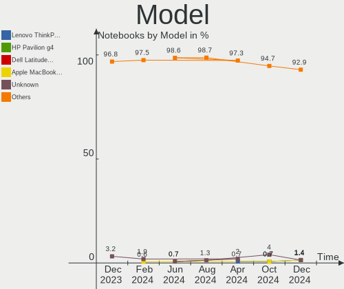
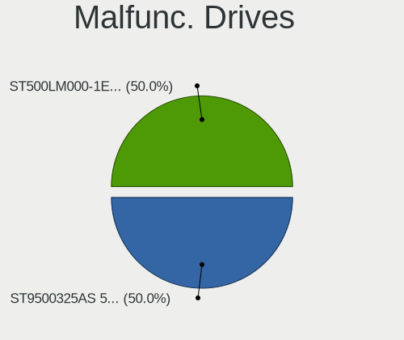
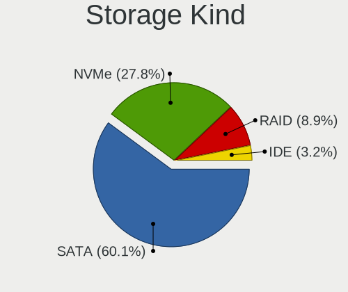
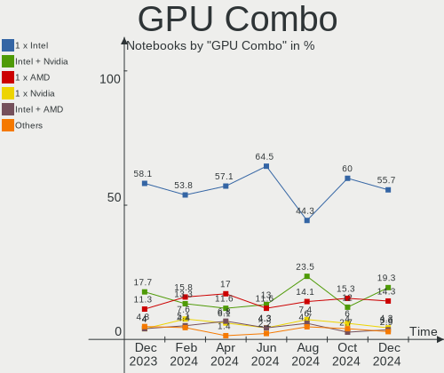
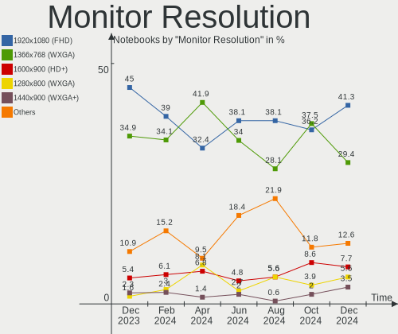
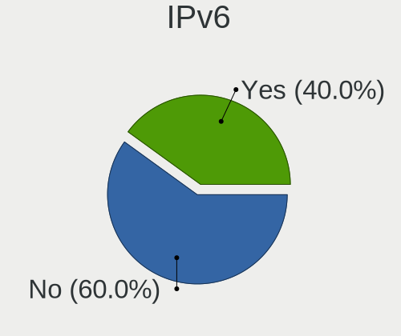

Zorin Hardware Trends (Notebooks)
---------------------------------

A project to identify most popular hardware characteristics and track their change
over time based on data collected by Zorin users at https://Linux-Hardware.org.

Anyone can contribute to this report by the [hw-probe](https://github.com/linuxhw/hw-probe) tool:

    sudo -E hw-probe -all -upload

This report is for one last month. Overall report since the beginning of time: [TestCoverage](https://github.com/linuxhw/TestCoverage)

Period: Apr, 2022.

Contents
--------

* [ System ](#system)
  - [ OS                       ](#os)
  - [ OS Family                ](#os-family)
  - [ Kernel                   ](#kernel)
  - [ Kernel Family            ](#kernel-family)
  - [ Kernel Major Ver.        ](#kernel-major-ver)
  - [ Arch                     ](#arch)
  - [ DE                       ](#de)
  - [ Display Server           ](#display-server)
  - [ Display Manager          ](#display-manager)
  - [ OS Lang                  ](#os-lang)
  - [ Boot Mode                ](#boot-mode)
  - [ Filesystem               ](#filesystem)
  - [ Part. scheme             ](#part-scheme)
  - [ Dual Boot with Linux/BSD ](#dual-boot-with-linuxbsd)
  - [ Dual Boot (Win)          ](#dual-boot-win)

* [ Board ](#board)
  - [ Vendor                   ](#vendor)
  - [ Model                    ](#model)
  - [ Model Family             ](#model-family)
  - [ MFG Year                 ](#mfg-year)
  - [ Form Factor              ](#form-factor)
  - [ Secure Boot              ](#secure-boot)
  - [ Coreboot                 ](#coreboot)
  - [ RAM Size                 ](#ram-size)
  - [ RAM Used                 ](#ram-used)
  - [ Total Drives             ](#total-drives)
  - [ Has CD-ROM               ](#has-cd-rom)
  - [ Has Ethernet             ](#has-ethernet)
  - [ Has WiFi                 ](#has-wifi)
  - [ Has Bluetooth            ](#has-bluetooth)

* [ Location ](#location)
  - [ Country                  ](#country)
  - [ City                     ](#city)

* [ Drives ](#drives)
  - [ Drive Vendor             ](#drive-vendor)
  - [ Drive Model              ](#drive-model)
  - [ HDD Vendor               ](#hdd-vendor)
  - [ SSD Vendor               ](#ssd-vendor)
  - [ Drive Kind               ](#drive-kind)
  - [ Drive Connector          ](#drive-connector)
  - [ Drive Size               ](#drive-size)
  - [ Space Total              ](#space-total)
  - [ Space Used               ](#space-used)
  - [ Malfunc. Drives          ](#malfunc-drives)
  - [ Malfunc. Drive Vendor    ](#malfunc-drive-vendor)
  - [ Malfunc. HDD Vendor      ](#malfunc-hdd-vendor)
  - [ Malfunc. Drive Kind      ](#malfunc-drive-kind)
  - [ Failed Drives            ](#failed-drives)
  - [ Failed Drive Vendor      ](#failed-drive-vendor)
  - [ Drive Status             ](#drive-status)

* [ Storage controller ](#storage-controller)
  - [ Storage Vendor           ](#storage-vendor)
  - [ Storage Model            ](#storage-model)
  - [ Storage Kind             ](#storage-kind)

* [ Processor ](#processor)
  - [ CPU Vendor               ](#cpu-vendor)
  - [ CPU Model                ](#cpu-model)
  - [ CPU Model Family         ](#cpu-model-family)
  - [ CPU Cores                ](#cpu-cores)
  - [ CPU Sockets              ](#cpu-sockets)
  - [ CPU Threads              ](#cpu-threads)
  - [ CPU Op-Modes             ](#cpu-op-modes)
  - [ CPU Microcode            ](#cpu-microcode)
  - [ CPU Microarch            ](#cpu-microarch)

* [ Graphics ](#graphics)
  - [ GPU Vendor               ](#gpu-vendor)
  - [ GPU Model                ](#gpu-model)
  - [ GPU Combo                ](#gpu-combo)
  - [ GPU Driver               ](#gpu-driver)
  - [ GPU Memory               ](#gpu-memory)

* [ Monitor ](#monitor)
  - [ Monitor Vendor           ](#monitor-vendor)
  - [ Monitor Model            ](#monitor-model)
  - [ Monitor Resolution       ](#monitor-resolution)
  - [ Monitor Diagonal         ](#monitor-diagonal)
  - [ Monitor Width            ](#monitor-width)
  - [ Aspect Ratio             ](#aspect-ratio)
  - [ Monitor Area             ](#monitor-area)
  - [ Pixel Density            ](#pixel-density)
  - [ Multiple Monitors        ](#multiple-monitors)

* [ Network ](#network)
  - [ Net Controller Vendor    ](#net-controller-vendor)
  - [ Net Controller Model     ](#net-controller-model)
  - [ Wireless Vendor          ](#wireless-vendor)
  - [ Wireless Model           ](#wireless-model)
  - [ Ethernet Vendor          ](#ethernet-vendor)
  - [ Ethernet Model           ](#ethernet-model)
  - [ Net Controller Kind      ](#net-controller-kind)
  - [ Used Controller          ](#used-controller)
  - [ NICs                     ](#nics)
  - [ IPv6                     ](#ipv6)

* [ Bluetooth ](#bluetooth)
  - [ Bluetooth Vendor         ](#bluetooth-vendor)
  - [ Bluetooth Model          ](#bluetooth-model)

* [ Sound ](#sound)
  - [ Sound Vendor             ](#sound-vendor)
  - [ Sound Model              ](#sound-model)

* [ Memory ](#memory)
  - [ Memory Vendor            ](#memory-vendor)
  - [ Memory Model             ](#memory-model)
  - [ Memory Kind              ](#memory-kind)
  - [ Memory Form Factor       ](#memory-form-factor)
  - [ Memory Size              ](#memory-size)
  - [ Memory Speed             ](#memory-speed)

* [ Printers & scanners ](#printers--scanners)
  - [ Printer Vendor           ](#printer-vendor)
  - [ Printer Model            ](#printer-model)
  - [ Scanner Vendor           ](#scanner-vendor)
  - [ Scanner Model            ](#scanner-model)

* [ Camera ](#camera)
  - [ Camera Vendor            ](#camera-vendor)
  - [ Camera Model             ](#camera-model)

* [ Security ](#security)
  - [ Fingerprint Vendor       ](#fingerprint-vendor)
  - [ Fingerprint Model        ](#fingerprint-model)
  - [ Chipcard Vendor          ](#chipcard-vendor)
  - [ Chipcard Model           ](#chipcard-model)

* [ Unsupported ](#unsupported)
  - [ Unsupported Devices      ](#unsupported-devices)
  - [ Unsupported Device Types ](#unsupported-device-types)

System
------

OS
--

Installed operating systems

| Name     | Notebooks | Percent |
|----------|-----------|---------|
| Zorin 16 | 79        | 89.77%  |
| Zorin 15 | 9         | 10.23%  |

OS Family
---------

OS without a version

| Name  | Notebooks | Percent |
|-------|-----------|---------|
| Zorin | 88        | 100%    |

Kernel
------

Version of the Linux kernel

| Version           | Notebooks | Percent |
|-------------------|-----------|---------|
| 5.13.0-39-generic | 51        | 57.95%  |
| 5.13.0-40-generic | 17        | 19.32%  |
| 5.13.0-30-generic | 5         | 5.68%   |
| 5.4.0-107-generic | 3         | 3.41%   |
| 5.4.0-109-generic | 2         | 2.27%   |
| 5.13.0-35-generic | 2         | 2.27%   |
| 5.4.0-90-generic  | 1         | 1.14%   |
| 5.4.0-104-generic | 1         | 1.14%   |
| 5.4.0-100-generic | 1         | 1.14%   |
| 5.14.0-1033-oem   | 1         | 1.14%   |
| 5.13.0-37-generic | 1         | 1.14%   |
| 5.11.0-41-generic | 1         | 1.14%   |
| 5.11.0-38-generic | 1         | 1.14%   |
| 4.18.0-21-generic | 1         | 1.14%   |

Kernel Family
-------------

Linux kernel without a distro release

| Version | Notebooks | Percent |
|---------|-----------|---------|
| 5.13.0  | 76        | 86.36%  |
| 5.4.0   | 8         | 9.09%   |
| 5.11.0  | 2         | 2.27%   |
| 5.14.0  | 1         | 1.14%   |
| 4.18.0  | 1         | 1.14%   |

Kernel Major Ver.
-----------------

Linux kernel major version

| Version | Notebooks | Percent |
|---------|-----------|---------|
| 5.13    | 76        | 86.36%  |
| 5.4     | 8         | 9.09%   |
| 5.11    | 2         | 2.27%   |
| 5.14    | 1         | 1.14%   |
| 4.18    | 1         | 1.14%   |

Arch
----

OS architecture (x86_64, i586, etc.)

| Name   | Notebooks | Percent |
|--------|-----------|---------|
| x86_64 | 83        | 94.32%  |
| i686   | 5         | 5.68%   |

DE
--

Desktop Environment

| Name       | Notebooks | Percent |
|------------|-----------|---------|
| GNOME      | 67        | 76.14%  |
| XFCE       | 19        | 21.59%  |
| X-Cinnamon | 1         | 1.14%   |
| Unknown    | 1         | 1.14%   |

Display Server
--------------

X11 or Wayland

| Name    | Notebooks | Percent |
|---------|-----------|---------|
| X11     | 87        | 98.86%  |
| Wayland | 1         | 1.14%   |

Display Manager
---------------

SDDM, LightDM, etc.

| Name    | Notebooks | Percent |
|---------|-----------|---------|
| Unknown | 66        | 75%     |
| LightDM | 10        | 11.36%  |
| GDM     | 8         | 9.09%   |
| GDM3    | 4         | 4.55%   |

OS Lang
-------

Language

| Lang  | Notebooks | Percent |
|-------|-----------|---------|
| en_US | 30        | 34.09%  |
| de_DE | 8         | 9.09%   |
| pt_BR | 7         | 7.95%   |
| en_GB | 7         | 7.95%   |
| es_ES | 6         | 6.82%   |
| nl_NL | 3         | 3.41%   |
| sv_SE | 2         | 2.27%   |
| ru_RU | 2         | 2.27%   |
| pt_PT | 2         | 2.27%   |
| it_IT | 2         | 2.27%   |
| fr_BE | 2         | 2.27%   |
| es_MX | 2         | 2.27%   |
| en_CA | 2         | 2.27%   |
| sl_SI | 1         | 1.14%   |
| nl_BE | 1         | 1.14%   |
| lt_LT | 1         | 1.14%   |
| fr_CA | 1         | 1.14%   |
| es_CO | 1         | 1.14%   |
| es_BO | 1         | 1.14%   |
| en_ZA | 1         | 1.14%   |
| en_PH | 1         | 1.14%   |
| en_IN | 1         | 1.14%   |
| en_AU | 1         | 1.14%   |
| de_AT | 1         | 1.14%   |
| cs_CZ | 1         | 1.14%   |
| ar_EG | 1         | 1.14%   |

Boot Mode
---------

EFI or BIOS

| Mode | Notebooks | Percent |
|------|-----------|---------|
| EFI  | 47        | 53.41%  |
| BIOS | 41        | 46.59%  |

Filesystem
----------

Type of filesystem

| Type    | Notebooks | Percent |
|---------|-----------|---------|
| Ext4    | 86        | 97.73%  |
| Overlay | 2         | 2.27%   |

Part. scheme
------------

Scheme of partitioning

| Type    | Notebooks | Percent |
|---------|-----------|---------|
| Unknown | 75        | 85.23%  |
| GPT     | 11        | 12.5%   |
| MBR     | 2         | 2.27%   |

Dual Boot with Linux/BSD
------------------------

Hosting more than one Linux/BSD

| Dual boot | Notebooks | Percent |
|-----------|-----------|---------|
| No        | 87        | 98.86%  |
| Yes       | 1         | 1.14%   |

Dual Boot (Win)
---------------

Hosting Linux and Windows

| Dual boot | Notebooks | Percent |
|-----------|-----------|---------|
| No        | 83        | 94.32%  |
| Yes       | 5         | 5.68%   |

Board
-----

Vendor
------

Motherboard manufacturer

| Name                | Notebooks | Percent |
|---------------------|-----------|---------|
| Hewlett-Packard     | 22        | 25%     |
| Lenovo              | 13        | 14.77%  |
| Dell                | 12        | 13.64%  |
| ASUSTek Computer    | 12        | 13.64%  |
| Toshiba             | 9         | 10.23%  |
| Acer                | 5         | 5.68%   |
| Packard Bell        | 2         | 2.27%   |
| Samsung Electronics | 1         | 1.14%   |
| Razer               | 1         | 1.14%   |
| Notebook            | 1         | 1.14%   |
| Multilaser          | 1         | 1.14%   |
| Medion              | 1         | 1.14%   |
| Insignia            | 1         | 1.14%   |
| Google              | 1         | 1.14%   |
| Gateway             | 1         | 1.14%   |
| Fujitsu Siemens     | 1         | 1.14%   |
| Fujitsu             | 1         | 1.14%   |
| Framework           | 1         | 1.14%   |
| Apple               | 1         | 1.14%   |
| AMI                 | 1         | 1.14%   |

Model
-----

Motherboard model

| Name                                 | Notebooks | Percent |
|--------------------------------------|-----------|---------|
| HP Notebook                          | 4         | 4.55%   |
| HP Pavilion Notebook                 | 2         | 2.27%   |
| Toshiba Satellite Pro R50-B          | 1         | 1.14%   |
| Toshiba Satellite P50t-A             | 1         | 1.14%   |
| Toshiba Satellite L755               | 1         | 1.14%   |
| Toshiba Satellite E55-A              | 1         | 1.14%   |
| Toshiba Satellite C870-1C2           | 1         | 1.14%   |
| Toshiba Satellite C55-C              | 1         | 1.14%   |
| Toshiba Satellite C55-A-1J8          | 1         | 1.14%   |
| Toshiba Satellite A200               | 1         | 1.14%   |
| Toshiba BDB                          | 1         | 1.14%   |
| Samsung 550XCJ/550XCR                | 1         | 1.14%   |
| Razer Blade                          | 1         | 1.14%   |
| Packard Bell EasyNote TS11HR         | 1         | 1.14%   |
| Packard Bell EasyNote TN36           | 1         | 1.14%   |
| Notebook NJ50_70CU                   | 1         | 1.14%   |
| Multilaser PC121                     | 1         | 1.14%   |
| Medion S6417 MD99651                 | 1         | 1.14%   |
| Lenovo Z40-70 20366                  | 1         | 1.14%   |
| Lenovo ThinkPad X220 4286A78         | 1         | 1.14%   |
| Lenovo ThinkPad T430 2349D53         | 1         | 1.14%   |
| Lenovo ThinkPad T430 23473B2         | 1         | 1.14%   |
| Lenovo ThinkPad R61 8933W4F          | 1         | 1.14%   |
| Lenovo ThinkPad L560 20F1001YGE      | 1         | 1.14%   |
| Lenovo ThinkPad L412 440332U         | 1         | 1.14%   |
| Lenovo ThinkPad E520 11433BU         | 1         | 1.14%   |
| Lenovo IdeaPad 330-15IKB 81FD        | 1         | 1.14%   |
| Lenovo IdeaPad 3 15IML05 81WB        | 1         | 1.14%   |
| Lenovo G40-80 80JE                   | 1         | 1.14%   |
| Lenovo Flex 2-15 20405               | 1         | 1.14%   |
| Lenovo B590 37612LG                  | 1         | 1.14%   |
| Insignia NS-P89W6100                 | 1         | 1.14%   |
| HP ZBook 15 G3                       | 1         | 1.14%   |
| HP ProBook 4530s                     | 1         | 1.14%   |
| HP Presario C500 (GF852EA#ABH)       | 1         | 1.14%   |
| HP Pavilion dv6000 (GA443UA#ABA)     | 1         | 1.14%   |
| HP OMEN by Laptop 17-cb0xxx          | 1         | 1.14%   |
| HP Laptop 15s-du2xxx                 | 1         | 1.14%   |
| HP Laptop 15-db0xxx                  | 1         | 1.14%   |
| HP Laptop 15-bw0xx                   | 1         | 1.14%   |
| HP Laptop 14-cm0xxx                  | 1         | 1.14%   |
| HP EliteBook 8760w                   | 1         | 1.14%   |
| HP EliteBook 840 G7 Notebook PC      | 1         | 1.14%   |
| HP Compaq Presario CQ70              | 1         | 1.14%   |
| HP Compaq 6730b (NN204ET#ABH)        | 1         | 1.14%   |
| HP 255 G8 Notebook PC                | 1         | 1.14%   |
| HP 240 G3                            | 1         | 1.14%   |
| HP 15                                | 1         | 1.14%   |
| Google Candy                         | 1         | 1.14%   |
| Gateway NV59C                        | 1         | 1.14%   |
| Fujitsu Siemens ESPRIMO Mobile V5535 | 1         | 1.14%   |
| Fujitsu LIFEBOOK S760                | 1         | 1.14%   |
| Framework Laptop                     | 1         | 1.14%   |
| Dell Studio 1749                     | 1         | 1.14%   |
| Dell Latitude E6530                  | 1         | 1.14%   |
| Dell Latitude E6410                  | 1         | 1.14%   |
| Dell Latitude E5500                  | 1         | 1.14%   |
| Dell Latitude E5440                  | 1         | 1.14%   |
| Dell Latitude E5430 non-vPro         | 1         | 1.14%   |
| Dell Latitude 3440                   | 1         | 1.14%   |

Model Family
------------

Motherboard model prefix

| Name                    | Notebooks | Percent |
|-------------------------|-----------|---------|
| Toshiba Satellite       | 8         | 9.09%   |
| Lenovo ThinkPad         | 7         | 7.95%   |
| Dell Latitude           | 6         | 6.82%   |
| Dell Inspiron           | 5         | 5.68%   |
| HP Notebook             | 4         | 4.55%   |
| HP Laptop               | 4         | 4.55%   |
| HP Pavilion             | 3         | 3.41%   |
| Acer Aspire             | 3         | 3.41%   |
| Packard Bell EasyNote   | 2         | 2.27%   |
| Lenovo IdeaPad          | 2         | 2.27%   |
| HP EliteBook            | 2         | 2.27%   |
| HP Compaq               | 2         | 2.27%   |
| ASUS ROG                | 2         | 2.27%   |
| Toshiba BDB             | 1         | 1.14%   |
| Samsung 550XCJ          | 1         | 1.14%   |
| Razer Blade             | 1         | 1.14%   |
| Notebook NJ50           | 1         | 1.14%   |
| Multilaser PC121        | 1         | 1.14%   |
| Medion S6417            | 1         | 1.14%   |
| Lenovo Z40-70           | 1         | 1.14%   |
| Lenovo G40-80           | 1         | 1.14%   |
| Lenovo Flex             | 1         | 1.14%   |
| Lenovo B590             | 1         | 1.14%   |
| Insignia NS-P89W6100    | 1         | 1.14%   |
| HP ZBook                | 1         | 1.14%   |
| HP ProBook              | 1         | 1.14%   |
| HP Presario             | 1         | 1.14%   |
| HP OMEN                 | 1         | 1.14%   |
| HP 255                  | 1         | 1.14%   |
| HP 240                  | 1         | 1.14%   |
| HP 15                   | 1         | 1.14%   |
| Google Candy            | 1         | 1.14%   |
| Gateway NV59C           | 1         | 1.14%   |
| Fujitsu Siemens ESPRIMO | 1         | 1.14%   |
| Fujitsu LIFEBOOK        | 1         | 1.14%   |
| Framework Laptop        | 1         | 1.14%   |
| Dell Studio             | 1         | 1.14%   |
| ASUS X756UQ             | 1         | 1.14%   |
| ASUS X55A               | 1         | 1.14%   |
| ASUS X540LJ             | 1         | 1.14%   |
| ASUS X411UN             | 1         | 1.14%   |
| ASUS X401A1             | 1         | 1.14%   |
| ASUS X102BA             | 1         | 1.14%   |
| ASUS VivoBook           | 1         | 1.14%   |
| ASUS T100TA             | 1         | 1.14%   |
| ASUS K73BR              | 1         | 1.14%   |
| ASUS K55A               | 1         | 1.14%   |
| Apple MacBookAir5       | 1         | 1.14%   |
| AMI Intel               | 1         | 1.14%   |
| Acer V5-171             | 1         | 1.14%   |
| Acer Nitro              | 1         | 1.14%   |

MFG Year
--------

Motherboard manufacture year

| Year | Notebooks | Percent |
|------|-----------|---------|
| 2012 | 9         | 10.23%  |
| 2011 | 9         | 10.23%  |
| 2015 | 8         | 9.09%   |
| 2013 | 8         | 9.09%   |
| 2019 | 7         | 7.95%   |
| 2014 | 7         | 7.95%   |
| 2021 | 6         | 6.82%   |
| 2020 | 6         | 6.82%   |
| 2018 | 6         | 6.82%   |
| 2010 | 6         | 6.82%   |
| 2008 | 5         | 5.68%   |
| 2007 | 4         | 4.55%   |
| 2016 | 3         | 3.41%   |
| 2017 | 2         | 2.27%   |
| 2009 | 1         | 1.14%   |
| 2006 | 1         | 1.14%   |

Form Factor
-----------

Physical design of the computer

| Name     | Notebooks | Percent |
|----------|-----------|---------|
| Notebook | 88        | 100%    |

Secure Boot
-----------

Enabled or disabled

| State    | Notebooks | Percent |
|----------|-----------|---------|
| Disabled | 76        | 86.36%  |
| Enabled  | 12        | 13.64%  |

Coreboot
--------

Have coreboot on board

| Used | Notebooks | Percent |
|------|-----------|---------|
| No   | 87        | 98.86%  |
| Yes  | 1         | 1.14%   |

RAM Size
--------

Total RAM memory

| Size in GB  | Notebooks | Percent |
|-------------|-----------|---------|
| 3.01-4.0    | 29        | 32.95%  |
| 4.01-8.0    | 19        | 21.59%  |
| 8.01-16.0   | 15        | 17.05%  |
| 16.01-24.0  | 10        | 11.36%  |
| 1.01-2.0    | 6         | 6.82%   |
| 2.01-3.0    | 3         | 3.41%   |
| 32.01-64.0  | 2         | 2.27%   |
| 0.51-1.0    | 2         | 2.27%   |
| 24.01-32.0  | 1         | 1.14%   |
| 64.01-256.0 | 1         | 1.14%   |

RAM Used
--------

Used RAM memory

| Used GB   | Notebooks | Percent |
|-----------|-----------|---------|
| 1.01-2.0  | 33        | 37.5%   |
| 2.01-3.0  | 25        | 28.41%  |
| 3.01-4.0  | 11        | 12.5%   |
| 4.01-8.0  | 10        | 11.36%  |
| 0.51-1.0  | 8         | 9.09%   |
| 8.01-16.0 | 1         | 1.14%   |

Total Drives
------------

Number of drives on board

| Drives | Notebooks | Percent |
|--------|-----------|---------|
| 1      | 61        | 69.32%  |
| 2      | 23        | 26.14%  |
| 3      | 2         | 2.27%   |
| 0      | 2         | 2.27%   |

Has CD-ROM
----------

Has CD-ROM on board

| Presented | Notebooks | Percent |
|-----------|-----------|---------|
| Yes       | 51        | 57.95%  |
| No        | 37        | 42.05%  |

Has Ethernet
------------

Has Ethernet on board

| Presented | Notebooks | Percent |
|-----------|-----------|---------|
| Yes       | 76        | 86.36%  |
| No        | 12        | 13.64%  |

Has WiFi
--------

Has WiFi module

| Presented | Notebooks | Percent |
|-----------|-----------|---------|
| Yes       | 85        | 96.59%  |
| No        | 3         | 3.41%   |

Has Bluetooth
-------------

Has Bluetooth module

| Presented | Notebooks | Percent |
|-----------|-----------|---------|
| Yes       | 58        | 65.91%  |
| No        | 30        | 34.09%  |

Location
--------

Country
-------

Geographic location (country)

| Country      | Notebooks | Percent |
|--------------|-----------|---------|
| USA          | 19        | 21.59%  |
| Germany      | 9         | 10.23%  |
| Brazil       | 8         | 9.09%   |
| UK           | 7         | 7.95%   |
| Spain        | 4         | 4.55%   |
| Romania      | 3         | 3.41%   |
| Netherlands  | 3         | 3.41%   |
| Belgium      | 3         | 3.41%   |
| Sweden       | 2         | 2.27%   |
| Russia       | 2         | 2.27%   |
| Portugal     | 2         | 2.27%   |
| Mexico       | 2         | 2.27%   |
| Italy        | 2         | 2.27%   |
| India        | 2         | 2.27%   |
| Canada       | 2         | 2.27%   |
| Thailand     | 1         | 1.14%   |
| Switzerland  | 1         | 1.14%   |
| South Africa | 1         | 1.14%   |
| Slovenia     | 1         | 1.14%   |
| Panama       | 1         | 1.14%   |
| Norway       | 1         | 1.14%   |
| Morocco      | 1         | 1.14%   |
| Mauritius    | 1         | 1.14%   |
| Lithuania    | 1         | 1.14%   |
| Japan        | 1         | 1.14%   |
| Egypt        | 1         | 1.14%   |
| Czechia      | 1         | 1.14%   |
| Croatia      | 1         | 1.14%   |
| Colombia     | 1         | 1.14%   |
| Bolivia      | 1         | 1.14%   |
| Austria      | 1         | 1.14%   |
| Australia    | 1         | 1.14%   |
| Argentina    | 1         | 1.14%   |

City
----

Geographic location (city)

| City                 | Notebooks | Percent |
|----------------------|-----------|---------|
| Madrid               | 2         | 2.27%   |
| Harrow               | 2         | 2.27%   |
| Zagreb               | 1         | 1.14%   |
| Woking               | 1         | 1.14%   |
| Williston            | 1         | 1.14%   |
| Walled Lake          | 1         | 1.14%   |
| Volta Redonda        | 1         | 1.14%   |
| Vila Nova de Gaia    | 1         | 1.14%   |
| Vienna               | 1         | 1.14%   |
| Vaestra Froelunda    | 1         | 1.14%   |
| Ubatuba              | 1         | 1.14%   |
| Tokyo                | 1         | 1.14%   |
| Temple               | 1         | 1.14%   |
| Sydney               | 1         | 1.14%   |
| Sucre                | 1         | 1.14%   |
| Stuttgart            | 1         | 1.14%   |
| Stony Plain          | 1         | 1.14%   |
| Stavanger            | 1         | 1.14%   |
| Skultuna             | 1         | 1.14%   |
| Seguin               | 1         | 1.14%   |
| Schenectady          | 1         | 1.14%   |
| Sao Paulo            | 1         | 1.14%   |
| Santo André         | 1         | 1.14%   |
| Santa Cruz           | 1         | 1.14%   |
| Salt Lake City       | 1         | 1.14%   |
| Rome                 | 1         | 1.14%   |
| Rimouski             | 1         | 1.14%   |
| Reutlingen           | 1         | 1.14%   |
| Queretaro            | 1         | 1.14%   |
| Quatre Bornes        | 1         | 1.14%   |
| Prague               | 1         | 1.14%   |
| Porto Velho          | 1         | 1.14%   |
| Polokwane            | 1         | 1.14%   |
| Poggio Berni         | 1         | 1.14%   |
| Picos                | 1         | 1.14%   |
| Panevezys            | 1         | 1.14%   |
| Panama City          | 1         | 1.14%   |
| Palma                | 1         | 1.14%   |
| Oujda                | 1         | 1.14%   |
| Olney                | 1         | 1.14%   |
| Nuremberg            | 1         | 1.14%   |
| Nieuwpoort           | 1         | 1.14%   |
| New Port Richey      | 1         | 1.14%   |
| New Fairfield        | 1         | 1.14%   |
| Neckargemund         | 1         | 1.14%   |
| Munich               | 1         | 1.14%   |
| Moscow               | 1         | 1.14%   |
| Molenbeek-Saint-Jean | 1         | 1.14%   |
| Meiningen            | 1         | 1.14%   |
| Mari                 | 1         | 1.14%   |
| Lüneburg            | 1         | 1.14%   |
| Lucerne              | 1         | 1.14%   |
| Lomas de Zamora      | 1         | 1.14%   |
| Ljubljana            | 1         | 1.14%   |
| Lincoln              | 1         | 1.14%   |
| Limeira              | 1         | 1.14%   |
| Leidschendam         | 1         | 1.14%   |
| Lanjaron             | 1         | 1.14%   |
| Indore               | 1         | 1.14%   |
| Indianapolis         | 1         | 1.14%   |

Drives
------

Drive Vendor
------------

Hard drive vendors

| Vendor              | Notebooks | Drives | Percent |
|---------------------|-----------|--------|---------|
| Seagate             | 18        | 20     | 17.65%  |
| WDC                 | 17        | 17     | 16.67%  |
| Toshiba             | 9         | 9      | 8.82%   |
| Unknown             | 7         | 10     | 6.86%   |
| Samsung Electronics | 7         | 9      | 6.86%   |
| Kingston            | 6         | 6      | 5.88%   |
| Hitachi             | 6         | 6      | 5.88%   |
| Sandisk             | 5         | 5      | 4.9%    |
| HGST                | 4         | 4      | 3.92%   |
| Micron Technology   | 3         | 3      | 2.94%   |
| Lite-On             | 2         | 2      | 1.96%   |
| Crucial             | 2         | 2      | 1.96%   |
| China               | 2         | 2      | 1.96%   |
| SK Hynix            | 1         | 1      | 0.98%   |
| S3+                 | 1         | 1      | 0.98%   |
| PNY                 | 1         | 1      | 0.98%   |
| Netac               | 1         | 1      | 0.98%   |
| LITEONIT            | 1         | 1      | 0.98%   |
| LITEON              | 1         | 1      | 0.98%   |
| Lexar               | 1         | 1      | 0.98%   |
| Leven               | 1         | 1      | 0.98%   |
| KIOXIA              | 1         | 1      | 0.98%   |
| Intel               | 1         | 1      | 0.98%   |
| Fujitsu             | 1         | 1      | 0.98%   |
| Dell                | 1         | 1      | 0.98%   |
| BHT                 | 1         | 1      | 0.98%   |
| ASMT                | 1         | 1      | 0.98%   |

Drive Model
-----------

Hard drive models

| Model                                | Notebooks | Percent |
|--------------------------------------|-----------|---------|
| Kingston SA400S37240G 240GB SSD      | 4         | 3.7%    |
| Unknown MMC Card  32GB               | 2         | 1.85%   |
| Unknown MMC Card  16GB               | 2         | 1.85%   |
| Toshiba MQ01ABF050 500GB             | 2         | 1.85%   |
| Seagate ST500LM000-SSHD-8GB          | 2         | 1.85%   |
| Seagate ST1000LM035-1RK172 1TB       | 2         | 1.85%   |
| Seagate Expansion+ 2TB               | 2         | 1.85%   |
| Samsung SSD 850 EVO 500GB            | 2         | 1.85%   |
| Samsung NVMe SSD Drive 512GB         | 2         | 1.85%   |
| Hitachi HTS545050A7E380 500GB        | 2         | 1.85%   |
| WDC WDS240G2G0A-00JH30 240GB SSD     | 1         | 0.93%   |
| WDC WDS100T2B0B-00YS70 1TB SSD       | 1         | 0.93%   |
| WDC WD5000LPVX-08V0TT2 500GB         | 1         | 0.93%   |
| WDC WD5000LPVT-22G33T0 500GB         | 1         | 0.93%   |
| WDC WD5000LPCX-60VHAT1 500GB         | 1         | 0.93%   |
| WDC WD5000BUCT-57LS5Y1 500GB         | 1         | 0.93%   |
| WDC WD5000BPVT-75HXZT1 500GB         | 1         | 0.93%   |
| WDC WD5000BPVT-00A1YT0 500GB         | 1         | 0.93%   |
| WDC WD3200BEKT-08PVMT1 320GB         | 1         | 0.93%   |
| WDC WD20SPZX-08UA7 2TB               | 1         | 0.93%   |
| WDC WD1200UE-22KVT0 120GB            | 1         | 0.93%   |
| WDC WD10SPZX-60Z10T0 1TB             | 1         | 0.93%   |
| WDC WD10SPZX-35Z10T0 1TB             | 1         | 0.93%   |
| WDC WD10SPZX-24Z10 1TB               | 1         | 0.93%   |
| WDC WD10SPZX-21Z10T0 1TB             | 1         | 0.93%   |
| WDC WD10SPZX-08Z10 1TB               | 1         | 0.93%   |
| WDC WD10JPVX-60JC3T0 1TB             | 1         | 0.93%   |
| Unknown SLD32G  32GB                 | 1         | 0.93%   |
| Unknown SD/MMC/MS PRO 16GB           | 1         | 0.93%   |
| Unknown N/A  32GB                    | 1         | 0.93%   |
| Unknown MMC Card  64GB               | 1         | 0.93%   |
| Unknown MMC Card  128GB              | 1         | 0.93%   |
| Toshiba THNSNJ256GCST 256GB SSD      | 1         | 0.93%   |
| Toshiba MQ01ABD100 1TB               | 1         | 0.93%   |
| Toshiba MQ01ABD075 752GB             | 1         | 0.93%   |
| Toshiba MK5056GSY 500GB              | 1         | 0.93%   |
| Toshiba MK3276GSX 320GB              | 1         | 0.93%   |
| Toshiba MK3263GSX 320GB              | 1         | 0.93%   |
| Toshiba HDWL110 1TB                  | 1         | 0.93%   |
| SK Hynix NVMe SSD Drive 256GB        | 1         | 0.93%   |
| Seagate ST9500420AS 500GB            | 1         | 0.93%   |
| Seagate ST9500325AS 500GB            | 1         | 0.93%   |
| Seagate ST9250315AS 250GB            | 1         | 0.93%   |
| Seagate ST500LT012-1DG142 500GB      | 1         | 0.93%   |
| Seagate ST500LM000-1EJ162-SSHD 500GB | 1         | 0.93%   |
| Seagate ST500LM000-1EJ162 500GB      | 1         | 0.93%   |
| Seagate ST320LT020-9YG142 320GB      | 1         | 0.93%   |
| Seagate ST2000LX001-1RG174 2TB       | 1         | 0.93%   |
| Seagate ST2000LM015-2E8174 2TB       | 1         | 0.93%   |
| Seagate ST2000LM003 HN-M201RAD 2TB   | 1         | 0.93%   |
| Seagate ST1000VT001-1RE172 1TB       | 1         | 0.93%   |
| Seagate ST1000LX015-1U7172 1TB       | 1         | 0.93%   |
| Seagate ST1000LM024 HN-M101MBB 1TB   | 1         | 0.93%   |
| Seagate Backup+ Hub BK 4TB           | 1         | 0.93%   |
| SanDisk SSD PLUS 1000GB              | 1         | 0.93%   |
| SanDisk SDSSDH3512G 512GB            | 1         | 0.93%   |
| SanDisk SDSSDH3 1T00 1TB             | 1         | 0.93%   |
| Sandisk NVMe SSD Drive 512GB         | 1         | 0.93%   |
| Sandisk NVMe SSD Drive 256GB         | 1         | 0.93%   |
| Samsung SSD 980 1TB                  | 1         | 0.93%   |

HDD Vendor
----------

Hard disk drive vendors

| Vendor  | Notebooks | Drives | Percent |
|---------|-----------|--------|---------|
| Seagate | 18        | 20     | 33.33%  |
| WDC     | 15        | 15     | 27.78%  |
| Toshiba | 8         | 8      | 14.81%  |
| Hitachi | 6         | 6      | 11.11%  |
| HGST    | 4         | 4      | 7.41%   |
| Unknown | 1         | 1      | 1.85%   |
| Fujitsu | 1         | 1      | 1.85%   |
| ASMT    | 1         | 1      | 1.85%   |

SSD Vendor
----------

Solid state drive vendors

| Vendor              | Notebooks | Drives | Percent |
|---------------------|-----------|--------|---------|
| Kingston            | 6         | 6      | 19.35%  |
| SanDisk             | 3         | 3      | 9.68%   |
| Samsung Electronics | 3         | 4      | 9.68%   |
| WDC                 | 2         | 2      | 6.45%   |
| Micron Technology   | 2         | 2      | 6.45%   |
| Crucial             | 2         | 2      | 6.45%   |
| China               | 2         | 2      | 6.45%   |
| Toshiba             | 1         | 1      | 3.23%   |
| S3+                 | 1         | 1      | 3.23%   |
| PNY                 | 1         | 1      | 3.23%   |
| Netac               | 1         | 1      | 3.23%   |
| LITEONIT            | 1         | 1      | 3.23%   |
| LITEON              | 1         | 1      | 3.23%   |
| Lite-On             | 1         | 1      | 3.23%   |
| Leven               | 1         | 1      | 3.23%   |
| Intel               | 1         | 1      | 3.23%   |
| Dell                | 1         | 1      | 3.23%   |
| BHT                 | 1         | 1      | 3.23%   |

Drive Kind
----------

HDD or SSD

| Kind    | Notebooks | Drives | Percent |
|---------|-----------|--------|---------|
| HDD     | 53        | 56     | 52.48%  |
| SSD     | 31        | 32     | 30.69%  |
| NVMe    | 10        | 11     | 9.9%    |
| MMC     | 6         | 9      | 5.94%   |
| Unknown | 1         | 1      | 0.99%   |

Drive Connector
---------------

SATA, SAS, NVMe, etc.

| Type | Notebooks | Drives | Percent |
|------|-----------|--------|---------|
| SATA | 77        | 83     | 78.57%  |
| NVMe | 10        | 11     | 10.2%   |
| MMC  | 6         | 9      | 6.12%   |
| SAS  | 5         | 6      | 5.1%    |

Drive Size
----------

Size of hard drive

| Size in TB | Notebooks | Drives | Percent |
|------------|-----------|--------|---------|
| 0.01-0.5   | 55        | 57     | 64.71%  |
| 0.51-1.0   | 23        | 24     | 27.06%  |
| 1.01-2.0   | 6         | 6      | 7.06%   |
| 3.01-4.0   | 1         | 1      | 1.18%   |

Space Total
-----------

Amount of disk space available on the file system

| Size in GB     | Notebooks | Percent |
|----------------|-----------|---------|
| 101-250        | 26        | 29.55%  |
| 251-500        | 21        | 23.86%  |
| 501-1000       | 15        | 17.05%  |
| 21-50          | 8         | 9.09%   |
| 51-100         | 7         | 7.95%   |
| 1001-2000      | 4         | 4.55%   |
| More than 3000 | 3         | 3.41%   |
| 2001-3000      | 2         | 2.27%   |
| 1-20           | 2         | 2.27%   |

Space Used
----------

Amount of used disk space

| Used GB   | Notebooks | Percent |
|-----------|-----------|---------|
| 1-20      | 34        | 38.64%  |
| 21-50     | 22        | 25%     |
| 101-250   | 13        | 14.77%  |
| 51-100    | 10        | 11.36%  |
| 251-500   | 6         | 6.82%   |
| 501-1000  | 2         | 2.27%   |
| 2001-3000 | 1         | 1.14%   |

Malfunc. Drives
---------------

Drive models with a malfunction

| Model                       | Notebooks | Drives | Percent |
|-----------------------------|-----------|--------|---------|
| Toshiba MQ01ABD075 752GB    | 1         | 1      | 50%     |
| Seagate ST500LM000-SSHD-8GB | 1         | 1      | 50%     |

Malfunc. Drive Vendor
---------------------

Vendors of faulty drives

| Vendor  | Notebooks | Drives | Percent |
|---------|-----------|--------|---------|
| Toshiba | 1         | 1      | 50%     |
| Seagate | 1         | 1      | 50%     |

Malfunc. HDD Vendor
-------------------

Vendors of faulty HDD drives

| Vendor  | Notebooks | Drives | Percent |
|---------|-----------|--------|---------|
| Toshiba | 1         | 1      | 50%     |
| Seagate | 1         | 1      | 50%     |

Malfunc. Drive Kind
-------------------

Kinds of faulty drives

| Kind | Notebooks | Drives | Percent |
|------|-----------|--------|---------|
| HDD  | 2         | 2      | 100%    |

Failed Drives
-------------

Failed drive models

Zero info for selected period =(

Failed Drive Vendor
-------------------

Failed drive vendors

Zero info for selected period =(

Drive Status
------------

Number of failed and malfunc. drives

| Status   | Notebooks | Drives | Percent |
|----------|-----------|--------|---------|
| Detected | 75        | 97     | 86.21%  |
| Works    | 10        | 10     | 11.49%  |
| Malfunc  | 2         | 2      | 2.3%    |

Storage controller
------------------

Storage Vendor
--------------

Storage controller vendors

| Vendor                           | Notebooks | Percent |
|----------------------------------|-----------|---------|
| Intel                            | 67        | 74.44%  |
| AMD                              | 12        | 13.33%  |
| Samsung Electronics              | 3         | 3.33%   |
| Sandisk                          | 2         | 2.22%   |
| SK Hynix                         | 1         | 1.11%   |
| Silicon Integrated Systems [SiS] | 1         | 1.11%   |
| Nvidia                           | 1         | 1.11%   |
| Micron Technology                | 1         | 1.11%   |
| Lite-On Technology               | 1         | 1.11%   |
| KIOXIA                           | 1         | 1.11%   |

Storage Model
-------------

Storage controller models

| Model                                                                                  | Notebooks | Percent |
|----------------------------------------------------------------------------------------|-----------|---------|
| Intel 7 Series Chipset Family 6-port SATA Controller [AHCI mode]                       | 12        | 12.12%  |
| AMD FCH SATA Controller [AHCI mode]                                                    | 10        | 10.1%   |
| Intel 8 Series SATA Controller 1 [AHCI mode]                                           | 7         | 7.07%   |
| Intel Sunrise Point-LP SATA Controller [AHCI mode]                                     | 6         | 6.06%   |
| Intel 6 Series/C200 Series Chipset Family 6 port Mobile SATA AHCI Controller           | 6         | 6.06%   |
| Intel 82801 Mobile SATA Controller [RAID mode]                                         | 5         | 5.05%   |
| Intel 82801IBM/IEM (ICH9M/ICH9M-E) 4 port SATA Controller [AHCI mode]                  | 4         | 4.04%   |
| Intel Wildcat Point-LP SATA Controller [AHCI Mode]                                     | 3         | 3.03%   |
| Intel Comet Lake SATA AHCI Controller                                                  | 3         | 3.03%   |
| Intel 5 Series/3400 Series Chipset 4 port SATA AHCI Controller                         | 3         | 3.03%   |
| Samsung NVMe SSD Controller SM981/PM981/PM983                                          | 2         | 2.02%   |
| Intel Cannon Lake Mobile PCH SATA AHCI Controller                                      | 2         | 2.02%   |
| Intel Atom Processor E3800 Series SATA AHCI Controller                                 | 2         | 2.02%   |
| Intel 82801HM/HEM (ICH8M/ICH8M-E) SATA Controller [AHCI mode]                          | 2         | 2.02%   |
| Intel 82801HM/HEM (ICH8M/ICH8M-E) IDE Controller                                       | 2         | 2.02%   |
| Intel 8 Series/C220 Series Chipset Family 6-port SATA Controller 1 [AHCI mode]         | 2         | 2.02%   |
| SK Hynix BC511                                                                         | 1         | 1.01%   |
| Silicon Integrated Systems [SiS] SATA Controller / IDE mode                            | 1         | 1.01%   |
| Silicon Integrated Systems [SiS] 5513 IDE Controller                                   | 1         | 1.01%   |
| Sandisk WD Blue SN500 / PC SN520 NVMe SSD                                              | 1         | 1.01%   |
| Sandisk WD Black SN750 / PC SN730 NVMe SSD                                             | 1         | 1.01%   |
| Samsung NVMe SSD Controller 980                                                        | 1         | 1.01%   |
| Nvidia MCP51 Serial ATA Controller                                                     | 1         | 1.01%   |
| Nvidia MCP51 IDE                                                                       | 1         | 1.01%   |
| Micron Non-Volatile memory controller                                                  | 1         | 1.01%   |
| Lite-On Non-Volatile memory controller                                                 | 1         | 1.01%   |
| KIOXIA Non-Volatile memory controller                                                  | 1         | 1.01%   |
| Intel Volume Management Device NVMe RAID Controller                                    | 1         | 1.01%   |
| Intel Tiger Lake-LP SATA Controller [AHCI mode]                                        | 1         | 1.01%   |
| Intel Q170/Q150/B150/H170/H110/Z170/CM236 Chipset SATA Controller [AHCI Mode]          | 1         | 1.01%   |
| Intel Celeron/Pentium Silver Processor SATA Controller                                 | 1         | 1.01%   |
| Intel Atom/Celeron/Pentium Processor x5-E8000/J3xxx/N3xxx Series SATA Controller       | 1         | 1.01%   |
| Intel 82801IBM/IEM (ICH9M/ICH9M-E) 2 port SATA Controller [IDE mode]                   | 1         | 1.01%   |
| Intel 82801HM/HEM (ICH8M/ICH8M-E) SATA Controller [IDE mode]                           | 1         | 1.01%   |
| Intel 82801GBM/GHM (ICH7-M Family) SATA Controller [IDE mode]                          | 1         | 1.01%   |
| Intel 82801GBM/GHM (ICH7-M Family) SATA Controller [AHCI mode]                         | 1         | 1.01%   |
| Intel 82801G (ICH7 Family) IDE Controller                                              | 1         | 1.01%   |
| Intel 6 Series/C200 Series Chipset Family Mobile SATA Controller (IDE mode, ports 4-5) | 1         | 1.01%   |
| Intel 6 Series/C200 Series Chipset Family Mobile SATA Controller (IDE mode, ports 0-3) | 1         | 1.01%   |
| Intel 5 Series/3400 Series Chipset PT IDER Controller                                  | 1         | 1.01%   |
| Intel 5 Series/3400 Series Chipset 6 port SATA AHCI Controller                         | 1         | 1.01%   |
| AMD SB7x0/SB8x0/SB9x0 SATA Controller [IDE mode]                                       | 1         | 1.01%   |
| AMD SB7x0/SB8x0/SB9x0 SATA Controller [AHCI mode]                                      | 1         | 1.01%   |
| AMD SB7x0/SB8x0/SB9x0 IDE Controller                                                   | 1         | 1.01%   |

Storage Kind
------------

Kind of storage controller (IDE, SATA, NVMe, SAS, ...)

| Kind | Notebooks | Percent |
|------|-----------|---------|
| SATA | 70        | 72.92%  |
| IDE  | 11        | 11.46%  |
| NVMe | 9         | 9.38%   |
| RAID | 6         | 6.25%   |

Processor
---------

CPU Vendor
----------

Processor vendors

| Vendor | Notebooks | Percent |
|--------|-----------|---------|
| Intel  | 74        | 84.09%  |
| AMD    | 14        | 15.91%  |

CPU Model
---------

Processor models

| Model                                        | Notebooks | Percent |
|----------------------------------------------|-----------|---------|
| Intel Core i3-4005U CPU @ 1.70GHz            | 3         | 3.41%   |
| Intel Pentium CPU N3540 @ 2.16GHz            | 2         | 2.27%   |
| Intel Core i7-9750H CPU @ 2.60GHz            | 2         | 2.27%   |
| Intel Core i7-4700MQ CPU @ 2.40GHz           | 2         | 2.27%   |
| Intel Core i5-6200U CPU @ 2.30GHz            | 2         | 2.27%   |
| Intel Core i5-5200U CPU @ 2.20GHz            | 2         | 2.27%   |
| Intel Core i5-4210U CPU @ 1.70GHz            | 2         | 2.27%   |
| Intel Core i5-4200U CPU @ 1.60GHz            | 2         | 2.27%   |
| Intel Core i5-10210U CPU @ 1.60GHz           | 2         | 2.27%   |
| Intel Core i3-2310M CPU @ 2.10GHz            | 2         | 2.27%   |
| Intel Core 2 Duo CPU P8700 @ 2.53GHz         | 2         | 2.27%   |
| Intel 11th Gen Core i7-1165G7 @ 2.80GHz      | 2         | 2.27%   |
| AMD A6-9225 RADEON R4, 5 COMPUTE CORES 2C+3G | 2         | 2.27%   |
| AMD A6-5200 APU with Radeon HD Graphics      | 2         | 2.27%   |
| Intel Pentium Dual CPU T3400 @ 2.16GHz       | 1         | 1.14%   |
| Intel Pentium CPU B960 @ 2.20GHz             | 1         | 1.14%   |
| Intel Pentium CPU B940 @ 2.00GHz             | 1         | 1.14%   |
| Intel Pentium CPU 6405U @ 2.40GHz            | 1         | 1.14%   |
| Intel Genuine CPU T2050 @ 1.60GHz            | 1         | 1.14%   |
| Intel Genuine CPU T1600 @ 1.66GHz            | 1         | 1.14%   |
| Intel Core M-5Y31 CPU @ 0.90GHz              | 1         | 1.14%   |
| Intel Core i7-8750H CPU @ 2.20GHz            | 1         | 1.14%   |
| Intel Core i7-8550U CPU @ 1.80GHz            | 1         | 1.14%   |
| Intel Core i7-6820HQ CPU @ 2.70GHz           | 1         | 1.14%   |
| Intel Core i7-6500U CPU @ 2.50GHz            | 1         | 1.14%   |
| Intel Core i7-3667U CPU @ 2.00GHz            | 1         | 1.14%   |
| Intel Core i7-3630QM CPU @ 2.40GHz           | 1         | 1.14%   |
| Intel Core i7-3540M CPU @ 3.00GHz            | 1         | 1.14%   |
| Intel Core i7-3520M CPU @ 2.90GHz            | 1         | 1.14%   |
| Intel Core i7-2720QM CPU @ 2.20GHz           | 1         | 1.14%   |
| Intel Core i7-10610U CPU @ 1.80GHz           | 1         | 1.14%   |
| Intel Core i7 CPU M 640 @ 2.80GHz            | 1         | 1.14%   |
| Intel Core i5-3320M CPU @ 2.60GHz            | 1         | 1.14%   |
| Intel Core i5-2430M CPU @ 2.40GHz            | 1         | 1.14%   |
| Intel Core i5-2410M CPU @ 2.30GHz            | 1         | 1.14%   |
| Intel Core i5 CPU M 560 @ 2.67GHz            | 1         | 1.14%   |
| Intel Core i5 CPU M 460 @ 2.53GHz            | 1         | 1.14%   |
| Intel Core i3-7020U CPU @ 2.30GHz            | 1         | 1.14%   |
| Intel Core i3-6100U CPU @ 2.30GHz            | 1         | 1.14%   |
| Intel Core i3-4030U CPU @ 1.90GHz            | 1         | 1.14%   |
| Intel Core i3-3120M CPU @ 2.50GHz            | 1         | 1.14%   |
| Intel Core i3-3110M CPU @ 2.40GHz            | 1         | 1.14%   |
| Intel Core i3-2377M CPU @ 1.50GHz            | 1         | 1.14%   |
| Intel Core i3-2370M CPU @ 2.40GHz            | 1         | 1.14%   |
| Intel Core i3-2350M CPU @ 2.30GHz            | 1         | 1.14%   |
| Intel Core i3-10110U CPU @ 2.10GHz           | 1         | 1.14%   |
| Intel Core i3-1005G1 CPU @ 1.20GHz           | 1         | 1.14%   |
| Intel Core i3 CPU M 370 @ 2.40GHz            | 1         | 1.14%   |
| Intel Core i3 CPU M 350 @ 2.27GHz            | 1         | 1.14%   |
| Intel Core 2 Duo CPU T7500 @ 2.20GHz         | 1         | 1.14%   |
| Intel Core 2 Duo CPU T7250 @ 2.00GHz         | 1         | 1.14%   |
| Intel Core 2 Duo CPU T7100 @ 1.80GHz         | 1         | 1.14%   |
| Intel Core 2 Duo CPU T6600 @ 2.20GHz         | 1         | 1.14%   |
| Intel Celeron N4120 CPU @ 1.10GHz            | 1         | 1.14%   |
| Intel Celeron M CPU 440 @ 1.86GHz            | 1         | 1.14%   |
| Intel Celeron CPU N3050 @ 1.60GHz            | 1         | 1.14%   |
| Intel Celeron CPU N2840 @ 2.16GHz            | 1         | 1.14%   |
| Intel Celeron CPU B830 @ 1.80GHz             | 1         | 1.14%   |
| Intel Celeron CPU 530 @ 1.73GHz              | 1         | 1.14%   |
| Intel Celeron CPU 1000M @ 1.80GHz            | 1         | 1.14%   |

CPU Model Family
----------------

Processor model prefix

| Model                   | Notebooks | Percent |
|-------------------------|-----------|---------|
| Intel Core i3           | 17        | 19.32%  |
| Intel Core i7           | 15        | 17.05%  |
| Intel Core i5           | 15        | 17.05%  |
| Intel Core 2 Duo        | 6         | 6.82%   |
| Intel Celeron           | 6         | 6.82%   |
| Intel Pentium           | 5         | 5.68%   |
| AMD A6                  | 5         | 5.68%   |
| Intel Atom              | 3         | 3.41%   |
| Other                   | 2         | 2.27%   |
| Intel Genuine           | 2         | 2.27%   |
| AMD Ryzen 7             | 2         | 2.27%   |
| AMD A4                  | 2         | 2.27%   |
| Intel Pentium Dual      | 1         | 1.14%   |
| Intel Core M            | 1         | 1.14%   |
| Intel Celeron M         | 1         | 1.14%   |
| AMD Turion 64 X2 Mobile | 1         | 1.14%   |
| AMD Ryzen 5             | 1         | 1.14%   |
| AMD E                   | 1         | 1.14%   |
| AMD Athlon II           | 1         | 1.14%   |
| AMD A8                  | 1         | 1.14%   |

CPU Cores
---------

Number of processor cores

| Number | Notebooks | Percent |
|--------|-----------|---------|
| 2      | 60        | 68.18%  |
| 4      | 20        | 22.73%  |
| 6      | 4         | 4.55%   |
| 8      | 2         | 2.27%   |
| 1      | 2         | 2.27%   |

CPU Sockets
-----------

Number of sockets

| Number | Notebooks | Percent |
|--------|-----------|---------|
| 1      | 88        | 100%    |

CPU Threads
-----------

Threads per core (Hyper-Threading)

| Number | Notebooks | Percent |
|--------|-----------|---------|
| 2      | 54        | 61.36%  |
| 1      | 34        | 38.64%  |

CPU Op-Modes
------------

CPU Operation Modes (32-bit, 64-bit)

| Op mode        | Notebooks | Percent |
|----------------|-----------|---------|
| 32-bit, 64-bit | 86        | 97.73%  |
| 32-bit         | 2         | 2.27%   |

CPU Microcode
-------------

Microcode number

| Number     | Notebooks | Percent |
|------------|-----------|---------|
| 0x206a7    | 11        | 12.5%   |
| 0x40651    | 8         | 9.09%   |
| 0x306a9    | 7         | 7.95%   |
| Unknown    | 5         | 5.68%   |
| 0x806ec    | 4         | 4.55%   |
| 0x6fd      | 4         | 4.55%   |
| 0x406e3    | 4         | 4.55%   |
| 0x30678    | 4         | 4.55%   |
| 0x20655    | 4         | 4.55%   |
| 0x906ea    | 3         | 3.41%   |
| 0x306d4    | 3         | 3.41%   |
| 0x1067a    | 3         | 3.41%   |
| 0x06006705 | 3         | 3.41%   |
| 0x806c1    | 2         | 2.27%   |
| 0xa0660    | 1         | 1.14%   |
| 0x806ea    | 1         | 1.14%   |
| 0x806e9    | 1         | 1.14%   |
| 0x706e5    | 1         | 1.14%   |
| 0x706a8    | 1         | 1.14%   |
| 0x6fb      | 1         | 1.14%   |
| 0x6ec      | 1         | 1.14%   |
| 0x6e8      | 1         | 1.14%   |
| 0x506e3    | 1         | 1.14%   |
| 0x406c4    | 1         | 1.14%   |
| 0x406c3    | 1         | 1.14%   |
| 0x306c3    | 1         | 1.14%   |
| 0x30673    | 1         | 1.14%   |
| 0x20652    | 1         | 1.14%   |
| 0x10661    | 1         | 1.14%   |
| 0x0a50000c | 1         | 1.14%   |
| 0x08608103 | 1         | 1.14%   |
| 0x08600103 | 1         | 1.14%   |
| 0x07030105 | 1         | 1.14%   |
| 0x07000110 | 1         | 1.14%   |
| 0x0700010f | 1         | 1.14%   |
| 0x06006704 | 1         | 1.14%   |
| 0x010000c8 | 1         | 1.14%   |

CPU Microarch
-------------

Microarchitecture

| Name          | Notebooks | Percent |
|---------------|-----------|---------|
| SandyBridge   | 11        | 12.5%   |
| Haswell       | 10        | 11.36%  |
| KabyLake      | 9         | 10.23%  |
| IvyBridge     | 8         | 9.09%   |
| Silvermont    | 7         | 7.95%   |
| Core          | 6         | 6.82%   |
| Westmere      | 5         | 5.68%   |
| Skylake       | 5         | 5.68%   |
| Excavator     | 4         | 4.55%   |
| Penryn        | 3         | 3.41%   |
| Jaguar        | 3         | 3.41%   |
| Broadwell     | 3         | 3.41%   |
| TigerLake     | 2         | 2.27%   |
| P6            | 2         | 2.27%   |
| Zen 3         | 1         | 1.14%   |
| Zen 2         | 1         | 1.14%   |
| Puma          | 1         | 1.14%   |
| K8 Hammer     | 1         | 1.14%   |
| K10           | 1         | 1.14%   |
| IceLake       | 1         | 1.14%   |
| Goldmont plus | 1         | 1.14%   |
| CometLake     | 1         | 1.14%   |
| Bobcat        | 1         | 1.14%   |
| Unknown       | 1         | 1.14%   |

Graphics
--------

GPU Vendor
----------

Vendors of graphics cards

| Vendor                           | Notebooks | Percent |
|----------------------------------|-----------|---------|
| Intel                            | 66        | 66%     |
| Nvidia                           | 18        | 18%     |
| AMD                              | 15        | 15%     |
| Silicon Integrated Systems [SiS] | 1         | 1%      |

GPU Model
---------

Graphics card models

| Model                                                                                    | Notebooks | Percent |
|------------------------------------------------------------------------------------------|-----------|---------|
| Intel 2nd Generation Core Processor Family Integrated Graphics Controller                | 9         | 8.74%   |
| Intel Haswell-ULT Integrated Graphics Controller                                         | 8         | 7.77%   |
| Intel 3rd Gen Core processor Graphics Controller                                         | 7         | 6.8%    |
| Intel Mobile 4 Series Chipset Integrated Graphics Controller                             | 5         | 4.85%   |
| Intel Atom Processor Z36xxx/Z37xxx Series Graphics & Display                             | 5         | 4.85%   |
| Intel Skylake GT2 [HD Graphics 520]                                                      | 4         | 3.88%   |
| Intel Core Processor Integrated Graphics Controller                                      | 4         | 3.88%   |
| AMD Stoney [Radeon R2/R3/R4/R5 Graphics]                                                 | 4         | 3.88%   |
| Intel CometLake-U GT2 [UHD Graphics]                                                     | 3         | 2.91%   |
| Intel TigerLake-LP GT2 [Iris Xe Graphics]                                                | 2         | 1.94%   |
| Intel Mobile GM965/GL960 Integrated Graphics Controller (secondary)                      | 2         | 1.94%   |
| Intel Mobile GM965/GL960 Integrated Graphics Controller (primary)                        | 2         | 1.94%   |
| Intel HD Graphics 5500                                                                   | 2         | 1.94%   |
| Intel Comet Lake UHD Graphics                                                            | 2         | 1.94%   |
| Intel CoffeeLake-H GT2 [UHD Graphics 630]                                                | 2         | 1.94%   |
| Intel Atom/Celeron/Pentium Processor x5-E8000/J3xxx/N3xxx Integrated Graphics Controller | 2         | 1.94%   |
| Intel 4th Gen Core Processor Integrated Graphics Controller                              | 2         | 1.94%   |
| AMD Kabini [Radeon HD 8400 / R3 Series]                                                  | 2         | 1.94%   |
| Silicon Integrated Systems [SiS] 771/671 PCIE VGA Display Adapter                        | 1         | 0.97%   |
| Nvidia TU117M [GeForce GTX 1650 Mobile / Max-Q]                                          | 1         | 0.97%   |
| Nvidia TU117M                                                                            | 1         | 0.97%   |
| Nvidia TU104BM [GeForce RTX 2080 Mobile]                                                 | 1         | 0.97%   |
| Nvidia GP108M [GeForce MX150]                                                            | 1         | 0.97%   |
| Nvidia GP106M [GeForce GTX 1060 Mobile]                                                  | 1         | 0.97%   |
| Nvidia GM108M [GeForce 940M]                                                             | 1         | 0.97%   |
| Nvidia GM107GLM [Quadro M2000M]                                                          | 1         | 0.97%   |
| Nvidia GM107 [GeForce 940MX]                                                             | 1         | 0.97%   |
| Nvidia GK208BM [GeForce 920M]                                                            | 1         | 0.97%   |
| Nvidia GK107M [GeForce GT 745M]                                                          | 1         | 0.97%   |
| Nvidia GF117M [GeForce 610M/710M/810M/820M / GT 620M/625M/630M/720M]                     | 1         | 0.97%   |
| Nvidia GF108M [GeForce GT 540M]                                                          | 1         | 0.97%   |
| Nvidia GF108M [GeForce GT 525M]                                                          | 1         | 0.97%   |
| Nvidia GF108GLM [NVS 5200M]                                                              | 1         | 0.97%   |
| Nvidia GF104GLM [Quadro 3000M]                                                           | 1         | 0.97%   |
| Nvidia GA106M [GeForce RTX 3060 Mobile / Max-Q]                                          | 1         | 0.97%   |
| Nvidia G72M [Quadro NVS 110M/GeForce Go 7300]                                            | 1         | 0.97%   |
| Nvidia C51 [GeForce Go 6150]                                                             | 1         | 0.97%   |
| Intel UHD Graphics 620                                                                   | 1         | 0.97%   |
| Intel Mobile 945GM/GMS/GME, 943/940GML Express Integrated Graphics Controller            | 1         | 0.97%   |
| Intel Mobile 945GM/GMS, 943/940GML Express Integrated Graphics Controller                | 1         | 0.97%   |
| Intel Iris Plus Graphics G1 (Ice Lake)                                                   | 1         | 0.97%   |
| Intel HD Graphics 620                                                                    | 1         | 0.97%   |
| Intel HD Graphics 5300                                                                   | 1         | 0.97%   |
| Intel HD Graphics 530                                                                    | 1         | 0.97%   |
| Intel GeminiLake [UHD Graphics 600]                                                      | 1         | 0.97%   |
| AMD Seymour [Radeon HD 6400M/7400M Series]                                               | 1         | 0.97%   |
| AMD RV630/M76 [Mobility Radeon HD 2600]                                                  | 1         | 0.97%   |
| AMD RS880M [Mobility Radeon HD 4225/4250]                                                | 1         | 0.97%   |
| AMD Renoir                                                                               | 1         | 0.97%   |
| AMD Mullins [Radeon R4/R5 Graphics]                                                      | 1         | 0.97%   |
| AMD Madison [Mobility Radeon HD 5650/5750 / 6530M/6550M]                                 | 1         | 0.97%   |
| AMD Lucienne                                                                             | 1         | 0.97%   |
| AMD Kabini [Radeon HD 8180]                                                              | 1         | 0.97%   |
| AMD Cezanne                                                                              | 1         | 0.97%   |

GPU Combo
---------

Combinations of graphics cards

| Name           | Notebooks | Percent |
|----------------|-----------|---------|
| 1 x Intel      | 56        | 63.64%  |
| 1 x AMD        | 13        | 14.77%  |
| Intel + Nvidia | 10        | 11.36%  |
| 1 x Nvidia     | 6         | 6.82%   |
| AMD + Nvidia   | 2         | 2.27%   |
| 1 x SiS        | 1         | 1.14%   |

GPU Driver
----------

Free vs proprietary

| Driver      | Notebooks | Percent |
|-------------|-----------|---------|
| Free        | 75        | 85.23%  |
| Proprietary | 11        | 12.5%   |
| Unknown     | 2         | 2.27%   |

GPU Memory
----------

Total video memory

| Size in GB | Notebooks | Percent |
|------------|-----------|---------|
| Unknown    | 71        | 80.68%  |
| 0.01-0.5   | 11        | 12.5%   |
| 3.01-4.0   | 2         | 2.27%   |
| 0.51-1.0   | 2         | 2.27%   |
| 7.01-8.0   | 1         | 1.14%   |
| 5.01-6.0   | 1         | 1.14%   |

Monitor
-------

Monitor Vendor
--------------

Monitor vendors

| Vendor                  | Notebooks | Percent |
|-------------------------|-----------|---------|
| AU Optronics            | 18        | 19.78%  |
| LG Display              | 16        | 17.58%  |
| Samsung Electronics     | 13        | 14.29%  |
| Chimei Innolux          | 13        | 14.29%  |
| BOE                     | 7         | 7.69%   |
| Goldstar                | 4         | 4.4%    |
| LG Philips              | 3         | 3.3%    |
| Dell                    | 3         | 3.3%    |
| CPT                     | 3         | 3.3%    |
| Chi Mei Optoelectronics | 2         | 2.2%    |
| TMX                     | 1         | 1.1%    |
| Lenovo                  | 1         | 1.1%    |
| InnoLux Display         | 1         | 1.1%    |
| IBM                     | 1         | 1.1%    |
| HRG                     | 1         | 1.1%    |
| HannStar                | 1         | 1.1%    |
| Envision                | 1         | 1.1%    |
| CMN                     | 1         | 1.1%    |
| Apple                   | 1         | 1.1%    |

Monitor Model
-------------

Monitor models

| Model                                                                 | Notebooks | Percent |
|-----------------------------------------------------------------------|-----------|---------|
| Chimei Innolux LCD Monitor CMN15CA 1366x768 344x193mm 15.5-inch       | 3         | 3.26%   |
| LG Display LCD Monitor LGD038E 1366x768 344x194mm 15.5-inch           | 2         | 2.17%   |
| Goldstar ULTRAWIDE GSM59F1 2560x1080 677x290mm 29.0-inch              | 2         | 2.17%   |
| CPT LCD Monitor CPT1415 1280x800 331x207mm 15.4-inch                  | 2         | 2.17%   |
| AU Optronics LCD Monitor AUO30ED 1920x1080 344x193mm 15.5-inch        | 2         | 2.17%   |
| AU Optronics LCD Monitor AUO235C 1366x768 256x144mm 11.6-inch         | 2         | 2.17%   |
| AU Optronics LCD Monitor AUO22EC 1366x768 344x193mm 15.5-inch         | 2         | 2.17%   |
| TMX TL140BDXP01-0 TMX1400 2560x1440 310x174mm 14.0-inch               | 1         | 1.09%   |
| Samsung Electronics S16B110 SAM097E 1366x768 360x210mm 16.4-inch      | 1         | 1.09%   |
| Samsung Electronics LCD Monitor SEC5441 1366x768 309x174mm 14.0-inch  | 1         | 1.09%   |
| Samsung Electronics LCD Monitor SEC5145 1280x800 331x207mm 15.4-inch  | 1         | 1.09%   |
| Samsung Electronics LCD Monitor SEC4351 1366x768 344x194mm 15.5-inch  | 1         | 1.09%   |
| Samsung Electronics LCD Monitor SEC3754 1366x768 293x165mm 13.2-inch  | 1         | 1.09%   |
| Samsung Electronics LCD Monitor SEC3645 1280x800 331x207mm 15.4-inch  | 1         | 1.09%   |
| Samsung Electronics LCD Monitor SEC3152 1366x768 344x194mm 15.5-inch  | 1         | 1.09%   |
| Samsung Electronics LCD Monitor SDC5451 1366x768 344x194mm 15.5-inch  | 1         | 1.09%   |
| Samsung Electronics LCD Monitor SDC4E42 1366x768 309x174mm 14.0-inch  | 1         | 1.09%   |
| Samsung Electronics LCD Monitor SDC4651 1366x768 344x194mm 15.5-inch  | 1         | 1.09%   |
| Samsung Electronics LCD Monitor SDC4161 1920x1080 344x194mm 15.5-inch | 1         | 1.09%   |
| Samsung Electronics LCD Monitor SAM0210 1920x540                      | 1         | 1.09%   |
| Samsung Electronics LCD Monitor SAM0200 1280x720                      | 1         | 1.09%   |
| LG Philips LCD Monitor LPLBC00 1280x800 331x207mm 15.4-inch           | 1         | 1.09%   |
| LG Philips LCD Monitor LPLA104 1440x900 367x230mm 17.1-inch           | 1         | 1.09%   |
| LG Philips LCD Monitor LPL2388 1440x900 367x230mm 17.1-inch           | 1         | 1.09%   |
| LG Display LCD Monitor LGD071D 1920x1080 344x194mm 15.5-inch          | 1         | 1.09%   |
| LG Display LCD Monitor LGD0621 1920x1080 382x215mm 17.3-inch          | 1         | 1.09%   |
| LG Display LCD Monitor LGD054F 1920x1080 344x194mm 15.5-inch          | 1         | 1.09%   |
| LG Display LCD Monitor LGD0493 1366x768 344x194mm 15.5-inch           | 1         | 1.09%   |
| LG Display LCD Monitor LGD045D 1366x768 345x194mm 15.6-inch           | 1         | 1.09%   |
| LG Display LCD Monitor LGD0456 1366x768 344x194mm 15.5-inch           | 1         | 1.09%   |
| LG Display LCD Monitor LGD0455 1366x768 310x174mm 14.0-inch           | 1         | 1.09%   |
| LG Display LCD Monitor LGD0438 1366x768 344x194mm 15.5-inch           | 1         | 1.09%   |
| LG Display LCD Monitor LGD03D1 1366x768 309x174mm 14.0-inch           | 1         | 1.09%   |
| LG Display LCD Monitor LGD033A 1366x768 344x194mm 15.5-inch           | 1         | 1.09%   |
| LG Display LCD Monitor LGD0335 1366x768 310x174mm 14.0-inch           | 1         | 1.09%   |
| LG Display LCD Monitor LGD02FC 1920x1080 380x210mm 17.1-inch          | 1         | 1.09%   |
| LG Display LCD Monitor LGD02E3 1366x768 344x194mm 15.5-inch           | 1         | 1.09%   |
| LG Display LCD Monitor LGD0266 1366x768 344x194mm 15.5-inch           | 1         | 1.09%   |
| Lenovo LCD Monitor LEN40A0 1366x768 309x174mm 14.0-inch               | 1         | 1.09%   |
| InnoLux Display LCD Monitor INL000A 1366x768 344x194mm 15.5-inch      | 1         | 1.09%   |
| IBM LCD Monitor IBM2887 1680x1050 331x207mm 15.4-inch                 | 1         | 1.09%   |
| HRG A632N HRG321C 1360x768 697x392mm 31.5-inch                        | 1         | 1.09%   |
| HannStar AG172 HSDC017 1280x1024 340x270mm 17.1-inch                  | 1         | 1.09%   |
| Goldstar ULTRAGEAR GSM7765 2560x1440 697x392mm 31.5-inch              | 1         | 1.09%   |
| Goldstar D2342P GSM5842 1920x1080 510x290mm 23.1-inch                 | 1         | 1.09%   |
| Envision H191W EPI0191 1440x900 410x256mm 19.0-inch                   | 1         | 1.09%   |
| Dell U2719D DEL415F 2560x1440 597x336mm 27.0-inch                     | 1         | 1.09%   |
| Dell U2719D DEL415A 2560x1440 597x336mm 27.0-inch                     | 1         | 1.09%   |
| Dell U2711 DELA057 2560x1440 600x340mm 27.2-inch                      | 1         | 1.09%   |
| Dell E198WFP DELF005 1440x900 408x255mm 18.9-inch                     | 1         | 1.09%   |
| CPT LCD Monitor CPT14BF 1366x768 344x193mm 15.5-inch                  | 1         | 1.09%   |
| CMN LCD Monitor 1920x1080                                             | 1         | 1.09%   |
| Chimei Innolux LCD Monitor CMN1734 1600x900 382x214mm 17.2-inch       | 1         | 1.09%   |
| Chimei Innolux LCD Monitor CMN1728 1600x900 382x215mm 17.3-inch       | 1         | 1.09%   |
| Chimei Innolux LCD Monitor CMN15F5 1920x1080 344x193mm 15.5-inch      | 1         | 1.09%   |
| Chimei Innolux LCD Monitor CMN15E6 1366x768 344x193mm 15.5-inch       | 1         | 1.09%   |
| Chimei Innolux LCD Monitor CMN15DC 1366x768 344x193mm 15.5-inch       | 1         | 1.09%   |
| Chimei Innolux LCD Monitor CMN15DB 1366x768 344x193mm 15.5-inch       | 1         | 1.09%   |
| Chimei Innolux LCD Monitor CMN15C3 1920x1080 344x193mm 15.5-inch      | 1         | 1.09%   |
| Chimei Innolux LCD Monitor CMN14C4 1366x768 309x173mm 13.9-inch       | 1         | 1.09%   |

Monitor Resolution
------------------

Monitor screen resolution

| Resolution         | Notebooks | Percent |
|--------------------|-----------|---------|
| 1366x768 (WXGA)    | 44        | 49.44%  |
| 1920x1080 (FHD)    | 20        | 22.47%  |
| 1280x800 (WXGA)    | 7         | 7.87%   |
| 1440x900 (WXGA+)   | 4         | 4.49%   |
| 2560x1440 (QHD)    | 3         | 3.37%   |
| 1600x900 (HD+)     | 3         | 3.37%   |
| 2560x1080          | 2         | 2.25%   |
| 2256x1504          | 1         | 1.12%   |
| 1920x540           | 1         | 1.12%   |
| 1680x1050 (WSXGA+) | 1         | 1.12%   |
| 1360x768           | 1         | 1.12%   |
| 1280x720 (HD)      | 1         | 1.12%   |
| 1280x1024 (SXGA)   | 1         | 1.12%   |

Monitor Diagonal
----------------

Diagonal size in inches

| Inches  | Notebooks | Percent |
|---------|-----------|---------|
| 15      | 45        | 49.45%  |
| 14      | 11        | 12.09%  |
| 17      | 9         | 9.89%   |
| 13      | 6         | 6.59%   |
| 11      | 5         | 5.49%   |
| Unknown | 3         | 3.3%    |
| 34      | 2         | 2.2%    |
| 31      | 2         | 2.2%    |
| 27      | 2         | 2.2%    |
| 19      | 2         | 2.2%    |
| 23      | 1         | 1.1%    |
| 16      | 1         | 1.1%    |
| 12      | 1         | 1.1%    |
| 10      | 1         | 1.1%    |

Monitor Width
-------------

Physical width

| Width in mm | Notebooks | Percent |
|-------------|-----------|---------|
| 301-350     | 60        | 65.93%  |
| 351-400     | 10        | 10.99%  |
| 201-300     | 9         | 9.89%   |
| 501-600     | 3         | 3.3%    |
| Unknown     | 3         | 3.3%    |
| 701-800     | 2         | 2.2%    |
| 601-700     | 2         | 2.2%    |
| 401-500     | 2         | 2.2%    |

Aspect Ratio
------------

Proportional relationship between the width and the height

| Ratio   | Notebooks | Percent |
|---------|-----------|---------|
| 16/9    | 67        | 78.82%  |
| 16/10   | 12        | 14.12%  |
| 21/9    | 2         | 2.35%   |
| 5/4     | 1         | 1.18%   |
| 32/9    | 1         | 1.18%   |
| 3/2     | 1         | 1.18%   |
| Unknown | 1         | 1.18%   |

Monitor Area
------------

Area in inch²

| Area in inch² | Notebooks | Percent |
|----------------|-----------|---------|
| 101-110        | 45        | 49.45%  |
| 81-90          | 16        | 17.58%  |
| 51-60          | 5         | 5.49%   |
| 121-130        | 5         | 5.49%   |
| 351-500        | 4         | 4.4%    |
| 131-140        | 3         | 3.3%    |
| Unknown        | 3         | 3.3%    |
| 301-350        | 2         | 2.2%    |
| 151-200        | 2         | 2.2%    |
| 71-80          | 1         | 1.1%    |
| 61-70          | 1         | 1.1%    |
| 41-50          | 1         | 1.1%    |
| 201-250        | 1         | 1.1%    |
| 141-150        | 1         | 1.1%    |
| 111-120        | 1         | 1.1%    |

Pixel Density
-------------

Pixels per inch

| Density | Notebooks | Percent |
|---------|-----------|---------|
| 101-120 | 39        | 42.86%  |
| 121-160 | 27        | 29.67%  |
| 51-100  | 19        | 20.88%  |
| Unknown | 3         | 3.3%    |
| 161-240 | 2         | 2.2%    |
| 1-50    | 1         | 1.1%    |

Multiple Monitors
-----------------

Total monitors connected

| Total | Notebooks | Percent |
|-------|-----------|---------|
| 1     | 76        | 86.36%  |
| 2     | 9         | 10.23%  |
| 0     | 2         | 2.27%   |
| 3     | 1         | 1.14%   |

Network
-------

Net Controller Vendor
---------------------

Controller vendors

| Vendor                            | Notebooks | Percent |
|-----------------------------------|-----------|---------|
| Realtek Semiconductor             | 51        | 35.92%  |
| Intel                             | 35        | 24.65%  |
| Qualcomm Atheros                  | 24        | 16.9%   |
| Broadcom                          | 16        | 11.27%  |
| Broadcom Limited                  | 3         | 2.11%   |
| Ralink Technology                 | 2         | 1.41%   |
| Marvell Technology Group          | 2         | 1.41%   |
| ZyDAS                             | 1         | 0.7%    |
| TP-Link                           | 1         | 0.7%    |
| Silicon Integrated Systems [SiS]  | 1         | 0.7%    |
| Samsung Electronics               | 1         | 0.7%    |
| Ralink                            | 1         | 0.7%    |
| OnePlus                           | 1         | 0.7%    |
| Nvidia                            | 1         | 0.7%    |
| Ericsson Business Mobile Networks | 1         | 0.7%    |
| Dell                              | 1         | 0.7%    |

Net Controller Model
--------------------

Controller models

| Model                                                                   | Notebooks | Percent |
|-------------------------------------------------------------------------|-----------|---------|
| Realtek RTL8111/8168/8411 PCI Express Gigabit Ethernet Controller       | 31        | 17.82%  |
| Realtek RTL810xE PCI Express Fast Ethernet controller                   | 16        | 9.2%    |
| Qualcomm Atheros QCA9565 / AR9565 Wireless Network Adapter              | 9         | 5.17%   |
| Qualcomm Atheros AR9485 Wireless Network Adapter                        | 5         | 2.87%   |
| Intel 82579LM Gigabit Network Connection (Lewisville)                   | 5         | 2.87%   |
| Qualcomm Atheros AR9285 Wireless Network Adapter (PCI-Express)          | 4         | 2.3%    |
| Intel Wi-Fi 6 AX200                                                     | 4         | 2.3%    |
| Intel Comet Lake PCH-LP CNVi WiFi                                       | 4         | 2.3%    |
| Broadcom BCM43142 802.11b/g/n                                           | 4         | 2.3%    |
| Realtek RTL8723DE Wireless Network Adapter                              | 3         | 1.72%   |
| Realtek RTL8188EE Wireless Network Adapter                              | 3         | 1.72%   |
| Qualcomm Atheros AR242x / AR542x Wireless Network Adapter (PCI-Express) | 3         | 1.72%   |
| Intel Wireless 7260                                                     | 3         | 1.72%   |
| Intel Centrino Advanced-N 6205 [Taylor Peak]                            | 3         | 1.72%   |
| Realtek RTL8821CE 802.11ac PCIe Wireless Network Adapter                | 2         | 1.15%   |
| Realtek RTL8191SEvB Wireless LAN Controller                             | 2         | 1.15%   |
| Ralink MT7601U Wireless Adapter                                         | 2         | 1.15%   |
| Qualcomm Atheros AR8161 Gigabit Ethernet                                | 2         | 1.15%   |
| Marvell Group 88E8040 PCI-E Fast Ethernet Controller                    | 2         | 1.15%   |
| Intel Wireless 8260                                                     | 2         | 1.15%   |
| Intel Centrino Ultimate-N 6300                                          | 2         | 1.15%   |
| Intel 82577LM Gigabit Network Connection                                | 2         | 1.15%   |
| Broadcom NetLink BCM57785 Gigabit Ethernet PCIe                         | 2         | 1.15%   |
| Broadcom Limited BCM4312 802.11b/g LP-PHY                               | 2         | 1.15%   |
| Broadcom BCM4313 802.11bgn Wireless Network Adapter                     | 2         | 1.15%   |
| Broadcom BCM4311 802.11b/g WLAN                                         | 2         | 1.15%   |
| ZyDAS ZD1211 802.11g                                                    | 1         | 0.57%   |
| TP-Link TL-WN823N v2/v3 [Realtek RTL8192EU]                             | 1         | 0.57%   |
| Silicon Integrated Systems [SiS] 191 Gigabit Ethernet Adapter           | 1         | 0.57%   |
| Samsung Galaxy series, misc. (tethering mode)                           | 1         | 0.57%   |
| Realtek RTL88x2bu [AC1200 Techkey]                                      | 1         | 0.57%   |
| Realtek RTL8822BE 802.11a/b/g/n/ac WiFi adapter                         | 1         | 0.57%   |
| Realtek RTL8814AU 802.11a/b/g/n/ac Wireless Adapter                     | 1         | 0.57%   |
| Realtek RTL8811AU 802.11a/b/g/n/ac WLAN Adapter                         | 1         | 0.57%   |
| Realtek RTL8723BE PCIe Wireless Network Adapter                         | 1         | 0.57%   |
| Realtek RTL8723AE PCIe Wireless Network Adapter                         | 1         | 0.57%   |
| Realtek RTL8188CUS 802.11n WLAN Adapter                                 | 1         | 0.57%   |
| Realtek RTL8188CE 802.11b/g/n WiFi Adapter                              | 1         | 0.57%   |
| Realtek RTL-8100/8101L/8139 PCI Fast Ethernet Adapter                   | 1         | 0.57%   |
| Realtek Killer E2600 Gigabit Ethernet Controller                        | 1         | 0.57%   |
| Ralink RT3290 Wireless 802.11n 1T/1R PCIe                               | 1         | 0.57%   |
| Qualcomm Atheros QCA8172 Fast Ethernet                                  | 1         | 0.57%   |
| Qualcomm Atheros QCA8171 Gigabit Ethernet                               | 1         | 0.57%   |
| Qualcomm Atheros AR928X Wireless Network Adapter (PCI-Express)          | 1         | 0.57%   |
| Qualcomm Atheros AR9287 Wireless Network Adapter (PCI-Express)          | 1         | 0.57%   |
| Qualcomm Atheros AR8151 v2.0 Gigabit Ethernet                           | 1         | 0.57%   |
| OnePlus IN2017                                                          | 1         | 0.57%   |
| Nvidia MCP51 Ethernet Controller                                        | 1         | 0.57%   |
| Intel Wireless-AC 9260                                                  | 1         | 0.57%   |
| Intel Wireless 7265                                                     | 1         | 0.57%   |
| Intel Wireless 3165                                                     | 1         | 0.57%   |
| Intel Wireless 3160                                                     | 1         | 0.57%   |
| Intel WiMAX Connection 2400m                                            | 1         | 0.57%   |
| Intel WiFi Link 5100                                                    | 1         | 0.57%   |
| Intel Wi-Fi 6 AX210/AX211/AX411 160MHz                                  | 1         | 0.57%   |
| Intel Wi-Fi 6 AX201                                                     | 1         | 0.57%   |
| Intel PRO/Wireless 5100 AGN [Shiloh] Network Connection                 | 1         | 0.57%   |
| Intel PRO/Wireless 4965 AG or AGN [Kedron] Network Connection           | 1         | 0.57%   |
| Intel PRO/Wireless 3945ABG [Golan] Network Connection                   | 1         | 0.57%   |
| Intel Gemini Lake PCH CNVi WiFi                                         | 1         | 0.57%   |

Wireless Vendor
---------------

Wireless vendors

| Vendor                | Notebooks | Percent |
|-----------------------|-----------|---------|
| Intel                 | 34        | 36.96%  |
| Qualcomm Atheros      | 23        | 25%     |
| Realtek Semiconductor | 17        | 18.48%  |
| Broadcom              | 11        | 11.96%  |
| Ralink Technology     | 2         | 2.17%   |
| Broadcom Limited      | 2         | 2.17%   |
| ZyDAS                 | 1         | 1.09%   |
| TP-Link               | 1         | 1.09%   |
| Ralink                | 1         | 1.09%   |

Wireless Model
--------------

Wireless models

| Model                                                                   | Notebooks | Percent |
|-------------------------------------------------------------------------|-----------|---------|
| Qualcomm Atheros QCA9565 / AR9565 Wireless Network Adapter              | 9         | 9.68%   |
| Qualcomm Atheros AR9485 Wireless Network Adapter                        | 5         | 5.38%   |
| Qualcomm Atheros AR9285 Wireless Network Adapter (PCI-Express)          | 4         | 4.3%    |
| Intel Wi-Fi 6 AX200                                                     | 4         | 4.3%    |
| Intel Comet Lake PCH-LP CNVi WiFi                                       | 4         | 4.3%    |
| Broadcom BCM43142 802.11b/g/n                                           | 4         | 4.3%    |
| Realtek RTL8723DE Wireless Network Adapter                              | 3         | 3.23%   |
| Realtek RTL8188EE Wireless Network Adapter                              | 3         | 3.23%   |
| Qualcomm Atheros AR242x / AR542x Wireless Network Adapter (PCI-Express) | 3         | 3.23%   |
| Intel Wireless 7260                                                     | 3         | 3.23%   |
| Intel Centrino Advanced-N 6205 [Taylor Peak]                            | 3         | 3.23%   |
| Realtek RTL8821CE 802.11ac PCIe Wireless Network Adapter                | 2         | 2.15%   |
| Realtek RTL8191SEvB Wireless LAN Controller                             | 2         | 2.15%   |
| Ralink MT7601U Wireless Adapter                                         | 2         | 2.15%   |
| Intel Wireless 8260                                                     | 2         | 2.15%   |
| Intel Centrino Ultimate-N 6300                                          | 2         | 2.15%   |
| Broadcom Limited BCM4312 802.11b/g LP-PHY                               | 2         | 2.15%   |
| Broadcom BCM4313 802.11bgn Wireless Network Adapter                     | 2         | 2.15%   |
| Broadcom BCM4311 802.11b/g WLAN                                         | 2         | 2.15%   |
| ZyDAS ZD1211 802.11g                                                    | 1         | 1.08%   |
| TP-Link TL-WN823N v2/v3 [Realtek RTL8192EU]                             | 1         | 1.08%   |
| Realtek RTL88x2bu [AC1200 Techkey]                                      | 1         | 1.08%   |
| Realtek RTL8822BE 802.11a/b/g/n/ac WiFi adapter                         | 1         | 1.08%   |
| Realtek RTL8814AU 802.11a/b/g/n/ac Wireless Adapter                     | 1         | 1.08%   |
| Realtek RTL8811AU 802.11a/b/g/n/ac WLAN Adapter                         | 1         | 1.08%   |
| Realtek RTL8723BE PCIe Wireless Network Adapter                         | 1         | 1.08%   |
| Realtek RTL8723AE PCIe Wireless Network Adapter                         | 1         | 1.08%   |
| Realtek RTL8188CUS 802.11n WLAN Adapter                                 | 1         | 1.08%   |
| Realtek RTL8188CE 802.11b/g/n WiFi Adapter                              | 1         | 1.08%   |
| Ralink RT3290 Wireless 802.11n 1T/1R PCIe                               | 1         | 1.08%   |
| Qualcomm Atheros AR928X Wireless Network Adapter (PCI-Express)          | 1         | 1.08%   |
| Qualcomm Atheros AR9287 Wireless Network Adapter (PCI-Express)          | 1         | 1.08%   |
| Intel Wireless-AC 9260                                                  | 1         | 1.08%   |
| Intel Wireless 7265                                                     | 1         | 1.08%   |
| Intel Wireless 3165                                                     | 1         | 1.08%   |
| Intel Wireless 3160                                                     | 1         | 1.08%   |
| Intel WiFi Link 5100                                                    | 1         | 1.08%   |
| Intel Wi-Fi 6 AX210/AX211/AX411 160MHz                                  | 1         | 1.08%   |
| Intel Wi-Fi 6 AX201                                                     | 1         | 1.08%   |
| Intel PRO/Wireless 5100 AGN [Shiloh] Network Connection                 | 1         | 1.08%   |
| Intel PRO/Wireless 4965 AG or AGN [Kedron] Network Connection           | 1         | 1.08%   |
| Intel PRO/Wireless 3945ABG [Golan] Network Connection                   | 1         | 1.08%   |
| Intel Gemini Lake PCH CNVi WiFi                                         | 1         | 1.08%   |
| Intel Dual Band Wireless-AC 3165 Plus Bluetooth                         | 1         | 1.08%   |
| Intel Centrino Wireless-N 2230                                          | 1         | 1.08%   |
| Intel Centrino Advanced-N 6200                                          | 1         | 1.08%   |
| Intel Centrino Advanced-N + WiMAX 6250 [Kilmer Peak]                    | 1         | 1.08%   |
| Intel Cannon Lake PCH CNVi WiFi                                         | 1         | 1.08%   |
| Broadcom BCM43228 802.11a/b/g/n                                         | 1         | 1.08%   |
| Broadcom BCM43224 802.11a/b/g/n                                         | 1         | 1.08%   |
| Broadcom BCM4312 802.11b/g LP-PHY                                       | 1         | 1.08%   |

Ethernet Vendor
---------------

Ethernet vendors

| Vendor                           | Notebooks | Percent |
|----------------------------------|-----------|---------|
| Realtek Semiconductor            | 49        | 62.82%  |
| Intel                            | 12        | 15.38%  |
| Broadcom                         | 6         | 7.69%   |
| Qualcomm Atheros                 | 5         | 6.41%   |
| Marvell Technology Group         | 2         | 2.56%   |
| Silicon Integrated Systems [SiS] | 1         | 1.28%   |
| Samsung Electronics              | 1         | 1.28%   |
| Nvidia                           | 1         | 1.28%   |
| Broadcom Limited                 | 1         | 1.28%   |

Ethernet Model
--------------

Ethernet models

| Model                                                             | Notebooks | Percent |
|-------------------------------------------------------------------|-----------|---------|
| Realtek RTL8111/8168/8411 PCI Express Gigabit Ethernet Controller | 31        | 39.74%  |
| Realtek RTL810xE PCI Express Fast Ethernet controller             | 16        | 20.51%  |
| Intel 82579LM Gigabit Network Connection (Lewisville)             | 5         | 6.41%   |
| Qualcomm Atheros AR8161 Gigabit Ethernet                          | 2         | 2.56%   |
| Marvell Group 88E8040 PCI-E Fast Ethernet Controller              | 2         | 2.56%   |
| Intel 82577LM Gigabit Network Connection                          | 2         | 2.56%   |
| Broadcom NetLink BCM57785 Gigabit Ethernet PCIe                   | 2         | 2.56%   |
| Silicon Integrated Systems [SiS] 191 Gigabit Ethernet Adapter     | 1         | 1.28%   |
| Samsung Galaxy series, misc. (tethering mode)                     | 1         | 1.28%   |
| Realtek RTL-8100/8101L/8139 PCI Fast Ethernet Adapter             | 1         | 1.28%   |
| Realtek Killer E2600 Gigabit Ethernet Controller                  | 1         | 1.28%   |
| Qualcomm Atheros QCA8172 Fast Ethernet                            | 1         | 1.28%   |
| Qualcomm Atheros QCA8171 Gigabit Ethernet                         | 1         | 1.28%   |
| Qualcomm Atheros AR8151 v2.0 Gigabit Ethernet                     | 1         | 1.28%   |
| Nvidia MCP51 Ethernet Controller                                  | 1         | 1.28%   |
| Intel WiMAX Connection 2400m                                      | 1         | 1.28%   |
| Intel Ethernet Connection I219-V                                  | 1         | 1.28%   |
| Intel Ethernet Connection I218-LM                                 | 1         | 1.28%   |
| Intel Ethernet Connection (2) I219-LM                             | 1         | 1.28%   |
| Intel Ethernet Connection (10) I219-V                             | 1         | 1.28%   |
| Broadcom NetXtreme BCM5761e Gigabit Ethernet PCIe                 | 1         | 1.28%   |
| Broadcom NetXtreme BCM5761 Gigabit Ethernet PCIe                  | 1         | 1.28%   |
| Broadcom NetLink BCM5787M Gigabit Ethernet PCI Express            | 1         | 1.28%   |
| Broadcom NetLink BCM57780 Gigabit Ethernet PCIe                   | 1         | 1.28%   |
| Broadcom Limited NetLink BCM5787M Gigabit Ethernet PCI Express    | 1         | 1.28%   |

Net Controller Kind
-------------------

Ethernet, WiFi or modem

| Kind     | Notebooks | Percent |
|----------|-----------|---------|
| WiFi     | 85        | 51.83%  |
| Ethernet | 76        | 46.34%  |
| Modem    | 2         | 1.22%   |
| Unknown  | 1         | 0.61%   |

Used Controller
---------------

Currently used network controller

| Kind     | Notebooks | Percent |
|----------|-----------|---------|
| WiFi     | 70        | 79.55%  |
| Ethernet | 18        | 20.45%  |

NICs
----

Total network controllers on board

| Total | Notebooks | Percent |
|-------|-----------|---------|
| 2     | 76        | 86.36%  |
| 1     | 9         | 10.23%  |
| 0     | 3         | 3.41%   |

IPv6
----

IPv6 vs IPv4

| Used | Notebooks | Percent |
|------|-----------|---------|
| No   | 59        | 67.05%  |
| Yes  | 29        | 32.95%  |

Bluetooth
---------

Bluetooth Vendor
----------------

Controller vendors

| Vendor                          | Notebooks | Percent |
|---------------------------------|-----------|---------|
| Intel                           | 23        | 38.98%  |
| Realtek Semiconductor           | 7         | 11.86%  |
| Qualcomm Atheros Communications | 7         | 11.86%  |
| IMC Networks                    | 5         | 8.47%   |
| Broadcom                        | 5         | 8.47%   |
| Toshiba                         | 4         | 6.78%   |
| Hewlett-Packard                 | 2         | 3.39%   |
| Ralink                          | 1         | 1.69%   |
| Lite-On Technology              | 1         | 1.69%   |
| Dynex                           | 1         | 1.69%   |
| Dell                            | 1         | 1.69%   |
| Askey Computer                  | 1         | 1.69%   |
| Apple                           | 1         | 1.69%   |

Bluetooth Model
---------------

Controller models

| Model                                                    | Notebooks | Percent |
|----------------------------------------------------------|-----------|---------|
| Intel Bluetooth wireless interface                       | 9         | 15.25%  |
| Realtek  Bluetooth 4.2 Adapter                           | 4         | 6.78%   |
| Intel Bluetooth 9460/9560 Jefferson Peak (JfP)           | 4         | 6.78%   |
| Intel AX200 Bluetooth                                    | 4         | 6.78%   |
| Qualcomm Atheros AR3011 Bluetooth                        | 3         | 5.08%   |
| Intel Bluetooth Device                                   | 3         | 5.08%   |
| Realtek Bluetooth Radio                                  | 2         | 3.39%   |
| Qualcomm Atheros AR3012 Bluetooth 4.0                    | 2         | 3.39%   |
| IMC Networks Bluetooth Device                            | 2         | 3.39%   |
| IMC Networks Atheros AR3012 Bluetooth 4.0 Adapter        | 2         | 3.39%   |
| Broadcom BCM43142A0 Bluetooth 4.0                        | 2         | 3.39%   |
| Broadcom BCM20702 Bluetooth 4.0 [ThinkPad]               | 2         | 3.39%   |
| Toshiba RT Bluetooth Radio                               | 1         | 1.69%   |
| Toshiba Integrated Bluetooth HCI                         | 1         | 1.69%   |
| Toshiba Bluetooth Device                                 | 1         | 1.69%   |
| Toshiba BCM43142A0                                       | 1         | 1.69%   |
| Realtek RTL8723B Bluetooth                               | 1         | 1.69%   |
| Ralink RT3290 Bluetooth                                  | 1         | 1.69%   |
| Qualcomm Atheros  Bluetooth Device                       | 1         | 1.69%   |
| Qualcomm Atheros AR9462 Bluetooth                        | 1         | 1.69%   |
| Lite-On Atheros AR3012 Bluetooth                         | 1         | 1.69%   |
| Intel Wireless-AC 9260 Bluetooth Adapter                 | 1         | 1.69%   |
| Intel Centrino Bluetooth Wireless Transceiver            | 1         | 1.69%   |
| Intel AX210 Bluetooth                                    | 1         | 1.69%   |
| IMC Networks Bluetooth Radio                             | 1         | 1.69%   |
| HP Broadcom 2070 Bluetooth Combo                         | 1         | 1.69%   |
| HP Bluetooth 2.0 Interface [Broadcom BCM2045]            | 1         | 1.69%   |
| Dynex Bluetooth 4.0 Adapter [Broadcom, 1.12, BCM20702A0] | 1         | 1.69%   |
| Dell BCM20702A0 Bluetooth Module                         | 1         | 1.69%   |
| Broadcom BCM2045B (BDC-2) [Bluetooth Controller]         | 1         | 1.69%   |
| Askey Bluetooth Device                                   | 1         | 1.69%   |
| Apple Built-in Bluetooth 2.0+EDR HCI                     | 1         | 1.69%   |

Sound
-----

Sound Vendor
------------

Sound card vendors

| Vendor                           | Notebooks | Percent |
|----------------------------------|-----------|---------|
| Intel                            | 70        | 67.96%  |
| AMD                              | 15        | 14.56%  |
| Nvidia                           | 13        | 12.62%  |
| Texas Instruments                | 1         | 0.97%   |
| Silicon Integrated Systems [SiS] | 1         | 0.97%   |
| Sennheiser Communications        | 1         | 0.97%   |
| Generalplus Technology           | 1         | 0.97%   |
| Focusrite-Novation               | 1         | 0.97%   |

Sound Model
-----------

Sound card models

| Model                                                                                             | Notebooks | Percent |
|---------------------------------------------------------------------------------------------------|-----------|---------|
| Intel 7 Series/C216 Chipset Family High Definition Audio Controller                               | 12        | 9.45%   |
| Intel 8 Series HD Audio Controller                                                                | 8         | 6.3%    |
| Intel Haswell-ULT HD Audio Controller                                                             | 7         | 5.51%   |
| Intel 6 Series/C200 Series Chipset Family High Definition Audio Controller                        | 7         | 5.51%   |
| Intel Sunrise Point-LP HD Audio                                                                   | 6         | 4.72%   |
| Intel Comet Lake PCH-LP cAVS                                                                      | 5         | 3.94%   |
| Intel 82801I (ICH9 Family) HD Audio Controller                                                    | 5         | 3.94%   |
| Intel 5 Series/3400 Series Chipset High Definition Audio                                          | 5         | 3.94%   |
| AMD Kabini HDMI/DP Audio                                                                          | 4         | 3.15%   |
| AMD High Definition Audio Controller                                                              | 4         | 3.15%   |
| AMD FCH Azalia Controller                                                                         | 4         | 3.15%   |
| AMD Family 15h (Models 60h-6fh) Audio Controller                                                  | 4         | 3.15%   |
| Nvidia GF108 High Definition Audio Controller                                                     | 3         | 2.36%   |
| Intel Wildcat Point-LP High Definition Audio Controller                                           | 3         | 2.36%   |
| Intel Cannon Lake PCH cAVS                                                                        | 3         | 2.36%   |
| Intel Broadwell-U Audio Controller                                                                | 3         | 2.36%   |
| Intel Atom Processor Z36xxx/Z37xxx Series High Definition Audio Controller                        | 3         | 2.36%   |
| Intel 82801H (ICH8 Family) HD Audio Controller                                                    | 3         | 2.36%   |
| AMD Family 17h/19h HD Audio Controller                                                            | 3         | 2.36%   |
| Nvidia TU107 GeForce GTX 1650 High Definition Audio Controller                                    | 2         | 1.57%   |
| Nvidia GM107 High Definition Audio Controller [GeForce 940MX]                                     | 2         | 1.57%   |
| Intel Xeon E3-1200 v3/4th Gen Core Processor HD Audio Controller                                  | 2         | 1.57%   |
| Intel Tiger Lake-LP Smart Sound Technology Audio Controller                                       | 2         | 1.57%   |
| Intel NM10/ICH7 Family High Definition Audio Controller                                           | 2         | 1.57%   |
| Intel 8 Series/C220 Series Chipset High Definition Audio Controller                               | 2         | 1.57%   |
| AMD SBx00 Azalia (Intel HDA)                                                                      | 2         | 1.57%   |
| AMD Renoir Radeon High Definition Audio Controller                                                | 2         | 1.57%   |
| Texas Instruments PCM2902 Audio Codec                                                             | 1         | 0.79%   |
| Silicon Integrated Systems [SiS] Azalia Audio Controller                                          | 1         | 0.79%   |
| Sennheiser Communications Headset [PC 8]                                                          | 1         | 0.79%   |
| Nvidia TU104 HD Audio Controller                                                                  | 1         | 0.79%   |
| Nvidia MCP51 High Definition Audio                                                                | 1         | 0.79%   |
| Nvidia GP106 High Definition Audio Controller                                                     | 1         | 0.79%   |
| Nvidia GK208 HDMI/DP Audio Controller                                                             | 1         | 0.79%   |
| Nvidia GF104 High Definition Audio Controller                                                     | 1         | 0.79%   |
| Nvidia Audio device                                                                               | 1         | 0.79%   |
| Intel Ice Lake-LP Smart Sound Technology Audio Controller                                         | 1         | 0.79%   |
| Intel Celeron/Pentium Silver Processor High Definition Audio                                      | 1         | 0.79%   |
| Intel Atom/Celeron/Pentium Processor x5-E8000/J3xxx/N3xxx Series Low Power Engine Audio           | 1         | 0.79%   |
| Intel Atom/Celeron/Pentium Processor x5-E8000/J3xxx/N3xxx Series High Definition Audio Controller | 1         | 0.79%   |
| Generalplus Technology USB Audio Device                                                           | 1         | 0.79%   |
| Focusrite-Novation LaunchKey Mini MK3                                                             | 1         | 0.79%   |
| AMD RV630 HDMI Audio [Radeon HD 2600 PRO/XT / HD 3610]                                            | 1         | 0.79%   |
| AMD RS880 HDMI Audio [Radeon HD 4200 Series]                                                      | 1         | 0.79%   |
| AMD Redwood HDMI Audio [Radeon HD 5000 Series]                                                    | 1         | 0.79%   |
| AMD Caicos HDMI Audio [Radeon HD 6450 / 7450/8450/8490 OEM / R5 230/235/235X OEM]                 | 1         | 0.79%   |

Memory
------

Memory Vendor
-------------

Memory module vendors

| Vendor              | Notebooks | Percent |
|---------------------|-----------|---------|
| Samsung Electronics | 9         | 34.62%  |
| SK Hynix            | 4         | 15.38%  |
| Crucial             | 4         | 15.38%  |
| Micron Technology   | 3         | 11.54%  |
| Unknown (ABCD)      | 1         | 3.85%   |
| Unknown (08B5)      | 1         | 3.85%   |
| Unknown             | 1         | 3.85%   |
| Ramaxel Technology  | 1         | 3.85%   |
| Kingston            | 1         | 3.85%   |
| Elpida              | 1         | 3.85%   |

Memory Model
------------

Memory module models

| Model                                                            | Notebooks | Percent |
|------------------------------------------------------------------|-----------|---------|
| Samsung RAM M471A5244CB0-CTD 4096MB SODIMM DDR4 3266MT/s         | 2         | 7.41%   |
| Crucial RAM CT102464BF160B.M16 8GB SODIMM DDR3 1600MT/s          | 2         | 7.41%   |
| Unknown RAM Module 2048MB SODIMM DDR2 667MT/s                    | 1         | 3.7%    |
| Unknown (ABCD) RAM 123456789012345678 3GB SODIMM LPDDR4 2400MT/s | 1         | 3.7%    |
| Unknown (08B5) RAM IM308GU16N16 8192MB SODIMM DDR3 1333MT/s      | 1         | 3.7%    |
| SK Hynix RAM Module 2048MB SODIMM DDR3 1066MT/s                  | 1         | 3.7%    |
| SK Hynix RAM HMT451S6BFR8A-PB 4096MB SODIMM DDR3 1600MT/s        | 1         | 3.7%    |
| SK Hynix RAM HMT451S6AFR8A-PB 4GB SODIMM DDR3 1600MT/s           | 1         | 3.7%    |
| SK Hynix RAM HMT425S6AFR6A-PB 2GB SODIMM DDR3 1600MT/s           | 1         | 3.7%    |
| Samsung RAM M471B5173QH0-YK0 4GB SODIMM DDR3 1600MT/s            | 1         | 3.7%    |
| Samsung RAM M471B5173DB0-YK0 4096MB SODIMM DDR3 1600MT/s         | 1         | 3.7%    |
| Samsung RAM M471B1G73EB0-YK0 8192MB SODIMM DDR3 1600MT/s         | 1         | 3.7%    |
| Samsung RAM M471B1G73DH0-CH9 8192MB SODIMM DDR3 1333MT/s         | 1         | 3.7%    |
| Samsung RAM M471A5244CB0-CWE 4GB SODIMM DDR4 3200MT/s            | 1         | 3.7%    |
| Samsung RAM M471A5244CB0-CWE 4GB Row Of Chips DDR4 3200MT/s      | 1         | 3.7%    |
| Samsung RAM M471A5244BB0-CWE 4096MB SODIMM DDR4 3200MT/s         | 1         | 3.7%    |
| Samsung RAM M471A1K43CB1-CRC 8GB SODIMM DDR4 2667MT/s            | 1         | 3.7%    |
| Ramaxel RAM RMT3160ED58E9W1600 4GB SODIMM DDR3 1600MT/s          | 1         | 3.7%    |
| Micron RAM 8KTF51264HZ-1G6N1 4GB SODIMM DDR3 1600MT/s            | 1         | 3.7%    |
| Micron RAM 16KTF51264HZ-1G6M1 4096MB SODIMM DDR3 1600MT/s        | 1         | 3.7%    |
| Micron RAM 16HTF25664HY-800J1 2048MB SODIMM DDR2 2048MT/s        | 1         | 3.7%    |
| Kingston RAM 9905700-076.A00G 8192MB SODIMM DDR4 2400MT/s        | 1         | 3.7%    |
| Elpida RAM EDJ4216EFBG-L 2048MB SODIMM DDR3 1600MT/s             | 1         | 3.7%    |
| Crucial RAM CT8G4SFS8266.M8FJ 8GB SODIMM DDR4 2667MT/s           | 1         | 3.7%    |
| Crucial RAM CT8G4SFRA32A.M8FR 8GB SODIMM DDR4 3200MT/s           | 1         | 3.7%    |

Memory Kind
-----------

Memory module kinds

| Kind   | Notebooks | Percent |
|--------|-----------|---------|
| DDR3   | 10        | 52.63%  |
| DDR4   | 6         | 31.58%  |
| SDRAM  | 1         | 5.26%   |
| LPDDR4 | 1         | 5.26%   |
| DDR2   | 1         | 5.26%   |

Memory Form Factor
------------------

Physical design of the memory module

| Name         | Notebooks | Percent |
|--------------|-----------|---------|
| SODIMM       | 19        | 95%     |
| Row Of Chips | 1         | 5%      |

Memory Size
-----------

Memory module size

| Size | Notebooks | Percent |
|------|-----------|---------|
| 4096 | 11        | 47.83%  |
| 8192 | 7         | 30.43%  |
| 2048 | 5         | 21.74%  |

Memory Speed
------------

Memory module speed

| Speed | Notebooks | Percent |
|-------|-----------|---------|
| 1600  | 8         | 38.1%   |
| 3200  | 3         | 14.29%  |
| 3266  | 2         | 9.52%   |
| 2667  | 2         | 9.52%   |
| 2400  | 2         | 9.52%   |
| 2048  | 1         | 4.76%   |
| 1333  | 1         | 4.76%   |
| 1066  | 1         | 4.76%   |
| 667   | 1         | 4.76%   |

Printers & scanners
-------------------

Printer Vendor
--------------

Printer device vendors

| Vendor          | Notebooks | Percent |
|-----------------|-----------|---------|
| Hewlett-Packard | 1         | 100%    |

Printer Model
-------------

Printer device models

| Model                     | Notebooks | Percent |
|---------------------------|-----------|---------|
| HP ENVY Photo 6200 series | 1         | 100%    |

Scanner Vendor
--------------

Scanner device vendors

Zero info for selected period =(

Scanner Model
-------------

Scanner device models

Zero info for selected period =(

Camera
------

Camera Vendor
-------------

Camera device vendors

| Vendor                                 | Notebooks | Percent |
|----------------------------------------|-----------|---------|
| Chicony Electronics                    | 20        | 28.57%  |
| IMC Networks                           | 6         | 8.57%   |
| Cheng Uei Precision Industry (Foxlink) | 6         | 8.57%   |
| Microdia                               | 5         | 7.14%   |
| Sunplus Innovation Technology          | 4         | 5.71%   |
| Realtek Semiconductor                  | 4         | 5.71%   |
| Quanta                                 | 4         | 5.71%   |
| Lite-On Technology                     | 3         | 4.29%   |
| Acer                                   | 3         | 4.29%   |
| Suyin                                  | 2         | 2.86%   |
| Silicon Motion                         | 2         | 2.86%   |
| Samsung Electronics                    | 2         | 2.86%   |
| OmniVision Technologies                | 1         | 1.43%   |
| Luxvisions Innotech Limited            | 1         | 1.43%   |
| Lenovo                                 | 1         | 1.43%   |
| Importek                               | 1         | 1.43%   |
| Generalplus Technology                 | 1         | 1.43%   |
| ARC International                      | 1         | 1.43%   |
| Apple                                  | 1         | 1.43%   |
| ALi                                    | 1         | 1.43%   |
| Alcor Micro                            | 1         | 1.43%   |

Camera Model
------------

Camera device models

| Model                                                                      | Notebooks | Percent |
|----------------------------------------------------------------------------|-----------|---------|
| Cheng Uei Precision Industry (Foxlink) HP Webcam                           | 5         | 7.14%   |
| Samsung Galaxy A5 (MTP)                                                    | 2         | 2.86%   |
| Lite-On HP Webcam                                                          | 2         | 2.86%   |
| IMC Networks TOSHIBA Web Camera - HD                                       | 2         | 2.86%   |
| Chicony TOSHIBA Web Camera - HD                                            | 2         | 2.86%   |
| Chicony Integrated Camera                                                  | 2         | 2.86%   |
| Acer Lenovo EasyCamera                                                     | 2         | 2.86%   |
| Suyin Integrated_Webcam_HD                                                 | 1         | 1.43%   |
| Suyin HD WebCam                                                            | 1         | 1.43%   |
| Sunplus Laptop Integrated WebCam HD                                        | 1         | 1.43%   |
| Sunplus HP HD Webcam [Fixed]                                               | 1         | 1.43%   |
| Sunplus Dell HD Webcam                                                     | 1         | 1.43%   |
| Sunplus Asus Webcam                                                        | 1         | 1.43%   |
| Silicon Motion Web Camera                                                  | 1         | 1.43%   |
| Silicon Motion USB 2.0 PC Cam                                              | 1         | 1.43%   |
| Realtek USB2.0 VGA UVC WebCam                                              | 1         | 1.43%   |
| Realtek USB Camera                                                         | 1         | 1.43%   |
| Realtek Integrated Webcam HD                                               | 1         | 1.43%   |
| Realtek EasyCamera                                                         | 1         | 1.43%   |
| Quanta USB2.0 HD UVC WebCam                                                | 1         | 1.43%   |
| Quanta HP Webcam                                                           | 1         | 1.43%   |
| Quanta HP TrueVision HD Camera                                             | 1         | 1.43%   |
| Quanta HD User Facing                                                      | 1         | 1.43%   |
| OmniVision OV2640 Webcam                                                   | 1         | 1.43%   |
| Microdia Sonix 1.3 MP Laptop Integrated Webcam                             | 1         | 1.43%   |
| Microdia Laptop_Integrated_Webcam_2M                                       | 1         | 1.43%   |
| Microdia Integrated_Webcam_HD                                              | 1         | 1.43%   |
| Microdia Integrated Webcam                                                 | 1         | 1.43%   |
| Microdia Dell Integrated HD Webcam                                         | 1         | 1.43%   |
| Luxvisions Innotech Limited HP HD Camera                                   | 1         | 1.43%   |
| Lite-On TOSHIBA Web Camera - HD                                            | 1         | 1.43%   |
| Lenovo Integrated Webcam [R5U877]                                          | 1         | 1.43%   |
| Importek Webcam HD                                                         | 1         | 1.43%   |
| IMC Networks VGA UVC WebCam                                                | 1         | 1.43%   |
| IMC Networks USB2.0 UVC HD Webcam                                          | 1         | 1.43%   |
| IMC Networks USB Camera                                                    | 1         | 1.43%   |
| IMC Networks Lenovo EasyCamera                                             | 1         | 1.43%   |
| Generalplus GENERAL WEBCAM                                                 | 1         | 1.43%   |
| Chicony Webcam                                                             | 1         | 1.43%   |
| Chicony UVC 1.00 device HD UVC WebCam                                      | 1         | 1.43%   |
| Chicony USB2.0 VGA UVC WebCam                                              | 1         | 1.43%   |
| Chicony USB2.0 HD UVC WebCam                                               | 1         | 1.43%   |
| Chicony USB 2.0 Camera                                                     | 1         | 1.43%   |
| Chicony thinkpad t430s camera                                              | 1         | 1.43%   |
| Chicony Integrated HP HD Webcam                                            | 1         | 1.43%   |
| Chicony HP Wide Vision HD Camera                                           | 1         | 1.43%   |
| Chicony HP Truevision HD camera                                            | 1         | 1.43%   |
| Chicony HP Truevision HD                                                   | 1         | 1.43%   |
| Chicony HP HD Camera                                                       | 1         | 1.43%   |
| Chicony HD User Facing                                                     | 1         | 1.43%   |
| Chicony FJ Camera                                                          | 1         | 1.43%   |
| Chicony CNFA078                                                            | 1         | 1.43%   |
| Chicony CKF7037 HP webcam                                                  | 1         | 1.43%   |
| Chicony 1.3M HD WebCam                                                     | 1         | 1.43%   |
| Cheng Uei Precision Industry (Foxlink) HP Wide Vision HD integrated webcam | 1         | 1.43%   |
| ARC International Camera                                                   | 1         | 1.43%   |
| Apple FaceTime HD Camera (Built-in)                                        | 1         | 1.43%   |
| ALi Gateway Webcam                                                         | 1         | 1.43%   |
| Alcor Micro USB 2.0 Web Camera                                             | 1         | 1.43%   |
| Acer BisonCam,NB Pro                                                       | 1         | 1.43%   |

Security
--------

Fingerprint Vendor
------------------

Fingerprint sensor vendors

| Vendor                | Notebooks | Percent |
|-----------------------|-----------|---------|
| Validity Sensors      | 3         | 42.86%  |
| Upek                  | 1         | 14.29%  |
| Synaptics             | 1         | 14.29%  |
| Elan Microelectronics | 1         | 14.29%  |
| AuthenTec             | 1         | 14.29%  |

Fingerprint Model
-----------------

Fingerprint sensor models

| Model                                                     | Notebooks | Percent |
|-----------------------------------------------------------|-----------|---------|
| Validity Sensors VFS471 Fingerprint Reader                | 2         | 28.57%  |
| Validity Sensors VFS 5011 fingerprint sensor              | 1         | 14.29%  |
| Upek Biometric Touchchip/Touchstrip Fingerprint Sensor    | 1         | 14.29%  |
| Synaptics  FS7604 Touch Fingerprint Sensor with PurePrint | 1         | 14.29%  |
| Elan ELAN:Fingerprint                                     | 1         | 14.29%  |
| AuthenTec AES2810                                         | 1         | 14.29%  |

Chipcard Vendor
---------------

Chipcard module vendors

| Vendor      | Notebooks | Percent |
|-------------|-----------|---------|
| Broadcom    | 2         | 33.33%  |
| Alcor Micro | 2         | 33.33%  |
| Upek        | 1         | 16.67%  |
| Lenovo      | 1         | 16.67%  |

Chipcard Model
--------------

Chipcard module models

| Model                                                                        | Notebooks | Percent |
|------------------------------------------------------------------------------|-----------|---------|
| Alcor Micro AU9540 Smartcard Reader                                          | 2         | 33.33%  |
| Upek TouchChip Fingerprint Coprocessor (WBF advanced mode)                   | 1         | 16.67%  |
| Lenovo Integrated Smart Card Reader                                          | 1         | 16.67%  |
| Broadcom BCM5880 Secure Applications Processor with fingerprint swipe sensor | 1         | 16.67%  |
| Broadcom BCM5880 Secure Applications Processor                               | 1         | 16.67%  |

Unsupported
-----------

Unsupported Devices
-------------------

Total unsupported devices on board

| Total | Notebooks | Percent |
|-------|-----------|---------|
| 0     | 62        | 70.45%  |
| 1     | 22        | 25%     |
| 2     | 4         | 4.55%   |

Unsupported Device Types
------------------------

Types of unsupported devices

| Type                  | Notebooks | Percent |
|-----------------------|-----------|---------|
| Fingerprint reader    | 6         | 20%     |
| Chipcard              | 6         | 20%     |
| Graphics card         | 5         | 16.67%  |
| Net/wireless          | 4         | 13.33%  |
| Multimedia controller | 3         | 10%     |
| Sound                 | 2         | 6.67%   |
| Bluetooth             | 2         | 6.67%   |
| Storage               | 1         | 3.33%   |
| Camera                | 1         | 3.33%   |

