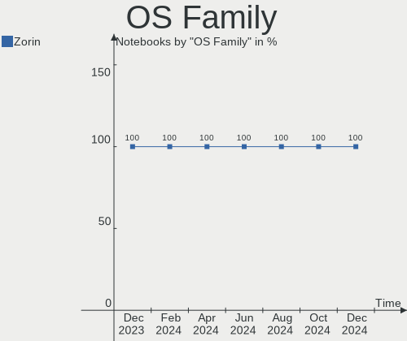
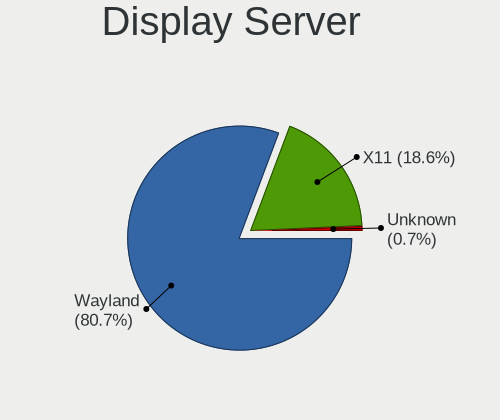
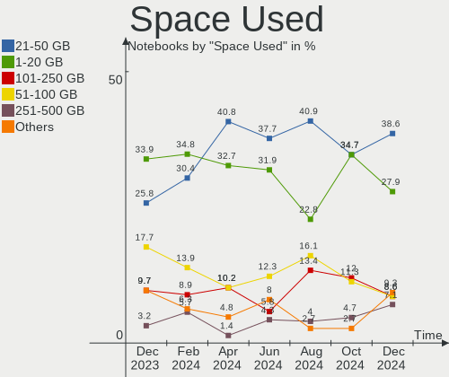

Zorin Hardware Trends (Notebook)
--------------------------------

A project to identify most popular hardware characteristics and track their change
over time based on data collected by Zorin users at https://Linux-Hardware.org.

Anyone can contribute to the study by uploading probes of their computers by
the [hw-probe](https://github.com/linuxhw/hw-probe) tool:

    sudo -E hw-probe -all -upload

Full-feature report is available here: https://linux-hardware.org/?view=trends&formfactor=notebook

Period: Jun, 2021.

Contents
--------

- [ OS                       ](#os)
- [ OS Family                ](#os-family)
- [ Kernel                   ](#kernel)
- [ Kernel Family            ](#kernel-family)
- [ Kernel Major Ver.        ](#kernel-major-ver)
- [ Arch                     ](#arch)
- [ DE                       ](#de)
- [ Display Server           ](#display-server)
- [ Display Manager          ](#display-manager)
- [ OS Lang                  ](#os-lang)
- [ Boot Mode                ](#boot-mode)
- [ Filesystem               ](#filesystem)
- [ Part. scheme             ](#part-scheme)
- [ Dual Boot with Linux/BSD ](#dual-boot-with-linux/bsd)
- [ Dual Boot (Win)          ](#dual-boot-win)
- [ Country                  ](#country)
- [ City                     ](#city)
- [ Vendor                   ](#vendor)
- [ Model                    ](#model)
- [ Model Family             ](#model-family)
- [ MFG Year                 ](#mfg-year)
- [ Form Factor              ](#form-factor)
- [ Secure Boot              ](#secure-boot)
- [ Coreboot                 ](#coreboot)
- [ RAM Size                 ](#ram-size)
- [ RAM Used                 ](#ram-used)
- [ Has CD-ROM               ](#has-cd-rom)
- [ Total Drives             ](#total-drives)
- [ Has Ethernet             ](#has-ethernet)
- [ Has WiFi                 ](#has-wifi)
- [ Has Bluetooth            ](#has-bluetooth)
- [ Drive Vendor             ](#drive-vendor)
- [ Drive Model              ](#drive-model)
- [ HDD Vendor               ](#hdd-vendor)
- [ SSD Vendor               ](#ssd-vendor)
- [ Drive Kind               ](#drive-kind)
- [ Drive Connector          ](#drive-connector)
- [ Drive Size               ](#drive-size)
- [ Space Total              ](#space-total)
- [ Space Used               ](#space-used)
- [ Malfunc. Drives          ](#malfunc-drives)
- [ Malfunc. Drive Vendor    ](#malfunc-drive-vendor)
- [ Malfunc. HDD Vendor      ](#malfunc-hdd-vendor)
- [ Malfunc. Drive Kind      ](#malfunc-drive-kind)
- [ Failed Drives            ](#failed-drives)
- [ Failed Drive Vendor      ](#failed-drive-vendor)
- [ Drive Status             ](#drive-status)
- [ Storage Vendor           ](#storage-vendor)
- [ Storage Model            ](#storage-model)
- [ Storage Kind             ](#storage-kind)
- [ CPU Vendor               ](#cpu-vendor)
- [ CPU Model                ](#cpu-model)
- [ CPU Model Family         ](#cpu-model-family)
- [ CPU Cores                ](#cpu-cores)
- [ CPU Sockets              ](#cpu-sockets)
- [ CPU Threads              ](#cpu-threads)
- [ CPU Op-Modes             ](#cpu-op-modes)
- [ CPU Microcode            ](#cpu-microcode)
- [ CPU Microarch            ](#cpu-microarch)
- [ GPU Vendor               ](#gpu-vendor)
- [ GPU Model                ](#gpu-model)
- [ GPU Combo                ](#gpu-combo)
- [ GPU Driver               ](#gpu-driver)
- [ GPU Memory               ](#gpu-memory)
- [ Monitor Vendor           ](#monitor-vendor)
- [ Monitor Model            ](#monitor-model)
- [ Monitor Resolution       ](#monitor-resolution)
- [ Monitor Diagonal         ](#monitor-diagonal)
- [ Monitor Width            ](#monitor-width)
- [ Aspect Ratio             ](#aspect-ratio)
- [ Monitor Area             ](#monitor-area)
- [ Pixel Density            ](#pixel-density)
- [ Multiple Monitors        ](#multiple-monitors)
- [ Net Controller Vendor    ](#net-controller-vendor)
- [ Net Controller Model     ](#net-controller-model)
- [ Wireless Vendor          ](#wireless-vendor)
- [ Wireless Model           ](#wireless-model)
- [ Ethernet Vendor          ](#ethernet-vendor)
- [ Ethernet Model           ](#ethernet-model)
- [ Net Controller Kind      ](#net-controller-kind)
- [ Used Controller          ](#used-controller)
- [ NICs                     ](#nics)
- [ IPv6                     ](#ipv6)
- [ Memory Vendor            ](#memory-vendor)
- [ Memory Model             ](#memory-model)
- [ Memory Kind              ](#memory-kind)
- [ Memory Form Factor       ](#memory-form-factor)
- [ Memory Size              ](#memory-size)
- [ Memory Speed             ](#memory-speed)
- [ Sound Vendor             ](#sound-vendor)
- [ Sound Model              ](#sound-model)
- [ Camera Vendor            ](#camera-vendor)
- [ Camera Model             ](#camera-model)
- [ Fingerprint Vendor       ](#fingerprint-vendor)
- [ Fingerprint Model        ](#fingerprint-model)
- [ Chipcard Vendor          ](#chipcard-vendor)
- [ Chipcard Model           ](#chipcard-model)
- [ Printer Vendor           ](#printer-vendor)
- [ Printer Model            ](#printer-model)
- [ Scanner Vendor           ](#scanner-vendor)
- [ Scanner Model            ](#scanner-model)
- [ Bluetooth Vendor         ](#bluetooth-vendor)
- [ Bluetooth Model          ](#bluetooth-model)
- [ Unsupported Devices      ](#unsupported-devices)
- [ Unsupported Device Types ](#unsupported-device-types)

OS
--

Installed operating systems

| Name     | Notebooks | Percent |
|----------|-----------|---------|
| Zorin 15 | 21        | 72.41%  |
| Zorin 16 | 8         | 27.59%  |

OS Family
---------

OS without a version

| Name  | Notebooks | Percent |
|-------|-----------|---------|
| Zorin | 29        | 100%    |

Kernel
------

Version of the Linux kernel

| Version          | Notebooks | Percent |
|------------------|-----------|---------|
| 5.4.0-74-generic | 11        | 37.93%  |
| 5.8.0-55-generic | 5         | 17.24%  |
| 5.4.0-73-generic | 4         | 13.79%  |
| 5.4.0-77-generic | 3         | 10.34%  |
| 5.4.0-45-generic | 3         | 10.34%  |
| 5.8.0-59-generic | 2         | 6.9%    |
| 5.8.0-53-generic | 1         | 3.45%   |

Kernel Family
-------------

Linux kernel without a distro release

| Version | Notebooks | Percent |
|---------|-----------|---------|
| 5.4.0   | 21        | 72.41%  |
| 5.8.0   | 8         | 27.59%  |

Kernel Major Ver.
-----------------

Linux kernel major version

| Version | Notebooks | Percent |
|---------|-----------|---------|
| 5.4     | 21        | 72.41%  |
| 5.8     | 8         | 27.59%  |

Arch
----

OS architecture (x86_64, i586, etc.)

| Name   | Notebooks | Percent |
|--------|-----------|---------|
| x86_64 | 26        | 89.66%  |
| i686   | 3         | 10.34%  |

DE
--

Desktop Environment

| Name    | Notebooks | Percent |
|---------|-----------|---------|
| GNOME   | 20        | 68.97%  |
| XFCE    | 8         | 27.59%  |
| Unknown | 1         | 3.45%   |

Display Server
--------------

X11 or Wayland

| Name    | Notebooks | Percent |
|---------|-----------|---------|
| X11     | 27        | 93.1%   |
| Wayland | 1         | 3.45%   |
| Unknown | 1         | 3.45%   |

Display Manager
---------------

SDDM, LightDM, etc.

| Name    | Notebooks | Percent |
|---------|-----------|---------|
| Unknown | 27        | 93.1%   |
| TDM     | 1         | 3.45%   |
| GDM     | 1         | 3.45%   |

OS Lang
-------

Language

| Lang  | Notebooks | Percent |
|-------|-----------|---------|
| en_US | 9         | 31.03%  |
| en_IN | 5         | 17.24%  |
| pt_BR | 2         | 6.9%    |
| it_IT | 2         | 6.9%    |
| tr_TR | 1         | 3.45%   |
| sv_SE | 1         | 3.45%   |
| ru_RU | 1         | 3.45%   |
| pt_PT | 1         | 3.45%   |
| nl_NL | 1         | 3.45%   |
| fr_FR | 1         | 3.45%   |
| es_VE | 1         | 3.45%   |
| en_ZA | 1         | 3.45%   |
| en_GB | 1         | 3.45%   |
| en_CA | 1         | 3.45%   |
| de_DE | 1         | 3.45%   |

Boot Mode
---------

EFI or BIOS

| Mode | Notebooks | Percent |
|------|-----------|---------|
| BIOS | 17        | 58.62%  |
| EFI  | 12        | 41.38%  |

Filesystem
----------

Type of filesystem

| Type    | Notebooks | Percent |
|---------|-----------|---------|
| Ext4    | 27        | 93.1%   |
| Overlay | 1         | 3.45%   |
| Btrfs   | 1         | 3.45%   |

Part. scheme
------------

Scheme of partitioning

| Type    | Notebooks | Percent |
|---------|-----------|---------|
| Unknown | 27        | 93.1%   |
| MBR     | 1         | 3.45%   |
| GPT     | 1         | 3.45%   |

Dual Boot with Linux/BSD
------------------------

Hosting more than one Linux/BSD

| Dual boot | Notebooks | Percent |
|-----------|-----------|---------|
| No        | 28        | 96.55%  |
| Yes       | 1         | 3.45%   |

Dual Boot (Win)
---------------

Hosting Linux and Windows

| Dual boot | Notebooks | Percent |
|-----------|-----------|---------|
| No        | 22        | 75.86%  |
| Yes       | 7         | 24.14%  |

Country
-------

Geographic location (country)

| Country      | Notebooks | Percent |
|--------------|-----------|---------|
| India        | 5         | 17.24%  |
| USA          | 4         | 13.79%  |
| Italy        | 2         | 6.9%    |
| Brazil       | 2         | 6.9%    |
| Venezuela    | 1         | 3.45%   |
| UK           | 1         | 3.45%   |
| Turkey       | 1         | 3.45%   |
| Thailand     | 1         | 3.45%   |
| Sweden       | 1         | 3.45%   |
| South Africa | 1         | 3.45%   |
| Russia       | 1         | 3.45%   |
| Portugal     | 1         | 3.45%   |
| Netherlands  | 1         | 3.45%   |
| Madagascar   | 1         | 3.45%   |
| Indonesia    | 1         | 3.45%   |
| Germany      | 1         | 3.45%   |
| France       | 1         | 3.45%   |
| Croatia      | 1         | 3.45%   |
| Canada       | 1         | 3.45%   |
| Bulgaria     | 1         | 3.45%   |

City
----

Geographic location (city)

| City                | Notebooks | Percent |
|---------------------|-----------|---------|
| Hyderabad           | 3         | 10.34%  |
| Yuba City           | 1         | 3.45%   |
| Vila Nova de Gaia   | 1         | 3.45%   |
| Venice              | 1         | 3.45%   |
| Sutton Coldfield    | 1         | 3.45%   |
| Stadskanaal         | 1         | 3.45%   |
| St Petersburg       | 1         | 3.45%   |
| Sofia               | 1         | 3.45%   |
| Sinj                | 1         | 3.45%   |
| Sharon              | 1         | 3.45%   |
| San Donà di Piave  | 1         | 3.45%   |
| Pretoria            | 1         | 3.45%   |
| Phuket              | 1         | 3.45%   |
| Olympia             | 1         | 3.45%   |
| Ohmbach             | 1         | 3.45%   |
| Notre-Dame-de-Monts | 1         | 3.45%   |
| Maersta             | 1         | 3.45%   |
| Las Vegas           | 1         | 3.45%   |
| Jakarta             | 1         | 3.45%   |
| Indore              | 1         | 3.45%   |
| Fortaleza           | 1         | 3.45%   |
| Fond du Lac         | 1         | 3.45%   |
| Ceilandia           | 1         | 3.45%   |
| Calgary             | 1         | 3.45%   |
| Antananarivo        | 1         | 3.45%   |
| Antalya             | 1         | 3.45%   |
| Ahmedabad           | 1         | 3.45%   |

Vendor
------

Motherboard manufacturer

| Name                    | Notebooks | Percent |
|-------------------------|-----------|---------|
| Dell                    | 6         | 20.69%  |
| Lenovo                  | 5         | 17.24%  |
| Hewlett-Packard         | 5         | 17.24%  |
| ASUSTek Computer        | 4         | 13.79%  |
| Sony                    | 2         | 6.9%    |
| Toshiba                 | 1         | 3.45%   |
| Samsung Electronics     | 1         | 3.45%   |
| HCL Infosystems Limited | 1         | 3.45%   |
| Fujitsu                 | 1         | 3.45%   |
| Apple                   | 1         | 3.45%   |
| Acer                    | 1         | 3.45%   |
| Unknown                 | 1         | 3.45%   |

Model
-----

Motherboard model

| Name                                  | Notebooks | Percent |
|---------------------------------------|-----------|---------|
| Lenovo G40-30 80FY                    | 2         | 6.9%    |
| Unknown                               | 2         | 6.9%    |
| Toshiba Satellite M70                 | 1         | 3.45%   |
| Sony VPCSB16FG                        | 1         | 3.45%   |
| Sony VGN-BX51VN                       | 1         | 3.45%   |
| Samsung N150/N210/N220                | 1         | 3.45%   |
| Lenovo ThinkPad E15 Gen 2 20TD000HZA  | 1         | 3.45%   |
| Lenovo IdeaPad 330-15IKB 81DE         | 1         | 3.45%   |
| HP Stream Notebook                    | 1         | 3.45%   |
| HP Pavilion dv6700                    | 1         | 3.45%   |
| HP Pavilion dv5                       | 1         | 3.45%   |
| HP Laptop 15-da0xxx                   | 1         | 3.45%   |
| HP 15                                 | 1         | 3.45%   |
| HCL Infosystems Limited HCL ME Laptop | 1         | 3.45%   |
| Fujitsu LIFEBOOK AH532                | 1         | 3.45%   |
| Dell XPS 13 9370                      | 1         | 3.45%   |
| Dell Precision 7520                   | 1         | 3.45%   |
| Dell Latitude E6520                   | 1         | 3.45%   |
| Dell Inspiron N4010                   | 1         | 3.45%   |
| Dell Inspiron 3582                    | 1         | 3.45%   |
| Dell Inspiron 3576                    | 1         | 3.45%   |
| ASUS VivoBook 15_ASUS Laptop X507LA   | 1         | 3.45%   |
| ASUS TUF Gaming FX505DT_FX505DT       | 1         | 3.45%   |
| ASUS Q524UQ                           | 1         | 3.45%   |
| ASUS K54HR                            | 1         | 3.45%   |
| Apple MacBookPro12,1                  | 1         | 3.45%   |
| Acer Aspire 3100                      | 1         | 3.45%   |

Model Family
------------

Motherboard model prefix

| Name                        | Notebooks | Percent |
|-----------------------------|-----------|---------|
| Dell Inspiron               | 3         | 10.34%  |
| Lenovo G40-30               | 2         | 6.9%    |
| HP Pavilion                 | 2         | 6.9%    |
| Unknown                     | 2         | 6.9%    |
| Toshiba Satellite           | 1         | 3.45%   |
| Sony VPCSB16FG              | 1         | 3.45%   |
| Sony VGN-BX51VN             | 1         | 3.45%   |
| Samsung N150                | 1         | 3.45%   |
| Lenovo ThinkPad             | 1         | 3.45%   |
| Lenovo IdeaPad              | 1         | 3.45%   |
| HP Stream                   | 1         | 3.45%   |
| HP Laptop                   | 1         | 3.45%   |
| HP 15                       | 1         | 3.45%   |
| HCL Infosystems Limited HCL | 1         | 3.45%   |
| Fujitsu LIFEBOOK            | 1         | 3.45%   |
| Dell XPS                    | 1         | 3.45%   |
| Dell Precision              | 1         | 3.45%   |
| Dell Latitude               | 1         | 3.45%   |
| ASUS VivoBook               | 1         | 3.45%   |
| ASUS TUF                    | 1         | 3.45%   |
| ASUS Q524UQ                 | 1         | 3.45%   |
| ASUS K54HR                  | 1         | 3.45%   |
| Apple MacBookPro12          | 1         | 3.45%   |
| Acer Aspire                 | 1         | 3.45%   |

MFG Year
--------

Motherboard manufacture year

| Year | Notebooks | Percent |
|------|-----------|---------|
| 2021 | 6         | 20.69%  |
| 2019 | 3         | 10.34%  |
| 2018 | 3         | 10.34%  |
| 2011 | 3         | 10.34%  |
| 2008 | 3         | 10.34%  |
| 2014 | 2         | 6.9%    |
| 2010 | 2         | 6.9%    |
| 2020 | 1         | 3.45%   |
| 2017 | 1         | 3.45%   |
| 2015 | 1         | 3.45%   |
| 2013 | 1         | 3.45%   |
| 2012 | 1         | 3.45%   |
| 2007 | 1         | 3.45%   |
| 2006 | 1         | 3.45%   |

Form Factor
-----------

Physical design of the computer

| Name     | Notebooks | Percent |
|----------|-----------|---------|
| Notebook | 29        | 100%    |

Secure Boot
-----------

Enabled or disabled

| State    | Notebooks | Percent |
|----------|-----------|---------|
| Disabled | 24        | 82.76%  |
| Enabled  | 5         | 17.24%  |

Coreboot
--------

Have coreboot on board

| Used | Notebooks | Percent |
|------|-----------|---------|
| No   | 29        | 100%    |

RAM Size
--------

Total RAM memory

| Size in GB | Notebooks | Percent |
|------------|-----------|---------|
| 3.01-4.0   | 11        | 37.93%  |
| 4.01-8.0   | 8         | 27.59%  |
| 1.01-2.0   | 4         | 13.79%  |
| 16.01-24.0 | 3         | 10.34%  |
| 8.01-16.0  | 3         | 10.34%  |

RAM Used
--------

Used RAM memory

| Used GB  | Notebooks | Percent |
|----------|-----------|---------|
| 1.01-2.0 | 12        | 41.38%  |
| 2.01-3.0 | 10        | 34.48%  |
| 0.51-1.0 | 4         | 13.79%  |
| 3.01-4.0 | 3         | 10.34%  |

Has CD-ROM
----------

Has CD-ROM on board

| Presented | Notebooks | Percent |
|-----------|-----------|---------|
| No        | 17        | 58.62%  |
| Yes       | 12        | 41.38%  |

Total Drives
------------

Number of drives on board

| Drives | Notebooks | Percent |
|--------|-----------|---------|
| 1      | 25        | 86.21%  |
| 2      | 4         | 13.79%  |

Has Ethernet
------------

Has Ethernet on board

| Presented | Notebooks | Percent |
|-----------|-----------|---------|
| Yes       | 24        | 82.76%  |
| No        | 5         | 17.24%  |

Has WiFi
--------

Has WiFi module

| Presented | Notebooks | Percent |
|-----------|-----------|---------|
| Yes       | 28        | 96.55%  |
| No        | 1         | 3.45%   |

Has Bluetooth
-------------

Has Bluetooth module

| Presented | Notebooks | Percent |
|-----------|-----------|---------|
| Yes       | 23        | 79.31%  |
| No        | 6         | 20.69%  |

Drive Vendor
------------

Hard drive vendors

| Vendor              | Notebooks | Drives | Percent |
|---------------------|-----------|--------|---------|
| WDC                 | 5         | 5      | 16.13%  |
| Seagate             | 4         | 4      | 12.9%   |
| Hitachi             | 4         | 4      | 12.9%   |
| Unknown             | 2         | 2      | 6.45%   |
| Toshiba             | 2         | 2      | 6.45%   |
| SanDisk             | 2         | 2      | 6.45%   |
| Intel               | 2         | 2      | 6.45%   |
| HGST                | 2         | 2      | 6.45%   |
| Crucial             | 2         | 2      | 6.45%   |
| Samsung Electronics | 1         | 1      | 3.23%   |
| Phison              | 1         | 1      | 3.23%   |
| moweek              | 1         | 1      | 3.23%   |
| Kston               | 1         | 1      | 3.23%   |
| Kingston            | 1         | 1      | 3.23%   |
| Apple               | 1         | 1      | 3.23%   |

Drive Model
-----------

Hard drive models

| Model                              | Notebooks | Percent |
|------------------------------------|-----------|---------|
| Crucial CT480BX500SSD1 480GB       | 2         | 6.45%   |
| WDC WD5000LPCX-24C6HT0 500GB       | 1         | 3.23%   |
| WDC WD5000BPVT-24HXZT3 500GB       | 1         | 3.23%   |
| WDC WD3200BPVT-55ZEST0 320GB       | 1         | 3.23%   |
| WDC WD3200BEVT-00A0RT0 320GB       | 1         | 3.23%   |
| WDC WD10JPVX-60JC3T1 1TB           | 1         | 3.23%   |
| Unknown SD/MMC/MS PRO 128GB        | 1         | 3.23%   |
| Unknown MMC Card  32GB             | 1         | 3.23%   |
| Toshiba NVMe SSD Drive 1024GB      | 1         | 3.23%   |
| Toshiba MK3259GSXP 320GB           | 1         | 3.23%   |
| Seagate ST500VT000-1DK142 500GB    | 1         | 3.23%   |
| Seagate ST500LM030-1RK17D 500GB    | 1         | 3.23%   |
| Seagate ST2000LM003 HN-M201RAD 2TB | 1         | 3.23%   |
| Seagate ST1000LM035-1RK172 1TB     | 1         | 3.23%   |
| SanDisk SSD PLUS 480GB             | 1         | 3.23%   |
| SanDisk SDSSDHII240G 240GB         | 1         | 3.23%   |
| Samsung NVMe SSD Drive 512GB       | 1         | 3.23%   |
| Phison NVMe SSD Drive 2TB          | 1         | 3.23%   |
| moweek 240GB                       | 1         | 3.23%   |
| Kston 128GB                        | 1         | 3.23%   |
| Kingston SA400S37240G 240GB SSD    | 1         | 3.23%   |
| Intel SSDSC2KW256G8L 256GB         | 1         | 3.23%   |
| Intel SSDPEKNW512G8 512GB          | 1         | 3.23%   |
| Hitachi HTS547564A9E384 640GB      | 1         | 3.23%   |
| Hitachi HTS543232A7A384 320GB      | 1         | 3.23%   |
| Hitachi HTS541680J9SA00 80GB       | 1         | 3.23%   |
| Hitachi HTS541010G9SA00 100GB      | 1         | 3.23%   |
| HGST HTS725050A7E630 500GB         | 1         | 3.23%   |
| HGST HTS541010B7E610 1TB           | 1         | 3.23%   |
| Apple SSD SM0256G 256GB            | 1         | 3.23%   |

HDD Vendor
----------

Hard disk drive vendors

| Vendor  | Notebooks | Drives | Percent |
|---------|-----------|--------|---------|
| WDC     | 5         | 5      | 31.25%  |
| Seagate | 4         | 4      | 25%     |
| Hitachi | 4         | 4      | 25%     |
| HGST    | 2         | 2      | 12.5%   |
| Toshiba | 1         | 1      | 6.25%   |

SSD Vendor
----------

Solid state drive vendors

| Vendor   | Notebooks | Drives | Percent |
|----------|-----------|--------|---------|
| SanDisk  | 2         | 2      | 28.57%  |
| Crucial  | 2         | 2      | 28.57%  |
| Kingston | 1         | 1      | 14.29%  |
| Intel    | 1         | 1      | 14.29%  |
| Apple    | 1         | 1      | 14.29%  |

Drive Kind
----------

HDD or SSD

| Kind    | Notebooks | Drives | Percent |
|---------|-----------|--------|---------|
| HDD     | 16        | 16     | 51.61%  |
| SSD     | 7         | 7      | 22.58%  |
| NVMe    | 4         | 4      | 12.9%   |
| Unknown | 3         | 3      | 9.68%   |
| MMC     | 1         | 1      | 3.23%   |

Drive Connector
---------------

SATA, SAS, NVMe, etc.

| Type | Notebooks | Drives | Percent |
|------|-----------|--------|---------|
| SATA | 24        | 25     | 80%     |
| NVMe | 4         | 4      | 13.33%  |
| SAS  | 1         | 1      | 3.33%   |
| MMC  | 1         | 1      | 3.33%   |

Drive Size
----------

Size of hard drive

| Size in TB | Notebooks | Drives | Percent |
|------------|-----------|--------|---------|
| 0.01-0.5   | 18        | 18     | 78.26%  |
| 0.51-1.0   | 4         | 4      | 17.39%  |
| 1.01-2.0   | 1         | 1      | 4.35%   |

Space Total
-----------

Amount of disk space available on the file system

| Size in GB | Notebooks | Percent |
|------------|-----------|---------|
| 251-500    | 15        | 51.72%  |
| 101-250    | 5         | 17.24%  |
| 501-1000   | 3         | 10.34%  |
| 51-100     | 3         | 10.34%  |
| 21-50      | 1         | 3.45%   |
| 1001-2000  | 1         | 3.45%   |
| 1-20       | 1         | 3.45%   |

Space Used
----------

Amount of used disk space

| Used GB  | Notebooks | Percent |
|----------|-----------|---------|
| 1-20     | 21        | 72.41%  |
| 21-50    | 3         | 10.34%  |
| 51-100   | 3         | 10.34%  |
| 101-250  | 1         | 3.45%   |
| 501-1000 | 1         | 3.45%   |

Malfunc. Drives
---------------

Drive models with a malfunction

| Model                        | Notebooks | Drives | Percent |
|------------------------------|-----------|--------|---------|
| WDC WD3200BPVT-55ZEST0 320GB | 1         | 1      | 100%    |

Malfunc. Drive Vendor
---------------------

Vendors of faulty drives

| Vendor | Notebooks | Drives | Percent |
|--------|-----------|--------|---------|
| WDC    | 1         | 1      | 100%    |

Malfunc. HDD Vendor
-------------------

Vendors of faulty HDD drives

| Vendor | Notebooks | Drives | Percent |
|--------|-----------|--------|---------|
| WDC    | 1         | 1      | 100%    |

Malfunc. Drive Kind
-------------------

Kinds of faulty drives

| Kind | Notebooks | Drives | Percent |
|------|-----------|--------|---------|
| HDD  | 1         | 1      | 100%    |

Failed Drives
-------------

Failed drive models

Zero info for selected period =(

Failed Drive Vendor
-------------------

Failed drive vendors

Zero info for selected period =(

Drive Status
------------

Number of failed and malfunc. drives

| Status   | Notebooks | Drives | Percent |
|----------|-----------|--------|---------|
| Detected | 27        | 29     | 93.1%   |
| Malfunc  | 1         | 1      | 3.45%   |
| Works    | 1         | 1      | 3.45%   |

Storage Vendor
--------------

Storage controller vendors

| Vendor                       | Notebooks | Percent |
|------------------------------|-----------|---------|
| Intel                        | 24        | 80%     |
| Samsung Electronics          | 2         | 6.67%   |
| Toshiba America Info Systems | 1         | 3.33%   |
| Phison Electronics           | 1         | 3.33%   |
| JMicron Technology           | 1         | 3.33%   |
| AMD                          | 1         | 3.33%   |

Storage Model
-------------

Storage controller models

| Model                                                                            | Notebooks | Percent |
|----------------------------------------------------------------------------------|-----------|---------|
| Intel Sunrise Point-LP SATA Controller [AHCI mode]                               | 3         | 9.09%   |
| Intel 82801 Mobile SATA Controller [RAID mode]                                   | 2         | 6.06%   |
| Intel 8 Series SATA Controller 1 [AHCI mode]                                     | 2         | 6.06%   |
| Intel 7 Series Chipset Family 6-port SATA Controller [AHCI mode]                 | 2         | 6.06%   |
| Intel 6 Series/C200 Series Chipset Family 6 port Mobile SATA AHCI Controller     | 2         | 6.06%   |
| Toshiba America Info Systems Toshiba America Info Non-Volatile memory controller | 1         | 3.03%   |
| Samsung NVMe Controller                                                          | 1         | 3.03%   |
| Samsung Electronics SATA controller                                              | 1         | 3.03%   |
| Phison E12 NVMe Controller                                                       | 1         | 3.03%   |
| JMicron JMB363 SATA/IDE Controller                                               | 1         | 3.03%   |
| Intel Wildcat Point-LP SATA Controller [AHCI Mode]                               | 1         | 3.03%   |
| Intel SSD 660P Series                                                            | 1         | 3.03%   |
| Intel Q170/Q150/B150/H170/H110/Z170/CM236 Chipset SATA Controller [AHCI Mode]    | 1         | 3.03%   |
| Intel NM10/ICH7 Family SATA Controller [IDE mode]                                | 1         | 3.03%   |
| Intel Celeron/Pentium Silver Processor SATA Controller                           | 1         | 3.03%   |
| Intel Atom Processor E3800 Series SATA IDE Controller                            | 1         | 3.03%   |
| Intel Atom Processor E3800 Series SATA AHCI Controller                           | 1         | 3.03%   |
| Intel 82801IBM/IEM (ICH9M/ICH9M-E) 4 port SATA Controller [AHCI mode]            | 1         | 3.03%   |
| Intel 82801HM/HEM (ICH8M/ICH8M-E) SATA Controller [IDE mode]                     | 1         | 3.03%   |
| Intel 82801HM/HEM (ICH8M/ICH8M-E) SATA Controller [AHCI mode]                    | 1         | 3.03%   |
| Intel 82801HM/HEM (ICH8M/ICH8M-E) IDE Controller                                 | 1         | 3.03%   |
| Intel 82801FBM (ICH6M) SATA Controller                                           | 1         | 3.03%   |
| Intel 82801FB/FBM/FR/FW/FRW (ICH6 Family) IDE Controller                         | 1         | 3.03%   |
| Intel 5 Series/3400 Series Chipset 6 port SATA AHCI Controller                   | 1         | 3.03%   |
| Intel 5 Series/3400 Series Chipset 4 port SATA AHCI Controller                   | 1         | 3.03%   |
| AMD IXP SB4x0 Serial ATA Controller                                              | 1         | 3.03%   |
| AMD IXP SB4x0 IDE Controller                                                     | 1         | 3.03%   |

Storage Kind
------------

Kind of storage controller (IDE, SATA, NVMe, SAS, ...)

| Kind | Notebooks | Percent |
|------|-----------|---------|
| SATA | 18        | 60%     |
| IDE  | 6         | 20%     |
| NVMe | 4         | 13.33%  |
| RAID | 2         | 6.67%   |

CPU Vendor
----------

Processor vendors

| Vendor | Notebooks | Percent |
|--------|-----------|---------|
| Intel  | 27        | 93.1%   |
| AMD    | 2         | 6.9%    |

CPU Model
---------

Processor models

| Model                                         | Notebooks | Percent |
|-----------------------------------------------|-----------|---------|
| Intel Core i7-8550U CPU @ 1.80GHz             | 2         | 6.9%    |
| Intel Pentium M processor 1.73GHz             | 1         | 3.45%   |
| Intel Pentium CPU P6100 @ 2.00GHz             | 1         | 3.45%   |
| Intel Pentium CPU 2020M @ 2.40GHz             | 1         | 3.45%   |
| Intel Core i7-7920HQ CPU @ 3.10GHz            | 1         | 3.45%   |
| Intel Core i7-6500U CPU @ 2.50GHz             | 1         | 3.45%   |
| Intel Core i7-4600U CPU @ 2.10GHz             | 1         | 3.45%   |
| Intel Core i5-8250U CPU @ 1.60GHz             | 1         | 3.45%   |
| Intel Core i5-5287U CPU @ 2.90GHz             | 1         | 3.45%   |
| Intel Core i5-4210U CPU @ 1.70GHz             | 1         | 3.45%   |
| Intel Core i5-3210M CPU @ 2.50GHz             | 1         | 3.45%   |
| Intel Core i5-2540M CPU @ 2.60GHz             | 1         | 3.45%   |
| Intel Core i5-2410M CPU @ 2.30GHz             | 1         | 3.45%   |
| Intel Core i3-7020U CPU @ 2.30GHz             | 1         | 3.45%   |
| Intel Core i3-5005U CPU @ 2.00GHz             | 1         | 3.45%   |
| Intel Core i3-2350M CPU @ 2.30GHz             | 1         | 3.45%   |
| Intel Core i3 CPU M 380 @ 2.53GHz             | 1         | 3.45%   |
| Intel Core 2 Duo CPU T7250 @ 2.00GHz          | 1         | 3.45%   |
| Intel Core 2 Duo CPU T5550 @ 1.83GHz          | 1         | 3.45%   |
| Intel Core 2 Duo CPU P8600 @ 2.40GHz          | 1         | 3.45%   |
| Intel Celeron N4000 CPU @ 1.10GHz             | 1         | 3.45%   |
| Intel Celeron CPU N3050 @ 1.60GHz             | 1         | 3.45%   |
| Intel Celeron CPU N2840 @ 2.16GHz             | 1         | 3.45%   |
| Intel Celeron CPU N2830 @ 2.16GHz             | 1         | 3.45%   |
| Intel Atom CPU N450 @ 1.66GHz                 | 1         | 3.45%   |
| Intel 11th Gen Core i7-1165G7 @ 2.80GHz       | 1         | 3.45%   |
| AMD Ryzen 5 3550H with Radeon Vega Mobile Gfx | 1         | 3.45%   |
| AMD Mobile Sempron Processor 3400+            | 1         | 3.45%   |

CPU Model Family
----------------

Processor model prefix

| Model              | Notebooks | Percent |
|--------------------|-----------|---------|
| Intel Core i5      | 6         | 20.69%  |
| Intel Core i7      | 5         | 17.24%  |
| Intel Core i3      | 4         | 13.79%  |
| Intel Celeron      | 4         | 13.79%  |
| Intel Core 2 Duo   | 3         | 10.34%  |
| Intel Pentium      | 2         | 6.9%    |
| Other              | 1         | 3.45%   |
| Intel Pentium M    | 1         | 3.45%   |
| Intel Atom         | 1         | 3.45%   |
| AMD Ryzen 5        | 1         | 3.45%   |
| AMD Mobile Sempron | 1         | 3.45%   |

CPU Cores
---------

Number of processor cores

| Number | Notebooks | Percent |
|--------|-----------|---------|
| 2      | 20        | 68.97%  |
| 4      | 6         | 20.69%  |
| 1      | 3         | 10.34%  |

CPU Sockets
-----------

Number of sockets

| Number | Notebooks | Percent |
|--------|-----------|---------|
| 1      | 29        | 100%    |

CPU Threads
-----------

Threads per core (Hyper-Threading)

| Number | Notebooks | Percent |
|--------|-----------|---------|
| 2      | 18        | 62.07%  |
| 1      | 11        | 37.93%  |

CPU Op-Modes
------------

CPU Operation Modes (32-bit, 64-bit)

| Op mode        | Notebooks | Percent |
|----------------|-----------|---------|
| 32-bit, 64-bit | 28        | 96.55%  |
| 32-bit         | 1         | 3.45%   |

CPU Microcode
-------------

Microcode number

| Number     | Notebooks | Percent |
|------------|-----------|---------|
| 0x806ea    | 4         | 13.79%  |
| 0x206a7    | 3         | 10.34%  |
| 0x6fd      | 2         | 6.9%    |
| 0x40651    | 2         | 6.9%    |
| 0x306d4    | 2         | 6.9%    |
| 0x306a9    | 2         | 6.9%    |
| 0x30678    | 2         | 6.9%    |
| 0x20655    | 2         | 6.9%    |
| 0x906e9    | 1         | 3.45%   |
| 0x806c1    | 1         | 3.45%   |
| 0x706a1    | 1         | 3.45%   |
| 0x6d8      | 1         | 3.45%   |
| 0x406e3    | 1         | 3.45%   |
| 0x406c3    | 1         | 3.45%   |
| 0x106ca    | 1         | 3.45%   |
| 0x10676    | 1         | 3.45%   |
| 0x08108102 | 1         | 3.45%   |
| Unknown    | 1         | 3.45%   |

CPU Microarch
-------------

Microarchitecture

| Name          | Notebooks | Percent |
|---------------|-----------|---------|
| KabyLake      | 5         | 17.24%  |
| Silvermont    | 3         | 10.34%  |
| SandyBridge   | 3         | 10.34%  |
| Westmere      | 2         | 6.9%    |
| IvyBridge     | 2         | 6.9%    |
| Haswell       | 2         | 6.9%    |
| Core          | 2         | 6.9%    |
| Broadwell     | 2         | 6.9%    |
| Zen+          | 1         | 3.45%   |
| TigerLake     | 1         | 3.45%   |
| Skylake       | 1         | 3.45%   |
| Penryn        | 1         | 3.45%   |
| P6            | 1         | 3.45%   |
| K8 Hammer     | 1         | 3.45%   |
| Goldmont plus | 1         | 3.45%   |
| Bonnell       | 1         | 3.45%   |

GPU Vendor
----------

Vendors of graphics cards

| Vendor | Notebooks | Percent |
|--------|-----------|---------|
| Intel  | 25        | 67.57%  |
| Nvidia | 7         | 18.92%  |
| AMD    | 5         | 13.51%  |

GPU Model
---------

Graphics card models

| Model                                                                                    | Notebooks | Percent |
|------------------------------------------------------------------------------------------|-----------|---------|
| Intel UHD Graphics 620                                                                   | 3         | 7.69%   |
| Nvidia GF117M [GeForce 610M/710M/810M/820M / GT 620M/625M/630M/720M]                     | 2         | 5.13%   |
| Intel Mobile GM965/GL960 Integrated Graphics Controller (secondary)                      | 2         | 5.13%   |
| Intel Mobile GM965/GL960 Integrated Graphics Controller (primary)                        | 2         | 5.13%   |
| Intel Haswell-ULT Integrated Graphics Controller                                         | 2         | 5.13%   |
| Intel Core Processor Integrated Graphics Controller                                      | 2         | 5.13%   |
| Intel Atom Processor Z36xxx/Z37xxx Series Graphics & Display                             | 2         | 5.13%   |
| Intel 3rd Gen Core processor Graphics Controller                                         | 2         | 5.13%   |
| Intel 2nd Generation Core Processor Family Integrated Graphics Controller                | 2         | 5.13%   |
| AMD Seymour [Radeon HD 6400M/7400M Series]                                               | 2         | 5.13%   |
| Nvidia TU117M [GeForce GTX 1650 Mobile / Max-Q]                                          | 1         | 2.56%   |
| Nvidia GM107GLM [Quadro M1200 Mobile]                                                    | 1         | 2.56%   |
| Nvidia GM107 [GeForce 940MX]                                                             | 1         | 2.56%   |
| Nvidia GF119M [NVS 4200M]                                                                | 1         | 2.56%   |
| Nvidia G96CM [GeForce 9600M GT]                                                          | 1         | 2.56%   |
| Intel TigerLake-LP GT2 [Iris Xe Graphics]                                                | 1         | 2.56%   |
| Intel Skylake GT2 [HD Graphics 520]                                                      | 1         | 2.56%   |
| Intel Mobile 915GM/GMS/910GML Express Graphics Controller                                | 1         | 2.56%   |
| Intel Iris Graphics 6100                                                                 | 1         | 2.56%   |
| Intel HD Graphics 630                                                                    | 1         | 2.56%   |
| Intel HD Graphics 620                                                                    | 1         | 2.56%   |
| Intel HD Graphics 5500                                                                   | 1         | 2.56%   |
| Intel GeminiLake [UHD Graphics 600]                                                      | 1         | 2.56%   |
| Intel Atom/Celeron/Pentium Processor x5-E8000/J3xxx/N3xxx Integrated Graphics Controller | 1         | 2.56%   |
| Intel Atom Processor D4xx/D5xx/N4xx/N5xx Integrated Graphics Controller                  | 1         | 2.56%   |
| AMD RS482M [Mobility Radeon Xpress 200]                                                  | 1         | 2.56%   |
| AMD Picasso                                                                              | 1         | 2.56%   |
| AMD Jet PRO [Radeon R5 M230 / R7 M260DX / Radeon 520 Mobile]                             | 1         | 2.56%   |

GPU Combo
---------

Combinations of graphics cards

| Name           | Notebooks | Percent |
|----------------|-----------|---------|
| 1 x Intel      | 18        | 62.07%  |
| Intel + Nvidia | 5         | 17.24%  |
| Intel + AMD    | 2         | 6.9%    |
| 1 x AMD        | 2         | 6.9%    |
| 1 x Nvidia     | 1         | 3.45%   |
| AMD + Nvidia   | 1         | 3.45%   |

GPU Driver
----------

Free vs proprietary

| Driver      | Notebooks | Percent |
|-------------|-----------|---------|
| Free        | 25        | 86.21%  |
| Proprietary | 4         | 13.79%  |

GPU Memory
----------

Total video memory

| Size in GB | Notebooks | Percent |
|------------|-----------|---------|
| Unknown    | 21        | 72.41%  |
| 0.01-0.5   | 4         | 13.79%  |
| 1.01-2.0   | 2         | 6.9%    |
| 3.01-4.0   | 1         | 3.45%   |
| 0.51-1.0   | 1         | 3.45%   |

Monitor Vendor
--------------

Monitor vendors

| Vendor                  | Notebooks | Percent |
|-------------------------|-----------|---------|
| Samsung Electronics     | 5         | 19.23%  |
| LG Display              | 4         | 15.38%  |
| Chimei Innolux          | 3         | 11.54%  |
| AU Optronics            | 3         | 11.54%  |
| BOE                     | 2         | 7.69%   |
| Sharp                   | 1         | 3.85%   |
| Quanta Display          | 1         | 3.85%   |
| PANDA                   | 1         | 3.85%   |
| LG Philips              | 1         | 3.85%   |
| Lenovo                  | 1         | 3.85%   |
| InfoVision              | 1         | 3.85%   |
| Dell                    | 1         | 3.85%   |
| Chi Mei Optoelectronics | 1         | 3.85%   |
| Apple                   | 1         | 3.85%   |

Monitor Model
-------------

Monitor models

| Model                                                                    | Notebooks | Percent |
|--------------------------------------------------------------------------|-----------|---------|
| Samsung Electronics LCD Monitor SEC5441 1366x768 344x194mm 15.5-inch     | 3         | 11.54%  |
| AU Optronics LCD Monitor AUO71EC 1366x768 340x190mm 15.3-inch            | 2         | 7.69%   |
| Sharp LCD Monitor SHP148B 3840x2160 294x165mm 13.3-inch                  | 1         | 3.85%   |
| Samsung Electronics T27B300 SAM0933 1920x1080 598x336mm 27.0-inch        | 1         | 3.85%   |
| Samsung Electronics LCD Monitor SEC3642 1366x768 344x194mm 15.5-inch     | 1         | 3.85%   |
| Quanta Display LCD Monitor QDS0041 1280x800 331x207mm 15.4-inch          | 1         | 3.85%   |
| PANDA LCD Monitor NCP0036 1920x1080 344x194mm 15.5-inch                  | 1         | 3.85%   |
| LG Philips LCD Monitor LPL0701 1280x800 331x207mm 15.4-inch              | 1         | 3.85%   |
| LG Display LP154WX4-TLCC LGD0242 1280x800 331x207mm 15.4-inch            | 1         | 3.85%   |
| LG Display LCD Monitor LGD049B 1920x1080 340x190mm 15.3-inch             | 1         | 3.85%   |
| LG Display LCD Monitor LGD046F 1920x1080 344x194mm 15.5-inch             | 1         | 3.85%   |
| LG Display LCD Monitor LGD044C 1366x768 310x174mm 14.0-inch              | 1         | 3.85%   |
| Lenovo LCD Monitor LEN40BA 1920x1080 344x194mm 15.5-inch                 | 1         | 3.85%   |
| InfoVision LCD Monitor IVO03F4 1920x1200 263x164mm 12.2-inch             | 1         | 3.85%   |
| Dell P2419H DELD0DA 1920x1080 527x296mm 23.8-inch                        | 1         | 3.85%   |
| Chimei Innolux LCD Monitor CMN15AB 1366x768 350x190mm 15.7-inch          | 1         | 3.85%   |
| Chimei Innolux LCD Monitor CMN1487 1366x768 310x170mm 13.9-inch          | 1         | 3.85%   |
| Chimei Innolux LCD Monitor CMN1131 1366x768 256x144mm 11.6-inch          | 1         | 3.85%   |
| Chi Mei Optoelectronics LCD Monitor CMO15A3 1366x768 344x193mm 15.5-inch | 1         | 3.85%   |
| BOE LCD Monitor BOE0704 1366x768 344x194mm 15.5-inch                     | 1         | 3.85%   |
| BOE LCD Monitor BOE06A4 1366x768 344x194mm 15.5-inch                     | 1         | 3.85%   |
| AU Optronics LCD Monitor AUO38ED 1920x1080 340x190mm 15.3-inch           | 1         | 3.85%   |
| Apple Color LCD APPA029 2560x1600 290x180mm 13.4-inch                    | 1         | 3.85%   |

Monitor Resolution
------------------

Monitor screen resolution

| Resolution        | Notebooks | Percent |
|-------------------|-----------|---------|
| 1366x768 (WXGA)   | 13        | 50%     |
| 1920x1080 (FHD)   | 7         | 26.92%  |
| 1280x800 (WXGA)   | 3         | 11.54%  |
| 3840x2160 (4K)    | 1         | 3.85%   |
| 2560x1600         | 1         | 3.85%   |
| 1920x1200 (WUXGA) | 1         | 3.85%   |

Monitor Diagonal
----------------

Diagonal size in inches

| Inches | Notebooks | Percent |
|--------|-----------|---------|
| 15     | 19        | 73.08%  |
| 14     | 2         | 7.69%   |
| 13     | 2         | 7.69%   |
| 27     | 1         | 3.85%   |
| 24     | 1         | 3.85%   |
| 11     | 1         | 3.85%   |

Monitor Width
-------------

Physical width

| Width in mm | Notebooks | Percent |
|-------------|-----------|---------|
| 301-350     | 18        | 69.23%  |
| 351-400     | 3         | 11.54%  |
| 201-300     | 3         | 11.54%  |
| 501-600     | 2         | 7.69%   |

Aspect Ratio
------------

Proportional relationship between the width and the height

| Ratio | Notebooks | Percent |
|-------|-----------|---------|
| 16/9  | 21        | 84%     |
| 16/10 | 4         | 16%     |

Monitor Area
------------

Area in inch²

| Area in inch² | Notebooks | Percent |
|----------------|-----------|---------|
| 101-110        | 19        | 73.08%  |
| 81-90          | 3         | 11.54%  |
| 71-80          | 1         | 3.85%   |
| 51-60          | 1         | 3.85%   |
| 301-350        | 1         | 3.85%   |
| 201-250        | 1         | 3.85%   |

Pixel Density
-------------

Pixels per inch

| Density       | Notebooks | Percent |
|---------------|-----------|---------|
| 51-100        | 10        | 38.46%  |
| 101-120       | 8         | 30.77%  |
| 121-160       | 6         | 23.08%  |
| More than 240 | 1         | 3.85%   |
| 161-240       | 1         | 3.85%   |

Multiple Monitors
-----------------

Total monitors connected

| Total | Notebooks | Percent |
|-------|-----------|---------|
| 1     | 27        | 93.1%   |
| 2     | 2         | 6.9%    |

Net Controller Vendor
---------------------

Controller vendors

| Vendor                   | Notebooks | Percent |
|--------------------------|-----------|---------|
| Realtek Semiconductor    | 16        | 32%     |
| Intel                    | 11        | 22%     |
| Qualcomm Atheros         | 10        | 20%     |
| Broadcom                 | 5         | 10%     |
| Marvell Technology Group | 2         | 4%      |
| Samsung Electronics      | 1         | 2%      |
| Ralink Technology        | 1         | 2%      |
| Ralink                   | 1         | 2%      |
| JMicron Technology       | 1         | 2%      |
| DisplayLink              | 1         | 2%      |
| Broadcom Limited         | 1         | 2%      |

Net Controller Model
--------------------

Controller models

| Model                                                                       | Notebooks | Percent |
|-----------------------------------------------------------------------------|-----------|---------|
| Realtek RTL8111/8168/8411 PCI Express Gigabit Ethernet Controller           | 11        | 18.97%  |
| Qualcomm Atheros QCA9565 / AR9565 Wireless Network Adapter                  | 4         | 6.9%    |
| Realtek RTL810xE PCI Express Fast Ethernet controller                       | 3         | 5.17%   |
| Intel Centrino Wireless-N 1000 [Condor Peak]                                | 3         | 5.17%   |
| Realtek RTL-8100/8101L/8139 PCI Fast Ethernet Adapter                       | 2         | 3.45%   |
| Qualcomm Atheros AR9285 Wireless Network Adapter (PCI-Express)              | 2         | 3.45%   |
| Broadcom BCM43142 802.11b/g/n                                               | 2         | 3.45%   |
| Broadcom BCM4312 802.11b/g LP-PHY                                           | 2         | 3.45%   |
| Samsung Galaxy series, misc. (tethering mode)                               | 1         | 1.72%   |
| Realtek RTL8723DE Wireless Network Adapter                                  | 1         | 1.72%   |
| Realtek RTL8188EUS 802.11n Wireless Network Adapter                         | 1         | 1.72%   |
| Realtek 802.11ac NIC                                                        | 1         | 1.72%   |
| Ralink MT7601U Wireless Adapter                                             | 1         | 1.72%   |
| Ralink RT3290 Wireless 802.11n 1T/1R PCIe                                   | 1         | 1.72%   |
| Qualcomm Atheros QCA9377 802.11ac Wireless Network Adapter                  | 1         | 1.72%   |
| Qualcomm Atheros QCA6174 802.11ac Wireless Network Adapter                  | 1         | 1.72%   |
| Qualcomm Atheros AR93xx Wireless Network Adapter                            | 1         | 1.72%   |
| Qualcomm Atheros AR8152 v1.1 Fast Ethernet                                  | 1         | 1.72%   |
| Qualcomm Atheros AR8151 v2.0 Gigabit Ethernet                               | 1         | 1.72%   |
| Marvell Group 88E8055 PCI-E Gigabit Ethernet Controller                     | 1         | 1.72%   |
| Marvell Group 88E8040 PCI-E Fast Ethernet Controller                        | 1         | 1.72%   |
| JMicron JMC250 PCI Express Gigabit Ethernet Controller                      | 1         | 1.72%   |
| Intel Wireless 8265 / 8275                                                  | 1         | 1.72%   |
| Intel Wireless 7265                                                         | 1         | 1.72%   |
| Intel WiMAX Connection 2400m                                                | 1         | 1.72%   |
| Intel Wi-Fi 6 AX201                                                         | 1         | 1.72%   |
| Intel PRO/Wireless 3945ABG [Golan] Network Connection                       | 1         | 1.72%   |
| Intel PRO/Wireless 2915ABG [Calexico2] Network Connection                   | 1         | 1.72%   |
| Intel Ethernet Connection (5) I219-LM                                       | 1         | 1.72%   |
| Intel Dual Band Wireless-AC 3165 Plus Bluetooth                             | 1         | 1.72%   |
| Intel Centrino Wireless-N 2230                                              | 1         | 1.72%   |
| Intel Centrino Advanced-N + WiMAX 6250 [Kilmer Peak]                        | 1         | 1.72%   |
| Intel 82801FB/FBM/FR/FW/FRW (ICH6 Family) AC'97 Modem Controller            | 1         | 1.72%   |
| Intel 82579LM Gigabit Network Connection (Lewisville)                       | 1         | 1.72%   |
| DisplayLink Dell Universal Dock D6000                                       | 1         | 1.72%   |
| Broadcom Limited BCM4318 [AirForce One 54g] 802.11g Wireless LAN Controller | 1         | 1.72%   |
| Broadcom BCM43602 802.11ac Wireless LAN SoC                                 | 1         | 1.72%   |

Wireless Vendor
---------------

Wireless vendors

| Vendor                | Notebooks | Percent |
|-----------------------|-----------|---------|
| Intel                 | 11        | 35.48%  |
| Qualcomm Atheros      | 9         | 29.03%  |
| Broadcom              | 5         | 16.13%  |
| Realtek Semiconductor | 3         | 9.68%   |
| Ralink Technology     | 1         | 3.23%   |
| Ralink                | 1         | 3.23%   |
| Broadcom Limited      | 1         | 3.23%   |

Wireless Model
--------------

Wireless models

| Model                                                                       | Notebooks | Percent |
|-----------------------------------------------------------------------------|-----------|---------|
| Qualcomm Atheros QCA9565 / AR9565 Wireless Network Adapter                  | 4         | 12.9%   |
| Intel Centrino Wireless-N 1000 [Condor Peak]                                | 3         | 9.68%   |
| Qualcomm Atheros AR9285 Wireless Network Adapter (PCI-Express)              | 2         | 6.45%   |
| Broadcom BCM43142 802.11b/g/n                                               | 2         | 6.45%   |
| Broadcom BCM4312 802.11b/g LP-PHY                                           | 2         | 6.45%   |
| Realtek RTL8723DE Wireless Network Adapter                                  | 1         | 3.23%   |
| Realtek RTL8188EUS 802.11n Wireless Network Adapter                         | 1         | 3.23%   |
| Realtek 802.11ac NIC                                                        | 1         | 3.23%   |
| Ralink MT7601U Wireless Adapter                                             | 1         | 3.23%   |
| Ralink RT3290 Wireless 802.11n 1T/1R PCIe                                   | 1         | 3.23%   |
| Qualcomm Atheros QCA9377 802.11ac Wireless Network Adapter                  | 1         | 3.23%   |
| Qualcomm Atheros QCA6174 802.11ac Wireless Network Adapter                  | 1         | 3.23%   |
| Qualcomm Atheros AR93xx Wireless Network Adapter                            | 1         | 3.23%   |
| Intel Wireless 8265 / 8275                                                  | 1         | 3.23%   |
| Intel Wireless 7265                                                         | 1         | 3.23%   |
| Intel Wi-Fi 6 AX201                                                         | 1         | 3.23%   |
| Intel PRO/Wireless 3945ABG [Golan] Network Connection                       | 1         | 3.23%   |
| Intel PRO/Wireless 2915ABG [Calexico2] Network Connection                   | 1         | 3.23%   |
| Intel Dual Band Wireless-AC 3165 Plus Bluetooth                             | 1         | 3.23%   |
| Intel Centrino Wireless-N 2230                                              | 1         | 3.23%   |
| Intel Centrino Advanced-N + WiMAX 6250 [Kilmer Peak]                        | 1         | 3.23%   |
| Broadcom Limited BCM4318 [AirForce One 54g] 802.11g Wireless LAN Controller | 1         | 3.23%   |
| Broadcom BCM43602 802.11ac Wireless LAN SoC                                 | 1         | 3.23%   |

Ethernet Vendor
---------------

Ethernet vendors

| Vendor                   | Notebooks | Percent |
|--------------------------|-----------|---------|
| Realtek Semiconductor    | 16        | 64%     |
| Qualcomm Atheros         | 2         | 8%      |
| Marvell Technology Group | 2         | 8%      |
| Intel                    | 2         | 8%      |
| Samsung Electronics      | 1         | 4%      |
| JMicron Technology       | 1         | 4%      |
| DisplayLink              | 1         | 4%      |

Ethernet Model
--------------

Ethernet models

| Model                                                             | Notebooks | Percent |
|-------------------------------------------------------------------|-----------|---------|
| Realtek RTL8111/8168/8411 PCI Express Gigabit Ethernet Controller | 11        | 42.31%  |
| Realtek RTL810xE PCI Express Fast Ethernet controller             | 3         | 11.54%  |
| Realtek RTL-8100/8101L/8139 PCI Fast Ethernet Adapter             | 2         | 7.69%   |
| Samsung Galaxy series, misc. (tethering mode)                     | 1         | 3.85%   |
| Qualcomm Atheros AR8152 v1.1 Fast Ethernet                        | 1         | 3.85%   |
| Qualcomm Atheros AR8151 v2.0 Gigabit Ethernet                     | 1         | 3.85%   |
| Marvell Group 88E8055 PCI-E Gigabit Ethernet Controller           | 1         | 3.85%   |
| Marvell Group 88E8040 PCI-E Fast Ethernet Controller              | 1         | 3.85%   |
| JMicron JMC250 PCI Express Gigabit Ethernet Controller            | 1         | 3.85%   |
| Intel WiMAX Connection 2400m                                      | 1         | 3.85%   |
| Intel Ethernet Connection (5) I219-LM                             | 1         | 3.85%   |
| Intel 82579LM Gigabit Network Connection (Lewisville)             | 1         | 3.85%   |
| DisplayLink Dell Universal Dock D6000                             | 1         | 3.85%   |

Net Controller Kind
-------------------

Ethernet, WiFi or modem

| Kind     | Notebooks | Percent |
|----------|-----------|---------|
| WiFi     | 28        | 52.83%  |
| Ethernet | 24        | 45.28%  |
| Modem    | 1         | 1.89%   |

Used Controller
---------------

Currently used network controller

| Kind     | Notebooks | Percent |
|----------|-----------|---------|
| WiFi     | 26        | 76.47%  |
| Ethernet | 8         | 23.53%  |

NICs
----

Total network controllers on board

| Total | Notebooks | Percent |
|-------|-----------|---------|
| 2     | 22        | 75.86%  |
| 1     | 7         | 24.14%  |

IPv6
----

IPv6 vs IPv4

| Used | Notebooks | Percent |
|------|-----------|---------|
| No   | 24        | 82.76%  |
| Yes  | 5         | 17.24%  |

Memory Vendor
-------------

Memory module vendors

| Vendor              | Notebooks | Percent |
|---------------------|-----------|---------|
| SK Hynix            | 3         | 33.33%  |
| Unknown             | 2         | 22.22%  |
| SHARETRONIC         | 1         | 11.11%  |
| Samsung Electronics | 1         | 11.11%  |
| Nanya Technology    | 1         | 11.11%  |
| Kingston            | 1         | 11.11%  |

Memory Model
------------

Memory module models

| Model                                                     | Notebooks | Percent |
|-----------------------------------------------------------|-----------|---------|
| Unknown RAM Module 4096MB SODIMM DDR3                     | 1         | 11.11%  |
| Unknown RAM Module 2GB SODIMM DDR2 667MT/s                | 1         | 11.11%  |
| SK Hynix RAM HMT351S6BFR8C-H9 4GB SODIMM DDR3 1333MT/s    | 1         | 11.11%  |
| SK Hynix RAM HMT325S6CFR8C-H9 2GB SODIMM DDR3 1334MT/s    | 1         | 11.11%  |
| SK Hynix RAM HMA81GS6JJR8N-VK 8192MB SODIMM DDR4 2667MT/s | 1         | 11.11%  |
| SHARETRONIC RAM Module 4GB SODIMM DDR3 1333MT/s           | 1         | 11.11%  |
| Samsung RAM M471B5773CHS-CH9 2048MB SODIMM DDR3 4199MT/s  | 1         | 11.11%  |
| Nanya RAM NT2GC64B88B0NS-CG 2GB SODIMM DDR3 1334MT/s      | 1         | 11.11%  |
| Kingston RAM 9905469-153.A00LF 4GB SODIMM DDR3 1333MT/s   | 1         | 11.11%  |

Memory Kind
-----------

Memory module kinds

| Kind  | Notebooks | Percent |
|-------|-----------|---------|
| DDR3  | 5         | 62.5%   |
| SDRAM | 1         | 12.5%   |
| DDR4  | 1         | 12.5%   |
| DDR2  | 1         | 12.5%   |

Memory Form Factor
------------------

Physical design of the memory module

| Name   | Notebooks | Percent |
|--------|-----------|---------|
| SODIMM | 7         | 100%    |

Memory Size
-----------

Memory module size

| Size | Notebooks | Percent |
|------|-----------|---------|
| 4096 | 3         | 42.86%  |
| 2048 | 3         | 42.86%  |
| 8192 | 1         | 14.29%  |

Memory Speed
------------

Memory module speed

| Speed   | Notebooks | Percent |
|---------|-----------|---------|
| 1334    | 2         | 25%     |
| 1333    | 2         | 25%     |
| 4199    | 1         | 12.5%   |
| 2667    | 1         | 12.5%   |
| 667     | 1         | 12.5%   |
| Unknown | 1         | 12.5%   |

Sound Vendor
------------

Sound card vendors

| Vendor              | Notebooks | Percent |
|---------------------|-----------|---------|
| Intel               | 27        | 77.14%  |
| Nvidia              | 4         | 11.43%  |
| AMD                 | 3         | 8.57%   |
| C-Media Electronics | 1         | 2.86%   |

Sound Model
-----------

Sound card models

| Model                                                                                             | Notebooks | Percent |
|---------------------------------------------------------------------------------------------------|-----------|---------|
| Intel Sunrise Point-LP HD Audio                                                                   | 5         | 12.82%  |
| Intel 6 Series/C200 Series Chipset Family High Definition Audio Controller                        | 3         | 7.69%   |
| Nvidia GM107 High Definition Audio Controller [GeForce 940MX]                                     | 2         | 5.13%   |
| Intel Wildcat Point-LP High Definition Audio Controller                                           | 2         | 5.13%   |
| Intel Haswell-ULT HD Audio Controller                                                             | 2         | 5.13%   |
| Intel Broadwell-U Audio Controller                                                                | 2         | 5.13%   |
| Intel Atom Processor Z36xxx/Z37xxx Series High Definition Audio Controller                        | 2         | 5.13%   |
| Intel 82801H (ICH8 Family) HD Audio Controller                                                    | 2         | 5.13%   |
| Intel 8 Series HD Audio Controller                                                                | 2         | 5.13%   |
| Intel 7 Series/C216 Chipset Family High Definition Audio Controller                               | 2         | 5.13%   |
| Intel 5 Series/3400 Series Chipset High Definition Audio                                          | 2         | 5.13%   |
| Nvidia TU107 GeForce GTX 1650 High Definition Audio Controller                                    | 1         | 2.56%   |
| Nvidia GF119 HDMI Audio Controller                                                                | 1         | 2.56%   |
| Intel Tiger Lake-LP Smart Sound Technology Audio Controller                                       | 1         | 2.56%   |
| Intel NM10/ICH7 Family High Definition Audio Controller                                           | 1         | 2.56%   |
| Intel CM238 HD Audio Controller                                                                   | 1         | 2.56%   |
| Intel Celeron/Pentium Silver Processor High Definition Audio                                      | 1         | 2.56%   |
| Intel Atom/Celeron/Pentium Processor x5-E8000/J3xxx/N3xxx Series High Definition Audio Controller | 1         | 2.56%   |
| Intel 82801I (ICH9 Family) HD Audio Controller                                                    | 1         | 2.56%   |
| Intel 82801FB/FBM/FR/FW/FRW (ICH6 Family) AC'97 Audio Controller                                  | 1         | 2.56%   |
| C-Media Electronics Audio Adapter (Unitek Y-247A)                                                 | 1         | 2.56%   |
| AMD IXP SB4x0 High Definition Audio Controller                                                    | 1         | 2.56%   |
| AMD Family 17h (Models 10h-1fh) HD Audio Controller                                               | 1         | 2.56%   |
| AMD Caicos HDMI Audio [Radeon HD 6450 / 7450/8450/8490 OEM / R5 230/235/235X OEM]                 | 1         | 2.56%   |

Camera Vendor
-------------

Camera device vendors

| Vendor                                 | Notebooks | Percent |
|----------------------------------------|-----------|---------|
| Acer                                   | 4         | 16.67%  |
| Realtek Semiconductor                  | 3         | 12.5%   |
| IMC Networks                           | 3         | 12.5%   |
| Chicony Electronics                    | 3         | 12.5%   |
| Sunplus Innovation Technology          | 2         | 8.33%   |
| Microdia                               | 2         | 8.33%   |
| Cheng Uei Precision Industry (Foxlink) | 2         | 8.33%   |
| Z-Star Microelectronics                | 1         | 4.17%   |
| Ricoh                                  | 1         | 4.17%   |
| Quanta                                 | 1         | 4.17%   |
| Logitech                               | 1         | 4.17%   |
| Alcor Micro                            | 1         | 4.17%   |

Camera Model
------------

Camera device models

| Model                                                   | Notebooks | Percent |
|---------------------------------------------------------|-----------|---------|
| Z-Star Webcam                                           | 1         | 4.17%   |
| Sunplus Laptop_Integrated_Webcam_FHD                    | 1         | 4.17%   |
| Sunplus Integrated_Webcam_HD                            | 1         | 4.17%   |
| Ricoh Visual Communication Camera VGP-VCC6 [R5U870]     | 1         | 4.17%   |
| Realtek Lenovo EasyCamera                               | 1         | 4.17%   |
| Realtek Integrated_Webcam_HD                            | 1         | 4.17%   |
| Realtek Integrated Webcam_HD                            | 1         | 4.17%   |
| Quanta HP TrueVision HD Camera                          | 1         | 4.17%   |
| Microdia Sonix 1.3 MP Laptop Integrated Webcam          | 1         | 4.17%   |
| Microdia Integrated_Webcam_HD                           | 1         | 4.17%   |
| Logitech Webcam C310                                    | 1         | 4.17%   |
| IMC Networks USB2.0 VGA UVC WebCam                      | 1         | 4.17%   |
| IMC Networks USB2.0 HD UVC WebCam                       | 1         | 4.17%   |
| IMC Networks EasyCamera                                 | 1         | 4.17%   |
| Chicony USB2.0 HD UVC WebCam                            | 1         | 4.17%   |
| Chicony USB2.0 Camera                                   | 1         | 4.17%   |
| Chicony FJ Camera                                       | 1         | 4.17%   |
| Cheng Uei Precision Industry (Foxlink) Webcam           | 1         | 4.17%   |
| Cheng Uei Precision Industry (Foxlink) HP Truevision HD | 1         | 4.17%   |
| Alcor Micro Asus Integrated Webcam                      | 1         | 4.17%   |
| Acer Lenovo Integrated Webcam                           | 1         | 4.17%   |
| Acer Lenovo EasyCamera                                  | 1         | 4.17%   |
| Acer Integrated Camera                                  | 1         | 4.17%   |
| Acer HP Webcam                                          | 1         | 4.17%   |

Fingerprint Vendor
------------------

Fingerprint sensor vendors

| Vendor             | Notebooks | Percent |
|--------------------|-----------|---------|
| Validity Sensors   | 1         | 33.33%  |
| STMicroelectronics | 1         | 33.33%  |
| AuthenTec          | 1         | 33.33%  |

Fingerprint Model
-----------------

Fingerprint sensor models

| Model                                      | Notebooks | Percent |
|--------------------------------------------|-----------|---------|
| Validity Sensors VFS101 Fingerprint Reader | 1         | 33.33%  |
| STMicroelectronics Fingerprint Reader      | 1         | 33.33%  |
| AuthenTec AES1660 Fingerprint Sensor       | 1         | 33.33%  |

Chipcard Vendor
---------------

Chipcard module vendors

| Vendor   | Notebooks | Percent |
|----------|-----------|---------|
| Broadcom | 2         | 100%    |

Chipcard Model
--------------

Chipcard module models

| Model                                          | Notebooks | Percent |
|------------------------------------------------|-----------|---------|
| Broadcom BCM5880 Secure Applications Processor | 1         | 50%     |
| Broadcom 5880                                  | 1         | 50%     |

Printer Vendor
--------------

Printer device vendors

| Vendor          | Notebooks | Percent |
|-----------------|-----------|---------|
| Hewlett-Packard | 1         | 100%    |

Printer Model
-------------

Printer device models

| Model                  | Notebooks | Percent |
|------------------------|-----------|---------|
| HP DeskJet 2700 series | 1         | 100%    |

Scanner Vendor
--------------

Scanner device vendors

Zero info for selected period =(

Scanner Model
-------------

Scanner device models

Zero info for selected period =(

Bluetooth Vendor
----------------

Controller vendors

| Vendor                          | Notebooks | Percent |
|---------------------------------|-----------|---------|
| Intel                           | 5         | 21.74%  |
| Qualcomm Atheros Communications | 4         | 17.39%  |
| IMC Networks                    | 2         | 8.7%    |
| Foxconn / Hon Hai               | 2         | 8.7%    |
| Broadcom                        | 2         | 8.7%    |
| Realtek Semiconductor           | 1         | 4.35%   |
| Ralink                          | 1         | 4.35%   |
| Hewlett-Packard                 | 1         | 4.35%   |
| Foxconn International           | 1         | 4.35%   |
| Dell                            | 1         | 4.35%   |
| Cambridge Silicon Radio         | 1         | 4.35%   |
| Apple                           | 1         | 4.35%   |
| Alps Electric                   | 1         | 4.35%   |

Bluetooth Model
---------------

Controller models

| Model                                                                               | Notebooks | Percent |
|-------------------------------------------------------------------------------------|-----------|---------|
| Intel Bluetooth wireless interface                                                  | 3         | 13.04%  |
| Qualcomm Atheros  Bluetooth Device                                                  | 2         | 8.7%    |
| Qualcomm Atheros AR3012 Bluetooth 4.0                                               | 2         | 8.7%    |
| Realtek  Bluetooth 4.2 Adapter                                                      | 1         | 4.35%   |
| Ralink RT3290 Bluetooth                                                             | 1         | 4.35%   |
| Intel Centrino Bluetooth Wireless Transceiver                                       | 1         | 4.35%   |
| Intel Bluetooth Device                                                              | 1         | 4.35%   |
| IMC Networks Bluetooth Radio                                                        | 1         | 4.35%   |
| IMC Networks Bluetooth Device                                                       | 1         | 4.35%   |
| HP Bluetooth 2.0 Interface [Broadcom BCM2045]                                       | 1         | 4.35%   |
| Foxconn International BCM43142A0 Bluetooth module                                   | 1         | 4.35%   |
| Foxconn / Hon Hai Foxconn T77H114 BCM2070 [Single-Chip Bluetooth 2.1 + EDR Adapter] | 1         | 4.35%   |
| Foxconn / Hon Hai Bluetooth Device                                                  | 1         | 4.35%   |
| Dell Wireless 365 Bluetooth                                                         | 1         | 4.35%   |
| Cambridge Silicon Radio Bluetooth Dongle (HCI mode)                                 | 1         | 4.35%   |
| Broadcom Bluetooth 2.1 Device                                                       | 1         | 4.35%   |
| Broadcom BCM43142A0 Bluetooth 4.0                                                   | 1         | 4.35%   |
| Apple Bluetooth Host Controller                                                     | 1         | 4.35%   |
| Alps Electric Bluetooth Controller (ALPS/UGPZ6)                                     | 1         | 4.35%   |

Unsupported Devices
-------------------

Total unsupported devices on board

| Total | Notebooks | Percent |
|-------|-----------|---------|
| 0     | 19        | 65.52%  |
| 1     | 6         | 20.69%  |
| 2     | 4         | 13.79%  |

Unsupported Device Types
------------------------

Types of unsupported devices

| Type               | Notebooks | Percent |
|--------------------|-----------|---------|
| Fingerprint reader | 3         | 23.08%  |
| Graphics card      | 2         | 15.38%  |
| Chipcard           | 2         | 15.38%  |
| Storage            | 1         | 7.69%   |
| Net/wireless       | 1         | 7.69%   |
| Modem              | 1         | 7.69%   |
| Flash memory       | 1         | 7.69%   |
| Camera             | 1         | 7.69%   |
| Bluetooth          | 1         | 7.69%   |

