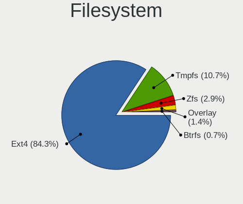
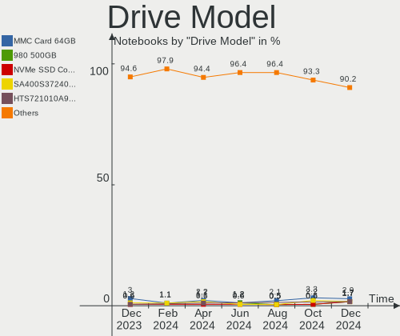

Zorin Hardware Trends (Notebook)
--------------------------------

A project to identify most popular hardware characteristics and track their change
over time based on data collected by Zorin users at https://Linux-Hardware.org.

Anyone can contribute to the study by uploading probes of their computers by
the [hw-probe](https://github.com/linuxhw/hw-probe) tool:

    sudo hw-probe -all -upload

Full-feature report is available here: https://linux-hardware.org/?view=trends&formfactor=notebook

Period: Apr, 2020.

Contents
--------

- [ OS                       ](#os)
- [ OS Family                ](#os-family)
- [ Kernel                   ](#kernel)
- [ Kernel Family            ](#kernel-family)
- [ Kernel Major Ver.        ](#kernel-major-ver)
- [ Arch                     ](#arch)
- [ DE                       ](#de)
- [ Display Server           ](#display-server)
- [ Display Manager          ](#display-manager)
- [ OS Lang                  ](#os-lang)
- [ Boot Mode                ](#boot-mode)
- [ Filesystem               ](#filesystem)
- [ Dual Boot with Linux/BSD ](#dual-boot-with-linux/bsd)
- [ Dual Boot (Win)          ](#dual-boot-win)
- [ Country                  ](#country)
- [ City                     ](#city)
- [ Vendor                   ](#vendor)
- [ Model                    ](#model)
- [ Model Family             ](#model-family)
- [ MFG Year                 ](#mfg-year)
- [ Form Factor              ](#form-factor)
- [ Secure Boot              ](#secure-boot)
- [ Coreboot                 ](#coreboot)
- [ RAM Size                 ](#ram-size)
- [ RAM Used                 ](#ram-used)
- [ Drive Vendor             ](#drive-vendor)
- [ Drive Model              ](#drive-model)
- [ Drive Kind               ](#drive-kind)
- [ Drive Connector          ](#drive-connector)
- [ Drive Size               ](#drive-size)
- [ Space Total              ](#space-total)
- [ Space Used               ](#space-used)
- [ Malfunc. Drives          ](#malfunc-drives)
- [ Malfunc. Drive Vendor    ](#malfunc-drive-vendor)
- [ Malfunc. Drive Kind      ](#malfunc-drive-kind)
- [ Failed Drives            ](#failed-drives)
- [ Failed Drive Vendor      ](#failed-drive-vendor)
- [ Drive Status             ](#drive-status)
- [ Storage Vendor           ](#storage-vendor)
- [ Storage Model            ](#storage-model)
- [ Storage Kind             ](#storage-kind)
- [ CPU Vendor               ](#cpu-vendor)
- [ CPU Model                ](#cpu-model)
- [ CPU Model Family         ](#cpu-model-family)
- [ CPU Cores                ](#cpu-cores)
- [ CPU Sockets              ](#cpu-sockets)
- [ CPU Threads              ](#cpu-threads)
- [ CPU Op-Modes             ](#cpu-op-modes)
- [ CPU Microarch            ](#cpu-microarch)
- [ CPU Microcode            ](#cpu-microcode)
- [ GPU Vendor               ](#gpu-vendor)
- [ GPU Model                ](#gpu-model)
- [ GPU Combo                ](#gpu-combo)
- [ GPU Driver               ](#gpu-driver)
- [ GPU Memory               ](#gpu-memory)
- [ Monitor Vendor           ](#monitor-vendor)
- [ Monitor Model            ](#monitor-model)
- [ Monitor Resolution       ](#monitor-resolution)
- [ Monitor Diagonal         ](#monitor-diagonal)
- [ Monitor Width            ](#monitor-width)
- [ Aspect Ratio             ](#aspect-ratio)
- [ Monitor Area             ](#monitor-area)
- [ Pixel Density            ](#pixel-density)
- [ Multiple Monitors        ](#multiple-monitors)
- [ Net Controller Vendor    ](#net-controller-vendor)
- [ Net Controller Model     ](#net-controller-model)
- [ Net Controller Kind      ](#net-controller-kind)
- [ Used Controller          ](#used-controller)
- [ NICs                     ](#nics)
- [ Unsupported Devices      ](#unsupported-devices)
- [ Unsupported Device Types ](#unsupported-device-types)

OS
--

Installed operating systems

| Name     | Computers | Percent |
|----------|-----------|---------|
| Zorin 15 | 89        | 94.68%  |
| Zorin 12 | 5         | 5.32%   |

OS Family
---------

OS without a version

| Name  | Computers | Percent |
|-------|-----------|---------|
| Zorin | 94        | 100%    |

Kernel
------

Version of the Linux kernel

| Version           | Computers | Percent |
|-------------------|-----------|---------|
| 5.3.0-46-generic  | 53        | 56.38%  |
| 5.3.0-45-generic  | 16        | 17.02%  |
| 5.3.0-40-generic  | 14        | 14.89%  |
| 5.3.0-51-generic  | 2         | 2.13%   |
| 5.3.0-47-generic  | 1         | 1.06%   |
| 5.3.0-42-generic  | 1         | 1.06%   |
| 5.0.0-37-generic  | 1         | 1.06%   |
| 5.0.0-32-generic  | 1         | 1.06%   |
| 4.4.0-176-generic | 1         | 1.06%   |
| 4.15.0-96-generic | 1         | 1.06%   |
| 4.15.0-91-generic | 1         | 1.06%   |
| 4.15.0-72-generic | 1         | 1.06%   |
| 4.15.0-30-generic | 1         | 1.06%   |

Kernel Family
-------------

Linux kernel without a distro release

| Version | Computers | Percent |
|---------|-----------|---------|
| 5.3.0   | 87        | 92.55%  |
| 4.15.0  | 4         | 4.26%   |
| 5.0.0   | 2         | 2.13%   |
| 4.4.0   | 1         | 1.06%   |

Kernel Major Ver.
-----------------

Linux kernel major version

| Version | Computers | Percent |
|---------|-----------|---------|
| 5.3     | 87        | 92.55%  |
| 4.15    | 4         | 4.26%   |
| 5.0     | 2         | 2.13%   |
| 4.4     | 1         | 1.06%   |

Arch
----

OS architecture (x86_64, i586, etc.)

| Name   | Computers | Percent |
|--------|-----------|---------|
| x86_64 | 73        | 77.66%  |
| i686   | 21        | 22.34%  |

DE
--

Desktop Environment

| Name       | Computers | Percent |
|------------|-----------|---------|
| GNOME      | 61        | 64.89%  |
| XFCE       | 29        | 30.85%  |
| Unknown    | 2         | 2.13%   |
| X-Cinnamon | 1         | 1.06%   |
| KDE        | 1         | 1.06%   |

Display Server
--------------

X11 or Wayland

| Name    | Computers | Percent |
|---------|-----------|---------|
| X11     | 92        | 97.87%  |
| Wayland | 1         | 1.06%   |
| Unknown | 1         | 1.06%   |

Display Manager
---------------

SDDM, LightDM, etc.

| Name    | Computers | Percent |
|---------|-----------|---------|
| Unknown | 93        | 98.94%  |
| LightDM | 1         | 1.06%   |

OS Lang
-------

Language

| Lang  | Computers | Percent |
|-------|-----------|---------|
| en_US | 30        | 31.91%  |
| it_IT | 8         | 8.51%   |
| en_GB | 7         | 7.45%   |
| en_CA | 6         | 6.38%   |
| fr_FR | 5         | 5.32%   |
| de_DE | 4         | 4.26%   |
| tr_TR | 3         | 3.19%   |
| es_ES | 3         | 3.19%   |
| en_IN | 3         | 3.19%   |
| pt_PT | 2         | 2.13%   |
| pt_BR | 2         | 2.13%   |
| en_PH | 2         | 2.13%   |
| de_AT | 2         | 2.13%   |
| C     | 2         | 2.13%   |
| ru_UA | 1         | 1.06%   |
| pl_PL | 1         | 1.06%   |
| nl_BE | 1         | 1.06%   |
| ko_KR | 1         | 1.06%   |
| fr_CA | 1         | 1.06%   |
| fi_FI | 1         | 1.06%   |
| es_MX | 1         | 1.06%   |
| es_CO | 1         | 1.06%   |
| es_AR | 1         | 1.06%   |
| en_SG | 1         | 1.06%   |
| en_IL | 1         | 1.06%   |
| en_AU | 1         | 1.06%   |
| el_GR | 1         | 1.06%   |
| cs_CZ | 1         | 1.06%   |
| bs_BA | 1         | 1.06%   |

Boot Mode
---------

EFI or BIOS

| Mode | Computers | Percent |
|------|-----------|---------|
| BIOS | 63        | 67.02%  |
| EFI  | 31        | 32.98%  |

Filesystem
----------

Type of filesystem

| Type    | Computers | Percent |
|---------|-----------|---------|
| Ext4    | 89        | 94.68%  |
| Overlay | 4         | 4.26%   |
| Ext2    | 1         | 1.06%   |

Dual Boot with Linux/BSD
------------------------

Hosting more than one Linux/BSD

| Dual boot | Computers | Percent |
|-----------|-----------|---------|
| No        | 86        | 91.49%  |
| Yes       | 8         | 8.51%   |

Dual Boot (Win)
---------------

Hosting Linux and Windows

| Dual boot | Computers | Percent |
|-----------|-----------|---------|
| No        | 68        | 72.34%  |
| Yes       | 26        | 27.66%  |

Country
-------

Geographic location (country)

| Country                | Computers | Percent |
|------------------------|-----------|---------|
| USA                    | 16        | 17.02%  |
| Italy                  | 8         | 8.51%   |
| UK                     | 7         | 7.45%   |
| Canada                 | 7         | 7.45%   |
| Germany                | 5         | 5.32%   |
| France                 | 4         | 4.26%   |
| Turkey                 | 3         | 3.19%   |
| Spain                  | 3         | 3.19%   |
| Mexico                 | 3         | 3.19%   |
| India                  | 3         | 3.19%   |
| Tunisia                | 2         | 2.13%   |
| Portugal               | 2         | 2.13%   |
| Poland                 | 2         | 2.13%   |
| Philippines            | 2         | 2.13%   |
| Indonesia              | 2         | 2.13%   |
| Colombia               | 2         | 2.13%   |
| Brazil                 | 2         | 2.13%   |
| Austria                | 2         | 2.13%   |
| Ukraine                | 1         | 1.06%   |
| UAE                    | 1         | 1.06%   |
| Slovakia               | 1         | 1.06%   |
| Singapore              | 1         | 1.06%   |
| Romania                | 1         | 1.06%   |
| Norway                 | 1         | 1.06%   |
| New Zealand            | 1         | 1.06%   |
| Lithuania              | 1         | 1.06%   |
| Israel                 | 1         | 1.06%   |
| Hungary                | 1         | 1.06%   |
| Greece                 | 1         | 1.06%   |
| Finland                | 1         | 1.06%   |
| Egypt                  | 1         | 1.06%   |
| Czech Republic         | 1         | 1.06%   |
| Bosnia and Herzegovina | 1         | 1.06%   |
| Belgium                | 1         | 1.06%   |
| Bangladesh             | 1         | 1.06%   |
| Australia              | 1         | 1.06%   |
| Argentina              | 1         | 1.06%   |

City
----

Geographic location (city)

| City                    | Computers | Percent |
|-------------------------|-----------|---------|
| Yalova                  | 2         | 2.13%   |
| Vienna                  | 2         | 2.13%   |
| Toronto                 | 2         | 2.13%   |
| Oklahoma City           | 2         | 2.13%   |
| Zaventem                | 1         | 1.06%   |
| West Des Moines         | 1         | 1.06%   |
| Wasilla                 | 1         | 1.06%   |
| Villetelle              | 1         | 1.06%   |
| Villaspeciosa           | 1         | 1.06%   |
| Versailles              | 1         | 1.06%   |
| Ulm                     | 1         | 1.06%   |
| Tuzla                   | 1         | 1.06%   |
| Turin                   | 1         | 1.06%   |
| Tijuana                 | 1         | 1.06%   |
| Thrissur                | 1         | 1.06%   |
| Thessaloniki            | 1         | 1.06%   |
| Tel Aviv                | 1         | 1.06%   |
| Tampines New Town       | 1         | 1.06%   |
| Sydney                  | 1         | 1.06%   |
| Surabaya                | 1         | 1.06%   |
| St. Albert              | 1         | 1.06%   |
| Sintra                  | 1         | 1.06%   |
| Sevenoaks               | 1         | 1.06%   |
| Sant Andreu de la Barca | 1         | 1.06%   |
| Saint-Avold             | 1         | 1.06%   |
| Robinson                | 1         | 1.06%   |
| Quijingue               | 1         | 1.06%   |
| Querétaro City         | 1         | 1.06%   |
| Písek                  | 1         | 1.06%   |
| Porvoo                  | 1         | 1.06%   |
| Portland                | 1         | 1.06%   |
| Piquillin               | 1         | 1.06%   |
| Phoenix                 | 1         | 1.06%   |
| Oslo                    | 1         | 1.06%   |
| Northampton             | 1         | 1.06%   |
| New Delhi               | 1         | 1.06%   |
| Neuwied                 | 1         | 1.06%   |
| Nelson                  | 1         | 1.06%   |
| Naples                  | 1         | 1.06%   |
| Nagpur                  | 1         | 1.06%   |
| Mogilno                 | 1         | 1.06%   |
| Milan                   | 1         | 1.06%   |
| Mestre                  | 1         | 1.06%   |
| Medellín               | 1         | 1.06%   |
| Markham                 | 1         | 1.06%   |
| Mableton                | 1         | 1.06%   |
| Lodi                    | 1         | 1.06%   |
| Lisbon                  | 1         | 1.06%   |
| Leeds                   | 1         | 1.06%   |
| Lawrence                | 1         | 1.06%   |
| Langenfeld              | 1         | 1.06%   |
| La Reine                | 1         | 1.06%   |
| Kyiv                    | 1         | 1.06%   |
| Kushtia                 | 1         | 1.06%   |
| Kennesaw                | 1         | 1.06%   |
| Kaunas                  | 1         | 1.06%   |
| Jakarta                 | 1         | 1.06%   |
| Ixtapaluca              | 1         | 1.06%   |
| Itatiba                 | 1         | 1.06%   |
| Istanbul                | 1         | 1.06%   |

Vendor
------

Motherboard manufacturer

| Name                | Computers | Percent |
|---------------------|-----------|---------|
| Hewlett-Packard     | 20        | 21.28%  |
| Dell                | 14        | 14.89%  |
| Lenovo              | 12        | 12.77%  |
| Acer                | 10        | 10.64%  |
| ASUSTek Computer    | 7         | 7.45%   |
| Toshiba             | 6         | 6.38%   |
| Sony                | 3         | 3.19%   |
| MSI                 | 3         | 3.19%   |
| Samsung Electronics | 2         | 2.13%   |
| Gateway             | 2         | 2.13%   |
| Clevo               | 2         | 2.13%   |
| Apple               | 2         | 2.13%   |
| Packard Bell        | 1         | 1.06%   |
| Nuvision            | 1         | 1.06%   |
| Notebook            | 1         | 1.06%   |
| NEC Computers       | 1         | 1.06%   |
| Medion              | 1         | 1.06%   |
| IBM                 | 1         | 1.06%   |
| Fujitsu Siemens     | 1         | 1.06%   |
| Ematic              | 1         | 1.06%   |
| eMachines           | 1         | 1.06%   |
| Dixonsxp            | 1         | 1.06%   |
| AXIOO               | 1         | 1.06%   |

Model
-----

Motherboard model

| Name                                            | Computers | Percent |
|-------------------------------------------------|-----------|---------|
| Dell Latitude E6410                             | 2         | 2.13%   |
| Toshiba Satellite L550                          | 1         | 1.06%   |
| Toshiba Satellite L450                          | 1         | 1.06%   |
| Toshiba Satellite C855D                         | 1         | 1.06%   |
| Toshiba Satellite C850D-B810                    | 1         | 1.06%   |
| Toshiba Satellite A200                          | 1         | 1.06%   |
| Toshiba Satellite A100                          | 1         | 1.06%   |
| Sony VPCYB35AL                                  | 1         | 1.06%   |
| Sony VPCEB3M1E                                  | 1         | 1.06%   |
| Sony VGN-AW11Z_B                                | 1         | 1.06%   |
| Samsung Electronics RV410/RV510/S3510/E3510     | 1         | 1.06%   |
| Samsung Electronics 905S3G/906S3G/915S3G/9305SG | 1         | 1.06%   |
| Packard Bell EasyNote TJ65                      | 1         | 1.06%   |
| Nuvision NES11                                  | 1         | 1.06%   |
| Notebook N750BU                                 | 1         | 1.06%   |
| NEC Computers PC-VY24GXZ7A                      | 1         | 1.06%   |
| MSI Ver.001                                     | 1         | 1.06%   |
| MSI MS-1688                                     | 1         | 1.06%   |
| MSI GT72 2PC                                    | 1         | 1.06%   |
| Medion E5217                                    | 1         | 1.06%   |
| Lenovo V130-15IGM 81HL                          | 1         | 1.06%   |
| Lenovo ThinkPad X60 1707Y91                     | 1         | 1.06%   |
| Lenovo ThinkPad T440s 20AQ009HUS                | 1         | 1.06%   |
| Lenovo ThinkPad T420 42368H6                    | 1         | 1.06%   |
| Lenovo ThinkPad Edge E440 20C5007MRI            | 1         | 1.06%   |
| Lenovo ThinkPad 11e 20DAS0YW00                  | 1         | 1.06%   |
| Lenovo IdeaPad S130-11IGM 81J1                  | 1         | 1.06%   |
| Lenovo IdeaPad 520-15IKB 80YL                   | 1         | 1.06%   |
| Lenovo IdeaPad 330-15IKB 81DC                   | 1         | 1.06%   |
| Lenovo IdeaPad 330-14AST 81D5                   | 1         | 1.06%   |
| Lenovo IdeaPad 100S-14IBR 80R9                  | 1         | 1.06%   |
| Lenovo G580 20157                               | 1         | 1.06%   |
| IBM ThinkPad X40 2371H4G                        | 1         | 1.06%   |
| HP Stream Laptop 14-ax0XX                       | 1         | 1.06%   |
| HP ProBook 450 G2                               | 1         | 1.06%   |
| HP Presario V3700                               | 1         | 1.06%   |
| HP Pavilion dv9500                              | 1         | 1.06%   |
| HP Pavilion dv6                                 | 1         | 1.06%   |
| HP Pavilion dv1000 (ET735UA#ABL)                | 1         | 1.06%   |
| HP Pavilion 17                                  | 1         | 1.06%   |
| HP Pavilion 15                                  | 1         | 1.06%   |
| HP Mini 5103                                    | 1         | 1.06%   |
| HP Laptop 15-dw0xxx                             | 1         | 1.06%   |
| HP Laptop 15-da0xxx                             | 1         | 1.06%   |
| HP Gaming PC                                    | 1         | 1.06%   |
| HP G62                                          | 1         | 1.06%   |
| HP EliteBook 8460p                              | 1         | 1.06%   |
| HP Compaq Presario CQ60                         | 1         | 1.06%   |
| HP Compaq Mini 110c-1100                        | 1         | 1.06%   |
| HP 550                                          | 1         | 1.06%   |
| HP 255 G2                                       | 1         | 1.06%   |
| HP 2133 (FU338EA)                               | 1         | 1.06%   |
| HP 15                                           | 1         | 1.06%   |
| Gateway MX3225                                  | 1         | 1.06%   |
| Gateway ML6228                                  | 1         | 1.06%   |
| Fujitsu Siemens AMILO PRO V2030                 | 1         | 1.06%   |
| Ematic EW147                                    | 1         | 1.06%   |
| eMachines G630                                  | 1         | 1.06%   |
| Dell Latitude X1                                | 1         | 1.06%   |
| Dell Latitude E6510                             | 1         | 1.06%   |

Model Family
------------

Motherboard model prefix

| Name                       | Computers | Percent |
|----------------------------|-----------|---------|
| Dell Latitude              | 8         | 8.51%   |
| Toshiba Satellite          | 6         | 6.38%   |
| Dell Inspiron              | 6         | 6.38%   |
| Lenovo ThinkPad            | 5         | 5.32%   |
| Lenovo IdeaPad             | 5         | 5.32%   |
| HP Pavilion                | 5         | 5.32%   |
| Acer Aspire                | 5         | 5.32%   |
| HP Laptop                  | 2         | 2.13%   |
| HP Compaq                  | 2         | 2.13%   |
| Acer Nitro                 | 2         | 2.13%   |
| Sony VPCYB35AL             | 1         | 1.06%   |
| Sony VPCEB3M1E             | 1         | 1.06%   |
| Sony VGN-AW11Z             | 1         | 1.06%   |
| Samsung Electronics RV410  | 1         | 1.06%   |
| Samsung Electronics 905S3G | 1         | 1.06%   |
| Packard Bell EasyNote      | 1         | 1.06%   |
| Nuvision NES11             | 1         | 1.06%   |
| Notebook N750BU            | 1         | 1.06%   |
| NEC Computers PC-VY24GXZ7A | 1         | 1.06%   |
| MSI Ver.001                | 1         | 1.06%   |
| MSI MS-1688                | 1         | 1.06%   |
| MSI GT72                   | 1         | 1.06%   |
| Medion E5217               | 1         | 1.06%   |
| Lenovo V130-15IGM          | 1         | 1.06%   |
| Lenovo G580                | 1         | 1.06%   |
| IBM ThinkPad               | 1         | 1.06%   |
| HP Stream                  | 1         | 1.06%   |
| HP ProBook                 | 1         | 1.06%   |
| HP Presario                | 1         | 1.06%   |
| HP Mini                    | 1         | 1.06%   |
| HP Gaming                  | 1         | 1.06%   |
| HP G62                     | 1         | 1.06%   |
| HP EliteBook               | 1         | 1.06%   |
| HP 550                     | 1         | 1.06%   |
| HP 255                     | 1         | 1.06%   |
| HP 2133                    | 1         | 1.06%   |
| HP 15                      | 1         | 1.06%   |
| Gateway MX3225             | 1         | 1.06%   |
| Gateway ML6228             | 1         | 1.06%   |
| Fujitsu Siemens AMILO      | 1         | 1.06%   |
| Ematic EW147               | 1         | 1.06%   |
| eMachines G630             | 1         | 1.06%   |
| Clevo M7x0S                | 1         | 1.06%   |
| Clevo D900C                | 1         | 1.06%   |
| AXIOO NEON                 | 1         | 1.06%   |
| ASUS X553MA                | 1         | 1.06%   |
| ASUS X200CA                | 1         | 1.06%   |
| ASUS UX331UA               | 1         | 1.06%   |
| ASUS TP300LA               | 1         | 1.06%   |
| ASUS T100TA                | 1         | 1.06%   |
| ASUS S400CA                | 1         | 1.06%   |
| ASUS N46VB                 | 1         | 1.06%   |
| Apple MacBookPro10         | 1         | 1.06%   |
| Apple MacBookAir4          | 1         | 1.06%   |
| Acer One                   | 1         | 1.06%   |
| Acer Extensa               | 1         | 1.06%   |
| Acer E1-510                | 1         | 1.06%   |
| Unknown                    | 1         | 1.06%   |

MFG Year
--------

Motherboard manufacture year

| Year | Computers | Percent |
|------|-----------|---------|
| 2019 | 14        | 14.89%  |
| 2010 | 9         | 9.57%   |
| 2009 | 9         | 9.57%   |
| 2008 | 8         | 8.51%   |
| 2015 | 7         | 7.45%   |
| 2007 | 7         | 7.45%   |
| 2018 | 6         | 6.38%   |
| 2014 | 6         | 6.38%   |
| 2013 | 6         | 6.38%   |
| 2006 | 6         | 6.38%   |
| 2011 | 5         | 5.32%   |
| 2017 | 3         | 3.19%   |
| 2016 | 3         | 3.19%   |
| 2012 | 3         | 3.19%   |
| 2020 | 1         | 1.06%   |
| 2005 | 1         | 1.06%   |

Form Factor
-----------

Physical design of the computer

| Name     | Computers | Percent |
|----------|-----------|---------|
| Notebook | 94        | 100%    |

Secure Boot
-----------

Enabled or disabled

| State    | Computers | Percent |
|----------|-----------|---------|
| Disabled | 85        | 90.43%  |
| Enabled  | 9         | 9.57%   |

Coreboot
--------

Have coreboot on board

| Used | Computers | Percent |
|------|-----------|---------|
| No   | 94        | 100%    |

RAM Size
--------

Total RAM memory

| Size in GB | Computers | Percent |
|------------|-----------|---------|
| 3.01-4.0   | 41        | 43.62%  |
| 1.01-2.0   | 18        | 19.15%  |
| 4.01-8.0   | 17        | 18.09%  |
| 2.01-3.0   | 5         | 5.32%   |
| 16.01-24.0 | 5         | 5.32%   |
| 8.01-16.0  | 4         | 4.26%   |
| 0.01-1.0   | 3         | 3.19%   |
| 24.01-32.0 | 1         | 1.06%   |

RAM Used
--------

Used RAM memory

| Used GB   | Computers | Percent |
|-----------|-----------|---------|
| 1.01-2.0  | 44        | 46.81%  |
| 2.01-3.0  | 23        | 24.47%  |
| 0.01-1.0  | 17        | 18.09%  |
| 4.01-8.0  | 6         | 6.38%   |
| 3.01-4.0  | 3         | 3.19%   |
| 8.01-16.0 | 1         | 1.06%   |

Drive Vendor
------------

Hard drive vendors

| Vendor              | Computers | Drives | Percent |
|---------------------|-----------|--------|---------|
| WDC                 | 16        | 17     | 16.49%  |
| Hitachi             | 15        | 15     | 15.46%  |
| Seagate             | 14        | 14     | 14.43%  |
| Toshiba             | 9         | 10     | 9.28%   |
| Unknown             | 8         | 12     | 8.25%   |
| Samsung Electronics | 7         | 7      | 7.22%   |
| Crucial             | 7         | 7      | 7.22%   |
| Kingston            | 4         | 4      | 4.12%   |
| Fujitsu             | 4         | 4      | 4.12%   |
| SK Hynix            | 3         | 3      | 3.09%   |
| HGST                | 2         | 2      | 2.06%   |
| Transcend           | 1         | 1      | 1.03%   |
| SanDisk             | 1         | 1      | 1.03%   |
| OWC                 | 1         | 1      | 1.03%   |
| LITEON              | 1         | 1      | 1.03%   |
| KINGMAX             | 1         | 1      | 1.03%   |
| KingDian            | 1         | 1      | 1.03%   |
| DOGFISH             | 1         | 1      | 1.03%   |
| A-DATA Technology   | 1         | 1      | 1.03%   |

Drive Model
-----------

Hard drive models

| Model                        | Computers | Percent |
|------------------------------|-----------|---------|
| MMC Card  32GB               | 5         | 4.95%   |
| ST2000LM007-1R8174 2TB       | 3         | 2.97%   |
| WD5000BEVT-22A0RT0 500GB     | 2         | 1.98%   |
| SA400S37480G 480GB SSD       | 2         | 1.98%   |
| SA400S37120G 120GB SSD       | 2         | 1.98%   |
| MQ04ABF100 1TB               | 2         | 1.98%   |
| MMC Card  64GB               | 2         | 1.98%   |
| HTS545050A7E380 500GB        | 2         | 1.98%   |
| HTS541612J9SA00 120GB        | 2         | 1.98%   |
| CT500MX500SSD1 500GB         | 2         | 1.98%   |
| WDS250G2B0B-00YS70 250GB SSD | 1         | 0.99%   |
| WD5000LPVX-80V0TT0 500GB     | 1         | 0.99%   |
| WD5000LPVX-22V0TT0 500GB     | 1         | 0.99%   |
| WD5000LPVT-22G33T0 500GB     | 1         | 0.99%   |
| WD5000BPVT-24HXZT1 500GB     | 1         | 0.99%   |
| WD3200BUCT-63TWBY0 320GB     | 1         | 0.99%   |
| WD3200BEVT-60ZCT1 320GB      | 1         | 0.99%   |
| WD3200BEVS-26VAT0 320GB      | 1         | 0.99%   |
| WD3200BEKT-60PVMT0 320GB     | 1         | 0.99%   |
| WD2500BEVT-22ZCT0 250GB      | 1         | 0.99%   |
| WD2500BEKT-60PVMT0 250GB     | 1         | 0.99%   |
| WD1600BEVS-60RST0 160GB      | 1         | 0.99%   |
| WD1200BEVT-22ZCT0 120GB      | 1         | 0.99%   |
| WD10SPZX-22Z10T1 1TB         | 1         | 0.99%   |
| WD10SPZX-21Z10T0 1TB         | 1         | 0.99%   |
| TS480GJDM720 480GB SSD       | 1         | 0.99%   |
| ST9500325AS 500GB            | 1         | 0.99%   |
| ST9250315AS 250GB            | 1         | 0.99%   |
| ST9120823ASG 111XGB          | 1         | 0.99%   |
| ST9120817AS 120GB            | 1         | 0.99%   |
| ST500LT012-1DG142 500GB      | 1         | 0.99%   |
| ST500LM021-1KJ152 500GB      | 1         | 0.99%   |
| ST500LM012 HN-M500MBB 500GB  | 1         | 0.99%   |
| ST500LM000-1EJ162 500GB      | 1         | 0.99%   |
| ST2000LM003 HN-M201RAD 2TB   | 1         | 0.99%   |
| ST1000LM048-2E7172 1TB       | 1         | 0.99%   |
| ST1000LM035-1RK172 1TB       | 1         | 0.99%   |
| SSD PM810 2.5 128GB          | 1         | 0.99%   |
| SSD 860 EVO 500GB            | 1         | 0.99%   |
| SSD 860 EVO 250GB            | 1         | 0.99%   |
| SSD 850 EVO 250GB            | 1         | 0.99%   |
| SSD 64GB                     | 1         | 0.99%   |
| SSD 120GB                    | 1         | 0.99%   |
| SP900 256GB SSD              | 1         | 0.99%   |
| SD8SN8U512G1002 512GB SSD    | 1         | 0.99%   |
| SC311 SATA 128GB SSD         | 1         | 0.99%   |
| S280 240GB                   | 1         | 0.99%   |
| RX14MB  32GB                 | 1         | 0.99%   |
| MZMTD128HAFV-000 128GB SSD   | 1         | 0.99%   |
| MQ01ABF050 500GB             | 1         | 0.99%   |
| MQ01ABD032 320GB             | 1         | 0.99%   |
| MMC Card  4GB                | 1         | 0.99%   |
| MMC Card  2GB                | 1         | 0.99%   |
| MK8025GAL 80GB               | 1         | 0.99%   |
| MK5055GSX 500GB              | 1         | 0.99%   |
| MK3006GAL 32GB               | 1         | 0.99%   |
| MK1655GSX 160GB              | 1         | 0.99%   |
| MK1646GSX 160GB              | 1         | 0.99%   |
| MK1637GSX 160GB              | 1         | 0.99%   |
| MJA2320BH G2 320GB           | 1         | 0.99%   |

Drive Kind
----------

HDD or SSD

| Kind | Computers | Drives | Percent |
|------|-----------|--------|---------|
| HDD  | 61        | 63     | 63.54%  |
| SSD  | 27        | 28     | 28.13%  |
| MMC  | 8         | 12     | 8.33%   |

Drive Connector
---------------

SATA, SAS, NVMe, etc.

| Type | Computers | Drives | Percent |
|------|-----------|--------|---------|
| SATA | 85        | 91     | 91.4%   |
| MMC  | 8         | 12     | 8.6%    |

Drive Size
----------

Size of hard drive

| Size in TB | Computers | Drives | Percent |
|------------|-----------|--------|---------|
| 0.01-0.5   | 81        | 87     | 83.51%  |
| 0.51-1.0   | 12        | 12     | 12.37%  |
| 1.01-2.0   | 4         | 4      | 4.12%   |

Space Total
-----------

Amount of disk space available on the file system

| Size in GB | Computers | Percent |
|------------|-----------|---------|
| 101-250    | 28        | 29.79%  |
| 251-500    | 26        | 27.66%  |
| 51-100     | 14        | 14.89%  |
| 21-50      | 11        | 11.7%   |
| 1001-2000  | 6         | 6.38%   |
| 1-20       | 5         | 5.32%   |
| 501-1000   | 4         | 4.26%   |

Space Used
----------

Amount of used disk space

| Used GB  | Computers | Percent |
|----------|-----------|---------|
| 1-20     | 63        | 67.02%  |
| 21-50    | 13        | 13.83%  |
| 101-250  | 10        | 10.64%  |
| 51-100   | 5         | 5.32%   |
| 251-500  | 2         | 2.13%   |
| 501-1000 | 1         | 1.06%   |

Malfunc. Drives
---------------

Drive models with a malfunction

Zero info for selected period =(

Malfunc. Drive Vendor
---------------------

Vendors of faulty drives

Zero info for selected period =(

Malfunc. Drive Kind
-------------------

Kinds of faulty drives

Zero info for selected period =(

Failed Drives
-------------

Failed drive models

Zero info for selected period =(

Failed Drive Vendor
-------------------

Failed drive vendors

Zero info for selected period =(

Drive Status
------------

Number of failed and malfunc. drives

| Status   | Computers | Drives | Percent |
|----------|-----------|--------|---------|
| Detected | 93        | 103    | 100%    |

Storage Vendor
--------------

Storage controller vendors

| Vendor                           | Computers | Percent |
|----------------------------------|-----------|---------|
| Intel                            | 73        | 77.66%  |
| AMD                              | 11        | 11.7%   |
| VIA Technologies                 | 3         | 3.19%   |
| JMicron Technology               | 3         | 3.19%   |
| Nvidia                           | 2         | 2.13%   |
| Silicon Integrated Systems [SiS] | 1         | 1.06%   |
| Phison Electronics               | 1         | 1.06%   |

Storage Model
-------------

Storage controller models

| Model                                                                      | Computers | Percent |
|----------------------------------------------------------------------------|-----------|---------|
| 82801 Mobile SATA Controller [RAID mode]                                   | 10        | 8.93%   |
| FCH SATA Controller [AHCI mode]                                            | 7         | 6.25%   |
| 82801IBM/IEM (ICH9M/ICH9M-E) 4 port SATA Controller [AHCI mode]            | 7         | 6.25%   |
| 82801GBM/GHM (ICH7-M Family) SATA Controller [IDE mode]                    | 7         | 6.25%   |
| 82801HM/HEM (ICH8M/ICH8M-E) IDE Controller                                 | 6         | 5.36%   |
| 8 Series SATA Controller 1 [AHCI mode]                                     | 6         | 5.36%   |
| Sunrise Point-LP SATA Controller [AHCI mode]                               | 5         | 4.46%   |
| 82801HM/HEM (ICH8M/ICH8M-E) SATA Controller [AHCI mode]                    | 5         | 4.46%   |
| 5 Series/3400 Series Chipset 4 port SATA AHCI Controller                   | 5         | 4.46%   |
| 7 Series Chipset Family 6-port SATA Controller [AHCI mode]                 | 4         | 3.57%   |
| Atom Processor E3800 Series SATA AHCI Controller                           | 3         | 2.68%   |
| 82801GBM/GHM (ICH7-M Family) SATA Controller [AHCI mode]                   | 3         | 2.68%   |
| 82801G (ICH7 Family) IDE Controller                                        | 3         | 2.68%   |
| 6 Series/C200 Series Chipset Family 6 port Mobile SATA AHCI Controller     | 3         | 2.68%   |
| VT82C586A/B/VT82C686/A/B/VT823x/A/C PIPC Bus Master IDE                    | 2         | 1.79%   |
| SB7x0/SB8x0/SB9x0 SATA Controller [AHCI mode]                              | 2         | 1.79%   |
| SATA controller                                                            | 2         | 1.79%   |
| JMB368 IDE controller                                                      | 2         | 1.79%   |
| 8 Series/C220 Series Chipset Family 6-port SATA Controller 1 [AHCI mode]   | 2         | 1.79%   |
| VT8237/8251 Serial ATA Controller                                          | 1         | 0.89%   |
| VIA VT6420 SATA RAID Controller                                            | 1         | 0.89%   |
| SSD 660P Series                                                            | 1         | 0.89%   |
| SB7x0/SB8x0/SB9x0 SATA Controller [IDE mode]                               | 1         | 0.89%   |
| SATA Controller / IDE mode                                                 | 1         | 0.89%   |
| NVMe Storage Controller                                                    | 1         | 0.89%   |
| NM10/ICH7 Family SATA Controller [IDE mode]                                | 1         | 0.89%   |
| MCP78S [GeForce 8200] SATA Controller (non-AHCI mode)                      | 1         | 0.89%   |
| MCP78S [GeForce 8200] IDE                                                  | 1         | 0.89%   |
| MCP67 IDE Controller                                                       | 1         | 0.89%   |
| MCP67 AHCI Controller                                                      | 1         | 0.89%   |
| JMB360 AHCI Controller                                                     | 1         | 0.89%   |
| HM170/QM170 Chipset SATA Controller [AHCI Mode]                            | 1         | 0.89%   |
| FCH SATA Controller [IDE mode]                                             | 1         | 0.89%   |
| FCH IDE Controller                                                         | 1         | 0.89%   |
| Celeron N3350/Pentium N4200/Atom E3900 Series SATA AHCI Controller         | 1         | 0.89%   |
| Atom/Celeron/Pentium Processor x5-E8000/J3xxx/N3xxx Series SATA Controller | 1         | 0.89%   |
| Atom Processor E3800 Series SATA IDE Controller                            | 1         | 0.89%   |
| 82801HR/HO/HH (ICH8R/DO/DH) 2 port SATA Controller [IDE mode]              | 1         | 0.89%   |
| 82801HM/HEM (ICH8M/ICH8M-E) SATA Controller [IDE mode]                     | 1         | 0.89%   |
| 82801H (ICH8 Family) 4 port SATA Controller [IDE mode]                     | 1         | 0.89%   |
| 82801FB/FBM/FR/FW/FRW (ICH6 Family) IDE Controller                         | 1         | 0.89%   |
| 82801DBM (ICH4-M) IDE Controller                                           | 1         | 0.89%   |
| 7 Series Chipset Family 4-port SATA Controller [IDE mode]                  | 1         | 0.89%   |
| 7 Series Chipset Family 2-port SATA Controller [IDE mode]                  | 1         | 0.89%   |
| 5513 IDE Controller                                                        | 1         | 0.89%   |
| 5 Series/3400 Series Chipset 4 port SATA IDE Controller                    | 1         | 0.89%   |
| 5 Series/3400 Series Chipset 2 port SATA IDE Controller                    | 1         | 0.89%   |

Storage Kind
------------

Kind of storage controller (IDE, SATA, NVMe, SAS, ...)

| Kind | Computers | Percent |
|------|-----------|---------|
| SATA | 60        | 58.82%  |
| IDE  | 30        | 29.41%  |
| RAID | 10        | 9.8%    |
| NVMe | 2         | 1.96%   |

CPU Vendor
----------

Processor vendors

| Vendor       | Computers | Percent |
|--------------|-----------|---------|
| Intel        | 80        | 85.11%  |
| AMD          | 13        | 13.83%  |
| CentaurHauls | 1         | 1.06%   |

CPU Model
---------

Processor models

| Model                                       | Computers | Percent |
|---------------------------------------------|-----------|---------|
| Intel Genuine CPU T2300 @ 1.66GHz           | 3         | 3.19%   |
| Intel Core i7-8550U CPU @ 1.80GHz           | 2         | 2.13%   |
| Intel Core i5-7200U CPU @ 2.50GHz           | 2         | 2.13%   |
| Intel Core i5-2520M CPU @ 2.50GHz           | 2         | 2.13%   |
| Intel Core 2 Duo CPU T6500 @ 2.10GHz        | 2         | 2.13%   |
| Intel Core 2 CPU T5500 @ 1.66GHz            | 2         | 2.13%   |
| Intel Celeron N4000 CPU @ 1.10GHz           | 2         | 2.13%   |
| Intel Celeron CPU N3060 @ 1.60GHz           | 2         | 2.13%   |
| Intel Atom CPU N270 @ 1.60GHz               | 2         | 2.13%   |
| Intel Pentium M processor 1.40GHz           | 1         | 1.06%   |
| Intel Pentium M processor 1.10GHz           | 1         | 1.06%   |
| Intel Pentium Dual-Core CPU T4400 @ 2.20GHz | 1         | 1.06%   |
| Intel Pentium Dual CPU T2310 @ 1.46GHz      | 1         | 1.06%   |
| Intel Pentium CPU P6200 @ 2.13GHz           | 1         | 1.06%   |
| Intel Pentium CPU 2117U @ 1.80GHz           | 1         | 1.06%   |
| Intel Genuine CPU T2060 @ 1.60GHz           | 1         | 1.06%   |
| Intel Genuine CPU 585 @ 2.16GHz             | 1         | 1.06%   |
| Intel Core m3-7Y30 CPU @ 1.00GHz            | 1         | 1.06%   |
| Intel Core i7-8565U CPU @ 1.80GHz           | 1         | 1.06%   |
| Intel Core i7-7500U CPU @ 2.70GHz           | 1         | 1.06%   |
| Intel Core i7-4710HQ CPU @ 2.50GHz          | 1         | 1.06%   |
| Intel Core i7-4610M CPU @ 3.00GHz           | 1         | 1.06%   |
| Intel Core i7-4600U CPU @ 2.10GHz           | 1         | 1.06%   |
| Intel Core i7-4510U CPU @ 2.00GHz           | 1         | 1.06%   |
| Intel Core i7-3630QM CPU @ 2.40GHz          | 1         | 1.06%   |
| Intel Core i7-3615QM CPU @ 2.30GHz          | 1         | 1.06%   |
| Intel Core i7-2677M CPU @ 1.80GHz           | 1         | 1.06%   |
| Intel Core i7 CPU M 620 @ 2.67GHz           | 1         | 1.06%   |
| Intel Core i5-8250U CPU @ 1.60GHz           | 1         | 1.06%   |
| Intel Core i5-7300HQ CPU @ 2.50GHz          | 1         | 1.06%   |
| Intel Core i5-5300U CPU @ 2.30GHz           | 1         | 1.06%   |
| Intel Core i5-4210U CPU @ 1.70GHz           | 1         | 1.06%   |
| Intel Core i5-4200U CPU @ 1.60GHz           | 1         | 1.06%   |
| Intel Core i5 CPU M 560 @ 2.67GHz           | 1         | 1.06%   |
| Intel Core i5 CPU M 540 @ 2.53GHz           | 1         | 1.06%   |
| Intel Core i5 CPU M 520 @ 2.40GHz           | 1         | 1.06%   |
| Intel Core i5 CPU M 480 @ 2.67GHz           | 1         | 1.06%   |
| Intel Core i5 CPU M 430 @ 2.27GHz           | 1         | 1.06%   |
| Intel Core i3-7100U CPU @ 2.40GHz           | 1         | 1.06%   |
| Intel Core i3-4005U CPU @ 1.70GHz           | 1         | 1.06%   |
| Intel Core i3-4000M CPU @ 2.40GHz           | 1         | 1.06%   |
| Intel Core i3-2365M CPU @ 1.40GHz           | 1         | 1.06%   |
| Intel Core i3-2310M CPU @ 2.10GHz           | 1         | 1.06%   |
| Intel Core i3 CPU M 370 @ 2.40GHz           | 1         | 1.06%   |
| Intel Core i3 CPU M 330 @ 2.13GHz           | 1         | 1.06%   |
| Intel Core 2 Quad CPU Q6600 @ 2.40GHz       | 1         | 1.06%   |
| Intel Core 2 Duo CPU T9400 @ 2.53GHz        | 1         | 1.06%   |
| Intel Core 2 Duo CPU T7500 @ 2.20GHz        | 1         | 1.06%   |
| Intel Core 2 Duo CPU T7300 @ 2.00GHz        | 1         | 1.06%   |
| Intel Core 2 Duo CPU T7250 @ 2.00GHz        | 1         | 1.06%   |
| Intel Core 2 Duo CPU T6600 @ 2.20GHz        | 1         | 1.06%   |
| Intel Core 2 Duo CPU T5270 @ 1.40GHz        | 1         | 1.06%   |
| Intel Core 2 Duo CPU P8400 @ 2.26GHz        | 1         | 1.06%   |
| Intel Core 2 Duo CPU P7700 @ 1.80GHz        | 1         | 1.06%   |
| Intel Core 2 CPU T5200 @ 1.60GHz            | 1         | 1.06%   |
| Intel Celeron M processor 1.50GHz           | 1         | 1.06%   |
| Intel Celeron M processor 1.40GHz           | 1         | 1.06%   |
| Intel Celeron M CPU 430 @ 1.73GHz           | 1         | 1.06%   |
| Intel Celeron Dual-Core CPU T3500 @ 2.10GHz | 1         | 1.06%   |
| Intel Celeron CPU N3350 @ 1.10GHz           | 1         | 1.06%   |

CPU Model Family
----------------

Processor model prefix

| Model                   | Computers | Percent |
|-------------------------|-----------|---------|
| Intel Core i5           | 14        | 14.89%  |
| Intel Core i7           | 12        | 12.77%  |
| Intel Celeron           | 11        | 11.7%   |
| Intel Core 2 Duo        | 10        | 10.64%  |
| Intel Core i3           | 7         | 7.45%   |
| Intel Atom              | 6         | 6.38%   |
| Intel Genuine           | 5         | 5.32%   |
| Intel Core 2            | 3         | 3.19%   |
| Intel Celeron M         | 3         | 3.19%   |
| Intel Pentium M         | 2         | 2.13%   |
| Intel Pentium           | 2         | 2.13%   |
| AMD E1                  | 2         | 2.13%   |
| AMD A6                  | 2         | 2.13%   |
| Intel Pentium Dual-Core | 1         | 1.06%   |
| Intel Pentium Dual      | 1         | 1.06%   |
| Intel Core m3           | 1         | 1.06%   |
| Intel Core 2 Quad       | 1         | 1.06%   |
| Intel Celeron Dual-Core | 1         | 1.06%   |
| CentaurHauls VIA C7     | 1         | 1.06%   |
| AMD Ryzen 5             | 1         | 1.06%   |
| AMD Ryzen 3             | 1         | 1.06%   |
| AMD Quad-Core           | 1         | 1.06%   |
| AMD Phenom II           | 1         | 1.06%   |
| AMD Mobile Sempron      | 1         | 1.06%   |
| AMD E                   | 1         | 1.06%   |
| AMD Athlon II Dual-Core | 1         | 1.06%   |
| AMD Athlon              | 1         | 1.06%   |
| AMD A10                 | 1         | 1.06%   |

CPU Cores
---------

Number of processor cores

| Number | Computers | Percent |
|--------|-----------|---------|
| 2      | 64        | 68.09%  |
| 4      | 16        | 17.02%  |
| 1      | 13        | 13.83%  |
| 3      | 1         | 1.06%   |

CPU Sockets
-----------

Number of sockets

| Number | Computers | Percent |
|--------|-----------|---------|
| 1      | 94        | 100%    |

CPU Threads
-----------

Threads per core (Hyper-Threading)

| Number | Computers | Percent |
|--------|-----------|---------|
| 1      | 54        | 57.45%  |
| 2      | 40        | 42.55%  |

CPU Op-Modes
------------

CPU Operation Modes (32-bit, 64-bit)

| Op mode        | Computers | Percent |
|----------------|-----------|---------|
| 32-bit, 64-bit | 82        | 87.23%  |
| 32-bit         | 12        | 12.77%  |

CPU Microarch
-------------

Microarchitecture

| Name            | Computers | Percent |
|-----------------|-----------|---------|
| Core            | 19        | 20.21%  |
| Westmere        | 9         | 9.57%   |
| Skylake         | 9         | 9.57%   |
| Silvermont      | 9         | 9.57%   |
| P6              | 9         | 9.57%   |
| Haswell         | 9         | 9.57%   |
| SandyBridge     | 5         | 5.32%   |
| IvyBridge       | 3         | 3.19%   |
| Bonnell         | 3         | 3.19%   |
| Zen             | 2         | 2.13%   |
| Piledriver      | 2         | 2.13%   |
| K10             | 2         | 2.13%   |
| Jaguar          | 2         | 2.13%   |
| Goldmont plus   | 2         | 2.13%   |
| Bobcat          | 2         | 2.13%   |
| KabyLake        | 1         | 1.06%   |
| K8 Hammer       | 1         | 1.06%   |
| K8 & K10 hybrid | 1         | 1.06%   |
| Goldmont        | 1         | 1.06%   |
| Excavator       | 1         | 1.06%   |
| Broadwell       | 1         | 1.06%   |
| Unknown         | 1         | 1.06%   |

CPU Microcode
-------------

Microcode number

| Number     | Computers | Percent |
|------------|-----------|---------|
| 0x40651    | 6         | 6.38%   |
| 0x1067a    | 6         | 6.38%   |
| Unknown    | 6         | 6.38%   |
| 0x206a7    | 5         | 5.32%   |
| 0x806e9    | 4         | 4.26%   |
| 0x6fd      | 4         | 4.26%   |
| 0x6e8      | 4         | 4.26%   |
| 0x20655    | 4         | 4.26%   |
| 0x20652    | 4         | 4.26%   |
| 0x806ea    | 3         | 3.19%   |
| 0x6f6      | 3         | 3.19%   |
| 0x406c4    | 3         | 3.19%   |
| 0x306c3    | 3         | 3.19%   |
| 0x306a9    | 3         | 3.19%   |
| 0x30673    | 3         | 3.19%   |
| 0x706a1    | 2         | 2.13%   |
| 0x6fb      | 2         | 2.13%   |
| 0x6fa      | 2         | 2.13%   |
| 0x6d8      | 2         | 2.13%   |
| 0x6d6      | 2         | 2.13%   |
| 0x30678    | 2         | 2.13%   |
| 0x106c2    | 2         | 2.13%   |
| 0x10676    | 2         | 2.13%   |
| 0x0810100b | 2         | 2.13%   |
| 0x0700010f | 2         | 2.13%   |
| 0x06001119 | 2         | 2.13%   |
| 0x05000119 | 2         | 2.13%   |
| 0x906e9    | 1         | 1.06%   |
| 0x806ec    | 1         | 1.06%   |
| 0x6ec      | 1         | 1.06%   |
| 0x506c9    | 1         | 1.06%   |
| 0x306d4    | 1         | 1.06%   |
| 0x106ca    | 1         | 1.06%   |
| 0x06006704 | 1         | 1.06%   |
| 0x02000057 | 1         | 1.06%   |
| 0x010000c8 | 1         | 1.06%   |

GPU Vendor
----------

Vendors of graphics cards

| Vendor                           | Computers | Percent |
|----------------------------------|-----------|---------|
| Intel                            | 63        | 61.17%  |
| Nvidia                           | 18        | 17.48%  |
| AMD                              | 18        | 17.48%  |
| VIA Technologies                 | 3         | 2.91%   |
| Silicon Integrated Systems [SiS] | 1         | 0.97%   |

GPU Model
---------

Graphics card models

| Model                                                                              | Computers | Percent |
|------------------------------------------------------------------------------------|-----------|---------|
| Mobile 945GM/GMS/GME, 943/940GML Express Integrated Graphics Controller            | 10        | 8.55%   |
| Mobile 945GM/GMS, 943/940GML Express Integrated Graphics Controller                | 8         | 6.84%   |
| Haswell-ULT Integrated Graphics Controller                                         | 6         | 5.13%   |
| Atom Processor Z36xxx/Z37xxx Series Graphics & Display                             | 6         | 5.13%   |
| Mobile 4 Series Chipset Integrated Graphics Controller                             | 5         | 4.27%   |
| 2nd Generation Core Processor Family Integrated Graphics Controller                | 5         | 4.27%   |
| HD Graphics 620                                                                    | 4         | 3.42%   |
| UHD Graphics 620                                                                   | 3         | 2.56%   |
| RV710/M92 [Mobility Radeon HD 4530/4570/545v]                                      | 3         | 2.56%   |
| GT218M [NVS 3100M]                                                                 | 3         | 2.56%   |
| Atom/Celeron/Pentium Processor x5-E8000/J3xxx/N3xxx Integrated Graphics Controller | 3         | 2.56%   |
| 4th Gen Core Processor Integrated Graphics Controller                              | 3         | 2.56%   |
| 3rd Gen Core processor Graphics Controller                                         | 3         | 2.56%   |
| UHD Graphics 605                                                                   | 2         | 1.71%   |
| Raven Ridge [Radeon Vega Series / Radeon Vega Mobile Series]                       | 2         | 1.71%   |
| Park [Mobility Radeon HD 5430/5450/5470]                                           | 2         | 1.71%   |
| Mobile GM965/GL960 Integrated Graphics Controller (secondary)                      | 2         | 1.71%   |
| Mobile GM965/GL960 Integrated Graphics Controller (primary)                        | 2         | 1.71%   |
| Mobile 945GSE Express Integrated Graphics Controller                               | 2         | 1.71%   |
| Core Processor Integrated Graphics Controller                                      | 2         | 1.71%   |
| CN700/P4M800 Pro/P4M800 CE/VN800 Graphics [S3 UniChrome Pro]                       | 2         | 1.71%   |
| Wrestler [Radeon HD 7310]                                                          | 1         | 0.85%   |
| Wrestler [Radeon HD 6320]                                                          | 1         | 0.85%   |
| UHD Graphics 620 (Whiskey Lake)                                                    | 1         | 0.85%   |
| Trinity 2 [Radeon HD 7520G]                                                        | 1         | 0.85%   |
| Topaz XT [Radeon R7 M260/M265 / M340/M360 / M440/M445 / 530/535 / 620/625 Mobile]  | 1         | 0.85%   |
| Temash [Radeon HD 8250/8280G]                                                      | 1         | 0.85%   |
| Sun XT [Radeon HD 8670A/8670M/8690M / R5 M330 / M430 / Radeon 520 Mobile]          | 1         | 0.85%   |
| Stoney [Radeon R2/R3/R4/R5 Graphics]                                               | 1         | 0.85%   |
| RV630/M76 [Mobility Radeon HD 2600]                                                | 1         | 0.85%   |
| RS880M [Mobility Radeon HD 4225/4250]                                              | 1         | 0.85%   |
| Richland [Radeon HD 8610G]                                                         | 1         | 0.85%   |
| Mobile GME965/GLE960 Integrated Graphics Controller                                | 1         | 0.85%   |
| Mobile 915GM/GMS/910GML Express Graphics Controller                                | 1         | 0.85%   |
| Madison [Mobility Radeon HD 5650/5750 / 6530M/6550M]                               | 1         | 0.85%   |
| Kabini [Radeon HD 8210]                                                            | 1         | 0.85%   |
| HD Graphics 630                                                                    | 1         | 0.85%   |
| HD Graphics 615                                                                    | 1         | 0.85%   |
| HD Graphics 5500                                                                   | 1         | 0.85%   |
| HD Graphics 500                                                                    | 1         | 0.85%   |
| GT216M [GeForce GT 320M]                                                           | 1         | 0.85%   |
| GT216M [GeForce GT 240M]                                                           | 1         | 0.85%   |
| GP107M [GeForce GTX 1050 Mobile]                                                   | 1         | 0.85%   |
| GM108M [GeForce MX110]                                                             | 1         | 0.85%   |
| GM108M [GeForce 940MX]                                                             | 1         | 0.85%   |
| GM108M [GeForce 840M]                                                              | 1         | 0.85%   |
| GK208M [GeForce GT 740M]                                                           | 1         | 0.85%   |
| GK107M [GeForce GT 740M]                                                           | 1         | 0.85%   |
| GK107M [GeForce GT 650M Mac Edition]                                               | 1         | 0.85%   |
| G96CM [GeForce 9600M GT]                                                           | 1         | 0.85%   |
| G86M [GeForce 8600M GS]                                                            | 1         | 0.85%   |
| G84M [GeForce 8700M GT]                                                            | 1         | 0.85%   |
| G84M [GeForce 8600M GT]                                                            | 1         | 0.85%   |
| CN896/VN896/P4M900 [Chrome 9 HC]                                                   | 1         | 0.85%   |
| C77 [GeForce 8200M G]                                                              | 1         | 0.85%   |
| C67 [GeForce 7150M / nForce 630M]                                                  | 1         | 0.85%   |
| Baffin [Radeon RX 460/560D / Pro 450/455/460/555/555X/560/560X]                    | 1         | 0.85%   |
| Atom Processor D4xx/D5xx/N4xx/N5xx Integrated Graphics Controller                  | 1         | 0.85%   |
| 82852/855GM Integrated Graphics Device                                             | 1         | 0.85%   |
| 771/671 PCIE VGA Display Adapter                                                   | 1         | 0.85%   |

GPU Combo
---------

Combinations of graphics cards

| Name           | Computers | Percent |
|----------------|-----------|---------|
| 1 x Intel      | 53        | 56.38%  |
| 1 x AMD        | 14        | 14.89%  |
| 1 x Nvidia     | 11        | 11.7%   |
| Intel + Nvidia | 7         | 7.45%   |
| 1 x VIA        | 3         | 3.19%   |
| 2 x AMD        | 2         | 2.13%   |
| Intel + AMD    | 2         | 2.13%   |
| Other          | 1         | 1.06%   |
| 1 x SiS        | 1         | 1.06%   |

GPU Driver
----------

Free vs proprietary

| Driver      | Computers | Percent |
|-------------|-----------|---------|
| Free        | 79        | 84.04%  |
| Unknown     | 8         | 8.51%   |
| Proprietary | 7         | 7.45%   |

GPU Memory
----------

Total video memory

| Size in GB | Computers | Percent |
|------------|-----------|---------|
| Unknown    | 61        | 64.89%  |
| 0.01-0.5   | 22        | 23.4%   |
| 1.01-2.0   | 4         | 4.26%   |
| 0.51-1.0   | 4         | 4.26%   |
| 3.01-4.0   | 3         | 3.19%   |

Monitor Vendor
--------------

Monitor vendors

| Vendor                  | Computers | Percent |
|-------------------------|-----------|---------|
| AU Optronics            | 21        | 23.33%  |
| Samsung Electronics     | 15        | 16.67%  |
| LG Display              | 12        | 13.33%  |
| Chimei Innolux          | 8         | 8.89%   |
| Chi Mei Optoelectronics | 8         | 8.89%   |
| BOE                     | 6         | 6.67%   |
| Toshiba                 | 2         | 2.22%   |
| Nvidia                  | 2         | 2.22%   |
| InfoVision              | 2         | 2.22%   |
| Goldstar                | 2         | 2.22%   |
| Apple                   | 2         | 2.22%   |
| ___                     | 1         | 1.11%   |
| ViewSonic               | 1         | 1.11%   |
| Unknown                 | 1         | 1.11%   |
| Sony                    | 1         | 1.11%   |
| Quanta Display          | 1         | 1.11%   |
| LG Philips              | 1         | 1.11%   |
| Lenovo                  | 1         | 1.11%   |
| HannStar                | 1         | 1.11%   |
| Dell                    | 1         | 1.11%   |
| AOC                     | 1         | 1.11%   |

Monitor Model
-------------

Monitor models

| Model                                                                             | Computers | Percent |
|-----------------------------------------------------------------------------------|-----------|---------|
| LCD Monitor AUO38ED 1920x1080 340x190mm 15.3-inch                                 | 4         | 4.44%   |
| LCD Monitor SEC3633 1280x800 331x207mm 15.4-inch                                  | 3         | 3.33%   |
| LCD Monitor LGD033A 1366x768 340x190mm 15.3-inch                                  | 2         | 2.22%   |
| LCD Monitor CMO1526 1280x800 331x207mm 15.4-inch                                  | 2         | 2.22%   |
| LCD Monitor CMN15DB 1366x768 344x193mm 15.5-inch                                  | 2         | 2.22%   |
| LCD Monitor AUO20EC 1366x768 344x193mm 15.5-inch                                  | 2         | 2.22%   |
| W2043 GSM4E9D 1600x900 443x249mm 20.0-inch                                        | 1         | 1.11%   |
| VX2255wm-2 VSC9B1F 1680x1050 474x296mm 22.0-inch                                  | 1         | 1.11%   |
| SA300/SA350 SAM078F 1920x1080 477x268mm 21.5-inch                                 | 1         | 1.11%   |
| S24D391 SAM0B87 1920x1080 521x293mm 23.5-inch                                     | 1         | 1.11%   |
| S2440L DELA08B 1920x1080 530x300mm 24.0-inch                                      | 1         | 1.11%   |
| Nvidia Defaul SNY05FA 1366x768 290x170mm 13.2-inch                                | 1         | 1.11%   |
| Monitor ranges (GTF): 48-62Hz V, 14-68kHz H, max dotclock 150MHz ___9000 1440x900 | 1         | 1.11%   |
| M227WAP GSM579C 1920x1080 476x268mm 21.5-inch                                     | 1         | 1.11%   |
| M140NWR2 R1 IVO057A 1366x768 309x174mm 14.0-inch                                  | 1         | 1.11%   |
| LP156WH2-TLBA LGD026C 1366x768 344x194mm 15.5-inch                                | 1         | 1.11%   |
| LCDTV16 9000 1360x768 1600x900mm 72.3-inch                                        | 1         | 1.11%   |
| LCD Monitor SEC5442 1440x900 367x230mm 17.1-inch                                  | 1         | 1.11%   |
| LCD Monitor SEC4E45 1280x800 331x207mm 15.4-inch                                  | 1         | 1.11%   |
| LCD Monitor SEC3845 1280x800 331x207mm 15.4-inch                                  | 1         | 1.11%   |
| LCD Monitor SEC3651 1366x768 344x194mm 15.5-inch                                  | 1         | 1.11%   |
| LCD Monitor SEC354C 1366x768 353x198mm 15.9-inch                                  | 1         | 1.11%   |
| LCD Monitor SEC3451 1366x768 344x194mm 15.5-inch                                  | 1         | 1.11%   |
| LCD Monitor SEC3245 1366x768 344x194mm 15.5-inch                                  | 1         | 1.11%   |
| LCD Monitor SEC3150 1366x768 344x193mm 15.5-inch                                  | 1         | 1.11%   |
| LCD Monitor SDC544B 1600x900 309x174mm 14.0-inch                                  | 1         | 1.11%   |
| LCD Monitor QDS0015 1024x768 285x214mm 14.0-inch                                  | 1         | 1.11%   |
| LCD Monitor LPLA002 1440x900 367x230mm 17.1-inch                                  | 1         | 1.11%   |
| LCD Monitor LGDD801 1366x768 344x194mm 15.5-inch                                  | 1         | 1.11%   |
| LCD Monitor LGD0ABC 1280x800 304x190mm 14.1-inch                                  | 1         | 1.11%   |
| LCD Monitor LGD05D8 1920x1080 344x194mm 15.5-inch                                 | 1         | 1.11%   |
| LCD Monitor LGD0590 1920x1080 344x194mm 15.5-inch                                 | 1         | 1.11%   |
| LCD Monitor LGD046F 1920x1080 344x194mm 15.5-inch                                 | 1         | 1.11%   |
| LCD Monitor LGD0465 1366x768 344x194mm 15.5-inch                                  | 1         | 1.11%   |
| LCD Monitor LGD045E 1366x768 309x174mm 14.0-inch                                  | 1         | 1.11%   |
| LCD Monitor LGD0430 1366x768 345x194mm 15.6-inch                                  | 1         | 1.11%   |
| LCD Monitor LGD03DF 1366x768 344x194mm 15.5-inch                                  | 1         | 1.11%   |
| LCD Monitor LEN4000 1024x768 246x185mm 12.1-inch                                  | 1         | 1.11%   |
| LCD Monitor LCD5800 1280x800 264x159mm 12.1-inch                                  | 1         | 1.11%   |
| LCD Monitor LCD3707 1280x800 287x180mm 13.3-inch                                  | 1         | 1.11%   |
| LCD Monitor IVO0489 1366x768 260x140mm 11.6-inch                                  | 1         | 1.11%   |
| LCD Monitor HSD03E9 1024x600 220x129mm 10.0-inch                                  | 1         | 1.11%   |
| LCD Monitor Default Flat Panel 1920x1200                                          | 1         | 1.11%   |
| LCD Monitor Default Flat Panel 1920x1080                                          | 1         | 1.11%   |
| LCD Monitor CMO1721 1600x900 382x215mm 17.3-inch                                  | 1         | 1.11%   |
| LCD Monitor CMO1680 1366x768 344x193mm 15.5-inch                                  | 1         | 1.11%   |
| LCD Monitor CMO1592 1366x768 344x193mm 15.5-inch                                  | 1         | 1.11%   |
| LCD Monitor CMO1113 1366x768 256x144mm 11.6-inch                                  | 1         | 1.11%   |
| LCD Monitor CMO1007 1024x600 222x125mm 10.0-inch                                  | 1         | 1.11%   |
| LCD Monitor CMN1735 1920x1080 382x215mm 17.3-inch                                 | 1         | 1.11%   |
| LCD Monitor CMN1733 1600x900 382x215mm 17.3-inch                                  | 1         | 1.11%   |
| LCD Monitor CMN15B9 1920x1080 340x190mm 15.3-inch                                 | 1         | 1.11%   |
| LCD Monitor CMN15AB 1366x768 350x190mm 15.7-inch                                  | 1         | 1.11%   |
| LCD Monitor CMN1487 1366x768 310x170mm 13.9-inch                                  | 1         | 1.11%   |
| LCD Monitor CMN1474 1366x768 310x170mm 13.9-inch                                  | 1         | 1.11%   |
| LCD Monitor BOE0731 1366x768 256x144mm 11.6-inch                                  | 1         | 1.11%   |
| LCD Monitor BOE06BD 1366x768 309x173mm 13.9-inch                                  | 1         | 1.11%   |
| LCD Monitor BOE06AB 1366x768 256x144mm 11.6-inch                                  | 1         | 1.11%   |
| LCD Monitor BOE0697 1366x768 309x173mm 13.9-inch                                  | 1         | 1.11%   |
| LCD Monitor BOE0675 1366x768 344x194mm 15.5-inch                                  | 1         | 1.11%   |

Monitor Resolution
------------------

Monitor screen resolution

| Resolution         | Computers | Percent |
|--------------------|-----------|---------|
| 1366x768 (WXGA)    | 40        | 45.98%  |
| 1920x1080 (FHD)    | 17        | 19.54%  |
| 1280x800 (WXGA)    | 10        | 11.49%  |
| 1600x900 (HD+)     | 5         | 5.75%   |
| 1440x900 (WXGA+)   | 4         | 4.6%    |
| 1024x600           | 3         | 3.45%   |
| 1280x768           | 2         | 2.3%    |
| 1024x768 (XGA)     | 2         | 2.3%    |
| 2880x1800          | 1         | 1.15%   |
| 1920x1200 (WUXGA)  | 1         | 1.15%   |
| 1680x1050 (WSXGA+) | 1         | 1.15%   |
| 1360x768           | 1         | 1.15%   |

Monitor Diagonal
----------------

Diagonal size in inches

| Inches  | Computers | Percent |
|---------|-----------|---------|
| 15      | 39        | 43.82%  |
| 13      | 13        | 14.61%  |
| 14      | 11        | 12.36%  |
| 17      | 5         | 5.62%   |
| 11      | 5         | 5.62%   |
| 10      | 3         | 3.37%   |
| Unknown | 3         | 3.37%   |
| 23      | 2         | 2.25%   |
| 21      | 2         | 2.25%   |
| 12      | 2         | 2.25%   |
| 72      | 1         | 1.12%   |
| 24      | 1         | 1.12%   |
| 22      | 1         | 1.12%   |
| 20      | 1         | 1.12%   |

Monitor Width
-------------

Physical width

| Width in mm | Computers | Percent |
|-------------|-----------|---------|
| 301-350     | 56        | 62.92%  |
| 201-300     | 16        | 17.98%  |
| 351-400     | 6         | 6.74%   |
| 401-500     | 4         | 4.49%   |
| 501-600     | 3         | 3.37%   |
| Unknown     | 3         | 3.37%   |
| 1501-2000   | 1         | 1.12%   |

Aspect Ratio
------------

Proportional relationship between the width and the height

| Ratio   | Computers | Percent |
|---------|-----------|---------|
| 16/9    | 62        | 75.61%  |
| 16/10   | 16        | 19.51%  |
| 4/3     | 2         | 2.44%   |
| Unknown | 2         | 2.44%   |

Monitor Area
------------

Area in inch²

| Area in inch² | Computers | Percent |
|----------------|-----------|---------|
| 101-110        | 39        | 44.32%  |
| 81-90          | 19        | 21.59%  |
| 51-60          | 5         | 5.68%   |
| 71-80          | 4         | 4.55%   |
| 121-130        | 4         | 4.55%   |
| 41-50          | 3         | 3.41%   |
| 201-250        | 3         | 3.41%   |
| 151-200        | 3         | 3.41%   |
| Unknown        | 3         | 3.41%   |
| 61-70          | 2         | 2.27%   |
| More than 1000 | 1         | 1.14%   |
| 131-140        | 1         | 1.14%   |
| 91-100         | 1         | 1.14%   |

Pixel Density
-------------

Pixels per inch

| Density | Computers | Percent |
|---------|-----------|---------|
| 101-120 | 46        | 53.49%  |
| 121-160 | 21        | 24.42%  |
| 51-100  | 13        | 15.12%  |
| Unknown | 3         | 3.49%   |
| 161-240 | 2         | 2.33%   |
| 1-50    | 1         | 1.16%   |

Multiple Monitors
-----------------

Total monitors connected

| Total | Computers | Percent |
|-------|-----------|---------|
| 1     | 77        | 81.91%  |
| 0     | 8         | 8.51%   |
| 2     | 7         | 7.45%   |
| 3     | 2         | 2.13%   |

Net Controller Vendor
---------------------

Controller vendors

| Vendor                                 | Computers | Percent |
|----------------------------------------|-----------|---------|
| Intel                                  | 13        | 56.52%  |
| VIA Technologies                       | 2         | 8.7%    |
| Realtek Semiconductor                  | 2         | 8.7%    |
| Sony Ericsson Mobile Communications AB | 1         | 4.35%   |
| Samsung Electronics                    | 1         | 4.35%   |
| DisplayLink                            | 1         | 4.35%   |
| Broadcom Limited                       | 1         | 4.35%   |
| Broadcom Inc. and subsidiaries         | 1         | 4.35%   |
| Broadcom                               | 1         | 4.35%   |

Net Controller Model
--------------------

Controller models

| Model                                                       | Computers | Percent |
|-------------------------------------------------------------|-----------|---------|
| BCM4401-B0 100Base-TX                                       | 3         | 10.34%  |
| 82577LM Gigabit Network Connection                          | 3         | 10.34%  |
| VT6102/VT6103 [Rhine-II]                                    | 2         | 6.9%    |
| PRO/100 VE Network Connection                               | 2         | 6.9%    |
| Centrino Ultimate-N 6300                                    | 2         | 6.9%    |
| Centrino Advanced-N 6205 [Taylor Peak]                      | 2         | 6.9%    |
| AC'97 Modem Controller                                      | 2         | 6.9%    |
| 82579LM Gigabit Network Connection (Lewisville)             | 2         | 6.9%    |
| RTL8152 Fast Ethernet Adapter                               | 1         | 3.45%   |
| GT-I9070 (network tethering, USB debugging enabled)         | 1         | 3.45%   |
| Dell USB 3.0 Dock                                           | 1         | 3.45%   |
| D6503                                                       | 1         | 3.45%   |
| Centrino Advanced-N 6235                                    | 1         | 3.45%   |
| 82801FB/FBM/FR/FW/FRW (ICH6 Family) AC'97 Modem Controller  | 1         | 3.45%   |
| 82801DB/DBL/DBM (ICH4/ICH4-L/ICH4-M) AC'97 Modem Controller | 1         | 3.45%   |
| 82577LC Gigabit Network Connection                          | 1         | 3.45%   |
| 82567LM Gigabit Network Connection                          | 1         | 3.45%   |
| 82562GT 10/100 Network Connection                           | 1         | 3.45%   |
| 802.11ac NIC                                                | 1         | 3.45%   |

Net Controller Kind
-------------------

Ethernet, WiFi or modem

| Kind     | Computers | Percent |
|----------|-----------|---------|
| Ethernet | 18        | 64.29%  |
| Modem    | 5         | 17.86%  |
| WiFi     | 5         | 17.86%  |

Used Controller
---------------

Currently used network controller

| Kind     | Computers | Percent |
|----------|-----------|---------|
| Ethernet | 6         | 60%     |
| WiFi     | 4         | 40%     |

NICs
----

Total network controllers on board

| Total | Computers | Percent |
|-------|-----------|---------|
| 2     | 76        | 80.85%  |
| 1     | 14        | 14.89%  |
| 0     | 3         | 3.19%   |
| 3     | 1         | 1.06%   |

Unsupported Devices
-------------------

Total unsupported devices on board

| Total | Computers | Percent |
|-------|-----------|---------|
| 0     | 62        | 65.96%  |
| 1     | 30        | 31.91%  |
| 2     | 2         | 2.13%   |

Unsupported Device Types
------------------------

Types of unsupported devices

| Type                  | Computers | Percent |
|-----------------------|-----------|---------|
| Graphics card         | 11        | 34.38%  |
| Chipcard              | 7         | 21.88%  |
| Fingerprint reader    | 5         | 15.63%  |
| Net/wireless          | 3         | 9.38%   |
| Modem                 | 2         | 6.25%   |
| Net/ethernet          | 1         | 3.13%   |
| Multimedia controller | 1         | 3.13%   |
| Flash memory          | 1         | 3.13%   |
| Bluetooth             | 1         | 3.13%   |

