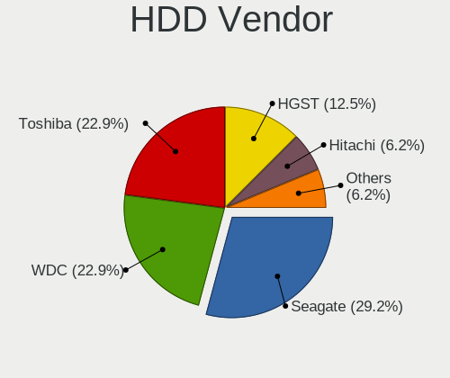
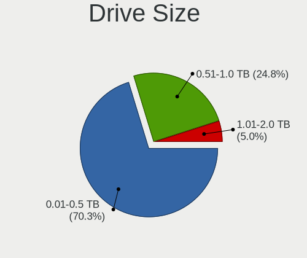
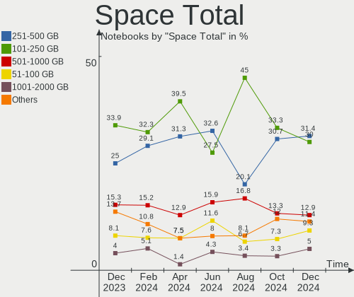
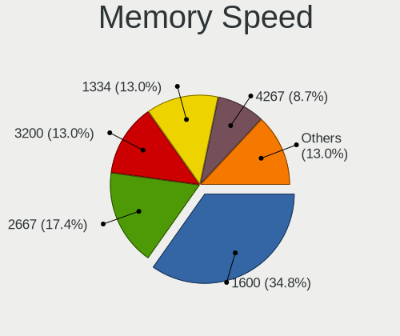

Zorin - Hardware Trends (Notebooks)
-----------------------------------

A project to identify most popular hardware characteristics and track their change
over time based on data collected by Linux users at https://Linux-Hardware.org.

Anyone can contribute to this report by the [hw-probe](https://github.com/linuxhw/hw-probe) tool:

    sudo -E hw-probe -all -upload

This report is for one last month. Overall report since the beginning of time: [TestDays](https://github.com/linuxhw/TestDays)

Period: Apr, 2023.

Contents
--------

* [ System ](#system)
  - [ OS                       ](#os)
  - [ OS Family                ](#os-family)
  - [ Kernel                   ](#kernel)
  - [ Kernel Family            ](#kernel-family)
  - [ Kernel Major Ver.        ](#kernel-major-ver)
  - [ Arch                     ](#arch)
  - [ DE                       ](#de)
  - [ Display Server           ](#display-server)
  - [ Display Manager          ](#display-manager)
  - [ OS Lang                  ](#os-lang)
  - [ Boot Mode                ](#boot-mode)
  - [ Filesystem               ](#filesystem)
  - [ Part. scheme             ](#part-scheme)
  - [ Dual Boot with Linux/BSD ](#dual-boot-with-linuxbsd)
  - [ Dual Boot (Win)          ](#dual-boot-win)

* [ Board ](#board)
  - [ Vendor                   ](#vendor)
  - [ Model                    ](#model)
  - [ Model Family             ](#model-family)
  - [ MFG Year                 ](#mfg-year)
  - [ Form Factor              ](#form-factor)
  - [ Secure Boot              ](#secure-boot)
  - [ Coreboot                 ](#coreboot)
  - [ RAM Size                 ](#ram-size)
  - [ RAM Used                 ](#ram-used)
  - [ Total Drives             ](#total-drives)
  - [ Has CD-ROM               ](#has-cd-rom)
  - [ Has Ethernet             ](#has-ethernet)
  - [ Has WiFi                 ](#has-wifi)
  - [ Has Bluetooth            ](#has-bluetooth)

* [ Location ](#location)
  - [ Country                  ](#country)
  - [ City                     ](#city)

* [ Drives ](#drives)
  - [ Drive Vendor             ](#drive-vendor)
  - [ Drive Model              ](#drive-model)
  - [ HDD Vendor               ](#hdd-vendor)
  - [ SSD Vendor               ](#ssd-vendor)
  - [ Drive Kind               ](#drive-kind)
  - [ Drive Connector          ](#drive-connector)
  - [ Drive Size               ](#drive-size)
  - [ Space Total              ](#space-total)
  - [ Space Used               ](#space-used)
  - [ Malfunc. Drives          ](#malfunc-drives)
  - [ Malfunc. Drive Vendor    ](#malfunc-drive-vendor)
  - [ Malfunc. HDD Vendor      ](#malfunc-hdd-vendor)
  - [ Malfunc. Drive Kind      ](#malfunc-drive-kind)
  - [ Failed Drives            ](#failed-drives)
  - [ Failed Drive Vendor      ](#failed-drive-vendor)
  - [ Drive Status             ](#drive-status)

* [ Storage controller ](#storage-controller)
  - [ Storage Vendor           ](#storage-vendor)
  - [ Storage Model            ](#storage-model)
  - [ Storage Kind             ](#storage-kind)

* [ Processor ](#processor)
  - [ CPU Vendor               ](#cpu-vendor)
  - [ CPU Model                ](#cpu-model)
  - [ CPU Model Family         ](#cpu-model-family)
  - [ CPU Cores                ](#cpu-cores)
  - [ CPU Sockets              ](#cpu-sockets)
  - [ CPU Threads              ](#cpu-threads)
  - [ CPU Op-Modes             ](#cpu-op-modes)
  - [ CPU Microcode            ](#cpu-microcode)
  - [ CPU Microarch            ](#cpu-microarch)

* [ Graphics ](#graphics)
  - [ GPU Vendor               ](#gpu-vendor)
  - [ GPU Model                ](#gpu-model)
  - [ GPU Combo                ](#gpu-combo)
  - [ GPU Driver               ](#gpu-driver)
  - [ GPU Memory               ](#gpu-memory)

* [ Monitor ](#monitor)
  - [ Monitor Vendor           ](#monitor-vendor)
  - [ Monitor Model            ](#monitor-model)
  - [ Monitor Resolution       ](#monitor-resolution)
  - [ Monitor Diagonal         ](#monitor-diagonal)
  - [ Monitor Width            ](#monitor-width)
  - [ Aspect Ratio             ](#aspect-ratio)
  - [ Monitor Area             ](#monitor-area)
  - [ Pixel Density            ](#pixel-density)
  - [ Multiple Monitors        ](#multiple-monitors)

* [ Network ](#network)
  - [ Net Controller Vendor    ](#net-controller-vendor)
  - [ Net Controller Model     ](#net-controller-model)
  - [ Wireless Vendor          ](#wireless-vendor)
  - [ Wireless Model           ](#wireless-model)
  - [ Ethernet Vendor          ](#ethernet-vendor)
  - [ Ethernet Model           ](#ethernet-model)
  - [ Net Controller Kind      ](#net-controller-kind)
  - [ Used Controller          ](#used-controller)
  - [ NICs                     ](#nics)
  - [ IPv6                     ](#ipv6)

* [ Bluetooth ](#bluetooth)
  - [ Bluetooth Vendor         ](#bluetooth-vendor)
  - [ Bluetooth Model          ](#bluetooth-model)

* [ Sound ](#sound)
  - [ Sound Vendor             ](#sound-vendor)
  - [ Sound Model              ](#sound-model)

* [ Memory ](#memory)
  - [ Memory Vendor            ](#memory-vendor)
  - [ Memory Model             ](#memory-model)
  - [ Memory Kind              ](#memory-kind)
  - [ Memory Form Factor       ](#memory-form-factor)
  - [ Memory Size              ](#memory-size)
  - [ Memory Speed             ](#memory-speed)

* [ Printers & scanners ](#printers--scanners)
  - [ Printer Vendor           ](#printer-vendor)
  - [ Printer Model            ](#printer-model)
  - [ Scanner Vendor           ](#scanner-vendor)
  - [ Scanner Model            ](#scanner-model)

* [ Camera ](#camera)
  - [ Camera Vendor            ](#camera-vendor)
  - [ Camera Model             ](#camera-model)

* [ Security ](#security)
  - [ Fingerprint Vendor       ](#fingerprint-vendor)
  - [ Fingerprint Model        ](#fingerprint-model)
  - [ Chipcard Vendor          ](#chipcard-vendor)
  - [ Chipcard Model           ](#chipcard-model)

* [ Unsupported ](#unsupported)
  - [ Unsupported Devices      ](#unsupported-devices)
  - [ Unsupported Device Types ](#unsupported-device-types)

System
------

OS
--

Installed operating systems

| Name     | Notebooks | Percent |
|----------|-----------|---------|
| Zorin 16 | 74        | 97.37%  |
| Zorin 15 | 2         | 2.63%   |

OS Family
---------

OS without a version

| Name  | Notebooks | Percent |
|-------|-----------|---------|
| Zorin | 76        | 100%    |

Kernel
------

Version of the Linux kernel

| Version           | Notebooks | Percent |
|-------------------|-----------|---------|
| 5.15.0-69-generic | 50        | 65.79%  |
| 5.15.0-71-generic | 10        | 13.16%  |
| 5.15.0-67-generic | 5         | 6.58%   |
| 5.15.0-56-generic | 5         | 6.58%   |
| 5.4.0-147-generic | 2         | 2.63%   |
| 5.4.0-146-generic | 1         | 1.32%   |
| 5.15.0-70-generic | 1         | 1.32%   |
| 5.15.0-58-generic | 1         | 1.32%   |
| 5.15.0-57-generic | 1         | 1.32%   |

Kernel Family
-------------

Linux kernel without a distro release

| Version | Notebooks | Percent |
|---------|-----------|---------|
| 5.15.0  | 73        | 96.05%  |
| 5.4.0   | 3         | 3.95%   |

Kernel Major Ver.
-----------------

Linux kernel major version

| Version | Notebooks | Percent |
|---------|-----------|---------|
| 5.15    | 73        | 96.05%  |
| 5.4     | 3         | 3.95%   |

Arch
----

OS architecture (x86_64, i586, etc.)

| Name   | Notebooks | Percent |
|--------|-----------|---------|
| x86_64 | 75        | 98.68%  |
| i686   | 1         | 1.32%   |

DE
--

Desktop Environment

| Name  | Notebooks | Percent |
|-------|-----------|---------|
| GNOME | 61        | 80.26%  |
| XFCE  | 15        | 19.74%  |

Display Server
--------------

X11 or Wayland

| Name    | Notebooks | Percent |
|---------|-----------|---------|
| X11     | 73        | 96.05%  |
| Wayland | 2         | 2.63%   |
| Tty     | 1         | 1.32%   |

Display Manager
---------------

SDDM, LightDM, etc.

| Name    | Notebooks | Percent |
|---------|-----------|---------|
| Unknown | 56        | 73.68%  |
| GDM     | 9         | 11.84%  |
| GDM3    | 7         | 9.21%   |
| LightDM | 4         | 5.26%   |

OS Lang
-------

Language

| Lang  | Notebooks | Percent |
|-------|-----------|---------|
| en_US | 39        | 51.32%  |
| de_DE | 8         | 10.53%  |
| en_GB | 4         | 5.26%   |
| fr_FR | 3         | 3.95%   |
| en_IN | 3         | 3.95%   |
| pl_PL | 2         | 2.63%   |
| nl_NL | 2         | 2.63%   |
| es_ES | 2         | 2.63%   |
| sr_RS | 1         | 1.32%   |
| ru_RU | 1         | 1.32%   |
| pt_BR | 1         | 1.32%   |
| es_MX | 1         | 1.32%   |
| es_AR | 1         | 1.32%   |
| en_ZA | 1         | 1.32%   |
| en_NZ | 1         | 1.32%   |
| en_CA | 1         | 1.32%   |
| en_AU | 1         | 1.32%   |
| de_CH | 1         | 1.32%   |
| de_AT | 1         | 1.32%   |
| cs_CZ | 1         | 1.32%   |
| bg_BG | 1         | 1.32%   |

Boot Mode
---------

EFI or BIOS

| Mode | Notebooks | Percent |
|------|-----------|---------|
| EFI  | 41        | 53.95%  |
| BIOS | 35        | 46.05%  |

Filesystem
----------

Type of filesystem

| Type    | Notebooks | Percent |
|---------|-----------|---------|
| Ext4    | 71        | 93.42%  |
| Tmpfs   | 3         | 3.95%   |
| Overlay | 2         | 2.63%   |

Part. scheme
------------

Scheme of partitioning

| Type    | Notebooks | Percent |
|---------|-----------|---------|
| Unknown | 57        | 75%     |
| GPT     | 14        | 18.42%  |
| MBR     | 5         | 6.58%   |

Dual Boot with Linux/BSD
------------------------

Hosting more than one Linux/BSD

| Dual boot | Notebooks | Percent |
|-----------|-----------|---------|
| No        | 74        | 97.37%  |
| Yes       | 2         | 2.63%   |

Dual Boot (Win)
---------------

Hosting Linux and Windows

| Dual boot | Notebooks | Percent |
|-----------|-----------|---------|
| No        | 70        | 92.11%  |
| Yes       | 6         | 7.89%   |

Board
-----

Vendor
------

Motherboard manufacturer

| Name                | Notebooks | Percent |
|---------------------|-----------|---------|
| Lenovo              | 23        | 30.26%  |
| Hewlett-Packard     | 11        | 14.47%  |
| Dell                | 9         | 11.84%  |
| Acer                | 9         | 11.84%  |
| Apple               | 4         | 5.26%   |
| Toshiba             | 3         | 3.95%   |
| Positivo            | 2         | 2.63%   |
| Notebook            | 2         | 2.63%   |
| MSI                 | 2         | 2.63%   |
| Thomson             | 1         | 1.32%   |
| Sony                | 1         | 1.32%   |
| Samsung Electronics | 1         | 1.32%   |
| Monster             | 1         | 1.32%   |
| Medion              | 1         | 1.32%   |
| HONOR               | 1         | 1.32%   |
| Google              | 1         | 1.32%   |
| Fujitsu             | 1         | 1.32%   |
| AZW                 | 1         | 1.32%   |
| ASUSTek Computer    | 1         | 1.32%   |
| AIERXUAN            | 1         | 1.32%   |

Model
-----

Motherboard model

| Name                                       | Notebooks | Percent |
|--------------------------------------------|-----------|---------|
| Toshiba Satellite C650D                    | 1         | 1.32%   |
| Toshiba Satellite C650                     | 1         | 1.32%   |
| Toshiba Satellite C45-A                    | 1         | 1.32%   |
| Thomson WWNEO14C-4BK32F                    | 1         | 1.32%   |
| Sony VPCF215FX                             | 1         | 1.32%   |
| Samsung 355V4C/356V4C/3445VC/3545VC        | 1         | 1.32%   |
| Positivo S14CT01                           | 1         | 1.32%   |
| Positivo Q4128C-S                          | 1         | 1.32%   |
| Notebook NL40_50CU                         | 1         | 1.32%   |
| Notebook NJ50GU                            | 1         | 1.32%   |
| MSI GS73VR 7RF                             | 1         | 1.32%   |
| MSI GP62 7RD                               | 1         | 1.32%   |
| Monster HUMA H4 V5.2                       | 1         | 1.32%   |
| Medion E2215T MD60198                      | 1         | 1.32%   |
| Lenovo Yoga 300-11IBR 80M1                 | 1         | 1.32%   |
| Lenovo Yoga 2 13 20344                     | 1         | 1.32%   |
| Lenovo Y50-70 20378                        | 1         | 1.32%   |
| Lenovo V570 1066EDG                        | 1         | 1.32%   |
| Lenovo ThinkPad X1 Carbon Gen 9 20XXS1KS00 | 1         | 1.32%   |
| Lenovo ThinkPad X1 Carbon Gen 8 20UAS4H800 | 1         | 1.32%   |
| Lenovo ThinkPad T440s 20ARS1BH0H           | 1         | 1.32%   |
| Lenovo ThinkPad T430s 2352CTO              | 1         | 1.32%   |
| Lenovo ThinkPad T430 2349HNU               | 1         | 1.32%   |
| Lenovo ThinkPad T430 2347GU8               | 1         | 1.32%   |
| Lenovo ThinkPad T410 2518P9G               | 1         | 1.32%   |
| Lenovo ThinkPad P52s 20LCS1DU01            | 1         | 1.32%   |
| Lenovo ThinkPad Edge 25453BG               | 1         | 1.32%   |
| Lenovo ThinkPad E14 Gen 2 20T60024TX       | 1         | 1.32%   |
| Lenovo ThinkBook 14-IIL 20SL               | 1         | 1.32%   |
| Lenovo Legion 5 15ACH6 82JW                | 1         | 1.32%   |
| Lenovo IdeaPad Y470                        | 1         | 1.32%   |
| Lenovo IdeaPad 700-15ISK 80RU              | 1         | 1.32%   |
| Lenovo IdeaPad 3 15ITL05 81X8              | 1         | 1.32%   |
| Lenovo IdeaPad 3 15ALC6 82KU               | 1         | 1.32%   |
| Lenovo G500 20236                          | 1         | 1.32%   |
| Lenovo B590 62743NG                        | 1         | 1.32%   |
| Lenovo 3000 N200 0769A97                   | 1         | 1.32%   |
| HONOR BBR-WAX9                             | 1         | 1.32%   |
| HP Stream Laptop 14-ax0XX                  | 1         | 1.32%   |
| HP Stream Laptop 11-ak0xxx                 | 1         | 1.32%   |

Model Family
------------

Motherboard model prefix

| Name                    | Notebooks | Percent |
|-------------------------|-----------|---------|
| Lenovo ThinkPad         | 10        | 13.16%  |
| Acer Aspire             | 7         | 9.21%   |
| Lenovo IdeaPad          | 4         | 5.26%   |
| Toshiba Satellite       | 3         | 3.95%   |
| HP EliteBook            | 3         | 3.95%   |
| Dell Vostro             | 3         | 3.95%   |
| Dell Inspiron           | 3         | 3.95%   |
| Lenovo Yoga             | 2         | 2.63%   |
| HP Stream               | 2         | 2.63%   |
| HP Pavilion             | 2         | 2.63%   |
| Dell XPS                | 2         | 2.63%   |
| Thomson WWNEO14C-4BK32F | 1         | 1.32%   |
| Sony VPCF215FX          | 1         | 1.32%   |
| Samsung 355V4C          | 1         | 1.32%   |
| Positivo S14CT01        | 1         | 1.32%   |
| Positivo Q4128C-S       | 1         | 1.32%   |
| Notebook NL40           | 1         | 1.32%   |
| Notebook NJ50GU         | 1         | 1.32%   |
| MSI GS73VR              | 1         | 1.32%   |
| MSI GP62                | 1         | 1.32%   |
| Monster HUMA            | 1         | 1.32%   |
| Medion E2215T           | 1         | 1.32%   |
| Lenovo Y50-70           | 1         | 1.32%   |
| Lenovo V570             | 1         | 1.32%   |
| Lenovo ThinkBook        | 1         | 1.32%   |
| Lenovo Legion           | 1         | 1.32%   |
| Lenovo G500             | 1         | 1.32%   |
| Lenovo B590             | 1         | 1.32%   |
| Lenovo 3000             | 1         | 1.32%   |
| HONOR BBR-WAX9          | 1         | 1.32%   |
| HP ProBook              | 1         | 1.32%   |
| HP Notebook             | 1         | 1.32%   |
| HP Laptop               | 1         | 1.32%   |
| HP Compaq               | 1         | 1.32%   |
| Google Cyan             | 1         | 1.32%   |
| Fujitsu LIFEBOOK        | 1         | 1.32%   |
| Dell Latitude           | 1         | 1.32%   |
| AZW SEi                 | 1         | 1.32%   |
| ASUS ASUS               | 1         | 1.32%   |
| Apple MacBookPro5       | 1         | 1.32%   |

MFG Year
--------

Motherboard manufacture year

| Year | Notebooks | Percent |
|------|-----------|---------|
| 2016 | 7         | 9.21%   |
| 2012 | 7         | 9.21%   |
| 2021 | 6         | 7.89%   |
| 2015 | 6         | 7.89%   |
| 2013 | 6         | 7.89%   |
| 2018 | 5         | 6.58%   |
| 2014 | 5         | 6.58%   |
| 2010 | 5         | 6.58%   |
| 2009 | 5         | 6.58%   |
| 2022 | 4         | 5.26%   |
| 2020 | 4         | 5.26%   |
| 2019 | 4         | 5.26%   |
| 2011 | 4         | 5.26%   |
| 2008 | 4         | 5.26%   |
| 2017 | 2         | 2.63%   |
| 2023 | 1         | 1.32%   |
| 2007 | 1         | 1.32%   |

Form Factor
-----------

Physical design of the computer

| Name     | Notebooks | Percent |
|----------|-----------|---------|
| Notebook | 76        | 100%    |

Secure Boot
-----------

Enabled or disabled

| State    | Notebooks | Percent |
|----------|-----------|---------|
| Disabled | 70        | 92.11%  |
| Enabled  | 6         | 7.89%   |

Coreboot
--------

Have coreboot on board

| Used | Notebooks | Percent |
|------|-----------|---------|
| No   | 75        | 98.68%  |
| Yes  | 1         | 1.32%   |

RAM Size
--------

Total RAM memory

| Size in GB | Notebooks | Percent |
|------------|-----------|---------|
| 4.01-8.0   | 25        | 32.89%  |
| 3.01-4.0   | 21        | 27.63%  |
| 16.01-24.0 | 13        | 17.11%  |
| 8.01-16.0  | 8         | 10.53%  |
| 32.01-64.0 | 3         | 3.95%   |
| 1.01-2.0   | 3         | 3.95%   |
| 0.51-1.0   | 2         | 2.63%   |
| 2.01-3.0   | 1         | 1.32%   |

RAM Used
--------

Used RAM memory

| Used GB  | Notebooks | Percent |
|----------|-----------|---------|
| 1.01-2.0 | 34        | 44.74%  |
| 2.01-3.0 | 24        | 31.58%  |
| 3.01-4.0 | 9         | 11.84%  |
| 0.51-1.0 | 6         | 7.89%   |
| 4.01-8.0 | 3         | 3.95%   |

Total Drives
------------

Number of drives on board

| Drives | Notebooks | Percent |
|--------|-----------|---------|
| 1      | 54        | 71.05%  |
| 2      | 20        | 26.32%  |
| 3      | 2         | 2.63%   |

Has CD-ROM
----------

Has CD-ROM on board

| Presented | Notebooks | Percent |
|-----------|-----------|---------|
| No        | 46        | 60.53%  |
| Yes       | 30        | 39.47%  |

Has Ethernet
------------

Has Ethernet on board

| Presented | Notebooks | Percent |
|-----------|-----------|---------|
| Yes       | 57        | 75%     |
| No        | 19        | 25%     |

Has WiFi
--------

Has WiFi module

| Presented | Notebooks | Percent |
|-----------|-----------|---------|
| Yes       | 74        | 97.37%  |
| No        | 2         | 2.63%   |

Has Bluetooth
-------------

Has Bluetooth module

| Presented | Notebooks | Percent |
|-----------|-----------|---------|
| Yes       | 53        | 69.74%  |
| No        | 23        | 30.26%  |

Location
--------

Country
-------

Geographic location (country)

| Country             | Notebooks | Percent |
|---------------------|-----------|---------|
| USA                 | 20        | 26.32%  |
| Germany             | 8         | 10.53%  |
| Netherlands         | 4         | 5.26%   |
| France              | 4         | 5.26%   |
| UK                  | 3         | 3.95%   |
| India               | 3         | 3.95%   |
| Turkey              | 2         | 2.63%   |
| Romania             | 2         | 2.63%   |
| Poland              | 2         | 2.63%   |
| Czechia             | 2         | 2.63%   |
| Brazil              | 2         | 2.63%   |
| Venezuela           | 1         | 1.32%   |
| Trinidad and Tobago | 1         | 1.32%   |
| Switzerland         | 1         | 1.32%   |
| Spain               | 1         | 1.32%   |
| South Africa        | 1         | 1.32%   |
| Serbia              | 1         | 1.32%   |
| Saint Lucia         | 1         | 1.32%   |
| Russia              | 1         | 1.32%   |
| Norway              | 1         | 1.32%   |
| New Zealand         | 1         | 1.32%   |
| Mexico              | 1         | 1.32%   |
| Jordan              | 1         | 1.32%   |
| Ghana               | 1         | 1.32%   |
| Finland             | 1         | 1.32%   |
| El Salvador         | 1         | 1.32%   |
| Egypt               | 1         | 1.32%   |
| Denmark             | 1         | 1.32%   |
| Croatia             | 1         | 1.32%   |
| Colombia            | 1         | 1.32%   |
| Canada              | 1         | 1.32%   |
| Bulgaria            | 1         | 1.32%   |
| Austria             | 1         | 1.32%   |
| Australia           | 1         | 1.32%   |
| Argentina           | 1         | 1.32%   |

City
----

Geographic location (city)

| City                | Notebooks | Percent |
|---------------------|-----------|---------|
| Sao Paulo           | 2         | 2.63%   |
| Mumbai              | 2         | 2.63%   |
| Medford             | 2         | 2.63%   |
| Zadar               | 1         | 1.32%   |
| West Lebanon        | 1         | 1.32%   |
| Wenham              | 1         | 1.32%   |
| Warsaw              | 1         | 1.32%   |
| Vienna              | 1         | 1.32%   |
| Venustiano Carranza | 1         | 1.32%   |
| Tulsa               | 1         | 1.32%   |
| Tübingen           | 1         | 1.32%   |
| The Hague           | 1         | 1.32%   |
| Stuttgart           | 1         | 1.32%   |
| Sibiu               | 1         | 1.32%   |
| San Salvador        | 1         | 1.32%   |
| Port of Spain       | 1         | 1.32%   |
| Pontaumur           | 1         | 1.32%   |
| Plovdiv             | 1         | 1.32%   |
| Owensboro           | 1         | 1.32%   |
| Olomouc             | 1         | 1.32%   |
| Northwood           | 1         | 1.32%   |
| Newark on Trent     | 1         | 1.32%   |
| New York            | 1         | 1.32%   |
| New Castle          | 1         | 1.32%   |
| Nelson              | 1         | 1.32%   |
| Naarden             | 1         | 1.32%   |
| Murmansk            | 1         | 1.32%   |
| Munich              | 1         | 1.32%   |
| Montreal            | 1         | 1.32%   |
| Metzingen           | 1         | 1.32%   |
| Mercedes            | 1         | 1.32%   |
| Memmingen           | 1         | 1.32%   |
| Maura               | 1         | 1.32%   |
| Maubeuge            | 1         | 1.32%   |
| Matteson            | 1         | 1.32%   |
| Madrid              | 1         | 1.32%   |
| Leven               | 1         | 1.32%   |
| La Celia            | 1         | 1.32%   |
| Kirdasah            | 1         | 1.32%   |
| Johannesburg        | 1         | 1.32%   |

Drives
------

Drive Vendor
------------

Hard drive vendors

| Vendor                    | Notebooks | Drives | Percent |
|---------------------------|-----------|--------|---------|
| WDC                       | 14        | 14     | 14.43%  |
| Samsung Electronics       | 14        | 14     | 14.43%  |
| Unknown                   | 10        | 12     | 10.31%  |
| Seagate                   | 10        | 10     | 10.31%  |
| Sandisk                   | 9         | 10     | 9.28%   |
| Kingston                  | 8         | 8      | 8.25%   |
| Toshiba                   | 3         | 3      | 3.09%   |
| HGST                      | 3         | 3      | 3.09%   |
| Crucial                   | 3         | 3      | 3.09%   |
| Silicon Motion            | 2         | 2      | 2.06%   |
| Micron Technology         | 2         | 2      | 2.06%   |
| KIOXIA                    | 2         | 2      | 2.06%   |
| Hitachi                   | 2         | 2      | 2.06%   |
| Apple                     | 2         | 3      | 2.06%   |
| XrayDisk                  | 1         | 1      | 1.03%   |
| SPCC                      | 1         | 1      | 1.03%   |
| SK hynix                  | 1         | 1      | 1.03%   |
| Phison Electronics        | 1         | 1      | 1.03%   |
| Mushkin                   | 1         | 1      | 1.03%   |
| Micron/Crucial Technology | 1         | 1      | 1.03%   |
| Intenso                   | 1         | 1      | 1.03%   |
| INTEL SS                  | 1         | 1      | 1.03%   |
| Intel                     | 1         | 1      | 1.03%   |
| EDGE                      | 1         | 1      | 1.03%   |
| Drevo                     | 1         | 1      | 1.03%   |
| BIWIN                     | 1         | 1      | 1.03%   |
| A-DATA Technology         | 1         | 1      | 1.03%   |

Drive Model
-----------

Hard drive models

| Model                                                  | Notebooks | Percent |
|--------------------------------------------------------|-----------|---------|
| Unknown MMC Card  32GB                                 | 6         | 6%      |
| Kingston SA400S37240G 240GB SSD                        | 3         | 3%      |
| WDC WD10JPVX-22JC3T0 1TB                               | 2         | 2%      |
| Unknown MMC Card  64GB                                 | 2         | 2%      |
| Unknown MMC Card  128GB                                | 2         | 2%      |
| Silicon Motion SM2263EN/SM2263XT SSD Controller 1024GB | 2         | 2%      |
| Seagate ST500LT012-1DG142 500GB                        | 2         | 2%      |
| Seagate ST1000LM035-1RK172 970GB                       | 2         | 2%      |
| Samsung SSD 870 QVO 1TB                                | 2         | 2%      |
| HGST HTS721010A9E630 1TB                               | 2         | 2%      |
| XrayDisk 128GB                                         | 1         | 1%      |
| WDC WDS500G2B0A-00SM50 500GB SSD                       | 1         | 1%      |
| WDC WDS500G2B0A 500GB SSD                              | 1         | 1%      |
| WDC WD5000BPVT-00HXZT1 500GB                           | 1         | 1%      |
| WDC WD3200BEVT-75ZCT2 320GB                            | 1         | 1%      |
| WDC WD2500BEVT-75ZCT2 250GB                            | 1         | 1%      |
| WDC WD2500BEKT-60A25T1 250GB                           | 1         | 1%      |
| WDC WD20SPZX-22UA7T0 2TB                               | 1         | 1%      |
| WDC WD1200BEVS-60UST0 120GB                            | 1         | 1%      |
| WDC WD10SPCX-75HWST0 1TB                               | 1         | 1%      |
| WDC WD10JPVX-60JC3T0 1TB                               | 1         | 1%      |
| WDC PC SN730 SDBPNTY-256G-1036 256GB                   | 1         | 1%      |
| WDC PC SN530 SDBPNPZ-256G-1002 256GB                   | 1         | 1%      |
| Unknown SD/MMC/MS PRO 249GB                            | 1         | 1%      |
| Unknown MMC Card  16GB                                 | 1         | 1%      |
| Toshiba MQ04ABF100 1TB                                 | 1         | 1%      |
| Toshiba MQ01ABD100 1TB                                 | 1         | 1%      |
| Toshiba MK1235GSL 120GB                                | 1         | 1%      |
| SPCC Solid State Disk 256GB                            | 1         | 1%      |
| SK hynix SKHynix_HFS512GDE9X084N 512GB                 | 1         | 1%      |
| Seagate ST500LX012-SSHD-8GB                            | 1         | 1%      |
| Seagate ST500LM030-1RK17D 500GB                        | 1         | 1%      |
| Seagate ST320LT007-9ZV142 320GB                        | 1         | 1%      |
| Seagate ST1000LM024 HN-M101MBB 1TB                     | 1         | 1%      |
| Seagate ST1000DM 010-2EP102 1TB                        | 1         | 1%      |
| Seagate Portable 5TB                                   | 1         | 1%      |
| Sandisk WD_BLACK SN770 500GB                           | 1         | 1%      |
| Sandisk WDC PC SN530 SDBPMPZ-256G-1101 256GB           | 1         | 1%      |
| Sandisk WDC PC SN530 SDBPMPZ-256G-1001 256GB           | 1         | 1%      |
| Sandisk WD PC SN740 SDDPNQD-512G-1006 512GB            | 1         | 1%      |

HDD Vendor
----------

Hard disk drive vendors

| Vendor  | Notebooks | Drives | Percent |
|---------|-----------|--------|---------|
| WDC     | 10        | 10     | 35.71%  |
| Seagate | 9         | 9      | 32.14%  |
| Toshiba | 3         | 3      | 10.71%  |
| HGST    | 3         | 3      | 10.71%  |
| Hitachi | 2         | 2      | 7.14%   |
| Unknown | 1         | 1      | 3.57%   |

SSD Vendor
----------

Solid state drive vendors

| Vendor              | Notebooks | Drives | Percent |
|---------------------|-----------|--------|---------|
| Samsung Electronics | 7         | 7      | 22.58%  |
| Kingston            | 7         | 7      | 22.58%  |
| Crucial             | 3         | 3      | 9.68%   |
| WDC                 | 2         | 2      | 6.45%   |
| SanDisk             | 2         | 2      | 6.45%   |
| SPCC                | 1         | 1      | 3.23%   |
| Mushkin             | 1         | 1      | 3.23%   |
| Micron Technology   | 1         | 1      | 3.23%   |
| Intenso             | 1         | 1      | 3.23%   |
| INTEL SS            | 1         | 1      | 3.23%   |
| Intel               | 1         | 1      | 3.23%   |
| EDGE                | 1         | 1      | 3.23%   |
| Drevo               | 1         | 1      | 3.23%   |
| Apple               | 1         | 1      | 3.23%   |
| A-DATA Technology   | 1         | 1      | 3.23%   |

Drive Kind
----------

HDD or SSD

| Kind    | Notebooks | Drives | Percent |
|---------|-----------|--------|---------|
| SSD     | 31        | 31     | 33.33%  |
| HDD     | 27        | 28     | 29.03%  |
| NVMe    | 23        | 28     | 24.73%  |
| MMC     | 10        | 12     | 10.75%  |
| Unknown | 2         | 2      | 2.15%   |

Drive Connector
---------------

SATA, SAS, NVMe, etc.

| Type | Notebooks | Drives | Percent |
|------|-----------|--------|---------|
| SATA | 53        | 57     | 58.89%  |
| NVMe | 23        | 28     | 25.56%  |
| MMC  | 10        | 12     | 11.11%  |
| SAS  | 4         | 4      | 4.44%   |

Drive Size
----------

Size of hard drive

| Size in TB | Notebooks | Drives | Percent |
|------------|-----------|--------|---------|
| 0.01-0.5   | 39        | 39     | 67.24%  |
| 0.51-1.0   | 18        | 19     | 31.03%  |
| 1.01-2.0   | 1         | 1      | 1.72%   |

Space Total
-----------

Amount of disk space available on the file system

| Size in GB     | Notebooks | Percent |
|----------------|-----------|---------|
| 101-250        | 27        | 35.53%  |
| 251-500        | 17        | 22.37%  |
| 501-1000       | 11        | 14.47%  |
| 21-50          | 7         | 9.21%   |
| 51-100         | 5         | 6.58%   |
| 1001-2000      | 4         | 5.26%   |
| 1-20           | 3         | 3.95%   |
| More than 3000 | 1         | 1.32%   |
| 2001-3000      | 1         | 1.32%   |

Space Used
----------

Amount of used disk space

| Used GB   | Notebooks | Percent |
|-----------|-----------|---------|
| 21-50     | 26        | 34.21%  |
| 1-20      | 26        | 34.21%  |
| 51-100    | 14        | 18.42%  |
| 101-250   | 6         | 7.89%   |
| 251-500   | 1         | 1.32%   |
| 2001-3000 | 1         | 1.32%   |
| 1001-2000 | 1         | 1.32%   |
| 501-1000  | 1         | 1.32%   |

Malfunc. Drives
---------------

Drive models with a malfunction

| Model                            | Notebooks | Drives | Percent |
|----------------------------------|-----------|--------|---------|
| WDC WD1200BEVS-60UST0 120GB      | 1         | 1      | 25%     |
| Seagate ST320LT007-9ZV142 320GB  | 1         | 1      | 25%     |
| Seagate ST1000LM035-1RK172 970GB | 1         | 1      | 25%     |
| Drevo X1 SSD 120GB               | 1         | 1      | 25%     |

Malfunc. Drive Vendor
---------------------

Vendors of faulty drives

| Vendor  | Notebooks | Drives | Percent |
|---------|-----------|--------|---------|
| Seagate | 2         | 2      | 50%     |
| WDC     | 1         | 1      | 25%     |
| Drevo   | 1         | 1      | 25%     |

Malfunc. HDD Vendor
-------------------

Vendors of faulty HDD drives

| Vendor  | Notebooks | Drives | Percent |
|---------|-----------|--------|---------|
| Seagate | 2         | 2      | 66.67%  |
| WDC     | 1         | 1      | 33.33%  |

Malfunc. Drive Kind
-------------------

Kinds of faulty drives

| Kind | Notebooks | Drives | Percent |
|------|-----------|--------|---------|
| HDD  | 3         | 3      | 75%     |
| SSD  | 1         | 1      | 25%     |

Failed Drives
-------------

Failed drive models

Zero info for selected period =(

Failed Drive Vendor
-------------------

Failed drive vendors

Zero info for selected period =(

Drive Status
------------

Number of failed and malfunc. drives

| Status   | Notebooks | Drives | Percent |
|----------|-----------|--------|---------|
| Detected | 63        | 82     | 78.75%  |
| Works    | 13        | 15     | 16.25%  |
| Malfunc  | 4         | 4      | 5%      |

Storage controller
------------------

Storage Vendor
--------------

Storage controller vendors

| Vendor                      | Notebooks | Percent |
|-----------------------------|-----------|---------|
| Intel                       | 52        | 59.77%  |
| Samsung Electronics         | 8         | 9.2%    |
| AMD                         | 8         | 9.2%    |
| SanDisk                     | 7         | 8.05%   |
| Nvidia                      | 3         | 3.45%   |
| Silicon Motion              | 2         | 2.3%    |
| KIOXIA                      | 2         | 2.3%    |
| SK hynix                    | 1         | 1.15%   |
| Phison Electronics          | 1         | 1.15%   |
| Micron/Crucial Technology   | 1         | 1.15%   |
| Micron Technology           | 1         | 1.15%   |
| Kingston Technology Company | 1         | 1.15%   |

Storage Model
-------------

Storage controller models

| Model                                                                            | Notebooks | Percent |
|----------------------------------------------------------------------------------|-----------|---------|
| Intel 7 Series Chipset Family 6-port SATA Controller [AHCI mode]                 | 8         | 8.42%   |
| AMD FCH SATA Controller [AHCI mode]                                              | 6         | 6.32%   |
| Samsung NVMe SSD Controller 980                                                  | 4         | 4.21%   |
| Intel HM170/QM170 Chipset SATA Controller [AHCI Mode]                            | 4         | 4.21%   |
| Intel Wildcat Point-LP SATA Controller [AHCI Mode]                               | 3         | 3.16%   |
| Intel Atom/Celeron/Pentium Processor x5-E8000/J3xxx/N3xxx Series SATA Controller | 3         | 3.16%   |
| Intel 82801IBM/IEM (ICH9M/ICH9M-E) 4 port SATA Controller [AHCI mode]            | 3         | 3.16%   |
| Intel 82801 Mobile SATA Controller [RAID mode]                                   | 3         | 3.16%   |
| Intel 8 Series SATA Controller 1 [AHCI mode]                                     | 3         | 3.16%   |
| Silicon Motion SM2263EN/SM2263XT SSD Controller                                  | 2         | 2.11%   |
| SanDisk WD Black SN770 NVMe SSD                                                  | 2         | 2.11%   |
| SanDisk WD Black SN750 / PC SN730 NVMe SSD                                       | 2         | 2.11%   |
| SanDisk NVMe Controller                                                          | 2         | 2.11%   |
| Nvidia MCP79 AHCI Controller                                                     | 2         | 2.11%   |
| Intel Volume Management Device NVMe RAID Controller                              | 2         | 2.11%   |
| Intel Tiger Lake-LP SATA Controller                                              | 2         | 2.11%   |
| Intel NM10/ICH7 Family SATA Controller [AHCI mode]                               | 2         | 2.11%   |
| Intel Ice Lake-LP SATA Controller [AHCI mode]                                    | 2         | 2.11%   |
| Intel Comet Lake SATA AHCI Controller                                            | 2         | 2.11%   |
| Intel Alder Lake-P SATA AHCI Controller                                          | 2         | 2.11%   |
| Intel 82801HM/HEM (ICH8M/ICH8M-E) SATA Controller [AHCI mode]                    | 2         | 2.11%   |
| Intel 82801HM/HEM (ICH8M/ICH8M-E) IDE Controller                                 | 2         | 2.11%   |
| Intel 8 Series/C220 Series Chipset Family 6-port SATA Controller 1 [AHCI mode]   | 2         | 2.11%   |
| Intel 6 Series/C200 Series Chipset Family 6 port Mobile SATA AHCI Controller     | 2         | 2.11%   |
| AMD SB7x0/SB8x0/SB9x0 SATA Controller [AHCI mode]                                | 2         | 2.11%   |
| SK hynix Gold P31/PC711 NVMe Solid State Drive                                   | 1         | 1.05%   |
| SanDisk WD Blue SN550 NVMe SSD                                                   | 1         | 1.05%   |
| Samsung NVMe SSD Controller SM981/PM981/PM983                                    | 1         | 1.05%   |
| Samsung NVMe SSD Controller SM961/PM961/SM963                                    | 1         | 1.05%   |
| Samsung NVMe SSD Controller SM951/PM951                                          | 1         | 1.05%   |
| Samsung Apple PCIe SSD                                                           | 1         | 1.05%   |
| Phison E16 PCIe4 NVMe Controller                                                 | 1         | 1.05%   |
| Nvidia MCP67 IDE Controller                                                      | 1         | 1.05%   |
| Nvidia MCP67 AHCI Controller                                                     | 1         | 1.05%   |
| Micron/Crucial P1 NVMe PCIe SSD                                                  | 1         | 1.05%   |
| Micron NVMe Storage Controller                                                   | 1         | 1.05%   |
| KIOXIA NVMe SSD                                                                  | 1         | 1.05%   |
| KIOXIA Non-Volatile memory controller                                            | 1         | 1.05%   |
| Kingston Company Company Non-Volatile memory controller                          | 1         | 1.05%   |
| Intel Sunrise Point-LP SATA Controller [AHCI mode]                               | 1         | 1.05%   |

Storage Kind
------------

Kind of storage controller (IDE, SATA, NVMe, SAS, ...)

| Kind | Notebooks | Percent |
|------|-----------|---------|
| SATA | 58        | 63.04%  |
| NVMe | 22        | 23.91%  |
| IDE  | 7         | 7.61%   |
| RAID | 5         | 5.43%   |

Processor
---------

CPU Vendor
----------

Processor vendors

| Vendor | Notebooks | Percent |
|--------|-----------|---------|
| Intel  | 66        | 86.84%  |
| AMD    | 10        | 13.16%  |

CPU Model
---------

Processor models

| Model                                       | Notebooks | Percent |
|---------------------------------------------|-----------|---------|
| Intel Core i5-3320M CPU @ 2.60GHz           | 4         | 5.26%   |
| Intel Celeron CPU N3060 @ 1.60GHz           | 3         | 3.95%   |
| Intel Atom x5-Z8350 CPU @ 1.44GHz           | 3         | 3.95%   |
| Intel Core i7-7700HQ CPU @ 2.80GHz          | 2         | 2.63%   |
| Intel Core i5-8265U CPU @ 1.60GHz           | 2         | 2.63%   |
| Intel Core i5-3210M CPU @ 2.50GHz           | 2         | 2.63%   |
| Intel Core i3-3110M CPU @ 2.40GHz           | 2         | 2.63%   |
| Intel Pentium Silver N5030 CPU @ 1.10GHz    | 1         | 1.32%   |
| Intel Pentium Dual-Core CPU T4500 @ 2.30GHz | 1         | 1.32%   |
| Intel Pentium CPU N3700 @ 1.60GHz           | 1         | 1.32%   |
| Intel Pentium CPU N3530 @ 2.16GHz           | 1         | 1.32%   |
| Intel Pentium CPU 6405U @ 2.40GHz           | 1         | 1.32%   |
| Intel Core i7-8650U CPU @ 1.90GHz           | 1         | 1.32%   |
| Intel Core i7-4750HQ CPU @ 2.00GHz          | 1         | 1.32%   |
| Intel Core i7-4710HQ CPU @ 2.50GHz          | 1         | 1.32%   |
| Intel Core i7-4702MQ CPU @ 2.20GHz          | 1         | 1.32%   |
| Intel Core i7-4702HQ CPU @ 2.20GHz          | 1         | 1.32%   |
| Intel Core i7-2630QM CPU @ 2.00GHz          | 1         | 1.32%   |
| Intel Core i7-1065G7 CPU @ 1.30GHz          | 1         | 1.32%   |
| Intel Core i7-10610U CPU @ 1.80GHz          | 1         | 1.32%   |
| Intel Core i5-8279U CPU @ 2.40GHz           | 1         | 1.32%   |
| Intel Core i5-7360U CPU @ 2.30GHz           | 1         | 1.32%   |
| Intel Core i5-7300HQ CPU @ 2.50GHz          | 1         | 1.32%   |
| Intel Core i5-6300HQ CPU @ 2.30GHz          | 1         | 1.32%   |
| Intel Core i5-6200U CPU @ 2.30GHz           | 1         | 1.32%   |
| Intel Core i5-5300U CPU @ 2.30GHz           | 1         | 1.32%   |
| Intel Core i5-5257U CPU @ 2.70GHz           | 1         | 1.32%   |
| Intel Core i5-5200U CPU @ 2.20GHz           | 1         | 1.32%   |
| Intel Core i5-4300U CPU @ 1.90GHz           | 1         | 1.32%   |
| Intel Core i5-4210U CPU @ 1.70GHz           | 1         | 1.32%   |
| Intel Core i5-3230M CPU @ 2.60GHz           | 1         | 1.32%   |
| Intel Core i5-2520M CPU @ 2.50GHz           | 1         | 1.32%   |
| Intel Core i5-2430M CPU @ 2.40GHz           | 1         | 1.32%   |
| Intel Core i5 CPU M 450 @ 2.40GHz           | 1         | 1.32%   |
| Intel Core i3-4005U CPU @ 1.70GHz           | 1         | 1.32%   |
| Intel Core i3-10110U CPU @ 2.10GHz          | 1         | 1.32%   |
| Intel Core i3-1005G1 CPU @ 1.20GHz          | 1         | 1.32%   |
| Intel Core i3 CPU M 370 @ 2.40GHz           | 1         | 1.32%   |
| Intel Core 2 Duo CPU U9300 @ 1.20GHz        | 1         | 1.32%   |
| Intel Core 2 Duo CPU T9550 @ 2.66GHz        | 1         | 1.32%   |

CPU Model Family
----------------

Processor model prefix

| Model                   | Notebooks | Percent |
|-------------------------|-----------|---------|
| Intel Core i5           | 22        | 28.95%  |
| Intel Core i7           | 10        | 13.16%  |
| Intel Core 2 Duo        | 7         | 9.21%   |
| Intel Core i3           | 6         | 7.89%   |
| Intel Celeron           | 6         | 7.89%   |
| Other                   | 5         | 6.58%   |
| Intel Atom              | 5         | 6.58%   |
| Intel Pentium           | 3         | 3.95%   |
| AMD Ryzen 7             | 2         | 2.63%   |
| AMD Ryzen 5             | 2         | 2.63%   |
| Intel Pentium Silver    | 1         | 1.32%   |
| Intel Pentium Dual-Core | 1         | 1.32%   |
| AMD E                   | 1         | 1.32%   |
| AMD Athlon II Neo       | 1         | 1.32%   |
| AMD Athlon 64 X2        | 1         | 1.32%   |
| AMD A8                  | 1         | 1.32%   |
| AMD A4                  | 1         | 1.32%   |
| AMD A10                 | 1         | 1.32%   |

CPU Cores
---------

Number of processor cores

| Number | Notebooks | Percent |
|--------|-----------|---------|
| 2      | 44        | 57.89%  |
| 4      | 24        | 31.58%  |
| 10     | 2         | 2.63%   |
| 8      | 2         | 2.63%   |
| 6      | 2         | 2.63%   |
| 1      | 2         | 2.63%   |

CPU Sockets
-----------

Number of sockets

| Number | Notebooks | Percent |
|--------|-----------|---------|
| 1      | 76        | 100%    |

CPU Threads
-----------

Threads per core (Hyper-Threading)

| Number | Notebooks | Percent |
|--------|-----------|---------|
| 2      | 47        | 61.84%  |
| 1      | 29        | 38.16%  |

CPU Op-Modes
------------

CPU Operation Modes (32-bit, 64-bit)

| Op mode        | Notebooks | Percent |
|----------------|-----------|---------|
| 32-bit, 64-bit | 76        | 100%    |

CPU Microcode
-------------

Microcode number

| Number     | Notebooks | Percent |
|------------|-----------|---------|
| 0x306a9    | 8         | 10.53%  |
| 0x406c4    | 7         | 9.21%   |
| Unknown    | 7         | 9.21%   |
| 0x1067a    | 6         | 7.89%   |
| 0x806ec    | 4         | 5.26%   |
| 0x906e9    | 3         | 3.95%   |
| 0x806c1    | 3         | 3.95%   |
| 0x40651    | 3         | 3.95%   |
| 0x306d4    | 3         | 3.95%   |
| 0x206a7    | 3         | 3.95%   |
| 0x906a4    | 2         | 2.63%   |
| 0x706e5    | 2         | 2.63%   |
| 0x306c3    | 2         | 2.63%   |
| 0x20655    | 2         | 2.63%   |
| 0x806eb    | 1         | 1.32%   |
| 0x806ea    | 1         | 1.32%   |
| 0x806e9    | 1         | 1.32%   |
| 0x706a8    | 1         | 1.32%   |
| 0x6fd      | 1         | 1.32%   |
| 0x506e3    | 1         | 1.32%   |
| 0x406e3    | 1         | 1.32%   |
| 0x406c3    | 1         | 1.32%   |
| 0x40661    | 1         | 1.32%   |
| 0x30678    | 1         | 1.32%   |
| 0x30661    | 1         | 1.32%   |
| 0x106ca    | 1         | 1.32%   |
| 0x10676    | 1         | 1.32%   |
| 0x0a50000d | 1         | 1.32%   |
| 0x0a50000c | 1         | 1.32%   |
| 0x08600103 | 1         | 1.32%   |
| 0x06006118 | 1         | 1.32%   |
| 0x06001119 | 1         | 1.32%   |
| 0x05000119 | 1         | 1.32%   |
| 0x03000027 | 1         | 1.32%   |
| 0x010000c8 | 1         | 1.32%   |

CPU Microarch
-------------

Microarchitecture

| Name             | Notebooks | Percent |
|------------------|-----------|---------|
| KabyLake         | 11        | 14.47%  |
| Silvermont       | 9         | 11.84%  |
| IvyBridge        | 9         | 11.84%  |
| Penryn           | 7         | 9.21%   |
| Haswell          | 7         | 9.21%   |
| TigerLake        | 3         | 3.95%   |
| SandyBridge      | 3         | 3.95%   |
| Broadwell        | 3         | 3.95%   |
| Zen 3            | 2         | 2.63%   |
| Westmere         | 2         | 2.63%   |
| Skylake          | 2         | 2.63%   |
| IceLake          | 2         | 2.63%   |
| Goldmont plus    | 2         | 2.63%   |
| Bonnell          | 2         | 2.63%   |
| Alderlake Hybrid | 2         | 2.63%   |
| Zen 2            | 1         | 1.32%   |
| Piledriver       | 1         | 1.32%   |
| K8 Hammer        | 1         | 1.32%   |
| K10 Llano        | 1         | 1.32%   |
| K10              | 1         | 1.32%   |
| Goldmont         | 1         | 1.32%   |
| Excavator        | 1         | 1.32%   |
| Core             | 1         | 1.32%   |
| Bobcat           | 1         | 1.32%   |
| Unknown          | 1         | 1.32%   |

Graphics
--------

GPU Vendor
----------

Vendors of graphics cards

| Vendor | Notebooks | Percent |
|--------|-----------|---------|
| Intel  | 59        | 65.56%  |
| Nvidia | 19        | 21.11%  |
| AMD    | 12        | 13.33%  |

GPU Model
---------

Graphics card models

| Model                                                                                    | Notebooks | Percent |
|------------------------------------------------------------------------------------------|-----------|---------|
| Intel 3rd Gen Core processor Graphics Controller                                         | 9         | 9.47%   |
| Intel Atom/Celeron/Pentium Processor x5-E8000/J3xxx/N3xxx Integrated Graphics Controller | 8         | 8.42%   |
| Intel Mobile 4 Series Chipset Integrated Graphics Controller                             | 3         | 3.16%   |
| Intel HD Graphics 630                                                                    | 3         | 3.16%   |
| Intel Haswell-ULT Integrated Graphics Controller                                         | 3         | 3.16%   |
| Intel 4th Gen Core Processor Integrated Graphics Controller                              | 3         | 3.16%   |
| Nvidia GP107M [GeForce GTX 1050 Mobile]                                                  | 2         | 2.11%   |
| Nvidia GK107M [GeForce GT 750M]                                                          | 2         | 2.11%   |
| Nvidia C79 [GeForce 9400M]                                                               | 2         | 2.11%   |
| Intel WhiskeyLake-U GT2 [UHD Graphics 620]                                               | 2         | 2.11%   |
| Intel TigerLake-LP GT2 [Iris Xe Graphics]                                                | 2         | 2.11%   |
| Intel HD Graphics 5500                                                                   | 2         | 2.11%   |
| Intel CometLake-U GT2 [UHD Graphics]                                                     | 2         | 2.11%   |
| Intel Alder Lake-UP3 GT2 [Iris Xe Graphics]                                              | 2         | 2.11%   |
| Nvidia GP108GLM [Quadro P500 Mobile]                                                     | 1         | 1.05%   |
| Nvidia GP106M [GeForce GTX 1060 Mobile]                                                  | 1         | 1.05%   |
| Nvidia GM108M [GeForce 840M]                                                             | 1         | 1.05%   |
| Nvidia GM107M [GeForce GTX 950M]                                                         | 1         | 1.05%   |
| Nvidia GM107M [GeForce GTX 860M]                                                         | 1         | 1.05%   |
| Nvidia GK208BM [GeForce 910M]                                                            | 1         | 1.05%   |
| Nvidia GF108M [GeForce GT 620M/630M/635M/640M LE]                                        | 1         | 1.05%   |
| Nvidia GF108M [GeForce GT 540M]                                                          | 1         | 1.05%   |
| Nvidia GF108M [GeForce GT 525M]                                                          | 1         | 1.05%   |
| Nvidia GA107BM [GeForce RTX 3050 Ti Mobile]                                              | 1         | 1.05%   |
| Nvidia G98M [GeForce 9300M GS]                                                           | 1         | 1.05%   |
| Nvidia G96CM [GeForce 9600M GT]                                                          | 1         | 1.05%   |
| Nvidia G72M [Quadro NVS 110M/GeForce Go 7300]                                            | 1         | 1.05%   |
| Nvidia C67 [GeForce 7000M / nForce 610M]                                                 | 1         | 1.05%   |
| Intel UHD Graphics 620                                                                   | 1         | 1.05%   |
| Intel Tiger Lake-LP GT2 [UHD Graphics G4]                                                | 1         | 1.05%   |
| Intel Skylake GT2 [HD Graphics 520]                                                      | 1         | 1.05%   |
| Intel Mobile GM965/GL960 Integrated Graphics Controller (secondary)                      | 1         | 1.05%   |
| Intel Mobile GM965/GL960 Integrated Graphics Controller (primary)                        | 1         | 1.05%   |
| Intel Iris Plus Graphics G7                                                              | 1         | 1.05%   |
| Intel Iris Plus Graphics G1 (Ice Lake)                                                   | 1         | 1.05%   |
| Intel Iris Plus Graphics 640                                                             | 1         | 1.05%   |
| Intel Iris Graphics 6100                                                                 | 1         | 1.05%   |
| Intel HD Graphics 530                                                                    | 1         | 1.05%   |
| Intel HD Graphics 500                                                                    | 1         | 1.05%   |
| Intel GeminiLake [UHD Graphics 605]                                                      | 1         | 1.05%   |

GPU Combo
---------

Combinations of graphics cards

| Name           | Notebooks | Percent |
|----------------|-----------|---------|
| 1 x Intel      | 45        | 59.21%  |
| Intel + Nvidia | 12        | 15.79%  |
| 1 x AMD        | 7         | 9.21%   |
| 1 x Nvidia     | 6         | 7.89%   |
| 2 x AMD        | 3         | 3.95%   |
| Intel + AMD    | 2         | 2.63%   |
| 2 x Nvidia     | 1         | 1.32%   |

GPU Driver
----------

Free vs proprietary

| Driver      | Notebooks | Percent |
|-------------|-----------|---------|
| Free        | 69        | 90.79%  |
| Proprietary | 7         | 9.21%   |

GPU Memory
----------

Total video memory

| Size in GB | Notebooks | Percent |
|------------|-----------|---------|
| Unknown    | 52        | 68.42%  |
| 0.01-0.5   | 13        | 17.11%  |
| 1.01-2.0   | 6         | 7.89%   |
| 0.51-1.0   | 3         | 3.95%   |
| 3.01-4.0   | 2         | 2.63%   |

Monitor
-------

Monitor Vendor
--------------

Monitor vendors

| Vendor              | Notebooks | Percent |
|---------------------|-----------|---------|
| AU Optronics        | 19        | 24.36%  |
| BOE                 | 13        | 16.67%  |
| Chimei Innolux      | 9         | 11.54%  |
| Samsung Electronics | 8         | 10.26%  |
| LG Display          | 8         | 10.26%  |
| Apple               | 4         | 5.13%   |
| Sharp               | 3         | 3.85%   |
| LG Philips          | 2         | 2.56%   |
| InfoVision          | 2         | 2.56%   |
| SLD                 | 1         | 1.28%   |
| PANDA               | 1         | 1.28%   |
| Orion               | 1         | 1.28%   |
| ONN                 | 1         | 1.28%   |
| LG Electronics      | 1         | 1.28%   |
| Lenovo              | 1         | 1.28%   |
| InnoLux Display     | 1         | 1.28%   |
| Dell                | 1         | 1.28%   |
| BenQ                | 1         | 1.28%   |
| Unknown             | 1         | 1.28%   |

Monitor Model
-------------

Monitor models

| Model                                                                | Notebooks | Percent |
|----------------------------------------------------------------------|-----------|---------|
| BOE LCD Monitor BOE0696 1366x768 309x173mm 13.9-inch                 | 3         | 3.85%   |
| Samsung Electronics LCD Monitor SEC5441 1366x768 344x194mm 15.5-inch | 2         | 2.56%   |
| AU Optronics LCD Monitor AUO205C 1366x768 256x144mm 11.6-inch        | 2         | 2.56%   |
| AU Optronics LCD Monitor AUO119E 1600x900 382x214mm 17.2-inch        | 2         | 2.56%   |
| SLD LCD Monitor SLD003C 1366x768 309x173mm 13.9-inch                 | 1         | 1.28%   |
| Sharp LCD Monitor SHP1420 1920x1080 294x165mm 13.3-inch              | 1         | 1.28%   |
| Sharp LCD Monitor SHP141B 1920x1080 294x165mm 13.3-inch              | 1         | 1.28%   |
| Sharp LCD Monitor SHP13F8 3200x1800 346x194mm 15.6-inch              | 1         | 1.28%   |
| Samsung Electronics LCD Monitor SEC5541 1366x768 344x193mm 15.5-inch | 1         | 1.28%   |
| Samsung Electronics LCD Monitor SEC4641 1280x800 261x163mm 12.1-inch | 1         | 1.28%   |
| Samsung Electronics LCD Monitor SEC3152 1366x768 344x194mm 15.5-inch | 1         | 1.28%   |
| Samsung Electronics LCD Monitor SEC3150 1366x768 344x193mm 15.5-inch | 1         | 1.28%   |
| Samsung Electronics LCD Monitor SEC3030 1024x600 223x125mm 10.1-inch | 1         | 1.28%   |
| Samsung Electronics LCD Monitor SDC4752 1366x768 344x194mm 15.5-inch | 1         | 1.28%   |
| PANDA LCD Monitor NCP0046 1920x1080 344x194mm 15.5-inch              | 1         | 1.28%   |
| Orion ORION ORN1208 1360x768                                         | 1         | 1.28%   |
| ONN ONA18HO015 ONN0101 1920x1080 698x393mm 31.5-inch                 | 1         | 1.28%   |
| LG Philips LP154WX4-TLCB LPL3101 1280x800 331x207mm 15.4-inch        | 1         | 1.28%   |
| LG Philips LP154WX4-TLC8 LPL0120 1280x800 331x207mm 15.4-inch        | 1         | 1.28%   |
| LG Electronics LCD Monitor LG TV                                     | 1         | 1.28%   |
| LG Display LCD Monitor LGD05EC 1920x1080 309x174mm 14.0-inch         | 1         | 1.28%   |
| LG Display LCD Monitor LGD03B8 1366x768 310x174mm 14.0-inch          | 1         | 1.28%   |
| LG Display LCD Monitor LGD03AB 1366x768 344x194mm 15.5-inch          | 1         | 1.28%   |
| LG Display LCD Monitor LGD0395 1366x768 344x194mm 15.5-inch          | 1         | 1.28%   |
| LG Display LCD Monitor LGD0362 1600x900 309x174mm 14.0-inch          | 1         | 1.28%   |
| LG Display LCD Monitor LGD033C 1366x768 309x174mm 14.0-inch          | 1         | 1.28%   |
| LG Display LCD Monitor LGD033A 1366x768 344x194mm 15.5-inch          | 1         | 1.28%   |
| LG Display LCD Monitor LGD0335 1366x768 310x174mm 14.0-inch          | 1         | 1.28%   |
| Lenovo LCD Monitor LEN4035 1280x800 303x189mm 14.1-inch              | 1         | 1.28%   |
| InnoLux Display LCD Monitor INL000A 1366x768 344x194mm 15.5-inch     | 1         | 1.28%   |
| InfoVision LCD Monitor IVO8C44 1920x1200 302x189mm 14.0-inch         | 1         | 1.28%   |
| InfoVision LCD Monitor IVO0489 1366x768 256x144mm 11.6-inch          | 1         | 1.28%   |
| Dell S2721HS DEL41FA 1920x1080 598x336mm 27.0-inch                   | 1         | 1.28%   |
| Chimei Innolux LCD Monitor CMN1747 1920x1080 381x214mm 17.2-inch     | 1         | 1.28%   |
| Chimei Innolux LCD Monitor CMN1735 1920x1080 381x214mm 17.2-inch     | 1         | 1.28%   |
| Chimei Innolux LCD Monitor CMN15E7 1920x1080 344x193mm 15.5-inch     | 1         | 1.28%   |
| Chimei Innolux LCD Monitor CMN15E5 1920x1080 344x193mm 15.5-inch     | 1         | 1.28%   |
| Chimei Innolux LCD Monitor CMN15D2 1920x1080 344x193mm 15.5-inch     | 1         | 1.28%   |
| Chimei Innolux LCD Monitor CMN15CA 1366x768 344x193mm 15.5-inch      | 1         | 1.28%   |
| Chimei Innolux LCD Monitor CMN15C4 1920x1080 344x193mm 15.5-inch     | 1         | 1.28%   |

Monitor Resolution
------------------

Monitor screen resolution

| Resolution        | Notebooks | Percent |
|-------------------|-----------|---------|
| 1920x1080 (FHD)   | 29        | 38.16%  |
| 1366x768 (WXGA)   | 26        | 34.21%  |
| 1600x900 (HD+)    | 7         | 9.21%   |
| 1280x800 (WXGA)   | 5         | 6.58%   |
| 2880x1800         | 2         | 2.63%   |
| 1440x900 (WXGA+)  | 2         | 2.63%   |
| 3840x1080         | 1         | 1.32%   |
| 3200x1800 (QHD+)  | 1         | 1.32%   |
| 1920x540          | 1         | 1.32%   |
| 1920x1200 (WUXGA) | 1         | 1.32%   |
| Unknown           | 1         | 1.32%   |

Monitor Diagonal
----------------

Diagonal size in inches

| Inches  | Notebooks | Percent |
|---------|-----------|---------|
| 15      | 35        | 45.45%  |
| 13      | 13        | 16.88%  |
| 14      | 12        | 15.58%  |
| 17      | 6         | 7.79%   |
| 11      | 4         | 5.19%   |
| Unknown | 3         | 3.9%    |
| 31      | 1         | 1.3%    |
| 27      | 1         | 1.3%    |
| 24      | 1         | 1.3%    |
| 12      | 1         | 1.3%    |

Monitor Width
-------------

Physical width

| Width in mm | Notebooks | Percent |
|-------------|-----------|---------|
| 301-350     | 52        | 67.53%  |
| 201-300     | 11        | 14.29%  |
| 351-400     | 8         | 10.39%  |
| Unknown     | 3         | 3.9%    |
| 501-600     | 2         | 2.6%    |
| 601-700     | 1         | 1.3%    |

Aspect Ratio
------------

Proportional relationship between the width and the height

| Ratio   | Notebooks | Percent |
|---------|-----------|---------|
| 16/9    | 61        | 82.43%  |
| 16/10   | 10        | 13.51%  |
| Unknown | 2         | 2.7%    |
| 32/9    | 1         | 1.35%   |

Monitor Area
------------

Area in inch²

| Area in inch² | Notebooks | Percent |
|----------------|-----------|---------|
| 101-110        | 35        | 45.45%  |
| 81-90          | 20        | 25.97%  |
| 121-130        | 6         | 7.79%   |
| 71-80          | 5         | 6.49%   |
| 51-60          | 4         | 5.19%   |
| Unknown        | 3         | 3.9%    |
| 61-70          | 1         | 1.3%    |
| 351-500        | 1         | 1.3%    |
| 301-350        | 1         | 1.3%    |
| 201-250        | 1         | 1.3%    |

Pixel Density
-------------

Pixels per inch

| Density       | Notebooks | Percent |
|---------------|-----------|---------|
| 121-160       | 31        | 40.26%  |
| 101-120       | 28        | 36.36%  |
| 161-240       | 7         | 9.09%   |
| 51-100        | 7         | 9.09%   |
| Unknown       | 3         | 3.9%    |
| More than 240 | 1         | 1.3%    |

Multiple Monitors
-----------------

Total monitors connected

| Total | Notebooks | Percent |
|-------|-----------|---------|
| 1     | 71        | 93.42%  |
| 2     | 5         | 6.58%   |

Network
-------

Net Controller Vendor
---------------------

Controller vendors

| Vendor                   | Notebooks | Percent |
|--------------------------|-----------|---------|
| Realtek Semiconductor    | 36        | 30.25%  |
| Intel                    | 35        | 29.41%  |
| Qualcomm Atheros         | 21        | 17.65%  |
| Broadcom                 | 12        | 10.08%  |
| Broadcom Limited         | 6         | 5.04%   |
| Nvidia                   | 3         | 2.52%   |
| TP-Link                  | 1         | 0.84%   |
| Sierra Wireless          | 1         | 0.84%   |
| Samsung Electronics      | 1         | 0.84%   |
| Ralink                   | 1         | 0.84%   |
| MediaTek                 | 1         | 0.84%   |
| Marvell Technology Group | 1         | 0.84%   |

Net Controller Model
--------------------

Controller models

| Model                                                                   | Notebooks | Percent |
|-------------------------------------------------------------------------|-----------|---------|
| Realtek RTL8111/8168/8411 PCI Express Gigabit Ethernet Controller       | 26        | 19.12%  |
| Intel Wireless 7265                                                     | 6         | 4.41%   |
| Intel 82579LM Gigabit Network Connection (Lewisville)                   | 5         | 3.68%   |
| Qualcomm Atheros QCA9565 / AR9565 Wireless Network Adapter              | 4         | 2.94%   |
| Realtek RTL810xE PCI Express Fast Ethernet controller                   | 3         | 2.21%   |
| Qualcomm Atheros QCA9377 802.11ac Wireless Network Adapter              | 3         | 2.21%   |
| Intel Wi-Fi 6 AX201                                                     | 3         | 2.21%   |
| Intel Wi-Fi 6 AX200                                                     | 3         | 2.21%   |
| Intel Comet Lake PCH-LP CNVi WiFi                                       | 3         | 2.21%   |
| Intel Centrino Advanced-N 6205 [Taylor Peak]                            | 3         | 2.21%   |
| Broadcom BCM43142 802.11b/g/n                                           | 3         | 2.21%   |
| Realtek RTL8188CE 802.11b/g/n WiFi Adapter                              | 2         | 1.47%   |
| Qualcomm Atheros QCA6174 802.11ac Wireless Network Adapter              | 2         | 1.47%   |
| Qualcomm Atheros Killer E2500 Gigabit Ethernet Controller               | 2         | 1.47%   |
| Qualcomm Atheros AR9485 Wireless Network Adapter                        | 2         | 1.47%   |
| Qualcomm Atheros AR8162 Fast Ethernet                                   | 2         | 1.47%   |
| Qualcomm Atheros AR8152 v1.1 Fast Ethernet                              | 2         | 1.47%   |
| Nvidia MCP79 Ethernet                                                   | 2         | 1.47%   |
| Intel Wireless 7260                                                     | 2         | 1.47%   |
| Intel Ice Lake-LP PCH CNVi WiFi                                         | 2         | 1.47%   |
| Intel Centrino Wireless-N 1000 [Condor Peak]                            | 2         | 1.47%   |
| Broadcom BCM4313 802.11bgn Wireless Network Adapter                     | 2         | 1.47%   |
| TP-Link UE300 10/100/1000 LAN (ethernet mode) [Realtek RTL8153]         | 1         | 0.74%   |
| Sierra Wireless EM7305 Modem                                            | 1         | 0.74%   |
| Samsung GT-I9070 (network tethering, USB debugging enabled)             | 1         | 0.74%   |
| Realtek RTL88x2bu [AC1200 Techkey]                                      | 1         | 0.74%   |
| Realtek RTL8852BE PCIe 802.11ax Wireless Network Controller [1T1R]      | 1         | 0.74%   |
| Realtek RTL8852AE 802.11ax PCIe Wireless Network Adapter                | 1         | 0.74%   |
| Realtek RTL8822CE 802.11ac PCIe Wireless Network Adapter                | 1         | 0.74%   |
| Realtek RTL8723BU 802.11b/g/n WLAN Adapter                              | 1         | 0.74%   |
| Realtek RTL8723BE PCIe Wireless Network Adapter                         | 1         | 0.74%   |
| Realtek RTL8153 Gigabit Ethernet Adapter                                | 1         | 0.74%   |
| Ralink RT5390 Wireless 802.11n 1T/1R PCIe                               | 1         | 0.74%   |
| Qualcomm Atheros QCA8172 Fast Ethernet                                  | 1         | 0.74%   |
| Qualcomm Atheros AR9462 Wireless Network Adapter                        | 1         | 0.74%   |
| Qualcomm Atheros AR9287 Wireless Network Adapter (PCI-Express)          | 1         | 0.74%   |
| Qualcomm Atheros AR9285 Wireless Network Adapter (PCI-Express)          | 1         | 0.74%   |
| Qualcomm Atheros AR8152 v2.0 Fast Ethernet                              | 1         | 0.74%   |
| Qualcomm Atheros AR242x / AR542x Wireless Network Adapter (PCI-Express) | 1         | 0.74%   |
| Nvidia MCP67 Ethernet                                                   | 1         | 0.74%   |

Wireless Vendor
---------------

Wireless vendors

| Vendor                | Notebooks | Percent |
|-----------------------|-----------|---------|
| Intel                 | 34        | 44.74%  |
| Qualcomm Atheros      | 15        | 19.74%  |
| Broadcom              | 12        | 15.79%  |
| Realtek Semiconductor | 8         | 10.53%  |
| Broadcom Limited      | 4         | 5.26%   |
| Sierra Wireless       | 1         | 1.32%   |
| Ralink                | 1         | 1.32%   |
| MediaTek              | 1         | 1.32%   |

Wireless Model
--------------

Wireless models

| Model                                                                   | Notebooks | Percent |
|-------------------------------------------------------------------------|-----------|---------|
| Intel Wireless 7265                                                     | 6         | 7.89%   |
| Qualcomm Atheros QCA9565 / AR9565 Wireless Network Adapter              | 4         | 5.26%   |
| Qualcomm Atheros QCA9377 802.11ac Wireless Network Adapter              | 3         | 3.95%   |
| Intel Wi-Fi 6 AX201                                                     | 3         | 3.95%   |
| Intel Wi-Fi 6 AX200                                                     | 3         | 3.95%   |
| Intel Comet Lake PCH-LP CNVi WiFi                                       | 3         | 3.95%   |
| Intel Centrino Advanced-N 6205 [Taylor Peak]                            | 3         | 3.95%   |
| Broadcom BCM43142 802.11b/g/n                                           | 3         | 3.95%   |
| Realtek RTL8188CE 802.11b/g/n WiFi Adapter                              | 2         | 2.63%   |
| Qualcomm Atheros QCA6174 802.11ac Wireless Network Adapter              | 2         | 2.63%   |
| Qualcomm Atheros AR9485 Wireless Network Adapter                        | 2         | 2.63%   |
| Intel Wireless 7260                                                     | 2         | 2.63%   |
| Intel Ice Lake-LP PCH CNVi WiFi                                         | 2         | 2.63%   |
| Intel Centrino Wireless-N 1000 [Condor Peak]                            | 2         | 2.63%   |
| Broadcom BCM4313 802.11bgn Wireless Network Adapter                     | 2         | 2.63%   |
| Sierra Wireless EM7305 Modem                                            | 1         | 1.32%   |
| Realtek RTL88x2bu [AC1200 Techkey]                                      | 1         | 1.32%   |
| Realtek RTL8852BE PCIe 802.11ax Wireless Network Controller [1T1R]      | 1         | 1.32%   |
| Realtek RTL8852AE 802.11ax PCIe Wireless Network Adapter                | 1         | 1.32%   |
| Realtek RTL8822CE 802.11ac PCIe Wireless Network Adapter                | 1         | 1.32%   |
| Realtek RTL8723BU 802.11b/g/n WLAN Adapter                              | 1         | 1.32%   |
| Realtek RTL8723BE PCIe Wireless Network Adapter                         | 1         | 1.32%   |
| Ralink RT5390 Wireless 802.11n 1T/1R PCIe                               | 1         | 1.32%   |
| Qualcomm Atheros AR9462 Wireless Network Adapter                        | 1         | 1.32%   |
| Qualcomm Atheros AR9287 Wireless Network Adapter (PCI-Express)          | 1         | 1.32%   |
| Qualcomm Atheros AR9285 Wireless Network Adapter (PCI-Express)          | 1         | 1.32%   |
| Qualcomm Atheros AR242x / AR542x Wireless Network Adapter (PCI-Express) | 1         | 1.32%   |
| MediaTek MT7921 802.11ax PCI Express Wireless Network Adapter           | 1         | 1.32%   |
| Intel Wireless 3165                                                     | 1         | 1.32%   |
| Intel Wireless 3160                                                     | 1         | 1.32%   |
| Intel PRO/Wireless 5100 AGN [Shiloh] Network Connection                 | 1         | 1.32%   |
| Intel PRO/Wireless 3945ABG [Golan] Network Connection                   | 1         | 1.32%   |
| Intel Gemini Lake PCH CNVi WiFi                                         | 1         | 1.32%   |
| Intel Dual Band Wireless-AC 3168NGW [Stone Peak]                        | 1         | 1.32%   |
| Intel Dual Band Wireless-AC 3165 Plus Bluetooth                         | 1         | 1.32%   |
| Intel Centrino Wireless-N 2200                                          | 1         | 1.32%   |
| Intel Centrino Wireless-N + WiMAX 6150                                  | 1         | 1.32%   |
| Intel Alder Lake-P PCH CNVi WiFi                                        | 1         | 1.32%   |
| Broadcom Limited BCM4352 802.11ac Wireless Network Adapter              | 1         | 1.32%   |
| Broadcom Limited BCM4321 802.11a/b/g/n                                  | 1         | 1.32%   |

Ethernet Vendor
---------------

Ethernet vendors

| Vendor                   | Notebooks | Percent |
|--------------------------|-----------|---------|
| Realtek Semiconductor    | 30        | 50.85%  |
| Intel                    | 13        | 22.03%  |
| Qualcomm Atheros         | 8         | 13.56%  |
| Nvidia                   | 3         | 5.08%   |
| Broadcom Limited         | 2         | 3.39%   |
| TP-Link                  | 1         | 1.69%   |
| Marvell Technology Group | 1         | 1.69%   |
| Broadcom                 | 1         | 1.69%   |

Ethernet Model
--------------

Ethernet models

| Model                                                             | Notebooks | Percent |
|-------------------------------------------------------------------|-----------|---------|
| Realtek RTL8111/8168/8411 PCI Express Gigabit Ethernet Controller | 26        | 44.07%  |
| Intel 82579LM Gigabit Network Connection (Lewisville)             | 5         | 8.47%   |
| Realtek RTL810xE PCI Express Fast Ethernet controller             | 3         | 5.08%   |
| Qualcomm Atheros Killer E2500 Gigabit Ethernet Controller         | 2         | 3.39%   |
| Qualcomm Atheros AR8162 Fast Ethernet                             | 2         | 3.39%   |
| Qualcomm Atheros AR8152 v1.1 Fast Ethernet                        | 2         | 3.39%   |
| Nvidia MCP79 Ethernet                                             | 2         | 3.39%   |
| TP-Link UE300 10/100/1000 LAN (ethernet mode) [Realtek RTL8153]   | 1         | 1.69%   |
| Realtek RTL8153 Gigabit Ethernet Adapter                          | 1         | 1.69%   |
| Qualcomm Atheros QCA8172 Fast Ethernet                            | 1         | 1.69%   |
| Qualcomm Atheros AR8152 v2.0 Fast Ethernet                        | 1         | 1.69%   |
| Nvidia MCP67 Ethernet                                             | 1         | 1.69%   |
| Marvell Group 88E8040 PCI-E Fast Ethernet Controller              | 1         | 1.69%   |
| Intel Ethernet Connection I218-LM                                 | 1         | 1.69%   |
| Intel Ethernet Connection (6) I219-V                              | 1         | 1.69%   |
| Intel Ethernet Connection (4) I219-LM                             | 1         | 1.69%   |
| Intel Ethernet Connection (3) I218-LM                             | 1         | 1.69%   |
| Intel Ethernet Connection (13) I219-V                             | 1         | 1.69%   |
| Intel Ethernet Connection (10) I219-LM                            | 1         | 1.69%   |
| Intel 82577LM Gigabit Network Connection                          | 1         | 1.69%   |
| Intel 82567LM Gigabit Network Connection                          | 1         | 1.69%   |
| Broadcom NetLink BCM57780 Gigabit Ethernet PCIe                   | 1         | 1.69%   |
| Broadcom Limited NetLink BCM5906M Fast Ethernet PCI Express       | 1         | 1.69%   |
| Broadcom Limited NetLink BCM57780 Gigabit Ethernet PCIe           | 1         | 1.69%   |

Net Controller Kind
-------------------

Ethernet, WiFi or modem

| Kind     | Notebooks | Percent |
|----------|-----------|---------|
| WiFi     | 74        | 56.06%  |
| Ethernet | 57        | 43.18%  |
| Modem    | 1         | 0.76%   |

Used Controller
---------------

Currently used network controller

| Kind     | Notebooks | Percent |
|----------|-----------|---------|
| WiFi     | 68        | 88.31%  |
| Ethernet | 9         | 11.69%  |

NICs
----

Total network controllers on board

| Total | Notebooks | Percent |
|-------|-----------|---------|
| 2     | 57        | 75%     |
| 1     | 16        | 21.05%  |
| 0     | 3         | 3.95%   |

IPv6
----

IPv6 vs IPv4

| Used | Notebooks | Percent |
|------|-----------|---------|
| No   | 57        | 75%     |
| Yes  | 19        | 25%     |

Bluetooth
---------

Bluetooth Vendor
----------------

Controller vendors

| Vendor                          | Notebooks | Percent |
|---------------------------------|-----------|---------|
| Intel                           | 23        | 42.59%  |
| Qualcomm Atheros Communications | 7         | 12.96%  |
| Foxconn / Hon Hai               | 5         | 9.26%   |
| Broadcom                        | 5         | 9.26%   |
| Realtek Semiconductor           | 4         | 7.41%   |
| Apple                           | 3         | 5.56%   |
| Lite-On Technology              | 2         | 3.7%    |
| Hewlett-Packard                 | 2         | 3.7%    |
| Foxconn International           | 1         | 1.85%   |
| Dell                            | 1         | 1.85%   |
| Cambridge Silicon Radio         | 1         | 1.85%   |

Bluetooth Model
---------------

Controller models

| Model                                                                               | Notebooks | Percent |
|-------------------------------------------------------------------------------------|-----------|---------|
| Intel Bluetooth wireless interface                                                  | 11        | 20.37%  |
| Qualcomm Atheros  Bluetooth Device                                                  | 4         | 7.41%   |
| Intel Bluetooth 9460/9560 Jefferson Peak (JfP)                                      | 4         | 7.41%   |
| Intel AX201 Bluetooth                                                               | 4         | 7.41%   |
| Realtek Bluetooth Radio                                                             | 3         | 5.56%   |
| Intel AX200 Bluetooth                                                               | 3         | 5.56%   |
| Apple Bluetooth Host Controller                                                     | 3         | 5.56%   |
| Qualcomm Atheros AR3012 Bluetooth 4.0                                               | 2         | 3.7%    |
| Foxconn / Hon Hai Bluetooth Device                                                  | 2         | 3.7%    |
| Realtek RTL8723B Bluetooth                                                          | 1         | 1.85%   |
| Qualcomm Atheros AR3012 Bluetooth                                                   | 1         | 1.85%   |
| Lite-On Wireless_Device                                                             | 1         | 1.85%   |
| Lite-On Qualcomm Atheros QCA9377 Bluetooth                                          | 1         | 1.85%   |
| Intel Wireless-AC 3168 Bluetooth                                                    | 1         | 1.85%   |
| HP Broadcom 2070 Bluetooth Combo                                                    | 1         | 1.85%   |
| HP Bluetooth 2.0 Interface [Broadcom BCM2045]                                       | 1         | 1.85%   |
| Foxconn International BCM43142A0 Bluetooth module                                   | 1         | 1.85%   |
| Foxconn / Hon Hai Foxconn T77H114 BCM2070 [Single-Chip Bluetooth 2.1 + EDR Adapter] | 1         | 1.85%   |
| Foxconn / Hon Hai Broadcom Bluetooth 2.1 Device                                     | 1         | 1.85%   |
| Foxconn / Hon Hai Broadcom BCM20702 Bluetooth                                       | 1         | 1.85%   |
| Dell Wireless 355 Bluetooth                                                         | 1         | 1.85%   |
| Cambridge Silicon Radio Bluetooth Dongle (HCI mode)                                 | 1         | 1.85%   |
| Broadcom BCM43142A0 Bluetooth 4.0                                                   | 1         | 1.85%   |
| Broadcom BCM20702A0 Bluetooth                                                       | 1         | 1.85%   |
| Broadcom BCM20702 Bluetooth 4.0 [ThinkPad]                                          | 1         | 1.85%   |
| Broadcom BCM2045B (BDC-2.1)                                                         | 1         | 1.85%   |
| Broadcom BCM2045 Bluetooth                                                          | 1         | 1.85%   |

Sound
-----

Sound Vendor
------------

Sound card vendors

| Vendor              | Notebooks | Percent |
|---------------------|-----------|---------|
| Intel               | 61        | 72.62%  |
| AMD                 | 11        | 13.1%   |
| Nvidia              | 10        | 11.9%   |
| C-Media Electronics | 1         | 1.19%   |
| Antelope Audio      | 1         | 1.19%   |

Sound Model
-----------

Sound card models

| Model                                                                                             | Notebooks | Percent |
|---------------------------------------------------------------------------------------------------|-----------|---------|
| Intel 7 Series/C216 Chipset Family High Definition Audio Controller                               | 9         | 8.91%   |
| Intel Atom/Celeron/Pentium Processor x5-E8000/J3xxx/N3xxx Series High Definition Audio Controller | 5         | 4.95%   |
| Intel 82801I (ICH9 Family) HD Audio Controller                                                    | 4         | 3.96%   |
| Intel 8 Series/C220 Series Chipset High Definition Audio Controller                               | 4         | 3.96%   |
| AMD Family 17h/19h HD Audio Controller                                                            | 4         | 3.96%   |
| Nvidia GF108 High Definition Audio Controller                                                     | 3         | 2.97%   |
| Intel Xeon E3-1200 v3/4th Gen Core Processor HD Audio Controller                                  | 3         | 2.97%   |
| Intel Wildcat Point-LP High Definition Audio Controller                                           | 3         | 2.97%   |
| Intel Tiger Lake-LP Smart Sound Technology Audio Controller                                       | 3         | 2.97%   |
| Intel Sunrise Point-LP HD Audio                                                                   | 3         | 2.97%   |
| Intel Haswell-ULT HD Audio Controller                                                             | 3         | 2.97%   |
| Intel Comet Lake PCH-LP cAVS                                                                      | 3         | 2.97%   |
| Intel CM238 HD Audio Controller                                                                   | 3         | 2.97%   |
| Intel Cannon Point-LP High Definition Audio Controller                                            | 3         | 2.97%   |
| Intel Broadwell-U Audio Controller                                                                | 3         | 2.97%   |
| Intel 8 Series HD Audio Controller                                                                | 3         | 2.97%   |
| Intel 6 Series/C200 Series Chipset Family High Definition Audio Controller                        | 3         | 2.97%   |
| AMD Renoir Radeon High Definition Audio Controller                                                | 3         | 2.97%   |
| Nvidia MCP79 High Definition Audio                                                                | 2         | 1.98%   |
| Intel NM10/ICH7 Family High Definition Audio Controller                                           | 2         | 1.98%   |
| Intel Ice Lake-LP Smart Sound Technology Audio Controller                                         | 2         | 1.98%   |
| Intel Celeron/Pentium Silver Processor High Definition Audio                                      | 2         | 1.98%   |
| Intel Alder Lake PCH-P High Definition Audio Controller                                           | 2         | 1.98%   |
| Intel 82801H (ICH8 Family) HD Audio Controller                                                    | 2         | 1.98%   |
| Intel 5 Series/3400 Series Chipset High Definition Audio                                          | 2         | 1.98%   |
| AMD SBx00 Azalia (Intel HDA)                                                                      | 2         | 1.98%   |
| AMD FCH Azalia Controller                                                                         | 2         | 1.98%   |
| Nvidia MCP67 High Definition Audio                                                                | 1         | 0.99%   |
| Nvidia GP107GL High Definition Audio Controller                                                   | 1         | 0.99%   |
| Nvidia GP106 High Definition Audio Controller                                                     | 1         | 0.99%   |
| Nvidia GK208 HDMI/DP Audio Controller                                                             | 1         | 0.99%   |
| Nvidia Audio device                                                                               | 1         | 0.99%   |
| Intel Crystal Well HD Audio Controller                                                            | 1         | 0.99%   |
| Intel Celeron N3350/Pentium N4200/Atom E3900 Series Audio Cluster                                 | 1         | 0.99%   |
| Intel Atom Processor Z36xxx/Z37xxx Series High Definition Audio Controller                        | 1         | 0.99%   |
| Intel 100 Series/C230 Series Chipset Family HD Audio Controller                                   | 1         | 0.99%   |
| C-Media Electronics USB Advanced Audio Device                                                     | 1         | 0.99%   |
| Antelope Audio Discrete4 SC                                                                       | 1         | 0.99%   |
| AMD Trinity HDMI Audio Controller                                                                 | 1         | 0.99%   |
| AMD RS880 HDMI Audio [Radeon HD 4200 Series]                                                      | 1         | 0.99%   |

Memory
------

Memory Vendor
-------------

Memory module vendors

| Vendor              | Notebooks | Percent |
|---------------------|-----------|---------|
| Samsung Electronics | 6         | 24%     |
| SK hynix            | 5         | 20%     |
| Crucial             | 3         | 12%     |
| Unknown             | 2         | 8%      |
| Micron Technology   | 2         | 8%      |
| Unknown (07F7)      | 1         | 4%      |
| Ramaxel Technology  | 1         | 4%      |
| PNY                 | 1         | 4%      |
| Kingston            | 1         | 4%      |
| G.Skill             | 1         | 4%      |
| Elpida              | 1         | 4%      |
| Apacer              | 1         | 4%      |

Memory Model
------------

Memory module models

| Model                                                             | Notebooks | Percent |
|-------------------------------------------------------------------|-----------|---------|
| Unknown RAM Module 512MB SODIMM DDR2 667MT/s                      | 1         | 3.85%   |
| Unknown RAM Module 4096MB SODIMM DDR3 1067MT/s                    | 1         | 3.85%   |
| Unknown (07F7) RAM CMB6-5FAA1BAR01B00 4096MB SODIMM DDR4 2667MT/s | 1         | 3.85%   |
| SK hynix RAM Module 4GB SODIMM DDR3 1600MT/s                      | 1         | 3.85%   |
| SK hynix RAM HMT425S6AFR6A-PB 2GB SODIMM DDR3 3200MT/s            | 1         | 3.85%   |
| SK hynix RAM HMT351S6CFR8C-PB 4GB SODIMM DDR3 1600MT/s            | 1         | 3.85%   |
| SK hynix RAM HMT325S6CFR8C-PB 2048MB SODIMM DDR3 1600MT/s         | 1         | 3.85%   |
| SK hynix RAM HMAA1GS6CJR6N-XN 8GB SODIMM DDR4 3200MT/s            | 1         | 3.85%   |
| SK hynix RAM H5AN8G6NCJR-VKC 4GB SODIMM DDR4 2667MT/s             | 1         | 3.85%   |
| Samsung RAM M471B5273DH0-CK0 4GB SODIMM DDR3 1600MT/s             | 1         | 3.85%   |
| Samsung RAM M471B5173BH0-CK0 4GB SODIMM DDR3 1600MT/s             | 1         | 3.85%   |
| Samsung RAM M471B1G73DB0-YK0 8GB SODIMM DDR3 1600MT/s             | 1         | 3.85%   |
| Samsung RAM M471A1K43EB1-CWE 8GB SODIMM DDR4 3200MT/s             | 1         | 3.85%   |
| Samsung RAM M471A1K43CB1-CTD 8GB SODIMM DDR4 2667MT/s             | 1         | 3.85%   |
| Samsung RAM M471A1G44AB0-CWE 8GB SODIMM DDR4 3200MT/s             | 1         | 3.85%   |
| Ramaxel RAM RMT3170EF68F9W1600 4GB SODIMM DDR3 1600MT/s           | 1         | 3.85%   |
| PNY RAM M4S08S681JGGG39-12 8192MB SODIMM DDR4 2400MT/s            | 1         | 3.85%   |
| Micron RAM Module 8192MB SODIMM DDR4 3200MT/s                     | 1         | 3.85%   |
| Micron RAM Module 4096MB SODIMM LPDDR3 2133MT/s                   | 1         | 3.85%   |
| Kingston RAM KHYXPX-MIE 8GB SODIMM DDR4 2667MT/s                  | 1         | 3.85%   |
| G.Skill RAM F4-3200C22-32GRS 32GB SODIMM DDR4 3200MT/s            | 1         | 3.85%   |
| Elpida RAM 8KTS51264HDZ-1G6E1 4096MB Chip DDR3 1600MT/s           | 1         | 3.85%   |
| Crucial RAM CT8G4SFS832A.M8FR 8GB SODIMM DDR4 3200MT/s            | 1         | 3.85%   |
| Crucial RAM CT51264BF1339.M16F 4GB SODIMM DDR3 1333MT/s           | 1         | 3.85%   |
| Crucial RAM CT102464BF160B.M16 8GB SODIMM DDR3 1600MT/s           | 1         | 3.85%   |
| Apacer RAM 78.B2GC9.AT10C 4096MB SODIMM DDR3 1334MT/s             | 1         | 3.85%   |

Memory Kind
-----------

Memory module kinds

| Kind   | Notebooks | Percent |
|--------|-----------|---------|
| DDR3   | 11        | 50%     |
| DDR4   | 9         | 40.91%  |
| LPDDR3 | 1         | 4.55%   |
| DDR2   | 1         | 4.55%   |

Memory Form Factor
------------------

Physical design of the memory module

| Name   | Notebooks | Percent |
|--------|-----------|---------|
| SODIMM | 21        | 95.45%  |
| Chip   | 1         | 4.55%   |

Memory Size
-----------

Memory module size

| Size  | Notebooks | Percent |
|-------|-----------|---------|
| 4096  | 12        | 48%     |
| 8192  | 9         | 36%     |
| 2048  | 2         | 8%      |
| 32768 | 1         | 4%      |
| 512   | 1         | 4%      |

Memory Speed
------------

Memory module speed

| Speed | Notebooks | Percent |
|-------|-----------|---------|
| 1600  | 7         | 30.43%  |
| 3200  | 6         | 26.09%  |
| 2667  | 4         | 17.39%  |
| 2400  | 1         | 4.35%   |
| 2133  | 1         | 4.35%   |
| 1334  | 1         | 4.35%   |
| 1333  | 1         | 4.35%   |
| 1067  | 1         | 4.35%   |
| 667   | 1         | 4.35%   |

Printers & scanners
-------------------

Printer Vendor
--------------

Printer device vendors

Zero info for selected period =(

Printer Model
-------------

Printer device models

Zero info for selected period =(

Scanner Vendor
--------------

Scanner device vendors

Zero info for selected period =(

Scanner Model
-------------

Scanner device models

Zero info for selected period =(

Camera
------

Camera Vendor
-------------

Camera device vendors

| Vendor                                 | Notebooks | Percent |
|----------------------------------------|-----------|---------|
| Chicony Electronics                    | 12        | 19.05%  |
| Bison Electronics                      | 8         | 12.7%   |
| Microdia                               | 7         | 11.11%  |
| IMC Networks                           | 6         | 9.52%   |
| Syntek                                 | 4         | 6.35%   |
| Realtek Semiconductor                  | 4         | 6.35%   |
| Acer                                   | 4         | 6.35%   |
| Sunplus Innovation Technology          | 2         | 3.17%   |
| Quanta                                 | 2         | 3.17%   |
| Cheng Uei Precision Industry (Foxlink) | 2         | 3.17%   |
| Apple                                  | 2         | 3.17%   |
| ALi                                    | 2         | 3.17%   |
| Suyin                                  | 1         | 1.59%   |
| SunplusIT                              | 1         | 1.59%   |
| Silicon Motion                         | 1         | 1.59%   |
| Ricoh                                  | 1         | 1.59%   |
| Logitech                               | 1         | 1.59%   |
| Lite-On Technology                     | 1         | 1.59%   |
| Lenovo                                 | 1         | 1.59%   |
| icSpring                               | 1         | 1.59%   |

Camera Model
------------

Camera device models

| Model                                            | Notebooks | Percent |
|--------------------------------------------------|-----------|---------|
| IMC Networks Integrated Camera                   | 3         | 4.76%   |
| Acer Lenovo EasyCamera                           | 3         | 4.76%   |
| Syntek Lenovo EasyCamera                         | 2         | 3.17%   |
| Syntek Integrated Camera                         | 2         | 3.17%   |
| Realtek Integrated_Webcam_HD                     | 2         | 3.17%   |
| Microdia Sonix Integrated Webcam                 | 2         | 3.17%   |
| Microdia Integrated_Webcam_HD                    | 2         | 3.17%   |
| Chicony Lenovo EasyCamera                        | 2         | 3.17%   |
| Chicony Integrated Camera                        | 2         | 3.17%   |
| Chicony HD WebCam                                | 2         | 3.17%   |
| Bison Integrated Camera                          | 2         | 3.17%   |
| Bison BisonCam,NB Pro                            | 2         | 3.17%   |
| Apple Built-in iSight                            | 2         | 3.17%   |
| Suyin Acer/Lenovo Webcam [CN0316]                | 1         | 1.59%   |
| SunplusIT PC Camera                              | 1         | 1.59%   |
| Sunplus Laptop Integrated WebCam HD              | 1         | 1.59%   |
| Sunplus HD WebCam                                | 1         | 1.59%   |
| Silicon Motion 300k Pixel Camera                 | 1         | 1.59%   |
| Ricoh USB2.0 Camera                              | 1         | 1.59%   |
| Realtek HP Webcam                                | 1         | 1.59%   |
| Realtek Acer 640 x 480 laptop camera             | 1         | 1.59%   |
| Quanta VGA WebCam                                | 1         | 1.59%   |
| Quanta ACER HD User Facing                       | 1         | 1.59%   |
| Microdia Webcam Vitade AF                        | 1         | 1.59%   |
| Microdia WebCam SC-13HDL12639P                   | 1         | 1.59%   |
| Microdia Dell Laptop Integrated Webcam HD        | 1         | 1.59%   |
| Logitech C922 Pro Stream Webcam                  | 1         | 1.59%   |
| Lite-On HP HD Camera                             | 1         | 1.59%   |
| Lenovo Integrated Webcam [R5U877]                | 1         | 1.59%   |
| IMC Networks USB2.0 HD UVC WebCam                | 1         | 1.59%   |
| IMC Networks TOSHIBA Web Camera - HD             | 1         | 1.59%   |
| IMC Networks HD Camera                           | 1         | 1.59%   |
| icSpring camera                                  | 1         | 1.59%   |
| Chicony VGA WebCam                               | 1         | 1.59%   |
| Chicony HP Wide Vision HD Camera                 | 1         | 1.59%   |
| Chicony HP Webcam                                | 1         | 1.59%   |
| Chicony HP HD Webcam [Fixed]                     | 1         | 1.59%   |
| Chicony FJ Camera                                | 1         | 1.59%   |
| Chicony 1.3M Webcam                              | 1         | 1.59%   |
| Cheng Uei Precision Industry (Foxlink) HP Webcam | 1         | 1.59%   |

Security
--------

Fingerprint Vendor
------------------

Fingerprint sensor vendors

| Vendor                     | Notebooks | Percent |
|----------------------------|-----------|---------|
| Synaptics                  | 3         | 30%     |
| Validity Sensors           | 2         | 20%     |
| Shenzhen Goodix Technology | 2         | 20%     |
| AuthenTec                  | 2         | 20%     |
| Upek                       | 1         | 10%     |

Fingerprint Model
-----------------

Fingerprint sensor models

| Model                                                      | Notebooks | Percent |
|------------------------------------------------------------|-----------|---------|
| Shenzhen Goodix  FingerPrint Device                        | 2         | 20%     |
| Validity Sensors VFS471 Fingerprint Reader                 | 1         | 10%     |
| Validity Sensors Fingerprint scanner                       | 1         | 10%     |
| Upek Biometric Touchchip/Touchstrip Fingerprint Sensor     | 1         | 10%     |
| Synaptics  VFS7552 Touch Fingerprint Sensor with PurePrint | 1         | 10%     |
| Synaptics Prometheus MIS Touch Fingerprint Reader          | 1         | 10%     |
| Synaptics Metallica MIS Touch Fingerprint Reader           | 1         | 10%     |
| AuthenTec AES2810                                          | 1         | 10%     |
| AuthenTec AES2501 Fingerprint Sensor                       | 1         | 10%     |

Chipcard Vendor
---------------

Chipcard module vendors

| Vendor                    | Notebooks | Percent |
|---------------------------|-----------|---------|
| O2 Micro                  | 1         | 33.33%  |
| Fujitsu Siemens Computers | 1         | 33.33%  |
| Alcor Micro               | 1         | 33.33%  |

Chipcard Model
--------------

Chipcard module models

| Model                                         | Notebooks | Percent |
|-----------------------------------------------|-----------|---------|
| O2 Micro OZ776 CCID Smartcard Reader          | 1         | 33.33%  |
| Fujitsu Siemens Computers SmartCard Reader 2A | 1         | 33.33%  |
| Alcor Micro AU9540 Smartcard Reader           | 1         | 33.33%  |

Unsupported
-----------

Unsupported Devices
-------------------

Total unsupported devices on board

| Total | Notebooks | Percent |
|-------|-----------|---------|
| 0     | 53        | 69.74%  |
| 1     | 16        | 21.05%  |
| 2     | 6         | 7.89%   |
| 3     | 1         | 1.32%   |

Unsupported Device Types
------------------------

Types of unsupported devices

| Type                  | Notebooks | Percent |
|-----------------------|-----------|---------|
| Fingerprint reader    | 10        | 33.33%  |
| Multimedia controller | 7         | 23.33%  |
| Net/wireless          | 3         | 10%     |
| Graphics card         | 3         | 10%     |
| Chipcard              | 3         | 10%     |
| Storage               | 2         | 6.67%   |
| Storage/ide           | 1         | 3.33%   |
| Camera                | 1         | 3.33%   |

