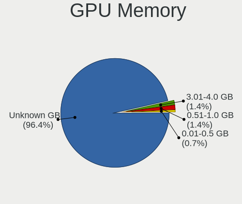

Zorin - Hardware Trends (Notebooks)
-----------------------------------

A project to identify most popular hardware characteristics and track their change
over time based on data collected by Linux users at https://Linux-Hardware.org.

Anyone can contribute to this report by the [hw-probe](https://github.com/linuxhw/hw-probe) tool:

    sudo -E hw-probe -all -upload

This report is for one last month. Overall report since the beginning of time: [TestDays](https://github.com/linuxhw/TestDays)

Period: Jun, 2023.

Contents
--------

* [ System ](#system)
  - [ OS                       ](#os)
  - [ OS Family                ](#os-family)
  - [ Kernel                   ](#kernel)
  - [ Kernel Family            ](#kernel-family)
  - [ Kernel Major Ver.        ](#kernel-major-ver)
  - [ Arch                     ](#arch)
  - [ DE                       ](#de)
  - [ Display Server           ](#display-server)
  - [ Display Manager          ](#display-manager)
  - [ OS Lang                  ](#os-lang)
  - [ Boot Mode                ](#boot-mode)
  - [ Filesystem               ](#filesystem)
  - [ Part. scheme             ](#part-scheme)
  - [ Dual Boot with Linux/BSD ](#dual-boot-with-linuxbsd)
  - [ Dual Boot (Win)          ](#dual-boot-win)

* [ Board ](#board)
  - [ Vendor                   ](#vendor)
  - [ Model                    ](#model)
  - [ Model Family             ](#model-family)
  - [ MFG Year                 ](#mfg-year)
  - [ Form Factor              ](#form-factor)
  - [ Secure Boot              ](#secure-boot)
  - [ Coreboot                 ](#coreboot)
  - [ RAM Size                 ](#ram-size)
  - [ RAM Used                 ](#ram-used)
  - [ Total Drives             ](#total-drives)
  - [ Has CD-ROM               ](#has-cd-rom)
  - [ Has Ethernet             ](#has-ethernet)
  - [ Has WiFi                 ](#has-wifi)
  - [ Has Bluetooth            ](#has-bluetooth)

* [ Location ](#location)
  - [ Country                  ](#country)
  - [ City                     ](#city)

* [ Drives ](#drives)
  - [ Drive Vendor             ](#drive-vendor)
  - [ Drive Model              ](#drive-model)
  - [ HDD Vendor               ](#hdd-vendor)
  - [ SSD Vendor               ](#ssd-vendor)
  - [ Drive Kind               ](#drive-kind)
  - [ Drive Connector          ](#drive-connector)
  - [ Drive Size               ](#drive-size)
  - [ Space Total              ](#space-total)
  - [ Space Used               ](#space-used)
  - [ Malfunc. Drives          ](#malfunc-drives)
  - [ Malfunc. Drive Vendor    ](#malfunc-drive-vendor)
  - [ Malfunc. HDD Vendor      ](#malfunc-hdd-vendor)
  - [ Malfunc. Drive Kind      ](#malfunc-drive-kind)
  - [ Failed Drives            ](#failed-drives)
  - [ Failed Drive Vendor      ](#failed-drive-vendor)
  - [ Drive Status             ](#drive-status)

* [ Storage controller ](#storage-controller)
  - [ Storage Vendor           ](#storage-vendor)
  - [ Storage Model            ](#storage-model)
  - [ Storage Kind             ](#storage-kind)

* [ Processor ](#processor)
  - [ CPU Vendor               ](#cpu-vendor)
  - [ CPU Model                ](#cpu-model)
  - [ CPU Model Family         ](#cpu-model-family)
  - [ CPU Cores                ](#cpu-cores)
  - [ CPU Sockets              ](#cpu-sockets)
  - [ CPU Threads              ](#cpu-threads)
  - [ CPU Op-Modes             ](#cpu-op-modes)
  - [ CPU Microcode            ](#cpu-microcode)
  - [ CPU Microarch            ](#cpu-microarch)

* [ Graphics ](#graphics)
  - [ GPU Vendor               ](#gpu-vendor)
  - [ GPU Model                ](#gpu-model)
  - [ GPU Combo                ](#gpu-combo)
  - [ GPU Driver               ](#gpu-driver)
  - [ GPU Memory               ](#gpu-memory)

* [ Monitor ](#monitor)
  - [ Monitor Vendor           ](#monitor-vendor)
  - [ Monitor Model            ](#monitor-model)
  - [ Monitor Resolution       ](#monitor-resolution)
  - [ Monitor Diagonal         ](#monitor-diagonal)
  - [ Monitor Width            ](#monitor-width)
  - [ Aspect Ratio             ](#aspect-ratio)
  - [ Monitor Area             ](#monitor-area)
  - [ Pixel Density            ](#pixel-density)
  - [ Multiple Monitors        ](#multiple-monitors)

* [ Network ](#network)
  - [ Net Controller Vendor    ](#net-controller-vendor)
  - [ Net Controller Model     ](#net-controller-model)
  - [ Wireless Vendor          ](#wireless-vendor)
  - [ Wireless Model           ](#wireless-model)
  - [ Ethernet Vendor          ](#ethernet-vendor)
  - [ Ethernet Model           ](#ethernet-model)
  - [ Net Controller Kind      ](#net-controller-kind)
  - [ Used Controller          ](#used-controller)
  - [ NICs                     ](#nics)
  - [ IPv6                     ](#ipv6)

* [ Bluetooth ](#bluetooth)
  - [ Bluetooth Vendor         ](#bluetooth-vendor)
  - [ Bluetooth Model          ](#bluetooth-model)

* [ Sound ](#sound)
  - [ Sound Vendor             ](#sound-vendor)
  - [ Sound Model              ](#sound-model)

* [ Memory ](#memory)
  - [ Memory Vendor            ](#memory-vendor)
  - [ Memory Model             ](#memory-model)
  - [ Memory Kind              ](#memory-kind)
  - [ Memory Form Factor       ](#memory-form-factor)
  - [ Memory Size              ](#memory-size)
  - [ Memory Speed             ](#memory-speed)

* [ Printers & scanners ](#printers--scanners)
  - [ Printer Vendor           ](#printer-vendor)
  - [ Printer Model            ](#printer-model)
  - [ Scanner Vendor           ](#scanner-vendor)
  - [ Scanner Model            ](#scanner-model)

* [ Camera ](#camera)
  - [ Camera Vendor            ](#camera-vendor)
  - [ Camera Model             ](#camera-model)

* [ Security ](#security)
  - [ Fingerprint Vendor       ](#fingerprint-vendor)
  - [ Fingerprint Model        ](#fingerprint-model)
  - [ Chipcard Vendor          ](#chipcard-vendor)
  - [ Chipcard Model           ](#chipcard-model)

* [ Unsupported ](#unsupported)
  - [ Unsupported Devices      ](#unsupported-devices)
  - [ Unsupported Device Types ](#unsupported-device-types)

System
------

OS
--

Installed operating systems

| Name     | Notebooks | Percent |
|----------|-----------|---------|
| Zorin 16 | 61        | 93.85%  |
| Zorin 15 | 4         | 6.15%   |

OS Family
---------

OS without a version

| Name  | Notebooks | Percent |
|-------|-----------|---------|
| Zorin | 65        | 100%    |

Kernel
------

Version of the Linux kernel

| Version               | Notebooks | Percent |
|-----------------------|-----------|---------|
| 5.15.0-73-generic     | 31        | 47.69%  |
| 5.15.0-75-generic     | 19        | 29.23%  |
| 5.15.0-56-generic     | 4         | 6.15%   |
| 5.4.0-150-generic     | 3         | 4.62%   |
| 5.15.0-71-generic     | 3         | 4.62%   |
| 6.3.1-060301-generic  | 1         | 1.54%   |
| 6.2.16-060216-generic | 1         | 1.54%   |
| 5.4.0-66-generic      | 1         | 1.54%   |
| 5.15.0-67-generic     | 1         | 1.54%   |
| 5.15.0-52-generic     | 1         | 1.54%   |

Kernel Family
-------------

Linux kernel without a distro release

| Version | Notebooks | Percent |
|---------|-----------|---------|
| 5.15.0  | 59        | 90.77%  |
| 5.4.0   | 4         | 6.15%   |
| 6.3.1   | 1         | 1.54%   |
| 6.2.16  | 1         | 1.54%   |

Kernel Major Ver.
-----------------

Linux kernel major version

| Version | Notebooks | Percent |
|---------|-----------|---------|
| 5.15    | 59        | 90.77%  |
| 5.4     | 4         | 6.15%   |
| 6.3     | 1         | 1.54%   |
| 6.2     | 1         | 1.54%   |

Arch
----

OS architecture (x86_64, i586, etc.)

| Name   | Notebooks | Percent |
|--------|-----------|---------|
| x86_64 | 64        | 98.46%  |
| i686   | 1         | 1.54%   |

DE
--

Desktop Environment

| Name  | Notebooks | Percent |
|-------|-----------|---------|
| GNOME | 45        | 69.23%  |
| XFCE  | 20        | 30.77%  |

Display Server
--------------

X11 or Wayland

| Name | Notebooks | Percent |
|------|-----------|---------|
| X11  | 65        | 100%    |

Display Manager
---------------

SDDM, LightDM, etc.

| Name    | Notebooks | Percent |
|---------|-----------|---------|
| Unknown | 43        | 66.15%  |
| GDM3    | 13        | 20%     |
| LightDM | 6         | 9.23%   |
| GDM     | 3         | 4.62%   |

OS Lang
-------

Language

| Lang  | Notebooks | Percent |
|-------|-----------|---------|
| en_US | 22        | 33.85%  |
| es_ES | 6         | 9.23%   |
| pt_BR | 4         | 6.15%   |
| fr_FR | 4         | 6.15%   |
| pl_PL | 3         | 4.62%   |
| it_IT | 3         | 4.62%   |
| es_MX | 3         | 4.62%   |
| en_GB | 3         | 4.62%   |
| de_DE | 3         | 4.62%   |
| en_IN | 2         | 3.08%   |
| zh_CN | 1         | 1.54%   |
| nl_NL | 1         | 1.54%   |
| nl_BE | 1         | 1.54%   |
| ko_KR | 1         | 1.54%   |
| hu_HU | 1         | 1.54%   |
| es_HN | 1         | 1.54%   |
| en_ZA | 1         | 1.54%   |
| en_PH | 1         | 1.54%   |
| en_CA | 1         | 1.54%   |
| de_AT | 1         | 1.54%   |
| da_DK | 1         | 1.54%   |
| ca_ES | 1         | 1.54%   |

Boot Mode
---------

EFI or BIOS

| Mode | Notebooks | Percent |
|------|-----------|---------|
| EFI  | 36        | 55.38%  |
| BIOS | 29        | 44.62%  |

Filesystem
----------

Type of filesystem

| Type    | Notebooks | Percent |
|---------|-----------|---------|
| Ext4    | 48        | 73.85%  |
| Tmpfs   | 16        | 24.62%  |
| Overlay | 1         | 1.54%   |

Part. scheme
------------

Scheme of partitioning

| Type    | Notebooks | Percent |
|---------|-----------|---------|
| Unknown | 44        | 67.69%  |
| GPT     | 15        | 23.08%  |
| MBR     | 6         | 9.23%   |

Dual Boot with Linux/BSD
------------------------

Hosting more than one Linux/BSD

| Dual boot | Notebooks | Percent |
|-----------|-----------|---------|
| No        | 59        | 90.77%  |
| Yes       | 6         | 9.23%   |

Dual Boot (Win)
---------------

Hosting Linux and Windows

| Dual boot | Notebooks | Percent |
|-----------|-----------|---------|
| No        | 55        | 84.62%  |
| Yes       | 10        | 15.38%  |

Board
-----

Vendor
------

Motherboard manufacturer

| Name                | Notebooks | Percent |
|---------------------|-----------|---------|
| Hewlett-Packard     | 16        | 24.62%  |
| Dell                | 10        | 15.38%  |
| Lenovo              | 9         | 13.85%  |
| ASUSTek Computer    | 7         | 10.77%  |
| Acer                | 5         | 7.69%   |
| Toshiba             | 3         | 4.62%   |
| Samsung Electronics | 2         | 3.08%   |
| Google              | 2         | 3.08%   |
| Apple               | 2         | 3.08%   |
| Sony                | 1         | 1.54%   |
| Semp Toshiba        | 1         | 1.54%   |
| Packard Bell        | 1         | 1.54%   |
| Notebook            | 1         | 1.54%   |
| MSI                 | 1         | 1.54%   |
| IPASON              | 1         | 1.54%   |
| Haier               | 1         | 1.54%   |
| GPU Company         | 1         | 1.54%   |
| eMachines           | 1         | 1.54%   |

Model
-----

Motherboard model

| Name                                | Notebooks | Percent |
|-------------------------------------|-----------|---------|
| Toshiba TECRA M10                   | 1         | 1.54%   |
| Toshiba Satellite U400              | 1         | 1.54%   |
| Toshiba Satellite L650              | 1         | 1.54%   |
| Sony VPCCA15FX                      | 1         | 1.54%   |
| Semp Toshiba IS 1412                | 1         | 1.54%   |
| Samsung N150/N210/N220              | 1         | 1.54%   |
| Samsung 300E5M/300E5L               | 1         | 1.54%   |
| Packard Bell EasyNote TE11BZ        | 1         | 1.54%   |
| Notebook NJ50_70CU                  | 1         | 1.54%   |
| MSI GL62M 7RDX                      | 1         | 1.54%   |
| Lenovo V110-15IKB 80TH              | 1         | 1.54%   |
| Lenovo ThinkPad Yoga 11e 20DA502    | 1         | 1.54%   |
| Lenovo ThinkPad T450 20BUS0LW02     | 1         | 1.54%   |
| Lenovo ThinkPad T440 20B7S0VA05     | 1         | 1.54%   |
| Lenovo ThinkPad T430 2349HNU        | 1         | 1.54%   |
| Lenovo ThinkPad E560 20EV000UIX     | 1         | 1.54%   |
| Lenovo ThinkBook 15 G2 ITL 20VE     | 1         | 1.54%   |
| Lenovo IdeaPad S145-15IIL 82DJ      | 1         | 1.54%   |
| Lenovo IdeaPad 3 17ITL6 82H9        | 1         | 1.54%   |
| IPASON P3                           | 1         | 1.54%   |
| HP Victus by Laptop 16-e0xxx        | 1         | 1.54%   |
| HP Stream Laptop 14-cb1xxx          | 1         | 1.54%   |
| HP Stream Laptop 14-cb0XX           | 1         | 1.54%   |
| HP ProBook 650 G5                   | 1         | 1.54%   |
| HP Pavilion Notebook                | 1         | 1.54%   |
| HP Pavilion Laptop 14-ec1xxx        | 1         | 1.54%   |
| HP Pavilion Gaming Laptop 15-dk0xxx | 1         | 1.54%   |
| HP Pavilion g7                      | 1         | 1.54%   |
| HP Pavilion dv6700                  | 1         | 1.54%   |
| HP OMEN by Laptop                   | 1         | 1.54%   |
| HP Laptop 14-ck0xxx                 | 1         | 1.54%   |
| HP Laptop 14-bw0xx                  | 1         | 1.54%   |
| HP G62                              | 1         | 1.54%   |
| HP ENVY m6                          | 1         | 1.54%   |
| HP EliteBook 8560p                  | 1         | 1.54%   |
| HP EliteBook 840 G3                 | 1         | 1.54%   |
| Haier Y11B                          | 1         | 1.54%   |
| GPU Company GWNC21524               | 1         | 1.54%   |
| Google Pirika                       | 1         | 1.54%   |
| Google Kefka                        | 1         | 1.54%   |

Model Family
------------

Motherboard model prefix

| Name                  | Notebooks | Percent |
|-----------------------|-----------|---------|
| Lenovo ThinkPad       | 5         | 7.69%   |
| HP Pavilion           | 5         | 7.69%   |
| Dell Latitude         | 4         | 6.15%   |
| Acer Aspire           | 4         | 6.15%   |
| Toshiba Satellite     | 2         | 3.08%   |
| Lenovo IdeaPad        | 2         | 3.08%   |
| HP Stream             | 2         | 3.08%   |
| HP Laptop             | 2         | 3.08%   |
| HP EliteBook          | 2         | 3.08%   |
| Dell Vostro           | 2         | 3.08%   |
| ASUS VivoBook         | 2         | 3.08%   |
| Toshiba TECRA         | 1         | 1.54%   |
| Sony VPCCA15FX        | 1         | 1.54%   |
| Semp Toshiba IS       | 1         | 1.54%   |
| Samsung N150          | 1         | 1.54%   |
| Samsung 300E5M        | 1         | 1.54%   |
| Packard Bell EasyNote | 1         | 1.54%   |
| Notebook NJ50         | 1         | 1.54%   |
| MSI GL62M             | 1         | 1.54%   |
| Lenovo V110-15IKB     | 1         | 1.54%   |
| Lenovo ThinkBook      | 1         | 1.54%   |
| IPASON P3             | 1         | 1.54%   |
| HP Victus             | 1         | 1.54%   |
| HP ProBook            | 1         | 1.54%   |
| HP OMEN               | 1         | 1.54%   |
| HP G62                | 1         | 1.54%   |
| HP ENVY               | 1         | 1.54%   |
| Haier Y11B            | 1         | 1.54%   |
| GPU Company GWNC21524 | 1         | 1.54%   |
| Google Pirika         | 1         | 1.54%   |
| Google Kefka          | 1         | 1.54%   |
| eMachines eMD728      | 1         | 1.54%   |
| Dell Venue            | 1         | 1.54%   |
| Dell Precision        | 1         | 1.54%   |
| Dell Inspiron         | 1         | 1.54%   |
| Dell G7               | 1         | 1.54%   |
| ASUS U43Jc            | 1         | 1.54%   |
| ASUS ROG              | 1         | 1.54%   |
| ASUS K70IJ            | 1         | 1.54%   |
| ASUS K52N             | 1         | 1.54%   |

MFG Year
--------

Motherboard manufacture year

| Year | Notebooks | Percent |
|------|-----------|---------|
| 2017 | 7         | 10.77%  |
| 2010 | 7         | 10.77%  |
| 2019 | 6         | 9.23%   |
| 2012 | 6         | 9.23%   |
| 2018 | 5         | 7.69%   |
| 2015 | 5         | 7.69%   |
| 2009 | 5         | 7.69%   |
| 2021 | 4         | 6.15%   |
| 2016 | 3         | 4.62%   |
| 2014 | 3         | 4.62%   |
| 2011 | 3         | 4.62%   |
| 2008 | 3         | 4.62%   |
| 2023 | 2         | 3.08%   |
| 2022 | 2         | 3.08%   |
| 2020 | 2         | 3.08%   |
| 2013 | 1         | 1.54%   |
| 2007 | 1         | 1.54%   |

Form Factor
-----------

Physical design of the computer

| Name     | Notebooks | Percent |
|----------|-----------|---------|
| Notebook | 65        | 100%    |

Secure Boot
-----------

Enabled or disabled

| State    | Notebooks | Percent |
|----------|-----------|---------|
| Disabled | 51        | 78.46%  |
| Enabled  | 14        | 21.54%  |

Coreboot
--------

Have coreboot on board

| Used | Notebooks | Percent |
|------|-----------|---------|
| No   | 63        | 96.92%  |
| Yes  | 2         | 3.08%   |

RAM Size
--------

Total RAM memory

| Size in GB | Notebooks | Percent |
|------------|-----------|---------|
| 3.01-4.0   | 25        | 38.46%  |
| 4.01-8.0   | 20        | 30.77%  |
| 8.01-16.0  | 7         | 10.77%  |
| 16.01-24.0 | 6         | 9.23%   |
| 1.01-2.0   | 3         | 4.62%   |
| 32.01-64.0 | 2         | 3.08%   |
| 2.01-3.0   | 2         | 3.08%   |

RAM Used
--------

Used RAM memory

| Used GB   | Notebooks | Percent |
|-----------|-----------|---------|
| 1.01-2.0  | 31        | 47.69%  |
| 2.01-3.0  | 18        | 27.69%  |
| 4.01-8.0  | 9         | 13.85%  |
| 3.01-4.0  | 5         | 7.69%   |
| 8.01-16.0 | 1         | 1.54%   |
| 0.51-1.0  | 1         | 1.54%   |

Total Drives
------------

Number of drives on board

| Drives | Notebooks | Percent |
|--------|-----------|---------|
| 1      | 49        | 75.38%  |
| 2      | 14        | 21.54%  |
| 3      | 1         | 1.54%   |
| 0      | 1         | 1.54%   |

Has CD-ROM
----------

Has CD-ROM on board

| Presented | Notebooks | Percent |
|-----------|-----------|---------|
| No        | 36        | 55.38%  |
| Yes       | 29        | 44.62%  |

Has Ethernet
------------

Has Ethernet on board

| Presented | Notebooks | Percent |
|-----------|-----------|---------|
| Yes       | 52        | 80%     |
| No        | 13        | 20%     |

Has WiFi
--------

Has WiFi module

| Presented | Notebooks | Percent |
|-----------|-----------|---------|
| Yes       | 65        | 100%    |

Has Bluetooth
-------------

Has Bluetooth module

| Presented | Notebooks | Percent |
|-----------|-----------|---------|
| Yes       | 41        | 63.08%  |
| No        | 24        | 36.92%  |

Location
--------

Country
-------

Geographic location (country)

| Country      | Notebooks | Percent |
|--------------|-----------|---------|
| USA          | 13        | 20%     |
| Spain        | 7         | 10.77%  |
| Brazil       | 5         | 7.69%   |
| Germany      | 4         | 6.15%   |
| Poland       | 3         | 4.62%   |
| Netherlands  | 3         | 4.62%   |
| Mexico       | 3         | 4.62%   |
| Italy        | 3         | 4.62%   |
| France       | 3         | 4.62%   |
| UK           | 2         | 3.08%   |
| Indonesia    | 2         | 3.08%   |
| India        | 2         | 3.08%   |
| Canada       | 2         | 3.08%   |
| Switzerland  | 1         | 1.54%   |
| South Korea  | 1         | 1.54%   |
| South Africa | 1         | 1.54%   |
| Philippines  | 1         | 1.54%   |
| Pakistan     | 1         | 1.54%   |
| Nigeria      | 1         | 1.54%   |
| Mali         | 1         | 1.54%   |
| Honduras     | 1         | 1.54%   |
| Denmark      | 1         | 1.54%   |
| China        | 1         | 1.54%   |
| Benin        | 1         | 1.54%   |
| Belgium      | 1         | 1.54%   |
| Austria      | 1         | 1.54%   |

City
----

Geographic location (city)

| City                | Notebooks | Percent |
|---------------------|-----------|---------|
| Hyderabad           | 2         | 3.08%   |
| Voorthuizen         | 1         | 1.54%   |
| Vienna              | 1         | 1.54%   |
| Venustiano Carranza | 1         | 1.54%   |
| Valladolid          | 1         | 1.54%   |
| Tlalnepantla        | 1         | 1.54%   |
| Surrey              | 1         | 1.54%   |
| Stranraer           | 1         | 1.54%   |
| St. Catharines      | 1         | 1.54%   |
| Shenzhen            | 1         | 1.54%   |
| Seville             | 1         | 1.54%   |
| Seongdong-gu        | 1         | 1.54%   |
| Sao Paulo           | 1         | 1.54%   |
| Sao Goncalo         | 1         | 1.54%   |
| Sant Pere de Ribes  | 1         | 1.54%   |
| San Fernando City   | 1         | 1.54%   |
| Ruda Śląska       | 1         | 1.54%   |
| Rome                | 1         | 1.54%   |
| Rio Comayagua       | 1         | 1.54%   |
| Reno                | 1         | 1.54%   |
| Redmond             | 1         | 1.54%   |
| Pulaski             | 1         | 1.54%   |
| Port Morris         | 1         | 1.54%   |
| Paris               | 1         | 1.54%   |
| Painesville         | 1         | 1.54%   |
| Padova              | 1         | 1.54%   |
| Norristown          | 1         | 1.54%   |
| Nashville           | 1         | 1.54%   |
| Morristown          | 1         | 1.54%   |
| Milan               | 1         | 1.54%   |
| Manaus              | 1         | 1.54%   |
| Madrid              | 1         | 1.54%   |
| Lubartow            | 1         | 1.54%   |
| Lorena              | 1         | 1.54%   |
| Lake Crystal        | 1         | 1.54%   |
| Konigsbrunn         | 1         | 1.54%   |
| Katowice            | 1         | 1.54%   |
| Karachi             | 1         | 1.54%   |
| Jakarta             | 1         | 1.54%   |
| Jacksonville        | 1         | 1.54%   |

Drives
------

Drive Vendor
------------

Hard drive vendors

| Vendor                      | Notebooks | Drives | Percent |
|-----------------------------|-----------|--------|---------|
| WDC                         | 8         | 9      | 11.11%  |
| Kingston                    | 8         | 8      | 11.11%  |
| Unknown                     | 7         | 9      | 9.72%   |
| Seagate                     | 6         | 6      | 8.33%   |
| Samsung Electronics         | 6         | 6      | 8.33%   |
| HGST                        | 5         | 5      | 6.94%   |
| SanDisk                     | 3         | 3      | 4.17%   |
| China                       | 3         | 3      | 4.17%   |
| Toshiba                     | 2         | 2      | 2.78%   |
| SK hynix                    | 2         | 2      | 2.78%   |
| Micron Technology           | 2         | 2      | 2.78%   |
| KIOXIA                      | 2         | 2      | 2.78%   |
| Intel                       | 2         | 2      | 2.78%   |
| Apple                       | 2         | 2      | 2.78%   |
| A-DATA Technology           | 2         | 2      | 2.78%   |
| Unknown                     | 2         | 2      | 2.78%   |
| SPCC                        | 1         | 1      | 1.39%   |
| Solid State Storage         | 1         | 1      | 1.39%   |
| Phison                      | 1         | 1      | 1.39%   |
| OYUNKEY                     | 1         | 1      | 1.39%   |
| MAXIO Technology (Hangzhou) | 1         | 1      | 1.39%   |
| LITEON                      | 1         | 1      | 1.39%   |
| KingSpec                    | 1         | 1      | 1.39%   |
| Hitachi                     | 1         | 1      | 1.39%   |
| Gigabyte Technology         | 1         | 1      | 1.39%   |
| Crucial                     | 1         | 1      | 1.39%   |

Drive Model
-----------

Hard drive models

| Model                                               | Notebooks | Percent |
|-----------------------------------------------------|-----------|---------|
| Kingston SA400S37240G 240GB SSD                     | 6         | 8.11%   |
| Unknown MMC Card  32GB                              | 3         | 4.05%   |
| Seagate ST9500325AS 500GB                           | 3         | 4.05%   |
| Unknown MMC Card  64GB                              | 2         | 2.7%    |
| Unknown MMC Card  128GB                             | 2         | 2.7%    |
| Seagate ST500LT012-1DG142 500GB                     | 2         | 2.7%    |
| KIOXIA KBG40ZNV256G 256GB                           | 2         | 2.7%    |
| Unknown                                             | 2         | 2.7%    |
| WDC WD5000LUCX-63HWNY0 500GB                        | 1         | 1.35%   |
| WDC WD5000LPVX-75V0TT0 500GB                        | 1         | 1.35%   |
| WDC WD5000LPVT-22G33T0 500GB                        | 1         | 1.35%   |
| WDC WD5000LPCX-60VHAT1 500GB                        | 1         | 1.35%   |
| WDC WD5000BEVT-22A0RT0 500GB                        | 1         | 1.35%   |
| WDC WD3200BPVT-24JJ5T0 320GB                        | 1         | 1.35%   |
| WDC WD20SPZX-08UA7 2TB                              | 1         | 1.35%   |
| WDC WD1200BEVT-75ZCT2 120GB                         | 1         | 1.35%   |
| WDC WD10SPZX-75Z10T3 1TB                            | 1         | 1.35%   |
| Unknown MMC Card  16GB                              | 1         | 1.35%   |
| Toshiba THNSNK128GVN8 M.2 2280 128GB SSD            | 1         | 1.35%   |
| Toshiba MQ01ACF050 500GB                            | 1         | 1.35%   |
| SPCC Solid State Disk 1024GB                        | 1         | 1.35%   |
| Solid State Storage SSSTC CL1-4D256 256GB           | 1         | 1.35%   |
| SK hynix HFM001TD3JX013N 1TB                        | 1         | 1.35%   |
| SK hynix BC711 HFM512GD3JX013N 512GB                | 1         | 1.35%   |
| Seagate ST1000LM035-1RK172 1TB                      | 1         | 1.35%   |
| SanDisk SSD PLUS 1000GB                             | 1         | 1.35%   |
| SanDisk SD8SB8U1T00 1024GB SSD                      | 1         | 1.35%   |
| Sandisk PC SN520 NVMe SSD 512GB                     | 1         | 1.35%   |
| Samsung SSD 860 EVO M.2 500GB                       | 1         | 1.35%   |
| Samsung SSD 840 Series 120GB                        | 1         | 1.35%   |
| Samsung SSD 840 EVO 120GB                           | 1         | 1.35%   |
| Samsung NVMe SSD Controller SM981/PM981/PM983 250GB | 1         | 1.35%   |
| Samsung NVMe SSD Controller SM961/PM961/SM963 256GB | 1         | 1.35%   |
| Samsung NVMe SSD Controller SM951/PM951 256GB       | 1         | 1.35%   |
| Phison MSI M390 500GB                               | 1         | 1.35%   |
| OYUNKEY 240GB                                       | 1         | 1.35%   |
| Micron MTFDHBA512TDV-1AZ1AABHA 512GB                | 1         | 1.35%   |
| Micron MTFDHBA512QFD 512GB                          | 1         | 1.35%   |
| MAXIO (Hangzhou) NVMe SSD Controller MAP1202 512GB  | 1         | 1.35%   |
| LITEON CS1-SP32 32GB SSD                            | 1         | 1.35%   |

HDD Vendor
----------

Hard disk drive vendors

| Vendor  | Notebooks | Drives | Percent |
|---------|-----------|--------|---------|
| WDC     | 8         | 9      | 38.1%   |
| Seagate | 6         | 6      | 28.57%  |
| HGST    | 5         | 5      | 23.81%  |
| Toshiba | 1         | 1      | 4.76%   |
| Hitachi | 1         | 1      | 4.76%   |

SSD Vendor
----------

Solid state drive vendors

| Vendor              | Notebooks | Drives | Percent |
|---------------------|-----------|--------|---------|
| Kingston            | 8         | 8      | 27.59%  |
| Samsung Electronics | 3         | 3      | 10.34%  |
| China               | 3         | 3      | 10.34%  |
| SanDisk             | 2         | 2      | 6.9%    |
| Intel               | 2         | 2      | 6.9%    |
| Apple               | 2         | 2      | 6.9%    |
| A-DATA Technology   | 2         | 2      | 6.9%    |
| Toshiba             | 1         | 1      | 3.45%   |
| SPCC                | 1         | 1      | 3.45%   |
| LITEON              | 1         | 1      | 3.45%   |
| KingSpec            | 1         | 1      | 3.45%   |
| Gigabyte Technology | 1         | 1      | 3.45%   |
| Crucial             | 1         | 1      | 3.45%   |
| Unknown             | 1         | 1      | 3.45%   |

Drive Kind
----------

HDD or SSD

| Kind    | Notebooks | Drives | Percent |
|---------|-----------|--------|---------|
| SSD     | 28        | 29     | 40%     |
| HDD     | 21        | 22     | 30%     |
| NVMe    | 12        | 13     | 17.14%  |
| MMC     | 7         | 9      | 10%     |
| Unknown | 2         | 2      | 2.86%   |

Drive Connector
---------------

SATA, SAS, NVMe, etc.

| Type | Notebooks | Drives | Percent |
|------|-----------|--------|---------|
| SATA | 48        | 53     | 71.64%  |
| NVMe | 12        | 13     | 17.91%  |
| MMC  | 7         | 9      | 10.45%  |

Drive Size
----------

Size of hard drive

| Size in TB | Notebooks | Drives | Percent |
|------------|-----------|--------|---------|
| 0.01-0.5   | 37        | 40     | 77.08%  |
| 0.51-1.0   | 7         | 7      | 14.58%  |
| 1.01-2.0   | 4         | 4      | 8.33%   |

Space Total
-----------

Amount of disk space available on the file system

| Size in GB | Notebooks | Percent |
|------------|-----------|---------|
| 101-250    | 30        | 46.15%  |
| 251-500    | 16        | 24.62%  |
| 501-1000   | 7         | 10.77%  |
| 21-50      | 4         | 6.15%   |
| 51-100     | 4         | 6.15%   |
| 1-20       | 2         | 3.08%   |
| 2001-3000  | 1         | 1.54%   |
| 1001-2000  | 1         | 1.54%   |

Space Used
----------

Amount of used disk space

| Used GB | Notebooks | Percent |
|---------|-----------|---------|
| 1-20    | 24        | 36.92%  |
| 21-50   | 17        | 26.15%  |
| 51-100  | 13        | 20%     |
| 101-250 | 9         | 13.85%  |
| 251-500 | 2         | 3.08%   |

Malfunc. Drives
---------------

Drive models with a malfunction

| Model                                | Notebooks | Drives | Percent |
|--------------------------------------|-----------|--------|---------|
| SK hynix BC711 HFM512GD3JX013N 512GB | 1         | 1      | 50%     |
| Unknown                              | 1         | 1      | 50%     |

Malfunc. Drive Vendor
---------------------

Vendors of faulty drives

| Vendor   | Notebooks | Drives | Percent |
|----------|-----------|--------|---------|
| SK hynix | 1         | 1      | 50%     |
| Unknown  | 1         | 1      | 50%     |

Malfunc. HDD Vendor
-------------------

Vendors of faulty HDD drives

Zero info for selected period =(

Malfunc. Drive Kind
-------------------

Kinds of faulty drives

| Kind | Notebooks | Drives | Percent |
|------|-----------|--------|---------|
| NVMe | 1         | 1      | 50%     |
| SSD  | 1         | 1      | 50%     |

Failed Drives
-------------

Failed drive models

Zero info for selected period =(

Failed Drive Vendor
-------------------

Failed drive vendors

Zero info for selected period =(

Drive Status
------------

Number of failed and malfunc. drives

| Status   | Notebooks | Drives | Percent |
|----------|-----------|--------|---------|
| Detected | 60        | 70     | 92.31%  |
| Works    | 3         | 3      | 4.62%   |
| Malfunc  | 2         | 2      | 3.08%   |

Storage controller
------------------

Storage Vendor
--------------

Storage controller vendors

| Vendor                         | Notebooks | Percent |
|--------------------------------|-----------|---------|
| Intel                          | 48        | 71.64%  |
| Samsung Electronics            | 5         | 7.46%   |
| AMD                            | 4         | 5.97%   |
| SK hynix                       | 2         | 2.99%   |
| Micron Technology              | 2         | 2.99%   |
| KIOXIA                         | 2         | 2.99%   |
| Solid State Storage Technology | 1         | 1.49%   |
| SanDisk                        | 1         | 1.49%   |
| Phison Electronics             | 1         | 1.49%   |
| MAXIO Technology (Hangzhou)    | 1         | 1.49%   |

Storage Model
-------------

Storage controller models

| Model                                                                        | Notebooks | Percent |
|------------------------------------------------------------------------------|-----------|---------|
| Intel 82801IBM/IEM (ICH9M/ICH9M-E) 4 port SATA Controller [AHCI mode]        | 8         | 11.59%  |
| Intel Wildcat Point-LP SATA Controller [AHCI Mode]                           | 5         | 7.25%   |
| Intel 82801 Mobile SATA Controller [RAID mode]                               | 5         | 7.25%   |
| Intel Sunrise Point-LP SATA Controller [AHCI mode]                           | 4         | 5.8%    |
| Intel 7 Series Chipset Family 6-port SATA Controller [AHCI mode]             | 3         | 4.35%   |
| Intel 5 Series/3400 Series Chipset 4 port SATA AHCI Controller               | 3         | 4.35%   |
| SK hynix Gold P31/BC711/PC711 NVMe Solid State Drive                         | 2         | 2.9%    |
| Micron NVMe Storage Controller                                               | 2         | 2.9%    |
| KIOXIA NVMe SSD Controller BG4                                               | 2         | 2.9%    |
| Intel Tiger Lake-LP SATA Controller                                          | 2         | 2.9%    |
| Intel NM10/ICH7 Family SATA Controller [AHCI mode]                           | 2         | 2.9%    |
| Intel HM170/QM170 Chipset SATA Controller [AHCI Mode]                        | 2         | 2.9%    |
| Intel Cannon Point-LP SATA Controller [AHCI Mode]                            | 2         | 2.9%    |
| Intel 6 Series/C200 Series Chipset Family 6 port Mobile SATA AHCI Controller | 2         | 2.9%    |
| AMD SB7x0/SB8x0/SB9x0 SATA Controller [AHCI mode]                            | 2         | 2.9%    |
| AMD FCH SATA Controller [AHCI mode]                                          | 2         | 2.9%    |
| Solid State Storage CL1-3D256-Q11 NVMe SSD M.2                               | 1         | 1.45%   |
| SanDisk PC SN520 NVMe SSD                                                    | 1         | 1.45%   |
| Samsung NVMe SSD Controller SM981/PM981/PM983                                | 1         | 1.45%   |
| Samsung NVMe SSD Controller SM961/PM961/SM963                                | 1         | 1.45%   |
| Samsung NVMe SSD Controller SM951/PM951                                      | 1         | 1.45%   |
| Samsung Electronics SATA controller                                          | 1         | 1.45%   |
| Samsung Apple PCIe SSD                                                       | 1         | 1.45%   |
| Phison Electronics Non-Volatile memory controller                            | 1         | 1.45%   |
| MAXIO (Hangzhou) NVMe SSD Controller MAP1202                                 | 1         | 1.45%   |
| Intel Volume Management Device NVMe RAID Controller                          | 1         | 1.45%   |
| Intel SATA Controller [RAID mode]                                            | 1         | 1.45%   |
| Intel Ice Lake-LP SATA Controller [AHCI mode]                                | 1         | 1.45%   |
| Intel Comet Lake SATA AHCI Controller                                        | 1         | 1.45%   |
| Intel Celeron/Pentium Silver Processor SATA Controller                       | 1         | 1.45%   |
| Intel Celeron N3350/Pentium N4200/Atom E3900 Series SATA AHCI Controller     | 1         | 1.45%   |
| Intel Cannon Lake Mobile PCH SATA AHCI Controller                            | 1         | 1.45%   |
| Intel Atom Processor E3800 Series SATA AHCI Controller                       | 1         | 1.45%   |
| Intel 82801IBM/IEM (ICH9M/ICH9M-E) 2 port SATA Controller [IDE mode]         | 1         | 1.45%   |
| Intel 82801HM/HEM (ICH8M/ICH8M-E) SATA Controller [AHCI mode]                | 1         | 1.45%   |
| Intel 82801HM/HEM (ICH8M/ICH8M-E) IDE Controller                             | 1         | 1.45%   |
| Intel 8 Series SATA Controller 1 [AHCI mode]                                 | 1         | 1.45%   |

Storage Kind
------------

Kind of storage controller (IDE, SATA, NVMe, SAS, ...)

| Kind | Notebooks | Percent |
|------|-----------|---------|
| SATA | 47        | 69.12%  |
| NVMe | 12        | 17.65%  |
| RAID | 7         | 10.29%  |
| IDE  | 2         | 2.94%   |

Processor
---------

CPU Vendor
----------

Processor vendors

| Vendor | Notebooks | Percent |
|--------|-----------|---------|
| Intel  | 58        | 89.23%  |
| AMD    | 7         | 10.77%  |

CPU Model
---------

Processor models

| Model                                       | Notebooks | Percent |
|---------------------------------------------|-----------|---------|
| Intel Pentium Dual-Core CPU T4500 @ 2.30GHz | 3         | 4.62%   |
| Intel Pentium Dual-Core CPU T4300 @ 2.10GHz | 2         | 3.08%   |
| Intel Core i5-5300U CPU @ 2.30GHz           | 2         | 3.08%   |
| Intel Core 2 Duo CPU P8600 @ 2.40GHz        | 2         | 3.08%   |
| Intel Celeron N4000 CPU @ 1.10GHz           | 2         | 3.08%   |
| Intel Celeron CPU N3060 @ 1.60GHz           | 2         | 3.08%   |
| AMD Ryzen 7 5800H with Radeon Graphics      | 2         | 3.08%   |
| Intel Pentium Silver N6000 @ 1.10GHz        | 1         | 1.54%   |
| Intel Pentium Gold 7505 @ 2.00GHz           | 1         | 1.54%   |
| Intel Pentium Dual-Core CPU T4400 @ 2.20GHz | 1         | 1.54%   |
| Intel Pentium Dual CPU T2390 @ 1.86GHz      | 1         | 1.54%   |
| Intel Pentium CPU N4200 @ 1.10GHz           | 1         | 1.54%   |
| Intel Pentium CPU 4415U @ 2.30GHz           | 1         | 1.54%   |
| Intel Pentium CPU 3825U @ 1.90GHz           | 1         | 1.54%   |
| Intel N100                                  | 1         | 1.54%   |
| Intel Core m7-6Y75 CPU @ 1.20GHz            | 1         | 1.54%   |
| Intel Core M-5Y10c CPU @ 0.80GHz            | 1         | 1.54%   |
| Intel Core i7-8750H CPU @ 2.20GHz           | 1         | 1.54%   |
| Intel Core i7-7700HQ CPU @ 2.80GHz          | 1         | 1.54%   |
| Intel Core i7-6820HQ CPU @ 2.70GHz          | 1         | 1.54%   |
| Intel Core i7-6700HQ CPU @ 2.60GHz          | 1         | 1.54%   |
| Intel Core i7-4750HQ CPU @ 2.00GHz          | 1         | 1.54%   |
| Intel Core i7-1065G7 CPU @ 1.30GHz          | 1         | 1.54%   |
| Intel Core i5-9300H CPU @ 2.40GHz           | 1         | 1.54%   |
| Intel Core i5-8365U CPU @ 1.60GHz           | 1         | 1.54%   |
| Intel Core i5-8265U CPU @ 1.60GHz           | 1         | 1.54%   |
| Intel Core i5-6300U CPU @ 2.40GHz           | 1         | 1.54%   |
| Intel Core i5-6200U CPU @ 2.30GHz           | 1         | 1.54%   |
| Intel Core i5-5250U CPU @ 1.60GHz           | 1         | 1.54%   |
| Intel Core i5-5200U CPU @ 2.20GHz           | 1         | 1.54%   |
| Intel Core i5-4300U CPU @ 1.90GHz           | 1         | 1.54%   |
| Intel Core i5-3320M CPU @ 2.60GHz           | 1         | 1.54%   |
| Intel Core i5-3230M CPU @ 2.60GHz           | 1         | 1.54%   |
| Intel Core i5-2520M CPU @ 2.50GHz           | 1         | 1.54%   |
| Intel Core i5-2467M CPU @ 1.60GHz           | 1         | 1.54%   |
| Intel Core i5-2410M CPU @ 2.30GHz           | 1         | 1.54%   |
| Intel Core i5-10210U CPU @ 1.60GHz          | 1         | 1.54%   |
| Intel Core i5 CPU M 460 @ 2.53GHz           | 1         | 1.54%   |
| Intel Core i3-8145U CPU @ 2.10GHz           | 1         | 1.54%   |
| Intel Core i3-7020U CPU @ 2.30GHz           | 1         | 1.54%   |

CPU Model Family
----------------

Processor model prefix

| Model                   | Notebooks | Percent |
|-------------------------|-----------|---------|
| Intel Core i5           | 17        | 26.15%  |
| Intel Celeron           | 7         | 10.77%  |
| Intel Pentium Dual-Core | 6         | 9.23%   |
| Intel Core i7           | 6         | 9.23%   |
| Intel Core i3           | 5         | 7.69%   |
| Intel Core 2 Duo        | 4         | 6.15%   |
| Intel Pentium           | 3         | 4.62%   |
| Intel Atom              | 3         | 4.62%   |
| Other                   | 2         | 3.08%   |
| AMD Ryzen 7             | 2         | 3.08%   |
| Intel Pentium Silver    | 1         | 1.54%   |
| Intel Pentium Gold      | 1         | 1.54%   |
| Intel Pentium Dual      | 1         | 1.54%   |
| Intel Core m7           | 1         | 1.54%   |
| Intel Core M            | 1         | 1.54%   |
| AMD V120                | 1         | 1.54%   |
| AMD Ryzen 5             | 1         | 1.54%   |
| AMD E2                  | 1         | 1.54%   |
| AMD E1                  | 1         | 1.54%   |
| AMD E                   | 1         | 1.54%   |

CPU Cores
---------

Number of processor cores

| Number | Notebooks | Percent |
|--------|-----------|---------|
| 2      | 44        | 67.69%  |
| 4      | 15        | 23.08%  |
| 8      | 2         | 3.08%   |
| 6      | 2         | 3.08%   |
| 1      | 2         | 3.08%   |

CPU Sockets
-----------

Number of sockets

| Number | Notebooks | Percent |
|--------|-----------|---------|
| 1      | 65        | 100%    |

CPU Threads
-----------

Threads per core (Hyper-Threading)

| Number | Notebooks | Percent |
|--------|-----------|---------|
| 2      | 39        | 60%     |
| 1      | 26        | 40%     |

CPU Op-Modes
------------

CPU Operation Modes (32-bit, 64-bit)

| Op mode        | Notebooks | Percent |
|----------------|-----------|---------|
| 32-bit, 64-bit | 65        | 100%    |

CPU Microcode
-------------

Microcode number

| Number     | Notebooks | Percent |
|------------|-----------|---------|
| 0x1067a    | 8         | 12.31%  |
| 0x306d4    | 6         | 9.23%   |
| 0x206a7    | 4         | 6.15%   |
| 0x806ec    | 3         | 4.62%   |
| 0x806e9    | 3         | 4.62%   |
| 0x406e3    | 3         | 4.62%   |
| 0x906ea    | 2         | 3.08%   |
| 0x806c1    | 2         | 3.08%   |
| 0x706a1    | 2         | 3.08%   |
| 0x506e3    | 2         | 3.08%   |
| 0x306a9    | 2         | 3.08%   |
| 0x30678    | 2         | 3.08%   |
| 0x20655    | 2         | 3.08%   |
| 0x0a50000d | 2         | 3.08%   |
| 0x05000119 | 2         | 3.08%   |
| Unknown    | 2         | 3.08%   |
| 0xb06e0    | 1         | 1.54%   |
| 0x906e9    | 1         | 1.54%   |
| 0x906c0    | 1         | 1.54%   |
| 0x806eb    | 1         | 1.54%   |
| 0x706e5    | 1         | 1.54%   |
| 0x706a8    | 1         | 1.54%   |
| 0x6fd      | 1         | 1.54%   |
| 0x506c9    | 1         | 1.54%   |
| 0x406c4    | 1         | 1.54%   |
| 0x40661    | 1         | 1.54%   |
| 0x40651    | 1         | 1.54%   |
| 0x30661    | 1         | 1.54%   |
| 0x20652    | 1         | 1.54%   |
| 0x106ca    | 1         | 1.54%   |
| 0x10676    | 1         | 1.54%   |
| 0x0a50000b | 1         | 1.54%   |
| 0x06006705 | 1         | 1.54%   |
| 0x010000c8 | 1         | 1.54%   |

CPU Microarch
-------------

Microarchitecture

| Name          | Notebooks | Percent |
|---------------|-----------|---------|
| Penryn        | 10        | 15.38%  |
| KabyLake      | 10        | 15.38%  |
| Broadwell     | 6         | 9.23%   |
| Skylake       | 5         | 7.69%   |
| Silvermont    | 4         | 6.15%   |
| SandyBridge   | 4         | 6.15%   |
| Zen 3         | 3         | 4.62%   |
| Westmere      | 3         | 4.62%   |
| Goldmont plus | 3         | 4.62%   |
| TigerLake     | 2         | 3.08%   |
| IvyBridge     | 2         | 3.08%   |
| Haswell       | 2         | 3.08%   |
| Bonnell       | 2         | 3.08%   |
| Bobcat        | 2         | 3.08%   |
| Tremont       | 1         | 1.54%   |
| K10           | 1         | 1.54%   |
| IceLake       | 1         | 1.54%   |
| Goldmont      | 1         | 1.54%   |
| Excavator     | 1         | 1.54%   |
| Core          | 1         | 1.54%   |
| Unknown       | 1         | 1.54%   |

Graphics
--------

GPU Vendor
----------

Vendors of graphics cards

| Vendor | Notebooks | Percent |
|--------|-----------|---------|
| Intel  | 53        | 68.83%  |
| Nvidia | 12        | 15.58%  |
| AMD    | 12        | 15.58%  |

GPU Model
---------

Graphics card models

| Model                                                                                    | Notebooks | Percent |
|------------------------------------------------------------------------------------------|-----------|---------|
| Intel Mobile 4 Series Chipset Integrated Graphics Controller                             | 7         | 8.97%   |
| Intel WhiskeyLake-U GT2 [UHD Graphics 620]                                               | 3         | 3.85%   |
| Intel HD Graphics 5500                                                                   | 3         | 3.85%   |
| Intel GeminiLake [UHD Graphics 600]                                                      | 3         | 3.85%   |
| Intel 2nd Generation Core Processor Family Integrated Graphics Controller                | 3         | 3.85%   |
| Intel Skylake GT2 [HD Graphics 520]                                                      | 2         | 2.56%   |
| Intel HD Graphics 610                                                                    | 2         | 2.56%   |
| Intel HD Graphics 530                                                                    | 2         | 2.56%   |
| Intel Core Processor Integrated Graphics Controller                                      | 2         | 2.56%   |
| Intel CoffeeLake-H GT2 [UHD Graphics 630]                                                | 2         | 2.56%   |
| Intel Atom/Celeron/Pentium Processor x5-E8000/J3xxx/N3xxx Integrated Graphics Controller | 2         | 2.56%   |
| Intel Atom Processor Z36xxx/Z37xxx Series Graphics & Display                             | 2         | 2.56%   |
| Intel 3rd Gen Core processor Graphics Controller                                         | 2         | 2.56%   |
| AMD Cezanne [Radeon Vega Series / Radeon Vega Mobile Series]                             | 2         | 2.56%   |
| Nvidia TU117M [GeForce GTX 1650 Mobile / Max-Q]                                          | 1         | 1.28%   |
| Nvidia GT218M [GeForce 310M]                                                             | 1         | 1.28%   |
| Nvidia GP107M [GeForce GTX 1050 Mobile]                                                  | 1         | 1.28%   |
| Nvidia GP106M [GeForce GTX 1060 Mobile]                                                  | 1         | 1.28%   |
| Nvidia GM206M [GeForce GTX 965M]                                                         | 1         | 1.28%   |
| Nvidia GM206GLM [Quadro M2200 Mobile]                                                    | 1         | 1.28%   |
| Nvidia GK208BM [GeForce 920M]                                                            | 1         | 1.28%   |
| Nvidia GK107M [GeForce GT 640M]                                                          | 1         | 1.28%   |
| Nvidia GA107M [GeForce RTX 3050 Ti Mobile]                                               | 1         | 1.28%   |
| Nvidia GA106M [GeForce RTX 3060 Mobile / Max-Q]                                          | 1         | 1.28%   |
| Nvidia G98M [Quadro NVS 150M]                                                            | 1         | 1.28%   |
| Nvidia G98M [GeForce 9300M GS]                                                           | 1         | 1.28%   |
| Intel TigerLake-LP GT2 [Iris Xe Graphics]                                                | 1         | 1.28%   |
| Intel Tiger Lake-LP GT2 [UHD Graphics G4]                                                | 1         | 1.28%   |
| Intel Mobile GM965/GL960 Integrated Graphics Controller (secondary)                      | 1         | 1.28%   |
| Intel Mobile GM965/GL960 Integrated Graphics Controller (primary)                        | 1         | 1.28%   |
| Intel JasperLake [UHD Graphics]                                                          | 1         | 1.28%   |
| Intel Iris Plus Graphics G7                                                              | 1         | 1.28%   |
| Intel HD Graphics 630                                                                    | 1         | 1.28%   |
| Intel HD Graphics 620                                                                    | 1         | 1.28%   |
| Intel HD Graphics 6000                                                                   | 1         | 1.28%   |
| Intel HD Graphics 5300                                                                   | 1         | 1.28%   |
| Intel HD Graphics 515                                                                    | 1         | 1.28%   |
| Intel HD Graphics                                                                        | 1         | 1.28%   |
| Intel Haswell-ULT Integrated Graphics Controller                                         | 1         | 1.28%   |
| Intel Crystal Well Integrated Graphics Controller                                        | 1         | 1.28%   |

GPU Combo
---------

Combinations of graphics cards

| Name           | Notebooks | Percent |
|----------------|-----------|---------|
| 1 x Intel      | 43        | 66.15%  |
| Intel + Nvidia | 8         | 12.31%  |
| 1 x AMD        | 8         | 12.31%  |
| 1 x Nvidia     | 2         | 3.08%   |
| Intel + AMD    | 2         | 3.08%   |
| AMD + Nvidia   | 2         | 3.08%   |

GPU Driver
----------

Free vs proprietary

| Driver      | Notebooks | Percent |
|-------------|-----------|---------|
| Free        | 58        | 89.23%  |
| Proprietary | 6         | 9.23%   |
| Unknown     | 1         | 1.54%   |

GPU Memory
----------

Total video memory

| Size in GB | Notebooks | Percent |
|------------|-----------|---------|
| Unknown    | 48        | 73.85%  |
| 0.01-0.5   | 9         | 13.85%  |
| 0.51-1.0   | 4         | 6.15%   |
| 3.01-4.0   | 2         | 3.08%   |
| 5.01-6.0   | 1         | 1.54%   |
| 1.01-2.0   | 1         | 1.54%   |

Monitor
-------

Monitor Vendor
--------------

Monitor vendors

| Vendor                  | Notebooks | Percent |
|-------------------------|-----------|---------|
| BOE                     | 15        | 22.06%  |
| AU Optronics            | 15        | 22.06%  |
| Chimei Innolux          | 8         | 11.76%  |
| Samsung Electronics     | 7         | 10.29%  |
| LG Display              | 6         | 8.82%   |
| Sharp                   | 2         | 2.94%   |
| Goldstar                | 2         | 2.94%   |
| Chi Mei Optoelectronics | 2         | 2.94%   |
| Apple                   | 2         | 2.94%   |
| VIE                     | 1         | 1.47%   |
| Sony                    | 1         | 1.47%   |
| RTK                     | 1         | 1.47%   |
| Philips                 | 1         | 1.47%   |
| MTD                     | 1         | 1.47%   |
| LG Philips              | 1         | 1.47%   |
| HannStar                | 1         | 1.47%   |
| CPT                     | 1         | 1.47%   |
| AOC                     | 1         | 1.47%   |

Monitor Model
-------------

Monitor models

| Model                                                                    | Notebooks | Percent |
|--------------------------------------------------------------------------|-----------|---------|
| AU Optronics LCD Monitor AUO2D3C 1366x768 309x173mm 13.9-inch            | 2         | 2.94%   |
| VIE VK-H270Q75-2K VIE2700 2560x1440 597x336mm 27.0-inch                  | 1         | 1.47%   |
| Sony TV *01 SNYD902 1920x1080 1218x685mm 55.0-inch                       | 1         | 1.47%   |
| Sharp LQ173M1JW04 SHP14E1 1920x1080 382x215mm 17.3-inch                  | 1         | 1.47%   |
| Sharp LCD Monitor SHP1461 3200x1800 294x165mm 13.3-inch                  | 1         | 1.47%   |
| Samsung Electronics SMBX2431 SAM0771 1920x1080 531x299mm 24.0-inch       | 1         | 1.47%   |
| Samsung Electronics LCD Monitor SEC544B 1600x900 382x215mm 17.3-inch     | 1         | 1.47%   |
| Samsung Electronics LCD Monitor SEC3741 1280x800 331x207mm 15.4-inch     | 1         | 1.47%   |
| Samsung Electronics LCD Monitor SEC3046 1366x768 344x193mm 15.5-inch     | 1         | 1.47%   |
| Samsung Electronics LCD Monitor SDC4C48 1920x1080 409x230mm 18.5-inch    | 1         | 1.47%   |
| Samsung Electronics LCD Monitor SDC314D 1366x768 309x174mm 14.0-inch     | 1         | 1.47%   |
| Samsung Electronics LCD Monitor SAM71A5 1920x1080 1210x680mm 54.6-inch   | 1         | 1.47%   |
| RTK MONITOR RTK4A4B 3840x2160 596x335mm 26.9-inch                        | 1         | 1.47%   |
| Philips LCD Monitor PHL4650 1280x768 530x398mm 26.1-inch                 | 1         | 1.47%   |
| MTD LCD Monitor MTD0001 1280x800 303x190mm 14.1-inch                     | 1         | 1.47%   |
| LG Philips LP154WX4-TLCB LPL3101 1280x800 331x207mm 15.4-inch            | 1         | 1.47%   |
| LG Display LP156WH2-TLQ2 LGD027C 1366x768 344x194mm 15.5-inch            | 1         | 1.47%   |
| LG Display LCD Monitor LGD0621 1920x1080 382x215mm 17.3-inch             | 1         | 1.47%   |
| LG Display LCD Monitor LGD05D0 1920x1080 344x194mm 15.5-inch             | 1         | 1.47%   |
| LG Display LCD Monitor LGD03B8 1366x768 310x174mm 14.0-inch              | 1         | 1.47%   |
| LG Display LCD Monitor LGD02F1 1366x768 344x194mm 15.5-inch              | 1         | 1.47%   |
| LG Display LCD Monitor LGD01E8 1366x768 344x194mm 15.5-inch              | 1         | 1.47%   |
| HannStar HSD101PFW2 HSD03E9 1024x600 222x125mm 10.0-inch                 | 1         | 1.47%   |
| Goldstar L1918S GSM4B31 1280x1024 376x301mm 19.0-inch                    | 1         | 1.47%   |
| Goldstar 34GL750 GSM773A 2560x1080 531x298mm 24.0-inch                   | 1         | 1.47%   |
| CPT LCD Monitor CPT17A9 1366x768 309x173mm 13.9-inch                     | 1         | 1.47%   |
| Chimei Innolux LCD Monitor CMN15D2 1920x1080 344x193mm 15.5-inch         | 1         | 1.47%   |
| Chimei Innolux LCD Monitor CMN15B6 1366x768 344x193mm 15.5-inch          | 1         | 1.47%   |
| Chimei Innolux LCD Monitor CMN1553 1920x1080 344x193mm 15.5-inch         | 1         | 1.47%   |
| Chimei Innolux LCD Monitor CMN150D 1920x1080 344x193mm 15.5-inch         | 1         | 1.47%   |
| Chimei Innolux LCD Monitor CMN14C4 1366x768 309x173mm 13.9-inch          | 1         | 1.47%   |
| Chimei Innolux LCD Monitor CMN14C0 1920x1080 308x173mm 13.9-inch         | 1         | 1.47%   |
| Chimei Innolux LCD Monitor CMN1482 1600x900 309x174mm 14.0-inch          | 1         | 1.47%   |
| Chimei Innolux LCD Monitor CMN1130 1366x768 256x144mm 11.6-inch          | 1         | 1.47%   |
| Chi Mei Optoelectronics LCD Monitor CMO1593 1366x768 344x193mm 15.5-inch | 1         | 1.47%   |
| Chi Mei Optoelectronics LCD Monitor CMO1592 1366x768 344x193mm 15.5-inch | 1         | 1.47%   |
| BOE LCD Monitor BOE0AAA 1920x1080 309x174mm 14.0-inch                    | 1         | 1.47%   |
| BOE LCD Monitor BOE09F1 1920x1080 355x200mm 16.0-inch                    | 1         | 1.47%   |
| BOE LCD Monitor BOE08E4 1600x900 382x215mm 17.3-inch                     | 1         | 1.47%   |
| BOE LCD Monitor BOE0812 1920x1080 344x194mm 15.5-inch                    | 1         | 1.47%   |

Monitor Resolution
------------------

Monitor screen resolution

| Resolution       | Notebooks | Percent |
|------------------|-----------|---------|
| 1366x768 (WXGA)  | 30        | 44.12%  |
| 1920x1080 (FHD)  | 20        | 29.41%  |
| 1600x900 (HD+)   | 5         | 7.35%   |
| 3840x2160 (4K)   | 2         | 2.94%   |
| 1440x900 (WXGA+) | 2         | 2.94%   |
| 1280x800 (WXGA)  | 2         | 2.94%   |
| 3200x1800 (QHD+) | 1         | 1.47%   |
| 2880x1800        | 1         | 1.47%   |
| 2560x1440 (QHD)  | 1         | 1.47%   |
| 2560x1080        | 1         | 1.47%   |
| 1280x768         | 1         | 1.47%   |
| 1280x1024 (SXGA) | 1         | 1.47%   |
| 1024x600         | 1         | 1.47%   |

Monitor Diagonal
----------------

Diagonal size in inches

| Inches | Notebooks | Percent |
|--------|-----------|---------|
| 15     | 27        | 40.3%   |
| 13     | 11        | 16.42%  |
| 17     | 7         | 10.45%  |
| 14     | 6         | 8.96%   |
| 11     | 4         | 5.97%   |
| 34     | 2         | 2.99%   |
| 55     | 1         | 1.49%   |
| 54     | 1         | 1.49%   |
| 27     | 1         | 1.49%   |
| 26     | 1         | 1.49%   |
| 24     | 1         | 1.49%   |
| 19     | 1         | 1.49%   |
| 18     | 1         | 1.49%   |
| 16     | 1         | 1.49%   |
| 12     | 1         | 1.49%   |
| 10     | 1         | 1.49%   |

Monitor Width
-------------

Physical width

| Width in mm | Notebooks | Percent |
|-------------|-----------|---------|
| 301-350     | 41        | 61.19%  |
| 351-400     | 9         | 13.43%  |
| 201-300     | 9         | 13.43%  |
| 501-600     | 3         | 4.48%   |
| 701-800     | 2         | 2.99%   |
| 1001-1500   | 2         | 2.99%   |
| 401-500     | 1         | 1.49%   |

Aspect Ratio
------------

Proportional relationship between the width and the height

| Ratio | Notebooks | Percent |
|-------|-----------|---------|
| 16/9  | 54        | 87.1%   |
| 16/10 | 6         | 9.68%   |
| 5/4   | 1         | 1.61%   |
| 21/9  | 1         | 1.61%   |

Monitor Area
------------

Area in inch²

| Area in inch² | Notebooks | Percent |
|----------------|-----------|---------|
| 101-110        | 28        | 41.79%  |
| 81-90          | 15        | 22.39%  |
| 121-130        | 7         | 10.45%  |
| 51-60          | 4         | 5.97%   |
| More than 1000 | 2         | 2.99%   |
| 71-80          | 2         | 2.99%   |
| 301-350        | 2         | 2.99%   |
| 61-70          | 1         | 1.49%   |
| 351-500        | 1         | 1.49%   |
| 41-50          | 1         | 1.49%   |
| 201-250        | 1         | 1.49%   |
| 151-200        | 1         | 1.49%   |
| 141-150        | 1         | 1.49%   |
| 501-1000       | 1         | 1.49%   |

Pixel Density
-------------

Pixels per inch

| Density       | Notebooks | Percent |
|---------------|-----------|---------|
| 101-120       | 31        | 46.27%  |
| 121-160       | 22        | 32.84%  |
| 51-100        | 6         | 8.96%   |
| 1-50          | 3         | 4.48%   |
| 161-240       | 3         | 4.48%   |
| More than 240 | 2         | 2.99%   |

Multiple Monitors
-----------------

Total monitors connected

| Total | Notebooks | Percent |
|-------|-----------|---------|
| 1     | 56        | 86.15%  |
| 2     | 8         | 12.31%  |
| 0     | 1         | 1.54%   |

Network
-------

Net Controller Vendor
---------------------

Controller vendors

| Vendor                   | Notebooks | Percent |
|--------------------------|-----------|---------|
| Intel                    | 31        | 31.96%  |
| Realtek Semiconductor    | 28        | 28.87%  |
| Qualcomm Atheros         | 17        | 17.53%  |
| Broadcom                 | 7         | 7.22%   |
| Broadcom Limited         | 5         | 5.15%   |
| Marvell Technology Group | 2         | 2.06%   |
| Dell                     | 2         | 2.06%   |
| TRENDnet                 | 1         | 1.03%   |
| Ralink                   | 1         | 1.03%   |
| JMicron Technology       | 1         | 1.03%   |
| D-Link                   | 1         | 1.03%   |
| ASIX Electronics         | 1         | 1.03%   |

Net Controller Model
--------------------

Controller models

| Model                                                                      | Notebooks | Percent |
|----------------------------------------------------------------------------|-----------|---------|
| Realtek RTL8111/8168/8411 PCI Express Gigabit Ethernet Controller          | 14        | 11.57%  |
| Realtek RTL810xE PCI Express Fast Ethernet controller                      | 7         | 5.79%   |
| Intel Wireless 7265                                                        | 6         | 4.96%   |
| Qualcomm Atheros AR9285 Wireless Network Adapter (PCI-Express)             | 5         | 4.13%   |
| Intel Wireless 7260                                                        | 3         | 2.48%   |
| Intel WiFi Link 5100                                                       | 3         | 2.48%   |
| Intel Wi-Fi 6 AX200                                                        | 3         | 2.48%   |
| Broadcom Limited NetLink BCM57780 Gigabit Ethernet PCIe                    | 3         | 2.48%   |
| Realtek RTL8852BE PCIe 802.11ax Wireless Network Controller                | 2         | 1.65%   |
| Realtek RTL8822BE 802.11a/b/g/n/ac WiFi adapter                            | 2         | 1.65%   |
| Realtek RTL8723DE Wireless Network Adapter                                 | 2         | 1.65%   |
| Qualcomm Atheros QCA9377 802.11ac Wireless Network Adapter                 | 2         | 1.65%   |
| Qualcomm Atheros AR8151 v2.0 Gigabit Ethernet                              | 2         | 1.65%   |
| Qualcomm Atheros AR8121/AR8113/AR8114 Gigabit or Fast Ethernet             | 2         | 1.65%   |
| Intel Wireless 8260                                                        | 2         | 1.65%   |
| Intel Ethernet Connection (3) I218-LM                                      | 2         | 1.65%   |
| Intel Centrino Wireless-N 1000 [Condor Peak]                               | 2         | 1.65%   |
| Intel Centrino Advanced-N 6205 [Taylor Peak]                               | 2         | 1.65%   |
| Intel Cannon Point-LP CNVi [Wireless-AC]                                   | 2         | 1.65%   |
| Intel 82579LM Gigabit Network Connection (Lewisville)                      | 2         | 1.65%   |
| Intel 82567LM Gigabit Network Connection                                   | 2         | 1.65%   |
| TRENDnet TEW-805UB 300Mbps+867Mbps Wireless AC Adapter [Realtek RTL8812AU] | 1         | 0.83%   |
| Realtek RTL8852AE 802.11ax PCIe Wireless Network Adapter                   | 1         | 0.83%   |
| Realtek RTL8822CE 802.11ac PCIe Wireless Network Adapter                   | 1         | 0.83%   |
| Realtek RTL8821AE 802.11ac PCIe Wireless Network Adapter                   | 1         | 0.83%   |
| Realtek RTL8723BU 802.11b/g/n WLAN Adapter                                 | 1         | 0.83%   |
| Realtek RTL8191SEvB Wireless LAN Controller                                | 1         | 0.83%   |
| Realtek RTL8188CE 802.11b/g/n WiFi Adapter                                 | 1         | 0.83%   |
| Realtek RTL8187B Wireless 802.11g 54Mbps Network Adapter                   | 1         | 0.83%   |
| Realtek RTL8153 Gigabit Ethernet Adapter                                   | 1         | 0.83%   |
| Realtek RTL8152 Fast Ethernet Adapter                                      | 1         | 0.83%   |
| Realtek 802.11n WLAN Adapter                                               | 1         | 0.83%   |
| Ralink RT3290 Wireless 802.11n 1T/1R PCIe                                  | 1         | 0.83%   |
| Qualcomm Atheros QCA9565 / AR9565 Wireless Network Adapter                 | 1         | 0.83%   |
| Qualcomm Atheros QCA8171 Gigabit Ethernet                                  | 1         | 0.83%   |
| Qualcomm Atheros Killer E2400 Gigabit Ethernet Controller                  | 1         | 0.83%   |
| Qualcomm Atheros AR9462 Wireless Network Adapter                           | 1         | 0.83%   |
| Qualcomm Atheros AR928X Wireless Network Adapter (PCI-Express)             | 1         | 0.83%   |
| Qualcomm Atheros AR9287 Wireless Network Adapter (PCI-Express)             | 1         | 0.83%   |
| Qualcomm Atheros AR8152 v1.1 Fast Ethernet                                 | 1         | 0.83%   |

Wireless Vendor
---------------

Wireless vendors

| Vendor                | Notebooks | Percent |
|-----------------------|-----------|---------|
| Intel                 | 31        | 45.59%  |
| Realtek Semiconductor | 14        | 20.59%  |
| Qualcomm Atheros      | 11        | 16.18%  |
| Broadcom              | 6         | 8.82%   |
| Broadcom Limited      | 2         | 2.94%   |
| TRENDnet              | 1         | 1.47%   |
| Ralink                | 1         | 1.47%   |
| Dell                  | 1         | 1.47%   |
| D-Link                | 1         | 1.47%   |

Wireless Model
--------------

Wireless models

| Model                                                                      | Notebooks | Percent |
|----------------------------------------------------------------------------|-----------|---------|
| Intel Wireless 7265                                                        | 6         | 8.82%   |
| Qualcomm Atheros AR9285 Wireless Network Adapter (PCI-Express)             | 5         | 7.35%   |
| Intel Wireless 7260                                                        | 3         | 4.41%   |
| Intel WiFi Link 5100                                                       | 3         | 4.41%   |
| Intel Wi-Fi 6 AX200                                                        | 3         | 4.41%   |
| Realtek RTL8852BE PCIe 802.11ax Wireless Network Controller                | 2         | 2.94%   |
| Realtek RTL8822BE 802.11a/b/g/n/ac WiFi adapter                            | 2         | 2.94%   |
| Realtek RTL8723DE Wireless Network Adapter                                 | 2         | 2.94%   |
| Qualcomm Atheros QCA9377 802.11ac Wireless Network Adapter                 | 2         | 2.94%   |
| Intel Wireless 8260                                                        | 2         | 2.94%   |
| Intel Centrino Wireless-N 1000 [Condor Peak]                               | 2         | 2.94%   |
| Intel Centrino Advanced-N 6205 [Taylor Peak]                               | 2         | 2.94%   |
| Intel Cannon Point-LP CNVi [Wireless-AC]                                   | 2         | 2.94%   |
| TRENDnet TEW-805UB 300Mbps+867Mbps Wireless AC Adapter [Realtek RTL8812AU] | 1         | 1.47%   |
| Realtek RTL8852AE 802.11ax PCIe Wireless Network Adapter                   | 1         | 1.47%   |
| Realtek RTL8822CE 802.11ac PCIe Wireless Network Adapter                   | 1         | 1.47%   |
| Realtek RTL8821AE 802.11ac PCIe Wireless Network Adapter                   | 1         | 1.47%   |
| Realtek RTL8723BU 802.11b/g/n WLAN Adapter                                 | 1         | 1.47%   |
| Realtek RTL8191SEvB Wireless LAN Controller                                | 1         | 1.47%   |
| Realtek RTL8188CE 802.11b/g/n WiFi Adapter                                 | 1         | 1.47%   |
| Realtek RTL8187B Wireless 802.11g 54Mbps Network Adapter                   | 1         | 1.47%   |
| Realtek 802.11n WLAN Adapter                                               | 1         | 1.47%   |
| Ralink RT3290 Wireless 802.11n 1T/1R PCIe                                  | 1         | 1.47%   |
| Qualcomm Atheros QCA9565 / AR9565 Wireless Network Adapter                 | 1         | 1.47%   |
| Qualcomm Atheros AR9462 Wireless Network Adapter                           | 1         | 1.47%   |
| Qualcomm Atheros AR928X Wireless Network Adapter (PCI-Express)             | 1         | 1.47%   |
| Qualcomm Atheros AR9287 Wireless Network Adapter (PCI-Express)             | 1         | 1.47%   |
| Intel Wireless 8265 / 8275                                                 | 1         | 1.47%   |
| Intel Wi-Fi 6 AX201 160MHz                                                 | 1         | 1.47%   |
| Intel Gemini Lake PCH CNVi WiFi                                            | 1         | 1.47%   |
| Intel Dual Band Wireless-AC 3168NGW [Stone Peak]                           | 1         | 1.47%   |
| Intel Dual Band Wireless-AC 3165 Plus Bluetooth                            | 1         | 1.47%   |
| Intel Centrino Wireless-N 105                                              | 1         | 1.47%   |
| Intel Cannon Lake PCH CNVi WiFi                                            | 1         | 1.47%   |
| Intel Alder Lake-N Wireless-AC                                             | 1         | 1.47%   |
| Dell Wireless 5570e HSPA+ (42Mbps) Mobile Broadband Card                   | 1         | 1.47%   |
| D-Link 802.11ac NIC                                                        | 1         | 1.47%   |
| Broadcom Limited BCM4360 802.11ac Wireless Network Adapter                 | 1         | 1.47%   |
| Broadcom Limited BCM4312 802.11b/g LP-PHY                                  | 1         | 1.47%   |
| Broadcom BCM4360 802.11ac Wireless Network Adapter                         | 1         | 1.47%   |

Ethernet Vendor
---------------

Ethernet vendors

| Vendor                   | Notebooks | Percent |
|--------------------------|-----------|---------|
| Realtek Semiconductor    | 22        | 43.14%  |
| Intel                    | 12        | 23.53%  |
| Qualcomm Atheros         | 8         | 15.69%  |
| Broadcom Limited         | 3         | 5.88%   |
| Marvell Technology Group | 2         | 3.92%   |
| Broadcom                 | 2         | 3.92%   |
| JMicron Technology       | 1         | 1.96%   |
| ASIX Electronics         | 1         | 1.96%   |

Ethernet Model
--------------

Ethernet models

| Model                                                             | Notebooks | Percent |
|-------------------------------------------------------------------|-----------|---------|
| Realtek RTL8111/8168/8411 PCI Express Gigabit Ethernet Controller | 14        | 26.92%  |
| Realtek RTL810xE PCI Express Fast Ethernet controller             | 7         | 13.46%  |
| Broadcom Limited NetLink BCM57780 Gigabit Ethernet PCIe           | 3         | 5.77%   |
| Qualcomm Atheros AR8151 v2.0 Gigabit Ethernet                     | 2         | 3.85%   |
| Qualcomm Atheros AR8121/AR8113/AR8114 Gigabit or Fast Ethernet    | 2         | 3.85%   |
| Intel Ethernet Connection (3) I218-LM                             | 2         | 3.85%   |
| Intel 82579LM Gigabit Network Connection (Lewisville)             | 2         | 3.85%   |
| Intel 82567LM Gigabit Network Connection                          | 2         | 3.85%   |
| Realtek RTL8153 Gigabit Ethernet Adapter                          | 1         | 1.92%   |
| Realtek RTL8152 Fast Ethernet Adapter                             | 1         | 1.92%   |
| Qualcomm Atheros QCA8171 Gigabit Ethernet                         | 1         | 1.92%   |
| Qualcomm Atheros Killer E2400 Gigabit Ethernet Controller         | 1         | 1.92%   |
| Qualcomm Atheros AR8152 v1.1 Fast Ethernet                        | 1         | 1.92%   |
| Qualcomm Atheros AR8131 Gigabit Ethernet                          | 1         | 1.92%   |
| Marvell Group 88E8040T PCI-E Fast Ethernet Controller             | 1         | 1.92%   |
| Marvell Group 88E8040 PCI-E Fast Ethernet Controller              | 1         | 1.92%   |
| JMicron JMC250 PCI Express Gigabit Ethernet Controller            | 1         | 1.92%   |
| Intel Ethernet Connection I219-V                                  | 1         | 1.92%   |
| Intel Ethernet Connection I219-LM                                 | 1         | 1.92%   |
| Intel Ethernet Connection I218-LM                                 | 1         | 1.92%   |
| Intel Ethernet Connection (6) I219-LM                             | 1         | 1.92%   |
| Intel Ethernet Connection (5) I219-LM                             | 1         | 1.92%   |
| Intel Ethernet Connection (10) I219-V                             | 1         | 1.92%   |
| Broadcom NetXtreme BCM57762 Gigabit Ethernet PCIe                 | 1         | 1.92%   |
| Broadcom NetXtreme BCM5764M Gigabit Ethernet PCIe                 | 1         | 1.92%   |
| ASIX AX88179 Gigabit Ethernet                                     | 1         | 1.92%   |

Net Controller Kind
-------------------

Ethernet, WiFi or modem

| Kind     | Notebooks | Percent |
|----------|-----------|---------|
| WiFi     | 66        | 56.41%  |
| Ethernet | 50        | 42.74%  |
| Modem    | 1         | 0.85%   |

Used Controller
---------------

Currently used network controller

| Kind     | Notebooks | Percent |
|----------|-----------|---------|
| WiFi     | 54        | 81.82%  |
| Ethernet | 12        | 18.18%  |

NICs
----

Total network controllers on board

| Total | Notebooks | Percent |
|-------|-----------|---------|
| 2     | 48        | 73.85%  |
| 1     | 14        | 21.54%  |
| 0     | 3         | 4.62%   |

IPv6
----

IPv6 vs IPv4

| Used | Notebooks | Percent |
|------|-----------|---------|
| No   | 39        | 60%     |
| Yes  | 26        | 40%     |

Bluetooth
---------

Bluetooth Vendor
----------------

Controller vendors

| Vendor                          | Notebooks | Percent |
|---------------------------------|-----------|---------|
| Intel                           | 20        | 48.78%  |
| Realtek Semiconductor           | 8         | 19.51%  |
| Qualcomm Atheros Communications | 3         | 7.32%   |
| Dell                            | 2         | 4.88%   |
| Broadcom                        | 2         | 4.88%   |
| Apple                           | 2         | 4.88%   |
| Ralink                          | 1         | 2.44%   |
| Hewlett-Packard                 | 1         | 2.44%   |
| Foxconn / Hon Hai               | 1         | 2.44%   |
| ASUSTek Computer                | 1         | 2.44%   |

Bluetooth Model
---------------

Controller models

| Model                                          | Notebooks | Percent |
|------------------------------------------------|-----------|---------|
| Intel Bluetooth wireless interface             | 10        | 24.39%  |
| Intel Bluetooth 9460/9560 Jefferson Peak (JfP) | 5         | 12.2%   |
| Realtek  Bluetooth 4.2 Adapter                 | 4         | 9.76%   |
| Realtek Bluetooth Radio                        | 4         | 9.76%   |
| Qualcomm Atheros  Bluetooth Device             | 3         | 7.32%   |
| Intel AX200 Bluetooth                          | 3         | 7.32%   |
| Ralink RT3290 Bluetooth                        | 1         | 2.44%   |
| Intel Wireless-AC 3168 Bluetooth               | 1         | 2.44%   |
| Intel AX201 Bluetooth                          | 1         | 2.44%   |
| HP Bluetooth 2.0 Interface [Broadcom BCM2045]  | 1         | 2.44%   |
| Foxconn / Hon Hai Bluetooth Device             | 1         | 2.44%   |
| Dell Wireless 370 Bluetooth Mini-card          | 1         | 2.44%   |
| Dell Wireless 355 Bluetooth                    | 1         | 2.44%   |
| Broadcom Bluetooth 2.1 Device                  | 1         | 2.44%   |
| Broadcom BCM43142A0 Bluetooth 4.0              | 1         | 2.44%   |
| ASUS BT-250                                    | 1         | 2.44%   |
| Apple Bluetooth USB Host Controller            | 1         | 2.44%   |
| Apple Bluetooth Host Controller                | 1         | 2.44%   |

Sound
-----

Sound Vendor
------------

Sound card vendors

| Vendor      | Notebooks | Percent |
|-------------|-----------|---------|
| Intel       | 57        | 73.08%  |
| AMD         | 10        | 12.82%  |
| Nvidia      | 8         | 10.26%  |
| XMOS        | 1         | 1.28%   |
| Plantronics | 1         | 1.28%   |
| Unknown     | 1         | 1.28%   |

Sound Model
-----------

Sound card models

| Model                                                                                             | Notebooks | Percent |
|---------------------------------------------------------------------------------------------------|-----------|---------|
| Intel 82801I (ICH9 Family) HD Audio Controller                                                    | 10        | 10.75%  |
| Intel Wildcat Point-LP High Definition Audio Controller                                           | 6         | 6.45%   |
| Intel Sunrise Point-LP HD Audio                                                                   | 6         | 6.45%   |
| Intel Broadwell-U Audio Controller                                                                | 6         | 6.45%   |
| Intel 7 Series/C216 Chipset Family High Definition Audio Controller                               | 4         | 4.3%    |
| Intel Celeron/Pentium Silver Processor High Definition Audio                                      | 3         | 3.23%   |
| Intel Cannon Point-LP High Definition Audio Controller                                            | 3         | 3.23%   |
| Intel 5 Series/3400 Series Chipset High Definition Audio                                          | 3         | 3.23%   |
| AMD Renoir Radeon High Definition Audio Controller                                                | 3         | 3.23%   |
| AMD Family 17h/19h HD Audio Controller                                                            | 3         | 3.23%   |
| Nvidia GM206 High Definition Audio Controller                                                     | 2         | 2.15%   |
| Intel Tiger Lake-LP Smart Sound Technology Audio Controller                                       | 2         | 2.15%   |
| Intel NM10/ICH7 Family High Definition Audio Controller                                           | 2         | 2.15%   |
| Intel CM238 HD Audio Controller                                                                   | 2         | 2.15%   |
| Intel Cannon Lake PCH cAVS                                                                        | 2         | 2.15%   |
| Intel Atom/Celeron/Pentium Processor x5-E8000/J3xxx/N3xxx Series High Definition Audio Controller | 2         | 2.15%   |
| Intel 6 Series/C200 Series Chipset Family High Definition Audio Controller                        | 2         | 2.15%   |
| AMD Wrestler HDMI Audio                                                                           | 2         | 2.15%   |
| AMD SBx00 Azalia (Intel HDA)                                                                      | 2         | 2.15%   |
| XMOS iFi (by AMR) HD USB Audio                                                                    | 1         | 1.08%   |
| Plantronics Poly Blackwire 3320 Series                                                            | 1         | 1.08%   |
| Nvidia TU107 GeForce GTX 1650 High Definition Audio Controller                                    | 1         | 1.08%   |
| Nvidia High Definition Audio Controller                                                           | 1         | 1.08%   |
| Nvidia GP106 High Definition Audio Controller                                                     | 1         | 1.08%   |
| Nvidia GK208 HDMI/DP Audio Controller                                                             | 1         | 1.08%   |
| Nvidia GA106 High Definition Audio Controller                                                     | 1         | 1.08%   |
| Nvidia Audio device                                                                               | 1         | 1.08%   |
| Intel Jasper Lake HD Audio                                                                        | 1         | 1.08%   |
| Intel Ice Lake-LP Smart Sound Technology Audio Controller                                         | 1         | 1.08%   |
| Intel Haswell-ULT HD Audio Controller                                                             | 1         | 1.08%   |
| Intel Crystal Well HD Audio Controller                                                            | 1         | 1.08%   |
| Intel Comet Lake PCH-LP cAVS                                                                      | 1         | 1.08%   |
| Intel Celeron N3350/Pentium N4200/Atom E3900 Series Audio Cluster                                 | 1         | 1.08%   |
| Intel Atom Processor Z36xxx/Z37xxx Series High Definition Audio Controller                        | 1         | 1.08%   |
| Intel Alder Lake-N HD Graphics SGPC                                                               | 1         | 1.08%   |
| Intel 82801H (ICH8 Family) HD Audio Controller                                                    | 1         | 1.08%   |
| Intel 8 Series/C220 Series Chipset High Definition Audio Controller                               | 1         | 1.08%   |
| Intel 8 Series HD Audio Controller                                                                | 1         | 1.08%   |
| Intel 100 Series/C230 Series Chipset Family HD Audio Controller                                   | 1         | 1.08%   |
| AMD RV710/730 HDMI Audio [Radeon HD 4000 series]                                                  | 1         | 1.08%   |

Memory
------

Memory Vendor
-------------

Memory module vendors

| Vendor              | Notebooks | Percent |
|---------------------|-----------|---------|
| SK hynix            | 4         | 26.67%  |
| Micron Technology   | 3         | 20%     |
| Unknown             | 2         | 13.33%  |
| Samsung Electronics | 2         | 13.33%  |
| Unknown (ABCD)      | 1         | 6.67%   |
| Smart Brazil        | 1         | 6.67%   |
| Kingston            | 1         | 6.67%   |
| Unknown             | 1         | 6.67%   |

Memory Model
------------

Memory module models

| Model                                                              | Notebooks | Percent |
|--------------------------------------------------------------------|-----------|---------|
| SK hynix RAM HMAA1GS6CJR6N-XN 8GB SODIMM DDR4 3200MT/s             | 2         | 12.5%   |
| Samsung RAM M4 70T5663EH3-CF7 2GB SODIMM DDR2 975MT/s              | 2         | 12.5%   |
| Unknown RAM Module 2048MB SODIMM DDR3                              | 1         | 6.25%   |
| Unknown RAM Module 2048MB SODIMM DDR2 533MT/s                      | 1         | 6.25%   |
| Unknown RAM Module 1024MB SODIMM DDR2 533MT/s                      | 1         | 6.25%   |
| Unknown (ABCD) RAM 123456789012345678 3GB SODIMM LPDDR4 2400MT/s   | 1         | 6.25%   |
| Smart Brazil RAM SMS4TDC3C0K0446SCG 4GB Row Of Chips DDR4 2667MT/s | 1         | 6.25%   |
| SK hynix RAM Module 4096MB SODIMM DDR3 1600MT/s                    | 1         | 6.25%   |
| SK hynix RAM HYMP125S64CP8-S6 2GB SODIMM DDR 800MT/s               | 1         | 6.25%   |
| Micron RAM Module 8GB SODIMM DDR4 3200MT/s                         | 1         | 6.25%   |
| Micron RAM Module 4GB Row Of Chips LPDDR4 3733MT/s                 | 1         | 6.25%   |
| Micron RAM 8ATF1G64HZ-2G3E1 8GB SODIMM DDR4 2400MT/s               | 1         | 6.25%   |
| Kingston RAM KF426S151B1/16 16GB SODIMM DDR4 2400MT/s              | 1         | 6.25%   |
| Unknown                                                            | 1         | 6.25%   |

Memory Kind
-----------

Memory module kinds

| Kind   | Notebooks | Percent |
|--------|-----------|---------|
| DDR4   | 4         | 30.77%  |
| DDR3   | 3         | 23.08%  |
| SDRAM  | 2         | 15.38%  |
| LPDDR4 | 2         | 15.38%  |
| DDR2   | 2         | 15.38%  |

Memory Form Factor
------------------

Physical design of the memory module

| Name         | Notebooks | Percent |
|--------------|-----------|---------|
| SODIMM       | 11        | 84.62%  |
| Row Of Chips | 2         | 15.38%  |

Memory Size
-----------

Memory module size

| Size  | Notebooks | Percent |
|-------|-----------|---------|
| 8192  | 4         | 28.57%  |
| 2048  | 4         | 28.57%  |
| 4096  | 3         | 21.43%  |
| 1024  | 2         | 14.29%  |
| 16384 | 1         | 7.14%   |

Memory Speed
------------

Memory module speed

| Speed   | Notebooks | Percent |
|---------|-----------|---------|
| 3200    | 3         | 20%     |
| 2400    | 3         | 20%     |
| 2048    | 2         | 13.33%  |
| 3733    | 1         | 6.67%   |
| 2667    | 1         | 6.67%   |
| 1866    | 1         | 6.67%   |
| 1600    | 1         | 6.67%   |
| 975     | 1         | 6.67%   |
| 533     | 1         | 6.67%   |
| Unknown | 1         | 6.67%   |

Printers & scanners
-------------------

Printer Vendor
--------------

Printer device vendors

Zero info for selected period =(

Printer Model
-------------

Printer device models

Zero info for selected period =(

Scanner Vendor
--------------

Scanner device vendors

Zero info for selected period =(

Scanner Model
-------------

Scanner device models

Zero info for selected period =(

Camera
------

Camera Vendor
-------------

Camera device vendors

| Vendor                                 | Notebooks | Percent |
|----------------------------------------|-----------|---------|
| Chicony Electronics                    | 11        | 20%     |
| Realtek Semiconductor                  | 5         | 9.09%   |
| IMC Networks                           | 5         | 9.09%   |
| Microdia                               | 4         | 7.27%   |
| Bison Electronics                      | 4         | 7.27%   |
| Suyin                                  | 3         | 5.45%   |
| Sunplus Innovation Technology          | 3         | 5.45%   |
| Apple                                  | 3         | 5.45%   |
| ALi                                    | 3         | 5.45%   |
| Syntek                                 | 2         | 3.64%   |
| Quanta                                 | 2         | 3.64%   |
| Lite-On Technology                     | 2         | 3.64%   |
| Alcor Micro                            | 2         | 3.64%   |
| Z-Star Microelectronics                | 1         | 1.82%   |
| Silicon Motion                         | 1         | 1.82%   |
| Primax Electronics                     | 1         | 1.82%   |
| Logitech                               | 1         | 1.82%   |
| Cheng Uei Precision Industry (Foxlink) | 1         | 1.82%   |
| Acer                                   | 1         | 1.82%   |

Camera Model
------------

Camera device models

| Model                                                                      | Notebooks | Percent |
|----------------------------------------------------------------------------|-----------|---------|
| Apple iPhone 5/5C/5S/6/SE/7/8/X                                            | 3         | 5.45%   |
| Syntek Integrated Camera                                                   | 2         | 3.64%   |
| Realtek Integrated Webcam                                                  | 2         | 3.64%   |
| Microdia Integrated_Webcam_HD                                              | 2         | 3.64%   |
| Chicony Integrated Camera                                                  | 2         | 3.64%   |
| Chicony HP Webcam                                                          | 2         | 3.64%   |
| Chicony HD WebCam                                                          | 2         | 3.64%   |
| Chicony 2.0M UVC Webcam / CNF7129                                          | 2         | 3.64%   |
| Bison Integrated Camera                                                    | 2         | 3.64%   |
| ALi Gateway Webcam                                                         | 2         | 3.64%   |
| Z-Star Webcam                                                              | 1         | 1.82%   |
| Suyin HP Webcam-101                                                        | 1         | 1.82%   |
| Suyin HP Webcam                                                            | 1         | 1.82%   |
| Suyin Acer/HP Integrated Webcam [CN0314]                                   | 1         | 1.82%   |
| Sunplus Hy-HD(75M2)-Camera                                                 | 1         | 1.82%   |
| Sunplus HP Wide Vision HD                                                  | 1         | 1.82%   |
| Sunplus HD WebCam                                                          | 1         | 1.82%   |
| Silicon Motion Web Camera                                                  | 1         | 1.82%   |
| Realtek USB2.0 camera                                                      | 1         | 1.82%   |
| Realtek Integrated_Webcam_HD                                               | 1         | 1.82%   |
| Realtek HP Truevision HD                                                   | 1         | 1.82%   |
| Quanta HP Wide Vision HD Camera                                            | 1         | 1.82%   |
| Quanta HP Webcam                                                           | 1         | 1.82%   |
| Primax HP HD Webcam [Fixed]                                                | 1         | 1.82%   |
| Microdia Sonix Integrated Webcam                                           | 1         | 1.82%   |
| Microdia REDRAGON Live Camera Audio                                        | 1         | 1.82%   |
| Logitech C920 PRO HD Webcam                                                | 1         | 1.82%   |
| Lite-On HP Wide Vision HD Camera                                           | 1         | 1.82%   |
| Lite-On HP HD Camera                                                       | 1         | 1.82%   |
| IMC Networks USB2.0 VGA UVC WebCam                                         | 1         | 1.82%   |
| IMC Networks USB2.0 HD UVC WebCam                                          | 1         | 1.82%   |
| IMC Networks Integrated Webcam                                             | 1         | 1.82%   |
| IMC Networks EasyCamera                                                    | 1         | 1.82%   |
| IMC Networks 2M Integrated Webcam                                          | 1         | 1.82%   |
| Chicony USB 2.0 Camera                                                     | 1         | 1.82%   |
| Chicony HP Wide Vision HD Camera                                           | 1         | 1.82%   |
| Chicony HP TrueVision HD Camera                                            | 1         | 1.82%   |
| Cheng Uei Precision Industry (Foxlink) HP Wide Vision HD Integrated Webcam | 1         | 1.82%   |
| Bison SunplusIT INC. Integrated Camera                                     | 1         | 1.82%   |
| Bison BisonCam,NB Pro                                                      | 1         | 1.82%   |

Security
--------

Fingerprint Vendor
------------------

Fingerprint sensor vendors

| Vendor                     | Notebooks | Percent |
|----------------------------|-----------|---------|
| Validity Sensors           | 5         | 41.67%  |
| Shenzhen Goodix Technology | 3         | 25%     |
| AuthenTec                  | 2         | 16.67%  |
| Synaptics                  | 1         | 8.33%   |
| Elan Microelectronics      | 1         | 8.33%   |

Fingerprint Model
-----------------

Fingerprint sensor models

| Model                                                      | Notebooks | Percent |
|------------------------------------------------------------|-----------|---------|
| Shenzhen Goodix  FingerPrint Device                        | 2         | 16.67%  |
| Validity Sensors VFS5011 Fingerprint Reader                | 1         | 8.33%   |
| Validity Sensors VFS495 Fingerprint Reader                 | 1         | 8.33%   |
| Validity Sensors VFS471 Fingerprint Reader                 | 1         | 8.33%   |
| Validity Sensors VFS 5011 fingerprint sensor               | 1         | 8.33%   |
| Validity Sensors Fingerprint scanner                       | 1         | 8.33%   |
| Synaptics  VFS7552 Touch Fingerprint Sensor with PurePrint | 1         | 8.33%   |
| Shenzhen Goodix Fingerprint Reader                         | 1         | 8.33%   |
| Elan ELAN:ARM-M4                                           | 1         | 8.33%   |
| AuthenTec AES2501 Fingerprint Sensor                       | 1         | 8.33%   |
| AuthenTec AES1600                                          | 1         | 8.33%   |

Chipcard Vendor
---------------

Chipcard module vendors

| Vendor   | Notebooks | Percent |
|----------|-----------|---------|
| Broadcom | 4         | 80%     |
| O2 Micro | 1         | 20%     |

Chipcard Model
--------------

Chipcard module models

| Model                                          | Notebooks | Percent |
|------------------------------------------------|-----------|---------|
| Broadcom BCM5880 Secure Applications Processor | 2         | 40%     |
| Broadcom 5880                                  | 2         | 40%     |
| O2 Micro OZ776 CCID Smartcard Reader           | 1         | 20%     |

Unsupported
-----------

Unsupported Devices
-------------------

Total unsupported devices on board

| Total | Notebooks | Percent |
|-------|-----------|---------|
| 0     | 40        | 61.54%  |
| 1     | 19        | 29.23%  |
| 2     | 4         | 6.15%   |
| 3     | 2         | 3.08%   |

Unsupported Device Types
------------------------

Types of unsupported devices

| Type                     | Notebooks | Percent |
|--------------------------|-----------|---------|
| Fingerprint reader       | 12        | 37.5%   |
| Chipcard                 | 5         | 15.63%  |
| Net/wireless             | 4         | 12.5%   |
| Multimedia controller    | 4         | 12.5%   |
| Graphics card            | 4         | 12.5%   |
| Storage                  | 1         | 3.13%   |
| Communication controller | 1         | 3.13%   |
| Bluetooth                | 1         | 3.13%   |

