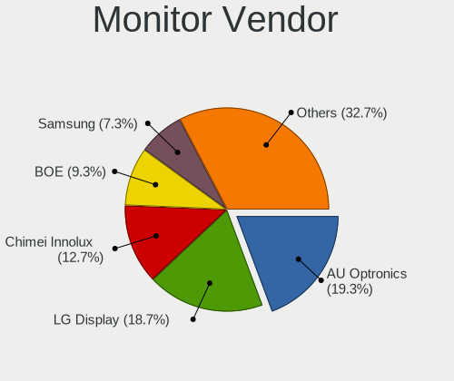

Zorin - Hardware Trends (Notebooks)
-----------------------------------

A project to identify most popular hardware characteristics and track their change
over time based on data collected by Linux users at https://Linux-Hardware.org.

Anyone can contribute to this report by the [hw-probe](https://github.com/linuxhw/hw-probe) tool:

    sudo -E hw-probe -all -upload

This report is for one last month. Overall report since the beginning of time: [TestCoverage](https://github.com/linuxhw/TestCoverage)

Period: Nov, 2022.

Contents
--------

* [ System ](#system)
  - [ OS                       ](#os)
  - [ OS Family                ](#os-family)
  - [ Kernel                   ](#kernel)
  - [ Kernel Family            ](#kernel-family)
  - [ Kernel Major Ver.        ](#kernel-major-ver)
  - [ Arch                     ](#arch)
  - [ DE                       ](#de)
  - [ Display Server           ](#display-server)
  - [ Display Manager          ](#display-manager)
  - [ OS Lang                  ](#os-lang)
  - [ Boot Mode                ](#boot-mode)
  - [ Filesystem               ](#filesystem)
  - [ Part. scheme             ](#part-scheme)
  - [ Dual Boot with Linux/BSD ](#dual-boot-with-linuxbsd)
  - [ Dual Boot (Win)          ](#dual-boot-win)

* [ Board ](#board)
  - [ Vendor                   ](#vendor)
  - [ Model                    ](#model)
  - [ Model Family             ](#model-family)
  - [ MFG Year                 ](#mfg-year)
  - [ Form Factor              ](#form-factor)
  - [ Secure Boot              ](#secure-boot)
  - [ Coreboot                 ](#coreboot)
  - [ RAM Size                 ](#ram-size)
  - [ RAM Used                 ](#ram-used)
  - [ Total Drives             ](#total-drives)
  - [ Has CD-ROM               ](#has-cd-rom)
  - [ Has Ethernet             ](#has-ethernet)
  - [ Has WiFi                 ](#has-wifi)
  - [ Has Bluetooth            ](#has-bluetooth)

* [ Location ](#location)
  - [ Country                  ](#country)
  - [ City                     ](#city)

* [ Drives ](#drives)
  - [ Drive Vendor             ](#drive-vendor)
  - [ Drive Model              ](#drive-model)
  - [ HDD Vendor               ](#hdd-vendor)
  - [ SSD Vendor               ](#ssd-vendor)
  - [ Drive Kind               ](#drive-kind)
  - [ Drive Connector          ](#drive-connector)
  - [ Drive Size               ](#drive-size)
  - [ Space Total              ](#space-total)
  - [ Space Used               ](#space-used)
  - [ Malfunc. Drives          ](#malfunc-drives)
  - [ Malfunc. Drive Vendor    ](#malfunc-drive-vendor)
  - [ Malfunc. HDD Vendor      ](#malfunc-hdd-vendor)
  - [ Malfunc. Drive Kind      ](#malfunc-drive-kind)
  - [ Failed Drives            ](#failed-drives)
  - [ Failed Drive Vendor      ](#failed-drive-vendor)
  - [ Drive Status             ](#drive-status)

* [ Storage controller ](#storage-controller)
  - [ Storage Vendor           ](#storage-vendor)
  - [ Storage Model            ](#storage-model)
  - [ Storage Kind             ](#storage-kind)

* [ Processor ](#processor)
  - [ CPU Vendor               ](#cpu-vendor)
  - [ CPU Model                ](#cpu-model)
  - [ CPU Model Family         ](#cpu-model-family)
  - [ CPU Cores                ](#cpu-cores)
  - [ CPU Sockets              ](#cpu-sockets)
  - [ CPU Threads              ](#cpu-threads)
  - [ CPU Op-Modes             ](#cpu-op-modes)
  - [ CPU Microcode            ](#cpu-microcode)
  - [ CPU Microarch            ](#cpu-microarch)

* [ Graphics ](#graphics)
  - [ GPU Vendor               ](#gpu-vendor)
  - [ GPU Model                ](#gpu-model)
  - [ GPU Combo                ](#gpu-combo)
  - [ GPU Driver               ](#gpu-driver)
  - [ GPU Memory               ](#gpu-memory)

* [ Monitor ](#monitor)
  - [ Monitor Vendor           ](#monitor-vendor)
  - [ Monitor Model            ](#monitor-model)
  - [ Monitor Resolution       ](#monitor-resolution)
  - [ Monitor Diagonal         ](#monitor-diagonal)
  - [ Monitor Width            ](#monitor-width)
  - [ Aspect Ratio             ](#aspect-ratio)
  - [ Monitor Area             ](#monitor-area)
  - [ Pixel Density            ](#pixel-density)
  - [ Multiple Monitors        ](#multiple-monitors)

* [ Network ](#network)
  - [ Net Controller Vendor    ](#net-controller-vendor)
  - [ Net Controller Model     ](#net-controller-model)
  - [ Wireless Vendor          ](#wireless-vendor)
  - [ Wireless Model           ](#wireless-model)
  - [ Ethernet Vendor          ](#ethernet-vendor)
  - [ Ethernet Model           ](#ethernet-model)
  - [ Net Controller Kind      ](#net-controller-kind)
  - [ Used Controller          ](#used-controller)
  - [ NICs                     ](#nics)
  - [ IPv6                     ](#ipv6)

* [ Bluetooth ](#bluetooth)
  - [ Bluetooth Vendor         ](#bluetooth-vendor)
  - [ Bluetooth Model          ](#bluetooth-model)

* [ Sound ](#sound)
  - [ Sound Vendor             ](#sound-vendor)
  - [ Sound Model              ](#sound-model)

* [ Memory ](#memory)
  - [ Memory Vendor            ](#memory-vendor)
  - [ Memory Model             ](#memory-model)
  - [ Memory Kind              ](#memory-kind)
  - [ Memory Form Factor       ](#memory-form-factor)
  - [ Memory Size              ](#memory-size)
  - [ Memory Speed             ](#memory-speed)

* [ Printers & scanners ](#printers--scanners)
  - [ Printer Vendor           ](#printer-vendor)
  - [ Printer Model            ](#printer-model)
  - [ Scanner Vendor           ](#scanner-vendor)
  - [ Scanner Model            ](#scanner-model)

* [ Camera ](#camera)
  - [ Camera Vendor            ](#camera-vendor)
  - [ Camera Model             ](#camera-model)

* [ Security ](#security)
  - [ Fingerprint Vendor       ](#fingerprint-vendor)
  - [ Fingerprint Model        ](#fingerprint-model)
  - [ Chipcard Vendor          ](#chipcard-vendor)
  - [ Chipcard Model           ](#chipcard-model)

* [ Unsupported ](#unsupported)
  - [ Unsupported Devices      ](#unsupported-devices)
  - [ Unsupported Device Types ](#unsupported-device-types)

System
------

OS
--

Installed operating systems

| Name     | Notebooks | Percent |
|----------|-----------|---------|
| Zorin 16 | 87        | 96.67%  |
| Zorin 15 | 3         | 3.33%   |

OS Family
---------

OS without a version

| Name  | Notebooks | Percent |
|-------|-----------|---------|
| Zorin | 90        | 100%    |

Kernel
------

Version of the Linux kernel

| Version                    | Notebooks | Percent |
|----------------------------|-----------|---------|
| 5.15.0-52-generic          | 49        | 54.44%  |
| 5.15.0-53-generic          | 33        | 36.67%  |
| 5.4.0-131-generic          | 3         | 3.33%   |
| 5.19.0-17.2-liquorix-amd64 | 1         | 1.11%   |
| 5.15.0-43-generic          | 1         | 1.11%   |
| 5.15.0-41-generic          | 1         | 1.11%   |
| 5.14.0-1054-oem            | 1         | 1.11%   |
| 5.13.0-40-generic          | 1         | 1.11%   |

Kernel Family
-------------

Linux kernel without a distro release

| Version | Notebooks | Percent |
|---------|-----------|---------|
| 5.15.0  | 84        | 93.33%  |
| 5.4.0   | 3         | 3.33%   |
| 5.19.0  | 1         | 1.11%   |
| 5.14.0  | 1         | 1.11%   |
| 5.13.0  | 1         | 1.11%   |

Kernel Major Ver.
-----------------

Linux kernel major version

| Version | Notebooks | Percent |
|---------|-----------|---------|
| 5.15    | 84        | 93.33%  |
| 5.4     | 3         | 3.33%   |
| 5.19    | 1         | 1.11%   |
| 5.14    | 1         | 1.11%   |
| 5.13    | 1         | 1.11%   |

Arch
----

OS architecture (x86_64, i586, etc.)

| Name   | Notebooks | Percent |
|--------|-----------|---------|
| x86_64 | 88        | 97.78%  |
| i686   | 2         | 2.22%   |

DE
--

Desktop Environment

| Name    | Notebooks | Percent |
|---------|-----------|---------|
| GNOME   | 73        | 81.11%  |
| XFCE    | 15        | 16.67%  |
| i3      | 1         | 1.11%   |
| Unknown | 1         | 1.11%   |

Display Server
--------------

X11 or Wayland

| Name    | Notebooks | Percent |
|---------|-----------|---------|
| X11     | 89        | 98.89%  |
| Unknown | 1         | 1.11%   |

Display Manager
---------------

SDDM, LightDM, etc.

| Name    | Notebooks | Percent |
|---------|-----------|---------|
| Unknown | 69        | 76.67%  |
| GDM     | 10        | 11.11%  |
| GDM3    | 7         | 7.78%   |
| LightDM | 3         | 3.33%   |
| SDDM    | 1         | 1.11%   |

OS Lang
-------

Language

| Lang  | Notebooks | Percent |
|-------|-----------|---------|
| en_US | 28        | 31.11%  |
| en_GB | 11        | 12.22%  |
| it_IT | 9         | 10%     |
| de_DE | 8         | 8.89%   |
| pt_BR | 5         | 5.56%   |
| fr_FR | 5         | 5.56%   |
| en_IN | 3         | 3.33%   |
| sv_SE | 2         | 2.22%   |
| ru_RU | 2         | 2.22%   |
| pl_PL | 2         | 2.22%   |
| hu_HU | 2         | 2.22%   |
| es_ES | 2         | 2.22%   |
| es_AR | 2         | 2.22%   |
| tr_TR | 1         | 1.11%   |
| nl_NL | 1         | 1.11%   |
| nb_NO | 1         | 1.11%   |
| es_US | 1         | 1.11%   |
| es_CR | 1         | 1.11%   |
| en_ZA | 1         | 1.11%   |
| en_SG | 1         | 1.11%   |
| en_CA | 1         | 1.11%   |
| en_AU | 1         | 1.11%   |

Boot Mode
---------

EFI or BIOS

| Mode | Notebooks | Percent |
|------|-----------|---------|
| EFI  | 56        | 62.22%  |
| BIOS | 34        | 37.78%  |

Filesystem
----------

Type of filesystem

| Type | Notebooks | Percent |
|------|-----------|---------|
| Ext4 | 88        | 97.78%  |
| Zfs  | 2         | 2.22%   |

Part. scheme
------------

Scheme of partitioning

| Type    | Notebooks | Percent |
|---------|-----------|---------|
| Unknown | 71        | 78.89%  |
| GPT     | 15        | 16.67%  |
| MBR     | 4         | 4.44%   |

Dual Boot with Linux/BSD
------------------------

Hosting more than one Linux/BSD

| Dual boot | Notebooks | Percent |
|-----------|-----------|---------|
| No        | 88        | 97.78%  |
| Yes       | 2         | 2.22%   |

Dual Boot (Win)
---------------

Hosting Linux and Windows

| Dual boot | Notebooks | Percent |
|-----------|-----------|---------|
| No        | 83        | 92.22%  |
| Yes       | 7         | 7.78%   |

Board
-----

Vendor
------

Motherboard manufacturer

| Name                | Notebooks | Percent |
|---------------------|-----------|---------|
| Hewlett-Packard     | 17        | 18.89%  |
| Lenovo              | 16        | 17.78%  |
| Dell                | 15        | 16.67%  |
| ASUSTek Computer    | 10        | 11.11%  |
| Toshiba             | 4         | 4.44%   |
| Acer                | 3         | 3.33%   |
| Samsung Electronics | 2         | 2.22%   |
| Microtech           | 2         | 2.22%   |
| Gateway             | 2         | 2.22%   |
| Apple               | 2         | 2.22%   |
| Thomson             | 1         | 1.11%   |
| Quanta              | 1         | 1.11%   |
| Panasonic           | 1         | 1.11%   |
| Packard Bell        | 1         | 1.11%   |
| Notebook            | 1         | 1.11%   |
| MSI                 | 1         | 1.11%   |
| Linx                | 1         | 1.11%   |
| HUAWEI              | 1         | 1.11%   |
| Hampoo              | 1         | 1.11%   |
| H-BUSTER            | 1         | 1.11%   |
| Fujitsu             | 1         | 1.11%   |
| Framework           | 1         | 1.11%   |
| BANGHO              | 1         | 1.11%   |
| ALURIN              | 1         | 1.11%   |
| ALLDOCUBE           | 1         | 1.11%   |
| A-DATA Technology   | 1         | 1.11%   |
| Unknown             | 1         | 1.11%   |

Model
-----

Motherboard model

| Name                                        | Notebooks | Percent |
|---------------------------------------------|-----------|---------|
| Dell Latitude E6540                         | 3         | 3.33%   |
| HP Pavilion Notebook                        | 2         | 2.22%   |
| Dell Studio 1558                            | 2         | 2.22%   |
| ASUS K55VD                                  | 2         | 2.22%   |
| Toshiba Satellite S55t-B                    | 1         | 1.11%   |
| Toshiba Satellite C55-C                     | 1         | 1.11%   |
| Toshiba Satellite C50D-B                    | 1         | 1.11%   |
| Toshiba PORTEGE Z30-A                       | 1         | 1.11%   |
| Thomson GEN17V3C8WH256                      | 1         | 1.11%   |
| Samsung RV411/RV511/E3511/S3511/RV711/E3411 | 1         | 1.11%   |
| Samsung 600B4B/600B5B                       | 1         | 1.11%   |
| Quanta TW8/SW8/DW8                          | 1         | 1.11%   |
| Panasonic CF-19AHN3BFF                      | 1         | 1.11%   |
| Packard Bell EasyNote TS11HR                | 1         | 1.11%   |
| Notebook NP5x_NP6x_NP7xPNP                  | 1         | 1.11%   |
| MSI GE75 Raider 10SE                        | 1         | 1.11%   |
| Microtech ebookLite                         | 1         | 1.11%   |
| Microtech CoreBook                          | 1         | 1.11%   |
| Linx LINX1010B                              | 1         | 1.11%   |
| Lenovo ThinkPad X201 36809T1                | 1         | 1.11%   |
| Lenovo ThinkPad X1 Carbon 4th 20FCCTO1WW    | 1         | 1.11%   |
| Lenovo ThinkPad P17 Gen 2i 20YU0028FR       | 1         | 1.11%   |
| Lenovo ThinkPad P16 Gen 1 21D7S0L500        | 1         | 1.11%   |
| Lenovo ThinkPad Edge E530c 33663VG          | 1         | 1.11%   |
| Lenovo ThinkPad E15 Gen 3 20YG003XIX        | 1         | 1.11%   |
| Lenovo Slim 7 ProX 14ARH7 82V2              | 1         | 1.11%   |
| Lenovo Legion Y530-15ICH 81FV               | 1         | 1.11%   |
| Lenovo IdeaPadFlex 15D 20334                | 1         | 1.11%   |
| Lenovo IdeaPad U400 09932JU                 | 1         | 1.11%   |
| Lenovo IdeaPad 5 15IIL05 81YK               | 1         | 1.11%   |
| Lenovo IdeaPad 5 15ARE05 81YQ               | 1         | 1.11%   |
| Lenovo IdeaPad 100S-11IBY 80R2              | 1         | 1.11%   |
| Lenovo G500 20236                           | 1         | 1.11%   |
| Lenovo G40-30 80FY                          | 1         | 1.11%   |
| Lenovo B50-30 80ES                          | 1         | 1.11%   |
| HUAWEI BOD-WXX9                             | 1         | 1.11%   |
| HP ProBook 650 G1                           | 1         | 1.11%   |
| HP ProBook 430 G4                           | 1         | 1.11%   |
| HP Pavilion Sleekbook 15 PC                 | 1         | 1.11%   |
| HP Pavilion g6                              | 1         | 1.11%   |

Model Family
------------

Motherboard model prefix

| Name                   | Notebooks | Percent |
|------------------------|-----------|---------|
| Lenovo ThinkPad        | 6         | 6.67%   |
| HP Pavilion            | 6         | 6.67%   |
| Dell Latitude          | 5         | 5.56%   |
| Lenovo IdeaPad         | 4         | 4.44%   |
| Dell Inspiron          | 4         | 4.44%   |
| Toshiba Satellite      | 3         | 3.33%   |
| Dell XPS               | 3         | 3.33%   |
| HP ProBook             | 2         | 2.22%   |
| HP EliteBook           | 2         | 2.22%   |
| Dell Studio            | 2         | 2.22%   |
| ASUS K55VD             | 2         | 2.22%   |
| Acer Aspire            | 2         | 2.22%   |
| Toshiba PORTEGE        | 1         | 1.11%   |
| Thomson GEN17V3C8WH256 | 1         | 1.11%   |
| Samsung RV411          | 1         | 1.11%   |
| Samsung 600B4B         | 1         | 1.11%   |
| Quanta TW8             | 1         | 1.11%   |
| Panasonic CF-19AHN3BFF | 1         | 1.11%   |
| Packard Bell EasyNote  | 1         | 1.11%   |
| Notebook NP5x          | 1         | 1.11%   |
| MSI GE75               | 1         | 1.11%   |
| Microtech ebookLite    | 1         | 1.11%   |
| Microtech CoreBook     | 1         | 1.11%   |
| Linx LINX1010B         | 1         | 1.11%   |
| Lenovo Slim            | 1         | 1.11%   |
| Lenovo Legion          | 1         | 1.11%   |
| Lenovo IdeaPadFlex     | 1         | 1.11%   |
| Lenovo G500            | 1         | 1.11%   |
| Lenovo G40-30          | 1         | 1.11%   |
| Lenovo B50-30          | 1         | 1.11%   |
| HUAWEI BOD-WXX9        | 1         | 1.11%   |
| HP Notebook            | 1         | 1.11%   |
| HP Laptop              | 1         | 1.11%   |
| HP ENVY                | 1         | 1.11%   |
| HP 240                 | 1         | 1.11%   |
| HP 2000                | 1         | 1.11%   |
| HP 15                  | 1         | 1.11%   |
| HP 14                  | 1         | 1.11%   |
| Hampoo Cherry          | 1         | 1.11%   |
| H-BUSTER HBNB1403      | 1         | 1.11%   |

MFG Year
--------

Motherboard manufacture year

| Year | Notebooks | Percent |
|------|-----------|---------|
| 2011 | 14        | 15.56%  |
| 2021 | 11        | 12.22%  |
| 2013 | 10        | 11.11%  |
| 2012 | 9         | 10%     |
| 2014 | 7         | 7.78%   |
| 2020 | 6         | 6.67%   |
| 2015 | 6         | 6.67%   |
| 2010 | 5         | 5.56%   |
| 2022 | 4         | 4.44%   |
| 2016 | 4         | 4.44%   |
| 2018 | 3         | 3.33%   |
| 2008 | 3         | 3.33%   |
| 2019 | 2         | 2.22%   |
| 2017 | 2         | 2.22%   |
| 2009 | 2         | 2.22%   |
| 2007 | 1         | 1.11%   |
| 2006 | 1         | 1.11%   |

Form Factor
-----------

Physical design of the computer

| Name     | Notebooks | Percent |
|----------|-----------|---------|
| Notebook | 90        | 100%    |

Secure Boot
-----------

Enabled or disabled

| State    | Notebooks | Percent |
|----------|-----------|---------|
| Disabled | 75        | 83.33%  |
| Enabled  | 15        | 16.67%  |

Coreboot
--------

Have coreboot on board

| Used | Notebooks | Percent |
|------|-----------|---------|
| No   | 90        | 100%    |

RAM Size
--------

Total RAM memory

| Size in GB | Notebooks | Percent |
|------------|-----------|---------|
| 4.01-8.0   | 31        | 34.44%  |
| 3.01-4.0   | 24        | 26.67%  |
| 8.01-16.0  | 14        | 15.56%  |
| 16.01-24.0 | 11        | 12.22%  |
| 32.01-64.0 | 4         | 4.44%   |
| 1.01-2.0   | 3         | 3.33%   |
| 2.01-3.0   | 2         | 2.22%   |
| 24.01-32.0 | 1         | 1.11%   |

RAM Used
--------

Used RAM memory

| Used GB   | Notebooks | Percent |
|-----------|-----------|---------|
| 1.01-2.0  | 32        | 35.56%  |
| 2.01-3.0  | 31        | 34.44%  |
| 4.01-8.0  | 11        | 12.22%  |
| 3.01-4.0  | 10        | 11.11%  |
| 8.01-16.0 | 3         | 3.33%   |
| 0.51-1.0  | 3         | 3.33%   |

Total Drives
------------

Number of drives on board

| Drives | Notebooks | Percent |
|--------|-----------|---------|
| 1      | 71        | 78.89%  |
| 2      | 19        | 21.11%  |

Has CD-ROM
----------

Has CD-ROM on board

| Presented | Notebooks | Percent |
|-----------|-----------|---------|
| No        | 54        | 60%     |
| Yes       | 36        | 40%     |

Has Ethernet
------------

Has Ethernet on board

| Presented | Notebooks | Percent |
|-----------|-----------|---------|
| Yes       | 70        | 77.78%  |
| No        | 20        | 22.22%  |

Has WiFi
--------

Has WiFi module

| Presented | Notebooks | Percent |
|-----------|-----------|---------|
| Yes       | 87        | 96.67%  |
| No        | 3         | 3.33%   |

Has Bluetooth
-------------

Has Bluetooth module

| Presented | Notebooks | Percent |
|-----------|-----------|---------|
| Yes       | 57        | 63.33%  |
| No        | 33        | 36.67%  |

Location
--------

Country
-------

Geographic location (country)

| Country       | Notebooks | Percent |
|---------------|-----------|---------|
| USA           | 11        | 12.22%  |
| UK            | 10        | 11.11%  |
| Italy         | 10        | 11.11%  |
| Germany       | 9         | 10%     |
| Spain         | 5         | 5.56%   |
| Brazil        | 4         | 4.44%   |
| Sweden        | 3         | 3.33%   |
| Mexico        | 3         | 3.33%   |
| India         | 3         | 3.33%   |
| France        | 3         | 3.33%   |
| Russia        | 2         | 2.22%   |
| Poland        | 2         | 2.22%   |
| Netherlands   | 2         | 2.22%   |
| Indonesia     | 2         | 2.22%   |
| Hungary       | 2         | 2.22%   |
| Egypt         | 2         | 2.22%   |
| Argentina     | 2         | 2.22%   |
| Turkey        | 1         | 1.11%   |
| Tunisia       | 1         | 1.11%   |
| South Africa  | 1         | 1.11%   |
| Singapore     | 1         | 1.11%   |
| Portugal      | 1         | 1.11%   |
| Norway        | 1         | 1.11%   |
| Kuwait        | 1         | 1.11%   |
| Greece        | 1         | 1.11%   |
| French Guiana | 1         | 1.11%   |
| Finland       | 1         | 1.11%   |
| Costa Rica    | 1         | 1.11%   |
| Colombia      | 1         | 1.11%   |
| Canada        | 1         | 1.11%   |
| Bulgaria      | 1         | 1.11%   |
| Australia     | 1         | 1.11%   |

City
----

Geographic location (city)

| City                   | Notebooks | Percent |
|------------------------|-----------|---------|
| Naples                 | 2         | 2.22%   |
| Jakarta                | 2         | 2.22%   |
| Cairo                  | 2         | 2.22%   |
| Bocholt                | 2         | 2.22%   |
| Yekaterinburg          | 1         | 1.11%   |
| Wyong                  | 1         | 1.11%   |
| Wigton                 | 1         | 1.11%   |
| Wiesbaden              | 1         | 1.11%   |
| Viseu                  | 1         | 1.11%   |
| Victoria               | 1         | 1.11%   |
| Verona                 | 1         | 1.11%   |
| Tunis                  | 1         | 1.11%   |
| Tullahoma              | 1         | 1.11%   |
| Totnes                 | 1         | 1.11%   |
| Torrevieja             | 1         | 1.11%   |
| Telford                | 1         | 1.11%   |
| Teano                  | 1         | 1.11%   |
| Szendro                | 1         | 1.11%   |
| South Bend             | 1         | 1.11%   |
| Solna                  | 1         | 1.11%   |
| Södertälje           | 1         | 1.11%   |
| Singapore              | 1         | 1.11%   |
| Silistra               | 1         | 1.11%   |
| Sesto Fiorentino       | 1         | 1.11%   |
| Selby                  | 1         | 1.11%   |
| Santa Cruz de Tenerife | 1         | 1.11%   |
| San Pedro              | 1         | 1.11%   |
| San Francisco          | 1         | 1.11%   |
| San Diego              | 1         | 1.11%   |
| Saint Neots            | 1         | 1.11%   |
| Rozenburg              | 1         | 1.11%   |
| Rome                   | 1         | 1.11%   |
| Rimini                 | 1         | 1.11%   |
| Rho                    | 1         | 1.11%   |
| Recife                 | 1         | 1.11%   |
| Puntarenas             | 1         | 1.11%   |
| Pforzheim              | 1         | 1.11%   |
| Pereira                | 1         | 1.11%   |
| Paris                  | 1         | 1.11%   |
| Ourinhos               | 1         | 1.11%   |

Drives
------

Drive Vendor
------------

Hard drive vendors

| Vendor              | Notebooks | Drives | Percent |
|---------------------|-----------|--------|---------|
| Seagate             | 15        | 15     | 14.29%  |
| Samsung Electronics | 14        | 14     | 13.33%  |
| WDC                 | 9         | 9      | 8.57%   |
| Unknown             | 9         | 11     | 8.57%   |
| Toshiba             | 8         | 8      | 7.62%   |
| Crucial             | 6         | 6      | 5.71%   |
| SanDisk             | 5         | 5      | 4.76%   |
| Kingston            | 5         | 6      | 4.76%   |
| Micron Technology   | 4         | 4      | 3.81%   |
| SPCC                | 3         | 3      | 2.86%   |
| SK hynix            | 3         | 3      | 2.86%   |
| Intel               | 3         | 3      | 2.86%   |
| Hitachi             | 3         | 3      | 2.86%   |
| China               | 3         | 3      | 2.86%   |
| A-DATA Technology   | 3         | 3      | 2.86%   |
| Silicon Motion      | 2         | 2      | 1.9%    |
| Phison Electronics  | 2         | 2      | 1.9%    |
| Unknown             | 2         | 2      | 1.9%    |
| XPG                 | 1         | 1      | 0.95%   |
| Transcend           | 1         | 1      | 0.95%   |
| SABRENT             | 1         | 1      | 0.95%   |
| Phison              | 1         | 1      | 0.95%   |
| LITEONIT            | 1         | 1      | 0.95%   |
| Apple               | 1         | 1      | 0.95%   |

Drive Model
-----------

Hard drive models

| Model                                                 | Notebooks | Percent |
|-------------------------------------------------------|-----------|---------|
| Unknown MMC Card  32GB                                | 4         | 3.7%    |
| Unknown MMC Card  64GB                                | 3         | 2.78%   |
| Toshiba MQ01ABD100 1TB                                | 3         | 2.78%   |
| SPCC Solid State Disk 256GB                           | 2         | 1.85%   |
| Silicon Motion SM2263EN/SM2263XT SSD Controller 128GB | 2         | 1.85%   |
| Seagate ST750LM022 HN-M750MBB 752GB                   | 2         | 1.85%   |
| Seagate ST500LT012-1DG142 500GB                       | 2         | 1.85%   |
| Seagate ST1000LM048-2E7172 1TB                        | 2         | 1.85%   |
| Seagate ST1000LM035-1RK172 1TB                        | 2         | 1.85%   |
| Samsung SSD 840 EVO 250GB                             | 2         | 1.85%   |
| China SATA SSD 256GB                                  | 2         | 1.85%   |
| Unknown                                               | 2         | 1.85%   |
| XPG GAMMIX S50 Lite 1TB                               | 1         | 0.93%   |
| WDC WD6400BEVT-22A0RT0 640GB                          | 1         | 0.93%   |
| WDC WD5000LPVX-60V0TT0 500GB                          | 1         | 0.93%   |
| WDC WD5000LPCX-24C6HT0 500GB                          | 1         | 0.93%   |
| WDC WD5000LPCX-21VHAT0 500GB                          | 1         | 0.93%   |
| WDC WD2500BEVS-22UST0 250GB                           | 1         | 0.93%   |
| WDC WD1600BEVS-22RST0 160GB                           | 1         | 0.93%   |
| WDC WD10JPVX-60JC3T0 1TB                              | 1         | 0.93%   |
| WDC PC SN530 SDBPMPZ-512G-1101 512GB                  | 1         | 0.93%   |
| WDC PC SN530 SDBPMPZ-256G-1001 256GB                  | 1         | 0.93%   |
| Unknown MMC64G  64GB                                  | 1         | 0.93%   |
| Unknown MMC Card  942MB                               | 1         | 0.93%   |
| Unknown MMC Card  16GB                                | 1         | 0.93%   |
| Unknown MMC Card  128GB                               | 1         | 0.93%   |
| Transcend TS240GMTS420S 240GB SSD                     | 1         | 0.93%   |
| Toshiba THNSNJ256GCST 256GB SSD                       | 1         | 0.93%   |
| Toshiba MQ01ABF050 500GB                              | 1         | 0.93%   |
| Toshiba MK3276GSX 320GB                               | 1         | 0.93%   |
| Toshiba MK1031GAS 100GB                               | 1         | 0.93%   |
| Toshiba KXG50ZNV512G NVMe 512GB                       | 1         | 0.93%   |
| SPCC Solid State Disk 240GB                           | 1         | 0.93%   |
| SK hynix SKHynix_HFS001TDE9X081N 1TB                  | 1         | 0.93%   |
| SK hynix HFS064G3AMNM-1010A 64GB SSD                  | 1         | 0.93%   |
| SK hynix BC511 512GB                                  | 1         | 0.93%   |
| Seagate ST9500420AS 500GB                             | 1         | 0.93%   |
| Seagate ST9500325AS 500GB                             | 1         | 0.93%   |
| Seagate ST500LT012-9WS142 500GB                       | 1         | 0.93%   |
| Seagate ST160LT007-9ZV14D 160GB                       | 1         | 0.93%   |

HDD Vendor
----------

Hard disk drive vendors

| Vendor              | Notebooks | Drives | Percent |
|---------------------|-----------|--------|---------|
| Seagate             | 15        | 15     | 45.45%  |
| WDC                 | 7         | 7      | 21.21%  |
| Toshiba             | 6         | 6      | 18.18%  |
| Hitachi             | 3         | 3      | 9.09%   |
| Samsung Electronics | 1         | 1      | 3.03%   |
| Apple               | 1         | 1      | 3.03%   |

SSD Vendor
----------

Solid state drive vendors

| Vendor              | Notebooks | Drives | Percent |
|---------------------|-----------|--------|---------|
| Samsung Electronics | 11        | 11     | 27.5%   |
| Crucial             | 6         | 6      | 15%     |
| Kingston            | 4         | 5      | 10%     |
| SPCC                | 3         | 3      | 7.5%    |
| SanDisk             | 3         | 3      | 7.5%    |
| A-DATA Technology   | 3         | 3      | 7.5%    |
| Intel               | 2         | 2      | 5%      |
| China               | 2         | 2      | 5%      |
| Unknown             | 2         | 2      | 5%      |
| Transcend           | 1         | 1      | 2.5%    |
| Toshiba             | 1         | 1      | 2.5%    |
| SK hynix            | 1         | 1      | 2.5%    |
| LITEONIT            | 1         | 1      | 2.5%    |

Drive Kind
----------

HDD or SSD

| Kind    | Notebooks | Drives | Percent |
|---------|-----------|--------|---------|
| SSD     | 38        | 41     | 38.38%  |
| HDD     | 33        | 33     | 33.33%  |
| NVMe    | 18        | 22     | 18.18%  |
| MMC     | 9         | 11     | 9.09%   |
| Unknown | 1         | 1      | 1.01%   |

Drive Connector
---------------

SATA, SAS, NVMe, etc.

| Type | Notebooks | Drives | Percent |
|------|-----------|--------|---------|
| SATA | 68        | 74     | 70.1%   |
| NVMe | 18        | 21     | 18.56%  |
| MMC  | 9         | 11     | 9.28%   |
| SAS  | 2         | 2      | 2.06%   |

Drive Size
----------

Size of hard drive

| Size in TB | Notebooks | Drives | Percent |
|------------|-----------|--------|---------|
| 0.01-0.5   | 48        | 51     | 69.57%  |
| 0.51-1.0   | 21        | 23     | 30.43%  |

Space Total
-----------

Amount of disk space available on the file system

| Size in GB | Notebooks | Percent |
|------------|-----------|---------|
| 101-250    | 28        | 31.11%  |
| 251-500    | 20        | 22.22%  |
| 501-1000   | 17        | 18.89%  |
| 51-100     | 14        | 15.56%  |
| 21-50      | 6         | 6.67%   |
| 1-20       | 2         | 2.22%   |
| Unknown    | 2         | 2.22%   |
| 1001-2000  | 1         | 1.11%   |

Space Used
----------

Amount of used disk space

| Used GB  | Notebooks | Percent |
|----------|-----------|---------|
| 1-20     | 34        | 37.78%  |
| 21-50    | 28        | 31.11%  |
| 51-100   | 14        | 15.56%  |
| 101-250  | 8         | 8.89%   |
| 251-500  | 2         | 2.22%   |
| 501-1000 | 2         | 2.22%   |
| Unknown  | 2         | 2.22%   |

Malfunc. Drives
---------------

Drive models with a malfunction

| Model                                 | Notebooks | Drives | Percent |
|---------------------------------------|-----------|--------|---------|
| WDC WD6400BEVT-22A0RT0 640GB          | 1         | 1      | 25%     |
| Toshiba MQ01ABD100 1TB                | 1         | 1      | 25%     |
| Seagate ST9500325AS 500GB             | 1         | 1      | 25%     |
| LITEONIT LCT-256M3S 2.5 7mm 256GB SSD | 1         | 1      | 25%     |

Malfunc. Drive Vendor
---------------------

Vendors of faulty drives

| Vendor   | Notebooks | Drives | Percent |
|----------|-----------|--------|---------|
| WDC      | 1         | 1      | 25%     |
| Toshiba  | 1         | 1      | 25%     |
| Seagate  | 1         | 1      | 25%     |
| LITEONIT | 1         | 1      | 25%     |

Malfunc. HDD Vendor
-------------------

Vendors of faulty HDD drives

| Vendor  | Notebooks | Drives | Percent |
|---------|-----------|--------|---------|
| WDC     | 1         | 1      | 33.33%  |
| Toshiba | 1         | 1      | 33.33%  |
| Seagate | 1         | 1      | 33.33%  |

Malfunc. Drive Kind
-------------------

Kinds of faulty drives

| Kind | Notebooks | Drives | Percent |
|------|-----------|--------|---------|
| HDD  | 3         | 3      | 75%     |
| SSD  | 1         | 1      | 25%     |

Failed Drives
-------------

Failed drive models

Zero info for selected period =(

Failed Drive Vendor
-------------------

Failed drive vendors

Zero info for selected period =(

Drive Status
------------

Number of failed and malfunc. drives

| Status   | Notebooks | Drives | Percent |
|----------|-----------|--------|---------|
| Detected | 79        | 93     | 84.95%  |
| Works    | 10        | 11     | 10.75%  |
| Malfunc  | 4         | 4      | 4.3%    |

Storage controller
------------------

Storage Vendor
--------------

Storage controller vendors

| Vendor                           | Notebooks | Percent |
|----------------------------------|-----------|---------|
| Intel                            | 63        | 65.63%  |
| AMD                              | 11        | 11.46%  |
| SanDisk                          | 4         | 4.17%   |
| Micron Technology                | 4         | 4.17%   |
| Phison Electronics               | 3         | 3.13%   |
| SK hynix                         | 2         | 2.08%   |
| Silicon Motion                   | 2         | 2.08%   |
| Samsung Electronics              | 2         | 2.08%   |
| Toshiba America Info Systems     | 1         | 1.04%   |
| Silicon Integrated Systems [SiS] | 1         | 1.04%   |
| Nvidia                           | 1         | 1.04%   |
| Kingston Technology Company      | 1         | 1.04%   |
| ADATA Technology                 | 1         | 1.04%   |

Storage Model
-------------

Storage controller models

| Model                                                                          | Notebooks | Percent |
|--------------------------------------------------------------------------------|-----------|---------|
| Intel 6 Series/C200 Series Chipset Family 6 port Mobile SATA AHCI Controller   | 11        | 10.89%  |
| AMD FCH SATA Controller [AHCI mode]                                            | 10        | 9.9%    |
| Intel 7 Series Chipset Family 6-port SATA Controller [AHCI mode]               | 8         | 7.92%   |
| Intel 82801 Mobile SATA Controller [RAID mode]                                 | 6         | 5.94%   |
| Intel 5 Series/3400 Series Chipset 4 port SATA AHCI Controller                 | 5         | 4.95%   |
| Micron Non-Volatile memory controller                                          | 4         | 3.96%   |
| Intel Wildcat Point-LP SATA Controller [AHCI Mode]                             | 4         | 3.96%   |
| Intel Atom Processor E3800 Series SATA AHCI Controller                         | 4         | 3.96%   |
| Intel 8 Series SATA Controller 1 [AHCI mode]                                   | 4         | 3.96%   |
| Silicon Motion SM2263EN/SM2263XT SSD Controller                                | 2         | 1.98%   |
| SanDisk Non-Volatile memory controller                                         | 2         | 1.98%   |
| Intel Volume Management Device NVMe RAID Controller                            | 2         | 1.98%   |
| Intel Celeron/Pentium Silver Processor SATA Controller                         | 2         | 1.98%   |
| Intel Celeron N3350/Pentium N4200/Atom E3900 Series SATA AHCI Controller       | 2         | 1.98%   |
| Intel 82801IBM/IEM (ICH9M/ICH9M-E) 2 port SATA Controller [IDE mode]           | 2         | 1.98%   |
| Intel 8 Series/C220 Series Chipset Family 6-port SATA Controller 1 [AHCI mode] | 2         | 1.98%   |
| Intel 5 Series/3400 Series Chipset 4 port SATA IDE Controller                  | 2         | 1.98%   |
| Intel 5 Series/3400 Series Chipset 2 port SATA IDE Controller                  | 2         | 1.98%   |
| Toshiba America Info Systems XG5 NVMe SSD Controller                           | 1         | 0.99%   |
| SK hynix Gold P31/PC711 NVMe Solid State Drive                                 | 1         | 0.99%   |
| SK hynix BC511                                                                 | 1         | 0.99%   |
| Silicon Integrated Systems [SiS] SATA Controller / IDE mode                    | 1         | 0.99%   |
| Silicon Integrated Systems [SiS] 5513 IDE Controller                           | 1         | 0.99%   |
| SanDisk WD Blue SN550 NVMe SSD                                                 | 1         | 0.99%   |
| SanDisk WD Black SN750 / PC SN730 NVMe SSD                                     | 1         | 0.99%   |
| Samsung NVMe SSD Controller PM9A1/PM9A3/980PRO                                 | 1         | 0.99%   |
| Samsung NVMe SSD Controller 980                                                | 1         | 0.99%   |
| Phison PS5013 E13 NVMe Controller                                              | 1         | 0.99%   |
| Phison E18 PCIe4 NVMe Controller                                               | 1         | 0.99%   |
| Phison E16 PCIe4 NVMe Controller                                               | 1         | 0.99%   |
| Nvidia MCP79 AHCI Controller                                                   | 1         | 0.99%   |
| Kingston Company Company Non-Volatile memory controller                        | 1         | 0.99%   |
| Intel Sunrise Point-LP SATA Controller [AHCI mode]                             | 1         | 0.99%   |
| Intel SSD 600P Series                                                          | 1         | 0.99%   |
| Intel Jasper Lake SATA AHCI Controller                                         | 1         | 0.99%   |
| Intel Ice Lake-LP SATA Controller [AHCI mode]                                  | 1         | 0.99%   |
| Intel HM170/QM170 Chipset SATA Controller [AHCI Mode]                          | 1         | 0.99%   |
| Intel Cannon Lake Mobile PCH SATA AHCI Controller                              | 1         | 0.99%   |
| Intel 82801IBM/IEM (ICH9M/ICH9M-E) 4 port SATA Controller [AHCI mode]          | 1         | 0.99%   |
| Intel 82801HM/HEM (ICH8M/ICH8M-E) SATA Controller [AHCI mode]                  | 1         | 0.99%   |

Storage Kind
------------

Kind of storage controller (IDE, SATA, NVMe, SAS, ...)

| Kind | Notebooks | Percent |
|------|-----------|---------|
| SATA | 62        | 65.26%  |
| NVMe | 18        | 18.95%  |
| RAID | 8         | 8.42%   |
| IDE  | 7         | 7.37%   |

Processor
---------

CPU Vendor
----------

Processor vendors

| Vendor | Notebooks | Percent |
|--------|-----------|---------|
| Intel  | 77        | 85.56%  |
| AMD    | 13        | 14.44%  |

CPU Model
---------

Processor models

| Model                                       | Notebooks | Percent |
|---------------------------------------------|-----------|---------|
| Intel Core i7-4800MQ CPU @ 2.70GHz          | 3         | 3.33%   |
| Intel Core i5-2520M CPU @ 2.50GHz           | 3         | 3.33%   |
| Intel Core i7-8550U CPU @ 1.80GHz           | 2         | 2.22%   |
| Intel Core i7-2620M CPU @ 2.70GHz           | 2         | 2.22%   |
| Intel Core i5-5200U CPU @ 2.20GHz           | 2         | 2.22%   |
| Intel Core i5-1035G1 CPU @ 1.00GHz          | 2         | 2.22%   |
| Intel Core i5 CPU M 430 @ 2.27GHz           | 2         | 2.22%   |
| Intel Core i3-2310M CPU @ 2.10GHz           | 2         | 2.22%   |
| Intel Celeron N4020 CPU @ 1.10GHz           | 2         | 2.22%   |
| Intel Celeron CPU N2840 @ 2.16GHz           | 2         | 2.22%   |
| Intel Atom CPU Z3735F @ 1.33GHz             | 2         | 2.22%   |
| Intel 11th Gen Core i7-11800H @ 2.30GHz     | 2         | 2.22%   |
| Intel Pentium Dual-Core CPU T4200 @ 2.00GHz | 1         | 1.11%   |
| Intel Pentium Dual CPU T2370 @ 1.73GHz      | 1         | 1.11%   |
| Intel Pentium CPU P6200 @ 2.13GHz           | 1         | 1.11%   |
| Intel Pentium CPU P6100 @ 2.00GHz           | 1         | 1.11%   |
| Intel Pentium CPU N4200 @ 1.10GHz           | 1         | 1.11%   |
| Intel Pentium CPU N3540 @ 2.16GHz           | 1         | 1.11%   |
| Intel Pentium 3558U @ 1.70GHz               | 1         | 1.11%   |
| Intel Genuine CPU T2130 @ 1.86GHz           | 1         | 1.11%   |
| Intel Core i7-8750H CPU @ 2.20GHz           | 1         | 1.11%   |
| Intel Core i7-7700HQ CPU @ 2.80GHz          | 1         | 1.11%   |
| Intel Core i7-5500U CPU @ 2.40GHz           | 1         | 1.11%   |
| Intel Core i7-4710HQ CPU @ 2.50GHz          | 1         | 1.11%   |
| Intel Core i7-4510U CPU @ 2.00GHz           | 1         | 1.11%   |
| Intel Core i7-3632QM CPU @ 2.20GHz          | 1         | 1.11%   |
| Intel Core i7-3610QM CPU @ 2.30GHz          | 1         | 1.11%   |
| Intel Core i7-2720QM CPU @ 2.20GHz          | 1         | 1.11%   |
| Intel Core i7-10750H CPU @ 2.60GHz          | 1         | 1.11%   |
| Intel Core i5-7200U CPU @ 2.50GHz           | 1         | 1.11%   |
| Intel Core i5-6300U CPU @ 2.40GHz           | 1         | 1.11%   |
| Intel Core i5-4310U CPU @ 2.00GHz           | 1         | 1.11%   |
| Intel Core i5-4300M CPU @ 2.60GHz           | 1         | 1.11%   |
| Intel Core i5-4200U CPU @ 1.60GHz           | 1         | 1.11%   |
| Intel Core i5-3320M CPU @ 2.60GHz           | 1         | 1.11%   |
| Intel Core i5-3230M CPU @ 2.60GHz           | 1         | 1.11%   |
| Intel Core i5-3210M CPU @ 2.50GHz           | 1         | 1.11%   |
| Intel Core i5-2450M CPU @ 2.50GHz           | 1         | 1.11%   |
| Intel Core i5-2415M CPU @ 2.30GHz           | 1         | 1.11%   |
| Intel Core i5 CPU M 560 @ 2.67GHz           | 1         | 1.11%   |

CPU Model Family
----------------

Processor model prefix

| Model                   | Notebooks | Percent |
|-------------------------|-----------|---------|
| Intel Core i5           | 20        | 22.22%  |
| Intel Core i7           | 16        | 17.78%  |
| Intel Core i3           | 11        | 12.22%  |
| Other                   | 8         | 8.89%   |
| Intel Celeron           | 7         | 7.78%   |
| Intel Pentium           | 5         | 5.56%   |
| Intel Atom              | 4         | 4.44%   |
| Intel Core 2 Duo        | 3         | 3.33%   |
| AMD Ryzen 9             | 2         | 2.22%   |
| AMD Ryzen 5             | 2         | 2.22%   |
| AMD A10                 | 2         | 2.22%   |
| Intel Pentium Dual-Core | 1         | 1.11%   |
| Intel Pentium Dual      | 1         | 1.11%   |
| Intel Genuine           | 1         | 1.11%   |
| AMD Z                   | 1         | 1.11%   |
| AMD Turion 64 Mobile    | 1         | 1.11%   |
| AMD Ryzen 7             | 1         | 1.11%   |
| AMD E2                  | 1         | 1.11%   |
| AMD E1                  | 1         | 1.11%   |
| AMD A8                  | 1         | 1.11%   |
| AMD A6                  | 1         | 1.11%   |

CPU Cores
---------

Number of processor cores

| Number | Notebooks | Percent |
|--------|-----------|---------|
| 2      | 53        | 58.89%  |
| 4      | 26        | 28.89%  |
| 8      | 5         | 5.56%   |
| 6      | 3         | 3.33%   |
| 16     | 1         | 1.11%   |
| 14     | 1         | 1.11%   |
| 1      | 1         | 1.11%   |

CPU Sockets
-----------

Number of sockets

| Number | Notebooks | Percent |
|--------|-----------|---------|
| 1      | 90        | 100%    |

CPU Threads
-----------

Threads per core (Hyper-Threading)

| Number | Notebooks | Percent |
|--------|-----------|---------|
| 2      | 59        | 65.56%  |
| 1      | 31        | 34.44%  |

CPU Op-Modes
------------

CPU Operation Modes (32-bit, 64-bit)

| Op mode        | Notebooks | Percent |
|----------------|-----------|---------|
| 32-bit, 64-bit | 89        | 98.89%  |
| 32-bit         | 1         | 1.11%   |

CPU Microcode
-------------

Microcode number

| Number     | Notebooks | Percent |
|------------|-----------|---------|
| 0x206a7    | 14        | 15.56%  |
| Unknown    | 8         | 8.89%   |
| 0x30678    | 7         | 7.78%   |
| 0x306a9    | 6         | 6.67%   |
| 0x306c3    | 5         | 5.56%   |
| 0x20655    | 5         | 5.56%   |
| 0x306d4    | 4         | 4.44%   |
| 0x806c1    | 3         | 3.33%   |
| 0x40651    | 3         | 3.33%   |
| 0x1067a    | 3         | 3.33%   |
| 0x806ea    | 2         | 2.22%   |
| 0x706e5    | 2         | 2.22%   |
| 0x706a8    | 2         | 2.22%   |
| 0x506c9    | 2         | 2.22%   |
| 0x20652    | 2         | 2.22%   |
| 0x07030105 | 2         | 2.22%   |
| 0xa0652    | 1         | 1.11%   |
| 0x906ea    | 1         | 1.11%   |
| 0x906e9    | 1         | 1.11%   |
| 0x906c0    | 1         | 1.11%   |
| 0x906a3    | 1         | 1.11%   |
| 0x806e9    | 1         | 1.11%   |
| 0x806d1    | 1         | 1.11%   |
| 0x6fd      | 1         | 1.11%   |
| 0x6ec      | 1         | 1.11%   |
| 0x406e3    | 1         | 1.11%   |
| 0x406c3    | 1         | 1.11%   |
| 0x10676    | 1         | 1.11%   |
| 0x0a404101 | 1         | 1.11%   |
| 0x08600106 | 1         | 1.11%   |
| 0x08600104 | 1         | 1.11%   |
| 0x0700010f | 1         | 1.11%   |
| 0x06006705 | 1         | 1.11%   |
| 0x06006118 | 1         | 1.11%   |
| 0x06001119 | 1         | 1.11%   |
| 0x05000119 | 1         | 1.11%   |

CPU Microarch
-------------

Microarchitecture

| Name             | Notebooks | Percent |
|------------------|-----------|---------|
| SandyBridge      | 14        | 15.56%  |
| Haswell          | 9         | 10%     |
| Westmere         | 8         | 8.89%   |
| Silvermont       | 8         | 8.89%   |
| IvyBridge        | 6         | 6.67%   |
| KabyLake         | 5         | 5.56%   |
| TigerLake        | 4         | 4.44%   |
| Penryn           | 4         | 4.44%   |
| Broadwell        | 4         | 4.44%   |
| Unknown          | 4         | 4.44%   |
| IceLake          | 3         | 3.33%   |
| Zen 2            | 2         | 2.22%   |
| Puma             | 2         | 2.22%   |
| Goldmont plus    | 2         | 2.22%   |
| Goldmont         | 2         | 2.22%   |
| Excavator        | 2         | 2.22%   |
| Zen+             | 1         | 1.11%   |
| Tremont          | 1         | 1.11%   |
| Skylake          | 1         | 1.11%   |
| Piledriver       | 1         | 1.11%   |
| P6               | 1         | 1.11%   |
| K8 Hammer        | 1         | 1.11%   |
| Jaguar           | 1         | 1.11%   |
| Core             | 1         | 1.11%   |
| CometLake        | 1         | 1.11%   |
| Bobcat           | 1         | 1.11%   |
| Alderlake Hybrid | 1         | 1.11%   |

Graphics
--------

GPU Vendor
----------

Vendors of graphics cards

| Vendor | Notebooks | Percent |
|--------|-----------|---------|
| Intel  | 68        | 59.65%  |
| AMD    | 24        | 21.05%  |
| Nvidia | 22        | 19.3%   |

GPU Model
---------

Graphics card models

| Model                                                                     | Notebooks | Percent |
|---------------------------------------------------------------------------|-----------|---------|
| Intel 2nd Generation Core Processor Family Integrated Graphics Controller | 14        | 12.07%  |
| Intel Atom Processor Z36xxx/Z37xxx Series Graphics & Display              | 7         | 6.03%   |
| Intel Core Processor Integrated Graphics Controller                       | 5         | 4.31%   |
| Intel 4th Gen Core Processor Integrated Graphics Controller               | 5         | 4.31%   |
| Intel 3rd Gen Core processor Graphics Controller                          | 5         | 4.31%   |
| Intel HD Graphics 5500                                                    | 4         | 3.45%   |
| Intel Haswell-ULT Integrated Graphics Controller                          | 4         | 3.45%   |
| Intel TigerLake-LP GT2 [Iris Xe Graphics]                                 | 3         | 2.59%   |
| AMD Park [Mobility Radeon HD 5430/5450/5470]                              | 3         | 2.59%   |
| AMD Mars XTX [Radeon HD 8790M]                                            | 3         | 2.59%   |
| Nvidia GP107M [GeForce GTX 1050 Mobile]                                   | 2         | 1.72%   |
| Nvidia GF119M [GeForce 610M]                                              | 2         | 1.72%   |
| Intel UHD Graphics 620                                                    | 2         | 1.72%   |
| Intel TigerLake-H GT1 [UHD Graphics]                                      | 2         | 1.72%   |
| Intel Iris Plus Graphics G1 (Ice Lake)                                    | 2         | 1.72%   |
| Intel GeminiLake [UHD Graphics 600]                                       | 2         | 1.72%   |
| AMD Renoir                                                                | 2         | 1.72%   |
| Nvidia TU117GLM [T1200 Laptop GPU]                                        | 1         | 0.86%   |
| Nvidia TU106M [GeForce RTX 2060 Mobile]                                   | 1         | 0.86%   |
| Nvidia TU106M [GeForce RTX 2060 Max-Q]                                    | 1         | 0.86%   |
| Nvidia GP108M [GeForce MX330]                                             | 1         | 0.86%   |
| Nvidia GP107M [GeForce GTX 1050 Ti Mobile]                                | 1         | 0.86%   |
| Nvidia GM108M [GeForce 940M]                                              | 1         | 0.86%   |
| Nvidia GM108M [GeForce 840M]                                              | 1         | 0.86%   |
| Nvidia GF119M [GeForce GT 520M]                                           | 1         | 0.86%   |
| Nvidia GF108M [GeForce GT 540M]                                           | 1         | 0.86%   |
| Nvidia GF108M [GeForce GT 525M]                                           | 1         | 0.86%   |
| Nvidia GA107M [GeForce RTX 3050 Ti Mobile]                                | 1         | 0.86%   |
| Nvidia GA107BM [GeForce RTX 3050 Mobile]                                  | 1         | 0.86%   |
| Nvidia GA106M [GeForce RTX 3060 Mobile / Max-Q]                           | 1         | 0.86%   |
| Nvidia GA106 [GeForce RTX 3060 Lite Hash Rate]                            | 1         | 0.86%   |
| Nvidia GA104GLM [RTX A3000 12GB Laptop GPU]                               | 1         | 0.86%   |
| Nvidia G96CM [GeForce GT 130M]                                            | 1         | 0.86%   |
| Nvidia G94M [GeForce 9800M GS]                                            | 1         | 0.86%   |
| Nvidia C79 [GeForce 9400M]                                                | 1         | 0.86%   |
| Intel Tiger Lake-LP GT2 [UHD Graphics G4]                                 | 1         | 0.86%   |
| Intel Skylake GT2 [HD Graphics 520]                                       | 1         | 0.86%   |
| Intel Mobile GM965/GL960 Integrated Graphics Controller (secondary)       | 1         | 0.86%   |
| Intel Mobile GM965/GL960 Integrated Graphics Controller (primary)         | 1         | 0.86%   |
| Intel JasperLake [UHD Graphics]                                           | 1         | 0.86%   |

GPU Combo
---------

Combinations of graphics cards

| Name           | Notebooks | Percent |
|----------------|-----------|---------|
| 1 x Intel      | 46        | 51.11%  |
| Intel + Nvidia | 17        | 18.89%  |
| 1 x AMD        | 16        | 17.78%  |
| Intel + AMD    | 5         | 5.56%   |
| 1 x Nvidia     | 3         | 3.33%   |
| AMD + Nvidia   | 2         | 2.22%   |
| 2 x AMD        | 1         | 1.11%   |

GPU Driver
----------

Free vs proprietary

| Driver      | Notebooks | Percent |
|-------------|-----------|---------|
| Free        | 76        | 84.44%  |
| Proprietary | 14        | 15.56%  |

GPU Memory
----------

Total video memory

| Size in GB | Notebooks | Percent |
|------------|-----------|---------|
| Unknown    | 59        | 65.56%  |
| 0.01-0.5   | 13        | 14.44%  |
| 1.01-2.0   | 8         | 8.89%   |
| 0.51-1.0   | 6         | 6.67%   |
| 3.01-4.0   | 4         | 4.44%   |

Monitor
-------

Monitor Vendor
--------------

Monitor vendors

| Vendor                  | Notebooks | Percent |
|-------------------------|-----------|---------|
| AU Optronics            | 22        | 21.57%  |
| BOE                     | 18        | 17.65%  |
| Samsung Electronics     | 15        | 14.71%  |
| Chimei Innolux          | 10        | 9.8%    |
| LG Display              | 8         | 7.84%   |
| Hewlett-Packard         | 4         | 3.92%   |
| Dell                    | 4         | 3.92%   |
| Chi Mei Optoelectronics | 3         | 2.94%   |
| Sharp                   | 2         | 1.96%   |
| Goldstar                | 2         | 1.96%   |
| Apple                   | 2         | 1.96%   |
| Philips                 | 1         | 0.98%   |
| PANDA                   | 1         | 0.98%   |
| LG Philips              | 1         | 0.98%   |
| Lenovo                  | 1         | 0.98%   |
| Kogan                   | 1         | 0.98%   |
| KDC                     | 1         | 0.98%   |
| InnoLux Display         | 1         | 0.98%   |
| Iiyama                  | 1         | 0.98%   |
| GDH                     | 1         | 0.98%   |
| CSO                     | 1         | 0.98%   |
| CPT                     | 1         | 0.98%   |
| Acer                    | 1         | 0.98%   |

Monitor Model
-------------

Monitor models

| Model                                                                   | Notebooks | Percent |
|-------------------------------------------------------------------------|-----------|---------|
| Samsung Electronics LCD Monitor SEC5441 1366x768 344x194mm 15.5-inch    | 3         | 2.94%   |
| BOE LCD Monitor BOE08E2 1920x1080 344x194mm 15.5-inch                   | 3         | 2.94%   |
| AU Optronics LCD Monitor AUO26EC 1366x768 344x193mm 15.5-inch           | 3         | 2.94%   |
| Chimei Innolux LCD Monitor CMN15BA 1920x1080 344x194mm 15.5-inch        | 2         | 1.96%   |
| BOE LCD Monitor BOE0602 1366x768 344x193mm 15.5-inch                    | 2         | 1.96%   |
| AU Optronics LCD Monitor AUO21ED 1920x1080 344x193mm 15.5-inch          | 2         | 1.96%   |
| AU Optronics LCD Monitor AUO10EC 1366x768 344x193mm 15.5-inch           | 2         | 1.96%   |
| Sharp LCD Monitor SHP14D1 1920x1200 336x210mm 15.6-inch                 | 1         | 0.98%   |
| Sharp LCD Monitor SHP1476 3840x2160 346x194mm 15.6-inch                 | 1         | 0.98%   |
| Samsung Electronics SyncMaster SAM0593 1920x1080 477x268mm 21.5-inch    | 1         | 0.98%   |
| Samsung Electronics S24F350 SAM0D20 1920x1080 521x293mm 23.5-inch       | 1         | 0.98%   |
| Samsung Electronics LCD Monitor SEC4251 1366x768 344x194mm 15.5-inch    | 1         | 0.98%   |
| Samsung Electronics LCD Monitor SEC3945 1280x800 331x207mm 15.4-inch    | 1         | 0.98%   |
| Samsung Electronics LCD Monitor SEC3449 1366x768 309x174mm 14.0-inch    | 1         | 0.98%   |
| Samsung Electronics LCD Monitor SDC4C51 1366x768 344x194mm 15.5-inch    | 1         | 0.98%   |
| Samsung Electronics LCD Monitor SDC4752 1366x768 344x194mm 15.5-inch    | 1         | 0.98%   |
| Samsung Electronics LCD Monitor SDC4347 1366x768 344x193mm 15.5-inch    | 1         | 0.98%   |
| Samsung Electronics LCD Monitor SDC4146 1366x768 344x194mm 15.5-inch    | 1         | 0.98%   |
| Samsung Electronics LCD Monitor SDC4141 1366x768 344x194mm 15.5-inch    | 1         | 0.98%   |
| Samsung Electronics LCD Monitor SAM0F13 3840x2160 1872x1053mm 84.6-inch | 1         | 0.98%   |
| Samsung Electronics C27F390 SAM0D32 1920x1080 598x336mm 27.0-inch       | 1         | 0.98%   |
| Philips PHL 243V7 PHLC155 1920x1080 527x296mm 23.8-inch                 | 1         | 0.98%   |
| PANDA LCD Monitor NCP0063 1920x1080 344x194mm 15.5-inch                 | 1         | 0.98%   |
| LG Philips LCD Monitor LPLC100 1280x800 331x207mm 15.4-inch             | 1         | 0.98%   |
| LG Display LCD Monitor LGD0563 1920x1080 344x194mm 15.5-inch            | 1         | 0.98%   |
| LG Display LCD Monitor LGD052D 1920x1080 294x165mm 13.3-inch            | 1         | 0.98%   |
| LG Display LCD Monitor LGD04BD 1366x768 344x194mm 15.5-inch             | 1         | 0.98%   |
| LG Display LCD Monitor LGD0460 1366x768 344x194mm 15.5-inch             | 1         | 0.98%   |
| LG Display LCD Monitor LGD0455 1366x768 310x174mm 14.0-inch             | 1         | 0.98%   |
| LG Display LCD Monitor LGD0398 1366x768 223x125mm 10.1-inch             | 1         | 0.98%   |
| LG Display LCD Monitor LGD038E 1366x768 344x194mm 15.5-inch             | 1         | 0.98%   |
| LG Display LCD Monitor LGD02F2 1366x768 344x194mm 15.5-inch             | 1         | 0.98%   |
| Lenovo LCD Monitor LEN4011 1280x800 261x163mm 12.1-inch                 | 1         | 0.98%   |
| Kogan HDMI KGN0AF0 3840x2160 620x341mm 27.9-inch                        | 1         | 0.98%   |
| KDC LCD Monitor KDC05F1 1366x768 256x144mm 11.6-inch                    | 1         | 0.98%   |
| InnoLux Display LCD Monitor INL0001 1366x768 344x194mm 15.5-inch        | 1         | 0.98%   |
| Iiyama PLE2482H IVM6121 1920x1080 530x300mm 24.0-inch                   | 1         | 0.98%   |
| Hewlett-Packard LA1905 HWP2844 1440x900 408x255mm 18.9-inch             | 1         | 0.98%   |
| Hewlett-Packard E231 HWP3065 1920x1080 510x287mm 23.0-inch              | 1         | 0.98%   |
| Hewlett-Packard E231 HWP3064 1920x1080 510x290mm 23.1-inch              | 1         | 0.98%   |

Monitor Resolution
------------------

Monitor screen resolution

| Resolution        | Notebooks | Percent |
|-------------------|-----------|---------|
| 1366x768 (WXGA)   | 47        | 48.96%  |
| 1920x1080 (FHD)   | 25        | 26.04%  |
| 3840x2160 (4K)    | 6         | 6.25%   |
| 1280x800 (WXGA)   | 5         | 5.21%   |
| 1440x900 (WXGA+)  | 3         | 3.13%   |
| 2560x1440 (QHD)   | 2         | 2.08%   |
| 1920x1200 (WUXGA) | 2         | 2.08%   |
| 1600x900 (HD+)    | 2         | 2.08%   |
| 3072x1920         | 1         | 1.04%   |
| 2560x1600         | 1         | 1.04%   |
| 2256x1504         | 1         | 1.04%   |
| 1280x1024 (SXGA)  | 1         | 1.04%   |

Monitor Diagonal
----------------

Diagonal size in inches

| Inches | Notebooks | Percent |
|--------|-----------|---------|
| 15     | 50        | 49.5%   |
| 13     | 13        | 12.87%  |
| 14     | 7         | 6.93%   |
| 27     | 5         | 4.95%   |
| 23     | 4         | 3.96%   |
| 17     | 4         | 3.96%   |
| 21     | 3         | 2.97%   |
| 12     | 3         | 2.97%   |
| 11     | 3         | 2.97%   |
| 24     | 2         | 1.98%   |
| 18     | 2         | 1.98%   |
| 16     | 2         | 1.98%   |
| 84     | 1         | 0.99%   |
| 25     | 1         | 0.99%   |
| 10     | 1         | 0.99%   |

Monitor Width
-------------

Physical width

| Width in mm | Notebooks | Percent |
|-------------|-----------|---------|
| 301-350     | 62        | 63.92%  |
| 201-300     | 14        | 14.43%  |
| 501-600     | 7         | 7.22%   |
| 351-400     | 7         | 7.22%   |
| 401-500     | 5         | 5.15%   |
| 601-700     | 1         | 1.03%   |
| 1501-2000   | 1         | 1.03%   |

Aspect Ratio
------------

Proportional relationship between the width and the height

| Ratio | Notebooks | Percent |
|-------|-----------|---------|
| 16/9  | 74        | 85.06%  |
| 16/10 | 11        | 12.64%  |
| 3/2   | 2         | 2.3%    |

Monitor Area
------------

Area in inch²

| Area in inch² | Notebooks | Percent |
|----------------|-----------|---------|
| 101-110        | 50        | 50.51%  |
| 81-90          | 14        | 14.14%  |
| 201-250        | 7         | 7.07%   |
| 71-80          | 5         | 5.05%   |
| 301-350        | 5         | 5.05%   |
| 61-70          | 3         | 3.03%   |
| 51-60          | 3         | 3.03%   |
| 121-130        | 3         | 3.03%   |
| 151-200        | 2         | 2.02%   |
| 111-120        | 2         | 2.02%   |
| More than 1000 | 1         | 1.01%   |
| 41-50          | 1         | 1.01%   |
| 251-300        | 1         | 1.01%   |
| 131-140        | 1         | 1.01%   |
| 91-100         | 1         | 1.01%   |

Pixel Density
-------------

Pixels per inch

| Density       | Notebooks | Percent |
|---------------|-----------|---------|
| 101-120       | 45        | 46.39%  |
| 121-160       | 27        | 27.84%  |
| 51-100        | 16        | 16.49%  |
| 161-240       | 5         | 5.15%   |
| More than 240 | 4         | 4.12%   |

Multiple Monitors
-----------------

Total monitors connected

| Total | Notebooks | Percent |
|-------|-----------|---------|
| 1     | 75        | 83.33%  |
| 2     | 12        | 13.33%  |
| 3     | 2         | 2.22%   |
| 5     | 1         | 1.11%   |

Network
-------

Net Controller Vendor
---------------------

Controller vendors

| Vendor                            | Notebooks | Percent |
|-----------------------------------|-----------|---------|
| Realtek Semiconductor             | 46        | 32.17%  |
| Intel                             | 39        | 27.27%  |
| Qualcomm Atheros                  | 23        | 16.08%  |
| Broadcom                          | 13        | 9.09%   |
| Broadcom Limited                  | 4         | 2.8%    |
| MediaTek                          | 3         | 2.1%    |
| JMicron Technology                | 2         | 1.4%    |
| TP-Link                           | 1         | 0.7%    |
| Sierra Wireless                   | 1         | 0.7%    |
| Samsung Electronics               | 1         | 0.7%    |
| Ralink                            | 1         | 0.7%    |
| Qualcomm Atheros Communications   | 1         | 0.7%    |
| OnePlus Technology (Shenzhen)     | 1         | 0.7%    |
| Nvidia                            | 1         | 0.7%    |
| Mercucys                          | 1         | 0.7%    |
| Marvell Technology Group          | 1         | 0.7%    |
| Ericsson Business Mobile Networks | 1         | 0.7%    |
| DisplayLink                       | 1         | 0.7%    |
| Askey Computer                    | 1         | 0.7%    |
| AMD                               | 1         | 0.7%    |

Net Controller Model
--------------------

Controller models

| Model                                                             | Notebooks | Percent |
|-------------------------------------------------------------------|-----------|---------|
| Realtek RTL8111/8168/8411 PCI Express Gigabit Ethernet Controller | 21        | 12.35%  |
| Realtek RTL810xE PCI Express Fast Ethernet controller             | 15        | 8.82%   |
| Qualcomm Atheros QCA9565 / AR9565 Wireless Network Adapter        | 5         | 2.94%   |
| Qualcomm Atheros AR9485 Wireless Network Adapter                  | 5         | 2.94%   |
| Realtek RTL8723BE PCIe Wireless Network Adapter                   | 3         | 1.76%   |
| Qualcomm Atheros AR9285 Wireless Network Adapter (PCI-Express)    | 3         | 1.76%   |
| MediaTek MT7921 802.11ax PCI Express Wireless Network Adapter     | 3         | 1.76%   |
| Intel Wi-Fi 6 AX210/AX211/AX411 160MHz                            | 3         | 1.76%   |
| Intel Wi-Fi 6 AX200                                               | 3         | 1.76%   |
| Intel Ethernet Connection I217-LM                                 | 3         | 1.76%   |
| Intel Centrino Ultimate-N 6300                                    | 3         | 1.76%   |
| Intel 82579LM Gigabit Network Connection (Lewisville)             | 3         | 1.76%   |
| Broadcom Limited BCM4312 802.11b/g LP-PHY                         | 3         | 1.76%   |
| Broadcom BCM43142 802.11b/g/n                                     | 3         | 1.76%   |
| Realtek RTL8188EUS 802.11n Wireless Network Adapter               | 2         | 1.18%   |
| Realtek RTL8153 Gigabit Ethernet Adapter                          | 2         | 1.18%   |
| Realtek RTL8152 Fast Ethernet Adapter                             | 2         | 1.18%   |
| Realtek RTL-8100/8101L/8139 PCI Fast Ethernet Adapter             | 2         | 1.18%   |
| Realtek 802.11n WLAN Adapter                                      | 2         | 1.18%   |
| Realtek 802.11ac NIC                                              | 2         | 1.18%   |
| Qualcomm Atheros QCA9377 802.11ac Wireless Network Adapter        | 2         | 1.18%   |
| Qualcomm Atheros QCA6174 802.11ac Wireless Network Adapter        | 2         | 1.18%   |
| JMicron JMC250 PCI Express Gigabit Ethernet Controller            | 2         | 1.18%   |
| Intel Wireless 7265                                               | 2         | 1.18%   |
| Intel Wireless 7260                                               | 2         | 1.18%   |
| Intel Wireless 3160                                               | 2         | 1.18%   |
| Intel WiFi Link 5100                                              | 2         | 1.18%   |
| Intel Wi-Fi 6 AX201                                               | 2         | 1.18%   |
| Intel Centrino Wireless-N 2230                                    | 2         | 1.18%   |
| Intel Centrino Advanced-N 6235                                    | 2         | 1.18%   |
| Intel Centrino Advanced-N 6205 [Taylor Peak]                      | 2         | 1.18%   |
| Broadcom NetLink BCM57780 Gigabit Ethernet PCIe                   | 2         | 1.18%   |
| Broadcom BCM4313 802.11bgn Wireless Network Adapter               | 2         | 1.18%   |
| TP-Link Archer T2U PLUS [RTL8821AU]                               | 1         | 0.59%   |
| Sierra Wireless EM7305                                            | 1         | 0.59%   |
| Samsung Kiera                                                     | 1         | 0.59%   |
| Realtek RTL8821CE 802.11ac PCIe Wireless Network Adapter          | 1         | 0.59%   |
| Realtek RTL8811AU 802.11a/b/g/n/ac WLAN Adapter                   | 1         | 0.59%   |
| Realtek RTL8723DE Wireless Network Adapter                        | 1         | 0.59%   |
| Realtek RTL8191SU 802.11n WLAN Adapter                            | 1         | 0.59%   |

Wireless Vendor
---------------

Wireless vendors

| Vendor                          | Notebooks | Percent |
|---------------------------------|-----------|---------|
| Intel                           | 39        | 41.94%  |
| Qualcomm Atheros                | 20        | 21.51%  |
| Realtek Semiconductor           | 12        | 12.9%   |
| Broadcom                        | 10        | 10.75%  |
| MediaTek                        | 3         | 3.23%   |
| Broadcom Limited                | 3         | 3.23%   |
| TP-Link                         | 1         | 1.08%   |
| Sierra Wireless                 | 1         | 1.08%   |
| Ralink                          | 1         | 1.08%   |
| Qualcomm Atheros Communications | 1         | 1.08%   |
| Mercucys                        | 1         | 1.08%   |
| Askey Computer                  | 1         | 1.08%   |

Wireless Model
--------------

Wireless models

| Model                                                                   | Notebooks | Percent |
|-------------------------------------------------------------------------|-----------|---------|
| Qualcomm Atheros QCA9565 / AR9565 Wireless Network Adapter              | 5         | 5.26%   |
| Qualcomm Atheros AR9485 Wireless Network Adapter                        | 5         | 5.26%   |
| Realtek RTL8723BE PCIe Wireless Network Adapter                         | 3         | 3.16%   |
| Qualcomm Atheros AR9285 Wireless Network Adapter (PCI-Express)          | 3         | 3.16%   |
| MediaTek MT7921 802.11ax PCI Express Wireless Network Adapter           | 3         | 3.16%   |
| Intel Wi-Fi 6 AX210/AX211/AX411 160MHz                                  | 3         | 3.16%   |
| Intel Wi-Fi 6 AX200                                                     | 3         | 3.16%   |
| Intel Centrino Ultimate-N 6300                                          | 3         | 3.16%   |
| Broadcom Limited BCM4312 802.11b/g LP-PHY                               | 3         | 3.16%   |
| Broadcom BCM43142 802.11b/g/n                                           | 3         | 3.16%   |
| Realtek RTL8188EUS 802.11n Wireless Network Adapter                     | 2         | 2.11%   |
| Realtek 802.11n WLAN Adapter                                            | 2         | 2.11%   |
| Realtek 802.11ac NIC                                                    | 2         | 2.11%   |
| Qualcomm Atheros QCA9377 802.11ac Wireless Network Adapter              | 2         | 2.11%   |
| Qualcomm Atheros QCA6174 802.11ac Wireless Network Adapter              | 2         | 2.11%   |
| Intel Wireless 7265                                                     | 2         | 2.11%   |
| Intel Wireless 7260                                                     | 2         | 2.11%   |
| Intel Wireless 3160                                                     | 2         | 2.11%   |
| Intel WiFi Link 5100                                                    | 2         | 2.11%   |
| Intel Wi-Fi 6 AX201                                                     | 2         | 2.11%   |
| Intel Centrino Wireless-N 2230                                          | 2         | 2.11%   |
| Intel Centrino Advanced-N 6235                                          | 2         | 2.11%   |
| Intel Centrino Advanced-N 6205 [Taylor Peak]                            | 2         | 2.11%   |
| Broadcom BCM4313 802.11bgn Wireless Network Adapter                     | 2         | 2.11%   |
| TP-Link Archer T2U PLUS [RTL8821AU]                                     | 1         | 1.05%   |
| Sierra Wireless EM7305                                                  | 1         | 1.05%   |
| Realtek RTL8821CE 802.11ac PCIe Wireless Network Adapter                | 1         | 1.05%   |
| Realtek RTL8811AU 802.11a/b/g/n/ac WLAN Adapter                         | 1         | 1.05%   |
| Realtek RTL8723DE Wireless Network Adapter                              | 1         | 1.05%   |
| Realtek RTL8191SU 802.11n WLAN Adapter                                  | 1         | 1.05%   |
| Realtek RTL8188CE 802.11b/g/n WiFi Adapter                              | 1         | 1.05%   |
| Ralink RT5390 Wireless 802.11n 1T/1R PCIe                               | 1         | 1.05%   |
| Qualcomm Atheros QCA986x/988x 802.11ac Wireless Network Adapter         | 1         | 1.05%   |
| Qualcomm Atheros AR9271 802.11n                                         | 1         | 1.05%   |
| Qualcomm Atheros AR9287 Wireless Network Adapter (PCI-Express)          | 1         | 1.05%   |
| Qualcomm Atheros AR242x / AR542x Wireless Network Adapter (PCI-Express) | 1         | 1.05%   |
| Mercucys 802.11n NIC                                                    | 1         | 1.05%   |
| Intel Wireless 8260                                                     | 1         | 1.05%   |
| Intel Wireless 3165                                                     | 1         | 1.05%   |
| Intel Wi-Fi 6 AX201 160MHz                                              | 1         | 1.05%   |

Ethernet Vendor
---------------

Ethernet vendors

| Vendor                        | Notebooks | Percent |
|-------------------------------|-----------|---------|
| Realtek Semiconductor         | 42        | 57.53%  |
| Intel                         | 14        | 19.18%  |
| Broadcom                      | 5         | 6.85%   |
| Qualcomm Atheros              | 4         | 5.48%   |
| JMicron Technology            | 2         | 2.74%   |
| Samsung Electronics           | 1         | 1.37%   |
| OnePlus Technology (Shenzhen) | 1         | 1.37%   |
| Nvidia                        | 1         | 1.37%   |
| Marvell Technology Group      | 1         | 1.37%   |
| DisplayLink                   | 1         | 1.37%   |
| Broadcom Limited              | 1         | 1.37%   |

Ethernet Model
--------------

Ethernet models

| Model                                                             | Notebooks | Percent |
|-------------------------------------------------------------------|-----------|---------|
| Realtek RTL8111/8168/8411 PCI Express Gigabit Ethernet Controller | 21        | 28.77%  |
| Realtek RTL810xE PCI Express Fast Ethernet controller             | 15        | 20.55%  |
| Intel Ethernet Connection I217-LM                                 | 3         | 4.11%   |
| Intel 82579LM Gigabit Network Connection (Lewisville)             | 3         | 4.11%   |
| Realtek RTL8153 Gigabit Ethernet Adapter                          | 2         | 2.74%   |
| Realtek RTL8152 Fast Ethernet Adapter                             | 2         | 2.74%   |
| Realtek RTL-8100/8101L/8139 PCI Fast Ethernet Adapter             | 2         | 2.74%   |
| JMicron JMC250 PCI Express Gigabit Ethernet Controller            | 2         | 2.74%   |
| Broadcom NetLink BCM57780 Gigabit Ethernet PCIe                   | 2         | 2.74%   |
| Samsung Kiera                                                     | 1         | 1.37%   |
| Qualcomm Atheros QCA8172 Fast Ethernet                            | 1         | 1.37%   |
| Qualcomm Atheros Killer E2500 Gigabit Ethernet Controller         | 1         | 1.37%   |
| Qualcomm Atheros AR8162 Fast Ethernet                             | 1         | 1.37%   |
| Qualcomm Atheros AR8151 v2.0 Gigabit Ethernet                     | 1         | 1.37%   |
| OnePlus (Shenzhen) AC2003                                         | 1         | 1.37%   |
| Nvidia MCP79 Ethernet                                             | 1         | 1.37%   |
| Marvell Group 88E8040 PCI-E Fast Ethernet Controller              | 1         | 1.37%   |
| Intel WiMAX Connection 2400m                                      | 1         | 1.37%   |
| Intel Ethernet Controller I225-V                                  | 1         | 1.37%   |
| Intel Ethernet Connection I219-LM                                 | 1         | 1.37%   |
| Intel Ethernet Connection I218-LM                                 | 1         | 1.37%   |
| Intel Ethernet Connection (3) I218-LM                             | 1         | 1.37%   |
| Intel Ethernet Connection (16) I219-V                             | 1         | 1.37%   |
| Intel 82579V Gigabit Network Connection                           | 1         | 1.37%   |
| Intel 82577LC Gigabit Network Connection                          | 1         | 1.37%   |
| DisplayLink USB-C Dual-4K Dock                                    | 1         | 1.37%   |
| Broadcom NetXtreme BCM57765 Gigabit Ethernet PCIe                 | 1         | 1.37%   |
| Broadcom NetXtreme BCM5761 Gigabit Ethernet PCIe                  | 1         | 1.37%   |
| Broadcom NetLink BCM57785 Gigabit Ethernet PCIe                   | 1         | 1.37%   |
| Broadcom Limited NetXtreme BCM5761 Gigabit Ethernet PCIe          | 1         | 1.37%   |

Net Controller Kind
-------------------

Ethernet, WiFi or modem

| Kind     | Notebooks | Percent |
|----------|-----------|---------|
| WiFi     | 87        | 54.72%  |
| Ethernet | 70        | 44.03%  |
| Modem    | 2         | 1.26%   |

Used Controller
---------------

Currently used network controller

| Kind     | Notebooks | Percent |
|----------|-----------|---------|
| WiFi     | 70        | 78.65%  |
| Ethernet | 19        | 21.35%  |

NICs
----

Total network controllers on board

| Total | Notebooks | Percent |
|-------|-----------|---------|
| 2     | 64        | 71.11%  |
| 1     | 18        | 20%     |
| 0     | 8         | 8.89%   |

IPv6
----

IPv6 vs IPv4

| Used | Notebooks | Percent |
|------|-----------|---------|
| No   | 60        | 66.67%  |
| Yes  | 30        | 33.33%  |

Bluetooth
---------

Bluetooth Vendor
----------------

Controller vendors

| Vendor                          | Notebooks | Percent |
|---------------------------------|-----------|---------|
| Intel                           | 24        | 41.38%  |
| Realtek Semiconductor           | 6         | 10.34%  |
| Qualcomm Atheros Communications | 6         | 10.34%  |
| IMC Networks                    | 4         | 6.9%    |
| Foxconn / Hon Hai               | 4         | 6.9%    |
| Toshiba                         | 2         | 3.45%   |
| Lite-On Technology              | 2         | 3.45%   |
| Cambridge Silicon Radio         | 2         | 3.45%   |
| Broadcom                        | 2         | 3.45%   |
| Apple                           | 2         | 3.45%   |
| Qcom                            | 1         | 1.72%   |
| Dell                            | 1         | 1.72%   |
| Belkin Components               | 1         | 1.72%   |
| Alps Electric                   | 1         | 1.72%   |

Bluetooth Model
---------------

Controller models

| Model                                               | Notebooks | Percent |
|-----------------------------------------------------|-----------|---------|
| Intel Bluetooth wireless interface                  | 7         | 11.86%  |
| Intel AX201 Bluetooth                               | 5         | 8.47%   |
| Intel AX210 Bluetooth                               | 3         | 5.08%   |
| Intel AX200 Bluetooth                               | 3         | 5.08%   |
| Realtek RTL8723B Bluetooth                          | 2         | 3.39%   |
| Realtek  Bluetooth 4.2 Adapter                      | 2         | 3.39%   |
| Realtek Bluetooth Radio                             | 2         | 3.39%   |
| Qualcomm Atheros AR3012 Bluetooth 4.0               | 2         | 3.39%   |
| Qualcomm Atheros AR3011 Bluetooth                   | 2         | 3.39%   |
| Intel Centrino Bluetooth Wireless Transceiver       | 2         | 3.39%   |
| Intel Bluetooth 9460/9560 Jefferson Peak (JfP)      | 2         | 3.39%   |
| IMC Networks Bluetooth Device                       | 2         | 3.39%   |
| Foxconn / Hon Hai Wireless_Device                   | 2         | 3.39%   |
| Cambridge Silicon Radio Bluetooth Dongle (HCI mode) | 2         | 3.39%   |
| Apple Bluetooth Host Controller                     | 2         | 3.39%   |
| Toshiba Bluetooth Device                            | 1         | 1.69%   |
| Toshiba BCM43142A0                                  | 1         | 1.69%   |
| Qualcomm Atheros  Bluetooth Device                  | 1         | 1.69%   |
| Qualcomm Atheros Bluetooth USB Host Controller      | 1         | 1.69%   |
| Qualcomm Atheros AR9462 Bluetooth                   | 1         | 1.69%   |
| Qcom Broadcom Bluetooth USB                         | 1         | 1.69%   |
| Lite-On Qualcomm Atheros Bluetooth                  | 1         | 1.69%   |
| Lite-On Atheros AR3012 Bluetooth                    | 1         | 1.69%   |
| Intel Centrino Advanced-N 6230 Bluetooth adapter    | 1         | 1.69%   |
| Intel Bluetooth Device                              | 1         | 1.69%   |
| IMC Networks Wireless_Device                        | 1         | 1.69%   |
| IMC Networks Atheros AR3012 Bluetooth 4.0 Adapter   | 1         | 1.69%   |
| Foxconn / Hon Hai Bluetooth Device                  | 1         | 1.69%   |
| Foxconn / Hon Hai BCM20702A0                        | 1         | 1.69%   |
| Dell DW375 Bluetooth Module                         | 1         | 1.69%   |
| Broadcom HP Portable SoftSailing                    | 1         | 1.69%   |
| Broadcom BCM43142A0 Bluetooth 4.0                   | 1         | 1.69%   |
| Belkin Components Bluetooth Mini Dongle             | 1         | 1.69%   |
| Alps Electric Integrated Bluetooth Device           | 1         | 1.69%   |

Sound
-----

Sound Vendor
------------

Sound card vendors

| Vendor                           | Notebooks | Percent |
|----------------------------------|-----------|---------|
| Intel                            | 71        | 67.62%  |
| AMD                              | 17        | 16.19%  |
| Nvidia                           | 10        | 9.52%   |
| DCMT Technology                  | 2         | 1.9%    |
| Silicon Integrated Systems [SiS] | 1         | 0.95%   |
| Realtek Semiconductor            | 1         | 0.95%   |
| Conexant Systems                 | 1         | 0.95%   |
| CMX Systems                      | 1         | 0.95%   |
| C-Media Electronics              | 1         | 0.95%   |

Sound Model
-----------

Sound card models

| Model                                                                      | Notebooks | Percent |
|----------------------------------------------------------------------------|-----------|---------|
| Intel 6 Series/C200 Series Chipset Family High Definition Audio Controller | 11        | 8.46%   |
| Intel 7 Series/C216 Chipset Family High Definition Audio Controller        | 9         | 6.92%   |
| Intel 5 Series/3400 Series Chipset High Definition Audio                   | 8         | 6.15%   |
| Intel Xeon E3-1200 v3/4th Gen Core Processor HD Audio Controller           | 5         | 3.85%   |
| Intel 8 Series/C220 Series Chipset High Definition Audio Controller        | 5         | 3.85%   |
| AMD FCH Azalia Controller                                                  | 5         | 3.85%   |
| AMD Family 17h/19h HD Audio Controller                                     | 5         | 3.85%   |
| Intel Wildcat Point-LP High Definition Audio Controller                    | 4         | 3.08%   |
| Intel Tiger Lake-LP Smart Sound Technology Audio Controller                | 4         | 3.08%   |
| Intel Sunrise Point-LP HD Audio                                            | 4         | 3.08%   |
| Intel Haswell-ULT HD Audio Controller                                      | 4         | 3.08%   |
| Intel Broadwell-U Audio Controller                                         | 4         | 3.08%   |
| Intel Atom Processor Z36xxx/Z37xxx Series High Definition Audio Controller | 4         | 3.08%   |
| Intel 8 Series HD Audio Controller                                         | 4         | 3.08%   |
| AMD Kabini HDMI/DP Audio                                                   | 4         | 3.08%   |
| Intel 82801I (ICH9 Family) HD Audio Controller                             | 3         | 2.31%   |
| AMD Renoir Radeon High Definition Audio Controller                         | 3         | 2.31%   |
| AMD Cedar HDMI Audio [Radeon HD 5400/6300/7300 Series]                     | 3         | 2.31%   |
| Nvidia TU106 High Definition Audio Controller                              | 2         | 1.54%   |
| Nvidia GF108 High Definition Audio Controller                              | 2         | 1.54%   |
| Nvidia GA106 High Definition Audio Controller                              | 2         | 1.54%   |
| Intel Tiger Lake-H HD Audio Controller                                     | 2         | 1.54%   |
| Intel Ice Lake-LP Smart Sound Technology Audio Controller                  | 2         | 1.54%   |
| Intel Celeron/Pentium Silver Processor High Definition Audio               | 2         | 1.54%   |
| Intel Celeron N3350/Pentium N4200/Atom E3900 Series Audio Cluster          | 2         | 1.54%   |
| DCMT Technology USB Condenser Microphone                                   | 2         | 1.54%   |
| AMD Family 15h (Models 60h-6fh) Audio Controller                           | 2         | 1.54%   |
| Silicon Integrated Systems [SiS] Azalia Audio Controller                   | 1         | 0.77%   |
| Realtek Semiconductor USB Audio                                            | 1         | 0.77%   |
| Nvidia TU107 GeForce GTX 1650 High Definition Audio Controller             | 1         | 0.77%   |
| Nvidia MCP79 High Definition Audio                                         | 1         | 0.77%   |
| Nvidia GP107GL High Definition Audio Controller                            | 1         | 0.77%   |
| Nvidia GA104 High Definition Audio Controller                              | 1         | 0.77%   |
| Intel Jasper Lake HD Audio                                                 | 1         | 0.77%   |
| Intel Comet Lake PCH cAVS                                                  | 1         | 0.77%   |
| Intel CM238 HD Audio Controller                                            | 1         | 0.77%   |
| Intel Cannon Lake PCH cAVS                                                 | 1         | 0.77%   |
| Intel Alder Lake-S HD Audio Controller                                     | 1         | 0.77%   |
| Intel Alder Lake PCH-P High Definition Audio Controller                    | 1         | 0.77%   |
| Intel 82801H (ICH8 Family) HD Audio Controller                             | 1         | 0.77%   |

Memory
------

Memory Vendor
-------------

Memory module vendors

| Vendor              | Notebooks | Percent |
|---------------------|-----------|---------|
| Samsung Electronics | 7         | 36.84%  |
| Micron Technology   | 4         | 21.05%  |
| SK hynix            | 3         | 15.79%  |
| Unknown (ABCD)      | 2         | 10.53%  |
| Unknown             | 1         | 5.26%   |
| Elpida              | 1         | 5.26%   |
| Crucial             | 1         | 5.26%   |

Memory Model
------------

Memory module models

| Model                                                            | Notebooks | Percent |
|------------------------------------------------------------------|-----------|---------|
| Unknown (ABCD) RAM 123456789012345678 2GB SODIMM LPDDR4 2400MT/s | 2         | 8.7%    |
| Samsung RAM M471B5173DB0-YK0 4096MB SODIMM DDR3 1600MT/s         | 2         | 8.7%    |
| Unknown RAM Module 4GB SODIMM DDR3 1333MT/s                      | 1         | 4.35%   |
| Unknown RAM Module 2GB SODIMM DDR3 1333MT/s                      | 1         | 4.35%   |
| SK hynix RAM Module 8GB SODIMM DDR4 2133MT/s                     | 1         | 4.35%   |
| SK hynix RAM HMT351S6EFR8A-PB 4096MB SODIMM DDR3 1600MT/s        | 1         | 4.35%   |
| SK hynix RAM HMT125S6TFR8C-H9 2048MB SODIMM DDR3 1334MT/s        | 1         | 4.35%   |
| SK hynix RAM HMA81GS6AFR8N-UH 8GB SODIMM DDR4 2667MT/s           | 1         | 4.35%   |
| Samsung RAM Module 8GB SODIMM DDR4 2133MT/s                      | 1         | 4.35%   |
| Samsung RAM M471B5273DH0-CH9 4GB SODIMM DDR3 1334MT/s            | 1         | 4.35%   |
| Samsung RAM M471B5273CH0-CH9 4GB SODIMM DDR3 1334MT/s            | 1         | 4.35%   |
| Samsung RAM M471A2G43AB2-CWE 16GB SODIMM DDR4 3200MT/s           | 1         | 4.35%   |
| Samsung RAM M471A1G44AB0-CWE 8GB SODIMM DDR4 3200MT/s            | 1         | 4.35%   |
| Samsung RAM K4E6E304EE-EGCF 4GB SODIMM LPDDR3 1867MT/s           | 1         | 4.35%   |
| Samsung RAM K4E6E304EE-EGCF 4GB Chip LPDDR3 1867MT/s             | 1         | 4.35%   |
| Micron RAM MTC16C2085S1SC48BA1 32GB SODIMM 4800MT/s              | 1         | 4.35%   |
| Micron RAM 53E1G32D4NQ-046 2GB Row Of Chips LPDDR4 4267MT/s      | 1         | 4.35%   |
| Micron RAM 53D512M64D4RQ-046 6144MB Row Of Chips LPDDR4 4267MT/s | 1         | 4.35%   |
| Micron RAM 16KTF1G64HZ-1G6E1 8GB SODIMM DDR3 1600MT/s            | 1         | 4.35%   |
| Elpida RAM EBJ41UF8BCS0-DJ-F 4GB SODIMM DDR3 1334MT/s            | 1         | 4.35%   |
| Crucial RAM CT8G4SFRA32A.M8FRS 8192MB SODIMM DDR4 3200MT/s       | 1         | 4.35%   |

Memory Kind
-----------

Memory module kinds

| Kind    | Notebooks | Percent |
|---------|-----------|---------|
| DDR3    | 7         | 38.89%  |
| DDR4    | 5         | 27.78%  |
| LPDDR4  | 4         | 22.22%  |
| LPDDR3  | 1         | 5.56%   |
| Unknown | 1         | 5.56%   |

Memory Form Factor
------------------

Physical design of the memory module

| Name         | Notebooks | Percent |
|--------------|-----------|---------|
| SODIMM       | 16        | 84.21%  |
| Row Of Chips | 2         | 10.53%  |
| Chip         | 1         | 5.26%   |

Memory Size
-----------

Memory module size

| Size  | Notebooks | Percent |
|-------|-----------|---------|
| 8192  | 8         | 40%     |
| 4096  | 7         | 35%     |
| 2048  | 3         | 15%     |
| 32768 | 1         | 5%      |
| 16384 | 1         | 5%      |

Memory Speed
------------

Memory module speed

| Speed | Notebooks | Percent |
|-------|-----------|---------|
| 1600  | 4         | 21.05%  |
| 3200  | 3         | 15.79%  |
| 1334  | 3         | 15.79%  |
| 4267  | 2         | 10.53%  |
| 2400  | 2         | 10.53%  |
| 4800  | 1         | 5.26%   |
| 2667  | 1         | 5.26%   |
| 2133  | 1         | 5.26%   |
| 1867  | 1         | 5.26%   |
| 1333  | 1         | 5.26%   |

Printers & scanners
-------------------

Printer Vendor
--------------

Printer device vendors

Zero info for selected period =(

Printer Model
-------------

Printer device models

Zero info for selected period =(

Scanner Vendor
--------------

Scanner device vendors

Zero info for selected period =(

Scanner Model
-------------

Scanner device models

Zero info for selected period =(

Camera
------

Camera Vendor
-------------

Camera device vendors

| Vendor                                 | Notebooks | Percent |
|----------------------------------------|-----------|---------|
| Chicony Electronics                    | 18        | 24.32%  |
| Microdia                               | 10        | 13.51%  |
| Sunplus Innovation Technology          | 7         | 9.46%   |
| IMC Networks                           | 6         | 8.11%   |
| Realtek Semiconductor                  | 5         | 6.76%   |
| Acer                                   | 5         | 6.76%   |
| Cheng Uei Precision Industry (Foxlink) | 4         | 5.41%   |
| USB Camera                             | 3         | 4.05%   |
| Suyin                                  | 3         | 4.05%   |
| Silicon Motion                         | 3         | 4.05%   |
| Apple                                  | 3         | 4.05%   |
| Syntek                                 | 2         | 2.7%    |
| Quanta                                 | 2         | 2.7%    |
| ALi                                    | 2         | 2.7%    |
| Ricoh                                  | 1         | 1.35%   |

Camera Model
------------

Camera device models

| Model                                          | Notebooks | Percent |
|------------------------------------------------|-----------|---------|
| Microdia Integrated Webcam                     | 4         | 5.41%   |
| USB Camera USB Camera                          | 3         | 4.05%   |
| Suyin HP Truevision HD                         | 2         | 2.7%    |
| Sunplus Asus Webcam                            | 2         | 2.7%    |
| Realtek USB Camera                             | 2         | 2.7%    |
| Microdia Lenovo EasyCamera                     | 2         | 2.7%    |
| Microdia Integrated_Webcam_HD                  | 2         | 2.7%    |
| Chicony VGA Webcam                             | 2         | 2.7%    |
| Chicony Integrated Camera                      | 2         | 2.7%    |
| Chicony HP TrueVision HD                       | 2         | 2.7%    |
| Chicony HP HD Webcam                           | 2         | 2.7%    |
| ALi Gateway Webcam                             | 2         | 2.7%    |
| Acer Integrated Camera                         | 2         | 2.7%    |
| Syntek Web Cam - Asus A8J, F3S, F5R, VX2S, V1S | 1         | 1.35%   |
| Syntek Integrated Camera                       | 1         | 1.35%   |
| Suyin HP TrueVision HD Integrated Webcam       | 1         | 1.35%   |
| Sunplus Laptop_Integrated_Webcam_FHD           | 1         | 1.35%   |
| Sunplus Laptop Integrated Webcam FHD           | 1         | 1.35%   |
| Sunplus Integrated_Webcam_HD                   | 1         | 1.35%   |
| Sunplus HP Truevision HD                       | 1         | 1.35%   |
| Sunplus AAPDQT-0622-W                          | 1         | 1.35%   |
| Silicon Motion WebCam SCB-0385N                | 1         | 1.35%   |
| Silicon Motion WebCam SC-13HDN10939N           | 1         | 1.35%   |
| Silicon Motion 300k Pixel Camera               | 1         | 1.35%   |
| Ricoh Integrated Webcam                        | 1         | 1.35%   |
| Realtek Lenovo EasyCamera                      | 1         | 1.35%   |
| Realtek Integrated_Webcam_HD                   | 1         | 1.35%   |
| Realtek HP Truevision HD                       | 1         | 1.35%   |
| Quanta USB Webcam                              | 1         | 1.35%   |
| Quanta Laptop_Integrated_Webcam_2HDM           | 1         | 1.35%   |
| Microdia Laptop_Integrated_Webcam_HD           | 1         | 1.35%   |
| Microdia 1.3 MPixel Integrated Webcam          | 1         | 1.35%   |
| IMC Networks USB2.0 VGA UVC WebCam             | 1         | 1.35%   |
| IMC Networks USB2.0 UVC HD Webcam              | 1         | 1.35%   |
| IMC Networks USB2.0 HD UVC WebCam              | 1         | 1.35%   |
| IMC Networks TOSHIBA Web Camera - HD           | 1         | 1.35%   |
| IMC Networks Integrated Camera                 | 1         | 1.35%   |
| IMC Networks HD Camera                         | 1         | 1.35%   |
| Chicony USB2.0 Camera                          | 1         | 1.35%   |
| Chicony TOSHIBA Web Camera - HD                | 1         | 1.35%   |

Security
--------

Fingerprint Vendor
------------------

Fingerprint sensor vendors

| Vendor                     | Notebooks | Percent |
|----------------------------|-----------|---------|
| Validity Sensors           | 5         | 50%     |
| Shenzhen Goodix Technology | 3         | 30%     |
| Synaptics                  | 1         | 10%     |
| AuthenTec                  | 1         | 10%     |

Fingerprint Model
-----------------

Fingerprint sensor models

| Model                                             | Notebooks | Percent |
|---------------------------------------------------|-----------|---------|
| Shenzhen Goodix  FingerPrint Device               | 3         | 30%     |
| Validity Sensors VFS7552 Touch Fingerprint Sensor | 1         | 10%     |
| Validity Sensors VFS7500 Touch Fingerprint Sensor | 1         | 10%     |
| Validity Sensors VFS495 Fingerprint Reader        | 1         | 10%     |
| Validity Sensors VFS491                           | 1         | 10%     |
| Validity Sensors Fingerprint scanner              | 1         | 10%     |
| Synaptics Prometheus MIS Touch Fingerprint Reader | 1         | 10%     |
| AuthenTec Fingerprint Sensor                      | 1         | 10%     |

Chipcard Vendor
---------------

Chipcard module vendors

| Vendor      | Notebooks | Percent |
|-------------|-----------|---------|
| Alcor Micro | 2         | 66.67%  |
| O2 Micro    | 1         | 33.33%  |

Chipcard Model
--------------

Chipcard module models

| Model                                | Notebooks | Percent |
|--------------------------------------|-----------|---------|
| Alcor Micro AU9540 Smartcard Reader  | 2         | 66.67%  |
| O2 Micro OZ776 CCID Smartcard Reader | 1         | 33.33%  |

Unsupported
-----------

Unsupported Devices
-------------------

Total unsupported devices on board

| Total | Notebooks | Percent |
|-------|-----------|---------|
| 0     | 67        | 74.44%  |
| 1     | 18        | 20%     |
| 2     | 5         | 5.56%   |

Unsupported Device Types
------------------------

Types of unsupported devices

| Type                  | Notebooks | Percent |
|-----------------------|-----------|---------|
| Fingerprint reader    | 9         | 32.14%  |
| Graphics card         | 6         | 21.43%  |
| Net/wireless          | 4         | 14.29%  |
| Multimedia controller | 3         | 10.71%  |
| Chipcard              | 3         | 10.71%  |
| Storage               | 1         | 3.57%   |
| Card reader           | 1         | 3.57%   |
| Bluetooth             | 1         | 3.57%   |

