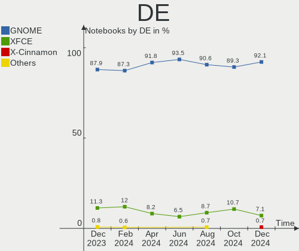
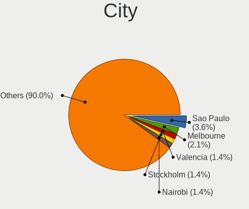
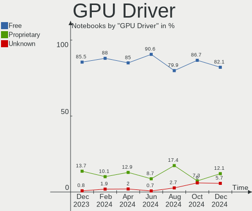
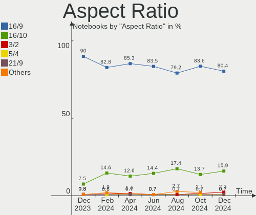
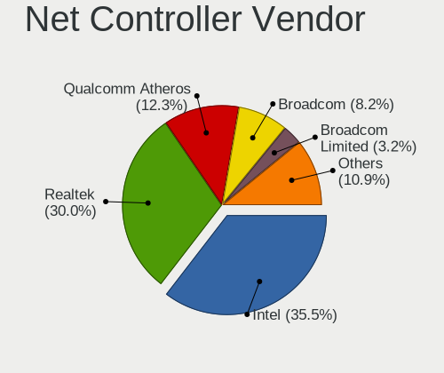

Zorin Hardware Trends (Notebook)
--------------------------------

A project to identify most popular hardware characteristics and track their change
over time based on data collected by Zorin users at https://Linux-Hardware.org.

Anyone can contribute to the study by uploading probes of their computers by
the [hw-probe](https://github.com/linuxhw/hw-probe) tool:

    sudo -E hw-probe -all -upload

Full-feature report is available here: https://linux-hardware.org/?view=trends&formfactor=notebook

Period: Feb, 2021.

Contents
--------

- [ OS                       ](#os)
- [ OS Family                ](#os-family)
- [ Kernel                   ](#kernel)
- [ Kernel Family            ](#kernel-family)
- [ Kernel Major Ver.        ](#kernel-major-ver)
- [ Arch                     ](#arch)
- [ DE                       ](#de)
- [ Display Server           ](#display-server)
- [ Display Manager          ](#display-manager)
- [ OS Lang                  ](#os-lang)
- [ Boot Mode                ](#boot-mode)
- [ Filesystem               ](#filesystem)
- [ Part. scheme             ](#part-scheme)
- [ Dual Boot with Linux/BSD ](#dual-boot-with-linux/bsd)
- [ Dual Boot (Win)          ](#dual-boot-win)
- [ Country                  ](#country)
- [ City                     ](#city)
- [ Vendor                   ](#vendor)
- [ Model                    ](#model)
- [ Model Family             ](#model-family)
- [ MFG Year                 ](#mfg-year)
- [ Form Factor              ](#form-factor)
- [ Secure Boot              ](#secure-boot)
- [ Coreboot                 ](#coreboot)
- [ RAM Size                 ](#ram-size)
- [ RAM Used                 ](#ram-used)
- [ Has CD-ROM               ](#has-cd-rom)
- [ Total Drives             ](#total-drives)
- [ Has Ethernet             ](#has-ethernet)
- [ Drive Vendor             ](#drive-vendor)
- [ Drive Model              ](#drive-model)
- [ HDD Vendor               ](#hdd-vendor)
- [ SSD Vendor               ](#ssd-vendor)
- [ Drive Kind               ](#drive-kind)
- [ Drive Connector          ](#drive-connector)
- [ Drive Size               ](#drive-size)
- [ Space Total              ](#space-total)
- [ Space Used               ](#space-used)
- [ Malfunc. Drives          ](#malfunc-drives)
- [ Malfunc. Drive Vendor    ](#malfunc-drive-vendor)
- [ Malfunc. HDD Vendor      ](#malfunc-hdd-vendor)
- [ Malfunc. Drive Kind      ](#malfunc-drive-kind)
- [ Failed Drives            ](#failed-drives)
- [ Failed Drive Vendor      ](#failed-drive-vendor)
- [ Drive Status             ](#drive-status)
- [ Storage Vendor           ](#storage-vendor)
- [ Storage Model            ](#storage-model)
- [ Storage Kind             ](#storage-kind)
- [ CPU Vendor               ](#cpu-vendor)
- [ CPU Model                ](#cpu-model)
- [ CPU Model Family         ](#cpu-model-family)
- [ CPU Cores                ](#cpu-cores)
- [ CPU Sockets              ](#cpu-sockets)
- [ CPU Threads              ](#cpu-threads)
- [ CPU Op-Modes             ](#cpu-op-modes)
- [ CPU Microcode            ](#cpu-microcode)
- [ CPU Microarch            ](#cpu-microarch)
- [ GPU Vendor               ](#gpu-vendor)
- [ GPU Model                ](#gpu-model)
- [ GPU Combo                ](#gpu-combo)
- [ GPU Driver               ](#gpu-driver)
- [ GPU Memory               ](#gpu-memory)
- [ Monitor Vendor           ](#monitor-vendor)
- [ Monitor Model            ](#monitor-model)
- [ Monitor Resolution       ](#monitor-resolution)
- [ Monitor Diagonal         ](#monitor-diagonal)
- [ Monitor Width            ](#monitor-width)
- [ Aspect Ratio             ](#aspect-ratio)
- [ Monitor Area             ](#monitor-area)
- [ Pixel Density            ](#pixel-density)
- [ Multiple Monitors        ](#multiple-monitors)
- [ Net Controller Vendor    ](#net-controller-vendor)
- [ Net Controller Model     ](#net-controller-model)
- [ Wireless Vendor          ](#wireless-vendor)
- [ Wireless Model           ](#wireless-model)
- [ Ethernet Vendor          ](#ethernet-vendor)
- [ Ethernet Model           ](#ethernet-model)
- [ Net Controller Kind      ](#net-controller-kind)
- [ Used Controller          ](#used-controller)
- [ NICs                     ](#nics)
- [ Memory Vendor            ](#memory-vendor)
- [ Memory Model             ](#memory-model)
- [ Memory Kind              ](#memory-kind)
- [ Memory Form Factor       ](#memory-form-factor)
- [ Memory Size              ](#memory-size)
- [ Memory Speed             ](#memory-speed)
- [ Sound Vendor             ](#sound-vendor)
- [ Sound Model              ](#sound-model)
- [ Camera Vendor            ](#camera-vendor)
- [ Camera Model             ](#camera-model)
- [ Fingerprint Vendor       ](#fingerprint-vendor)
- [ Fingerprint Model        ](#fingerprint-model)
- [ Chipcard Vendor          ](#chipcard-vendor)
- [ Chipcard Model           ](#chipcard-model)
- [ Printer Vendor           ](#printer-vendor)
- [ Printer Model            ](#printer-model)
- [ Scanner Vendor           ](#scanner-vendor)
- [ Scanner Model            ](#scanner-model)
- [ Bluetooth Vendor         ](#bluetooth-vendor)
- [ Bluetooth Model          ](#bluetooth-model)
- [ Unsupported Devices      ](#unsupported-devices)
- [ Unsupported Device Types ](#unsupported-device-types)

OS
--

Installed operating systems

| Name     | Notebooks | Percent |
|----------|-----------|---------|
| Zorin 15 | 37        | 97.37%  |
| Zorin 12 | 1         | 2.63%   |

OS Family
---------

OS without a version

| Name  | Notebooks | Percent |
|-------|-----------|---------|
| Zorin | 38        | 100%    |

Kernel
------

Version of the Linux kernel

| Version            | Notebooks | Percent |
|--------------------|-----------|---------|
| 5.4.0-65-generic   | 26        | 68.42%  |
| 5.4.0-66-generic   | 4         | 10.53%  |
| 5.4.0-59-generic   | 2         | 5.26%   |
| 5.4.0-58-generic   | 1         | 2.63%   |
| 5.4.0-56-generic   | 1         | 2.63%   |
| 5.4.0-54-generic   | 1         | 2.63%   |
| 5.10.16-custom     | 1         | 2.63%   |
| 5.0.0-36-generic   | 1         | 2.63%   |
| 4.15.0-133-generic | 1         | 2.63%   |

Kernel Family
-------------

Linux kernel without a distro release

| Version | Notebooks | Percent |
|---------|-----------|---------|
| 5.4.0   | 35        | 92.11%  |
| 5.10.16 | 1         | 2.63%   |
| 5.0.0   | 1         | 2.63%   |
| 4.15.0  | 1         | 2.63%   |

Kernel Major Ver.
-----------------

Linux kernel major version

| Version | Notebooks | Percent |
|---------|-----------|---------|
| 5.4     | 35        | 92.11%  |
| 5.10    | 1         | 2.63%   |
| 5.0     | 1         | 2.63%   |
| 4.15    | 1         | 2.63%   |

Arch
----

OS architecture (x86_64, i586, etc.)

| Name   | Notebooks | Percent |
|--------|-----------|---------|
| x86_64 | 31        | 81.58%  |
| i686   | 7         | 18.42%  |

DE
--

Desktop Environment

| Name    | Notebooks | Percent |
|---------|-----------|---------|
| GNOME   | 23        | 60.53%  |
| XFCE    | 12        | 31.58%  |
| Unknown | 3         | 7.89%   |

Display Server
--------------

X11 or Wayland

| Name    | Notebooks | Percent |
|---------|-----------|---------|
| X11     | 34        | 89.47%  |
| Wayland | 2         | 5.26%   |
| Unknown | 2         | 5.26%   |

Display Manager
---------------

SDDM, LightDM, etc.

| Name    | Notebooks | Percent |
|---------|-----------|---------|
| Unknown | 38        | 100%    |

OS Lang
-------

Language

| Lang  | Notebooks | Percent |
|-------|-----------|---------|
| en_US | 11        | 28.95%  |
| pt_BR | 4         | 10.53%  |
| cs_CZ | 4         | 10.53%  |
| pl_PL | 3         | 7.89%   |
| en_CA | 3         | 7.89%   |
| tr_TR | 2         | 5.26%   |
| en_AU | 2         | 5.26%   |
| de_DE | 2         | 5.26%   |
| ru_UA | 1         | 2.63%   |
| ru_RU | 1         | 2.63%   |
| pt_PT | 1         | 2.63%   |
| es_MX | 1         | 2.63%   |
| en_GB | 1         | 2.63%   |
| el_GR | 1         | 2.63%   |
| da_DK | 1         | 2.63%   |

Boot Mode
---------

EFI or BIOS

| Mode | Notebooks | Percent |
|------|-----------|---------|
| BIOS | 25        | 65.79%  |
| EFI  | 13        | 34.21%  |

Filesystem
----------

Type of filesystem

| Type  | Notebooks | Percent |
|-------|-----------|---------|
| Ext4  | 37        | 97.37%  |
| Btrfs | 1         | 2.63%   |

Part. scheme
------------

Scheme of partitioning

| Type    | Notebooks | Percent |
|---------|-----------|---------|
| Unknown | 38        | 100%    |

Dual Boot with Linux/BSD
------------------------

Hosting more than one Linux/BSD

| Dual boot | Notebooks | Percent |
|-----------|-----------|---------|
| No        | 36        | 94.74%  |
| Yes       | 2         | 5.26%   |

Dual Boot (Win)
---------------

Hosting Linux and Windows

| Dual boot | Notebooks | Percent |
|-----------|-----------|---------|
| No        | 29        | 76.32%  |
| Yes       | 9         | 23.68%  |

Country
-------

Geographic location (country)

| Country        | Notebooks | Percent |
|----------------|-----------|---------|
| USA            | 7         | 18.42%  |
| Czech Republic | 4         | 10.53%  |
| Brazil         | 4         | 10.53%  |
| Poland         | 3         | 7.89%   |
| Germany        | 3         | 7.89%   |
| Canada         | 3         | 7.89%   |
| UK             | 2         | 5.26%   |
| Turkey         | 2         | 5.26%   |
| Australia      | 2         | 5.26%   |
| Ukraine        | 1         | 2.63%   |
| Switzerland    | 1         | 2.63%   |
| Netherlands    | 1         | 2.63%   |
| Mexico         | 1         | 2.63%   |
| Israel         | 1         | 2.63%   |
| Indonesia      | 1         | 2.63%   |
| Greece         | 1         | 2.63%   |
| Denmark        | 1         | 2.63%   |

City
----

Geographic location (city)

| City              | Notebooks | Percent |
|-------------------|-----------|---------|
| Winnipeg          | 2         | 5.26%   |
| Winston-Salem     | 1         | 2.63%   |
| Wesley Chapel     | 1         | 2.63%   |
| Wedel             | 1         | 2.63%   |
| São Paulo        | 1         | 2.63%   |
| Sosnowiec         | 1         | 2.63%   |
| Secaucus          | 1         | 2.63%   |
| Rio de Janeiro    | 1         | 2.63%   |
| Probolinggo       | 1         | 2.63%   |
| Prague            | 1         | 2.63%   |
| Poniatowa         | 1         | 2.63%   |
| Perth             | 1         | 2.63%   |
| Pardubice         | 1         | 2.63%   |
| Oirsbeek          | 1         | 2.63%   |
| Ober-Ramstadt     | 1         | 2.63%   |
| Nova Paka         | 1         | 2.63%   |
| Morphett Vale     | 1         | 2.63%   |
| Lenzburg          | 1         | 2.63%   |
| Las Vegas         | 1         | 2.63%   |
| Kyiv              | 1         | 2.63%   |
| Kobenhavn O       | 1         | 2.63%   |
| Jerusalem         | 1         | 2.63%   |
| Istanbul          | 1         | 2.63%   |
| Huauchinango      | 1         | 2.63%   |
| Hohenhameln       | 1         | 2.63%   |
| Fort Saskatchewan | 1         | 2.63%   |
| Folkestone        | 1         | 2.63%   |
| Davis             | 1         | 2.63%   |
| Dasice            | 1         | 2.63%   |
| Curitiba          | 1         | 2.63%   |
| Chalcis           | 1         | 2.63%   |
| Canoas            | 1         | 2.63%   |
| Cambridge         | 1         | 2.63%   |
| Buena Park        | 1         | 2.63%   |
| Bismarck          | 1         | 2.63%   |
| Bielawa           | 1         | 2.63%   |
| Ankara            | 1         | 2.63%   |

Vendor
------

Motherboard manufacturer

| Name                | Notebooks | Percent |
|---------------------|-----------|---------|
| Hewlett-Packard     | 11        | 28.95%  |
| ASUSTek Computer    | 7         | 18.42%  |
| Dell                | 6         | 15.79%  |
| Lenovo              | 5         | 13.16%  |
| Toshiba             | 3         | 7.89%   |
| Acer                | 2         | 5.26%   |
| Samsung Electronics | 1         | 2.63%   |
| Multilaser          | 1         | 2.63%   |
| HUAWEI              | 1         | 2.63%   |
| Unknown             | 1         | 2.63%   |

Model
-----

Motherboard model

| Name                                   | Notebooks | Percent |
|----------------------------------------|-----------|---------|
| Toshiba Satellite Pro L550             | 1         | 2.63%   |
| Toshiba Satellite NB10t-A              | 1         | 2.63%   |
| Toshiba Satellite L855                 | 1         | 2.63%   |
| Samsung 370E4K                         | 1         | 2.63%   |
| Multilaser PC024                       | 1         | 2.63%   |
| Lenovo ThinkPad T440s 20ARS10700       | 1         | 2.63%   |
| Lenovo ThinkPad R61 8943DKG            | 1         | 2.63%   |
| Lenovo ThinkPad Edge E531 688528U      | 1         | 2.63%   |
| Lenovo IdeaPad L340-15API 81LW         | 1         | 2.63%   |
| Lenovo G560 0679                       | 1         | 2.63%   |
| HUAWEI BOHK-WAX9X                      | 1         | 2.63%   |
| HP ZBook 17 G2                         | 1         | 2.63%   |
| HP Stream Laptop 11-y0XX               | 1         | 2.63%   |
| HP Pavilion Laptop 15-cs0xxx           | 1         | 2.63%   |
| HP Pavilion dv9500                     | 1         | 2.63%   |
| HP Pavilion dv6000 (RR398EA#B1A)       | 1         | 2.63%   |
| HP G42                                 | 1         | 2.63%   |
| HP ENVY 15                             | 1         | 2.63%   |
| HP EliteBook 2560p                     | 1         | 2.63%   |
| HP Compaq Presario CQ61                | 1         | 2.63%   |
| HP Compaq 6510b (GR690ET#ABD)          | 1         | 2.63%   |
| HP 255 G5                              | 1         | 2.63%   |
| Dell XPS 13 9333                       | 1         | 2.63%   |
| Dell Latitude E6400                    | 1         | 2.63%   |
| Dell Latitude D520                     | 1         | 2.63%   |
| Dell Inspiron 7737                     | 1         | 2.63%   |
| Dell Inspiron 3543                     | 1         | 2.63%   |
| Dell Inspiron 1012                     | 1         | 2.63%   |
| ASUS X751SJ                            | 1         | 2.63%   |
| ASUS X555LD                            | 1         | 2.63%   |
| ASUS X550ZA                            | 1         | 2.63%   |
| ASUS X510UAR                           | 1         | 2.63%   |
| ASUS VivoBook_ASUSLaptop X512DA_F512DA | 1         | 2.63%   |
| ASUS U36SD                             | 1         | 2.63%   |
| ASUS K52N                              | 1         | 2.63%   |
| Acer V5-131                            | 1         | 2.63%   |
| Acer TravelMate 6592                   | 1         | 2.63%   |
| Unknown                                | 1         | 2.63%   |

Model Family
------------

Motherboard model prefix

| Name              | Notebooks | Percent |
|-------------------|-----------|---------|
| Toshiba Satellite | 3         | 7.89%   |
| Lenovo ThinkPad   | 3         | 7.89%   |
| HP Pavilion       | 3         | 7.89%   |
| Dell Inspiron     | 3         | 7.89%   |
| HP Compaq         | 2         | 5.26%   |
| Dell Latitude     | 2         | 5.26%   |
| Samsung 370E4K    | 1         | 2.63%   |
| Multilaser PC024  | 1         | 2.63%   |
| Lenovo IdeaPad    | 1         | 2.63%   |
| Lenovo G560       | 1         | 2.63%   |
| HUAWEI BOHK-WAX9X | 1         | 2.63%   |
| HP ZBook          | 1         | 2.63%   |
| HP Stream         | 1         | 2.63%   |
| HP G42            | 1         | 2.63%   |
| HP ENVY           | 1         | 2.63%   |
| HP EliteBook      | 1         | 2.63%   |
| HP 255            | 1         | 2.63%   |
| Dell XPS          | 1         | 2.63%   |
| ASUS X751SJ       | 1         | 2.63%   |
| ASUS X555LD       | 1         | 2.63%   |
| ASUS X550ZA       | 1         | 2.63%   |
| ASUS X510UAR      | 1         | 2.63%   |
| ASUS VivoBook     | 1         | 2.63%   |
| ASUS U36SD        | 1         | 2.63%   |
| ASUS K52N         | 1         | 2.63%   |
| Acer V5-131       | 1         | 2.63%   |
| Acer TravelMate   | 1         | 2.63%   |
| Unknown           | 1         | 2.63%   |

MFG Year
--------

Motherboard manufacture year

| Year | Notebooks | Percent |
|------|-----------|---------|
| 2013 | 5         | 13.16%  |
| 2020 | 4         | 10.53%  |
| 2019 | 4         | 10.53%  |
| 2010 | 4         | 10.53%  |
| 2016 | 3         | 7.89%   |
| 2014 | 3         | 7.89%   |
| 2009 | 3         | 7.89%   |
| 2007 | 3         | 7.89%   |
| 2015 | 2         | 5.26%   |
| 2011 | 2         | 5.26%   |
| 2008 | 2         | 5.26%   |
| 2018 | 1         | 2.63%   |
| 2017 | 1         | 2.63%   |
| 2006 | 1         | 2.63%   |

Form Factor
-----------

Physical design of the computer

| Name     | Notebooks | Percent |
|----------|-----------|---------|
| Notebook | 38        | 100%    |

Secure Boot
-----------

Enabled or disabled

| State    | Notebooks | Percent |
|----------|-----------|---------|
| Disabled | 32        | 84.21%  |
| Enabled  | 6         | 15.79%  |

Coreboot
--------

Have coreboot on board

| Used | Notebooks | Percent |
|------|-----------|---------|
| No   | 38        | 100%    |

RAM Size
--------

Total RAM memory

| Size in GB | Notebooks | Percent |
|------------|-----------|---------|
| 8.01-16.0  | 10        | 26.32%  |
| 3.01-4.0   | 9         | 23.68%  |
| 1.01-2.0   | 9         | 23.68%  |
| 4.01-8.0   | 7         | 18.42%  |
| 16.01-24.0 | 2         | 5.26%   |
| 0.51-1.0   | 1         | 2.63%   |

RAM Used
--------

Used RAM memory

| Used GB  | Notebooks | Percent |
|----------|-----------|---------|
| 1.01-2.0 | 20        | 52.63%  |
| 0.51-1.0 | 6         | 15.79%  |
| 3.01-4.0 | 5         | 13.16%  |
| 2.01-3.0 | 5         | 13.16%  |
| 4.01-8.0 | 2         | 5.26%   |

Has CD-ROM
----------

Has CD-ROM on board

| Presented | Notebooks | Percent |
|-----------|-----------|---------|
| Yes       | 22        | 57.89%  |
| No        | 16        | 42.11%  |

Total Drives
------------

Number of drives on board

| Drives | Notebooks | Percent |
|--------|-----------|---------|
| 1      | 31        | 81.58%  |
| 2      | 7         | 18.42%  |

Has Ethernet
------------

Has Ethernet on board

| Presented | Notebooks | Percent |
|-----------|-----------|---------|
| Yes       | 32        | 84.21%  |
| No        | 6         | 15.79%  |

Drive Vendor
------------

Hard drive vendors

| Vendor              | Notebooks | Drives | Percent |
|---------------------|-----------|--------|---------|
| Seagate             | 11        | 11     | 27.5%   |
| Samsung Electronics | 6         | 6      | 15%     |
| WDC                 | 4         | 4      | 10%     |
| Toshiba             | 4         | 5      | 10%     |
| Unknown             | 3         | 4      | 7.5%    |
| Kingston            | 2         | 2      | 5%      |
| Hitachi             | 2         | 2      | 5%      |
| HGST                | 2         | 2      | 5%      |
| Transcend           | 1         | 1      | 2.5%    |
| Patriot             | 1         | 1      | 2.5%    |
| LITEONIT            | 1         | 1      | 2.5%    |
| HS-SSD-C100         | 1         | 1      | 2.5%    |
| Fujitsu             | 1         | 1      | 2.5%    |
| Crucial             | 1         | 1      | 2.5%    |

Drive Model
-----------

Hard drive models

| Model                                  | Notebooks | Percent |
|----------------------------------------|-----------|---------|
| Unknown MMC Card  32GB                 | 2         | 4.88%   |
| Seagate ST500LT012-1DG142 500GB        | 2         | 4.88%   |
| Seagate ST1000LM014-1EJ164 1TB         | 2         | 4.88%   |
| WDC WDS100T2G0A-00JH30 1TB SSD         | 1         | 2.44%   |
| WDC WD3200BPVT-24JJ5T0 320GB           | 1         | 2.44%   |
| WDC WD10JPVX-60JC3T1 1TB               | 1         | 2.44%   |
| WDC WD10JPVT-00A1YT0 1TB               | 1         | 2.44%   |
| Unknown PSM-256GBSATA3SSD2.5           | 1         | 2.44%   |
| Transcend TS512GMTS430S 512GB SSD      | 1         | 2.44%   |
| Toshiba THNSNK128GVN8 128GB SSD        | 1         | 2.44%   |
| Toshiba MQ04ABF100 1TB                 | 1         | 2.44%   |
| Toshiba MQ01ABF050 500GB               | 1         | 2.44%   |
| Toshiba MQ01ABD100 1TB                 | 1         | 2.44%   |
| Toshiba MK2565GSX 250GB                | 1         | 2.44%   |
| Seagate ST9500325AS 500GB              | 1         | 2.44%   |
| Seagate ST9250827AS 250GB              | 1         | 2.44%   |
| Seagate ST9160821AS 160GB              | 1         | 2.44%   |
| Seagate ST9120817AS 120GB              | 1         | 2.44%   |
| Seagate ST500LM012 HN-M500MBB 500GB    | 1         | 2.44%   |
| Seagate ST320LT020-9YG142 320GB        | 1         | 2.44%   |
| Seagate ST1000LX015-1U7172 1TB         | 1         | 2.44%   |
| Samsung SSD PM810 2.5 7mm 128GB        | 1         | 2.44%   |
| Samsung SSD 850 PRO 512GB              | 1         | 2.44%   |
| Samsung SSD 850 EVO 500GB              | 1         | 2.44%   |
| Samsung SSD 750 EVO 250GB              | 1         | 2.44%   |
| Samsung NVMe SSD Drive 256GB           | 1         | 2.44%   |
| Samsung HM160HI 160GB                  | 1         | 2.44%   |
| Patriot P200 1TB SSD                   | 1         | 2.44%   |
| LITEONIT LMT-256L9M-11 MSATA 256GB SSD | 1         | 2.44%   |
| Kingston SV300S37A120G 120GB SSD       | 1         | 2.44%   |
| Kingston NVMe SSD Drive 512GB          | 1         | 2.44%   |
| HS-SSD-C100 240G                       | 1         | 2.44%   |
| Hitachi HTS545025B9SA00 250GB          | 1         | 2.44%   |
| Hitachi HTS541616J9SA00 160GB          | 1         | 2.44%   |
| HGST HTS545050A7E680 500GB             | 1         | 2.44%   |
| HGST HTS541010A9E680 1TB               | 1         | 2.44%   |
| Fujitsu MHV2120BH PL 120GB             | 1         | 2.44%   |
| Crucial CT240BX500SSD1 240GB           | 1         | 2.44%   |

HDD Vendor
----------

Hard disk drive vendors

| Vendor              | Notebooks | Drives | Percent |
|---------------------|-----------|--------|---------|
| Seagate             | 11        | 11     | 45.83%  |
| Toshiba             | 4         | 4      | 16.67%  |
| WDC                 | 3         | 3      | 12.5%   |
| Hitachi             | 2         | 2      | 8.33%   |
| HGST                | 2         | 2      | 8.33%   |
| Samsung Electronics | 1         | 1      | 4.17%   |
| Fujitsu             | 1         | 1      | 4.17%   |

SSD Vendor
----------

Solid state drive vendors

| Vendor              | Notebooks | Drives | Percent |
|---------------------|-----------|--------|---------|
| Samsung Electronics | 4         | 4      | 33.33%  |
| WDC                 | 1         | 1      | 8.33%   |
| Unknown             | 1         | 1      | 8.33%   |
| Transcend           | 1         | 1      | 8.33%   |
| Toshiba             | 1         | 1      | 8.33%   |
| Patriot             | 1         | 1      | 8.33%   |
| LITEONIT            | 1         | 1      | 8.33%   |
| Kingston            | 1         | 1      | 8.33%   |
| Crucial             | 1         | 1      | 8.33%   |

Drive Kind
----------

HDD or SSD

| Kind    | Notebooks | Drives | Percent |
|---------|-----------|--------|---------|
| HDD     | 24        | 24     | 60%     |
| SSD     | 11        | 12     | 27.5%   |
| MMC     | 2         | 3      | 5%      |
| NVMe    | 2         | 2      | 5%      |
| Unknown | 1         | 1      | 2.5%    |

Drive Connector
---------------

SATA, SAS, NVMe, etc.

| Type | Notebooks | Drives | Percent |
|------|-----------|--------|---------|
| SATA | 35        | 37     | 89.74%  |
| NVMe | 2         | 2      | 5.13%   |
| MMC  | 2         | 3      | 5.13%   |

Drive Size
----------

Size of hard drive

| Size in TB | Notebooks | Drives | Percent |
|------------|-----------|--------|---------|
| 0.01-0.5   | 24        | 24     | 68.57%  |
| 0.51-1.0   | 10        | 11     | 28.57%  |
| 1.01-2.0   | 1         | 1      | 2.86%   |

Space Total
-----------

Amount of disk space available on the file system

| Size in GB     | Notebooks | Percent |
|----------------|-----------|---------|
| 101-250        | 15        | 39.47%  |
| 251-500        | 8         | 21.05%  |
| 501-1000       | 8         | 21.05%  |
| 51-100         | 4         | 10.53%  |
| 21-50          | 2         | 5.26%   |
| More than 3000 | 1         | 2.63%   |

Space Used
----------

Amount of used disk space

| Used GB   | Notebooks | Percent |
|-----------|-----------|---------|
| 1-20      | 22        | 57.89%  |
| 21-50     | 9         | 23.68%  |
| 251-500   | 2         | 5.26%   |
| 101-250   | 2         | 5.26%   |
| 51-100    | 2         | 5.26%   |
| 2001-3000 | 1         | 2.63%   |

Malfunc. Drives
---------------

Drive models with a malfunction

| Model                     | Notebooks | Drives | Percent |
|---------------------------|-----------|--------|---------|
| Seagate ST9500325AS 500GB | 1         | 1      | 100%    |

Malfunc. Drive Vendor
---------------------

Vendors of faulty drives

| Vendor  | Notebooks | Drives | Percent |
|---------|-----------|--------|---------|
| Seagate | 1         | 1      | 100%    |

Malfunc. HDD Vendor
-------------------

Vendors of faulty HDD drives

| Vendor  | Notebooks | Drives | Percent |
|---------|-----------|--------|---------|
| Seagate | 1         | 1      | 100%    |

Malfunc. Drive Kind
-------------------

Kinds of faulty drives

| Kind | Notebooks | Drives | Percent |
|------|-----------|--------|---------|
| HDD  | 1         | 1      | 100%    |

Failed Drives
-------------

Failed drive models

Zero info for selected period =(

Failed Drive Vendor
-------------------

Failed drive vendors

Zero info for selected period =(

Drive Status
------------

Number of failed and malfunc. drives

| Status   | Notebooks | Drives | Percent |
|----------|-----------|--------|---------|
| Detected | 37        | 41     | 97.37%  |
| Malfunc  | 1         | 1      | 2.63%   |

Storage Vendor
--------------

Storage controller vendors

| Vendor                           | Notebooks | Percent |
|----------------------------------|-----------|---------|
| Intel                            | 28        | 73.68%  |
| AMD                              | 6         | 15.79%  |
| Silicon Integrated Systems [SiS] | 1         | 2.63%   |
| Samsung Electronics              | 1         | 2.63%   |
| Nvidia                           | 1         | 2.63%   |
| Kingston Technology Company      | 1         | 2.63%   |

Storage Model
-------------

Storage controller models

| Model                                                                            | Notebooks | Percent |
|----------------------------------------------------------------------------------|-----------|---------|
| AMD FCH SATA Controller [AHCI mode]                                              | 5         | 11.11%  |
| Intel 82801IBM/IEM (ICH9M/ICH9M-E) 4 port SATA Controller [AHCI mode]            | 3         | 6.67%   |
| Intel 82801HM/HEM (ICH8M/ICH8M-E) SATA Controller [AHCI mode]                    | 3         | 6.67%   |
| Intel 82801HM/HEM (ICH8M/ICH8M-E) IDE Controller                                 | 3         | 6.67%   |
| Intel 8 Series SATA Controller 1 [AHCI mode]                                     | 3         | 6.67%   |
| Intel 7 Series Chipset Family 6-port SATA Controller [AHCI mode]                 | 3         | 6.67%   |
| Intel Wildcat Point-LP SATA Controller [AHCI Mode]                               | 2         | 4.44%   |
| Intel Sunrise Point-LP SATA Controller [AHCI mode]                               | 2         | 4.44%   |
| Intel 82801 Mobile SATA Controller [RAID mode]                                   | 2         | 4.44%   |
| Intel 8 Series/C220 Series Chipset Family 6-port SATA Controller 1 [AHCI mode]   | 2         | 4.44%   |
| Intel 6 Series/C200 Series Chipset Family 6 port Mobile SATA AHCI Controller     | 2         | 4.44%   |
| Silicon Integrated Systems [SiS] SATA Controller / IDE mode                      | 1         | 2.22%   |
| Silicon Integrated Systems [SiS] 5513 IDE Controller                             | 1         | 2.22%   |
| Samsung NVMe SSD Controller SM981/PM981/PM983                                    | 1         | 2.22%   |
| Nvidia MCP67 IDE Controller                                                      | 1         | 2.22%   |
| Nvidia MCP67 AHCI Controller                                                     | 1         | 2.22%   |
| Kingston Company Company Non-Volatile memory controller                          | 1         | 2.22%   |
| Intel NM10/ICH7 Family SATA Controller [AHCI mode]                               | 1         | 2.22%   |
| Intel Atom/Celeron/Pentium Processor x5-E8000/J3xxx/N3xxx Series SATA Controller | 1         | 2.22%   |
| Intel Atom Processor E3800 Series SATA AHCI Controller                           | 1         | 2.22%   |
| Intel 82801HM/HEM (ICH8M/ICH8M-E) SATA Controller [IDE mode]                     | 1         | 2.22%   |
| Intel 82801GBM/GHM (ICH7-M Family) SATA Controller [IDE mode]                    | 1         | 2.22%   |
| Intel 82801GBM/GHM (ICH7-M Family) SATA Controller [AHCI mode]                   | 1         | 2.22%   |
| Intel 82801G (ICH7 Family) IDE Controller                                        | 1         | 2.22%   |
| Intel 5 Series/3400 Series Chipset 4 port SATA AHCI Controller                   | 1         | 2.22%   |
| AMD SB7x0/SB8x0/SB9x0 SATA Controller [AHCI mode]                                | 1         | 2.22%   |

Storage Kind
------------

Kind of storage controller (IDE, SATA, NVMe, SAS, ...)

| Kind | Notebooks | Percent |
|------|-----------|---------|
| SATA | 31        | 73.81%  |
| IDE  | 7         | 16.67%  |
| RAID | 2         | 4.76%   |
| NVMe | 2         | 4.76%   |

CPU Vendor
----------

Processor vendors

| Vendor | Notebooks | Percent |
|--------|-----------|---------|
| Intel  | 31        | 81.58%  |
| AMD    | 7         | 18.42%  |

CPU Model
---------

Processor models

| Model                                           | Notebooks | Percent |
|-------------------------------------------------|-----------|---------|
| Intel Core i7-8550U CPU @ 1.80GHz               | 2         | 5.26%   |
| AMD Ryzen 5 3500U with Radeon Vega Mobile Gfx   | 2         | 5.26%   |
| Intel Pentium Dual-Core CPU T4500 @ 2.30GHz     | 1         | 2.63%   |
| Intel Pentium Dual-Core CPU T4400 @ 2.20GHz     | 1         | 2.63%   |
| Intel Pentium CPU N3700 @ 1.60GHz               | 1         | 2.63%   |
| Intel Genuine CPU T2300 @ 1.66GHz               | 1         | 2.63%   |
| Intel Core i7-4800MQ CPU @ 2.70GHz              | 1         | 2.63%   |
| Intel Core i7-4700MQ CPU @ 2.40GHz              | 1         | 2.63%   |
| Intel Core i7-4600U CPU @ 2.10GHz               | 1         | 2.63%   |
| Intel Core i7-4510U CPU @ 2.00GHz               | 1         | 2.63%   |
| Intel Core i7-3632QM CPU @ 2.20GHz              | 1         | 2.63%   |
| Intel Core i5-4200U CPU @ 1.60GHz               | 1         | 2.63%   |
| Intel Core i5-2540M CPU @ 2.60GHz               | 1         | 2.63%   |
| Intel Core i3-5005U CPU @ 2.00GHz               | 1         | 2.63%   |
| Intel Core i3-4030U CPU @ 1.90GHz               | 1         | 2.63%   |
| Intel Core i3-2330M CPU @ 2.20GHz               | 1         | 2.63%   |
| Intel Core i3 CPU M 370 @ 2.40GHz               | 1         | 2.63%   |
| Intel Core 2 Duo CPU T7300 @ 2.00GHz            | 1         | 2.63%   |
| Intel Core 2 Duo CPU T7250 @ 2.00GHz            | 1         | 2.63%   |
| Intel Core 2 Duo CPU T5550 @ 1.83GHz            | 1         | 2.63%   |
| Intel Core 2 Duo CPU T5250 @ 1.50GHz            | 1         | 2.63%   |
| Intel Core 2 Duo CPU P8700 @ 2.53GHz            | 1         | 2.63%   |
| Intel Core 2 Duo CPU P8600 @ 2.40GHz            | 1         | 2.63%   |
| Intel Core 2 CPU T5600 @ 1.83GHz                | 1         | 2.63%   |
| Intel Celeron CPU N3060 @ 1.60GHz               | 1         | 2.63%   |
| Intel Celeron CPU N2820 @ 2.13GHz               | 1         | 2.63%   |
| Intel Celeron CPU B800 @ 1.50GHz                | 1         | 2.63%   |
| Intel Celeron CPU 1007U @ 1.50GHz               | 1         | 2.63%   |
| Intel Celeron 3205U @ 1.50GHz                   | 1         | 2.63%   |
| Intel Atom x5-Z8350 CPU @ 1.44GHz               | 1         | 2.63%   |
| Intel Atom CPU N450 @ 1.66GHz                   | 1         | 2.63%   |
| AMD V120 Processor                              | 1         | 2.63%   |
| AMD Ryzen 3 3200U with Radeon Vega Mobile Gfx   | 1         | 2.63%   |
| AMD Athlon 64 X2 Dual-Core Processor TK-55      | 1         | 2.63%   |
| AMD A6-7310 APU with AMD Radeon R4 Graphics     | 1         | 2.63%   |
| AMD A10-7400P Radeon R6, 10 Compute Cores 4C+6G | 1         | 2.63%   |

CPU Model Family
----------------

Processor model prefix

| Model                   | Notebooks | Percent |
|-------------------------|-----------|---------|
| Intel Core i7           | 7         | 18.42%  |
| Intel Core 2 Duo        | 6         | 15.79%  |
| Intel Celeron           | 5         | 13.16%  |
| Intel Core i3           | 4         | 10.53%  |
| Intel Pentium Dual-Core | 2         | 5.26%   |
| Intel Core i5           | 2         | 5.26%   |
| Intel Atom              | 2         | 5.26%   |
| AMD Ryzen 5             | 2         | 5.26%   |
| Intel Pentium           | 1         | 2.63%   |
| Intel Genuine           | 1         | 2.63%   |
| Intel Core 2            | 1         | 2.63%   |
| AMD V120                | 1         | 2.63%   |
| AMD Ryzen 3             | 1         | 2.63%   |
| AMD Athlon 64 X2        | 1         | 2.63%   |
| AMD A6                  | 1         | 2.63%   |
| AMD A10                 | 1         | 2.63%   |

CPU Cores
---------

Number of processor cores

| Number | Notebooks | Percent |
|--------|-----------|---------|
| 2      | 26        | 68.42%  |
| 4      | 10        | 26.32%  |
| 1      | 2         | 5.26%   |

CPU Sockets
-----------

Number of sockets

| Number | Notebooks | Percent |
|--------|-----------|---------|
| 1      | 38        | 100%    |

CPU Threads
-----------

Threads per core (Hyper-Threading)

| Number | Notebooks | Percent |
|--------|-----------|---------|
| 1      | 20        | 52.63%  |
| 2      | 18        | 47.37%  |

CPU Op-Modes
------------

CPU Operation Modes (32-bit, 64-bit)

| Op mode        | Notebooks | Percent |
|----------------|-----------|---------|
| 32-bit, 64-bit | 37        | 97.37%  |
| 32-bit         | 1         | 2.63%   |

CPU Microcode
-------------

Microcode number

| Number     | Notebooks | Percent |
|------------|-----------|---------|
| Unknown    | 5         | 13.16%  |
| 0x40651    | 4         | 10.53%  |
| 0x6fd      | 3         | 7.89%   |
| 0x206a7    | 3         | 7.89%   |
| 0x1067a    | 3         | 7.89%   |
| 0x806ea    | 2         | 5.26%   |
| 0x306c3    | 2         | 5.26%   |
| 0x306a9    | 2         | 5.26%   |
| 0x08108102 | 2         | 5.26%   |
| 0x6fa      | 1         | 2.63%   |
| 0x6f6      | 1         | 2.63%   |
| 0x6e8      | 1         | 2.63%   |
| 0x406c4    | 1         | 2.63%   |
| 0x406c3    | 1         | 2.63%   |
| 0x306d4    | 1         | 2.63%   |
| 0x30673    | 1         | 2.63%   |
| 0x20655    | 1         | 2.63%   |
| 0x106ca    | 1         | 2.63%   |
| 0x08108109 | 1         | 2.63%   |
| 0x07030105 | 1         | 2.63%   |
| 0x06003106 | 1         | 2.63%   |

CPU Microarch
-------------

Microarchitecture

| Name        | Notebooks | Percent |
|-------------|-----------|---------|
| Haswell     | 6         | 15.79%  |
| Core        | 5         | 13.16%  |
| Silvermont  | 4         | 10.53%  |
| Penryn      | 4         | 10.53%  |
| Zen+        | 3         | 7.89%   |
| SandyBridge | 3         | 7.89%   |
| KabyLake    | 2         | 5.26%   |
| IvyBridge   | 2         | 5.26%   |
| Broadwell   | 2         | 5.26%   |
| Westmere    | 1         | 2.63%   |
| Steamroller | 1         | 2.63%   |
| Puma        | 1         | 2.63%   |
| P6          | 1         | 2.63%   |
| K8 Hammer   | 1         | 2.63%   |
| K10         | 1         | 2.63%   |
| Bonnell     | 1         | 2.63%   |

GPU Vendor
----------

Vendors of graphics cards

| Vendor                           | Notebooks | Percent |
|----------------------------------|-----------|---------|
| Intel                            | 26        | 59.09%  |
| Nvidia                           | 9         | 20.45%  |
| AMD                              | 8         | 18.18%  |
| Silicon Integrated Systems [SiS] | 1         | 2.27%   |

GPU Model
---------

Graphics card models

| Model                                                                                    | Notebooks | Percent |
|------------------------------------------------------------------------------------------|-----------|---------|
| Intel Haswell-ULT Integrated Graphics Controller                                         | 4         | 8.51%   |
| Intel Mobile 4 Series Chipset Integrated Graphics Controller                             | 3         | 6.38%   |
| Intel Atom/Celeron/Pentium Processor x5-E8000/J3xxx/N3xxx Integrated Graphics Controller | 3         | 6.38%   |
| Intel 2nd Generation Core Processor Family Integrated Graphics Controller                | 3         | 6.38%   |
| AMD Picasso                                                                              | 3         | 6.38%   |
| Intel UHD Graphics 620                                                                   | 2         | 4.26%   |
| Intel Mobile GM965/GL960 Integrated Graphics Controller (secondary)                      | 2         | 4.26%   |
| Intel Mobile GM965/GL960 Integrated Graphics Controller (primary)                        | 2         | 4.26%   |
| Intel 4th Gen Core Processor Integrated Graphics Controller                              | 2         | 4.26%   |
| Intel 3rd Gen Core processor Graphics Controller                                         | 2         | 4.26%   |
| Silicon Integrated Systems [SiS] 771/671 PCIE VGA Display Adapter                        | 1         | 2.13%   |
| Nvidia GT218M [GeForce 310M]                                                             | 1         | 2.13%   |
| Nvidia GP108M [GeForce MX150]                                                            | 1         | 2.13%   |
| Nvidia GK208M [GeForce GT 740M]                                                          | 1         | 2.13%   |
| Nvidia GK208BM [GeForce 920M]                                                            | 1         | 2.13%   |
| Nvidia GK104GLM [Quadro K3100M]                                                          | 1         | 2.13%   |
| Nvidia GF119M [GeForce GT 520M]                                                          | 1         | 2.13%   |
| Nvidia GF117M [GeForce 610M/710M/810M/820M / GT 620M/625M/630M/720M]                     | 1         | 2.13%   |
| Nvidia G72M [GeForce Go 7400]                                                            | 1         | 2.13%   |
| Nvidia C67 [GeForce 7150M / nForce 630M]                                                 | 1         | 2.13%   |
| Intel Mobile 945GM/GMS/GME, 943/940GML Express Integrated Graphics Controller            | 1         | 2.13%   |
| Intel Mobile 945GM/GMS, 943/940GML Express Integrated Graphics Controller                | 1         | 2.13%   |
| Intel HD Graphics 5500                                                                   | 1         | 2.13%   |
| Intel HD Graphics                                                                        | 1         | 2.13%   |
| Intel Atom Processor Z36xxx/Z37xxx Series Graphics & Display                             | 1         | 2.13%   |
| Intel Atom Processor D4xx/D5xx/N4xx/N5xx Integrated Graphics Controller                  | 1         | 2.13%   |
| AMD RV710/M92 [Mobility Radeon HD 4530/4570/545v]                                        | 1         | 2.13%   |
| AMD RV550/M71 [Mobility Radeon HD 2300]                                                  | 1         | 2.13%   |
| AMD RS880M [Mobility Radeon HD 4225/4250]                                                | 1         | 2.13%   |
| AMD Mullins [Radeon R4/R5 Graphics]                                                      | 1         | 2.13%   |
| AMD Kaveri [Radeon R6 Graphics]                                                          | 1         | 2.13%   |

GPU Combo
---------

Combinations of graphics cards

| Name           | Notebooks | Percent |
|----------------|-----------|---------|
| 1 x Intel      | 20        | 52.63%  |
| 1 x AMD        | 8         | 21.05%  |
| Intel + Nvidia | 6         | 15.79%  |
| 1 x Nvidia     | 3         | 7.89%   |
| 1 x SiS        | 1         | 2.63%   |

GPU Driver
----------

Free vs proprietary

| Driver      | Notebooks | Percent |
|-------------|-----------|---------|
| Free        | 33        | 86.84%  |
| Proprietary | 4         | 10.53%  |
| Unknown     | 1         | 2.63%   |

GPU Memory
----------

Total video memory

| Size in GB | Notebooks | Percent |
|------------|-----------|---------|
| Unknown    | 23        | 60.53%  |
| 0.51-1.0   | 6         | 15.79%  |
| 0.01-0.5   | 4         | 10.53%  |
| 1.01-2.0   | 3         | 7.89%   |
| 3.01-4.0   | 2         | 5.26%   |

Monitor Vendor
--------------

Monitor vendors

| Vendor                  | Notebooks | Percent |
|-------------------------|-----------|---------|
| AU Optronics            | 10        | 27.78%  |
| Chimei Innolux          | 7         | 19.44%  |
| Samsung Electronics     | 5         | 13.89%  |
| LG Display              | 5         | 13.89%  |
| PANDA                   | 2         | 5.56%   |
| BOE                     | 2         | 5.56%   |
| Quanta Display          | 1         | 2.78%   |
| LGD                     | 1         | 2.78%   |
| CPT                     | 1         | 2.78%   |
| Chi Mei Optoelectronics | 1         | 2.78%   |
| Acer                    | 1         | 2.78%   |

Monitor Model
-------------

Monitor models

| Model                                                                    | Notebooks | Percent |
|--------------------------------------------------------------------------|-----------|---------|
| LG Display LCD Monitor LGD045C 1366x768 350x190mm 15.7-inch              | 2         | 5.56%   |
| Samsung Electronics LCD Monitor SEC5442 1440x900 367x230mm 17.1-inch     | 1         | 2.78%   |
| Samsung Electronics LCD Monitor SEC4845 1280x800 331x207mm 15.4-inch     | 1         | 2.78%   |
| Samsung Electronics LCD Monitor SEC3345 1280x800 331x207mm 15.4-inch     | 1         | 2.78%   |
| Samsung Electronics LCD Monitor SEC3150 1366x768 344x193mm 15.5-inch     | 1         | 2.78%   |
| Samsung Electronics LCD Monitor SDC3352 1366x768 344x194mm 15.5-inch     | 1         | 2.78%   |
| Quanta Display LCD Monitor QDS0053 1280x800 304x190mm 14.1-inch          | 1         | 2.78%   |
| PANDA LCD Monitor NCP0046 1920x1080 344x194mm 15.5-inch                  | 1         | 2.78%   |
| PANDA LCD Monitor NCP002D 1920x1080 344x194mm 15.5-inch                  | 1         | 2.78%   |
| LGD LCD Monitor LP156WH2-TLAA 1366x768                                   | 1         | 2.78%   |
| LG Display LCD Monitor LGD040A 1920x1080 310x170mm 13.9-inch             | 1         | 2.78%   |
| LG Display LCD Monitor LGD0269 1366x768 223x125mm 10.1-inch              | 1         | 2.78%   |
| LG Display LCD Monitor LGD01CA 1600x900 382x215mm 17.3-inch              | 1         | 2.78%   |
| CPT LCD Monitor COR17D8 1366x768 293x165mm 13.2-inch                     | 1         | 2.78%   |
| Chimei Innolux LCD Monitor CMN1734 1600x900 382x214mm 17.2-inch          | 1         | 2.78%   |
| Chimei Innolux LCD Monitor CMN1728 1600x900 382x215mm 17.3-inch          | 1         | 2.78%   |
| Chimei Innolux LCD Monitor CMN15F5 1920x1080 344x193mm 15.5-inch         | 1         | 2.78%   |
| Chimei Innolux LCD Monitor CMN15C5 1366x768 344x193mm 15.5-inch          | 1         | 2.78%   |
| Chimei Innolux LCD Monitor CMN14C4 1366x768 309x173mm 13.9-inch          | 1         | 2.78%   |
| Chimei Innolux LCD Monitor CMN1345 1920x1080 293x165mm 13.2-inch         | 1         | 2.78%   |
| Chimei Innolux LCD Monitor CMN1119 1366x768 260x140mm 11.6-inch          | 1         | 2.78%   |
| Chi Mei Optoelectronics LCD Monitor CMO1593 1366x768 344x193mm 15.5-inch | 1         | 2.78%   |
| BOE LCD Monitor BOE0872 1920x1080 344x194mm 15.5-inch                    | 1         | 2.78%   |
| BOE LCD Monitor BOE0590 1366x768 309x173mm 13.9-inch                     | 1         | 2.78%   |
| AU Optronics LCD Monitor AUO42EC 1366x768 340x190mm 15.3-inch            | 1         | 2.78%   |
| AU Optronics LCD Monitor AUO405C 1366x768 256x144mm 11.6-inch            | 1         | 2.78%   |
| AU Optronics LCD Monitor AUO3487 1440x900 367x230mm 17.1-inch            | 1         | 2.78%   |
| AU Optronics LCD Monitor AUO235C 1366x768 260x140mm 11.6-inch            | 1         | 2.78%   |
| AU Optronics LCD Monitor AUO2351 1024x768 304x228mm 15.0-inch            | 1         | 2.78%   |
| AU Optronics LCD Monitor AUO21ED 1920x1080 344x194mm 15.5-inch           | 1         | 2.78%   |
| AU Optronics LCD Monitor AUO219D 1920x1080 381x214mm 17.2-inch           | 1         | 2.78%   |
| AU Optronics LCD Monitor AUO206C 1366x768 277x156mm 12.5-inch            | 1         | 2.78%   |
| AU Optronics LCD Monitor AUO1C3C 1366x768 309x173mm 13.9-inch            | 1         | 2.78%   |
| AU Optronics LCD Monitor AUO11EC 1366x768 344x193mm 15.5-inch            | 1         | 2.78%   |
| Acer K272HL ACR03DC 1920x1080 600x340mm 27.2-inch                        | 1         | 2.78%   |

Monitor Resolution
------------------

Monitor screen resolution

| Resolution       | Notebooks | Percent |
|------------------|-----------|---------|
| 1366x768 (WXGA)  | 18        | 50%     |
| 1920x1080 (FHD)  | 9         | 25%     |
| 1600x900 (HD+)   | 3         | 8.33%   |
| 1280x800 (WXGA)  | 3         | 8.33%   |
| 1440x900 (WXGA+) | 2         | 5.56%   |
| 1024x768 (XGA)   | 1         | 2.78%   |

Monitor Diagonal
----------------

Diagonal size in inches

| Inches  | Notebooks | Percent |
|---------|-----------|---------|
| 15      | 16        | 44.44%  |
| 17      | 6         | 16.67%  |
| 13      | 5         | 13.89%  |
| 11      | 3         | 8.33%   |
| 14      | 2         | 5.56%   |
| 27      | 1         | 2.78%   |
| 12      | 1         | 2.78%   |
| 10      | 1         | 2.78%   |
| Unknown | 1         | 2.78%   |

Monitor Width
-------------

Physical width

| Width in mm | Notebooks | Percent |
|-------------|-----------|---------|
| 301-350     | 21        | 58.33%  |
| 201-300     | 7         | 19.44%  |
| 351-400     | 6         | 16.67%  |
| 501-600     | 1         | 2.78%   |
| Unknown     | 1         | 2.78%   |

Aspect Ratio
------------

Proportional relationship between the width and the height

| Ratio   | Notebooks | Percent |
|---------|-----------|---------|
| 16/9    | 28        | 80%     |
| 16/10   | 5         | 14.29%  |
| 4/3     | 1         | 2.86%   |
| Unknown | 1         | 2.86%   |

Monitor Area
------------

Area in inch²

| Area in inch² | Notebooks | Percent |
|----------------|-----------|---------|
| 101-110        | 16        | 44.44%  |
| 81-90          | 5         | 13.89%  |
| 51-60          | 3         | 8.33%   |
| 131-140        | 3         | 8.33%   |
| 121-130        | 3         | 8.33%   |
| 71-80          | 2         | 5.56%   |
| 61-70          | 1         | 2.78%   |
| 41-50          | 1         | 2.78%   |
| 301-350        | 1         | 2.78%   |
| Unknown        | 1         | 2.78%   |

Pixel Density
-------------

Pixels per inch

| Density | Notebooks | Percent |
|---------|-----------|---------|
| 101-120 | 14        | 40%     |
| 121-160 | 12        | 34.29%  |
| 51-100  | 7         | 20%     |
| 161-240 | 1         | 2.86%   |
| Unknown | 1         | 2.86%   |

Multiple Monitors
-----------------

Total monitors connected

| Total | Notebooks | Percent |
|-------|-----------|---------|
| 1     | 36        | 94.74%  |
| 2     | 1         | 2.63%   |
| 0     | 1         | 2.63%   |

Net Controller Vendor
---------------------

Controller vendors

| Vendor                           | Notebooks | Percent |
|----------------------------------|-----------|---------|
| Realtek Semiconductor            | 19        | 30.65%  |
| Intel                            | 18        | 29.03%  |
| Qualcomm Atheros                 | 10        | 16.13%  |
| Broadcom Inc. and subsidiaries   | 5         | 8.06%   |
| Broadcom Limited                 | 2         | 3.23%   |
| Silicon Integrated Systems [SiS] | 1         | 1.61%   |
| Ralink Technology                | 1         | 1.61%   |
| Qualcomm Atheros Communications  | 1         | 1.61%   |
| Nvidia                           | 1         | 1.61%   |
| JMicron Technology               | 1         | 1.61%   |
| Huawei Technologies              | 1         | 1.61%   |
| Broadcom                         | 1         | 1.61%   |
| ASUSTek Computer                 | 1         | 1.61%   |

Net Controller Model
--------------------

Controller models

| Model                                                                        | Notebooks | Percent |
|------------------------------------------------------------------------------|-----------|---------|
| Realtek RTL8111/8168/8411 PCI Express Gigabit Ethernet Controller            | 9         | 12.16%  |
| Realtek RTL810xE PCI Express Fast Ethernet controller                        | 7         | 9.46%   |
| Intel Wireless 7260                                                          | 5         | 6.76%   |
| Qualcomm Atheros AR9285 Wireless Network Adapter (PCI-Express)               | 4         | 5.41%   |
| Intel PRO/Wireless 3945ABG [Golan] Network Connection                        | 4         | 5.41%   |
| Qualcomm Atheros QCA9565 / AR9565 Wireless Network Adapter                   | 3         | 4.05%   |
| Realtek RTL8821CE 802.11ac PCIe Wireless Network Adapter                     | 2         | 2.7%    |
| Qualcomm Atheros AR9485 Wireless Network Adapter                             | 2         | 2.7%    |
| Intel WiFi Link 5100                                                         | 2         | 2.7%    |
| Silicon Integrated Systems [SiS] 191 Gigabit Ethernet Adapter                | 1         | 1.35%   |
| Realtek RTL88x2bu [AC1200 Techkey]                                           | 1         | 1.35%   |
| Realtek RTL8822CE 802.11ac PCIe Wireless Network Adapter                     | 1         | 1.35%   |
| Realtek RTL8822BE 802.11a/b/g/n/ac WiFi adapter                              | 1         | 1.35%   |
| Realtek RTL8191SEvA Wireless LAN Controller                                  | 1         | 1.35%   |
| Realtek RTL8188FTV 802.11b/g/n 1T1R 2.4G WLAN Adapter                        | 1         | 1.35%   |
| Ralink MT7601U Wireless Adapter                                              | 1         | 1.35%   |
| Qualcomm Atheros AR9271 802.11n                                              | 1         | 1.35%   |
| Qualcomm Atheros AR8162 Fast Ethernet                                        | 1         | 1.35%   |
| Qualcomm Atheros AR8151 v2.0 Gigabit Ethernet                                | 1         | 1.35%   |
| Qualcomm Atheros AR242x / AR542x Wireless Network Adapter (PCI-Express)      | 1         | 1.35%   |
| Nvidia MCP67 Ethernet                                                        | 1         | 1.35%   |
| JMicron JMC250 PCI Express Gigabit Ethernet Controller                       | 1         | 1.35%   |
| Intel Wireless 8265 / 8275                                                   | 1         | 1.35%   |
| Intel Wireless 7265                                                          | 1         | 1.35%   |
| Intel Wireless 3165                                                          | 1         | 1.35%   |
| Intel Wireless 3160                                                          | 1         | 1.35%   |
| Intel PRO/Wireless 4965 AG or AGN [Kedron] Network Connection                | 1         | 1.35%   |
| Intel Ethernet Connection I218-LM                                            | 1         | 1.35%   |
| Intel Ethernet Connection I217-LM                                            | 1         | 1.35%   |
| Intel Centrino Wireless-N 2230                                               | 1         | 1.35%   |
| Intel Centrino Advanced-N 6205 [Taylor Peak]                                 | 1         | 1.35%   |
| Intel 82579LM Gigabit Network Connection (Lewisville)                        | 1         | 1.35%   |
| Intel 82573L Gigabit Ethernet Controller                                     | 1         | 1.35%   |
| Intel 82567LM Gigabit Network Connection                                     | 1         | 1.35%   |
| Intel 82566MM Gigabit Network Connection                                     | 1         | 1.35%   |
| Huawei JNY-LX1                                                               | 1         | 1.35%   |
| Broadcom Limited NetLink BCM5787M Gigabit Ethernet PCI Express               | 1         | 1.35%   |
| Broadcom Limited BCM43142 802.11b/g/n                                        | 1         | 1.35%   |
| Broadcom Inc. and subsidiaries NetLink BCM5787M Gigabit Ethernet PCI Express | 1         | 1.35%   |
| Broadcom Inc. and subsidiaries NetLink BCM57785 Gigabit Ethernet PCIe        | 1         | 1.35%   |
| Broadcom Inc. and subsidiaries BCM43142 802.11b/g/n                          | 1         | 1.35%   |
| Broadcom Inc. and subsidiaries BCM4313 802.11bgn Wireless Network Adapter    | 1         | 1.35%   |
| Broadcom Inc. and subsidiaries BCM4311 802.11a/b/g                           | 1         | 1.35%   |
| Broadcom BCM4401-B0 100Base-TX                                               | 1         | 1.35%   |
| ASUS N10 Nano 802.11n Network Adapter [Realtek RTL8192CU]                    | 1         | 1.35%   |

Wireless Vendor
---------------

Wireless vendors

| Vendor                          | Notebooks | Percent |
|---------------------------------|-----------|---------|
| Intel                           | 18        | 43.9%   |
| Qualcomm Atheros                | 10        | 24.39%  |
| Realtek Semiconductor           | 6         | 14.63%  |
| Broadcom Inc. and subsidiaries  | 3         | 7.32%   |
| Ralink Technology               | 1         | 2.44%   |
| Qualcomm Atheros Communications | 1         | 2.44%   |
| Broadcom Limited                | 1         | 2.44%   |
| ASUSTek Computer                | 1         | 2.44%   |

Wireless Model
--------------

Wireless models

| Model                                                                     | Notebooks | Percent |
|---------------------------------------------------------------------------|-----------|---------|
| Intel Wireless 7260                                                       | 5         | 11.9%   |
| Qualcomm Atheros AR9285 Wireless Network Adapter (PCI-Express)            | 4         | 9.52%   |
| Intel PRO/Wireless 3945ABG [Golan] Network Connection                     | 4         | 9.52%   |
| Qualcomm Atheros QCA9565 / AR9565 Wireless Network Adapter                | 3         | 7.14%   |
| Realtek RTL8821CE 802.11ac PCIe Wireless Network Adapter                  | 2         | 4.76%   |
| Qualcomm Atheros AR9485 Wireless Network Adapter                          | 2         | 4.76%   |
| Intel WiFi Link 5100                                                      | 2         | 4.76%   |
| Realtek RTL88x2bu [AC1200 Techkey]                                        | 1         | 2.38%   |
| Realtek RTL8822CE 802.11ac PCIe Wireless Network Adapter                  | 1         | 2.38%   |
| Realtek RTL8822BE 802.11a/b/g/n/ac WiFi adapter                           | 1         | 2.38%   |
| Realtek RTL8191SEvA Wireless LAN Controller                               | 1         | 2.38%   |
| Realtek RTL8188FTV 802.11b/g/n 1T1R 2.4G WLAN Adapter                     | 1         | 2.38%   |
| Ralink MT7601U Wireless Adapter                                           | 1         | 2.38%   |
| Qualcomm Atheros AR9271 802.11n                                           | 1         | 2.38%   |
| Qualcomm Atheros AR242x / AR542x Wireless Network Adapter (PCI-Express)   | 1         | 2.38%   |
| Intel Wireless 8265 / 8275                                                | 1         | 2.38%   |
| Intel Wireless 7265                                                       | 1         | 2.38%   |
| Intel Wireless 3165                                                       | 1         | 2.38%   |
| Intel Wireless 3160                                                       | 1         | 2.38%   |
| Intel PRO/Wireless 4965 AG or AGN [Kedron] Network Connection             | 1         | 2.38%   |
| Intel Centrino Wireless-N 2230                                            | 1         | 2.38%   |
| Intel Centrino Advanced-N 6205 [Taylor Peak]                              | 1         | 2.38%   |
| Broadcom Limited BCM43142 802.11b/g/n                                     | 1         | 2.38%   |
| Broadcom Inc. and subsidiaries BCM43142 802.11b/g/n                       | 1         | 2.38%   |
| Broadcom Inc. and subsidiaries BCM4313 802.11bgn Wireless Network Adapter | 1         | 2.38%   |
| Broadcom Inc. and subsidiaries BCM4311 802.11a/b/g                        | 1         | 2.38%   |
| ASUS N10 Nano 802.11n Network Adapter [Realtek RTL8192CU]                 | 1         | 2.38%   |

Ethernet Vendor
---------------

Ethernet vendors

| Vendor                           | Notebooks | Percent |
|----------------------------------|-----------|---------|
| Realtek Semiconductor            | 16        | 50%     |
| Intel                            | 6         | 18.75%  |
| Qualcomm Atheros                 | 2         | 6.25%   |
| Broadcom Inc. and subsidiaries   | 2         | 6.25%   |
| Silicon Integrated Systems [SiS] | 1         | 3.13%   |
| Nvidia                           | 1         | 3.13%   |
| JMicron Technology               | 1         | 3.13%   |
| Huawei Technologies              | 1         | 3.13%   |
| Broadcom Limited                 | 1         | 3.13%   |
| Broadcom                         | 1         | 3.13%   |

Ethernet Model
--------------

Ethernet models

| Model                                                                        | Notebooks | Percent |
|------------------------------------------------------------------------------|-----------|---------|
| Realtek RTL8111/8168/8411 PCI Express Gigabit Ethernet Controller            | 9         | 28.13%  |
| Realtek RTL810xE PCI Express Fast Ethernet controller                        | 7         | 21.88%  |
| Silicon Integrated Systems [SiS] 191 Gigabit Ethernet Adapter                | 1         | 3.13%   |
| Qualcomm Atheros AR8162 Fast Ethernet                                        | 1         | 3.13%   |
| Qualcomm Atheros AR8151 v2.0 Gigabit Ethernet                                | 1         | 3.13%   |
| Nvidia MCP67 Ethernet                                                        | 1         | 3.13%   |
| JMicron JMC250 PCI Express Gigabit Ethernet Controller                       | 1         | 3.13%   |
| Intel Ethernet Connection I218-LM                                            | 1         | 3.13%   |
| Intel Ethernet Connection I217-LM                                            | 1         | 3.13%   |
| Intel 82579LM Gigabit Network Connection (Lewisville)                        | 1         | 3.13%   |
| Intel 82573L Gigabit Ethernet Controller                                     | 1         | 3.13%   |
| Intel 82567LM Gigabit Network Connection                                     | 1         | 3.13%   |
| Intel 82566MM Gigabit Network Connection                                     | 1         | 3.13%   |
| Huawei JNY-LX1                                                               | 1         | 3.13%   |
| Broadcom Limited NetLink BCM5787M Gigabit Ethernet PCI Express               | 1         | 3.13%   |
| Broadcom Inc. and subsidiaries NetLink BCM5787M Gigabit Ethernet PCI Express | 1         | 3.13%   |
| Broadcom Inc. and subsidiaries NetLink BCM57785 Gigabit Ethernet PCIe        | 1         | 3.13%   |
| Broadcom BCM4401-B0 100Base-TX                                               | 1         | 3.13%   |

Net Controller Kind
-------------------

Ethernet, WiFi or modem

| Kind     | Notebooks | Percent |
|----------|-----------|---------|
| WiFi     | 37        | 53.62%  |
| Ethernet | 32        | 46.38%  |

Used Controller
---------------

Currently used network controller

| Kind     | Notebooks | Percent |
|----------|-----------|---------|
| WiFi     | 30        | 78.95%  |
| Ethernet | 8         | 21.05%  |

NICs
----

Total network controllers on board

| Total | Notebooks | Percent |
|-------|-----------|---------|
| 2     | 30        | 78.95%  |
| 1     | 7         | 18.42%  |
| 0     | 1         | 2.63%   |

Memory Vendor
-------------

Memory module vendors

| Vendor              | Notebooks | Percent |
|---------------------|-----------|---------|
| Unknown             | 3         | 30%     |
| Samsung Electronics | 2         | 20%     |
| Elpida              | 2         | 20%     |
| SK Hynix            | 1         | 10%     |
| Nanya Technology    | 1         | 10%     |
| Kingston            | 1         | 10%     |

Memory Model
------------

Memory module models

| Model                                                        | Notebooks | Percent |
|--------------------------------------------------------------|-----------|---------|
| Unknown RAM Module 8GB SODIMM DDR3 1600MT/s                  | 1         | 10%     |
| Unknown RAM Module 512MB SODIMM DDR2 667MT/s                 | 1         | 10%     |
| Unknown RAM Module 1GB SODIMM 400MT/s                        | 1         | 10%     |
| SK Hynix RAM HMA851S6CJR6N-VK 4GB Row Of Chips DDR4 2667MT/s | 1         | 10%     |
| Samsung RAM M471B5673FH0-CH9 2048MB SODIMM DDR3 1334MT/s     | 1         | 10%     |
| Samsung RAM M471A1K43CB1-CRC 8192MB SODIMM DDR4 2667MT/s     | 1         | 10%     |
| Nanya RAM NT2GT64U8HD0BN-AD 2GB SODIMM DDR 975MT/s           | 1         | 10%     |
| Kingston RAM 99U5295-022.A00LF 2GB SODIMM DDR2 1639MT/s      | 1         | 10%     |
| Elpida RAM EDJ8416E6MB-GNL-F 4GB SODIMM DDR3 1600MT/s        | 1         | 10%     |
| Elpida RAM EDJ8416E6MB-GN-F 4GB Chip DDR3 1600MT/s           | 1         | 10%     |

Memory Kind
-----------

Memory module kinds

| Kind    | Notebooks | Percent |
|---------|-----------|---------|
| DDR3    | 4         | 40%     |
| SDRAM   | 2         | 20%     |
| DDR4    | 2         | 20%     |
| DDR2    | 1         | 10%     |
| Unknown | 1         | 10%     |

Memory Form Factor
------------------

Physical design of the memory module

| Name         | Notebooks | Percent |
|--------------|-----------|---------|
| SODIMM       | 8         | 80%     |
| Row Of Chips | 1         | 10%     |
| Chip         | 1         | 10%     |

Memory Size
-----------

Memory module size

| Size | Notebooks | Percent |
|------|-----------|---------|
| 4096 | 3         | 30%     |
| 2048 | 3         | 30%     |
| 8192 | 2         | 20%     |
| 1024 | 1         | 10%     |
| 512  | 1         | 10%     |

Memory Speed
------------

Memory module speed

| Speed | Notebooks | Percent |
|-------|-----------|---------|
| 1600  | 3         | 30%     |
| 2667  | 2         | 20%     |
| 2048  | 1         | 10%     |
| 1639  | 1         | 10%     |
| 1334  | 1         | 10%     |
| 667   | 1         | 10%     |
| 400   | 1         | 10%     |

Sound Vendor
------------

Sound card vendors

| Vendor                           | Notebooks | Percent |
|----------------------------------|-----------|---------|
| Intel                            | 29        | 69.05%  |
| AMD                              | 7         | 16.67%  |
| Nvidia                           | 3         | 7.14%   |
| Silicon Integrated Systems [SiS] | 1         | 2.38%   |
| Logitech                         | 1         | 2.38%   |
| Creative Technology              | 1         | 2.38%   |

Sound Model
-----------

Sound card models

| Model                                                                                             | Notebooks | Percent |
|---------------------------------------------------------------------------------------------------|-----------|---------|
| Intel Haswell-ULT HD Audio Controller                                                             | 4         | 7.27%   |
| Intel 82801I (ICH9 Family) HD Audio Controller                                                    | 4         | 7.27%   |
| Intel 8 Series HD Audio Controller                                                                | 4         | 7.27%   |
| Intel NM10/ICH7 Family High Definition Audio Controller                                           | 3         | 5.45%   |
| Intel 82801H (ICH8 Family) HD Audio Controller                                                    | 3         | 5.45%   |
| Intel 7 Series/C216 Chipset Family High Definition Audio Controller                               | 3         | 5.45%   |
| AMD Raven/Raven2/Fenghuang HDMI/DP Audio Controller                                               | 3         | 5.45%   |
| AMD Family 17h (Models 10h-1fh) HD Audio Controller                                               | 3         | 5.45%   |
| Intel Wildcat Point-LP High Definition Audio Controller                                           | 2         | 3.64%   |
| Intel Sunrise Point-LP HD Audio                                                                   | 2         | 3.64%   |
| Intel Broadwell-U Audio Controller                                                                | 2         | 3.64%   |
| Intel Atom/Celeron/Pentium Processor x5-E8000/J3xxx/N3xxx Series High Definition Audio Controller | 2         | 3.64%   |
| Intel 8 Series/C220 Series Chipset High Definition Audio Controller                               | 2         | 3.64%   |
| Intel 6 Series/C200 Series Chipset Family High Definition Audio Controller                        | 2         | 3.64%   |
| AMD FCH Azalia Controller                                                                         | 2         | 3.64%   |
| Silicon Integrated Systems [SiS] Azalia Audio Controller                                          | 1         | 1.82%   |
| Nvidia High Definition Audio Controller                                                           | 1         | 1.82%   |
| Nvidia GK208 HDMI/DP Audio Controller                                                             | 1         | 1.82%   |
| Nvidia GK104 HDMI Audio Controller                                                                | 1         | 1.82%   |
| Logitech G930                                                                                     | 1         | 1.82%   |
| Intel Xeon E3-1200 v3/4th Gen Core Processor HD Audio Controller                                  | 1         | 1.82%   |
| Intel Atom Processor Z36xxx/Z37xxx Series High Definition Audio Controller                        | 1         | 1.82%   |
| Intel 5 Series/3400 Series Chipset High Definition Audio                                          | 1         | 1.82%   |
| Creative Technology Sound Blaster Play! 3                                                         | 1         | 1.82%   |
| AMD SBx00 Azalia (Intel HDA)                                                                      | 1         | 1.82%   |
| AMD RV710/730 HDMI Audio [Radeon HD 4000 series]                                                  | 1         | 1.82%   |
| AMD RS880 HDMI Audio [Radeon HD 4200 Series]                                                      | 1         | 1.82%   |
| AMD Kaveri HDMI/DP Audio Controller                                                               | 1         | 1.82%   |
| AMD Kabini HDMI/DP Audio                                                                          | 1         | 1.82%   |

Camera Vendor
-------------

Camera device vendors

| Vendor                        | Notebooks | Percent |
|-------------------------------|-----------|---------|
| Chicony Electronics           | 11        | 33.33%  |
| Microdia                      | 4         | 12.12%  |
| IMC Networks                  | 4         | 12.12%  |
| Sunplus Innovation Technology | 3         | 9.09%   |
| Suyin                         | 2         | 6.06%   |
| Silicon Motion                | 2         | 6.06%   |
| Realtek Semiconductor         | 2         | 6.06%   |
| Acer                          | 2         | 6.06%   |
| Samsung Electronics           | 1         | 3.03%   |
| HD WEBCAM                     | 1         | 3.03%   |
| Camera                        | 1         | 3.03%   |

Camera Model
------------

Camera device models

| Model                                 | Notebooks | Percent |
|---------------------------------------|-----------|---------|
| Chicony USB2.0 VGA UVC WebCam         | 2         | 6.06%   |
| Chicony Integrated Camera             | 2         | 6.06%   |
| Suyin TOSHIBA Web Camera - HD         | 1         | 3.03%   |
| Suyin HP Webcam-101                   | 1         | 3.03%   |
| Sunplus Integrated_Webcam_HD          | 1         | 3.03%   |
| Sunplus HP HD Webcam [Fixed]          | 1         | 3.03%   |
| Sunplus HD WebCam                     | 1         | 3.03%   |
| Silicon Motion Lenovo EasyCamera      | 1         | 3.03%   |
| Silicon Motion ATIV VGA Camera        | 1         | 3.03%   |
| Samsung Galaxy A5 (MTP)               | 1         | 3.03%   |
| Realtek USB Camera                    | 1         | 3.03%   |
| Realtek Integrated_Webcam_HD          | 1         | 3.03%   |
| Microdia Integrated Webcam            | 1         | 3.03%   |
| Microdia Integrated HD Webcam         | 1         | 3.03%   |
| Microdia HP Webcam                    | 1         | 3.03%   |
| Microdia 1.3 MPixel Integrated Webcam | 1         | 3.03%   |
| IMC Networks VGA UVC WebCam           | 1         | 3.03%   |
| IMC Networks USB2.0 HD UVC WebCam     | 1         | 3.03%   |
| IMC Networks ov9734_azurewave_camera  | 1         | 3.03%   |
| IMC Networks Integrated Webcam        | 1         | 3.03%   |
| HD WEBCAM NexiGo N60 FHD Webcam       | 1         | 3.03%   |
| Chicony USB2.0 UVC WebCam             | 1         | 3.03%   |
| Chicony USB 2.0 Camera                | 1         | 3.03%   |
| Chicony TOSHIBA Web Camera - HD       | 1         | 3.03%   |
| Chicony HP Wide Vision HD Camera      | 1         | 3.03%   |
| Chicony HP Webcam                     | 1         | 3.03%   |
| Chicony HP Truevision HD              | 1         | 3.03%   |
| Chicony Asus Integrated Webcam        | 1         | 3.03%   |
| Camera Camera                         | 1         | 3.03%   |
| Acer Integrated Camera                | 1         | 3.03%   |
| Acer Crystal Eye Webcam               | 1         | 3.03%   |

Fingerprint Vendor
------------------

Fingerprint sensor vendors

| Vendor                     | Notebooks | Percent |
|----------------------------|-----------|---------|
| Validity Sensors           | 4         | 50%     |
| Upek                       | 1         | 12.5%   |
| STMicroelectronics         | 1         | 12.5%   |
| Shenzhen Goodix Technology | 1         | 12.5%   |
| Elan Microelectronics      | 1         | 12.5%   |

Fingerprint Model
-----------------

Fingerprint sensor models

| Model                                                  | Notebooks | Percent |
|--------------------------------------------------------|-----------|---------|
| Validity Sensors VFS5011 Fingerprint Reader            | 1         | 12.5%   |
| Validity Sensors VFS471 Fingerprint Reader             | 1         | 12.5%   |
| Validity Sensors VFS 5011 fingerprint sensor           | 1         | 12.5%   |
| Validity Sensors Swipe Fingerprint Sensor              | 1         | 12.5%   |
| Upek Biometric Touchchip/Touchstrip Fingerprint Sensor | 1         | 12.5%   |
| STMicroelectronics Fingerprint Reader                  | 1         | 12.5%   |
| Shenzhen Goodix  Fingerprint Device                    | 1         | 12.5%   |
| Elan ELAN:Fingerprint                                  | 1         | 12.5%   |

Chipcard Vendor
---------------

Chipcard module vendors

| Vendor   | Notebooks | Percent |
|----------|-----------|---------|
| Broadcom | 1         | 100%    |

Chipcard Model
--------------

Chipcard module models

| Model                                                                        | Notebooks | Percent |
|------------------------------------------------------------------------------|-----------|---------|
| Broadcom BCM5880 Secure Applications Processor with fingerprint swipe sensor | 1         | 100%    |

Printer Vendor
--------------

Printer device vendors

Zero info for selected period =(

Printer Model
-------------

Printer device models

Zero info for selected period =(

Scanner Vendor
--------------

Scanner device vendors

Zero info for selected period =(

Scanner Model
-------------

Scanner device models

Zero info for selected period =(

Bluetooth Vendor
----------------

Controller vendors

| Vendor                          | Notebooks | Percent |
|---------------------------------|-----------|---------|
| Intel                           | 8         | 33.33%  |
| Toshiba                         | 2         | 8.33%   |
| Realtek Semiconductor           | 2         | 8.33%   |
| Qualcomm Atheros Communications | 2         | 8.33%   |
| Lite-On Technology              | 2         | 8.33%   |
| IMC Networks                    | 2         | 8.33%   |
| Hewlett-Packard                 | 2         | 8.33%   |
| Realtek                         | 1         | 4.17%   |
| Dell                            | 1         | 4.17%   |
| Cambridge Silicon Radio         | 1         | 4.17%   |
| Broadcom                        | 1         | 4.17%   |

Bluetooth Model
---------------

Controller models

| Model                                               | Notebooks | Percent |
|-----------------------------------------------------|-----------|---------|
| Intel Bluetooth wireless interface                  | 8         | 33.33%  |
| Lite-On Broadcom BCM43142A0 Bluetooth Device        | 2         | 8.33%   |
| Toshiba Bluetooth Device                            | 1         | 4.17%   |
| Toshiba Askey for                                   | 1         | 4.17%   |
| Realtek  Bluetooth 4.2 Adapter                      | 1         | 4.17%   |
| Realtek Bluetooth Radio                             | 1         | 4.17%   |
| Realtek Bluetooth Radio                             | 1         | 4.17%   |
| Qualcomm Atheros AR3012 Bluetooth 4.0               | 1         | 4.17%   |
| Qualcomm Atheros AR3011 Bluetooth                   | 1         | 4.17%   |
| IMC Networks Bluetooth Radio                        | 1         | 4.17%   |
| IMC Networks Bluetooth Device                       | 1         | 4.17%   |
| HP Broadcom 2070 Bluetooth Combo                    | 1         | 4.17%   |
| HP Bluetooth 2.0 Interface [Broadcom BCM2045]       | 1         | 4.17%   |
| Dell Wireless 370 Bluetooth Mini-card               | 1         | 4.17%   |
| Cambridge Silicon Radio Bluetooth Dongle (HCI mode) | 1         | 4.17%   |
| Broadcom BCM2045B (BDC-2) [Bluetooth Controller]    | 1         | 4.17%   |

Unsupported Devices
-------------------

Total unsupported devices on board

| Total | Notebooks | Percent |
|-------|-----------|---------|
| 0     | 23        | 60.53%  |
| 1     | 13        | 34.21%  |
| 2     | 2         | 5.26%   |

Unsupported Device Types
------------------------

Types of unsupported devices

| Type                  | Notebooks | Percent |
|-----------------------|-----------|---------|
| Fingerprint reader    | 8         | 44.44%  |
| Net/wireless          | 2         | 11.11%  |
| Graphics card         | 2         | 11.11%  |
| Storage               | 1         | 5.56%   |
| Multimedia controller | 1         | 5.56%   |
| Modem                 | 1         | 5.56%   |
| Chipcard              | 1         | 5.56%   |
| Camera                | 1         | 5.56%   |
| Bluetooth             | 1         | 5.56%   |

