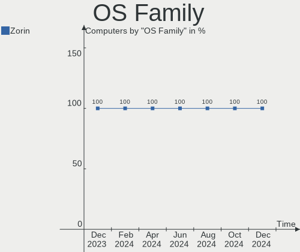
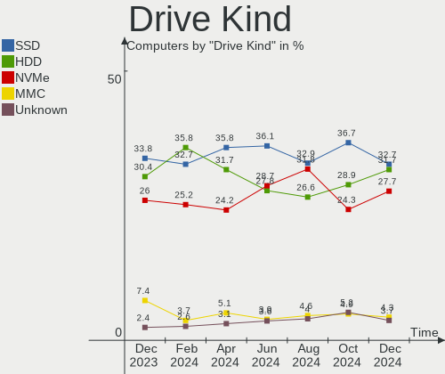

Zorin Hardware Trends
---------------------

A project to identify most popular hardware characteristics and track their change
over time based on data collected by Zorin users at https://Linux-Hardware.org.

Anyone can contribute to the study by uploading probes of their computers by
the [hw-probe](https://github.com/linuxhw/hw-probe) tool:

    sudo hw-probe -all -upload

This is a report for all computer types. See also reports for [desktops](/Dist/Zorin/Desktop/README.md) and [notebooks](/Dist/Zorin/Notebook/README.md).

Full-feature report is available here: https://linux-hardware.org/?view=trends

Period: Mar, 2020.

Contents
--------

- [ OS                       ](#os)
- [ OS Family                ](#os-family)
- [ Kernel                   ](#kernel)
- [ Kernel Family            ](#kernel-family)
- [ Kernel Major Ver.        ](#kernel-major-ver)
- [ Arch                     ](#arch)
- [ DE                       ](#de)
- [ Display Server           ](#display-server)
- [ OS Lang                  ](#os-lang)
- [ Boot Mode                ](#boot-mode)
- [ Filesystem               ](#filesystem)
- [ Dual Boot with Linux     ](#dual-boot-with-linux)
- [ Dual Boot (Win)          ](#dual-boot-win)
- [ Country                  ](#country)
- [ City                     ](#city)
- [ Vendor                   ](#vendor)
- [ Model                    ](#model)
- [ Model Family             ](#model-family)
- [ MFG Year                 ](#mfg-year)
- [ Form Factor              ](#form-factor)
- [ Secure Boot              ](#secure-boot)
- [ Coreboot                 ](#coreboot)
- [ RAM Size                 ](#ram-size)
- [ RAM Used                 ](#ram-used)
- [ Drive Vendor             ](#drive-vendor)
- [ Drive Model              ](#drive-model)
- [ Drive Kind               ](#drive-kind)
- [ Drive Connector          ](#drive-connector)
- [ Drive Size               ](#drive-size)
- [ Space Total              ](#space-total)
- [ Space Used               ](#space-used)
- [ Malfunc. Drives          ](#malfunc-drives)
- [ Malfunc. Drive Vendor    ](#malfunc-drive-vendor)
- [ Malfunc. Drive Kind      ](#malfunc-drive-kind)
- [ Failed Drives            ](#failed-drives)
- [ Failed Drive Vendor      ](#failed-drive-vendor)
- [ Drive Status             ](#drive-status)
- [ Storage Vendor           ](#storage-vendor)
- [ Storage Model            ](#storage-model)
- [ Storage Kind             ](#storage-kind)
- [ CPU Vendor               ](#cpu-vendor)
- [ CPU Model                ](#cpu-model)
- [ CPU Model Family         ](#cpu-model-family)
- [ CPU Cores                ](#cpu-cores)
- [ CPU Sockets              ](#cpu-sockets)
- [ CPU Threads              ](#cpu-threads)
- [ CPU Op-Modes             ](#cpu-op-modes)
- [ CPU Microarch            ](#cpu-microarch)
- [ CPU Microcode            ](#cpu-microcode)
- [ GPU Vendor               ](#gpu-vendor)
- [ GPU Model                ](#gpu-model)
- [ GPU Combo                ](#gpu-combo)
- [ GPU Driver               ](#gpu-driver)
- [ GPU Memory               ](#gpu-memory)
- [ Monitor Vendor           ](#monitor-vendor)
- [ Monitor Model            ](#monitor-model)
- [ Monitor Resolution       ](#monitor-resolution)
- [ Monitor Diagonal         ](#monitor-diagonal)
- [ Monitor Width            ](#monitor-width)
- [ Aspect Ratio             ](#aspect-ratio)
- [ Monitor Area             ](#monitor-area)
- [ Pixel Density            ](#pixel-density)
- [ Multiple Monitors        ](#multiple-monitors)
- [ Net Controller Vendor    ](#net-controller-vendor)
- [ Net Controller Model     ](#net-controller-model)
- [ Net Controller Kind      ](#net-controller-kind)
- [ Used Controller          ](#used-controller)
- [ NICs                     ](#nics)
- [ Unsupported Devices      ](#unsupported-devices)
- [ Unsupported Device Types ](#unsupported-device-types)

OS
--

Installed operating systems

| Name     | Computers | Percent |
|----------|-----------|---------|
| Zorin 15 | 113       | 91.87%  |
| Zorin 12 | 10        | 8.13%   |

OS Family
---------

OS without a version

| Name  | Computers | Percent |
|-------|-----------|---------|
| Zorin | 123       | 100%    |

Kernel
------

Version of the Linux kernel

| Version                 | Computers | Percent |
|-------------------------|-----------|---------|
| 5.3.0-40-generic        | 54        | 43.9%   |
| 5.3.0-42-generic        | 49        | 39.84%  |
| 4.15.0-88-generic       | 4         | 3.25%   |
| 5.3.0-45-generic        | 3         | 2.44%   |
| 4.18.0-21-generic       | 3         | 2.44%   |
| 4.15.0-91-generic       | 3         | 2.44%   |
| 5.0.0-37-generic        | 2         | 1.63%   |
| 5.6.0-999-lowlatency    | 1         | 0.81%   |
| 5.6.0-050600rc7-generic | 1         | 0.81%   |
| 4.4.0-176-generic       | 1         | 0.81%   |
| 4.15.0-76-generic       | 1         | 0.81%   |
| 4.15.0-30-generic       | 1         | 0.81%   |

Kernel Family
-------------

Linux kernel without a distro release

| Version | Computers | Percent |
|---------|-----------|---------|
| 5.3.0   | 106       | 86.18%  |
| 4.15.0  | 9         | 7.32%   |
| 4.18.0  | 3         | 2.44%   |
| 5.6.0   | 2         | 1.63%   |
| 5.0.0   | 2         | 1.63%   |
| 4.4.0   | 1         | 0.81%   |

Kernel Major Ver.
-----------------

Linux kernel major version

| Version | Computers | Percent |
|---------|-----------|---------|
| 5.3     | 106       | 86.18%  |
| 4.15    | 9         | 7.32%   |
| 4.18    | 3         | 2.44%   |
| 5.6     | 2         | 1.63%   |
| 5.0     | 2         | 1.63%   |
| 4.4     | 1         | 0.81%   |

Arch
----

OS architecture (x86_64, i586, etc.)

| Name   | Computers | Percent |
|--------|-----------|---------|
| x86_64 | 109       | 88.62%  |
| i686   | 14        | 11.38%  |

DE
--

Desktop Environment

| Name  | Computers | Percent |
|-------|-----------|---------|
| GNOME | 84        | 68.29%  |
| XFCE  | 38        | 30.89%  |
| Unity | 1         | 0.81%   |

Display Server
--------------

X11 or Wayland

| Name    | Computers | Percent |
|---------|-----------|---------|
| X11     | 121       | 98.37%  |
| Wayland | 2         | 1.63%   |

OS Lang
-------

Language

| Lang  | Computers | Percent |
|-------|-----------|---------|
| en_US | 33        | 26.83%  |
| de_DE | 10        | 8.13%   |
| pt_BR | 9         | 7.32%   |
| it_IT | 7         | 5.69%   |
| pl_PL | 6         | 4.88%   |
| en_GB | 6         | 4.88%   |
| ru_RU | 4         | 3.25%   |
| nl_NL | 4         | 3.25%   |
| fr_FR | 4         | 3.25%   |
| sv_SE | 3         | 2.44%   |
| pt_PT | 3         | 2.44%   |
| es_MX | 3         | 2.44%   |
| es_ES | 3         | 2.44%   |
| en_CA | 3         | 2.44%   |
| en_AU | 3         | 2.44%   |
| ru_UA | 2         | 1.63%   |
| es_PE | 2         | 1.63%   |
| es_AR | 2         | 1.63%   |
| en_NZ | 2         | 1.63%   |
| en_IN | 2         | 1.63%   |
| de_CH | 2         | 1.63%   |
| de_AT | 2         | 1.63%   |
| uk_UA | 1         | 0.81%   |
| sl_SI | 1         | 0.81%   |
| ja_JP | 1         | 0.81%   |
| it_CH | 1         | 0.81%   |
| el_GR | 1         | 0.81%   |
| da_DK | 1         | 0.81%   |
| cs_CZ | 1         | 0.81%   |
| C     | 1         | 0.81%   |

Boot Mode
---------

EFI or BIOS

| Mode | Computers | Percent |
|------|-----------|---------|
| BIOS | 76        | 61.79%  |
| EFI  | 47        | 38.21%  |

Filesystem
----------

Type of filesystem

| Type    | Computers | Percent |
|---------|-----------|---------|
| Ext4    | 118       | 95.93%  |
| Overlay | 4         | 3.25%   |
| Ext2    | 1         | 0.81%   |

Dual Boot with Linux
--------------------

Hosting more than one Linux

| Dual boot | Computers | Percent |
|-----------|-----------|---------|
| No        | 106       | 86.18%  |
| Yes       | 17        | 13.82%  |

Dual Boot (Win)
---------------

Hosting Linux and Windows

| Dual boot | Computers | Percent |
|-----------|-----------|---------|
| No        | 83        | 67.48%  |
| Yes       | 40        | 32.52%  |

Country
-------

Geographic location (country)

| Country            | Computers | Percent |
|--------------------|-----------|---------|
| USA                | 19        | 15.45%  |
| Germany            | 10        | 8.13%   |
| Brazil             | 9         | 7.32%   |
| Italy              | 7         | 5.69%   |
| Ukraine            | 5         | 4.07%   |
| UK                 | 5         | 4.07%   |
| Sweden             | 5         | 4.07%   |
| Poland             | 5         | 4.07%   |
| Canada             | 5         | 4.07%   |
| Netherlands        | 4         | 3.25%   |
| Mexico             | 4         | 3.25%   |
| France             | 4         | 3.25%   |
| Switzerland        | 3         | 2.44%   |
| Russia             | 3         | 2.44%   |
| New Zealand        | 3         | 2.44%   |
| Australia          | 3         | 2.44%   |
| Spain              | 2         | 1.63%   |
| Portugal           | 2         | 1.63%   |
| Peru               | 2         | 1.63%   |
| Norway             | 2         | 1.63%   |
| India              | 2         | 1.63%   |
| Greece             | 2         | 1.63%   |
| Austria            | 2         | 1.63%   |
| Argentina          | 2         | 1.63%   |
| Slovenia           | 1         | 0.81%   |
| Serbia             | 1         | 0.81%   |
| Romania            | 1         | 0.81%   |
| Pakistan           | 1         | 0.81%   |
| Lebanon            | 1         | 0.81%   |
| Kuwait             | 1         | 0.81%   |
| Korea, Republic of | 1         | 0.81%   |
| Japan              | 1         | 0.81%   |
| Denmark            | 1         | 0.81%   |
| Czech Republic     | 1         | 0.81%   |
| Belgium            | 1         | 0.81%   |
| Bangladesh         | 1         | 0.81%   |
| Angola             | 1         | 0.81%   |

City
----

Geographic location (city)

| City                     | Computers | Percent |
|--------------------------|-----------|---------|
| Zurich                   | 2         | 1.63%   |
| Vienna                   | 2         | 1.63%   |
| Sydney                   | 2         | 1.63%   |
| Odesa                    | 2         | 1.63%   |
| New Delhi                | 2         | 1.63%   |
| Munich                   | 2         | 1.63%   |
| Lisbon                   | 2         | 1.63%   |
| Jastrzębie Zdrój       | 2         | 1.63%   |
| Düsseldorf              | 2         | 1.63%   |
| Škofja Loka             | 1         | 0.81%   |
| Woerden                  | 1         | 0.81%   |
| Winona                   | 1         | 0.81%   |
| Wettingen                | 1         | 0.81%   |
| Westerville              | 1         | 0.81%   |
| Werl                     | 1         | 0.81%   |
| Vikarbyn                 | 1         | 0.81%   |
| Venosa                   | 1         | 0.81%   |
| Valladolid               | 1         | 0.81%   |
| Tunkhannock              | 1         | 0.81%   |
| Trinec                   | 1         | 0.81%   |
| Tijuana                  | 1         | 0.81%   |
| Taubate                  | 1         | 0.81%   |
| Taby                     | 1         | 0.81%   |
| São Paulo               | 1         | 0.81%   |
| Stuttgart                | 1         | 0.81%   |
| Stittsville              | 1         | 0.81%   |
| St. Albert               | 1         | 0.81%   |
| Skellefteå              | 1         | 0.81%   |
| Skegness                 | 1         | 0.81%   |
| Santee                   | 1         | 0.81%   |
| Sandy                    | 1         | 0.81%   |
| San Martino Buon Albergo | 1         | 0.81%   |
| San Luis Potosí City    | 1         | 0.81%   |
| San Fernando             | 1         | 0.81%   |
| Roverbella               | 1         | 0.81%   |
| Rotterdam                | 1         | 0.81%   |
| Rochester                | 1         | 0.81%   |
| Rafaela                  | 1         | 0.81%   |
| Pyeongtaek-si            | 1         | 0.81%   |
| Puebla                   | 1         | 0.81%   |
| Pratt                    | 1         | 0.81%   |
| Phoenix                  | 1         | 0.81%   |
| Perth                    | 1         | 0.81%   |
| Pereslavl'-Zalesskiy     | 1         | 0.81%   |
| Pelplin                  | 1         | 0.81%   |
| Ostrów Wielkopolski     | 1         | 0.81%   |
| Oslo                     | 1         | 0.81%   |
| Oscoda                   | 1         | 0.81%   |
| Osby                     | 1         | 0.81%   |
| Okara                    | 1         | 0.81%   |
| North Bergen             | 1         | 0.81%   |
| Mount Juliet             | 1         | 0.81%   |
| Mount Holly              | 1         | 0.81%   |
| Moscow                   | 1         | 0.81%   |
| Montreal                 | 1         | 0.81%   |
| Mongagua                 | 1         | 0.81%   |
| Maua                     | 1         | 0.81%   |
| Manaus                   | 1         | 0.81%   |
| Maassluis                | 1         | 0.81%   |
| Lycksele                 | 1         | 0.81%   |

Vendor
------

Motherboard manufacturer

| Name                        | Computers | Percent |
|-----------------------------|-----------|---------|
| Hewlett-Packard             | 31        | 25.2%   |
| ASUSTek Computer            | 13        | 10.57%  |
| Dell                        | 12        | 9.76%   |
| Lenovo                      | 11        | 8.94%   |
| Toshiba                     | 6         | 4.88%   |
| Gigabyte Technology         | 6         | 4.88%   |
| Acer                        | 6         | 4.88%   |
| Samsung Electronics         | 5         | 4.07%   |
| ASRock                      | 5         | 4.07%   |
| MSI                         | 4         | 3.25%   |
| Apple                       | 4         | 3.25%   |
| Sony                        | 2         | 1.63%   |
| Pegatron                    | 2         | 1.63%   |
| Fujitsu                     | 2         | 1.63%   |
| QDI                         | 1         | 0.81%   |
| Positivo                    | 1         | 0.81%   |
| PCChips                     | 1         | 0.81%   |
| Panasonic                   | 1         | 0.81%   |
| Medion                      | 1         | 0.81%   |
| LG Electronics              | 1         | 0.81%   |
| Irbis                       | 1         | 0.81%   |
| I-Life Digital Technologies | 1         | 0.81%   |
| Google                      | 1         | 0.81%   |
| eMachines                   | 1         | 0.81%   |
| ECS                         | 1         | 0.81%   |
| Dixonsxp                    | 1         | 0.81%   |
| Biostar                     | 1         | 0.81%   |
| ABIT                        | 1         | 0.81%   |

Model
-----

Motherboard model

| Name                                     | Computers | Percent |
|------------------------------------------|-----------|---------|
| Toshiba Satellite C660                   | 3         | 2.44%   |
| Unknown                                  | 3         | 2.44%   |
| Fujitsu ESPRIMO P2560                    | 2         | 1.63%   |
| Dell Inspiron 1520                       | 2         | 1.63%   |
| Toshiba Toshiba                          | 1         | 0.81%   |
| Toshiba Satellite L455D                  | 1         | 0.81%   |
| Toshiba Satellite L305                   | 1         | 0.81%   |
| Sony VPCM13M1E                           | 1         | 0.81%   |
| Sony SVF15A17CLB                         | 1         | 0.81%   |
| Samsung Electronics R519/R719            | 1         | 0.81%   |
| Samsung Electronics N102                 | 1         | 0.81%   |
| Samsung Electronics 800G5M/800G5W        | 1         | 0.81%   |
| Samsung Electronics 340XAA/350XAA/550XAA | 1         | 0.81%   |
| Samsung Electronics 305V4A/305V5A/3415VA | 1         | 0.81%   |
| QDI P4I865MA                             | 1         | 0.81%   |
| Positivo POS-EIBTDB                      | 1         | 0.81%   |
| Pegatron NE502AV-ABA a6750t              | 1         | 0.81%   |
| Pegatron DB                              | 1         | 0.81%   |
| PCChips P49G                             | 1         | 0.81%   |
| Panasonic CF-31ACJAXPM                   | 1         | 0.81%   |
| MSI MS-7B84                              | 1         | 0.81%   |
| MSI MS-7B79                              | 1         | 0.81%   |
| MSI MS-7135                              | 1         | 0.81%   |
| MSI GE62 6QF                             | 1         | 0.81%   |
| Medion MD34185/2592                      | 1         | 0.81%   |
| LG Electronics S460-L.BG24P1             | 1         | 0.81%   |
| Lenovo Yoga 300-11IBR 80M1               | 1         | 0.81%   |
| Lenovo Y70-70 Touch 80DU                 | 1         | 0.81%   |
| Lenovo ThinkPad T510 4349AW2             | 1         | 0.81%   |
| Lenovo ThinkPad T430s 23563RB            | 1         | 0.81%   |
| Lenovo ThinkPad S3-S440 20AY00BMMD       | 1         | 0.81%   |
| Lenovo ThinkPad R400 7440WWQ             | 1         | 0.81%   |
| Lenovo ThinkPad L412 058542G             | 1         | 0.81%   |
| Lenovo IdeaPad Z570 HuronRiver Platform  | 1         | 0.81%   |
| Lenovo IdeaPad Y570 20091                | 1         | 0.81%   |
| Lenovo G510 20238                        | 1         | 0.81%   |
| Lenovo Flex 2-15 20405                   | 1         | 0.81%   |
| Irbis NB111                              | 1         | 0.81%   |
| I-Life Digital Technologies ZED_AIR_PLUS | 1         | 0.81%   |
| HP ZBook 14u G4                          | 1         | 0.81%   |
| HP ProBook 6550b                         | 1         | 0.81%   |
| HP ProBook 645 G1                        | 1         | 0.81%   |
| HP ProBook 640 G4                        | 1         | 0.81%   |
| HP ProBook 4525s                         | 1         | 0.81%   |
| HP ProBook 4320s                         | 1         | 0.81%   |
| HP Presario C500 (RY510EA#ABZ)           | 1         | 0.81%   |
| HP Pavilion x2 Detachable                | 1         | 0.81%   |
| HP Pavilion tx1000                       | 1         | 0.81%   |
| HP Pavilion Notebook 15-bc5xxx           | 1         | 0.81%   |
| HP Pavilion Laptop 14-ce0xxx             | 1         | 0.81%   |
| HP Pavilion g6                           | 1         | 0.81%   |
| HP Pavilion dv9700                       | 1         | 0.81%   |
| HP Pavilion dv7                          | 1         | 0.81%   |
| HP Pavilion dv5                          | 1         | 0.81%   |
| HP Pavilion 15                           | 1         | 0.81%   |
| HP Pavilion 11 x360 PC                   | 1         | 0.81%   |
| HP Pavilion 10 TS                        | 1         | 0.81%   |
| HP OMEN by HP Laptop                     | 1         | 0.81%   |
| HP Notebook                              | 1         | 0.81%   |
| HP G62                                   | 1         | 0.81%   |

Model Family
------------

Motherboard model prefix

| Name                            | Computers | Percent |
|---------------------------------|-----------|---------|
| HP Pavilion                     | 11        | 8.94%   |
| Toshiba Satellite               | 5         | 4.07%   |
| Lenovo ThinkPad                 | 5         | 4.07%   |
| HP ProBook                      | 5         | 4.07%   |
| Dell Inspiron                   | 5         | 4.07%   |
| HP Compaq                       | 4         | 3.25%   |
| Dell Latitude                   | 4         | 3.25%   |
| Acer Aspire                     | 3         | 2.44%   |
| Unknown                         | 3         | 2.44%   |
| Lenovo IdeaPad                  | 2         | 1.63%   |
| HP EliteBook                    | 2         | 1.63%   |
| Fujitsu ESPRIMO                 | 2         | 1.63%   |
| Dell OptiPlex                   | 2         | 1.63%   |
| ASRock X570                     | 2         | 1.63%   |
| Toshiba Toshiba                 | 1         | 0.81%   |
| Sony VPCM13M1E                  | 1         | 0.81%   |
| Sony SVF15A17CLB                | 1         | 0.81%   |
| Samsung Electronics R519        | 1         | 0.81%   |
| Samsung Electronics N102        | 1         | 0.81%   |
| Samsung Electronics 800G5M      | 1         | 0.81%   |
| Samsung Electronics 340XAA      | 1         | 0.81%   |
| Samsung Electronics 305V4A      | 1         | 0.81%   |
| QDI P4I865MA                    | 1         | 0.81%   |
| Positivo POS-EIBTDB             | 1         | 0.81%   |
| Pegatron NE502AV-ABA            | 1         | 0.81%   |
| Pegatron DB                     | 1         | 0.81%   |
| PCChips P49G                    | 1         | 0.81%   |
| Panasonic CF-31ACJAXPM          | 1         | 0.81%   |
| MSI MS-7B84                     | 1         | 0.81%   |
| MSI MS-7B79                     | 1         | 0.81%   |
| MSI MS-7135                     | 1         | 0.81%   |
| MSI GE62                        | 1         | 0.81%   |
| Medion MD34185                  | 1         | 0.81%   |
| LG Electronics S460-L.BG24P1    | 1         | 0.81%   |
| Lenovo Yoga                     | 1         | 0.81%   |
| Lenovo Y70-70                   | 1         | 0.81%   |
| Lenovo G510                     | 1         | 0.81%   |
| Lenovo Flex                     | 1         | 0.81%   |
| Irbis NB111                     | 1         | 0.81%   |
| I-Life Digital Technologies ZED | 1         | 0.81%   |
| HP ZBook                        | 1         | 0.81%   |
| HP Presario                     | 1         | 0.81%   |
| HP OMEN                         | 1         | 0.81%   |
| HP Notebook                     | 1         | 0.81%   |
| HP G62                          | 1         | 0.81%   |
| HP G42                          | 1         | 0.81%   |
| HP 500-312nsm                   | 1         | 0.81%   |
| Google Gnawty                   | 1         | 0.81%   |
| Gigabyte Z170N-Gaming           | 1         | 0.81%   |
| Gigabyte H61M-DS2               | 1         | 0.81%   |
| Gigabyte H61M-D2H-USB3          | 1         | 0.81%   |
| Gigabyte GA-78LMT-S2P           | 1         | 0.81%   |
| Gigabyte GA-770TA-UD3           | 1         | 0.81%   |
| Gigabyte AB350-Gaming           | 1         | 0.81%   |
| eMachines eME728                | 1         | 0.81%   |
| ECS K8M890M-M                   | 1         | 0.81%   |
| Dell XPS                        | 1         | 0.81%   |
| Biostar N61PC-M2S               | 1         | 0.81%   |
| ASUS X553MA                     | 1         | 0.81%   |
| ASUS VivoBook                   | 1         | 0.81%   |

MFG Year
--------

Motherboard manufacture year

| Year | Computers | Percent |
|------|-----------|---------|
| 2019 | 21        | 17.07%  |
| 2008 | 13        | 10.57%  |
| 2010 | 12        | 9.76%   |
| 2014 | 11        | 8.94%   |
| 2011 | 10        | 8.13%   |
| 2009 | 9         | 7.32%   |
| 2018 | 8         | 6.5%    |
| 2006 | 8         | 6.5%    |
| 2013 | 7         | 5.69%   |
| 2017 | 6         | 4.88%   |
| 2015 | 6         | 4.88%   |
| 2012 | 6         | 4.88%   |
| 2020 | 2         | 1.63%   |
| 2016 | 1         | 0.81%   |
| 2005 | 1         | 0.81%   |
| 2004 | 1         | 0.81%   |
| 2003 | 1         | 0.81%   |

Form Factor
-----------

Physical design of the computer

| Name        | Computers | Percent |
|-------------|-----------|---------|
| Notebook    | 81        | 65.85%  |
| Desktop     | 36        | 29.27%  |
| Convertible | 3         | 2.44%   |
| All in one  | 3         | 2.44%   |

Secure Boot
-----------

Enabled or disabled

| State    | Computers | Percent |
|----------|-----------|---------|
| Disabled | 117       | 95.12%  |
| Enabled  | 6         | 4.88%   |

Coreboot
--------

Have coreboot on board

| Used | Computers | Percent |
|------|-----------|---------|
| No   | 122       | 99.19%  |
| Yes  | 1         | 0.81%   |

RAM Size
--------

Total RAM memory

| Size in GB | Computers | Percent |
|------------|-----------|---------|
| 3.01-4.0   | 39        | 31.71%  |
| 4.01-8.0   | 23        | 18.7%   |
| 1.01-2.0   | 19        | 15.45%  |
| 16.01-24.0 | 15        | 12.2%   |
| 8.01-16.0  | 15        | 12.2%   |
| 0.01-1.0   | 5         | 4.07%   |
| 2.01-3.0   | 4         | 3.25%   |
| 32.01-64.0 | 2         | 1.63%   |
| 24.01-32.0 | 1         | 0.81%   |

RAM Used
--------

Used RAM memory

| Used GB  | Computers | Percent |
|----------|-----------|---------|
| 1.01-2.0 | 61        | 49.59%  |
| 2.01-3.0 | 30        | 24.39%  |
| 0.01-1.0 | 18        | 14.63%  |
| 4.01-8.0 | 7         | 5.69%   |
| 3.01-4.0 | 7         | 5.69%   |

Drive Vendor
------------

Hard drive vendors

| Vendor              | Computers | Drives | Percent |
|---------------------|-----------|--------|---------|
| Seagate             | 27        | 27     | 18.75%  |
| WDC                 | 23        | 27     | 15.97%  |
| Toshiba             | 16        | 16     | 11.11%  |
| Hitachi             | 13        | 13     | 9.03%   |
| Samsung Electronics | 11        | 12     | 7.64%   |
| Unknown             | 9         | 11     | 6.25%   |
| MAXTOR              | 6         | 6      | 4.17%   |
| HGST                | 6         | 6      | 4.17%   |
| Kingston            | 5         | 5      | 3.47%   |
| SanDisk             | 4         | 4      | 2.78%   |
| Fujitsu             | 3         | 3      | 2.08%   |
| SK Hynix            | 2         | 2      | 1.39%   |
| Micron Technology   | 2         | 2      | 1.39%   |
| GOODRAM             | 2         | 2      | 1.39%   |
| Crucial             | 2         | 2      | 1.39%   |
| A-DATA Technology   | 2         | 2      | 1.39%   |
| Transcend           | 1         | 1      | 0.69%   |
| PLEXTOR             | 1         | 1      | 0.69%   |
| Phison              | 1         | 1      | 0.69%   |
| KingDian            | 1         | 1      | 0.69%   |
| Kingchuxing         | 1         | 1      | 0.69%   |
| Intel               | 1         | 1      | 0.69%   |
| China               | 1         | 1      | 0.69%   |
| ASMT                | 1         | 1      | 0.69%   |
| Artisan             | 1         | 1      | 0.69%   |
| Apacer              | 1         | 1      | 0.69%   |
| AMD-RAID            | 1         | 2      | 0.69%   |

Drive Model
-----------

Hard drive models

| Model                        | Computers | Percent |
|------------------------------|-----------|---------|
| ST9320423AS 320GB            | 4         | 2.65%   |
| MQ01ABF050 500GB             | 4         | 2.65%   |
| ST500LT012-1DG142 500GB      | 3         | 1.99%   |
| MMC Card  32GB               | 3         | 1.99%   |
| WD40EZRX-00SPEB0 4TB         | 2         | 1.32%   |
| SV300S37A240G 240GB SSD      | 2         | 1.32%   |
| ST1000LX015-1U7172 1TB       | 2         | 1.32%   |
| ST1000LM035-1RK172 1TB       | 2         | 1.32%   |
| ST1000LM024 HN-M101MBB 1TB   | 2         | 1.32%   |
| SSD 860 EVO 500GB            | 2         | 1.32%   |
| SP550 240GB SSD              | 2         | 1.32%   |
| SA400S37120G 120GB SSD       | 2         | 1.32%   |
| MQ04ABF100 1TB               | 2         | 1.32%   |
| MMC Card  64GB               | 2         | 1.32%   |
| MMC Card  16GB               | 2         | 1.32%   |
| MK2561GSYN 250GB             | 2         | 1.32%   |
| HTS721010A9E630 1TB          | 2         | 1.32%   |
| WDS500G2B0B-00YS70 500GB SSD | 1         | 0.66%   |
| WDS120G2G0A-00JH30 120GB SSD | 1         | 0.66%   |
| WD800JB-22JJC0 80GB          | 1         | 0.66%   |
| WD800BEVS-22RST0 80GB        | 1         | 0.66%   |
| WD7500BPVT-35HXZT1 752GB     | 1         | 0.66%   |
| WD5000LPVT-60G33T0 500GB     | 1         | 0.66%   |
| WD40EZRZ-00GXCB0 4TB         | 1         | 0.66%   |
| WD3200BPVT-35ZEST0 320GB     | 1         | 0.66%   |
| WD3200BPVT-22JJ5T0 320GB     | 1         | 0.66%   |
| WD3200BEVT-22ZCT0 320GB      | 1         | 0.66%   |
| WD3200AAJS-00L7A0 320GB      | 1         | 0.66%   |
| WD3000GLFS-01F8U0 304GB      | 1         | 0.66%   |
| WD2500JS-00SGB0 250GB        | 1         | 0.66%   |
| WD2500BEVT-22A23T0 250GB     | 1         | 0.66%   |
| WD2500BEVS-60UST0 250GB      | 1         | 0.66%   |
| WD2500AAKX-60U6AA0 250GB     | 1         | 0.66%   |
| WD20EZRZ-00Z5HB0 2TB         | 1         | 0.66%   |
| WD1500HLFS-01G6U0 150GB      | 1         | 0.66%   |
| WD1200BEVS-22UST0 120GB      | 1         | 0.66%   |
| WD10S21X-24R1BT0-SSHD-8GB    | 1         | 0.66%   |
| WD10JPLX-00MBPT0 1TB         | 1         | 0.66%   |
| WD10JPCX-24UE4T0 1TB         | 1         | 0.66%   |
| WD10EZEX-08WN4A0 1TB         | 1         | 0.66%   |
| WD10EALX-229BA0 1TB          | 1         | 0.66%   |
| TS256GSSD370 256GB           | 1         | 0.66%   |
| Tribute 1TB                  | 1         | 0.66%   |
| SV300S37A120G 120GB SSD      | 1         | 0.66%   |
| STM380215AS 80GB             | 1         | 0.66%   |
| STM3750330AS 752GB           | 1         | 0.66%   |
| STM3320820AS 320GB           | 1         | 0.66%   |
| STM3320613AS 320GB           | 1         | 0.66%   |
| STM3160212A 160GB            | 1         | 0.66%   |
| ST9250315AS 250GB            | 1         | 0.66%   |
| ST9100823A 100GB             | 1         | 0.66%   |
| ST500LM030-2E717D 500GB      | 1         | 0.66%   |
| ST500LM012 HN-M500MBB 500GB  | 1         | 0.66%   |
| ST500DM002-1BD142 500GB      | 1         | 0.66%   |
| ST3808110AS 80GB             | 1         | 0.66%   |
| ST360021A 64GB               | 1         | 0.66%   |
| ST3500418AS 500GB            | 1         | 0.66%   |
| ST3400832AS 400GB            | 1         | 0.66%   |
| ST320LT012-1DG14C 320GB      | 1         | 0.66%   |
| ST3200827AS 200GB            | 1         | 0.66%   |

Drive Kind
----------

HDD or SSD

| Kind    | Computers | Drives | Percent |
|---------|-----------|--------|---------|
| HDD     | 90        | 100    | 66.67%  |
| SSD     | 34        | 39     | 25.19%  |
| MMC     | 8         | 10     | 5.93%   |
| Unknown | 2         | 2      | 1.48%   |
| NVMe    | 1         | 1      | 0.74%   |

Drive Connector
---------------

SATA, SAS, NVMe, etc.

| Type | Computers | Drives | Percent |
|------|-----------|--------|---------|
| SATA | 114       | 136    | 90.48%  |
| MMC  | 8         | 10     | 6.35%   |
| SAS  | 3         | 5      | 2.38%   |
| NVMe | 1         | 1      | 0.79%   |

Drive Size
----------

Size of hard drive

| Size in TB | Computers | Drives | Percent |
|------------|-----------|--------|---------|
| 0.01-0.5   | 100       | 118    | 76.34%  |
| 0.51-1.0   | 23        | 24     | 17.56%  |
| 1.01-2.0   | 4         | 4      | 3.05%   |
| 3.01-4.0   | 3         | 5      | 2.29%   |
| 2.01-3.0   | 1         | 1      | 0.76%   |

Space Total
-----------

Amount of disk space available on the file system

| Size in GB     | Computers | Percent |
|----------------|-----------|---------|
| 251-500        | 35        | 28.46%  |
| 101-250        | 34        | 27.64%  |
| 51-100         | 22        | 17.89%  |
| 501-1000       | 16        | 13.01%  |
| 21-50          | 8         | 6.5%    |
| More than 3000 | 3         | 2.44%   |
| 1001-2000      | 3         | 2.44%   |
| 1-20           | 2         | 1.63%   |

Space Used
----------

Amount of used disk space

| Used GB        | Computers | Percent |
|----------------|-----------|---------|
| 1-20           | 84        | 68.29%  |
| 21-50          | 18        | 14.63%  |
| 251-500        | 7         | 5.69%   |
| 101-250        | 6         | 4.88%   |
| 51-100         | 6         | 4.88%   |
| More than 3000 | 2         | 1.63%   |

Malfunc. Drives
---------------

Drive models with a malfunction

| Model                             | Computers | Drives | Percent |
|-----------------------------------|-----------|--------|---------|
| MTFDDAV256TBN-1AR15ABHA 256GB SSD | 1         | 1      | 100%    |

Malfunc. Drive Vendor
---------------------

Vendors of faulty drives

| Vendor            | Computers | Drives | Percent |
|-------------------|-----------|--------|---------|
| Micron Technology | 1         | 1      | 100%    |

Malfunc. Drive Kind
-------------------

Kinds of faulty drives

| Kind | Computers | Drives | Percent |
|------|-----------|--------|---------|
| SSD  | 1         | 1      | 100%    |

Failed Drives
-------------

Failed drive models

Zero info for selected period =(

Failed Drive Vendor
-------------------

Failed drive vendors

Zero info for selected period =(

Drive Status
------------

Number of failed and malfunc. drives

| Status   | Computers | Drives | Percent |
|----------|-----------|--------|---------|
| Detected | 117       | 148    | 96.69%  |
| Works    | 3         | 3      | 2.48%   |
| Malfunc  | 1         | 1      | 0.83%   |

Storage Vendor
--------------

Storage controller vendors

| Vendor                       | Computers | Percent |
|------------------------------|-----------|---------|
| Intel                        | 88        | 66.67%  |
| AMD                          | 20        | 15.15%  |
| Nvidia                       | 9         | 6.82%   |
| Phison Electronics           | 3         | 2.27%   |
| VIA Technologies             | 2         | 1.52%   |
| Samsung Electronics          | 2         | 1.52%   |
| JMicron Technology           | 2         | 1.52%   |
| Toshiba America Info Systems | 1         | 0.76%   |
| Micron/Crucial Technology    | 1         | 0.76%   |
| Marvell Technology Group     | 1         | 0.76%   |
| Lite-On IT Corp. / Plextor   | 1         | 0.76%   |
| Kingston Technology Company  | 1         | 0.76%   |
| Apple                        | 1         | 0.76%   |

Storage Model
-------------

Storage controller models

| Model                                                                    | Computers | Percent |
|--------------------------------------------------------------------------|-----------|---------|
| FCH SATA Controller [AHCI mode]                                          | 11        | 6.63%   |
| Sunrise Point-LP SATA Controller [AHCI mode]                             | 7         | 4.22%   |
| 82801HM/HEM (ICH8M/ICH8M-E) IDE Controller                               | 7         | 4.22%   |
| NM10/ICH7 Family SATA Controller [IDE mode]                              | 6         | 3.61%   |
| 82801HM/HEM (ICH8M/ICH8M-E) SATA Controller [AHCI mode]                  | 6         | 3.61%   |
| 82801 Mobile SATA Controller [RAID mode]                                 | 6         | 3.61%   |
| 82801G (ICH7 Family) IDE Controller                                      | 5         | 3.01%   |
| 7 Series Chipset Family 6-port SATA Controller [AHCI mode]               | 5         | 3.01%   |
| 6 Series/C200 Series Chipset Family 6 port Mobile SATA AHCI Controller   | 5         | 3.01%   |
| HM170/QM170 Chipset SATA Controller [AHCI Mode]                          | 4         | 2.41%   |
| 82801IBM/IEM (ICH9M/ICH9M-E) 4 port SATA Controller [AHCI mode]          | 4         | 2.41%   |
| 8 Series/C220 Series Chipset Family 6-port SATA Controller 1 [AHCI mode] | 4         | 2.41%   |
| 8 Series SATA Controller 1 [AHCI mode]                                   | 4         | 2.41%   |
| 5 Series/3400 Series Chipset 6 port SATA AHCI Controller                 | 4         | 2.41%   |
| SB7x0/SB8x0/SB9x0 SATA Controller [IDE mode]                             | 3         | 1.81%   |
| SB7x0/SB8x0/SB9x0 SATA Controller [AHCI mode]                            | 3         | 1.81%   |
| SB7x0/SB8x0/SB9x0 IDE Controller                                         | 3         | 1.81%   |
| E12 NVMe Controller                                                      | 3         | 1.81%   |
| Wildcat Point-LP SATA Controller [AHCI Mode]                             | 2         | 1.2%    |
| VT82C586A/B/VT82C686/A/B/VT823x/A/C PIPC Bus Master IDE                  | 2         | 1.2%    |
| VIA VT6420 SATA RAID Controller                                          | 2         | 1.2%    |
| SATA controller                                                          | 2         | 1.2%    |
| NVMe SSD Controller SM981/PM981/PM983                                    | 2         | 1.2%    |
| MCP61 SATA Controller                                                    | 2         | 1.2%    |
| Celeron N3350/Pentium N4200/Atom E3900 Series SATA AHCI Controller       | 2         | 1.2%    |
| Atom Processor E3800 Series SATA AHCI Controller                         | 2         | 1.2%    |
| 82801FBM (ICH6M) SATA Controller                                         | 2         | 1.2%    |
| 82801EB/ER (ICH5/ICH5R) IDE Controller                                   | 2         | 1.2%    |
| 6 Series/C200 Series Chipset Family 6 port Desktop SATA AHCI Controller  | 2         | 1.2%    |
| 5 Series/3400 Series Chipset 4 port SATA AHCI Controller                 | 2         | 1.2%    |
| XG4 NVMe SSD Controller                                                  | 1         | 0.6%    |
| US15W/US15X/US15L/UL11L SCH [Poulsbo] IDE Controller                     | 1         | 0.6%    |
| RS690 PCI to PCI Bridge (PCI Express Port 2)                             | 1         | 0.6%    |
| Q170/Q150/B150/H170/H110/Z170/CM236 Chipset SATA Controller [AHCI Mode]  | 1         | 0.6%    |
| P1 NVMe PCIe SSD                                                         | 1         | 0.6%    |
| Non-Volatile memory controller                                           | 1         | 0.6%    |
| NM10/ICH7 Family SATA Controller [AHCI mode]                             | 1         | 0.6%    |
| nForce2 IDE                                                              | 1         | 0.6%    |
| Mobile PM965/GM965 PT IDER Controller                                    | 1         | 0.6%    |
| MCP78S [GeForce 8200] SATA Controller (non-AHCI mode)                    | 1         | 0.6%    |
| MCP78S [GeForce 8200] IDE                                                | 1         | 0.6%    |
| MCP73 SATA Controller (IDE mode)                                         | 1         | 0.6%    |
| MCP73 IDE Controller                                                     | 1         | 0.6%    |
| MCP67 IDE Controller                                                     | 1         | 0.6%    |
| MCP67 AHCI Controller                                                    | 1         | 0.6%    |
| MCP61 IDE                                                                | 1         | 0.6%    |
| MCP55 SATA Controller                                                    | 1         | 0.6%    |
| MCP55 IDE                                                                | 1         | 0.6%    |
| MCP51 Serial ATA Controller                                              | 1         | 0.6%    |
| MCP51 IDE                                                                | 1         | 0.6%    |
| M6e PCI Express SSD [Marvell 88SS9183]                                   | 1         | 0.6%    |
| JMB368 IDE controller                                                    | 1         | 0.6%    |
| JMB363 SATA/IDE Controller                                               | 1         | 0.6%    |
| IXP SB4x0 IDE Controller                                                 | 1         | 0.6%    |
| FCH SATA Controller [IDE mode]                                           | 1         | 0.6%    |
| FCH SATA Controller D                                                    | 1         | 0.6%    |
| FCH RAID Controller                                                      | 1         | 0.6%    |
| CK804 Serial ATA Controller                                              | 1         | 0.6%    |
| CK804 IDE                                                                | 1         | 0.6%    |
| Cannon Lake PCH SATA AHCI Controller                                     | 1         | 0.6%    |

Storage Kind
------------

Kind of storage controller (IDE, SATA, NVMe, SAS, ...)

| Kind | Computers | Percent |
|------|-----------|---------|
| SATA | 81        | 58.27%  |
| IDE  | 41        | 29.5%   |
| NVMe | 9         | 6.47%   |
| RAID | 8         | 5.76%   |

CPU Vendor
----------

Processor vendors

| Vendor | Computers | Percent |
|--------|-----------|---------|
| Intel  | 93        | 75.61%  |
| AMD    | 30        | 24.39%  |

CPU Model
---------

Processor models

| Model                                       | Computers | Percent |
|---------------------------------------------|-----------|---------|
| Intel Core i7-7700HQ CPU @ 2.80GHz          | 3         | 2.44%   |
| Intel Core i5-8250U CPU @ 1.60GHz           | 2         | 1.63%   |
| Intel Core i5-7200U CPU @ 2.50GHz           | 2         | 1.63%   |
| Intel Core i5 CPU M 520 @ 2.40GHz           | 2         | 1.63%   |
| Intel Core i3-2310M CPU @ 2.10GHz           | 2         | 1.63%   |
| Intel Celeron N4000 CPU @ 1.10GHz           | 2         | 1.63%   |
| AMD Sempron SI-42                           | 2         | 1.63%   |
| Intel Xeon W-2140B CPU @ 3.20GHz            | 1         | 0.81%   |
| Intel Pentium M processor 1.86GHz           | 1         | 0.81%   |
| Intel Pentium M processor 1.60GHz           | 1         | 0.81%   |
| Intel Pentium Dual-Core CPU T4500 @ 2.30GHz | 1         | 0.81%   |
| Intel Pentium Dual-Core CPU T4400 @ 2.20GHz | 1         | 0.81%   |
| Intel Pentium Dual-Core CPU T4300 @ 2.10GHz | 1         | 0.81%   |
| Intel Pentium Dual-Core CPU E6700 @ 3.20GHz | 1         | 0.81%   |
| Intel Pentium Dual-Core CPU E5700 @ 3.00GHz | 1         | 0.81%   |
| Intel Pentium Dual-Core CPU E5300 @ 2.60GHz | 1         | 0.81%   |
| Intel Pentium Dual CPU T2310 @ 1.46GHz      | 1         | 0.81%   |
| Intel Pentium CPU N4200 @ 1.10GHz           | 1         | 0.81%   |
| Intel Pentium CPU N3700 @ 1.60GHz           | 1         | 0.81%   |
| Intel Pentium CPU N3520 @ 2.16GHz           | 1         | 0.81%   |
| Intel Pentium CPU B960 @ 2.20GHz            | 1         | 0.81%   |
| Intel Pentium CPU B950 @ 2.10GHz            | 1         | 0.81%   |
| Intel Genuine CPU T2050 @ 1.60GHz           | 1         | 0.81%   |
| Intel Core i7-8750H CPU @ 2.20GHz           | 1         | 0.81%   |
| Intel Core i7-8550U CPU @ 1.80GHz           | 1         | 0.81%   |
| Intel Core i7-7500U CPU @ 2.70GHz           | 1         | 0.81%   |
| Intel Core i7-6700K CPU @ 4.00GHz           | 1         | 0.81%   |
| Intel Core i7-6700HQ CPU @ 2.60GHz          | 1         | 0.81%   |
| Intel Core i7-5500U CPU @ 2.40GHz           | 1         | 0.81%   |
| Intel Core i7-4790 CPU @ 3.60GHz            | 1         | 0.81%   |
| Intel Core i7-4710HQ CPU @ 2.50GHz          | 1         | 0.81%   |
| Intel Core i7-4702MQ CPU @ 2.20GHz          | 1         | 0.81%   |
| Intel Core i7-4700HQ CPU @ 2.40GHz          | 1         | 0.81%   |
| Intel Core i7-4600U CPU @ 2.10GHz           | 1         | 0.81%   |
| Intel Core i7-3610QM CPU @ 2.30GHz          | 1         | 0.81%   |
| Intel Core i7-3537U CPU @ 2.00GHz           | 1         | 0.81%   |
| Intel Core i7-2600 CPU @ 3.40GHz            | 1         | 0.81%   |
| Intel Core i7 CPU M 620 @ 2.67GHz           | 1         | 0.81%   |
| Intel Core i5-9400 CPU @ 2.90GHz            | 1         | 0.81%   |
| Intel Core i5-9300H CPU @ 2.40GHz           | 1         | 0.81%   |
| Intel Core i5-8350U CPU @ 1.70GHz           | 1         | 0.81%   |
| Intel Core i5-8265U CPU @ 1.60GHz           | 1         | 0.81%   |
| Intel Core i5-5300U CPU @ 2.30GHz           | 1         | 0.81%   |
| Intel Core i5-4590 CPU @ 3.30GHz            | 1         | 0.81%   |
| Intel Core i5-4260U CPU @ 1.40GHz           | 1         | 0.81%   |
| Intel Core i5-4210U CPU @ 1.70GHz           | 1         | 0.81%   |
| Intel Core i5-4200U CPU @ 1.60GHz           | 1         | 0.81%   |
| Intel Core i5-3570K CPU @ 3.40GHz           | 1         | 0.81%   |
| Intel Core i5-3320M CPU @ 2.60GHz           | 1         | 0.81%   |
| Intel Core i5-3317U CPU @ 1.70GHz           | 1         | 0.81%   |
| Intel Core i5-3210M CPU @ 2.50GHz           | 1         | 0.81%   |
| Intel Core i5-2450M CPU @ 2.50GHz           | 1         | 0.81%   |
| Intel Core i5-2430M CPU @ 2.40GHz           | 1         | 0.81%   |
| Intel Core i5-2320 CPU @ 3.00GHz            | 1         | 0.81%   |
| Intel Core i5 CPU M 460 @ 2.53GHz           | 1         | 0.81%   |
| Intel Core i3-7020U CPU @ 2.30GHz           | 1         | 0.81%   |
| Intel Core i3-4030U CPU @ 1.90GHz           | 1         | 0.81%   |
| Intel Core i3-3220 CPU @ 3.30GHz            | 1         | 0.81%   |
| Intel Core i3 CPU M 380 @ 2.53GHz           | 1         | 0.81%   |
| Intel Core i3 CPU 550 @ 3.20GHz             | 1         | 0.81%   |

CPU Model Family
----------------

Processor model prefix

| Model                   | Computers | Percent |
|-------------------------|-----------|---------|
| Intel Core i5           | 23        | 18.7%   |
| Intel Core i7           | 18        | 14.63%  |
| Intel Core 2 Duo        | 11        | 8.94%   |
| Intel Celeron           | 9         | 7.32%   |
| Intel Core i3           | 7         | 5.69%   |
| Intel Pentium Dual-Core | 6         | 4.88%   |
| Intel Pentium           | 5         | 4.07%   |
| Intel Atom              | 4         | 3.25%   |
| AMD Sempron             | 3         | 2.44%   |
| AMD Ryzen 5             | 3         | 2.44%   |
| AMD A4                  | 3         | 2.44%   |
| Intel Pentium M         | 2         | 1.63%   |
| Intel Core 2 Quad       | 2         | 1.63%   |
| Intel Core 2            | 2         | 1.63%   |
| AMD Turion 64 X2 Mobile | 2         | 1.63%   |
| AMD Ryzen 7             | 2         | 1.63%   |
| AMD Ryzen 3             | 2         | 1.63%   |
| AMD Athlon 64 X2        | 2         | 1.63%   |
| AMD A6                  | 2         | 1.63%   |
| Intel Xeon              | 1         | 0.81%   |
| Intel Pentium Dual      | 1         | 0.81%   |
| Intel Genuine           | 1         | 0.81%   |
| Intel Core 2 Extreme    | 1         | 0.81%   |
| AMD Turion II           | 1         | 0.81%   |
| AMD Turion 64 Mobile    | 1         | 0.81%   |
| AMD Phenom II X2        | 1         | 0.81%   |
| AMD Phenom II           | 1         | 0.81%   |
| AMD FX                  | 1         | 0.81%   |
| AMD Dual Core Opteron   | 1         | 0.81%   |
| AMD Athlon XP           | 1         | 0.81%   |
| AMD Athlon X2           | 1         | 0.81%   |
| AMD Athlon II X2        | 1         | 0.81%   |
| AMD Athlon 64           | 1         | 0.81%   |
| AMD A8                  | 1         | 0.81%   |

CPU Cores
---------

Number of processor cores

| Number | Computers | Percent |
|--------|-----------|---------|
| 2      | 69        | 56.1%   |
| 4      | 30        | 24.39%  |
| 1      | 15        | 12.2%   |
| 6      | 5         | 4.07%   |
| 8      | 3         | 2.44%   |
| 3      | 1         | 0.81%   |

CPU Sockets
-----------

Number of sockets

| Number | Computers | Percent |
|--------|-----------|---------|
| 1      | 123       | 100%    |

CPU Threads
-----------

Threads per core (Hyper-Threading)

| Number | Computers | Percent |
|--------|-----------|---------|
| 1      | 65        | 52.85%  |
| 2      | 58        | 47.15%  |

CPU Op-Modes
------------

CPU Operation Modes (32-bit, 64-bit)

| Op mode        | Computers | Percent |
|----------------|-----------|---------|
| 32-bit, 64-bit | 117       | 95.12%  |
| 32-bit         | 6         | 4.88%   |

CPU Microarch
-------------

Microarchitecture

| Name            | Computers | Percent |
|-----------------|-----------|---------|
| Core            | 22        | 17.89%  |
| Skylake         | 17        | 13.82%  |
| Haswell         | 10        | 8.13%   |
| SandyBridge     | 8         | 6.5%    |
| K8 Hammer       | 8         | 6.5%    |
| Westmere        | 7         | 5.69%   |
| IvyBridge       | 7         | 5.69%   |
| Silvermont      | 6         | 4.88%   |
| K10             | 4         | 3.25%   |
| Zen             | 3         | 2.44%   |
| Piledriver      | 3         | 2.44%   |
| P6              | 3         | 2.44%   |
| K8 & K10 hybrid | 3         | 2.44%   |
| Bonnell         | 3         | 2.44%   |
| Zen+            | 2         | 1.63%   |
| Zen 2           | 2         | 1.63%   |
| Penryn          | 2         | 1.63%   |
| Goldmont plus   | 2         | 1.63%   |
| Goldmont        | 2         | 1.63%   |
| Broadwell       | 2         | 1.63%   |
| Puma            | 1         | 0.81%   |
| NetBurst        | 1         | 0.81%   |
| KabyLake        | 1         | 0.81%   |
| K6              | 1         | 0.81%   |
| K10 Llano       | 1         | 0.81%   |
| Jaguar          | 1         | 0.81%   |
| Bulldozer       | 1         | 0.81%   |

CPU Microcode
-------------

Microcode number

| Number     | Computers | Percent |
|------------|-----------|---------|
| Unknown    | 19        | 15.45%  |
| 0x1067a    | 10        | 8.13%   |
| 0x206a7    | 8         | 6.5%    |
| 0x306a9    | 7         | 5.69%   |
| 0x806ea    | 5         | 4.07%   |
| 0x20655    | 5         | 4.07%   |
| 0x40651    | 4         | 3.25%   |
| 0x306c3    | 4         | 3.25%   |
| 0x010000c8 | 4         | 3.25%   |
| 0x906ea    | 3         | 2.44%   |
| 0x906e9    | 3         | 2.44%   |
| 0x6fd      | 3         | 2.44%   |
| 0x02000057 | 3         | 2.44%   |
| 0x806e9    | 2         | 1.63%   |
| 0x706a1    | 2         | 1.63%   |
| 0x6fb      | 2         | 1.63%   |
| 0x6f6      | 2         | 1.63%   |
| 0x6d8      | 2         | 1.63%   |
| 0x506e3    | 2         | 1.63%   |
| 0x506c9    | 2         | 1.63%   |
| 0x306d4    | 2         | 1.63%   |
| 0x30678    | 2         | 1.63%   |
| 0x30673    | 2         | 1.63%   |
| 0x106ca    | 2         | 1.63%   |
| 0x10676    | 2         | 1.63%   |
| 0x0810100b | 2         | 1.63%   |
| 0x06001119 | 2         | 1.63%   |
| 0xf29      | 1         | 0.81%   |
| 0x806ec    | 1         | 0.81%   |
| 0x6e8      | 1         | 0.81%   |
| 0x50654    | 1         | 0.81%   |
| 0x406c3    | 1         | 0.81%   |
| 0x20652    | 1         | 0.81%   |
| 0x106c2    | 1         | 0.81%   |
| 0x10677    | 1         | 0.81%   |
| 0x10661    | 1         | 0.81%   |
| 0x08701013 | 1         | 0.81%   |
| 0x0800820d | 1         | 0.81%   |
| 0x0800820c | 1         | 0.81%   |
| 0x08001126 | 1         | 0.81%   |
| 0x07030106 | 1         | 0.81%   |
| 0x0700010f | 1         | 0.81%   |
| 0x0600063e | 1         | 0.81%   |
| 0x03000027 | 1         | 0.81%   |

GPU Vendor
----------

Vendors of graphics cards

| Vendor | Computers | Percent |
|--------|-----------|---------|
| Intel  | 72        | 50.7%   |
| Nvidia | 38        | 26.76%  |
| AMD    | 32        | 22.54%  |

GPU Model
---------

Graphics card models

| Model                                                                              | Computers | Percent |
|------------------------------------------------------------------------------------|-----------|---------|
| Core Processor Integrated Graphics Controller                                      | 7         | 4.64%   |
| Mobile 4 Series Chipset Integrated Graphics Controller                             | 6         | 3.97%   |
| Haswell-ULT Integrated Graphics Controller                                         | 5         | 3.31%   |
| 3rd Gen Core processor Graphics Controller                                         | 5         | 3.31%   |
| 2nd Generation Core Processor Family Integrated Graphics Controller                | 5         | 3.31%   |
| UHD Graphics 620                                                                   | 4         | 2.65%   |
| HD Graphics 620                                                                    | 4         | 2.65%   |
| Ellesmere [Radeon RX 470/480/570/570X/580/580X/590]                                | 4         | 2.65%   |
| Atom Processor Z36xxx/Z37xxx Series Graphics & Display                             | 4         | 2.65%   |
| Mobile GM965/GL960 Integrated Graphics Controller (secondary)                      | 3         | 1.99%   |
| Mobile GM965/GL960 Integrated Graphics Controller (primary)                        | 3         | 1.99%   |
| HD Graphics 630                                                                    | 3         | 1.99%   |
| 4th Gen Core Processor Integrated Graphics Controller                              | 3         | 1.99%   |
| UHD Graphics 630 (Mobile)                                                          | 2         | 1.32%   |
| UHD Graphics 605                                                                   | 2         | 1.32%   |
| Sun XT [Radeon HD 8670A/8670M/8690M / R5 M330 / M430 / Radeon 520 Mobile]          | 2         | 1.32%   |
| RV410/M26 [Mobility Radeon X700]                                                   | 2         | 1.32%   |
| Raven Ridge [Radeon Vega Series / Radeon Vega Mobile Series]                       | 2         | 1.32%   |
| Park [Mobility Radeon HD 5430/5450/5470]                                           | 2         | 1.32%   |
| Mobile 945GM/GMS/GME, 943/940GML Express Integrated Graphics Controller            | 2         | 1.32%   |
| Mobile 945GM/GMS, 943/940GML Express Integrated Graphics Controller                | 2         | 1.32%   |
| HD Graphics 5500                                                                   | 2         | 1.32%   |
| GP107M [GeForce GTX 1050 Ti Mobile]                                                | 2         | 1.32%   |
| GP107M [GeForce GTX 1050 Mobile]                                                   | 2         | 1.32%   |
| Atom/Celeron/Pentium Processor x5-E8000/J3xxx/N3xxx Integrated Graphics Controller | 2         | 1.32%   |
| Atom Processor D4xx/D5xx/N4xx/N5xx Integrated Graphics Controller                  | 2         | 1.32%   |
| 82865G Integrated Graphics Controller                                              | 2         | 1.32%   |
| 4 Series Chipset Integrated Graphics Controller                                    | 2         | 1.32%   |
| Xeon E3-1200 v3/4th Gen Core Processor Integrated Graphics Controller              | 1         | 0.66%   |
| Xeon E3-1200 v2/3rd Gen Core processor Graphics Controller                         | 1         | 0.66%   |
| Whistler [Radeon HD 6630M/6650M/6750M/7670M/7690M]                                 | 1         | 0.66%   |
| Vega 10 XL [Radeon Pro Vega 56]                                                    | 1         | 0.66%   |
| US15W/US15X SCH [Poulsbo] Graphics Controller                                      | 1         | 0.66%   |
| UHD Graphics 620 (Whiskey Lake)                                                    | 1         | 0.66%   |
| TU116 [GeForce GTX 1660]                                                           | 1         | 0.66%   |
| Trinity 2 [Radeon HD 7420G]                                                        | 1         | 0.66%   |
| Topaz XT [Radeon R7 M260/M265 / M340/M360 / M440/M445 / 530/535 / 620/625 Mobile]  | 1         | 0.66%   |
| Thames [Radeon HD 7500M/7600M Series]                                              | 1         | 0.66%   |
| Sumo [Radeon HD 6620G]                                                             | 1         | 0.66%   |
| RV730 [Radeon HD 4600 AGP Series]                                                  | 1         | 0.66%   |
| RV630/M76 [Mobility Radeon HD 2600]                                                | 1         | 0.66%   |
| RV630/M76 [Mobility Radeon HD 2600 XT/2700]                                        | 1         | 0.66%   |
| RV515 PRO [Radeon X1300/X1550 Series] (Secondary)                                  | 1         | 0.66%   |
| RV515 PRO [Radeon X1300/X1550 Series]                                              | 1         | 0.66%   |
| RV370/M22 [Mobility Radeon X300]                                                   | 1         | 0.66%   |
| RS880M [Mobility Radeon HD 4225/4250]                                              | 1         | 0.66%   |
| RS780MC [Mobility Radeon HD 3100]                                                  | 1         | 0.66%   |
| RS780M [Mobility Radeon HD 3200]                                                   | 1         | 0.66%   |
| Richland [Radeon HD 8450G]                                                         | 1         | 0.66%   |
| Opal XT [Radeon R7 M265/M365X/M465]                                                | 1         | 0.66%   |
| NV44 [GeForce 7100 GS]                                                             | 1         | 0.66%   |
| NV41 [GeForce 6800]                                                                | 1         | 0.66%   |
| NV36 [GeForce FX 5700]                                                             | 1         | 0.66%   |
| Navi 10 [Radeon RX 5600 OEM/5600 XT / 5700/5700 XT]                                | 1         | 0.66%   |
| Mullins [Radeon R4/R5 Graphics]                                                    | 1         | 0.66%   |
| Kabini [Radeon HD 8180]                                                            | 1         | 0.66%   |
| HD Graphics 530                                                                    | 1         | 0.66%   |
| HD Graphics 500                                                                    | 1         | 0.66%   |
| GT218M [GeForce 315M]                                                              | 1         | 0.66%   |
| GT218 [GeForce 210]                                                                | 1         | 0.66%   |

GPU Combo
---------

Combinations of graphics cards

| Name           | Computers | Percent |
|----------------|-----------|---------|
| 1 x Intel      | 53        | 43.09%  |
| 1 x AMD        | 24        | 19.51%  |
| 1 x Nvidia     | 23        | 18.7%   |
| Intel + Nvidia | 15        | 12.2%   |
| 2 x AMD        | 4         | 3.25%   |
| Intel + AMD    | 4         | 3.25%   |

GPU Driver
----------

Free vs proprietary

| Driver      | Computers | Percent |
|-------------|-----------|---------|
| Free        | 95        | 77.24%  |
| Proprietary | 18        | 14.63%  |
| Unknown     | 10        | 8.13%   |

GPU Memory
----------

Total video memory

| Size in GB | Computers | Percent |
|------------|-----------|---------|
| Unknown    | 62        | 50.41%  |
| 0.01-0.5   | 21        | 17.07%  |
| 1.01-2.0   | 14        | 11.38%  |
| 3.01-4.0   | 10        | 8.13%   |
| 0.51-1.0   | 9         | 7.32%   |
| 7.01-8.0   | 4         | 3.25%   |
| 5.01-6.0   | 2         | 1.63%   |
| 2.01-3.0   | 1         | 0.81%   |

Monitor Vendor
--------------

Monitor vendors

| Vendor                  | Computers | Percent |
|-------------------------|-----------|---------|
| Samsung Electronics     | 19        | 16.52%  |
| AU Optronics            | 14        | 12.17%  |
| LG Display              | 13        | 11.3%   |
| Chimei Innolux          | 11        | 9.57%   |
| LG Philips              | 5         | 4.35%   |
| Chi Mei Optoelectronics | 5         | 4.35%   |
| Lenovo                  | 4         | 3.48%   |
| Apple                   | 4         | 3.48%   |
| Hewlett-Packard         | 3         | 2.61%   |
| Goldstar                | 3         | 2.61%   |
| Dell                    | 3         | 2.61%   |
| BOE                     | 3         | 2.61%   |
| BenQ                    | 3         | 2.61%   |
| Ancor Communications    | 3         | 2.61%   |
| SAC                     | 2         | 1.74%   |
| Xiaomi                  | 1         | 0.87%   |
| VIZ                     | 1         | 0.87%   |
| ViewSonic               | 1         | 0.87%   |
| Unknown                 | 1         | 0.87%   |
| Sharp                   | 1         | 0.87%   |
| Sceptre Tech            | 1         | 0.87%   |
| Sanyo                   | 1         | 0.87%   |
| Philips                 | 1         | 0.87%   |
| PANDA                   | 1         | 0.87%   |
| NUL                     | 1         | 0.87%   |
| LSC                     | 1         | 0.87%   |
| KTC                     | 1         | 0.87%   |
| KLF                     | 1         | 0.87%   |
| InfoVision              | 1         | 0.87%   |
| HannStar                | 1         | 0.87%   |
| Grundig                 | 1         | 0.87%   |
| Eizo                    | 1         | 0.87%   |
| CVT                     | 1         | 0.87%   |
| CPT                     | 1         | 0.87%   |
| AOC                     | 1         | 0.87%   |

Monitor Model
-------------

Monitor models

| Model                                               | Computers | Percent |
|-----------------------------------------------------|-----------|---------|
| LCD Monitor AUO38ED 1920x1080 340x190mm 15.3-inch   | 3         | 2.59%   |
| LED MONITOR SAC309A 1920x1080 443x249mm 20.0-inch   | 2         | 1.72%   |
| LCD Monitor SEC5541 1366x768 344x193mm 15.5-inch    | 2         | 1.72%   |
| W55 SPT15B9 3840x2160 575x323mm 26.0-inch           | 1         | 0.86%   |
| W1934 GSM4B7A 1440x900 410x260mm 19.1-inch          | 1         | 0.86%   |
| vs17 HWP2647 1280x1024 340x270mm 17.1-inch          | 1         | 0.86%   |
| TV SAN0105 1360x768 886x498mm 40.0-inch             | 1         | 0.86%   |
| SyncMaster SAM0598 1360x768 410x230mm 18.5-inch     | 1         | 0.86%   |
| SyncMaster SAM041F 2048x1152 510x287mm 23.0-inch    | 1         | 0.86%   |
| SyncMaster SAM027C 1680x1050 433x271mm 20.1-inch    | 1         | 0.86%   |
| O-7005L-D KTC1771 1280x1024 338x270mm 17.0-inch     | 1         | 0.86%   |
| Mi TV XMD00E1 3840x2160 708x398mm 32.0-inch         | 1         | 0.86%   |
| LP156WH1-TLA1 LGD6301 1366x768 344x194mm 15.5-inch  | 1         | 0.86%   |
| LP154WX4-TLC8 LPL0120 1280x800 331x207mm 15.4-inch  | 1         | 0.86%   |
| LCD Monitor VA2259 Series 1920x1080                 | 1         | 0.86%   |
| LCD Monitor U2212HM 3840x1080                       | 1         | 0.86%   |
| LCD Monitor SHP1453 1920x1080 346x194mm 15.6-inch   | 1         | 0.86%   |
| LCD Monitor SEC5742 1366x768 309x174mm 14.0-inch    | 1         | 0.86%   |
| LCD Monitor SEC4351 1366x768 344x194mm 15.5-inch    | 1         | 0.86%   |
| LCD Monitor SEC4241 1280x800 261x163mm 12.1-inch    | 1         | 0.86%   |
| LCD Monitor SEC3633 1280x800 331x207mm 15.4-inch    | 1         | 0.86%   |
| LCD Monitor SEC3551 1366x768 344x194mm 15.5-inch    | 1         | 0.86%   |
| LCD Monitor SEC324C 1366x768 353x198mm 15.9-inch    | 1         | 0.86%   |
| LCD Monitor SEC324A 1366x768 344x194mm 15.5-inch    | 1         | 0.86%   |
| LCD Monitor SEC3245 1366x768 344x194mm 15.5-inch    | 1         | 0.86%   |
| LCD Monitor SDC4D42 1366x768 309x174mm 14.0-inch    | 1         | 0.86%   |
| LCD Monitor SDC4752 1366x768 340x190mm 15.3-inch    | 1         | 0.86%   |
| LCD Monitor SAMSUNG 3840x2160                       | 1         | 0.86%   |
| LCD Monitor SAM0F14 3840x2160 1872x1053mm 84.6-inch | 1         | 0.86%   |
| LCD Monitor SAM07BC 1360x768                        | 1         | 0.86%   |
| LCD Monitor SAM0663 1280x720                        | 1         | 0.86%   |
| LCD Monitor NCP000D 1920x1080 344x194mm 15.5-inch   | 1         | 0.86%   |
| LCD Monitor MX279 1920x1080                         | 1         | 0.86%   |
| LCD Monitor LPLC500 1280x800 331x207mm 15.4-inch    | 1         | 0.86%   |
| LCD Monitor LPLBC00 1280x800 331x207mm 15.4-inch    | 1         | 0.86%   |
| LCD Monitor LPL0A01 1440x900 367x230mm 17.1-inch    | 1         | 0.86%   |
| LCD Monitor LPL0601 1280x800 331x207mm 15.4-inch    | 1         | 0.86%   |
| LCD Monitor LGD0497 1366x768 256x144mm 11.6-inch    | 1         | 0.86%   |
| LCD Monitor LGD046F 1920x1080 344x194mm 15.5-inch   | 1         | 0.86%   |
| LCD Monitor LGD046A 1366x768 344x194mm 15.5-inch    | 1         | 0.86%   |
| LCD Monitor LGD0469 1920x1080 382x215mm 17.3-inch   | 1         | 0.86%   |
| LCD Monitor LGD0438 1366x768 340x190mm 15.3-inch    | 1         | 0.86%   |
| LCD Monitor LGD03F8 1366x768 345x194mm 15.6-inch    | 1         | 0.86%   |
| LCD Monitor LGD03D3 1600x900 309x174mm 14.0-inch    | 1         | 0.86%   |
| LCD Monitor LGD0384 1366x768 344x194mm 15.5-inch    | 1         | 0.86%   |
| LCD Monitor LGD033C 1366x768 309x174mm 14.0-inch    | 1         | 0.86%   |
| LCD Monitor LGD02DC 1366x768 344x194mm 15.5-inch    | 1         | 0.86%   |
| LCD Monitor LGD027A 1600x900 380x210mm 17.1-inch    | 1         | 0.86%   |
| LCD Monitor LGD01DA 1366x768 294x166mm 13.3-inch    | 1         | 0.86%   |
| LCD Monitor LEN40B1 1600x900 344x194mm 15.5-inch    | 1         | 0.86%   |
| LCD Monitor LEN40B0 1366x768 344x194mm 15.5-inch    | 1         | 0.86%   |
| LCD Monitor LEN40A0 1366x768 309x174mm 14.0-inch    | 1         | 0.86%   |
| LCD Monitor LEN4035 1280x800 304x190mm 14.1-inch    | 1         | 0.86%   |
| LCD Monitor IVO8C66 1920x1080 309x174mm 14.0-inch   | 1         | 0.86%   |
| LCD Monitor HSD03E9 1024x600 220x129mm 10.0-inch    | 1         | 0.86%   |
| LCD Monitor G2410HD 1920x1080                       | 1         | 0.86%   |
| LCD Monitor F22                                     | 1         | 0.86%   |
| LCD Monitor E320VT 1920x1080                        | 1         | 0.86%   |
| LCD Monitor CPT141F 1280x800 331x207mm 15.4-inch    | 1         | 0.86%   |
| LCD Monitor CMO1720 1920x1080 382x215mm 17.3-inch   | 1         | 0.86%   |

Monitor Resolution
------------------

Monitor screen resolution

| Resolution         | Computers | Percent |
|--------------------|-----------|---------|
| 1920x1080 (FHD)    | 35        | 30.43%  |
| 1366x768 (WXGA)    | 34        | 29.57%  |
| 1280x800 (WXGA)    | 14        | 12.17%  |
| 3840x2160 (4K)     | 6         | 5.22%   |
| 1600x900 (HD+)     | 6         | 5.22%   |
| 1440x900 (WXGA+)   | 4         | 3.48%   |
| 1280x1024 (SXGA)   | 3         | 2.61%   |
| 1680x1050 (WSXGA+) | 2         | 1.74%   |
| 1360x768           | 2         | 1.74%   |
| 1024x600           | 2         | 1.74%   |
| 3840x1080          | 1         | 0.87%   |
| 2048x1152          | 1         | 0.87%   |
| 1920x1200 (WUXGA)  | 1         | 0.87%   |
| 1600x1200          | 1         | 0.87%   |
| 1360x765           | 1         | 0.87%   |
| 1280x720 (HD)      | 1         | 0.87%   |
| Unknown            | 1         | 0.87%   |

Monitor Diagonal
----------------

Diagonal size in inches

| Inches  | Computers | Percent |
|---------|-----------|---------|
| 15      | 39        | 33.91%  |
| Unknown | 10        | 8.7%    |
| 17      | 9         | 7.83%   |
| 14      | 9         | 7.83%   |
| 13      | 7         | 6.09%   |
| 24      | 5         | 4.35%   |
| 11      | 5         | 4.35%   |
| 21      | 4         | 3.48%   |
| 20      | 4         | 3.48%   |
| 10      | 4         | 3.48%   |
| 23      | 3         | 2.61%   |
| 84      | 2         | 1.74%   |
| 26      | 2         | 1.74%   |
| 19      | 2         | 1.74%   |
| 18      | 2         | 1.74%   |
| 12      | 2         | 1.74%   |
| 72      | 1         | 0.87%   |
| 44      | 1         | 0.87%   |
| 40      | 1         | 0.87%   |
| 32      | 1         | 0.87%   |
| 27      | 1         | 0.87%   |
| 22      | 1         | 0.87%   |

Monitor Width
-------------

Physical width

| Width in mm | Computers | Percent |
|-------------|-----------|---------|
| 301-350     | 55        | 47.83%  |
| 201-300     | 14        | 12.17%  |
| 401-500     | 13        | 11.3%   |
| 501-600     | 11        | 9.57%   |
| Unknown     | 10        | 8.7%    |
| 351-400     | 6         | 5.22%   |
| 1501-2000   | 3         | 2.61%   |
| 801-900     | 1         | 0.87%   |
| 701-800     | 1         | 0.87%   |
| 901-1000    | 1         | 0.87%   |

Aspect Ratio
------------

Proportional relationship between the width and the height

| Ratio   | Computers | Percent |
|---------|-----------|---------|
| 16/9    | 74        | 70.48%  |
| 16/10   | 20        | 19.05%  |
| Unknown | 8         | 7.62%   |
| 5/4     | 3         | 2.86%   |

Monitor Area
------------

Area in inch²

| Area in inch² | Computers | Percent |
|----------------|-----------|---------|
| 101-110        | 38        | 33.04%  |
| 81-90          | 13        | 11.3%   |
| 151-200        | 10        | 8.7%    |
| Unknown        | 10        | 8.7%    |
| 201-250        | 8         | 6.96%   |
| 51-60          | 5         | 4.35%   |
| 121-130        | 5         | 4.35%   |
| 41-50          | 4         | 3.48%   |
| 251-300        | 4         | 3.48%   |
| 141-150        | 4         | 3.48%   |
| More than 1000 | 3         | 2.61%   |
| 71-80          | 3         | 2.61%   |
| 61-70          | 2         | 1.74%   |
| 501-1000       | 2         | 1.74%   |
| 351-500        | 1         | 0.87%   |
| 301-350        | 1         | 0.87%   |
| 131-140        | 1         | 0.87%   |
| 91-100         | 1         | 0.87%   |

Pixel Density
-------------

Pixels per inch

| Density | Computers | Percent |
|---------|-----------|---------|
| 101-120 | 39        | 35.45%  |
| 121-160 | 28        | 25.45%  |
| 51-100  | 27        | 24.55%  |
| Unknown | 10        | 9.09%   |
| 1-50    | 3         | 2.73%   |
| 161-240 | 3         | 2.73%   |

Multiple Monitors
-----------------

Total monitors connected

| Total | Computers | Percent |
|-------|-----------|---------|
| 1     | 100       | 81.3%   |
| 2     | 14        | 11.38%  |
| 0     | 9         | 7.32%   |

Net Controller Vendor
---------------------

Controller vendors

| Vendor                         | Computers | Percent |
|--------------------------------|-----------|---------|
| Intel                          | 16        | 47.06%  |
| Nvidia                         | 5         | 14.71%  |
| Broadcom Inc. and subsidiaries | 3         | 8.82%   |
| Realtek Semiconductor          | 2         | 5.88%   |
| VIA Technologies               | 1         | 2.94%   |
| Samsung Electronics            | 1         | 2.94%   |
| NetGear                        | 1         | 2.94%   |
| Microchip Technology           | 1         | 2.94%   |
| MediaTek                       | 1         | 2.94%   |
| Huawei Technologies            | 1         | 2.94%   |
| Broadcom Limited               | 1         | 2.94%   |
| AMD                            | 1         | 2.94%   |

Net Controller Model
--------------------

Controller models

| Model                                                              | Computers | Percent |
|--------------------------------------------------------------------|-----------|---------|
| BCM4401-B0 100Base-TX                                              | 3         | 7.69%   |
| Wi-Fi 6 AX200                                                      | 2         | 5.13%   |
| MCP61 Ethernet                                                     | 2         | 5.13%   |
| I211 Gigabit Network Connection                                    | 2         | 5.13%   |
| Centrino Advanced-N 6200                                           | 2         | 5.13%   |
| 82801FB/FBM/FR/FW/FRW (ICH6 Family) AC'97 Modem Controller         | 2         | 5.13%   |
| 82579LM Gigabit Network Connection (Lewisville)                    | 2         | 5.13%   |
| 82577LM Gigabit Network Connection                                 | 2         | 5.13%   |
| 82567LM Gigabit Network Connection                                 | 2         | 5.13%   |
| Wireless 8265 / 8275                                               | 1         | 2.56%   |
| VT6102/VT6103 [Rhine-II]                                           | 1         | 2.56%   |
| RTL8723BU 802.11n WLAN Adapter                                     | 1         | 2.56%   |
| RTL8111/8168/8411 PCI Express Gigabit Ethernet Controller          | 1         | 2.56%   |
| Power Ice Evo                                                      | 1         | 2.56%   |
| MCP55 Ethernet                                                     | 1         | 2.56%   |
| MCP51 Ethernet Controller                                          | 1         | 2.56%   |
| MCP2200 USB Serial Port Emulator                                   | 1         | 2.56%   |
| IXP SB400 AC'97 Modem Controller                                   | 1         | 2.56%   |
| GT-I9500 [Galaxy S4] / GT-I9250 [Galaxy Nexus] (network tethering) | 1         | 2.56%   |
| DLI-TL20                                                           | 1         | 2.56%   |
| CK804 Ethernet Controller                                          | 1         | 2.56%   |
| Centrino Ultimate-N 6300                                           | 1         | 2.56%   |
| Centrino Advanced-N 6235                                           | 1         | 2.56%   |
| Centrino Advanced-N 6205 [Taylor Peak]                             | 1         | 2.56%   |
| BCM4331 802.11a/b/g/n                                              | 1         | 2.56%   |
| A6210                                                              | 1         | 2.56%   |
| 82577LC Gigabit Network Connection                                 | 1         | 2.56%   |
| 82567LF Gigabit Network Connection                                 | 1         | 2.56%   |
| 82566MM Gigabit Network Connection                                 | 1         | 2.56%   |

Net Controller Kind
-------------------

Ethernet, WiFi or modem

| Kind     | Computers | Percent |
|----------|-----------|---------|
| Ethernet | 23        | 60.53%  |
| WiFi     | 11        | 28.95%  |
| Modem    | 4         | 10.53%  |

Used Controller
---------------

Currently used network controller

| Kind     | Computers | Percent |
|----------|-----------|---------|
| Ethernet | 10        | 62.5%   |
| WiFi     | 6         | 37.5%   |

NICs
----

Total network controllers on board

| Total | Computers | Percent |
|-------|-----------|---------|
| 2     | 85        | 69.11%  |
| 1     | 38        | 30.89%  |

Unsupported Devices
-------------------

Total unsupported devices on board

| Total | Computers | Percent |
|-------|-----------|---------|
| 0     | 80        | 65.04%  |
| 1     | 38        | 30.89%  |
| 2     | 5         | 4.07%   |

Unsupported Device Types
------------------------

Types of unsupported devices

| Type                  | Computers | Percent |
|-----------------------|-----------|---------|
| Graphics card         | 14        | 29.79%  |
| Fingerprint reader    | 11        | 23.4%   |
| Net/wireless          | 9         | 19.15%  |
| Chipcard              | 4         | 8.51%   |
| Sound                 | 2         | 4.26%   |
| Multimedia controller | 2         | 4.26%   |
| Modem                 | 2         | 4.26%   |
| Bluetooth             | 2         | 4.26%   |
| Storage/nvme          | 1         | 2.13%   |

