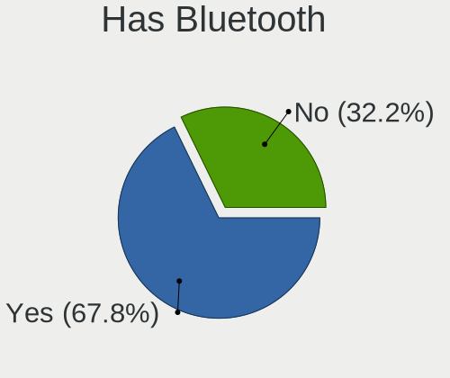
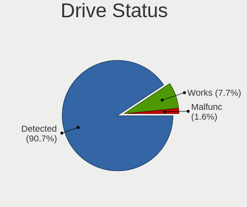
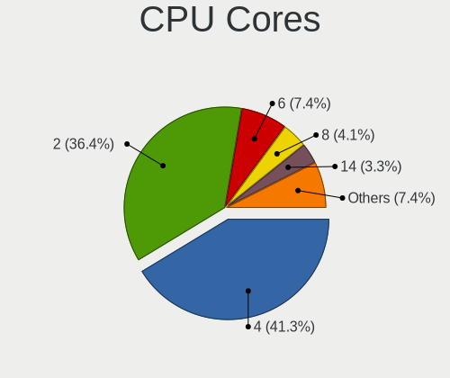
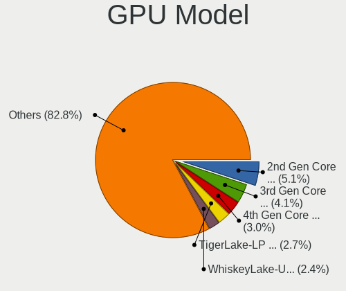
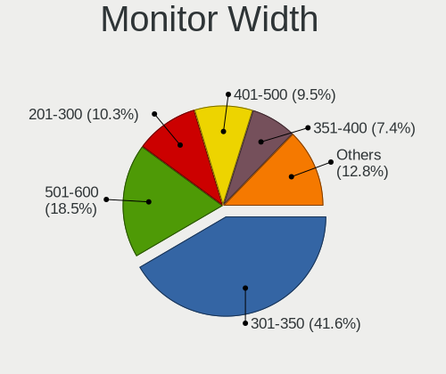
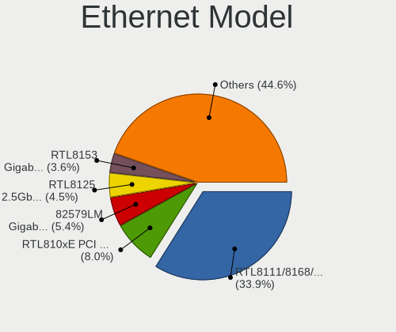
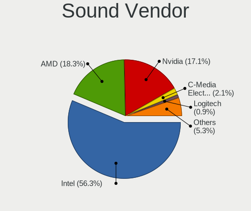
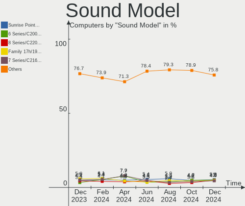
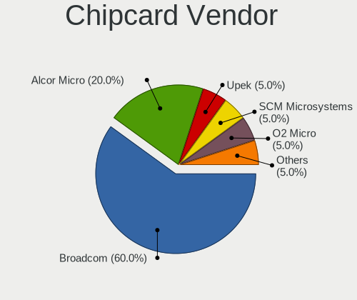

Zorin - Hardware Trends
-----------------------

A project to identify most popular hardware characteristics and track their change
over time based on data collected by Linux users at https://Linux-Hardware.org.

Anyone can contribute to this report by the [hw-probe](https://github.com/linuxhw/hw-probe) tool:

    sudo -E hw-probe -all -upload

This is a report for all computer types. See also reports for [desktops](/Dist/Zorin/Desktop/README.md) and [notebooks](/Dist/Zorin/Notebook/README.md).

This report is for one last month. Overall report since the beginning of time: [TestDays](https://github.com/linuxhw/TestDays)

Period: Dec, 2024.

Contents
--------

* [ System ](#system)
  - [ OS                       ](#os)
  - [ OS Family                ](#os-family)
  - [ Kernel                   ](#kernel)
  - [ Kernel Family            ](#kernel-family)
  - [ Kernel Major Ver.        ](#kernel-major-ver)
  - [ Arch                     ](#arch)
  - [ DE                       ](#de)
  - [ Display Server           ](#display-server)
  - [ Display Manager          ](#display-manager)
  - [ OS Lang                  ](#os-lang)
  - [ Boot Mode                ](#boot-mode)
  - [ Filesystem               ](#filesystem)
  - [ Part. scheme             ](#part-scheme)
  - [ Dual Boot with Linux/BSD ](#dual-boot-with-linuxbsd)
  - [ Dual Boot (Win)          ](#dual-boot-win)

* [ Board ](#board)
  - [ Vendor                   ](#vendor)
  - [ Model                    ](#model)
  - [ Model Family             ](#model-family)
  - [ MFG Year                 ](#mfg-year)
  - [ Form Factor              ](#form-factor)
  - [ Secure Boot              ](#secure-boot)
  - [ Coreboot                 ](#coreboot)
  - [ RAM Size                 ](#ram-size)
  - [ RAM Used                 ](#ram-used)
  - [ Total Drives             ](#total-drives)
  - [ Has CD-ROM               ](#has-cd-rom)
  - [ Has Ethernet             ](#has-ethernet)
  - [ Has WiFi                 ](#has-wifi)
  - [ Has Bluetooth            ](#has-bluetooth)

* [ Location ](#location)
  - [ Country                  ](#country)
  - [ City                     ](#city)

* [ Drives ](#drives)
  - [ Drive Vendor             ](#drive-vendor)
  - [ Drive Model              ](#drive-model)
  - [ HDD Vendor               ](#hdd-vendor)
  - [ SSD Vendor               ](#ssd-vendor)
  - [ Drive Kind               ](#drive-kind)
  - [ Drive Connector          ](#drive-connector)
  - [ Drive Size               ](#drive-size)
  - [ Space Total              ](#space-total)
  - [ Space Used               ](#space-used)
  - [ Malfunc. Drives          ](#malfunc-drives)
  - [ Malfunc. Drive Vendor    ](#malfunc-drive-vendor)
  - [ Malfunc. HDD Vendor      ](#malfunc-hdd-vendor)
  - [ Malfunc. Drive Kind      ](#malfunc-drive-kind)
  - [ Failed Drives            ](#failed-drives)
  - [ Failed Drive Vendor      ](#failed-drive-vendor)
  - [ Drive Status             ](#drive-status)

* [ Storage controller ](#storage-controller)
  - [ Storage Vendor           ](#storage-vendor)
  - [ Storage Model            ](#storage-model)
  - [ Storage Kind             ](#storage-kind)

* [ Processor ](#processor)
  - [ CPU Vendor               ](#cpu-vendor)
  - [ CPU Model                ](#cpu-model)
  - [ CPU Model Family         ](#cpu-model-family)
  - [ CPU Cores                ](#cpu-cores)
  - [ CPU Sockets              ](#cpu-sockets)
  - [ CPU Threads              ](#cpu-threads)
  - [ CPU Op-Modes             ](#cpu-op-modes)
  - [ CPU Microcode            ](#cpu-microcode)
  - [ CPU Microarch            ](#cpu-microarch)

* [ Graphics ](#graphics)
  - [ GPU Vendor               ](#gpu-vendor)
  - [ GPU Model                ](#gpu-model)
  - [ GPU Combo                ](#gpu-combo)
  - [ GPU Driver               ](#gpu-driver)
  - [ GPU Memory               ](#gpu-memory)

* [ Monitor ](#monitor)
  - [ Monitor Vendor           ](#monitor-vendor)
  - [ Monitor Model            ](#monitor-model)
  - [ Monitor Resolution       ](#monitor-resolution)
  - [ Monitor Diagonal         ](#monitor-diagonal)
  - [ Monitor Width            ](#monitor-width)
  - [ Aspect Ratio             ](#aspect-ratio)
  - [ Monitor Area             ](#monitor-area)
  - [ Pixel Density            ](#pixel-density)
  - [ Multiple Monitors        ](#multiple-monitors)

* [ Network ](#network)
  - [ Net Controller Vendor    ](#net-controller-vendor)
  - [ Net Controller Model     ](#net-controller-model)
  - [ Wireless Vendor          ](#wireless-vendor)
  - [ Wireless Model           ](#wireless-model)
  - [ Ethernet Vendor          ](#ethernet-vendor)
  - [ Ethernet Model           ](#ethernet-model)
  - [ Net Controller Kind      ](#net-controller-kind)
  - [ Used Controller          ](#used-controller)
  - [ NICs                     ](#nics)
  - [ IPv6                     ](#ipv6)

* [ Bluetooth ](#bluetooth)
  - [ Bluetooth Vendor         ](#bluetooth-vendor)
  - [ Bluetooth Model          ](#bluetooth-model)

* [ Sound ](#sound)
  - [ Sound Vendor             ](#sound-vendor)
  - [ Sound Model              ](#sound-model)

* [ Memory ](#memory)
  - [ Memory Vendor            ](#memory-vendor)
  - [ Memory Model             ](#memory-model)
  - [ Memory Kind              ](#memory-kind)
  - [ Memory Form Factor       ](#memory-form-factor)
  - [ Memory Size              ](#memory-size)
  - [ Memory Speed             ](#memory-speed)

* [ Printers & scanners ](#printers--scanners)
  - [ Printer Vendor           ](#printer-vendor)
  - [ Printer Model            ](#printer-model)
  - [ Scanner Vendor           ](#scanner-vendor)
  - [ Scanner Model            ](#scanner-model)

* [ Camera ](#camera)
  - [ Camera Vendor            ](#camera-vendor)
  - [ Camera Model             ](#camera-model)

* [ Security ](#security)
  - [ Fingerprint Vendor       ](#fingerprint-vendor)
  - [ Fingerprint Model        ](#fingerprint-model)
  - [ Chipcard Vendor          ](#chipcard-vendor)
  - [ Chipcard Model           ](#chipcard-model)

* [ Unsupported ](#unsupported)
  - [ Unsupported Devices      ](#unsupported-devices)
  - [ Unsupported Device Types ](#unsupported-device-types)

System
------

OS
--

Installed operating systems

| Name     | Computers | Percent |
|----------|-----------|---------|
| Zorin 17 | 224       | 92.56%  |
| Zorin 16 | 14        | 5.79%   |
| Zorin 15 | 3         | 1.24%   |
| Zorin 12 | 1         | 0.41%   |

OS Family
---------

OS without a version

| Name  | Computers | Percent |
|-------|-----------|---------|
| Zorin | 242       | 100%    |

Kernel
------

Version of the Linux kernel

| Version                 | Computers | Percent |
|-------------------------|-----------|---------|
| 6.8.0-49-generic        | 138       | 57.02%  |
| 6.8.0-50-generic        | 63        | 26.03%  |
| 6.8.0-40-generic        | 10        | 4.13%   |
| 5.15.0-126-generic      | 6         | 2.48%   |
| 6.8.0-48-generic        | 5         | 2.07%   |
| 5.4.0-150-generic       | 3         | 1.24%   |
| 5.15.0-127-generic      | 3         | 1.24%   |
| 6.8.12-060812-generic   | 1         | 0.41%   |
| 6.8.0-47-generic        | 1         | 0.41%   |
| 6.5.0-41-generic        | 1         | 0.41%   |
| 6.5.0-27-generic        | 1         | 0.41%   |
| 6.5.0-17-generic        | 1         | 0.41%   |
| 6.12.5-1-liquorix-amd64 | 1         | 0.41%   |
| 6.12.2-3-liquorix-amd64 | 1         | 0.41%   |
| 6.12.1-1-liquorix-amd64 | 1         | 0.41%   |
| 5.15.0-78-generic       | 1         | 0.41%   |
| 5.15.0-125-generic      | 1         | 0.41%   |
| 5.15.0-122-generic      | 1         | 0.41%   |
| 5.15.0-113-generic      | 1         | 0.41%   |
| 5.15.0-100-generic      | 1         | 0.41%   |
| 4.15.0-142-generic      | 1         | 0.41%   |

Kernel Family
-------------

Linux kernel without a distro release

| Version | Computers | Percent |
|---------|-----------|---------|
| 6.8.0   | 217       | 89.67%  |
| 5.15.0  | 14        | 5.79%   |
| 6.5.0   | 3         | 1.24%   |
| 5.4.0   | 3         | 1.24%   |
| 6.8.12  | 1         | 0.41%   |
| 6.12.5  | 1         | 0.41%   |
| 6.12.2  | 1         | 0.41%   |
| 6.12.1  | 1         | 0.41%   |
| 4.15.0  | 1         | 0.41%   |

Kernel Major Ver.
-----------------

Linux kernel major version

| Version | Computers | Percent |
|---------|-----------|---------|
| 6.8     | 218       | 90.08%  |
| 5.15    | 14        | 5.79%   |
| 6.5     | 3         | 1.24%   |
| 6.12    | 3         | 1.24%   |
| 5.4     | 3         | 1.24%   |
| 4.15    | 1         | 0.41%   |

Arch
----

OS architecture (x86_64, i586, etc.)

| Name   | Computers | Percent |
|--------|-----------|---------|
| x86_64 | 241       | 99.59%  |
| i686   | 1         | 0.41%   |

DE
--

Desktop Environment

| Name          | Computers | Percent |
|---------------|-----------|---------|
| GNOME         | 225       | 92.98%  |
| XFCE          | 14        | 5.79%   |
| X-Cinnamon    | 2         | 0.83%   |
| Enlightenment | 1         | 0.41%   |

Display Server
--------------

X11 or Wayland

| Name    | Computers | Percent |
|---------|-----------|---------|
| Wayland | 182       | 75.21%  |
| X11     | 58        | 23.97%  |
| Tty     | 1         | 0.41%   |
| Unknown | 1         | 0.41%   |

Display Manager
---------------

SDDM, LightDM, etc.

| Name    | Computers | Percent |
|---------|-----------|---------|
| Unknown | 196       | 80.99%  |
| GDM3    | 39        | 16.12%  |
| LightDM | 4         | 1.65%   |
| GDM     | 3         | 1.24%   |

OS Lang
-------

Language

| Lang  | Computers | Percent |
|-------|-----------|---------|
| en_US | 104       | 42.98%  |
| de_DE | 30        | 12.4%   |
| pt_BR | 15        | 6.2%    |
| en_GB | 12        | 4.96%   |
| en_CA | 9         | 3.72%   |
| en_AU | 9         | 3.72%   |
| es_ES | 8         | 3.31%   |
| it_IT | 7         | 2.89%   |
| fr_FR | 6         | 2.48%   |
| nl_NL | 5         | 2.07%   |
| nl_BE | 3         | 1.24%   |
| en_ZA | 3         | 1.24%   |
| pl_PL | 2         | 0.83%   |
| nb_NO | 2         | 0.83%   |
| ja_JP | 2         | 0.83%   |
| es_MX | 2         | 0.83%   |
| es_CO | 2         | 0.83%   |
| es_BO | 2         | 0.83%   |
| es_AR | 2         | 0.83%   |
| en_IN | 2         | 0.83%   |
| de_AT | 2         | 0.83%   |
| zh_TW | 1         | 0.41%   |
| tr_TR | 1         | 0.41%   |
| sv_SE | 1         | 0.41%   |
| sl_SI | 1         | 0.41%   |
| ru_RU | 1         | 0.41%   |
| it_CH | 1         | 0.41%   |
| fi_FI | 1         | 0.41%   |
| es_PE | 1         | 0.41%   |
| es_EC | 1         | 0.41%   |
| en_NZ | 1         | 0.41%   |
| en_IE | 1         | 0.41%   |
| da_DK | 1         | 0.41%   |
| C     | 1         | 0.41%   |

Boot Mode
---------

EFI or BIOS

| Mode | Computers | Percent |
|------|-----------|---------|
| BIOS | 210       | 86.78%  |
| EFI  | 32        | 13.22%  |

Filesystem
----------

Type of filesystem

| Type    | Computers | Percent |
|---------|-----------|---------|
| Ext4    | 208       | 85.95%  |
| Tmpfs   | 23        | 9.5%    |
| Zfs     | 6         | 2.48%   |
| Overlay | 2         | 0.83%   |
| Btrfs   | 2         | 0.83%   |
| Ext2    | 1         | 0.41%   |

Part. scheme
------------

Scheme of partitioning

| Type    | Computers | Percent |
|---------|-----------|---------|
| Unknown | 197       | 81.4%   |
| GPT     | 41        | 16.94%  |
| MBR     | 4         | 1.65%   |

Dual Boot with Linux/BSD
------------------------

Hosting more than one Linux/BSD

| Dual boot | Computers | Percent |
|-----------|-----------|---------|
| No        | 235       | 97.11%  |
| Yes       | 7         | 2.89%   |

Dual Boot (Win)
---------------

Hosting Linux and Windows

| Dual boot | Computers | Percent |
|-----------|-----------|---------|
| No        | 227       | 93.8%   |
| Yes       | 15        | 6.2%    |

Board
-----

Vendor
------

Motherboard manufacturer

| Name                 | Computers | Percent |
|----------------------|-----------|---------|
| Lenovo               | 40        | 16.53%  |
| Hewlett-Packard      | 36        | 14.88%  |
| Dell                 | 34        | 14.05%  |
| ASUSTek Computer     | 31        | 12.81%  |
| Gigabyte Technology  | 13        | 5.37%   |
| Acer                 | 13        | 5.37%   |
| MSI                  | 12        | 4.96%   |
| Apple                | 10        | 4.13%   |
| Toshiba              | 7         | 2.89%   |
| Fujitsu              | 5         | 2.07%   |
| Intel                | 4         | 1.65%   |
| ASRock               | 4         | 1.65%   |
| Samsung Electronics  | 3         | 1.24%   |
| Unknown              | 3         | 1.24%   |
| Google               | 2         | 0.83%   |
| Fujitsu Siemens      | 2         | 0.83%   |
| wpc                  | 1         | 0.41%   |
| Timi                 | 1         | 0.41%   |
| Teclast              | 1         | 0.41%   |
| Star Labs            | 1         | 0.41%   |
| RuggedPC             | 1         | 0.41%   |
| Proline              | 1         | 0.41%   |
| Positivo             | 1         | 0.41%   |
| PC Specialist        | 1         | 0.41%   |
| Panasonic            | 1         | 0.41%   |
| Packard Bell         | 1         | 0.41%   |
| Notebook             | 1         | 0.41%   |
| Multilaser           | 1         | 0.41%   |
| Microsoft            | 1         | 0.41%   |
| Medion               | 1         | 0.41%   |
| Login Informatica    | 1         | 0.41%   |
| Intel Client Systems | 1         | 0.41%   |
| HUAWEI               | 1         | 0.41%   |
| Huanan               | 1         | 0.41%   |
| GPD                  | 1         | 0.41%   |
| Gateway              | 1         | 0.41%   |
| Framework            | 1         | 0.41%   |
| BANGHO               | 1         | 0.41%   |
| AZW                  | 1         | 0.41%   |

Model
-----

Motherboard model

| Name                            | Computers | Percent |
|---------------------------------|-----------|---------|
| Unknown                         | 3         | 1.24%   |
| Lenovo ThinkPad T570 20H90002RI | 2         | 0.83%   |
| HP Pavilion g4                  | 2         | 0.83%   |
| HP EliteBook x360 1040 G6       | 2         | 0.83%   |
| Gigabyte X570 AORUS ULTRA       | 2         | 0.83%   |
| Dell Latitude E4300             | 2         | 0.83%   |
| Apple MacBookAir6,2             | 2         | 0.83%   |
| wpc wpc616                      | 1         | 0.41%   |
| Toshiba Satellite P55-A         | 1         | 0.41%   |
| Toshiba Satellite P300          | 1         | 0.41%   |
| Toshiba Satellite M840          | 1         | 0.41%   |
| Toshiba Satellite C75D-B        | 1         | 0.41%   |
| Toshiba Satellite C660D         | 1         | 0.41%   |
| Toshiba Satellite C50-A         | 1         | 0.41%   |
| Toshiba Satellite A110          | 1         | 0.41%   |
| Timi Mi NoteBook Ultra          | 1         | 0.41%   |
| Teclast F6 Plus                 | 1         | 0.41%   |
| Star Labs StarLite              | 1         | 0.41%   |
| Samsung R530/R730/P530          | 1         | 0.41%   |
| Samsung 950QED                  | 1         | 0.41%   |
| Samsung 700G7A                  | 1         | 0.41%   |
| RuggedPC RuggedPadC15           | 1         | 0.41%   |
| Proline V14664P                 | 1         | 0.41%   |
| Positivo Positivo Master D380   | 1         | 0.41%   |
| PC Specialist Recoil VIII 17    | 1         | 0.41%   |
| Panasonic CF-31WFL52CM          | 1         | 0.41%   |
| Packard Bell IXTREME I9632 FR   | 1         | 0.41%   |
| Notebook W35xSTQ_370ST          | 1         | 0.41%   |
| Multilaser UB82X                | 1         | 0.41%   |
| MSI Prestige 16 A13UCX          | 1         | 0.41%   |
| MSI MS-7E16                     | 1         | 0.41%   |
| MSI MS-7D99                     | 1         | 0.41%   |
| MSI MS-7D30                     | 1         | 0.41%   |
| MSI MS-7D08                     | 1         | 0.41%   |
| MSI MS-7C56                     | 1         | 0.41%   |
| MSI MS-7A38                     | 1         | 0.41%   |
| MSI MS-7A34                     | 1         | 0.41%   |
| MSI MS-7792                     | 1         | 0.41%   |
| MSI MS-7566                     | 1         | 0.41%   |
| MSI GT72 2QD                    | 1         | 0.41%   |

Model Family
------------

Motherboard model prefix

| Name                  | Computers | Percent |
|-----------------------|-----------|---------|
| Lenovo ThinkPad       | 18        | 7.44%   |
| Dell Latitude         | 15        | 6.2%    |
| Acer Aspire           | 9         | 3.72%   |
| Toshiba Satellite     | 7         | 2.89%   |
| Dell Inspiron         | 7         | 2.89%   |
| HP ProBook            | 6         | 2.48%   |
| HP Pavilion           | 6         | 2.48%   |
| Lenovo ThinkCentre    | 5         | 2.07%   |
| Lenovo IdeaPad        | 5         | 2.07%   |
| HP Laptop             | 5         | 2.07%   |
| Dell OptiPlex         | 5         | 2.07%   |
| ASUS TUF              | 5         | 2.07%   |
| HP ENVY               | 4         | 1.65%   |
| ASUS PRIME            | 4         | 1.65%   |
| ASUS ASUS             | 4         | 1.65%   |
| HP ProDesk            | 3         | 1.24%   |
| HP EliteBook          | 3         | 1.24%   |
| Fujitsu LIFEBOOK      | 3         | 1.24%   |
| Dell Precision        | 3         | 1.24%   |
| ASUS ROG              | 3         | 1.24%   |
| Unknown               | 3         | 1.24%   |
| Lenovo Yoga           | 2         | 0.83%   |
| Lenovo IdeaCentre     | 2         | 0.83%   |
| HP EliteDesk          | 2         | 0.83%   |
| HP Compaq             | 2         | 0.83%   |
| Gigabyte Z97X-Gaming  | 2         | 0.83%   |
| Gigabyte X570         | 2         | 0.83%   |
| Dell Vostro           | 2         | 0.83%   |
| ASUS VivoBook         | 2         | 0.83%   |
| Apple MacBookAir6     | 2         | 0.83%   |
| Acer Nitro            | 2         | 0.83%   |
| wpc wpc616            | 1         | 0.41%   |
| Timi Mi               | 1         | 0.41%   |
| Teclast F6            | 1         | 0.41%   |
| Star Labs StarLite    | 1         | 0.41%   |
| Samsung R530          | 1         | 0.41%   |
| Samsung 950QED        | 1         | 0.41%   |
| Samsung 700G7A        | 1         | 0.41%   |
| RuggedPC RuggedPadC15 | 1         | 0.41%   |
| Proline V14664P       | 1         | 0.41%   |

MFG Year
--------

Motherboard manufacture year

| Year | Computers | Percent |
|------|-----------|---------|
| 2019 | 20        | 8.26%   |
| 2011 | 20        | 8.26%   |
| 2013 | 19        | 7.85%   |
| 2015 | 18        | 7.44%   |
| 2020 | 17        | 7.02%   |
| 2017 | 16        | 6.61%   |
| 2012 | 16        | 6.61%   |
| 2010 | 16        | 6.61%   |
| 2021 | 15        | 6.2%    |
| 2014 | 15        | 6.2%    |
| 2018 | 14        | 5.79%   |
| 2024 | 12        | 4.96%   |
| 2023 | 10        | 4.13%   |
| 2022 | 10        | 4.13%   |
| 2016 | 8         | 3.31%   |
| 2008 | 7         | 2.89%   |
| 2009 | 4         | 1.65%   |
| 2007 | 3         | 1.24%   |
| 2006 | 1         | 0.41%   |
| 2000 | 1         | 0.41%   |

Form Factor
-----------

Physical design of the computer

| Name        | Computers | Percent |
|-------------|-----------|---------|
| Notebook    | 140       | 57.85%  |
| Desktop     | 79        | 32.64%  |
| Convertible | 8         | 3.31%   |
| All in one  | 7         | 2.89%   |
| Tablet      | 6         | 2.48%   |
| Mini pc     | 1         | 0.41%   |
| Server      | 1         | 0.41%   |

Secure Boot
-----------

Enabled or disabled

| State    | Computers | Percent |
|----------|-----------|---------|
| Disabled | 235       | 97.11%  |
| Enabled  | 7         | 2.89%   |

Coreboot
--------

Have coreboot on board

| Used | Computers | Percent |
|------|-----------|---------|
| No   | 239       | 98.76%  |
| Yes  | 3         | 1.24%   |

RAM Size
--------

Total RAM memory

| Size in GB  | Computers | Percent |
|-------------|-----------|---------|
| 16.01-24.0  | 59        | 24.38%  |
| 4.01-8.0    | 56        | 23.14%  |
| 3.01-4.0    | 42        | 17.36%  |
| 8.01-16.0   | 41        | 16.94%  |
| 32.01-64.0  | 24        | 9.92%   |
| 64.01-256.0 | 10        | 4.13%   |
| 24.01-32.0  | 4         | 1.65%   |
| 1.01-2.0    | 4         | 1.65%   |
| 2.01-3.0    | 2         | 0.83%   |

RAM Used
--------

Used RAM memory

| Used GB    | Computers | Percent |
|------------|-----------|---------|
| 2.01-3.0   | 95        | 39.26%  |
| 1.01-2.0   | 54        | 22.31%  |
| 3.01-4.0   | 38        | 15.7%   |
| 4.01-8.0   | 37        | 15.29%  |
| 8.01-16.0  | 11        | 4.55%   |
| 0.51-1.0   | 4         | 1.65%   |
| 16.01-24.0 | 3         | 1.24%   |

Total Drives
------------

Number of drives on board

| Drives | Computers | Percent |
|--------|-----------|---------|
| 1      | 165       | 68.18%  |
| 2      | 52        | 21.49%  |
| 3      | 14        | 5.79%   |
| 4      | 7         | 2.89%   |
| 5      | 2         | 0.83%   |
| 8      | 1         | 0.41%   |
| 7      | 1         | 0.41%   |

Has CD-ROM
----------

Has CD-ROM on board

| Presented | Computers | Percent |
|-----------|-----------|---------|
| No        | 144       | 59.5%   |
| Yes       | 98        | 40.5%   |

Has Ethernet
------------

Has Ethernet on board

| Presented | Computers | Percent |
|-----------|-----------|---------|
| Yes       | 210       | 86.78%  |
| No        | 32        | 13.22%  |

Has WiFi
--------

Has WiFi module

| Presented | Computers | Percent |
|-----------|-----------|---------|
| Yes       | 202       | 83.47%  |
| No        | 40        | 16.53%  |

Has Bluetooth
-------------

Has Bluetooth module

| Presented | Computers | Percent |
|-----------|-----------|---------|
| Yes       | 164       | 67.77%  |
| No        | 78        | 32.23%  |

Location
--------

Country
-------

Geographic location (country)

| Country         | Computers | Percent |
|-----------------|-----------|---------|
| USA             | 54        | 22.31%  |
| Germany         | 31        | 12.81%  |
| Brazil          | 16        | 6.61%   |
| Canada          | 13        | 5.37%   |
| UK              | 10        | 4.13%   |
| Spain           | 9         | 3.72%   |
| Australia       | 9         | 3.72%   |
| Italy           | 7         | 2.89%   |
| Netherlands     | 6         | 2.48%   |
| France          | 6         | 2.48%   |
| Belgium         | 5         | 2.07%   |
| Sweden          | 4         | 1.65%   |
| Romania         | 4         | 1.65%   |
| Mexico          | 4         | 1.65%   |
| Argentina       | 4         | 1.65%   |
| Turkey          | 3         | 1.24%   |
| South Africa    | 3         | 1.24%   |
| Saudi Arabia    | 3         | 1.24%   |
| Poland          | 3         | 1.24%   |
| Norway          | 3         | 1.24%   |
| Malaysia        | 3         | 1.24%   |
| India           | 3         | 1.24%   |
| Finland         | 3         | 1.24%   |
| Austria         | 3         | 1.24%   |
| Taiwan          | 2         | 0.83%   |
| Switzerland     | 2         | 0.83%   |
| Kenya           | 2         | 0.83%   |
| Jordan          | 2         | 0.83%   |
| Japan           | 2         | 0.83%   |
| Ethiopia        | 2         | 0.83%   |
| Colombia        | 2         | 0.83%   |
| Bolivia         | 2         | 0.83%   |
| The Netherlands | 1         | 0.41%   |
| Thailand        | 1         | 0.41%   |
| Syria           | 1         | 0.41%   |
| Slovenia        | 1         | 0.41%   |
| Serbia          | 1         | 0.41%   |
| Russia          | 1         | 0.41%   |
| Peru            | 1         | 0.41%   |
| New Zealand     | 1         | 0.41%   |

City
----

Geographic location (city)

| City              | Computers | Percent |
|-------------------|-----------|---------|
| Sao Paulo         | 5         | 2.07%   |
| Melbourne         | 4         | 1.65%   |
| Sydney            | 3         | 1.24%   |
| Stockholm         | 3         | 1.24%   |
| Milan             | 3         | 1.24%   |
| Buenos Aires      | 3         | 1.24%   |
| Valencia          | 2         | 0.83%   |
| Recife            | 2         | 0.83%   |
| Nairobi           | 2         | 0.83%   |
| Mumbai            | 2         | 0.83%   |
| Mexico City       | 2         | 0.83%   |
| Marabu            | 2         | 0.83%   |
| Leipzig           | 2         | 0.83%   |
| Johannesburg      | 2         | 0.83%   |
| Houston           | 2         | 0.83%   |
| Helsinki          | 2         | 0.83%   |
| Düsseldorf       | 2         | 0.83%   |
| Colorado Springs  | 2         | 0.83%   |
| Birmingham        | 2         | 0.83%   |
| Bielefeld         | 2         | 0.83%   |
| Amman             | 2         | 0.83%   |
| Addis Ababa       | 2         | 0.83%   |
| Zagorz            | 1         | 0.41%   |
| Würzburg         | 1         | 0.41%   |
| Windsor           | 1         | 0.41%   |
| Whitby            | 1         | 0.41%   |
| West Malling      | 1         | 0.41%   |
| Watford           | 1         | 0.41%   |
| Watertown         | 1         | 0.41%   |
| Vitry-en-Artois   | 1         | 0.41%   |
| Vitinia           | 1         | 0.41%   |
| Vilsbiburg        | 1         | 0.41%   |
| Vigo              | 1         | 0.41%   |
| Veenendaal        | 1         | 0.41%   |
| Varna             | 1         | 0.41%   |
| Vänersborg       | 1         | 0.41%   |
| Tyler             | 1         | 0.41%   |
| Turbigo           | 1         | 0.41%   |
| Tracadie–Sheila | 1         | 0.41%   |
| Toronto           | 1         | 0.41%   |

Drives
------

Drive Vendor
------------

Hard drive vendors

| Vendor                       | Computers | Drives | Percent |
|------------------------------|-----------|--------|---------|
| Samsung Electronics          | 46        | 50     | 13.81%  |
| Seagate                      | 40        | 45     | 12.01%  |
| WDC                          | 38        | 43     | 11.41%  |
| Toshiba                      | 20        | 21     | 6.01%   |
| SanDisk                      | 19        | 20     | 5.71%   |
| Unknown                      | 16        | 18     | 4.8%    |
| Kingston                     | 15        | 15     | 4.5%    |
| Crucial                      | 12        | 14     | 3.6%    |
| Intel                        | 8         | 8      | 2.4%    |
| Phison Electronics           | 7         | 9      | 2.1%    |
| Micron/Crucial Technology    | 7         | 7      | 2.1%    |
| SK hynix                     | 6         | 6      | 1.8%    |
| Kingston Technology Company  | 6         | 6      | 1.8%    |
| HGST                         | 6         | 6      | 1.8%    |
| MAXIO Technology (Hangzhou)  | 5         | 6      | 1.5%    |
| Hitachi                      | 5         | 9      | 1.5%    |
| China                        | 5         | 5      | 1.5%    |
| Unknown                      | 5         | 6      | 1.5%    |
| SPCC                         | 4         | 4      | 1.2%    |
| PNY                          | 4         | 4      | 1.2%    |
| OCZ                          | 4         | 4      | 1.2%    |
| Apple                        | 4         | 4      | 1.2%    |
| Silicon Motion               | 3         | 3      | 0.9%    |
| Micron Technology            | 3         | 3      | 0.9%    |
| A-DATA Technology            | 3         | 3      | 0.9%    |
| Verbatim                     | 2         | 3      | 0.6%    |
| Timetec                      | 2         | 2      | 0.6%    |
| KIOXIA                       | 2         | 2      | 0.6%    |
| KingSpec                     | 2         | 2      | 0.6%    |
| Kingchuxing                  | 2         | 2      | 0.6%    |
| JMicron Technology           | 2         | 2      | 0.6%    |
| Intenso                      | 2         | 2      | 0.6%    |
| Gigabyte Technology          | 2         | 2      | 0.6%    |
| Fanxiang                     | 2         | 2      | 0.6%    |
| ADATA Technology             | 2         | 2      | 0.6%    |
| Transcend                    | 1         | 1      | 0.3%    |
| Teclast                      | 1         | 1      | 0.3%    |
| Team                         | 1         | 1      | 0.3%    |
| T-FORCE                      | 1         | 1      | 0.3%    |
| Shenzhen Longsys Electronics | 1         | 1      | 0.3%    |

Drive Model
-----------

Hard drive models

| Model                                                 | Computers | Percent |
|-------------------------------------------------------|-----------|---------|
| Unknown MMC Card  64GB                                | 7         | 2.01%   |
| Seagate ST1000DM003-1CH162 1TB                        | 5         | 1.43%   |
| Unknown                                               | 5         | 1.43%   |
| Unknown MMC Card  128GB                               | 4         | 1.15%   |
| Samsung NVMe SSD Controller SM981/PM981/PM983 512GB   | 4         | 1.15%   |
| Samsung NVMe SSD Controller PM9A1/PM9A3/980PRO 512GB  | 4         | 1.15%   |
| Micron/Crucial P2 NVMe PCIe SSD 500GB                 | 4         | 1.15%   |
| Kingston SA400S37240G 240GB SSD                       | 4         | 1.15%   |
| Crucial CT1000MX500SSD1 1TB                           | 4         | 1.15%   |
| Sandisk WD Blue SN550 NVMe SSD 256GB                  | 3         | 0.86%   |
| Samsung SSD 980 500GB                                 | 3         | 0.86%   |
| Samsung NVMe SSD Controller SM961/PM961/SM963 256GB   | 3         | 0.86%   |
| MAXIO (Hangzhou) NVMe SSD Controller MAP1202 512GB    | 3         | 0.86%   |
| Kingston SA400S37960G 960GB SSD                       | 3         | 0.86%   |
| HGST HTS721010A9E630 1TB                              | 3         | 0.86%   |
| Crucial CT500MX500SSD1 500GB                          | 3         | 0.86%   |
| WDC WDS200T2B0A-00SM50 2TB SSD                        | 2         | 0.57%   |
| WDC WD5000AAKX-75U6AA0 500GB                          | 2         | 0.57%   |
| WDC WD3200BEVT-22ZCT0 320GB                           | 2         | 0.57%   |
| Unknown NVMe SSD Drive 2TB                            | 2         | 0.57%   |
| Toshiba MQ04ABF100 1TB                                | 2         | 0.57%   |
| Toshiba MQ01ABF050 500GB                              | 2         | 0.57%   |
| Toshiba MQ01ABD050 500GB                              | 2         | 0.57%   |
| SK hynix BC501 NVMe Solid State Drive 512GB           | 2         | 0.57%   |
| Silicon Motion SM2263EN/SM2263XT SSD Controller 256GB | 2         | 0.57%   |
| Seagate ST9500420AS 500GB                             | 2         | 0.57%   |
| Seagate ST6000DM003-2CY186 6TB                        | 2         | 0.57%   |
| Seagate ST500LT012-1DG142 500GB                       | 2         | 0.57%   |
| Seagate ST3500413AS 500GB                             | 2         | 0.57%   |
| Seagate ST1000DM003-1ER162 1TB                        | 2         | 0.57%   |
| SanDisk SSD PLUS 240GB                                | 2         | 0.57%   |
| SanDisk SSD PLUS 1000GB                               | 2         | 0.57%   |
| Samsung SSD 870 EVO 500GB                             | 2         | 0.57%   |
| Samsung SSD 850 PRO 512GB                             | 2         | 0.57%   |
| Phison E16 PCIe4 NVMe Controller 1TB                  | 2         | 0.57%   |
| OCZ VERTEX3 120GB SSD                                 | 2         | 0.57%   |
| Kingston Company SNV2S1000G 1TB                       | 2         | 0.57%   |
| Kingston Company OM3PDP3 NVMe SSD 512GB               | 2         | 0.57%   |
| Intel SSD 660P Series 1024GB                          | 2         | 0.57%   |
| Hitachi HTS547575A9E384 752GB                         | 2         | 0.57%   |

HDD Vendor
----------

Hard disk drive vendors

| Vendor              | Computers | Drives | Percent |
|---------------------|-----------|--------|---------|
| Seagate             | 39        | 44     | 35.78%  |
| WDC                 | 32        | 35     | 29.36%  |
| Toshiba             | 15        | 15     | 13.76%  |
| Samsung Electronics | 6         | 6      | 5.5%    |
| HGST                | 6         | 6      | 5.5%    |
| Hitachi             | 5         | 9      | 4.59%   |
| Unknown             | 1         | 1      | 0.92%   |
| SABRENT             | 1         | 1      | 0.92%   |
| JMicron Technology  | 1         | 1      | 0.92%   |
| Hewlett-Packard     | 1         | 1      | 0.92%   |
| Fujitsu             | 1         | 1      | 0.92%   |
| Apple               | 1         | 1      | 0.92%   |

SSD Vendor
----------

Solid state drive vendors

| Vendor              | Computers | Drives | Percent |
|---------------------|-----------|--------|---------|
| Samsung Electronics | 17        | 17     | 15.04%  |
| Kingston            | 13        | 13     | 11.5%   |
| SanDisk             | 12        | 12     | 10.62%  |
| Crucial             | 12        | 14     | 10.62%  |
| WDC                 | 6         | 7      | 5.31%   |
| China               | 5         | 5      | 4.42%   |
| SPCC                | 4         | 4      | 3.54%   |
| PNY                 | 4         | 4      | 3.54%   |
| OCZ                 | 4         | 4      | 3.54%   |
| Intel               | 4         | 4      | 3.54%   |
| Apple               | 3         | 3      | 2.65%   |
| Unknown             | 3         | 3      | 2.65%   |
| Verbatim            | 2         | 3      | 1.77%   |
| Toshiba             | 2         | 3      | 1.77%   |
| KingSpec            | 2         | 2      | 1.77%   |
| Intenso             | 2         | 2      | 1.77%   |
| Gigabyte Technology | 2         | 2      | 1.77%   |
| A-DATA Technology   | 2         | 2      | 1.77%   |
| Transcend           | 1         | 1      | 0.88%   |
| Timetec             | 1         | 1      | 0.88%   |
| Teclast             | 1         | 1      | 0.88%   |
| Team                | 1         | 1      | 0.88%   |
| SK hynix            | 1         | 1      | 0.88%   |
| Seagate             | 1         | 1      | 0.88%   |
| Phison              | 1         | 1      | 0.88%   |
| MSI                 | 1         | 1      | 0.88%   |
| Micron Technology   | 1         | 1      | 0.88%   |
| LITEON              | 1         | 1      | 0.88%   |
| Lexar               | 1         | 1      | 0.88%   |
| KimMiDi             | 1         | 1      | 0.88%   |
| GOODRAM             | 1         | 1      | 0.88%   |
| EAGET               | 1         | 1      | 0.88%   |

Drive Kind
----------

HDD or SSD

| Kind    | Computers | Drives | Percent |
|---------|-----------|--------|---------|
| SSD     | 98        | 118    | 32.67%  |
| HDD     | 95        | 121    | 31.67%  |
| NVMe    | 83        | 97     | 27.67%  |
| MMC     | 13        | 14     | 4.33%   |
| Unknown | 11        | 11     | 3.67%   |

Drive Connector
---------------

SATA, SAS, NVMe, etc.

| Type | Computers | Drives | Percent |
|------|-----------|--------|---------|
| SATA | 168       | 234    | 60%     |
| NVMe | 83        | 97     | 29.64%  |
| SAS  | 16        | 16     | 5.71%   |
| MMC  | 13        | 14     | 4.64%   |

Drive Size
----------

Size of hard drive

| Size in TB | Computers | Drives | Percent |
|------------|-----------|--------|---------|
| 0.01-0.5   | 120       | 133    | 59.7%   |
| 0.51-1.0   | 55        | 71     | 27.36%  |
| 1.01-2.0   | 17        | 25     | 8.46%   |
| 3.01-4.0   | 3         | 3      | 1.49%   |
| 4.01-10.0  | 3         | 3      | 1.49%   |
| 2.01-3.0   | 2         | 3      | 1%      |
| 10.01-20.0 | 1         | 1      | 0.5%    |

Space Total
-----------

Amount of disk space available on the file system

| Size in GB     | Computers | Percent |
|----------------|-----------|---------|
| 101-250        | 73        | 30.17%  |
| 251-500        | 59        | 24.38%  |
| 501-1000       | 38        | 15.7%   |
| 51-100         | 20        | 8.26%   |
| 1001-2000      | 16        | 6.61%   |
| More than 3000 | 10        | 4.13%   |
| 2001-3000      | 9         | 3.72%   |
| 21-50          | 7         | 2.89%   |
| Unknown        | 6         | 2.48%   |
| 1-20           | 4         | 1.65%   |

Space Used
----------

Amount of used disk space

| Used GB        | Computers | Percent |
|----------------|-----------|---------|
| 21-50          | 81        | 33.47%  |
| 1-20           | 64        | 26.45%  |
| 51-100         | 27        | 11.16%  |
| 101-250        | 21        | 8.68%   |
| 251-500        | 16        | 6.61%   |
| 501-1000       | 14        | 5.79%   |
| 1001-2000      | 8         | 3.31%   |
| Unknown        | 6         | 2.48%   |
| More than 3000 | 4         | 1.65%   |
| 2001-3000      | 1         | 0.41%   |

Malfunc. Drives
---------------

Drive models with a malfunction

| Model                                 | Computers | Drives | Percent |
|---------------------------------------|-----------|--------|---------|
| Seagate ST9500325AS 500GB             | 1         | 1      | 25%     |
| Seagate ST500LM000-1EJ162 500GB       | 1         | 1      | 25%     |
| Samsung Electronics SSD 850 PRO 512GB | 1         | 1      | 25%     |
| China SSD 1TB                         | 1         | 1      | 25%     |

Malfunc. Drive Vendor
---------------------

Vendors of faulty drives

| Vendor              | Computers | Drives | Percent |
|---------------------|-----------|--------|---------|
| Seagate             | 2         | 2      | 50%     |
| Samsung Electronics | 1         | 1      | 25%     |
| China               | 1         | 1      | 25%     |

Malfunc. HDD Vendor
-------------------

Vendors of faulty HDD drives

| Vendor  | Computers | Drives | Percent |
|---------|-----------|--------|---------|
| Seagate | 2         | 2      | 100%    |

Malfunc. Drive Kind
-------------------

Kinds of faulty drives

| Kind | Computers | Drives | Percent |
|------|-----------|--------|---------|
| SSD  | 2         | 2      | 50%     |
| HDD  | 2         | 2      | 50%     |

Failed Drives
-------------

Failed drive models

Zero info for selected period =(

Failed Drive Vendor
-------------------

Failed drive vendors

Zero info for selected period =(

Drive Status
------------

Number of failed and malfunc. drives

| Status   | Computers | Drives | Percent |
|----------|-----------|--------|---------|
| Detected | 224       | 332    | 90.69%  |
| Works    | 19        | 25     | 7.69%   |
| Malfunc  | 4         | 4      | 1.62%   |

Storage controller
------------------

Storage Vendor
--------------

Storage controller vendors

| Vendor                       | Computers | Percent |
|------------------------------|-----------|---------|
| Intel                        | 164       | 53.77%  |
| AMD                          | 39        | 12.79%  |
| Samsung Electronics          | 27        | 8.85%   |
| SanDisk                      | 8         | 2.62%   |
| Kingston Technology Company  | 8         | 2.62%   |
| Phison Electronics           | 7         | 2.3%    |
| Micron/Crucial Technology    | 7         | 2.3%    |
| MAXIO Technology (Hangzhou)  | 7         | 2.3%    |
| SK hynix                     | 5         | 1.64%   |
| ASMedia Technology           | 5         | 1.64%   |
| Marvell Technology Group     | 4         | 1.31%   |
| JMicron Technology           | 4         | 1.31%   |
| Toshiba America Info Systems | 3         | 0.98%   |
| Silicon Motion               | 3         | 0.98%   |
| ADATA Technology             | 3         | 0.98%   |
| Nvidia                       | 2         | 0.66%   |
| Micron Technology            | 2         | 0.66%   |
| KIOXIA                       | 2         | 0.66%   |
| Shenzhen Longsys Electronics | 1         | 0.33%   |
| Realtek Semiconductor        | 1         | 0.33%   |
| LSI Logic / Symbios Logic    | 1         | 0.33%   |
| Broadcom / LSI               | 1         | 0.33%   |
| Biwin Storage Technology     | 1         | 0.33%   |

Storage Model
-------------

Storage controller models

| Model                                                                            | Computers | Percent |
|----------------------------------------------------------------------------------|-----------|---------|
| AMD FCH SATA Controller [AHCI mode]                                              | 27        | 8.01%   |
| Intel 8 Series/C220 Series Chipset Family 6-port SATA Controller 1 [AHCI mode]   | 19        | 5.64%   |
| Intel Sunrise Point-LP SATA Controller [AHCI mode]                               | 12        | 3.56%   |
| Intel 7 Series Chipset Family 6-port SATA Controller [AHCI mode]                 | 12        | 3.56%   |
| Intel 82801 Mobile SATA Controller [RAID mode]                                   | 11        | 3.26%   |
| Intel 6 Series/C200 Series Chipset Family 6 port Mobile SATA AHCI Controller     | 10        | 2.97%   |
| Intel 6 Series/C200 Series Chipset Family 6 port Desktop SATA AHCI Controller    | 8         | 2.37%   |
| Samsung NVMe SSD Controller PM9A1/PM9A3/980PRO                                   | 6         | 1.78%   |
| Samsung NVMe SSD Controller 980 (DRAM-less)                                      | 6         | 1.78%   |
| Intel Q170/Q150/B150/H170/H110/Z170/CM236 Chipset SATA Controller [AHCI Mode]    | 5         | 1.48%   |
| Intel Celeron/Pentium Silver Processor SATA Controller                           | 5         | 1.48%   |
| Intel 82801IBM/IEM (ICH9M/ICH9M-E) 4 port SATA Controller [AHCI mode]            | 5         | 1.48%   |
| Intel 5 Series/3400 Series Chipset 4 port SATA AHCI Controller                   | 5         | 1.48%   |
| Samsung NVMe SSD Controller SM981/PM981/PM983                                    | 4         | 1.19%   |
| Micron/Crucial P2 [Nick P2] / P3 / P3 Plus NVMe PCIe SSD (DRAM-less)             | 4         | 1.19%   |
| MAXIO (Hangzhou) NVMe SSD Controller MAP1602 (DRAM-less)                         | 4         | 1.19%   |
| MAXIO (Hangzhou) NVMe SSD Controller MAP1202 (DRAM-less)                         | 4         | 1.19%   |
| Intel Volume Management Device NVMe RAID Controller                              | 4         | 1.19%   |
| Intel SATA Controller [RAID mode]                                                | 4         | 1.19%   |
| Intel Cannon Lake Mobile PCH SATA AHCI Controller                                | 4         | 1.19%   |
| Intel 7 Series/C210 Series Chipset Family 6-port SATA Controller [AHCI mode]     | 4         | 1.19%   |
| ASMedia ASM1061/ASM1062 Serial ATA Controller                                    | 4         | 1.19%   |
| AMD 600 Series Chipset SATA Controller                                           | 4         | 1.19%   |
| AMD 500 Series Chipset SATA Controller                                           | 4         | 1.19%   |
| AMD 400 Series Chipset SATA Controller                                           | 4         | 1.19%   |
| SanDisk Ultra 3D / WD PC SN530, IX SN530, Blue SN550 NVMe SSD (DRAM-less)        | 3         | 0.89%   |
| Samsung NVMe SSD Controller SM961/PM961/SM963                                    | 3         | 0.89%   |
| Samsung NVMe SSD Controller S4LV008[Pascal]                                      | 3         | 0.89%   |
| Phison E18 PCIe4 NVMe Controller                                                 | 3         | 0.89%   |
| JMicron JMB363 SATA/IDE Controller                                               | 3         | 0.89%   |
| Intel Tiger Lake-LP SATA Controller                                              | 3         | 0.89%   |
| Intel Atom/Celeron/Pentium Processor x5-E8000/J3xxx/N3xxx Series SATA Controller | 3         | 0.89%   |
| Intel Atom Processor E3800 Series SATA AHCI Controller                           | 3         | 0.89%   |
| Intel Alder Lake-S PCH SATA Controller [AHCI Mode]                               | 3         | 0.89%   |
| Intel 5 Series/3400 Series Chipset 4 port SATA IDE Controller                    | 3         | 0.89%   |
| Intel 400 Series Chipset Family SATA AHCI Controller                             | 3         | 0.89%   |
| AMD SB7x0/SB8x0/SB9x0 SATA Controller [AHCI mode]                                | 3         | 0.89%   |
| AMD A320 Chipset SATA Controller [AHCI mode]                                     | 3         | 0.89%   |
| Toshiba America Info Systems XG5 NVMe SSD Controller                             | 2         | 0.59%   |
| SK hynix BC501 NVMe Solid State Drive                                            | 2         | 0.59%   |

Storage Kind
------------

Kind of storage controller (IDE, SATA, NVMe, SAS, ...)

| Kind | Computers | Percent |
|------|-----------|---------|
| SATA | 175       | 58.53%  |
| NVMe | 83        | 27.76%  |
| RAID | 20        | 6.69%   |
| IDE  | 19        | 6.35%   |
| SAS  | 1         | 0.33%   |
| SCSI | 1         | 0.33%   |

Processor
---------

CPU Vendor
----------

Processor vendors

| Vendor | Computers | Percent |
|--------|-----------|---------|
| Intel  | 196       | 80.99%  |
| AMD    | 46        | 19.01%  |

CPU Model
---------

Processor models

| Model                                           | Computers | Percent |
|-------------------------------------------------|-----------|---------|
| Intel Core i7-2600 CPU @ 3.40GHz                | 4         | 1.65%   |
| Intel Core i5-7200U CPU @ 2.50GHz               | 4         | 1.65%   |
| Intel Core i5-6200U CPU @ 2.30GHz               | 4         | 1.65%   |
| Intel 11th Gen Core i5-1135G7 @ 2.40GHz         | 4         | 1.65%   |
| Intel Core i7-8565U CPU @ 1.80GHz               | 3         | 1.24%   |
| Intel Core i7-6700 CPU @ 3.40GHz                | 3         | 1.24%   |
| Intel Core i5-8265U CPU @ 1.60GHz               | 3         | 1.24%   |
| Intel Core i5-4570 CPU @ 3.20GHz                | 3         | 1.24%   |
| Intel Core i5-2520M CPU @ 2.50GHz               | 3         | 1.24%   |
| Intel Core i3 CPU M 370 @ 2.40GHz               | 3         | 1.24%   |
| Intel 12th Gen Core i7-12700H                   | 3         | 1.24%   |
| Intel Core i7-8700 CPU @ 3.20GHz                | 2         | 0.83%   |
| Intel Core i7-6500U CPU @ 2.50GHz               | 2         | 0.83%   |
| Intel Core i7-3720QM CPU @ 2.60GHz              | 2         | 0.83%   |
| Intel Core i7-3612QM CPU @ 2.10GHz              | 2         | 0.83%   |
| Intel Core i7-2630QM CPU @ 2.00GHz              | 2         | 0.83%   |
| Intel Core i7-10750H CPU @ 2.60GHz              | 2         | 0.83%   |
| Intel Core i5-8350U CPU @ 1.70GHz               | 2         | 0.83%   |
| Intel Core i5-8250U CPU @ 1.60GHz               | 2         | 0.83%   |
| Intel Core i5-7400 CPU @ 3.00GHz                | 2         | 0.83%   |
| Intel Core i5-6500 CPU @ 3.20GHz                | 2         | 0.83%   |
| Intel Core i5-4300M CPU @ 2.60GHz               | 2         | 0.83%   |
| Intel Core i5-4260U CPU @ 1.40GHz               | 2         | 0.83%   |
| Intel Core i5-3230M CPU @ 2.60GHz               | 2         | 0.83%   |
| Intel Core i3-3110M CPU @ 2.40GHz               | 2         | 0.83%   |
| Intel Core 2 Duo CPU P8400 @ 2.26GHz            | 2         | 0.83%   |
| Intel Atom x5-Z8350 CPU @ 1.44GHz               | 2         | 0.83%   |
| AMD Ryzen 7 5800X 8-Core Processor              | 2         | 0.83%   |
| AMD Ryzen 5 7600 6-Core Processor               | 2         | 0.83%   |
| AMD Ryzen 5 5600G with Radeon Graphics          | 2         | 0.83%   |
| AMD Ryzen 5 2500U with Radeon Vega Mobile Gfx   | 2         | 0.83%   |
| AMD A8-6410 APU with AMD Radeon R5 Graphics     | 2         | 0.83%   |
| AMD A12-9720P RADEON R7, 12 COMPUTE CORES 4C+8G | 2         | 0.83%   |
| Intel Xeon W-2133 CPU @ 3.60GHz                 | 1         | 0.41%   |
| Intel Xeon CPU X5675 @ 3.07GHz                  | 1         | 0.41%   |
| Intel Xeon CPU E5-2699 v3 @ 2.30GHz             | 1         | 0.41%   |
| Intel Xeon CPU E5-2690 v2 @ 3.00GHz             | 1         | 0.41%   |
| Intel Xeon CPU E3-1270 v3 @ 3.50GHz             | 1         | 0.41%   |
| Intel Pentium Silver N5030 CPU @ 1.10GHz        | 1         | 0.41%   |
| Intel Pentium Dual-Core CPU T4500 @ 2.30GHz     | 1         | 0.41%   |

CPU Model Family
----------------

Processor model prefix

| Model                   | Computers | Percent |
|-------------------------|-----------|---------|
| Intel Core i5           | 61        | 25.21%  |
| Intel Core i7           | 51        | 21.07%  |
| Other                   | 26        | 10.74%  |
| Intel Celeron           | 14        | 5.79%   |
| Intel Core i3           | 13        | 5.37%   |
| AMD Ryzen 5             | 11        | 4.55%   |
| Intel Core 2 Duo        | 10        | 4.13%   |
| AMD Ryzen 7             | 8         | 3.31%   |
| Intel Pentium           | 6         | 2.48%   |
| Intel Xeon              | 5         | 2.07%   |
| AMD Ryzen 9             | 5         | 2.07%   |
| AMD A8                  | 4         | 1.65%   |
| Intel Atom              | 3         | 1.24%   |
| AMD Ryzen 3             | 3         | 1.24%   |
| AMD A6                  | 3         | 1.24%   |
| Intel Core i9           | 2         | 0.83%   |
| AMD E                   | 2         | 0.83%   |
| AMD A12                 | 2         | 0.83%   |
| Intel Pentium Silver    | 1         | 0.41%   |
| Intel Pentium Dual-Core | 1         | 0.41%   |
| Intel Pentium Dual      | 1         | 0.41%   |
| Intel Genuine           | 1         | 0.41%   |
| Intel Core m3           | 1         | 0.41%   |
| Intel Core 2 Quad       | 1         | 0.41%   |
| AMD Ryzen 5 PRO         | 1         | 0.41%   |
| AMD Phenom II X4        | 1         | 0.41%   |
| AMD E1                  | 1         | 0.41%   |
| AMD Athlon II           | 1         | 0.41%   |
| AMD Athlon 64 X2        | 1         | 0.41%   |
| AMD A4                  | 1         | 0.41%   |
| AMD A10                 | 1         | 0.41%   |

CPU Cores
---------

Number of processor cores

| Number | Computers | Percent |
|--------|-----------|---------|
| 4      | 100       | 41.32%  |
| 2      | 88        | 36.36%  |
| 6      | 18        | 7.44%   |
| 8      | 10        | 4.13%   |
| 14     | 8         | 3.31%   |
| 12     | 5         | 2.07%   |
| 1      | 5         | 2.07%   |
| 10     | 3         | 1.24%   |
| 16     | 2         | 0.83%   |
| 24     | 1         | 0.41%   |
| 20     | 1         | 0.41%   |
| 18     | 1         | 0.41%   |

CPU Sockets
-----------

Number of sockets

| Number | Computers | Percent |
|--------|-----------|---------|
| 1      | 241       | 99.59%  |
| 2      | 1         | 0.41%   |

CPU Threads
-----------

Threads per core (Hyper-Threading)

| Number | Computers | Percent |
|--------|-----------|---------|
| 2      | 174       | 71.9%   |
| 1      | 68        | 28.1%   |

CPU Op-Modes
------------

CPU Operation Modes (32-bit, 64-bit)

| Op mode        | Computers | Percent |
|----------------|-----------|---------|
| 32-bit, 64-bit | 241       | 99.59%  |
| 32-bit         | 1         | 0.41%   |

CPU Microcode
-------------

Microcode number

| Number     | Computers | Percent |
|------------|-----------|---------|
| Unknown    | 226       | 93.39%  |
| 0x206a7    | 5         | 2.07%   |
| 0x10676    | 3         | 1.24%   |
| 0x806ec    | 1         | 0.41%   |
| 0x6fd      | 1         | 0.41%   |
| 0x6e8      | 1         | 0.41%   |
| 0x50654    | 1         | 0.41%   |
| 0x306c3    | 1         | 0.41%   |
| 0x0a201204 | 1         | 0.41%   |
| 0x07030105 | 1         | 0.41%   |
| 0x05000029 | 1         | 0.41%   |

CPU Microarch
-------------

Microarchitecture

| Name             | Computers | Percent |
|------------------|-----------|---------|
| KabyLake         | 31        | 12.81%  |
| Haswell          | 29        | 11.98%  |
| SandyBridge      | 21        | 8.68%   |
| Unknown          | 20        | 8.26%   |
| IvyBridge        | 17        | 7.02%   |
| Skylake          | 16        | 6.61%   |
| Westmere         | 11        | 4.55%   |
| Penryn           | 11        | 4.55%   |
| Zen 3            | 10        | 4.13%   |
| Silvermont       | 9         | 3.72%   |
| TigerLake        | 8         | 3.31%   |
| Goldmont plus    | 6         | 2.48%   |
| Zen              | 5         | 2.07%   |
| Excavator        | 5         | 2.07%   |
| CometLake        | 5         | 2.07%   |
| Zen+             | 4         | 1.65%   |
| Alderlake Hybrid | 4         | 1.65%   |
| Zen 2            | 3         | 1.24%   |
| Puma             | 3         | 1.24%   |
| Nehalem          | 3         | 1.24%   |
| Core             | 3         | 1.24%   |
| Broadwell        | 3         | 1.24%   |
| Piledriver       | 2         | 0.83%   |
| K10 Llano        | 2         | 0.83%   |
| K10              | 2         | 0.83%   |
| IceLake          | 2         | 0.83%   |
| Bobcat           | 2         | 0.83%   |
| P6               | 1         | 0.41%   |
| K8 Hammer        | 1         | 0.41%   |
| Gracemont        | 1         | 0.41%   |
| Goldmont         | 1         | 0.41%   |
| Bonnell          | 1         | 0.41%   |

Graphics
--------

GPU Vendor
----------

Vendors of graphics cards

| Vendor            | Computers | Percent |
|-------------------|-----------|---------|
| Intel             | 158       | 54.11%  |
| Nvidia            | 74        | 25.34%  |
| AMD               | 58        | 19.86%  |
| ATI Technologies  | 1         | 0.34%   |
| ASPEED Technology | 1         | 0.34%   |

GPU Model
---------

Graphics card models

| Model                                                                                    | Computers | Percent |
|------------------------------------------------------------------------------------------|-----------|---------|
| Intel 2nd Generation Core Processor Family Integrated Graphics Controller                | 15        | 5.07%   |
| Intel 3rd Gen Core processor Graphics Controller                                         | 12        | 4.05%   |
| Intel 4th Gen Core Processor Integrated Graphics Controller                              | 9         | 3.04%   |
| Intel TigerLake-LP GT2 [Iris Xe Graphics]                                                | 8         | 2.7%    |
| Intel WhiskeyLake-U GT2 [UHD Graphics 620]                                               | 7         | 2.36%   |
| Intel Skylake GT2 [HD Graphics 520]                                                      | 7         | 2.36%   |
| Intel HD Graphics 530                                                                    | 7         | 2.36%   |
| Intel UHD Graphics 620                                                                   | 6         | 2.03%   |
| Intel Mobile 4 Series Chipset Integrated Graphics Controller                             | 6         | 2.03%   |
| Intel HD Graphics 620                                                                    | 6         | 2.03%   |
| Intel Haswell-ULT Integrated Graphics Controller                                         | 6         | 2.03%   |
| Intel Core Processor Integrated Graphics Controller                                      | 6         | 2.03%   |
| Intel Atom/Celeron/Pentium Processor x5-E8000/J3xxx/N3xxx Integrated Graphics Controller | 6         | 2.03%   |
| Intel Xeon E3-1200 v3/4th Gen Core Processor Integrated Graphics Controller              | 5         | 1.69%   |
| Intel GeminiLake [UHD Graphics 600]                                                      | 5         | 1.69%   |
| Intel Raptor Lake-P [Iris Xe Graphics]                                                   | 4         | 1.35%   |
| AMD Picasso/Raven 2 [Radeon Vega Series / Radeon Vega Mobile Series]                     | 4         | 1.35%   |
| Nvidia TU117M [GeForce GTX 1650 Mobile / Max-Q]                                          | 3         | 1.01%   |
| Nvidia GP107M [GeForce GTX 1050 Mobile]                                                  | 3         | 1.01%   |
| Nvidia GF119 [GeForce GT 610]                                                            | 3         | 1.01%   |
| Intel CometLake-H GT2 [UHD Graphics]                                                     | 3         | 1.01%   |
| Intel CoffeeLake-H GT2 [UHD Graphics 630]                                                | 3         | 1.01%   |
| Intel Atom Processor Z36xxx/Z37xxx Series Graphics & Display                             | 3         | 1.01%   |
| Intel Alder Lake-P GT2 [Iris Xe Graphics]                                                | 3         | 1.01%   |
| AMD Wani [Radeon R5/R6/R7 Graphics]                                                      | 3         | 1.01%   |
| AMD Raven Ridge [Radeon Vega Series / Radeon Vega Mobile Series]                         | 3         | 1.01%   |
| AMD Ellesmere [Radeon RX 470/480/570/570X/580/580X/590]                                  | 3         | 1.01%   |
| Nvidia TU117 [GeForce GTX 1650]                                                          | 2         | 0.68%   |
| Nvidia TU116M [GeForce GTX 1660 Ti Mobile]                                               | 2         | 0.68%   |
| Nvidia GP106 [GeForce GTX 1060 6GB]                                                      | 2         | 0.68%   |
| Nvidia GM107GL [Quadro K620]                                                             | 2         | 0.68%   |
| Nvidia GK208B [GeForce GT 730]                                                           | 2         | 0.68%   |
| Nvidia GK208B [GeForce GT 710]                                                           | 2         | 0.68%   |
| Nvidia GA107 [GeForce RTX 2050]                                                          | 2         | 0.68%   |
| Nvidia AD107 [GeForce RTX 4060]                                                          | 2         | 0.68%   |
| Intel Xeon E3-1200 v2/3rd Gen Core processor Graphics Controller                         | 2         | 0.68%   |
| Intel Raptor Lake-S GT1 [UHD Graphics 770]                                               | 2         | 0.68%   |
| Intel HD Graphics 630                                                                    | 2         | 0.68%   |
| Intel HD Graphics 5500                                                                   | 2         | 0.68%   |
| Intel CoffeeLake-S GT2 [UHD Graphics 630]                                                | 2         | 0.68%   |

GPU Combo
---------

Combinations of graphics cards

| Name            | Computers | Percent |
|-----------------|-----------|---------|
| 1 x Intel       | 116       | 47.93%  |
| 1 x AMD         | 44        | 18.18%  |
| 1 x Nvidia      | 36        | 14.88%  |
| Intel + Nvidia  | 32        | 13.22%  |
| Intel + AMD     | 6         | 2.48%   |
| AMD + Nvidia    | 5         | 2.07%   |
| 2 x AMD         | 2         | 0.83%   |
| Nvidia + ASPEED | 1         | 0.41%   |

GPU Driver
----------

Free vs proprietary

| Driver      | Computers | Percent |
|-------------|-----------|---------|
| Free        | 186       | 76.86%  |
| Proprietary | 36        | 14.88%  |
| Unknown     | 20        | 8.26%   |

GPU Memory
----------

Total video memory

| Size in GB | Computers | Percent |
|------------|-----------|---------|
| Unknown    | 219       | 90.5%   |
| 3.01-4.0   | 5         | 2.07%   |
| 0.51-1.0   | 5         | 2.07%   |
| 7.01-8.0   | 3         | 1.24%   |
| 1.01-2.0   | 3         | 1.24%   |
| 0.01-0.5   | 3         | 1.24%   |
| 5.01-6.0   | 2         | 0.83%   |
| 4.01-5.0   | 1         | 0.41%   |
| 8.01-16.0  | 1         | 0.41%   |

Monitor
-------

Monitor Vendor
--------------

Monitor vendors

| Vendor                  | Computers | Percent |
|-------------------------|-----------|---------|
| AU Optronics            | 32        | 12.75%  |
| LG Display              | 30        | 11.95%  |
| Samsung Electronics     | 23        | 9.16%   |
| Chimei Innolux          | 20        | 7.97%   |
| BOE                     | 16        | 6.37%   |
| Dell                    | 14        | 5.58%   |
| Goldstar                | 13        | 5.18%   |
| Apple                   | 9         | 3.59%   |
| Acer                    | 8         | 3.19%   |
| Lenovo                  | 7         | 2.79%   |
| Ancor Communications    | 7         | 2.79%   |
| Chi Mei Optoelectronics | 6         | 2.39%   |
| Sharp                   | 5         | 1.99%   |
| Hewlett-Packard         | 5         | 1.99%   |
| Philips                 | 4         | 1.59%   |
| PANDA                   | 4         | 1.59%   |
| InfoVision              | 3         | 1.2%    |
| AOC                     | 3         | 1.2%    |
| Vizio                   | 2         | 0.8%    |
| Unknown                 | 2         | 0.8%    |
| Sceptre Tech            | 2         | 0.8%    |
| MSI                     | 2         | 0.8%    |
| LG Philips              | 2         | 0.8%    |
| Hitachi                 | 2         | 0.8%    |
| CTV                     | 2         | 0.8%    |
| CS_                     | 2         | 0.8%    |
| BenQ                    | 2         | 0.8%    |
| ASUSTek Computer        | 2         | 0.8%    |
| ___                     | 1         | 0.4%    |
| ZTR                     | 1         | 0.4%    |
| ViewSonic               | 1         | 0.4%    |
| UGD                     | 1         | 0.4%    |
| Toshiba                 | 1         | 0.4%    |
| TMX                     | 1         | 0.4%    |
| Sony                    | 1         | 0.4%    |
| Seiko/Epson             | 1         | 0.4%    |
| Sceptre                 | 1         | 0.4%    |
| S2-Tek                  | 1         | 0.4%    |
| NXP                     | 1         | 0.4%    |
| Mi                      | 1         | 0.4%    |

Monitor Model
-------------

Monitor models

| Model                                                                 | Computers | Percent |
|-----------------------------------------------------------------------|-----------|---------|
| PANDA LCD Monitor NCP004D 1920x1080 344x194mm 15.5-inch               | 2         | 0.78%   |
| LG Display LCD Monitor LGD045E 1366x768 309x174mm 14.0-inch           | 2         | 0.78%   |
| LG Display LCD Monitor LGD02E9 1366x768 309x174mm 14.0-inch           | 2         | 0.78%   |
| LG Display LCD Monitor LGD02DC 1366x768 344x194mm 15.5-inch           | 2         | 0.78%   |
| InfoVision LCD Monitor IVO8C66 1920x1080 309x174mm 14.0-inch          | 2         | 0.78%   |
| Hitachi HISENSE HEC0030 3840x2160 1872x1053mm 84.6-inch               | 2         | 0.78%   |
| Goldstar ULTRAGEAR GSM7766 2560x1440 697x392mm 31.5-inch              | 2         | 0.78%   |
| CTV TELEFUNKEN CTV0030 1920x1080 708x398mm 32.0-inch                  | 2         | 0.78%   |
| CS_ LCD Monitor CS_5211 1920x1080 519x324mm 24.1-inch                 | 2         | 0.78%   |
| Chimei Innolux LCD Monitor CMN15DC 1366x768 344x193mm 15.5-inch       | 2         | 0.78%   |
| Chimei Innolux LCD Monitor CMN14B1 1920x1080 308x173mm 13.9-inch      | 2         | 0.78%   |
| AU Optronics LCD Monitor AUO479D 1920x1080 382x215mm 17.3-inch        | 2         | 0.78%   |
| AU Optronics LCD Monitor AUO38ED 1920x1080 344x193mm 15.5-inch        | 2         | 0.78%   |
| AU Optronics LCD Monitor AUO313E 1600x900 309x174mm 14.0-inch         | 2         | 0.78%   |
| AU Optronics LCD Monitor AUO21ED 1920x1080 344x193mm 15.5-inch        | 2         | 0.78%   |
| AU Optronics LCD Monitor AUO119D 1920x1080 381x214mm 17.2-inch        | 2         | 0.78%   |
| Apple Color LCD APP9CF0 1440x900 290x180mm 13.4-inch                  | 2         | 0.78%   |
| Ancor Communications ASUS VH242 ACI24FA 1920x1080 521x293mm 23.5-inch | 2         | 0.78%   |
| ___ LCDTV16 ___0101 1920x1080                                         | 1         | 0.39%   |
| ZTR LCD Monitor ZTR03E9 1920x1080 345x194mm 15.6-inch                 | 1         | 0.39%   |
| Vizio D48-D0 VIZ1004 1920x1080 1070x610mm 48.5-inch                   | 1         | 0.39%   |
| Vizio D43f-J04 VIZ1044 1920x1080 527x296mm 23.8-inch                  | 1         | 0.39%   |
| ViewSonic XG2431 VSC3B3B 1920x1080 527x296mm 23.8-inch                | 1         | 0.39%   |
| Unknown LCD Monitor SAMSUNG 3840x2160                                 | 1         | 0.39%   |
| Unknown BLUSENS TV 0101 1920x1080 476x268mm 21.5-inch                 | 1         | 0.39%   |
| UGD CD220F (H) UGD2210 1920x1080 527x296mm 23.8-inch                  | 1         | 0.39%   |
| Toshiba LCD Monitor LCD2207 1280x800 287x180mm 13.3-inch              | 1         | 0.39%   |
| TMX TL156VDXP01 TMX1560 1920x1080 344x194mm 15.5-inch                 | 1         | 0.39%   |
| Sony TV SNYEF03 1600x900                                              | 1         | 0.39%   |
| Sharp LQ123P1JX31 SHP1471 2400x1600 259x173mm 12.3-inch               | 1         | 0.39%   |
| Sharp LCD Monitor SHP1542 1920x1080 309x174mm 14.0-inch               | 1         | 0.39%   |
| Sharp LCD Monitor SHP1479 1920x1280 259x173mm 12.3-inch               | 1         | 0.39%   |
| Sharp LCD Monitor SHP1447 1920x1080 294x165mm 13.3-inch               | 1         | 0.39%   |
| Sharp LC-42LB150U SHP4233 1920x1080 853x480mm 38.5-inch               | 1         | 0.39%   |
| Seiko/Epson LCD Monitor EPSON PJ 5120x1080                            | 1         | 0.39%   |
| Sceptre Tech X240T-1920 SPT2405 1920x1080 531x299mm 24.0-inch         | 1         | 0.39%   |
| Sceptre Tech Sceptre J20 SPT080D 1600x900 440x230mm 19.5-inch         | 1         | 0.39%   |
| Sceptre LCD Monitor T27                                               | 1         | 0.39%   |
| Samsung Electronics SyncMaster SAM03E0 1440x900 410x257mm 19.1-inch   | 1         | 0.39%   |
| Samsung Electronics SyncMaster SAM01D0 1600x1200 432x324mm 21.3-inch  | 1         | 0.39%   |

Monitor Resolution
------------------

Monitor screen resolution

| Resolution         | Computers | Percent |
|--------------------|-----------|---------|
| 1920x1080 (FHD)    | 106       | 43.98%  |
| 1366x768 (WXGA)    | 45        | 18.67%  |
| 3840x2160 (4K)     | 15        | 6.22%   |
| 1600x900 (HD+)     | 15        | 6.22%   |
| 1280x800 (WXGA)    | 9         | 3.73%   |
| 1440x900 (WXGA+)   | 8         | 3.32%   |
| 2560x1440 (QHD)    | 6         | 2.49%   |
| 1280x1024 (SXGA)   | 6         | 2.49%   |
| 2560x1600          | 5         | 2.07%   |
| 1920x1200 (WUXGA)  | 4         | 1.66%   |
| 3440x1440          | 3         | 1.24%   |
| Unknown            | 3         | 1.24%   |
| 3200x2000          | 2         | 0.83%   |
| 2560x1080          | 2         | 0.83%   |
| 2160x1440          | 2         | 0.83%   |
| 5120x1440          | 1         | 0.41%   |
| 5120x1080          | 1         | 0.41%   |
| 3840x1600          | 1         | 0.41%   |
| 2880x1800          | 1         | 0.41%   |
| 2400x1600          | 1         | 0.41%   |
| 2256x1504          | 1         | 0.41%   |
| 1920x1280          | 1         | 0.41%   |
| 1680x1050 (WSXGA+) | 1         | 0.41%   |
| 1600x1200          | 1         | 0.41%   |
| 1024x600           | 1         | 0.41%   |

Monitor Diagonal
----------------

Diagonal size in inches

| Inches  | Computers | Percent |
|---------|-----------|---------|
| 15      | 60        | 24.19%  |
| 14      | 26        | 10.48%  |
| 13      | 24        | 9.68%   |
| 27      | 20        | 8.06%   |
| 17      | 20        | 8.06%   |
| 23      | 16        | 6.45%   |
| 24      | 14        | 5.65%   |
| 21      | 11        | 4.44%   |
| Unknown | 7         | 2.82%   |
| 12      | 6         | 2.42%   |
| 18      | 5         | 2.02%   |
| 19      | 4         | 1.61%   |
| 40      | 3         | 1.21%   |
| 34      | 3         | 1.21%   |
| 32      | 3         | 1.21%   |
| 20      | 3         | 1.21%   |
| 16      | 3         | 1.21%   |
| 11      | 3         | 1.21%   |
| 84      | 2         | 0.81%   |
| 31      | 2         | 0.81%   |
| 10      | 2         | 0.81%   |
| 72      | 1         | 0.4%    |
| 62      | 1         | 0.4%    |
| 54      | 1         | 0.4%    |
| 43      | 1         | 0.4%    |
| 42      | 1         | 0.4%    |
| 39      | 1         | 0.4%    |
| 38      | 1         | 0.4%    |
| 37      | 1         | 0.4%    |
| 29      | 1         | 0.4%    |
| 25      | 1         | 0.4%    |
| 22      | 1         | 0.4%    |

Monitor Width
-------------

Physical width

| Width in mm | Computers | Percent |
|-------------|-----------|---------|
| 301-350     | 101       | 41.56%  |
| 501-600     | 45        | 18.52%  |
| 201-300     | 25        | 10.29%  |
| 401-500     | 23        | 9.47%   |
| 351-400     | 18        | 7.41%   |
| Unknown     | 7         | 2.88%   |
| 701-800     | 6         | 2.47%   |
| 801-900     | 5         | 2.06%   |
| 601-700     | 5         | 2.06%   |
| 1501-2000   | 3         | 1.23%   |
| 901-1000    | 3         | 1.23%   |
| 1001-1500   | 2         | 0.82%   |

Aspect Ratio
------------

Proportional relationship between the width and the height

| Ratio   | Computers | Percent |
|---------|-----------|---------|
| 16/9    | 173       | 75.55%  |
| 16/10   | 34        | 14.85%  |
| Unknown | 6         | 2.62%   |
| 3/2     | 5         | 2.18%   |
| 21/9    | 5         | 2.18%   |
| 5/4     | 4         | 1.75%   |
| 4/3     | 2         | 0.87%   |

Monitor Area
------------

Area in inch²

| Area in inch² | Computers | Percent |
|----------------|-----------|---------|
| 101-110        | 59        | 23.89%  |
| 81-90          | 42        | 17%     |
| 201-250        | 31        | 12.55%  |
| 301-350        | 20        | 8.1%    |
| 121-130        | 15        | 6.07%   |
| 151-200        | 10        | 4.05%   |
| 71-80          | 9         | 3.64%   |
| 351-500        | 9         | 3.64%   |
| 251-300        | 8         | 3.24%   |
| 141-150        | 8         | 3.24%   |
| 501-1000       | 8         | 3.24%   |
| Unknown        | 7         | 2.83%   |
| More than 1000 | 5         | 2.02%   |
| 61-70          | 5         | 2.02%   |
| 111-120        | 4         | 1.62%   |
| 51-60          | 3         | 1.21%   |
| 41-50          | 2         | 0.81%   |
| 131-140        | 2         | 0.81%   |

Pixel Density
-------------

Pixels per inch

| Density       | Computers | Percent |
|---------------|-----------|---------|
| 51-100        | 75        | 31.25%  |
| 121-160       | 67        | 27.92%  |
| 101-120       | 66        | 27.5%   |
| 161-240       | 20        | 8.33%   |
| Unknown       | 7         | 2.92%   |
| 1-50          | 3         | 1.25%   |
| More than 240 | 2         | 0.83%   |

Multiple Monitors
-----------------

Total monitors connected

| Total | Computers | Percent |
|-------|-----------|---------|
| 1     | 182       | 75.21%  |
| 2     | 35        | 14.46%  |
| 0     | 20        | 8.26%   |
| 3     | 5         | 2.07%   |

Network
-------

Net Controller Vendor
---------------------

Controller vendors

| Vendor                          | Computers | Percent |
|---------------------------------|-----------|---------|
| Realtek Semiconductor           | 129       | 34.96%  |
| Intel                           | 126       | 34.15%  |
| Qualcomm Atheros                | 32        | 8.67%   |
| Broadcom                        | 23        | 6.23%   |
| MediaTek                        | 8         | 2.17%   |
| Broadcom Limited                | 7         | 1.9%    |
| Marvell Technology Group        | 5         | 1.36%   |
| TP-Link                         | 4         | 1.08%   |
| Ralink Technology               | 4         | 1.08%   |
| Samsung Electronics             | 3         | 0.81%   |
| Microsoft                       | 3         | 0.81%   |
| U-Blox                          | 2         | 0.54%   |
| Sierra Wireless                 | 2         | 0.54%   |
| Ralink                          | 2         | 0.54%   |
| Qualcomm Atheros Communications | 2         | 0.54%   |
| Dell                            | 2         | 0.54%   |
| D-Link System                   | 2         | 0.54%   |
| ASIX Electronics                | 2         | 0.54%   |
| Xiaomi                          | 1         | 0.27%   |
| vivo                            | 1         | 0.27%   |
| VIA Technologies                | 1         | 0.27%   |
| Sitecom Europe                  | 1         | 0.27%   |
| Qualcomm Technologies           | 1         | 0.27%   |
| Nvidia                          | 1         | 0.27%   |
| NetGear                         | 1         | 0.27%   |
| Hewlett-Packard                 | 1         | 0.27%   |
| Edimax Technology               | 1         | 0.27%   |
| D-Link                          | 1         | 0.27%   |
| ASUSTek Computer                | 1         | 0.27%   |

Net Controller Model
--------------------

Controller models

| Model                                                                  | Computers | Percent |
|------------------------------------------------------------------------|-----------|---------|
| Realtek RTL8111/8168/8211/8411 PCI Express Gigabit Ethernet Controller | 76        | 17%     |
| Realtek RTL810xE PCI Express Fast Ethernet controller                  | 18        | 4.03%   |
| Intel 82579LM Gigabit Network Connection (Lewisville)                  | 12        | 2.68%   |
| Intel Wireless 8265 / 8275                                             | 11        | 2.46%   |
| Realtek RTL8125 2.5GbE Controller                                      | 10        | 2.24%   |
| Realtek RTL8153 Gigabit Ethernet Adapter                               | 8         | 1.79%   |
| Intel Wireless 7260                                                    | 8         | 1.79%   |
| Intel Wi-Fi 6E(802.11ax) AX210/AX1675* 2x2 [Typhoon Peak]              | 7         | 1.57%   |
| Intel Wi-Fi 6 AX201                                                    | 7         | 1.57%   |
| Intel Wi-Fi 6 AX200                                                    | 7         | 1.57%   |
| Intel Ethernet Connection I217-LM                                      | 7         | 1.57%   |
| Qualcomm Atheros AR9485 Wireless Network Adapter                       | 6         | 1.34%   |
| Qualcomm Atheros QCA9565 / AR9565 Wireless Network Adapter             | 5         | 1.12%   |
| Qualcomm Atheros AR9285 Wireless Network Adapter (PCI-Express)         | 5         | 1.12%   |
| Intel Wireless 8260                                                    | 5         | 1.12%   |
| Intel Wireless 3165                                                    | 5         | 1.12%   |
| Intel Ethernet Connection (2) I219-LM                                  | 5         | 1.12%   |
| Intel Centrino Advanced-N 6205 [Taylor Peak]                           | 5         | 1.12%   |
| Broadcom BCM4313 802.11bgn Wireless Network Adapter                    | 5         | 1.12%   |
| Realtek RTL8822CE 802.11ac PCIe Wireless Network Adapter               | 4         | 0.89%   |
| Ralink MT7601U Wireless Adapter                                        | 4         | 0.89%   |
| Intel WiFi Link 5100                                                   | 4         | 0.89%   |
| Intel Raptor Lake PCH CNVi WiFi                                        | 4         | 0.89%   |
| Intel Ethernet Controller I225-V                                       | 4         | 0.89%   |
| Intel Ethernet Connection (4) I219-LM                                  | 4         | 0.89%   |
| Intel Cannon Point-LP CNVi [Wireless-AC]                               | 4         | 0.89%   |
| Realtek RTL88x2bu [AC1200 Techkey]                                     | 3         | 0.67%   |
| Realtek RTL8852BE PCIe 802.11ax Wireless Network Controller            | 3         | 0.67%   |
| Realtek RTL8821CE 802.11ac PCIe Wireless Network Adapter               | 3         | 0.67%   |
| Realtek RTL8723BE PCIe Wireless Network Adapter                        | 3         | 0.67%   |
| Realtek RTL8188EE Wireless Network Adapter                             | 3         | 0.67%   |
| Realtek RTL8188CE 802.11b/g/n WiFi Adapter                             | 3         | 0.67%   |
| Realtek 802.11ac NIC                                                   | 3         | 0.67%   |
| Qualcomm Atheros QCA9377 802.11ac Wireless Network Adapter             | 3         | 0.67%   |
| Qualcomm Atheros Killer E220x Gigabit Ethernet Controller              | 3         | 0.67%   |
| Qualcomm Atheros AR9287 Wireless Network Adapter (PCI-Express)         | 3         | 0.67%   |
| Qualcomm Atheros AR8151 v2.0 Gigabit Ethernet                          | 3         | 0.67%   |
| Microsoft Xbox Wireless Adapter for Windows                            | 3         | 0.67%   |
| Intel Wireless 7265                                                    | 3         | 0.67%   |
| Intel I211 Gigabit Network Connection                                  | 3         | 0.67%   |

Wireless Vendor
---------------

Wireless vendors

| Vendor                          | Computers | Percent |
|---------------------------------|-----------|---------|
| Intel                           | 101       | 46.33%  |
| Realtek Semiconductor           | 36        | 16.51%  |
| Qualcomm Atheros                | 26        | 11.93%  |
| Broadcom                        | 17        | 7.8%    |
| MediaTek                        | 6         | 2.75%   |
| TP-Link                         | 4         | 1.83%   |
| Ralink Technology               | 4         | 1.83%   |
| Broadcom Limited                | 4         | 1.83%   |
| Microsoft                       | 3         | 1.38%   |
| Sierra Wireless                 | 2         | 0.92%   |
| Ralink                          | 2         | 0.92%   |
| Qualcomm Atheros Communications | 2         | 0.92%   |
| Dell                            | 2         | 0.92%   |
| D-Link System                   | 2         | 0.92%   |
| Sitecom Europe                  | 1         | 0.46%   |
| Qualcomm Technologies           | 1         | 0.46%   |
| NetGear                         | 1         | 0.46%   |
| Hewlett-Packard                 | 1         | 0.46%   |
| Edimax Technology               | 1         | 0.46%   |
| D-Link                          | 1         | 0.46%   |
| ASUSTek Computer                | 1         | 0.46%   |

Wireless Model
--------------

Wireless models

| Model                                                          | Computers | Percent |
|----------------------------------------------------------------|-----------|---------|
| Intel Wireless 8265 / 8275                                     | 11        | 5%      |
| Intel Wireless 7260                                            | 8         | 3.64%   |
| Intel Wi-Fi 6E(802.11ax) AX210/AX1675* 2x2 [Typhoon Peak]      | 7         | 3.18%   |
| Intel Wi-Fi 6 AX201                                            | 7         | 3.18%   |
| Intel Wi-Fi 6 AX200                                            | 7         | 3.18%   |
| Qualcomm Atheros AR9485 Wireless Network Adapter               | 6         | 2.73%   |
| Qualcomm Atheros QCA9565 / AR9565 Wireless Network Adapter     | 5         | 2.27%   |
| Qualcomm Atheros AR9285 Wireless Network Adapter (PCI-Express) | 5         | 2.27%   |
| Intel Wireless 8260                                            | 5         | 2.27%   |
| Intel Wireless 3165                                            | 5         | 2.27%   |
| Intel Centrino Advanced-N 6205 [Taylor Peak]                   | 5         | 2.27%   |
| Broadcom BCM4313 802.11bgn Wireless Network Adapter            | 5         | 2.27%   |
| Realtek RTL8822CE 802.11ac PCIe Wireless Network Adapter       | 4         | 1.82%   |
| Ralink MT7601U Wireless Adapter                                | 4         | 1.82%   |
| Intel WiFi Link 5100                                           | 4         | 1.82%   |
| Intel Raptor Lake PCH CNVi WiFi                                | 4         | 1.82%   |
| Intel Cannon Point-LP CNVi [Wireless-AC]                       | 4         | 1.82%   |
| Realtek RTL88x2bu [AC1200 Techkey]                             | 3         | 1.36%   |
| Realtek RTL8821CE 802.11ac PCIe Wireless Network Adapter       | 3         | 1.36%   |
| Realtek RTL8723BE PCIe Wireless Network Adapter                | 3         | 1.36%   |
| Realtek RTL8188EE Wireless Network Adapter                     | 3         | 1.36%   |
| Realtek RTL8188CE 802.11b/g/n WiFi Adapter                     | 3         | 1.36%   |
| Realtek 802.11ac NIC                                           | 3         | 1.36%   |
| Qualcomm Atheros QCA9377 802.11ac Wireless Network Adapter     | 3         | 1.36%   |
| Qualcomm Atheros AR9287 Wireless Network Adapter (PCI-Express) | 3         | 1.36%   |
| Microsoft Xbox Wireless Adapter for Windows                    | 3         | 1.36%   |
| Intel Wireless 7265                                            | 3         | 1.36%   |
| Intel Centrino Wireless-N 2230                                 | 3         | 1.36%   |
| Intel Centrino Advanced-N 6235                                 | 3         | 1.36%   |
| Intel Cannon Lake PCH CNVi WiFi                                | 3         | 1.36%   |
| Intel Alder Lake-P PCH CNVi WiFi                               | 3         | 1.36%   |
| Broadcom BCM43142 802.11b/g/n                                  | 3         | 1.36%   |
| TP-Link 802.11ac WLAN Adapter                                  | 2         | 0.91%   |
| Realtek RTL8852CE PCIe 802.11ax Wireless Network Controller    | 2         | 0.91%   |
| Realtek RTL8852BE PCIe 802.11ax Wireless Network Controller    | 2         | 0.91%   |
| Realtek RTL8822BE 802.11a/b/g/n/ac WiFi adapter                | 2         | 0.91%   |
| Qualcomm Atheros QCA6174 802.11ac Wireless Network Adapter     | 2         | 0.91%   |
| Qualcomm Atheros AR9271 802.11n                                | 2         | 0.91%   |
| MediaTek Wi-Fi 6E MT7902 Wireless Network Adapter              | 2         | 0.91%   |
| MediaTek MT7922 802.11ax PCI Express Wireless Network Adapter  | 2         | 0.91%   |

Ethernet Vendor
---------------

Ethernet vendors

| Vendor                   | Computers | Percent |
|--------------------------|-----------|---------|
| Realtek Semiconductor    | 115       | 52.04%  |
| Intel                    | 67        | 30.32%  |
| Broadcom                 | 11        | 4.98%   |
| Qualcomm Atheros         | 9         | 4.07%   |
| Marvell Technology Group | 5         | 2.26%   |
| Broadcom Limited         | 4         | 1.81%   |
| Samsung Electronics      | 2         | 0.9%    |
| MediaTek                 | 2         | 0.9%    |
| ASIX Electronics         | 2         | 0.9%    |
| Xiaomi                   | 1         | 0.45%   |
| vivo                     | 1         | 0.45%   |
| VIA Technologies         | 1         | 0.45%   |
| Nvidia                   | 1         | 0.45%   |

Ethernet Model
--------------

Ethernet models

| Model                                                                  | Computers | Percent |
|------------------------------------------------------------------------|-----------|---------|
| Realtek RTL8111/8168/8211/8411 PCI Express Gigabit Ethernet Controller | 76        | 33.93%  |
| Realtek RTL810xE PCI Express Fast Ethernet controller                  | 18        | 8.04%   |
| Intel 82579LM Gigabit Network Connection (Lewisville)                  | 12        | 5.36%   |
| Realtek RTL8125 2.5GbE Controller                                      | 10        | 4.46%   |
| Realtek RTL8153 Gigabit Ethernet Adapter                               | 8         | 3.57%   |
| Intel Ethernet Connection I217-LM                                      | 7         | 3.13%   |
| Intel Ethernet Connection (2) I219-LM                                  | 5         | 2.23%   |
| Intel Ethernet Controller I225-V                                       | 4         | 1.79%   |
| Intel Ethernet Connection (4) I219-LM                                  | 4         | 1.79%   |
| Qualcomm Atheros Killer E220x Gigabit Ethernet Controller              | 3         | 1.34%   |
| Qualcomm Atheros AR8151 v2.0 Gigabit Ethernet                          | 3         | 1.34%   |
| Intel I211 Gigabit Network Connection                                  | 3         | 1.34%   |
| Intel Ethernet Connection (4) I219-V                                   | 3         | 1.34%   |
| Intel 82579V Gigabit Network Connection                                | 3         | 1.34%   |
| Intel 82567LM Gigabit Network Connection                               | 3         | 1.34%   |
| Broadcom NetXtreme BCM57765 Gigabit Ethernet PCIe                      | 3         | 1.34%   |
| Broadcom NetLink BCM57785 Gigabit Ethernet PCIe                        | 3         | 1.34%   |
| Samsung Galaxy series, misc. (tethering mode)                          | 2         | 0.89%   |
| Intel I210 Gigabit Network Connection                                  | 2         | 0.89%   |
| Intel Ethernet Connection I219-V                                       | 2         | 0.89%   |
| Intel Ethernet Connection I219-LM                                      | 2         | 0.89%   |
| Intel Ethernet Connection I218-LM                                      | 2         | 0.89%   |
| Intel Ethernet Connection (13) I219-V                                  | 2         | 0.89%   |
| Intel 82567LM-3 Gigabit Network Connection                             | 2         | 0.89%   |
| Broadcom NetXtreme BCM5764M Gigabit Ethernet PCIe                      | 2         | 0.89%   |
| Broadcom Limited NetLink BCM57780 Gigabit Ethernet PCIe                | 2         | 0.89%   |
| ASIX AX88179 Gigabit Ethernet                                          | 2         | 0.89%   |
| Xiaomi Mi/Redmi series (RNDIS)                                         | 1         | 0.45%   |
| vivo 1906                                                              | 1         | 0.45%   |
| VIA VT6120/VT6121/VT6122/VT6130 Gigabit Ethernet Adapter               | 1         | 0.45%   |
| Realtek USB 10/100/1G/2.5G LAN                                         | 1         | 0.45%   |
| Realtek RTL8852BE PCIe 802.11ax Wireless Network Controller [1T1R]     | 1         | 0.45%   |
| Realtek RTL8852BE PCIe 802.11ax Wireless Network Controller            | 1         | 0.45%   |
| Realtek RTL8111/8168/8411 PCI Express Gigabit Ethernet Controller      | 1         | 0.45%   |
| Realtek Killer E2600 GbE Controller                                    | 1         | 0.45%   |
| Qualcomm Atheros QCA8171 Gigabit Ethernet                              | 1         | 0.45%   |
| Qualcomm Atheros AR8162 Fast Ethernet                                  | 1         | 0.45%   |
| Qualcomm Atheros AR8151 v1.0 Gigabit Ethernet                          | 1         | 0.45%   |
| Nvidia MCP51 Ethernet Controller                                       | 1         | 0.45%   |
| MediaTek WLAN controller                                               | 1         | 0.45%   |

Net Controller Kind
-------------------

Ethernet, WiFi or modem

| Kind     | Computers | Percent |
|----------|-----------|---------|
| Ethernet | 210       | 50.6%   |
| WiFi     | 202       | 48.67%  |
| Modem    | 3         | 0.72%   |

Used Controller
---------------

Currently used network controller

| Kind     | Computers | Percent |
|----------|-----------|---------|
| WiFi     | 166       | 64.59%  |
| Ethernet | 91        | 35.41%  |

NICs
----

Total network controllers on board

| Total | Computers | Percent |
|-------|-----------|---------|
| 2     | 143       | 59.09%  |
| 1     | 93        | 38.43%  |
| 3     | 4         | 1.65%   |
| 0     | 2         | 0.83%   |

IPv6
----

IPv6 vs IPv4

| Used | Computers | Percent |
|------|-----------|---------|
| No   | 149       | 61.57%  |
| Yes  | 93        | 38.43%  |

Bluetooth
---------

Bluetooth Vendor
----------------

Controller vendors

| Vendor                          | Computers | Percent |
|---------------------------------|-----------|---------|
| Intel                           | 81        | 47.65%  |
| Realtek Semiconductor           | 18        | 10.59%  |
| Qualcomm Atheros Communications | 13        | 7.65%   |
| Apple                           | 10        | 5.88%   |
| Cambridge Silicon Radio         | 8         | 4.71%   |
| Broadcom                        | 8         | 4.71%   |
| IMC Networks                    | 5         | 2.94%   |
| Foxconn / Hon Hai               | 4         | 2.35%   |
| Toshiba                         | 3         | 1.76%   |
| MediaTek                        | 3         | 1.76%   |
| Dell                            | 3         | 1.76%   |
| TP-Link                         | 2         | 1.18%   |
| Lite-On Technology              | 2         | 1.18%   |
| ASUSTek Computer                | 2         | 1.18%   |
| Taiyo Yuden                     | 1         | 0.59%   |
| Realtek                         | 1         | 0.59%   |
| Ralink                          | 1         | 0.59%   |
| Kensington                      | 1         | 0.59%   |
| Hewlett-Packard                 | 1         | 0.59%   |
| Dynex                           | 1         | 0.59%   |
| Actions                         | 1         | 0.59%   |
| Unknown                         | 1         | 0.59%   |

Bluetooth Model
---------------

Controller models

| Model                                               | Computers | Percent |
|-----------------------------------------------------|-----------|---------|
| Intel Bluetooth wireless interface                  | 32        | 18.82%  |
| Intel AX201 Bluetooth                               | 15        | 8.82%   |
| Realtek Bluetooth Radio                             | 9         | 5.29%   |
| Intel Bluetooth 9460/9560 Jefferson Peak (JfP)      | 9         | 5.29%   |
| Cambridge Silicon Radio Bluetooth Dongle (HCI mode) | 8         | 4.71%   |
| Intel AX210 Bluetooth                               | 7         | 4.12%   |
| Intel AX211 Bluetooth                               | 6         | 3.53%   |
| Intel AX200 Bluetooth                               | 6         | 3.53%   |
| Realtek  Bluetooth 4.2 Adapter                      | 5         | 2.94%   |
| Qualcomm Atheros AR3011 Bluetooth                   | 5         | 2.94%   |
| Apple Bluetooth Host Controller                     | 5         | 2.94%   |
| Qualcomm Atheros  Bluetooth Device                  | 4         | 2.35%   |
| Intel Centrino Bluetooth Wireless Transceiver       | 4         | 2.35%   |
| Qualcomm Atheros AR3012 Bluetooth 4.0               | 3         | 1.76%   |
| MediaTek Wireless_Device                            | 3         | 1.76%   |
| IMC Networks Wireless_Device                        | 3         | 1.76%   |
| Apple Bluetooth USB Host Controller                 | 3         | 1.76%   |
| TP-Link TP-Link Bluetooth USB Adapter               | 2         | 1.18%   |
| Realtek RTL8723B Bluetooth                          | 2         | 1.18%   |
| IMC Networks Bluetooth Radio                        | 2         | 1.18%   |
| Dell DW375 Bluetooth Module                         | 2         | 1.18%   |
| Broadcom BCM43142 Bluetooth 4.0                     | 2         | 1.18%   |
| Broadcom BCM20702 Bluetooth 4.0 [ThinkPad]          | 2         | 1.18%   |
| Broadcom BCM2070 Bluetooth 2.1 + EDR                | 2         | 1.18%   |
| Toshiba Integrated Bluetooth HCI                    | 1         | 0.59%   |
| Toshiba Bluetooth USB Host Controller               | 1         | 0.59%   |
| Toshiba BCM43142A0                                  | 1         | 0.59%   |
| Taiyo Yuden Bluetooth Device (V2.1+EDR)             | 1         | 0.59%   |
| Realtek RTL8821A Bluetooth                          | 1         | 0.59%   |
| Realtek 802.11ac WLAN Adapter                       | 1         | 0.59%   |
| Realtek Bluetooth Radio                             | 1         | 0.59%   |
| Ralink RT3290 Bluetooth                             | 1         | 0.59%   |
| Qualcomm Atheros QCA61x4 Bluetooth 4.0              | 1         | 0.59%   |
| Lite-On Bluetooth Device                            | 1         | 0.59%   |
| Lite-On Atheros AR3012 Bluetooth                    | 1         | 0.59%   |
| Kensington Bluetooth EDR Dongle                     | 1         | 0.59%   |
| Intel Wireless-AC 3168 Bluetooth                    | 1         | 0.59%   |
| Intel Centrino Advanced-N 6230 Bluetooth adapter    | 1         | 0.59%   |
| HP Broadcom 2070 Bluetooth Combo                    | 1         | 0.59%   |
| Foxconn / Hon Hai Wireless_Device                   | 1         | 0.59%   |

Sound
-----

Sound Vendor
------------

Sound card vendors

| Vendor                   | Computers | Percent |
|--------------------------|-----------|---------|
| Intel                    | 191       | 56.34%  |
| AMD                      | 62        | 18.29%  |
| Nvidia                   | 58        | 17.11%  |
| C-Media Electronics      | 7         | 2.06%   |
| Logitech                 | 3         | 0.88%   |
| Micro Star International | 2         | 0.59%   |
| Hewlett-Packard          | 2         | 0.59%   |
| USB Audio                | 1         | 0.29%   |
| TEAC                     | 1         | 0.29%   |
| Samson Technologies      | 1         | 0.29%   |
| Razer USA                | 1         | 0.29%   |
| KTMicro                  | 1         | 0.29%   |
| Kingston Technology      | 1         | 0.29%   |
| IK Multimedia            | 1         | 0.29%   |
| GN Netcom                | 1         | 0.29%   |
| Generalplus Technology   | 1         | 0.29%   |
| DSEA A/S                 | 1         | 0.29%   |
| Creative Labs            | 1         | 0.29%   |
| ATI Technologies         | 1         | 0.29%   |
| Astro Gaming             | 1         | 0.29%   |
| Afatech                  | 1         | 0.29%   |

Sound Model
-----------

Sound card models

| Model                                                                                             | Computers | Percent |
|---------------------------------------------------------------------------------------------------|-----------|---------|
| Intel Sunrise Point-LP HD Audio                                                                   | 21        | 5.25%   |
| Intel 6 Series/C200 Series Chipset Family High Definition Audio Controller                        | 20        | 5%      |
| Intel 8 Series/C220 Series Chipset High Definition Audio Controller                               | 19        | 4.75%   |
| AMD Family 17h/19h/1ah HD Audio Controller                                                        | 19        | 4.75%   |
| Intel 7 Series/C216 Chipset Family High Definition Audio Controller                               | 18        | 4.5%    |
| Intel Xeon E3-1200 v3/4th Gen Core Processor HD Audio Controller                                  | 14        | 3.5%    |
| Intel 5 Series/3400 Series Chipset High Definition Audio                                          | 11        | 2.75%   |
| AMD FCH Azalia Controller                                                                         | 9         | 2.25%   |
| Intel Tiger Lake-LP Smart Sound Technology Audio Controller                                       | 8         | 2%      |
| AMD Starship/Matisse HD Audio Controller                                                          | 8         | 2%      |
| Intel Cannon Point-LP High Definition Audio Controller                                            | 7         | 1.75%   |
| Intel 82801I (ICH9 Family) HD Audio Controller                                                    | 7         | 1.75%   |
| Intel 100 Series/C230 Series Chipset Family HD Audio Controller                                   | 7         | 1.75%   |
| AMD Raven/Raven2/Fenghuang HDMI/DP Audio Controller                                               | 7         | 1.75%   |
| Intel Haswell-ULT HD Audio Controller                                                             | 6         | 1.5%    |
| Intel Celeron/Pentium Silver Processor High Definition Audio                                      | 6         | 1.5%    |
| Intel Cannon Lake PCH cAVS                                                                        | 6         | 1.5%    |
| Intel 8 Series HD Audio Controller                                                                | 6         | 1.5%    |
| AMD Kabini HDMI/DP Audio                                                                          | 6         | 1.5%    |
| Intel Alder Lake PCH-P High Definition Audio Controller                                           | 5         | 1.25%   |
| AMD Renoir Radeon High Definition Audio Controller                                                | 5         | 1.25%   |
| AMD Rembrandt Radeon High Definition Audio Controller                                             | 5         | 1.25%   |
| Nvidia TU107 GeForce GTX 1650 High Definition Audio Controller                                    | 4         | 1%      |
| Nvidia GM107 High Definition Audio Controller [GeForce 940MX]                                     | 4         | 1%      |
| Nvidia GK208 HDMI/DP Audio Controller                                                             | 4         | 1%      |
| Nvidia GF119 HDMI Audio Controller                                                                | 4         | 1%      |
| Nvidia GF108 High Definition Audio Controller                                                     | 4         | 1%      |
| Intel Raptor Lake-P/U/H cAVS                                                                      | 4         | 1%      |
| Intel Comet Lake PCH cAVS                                                                         | 4         | 1%      |
| Intel Atom/Celeron/Pentium Processor x5-E8000/J3xxx/N3xxx Series High Definition Audio Controller | 4         | 1%      |
| Intel 82801JI (ICH10 Family) HD Audio Controller                                                  | 4         | 1%      |
| AMD Family 15h (Models 60h-6fh) Audio Controller                                                  | 4         | 1%      |
| AMD Ellesmere HDMI Audio [Radeon RX 470/480 / 570/580/590]                                        | 4         | 1%      |
| Nvidia TU116 High Definition Audio Controller                                                     | 3         | 0.75%   |
| Nvidia GP106 High Definition Audio Controller                                                     | 3         | 0.75%   |
| Nvidia GK107 HDMI Audio Controller                                                                | 3         | 0.75%   |
| Nvidia GA107 High Definition Audio Controller                                                     | 3         | 0.75%   |
| Nvidia AD107 High Definition Audio Controller                                                     | 3         | 0.75%   |
| Intel Wildcat Point-LP High Definition Audio Controller                                           | 3         | 0.75%   |
| Intel Raptor Lake High Definition Audio Controller                                                | 3         | 0.75%   |

Memory
------

Memory Vendor
-------------

Memory module vendors

| Vendor              | Computers | Percent |
|---------------------|-----------|---------|
| SK hynix            | 9         | 22.5%   |
| Samsung Electronics | 8         | 20%     |
| Micron Technology   | 4         | 10%     |
| Kingston            | 3         | 7.5%    |
| Crucial             | 3         | 7.5%    |
| Transcend           | 2         | 5%      |
| Corsair             | 2         | 5%      |
| Unknown (C289)      | 1         | 2.5%    |
| Unknown             | 1         | 2.5%    |
| Timetec             | 1         | 2.5%    |
| Patriot             | 1         | 2.5%    |
| Nanya Technology    | 1         | 2.5%    |
| Multilaser          | 1         | 2.5%    |
| G.Skill             | 1         | 2.5%    |
| Elpida              | 1         | 2.5%    |
| Avant               | 1         | 2.5%    |

Memory Model
------------

Memory module models

| Model                                                         | Computers | Percent |
|---------------------------------------------------------------|-----------|---------|
| Corsair RAM CMK32GX4M2E3200C16 16GB DIMM DDR4 3534MT/s        | 2         | 4.65%   |
| Unknown RAM Module 1GB DIMM DDR 133MT/s                       | 1         | 2.33%   |
| Unknown (C289) RAM Module 16GB DIMM DDR4 2133MT/s             | 1         | 2.33%   |
| Transcend RAM Module 2GB SODIMM DDR2 667MT/s                  | 1         | 2.33%   |
| Transcend RAM JM2666HSG-8G 8GB SODIMM DDR4 2667MT/s           | 1         | 2.33%   |
| Timetec RAM SD3-1600 8GB SODIMM DDR3 1600MT/s                 | 1         | 2.33%   |
| SK hynix RAM Module 8GB SODIMM DDR4 2667MT/s                  | 1         | 2.33%   |
| SK hynix RAM HMT451S6BFR8A-PB 4096MB SODIMM DDR3 1600MT/s     | 1         | 2.33%   |
| SK hynix RAM HMT41GS6AFR8A-PB 8GB SODIMM DDR3 1600MT/s        | 1         | 2.33%   |
| SK hynix RAM HMT351S6EFR8C-PB 4GB SODIMM DDR3 1600MT/s        | 1         | 2.33%   |
| SK hynix RAM HMT351S6EFR8A-PB 4GB SODIMM DDR3 1600MT/s        | 1         | 2.33%   |
| SK hynix RAM HMAG68EXNSA051N 8GB SODIMM DDR4 3200MT/s         | 1         | 2.33%   |
| SK hynix RAM HMA82GS6DJR8N-VK 16GB SODIMM DDR4 2667MT/s       | 1         | 2.33%   |
| SK hynix RAM HMA81GS6DJR8N-VK 8GB SODIMM DDR4 2667MT/s        | 1         | 2.33%   |
| SK hynix RAM HMA81GS6AFR8N-UH 8GB SODIMM DDR4 2667MT/s        | 1         | 2.33%   |
| SK hynix RAM H58G78BK7BX114 8GB Row Of Chips LPDDR5 7467MT/s  | 1         | 2.33%   |
| Samsung RAM Module 8GB SODIMM DDR4 2400MT/s                   | 1         | 2.33%   |
| Samsung RAM Module 4GB DIMM DDR4 2133MT/s                     | 1         | 2.33%   |
| Samsung RAM Module 2GB SODIMM DDR3 1600MT/s                   | 1         | 2.33%   |
| Samsung RAM M471B5273DH0-CH9 4GB SODIMM DDR3 1334MT/s         | 1         | 2.33%   |
| Samsung RAM M471A1K43EB1-CWE 8GB SODIMM DDR4 3200MT/s         | 1         | 2.33%   |
| Samsung RAM M471A1K43BB1-CRC 8GB SODIMM DDR4 2667MT/s         | 1         | 2.33%   |
| Samsung RAM M471A1G44AB0-CWE 8GB Row Of Chips DDR4 3200MT/s   | 1         | 2.33%   |
| Samsung RAM Atermiter H0-CF8 4GB SODIMM DDR 1066MT/s          | 1         | 2.33%   |
| Patriot RAM PSD34G13332S 4096MB SODIMM DDR3 1334MT/s          | 1         | 2.33%   |
| Nanya RAM NT2GC64B88B0NS-CG 2GB SODIMM DDR3 1334MT/s          | 1         | 2.33%   |
| Multilaser RAM MD308GNMA-1SA6B2 8GB DIMM DDR3 1333MT/s        | 1         | 2.33%   |
| Micron RAM MT53E1G32D2NP-046 2GB Row Of Chips LPDDR4 4267MT/s | 1         | 2.33%   |
| Micron RAM 53E1G32D4NQ-046 2GB Row Of Chips LPDDR4 4267MT/s   | 1         | 2.33%   |
| Micron RAM 4KTF51264HZ-1G6A1A 4GB SODIMM DDR3 1600MT/s        | 1         | 2.33%   |
| Micron RAM 16ATF2G64HZ-2G6E1 16GB SODIMM DDR4 2667MT/s        | 1         | 2.33%   |
| Kingston RAM KHX2400C14/16G 16GB DIMM DDR4 2400MT/s           | 1         | 2.33%   |
| Kingston RAM ACR26D4S9S8HJ-8 8GB SODIMM DDR4 2667MT/s         | 1         | 2.33%   |
| Kingston RAM ACR26D4S9S1KA-4 4GB SODIMM DDR4 2667MT/s         | 1         | 2.33%   |
| Kingston RAM 99U5428-063.A00LF 16GB DIMM DDR4 2400MT/s        | 1         | 2.33%   |
| Kingston RAM 9905700-017.A00G 8GB SODIMM DDR4 2667MT/s        | 1         | 2.33%   |
| G.Skill RAM F3-14900CL10-8GBXL 8GB DIMM DDR3 1867MT/s         | 1         | 2.33%   |
| Elpida RAM EBJ40UG8BBU0-GN-F 4GB SODIMM DDR3 1600MT/s         | 1         | 2.33%   |
| Crucial RAM CT8G4DFS824A.C8FE 8GB DIMM DDR4 3000MT/s          | 1         | 2.33%   |
| Crucial RAM CT16G4SFRA32A.C16FT 16GB SODIMM DDR4 3200MT/s     | 1         | 2.33%   |

Memory Kind
-----------

Memory module kinds

| Kind   | Computers | Percent |
|--------|-----------|---------|
| DDR4   | 16        | 50%     |
| DDR3   | 10        | 31.25%  |
| LPDDR4 | 2         | 6.25%   |
| DDR    | 2         | 6.25%   |
| LPDDR5 | 1         | 3.13%   |
| DDR2   | 1         | 3.13%   |

Memory Form Factor
------------------

Physical design of the memory module

| Name         | Computers | Percent |
|--------------|-----------|---------|
| SODIMM       | 21        | 65.63%  |
| DIMM         | 7         | 21.88%  |
| Row Of Chips | 4         | 12.5%   |

Memory Size
-----------

Memory module size

| Size  | Computers | Percent |
|-------|-----------|---------|
| 8192  | 17        | 43.59%  |
| 4096  | 9         | 23.08%  |
| 16384 | 8         | 20.51%  |
| 2048  | 4         | 10.26%  |
| 1024  | 1         | 2.56%   |

Memory Speed
------------

Memory module speed

| Speed | Computers | Percent |
|-------|-----------|---------|
| 1600  | 8         | 21.62%  |
| 2667  | 7         | 18.92%  |
| 3200  | 5         | 13.51%  |
| 1334  | 3         | 8.11%   |
| 4267  | 2         | 5.41%   |
| 3534  | 2         | 5.41%   |
| 2400  | 2         | 5.41%   |
| 7467  | 1         | 2.7%    |
| 3000  | 1         | 2.7%    |
| 2133  | 1         | 2.7%    |
| 1867  | 1         | 2.7%    |
| 1333  | 1         | 2.7%    |
| 1066  | 1         | 2.7%    |
| 667   | 1         | 2.7%    |
| 133   | 1         | 2.7%    |

Printers & scanners
-------------------

Printer Vendor
--------------

Printer device vendors

| Vendor             | Computers | Percent |
|--------------------|-----------|---------|
| Canon              | 2         | 33.33%  |
| Seiko Epson        | 1         | 16.67%  |
| Oki Data           | 1         | 16.67%  |
| Hewlett-Packard    | 1         | 16.67%  |
| Brother Industries | 1         | 16.67%  |

Printer Model
-------------

Printer device models

| Model                        | Computers | Percent |
|------------------------------|-----------|---------|
| Seiko Epson XP-3100 Series   | 1         | 16.67%  |
| Oki Data USB Device          | 1         | 16.67%  |
| HP Smart Tank 580-590 series | 1         | 16.67%  |
| Canon G600 series            | 1         | 16.67%  |
| Canon CanoScan LiDE 300      | 1         | 16.67%  |
| Brother MFC-J200             | 1         | 16.67%  |

Scanner Vendor
--------------

Scanner device vendors

| Vendor | Computers | Percent |
|--------|-----------|---------|
| Canon  | 2         | 100%    |

Scanner Model
-------------

Scanner device models

| Model                              | Computers | Percent |
|------------------------------------|-----------|---------|
| Canon CanoScan N670U/N676U/LiDE 20 | 1         | 50%     |
| Canon CanoScan LiDE 220            | 1         | 50%     |

Camera
------

Camera Vendor
-------------

Camera device vendors

| Vendor                                 | Computers | Percent |
|----------------------------------------|-----------|---------|
| Chicony Electronics                    | 37        | 24.18%  |
| Sunplus Innovation Technology          | 14        | 9.15%   |
| Realtek Semiconductor                  | 12        | 7.84%   |
| Microdia                               | 10        | 6.54%   |
| Quanta                                 | 8         | 5.23%   |
| Logitech                               | 8         | 5.23%   |
| IMC Networks                           | 8         | 5.23%   |
| Apple                                  | 7         | 4.58%   |
| Bison Electronics                      | 6         | 3.92%   |
| Suyin                                  | 4         | 2.61%   |
| Sonix Technology                       | 4         | 2.61%   |
| Cheng Uei Precision Industry (Foxlink) | 3         | 1.96%   |
| Acer                                   | 3         | 1.96%   |
| Trust                                  | 2         | 1.31%   |
| Syntek                                 | 2         | 1.31%   |
| Silicon Motion                         | 2         | 1.31%   |
| Shine-optics                           | 2         | 1.31%   |
| Luxvisions Innotech Limited            | 2         | 1.31%   |
| Lite-On Technology                     | 2         | 1.31%   |
| icSpring                               | 2         | 1.31%   |
| DigiTech                               | 2         | 1.31%   |
| Z-Star Microelectronics                | 1         | 0.65%   |
| Sunplus Technology                     | 1         | 0.65%   |
| Shinetech                              | 1         | 0.65%   |
| Primax Electronics                     | 1         | 0.65%   |
| OmniVision Technologies                | 1         | 0.65%   |
| Microsoft                              | 1         | 0.65%   |
| Lenovo                                 | 1         | 0.65%   |
| Importek                               | 1         | 0.65%   |
| Elecom                                 | 1         | 0.65%   |
| ALi                                    | 1         | 0.65%   |
| Alcor Micro                            | 1         | 0.65%   |
| 2M UVC CAMERA                          | 1         | 0.65%   |
| Unknown                                | 1         | 0.65%   |

Camera Model
------------

Camera device models

| Model                                                       | Computers | Percent |
|-------------------------------------------------------------|-----------|---------|
| Chicony Integrated Camera                                   | 5         | 3.25%   |
| Realtek Integrated_Webcam_HD                                | 4         | 2.6%    |
| Sunplus DICOTA 4K                                           | 3         | 1.95%   |
| Microdia Integrated Webcam                                  | 3         | 1.95%   |
| Chicony HP TrueVision HD                                    | 3         | 1.95%   |
| Apple Built-in iSight                                       | 3         | 1.95%   |
| Sunplus Integrated_Webcam_HD                                | 2         | 1.3%    |
| Sunplus HP HD Webcam [Fixed]                                | 2         | 1.3%    |
| Sunplus HD WebCam                                           | 2         | 1.3%    |
| Sonix USB2.0 HD UVC WebCam                                  | 2         | 1.3%    |
| Shine-optics USB2.0 HD UVC WebCam                           | 2         | 1.3%    |
| Realtek Integrated Webcam                                   | 2         | 1.3%    |
| Microdia Laptop_Integrated_Webcam_0.3M                      | 2         | 1.3%    |
| IMC Networks USB2.0 HD UVC WebCam                           | 2         | 1.3%    |
| icSpring camera                                             | 2         | 1.3%    |
| Chicony USB 2.0 Camera                                      | 2         | 1.3%    |
| Chicony TOSHIBA Web Camera - HD                             | 2         | 1.3%    |
| Chicony thinkpad t430s camera                               | 2         | 1.3%    |
| Chicony Lenovo Integrated Camera (0.3MP)                    | 2         | 1.3%    |
| Chicony HP Integrated Webcam                                | 2         | 1.3%    |
| Chicony FJ Camera                                           | 2         | 1.3%    |
| Bison Integrated Camera                                     | 2         | 1.3%    |
| Apple FaceTime HD Camera (Built-in)                         | 2         | 1.3%    |
| Apple FaceTime HD Camera                                    | 2         | 1.3%    |
| Z-Star Lenovo IdeaCentre Web Camera                         | 1         | 0.65%   |
| Trust Webcam                                                | 1         | 0.65%   |
| Trust Trust Full HD Webcam                                  | 1         | 0.65%   |
| Syntek Integrated Camera                                    | 1         | 0.65%   |
| Syntek EasyCamera                                           | 1         | 0.65%   |
| Suyin USB 2.0 Webcam Device                                 | 1         | 0.65%   |
| Suyin Laptop_Integrated_Webcam_HD                           | 1         | 0.65%   |
| Suyin HD Video WebCam                                       | 1         | 0.65%   |
| Suyin 1.3M WebCam (notebook emachines E730, Acer sub-brand) | 1         | 0.65%   |
| Sunplus 1.3M HD WebCam                                      | 1         | 0.65%   |
| Sunplus XiaoMi USB 2.0 Webcam                               | 1         | 0.65%   |
| Sunplus USB Camera                                          | 1         | 0.65%   |
| Sunplus Integrated_Webcam_FHD                               | 1         | 0.65%   |
| Sunplus Dell E5570 integrated webcam                        | 1         | 0.65%   |
| Sunplus 1080p FHD Camera                                    | 1         | 0.65%   |
| Sonix NexiGo HD Webcam                                      | 1         | 0.65%   |

Security
--------

Fingerprint Vendor
------------------

Fingerprint sensor vendors

| Vendor                     | Computers | Percent |
|----------------------------|-----------|---------|
| Validity Sensors           | 12        | 46.15%  |
| Synaptics                  | 5         | 19.23%  |
| Upek                       | 3         | 11.54%  |
| Shenzhen Goodix Technology | 2         | 7.69%   |
| LighTuning Technology      | 1         | 3.85%   |
| Focal-systems.Corp         | 1         | 3.85%   |
| Elan Microelectronics      | 1         | 3.85%   |
| AuthenTec                  | 1         | 3.85%   |

Fingerprint Model
-----------------

Fingerprint sensor models

| Model                                                  | Computers | Percent |
|--------------------------------------------------------|-----------|---------|
| Validity Sensors Synaptics WBDI                        | 5         | 19.23%  |
| Synaptics Fingerprint reader [HP G6]                   | 3         | 11.54%  |
| Validity Sensors VFS 5011 fingerprint sensor           | 2         | 7.69%   |
| Upek Biometric Touchchip/Touchstrip Fingerprint Sensor | 2         | 7.69%   |
| Shenzhen Goodix Fingerprint Reader                     | 2         | 7.69%   |
| Validity Sensors VFS7500 Touch Fingerprint Sensor      | 1         | 3.85%   |
| Validity Sensors VFS495 Fingerprint Reader             | 1         | 3.85%   |
| Validity Sensors VFS471 Fingerprint Reader             | 1         | 3.85%   |
| Validity Sensors Swipe Fingerprint Sensor              | 1         | 3.85%   |
| Validity Sensors Fingerprint scanner                   | 1         | 3.85%   |
| Upek TCS5B Fingerprint sensor                          | 1         | 3.85%   |
| Synaptics UWP WBDI Device                              | 1         | 3.85%   |
| Synaptics  WBDI                                        | 1         | 3.85%   |
| LighTuning Fingerprint Reader                          | 1         | 3.85%   |
| Focal-systems.Corp FT9201Fingerprint.̚              | 1         | 3.85%   |
| Elan ELAN:ARM-M4                                       | 1         | 3.85%   |
| AuthenTec AES2501 Fingerprint Sensor                   | 1         | 3.85%   |

Chipcard Vendor
---------------

Chipcard module vendors

| Vendor              | Computers | Percent |
|---------------------|-----------|---------|
| Broadcom            | 12        | 60%     |
| Alcor Micro         | 4         | 20%     |
| Upek                | 1         | 5%      |
| SCM Microsystems    | 1         | 5%      |
| O2 Micro            | 1         | 5%      |
| Chicony Electronics | 1         | 5%      |

Chipcard Model
--------------

Chipcard module models

| Model                                                                        | Computers | Percent |
|------------------------------------------------------------------------------|-----------|---------|
| Broadcom BCM5880 Secure Applications Processor                               | 5         | 25%     |
| Broadcom 5880                                                                | 4         | 20%     |
| Alcor Micro AU9540 Smartcard Reader                                          | 4         | 20%     |
| Broadcom BCM5880 Secure Applications Processor with fingerprint swipe sensor | 2         | 10%     |
| Upek TouchChip Fingerprint Coprocessor (WBF advanced mode)                   | 1         | 5%      |
| SCM Microsystems SCR35xx Smart Card Reader                                   | 1         | 5%      |
| O2 Micro OZ776 CCID Smartcard Reader                                         | 1         | 5%      |
| Chicony Electronics HP Skylab USB Smartcard Keyboard                         | 1         | 5%      |
| Broadcom 58200                                                               | 1         | 5%      |

Unsupported
-----------

Unsupported Devices
-------------------

Total unsupported devices on board

| Total | Computers | Percent |
|-------|-----------|---------|
| 0     | 153       | 63.22%  |
| 1     | 71        | 29.34%  |
| 2     | 17        | 7.02%   |
| 3     | 1         | 0.41%   |

Unsupported Device Types
------------------------

Types of unsupported devices

| Type                  | Computers | Percent |
|-----------------------|-----------|---------|
| Graphics card         | 36        | 33.96%  |
| Fingerprint reader    | 26        | 24.53%  |
| Chipcard              | 19        | 17.92%  |
| Net/wireless          | 9         | 8.49%   |
| Multimedia controller | 5         | 4.72%   |
| Storage               | 3         | 2.83%   |
| Camera                | 2         | 1.89%   |
| Bluetooth             | 2         | 1.89%   |
| Unassigned class      | 1         | 0.94%   |
| Sound                 | 1         | 0.94%   |
| Flash memory          | 1         | 0.94%   |
| Dvb card              | 1         | 0.94%   |

