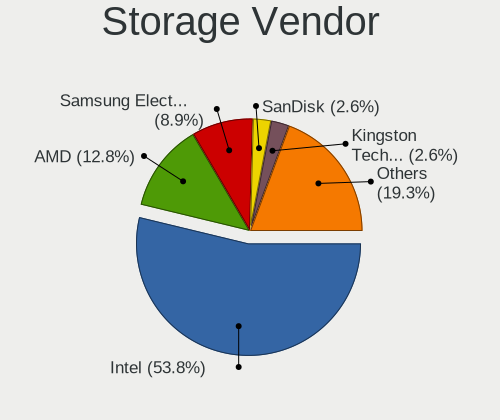
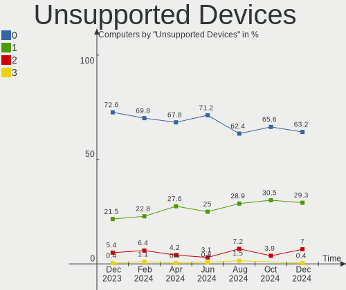

Zorin Hardware Trends
---------------------

A project to identify most popular hardware characteristics and track their change
over time based on data collected by Zorin users at https://Linux-Hardware.org.

Anyone can contribute to the study by uploading probes of their computers by
the [hw-probe](https://github.com/linuxhw/hw-probe) tool:

    sudo hw-probe -all -upload

This is a report for all computer types. See also reports for [desktops](/Dist/Zorin/Desktop/README.md) and [notebooks](/Dist/Zorin/Notebook/README.md).

Full-feature report is available here: https://linux-hardware.org/?view=trends

Period: Apr, 2020.

Contents
--------

- [ OS                       ](#os)
- [ OS Family                ](#os-family)
- [ Kernel                   ](#kernel)
- [ Kernel Family            ](#kernel-family)
- [ Kernel Major Ver.        ](#kernel-major-ver)
- [ Arch                     ](#arch)
- [ DE                       ](#de)
- [ Display Server           ](#display-server)
- [ Display Manager          ](#display-manager)
- [ OS Lang                  ](#os-lang)
- [ Boot Mode                ](#boot-mode)
- [ Filesystem               ](#filesystem)
- [ Dual Boot with Linux/BSD ](#dual-boot-with-linux/bsd)
- [ Dual Boot (Win)          ](#dual-boot-win)
- [ Country                  ](#country)
- [ City                     ](#city)
- [ Vendor                   ](#vendor)
- [ Model                    ](#model)
- [ Model Family             ](#model-family)
- [ MFG Year                 ](#mfg-year)
- [ Form Factor              ](#form-factor)
- [ Secure Boot              ](#secure-boot)
- [ Coreboot                 ](#coreboot)
- [ RAM Size                 ](#ram-size)
- [ RAM Used                 ](#ram-used)
- [ Drive Vendor             ](#drive-vendor)
- [ Drive Model              ](#drive-model)
- [ Drive Kind               ](#drive-kind)
- [ Drive Connector          ](#drive-connector)
- [ Drive Size               ](#drive-size)
- [ Space Total              ](#space-total)
- [ Space Used               ](#space-used)
- [ Malfunc. Drives          ](#malfunc-drives)
- [ Malfunc. Drive Vendor    ](#malfunc-drive-vendor)
- [ Malfunc. Drive Kind      ](#malfunc-drive-kind)
- [ Failed Drives            ](#failed-drives)
- [ Failed Drive Vendor      ](#failed-drive-vendor)
- [ Drive Status             ](#drive-status)
- [ Storage Vendor           ](#storage-vendor)
- [ Storage Model            ](#storage-model)
- [ Storage Kind             ](#storage-kind)
- [ CPU Vendor               ](#cpu-vendor)
- [ CPU Model                ](#cpu-model)
- [ CPU Model Family         ](#cpu-model-family)
- [ CPU Cores                ](#cpu-cores)
- [ CPU Sockets              ](#cpu-sockets)
- [ CPU Threads              ](#cpu-threads)
- [ CPU Op-Modes             ](#cpu-op-modes)
- [ CPU Microarch            ](#cpu-microarch)
- [ CPU Microcode            ](#cpu-microcode)
- [ GPU Vendor               ](#gpu-vendor)
- [ GPU Model                ](#gpu-model)
- [ GPU Combo                ](#gpu-combo)
- [ GPU Driver               ](#gpu-driver)
- [ GPU Memory               ](#gpu-memory)
- [ Monitor Vendor           ](#monitor-vendor)
- [ Monitor Model            ](#monitor-model)
- [ Monitor Resolution       ](#monitor-resolution)
- [ Monitor Diagonal         ](#monitor-diagonal)
- [ Monitor Width            ](#monitor-width)
- [ Aspect Ratio             ](#aspect-ratio)
- [ Monitor Area             ](#monitor-area)
- [ Pixel Density            ](#pixel-density)
- [ Multiple Monitors        ](#multiple-monitors)
- [ Net Controller Vendor    ](#net-controller-vendor)
- [ Net Controller Model     ](#net-controller-model)
- [ Net Controller Kind      ](#net-controller-kind)
- [ Used Controller          ](#used-controller)
- [ NICs                     ](#nics)
- [ Unsupported Devices      ](#unsupported-devices)
- [ Unsupported Device Types ](#unsupported-device-types)

OS
--

Installed operating systems

| Name     | Computers | Percent |
|----------|-----------|---------|
| Zorin 15 | 118       | 92.19%  |
| Zorin 12 | 10        | 7.81%   |

OS Family
---------

OS without a version

| Name  | Computers | Percent |
|-------|-----------|---------|
| Zorin | 128       | 100%    |

Kernel
------

Version of the Linux kernel

| Version           | Computers | Percent |
|-------------------|-----------|---------|
| 5.3.0-46-generic  | 71        | 55.47%  |
| 5.3.0-45-generic  | 24        | 18.75%  |
| 5.3.0-40-generic  | 14        | 10.94%  |
| 4.15.0-91-generic | 5         | 3.91%   |
| 5.3.0-51-generic  | 3         | 2.34%   |
| 5.3.0-42-generic  | 3         | 2.34%   |
| 4.15.0-30-generic | 2         | 1.56%   |
| 5.3.0-47-generic  | 1         | 0.78%   |
| 5.0.0-37-generic  | 1         | 0.78%   |
| 5.0.0-32-generic  | 1         | 0.78%   |
| 4.4.0-176-generic | 1         | 0.78%   |
| 4.15.0-96-generic | 1         | 0.78%   |
| 4.15.0-72-generic | 1         | 0.78%   |

Kernel Family
-------------

Linux kernel without a distro release

| Version | Computers | Percent |
|---------|-----------|---------|
| 5.3.0   | 116       | 90.63%  |
| 4.15.0  | 9         | 7.03%   |
| 5.0.0   | 2         | 1.56%   |
| 4.4.0   | 1         | 0.78%   |

Kernel Major Ver.
-----------------

Linux kernel major version

| Version | Computers | Percent |
|---------|-----------|---------|
| 5.3     | 116       | 90.63%  |
| 4.15    | 9         | 7.03%   |
| 5.0     | 2         | 1.56%   |
| 4.4     | 1         | 0.78%   |

Arch
----

OS architecture (x86_64, i586, etc.)

| Name   | Computers | Percent |
|--------|-----------|---------|
| x86_64 | 103       | 80.47%  |
| i686   | 25        | 19.53%  |

DE
--

Desktop Environment

| Name       | Computers | Percent |
|------------|-----------|---------|
| GNOME      | 87        | 67.97%  |
| XFCE       | 37        | 28.91%  |
| Unknown    | 2         | 1.56%   |
| X-Cinnamon | 1         | 0.78%   |
| KDE        | 1         | 0.78%   |

Display Server
--------------

X11 or Wayland

| Name    | Computers | Percent |
|---------|-----------|---------|
| X11     | 126       | 98.44%  |
| Wayland | 1         | 0.78%   |
| Unknown | 1         | 0.78%   |

Display Manager
---------------

SDDM, LightDM, etc.

| Name    | Computers | Percent |
|---------|-----------|---------|
| Unknown | 127       | 99.22%  |
| LightDM | 1         | 0.78%   |

OS Lang
-------

Language

| Lang  | Computers | Percent |
|-------|-----------|---------|
| en_US | 43        | 33.59%  |
| it_IT | 9         | 7.03%   |
| en_CA | 9         | 7.03%   |
| en_GB | 8         | 6.25%   |
| de_DE | 8         | 6.25%   |
| pt_BR | 5         | 3.91%   |
| fr_FR | 5         | 3.91%   |
| es_ES | 5         | 3.91%   |
| tr_TR | 3         | 2.34%   |
| en_IN | 3         | 2.34%   |
| pt_PT | 2         | 1.56%   |
| es_PE | 2         | 1.56%   |
| es_AR | 2         | 1.56%   |
| en_PH | 2         | 1.56%   |
| de_AT | 2         | 1.56%   |
| C     | 2         | 1.56%   |
| sv_SE | 1         | 0.78%   |
| ru_UA | 1         | 0.78%   |
| ru_RU | 1         | 0.78%   |
| pl_PL | 1         | 0.78%   |
| nl_BE | 1         | 0.78%   |
| ko_KR | 1         | 0.78%   |
| fr_CA | 1         | 0.78%   |
| fi_FI | 1         | 0.78%   |
| es_US | 1         | 0.78%   |
| es_MX | 1         | 0.78%   |
| es_CO | 1         | 0.78%   |
| en_ZA | 1         | 0.78%   |
| en_SG | 1         | 0.78%   |
| en_IL | 1         | 0.78%   |
| en_AU | 1         | 0.78%   |
| el_GR | 1         | 0.78%   |
| cs_CZ | 1         | 0.78%   |
| bs_BA | 1         | 0.78%   |

Boot Mode
---------

EFI or BIOS

| Mode | Computers | Percent |
|------|-----------|---------|
| BIOS | 90        | 70.31%  |
| EFI  | 38        | 29.69%  |

Filesystem
----------

Type of filesystem

| Type    | Computers | Percent |
|---------|-----------|---------|
| Ext4    | 123       | 96.09%  |
| Overlay | 4         | 3.13%   |
| Ext2    | 1         | 0.78%   |

Dual Boot with Linux/BSD
------------------------

Hosting more than one Linux/BSD

| Dual boot | Computers | Percent |
|-----------|-----------|---------|
| No        | 117       | 91.41%  |
| Yes       | 11        | 8.59%   |

Dual Boot (Win)
---------------

Hosting Linux and Windows

| Dual boot | Computers | Percent |
|-----------|-----------|---------|
| No        | 82        | 64.06%  |
| Yes       | 46        | 35.94%  |

Country
-------

Geographic location (country)

| Country                | Computers | Percent |
|------------------------|-----------|---------|
| USA                    | 27        | 21.09%  |
| Canada                 | 10        | 7.81%   |
| Italy                  | 9         | 7.03%   |
| Germany                | 9         | 7.03%   |
| UK                     | 8         | 6.25%   |
| France                 | 5         | 3.91%   |
| Brazil                 | 5         | 3.91%   |
| Spain                  | 4         | 3.13%   |
| Turkey                 | 3         | 2.34%   |
| Mexico                 | 3         | 2.34%   |
| India                  | 3         | 2.34%   |
| Tunisia                | 2         | 1.56%   |
| Portugal               | 2         | 1.56%   |
| Poland                 | 2         | 1.56%   |
| Philippines            | 2         | 1.56%   |
| Peru                   | 2         | 1.56%   |
| Indonesia              | 2         | 1.56%   |
| Greece                 | 2         | 1.56%   |
| Colombia               | 2         | 1.56%   |
| Austria                | 2         | 1.56%   |
| Argentina              | 2         | 1.56%   |
| Ukraine                | 1         | 0.78%   |
| UAE                    | 1         | 0.78%   |
| Sweden                 | 1         | 0.78%   |
| South Africa           | 1         | 0.78%   |
| Slovakia               | 1         | 0.78%   |
| Singapore              | 1         | 0.78%   |
| Serbia                 | 1         | 0.78%   |
| Russia                 | 1         | 0.78%   |
| Romania                | 1         | 0.78%   |
| Norway                 | 1         | 0.78%   |
| New Zealand            | 1         | 0.78%   |
| Lithuania              | 1         | 0.78%   |
| Israel                 | 1         | 0.78%   |
| Hungary                | 1         | 0.78%   |
| Finland                | 1         | 0.78%   |
| Egypt                  | 1         | 0.78%   |
| Czech Republic         | 1         | 0.78%   |
| Bulgaria               | 1         | 0.78%   |
| Bosnia and Herzegovina | 1         | 0.78%   |
| Belgium                | 1         | 0.78%   |
| Bangladesh             | 1         | 0.78%   |
| Australia              | 1         | 0.78%   |

City
----

Geographic location (city)

| City                    | Computers | Percent |
|-------------------------|-----------|---------|
| Toronto                 | 3         | 2.34%   |
| Yalova                  | 2         | 1.56%   |
| Vienna                  | 2         | 1.56%   |
| Oklahoma City           | 2         | 1.56%   |
| Houston                 | 2         | 1.56%   |
| Biarritz                | 2         | 1.56%   |
| Berlin                  | 2         | 1.56%   |
| Zulpich                 | 1         | 0.78%   |
| Zaventem                | 1         | 0.78%   |
| Wimborne Minster        | 1         | 0.78%   |
| West Des Moines         | 1         | 0.78%   |
| Wasilla                 | 1         | 0.78%   |
| Villetelle              | 1         | 0.78%   |
| Villaviciosa de Odon    | 1         | 0.78%   |
| Villaspeciosa           | 1         | 0.78%   |
| Versailles              | 1         | 0.78%   |
| Velddrif                | 1         | 0.78%   |
| Ulm                     | 1         | 0.78%   |
| Tuzla                   | 1         | 0.78%   |
| Turin                   | 1         | 0.78%   |
| Trujillo                | 1         | 0.78%   |
| Timmins                 | 1         | 0.78%   |
| Tijuana                 | 1         | 0.78%   |
| Thrissur                | 1         | 0.78%   |
| Thessaloniki            | 1         | 0.78%   |
| Tel Aviv                | 1         | 0.78%   |
| Tampines New Town       | 1         | 0.78%   |
| Sydney                  | 1         | 0.78%   |
| Surabaya                | 1         | 0.78%   |
| St. Albert              | 1         | 0.78%   |
| Sorocaba                | 1         | 0.78%   |
| Sofia                   | 1         | 0.78%   |
| Sintra                  | 1         | 0.78%   |
| Sevenoaks               | 1         | 0.78%   |
| Sestri Levante          | 1         | 0.78%   |
| Scarborough             | 1         | 0.78%   |
| Sant Andreu de la Barca | 1         | 0.78%   |
| Saint-Avold             | 1         | 0.78%   |
| Saeffle                 | 1         | 0.78%   |
| Robinson                | 1         | 0.78%   |
| Rialto                  | 1         | 0.78%   |
| Quijingue               | 1         | 0.78%   |
| Querétaro City         | 1         | 0.78%   |
| Písek                  | 1         | 0.78%   |
| Porvoo                  | 1         | 0.78%   |
| Portland                | 1         | 0.78%   |
| Piquillin               | 1         | 0.78%   |
| Phoenix                 | 1         | 0.78%   |
| Oslo                    | 1         | 0.78%   |
| Osasco                  | 1         | 0.78%   |
| Novi Sad                | 1         | 0.78%   |
| Northampton             | 1         | 0.78%   |
| New Delhi               | 1         | 0.78%   |
| Neuwied                 | 1         | 0.78%   |
| Nelson                  | 1         | 0.78%   |
| Naples                  | 1         | 0.78%   |
| Nagpur                  | 1         | 0.78%   |
| Mogilno                 | 1         | 0.78%   |
| Milan                   | 1         | 0.78%   |
| Mestre                  | 1         | 0.78%   |

Vendor
------

Motherboard manufacturer

| Name                            | Computers | Percent |
|---------------------------------|-----------|---------|
| Hewlett-Packard                 | 23        | 17.97%  |
| Dell                            | 21        | 16.41%  |
| Lenovo                          | 15        | 11.72%  |
| ASUSTek Computer                | 13        | 10.16%  |
| Acer                            | 11        | 8.59%   |
| Toshiba                         | 6         | 4.69%   |
| MSI                             | 5         | 3.91%   |
| Gigabyte Technology             | 4         | 3.13%   |
| Sony                            | 3         | 2.34%   |
| ASRock                          | 3         | 2.34%   |
| Samsung Electronics             | 2         | 1.56%   |
| Gateway                         | 2         | 1.56%   |
| Clevo                           | 2         | 1.56%   |
| Apple                           | 2         | 1.56%   |
| Universal Exports Group Limited | 1         | 0.78%   |
| Pegatron                        | 1         | 0.78%   |
| PCChips                         | 1         | 0.78%   |
| Packard Bell                    | 1         | 0.78%   |
| Nuvision                        | 1         | 0.78%   |
| Notebook                        | 1         | 0.78%   |
| NEC Computers                   | 1         | 0.78%   |
| Medion                          | 1         | 0.78%   |
| IBM                             | 1         | 0.78%   |
| Fujitsu Siemens                 | 1         | 0.78%   |
| Fujitsu                         | 1         | 0.78%   |
| Ematic                          | 1         | 0.78%   |
| eMachines                       | 1         | 0.78%   |
| ECS                             | 1         | 0.78%   |
| Dixonsxp                        | 1         | 0.78%   |
| AXIOO                           | 1         | 0.78%   |

Model
-----

Motherboard model

| Name                                            | Computers | Percent |
|-------------------------------------------------|-----------|---------|
| Dell Latitude E6410                             | 2         | 1.56%   |
| Universal Exports Group Limited ITL 1161-32     | 1         | 0.78%   |
| Toshiba Satellite L550                          | 1         | 0.78%   |
| Toshiba Satellite L450                          | 1         | 0.78%   |
| Toshiba Satellite C855D                         | 1         | 0.78%   |
| Toshiba Satellite C850D-B810                    | 1         | 0.78%   |
| Toshiba Satellite A200                          | 1         | 0.78%   |
| Toshiba Satellite A100                          | 1         | 0.78%   |
| Sony VPCYB35AL                                  | 1         | 0.78%   |
| Sony VPCEB3M1E                                  | 1         | 0.78%   |
| Sony VGN-AW11Z_B                                | 1         | 0.78%   |
| Samsung Electronics RV410/RV510/S3510/E3510     | 1         | 0.78%   |
| Samsung Electronics 905S3G/906S3G/915S3G/9305SG | 1         | 0.78%   |
| Pegatron AY643AA-ABA s5310f                     | 1         | 0.78%   |
| PCChips P49G                                    | 1         | 0.78%   |
| Packard Bell EasyNote TJ65                      | 1         | 0.78%   |
| Nuvision NES11                                  | 1         | 0.78%   |
| Notebook N750BU                                 | 1         | 0.78%   |
| NEC Computers PC-VY24GXZ7A                      | 1         | 0.78%   |
| MSI Ver.001                                     | 1         | 0.78%   |
| MSI MS-7721                                     | 1         | 0.78%   |
| MSI MS-7267                                     | 1         | 0.78%   |
| MSI MS-1688                                     | 1         | 0.78%   |
| MSI GT72 2PC                                    | 1         | 0.78%   |
| Medion E5217                                    | 1         | 0.78%   |
| Lenovo Yoga C740-15IML 81TD                     | 1         | 0.78%   |
| Lenovo V130-15IGM 81HL                          | 1         | 0.78%   |
| Lenovo ThinkPad X60 1707Y91                     | 1         | 0.78%   |
| Lenovo ThinkPad T440s 20AQ009HUS                | 1         | 0.78%   |
| Lenovo ThinkPad T420 42368H6                    | 1         | 0.78%   |
| Lenovo ThinkPad Edge E440 20C5007MRI            | 1         | 0.78%   |
| Lenovo ThinkPad 11e 20DAS0YW00                  | 1         | 0.78%   |
| Lenovo IdeaPad S130-11IGM 81J1                  | 1         | 0.78%   |
| Lenovo IdeaPad 520-15IKB 80YL                   | 1         | 0.78%   |
| Lenovo IdeaPad 330-15IKB 81DC                   | 1         | 0.78%   |
| Lenovo IdeaPad 330-14AST 81D5                   | 1         | 0.78%   |
| Lenovo IdeaPad 100S-14IBR 80R9                  | 1         | 0.78%   |
| Lenovo IdeaCentre Q180 10087&3110               | 1         | 0.78%   |
| Lenovo IdeaCentre A340-24IWL F0E800FNGE         | 1         | 0.78%   |
| Lenovo G580 20157                               | 1         | 0.78%   |
| IBM ThinkPad X40 2371H4G                        | 1         | 0.78%   |
| HP Stream Laptop 14-ax0XX                       | 1         | 0.78%   |
| HP rp5800                                       | 1         | 0.78%   |
| HP ProBook 450 G2                               | 1         | 0.78%   |
| HP Presario V3700                               | 1         | 0.78%   |
| HP Pavilion dv9500                              | 1         | 0.78%   |
| HP Pavilion dv6                                 | 1         | 0.78%   |
| HP Pavilion dv1000 (ET735UA#ABL)                | 1         | 0.78%   |
| HP Pavilion All-in-One 24-xa0xxx                | 1         | 0.78%   |
| HP Pavilion 17                                  | 1         | 0.78%   |
| HP Pavilion 15                                  | 1         | 0.78%   |
| HP Mini 5103                                    | 1         | 0.78%   |
| HP Laptop 15-dw0xxx                             | 1         | 0.78%   |
| HP Laptop 15-da0xxx                             | 1         | 0.78%   |
| HP Gaming PC                                    | 1         | 0.78%   |
| HP G62                                          | 1         | 0.78%   |
| HP EliteBook 8460p                              | 1         | 0.78%   |
| HP Compaq Presario CQ60                         | 1         | 0.78%   |
| HP Compaq Mini 110c-1100                        | 1         | 0.78%   |
| HP Compaq dc5850 Small Form Factor              | 1         | 0.78%   |

Model Family
------------

Motherboard model prefix

| Name                                | Computers | Percent |
|-------------------------------------|-----------|---------|
| Dell Latitude                       | 8         | 6.25%   |
| Dell Inspiron                       | 7         | 5.47%   |
| Toshiba Satellite                   | 6         | 4.69%   |
| HP Pavilion                         | 6         | 4.69%   |
| Lenovo ThinkPad                     | 5         | 3.91%   |
| Lenovo IdeaPad                      | 5         | 3.91%   |
| Acer Aspire                         | 5         | 3.91%   |
| HP Compaq                           | 3         | 2.34%   |
| Dell OptiPlex                       | 3         | 2.34%   |
| Acer Nitro                          | 3         | 2.34%   |
| Lenovo IdeaCentre                   | 2         | 1.56%   |
| HP Laptop                           | 2         | 1.56%   |
| Universal Exports Group Limited ITL | 1         | 0.78%   |
| Sony VPCYB35AL                      | 1         | 0.78%   |
| Sony VPCEB3M1E                      | 1         | 0.78%   |
| Sony VGN-AW11Z                      | 1         | 0.78%   |
| Samsung Electronics RV410           | 1         | 0.78%   |
| Samsung Electronics 905S3G          | 1         | 0.78%   |
| Pegatron AY643AA-ABA                | 1         | 0.78%   |
| PCChips P49G                        | 1         | 0.78%   |
| Packard Bell EasyNote               | 1         | 0.78%   |
| Nuvision NES11                      | 1         | 0.78%   |
| Notebook N750BU                     | 1         | 0.78%   |
| NEC Computers PC-VY24GXZ7A          | 1         | 0.78%   |
| MSI Ver.001                         | 1         | 0.78%   |
| MSI MS-7721                         | 1         | 0.78%   |
| MSI MS-7267                         | 1         | 0.78%   |
| MSI MS-1688                         | 1         | 0.78%   |
| MSI GT72                            | 1         | 0.78%   |
| Medion E5217                        | 1         | 0.78%   |
| Lenovo Yoga                         | 1         | 0.78%   |
| Lenovo V130-15IGM                   | 1         | 0.78%   |
| Lenovo G580                         | 1         | 0.78%   |
| IBM ThinkPad                        | 1         | 0.78%   |
| HP Stream                           | 1         | 0.78%   |
| HP rp5800                           | 1         | 0.78%   |
| HP ProBook                          | 1         | 0.78%   |
| HP Presario                         | 1         | 0.78%   |
| HP Mini                             | 1         | 0.78%   |
| HP Gaming                           | 1         | 0.78%   |
| HP G62                              | 1         | 0.78%   |
| HP EliteBook                        | 1         | 0.78%   |
| HP 550                              | 1         | 0.78%   |
| HP 255                              | 1         | 0.78%   |
| HP 2133                             | 1         | 0.78%   |
| HP 15                               | 1         | 0.78%   |
| Gigabyte H67M-D2-B3                 | 1         | 0.78%   |
| Gigabyte GA-78LMT-USB3              | 1         | 0.78%   |
| Gigabyte AM1M-S2H                   | 1         | 0.78%   |
| Gigabyte 970A-DS3P                  | 1         | 0.78%   |
| Gateway MX3225                      | 1         | 0.78%   |
| Gateway ML6228                      | 1         | 0.78%   |
| Fujitsu Siemens AMILO               | 1         | 0.78%   |
| Fujitsu ESPRIMO                     | 1         | 0.78%   |
| Ematic EW147                        | 1         | 0.78%   |
| eMachines G630                      | 1         | 0.78%   |
| ECS MCP61M-M3                       | 1         | 0.78%   |
| Dell Vostro                         | 1         | 0.78%   |
| Dell Precision                      | 1         | 0.78%   |
| Dell DM051                          | 1         | 0.78%   |

MFG Year
--------

Motherboard manufacture year

| Year | Computers | Percent |
|------|-----------|---------|
| 2019 | 20        | 15.63%  |
| 2008 | 14        | 10.94%  |
| 2010 | 12        | 9.38%   |
| 2009 | 10        | 7.81%   |
| 2013 | 9         | 7.03%   |
| 2011 | 9         | 7.03%   |
| 2007 | 9         | 7.03%   |
| 2018 | 8         | 6.25%   |
| 2015 | 8         | 6.25%   |
| 2014 | 8         | 6.25%   |
| 2006 | 6         | 4.69%   |
| 2012 | 5         | 3.91%   |
| 2016 | 4         | 3.13%   |
| 2017 | 3         | 2.34%   |
| 2005 | 2         | 1.56%   |
| 2020 | 1         | 0.78%   |

Form Factor
-----------

Physical design of the computer

| Name        | Computers | Percent |
|-------------|-----------|---------|
| Notebook    | 94        | 73.44%  |
| Desktop     | 29        | 22.66%  |
| All in one  | 3         | 2.34%   |
| Convertible | 2         | 1.56%   |

Secure Boot
-----------

Enabled or disabled

| State    | Computers | Percent |
|----------|-----------|---------|
| Disabled | 117       | 91.41%  |
| Enabled  | 11        | 8.59%   |

Coreboot
--------

Have coreboot on board

| Used | Computers | Percent |
|------|-----------|---------|
| No   | 128       | 100%    |

RAM Size
--------

Total RAM memory

| Size in GB  | Computers | Percent |
|-------------|-----------|---------|
| 3.01-4.0    | 50        | 39.06%  |
| 1.01-2.0    | 24        | 18.75%  |
| 4.01-8.0    | 22        | 17.19%  |
| 8.01-16.0   | 13        | 10.16%  |
| 16.01-24.0  | 8         | 6.25%   |
| 2.01-3.0    | 6         | 4.69%   |
| 0.01-1.0    | 3         | 2.34%   |
| 24.01-32.0  | 1         | 0.78%   |
| 64.01-256.0 | 1         | 0.78%   |

RAM Used
--------

Used RAM memory

| Used GB   | Computers | Percent |
|-----------|-----------|---------|
| 1.01-2.0  | 62        | 48.44%  |
| 2.01-3.0  | 32        | 25%     |
| 0.01-1.0  | 22        | 17.19%  |
| 4.01-8.0  | 6         | 4.69%   |
| 3.01-4.0  | 4         | 3.13%   |
| 8.01-16.0 | 2         | 1.56%   |

Drive Vendor
------------

Hard drive vendors

| Vendor              | Computers | Drives | Percent |
|---------------------|-----------|--------|---------|
| Seagate             | 31        | 32     | 21.09%  |
| WDC                 | 25        | 27     | 17.01%  |
| Hitachi             | 17        | 17     | 11.56%  |
| Samsung Electronics | 15        | 19     | 10.2%   |
| Toshiba             | 11        | 12     | 7.48%   |
| Unknown             | 9         | 14     | 6.12%   |
| Crucial             | 7         | 7      | 4.76%   |
| Kingston            | 6         | 7      | 4.08%   |
| Fujitsu             | 4         | 4      | 2.72%   |
| SK Hynix            | 3         | 3      | 2.04%   |
| SanDisk             | 2         | 2      | 1.36%   |
| HGST                | 2         | 2      | 1.36%   |
| Transcend           | 1         | 1      | 0.68%   |
| TO Exter            | 1         | 1      | 0.68%   |
| SPCC                | 1         | 1      | 0.68%   |
| SABRENT             | 1         | 1      | 0.68%   |
| Patriot             | 1         | 1      | 0.68%   |
| OWC                 | 1         | 1      | 0.68%   |
| Maxtor              | 1         | 2      | 0.68%   |
| LITEONIT            | 1         | 1      | 0.68%   |
| LITEON              | 1         | 1      | 0.68%   |
| KINGMAX             | 1         | 1      | 0.68%   |
| KingDian            | 1         | 1      | 0.68%   |
| Intenso             | 1         | 1      | 0.68%   |
| HL-DT-ST            | 1         | 1      | 0.68%   |
| DOGFISH             | 1         | 1      | 0.68%   |
| A-DATA Technology   | 1         | 1      | 0.68%   |

Drive Model
-----------

Hard drive models

| Model                        | Computers | Percent |
|------------------------------|-----------|---------|
| MMC Card  32GB               | 6         | 3.77%   |
| ST2000LM007-1R8174 2TB       | 3         | 1.89%   |
| SA400S37480G 480GB SSD       | 3         | 1.89%   |
| SA400S37120G 120GB SSD       | 3         | 1.89%   |
| MMC Card  64GB               | 3         | 1.89%   |
| WD5000BEVT-22A0RT0 500GB     | 2         | 1.26%   |
| ST500LT012-1DG142 500GB      | 2         | 1.26%   |
| ST500DM002-1BD142 500GB      | 2         | 1.26%   |
| ST31000528AS 1TB             | 2         | 1.26%   |
| SSD 860 EVO 250GB            | 2         | 1.26%   |
| MQ04ABF100 1TB               | 2         | 1.26%   |
| HTS545050A7E380 500GB        | 2         | 1.26%   |
| HTS545032B9A300 320GB        | 2         | 1.26%   |
| HTS541612J9SA00 120GB        | 2         | 1.26%   |
| HD161HJ 160GB                | 2         | 1.26%   |
| CT500MX500SSD1 500GB         | 2         | 1.26%   |
| WDS250G2B0B-00YS70 250GB SSD | 1         | 0.63%   |
| WDS120G2G0B-00EPW0 120GB SSD | 1         | 0.63%   |
| WD800BD-22MRA1 80GB          | 1         | 0.63%   |
| WD6400AAKS-65A7B2 640GB      | 1         | 0.63%   |
| WD5000LPVX-80V0TT0 500GB     | 1         | 0.63%   |
| WD5000LPVX-22V0TT0 500GB     | 1         | 0.63%   |
| WD5000LPVT-22G33T0 500GB     | 1         | 0.63%   |
| WD5000BPVT-24HXZT1 500GB     | 1         | 0.63%   |
| WD5000AZLX-60K2TA0 500GB     | 1         | 0.63%   |
| WD5000AAKS-75A7B0 500GB      | 1         | 0.63%   |
| WD40EFRX-68N32N0 4TB         | 1         | 0.63%   |
| WD3200BUCT-63TWBY0 320GB     | 1         | 0.63%   |
| WD3200BEVT-60ZCT1 320GB      | 1         | 0.63%   |
| WD3200BEVS-26VAT0 320GB      | 1         | 0.63%   |
| WD3200BEKT-60PVMT0 320GB     | 1         | 0.63%   |
| WD3200AAJS-56B4A0 320GB      | 1         | 0.63%   |
| WD2500BEVT-22ZCT0 250GB      | 1         | 0.63%   |
| WD2500BEKT-60PVMT0 250GB     | 1         | 0.63%   |
| WD20SPZX-60UA7T0 2TB         | 1         | 0.63%   |
| WD1600BEVS-60RST0 160GB      | 1         | 0.63%   |
| WD1200BEVT-22ZCT0 120GB      | 1         | 0.63%   |
| WD10SPZX-22Z10T1 1TB         | 1         | 0.63%   |
| WD10SPZX-21Z10T0 1TB         | 1         | 0.63%   |
| WD10EZRX-00L4HB0 1TB         | 1         | 0.63%   |
| WD10EZEX-00RKKA0 1TB         | 1         | 0.63%   |
| TS480GJDM720 480GB SSD       | 1         | 0.63%   |
| SV2001H 20GB                 | 1         | 0.63%   |
| SUV500120G 120GB SSD         | 1         | 0.63%   |
| ST9500325AS 500GB            | 1         | 0.63%   |
| ST9250315AS 250GB            | 1         | 0.63%   |
| ST9120823ASG 111XGB          | 1         | 0.63%   |
| ST9120817AS 120GB            | 1         | 0.63%   |
| ST500LM021-1KJ152 500GB      | 1         | 0.63%   |
| ST500LM012 HN-M500MBB 500GB  | 1         | 0.63%   |
| ST500LM000-1EJ162 500GB      | 1         | 0.63%   |
| ST500DM002-1SB10A 500GB      | 1         | 0.63%   |
| ST380815AS 80GB              | 1         | 0.63%   |
| ST380013AS 80GB              | 1         | 0.63%   |
| ST3500312CS 500GB            | 1         | 0.63%   |
| ST3400633AS 400GB            | 1         | 0.63%   |
| ST3200826AS 200GB            | 1         | 0.63%   |
| ST31000525SV 1TB             | 1         | 0.63%   |
| ST31000524AS 1TB             | 1         | 0.63%   |
| ST3000DM001-1CH166 3TB       | 1         | 0.63%   |

Drive Kind
----------

HDD or SSD

| Kind    | Computers | Drives | Percent |
|---------|-----------|--------|---------|
| HDD     | 90        | 104    | 64.29%  |
| SSD     | 38        | 41     | 27.14%  |
| MMC     | 9         | 14     | 6.43%   |
| Unknown | 3         | 3      | 2.14%   |

Drive Connector
---------------

SATA, SAS, NVMe, etc.

| Type | Computers | Drives | Percent |
|------|-----------|--------|---------|
| SATA | 117       | 143    | 89.31%  |
| MMC  | 9         | 14     | 6.87%   |
| SAS  | 5         | 5      | 3.82%   |

Drive Size
----------

Size of hard drive

| Size in TB | Computers | Drives | Percent |
|------------|-----------|--------|---------|
| 0.01-0.5   | 109       | 128    | 77.3%   |
| 0.51-1.0   | 22        | 24     | 15.6%   |
| 1.01-2.0   | 8         | 8      | 5.67%   |
| 3.01-4.0   | 1         | 1      | 0.71%   |
| 2.01-3.0   | 1         | 1      | 0.71%   |

Space Total
-----------

Amount of disk space available on the file system

| Size in GB     | Computers | Percent |
|----------------|-----------|---------|
| 101-250        | 39        | 30.47%  |
| 251-500        | 33        | 25.78%  |
| 51-100         | 17        | 13.28%  |
| 21-50          | 14        | 10.94%  |
| 1001-2000      | 9         | 7.03%   |
| 501-1000       | 8         | 6.25%   |
| 1-20           | 5         | 3.91%   |
| More than 3000 | 2         | 1.56%   |
| 2001-3000      | 1         | 0.78%   |

Space Used
----------

Amount of used disk space

| Used GB   | Computers | Percent |
|-----------|-----------|---------|
| 1-20      | 80        | 62.5%   |
| 21-50     | 18        | 14.06%  |
| 101-250   | 14        | 10.94%  |
| 51-100    | 9         | 7.03%   |
| 251-500   | 4         | 3.13%   |
| 1001-2000 | 2         | 1.56%   |
| 501-1000  | 1         | 0.78%   |

Malfunc. Drives
---------------

Drive models with a malfunction

Zero info for selected period =(

Malfunc. Drive Vendor
---------------------

Vendors of faulty drives

Zero info for selected period =(

Malfunc. Drive Kind
-------------------

Kinds of faulty drives

Zero info for selected period =(

Failed Drives
-------------

Failed drive models

Zero info for selected period =(

Failed Drive Vendor
-------------------

Failed drive vendors

Zero info for selected period =(

Drive Status
------------

Number of failed and malfunc. drives

| Status   | Computers | Drives | Percent |
|----------|-----------|--------|---------|
| Detected | 126       | 162    | 100%    |

Storage Vendor
--------------

Storage controller vendors

| Vendor                           | Computers | Percent |
|----------------------------------|-----------|---------|
| Intel                            | 94        | 71.76%  |
| AMD                              | 19        | 14.5%   |
| Nvidia                           | 5         | 3.82%   |
| VIA Technologies                 | 4         | 3.05%   |
| JMicron Technology               | 3         | 2.29%   |
| Samsung Electronics              | 2         | 1.53%   |
| Silicon Integrated Systems [SiS] | 1         | 0.76%   |
| Silicon Image                    | 1         | 0.76%   |
| Phison Electronics               | 1         | 0.76%   |
| Micron Technology                | 1         | 0.76%   |

Storage Model
-------------

Storage controller models

| Model                                                                      | Computers | Percent |
|----------------------------------------------------------------------------|-----------|---------|
| FCH SATA Controller [AHCI mode]                                            | 11        | 6.63%   |
| 82801 Mobile SATA Controller [RAID mode]                                   | 10        | 6.02%   |
| 82801G (ICH7 Family) IDE Controller                                        | 9         | 5.42%   |
| NM10/ICH7 Family SATA Controller [IDE mode]                                | 7         | 4.22%   |
| 82801IBM/IEM (ICH9M/ICH9M-E) 4 port SATA Controller [AHCI mode]            | 7         | 4.22%   |
| 82801GBM/GHM (ICH7-M Family) SATA Controller [IDE mode]                    | 7         | 4.22%   |
| 82801HM/HEM (ICH8M/ICH8M-E) IDE Controller                                 | 6         | 3.61%   |
| 8 Series SATA Controller 1 [AHCI mode]                                     | 6         | 3.61%   |
| Sunrise Point-LP SATA Controller [AHCI mode]                               | 5         | 3.01%   |
| 82801HM/HEM (ICH8M/ICH8M-E) SATA Controller [AHCI mode]                    | 5         | 3.01%   |
| 6 Series/C200 Series Chipset Family 6 port Desktop SATA AHCI Controller    | 5         | 3.01%   |
| 5 Series/3400 Series Chipset 4 port SATA AHCI Controller                   | 5         | 3.01%   |
| SB7x0/SB8x0/SB9x0 SATA Controller [IDE mode]                               | 4         | 2.41%   |
| 7 Series Chipset Family 6-port SATA Controller [AHCI mode]                 | 4         | 2.41%   |
| VT82C586A/B/VT82C686/A/B/VT823x/A/C PIPC Bus Master IDE                    | 3         | 1.81%   |
| SATA Controller [RAID mode]                                                | 3         | 1.81%   |
| MCP61 SATA Controller                                                      | 3         | 1.81%   |
| Atom Processor E3800 Series SATA AHCI Controller                           | 3         | 1.81%   |
| 82801GBM/GHM (ICH7-M Family) SATA Controller [AHCI mode]                   | 3         | 1.81%   |
| 6 Series/C200 Series Chipset Family 6 port Mobile SATA AHCI Controller     | 3         | 1.81%   |
| SSD 660P Series                                                            | 2         | 1.2%    |
| SB7x0/SB8x0/SB9x0 SATA Controller [AHCI mode]                              | 2         | 1.2%    |
| SB7x0/SB8x0/SB9x0 IDE Controller                                           | 2         | 1.2%    |
| SATA controller                                                            | 2         | 1.2%    |
| NVMe SSD Controller SM981/PM981/PM983                                      | 2         | 1.2%    |
| MCP61 IDE                                                                  | 2         | 1.2%    |
| JMB368 IDE controller                                                      | 2         | 1.2%    |
| Comet Lake SATA AHCI Controller                                            | 2         | 1.2%    |
| 8 Series/C220 Series Chipset Family 6-port SATA Controller 1 [AHCI mode]   | 2         | 1.2%    |
| X399 Series Chipset SATA Controller                                        | 1         | 0.6%    |
| VT8237A SATA 2-Port Controller                                             | 1         | 0.6%    |
| VT8237/8251 Serial ATA Controller                                          | 1         | 0.6%    |
| VIA VT6420 SATA RAID Controller                                            | 1         | 0.6%    |
| SB600 Non-Raid-5 SATA                                                      | 1         | 0.6%    |
| SB600 IDE                                                                  | 1         | 0.6%    |
| SATA Controller / IDE mode                                                 | 1         | 0.6%    |
| PCI0680 Ultra ATA-133 Host Controller                                      | 1         | 0.6%    |
| NVMe Storage Controller                                                    | 1         | 0.6%    |
| Non-Volatile memory controller                                             | 1         | 0.6%    |
| NM10/ICH7 Family SATA Controller [AHCI mode]                               | 1         | 0.6%    |
| MCP78S [GeForce 8200] SATA Controller (non-AHCI mode)                      | 1         | 0.6%    |
| MCP78S [GeForce 8200] IDE                                                  | 1         | 0.6%    |
| MCP67 IDE Controller                                                       | 1         | 0.6%    |
| MCP67 AHCI Controller                                                      | 1         | 0.6%    |
| JMB360 AHCI Controller                                                     | 1         | 0.6%    |
| HM170/QM170 Chipset SATA Controller [AHCI Mode]                            | 1         | 0.6%    |
| FCH SATA Controller [IDE mode]                                             | 1         | 0.6%    |
| FCH SATA Controller D                                                      | 1         | 0.6%    |
| FCH IDE Controller                                                         | 1         | 0.6%    |
| Celeron N3350/Pentium N4200/Atom E3900 Series SATA AHCI Controller         | 1         | 0.6%    |
| Cannon Lake PCH SATA AHCI Controller                                       | 1         | 0.6%    |
| Atom/Celeron/Pentium Processor x5-E8000/J3xxx/N3xxx Series SATA Controller | 1         | 0.6%    |
| Atom Processor E3800 Series SATA IDE Controller                            | 1         | 0.6%    |
| 9 Series Chipset Family SATA Controller [AHCI Mode]                        | 1         | 0.6%    |
| 82801JD/DO (ICH10 Family) SATA AHCI Controller                             | 1         | 0.6%    |
| 82801HR/HO/HH (ICH8R/DO/DH) 2 port SATA Controller [IDE mode]              | 1         | 0.6%    |
| 82801HM/HEM (ICH8M/ICH8M-E) SATA Controller [IDE mode]                     | 1         | 0.6%    |
| 82801H (ICH8 Family) 4 port SATA Controller [IDE mode]                     | 1         | 0.6%    |
| 82801FB/FBM/FR/FW/FRW (ICH6 Family) IDE Controller                         | 1         | 0.6%    |
| 82801DBM (ICH4-M) IDE Controller                                           | 1         | 0.6%    |

Storage Kind
------------

Kind of storage controller (IDE, SATA, NVMe, SAS, ...)

| Kind | Computers | Percent |
|------|-----------|---------|
| SATA | 79        | 54.48%  |
| IDE  | 46        | 31.72%  |
| RAID | 14        | 9.66%   |
| NVMe | 6         | 4.14%   |

CPU Vendor
----------

Processor vendors

| Vendor       | Computers | Percent |
|--------------|-----------|---------|
| Intel        | 103       | 80.47%  |
| AMD          | 24        | 18.75%  |
| CentaurHauls | 1         | 0.78%   |

CPU Model
---------

Processor models

| Model                                       | Computers | Percent |
|---------------------------------------------|-----------|---------|
| Intel Genuine CPU T2300 @ 1.66GHz           | 3         | 2.34%   |
| Intel Core i5-2400 CPU @ 3.10GHz            | 3         | 2.34%   |
| Intel Pentium Dual CPU E2180 @ 2.00GHz      | 2         | 1.56%   |
| Intel Core i7-8550U CPU @ 1.80GHz           | 2         | 1.56%   |
| Intel Core i5-7200U CPU @ 2.50GHz           | 2         | 1.56%   |
| Intel Core i5-2520M CPU @ 2.50GHz           | 2         | 1.56%   |
| Intel Core 2 Duo CPU T6500 @ 2.10GHz        | 2         | 1.56%   |
| Intel Core 2 CPU T5500 @ 1.66GHz            | 2         | 1.56%   |
| Intel Celeron N4000 CPU @ 1.10GHz           | 2         | 1.56%   |
| Intel Celeron CPU N3060 @ 1.60GHz           | 2         | 1.56%   |
| Intel Atom x5-Z8350 CPU @ 1.44GHz           | 2         | 1.56%   |
| Intel Atom CPU N270 @ 1.60GHz               | 2         | 1.56%   |
| Intel Xeon CPU E31245 @ 3.30GHz             | 1         | 0.78%   |
| Intel Pentium M processor 1.40GHz           | 1         | 0.78%   |
| Intel Pentium M processor 1.10GHz           | 1         | 0.78%   |
| Intel Pentium Dual-Core CPU T4400 @ 2.20GHz | 1         | 0.78%   |
| Intel Pentium Dual-Core CPU E5300 @ 2.60GHz | 1         | 0.78%   |
| Intel Pentium Dual CPU T2310 @ 1.46GHz      | 1         | 0.78%   |
| Intel Pentium D CPU 2.80GHz                 | 1         | 0.78%   |
| Intel Pentium CPU P6200 @ 2.13GHz           | 1         | 0.78%   |
| Intel Pentium CPU G630 @ 2.70GHz            | 1         | 0.78%   |
| Intel Pentium CPU 2117U @ 1.80GHz           | 1         | 0.78%   |
| Intel Pentium 4 CPU 3.00GHz                 | 1         | 0.78%   |
| Intel Genuine CPU T2060 @ 1.60GHz           | 1         | 0.78%   |
| Intel Genuine CPU 585 @ 2.16GHz             | 1         | 0.78%   |
| Intel Core m3-7Y30 CPU @ 1.00GHz            | 1         | 0.78%   |
| Intel Core i7-9700T CPU @ 2.00GHz           | 1         | 0.78%   |
| Intel Core i7-9700 CPU @ 3.00GHz            | 1         | 0.78%   |
| Intel Core i7-8565U CPU @ 1.80GHz           | 1         | 0.78%   |
| Intel Core i7-7500U CPU @ 2.70GHz           | 1         | 0.78%   |
| Intel Core i7-4710HQ CPU @ 2.50GHz          | 1         | 0.78%   |
| Intel Core i7-4610M CPU @ 3.00GHz           | 1         | 0.78%   |
| Intel Core i7-4600U CPU @ 2.10GHz           | 1         | 0.78%   |
| Intel Core i7-4510U CPU @ 2.00GHz           | 1         | 0.78%   |
| Intel Core i7-3630QM CPU @ 2.40GHz          | 1         | 0.78%   |
| Intel Core i7-3615QM CPU @ 2.30GHz          | 1         | 0.78%   |
| Intel Core i7-2677M CPU @ 1.80GHz           | 1         | 0.78%   |
| Intel Core i7 CPU M 620 @ 2.67GHz           | 1         | 0.78%   |
| Intel Core i5-8250U CPU @ 1.60GHz           | 1         | 0.78%   |
| Intel Core i5-7300HQ CPU @ 2.50GHz          | 1         | 0.78%   |
| Intel Core i5-5300U CPU @ 2.30GHz           | 1         | 0.78%   |
| Intel Core i5-4690K CPU @ 3.50GHz           | 1         | 0.78%   |
| Intel Core i5-4210U CPU @ 1.70GHz           | 1         | 0.78%   |
| Intel Core i5-4200U CPU @ 1.60GHz           | 1         | 0.78%   |
| Intel Core i5-10210U CPU @ 1.60GHz          | 1         | 0.78%   |
| Intel Core i5 CPU M 560 @ 2.67GHz           | 1         | 0.78%   |
| Intel Core i5 CPU M 540 @ 2.53GHz           | 1         | 0.78%   |
| Intel Core i5 CPU M 520 @ 2.40GHz           | 1         | 0.78%   |
| Intel Core i5 CPU M 480 @ 2.67GHz           | 1         | 0.78%   |
| Intel Core i5 CPU M 430 @ 2.27GHz           | 1         | 0.78%   |
| Intel Core i3-7100U CPU @ 2.40GHz           | 1         | 0.78%   |
| Intel Core i3-4005U CPU @ 1.70GHz           | 1         | 0.78%   |
| Intel Core i3-4000M CPU @ 2.40GHz           | 1         | 0.78%   |
| Intel Core i3-2365M CPU @ 1.40GHz           | 1         | 0.78%   |
| Intel Core i3-2310M CPU @ 2.10GHz           | 1         | 0.78%   |
| Intel Core i3-2120 CPU @ 3.30GHz            | 1         | 0.78%   |
| Intel Core i3-10110U CPU @ 2.10GHz          | 1         | 0.78%   |
| Intel Core i3 CPU M 370 @ 2.40GHz           | 1         | 0.78%   |
| Intel Core i3 CPU M 330 @ 2.13GHz           | 1         | 0.78%   |
| Intel Core 2 Quad CPU Q9650 @ 3.00GHz       | 1         | 0.78%   |

CPU Model Family
----------------

Processor model prefix

| Model                   | Computers | Percent |
|-------------------------|-----------|---------|
| Intel Core i5           | 19        | 14.84%  |
| Intel Core i7           | 14        | 10.94%  |
| Intel Core 2 Duo        | 14        | 10.94%  |
| Intel Celeron           | 11        | 8.59%   |
| Intel Core i3           | 9         | 7.03%   |
| Intel Atom              | 8         | 6.25%   |
| Intel Genuine           | 5         | 3.91%   |
| Intel Pentium Dual      | 3         | 2.34%   |
| Intel Pentium           | 3         | 2.34%   |
| Intel Core 2            | 3         | 2.34%   |
| Intel Celeron M         | 3         | 2.34%   |
| Intel Pentium M         | 2         | 1.56%   |
| Intel Pentium Dual-Core | 2         | 1.56%   |
| Intel Core 2 Quad       | 2         | 1.56%   |
| AMD Ryzen 5             | 2         | 1.56%   |
| AMD FX                  | 2         | 1.56%   |
| AMD E1                  | 2         | 1.56%   |
| AMD Athlon              | 2         | 1.56%   |
| AMD A6                  | 2         | 1.56%   |
| Intel Xeon              | 1         | 0.78%   |
| Intel Pentium D         | 1         | 0.78%   |
| Intel Pentium 4         | 1         | 0.78%   |
| Intel Core m3           | 1         | 0.78%   |
| Intel Celeron Dual-Core | 1         | 0.78%   |
| CentaurHauls VIA C7     | 1         | 0.78%   |
| AMD Sempron             | 1         | 0.78%   |
| AMD Ryzen Threadripper  | 1         | 0.78%   |
| AMD Ryzen 3             | 1         | 0.78%   |
| AMD Quad-Core           | 1         | 0.78%   |
| AMD Phenom II X4        | 1         | 0.78%   |
| AMD Phenom II           | 1         | 0.78%   |
| AMD Phenom              | 1         | 0.78%   |
| AMD Mobile Sempron      | 1         | 0.78%   |
| AMD E                   | 1         | 0.78%   |
| AMD Athlon II X4        | 1         | 0.78%   |
| AMD Athlon II X2        | 1         | 0.78%   |
| AMD Athlon II Dual-Core | 1         | 0.78%   |
| AMD A4                  | 1         | 0.78%   |
| AMD A10                 | 1         | 0.78%   |

CPU Cores
---------

Number of processor cores

| Number | Computers | Percent |
|--------|-----------|---------|
| 2      | 78        | 60.94%  |
| 4      | 29        | 22.66%  |
| 1      | 16        | 12.5%   |
| 8      | 2         | 1.56%   |
| 16     | 1         | 0.78%   |
| 6      | 1         | 0.78%   |
| 3      | 1         | 0.78%   |

CPU Sockets
-----------

Number of sockets

| Number | Computers | Percent |
|--------|-----------|---------|
| 1      | 128       | 100%    |

CPU Threads
-----------

Threads per core (Hyper-Threading)

| Number | Computers | Percent |
|--------|-----------|---------|
| 1      | 77        | 60.16%  |
| 2      | 51        | 39.84%  |

CPU Op-Modes
------------

CPU Operation Modes (32-bit, 64-bit)

| Op mode        | Computers | Percent |
|----------------|-----------|---------|
| 32-bit, 64-bit | 116       | 90.63%  |
| 32-bit         | 12        | 9.38%   |

CPU Microarch
-------------

Microarchitecture

| Name            | Computers | Percent |
|-----------------|-----------|---------|
| Core            | 27        | 21.09%  |
| Skylake         | 13        | 10.16%  |
| SandyBridge     | 11        | 8.59%   |
| Silvermont      | 10        | 7.81%   |
| Haswell         | 10        | 7.81%   |
| Westmere        | 9         | 7.03%   |
| P6              | 9         | 7.03%   |
| K10             | 6         | 4.69%   |
| Piledriver      | 5         | 3.91%   |
| Bonnell         | 4         | 3.13%   |
| Jaguar          | 3         | 2.34%   |
| IvyBridge       | 3         | 2.34%   |
| Zen+            | 2         | 1.56%   |
| Zen             | 2         | 1.56%   |
| NetBurst        | 2         | 1.56%   |
| K8 Hammer       | 2         | 1.56%   |
| Goldmont plus   | 2         | 1.56%   |
| Bobcat          | 2         | 1.56%   |
| KabyLake        | 1         | 0.78%   |
| K8 & K10 hybrid | 1         | 0.78%   |
| Goldmont        | 1         | 0.78%   |
| Excavator       | 1         | 0.78%   |
| Broadwell       | 1         | 0.78%   |
| Unknown         | 1         | 0.78%   |

CPU Microcode
-------------

Microcode number

| Number     | Computers | Percent |
|------------|-----------|---------|
| 0x206a7    | 11        | 8.59%   |
| 0x1067a    | 10        | 7.81%   |
| Unknown    | 9         | 7.03%   |
| 0x6fd      | 7         | 5.47%   |
| 0x40651    | 6         | 4.69%   |
| 0x806e9    | 4         | 3.13%   |
| 0x6e8      | 4         | 3.13%   |
| 0x406c4    | 4         | 3.13%   |
| 0x306c3    | 4         | 3.13%   |
| 0x20655    | 4         | 3.13%   |
| 0x20652    | 4         | 3.13%   |
| 0x806ec    | 3         | 2.34%   |
| 0x806ea    | 3         | 2.34%   |
| 0x6f6      | 3         | 2.34%   |
| 0x306a9    | 3         | 2.34%   |
| 0x30673    | 3         | 2.34%   |
| 0x10676    | 3         | 2.34%   |
| 0x0700010f | 3         | 2.34%   |
| 0x06001119 | 3         | 2.34%   |
| 0x906ed    | 2         | 1.56%   |
| 0x706a1    | 2         | 1.56%   |
| 0x6fb      | 2         | 1.56%   |
| 0x6fa      | 2         | 1.56%   |
| 0x6d8      | 2         | 1.56%   |
| 0x6d6      | 2         | 1.56%   |
| 0x30678    | 2         | 1.56%   |
| 0x106c2    | 2         | 1.56%   |
| 0x0810100b | 2         | 1.56%   |
| 0x06000852 | 2         | 1.56%   |
| 0x05000119 | 2         | 1.56%   |
| 0x010000c8 | 2         | 1.56%   |
| 0xf49      | 1         | 0.78%   |
| 0xf47      | 1         | 0.78%   |
| 0x906e9    | 1         | 0.78%   |
| 0x6ec      | 1         | 0.78%   |
| 0x506c9    | 1         | 0.78%   |
| 0x306d4    | 1         | 0.78%   |
| 0x30661    | 1         | 0.78%   |
| 0x106ca    | 1         | 0.78%   |
| 0x0800820b | 1         | 0.78%   |
| 0x06006704 | 1         | 0.78%   |
| 0x02000057 | 1         | 0.78%   |
| 0x010000db | 1         | 0.78%   |
| 0x01000083 | 1         | 0.78%   |

GPU Vendor
----------

Vendors of graphics cards

| Vendor                           | Computers | Percent |
|----------------------------------|-----------|---------|
| Intel                            | 71        | 51.45%  |
| AMD                              | 35        | 25.36%  |
| Nvidia                           | 28        | 20.29%  |
| VIA Technologies                 | 3         | 2.17%   |
| Silicon Integrated Systems [SiS] | 1         | 0.72%   |

GPU Model
---------

Graphics card models

| Model                                                                              | Computers | Percent |
|------------------------------------------------------------------------------------|-----------|---------|
| Mobile 945GM/GMS/GME, 943/940GML Express Integrated Graphics Controller            | 10        | 6.45%   |
| Mobile 945GM/GMS, 943/940GML Express Integrated Graphics Controller                | 8         | 5.16%   |
| Haswell-ULT Integrated Graphics Controller                                         | 6         | 3.87%   |
| Atom Processor Z36xxx/Z37xxx Series Graphics & Display                             | 6         | 3.87%   |
| 2nd Generation Core Processor Family Integrated Graphics Controller                | 6         | 3.87%   |
| Mobile 4 Series Chipset Integrated Graphics Controller                             | 5         | 3.23%   |
| HD Graphics 620                                                                    | 4         | 2.58%   |
| Atom/Celeron/Pentium Processor x5-E8000/J3xxx/N3xxx Integrated Graphics Controller | 4         | 2.58%   |
| UHD Graphics 620                                                                   | 3         | 1.94%   |
| RV710/M92 [Mobility Radeon HD 4530/4570/545v]                                      | 3         | 1.94%   |
| GT218M [NVS 3100M]                                                                 | 3         | 1.94%   |
| 4th Gen Core Processor Integrated Graphics Controller                              | 3         | 1.94%   |
| 3rd Gen Core processor Graphics Controller                                         | 3         | 1.94%   |
| UHD Graphics 605                                                                   | 2         | 1.29%   |
| UHD Graphics                                                                       | 2         | 1.29%   |
| Raven Ridge [Radeon Vega Series / Radeon Vega Mobile Series]                       | 2         | 1.29%   |
| Park [Mobility Radeon HD 5430/5450/5470]                                           | 2         | 1.29%   |
| Mobile GM965/GL960 Integrated Graphics Controller (secondary)                      | 2         | 1.29%   |
| Mobile GM965/GL960 Integrated Graphics Controller (primary)                        | 2         | 1.29%   |
| Mobile 945GSE Express Integrated Graphics Controller                               | 2         | 1.29%   |
| Core Processor Integrated Graphics Controller                                      | 2         | 1.29%   |
| CN700/P4M800 Pro/P4M800 CE/VN800 Graphics [S3 UniChrome Pro]                       | 2         | 1.29%   |
| Cedar [Radeon HD 5000/6000/7350/8350 Series]                                       | 2         | 1.29%   |
| Baffin [Radeon RX 460/560D / Pro 450/455/460/555/555X/560/560X]                    | 2         | 1.29%   |
| Wrestler [Radeon HD 7310]                                                          | 1         | 0.65%   |
| Wrestler [Radeon HD 6320]                                                          | 1         | 0.65%   |
| Vega 20 [Radeon VII]                                                               | 1         | 0.65%   |
| UHD Graphics 630 (Desktop 9 Series)                                                | 1         | 0.65%   |
| UHD Graphics 620 (Whiskey Lake)                                                    | 1         | 0.65%   |
| TU116 [GeForce GTX 1660 Ti]                                                        | 1         | 0.65%   |
| Trinity 2 [Radeon HD 7520G]                                                        | 1         | 0.65%   |
| Trinity 2 [Radeon HD 7480D]                                                        | 1         | 0.65%   |
| Topaz XT [Radeon R7 M260/M265 / M340/M360 / M440/M445 / 530/535 / 620/625 Mobile]  | 1         | 0.65%   |
| Temash [Radeon HD 8250/8280G]                                                      | 1         | 0.65%   |
| Sun XT [Radeon HD 8670A/8670M/8690M / R5 M330 / M430 / Radeon 520 Mobile]          | 1         | 0.65%   |
| Stoney [Radeon R2/R3/R4/R5 Graphics]                                               | 1         | 0.65%   |
| RV710 [Radeon HD 4350/4550]                                                        | 1         | 0.65%   |
| RV630/M76 [Mobility Radeon HD 2600]                                                | 1         | 0.65%   |
| RV620 LE [Radeon HD 3450]                                                          | 1         | 0.65%   |
| RV610 [Radeon HD 2400 PRO]                                                         | 1         | 0.65%   |
| RV380 [Radeon X300/X550/X1050 Series] (Secondary)                                  | 1         | 0.65%   |
| RV370 [Radeon X600/X600 SE]                                                        | 1         | 0.65%   |
| RS880M [Mobility Radeon HD 4225/4250]                                              | 1         | 0.65%   |
| RS780C [Radeon 3100]                                                               | 1         | 0.65%   |
| RS690 [Radeon X1200]                                                               | 1         | 0.65%   |
| Richland [Radeon HD 8610G]                                                         | 1         | 0.65%   |
| Redwood XT GL [FirePro V4800]                                                      | 1         | 0.65%   |
| Mobile GME965/GLE960 Integrated Graphics Controller                                | 1         | 0.65%   |
| Mobile 915GM/GMS/910GML Express Graphics Controller                                | 1         | 0.65%   |
| Madison [Mobility Radeon HD 5650/5750 / 6530M/6550M]                               | 1         | 0.65%   |
| Kabini [Radeon HD 8400 / R3 Series]                                                | 1         | 0.65%   |
| Kabini [Radeon HD 8210]                                                            | 1         | 0.65%   |
| Juniper PRO [Radeon HD 5750]                                                       | 1         | 0.65%   |
| HD Graphics 630                                                                    | 1         | 0.65%   |
| HD Graphics 615                                                                    | 1         | 0.65%   |
| HD Graphics 5500                                                                   | 1         | 0.65%   |
| HD Graphics 500                                                                    | 1         | 0.65%   |
| GT218 [NVS 300]                                                                    | 1         | 0.65%   |
| GT218 [GeForce 8400 GS Rev. 3]                                                     | 1         | 0.65%   |
| GT216M [GeForce GT 320M]                                                           | 1         | 0.65%   |

GPU Combo
---------

Combinations of graphics cards

| Name           | Computers | Percent |
|----------------|-----------|---------|
| 1 x Intel      | 61        | 47.66%  |
| 1 x AMD        | 27        | 21.09%  |
| 1 x Nvidia     | 21        | 16.41%  |
| Intel + Nvidia | 7         | 5.47%   |
| 2 x AMD        | 5         | 3.91%   |
| 1 x VIA        | 3         | 2.34%   |
| Intel + AMD    | 2         | 1.56%   |
| Other          | 1         | 0.78%   |
| 1 x SiS        | 1         | 0.78%   |

GPU Driver
----------

Free vs proprietary

| Driver      | Computers | Percent |
|-------------|-----------|---------|
| Free        | 106       | 82.81%  |
| Proprietary | 11        | 8.59%   |
| Unknown     | 11        | 8.59%   |

GPU Memory
----------

Total video memory

| Size in GB | Computers | Percent |
|------------|-----------|---------|
| Unknown    | 73        | 57.03%  |
| 0.01-0.5   | 31        | 24.22%  |
| 0.51-1.0   | 13        | 10.16%  |
| 3.01-4.0   | 5         | 3.91%   |
| 1.01-2.0   | 5         | 3.91%   |
| 5.01-6.0   | 1         | 0.78%   |

Monitor Vendor
--------------

Monitor vendors

| Vendor                  | Computers | Percent |
|-------------------------|-----------|---------|
| Samsung Electronics     | 24        | 20%     |
| AU Optronics            | 21        | 17.5%   |
| LG Display              | 12        | 10%     |
| Chimei Innolux          | 8         | 6.67%   |
| Chi Mei Optoelectronics | 8         | 6.67%   |
| BOE                     | 7         | 5.83%   |
| Hewlett-Packard         | 5         | 4.17%   |
| Goldstar                | 4         | 3.33%   |
| Apple                   | 3         | 2.5%    |
| ViewSonic               | 2         | 1.67%   |
| Unknown                 | 2         | 1.67%   |
| Toshiba                 | 2         | 1.67%   |
| Nvidia                  | 2         | 1.67%   |
| Lenovo                  | 2         | 1.67%   |
| InfoVision              | 2         | 1.67%   |
| Dell                    | 2         | 1.67%   |
| BenQ                    | 2         | 1.67%   |
| ___                     | 1         | 0.83%   |
| Vita                    | 1         | 0.83%   |
| Videoseven              | 1         | 0.83%   |
| Sony                    | 1         | 0.83%   |
| Quanta Display          | 1         | 0.83%   |
| Philips                 | 1         | 0.83%   |
| MStar                   | 1         | 0.83%   |
| LG Philips              | 1         | 0.83%   |
| HannStar                | 1         | 0.83%   |
| CHR                     | 1         | 0.83%   |
| AOC                     | 1         | 0.83%   |
| Acer                    | 1         | 0.83%   |

Monitor Model
-------------

Monitor models

| Model                                                                             | Computers | Percent |
|-----------------------------------------------------------------------------------|-----------|---------|
| LCD Monitor AUO38ED 1920x1080 340x190mm 15.3-inch                                 | 4         | 3.33%   |
| LCD Monitor SEC3633 1280x800 331x207mm 15.4-inch                                  | 3         | 2.5%    |
| LCD Monitor LGD033A 1366x768 340x190mm 15.3-inch                                  | 2         | 1.67%   |
| LCD Monitor CMO1526 1280x800 331x207mm 15.4-inch                                  | 2         | 1.67%   |
| LCD Monitor CMN15DB 1366x768 344x193mm 15.5-inch                                  | 2         | 1.67%   |
| LCD Monitor AUO20EC 1366x768 344x193mm 15.5-inch                                  | 2         | 1.67%   |
| W2043 GSM4E9D 1600x900 443x249mm 20.0-inch                                        | 1         | 0.83%   |
| VX2255wm-2 VSC9B1F 1680x1050 474x296mm 22.0-inch                                  | 1         | 0.83%   |
| VT988 VIT03DC 1280x1024 376x301mm 19.0-inch                                       | 1         | 0.83%   |
| VG2021wm-2 VSCD91E 1680x1050 433x270mm 20.1-inch                                  | 1         | 0.83%   |
| TV_MONITOR MST0030 1440x900 1150x650mm 52.0-inch                                  | 1         | 0.83%   |
| SyncMaster SAM0598 1360x768 410x230mm 18.5-inch                                   | 1         | 0.83%   |
| SyncMaster SAM0564 1024x768 410x230mm 18.5-inch                                   | 1         | 0.83%   |
| SyncMaster SAM0486 1920x1080                                                      | 1         | 0.83%   |
| SyncMaster SAM0322 1440x900 428x255mm 19.6-inch                                   | 1         | 0.83%   |
| SyncMaster SAM0304 1680x1050 494x320mm 23.2-inch                                  | 1         | 0.83%   |
| SyncMaster SAM0088 1024x768 304x228mm 15.0-inch                                   | 1         | 0.83%   |
| SA300/SA350 SAM078F 1920x1080 477x268mm 21.5-inch                                 | 1         | 0.83%   |
| S27D360 SAM0B27 1920x1080 598x336mm 27.0-inch                                     | 1         | 0.83%   |
| S24D391 SAM0B87 1920x1080 521x293mm 23.5-inch                                     | 1         | 0.83%   |
| S2440L DELA08B 1920x1080 530x300mm 24.0-inch                                      | 1         | 0.83%   |
| PHL 436M6VBP PHLC179 3840x2160 941x529mm 42.5-inch                                | 1         | 0.83%   |
| P2012H DEL4079 1600x900 443x249mm 20.0-inch                                       | 1         | 0.83%   |
| Nvidia Defaul SNY05FA 1366x768 290x170mm 13.2-inch                                | 1         | 0.83%   |
| Monitor ranges (GTF): 48-62Hz V, 14-68kHz H, max dotclock 150MHz ___9000 1440x900 | 1         | 0.83%   |
| M227WAP GSM579C 1920x1080 476x268mm 21.5-inch                                     | 1         | 0.83%   |
| M140NWR2 R1 IVO057A 1366x768 309x174mm 14.0-inch                                  | 1         | 0.83%   |
| LP2065 HWP0A72 1600x1200 408x306mm 20.1-inch                                      | 1         | 0.83%   |
| LP156WH2-TLBA LGD026C 1366x768 344x194mm 15.5-inch                                | 1         | 0.83%   |
| LEN L171 LEN240B 1280x1024 337x270mm 17.0-inch                                    | 1         | 0.83%   |
| LCDTV16 9000 1360x768 1600x900mm 72.3-inch                                        | 1         | 0.83%   |
| LCD Monitor SMB2230 1920x1080                                                     | 1         | 0.83%   |
| LCD Monitor SEC5442 1440x900 367x230mm 17.1-inch                                  | 1         | 0.83%   |
| LCD Monitor SEC4E45 1280x800 331x207mm 15.4-inch                                  | 1         | 0.83%   |
| LCD Monitor SEC3845 1280x800 331x207mm 15.4-inch                                  | 1         | 0.83%   |
| LCD Monitor SEC3651 1366x768 344x194mm 15.5-inch                                  | 1         | 0.83%   |
| LCD Monitor SEC354C 1366x768 353x198mm 15.9-inch                                  | 1         | 0.83%   |
| LCD Monitor SEC3451 1366x768 344x194mm 15.5-inch                                  | 1         | 0.83%   |
| LCD Monitor SEC3245 1366x768 344x194mm 15.5-inch                                  | 1         | 0.83%   |
| LCD Monitor SEC3150 1366x768 344x193mm 15.5-inch                                  | 1         | 0.83%   |
| LCD Monitor SDC544B 1600x900 309x174mm 14.0-inch                                  | 1         | 0.83%   |
| LCD Monitor SAM04FA 1920x1080 886x498mm 40.0-inch                                 | 1         | 0.83%   |
| LCD Monitor QDS0015 1024x768 285x214mm 14.0-inch                                  | 1         | 0.83%   |
| LCD Monitor LPLA002 1440x900 367x230mm 17.1-inch                                  | 1         | 0.83%   |
| LCD Monitor LGDD801 1366x768 344x194mm 15.5-inch                                  | 1         | 0.83%   |
| LCD Monitor LGD0ABC 1280x800 304x190mm 14.1-inch                                  | 1         | 0.83%   |
| LCD Monitor LGD05D8 1920x1080 344x194mm 15.5-inch                                 | 1         | 0.83%   |
| LCD Monitor LGD0590 1920x1080 344x194mm 15.5-inch                                 | 1         | 0.83%   |
| LCD Monitor LGD046F 1920x1080 344x194mm 15.5-inch                                 | 1         | 0.83%   |
| LCD Monitor LGD0465 1366x768 344x194mm 15.5-inch                                  | 1         | 0.83%   |
| LCD Monitor LGD045E 1366x768 309x174mm 14.0-inch                                  | 1         | 0.83%   |
| LCD Monitor LGD0430 1366x768 345x194mm 15.6-inch                                  | 1         | 0.83%   |
| LCD Monitor LGD03DF 1366x768 344x194mm 15.5-inch                                  | 1         | 0.83%   |
| LCD Monitor LEN4000 1024x768 246x185mm 12.1-inch                                  | 1         | 0.83%   |
| LCD Monitor LCD5800 1280x800 264x159mm 12.1-inch                                  | 1         | 0.83%   |
| LCD Monitor LCD3707 1280x800 287x180mm 13.3-inch                                  | 1         | 0.83%   |
| LCD Monitor KA270H 1920x1080                                                      | 1         | 0.83%   |
| LCD Monitor IVO0489 1366x768 260x140mm 11.6-inch                                  | 1         | 0.83%   |
| LCD Monitor HSD03E9 1024x600 220x129mm 10.0-inch                                  | 1         | 0.83%   |
| LCD Monitor GW2765 2560x1440                                                      | 1         | 0.83%   |

Monitor Resolution
------------------

Monitor screen resolution

| Resolution         | Computers | Percent |
|--------------------|-----------|---------|
| 1366x768 (WXGA)    | 40        | 34.48%  |
| 1920x1080 (FHD)    | 27        | 23.28%  |
| 1280x800 (WXGA)    | 10        | 8.62%   |
| 1600x900 (HD+)     | 7         | 6.03%   |
| 1280x1024 (SXGA)   | 6         | 5.17%   |
| 1440x900 (WXGA+)   | 5         | 4.31%   |
| 1680x1050 (WSXGA+) | 4         | 3.45%   |
| 1360x768           | 4         | 3.45%   |
| 1024x768 (XGA)     | 3         | 2.59%   |
| 1024x600           | 3         | 2.59%   |
| 1280x768           | 2         | 1.72%   |
| 3840x2160 (4K)     | 1         | 0.86%   |
| 2880x1800          | 1         | 0.86%   |
| 2560x1440 (QHD)    | 1         | 0.86%   |
| 1920x1200 (WUXGA)  | 1         | 0.86%   |
| 1600x1200          | 1         | 0.86%   |

Monitor Diagonal
----------------

Diagonal size in inches

| Inches  | Computers | Percent |
|---------|-----------|---------|
| 15      | 41        | 34.45%  |
| 13      | 13        | 10.92%  |
| 14      | 11        | 9.24%   |
| 17      | 8         | 6.72%   |
| Unknown | 8         | 6.72%   |
| 23      | 6         | 5.04%   |
| 20      | 6         | 5.04%   |
| 11      | 5         | 4.2%    |
| 19      | 3         | 2.52%   |
| 18      | 3         | 2.52%   |
| 10      | 3         | 2.52%   |
| 24      | 2         | 1.68%   |
| 21      | 2         | 1.68%   |
| 12      | 2         | 1.68%   |
| 72      | 1         | 0.84%   |
| 42      | 1         | 0.84%   |
| 40      | 1         | 0.84%   |
| 32      | 1         | 0.84%   |
| 27      | 1         | 0.84%   |
| 22      | 1         | 0.84%   |

Monitor Width
-------------

Physical width

| Width in mm | Computers | Percent |
|-------------|-----------|---------|
| 301-350     | 61        | 51.26%  |
| 201-300     | 16        | 13.45%  |
| 401-500     | 13        | 10.92%  |
| 351-400     | 9         | 7.56%   |
| 501-600     | 8         | 6.72%   |
| Unknown     | 8         | 6.72%   |
| 801-900     | 1         | 0.84%   |
| 701-800     | 1         | 0.84%   |
| 1501-2000   | 1         | 0.84%   |
| 901-1000    | 1         | 0.84%   |

Aspect Ratio
------------

Proportional relationship between the width and the height

| Ratio   | Computers | Percent |
|---------|-----------|---------|
| 16/9    | 76        | 68.47%  |
| 16/10   | 18        | 16.22%  |
| 5/4     | 6         | 5.41%   |
| Unknown | 6         | 5.41%   |
| 4/3     | 4         | 3.6%    |
| 3/2     | 1         | 0.9%    |

Monitor Area
------------

Area in inch²

| Area in inch² | Computers | Percent |
|----------------|-----------|---------|
| 101-110        | 41        | 34.75%  |
| 81-90          | 19        | 16.1%   |
| 151-200        | 12        | 10.17%  |
| 201-250        | 8         | 6.78%   |
| Unknown        | 8         | 6.78%   |
| 51-60          | 5         | 4.24%   |
| 141-150        | 5         | 4.24%   |
| 71-80          | 4         | 3.39%   |
| 121-130        | 4         | 3.39%   |
| 41-50          | 3         | 2.54%   |
| 61-70          | 2         | 1.69%   |
| 501-1000       | 2         | 1.69%   |
| More than 1000 | 1         | 0.85%   |
| 351-500        | 1         | 0.85%   |
| 301-350        | 1         | 0.85%   |
| 131-140        | 1         | 0.85%   |
| 91-100         | 1         | 0.85%   |

Pixel Density
-------------

Pixels per inch

| Density | Computers | Percent |
|---------|-----------|---------|
| 101-120 | 47        | 40.87%  |
| 51-100  | 35        | 30.43%  |
| 121-160 | 22        | 19.13%  |
| Unknown | 8         | 6.96%   |
| 161-240 | 2         | 1.74%   |
| 1-50    | 1         | 0.87%   |

Multiple Monitors
-----------------

Total monitors connected

| Total | Computers | Percent |
|-------|-----------|---------|
| 1     | 108       | 84.38%  |
| 0     | 10        | 7.81%   |
| 2     | 8         | 6.25%   |
| 3     | 2         | 1.56%   |

Net Controller Vendor
---------------------

Controller vendors

| Vendor                                 | Computers | Percent |
|----------------------------------------|-----------|---------|
| Intel                                  | 22        | 56.41%  |
| VIA Technologies                       | 3         | 7.69%   |
| Nvidia                                 | 3         | 7.69%   |
| Realtek Semiconductor                  | 2         | 5.13%   |
| ZTE WCDMA Technologies MSM             | 1         | 2.56%   |
| Sony Ericsson Mobile Communications AB | 1         | 2.56%   |
| Samsung Electronics                    | 1         | 2.56%   |
| DisplayLink                            | 1         | 2.56%   |
| D-Link                                 | 1         | 2.56%   |
| Broadcom Limited                       | 1         | 2.56%   |
| Broadcom Inc. and subsidiaries         | 1         | 2.56%   |
| Broadcom                               | 1         | 2.56%   |
| Apple                                  | 1         | 2.56%   |

Net Controller Model
--------------------

Controller models

| Model                                                       | Computers | Percent |
|-------------------------------------------------------------|-----------|---------|
| 82579LM Gigabit Network Connection (Lewisville)             | 5         | 11.11%  |
| VT6102/VT6103 [Rhine-II]                                    | 3         | 6.67%   |
| MCP61 Ethernet                                              | 3         | 6.67%   |
| BCM4401-B0 100Base-TX                                       | 3         | 6.67%   |
| 82577LM Gigabit Network Connection                          | 3         | 6.67%   |
| PRO/100 VE Network Connection                               | 2         | 4.44%   |
| Centrino Ultimate-N 6300                                    | 2         | 4.44%   |
| Centrino Advanced-N 6205 [Taylor Peak]                      | 2         | 4.44%   |
| AC'97 Modem Controller                                      | 2         | 4.44%   |
| 82567LM-3 Gigabit Network Connection                        | 2         | 4.44%   |
| RTL8152 Fast Ethernet Adapter                               | 1         | 2.22%   |
| NM10/ICH7 Family LAN Controller                             | 1         | 2.22%   |
| iPad 4/Mini1                                                | 1         | 2.22%   |
| I211 Gigabit Network Connection                             | 1         | 2.22%   |
| GT-I9070 (network tethering, USB debugging enabled)         | 1         | 2.22%   |
| DWA-140 RangeBooster N Adapter(rev.B3) [Ralink RT5372]      | 1         | 2.22%   |
| Dell USB 3.0 Dock                                           | 1         | 2.22%   |
| D6503                                                       | 1         | 2.22%   |
| Centrino Advanced-N 6235                                    | 1         | 2.22%   |
| Android                                                     | 1         | 2.22%   |
| 82801FB/FBM/FR/FW/FRW (ICH6 Family) AC'97 Modem Controller  | 1         | 2.22%   |
| 82801DB/DBL/DBM (ICH4/ICH4-L/ICH4-M) AC'97 Modem Controller | 1         | 2.22%   |
| 82579V Gigabit Network Connection                           | 1         | 2.22%   |
| 82577LC Gigabit Network Connection                          | 1         | 2.22%   |
| 82567LM Gigabit Network Connection                          | 1         | 2.22%   |
| 82562V-2 10/100 Network Connection                          | 1         | 2.22%   |
| 82562GT 10/100 Network Connection                           | 1         | 2.22%   |
| 802.11ac NIC                                                | 1         | 2.22%   |

Net Controller Kind
-------------------

Ethernet, WiFi or modem

| Kind     | Computers | Percent |
|----------|-----------|---------|
| Ethernet | 31        | 72.09%  |
| WiFi     | 6         | 13.95%  |
| Modem    | 5         | 11.63%  |
| Unknown  | 1         | 2.33%   |

Used Controller
---------------

Currently used network controller

| Kind     | Computers | Percent |
|----------|-----------|---------|
| Ethernet | 16        | 76.19%  |
| WiFi     | 5         | 23.81%  |

NICs
----

Total network controllers on board

| Total | Computers | Percent |
|-------|-----------|---------|
| 2     | 85        | 66.41%  |
| 1     | 38        | 29.69%  |
| 0     | 4         | 3.13%   |
| 3     | 1         | 0.78%   |

Unsupported Devices
-------------------

Total unsupported devices on board

| Total | Computers | Percent |
|-------|-----------|---------|
| 0     | 87        | 67.97%  |
| 1     | 38        | 29.69%  |
| 2     | 3         | 2.34%   |

Unsupported Device Types
------------------------

Types of unsupported devices

| Type                     | Computers | Percent |
|--------------------------|-----------|---------|
| Graphics card            | 14        | 33.33%  |
| Net/wireless             | 7         | 16.67%  |
| Chipcard                 | 7         | 16.67%  |
| Fingerprint reader       | 6         | 14.29%  |
| Modem                    | 2         | 4.76%   |
| Communication controller | 2         | 4.76%   |
| Net/ethernet             | 1         | 2.38%   |
| Multimedia controller    | 1         | 2.38%   |
| Flash memory             | 1         | 2.38%   |
| Bluetooth                | 1         | 2.38%   |

