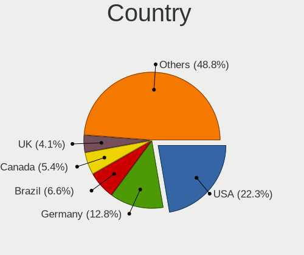
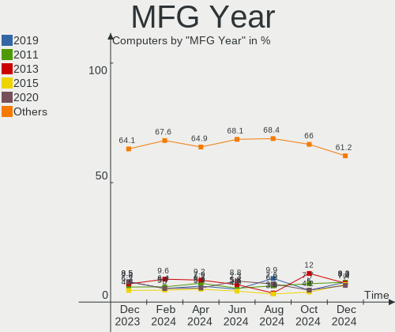
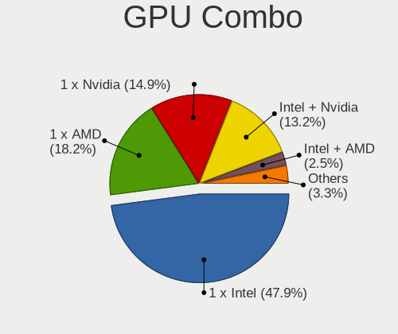
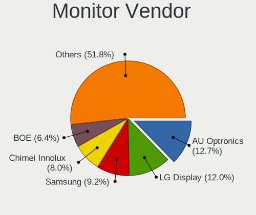
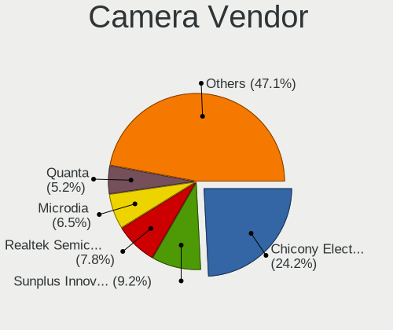
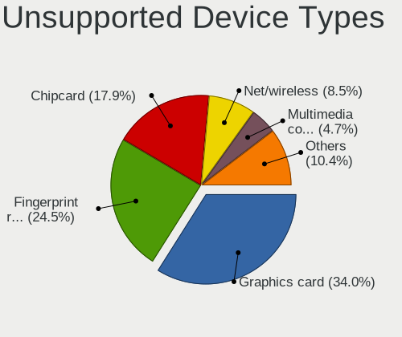

Zorin Hardware Trends
---------------------

A project to identify most popular hardware characteristics and track their change
over time based on data collected by Zorin users at https://Linux-Hardware.org.

Anyone can contribute to the study by uploading probes of their computers by
the [hw-probe](https://github.com/linuxhw/hw-probe) tool:

    sudo -E hw-probe -all -upload

This is a report for all computer types. See also reports for [desktops](/Dist/Zorin/Desktop/README.md) and [notebooks](/Dist/Zorin/Notebook/README.md).

Full-feature report is available here: https://linux-hardware.org/?view=trends

Period: Mar, 2021.

Contents
--------

- [ OS                       ](#os)
- [ OS Family                ](#os-family)
- [ Kernel                   ](#kernel)
- [ Kernel Family            ](#kernel-family)
- [ Kernel Major Ver.        ](#kernel-major-ver)
- [ Arch                     ](#arch)
- [ DE                       ](#de)
- [ Display Server           ](#display-server)
- [ Display Manager          ](#display-manager)
- [ OS Lang                  ](#os-lang)
- [ Boot Mode                ](#boot-mode)
- [ Filesystem               ](#filesystem)
- [ Part. scheme             ](#part-scheme)
- [ Dual Boot with Linux/BSD ](#dual-boot-with-linux/bsd)
- [ Dual Boot (Win)          ](#dual-boot-win)
- [ Country                  ](#country)
- [ City                     ](#city)
- [ Vendor                   ](#vendor)
- [ Model                    ](#model)
- [ Model Family             ](#model-family)
- [ MFG Year                 ](#mfg-year)
- [ Form Factor              ](#form-factor)
- [ Secure Boot              ](#secure-boot)
- [ Coreboot                 ](#coreboot)
- [ RAM Size                 ](#ram-size)
- [ RAM Used                 ](#ram-used)
- [ Has CD-ROM               ](#has-cd-rom)
- [ Total Drives             ](#total-drives)
- [ Has Ethernet             ](#has-ethernet)
- [ Has WiFi                 ](#has-wifi)
- [ Has Bluetooth            ](#has-bluetooth)
- [ Drive Vendor             ](#drive-vendor)
- [ Drive Model              ](#drive-model)
- [ HDD Vendor               ](#hdd-vendor)
- [ SSD Vendor               ](#ssd-vendor)
- [ Drive Kind               ](#drive-kind)
- [ Drive Connector          ](#drive-connector)
- [ Drive Size               ](#drive-size)
- [ Space Total              ](#space-total)
- [ Space Used               ](#space-used)
- [ Malfunc. Drives          ](#malfunc-drives)
- [ Malfunc. Drive Vendor    ](#malfunc-drive-vendor)
- [ Malfunc. HDD Vendor      ](#malfunc-hdd-vendor)
- [ Malfunc. Drive Kind      ](#malfunc-drive-kind)
- [ Failed Drives            ](#failed-drives)
- [ Failed Drive Vendor      ](#failed-drive-vendor)
- [ Drive Status             ](#drive-status)
- [ Storage Vendor           ](#storage-vendor)
- [ Storage Model            ](#storage-model)
- [ Storage Kind             ](#storage-kind)
- [ CPU Vendor               ](#cpu-vendor)
- [ CPU Model                ](#cpu-model)
- [ CPU Model Family         ](#cpu-model-family)
- [ CPU Cores                ](#cpu-cores)
- [ CPU Sockets              ](#cpu-sockets)
- [ CPU Threads              ](#cpu-threads)
- [ CPU Op-Modes             ](#cpu-op-modes)
- [ CPU Microcode            ](#cpu-microcode)
- [ CPU Microarch            ](#cpu-microarch)
- [ GPU Vendor               ](#gpu-vendor)
- [ GPU Model                ](#gpu-model)
- [ GPU Combo                ](#gpu-combo)
- [ GPU Driver               ](#gpu-driver)
- [ GPU Memory               ](#gpu-memory)
- [ Monitor Vendor           ](#monitor-vendor)
- [ Monitor Model            ](#monitor-model)
- [ Monitor Resolution       ](#monitor-resolution)
- [ Monitor Diagonal         ](#monitor-diagonal)
- [ Monitor Width            ](#monitor-width)
- [ Aspect Ratio             ](#aspect-ratio)
- [ Monitor Area             ](#monitor-area)
- [ Pixel Density            ](#pixel-density)
- [ Multiple Monitors        ](#multiple-monitors)
- [ Net Controller Vendor    ](#net-controller-vendor)
- [ Net Controller Model     ](#net-controller-model)
- [ Wireless Vendor          ](#wireless-vendor)
- [ Wireless Model           ](#wireless-model)
- [ Ethernet Vendor          ](#ethernet-vendor)
- [ Ethernet Model           ](#ethernet-model)
- [ Net Controller Kind      ](#net-controller-kind)
- [ Used Controller          ](#used-controller)
- [ NICs                     ](#nics)
- [ IPv6                     ](#ipv6)
- [ Memory Vendor            ](#memory-vendor)
- [ Memory Model             ](#memory-model)
- [ Memory Kind              ](#memory-kind)
- [ Memory Form Factor       ](#memory-form-factor)
- [ Memory Size              ](#memory-size)
- [ Memory Speed             ](#memory-speed)
- [ Sound Vendor             ](#sound-vendor)
- [ Sound Model              ](#sound-model)
- [ Camera Vendor            ](#camera-vendor)
- [ Camera Model             ](#camera-model)
- [ Fingerprint Vendor       ](#fingerprint-vendor)
- [ Fingerprint Model        ](#fingerprint-model)
- [ Chipcard Vendor          ](#chipcard-vendor)
- [ Chipcard Model           ](#chipcard-model)
- [ Printer Vendor           ](#printer-vendor)
- [ Printer Model            ](#printer-model)
- [ Scanner Vendor           ](#scanner-vendor)
- [ Scanner Model            ](#scanner-model)
- [ Bluetooth Vendor         ](#bluetooth-vendor)
- [ Bluetooth Model          ](#bluetooth-model)
- [ Unsupported Devices      ](#unsupported-devices)
- [ Unsupported Device Types ](#unsupported-device-types)

OS
--

Installed operating systems

| Name     | Computers | Percent |
|----------|-----------|---------|
| Zorin 15 | 56        | 96.55%  |
| Zorin 16 | 1         | 1.72%   |
| Zorin 12 | 1         | 1.72%   |

OS Family
---------

OS without a version

| Name  | Computers | Percent |
|-------|-----------|---------|
| Zorin | 58        | 100%    |

Kernel
------

Version of the Linux kernel

| Version            | Computers | Percent |
|--------------------|-----------|---------|
| 5.4.0-66-generic   | 26        | 44.83%  |
| 5.4.0-70-generic   | 11        | 18.97%  |
| 5.4.0-67-generic   | 11        | 18.97%  |
| 5.4.0-65-generic   | 2         | 3.45%   |
| 5.8.0-45-generic   | 1         | 1.72%   |
| 5.4.0-60-generic   | 1         | 1.72%   |
| 5.4.0-58-generic   | 1         | 1.72%   |
| 5.4.0-52-generic   | 1         | 1.72%   |
| 5.4.0-48-generic   | 1         | 1.72%   |
| 5.4.0-47-generic   | 1         | 1.72%   |
| 5.4.0-45-generic   | 1         | 1.72%   |
| 4.15.0-133-generic | 1         | 1.72%   |

Kernel Family
-------------

Linux kernel without a distro release

| Version | Computers | Percent |
|---------|-----------|---------|
| 5.4.0   | 56        | 96.55%  |
| 5.8.0   | 1         | 1.72%   |
| 4.15.0  | 1         | 1.72%   |

Kernel Major Ver.
-----------------

Linux kernel major version

| Version | Computers | Percent |
|---------|-----------|---------|
| 5.4     | 56        | 96.55%  |
| 5.8     | 1         | 1.72%   |
| 4.15    | 1         | 1.72%   |

Arch
----

OS architecture (x86_64, i586, etc.)

| Name   | Computers | Percent |
|--------|-----------|---------|
| x86_64 | 48        | 82.76%  |
| i686   | 10        | 17.24%  |

DE
--

Desktop Environment

| Name       | Computers | Percent |
|------------|-----------|---------|
| GNOME      | 30        | 51.72%  |
| XFCE       | 21        | 36.21%  |
| Unknown    | 4         | 6.9%    |
| X-Cinnamon | 1         | 1.72%   |
| KDE        | 1         | 1.72%   |
| Cinnamon   | 1         | 1.72%   |

Display Server
--------------

X11 or Wayland

| Name    | Computers | Percent |
|---------|-----------|---------|
| X11     | 57        | 98.28%  |
| Wayland | 1         | 1.72%   |

Display Manager
---------------

SDDM, LightDM, etc.

| Name    | Computers | Percent |
|---------|-----------|---------|
| Unknown | 57        | 98.28%  |
| TDM     | 1         | 1.72%   |

OS Lang
-------

Language

| Lang  | Computers | Percent |
|-------|-----------|---------|
| en_US | 24        | 41.38%  |
| en_GB | 6         | 10.34%  |
| de_DE | 6         | 10.34%  |
| en_CA | 4         | 6.9%    |
| it_IT | 2         | 3.45%   |
| fr_FR | 2         | 3.45%   |
| fr_CA | 2         | 3.45%   |
| en_AU | 2         | 3.45%   |
| tr_TR | 1         | 1.72%   |
| ru_RU | 1         | 1.72%   |
| pt_BR | 1         | 1.72%   |
| pl_PL | 1         | 1.72%   |
| nl_NL | 1         | 1.72%   |
| ja_JP | 1         | 1.72%   |
| hu_HU | 1         | 1.72%   |
| es_UY | 1         | 1.72%   |
| de_CH | 1         | 1.72%   |
| cs_CZ | 1         | 1.72%   |

Boot Mode
---------

EFI or BIOS

| Mode | Computers | Percent |
|------|-----------|---------|
| BIOS | 43        | 74.14%  |
| EFI  | 15        | 25.86%  |

Filesystem
----------

Type of filesystem

| Type    | Computers | Percent |
|---------|-----------|---------|
| Ext4    | 55        | 94.83%  |
| Overlay | 1         | 1.72%   |
| Ext2    | 1         | 1.72%   |
| Btrfs   | 1         | 1.72%   |

Part. scheme
------------

Scheme of partitioning

| Type    | Computers | Percent |
|---------|-----------|---------|
| Unknown | 57        | 98.28%  |
| MBR     | 1         | 1.72%   |

Dual Boot with Linux/BSD
------------------------

Hosting more than one Linux/BSD

| Dual boot | Computers | Percent |
|-----------|-----------|---------|
| No        | 50        | 86.21%  |
| Yes       | 8         | 13.79%  |

Dual Boot (Win)
---------------

Hosting Linux and Windows

| Dual boot | Computers | Percent |
|-----------|-----------|---------|
| No        | 43        | 74.14%  |
| Yes       | 15        | 25.86%  |

Country
-------

Geographic location (country)

| Country     | Computers | Percent |
|-------------|-----------|---------|
| USA         | 13        | 22.41%  |
| Germany     | 8         | 13.79%  |
| Canada      | 7         | 12.07%  |
| UK          | 5         | 8.62%   |
| Sweden      | 2         | 3.45%   |
| Serbia      | 2         | 3.45%   |
| France      | 2         | 3.45%   |
| Australia   | 2         | 3.45%   |
| Uruguay     | 1         | 1.72%   |
| Turkey      | 1         | 1.72%   |
| Thailand    | 1         | 1.72%   |
| Switzerland | 1         | 1.72%   |
| Poland      | 1         | 1.72%   |
| Philippines | 1         | 1.72%   |
| Pakistan    | 1         | 1.72%   |
| New Zealand | 1         | 1.72%   |
| Netherlands | 1         | 1.72%   |
| Japan       | 1         | 1.72%   |
| Italy       | 1         | 1.72%   |
| Israel      | 1         | 1.72%   |
| Iraq        | 1         | 1.72%   |
| Hungary     | 1         | 1.72%   |
| Czechia     | 1         | 1.72%   |
| Bulgaria    | 1         | 1.72%   |
| Brazil      | 1         | 1.72%   |

City
----

Geographic location (city)

| City                   | Computers | Percent |
|------------------------|-----------|---------|
| Gateshead              | 2         | 3.45%   |
| Clapham                | 2         | 3.45%   |
| Berlin                 | 2         | 3.45%   |
| Čačak                | 1         | 1.72%   |
| Zwickau                | 1         | 1.72%   |
| Zurich                 | 1         | 1.72%   |
| Zionsville             | 1         | 1.72%   |
| Yabu                   | 1         | 1.72%   |
| Winnipeg               | 1         | 1.72%   |
| Walworth               | 1         | 1.72%   |
| Vancouver              | 1         | 1.72%   |
| Szekszárd             | 1         | 1.72%   |
| Sydney                 | 1         | 1.72%   |
| Sugar Land             | 1         | 1.72%   |
| Stockholm              | 1         | 1.72%   |
| Sopot                  | 1         | 1.72%   |
| Sofia                  | 1         | 1.72%   |
| Saskatoon              | 1         | 1.72%   |
| Santa Rosa             | 1         | 1.72%   |
| Sandy                  | 1         | 1.72%   |
| Rochester              | 1         | 1.72%   |
| Redding                | 1         | 1.72%   |
| Québec                | 1         | 1.72%   |
| Prague                 | 1         | 1.72%   |
| Pittsboro              | 1         | 1.72%   |
| Peine                  | 1         | 1.72%   |
| Paris                  | 1         | 1.72%   |
| Osasco                 | 1         | 1.72%   |
| Naples                 | 1         | 1.72%   |
| Napanee                | 1         | 1.72%   |
| Munich                 | 1         | 1.72%   |
| Montevideo             | 1         | 1.72%   |
| Longueuil              | 1         | 1.72%   |
| Lidcombe               | 1         | 1.72%   |
| Landskrona             | 1         | 1.72%   |
| Krabbendijke           | 1         | 1.72%   |
| Karachi                | 1         | 1.72%   |
| Istanbul               | 1         | 1.72%   |
| Huntersville           | 1         | 1.72%   |
| Holon                  | 1         | 1.72%   |
| Hoffman                | 1         | 1.72%   |
| Gelsenkirchen          | 1         | 1.72%   |
| Freinsheim             | 1         | 1.72%   |
| Dunedin                | 1         | 1.72%   |
| Cottonwood             | 1         | 1.72%   |
| Cochrane               | 1         | 1.72%   |
| Chennevieres-sur-Marne | 1         | 1.72%   |
| Brooklyn               | 1         | 1.72%   |
| Belgrade               | 1         | 1.72%   |
| Bangkok                | 1         | 1.72%   |
| Baltimore              | 1         | 1.72%   |
| Baghdad                | 1         | 1.72%   |
| Augsburg               | 1         | 1.72%   |
| Arlington              | 1         | 1.72%   |
| Alsager                | 1         | 1.72%   |

Vendor
------

Motherboard manufacturer

| Name                | Computers | Percent |
|---------------------|-----------|---------|
| Hewlett-Packard     | 8         | 13.79%  |
| Dell                | 8         | 13.79%  |
| ASUSTek Computer    | 7         | 12.07%  |
| Lenovo              | 6         | 10.34%  |
| Gigabyte Technology | 6         | 10.34%  |
| Acer                | 4         | 6.9%    |
| Toshiba             | 3         | 5.17%   |
| MSI                 | 3         | 5.17%   |
| Positivo            | 1         | 1.72%   |
| Pegatron            | 1         | 1.72%   |
| Panasonic           | 1         | 1.72%   |
| NEC Computers       | 1         | 1.72%   |
| Medion              | 1         | 1.72%   |
| IBM                 | 1         | 1.72%   |
| Hometech            | 1         | 1.72%   |
| Gateway             | 1         | 1.72%   |
| Fujitsu             | 1         | 1.72%   |
| AZW                 | 1         | 1.72%   |
| Apple               | 1         | 1.72%   |
| Alienware           | 1         | 1.72%   |
| Unknown             | 1         | 1.72%   |

Model
-----

Motherboard model

| Name                                 | Computers | Percent |
|--------------------------------------|-----------|---------|
| Toshiba Satellite U920t              | 1         | 1.72%   |
| Toshiba Satellite P300-17Q           | 1         | 1.72%   |
| Toshiba QOSMIO F50                   | 1         | 1.72%   |
| Positivo POS-MIG31AG                 | 1         | 1.72%   |
| Pegatron p6-2133w                    | 1         | 1.72%   |
| Panasonic CF-31JEGAX1M               | 1         | 1.72%   |
| NEC Computers PC-VY25AACZ9           | 1         | 1.72%   |
| MSI MS-A912                          | 1         | 1.72%   |
| MSI MS-7A69                          | 1         | 1.72%   |
| MSI GX60 1AC                         | 1         | 1.72%   |
| Medion MS-7646                       | 1         | 1.72%   |
| Lenovo ThinkPad T440s 20ARS10700     | 1         | 1.72%   |
| Lenovo ThinkPad T430s 2356DH2        | 1         | 1.72%   |
| Lenovo ThinkPad T420 41786UU         | 1         | 1.72%   |
| Lenovo ThinkPad L470 20J4000LGE      | 1         | 1.72%   |
| Lenovo ThinkPad Edge E531 688528U    | 1         | 1.72%   |
| Lenovo ThinkPad E15 Gen 2 20T8S0AA00 | 1         | 1.72%   |
| IBM 8172W5K                          | 1         | 1.72%   |
| Hometech ELITE TAB 10                | 1         | 1.72%   |
| HP Z2 Mini G4 Workstation            | 1         | 1.72%   |
| HP ProBook 470 G1                    | 1         | 1.72%   |
| HP ProBook 4540s                     | 1         | 1.72%   |
| HP Mini 110-1100                     | 1         | 1.72%   |
| HP Laptop 15-dw1xxx                  | 1         | 1.72%   |
| HP Compaq Presario CQ61              | 1         | 1.72%   |
| HP 255 G7 Notebook PC                | 1         | 1.72%   |
| HP 255 G5                            | 1         | 1.72%   |
| Gigabyte H110-D3A                    | 1         | 1.72%   |
| Gigabyte GA-MA78GM-US2H              | 1         | 1.72%   |
| Gigabyte GA-MA69VM-S2                | 1         | 1.72%   |
| Gigabyte G31M-S2C                    | 1         | 1.72%   |
| Gigabyte B450 I AORUS PRO WIFI       | 1         | 1.72%   |
| Gigabyte AERO 15-SA                  | 1         | 1.72%   |
| Gateway NV55C                        | 1         | 1.72%   |
| Fujitsu LIFEBOOK AH531/GFO           | 1         | 1.72%   |
| Dell Precision Tower 7810            | 1         | 1.72%   |
| Dell OptiPlex 760                    | 1         | 1.72%   |
| Dell OptiPlex 755                    | 1         | 1.72%   |
| Dell Latitude D610                   | 1         | 1.72%   |
| Dell Inspiron One 2320               | 1         | 1.72%   |
| Dell Inspiron 530s                   | 1         | 1.72%   |
| Dell DM051                           | 1         | 1.72%   |
| Dell Dimension E521                  | 1         | 1.72%   |
| AZW U57                              | 1         | 1.72%   |
| ASUS X555LD                          | 1         | 1.72%   |
| ASUS X200CA                          | 1         | 1.72%   |
| ASUS TUF Gaming FX505DU_FX505DU      | 1         | 1.72%   |
| ASUS P5P43TD                         | 1         | 1.72%   |
| ASUS M5A99FX PRO R2.0                | 1         | 1.72%   |
| ASUS E402SA                          | 1         | 1.72%   |
| ASUS 1011PX                          | 1         | 1.72%   |
| Apple MacBookPro5,4                  | 1         | 1.72%   |
| Alienware Aurora                     | 1         | 1.72%   |
| Acer Predator G3610                  | 1         | 1.72%   |
| Acer Aspire XC-605G                  | 1         | 1.72%   |
| Acer Aspire 5735                     | 1         | 1.72%   |
| Acer Aspire 5610Z                    | 1         | 1.72%   |
| Unknown                              | 1         | 1.72%   |

Model Family
------------

Motherboard model prefix

| Name                       | Computers | Percent |
|----------------------------|-----------|---------|
| Lenovo ThinkPad            | 6         | 10.34%  |
| Acer Aspire                | 3         | 5.17%   |
| Toshiba Satellite          | 2         | 3.45%   |
| HP ProBook                 | 2         | 3.45%   |
| HP 255                     | 2         | 3.45%   |
| Dell OptiPlex              | 2         | 3.45%   |
| Dell Inspiron              | 2         | 3.45%   |
| Toshiba QOSMIO             | 1         | 1.72%   |
| Positivo POS-MIG31AG       | 1         | 1.72%   |
| Pegatron p6-2133w          | 1         | 1.72%   |
| Panasonic CF-31JEGAX1M     | 1         | 1.72%   |
| NEC Computers PC-VY25AACZ9 | 1         | 1.72%   |
| MSI MS-A912                | 1         | 1.72%   |
| MSI MS-7A69                | 1         | 1.72%   |
| MSI GX60                   | 1         | 1.72%   |
| Medion MS-7646             | 1         | 1.72%   |
| IBM 8172W5K                | 1         | 1.72%   |
| Hometech ELITE             | 1         | 1.72%   |
| HP Z2                      | 1         | 1.72%   |
| HP Mini                    | 1         | 1.72%   |
| HP Laptop                  | 1         | 1.72%   |
| HP Compaq                  | 1         | 1.72%   |
| Gigabyte H110-D3A          | 1         | 1.72%   |
| Gigabyte GA-MA78GM-US2H    | 1         | 1.72%   |
| Gigabyte GA-MA69VM-S2      | 1         | 1.72%   |
| Gigabyte G31M-S2C          | 1         | 1.72%   |
| Gigabyte B450              | 1         | 1.72%   |
| Gigabyte AERO              | 1         | 1.72%   |
| Gateway NV55C              | 1         | 1.72%   |
| Fujitsu LIFEBOOK           | 1         | 1.72%   |
| Dell Precision             | 1         | 1.72%   |
| Dell Latitude              | 1         | 1.72%   |
| Dell DM051                 | 1         | 1.72%   |
| Dell Dimension             | 1         | 1.72%   |
| AZW U57                    | 1         | 1.72%   |
| ASUS X555LD                | 1         | 1.72%   |
| ASUS X200CA                | 1         | 1.72%   |
| ASUS TUF                   | 1         | 1.72%   |
| ASUS P5P43TD               | 1         | 1.72%   |
| ASUS M5A99FX               | 1         | 1.72%   |
| ASUS E402SA                | 1         | 1.72%   |
| ASUS 1011PX                | 1         | 1.72%   |
| Apple MacBookPro5          | 1         | 1.72%   |
| Alienware Aurora           | 1         | 1.72%   |
| Acer Predator              | 1         | 1.72%   |
| Unknown                    | 1         | 1.72%   |

MFG Year
--------

Motherboard manufacture year

| Year | Computers | Percent |
|------|-----------|---------|
| 2009 | 10        | 17.24%  |
| 2020 | 7         | 12.07%  |
| 2011 | 7         | 12.07%  |
| 2019 | 5         | 8.62%   |
| 2018 | 4         | 6.9%    |
| 2008 | 4         | 6.9%    |
| 2007 | 4         | 6.9%    |
| 2017 | 3         | 5.17%   |
| 2014 | 3         | 5.17%   |
| 2012 | 3         | 5.17%   |
| 2010 | 3         | 5.17%   |
| 2015 | 2         | 3.45%   |
| 2013 | 2         | 3.45%   |
| 2005 | 1         | 1.72%   |

Form Factor
-----------

Physical design of the computer

| Name       | Computers | Percent |
|------------|-----------|---------|
| Notebook   | 32        | 55.17%  |
| Desktop    | 21        | 36.21%  |
| Mini pc    | 2         | 3.45%   |
| All in one | 2         | 3.45%   |
| Tablet     | 1         | 1.72%   |

Secure Boot
-----------

Enabled or disabled

| State    | Computers | Percent |
|----------|-----------|---------|
| Disabled | 54        | 93.1%   |
| Enabled  | 4         | 6.9%    |

Coreboot
--------

Have coreboot on board

| Used | Computers | Percent |
|------|-----------|---------|
| No   | 58        | 100%    |

RAM Size
--------

Total RAM memory

| Size in GB | Computers | Percent |
|------------|-----------|---------|
| 3.01-4.0   | 15        | 25.86%  |
| 4.01-8.0   | 13        | 22.41%  |
| 1.01-2.0   | 10        | 17.24%  |
| 8.01-16.0  | 10        | 17.24%  |
| 16.01-24.0 | 6         | 10.34%  |
| 2.01-3.0   | 2         | 3.45%   |
| 32.01-64.0 | 1         | 1.72%   |
| 0.51-1.0   | 1         | 1.72%   |

RAM Used
--------

Used RAM memory

| Used GB   | Computers | Percent |
|-----------|-----------|---------|
| 1.01-2.0  | 32        | 55.17%  |
| 0.51-1.0  | 10        | 17.24%  |
| 3.01-4.0  | 6         | 10.34%  |
| 2.01-3.0  | 4         | 6.9%    |
| 4.01-8.0  | 3         | 5.17%   |
| 8.01-16.0 | 2         | 3.45%   |
| 0.01-0.5  | 1         | 1.72%   |

Has CD-ROM
----------

Has CD-ROM on board

| Presented | Computers | Percent |
|-----------|-----------|---------|
| Yes       | 30        | 51.72%  |
| No        | 28        | 48.28%  |

Total Drives
------------

Number of drives on board

| Drives | Computers | Percent |
|--------|-----------|---------|
| 1      | 43        | 74.14%  |
| 2      | 13        | 22.41%  |
| 5      | 1         | 1.72%   |
| 3      | 1         | 1.72%   |

Has Ethernet
------------

Has Ethernet on board

| Presented | Computers | Percent |
|-----------|-----------|---------|
| Yes       | 56        | 96.55%  |
| No        | 2         | 3.45%   |

Has WiFi
--------

Has WiFi module

| Presented | Computers | Percent |
|-----------|-----------|---------|
| Yes       | 49        | 84.48%  |
| No        | 9         | 15.52%  |

Has Bluetooth
-------------

Has Bluetooth module

| Presented | Computers | Percent |
|-----------|-----------|---------|
| Yes       | 31        | 53.45%  |
| No        | 27        | 46.55%  |

Drive Vendor
------------

Hard drive vendors

| Vendor              | Computers | Drives | Percent |
|---------------------|-----------|--------|---------|
| WDC                 | 15        | 15     | 21.13%  |
| Seagate             | 11        | 12     | 15.49%  |
| Samsung Electronics | 9         | 9      | 12.68%  |
| Toshiba             | 6         | 6      | 8.45%   |
| Hitachi             | 5         | 6      | 7.04%   |
| Unknown             | 3         | 4      | 4.23%   |
| Sandisk             | 3         | 3      | 4.23%   |
| Zheino              | 2         | 2      | 2.82%   |
| Transcend           | 2         | 2      | 2.82%   |
| Micron Technology   | 2         | 2      | 2.82%   |
| Kingston            | 2         | 2      | 2.82%   |
| Intenso             | 2         | 2      | 2.82%   |
| A-DATA Technology   | 2         | 2      | 2.82%   |
| TCSUNBOW            | 1         | 1      | 1.41%   |
| SPCC                | 1         | 1      | 1.41%   |
| Phison              | 1         | 1      | 1.41%   |
| Patriot             | 1         | 1      | 1.41%   |
| Intel               | 1         | 1      | 1.41%   |
| ExcelStor           | 1         | 1      | 1.41%   |
| China               | 1         | 1      | 1.41%   |

Drive Model
-----------

Hard drive models

| Model                                     | Computers | Percent |
|-------------------------------------------|-----------|---------|
| Toshiba MQ01ABF050 500GB                  | 3         | 4.11%   |
| Unknown MMC Card  32GB                    | 2         | 2.74%   |
| Sandisk NVMe SSD Drive 500GB              | 2         | 2.74%   |
| Samsung SSD 850 EVO 500GB                 | 2         | 2.74%   |
| Zheino CHN-mSATAM3-128 128GB              | 1         | 1.37%   |
| Zheino CHN-25SATA3-120 120GB              | 1         | 1.37%   |
| WDC WDS100T2G0A-00JH30 1TB SSD            | 1         | 1.37%   |
| WDC WD7500BPKT-22PK4T0 752GB              | 1         | 1.37%   |
| WDC WD5003ABYX-18WERA0 500GB              | 1         | 1.37%   |
| WDC WD5000LPLX-66ZNTT1 500GB              | 1         | 1.37%   |
| WDC WD5000AZLX-08K2TA0 500GB              | 1         | 1.37%   |
| WDC WD5000AAKX-75U6AA0 500GB              | 1         | 1.37%   |
| WDC WD5000AAKX-00ERMA0 500GB              | 1         | 1.37%   |
| WDC WD3200BPVT-22JJ5T0 320GB              | 1         | 1.37%   |
| WDC WD2500JS-75NCB3 250GB                 | 1         | 1.37%   |
| WDC WD20EARX-22PASB0 2TB                  | 1         | 1.37%   |
| WDC WD1600JS-75NCB1 160GB                 | 1         | 1.37%   |
| WDC WD1600BEVS-22RST0 160GB               | 1         | 1.37%   |
| WDC WD10JPVX-60JC3T1 1TB                  | 1         | 1.37%   |
| WDC WD10EZEX-21M2NA0 1TB                  | 1         | 1.37%   |
| WDC WD10EADS-65M2B1 1TB                   | 1         | 1.37%   |
| Unknown SD/MMC/MS PRO 128GB               | 1         | 1.37%   |
| Unknown MMC Card  16GB                    | 1         | 1.37%   |
| Transcend TS64GSSD420K 64GB               | 1         | 1.37%   |
| Transcend TS512GMTS430S 512GB SSD         | 1         | 1.37%   |
| Toshiba THNSNF128GMCS 128GB SSD           | 1         | 1.37%   |
| Toshiba NVMe SSD Drive 256GB              | 1         | 1.37%   |
| Toshiba MK7575GSX 752GB                   | 1         | 1.37%   |
| TCSUNBOW X3 240GB                         | 1         | 1.37%   |
| SPCC M.2 SSD 1024GB                       | 1         | 1.37%   |
| Seagate ST96812AS 64GB                    | 1         | 1.37%   |
| Seagate ST9160821AS 160GB                 | 1         | 1.37%   |
| Seagate ST9120821AS 118GB                 | 1         | 1.37%   |
| Seagate ST500LT012-1DG142 500GB           | 1         | 1.37%   |
| Seagate ST500DM002-1BD142 500GB           | 1         | 1.37%   |
| Seagate ST4000DM006-2G5107 4TB            | 1         | 1.37%   |
| Seagate ST380215AS 80GB                   | 1         | 1.37%   |
| Seagate ST3250310AS 250GB                 | 1         | 1.37%   |
| Seagate ST320LT012-9WS14C 320GB           | 1         | 1.37%   |
| Seagate ST3120827AS 120GB                 | 1         | 1.37%   |
| Seagate ST2000DM008-2FR102 2TB            | 1         | 1.37%   |
| Seagate ST1000LM024 HN-M101MBB 1TB        | 1         | 1.37%   |
| SanDisk SDSSDP064G 64GB                   | 1         | 1.37%   |
| Samsung SSD 860 EVO 500GB                 | 1         | 1.37%   |
| Samsung SSD 850 PRO 512GB                 | 1         | 1.37%   |
| Samsung SSD 840 Series 250GB              | 1         | 1.37%   |
| Samsung NVMe SSD Drive 512GB              | 1         | 1.37%   |
| Samsung MZ7PC128HAFU-000L1 128GB SSD      | 1         | 1.37%   |
| Samsung HD642JJ 640GB                     | 1         | 1.37%   |
| Samsung HD322HJ 320GB                     | 1         | 1.37%   |
| Phison NVMe SSD Drive 1024GB              | 1         | 1.37%   |
| Patriot Spark 256GB SSD                   | 1         | 1.37%   |
| Micron MTFDDAK1T0TBN-1AR1ZABHA 1024GB SSD | 1         | 1.37%   |
| Micron C400-MTFDDAK128MAM 128GB SSD       | 1         | 1.37%   |
| Kingston SA400S37240G 240GB SSD           | 1         | 1.37%   |
| Kingston SA400S37120G 120GB SSD           | 1         | 1.37%   |
| Intenso SSD SATAIII 256GB                 | 1         | 1.37%   |
| Intenso 128GB                             | 1         | 1.37%   |
| Intel NVMe SSD Drive 512GB                | 1         | 1.37%   |
| Hitachi HTS547550A9E384 500GB             | 1         | 1.37%   |

HDD Vendor
----------

Hard disk drive vendors

| Vendor              | Computers | Drives | Percent |
|---------------------|-----------|--------|---------|
| WDC                 | 14        | 14     | 37.84%  |
| Seagate             | 11        | 12     | 29.73%  |
| Hitachi             | 5         | 6      | 13.51%  |
| Toshiba             | 4         | 4      | 10.81%  |
| Samsung Electronics | 2         | 2      | 5.41%   |
| ExcelStor           | 1         | 1      | 2.7%    |

SSD Vendor
----------

Solid state drive vendors

| Vendor              | Computers | Drives | Percent |
|---------------------|-----------|--------|---------|
| Samsung Electronics | 6         | 6      | 26.09%  |
| Transcend           | 2         | 2      | 8.7%    |
| Micron Technology   | 2         | 2      | 8.7%    |
| Kingston            | 2         | 2      | 8.7%    |
| A-DATA Technology   | 2         | 2      | 8.7%    |
| Zheino              | 1         | 1      | 4.35%   |
| WDC                 | 1         | 1      | 4.35%   |
| Toshiba             | 1         | 1      | 4.35%   |
| TCSUNBOW            | 1         | 1      | 4.35%   |
| SPCC                | 1         | 1      | 4.35%   |
| SanDisk             | 1         | 1      | 4.35%   |
| Patriot             | 1         | 1      | 4.35%   |
| Intenso             | 1         | 1      | 4.35%   |
| China               | 1         | 1      | 4.35%   |

Drive Kind
----------

HDD or SSD

| Kind    | Computers | Drives | Percent |
|---------|-----------|--------|---------|
| HDD     | 33        | 39     | 50.77%  |
| SSD     | 21        | 23     | 32.31%  |
| NVMe    | 6         | 6      | 9.23%   |
| Unknown | 3         | 3      | 4.62%   |
| MMC     | 2         | 3      | 3.08%   |

Drive Connector
---------------

SATA, SAS, NVMe, etc.

| Type | Computers | Drives | Percent |
|------|-----------|--------|---------|
| SATA | 52        | 64     | 85.25%  |
| NVMe | 6         | 6      | 9.84%   |
| MMC  | 2         | 3      | 3.28%   |
| SAS  | 1         | 1      | 1.64%   |

Drive Size
----------

Size of hard drive

| Size in TB | Computers | Drives | Percent |
|------------|-----------|--------|---------|
| 0.01-0.5   | 40        | 47     | 74.07%  |
| 0.51-1.0   | 9         | 10     | 16.67%  |
| 1.01-2.0   | 4         | 4      | 7.41%   |
| 3.01-4.0   | 1         | 1      | 1.85%   |

Space Total
-----------

Amount of disk space available on the file system

| Size in GB     | Computers | Percent |
|----------------|-----------|---------|
| 101-250        | 18        | 31.03%  |
| 251-500        | 16        | 27.59%  |
| 21-50          | 7         | 12.07%  |
| 501-1000       | 6         | 10.34%  |
| 51-100         | 5         | 8.62%   |
| 2001-3000      | 3         | 5.17%   |
| 1001-2000      | 2         | 3.45%   |
| More than 3000 | 1         | 1.72%   |

Space Used
----------

Amount of used disk space

| Used GB   | Computers | Percent |
|-----------|-----------|---------|
| 1-20      | 31        | 53.45%  |
| 21-50     | 17        | 29.31%  |
| 51-100    | 4         | 6.9%    |
| 501-1000  | 2         | 3.45%   |
| 251-500   | 1         | 1.72%   |
| 2001-3000 | 1         | 1.72%   |
| 101-250   | 1         | 1.72%   |
| 1001-2000 | 1         | 1.72%   |

Malfunc. Drives
---------------

Drive models with a malfunction

| Model                    | Computers | Drives | Percent |
|--------------------------|-----------|--------|---------|
| WDC WD10EZEX-21M2NA0 1TB | 1         | 1      | 100%    |

Malfunc. Drive Vendor
---------------------

Vendors of faulty drives

| Vendor | Computers | Drives | Percent |
|--------|-----------|--------|---------|
| WDC    | 1         | 1      | 100%    |

Malfunc. HDD Vendor
-------------------

Vendors of faulty HDD drives

| Vendor | Computers | Drives | Percent |
|--------|-----------|--------|---------|
| WDC    | 1         | 1      | 100%    |

Malfunc. Drive Kind
-------------------

Kinds of faulty drives

| Kind | Computers | Drives | Percent |
|------|-----------|--------|---------|
| HDD  | 1         | 1      | 100%    |

Failed Drives
-------------

Failed drive models

Zero info for selected period =(

Failed Drive Vendor
-------------------

Failed drive vendors

Zero info for selected period =(

Drive Status
------------

Number of failed and malfunc. drives

| Status   | Computers | Drives | Percent |
|----------|-----------|--------|---------|
| Detected | 58        | 73     | 98.31%  |
| Malfunc  | 1         | 1      | 1.69%   |

Storage Vendor
--------------

Storage controller vendors

| Vendor                       | Computers | Percent |
|------------------------------|-----------|---------|
| Intel                        | 43        | 69.35%  |
| AMD                          | 9         | 14.52%  |
| Sandisk                      | 2         | 3.23%   |
| Nvidia                       | 2         | 3.23%   |
| Toshiba America Info Systems | 1         | 1.61%   |
| Silicon Image                | 1         | 1.61%   |
| Samsung Electronics          | 1         | 1.61%   |
| Phison Electronics           | 1         | 1.61%   |
| JMicron Technology           | 1         | 1.61%   |
| ASMedia Technology           | 1         | 1.61%   |

Storage Model
-------------

Storage controller models

| Model                                                                                  | Computers | Percent |
|----------------------------------------------------------------------------------------|-----------|---------|
| Intel 7 Series Chipset Family 6-port SATA Controller [AHCI mode]                       | 5         | 6.67%   |
| AMD FCH SATA Controller [AHCI mode]                                                    | 5         | 6.67%   |
| Intel NM10/ICH7 Family SATA Controller [IDE mode]                                      | 4         | 5.33%   |
| Intel 82801IBM/IEM (ICH9M/ICH9M-E) 4 port SATA Controller [AHCI mode]                  | 3         | 4%      |
| Intel 82801JI (ICH10 Family) SATA AHCI Controller                                      | 2         | 2.67%   |
| Intel 82801G (ICH7 Family) IDE Controller                                              | 2         | 2.67%   |
| Intel 8 Series/C220 Series Chipset Family 6-port SATA Controller 1 [AHCI mode]         | 2         | 2.67%   |
| Intel 8 Series SATA Controller 1 [AHCI mode]                                           | 2         | 2.67%   |
| Intel 6 Series/C200 Series Chipset Family 6 port Mobile SATA AHCI Controller           | 2         | 2.67%   |
| AMD SB7x0/SB8x0/SB9x0 SATA Controller [IDE mode]                                       | 2         | 2.67%   |
| AMD SB7x0/SB8x0/SB9x0 IDE Controller                                                   | 2         | 2.67%   |
| Toshiba America Info Systems BG3 NVMe SSD Controller                                   | 1         | 1.33%   |
| Silicon Image SiI 3132 Serial ATA Raid II Controller                                   | 1         | 1.33%   |
| Sandisk WD Blue SN550 NVMe SSD                                                         | 1         | 1.33%   |
| Sandisk WD Black SN750 / PC SN730 NVMe SSD                                             | 1         | 1.33%   |
| Samsung NVMe Controller                                                                | 1         | 1.33%   |
| Phison E12 NVMe Controller                                                             | 1         | 1.33%   |
| Nvidia MCP79 AHCI Controller                                                           | 1         | 1.33%   |
| Nvidia MCP51 Serial ATA Controller                                                     | 1         | 1.33%   |
| JMicron JMB368 IDE controller                                                          | 1         | 1.33%   |
| Intel Wildcat Point-LP SATA Controller [AHCI Mode]                                     | 1         | 1.33%   |
| Intel Sunrise Point-LP SATA Controller [AHCI mode]                                     | 1         | 1.33%   |
| Intel SSD 660P Series                                                                  | 1         | 1.33%   |
| Intel SATA Controller [RAID mode]                                                      | 1         | 1.33%   |
| Intel Q170/Q150/B150/H170/H110/Z170/CM236 Chipset SATA Controller [AHCI Mode]          | 1         | 1.33%   |
| Intel NM10/ICH7 Family SATA Controller [AHCI mode]                                     | 1         | 1.33%   |
| Intel Comet Lake SATA AHCI Controller                                                  | 1         | 1.33%   |
| Intel Cannon Lake PCH SATA AHCI Controller                                             | 1         | 1.33%   |
| Intel C600/X79 series chipset SATA RAID Controller                                     | 1         | 1.33%   |
| Intel Atom/Celeron/Pentium Processor x5-E8000/J3xxx/N3xxx Series SATA Controller       | 1         | 1.33%   |
| Intel 82Q35 Express PT IDER Controller                                                 | 1         | 1.33%   |
| Intel 82801JD/DO (ICH10 Family) 4-port SATA IDE Controller                             | 1         | 1.33%   |
| Intel 82801JD/DO (ICH10 Family) 2-port SATA IDE Controller                             | 1         | 1.33%   |
| Intel 82801IR/IO/IH (ICH9R/DO/DH) 6 port SATA Controller [AHCI mode]                   | 1         | 1.33%   |
| Intel 82801IR/IO/IH (ICH9R/DO/DH) 4 port SATA Controller [IDE mode]                    | 1         | 1.33%   |
| Intel 82801IBM/IEM (ICH9M/ICH9M-E) 2 port SATA Controller [IDE mode]                   | 1         | 1.33%   |
| Intel 82801I (ICH9 Family) 2 port SATA Controller [IDE mode]                           | 1         | 1.33%   |
| Intel 82801HM/HEM (ICH8M/ICH8M-E) SATA Controller [AHCI mode]                          | 1         | 1.33%   |
| Intel 82801HM/HEM (ICH8M/ICH8M-E) IDE Controller                                       | 1         | 1.33%   |
| Intel 82801GBM/GHM (ICH7-M Family) SATA Controller [IDE mode]                          | 1         | 1.33%   |
| Intel 82801GBM/GHM (ICH7-M Family) SATA Controller [AHCI mode]                         | 1         | 1.33%   |
| Intel 82801FBM (ICH6M) SATA Controller                                                 | 1         | 1.33%   |
| Intel 82801FB/FW (ICH6/ICH6W) SATA Controller                                          | 1         | 1.33%   |
| Intel 6 Series/C200 Series Chipset Family Mobile SATA Controller (IDE mode, ports 4-5) | 1         | 1.33%   |
| Intel 6 Series/C200 Series Chipset Family Mobile SATA Controller (IDE mode, ports 0-3) | 1         | 1.33%   |
| Intel 6 Series/C200 Series Chipset Family 6 port Desktop SATA AHCI Controller          | 1         | 1.33%   |
| Intel 5 Series/3400 Series Chipset 4 port SATA AHCI Controller                         | 1         | 1.33%   |
| Intel 4 Series Chipset PT IDER Controller                                              | 1         | 1.33%   |
| Intel 200 Series PCH SATA controller [AHCI mode]                                       | 1         | 1.33%   |
| ASMedia ASM1062 Serial ATA Controller                                                  | 1         | 1.33%   |
| AMD SB7x0/SB8x0/SB9x0 SATA Controller [AHCI mode]                                      | 1         | 1.33%   |
| AMD SB600 Non-Raid-5 SATA                                                              | 1         | 1.33%   |
| AMD SB600 IDE                                                                          | 1         | 1.33%   |
| AMD FCH IDE Controller                                                                 | 1         | 1.33%   |
| AMD 400 Series Chipset SATA Controller                                                 | 1         | 1.33%   |

Storage Kind
------------

Kind of storage controller (IDE, SATA, NVMe, SAS, ...)

| Kind | Computers | Percent |
|------|-----------|---------|
| SATA | 39        | 59.09%  |
| IDE  | 19        | 28.79%  |
| NVMe | 6         | 9.09%   |
| RAID | 2         | 3.03%   |

CPU Vendor
----------

Processor vendors

| Vendor | Computers | Percent |
|--------|-----------|---------|
| Intel  | 46        | 79.31%  |
| AMD    | 12        | 20.69%  |

CPU Model
---------

Processor models

| Model                                         | Computers | Percent |
|-----------------------------------------------|-----------|---------|
| Intel Pentium 4 CPU 3.00GHz                   | 2         | 3.45%   |
| Intel Core i7-3632QM CPU @ 2.20GHz            | 2         | 3.45%   |
| Intel Core i5-2520M CPU @ 2.50GHz             | 2         | 3.45%   |
| Intel Core 2 Duo CPU P8700 @ 2.53GHz          | 2         | 3.45%   |
| Intel Xeon CPU X5460 @ 3.16GHz                | 1         | 1.72%   |
| Intel Xeon CPU E5-2637 v3 @ 3.50GHz           | 1         | 1.72%   |
| Intel Pentium M processor 1.73GHz             | 1         | 1.72%   |
| Intel Pentium Dual-Core CPU T4400 @ 2.20GHz   | 1         | 1.72%   |
| Intel Pentium Dual-Core CPU E5700 @ 3.00GHz   | 1         | 1.72%   |
| Intel Pentium Dual CPU T3200 @ 2.00GHz        | 1         | 1.72%   |
| Intel Pentium CPU 6405U @ 2.40GHz             | 1         | 1.72%   |
| Intel Genuine CPU T2080 @ 1.73GHz             | 1         | 1.72%   |
| Intel Core i7-9750H CPU @ 2.60GHz             | 1         | 1.72%   |
| Intel Core i7-4702MQ CPU @ 2.20GHz            | 1         | 1.72%   |
| Intel Core i7-4600U CPU @ 2.10GHz             | 1         | 1.72%   |
| Intel Core i7-2600 CPU @ 3.40GHz              | 1         | 1.72%   |
| Intel Core i7 CPU 920 @ 2.67GHz               | 1         | 1.72%   |
| Intel Core i5-7200U CPU @ 2.50GHz             | 1         | 1.72%   |
| Intel Core i5-6400 CPU @ 2.70GHz              | 1         | 1.72%   |
| Intel Core i5-5257U CPU @ 2.70GHz             | 1         | 1.72%   |
| Intel Core i5-3320M CPU @ 2.60GHz             | 1         | 1.72%   |
| Intel Core i5-2410M CPU @ 2.30GHz             | 1         | 1.72%   |
| Intel Core i3-8100 CPU @ 3.60GHz              | 1         | 1.72%   |
| Intel Core i3-6100 CPU @ 3.70GHz              | 1         | 1.72%   |
| Intel Core i3-4160 CPU @ 3.60GHz              | 1         | 1.72%   |
| Intel Core i3-4030U CPU @ 1.90GHz             | 1         | 1.72%   |
| Intel Core i3-3227U CPU @ 1.90GHz             | 1         | 1.72%   |
| Intel Core i3-2100 CPU @ 3.10GHz              | 1         | 1.72%   |
| Intel Core i3 CPU M 370 @ 2.40GHz             | 1         | 1.72%   |
| Intel Core 2 Duo CPU T9300 @ 2.50GHz          | 1         | 1.72%   |
| Intel Core 2 Duo CPU P8400 @ 2.26GHz          | 1         | 1.72%   |
| Intel Core 2 Duo CPU E8500 @ 3.16GHz          | 1         | 1.72%   |
| Intel Core 2 Duo CPU E8400 @ 3.00GHz          | 1         | 1.72%   |
| Intel Core 2 Duo CPU E4400 @ 2.00GHz          | 1         | 1.72%   |
| Intel Celeron CPU N3050 @ 1.60GHz             | 1         | 1.72%   |
| Intel Celeron CPU E1400 @ 2.00GHz             | 1         | 1.72%   |
| Intel Celeron CPU 1007U @ 1.50GHz             | 1         | 1.72%   |
| Intel Atom x5-Z8350 CPU @ 1.44GHz             | 1         | 1.72%   |
| Intel Atom CPU Z3735F @ 1.33GHz               | 1         | 1.72%   |
| Intel Atom CPU N570 @ 1.66GHz                 | 1         | 1.72%   |
| Intel Atom CPU N270 @ 1.60GHz                 | 1         | 1.72%   |
| Intel Atom CPU D525 @ 1.80GHz                 | 1         | 1.72%   |
| AMD Ryzen 7 4700U with Radeon Graphics        | 1         | 1.72%   |
| AMD Ryzen 7 3750H with Radeon Vega Mobile Gfx | 1         | 1.72%   |
| AMD Ryzen 7 2700X Eight-Core Processor        | 1         | 1.72%   |
| AMD Ryzen 3 2200U with Radeon Vega Mobile Gfx | 1         | 1.72%   |
| AMD Phenom II X4 925 Processor                | 1         | 1.72%   |
| AMD FX-8320 Eight-Core Processor              | 1         | 1.72%   |
| AMD Athlon 64 X2 Dual Core Processor 5200+    | 1         | 1.72%   |
| AMD Athlon 64 X2 Dual Core Processor 3600+    | 1         | 1.72%   |
| AMD Athlon 64 Processor 3200+                 | 1         | 1.72%   |
| AMD A6-7310 APU with AMD Radeon R4 Graphics   | 1         | 1.72%   |
| AMD A6-3620 APU with Radeon HD Graphics       | 1         | 1.72%   |
| AMD A10-4600M APU with Radeon HD Graphics     | 1         | 1.72%   |

CPU Model Family
----------------

Processor model prefix

| Model                   | Computers | Percent |
|-------------------------|-----------|---------|
| Intel Core i7           | 7         | 12.07%  |
| Intel Core i5           | 7         | 12.07%  |
| Intel Core i3           | 7         | 12.07%  |
| Intel Core 2 Duo        | 7         | 12.07%  |
| Intel Atom              | 5         | 8.62%   |
| Intel Celeron           | 3         | 5.17%   |
| AMD Ryzen 7             | 3         | 5.17%   |
| Intel Xeon              | 2         | 3.45%   |
| Intel Pentium Dual-Core | 2         | 3.45%   |
| Intel Pentium 4         | 2         | 3.45%   |
| AMD Athlon 64 X2        | 2         | 3.45%   |
| AMD A6                  | 2         | 3.45%   |
| Intel Pentium M         | 1         | 1.72%   |
| Intel Pentium Dual      | 1         | 1.72%   |
| Intel Pentium           | 1         | 1.72%   |
| Intel Genuine           | 1         | 1.72%   |
| AMD Ryzen 3             | 1         | 1.72%   |
| AMD Phenom II X4        | 1         | 1.72%   |
| AMD FX                  | 1         | 1.72%   |
| AMD Athlon 64           | 1         | 1.72%   |
| AMD A10                 | 1         | 1.72%   |

CPU Cores
---------

Number of processor cores

| Number | Computers | Percent |
|--------|-----------|---------|
| 2      | 34        | 58.62%  |
| 4      | 15        | 25.86%  |
| 1      | 5         | 8.62%   |
| 8      | 3         | 5.17%   |
| 6      | 1         | 1.72%   |

CPU Sockets
-----------

Number of sockets

| Number | Computers | Percent |
|--------|-----------|---------|
| 1      | 57        | 98.28%  |
| 2      | 1         | 1.72%   |

CPU Threads
-----------

Threads per core (Hyper-Threading)

| Number | Computers | Percent |
|--------|-----------|---------|
| 2      | 31        | 53.45%  |
| 1      | 27        | 46.55%  |

CPU Op-Modes
------------

CPU Operation Modes (32-bit, 64-bit)

| Op mode        | Computers | Percent |
|----------------|-----------|---------|
| 32-bit, 64-bit | 54        | 93.1%   |
| 32-bit         | 4         | 6.9%    |

CPU Microcode
-------------

Microcode number

| Number     | Computers | Percent |
|------------|-----------|---------|
| Unknown    | 9         | 15.52%  |
| 0x1067a    | 6         | 10.34%  |
| 0x306a9    | 5         | 8.62%   |
| 0x206a7    | 4         | 6.9%    |
| 0x6fd      | 3         | 5.17%   |
| 0x10676    | 3         | 5.17%   |
| 0x306c3    | 2         | 3.45%   |
| 0x106ca    | 2         | 3.45%   |
| 0xf43      | 1         | 1.72%   |
| 0xf41      | 1         | 1.72%   |
| 0x906eb    | 1         | 1.72%   |
| 0x906ea    | 1         | 1.72%   |
| 0x806ec    | 1         | 1.72%   |
| 0x806e9    | 1         | 1.72%   |
| 0x6ec      | 1         | 1.72%   |
| 0x6d8      | 1         | 1.72%   |
| 0x506e3    | 1         | 1.72%   |
| 0x406c3    | 1         | 1.72%   |
| 0x40651    | 1         | 1.72%   |
| 0x306f2    | 1         | 1.72%   |
| 0x306d4    | 1         | 1.72%   |
| 0x20655    | 1         | 1.72%   |
| 0x106c2    | 1         | 1.72%   |
| 0x106a5    | 1         | 1.72%   |
| 0x08600103 | 1         | 1.72%   |
| 0x08108102 | 1         | 1.72%   |
| 0x0800820d | 1         | 1.72%   |
| 0x07030105 | 1         | 1.72%   |
| 0x06001119 | 1         | 1.72%   |
| 0x06000852 | 1         | 1.72%   |
| 0x03000027 | 1         | 1.72%   |
| 0x010000db | 1         | 1.72%   |

CPU Microarch
-------------

Microarchitecture

| Name        | Computers | Percent |
|-------------|-----------|---------|
| Penryn      | 9         | 15.52%  |
| SandyBridge | 5         | 8.62%   |
| IvyBridge   | 5         | 8.62%   |
| Haswell     | 5         | 8.62%   |
| KabyLake    | 4         | 6.9%    |
| Silvermont  | 3         | 5.17%   |
| K8 Hammer   | 3         | 5.17%   |
| Core        | 3         | 5.17%   |
| Bonnell     | 3         | 5.17%   |
| Zen+        | 2         | 3.45%   |
| Skylake     | 2         | 3.45%   |
| Piledriver  | 2         | 3.45%   |
| P6          | 2         | 3.45%   |
| NetBurst    | 2         | 3.45%   |
| Zen 2       | 1         | 1.72%   |
| Zen         | 1         | 1.72%   |
| Westmere    | 1         | 1.72%   |
| Puma        | 1         | 1.72%   |
| Nehalem     | 1         | 1.72%   |
| K10 Llano   | 1         | 1.72%   |
| K10         | 1         | 1.72%   |
| Broadwell   | 1         | 1.72%   |

GPU Vendor
----------

Vendors of graphics cards

| Vendor | Computers | Percent |
|--------|-----------|---------|
| Intel  | 34        | 53.13%  |
| AMD    | 16        | 25%     |
| Nvidia | 14        | 21.88%  |

GPU Model
---------

Graphics card models

| Model                                                                                    | Computers | Percent |
|------------------------------------------------------------------------------------------|-----------|---------|
| Intel 3rd Gen Core processor Graphics Controller                                         | 5         | 7.35%   |
| Intel 2nd Generation Core Processor Family Integrated Graphics Controller                | 4         | 5.88%   |
| Intel Mobile 4 Series Chipset Integrated Graphics Controller                             | 3         | 4.41%   |
| Nvidia TU116M [GeForce GTX 1660 Ti Mobile]                                               | 2         | 2.94%   |
| Intel Mobile 945GM/GMS/GME, 943/940GML Express Integrated Graphics Controller            | 2         | 2.94%   |
| Intel Haswell-ULT Integrated Graphics Controller                                         | 2         | 2.94%   |
| Intel Atom/Celeron/Pentium Processor x5-E8000/J3xxx/N3xxx Integrated Graphics Controller | 2         | 2.94%   |
| Intel Atom Processor D4xx/D5xx/N4xx/N5xx Integrated Graphics Controller                  | 2         | 2.94%   |
| Intel 82G33/G31 Express Integrated Graphics Controller                                   | 2         | 2.94%   |
| AMD RV620 LE [Radeon HD 3450]                                                            | 2         | 2.94%   |
| Nvidia TU117 [GeForce GTX 1650]                                                          | 1         | 1.47%   |
| Nvidia GT218 [GeForce 210]                                                               | 1         | 1.47%   |
| Nvidia GP107 [GeForce GTX 1050]                                                          | 1         | 1.47%   |
| Nvidia GM206 [GeForce GTX 960]                                                           | 1         | 1.47%   |
| Nvidia GK208B [GeForce GT 730]                                                           | 1         | 1.47%   |
| Nvidia GK107 [NVS 510]                                                                   | 1         | 1.47%   |
| Nvidia GF117M [GeForce 610M/710M/810M/820M / GT 620M/625M/630M/720M]                     | 1         | 1.47%   |
| Nvidia GF108M [GeForce GT 525M]                                                          | 1         | 1.47%   |
| Nvidia G94M [GeForce 9700M GTS]                                                          | 1         | 1.47%   |
| Nvidia G73 [GeForce 7300 GT]                                                             | 1         | 1.47%   |
| Nvidia C79 [GeForce 9400M]                                                               | 1         | 1.47%   |
| Nvidia C51 [GeForce 6150 LE]                                                             | 1         | 1.47%   |
| Intel Mobile 945GSE Express Integrated Graphics Controller                               | 1         | 1.47%   |
| Intel Mobile 945GM/GMS, 943/940GML Express Integrated Graphics Controller                | 1         | 1.47%   |
| Intel Mobile 915GM/GMS/910GML Express Graphics Controller                                | 1         | 1.47%   |
| Intel Iris Graphics 6100                                                                 | 1         | 1.47%   |
| Intel HD Graphics 620                                                                    | 1         | 1.47%   |
| Intel Core Processor Integrated Graphics Controller                                      | 1         | 1.47%   |
| Intel Comet Lake UHD Graphics                                                            | 1         | 1.47%   |
| Intel CoffeeLake-S GT2 [UHD Graphics 630]                                                | 1         | 1.47%   |
| Intel CoffeeLake-H GT2 [UHD Graphics 630]                                                | 1         | 1.47%   |
| Intel Atom Processor Z36xxx/Z37xxx Series Graphics & Display                             | 1         | 1.47%   |
| Intel 82915G/GV/910GL Integrated Graphics Controller                                     | 1         | 1.47%   |
| Intel 4th Generation Core Processor Family Integrated Graphics Controller                | 1         | 1.47%   |
| Intel 4th Gen Core Processor Integrated Graphics Controller                              | 1         | 1.47%   |
| Intel 4 Series Chipset Integrated Graphics Controller                                    | 1         | 1.47%   |
| AMD Wimbledon XT [Radeon HD 7970M]                                                       | 1         | 1.47%   |
| AMD Trinity [Radeon HD 7660G]                                                            | 1         | 1.47%   |
| AMD Thames [Radeon HD 7550M/7570M/7650M]                                                 | 1         | 1.47%   |
| AMD Sumo [Radeon HD 6530D]                                                               | 1         | 1.47%   |
| AMD RV730 XT [Radeon HD 4670]                                                            | 1         | 1.47%   |
| AMD RV635/M86 [Mobility Radeon HD 3650]                                                  | 1         | 1.47%   |
| AMD RV516 [Radeon X1300/X1550 Series] (Secondary)                                        | 1         | 1.47%   |
| AMD RV516 [Radeon X1300/X1550 Series]                                                    | 1         | 1.47%   |
| AMD Renoir                                                                               | 1         | 1.47%   |
| AMD Redwood PRO [Radeon HD 5550/5570/5630/6510/6610/7570]                                | 1         | 1.47%   |
| AMD Raven Ridge [Radeon Vega Series / Radeon Vega Mobile Series]                         | 1         | 1.47%   |
| AMD R680 [Radeon HD 3870 X2]                                                             | 1         | 1.47%   |
| AMD Picasso                                                                              | 1         | 1.47%   |
| AMD Mullins [Radeon R4/R5 Graphics]                                                      | 1         | 1.47%   |
| AMD Mars [Radeon HD 8670A/8670M/8750M / R7 M370]                                         | 1         | 1.47%   |
| AMD Curacao XT / Trinidad XT [Radeon R7 370 / R9 270X/370X]                              | 1         | 1.47%   |

GPU Combo
---------

Combinations of graphics cards

| Name           | Computers | Percent |
|----------------|-----------|---------|
| 1 x Intel      | 29        | 50%     |
| 1 x Nvidia     | 10        | 17.24%  |
| 1 x AMD        | 10        | 17.24%  |
| 2 x AMD        | 3         | 5.17%   |
| Intel + Nvidia | 3         | 5.17%   |
| Intel + AMD    | 2         | 3.45%   |
| AMD + Nvidia   | 1         | 1.72%   |

GPU Driver
----------

Free vs proprietary

| Driver      | Computers | Percent |
|-------------|-----------|---------|
| Free        | 50        | 86.21%  |
| Proprietary | 6         | 10.34%  |
| Unknown     | 2         | 3.45%   |

GPU Memory
----------

Total video memory

| Size in GB | Computers | Percent |
|------------|-----------|---------|
| Unknown    | 35        | 60.34%  |
| 0.01-0.5   | 13        | 22.41%  |
| 1.01-2.0   | 5         | 8.62%   |
| 0.51-1.0   | 3         | 5.17%   |
| 3.01-4.0   | 2         | 3.45%   |

Monitor Vendor
--------------

Monitor vendors

| Vendor                  | Computers | Percent |
|-------------------------|-----------|---------|
| LG Display              | 6         | 10.17%  |
| Dell                    | 6         | 10.17%  |
| Samsung Electronics     | 5         | 8.47%   |
| AU Optronics            | 5         | 8.47%   |
| Goldstar                | 4         | 6.78%   |
| Chimei Innolux          | 4         | 6.78%   |
| Acer                    | 4         | 6.78%   |
| Hewlett-Packard         | 3         | 5.08%   |
| BOE                     | 3         | 5.08%   |
| LG Philips              | 2         | 3.39%   |
| BenQ                    | 2         | 3.39%   |
| AOC                     | 2         | 3.39%   |
| ViewSonic               | 1         | 1.69%   |
| Toshiba                 | 1         | 1.69%   |
| Philips                 | 1         | 1.69%   |
| MSI                     | 1         | 1.69%   |
| LG Electronics          | 1         | 1.69%   |
| Lenovo                  | 1         | 1.69%   |
| InfoVision              | 1         | 1.69%   |
| HannStar                | 1         | 1.69%   |
| Envision Peripherals    | 1         | 1.69%   |
| CHR                     | 1         | 1.69%   |
| Chi Mei Optoelectronics | 1         | 1.69%   |
| Apple                   | 1         | 1.69%   |
| Ancor Communications    | 1         | 1.69%   |

Monitor Model
-------------

Monitor models

| Model                                                                    | Computers | Percent |
|--------------------------------------------------------------------------|-----------|---------|
| Dell 1708FP DEL4023 1280x1024 338x270mm 17.0-inch                        | 2         | 3.17%   |
| ViewSonic LCD Monitor VX2270 SERIES 7680x1080                            | 1         | 1.59%   |
| ViewSonic LCD Monitor VX2270 SERIES                                      | 1         | 1.59%   |
| ViewSonic LCD Monitor VX2233wm-1                                         | 1         | 1.59%   |
| Toshiba LCD Monitor LCD5300 1024x768 287x215mm 14.1-inch                 | 1         | 1.59%   |
| Samsung Electronics SyncMaster SAM04E2 1600x900 443x249mm 20.0-inch      | 1         | 1.59%   |
| Samsung Electronics SMB2230H SAM0648 1920x1080                           | 1         | 1.59%   |
| Samsung Electronics LCD Monitor SEC324C 1366x768 353x198mm 15.9-inch     | 1         | 1.59%   |
| Samsung Electronics LCD Monitor SDC3352 1366x768 344x194mm 15.5-inch     | 1         | 1.59%   |
| Samsung Electronics Color LCD SDCA029 2160x1440 252x168mm 11.9-inch      | 1         | 1.59%   |
| Philips 150S PHL080B 1024x768 307x230mm 15.1-inch                        | 1         | 1.59%   |
| MSI AIO PC MSI2472 1366x768 410x230mm 18.5-inch                          | 1         | 1.59%   |
| LG Philips LP154WX4-TLC8 LPL0120 1280x800 331x207mm 15.4-inch            | 1         | 1.59%   |
| LG Philips LCD Monitor LPLA101 1440x900 367x230mm 17.1-inch              | 1         | 1.59%   |
| LG Electronics LCD Monitor LG TV 5760x2160                               | 1         | 1.59%   |
| LG Display LCD Monitor LGD045C 1366x768 350x190mm 15.7-inch              | 1         | 1.59%   |
| LG Display LCD Monitor LGD0395 1366x768 344x194mm 15.5-inch              | 1         | 1.59%   |
| LG Display LCD Monitor LGD02DC 1366x768 344x194mm 15.5-inch              | 1         | 1.59%   |
| LG Display LCD Monitor LGD0259 1920x1080 350x190mm 15.7-inch             | 1         | 1.59%   |
| LG Display LCD Monitor LGD0250 1366x768 345x194mm 15.6-inch              | 1         | 1.59%   |
| LG Display LCD Monitor LGD0171 1366x768 344x194mm 15.5-inch              | 1         | 1.59%   |
| Lenovo LEN T23i-10 LEN61AB 1920x1080 509x286mm 23.0-inch                 | 1         | 1.59%   |
| InfoVision LCD Monitor IVO03F4 1920x1200 263x164mm 12.2-inch             | 1         | 1.59%   |
| Hewlett-Packard w17e HWP26E0 1440x900 408x255mm 18.9-inch                | 1         | 1.59%   |
| Hewlett-Packard LCD Monitor w2408 1920x1200                              | 1         | 1.59%   |
| Hewlett-Packard Compaq WF1907 HWP26A5 1440x900 408x255mm 18.9-inch       | 1         | 1.59%   |
| Hewlett-Packard 24mh HPN366C 1920x1080 527x296mm 23.8-inch               | 1         | 1.59%   |
| HannStar Hanns.G HW191 HSD8991 1440x900 408x255mm 18.9-inch              | 1         | 1.59%   |
| Goldstar W1942 GSM4B6F 1440x900 408x255mm 18.9-inch                      | 1         | 1.59%   |
| Goldstar HDR 4K GSM7707 3840x2160 600x340mm 27.2-inch                    | 1         | 1.59%   |
| Goldstar FULL HD GSM5B55 1920x1080 480x270mm 21.7-inch                   | 1         | 1.59%   |
| Goldstar FULL HD GSM5B54 1920x1080 480x270mm 21.7-inch                   | 1         | 1.59%   |
| Envision Peripherals LCD1971w ENV1971 1366x768 410x230mm 18.5-inch       | 1         | 1.59%   |
| Dell U2415 DELA0BA 1920x1080 518x324mm 24.1-inch                         | 1         | 1.59%   |
| Dell P2012H DEL4079 1600x900 443x249mm 20.0-inch                         | 1         | 1.59%   |
| Dell LCD Monitor U2415 3840x1200                                         | 1         | 1.59%   |
| Dell LCD Monitor U2415                                                   | 1         | 1.59%   |
| Dell 1704FPT DEL4004 1280x1024 338x270mm 17.0-inch                       | 1         | 1.59%   |
| CHR 23" AIO CHR0608 1920x1080 509x286mm 23.0-inch                        | 1         | 1.59%   |
| Chimei Innolux LCD Monitor CMN1731 1600x900 382x215mm 17.3-inch          | 1         | 1.59%   |
| Chimei Innolux LCD Monitor CMN15C5 1366x768 344x193mm 15.5-inch          | 1         | 1.59%   |
| Chimei Innolux LCD Monitor CMN14C9 1920x1080 309x173mm 13.9-inch         | 1         | 1.59%   |
| Chimei Innolux LCD Monitor CMN140A 1920x1080 309x173mm 13.9-inch         | 1         | 1.59%   |
| Chi Mei Optoelectronics LCD Monitor CMO1007 1024x600 222x125mm 10.0-inch | 1         | 1.59%   |
| BOE LCD Monitor BOE076F 1366x768 344x194mm 15.5-inch                     | 1         | 1.59%   |
| BOE LCD Monitor BOE0687 1920x1080 344x193mm 15.5-inch                    | 1         | 1.59%   |
| BOE LCD Monitor BOE0644 1366x768 309x173mm 13.9-inch                     | 1         | 1.59%   |
| BenQ LCD Monitor GW2480                                                  | 1         | 1.59%   |
| BenQ GW2780 BNQ78E6 1920x1080 598x336mm 27.0-inch                        | 1         | 1.59%   |
| AU Optronics LCD Monitor AUOD0ED 1920x1080 344x193mm 15.5-inch           | 1         | 1.59%   |
| AU Optronics LCD Monitor AUO313C 1366x768 310x170mm 13.9-inch            | 1         | 1.59%   |
| AU Optronics LCD Monitor AUO305C 1366x768 256x144mm 11.6-inch            | 1         | 1.59%   |
| AU Optronics LCD Monitor AUO2174 1280x800 331x207mm 15.4-inch            | 1         | 1.59%   |
| AU Optronics LCD Monitor AUO10EC 1366x768 340x190mm 15.3-inch            | 1         | 1.59%   |
| Apple LCD Monitor Color LCD 1440x900                                     | 1         | 1.59%   |
| AOC 2280W AOC2280 1920x1080 477x268mm 21.5-inch                          | 1         | 1.59%   |
| AOC 2270W AOC2270 1920x1080 477x268mm 21.5-inch                          | 1         | 1.59%   |
| Ancor Communications VE228 ACI22FA 1920x1080 477x268mm 21.5-inch         | 1         | 1.59%   |
| Acer S201HL ACR01A5 1600x900 443x249mm 20.0-inch                         | 1         | 1.59%   |
| Acer P223WA ACR000E 1680x1050 474x296mm 22.0-inch                        | 1         | 1.59%   |

Monitor Resolution
------------------

Monitor screen resolution

| Resolution         | Computers | Percent |
|--------------------|-----------|---------|
| 1920x1080 (FHD)    | 17        | 28.33%  |
| 1366x768 (WXGA)    | 14        | 23.33%  |
| 1600x900 (HD+)     | 5         | 8.33%   |
| 1440x900 (WXGA+)   | 4         | 6.67%   |
| 3840x2160 (4K)     | 3         | 5%      |
| 1280x1024 (SXGA)   | 3         | 5%      |
| 1920x1200 (WUXGA)  | 2         | 3.33%   |
| 1680x1050 (WSXGA+) | 2         | 3.33%   |
| 1280x800 (WXGA)    | 2         | 3.33%   |
| 1024x768 (XGA)     | 2         | 3.33%   |
| Unknown            | 2         | 3.33%   |
| 7680x1080          | 1         | 1.67%   |
| 5760x2160          | 1         | 1.67%   |
| 3840x1200          | 1         | 1.67%   |
| 1024x600           | 1         | 1.67%   |

Monitor Diagonal
----------------

Diagonal size in inches

| Inches  | Computers | Percent |
|---------|-----------|---------|
| 15      | 18        | 31.58%  |
| Unknown | 6         | 10.53%  |
| 17      | 5         | 8.77%   |
| 21      | 4         | 7.02%   |
| 13      | 4         | 7.02%   |
| 27      | 3         | 5.26%   |
| 23      | 3         | 5.26%   |
| 20      | 3         | 5.26%   |
| 18      | 3         | 5.26%   |
| 24      | 2         | 3.51%   |
| 22      | 2         | 3.51%   |
| 19      | 1         | 1.75%   |
| 14      | 1         | 1.75%   |
| 11      | 1         | 1.75%   |
| 10      | 1         | 1.75%   |

Monitor Width
-------------

Physical width

| Width in mm | Computers | Percent |
|-------------|-----------|---------|
| 301-350     | 24        | 42.86%  |
| 401-500     | 12        | 21.43%  |
| 501-600     | 8         | 14.29%  |
| Unknown     | 6         | 10.71%  |
| 351-400     | 3         | 5.36%   |
| 201-300     | 3         | 5.36%   |

Aspect Ratio
------------

Proportional relationship between the width and the height

| Ratio   | Computers | Percent |
|---------|-----------|---------|
| 16/9    | 36        | 66.67%  |
| 16/10   | 8         | 14.81%  |
| Unknown | 5         | 9.26%   |
| 5/4     | 3         | 5.56%   |
| 4/3     | 2         | 3.7%    |

Monitor Area
------------

Area in inch²

| Area in inch² | Computers | Percent |
|----------------|-----------|---------|
| 101-110        | 18        | 32.14%  |
| 201-250        | 8         | 14.29%  |
| 151-200        | 6         | 10.71%  |
| Unknown        | 6         | 10.71%  |
| 141-150        | 5         | 8.93%   |
| 81-90          | 4         | 7.14%   |
| 301-350        | 3         | 5.36%   |
| 131-140        | 2         | 3.57%   |
| 51-60          | 1         | 1.79%   |
| 41-50          | 1         | 1.79%   |
| 251-300        | 1         | 1.79%   |
| 91-100         | 1         | 1.79%   |

Pixel Density
-------------

Pixels per inch

| Density       | Computers | Percent |
|---------------|-----------|---------|
| 51-100        | 26        | 46.43%  |
| 101-120       | 16        | 28.57%  |
| 121-160       | 6         | 10.71%  |
| Unknown       | 6         | 10.71%  |
| More than 240 | 1         | 1.79%   |
| 161-240       | 1         | 1.79%   |

Multiple Monitors
-----------------

Total monitors connected

| Total | Computers | Percent |
|-------|-----------|---------|
| 1     | 47        | 81.03%  |
| 2     | 8         | 13.79%  |
| 0     | 2         | 3.45%   |
| 4     | 1         | 1.72%   |

Net Controller Vendor
---------------------

Controller vendors

| Vendor                         | Computers | Percent |
|--------------------------------|-----------|---------|
| Realtek Semiconductor          | 32        | 35.16%  |
| Intel                          | 22        | 24.18%  |
| Qualcomm Atheros               | 13        | 14.29%  |
| Broadcom Inc. and subsidiaries | 6         | 6.59%   |
| Broadcom Limited               | 4         | 4.4%    |
| Ralink Technology              | 2         | 2.2%    |
| Marvell Technology Group       | 2         | 2.2%    |
| Ralink                         | 1         | 1.1%    |
| Nvidia                         | 1         | 1.1%    |
| NetGear                        | 1         | 1.1%    |
| MEDIATEK                       | 1         | 1.1%    |
| IMC Networks                   | 1         | 1.1%    |
| Huawei Technologies            | 1         | 1.1%    |
| Edimax Technology              | 1         | 1.1%    |
| D-Link                         | 1         | 1.1%    |
| Attansic Technology            | 1         | 1.1%    |
| ASIX Electronics               | 1         | 1.1%    |

Net Controller Model
--------------------

Controller models

| Model                                                                   | Computers | Percent |
|-------------------------------------------------------------------------|-----------|---------|
| Realtek RTL8111/8168/8411 PCI Express Gigabit Ethernet Controller       | 22        | 19.82%  |
| Realtek RTL810xE PCI Express Fast Ethernet controller                   | 4         | 3.6%    |
| Realtek RTL8188EUS 802.11n Wireless Network Adapter                     | 3         | 2.7%    |
| Intel Centrino Advanced-N 6205 [Taylor Peak]                            | 3         | 2.7%    |
| Intel 82579LM Gigabit Network Connection (Lewisville)                   | 3         | 2.7%    |
| Realtek RTL8822CE 802.11ac PCIe Wireless Network Adapter                | 2         | 1.8%    |
| Realtek RTL8821CE 802.11ac PCIe Wireless Network Adapter                | 2         | 1.8%    |
| Qualcomm Atheros AR9485 Wireless Network Adapter                        | 2         | 1.8%    |
| Qualcomm Atheros AR9285 Wireless Network Adapter (PCI-Express)          | 2         | 1.8%    |
| Qualcomm Atheros AR242x / AR542x Wireless Network Adapter (PCI-Express) | 2         | 1.8%    |
| Intel Wi-Fi 6 AX200                                                     | 2         | 1.8%    |
| Intel Centrino Wireless-N 2230                                          | 2         | 1.8%    |
| Broadcom Inc. and subsidiaries BCM4401-B0 100Base-TX                    | 2         | 1.8%    |
| Realtek RTL8812AU 802.11a/b/g/n/ac 2T2R DB WLAN Adapter                 | 1         | 0.9%    |
| Realtek RTL8811AU 802.11a/b/g/n/ac WLAN Adapter                         | 1         | 0.9%    |
| Realtek RTL8723BE PCIe Wireless Network Adapter                         | 1         | 0.9%    |
| Realtek RTL8188EE Wireless Network Adapter                              | 1         | 0.9%    |
| Realtek RTL8188CUS 802.11n WLAN Adapter                                 | 1         | 0.9%    |
| Realtek RTL8152 Fast Ethernet Adapter                                   | 1         | 0.9%    |
| Realtek RTL-8110SC/8169SC Gigabit Ethernet                              | 1         | 0.9%    |
| Realtek RTL-8100/8101L/8139 PCI Fast Ethernet Adapter                   | 1         | 0.9%    |
| Realtek Killer E2600 Gigabit Ethernet Controller                        | 1         | 0.9%    |
| Ralink RT2870/RT3070 Wireless Adapter                                   | 1         | 0.9%    |
| Ralink MT7601U Wireless Adapter                                         | 1         | 0.9%    |
| Ralink RT3290 Wireless 802.11n 1T/1R PCIe                               | 1         | 0.9%    |
| Qualcomm Atheros QCA8172 Fast Ethernet                                  | 1         | 0.9%    |
| Qualcomm Atheros Killer E220x Gigabit Ethernet Controller               | 1         | 0.9%    |
| Qualcomm Atheros AR9462 Wireless Network Adapter                        | 1         | 0.9%    |
| Qualcomm Atheros AR928X Wireless Network Adapter (PCI-Express)          | 1         | 0.9%    |
| Qualcomm Atheros AR9227 Wireless Network Adapter                        | 1         | 0.9%    |
| Qualcomm Atheros AR8132 Fast Ethernet                                   | 1         | 0.9%    |
| Qualcomm Atheros AR8121/AR8113/AR8114 Gigabit or Fast Ethernet          | 1         | 0.9%    |
| Qualcomm Atheros AR5212/5213/2414 Wireless Network Adapter              | 1         | 0.9%    |
| Nvidia MCP79 Ethernet                                                   | 1         | 0.9%    |
| NetGear WNDA3100v2 802.11abgn [Broadcom BCM4323]                        | 1         | 0.9%    |
| MEDIATEK MT7630e 802.11bgn Wireless Network Adapter                     | 1         | 0.9%    |
| Marvell Group 88E8071 PCI-E Gigabit Ethernet Controller                 | 1         | 0.9%    |
| Marvell Group 88E8040T PCI-E Fast Ethernet Controller                   | 1         | 0.9%    |
| Intel Wireless-AC 9560 [Jefferson Peak]                                 | 1         | 0.9%    |
| Intel Wireless-AC 9260                                                  | 1         | 0.9%    |
| Intel Wireless 8265 / 8275                                              | 1         | 0.9%    |
| Intel Wireless 7265                                                     | 1         | 0.9%    |
| Intel Wireless 7260                                                     | 1         | 0.9%    |
| Intel Wireless 3165                                                     | 1         | 0.9%    |
| Intel WiFi Link 5100                                                    | 1         | 0.9%    |
| Intel NM10/ICH7 Family LAN Controller                                   | 1         | 0.9%    |
| Intel I211 Gigabit Network Connection                                   | 1         | 0.9%    |
| Intel Ethernet Connection I218-LM                                       | 1         | 0.9%    |
| Intel Ethernet Connection I217-LM                                       | 1         | 0.9%    |
| Intel Ethernet Connection (7) I219-LM                                   | 1         | 0.9%    |
| Intel Ethernet Connection (4) I219-V                                    | 1         | 0.9%    |
| Intel Ethernet Connection (2) I219-V                                    | 1         | 0.9%    |
| Intel Centrino Wireless-N 1030 [Rainbow Peak]                           | 1         | 0.9%    |
| Intel Centrino Advanced-N 6230 [Rainbow Peak]                           | 1         | 0.9%    |
| Intel 82801FB/FBM/FR/FW/FRW (ICH6 Family) AC'97 Modem Controller        | 1         | 0.9%    |
| Intel 82567LM-3 Gigabit Network Connection                              | 1         | 0.9%    |
| Intel 82566DM-2 Gigabit Network Connection                              | 1         | 0.9%    |
| Intel 82562V-2 10/100 Network Connection                                | 1         | 0.9%    |
| IMC Networks Mediao 802.11n WLAN [Realtek RTL8191SU]                    | 1         | 0.9%    |
| Huawei FLA-LX3                                                          | 1         | 0.9%    |

Wireless Vendor
---------------

Wireless vendors

| Vendor                         | Computers | Percent |
|--------------------------------|-----------|---------|
| Intel                          | 16        | 32%     |
| Realtek Semiconductor          | 11        | 22%     |
| Qualcomm Atheros               | 10        | 20%     |
| Broadcom Limited               | 3         | 6%      |
| Ralink Technology              | 2         | 4%      |
| Broadcom Inc. and subsidiaries | 2         | 4%      |
| Ralink                         | 1         | 2%      |
| NetGear                        | 1         | 2%      |
| MEDIATEK                       | 1         | 2%      |
| IMC Networks                   | 1         | 2%      |
| Edimax Technology              | 1         | 2%      |
| D-Link                         | 1         | 2%      |

Wireless Model
--------------

Wireless models

| Model                                                                                     | Computers | Percent |
|-------------------------------------------------------------------------------------------|-----------|---------|
| Realtek RTL8188EUS 802.11n Wireless Network Adapter                                       | 3         | 5.88%   |
| Intel Centrino Advanced-N 6205 [Taylor Peak]                                              | 3         | 5.88%   |
| Realtek RTL8822CE 802.11ac PCIe Wireless Network Adapter                                  | 2         | 3.92%   |
| Realtek RTL8821CE 802.11ac PCIe Wireless Network Adapter                                  | 2         | 3.92%   |
| Qualcomm Atheros AR9485 Wireless Network Adapter                                          | 2         | 3.92%   |
| Qualcomm Atheros AR9285 Wireless Network Adapter (PCI-Express)                            | 2         | 3.92%   |
| Qualcomm Atheros AR242x / AR542x Wireless Network Adapter (PCI-Express)                   | 2         | 3.92%   |
| Intel Wi-Fi 6 AX200                                                                       | 2         | 3.92%   |
| Intel Centrino Wireless-N 2230                                                            | 2         | 3.92%   |
| Realtek RTL8812AU 802.11a/b/g/n/ac 2T2R DB WLAN Adapter                                   | 1         | 1.96%   |
| Realtek RTL8811AU 802.11a/b/g/n/ac WLAN Adapter                                           | 1         | 1.96%   |
| Realtek RTL8723BE PCIe Wireless Network Adapter                                           | 1         | 1.96%   |
| Realtek RTL8188EE Wireless Network Adapter                                                | 1         | 1.96%   |
| Realtek RTL8188CUS 802.11n WLAN Adapter                                                   | 1         | 1.96%   |
| Ralink RT2870/RT3070 Wireless Adapter                                                     | 1         | 1.96%   |
| Ralink MT7601U Wireless Adapter                                                           | 1         | 1.96%   |
| Ralink RT3290 Wireless 802.11n 1T/1R PCIe                                                 | 1         | 1.96%   |
| Qualcomm Atheros AR9462 Wireless Network Adapter                                          | 1         | 1.96%   |
| Qualcomm Atheros AR928X Wireless Network Adapter (PCI-Express)                            | 1         | 1.96%   |
| Qualcomm Atheros AR9227 Wireless Network Adapter                                          | 1         | 1.96%   |
| Qualcomm Atheros AR5212/5213/2414 Wireless Network Adapter                                | 1         | 1.96%   |
| NetGear WNDA3100v2 802.11abgn [Broadcom BCM4323]                                          | 1         | 1.96%   |
| MEDIATEK MT7630e 802.11bgn Wireless Network Adapter                                       | 1         | 1.96%   |
| Intel Wireless-AC 9560 [Jefferson Peak]                                                   | 1         | 1.96%   |
| Intel Wireless-AC 9260                                                                    | 1         | 1.96%   |
| Intel Wireless 8265 / 8275                                                                | 1         | 1.96%   |
| Intel Wireless 7265                                                                       | 1         | 1.96%   |
| Intel Wireless 7260                                                                       | 1         | 1.96%   |
| Intel Wireless 3165                                                                       | 1         | 1.96%   |
| Intel WiFi Link 5100                                                                      | 1         | 1.96%   |
| Intel Centrino Wireless-N 1030 [Rainbow Peak]                                             | 1         | 1.96%   |
| Intel Centrino Advanced-N 6230 [Rainbow Peak]                                             | 1         | 1.96%   |
| IMC Networks Mediao 802.11n WLAN [Realtek RTL8191SU]                                      | 1         | 1.96%   |
| Edimax EW-7811Un 802.11n Wireless Adapter [Realtek RTL8188CUS]                            | 1         | 1.96%   |
| D-Link 802.11ac NIC                                                                       | 1         | 1.96%   |
| Broadcom Limited BCM43225 802.11b/g/n                                                     | 1         | 1.96%   |
| Broadcom Limited BCM43142 802.11b/g/n                                                     | 1         | 1.96%   |
| Broadcom Limited BCM4312 802.11b/g LP-PHY                                                 | 1         | 1.96%   |
| Broadcom Inc. and subsidiaries BCM4322 802.11a/b/g/n Wireless LAN Controller              | 1         | 1.96%   |
| Broadcom Inc. and subsidiaries BCM4318 [AirForce One 54g] 802.11g Wireless LAN Controller | 1         | 1.96%   |

Ethernet Vendor
---------------

Ethernet vendors

| Vendor                         | Computers | Percent |
|--------------------------------|-----------|---------|
| Realtek Semiconductor          | 29        | 50%     |
| Intel                          | 13        | 22.41%  |
| Qualcomm Atheros               | 4         | 6.9%    |
| Broadcom Inc. and subsidiaries | 4         | 6.9%    |
| Marvell Technology Group       | 2         | 3.45%   |
| Broadcom Limited               | 2         | 3.45%   |
| Nvidia                         | 1         | 1.72%   |
| Huawei Technologies            | 1         | 1.72%   |
| Attansic Technology            | 1         | 1.72%   |
| ASIX Electronics               | 1         | 1.72%   |

Ethernet Model
--------------

Ethernet models

| Model                                                                 | Computers | Percent |
|-----------------------------------------------------------------------|-----------|---------|
| Realtek RTL8111/8168/8411 PCI Express Gigabit Ethernet Controller     | 22        | 37.29%  |
| Realtek RTL810xE PCI Express Fast Ethernet controller                 | 4         | 6.78%   |
| Intel 82579LM Gigabit Network Connection (Lewisville)                 | 3         | 5.08%   |
| Broadcom Inc. and subsidiaries BCM4401-B0 100Base-TX                  | 2         | 3.39%   |
| Realtek RTL8152 Fast Ethernet Adapter                                 | 1         | 1.69%   |
| Realtek RTL-8110SC/8169SC Gigabit Ethernet                            | 1         | 1.69%   |
| Realtek RTL-8100/8101L/8139 PCI Fast Ethernet Adapter                 | 1         | 1.69%   |
| Realtek Killer E2600 Gigabit Ethernet Controller                      | 1         | 1.69%   |
| Qualcomm Atheros QCA8172 Fast Ethernet                                | 1         | 1.69%   |
| Qualcomm Atheros Killer E220x Gigabit Ethernet Controller             | 1         | 1.69%   |
| Qualcomm Atheros AR8132 Fast Ethernet                                 | 1         | 1.69%   |
| Qualcomm Atheros AR8121/AR8113/AR8114 Gigabit or Fast Ethernet        | 1         | 1.69%   |
| Nvidia MCP79 Ethernet                                                 | 1         | 1.69%   |
| Marvell Group 88E8071 PCI-E Gigabit Ethernet Controller               | 1         | 1.69%   |
| Marvell Group 88E8040T PCI-E Fast Ethernet Controller                 | 1         | 1.69%   |
| Intel NM10/ICH7 Family LAN Controller                                 | 1         | 1.69%   |
| Intel I211 Gigabit Network Connection                                 | 1         | 1.69%   |
| Intel Ethernet Connection I218-LM                                     | 1         | 1.69%   |
| Intel Ethernet Connection I217-LM                                     | 1         | 1.69%   |
| Intel Ethernet Connection (7) I219-LM                                 | 1         | 1.69%   |
| Intel Ethernet Connection (4) I219-V                                  | 1         | 1.69%   |
| Intel Ethernet Connection (2) I219-V                                  | 1         | 1.69%   |
| Intel 82567LM-3 Gigabit Network Connection                            | 1         | 1.69%   |
| Intel 82566DM-2 Gigabit Network Connection                            | 1         | 1.69%   |
| Intel 82562V-2 10/100 Network Connection                              | 1         | 1.69%   |
| Huawei FLA-LX3                                                        | 1         | 1.69%   |
| Broadcom Limited NetXtreme BCM5751 Gigabit Ethernet PCI Express       | 1         | 1.69%   |
| Broadcom Limited NetLink BCM57780 Gigabit Ethernet PCIe               | 1         | 1.69%   |
| Broadcom Inc. and subsidiaries NetXtreme BCM5705_2 Gigabit Ethernet   | 1         | 1.69%   |
| Broadcom Inc. and subsidiaries NetLink BCM5784M Gigabit Ethernet PCIe | 1         | 1.69%   |
| Attansic AR8152 v2.0 Fast Ethernet                                    | 1         | 1.69%   |
| ASIX AX88179 Gigabit Ethernet                                         | 1         | 1.69%   |

Net Controller Kind
-------------------

Ethernet, WiFi or modem

| Kind     | Computers | Percent |
|----------|-----------|---------|
| Ethernet | 56        | 52.83%  |
| WiFi     | 49        | 46.23%  |
| Modem    | 1         | 0.94%   |

Used Controller
---------------

Currently used network controller

| Kind     | Computers | Percent |
|----------|-----------|---------|
| WiFi     | 36        | 52.94%  |
| Ethernet | 32        | 47.06%  |

NICs
----

Total network controllers on board

| Total | Computers | Percent |
|-------|-----------|---------|
| 2     | 39        | 67.24%  |
| 1     | 17        | 29.31%  |
| 0     | 2         | 3.45%   |

IPv6
----

IPv6 vs IPv4

| Used | Computers | Percent |
|------|-----------|---------|
| No   | 44        | 75.86%  |
| Yes  | 14        | 24.14%  |

Memory Vendor
-------------

Memory module vendors

| Vendor              | Computers | Percent |
|---------------------|-----------|---------|
| Samsung Electronics | 3         | 50%     |
| Kingston            | 2         | 33.33%  |
| Unknown             | 1         | 16.67%  |

Memory Model
------------

Memory module models

| Model                                                 | Computers | Percent |
|-------------------------------------------------------|-----------|---------|
| Kingston RAM KCM633-ELC 1GB DIMM DDR2 2048MT/s        | 2         | 28.57%  |
| Unknown RAM Module 1GB SODIMM DDR2                    | 1         | 14.29%  |
| Samsung RAM Module 4GB DIMM DDR3 1333MT/s             | 1         | 14.29%  |
| Samsung RAM M471B5773CHS-CH9 2GB SODIMM DDR3 4199MT/s | 1         | 14.29%  |
| Samsung RAM M471B5273DH0-CK0 4GB SODIMM DDR3 1600MT/s | 1         | 14.29%  |
| Samsung RAM M3 78T2863DZS-CE6 1GB DIMM DDR2 667MT/s   | 1         | 14.29%  |

Memory Kind
-----------

Memory module kinds

| Kind  | Computers | Percent |
|-------|-----------|---------|
| DDR2  | 3         | 50%     |
| DDR3  | 2         | 33.33%  |
| SDRAM | 1         | 16.67%  |

Memory Form Factor
------------------

Physical design of the memory module

| Name   | Computers | Percent |
|--------|-----------|---------|
| DIMM   | 3         | 60%     |
| SODIMM | 2         | 40%     |

Memory Size
-----------

Memory module size

| Size | Computers | Percent |
|------|-----------|---------|
| 1024 | 3         | 50%     |
| 4096 | 2         | 33.33%  |
| 2048 | 1         | 16.67%  |

Memory Speed
------------

Memory module speed

| Speed   | Computers | Percent |
|---------|-----------|---------|
| 2048    | 2         | 28.57%  |
| 4199    | 1         | 14.29%  |
| 1600    | 1         | 14.29%  |
| 1333    | 1         | 14.29%  |
| 667     | 1         | 14.29%  |
| Unknown | 1         | 14.29%  |

Sound Vendor
------------

Sound card vendors

| Vendor                 | Computers | Percent |
|------------------------|-----------|---------|
| Intel                  | 43        | 57.33%  |
| AMD                    | 15        | 20%     |
| Nvidia                 | 10        | 13.33%  |
| Micronas               | 1         | 1.33%   |
| Klipsch Audio          | 1         | 1.33%   |
| GN Netcom              | 1         | 1.33%   |
| Creative Technology    | 1         | 1.33%   |
| Creative Labs          | 1         | 1.33%   |
| C-Media Electronics    | 1         | 1.33%   |
| AKAI Professional M.I. | 1         | 1.33%   |

Sound Model
-----------

Sound card models

| Model                                                                                             | Computers | Percent |
|---------------------------------------------------------------------------------------------------|-----------|---------|
| Intel NM10/ICH7 Family High Definition Audio Controller                                           | 7         | 7.95%   |
| Intel 82801I (ICH9 Family) HD Audio Controller                                                    | 6         | 6.82%   |
| Intel 7 Series/C216 Chipset Family High Definition Audio Controller                               | 5         | 5.68%   |
| Intel 6 Series/C200 Series Chipset Family High Definition Audio Controller                        | 5         | 5.68%   |
| AMD SBx00 Azalia (Intel HDA)                                                                      | 4         | 4.55%   |
| AMD FCH Azalia Controller                                                                         | 3         | 3.41%   |
| AMD Family 17h (Models 10h-1fh) HD Audio Controller                                               | 3         | 3.41%   |
| Nvidia TU116 High Definition Audio Controller                                                     | 2         | 2.27%   |
| Intel Xeon E3-1200 v3/4th Gen Core Processor HD Audio Controller                                  | 2         | 2.27%   |
| Intel Haswell-ULT HD Audio Controller                                                             | 2         | 2.27%   |
| Intel Cannon Lake PCH cAVS                                                                        | 2         | 2.27%   |
| Intel 82801JI (ICH10 Family) HD Audio Controller                                                  | 2         | 2.27%   |
| Intel 82801FB/FBM/FR/FW/FRW (ICH6 Family) AC'97 Audio Controller                                  | 2         | 2.27%   |
| Intel 8 Series/C220 Series Chipset High Definition Audio Controller                               | 2         | 2.27%   |
| Intel 8 Series HD Audio Controller                                                                | 2         | 2.27%   |
| AMD RV620 HDMI Audio [Radeon HD 3450/3470/3550/3570]                                              | 2         | 2.27%   |
| Nvidia TU107 GeForce GTX 1650 High Definition Audio Controller                                    | 1         | 1.14%   |
| Nvidia MCP79 High Definition Audio                                                                | 1         | 1.14%   |
| Nvidia MCP51 High Definition Audio                                                                | 1         | 1.14%   |
| Nvidia GP107GL High Definition Audio Controller                                                   | 1         | 1.14%   |
| Nvidia GM206 High Definition Audio Controller                                                     | 1         | 1.14%   |
| Nvidia GK208 HDMI/DP Audio Controller                                                             | 1         | 1.14%   |
| Nvidia GK107 HDMI Audio Controller                                                                | 1         | 1.14%   |
| Nvidia GF108 High Definition Audio Controller                                                     | 1         | 1.14%   |
| Micronas Blue Snowball                                                                            | 1         | 1.14%   |
| Klipsch Audio Klipsch KG-200 Headphones                                                           | 1         | 1.14%   |
| Intel Wildcat Point-LP High Definition Audio Controller                                           | 1         | 1.14%   |
| Intel Sunrise Point-LP HD Audio                                                                   | 1         | 1.14%   |
| Intel Comet Lake PCH-LP cAVS                                                                      | 1         | 1.14%   |
| Intel C610/X99 series chipset HD Audio Controller                                                 | 1         | 1.14%   |
| Intel Broadwell-U Audio Controller                                                                | 1         | 1.14%   |
| Intel Atom/Celeron/Pentium Processor x5-E8000/J3xxx/N3xxx Series High Definition Audio Controller | 1         | 1.14%   |
| Intel 82801JD/DO (ICH10 Family) HD Audio Controller                                               | 1         | 1.14%   |
| Intel 82801H (ICH8 Family) HD Audio Controller                                                    | 1         | 1.14%   |
| Intel 5 Series/3400 Series Chipset High Definition Audio                                          | 1         | 1.14%   |
| Intel 200 Series PCH HD Audio                                                                     | 1         | 1.14%   |
| Intel 100 Series/C230 Series Chipset Family HD Audio Controller                                   | 1         | 1.14%   |
| GN Netcom Jabra Engage 75                                                                         | 1         | 1.14%   |
| Creative Technology Sound Blaster Play! 3                                                         | 1         | 1.14%   |
| Creative Labs CA0106/CA0111 [SB Live!/Audigy/X-Fi Series]                                         | 1         | 1.14%   |
| C-Media Electronics CM106 Like Sound Device                                                       | 1         | 1.14%   |
| AMD Trinity HDMI Audio Controller                                                                 | 1         | 1.14%   |
| AMD RV710/730 HDMI Audio [Radeon HD 4000 series]                                                  | 1         | 1.14%   |
| AMD RV670/680 HDMI Audio [Radeon HD 3690/3800 Series]                                             | 1         | 1.14%   |
| AMD RV635 HDMI Audio [Radeon HD 3650/3730/3750]                                                   | 1         | 1.14%   |
| AMD Renoir Radeon High Definition Audio Controller                                                | 1         | 1.14%   |
| AMD Redwood HDMI Audio [Radeon HD 5000 Series]                                                    | 1         | 1.14%   |
| AMD Raven/Raven2/Fenghuang HDMI/DP Audio Controller                                               | 1         | 1.14%   |
| AMD Oland/Hainan/Cape Verde/Pitcairn HDMI Audio [Radeon HD 7000 Series]                           | 1         | 1.14%   |
| AMD Kabini HDMI/DP Audio                                                                          | 1         | 1.14%   |
| AMD Family 17h (Models 00h-0fh) HD Audio Controller                                               | 1         | 1.14%   |
| AKAI Professional M.I. MPK mini                                                                   | 1         | 1.14%   |
| AKAI Professional M.I. MIDI Mix                                                                   | 1         | 1.14%   |

Camera Vendor
-------------

Camera device vendors

| Vendor                                 | Computers | Percent |
|----------------------------------------|-----------|---------|
| Chicony Electronics                    | 10        | 33.33%  |
| Realtek Semiconductor                  | 3         | 10%     |
| IMC Networks                           | 3         | 10%     |
| Suyin                                  | 2         | 6.67%   |
| Cubeternet                             | 2         | 6.67%   |
| Syntek                                 | 1         | 3.33%   |
| Quanta                                 | 1         | 3.33%   |
| Primax Electronics                     | 1         | 3.33%   |
| Microsoft                              | 1         | 3.33%   |
| Microdia                               | 1         | 3.33%   |
| Luxvisions Innotech Limited            | 1         | 3.33%   |
| Cheng Uei Precision Industry (Foxlink) | 1         | 3.33%   |
| Apple                                  | 1         | 3.33%   |
| ALi                                    | 1         | 3.33%   |
| Acer                                   | 1         | 3.33%   |

Camera Model
------------

Camera device models

| Model                                                          | Computers | Percent |
|----------------------------------------------------------------|-----------|---------|
| Chicony Integrated Camera                                      | 4         | 13.33%  |
| IMC Networks USB2.0 HD UVC WebCam                              | 2         | 6.67%   |
| Chicony USB 2.0 Camera                                         | 2         | 6.67%   |
| Syntek HP Webcam                                               | 1         | 3.33%   |
| Suyin Laptop_Integrated_Webcam_HD                              | 1         | 3.33%   |
| Suyin Acer/HP Integrated Webcam [CN0314]                       | 1         | 3.33%   |
| Realtek USB2.0 VGA UVC WebCam                                  | 1         | 3.33%   |
| Realtek USB2.0 HD UVC WebCam                                   | 1         | 3.33%   |
| Realtek USB Camera                                             | 1         | 3.33%   |
| Quanta HP TrueVision HD Camera                                 | 1         | 3.33%   |
| Primax HP HD Webcam [Fixed]                                    | 1         | 3.33%   |
| Microsoft USB3.0 HD CAMERA                                     | 1         | 3.33%   |
| Microdia USB Camera                                            | 1         | 3.33%   |
| Luxvisions Innotech Limited Integrated Camera                  | 1         | 3.33%   |
| IMC Networks USB 2.0 UVC VGA WebCam                            | 1         | 3.33%   |
| Cubeternet WebCam                                              | 1         | 3.33%   |
| Cubeternet USB2.0 Camera                                       | 1         | 3.33%   |
| Chicony thinkpad t430s camera                                  | 1         | 3.33%   |
| Chicony HP Webcam                                              | 1         | 3.33%   |
| Chicony HP HD Webcam                                           | 1         | 3.33%   |
| Chicony Fujitsu Integrated Camera                              | 1         | 3.33%   |
| Cheng Uei Precision Industry (Foxlink) HP TrueVision HD Camera | 1         | 3.33%   |
| Apple Built-in iSight                                          | 1         | 3.33%   |
| ALi Gateway Webcam                                             | 1         | 3.33%   |
| Acer BisonCam, NB Pro                                          | 1         | 3.33%   |

Fingerprint Vendor
------------------

Fingerprint sensor vendors

| Vendor           | Computers | Percent |
|------------------|-----------|---------|
| Validity Sensors | 5         | 83.33%  |
| Upek             | 1         | 16.67%  |

Fingerprint Model
-----------------

Fingerprint sensor models

| Model                                                  | Computers | Percent |
|--------------------------------------------------------|-----------|---------|
| Validity Sensors VFS5011 Fingerprint Reader            | 2         | 33.33%  |
| Validity Sensors VFS495 Fingerprint Reader             | 1         | 16.67%  |
| Validity Sensors VFS491                                | 1         | 16.67%  |
| Validity Sensors VFS 5011 fingerprint sensor           | 1         | 16.67%  |
| Upek Biometric Touchchip/Touchstrip Fingerprint Sensor | 1         | 16.67%  |

Chipcard Vendor
---------------

Chipcard module vendors

Zero info for selected period =(

Chipcard Model
--------------

Chipcard module models

Zero info for selected period =(

Printer Vendor
--------------

Printer device vendors

| Vendor             | Computers | Percent |
|--------------------|-----------|---------|
| Hewlett-Packard    | 1         | 50%     |
| Brother Industries | 1         | 50%     |

Printer Model
-------------

Printer device models

| Model              | Computers | Percent |
|--------------------|-----------|---------|
| HP LaserJet 3050   | 1         | 50%     |
| Brother MFC-J470DW | 1         | 50%     |

Scanner Vendor
--------------

Scanner device vendors

Zero info for selected period =(

Scanner Model
-------------

Scanner device models

Zero info for selected period =(

Bluetooth Vendor
----------------

Controller vendors

| Vendor                          | Computers | Percent |
|---------------------------------|-----------|---------|
| Intel                           | 11        | 34.38%  |
| Realtek Semiconductor           | 3         | 9.38%   |
| Cambridge Silicon Radio         | 3         | 9.38%   |
| Toshiba                         | 2         | 6.25%   |
| Qualcomm Atheros Communications | 2         | 6.25%   |
| Lite-On Technology              | 2         | 6.25%   |
| Broadcom                        | 2         | 6.25%   |
| Ralink                          | 1         | 3.13%   |
| MediaTek                        | 1         | 3.13%   |
| Integrated System Solution      | 1         | 3.13%   |
| IMC Networks                    | 1         | 3.13%   |
| Hewlett-Packard                 | 1         | 3.13%   |
| Apple                           | 1         | 3.13%   |
| Alps Electric                   | 1         | 3.13%   |

Bluetooth Model
---------------

Controller models

| Model                                                       | Computers | Percent |
|-------------------------------------------------------------|-----------|---------|
| Intel Bluetooth wireless interface                          | 4         | 12.12%  |
| Cambridge Silicon Radio Bluetooth Dongle (HCI mode)         | 3         | 9.09%   |
| Realtek Bluetooth Radio                                     | 2         | 6.06%   |
| Intel Centrino Bluetooth Wireless Transceiver               | 2         | 6.06%   |
| Intel Centrino Advanced-N 6230 Bluetooth adapter            | 2         | 6.06%   |
| Toshiba Integrated Bluetooth HCI                            | 1         | 3.03%   |
| Toshiba Integrated Bluetooth (Taiyo Yuden)                  | 1         | 3.03%   |
| Realtek  Bluetooth 4.2 Adapter                              | 1         | 3.03%   |
| Ralink RT3290 Bluetooth                                     | 1         | 3.03%   |
| Qualcomm Atheros Bluetooth (AR3011)                         | 1         | 3.03%   |
| Qualcomm Atheros Bluetooth                                  | 1         | 3.03%   |
| MediaTek MT7630e Bluetooth Adapter                          | 1         | 3.03%   |
| MediaTek BT                                                 | 1         | 3.03%   |
| Lite-On Broadcom BCM43142A0 Bluetooth Device                | 1         | 3.03%   |
| Lite-On Bluetooth Device                                    | 1         | 3.03%   |
| Intel Wireless-AC 9260 Bluetooth Adapter                    | 1         | 3.03%   |
| Intel Bluetooth 9460/9560 Jefferson Peak (JfP)              | 1         | 3.03%   |
| Intel AX200 Bluetooth                                       | 1         | 3.03%   |
| Integrated System Solution Bluetooth Device                 | 1         | 3.03%   |
| IMC Networks Bluetooth Radio                                | 1         | 3.03%   |
| HP Integrated Module with Bluetooth 2.1 Wireless technology | 1         | 3.03%   |
| Broadcom BCM20702A0 Bluetooth 4.0                           | 1         | 3.03%   |
| Broadcom BCM20702 Bluetooth 4.0 [ThinkPad]                  | 1         | 3.03%   |
| Apple Bluetooth Host Controller                             | 1         | 3.03%   |
| Alps Electric UGTZ4 Bluetooth                               | 1         | 3.03%   |

Unsupported Devices
-------------------

Total unsupported devices on board

| Total | Computers | Percent |
|-------|-----------|---------|
| 0     | 37        | 63.79%  |
| 1     | 18        | 31.03%  |
| 2     | 3         | 5.17%   |

Unsupported Device Types
------------------------

Types of unsupported devices

| Type                     | Computers | Percent |
|--------------------------|-----------|---------|
| Graphics card            | 6         | 26.09%  |
| Fingerprint reader       | 6         | 26.09%  |
| Net/wireless             | 4         | 17.39%  |
| Bluetooth                | 2         | 8.7%    |
| Unassigned class         | 1         | 4.35%   |
| Storage                  | 1         | 4.35%   |
| Modem                    | 1         | 4.35%   |
| Flash memory             | 1         | 4.35%   |
| Communication controller | 1         | 4.35%   |

