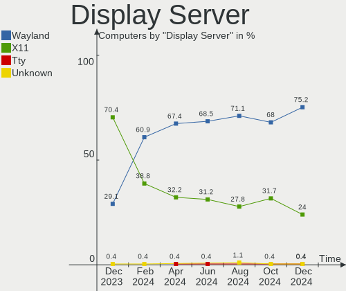
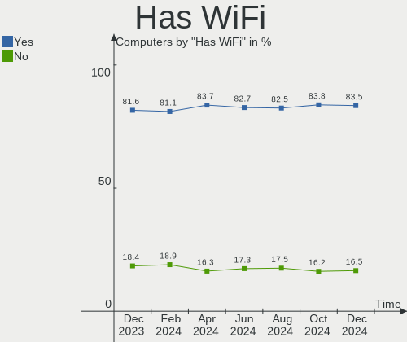
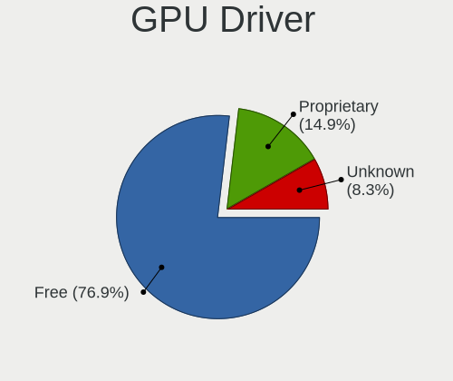
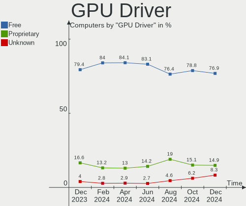
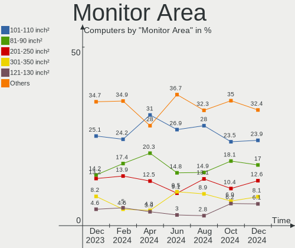
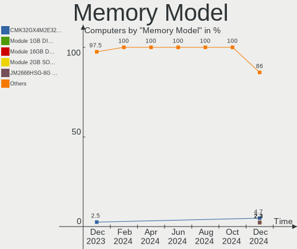

Zorin - Hardware Trends
-----------------------

A project to identify most popular hardware characteristics and track their change
over time based on data collected by Linux users at https://Linux-Hardware.org.

Anyone can contribute to this report by the [hw-probe](https://github.com/linuxhw/hw-probe) tool:

    sudo -E hw-probe -all -upload

This is a report for all computer types. See also reports for [desktops](/Dist/Zorin/Desktop/README.md) and [notebooks](/Dist/Zorin/Notebook/README.md).

This report is for one last month. Overall report since the beginning of time: [TestDays](https://github.com/linuxhw/TestDays)

Period: Apr, 2024.

Contents
--------

* [ System ](#system)
  - [ OS                       ](#os)
  - [ OS Family                ](#os-family)
  - [ Kernel                   ](#kernel)
  - [ Kernel Family            ](#kernel-family)
  - [ Kernel Major Ver.        ](#kernel-major-ver)
  - [ Arch                     ](#arch)
  - [ DE                       ](#de)
  - [ Display Server           ](#display-server)
  - [ Display Manager          ](#display-manager)
  - [ OS Lang                  ](#os-lang)
  - [ Boot Mode                ](#boot-mode)
  - [ Filesystem               ](#filesystem)
  - [ Part. scheme             ](#part-scheme)
  - [ Dual Boot with Linux/BSD ](#dual-boot-with-linuxbsd)
  - [ Dual Boot (Win)          ](#dual-boot-win)

* [ Board ](#board)
  - [ Vendor                   ](#vendor)
  - [ Model                    ](#model)
  - [ Model Family             ](#model-family)
  - [ MFG Year                 ](#mfg-year)
  - [ Form Factor              ](#form-factor)
  - [ Secure Boot              ](#secure-boot)
  - [ Coreboot                 ](#coreboot)
  - [ RAM Size                 ](#ram-size)
  - [ RAM Used                 ](#ram-used)
  - [ Total Drives             ](#total-drives)
  - [ Has CD-ROM               ](#has-cd-rom)
  - [ Has Ethernet             ](#has-ethernet)
  - [ Has WiFi                 ](#has-wifi)
  - [ Has Bluetooth            ](#has-bluetooth)

* [ Location ](#location)
  - [ Country                  ](#country)
  - [ City                     ](#city)

* [ Drives ](#drives)
  - [ Drive Vendor             ](#drive-vendor)
  - [ Drive Model              ](#drive-model)
  - [ HDD Vendor               ](#hdd-vendor)
  - [ SSD Vendor               ](#ssd-vendor)
  - [ Drive Kind               ](#drive-kind)
  - [ Drive Connector          ](#drive-connector)
  - [ Drive Size               ](#drive-size)
  - [ Space Total              ](#space-total)
  - [ Space Used               ](#space-used)
  - [ Malfunc. Drives          ](#malfunc-drives)
  - [ Malfunc. Drive Vendor    ](#malfunc-drive-vendor)
  - [ Malfunc. HDD Vendor      ](#malfunc-hdd-vendor)
  - [ Malfunc. Drive Kind      ](#malfunc-drive-kind)
  - [ Failed Drives            ](#failed-drives)
  - [ Failed Drive Vendor      ](#failed-drive-vendor)
  - [ Drive Status             ](#drive-status)

* [ Storage controller ](#storage-controller)
  - [ Storage Vendor           ](#storage-vendor)
  - [ Storage Model            ](#storage-model)
  - [ Storage Kind             ](#storage-kind)

* [ Processor ](#processor)
  - [ CPU Vendor               ](#cpu-vendor)
  - [ CPU Model                ](#cpu-model)
  - [ CPU Model Family         ](#cpu-model-family)
  - [ CPU Cores                ](#cpu-cores)
  - [ CPU Sockets              ](#cpu-sockets)
  - [ CPU Threads              ](#cpu-threads)
  - [ CPU Op-Modes             ](#cpu-op-modes)
  - [ CPU Microcode            ](#cpu-microcode)
  - [ CPU Microarch            ](#cpu-microarch)

* [ Graphics ](#graphics)
  - [ GPU Vendor               ](#gpu-vendor)
  - [ GPU Model                ](#gpu-model)
  - [ GPU Combo                ](#gpu-combo)
  - [ GPU Driver               ](#gpu-driver)
  - [ GPU Memory               ](#gpu-memory)

* [ Monitor ](#monitor)
  - [ Monitor Vendor           ](#monitor-vendor)
  - [ Monitor Model            ](#monitor-model)
  - [ Monitor Resolution       ](#monitor-resolution)
  - [ Monitor Diagonal         ](#monitor-diagonal)
  - [ Monitor Width            ](#monitor-width)
  - [ Aspect Ratio             ](#aspect-ratio)
  - [ Monitor Area             ](#monitor-area)
  - [ Pixel Density            ](#pixel-density)
  - [ Multiple Monitors        ](#multiple-monitors)

* [ Network ](#network)
  - [ Net Controller Vendor    ](#net-controller-vendor)
  - [ Net Controller Model     ](#net-controller-model)
  - [ Wireless Vendor          ](#wireless-vendor)
  - [ Wireless Model           ](#wireless-model)
  - [ Ethernet Vendor          ](#ethernet-vendor)
  - [ Ethernet Model           ](#ethernet-model)
  - [ Net Controller Kind      ](#net-controller-kind)
  - [ Used Controller          ](#used-controller)
  - [ NICs                     ](#nics)
  - [ IPv6                     ](#ipv6)

* [ Bluetooth ](#bluetooth)
  - [ Bluetooth Vendor         ](#bluetooth-vendor)
  - [ Bluetooth Model          ](#bluetooth-model)

* [ Sound ](#sound)
  - [ Sound Vendor             ](#sound-vendor)
  - [ Sound Model              ](#sound-model)

* [ Memory ](#memory)
  - [ Memory Vendor            ](#memory-vendor)
  - [ Memory Model             ](#memory-model)
  - [ Memory Kind              ](#memory-kind)
  - [ Memory Form Factor       ](#memory-form-factor)
  - [ Memory Size              ](#memory-size)
  - [ Memory Speed             ](#memory-speed)

* [ Printers & scanners ](#printers--scanners)
  - [ Printer Vendor           ](#printer-vendor)
  - [ Printer Model            ](#printer-model)
  - [ Scanner Vendor           ](#scanner-vendor)
  - [ Scanner Model            ](#scanner-model)

* [ Camera ](#camera)
  - [ Camera Vendor            ](#camera-vendor)
  - [ Camera Model             ](#camera-model)

* [ Security ](#security)
  - [ Fingerprint Vendor       ](#fingerprint-vendor)
  - [ Fingerprint Model        ](#fingerprint-model)
  - [ Chipcard Vendor          ](#chipcard-vendor)
  - [ Chipcard Model           ](#chipcard-model)

* [ Unsupported ](#unsupported)
  - [ Unsupported Devices      ](#unsupported-devices)
  - [ Unsupported Device Types ](#unsupported-device-types)

System
------

OS
--

Installed operating systems

| Name     | Computers | Percent |
|----------|-----------|---------|
| Zorin 17 | 206       | 86.19%  |
| Zorin 16 | 31        | 12.97%  |
| Zorin 15 | 2         | 0.84%   |

OS Family
---------

OS without a version

| Name  | Computers | Percent |
|-------|-----------|---------|
| Zorin | 239       | 100%    |

Kernel
------

Version of the Linux kernel

| Version                | Computers | Percent |
|------------------------|-----------|---------|
| 6.5.0-27-generic       | 73        | 30.54%  |
| 6.5.0-28-generic       | 65        | 27.2%   |
| 6.5.0-26-generic       | 55        | 23.01%  |
| 5.15.0-101-generic     | 10        | 4.18%   |
| 5.15.0-102-generic     | 8         | 3.35%   |
| 5.15.0-105-generic     | 6         | 2.51%   |
| 6.5.0-21-generic       | 4         | 1.67%   |
| 6.2.0-39-generic       | 3         | 1.26%   |
| 5.15.0-78-generic      | 3         | 1.26%   |
| 6.8.7-2-liquorix-amd64 | 1         | 0.42%   |
| 6.8.7-060807-generic   | 1         | 0.42%   |
| 6.5.0-25-generic       | 1         | 0.42%   |
| 6.5.0-18-generic       | 1         | 0.42%   |
| 6.5.0-15-generic       | 1         | 0.42%   |
| 6.2.0-37-generic       | 1         | 0.42%   |
| 5.4.0-150-generic      | 1         | 0.42%   |
| 5.4.0-148-generic      | 1         | 0.42%   |
| 5.15.0-94-generic      | 1         | 0.42%   |
| 5.15.0-71-generic      | 1         | 0.42%   |
| 5.15.0-67-generic      | 1         | 0.42%   |
| 5.13.0-30-generic      | 1         | 0.42%   |

Kernel Family
-------------

Linux kernel without a distro release

| Version | Computers | Percent |
|---------|-----------|---------|
| 6.5.0   | 200       | 83.68%  |
| 5.15.0  | 30        | 12.55%  |
| 6.2.0   | 4         | 1.67%   |
| 6.8.7   | 2         | 0.84%   |
| 5.4.0   | 2         | 0.84%   |
| 5.13.0  | 1         | 0.42%   |

Kernel Major Ver.
-----------------

Linux kernel major version

| Version | Computers | Percent |
|---------|-----------|---------|
| 6.5     | 200       | 83.68%  |
| 5.15    | 30        | 12.55%  |
| 6.2     | 4         | 1.67%   |
| 6.8     | 2         | 0.84%   |
| 5.4     | 2         | 0.84%   |
| 5.13    | 1         | 0.42%   |

Arch
----

OS architecture (x86_64, i586, etc.)

| Name   | Computers | Percent |
|--------|-----------|---------|
| x86_64 | 238       | 99.58%  |
| i686   | 1         | 0.42%   |

DE
--

Desktop Environment

| Name  | Computers | Percent |
|-------|-----------|---------|
| GNOME | 221       | 92.47%  |
| XFCE  | 18        | 7.53%   |

Display Server
--------------

X11 or Wayland

| Name    | Computers | Percent |
|---------|-----------|---------|
| Wayland | 161       | 67.36%  |
| X11     | 77        | 32.22%  |
| Tty     | 1         | 0.42%   |

Display Manager
---------------

SDDM, LightDM, etc.

| Name    | Computers | Percent |
|---------|-----------|---------|
| Unknown | 198       | 82.85%  |
| GDM3    | 36        | 15.06%  |
| LightDM | 4         | 1.67%   |
| GDM     | 1         | 0.42%   |

OS Lang
-------

Language

| Lang  | Computers | Percent |
|-------|-----------|---------|
| en_US | 86        | 35.98%  |
| de_DE | 28        | 11.72%  |
| it_IT | 19        | 7.95%   |
| pt_BR | 17        | 7.11%   |
| fr_FR | 15        | 6.28%   |
| en_GB | 9         | 3.77%   |
| nl_NL | 6         | 2.51%   |
| es_ES | 6         | 2.51%   |
| es_MX | 5         | 2.09%   |
| en_IN | 5         | 2.09%   |
| en_CA | 5         | 2.09%   |
| en_ZA | 4         | 1.67%   |
| en_AU | 4         | 1.67%   |
| pl_PL | 3         | 1.26%   |
| ja_JP | 3         | 1.26%   |
| ru_RU | 2         | 0.84%   |
| es_EC | 2         | 0.84%   |
| es_AR | 2         | 0.84%   |
| tr_TR | 1         | 0.42%   |
| ru_UA | 1         | 0.42%   |
| ro_RO | 1         | 0.42%   |
| hr_HR | 1         | 0.42%   |
| fr_CA | 1         | 0.42%   |
| fi_FI | 1         | 0.42%   |
| es_VE | 1         | 0.42%   |
| es_SV | 1         | 0.42%   |
| es_HN | 1         | 0.42%   |
| es_DO | 1         | 0.42%   |
| es_CO | 1         | 0.42%   |
| es_CL | 1         | 0.42%   |
| en_PH | 1         | 0.42%   |
| en_IE | 1         | 0.42%   |
| el_GR | 1         | 0.42%   |
| de_CH | 1         | 0.42%   |
| cs_CZ | 1         | 0.42%   |
| bg_BG | 1         | 0.42%   |

Boot Mode
---------

EFI or BIOS

| Mode | Computers | Percent |
|------|-----------|---------|
| BIOS | 204       | 85.36%  |
| EFI  | 35        | 14.64%  |

Filesystem
----------

Type of filesystem

| Type    | Computers | Percent |
|---------|-----------|---------|
| Ext4    | 208       | 87.03%  |
| Tmpfs   | 17        | 7.11%   |
| Zfs     | 11        | 4.6%    |
| Xfs     | 1         | 0.42%   |
| Overlay | 1         | 0.42%   |
| Btrfs   | 1         | 0.42%   |

Part. scheme
------------

Scheme of partitioning

| Type    | Computers | Percent |
|---------|-----------|---------|
| Unknown | 199       | 83.26%  |
| GPT     | 33        | 13.81%  |
| MBR     | 7         | 2.93%   |

Dual Boot with Linux/BSD
------------------------

Hosting more than one Linux/BSD

| Dual boot | Computers | Percent |
|-----------|-----------|---------|
| No        | 231       | 96.65%  |
| Yes       | 8         | 3.35%   |

Dual Boot (Win)
---------------

Hosting Linux and Windows

| Dual boot | Computers | Percent |
|-----------|-----------|---------|
| No        | 225       | 94.14%  |
| Yes       | 14        | 5.86%   |

Board
-----

Vendor
------

Motherboard manufacturer

| Name                   | Computers | Percent |
|------------------------|-----------|---------|
| Hewlett-Packard        | 36        | 15.06%  |
| Dell                   | 34        | 14.23%  |
| Lenovo                 | 29        | 12.13%  |
| ASUSTek Computer       | 29        | 12.13%  |
| Gigabyte Technology    | 14        | 5.86%   |
| Apple                  | 13        | 5.44%   |
| Acer                   | 12        | 5.02%   |
| MSI                    | 11        | 4.6%    |
| Unknown                | 7         | 2.93%   |
| Samsung Electronics    | 4         | 1.67%   |
| Positivo               | 4         | 1.67%   |
| Packard Bell           | 4         | 1.67%   |
| Toshiba                | 3         | 1.26%   |
| HUAWEI                 | 3         | 1.26%   |
| ASRock                 | 3         | 1.26%   |
| Teclast                | 2         | 0.84%   |
| Tactus                 | 2         | 0.84%   |
| Pegatron               | 2         | 0.84%   |
| Microsoft              | 2         | 0.84%   |
| Intel                  | 2         | 0.84%   |
| BANGHO                 | 2         | 0.84%   |
| Alienware              | 2         | 0.84%   |
| TODOS INDUSTRIAL       | 1         | 0.42%   |
| STGAUBRON              | 1         | 0.42%   |
| Sony                   | 1         | 0.42%   |
| Razer                  | 1         | 0.42%   |
| Panasonic              | 1         | 0.42%   |
| NEC Computers          | 1         | 0.42%   |
| NCR                    | 1         | 0.42%   |
| Medion                 | 1         | 0.42%   |
| Mediacom               | 1         | 0.42%   |
| Google                 | 1         | 0.42%   |
| Gateway                | 1         | 0.42%   |
| Foxconn                | 1         | 0.42%   |
| Dynabook Europe        | 1         | 0.42%   |
| Biostar                | 1         | 0.42%   |
| AXDIA International    | 1         | 0.42%   |
| AWOW                   | 1         | 0.42%   |
| Avell High Performance | 1         | 0.42%   |
| AOpen                  | 1         | 0.42%   |

Model
-----

Motherboard model

| Name                                           | Computers | Percent |
|------------------------------------------------|-----------|---------|
| Unknown                                        | 7         | 2.93%   |
| Apple MacBookPro9,2                            | 6         | 2.51%   |
| MSI MS-7C56                                    | 2         | 0.84%   |
| HP Pavilion dv6                                | 2         | 0.84%   |
| HP Notebook                                    | 2         | 0.84%   |
| Gigabyte AB350-Gaming 3                        | 2         | 0.84%   |
| Dell Latitude E5520                            | 2         | 0.84%   |
| ASRock A520M-HDV                               | 2         | 0.84%   |
| Toshiba TECRA Z40-C                            | 1         | 0.42%   |
| Toshiba Satellite S55t-A                       | 1         | 0.42%   |
| Toshiba NB520                                  | 1         | 0.42%   |
| TODOS INDUSTRIAL Aprix_2022_V1                 | 1         | 0.42%   |
| Teclast F6 Plus                                | 1         | 0.42%   |
| Teclast F15                                    | 1         | 0.42%   |
| Tactus GeoPad 220                              | 1         | 0.42%   |
| Tactus GeoBook 140                             | 1         | 0.42%   |
| STGAUBRON B75M4 V1.1                           | 1         | 0.42%   |
| Sony VPCS131FM                                 | 1         | 0.42%   |
| Samsung R530/R730                              | 1         | 0.42%   |
| Samsung R519/R719                              | 1         | 0.42%   |
| Samsung 750XED                                 | 1         | 0.42%   |
| Samsung 300E5EV/300E4EV/270E5EV/270E4EV/2470EV | 1         | 0.42%   |
| Razer Blade 14 - RZ09-0370                     | 1         | 0.42%   |
| Positivo Master D570a                          | 1         | 0.42%   |
| Positivo J14KR11                               | 1         | 0.42%   |
| Positivo C4128B-1                              | 1         | 0.42%   |
| Positivo C14CR01                               | 1         | 0.42%   |
| Pegatron Compaq dx2400 Microtower              | 1         | 0.42%   |
| Pegatron AZ224AV-ABA 300-1100z                 | 1         | 0.42%   |
| Panasonic CF-31WFL72LM                         | 1         | 0.42%   |
| Packard Bell EasyNote TM86                     | 1         | 0.42%   |
| Packard Bell EasyNote TE69KB                   | 1         | 0.42%   |
| Packard Bell EasyNote LS11HR                   | 1         | 0.42%   |
| Packard Bell EasyNote LJ61                     | 1         | 0.42%   |
| NEC Computers PC-LS350SSW                      | 1         | 0.42%   |
| NCR xxxx-xxxx-xxxx                             | 1         | 0.42%   |
| MSI Sword 15 A12VE                             | 1         | 0.42%   |
| MSI PR600                                      | 1         | 0.42%   |
| MSI MS-7C52                                    | 1         | 0.42%   |
| MSI MS-7C37                                    | 1         | 0.42%   |

Model Family
------------

Motherboard model prefix

| Name                   | Computers | Percent |
|------------------------|-----------|---------|
| Dell Latitude          | 11        | 4.6%    |
| Lenovo ThinkPad        | 10        | 4.18%   |
| Dell Inspiron          | 9         | 3.77%   |
| Acer Aspire            | 9         | 3.77%   |
| HP ProBook             | 8         | 3.35%   |
| Unknown                | 7         | 2.93%   |
| HP Pavilion            | 6         | 2.51%   |
| Apple MacBookPro9      | 6         | 2.51%   |
| Dell OptiPlex          | 5         | 2.09%   |
| Packard Bell EasyNote  | 4         | 1.67%   |
| Lenovo ThinkCentre     | 4         | 1.67%   |
| Lenovo IdeaPad         | 4         | 1.67%   |
| HP EliteBook           | 3         | 1.26%   |
| HP Compaq              | 3         | 1.26%   |
| Dell Precision         | 3         | 1.26%   |
| ASUS VivoBook          | 3         | 1.26%   |
| ASUS TUF               | 3         | 1.26%   |
| MSI MS-7C56            | 2         | 0.84%   |
| Microsoft Surface      | 2         | 0.84%   |
| Lenovo IdeaPadFlex     | 2         | 0.84%   |
| HP Notebook            | 2         | 0.84%   |
| HP Laptop              | 2         | 0.84%   |
| HP ENVY                | 2         | 0.84%   |
| HP EliteDesk           | 2         | 0.84%   |
| HP 15                  | 2         | 0.84%   |
| Gigabyte Z390          | 2         | 0.84%   |
| Gigabyte AB350-Gaming  | 2         | 0.84%   |
| Dell XPS               | 2         | 0.84%   |
| Dell System            | 2         | 0.84%   |
| ASUS ROG               | 2         | 0.84%   |
| ASUS ASUS              | 2         | 0.84%   |
| ASRock A520M-HDV       | 2         | 0.84%   |
| Acer Swift             | 2         | 0.84%   |
| Toshiba TECRA          | 1         | 0.42%   |
| Toshiba Satellite      | 1         | 0.42%   |
| Toshiba NB520          | 1         | 0.42%   |
| TODOS INDUSTRIAL Aprix | 1         | 0.42%   |
| Teclast F6             | 1         | 0.42%   |
| Teclast F15            | 1         | 0.42%   |
| Tactus GeoPad          | 1         | 0.42%   |

MFG Year
--------

Motherboard manufacture year

| Year | Computers | Percent |
|------|-----------|---------|
| 2012 | 24        | 10.04%  |
| 2013 | 22        | 9.21%   |
| 2011 | 19        | 7.95%   |
| 2019 | 16        | 6.69%   |
| 2018 | 16        | 6.69%   |
| 2017 | 15        | 6.28%   |
| 2014 | 15        | 6.28%   |
| 2023 | 14        | 5.86%   |
| 2021 | 14        | 5.86%   |
| 2020 | 14        | 5.86%   |
| 2015 | 14        | 5.86%   |
| 2022 | 12        | 5.02%   |
| 2010 | 11        | 4.6%    |
| 2009 | 11        | 4.6%    |
| 2016 | 7         | 2.93%   |
| 2007 | 7         | 2.93%   |
| 2008 | 6         | 2.51%   |
| 2024 | 1         | 0.42%   |
| 2006 | 1         | 0.42%   |

Form Factor
-----------

Physical design of the computer

| Name        | Computers | Percent |
|-------------|-----------|---------|
| Notebook    | 147       | 61.51%  |
| Desktop     | 68        | 28.45%  |
| Tablet      | 8         | 3.35%   |
| Convertible | 6         | 2.51%   |
| Mini pc     | 5         | 2.09%   |
| All in one  | 5         | 2.09%   |

Secure Boot
-----------

Enabled or disabled

| State    | Computers | Percent |
|----------|-----------|---------|
| Disabled | 235       | 98.33%  |
| Enabled  | 4         | 1.67%   |

Coreboot
--------

Have coreboot on board

| Used | Computers | Percent |
|------|-----------|---------|
| No   | 238       | 99.58%  |
| Yes  | 1         | 0.42%   |

RAM Size
--------

Total RAM memory

| Size in GB  | Computers | Percent |
|-------------|-----------|---------|
| 4.01-8.0    | 64        | 26.78%  |
| 3.01-4.0    | 58        | 24.27%  |
| 16.01-24.0  | 49        | 20.5%   |
| 8.01-16.0   | 39        | 16.32%  |
| 32.01-64.0  | 14        | 5.86%   |
| 64.01-256.0 | 8         | 3.35%   |
| 1.01-2.0    | 4         | 1.67%   |
| 24.01-32.0  | 2         | 0.84%   |
| 2.01-3.0    | 1         | 0.42%   |

RAM Used
--------

Used RAM memory

| Used GB   | Computers | Percent |
|-----------|-----------|---------|
| 2.01-3.0  | 88        | 36.82%  |
| 1.01-2.0  | 87        | 36.4%   |
| 4.01-8.0  | 32        | 13.39%  |
| 3.01-4.0  | 28        | 11.72%  |
| 0.51-1.0  | 3         | 1.26%   |
| 8.01-16.0 | 1         | 0.42%   |

Total Drives
------------

Number of drives on board

| Drives | Computers | Percent |
|--------|-----------|---------|
| 1      | 168       | 70.29%  |
| 2      | 54        | 22.59%  |
| 3      | 10        | 4.18%   |
| 4      | 3         | 1.26%   |
| 6      | 2         | 0.84%   |
| 5      | 2         | 0.84%   |

Has CD-ROM
----------

Has CD-ROM on board

| Presented | Computers | Percent |
|-----------|-----------|---------|
| No        | 136       | 56.9%   |
| Yes       | 103       | 43.1%   |

Has Ethernet
------------

Has Ethernet on board

| Presented | Computers | Percent |
|-----------|-----------|---------|
| Yes       | 207       | 86.61%  |
| No        | 32        | 13.39%  |

Has WiFi
--------

Has WiFi module

| Presented | Computers | Percent |
|-----------|-----------|---------|
| Yes       | 203       | 84.94%  |
| No        | 36        | 15.06%  |

Has Bluetooth
-------------

Has Bluetooth module

| Presented | Computers | Percent |
|-----------|-----------|---------|
| Yes       | 152       | 63.6%   |
| No        | 87        | 36.4%   |

Location
--------

Country
-------

Geographic location (country)

| Country         | Computers | Percent |
|-----------------|-----------|---------|
| USA             | 44        | 18.41%  |
| Germany         | 31        | 12.97%  |
| Brazil          | 22        | 9.21%   |
| Italy           | 20        | 8.37%   |
| France          | 10        | 4.18%   |
| UK              | 9         | 3.77%   |
| Netherlands     | 8         | 3.35%   |
| Canada          | 8         | 3.35%   |
| Mexico          | 7         | 2.93%   |
| Spain           | 6         | 2.51%   |
| India           | 5         | 2.09%   |
| Switzerland     | 4         | 1.67%   |
| South Africa    | 4         | 1.67%   |
| Australia       | 4         | 1.67%   |
| Romania         | 3         | 1.26%   |
| Japan           | 3         | 1.26%   |
| Egypt           | 3         | 1.26%   |
| Turkey          | 2         | 0.84%   |
| The Netherlands | 2         | 0.84%   |
| Serbia          | 2         | 0.84%   |
| Russia          | 2         | 0.84%   |
| Poland          | 2         | 0.84%   |
| Iran            | 2         | 0.84%   |
| Finland         | 2         | 0.84%   |
| Ecuador         | 2         | 0.84%   |
| Czechia         | 2         | 0.84%   |
| Argentina       | 2         | 0.84%   |
| Venezuela       | 1         | 0.42%   |
| Uruguay         | 1         | 0.42%   |
| Ukraine         | 1         | 0.42%   |
| Sweden          | 1         | 0.42%   |
| Puerto Rico     | 1         | 0.42%   |
| Portugal        | 1         | 0.42%   |
| Philippines     | 1         | 0.42%   |
| Pakistan        | 1         | 0.42%   |
| Norway          | 1         | 0.42%   |
| North Macedonia | 1         | 0.42%   |
| Nepal           | 1         | 0.42%   |
| Morocco         | 1         | 0.42%   |
| Martinique      | 1         | 0.42%   |

City
----

Geographic location (city)

| City                 | Computers | Percent |
|----------------------|-----------|---------|
| Sao Paulo            | 4         | 1.67%   |
| Rio de Janeiro       | 4         | 1.67%   |
| Hamburg              | 4         | 1.67%   |
| Amsterdam            | 4         | 1.67%   |
| Sydney               | 3         | 1.26%   |
| Johannesburg         | 3         | 1.26%   |
| Cairo                | 3         | 1.26%   |
| Buffalo              | 3         | 1.26%   |
| West Chester         | 2         | 0.84%   |
| Valladolid           | 2         | 0.84%   |
| Turin                | 2         | 0.84%   |
| Stuttgart            | 2         | 0.84%   |
| Mexico City          | 2         | 0.84%   |
| Leeds                | 2         | 0.84%   |
| L'Isle-Adam          | 2         | 0.84%   |
| Essen                | 2         | 0.84%   |
| El Paso              | 2         | 0.84%   |
| Detroit              | 2         | 0.84%   |
| Brasília            | 2         | 0.84%   |
| Berlin               | 2         | 0.84%   |
| Bellaria-Igea Marina | 2         | 0.84%   |
| Belgrade             | 2         | 0.84%   |
| Austin               | 2         | 0.84%   |
| Zurich               | 1         | 0.42%   |
| Zero Branco          | 1         | 0.42%   |
| Zephyrhills          | 1         | 0.42%   |
| Zeitz                | 1         | 0.42%   |
| Zeist                | 1         | 0.42%   |
| Zaragoza             | 1         | 0.42%   |
| Zagreb               | 1         | 0.42%   |
| Winterthur           | 1         | 0.42%   |
| Wilsdruff            | 1         | 0.42%   |
| Westchester          | 1         | 0.42%   |
| Warrington           | 1         | 0.42%   |
| Volta Redonda        | 1         | 0.42%   |
| Viry-Châtillon      | 1         | 0.42%   |
| Vercelli             | 1         | 0.42%   |
| Valatie              | 1         | 0.42%   |
| Union                | 1         | 0.42%   |
| Tyumen               | 1         | 0.42%   |

Drives
------

Drive Vendor
------------

Hard drive vendors

| Vendor                    | Computers | Drives | Percent |
|---------------------------|-----------|--------|---------|
| Samsung Electronics       | 53        | 56     | 16.41%  |
| WDC                       | 39        | 42     | 12.07%  |
| Seagate                   | 36        | 40     | 11.15%  |
| Toshiba                   | 22        | 22     | 6.81%   |
| Kingston                  | 18        | 18     | 5.57%   |
| Unknown                   | 15        | 17     | 4.64%   |
| Sandisk                   | 15        | 15     | 4.64%   |
| Crucial                   | 10        | 10     | 3.1%    |
| China                     | 8         | 8      | 2.48%   |
| SK hynix                  | 7         | 7      | 2.17%   |
| A-DATA Technology         | 7         | 7      | 2.17%   |
| HGST                      | 6         | 6      | 1.86%   |
| Silicon Motion            | 5         | 5      | 1.55%   |
| Micron/Crucial Technology | 5         | 5      | 1.55%   |
| Intel                     | 5         | 5      | 1.55%   |
| Micron Technology         | 4         | 4      | 1.24%   |
| Intenso                   | 4         | 4      | 1.24%   |
| Hitachi                   | 4         | 4      | 1.24%   |
| Apple                     | 4         | 4      | 1.24%   |
| Unknown                   | 4         | 4      | 1.24%   |
| Phison Electronics        | 3         | 3      | 0.93%   |
| LITEON                    | 3         | 3      | 0.93%   |
| Teclast                   | 2         | 2      | 0.62%   |
| SPCC                      | 2         | 2      | 0.62%   |
| OCZ                       | 2         | 2      | 0.62%   |
| Netac                     | 2         | 2      | 0.62%   |
| Lexar                     | 2         | 2      | 0.62%   |
| KIOXIA-EXCERIA            | 2         | 2      | 0.62%   |
| KIOXIA                    | 2         | 2      | 0.62%   |
| FORESEE                   | 2         | 2      | 0.62%   |
| Fanxiang                  | 2         | 2      | 0.62%   |
| ASMT                      | 2         | 2      | 0.62%   |
| Apacer                    | 2         | 2      | 0.62%   |
| ADATA Technology          | 2         | 2      | 0.62%   |
| ZXIC MMC                  | 1         | 1      | 0.31%   |
| ValueTech                 | 1         | 1      | 0.31%   |
| TSA                       | 1         | 1      | 0.31%   |
| tecmiyo                   | 1         | 1      | 0.31%   |
| Team                      | 1         | 1      | 0.31%   |
| SSSTC                     | 1         | 1      | 0.31%   |

Drive Model
-----------

Hard drive models

| Model                                                 | Computers | Percent |
|-------------------------------------------------------|-----------|---------|
| Samsung NVMe SSD Controller SM981/PM981/PM983 1TB     | 8         | 2.42%   |
| Unknown MMC Card  64GB                                | 7         | 2.11%   |
| Samsung SSD 850 EVO 250GB                             | 5         | 1.51%   |
| Kingston SA400S37240G 240GB SSD                       | 5         | 1.51%   |
| Sandisk WD Black SN750 / PC SN730 NVMe SSD 512GB      | 4         | 1.21%   |
| Kingston SA400S37480G 480GB SSD                       | 4         | 1.21%   |
| Unknown                                               | 4         | 1.21%   |
| Unknown MMC Card  32GB                                | 3         | 0.91%   |
| Toshiba MQ01ABF050 500GB                              | 3         | 0.91%   |
| Seagate ST1000LM024 HN-M101MBB 1TB                    | 3         | 0.91%   |
| Micron/Crucial P2 NVMe PCIe SSD 4TB                   | 3         | 0.91%   |
| Crucial CT500MX500SSD1 500GB                          | 3         | 0.91%   |
| WDC WDS120G2G0A-00JH30 120GB SSD                      | 2         | 0.6%    |
| WDC WD5000LPVX-22V0TT0 500GB                          | 2         | 0.6%    |
| WDC WD5000LPLX-08ZNTT0 500GB                          | 2         | 0.6%    |
| WDC WD3200BEVT-22ZCT0 320GB                           | 2         | 0.6%    |
| WDC WD10SPZX-08Z10 1TB                                | 2         | 0.6%    |
| WDC WD Blue SA510 2.5 500GB SSD                       | 2         | 0.6%    |
| Unknown MMC Card  16GB                                | 2         | 0.6%    |
| Toshiba XG6 NVMe SSD Controller 1024GB                | 2         | 0.6%    |
| Toshiba MQ01ABD100 1TB                                | 2         | 0.6%    |
| Toshiba HDWD110 1TB                                   | 2         | 0.6%    |
| SK hynix BC501 NVMe Solid State Drive 512GB           | 2         | 0.6%    |
| Silicon Motion SM2263EN/SM2263XT SSD Controller 256GB | 2         | 0.6%    |
| Silicon Motion PCIe-8 SSD 512GB                       | 2         | 0.6%    |
| Seagate ST9500325AS 500GB                             | 2         | 0.6%    |
| Seagate ST500LT012-1DG142 500GB                       | 2         | 0.6%    |
| Seagate ST500LM012 HN-M500MBB 500GB                   | 2         | 0.6%    |
| Seagate ST3160812AS 160GB                             | 2         | 0.6%    |
| Seagate ST2000DM001-1ER164 2TB                        | 2         | 0.6%    |
| Samsung SSD 990 PRO 2TB                               | 2         | 0.6%    |
| Samsung SSD 980 1TB                                   | 2         | 0.6%    |
| Samsung SSD 870 EVO 500GB                             | 2         | 0.6%    |
| Samsung SSD 860 EVO 500GB                             | 2         | 0.6%    |
| Samsung SSD 840 Series 250GB                          | 2         | 0.6%    |
| Samsung NVMe SSD Controller SM961/PM961/SM963 1TB     | 2         | 0.6%    |
| Samsung NVMe SSD Controller PM9A1/PM9A3/980PRO 1TB    | 2         | 0.6%    |
| Samsung HD103UJ 1TB                                   | 2         | 0.6%    |
| Phison PS5013 E13 NVMe Controller 512GB               | 2         | 0.6%    |
| Micron 2400_MTFDKBA512QFM 512GB                       | 2         | 0.6%    |

HDD Vendor
----------

Hard disk drive vendors

| Vendor              | Computers | Drives | Percent |
|---------------------|-----------|--------|---------|
| Seagate             | 35        | 39     | 33.33%  |
| WDC                 | 29        | 31     | 27.62%  |
| Toshiba             | 19        | 19     | 18.1%   |
| HGST                | 6         | 6      | 5.71%   |
| Samsung Electronics | 4         | 4      | 3.81%   |
| Hitachi             | 4         | 4      | 3.81%   |
| Apple               | 3         | 3      | 2.86%   |
| Unknown             | 1         | 1      | 0.95%   |
| Maxtor              | 1         | 1      | 0.95%   |
| LaCie               | 1         | 1      | 0.95%   |
| Fujitsu             | 1         | 1      | 0.95%   |
| ASMT                | 1         | 1      | 0.95%   |

SSD Vendor
----------

Solid state drive vendors

| Vendor              | Computers | Drives | Percent |
|---------------------|-----------|--------|---------|
| Samsung Electronics | 25        | 25     | 22.12%  |
| Kingston            | 14        | 14     | 12.39%  |
| WDC                 | 10        | 10     | 8.85%   |
| Crucial             | 10        | 10     | 8.85%   |
| China               | 7         | 7      | 6.19%   |
| A-DATA Technology   | 7         | 7      | 6.19%   |
| SanDisk             | 3         | 3      | 2.65%   |
| LITEON              | 3         | 3      | 2.65%   |
| Intenso             | 3         | 3      | 2.65%   |
| Teclast             | 2         | 2      | 1.77%   |
| SPCC                | 2         | 2      | 1.77%   |
| OCZ                 | 2         | 2      | 1.77%   |
| Netac               | 2         | 2      | 1.77%   |
| Lexar               | 2         | 2      | 1.77%   |
| Intel               | 2         | 2      | 1.77%   |
| FORESEE             | 2         | 2      | 1.77%   |
| Unknown             | 2         | 2      | 1.77%   |
| TSA                 | 1         | 1      | 0.88%   |
| tecmiyo             | 1         | 1      | 0.88%   |
| Team                | 1         | 1      | 0.88%   |
| SSSTC               | 1         | 1      | 0.88%   |
| ROG                 | 1         | 1      | 0.88%   |
| Patriot             | 1         | 1      | 0.88%   |
| Micron Technology   | 1         | 1      | 0.88%   |
| LITEONIT            | 1         | 1      | 0.88%   |
| KIOXIA-EXCERIA      | 1         | 1      | 0.88%   |
| KingSpec            | 1         | 1      | 0.88%   |
| Hewlett-Packard     | 1         | 1      | 0.88%   |
| GOODRAM             | 1         | 1      | 0.88%   |
| Gigabyte Technology | 1         | 1      | 0.88%   |
| Apple               | 1         | 1      | 0.88%   |
| Apacer              | 1         | 1      | 0.88%   |

Drive Kind
----------

HDD or SSD

| Kind    | Computers | Drives | Percent |
|---------|-----------|--------|---------|
| SSD     | 105       | 113    | 35.71%  |
| HDD     | 94        | 111    | 31.97%  |
| NVMe    | 71        | 85     | 24.15%  |
| MMC     | 15        | 17     | 5.1%    |
| Unknown | 9         | 9      | 3.06%   |

Drive Connector
---------------

SATA, SAS, NVMe, etc.

| Type | Computers | Drives | Percent |
|------|-----------|--------|---------|
| SATA | 178       | 226    | 65.68%  |
| NVMe | 70        | 83     | 25.83%  |
| MMC  | 15        | 17     | 5.54%   |
| SAS  | 8         | 9      | 2.95%   |

Drive Size
----------

Size of hard drive

| Size in TB | Computers | Drives | Percent |
|------------|-----------|--------|---------|
| 0.01-0.5   | 136       | 149    | 67%     |
| 0.51-1.0   | 49        | 52     | 24.14%  |
| 1.01-2.0   | 14        | 19     | 6.9%    |
| 3.01-4.0   | 2         | 2      | 0.99%   |
| 2.01-3.0   | 2         | 2      | 0.99%   |

Space Total
-----------

Amount of disk space available on the file system

| Size in GB     | Computers | Percent |
|----------------|-----------|---------|
| 101-250        | 87        | 36.4%   |
| 251-500        | 76        | 31.8%   |
| 501-1000       | 32        | 13.39%  |
| 51-100         | 15        | 6.28%   |
| 1001-2000      | 9         | 3.77%   |
| More than 3000 | 5         | 2.09%   |
| Unknown        | 5         | 2.09%   |
| 1-20           | 4         | 1.67%   |
| 2001-3000      | 3         | 1.26%   |
| 21-50          | 2         | 0.84%   |
| 0              | 1         | 0.42%   |

Space Used
----------

Amount of used disk space

| Used GB   | Computers | Percent |
|-----------|-----------|---------|
| 21-50     | 93        | 38.91%  |
| 1-20      | 72        | 30.13%  |
| 51-100    | 28        | 11.72%  |
| 101-250   | 22        | 9.21%   |
| 251-500   | 9         | 3.77%   |
| Unknown   | 5         | 2.09%   |
| 1001-2000 | 4         | 1.67%   |
| 501-1000  | 4         | 1.67%   |
| 2001-3000 | 1         | 0.42%   |
| 0         | 1         | 0.42%   |

Malfunc. Drives
---------------

Drive models with a malfunction

| Model                    | Computers | Drives | Percent |
|--------------------------|-----------|--------|---------|
| Toshiba MQ01ABF050 500GB | 1         | 1      | 50%     |
| Toshiba MK2565GSX 250GB  | 1         | 1      | 50%     |

Malfunc. Drive Vendor
---------------------

Vendors of faulty drives

| Vendor  | Computers | Drives | Percent |
|---------|-----------|--------|---------|
| Toshiba | 2         | 2      | 100%    |

Malfunc. HDD Vendor
-------------------

Vendors of faulty HDD drives

| Vendor  | Computers | Drives | Percent |
|---------|-----------|--------|---------|
| Toshiba | 2         | 2      | 100%    |

Malfunc. Drive Kind
-------------------

Kinds of faulty drives

| Kind | Computers | Drives | Percent |
|------|-----------|--------|---------|
| HDD  | 2         | 2      | 100%    |

Failed Drives
-------------

Failed drive models

Zero info for selected period =(

Failed Drive Vendor
-------------------

Failed drive vendors

Zero info for selected period =(

Drive Status
------------

Number of failed and malfunc. drives

| Status   | Computers | Drives | Percent |
|----------|-----------|--------|---------|
| Detected | 222       | 306    | 91.36%  |
| Works    | 19        | 27     | 7.82%   |
| Malfunc  | 2         | 2      | 0.82%   |

Storage controller
------------------

Storage Vendor
--------------

Storage controller vendors

| Vendor                           | Computers | Percent |
|----------------------------------|-----------|---------|
| Intel                            | 169       | 57.68%  |
| AMD                              | 36        | 12.29%  |
| Samsung Electronics              | 27        | 9.22%   |
| SanDisk                          | 12        | 4.1%    |
| SK hynix                         | 7         | 2.39%   |
| Silicon Motion                   | 5         | 1.71%   |
| Micron/Crucial Technology        | 5         | 1.71%   |
| Kingston Technology Company      | 5         | 1.71%   |
| Phison Electronics               | 4         | 1.37%   |
| Toshiba America Info Systems     | 3         | 1.02%   |
| Micron Technology                | 3         | 1.02%   |
| KIOXIA                           | 3         | 1.02%   |
| ASMedia Technology               | 2         | 0.68%   |
| ADATA Technology                 | 2         | 0.68%   |
| Silicon Integrated Systems [SiS] | 1         | 0.34%   |
| Silicon Image                    | 1         | 0.34%   |
| Seagate Technology               | 1         | 0.34%   |
| Realtek Semiconductor            | 1         | 0.34%   |
| Nvidia                           | 1         | 0.34%   |
| MAXIO Technology (Hangzhou)      | 1         | 0.34%   |
| Marvell Technology Group         | 1         | 0.34%   |
| Lite-On Technology               | 1         | 0.34%   |
| JMicron Technology               | 1         | 0.34%   |
| Broadcom / LSI                   | 1         | 0.34%   |

Storage Model
-------------

Storage controller models

| Model                                                                                   | Computers | Percent |
|-----------------------------------------------------------------------------------------|-----------|---------|
| Intel 7 Series Chipset Family 6-port SATA Controller [AHCI mode]                        | 21        | 6.5%    |
| AMD FCH SATA Controller [AHCI mode]                                                     | 20        | 6.19%   |
| Intel 6 Series/C200 Series Chipset Family 6 port Mobile SATA AHCI Controller            | 13        | 4.02%   |
| Intel 8 Series/C220 Series Chipset Family 6-port SATA Controller 1 [AHCI mode]          | 12        | 3.72%   |
| Intel Sunrise Point-LP SATA Controller [AHCI mode]                                      | 11        | 3.41%   |
| Samsung NVMe SSD Controller SM981/PM981/PM983                                           | 9         | 2.79%   |
| Intel 6 Series/C200 Series Chipset Family 6 port Desktop SATA AHCI Controller           | 9         | 2.79%   |
| Intel 7 Series/C210 Series Chipset Family 6-port SATA Controller [AHCI mode]            | 8         | 2.48%   |
| Samsung NVMe SSD Controller 980 (DRAM-less)                                             | 7         | 2.17%   |
| Intel Celeron/Pentium Silver Processor SATA Controller                                  | 7         | 2.17%   |
| Intel 82801IBM/IEM (ICH9M/ICH9M-E) 4 port SATA Controller [AHCI mode]                   | 7         | 2.17%   |
| AMD 500 Series Chipset SATA Controller                                                  | 7         | 2.17%   |
| Intel Celeron N3350/Pentium N4200/Atom E3900 Series SATA AHCI Controller                | 5         | 1.55%   |
| Intel 82801 Mobile SATA Controller [RAID mode]                                          | 5         | 1.55%   |
| Intel 5 Series/3400 Series Chipset 6 port SATA AHCI Controller                          | 5         | 1.55%   |
| Intel 5 Series/3400 Series Chipset 4 port SATA AHCI Controller                          | 5         | 1.55%   |
| Intel 200 Series PCH SATA controller [AHCI mode]                                        | 5         | 1.55%   |
| SanDisk Extreme Pro / WD Black SN750 / PC SN730 / Red SN700 NVMe SSD                    | 4         | 1.24%   |
| Samsung NVMe SSD Controller PM9A1/PM9A3/980PRO                                          | 4         | 1.24%   |
| Intel Wildcat Point-LP SATA Controller [AHCI Mode]                                      | 4         | 1.24%   |
| Intel Volume Management Device NVMe RAID Controller                                     | 4         | 1.24%   |
| Intel Atom Processor E3800 Series SATA AHCI Controller                                  | 4         | 1.24%   |
| Intel 6 Series/C200 Series Chipset Family Desktop SATA Controller (IDE mode, ports 4-5) | 4         | 1.24%   |
| Intel 6 Series/C200 Series Chipset Family Desktop SATA Controller (IDE mode, ports 0-3) | 4         | 1.24%   |
| SanDisk WD Black SN770 / PC SN740 256GB / PC SN560 (DRAM-less) NVMe SSD                 | 3         | 0.93%   |
| Samsung NVMe SSD Controller S4LV008[Pascal]                                             | 3         | 0.93%   |
| Micron/Crucial P2 [Nick P2] / P3 / P3 Plus NVMe PCIe SSD (DRAM-less)                    | 3         | 0.93%   |
| Intel Volume Management Device NVMe RAID Controller Intel Corporation                   | 3         | 0.93%   |
| Intel NM10/ICH7 Family SATA Controller [IDE mode]                                       | 3         | 0.93%   |
| Intel HM170/QM170 Chipset SATA Controller [AHCI Mode]                                   | 3         | 0.93%   |
| Intel Cannon Point-LP SATA Controller [AHCI Mode]                                       | 3         | 0.93%   |
| Intel 82801G (ICH7 Family) IDE Controller                                               | 3         | 0.93%   |
| Intel 8 Series SATA Controller 1 [AHCI mode]                                            | 3         | 0.93%   |
| AMD SB7x0/SB8x0/SB9x0 SATA Controller [IDE mode]                                        | 3         | 0.93%   |
| Toshiba America Info Systems XG6 NVMe SSD Controller                                    | 2         | 0.62%   |
| SK hynix BC501 NVMe Solid State Drive                                                   | 2         | 0.62%   |
| Silicon Motion SM2263EN/SM2263XT (DRAM-less) NVMe SSD Controllers                       | 2         | 0.62%   |
| Silicon Motion Non-Volatile memory controller                                           | 2         | 0.62%   |
| Sandisk WD Black SN850X NVMe SSD                                                        | 2         | 0.62%   |
| SanDisk Ultra 3D / WD Blue SN570 NVMe SSD (DRAM-less)                                   | 2         | 0.62%   |

Storage Kind
------------

Kind of storage controller (IDE, SATA, NVMe, SAS, ...)

| Kind | Computers | Percent |
|------|-----------|---------|
| SATA | 181       | 62.2%   |
| NVMe | 70        | 24.05%  |
| IDE  | 21        | 7.22%   |
| RAID | 17        | 5.84%   |
| SAS  | 2         | 0.69%   |

Processor
---------

CPU Vendor
----------

Processor vendors

| Vendor | Computers | Percent |
|--------|-----------|---------|
| Intel  | 194       | 81.17%  |
| AMD    | 45        | 18.83%  |

CPU Model
---------

Processor models

| Model                                       | Computers | Percent |
|---------------------------------------------|-----------|---------|
| Intel Core i5-3210M CPU @ 2.50GHz           | 6         | 2.51%   |
| Intel Core i7-6700HQ CPU @ 2.60GHz          | 4         | 1.67%   |
| Intel Core i5-3470 CPU @ 3.20GHz            | 4         | 1.67%   |
| Intel Core i5-6300U CPU @ 2.40GHz           | 3         | 1.26%   |
| Intel Core i5-2520M CPU @ 2.50GHz           | 3         | 1.26%   |
| Intel Core i3-3217U CPU @ 1.80GHz           | 3         | 1.26%   |
| Intel Celeron N4020 CPU @ 1.10GHz           | 3         | 1.26%   |
| Intel Celeron CPU J3455 @ 1.50GHz           | 3         | 1.26%   |
| Intel Atom x5-Z8350 CPU @ 1.44GHz           | 3         | 1.26%   |
| Intel 13th Gen Core i7-13700H               | 3         | 1.26%   |
| AMD Ryzen 9 5900X 12-Core Processor         | 3         | 1.26%   |
| Intel Pentium Dual-Core CPU T4500 @ 2.30GHz | 2         | 0.84%   |
| Intel Pentium Dual-Core CPU T4200 @ 2.00GHz | 2         | 0.84%   |
| Intel Core i7-8565U CPU @ 1.80GHz           | 2         | 0.84%   |
| Intel Core i7-7500U CPU @ 2.70GHz           | 2         | 0.84%   |
| Intel Core i7-4810MQ CPU @ 2.80GHz          | 2         | 0.84%   |
| Intel Core i7-4790 CPU @ 3.60GHz            | 2         | 0.84%   |
| Intel Core i7-3770 CPU @ 3.40GHz            | 2         | 0.84%   |
| Intel Core i7-2670QM CPU @ 2.20GHz          | 2         | 0.84%   |
| Intel Core i5-8250U CPU @ 1.60GHz           | 2         | 0.84%   |
| Intel Core i5-6500 CPU @ 3.20GHz            | 2         | 0.84%   |
| Intel Core i5-6200U CPU @ 2.30GHz           | 2         | 0.84%   |
| Intel Core i5-4300M CPU @ 2.60GHz           | 2         | 0.84%   |
| Intel Core i5-3340M CPU @ 2.70GHz           | 2         | 0.84%   |
| Intel Core i5-2540M CPU @ 2.60GHz           | 2         | 0.84%   |
| Intel Core i5-2400 CPU @ 3.10GHz            | 2         | 0.84%   |
| Intel Core i5 CPU M 460 @ 2.53GHz           | 2         | 0.84%   |
| Intel Core i3-2310M CPU @ 2.10GHz           | 2         | 0.84%   |
| Intel Core i3-2100 CPU @ 3.10GHz            | 2         | 0.84%   |
| Intel Core i3 CPU M 330 @ 2.13GHz           | 2         | 0.84%   |
| Intel Core 2 Duo CPU E7500 @ 2.93GHz        | 2         | 0.84%   |
| Intel Core 2 CPU T7200 @ 2.00GHz            | 2         | 0.84%   |
| Intel Celeron N4100 CPU @ 1.10GHz           | 2         | 0.84%   |
| Intel 13th Gen Core i9-13980HX              | 2         | 0.84%   |
| Intel 13th Gen Core i7-1355U                | 2         | 0.84%   |
| Intel 12th Gen Core i7-12700H               | 2         | 0.84%   |
| AMD Ryzen 5 5600X 6-Core Processor          | 2         | 0.84%   |
| AMD Ryzen 5 4600G with Radeon Graphics      | 2         | 0.84%   |
| Intel Xeon CPU E5-2698 v3 @ 2.30GHz         | 1         | 0.42%   |
| Intel Xeon CPU E5-2697 v2 @ 2.70GHz         | 1         | 0.42%   |

CPU Model Family
----------------

Processor model prefix

| Model                   | Computers | Percent |
|-------------------------|-----------|---------|
| Intel Core i5           | 62        | 25.94%  |
| Intel Core i7           | 32        | 13.39%  |
| Intel Core i3           | 28        | 11.72%  |
| Other                   | 20        | 8.37%   |
| Intel Celeron           | 16        | 6.69%   |
| AMD Ryzen 5             | 10        | 4.18%   |
| Intel Pentium           | 9         | 3.77%   |
| Intel Core 2 Duo        | 7         | 2.93%   |
| AMD Ryzen 7             | 7         | 2.93%   |
| Intel Pentium Dual-Core | 6         | 2.51%   |
| AMD Ryzen 9             | 5         | 2.09%   |
| Intel Atom              | 4         | 1.67%   |
| Intel Xeon              | 3         | 1.26%   |
| AMD Ryzen 3             | 3         | 1.26%   |
| AMD Athlon 64 X2        | 3         | 1.26%   |
| AMD A8                  | 3         | 1.26%   |
| Intel Core i9           | 2         | 0.84%   |
| Intel Core 2 Quad       | 2         | 0.84%   |
| Intel Core 2            | 2         | 0.84%   |
| AMD E1                  | 2         | 0.84%   |
| Intel Pentium Silver    | 1         | 0.42%   |
| Intel Pentium Dual      | 1         | 0.42%   |
| Intel Core M            | 1         | 0.42%   |
| AMD Turion 64 X2 Mobile | 1         | 0.42%   |
| AMD Ryzen 7 PRO         | 1         | 0.42%   |
| AMD Ryzen 5 PRO         | 1         | 0.42%   |
| AMD FX                  | 1         | 0.42%   |
| AMD E2                  | 1         | 0.42%   |
| AMD E                   | 1         | 0.42%   |
| AMD Athlon X2           | 1         | 0.42%   |
| AMD Athlon II X3        | 1         | 0.42%   |
| AMD Athlon              | 1         | 0.42%   |
| AMD A10                 | 1         | 0.42%   |

CPU Cores
---------

Number of processor cores

| Number | Computers | Percent |
|--------|-----------|---------|
| 2      | 115       | 48.12%  |
| 4      | 78        | 32.64%  |
| 8      | 12        | 5.02%   |
| 6      | 12        | 5.02%   |
| 12     | 8         | 3.35%   |
| 14     | 5         | 2.09%   |
| 10     | 4         | 1.67%   |
| 24     | 3         | 1.26%   |
| 16     | 1         | 0.42%   |
| 3      | 1         | 0.42%   |

CPU Sockets
-----------

Number of sockets

| Number | Computers | Percent |
|--------|-----------|---------|
| 1      | 239       | 100%    |

CPU Threads
-----------

Threads per core (Hyper-Threading)

| Number | Computers | Percent |
|--------|-----------|---------|
| 2      | 156       | 65.27%  |
| 1      | 83        | 34.73%  |

CPU Op-Modes
------------

CPU Operation Modes (32-bit, 64-bit)

| Op mode        | Computers | Percent |
|----------------|-----------|---------|
| 32-bit, 64-bit | 238       | 99.58%  |
| 32-bit         | 1         | 0.42%   |

CPU Microcode
-------------

Microcode number

| Number     | Computers | Percent |
|------------|-----------|---------|
| Unknown    | 200       | 83.68%  |
| 0x306c3    | 5         | 2.09%   |
| 0x206a7    | 5         | 2.09%   |
| 0x306a9    | 3         | 1.26%   |
| 0x506e3    | 2         | 0.84%   |
| 0x406e3    | 2         | 0.84%   |
| 0x306d4    | 2         | 0.84%   |
| 0x1067a    | 2         | 0.84%   |
| 0x0a50000c | 2         | 0.84%   |
| 0x0800820d | 2         | 0.84%   |
| 0xb06a3    | 1         | 0.42%   |
| 0x6f6      | 1         | 0.42%   |
| 0x406c4    | 1         | 0.42%   |
| 0x406c3    | 1         | 0.42%   |
| 0x30661    | 1         | 0.42%   |
| 0x0a50000d | 1         | 0.42%   |
| 0x0a20120a | 1         | 0.42%   |
| 0x0a201016 | 1         | 0.42%   |
| 0x08a00008 | 1         | 0.42%   |
| 0x08701030 | 1         | 0.42%   |
| 0x08701021 | 1         | 0.42%   |
| 0x08108102 | 1         | 0.42%   |
| 0x08001138 | 1         | 0.42%   |
| 0x05000119 | 1         | 0.42%   |

CPU Microarch
-------------

Microarchitecture

| Name             | Computers | Percent |
|------------------|-----------|---------|
| IvyBridge        | 33        | 13.81%  |
| SandyBridge      | 26        | 10.88%  |
| KabyLake         | 21        | 8.79%   |
| Haswell          | 20        | 8.37%   |
| Unknown          | 19        | 7.95%   |
| Skylake          | 15        | 6.28%   |
| Zen 3            | 12        | 5.02%   |
| Penryn           | 12        | 5.02%   |
| Westmere         | 9         | 3.77%   |
| Silvermont       | 8         | 3.35%   |
| Goldmont plus    | 7         | 2.93%   |
| Zen+             | 6         | 2.51%   |
| Core             | 6         | 2.51%   |
| Broadwell        | 6         | 2.51%   |
| Zen 2            | 5         | 2.09%   |
| Goldmont         | 5         | 2.09%   |
| K8 Hammer        | 4         | 1.67%   |
| Zen              | 3         | 1.26%   |
| TigerLake        | 3         | 1.26%   |
| Steamroller      | 2         | 0.84%   |
| Puma             | 2         | 0.84%   |
| Jaguar           | 2         | 0.84%   |
| CometLake        | 2         | 0.84%   |
| Tremont          | 1         | 0.42%   |
| Piledriver       | 1         | 0.42%   |
| Nehalem          | 1         | 0.42%   |
| K8 & K10 hybrid  | 1         | 0.42%   |
| K10              | 1         | 0.42%   |
| IceLake          | 1         | 0.42%   |
| Excavator        | 1         | 0.42%   |
| Bulldozer        | 1         | 0.42%   |
| Bonnell          | 1         | 0.42%   |
| Bobcat           | 1         | 0.42%   |
| Alderlake Hybrid | 1         | 0.42%   |

Graphics
--------

GPU Vendor
----------

Vendors of graphics cards

| Vendor | Computers | Percent |
|--------|-----------|---------|
| Intel  | 158       | 57.45%  |
| AMD    | 63        | 22.91%  |
| Nvidia | 54        | 19.64%  |

GPU Model
---------

Graphics card models

| Model                                                                                    | Computers | Percent |
|------------------------------------------------------------------------------------------|-----------|---------|
| Intel 3rd Gen Core processor Graphics Controller                                         | 19        | 6.81%   |
| Intel 2nd Generation Core Processor Family Integrated Graphics Controller                | 19        | 6.81%   |
| Intel Skylake GT2 [HD Graphics 520]                                                      | 7         | 2.51%   |
| Intel 4th Gen Core Processor Integrated Graphics Controller                              | 7         | 2.51%   |
| Intel Xeon E3-1200 v2/3rd Gen Core processor Graphics Controller                         | 6         | 2.15%   |
| Intel Mobile 4 Series Chipset Integrated Graphics Controller                             | 6         | 2.15%   |
| Intel GeminiLake [UHD Graphics 600]                                                      | 6         | 2.15%   |
| Intel UHD Graphics 620                                                                   | 5         | 1.79%   |
| Intel Raptor Lake-P [Iris Xe Graphics]                                                   | 5         | 1.79%   |
| Intel HD Graphics 620                                                                    | 5         | 1.79%   |
| Intel HD Graphics 530                                                                    | 5         | 1.79%   |
| Intel WhiskeyLake-U GT2 [UHD Graphics 620]                                               | 4         | 1.43%   |
| Intel HD Graphics 500                                                                    | 4         | 1.43%   |
| Intel Haswell-ULT Integrated Graphics Controller                                         | 4         | 1.43%   |
| Intel Core Processor Integrated Graphics Controller                                      | 4         | 1.43%   |
| Intel Atom/Celeron/Pentium Processor x5-E8000/J3xxx/N3xxx Integrated Graphics Controller | 4         | 1.43%   |
| Intel Atom Processor Z36xxx/Z37xxx Series Graphics & Display                             | 4         | 1.43%   |
| AMD Picasso/Raven 2 [Radeon Vega Series / Radeon Vega Mobile Series]                     | 4         | 1.43%   |
| AMD Cezanne [Radeon Vega Series / Radeon Vega Mobile Series]                             | 4         | 1.43%   |
| Intel Xeon E3-1200 v3/4th Gen Core Processor Integrated Graphics Controller              | 3         | 1.08%   |
| Intel TigerLake-LP GT2 [Iris Xe Graphics]                                                | 3         | 1.08%   |
| Intel HD Graphics 5500                                                                   | 3         | 1.08%   |
| Intel Alder Lake-P GT2 [Iris Xe Graphics]                                                | 3         | 1.08%   |
| Intel 4 Series Chipset Integrated Graphics Controller                                    | 3         | 1.08%   |
| AMD Topaz XT [Radeon R7 M260/M265 / M340/M360 / M440/M445 / 530/535 / 620/625 Mobile]    | 3         | 1.08%   |
| AMD Renoir [Radeon RX Vega 6 (Ryzen 4000/5000 Mobile Series)]                            | 3         | 1.08%   |
| Nvidia GT216M [GeForce GT 320M]                                                          | 2         | 0.72%   |
| Nvidia GP106 [GeForce GTX 1060 3GB]                                                      | 2         | 0.72%   |
| Nvidia GF117M [GeForce 610M/710M/810M/820M / GT 620M/625M/630M/720M]                     | 2         | 0.72%   |
| Nvidia AD107M [GeForce RTX 4060 Max-Q / Mobile]                                          | 2         | 0.72%   |
| Nvidia AD107M [GeForce RTX 4050 Max-Q / Mobile]                                          | 2         | 0.72%   |
| Nvidia AD106M [GeForce RTX 4070 Max-Q / Mobile]                                          | 2         | 0.72%   |
| Intel Raptor Lake-S UHD Graphics                                                         | 2         | 0.72%   |
| Intel Mobile GM965/GL960 Integrated Graphics Controller (secondary)                      | 2         | 0.72%   |
| Intel Mobile GM965/GL960 Integrated Graphics Controller (primary)                        | 2         | 0.72%   |
| Intel Mobile 945GM/GMS/GME, 943/940GML Express Integrated Graphics Controller            | 2         | 0.72%   |
| Intel Mobile 945GM/GMS, 943/940GML Express Integrated Graphics Controller                | 2         | 0.72%   |
| Intel HD Graphics 630                                                                    | 2         | 0.72%   |
| Intel CoffeeLake-S GT2 [UHD Graphics 630]                                                | 2         | 0.72%   |
| AMD Whistler [Radeon HD 6730M/6770M/7690M XT]                                            | 2         | 0.72%   |

GPU Combo
---------

Combinations of graphics cards

| Name           | Computers | Percent |
|----------------|-----------|---------|
| 1 x Intel      | 124       | 51.88%  |
| 1 x AMD        | 49        | 20.5%   |
| 1 x Nvidia     | 33        | 13.81%  |
| Intel + Nvidia | 19        | 7.95%   |
| Intel + AMD    | 11        | 4.6%    |
| AMD + Nvidia   | 2         | 0.84%   |
| 2 x AMD        | 1         | 0.42%   |

GPU Driver
----------

Free vs proprietary

| Driver      | Computers | Percent |
|-------------|-----------|---------|
| Free        | 201       | 84.1%   |
| Proprietary | 31        | 12.97%  |
| Unknown     | 7         | 2.93%   |

GPU Memory
----------

Total video memory

| Size in GB | Computers | Percent |
|------------|-----------|---------|
| Unknown    | 210       | 87.87%  |
| 1.01-2.0   | 7         | 2.93%   |
| 0.01-0.5   | 7         | 2.93%   |
| 7.01-8.0   | 6         | 2.51%   |
| 3.01-4.0   | 3         | 1.26%   |
| 8.01-16.0  | 2         | 0.84%   |
| 0.51-1.0   | 2         | 0.84%   |
| 5.01-6.0   | 1         | 0.42%   |
| 2.01-3.0   | 1         | 0.42%   |

Monitor
-------

Monitor Vendor
--------------

Monitor vendors

| Vendor                  | Computers | Percent |
|-------------------------|-----------|---------|
| AU Optronics            | 38        | 16.31%  |
| Samsung Electronics     | 26        | 11.16%  |
| LG Display              | 25        | 10.73%  |
| Chimei Innolux          | 22        | 9.44%   |
| BOE                     | 20        | 8.58%   |
| Goldstar                | 13        | 5.58%   |
| Dell                    | 13        | 5.58%   |
| Apple                   | 10        | 4.29%   |
| Acer                    | 9         | 3.86%   |
| Chi Mei Optoelectronics | 7         | 3%      |
| Hewlett-Packard         | 6         | 2.58%   |
| Philips                 | 4         | 1.72%   |
| Sony                    | 3         | 1.29%   |
| Sharp                   | 3         | 1.29%   |
| BenQ                    | 3         | 1.29%   |
| AOC                     | 3         | 1.29%   |
| ViewSonic               | 2         | 0.86%   |
| PANDA                   | 2         | 0.86%   |
| Lenovo                  | 2         | 0.86%   |
| InfoVision              | 2         | 0.86%   |
| HKC                     | 2         | 0.86%   |
| Ancor Communications    | 2         | 0.86%   |
| TMX                     | 1         | 0.43%   |
| RGT                     | 1         | 0.43%   |
| Quanta Display          | 1         | 0.43%   |
| Panasonic               | 1         | 0.43%   |
| KDC                     | 1         | 0.43%   |
| KDB                     | 1         | 0.43%   |
| Iiyama                  | 1         | 0.43%   |
| HUAWEI                  | 1         | 0.43%   |
| Hitachi                 | 1         | 0.43%   |
| HannStar                | 1         | 0.43%   |
| GreenWood               | 1         | 0.43%   |
| Elo Touch               | 1         | 0.43%   |
| Element                 | 1         | 0.43%   |
| CSO                     | 1         | 0.43%   |
| CPT                     | 1         | 0.43%   |
| CHD                     | 1         | 0.43%   |

Monitor Model
-------------

Monitor models

| Model                                                                    | Computers | Percent |
|--------------------------------------------------------------------------|-----------|---------|
| Samsung Electronics LCD Monitor SEC5441 1366x768 344x194mm 15.5-inch     | 3         | 1.28%   |
| AU Optronics LCD Monitor AUO2E3C 1366x768 309x173mm 13.9-inch            | 3         | 1.28%   |
| Samsung Electronics LCD Monitor SEC3245 1366x768 344x194mm 15.5-inch     | 2         | 0.85%   |
| LG Display LCD Monitor LGD02EB 1366x768 309x174mm 14.0-inch              | 2         | 0.85%   |
| Goldstar FULL HD GSM5B55 1920x1080 480x270mm 21.7-inch                   | 2         | 0.85%   |
| Dell U2715H DELD065 2560x1440 597x336mm 27.0-inch                        | 2         | 0.85%   |
| Chi Mei Optoelectronics LCD Monitor CMO1721 1600x900 382x215mm 17.3-inch | 2         | 0.85%   |
| BOE LCD Monitor BOE0697 1366x768 309x173mm 13.9-inch                     | 2         | 0.85%   |
| AU Optronics LCD Monitor AUO8174 1280x800 331x207mm 15.4-inch            | 2         | 0.85%   |
| AU Optronics LCD Monitor AUO723C 1366x768 309x173mm 13.9-inch            | 2         | 0.85%   |
| AU Optronics LCD Monitor AUO38ED 1920x1080 344x193mm 15.5-inch           | 2         | 0.85%   |
| AU Optronics LCD Monitor AUO1B3C 1366x768 309x173mm 13.9-inch            | 2         | 0.85%   |
| AU Optronics LCD Monitor AUO10EC 1366x768 344x193mm 15.5-inch            | 2         | 0.85%   |
| Apple LCD Monitor APP9CC5 1280x800 286x179mm 13.3-inch                   | 2         | 0.85%   |
| Apple Color LCD APP9CC7 1280x800 286x179mm 13.3-inch                     | 2         | 0.85%   |
| ViewSonic XG3220 SERIES VSC1D35 3840x2160 698x393mm 31.5-inch            | 1         | 0.43%   |
| ViewSonic VA2465 SERIES VSCB730 1920x1080 521x293mm 23.5-inch            | 1         | 0.43%   |
| TMX TL140BDXP01-0 TMX1400 2560x1440 310x174mm 14.0-inch                  | 1         | 0.43%   |
| Sony TV SNYF600 1360x768                                                 | 1         | 0.43%   |
| Sony TV *00 SNYF303 1920x1080 1218x685mm 55.0-inch                       | 1         | 0.43%   |
| Sony SDM-HS95P SNY2600 1280x1024 376x301mm 19.0-inch                     | 1         | 0.43%   |
| Sharp LQ135P1JX51 SHP14B3 2256x1504 285x190mm 13.5-inch                  | 1         | 0.43%   |
| Sharp LCD Monitor SHP143E 3840x2160 346x194mm 15.6-inch                  | 1         | 0.43%   |
| Sharp HDMI SHP1022 1920x1080 700x400mm 31.7-inch                         | 1         | 0.43%   |
| Samsung Electronics T22D390 SAM0B6B 1920x1080 477x268mm 21.5-inch        | 1         | 0.43%   |
| Samsung Electronics SMB2330 SAM0642 1920x1080 510x287mm 23.0-inch        | 1         | 0.43%   |
| Samsung Electronics SMB2030N SAM0634 1600x900 443x249mm 20.0-inch        | 1         | 0.43%   |
| Samsung Electronics SA300/SA350 SAM0795 1920x1080 521x293mm 23.5-inch    | 1         | 0.43%   |
| Samsung Electronics S24D330 SAM0D92 1920x1080 531x299mm 24.0-inch        | 1         | 0.43%   |
| Samsung Electronics S19F350 SAM0D46 1366x768 410x230mm 18.5-inch         | 1         | 0.43%   |
| Samsung Electronics LCD Monitor U28E570 3840x2160                        | 1         | 0.43%   |
| Samsung Electronics LCD Monitor SEC3942 1366x768 309x174mm 14.0-inch     | 1         | 0.43%   |
| Samsung Electronics LCD Monitor SEC3651 1366x768 344x194mm 15.5-inch     | 1         | 0.43%   |
| Samsung Electronics LCD Monitor SEC364E 1024x600 223x125mm 10.1-inch     | 1         | 0.43%   |
| Samsung Electronics LCD Monitor SEC3358 1280x800 331x207mm 15.4-inch     | 1         | 0.43%   |
| Samsung Electronics LCD Monitor SEC3345 1280x800 331x207mm 15.4-inch     | 1         | 0.43%   |
| Samsung Electronics LCD Monitor SEC3052 1024x600 223x125mm 10.1-inch     | 1         | 0.43%   |
| Samsung Electronics LCD Monitor SDC4244 2160x1440 254x169mm 12.0-inch    | 1         | 0.43%   |
| Samsung Electronics LCD Monitor SDC418C 2880x1800 312x195mm 14.5-inch    | 1         | 0.43%   |
| Samsung Electronics LCD Monitor SDC4178 3200x2000 344x215mm 16.0-inch    | 1         | 0.43%   |

Monitor Resolution
------------------

Monitor screen resolution

| Resolution         | Computers | Percent |
|--------------------|-----------|---------|
| 1920x1080 (FHD)    | 88        | 38.6%   |
| 1366x768 (WXGA)    | 67        | 29.39%  |
| 1600x900 (HD+)     | 13        | 5.7%    |
| 3840x2160 (4K)     | 12        | 5.26%   |
| 1280x800 (WXGA)    | 12        | 5.26%   |
| 2560x1440 (QHD)    | 9         | 3.95%   |
| 1280x1024 (SXGA)   | 5         | 2.19%   |
| 1680x1050 (WSXGA+) | 4         | 1.75%   |
| 1440x900 (WXGA+)   | 3         | 1.32%   |
| 2160x1440          | 2         | 0.88%   |
| 1920x1200 (WUXGA)  | 2         | 0.88%   |
| 1360x768           | 2         | 0.88%   |
| 3440x1440          | 1         | 0.44%   |
| 3200x2000          | 1         | 0.44%   |
| 2880x1800          | 1         | 0.44%   |
| 2736x1824          | 1         | 0.44%   |
| 2560x1600          | 1         | 0.44%   |
| 2560x1080          | 1         | 0.44%   |
| 2288x1287          | 1         | 0.44%   |
| 2256x1504          | 1         | 0.44%   |
| 1024x600           | 1         | 0.44%   |

Monitor Diagonal
----------------

Diagonal size in inches

| Inches  | Computers | Percent |
|---------|-----------|---------|
| 15      | 72        | 31.03%  |
| 13      | 33        | 14.22%  |
| 14      | 21        | 9.05%   |
| 23      | 13        | 5.6%    |
| 21      | 12        | 5.17%   |
| 17      | 12        | 5.17%   |
| 24      | 11        | 4.74%   |
| 27      | 9         | 3.88%   |
| 19      | 6         | 2.59%   |
| 31      | 5         | 2.16%   |
| 18      | 5         | 2.16%   |
| 12      | 4         | 1.72%   |
| 11      | 4         | 1.72%   |
| 72      | 3         | 1.29%   |
| 22      | 3         | 1.29%   |
| 20      | 3         | 1.29%   |
| 16      | 3         | 1.29%   |
| Unknown | 3         | 1.29%   |
| 34      | 2         | 0.86%   |
| 10      | 2         | 0.86%   |
| 84      | 1         | 0.43%   |
| 75      | 1         | 0.43%   |
| 65      | 1         | 0.43%   |
| 60      | 1         | 0.43%   |
| 40      | 1         | 0.43%   |
| 37      | 1         | 0.43%   |

Monitor Width
-------------

Physical width

| Width in mm | Computers | Percent |
|-------------|-----------|---------|
| 301-350     | 112       | 48.28%  |
| 501-600     | 31        | 13.36%  |
| 401-500     | 25        | 10.78%  |
| 201-300     | 23        | 9.91%   |
| 351-400     | 21        | 9.05%   |
| 601-700     | 6         | 2.59%   |
| 1501-2000   | 5         | 2.16%   |
| Unknown     | 3         | 1.29%   |
| 801-900     | 2         | 0.86%   |
| 701-800     | 2         | 0.86%   |
| 1001-1500   | 2         | 0.86%   |

Aspect Ratio
------------

Proportional relationship between the width and the height

| Ratio   | Computers | Percent |
|---------|-----------|---------|
| 16/9    | 182       | 83.11%  |
| 16/10   | 23        | 10.5%   |
| 5/4     | 6         | 2.74%   |
| 3/2     | 5         | 2.28%   |
| 21/9    | 2         | 0.91%   |
| Unknown | 1         | 0.46%   |

Monitor Area
------------

Area in inch²

| Area in inch² | Computers | Percent |
|----------------|-----------|---------|
| 101-110        | 72        | 31.17%  |
| 81-90          | 47        | 20.35%  |
| 201-250        | 30        | 12.99%  |
| 151-200        | 15        | 6.49%   |
| 121-130        | 11        | 4.76%   |
| 301-350        | 9         | 3.9%    |
| More than 1000 | 7         | 3.03%   |
| 351-500        | 7         | 3.03%   |
| 71-80          | 6         | 2.6%    |
| 141-150        | 5         | 2.16%   |
| 61-70          | 4         | 1.73%   |
| 51-60          | 4         | 1.73%   |
| 251-300        | 3         | 1.3%    |
| Unknown        | 3         | 1.3%    |
| 41-50          | 2         | 0.87%   |
| 111-120        | 2         | 0.87%   |
| 501-1000       | 2         | 0.87%   |
| 91-100         | 2         | 0.87%   |

Pixel Density
-------------

Pixels per inch

| Density       | Computers | Percent |
|---------------|-----------|---------|
| 101-120       | 83        | 35.78%  |
| 51-100        | 69        | 29.74%  |
| 121-160       | 55        | 23.71%  |
| 161-240       | 15        | 6.47%   |
| 1-50          | 5         | 2.16%   |
| Unknown       | 3         | 1.29%   |
| More than 240 | 2         | 0.86%   |

Multiple Monitors
-----------------

Total monitors connected

| Total | Computers | Percent |
|-------|-----------|---------|
| 1     | 201       | 84.1%   |
| 2     | 23        | 9.62%   |
| 0     | 15        | 6.28%   |

Network
-------

Net Controller Vendor
---------------------

Controller vendors

| Vendor                           | Computers | Percent |
|----------------------------------|-----------|---------|
| Realtek Semiconductor            | 133       | 35.28%  |
| Intel                            | 113       | 29.97%  |
| Qualcomm Atheros                 | 50        | 13.26%  |
| Broadcom                         | 26        | 6.9%    |
| Broadcom Limited                 | 8         | 2.12%   |
| MediaTek                         | 5         | 1.33%   |
| Samsung Electronics              | 4         | 1.06%   |
| Ralink Technology                | 4         | 1.06%   |
| TP-Link                          | 3         | 0.8%    |
| Ralink                           | 3         | 0.8%    |
| Marvell Technology Group         | 3         | 0.8%    |
| Sierra Wireless                  | 2         | 0.53%   |
| Microsoft                        | 2         | 0.53%   |
| JMicron Technology               | 2         | 0.53%   |
| Hewlett-Packard                  | 2         | 0.53%   |
| ASIX Electronics                 | 2         | 0.53%   |
| ZTopInc                          | 1         | 0.27%   |
| Xiaomi                           | 1         | 0.27%   |
| TRENDnet                         | 1         | 0.27%   |
| Silicon Integrated Systems [SiS] | 1         | 0.27%   |
| Qualcomm Atheros Communications  | 1         | 0.27%   |
| Panini                           | 1         | 0.27%   |
| Nvidia                           | 1         | 0.27%   |
| NetGear                          | 1         | 0.27%   |
| Motorola PCS                     | 1         | 0.27%   |
| Lenovo                           | 1         | 0.27%   |
| Google                           | 1         | 0.27%   |
| BUFFALO                          | 1         | 0.27%   |
| Belkin Components                | 1         | 0.27%   |
| AVM                              | 1         | 0.27%   |
| ASUSTek Computer                 | 1         | 0.27%   |

Net Controller Model
--------------------

Controller models

| Model                                                                  | Computers | Percent |
|------------------------------------------------------------------------|-----------|---------|
| Realtek RTL8111/8168/8211/8411 PCI Express Gigabit Ethernet Controller | 73        | 16.52%  |
| Realtek RTL810xE PCI Express Fast Ethernet controller                  | 23        | 5.2%    |
| Intel 82579LM Gigabit Network Connection (Lewisville)                  | 16        | 3.62%   |
| Qualcomm Atheros QCA9565 / AR9565 Wireless Network Adapter             | 8         | 1.81%   |
| Intel Wireless 7265                                                    | 8         | 1.81%   |
| Broadcom NetXtreme BCM57765 Gigabit Ethernet PCIe                      | 8         | 1.81%   |
| Qualcomm Atheros AR9285 Wireless Network Adapter (PCI-Express)         | 7         | 1.58%   |
| Intel Wireless 8260                                                    | 7         | 1.58%   |
| Intel Ethernet Connection I217-LM                                      | 7         | 1.58%   |
| Broadcom BCM4331 802.11a/b/g/n                                         | 7         | 1.58%   |
| Realtek RTL8188EE Wireless Network Adapter                             | 6         | 1.36%   |
| Realtek RTL8153 Gigabit Ethernet Adapter                               | 6         | 1.36%   |
| Realtek RTL8125 2.5GbE Controller                                      | 6         | 1.36%   |
| Realtek 802.11ac NIC                                                   | 6         | 1.36%   |
| Qualcomm Atheros QCA9377 802.11ac Wireless Network Adapter             | 6         | 1.36%   |
| Intel Wireless 3165                                                    | 6         | 1.36%   |
| Intel Alder Lake-P PCH CNVi WiFi                                       | 6         | 1.36%   |
| Qualcomm Atheros AR9485 Wireless Network Adapter                       | 5         | 1.13%   |
| Intel Wireless 8265 / 8275                                             | 5         | 1.13%   |
| Intel Wi-Fi 5(802.11ac) Wireless-AC 9x6x [Thunder Peak]                | 5         | 1.13%   |
| Samsung Galaxy series, misc. (tethering mode)                          | 4         | 0.9%    |
| Realtek RTL8821CE 802.11ac PCIe Wireless Network Adapter               | 4         | 0.9%    |
| Qualcomm Atheros AR928X Wireless Network Adapter (PCI-Express)         | 4         | 0.9%    |
| Intel Wireless 7260                                                    | 4         | 0.9%    |
| Intel Raptor Lake PCH CNVi WiFi                                        | 4         | 0.9%    |
| Realtek RTL8822CE 802.11ac PCIe Wireless Network Adapter               | 3         | 0.68%   |
| Ralink MT7601U Wireless Adapter                                        | 3         | 0.68%   |
| Qualcomm Atheros QCA6174 802.11ac Wireless Network Adapter             | 3         | 0.68%   |
| Qualcomm Atheros AR8162 Fast Ethernet                                  | 3         | 0.68%   |
| Qualcomm Atheros AR8151 v2.0 Gigabit Ethernet                          | 3         | 0.68%   |
| Intel Wi-Fi 6 AX200                                                    | 3         | 0.68%   |
| Intel Raptor Lake-S PCH CNVi WiFi                                      | 3         | 0.68%   |
| Intel Ethernet Connection I219-LM                                      | 3         | 0.68%   |
| Intel Centrino Advanced-N 6235                                         | 3         | 0.68%   |
| Intel Cannon Point-LP CNVi [Wireless-AC]                               | 3         | 0.68%   |
| Realtek RTL8852BE PCIe 802.11ax Wireless Network Controller            | 2         | 0.45%   |
| Realtek RTL8723BE PCIe Wireless Network Adapter                        | 2         | 0.45%   |
| Realtek RTL8192EE PCIe Wireless Network Adapter                        | 2         | 0.45%   |
| Realtek RTL8188CE 802.11b/g/n WiFi Adapter                             | 2         | 0.45%   |
| Qualcomm Atheros QCA8171 Gigabit Ethernet                              | 2         | 0.45%   |

Wireless Vendor
---------------

Wireless vendors

| Vendor                          | Computers | Percent |
|---------------------------------|-----------|---------|
| Intel                           | 87        | 40.47%  |
| Qualcomm Atheros                | 40        | 18.6%   |
| Realtek Semiconductor           | 38        | 17.67%  |
| Broadcom                        | 18        | 8.37%   |
| MediaTek                        | 5         | 2.33%   |
| Broadcom Limited                | 5         | 2.33%   |
| Ralink Technology               | 4         | 1.86%   |
| TP-Link                         | 3         | 1.4%    |
| Ralink                          | 3         | 1.4%    |
| Sierra Wireless                 | 2         | 0.93%   |
| ZTopInc                         | 1         | 0.47%   |
| TRENDnet                        | 1         | 0.47%   |
| Qualcomm Atheros Communications | 1         | 0.47%   |
| NetGear                         | 1         | 0.47%   |
| Microsoft                       | 1         | 0.47%   |
| Marvell Technology Group        | 1         | 0.47%   |
| BUFFALO                         | 1         | 0.47%   |
| Belkin Components               | 1         | 0.47%   |
| AVM                             | 1         | 0.47%   |
| ASUSTek Computer                | 1         | 0.47%   |

Wireless Model
--------------

Wireless models

| Model                                                                   | Computers | Percent |
|-------------------------------------------------------------------------|-----------|---------|
| Qualcomm Atheros QCA9565 / AR9565 Wireless Network Adapter              | 8         | 3.65%   |
| Intel Wireless 7265                                                     | 8         | 3.65%   |
| Qualcomm Atheros AR9285 Wireless Network Adapter (PCI-Express)          | 7         | 3.2%    |
| Intel Wireless 8260                                                     | 7         | 3.2%    |
| Broadcom BCM4331 802.11a/b/g/n                                          | 7         | 3.2%    |
| Realtek RTL8188EE Wireless Network Adapter                              | 6         | 2.74%   |
| Realtek 802.11ac NIC                                                    | 6         | 2.74%   |
| Qualcomm Atheros QCA9377 802.11ac Wireless Network Adapter              | 6         | 2.74%   |
| Intel Wireless 3165                                                     | 6         | 2.74%   |
| Intel Alder Lake-P PCH CNVi WiFi                                        | 6         | 2.74%   |
| Qualcomm Atheros AR9485 Wireless Network Adapter                        | 5         | 2.28%   |
| Intel Wireless 8265 / 8275                                              | 5         | 2.28%   |
| Intel Wi-Fi 5(802.11ac) Wireless-AC 9x6x [Thunder Peak]                 | 5         | 2.28%   |
| Realtek RTL8821CE 802.11ac PCIe Wireless Network Adapter                | 4         | 1.83%   |
| Qualcomm Atheros AR928X Wireless Network Adapter (PCI-Express)          | 4         | 1.83%   |
| Intel Wireless 7260                                                     | 4         | 1.83%   |
| Intel Raptor Lake PCH CNVi WiFi                                         | 4         | 1.83%   |
| Realtek RTL8822CE 802.11ac PCIe Wireless Network Adapter                | 3         | 1.37%   |
| Ralink MT7601U Wireless Adapter                                         | 3         | 1.37%   |
| Qualcomm Atheros QCA6174 802.11ac Wireless Network Adapter              | 3         | 1.37%   |
| Intel Wi-Fi 6 AX200                                                     | 3         | 1.37%   |
| Intel Raptor Lake-S PCH CNVi WiFi                                       | 3         | 1.37%   |
| Intel Centrino Advanced-N 6235                                          | 3         | 1.37%   |
| Intel Cannon Point-LP CNVi [Wireless-AC]                                | 3         | 1.37%   |
| Realtek RTL8852BE PCIe 802.11ax Wireless Network Controller             | 2         | 0.91%   |
| Realtek RTL8723BE PCIe Wireless Network Adapter                         | 2         | 0.91%   |
| Realtek RTL8192EE PCIe Wireless Network Adapter                         | 2         | 0.91%   |
| Realtek RTL8188CE 802.11b/g/n WiFi Adapter                              | 2         | 0.91%   |
| Qualcomm Atheros AR9462 Wireless Network Adapter                        | 2         | 0.91%   |
| Qualcomm Atheros AR93xx Wireless Network Adapter                        | 2         | 0.91%   |
| Qualcomm Atheros AR9287 Wireless Network Adapter (PCI-Express)          | 2         | 0.91%   |
| Qualcomm Atheros AR242x / AR542x Wireless Network Adapter (PCI-Express) | 2         | 0.91%   |
| MediaTek MT7922 802.11ax PCI Express Wireless Network Adapter           | 2         | 0.91%   |
| Intel Wi-Fi 6E(802.11ax) AX210/AX1675* 2x2 [Typhoon Peak]               | 2         | 0.91%   |
| Intel Wi-Fi 6 AX201                                                     | 2         | 0.91%   |
| Intel PRO/Wireless 3945ABG [Golan] Network Connection                   | 2         | 0.91%   |
| Intel Comet Lake PCH CNVi WiFi                                          | 2         | 0.91%   |
| Intel Centrino Wireless-N 2230                                          | 2         | 0.91%   |
| Intel Centrino Wireless-N 1030 [Rainbow Peak]                           | 2         | 0.91%   |
| Intel Centrino Wireless-N 1000 [Condor Peak]                            | 2         | 0.91%   |

Ethernet Vendor
---------------

Ethernet vendors

| Vendor                           | Computers | Percent |
|----------------------------------|-----------|---------|
| Realtek Semiconductor            | 110       | 50.69%  |
| Intel                            | 51        | 23.5%   |
| Broadcom                         | 19        | 8.76%   |
| Qualcomm Atheros                 | 14        | 6.45%   |
| Samsung Electronics              | 4         | 1.84%   |
| Broadcom Limited                 | 4         | 1.84%   |
| Marvell Technology Group         | 2         | 0.92%   |
| JMicron Technology               | 2         | 0.92%   |
| ASIX Electronics                 | 2         | 0.92%   |
| Xiaomi                           | 1         | 0.46%   |
| Silicon Integrated Systems [SiS] | 1         | 0.46%   |
| Panini                           | 1         | 0.46%   |
| Nvidia                           | 1         | 0.46%   |
| Motorola PCS                     | 1         | 0.46%   |
| Microsoft                        | 1         | 0.46%   |
| Lenovo                           | 1         | 0.46%   |
| Hewlett-Packard                  | 1         | 0.46%   |
| Google                           | 1         | 0.46%   |

Ethernet Model
--------------

Ethernet models

| Model                                                                  | Computers | Percent |
|------------------------------------------------------------------------|-----------|---------|
| Realtek RTL8111/8168/8211/8411 PCI Express Gigabit Ethernet Controller | 73        | 32.88%  |
| Realtek RTL810xE PCI Express Fast Ethernet controller                  | 23        | 10.36%  |
| Intel 82579LM Gigabit Network Connection (Lewisville)                  | 16        | 7.21%   |
| Broadcom NetXtreme BCM57765 Gigabit Ethernet PCIe                      | 8         | 3.6%    |
| Intel Ethernet Connection I217-LM                                      | 7         | 3.15%   |
| Realtek RTL8153 Gigabit Ethernet Adapter                               | 6         | 2.7%    |
| Realtek RTL8125 2.5GbE Controller                                      | 6         | 2.7%    |
| Samsung Galaxy series, misc. (tethering mode)                          | 4         | 1.8%    |
| Qualcomm Atheros AR8162 Fast Ethernet                                  | 3         | 1.35%   |
| Qualcomm Atheros AR8151 v2.0 Gigabit Ethernet                          | 3         | 1.35%   |
| Intel Ethernet Connection I219-LM                                      | 3         | 1.35%   |
| Qualcomm Atheros QCA8171 Gigabit Ethernet                              | 2         | 0.9%    |
| JMicron JMC250 PCI Express Gigabit Ethernet Controller                 | 2         | 0.9%    |
| Intel Ethernet Controller I225-V                                       | 2         | 0.9%    |
| Intel Ethernet Connection I219-V                                       | 2         | 0.9%    |
| Intel Ethernet Connection (7) I219-V                                   | 2         | 0.9%    |
| Intel Ethernet Connection (5) I219-LM                                  | 2         | 0.9%    |
| Intel Ethernet Connection (4) I219-V                                   | 2         | 0.9%    |
| Intel Ethernet Connection (4) I219-LM                                  | 2         | 0.9%    |
| Intel 82579V Gigabit Network Connection                                | 2         | 0.9%    |
| Broadcom NetXtreme BCM57766 Gigabit Ethernet PCIe                      | 2         | 0.9%    |
| Broadcom NetXtreme BCM5761 Gigabit Ethernet PCIe                       | 2         | 0.9%    |
| Broadcom Limited BCM4401-B0 100Base-TX                                 | 2         | 0.9%    |
| ASIX AX88179 Gigabit Ethernet                                          | 2         | 0.9%    |
| Xiaomi Mi/Redmi series (RNDIS)                                         | 1         | 0.45%   |
| Silicon Integrated Systems [SiS] 191 Gigabit Ethernet Adapter          | 1         | 0.45%   |
| Realtek RTL8152 Fast Ethernet Adapter                                  | 1         | 0.45%   |
| Realtek RTL8111/8168/8411 PCI Express Gigabit Ethernet Controller      | 1         | 0.45%   |
| Realtek RTL-8100/8101L/8139 PCI Fast Ethernet Adapter                  | 1         | 0.45%   |
| Realtek PCIe GbE Family Controller                                     | 1         | 0.45%   |
| Realtek Killer E3000 2.5GbE Controller                                 | 1         | 0.45%   |
| Qualcomm Atheros Killer E2500 Gigabit Ethernet Controller              | 1         | 0.45%   |
| Qualcomm Atheros Killer E220x Gigabit Ethernet Controller              | 1         | 0.45%   |
| Qualcomm Atheros AR8152 v2.0 Fast Ethernet                             | 1         | 0.45%   |
| Qualcomm Atheros AR8151 v1.0 Gigabit Ethernet                          | 1         | 0.45%   |
| Qualcomm Atheros AR8131 Gigabit Ethernet                               | 1         | 0.45%   |
| Qualcomm Atheros AR8121/AR8113/AR8114 Gigabit or Fast Ethernet         | 1         | 0.45%   |
| Panini mI:Deal Check Scanner                                           | 1         | 0.45%   |
| Nvidia MCP51 Ethernet Controller                                       | 1         | 0.45%   |
| Motorola PCS moto g(7) power                                           | 1         | 0.45%   |

Net Controller Kind
-------------------

Ethernet, WiFi or modem

| Kind     | Computers | Percent |
|----------|-----------|---------|
| Ethernet | 208       | 50.61%  |
| WiFi     | 202       | 49.15%  |
| Modem    | 1         | 0.24%   |

Used Controller
---------------

Currently used network controller

| Kind     | Computers | Percent |
|----------|-----------|---------|
| WiFi     | 165       | 65.22%  |
| Ethernet | 88        | 34.78%  |

NICs
----

Total network controllers on board

| Total | Computers | Percent |
|-------|-----------|---------|
| 2     | 145       | 60.67%  |
| 1     | 85        | 35.56%  |
| 0     | 5         | 2.09%   |
| 3     | 3         | 1.26%   |
| 4     | 1         | 0.42%   |

IPv6
----

IPv6 vs IPv4

| Used | Computers | Percent |
|------|-----------|---------|
| No   | 150       | 62.76%  |
| Yes  | 89        | 37.24%  |

Bluetooth
---------

Bluetooth Vendor
----------------

Controller vendors

| Vendor                          | Computers | Percent |
|---------------------------------|-----------|---------|
| Intel                           | 72        | 47.06%  |
| Realtek Semiconductor           | 13        | 8.5%    |
| Apple                           | 13        | 8.5%    |
| Qualcomm Atheros Communications | 11        | 7.19%   |
| Cambridge Silicon Radio         | 8         | 5.23%   |
| Lite-On Technology              | 6         | 3.92%   |
| IMC Networks                    | 6         | 3.92%   |
| Foxconn / Hon Hai               | 6         | 3.92%   |
| Dell                            | 4         | 2.61%   |
| ASUSTek Computer                | 4         | 2.61%   |
| Hewlett-Packard                 | 2         | 1.31%   |
| Broadcom                        | 2         | 1.31%   |
| Ralink                          | 1         | 0.65%   |
| Qcom                            | 1         | 0.65%   |
| MediaTek                        | 1         | 0.65%   |
| Marvell Semiconductor           | 1         | 0.65%   |
| Foxconn International           | 1         | 0.65%   |
| Actions                         | 1         | 0.65%   |

Bluetooth Model
---------------

Controller models

| Model                                               | Computers | Percent |
|-----------------------------------------------------|-----------|---------|
| Intel Bluetooth wireless interface                  | 19        | 12.42%  |
| Intel AX201 Bluetooth                               | 13        | 8.5%    |
| Intel Bluetooth Device                              | 12        | 7.84%   |
| Realtek Bluetooth Radio                             | 10        | 6.54%   |
| Cambridge Silicon Radio Bluetooth Dongle (HCI mode) | 8         | 5.23%   |
| Intel AX211 Bluetooth                               | 7         | 4.58%   |
| Apple Bluetooth USB Host Controller                 | 7         | 4.58%   |
| Intel Bluetooth 9460/9560 Jefferson Peak (JfP)      | 5         | 3.27%   |
| Qualcomm Atheros  Bluetooth Device                  | 4         | 2.61%   |
| Intel Wireless-AC 9260 Bluetooth Adapter            | 4         | 2.61%   |
| Intel Centrino Bluetooth Wireless Transceiver       | 4         | 2.61%   |
| Apple Bluetooth Host Controller                     | 4         | 2.61%   |
| Qualcomm Atheros AR3012 Bluetooth 4.0               | 3         | 1.96%   |
| Intel AX200 Bluetooth                               | 3         | 1.96%   |
| Qualcomm Atheros QCA61x4 Bluetooth 4.0              | 2         | 1.31%   |
| Lite-On Bluetooth Device                            | 2         | 1.31%   |
| Lite-On Atheros AR3012 Bluetooth                    | 2         | 1.31%   |
| Intel Centrino Advanced-N 6230 Bluetooth adapter    | 2         | 1.31%   |
| Intel AX210 Bluetooth                               | 2         | 1.31%   |
| IMC Networks Bluetooth Radio                        | 2         | 1.31%   |
| IMC Networks Bluetooth Device                       | 2         | 1.31%   |
| HP Broadcom 2070 Bluetooth Combo                    | 2         | 1.31%   |
| Foxconn / Hon Hai Wireless_Device                   | 2         | 1.31%   |
| Foxconn / Hon Hai Bluetooth Device                  | 2         | 1.31%   |
| Dell DW375 Bluetooth Module                         | 2         | 1.31%   |
| ASUS Broadcom BCM20702A0 Bluetooth                  | 2         | 1.31%   |
| Apple Built-in Bluetooth 2.0+EDR HCI                | 2         | 1.31%   |
| Realtek RTL8723B Bluetooth                          | 1         | 0.65%   |
| Realtek  Bluetooth 4.2 Adapter                      | 1         | 0.65%   |
| Realtek 802.11ac WLAN Adapter                       | 1         | 0.65%   |
| Ralink RT3290 Bluetooth                             | 1         | 0.65%   |
| Qualcomm Atheros AR3012 Bluetooth                   | 1         | 0.65%   |
| Qualcomm Atheros AR3011 Bluetooth                   | 1         | 0.65%   |
| Qcom Bluetooth USB                                  | 1         | 0.65%   |
| MediaTek Wireless_Device                            | 1         | 0.65%   |
| Marvell Bluetooth and Wireless LAN Composite        | 1         | 0.65%   |
| Lite-On Qualcomm Atheros QCA9377 Bluetooth          | 1         | 0.65%   |
| Lite-On Atheros Bluetooth                           | 1         | 0.65%   |
| Intel Wireless-AC 3168 Bluetooth                    | 1         | 0.65%   |
| IMC Networks Wireless_Device                        | 1         | 0.65%   |

Sound
-----

Sound Vendor
------------

Sound card vendors

| Vendor                                       | Computers | Percent |
|----------------------------------------------|-----------|---------|
| Intel                                        | 189       | 60.58%  |
| AMD                                          | 58        | 18.59%  |
| Nvidia                                       | 44        | 14.1%   |
| C-Media Electronics                          | 6         | 1.92%   |
| Logitech                                     | 2         | 0.64%   |
| Creative Labs                                | 2         | 0.64%   |
| Zoran Co. Personal Media Division (Nogatech) | 1         | 0.32%   |
| Tenx Technology                              | 1         | 0.32%   |
| Silicon Integrated Systems [SiS]             | 1         | 0.32%   |
| Realtek Semiconductor                        | 1         | 0.32%   |
| Plantronics                                  | 1         | 0.32%   |
| ONN                                          | 1         | 0.32%   |
| Generalplus Technology                       | 1         | 0.32%   |
| FiiO Electronics Technology                  | 1         | 0.32%   |
| Corsair                                      | 1         | 0.32%   |
| Cambridge Silicon Radio                      | 1         | 0.32%   |
| BR25                                         | 1         | 0.32%   |

Sound Model
-----------

Sound card models

| Model                                                                      | Computers | Percent |
|----------------------------------------------------------------------------|-----------|---------|
| Intel 7 Series/C216 Chipset Family High Definition Audio Controller        | 29        | 7.92%   |
| Intel 6 Series/C200 Series Chipset Family High Definition Audio Controller | 28        | 7.65%   |
| Intel Sunrise Point-LP HD Audio                                            | 18        | 4.92%   |
| AMD Family 17h/19h HD Audio Controller                                     | 16        | 4.37%   |
| Intel 8 Series/C220 Series Chipset High Definition Audio Controller        | 14        | 3.83%   |
| Intel Xeon E3-1200 v3/4th Gen Core Processor HD Audio Controller           | 10        | 2.73%   |
| Intel 5 Series/3400 Series Chipset High Definition Audio                   | 10        | 2.73%   |
| AMD Renoir Radeon High Definition Audio Controller                         | 10        | 2.73%   |
| Intel 82801I (ICH9 Family) HD Audio Controller                             | 9         | 2.46%   |
| Nvidia Audio device                                                        | 8         | 2.19%   |
| AMD FCH Azalia Controller                                                  | 8         | 2.19%   |
| Intel Celeron/Pentium Silver Processor High Definition Audio               | 7         | 1.91%   |
| AMD Starship/Matisse HD Audio Controller                                   | 7         | 1.91%   |
| Intel NM10/ICH7 Family High Definition Audio Controller                    | 6         | 1.64%   |
| Intel Broadwell-U Audio Controller                                         | 6         | 1.64%   |
| Intel Alder Lake PCH-P High Definition Audio Controller                    | 6         | 1.64%   |
| AMD SBx00 Azalia (Intel HDA)                                               | 6         | 1.64%   |
| Intel Raptor Lake-P/U/H cAVS                                               | 5         | 1.37%   |
| Intel Celeron N3350/Pentium N4200/Atom E3900 Series Audio Cluster          | 5         | 1.37%   |
| Intel Cannon Point-LP High Definition Audio Controller                     | 5         | 1.37%   |
| Intel 200 Series PCH HD Audio                                              | 5         | 1.37%   |
| Intel 100 Series/C230 Series Chipset Family HD Audio Controller            | 5         | 1.37%   |
| AMD Raven/Raven2/Fenghuang HDMI/DP Audio Controller                        | 5         | 1.37%   |
| Intel Wildcat Point-LP High Definition Audio Controller                    | 4         | 1.09%   |
| Intel Raptor Lake High Definition Audio Controller                         | 4         | 1.09%   |
| Intel Haswell-ULT HD Audio Controller                                      | 4         | 1.09%   |
| Intel Atom Processor Z36xxx/Z37xxx Series High Definition Audio Controller | 4         | 1.09%   |
| Intel 8 Series HD Audio Controller                                         | 4         | 1.09%   |
| AMD Navi 21/23 HDMI/DP Audio Controller                                    | 4         | 1.09%   |
| AMD Kabini HDMI/DP Audio                                                   | 4         | 1.09%   |
| AMD Family 17h (Models 00h-0fh) HD Audio Controller                        | 4         | 1.09%   |
| Nvidia GP106 High Definition Audio Controller                              | 3         | 0.82%   |
| Nvidia GM204 High Definition Audio Controller                              | 3         | 0.82%   |
| Nvidia GA104 High Definition Audio Controller                              | 3         | 0.82%   |
| Intel Tiger Lake-LP Smart Sound Technology Audio Controller                | 3         | 0.82%   |
| Intel Cannon Lake PCH cAVS                                                 | 3         | 0.82%   |
| C-Media Electronics Audio Adapter (Unitek Y-247A)                          | 3         | 0.82%   |
| AMD RV710/730 HDMI Audio [Radeon HD 4000 series]                           | 3         | 0.82%   |
| AMD Ellesmere HDMI Audio [Radeon RX 470/480 / 570/580/590]                 | 3         | 0.82%   |
| AMD Cedar HDMI Audio [Radeon HD 5400/6300/7300 Series]                     | 3         | 0.82%   |

Memory
------

Memory Vendor
-------------

Memory module vendors

| Vendor              | Computers | Percent |
|---------------------|-----------|---------|
| Samsung Electronics | 10        | 29.41%  |
| SK hynix            | 7         | 20.59%  |
| Corsair             | 4         | 11.76%  |
| Unknown             | 3         | 8.82%   |
| Kingston            | 3         | 8.82%   |
| Unknown (0x0B38)    | 1         | 2.94%   |
| Team                | 1         | 2.94%   |
| Nanya Technology    | 1         | 2.94%   |
| Micron Technology   | 1         | 2.94%   |
| Lexar               | 1         | 2.94%   |
| G.Skill             | 1         | 2.94%   |
| Unknown             | 1         | 2.94%   |

Memory Model
------------

Memory module models

| Model                                                            | Computers | Percent |
|------------------------------------------------------------------|-----------|---------|
| Unknown RAM Module 4GB DIMM DDR3 1333MT/s                        | 2         | 5.56%   |
| Unknown RAM Module 4GB SODIMM DDR3                               | 1         | 2.78%   |
| Unknown RAM Module 1GB SODIMM DDR3                               | 1         | 2.78%   |
| Unknown (0x0B38) RAM GMA16G4SCL196P-26 16GB SODIMM DDR4 2667MT/s | 1         | 2.78%   |
| Team RAM TEAMGROUP-UD4-3200 8GB DIMM DDR4 3800MT/s               | 1         | 2.78%   |
| SK hynix RAM HMT451S6AFR8A-PB 4096MB SODIMM DDR3 1600MT/s        | 1         | 2.78%   |
| SK hynix RAM HMT351S6EFR8A-PB 4GB SODIMM DDR3 1600MT/s           | 1         | 2.78%   |
| SK hynix RAM HMCG78MEBSA095N 16GB SODIMM DDR5 4800MT/s           | 1         | 2.78%   |
| SK hynix RAM HMA851S6CJR6N-XN 4GB Row Of Chips DDR4 3200MT/s     | 1         | 2.78%   |
| SK hynix RAM HMA451S6AFR8N-TF 4GB SODIMM DDR4 2133MT/s           | 1         | 2.78%   |
| SK hynix RAM HMA41GS6AFR8N-TF 8GB SODIMM DDR4 2667MT/s           | 1         | 2.78%   |
| SK hynix RAM H9HCNNNCPMMLXR-NEE 8GB SODIMM LPDDR4 4266MT/s       | 1         | 2.78%   |
| Samsung RAM Module 8GB SODIMM DDR4 2400MT/s                      | 1         | 2.78%   |
| Samsung RAM Module 8GB SODIMM DDR3 1333MT/s                      | 1         | 2.78%   |
| Samsung RAM Module 4GB Row Of Chips LPDDR4 2933MT/s              | 1         | 2.78%   |
| Samsung RAM Module 2GB SODIMM DDR3 1333MT/s                      | 1         | 2.78%   |
| Samsung RAM Module 2GB DIMM DDR3 1333MT/s                        | 1         | 2.78%   |
| Samsung RAM M471B5173EB0-YK0 4GB SODIMM DDR3 1600MT/s            | 1         | 2.78%   |
| Samsung RAM M471A5244CB0-CTD 4GB SODIMM DDR4 3266MT/s            | 1         | 2.78%   |
| Samsung RAM M471A1K43DB1-CTD 8GB SODIMM DDR4 2667MT/s            | 1         | 2.78%   |
| Samsung RAM M471A1K43BB0-CPB 8GB SODIMM DDR4 2133MT/s            | 1         | 2.78%   |
| Samsung RAM K4U6E3S4AB-MGCL 1GB Row Of Chips LPDDR4 4267MT/s     | 1         | 2.78%   |
| Samsung RAM K3LKBKB0BM-MGCP 4GB LPDDR5 5500MT/s                  | 1         | 2.78%   |
| Nanya RAM Module 4GB DIMM DDR3 1333MT/s                          | 1         | 2.78%   |
| Micron RAM 16KTF1G64HZ-1G6E1 8GB SODIMM DDR3 1600MT/s            | 1         | 2.78%   |
| Lexar RAM LD4AS008G-2666SC 8GB SODIMM DDR4 2667MT/s              | 1         | 2.78%   |
| Kingston RAM KNWMX1-ETB 4GB SODIMM DDR3 1600MT/s                 | 1         | 2.78%   |
| Kingston RAM HP16D3LS1KFG/4G 4GB SODIMM DDR3 1600MT/s            | 1         | 2.78%   |
| Kingston RAM 9905700-122.A00G 16GB SODIMM DDR4 3200MT/s          | 1         | 2.78%   |
| G.Skill RAM F4-3600C19-16GTRS 16GB DIMM DDR4 3600MT/s            | 1         | 2.78%   |
| Corsair RAM CMW32GX4M2C3200C16 16GB DIMM DDR4 3400MT/s           | 1         | 2.78%   |
| Corsair RAM CMW16GX4M2C3000C15 8GB DIMM DDR4 3400MT/s            | 1         | 2.78%   |
| Corsair RAM CMK8GX4M1A2400C14 8GB DIMM DDR4 2800MT/s             | 1         | 2.78%   |
| Corsair RAM CMK16GX4M2B3000C15 8GB DIMM DDR4 3600MT/s            | 1         | 2.78%   |
| Unknown                                                          | 1         | 2.78%   |

Memory Kind
-----------

Memory module kinds

| Kind   | Computers | Percent |
|--------|-----------|---------|
| DDR4   | 14        | 48.28%  |
| DDR3   | 9         | 31.03%  |
| LPDDR4 | 3         | 10.34%  |
| SDRAM  | 1         | 3.45%   |
| LPDDR5 | 1         | 3.45%   |
| DDR5   | 1         | 3.45%   |

Memory Form Factor
------------------

Physical design of the memory module

| Name         | Computers | Percent |
|--------------|-----------|---------|
| SODIMM       | 17        | 58.62%  |
| DIMM         | 8         | 27.59%  |
| Row Of Chips | 3         | 10.34%  |
| Unknown      | 1         | 3.45%   |

Memory Size
-----------

Memory module size

| Size  | Computers | Percent |
|-------|-----------|---------|
| 4096  | 13        | 38.24%  |
| 8192  | 10        | 29.41%  |
| 16384 | 6         | 17.65%  |
| 2048  | 3         | 8.82%   |
| 32768 | 1         | 2.94%   |
| 1024  | 1         | 2.94%   |

Memory Speed
------------

Memory module speed

| Speed   | Computers | Percent |
|---------|-----------|---------|
| 1600    | 5         | 16.67%  |
| 2667    | 4         | 13.33%  |
| 1333    | 3         | 10%     |
| 3600    | 2         | 6.67%   |
| 3400    | 2         | 6.67%   |
| 3200    | 2         | 6.67%   |
| Unknown | 2         | 6.67%   |
| 5500    | 1         | 3.33%   |
| 4800    | 1         | 3.33%   |
| 4267    | 1         | 3.33%   |
| 4266    | 1         | 3.33%   |
| 3800    | 1         | 3.33%   |
| 3266    | 1         | 3.33%   |
| 2933    | 1         | 3.33%   |
| 2800    | 1         | 3.33%   |
| 2400    | 1         | 3.33%   |
| 2133    | 1         | 3.33%   |

Printers & scanners
-------------------

Printer Vendor
--------------

Printer device vendors

| Vendor                | Computers | Percent |
|-----------------------|-----------|---------|
| Hewlett-Packard       | 3         | 37.5%   |
| Brother Industries    | 2         | 25%     |
| Seiko Epson           | 1         | 12.5%   |
| Samsung Electronics   | 1         | 12.5%   |
| Lexmark International | 1         | 12.5%   |

Printer Model
-------------

Printer device models

| Model                       | Computers | Percent |
|-----------------------------|-----------|---------|
| Seiko Epson ET-2710 Series  | 1         | 12.5%   |
| Samsung M2070 Series        | 1         | 12.5%   |
| Lexmark International MS710 | 1         | 12.5%   |
| HP LaserJet 1020            | 1         | 12.5%   |
| HP ENVY 5540 series         | 1         | 12.5%   |
| HP DeskJet 3700 series      | 1         | 12.5%   |
| Brother MFC-7360N           | 1         | 12.5%   |
| Brother HL-L2320D series    | 1         | 12.5%   |

Scanner Vendor
--------------

Scanner device vendors

Zero info for selected period =(

Scanner Model
-------------

Scanner device models

Zero info for selected period =(

Camera
------

Camera Vendor
-------------

Camera device vendors

| Vendor                                 | Computers | Percent |
|----------------------------------------|-----------|---------|
| Chicony Electronics                    | 25        | 15.34%  |
| Microdia                               | 16        | 9.82%   |
| Sunplus Innovation Technology          | 11        | 6.75%   |
| Apple                                  | 11        | 6.75%   |
| Bison Electronics                      | 10        | 6.13%   |
| Cheng Uei Precision Industry (Foxlink) | 9         | 5.52%   |
| Suyin                                  | 8         | 4.91%   |
| Realtek Semiconductor                  | 8         | 4.91%   |
| Quanta                                 | 8         | 4.91%   |
| IMC Networks                           | 8         | 4.91%   |
| Lite-On Technology                     | 6         | 3.68%   |
| Alcor Micro                            | 5         | 3.07%   |
| Sonix Technology                       | 4         | 2.45%   |
| Logitech                               | 4         | 2.45%   |
| Acer                                   | 4         | 2.45%   |
| Syntek                                 | 3         | 1.84%   |
| SunplusIT                              | 2         | 1.23%   |
| Silicon Motion                         | 2         | 1.23%   |
| OmniVision Technologies                | 2         | 1.23%   |
| Luxvisions Innotech Limited            | 2         | 1.23%   |
| icSpring                               | 2         | 1.23%   |
| Generalplus Technology                 | 2         | 1.23%   |
| TXD                                    | 1         | 0.61%   |
| Ricoh                                  | 1         | 0.61%   |
| Microsoft                              | 1         | 0.61%   |
| IPEVO                                  | 1         | 0.61%   |
| Importek                               | 1         | 0.61%   |
| Huawei Technologies                    | 1         | 0.61%   |
| Genesys Logic                          | 1         | 0.61%   |
| Elecom                                 | 1         | 0.61%   |
| DigiTech                               | 1         | 0.61%   |
| AVerMedia Technologies                 | 1         | 0.61%   |
| ARC International                      | 1         | 0.61%   |

Camera Model
------------

Camera device models

| Model                                                       | Computers | Percent |
|-------------------------------------------------------------|-----------|---------|
| Apple FaceTime HD Camera                                    | 6         | 3.68%   |
| Microdia Integrated_Webcam_HD                               | 4         | 2.45%   |
| Chicony Integrated Camera                                   | 4         | 2.45%   |
| Sunplus Integrated_Webcam_HD                                | 3         | 1.84%   |
| Sonix USB2.0 HD UVC WebCam                                  | 3         | 1.84%   |
| Lite-On HP HD Camera                                        | 3         | 1.84%   |
| IMC Networks Integrated Camera                              | 3         | 1.84%   |
| Chicony Lenovo EasyCamera                                   | 3         | 1.84%   |
| Apple FaceTime HD Camera (Built-in)                         | 3         | 1.84%   |
| Alcor Micro USB 2.0 PC cam                                  | 3         | 1.84%   |
| Syntek Integrated Camera                                    | 2         | 1.23%   |
| Suyin 1.3M WebCam (notebook emachines E730, Acer sub-brand) | 2         | 1.23%   |
| Sunplus Laptop_Integrated_Webcam_FHD                        | 2         | 1.23%   |
| Realtek Integrated_Webcam_HD                                | 2         | 1.23%   |
| Quanta HP Wide Vision HD Camera                             | 2         | 1.23%   |
| Microdia USB 2.0 Camera                                     | 2         | 1.23%   |
| Microdia Sonix USB 2.0 Camera                               | 2         | 1.23%   |
| Logitech Webcam C270                                        | 2         | 1.23%   |
| Lite-On Integrated Camera                                   | 2         | 1.23%   |
| IMC Networks USB2.0 HD UVC WebCam                           | 2         | 1.23%   |
| icSpring camera                                             | 2         | 1.23%   |
| Chicony HD WebCam                                           | 2         | 1.23%   |
| Bison Integrated Camera                                     | 2         | 1.23%   |
| Bison HD Webcam                                             | 2         | 1.23%   |
| Bison EasyCamera                                            | 2         | 1.23%   |
| Bison BisonCam, NB Pro                                      | 2         | 1.23%   |
| TXD HD Camera                                               | 1         | 0.61%   |
| Syntek Sonix USB 2.0 Camera                                 | 1         | 0.61%   |
| Suyin Lenovo EasyCamera                                     | 1         | 0.61%   |
| Suyin HP Webcam-101                                         | 1         | 0.61%   |
| Suyin HP Webcam                                             | 1         | 0.61%   |
| Suyin HP Truevision HD                                      | 1         | 0.61%   |
| Suyin Acer/HP Integrated Webcam [CN0314]                    | 1         | 0.61%   |
| Suyin 1.3M HD WebCam                                        | 1         | 0.61%   |
| SunplusIT USB 2.0 Camera                                    | 1         | 0.61%   |
| SunplusIT 720p HD Camera                                    | 1         | 0.61%   |
| Sunplus USB 2.0 Camera                                      | 1         | 0.61%   |
| Sunplus HesTongCamera                                       | 1         | 0.61%   |
| Sunplus HD WebCam                                           | 1         | 0.61%   |
| Sunplus HD Camera                                           | 1         | 0.61%   |

Security
--------

Fingerprint Vendor
------------------

Fingerprint sensor vendors

| Vendor                     | Computers | Percent |
|----------------------------|-----------|---------|
| Validity Sensors           | 13        | 52%     |
| Synaptics                  | 4         | 16%     |
| Shenzhen Goodix Technology | 2         | 8%      |
| AuthenTec                  | 2         | 8%      |
| LighTuning Technology      | 1         | 4%      |
| HOLTEK                     | 1         | 4%      |
| FocalTech                  | 1         | 4%      |
| Dell                       | 1         | 4%      |

Fingerprint Model
-----------------

Fingerprint sensor models

| Model                                               | Computers | Percent |
|-----------------------------------------------------|-----------|---------|
| Validity Sensors VFS5011 Fingerprint Reader         | 3         | 12%     |
| Validity Sensors VFS495 Fingerprint Reader          | 3         | 12%     |
| Validity Sensors Synaptics WBDI                     | 2         | 8%      |
| Validity Sensors Fingerprint scanner                | 2         | 8%      |
| Synaptics WBDI                                      | 2         | 8%      |
| Shenzhen Goodix  Fingerprint Device                 | 2         | 8%      |
| Validity Sensors VFS7500 Touch Fingerprint Sensor   | 1         | 4%      |
| Validity Sensors VFS491                             | 1         | 4%      |
| Validity Sensors VFS471 Fingerprint Reader          | 1         | 4%      |
| Synaptics  WBDI                                     | 1         | 4%      |
| Synaptics Metallica MOH Touch Fingerprint Reader    | 1         | 4%      |
| LighTuning Fingerprint Reader                       | 1         | 4%      |
| HOLTEK FocalTech Fingerprint Device                 | 1         | 4%      |
| FocalTech Fingerprint Device                        | 1         | 4%      |
| Dell MS819 Dell Wired Mouse With Fingerprint Reader | 1         | 4%      |
| AuthenTec AES2810                                   | 1         | 4%      |
| AuthenTec AES1600                                   | 1         | 4%      |

Chipcard Vendor
---------------

Chipcard module vendors

| Vendor   | Computers | Percent |
|----------|-----------|---------|
| Broadcom | 5         | 83.33%  |
| Lenovo   | 1         | 16.67%  |

Chipcard Model
--------------

Chipcard module models

| Model                                                                        | Computers | Percent |
|------------------------------------------------------------------------------|-----------|---------|
| Broadcom BCM5880 Secure Applications Processor with fingerprint swipe sensor | 2         | 33.33%  |
| Broadcom 58200                                                               | 2         | 33.33%  |
| Lenovo Integrated Smart Card Reader                                          | 1         | 16.67%  |
| Broadcom 5880                                                                | 1         | 16.67%  |

Unsupported
-----------

Unsupported Devices
-------------------

Total unsupported devices on board

| Total | Computers | Percent |
|-------|-----------|---------|
| 0     | 168       | 70.29%  |
| 1     | 60        | 25.1%   |
| 2     | 10        | 4.18%   |
| 3     | 1         | 0.42%   |

Unsupported Device Types
------------------------

Types of unsupported devices

| Type                     | Computers | Percent |
|--------------------------|-----------|---------|
| Fingerprint reader       | 23        | 29.49%  |
| Graphics card            | 15        | 19.23%  |
| Net/wireless             | 13        | 16.67%  |
| Multimedia controller    | 10        | 12.82%  |
| Storage                  | 6         | 7.69%   |
| Chipcard                 | 5         | 6.41%   |
| Communication controller | 2         | 2.56%   |
| Unassigned class         | 1         | 1.28%   |
| Sound                    | 1         | 1.28%   |
| Camera                   | 1         | 1.28%   |
| Bluetooth                | 1         | 1.28%   |

