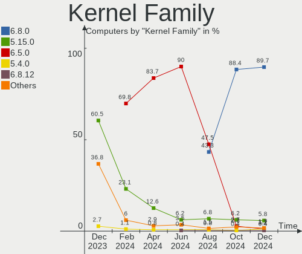
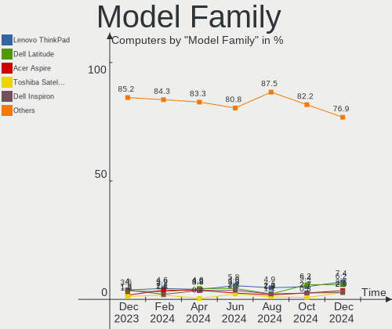
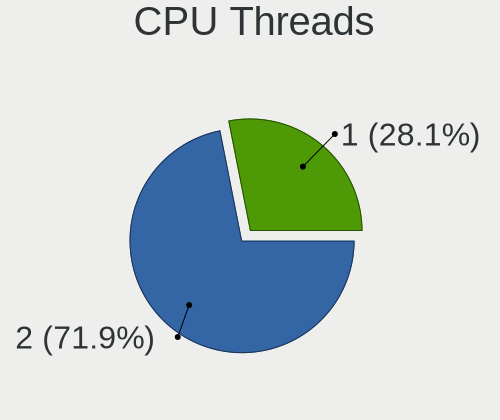
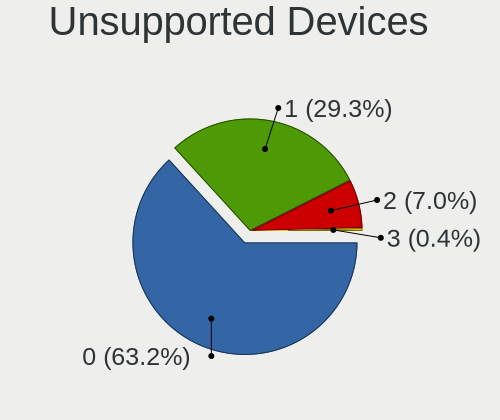

Zorin - Hardware Trends
-----------------------

A project to identify most popular hardware characteristics and track their change
over time based on data collected by Linux users at https://Linux-Hardware.org.

Anyone can contribute to this report by the [hw-probe](https://github.com/linuxhw/hw-probe) tool:

    sudo -E hw-probe -all -upload

This is a report for all computer types. See also reports for [desktops](/Dist/Zorin/Desktop/README.md) and [notebooks](/Dist/Zorin/Notebook/README.md).

This report is for one last month. Overall report since the beginning of time: [TestDays](https://github.com/linuxhw/TestDays)

Period: May, 2023.

Contents
--------

* [ System ](#system)
  - [ OS                       ](#os)
  - [ OS Family                ](#os-family)
  - [ Kernel                   ](#kernel)
  - [ Kernel Family            ](#kernel-family)
  - [ Kernel Major Ver.        ](#kernel-major-ver)
  - [ Arch                     ](#arch)
  - [ DE                       ](#de)
  - [ Display Server           ](#display-server)
  - [ Display Manager          ](#display-manager)
  - [ OS Lang                  ](#os-lang)
  - [ Boot Mode                ](#boot-mode)
  - [ Filesystem               ](#filesystem)
  - [ Part. scheme             ](#part-scheme)
  - [ Dual Boot with Linux/BSD ](#dual-boot-with-linuxbsd)
  - [ Dual Boot (Win)          ](#dual-boot-win)

* [ Board ](#board)
  - [ Vendor                   ](#vendor)
  - [ Model                    ](#model)
  - [ Model Family             ](#model-family)
  - [ MFG Year                 ](#mfg-year)
  - [ Form Factor              ](#form-factor)
  - [ Secure Boot              ](#secure-boot)
  - [ Coreboot                 ](#coreboot)
  - [ RAM Size                 ](#ram-size)
  - [ RAM Used                 ](#ram-used)
  - [ Total Drives             ](#total-drives)
  - [ Has CD-ROM               ](#has-cd-rom)
  - [ Has Ethernet             ](#has-ethernet)
  - [ Has WiFi                 ](#has-wifi)
  - [ Has Bluetooth            ](#has-bluetooth)

* [ Location ](#location)
  - [ Country                  ](#country)
  - [ City                     ](#city)

* [ Drives ](#drives)
  - [ Drive Vendor             ](#drive-vendor)
  - [ Drive Model              ](#drive-model)
  - [ HDD Vendor               ](#hdd-vendor)
  - [ SSD Vendor               ](#ssd-vendor)
  - [ Drive Kind               ](#drive-kind)
  - [ Drive Connector          ](#drive-connector)
  - [ Drive Size               ](#drive-size)
  - [ Space Total              ](#space-total)
  - [ Space Used               ](#space-used)
  - [ Malfunc. Drives          ](#malfunc-drives)
  - [ Malfunc. Drive Vendor    ](#malfunc-drive-vendor)
  - [ Malfunc. HDD Vendor      ](#malfunc-hdd-vendor)
  - [ Malfunc. Drive Kind      ](#malfunc-drive-kind)
  - [ Failed Drives            ](#failed-drives)
  - [ Failed Drive Vendor      ](#failed-drive-vendor)
  - [ Drive Status             ](#drive-status)

* [ Storage controller ](#storage-controller)
  - [ Storage Vendor           ](#storage-vendor)
  - [ Storage Model            ](#storage-model)
  - [ Storage Kind             ](#storage-kind)

* [ Processor ](#processor)
  - [ CPU Vendor               ](#cpu-vendor)
  - [ CPU Model                ](#cpu-model)
  - [ CPU Model Family         ](#cpu-model-family)
  - [ CPU Cores                ](#cpu-cores)
  - [ CPU Sockets              ](#cpu-sockets)
  - [ CPU Threads              ](#cpu-threads)
  - [ CPU Op-Modes             ](#cpu-op-modes)
  - [ CPU Microcode            ](#cpu-microcode)
  - [ CPU Microarch            ](#cpu-microarch)

* [ Graphics ](#graphics)
  - [ GPU Vendor               ](#gpu-vendor)
  - [ GPU Model                ](#gpu-model)
  - [ GPU Combo                ](#gpu-combo)
  - [ GPU Driver               ](#gpu-driver)
  - [ GPU Memory               ](#gpu-memory)

* [ Monitor ](#monitor)
  - [ Monitor Vendor           ](#monitor-vendor)
  - [ Monitor Model            ](#monitor-model)
  - [ Monitor Resolution       ](#monitor-resolution)
  - [ Monitor Diagonal         ](#monitor-diagonal)
  - [ Monitor Width            ](#monitor-width)
  - [ Aspect Ratio             ](#aspect-ratio)
  - [ Monitor Area             ](#monitor-area)
  - [ Pixel Density            ](#pixel-density)
  - [ Multiple Monitors        ](#multiple-monitors)

* [ Network ](#network)
  - [ Net Controller Vendor    ](#net-controller-vendor)
  - [ Net Controller Model     ](#net-controller-model)
  - [ Wireless Vendor          ](#wireless-vendor)
  - [ Wireless Model           ](#wireless-model)
  - [ Ethernet Vendor          ](#ethernet-vendor)
  - [ Ethernet Model           ](#ethernet-model)
  - [ Net Controller Kind      ](#net-controller-kind)
  - [ Used Controller          ](#used-controller)
  - [ NICs                     ](#nics)
  - [ IPv6                     ](#ipv6)

* [ Bluetooth ](#bluetooth)
  - [ Bluetooth Vendor         ](#bluetooth-vendor)
  - [ Bluetooth Model          ](#bluetooth-model)

* [ Sound ](#sound)
  - [ Sound Vendor             ](#sound-vendor)
  - [ Sound Model              ](#sound-model)

* [ Memory ](#memory)
  - [ Memory Vendor            ](#memory-vendor)
  - [ Memory Model             ](#memory-model)
  - [ Memory Kind              ](#memory-kind)
  - [ Memory Form Factor       ](#memory-form-factor)
  - [ Memory Size              ](#memory-size)
  - [ Memory Speed             ](#memory-speed)

* [ Printers & scanners ](#printers--scanners)
  - [ Printer Vendor           ](#printer-vendor)
  - [ Printer Model            ](#printer-model)
  - [ Scanner Vendor           ](#scanner-vendor)
  - [ Scanner Model            ](#scanner-model)

* [ Camera ](#camera)
  - [ Camera Vendor            ](#camera-vendor)
  - [ Camera Model             ](#camera-model)

* [ Security ](#security)
  - [ Fingerprint Vendor       ](#fingerprint-vendor)
  - [ Fingerprint Model        ](#fingerprint-model)
  - [ Chipcard Vendor          ](#chipcard-vendor)
  - [ Chipcard Model           ](#chipcard-model)

* [ Unsupported ](#unsupported)
  - [ Unsupported Devices      ](#unsupported-devices)
  - [ Unsupported Device Types ](#unsupported-device-types)

System
------

OS
--

Installed operating systems

| Name     | Computers | Percent |
|----------|-----------|---------|
| Zorin 16 | 159       | 95.21%  |
| Zorin 15 | 8         | 4.79%   |

OS Family
---------

OS without a version

| Name  | Computers | Percent |
|-------|-----------|---------|
| Zorin | 167       | 100%    |

Kernel
------

Version of the Linux kernel

| Version                | Computers | Percent |
|------------------------|-----------|---------|
| 5.15.0-71-generic      | 78        | 46.71%  |
| 5.15.0-72-generic      | 53        | 31.74%  |
| 5.15.0-69-generic      | 5         | 2.99%   |
| 5.15.0-56-generic      | 5         | 2.99%   |
| 5.4.0-148-generic      | 4         | 2.4%    |
| 5.15.0-52-generic      | 4         | 2.4%    |
| 5.15.0-60-generic      | 2         | 1.2%    |
| 5.15.0-53-generic      | 2         | 1.2%    |
| 6.3.2-1-liquorix-amd64 | 1         | 0.6%    |
| 6.3.2-060302-generic   | 1         | 0.6%    |
| 6.2.14-060214-generic  | 1         | 0.6%    |
| 6.0.9-060009-generic   | 1         | 0.6%    |
| 5.4.0-94-generic       | 1         | 0.6%    |
| 5.4.0-58-generic       | 1         | 0.6%    |
| 5.4.0-47-generic       | 1         | 0.6%    |
| 5.4.0-149-generic      | 1         | 0.6%    |
| 5.15.0-73-generic      | 1         | 0.6%    |
| 5.15.0-67-generic      | 1         | 0.6%    |
| 5.13.0-40-generic      | 1         | 0.6%    |
| 5.13.0-30-generic      | 1         | 0.6%    |
| 5.11.0-38-generic      | 1         | 0.6%    |
| 5.11.0-27-generic      | 1         | 0.6%    |

Kernel Family
-------------

Linux kernel without a distro release

| Version | Computers | Percent |
|---------|-----------|---------|
| 5.15.0  | 151       | 90.42%  |
| 5.4.0   | 8         | 4.79%   |
| 6.3.2   | 2         | 1.2%    |
| 5.13.0  | 2         | 1.2%    |
| 5.11.0  | 2         | 1.2%    |
| 6.2.14  | 1         | 0.6%    |
| 6.0.9   | 1         | 0.6%    |

Kernel Major Ver.
-----------------

Linux kernel major version

| Version | Computers | Percent |
|---------|-----------|---------|
| 5.15    | 151       | 90.42%  |
| 5.4     | 8         | 4.79%   |
| 6.3     | 2         | 1.2%    |
| 5.13    | 2         | 1.2%    |
| 5.11    | 2         | 1.2%    |
| 6.2     | 1         | 0.6%    |
| 6.0     | 1         | 0.6%    |

Arch
----

OS architecture (x86_64, i586, etc.)

| Name   | Computers | Percent |
|--------|-----------|---------|
| x86_64 | 162       | 97.01%  |
| i686   | 5         | 2.99%   |

DE
--

Desktop Environment

| Name  | Computers | Percent |
|-------|-----------|---------|
| GNOME | 127       | 76.05%  |
| XFCE  | 39        | 23.35%  |
| KDE5  | 1         | 0.6%    |

Display Server
--------------

X11 or Wayland

| Name    | Computers | Percent |
|---------|-----------|---------|
| X11     | 165       | 98.8%   |
| Wayland | 2         | 1.2%    |

Display Manager
---------------

SDDM, LightDM, etc.

| Name    | Computers | Percent |
|---------|-----------|---------|
| Unknown | 126       | 75.45%  |
| LightDM | 16        | 9.58%   |
| GDM3    | 13        | 7.78%   |
| GDM     | 12        | 7.19%   |

OS Lang
-------

Language

| Lang        | Computers | Percent |
|-------------|-----------|---------|
| en_US       | 58        | 34.73%  |
| de_DE       | 15        | 8.98%   |
| it_IT       | 10        | 5.99%   |
| fr_FR       | 10        | 5.99%   |
| es_ES       | 8         | 4.79%   |
| en_GB       | 7         | 4.19%   |
| en_CA       | 7         | 4.19%   |
| pt_PT       | 5         | 2.99%   |
| pt_BR       | 5         | 2.99%   |
| nl_NL       | 5         | 2.99%   |
| es_AR       | 5         | 2.99%   |
| pl_PL       | 4         | 2.4%    |
| cs_CZ       | 3         | 1.8%    |
| hu_HU       | 2         | 1.2%    |
| hr_HR       | 2         | 1.2%    |
| en_ZA       | 2         | 1.2%    |
| en_NZ       | 2         | 1.2%    |
| en_IN       | 2         | 1.2%    |
| en_AU       | 2         | 1.2%    |
| sv_SE       | 1         | 0.6%    |
| sr_RS@latin | 1         | 0.6%    |
| sl_SI       | 1         | 0.6%    |
| ru_RU       | 1         | 0.6%    |
| ro_RO       | 1         | 0.6%    |
| ja_JP       | 1         | 0.6%    |
| fr_CA       | 1         | 0.6%    |
| es_MX       | 1         | 0.6%    |
| es_GT       | 1         | 0.6%    |
| es_CR       | 1         | 0.6%    |
| ar_YE       | 1         | 0.6%    |
| ar_SA       | 1         | 0.6%    |
| ar_EG       | 1         | 0.6%    |

Boot Mode
---------

EFI or BIOS

| Mode | Computers | Percent |
|------|-----------|---------|
| EFI  | 92        | 55.09%  |
| BIOS | 75        | 44.91%  |

Filesystem
----------

Type of filesystem

| Type    | Computers | Percent |
|---------|-----------|---------|
| Ext4    | 144       | 86.23%  |
| Tmpfs   | 17        | 10.18%  |
| Zfs     | 3         | 1.8%    |
| Xfs     | 1         | 0.6%    |
| Overlay | 1         | 0.6%    |
| Ext2    | 1         | 0.6%    |

Part. scheme
------------

Scheme of partitioning

| Type    | Computers | Percent |
|---------|-----------|---------|
| Unknown | 131       | 78.44%  |
| GPT     | 25        | 14.97%  |
| MBR     | 11        | 6.59%   |

Dual Boot with Linux/BSD
------------------------

Hosting more than one Linux/BSD

| Dual boot | Computers | Percent |
|-----------|-----------|---------|
| No        | 163       | 97.6%   |
| Yes       | 4         | 2.4%    |

Dual Boot (Win)
---------------

Hosting Linux and Windows

| Dual boot | Computers | Percent |
|-----------|-----------|---------|
| No        | 152       | 91.02%  |
| Yes       | 15        | 8.98%   |

Board
-----

Vendor
------

Motherboard manufacturer

| Name                | Computers | Percent |
|---------------------|-----------|---------|
| Hewlett-Packard     | 32        | 19.16%  |
| Lenovo              | 20        | 11.98%  |
| Dell                | 20        | 11.98%  |
| ASUSTek Computer    | 17        | 10.18%  |
| Gigabyte Technology | 11        | 6.59%   |
| Acer                | 11        | 6.59%   |
| Apple               | 8         | 4.79%   |
| MSI                 | 7         | 4.19%   |
| ASRock              | 5         | 2.99%   |
| Intel               | 4         | 2.4%    |
| Unknown             | 4         | 2.4%    |
| Google              | 3         | 1.8%    |
| Fujitsu Siemens     | 3         | 1.8%    |
| Toshiba             | 2         | 1.2%    |
| Pegatron            | 2         | 1.2%    |
| Vorke               | 1         | 0.6%    |
| TrekStor            | 1         | 0.6%    |
| Tactus              | 1         | 0.6%    |
| Sony                | 1         | 0.6%    |
| SKIKK               | 1         | 0.6%    |
| Samsung Electronics | 1         | 0.6%    |
| Positivo            | 1         | 0.6%    |
| Philco              | 1         | 0.6%    |
| Packard Bell        | 1         | 0.6%    |
| Microsoft           | 1         | 0.6%    |
| Mediacom            | 1         | 0.6%    |
| KUU                 | 1         | 0.6%    |
| Framework           | 1         | 0.6%    |
| eMachines           | 1         | 0.6%    |
| ECS                 | 1         | 0.6%    |
| Chuwi               | 1         | 0.6%    |
| ASRockRack          | 1         | 0.6%    |
| 16280-BM-32691      | 1         | 0.6%    |

Model
-----

Motherboard model

| Name                                        | Computers | Percent |
|---------------------------------------------|-----------|---------|
| Unknown                                     | 4         | 2.4%    |
| MSI MS-7C02                                 | 2         | 1.2%    |
| ASUS PRIME X370-PRO                         | 2         | 1.2%    |
| Apple MacBookPro10,1                        | 2         | 1.2%    |
| Apple MacBookAir7,2                         | 2         | 1.2%    |
| Vorke V1 Plus                               | 1         | 0.6%    |
| TrekStor SurfTab twin 11.6                  | 1         | 0.6%    |
| Toshiba TECRA M10                           | 1         | 0.6%    |
| Toshiba Satellite M60                       | 1         | 0.6%    |
| Tactus GeoBook 140                          | 1         | 0.6%    |
| Sony SVF14214CXW                            | 1         | 0.6%    |
| SKIKK Niflheim 17 II                        | 1         | 0.6%    |
| Samsung N150/N210/N220                      | 1         | 0.6%    |
| Positivo S14CT01                            | 1         | 0.6%    |
| Philco PHN14C                               | 1         | 0.6%    |
| Pegatron p7-1080t                           | 1         | 0.6%    |
| Pegatron NC825AA-ABA a6807c                 | 1         | 0.6%    |
| Packard Bell EasyNote MH35                  | 1         | 0.6%    |
| MSI MS-7C95                                 | 1         | 0.6%    |
| MSI MS-7C37                                 | 1         | 0.6%    |
| MSI MS-7B86                                 | 1         | 0.6%    |
| MSI MS-7923                                 | 1         | 0.6%    |
| MSI MS-7817                                 | 1         | 0.6%    |
| Microsoft Surface Book                      | 1         | 0.6%    |
| Mediacom SmartBook 14 FullHD - SB14UC       | 1         | 0.6%    |
| Lenovo Yoga 7 14ACN6 82N7                   | 1         | 0.6%    |
| Lenovo Yoga 6 13ALC7 82UD                   | 1         | 0.6%    |
| Lenovo V130-15IGM 81HL                      | 1         | 0.6%    |
| Lenovo ThinkPad Yoga 11e 4th Gen 20HUS00000 | 1         | 0.6%    |
| Lenovo ThinkPad X1 Carbon Gen 8 20UAS4H800  | 1         | 0.6%    |
| Lenovo ThinkPad T520 4242A25                | 1         | 0.6%    |
| Lenovo ThinkPad T470s W10DG 20JTS0CJ0E      | 1         | 0.6%    |
| Lenovo ThinkPad E490 20N8A01YGI             | 1         | 0.6%    |
| Lenovo ThinkPad E14 Gen 3 20Y70044RT        | 1         | 0.6%    |
| Lenovo ThinkCentre M93p 10AAS3VB00          | 1         | 0.6%    |
| Lenovo ThinkCentre M710q 10MQS9BU00         | 1         | 0.6%    |
| Lenovo MIIX 320-10ICR 80XF                  | 1         | 0.6%    |
| Lenovo Legion 7 16ACHg6 82N6                | 1         | 0.6%    |
| Lenovo IdeaPad Z470                         | 1         | 0.6%    |
| Lenovo IdeaPad Flex-14API 81SS              | 1         | 0.6%    |

Model Family
------------

Motherboard model prefix

| Name                  | Computers | Percent |
|-----------------------|-----------|---------|
| Acer Aspire           | 9         | 5.39%   |
| HP Pavilion           | 8         | 4.79%   |
| Dell Latitude         | 7         | 4.19%   |
| Lenovo ThinkPad       | 6         | 3.59%   |
| Lenovo IdeaPad        | 6         | 3.59%   |
| HP EliteBook          | 5         | 2.99%   |
| HP ProBook            | 4         | 2.4%    |
| Dell Precision        | 4         | 2.4%    |
| ASUS PRIME            | 4         | 2.4%    |
| Unknown               | 4         | 2.4%    |
| Dell Inspiron         | 3         | 1.8%    |
| MSI MS-7C02           | 2         | 1.2%    |
| Lenovo Yoga           | 2         | 1.2%    |
| Lenovo ThinkCentre    | 2         | 1.2%    |
| HP Stream             | 2         | 1.2%    |
| HP Laptop             | 2         | 1.2%    |
| Fujitsu Siemens AMILO | 2         | 1.2%    |
| Dell XPS              | 2         | 1.2%    |
| Dell OptiPlex         | 2         | 1.2%    |
| ASUS ROG              | 2         | 1.2%    |
| Apple MacBookPro10    | 2         | 1.2%    |
| Apple MacBookAir7     | 2         | 1.2%    |
| Vorke V1              | 1         | 0.6%    |
| TrekStor SurfTab      | 1         | 0.6%    |
| Toshiba TECRA         | 1         | 0.6%    |
| Toshiba Satellite     | 1         | 0.6%    |
| Tactus GeoBook        | 1         | 0.6%    |
| Sony SVF14214CXW      | 1         | 0.6%    |
| SKIKK Niflheim        | 1         | 0.6%    |
| Samsung N150          | 1         | 0.6%    |
| Positivo S14CT01      | 1         | 0.6%    |
| Philco PHN14C         | 1         | 0.6%    |
| Pegatron p7-1080t     | 1         | 0.6%    |
| Pegatron NC825AA-ABA  | 1         | 0.6%    |
| Packard Bell EasyNote | 1         | 0.6%    |
| MSI MS-7C95           | 1         | 0.6%    |
| MSI MS-7C37           | 1         | 0.6%    |
| MSI MS-7B86           | 1         | 0.6%    |
| MSI MS-7923           | 1         | 0.6%    |
| MSI MS-7817           | 1         | 0.6%    |

MFG Year
--------

Motherboard manufacture year

| Year | Computers | Percent |
|------|-----------|---------|
| 2017 | 16        | 9.58%   |
| 2011 | 16        | 9.58%   |
| 2020 | 14        | 8.38%   |
| 2014 | 14        | 8.38%   |
| 2021 | 13        | 7.78%   |
| 2012 | 13        | 7.78%   |
| 2016 | 12        | 7.19%   |
| 2013 | 10        | 5.99%   |
| 2018 | 9         | 5.39%   |
| 2019 | 8         | 4.79%   |
| 2022 | 6         | 3.59%   |
| 2009 | 6         | 3.59%   |
| 2008 | 6         | 3.59%   |
| 2023 | 5         | 2.99%   |
| 2010 | 5         | 2.99%   |
| 2015 | 4         | 2.4%    |
| 2007 | 4         | 2.4%    |
| 2006 | 4         | 2.4%    |
| 2005 | 2         | 1.2%    |

Form Factor
-----------

Physical design of the computer

| Name        | Computers | Percent |
|-------------|-----------|---------|
| Notebook    | 93        | 55.69%  |
| Desktop     | 60        | 35.93%  |
| Convertible | 5         | 2.99%   |
| Mini pc     | 4         | 2.4%    |
| Tablet      | 2         | 1.2%    |
| All in one  | 2         | 1.2%    |
| Server      | 1         | 0.6%    |

Secure Boot
-----------

Enabled or disabled

| State    | Computers | Percent |
|----------|-----------|---------|
| Disabled | 147       | 88.02%  |
| Enabled  | 20        | 11.98%  |

Coreboot
--------

Have coreboot on board

| Used | Computers | Percent |
|------|-----------|---------|
| No   | 164       | 98.2%   |
| Yes  | 3         | 1.8%    |

RAM Size
--------

Total RAM memory

| Size in GB  | Computers | Percent |
|-------------|-----------|---------|
| 4.01-8.0    | 46        | 27.54%  |
| 3.01-4.0    | 35        | 20.96%  |
| 16.01-24.0  | 31        | 18.56%  |
| 8.01-16.0   | 25        | 14.97%  |
| 32.01-64.0  | 12        | 7.19%   |
| 1.01-2.0    | 9         | 5.39%   |
| 64.01-256.0 | 4         | 2.4%    |
| 24.01-32.0  | 2         | 1.2%    |
| 0.51-1.0    | 2         | 1.2%    |
| 2.01-3.0    | 1         | 0.6%    |

RAM Used
--------

Used RAM memory

| Used GB   | Computers | Percent |
|-----------|-----------|---------|
| 1.01-2.0  | 56        | 33.53%  |
| 2.01-3.0  | 54        | 32.34%  |
| 3.01-4.0  | 28        | 16.77%  |
| 4.01-8.0  | 18        | 10.78%  |
| 0.51-1.0  | 8         | 4.79%   |
| 8.01-16.0 | 3         | 1.8%    |

Total Drives
------------

Number of drives on board

| Drives | Computers | Percent |
|--------|-----------|---------|
| 1      | 118       | 70.66%  |
| 2      | 30        | 17.96%  |
| 3      | 9         | 5.39%   |
| 4      | 8         | 4.79%   |
| 5      | 2         | 1.2%    |

Has CD-ROM
----------

Has CD-ROM on board

| Presented | Computers | Percent |
|-----------|-----------|---------|
| No        | 100       | 59.88%  |
| Yes       | 67        | 40.12%  |

Has Ethernet
------------

Has Ethernet on board

| Presented | Computers | Percent |
|-----------|-----------|---------|
| Yes       | 142       | 85.03%  |
| No        | 25        | 14.97%  |

Has WiFi
--------

Has WiFi module

| Presented | Computers | Percent |
|-----------|-----------|---------|
| Yes       | 126       | 75.45%  |
| No        | 41        | 24.55%  |

Has Bluetooth
-------------

Has Bluetooth module

| Presented | Computers | Percent |
|-----------|-----------|---------|
| Yes       | 100       | 59.88%  |
| No        | 67        | 40.12%  |

Location
--------

Country
-------

Geographic location (country)

| Country             | Computers | Percent |
|---------------------|-----------|---------|
| USA                 | 34        | 20.36%  |
| Germany             | 18        | 10.78%  |
| Italy               | 10        | 5.99%   |
| France              | 10        | 5.99%   |
| Canada              | 10        | 5.99%   |
| UK                  | 8         | 4.79%   |
| Spain               | 7         | 4.19%   |
| Netherlands         | 6         | 3.59%   |
| Portugal            | 5         | 2.99%   |
| Brazil              | 5         | 2.99%   |
| Argentina           | 5         | 2.99%   |
| Poland              | 4         | 2.4%    |
| Romania             | 3         | 1.8%    |
| Czechia             | 3         | 1.8%    |
| Russia              | 2         | 1.2%    |
| New Zealand         | 2         | 1.2%    |
| Mexico              | 2         | 1.2%    |
| India               | 2         | 1.2%    |
| Greece              | 2         | 1.2%    |
| Finland             | 2         | 1.2%    |
| Croatia             | 2         | 1.2%    |
| Australia           | 2         | 1.2%    |
| Yemen               | 1         | 0.6%    |
| Uruguay             | 1         | 0.6%    |
| UAE                 | 1         | 0.6%    |
| Turkey              | 1         | 0.6%    |
| Trinidad and Tobago | 1         | 0.6%    |
| Thailand            | 1         | 0.6%    |
| Sweden              | 1         | 0.6%    |
| South Africa        | 1         | 0.6%    |
| Slovenia            | 1         | 0.6%    |
| Slovakia            | 1         | 0.6%    |
| Saudi Arabia        | 1         | 0.6%    |
| Saint Lucia         | 1         | 0.6%    |
| Nigeria             | 1         | 0.6%    |
| Nicaragua           | 1         | 0.6%    |
| Japan               | 1         | 0.6%    |
| Hungary             | 1         | 0.6%    |
| Guatemala           | 1         | 0.6%    |
| Eswatini            | 1         | 0.6%    |

City
----

Geographic location (city)

| City              | Computers | Percent |
|-------------------|-----------|---------|
| Zagreb            | 2         | 1.2%    |
| Tampere           | 2         | 1.2%    |
| Sao Paulo         | 2         | 1.2%    |
| Rosario           | 2         | 1.2%    |
| Rome              | 2         | 1.2%    |
| Paris             | 2         | 1.2%    |
| Marseille         | 2         | 1.2%    |
| Denver            | 2         | 1.2%    |
| Calgary           | 2         | 1.2%    |
| Bucharest         | 2         | 1.2%    |
| Berlin            | 2         | 1.2%    |
| Barcelona         | 2         | 1.2%    |
| Zielona Góra     | 1         | 0.6%    |
| Zeist             | 1         | 0.6%    |
| Wołomin          | 1         | 0.6%    |
| Wismar            | 1         | 0.6%    |
| Washington        | 1         | 0.6%    |
| Voorhees Township | 1         | 0.6%    |
| Vicenza           | 1         | 0.6%    |
| Veszprém         | 1         | 0.6%    |
| Verona            | 1         | 0.6%    |
| Vankleek Hill     | 1         | 0.6%    |
| Van Nuys          | 1         | 0.6%    |
| Valkenburg        | 1         | 0.6%    |
| Valencia          | 1         | 0.6%    |
| Valasske Mezirici | 1         | 0.6%    |
| Upper Marlboro    | 1         | 0.6%    |
| Uniondale         | 1         | 0.6%    |
| Tunja             | 1         | 0.6%    |
| Tulsa             | 1         | 0.6%    |
| Trenton           | 1         | 0.6%    |
| Toronto           | 1         | 0.6%    |
| Toms River        | 1         | 0.6%    |
| Tijuana           | 1         | 0.6%    |
| Thonon-les-Bains  | 1         | 0.6%    |
| The Hague         | 1         | 0.6%    |
| Tallahassee       | 1         | 0.6%    |
| Svetlyy           | 1         | 0.6%    |
| Stuttgart         | 1         | 0.6%    |
| Straubing         | 1         | 0.6%    |

Drives
------

Drive Vendor
------------

Hard drive vendors

| Vendor                      | Computers | Drives | Percent |
|-----------------------------|-----------|--------|---------|
| Samsung Electronics         | 33        | 36     | 14.67%  |
| WDC                         | 31        | 38     | 13.78%  |
| Seagate                     | 25        | 32     | 11.11%  |
| SanDisk                     | 15        | 15     | 6.67%   |
| Unknown                     | 13        | 14     | 5.78%   |
| Toshiba                     | 12        | 12     | 5.33%   |
| Kingston                    | 12        | 13     | 5.33%   |
| Hitachi                     | 7         | 7      | 3.11%   |
| Apple                       | 7         | 7      | 3.11%   |
| A-DATA Technology           | 7         | 7      | 3.11%   |
| Micron Technology           | 5         | 5      | 2.22%   |
| Intel                       | 5         | 5      | 2.22%   |
| China                       | 5         | 5      | 2.22%   |
| SK hynix                    | 4         | 5      | 1.78%   |
| HGST                        | 4         | 4      | 1.78%   |
| Crucial                     | 4         | 4      | 1.78%   |
| Verbatim                    | 2         | 2      | 0.89%   |
| PNY                         | 2         | 2      | 0.89%   |
| Phison Electronics          | 2         | 3      | 0.89%   |
| Micron/Crucial Technology   | 2         | 2      | 0.89%   |
| Kimtigo                     | 2         | 2      | 0.89%   |
| GOODRAM                     | 2         | 2      | 0.89%   |
| Fujitsu                     | 2         | 2      | 0.89%   |
| SPCC                        | 1         | 2      | 0.44%   |
| Seagate Technology          | 1         | 1      | 0.44%   |
| Patriot                     | 1         | 1      | 0.44%   |
| OCZ                         | 1         | 1      | 0.44%   |
| NN                          | 1         | 1      | 0.44%   |
| NGFF                        | 1         | 1      | 0.44%   |
| Netac                       | 1         | 1      | 0.44%   |
| Lexar                       | 1         | 1      | 0.44%   |
| KIOXIA-E                    | 1         | 1      | 0.44%   |
| KIOXIA                      | 1         | 1      | 0.44%   |
| Kingston Technology Company | 1         | 1      | 0.44%   |
| JMicron Technology          | 1         | 1      | 0.44%   |
| Intenso                     | 1         | 1      | 0.44%   |
| HS-SSD-E100                 | 1         | 1      | 0.44%   |
| FORESEE                     | 1         | 1      | 0.44%   |
| Fanxiang                    | 1         | 1      | 0.44%   |
| Emtec                       | 1         | 1      | 0.44%   |

Drive Model
-----------

Hard drive models

| Model                                               | Computers | Percent |
|-----------------------------------------------------|-----------|---------|
| Unknown MMC Card  32GB                              | 6         | 2.5%    |
| Samsung NVMe SSD Controller SM981/PM981/PM983 256GB | 5         | 2.08%   |
| Seagate ST1000LM035-1RK172 1TB                      | 4         | 1.67%   |
| Toshiba MQ01ABD100 1TB                              | 3         | 1.25%   |
| Seagate ST1000DM003-1CH162 1TB                      | 3         | 1.25%   |
| Samsung SSD 980 1TB                                 | 3         | 1.25%   |
| Kingston SA400S37120G 120GB SSD                     | 3         | 1.25%   |
| WDC WDS240G2G0A-00JH30 240GB SSD                    | 2         | 0.83%   |
| Unknown SD/MMC/MS PRO 64GB                          | 2         | 0.83%   |
| Toshiba DT01ACA200 2TB                              | 2         | 0.83%   |
| Seagate ST2000DM001-9YN164 2TB                      | 2         | 0.83%   |
| Seagate ST1000DM003-9YN162 1TB                      | 2         | 0.83%   |
| Seagate ST1000DM003-1SB102 1TB                      | 2         | 0.83%   |
| Samsung SSD 870 QVO 1TB                             | 2         | 0.83%   |
| Samsung SSD 870 EVO 500GB                           | 2         | 0.83%   |
| Samsung NVMe SSD Controller SM961/PM961/SM963 256GB | 2         | 0.83%   |
| Samsung NVMe SSD Controller SM951/PM951 128GB       | 2         | 0.83%   |
| Micron/Crucial P2 NVMe PCIe SSD 1TB                 | 2         | 0.83%   |
| Kingston SA400S37480G 480GB SSD                     | 2         | 0.83%   |
| Kingston SA400M8240G 240GB SSD                      | 2         | 0.83%   |
| Kimtigo SSD 256GB HNSA215062Z                       | 2         | 0.83%   |
| Intel SSD 660P Series 512GB                         | 2         | 0.83%   |
| Crucial CT240BX500SSD1 240GB                        | 2         | 0.83%   |
| Apple SSD SM512E 500GB                              | 2         | 0.83%   |
| Apple SSD SM0128G 121GB                             | 2         | 0.83%   |
| WDC WDS500G2B0A-00SM50 500GB SSD                    | 1         | 0.42%   |
| WDC WDS500G2B0A 500GB SSD                           | 1         | 0.42%   |
| WDC WDS250G2B0A-00SM50 250GB SSD                    | 1         | 0.42%   |
| WDC WD800JD-75MSA3 80GB                             | 1         | 0.42%   |
| WDC WD8000AARS-00Y5B1 800GB                         | 1         | 0.42%   |
| WDC WD7500BPVT-24HXZT1 752GB                        | 1         | 0.42%   |
| WDC WD6400BPVT-80HXZT1 640GB                        | 1         | 0.42%   |
| WDC WD5000AAKX-22ERMA0 500GB                        | 1         | 0.42%   |
| WDC WD5000AAKS-60A7B0 500GB                         | 1         | 0.42%   |
| WDC WD5000AAKS-007AA0 500GB                         | 1         | 0.42%   |
| WDC WD400BB-00DEA0 40GB                             | 1         | 0.42%   |
| WDC WD30EFRX-68EUZN0 3TB                            | 1         | 0.42%   |
| WDC WD2500BEVS-08VAT2 250GB                         | 1         | 0.42%   |
| WDC WD2500BEKT-60A25T1 250GB                        | 1         | 0.42%   |
| WDC WD20EZRX-00D8PB0 2TB                            | 1         | 0.42%   |

HDD Vendor
----------

Hard disk drive vendors

| Vendor              | Computers | Drives | Percent |
|---------------------|-----------|--------|---------|
| WDC                 | 26        | 32     | 31.71%  |
| Seagate             | 25        | 31     | 30.49%  |
| Toshiba             | 9         | 9      | 10.98%  |
| Hitachi             | 7         | 7      | 8.54%   |
| Samsung Electronics | 5         | 6      | 6.1%    |
| HGST                | 4         | 4      | 4.88%   |
| Unknown             | 2         | 2      | 2.44%   |
| Fujitsu             | 2         | 2      | 2.44%   |
| Apple               | 2         | 2      | 2.44%   |

SSD Vendor
----------

Solid state drive vendors

| Vendor              | Computers | Drives | Percent |
|---------------------|-----------|--------|---------|
| Samsung Electronics | 11        | 11     | 12.94%  |
| Kingston            | 10        | 11     | 11.76%  |
| SanDisk             | 8         | 8      | 9.41%   |
| WDC                 | 6         | 6      | 7.06%   |
| A-DATA Technology   | 6         | 6      | 7.06%   |
| China               | 5         | 5      | 5.88%   |
| Apple               | 5         | 5      | 5.88%   |
| Crucial             | 4         | 4      | 4.71%   |
| Micron Technology   | 3         | 3      | 3.53%   |
| Verbatim            | 2         | 2      | 2.35%   |
| Toshiba             | 2         | 2      | 2.35%   |
| PNY                 | 2         | 2      | 2.35%   |
| Kimtigo             | 2         | 2      | 2.35%   |
| Intel               | 2         | 2      | 2.35%   |
| SPCC                | 1         | 2      | 1.18%   |
| SK hynix            | 1         | 1      | 1.18%   |
| Seagate             | 1         | 1      | 1.18%   |
| Patriot             | 1         | 1      | 1.18%   |
| OCZ                 | 1         | 1      | 1.18%   |
| NN                  | 1         | 1      | 1.18%   |
| NGFF                | 1         | 1      | 1.18%   |
| Netac               | 1         | 1      | 1.18%   |
| Lexar               | 1         | 1      | 1.18%   |
| KIOXIA-E            | 1         | 1      | 1.18%   |
| Intenso             | 1         | 1      | 1.18%   |
| GOODRAM             | 1         | 1      | 1.18%   |
| FORESEE             | 1         | 1      | 1.18%   |
| Emtec               | 1         | 1      | 1.18%   |
| Carlstein           | 1         | 1      | 1.18%   |
| Biostar             | 1         | 1      | 1.18%   |
| Apacer              | 1         | 1      | 1.18%   |

Drive Kind
----------

HDD or SSD

| Kind    | Computers | Drives | Percent |
|---------|-----------|--------|---------|
| SSD     | 75        | 87     | 36.41%  |
| HDD     | 74        | 95     | 35.92%  |
| NVMe    | 41        | 47     | 19.9%   |
| MMC     | 12        | 14     | 5.83%   |
| Unknown | 4         | 4      | 1.94%   |

Drive Connector
---------------

SATA, SAS, NVMe, etc.

| Type | Computers | Drives | Percent |
|------|-----------|--------|---------|
| SATA | 129       | 180    | 68.62%  |
| NVMe | 41        | 47     | 21.81%  |
| MMC  | 12        | 14     | 6.38%   |
| SAS  | 6         | 6      | 3.19%   |

Drive Size
----------

Size of hard drive

| Size in TB | Computers | Drives | Percent |
|------------|-----------|--------|---------|
| 0.01-0.5   | 100       | 112    | 64.94%  |
| 0.51-1.0   | 41        | 53     | 26.62%  |
| 1.01-2.0   | 9         | 13     | 5.84%   |
| 2.01-3.0   | 2         | 2      | 1.3%    |
| 10.01-20.0 | 1         | 1      | 0.65%   |
| 4.01-10.0  | 1         | 1      | 0.65%   |

Space Total
-----------

Amount of disk space available on the file system

| Size in GB     | Computers | Percent |
|----------------|-----------|---------|
| 101-250        | 63        | 37.72%  |
| 251-500        | 28        | 16.77%  |
| 501-1000       | 28        | 16.77%  |
| 1001-2000      | 15        | 8.98%   |
| 21-50          | 13        | 7.78%   |
| 51-100         | 12        | 7.19%   |
| More than 3000 | 3         | 1.8%    |
| 2001-3000      | 2         | 1.2%    |
| Unknown        | 2         | 1.2%    |
| 1-20           | 1         | 0.6%    |

Space Used
----------

Amount of used disk space

| Used GB        | Computers | Percent |
|----------------|-----------|---------|
| 1-20           | 62        | 37.13%  |
| 21-50          | 49        | 29.34%  |
| 51-100         | 17        | 10.18%  |
| 101-250        | 15        | 8.98%   |
| 251-500        | 14        | 8.38%   |
| 501-1000       | 5         | 2.99%   |
| Unknown        | 2         | 1.2%    |
| More than 3000 | 1         | 0.6%    |
| 2001-3000      | 1         | 0.6%    |
| 1001-2000      | 1         | 0.6%    |

Malfunc. Drives
---------------

Drive models with a malfunction

| Model                      | Computers | Drives | Percent |
|----------------------------|-----------|--------|---------|
| HGST HTS545050A7E380 500GB | 1         | 1      | 100%    |

Malfunc. Drive Vendor
---------------------

Vendors of faulty drives

| Vendor | Computers | Drives | Percent |
|--------|-----------|--------|---------|
| HGST   | 1         | 1      | 100%    |

Malfunc. HDD Vendor
-------------------

Vendors of faulty HDD drives

| Vendor | Computers | Drives | Percent |
|--------|-----------|--------|---------|
| HGST   | 1         | 1      | 100%    |

Malfunc. Drive Kind
-------------------

Kinds of faulty drives

| Kind | Computers | Drives | Percent |
|------|-----------|--------|---------|
| HDD  | 1         | 1      | 100%    |

Failed Drives
-------------

Failed drive models

Zero info for selected period =(

Failed Drive Vendor
-------------------

Failed drive vendors

Zero info for selected period =(

Drive Status
------------

Number of failed and malfunc. drives

| Status   | Computers | Drives | Percent |
|----------|-----------|--------|---------|
| Detected | 155       | 230    | 92.26%  |
| Works    | 12        | 16     | 7.14%   |
| Malfunc  | 1         | 1      | 0.6%    |

Storage controller
------------------

Storage Vendor
--------------

Storage controller vendors

| Vendor                           | Computers | Percent |
|----------------------------------|-----------|---------|
| Intel                            | 103       | 52.55%  |
| AMD                              | 34        | 17.35%  |
| Samsung Electronics              | 21        | 10.71%  |
| SanDisk                          | 5         | 2.55%   |
| Nvidia                           | 5         | 2.55%   |
| SK hynix                         | 3         | 1.53%   |
| Kingston Technology Company      | 3         | 1.53%   |
| VIA Technologies                 | 2         | 1.02%   |
| Silicon Integrated Systems [SiS] | 2         | 1.02%   |
| Phison Electronics               | 2         | 1.02%   |
| Micron/Crucial Technology        | 2         | 1.02%   |
| Micron Technology                | 2         | 1.02%   |
| Marvell Technology Group         | 2         | 1.02%   |
| Toshiba America Info Systems     | 1         | 0.51%   |
| Silicon Motion                   | 1         | 0.51%   |
| Seagate Technology               | 1         | 0.51%   |
| MAXIO Technology (Hangzhou)      | 1         | 0.51%   |
| LSI Logic / Symbios Logic        | 1         | 0.51%   |
| KIOXIA                           | 1         | 0.51%   |
| JMicron Technology               | 1         | 0.51%   |
| Integrated Technology Express    | 1         | 0.51%   |
| ASMedia Technology               | 1         | 0.51%   |
| ADATA Technology                 | 1         | 0.51%   |

Storage Model
-------------

Storage controller models

| Model                                                                                   | Computers | Percent |
|-----------------------------------------------------------------------------------------|-----------|---------|
| AMD FCH SATA Controller [AHCI mode]                                                     | 21        | 9.42%   |
| Intel 8 Series/C220 Series Chipset Family 6-port SATA Controller 1 [AHCI mode]          | 9         | 4.04%   |
| Intel Sunrise Point-LP SATA Controller [AHCI mode]                                      | 8         | 3.59%   |
| Intel 82801 Mobile SATA Controller [RAID mode]                                          | 8         | 3.59%   |
| Intel 7 Series Chipset Family 6-port SATA Controller [AHCI mode]                        | 8         | 3.59%   |
| Intel 6 Series/C200 Series Chipset Family 6 port Mobile SATA AHCI Controller            | 8         | 3.59%   |
| Samsung NVMe SSD Controller SM981/PM981/PM983                                           | 7         | 3.14%   |
| Samsung NVMe SSD Controller 980                                                         | 7         | 3.14%   |
| Intel Volume Management Device NVMe RAID Controller                                     | 5         | 2.24%   |
| AMD SB7x0/SB8x0/SB9x0 IDE Controller                                                    | 5         | 2.24%   |
| AMD 400 Series Chipset SATA Controller                                                  | 5         | 2.24%   |
| Intel Q170/Q150/B150/H170/H110/Z170/CM236 Chipset SATA Controller [AHCI Mode]           | 4         | 1.79%   |
| Intel Celeron/Pentium Silver Processor SATA Controller                                  | 4         | 1.79%   |
| Intel Celeron N3350/Pentium N4200/Atom E3900 Series SATA AHCI Controller                | 4         | 1.79%   |
| Intel 82801IBM/IEM (ICH9M/ICH9M-E) 4 port SATA Controller [AHCI mode]                   | 4         | 1.79%   |
| Intel 82801G (ICH7 Family) IDE Controller                                               | 4         | 1.79%   |
| AMD SB7x0/SB8x0/SB9x0 SATA Controller [AHCI mode]                                       | 4         | 1.79%   |
| SK hynix Gold P31/PC711 NVMe Solid State Drive                                          | 3         | 1.35%   |
| Intel Tiger Lake-LP SATA Controller                                                     | 3         | 1.35%   |
| Intel NM10/ICH7 Family SATA Controller [IDE mode]                                       | 3         | 1.35%   |
| Intel NM10/ICH7 Family SATA Controller [AHCI mode]                                      | 3         | 1.35%   |
| Intel 8 Series SATA Controller 1 [AHCI mode]                                            | 3         | 1.35%   |
| Intel 7 Series/C210 Series Chipset Family 6-port SATA Controller [AHCI mode]            | 3         | 1.35%   |
| Intel 6 Series/C200 Series Chipset Family 6 port Desktop SATA AHCI Controller           | 3         | 1.35%   |
| Intel 500 Series Chipset Family SATA AHCI Controller                                    | 3         | 1.35%   |
| AMD 500 Series Chipset SATA Controller                                                  | 3         | 1.35%   |
| VIA VT82C586A/B/VT82C686/A/B/VT823x/A/C PIPC Bus Master IDE                             | 2         | 0.9%    |
| Silicon Integrated Systems [SiS] 5513 IDE Controller                                    | 2         | 0.9%    |
| Samsung NVMe SSD Controller SM961/PM961/SM963                                           | 2         | 0.9%    |
| Samsung NVMe SSD Controller SM951/PM951                                                 | 2         | 0.9%    |
| Samsung Electronics SATA controller                                                     | 2         | 0.9%    |
| Micron/Crucial P2 NVMe PCIe SSD                                                         | 2         | 0.9%    |
| Micron NVMe Storage Controller                                                          | 2         | 0.9%    |
| Intel SSD 660P Series                                                                   | 2         | 0.9%    |
| Intel SATA Controller [RAID mode]                                                       | 2         | 0.9%    |
| Intel HM170/QM170 Chipset SATA Controller [AHCI Mode]                                   | 2         | 0.9%    |
| Intel 6 Series/C200 Series Chipset Family Desktop SATA Controller (IDE mode, ports 4-5) | 2         | 0.9%    |
| Intel 6 Series/C200 Series Chipset Family Desktop SATA Controller (IDE mode, ports 0-3) | 2         | 0.9%    |
| Intel 5 Series/3400 Series Chipset 6 port SATA AHCI Controller                          | 2         | 0.9%    |
| Intel 5 Series/3400 Series Chipset 4 port SATA AHCI Controller                          | 2         | 0.9%    |

Storage Kind
------------

Kind of storage controller (IDE, SATA, NVMe, SAS, ...)

| Kind | Computers | Percent |
|------|-----------|---------|
| SATA | 118       | 59.3%   |
| NVMe | 41        | 20.6%   |
| IDE  | 24        | 12.06%  |
| RAID | 16        | 8.04%   |

Processor
---------

CPU Vendor
----------

Processor vendors

| Vendor | Computers | Percent |
|--------|-----------|---------|
| Intel  | 124       | 74.25%  |
| AMD    | 43        | 25.75%  |

CPU Model
---------

Processor models

| Model                                         | Computers | Percent |
|-----------------------------------------------|-----------|---------|
| Intel 11th Gen Core i5-1135G7 @ 2.40GHz       | 4         | 2.4%    |
| AMD Ryzen 7 1700 Eight-Core Processor         | 4         | 2.4%    |
| Intel Core i5-2520M CPU @ 2.50GHz             | 3         | 1.8%    |
| Intel 11th Gen Core i7-1165G7 @ 2.80GHz       | 3         | 1.8%    |
| AMD Ryzen 5 3600 6-Core Processor             | 3         | 1.8%    |
| AMD Ryzen 5 3500U with Radeon Vega Mobile Gfx | 3         | 1.8%    |
| Intel Xeon CPU E3-1240 v5 @ 3.50GHz           | 2         | 1.2%    |
| Intel Core i5-6300U CPU @ 2.40GHz             | 2         | 1.2%    |
| Intel Core i5-5250U CPU @ 1.60GHz             | 2         | 1.2%    |
| Intel Core i5-4460 CPU @ 3.20GHz              | 2         | 1.2%    |
| Intel Core i5-4210U CPU @ 1.70GHz             | 2         | 1.2%    |
| Intel Core i5-3337U CPU @ 1.80GHz             | 2         | 1.2%    |
| Intel Core i5-2400 CPU @ 3.10GHz              | 2         | 1.2%    |
| Intel Core 2 Duo CPU P8600 @ 2.40GHz          | 2         | 1.2%    |
| Intel Celeron N4020 CPU @ 1.10GHz             | 2         | 1.2%    |
| Intel Celeron J4125 CPU @ 2.00GHz             | 2         | 1.2%    |
| Intel Celeron CPU J3455 @ 1.50GHz             | 2         | 1.2%    |
| Intel Atom x5-Z8350 CPU @ 1.44GHz             | 2         | 1.2%    |
| Intel Atom x5-Z8300 CPU @ 1.44GHz             | 2         | 1.2%    |
| AMD Athlon II X2 250 Processor                | 2         | 1.2%    |
| Intel Xeon CPU W3680 @ 3.33GHz                | 1         | 0.6%    |
| Intel Xeon CPU D-1521 @ 2.40GHz               | 1         | 0.6%    |
| Intel Pentium M processor 1.86GHz             | 1         | 0.6%    |
| Intel Pentium Gold G6405 CPU @ 4.10GHz        | 1         | 0.6%    |
| Intel Pentium Dual-Core CPU T4300 @ 2.10GHz   | 1         | 0.6%    |
| Intel Pentium Dual-Core CPU E5300 @ 2.60GHz   | 1         | 0.6%    |
| Intel Pentium Dual CPU T2310 @ 1.46GHz        | 1         | 0.6%    |
| Intel Pentium Dual CPU E2220 @ 2.40GHz        | 1         | 0.6%    |
| Intel Pentium Dual CPU E2200 @ 2.20GHz        | 1         | 0.6%    |
| Intel Pentium CPU G2030 @ 3.00GHz             | 1         | 0.6%    |
| Intel Pentium CPU 967 @ 1.30GHz               | 1         | 0.6%    |
| Intel Pentium 4 CPU 3.40GHz                   | 1         | 0.6%    |
| Intel Pentium 4 CPU 3.00GHz                   | 1         | 0.6%    |
| Intel Pentium 3558U @ 1.70GHz                 | 1         | 0.6%    |
| Intel N100                                    | 1         | 0.6%    |
| Intel Core m5-6Y54 CPU @ 1.10GHz              | 1         | 0.6%    |
| Intel Core i9-10850K CPU @ 3.60GHz            | 1         | 0.6%    |
| Intel Core i7-8565U CPU @ 1.80GHz             | 1         | 0.6%    |
| Intel Core i7-7700HQ CPU @ 2.80GHz            | 1         | 0.6%    |
| Intel Core i7-7600U CPU @ 2.80GHz             | 1         | 0.6%    |

CPU Model Family
----------------

Processor model prefix

| Model                          | Computers | Percent |
|--------------------------------|-----------|---------|
| Intel Core i5                  | 38        | 22.75%  |
| Intel Core i7                  | 20        | 11.98%  |
| Intel Celeron                  | 15        | 8.98%   |
| Other                          | 14        | 8.38%   |
| AMD Ryzen 5                    | 9         | 5.39%   |
| Intel Core i3                  | 8         | 4.79%   |
| AMD Ryzen 7                    | 7         | 4.19%   |
| Intel Atom                     | 6         | 3.59%   |
| Intel Core 2 Duo               | 5         | 2.99%   |
| Intel Xeon                     | 4         | 2.4%    |
| Intel Pentium Dual             | 3         | 1.8%    |
| Intel Pentium                  | 3         | 1.8%    |
| AMD Ryzen 3                    | 3         | 1.8%    |
| Intel Pentium Dual-Core        | 2         | 1.2%    |
| Intel Pentium 4                | 2         | 1.2%    |
| Intel Core 2                   | 2         | 1.2%    |
| AMD Turion 64 X2 Mobile        | 2         | 1.2%    |
| AMD Sempron                    | 2         | 1.2%    |
| AMD Ryzen 9                    | 2         | 1.2%    |
| AMD E2                         | 2         | 1.2%    |
| AMD E                          | 2         | 1.2%    |
| AMD Athlon II X2               | 2         | 1.2%    |
| AMD A4                         | 2         | 1.2%    |
| Intel Pentium M                | 1         | 0.6%    |
| Intel Pentium Gold             | 1         | 0.6%    |
| Intel Core m5                  | 1         | 0.6%    |
| Intel Core i9                  | 1         | 0.6%    |
| AMD Turion X2 Dual-Core Mobile | 1         | 0.6%    |
| AMD PRO A10                    | 1         | 0.6%    |
| AMD Phenom II X6               | 1         | 0.6%    |
| AMD Mobile Sempron             | 1         | 0.6%    |
| AMD GX                         | 1         | 0.6%    |
| AMD Dual Core Opteron          | 1         | 0.6%    |
| AMD Athlon                     | 1         | 0.6%    |
| AMD A6                         | 1         | 0.6%    |

CPU Cores
---------

Number of processor cores

| Number | Computers | Percent |
|--------|-----------|---------|
| 2      | 75        | 44.91%  |
| 4      | 59        | 35.33%  |
| 6      | 11        | 6.59%   |
| 8      | 10        | 5.99%   |
| 1      | 9         | 5.39%   |
| 24     | 1         | 0.6%    |
| 12     | 1         | 0.6%    |
| 10     | 1         | 0.6%    |

CPU Sockets
-----------

Number of sockets

| Number | Computers | Percent |
|--------|-----------|---------|
| 1      | 167       | 100%    |

CPU Threads
-----------

Threads per core (Hyper-Threading)

| Number | Computers | Percent |
|--------|-----------|---------|
| 2      | 95        | 56.89%  |
| 1      | 72        | 43.11%  |

CPU Op-Modes
------------

CPU Operation Modes (32-bit, 64-bit)

| Op mode        | Computers | Percent |
|----------------|-----------|---------|
| 32-bit, 64-bit | 165       | 98.8%   |
| 32-bit         | 2         | 1.2%    |

CPU Microcode
-------------

Microcode number

| Number     | Computers | Percent |
|------------|-----------|---------|
| Unknown    | 14        | 8.38%   |
| 0x206a7    | 13        | 7.78%   |
| 0x306a9    | 12        | 7.19%   |
| 0x306c3    | 11        | 6.59%   |
| 0x806c1    | 8         | 4.79%   |
| 0x406e3    | 7         | 4.19%   |
| 0x1067a    | 6         | 3.59%   |
| 0x08108109 | 5         | 2.99%   |
| 0x806e9    | 4         | 2.4%    |
| 0x506e3    | 4         | 2.4%    |
| 0x506c9    | 4         | 2.4%    |
| 0x306d4    | 4         | 2.4%    |
| 0x08001138 | 4         | 2.4%    |
| 0x906e9    | 3         | 1.8%    |
| 0x806ec    | 3         | 1.8%    |
| 0x706a8    | 3         | 1.8%    |
| 0x6fd      | 3         | 1.8%    |
| 0x406c4    | 3         | 1.8%    |
| 0x406c3    | 3         | 1.8%    |
| 0x0a50000c | 3         | 1.8%    |
| 0xa0652    | 2         | 1.2%    |
| 0x906ea    | 2         | 1.2%    |
| 0x6f6      | 2         | 1.2%    |
| 0x40651    | 2         | 1.2%    |
| 0x106e5    | 2         | 1.2%    |
| 0x08608103 | 2         | 1.2%    |
| 0x06006705 | 2         | 1.2%    |
| 0x05000119 | 2         | 1.2%    |
| 0x010000c8 | 2         | 1.2%    |
| 0xf65      | 1         | 0.6%    |
| 0xf43      | 1         | 0.6%    |
| 0xb06e0    | 1         | 0.6%    |
| 0xb0671    | 1         | 0.6%    |
| 0xa0671    | 1         | 0.6%    |
| 0xa0655    | 1         | 0.6%    |
| 0xa0653    | 1         | 0.6%    |
| 0x906c0    | 1         | 0.6%    |
| 0x906a4    | 1         | 0.6%    |
| 0x806ea    | 1         | 0.6%    |
| 0x706a1    | 1         | 0.6%    |

CPU Microarch
-------------

Microarchitecture

| Name             | Computers | Percent |
|------------------|-----------|---------|
| KabyLake         | 14        | 8.38%   |
| Haswell          | 14        | 8.38%   |
| SandyBridge      | 13        | 7.78%   |
| IvyBridge        | 12        | 7.19%   |
| Skylake          | 11        | 6.59%   |
| TigerLake        | 8         | 4.79%   |
| Penryn           | 7         | 4.19%   |
| Silvermont       | 6         | 3.59%   |
| K8 Hammer        | 6         | 3.59%   |
| Zen+             | 5         | 2.99%   |
| Zen 3            | 5         | 2.99%   |
| Zen 2            | 5         | 2.99%   |
| Goldmont plus    | 5         | 2.99%   |
| Core             | 5         | 2.99%   |
| CometLake        | 5         | 2.99%   |
| Broadwell        | 5         | 2.99%   |
| Zen              | 4         | 2.4%    |
| K10              | 4         | 2.4%    |
| Goldmont         | 4         | 2.4%    |
| Bobcat           | 4         | 2.4%    |
| Unknown          | 4         | 2.4%    |
| Westmere         | 3         | 1.8%    |
| Excavator        | 3         | 1.8%    |
| Puma             | 2         | 1.2%    |
| NetBurst         | 2         | 1.2%    |
| Nehalem          | 2         | 1.2%    |
| Bonnell          | 2         | 1.2%    |
| Tremont          | 1         | 0.6%    |
| Piledriver       | 1         | 0.6%    |
| P6               | 1         | 0.6%    |
| K8 & K10 hybrid  | 1         | 0.6%    |
| K10 Llano        | 1         | 0.6%    |
| Icelake          | 1         | 0.6%    |
| Alderlake Hybrid | 1         | 0.6%    |

Graphics
--------

GPU Vendor
----------

Vendors of graphics cards

| Vendor                           | Computers | Percent |
|----------------------------------|-----------|---------|
| Intel                            | 94        | 50.54%  |
| AMD                              | 44        | 23.66%  |
| Nvidia                           | 42        | 22.58%  |
| VIA Technologies                 | 2         | 1.08%   |
| Silicon Integrated Systems [SiS] | 2         | 1.08%   |
| Matrox Electronics Systems       | 1         | 0.54%   |
| ASPEED Technology                | 1         | 0.54%   |

GPU Model
---------

Graphics card models

| Model                                                                                      | Computers | Percent |
|--------------------------------------------------------------------------------------------|-----------|---------|
| Intel 2nd Generation Core Processor Family Integrated Graphics Controller                  | 11        | 5.82%   |
| Intel TigerLake-LP GT2 [Iris Xe Graphics]                                                  | 7         | 3.7%    |
| Intel 3rd Gen Core processor Graphics Controller                                           | 7         | 3.7%    |
| Intel Atom/Celeron/Pentium Processor x5-E8000/J3xxx/N3xxx Integrated Graphics Controller   | 6         | 3.17%   |
| Intel Xeon E3-1200 v3/4th Gen Core Processor Integrated Graphics Controller                | 5         | 2.65%   |
| Intel Skylake GT2 [HD Graphics 520]                                                        | 5         | 2.65%   |
| Intel GeminiLake [UHD Graphics 600]                                                        | 5         | 2.65%   |
| AMD Picasso/Raven 2 [Radeon Vega Series / Radeon Vega Mobile Series]                       | 5         | 2.65%   |
| Intel HD Graphics 500                                                                      | 4         | 2.12%   |
| Intel HD Graphics 620                                                                      | 3         | 1.59%   |
| Intel Haswell-ULT Integrated Graphics Controller                                           | 3         | 1.59%   |
| AMD Cezanne [Radeon Vega Series / Radeon Vega Mobile Series]                               | 3         | 1.59%   |
| AMD Cedar [Radeon HD 5000/6000/7350/8350 Series]                                           | 3         | 1.59%   |
| Nvidia GT218 [GeForce 210]                                                                 | 2         | 1.06%   |
| Nvidia GM107 [GeForce GTX 750 Ti]                                                          | 2         | 1.06%   |
| Nvidia GK107M [GeForce GT 650M Mac Edition]                                                | 2         | 1.06%   |
| Nvidia GF108 [GeForce GT 730]                                                              | 2         | 1.06%   |
| Intel Xeon E3-1200 v2/3rd Gen Core processor Graphics Controller                           | 2         | 1.06%   |
| Intel Mobile 4 Series Chipset Integrated Graphics Controller                               | 2         | 1.06%   |
| Intel HD Graphics 630                                                                      | 2         | 1.06%   |
| Intel HD Graphics 6000                                                                     | 2         | 1.06%   |
| Intel HD Graphics 5500                                                                     | 2         | 1.06%   |
| Intel Core Processor Integrated Graphics Controller                                        | 2         | 1.06%   |
| Intel CometLake-U GT2 [UHD Graphics]                                                       | 2         | 1.06%   |
| Intel CometLake-H GT2 [UHD Graphics]                                                       | 2         | 1.06%   |
| Intel 4th Generation Core Processor Family Integrated Graphics Controller                  | 2         | 1.06%   |
| Intel 4th Gen Core Processor Integrated Graphics Controller                                | 2         | 1.06%   |
| AMD Wrestler [Radeon HD 7340]                                                              | 2         | 1.06%   |
| AMD Stoney [Radeon R2/R3/R4/R5 Graphics]                                                   | 2         | 1.06%   |
| AMD Seymour [Radeon HD 6400M/7400M Series]                                                 | 2         | 1.06%   |
| AMD Mars XTX [Radeon HD 8790M]                                                             | 2         | 1.06%   |
| AMD Lucienne                                                                               | 2         | 1.06%   |
| AMD Ellesmere [Radeon RX 470/480/570/570X/580/580X/590]                                    | 2         | 1.06%   |
| VIA Technologies K8M890CE/K8N890CE [Chrome 9]                                              | 1         | 0.53%   |
| VIA Technologies CN896/VN896/P4M900 [Chrome 9 HC]                                          | 1         | 0.53%   |
| Silicon Integrated Systems [SiS] 771/671 PCIE VGA Display Adapter                          | 1         | 0.53%   |
| Silicon Integrated Systems [SiS] 661/741/760 PCI/AGP or 662/761Gx PCIE VGA Display Adapter | 1         | 0.53%   |
| Nvidia TU116 [GeForce GTX 1660 Ti]                                                         | 1         | 0.53%   |
| Nvidia TU116 [GeForce GTX 1660 SUPER]                                                      | 1         | 0.53%   |
| Nvidia TU106M [GeForce RTX 2070 Mobile / Max-Q Refresh]                                    | 1         | 0.53%   |

GPU Combo
---------

Combinations of graphics cards

| Name           | Computers | Percent |
|----------------|-----------|---------|
| 1 x Intel      | 77        | 46.11%  |
| 1 x AMD        | 36        | 21.56%  |
| 1 x Nvidia     | 31        | 18.56%  |
| Intel + Nvidia | 9         | 5.39%   |
| Intel + AMD    | 4         | 2.4%    |
| 1 x VIA        | 2         | 1.2%    |
| 1 x SiS        | 2         | 1.2%    |
| Other          | 1         | 0.6%    |
| 2 x Nvidia     | 1         | 0.6%    |
| 2 x AMD        | 1         | 0.6%    |
| 1 x ASPEED     | 1         | 0.6%    |
| AMD + Nvidia   | 1         | 0.6%    |
| AMD + Matrox   | 1         | 0.6%    |

GPU Driver
----------

Free vs proprietary

| Driver      | Computers | Percent |
|-------------|-----------|---------|
| Free        | 138       | 82.63%  |
| Proprietary | 21        | 12.57%  |
| Unknown     | 8         | 4.79%   |

GPU Memory
----------

Total video memory

| Size in GB | Computers | Percent |
|------------|-----------|---------|
| Unknown    | 103       | 61.68%  |
| 0.01-0.5   | 25        | 14.97%  |
| 1.01-2.0   | 16        | 9.58%   |
| 0.51-1.0   | 12        | 7.19%   |
| 3.01-4.0   | 5         | 2.99%   |
| 7.01-8.0   | 4         | 2.4%    |
| 5.01-6.0   | 1         | 0.6%    |
| 2.01-3.0   | 1         | 0.6%    |

Monitor
-------

Monitor Vendor
--------------

Monitor vendors

| Vendor                  | Computers | Percent |
|-------------------------|-----------|---------|
| AU Optronics            | 25        | 16.03%  |
| BOE                     | 19        | 12.18%  |
| Samsung Electronics     | 17        | 10.9%   |
| Chimei Innolux          | 12        | 7.69%   |
| Dell                    | 9         | 5.77%   |
| LG Display              | 8         | 5.13%   |
| Goldstar                | 8         | 5.13%   |
| Apple                   | 7         | 4.49%   |
| Acer                    | 7         | 4.49%   |
| Hewlett-Packard         | 6         | 3.85%   |
| Sony                    | 2         | 1.28%   |
| Sharp                   | 2         | 1.28%   |
| Philips                 | 2         | 1.28%   |
| Onkyo                   | 2         | 1.28%   |
| Lenovo                  | 2         | 1.28%   |
| ITE                     | 2         | 1.28%   |
| InfoVision              | 2         | 1.28%   |
| Eizo                    | 2         | 1.28%   |
| BenQ                    | 2         | 1.28%   |
| AOC                     | 2         | 1.28%   |
| Unknown                 | 2         | 1.28%   |
| ViewSonic               | 1         | 0.64%   |
| PANDA                   | 1         | 0.64%   |
| Panasonic               | 1         | 0.64%   |
| NEC Computers           | 1         | 0.64%   |
| MSI                     | 1         | 0.64%   |
| Microstep               | 1         | 0.64%   |
| Medion                  | 1         | 0.64%   |
| IOD                     | 1         | 0.64%   |
| HannStar Display        | 1         | 0.64%   |
| HannStar                | 1         | 0.64%   |
| GDH                     | 1         | 0.64%   |
| Envision                | 1         | 0.64%   |
| CSO                     | 1         | 0.64%   |
| Compaq Computer         | 1         | 0.64%   |
| Chi Mei Optoelectronics | 1         | 0.64%   |
| BOE Technology Group    | 1         | 0.64%   |

Monitor Model
-------------

Monitor models

| Model                                                                 | Computers | Percent |
|-----------------------------------------------------------------------|-----------|---------|
| LG Display LP156WH1-TLA3 LGD01C2 1366x768 344x194mm 15.5-inch         | 2         | 1.27%   |
| BOE LCD Monitor BOE095F 2256x1504 285x190mm 13.5-inch                 | 2         | 1.27%   |
| BOE LCD Monitor BOE0672 1366x768 344x194mm 15.5-inch                  | 2         | 1.27%   |
| AU Optronics LCD Monitor AUO403D 1920x1080 309x173mm 13.9-inch        | 2         | 1.27%   |
| Unknown                                                               | 2         | 1.27%   |
| ViewSonic LCD Monitor VX3276-QHD 5120x1440                            | 1         | 0.64%   |
| Sony TV SNYAA01 1360x768                                              | 1         | 0.64%   |
| Sony TV *00 SNYF303 1920x1080 952x535mm 43.0-inch                     | 1         | 0.64%   |
| Sharp LCD Monitor SHP14D6 3840x2400 370x230mm 17.2-inch               | 1         | 0.64%   |
| Sharp LCD Monitor SHP1476 3840x2160 346x194mm 15.6-inch               | 1         | 0.64%   |
| Samsung Electronics SyncMaster SAM03E4 1680x1050 474x296mm 22.0-inch  | 1         | 0.64%   |
| Samsung Electronics SyncMaster SAM03C2 1680x1050 459x296mm 21.5-inch  | 1         | 0.64%   |
| Samsung Electronics SyncMaster SAM0107 1280x1024 312x234mm 15.4-inch  | 1         | 0.64%   |
| Samsung Electronics SMBX2431 SAM0771 1920x1080 531x299mm 24.0-inch    | 1         | 0.64%   |
| Samsung Electronics SMBX2231 SAM076D 1920x1080 477x268mm 21.5-inch    | 1         | 0.64%   |
| Samsung Electronics S34J55x SAM0F72 3440x1440 797x333mm 34.0-inch     | 1         | 0.64%   |
| Samsung Electronics S24F350 SAM0D20 1920x1080 521x293mm 23.5-inch     | 1         | 0.64%   |
| Samsung Electronics LF27T35 SAM707F 1920x1080 598x337mm 27.0-inch     | 1         | 0.64%   |
| Samsung Electronics LCD Monitor SEC3659 1600x900 344x194mm 15.5-inch  | 1         | 0.64%   |
| Samsung Electronics LCD Monitor SEC3451 1366x768 344x194mm 15.5-inch  | 1         | 0.64%   |
| Samsung Electronics LCD Monitor SEC3358 1280x800 331x207mm 15.4-inch  | 1         | 0.64%   |
| Samsung Electronics LCD Monitor SEC325A 1366x768 344x194mm 15.5-inch  | 1         | 0.64%   |
| Samsung Electronics LCD Monitor SDC4C48 1920x1080 239x134mm 10.8-inch | 1         | 0.64%   |
| Samsung Electronics LCD Monitor SDC4742 1366x768 309x174mm 14.0-inch  | 1         | 0.64%   |
| Samsung Electronics LCD Monitor SDC3652 1366x768 344x194mm 15.5-inch  | 1         | 0.64%   |
| Samsung Electronics LCD Monitor SAM07C0 1920x1080 890x500mm 40.2-inch | 1         | 0.64%   |
| Samsung Electronics LCD Monitor SAM0530 1360x768                      | 1         | 0.64%   |
| Philips PHL 273V7 PHLC156 1920x1080 598x336mm 27.0-inch               | 1         | 0.64%   |
| Philips PHL 203V5 PHLC0CE 1600x900 434x236mm 19.4-inch                | 1         | 0.64%   |
| PANDA LCD Monitor NCP004D 1920x1080 344x194mm 15.5-inch               | 1         | 0.64%   |
| Panasonic VVX14T092N00 MEI96A2 2256x1504 285x190mm 13.5-inch          | 1         | 0.64%   |
| Onkyo TX-NR535 ONK0E51 1920x1080 698x392mm 31.5-inch                  | 1         | 0.64%   |
| Onkyo HT-R538 ONK0A34 1920x1080                                       | 1         | 0.64%   |
| NEC Computers LCD22WMGX NEC671F 1680x1050 473x296mm 22.0-inch         | 1         | 0.64%   |
| MSI G27C5 MSI3CA9 1920x1080 598x336mm 27.0-inch                       | 1         | 0.64%   |
| Microstep LCD Monitor MSI MAG301CR2                                   | 1         | 0.64%   |
| Medion MD30422PV MED86F7 1680x1050 474x296mm 22.0-inch                | 1         | 0.64%   |
| LG Display LCD Monitor LGD046D 1920x1080 309x174mm 14.0-inch          | 1         | 0.64%   |
| LG Display LCD Monitor LGD0393 1600x900 382x215mm 17.3-inch           | 1         | 0.64%   |
| LG Display LCD Monitor LGD02F2 1366x768 344x194mm 15.5-inch           | 1         | 0.64%   |

Monitor Resolution
------------------

Monitor screen resolution

| Resolution         | Computers | Percent |
|--------------------|-----------|---------|
| 1920x1080 (FHD)    | 50        | 32.68%  |
| 1366x768 (WXGA)    | 39        | 25.49%  |
| 1600x900 (HD+)     | 12        | 7.84%   |
| 3840x2160 (4K)     | 11        | 7.19%   |
| 1680x1050 (WSXGA+) | 5         | 3.27%   |
| 1280x1024 (SXGA)   | 5         | 3.27%   |
| 1440x900 (WXGA+)   | 4         | 2.61%   |
| 2560x1440 (QHD)    | 3         | 1.96%   |
| 1920x1200 (WUXGA)  | 3         | 1.96%   |
| 1280x800 (WXGA)    | 3         | 1.96%   |
| 3440x1440          | 2         | 1.31%   |
| 2880x1800          | 2         | 1.31%   |
| 2560x1600          | 2         | 1.31%   |
| 2256x1504          | 2         | 1.31%   |
| Unknown            | 2         | 1.31%   |
| 5120x1440          | 1         | 0.65%   |
| 3840x2400          | 1         | 0.65%   |
| 3840x1080          | 1         | 0.65%   |
| 2560x1080          | 1         | 0.65%   |
| 2160x1440          | 1         | 0.65%   |
| 1360x768           | 1         | 0.65%   |
| 1024x768 (XGA)     | 1         | 0.65%   |
| 1024x600           | 1         | 0.65%   |

Monitor Diagonal
----------------

Diagonal size in inches

| Inches  | Computers | Percent |
|---------|-----------|---------|
| 15      | 38        | 24.68%  |
| 13      | 21        | 13.64%  |
| 14      | 13        | 8.44%   |
| 27      | 10        | 6.49%   |
| Unknown | 10        | 6.49%   |
| 17      | 8         | 5.19%   |
| 24      | 7         | 4.55%   |
| 21      | 6         | 3.9%    |
| 11      | 6         | 3.9%    |
| 23      | 5         | 3.25%   |
| 22      | 4         | 2.6%    |
| 19      | 4         | 2.6%    |
| 20      | 3         | 1.95%   |
| 18      | 3         | 1.95%   |
| 12      | 3         | 1.95%   |
| 84      | 1         | 0.65%   |
| 75      | 1         | 0.65%   |
| 52      | 1         | 0.65%   |
| 49      | 1         | 0.65%   |
| 46      | 1         | 0.65%   |
| 40      | 1         | 0.65%   |
| 39      | 1         | 0.65%   |
| 34      | 1         | 0.65%   |
| 31      | 1         | 0.65%   |
| 28      | 1         | 0.65%   |
| 26      | 1         | 0.65%   |
| 16      | 1         | 0.65%   |
| 10      | 1         | 0.65%   |

Monitor Width
-------------

Physical width

| Width in mm | Computers | Percent |
|-------------|-----------|---------|
| 301-350     | 66        | 43.14%  |
| 501-600     | 22        | 14.38%  |
| 401-500     | 18        | 11.76%  |
| 201-300     | 18        | 11.76%  |
| Unknown     | 10        | 6.54%   |
| 351-400     | 8         | 5.23%   |
| 601-700     | 3         | 1.96%   |
| 1001-1500   | 3         | 1.96%   |
| 801-900     | 2         | 1.31%   |
| 1501-2000   | 2         | 1.31%   |
| 701-800     | 1         | 0.65%   |

Aspect Ratio
------------

Proportional relationship between the width and the height

| Ratio   | Computers | Percent |
|---------|-----------|---------|
| 16/9    | 109       | 74.15%  |
| 16/10   | 18        | 12.24%  |
| Unknown | 9         | 6.12%   |
| 3/2     | 4         | 2.72%   |
| 5/4     | 3         | 2.04%   |
| 4/3     | 2         | 1.36%   |
| 21/9    | 2         | 1.36%   |

Monitor Area
------------

Area in inch²

| Area in inch² | Computers | Percent |
|----------------|-----------|---------|
| 101-110        | 37        | 24.18%  |
| 81-90          | 30        | 19.61%  |
| 201-250        | 17        | 11.11%  |
| 301-350        | 10        | 6.54%   |
| 151-200        | 10        | 6.54%   |
| Unknown        | 10        | 6.54%   |
| 51-60          | 6         | 3.92%   |
| 71-80          | 5         | 3.27%   |
| 121-130        | 5         | 3.27%   |
| More than 1000 | 4         | 2.61%   |
| 251-300        | 4         | 2.61%   |
| 141-150        | 4         | 2.61%   |
| 501-1000       | 3         | 1.96%   |
| 61-70          | 2         | 1.31%   |
| 351-500        | 2         | 1.31%   |
| 111-120        | 2         | 1.31%   |
| 41-50          | 1         | 0.65%   |
| 131-140        | 1         | 0.65%   |

Pixel Density
-------------

Pixels per inch

| Density       | Computers | Percent |
|---------------|-----------|---------|
| 101-120       | 46        | 30.67%  |
| 51-100        | 44        | 29.33%  |
| 121-160       | 33        | 22%     |
| 161-240       | 10        | 6.67%   |
| Unknown       | 10        | 6.67%   |
| More than 240 | 4         | 2.67%   |
| 1-50          | 3         | 2%      |

Multiple Monitors
-----------------

Total monitors connected

| Total | Computers | Percent |
|-------|-----------|---------|
| 1     | 147       | 88.02%  |
| 2     | 12        | 7.19%   |
| 0     | 8         | 4.79%   |

Network
-------

Net Controller Vendor
---------------------

Controller vendors

| Vendor                           | Computers | Percent |
|----------------------------------|-----------|---------|
| Realtek Semiconductor            | 96        | 37.65%  |
| Intel                            | 67        | 26.27%  |
| Qualcomm Atheros                 | 25        | 9.8%    |
| Broadcom                         | 19        | 7.45%   |
| Broadcom Limited                 | 7         | 2.75%   |
| TP-Link                          | 5         | 1.96%   |
| Ralink Technology                | 4         | 1.57%   |
| Marvell Technology Group         | 4         | 1.57%   |
| Ralink                           | 3         | 1.18%   |
| Nvidia                           | 3         | 1.18%   |
| ASIX Electronics                 | 3         | 1.18%   |
| VIA Technologies                 | 2         | 0.78%   |
| Silicon Integrated Systems [SiS] | 2         | 0.78%   |
| NetGear                          | 2         | 0.78%   |
| MediaTek                         | 2         | 0.78%   |
| T & A Mobile Phones              | 1         | 0.39%   |
| Samsung Electronics              | 1         | 0.39%   |
| Realtek                          | 1         | 0.39%   |
| Oculus VR                        | 1         | 0.39%   |
| Microsoft                        | 1         | 0.39%   |
| JMicron Technology               | 1         | 0.39%   |
| Google                           | 1         | 0.39%   |
| Dell                             | 1         | 0.39%   |
| D-Link System                    | 1         | 0.39%   |
| ASUSTek Computer                 | 1         | 0.39%   |
| Arduino SA                       | 1         | 0.39%   |

Net Controller Model
--------------------

Controller models

| Model                                                                   | Computers | Percent |
|-------------------------------------------------------------------------|-----------|---------|
| Realtek RTL8111/8168/8411 PCI Express Gigabit Ethernet Controller       | 70        | 23.97%  |
| Realtek RTL810xE PCI Express Fast Ethernet controller                   | 12        | 4.11%   |
| Intel Wireless 7265                                                     | 8         | 2.74%   |
| Realtek RTL88x2bu [AC1200 Techkey]                                      | 5         | 1.71%   |
| Qualcomm Atheros AR9285 Wireless Network Adapter (PCI-Express)          | 5         | 1.71%   |
| Intel Ethernet Connection I217-LM                                       | 5         | 1.71%   |
| Realtek RTL8821CE 802.11ac PCIe Wireless Network Adapter                | 4         | 1.37%   |
| Qualcomm Atheros QCA9377 802.11ac Wireless Network Adapter              | 4         | 1.37%   |
| Intel Wi-Fi 6 AX201                                                     | 4         | 1.37%   |
| Intel 82579LM Gigabit Network Connection (Lewisville)                   | 4         | 1.37%   |
| Broadcom BCM43142 802.11b/g/n                                           | 4         | 1.37%   |
| Realtek RTL8852BE PCIe 802.11ax Wireless Network Controller             | 3         | 1.03%   |
| Qualcomm Atheros AR242x / AR542x Wireless Network Adapter (PCI-Express) | 3         | 1.03%   |
| Intel Wireless 8260                                                     | 3         | 1.03%   |
| Intel Wi-Fi 6 AX200                                                     | 3         | 1.03%   |
| Intel Dual Band Wireless-AC 3168NGW [Stone Peak]                        | 3         | 1.03%   |
| Intel Dual Band Wireless-AC 3165 Plus Bluetooth                         | 3         | 1.03%   |
| Intel Centrino Wireless-N 1000 [Condor Peak]                            | 3         | 1.03%   |
| Broadcom NetXtreme BCM57786 Gigabit Ethernet PCIe                       | 3         | 1.03%   |
| Broadcom Limited BCM4331 802.11a/b/g/n                                  | 3         | 1.03%   |
| ASIX AX88179 Gigabit Ethernet                                           | 3         | 1.03%   |
| VIA VT6102/VT6103 [Rhine-II]                                            | 2         | 0.68%   |
| Realtek RTL8852AE 802.11ax PCIe Wireless Network Adapter                | 2         | 0.68%   |
| Realtek RTL8822BE 802.11a/b/g/n/ac WiFi adapter                         | 2         | 0.68%   |
| Realtek RTL8152 Fast Ethernet Adapter                                   | 2         | 0.68%   |
| Realtek RTL8125 2.5GbE Controller                                       | 2         | 0.68%   |
| Ralink RT3290 Wireless 802.11n 1T/1R PCIe                               | 2         | 0.68%   |
| Qualcomm Atheros QCA9565 / AR9565 Wireless Network Adapter              | 2         | 0.68%   |
| Qualcomm Atheros QCA6174 802.11ac Wireless Network Adapter              | 2         | 0.68%   |
| Qualcomm Atheros AR9462 Wireless Network Adapter                        | 2         | 0.68%   |
| Qualcomm Atheros AR928X Wireless Network Adapter (PCI-Express)          | 2         | 0.68%   |
| MediaTek MT7921 802.11ax PCI Express Wireless Network Adapter           | 2         | 0.68%   |
| Intel Wireless 8265 / 8275                                              | 2         | 0.68%   |
| Intel Wireless 7260                                                     | 2         | 0.68%   |
| Intel Wireless 3165                                                     | 2         | 0.68%   |
| Intel WiFi Link 5100                                                    | 2         | 0.68%   |
| Intel Wi-Fi 6 AX210/AX211/AX411 160MHz                                  | 2         | 0.68%   |
| Intel I211 Gigabit Network Connection                                   | 2         | 0.68%   |
| Intel Ethernet Controller I225-V                                        | 2         | 0.68%   |
| Intel Ethernet Connection (4) I219-LM                                   | 2         | 0.68%   |

Wireless Vendor
---------------

Wireless vendors

| Vendor                   | Computers | Percent |
|--------------------------|-----------|---------|
| Intel                    | 54        | 40%     |
| Qualcomm Atheros         | 23        | 17.04%  |
| Realtek Semiconductor    | 22        | 16.3%   |
| Broadcom                 | 12        | 8.89%   |
| Broadcom Limited         | 6         | 4.44%   |
| Ralink Technology        | 4         | 2.96%   |
| Ralink                   | 3         | 2.22%   |
| TP-Link                  | 2         | 1.48%   |
| NetGear                  | 2         | 1.48%   |
| MediaTek                 | 2         | 1.48%   |
| Realtek                  | 1         | 0.74%   |
| Microsoft                | 1         | 0.74%   |
| Marvell Technology Group | 1         | 0.74%   |
| D-Link System            | 1         | 0.74%   |
| ASUSTek Computer         | 1         | 0.74%   |

Wireless Model
--------------

Wireless models

| Model                                                                   | Computers | Percent |
|-------------------------------------------------------------------------|-----------|---------|
| Intel Wireless 7265                                                     | 8         | 5.88%   |
| Realtek RTL88x2bu [AC1200 Techkey]                                      | 5         | 3.68%   |
| Qualcomm Atheros AR9285 Wireless Network Adapter (PCI-Express)          | 5         | 3.68%   |
| Realtek RTL8821CE 802.11ac PCIe Wireless Network Adapter                | 4         | 2.94%   |
| Qualcomm Atheros QCA9377 802.11ac Wireless Network Adapter              | 4         | 2.94%   |
| Intel Wi-Fi 6 AX201                                                     | 4         | 2.94%   |
| Broadcom BCM43142 802.11b/g/n                                           | 4         | 2.94%   |
| Realtek RTL8852BE PCIe 802.11ax Wireless Network Controller             | 3         | 2.21%   |
| Qualcomm Atheros AR242x / AR542x Wireless Network Adapter (PCI-Express) | 3         | 2.21%   |
| Intel Wireless 8260                                                     | 3         | 2.21%   |
| Intel Wi-Fi 6 AX200                                                     | 3         | 2.21%   |
| Intel Dual Band Wireless-AC 3168NGW [Stone Peak]                        | 3         | 2.21%   |
| Intel Dual Band Wireless-AC 3165 Plus Bluetooth                         | 3         | 2.21%   |
| Intel Centrino Wireless-N 1000 [Condor Peak]                            | 3         | 2.21%   |
| Broadcom Limited BCM4331 802.11a/b/g/n                                  | 3         | 2.21%   |
| Realtek RTL8852AE 802.11ax PCIe Wireless Network Adapter                | 2         | 1.47%   |
| Realtek RTL8822BE 802.11a/b/g/n/ac WiFi adapter                         | 2         | 1.47%   |
| Ralink RT3290 Wireless 802.11n 1T/1R PCIe                               | 2         | 1.47%   |
| Qualcomm Atheros QCA9565 / AR9565 Wireless Network Adapter              | 2         | 1.47%   |
| Qualcomm Atheros QCA6174 802.11ac Wireless Network Adapter              | 2         | 1.47%   |
| Qualcomm Atheros AR9462 Wireless Network Adapter                        | 2         | 1.47%   |
| Qualcomm Atheros AR928X Wireless Network Adapter (PCI-Express)          | 2         | 1.47%   |
| MediaTek MT7921 802.11ax PCI Express Wireless Network Adapter           | 2         | 1.47%   |
| Intel Wireless 8265 / 8275                                              | 2         | 1.47%   |
| Intel Wireless 7260                                                     | 2         | 1.47%   |
| Intel Wireless 3165                                                     | 2         | 1.47%   |
| Intel WiFi Link 5100                                                    | 2         | 1.47%   |
| Intel Wi-Fi 6 AX210/AX211/AX411 160MHz                                  | 2         | 1.47%   |
| Intel Comet Lake PCH-LP CNVi WiFi                                       | 2         | 1.47%   |
| Intel Comet Lake PCH CNVi WiFi                                          | 2         | 1.47%   |
| Intel Centrino Ultimate-N 6300                                          | 2         | 1.47%   |
| Intel Centrino Advanced-N 6205 [Taylor Peak]                            | 2         | 1.47%   |
| Broadcom Limited BCM4360 802.11ac Wireless Network Adapter              | 2         | 1.47%   |
| Broadcom BCM4311 802.11b/g WLAN                                         | 2         | 1.47%   |
| TP-Link TL-WN823N v2/v3 [Realtek RTL8192EU]                             | 1         | 0.74%   |
| TP-Link 802.11ac NIC                                                    | 1         | 0.74%   |
| Realtek RTL8812AE 802.11ac PCIe Wireless Network Adapter                | 1         | 0.74%   |
| Realtek RTL8723DE Wireless Network Adapter                              | 1         | 0.74%   |
| Realtek RTL8723BE PCIe Wireless Network Adapter                         | 1         | 0.74%   |
| Realtek RTL8192EE PCIe Wireless Network Adapter                         | 1         | 0.74%   |

Ethernet Vendor
---------------

Ethernet vendors

| Vendor                           | Computers | Percent |
|----------------------------------|-----------|---------|
| Realtek Semiconductor            | 87        | 58%     |
| Intel                            | 30        | 20%     |
| Broadcom                         | 10        | 6.67%   |
| TP-Link                          | 3         | 2%      |
| Qualcomm Atheros                 | 3         | 2%      |
| Nvidia                           | 3         | 2%      |
| Marvell Technology Group         | 3         | 2%      |
| ASIX Electronics                 | 3         | 2%      |
| VIA Technologies                 | 2         | 1.33%   |
| Silicon Integrated Systems [SiS] | 2         | 1.33%   |
| JMicron Technology               | 1         | 0.67%   |
| Google                           | 1         | 0.67%   |
| Dell                             | 1         | 0.67%   |
| Broadcom Limited                 | 1         | 0.67%   |

Ethernet Model
--------------

Ethernet models

| Model                                                             | Computers | Percent |
|-------------------------------------------------------------------|-----------|---------|
| Realtek RTL8111/8168/8411 PCI Express Gigabit Ethernet Controller | 70        | 46.67%  |
| Realtek RTL810xE PCI Express Fast Ethernet controller             | 12        | 8%      |
| Intel Ethernet Connection I217-LM                                 | 5         | 3.33%   |
| Intel 82579LM Gigabit Network Connection (Lewisville)             | 4         | 2.67%   |
| Broadcom NetXtreme BCM57786 Gigabit Ethernet PCIe                 | 3         | 2%      |
| ASIX AX88179 Gigabit Ethernet                                     | 3         | 2%      |
| VIA VT6102/VT6103 [Rhine-II]                                      | 2         | 1.33%   |
| Realtek RTL8152 Fast Ethernet Adapter                             | 2         | 1.33%   |
| Realtek RTL8125 2.5GbE Controller                                 | 2         | 1.33%   |
| Intel I211 Gigabit Network Connection                             | 2         | 1.33%   |
| Intel Ethernet Controller I225-V                                  | 2         | 1.33%   |
| Intel Ethernet Connection (4) I219-LM                             | 2         | 1.33%   |
| Intel Ethernet Connection (3) I218-LM                             | 2         | 1.33%   |
| Intel 82579V Gigabit Network Connection                           | 2         | 1.33%   |
| TP-Link UE300 10/100/1000 LAN (ethernet mode) [Realtek RTL8153]   | 1         | 0.67%   |
| TP-Link M7200                                                     | 1         | 0.67%   |
| TP-Link Archer T2U PLUS [RTL8821AU]                               | 1         | 0.67%   |
| Silicon Integrated Systems [SiS] SiS900 PCI Fast Ethernet         | 1         | 0.67%   |
| Silicon Integrated Systems [SiS] 191 Gigabit Ethernet Adapter     | 1         | 0.67%   |
| Realtek RTL-8100/8101L/8139 PCI Fast Ethernet Adapter             | 1         | 0.67%   |
| Qualcomm Atheros AR8151 v2.0 Gigabit Ethernet                     | 1         | 0.67%   |
| Qualcomm Atheros AR8132 Fast Ethernet                             | 1         | 0.67%   |
| Qualcomm Atheros AR8131 Gigabit Ethernet                          | 1         | 0.67%   |
| Nvidia MCP73 Ethernet                                             | 1         | 0.67%   |
| Nvidia MCP67 Ethernet                                             | 1         | 0.67%   |
| Nvidia MCP61 Ethernet                                             | 1         | 0.67%   |
| Marvell Group 88E8072 PCI-E Gigabit Ethernet Controller           | 1         | 0.67%   |
| Marvell Group 88E8055 PCI-E Gigabit Ethernet Controller           | 1         | 0.67%   |
| Marvell Group 88E8040 PCI-E Fast Ethernet Controller              | 1         | 0.67%   |
| JMicron JMC250 PCI Express Gigabit Ethernet Controller            | 1         | 0.67%   |
| Intel PRO/100 VE Network Connection                               | 1         | 0.67%   |
| Intel I210 Gigabit Network Connection                             | 1         | 0.67%   |
| Intel Ethernet Connection I219-V                                  | 1         | 0.67%   |
| Intel Ethernet Connection I219-LM                                 | 1         | 0.67%   |
| Intel Ethernet Connection I218-LM                                 | 1         | 0.67%   |
| Intel Ethernet Connection I217-V                                  | 1         | 0.67%   |
| Intel Ethernet Connection (2) I219-V                              | 1         | 0.67%   |
| Intel Ethernet Connection (2) I219-LM                             | 1         | 0.67%   |
| Intel Ethernet Connection (13) I219-V                             | 1         | 0.67%   |
| Intel Ethernet Connection (10) I219-LM                            | 1         | 0.67%   |

Net Controller Kind
-------------------

Ethernet, WiFi or modem

| Kind     | Computers | Percent |
|----------|-----------|---------|
| Ethernet | 142       | 52.01%  |
| WiFi     | 126       | 46.15%  |
| Modem    | 5         | 1.83%   |

Used Controller
---------------

Currently used network controller

| Kind     | Computers | Percent |
|----------|-----------|---------|
| WiFi     | 101       | 58.72%  |
| Ethernet | 71        | 41.28%  |

NICs
----

Total network controllers on board

| Total | Computers | Percent |
|-------|-----------|---------|
| 2     | 93        | 55.69%  |
| 1     | 69        | 41.32%  |
| 0     | 3         | 1.8%    |
| 3     | 2         | 1.2%    |

IPv6
----

IPv6 vs IPv4

| Used | Computers | Percent |
|------|-----------|---------|
| No   | 109       | 65.27%  |
| Yes  | 58        | 34.73%  |

Bluetooth
---------

Bluetooth Vendor
----------------

Controller vendors

| Vendor                          | Computers | Percent |
|---------------------------------|-----------|---------|
| Intel                           | 40        | 39.6%   |
| Realtek Semiconductor           | 14        | 13.86%  |
| Broadcom                        | 9         | 8.91%   |
| Apple                           | 8         | 7.92%   |
| Cambridge Silicon Radio         | 7         | 6.93%   |
| Lite-On Technology              | 6         | 5.94%   |
| Qualcomm Atheros Communications | 5         | 4.95%   |
| ASUSTek Computer                | 3         | 2.97%   |
| Ralink                          | 2         | 1.98%   |
| Foxconn / Hon Hai               | 2         | 1.98%   |
| Belkin Components               | 2         | 1.98%   |
| Marvell Semiconductor           | 1         | 0.99%   |
| IMC Networks                    | 1         | 0.99%   |
| Dell                            | 1         | 0.99%   |

Bluetooth Model
---------------

Controller models

| Model                                                 | Computers | Percent |
|-------------------------------------------------------|-----------|---------|
| Intel Bluetooth wireless interface                    | 19        | 18.81%  |
| Realtek Bluetooth Radio                               | 10        | 9.9%    |
| Intel AX201 Bluetooth                                 | 8         | 7.92%   |
| Cambridge Silicon Radio Bluetooth Dongle (HCI mode)   | 7         | 6.93%   |
| Apple Bluetooth Host Controller                       | 4         | 3.96%   |
| Realtek  Bluetooth 4.2 Adapter                        | 3         | 2.97%   |
| Qualcomm Atheros  Bluetooth Device                    | 3         | 2.97%   |
| Lite-On Qualcomm Atheros QCA9377 Bluetooth            | 3         | 2.97%   |
| Intel Wireless-AC 3168 Bluetooth                      | 3         | 2.97%   |
| Intel Bluetooth 9460/9560 Jefferson Peak (JfP)        | 3         | 2.97%   |
| Apple Bluetooth USB Host Controller                   | 3         | 2.97%   |
| Ralink RT3290 Bluetooth                               | 2         | 1.98%   |
| Intel AX210 Bluetooth                                 | 2         | 1.98%   |
| Intel AX200 Bluetooth                                 | 2         | 1.98%   |
| Broadcom HP Portable SoftSailing                      | 2         | 1.98%   |
| Realtek RTL8822BE Bluetooth 4.2 Adapter               | 1         | 0.99%   |
| Qualcomm Atheros AR3012 Bluetooth 4.0                 | 1         | 0.99%   |
| Qualcomm Atheros AR3011 Bluetooth                     | 1         | 0.99%   |
| Marvell Bluetooth and Wireless LAN Composite          | 1         | 0.99%   |
| Lite-On Wireless_Device                               | 1         | 0.99%   |
| Lite-On Bluetooth Device                              | 1         | 0.99%   |
| Lite-On Atheros AR3012 Bluetooth                      | 1         | 0.99%   |
| Intel Wireless-AC 9260 Bluetooth Adapter              | 1         | 0.99%   |
| Intel Centrino Bluetooth Wireless Transceiver         | 1         | 0.99%   |
| Intel Bluetooth Device                                | 1         | 0.99%   |
| IMC Networks Bluetooth Radio                          | 1         | 0.99%   |
| Foxconn / Hon Hai MediaTek Bluetooth Adapter          | 1         | 0.99%   |
| Foxconn / Hon Hai Broadcom Bluetooth 2.1 Device       | 1         | 0.99%   |
| Dell DW375 Bluetooth Module                           | 1         | 0.99%   |
| Broadcom Bluetooth 2.1 Device                         | 1         | 0.99%   |
| Broadcom BCM43142A0 Bluetooth Device                  | 1         | 0.99%   |
| Broadcom BCM43142A0 Bluetooth 4.0                     | 1         | 0.99%   |
| Broadcom BCM43142 Bluetooth 4.0                       | 1         | 0.99%   |
| Broadcom BCM20702A0 Bluetooth 4.0                     | 1         | 0.99%   |
| Broadcom BCM2045B (BDC-2.1)                           | 1         | 0.99%   |
| Broadcom ANYCOM Blue USB-200/250                      | 1         | 0.99%   |
| Belkin Components F8T065BF Mini Bluetooth 4.0 Adapter | 1         | 0.99%   |
| Belkin Components Bluetooth Mini Dongle               | 1         | 0.99%   |
| ASUS BT-250                                           | 1         | 0.99%   |
| ASUS Broadcom BCM20702A0 Bluetooth                    | 1         | 0.99%   |

Sound
-----

Sound Vendor
------------

Sound card vendors

| Vendor                           | Computers | Percent |
|----------------------------------|-----------|---------|
| Intel                            | 114       | 53.52%  |
| AMD                              | 48        | 22.54%  |
| Nvidia                           | 34        | 15.96%  |
| VIA Technologies                 | 3         | 1.41%   |
| C-Media Electronics              | 3         | 1.41%   |
| Texas Instruments                | 2         | 0.94%   |
| Silicon Integrated Systems [SiS] | 2         | 0.94%   |
| Creative Technology              | 2         | 0.94%   |
| Tenx Technology                  | 1         | 0.47%   |
| Razer USA                        | 1         | 0.47%   |
| Giga-Byte Technology             | 1         | 0.47%   |
| Corsair                          | 1         | 0.47%   |
| ASUSTek Computer                 | 1         | 0.47%   |

Sound Model
-----------

Sound card models

| Model                                                                      | Computers | Percent |
|----------------------------------------------------------------------------|-----------|---------|
| Intel 6 Series/C200 Series Chipset Family High Definition Audio Controller | 13        | 5.08%   |
| Intel Sunrise Point-LP HD Audio                                            | 12        | 4.69%   |
| Intel 7 Series/C216 Chipset Family High Definition Audio Controller        | 12        | 4.69%   |
| AMD Family 17h/19h HD Audio Controller                                     | 12        | 4.69%   |
| Intel Xeon E3-1200 v3/4th Gen Core Processor HD Audio Controller           | 9         | 3.52%   |
| Intel 8 Series/C220 Series Chipset High Definition Audio Controller        | 9         | 3.52%   |
| Intel Tiger Lake-LP Smart Sound Technology Audio Controller                | 8         | 3.13%   |
| AMD SBx00 Azalia (Intel HDA)                                               | 8         | 3.13%   |
| Intel NM10/ICH7 Family High Definition Audio Controller                    | 6         | 2.34%   |
| Intel 82801I (ICH9 Family) HD Audio Controller                             | 6         | 2.34%   |
| AMD FCH Azalia Controller                                                  | 6         | 2.34%   |
| Intel Celeron/Pentium Silver Processor High Definition Audio               | 5         | 1.95%   |
| AMD Starship/Matisse HD Audio Controller                                   | 5         | 1.95%   |
| AMD Renoir Radeon High Definition Audio Controller                         | 5         | 1.95%   |
| AMD Raven/Raven2/Fenghuang HDMI/DP Audio Controller                        | 5         | 1.95%   |
| Nvidia GM107 High Definition Audio Controller [GeForce 940MX]              | 4         | 1.56%   |
| Intel Wildcat Point-LP High Definition Audio Controller                    | 4         | 1.56%   |
| Intel Celeron N3350/Pentium N4200/Atom E3900 Series Audio Cluster          | 4         | 1.56%   |
| Intel Broadwell-U Audio Controller                                         | 4         | 1.56%   |
| Intel 5 Series/3400 Series Chipset High Definition Audio                   | 4         | 1.56%   |
| Intel 100 Series/C230 Series Chipset Family HD Audio Controller            | 4         | 1.56%   |
| AMD Family 17h (Models 00h-0fh) HD Audio Controller                        | 4         | 1.56%   |
| Nvidia TU106 High Definition Audio Controller                              | 3         | 1.17%   |
| Nvidia High Definition Audio Controller                                    | 3         | 1.17%   |
| Nvidia GP107GL High Definition Audio Controller                            | 3         | 1.17%   |
| Intel Haswell-ULT HD Audio Controller                                      | 3         | 1.17%   |
| Intel 8 Series HD Audio Controller                                         | 3         | 1.17%   |
| AMD Wrestler HDMI Audio                                                    | 3         | 1.17%   |
| AMD Kabini HDMI/DP Audio                                                   | 3         | 1.17%   |
| AMD Family 15h (Models 60h-6fh) Audio Controller                           | 3         | 1.17%   |
| AMD Cedar HDMI Audio [Radeon HD 5400/6300/7300 Series]                     | 3         | 1.17%   |
| VIA Technologies VX900/VT8xxx High Definition Audio Controller             | 2         | 0.78%   |
| Texas Instruments PCM2902 Audio Codec                                      | 2         | 0.78%   |
| Nvidia TU116 High Definition Audio Controller                              | 2         | 0.78%   |
| Nvidia GK208 HDMI/DP Audio Controller                                      | 2         | 0.78%   |
| Nvidia GK107 HDMI Audio Controller                                         | 2         | 0.78%   |
| Nvidia GF108 High Definition Audio Controller                              | 2         | 0.78%   |
| Nvidia GA106 High Definition Audio Controller                              | 2         | 0.78%   |
| Nvidia Audio device                                                        | 2         | 0.78%   |
| Intel Smart Sound Technology (SST) Audio Controller                        | 2         | 0.78%   |

Memory
------

Memory Vendor
-------------

Memory module vendors

| Vendor              | Computers | Percent |
|---------------------|-----------|---------|
| Samsung Electronics | 11        | 40.74%  |
| SK hynix            | 9         | 33.33%  |
| Unknown             | 3         | 11.11%  |
| Micron Technology   | 1         | 3.7%    |
| Kingston            | 1         | 3.7%    |
| Corsair             | 1         | 3.7%    |
| Unknown             | 1         | 3.7%    |

Memory Model
------------

Memory module models

| Model                                                        | Computers | Percent |
|--------------------------------------------------------------|-----------|---------|
| Samsung RAM Module 4GB SODIMM LPDDR3 1867MT/s                | 2         | 7.14%   |
| Unknown RAM Module 8GB DIMM SDRAM                            | 1         | 3.57%   |
| Unknown RAM Module 4096MB SODIMM DDR4 2667MT/s               | 1         | 3.57%   |
| Unknown RAM Module 2048MB SODIMM DDR3 1066MT/s               | 1         | 3.57%   |
| SK hynix RAM Module 4096MB SODIMM DDR3 1600MT/s              | 1         | 3.57%   |
| SK hynix RAM Module 2048MB SODIMM DDR3 1600MT/s              | 1         | 3.57%   |
| SK hynix RAM Module 2048MB Row Of Chips LPDDR4 4267MT/s      | 1         | 3.57%   |
| SK hynix RAM Module 16GB SODIMM DDR4 2133MT/s                | 1         | 3.57%   |
| SK hynix RAM HYMP125S64CP8-S6 2GB SODIMM DDR2 800MT/s        | 1         | 3.57%   |
| SK hynix RAM HMAA1GS6CJR6N-XN 8192MB SODIMM DDR4 3200MT/s    | 1         | 3.57%   |
| SK hynix RAM HMA851S6DJR6N-XN 4GB SODIMM DDR4 3200MT/s       | 1         | 3.57%   |
| SK hynix RAM HMA81GU6AFR8N-UH 8GB DIMM DDR4 2400MT/s         | 1         | 3.57%   |
| SK hynix RAM HMA41GU6AFR8N-TF 8GB DIMM DDR4 2465MT/s         | 1         | 3.57%   |
| SK hynix RAM H9CCNNN8GTALAR-NUD 2048MB LPDDR3 1867MT/s       | 1         | 3.57%   |
| Samsung RAM Module 2048MB SODIMM DDR3 1600MT/s               | 1         | 3.57%   |
| Samsung RAM M471B5173EB0-YK0 4GB SODIMM DDR3 1600MT/s        | 1         | 3.57%   |
| Samsung RAM M471A2G43AB2-CWE 16GB SODIMM DDR4 3200MT/s       | 1         | 3.57%   |
| Samsung RAM M471A1K43EB1-CWE 8GB SODIMM DDR4 3200MT/s        | 1         | 3.57%   |
| Samsung RAM M471A1K43DB1-CWE 8GB SODIMM DDR4 3200MT/s        | 1         | 3.57%   |
| Samsung RAM M471A1K43CB1-CTD 8GB SODIMM DDR4 2667MT/s        | 1         | 3.57%   |
| Samsung RAM M471A1G43DB0-CPB 8GB SODIMM DDR4 2667MT/s        | 1         | 3.57%   |
| Samsung RAM M4 70T5663EH3-CF7 2GB SODIMM DDR2 975MT/s        | 1         | 3.57%   |
| Samsung RAM K4UBE3D4AA-MGCR 2GB Row Of Chips LPDDR4 4267MT/s | 1         | 3.57%   |
| Micron RAM Module 2048MB Row Of Chips 6400MT/s               | 1         | 3.57%   |
| Kingston RAM 99U5584-005.A00LF 4GB DIMM DDR3 1600MT/s        | 1         | 3.57%   |
| Corsair RAM CMSX32GX4M2A2400C16 16GB SODIMM DDR4 2400MT/s    | 1         | 3.57%   |
| Unknown                                                      | 1         | 3.57%   |

Memory Kind
-----------

Memory module kinds

| Kind    | Computers | Percent |
|---------|-----------|---------|
| DDR4    | 10        | 38.46%  |
| DDR3    | 6         | 23.08%  |
| LPDDR3  | 3         | 11.54%  |
| SDRAM   | 2         | 7.69%   |
| LPDDR4  | 2         | 7.69%   |
| DDR2    | 1         | 3.85%   |
| DDR     | 1         | 3.85%   |
| Unknown | 1         | 3.85%   |

Memory Form Factor
------------------

Physical design of the memory module

| Name         | Computers | Percent |
|--------------|-----------|---------|
| SODIMM       | 18        | 69.23%  |
| DIMM         | 4         | 15.38%  |
| Row Of Chips | 3         | 11.54%  |
| Unknown      | 1         | 3.85%   |

Memory Size
-----------

Memory module size

| Size  | Computers | Percent |
|-------|-----------|---------|
| 2048  | 9         | 34.62%  |
| 8192  | 7         | 26.92%  |
| 4096  | 7         | 26.92%  |
| 16384 | 3         | 11.54%  |

Memory Speed
------------

Memory module speed

| Speed   | Computers | Percent |
|---------|-----------|---------|
| 1600    | 5         | 18.52%  |
| 3200    | 4         | 14.81%  |
| 2667    | 3         | 11.11%  |
| 1867    | 3         | 11.11%  |
| 4267    | 2         | 7.41%   |
| 2400    | 2         | 7.41%   |
| 6400    | 1         | 3.7%    |
| 2465    | 1         | 3.7%    |
| 2133    | 1         | 3.7%    |
| 2048    | 1         | 3.7%    |
| 1066    | 1         | 3.7%    |
| 975     | 1         | 3.7%    |
| 266     | 1         | 3.7%    |
| Unknown | 1         | 3.7%    |

Printers & scanners
-------------------

Printer Vendor
--------------

Printer device vendors

| Vendor             | Computers | Percent |
|--------------------|-----------|---------|
| Hewlett-Packard    | 3         | 50%     |
| Seiko Epson        | 2         | 33.33%  |
| Brother Industries | 1         | 16.67%  |

Printer Model
-------------

Printer device models

| Model                           | Computers | Percent |
|---------------------------------|-----------|---------|
| Seiko Epson XP-7100 Series      | 1         | 16.67%  |
| Seiko Epson AcuLaser C1700      | 1         | 16.67%  |
| HP LaserJet Professional P1102w | 1         | 16.67%  |
| HP ENVY Photo 7800 series       | 1         | 16.67%  |
| HP DeskJet 2700 series          | 1         | 16.67%  |
| Brother MFC-1810                | 1         | 16.67%  |

Scanner Vendor
--------------

Scanner device vendors

| Vendor | Computers | Percent |
|--------|-----------|---------|
| Canon  | 1         | 100%    |

Scanner Model
-------------

Scanner device models

| Model                              | Computers | Percent |
|------------------------------------|-----------|---------|
| Canon CanoScan N670U/N676U/LiDE 20 | 1         | 100%    |

Camera
------

Camera Vendor
-------------

Camera device vendors

| Vendor                                 | Computers | Percent |
|----------------------------------------|-----------|---------|
| Chicony Electronics                    | 24        | 25%     |
| Realtek Semiconductor                  | 9         | 9.38%   |
| Sunplus Innovation Technology          | 7         | 7.29%   |
| Microdia                               | 7         | 7.29%   |
| Bison Electronics                      | 7         | 7.29%   |
| Logitech                               | 6         | 6.25%   |
| Quanta                                 | 5         | 5.21%   |
| Apple                                  | 5         | 5.21%   |
| IMC Networks                           | 3         | 3.13%   |
| Z-Star Microelectronics                | 2         | 2.08%   |
| Syntek                                 | 2         | 2.08%   |
| Samsung Electronics                    | 2         | 2.08%   |
| Luxvisions Innotech Limited            | 2         | 2.08%   |
| Cheng Uei Precision Industry (Foxlink) | 2         | 2.08%   |
| Alcor Micro                            | 2         | 2.08%   |
| Tripath Technology                     | 1         | 1.04%   |
| Suyin                                  | 1         | 1.04%   |
| SunplusIT                              | 1         | 1.04%   |
| Silicon Motion                         | 1         | 1.04%   |
| MacroSilicon                           | 1         | 1.04%   |
| Lite-On Technology                     | 1         | 1.04%   |
| Jieli Technology                       | 1         | 1.04%   |
| Intel                                  | 1         | 1.04%   |
| icSpring                               | 1         | 1.04%   |
| Generalplus Technology                 | 1         | 1.04%   |
| Acer                                   | 1         | 1.04%   |

Camera Model
------------

Camera device models

| Model                                             | Computers | Percent |
|---------------------------------------------------|-----------|---------|
| Chicony Integrated Camera                         | 5         | 5.1%    |
| Chicony HD WebCam                                 | 4         | 4.08%   |
| Microdia Integrated_Webcam_HD                     | 3         | 3.06%   |
| Chicony HP HD Camera                              | 3         | 3.06%   |
| Apple FaceTime HD Camera (Built-in)               | 3         | 3.06%   |
| Syntek EasyCamera                                 | 2         | 2.04%   |
| Sunplus Integrated_Webcam_HD                      | 2         | 2.04%   |
| Samsung Galaxy series, misc. (MTP mode)           | 2         | 2.04%   |
| Realtek HP Truevision HD                          | 2         | 2.04%   |
| Realtek Front Camera                              | 2         | 2.04%   |
| Quanta VGA WebCam                                 | 2         | 2.04%   |
| Microdia HP Integrated Webcam                     | 2         | 2.04%   |
| Logitech HD Pro Webcam C920                       | 2         | 2.04%   |
| IMC Networks Integrated Camera                    | 2         | 2.04%   |
| Chicony Integrated HP HD Webcam                   | 2         | 2.04%   |
| Bison Integrated Camera                           | 2         | 2.04%   |
| Z-Star Webcam                                     | 1         | 1.02%   |
| Z-Star Venus USB2.0 Camera                        | 1         | 1.02%   |
| Tripath USB Camera                                | 1         | 1.02%   |
| Suyin Acer/HP Integrated Webcam [CN0314]          | 1         | 1.02%   |
| SunplusIT MTD camera                              | 1         | 1.02%   |
| Sunplus Laptop_Integrated_Webcam_FHD              | 1         | 1.02%   |
| Sunplus Laptop Integrated Webcam HD               | 1         | 1.02%   |
| Sunplus HP Wide Vision HD                         | 1         | 1.02%   |
| Sunplus HP HD Webcam [Fixed]                      | 1         | 1.02%   |
| Sunplus 720p HD Camera                            | 1         | 1.02%   |
| Silicon Motion HP Webcam                          | 1         | 1.02%   |
| Realtek USB2.0 HD UVC WebCam                      | 1         | 1.02%   |
| Realtek Rear Camera                               | 1         | 1.02%   |
| Realtek Laptop Camera                             | 1         | 1.02%   |
| Realtek Integrated_Webcam_HD                      | 1         | 1.02%   |
| Realtek Integrated Webcam                         | 1         | 1.02%   |
| Realtek Acer 640 x 480 laptop camera              | 1         | 1.02%   |
| Quanta HP Wide Vision HD Camera                   | 1         | 1.02%   |
| Quanta HP TrueVision HD Camera                    | 1         | 1.02%   |
| Quanta HD User Facing                             | 1         | 1.02%   |
| Microdia Integrated Webcam                        | 1         | 1.02%   |
| Microdia HP Webcam                                | 1         | 1.02%   |
| MacroSilicon usb video                            | 1         | 1.02%   |
| Luxvisions Innotech Limited Integrated RGB Camera | 1         | 1.02%   |

Security
--------

Fingerprint Vendor
------------------

Fingerprint sensor vendors

| Vendor                     | Computers | Percent |
|----------------------------|-----------|---------|
| Validity Sensors           | 7         | 38.89%  |
| Shenzhen Goodix Technology | 5         | 27.78%  |
| Synaptics                  | 3         | 16.67%  |
| AuthenTec                  | 2         | 11.11%  |
| Elan Microelectronics      | 1         | 5.56%   |

Fingerprint Model
-----------------

Fingerprint sensor models

| Model                                             | Computers | Percent |
|---------------------------------------------------|-----------|---------|
| Shenzhen Goodix Fingerprint Reader                | 3         | 16.67%  |
| Validity Sensors VFS495 Fingerprint Reader        | 2         | 11.11%  |
| Validity Sensors VFS491                           | 2         | 11.11%  |
| Validity Sensors VFS7552 Touch Fingerprint Sensor | 1         | 5.56%   |
| Validity Sensors VFS471 Fingerprint Reader        | 1         | 5.56%   |
| Validity Sensors Synaptics WBDI                   | 1         | 5.56%   |
| Synaptics  WBDI                                   | 1         | 5.56%   |
| Synaptics Prometheus MIS Touch Fingerprint Reader | 1         | 5.56%   |
| Synaptics Metallica MOH Touch Fingerprint Reader  | 1         | 5.56%   |
| Shenzhen Goodix  FingerPrint Device               | 1         | 5.56%   |
| Shenzhen Goodix FingerPrint                       | 1         | 5.56%   |
| Elan ELAN:ARM-M4                                  | 1         | 5.56%   |
| AuthenTec AES2501 Fingerprint Sensor              | 1         | 5.56%   |
| AuthenTec AES1600                                 | 1         | 5.56%   |

Chipcard Vendor
---------------

Chipcard module vendors

| Vendor              | Computers | Percent |
|---------------------|-----------|---------|
| Broadcom            | 5         | 71.43%  |
| O2 Micro            | 1         | 14.29%  |
| Chicony Electronics | 1         | 14.29%  |

Chipcard Model
--------------

Chipcard module models

| Model                                                                        | Computers | Percent |
|------------------------------------------------------------------------------|-----------|---------|
| Broadcom BCM5880 Secure Applications Processor                               | 3         | 42.86%  |
| O2 Micro OZ776 CCID Smartcard Reader                                         | 1         | 14.29%  |
| Chicony Electronics HP Skylab USB Smartcard Keyboard                         | 1         | 14.29%  |
| Broadcom BCM5880 Secure Applications Processor with fingerprint swipe sensor | 1         | 14.29%  |
| Broadcom 58200                                                               | 1         | 14.29%  |

Unsupported
-----------

Unsupported Devices
-------------------

Total unsupported devices on board

| Total | Computers | Percent |
|-------|-----------|---------|
| 0     | 108       | 64.67%  |
| 1     | 41        | 24.55%  |
| 2     | 16        | 9.58%   |
| 3     | 2         | 1.2%    |

Unsupported Device Types
------------------------

Types of unsupported devices

| Type                     | Computers | Percent |
|--------------------------|-----------|---------|
| Fingerprint reader       | 18        | 24.32%  |
| Net/wireless             | 15        | 20.27%  |
| Graphics card            | 14        | 18.92%  |
| Multimedia controller    | 6         | 8.11%   |
| Chipcard                 | 6         | 8.11%   |
| Communication controller | 4         | 5.41%   |
| Bluetooth                | 3         | 4.05%   |
| Storage                  | 2         | 2.7%    |
| Net/ethernet             | 2         | 2.7%    |
| Modem                    | 2         | 2.7%    |
| Network                  | 1         | 1.35%   |
| Flash memory             | 1         | 1.35%   |

