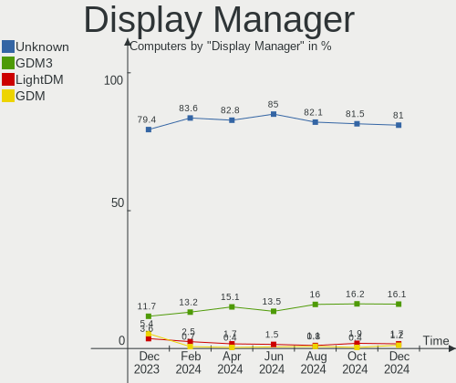
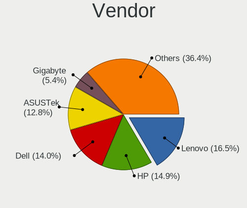

Zorin - Hardware Trends
-----------------------

A project to identify most popular hardware characteristics and track their change
over time based on data collected by Linux users at https://Linux-Hardware.org.

Anyone can contribute to this report by the [hw-probe](https://github.com/linuxhw/hw-probe) tool:

    sudo -E hw-probe -all -upload

This is a report for all computer types. See also reports for [desktops](/Dist/Zorin/Desktop/README.md) and [notebooks](/Dist/Zorin/Notebook/README.md).

This report is for one last month. Overall report since the beginning of time: [TestDays](https://github.com/linuxhw/TestDays)

Period: Mar, 2023.

Contents
--------

* [ System ](#system)
  - [ OS                       ](#os)
  - [ OS Family                ](#os-family)
  - [ Kernel                   ](#kernel)
  - [ Kernel Family            ](#kernel-family)
  - [ Kernel Major Ver.        ](#kernel-major-ver)
  - [ Arch                     ](#arch)
  - [ DE                       ](#de)
  - [ Display Server           ](#display-server)
  - [ Display Manager          ](#display-manager)
  - [ OS Lang                  ](#os-lang)
  - [ Boot Mode                ](#boot-mode)
  - [ Filesystem               ](#filesystem)
  - [ Part. scheme             ](#part-scheme)
  - [ Dual Boot with Linux/BSD ](#dual-boot-with-linuxbsd)
  - [ Dual Boot (Win)          ](#dual-boot-win)

* [ Board ](#board)
  - [ Vendor                   ](#vendor)
  - [ Model                    ](#model)
  - [ Model Family             ](#model-family)
  - [ MFG Year                 ](#mfg-year)
  - [ Form Factor              ](#form-factor)
  - [ Secure Boot              ](#secure-boot)
  - [ Coreboot                 ](#coreboot)
  - [ RAM Size                 ](#ram-size)
  - [ RAM Used                 ](#ram-used)
  - [ Total Drives             ](#total-drives)
  - [ Has CD-ROM               ](#has-cd-rom)
  - [ Has Ethernet             ](#has-ethernet)
  - [ Has WiFi                 ](#has-wifi)
  - [ Has Bluetooth            ](#has-bluetooth)

* [ Location ](#location)
  - [ Country                  ](#country)
  - [ City                     ](#city)

* [ Drives ](#drives)
  - [ Drive Vendor             ](#drive-vendor)
  - [ Drive Model              ](#drive-model)
  - [ HDD Vendor               ](#hdd-vendor)
  - [ SSD Vendor               ](#ssd-vendor)
  - [ Drive Kind               ](#drive-kind)
  - [ Drive Connector          ](#drive-connector)
  - [ Drive Size               ](#drive-size)
  - [ Space Total              ](#space-total)
  - [ Space Used               ](#space-used)
  - [ Malfunc. Drives          ](#malfunc-drives)
  - [ Malfunc. Drive Vendor    ](#malfunc-drive-vendor)
  - [ Malfunc. HDD Vendor      ](#malfunc-hdd-vendor)
  - [ Malfunc. Drive Kind      ](#malfunc-drive-kind)
  - [ Failed Drives            ](#failed-drives)
  - [ Failed Drive Vendor      ](#failed-drive-vendor)
  - [ Drive Status             ](#drive-status)

* [ Storage controller ](#storage-controller)
  - [ Storage Vendor           ](#storage-vendor)
  - [ Storage Model            ](#storage-model)
  - [ Storage Kind             ](#storage-kind)

* [ Processor ](#processor)
  - [ CPU Vendor               ](#cpu-vendor)
  - [ CPU Model                ](#cpu-model)
  - [ CPU Model Family         ](#cpu-model-family)
  - [ CPU Cores                ](#cpu-cores)
  - [ CPU Sockets              ](#cpu-sockets)
  - [ CPU Threads              ](#cpu-threads)
  - [ CPU Op-Modes             ](#cpu-op-modes)
  - [ CPU Microcode            ](#cpu-microcode)
  - [ CPU Microarch            ](#cpu-microarch)

* [ Graphics ](#graphics)
  - [ GPU Vendor               ](#gpu-vendor)
  - [ GPU Model                ](#gpu-model)
  - [ GPU Combo                ](#gpu-combo)
  - [ GPU Driver               ](#gpu-driver)
  - [ GPU Memory               ](#gpu-memory)

* [ Monitor ](#monitor)
  - [ Monitor Vendor           ](#monitor-vendor)
  - [ Monitor Model            ](#monitor-model)
  - [ Monitor Resolution       ](#monitor-resolution)
  - [ Monitor Diagonal         ](#monitor-diagonal)
  - [ Monitor Width            ](#monitor-width)
  - [ Aspect Ratio             ](#aspect-ratio)
  - [ Monitor Area             ](#monitor-area)
  - [ Pixel Density            ](#pixel-density)
  - [ Multiple Monitors        ](#multiple-monitors)

* [ Network ](#network)
  - [ Net Controller Vendor    ](#net-controller-vendor)
  - [ Net Controller Model     ](#net-controller-model)
  - [ Wireless Vendor          ](#wireless-vendor)
  - [ Wireless Model           ](#wireless-model)
  - [ Ethernet Vendor          ](#ethernet-vendor)
  - [ Ethernet Model           ](#ethernet-model)
  - [ Net Controller Kind      ](#net-controller-kind)
  - [ Used Controller          ](#used-controller)
  - [ NICs                     ](#nics)
  - [ IPv6                     ](#ipv6)

* [ Bluetooth ](#bluetooth)
  - [ Bluetooth Vendor         ](#bluetooth-vendor)
  - [ Bluetooth Model          ](#bluetooth-model)

* [ Sound ](#sound)
  - [ Sound Vendor             ](#sound-vendor)
  - [ Sound Model              ](#sound-model)

* [ Memory ](#memory)
  - [ Memory Vendor            ](#memory-vendor)
  - [ Memory Model             ](#memory-model)
  - [ Memory Kind              ](#memory-kind)
  - [ Memory Form Factor       ](#memory-form-factor)
  - [ Memory Size              ](#memory-size)
  - [ Memory Speed             ](#memory-speed)

* [ Printers & scanners ](#printers--scanners)
  - [ Printer Vendor           ](#printer-vendor)
  - [ Printer Model            ](#printer-model)
  - [ Scanner Vendor           ](#scanner-vendor)
  - [ Scanner Model            ](#scanner-model)

* [ Camera ](#camera)
  - [ Camera Vendor            ](#camera-vendor)
  - [ Camera Model             ](#camera-model)

* [ Security ](#security)
  - [ Fingerprint Vendor       ](#fingerprint-vendor)
  - [ Fingerprint Model        ](#fingerprint-model)
  - [ Chipcard Vendor          ](#chipcard-vendor)
  - [ Chipcard Model           ](#chipcard-model)

* [ Unsupported ](#unsupported)
  - [ Unsupported Devices      ](#unsupported-devices)
  - [ Unsupported Device Types ](#unsupported-device-types)

System
------

OS
--

Installed operating systems

| Name     | Computers | Percent |
|----------|-----------|---------|
| Zorin 16 | 186       | 93.94%  |
| Zorin 15 | 12        | 6.06%   |

OS Family
---------

OS without a version

| Name  | Computers | Percent |
|-------|-----------|---------|
| Zorin | 198       | 100%    |

Kernel
------

Version of the Linux kernel

| Version                | Computers | Percent |
|------------------------|-----------|---------|
| 5.15.0-67-generic      | 131       | 66.16%  |
| 5.15.0-69-generic      | 17        | 8.59%   |
| 5.15.0-60-generic      | 17        | 8.59%   |
| 5.4.0-144-generic      | 9         | 4.55%   |
| 5.15.0-56-generic      | 8         | 4.04%   |
| 5.4.0-139-generic      | 2         | 1.01%   |
| 5.15.0-58-generic      | 2         | 1.01%   |
| 5.15.0-53-generic      | 2         | 1.01%   |
| 5.15.0-52-generic      | 2         | 1.01%   |
| 6.2.7-060207-generic   | 1         | 0.51%   |
| 6.0.19-060019-generic  | 1         | 0.51%   |
| 5.8.0-49-generic       | 1         | 0.51%   |
| 5.18.15-051815-generic | 1         | 0.51%   |
| 5.15.0-43-generic      | 1         | 0.51%   |
| 5.15.0-41-generic      | 1         | 0.51%   |
| 5.11.0-38-generic      | 1         | 0.51%   |
| 4.18.0-21-generic      | 1         | 0.51%   |

Kernel Family
-------------

Linux kernel without a distro release

| Version | Computers | Percent |
|---------|-----------|---------|
| 5.15.0  | 181       | 91.41%  |
| 5.4.0   | 11        | 5.56%   |
| 6.2.7   | 1         | 0.51%   |
| 6.0.19  | 1         | 0.51%   |
| 5.8.0   | 1         | 0.51%   |
| 5.18.15 | 1         | 0.51%   |
| 5.11.0  | 1         | 0.51%   |
| 4.18.0  | 1         | 0.51%   |

Kernel Major Ver.
-----------------

Linux kernel major version

| Version | Computers | Percent |
|---------|-----------|---------|
| 5.15    | 181       | 91.41%  |
| 5.4     | 11        | 5.56%   |
| 6.2     | 1         | 0.51%   |
| 6.0     | 1         | 0.51%   |
| 5.8     | 1         | 0.51%   |
| 5.18    | 1         | 0.51%   |
| 5.11    | 1         | 0.51%   |
| 4.18    | 1         | 0.51%   |

Arch
----

OS architecture (x86_64, i586, etc.)

| Name   | Computers | Percent |
|--------|-----------|---------|
| x86_64 | 194       | 97.98%  |
| i686   | 4         | 2.02%   |

DE
--

Desktop Environment

| Name    | Computers | Percent |
|---------|-----------|---------|
| GNOME   | 162       | 81.82%  |
| XFCE    | 33        | 16.67%  |
| KDE5    | 1         | 0.51%   |
| Budgie  | 1         | 0.51%   |
| Unknown | 1         | 0.51%   |

Display Server
--------------

X11 or Wayland

| Name    | Computers | Percent |
|---------|-----------|---------|
| X11     | 193       | 97.47%  |
| Wayland | 5         | 2.53%   |

Display Manager
---------------

SDDM, LightDM, etc.

| Name    | Computers | Percent |
|---------|-----------|---------|
| Unknown | 152       | 76.77%  |
| GDM     | 17        | 8.59%   |
| GDM3    | 16        | 8.08%   |
| LightDM | 13        | 6.57%   |

OS Lang
-------

Language

| Lang  | Computers | Percent |
|-------|-----------|---------|
| en_US | 69        | 34.85%  |
| de_DE | 16        | 8.08%   |
| en_GB | 15        | 7.58%   |
| pt_BR | 11        | 5.56%   |
| it_IT | 9         | 4.55%   |
| es_ES | 8         | 4.04%   |
| en_IN | 7         | 3.54%   |
| en_CA | 6         | 3.03%   |
| en_AU | 5         | 2.53%   |
| nl_NL | 4         | 2.02%   |
| ru_RU | 3         | 1.52%   |
| pt_PT | 3         | 1.52%   |
| pl_PL | 3         | 1.52%   |
| hu_HU | 3         | 1.52%   |
| fr_FR | 3         | 1.52%   |
| tr_TR | 2         | 1.01%   |
| nl_BE | 2         | 1.01%   |
| fr_BE | 2         | 1.01%   |
| es_VE | 2         | 1.01%   |
| es_CO | 2         | 1.01%   |
| es_AR | 2         | 1.01%   |
| en_ZA | 2         | 1.01%   |
| el_GR | 2         | 1.01%   |
| cs_CZ | 2         | 1.01%   |
| sv_SE | 1         | 0.51%   |
| nb_NO | 1         | 0.51%   |
| fr_CA | 1         | 0.51%   |
| fi_FI | 1         | 0.51%   |
| es_UY | 1         | 0.51%   |
| es_SV | 1         | 0.51%   |
| es_PE | 1         | 0.51%   |
| es_BO | 1         | 0.51%   |
| en_PH | 1         | 0.51%   |
| en_NZ | 1         | 0.51%   |
| en_NG | 1         | 0.51%   |
| en_IE | 1         | 0.51%   |
| en_BW | 1         | 0.51%   |
| de_CH | 1         | 0.51%   |
| de_AT | 1         | 0.51%   |

Boot Mode
---------

EFI or BIOS

| Mode | Computers | Percent |
|------|-----------|---------|
| EFI  | 119       | 60.1%   |
| BIOS | 79        | 39.9%   |

Filesystem
----------

Type of filesystem

| Type    | Computers | Percent |
|---------|-----------|---------|
| Ext4    | 188       | 94.95%  |
| Zfs     | 5         | 2.53%   |
| Overlay | 2         | 1.01%   |
| Btrfs   | 2         | 1.01%   |
| Ext2    | 1         | 0.51%   |

Part. scheme
------------

Scheme of partitioning

| Type    | Computers | Percent |
|---------|-----------|---------|
| Unknown | 155       | 78.28%  |
| GPT     | 31        | 15.66%  |
| MBR     | 12        | 6.06%   |

Dual Boot with Linux/BSD
------------------------

Hosting more than one Linux/BSD

| Dual boot | Computers | Percent |
|-----------|-----------|---------|
| No        | 195       | 98.48%  |
| Yes       | 3         | 1.52%   |

Dual Boot (Win)
---------------

Hosting Linux and Windows

| Dual boot | Computers | Percent |
|-----------|-----------|---------|
| No        | 181       | 91.41%  |
| Yes       | 17        | 8.59%   |

Board
-----

Vendor
------

Motherboard manufacturer

| Name                | Computers | Percent |
|---------------------|-----------|---------|
| ASUSTek Computer    | 31        | 15.66%  |
| Hewlett-Packard     | 29        | 14.65%  |
| Dell                | 26        | 13.13%  |
| Lenovo              | 24        | 12.12%  |
| Gigabyte Technology | 13        | 6.57%   |
| Acer                | 10        | 5.05%   |
| MSI                 | 7         | 3.54%   |
| ASRock              | 7         | 3.54%   |
| Apple               | 7         | 3.54%   |
| Toshiba             | 5         | 2.53%   |
| Google              | 5         | 2.53%   |
| Packard Bell        | 3         | 1.52%   |
| QIYIDA              | 2         | 1.01%   |
| Positivo            | 2         | 1.01%   |
| Medion              | 2         | 1.01%   |
| Intel               | 2         | 1.01%   |
| AZW                 | 2         | 1.01%   |
| Unknown             | 2         | 1.01%   |
| YJKC                | 1         | 0.51%   |
| WEIPAI              | 1         | 0.51%   |
| Timi                | 1         | 0.51%   |
| Thomson             | 1         | 0.51%   |
| Soncview            | 1         | 0.51%   |
| ReachingTech        | 1         | 0.51%   |
| Quanta              | 1         | 0.51%   |
| Orbsmart            | 1         | 0.51%   |
| Novatech            | 1         | 0.51%   |
| Multilaser          | 1         | 0.51%   |
| Microtech           | 1         | 0.51%   |
| Microsoft           | 1         | 0.51%   |
| HUAWEI              | 1         | 0.51%   |
| HOUTER              | 1         | 0.51%   |
| Fujitsu             | 1         | 0.51%   |
| Framework           | 1         | 0.51%   |
| Clevo               | 1         | 0.51%   |
| Chuwi               | 1         | 0.51%   |
| Alienware           | 1         | 0.51%   |

Model
-----

Motherboard model

| Name                             | Computers | Percent |
|----------------------------------|-----------|---------|
| QIYIDA X99-H9 V2.0               | 2         | 1.01%   |
| MSI MS-7808                      | 2         | 1.01%   |
| HP Z620 Workstation              | 2         | 1.01%   |
| HP Pavilion dv6                  | 2         | 1.01%   |
| HP Pavilion 15                   | 2         | 1.01%   |
| ASUS All Series                  | 2         | 1.01%   |
| Unknown                          | 2         | 1.01%   |
| YJKC vBOOK Plus                  | 1         | 0.51%   |
| WEIPAI S15                       | 1         | 0.51%   |
| Toshiba Satellite S55t-B         | 1         | 0.51%   |
| Toshiba Satellite L855           | 1         | 0.51%   |
| Toshiba Satellite C55-A-1J8      | 1         | 0.51%   |
| Toshiba Satellite A100           | 1         | 0.51%   |
| Toshiba PORTEGE X30-D            | 1         | 0.51%   |
| Timi TM1701                      | 1         | 0.51%   |
| Thomson WWNEO14C-4BK32F          | 1         | 0.51%   |
| Soncview G41D3C                  | 1         | 0.51%   |
| ReachingTech DreamQuest Pro 2022 | 1         | 0.51%   |
| Quanta CA27                      | 1         | 0.51%   |
| Positivo S14SL01                 | 1         | 0.51%   |
| Positivo Q232A                   | 1         | 0.51%   |
| Packard Bell IMEDIA S3720        | 1         | 0.51%   |
| Packard Bell EasyNote TM82       | 1         | 0.51%   |
| Packard Bell EasyNote TE11HC     | 1         | 0.51%   |
| Orbsmart AW-11L                  | 1         | 0.51%   |
| Novatech 15.6 nSpire Laptop      | 1         | 0.51%   |
| Multilaser DS133                 | 1         | 0.51%   |
| MSI Raider GE66 12UHS            | 1         | 0.51%   |
| MSI MS-7D20                      | 1         | 0.51%   |
| MSI MS-7B86                      | 1         | 0.51%   |
| MSI MS-7A38                      | 1         | 0.51%   |
| MSI GF63 Thin 11UC               | 1         | 0.51%   |
| Microtech CoreBook               | 1         | 0.51%   |
| Microsoft Surface Pro 3          | 1         | 0.51%   |
| Medion MS-7707                   | 1         | 0.51%   |
| Medion Akoya E1318T              | 1         | 0.51%   |
| Lenovo Yoga 7 14ITL5 82BH        | 1         | 0.51%   |
| Lenovo Yoga 2 13 20344           | 1         | 0.51%   |
| Lenovo YB1-X91F                  | 1         | 0.51%   |
| Lenovo ThinkPad X270 20HMS1KL0C  | 1         | 0.51%   |

Model Family
------------

Motherboard model prefix

| Name                    | Computers | Percent |
|-------------------------|-----------|---------|
| Lenovo ThinkPad         | 11        | 5.56%   |
| HP Pavilion             | 8         | 4.04%   |
| Dell Latitude           | 8         | 4.04%   |
| Acer Aspire             | 6         | 3.03%   |
| Dell Precision          | 5         | 2.53%   |
| Dell OptiPlex           | 5         | 2.53%   |
| Toshiba Satellite       | 4         | 2.02%   |
| Lenovo IdeaPad          | 4         | 2.02%   |
| Dell Inspiron           | 4         | 2.02%   |
| HP EliteBook            | 3         | 1.52%   |
| HP Compaq               | 3         | 1.52%   |
| ASUS TUF                | 3         | 1.52%   |
| ASUS PRIME              | 3         | 1.52%   |
| QIYIDA X99-H9           | 2         | 1.01%   |
| Packard Bell EasyNote   | 2         | 1.01%   |
| MSI MS-7808             | 2         | 1.01%   |
| Lenovo Yoga             | 2         | 1.01%   |
| Lenovo ThinkCentre      | 2         | 1.01%   |
| HP Z620                 | 2         | 1.01%   |
| ASUS VivoBook           | 2         | 1.01%   |
| ASUS All                | 2         | 1.01%   |
| Acer TravelMate         | 2         | 1.01%   |
| Unknown                 | 2         | 1.01%   |
| YJKC vBOOK              | 1         | 0.51%   |
| WEIPAI S15              | 1         | 0.51%   |
| Toshiba PORTEGE         | 1         | 0.51%   |
| Timi TM1701             | 1         | 0.51%   |
| Thomson WWNEO14C-4BK32F | 1         | 0.51%   |
| Soncview G41D3C         | 1         | 0.51%   |
| ReachingTech DreamQuest | 1         | 0.51%   |
| Quanta CA27             | 1         | 0.51%   |
| Positivo S14SL01        | 1         | 0.51%   |
| Positivo Q232A          | 1         | 0.51%   |
| Packard Bell IMEDIA     | 1         | 0.51%   |
| Orbsmart AW-11L         | 1         | 0.51%   |
| Novatech 15.6           | 1         | 0.51%   |
| Multilaser DS133        | 1         | 0.51%   |
| MSI Raider              | 1         | 0.51%   |
| MSI MS-7D20             | 1         | 0.51%   |
| MSI MS-7B86             | 1         | 0.51%   |

MFG Year
--------

Motherboard manufacture year

| Year    | Computers | Percent |
|---------|-----------|---------|
| 2012    | 24        | 12.12%  |
| 2021    | 16        | 8.08%   |
| 2013    | 15        | 7.58%   |
| 2022    | 14        | 7.07%   |
| 2018    | 14        | 7.07%   |
| 2011    | 14        | 7.07%   |
| 2017    | 12        | 6.06%   |
| 2016    | 12        | 6.06%   |
| 2010    | 12        | 6.06%   |
| 2020    | 11        | 5.56%   |
| 2019    | 11        | 5.56%   |
| 2014    | 10        | 5.05%   |
| 2015    | 8         | 4.04%   |
| 2009    | 8         | 4.04%   |
| 2007    | 4         | 2.02%   |
| 2023    | 3         | 1.52%   |
| 2008    | 3         | 1.52%   |
| 2006    | 3         | 1.52%   |
| 2005    | 3         | 1.52%   |
| Unknown | 1         | 0.51%   |

Form Factor
-----------

Physical design of the computer

| Name        | Computers | Percent |
|-------------|-----------|---------|
| Notebook    | 100       | 50.51%  |
| Desktop     | 74        | 37.37%  |
| Convertible | 8         | 4.04%   |
| All in one  | 7         | 3.54%   |
| Mini pc     | 6         | 3.03%   |
| Tablet      | 2         | 1.01%   |
| Server      | 1         | 0.51%   |

Secure Boot
-----------

Enabled or disabled

| State    | Computers | Percent |
|----------|-----------|---------|
| Disabled | 168       | 84.85%  |
| Enabled  | 30        | 15.15%  |

Coreboot
--------

Have coreboot on board

| Used | Computers | Percent |
|------|-----------|---------|
| No   | 192       | 96.97%  |
| Yes  | 6         | 3.03%   |

RAM Size
--------

Total RAM memory

| Size in GB  | Computers | Percent |
|-------------|-----------|---------|
| 4.01-8.0    | 63        | 31.82%  |
| 3.01-4.0    | 43        | 21.72%  |
| 16.01-24.0  | 34        | 17.17%  |
| 8.01-16.0   | 20        | 10.1%   |
| 32.01-64.0  | 16        | 8.08%   |
| 1.01-2.0    | 10        | 5.05%   |
| 64.01-256.0 | 5         | 2.53%   |
| 24.01-32.0  | 3         | 1.52%   |
| 2.01-3.0    | 2         | 1.01%   |
| 0.51-1.0    | 2         | 1.01%   |

RAM Used
--------

Used RAM memory

| Used GB    | Computers | Percent |
|------------|-----------|---------|
| 1.01-2.0   | 67        | 33.84%  |
| 2.01-3.0   | 59        | 29.8%   |
| 3.01-4.0   | 32        | 16.16%  |
| 4.01-8.0   | 28        | 14.14%  |
| 0.51-1.0   | 10        | 5.05%   |
| 16.01-24.0 | 1         | 0.51%   |
| 8.01-16.0  | 1         | 0.51%   |

Total Drives
------------

Number of drives on board

| Drives | Computers | Percent |
|--------|-----------|---------|
| 1      | 131       | 66.16%  |
| 2      | 46        | 23.23%  |
| 3      | 12        | 6.06%   |
| 4      | 6         | 3.03%   |
| 6      | 1         | 0.51%   |
| 5      | 1         | 0.51%   |
| 0      | 1         | 0.51%   |

Has CD-ROM
----------

Has CD-ROM on board

| Presented | Computers | Percent |
|-----------|-----------|---------|
| No        | 117       | 59.09%  |
| Yes       | 81        | 40.91%  |

Has Ethernet
------------

Has Ethernet on board

| Presented | Computers | Percent |
|-----------|-----------|---------|
| Yes       | 161       | 81.31%  |
| No        | 37        | 18.69%  |

Has WiFi
--------

Has WiFi module

| Presented | Computers | Percent |
|-----------|-----------|---------|
| Yes       | 164       | 82.83%  |
| No        | 34        | 17.17%  |

Has Bluetooth
-------------

Has Bluetooth module

| Presented | Computers | Percent |
|-----------|-----------|---------|
| Yes       | 117       | 59.09%  |
| No        | 81        | 40.91%  |

Location
--------

Country
-------

Geographic location (country)

| Country      | Computers | Percent |
|--------------|-----------|---------|
| USA          | 39        | 19.7%   |
| Germany      | 16        | 8.08%   |
| UK           | 14        | 7.07%   |
| Brazil       | 12        | 6.06%   |
| Italy        | 11        | 5.56%   |
| India        | 8         | 4.04%   |
| Spain        | 7         | 3.54%   |
| Netherlands  | 7         | 3.54%   |
| Canada       | 7         | 3.54%   |
| France       | 6         | 3.03%   |
| Portugal     | 4         | 2.02%   |
| Belgium      | 4         | 2.02%   |
| Australia    | 4         | 2.02%   |
| Argentina    | 4         | 2.02%   |
| Switzerland  | 3         | 1.52%   |
| South Africa | 3         | 1.52%   |
| Russia       | 3         | 1.52%   |
| Poland       | 3         | 1.52%   |
| Colombia     | 3         | 1.52%   |
| Venezuela    | 2         | 1.01%   |
| Turkey       | 2         | 1.01%   |
| New Zealand  | 2         | 1.01%   |
| Hungary      | 2         | 1.01%   |
| Greece       | 2         | 1.01%   |
| Finland      | 2         | 1.01%   |
| Czechia      | 2         | 1.01%   |
| Austria      | 2         | 1.01%   |
| Uruguay      | 1         | 0.51%   |
| Sweden       | 1         | 0.51%   |
| South Korea  | 1         | 0.51%   |
| Singapore    | 1         | 0.51%   |
| Serbia       | 1         | 0.51%   |
| Saint Lucia  | 1         | 0.51%   |
| Romania      | 1         | 0.51%   |
| Puerto Rico  | 1         | 0.51%   |
| Philippines  | 1         | 0.51%   |
| Peru         | 1         | 0.51%   |
| Pakistan     | 1         | 0.51%   |
| Norway       | 1         | 0.51%   |
| Nigeria      | 1         | 0.51%   |

City
----

Geographic location (city)

| City             | Computers | Percent |
|------------------|-----------|---------|
| Rome             | 3         | 1.52%   |
| London           | 3         | 1.52%   |
| Échirolles      | 3         | 1.52%   |
| Amsterdam        | 3         | 1.52%   |
| Sydney           | 2         | 1.01%   |
| Perth            | 2         | 1.01%   |
| Munich           | 2         | 1.01%   |
| Marbella         | 2         | 1.01%   |
| Lisbon           | 2         | 1.01%   |
| Langley          | 2         | 1.01%   |
| Kissimmee        | 2         | 1.01%   |
| Isle of Arran    | 2         | 1.01%   |
| Helsinki         | 2         | 1.01%   |
| Hamburg          | 2         | 1.01%   |
| Delhi            | 2         | 1.01%   |
| Bristol          | 2         | 1.01%   |
| Brasília        | 2         | 1.01%   |
| Bogotá          | 2         | 1.01%   |
| Athens           | 2         | 1.01%   |
| Winston-Salem    | 1         | 0.51%   |
| Waterford        | 1         | 0.51%   |
| Vienna           | 1         | 0.51%   |
| Vaudreuil-Dorion | 1         | 0.51%   |
| Valladolid       | 1         | 0.51%   |
| Utica            | 1         | 0.51%   |
| Uden             | 1         | 0.51%   |
| Turin            | 1         | 0.51%   |
| Tucson           | 1         | 0.51%   |
| Tübingen        | 1         | 0.51%   |
| The Hague        | 1         | 0.51%   |
| The Dalles       | 1         | 0.51%   |
| Tallahassee      | 1         | 0.51%   |
| Świnoujście    | 1         | 0.51%   |
| St Petersburg    | 1         | 0.51%   |
| Springdale       | 1         | 0.51%   |
| Sora             | 1         | 0.51%   |
| Sombra           | 1         | 0.51%   |
| Singapore        | 1         | 0.51%   |
| Sharqia          | 1         | 0.51%   |
| Seongbuk-gu      | 1         | 0.51%   |

Drives
------

Drive Vendor
------------

Hard drive vendors

| Vendor                    | Computers | Drives | Percent |
|---------------------------|-----------|--------|---------|
| Samsung Electronics       | 44        | 51     | 15.88%  |
| Seagate                   | 36        | 40     | 13%     |
| WDC                       | 35        | 37     | 12.64%  |
| Unknown                   | 20        | 23     | 7.22%   |
| SanDisk                   | 17        | 17     | 6.14%   |
| Toshiba                   | 14        | 14     | 5.05%   |
| Kingston                  | 10        | 10     | 3.61%   |
| Hitachi                   | 10        | 10     | 3.61%   |
| Crucial                   | 8         | 8      | 2.89%   |
| China                     | 8         | 8      | 2.89%   |
| Micron Technology         | 7         | 7      | 2.53%   |
| HGST                      | 6         | 6      | 2.17%   |
| SK hynix                  | 4         | 4      | 1.44%   |
| Micron/Crucial Technology | 4         | 4      | 1.44%   |
| Maxtor                    | 3         | 3      | 1.08%   |
| Intel                     | 3         | 3      | 1.08%   |
| A-DATA Technology         | 3         | 3      | 1.08%   |
| Unknown                   | 3         | 3      | 1.08%   |
| Silicon Motion            | 2         | 2      | 0.72%   |
| Realtek Semiconductor     | 2         | 2      | 0.72%   |
| PNY                       | 2         | 2      | 0.72%   |
| Patriot                   | 2         | 2      | 0.72%   |
| JMicron Technology        | 2         | 2      | 0.72%   |
| GOODRAM                   | 2         | 2      | 0.72%   |
| XrayDisk                  | 1         | 1      | 0.36%   |
| USB30                     | 1         | 1      | 0.36%   |
| UMIS                      | 1         | 1      | 0.36%   |
| Team                      | 1         | 1      | 0.36%   |
| TDAS                      | 1         | 3      | 0.36%   |
| Saichi D                  | 1         | 1      | 0.36%   |
| QUANTUM                   | 1         | 1      | 0.36%   |
| Phison Electronics        | 1         | 1      | 0.36%   |
| OCZ                       | 1         | 1      | 0.36%   |
| NT-1TB                    | 1         | 1      | 0.36%   |
| NN                        | 1         | 1      | 0.36%   |
| NGFF                      | 1         | 1      | 0.36%   |
| Netac                     | 1         | 1      | 0.36%   |
| MAGIX                     | 1         | 1      | 0.36%   |
| Lexar                     | 1         | 1      | 0.36%   |
| KIOXIA                    | 1         | 1      | 0.36%   |

Drive Model
-----------

Hard drive models

| Model                                               | Computers | Percent |
|-----------------------------------------------------|-----------|---------|
| Unknown MMC Card  64GB                              | 6         | 2.07%   |
| Unknown MMC Card  32GB                              | 5         | 1.72%   |
| Samsung NVMe SSD Controller SM981/PM981/PM983 250GB | 5         | 1.72%   |
| Samsung NVMe SSD Controller PM9A1/PM9A3/980PRO 1TB  | 4         | 1.38%   |
| Unknown MMC Card  128GB                             | 3         | 1.03%   |
| Seagate ST500LT012-1DG142 500GB                     | 3         | 1.03%   |
| Seagate ST500DM002-1BD142 500GB                     | 3         | 1.03%   |
| Seagate ST1000LM024 HN-M101MBB 1TB                  | 3         | 1.03%   |
| Seagate ST1000DM010-2EP102 1TB                      | 3         | 1.03%   |
| Samsung SSD 870 EVO 1TB                             | 3         | 1.03%   |
| Samsung SSD 860 EVO 500GB                           | 3         | 1.03%   |
| Samsung NVMe SSD Controller SM961/PM961/SM963 256GB | 3         | 1.03%   |
| Unknown                                             | 3         | 1.03%   |
| WDC WD5000AADS-00S9B0 500GB                         | 2         | 0.69%   |
| WDC WD10EZEX-08WN4A0 1TB                            | 2         | 0.69%   |
| Unknown SD/MMC/MS PRO 64GB                          | 2         | 0.69%   |
| Unknown MMC Card  16GB                              | 2         | 0.69%   |
| Toshiba MQ01ABD100 1TB                              | 2         | 0.69%   |
| Seagate ST9500325AS 500GB                           | 2         | 0.69%   |
| SanDisk SDSSDA240G 240GB                            | 2         | 0.69%   |
| Samsung SSD 860 EVO 250GB                           | 2         | 0.69%   |
| Samsung SSD 850 EVO 250GB                           | 2         | 0.69%   |
| Samsung HD161GJ 160GB                               | 2         | 0.69%   |
| Realtek RTS5763DL NVMe SSD Controller 512GB         | 2         | 0.69%   |
| Micron 2210_MTFDHBA512QFD 512GB                     | 2         | 0.69%   |
| Kingston SNVS500G 500GB                             | 2         | 0.69%   |
| Kingston SA400S37240G 240GB SSD                     | 2         | 0.69%   |
| Intel SSDPEKNU512GZ 512GB                           | 2         | 0.69%   |
| Hitachi HTS547564A9E384 640GB                       | 2         | 0.69%   |
| HGST HTS721010A9E630 1TB                            | 2         | 0.69%   |
| HGST HTS541010A9E680 1TB                            | 2         | 0.69%   |
| Crucial CT480BX500SSD1 480GB                        | 2         | 0.69%   |
| Crucial CT240BX500SSD1 240GB                        | 2         | 0.69%   |
| XrayDisk 1TB SSD                                    | 1         | 0.34%   |
| WDC WDS500G2B0A 500GB SSD                           | 1         | 0.34%   |
| WDC WDS120G2G0B-00EPW0 120GB SSD                    | 1         | 0.34%   |
| WDC WDS100T2G0A-00JH30 1TB SSD                      | 1         | 0.34%   |
| WDC WDBNCE0020PNC 2TB SSD                           | 1         | 0.34%   |
| WDC WDBA3V5000ANC-WRSN 500GB                        | 1         | 0.34%   |
| WDC WD5000BEVT-22A0RT0 500GB                        | 1         | 0.34%   |

HDD Vendor
----------

Hard disk drive vendors

| Vendor              | Computers | Drives | Percent |
|---------------------|-----------|--------|---------|
| Seagate             | 35        | 39     | 35.35%  |
| WDC                 | 26        | 28     | 26.26%  |
| Toshiba             | 12        | 12     | 12.12%  |
| Hitachi             | 10        | 10     | 10.1%   |
| HGST                | 6         | 6      | 6.06%   |
| Samsung Electronics | 4         | 4      | 4.04%   |
| Maxtor              | 3         | 3      | 3.03%   |
| Unknown             | 2         | 2      | 2.02%   |
| QUANTUM             | 1         | 1      | 1.01%   |

SSD Vendor
----------

Solid state drive vendors

| Vendor              | Computers | Drives | Percent |
|---------------------|-----------|--------|---------|
| Samsung Electronics | 27        | 31     | 27.55%  |
| SanDisk             | 8         | 8      | 8.16%   |
| China               | 8         | 8      | 8.16%   |
| Kingston            | 7         | 7      | 7.14%   |
| Crucial             | 7         | 7      | 7.14%   |
| WDC                 | 6         | 6      | 6.12%   |
| Micron Technology   | 3         | 3      | 3.06%   |
| Toshiba             | 2         | 2      | 2.04%   |
| PNY                 | 2         | 2      | 2.04%   |
| Patriot             | 2         | 2      | 2.04%   |
| GOODRAM             | 2         | 2      | 2.04%   |
| A-DATA Technology   | 2         | 2      | 2.04%   |
| XrayDisk            | 1         | 1      | 1.02%   |
| USB30               | 1         | 1      | 1.02%   |
| Team                | 1         | 1      | 1.02%   |
| SK hynix            | 1         | 1      | 1.02%   |
| OCZ                 | 1         | 1      | 1.02%   |
| NT-1TB              | 1         | 1      | 1.02%   |
| NN                  | 1         | 1      | 1.02%   |
| NGFF                | 1         | 1      | 1.02%   |
| Netac               | 1         | 1      | 1.02%   |
| Lexar               | 1         | 1      | 1.02%   |
| JMicron Technology  | 1         | 1      | 1.02%   |
| Intenso             | 1         | 1      | 1.02%   |
| Integral            | 1         | 1      | 1.02%   |
| GT                  | 1         | 1      | 1.02%   |
| Emtec               | 1         | 1      | 1.02%   |
| Corsair             | 1         | 2      | 1.02%   |
| Colorful            | 1         | 1      | 1.02%   |
| Apple               | 1         | 1      | 1.02%   |
| Apacer              | 1         | 1      | 1.02%   |
| AirDisk             | 1         | 1      | 1.02%   |
| 2-Power             | 1         | 1      | 1.02%   |
| Unknown             | 1         | 1      | 1.02%   |

Drive Kind
----------

HDD or SSD

| Kind    | Computers | Drives | Percent |
|---------|-----------|--------|---------|
| SSD     | 88        | 103    | 35.34%  |
| HDD     | 85        | 105    | 34.14%  |
| NVMe    | 48        | 54     | 19.28%  |
| MMC     | 19        | 23     | 7.63%   |
| Unknown | 9         | 11     | 3.61%   |

Drive Connector
---------------

SATA, SAS, NVMe, etc.

| Type | Computers | Drives | Percent |
|------|-----------|--------|---------|
| SATA | 152       | 206    | 66.38%  |
| NVMe | 48        | 54     | 20.96%  |
| MMC  | 19        | 23     | 8.3%    |
| SAS  | 10        | 13     | 4.37%   |

Drive Size
----------

Size of hard drive

| Size in TB | Computers | Drives | Percent |
|------------|-----------|--------|---------|
| 0.01-0.5   | 112       | 133    | 62.57%  |
| 0.51-1.0   | 50        | 57     | 27.93%  |
| 1.01-2.0   | 13        | 14     | 7.26%   |
| 3.01-4.0   | 2         | 2      | 1.12%   |
| 2.01-3.0   | 2         | 2      | 1.12%   |

Space Total
-----------

Amount of disk space available on the file system

| Size in GB     | Computers | Percent |
|----------------|-----------|---------|
| 101-250        | 66        | 33.33%  |
| 251-500        | 43        | 21.72%  |
| 501-1000       | 28        | 14.14%  |
| 1001-2000      | 18        | 9.09%   |
| 51-100         | 17        | 8.59%   |
| 21-50          | 7         | 3.54%   |
| More than 3000 | 6         | 3.03%   |
| 2001-3000      | 5         | 2.53%   |
| 1-20           | 4         | 2.02%   |
| Unknown        | 4         | 2.02%   |

Space Used
----------

Amount of used disk space

| Used GB   | Computers | Percent |
|-----------|-----------|---------|
| 1-20      | 56        | 28.28%  |
| 21-50     | 53        | 26.77%  |
| 101-250   | 29        | 14.65%  |
| 51-100    | 29        | 14.65%  |
| 251-500   | 14        | 7.07%   |
| 501-1000  | 10        | 5.05%   |
| Unknown   | 4         | 2.02%   |
| 1001-2000 | 2         | 1.01%   |
| 2001-3000 | 1         | 0.51%   |

Malfunc. Drives
---------------

Drive models with a malfunction

| Model                       | Computers | Drives | Percent |
|-----------------------------|-----------|--------|---------|
| WDC WD Green 2.5 1000GB SSD | 1         | 1      | 25%     |
| Seagate ST3160310CS 160GB   | 1         | 1      | 25%     |
| Maxtor STM3320613AS 320GB   | 1         | 1      | 25%     |
| HGST HTS541010A9E680 1TB    | 1         | 1      | 25%     |

Malfunc. Drive Vendor
---------------------

Vendors of faulty drives

| Vendor  | Computers | Drives | Percent |
|---------|-----------|--------|---------|
| WDC     | 1         | 1      | 25%     |
| Seagate | 1         | 1      | 25%     |
| Maxtor  | 1         | 1      | 25%     |
| HGST    | 1         | 1      | 25%     |

Malfunc. HDD Vendor
-------------------

Vendors of faulty HDD drives

| Vendor  | Computers | Drives | Percent |
|---------|-----------|--------|---------|
| Seagate | 1         | 1      | 33.33%  |
| Maxtor  | 1         | 1      | 33.33%  |
| HGST    | 1         | 1      | 33.33%  |

Malfunc. Drive Kind
-------------------

Kinds of faulty drives

| Kind | Computers | Drives | Percent |
|------|-----------|--------|---------|
| HDD  | 3         | 3      | 75%     |
| SSD  | 1         | 1      | 25%     |

Failed Drives
-------------

Failed drive models

Zero info for selected period =(

Failed Drive Vendor
-------------------

Failed drive vendors

Zero info for selected period =(

Drive Status
------------

Number of failed and malfunc. drives

| Status   | Computers | Drives | Percent |
|----------|-----------|--------|---------|
| Detected | 178       | 267    | 87.68%  |
| Works    | 21        | 25     | 10.34%  |
| Malfunc  | 4         | 4      | 1.97%   |

Storage controller
------------------

Storage Vendor
--------------

Storage controller vendors

| Vendor                      | Computers | Percent |
|-----------------------------|-----------|---------|
| Intel                       | 138       | 59.74%  |
| AMD                         | 33        | 14.29%  |
| Samsung Electronics         | 16        | 6.93%   |
| Sandisk                     | 10        | 4.33%   |
| Micron/Crucial Technology   | 5         | 2.16%   |
| Micron Technology           | 4         | 1.73%   |
| Kingston Technology Company | 4         | 1.73%   |
| SK hynix                    | 3         | 1.3%    |
| Nvidia                      | 3         | 1.3%    |
| JMicron Technology          | 3         | 1.3%    |
| Silicon Motion              | 2         | 0.87%   |
| Realtek Semiconductor       | 2         | 0.87%   |
| Marvell Technology Group    | 2         | 0.87%   |
| ASMedia Technology          | 2         | 0.87%   |
| Union Memory (Shenzhen)     | 1         | 0.43%   |
| Phison Electronics          | 1         | 0.43%   |
| KIOXIA                      | 1         | 0.43%   |
| ADATA Technology            | 1         | 0.43%   |

Storage Model
-------------

Storage controller models

| Model                                                                          | Computers | Percent |
|--------------------------------------------------------------------------------|-----------|---------|
| AMD FCH SATA Controller [AHCI mode]                                            | 21        | 7.92%   |
| Intel 7 Series Chipset Family 6-port SATA Controller [AHCI mode]               | 18        | 6.79%   |
| Intel Sunrise Point-LP SATA Controller [AHCI mode]                             | 9         | 3.4%    |
| Intel 8 Series/C220 Series Chipset Family 6-port SATA Controller 1 [AHCI mode] | 9         | 3.4%    |
| Intel 6 Series/C200 Series Chipset Family 6 port Desktop SATA AHCI Controller  | 9         | 3.4%    |
| Intel Volume Management Device NVMe RAID Controller                            | 6         | 2.26%   |
| Intel 82801G (ICH7 Family) IDE Controller                                      | 6         | 2.26%   |
| Intel 82801 Mobile SATA Controller [RAID mode]                                 | 6         | 2.26%   |
| Intel 6 Series/C200 Series Chipset Family 6 port Mobile SATA AHCI Controller   | 6         | 2.26%   |
| Samsung NVMe SSD Controller SM981/PM981/PM983                                  | 5         | 1.89%   |
| Intel SATA Controller [RAID mode]                                              | 5         | 1.89%   |
| Intel NM10/ICH7 Family SATA Controller [IDE mode]                              | 5         | 1.89%   |
| Intel 82801IBM/IEM (ICH9M/ICH9M-E) 4 port SATA Controller [AHCI mode]          | 5         | 1.89%   |
| Intel 8 Series SATA Controller 1 [AHCI mode]                                   | 5         | 1.89%   |
| AMD 400 Series Chipset SATA Controller                                         | 5         | 1.89%   |
| Samsung NVMe SSD Controller PM9A1/PM9A3/980PRO                                 | 4         | 1.51%   |
| Intel Q170/Q150/B150/H170/H110/Z170/CM236 Chipset SATA Controller [AHCI Mode]  | 4         | 1.51%   |
| Intel Atom Processor E3800 Series SATA AHCI Controller                         | 4         | 1.51%   |
| Intel 5 Series/3400 Series Chipset 4 port SATA IDE Controller                  | 4         | 1.51%   |
| Intel 5 Series/3400 Series Chipset 2 port SATA IDE Controller                  | 4         | 1.51%   |
| Samsung NVMe SSD Controller SM961/PM961/SM963                                  | 3         | 1.13%   |
| Samsung NVMe SSD Controller 980                                                | 3         | 1.13%   |
| Micron NVMe Storage Controller                                                 | 3         | 1.13%   |
| Intel Tiger Lake-LP SATA Controller                                            | 3         | 1.13%   |
| Intel 82801JI (ICH10 Family) SATA AHCI Controller                              | 3         | 1.13%   |
| Intel 82801FB/FBM/FR/FW/FRW (ICH6 Family) IDE Controller                       | 3         | 1.13%   |
| Intel 200 Series PCH SATA controller [AHCI mode]                               | 3         | 1.13%   |
| AMD SB7x0/SB8x0/SB9x0 SATA Controller [AHCI mode]                              | 3         | 1.13%   |
| AMD 500 Series Chipset SATA Controller                                         | 3         | 1.13%   |
| SanDisk NVMe Controller                                                        | 2         | 0.75%   |
| SanDisk Non-Volatile memory controller                                         | 2         | 0.75%   |
| Realtek RTS5763DL NVMe SSD Controller                                          | 2         | 0.75%   |
| Micron/Crucial P2 NVMe PCIe SSD                                                | 2         | 0.75%   |
| Micron/Crucial NVMe Storage Controller                                         | 2         | 0.75%   |
| Kingston Company NVMe Controller                                               | 2         | 0.75%   |
| Intel Non-Volatile memory controller                                           | 2         | 0.75%   |
| Intel Jasper Lake SATA AHCI Controller                                         | 2         | 0.75%   |
| Intel Celeron/Pentium Silver Processor SATA Controller                         | 2         | 0.75%   |
| Intel Celeron N3350/Pentium N4200/Atom E3900 Series SATA AHCI Controller       | 2         | 0.75%   |
| Intel C600/X79 series chipset SATA RAID Controller                             | 2         | 0.75%   |

Storage Kind
------------

Kind of storage controller (IDE, SATA, NVMe, SAS, ...)

| Kind | Computers | Percent |
|------|-----------|---------|
| SATA | 142       | 60.17%  |
| NVMe | 48        | 20.34%  |
| IDE  | 24        | 10.17%  |
| RAID | 21        | 8.9%    |
| SAS  | 1         | 0.42%   |

Processor
---------

CPU Vendor
----------

Processor vendors

| Vendor | Computers | Percent |
|--------|-----------|---------|
| Intel  | 161       | 81.31%  |
| AMD    | 37        | 18.69%  |

CPU Model
---------

Processor models

| Model                                       | Computers | Percent |
|---------------------------------------------|-----------|---------|
| Intel Core i5-3210M CPU @ 2.50GHz           | 5         | 2.53%   |
| Intel Celeron CPU N2840 @ 2.16GHz           | 4         | 2.02%   |
| Intel 11th Gen Core i7-1165G7 @ 2.80GHz     | 4         | 2.02%   |
| AMD Ryzen 5 3600 6-Core Processor           | 4         | 2.02%   |
| Intel Pentium Dual CPU E2140 @ 1.60GHz      | 3         | 1.52%   |
| Intel Core i5-7200U CPU @ 2.50GHz           | 3         | 1.52%   |
| Intel Celeron CPU N3350 @ 1.10GHz           | 3         | 1.52%   |
| Intel Pentium 4 CPU 3.00GHz                 | 2         | 1.01%   |
| Intel Core i7-8550U CPU @ 1.80GHz           | 2         | 1.01%   |
| Intel Core i7-4600U CPU @ 2.10GHz           | 2         | 1.01%   |
| Intel Core i7-2630QM CPU @ 2.00GHz          | 2         | 1.01%   |
| Intel Core i7-2600 CPU @ 3.40GHz            | 2         | 1.01%   |
| Intel Core i5-6500 CPU @ 3.20GHz            | 2         | 1.01%   |
| Intel Core i5-6200U CPU @ 2.30GHz           | 2         | 1.01%   |
| Intel Core i5-4590 CPU @ 3.30GHz            | 2         | 1.01%   |
| Intel Core i5-4300U CPU @ 1.90GHz           | 2         | 1.01%   |
| Intel Core i5-3320M CPU @ 2.60GHz           | 2         | 1.01%   |
| Intel Core i5-2400 CPU @ 3.10GHz            | 2         | 1.01%   |
| Intel Core i3-3227U CPU @ 1.90GHz           | 2         | 1.01%   |
| Intel Celeron CPU N3050 @ 1.60GHz           | 2         | 1.01%   |
| Intel Atom x5-Z8300 CPU @ 1.44GHz           | 2         | 1.01%   |
| AMD Ryzen 9 5900HX with Radeon Graphics     | 2         | 1.01%   |
| AMD Ryzen 5 4500U with Radeon Graphics      | 2         | 1.01%   |
| AMD E2-7110 APU with AMD Radeon R2 Graphics | 2         | 1.01%   |
| AMD A8-6410 APU with AMD Radeon R5 Graphics | 2         | 1.01%   |
| Intel Xeon Gold 6128 CPU @ 3.40GHz          | 1         | 0.51%   |
| Intel Xeon CPU X5365 @ 3.00GHz              | 1         | 0.51%   |
| Intel Xeon CPU W3520 @ 2.67GHz              | 1         | 0.51%   |
| Intel Xeon CPU E5-2670 0 @ 2.60GHz          | 1         | 0.51%   |
| Intel Xeon CPU E5-2630L v3 @ 1.80GHz        | 1         | 0.51%   |
| Intel Xeon CPU E5-2620 v3 @ 2.40GHz         | 1         | 0.51%   |
| Intel Xeon CPU E5-2609 0 @ 2.40GHz          | 1         | 0.51%   |
| Intel Xeon CPU E5-1620 v2 @ 3.70GHz         | 1         | 0.51%   |
| Intel Xeon CPU E5-1603 v3 @ 2.80GHz         | 1         | 0.51%   |
| Intel Xeon CPU E31235 @ 3.20GHz             | 1         | 0.51%   |
| Intel Xeon CPU E31225 @ 3.10GHz             | 1         | 0.51%   |
| Intel Pentium M processor 1.73GHz           | 1         | 0.51%   |
| Intel Pentium Gold 7505 @ 2.00GHz           | 1         | 0.51%   |
| Intel Pentium Dual-Core CPU T4500 @ 2.30GHz | 1         | 0.51%   |
| Intel Pentium Dual-Core CPU T4300 @ 2.10GHz | 1         | 0.51%   |

CPU Model Family
----------------

Processor model prefix

| Model                   | Computers | Percent |
|-------------------------|-----------|---------|
| Intel Core i5           | 50        | 25.25%  |
| Intel Core i7           | 25        | 12.63%  |
| Intel Celeron           | 19        | 9.6%    |
| AMD Ryzen 5             | 13        | 6.57%   |
| Other                   | 12        | 6.06%   |
| Intel Core i3           | 12        | 6.06%   |
| Intel Xeon              | 10        | 5.05%   |
| Intel Core 2 Duo        | 6         | 3.03%   |
| Intel Pentium Dual-Core | 5         | 2.53%   |
| Intel Pentium           | 5         | 2.53%   |
| Intel Atom              | 5         | 2.53%   |
| AMD Ryzen 7             | 5         | 2.53%   |
| Intel Pentium Dual      | 3         | 1.52%   |
| AMD Ryzen 9             | 3         | 1.52%   |
| AMD A8                  | 3         | 1.52%   |
| AMD A4                  | 3         | 1.52%   |
| Intel Pentium 4         | 2         | 1.01%   |
| AMD Ryzen 3             | 2         | 1.01%   |
| AMD E2                  | 2         | 1.01%   |
| Intel Xeon Gold         | 1         | 0.51%   |
| Intel Pentium M         | 1         | 0.51%   |
| Intel Pentium Gold      | 1         | 0.51%   |
| Intel Pentium D         | 1         | 0.51%   |
| Intel Core 2 Quad       | 1         | 0.51%   |
| Intel Core 2            | 1         | 0.51%   |
| Intel Celeron M         | 1         | 0.51%   |
| AMD V120                | 1         | 0.51%   |
| AMD FX                  | 1         | 0.51%   |
| AMD E1                  | 1         | 0.51%   |
| AMD Athlon II Neo       | 1         | 0.51%   |
| AMD Athlon              | 1         | 0.51%   |
| AMD A6                  | 1         | 0.51%   |

CPU Cores
---------

Number of processor cores

| Number | Computers | Percent |
|--------|-----------|---------|
| 2      | 87        | 43.94%  |
| 4      | 69        | 34.85%  |
| 6      | 18        | 9.09%   |
| 8      | 12        | 6.06%   |
| 1      | 7         | 3.54%   |
| 16     | 2         | 1.01%   |
| 10     | 2         | 1.01%   |
| 14     | 1         | 0.51%   |

CPU Sockets
-----------

Number of sockets

| Number | Computers | Percent |
|--------|-----------|---------|
| 1      | 196       | 98.99%  |
| 2      | 2         | 1.01%   |

CPU Threads
-----------

Threads per core (Hyper-Threading)

| Number | Computers | Percent |
|--------|-----------|---------|
| 2      | 112       | 56.57%  |
| 1      | 86        | 43.43%  |

CPU Op-Modes
------------

CPU Operation Modes (32-bit, 64-bit)

| Op mode        | Computers | Percent |
|----------------|-----------|---------|
| 32-bit, 64-bit | 196       | 98.99%  |
| 32-bit         | 2         | 1.01%   |

CPU Microcode
-------------

Microcode number

| Number     | Computers | Percent |
|------------|-----------|---------|
| 0x206a7    | 19        | 9.6%    |
| 0x306a9    | 15        | 7.58%   |
| Unknown    | 14        | 7.07%   |
| 0x1067a    | 9         | 4.55%   |
| 0x306c3    | 8         | 4.04%   |
| 0x806c1    | 7         | 3.54%   |
| 0x20655    | 7         | 3.54%   |
| 0x40651    | 6         | 3.03%   |
| 0x30678    | 6         | 3.03%   |
| 0x806e9    | 5         | 2.53%   |
| 0x506e3    | 5         | 2.53%   |
| 0x406c3    | 5         | 2.53%   |
| 0x906ea    | 4         | 2.02%   |
| 0x6fd      | 4         | 2.02%   |
| 0x806ea    | 3         | 1.52%   |
| 0x706a8    | 3         | 1.52%   |
| 0x506c9    | 3         | 1.52%   |
| 0x406e3    | 3         | 1.52%   |
| 0x08701021 | 3         | 1.52%   |
| 0x08600106 | 3         | 1.52%   |
| 0x08108109 | 3         | 1.52%   |
| 0x0800820d | 3         | 1.52%   |
| 0x07030105 | 3         | 1.52%   |
| 0xa0655    | 2         | 1.01%   |
| 0x906c0    | 2         | 1.01%   |
| 0x906a4    | 2         | 1.01%   |
| 0x806ec    | 2         | 1.01%   |
| 0x306f2    | 2         | 1.01%   |
| 0x206d7    | 2         | 1.01%   |
| 0x20652    | 2         | 1.01%   |
| 0x0a50000c | 2         | 1.01%   |
| 0x08001138 | 2         | 1.01%   |
| 0x0700010f | 2         | 1.01%   |
| 0x010000c8 | 2         | 1.01%   |
| 0xf65      | 1         | 0.51%   |
| 0xf43      | 1         | 0.51%   |
| 0xf41      | 1         | 0.51%   |
| 0xb0671    | 1         | 0.51%   |
| 0xa0653    | 1         | 0.51%   |
| 0xa0652    | 1         | 0.51%   |

CPU Microarch
-------------

Microarchitecture

| Name             | Computers | Percent |
|------------------|-----------|---------|
| SandyBridge      | 21        | 10.61%  |
| IvyBridge        | 20        | 10.1%   |
| Haswell          | 19        | 9.6%    |
| KabyLake         | 18        | 9.09%   |
| Silvermont       | 14        | 7.07%   |
| Westmere         | 10        | 5.05%   |
| Penryn           | 10        | 5.05%   |
| Zen 2            | 9         | 4.55%   |
| Skylake          | 9         | 4.55%   |
| TigerLake        | 8         | 4.04%   |
| Zen+             | 7         | 3.54%   |
| Core             | 7         | 3.54%   |
| Puma             | 6         | 3.03%   |
| Zen 3            | 4         | 2.02%   |
| CometLake        | 4         | 2.02%   |
| NetBurst         | 3         | 1.52%   |
| Goldmont plus    | 3         | 1.52%   |
| Goldmont         | 3         | 1.52%   |
| Alderlake Hybrid | 3         | 1.52%   |
| Unknown          | 3         | 1.52%   |
| Zen              | 2         | 1.01%   |
| Tremont          | 2         | 1.01%   |
| P6               | 2         | 1.01%   |
| Nehalem          | 2         | 1.01%   |
| K10              | 2         | 1.01%   |
| Jaguar           | 2         | 1.01%   |
| Piledriver       | 1         | 0.51%   |
| Icelake          | 1         | 0.51%   |
| Excavator        | 1         | 0.51%   |
| Broadwell        | 1         | 0.51%   |
| Bobcat           | 1         | 0.51%   |

Graphics
--------

GPU Vendor
----------

Vendors of graphics cards

| Vendor | Computers | Percent |
|--------|-----------|---------|
| Intel  | 121       | 54.5%   |
| Nvidia | 55        | 24.77%  |
| AMD    | 46        | 20.72%  |

GPU Model
---------

Graphics card models

| Model                                                                                    | Computers | Percent |
|------------------------------------------------------------------------------------------|-----------|---------|
| Intel 3rd Gen Core processor Graphics Controller                                         | 17        | 7.46%   |
| Intel 2nd Generation Core Processor Family Integrated Graphics Controller                | 11        | 4.82%   |
| Intel Core Processor Integrated Graphics Controller                                      | 7         | 3.07%   |
| Intel Atom Processor Z36xxx/Z37xxx Series Graphics & Display                             | 7         | 3.07%   |
| Intel TigerLake-LP GT2 [Iris Xe Graphics]                                                | 6         | 2.63%   |
| Intel Haswell-ULT Integrated Graphics Controller                                         | 6         | 2.63%   |
| Intel Atom/Celeron/Pentium Processor x5-E8000/J3xxx/N3xxx Integrated Graphics Controller | 6         | 2.63%   |
| Intel HD Graphics 620                                                                    | 5         | 2.19%   |
| AMD Renoir                                                                               | 4         | 1.75%   |
| AMD Picasso/Raven 2 [Radeon Vega Series / Radeon Vega Mobile Series]                     | 4         | 1.75%   |
| AMD Mullins [Radeon R4/R5 Graphics]                                                      | 4         | 1.75%   |
| AMD Ellesmere [Radeon RX 470/480/570/570X/580/580X/590]                                  | 4         | 1.75%   |
| Nvidia GF117M [GeForce 610M/710M/810M/820M / GT 620M/625M/630M/720M]                     | 3         | 1.32%   |
| Nvidia GA104 [GeForce RTX 3060 Ti Lite Hash Rate]                                        | 3         | 1.32%   |
| Intel Xeon E3-1200 v3/4th Gen Core Processor Integrated Graphics Controller              | 3         | 1.32%   |
| Intel UHD Graphics 620                                                                   | 3         | 1.32%   |
| Intel Skylake GT2 [HD Graphics 520]                                                      | 3         | 1.32%   |
| Intel Mobile 4 Series Chipset Integrated Graphics Controller                             | 3         | 1.32%   |
| Intel HD Graphics 530                                                                    | 3         | 1.32%   |
| Intel HD Graphics 500                                                                    | 3         | 1.32%   |
| Intel GeminiLake [UHD Graphics 600]                                                      | 3         | 1.32%   |
| Intel 4th Gen Core Processor Integrated Graphics Controller                              | 3         | 1.32%   |
| Intel 4 Series Chipset Integrated Graphics Controller                                    | 3         | 1.32%   |
| AMD Navi 10 [Radeon RX 5600 OEM/5600 XT / 5700/5700 XT]                                  | 3         | 1.32%   |
| Nvidia TU117M [GeForce GTX 1650 Mobile / Max-Q]                                          | 2         | 0.88%   |
| Nvidia TU116 [GeForce GTX 1660]                                                          | 2         | 0.88%   |
| Nvidia GT218 [GeForce 210]                                                               | 2         | 0.88%   |
| Nvidia GP107 [GeForce GTX 1050 Ti]                                                       | 2         | 0.88%   |
| Nvidia GA106 [GeForce RTX 3060]                                                          | 2         | 0.88%   |
| Nvidia GA102 [GeForce RTX 3080 Lite Hash Rate]                                           | 2         | 0.88%   |
| Intel Xeon E3-1200 v2/3rd Gen Core processor Graphics Controller                         | 2         | 0.88%   |
| Intel Xeon E3-1200 Processor Family Integrated Graphics Controller                       | 2         | 0.88%   |
| Intel WhiskeyLake-U GT2 [UHD Graphics 620]                                               | 2         | 0.88%   |
| Intel Tiger Lake-LP GT2 [UHD Graphics G4]                                                | 2         | 0.88%   |
| Intel JasperLake [UHD Graphics]                                                          | 2         | 0.88%   |
| Intel HD Graphics 630                                                                    | 2         | 0.88%   |
| Intel 82945G/GZ Integrated Graphics Controller                                           | 2         | 0.88%   |
| Intel 82915G/GV/910GL Integrated Graphics Controller                                     | 2         | 0.88%   |
| AMD Whistler [Radeon HD 6730M/6770M/7690M XT]                                            | 2         | 0.88%   |
| AMD RS880M [Mobility Radeon HD 4225/4250]                                                | 2         | 0.88%   |

GPU Combo
---------

Combinations of graphics cards

| Name           | Computers | Percent |
|----------------|-----------|---------|
| 1 x Intel      | 99        | 50%     |
| 1 x AMD        | 40        | 20.2%   |
| 1 x Nvidia     | 33        | 16.67%  |
| Intel + Nvidia | 19        | 9.6%    |
| 2 x AMD        | 3         | 1.52%   |
| AMD + Nvidia   | 2         | 1.01%   |
| Other          | 1         | 0.51%   |
| Intel + AMD    | 1         | 0.51%   |

GPU Driver
----------

Free vs proprietary

| Driver      | Computers | Percent |
|-------------|-----------|---------|
| Free        | 169       | 85.35%  |
| Proprietary | 25        | 12.63%  |
| Unknown     | 4         | 2.02%   |

GPU Memory
----------

Total video memory

| Size in GB | Computers | Percent |
|------------|-----------|---------|
| Unknown    | 121       | 61.11%  |
| 0.01-0.5   | 22        | 11.11%  |
| 0.51-1.0   | 17        | 8.59%   |
| 1.01-2.0   | 12        | 6.06%   |
| 3.01-4.0   | 10        | 5.05%   |
| 7.01-8.0   | 8         | 4.04%   |
| 5.01-6.0   | 3         | 1.52%   |
| 8.01-16.0  | 3         | 1.52%   |
| 2.01-3.0   | 2         | 1.01%   |

Monitor
-------

Monitor Vendor
--------------

Monitor vendors

| Vendor                  | Computers | Percent |
|-------------------------|-----------|---------|
| AU Optronics            | 26        | 13.33%  |
| Samsung Electronics     | 24        | 12.31%  |
| LG Display              | 17        | 8.72%   |
| BOE                     | 15        | 7.69%   |
| Chimei Innolux          | 11        | 5.64%   |
| Goldstar                | 9         | 4.62%   |
| Acer                    | 9         | 4.62%   |
| Hewlett-Packard         | 7         | 3.59%   |
| InfoVision              | 6         | 3.08%   |
| Dell                    | 6         | 3.08%   |
| BenQ                    | 5         | 2.56%   |
| Apple                   | 5         | 2.56%   |
| AOC                     | 5         | 2.56%   |
| Chi Mei Optoelectronics | 4         | 2.05%   |
| Ancor Communications    | 4         | 2.05%   |
| Sony                    | 3         | 1.54%   |
| Philips                 | 3         | 1.54%   |
| Lenovo                  | 3         | 1.54%   |
| Vizio                   | 2         | 1.03%   |
| Toshiba                 | 2         | 1.03%   |
| PANDA                   | 2         | 1.03%   |
| MSI                     | 2         | 1.03%   |
| Fujitsu Siemens         | 2         | 1.03%   |
| CPT                     | 2         | 1.03%   |
| Unknown                 | 2         | 1.03%   |
| ViewSonic               | 1         | 0.51%   |
| Unknown (XXX)           | 1         | 0.51%   |
| Unknown                 | 1         | 0.51%   |
| STA                     | 1         | 0.51%   |
| Sharp                   | 1         | 0.51%   |
| Roku                    | 1         | 0.51%   |
| Panasonic               | 1         | 0.51%   |
| NEC Computers           | 1         | 0.51%   |
| MiTAC                   | 1         | 0.51%   |
| Mi                      | 1         | 0.51%   |
| LG Philips              | 1         | 0.51%   |
| LG Electronics          | 1         | 0.51%   |
| Lenovo Group Limited    | 1         | 0.51%   |
| KTC                     | 1         | 0.51%   |
| Deco Gear               | 1         | 0.51%   |

Monitor Model
-------------

Monitor models

| Model                                                                 | Computers | Percent |
|-----------------------------------------------------------------------|-----------|---------|
| AU Optronics LCD Monitor AUO235C 1366x768 256x144mm 11.6-inch         | 5         | 2.54%   |
| Samsung Electronics LCD Monitor Odyssey G8 3440x1440                  | 2         | 1.02%   |
| LG Display LCD Monitor LGD0468 1366x768 344x194mm 15.5-inch           | 2         | 1.02%   |
| LG Display LCD Monitor LGD033A 1366x768 344x194mm 15.5-inch           | 2         | 1.02%   |
| Dell E176FP DELA014 1280x1024 338x270mm 17.0-inch                     | 2         | 1.02%   |
| BOE LCD Monitor BOE075A 1366x768 309x173mm 13.9-inch                  | 2         | 1.02%   |
| AU Optronics LCD Monitor AUO313C 1366x768 309x173mm 13.9-inch         | 2         | 1.02%   |
| Unknown                                                               | 2         | 1.02%   |
| Vizio PC VIZCA27 1920x1080 597x336mm 27.0-inch                        | 1         | 0.51%   |
| Vizio D320-B1 VIZ0095 1360x768 697x392mm 31.5-inch                    | 1         | 0.51%   |
| ViewSonic VX3276-UHD VSC5138 3840x2160 697x392mm 31.5-inch            | 1         | 0.51%   |
| Unknown LCD Monitor SAMSUNG 1920x1080                                 | 1         | 0.51%   |
| Unknown (XXX) Beyond TV XXX2851 1920x1080 1209x680mm 54.6-inch        | 1         | 0.51%   |
| Toshiba TV TSB0108 1920x540                                           | 1         | 0.51%   |
| Toshiba LCD-MONITOR LCDE980 1440x900 408x255mm 18.9-inch              | 1         | 0.51%   |
| STA XR140EA1T STA0450 1366x768 310x174mm 14.0-inch                    | 1         | 0.51%   |
| Sony TV SNY2801 1920x1080                                             | 1         | 0.51%   |
| Sony TV SNY1601 1280x768 1200x900mm 59.1-inch                         | 1         | 0.51%   |
| Sony MFM-HT205 SNY7B00 1680x1050 433x271mm 20.1-inch                  | 1         | 0.51%   |
| Sharp LCD Monitor SHP146B 3200x1800 294x165mm 13.3-inch               | 1         | 0.51%   |
| Samsung Electronics T23C350 SAM0ABC 1920x1080 510x287mm 23.0-inch     | 1         | 0.51%   |
| Samsung Electronics SyncMaster SAM0626 1920x1080                      | 1         | 0.51%   |
| Samsung Electronics SyncMaster SAM027F 1680x1050 474x296mm 22.0-inch  | 1         | 0.51%   |
| Samsung Electronics SyncMaster SAM0107 1280x1024 312x234mm 15.4-inch  | 1         | 0.51%   |
| Samsung Electronics SMT27A550 SAM07B8 1920x1080 598x336mm 27.0-inch   | 1         | 0.51%   |
| Samsung Electronics SMB1930N SAM0632 1366x768 410x230mm 18.5-inch     | 1         | 0.51%   |
| Samsung Electronics LS34A650U SAM7146 3440x1440 798x334mm 34.1-inch   | 1         | 0.51%   |
| Samsung Electronics LCD Monitor SyncMaster 1920x1080                  | 1         | 0.51%   |
| Samsung Electronics LCD Monitor SEC5441 1366x768 344x194mm 15.5-inch  | 1         | 0.51%   |
| Samsung Electronics LCD Monitor SEC4F45 1280x800 331x207mm 15.4-inch  | 1         | 0.51%   |
| Samsung Electronics LCD Monitor SEC4351 1366x768 344x194mm 15.5-inch  | 1         | 0.51%   |
| Samsung Electronics LCD Monitor SEC3649 1366x768 309x174mm 14.0-inch  | 1         | 0.51%   |
| Samsung Electronics LCD Monitor SEC3542 2160x1440 254x169mm 12.0-inch | 1         | 0.51%   |
| Samsung Electronics LCD Monitor SEC3150 1366x768 344x193mm 15.5-inch  | 1         | 0.51%   |
| Samsung Electronics LCD Monitor SEC314C 1920x1080 344x194mm 15.5-inch | 1         | 0.51%   |
| Samsung Electronics LCD Monitor SEC3046 1366x768 344x193mm 15.5-inch  | 1         | 0.51%   |
| Samsung Electronics LCD Monitor SDC4A42 1366x768 309x174mm 14.0-inch  | 1         | 0.51%   |
| Samsung Electronics LCD Monitor SDC4551 1366x768 344x194mm 15.5-inch  | 1         | 0.51%   |
| Samsung Electronics LCD Monitor SDC4146 1366x768 344x194mm 15.5-inch  | 1         | 0.51%   |
| Samsung Electronics LCD Monitor SAM0504 1360x768 410x256mm 19.0-inch  | 1         | 0.51%   |

Monitor Resolution
------------------

Monitor screen resolution

| Resolution         | Computers | Percent |
|--------------------|-----------|---------|
| 1920x1080 (FHD)    | 61        | 32.62%  |
| 1366x768 (WXGA)    | 57        | 30.48%  |
| 3840x2160 (4K)     | 11        | 5.88%   |
| 3440x1440          | 8         | 4.28%   |
| 2560x1440 (QHD)    | 7         | 3.74%   |
| 1680x1050 (WSXGA+) | 6         | 3.21%   |
| 1600x900 (HD+)     | 6         | 3.21%   |
| 1280x800 (WXGA)    | 5         | 2.67%   |
| 1280x1024 (SXGA)   | 5         | 2.67%   |
| 1440x900 (WXGA+)   | 4         | 2.14%   |
| 1360x768           | 3         | 1.6%    |
| 1920x540           | 2         | 1.07%   |
| Unknown            | 2         | 1.07%   |
| 5760x1080          | 1         | 0.53%   |
| 4480x1080          | 1         | 0.53%   |
| 3200x1800 (QHD+)   | 1         | 0.53%   |
| 2880x1920          | 1         | 0.53%   |
| 2880x1800          | 1         | 0.53%   |
| 2256x1504          | 1         | 0.53%   |
| 2160x1440          | 1         | 0.53%   |
| 1920x1200 (WUXGA)  | 1         | 0.53%   |
| 1280x768           | 1         | 0.53%   |
| 1152x864           | 1         | 0.53%   |

Monitor Diagonal
----------------

Diagonal size in inches

| Inches  | Computers | Percent |
|---------|-----------|---------|
| 15      | 49        | 25.52%  |
| 13      | 22        | 11.46%  |
| Unknown | 15        | 7.81%   |
| 27      | 13        | 6.77%   |
| 14      | 11        | 5.73%   |
| 21      | 9         | 4.69%   |
| 11      | 8         | 4.17%   |
| 23      | 7         | 3.65%   |
| 17      | 7         | 3.65%   |
| 31      | 6         | 3.13%   |
| 24      | 6         | 3.13%   |
| 19      | 6         | 3.13%   |
| 12      | 6         | 3.13%   |
| 20      | 5         | 2.6%    |
| 18      | 5         | 2.6%    |
| 34      | 4         | 2.08%   |
| 22      | 4         | 2.08%   |
| 72      | 3         | 1.56%   |
| 59      | 1         | 0.52%   |
| 54      | 1         | 0.52%   |
| 39      | 1         | 0.52%   |
| 36      | 1         | 0.52%   |
| 35      | 1         | 0.52%   |
| 10      | 1         | 0.52%   |

Monitor Width
-------------

Physical width

| Width in mm | Computers | Percent |
|-------------|-----------|---------|
| 301-350     | 71        | 37.17%  |
| 401-500     | 27        | 14.14%  |
| 201-300     | 26        | 13.61%  |
| 501-600     | 25        | 13.09%  |
| Unknown     | 15        | 7.85%   |
| 351-400     | 9         | 4.71%   |
| 601-700     | 6         | 3.14%   |
| 701-800     | 5         | 2.62%   |
| 1501-2000   | 3         | 1.57%   |
| 801-900     | 2         | 1.05%   |
| 1001-1500   | 2         | 1.05%   |

Aspect Ratio
------------

Proportional relationship between the width and the height

| Ratio   | Computers | Percent |
|---------|-----------|---------|
| 16/9    | 133       | 74.3%   |
| 16/10   | 17        | 9.5%    |
| Unknown | 14        | 7.82%   |
| 21/9    | 5         | 2.79%   |
| 5/4     | 4         | 2.23%   |
| 4/3     | 4         | 2.23%   |
| 3/2     | 2         | 1.12%   |

Monitor Area
------------

Area in inch²

| Area in inch² | Computers | Percent |
|----------------|-----------|---------|
| 101-110        | 47        | 24.48%  |
| 81-90          | 24        | 12.5%   |
| 201-250        | 19        | 9.9%    |
| 151-200        | 17        | 8.85%   |
| Unknown        | 15        | 7.81%   |
| 301-350        | 13        | 6.77%   |
| 351-500        | 11        | 5.73%   |
| 71-80          | 10        | 5.21%   |
| 51-60          | 8         | 4.17%   |
| 61-70          | 6         | 3.13%   |
| 141-150        | 6         | 3.13%   |
| More than 1000 | 5         | 2.6%    |
| 121-130        | 5         | 2.6%    |
| 111-120        | 2         | 1.04%   |
| 501-1000       | 2         | 1.04%   |
| 41-50          | 1         | 0.52%   |
| 251-300        | 1         | 0.52%   |

Pixel Density
-------------

Pixels per inch

| Density       | Computers | Percent |
|---------------|-----------|---------|
| 51-100        | 59        | 31.55%  |
| 101-120       | 55        | 29.41%  |
| 121-160       | 40        | 21.39%  |
| Unknown       | 15        | 8.02%   |
| 161-240       | 12        | 6.42%   |
| 1-50          | 4         | 2.14%   |
| More than 240 | 2         | 1.07%   |

Multiple Monitors
-----------------

Total monitors connected

| Total | Computers | Percent |
|-------|-----------|---------|
| 1     | 170       | 85.86%  |
| 2     | 21        | 10.61%  |
| 0     | 6         | 3.03%   |
| 3     | 1         | 0.51%   |

Network
-------

Net Controller Vendor
---------------------

Controller vendors

| Vendor                          | Computers | Percent |
|---------------------------------|-----------|---------|
| Intel                           | 98        | 34.03%  |
| Realtek Semiconductor           | 94        | 32.64%  |
| Qualcomm Atheros                | 32        | 11.11%  |
| Broadcom                        | 19        | 6.6%    |
| Broadcom Limited                | 9         | 3.13%   |
| Ralink Technology               | 6         | 2.08%   |
| MediaTek                        | 5         | 1.74%   |
| Ralink                          | 4         | 1.39%   |
| TP-Link                         | 3         | 1.04%   |
| Samsung Electronics             | 2         | 0.69%   |
| Nvidia                          | 2         | 0.69%   |
| Marvell Technology Group        | 2         | 0.69%   |
| ZTE WCDMA Technologies MSM      | 1         | 0.35%   |
| Xiaomi                          | 1         | 0.35%   |
| Qualcomm Atheros Communications | 1         | 0.35%   |
| Philips (or NXP)                | 1         | 0.35%   |
| NetGear                         | 1         | 0.35%   |
| Microsoft                       | 1         | 0.35%   |
| JMicron Technology              | 1         | 0.35%   |
| Hewlett-Packard                 | 1         | 0.35%   |
| Dell                            | 1         | 0.35%   |
| D-Link                          | 1         | 0.35%   |
| ASIX Electronics                | 1         | 0.35%   |
| Aquantia                        | 1         | 0.35%   |

Net Controller Model
--------------------

Controller models

| Model                                                             | Computers | Percent |
|-------------------------------------------------------------------|-----------|---------|
| Realtek RTL8111/8168/8411 PCI Express Gigabit Ethernet Controller | 54        | 15.93%  |
| Realtek RTL810xE PCI Express Fast Ethernet controller             | 13        | 3.83%   |
| Intel 82579LM Gigabit Network Connection (Lewisville)             | 10        | 2.95%   |
| Intel Wireless 7260                                               | 9         | 2.65%   |
| Intel Wi-Fi 6 AX210/AX211/AX411 160MHz                            | 8         | 2.36%   |
| Qualcomm Atheros AR9485 Wireless Network Adapter                  | 7         | 2.06%   |
| Intel Wireless 8265 / 8275                                        | 7         | 2.06%   |
| Intel Wi-Fi 6 AX200                                               | 7         | 2.06%   |
| Intel Wireless 7265                                               | 6         | 1.77%   |
| Intel Wi-Fi 6 AX201                                               | 6         | 1.77%   |
| Realtek RTL8822CE 802.11ac PCIe Wireless Network Adapter          | 5         | 1.47%   |
| Realtek RTL8125 2.5GbE Controller                                 | 5         | 1.47%   |
| Intel Centrino Advanced-N 6205 [Taylor Peak]                      | 5         | 1.47%   |
| Realtek RTL8153 Gigabit Ethernet Adapter                          | 4         | 1.18%   |
| MediaTek MT7921 802.11ax PCI Express Wireless Network Adapter     | 4         | 1.18%   |
| Intel Wireless 3165                                               | 4         | 1.18%   |
| Broadcom Limited NetLink BCM57780 Gigabit Ethernet PCIe           | 4         | 1.18%   |
| Broadcom BCM43142 802.11b/g/n                                     | 4         | 1.18%   |
| Realtek RTL8821CE 802.11ac PCIe Wireless Network Adapter          | 3         | 0.88%   |
| Realtek RTL8723BE PCIe Wireless Network Adapter                   | 3         | 0.88%   |
| Ralink MT7601U Wireless Adapter                                   | 3         | 0.88%   |
| Qualcomm Atheros QCA6174 802.11ac Wireless Network Adapter        | 3         | 0.88%   |
| Qualcomm Atheros AR9462 Wireless Network Adapter                  | 3         | 0.88%   |
| Qualcomm Atheros AR9285 Wireless Network Adapter (PCI-Express)    | 3         | 0.88%   |
| Qualcomm Atheros AR8151 v2.0 Gigabit Ethernet                     | 3         | 0.88%   |
| Intel Wireless 3160                                               | 3         | 0.88%   |
| Intel Ethernet Connection I218-LM                                 | 3         | 0.88%   |
| Intel Ethernet Connection I217-LM                                 | 3         | 0.88%   |
| Intel Alder Lake-P PCH CNVi WiFi                                  | 3         | 0.88%   |
| Intel 82579V Gigabit Network Connection                           | 3         | 0.88%   |
| Intel 82577LM Gigabit Network Connection                          | 3         | 0.88%   |
| Intel 82574L Gigabit Network Connection                           | 3         | 0.88%   |
| Broadcom NetXtreme BCM57765 Gigabit Ethernet PCIe                 | 3         | 0.88%   |
| Broadcom BCM43224 802.11a/b/g/n                                   | 3         | 0.88%   |
| TP-Link TL-WN823N v2/v3 [Realtek RTL8192EU]                       | 2         | 0.59%   |
| Realtek RTL8192EU 802.11b/g/n WLAN Adapter                        | 2         | 0.59%   |
| Realtek RTL8188EE Wireless Network Adapter                        | 2         | 0.59%   |
| Realtek RTL8188CE 802.11b/g/n WiFi Adapter                        | 2         | 0.59%   |
| Realtek RTL-8100/8101L/8139 PCI Fast Ethernet Adapter             | 2         | 0.59%   |
| Realtek 802.11ac NIC                                              | 2         | 0.59%   |

Wireless Vendor
---------------

Wireless vendors

| Vendor                          | Computers | Percent |
|---------------------------------|-----------|---------|
| Intel                           | 73        | 43.71%  |
| Realtek Semiconductor           | 30        | 17.96%  |
| Qualcomm Atheros                | 25        | 14.97%  |
| Broadcom                        | 13        | 7.78%   |
| Ralink Technology               | 6         | 3.59%   |
| MediaTek                        | 5         | 2.99%   |
| Ralink                          | 4         | 2.4%    |
| TP-Link                         | 3         | 1.8%    |
| Broadcom Limited                | 3         | 1.8%    |
| Qualcomm Atheros Communications | 1         | 0.6%    |
| Philips (or NXP)                | 1         | 0.6%    |
| NetGear                         | 1         | 0.6%    |
| Marvell Technology Group        | 1         | 0.6%    |
| D-Link                          | 1         | 0.6%    |

Wireless Model
--------------

Wireless models

| Model                                                          | Computers | Percent |
|----------------------------------------------------------------|-----------|---------|
| Intel Wireless 7260                                            | 9         | 5.39%   |
| Intel Wi-Fi 6 AX210/AX211/AX411 160MHz                         | 8         | 4.79%   |
| Qualcomm Atheros AR9485 Wireless Network Adapter               | 7         | 4.19%   |
| Intel Wireless 8265 / 8275                                     | 7         | 4.19%   |
| Intel Wi-Fi 6 AX200                                            | 7         | 4.19%   |
| Intel Wireless 7265                                            | 6         | 3.59%   |
| Intel Wi-Fi 6 AX201                                            | 6         | 3.59%   |
| Realtek RTL8822CE 802.11ac PCIe Wireless Network Adapter       | 5         | 2.99%   |
| Intel Centrino Advanced-N 6205 [Taylor Peak]                   | 5         | 2.99%   |
| MediaTek MT7921 802.11ax PCI Express Wireless Network Adapter  | 4         | 2.4%    |
| Intel Wireless 3165                                            | 4         | 2.4%    |
| Broadcom BCM43142 802.11b/g/n                                  | 4         | 2.4%    |
| Realtek RTL8821CE 802.11ac PCIe Wireless Network Adapter       | 3         | 1.8%    |
| Realtek RTL8723BE PCIe Wireless Network Adapter                | 3         | 1.8%    |
| Ralink MT7601U Wireless Adapter                                | 3         | 1.8%    |
| Qualcomm Atheros QCA6174 802.11ac Wireless Network Adapter     | 3         | 1.8%    |
| Qualcomm Atheros AR9462 Wireless Network Adapter               | 3         | 1.8%    |
| Qualcomm Atheros AR9285 Wireless Network Adapter (PCI-Express) | 3         | 1.8%    |
| Intel Wireless 3160                                            | 3         | 1.8%    |
| Intel Alder Lake-P PCH CNVi WiFi                               | 3         | 1.8%    |
| Broadcom BCM43224 802.11a/b/g/n                                | 3         | 1.8%    |
| TP-Link TL-WN823N v2/v3 [Realtek RTL8192EU]                    | 2         | 1.2%    |
| Realtek RTL8192EU 802.11b/g/n WLAN Adapter                     | 2         | 1.2%    |
| Realtek RTL8188EE Wireless Network Adapter                     | 2         | 1.2%    |
| Realtek RTL8188CE 802.11b/g/n WiFi Adapter                     | 2         | 1.2%    |
| Realtek 802.11ac NIC                                           | 2         | 1.2%    |
| Ralink RT5572 Wireless Adapter                                 | 2         | 1.2%    |
| Qualcomm Atheros QCA9565 / AR9565 Wireless Network Adapter     | 2         | 1.2%    |
| Qualcomm Atheros AR928X Wireless Network Adapter (PCI-Express) | 2         | 1.2%    |
| Intel Wireless 8260                                            | 2         | 1.2%    |
| Intel Centrino Ultimate-N 6300                                 | 2         | 1.2%    |
| Broadcom BCM4313 802.11bgn Wireless Network Adapter            | 2         | 1.2%    |
| TP-Link Archer T9UH v1 [Realtek RTL8814AU]                     | 1         | 0.6%    |
| Realtek RTL8812AU 802.11a/b/g/n/ac 2T2R DB WLAN Adapter        | 1         | 0.6%    |
| Realtek RTL8812AE 802.11ac PCIe Wireless Network Adapter       | 1         | 0.6%    |
| Realtek RTL8723BU 802.11b/g/n WLAN Adapter                     | 1         | 0.6%    |
| Realtek RTL8723AE PCIe Wireless Network Adapter                | 1         | 0.6%    |
| Realtek RTL8192CU 802.11n WLAN Adapter                         | 1         | 0.6%    |
| Realtek RTL8192CE PCIe Wireless Network Adapter                | 1         | 0.6%    |
| Realtek RTL8191SU 802.11n WLAN Adapter                         | 1         | 0.6%    |

Ethernet Vendor
---------------

Ethernet vendors

| Vendor                     | Computers | Percent |
|----------------------------|-----------|---------|
| Realtek Semiconductor      | 78        | 47.27%  |
| Intel                      | 48        | 29.09%  |
| Qualcomm Atheros           | 13        | 7.88%   |
| Broadcom                   | 9         | 5.45%   |
| Broadcom Limited           | 6         | 3.64%   |
| Samsung Electronics        | 2         | 1.21%   |
| Nvidia                     | 2         | 1.21%   |
| ZTE WCDMA Technologies MSM | 1         | 0.61%   |
| Xiaomi                     | 1         | 0.61%   |
| Microsoft                  | 1         | 0.61%   |
| Marvell Technology Group   | 1         | 0.61%   |
| JMicron Technology         | 1         | 0.61%   |
| ASIX Electronics           | 1         | 0.61%   |
| Aquantia                   | 1         | 0.61%   |

Ethernet Model
--------------

Ethernet models

| Model                                                             | Computers | Percent |
|-------------------------------------------------------------------|-----------|---------|
| Realtek RTL8111/8168/8411 PCI Express Gigabit Ethernet Controller | 54        | 31.95%  |
| Realtek RTL810xE PCI Express Fast Ethernet controller             | 13        | 7.69%   |
| Intel 82579LM Gigabit Network Connection (Lewisville)             | 10        | 5.92%   |
| Realtek RTL8125 2.5GbE Controller                                 | 5         | 2.96%   |
| Realtek RTL8153 Gigabit Ethernet Adapter                          | 4         | 2.37%   |
| Broadcom Limited NetLink BCM57780 Gigabit Ethernet PCIe           | 4         | 2.37%   |
| Qualcomm Atheros AR8151 v2.0 Gigabit Ethernet                     | 3         | 1.78%   |
| Intel Ethernet Connection I218-LM                                 | 3         | 1.78%   |
| Intel Ethernet Connection I217-LM                                 | 3         | 1.78%   |
| Intel 82579V Gigabit Network Connection                           | 3         | 1.78%   |
| Intel 82577LM Gigabit Network Connection                          | 3         | 1.78%   |
| Intel 82574L Gigabit Network Connection                           | 3         | 1.78%   |
| Broadcom NetXtreme BCM57765 Gigabit Ethernet PCIe                 | 3         | 1.78%   |
| Realtek RTL-8100/8101L/8139 PCI Fast Ethernet Adapter             | 2         | 1.18%   |
| Qualcomm Atheros AR8152 v2.0 Fast Ethernet                        | 2         | 1.18%   |
| Qualcomm Atheros AR8121/AR8113/AR8114 Gigabit or Fast Ethernet    | 2         | 1.18%   |
| Intel I211 Gigabit Network Connection                             | 2         | 1.18%   |
| Intel Ethernet Controller I225-V                                  | 2         | 1.18%   |
| Intel Ethernet Connection I217-V                                  | 2         | 1.18%   |
| Intel Ethernet Connection (4) I219-V                              | 2         | 1.18%   |
| Intel Ethernet Connection (2) I219-V                              | 2         | 1.18%   |
| Intel Ethernet Connection (2) I219-LM                             | 2         | 1.18%   |
| Broadcom NetLink BCM57785 Gigabit Ethernet PCIe                   | 2         | 1.18%   |
| ZTE WCDMA MSM USB SCSI CD-ROM                                     | 1         | 0.59%   |
| Xiaomi Mi/Redmi series (RNDIS)                                    | 1         | 0.59%   |
| Samsung GT-I9070 (network tethering, USB debugging enabled)       | 1         | 0.59%   |
| Samsung Galaxy series, misc. (tethering mode)                     | 1         | 0.59%   |
| Realtek Killer E3000 2.5GbE Controller                            | 1         | 0.59%   |
| Qualcomm Atheros QCA8172 Fast Ethernet                            | 1         | 0.59%   |
| Qualcomm Atheros QCA8171 Gigabit Ethernet                         | 1         | 0.59%   |
| Qualcomm Atheros Killer E2400 Gigabit Ethernet Controller         | 1         | 0.59%   |
| Qualcomm Atheros Attansic L2 Fast Ethernet                        | 1         | 0.59%   |
| Qualcomm Atheros AR8162 Fast Ethernet                             | 1         | 0.59%   |
| Qualcomm Atheros AR8161 Gigabit Ethernet                          | 1         | 0.59%   |
| Nvidia MCP79 Ethernet                                             | 1         | 0.59%   |
| Nvidia MCP73 Ethernet                                             | 1         | 0.59%   |
| Microsoft RTL8153 GigE [Surface Dock Ethernet]                    | 1         | 0.59%   |
| Marvell Group 88E8042 PCI-E Fast Ethernet Controller              | 1         | 0.59%   |
| JMicron JMC250 PCI Express Gigabit Ethernet Controller            | 1         | 0.59%   |
| Intel PRO/100 VE Network Connection                               | 1         | 0.59%   |

Net Controller Kind
-------------------

Ethernet, WiFi or modem

| Kind     | Computers | Percent |
|----------|-----------|---------|
| WiFi     | 164       | 50.15%  |
| Ethernet | 160       | 48.93%  |
| Modem    | 3         | 0.92%   |

Used Controller
---------------

Currently used network controller

| Kind     | Computers | Percent |
|----------|-----------|---------|
| WiFi     | 135       | 65.53%  |
| Ethernet | 71        | 34.47%  |

NICs
----

Total network controllers on board

| Total | Computers | Percent |
|-------|-----------|---------|
| 2     | 106       | 53.54%  |
| 1     | 81        | 40.91%  |
| 0     | 7         | 3.54%   |
| 3     | 4         | 2.02%   |

IPv6
----

IPv6 vs IPv4

| Used | Computers | Percent |
|------|-----------|---------|
| No   | 130       | 65.66%  |
| Yes  | 68        | 34.34%  |

Bluetooth
---------

Bluetooth Vendor
----------------

Controller vendors

| Vendor                          | Computers | Percent |
|---------------------------------|-----------|---------|
| Intel                           | 55        | 46.22%  |
| IMC Networks                    | 9         | 7.56%   |
| Qualcomm Atheros Communications | 8         | 6.72%   |
| Broadcom                        | 8         | 6.72%   |
| Realtek Semiconductor           | 7         | 5.88%   |
| Apple                           | 7         | 5.88%   |
| Dell                            | 4         | 3.36%   |
| Cambridge Silicon Radio         | 4         | 3.36%   |
| Toshiba                         | 2         | 1.68%   |
| Lite-On Technology              | 2         | 1.68%   |
| Hewlett-Packard                 | 2         | 1.68%   |
| Foxconn / Hon Hai               | 2         | 1.68%   |
| TP-Link                         | 1         | 0.84%   |
| Realtek                         | 1         | 0.84%   |
| Ralink Technology               | 1         | 0.84%   |
| Ralink                          | 1         | 0.84%   |
| MediaTek                        | 1         | 0.84%   |
| Integrated System Solution      | 1         | 0.84%   |
| Foxconn International           | 1         | 0.84%   |
| ASUSTek Computer                | 1         | 0.84%   |
| Actions                         | 1         | 0.84%   |

Bluetooth Model
---------------

Controller models

| Model                                                 | Computers | Percent |
|-------------------------------------------------------|-----------|---------|
| Intel Bluetooth wireless interface                    | 26        | 21.85%  |
| Intel AX201 Bluetooth                                 | 9         | 7.56%   |
| Intel AX210 Bluetooth                                 | 7         | 5.88%   |
| Intel AX200 Bluetooth                                 | 5         | 4.2%    |
| Intel Bluetooth 9460/9560 Jefferson Peak (JfP)        | 4         | 3.36%   |
| IMC Networks Bluetooth Radio                          | 4         | 3.36%   |
| Cambridge Silicon Radio Bluetooth Dongle (HCI mode)   | 4         | 3.36%   |
| Apple Built-in Bluetooth 2.0+EDR HCI                  | 4         | 3.36%   |
| Realtek Bluetooth Radio                               | 3         | 2.52%   |
| Intel Bluetooth Device                                | 3         | 2.52%   |
| IMC Networks Wireless_Device                          | 3         | 2.52%   |
| Broadcom BCM43142A0 Bluetooth 4.0                     | 3         | 2.52%   |
| Realtek  Bluetooth 4.2 Adapter                        | 2         | 1.68%   |
| Qualcomm Atheros QCA61x4 Bluetooth 4.0                | 2         | 1.68%   |
| Lite-On Bluetooth Device                              | 2         | 1.68%   |
| Dell DW375 Bluetooth Module                           | 2         | 1.68%   |
| Apple Bluetooth Host Controller                       | 2         | 1.68%   |
| TP-Link UB500 Adapter                                 | 1         | 0.84%   |
| Toshiba Integrated Bluetooth HCI                      | 1         | 0.84%   |
| Toshiba Bluetooth Device                              | 1         | 0.84%   |
| Realtek RTL8723B Bluetooth                            | 1         | 0.84%   |
| Realtek Bluetooth 5.1 Radio                           | 1         | 0.84%   |
| Realtek Bluetooth Radio                               | 1         | 0.84%   |
| Ralink CSR BS8510                                     | 1         | 0.84%   |
| Ralink RT3290 Bluetooth                               | 1         | 0.84%   |
| Qualcomm Atheros  Bluetooth Device                    | 1         | 0.84%   |
| Qualcomm Atheros Bluetooth USB Host Controller        | 1         | 0.84%   |
| Qualcomm Atheros Bluetooth (AR3011)                   | 1         | 0.84%   |
| Qualcomm Atheros Bluetooth                            | 1         | 0.84%   |
| Qualcomm Atheros AR9462 Bluetooth                     | 1         | 0.84%   |
| Qualcomm Atheros AR3011 Bluetooth                     | 1         | 0.84%   |
| MediaTek Wireless_Device                              | 1         | 0.84%   |
| Intel Centrino Bluetooth Wireless Transceiver         | 1         | 0.84%   |
| Integrated System Solution KY-BT100 Bluetooth Adapter | 1         | 0.84%   |
| IMC Networks Bluetooth Device                         | 1         | 0.84%   |
| IMC Networks Atheros AR3012 Bluetooth 4.0 Adapter     | 1         | 0.84%   |
| HP Bluetooth 2.0 Interface [Broadcom BCM2045]         | 1         | 0.84%   |
| HP Bluetooth 1.2 Interface [Broadcom BCM2035]         | 1         | 0.84%   |
| Foxconn International BCM43142A0 Bluetooth module     | 1         | 0.84%   |
| Foxconn / Hon Hai Wireless_Device                     | 1         | 0.84%   |

Sound
-----

Sound Vendor
------------

Sound card vendors

| Vendor                 | Computers | Percent |
|------------------------|-----------|---------|
| Intel                  | 153       | 58.4%   |
| AMD                    | 49        | 18.7%   |
| Nvidia                 | 41        | 15.65%  |
| C-Media Electronics    | 5         | 1.91%   |
| Generalplus Technology | 3         | 1.15%   |
| Logitech               | 2         | 0.76%   |
| VIA Technologies       | 1         | 0.38%   |
| Trust                  | 1         | 0.38%   |
| RODE Microphones       | 1         | 0.38%   |
| OPPO Electronics       | 1         | 0.38%   |
| KTMicro                | 1         | 0.38%   |
| JOUNIVO                | 1         | 0.38%   |
| Fry's Electronics      | 1         | 0.38%   |
| Blue Microphones       | 1         | 0.38%   |
| Aureal Semiconductor   | 1         | 0.38%   |

Sound Model
-----------

Sound card models

| Model                                                                      | Computers | Percent |
|----------------------------------------------------------------------------|-----------|---------|
| Intel 7 Series/C216 Chipset Family High Definition Audio Controller        | 22        | 7.07%   |
| Intel 6 Series/C200 Series Chipset Family High Definition Audio Controller | 16        | 5.14%   |
| Intel Sunrise Point-LP HD Audio                                            | 12        | 3.86%   |
| AMD Family 17h/19h HD Audio Controller                                     | 12        | 3.86%   |
| Intel 8 Series/C220 Series Chipset High Definition Audio Controller        | 11        | 3.54%   |
| Intel 5 Series/3400 Series Chipset High Definition Audio                   | 10        | 3.22%   |
| Intel Tiger Lake-LP Smart Sound Technology Audio Controller                | 8         | 2.57%   |
| AMD Kabini HDMI/DP Audio                                                   | 8         | 2.57%   |
| AMD FCH Azalia Controller                                                  | 8         | 2.57%   |
| Intel Atom Processor Z36xxx/Z37xxx Series High Definition Audio Controller | 7         | 2.25%   |
| Intel 82801I (ICH9 Family) HD Audio Controller                             | 7         | 2.25%   |
| AMD Starship/Matisse HD Audio Controller                                   | 7         | 2.25%   |
| Intel NM10/ICH7 Family High Definition Audio Controller                    | 6         | 1.93%   |
| Intel Haswell-ULT HD Audio Controller                                      | 6         | 1.93%   |
| Intel 8 Series HD Audio Controller                                         | 6         | 1.93%   |
| Intel 100 Series/C230 Series Chipset Family HD Audio Controller            | 6         | 1.93%   |
| AMD Renoir Radeon High Definition Audio Controller                         | 6         | 1.93%   |
| Nvidia High Definition Audio Controller                                    | 5         | 1.61%   |
| Intel Xeon E3-1200 v3/4th Gen Core Processor HD Audio Controller           | 5         | 1.61%   |
| AMD Family 17h (Models 00h-0fh) HD Audio Controller                        | 5         | 1.61%   |
| Nvidia GA104 High Definition Audio Controller                              | 4         | 1.29%   |
| AMD SBx00 Azalia (Intel HDA)                                               | 4         | 1.29%   |
| AMD Raven/Raven2/Fenghuang HDMI/DP Audio Controller                        | 4         | 1.29%   |
| AMD Ellesmere HDMI Audio [Radeon RX 470/480 / 570/580/590]                 | 4         | 1.29%   |
| Nvidia TU116 High Definition Audio Controller                              | 3         | 0.96%   |
| Nvidia TU107 GeForce GTX 1650 High Definition Audio Controller             | 3         | 0.96%   |
| Nvidia GA106 High Definition Audio Controller                              | 3         | 0.96%   |
| Intel Celeron/Pentium Silver Processor High Definition Audio               | 3         | 0.96%   |
| Intel Celeron N3350/Pentium N4200/Atom E3900 Series Audio Cluster          | 3         | 0.96%   |
| Intel C600/X79 series chipset High Definition Audio Controller             | 3         | 0.96%   |
| Intel Alder Lake PCH-P High Definition Audio Controller                    | 3         | 0.96%   |
| Intel 82801JI (ICH10 Family) HD Audio Controller                           | 3         | 0.96%   |
| Intel 200 Series PCH HD Audio                                              | 3         | 0.96%   |
| Generalplus Technology USB Audio Device                                    | 3         | 0.96%   |
| AMD RV710/730 HDMI Audio [Radeon HD 4000 series]                           | 3         | 0.96%   |
| AMD Navi 10 HDMI Audio                                                     | 3         | 0.96%   |
| Nvidia GP107GL High Definition Audio Controller                            | 2         | 0.64%   |
| Nvidia GP104 High Definition Audio Controller                              | 2         | 0.64%   |
| Nvidia GM107 High Definition Audio Controller [GeForce 940MX]              | 2         | 0.64%   |
| Nvidia GK107 HDMI Audio Controller                                         | 2         | 0.64%   |

Memory
------

Memory Vendor
-------------

Memory module vendors

| Vendor              | Computers | Percent |
|---------------------|-----------|---------|
| Samsung Electronics | 7         | 18.42%  |
| Unknown             | 6         | 15.79%  |
| SK hynix            | 5         | 13.16%  |
| Micron Technology   | 5         | 13.16%  |
| Kingston            | 5         | 13.16%  |
| Crucial             | 2         | 5.26%   |
| Unifosa             | 1         | 2.63%   |
| Team                | 1         | 2.63%   |
| SUPER KINGSTEK      | 1         | 2.63%   |
| Ramaxel Technology  | 1         | 2.63%   |
| Golden Empire       | 1         | 2.63%   |
| G.Skill             | 1         | 2.63%   |
| fef5                | 1         | 2.63%   |
| Unknown             | 1         | 2.63%   |

Memory Model
------------

Memory module models

| Model                                                             | Computers | Percent |
|-------------------------------------------------------------------|-----------|---------|
| Unknown RAM Module 4096MB DIMM DDR3 1333MT/s                      | 2         | 5%      |
| SK hynix RAM HMA81GS6AFR8N-UH 8GB SODIMM DDR4 2667MT/s            | 2         | 5%      |
| Micron RAM 8ATF1G64HZ-3G2R1 8GB SODIMM DDR4 3200MT/s              | 2         | 5%      |
| Unknown RAM Module 4GB DIMM DDR3 1333MT/s                         | 1         | 2.5%    |
| Unknown RAM Module 4096MB SODIMM DDR3 1600MT/s                    | 1         | 2.5%    |
| Unknown RAM Module 2GB SODIMM DDR3 1600MT/s                       | 1         | 2.5%    |
| Unknown RAM Module 2048MB DIMM SDRAM                              | 1         | 2.5%    |
| Unifosa RAM GU342G0ALEPR692C6F 2GB DIMM DDR2 800MT/s              | 1         | 2.5%    |
| Team RAM TEAMGROUP-UD4-2666 8192MB DIMM DDR4 2933MT/s             | 1         | 2.5%    |
| SUPER KINGSTEK RAM Module 8192MB DIMM DDR4 2400MT/s               | 1         | 2.5%    |
| SK hynix RAM Module 4GB SODIMM DDR3 1600MT/s                      | 1         | 2.5%    |
| SK hynix RAM HMT425S6AFR6A-PB 2GB SODIMM DDR3 3200MT/s            | 1         | 2.5%    |
| SK hynix RAM HMA41GS6AFR8N-TF 8GB SODIMM DDR4 2667MT/s            | 1         | 2.5%    |
| Samsung RAM M471B5674QH0-YK0 2GB SODIMM DDR3 1600MT/s             | 1         | 2.5%    |
| Samsung RAM M471A5244CB0-CWE 4GB Row Of Chips DDR4 3200MT/s       | 1         | 2.5%    |
| Samsung RAM M471A5244CB0-CTD 4GB Row Of Chips DDR4 2667MT/s       | 1         | 2.5%    |
| Samsung RAM M471A1K43BB1-CRC 8GB SODIMM DDR4 2667MT/s             | 1         | 2.5%    |
| Samsung RAM M378B5273DH0-CH9 4GB DIMM DDR3 2133MT/s               | 1         | 2.5%    |
| Samsung RAM M378A1K43CB2-CRC 8GB DIMM DDR4 3500MT/s               | 1         | 2.5%    |
| Samsung RAM K4E8E324EB-EGCF 2GB LPDDR3 1867MT/s                   | 1         | 2.5%    |
| Ramaxel RAM RMT3170NE68F9F1600 4GB SODIMM DDR3 1600MT/s           | 1         | 2.5%    |
| Ramaxel RAM RMT3170ME68F9F1600 4GB SODIMM DDR3 1600MT/s           | 1         | 2.5%    |
| Micron RAM MT53B256M32D1NP 1024MB 2400MT/s                        | 1         | 2.5%    |
| Micron RAM MT40A512M16TB-062E:J 4096MB Row Of Chips DDR4 3200MT/s | 1         | 2.5%    |
| Micron RAM 8ATF1G64HZ-3G2J1 8GB SODIMM DDR4 3200MT/s              | 1         | 2.5%    |
| Kingston RAM KNWMX1-ETB 4GB SODIMM DDR3 1600MT/s                  | 1         | 2.5%    |
| Kingston RAM KKRVFX-MIE 8GB SODIMM DDR4 3200MT/s                  | 1         | 2.5%    |
| Kingston RAM 99U5469-035.A00LF 4096MB SODIMM DDR3 1333MT/s        | 1         | 2.5%    |
| Kingston RAM 99U5428-018.A00LF 8GB SODIMM DDR3 1600MT/s           | 1         | 2.5%    |
| Kingston RAM 9905702-204.A00G 8192MB DIMM DDR4 2667MT/s           | 1         | 2.5%    |
| Golden Empire RAM CL16-18-18 D4-3000 8192MB DIMM DDR4 2667MT/s    | 1         | 2.5%    |
| G.Skill RAM F4-3200C16-16GVK 16GB DIMM DDR4 3600MT/s              | 1         | 2.5%    |
| fef5 RAM MT53B256M32D1NP 1024MB 2400MT/s                          | 1         | 2.5%    |
| Crucial RAM CB8GU2666.C8RT 8192MB DIMM DDR4 2667MT/s              | 1         | 2.5%    |
| Crucial RAM CB8GU2666.C8ET 8192MB DIMM DDR4 2667MT/s              | 1         | 2.5%    |
| Crucial RAM CB8GS2666.C8JT 8GB SODIMM DDR4 2667MT/s               | 1         | 2.5%    |
| Unknown                                                           | 1         | 2.5%    |

Memory Kind
-----------

Memory module kinds

| Kind    | Computers | Percent |
|---------|-----------|---------|
| DDR4    | 17        | 50%     |
| DDR3    | 12        | 35.29%  |
| SDRAM   | 1         | 2.94%   |
| LPDDR4  | 1         | 2.94%   |
| LPDDR3  | 1         | 2.94%   |
| DDR2    | 1         | 2.94%   |
| Unknown | 1         | 2.94%   |

Memory Form Factor
------------------

Physical design of the memory module

| Name         | Computers | Percent |
|--------------|-----------|---------|
| SODIMM       | 18        | 54.55%  |
| DIMM         | 10        | 30.3%   |
| Row Of Chips | 3         | 9.09%   |
| Unknown      | 2         | 6.06%   |

Memory Size
-----------

Memory module size

| Size  | Computers | Percent |
|-------|-----------|---------|
| 8192  | 11        | 32.35%  |
| 4096  | 11        | 32.35%  |
| 2048  | 6         | 17.65%  |
| 16384 | 5         | 14.71%  |
| 1024  | 1         | 2.94%   |

Memory Speed
------------

Memory module speed

| Speed   | Computers | Percent |
|---------|-----------|---------|
| 2667    | 9         | 24.32%  |
| 3200    | 8         | 21.62%  |
| 1600    | 7         | 18.92%  |
| 1333    | 4         | 10.81%  |
| 2400    | 2         | 5.41%   |
| 3600    | 1         | 2.7%    |
| 3500    | 1         | 2.7%    |
| 2933    | 1         | 2.7%    |
| 2133    | 1         | 2.7%    |
| 1867    | 1         | 2.7%    |
| 800     | 1         | 2.7%    |
| Unknown | 1         | 2.7%    |

Printers & scanners
-------------------

Printer Vendor
--------------

Printer device vendors

| Vendor              | Computers | Percent |
|---------------------|-----------|---------|
| Hewlett-Packard     | 2         | 28.57%  |
| Brother Industries  | 2         | 28.57%  |
| Seiko Epson         | 1         | 14.29%  |
| Samsung Electronics | 1         | 14.29%  |
| Konica Minolta      | 1         | 14.29%  |

Printer Model
-------------

Printer device models

| Model                         | Computers | Percent |
|-------------------------------|-----------|---------|
| Seiko Epson ET-2710 Series    | 1         | 14.29%  |
| Samsung C460 Series           | 1         | 14.29%  |
| Konica Minolta PagePro 1380MF | 1         | 14.29%  |
| HP OfficeJet 5600 (USBHUB)    | 1         | 14.29%  |
| HP ENVY 4520 series           | 1         | 14.29%  |
| Brother MFC-7420              | 1         | 14.29%  |
| Brother DCP-J140W             | 1         | 14.29%  |

Scanner Vendor
--------------

Scanner device vendors

Zero info for selected period =(

Scanner Model
-------------

Scanner device models

Zero info for selected period =(

Camera
------

Camera Vendor
-------------

Camera device vendors

| Vendor                                 | Computers | Percent |
|----------------------------------------|-----------|---------|
| Chicony Electronics                    | 26        | 22.03%  |
| Realtek Semiconductor                  | 13        | 11.02%  |
| Microdia                               | 9         | 7.63%   |
| Acer                                   | 7         | 5.93%   |
| Logitech                               | 6         | 5.08%   |
| Suyin                                  | 5         | 4.24%   |
| Sunplus Innovation Technology          | 5         | 4.24%   |
| IMC Networks                           | 5         | 4.24%   |
| Cheng Uei Precision Industry (Foxlink) | 5         | 4.24%   |
| Syntek                                 | 4         | 3.39%   |
| Apple                                  | 4         | 3.39%   |
| Sonix Technology                       | 3         | 2.54%   |
| Quanta                                 | 3         | 2.54%   |
| Lite-On Technology                     | 3         | 2.54%   |
| Microsoft                              | 2         | 1.69%   |
| KYE Systems (Mouse Systems)            | 2         | 1.69%   |
| Cubeternet                             | 2         | 1.69%   |
| Bison Electronics                      | 2         | 1.69%   |
| Z-Star Microelectronics                | 1         | 0.85%   |
| USB Camera                             | 1         | 0.85%   |
| Silicon Motion                         | 1         | 0.85%   |
| Primax Electronics                     | 1         | 0.85%   |
| Lenovo                                 | 1         | 0.85%   |
| Jieli Technology                       | 1         | 0.85%   |
| Importek                               | 1         | 0.85%   |
| GEMBIRD                                | 1         | 0.85%   |
| Arkmicro Technologies                  | 1         | 0.85%   |
| ARC International                      | 1         | 0.85%   |
| ALi                                    | 1         | 0.85%   |
| Alcor Micro                            | 1         | 0.85%   |

Camera Model
------------

Camera device models

| Model                                                       | Computers | Percent |
|-------------------------------------------------------------|-----------|---------|
| Syntek Integrated Camera                                    | 3         | 2.5%    |
| Realtek Integrated_Webcam_HD                                | 3         | 2.5%    |
| Chicony USB2.0 HD UVC WebCam                                | 3         | 2.5%    |
| Chicony TOSHIBA Web Camera - HD                             | 3         | 2.5%    |
| Suyin Integrated_Webcam_HD                                  | 2         | 1.67%   |
| Sunplus WEMISS CM-A1                                        | 2         | 1.67%   |
| Sonix USB2.0 HD UVC WebCam                                  | 2         | 1.67%   |
| Realtek Integrated Webcam                                   | 2         | 1.67%   |
| Realtek HP Truevision HD                                    | 2         | 1.67%   |
| Quanta HP TrueVision HD Webcam                              | 2         | 1.67%   |
| Microdia Integrated Webcam                                  | 2         | 1.67%   |
| Logitech Webcam Pro 9000                                    | 2         | 1.67%   |
| Logitech Webcam C270                                        | 2         | 1.67%   |
| Logitech HD Pro Webcam C920                                 | 2         | 1.67%   |
| IMC Networks USB2.0 VGA UVC WebCam                          | 2         | 1.67%   |
| Chicony Integrated HP HD Webcam                             | 2         | 1.67%   |
| Chicony Integrated Camera [ThinkPad]                        | 2         | 1.67%   |
| Chicony HP Truevision HD                                    | 2         | 1.67%   |
| Chicony HD WebCam                                           | 2         | 1.67%   |
| Bison Integrated Camera                                     | 2         | 1.67%   |
| Apple Built-in iSight                                       | 2         | 1.67%   |
| Acer Integrated Camera                                      | 2         | 1.67%   |
| Z-Star Venus USB2.0 Camera                                  | 1         | 0.83%   |
| USB Camera USB Camera                                       | 1         | 0.83%   |
| Syntek Lenovo EasyCamera                                    | 1         | 0.83%   |
| Suyin HP Webcam-50                                          | 1         | 0.83%   |
| Suyin HP TrueVision HD Integrated Webcam                    | 1         | 0.83%   |
| Suyin 1.3M WebCam (notebook emachines E730, Acer sub-brand) | 1         | 0.83%   |
| Sunplus Integrated Webcam                                   | 1         | 0.83%   |
| Sunplus HD WebCam                                           | 1         | 0.83%   |
| Sunplus ASUS Webcam                                         | 1         | 0.83%   |
| Sonix USB 2.0 Camera                                        | 1         | 0.83%   |
| Silicon Motion Real HD WebCam                               | 1         | 0.83%   |
| Realtek USB2.0 HD UVC WebCam                                | 1         | 0.83%   |
| Realtek USB2.0 camera                                       | 1         | 0.83%   |
| Realtek Laptop Camera                                       | 1         | 0.83%   |
| Realtek Integrated Webcam HD                                | 1         | 0.83%   |
| Realtek FULL HD 1080P Webcam                                | 1         | 0.83%   |
| Realtek EasyCamera                                          | 1         | 0.83%   |
| Quanta ACER HD User Facing                                  | 1         | 0.83%   |

Security
--------

Fingerprint Vendor
------------------

Fingerprint sensor vendors

| Vendor                     | Computers | Percent |
|----------------------------|-----------|---------|
| Validity Sensors           | 8         | 47.06%  |
| Synaptics                  | 3         | 17.65%  |
| Shenzhen Goodix Technology | 3         | 17.65%  |
| Elan Microelectronics      | 2         | 11.76%  |
| LighTuning Technology      | 1         | 5.88%   |

Fingerprint Model
-----------------

Fingerprint sensor models

| Model                                                       | Computers | Percent |
|-------------------------------------------------------------|-----------|---------|
| Shenzhen Goodix  Fingerprint Device                         | 2         | 11.76%  |
| Validity Sensors VFS7552 Touch Fingerprint Sensor           | 1         | 5.88%   |
| Validity Sensors VFS495 Fingerprint Reader                  | 1         | 5.88%   |
| Validity Sensors VFS491                                     | 1         | 5.88%   |
| Validity Sensors VFS471 Fingerprint Reader                  | 1         | 5.88%   |
| Validity Sensors VFS 5011 fingerprint sensor                | 1         | 5.88%   |
| Validity Sensors Synaptics WBDI                             | 1         | 5.88%   |
| Validity Sensors Synaptics VFS7552 Touch Fingerprint Sensor | 1         | 5.88%   |
| Validity Sensors Fingerprint scanner                        | 1         | 5.88%   |
| Synaptics WBDI                                              | 1         | 5.88%   |
| Synaptics UWP WBDI                                          | 1         | 5.88%   |
| Synaptics Metallica MIS Touch Fingerprint Reader            | 1         | 5.88%   |
| Shenzhen Goodix Fingerprint Reader                          | 1         | 5.88%   |
| LighTuning Fingerprint Sensor                               | 1         | 5.88%   |
| Elan ELAN:Fingerprint                                       | 1         | 5.88%   |
| Elan ELAN:ARM-M4                                            | 1         | 5.88%   |

Chipcard Vendor
---------------

Chipcard module vendors

| Vendor      | Computers | Percent |
|-------------|-----------|---------|
| Broadcom    | 6         | 85.71%  |
| Alcor Micro | 1         | 14.29%  |

Chipcard Model
--------------

Chipcard module models

| Model                                                                        | Computers | Percent |
|------------------------------------------------------------------------------|-----------|---------|
| Broadcom BCM5880 Secure Applications Processor                               | 2         | 28.57%  |
| Broadcom 58200                                                               | 2         | 28.57%  |
| Broadcom BCM5880 Secure Applications Processor with fingerprint swipe sensor | 1         | 14.29%  |
| Broadcom 5880                                                                | 1         | 14.29%  |
| Alcor Micro AU9540 Smartcard Reader                                          | 1         | 14.29%  |

Unsupported
-----------

Unsupported Devices
-------------------

Total unsupported devices on board

| Total | Computers | Percent |
|-------|-----------|---------|
| 0     | 142       | 71.72%  |
| 1     | 46        | 23.23%  |
| 2     | 9         | 4.55%   |
| 8     | 1         | 0.51%   |

Unsupported Device Types
------------------------

Types of unsupported devices

| Type                     | Computers | Percent |
|--------------------------|-----------|---------|
| Fingerprint reader       | 16        | 23.53%  |
| Graphics card            | 13        | 19.12%  |
| Net/wireless             | 8         | 11.76%  |
| Multimedia controller    | 8         | 11.76%  |
| Chipcard                 | 7         | 10.29%  |
| Communication controller | 3         | 4.41%   |
| Unassigned class         | 2         | 2.94%   |
| Storage/raid             | 2         | 2.94%   |
| Sound                    | 2         | 2.94%   |
| Bluetooth                | 2         | 2.94%   |
| Storage                  | 1         | 1.47%   |
| Network                  | 1         | 1.47%   |
| Net/ethernet             | 1         | 1.47%   |
| Modem                    | 1         | 1.47%   |
| Flash memory             | 1         | 1.47%   |

