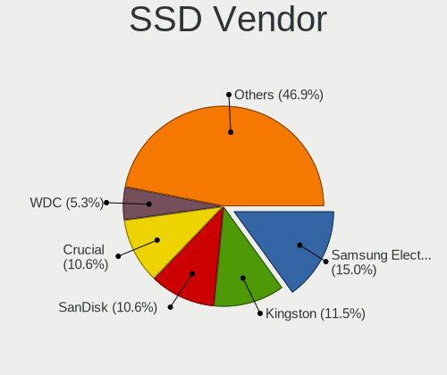
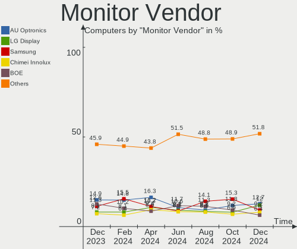
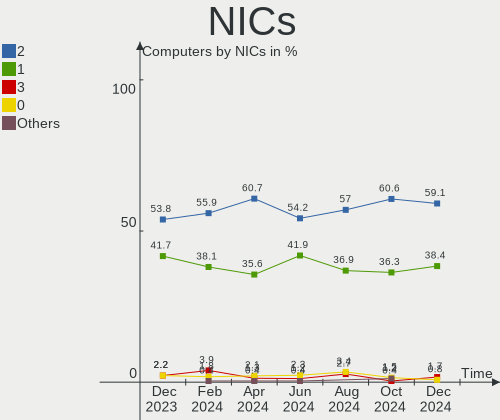
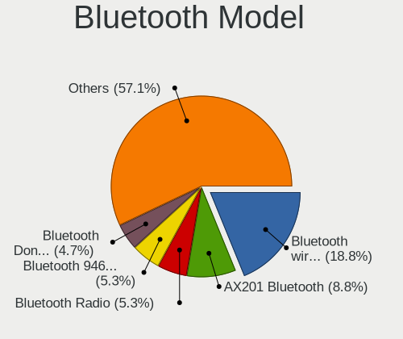
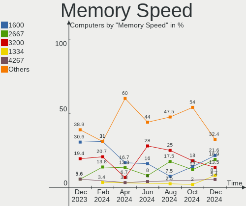

Zorin - Hardware Trends
-----------------------

A project to identify most popular hardware characteristics and track their change
over time based on data collected by Linux users at https://Linux-Hardware.org.

Anyone can contribute to this report by the [hw-probe](https://github.com/linuxhw/hw-probe) tool:

    sudo -E hw-probe -all -upload

This is a report for all computer types. See also reports for [desktops](/Dist/Zorin/Desktop/README.md) and [notebooks](/Dist/Zorin/Notebook/README.md).

This report is for one last month. Overall report since the beginning of time: [TestDays](https://github.com/linuxhw/TestDays)

Period: Oct, 2023.

Contents
--------

* [ System ](#system)
  - [ OS                       ](#os)
  - [ OS Family                ](#os-family)
  - [ Kernel                   ](#kernel)
  - [ Kernel Family            ](#kernel-family)
  - [ Kernel Major Ver.        ](#kernel-major-ver)
  - [ Arch                     ](#arch)
  - [ DE                       ](#de)
  - [ Display Server           ](#display-server)
  - [ Display Manager          ](#display-manager)
  - [ OS Lang                  ](#os-lang)
  - [ Boot Mode                ](#boot-mode)
  - [ Filesystem               ](#filesystem)
  - [ Part. scheme             ](#part-scheme)
  - [ Dual Boot with Linux/BSD ](#dual-boot-with-linuxbsd)
  - [ Dual Boot (Win)          ](#dual-boot-win)

* [ Board ](#board)
  - [ Vendor                   ](#vendor)
  - [ Model                    ](#model)
  - [ Model Family             ](#model-family)
  - [ MFG Year                 ](#mfg-year)
  - [ Form Factor              ](#form-factor)
  - [ Secure Boot              ](#secure-boot)
  - [ Coreboot                 ](#coreboot)
  - [ RAM Size                 ](#ram-size)
  - [ RAM Used                 ](#ram-used)
  - [ Total Drives             ](#total-drives)
  - [ Has CD-ROM               ](#has-cd-rom)
  - [ Has Ethernet             ](#has-ethernet)
  - [ Has WiFi                 ](#has-wifi)
  - [ Has Bluetooth            ](#has-bluetooth)

* [ Location ](#location)
  - [ Country                  ](#country)
  - [ City                     ](#city)

* [ Drives ](#drives)
  - [ Drive Vendor             ](#drive-vendor)
  - [ Drive Model              ](#drive-model)
  - [ HDD Vendor               ](#hdd-vendor)
  - [ SSD Vendor               ](#ssd-vendor)
  - [ Drive Kind               ](#drive-kind)
  - [ Drive Connector          ](#drive-connector)
  - [ Drive Size               ](#drive-size)
  - [ Space Total              ](#space-total)
  - [ Space Used               ](#space-used)
  - [ Malfunc. Drives          ](#malfunc-drives)
  - [ Malfunc. Drive Vendor    ](#malfunc-drive-vendor)
  - [ Malfunc. HDD Vendor      ](#malfunc-hdd-vendor)
  - [ Malfunc. Drive Kind      ](#malfunc-drive-kind)
  - [ Failed Drives            ](#failed-drives)
  - [ Failed Drive Vendor      ](#failed-drive-vendor)
  - [ Drive Status             ](#drive-status)

* [ Storage controller ](#storage-controller)
  - [ Storage Vendor           ](#storage-vendor)
  - [ Storage Model            ](#storage-model)
  - [ Storage Kind             ](#storage-kind)

* [ Processor ](#processor)
  - [ CPU Vendor               ](#cpu-vendor)
  - [ CPU Model                ](#cpu-model)
  - [ CPU Model Family         ](#cpu-model-family)
  - [ CPU Cores                ](#cpu-cores)
  - [ CPU Sockets              ](#cpu-sockets)
  - [ CPU Threads              ](#cpu-threads)
  - [ CPU Op-Modes             ](#cpu-op-modes)
  - [ CPU Microcode            ](#cpu-microcode)
  - [ CPU Microarch            ](#cpu-microarch)

* [ Graphics ](#graphics)
  - [ GPU Vendor               ](#gpu-vendor)
  - [ GPU Model                ](#gpu-model)
  - [ GPU Combo                ](#gpu-combo)
  - [ GPU Driver               ](#gpu-driver)
  - [ GPU Memory               ](#gpu-memory)

* [ Monitor ](#monitor)
  - [ Monitor Vendor           ](#monitor-vendor)
  - [ Monitor Model            ](#monitor-model)
  - [ Monitor Resolution       ](#monitor-resolution)
  - [ Monitor Diagonal         ](#monitor-diagonal)
  - [ Monitor Width            ](#monitor-width)
  - [ Aspect Ratio             ](#aspect-ratio)
  - [ Monitor Area             ](#monitor-area)
  - [ Pixel Density            ](#pixel-density)
  - [ Multiple Monitors        ](#multiple-monitors)

* [ Network ](#network)
  - [ Net Controller Vendor    ](#net-controller-vendor)
  - [ Net Controller Model     ](#net-controller-model)
  - [ Wireless Vendor          ](#wireless-vendor)
  - [ Wireless Model           ](#wireless-model)
  - [ Ethernet Vendor          ](#ethernet-vendor)
  - [ Ethernet Model           ](#ethernet-model)
  - [ Net Controller Kind      ](#net-controller-kind)
  - [ Used Controller          ](#used-controller)
  - [ NICs                     ](#nics)
  - [ IPv6                     ](#ipv6)

* [ Bluetooth ](#bluetooth)
  - [ Bluetooth Vendor         ](#bluetooth-vendor)
  - [ Bluetooth Model          ](#bluetooth-model)

* [ Sound ](#sound)
  - [ Sound Vendor             ](#sound-vendor)
  - [ Sound Model              ](#sound-model)

* [ Memory ](#memory)
  - [ Memory Vendor            ](#memory-vendor)
  - [ Memory Model             ](#memory-model)
  - [ Memory Kind              ](#memory-kind)
  - [ Memory Form Factor       ](#memory-form-factor)
  - [ Memory Size              ](#memory-size)
  - [ Memory Speed             ](#memory-speed)

* [ Printers & scanners ](#printers--scanners)
  - [ Printer Vendor           ](#printer-vendor)
  - [ Printer Model            ](#printer-model)
  - [ Scanner Vendor           ](#scanner-vendor)
  - [ Scanner Model            ](#scanner-model)

* [ Camera ](#camera)
  - [ Camera Vendor            ](#camera-vendor)
  - [ Camera Model             ](#camera-model)

* [ Security ](#security)
  - [ Fingerprint Vendor       ](#fingerprint-vendor)
  - [ Fingerprint Model        ](#fingerprint-model)
  - [ Chipcard Vendor          ](#chipcard-vendor)
  - [ Chipcard Model           ](#chipcard-model)

* [ Unsupported ](#unsupported)
  - [ Unsupported Devices      ](#unsupported-devices)
  - [ Unsupported Device Types ](#unsupported-device-types)

System
------

OS
--

Installed operating systems

| Name     | Computers | Percent |
|----------|-----------|---------|
| Zorin 16 | 152       | 98.7%   |
| Zorin 15 | 2         | 1.3%    |

OS Family
---------

OS without a version

| Name  | Computers | Percent |
|-------|-----------|---------|
| Zorin | 154       | 100%    |

Kernel
------

Version of the Linux kernel

| Version               | Computers | Percent |
|-----------------------|-----------|---------|
| 5.15.0-86-generic     | 62        | 40.26%  |
| 5.15.0-87-generic     | 37        | 24.03%  |
| 5.15.0-84-generic     | 31        | 20.13%  |
| 5.15.0-78-generic     | 6         | 3.9%    |
| 5.4.0-150-generic     | 2         | 1.3%    |
| 5.15.0-88-generic     | 2         | 1.3%    |
| 5.15.0-83-generic     | 2         | 1.3%    |
| 5.15.0-75-generic     | 2         | 1.3%    |
| 5.15.0-71-generic     | 2         | 1.3%    |
| 6.5.7-060507-generic  | 1         | 0.65%   |
| 6.2.16-060216-generic | 1         | 0.65%   |
| 6.1.22-060122-generic | 1         | 0.65%   |
| 5.19.0-051900-generic | 1         | 0.65%   |
| 5.15.0-82-generic     | 1         | 0.65%   |
| 5.15.0-76-generic     | 1         | 0.65%   |
| 5.15.0-67-generic     | 1         | 0.65%   |
| 5.13.0-39-generic     | 1         | 0.65%   |

Kernel Family
-------------

Linux kernel without a distro release

| Version | Computers | Percent |
|---------|-----------|---------|
| 5.15.0  | 147       | 95.45%  |
| 5.4.0   | 2         | 1.3%    |
| 6.5.7   | 1         | 0.65%   |
| 6.2.16  | 1         | 0.65%   |
| 6.1.22  | 1         | 0.65%   |
| 5.19.0  | 1         | 0.65%   |
| 5.13.0  | 1         | 0.65%   |

Kernel Major Ver.
-----------------

Linux kernel major version

| Version | Computers | Percent |
|---------|-----------|---------|
| 5.15    | 147       | 95.45%  |
| 5.4     | 2         | 1.3%    |
| 6.5     | 1         | 0.65%   |
| 6.2     | 1         | 0.65%   |
| 6.1     | 1         | 0.65%   |
| 5.19    | 1         | 0.65%   |
| 5.13    | 1         | 0.65%   |

Arch
----

OS architecture (x86_64, i586, etc.)

| Name   | Computers | Percent |
|--------|-----------|---------|
| x86_64 | 153       | 99.35%  |
| i686   | 1         | 0.65%   |

DE
--

Desktop Environment

| Name    | Computers | Percent |
|---------|-----------|---------|
| GNOME   | 123       | 79.87%  |
| XFCE    | 28        | 18.18%  |
| MATE    | 1         | 0.65%   |
| LXQt    | 1         | 0.65%   |
| Unknown | 1         | 0.65%   |

Display Server
--------------

X11 or Wayland

| Name    | Computers | Percent |
|---------|-----------|---------|
| X11     | 150       | 97.4%   |
| Wayland | 4         | 2.6%    |

Display Manager
---------------

SDDM, LightDM, etc.

| Name    | Computers | Percent |
|---------|-----------|---------|
| Unknown | 115       | 74.68%  |
| GDM     | 20        | 12.99%  |
| GDM3    | 12        | 7.79%   |
| LightDM | 6         | 3.9%    |
| SDDM    | 1         | 0.65%   |

OS Lang
-------

Language

| Lang  | Computers | Percent |
|-------|-----------|---------|
| en_US | 54        | 35.06%  |
| de_DE | 20        | 12.99%  |
| fr_FR | 12        | 7.79%   |
| en_CA | 9         | 5.84%   |
| it_IT | 8         | 5.19%   |
| en_GB | 7         | 4.55%   |
| en_IN | 6         | 3.9%    |
| pl_PL | 4         | 2.6%    |
| es_ES | 4         | 2.6%    |
| sv_SE | 3         | 1.95%   |
| pt_BR | 3         | 1.95%   |
| nl_NL | 3         | 1.95%   |
| fi_FI | 2         | 1.3%    |
| es_CL | 2         | 1.3%    |
| cs_CZ | 2         | 1.3%    |
| ca_ES | 2         | 1.3%    |
| sr_RS | 1         | 0.65%   |
| ru_RU | 1         | 0.65%   |
| pt_PT | 1         | 0.65%   |
| nl_BE | 1         | 0.65%   |
| fr_CH | 1         | 0.65%   |
| es_PY | 1         | 0.65%   |
| es_PE | 1         | 0.65%   |
| es_MX | 1         | 0.65%   |
| es_AR | 1         | 0.65%   |
| en_ZA | 1         | 0.65%   |
| en_IE | 1         | 0.65%   |
| en_AU | 1         | 0.65%   |
| de_AT | 1         | 0.65%   |

Boot Mode
---------

EFI or BIOS

| Mode | Computers | Percent |
|------|-----------|---------|
| EFI  | 97        | 62.99%  |
| BIOS | 57        | 37.01%  |

Filesystem
----------

Type of filesystem

| Type    | Computers | Percent |
|---------|-----------|---------|
| Ext4    | 136       | 88.31%  |
| Tmpfs   | 14        | 9.09%   |
| Overlay | 2         | 1.3%    |
| Zfs     | 1         | 0.65%   |
| Ext2    | 1         | 0.65%   |

Part. scheme
------------

Scheme of partitioning

| Type    | Computers | Percent |
|---------|-----------|---------|
| Unknown | 115       | 74.68%  |
| GPT     | 32        | 20.78%  |
| MBR     | 7         | 4.55%   |

Dual Boot with Linux/BSD
------------------------

Hosting more than one Linux/BSD

| Dual boot | Computers | Percent |
|-----------|-----------|---------|
| No        | 149       | 96.75%  |
| Yes       | 5         | 3.25%   |

Dual Boot (Win)
---------------

Hosting Linux and Windows

| Dual boot | Computers | Percent |
|-----------|-----------|---------|
| No        | 140       | 90.91%  |
| Yes       | 14        | 9.09%   |

Board
-----

Vendor
------

Motherboard manufacturer

| Name                    | Computers | Percent |
|-------------------------|-----------|---------|
| Hewlett-Packard         | 24        | 15.58%  |
| Lenovo                  | 22        | 14.29%  |
| ASUSTek Computer        | 20        | 12.99%  |
| Dell                    | 15        | 9.74%   |
| MSI                     | 12        | 7.79%   |
| Acer                    | 12        | 7.79%   |
| Apple                   | 7         | 4.55%   |
| Gigabyte Technology     | 6         | 3.9%    |
| Intel                   | 3         | 1.95%   |
| ASRock                  | 3         | 1.95%   |
| Toshiba                 | 2         | 1.3%    |
| Thomson                 | 2         | 1.3%    |
| Sony                    | 2         | 1.3%    |
| Pegatron                | 2         | 1.3%    |
| Unknown                 | 2         | 1.3%    |
| UMAX                    | 1         | 0.65%   |
| TrekStor                | 1         | 0.65%   |
| Shuttle                 | 1         | 0.65%   |
| Schenker                | 1         | 0.65%   |
| RCA                     | 1         | 0.65%   |
| ONDA                    | 1         | 0.65%   |
| Notebook                | 1         | 0.65%   |
| Multilaser              | 1         | 0.65%   |
| Microsoft               | 1         | 0.65%   |
| Medion                  | 1         | 0.65%   |
| LORD ELECTRONICS        | 1         | 0.65%   |
| HUAWEI                  | 1         | 0.65%   |
| HCL Infosystems Limited | 1         | 0.65%   |
| Fujitsu Siemens         | 1         | 0.65%   |
| Fanless Mini PC         | 1         | 0.65%   |
| EPSON DIRECT            | 1         | 0.65%   |
| Dynabook                | 1         | 0.65%   |
| AMI                     | 1         | 0.65%   |
| ALLDOCUBE               | 1         | 0.65%   |
| Alienware               | 1         | 0.65%   |

Model
-----

Motherboard model

| Name                                                              | Computers | Percent |
|-------------------------------------------------------------------|-----------|---------|
| HP Pavilion dv6                                                   | 2         | 1.3%    |
| Unknown                                                           | 2         | 1.3%    |
| UMAX N14R                                                         | 1         | 0.65%   |
| TrekStor Surfbook W2                                              | 1         | 0.65%   |
| Toshiba Satellite Pro R50-B                                       | 1         | 0.65%   |
| Toshiba 4900C45                                                   | 1         | 0.65%   |
| Thomson WWNEO14C-4BK32F                                           | 1         | 0.65%   |
| Thomson GEN360-4C128BK                                            | 1         | 0.65%   |
| Sony VGN-FZ31Z                                                    | 1         | 0.65%   |
| Sony SVS15116GAB                                                  | 1         | 0.65%   |
| Shuttle DH110                                                     | 1         | 0.65%   |
| Schenker XMG CORE (REN/M20)                                       | 1         | 0.65%   |
| RCA W122SC24T2                                                    | 1         | 0.65%   |
| Pegatron WH661AA-ABE p6300es                                      | 1         | 0.65%   |
| Pegatron WE277AA-ABF p6352fr                                      | 1         | 0.65%   |
| ONDA Tablet                                                       | 1         | 0.65%   |
| Notebook PA70Hx                                                   | 1         | 0.65%   |
| Multilaser MLSH1H LINUX                                           | 1         | 0.65%   |
| MSI MS-7D08                                                       | 1         | 0.65%   |
| MSI MS-7B93                                                       | 1         | 0.65%   |
| MSI MS-7B84                                                       | 1         | 0.65%   |
| MSI MS-7B79                                                       | 1         | 0.65%   |
| MSI MS-7B54                                                       | 1         | 0.65%   |
| MSI MS-7921                                                       | 1         | 0.65%   |
| MSI MS-7817                                                       | 1         | 0.65%   |
| MSI MS-7808                                                       | 1         | 0.65%   |
| MSI MS-7592                                                       | 1         | 0.65%   |
| MSI KJ384AA-A2L SR5410F                                           | 1         | 0.65%   |
| MSI Delta 15 A5EFK                                                | 1         | 0.65%   |
| MSI Bravo 15 A4DDR                                                | 1         | 0.65%   |
| Microsoft Surface Pro 6                                           | 1         | 0.65%   |
| Medion E4251 MD61435                                              | 1         | 0.65%   |
| LORD ELECTRONICS Guso G4x + ICH7 Series MotherBoard G41I6510V0.1A | 1         | 0.65%   |
| Lenovo Yoga Slim 7 Pro 14ACH5 82MS                                | 1         | 0.65%   |
| Lenovo Yoga 7 16IAH7 82UF                                         | 1         | 0.65%   |
| Lenovo V110-15IAP 80TG                                            | 1         | 0.65%   |
| Lenovo ThinkPad X270 20HMS1T600                                   | 1         | 0.65%   |
| Lenovo ThinkPad T460s 20FAS08W00                                  | 1         | 0.65%   |
| Lenovo ThinkPad T440 20B7S1D200                                   | 1         | 0.65%   |
| Lenovo ThinkPad T420 4236KU9                                      | 1         | 0.65%   |

Model Family
------------

Motherboard model prefix

| Name                    | Computers | Percent |
|-------------------------|-----------|---------|
| Lenovo ThinkPad         | 10        | 6.49%   |
| Acer Aspire             | 10        | 6.49%   |
| HP Pavilion             | 5         | 3.25%   |
| Dell Precision          | 5         | 3.25%   |
| HP EliteDesk            | 4         | 2.6%    |
| ASUS TUF                | 4         | 2.6%    |
| Lenovo ThinkCentre      | 3         | 1.95%   |
| Lenovo IdeaPad          | 3         | 1.95%   |
| Lenovo IdeaCentre       | 3         | 1.95%   |
| Dell OptiPlex           | 3         | 1.95%   |
| Lenovo Yoga             | 2         | 1.3%    |
| HP Laptop               | 2         | 1.3%    |
| HP EliteBook            | 2         | 1.3%    |
| HP 250                  | 2         | 1.3%    |
| Dell Vostro             | 2         | 1.3%    |
| Dell Latitude           | 2         | 1.3%    |
| ASUS ROG                | 2         | 1.3%    |
| ASUS PRIME              | 2         | 1.3%    |
| Unknown                 | 2         | 1.3%    |
| UMAX N14R               | 1         | 0.65%   |
| TrekStor Surfbook       | 1         | 0.65%   |
| Toshiba Satellite       | 1         | 0.65%   |
| Toshiba 4900C45         | 1         | 0.65%   |
| Thomson WWNEO14C-4BK32F | 1         | 0.65%   |
| Thomson GEN360-4C128BK  | 1         | 0.65%   |
| Sony VGN-FZ31Z          | 1         | 0.65%   |
| Sony SVS15116GAB        | 1         | 0.65%   |
| Shuttle DH110           | 1         | 0.65%   |
| Schenker XMG            | 1         | 0.65%   |
| RCA W122SC24T2          | 1         | 0.65%   |
| Pegatron WH661AA-ABE    | 1         | 0.65%   |
| Pegatron WE277AA-ABF    | 1         | 0.65%   |
| ONDA Tablet             | 1         | 0.65%   |
| Notebook PA70Hx         | 1         | 0.65%   |
| Multilaser MLSH1H       | 1         | 0.65%   |
| MSI MS-7D08             | 1         | 0.65%   |
| MSI MS-7B93             | 1         | 0.65%   |
| MSI MS-7B84             | 1         | 0.65%   |
| MSI MS-7B79             | 1         | 0.65%   |
| MSI MS-7B54             | 1         | 0.65%   |

MFG Year
--------

Motherboard manufacture year

| Year | Computers | Percent |
|------|-----------|---------|
| 2018 | 19        | 12.34%  |
| 2021 | 16        | 10.39%  |
| 2013 | 12        | 7.79%   |
| 2019 | 11        | 7.14%   |
| 2014 | 11        | 7.14%   |
| 2011 | 10        | 6.49%   |
| 2023 | 9         | 5.84%   |
| 2017 | 9         | 5.84%   |
| 2012 | 9         | 5.84%   |
| 2022 | 8         | 5.19%   |
| 2015 | 8         | 5.19%   |
| 2009 | 8         | 5.19%   |
| 2008 | 7         | 4.55%   |
| 2020 | 6         | 3.9%    |
| 2010 | 5         | 3.25%   |
| 2016 | 4         | 2.6%    |
| 2007 | 2         | 1.3%    |

Form Factor
-----------

Physical design of the computer

| Name        | Computers | Percent |
|-------------|-----------|---------|
| Notebook    | 80        | 51.95%  |
| Desktop     | 62        | 40.26%  |
| Tablet      | 4         | 2.6%    |
| Convertible | 3         | 1.95%   |
| Mini pc     | 3         | 1.95%   |
| All in one  | 2         | 1.3%    |

Secure Boot
-----------

Enabled or disabled

| State    | Computers | Percent |
|----------|-----------|---------|
| Disabled | 138       | 89.61%  |
| Enabled  | 16        | 10.39%  |

Coreboot
--------

Have coreboot on board

| Used | Computers | Percent |
|------|-----------|---------|
| No   | 154       | 100%    |

RAM Size
--------

Total RAM memory

| Size in GB  | Computers | Percent |
|-------------|-----------|---------|
| 4.01-8.0    | 42        | 27.27%  |
| 3.01-4.0    | 29        | 18.83%  |
| 16.01-24.0  | 25        | 16.23%  |
| 8.01-16.0   | 24        | 15.58%  |
| 32.01-64.0  | 20        | 12.99%  |
| 1.01-2.0    | 5         | 3.25%   |
| 24.01-32.0  | 4         | 2.6%    |
| 64.01-256.0 | 4         | 2.6%    |
| 2.01-3.0    | 1         | 0.65%   |

RAM Used
--------

Used RAM memory

| Used GB   | Computers | Percent |
|-----------|-----------|---------|
| 2.01-3.0  | 48        | 31.17%  |
| 1.01-2.0  | 48        | 31.17%  |
| 3.01-4.0  | 24        | 15.58%  |
| 4.01-8.0  | 23        | 14.94%  |
| 8.01-16.0 | 8         | 5.19%   |
| 0.51-1.0  | 3         | 1.95%   |

Total Drives
------------

Number of drives on board

| Drives | Computers | Percent |
|--------|-----------|---------|
| 1      | 101       | 65.58%  |
| 2      | 41        | 26.62%  |
| 5      | 5         | 3.25%   |
| 3      | 4         | 2.6%    |
| 9      | 1         | 0.65%   |
| 6      | 1         | 0.65%   |
| 0      | 1         | 0.65%   |

Has CD-ROM
----------

Has CD-ROM on board

| Presented | Computers | Percent |
|-----------|-----------|---------|
| No        | 84        | 54.55%  |
| Yes       | 70        | 45.45%  |

Has Ethernet
------------

Has Ethernet on board

| Presented | Computers | Percent |
|-----------|-----------|---------|
| Yes       | 130       | 84.42%  |
| No        | 24        | 15.58%  |

Has WiFi
--------

Has WiFi module

| Presented | Computers | Percent |
|-----------|-----------|---------|
| Yes       | 118       | 76.62%  |
| No        | 36        | 23.38%  |

Has Bluetooth
-------------

Has Bluetooth module

| Presented | Computers | Percent |
|-----------|-----------|---------|
| Yes       | 96        | 62.34%  |
| No        | 58        | 37.66%  |

Location
--------

Country
-------

Geographic location (country)

| Country      | Computers | Percent |
|--------------|-----------|---------|
| USA          | 28        | 18.18%  |
| Germany      | 23        | 14.94%  |
| Canada       | 9         | 5.84%   |
| France       | 8         | 5.19%   |
| UK           | 7         | 4.55%   |
| Netherlands  | 7         | 4.55%   |
| Italy        | 7         | 4.55%   |
| India        | 6         | 3.9%    |
| Spain        | 5         | 3.25%   |
| Poland       | 4         | 2.6%    |
| Mexico       | 4         | 2.6%    |
| Austria      | 4         | 2.6%    |
| Switzerland  | 3         | 1.95%   |
| Sweden       | 3         | 1.95%   |
| Czechia      | 3         | 1.95%   |
| Brazil       | 3         | 1.95%   |
| Serbia       | 2         | 1.3%    |
| Portugal     | 2         | 1.3%    |
| Jamaica      | 2         | 1.3%    |
| Finland      | 2         | 1.3%    |
| Chile        | 2         | 1.3%    |
| Algeria      | 2         | 1.3%    |
| South Africa | 1         | 0.65%   |
| Saudi Arabia | 1         | 0.65%   |
| Russia       | 1         | 0.65%   |
| Romania      | 1         | 0.65%   |
| Paraguay     | 1         | 0.65%   |
| Norway       | 1         | 0.65%   |
| Myanmar      | 1         | 0.65%   |
| Jordan       | 1         | 0.65%   |
| Ireland      | 1         | 0.65%   |
| Guadeloupe   | 1         | 0.65%   |
| Greece       | 1         | 0.65%   |
| Egypt        | 1         | 0.65%   |
| Ecuador      | 1         | 0.65%   |
| Bulgaria     | 1         | 0.65%   |
| Belgium      | 1         | 0.65%   |
| Barbados     | 1         | 0.65%   |
| Australia    | 1         | 0.65%   |
| Argentina    | 1         | 0.65%   |

City
----

Geographic location (city)

| City                 | Computers | Percent |
|----------------------|-----------|---------|
| Berlin               | 3         | 1.95%   |
| Vienna               | 2         | 1.3%    |
| Traun                | 2         | 1.3%    |
| Toronto              | 2         | 1.3%    |
| New York             | 2         | 1.3%    |
| Milan                | 2         | 1.3%    |
| Hanover              | 2         | 1.3%    |
| Hamburg              | 2         | 1.3%    |
| Delhi                | 2         | 1.3%    |
| Amsterdam            | 2         | 1.3%    |
| Zwickau              | 1         | 0.65%   |
| Zogno                | 1         | 0.65%   |
| Wolfville            | 1         | 0.65%   |
| Wijnegem             | 1         | 0.65%   |
| West Bend            | 1         | 0.65%   |
| Wernigerode          | 1         | 0.65%   |
| Wendeburg            | 1         | 0.65%   |
| Warsaw               | 1         | 0.65%   |
| Wageningen           | 1         | 0.65%   |
| Verona               | 1         | 0.65%   |
| Vernon               | 1         | 0.65%   |
| Vernal               | 1         | 0.65%   |
| Ventura              | 1         | 0.65%   |
| Varanasi             | 1         | 0.65%   |
| Vandoeuvre-les-Nancy | 1         | 0.65%   |
| Valladolid           | 1         | 0.65%   |
| Turin                | 1         | 0.65%   |
| Trier                | 1         | 0.65%   |
| Tijuana              | 1         | 0.65%   |
| The Hague            | 1         | 0.65%   |
| Tampere              | 1         | 0.65%   |
| Stavanger            | 1         | 0.65%   |
| Spanish Town         | 1         | 0.65%   |
| Sofia                | 1         | 0.65%   |
| Siegen               | 1         | 0.65%   |
| Sheffield            | 1         | 0.65%   |
| Seattle              | 1         | 0.65%   |
| Sarnia               | 1         | 0.65%   |
| Santiago             | 1         | 0.65%   |
| Salvador             | 1         | 0.65%   |

Drives
------

Drive Vendor
------------

Hard drive vendors

| Vendor                    | Computers | Drives | Percent |
|---------------------------|-----------|--------|---------|
| WDC                       | 28        | 31     | 13.33%  |
| Samsung Electronics       | 26        | 28     | 12.38%  |
| Seagate                   | 22        | 31     | 10.48%  |
| SanDisk                   | 17        | 17     | 8.1%    |
| Kingston                  | 16        | 20     | 7.62%   |
| Toshiba                   | 14        | 14     | 6.67%   |
| Unknown                   | 8         | 10     | 3.81%   |
| SK hynix                  | 7         | 7      | 3.33%   |
| Micron Technology         | 7         | 7      | 3.33%   |
| Hitachi                   | 7         | 8      | 3.33%   |
| China                     | 7         | 8      | 3.33%   |
| HGST                      | 5         | 5      | 2.38%   |
| Crucial                   | 5         | 5      | 2.38%   |
| Intel                     | 4         | 4      | 1.9%    |
| Unknown                   | 4         | 4      | 1.9%    |
| SPCC                      | 2         | 2      | 0.95%   |
| LITEON                    | 2         | 2      | 0.95%   |
| KIOXIA                    | 2         | 2      | 0.95%   |
| GOODRAM                   | 2         | 2      | 0.95%   |
| Apple                     | 2         | 2      | 0.95%   |
| WD MediaMax               | 1         | 1      | 0.48%   |
| Verbatim                  | 1         | 1      | 0.48%   |
| USB3.0                    | 1         | 1      | 0.48%   |
| Unknown (CF)              | 1         | 1      | 0.48%   |
| TXRUI                     | 1         | 2      | 0.48%   |
| Transcend                 | 1         | 1      | 0.48%   |
| Team                      | 1         | 1      | 0.48%   |
| Seagate Technology        | 1         | 1      | 0.48%   |
| SABRENT                   | 1         | 1      | 0.48%   |
| Realtek Semiconductor     | 1         | 1      | 0.48%   |
| PNY                       | 1         | 1      | 0.48%   |
| Phison                    | 1         | 1      | 0.48%   |
| ORTIAL                    | 1         | 1      | 0.48%   |
| Micron/Crucial Technology | 1         | 1      | 0.48%   |
| Maxtor                    | 1         | 1      | 0.48%   |
| KingSpec                  | 1         | 2      | 0.48%   |
| KingDian                  | 1         | 1      | 0.48%   |
| KEEPDATA                  | 1         | 1      | 0.48%   |
| Intenso                   | 1         | 1      | 0.48%   |
| Hewlett-Packard           | 1         | 1      | 0.48%   |

Drive Model
-----------

Hard drive models

| Model                                              | Computers | Percent |
|----------------------------------------------------|-----------|---------|
| Kingston SA400S37240G 240GB SSD                    | 6         | 2.61%   |
| Unknown MMC Card  64GB                             | 5         | 2.17%   |
| Samsung NVMe SSD Controller SM981/PM981/PM983 1TB  | 5         | 2.17%   |
| Unknown                                            | 4         | 1.74%   |
| Seagate ST1000DM010-2EP102 1TB                     | 3         | 1.3%    |
| WDC WDS500G2B0A-00SM50 500GB SSD                   | 2         | 0.87%   |
| WDC WD10JPVX-22JC3T0 1TB                           | 2         | 0.87%   |
| Unknown MMC Card  32GB                             | 2         | 0.87%   |
| Toshiba XG6 NVMe SSD Controller 256GB              | 2         | 0.87%   |
| Toshiba BG3 NVMe SSD Controller 128GB              | 2         | 0.87%   |
| SK hynix BC511 512GB                               | 2         | 0.87%   |
| Seagate ST980811AS 80GB                            | 2         | 0.87%   |
| Seagate ST500LT012-1DG142 500GB                    | 2         | 0.87%   |
| Seagate ST31000528AS 1TB                           | 2         | 0.87%   |
| Samsung NVMe SSD Controller PM9A1/PM9A3/980PRO 1TB | 2         | 0.87%   |
| Kingston SV300S37A120G 120GB SSD                   | 2         | 0.87%   |
| Kingston SA400S37120G 120GB SSD                    | 2         | 0.87%   |
| HGST HTS545050A7E680 500GB                         | 2         | 0.87%   |
| HGST HTS545050A7E380 500GB                         | 2         | 0.87%   |
| China SSD 128GB                                    | 2         | 0.87%   |
| China SATA SSD 120GB                               | 2         | 0.87%   |
| WDC WDS100T2G0A-00JH30 1TB SSD                     | 1         | 0.43%   |
| WDC WDS100T2B0C-00PXH0 1TB                         | 1         | 0.43%   |
| WDC WDBNCE5000PNC 500GB SSD                        | 1         | 0.43%   |
| WDC WD6401AALS-00L3B2 640GB                        | 1         | 0.43%   |
| WDC WD5000LPVX-22V0TT0 500GB                       | 1         | 0.43%   |
| WDC WD5000LPCX-60VHAT0 500GB                       | 1         | 0.43%   |
| WDC WD5000AAKX-60U6AA0 500GB                       | 1         | 0.43%   |
| WDC WD5000AADS-56S9B0 499GB                        | 1         | 0.43%   |
| WDC WD5000AADS-00S9B0 500GB                        | 1         | 0.43%   |
| WDC WD40EZAZ-00SF3B0 4TB                           | 1         | 0.43%   |
| WDC WD4005FZBX-00K5WB0 4TB                         | 1         | 0.43%   |
| WDC WD3200BPVT-24JJ5T0 320GB                       | 1         | 0.43%   |
| WDC WD3200BPVT-22JJ5T0 320GB                       | 1         | 0.43%   |
| WDC WD3200BEVT-60A23T0 320GB                       | 1         | 0.43%   |
| WDC WD2500AAJS-00B4A0 250GB                        | 1         | 0.43%   |
| WDC WD20EZRZ-00Z5HB0 2TB                           | 1         | 0.43%   |
| WDC WD20EZRX-00D8PB0 2TB                           | 1         | 0.43%   |
| WDC WD2003FYYS-50T8B0 2TB                          | 1         | 0.43%   |
| WDC WD1600BEVS-22RST0 160GB                        | 1         | 0.43%   |

HDD Vendor
----------

Hard disk drive vendors

| Vendor  | Computers | Drives | Percent |
|---------|-----------|--------|---------|
| WDC     | 23        | 25     | 33.82%  |
| Seagate | 21        | 30     | 30.88%  |
| Toshiba | 9         | 9      | 13.24%  |
| Hitachi | 7         | 8      | 10.29%  |
| HGST    | 5         | 5      | 7.35%   |
| USB3.0  | 1         | 1      | 1.47%   |
| Maxtor  | 1         | 1      | 1.47%   |
| Fujitsu | 1         | 1      | 1.47%   |

SSD Vendor
----------

Solid state drive vendors

| Vendor              | Computers | Drives | Percent |
|---------------------|-----------|--------|---------|
| Kingston            | 14        | 16     | 17.95%  |
| Samsung Electronics | 12        | 12     | 15.38%  |
| SanDisk             | 9         | 9      | 11.54%  |
| China               | 7         | 8      | 8.97%   |
| Crucial             | 5         | 5      | 6.41%   |
| WDC                 | 4         | 4      | 5.13%   |
| SPCC                | 2         | 2      | 2.56%   |
| Micron Technology   | 2         | 2      | 2.56%   |
| LITEON              | 2         | 2      | 2.56%   |
| Intel               | 2         | 2      | 2.56%   |
| GOODRAM             | 2         | 2      | 2.56%   |
| Apple               | 2         | 2      | 2.56%   |
| Verbatim            | 1         | 1      | 1.28%   |
| Unknown (CF)        | 1         | 1      | 1.28%   |
| Transcend           | 1         | 1      | 1.28%   |
| Team                | 1         | 1      | 1.28%   |
| SK hynix            | 1         | 1      | 1.28%   |
| SABRENT             | 1         | 1      | 1.28%   |
| PNY                 | 1         | 1      | 1.28%   |
| Phison              | 1         | 1      | 1.28%   |
| ORTIAL              | 1         | 1      | 1.28%   |
| KingSpec            | 1         | 2      | 1.28%   |
| KingDian            | 1         | 1      | 1.28%   |
| KEEPDATA            | 1         | 1      | 1.28%   |
| Intenso             | 1         | 1      | 1.28%   |
| Hewlett-Packard     | 1         | 1      | 1.28%   |
| Emtec               | 1         | 1      | 1.28%   |

Drive Kind
----------

HDD or SSD

| Kind    | Computers | Drives | Percent |
|---------|-----------|--------|---------|
| SSD     | 69        | 82     | 36.51%  |
| HDD     | 59        | 80     | 31.22%  |
| NVMe    | 45        | 54     | 23.81%  |
| MMC     | 12        | 14     | 6.35%   |
| Unknown | 4         | 5      | 2.12%   |

Drive Connector
---------------

SATA, SAS, NVMe, etc.

| Type | Computers | Drives | Percent |
|------|-----------|--------|---------|
| SATA | 107       | 157    | 62.57%  |
| NVMe | 45        | 54     | 26.32%  |
| MMC  | 12        | 14     | 7.02%   |
| SAS  | 7         | 10     | 4.09%   |

Drive Size
----------

Size of hard drive

| Size in TB | Computers | Drives | Percent |
|------------|-----------|--------|---------|
| 0.01-0.5   | 85        | 109    | 63.91%  |
| 0.51-1.0   | 30        | 32     | 22.56%  |
| 1.01-2.0   | 8         | 9      | 6.02%   |
| 3.01-4.0   | 6         | 6      | 4.51%   |
| 4.01-10.0  | 2         | 2      | 1.5%    |
| 2.01-3.0   | 1         | 1      | 0.75%   |
| 10.01-20.0 | 1         | 3      | 0.75%   |

Space Total
-----------

Amount of disk space available on the file system

| Size in GB     | Computers | Percent |
|----------------|-----------|---------|
| 101-250        | 54        | 35.06%  |
| 251-500        | 40        | 25.97%  |
| 501-1000       | 23        | 14.94%  |
| 51-100         | 13        | 8.44%   |
| More than 3000 | 8         | 5.19%   |
| 1001-2000      | 6         | 3.9%    |
| 21-50          | 5         | 3.25%   |
| 2001-3000      | 2         | 1.3%    |
| 1-20           | 2         | 1.3%    |
| Unknown        | 1         | 0.65%   |

Space Used
----------

Amount of used disk space

| Used GB        | Computers | Percent |
|----------------|-----------|---------|
| 21-50          | 61        | 39.61%  |
| 1-20           | 34        | 22.08%  |
| 51-100         | 26        | 16.88%  |
| 251-500        | 12        | 7.79%   |
| 101-250        | 9         | 5.84%   |
| More than 3000 | 4         | 2.6%    |
| 501-1000       | 4         | 2.6%    |
| 1001-2000      | 3         | 1.95%   |
| Unknown        | 1         | 0.65%   |

Malfunc. Drives
---------------

Drive models with a malfunction

| Model                            | Computers | Drives | Percent |
|----------------------------------|-----------|--------|---------|
| WDC WDS500G2B0A-00SM50 500GB SSD | 1         | 1      | 25%     |
| WDC WD2500AAJS-00B4A0 250GB      | 1         | 1      | 25%     |
| WDC WD20EZRX-00D8PB0 2TB         | 1         | 1      | 25%     |
| Seagate ST1000LM048-2E7172 1TB   | 1         | 1      | 25%     |

Malfunc. Drive Vendor
---------------------

Vendors of faulty drives

| Vendor  | Computers | Drives | Percent |
|---------|-----------|--------|---------|
| WDC     | 3         | 3      | 75%     |
| Seagate | 1         | 1      | 25%     |

Malfunc. HDD Vendor
-------------------

Vendors of faulty HDD drives

| Vendor  | Computers | Drives | Percent |
|---------|-----------|--------|---------|
| WDC     | 2         | 2      | 66.67%  |
| Seagate | 1         | 1      | 33.33%  |

Malfunc. Drive Kind
-------------------

Kinds of faulty drives

| Kind | Computers | Drives | Percent |
|------|-----------|--------|---------|
| HDD  | 3         | 3      | 75%     |
| SSD  | 1         | 1      | 25%     |

Failed Drives
-------------

Failed drive models

Zero info for selected period =(

Failed Drive Vendor
-------------------

Failed drive vendors

Zero info for selected period =(

Drive Status
------------

Number of failed and malfunc. drives

| Status   | Computers | Drives | Percent |
|----------|-----------|--------|---------|
| Detected | 137       | 205    | 85.09%  |
| Works    | 20        | 26     | 12.42%  |
| Malfunc  | 4         | 4      | 2.48%   |

Storage controller
------------------

Storage Vendor
--------------

Storage controller vendors

| Vendor                       | Computers | Percent |
|------------------------------|-----------|---------|
| Intel                        | 111       | 57.51%  |
| AMD                          | 20        | 10.36%  |
| Samsung Electronics          | 17        | 8.81%   |
| SanDisk                      | 9         | 4.66%   |
| Toshiba America Info Systems | 5         | 2.59%   |
| SK hynix                     | 5         | 2.59%   |
| Micron Technology            | 5         | 2.59%   |
| ASMedia Technology           | 4         | 2.07%   |
| Marvell Technology Group     | 3         | 1.55%   |
| Kingston Technology Company  | 3         | 1.55%   |
| JMicron Technology           | 3         | 1.55%   |
| KIOXIA                       | 2         | 1.04%   |
| VIA Technologies             | 1         | 0.52%   |
| Seagate Technology           | 1         | 0.52%   |
| Realtek Semiconductor        | 1         | 0.52%   |
| Nvidia                       | 1         | 0.52%   |
| Micron/Crucial Technology    | 1         | 0.52%   |
| ADATA Technology             | 1         | 0.52%   |

Storage Model
-------------

Storage controller models

| Model                                                                          | Computers | Percent |
|--------------------------------------------------------------------------------|-----------|---------|
| AMD FCH SATA Controller [AHCI mode]                                            | 18        | 8.14%   |
| Intel Sunrise Point-LP SATA Controller [AHCI mode]                             | 8         | 3.62%   |
| Samsung NVMe SSD Controller SM981/PM981/PM983                                  | 7         | 3.17%   |
| Intel 8 Series/C220 Series Chipset Family 6-port SATA Controller 1 [AHCI mode] | 7         | 3.17%   |
| Intel 6 Series/C200 Series Chipset Family 6 port Desktop SATA AHCI Controller  | 7         | 3.17%   |
| Intel Volume Management Device NVMe RAID Controller                            | 6         | 2.71%   |
| Intel NM10/ICH7 Family SATA Controller [IDE mode]                              | 6         | 2.71%   |
| Intel Celeron/Pentium Silver Processor SATA Controller                         | 6         | 2.71%   |
| Intel 82801IBM/IEM (ICH9M/ICH9M-E) 4 port SATA Controller [AHCI mode]          | 6         | 2.71%   |
| Intel Celeron N3350/Pentium N4200/Atom E3900 Series SATA AHCI Controller       | 5         | 2.26%   |
| Intel 7 Series Chipset Family 6-port SATA Controller [AHCI mode]               | 5         | 2.26%   |
| Samsung NVMe SSD Controller PM9A1/PM9A3/980PRO                                 | 4         | 1.81%   |
| Intel Cannon Lake Mobile PCH SATA AHCI Controller                              | 4         | 1.81%   |
| Intel 7 Series/C210 Series Chipset Family 6-port SATA Controller [AHCI mode]   | 4         | 1.81%   |
| Intel 500 Series Chipset Family SATA AHCI Controller                           | 4         | 1.81%   |
| Intel 200 Series PCH SATA controller [AHCI mode]                               | 4         | 1.81%   |
| ASMedia ASM1062 Serial ATA Controller                                          | 4         | 1.81%   |
| Toshiba America Info Systems BG3 x2 NVMe SSD Controller (DRAM-less)            | 3         | 1.36%   |
| Intel Atom Processor E3800 Series SATA AHCI Controller                         | 3         | 1.36%   |
| Intel 82801HM/HEM (ICH8M/ICH8M-E) SATA Controller [AHCI mode]                  | 3         | 1.36%   |
| Intel 82801HM/HEM (ICH8M/ICH8M-E) IDE Controller                               | 3         | 1.36%   |
| Intel 6 Series/C200 Series Chipset Family 6 port Mobile SATA AHCI Controller   | 3         | 1.36%   |
| Intel 5 Series/3400 Series Chipset 4 port SATA AHCI Controller                 | 3         | 1.36%   |
| AMD 400 Series Chipset SATA Controller                                         | 3         | 1.36%   |
| Toshiba America Info Systems XG6 NVMe SSD Controller                           | 2         | 0.9%    |
| SK hynix Gold P31/BC711/PC711 NVMe Solid State Drive                           | 2         | 0.9%    |
| SK hynix BC511 NVMe SSD                                                        | 2         | 0.9%    |
| SanDisk WD Black SN770 / PC SN740 256GB / PC SN560 (DRAM-less) NVMe SSD        | 2         | 0.9%    |
| SanDisk Ultra 3D / WD Blue SN570 NVMe SSD (DRAM-less)                          | 2         | 0.9%    |
| Micron 2300 NVMe SSD [Santana]                                                 | 2         | 0.9%    |
| Marvell Group 88SE9215 PCIe 2.0 x1 4-port SATA 6 Gb/s Controller               | 2         | 0.9%    |
| Kingston Company KC3000/FURY Renegade NVMe SSD E18                             | 2         | 0.9%    |
| Intel SATA Controller [RAID mode]                                              | 2         | 0.9%    |
| Intel Alder Lake-P SATA AHCI Controller                                        | 2         | 0.9%    |
| Intel 9 Series Chipset Family SATA Controller [AHCI Mode]                      | 2         | 0.9%    |
| Intel 82801G (ICH7 Family) IDE Controller                                      | 2         | 0.9%    |
| Intel 82801 Mobile SATA Controller [RAID mode]                                 | 2         | 0.9%    |
| Intel 8 Series/C220 Series Chipset Family 4-port SATA Controller 1 [IDE mode]  | 2         | 0.9%    |
| Intel 8 Series SATA Controller 1 [AHCI mode]                                   | 2         | 0.9%    |
| Intel 5 Series/3400 Series Chipset 4 port SATA IDE Controller                  | 2         | 0.9%    |

Storage Kind
------------

Kind of storage controller (IDE, SATA, NVMe, SAS, ...)

| Kind | Computers | Percent |
|------|-----------|---------|
| SATA | 113       | 59.79%  |
| NVMe | 45        | 23.81%  |
| IDE  | 18        | 9.52%   |
| RAID | 12        | 6.35%   |
| SAS  | 1         | 0.53%   |

Processor
---------

CPU Vendor
----------

Processor vendors

| Vendor | Computers | Percent |
|--------|-----------|---------|
| Intel  | 128       | 83.12%  |
| AMD    | 26        | 16.88%  |

CPU Model
---------

Processor models

| Model                                       | Computers | Percent |
|---------------------------------------------|-----------|---------|
| Intel Celeron CPU N3350 @ 1.10GHz           | 4         | 2.6%    |
| AMD Ryzen 5 2600 Six-Core Processor         | 4         | 2.6%    |
| Intel Pentium Dual-Core CPU E5300 @ 2.60GHz | 3         | 1.95%   |
| Intel Core i7-8750H CPU @ 2.20GHz           | 3         | 1.95%   |
| Intel Core i7-4790 CPU @ 3.60GHz            | 2         | 1.3%    |
| Intel Core i7-2600 CPU @ 3.40GHz            | 2         | 1.3%    |
| Intel Core i5-8250U CPU @ 1.60GHz           | 2         | 1.3%    |
| Intel Core i5-6500 CPU @ 3.20GHz            | 2         | 1.3%    |
| Intel Core i5-6300U CPU @ 2.40GHz           | 2         | 1.3%    |
| Intel Core i5-4590 CPU @ 3.30GHz            | 2         | 1.3%    |
| Intel Core i5-4460 CPU @ 3.20GHz            | 2         | 1.3%    |
| Intel Core i5-3470 CPU @ 3.20GHz            | 2         | 1.3%    |
| Intel Core i3 CPU M 370 @ 2.40GHz           | 2         | 1.3%    |
| Intel Core i3 CPU M 330 @ 2.13GHz           | 2         | 1.3%    |
| Intel Core 2 Duo CPU T8300 @ 2.40GHz        | 2         | 1.3%    |
| Intel Celeron N4020 CPU @ 1.10GHz           | 2         | 1.3%    |
| Intel Celeron J4125 CPU @ 2.00GHz           | 2         | 1.3%    |
| Intel Atom CPU Z3735F @ 1.33GHz             | 2         | 1.3%    |
| Intel 11th Gen Core i5-1135G7 @ 2.40GHz     | 2         | 1.3%    |
| Intel 11th Gen Core i3-1115G4 @ 3.00GHz     | 2         | 1.3%    |
| AMD Ryzen 7 4800H with Radeon Graphics      | 2         | 1.3%    |
| Intel Xeon CPU E5430 @ 2.66GHz              | 1         | 0.65%   |
| Intel Xeon CPU E5-2695 v3 @ 2.30GHz         | 1         | 0.65%   |
| Intel Xeon CPU E5-2665 0 @ 2.40GHz          | 1         | 0.65%   |
| Intel Xeon CPU E5-2650 v2 @ 2.60GHz         | 1         | 0.65%   |
| Intel Pentium Silver N5030 CPU @ 1.10GHz    | 1         | 0.65%   |
| Intel Pentium Dual-Core CPU T4300 @ 2.10GHz | 1         | 0.65%   |
| Intel Pentium Dual CPU T3200 @ 2.00GHz      | 1         | 0.65%   |
| Intel Pentium Dual CPU E2160 @ 1.80GHz      | 1         | 0.65%   |
| Intel Pentium CPU N3710 @ 1.60GHz           | 1         | 0.65%   |
| Intel Pentium CPU N3540 @ 2.16GHz           | 1         | 0.65%   |
| Intel Pentium CPU G2030 @ 3.00GHz           | 1         | 0.65%   |
| Intel Core i7-8850H CPU @ 2.60GHz           | 1         | 0.65%   |
| Intel Core i7-8700 CPU @ 3.20GHz            | 1         | 0.65%   |
| Intel Core i7-7700HQ CPU @ 2.80GHz          | 1         | 0.65%   |
| Intel Core i7-7700 CPU @ 3.60GHz            | 1         | 0.65%   |
| Intel Core i7-7500U CPU @ 2.70GHz           | 1         | 0.65%   |
| Intel Core i7-6600U CPU @ 2.60GHz           | 1         | 0.65%   |
| Intel Core i7-4790K CPU @ 4.00GHz           | 1         | 0.65%   |
| Intel Core i7-4710MQ CPU @ 2.50GHz          | 1         | 0.65%   |

CPU Model Family
----------------

Processor model prefix

| Model                   | Computers | Percent |
|-------------------------|-----------|---------|
| Intel Core i5           | 33        | 21.43%  |
| Intel Core i7           | 24        | 15.58%  |
| Other                   | 17        | 11.04%  |
| Intel Celeron           | 15        | 9.74%   |
| Intel Core i3           | 10        | 6.49%   |
| AMD Ryzen 5             | 10        | 6.49%   |
| Intel Core 2 Duo        | 8         | 5.19%   |
| Intel Xeon              | 4         | 2.6%    |
| Intel Pentium Dual-Core | 4         | 2.6%    |
| Intel Atom              | 4         | 2.6%    |
| AMD Ryzen 9             | 4         | 2.6%    |
| Intel Pentium           | 3         | 1.95%   |
| AMD Ryzen 7             | 3         | 1.95%   |
| AMD A8                  | 3         | 1.95%   |
| Intel Pentium Dual      | 2         | 1.3%    |
| Intel Celeron Dual-Core | 2         | 1.3%    |
| Intel Pentium Silver    | 1         | 0.65%   |
| Intel Core 2 Quad       | 1         | 0.65%   |
| AMD Ryzen 7 PRO         | 1         | 0.65%   |
| AMD Ryzen 3             | 1         | 0.65%   |
| AMD FX                  | 1         | 0.65%   |
| AMD E1                  | 1         | 0.65%   |
| AMD A6                  | 1         | 0.65%   |
| AMD A10                 | 1         | 0.65%   |

CPU Cores
---------

Number of processor cores

| Number | Computers | Percent |
|--------|-----------|---------|
| 2      | 63        | 40.91%  |
| 4      | 49        | 31.82%  |
| 6      | 17        | 11.04%  |
| 8      | 11        | 7.14%   |
| 12     | 5         | 3.25%   |
| 16     | 3         | 1.95%   |
| 10     | 3         | 1.95%   |
| 28     | 1         | 0.65%   |
| 14     | 1         | 0.65%   |
| 1      | 1         | 0.65%   |

CPU Sockets
-----------

Number of sockets

| Number | Computers | Percent |
|--------|-----------|---------|
| 1      | 152       | 98.7%   |
| 2      | 2         | 1.3%    |

CPU Threads
-----------

Threads per core (Hyper-Threading)

| Number | Computers | Percent |
|--------|-----------|---------|
| 2      | 91        | 59.09%  |
| 1      | 63        | 40.91%  |

CPU Op-Modes
------------

CPU Operation Modes (32-bit, 64-bit)

| Op mode        | Computers | Percent |
|----------------|-----------|---------|
| 32-bit, 64-bit | 154       | 100%    |

CPU Microcode
-------------

Microcode number

| Number     | Computers | Percent |
|------------|-----------|---------|
| Unknown    | 14        | 9.09%   |
| 0x1067a    | 12        | 7.79%   |
| 0x306c3    | 10        | 6.49%   |
| 0x306a9    | 10        | 6.49%   |
| 0x206a7    | 10        | 6.49%   |
| 0x706a8    | 6         | 3.9%    |
| 0x906ea    | 5         | 3.25%   |
| 0x506c9    | 5         | 3.25%   |
| 0x30678    | 5         | 3.25%   |
| 0x0800820d | 5         | 3.25%   |
| 0x906e9    | 3         | 1.95%   |
| 0x906a3    | 3         | 1.95%   |
| 0x806ea    | 3         | 1.95%   |
| 0x806e9    | 3         | 1.95%   |
| 0x806c1    | 3         | 1.95%   |
| 0x506e3    | 3         | 1.95%   |
| 0x40651    | 3         | 1.95%   |
| 0x20655    | 3         | 1.95%   |
| 0x20652    | 3         | 1.95%   |
| 0x10676    | 3         | 1.95%   |
| 0xa0671    | 2         | 1.3%    |
| 0x906a4    | 2         | 1.3%    |
| 0x706e5    | 2         | 1.3%    |
| 0x6fd      | 2         | 1.3%    |
| 0x406e3    | 2         | 1.3%    |
| 0x406c4    | 2         | 1.3%    |
| 0x306d4    | 2         | 1.3%    |
| 0x0a50000d | 2         | 1.3%    |
| 0xb06e0    | 1         | 0.65%   |
| 0xb06a3    | 1         | 0.65%   |
| 0xa0655    | 1         | 0.65%   |
| 0x90672    | 1         | 0.65%   |
| 0x806ec    | 1         | 0.65%   |
| 0x706a1    | 1         | 0.65%   |
| 0x6fa      | 1         | 0.65%   |
| 0x306f2    | 1         | 0.65%   |
| 0x306e4    | 1         | 0.65%   |
| 0x30661    | 1         | 0.65%   |
| 0x0a601206 | 1         | 0.65%   |
| 0x0a50000c | 1         | 0.65%   |

CPU Microarch
-------------

Microarchitecture

| Name             | Computers | Percent |
|------------------|-----------|---------|
| KabyLake         | 17        | 11.04%  |
| Haswell          | 16        | 10.39%  |
| Penryn           | 15        | 9.74%   |
| SandyBridge      | 11        | 7.14%   |
| IvyBridge        | 11        | 7.14%   |
| Unknown          | 8         | 5.19%   |
| Silvermont       | 7         | 4.55%   |
| Goldmont plus    | 7         | 4.55%   |
| Zen+             | 6         | 3.9%    |
| Zen 2            | 6         | 3.9%    |
| Westmere         | 6         | 3.9%    |
| Skylake          | 6         | 3.9%    |
| Alderlake Hybrid | 6         | 3.9%    |
| Goldmont         | 5         | 3.25%   |
| Zen 3            | 4         | 2.6%    |
| TigerLake        | 4         | 2.6%    |
| IceLake          | 4         | 2.6%    |
| Core             | 3         | 1.95%   |
| Excavator        | 2         | 1.3%    |
| Broadwell        | 2         | 1.3%    |
| Zen              | 1         | 0.65%   |
| Steamroller      | 1         | 0.65%   |
| Puma             | 1         | 0.65%   |
| Piledriver       | 1         | 0.65%   |
| Jaguar           | 1         | 0.65%   |
| CometLake        | 1         | 0.65%   |
| Bulldozer        | 1         | 0.65%   |
| Bonnell          | 1         | 0.65%   |

Graphics
--------

GPU Vendor
----------

Vendors of graphics cards

| Vendor           | Computers | Percent |
|------------------|-----------|---------|
| Intel            | 102       | 56.35%  |
| Nvidia           | 43        | 23.76%  |
| AMD              | 35        | 19.34%  |
| ATI Technologies | 1         | 0.55%   |

GPU Model
---------

Graphics card models

| Model                                                                                    | Computers | Percent |
|------------------------------------------------------------------------------------------|-----------|---------|
| Intel 2nd Generation Core Processor Family Integrated Graphics Controller                | 8         | 4.32%   |
| Intel Xeon E3-1200 v3/4th Gen Core Processor Integrated Graphics Controller              | 7         | 3.78%   |
| Intel GeminiLake [UHD Graphics 600]                                                      | 6         | 3.24%   |
| Intel Core Processor Integrated Graphics Controller                                      | 6         | 3.24%   |
| Intel HD Graphics 500                                                                    | 5         | 2.7%    |
| Intel Atom Processor Z36xxx/Z37xxx Series Graphics & Display                             | 5         | 2.7%    |
| Intel 3rd Gen Core processor Graphics Controller                                         | 5         | 2.7%    |
| Intel Mobile 4 Series Chipset Integrated Graphics Controller                             | 4         | 2.16%   |
| Intel CoffeeLake-H GT2 [UHD Graphics 630]                                                | 4         | 2.16%   |
| AMD Ellesmere [Radeon RX 470/480/570/570X/580/580X/590]                                  | 4         | 2.16%   |
| Intel UHD Graphics 620                                                                   | 3         | 1.62%   |
| Intel Skylake GT2 [HD Graphics 520]                                                      | 3         | 1.62%   |
| Intel HD Graphics 620                                                                    | 3         | 1.62%   |
| Intel HD Graphics 530                                                                    | 3         | 1.62%   |
| Intel Haswell-ULT Integrated Graphics Controller                                         | 3         | 1.62%   |
| AMD RV710 [Radeon HD 4350/4550]                                                          | 3         | 1.62%   |
| AMD Renoir [Radeon RX Vega 6 (Ryzen 4000/5000 Mobile Series)]                            | 3         | 1.62%   |
| AMD Cezanne [Radeon Vega Series / Radeon Vega Mobile Series]                             | 3         | 1.62%   |
| Nvidia GP107 [GeForce GTX 1050]                                                          | 2         | 1.08%   |
| Nvidia GP106M [GeForce GTX 1060 Mobile]                                                  | 2         | 1.08%   |
| Nvidia G84M [GeForce 8600M GT]                                                           | 2         | 1.08%   |
| Intel TigerLake-LP GT2 [Iris Xe Graphics]                                                | 2         | 1.08%   |
| Intel Tiger Lake-LP GT2 [UHD Graphics G4]                                                | 2         | 1.08%   |
| Intel RocketLake-S GT1 [UHD Graphics 750]                                                | 2         | 1.08%   |
| Intel HD Graphics 630                                                                    | 2         | 1.08%   |
| Intel Atom/Celeron/Pentium Processor x5-E8000/J3xxx/N3xxx Integrated Graphics Controller | 2         | 1.08%   |
| Intel Alder Lake-P GT2 [Iris Xe Graphics]                                                | 2         | 1.08%   |
| Intel 4th Gen Core Processor Integrated Graphics Controller                              | 2         | 1.08%   |
| Intel 4 Series Chipset Integrated Graphics Controller                                    | 2         | 1.08%   |
| Nvidia TU117M [GeForce MX550]                                                            | 1         | 0.54%   |
| Nvidia TU117GLM [T1200 Laptop GPU]                                                       | 1         | 0.54%   |
| Nvidia TU117 [GeForce GTX 1650]                                                          | 1         | 0.54%   |
| Nvidia TU106M [GeForce RTX 2060 Mobile]                                                  | 1         | 0.54%   |
| Nvidia GT218 [NVS 300]                                                                   | 1         | 0.54%   |
| Nvidia GT215 [GeForce GT 240]                                                            | 1         | 0.54%   |
| Nvidia GP108M [GeForce MX230]                                                            | 1         | 0.54%   |
| Nvidia GP107M [GeForce MX350]                                                            | 1         | 0.54%   |
| Nvidia GP107M [GeForce GTX 1050 Ti Mobile]                                               | 1         | 0.54%   |
| Nvidia GP107GLM [Quadro P1000 Mobile]                                                    | 1         | 0.54%   |
| Nvidia GP107 [GeForce GTX 1050 Ti]                                                       | 1         | 0.54%   |

GPU Combo
---------

Combinations of graphics cards

| Name           | Computers | Percent |
|----------------|-----------|---------|
| 1 x Intel      | 78        | 50.65%  |
| 1 x AMD        | 29        | 18.83%  |
| 1 x Nvidia     | 21        | 13.64%  |
| Intel + Nvidia | 19        | 12.34%  |
| 2 x AMD        | 3         | 1.95%   |
| Intel + AMD    | 2         | 1.3%    |
| AMD + Nvidia   | 2         | 1.3%    |

GPU Driver
----------

Free vs proprietary

| Driver      | Computers | Percent |
|-------------|-----------|---------|
| Free        | 125       | 81.17%  |
| Proprietary | 20        | 12.99%  |
| Unknown     | 9         | 5.84%   |

GPU Memory
----------

Total video memory

| Size in GB | Computers | Percent |
|------------|-----------|---------|
| Unknown    | 104       | 67.53%  |
| 0.01-0.5   | 21        | 13.64%  |
| 1.01-2.0   | 11        | 7.14%   |
| 7.01-8.0   | 8         | 5.19%   |
| 0.51-1.0   | 5         | 3.25%   |
| 3.01-4.0   | 3         | 1.95%   |
| 2.01-3.0   | 1         | 0.65%   |
| 8.01-16.0  | 1         | 0.65%   |

Monitor
-------

Monitor Vendor
--------------

Monitor vendors

| Vendor               | Computers | Percent |
|----------------------|-----------|---------|
| Samsung Electronics  | 24        | 15.29%  |
| AU Optronics         | 20        | 12.74%  |
| Chimei Innolux       | 13        | 8.28%   |
| BOE                  | 13        | 8.28%   |
| LG Display           | 11        | 7.01%   |
| Hewlett-Packard      | 9         | 5.73%   |
| Philips              | 6         | 3.82%   |
| Apple                | 6         | 3.82%   |
| Sharp                | 5         | 3.18%   |
| Lenovo               | 5         | 3.18%   |
| Dell                 | 5         | 3.18%   |
| AOC                  | 4         | 2.55%   |
| ViewSonic            | 3         | 1.91%   |
| Sony                 | 3         | 1.91%   |
| Goldstar             | 3         | 1.91%   |
| BenQ                 | 3         | 1.91%   |
| Acer                 | 3         | 1.91%   |
| Ancor Communications | 2         | 1.27%   |
| Vestel Elektronik    | 1         | 0.64%   |
| Unknown              | 1         | 0.64%   |
| SLD                  | 1         | 0.64%   |
| RTK                  | 1         | 0.64%   |
| Pixio                | 1         | 0.64%   |
| LG Philips           | 1         | 0.64%   |
| LG Electronics       | 1         | 0.64%   |
| Insignia             | 1         | 0.64%   |
| InfoVision           | 1         | 0.64%   |
| Hyundai ImageQuest   | 1         | 0.64%   |
| HGC                  | 1         | 0.64%   |
| GJX                  | 1         | 0.64%   |
| Gigabyte Technology  | 1         | 0.64%   |
| GDH                  | 1         | 0.64%   |
| Fujitsu Siemens      | 1         | 0.64%   |
| CTV                  | 1         | 0.64%   |
| Belinea              | 1         | 0.64%   |
| ASUSTek Computer     | 1         | 0.64%   |
| AMW                  | 1         | 0.64%   |

Monitor Model
-------------

Monitor models

| Model                                                                 | Computers | Percent |
|-----------------------------------------------------------------------|-----------|---------|
| Samsung Electronics LCD Monitor SEC304C 1366x768 309x174mm 14.0-inch  | 2         | 1.25%   |
| Samsung Electronics LCD Monitor SAM0509 1920x1080                     | 2         | 1.25%   |
| Samsung Electronics LCD Monitor C27F390 1920x1080                     | 2         | 1.25%   |
| AU Optronics LCD Monitor AUO183C 1366x768 309x173mm 13.9-inch         | 2         | 1.25%   |
| ViewSonic XG3220 SERIES VSC1D35 3840x2160 698x393mm 31.5-inch         | 1         | 0.63%   |
| ViewSonic VG2455 VSC2A37 1920x1080 527x296mm 23.8-inch                | 1         | 0.63%   |
| ViewSonic VA2256 Series VSC3136 1920x1080 476x268mm 21.5-inch         | 1         | 0.63%   |
| Vestel Elektronik 42 FHD_LCD-TV VES3700 1920x540                      | 1         | 0.63%   |
| Unknown LCD Monitor FFFF 2288x1287 2550x2550mm 142.0-inch             | 1         | 0.63%   |
| Sony TV SNY7001 1920x1080                                             | 1         | 0.63%   |
| Sony TV SNY4C03 1920x1080 1063x598mm 48.0-inch                        | 1         | 0.63%   |
| Sony TV SNY3002 1920x1080 886x498mm 40.0-inch                         | 1         | 0.63%   |
| SLD LCD Monitor SLD003C 1366x768 309x173mm 13.9-inch                  | 1         | 0.63%   |
| Sharp LQ156M1JW03 SHP155D 1920x1080 344x194mm 15.5-inch               | 1         | 0.63%   |
| Sharp LCD Monitor SHP1567 1920x1080 294x165mm 13.3-inch               | 1         | 0.63%   |
| Sharp LCD Monitor SHP149A 1920x1080 344x194mm 15.5-inch               | 1         | 0.63%   |
| Sharp LCD Monitor SHP148B 3840x2160 294x165mm 13.3-inch               | 1         | 0.63%   |
| Sharp LCD Monitor SHP147B 1920x1080 290x170mm 13.2-inch               | 1         | 0.63%   |
| Samsung Electronics T23C350 SAM0ABC 1920x1080 510x287mm 23.0-inch     | 1         | 0.63%   |
| Samsung Electronics SyncMaster SAM0560 1440x900 408x255mm 18.9-inch   | 1         | 0.63%   |
| Samsung Electronics SyncMaster SAM03D0 1440x900 410x257mm 19.1-inch   | 1         | 0.63%   |
| Samsung Electronics SyncMaster SAM0370 1680x1050 459x296mm 21.5-inch  | 1         | 0.63%   |
| Samsung Electronics SyncMaster SAM0193 1280x1024 376x301mm 19.0-inch  | 1         | 0.63%   |
| Samsung Electronics SyncMaster SAM0091 1600x1200 432x324mm 21.3-inch  | 1         | 0.63%   |
| Samsung Electronics SMB2240W SAM0699 1680x1050 459x296mm 21.5-inch    | 1         | 0.63%   |
| Samsung Electronics S24F350 SAM0D20 1920x1080 521x293mm 23.5-inch     | 1         | 0.63%   |
| Samsung Electronics LF27T35 SAM707F 1920x1080 598x337mm 27.0-inch     | 1         | 0.63%   |
| Samsung Electronics LF24T40 SAM703D 1920x1080 520x290mm 23.4-inch     | 1         | 0.63%   |
| Samsung Electronics LCD Monitor SEC5441 1366x768 309x174mm 14.0-inch  | 1         | 0.63%   |
| Samsung Electronics LCD Monitor SEC3651 1366x768 344x194mm 15.5-inch  | 1         | 0.63%   |
| Samsung Electronics LCD Monitor SEC364C 1366x768 365x214mm 16.7-inch  | 1         | 0.63%   |
| Samsung Electronics LCD Monitor SEC3046 1366x768 344x193mm 15.5-inch  | 1         | 0.63%   |
| Samsung Electronics LCD Monitor SDC416E 2880x1620 344x194mm 15.5-inch | 1         | 0.63%   |
| Samsung Electronics LCD Monitor SAM0C39 1920x1080 885x498mm 40.0-inch | 1         | 0.63%   |
| Samsung Electronics LCD Monitor SAM03BB 1920x1080 886x498mm 40.0-inch | 1         | 0.63%   |
| Samsung Electronics LCD Monitor LF24T40                               | 1         | 0.63%   |
| Samsung Electronics LC49G95T SAM7053 3840x1080 1193x336mm 48.8-inch   | 1         | 0.63%   |
| Samsung Electronics C27F390 SAM0D32 1920x1080 598x336mm 27.0-inch     | 1         | 0.63%   |
| RTK WCS Display RTK1A1B 3840x2160 609x355mm 27.8-inch                 | 1         | 0.63%   |
| Pixio PX277P PNS0277 2560x1440 620x370mm 28.4-inch                    | 1         | 0.63%   |

Monitor Resolution
------------------

Monitor screen resolution

| Resolution         | Computers | Percent |
|--------------------|-----------|---------|
| 1920x1080 (FHD)    | 71        | 47.97%  |
| 1366x768 (WXGA)    | 25        | 16.89%  |
| 3840x2160 (4K)     | 8         | 5.41%   |
| 1600x900 (HD+)     | 8         | 5.41%   |
| 1280x1024 (SXGA)   | 7         | 4.73%   |
| 2560x1440 (QHD)    | 5         | 3.38%   |
| 1440x900 (WXGA+)   | 5         | 3.38%   |
| 2560x1600          | 3         | 2.03%   |
| 1680x1050 (WSXGA+) | 3         | 2.03%   |
| 3840x1080          | 2         | 1.35%   |
| 1920x1200 (WUXGA)  | 2         | 1.35%   |
| 1280x800 (WXGA)    | 2         | 1.35%   |
| 2880x1620          | 1         | 0.68%   |
| 2736x1824          | 1         | 0.68%   |
| 2288x1287          | 1         | 0.68%   |
| 2240x1400          | 1         | 0.68%   |
| 1600x1200          | 1         | 0.68%   |
| 1360x768           | 1         | 0.68%   |
| Unknown            | 1         | 0.68%   |

Monitor Diagonal
----------------

Diagonal size in inches

| Inches  | Computers | Percent |
|---------|-----------|---------|
| 15      | 33        | 21.02%  |
| 23      | 15        | 9.55%   |
| 13      | 15        | 9.55%   |
| 17      | 13        | 8.28%   |
| 14      | 13        | 8.28%   |
| 21      | 9         | 5.73%   |
| Unknown | 9         | 5.73%   |
| 31      | 7         | 4.46%   |
| 19      | 7         | 4.46%   |
| 27      | 6         | 3.82%   |
| 24      | 4         | 2.55%   |
| 20      | 3         | 1.91%   |
| 16      | 3         | 1.91%   |
| 12      | 3         | 1.91%   |
| 48      | 2         | 1.27%   |
| 40      | 2         | 1.27%   |
| 18      | 2         | 1.27%   |
| 142     | 1         | 0.64%   |
| 84      | 1         | 0.64%   |
| 72      | 1         | 0.64%   |
| 65      | 1         | 0.64%   |
| 61      | 1         | 0.64%   |
| 54      | 1         | 0.64%   |
| 52      | 1         | 0.64%   |
| 49      | 1         | 0.64%   |
| 46      | 1         | 0.64%   |
| 22      | 1         | 0.64%   |
| 11      | 1         | 0.64%   |

Monitor Width
-------------

Physical width

| Width in mm    | Computers | Percent |
|----------------|-----------|---------|
| 301-350        | 56        | 36.13%  |
| 501-600        | 23        | 14.84%  |
| 401-500        | 18        | 11.61%  |
| 351-400        | 17        | 10.97%  |
| 201-300        | 11        | 7.1%    |
| Unknown        | 9         | 5.81%   |
| 601-700        | 8         | 5.16%   |
| 1001-1500      | 8         | 5.16%   |
| 801-900        | 2         | 1.29%   |
| 1501-2000      | 2         | 1.29%   |
| More than 2000 | 1         | 0.65%   |

Aspect Ratio
------------

Proportional relationship between the width and the height

| Ratio   | Computers | Percent |
|---------|-----------|---------|
| 16/9    | 108       | 76.06%  |
| 16/10   | 16        | 11.27%  |
| 5/4     | 7         | 4.93%   |
| Unknown | 7         | 4.93%   |
| 4/3     | 1         | 0.7%    |
| 32/9    | 1         | 0.7%    |
| 3/2     | 1         | 0.7%    |
| 1.00    | 1         | 0.7%    |

Monitor Area
------------

Area in inch

| Area in inch | Computers | Percent |
|----------------|-----------|---------|
| 101-110        | 34        | 21.66%  |
| 201-250        | 25        | 15.92%  |
| 81-90          | 23        | 14.65%  |
| 151-200        | 12        | 7.64%   |
| Unknown        | 9         | 5.73%   |
| More than 1000 | 8         | 5.1%    |
| 121-130        | 8         | 5.1%    |
| 351-500        | 7         | 4.46%   |
| 71-80          | 6         | 3.82%   |
| 301-350        | 6         | 3.82%   |
| 141-150        | 6         | 3.82%   |
| 501-1000       | 5         | 3.18%   |
| 61-70          | 2         | 1.27%   |
| 251-300        | 2         | 1.27%   |
| 131-140        | 2         | 1.27%   |
| 51-60          | 1         | 0.64%   |
| 111-120        | 1         | 0.64%   |

Pixel Density
-------------

Pixels per inch

| Density       | Computers | Percent |
|---------------|-----------|---------|
| 51-100        | 48        | 32.21%  |
| 121-160       | 37        | 24.83%  |
| 101-120       | 34        | 22.82%  |
| 161-240       | 10        | 6.71%   |
| 1-50          | 9         | 6.04%   |
| Unknown       | 9         | 6.04%   |
| More than 240 | 2         | 1.34%   |

Multiple Monitors
-----------------

Total monitors connected

| Total | Computers | Percent |
|-------|-----------|---------|
| 1     | 125       | 81.17%  |
| 2     | 17        | 11.04%  |
| 0     | 8         | 5.19%   |
| 3     | 4         | 2.6%    |

Network
-------

Net Controller Vendor
---------------------

Controller vendors

| Vendor                   | Computers | Percent |
|--------------------------|-----------|---------|
| Realtek Semiconductor    | 85        | 36.48%  |
| Intel                    | 71        | 30.47%  |
| Qualcomm Atheros         | 24        | 10.3%   |
| Broadcom                 | 14        | 6.01%   |
| TP-Link                  | 6         | 2.58%   |
| Broadcom Limited         | 5         | 2.15%   |
| MediaTek                 | 4         | 1.72%   |
| Marvell Technology Group | 4         | 1.72%   |
| Ralink Technology        | 3         | 1.29%   |
| Ralink                   | 2         | 0.86%   |
| NetGear                  | 2         | 0.86%   |
| JMicron Technology       | 2         | 0.86%   |
| Huawei Technologies      | 2         | 0.86%   |
| OPPO Electronics         | 1         | 0.43%   |
| Nvidia                   | 1         | 0.43%   |
| Microsoft                | 1         | 0.43%   |
| Dell                     | 1         | 0.43%   |
| D-Link System            | 1         | 0.43%   |
| Belkin Components        | 1         | 0.43%   |
| ASIX Electronics         | 1         | 0.43%   |
| Arduino SA               | 1         | 0.43%   |
| Accton Technology        | 1         | 0.43%   |

Net Controller Model
--------------------

Controller models

| Model                                                             | Computers | Percent |
|-------------------------------------------------------------------|-----------|---------|
| Realtek RTL8111/8168/8411 PCI Express Gigabit Ethernet Controller | 53        | 19.78%  |
| Realtek RTL810xE PCI Express Fast Ethernet controller             | 14        | 5.22%   |
| Intel Wi-Fi 6 AX210/AX211/AX411 160MHz                            | 6         | 2.24%   |
| Intel Wi-Fi 6 AX200                                               | 6         | 2.24%   |
| Intel Ethernet Connection I217-LM                                 | 5         | 1.87%   |
| Qualcomm Atheros QCA6174 802.11ac Wireless Network Adapter        | 4         | 1.49%   |
| Qualcomm Atheros AR9485 Wireless Network Adapter                  | 4         | 1.49%   |
| Intel Wireless 8265 / 8275                                        | 4         | 1.49%   |
| Intel Wi-Fi 6 AX201                                               | 4         | 1.49%   |
| Intel I211 Gigabit Network Connection                             | 4         | 1.49%   |
| Intel Ethernet Controller I225-V                                  | 4         | 1.49%   |
| Intel 82579LM Gigabit Network Connection (Lewisville)             | 4         | 1.49%   |
| TP-Link TL-WN722N v2/v3 [Realtek RTL8188EUS]                      | 3         | 1.12%   |
| Realtek RTL8852BE PCIe 802.11ax Wireless Network Controller       | 3         | 1.12%   |
| Realtek RTL8821CE 802.11ac PCIe Wireless Network Adapter          | 3         | 1.12%   |
| Realtek RTL8723BU 802.11b/g/n WLAN Adapter                        | 3         | 1.12%   |
| Realtek RTL8153 Gigabit Ethernet Adapter                          | 3         | 1.12%   |
| Realtek RTL8125 2.5GbE Controller                                 | 3         | 1.12%   |
| Qualcomm Atheros AR9285 Wireless Network Adapter (PCI-Express)    | 3         | 1.12%   |
| Intel Wireless 7265                                               | 3         | 1.12%   |
| Intel Ethernet Connection (4) I219-LM                             | 3         | 1.12%   |
| Intel Ethernet Connection (2) I219-V                              | 3         | 1.12%   |
| Intel Alder Lake-P PCH CNVi WiFi                                  | 3         | 1.12%   |
| TP-Link TL-WN823N v2/v3 [Realtek RTL8192EU]                       | 2         | 0.75%   |
| Realtek RTL8188EUS 802.11n Wireless Network Adapter               | 2         | 0.75%   |
| Realtek RTL8188CE 802.11b/g/n WiFi Adapter                        | 2         | 0.75%   |
| Realtek Realtek WLAN controller                                   | 2         | 0.75%   |
| Realtek 802.11n WLAN Adapter                                      | 2         | 0.75%   |
| Qualcomm Atheros QCA9377 802.11ac Wireless Network Adapter        | 2         | 0.75%   |
| Qualcomm Atheros AR93xx Wireless Network Adapter                  | 2         | 0.75%   |
| Qualcomm Atheros AR928X Wireless Network Adapter (PCI-Express)    | 2         | 0.75%   |
| Marvell Group 88E8058 PCI-E Gigabit Ethernet Controller           | 2         | 0.75%   |
| JMicron JMC250 PCI Express Gigabit Ethernet Controller            | 2         | 0.75%   |
| Intel Wireless 8260                                               | 2         | 0.75%   |
| Intel Wireless 7260                                               | 2         | 0.75%   |
| Intel Wireless 3165                                               | 2         | 0.75%   |
| Intel Gemini Lake PCH CNVi WiFi                                   | 2         | 0.75%   |
| Intel Ethernet Connection (5) I219-LM                             | 2         | 0.75%   |
| Intel Cannon Lake PCH CNVi WiFi                                   | 2         | 0.75%   |
| Broadcom NetXtreme BCM57765 Gigabit Ethernet PCIe                 | 2         | 0.75%   |

Wireless Vendor
---------------

Wireless vendors

| Vendor                   | Computers | Percent |
|--------------------------|-----------|---------|
| Intel                    | 50        | 39.06%  |
| Realtek Semiconductor    | 27        | 21.09%  |
| Qualcomm Atheros         | 21        | 16.41%  |
| Broadcom                 | 8         | 6.25%   |
| TP-Link                  | 5         | 3.91%   |
| Ralink Technology        | 3         | 2.34%   |
| Broadcom Limited         | 3         | 2.34%   |
| Ralink                   | 2         | 1.56%   |
| NetGear                  | 2         | 1.56%   |
| MediaTek                 | 2         | 1.56%   |
| Microsoft                | 1         | 0.78%   |
| Marvell Technology Group | 1         | 0.78%   |
| Dell                     | 1         | 0.78%   |
| D-Link System            | 1         | 0.78%   |
| Belkin Components        | 1         | 0.78%   |

Wireless Model
--------------

Wireless models

| Model                                                          | Computers | Percent |
|----------------------------------------------------------------|-----------|---------|
| Intel Wi-Fi 6 AX210/AX211/AX411 160MHz                         | 6         | 4.65%   |
| Intel Wi-Fi 6 AX200                                            | 6         | 4.65%   |
| Qualcomm Atheros QCA6174 802.11ac Wireless Network Adapter     | 4         | 3.1%    |
| Qualcomm Atheros AR9485 Wireless Network Adapter               | 4         | 3.1%    |
| Intel Wireless 8265 / 8275                                     | 4         | 3.1%    |
| Intel Wi-Fi 6 AX201                                            | 4         | 3.1%    |
| TP-Link TL-WN722N v2/v3 [Realtek RTL8188EUS]                   | 3         | 2.33%   |
| Realtek RTL8852BE PCIe 802.11ax Wireless Network Controller    | 3         | 2.33%   |
| Realtek RTL8821CE 802.11ac PCIe Wireless Network Adapter       | 3         | 2.33%   |
| Realtek RTL8723BU 802.11b/g/n WLAN Adapter                     | 3         | 2.33%   |
| Qualcomm Atheros AR9285 Wireless Network Adapter (PCI-Express) | 3         | 2.33%   |
| Intel Wireless 7265                                            | 3         | 2.33%   |
| Intel Alder Lake-P PCH CNVi WiFi                               | 3         | 2.33%   |
| TP-Link TL-WN823N v2/v3 [Realtek RTL8192EU]                    | 2         | 1.55%   |
| Realtek RTL8188EUS 802.11n Wireless Network Adapter            | 2         | 1.55%   |
| Realtek RTL8188CE 802.11b/g/n WiFi Adapter                     | 2         | 1.55%   |
| Realtek Realtek WLAN controller                                | 2         | 1.55%   |
| Realtek 802.11n WLAN Adapter                                   | 2         | 1.55%   |
| Qualcomm Atheros QCA9377 802.11ac Wireless Network Adapter     | 2         | 1.55%   |
| Qualcomm Atheros AR93xx Wireless Network Adapter               | 2         | 1.55%   |
| Qualcomm Atheros AR928X Wireless Network Adapter (PCI-Express) | 2         | 1.55%   |
| Intel Wireless 8260                                            | 2         | 1.55%   |
| Intel Wireless 7260                                            | 2         | 1.55%   |
| Intel Wireless 3165                                            | 2         | 1.55%   |
| Intel Gemini Lake PCH CNVi WiFi                                | 2         | 1.55%   |
| Intel Cannon Lake PCH CNVi WiFi                                | 2         | 1.55%   |
| TP-Link Archer T2U PLUS [RTL8821AU]                            | 1         | 0.78%   |
| Realtek RTL88x2bu [AC1200 Techkey]                             | 1         | 0.78%   |
| Realtek RTL8852AE 802.11ax PCIe Wireless Network Adapter       | 1         | 0.78%   |
| Realtek RTL8822CE 802.11ac PCIe Wireless Network Adapter       | 1         | 0.78%   |
| Realtek RTL8822BE 802.11a/b/g/n/ac WiFi adapter                | 1         | 0.78%   |
| Realtek RTL8821AE 802.11ac PCIe Wireless Network Adapter       | 1         | 0.78%   |
| Realtek RTL8192CU 802.11n WLAN Adapter                         | 1         | 0.78%   |
| Realtek RTL8188EE Wireless Network Adapter                     | 1         | 0.78%   |
| Realtek RTL8187B Wireless 802.11g 54Mbps Network Adapter       | 1         | 0.78%   |
| Realtek 802.11ac WLAN Adapter                                  | 1         | 0.78%   |
| Realtek 802.11ac NIC                                           | 1         | 0.78%   |
| Ralink RT2870/RT3070 Wireless Adapter                          | 1         | 0.78%   |
| Ralink MT7610U ("Archer T2U" 2.4G+5G WLAN Adapter              | 1         | 0.78%   |
| Ralink MT7601U Wireless Adapter                                | 1         | 0.78%   |

Ethernet Vendor
---------------

Ethernet vendors

| Vendor                   | Computers | Percent |
|--------------------------|-----------|---------|
| Realtek Semiconductor    | 73        | 53.68%  |
| Intel                    | 38        | 27.94%  |
| Broadcom                 | 7         | 5.15%   |
| Qualcomm Atheros         | 3         | 2.21%   |
| Marvell Technology Group | 3         | 2.21%   |
| JMicron Technology       | 2         | 1.47%   |
| Huawei Technologies      | 2         | 1.47%   |
| Broadcom Limited         | 2         | 1.47%   |
| TP-Link                  | 1         | 0.74%   |
| OPPO Electronics         | 1         | 0.74%   |
| Nvidia                   | 1         | 0.74%   |
| MediaTek                 | 1         | 0.74%   |
| ASIX Electronics         | 1         | 0.74%   |
| Accton Technology        | 1         | 0.74%   |

Ethernet Model
--------------

Ethernet models

| Model                                                             | Computers | Percent |
|-------------------------------------------------------------------|-----------|---------|
| Realtek RTL8111/8168/8411 PCI Express Gigabit Ethernet Controller | 53        | 38.69%  |
| Realtek RTL810xE PCI Express Fast Ethernet controller             | 14        | 10.22%  |
| Intel Ethernet Connection I217-LM                                 | 5         | 3.65%   |
| Intel I211 Gigabit Network Connection                             | 4         | 2.92%   |
| Intel Ethernet Controller I225-V                                  | 4         | 2.92%   |
| Intel 82579LM Gigabit Network Connection (Lewisville)             | 4         | 2.92%   |
| Realtek RTL8153 Gigabit Ethernet Adapter                          | 3         | 2.19%   |
| Realtek RTL8125 2.5GbE Controller                                 | 3         | 2.19%   |
| Intel Ethernet Connection (4) I219-LM                             | 3         | 2.19%   |
| Intel Ethernet Connection (2) I219-V                              | 3         | 2.19%   |
| Marvell Group 88E8058 PCI-E Gigabit Ethernet Controller           | 2         | 1.46%   |
| JMicron JMC250 PCI Express Gigabit Ethernet Controller            | 2         | 1.46%   |
| Intel Ethernet Connection (5) I219-LM                             | 2         | 1.46%   |
| Broadcom NetXtreme BCM57765 Gigabit Ethernet PCIe                 | 2         | 1.46%   |
| Broadcom Limited NetLink BCM57780 Gigabit Ethernet PCIe           | 2         | 1.46%   |
| TP-Link UE300 10/100/1000 LAN (ethernet mode) [Realtek RTL8153]   | 1         | 0.73%   |
| Qualcomm Atheros AR8161 Gigabit Ethernet                          | 1         | 0.73%   |
| Qualcomm Atheros AR8151 v2.0 Gigabit Ethernet                     | 1         | 0.73%   |
| Qualcomm Atheros AR8121/AR8113/AR8114 Gigabit or Fast Ethernet    | 1         | 0.73%   |
| OPPO RMX2027                                                      | 1         | 0.73%   |
| Nvidia MCP79 Ethernet                                             | 1         | 0.73%   |
| MediaTek Wiko U316AT                                              | 1         | 0.73%   |
| Marvell Group 88E8036 PCI-E Fast Ethernet Controller              | 1         | 0.73%   |
| Intel Ethernet Controller I226-V                                  | 1         | 0.73%   |
| Intel Ethernet Connection I219-LM                                 | 1         | 0.73%   |
| Intel Ethernet Connection I218-LM                                 | 1         | 0.73%   |
| Intel Ethernet Connection I217-V                                  | 1         | 0.73%   |
| Intel Ethernet Connection (7) I219-V                              | 1         | 0.73%   |
| Intel Ethernet Connection (7) I219-LM                             | 1         | 0.73%   |
| Intel Ethernet Connection (4) I219-V                              | 1         | 0.73%   |
| Intel Ethernet Connection (23) I219-LM                            | 1         | 0.73%   |
| Intel Ethernet Connection (2) I219-LM                             | 1         | 0.73%   |
| Intel Ethernet Connection (16) I219-V                             | 1         | 0.73%   |
| Intel Ethernet Connection (14) I219-LM                            | 1         | 0.73%   |
| Intel 82579V Gigabit Network Connection                           | 1         | 0.73%   |
| Intel 82567LM Gigabit Network Connection                          | 1         | 0.73%   |
| Intel 82567LF-3 Gigabit Network Connection                        | 1         | 0.73%   |
| Huawei Ideos (tethering mode)                                     | 1         | 0.73%   |
| Huawei ALP-AL00                                                   | 1         | 0.73%   |
| Broadcom NetXtreme II BCM5709 Gigabit Ethernet                    | 1         | 0.73%   |

Net Controller Kind
-------------------

Ethernet, WiFi or modem

| Kind     | Computers | Percent |
|----------|-----------|---------|
| Ethernet | 130       | 52%     |
| WiFi     | 118       | 47.2%   |
| Modem    | 2         | 0.8%    |

Used Controller
---------------

Currently used network controller

| Kind     | Computers | Percent |
|----------|-----------|---------|
| WiFi     | 94        | 59.49%  |
| Ethernet | 64        | 40.51%  |

NICs
----

Total network controllers on board

| Total | Computers | Percent |
|-------|-----------|---------|
| 2     | 81        | 52.6%   |
| 1     | 62        | 40.26%  |
| 0     | 8         | 5.19%   |
| 3     | 3         | 1.95%   |

IPv6
----

IPv6 vs IPv4

| Used | Computers | Percent |
|------|-----------|---------|
| No   | 105       | 68.18%  |
| Yes  | 49        | 31.82%  |

Bluetooth
---------

Bluetooth Vendor
----------------

Controller vendors

| Vendor                          | Computers | Percent |
|---------------------------------|-----------|---------|
| Intel                           | 41        | 42.71%  |
| Realtek Semiconductor           | 14        | 14.58%  |
| Cambridge Silicon Radio         | 7         | 7.29%   |
| Apple                           | 7         | 7.29%   |
| Qualcomm Atheros Communications | 6         | 6.25%   |
| Realtek                         | 3         | 3.13%   |
| IMC Networks                    | 3         | 3.13%   |
| Broadcom                        | 3         | 3.13%   |
| Lite-On Technology              | 2         | 2.08%   |
| Foxconn / Hon Hai               | 2         | 2.08%   |
| TP-Link                         | 1         | 1.04%   |
| Ralink Technology               | 1         | 1.04%   |
| Ralink                          | 1         | 1.04%   |
| Marvell Semiconductor           | 1         | 1.04%   |
| Conwise Technology              | 1         | 1.04%   |
| Alps Electric                   | 1         | 1.04%   |
| Actions                         | 1         | 1.04%   |
| Unknown                         | 1         | 1.04%   |

Bluetooth Model
---------------

Controller models

| Model                                               | Computers | Percent |
|-----------------------------------------------------|-----------|---------|
| Intel Bluetooth wireless interface                  | 11        | 11.46%  |
| Realtek Bluetooth Radio                             | 10        | 10.42%  |
| Intel AX201 Bluetooth                               | 8         | 8.33%   |
| Cambridge Silicon Radio Bluetooth Dongle (HCI mode) | 7         | 7.29%   |
| Intel AX210 Bluetooth                               | 6         | 6.25%   |
| Intel Bluetooth 9460/9560 Jefferson Peak (JfP)      | 5         | 5.21%   |
| Intel AX200 Bluetooth                               | 5         | 5.21%   |
| Qualcomm Atheros  Bluetooth Device                  | 4         | 4.17%   |
| Realtek Bluetooth Radio                             | 3         | 3.13%   |
| Intel Bluetooth Device                              | 3         | 3.13%   |
| Realtek  Bluetooth 4.2 Adapter                      | 2         | 2.08%   |
| Intel Centrino Bluetooth Wireless Transceiver       | 2         | 2.08%   |
| IMC Networks Wireless_Device                        | 2         | 2.08%   |
| Apple Bluetooth USB Host Controller                 | 2         | 2.08%   |
| Apple Bluetooth Host Controller                     | 2         | 2.08%   |
| Apple Bluetooth HCI                                 | 2         | 2.08%   |
| TP-Link UB500 Adapter                               | 1         | 1.04%   |
| Realtek RTL8822BE Bluetooth 4.2 Adapter             | 1         | 1.04%   |
| Realtek RTL8821A Bluetooth                          | 1         | 1.04%   |
| Ralink Motorola BC4 Bluetooth 3.0+HS Adapter        | 1         | 1.04%   |
| Ralink RT3290 Bluetooth                             | 1         | 1.04%   |
| Qualcomm Atheros QCA61x4 Bluetooth 4.0              | 1         | 1.04%   |
| Qualcomm Atheros AR3011 Bluetooth                   | 1         | 1.04%   |
| Marvell Bluetooth and Wireless LAN Composite        | 1         | 1.04%   |
| Lite-On Qualcomm Atheros QCA9377 Bluetooth          | 1         | 1.04%   |
| Lite-On BCM20702A0                                  | 1         | 1.04%   |
| Intel Wireless-AC 9260 Bluetooth Adapter            | 1         | 1.04%   |
| IMC Networks Bluetooth Device                       | 1         | 1.04%   |
| Foxconn / Hon Hai Bluetooth Device                  | 1         | 1.04%   |
| Foxconn / Hon Hai BCM43142A0 broadcom bluetooth     | 1         | 1.04%   |
| Conwise CW6622                                      | 1         | 1.04%   |
| Broadcom HP Portable SoftSailing                    | 1         | 1.04%   |
| Broadcom BCM20702A0 Bluetooth 4.0                   | 1         | 1.04%   |
| Broadcom BCM20702A0                                 | 1         | 1.04%   |
| Apple Built-in Bluetooth 2.0+EDR HCI                | 1         | 1.04%   |
| Alps Electric Bluetooth Adapter                     | 1         | 1.04%   |
| Actions general adapter                             | 1         | 1.04%   |
| Unknown                                             | 1         | 1.04%   |

Sound
-----

Sound Vendor
------------

Sound card vendors

| Vendor                     | Computers | Percent |
|----------------------------|-----------|---------|
| Intel                      | 124       | 60.19%  |
| AMD                        | 39        | 18.93%  |
| Nvidia                     | 26        | 12.62%  |
| Generalplus Technology     | 2         | 0.97%   |
| ZOOM                       | 1         | 0.49%   |
| SOMIC Industrial           | 1         | 0.49%   |
| PreSonus Audio Electronics | 1         | 0.49%   |
| Nordic Semiconductor ASA   | 1         | 0.49%   |
| Nektar                     | 1         | 0.49%   |
| Micro Star International   | 1         | 0.49%   |
| M-Audio                    | 1         | 0.49%   |
| Logitech                   | 1         | 0.49%   |
| Kingston Technology        | 1         | 0.49%   |
| JMTek                      | 1         | 0.49%   |
| Corsair                    | 1         | 0.49%   |
| C-Media Electronics        | 1         | 0.49%   |
| ATI Technologies           | 1         | 0.49%   |
| ASUSTek Computer           | 1         | 0.49%   |
| Asahi Kasei Microsystems   | 1         | 0.49%   |

Sound Model
-----------

Sound card models

| Model                                                                      | Computers | Percent |
|----------------------------------------------------------------------------|-----------|---------|
| Intel 6 Series/C200 Series Chipset Family High Definition Audio Controller | 11        | 4.55%   |
| AMD Family 17h/19h HD Audio Controller                                     | 11        | 4.55%   |
| Intel Sunrise Point-LP HD Audio                                            | 10        | 4.13%   |
| Intel 8 Series/C220 Series Chipset High Definition Audio Controller        | 10        | 4.13%   |
| Intel 7 Series/C216 Chipset Family High Definition Audio Controller        | 10        | 4.13%   |
| Intel Xeon E3-1200 v3/4th Gen Core Processor HD Audio Controller           | 9         | 3.72%   |
| Intel Celeron/Pentium Silver Processor High Definition Audio               | 7         | 2.89%   |
| Intel NM10/ICH7 Family High Definition Audio Controller                    | 6         | 2.48%   |
| Intel 82801I (ICH9 Family) HD Audio Controller                             | 6         | 2.48%   |
| Intel 5 Series/3400 Series Chipset High Definition Audio                   | 6         | 2.48%   |
| Intel Celeron N3350/Pentium N4200/Atom E3900 Series Audio Cluster          | 5         | 2.07%   |
| Intel Cannon Lake PCH cAVS                                                 | 5         | 2.07%   |
| Intel Alder Lake PCH-P High Definition Audio Controller                    | 5         | 2.07%   |
| AMD RV710/730 HDMI Audio [Radeon HD 4000 series]                           | 5         | 2.07%   |
| AMD Renoir Radeon High Definition Audio Controller                         | 5         | 2.07%   |
| Nvidia GP107GL High Definition Audio Controller                            | 4         | 1.65%   |
| Intel Tiger Lake-LP Smart Sound Technology Audio Controller                | 4         | 1.65%   |
| Intel Tiger Lake-H HD Audio Controller                                     | 4         | 1.65%   |
| Intel 200 Series PCH HD Audio                                              | 4         | 1.65%   |
| AMD FCH Azalia Controller                                                  | 4         | 1.65%   |
| AMD Family 17h (Models 00h-0fh) HD Audio Controller                        | 4         | 1.65%   |
| AMD Ellesmere HDMI Audio [Radeon RX 470/480 / 570/580/590]                 | 4         | 1.65%   |
| Nvidia GP106 High Definition Audio Controller                              | 3         | 1.24%   |
| Nvidia Audio device                                                        | 3         | 1.24%   |
| Intel Haswell-ULT HD Audio Controller                                      | 3         | 1.24%   |
| Intel Atom Processor Z36xxx/Z37xxx Series High Definition Audio Controller | 3         | 1.24%   |
| Intel 82801H (ICH8 Family) HD Audio Controller                             | 3         | 1.24%   |
| Intel 8 Series HD Audio Controller                                         | 3         | 1.24%   |
| AMD Starship/Matisse HD Audio Controller                                   | 3         | 1.24%   |
| AMD Navi 21/23 HDMI/DP Audio Controller                                    | 3         | 1.24%   |
| AMD Kabini HDMI/DP Audio                                                   | 3         | 1.24%   |
| Nvidia TU107 GeForce GTX 1650 High Definition Audio Controller             | 2         | 0.83%   |
| Nvidia High Definition Audio Controller                                    | 2         | 0.83%   |
| Intel Wildcat Point-LP High Definition Audio Controller                    | 2         | 0.83%   |
| Intel Broadwell-U Audio Controller                                         | 2         | 0.83%   |
| Intel 9 Series Chipset Family HD Audio Controller                          | 2         | 0.83%   |
| Intel 700 Series Chipset Family Precise Touch and Stylus Port #1           | 2         | 0.83%   |
| Intel 100 Series/C230 Series Chipset Family HD Audio Controller            | 2         | 0.83%   |
| Generalplus Technology USB Audio Device                                    | 2         | 0.83%   |
| AMD Turks HDMI Audio [Radeon HD 6500/6600 / 6700M Series]                  | 2         | 0.83%   |

Memory
------

Memory Vendor
-------------

Memory module vendors

| Vendor              | Computers | Percent |
|---------------------|-----------|---------|
| Samsung Electronics | 10        | 25.64%  |
| SK hynix            | 9         | 23.08%  |
| Crucial             | 5         | 12.82%  |
| Unknown (ABCD)      | 3         | 7.69%   |
| Kingston            | 3         | 7.69%   |
| Unknown             | 2         | 5.13%   |
| Team                | 2         | 5.13%   |
| Micron Technology   | 2         | 5.13%   |
| Corsair             | 2         | 5.13%   |
| A-DATA Technology   | 1         | 2.56%   |

Memory Model
------------

Memory module models

| Model                                                               | Computers | Percent |
|---------------------------------------------------------------------|-----------|---------|
| Unknown (ABCD) RAM 123456789012345678 2GB DIMM LPDDR4 2400MT/s      | 2         | 5.13%   |
| Unknown RAM Module 4096MB Chip DDR4 2133MT/s                        | 1         | 2.56%   |
| Unknown RAM Module 2048MB SODIMM DDR3 1333MT/s                      | 1         | 2.56%   |
| Unknown (ABCD) RAM 123456789012345678 2GB SODIMM LPDDR4 2400MT/s    | 1         | 2.56%   |
| Team RAM TEAMGROUP-UD4-3200 8192MB DIMM DDR4 3733MT/s               | 1         | 2.56%   |
| Team RAM TEAMGROUP-UD3-1600 8GB DIMM DDR3 1600MT/s                  | 1         | 2.56%   |
| SK hynix RAM HMCG78AGBSA095N 16GB SODIMM DDR5 5600MT/s              | 1         | 2.56%   |
| SK hynix RAM HMAA2GS6CJR8N-XN 16GB SODIMM DDR4 3200MT/s             | 1         | 2.56%   |
| SK hynix RAM HMAA1GS6CJR6N-XN 8GB SODIMM DDR4 3200MT/s              | 1         | 2.56%   |
| SK hynix RAM HMA851U6CJR6N-VK 4096MB DIMM DDR4 2667MT/s             | 1         | 2.56%   |
| SK hynix RAM HMA851S6CJR6N-VK 4GB SODIMM DDR4 2667MT/s              | 1         | 2.56%   |
| SK hynix RAM HMA851S6CJR6N-VK 4GB Row Of Chips DDR4 2667MT/s        | 1         | 2.56%   |
| SK hynix RAM HMA81GS6MFR8N-UH 8GB SODIMM DDR4 2400MT/s              | 1         | 2.56%   |
| SK hynix RAM HMA81GS6DJR8N-XN 8GB SODIMM DDR4 3200MT/s              | 1         | 2.56%   |
| SK hynix RAM HMA81GS6AFR8N-UH 8GB SODIMM DDR4 2667MT/s              | 1         | 2.56%   |
| Samsung RAM MT53D512M64D4RQ-046 8192MB Row Of Chips LPDDR4 3733MT/s | 1         | 2.56%   |
| Samsung RAM M471A2K43CB1-CTD 16GB SODIMM DDR4 8400MT/s              | 1         | 2.56%   |
| Samsung RAM M471A2G43CB2-CWE 16384MB SODIMM DDR4 3200MT/s           | 1         | 2.56%   |
| Samsung RAM M471A2G43AB2-CWE 16GB SODIMM DDR4 3200MT/s              | 1         | 2.56%   |
| Samsung RAM M471A1K43DB1-CWE 8GB SODIMM DDR4 3200MT/s               | 1         | 2.56%   |
| Samsung RAM M471A1G44BB0-CWE 8GB SODIMM DDR4 3200MT/s               | 1         | 2.56%   |
| Samsung RAM M425R1GB4DB0-CWMOL 16GB SODIMM DDR5 5600MT/s            | 1         | 2.56%   |
| Samsung RAM M378B5173QH0-CK0 4GB DIMM DDR3 1600MT/s                 | 1         | 2.56%   |
| Samsung RAM K4EBE304EB-EGCG 8GB Row Of Chips LPDDR3 2133MT/s        | 1         | 2.56%   |
| Samsung RAM K4B8G1646B-MYK0 4096MB Chip DDR3 1600MT/s               | 1         | 2.56%   |
| Micron RAM 8KTF51264HZ-1G6E1 4096MB SODIMM DDR3 1600MT/s            | 1         | 2.56%   |
| Micron RAM 8JTF51264AZ-1G6E1 4GB DIMM DDR3 1600MT/s                 | 1         | 2.56%   |
| Kingston RAM KHX3200C16D4/8GX 8GB DIMM DDR4 3733MT/s                | 1         | 2.56%   |
| Kingston RAM KHX2666C15S4/16G 16GB SODIMM DDR4 2667MT/s             | 1         | 2.56%   |
| Kingston RAM KHX1600C10D3L/4G 4096MB DIMM DDR3 1867MT/s             | 1         | 2.56%   |
| Crucial RAM CT8G4SFS824A.M8FR 8192MB SODIMM DDR4 2400MT/s           | 1         | 2.56%   |
| Crucial RAM CT16G4SFD8266.M16FJ 16GB SODIMM DDR4 2667MT/s           | 1         | 2.56%   |
| Crucial RAM BLS8G4S240FSDK.8FBD 8192MB SODIMM DDR4 2400MT/s         | 1         | 2.56%   |
| Crucial RAM BLS8G4D32AESBK.M8FE1 8192MB DIMM DDR4 3600MT/s          | 1         | 2.56%   |
| Crucial RAM BLS8G3D1609DS1S00. 8GB DIMM DDR3 1800MT/s               | 1         | 2.56%   |
| Corsair RAM CMV8GX4M1A2133C15 8GB DIMM DDR4 2733MT/s                | 1         | 2.56%   |
| Corsair RAM CMSX32GX4M2A3200C22 16384MB SODIMM DDR4 3200MT/s        | 1         | 2.56%   |
| A-DATA RAM AM1U16BC2P1-B1AH 2GB SODIMM DDR3 4199MT/s                | 1         | 2.56%   |

Memory Kind
-----------

Memory module kinds

| Kind   | Computers | Percent |
|--------|-----------|---------|
| DDR4   | 19        | 59.38%  |
| DDR3   | 6         | 18.75%  |
| LPDDR4 | 4         | 12.5%   |
| SDRAM  | 1         | 3.13%   |
| LPDDR3 | 1         | 3.13%   |
| DDR5   | 1         | 3.13%   |

Memory Form Factor
------------------

Physical design of the memory module

| Name         | Computers | Percent |
|--------------|-----------|---------|
| SODIMM       | 17        | 53.13%  |
| DIMM         | 10        | 31.25%  |
| Row Of Chips | 3         | 9.38%   |
| Chip         | 2         | 6.25%   |

Memory Size
-----------

Memory module size

| Size  | Computers | Percent |
|-------|-----------|---------|
| 8192  | 14        | 41.18%  |
| 16384 | 10        | 29.41%  |
| 4096  | 7         | 20.59%  |
| 2048  | 2         | 5.88%   |
| 32768 | 1         | 2.94%   |

Memory Speed
------------

Memory module speed

| Speed | Computers | Percent |
|-------|-----------|---------|
| 3200  | 7         | 19.44%  |
| 2667  | 6         | 16.67%  |
| 2400  | 6         | 16.67%  |
| 3733  | 3         | 8.33%   |
| 1600  | 3         | 8.33%   |
| 2133  | 2         | 5.56%   |
| 8400  | 1         | 2.78%   |
| 5600  | 1         | 2.78%   |
| 4199  | 1         | 2.78%   |
| 3600  | 1         | 2.78%   |
| 2733  | 1         | 2.78%   |
| 1867  | 1         | 2.78%   |
| 1866  | 1         | 2.78%   |
| 1800  | 1         | 2.78%   |
| 1333  | 1         | 2.78%   |

Printers & scanners
-------------------

Printer Vendor
--------------

Printer device vendors

| Vendor          | Computers | Percent |
|-----------------|-----------|---------|
| Hewlett-Packard | 3         | 50%     |
| Seiko Epson     | 2         | 33.33%  |
| GG IMAGE        | 1         | 16.67%  |

Printer Model
-------------

Printer device models

| Model                      | Computers | Percent |
|----------------------------|-----------|---------|
| Seiko Epson XP-235 Series  | 1         | 16.67%  |
| Seiko Epson ET-2710 Series | 1         | 16.67%  |
| HP LaserJet 1320           | 1         | 16.67%  |
| HP DeskJet 3630 series     | 1         | 16.67%  |
| HP Color LaserJet CP1215   | 1         | 16.67%  |
| GG IMAGE M4100DW series    | 1         | 16.67%  |

Scanner Vendor
--------------

Scanner device vendors

| Vendor | Computers | Percent |
|--------|-----------|---------|
| Canon  | 1         | 100%    |

Scanner Model
-------------

Scanner device models

| Model                  | Computers | Percent |
|------------------------|-----------|---------|
| Canon CanoScan LiDE 90 | 1         | 100%    |

Camera
------

Camera Vendor
-------------

Camera device vendors

| Vendor                                 | Computers | Percent |
|----------------------------------------|-----------|---------|
| Chicony Electronics                    | 19        | 23.46%  |
| IMC Networks                           | 7         | 8.64%   |
| Bison Electronics                      | 7         | 8.64%   |
| Quanta                                 | 6         | 7.41%   |
| Suyin                                  | 4         | 4.94%   |
| Realtek Semiconductor                  | 4         | 4.94%   |
| Apple                                  | 4         | 4.94%   |
| Microdia                               | 3         | 3.7%    |
| Logitech                               | 3         | 3.7%    |
| Alcor Micro                            | 3         | 3.7%    |
| Syntek                                 | 2         | 2.47%   |
| Sunplus Innovation Technology          | 2         | 2.47%   |
| Microsoft                              | 2         | 2.47%   |
| Luxvisions Innotech Limited            | 2         | 2.47%   |
| Cheng Uei Precision Industry (Foxlink) | 2         | 2.47%   |
| Acer                                   | 2         | 2.47%   |
| Y Media                                | 1         | 1.23%   |
| WaveRider Communications               | 1         | 1.23%   |
| Sweex                                  | 1         | 1.23%   |
| Sonix Technology                       | 1         | 1.23%   |
| Silicon Motion                         | 1         | 1.23%   |
| Ricoh                                  | 1         | 1.23%   |
| HD 2MP WEBCAM                          | 1         | 1.23%   |
| Foxconn / Hon Hai                      | 1         | 1.23%   |
| Unknown                                | 1         | 1.23%   |

Camera Model
------------

Camera device models

| Model                                               | Computers | Percent |
|-----------------------------------------------------|-----------|---------|
| Syntek Integrated Camera                            | 2         | 2.47%   |
| Quanta HP Webcam                                    | 2         | 2.47%   |
| Microsoft LifeCam HD-3000                           | 2         | 2.47%   |
| Luxvisions Innotech Limited HP TrueVision HD Camera | 2         | 2.47%   |
| Logitech Webcam C270                                | 2         | 2.47%   |
| IMC Networks Integrated Camera                      | 2         | 2.47%   |
| Chicony VGA WebCam                                  | 2         | 2.47%   |
| Chicony USB2.0 VGA UVC WebCam                       | 2         | 2.47%   |
| Chicony integrated camera                           | 2         | 2.47%   |
| Chicony HP TrueVision HD Camera                     | 2         | 2.47%   |
| Chicony HD Webcam                                   | 2         | 2.47%   |
| Bison Integrated RGB Camera                         | 2         | 2.47%   |
| Bison Integrated Camera                             | 2         | 2.47%   |
| Bison HD Webcam                                     | 2         | 2.47%   |
| Apple Built-in iSight                               | 2         | 2.47%   |
| Alcor Micro USB 2.0 Camera                          | 2         | 2.47%   |
| Y Media USB Camera                                  | 1         | 1.23%   |
| WaveRider USB Live camera                           | 1         | 1.23%   |
| Sweex WC060 Series HD Webcam                        | 1         | 1.23%   |
| Suyin Laptop_Integrated_Webcam_HD                   | 1         | 1.23%   |
| Suyin Laptop_Integrated_Webcam_2HDM                 | 1         | 1.23%   |
| Suyin HP TrueVision HD Integrated Webcam            | 1         | 1.23%   |
| Suyin Acer/HP Integrated Webcam [CN0314]            | 1         | 1.23%   |
| Sunplus Laptop_Integrated_Webcam_FHD                | 1         | 1.23%   |
| Sunplus HD WebCam                                   | 1         | 1.23%   |
| Sonix USB2.0 FHD UVC WebCam                         | 1         | 1.23%   |
| Silicon Motion HP Webcam                            | 1         | 1.23%   |
| Ricoh Visual Communication Camera VGP-VCC8 [R5U870] | 1         | 1.23%   |
| Realtek USB2.0 camera                               | 1         | 1.23%   |
| Realtek Integrated_Webcam_HD                        | 1         | 1.23%   |
| Realtek Integrated Webcam HD                        | 1         | 1.23%   |
| Realtek HP "Truevision HD" laptop camera            | 1         | 1.23%   |
| Quanta HP True Vision FHD Camera                    | 1         | 1.23%   |
| Quanta HP HD Camera                                 | 1         | 1.23%   |
| Quanta HD User Facing                               | 1         | 1.23%   |
| Quanta ACER HD User Facing                          | 1         | 1.23%   |
| Microdia Sonix USB 2.0 Camera                       | 1         | 1.23%   |
| Microdia PC-LM1E                                    | 1         | 1.23%   |
| Microdia Integrated_Webcam_HD                       | 1         | 1.23%   |
| Logitech HD Webcam C910                             | 1         | 1.23%   |

Security
--------

Fingerprint Vendor
------------------

Fingerprint sensor vendors

| Vendor                             | Computers | Percent |
|------------------------------------|-----------|---------|
| Validity Sensors                   | 6         | 46.15%  |
| Synaptics                          | 3         | 23.08%  |
| Shenzhen Goodix Technology         | 1         | 7.69%   |
| Realtek USB2.0 Finger Print Bridge | 1         | 7.69%   |
| Elan Microelectronics              | 1         | 7.69%   |
| AuthenTec                          | 1         | 7.69%   |

Fingerprint Model
-----------------

Fingerprint sensor models

| Model                                                           | Computers | Percent |
|-----------------------------------------------------------------|-----------|---------|
| Validity Sensors VFS7500 Touch Fingerprint Sensor               | 1         | 7.69%   |
| Validity Sensors VFS5011 Fingerprint Reader                     | 1         | 7.69%   |
| Validity Sensors VFS495 Fingerprint Reader                      | 1         | 7.69%   |
| Validity Sensors VFS491                                         | 1         | 7.69%   |
| Validity Sensors VFS301 Fingerprint Reader                      | 1         | 7.69%   |
| Validity Sensors Swipe Fingerprint Sensor                       | 1         | 7.69%   |
| Synaptics WBDI Device                                           | 1         | 7.69%   |
| Synaptics Prometheus MIS Touch Fingerprint Reader               | 1         | 7.69%   |
| Synaptics Metallica MIS Touch Fingerprint Reader                | 1         | 7.69%   |
| Shenzhen Goodix  Fingerprint Device                             | 1         | 7.69%   |
| Realtek USB2.0 Finger Print Bridge FocalTech Fingerprint Device | 1         | 7.69%   |
| Elan ELAN:ARM-M4                                                | 1         | 7.69%   |
| AuthenTec AES1660 Fingerprint Sensor                            | 1         | 7.69%   |

Chipcard Vendor
---------------

Chipcard module vendors

| Vendor      | Computers | Percent |
|-------------|-----------|---------|
| Broadcom    | 3         | 75%     |
| Alcor Micro | 1         | 25%     |

Chipcard Model
--------------

Chipcard module models

| Model                               | Computers | Percent |
|-------------------------------------|-----------|---------|
| Broadcom 5880                       | 3         | 75%     |
| Alcor Micro AU9540 Smartcard Reader | 1         | 25%     |

Unsupported
-----------

Unsupported Devices
-------------------

Total unsupported devices on board

| Total | Computers | Percent |
|-------|-----------|---------|
| 0     | 106       | 68.83%  |
| 1     | 37        | 24.03%  |
| 2     | 9         | 5.84%   |
| 3     | 2         | 1.3%    |

Unsupported Device Types
------------------------

Types of unsupported devices

| Type                     | Computers | Percent |
|--------------------------|-----------|---------|
| Graphics card            | 16        | 27.59%  |
| Fingerprint reader       | 13        | 22.41%  |
| Multimedia controller    | 10        | 17.24%  |
| Net/wireless             | 9         | 15.52%  |
| Chipcard                 | 4         | 6.9%    |
| Communication controller | 2         | 3.45%   |
| Unassigned class         | 1         | 1.72%   |
| Modem                    | 1         | 1.72%   |
| Camera                   | 1         | 1.72%   |
| Bluetooth                | 1         | 1.72%   |

