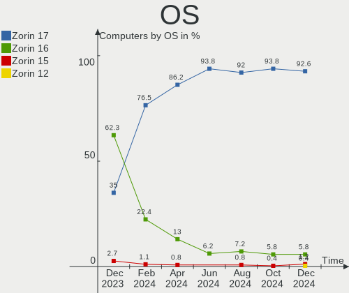
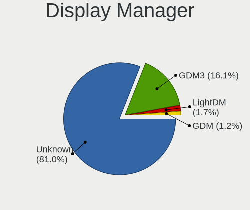
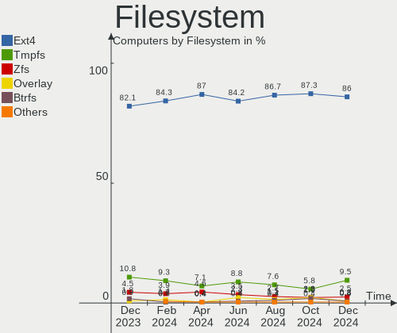
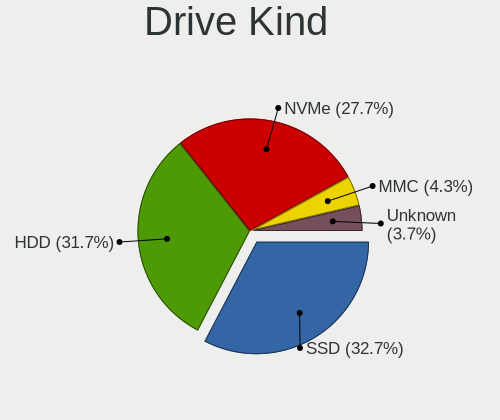
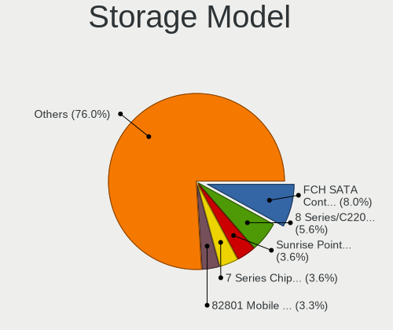
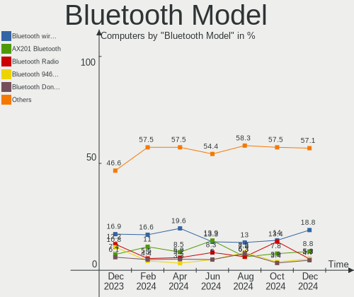

Zorin - Hardware Trends
-----------------------

A project to identify most popular hardware characteristics and track their change
over time based on data collected by Linux users at https://Linux-Hardware.org.

Anyone can contribute to this report by the [hw-probe](https://github.com/linuxhw/hw-probe) tool:

    sudo -E hw-probe -all -upload

This is a report for all computer types. See also reports for [desktops](/Dist/Zorin/Desktop/README.md) and [notebooks](/Dist/Zorin/Notebook/README.md).

This report is for one last month. Overall report since the beginning of time: [TestDays](https://github.com/linuxhw/TestDays)

Period: Aug, 2023.

Contents
--------

* [ System ](#system)
  - [ OS                       ](#os)
  - [ OS Family                ](#os-family)
  - [ Kernel                   ](#kernel)
  - [ Kernel Family            ](#kernel-family)
  - [ Kernel Major Ver.        ](#kernel-major-ver)
  - [ Arch                     ](#arch)
  - [ DE                       ](#de)
  - [ Display Server           ](#display-server)
  - [ Display Manager          ](#display-manager)
  - [ OS Lang                  ](#os-lang)
  - [ Boot Mode                ](#boot-mode)
  - [ Filesystem               ](#filesystem)
  - [ Part. scheme             ](#part-scheme)
  - [ Dual Boot with Linux/BSD ](#dual-boot-with-linuxbsd)
  - [ Dual Boot (Win)          ](#dual-boot-win)

* [ Board ](#board)
  - [ Vendor                   ](#vendor)
  - [ Model                    ](#model)
  - [ Model Family             ](#model-family)
  - [ MFG Year                 ](#mfg-year)
  - [ Form Factor              ](#form-factor)
  - [ Secure Boot              ](#secure-boot)
  - [ Coreboot                 ](#coreboot)
  - [ RAM Size                 ](#ram-size)
  - [ RAM Used                 ](#ram-used)
  - [ Total Drives             ](#total-drives)
  - [ Has CD-ROM               ](#has-cd-rom)
  - [ Has Ethernet             ](#has-ethernet)
  - [ Has WiFi                 ](#has-wifi)
  - [ Has Bluetooth            ](#has-bluetooth)

* [ Location ](#location)
  - [ Country                  ](#country)
  - [ City                     ](#city)

* [ Drives ](#drives)
  - [ Drive Vendor             ](#drive-vendor)
  - [ Drive Model              ](#drive-model)
  - [ HDD Vendor               ](#hdd-vendor)
  - [ SSD Vendor               ](#ssd-vendor)
  - [ Drive Kind               ](#drive-kind)
  - [ Drive Connector          ](#drive-connector)
  - [ Drive Size               ](#drive-size)
  - [ Space Total              ](#space-total)
  - [ Space Used               ](#space-used)
  - [ Malfunc. Drives          ](#malfunc-drives)
  - [ Malfunc. Drive Vendor    ](#malfunc-drive-vendor)
  - [ Malfunc. HDD Vendor      ](#malfunc-hdd-vendor)
  - [ Malfunc. Drive Kind      ](#malfunc-drive-kind)
  - [ Failed Drives            ](#failed-drives)
  - [ Failed Drive Vendor      ](#failed-drive-vendor)
  - [ Drive Status             ](#drive-status)

* [ Storage controller ](#storage-controller)
  - [ Storage Vendor           ](#storage-vendor)
  - [ Storage Model            ](#storage-model)
  - [ Storage Kind             ](#storage-kind)

* [ Processor ](#processor)
  - [ CPU Vendor               ](#cpu-vendor)
  - [ CPU Model                ](#cpu-model)
  - [ CPU Model Family         ](#cpu-model-family)
  - [ CPU Cores                ](#cpu-cores)
  - [ CPU Sockets              ](#cpu-sockets)
  - [ CPU Threads              ](#cpu-threads)
  - [ CPU Op-Modes             ](#cpu-op-modes)
  - [ CPU Microcode            ](#cpu-microcode)
  - [ CPU Microarch            ](#cpu-microarch)

* [ Graphics ](#graphics)
  - [ GPU Vendor               ](#gpu-vendor)
  - [ GPU Model                ](#gpu-model)
  - [ GPU Combo                ](#gpu-combo)
  - [ GPU Driver               ](#gpu-driver)
  - [ GPU Memory               ](#gpu-memory)

* [ Monitor ](#monitor)
  - [ Monitor Vendor           ](#monitor-vendor)
  - [ Monitor Model            ](#monitor-model)
  - [ Monitor Resolution       ](#monitor-resolution)
  - [ Monitor Diagonal         ](#monitor-diagonal)
  - [ Monitor Width            ](#monitor-width)
  - [ Aspect Ratio             ](#aspect-ratio)
  - [ Monitor Area             ](#monitor-area)
  - [ Pixel Density            ](#pixel-density)
  - [ Multiple Monitors        ](#multiple-monitors)

* [ Network ](#network)
  - [ Net Controller Vendor    ](#net-controller-vendor)
  - [ Net Controller Model     ](#net-controller-model)
  - [ Wireless Vendor          ](#wireless-vendor)
  - [ Wireless Model           ](#wireless-model)
  - [ Ethernet Vendor          ](#ethernet-vendor)
  - [ Ethernet Model           ](#ethernet-model)
  - [ Net Controller Kind      ](#net-controller-kind)
  - [ Used Controller          ](#used-controller)
  - [ NICs                     ](#nics)
  - [ IPv6                     ](#ipv6)

* [ Bluetooth ](#bluetooth)
  - [ Bluetooth Vendor         ](#bluetooth-vendor)
  - [ Bluetooth Model          ](#bluetooth-model)

* [ Sound ](#sound)
  - [ Sound Vendor             ](#sound-vendor)
  - [ Sound Model              ](#sound-model)

* [ Memory ](#memory)
  - [ Memory Vendor            ](#memory-vendor)
  - [ Memory Model             ](#memory-model)
  - [ Memory Kind              ](#memory-kind)
  - [ Memory Form Factor       ](#memory-form-factor)
  - [ Memory Size              ](#memory-size)
  - [ Memory Speed             ](#memory-speed)

* [ Printers & scanners ](#printers--scanners)
  - [ Printer Vendor           ](#printer-vendor)
  - [ Printer Model            ](#printer-model)
  - [ Scanner Vendor           ](#scanner-vendor)
  - [ Scanner Model            ](#scanner-model)

* [ Camera ](#camera)
  - [ Camera Vendor            ](#camera-vendor)
  - [ Camera Model             ](#camera-model)

* [ Security ](#security)
  - [ Fingerprint Vendor       ](#fingerprint-vendor)
  - [ Fingerprint Model        ](#fingerprint-model)
  - [ Chipcard Vendor          ](#chipcard-vendor)
  - [ Chipcard Model           ](#chipcard-model)

* [ Unsupported ](#unsupported)
  - [ Unsupported Devices      ](#unsupported-devices)
  - [ Unsupported Device Types ](#unsupported-device-types)

System
------

OS
--

Installed operating systems

| Name     | Computers | Percent |
|----------|-----------|---------|
| Zorin 16 | 152       | 97.44%  |
| Zorin 15 | 4         | 2.56%   |

OS Family
---------

OS without a version

| Name  | Computers | Percent |
|-------|-----------|---------|
| Zorin | 156       | 100%    |

Kernel
------

Version of the Linux kernel

| Version                | Computers | Percent |
|------------------------|-----------|---------|
| 5.15.0-78-generic      | 74        | 47.44%  |
| 5.15.0-79-generic      | 50        | 32.05%  |
| 5.15.0-76-generic      | 9         | 5.77%   |
| 5.15.0-82-generic      | 8         | 5.13%   |
| 5.4.0-150-generic      | 2         | 1.28%   |
| 5.4.0-148-generic      | 2         | 1.28%   |
| 5.15.0-71-generic      | 2         | 1.28%   |
| 5.15.0-60-generic      | 2         | 1.28%   |
| 5.11.0-41-generic      | 2         | 1.28%   |
| 6.1.8-060108-generic   | 1         | 0.64%   |
| 5.18.19-051819-generic | 1         | 0.64%   |
| 5.15.0-73-generic      | 1         | 0.64%   |
| 5.15.0-41-generic      | 1         | 0.64%   |
| 5.11.0-27-generic      | 1         | 0.64%   |

Kernel Family
-------------

Linux kernel without a distro release

| Version | Computers | Percent |
|---------|-----------|---------|
| 5.15.0  | 147       | 94.23%  |
| 5.4.0   | 4         | 2.56%   |
| 5.11.0  | 3         | 1.92%   |
| 6.1.8   | 1         | 0.64%   |
| 5.18.19 | 1         | 0.64%   |

Kernel Major Ver.
-----------------

Linux kernel major version

| Version | Computers | Percent |
|---------|-----------|---------|
| 5.15    | 147       | 94.23%  |
| 5.4     | 4         | 2.56%   |
| 5.11    | 3         | 1.92%   |
| 6.1     | 1         | 0.64%   |
| 5.18    | 1         | 0.64%   |

Arch
----

OS architecture (x86_64, i586, etc.)

| Name   | Computers | Percent |
|--------|-----------|---------|
| x86_64 | 154       | 98.72%  |
| i686   | 2         | 1.28%   |

DE
--

Desktop Environment

| Name    | Computers | Percent |
|---------|-----------|---------|
| GNOME   | 130       | 83.33%  |
| XFCE    | 24        | 15.38%  |
| Unknown | 2         | 1.28%   |

Display Server
--------------

X11 or Wayland

| Name    | Computers | Percent |
|---------|-----------|---------|
| X11     | 153       | 98.08%  |
| Wayland | 3         | 1.92%   |

Display Manager
---------------

SDDM, LightDM, etc.

| Name    | Computers | Percent |
|---------|-----------|---------|
| Unknown | 116       | 74.36%  |
| GDM     | 17        | 10.9%   |
| GDM3    | 15        | 9.62%   |
| LightDM | 8         | 5.13%   |

OS Lang
-------

Language

| Lang    | Computers | Percent |
|---------|-----------|---------|
| en_US   | 61        | 39.1%   |
| de_DE   | 16        | 10.26%  |
| en_GB   | 12        | 7.69%   |
| pt_BR   | 9         | 5.77%   |
| es_ES   | 8         | 5.13%   |
| it_IT   | 5         | 3.21%   |
| fr_FR   | 5         | 3.21%   |
| nl_NL   | 4         | 2.56%   |
| es_MX   | 4         | 2.56%   |
| pl_PL   | 3         | 1.92%   |
| en_IN   | 3         | 1.92%   |
| en_CA   | 3         | 1.92%   |
| zh_CN   | 2         | 1.28%   |
| tr_TR   | 2         | 1.28%   |
| es_AR   | 2         | 1.28%   |
| en_ZA   | 2         | 1.28%   |
| en_NZ   | 2         | 1.28%   |
| sv_SE   | 1         | 0.64%   |
| sr_RS   | 1         | 0.64%   |
| pt_PT   | 1         | 0.64%   |
| nl_BE   | 1         | 0.64%   |
| id_ID   | 1         | 0.64%   |
| hu_HU   | 1         | 0.64%   |
| es_VE   | 1         | 0.64%   |
| es_CL   | 1         | 0.64%   |
| en_IE   | 1         | 0.64%   |
| en_AU   | 1         | 0.64%   |
| de_CH   | 1         | 0.64%   |
| cs_CZ   | 1         | 0.64%   |
| Unknown | 1         | 0.64%   |

Boot Mode
---------

EFI or BIOS

| Mode | Computers | Percent |
|------|-----------|---------|
| EFI  | 94        | 60.26%  |
| BIOS | 62        | 39.74%  |

Filesystem
----------

Type of filesystem

| Type    | Computers | Percent |
|---------|-----------|---------|
| Ext4    | 133       | 85.26%  |
| Tmpfs   | 16        | 10.26%  |
| Overlay | 3         | 1.92%   |
| Btrfs   | 3         | 1.92%   |
| Zfs     | 1         | 0.64%   |

Part. scheme
------------

Scheme of partitioning

| Type    | Computers | Percent |
|---------|-----------|---------|
| Unknown | 117       | 75%     |
| GPT     | 28        | 17.95%  |
| MBR     | 11        | 7.05%   |

Dual Boot with Linux/BSD
------------------------

Hosting more than one Linux/BSD

| Dual boot | Computers | Percent |
|-----------|-----------|---------|
| No        | 148       | 94.87%  |
| Yes       | 8         | 5.13%   |

Dual Boot (Win)
---------------

Hosting Linux and Windows

| Dual boot | Computers | Percent |
|-----------|-----------|---------|
| No        | 145       | 92.95%  |
| Yes       | 11        | 7.05%   |

Board
-----

Vendor
------

Motherboard manufacturer

| Name                | Computers | Percent |
|---------------------|-----------|---------|
| Lenovo              | 31        | 19.87%  |
| Hewlett-Packard     | 28        | 17.95%  |
| Dell                | 19        | 12.18%  |
| ASUSTek Computer    | 15        | 9.62%   |
| Apple               | 8         | 5.13%   |
| MSI                 | 6         | 3.85%   |
| Acer                | 6         | 3.85%   |
| Intel               | 5         | 3.21%   |
| Gigabyte Technology | 5         | 3.21%   |
| Unknown             | 3         | 1.92%   |
| Sony                | 2         | 1.28%   |
| Samsung Electronics | 2         | 1.28%   |
| Pegatron            | 2         | 1.28%   |
| Google              | 2         | 1.28%   |
| Biostar             | 2         | 1.28%   |
| AZW                 | 2         | 1.28%   |
| ASRock              | 2         | 1.28%   |
| TERRA               | 1         | 0.64%   |
| TAGTech             | 1         | 0.64%   |
| ONE-NETBOOK         | 1         | 0.64%   |
| Notebook            | 1         | 0.64%   |
| Microsoft           | 1         | 0.64%   |
| Medion              | 1         | 0.64%   |
| LG Electronics      | 1         | 0.64%   |
| Itautec             | 1         | 0.64%   |
| GuoGuang            | 1         | 0.64%   |
| eMachines           | 1         | 0.64%   |
| Clevo               | 1         | 0.64%   |
| Chuwi               | 1         | 0.64%   |
| BESSTAR Tech        | 1         | 0.64%   |
| AMI                 | 1         | 0.64%   |
| Alienware           | 1         | 0.64%   |
| Acidanthera         | 1         | 0.64%   |

Model
-----

Motherboard model

| Name                                        | Computers | Percent |
|---------------------------------------------|-----------|---------|
| Unknown                                     | 5         | 3.21%   |
| Lenovo G40-30 80FY                          | 2         | 1.28%   |
| HP Pavilion dv7                             | 2         | 1.28%   |
| HP Laptop 14-dk1xxx                         | 2         | 1.28%   |
| HP 15                                       | 2         | 1.28%   |
| Dell Latitude E5470                         | 2         | 1.28%   |
| TERRA TERRAPC                               | 1         | 0.64%   |
| TAGTech TAGITOP-UNI C                       | 1         | 0.64%   |
| Sony VPCF13Z1E                              | 1         | 0.64%   |
| Sony VPCEE23FX                              | 1         | 0.64%   |
| Samsung RV411/RV511/E3511/S3511/RV711/E3411 | 1         | 0.64%   |
| Samsung 960QFG                              | 1         | 0.64%   |
| Pegatron T5060                              | 1         | 0.64%   |
| Pegatron Compaq dx2450                      | 1         | 0.64%   |
| ONE-NETBOOK ONEXPLAYER 2 ARP23              | 1         | 0.64%   |
| Notebook NJ50_70CU                          | 1         | 0.64%   |
| MSI MS-7E12                                 | 1         | 0.64%   |
| MSI MS-7D43                                 | 1         | 0.64%   |
| MSI MS-7C37                                 | 1         | 0.64%   |
| MSI MS-7A12                                 | 1         | 0.64%   |
| MSI MS-7815                                 | 1         | 0.64%   |
| MSI 500-136es                               | 1         | 0.64%   |
| Microsoft Surface 3                         | 1         | 0.64%   |
| Medion E15301                               | 1         | 0.64%   |
| LG 14Z90N-V.AA78B                           | 1         | 0.64%   |
| Lenovo Yoga 3 14 80JH                       | 1         | 0.64%   |
| Lenovo ThinkPad X270 W10DG 20K5S2GL00       | 1         | 0.64%   |
| Lenovo ThinkPad X220 4286CTO                | 1         | 0.64%   |
| Lenovo ThinkPad X1 Extreme 20MFCTO1WW       | 1         | 0.64%   |
| Lenovo ThinkPad T510 43842RG                | 1         | 0.64%   |
| Lenovo ThinkPad T480 20L5S04F00             | 1         | 0.64%   |
| Lenovo ThinkPad P51s W10DG 20JY0003UK       | 1         | 0.64%   |
| Lenovo ThinkPad P51 20HJS3MY00              | 1         | 0.64%   |
| Lenovo ThinkPad L470 W10DG 20JVS0YA00       | 1         | 0.64%   |
| Lenovo ThinkPad Edge 25453BG                | 1         | 0.64%   |
| Lenovo ThinkPad Edge 0578A66                | 1         | 0.64%   |
| Lenovo ThinkCentre M92P 3237EJ3             | 1         | 0.64%   |
| Lenovo ThinkCentre M700 10KNS0H900          | 1         | 0.64%   |
| Lenovo ThinkCentre M700 10J0S6CH00          | 1         | 0.64%   |
| Lenovo ThinkCentre E73 10AU00G4RU           | 1         | 0.64%   |

Model Family
------------

Motherboard model prefix

| Name                   | Computers | Percent |
|------------------------|-----------|---------|
| Lenovo ThinkPad        | 10        | 6.41%   |
| Lenovo IdeaPad         | 7         | 4.49%   |
| Dell Latitude          | 5         | 3.21%   |
| Unknown                | 5         | 3.21%   |
| Lenovo ThinkCentre     | 4         | 2.56%   |
| HP EliteBook           | 4         | 2.56%   |
| HP Compaq              | 4         | 2.56%   |
| Dell Inspiron          | 4         | 2.56%   |
| Acer Aspire            | 4         | 2.56%   |
| HP ProBook             | 3         | 1.92%   |
| HP Pavilion            | 3         | 1.92%   |
| HP Laptop              | 3         | 1.92%   |
| Dell OptiPlex          | 3         | 1.92%   |
| ASUS TUF               | 3         | 1.92%   |
| Lenovo Legion          | 2         | 1.28%   |
| Lenovo G40-30          | 2         | 1.28%   |
| HP EliteDesk           | 2         | 1.28%   |
| HP 15                  | 2         | 1.28%   |
| Dell Venue             | 2         | 1.28%   |
| Dell Precision         | 2         | 1.28%   |
| TERRA TERRAPC          | 1         | 0.64%   |
| TAGTech TAGITOP-UNI    | 1         | 0.64%   |
| Sony VPCF13Z1E         | 1         | 0.64%   |
| Sony VPCEE23FX         | 1         | 0.64%   |
| Samsung RV411          | 1         | 0.64%   |
| Samsung 960QFG         | 1         | 0.64%   |
| Pegatron T5060         | 1         | 0.64%   |
| Pegatron Compaq        | 1         | 0.64%   |
| ONE-NETBOOK ONEXPLAYER | 1         | 0.64%   |
| Notebook NJ50          | 1         | 0.64%   |
| MSI MS-7E12            | 1         | 0.64%   |
| MSI MS-7D43            | 1         | 0.64%   |
| MSI MS-7C37            | 1         | 0.64%   |
| MSI MS-7A12            | 1         | 0.64%   |
| MSI MS-7815            | 1         | 0.64%   |
| MSI 500-136es          | 1         | 0.64%   |
| Microsoft Surface      | 1         | 0.64%   |
| Medion E15301          | 1         | 0.64%   |
| LG 14Z90N-V.AA78B      | 1         | 0.64%   |
| Lenovo Yoga            | 1         | 0.64%   |

MFG Year
--------

Motherboard manufacture year

| Year | Computers | Percent |
|------|-----------|---------|
| 2019 | 15        | 9.62%   |
| 2011 | 15        | 9.62%   |
| 2014 | 13        | 8.33%   |
| 2020 | 12        | 7.69%   |
| 2017 | 11        | 7.05%   |
| 2016 | 11        | 7.05%   |
| 2013 | 11        | 7.05%   |
| 2015 | 10        | 6.41%   |
| 2012 | 10        | 6.41%   |
| 2018 | 9         | 5.77%   |
| 2021 | 8         | 5.13%   |
| 2010 | 8         | 5.13%   |
| 2008 | 6         | 3.85%   |
| 2023 | 5         | 3.21%   |
| 2022 | 5         | 3.21%   |
| 2009 | 3         | 1.92%   |
| 2007 | 2         | 1.28%   |
| 2006 | 1         | 0.64%   |
| 2005 | 1         | 0.64%   |

Form Factor
-----------

Physical design of the computer

| Name        | Computers | Percent |
|-------------|-----------|---------|
| Notebook    | 91        | 58.33%  |
| Desktop     | 51        | 32.69%  |
| Convertible | 4         | 2.56%   |
| All in one  | 4         | 2.56%   |
| Mini pc     | 3         | 1.92%   |
| Tablet      | 2         | 1.28%   |
| Server      | 1         | 0.64%   |

Secure Boot
-----------

Enabled or disabled

| State    | Computers | Percent |
|----------|-----------|---------|
| Disabled | 138       | 88.46%  |
| Enabled  | 18        | 11.54%  |

Coreboot
--------

Have coreboot on board

| Used | Computers | Percent |
|------|-----------|---------|
| No   | 154       | 98.72%  |
| Yes  | 2         | 1.28%   |

RAM Size
--------

Total RAM memory

| Size in GB  | Computers | Percent |
|-------------|-----------|---------|
| 4.01-8.0    | 49        | 31.41%  |
| 16.01-24.0  | 32        | 20.51%  |
| 3.01-4.0    | 30        | 19.23%  |
| 8.01-16.0   | 17        | 10.9%   |
| 32.01-64.0  | 10        | 6.41%   |
| 64.01-256.0 | 8         | 5.13%   |
| 2.01-3.0    | 4         | 2.56%   |
| 1.01-2.0    | 4         | 2.56%   |
| 24.01-32.0  | 2         | 1.28%   |

RAM Used
--------

Used RAM memory

| Used GB    | Computers | Percent |
|------------|-----------|---------|
| 2.01-3.0   | 55        | 35.26%  |
| 1.01-2.0   | 41        | 26.28%  |
| 3.01-4.0   | 28        | 17.95%  |
| 4.01-8.0   | 26        | 16.67%  |
| 0.51-1.0   | 3         | 1.92%   |
| 8.01-16.0  | 2         | 1.28%   |
| 16.01-24.0 | 1         | 0.64%   |

Total Drives
------------

Number of drives on board

| Drives | Computers | Percent |
|--------|-----------|---------|
| 1      | 100       | 64.1%   |
| 2      | 40        | 25.64%  |
| 3      | 11        | 7.05%   |
| 4      | 3         | 1.92%   |
| 6      | 2         | 1.28%   |

Has CD-ROM
----------

Has CD-ROM on board

| Presented | Computers | Percent |
|-----------|-----------|---------|
| No        | 98        | 62.82%  |
| Yes       | 58        | 37.18%  |

Has Ethernet
------------

Has Ethernet on board

| Presented | Computers | Percent |
|-----------|-----------|---------|
| Yes       | 129       | 82.69%  |
| No        | 27        | 17.31%  |

Has WiFi
--------

Has WiFi module

| Presented | Computers | Percent |
|-----------|-----------|---------|
| Yes       | 132       | 84.62%  |
| No        | 24        | 15.38%  |

Has Bluetooth
-------------

Has Bluetooth module

| Presented | Computers | Percent |
|-----------|-----------|---------|
| Yes       | 95        | 60.9%   |
| No        | 61        | 39.1%   |

Location
--------

Country
-------

Geographic location (country)

| Country                | Computers | Percent |
|------------------------|-----------|---------|
| USA                    | 36        | 23.08%  |
| Germany                | 18        | 11.54%  |
| UK                     | 10        | 6.41%   |
| Brazil                 | 10        | 6.41%   |
| Spain                  | 8         | 5.13%   |
| Netherlands            | 7         | 4.49%   |
| Mexico                 | 6         | 3.85%   |
| Italy                  | 5         | 3.21%   |
| France                 | 5         | 3.21%   |
| Sweden                 | 4         | 2.56%   |
| India                  | 4         | 2.56%   |
| Poland                 | 3         | 1.92%   |
| Canada                 | 3         | 1.92%   |
| South Africa           | 2         | 1.28%   |
| Pakistan               | 2         | 1.28%   |
| New Zealand            | 2         | 1.28%   |
| Japan                  | 2         | 1.28%   |
| China                  | 2         | 1.28%   |
| Belgium                | 2         | 1.28%   |
| Austria                | 2         | 1.28%   |
| Argentina              | 2         | 1.28%   |
| Vietnam                | 1         | 0.64%   |
| Venezuela              | 1         | 0.64%   |
| Turkey                 | 1         | 0.64%   |
| South Korea            | 1         | 0.64%   |
| Serbia                 | 1         | 0.64%   |
| Senegal                | 1         | 0.64%   |
| Romania                | 1         | 0.64%   |
| Portugal               | 1         | 0.64%   |
| Norway                 | 1         | 0.64%   |
| Ireland                | 1         | 0.64%   |
| Iraq                   | 1         | 0.64%   |
| Indonesia              | 1         | 0.64%   |
| Hungary                | 1         | 0.64%   |
| Czechia                | 1         | 0.64%   |
| Cuba                   | 1         | 0.64%   |
| Colombia               | 1         | 0.64%   |
| Chile                  | 1         | 0.64%   |
| Bulgaria               | 1         | 0.64%   |
| Bosnia and Herzegovina | 1         | 0.64%   |

City
----

Geographic location (city)

| City                    | Computers | Percent |
|-------------------------|-----------|---------|
| Vienna                  | 2         | 1.28%   |
| Shoreview               | 2         | 1.28%   |
| Rome                    | 2         | 1.28%   |
| Niles                   | 2         | 1.28%   |
| Hyderabad               | 2         | 1.28%   |
| Houston                 | 2         | 1.28%   |
| Coventry                | 2         | 1.28%   |
| Zapopan                 | 1         | 0.64%   |
| Wilhelmshaven           | 1         | 0.64%   |
| White Lake              | 1         | 0.64%   |
| Wellington              | 1         | 0.64%   |
| Villefranche-sur-Saône | 1         | 0.64%   |
| Vendin-le-Vieil         | 1         | 0.64%   |
| Varna                   | 1         | 0.64%   |
| Valladolid              | 1         | 0.64%   |
| Valencia                | 1         | 0.64%   |
| Trivandrum              | 1         | 0.64%   |
| Tomari                  | 1         | 0.64%   |
| Tokyo                   | 1         | 0.64%   |
| Tijuana                 | 1         | 0.64%   |
| Thunder Bay             | 1         | 0.64%   |
| Thames Ditton           | 1         | 0.64%   |
| Szigetszentmiklos       | 1         | 0.64%   |
| Surrey                  | 1         | 0.64%   |
| Stockholm               | 1         | 0.64%   |
| Stevenage               | 1         | 0.64%   |
| Sneek                   | 1         | 0.64%   |
| Seoul                   | 1         | 0.64%   |
| Sargodha                | 1         | 0.64%   |
| Sao José dos Campos    | 1         | 0.64%   |
| Santo Amaro             | 1         | 0.64%   |
| Santiago                | 1         | 0.64%   |
| Sankt Wendel            | 1         | 0.64%   |
| Runcorn                 | 1         | 0.64%   |
| Roosendaal              | 1         | 0.64%   |
| Rockford                | 1         | 0.64%   |
| Rio de Janeiro          | 1         | 0.64%   |
| Richardson              | 1         | 0.64%   |
| Ribeirao Preto          | 1         | 0.64%   |
| Resistencia             | 1         | 0.64%   |

Drives
------

Drive Vendor
------------

Hard drive vendors

| Vendor                       | Computers | Drives | Percent |
|------------------------------|-----------|--------|---------|
| Samsung Electronics          | 29        | 31     | 13.18%  |
| Seagate                      | 27        | 32     | 12.27%  |
| WDC                          | 20        | 21     | 9.09%   |
| Sandisk                      | 19        | 23     | 8.64%   |
| Unknown                      | 11        | 13     | 5%      |
| Kingston                     | 11        | 12     | 5%      |
| Toshiba                      | 9         | 9      | 4.09%   |
| Crucial                      | 9         | 10     | 4.09%   |
| SK hynix                     | 8         | 8      | 3.64%   |
| Hitachi                      | 8         | 8      | 3.64%   |
| China                        | 6         | 6      | 2.73%   |
| Micron Technology            | 4         | 4      | 1.82%   |
| Intel                        | 4         | 4      | 1.82%   |
| SPCC                         | 3         | 4      | 1.36%   |
| Intenso                      | 3         | 3      | 1.36%   |
| HGST                         | 3         | 3      | 1.36%   |
| Apple                        | 3         | 3      | 1.36%   |
| Unknown                      | 3         | 3      | 1.36%   |
| Transcend                    | 2         | 2      | 0.91%   |
| Phison                       | 2         | 2      | 0.91%   |
| Netac                        | 2         | 2      | 0.91%   |
| MAXIO Technology (Hangzhou)  | 2         | 2      | 0.91%   |
| Hewlett-Packard              | 2         | 2      | 0.91%   |
| Fujitsu                      | 2         | 2      | 0.91%   |
| Fanxiang                     | 2         | 2      | 0.91%   |
| XPG                          | 1         | 1      | 0.45%   |
| Wibtek                       | 1         | 1      | 0.45%   |
| VERICO                       | 1         | 1      | 0.45%   |
| Team                         | 1         | 1      | 0.45%   |
| Solid State Storage          | 1         | 1      | 0.45%   |
| Silicon Motion               | 1         | 1      | 0.45%   |
| Shenzhen Longsys Electronics | 1         | 1      | 0.45%   |
| SCY                          | 1         | 1      | 0.45%   |
| Realtek                      | 1         | 1      | 0.45%   |
| OCZ                          | 1         | 1      | 0.45%   |
| NGFF                         | 1         | 1      | 0.45%   |
| Mushkin                      | 1         | 1      | 0.45%   |
| Micron/Crucial Technology    | 1         | 1      | 0.45%   |
| LITEONIT                     | 1         | 1      | 0.45%   |
| Lenovo                       | 1         | 1      | 0.45%   |

Drive Model
-----------

Hard drive models

| Model                                               | Computers | Percent |
|-----------------------------------------------------|-----------|---------|
| Unknown MMC Card  64GB                              | 8         | 3.43%   |
| Kingston SA400S37240G 240GB SSD                     | 5         | 2.15%   |
| Samsung NVMe SSD Controller SM981/PM981/PM983 500GB | 3         | 1.29%   |
| Crucial CT2000MX500SSD1 2TB                         | 3         | 1.29%   |
| Crucial CT1000MX500SSD1 1TB                         | 3         | 1.29%   |
| Unknown                                             | 3         | 1.29%   |
| Unknown MMC Card  32GB                              | 2         | 0.86%   |
| Seagate ST9500325AS 500GB                           | 2         | 0.86%   |
| Seagate ST3500312CS 500GB                           | 2         | 0.86%   |
| Seagate ST3250312AS 250GB                           | 2         | 0.86%   |
| Seagate ST1000LM035-1RK172 1TB                      | 2         | 0.86%   |
| Seagate Expansion 2TB                               | 2         | 0.86%   |
| Sandisk WDC PC SN530 SDBPMPZ-256G-1101 256GB        | 2         | 0.86%   |
| Sandisk WD Blue SN570 1TB                           | 2         | 0.86%   |
| Sandisk WD Black SN750 / PC SN730 NVMe SSD 1024GB   | 2         | 0.86%   |
| Sandisk PC SN520 NVMe SSD 256GB                     | 2         | 0.86%   |
| Samsung SSD 870 EVO 1TB                             | 2         | 0.86%   |
| Samsung HM321HI 320GB                               | 2         | 0.86%   |
| Kingston SV300S37A120G 120GB SSD                    | 2         | 0.86%   |
| Kingston SA400S37120G 120GB SSD                     | 2         | 0.86%   |
| Hitachi HTS723232A7A364 320GB                       | 2         | 0.86%   |
| Hitachi HDS721050CLA362 500GB                       | 2         | 0.86%   |
| HGST HTS545050A7E680 500GB                          | 2         | 0.86%   |
| XPG NVMe SSD Drive 2TB                              | 1         | 0.43%   |
| Wibtek W800S 512GB SSD                              | 1         | 0.43%   |
| WDC WDS500G3X0C-00SJG0 500GB                        | 1         | 0.43%   |
| WDC WD800BEVT-75ZCT2 80GB                           | 1         | 0.43%   |
| WDC WD7500BPKX-00HPJT0 752GB                        | 1         | 0.43%   |
| WDC WD6400AAKS-00A7B0 640GB                         | 1         | 0.43%   |
| WDC WD5000LPVX-75V0TT0 500GB                        | 1         | 0.43%   |
| WDC WD5000LPCX-21VHAT0 500GB                        | 1         | 0.43%   |
| WDC WD5000AVVS-63ZWB0 500GB                         | 1         | 0.43%   |
| WDC WD5000AAKS-60A7B0 500GB                         | 1         | 0.43%   |
| WDC WD40EZAZ-00ZGHB0 4TB                            | 1         | 0.43%   |
| WDC WD3200BPVT-22JJ5T0 320GB                        | 1         | 0.43%   |
| WDC WD20SPZX-08UA7 2TB                              | 1         | 0.43%   |
| WDC WD20EZRZ-00Z5HB0 2TB                            | 1         | 0.43%   |
| WDC WD20EJRX-89G3VY0 2TB                            | 1         | 0.43%   |
| WDC WD20EARS-00MVWB0 2TB                            | 1         | 0.43%   |
| WDC WD1600BEKT-75PVMT0 160GB                        | 1         | 0.43%   |

HDD Vendor
----------

Hard disk drive vendors

| Vendor              | Computers | Drives | Percent |
|---------------------|-----------|--------|---------|
| Seagate             | 26        | 31     | 37.68%  |
| WDC                 | 17        | 18     | 24.64%  |
| Hitachi             | 8         | 8      | 11.59%  |
| Toshiba             | 6         | 6      | 8.7%    |
| Samsung Electronics | 4         | 4      | 5.8%    |
| HGST                | 3         | 3      | 4.35%   |
| Fujitsu             | 2         | 2      | 2.9%    |
| LaCie               | 1         | 1      | 1.45%   |
| Intenso             | 1         | 1      | 1.45%   |
| Apple               | 1         | 1      | 1.45%   |

SSD Vendor
----------

Solid state drive vendors

| Vendor              | Computers | Drives | Percent |
|---------------------|-----------|--------|---------|
| Samsung Electronics | 16        | 17     | 18.82%  |
| Kingston            | 10        | 11     | 11.76%  |
| Crucial             | 9         | 10     | 10.59%  |
| China               | 6         | 6      | 7.06%   |
| SanDisk             | 5         | 7      | 5.88%   |
| SK hynix            | 4         | 4      | 4.71%   |
| SPCC                | 3         | 4      | 3.53%   |
| Micron Technology   | 3         | 3      | 3.53%   |
| Transcend           | 2         | 2      | 2.35%   |
| Netac               | 2         | 2      | 2.35%   |
| Intel               | 2         | 2      | 2.35%   |
| Wibtek              | 1         | 1      | 1.18%   |
| WDC                 | 1         | 1      | 1.18%   |
| VERICO              | 1         | 1      | 1.18%   |
| Toshiba             | 1         | 1      | 1.18%   |
| Team                | 1         | 1      | 1.18%   |
| SCY                 | 1         | 1      | 1.18%   |
| Phison              | 1         | 1      | 1.18%   |
| OCZ                 | 1         | 1      | 1.18%   |
| NGFF                | 1         | 1      | 1.18%   |
| Mushkin             | 1         | 1      | 1.18%   |
| LITEONIT            | 1         | 1      | 1.18%   |
| Intenso             | 1         | 1      | 1.18%   |
| Hewlett-Packard     | 1         | 1      | 1.18%   |
| GOODRAM             | 1         | 1      | 1.18%   |
| Fanxiang            | 1         | 1      | 1.18%   |
| Emtec               | 1         | 1      | 1.18%   |
| EDILOCA             | 1         | 1      | 1.18%   |
| Corsair             | 1         | 1      | 1.18%   |
| Colorful            | 1         | 1      | 1.18%   |
| Apple               | 1         | 1      | 1.18%   |
| AFOX                | 1         | 1      | 1.18%   |
| A-DATA Technology   | 1         | 1      | 1.18%   |
| Unknown             | 1         | 1      | 1.18%   |

Drive Kind
----------

HDD or SSD

| Kind    | Computers | Drives | Percent |
|---------|-----------|--------|---------|
| SSD     | 76        | 91     | 38.19%  |
| HDD     | 62        | 75     | 31.16%  |
| NVMe    | 45        | 53     | 22.61%  |
| MMC     | 10        | 12     | 5.03%   |
| Unknown | 6         | 6      | 3.02%   |

Drive Connector
---------------

SATA, SAS, NVMe, etc.

| Type | Computers | Drives | Percent |
|------|-----------|--------|---------|
| SATA | 122       | 163    | 65.95%  |
| NVMe | 44        | 52     | 23.78%  |
| MMC  | 10        | 12     | 5.41%   |
| SAS  | 9         | 10     | 4.86%   |

Drive Size
----------

Size of hard drive

| Size in TB | Computers | Drives | Percent |
|------------|-----------|--------|---------|
| 0.01-0.5   | 87        | 105    | 60.42%  |
| 0.51-1.0   | 36        | 39     | 25%     |
| 1.01-2.0   | 16        | 16     | 11.11%  |
| 3.01-4.0   | 3         | 4      | 2.08%   |
| 2.01-3.0   | 1         | 1      | 0.69%   |
| 4.01-10.0  | 1         | 1      | 0.69%   |

Space Total
-----------

Amount of disk space available on the file system

| Size in GB     | Computers | Percent |
|----------------|-----------|---------|
| 101-250        | 58        | 37.18%  |
| 251-500        | 32        | 20.51%  |
| 501-1000       | 27        | 17.31%  |
| 51-100         | 16        | 10.26%  |
| More than 3000 | 6         | 3.85%   |
| 21-50          | 5         | 3.21%   |
| 1001-2000      | 4         | 2.56%   |
| 1-20           | 4         | 2.56%   |
| 2001-3000      | 2         | 1.28%   |
| Unknown        | 2         | 1.28%   |

Space Used
----------

Amount of used disk space

| Used GB        | Computers | Percent |
|----------------|-----------|---------|
| 1-20           | 55        | 35.26%  |
| 21-50          | 45        | 28.85%  |
| 51-100         | 22        | 14.1%   |
| 101-250        | 17        | 10.9%   |
| 501-1000       | 7         | 4.49%   |
| 251-500        | 4         | 2.56%   |
| More than 3000 | 2         | 1.28%   |
| 1001-2000      | 2         | 1.28%   |
| Unknown        | 2         | 1.28%   |

Malfunc. Drives
---------------

Drive models with a malfunction

| Model                                    | Computers | Drives | Percent |
|------------------------------------------|-----------|--------|---------|
| HGST HTS545050A7E680 500GB               | 2         | 2      | 22.22%  |
| Toshiba THNSNK128GVN8 M.2 2280 128GB SSD | 1         | 1      | 11.11%  |
| Seagate ST9500325AS 500GB                | 1         | 1      | 11.11%  |
| Seagate ST3500312CS 500GB                | 1         | 1      | 11.11%  |
| Samsung Electronics HM160HI 160GB        | 1         | 1      | 11.11%  |
| Netac SSD 240GB                          | 1         | 1      | 11.11%  |
| Intel SSDSC2BF180A5L 180GB               | 1         | 1      | 11.11%  |
| China MSATA 32GB SSD                     | 1         | 1      | 11.11%  |

Malfunc. Drive Vendor
---------------------

Vendors of faulty drives

| Vendor              | Computers | Drives | Percent |
|---------------------|-----------|--------|---------|
| Seagate             | 2         | 2      | 22.22%  |
| HGST                | 2         | 2      | 22.22%  |
| Toshiba             | 1         | 1      | 11.11%  |
| Samsung Electronics | 1         | 1      | 11.11%  |
| Netac               | 1         | 1      | 11.11%  |
| Intel               | 1         | 1      | 11.11%  |
| China               | 1         | 1      | 11.11%  |

Malfunc. HDD Vendor
-------------------

Vendors of faulty HDD drives

| Vendor              | Computers | Drives | Percent |
|---------------------|-----------|--------|---------|
| Seagate             | 2         | 2      | 40%     |
| HGST                | 2         | 2      | 40%     |
| Samsung Electronics | 1         | 1      | 20%     |

Malfunc. Drive Kind
-------------------

Kinds of faulty drives

| Kind | Computers | Drives | Percent |
|------|-----------|--------|---------|
| HDD  | 5         | 5      | 55.56%  |
| SSD  | 4         | 4      | 44.44%  |

Failed Drives
-------------

Failed drive models

Zero info for selected period =(

Failed Drive Vendor
-------------------

Failed drive vendors

Zero info for selected period =(

Drive Status
------------

Number of failed and malfunc. drives

| Status   | Computers | Drives | Percent |
|----------|-----------|--------|---------|
| Detected | 134       | 201    | 83.75%  |
| Works    | 18        | 27     | 11.25%  |
| Malfunc  | 8         | 9      | 5%      |

Storage controller
------------------

Storage Vendor
--------------

Storage controller vendors

| Vendor                         | Computers | Percent |
|--------------------------------|-----------|---------|
| Intel                          | 106       | 56.08%  |
| AMD                            | 27        | 14.29%  |
| SanDisk                        | 16        | 8.47%   |
| Samsung Electronics            | 10        | 5.29%   |
| SK hynix                       | 4         | 2.12%   |
| Nvidia                         | 4         | 2.12%   |
| Toshiba America Info Systems   | 2         | 1.06%   |
| Silicon Motion                 | 2         | 1.06%   |
| MAXIO Technology (Hangzhou)    | 2         | 1.06%   |
| Kingston Technology Company    | 2         | 1.06%   |
| ASMedia Technology             | 2         | 1.06%   |
| TenaFe                         | 1         | 0.53%   |
| Solid State Storage Technology | 1         | 0.53%   |
| Shenzhen Longsys Electronics   | 1         | 0.53%   |
| Seagate Technology             | 1         | 0.53%   |
| Phison Electronics             | 1         | 0.53%   |
| Micron/Crucial Technology      | 1         | 0.53%   |
| Micron Technology              | 1         | 0.53%   |
| Marvell Technology Group       | 1         | 0.53%   |
| Lenovo                         | 1         | 0.53%   |
| KIOXIA                         | 1         | 0.53%   |
| INNOGRIT                       | 1         | 0.53%   |
| Apple                          | 1         | 0.53%   |

Storage Model
-------------

Storage controller models

| Model                                                                          | Computers | Percent |
|--------------------------------------------------------------------------------|-----------|---------|
| AMD FCH SATA Controller [AHCI mode]                                            | 20        | 9.62%   |
| Intel Q170/Q150/B150/H170/H110/Z170/CM236 Chipset SATA Controller [AHCI Mode]  | 7         | 3.37%   |
| Intel 82801 Mobile SATA Controller [RAID mode]                                 | 7         | 3.37%   |
| Intel Sunrise Point-LP SATA Controller [AHCI mode]                             | 6         | 2.88%   |
| Intel 8 Series/C220 Series Chipset Family 6-port SATA Controller 1 [AHCI mode] | 6         | 2.88%   |
| Intel 6 Series/C200 Series Chipset Family 6 port Desktop SATA AHCI Controller  | 6         | 2.88%   |
| Intel Wildcat Point-LP SATA Controller [AHCI Mode]                             | 5         | 2.4%    |
| Intel 7 Series Chipset Family 6-port SATA Controller [AHCI mode]               | 5         | 2.4%    |
| Intel 6 Series/C200 Series Chipset Family 6 port Mobile SATA AHCI Controller   | 5         | 2.4%    |
| AMD SB7x0/SB8x0/SB9x0 SATA Controller [AHCI mode]                              | 5         | 2.4%    |
| SanDisk WD Blue SN570 NVMe SSD 1TB                                             | 4         | 1.92%   |
| Samsung NVMe SSD Controller SM981/PM981/PM983                                  | 4         | 1.92%   |
| Intel Atom Processor E3800 Series SATA AHCI Controller                         | 4         | 1.92%   |
| Intel 82801IBM/IEM (ICH9M/ICH9M-E) 4 port SATA Controller [AHCI mode]          | 4         | 1.92%   |
| Intel 8 Series SATA Controller 1 [AHCI mode]                                   | 4         | 1.92%   |
| SanDisk WD Black SN750 / PC SN730 NVMe SSD                                     | 3         | 1.44%   |
| Nvidia MCP61 SATA Controller                                                   | 3         | 1.44%   |
| Intel Volume Management Device NVMe RAID Controller                            | 3         | 1.44%   |
| Intel Celeron/Pentium Silver Processor SATA Controller                         | 3         | 1.44%   |
| Intel 82801HM/HEM (ICH8M/ICH8M-E) IDE Controller                               | 3         | 1.44%   |
| Intel 7 Series/C210 Series Chipset Family 6-port SATA Controller [AHCI mode]   | 3         | 1.44%   |
| Intel 5 Series/3400 Series Chipset 4 port SATA AHCI Controller                 | 3         | 1.44%   |
| Intel 200 Series PCH SATA controller [AHCI mode]                               | 3         | 1.44%   |
| SanDisk WD Black SN770 / PC SN740 256GB / PC SN560 (DRAM-less) NVMe SSD        | 2         | 0.96%   |
| SanDisk PC SN530 NVMe SSD (DRAM-less)                                          | 2         | 0.96%   |
| SanDisk PC SN520 NVMe SSD                                                      | 2         | 0.96%   |
| Samsung NVMe SSD Controller 980                                                | 2         | 0.96%   |
| Nvidia MCP61 IDE                                                               | 2         | 0.96%   |
| MAXIO (Hangzhou) NVMe SSD Controller MAP1602                                   | 2         | 0.96%   |
| Intel NM10/ICH7 Family SATA Controller [IDE mode]                              | 2         | 0.96%   |
| Intel Ice Lake-LP SATA Controller [AHCI mode]                                  | 2         | 0.96%   |
| Intel HM170/QM170 Chipset SATA Controller [AHCI Mode]                          | 2         | 0.96%   |
| Intel Comet Lake SATA AHCI Controller                                          | 2         | 0.96%   |
| Intel Alder Lake-S PCH SATA Controller [AHCI Mode]                             | 2         | 0.96%   |
| Intel 9 Series Chipset Family SATA Controller [AHCI Mode]                      | 2         | 0.96%   |
| Intel 82801HM/HEM (ICH8M/ICH8M-E) SATA Controller [AHCI mode]                  | 2         | 0.96%   |
| Intel 5 Series/3400 Series Chipset 6 port SATA AHCI Controller                 | 2         | 0.96%   |
| Intel 5 Series/3400 Series Chipset 4 port SATA IDE Controller                  | 2         | 0.96%   |
| ASMedia ASM1062 Serial ATA Controller                                          | 2         | 0.96%   |
| AMD SB7x0/SB8x0/SB9x0 IDE Controller                                           | 2         | 0.96%   |

Storage Kind
------------

Kind of storage controller (IDE, SATA, NVMe, SAS, ...)

| Kind | Computers | Percent |
|------|-----------|---------|
| SATA | 117       | 61.9%   |
| NVMe | 44        | 23.28%  |
| IDE  | 17        | 8.99%   |
| RAID | 10        | 5.29%   |
| SAS  | 1         | 0.53%   |

Processor
---------

CPU Vendor
----------

Processor vendors

| Vendor | Computers | Percent |
|--------|-----------|---------|
| Intel  | 124       | 79.49%  |
| AMD    | 32        | 20.51%  |

CPU Model
---------

Processor models

| Model                                         | Computers | Percent |
|-----------------------------------------------|-----------|---------|
| Intel Core i7-6500U CPU @ 2.50GHz             | 3         | 1.92%   |
| Intel Core i5-8250U CPU @ 1.60GHz             | 3         | 1.92%   |
| Intel Core i7-3632QM CPU @ 2.20GHz            | 2         | 1.28%   |
| Intel Core i7-1065G7 CPU @ 1.30GHz            | 2         | 1.28%   |
| Intel Core i5-6500 CPU @ 3.20GHz              | 2         | 1.28%   |
| Intel Core i5-6300U CPU @ 2.40GHz             | 2         | 1.28%   |
| Intel Core i5-5200U CPU @ 2.20GHz             | 2         | 1.28%   |
| Intel Core i5-2400S CPU @ 2.50GHz             | 2         | 1.28%   |
| Intel Core i5-10210U CPU @ 1.60GHz            | 2         | 1.28%   |
| Intel Core i3-1005G1 CPU @ 1.20GHz            | 2         | 1.28%   |
| Intel Core i3 CPU M 380 @ 2.53GHz             | 2         | 1.28%   |
| Intel Celeron CPU N2840 @ 2.16GHz             | 2         | 1.28%   |
| Intel 11th Gen Core i5-1135G7 @ 2.40GHz       | 2         | 1.28%   |
| AMD Ryzen 5 5600G with Radeon Graphics        | 2         | 1.28%   |
| AMD Ryzen 5 3500U with Radeon Vega Mobile Gfx | 2         | 1.28%   |
| AMD Ryzen 3 3250U with Radeon Graphics        | 2         | 1.28%   |
| Intel Xeon CPU E5-2650 v2 @ 2.60GHz           | 1         | 0.64%   |
| Intel Xeon CPU E5-2620 0 @ 2.00GHz            | 1         | 0.64%   |
| Intel Pentium Silver N5030 CPU @ 1.10GHz      | 1         | 0.64%   |
| Intel Pentium Dual-Core CPU T4400 @ 2.20GHz   | 1         | 0.64%   |
| Intel Pentium Dual-Core CPU T4200 @ 2.00GHz   | 1         | 0.64%   |
| Intel Pentium CPU P6200 @ 2.13GHz             | 1         | 0.64%   |
| Intel Pentium CPU N4200 @ 1.10GHz             | 1         | 0.64%   |
| Intel Pentium CPU N3710 @ 1.60GHz             | 1         | 0.64%   |
| Intel Pentium CPU N3520 @ 2.16GHz             | 1         | 0.64%   |
| Intel Pentium CPU G4400 @ 3.30GHz             | 1         | 0.64%   |
| Intel Pentium CPU G2130 @ 3.20GHz             | 1         | 0.64%   |
| Intel Pentium 4 CPU 3.00GHz                   | 1         | 0.64%   |
| Intel N200                                    | 1         | 0.64%   |
| Intel Core m3-8100Y CPU @ 1.10GHz             | 1         | 0.64%   |
| Intel Core M-5Y31 CPU @ 0.90GHz               | 1         | 0.64%   |
| Intel Core M-5Y10c CPU @ 0.80GHz              | 1         | 0.64%   |
| Intel Core i7-9700K CPU @ 3.60GHz             | 1         | 0.64%   |
| Intel Core i7-8850H CPU @ 2.60GHz             | 1         | 0.64%   |
| Intel Core i7-8650U CPU @ 1.90GHz             | 1         | 0.64%   |
| Intel Core i7-8550U CPU @ 1.80GHz             | 1         | 0.64%   |
| Intel Core i7-7Y75 CPU @ 1.30GHz              | 1         | 0.64%   |
| Intel Core i7-7820HQ CPU @ 2.90GHz            | 1         | 0.64%   |
| Intel Core i7-7700HQ CPU @ 2.80GHz            | 1         | 0.64%   |
| Intel Core i7-6820HQ CPU @ 2.70GHz            | 1         | 0.64%   |

CPU Model Family
----------------

Processor model prefix

| Model                   | Computers | Percent |
|-------------------------|-----------|---------|
| Intel Core i5           | 39        | 25%     |
| Intel Core i7           | 29        | 18.59%  |
| Intel Core i3           | 12        | 7.69%   |
| Intel Celeron           | 11        | 7.05%   |
| Other                   | 8         | 5.13%   |
| AMD Ryzen 5             | 8         | 5.13%   |
| Intel Pentium           | 6         | 3.85%   |
| Intel Core 2 Duo        | 6         | 3.85%   |
| Intel Atom              | 4         | 2.56%   |
| AMD Ryzen 9             | 4         | 2.56%   |
| AMD Ryzen 7             | 4         | 2.56%   |
| AMD A6                  | 3         | 1.92%   |
| Intel Xeon              | 2         | 1.28%   |
| Intel Pentium Dual-Core | 2         | 1.28%   |
| Intel Core M            | 2         | 1.28%   |
| AMD Ryzen 3             | 2         | 1.28%   |
| AMD Athlon II X2        | 2         | 1.28%   |
| Intel Pentium Silver    | 1         | 0.64%   |
| Intel Pentium 4         | 1         | 0.64%   |
| Intel Core m3           | 1         | 0.64%   |
| Intel Core 2 Quad       | 1         | 0.64%   |
| AMD Phenom II X6        | 1         | 0.64%   |
| AMD FX                  | 1         | 0.64%   |
| AMD Athlon II X3        | 1         | 0.64%   |
| AMD Athlon II Neo       | 1         | 0.64%   |
| AMD Athlon II           | 1         | 0.64%   |
| AMD Athlon Dual Core    | 1         | 0.64%   |
| AMD Athlon 64 X2        | 1         | 0.64%   |
| AMD A10                 | 1         | 0.64%   |

CPU Cores
---------

Number of processor cores

| Number | Computers | Percent |
|--------|-----------|---------|
| 2      | 66        | 42.31%  |
| 4      | 61        | 39.1%   |
| 8      | 9         | 5.77%   |
| 6      | 9         | 5.77%   |
| 1      | 5         | 3.21%   |
| 12     | 4         | 2.56%   |
| 16     | 1         | 0.64%   |
| 3      | 1         | 0.64%   |

CPU Sockets
-----------

Number of sockets

| Number | Computers | Percent |
|--------|-----------|---------|
| 1      | 155       | 99.36%  |
| 2      | 1         | 0.64%   |

CPU Threads
-----------

Threads per core (Hyper-Threading)

| Number | Computers | Percent |
|--------|-----------|---------|
| 2      | 101       | 64.74%  |
| 1      | 55        | 35.26%  |

CPU Op-Modes
------------

CPU Operation Modes (32-bit, 64-bit)

| Op mode        | Computers | Percent |
|----------------|-----------|---------|
| 32-bit, 64-bit | 156       | 100%    |

CPU Microcode
-------------

Microcode number

| Number     | Computers | Percent |
|------------|-----------|---------|
| 0x206a7    | 12        | 7.69%   |
| Unknown    | 10        | 6.41%   |
| 0x506e3    | 9         | 5.77%   |
| 0x306c3    | 9         | 5.77%   |
| 0x406e3    | 6         | 3.85%   |
| 0x306d4    | 6         | 3.85%   |
| 0x306a9    | 6         | 3.85%   |
| 0x20655    | 6         | 3.85%   |
| 0x1067a    | 5         | 3.21%   |
| 0x806ea    | 4         | 2.56%   |
| 0x806e9    | 4         | 2.56%   |
| 0x706e5    | 4         | 2.56%   |
| 0x706a8    | 4         | 2.56%   |
| 0x40651    | 4         | 2.56%   |
| 0x30678    | 4         | 2.56%   |
| 0x08108109 | 4         | 2.56%   |
| 0x906ea    | 3         | 1.92%   |
| 0x906e9    | 3         | 1.92%   |
| 0x806ec    | 3         | 1.92%   |
| 0x010000c8 | 3         | 1.92%   |
| 0x90675    | 2         | 1.28%   |
| 0x806c1    | 2         | 1.28%   |
| 0x6fd      | 2         | 1.28%   |
| 0x406c4    | 2         | 1.28%   |
| 0x10676    | 2         | 1.28%   |
| 0x0a50000d | 2         | 1.28%   |
| 0x0a50000c | 2         | 1.28%   |
| 0x0a404102 | 2         | 1.28%   |
| 0xf41      | 1         | 0.64%   |
| 0xb06e0    | 1         | 0.64%   |
| 0xa0655    | 1         | 0.64%   |
| 0xa0653    | 1         | 0.64%   |
| 0x906ed    | 1         | 0.64%   |
| 0x906c0    | 1         | 0.64%   |
| 0x90672    | 1         | 0.64%   |
| 0x706a1    | 1         | 0.64%   |
| 0x6fb      | 1         | 0.64%   |
| 0x506c9    | 1         | 0.64%   |
| 0x406c3    | 1         | 0.64%   |
| 0x40661    | 1         | 0.64%   |

CPU Microarch
-------------

Microarchitecture

| Name             | Computers | Percent |
|------------------|-----------|---------|
| KabyLake         | 19        | 12.18%  |
| Skylake          | 15        | 9.62%   |
| SandyBridge      | 14        | 8.97%   |
| Haswell          | 14        | 8.97%   |
| Silvermont       | 8         | 5.13%   |
| IvyBridge        | 8         | 5.13%   |
| Penryn           | 7         | 4.49%   |
| Zen 3            | 6         | 3.85%   |
| Westmere         | 6         | 3.85%   |
| K10              | 6         | 3.85%   |
| Broadwell        | 6         | 3.85%   |
| Unknown          | 6         | 3.85%   |
| Zen+             | 5         | 3.21%   |
| IceLake          | 5         | 3.21%   |
| Goldmont plus    | 5         | 3.21%   |
| Zen 2            | 3         | 1.92%   |
| Core             | 3         | 1.92%   |
| Alderlake Hybrid | 3         | 1.92%   |
| TigerLake        | 2         | 1.28%   |
| K8 Hammer        | 2         | 1.28%   |
| Excavator        | 2         | 1.28%   |
| CometLake        | 2         | 1.28%   |
| Tremont          | 1         | 0.64%   |
| Steamroller      | 1         | 0.64%   |
| Piledriver       | 1         | 0.64%   |
| NetBurst         | 1         | 0.64%   |
| Nehalem          | 1         | 0.64%   |
| Jaguar           | 1         | 0.64%   |
| Goldmont         | 1         | 0.64%   |
| Bulldozer        | 1         | 0.64%   |
| Bonnell          | 1         | 0.64%   |

Graphics
--------

GPU Vendor
----------

Vendors of graphics cards

| Vendor                     | Computers | Percent |
|----------------------------|-----------|---------|
| Intel                      | 95        | 53.07%  |
| Nvidia                     | 45        | 25.14%  |
| AMD                        | 38        | 21.23%  |
| Matrox Electronics Systems | 1         | 0.56%   |

GPU Model
---------

Graphics card models

| Model                                                                                    | Computers | Percent |
|------------------------------------------------------------------------------------------|-----------|---------|
| Intel 2nd Generation Core Processor Family Integrated Graphics Controller                | 11        | 6.04%   |
| Intel Skylake GT2 [HD Graphics 520]                                                      | 6         | 3.3%    |
| Intel UHD Graphics 620                                                                   | 5         | 2.75%   |
| Intel Core Processor Integrated Graphics Controller                                      | 5         | 2.75%   |
| Intel Atom Processor Z36xxx/Z37xxx Series Graphics & Display                             | 5         | 2.75%   |
| Intel HD Graphics 5500                                                                   | 4         | 2.2%    |
| Intel Haswell-ULT Integrated Graphics Controller                                         | 4         | 2.2%    |
| Intel GeminiLake [UHD Graphics 600]                                                      | 4         | 2.2%    |
| Intel 3rd Gen Core processor Graphics Controller                                         | 4         | 2.2%    |
| AMD Picasso/Raven 2 [Radeon Vega Series / Radeon Vega Mobile Series]                     | 4         | 2.2%    |
| Intel Xeon E3-1200 v3/4th Gen Core Processor Integrated Graphics Controller              | 3         | 1.65%   |
| Intel Iris Plus Graphics G1 (Ice Lake)                                                   | 3         | 1.65%   |
| Intel HD Graphics 630                                                                    | 3         | 1.65%   |
| Intel HD Graphics 530                                                                    | 3         | 1.65%   |
| Intel Atom/Celeron/Pentium Processor x5-E8000/J3xxx/N3xxx Integrated Graphics Controller | 3         | 1.65%   |
| AMD Cezanne [Radeon Vega Series / Radeon Vega Mobile Series]                             | 3         | 1.65%   |
| AMD Cedar [Radeon HD 5000/6000/7350/8350 Series]                                         | 3         | 1.65%   |
| Nvidia TU116 [GeForce GTX 1660 Ti]                                                       | 2         | 1.1%    |
| Nvidia GP107M [GeForce GTX 1050 Mobile]                                                  | 2         | 1.1%    |
| Nvidia GM206 [GeForce GTX 960]                                                           | 2         | 1.1%    |
| Nvidia GK208B [GeForce GT 730]                                                           | 2         | 1.1%    |
| Nvidia GK208B [GeForce GT 710]                                                           | 2         | 1.1%    |
| Nvidia G96CM [GeForce 9600M GT]                                                          | 2         | 1.1%    |
| Intel Xeon E3-1200 v2/3rd Gen Core processor Graphics Controller                         | 2         | 1.1%    |
| Intel TigerLake-LP GT2 [Iris Xe Graphics]                                                | 2         | 1.1%    |
| Intel Mobile 4 Series Chipset Integrated Graphics Controller                             | 2         | 1.1%    |
| Intel Iris Plus Graphics G7                                                              | 2         | 1.1%    |
| Intel HD Graphics 5300                                                                   | 2         | 1.1%    |
| Intel CometLake-U GT2 [UHD Graphics]                                                     | 2         | 1.1%    |
| Intel CoffeeLake-H GT2 [UHD Graphics 630]                                                | 2         | 1.1%    |
| Intel 4th Generation Core Processor Family Integrated Graphics Controller                | 2         | 1.1%    |
| AMD Stoney [Radeon R2/R3/R4/R5 Graphics]                                                 | 2         | 1.1%    |
| AMD RS880M [Mobility Radeon HD 4225/4250]                                                | 2         | 1.1%    |
| AMD Renoir                                                                               | 2         | 1.1%    |
| AMD Rembrandt [Radeon 680M]                                                              | 2         | 1.1%    |
| Nvidia TU117M                                                                            | 1         | 0.55%   |
| Nvidia TU116 [GeForce GTX 1650]                                                          | 1         | 0.55%   |
| Nvidia GT218M [NVS 3100M]                                                                | 1         | 0.55%   |
| Nvidia GP108M [GeForce MX150]                                                            | 1         | 0.55%   |
| Nvidia GP107M [GeForce GTX 1050 Ti Mobile]                                               | 1         | 0.55%   |

GPU Combo
---------

Combinations of graphics cards

| Name            | Computers | Percent |
|-----------------|-----------|---------|
| 1 x Intel       | 77        | 49.36%  |
| 1 x AMD         | 33        | 21.15%  |
| 1 x Nvidia      | 25        | 16.03%  |
| Intel + Nvidia  | 15        | 9.62%   |
| AMD + Nvidia    | 2         | 1.28%   |
| 2 x Nvidia      | 1         | 0.64%   |
| 2 x AMD         | 1         | 0.64%   |
| Nvidia + Matrox | 1         | 0.64%   |
| Intel + AMD     | 1         | 0.64%   |

GPU Driver
----------

Free vs proprietary

| Driver      | Computers | Percent |
|-------------|-----------|---------|
| Free        | 123       | 78.85%  |
| Proprietary | 26        | 16.67%  |
| Unknown     | 7         | 4.49%   |

GPU Memory
----------

Total video memory

| Size in GB | Computers | Percent |
|------------|-----------|---------|
| Unknown    | 99        | 63.46%  |
| 0.01-0.5   | 17        | 10.9%   |
| 1.01-2.0   | 14        | 8.97%   |
| 0.51-1.0   | 12        | 7.69%   |
| 3.01-4.0   | 5         | 3.21%   |
| 7.01-8.0   | 4         | 2.56%   |
| 5.01-6.0   | 2         | 1.28%   |
| 8.01-16.0  | 2         | 1.28%   |
| 2.01-3.0   | 1         | 0.64%   |

Monitor
-------

Monitor Vendor
--------------

Monitor vendors

| Vendor                  | Computers | Percent |
|-------------------------|-----------|---------|
| Samsung Electronics     | 19        | 12.34%  |
| AU Optronics            | 18        | 11.69%  |
| LG Display              | 15        | 9.74%   |
| Chimei Innolux          | 14        | 9.09%   |
| BOE                     | 14        | 9.09%   |
| Dell                    | 8         | 5.19%   |
| Apple                   | 6         | 3.9%    |
| Philips                 | 5         | 3.25%   |
| Lenovo                  | 5         | 3.25%   |
| BenQ                    | 4         | 2.6%    |
| Hewlett-Packard         | 3         | 1.95%   |
| Goldstar                | 3         | 1.95%   |
| AOC                     | 3         | 1.95%   |
| Ancor Communications    | 3         | 1.95%   |
| Acer                    | 3         | 1.95%   |
| ViewSonic               | 2         | 1.3%    |
| Sharp                   | 2         | 1.3%    |
| InfoVision              | 2         | 1.3%    |
| Hitachi                 | 2         | 1.3%    |
| Chi Mei Optoelectronics | 2         | 1.3%    |
| Vizio                   | 1         | 0.65%   |
| Vestel Elektronik       | 1         | 0.65%   |
| Unknown (XXX)           | 1         | 0.65%   |
| Sony                    | 1         | 0.65%   |
| SKY                     | 1         | 0.65%   |
| Roku                    | 1         | 0.65%   |
| NCS                     | 1         | 0.65%   |
| MSI                     | 1         | 0.65%   |
| MiTAC                   | 1         | 0.65%   |
| LG Philips              | 1         | 0.65%   |
| LG Electronics          | 1         | 0.65%   |
| IDS                     | 1         | 0.65%   |
| Idek Iiyama             | 1         | 0.65%   |
| HRG                     | 1         | 0.65%   |
| Gigabyte Technology     | 1         | 0.65%   |
| Fujitsu Siemens         | 1         | 0.65%   |
| FOX                     | 1         | 0.65%   |
| Envision                | 1         | 0.65%   |
| DZX                     | 1         | 0.65%   |
| ASUSTek Computer        | 1         | 0.65%   |

Monitor Model
-------------

Monitor models

| Model                                                                 | Computers | Percent |
|-----------------------------------------------------------------------|-----------|---------|
| Chimei Innolux LCD Monitor CMN15F5 1920x1080 344x193mm 15.5-inch      | 3         | 1.86%   |
| Philips PHL 223V5 PHLC0CF 1920x1080 477x268mm 21.5-inch               | 2         | 1.24%   |
| InfoVision M140NWR2 R1 IVO057A 1366x768 309x174mm 14.0-inch           | 2         | 1.24%   |
| Chimei Innolux LCD Monitor CMN14D6 1366x768 309x173mm 13.9-inch       | 2         | 1.24%   |
| Vizio E320fi-B2 VIZ1005 1920x1080 477x268mm 21.5-inch                 | 1         | 0.62%   |
| ViewSonic XG3220 SERIES VSC1D35 3840x2160 698x393mm 31.5-inch         | 1         | 0.62%   |
| ViewSonic LCD Monitor XG3220 SERIES 3840x2160                         | 1         | 0.62%   |
| Vestel Elektronik 40W_LCD_TV VES3700 1920x540                         | 1         | 0.62%   |
| Unknown (XXX) Beyond TV XXX2851 1920x1080 1209x680mm 54.6-inch        | 1         | 0.62%   |
| Sony TV SNY3002 1920x1080 886x498mm 40.0-inch                         | 1         | 0.62%   |
| Sony LCD Monitor TV 1920x1080                                         | 1         | 0.62%   |
| SKY TV Monitor SKY0030 1920x1080 708x398mm 32.0-inch                  | 1         | 0.62%   |
| Sharp LCD Monitor SHP146B 3200x1800 290x170mm 13.2-inch               | 1         | 0.62%   |
| Sharp LCD Monitor SHP140B 1920x1080 239x134mm 10.8-inch               | 1         | 0.62%   |
| Samsung Electronics U32R59x SAM0F96 3840x2160 700x390mm 31.5-inch     | 1         | 0.62%   |
| Samsung Electronics SyncMaster SAM03E0 1440x900 410x257mm 19.1-inch   | 1         | 0.62%   |
| Samsung Electronics SyncMaster SAM02F3 1680x1050 474x296mm 22.0-inch  | 1         | 0.62%   |
| Samsung Electronics SyncMaster SAM010B 1280x1024 340x270mm 17.1-inch  | 1         | 0.62%   |
| Samsung Electronics SyncMaster SAM0107 1280x720 312x234mm 15.4-inch   | 1         | 0.62%   |
| Samsung Electronics S39C SAM7307 1920x1080 609x349mm 27.6-inch        | 1         | 0.62%   |
| Samsung Electronics S24D330 SAM0D92 1920x1080 531x299mm 24.0-inch     | 1         | 0.62%   |
| Samsung Electronics S22D300 SAM0B3F 1920x1080 477x268mm 21.5-inch     | 1         | 0.62%   |
| Samsung Electronics LCD Monitor SEC5448 1920x1080 344x194mm 15.5-inch | 1         | 0.62%   |
| Samsung Electronics LCD Monitor SEC4151 1366x768 344x194mm 15.5-inch  | 1         | 0.62%   |
| Samsung Electronics LCD Monitor SEC3945 1280x800 331x207mm 15.4-inch  | 1         | 0.62%   |
| Samsung Electronics LCD Monitor SEC3150 1366x768 344x193mm 15.5-inch  | 1         | 0.62%   |
| Samsung Electronics LCD Monitor SDC5441 1366x768 344x193mm 15.5-inch  | 1         | 0.62%   |
| Samsung Electronics LCD Monitor SDC4C48 1920x1080 344x194mm 15.5-inch | 1         | 0.62%   |
| Samsung Electronics LCD Monitor SDC4A51 1366x768 344x194mm 15.5-inch  | 1         | 0.62%   |
| Samsung Electronics LCD Monitor SDC4184 2880x1800 340x220mm 15.9-inch | 1         | 0.62%   |
| Samsung Electronics LCD Monitor SDC4161 1920x1080 344x194mm 15.5-inch | 1         | 0.62%   |
| Samsung Electronics LCD Monitor SDC414B 1920x1080 294x165mm 13.3-inch | 1         | 0.62%   |
| Samsung Electronics LCD Monitor SAM0B7C 1920x1080 886x498mm 40.0-inch | 1         | 0.62%   |
| Samsung Electronics LCD Monitor SAM07BD 1280x720                      | 1         | 0.62%   |
| Samsung Electronics LCD Monitor S24C750 3840x1080                     | 1         | 0.62%   |
| Samsung Electronics LCD Monitor S24C750                               | 1         | 0.62%   |
| Roku WR32FE2009 RKU0B01 1920x1080 698x392mm 31.5-inch                 | 1         | 0.62%   |
| Philips PHL 272E1 PHLC210 1920x1080 598x336mm 27.0-inch               | 1         | 0.62%   |
| Philips LCD Monitor PHL 327E8QJ 3840x1080                             | 1         | 0.62%   |
| Philips LCD Monitor FTV                                               | 1         | 0.62%   |

Monitor Resolution
------------------

Monitor screen resolution

| Resolution         | Computers | Percent |
|--------------------|-----------|---------|
| 1920x1080 (FHD)    | 66        | 42.86%  |
| 1366x768 (WXGA)    | 35        | 22.73%  |
| 3840x2160 (4K)     | 10        | 6.49%   |
| 1600x900 (HD+)     | 5         | 3.25%   |
| 1440x900 (WXGA+)   | 5         | 3.25%   |
| 1280x1024 (SXGA)   | 5         | 3.25%   |
| 1680x1050 (WSXGA+) | 4         | 2.6%    |
| 2880x1800          | 3         | 1.95%   |
| 2560x1440 (QHD)    | 3         | 1.95%   |
| 1920x1200 (WUXGA)  | 3         | 1.95%   |
| 3840x1080          | 2         | 1.3%    |
| 2560x1080          | 2         | 1.3%    |
| 1280x800 (WXGA)    | 2         | 1.3%    |
| Unknown            | 2         | 1.3%    |
| 3440x1440          | 1         | 0.65%   |
| 3200x1800 (QHD+)   | 1         | 0.65%   |
| 2304x1440          | 1         | 0.65%   |
| 2160x1440          | 1         | 0.65%   |
| 1600x2560          | 1         | 0.65%   |
| 1360x768           | 1         | 0.65%   |
| 1280x720 (HD)      | 1         | 0.65%   |

Monitor Diagonal
----------------

Diagonal size in inches

| Inches  | Computers | Percent |
|---------|-----------|---------|
| 15      | 36        | 23.08%  |
| 14      | 18        | 11.54%  |
| 13      | 17        | 10.9%   |
| Unknown | 10        | 6.41%   |
| 31      | 8         | 5.13%   |
| 24      | 8         | 5.13%   |
| 17      | 8         | 5.13%   |
| 21      | 6         | 3.85%   |
| 27      | 5         | 3.21%   |
| 23      | 5         | 3.21%   |
| 19      | 5         | 3.21%   |
| 18      | 5         | 3.21%   |
| 12      | 5         | 3.21%   |
| 22      | 3         | 1.92%   |
| 84      | 2         | 1.28%   |
| 34      | 2         | 1.28%   |
| 25      | 2         | 1.28%   |
| 20      | 2         | 1.28%   |
| 58      | 1         | 0.64%   |
| 54      | 1         | 0.64%   |
| 52      | 1         | 0.64%   |
| 46      | 1         | 0.64%   |
| 32      | 1         | 0.64%   |
| 16      | 1         | 0.64%   |
| 11      | 1         | 0.64%   |
| 10      | 1         | 0.64%   |
| 8       | 1         | 0.64%   |

Monitor Width
-------------

Physical width

| Width in mm | Computers | Percent |
|-------------|-----------|---------|
| 301-350     | 68        | 43.59%  |
| 401-500     | 18        | 11.54%  |
| 501-600     | 17        | 10.9%   |
| 201-300     | 13        | 8.33%   |
| 601-700     | 11        | 7.05%   |
| Unknown     | 10        | 6.41%   |
| 351-400     | 9         | 5.77%   |
| 1001-1500   | 4         | 2.56%   |
| 701-800     | 3         | 1.92%   |
| 1501-2000   | 2         | 1.28%   |
| 101-200     | 1         | 0.64%   |

Aspect Ratio
------------

Proportional relationship between the width and the height

| Ratio   | Computers | Percent |
|---------|-----------|---------|
| 16/9    | 107       | 72.79%  |
| 16/10   | 19        | 12.93%  |
| Unknown | 9         | 6.12%   |
| 5/4     | 4         | 2.72%   |
| 21/9    | 3         | 2.04%   |
| 4/3     | 2         | 1.36%   |
| 6/5     | 1         | 0.68%   |
| 3/2     | 1         | 0.68%   |
| 0.62    | 1         | 0.68%   |

Monitor Area
------------

Area in inch²

| Area in inch² | Computers | Percent |
|----------------|-----------|---------|
| 101-110        | 34        | 21.94%  |
| 81-90          | 31        | 20%     |
| 201-250        | 17        | 10.97%  |
| 351-500        | 11        | 7.1%    |
| Unknown        | 10        | 6.45%   |
| 151-200        | 8         | 5.16%   |
| 251-300        | 6         | 3.87%   |
| 141-150        | 6         | 3.87%   |
| More than 1000 | 5         | 3.23%   |
| 71-80          | 5         | 3.23%   |
| 301-350        | 5         | 3.23%   |
| 121-130        | 5         | 3.23%   |
| 61-70          | 4         | 2.58%   |
| 111-120        | 2         | 1.29%   |
| 51-60          | 1         | 0.65%   |
| 41-50          | 1         | 0.65%   |
| 1-40           | 1         | 0.65%   |
| 131-140        | 1         | 0.65%   |
| 501-1000       | 1         | 0.65%   |
| 91-100         | 1         | 0.65%   |

Pixel Density
-------------

Pixels per inch

| Density       | Computers | Percent |
|---------------|-----------|---------|
| 101-120       | 47        | 30.52%  |
| 51-100        | 42        | 27.27%  |
| 121-160       | 38        | 24.68%  |
| Unknown       | 10        | 6.49%   |
| 161-240       | 9         | 5.84%   |
| More than 240 | 4         | 2.6%    |
| 1-50          | 4         | 2.6%    |

Multiple Monitors
-----------------

Total monitors connected

| Total | Computers | Percent |
|-------|-----------|---------|
| 1     | 130       | 83.33%  |
| 2     | 19        | 12.18%  |
| 0     | 7         | 4.49%   |

Network
-------

Net Controller Vendor
---------------------

Controller vendors

| Vendor                   | Computers | Percent |
|--------------------------|-----------|---------|
| Realtek Semiconductor    | 82        | 34.75%  |
| Intel                    | 75        | 31.78%  |
| Qualcomm Atheros         | 22        | 9.32%   |
| Broadcom                 | 17        | 7.2%    |
| MediaTek                 | 5         | 2.12%   |
| Broadcom Limited         | 5         | 2.12%   |
| TP-Link                  | 4         | 1.69%   |
| Nvidia                   | 4         | 1.69%   |
| Sierra Wireless          | 3         | 1.27%   |
| Ralink                   | 3         | 1.27%   |
| Marvell Technology Group | 3         | 1.27%   |
| Ralink Technology        | 2         | 0.85%   |
| Dell                     | 2         | 0.85%   |
| ASIX Electronics         | 2         | 0.85%   |
| Samsung Electronics      | 1         | 0.42%   |
| Motorola PCS             | 1         | 0.42%   |
| Mercucys                 | 1         | 0.42%   |
| JMicron Technology       | 1         | 0.42%   |
| Hewlett-Packard          | 1         | 0.42%   |
| Google                   | 1         | 0.42%   |
| Edimax Technology        | 1         | 0.42%   |

Net Controller Model
--------------------

Controller models

| Model                                                             | Computers | Percent |
|-------------------------------------------------------------------|-----------|---------|
| Realtek RTL8111/8168/8411 PCI Express Gigabit Ethernet Controller | 58        | 20.94%  |
| Intel 82579LM Gigabit Network Connection (Lewisville)             | 8         | 2.89%   |
| Intel Wireless 8265 / 8275                                        | 7         | 2.53%   |
| Realtek RTL810xE PCI Express Fast Ethernet controller             | 6         | 2.17%   |
| Intel Wireless 8260                                               | 6         | 2.17%   |
| Intel Wireless 7265                                               | 6         | 2.17%   |
| Realtek RTL8821CE 802.11ac PCIe Wireless Network Adapter          | 4         | 1.44%   |
| Qualcomm Atheros QCA9377 802.11ac Wireless Network Adapter        | 4         | 1.44%   |
| Sierra Wireless EM7455                                            | 3         | 1.08%   |
| Realtek RTL8723BE PCIe Wireless Network Adapter                   | 3         | 1.08%   |
| Realtek RTL8188EUS 802.11n Wireless Network Adapter               | 3         | 1.08%   |
| Realtek RTL8188CE 802.11b/g/n WiFi Adapter                        | 3         | 1.08%   |
| Realtek RTL8125 2.5GbE Controller                                 | 3         | 1.08%   |
| Qualcomm Atheros QCA9565 / AR9565 Wireless Network Adapter        | 3         | 1.08%   |
| Qualcomm Atheros Killer E220x Gigabit Ethernet Controller         | 3         | 1.08%   |
| Qualcomm Atheros AR9485 Wireless Network Adapter                  | 3         | 1.08%   |
| Nvidia MCP61 Ethernet                                             | 3         | 1.08%   |
| Intel Wireless-AC 9260                                            | 3         | 1.08%   |
| Intel Wireless 3165                                               | 3         | 1.08%   |
| Intel Wi-Fi 6 AX200                                               | 3         | 1.08%   |
| Intel Ice Lake-LP PCH CNVi WiFi                                   | 3         | 1.08%   |
| Intel Ethernet Connection I219-V                                  | 3         | 1.08%   |
| Intel Centrino Advanced-N 6200                                    | 3         | 1.08%   |
| Intel Cannon Lake PCH CNVi WiFi                                   | 3         | 1.08%   |
| Realtek RTL88x2bu [AC1200 Techkey]                                | 2         | 0.72%   |
| Realtek RTL8852BE PCIe 802.11ax Wireless Network Controller       | 2         | 0.72%   |
| Realtek RTL8852AE 802.11ax PCIe Wireless Network Adapter          | 2         | 0.72%   |
| Realtek RTL8822CE 802.11ac PCIe Wireless Network Adapter          | 2         | 0.72%   |
| Realtek RTL8152 Fast Ethernet Adapter                             | 2         | 0.72%   |
| Qualcomm Atheros AR9285 Wireless Network Adapter (PCI-Express)    | 2         | 0.72%   |
| MediaTek MT7921K (RZ608) Wi-Fi 6E 80MHz                           | 2         | 0.72%   |
| Intel Wireless 7260                                               | 2         | 0.72%   |
| Intel Wi-Fi 6 AX210/AX211/AX411 160MHz                            | 2         | 0.72%   |
| Intel Wi-Fi 6 AX201                                               | 2         | 0.72%   |
| Intel Gemini Lake PCH CNVi WiFi                                   | 2         | 0.72%   |
| Intel Ethernet Connection I219-LM                                 | 2         | 0.72%   |
| Intel Ethernet Connection I217-V                                  | 2         | 0.72%   |
| Intel Ethernet Connection (5) I219-LM                             | 2         | 0.72%   |
| Intel Ethernet Connection (4) I219-V                              | 2         | 0.72%   |
| Intel Ethernet Connection (2) I219-V                              | 2         | 0.72%   |

Wireless Vendor
---------------

Wireless vendors

| Vendor                   | Computers | Percent |
|--------------------------|-----------|---------|
| Intel                    | 60        | 42.86%  |
| Realtek Semiconductor    | 28        | 20%     |
| Qualcomm Atheros         | 17        | 12.14%  |
| Broadcom                 | 11        | 7.86%   |
| MediaTek                 | 5         | 3.57%   |
| TP-Link                  | 4         | 2.86%   |
| Sierra Wireless          | 3         | 2.14%   |
| Ralink                   | 3         | 2.14%   |
| Broadcom Limited         | 3         | 2.14%   |
| Ralink Technology        | 2         | 1.43%   |
| Mercucys                 | 1         | 0.71%   |
| Marvell Technology Group | 1         | 0.71%   |
| Edimax Technology        | 1         | 0.71%   |
| Dell                     | 1         | 0.71%   |

Wireless Model
--------------

Wireless models

| Model                                                          | Computers | Percent |
|----------------------------------------------------------------|-----------|---------|
| Intel Wireless 8265 / 8275                                     | 7         | 5%      |
| Intel Wireless 8260                                            | 6         | 4.29%   |
| Intel Wireless 7265                                            | 6         | 4.29%   |
| Realtek RTL8821CE 802.11ac PCIe Wireless Network Adapter       | 4         | 2.86%   |
| Qualcomm Atheros QCA9377 802.11ac Wireless Network Adapter     | 4         | 2.86%   |
| Sierra Wireless EM7455                                         | 3         | 2.14%   |
| Realtek RTL8723BE PCIe Wireless Network Adapter                | 3         | 2.14%   |
| Realtek RTL8188EUS 802.11n Wireless Network Adapter            | 3         | 2.14%   |
| Realtek RTL8188CE 802.11b/g/n WiFi Adapter                     | 3         | 2.14%   |
| Qualcomm Atheros QCA9565 / AR9565 Wireless Network Adapter     | 3         | 2.14%   |
| Qualcomm Atheros AR9485 Wireless Network Adapter               | 3         | 2.14%   |
| Intel Wireless-AC 9260                                         | 3         | 2.14%   |
| Intel Wireless 3165                                            | 3         | 2.14%   |
| Intel Wi-Fi 6 AX200                                            | 3         | 2.14%   |
| Intel Ice Lake-LP PCH CNVi WiFi                                | 3         | 2.14%   |
| Intel Centrino Advanced-N 6200                                 | 3         | 2.14%   |
| Intel Cannon Lake PCH CNVi WiFi                                | 3         | 2.14%   |
| Realtek RTL88x2bu [AC1200 Techkey]                             | 2         | 1.43%   |
| Realtek RTL8852BE PCIe 802.11ax Wireless Network Controller    | 2         | 1.43%   |
| Realtek RTL8852AE 802.11ax PCIe Wireless Network Adapter       | 2         | 1.43%   |
| Realtek RTL8822CE 802.11ac PCIe Wireless Network Adapter       | 2         | 1.43%   |
| Qualcomm Atheros AR9285 Wireless Network Adapter (PCI-Express) | 2         | 1.43%   |
| MediaTek MT7921K (RZ608) Wi-Fi 6E 80MHz                        | 2         | 1.43%   |
| Intel Wireless 7260                                            | 2         | 1.43%   |
| Intel Wi-Fi 6 AX210/AX211/AX411 160MHz                         | 2         | 1.43%   |
| Intel Wi-Fi 6 AX201                                            | 2         | 1.43%   |
| Intel Gemini Lake PCH CNVi WiFi                                | 2         | 1.43%   |
| Intel Centrino Wireless-N 2230                                 | 2         | 1.43%   |
| Intel Centrino Ultimate-N 6300                                 | 2         | 1.43%   |
| Broadcom BCM4350 802.11ac Wireless Network Adapter             | 2         | 1.43%   |
| Broadcom BCM4312 802.11b/g LP-PHY                              | 2         | 1.43%   |
| TP-Link TL-WN823N v2/v3 [Realtek RTL8192EU]                    | 1         | 0.71%   |
| TP-Link TL-WN822N Version 4 RTL8192EU                          | 1         | 0.71%   |
| TP-Link Archer T4U ver.3                                       | 1         | 0.71%   |
| TP-Link Archer T3U [Realtek RTL8812BU]                         | 1         | 0.71%   |
| Realtek RTL8822BE 802.11a/b/g/n/ac WiFi adapter                | 1         | 0.71%   |
| Realtek RTL8723BU 802.11b/g/n WLAN Adapter                     | 1         | 0.71%   |
| Realtek RTL8192EU 802.11b/g/n WLAN Adapter                     | 1         | 0.71%   |
| Realtek RTL8192CE PCIe Wireless Network Adapter                | 1         | 0.71%   |
| Realtek RTL8188EE Wireless Network Adapter                     | 1         | 0.71%   |

Ethernet Vendor
---------------

Ethernet vendors

| Vendor                   | Computers | Percent |
|--------------------------|-----------|---------|
| Realtek Semiconductor    | 71        | 53.79%  |
| Intel                    | 35        | 26.52%  |
| Broadcom                 | 7         | 5.3%    |
| Qualcomm Atheros         | 6         | 4.55%   |
| Nvidia                   | 4         | 3.03%   |
| Marvell Technology Group | 2         | 1.52%   |
| Broadcom Limited         | 2         | 1.52%   |
| ASIX Electronics         | 2         | 1.52%   |
| Samsung Electronics      | 1         | 0.76%   |
| JMicron Technology       | 1         | 0.76%   |
| Google                   | 1         | 0.76%   |

Ethernet Model
--------------

Ethernet models

| Model                                                             | Computers | Percent |
|-------------------------------------------------------------------|-----------|---------|
| Realtek RTL8111/8168/8411 PCI Express Gigabit Ethernet Controller | 58        | 43.28%  |
| Intel 82579LM Gigabit Network Connection (Lewisville)             | 8         | 5.97%   |
| Realtek RTL810xE PCI Express Fast Ethernet controller             | 6         | 4.48%   |
| Realtek RTL8125 2.5GbE Controller                                 | 3         | 2.24%   |
| Qualcomm Atheros Killer E220x Gigabit Ethernet Controller         | 3         | 2.24%   |
| Nvidia MCP61 Ethernet                                             | 3         | 2.24%   |
| Intel Ethernet Connection I219-V                                  | 3         | 2.24%   |
| Realtek RTL8152 Fast Ethernet Adapter                             | 2         | 1.49%   |
| Intel Ethernet Connection I219-LM                                 | 2         | 1.49%   |
| Intel Ethernet Connection I217-V                                  | 2         | 1.49%   |
| Intel Ethernet Connection (5) I219-LM                             | 2         | 1.49%   |
| Intel Ethernet Connection (4) I219-V                              | 2         | 1.49%   |
| Intel Ethernet Connection (2) I219-V                              | 2         | 1.49%   |
| Intel Ethernet Connection (2) I219-LM                             | 2         | 1.49%   |
| Intel 82577LM Gigabit Network Connection                          | 2         | 1.49%   |
| Broadcom NetXtreme BCM57765 Gigabit Ethernet PCIe                 | 2         | 1.49%   |
| ASIX AX88179 Gigabit Ethernet                                     | 2         | 1.49%   |
| Samsung Galaxy series, misc. (tethering mode)                     | 1         | 0.75%   |
| Realtek RTL8153 Gigabit Ethernet Adapter                          | 1         | 0.75%   |
| Realtek RTL-8100/8101L/8139 PCI Fast Ethernet Adapter             | 1         | 0.75%   |
| Realtek Killer E2600 Gigabit Ethernet Controller                  | 1         | 0.75%   |
| Qualcomm Atheros Attansic L1 Gigabit Ethernet                     | 1         | 0.75%   |
| Qualcomm Atheros AR8161 Gigabit Ethernet                          | 1         | 0.75%   |
| Qualcomm Atheros AR8151 v2.0 Gigabit Ethernet                     | 1         | 0.75%   |
| Nvidia MCP79 Ethernet                                             | 1         | 0.75%   |
| Marvell Group 88E8058 PCI-E Gigabit Ethernet Controller           | 1         | 0.75%   |
| Marvell Group 88E8057 PCI-E Gigabit Ethernet Controller           | 1         | 0.75%   |
| JMicron JMC250 PCI Express Gigabit Ethernet Controller            | 1         | 0.75%   |
| Intel I350 Gigabit Network Connection                             | 1         | 0.75%   |
| Intel I211 Gigabit Network Connection                             | 1         | 0.75%   |
| Intel Ethernet Controller I226-V                                  | 1         | 0.75%   |
| Intel Ethernet Connection I217-LM                                 | 1         | 0.75%   |
| Intel Ethernet Connection (7) I219-V                              | 1         | 0.75%   |
| Intel Ethernet Connection (7) I219-LM                             | 1         | 0.75%   |
| Intel Ethernet Connection (4) I219-LM                             | 1         | 0.75%   |
| Intel Ethernet Connection (2) I218-V                              | 1         | 0.75%   |
| Intel Ethernet Connection (10) I219-V                             | 1         | 0.75%   |
| Intel 82579V Gigabit Network Connection                           | 1         | 0.75%   |
| Intel 82567LM-3 Gigabit Network Connection                        | 1         | 0.75%   |
| Google Nexus/Pixel Device (tether+ debug)                         | 1         | 0.75%   |

Net Controller Kind
-------------------

Ethernet, WiFi or modem

| Kind     | Computers | Percent |
|----------|-----------|---------|
| WiFi     | 133       | 50.19%  |
| Ethernet | 129       | 48.68%  |
| Unknown  | 2         | 0.75%   |
| Modem    | 1         | 0.38%   |

Used Controller
---------------

Currently used network controller

| Kind     | Computers | Percent |
|----------|-----------|---------|
| WiFi     | 107       | 65.64%  |
| Ethernet | 56        | 34.36%  |

NICs
----

Total network controllers on board

| Total | Computers | Percent |
|-------|-----------|---------|
| 2     | 87        | 55.77%  |
| 1     | 64        | 41.03%  |
| 3     | 4         | 2.56%   |
| 0     | 1         | 0.64%   |

IPv6
----

IPv6 vs IPv4

| Used | Computers | Percent |
|------|-----------|---------|
| No   | 115       | 73.72%  |
| Yes  | 41        | 26.28%  |

Bluetooth
---------

Bluetooth Vendor
----------------

Controller vendors

| Vendor                          | Computers | Percent |
|---------------------------------|-----------|---------|
| Intel                           | 47        | 48.96%  |
| Realtek Semiconductor           | 13        | 13.54%  |
| Qualcomm Atheros Communications | 8         | 8.33%   |
| Apple                           | 6         | 6.25%   |
| Foxconn / Hon Hai               | 4         | 4.17%   |
| Broadcom                        | 4         | 4.17%   |
| MediaTek                        | 3         | 3.13%   |
| IMC Networks                    | 3         | 3.13%   |
| Cambridge Silicon Radio         | 2         | 2.08%   |
| TP-Link                         | 1         | 1.04%   |
| Ralink                          | 1         | 1.04%   |
| Marvell Semiconductor           | 1         | 1.04%   |
| Integrated System Solution      | 1         | 1.04%   |
| Hewlett-Packard                 | 1         | 1.04%   |
| Dell                            | 1         | 1.04%   |

Bluetooth Model
---------------

Controller models

| Model                                                                               | Computers | Percent |
|-------------------------------------------------------------------------------------|-----------|---------|
| Intel Bluetooth wireless interface                                                  | 20        | 20.83%  |
| Realtek Bluetooth Radio                                                             | 9         | 9.38%   |
| Intel Bluetooth 9460/9560 Jefferson Peak (JfP)                                      | 9         | 9.38%   |
| Intel AX201 Bluetooth                                                               | 6         | 6.25%   |
| Realtek  Bluetooth 4.2 Adapter                                                      | 4         | 4.17%   |
| Qualcomm Atheros AR3012 Bluetooth 4.0                                               | 3         | 3.13%   |
| MediaTek Wireless_Device                                                            | 3         | 3.13%   |
| Intel Wireless-AC 9260 Bluetooth Adapter                                            | 3         | 3.13%   |
| Intel AX200 Bluetooth                                                               | 3         | 3.13%   |
| Apple Bluetooth Host Controller                                                     | 3         | 3.13%   |
| Qualcomm Atheros  Bluetooth Device                                                  | 2         | 2.08%   |
| Intel Centrino Bluetooth Wireless Transceiver                                       | 2         | 2.08%   |
| Intel Bluetooth Device                                                              | 2         | 2.08%   |
| Intel AX210 Bluetooth                                                               | 2         | 2.08%   |
| Cambridge Silicon Radio Bluetooth Dongle (HCI mode)                                 | 2         | 2.08%   |
| TP-Link UB5A Adapter                                                                | 1         | 1.04%   |
| Ralink RT3290 Bluetooth                                                             | 1         | 1.04%   |
| Qualcomm Atheros QCA61x4 Bluetooth 4.0                                              | 1         | 1.04%   |
| Qualcomm Atheros AR9462 Bluetooth                                                   | 1         | 1.04%   |
| Qualcomm Atheros AR3011 Bluetooth                                                   | 1         | 1.04%   |
| Marvell Bluetooth and Wireless LAN Composite                                        | 1         | 1.04%   |
| Integrated System Solution Bluetooth Device                                         | 1         | 1.04%   |
| IMC Networks Bluetooth Radio                                                        | 1         | 1.04%   |
| IMC Networks Bluetooth Device                                                       | 1         | 1.04%   |
| IMC Networks BCM20702A0                                                             | 1         | 1.04%   |
| HP Bluetooth 2.0 Interface [Broadcom BCM2045]                                       | 1         | 1.04%   |
| Foxconn / Hon Hai MediaTek Bluetooth Adapter                                        | 1         | 1.04%   |
| Foxconn / Hon Hai Foxconn T77H114 BCM2070 [Single-Chip Bluetooth 2.1 + EDR Adapter] | 1         | 1.04%   |
| Foxconn / Hon Hai BT                                                                | 1         | 1.04%   |
| Foxconn / Hon Hai BCM20702A0                                                        | 1         | 1.04%   |
| Dell Wireless 360 Bluetooth                                                         | 1         | 1.04%   |
| Broadcom HP Portable SoftSailing                                                    | 1         | 1.04%   |
| Broadcom BCM43142A0 Bluetooth Device                                                | 1         | 1.04%   |
| Broadcom BCM20702A0 Bluetooth 4.0                                                   | 1         | 1.04%   |
| Broadcom BCM2045B (BDC-2.1)                                                         | 1         | 1.04%   |
| Apple Built-in Bluetooth 2.0+EDR HCI                                                | 1         | 1.04%   |
| Apple Bluetooth USB Host Controller                                                 | 1         | 1.04%   |
| Apple Bluetooth HCI                                                                 | 1         | 1.04%   |

Sound
-----

Sound Vendor
------------

Sound card vendors

| Vendor                      | Computers | Percent |
|-----------------------------|-----------|---------|
| Intel                       | 119       | 56.13%  |
| AMD                         | 42        | 19.81%  |
| Nvidia                      | 36        | 16.98%  |
| C-Media Electronics         | 3         | 1.42%   |
| Tenx Technology             | 1         | 0.47%   |
| PreSonus Audio Electronics  | 1         | 0.47%   |
| Plantronics                 | 1         | 0.47%   |
| Logitech                    | 1         | 0.47%   |
| KTMicro                     | 1         | 0.47%   |
| Kingston Technology         | 1         | 0.47%   |
| JMTek                       | 1         | 0.47%   |
| Jieli Technology            | 1         | 0.47%   |
| FiiO Electronics Technology | 1         | 0.47%   |
| BEHRINGER International     | 1         | 0.47%   |
| ASUSTek Computer            | 1         | 0.47%   |
| AKAI Professional M.I.      | 1         | 0.47%   |

Sound Model
-----------

Sound card models

| Model                                                                             | Computers | Percent |
|-----------------------------------------------------------------------------------|-----------|---------|
| Intel Sunrise Point-LP HD Audio                                                   | 15        | 6.02%   |
| AMD Family 17h/19h HD Audio Controller                                            | 15        | 6.02%   |
| Intel 6 Series/C200 Series Chipset Family High Definition Audio Controller        | 13        | 5.22%   |
| Intel 8 Series/C220 Series Chipset High Definition Audio Controller               | 8         | 3.21%   |
| Intel 7 Series/C216 Chipset Family High Definition Audio Controller               | 8         | 3.21%   |
| Intel 100 Series/C230 Series Chipset Family HD Audio Controller                   | 8         | 3.21%   |
| Intel 5 Series/3400 Series Chipset High Definition Audio                          | 7         | 2.81%   |
| Intel Broadwell-U Audio Controller                                                | 6         | 2.41%   |
| AMD SBx00 Azalia (Intel HDA)                                                      | 6         | 2.41%   |
| AMD Renoir Radeon High Definition Audio Controller                                | 6         | 2.41%   |
| Nvidia GF108 High Definition Audio Controller                                     | 5         | 2.01%   |
| Intel Xeon E3-1200 v3/4th Gen Core Processor HD Audio Controller                  | 5         | 2.01%   |
| Intel Wildcat Point-LP High Definition Audio Controller                           | 5         | 2.01%   |
| Intel Ice Lake-LP Smart Sound Technology Audio Controller                         | 5         | 2.01%   |
| Intel Celeron/Pentium Silver Processor High Definition Audio                      | 5         | 2.01%   |
| Nvidia GM107 High Definition Audio Controller [GeForce 940MX]                     | 4         | 1.61%   |
| Nvidia GK208 HDMI/DP Audio Controller                                             | 4         | 1.61%   |
| Intel Haswell-ULT HD Audio Controller                                             | 4         | 1.61%   |
| Intel Atom Processor Z36xxx/Z37xxx Series High Definition Audio Controller        | 4         | 1.61%   |
| Intel 82801I (ICH9 Family) HD Audio Controller                                    | 4         | 1.61%   |
| Intel 8 Series HD Audio Controller                                                | 4         | 1.61%   |
| AMD Raven/Raven2/Fenghuang HDMI/DP Audio Controller                               | 4         | 1.61%   |
| Nvidia TU116 High Definition Audio Controller                                     | 3         | 1.2%    |
| Nvidia MCP61 High Definition Audio                                                | 3         | 1.2%    |
| Nvidia GM206 High Definition Audio Controller                                     | 3         | 1.2%    |
| Intel Cannon Lake PCH cAVS                                                        | 3         | 1.2%    |
| Intel 82801H (ICH8 Family) HD Audio Controller                                    | 3         | 1.2%    |
| Intel 200 Series PCH HD Audio                                                     | 3         | 1.2%    |
| AMD Rembrandt Radeon High Definition Audio Controller                             | 3         | 1.2%    |
| AMD FCH Azalia Controller                                                         | 3         | 1.2%    |
| AMD Caicos HDMI Audio [Radeon HD 6450 / 7450/8450/8490 OEM / R5 230/235/235X OEM] | 3         | 1.2%    |
| Nvidia GP107GL High Definition Audio Controller                                   | 2         | 0.8%    |
| Nvidia GA106 High Definition Audio Controller                                     | 2         | 0.8%    |
| Intel Tiger Lake-LP Smart Sound Technology Audio Controller                       | 2         | 0.8%    |
| Intel NM10/ICH7 Family High Definition Audio Controller                           | 2         | 0.8%    |
| Intel Comet Lake PCH-LP cAVS                                                      | 2         | 0.8%    |
| Intel CM238 HD Audio Controller                                                   | 2         | 0.8%    |
| Intel Alder Lake-S HD Audio Controller                                            | 2         | 0.8%    |
| Intel 9 Series Chipset Family HD Audio Controller                                 | 2         | 0.8%    |
| AMD Starship/Matisse HD Audio Controller                                          | 2         | 0.8%    |

Memory
------

Memory Vendor
-------------

Memory module vendors

| Vendor              | Computers | Percent |
|---------------------|-----------|---------|
| Samsung Electronics | 8         | 25%     |
| SK hynix            | 6         | 18.75%  |
| Micron Technology   | 6         | 18.75%  |
| Unknown             | 2         | 6.25%   |
| Crucial             | 2         | 6.25%   |
| Corsair             | 2         | 6.25%   |
| Smart               | 1         | 3.13%   |
| pqi                 | 1         | 3.13%   |
| Kingston            | 1         | 3.13%   |
| G.Skill             | 1         | 3.13%   |
| Elpida              | 1         | 3.13%   |
| 86B5040B0000        | 1         | 3.13%   |

Memory Model
------------

Memory module models

| Model                                                       | Computers | Percent |
|-------------------------------------------------------------|-----------|---------|
| Unknown RAM Module 8192MB DIMM 400MT/s                      | 1         | 3.03%   |
| Unknown RAM Module 2048MB SODIMM DDR2                       | 1         | 3.03%   |
| Smart RAM SG564283FG8NWKFSQR 1024MB SODIMM DDR2 800MT/s     | 1         | 3.03%   |
| SK hynix RAM Module 8192MB SODIMM DDR3 1600MT/s             | 1         | 3.03%   |
| SK hynix RAM Module 2GB DIMM DDR3 1600MT/s                  | 1         | 3.03%   |
| SK hynix RAM HMT451S6BFR8A-PB 4GB SODIMM DDR3 1600MT/s      | 1         | 3.03%   |
| SK hynix RAM HMT41GS6AFR8A-PB 8GB SODIMM DDR3 1600MT/s      | 1         | 3.03%   |
| SK hynix RAM HMA81GS6AFR8N-UH 8GB SODIMM DDR4 2667MT/s      | 1         | 3.03%   |
| SK hynix RAM HMA41GS6AFR8N-TF 8GB SODIMM DDR4 2667MT/s      | 1         | 3.03%   |
| Samsung RAM Module 8192MB SODIMM DDR4 2400MT/s              | 1         | 3.03%   |
| Samsung RAM M471B5273DH0-CK0 4GB SODIMM DDR3 1600MT/s       | 1         | 3.03%   |
| Samsung RAM M471B1G73DB0-YK0 8GB SODIMM DDR3 1600MT/s       | 1         | 3.03%   |
| Samsung RAM M471A1K43CB1-CRC 8GB SODIMM DDR4 2667MT/s       | 1         | 3.03%   |
| Samsung RAM M471A1K43BB1-CRC 8GB SODIMM DDR4 2667MT/s       | 1         | 3.03%   |
| Samsung RAM M471A1G44BB0-CWE 8GB Row Of Chips DDR4 3200MT/s | 1         | 3.03%   |
| Samsung RAM M378B5173EB0-CK0 4GB DIMM DDR3 1600MT/s         | 1         | 3.03%   |
| Samsung RAM M378A1K43CB2-CRC 8GB DIMM DDR4 3500MT/s         | 1         | 3.03%   |
| Samsung RAM K4E6E304EC-EGCF 4096MB LPDDR3 1867MT/s          | 1         | 3.03%   |
| pqi RAM Q1010094 2048MB SODIMM DDR2 800MT/s                 | 1         | 3.03%   |
| Micron RAM Module 4GB SODIMM LPDDR3 2133MT/s                | 1         | 3.03%   |
| Micron RAM Module 4096MB Row Of Chips DDR4 2400MT/s         | 1         | 3.03%   |
| Micron RAM 8KTF51264HZ-1G6E1 4GB SODIMM DDR3 1600MT/s       | 1         | 3.03%   |
| Micron RAM 4KTF25664HZ-1G6E1 2048MB SODIMM DDR3 1600MT/s    | 1         | 3.03%   |
| Micron RAM 4ATF51264HZ-2G3B1 4GB SODIMM DDR4 3200MT/s       | 1         | 3.03%   |
| Micron RAM 16ATF2G64AZ-3G2J1 16384MB DIMM DDR4 3200MT/s     | 1         | 3.03%   |
| Kingston RAM KHX2400C14S4/8G 8GB SODIMM DDR4 2400MT/s       | 1         | 3.03%   |
| G.Skill RAM F3-2400C11-8GSR 8192MB DIMM DDR3 1600MT/s       | 1         | 3.03%   |
| Elpida RAM Module 2048MB SODIMM DDR3 1333MT/s               | 1         | 3.03%   |
| Crucial RAM Module 4096MB SODIMM DDR3 1333MT/s              | 1         | 3.03%   |
| Crucial RAM CT16G4SFRA32A.C8FF 16GB SODIMM DDR4 3200MT/s    | 1         | 3.03%   |
| Corsair RAM CMK64GX5M2B5200C40 32GB DIMM DDR5 5200MT/s      | 1         | 3.03%   |
| Corsair RAM CMK32GX4M2B3200C16 16GB DIMM DDR4 3400MT/s      | 1         | 3.03%   |
| 86B5040B0000 RAM HMA41GS6AFR8N-TF 8GB SODIMM DDR4 2133MT/s  | 1         | 3.03%   |

Memory Kind
-----------

Memory module kinds

| Kind    | Computers | Percent |
|---------|-----------|---------|
| DDR4    | 11        | 40.74%  |
| DDR3    | 10        | 37.04%  |
| LPDDR3  | 2         | 7.41%   |
| DDR2    | 2         | 7.41%   |
| DDR5    | 1         | 3.7%    |
| Unknown | 1         | 3.7%    |

Memory Form Factor
------------------

Physical design of the memory module

| Name         | Computers | Percent |
|--------------|-----------|---------|
| SODIMM       | 16        | 59.26%  |
| DIMM         | 8         | 29.63%  |
| Row Of Chips | 2         | 7.41%   |
| Unknown      | 1         | 3.7%    |

Memory Size
-----------

Memory module size

| Size  | Computers | Percent |
|-------|-----------|---------|
| 8192  | 12        | 37.5%   |
| 4096  | 8         | 25%     |
| 2048  | 5         | 15.63%  |
| 16384 | 4         | 12.5%   |
| 32768 | 2         | 6.25%   |
| 1024  | 1         | 3.13%   |

Memory Speed
------------

Memory module speed

| Speed   | Computers | Percent |
|---------|-----------|---------|
| 1600    | 9         | 31.03%  |
| 3200    | 4         | 13.79%  |
| 2667    | 3         | 10.34%  |
| 2400    | 3         | 10.34%  |
| 2133    | 2         | 6.9%    |
| 5200    | 1         | 3.45%   |
| 3500    | 1         | 3.45%   |
| 3400    | 1         | 3.45%   |
| 1867    | 1         | 3.45%   |
| 1333    | 1         | 3.45%   |
| 800     | 1         | 3.45%   |
| 400     | 1         | 3.45%   |
| Unknown | 1         | 3.45%   |

Printers & scanners
-------------------

Printer Vendor
--------------

Printer device vendors

| Vendor             | Computers | Percent |
|--------------------|-----------|---------|
| Hewlett-Packard    | 3         | 42.86%  |
| Canon              | 2         | 28.57%  |
| Seiko Epson        | 1         | 14.29%  |
| Brother Industries | 1         | 14.29%  |

Printer Model
-------------

Printer device models

| Model                      | Computers | Percent |
|----------------------------|-----------|---------|
| HP OfficeJet 6950          | 2         | 28.57%  |
| Seiko Epson ET-3850 Series | 1         | 14.29%  |
| HP LaserJet P1102          | 1         | 14.29%  |
| Canon PIXMA MG3600 Series  | 1         | 14.29%  |
| Canon GX6000 series        | 1         | 14.29%  |
| Brother HL-52x0 series     | 1         | 14.29%  |

Scanner Vendor
--------------

Scanner device vendors

| Vendor      | Computers | Percent |
|-------------|-----------|---------|
| Seiko Epson | 1         | 100%    |

Scanner Model
-------------

Scanner device models

| Model               | Computers | Percent |
|---------------------|-----------|---------|
| Seiko Epson Scanner | 1         | 100%    |

Camera
------

Camera Vendor
-------------

Camera device vendors

| Vendor                                 | Computers | Percent |
|----------------------------------------|-----------|---------|
| Chicony Electronics                    | 16        | 18.6%   |
| Bison Electronics                      | 12        | 13.95%  |
| Sunplus Innovation Technology          | 11        | 12.79%  |
| Microdia                               | 6         | 6.98%   |
| IMC Networks                           | 6         | 6.98%   |
| Cheng Uei Precision Industry (Foxlink) | 6         | 6.98%   |
| Realtek Semiconductor                  | 5         | 5.81%   |
| Logitech                               | 4         | 4.65%   |
| Apple                                  | 4         | 4.65%   |
| Syntek                                 | 2         | 2.33%   |
| Quanta                                 | 2         | 2.33%   |
| Luxvisions Innotech Limited            | 2         | 2.33%   |
| Z-Star Microelectronics                | 1         | 1.16%   |
| Y Media                                | 1         | 1.16%   |
| Suyin                                  | 1         | 1.16%   |
| Silicon Motion                         | 1         | 1.16%   |
| Samsung Electronics                    | 1         | 1.16%   |
| Microsoft                              | 1         | 1.16%   |
| Lite-On Technology                     | 1         | 1.16%   |
| Lenovo                                 | 1         | 1.16%   |
| Alpha Imaging Technology               | 1         | 1.16%   |
| Alcor Micro                            | 1         | 1.16%   |

Camera Model
------------

Camera device models

| Model                                                          | Computers | Percent |
|----------------------------------------------------------------|-----------|---------|
| Sunplus Integrated_Webcam_HD                                   | 5         | 5.81%   |
| Chicony Integrated Camera                                      | 5         | 5.81%   |
| Bison Integrated Camera                                        | 3         | 3.49%   |
| Syntek Integrated Camera                                       | 2         | 2.33%   |
| Realtek Integrated Webcam HD                                   | 2         | 2.33%   |
| Microdia Webcam Vitade AF                                      | 2         | 2.33%   |
| Logitech HP Webcam                                             | 2         | 2.33%   |
| IMC Networks Integrated Camera                                 | 2         | 2.33%   |
| Chicony HD WebCam                                              | 2         | 2.33%   |
| Cheng Uei Precision Industry (Foxlink) Webcam                  | 2         | 2.33%   |
| Cheng Uei Precision Industry (Foxlink) HP TrueVision HD Camera | 2         | 2.33%   |
| Bison Lenovo Integrated Webcam                                 | 2         | 2.33%   |
| Bison BisonCam, NB Pro                                         | 2         | 2.33%   |
| Apple Built-in iSight                                          | 2         | 2.33%   |
| Z-Star Traveler TV 6500 SF Dia-scanner                         | 1         | 1.16%   |
| Y Media USB Camera                                             | 1         | 1.16%   |
| Suyin Sony Visual Communication Camera                         | 1         | 1.16%   |
| Sunplus Lenovo EasyCamera                                      | 1         | 1.16%   |
| Sunplus HP Wide Vision HD                                      | 1         | 1.16%   |
| Sunplus HP Universal Camera                                    | 1         | 1.16%   |
| Sunplus HP HD Webcam [Fixed]                                   | 1         | 1.16%   |
| Sunplus HD 720P webcam                                         | 1         | 1.16%   |
| Sunplus Dell Integrated Webcam                                 | 1         | 1.16%   |
| Silicon Motion WebCam SC-0311139N                              | 1         | 1.16%   |
| Samsung Galaxy series, misc. (MTP mode)                        | 1         | 1.16%   |
| Realtek USB2.0 VGA UVC WebCam                                  | 1         | 1.16%   |
| Realtek Integrated_Webcam_HD                                   | 1         | 1.16%   |
| Realtek Integrated_Webcam_FHD                                  | 1         | 1.16%   |
| Quanta VGA WebCam                                              | 1         | 1.16%   |
| Quanta USB2.0 HD UVC WebCam                                    | 1         | 1.16%   |
| Microsoft LifeCam HD-3000                                      | 1         | 1.16%   |
| Microdia Lenovo EasyCamera                                     | 1         | 1.16%   |
| Microdia Laptop_Integrated_Webcam_FHD                          | 1         | 1.16%   |
| Microdia Integrated_Webcam_HD                                  | 1         | 1.16%   |
| Microdia HP Integrated Webcam                                  | 1         | 1.16%   |
| Luxvisions Innotech Limited HP TrueVision HD Camera            | 1         | 1.16%   |
| Luxvisions Innotech Limited HP HD Camera                       | 1         | 1.16%   |
| Logitech HD Webcam C615                                        | 1         | 1.16%   |
| Logitech HD Pro Webcam C920                                    | 1         | 1.16%   |
| Lite-On HP HD Camera                                           | 1         | 1.16%   |

Security
--------

Fingerprint Vendor
------------------

Fingerprint sensor vendors

| Vendor                | Computers | Percent |
|-----------------------|-----------|---------|
| Validity Sensors      | 9         | 50%     |
| Synaptics             | 5         | 27.78%  |
| Upek                  | 2         | 11.11%  |
| LighTuning Technology | 2         | 11.11%  |

Fingerprint Model
-----------------

Fingerprint sensor models

| Model                                                  | Computers | Percent |
|--------------------------------------------------------|-----------|---------|
| Validity Sensors Synaptics WBDI                        | 3         | 16.67%  |
| Synaptics Metallica MIS Touch Fingerprint Reader       | 2         | 11.11%  |
| Validity Sensors VFS7552 Touch Fingerprint Sensor      | 1         | 5.56%   |
| Validity Sensors VFS495 Fingerprint Reader             | 1         | 5.56%   |
| Validity Sensors VFS491                                | 1         | 5.56%   |
| Validity Sensors VFS471 Fingerprint Reader             | 1         | 5.56%   |
| Validity Sensors VFS101 Fingerprint Reader             | 1         | 5.56%   |
| Validity Sensors Swipe Fingerprint Sensor              | 1         | 5.56%   |
| Upek TCS5B Fingerprint sensor                          | 1         | 5.56%   |
| Upek Biometric Touchchip/Touchstrip Fingerprint Sensor | 1         | 5.56%   |
| Synaptics WBDI                                         | 1         | 5.56%   |
| Synaptics UWP WBDI                                     | 1         | 5.56%   |
| Synaptics Fingerprint reader [HP G6]                   | 1         | 5.56%   |
| LighTuning Fingerprint Sensor                          | 1         | 5.56%   |
| LighTuning EgisTec Touch Fingerprint Sensor            | 1         | 5.56%   |

Chipcard Vendor
---------------

Chipcard module vendors

| Vendor      | Computers | Percent |
|-------------|-----------|---------|
| Broadcom    | 4         | 44.44%  |
| Alcor Micro | 4         | 44.44%  |
| O2 Micro    | 1         | 11.11%  |

Chipcard Model
--------------

Chipcard module models

| Model                                | Computers | Percent |
|--------------------------------------|-----------|---------|
| Broadcom 5880                        | 4         | 44.44%  |
| Alcor Micro AU9540 Smartcard Reader  | 4         | 44.44%  |
| O2 Micro OZ776 CCID Smartcard Reader | 1         | 11.11%  |

Unsupported
-----------

Unsupported Devices
-------------------

Total unsupported devices on board

| Total | Computers | Percent |
|-------|-----------|---------|
| 0     | 110       | 70.51%  |
| 1     | 33        | 21.15%  |
| 2     | 12        | 7.69%   |
| 3     | 1         | 0.64%   |

Unsupported Device Types
------------------------

Types of unsupported devices

| Type                     | Computers | Percent |
|--------------------------|-----------|---------|
| Fingerprint reader       | 18        | 31.58%  |
| Multimedia controller    | 10        | 17.54%  |
| Net/wireless             | 9         | 15.79%  |
| Chipcard                 | 9         | 15.79%  |
| Graphics card            | 8         | 14.04%  |
| Bluetooth                | 2         | 3.51%   |
| Communication controller | 1         | 1.75%   |

