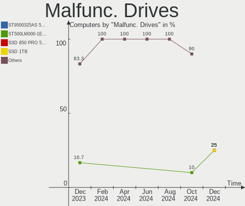
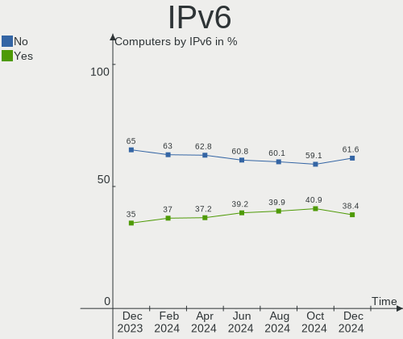

Zorin Hardware Trends
---------------------

A project to identify most popular hardware characteristics and track their change
over time based on data collected by Zorin users at https://Linux-Hardware.org.

Anyone can contribute to this report by the [hw-probe](https://github.com/linuxhw/hw-probe) tool:

    sudo -E hw-probe -all -upload

This is a report for all computer types. See also reports for [desktops](/Dist/Zorin/Desktop/README.md) and [notebooks](/Dist/Zorin/Notebook/README.md).

Full-feature report is available here: https://linux-hardware.org/?view=trends

Period: Aug, 2021.

Contents
--------

* [ System ](#system)
  - [ OS                       ](#os)
  - [ OS Family                ](#os-family)
  - [ Kernel                   ](#kernel)
  - [ Kernel Family            ](#kernel-family)
  - [ Kernel Major Ver.        ](#kernel-major-ver)
  - [ Arch                     ](#arch)
  - [ DE                       ](#de)
  - [ Display Server           ](#display-server)
  - [ Display Manager          ](#display-manager)
  - [ OS Lang                  ](#os-lang)
  - [ Boot Mode                ](#boot-mode)
  - [ Filesystem               ](#filesystem)
  - [ Part. scheme             ](#part-scheme)
  - [ Dual Boot with Linux/BSD ](#dual-boot-with-linuxbsd)
  - [ Dual Boot (Win)          ](#dual-boot-win)

* [ Board ](#board)
  - [ Vendor                   ](#vendor)
  - [ Model                    ](#model)
  - [ Model Family             ](#model-family)
  - [ MFG Year                 ](#mfg-year)
  - [ Form Factor              ](#form-factor)
  - [ Secure Boot              ](#secure-boot)
  - [ Coreboot                 ](#coreboot)
  - [ RAM Size                 ](#ram-size)
  - [ RAM Used                 ](#ram-used)
  - [ Total Drives             ](#total-drives)
  - [ Has CD-ROM               ](#has-cd-rom)
  - [ Has Ethernet             ](#has-ethernet)
  - [ Has WiFi                 ](#has-wifi)
  - [ Has Bluetooth            ](#has-bluetooth)

* [ Location ](#location)
  - [ Country                  ](#country)
  - [ City                     ](#city)

* [ Drives ](#drives)
  - [ Drive Vendor             ](#drive-vendor)
  - [ Drive Model              ](#drive-model)
  - [ HDD Vendor               ](#hdd-vendor)
  - [ SSD Vendor               ](#ssd-vendor)
  - [ Drive Kind               ](#drive-kind)
  - [ Drive Connector          ](#drive-connector)
  - [ Drive Size               ](#drive-size)
  - [ Space Total              ](#space-total)
  - [ Space Used               ](#space-used)
  - [ Malfunc. Drives          ](#malfunc-drives)
  - [ Malfunc. Drive Vendor    ](#malfunc-drive-vendor)
  - [ Malfunc. HDD Vendor      ](#malfunc-hdd-vendor)
  - [ Malfunc. Drive Kind      ](#malfunc-drive-kind)
  - [ Failed Drives            ](#failed-drives)
  - [ Failed Drive Vendor      ](#failed-drive-vendor)
  - [ Drive Status             ](#drive-status)

* [ Storage controller ](#storage-controller)
  - [ Storage Vendor           ](#storage-vendor)
  - [ Storage Model            ](#storage-model)
  - [ Storage Kind             ](#storage-kind)

* [ Processor ](#processor)
  - [ CPU Vendor               ](#cpu-vendor)
  - [ CPU Model                ](#cpu-model)
  - [ CPU Model Family         ](#cpu-model-family)
  - [ CPU Cores                ](#cpu-cores)
  - [ CPU Sockets              ](#cpu-sockets)
  - [ CPU Threads              ](#cpu-threads)
  - [ CPU Op-Modes             ](#cpu-op-modes)
  - [ CPU Microcode            ](#cpu-microcode)
  - [ CPU Microarch            ](#cpu-microarch)

* [ Graphics ](#graphics)
  - [ GPU Vendor               ](#gpu-vendor)
  - [ GPU Model                ](#gpu-model)
  - [ GPU Combo                ](#gpu-combo)
  - [ GPU Driver               ](#gpu-driver)
  - [ GPU Memory               ](#gpu-memory)

* [ Monitor ](#monitor)
  - [ Monitor Vendor           ](#monitor-vendor)
  - [ Monitor Model            ](#monitor-model)
  - [ Monitor Resolution       ](#monitor-resolution)
  - [ Monitor Diagonal         ](#monitor-diagonal)
  - [ Monitor Width            ](#monitor-width)
  - [ Aspect Ratio             ](#aspect-ratio)
  - [ Monitor Area             ](#monitor-area)
  - [ Pixel Density            ](#pixel-density)
  - [ Multiple Monitors        ](#multiple-monitors)

* [ Network ](#network)
  - [ Net Controller Vendor    ](#net-controller-vendor)
  - [ Net Controller Model     ](#net-controller-model)
  - [ Wireless Vendor          ](#wireless-vendor)
  - [ Wireless Model           ](#wireless-model)
  - [ Ethernet Vendor          ](#ethernet-vendor)
  - [ Ethernet Model           ](#ethernet-model)
  - [ Net Controller Kind      ](#net-controller-kind)
  - [ Used Controller          ](#used-controller)
  - [ NICs                     ](#nics)
  - [ IPv6                     ](#ipv6)

* [ Bluetooth ](#bluetooth)
  - [ Bluetooth Vendor         ](#bluetooth-vendor)
  - [ Bluetooth Model          ](#bluetooth-model)

* [ Sound ](#sound)
  - [ Sound Vendor             ](#sound-vendor)
  - [ Sound Model              ](#sound-model)

* [ Memory ](#memory)
  - [ Memory Vendor            ](#memory-vendor)
  - [ Memory Model             ](#memory-model)
  - [ Memory Kind              ](#memory-kind)
  - [ Memory Form Factor       ](#memory-form-factor)
  - [ Memory Size              ](#memory-size)
  - [ Memory Speed             ](#memory-speed)

* [ Printers & scanners ](#printers--scanners)
  - [ Printer Vendor           ](#printer-vendor)
  - [ Printer Model            ](#printer-model)
  - [ Scanner Vendor           ](#scanner-vendor)
  - [ Scanner Model            ](#scanner-model)

* [ Camera ](#camera)
  - [ Camera Vendor            ](#camera-vendor)
  - [ Camera Model             ](#camera-model)

* [ Security ](#security)
  - [ Fingerprint Vendor       ](#fingerprint-vendor)
  - [ Fingerprint Model        ](#fingerprint-model)
  - [ Chipcard Vendor          ](#chipcard-vendor)
  - [ Chipcard Model           ](#chipcard-model)

* [ Unsupported ](#unsupported)
  - [ Unsupported Devices      ](#unsupported-devices)
  - [ Unsupported Device Types ](#unsupported-device-types)

System
------

OS
--

Installed operating systems

| Name     | Computers | Percent |
|----------|-----------|---------|
| Zorin 16 | 98        | 62.82%  |
| Zorin 15 | 57        | 36.54%  |
| Zorin 12 | 1         | 0.64%   |

OS Family
---------

OS without a version

| Name  | Computers | Percent |
|-------|-----------|---------|
| Zorin | 156       | 100%    |

Kernel
------

Version of the Linux kernel

| Version            | Computers | Percent |
|--------------------|-----------|---------|
| 5.11.0-27-generic  | 80        | 51.28%  |
| 5.4.0-80-generic   | 29        | 18.59%  |
| 5.4.0-81-generic   | 17        | 10.9%   |
| 5.11.0-25-generic  | 12        | 7.69%   |
| 5.8.0-63-generic   | 4         | 2.56%   |
| 5.4.0-47-generic   | 3         | 1.92%   |
| 5.4.0-45-generic   | 3         | 1.92%   |
| 5.8.0-49-generic   | 1         | 0.64%   |
| 5.4.0-72-generic   | 1         | 0.64%   |
| 5.4.0-64-generic   | 1         | 0.64%   |
| 5.4.0-58-generic   | 1         | 0.64%   |
| 5.4.0-54-generic   | 1         | 0.64%   |
| 5.10.0-1044-oem    | 1         | 0.64%   |
| 4.18.0-21-generic  | 1         | 0.64%   |
| 4.15.0-142-generic | 1         | 0.64%   |

Kernel Family
-------------

Linux kernel without a distro release

| Version | Computers | Percent |
|---------|-----------|---------|
| 5.11.0  | 92        | 58.97%  |
| 5.4.0   | 56        | 35.9%   |
| 5.8.0   | 5         | 3.21%   |
| 5.10.0  | 1         | 0.64%   |
| 4.18.0  | 1         | 0.64%   |
| 4.15.0  | 1         | 0.64%   |

Kernel Major Ver.
-----------------

Linux kernel major version

| Version | Computers | Percent |
|---------|-----------|---------|
| 5.11    | 92        | 58.97%  |
| 5.4     | 56        | 35.9%   |
| 5.8     | 5         | 3.21%   |
| 5.10    | 1         | 0.64%   |
| 4.18    | 1         | 0.64%   |
| 4.15    | 1         | 0.64%   |

Arch
----

OS architecture (x86_64, i586, etc.)

| Name   | Computers | Percent |
|--------|-----------|---------|
| x86_64 | 144       | 92.31%  |
| i686   | 12        | 7.69%   |

DE
--

Desktop Environment

| Name    | Computers | Percent |
|---------|-----------|---------|
| GNOME   | 124       | 79.49%  |
| XFCE    | 27        | 17.31%  |
| Unknown | 5         | 3.21%   |

Display Server
--------------

X11 or Wayland

| Name | Computers | Percent |
|------|-----------|---------|
| X11  | 156       | 100%    |

Display Manager
---------------

SDDM, LightDM, etc.

| Name    | Computers | Percent |
|---------|-----------|---------|
| Unknown | 142       | 91.03%  |
| GDM     | 12        | 7.69%   |
| TDM     | 2         | 1.28%   |

OS Lang
-------

Language

| Lang  | Computers | Percent |
|-------|-----------|---------|
| en_US | 44        | 28.21%  |
| pt_BR | 26        | 16.67%  |
| de_DE | 16        | 10.26%  |
| en_GB | 15        | 9.62%   |
| es_ES | 9         | 5.77%   |
| pl_PL | 6         | 3.85%   |
| en_CA | 4         | 2.56%   |
| es_MX | 3         | 1.92%   |
| es_CO | 3         | 1.92%   |
| sv_SE | 2         | 1.28%   |
| hu_HU | 2         | 1.28%   |
| fr_FR | 2         | 1.28%   |
| es_PE | 2         | 1.28%   |
| es_CL | 2         | 1.28%   |
| en_ZA | 2         | 1.28%   |
| en_IN | 2         | 1.28%   |
| en_AU | 2         | 1.28%   |
| C     | 2         | 1.28%   |
| zh_TW | 1         | 0.64%   |
| sk_SK | 1         | 0.64%   |
| ru_RU | 1         | 0.64%   |
| nl_BE | 1         | 0.64%   |
| ja_JP | 1         | 0.64%   |
| it_IT | 1         | 0.64%   |
| es_UY | 1         | 0.64%   |
| es_PY | 1         | 0.64%   |
| en_SG | 1         | 0.64%   |
| en_NZ | 1         | 0.64%   |
| cs_CZ | 1         | 0.64%   |
| bg_BG | 1         | 0.64%   |

Boot Mode
---------

EFI or BIOS

| Mode | Computers | Percent |
|------|-----------|---------|
| BIOS | 79        | 50.64%  |
| EFI  | 77        | 49.36%  |

Filesystem
----------

Type of filesystem

| Type    | Computers | Percent |
|---------|-----------|---------|
| Ext4    | 149       | 95.51%  |
| Overlay | 6         | 3.85%   |
| Zfs     | 1         | 0.64%   |

Part. scheme
------------

Scheme of partitioning

| Type    | Computers | Percent |
|---------|-----------|---------|
| Unknown | 142       | 91.03%  |
| GPT     | 12        | 7.69%   |
| MBR     | 2         | 1.28%   |

Dual Boot with Linux/BSD
------------------------

Hosting more than one Linux/BSD

| Dual boot | Computers | Percent |
|-----------|-----------|---------|
| No        | 149       | 95.51%  |
| Yes       | 7         | 4.49%   |

Dual Boot (Win)
---------------

Hosting Linux and Windows

| Dual boot | Computers | Percent |
|-----------|-----------|---------|
| No        | 129       | 82.69%  |
| Yes       | 27        | 17.31%  |

Board
-----

Vendor
------

Motherboard manufacturer

| Name                | Computers | Percent |
|---------------------|-----------|---------|
| ASUSTek Computer    | 29        | 18.59%  |
| Hewlett-Packard     | 21        | 13.46%  |
| Lenovo              | 20        | 12.82%  |
| Dell                | 18        | 11.54%  |
| Acer                | 14        | 8.97%   |
| Gigabyte Technology | 7         | 4.49%   |
| MSI                 | 6         | 3.85%   |
| Apple               | 6         | 3.85%   |
| Positivo            | 5         | 3.21%   |
| LG Electronics      | 4         | 2.56%   |
| Samsung Electronics | 3         | 1.92%   |
| Intel               | 3         | 1.92%   |
| ASRock              | 3         | 1.92%   |
| Toshiba             | 2         | 1.28%   |
| Packard Bell        | 2         | 1.28%   |
| Fujitsu             | 2         | 1.28%   |
| Unknown             | 2         | 1.28%   |
| Wiltronic           | 1         | 0.64%   |
| TianBei             | 1         | 0.64%   |
| Sony                | 1         | 0.64%   |
| Sole                | 1         | 0.64%   |
| Semp Toshiba        | 1         | 0.64%   |
| Panasonic           | 1         | 0.64%   |
| Itautec             | 1         | 0.64%   |
| Insyde              | 1         | 0.64%   |
| ECS                 | 1         | 0.64%   |

Model
-----

Motherboard model

| Name                             | Computers | Percent |
|----------------------------------|-----------|---------|
| ASUS All Series                  | 3         | 1.92%   |
| Dell OptiPlex 755                | 2         | 1.28%   |
| Dell Inspiron 5566               | 2         | 1.28%   |
| ASUS P5G41T-M LX3                | 2         | 1.28%   |
| ASUS M5A78L-M/USB3               | 2         | 1.28%   |
| Unknown                          | 2         | 1.28%   |
| Wiltronic Maximus IV             | 1         | 0.64%   |
| Toshiba Satellite S75Dt-A        | 1         | 0.64%   |
| Toshiba Satellite L505D          | 1         | 0.64%   |
| TianBei TB-H7                    | 1         | 0.64%   |
| Sony VGN-SR5                     | 1         | 0.64%   |
| Sole M672+968                    | 1         | 0.64%   |
| Semp Toshiba STI                 | 1         | 0.64%   |
| Samsung RV419                    | 1         | 0.64%   |
| Samsung N150                     | 1         | 0.64%   |
| Samsung 340XAA/350XAA/550XAA     | 1         | 0.64%   |
| Positivo Q232A                   | 1         | 0.64%   |
| Positivo POS-PIH81DI             | 1         | 0.64%   |
| Positivo POS-MIH61CF             | 1         | 0.64%   |
| Positivo Mobile                  | 1         | 0.64%   |
| Positivo CHT14B                  | 1         | 0.64%   |
| Panasonic CF-31JEGAX1M           | 1         | 0.64%   |
| Packard Bell IMEDIA D3610 FR     | 1         | 0.64%   |
| Packard Bell DOT S               | 1         | 0.64%   |
| MSI MS-7C91                      | 1         | 0.64%   |
| MSI MS-7C37                      | 1         | 0.64%   |
| MSI MS-7B84                      | 1         | 0.64%   |
| MSI MS-7A71                      | 1         | 0.64%   |
| MSI MS-7914                      | 1         | 0.64%   |
| MSI MS-7816                      | 1         | 0.64%   |
| LG S460-G.BG31P1                 | 1         | 0.64%   |
| LG R580-G.BP21P1                 | 1         | 0.64%   |
| LG A410-K.BE47P1                 | 1         | 0.64%   |
| LG 17U70N-R.AAS7U1               | 1         | 0.64%   |
| Lenovo Z50-70 20354              | 1         | 0.64%   |
| Lenovo Yoga 730-13IWL 81JR       | 1         | 0.64%   |
| Lenovo Yoga 330-11IGM 81A6       | 1         | 0.64%   |
| Lenovo Yoga 3 Pro-1370 80HE      | 1         | 0.64%   |
| Lenovo ThinkPad X131e 3371AL2    | 1         | 0.64%   |
| Lenovo ThinkPad T61 6468AE2      | 1         | 0.64%   |
| Lenovo ThinkPad T61 6465CTO      | 1         | 0.64%   |
| Lenovo ThinkPad T520 4242W4F     | 1         | 0.64%   |
| Lenovo ThinkPad T440p 20AWS1CH00 | 1         | 0.64%   |
| Lenovo ThinkPad SL510 28752NG    | 1         | 0.64%   |
| Lenovo ThinkPad R61e 7650ELU     | 1         | 0.64%   |
| Lenovo SHARKBAY SDK0E50510 WIN   | 1         | 0.64%   |
| Lenovo IdeaPad Z510 20287        | 1         | 0.64%   |
| Lenovo IdeaPad S540-14API 81NH   | 1         | 0.64%   |
| Lenovo IdeaPad 5 15ALC05 82LN    | 1         | 0.64%   |
| Lenovo IdeaPad 3 14ADA05 81W0    | 1         | 0.64%   |
| Lenovo G50-70 20351              | 1         | 0.64%   |
| Lenovo G50-30 80G0               | 1         | 0.64%   |
| Lenovo Board                     | 1         | 0.64%   |
| Lenovo B50-70 80EU               | 1         | 0.64%   |
| Itautec Infoway                  | 1         | 0.64%   |
| Intel NUC11PAHi7                 | 1         | 0.64%   |
| Intel DQ77MK-R01                 | 1         | 0.64%   |
| Intel DB75EN AAG39650-303        | 1         | 0.64%   |
| Insyde i101c                     | 1         | 0.64%   |
| HP Z240 SFF Workstation          | 1         | 0.64%   |

Model Family
------------

Motherboard model prefix

| Name                   | Computers | Percent |
|------------------------|-----------|---------|
| Acer Aspire            | 10        | 6.41%   |
| Dell Inspiron          | 9         | 5.77%   |
| Lenovo ThinkPad        | 7         | 4.49%   |
| HP Pavilion            | 5         | 3.21%   |
| Lenovo IdeaPad         | 4         | 2.56%   |
| Dell OptiPlex          | 4         | 2.56%   |
| Lenovo Yoga            | 3         | 1.92%   |
| HP ProBook             | 3         | 1.92%   |
| HP Compaq              | 3         | 1.92%   |
| ASUS All               | 3         | 1.92%   |
| Toshiba Satellite      | 2         | 1.28%   |
| HP ENVY                | 2         | 1.28%   |
| Gigabyte B550M         | 2         | 1.28%   |
| Dell XPS               | 2         | 1.28%   |
| ASUS P8Z77-V           | 2         | 1.28%   |
| ASUS P5G41T-M          | 2         | 1.28%   |
| ASUS M5A97             | 2         | 1.28%   |
| ASUS M5A78L-M          | 2         | 1.28%   |
| Apple MacBookPro11     | 2         | 1.28%   |
| Unknown                | 2         | 1.28%   |
| Wiltronic Maximus      | 1         | 0.64%   |
| TianBei TB-H7          | 1         | 0.64%   |
| Sony VGN-SR5           | 1         | 0.64%   |
| Sole M672+968          | 1         | 0.64%   |
| Semp Toshiba STI       | 1         | 0.64%   |
| Samsung RV419          | 1         | 0.64%   |
| Samsung N150           | 1         | 0.64%   |
| Samsung 340XAA         | 1         | 0.64%   |
| Positivo Q232A         | 1         | 0.64%   |
| Positivo POS-PIH81DI   | 1         | 0.64%   |
| Positivo POS-MIH61CF   | 1         | 0.64%   |
| Positivo Mobile        | 1         | 0.64%   |
| Positivo CHT14B        | 1         | 0.64%   |
| Panasonic CF-31JEGAX1M | 1         | 0.64%   |
| Packard Bell IMEDIA    | 1         | 0.64%   |
| Packard Bell DOT       | 1         | 0.64%   |
| MSI MS-7C91            | 1         | 0.64%   |
| MSI MS-7C37            | 1         | 0.64%   |
| MSI MS-7B84            | 1         | 0.64%   |
| MSI MS-7A71            | 1         | 0.64%   |
| MSI MS-7914            | 1         | 0.64%   |
| MSI MS-7816            | 1         | 0.64%   |
| LG S460-G.BG31P1       | 1         | 0.64%   |
| LG R580-G.BP21P1       | 1         | 0.64%   |
| LG A410-K.BE47P1       | 1         | 0.64%   |
| LG 17U70N-R.AAS7U1     | 1         | 0.64%   |
| Lenovo Z50-70          | 1         | 0.64%   |
| Lenovo SHARKBAY        | 1         | 0.64%   |
| Lenovo G50-70          | 1         | 0.64%   |
| Lenovo G50-30          | 1         | 0.64%   |
| Lenovo Board           | 1         | 0.64%   |
| Lenovo B50-70          | 1         | 0.64%   |
| Itautec Infoway        | 1         | 0.64%   |
| Intel NUC11PAHi7       | 1         | 0.64%   |
| Intel DQ77MK-R01       | 1         | 0.64%   |
| Intel DB75EN           | 1         | 0.64%   |
| Insyde i101c           | 1         | 0.64%   |
| HP Z240                | 1         | 0.64%   |
| HP rp5800              | 1         | 0.64%   |
| HP Notebook            | 1         | 0.64%   |

MFG Year
--------

Motherboard manufacture year

| Year | Computers | Percent |
|------|-----------|---------|
| 2021 | 19        | 12.18%  |
| 2014 | 16        | 10.26%  |
| 2020 | 14        | 8.97%   |
| 2013 | 13        | 8.33%   |
| 2018 | 12        | 7.69%   |
| 2012 | 12        | 7.69%   |
| 2019 | 11        | 7.05%   |
| 2011 | 11        | 7.05%   |
| 2008 | 10        | 6.41%   |
| 2010 | 8         | 5.13%   |
| 2017 | 7         | 4.49%   |
| 2015 | 7         | 4.49%   |
| 2009 | 7         | 4.49%   |
| 2016 | 4         | 2.56%   |
| 2007 | 3         | 1.92%   |
| 2006 | 1         | 0.64%   |
| 2005 | 1         | 0.64%   |

Form Factor
-----------

Physical design of the computer

| Name        | Computers | Percent |
|-------------|-----------|---------|
| Notebook    | 93        | 59.62%  |
| Desktop     | 55        | 35.26%  |
| All in one  | 4         | 2.56%   |
| Convertible | 3         | 1.92%   |
| Mini pc     | 1         | 0.64%   |

Secure Boot
-----------

Enabled or disabled

| State    | Computers | Percent |
|----------|-----------|---------|
| Disabled | 141       | 90.38%  |
| Enabled  | 15        | 9.62%   |

Coreboot
--------

Have coreboot on board

| Used | Computers | Percent |
|------|-----------|---------|
| No   | 156       | 100%    |

RAM Size
--------

Total RAM memory

| Size in GB  | Computers | Percent |
|-------------|-----------|---------|
| 3.01-4.0    | 42        | 26.92%  |
| 4.01-8.0    | 36        | 23.08%  |
| 8.01-16.0   | 25        | 16.03%  |
| 16.01-24.0  | 19        | 12.18%  |
| 1.01-2.0    | 13        | 8.33%   |
| 32.01-64.0  | 12        | 7.69%   |
| 2.01-3.0    | 5         | 3.21%   |
| 64.01-256.0 | 2         | 1.28%   |
| 0.51-1.0    | 2         | 1.28%   |

RAM Used
--------

Used RAM memory

| Used GB   | Computers | Percent |
|-----------|-----------|---------|
| 1.01-2.0  | 76        | 48.72%  |
| 2.01-3.0  | 38        | 24.36%  |
| 0.51-1.0  | 16        | 10.26%  |
| 4.01-8.0  | 12        | 7.69%   |
| 3.01-4.0  | 12        | 7.69%   |
| 8.01-16.0 | 2         | 1.28%   |

Total Drives
------------

Number of drives on board

| Drives | Computers | Percent |
|--------|-----------|---------|
| 1      | 95        | 60.9%   |
| 2      | 34        | 21.79%  |
| 3      | 14        | 8.97%   |
| 4      | 7         | 4.49%   |
| 8      | 2         | 1.28%   |
| 5      | 2         | 1.28%   |
| 6      | 1         | 0.64%   |
| 0      | 1         | 0.64%   |

Has CD-ROM
----------

Has CD-ROM on board

| Presented | Computers | Percent |
|-----------|-----------|---------|
| Yes       | 85        | 54.49%  |
| No        | 71        | 45.51%  |

Has Ethernet
------------

Has Ethernet on board

| Presented | Computers | Percent |
|-----------|-----------|---------|
| Yes       | 144       | 92.31%  |
| No        | 12        | 7.69%   |

Has WiFi
--------

Has WiFi module

| Presented | Computers | Percent |
|-----------|-----------|---------|
| Yes       | 125       | 80.13%  |
| No        | 31        | 19.87%  |

Has Bluetooth
-------------

Has Bluetooth module

| Presented | Computers | Percent |
|-----------|-----------|---------|
| Yes       | 81        | 51.92%  |
| No        | 75        | 48.08%  |

Location
--------

Country
-------

Geographic location (country)

| Country             | Computers | Percent |
|---------------------|-----------|---------|
| Brazil              | 29        | 18.59%  |
| USA                 | 21        | 13.46%  |
| Germany             | 21        | 13.46%  |
| UK                  | 13        | 8.33%   |
| Spain               | 9         | 5.77%   |
| Poland              | 5         | 3.21%   |
| France              | 5         | 3.21%   |
| India               | 4         | 2.56%   |
| Colombia            | 4         | 2.56%   |
| Canada              | 4         | 2.56%   |
| Sweden              | 3         | 1.92%   |
| Mexico              | 3         | 1.92%   |
| Indonesia           | 3         | 1.92%   |
| Hungary             | 3         | 1.92%   |
| Vietnam             | 2         | 1.28%   |
| Taiwan              | 2         | 1.28%   |
| Switzerland         | 2         | 1.28%   |
| South Africa        | 2         | 1.28%   |
| Chile               | 2         | 1.28%   |
| Australia           | 2         | 1.28%   |
| Uruguay             | 1         | 0.64%   |
| Trinidad and Tobago | 1         | 0.64%   |
| Slovakia            | 1         | 0.64%   |
| Peru                | 1         | 0.64%   |
| Paraguay            | 1         | 0.64%   |
| New Zealand         | 1         | 0.64%   |
| Netherlands         | 1         | 0.64%   |
| Malaysia            | 1         | 0.64%   |
| Kenya               | 1         | 0.64%   |
| Japan               | 1         | 0.64%   |
| Italy               | 1         | 0.64%   |
| Israel              | 1         | 0.64%   |
| Hong Kong           | 1         | 0.64%   |
| Egypt               | 1         | 0.64%   |
| Czechia             | 1         | 0.64%   |
| Bulgaria            | 1         | 0.64%   |
| Belgium             | 1         | 0.64%   |

City
----

Geographic location (city)

| City                     | Computers | Percent |
|--------------------------|-----------|---------|
| Madrid                   | 3         | 1.92%   |
| Caturtunggal             | 3         | 1.92%   |
| Zurich                   | 2         | 1.28%   |
| Vancouver                | 2         | 1.28%   |
| S??o Lu?­s               | 2         | 1.28%   |
| Rio de Janeiro           | 2         | 1.28%   |
| Recife                   | 2         | 1.28%   |
| Nottingham               | 2         | 1.28%   |
| Macei??                  | 2         | 1.28%   |
| Johannesburg             | 2         | 1.28%   |
| Bogot??                  | 2         | 1.28%   |
| Berlin                   | 2         | 1.28%   |
| Zabrze                   | 1         | 0.64%   |
| Yokohama                 | 1         | 0.64%   |
| Wylie                    | 1         | 0.64%   |
| West Monroe              | 1         | 0.64%   |
| Vlaardingen              | 1         | 0.64%   |
| Villanueva de la Torre   | 1         | 0.64%   |
| Vila Velha               | 1         | 0.64%   |
| Vespasiano               | 1         | 0.64%   |
| Veracruz                 | 1         | 0.64%   |
| Upplands Vasby           | 1         | 0.64%   |
| Trujillo                 | 1         | 0.64%   |
| Trnava                   | 1         | 0.64%   |
| The Bronx                | 1         | 0.64%   |
| Taquaritinga             | 1         | 0.64%   |
| Taboao da Serra          | 1         | 0.64%   |
| Szombathely              | 1         | 0.64%   |
| Szigetvar                | 1         | 0.64%   |
| Szczecin                 | 1         | 0.64%   |
| Stockholm                | 1         | 0.64%   |
| St. Cloud                | 1         | 0.64%   |
| Spremberg                | 1         | 0.64%   |
| Sheffield                | 1         | 0.64%   |
| Seville                  | 1         | 0.64%   |
| S??o Jo??o del Rei       | 1         | 0.64%   |
| Santiago                 | 1         | 0.64%   |
| Santana de Parnaiba      | 1         | 0.64%   |
| Santa Cruz do Rio Pardo  | 1         | 0.64%   |
| Santa Cruz de Tenerife   | 1         | 0.64%   |
| Sant Carles de la Rapita | 1         | 0.64%   |
| San Juan                 | 1         | 0.64%   |
| Sainte-Marie             | 1         | 0.64%   |
| Rome                     | 1         | 0.64%   |
| Red Deer                 | 1         | 0.64%   |
| R??sselsheim am Main     | 1         | 0.64%   |
| Porto Seguro             | 1         | 0.64%   |
| Picos                    | 1         | 0.64%   |
| P?™?­bram                | 1         | 0.64%   |
| Paris                    | 1         | 0.64%   |
| Oxeloesund               | 1         | 0.64%   |
| Osasco                   | 1         | 0.64%   |
| Oak Creek                | 1         | 0.64%   |
| Nova Igua?§u             | 1         | 0.64%   |
| Noblesville              | 1         | 0.64%   |
| Niter??i                 | 1         | 0.64%   |
| New York                 | 1         | 0.64%   |
| New Taipei               | 1         | 0.64%   |
| Naumburg                 | 1         | 0.64%   |
| Nairobi                  | 1         | 0.64%   |

Drives
------

Drive Vendor
------------

Hard drive vendors

| Vendor                    | Computers | Drives | Percent |
|---------------------------|-----------|--------|---------|
| Seagate                   | 51        | 62     | 21.89%  |
| Samsung Electronics       | 34        | 40     | 14.59%  |
| WDC                       | 31        | 34     | 13.3%   |
| SanDisk                   | 17        | 18     | 7.3%    |
| Toshiba                   | 15        | 15     | 6.44%   |
| Kingston                  | 14        | 14     | 6.01%   |
| Unknown                   | 11        | 12     | 4.72%   |
| Crucial                   | 6         | 9      | 2.58%   |
| Hitachi                   | 5         | 6      | 2.15%   |
| HGST                      | 5         | 5      | 2.15%   |
| China                     | 4         | 4      | 1.72%   |
| Phison                    | 3         | 4      | 1.29%   |
| OCZ                       | 3         | 3      | 1.29%   |
| Fujitsu                   | 3         | 3      | 1.29%   |
| Apple                     | 3         | 3      | 1.29%   |
| SK Hynix                  | 2         | 2      | 0.86%   |
| Micron/Crucial Technology | 2         | 2      | 0.86%   |
| Micron Technology         | 2         | 2      | 0.86%   |
| Maxtor                    | 2         | 2      | 0.86%   |
| LITEONIT                  | 2         | 3      | 0.86%   |
| Intenso                   | 2         | 2      | 0.86%   |
| A-DATA Technology         | 2         | 2      | 0.86%   |
| XPG                       | 1         | 1      | 0.43%   |
| Vaseky                    | 1         | 1      | 0.43%   |
| SPCC                      | 1         | 1      | 0.43%   |
| Silicon Motion            | 1         | 1      | 0.43%   |
| PNY                       | 1         | 1      | 0.43%   |
| Patriot                   | 1         | 1      | 0.43%   |
| LITEON                    | 1         | 1      | 0.43%   |
| KIOXIA-EXCERIA            | 1         | 1      | 0.43%   |
| KingSpec                  | 1         | 1      | 0.43%   |
| JMicron                   | 1         | 1      | 0.43%   |
| IBM/Hitachi               | 1         | 1      | 0.43%   |
| faspeed                   | 1         | 1      | 0.43%   |
| BUFFALO                   | 1         | 1      | 0.43%   |
| Apacer                    | 1         | 1      | 0.43%   |

Drive Model
-----------

Hard drive models

| Model                               | Computers | Percent |
|-------------------------------------|-----------|---------|
| Unknown SD/MMC/MS PRO 128GB         | 5         | 1.95%   |
| Seagate ST500DM002-1BD142 500GB     | 5         | 1.95%   |
| Kingston SA400S37240G 240GB SSD     | 5         | 1.95%   |
| Seagate ST9500325AS 500GB           | 4         | 1.56%   |
| Seagate ST500LM012 HN-M500MBB 500GB | 4         | 1.56%   |
| Seagate ST1000LM024 HN-M101MBB 1TB  | 4         | 1.56%   |
| Unknown MMC Card  32GB              | 3         | 1.17%   |
| Seagate ST2000DM001-9YN164 2TB      | 3         | 1.17%   |
| Seagate ST1000DM010-2EP102 1TB      | 3         | 1.17%   |
| SanDisk SSD PLUS 1000GB             | 3         | 1.17%   |
| Samsung SSD 850 120GB               | 3         | 1.17%   |
| WDC WDS240G2G0A-00JH30 240GB SSD    | 2         | 0.78%   |
| Toshiba MQ02ABD100H 1TB             | 2         | 0.78%   |
| Toshiba MQ01ABF050 500GB            | 2         | 0.78%   |
| Toshiba MK3265GSX 320GB             | 2         | 0.78%   |
| Seagate ST3500418AS 500GB           | 2         | 0.78%   |
| Seagate ST2000DM001-1CH164 2TB      | 2         | 0.78%   |
| Seagate ST1000LM035-1RK172 1TB      | 2         | 0.78%   |
| SanDisk SSD PLUS 480GB              | 2         | 0.78%   |
| Sandisk NVMe SSD Drive 256GB        | 2         | 0.78%   |
| Samsung SSD 860 EVO 500GB           | 2         | 0.78%   |
| Samsung SSD 860 EVO 1TB             | 2         | 0.78%   |
| Samsung NVMe SSD Drive 500GB        | 2         | 0.78%   |
| Samsung HM160HI 160GB               | 2         | 0.78%   |
| Samsung HD103SJ 1TB                 | 2         | 0.78%   |
| Phison NVMe SSD Drive 1TB           | 2         | 0.78%   |
| Kingston SV300S37A240G 240GB SSD    | 2         | 0.78%   |
| Kingston SV300S37A120G 120GB SSD    | 2         | 0.78%   |
| Kingston SA400S37120G 120GB SSD     | 2         | 0.78%   |
| Intenso SSD SATAIII 960GB           | 2         | 0.78%   |
| HGST HTS725050A7E630 500GB          | 2         | 0.78%   |
| XPG NVMe SSD Drive 1024GB           | 1         | 0.39%   |
| WDC WDS250G1B0A-00H9H0 250GB SSD    | 1         | 0.39%   |
| WDC WDS100T2B0B-00YS70 1TB SSD      | 1         | 0.39%   |
| WDC WD800BEVS-08RST2 80GB           | 1         | 0.39%   |
| WDC WD7500AARS-00Y5B1 752GB         | 1         | 0.39%   |
| WDC WD6400AAKS-65A7B0 640GB         | 1         | 0.39%   |
| WDC WD6400AAKS-22A7B0 640GB         | 1         | 0.39%   |
| WDC WD5000LPVT-22G33T0 500GB        | 1         | 0.39%   |
| WDC WD5000BPVT-22HXZT3 500GB        | 1         | 0.39%   |
| WDC WD5000AZLX-60K2TA0 500GB        | 1         | 0.39%   |
| WDC WD5000AAKX-003CA0 500GB         | 1         | 0.39%   |
| WDC WD5000AADS-00S9B0 500GB         | 1         | 0.39%   |
| WDC WD3200BEVT-00A23T0 320GB        | 1         | 0.39%   |
| WDC WD3200BEKT-60V5T1 320GB         | 1         | 0.39%   |
| WDC WD2500BEVT-80A23T0 250GB        | 1         | 0.39%   |
| WDC WD2500BEVT-22A23T0 250GB        | 1         | 0.39%   |
| WDC WD2500BEVT-08A23T1 250GB        | 1         | 0.39%   |
| WDC WD2500BEKT-75PVMT0 250GB        | 1         | 0.39%   |
| WDC WD20EZRZ-00Z5HB0 2TB            | 1         | 0.39%   |
| WDC WD20EZRX-00D8PB0 2TB            | 1         | 0.39%   |
| WDC WD20EFRX-68EUZN0 2TB            | 1         | 0.39%   |
| WDC WD1600AAJS-75WAA0 160GB         | 1         | 0.39%   |
| WDC WD1600AAJS-75M0A0 160GB         | 1         | 0.39%   |
| WDC WD1600AAJS-22PSA0 160GB         | 1         | 0.39%   |
| WDC WD10SPZX-21Z10T0 1TB            | 1         | 0.39%   |
| WDC WD10EZEX-75M2NA0 1TB            | 1         | 0.39%   |
| WDC WD10EZEX-60WN4A0 1TB            | 1         | 0.39%   |
| WDC WD10EZEX-60M2NA0 1TB            | 1         | 0.39%   |
| WDC WD10EZEX-21M2NA0 1TB            | 1         | 0.39%   |

HDD Vendor
----------

Hard disk drive vendors

| Vendor              | Computers | Drives | Percent |
|---------------------|-----------|--------|---------|
| Seagate             | 50        | 59     | 43.86%  |
| WDC                 | 28        | 30     | 24.56%  |
| Toshiba             | 12        | 12     | 10.53%  |
| Samsung Electronics | 8         | 10     | 7.02%   |
| Hitachi             | 5         | 6      | 4.39%   |
| HGST                | 5         | 5      | 4.39%   |
| Fujitsu             | 3         | 3      | 2.63%   |
| Maxtor              | 2         | 2      | 1.75%   |
| IBM/Hitachi         | 1         | 1      | 0.88%   |

SSD Vendor
----------

Solid state drive vendors

| Vendor              | Computers | Drives | Percent |
|---------------------|-----------|--------|---------|
| Samsung Electronics | 20        | 23     | 24.1%   |
| Kingston            | 13        | 13     | 15.66%  |
| SanDisk             | 11        | 12     | 13.25%  |
| Crucial             | 6         | 9      | 7.23%   |
| WDC                 | 4         | 4      | 4.82%   |
| China               | 4         | 4      | 4.82%   |
| OCZ                 | 3         | 3      | 3.61%   |
| Apple               | 3         | 3      | 3.61%   |
| Micron Technology   | 2         | 2      | 2.41%   |
| LITEONIT            | 2         | 3      | 2.41%   |
| Intenso             | 2         | 2      | 2.41%   |
| SPCC                | 1         | 1      | 1.2%    |
| SK Hynix            | 1         | 1      | 1.2%    |
| Seagate             | 1         | 1      | 1.2%    |
| PNY                 | 1         | 1      | 1.2%    |
| PHISON              | 1         | 1      | 1.2%    |
| Patriot             | 1         | 1      | 1.2%    |
| LITEON              | 1         | 1      | 1.2%    |
| KIOXIA-EXCERIA      | 1         | 1      | 1.2%    |
| KingSpec            | 1         | 1      | 1.2%    |
| JMicron             | 1         | 1      | 1.2%    |
| BUFFALO             | 1         | 1      | 1.2%    |
| Apacer              | 1         | 1      | 1.2%    |
| A-DATA Technology   | 1         | 1      | 1.2%    |

Drive Kind
----------

HDD or SSD

| Kind    | Computers | Drives | Percent |
|---------|-----------|--------|---------|
| HDD     | 98        | 128    | 48.04%  |
| SSD     | 66        | 91     | 32.35%  |
| NVMe    | 25        | 26     | 12.25%  |
| Unknown | 9         | 10     | 4.41%   |
| MMC     | 6         | 6      | 2.94%   |

Drive Connector
---------------

SATA, SAS, NVMe, etc.

| Type | Computers | Drives | Percent |
|------|-----------|--------|---------|
| SATA | 137       | 218    | 76.54%  |
| NVMe | 25        | 26     | 13.97%  |
| SAS  | 11        | 11     | 6.15%   |
| MMC  | 6         | 6      | 3.35%   |

Drive Size
----------

Size of hard drive

| Size in TB | Computers | Drives | Percent |
|------------|-----------|--------|---------|
| 0.01-0.5   | 110       | 138    | 64.71%  |
| 0.51-1.0   | 45        | 61     | 26.47%  |
| 1.01-2.0   | 11        | 16     | 6.47%   |
| 3.01-4.0   | 2         | 2      | 1.18%   |
| 2.01-3.0   | 1         | 1      | 0.59%   |
| 4.01-10.0  | 1         | 1      | 0.59%   |

Space Total
-----------

Amount of disk space available on the file system

| Size in GB     | Computers | Percent |
|----------------|-----------|---------|
| 101-250        | 47        | 30.13%  |
| 251-500        | 35        | 22.44%  |
| 501-1000       | 23        | 14.74%  |
| 51-100         | 22        | 14.1%   |
| 1001-2000      | 14        | 8.97%   |
| 21-50          | 7         | 4.49%   |
| 1-20           | 4         | 2.56%   |
| More than 3000 | 2         | 1.28%   |
| 2001-3000      | 1         | 0.64%   |
| Unknown        | 1         | 0.64%   |

Space Used
----------

Amount of used disk space

| Used GB   | Computers | Percent |
|-----------|-----------|---------|
| 1-20      | 87        | 55.77%  |
| 21-50     | 31        | 19.87%  |
| 101-250   | 9         | 5.77%   |
| 51-100    | 9         | 5.77%   |
| 501-1000  | 7         | 4.49%   |
| 251-500   | 6         | 3.85%   |
| 1001-2000 | 5         | 3.21%   |
| 2001-3000 | 1         | 0.64%   |
| Unknown   | 1         | 0.64%   |

Malfunc. Drives
---------------

Drive models with a malfunction

| Model                      | Computers | Drives | Percent |
|----------------------------|-----------|--------|---------|
| Toshiba MQ02ABD100H 1TB    | 2         | 2      | 40%     |
| WDC WD10EZEX-21M2NA0 1TB   | 1         | 1      | 20%     |
| Toshiba MK3265GSX 320GB    | 1         | 1      | 20%     |
| HGST HTS725050A7E630 500GB | 1         | 1      | 20%     |

Malfunc. Drive Vendor
---------------------

Vendors of faulty drives

| Vendor  | Computers | Drives | Percent |
|---------|-----------|--------|---------|
| Toshiba | 3         | 3      | 60%     |
| WDC     | 1         | 1      | 20%     |
| HGST    | 1         | 1      | 20%     |

Malfunc. HDD Vendor
-------------------

Vendors of faulty HDD drives

| Vendor  | Computers | Drives | Percent |
|---------|-----------|--------|---------|
| Toshiba | 3         | 3      | 60%     |
| WDC     | 1         | 1      | 20%     |
| HGST    | 1         | 1      | 20%     |

Malfunc. Drive Kind
-------------------

Kinds of faulty drives

| Kind | Computers | Drives | Percent |
|------|-----------|--------|---------|
| HDD  | 5         | 5      | 100%    |

Failed Drives
-------------

Failed drive models

| Model                 | Computers | Drives | Percent |
|-----------------------|-----------|--------|---------|
| SanDisk SSD i100 24GB | 1         | 1      | 100%    |

Failed Drive Vendor
-------------------

Failed drive vendors

| Vendor  | Computers | Drives | Percent |
|---------|-----------|--------|---------|
| SanDisk | 1         | 1      | 100%    |

Drive Status
------------

Number of failed and malfunc. drives

| Status   | Computers | Drives | Percent |
|----------|-----------|--------|---------|
| Detected | 143       | 244    | 89.94%  |
| Works    | 10        | 11     | 6.29%   |
| Malfunc  | 5         | 5      | 3.14%   |
| Failed   | 1         | 1      | 0.63%   |

Storage controller
------------------

Storage Vendor
--------------

Storage controller vendors

| Vendor                           | Computers | Percent |
|----------------------------------|-----------|---------|
| Intel                            | 109       | 59.89%  |
| AMD                              | 32        | 17.58%  |
| Samsung Electronics              | 8         | 4.4%    |
| Sandisk                          | 6         | 3.3%    |
| ASMedia Technology               | 4         | 2.2%    |
| Silicon Integrated Systems [SiS] | 3         | 1.65%   |
| Phison Electronics               | 3         | 1.65%   |
| Toshiba America Info Systems     | 2         | 1.1%    |
| Silicon Image                    | 2         | 1.1%    |
| Nvidia                           | 2         | 1.1%    |
| Micron/Crucial Technology        | 2         | 1.1%    |
| JMicron Technology               | 2         | 1.1%    |
| ADATA Technology                 | 2         | 1.1%    |
| SK Hynix                         | 1         | 0.55%   |
| Silicon Motion                   | 1         | 0.55%   |
| Marvell Technology Group         | 1         | 0.55%   |
| KIOXIA                           | 1         | 0.55%   |
| Kingston Technology Company      | 1         | 0.55%   |

Storage Model
-------------

Storage controller models

| Model                                                                            | Computers | Percent |
|----------------------------------------------------------------------------------|-----------|---------|
| AMD FCH SATA Controller [AHCI mode]                                              | 19        | 8.84%   |
| Intel 8 Series/C220 Series Chipset Family 6-port SATA Controller 1 [AHCI mode]   | 11        | 5.12%   |
| Intel 8 Series SATA Controller 1 [AHCI mode]                                     | 8         | 3.72%   |
| Intel Sunrise Point-LP SATA Controller [AHCI mode]                               | 7         | 3.26%   |
| Intel 82801HM/HEM (ICH8M/ICH8M-E) IDE Controller                                 | 7         | 3.26%   |
| AMD SB7x0/SB8x0/SB9x0 SATA Controller [AHCI mode]                                | 7         | 3.26%   |
| Intel 82801IBM/IEM (ICH9M/ICH9M-E) 4 port SATA Controller [AHCI mode]            | 6         | 2.79%   |
| Intel 82801G (ICH7 Family) IDE Controller                                        | 6         | 2.79%   |
| Intel 7 Series/C210 Series Chipset Family 6-port SATA Controller [AHCI mode]     | 6         | 2.79%   |
| Intel 7 Series Chipset Family 6-port SATA Controller [AHCI mode]                 | 6         | 2.79%   |
| Intel NM10/ICH7 Family SATA Controller [IDE mode]                                | 5         | 2.33%   |
| Intel 82801HM/HEM (ICH8M/ICH8M-E) SATA Controller [AHCI mode]                    | 5         | 2.33%   |
| Intel 6 Series/C200 Series Chipset Family 6 port Mobile SATA AHCI Controller     | 5         | 2.33%   |
| Intel SATA Controller [RAID mode]                                                | 4         | 1.86%   |
| Intel NM10/ICH7 Family SATA Controller [AHCI mode]                               | 4         | 1.86%   |
| ASMedia ASM1062 Serial ATA Controller                                            | 4         | 1.86%   |
| AMD Starship/Matisse Chipset SATA Controller [AHCI mode]                         | 4         | 1.86%   |
| Silicon Integrated Systems [SiS] SATA Controller / IDE mode                      | 3         | 1.4%    |
| Silicon Integrated Systems [SiS] 5513 IDE Controller                             | 3         | 1.4%    |
| Samsung NVMe SSD Controller PM9A1/PM9A3/980PRO                                   | 3         | 1.4%    |
| Intel Wildcat Point-LP SATA Controller [AHCI Mode]                               | 3         | 1.4%    |
| Intel 6 Series/C200 Series Chipset Family 6 port Desktop SATA AHCI Controller    | 3         | 1.4%    |
| AMD SB7x0/SB8x0/SB9x0 IDE Controller                                             | 3         | 1.4%    |
| AMD FCH SATA Controller D                                                        | 3         | 1.4%    |
| Sandisk WD Blue SN500 / PC SN520 NVMe SSD                                        | 2         | 0.93%   |
| Sandisk WD Black SN750 / PC SN730 NVMe SSD                                       | 2         | 0.93%   |
| Samsung NVMe SSD Controller SM981/PM981/PM983                                    | 2         | 0.93%   |
| Phison E16 PCIe4 NVMe Controller                                                 | 2         | 0.93%   |
| JMicron JMB368 IDE controller                                                    | 2         | 0.93%   |
| Intel Celeron/Pentium Silver Processor SATA Controller                           | 2         | 0.93%   |
| Intel Atom Processor E3800 Series SATA AHCI Controller                           | 2         | 0.93%   |
| Intel 9 Series Chipset Family SATA Controller [AHCI Mode]                        | 2         | 0.93%   |
| Intel 82Q35 Express PT IDER Controller                                           | 2         | 0.93%   |
| Intel 82801IR/IO/IH (ICH9R/DO/DH) 6 port SATA Controller [AHCI mode]             | 2         | 0.93%   |
| Intel 82801HM/HEM (ICH8M/ICH8M-E) SATA Controller [IDE mode]                     | 2         | 0.93%   |
| Intel 82801 Mobile SATA Controller [RAID mode]                                   | 2         | 0.93%   |
| Intel 5 Series/3400 Series Chipset 6 port SATA AHCI Controller                   | 2         | 0.93%   |
| Intel 400 Series Chipset Family SATA AHCI Controller                             | 2         | 0.93%   |
| ADATA XPG SX8200 Pro PCIe Gen3x4 M.2 2280 Solid State Drive                      | 2         | 0.93%   |
| Toshiba America Info Systems XG4 NVMe SSD Controller                             | 1         | 0.47%   |
| Toshiba America Info Systems Toshiba America Info Non-Volatile memory controller | 1         | 0.47%   |
| SK Hynix BC511                                                                   | 1         | 0.47%   |
| Silicon Motion SM2263EN/SM2263XT SSD Controller                                  | 1         | 0.47%   |
| Silicon Image SiI 3512 [SATALink/SATARaid] Serial ATA Controller                 | 1         | 0.47%   |
| Silicon Image SiI 3114 [SATALink/SATARaid] Serial ATA Controller                 | 1         | 0.47%   |
| Sandisk WD Black 2018/SN750 / PC SN720 NVMe SSD                                  | 1         | 0.47%   |
| Sandisk PC SN520 NVMe SSD                                                        | 1         | 0.47%   |
| Samsung NVMe Controller                                                          | 1         | 0.47%   |
| Samsung Electronics SATA controller                                              | 1         | 0.47%   |
| Samsung Apple PCIe SSD                                                           | 1         | 0.47%   |
| Phison PS5013 E13 NVMe Controller                                                | 1         | 0.47%   |
| Nvidia MCP89 SATA Controller (AHCI mode)                                         | 1         | 0.47%   |
| Nvidia MCP73 IDE Controller                                                      | 1         | 0.47%   |
| Nvidia GeForce 7100/nForce 630i SATA                                             | 1         | 0.47%   |
| Micron/Crucial P1 NVMe PCIe SSD                                                  | 1         | 0.47%   |
| Micron/Crucial NVMe Controller                                                   | 1         | 0.47%   |
| Marvell Group 88SE9120 SATA 6Gb/s Controller                                     | 1         | 0.47%   |
| KIOXIA Non-Volatile memory controller                                            | 1         | 0.47%   |
| Kingston Company U-SNS8154P3 NVMe SSD                                            | 1         | 0.47%   |
| Intel Volume Management Device NVMe RAID Controller                              | 1         | 0.47%   |

Storage Kind
------------

Kind of storage controller (IDE, SATA, NVMe, SAS, ...)

| Kind | Computers | Percent |
|------|-----------|---------|
| SATA | 123       | 64.74%  |
| IDE  | 33        | 17.37%  |
| NVMe | 25        | 13.16%  |
| RAID | 9         | 4.74%   |

Processor
---------

CPU Vendor
----------

Processor vendors

| Vendor | Computers | Percent |
|--------|-----------|---------|
| Intel  | 124       | 79.49%  |
| AMD    | 32        | 20.51%  |

CPU Model
---------

Processor models

| Model                                         | Computers | Percent |
|-----------------------------------------------|-----------|---------|
| Intel Core i5-7200U CPU @ 2.50GHz             | 4         | 2.56%   |
| Intel Core i7-4790 CPU @ 3.60GHz              | 3         | 1.92%   |
| AMD Ryzen 5 3600 6-Core Processor             | 3         | 1.92%   |
| Intel Pentium Dual-Core CPU T4500 @ 2.30GHz   | 2         | 1.28%   |
| Intel Pentium Dual CPU E2220 @ 2.40GHz        | 2         | 1.28%   |
| Intel Core i7-8565U CPU @ 1.80GHz             | 2         | 1.28%   |
| Intel Core i7-4790K CPU @ 4.00GHz             | 2         | 1.28%   |
| Intel Core i7-4500U CPU @ 1.80GHz             | 2         | 1.28%   |
| Intel Core i7-3770 CPU @ 3.40GHz              | 2         | 1.28%   |
| Intel Core i5-8250U CPU @ 1.60GHz             | 2         | 1.28%   |
| Intel Core i5-5200U CPU @ 2.20GHz             | 2         | 1.28%   |
| Intel Core i5-3570 CPU @ 3.40GHz              | 2         | 1.28%   |
| Intel Core i5-2400 CPU @ 3.10GHz              | 2         | 1.28%   |
| Intel Core i3-4160 CPU @ 3.60GHz              | 2         | 1.28%   |
| Intel Core i3-3217U CPU @ 1.80GHz             | 2         | 1.28%   |
| Intel Core i3-3110M CPU @ 2.40GHz             | 2         | 1.28%   |
| Intel Core 2 Duo CPU T5750 @ 2.00GHz          | 2         | 1.28%   |
| Intel Atom CPU N450 @ 1.66GHz                 | 2         | 1.28%   |
| AMD Ryzen 5 3500U with Radeon Vega Mobile Gfx | 2         | 1.28%   |
| AMD FX-8320E Eight-Core Processor             | 2         | 1.28%   |
| AMD C-60 APU with Radeon HD Graphics          | 2         | 1.28%   |
| Intel Xeon CPU X3220 @ 2.40GHz                | 1         | 0.64%   |
| Intel Processor 5Y70 CPU @ 1.10GHz            | 1         | 0.64%   |
| Intel Pentium Silver N6000 @ 1.10GHz          | 1         | 0.64%   |
| Intel Pentium M processor 1.86GHz             | 1         | 0.64%   |
| Intel Pentium Gold G6400 CPU @ 4.00GHz        | 1         | 0.64%   |
| Intel Pentium Dual-Core CPU T4400 @ 2.20GHz   | 1         | 0.64%   |
| Intel Pentium Dual-Core CPU T4200 @ 2.00GHz   | 1         | 0.64%   |
| Intel Pentium Dual-Core CPU E5700 @ 3.00GHz   | 1         | 0.64%   |
| Intel Pentium Dual CPU T2390 @ 1.86GHz        | 1         | 0.64%   |
| Intel Pentium Dual CPU E2160 @ 1.80GHz        | 1         | 0.64%   |
| Intel Pentium CPU P6200 @ 2.13GHz             | 1         | 0.64%   |
| Intel Pentium CPU 3550M @ 2.30GHz             | 1         | 0.64%   |
| Intel Genuine CPU T2130 @ 1.86GHz             | 1         | 0.64%   |
| Intel Core i9-10900K CPU @ 3.70GHz            | 1         | 0.64%   |
| Intel Core i7-9700K CPU @ 3.60GHz             | 1         | 0.64%   |
| Intel Core i7-7700HQ CPU @ 2.80GHz            | 1         | 0.64%   |
| Intel Core i7-6700 CPU @ 3.40GHz              | 1         | 0.64%   |
| Intel Core i7-4940MX CPU @ 3.10GHz            | 1         | 0.64%   |
| Intel Core i7-4870HQ CPU @ 2.50GHz            | 1         | 0.64%   |
| Intel Core i7-4600M CPU @ 2.90GHz             | 1         | 0.64%   |
| Intel Core i7-4510U CPU @ 2.00GHz             | 1         | 0.64%   |
| Intel Core i7-3632QM CPU @ 2.20GHz            | 1         | 0.64%   |
| Intel Core i7 CPU Q 720 @ 1.60GHz             | 1         | 0.64%   |
| Intel Core i5-8265U CPU @ 1.60GHz             | 1         | 0.64%   |
| Intel Core i5-6600K CPU @ 3.50GHz             | 1         | 0.64%   |
| Intel Core i5-6500T CPU @ 2.50GHz             | 1         | 0.64%   |
| Intel Core i5-6500 CPU @ 3.20GHz              | 1         | 0.64%   |
| Intel Core i5-4690K CPU @ 3.50GHz             | 1         | 0.64%   |
| Intel Core i5-4590 CPU @ 3.30GHz              | 1         | 0.64%   |
| Intel Core i5-4570 CPU @ 3.20GHz              | 1         | 0.64%   |
| Intel Core i5-4430 CPU @ 3.00GHz              | 1         | 0.64%   |
| Intel Core i5-4310U CPU @ 2.00GHz             | 1         | 0.64%   |
| Intel Core i5-4258U CPU @ 2.40GHz             | 1         | 0.64%   |
| Intel Core i5-4210U CPU @ 1.70GHz             | 1         | 0.64%   |
| Intel Core i5-4200U CPU @ 1.60GHz             | 1         | 0.64%   |
| Intel Core i5-3570K CPU @ 3.40GHz             | 1         | 0.64%   |
| Intel Core i5-3340 CPU @ 3.10GHz              | 1         | 0.64%   |
| Intel Core i5-3337U CPU @ 1.80GHz             | 1         | 0.64%   |
| Intel Core i5-3330 CPU @ 3.00GHz              | 1         | 0.64%   |

CPU Model Family
----------------

Processor model prefix

| Model                   | Computers | Percent |
|-------------------------|-----------|---------|
| Intel Core i5           | 36        | 23.08%  |
| Intel Core i7           | 20        | 12.82%  |
| Intel Core i3           | 14        | 8.97%   |
| Intel Core 2 Duo        | 12        | 7.69%   |
| Intel Celeron           | 9         | 5.77%   |
| Intel Atom              | 7         | 4.49%   |
| AMD Ryzen 5             | 7         | 4.49%   |
| Other                   | 5         | 3.21%   |
| Intel Pentium Dual-Core | 5         | 3.21%   |
| Intel Pentium Dual      | 4         | 2.56%   |
| AMD FX                  | 4         | 2.56%   |
| Intel Core 2 Quad       | 3         | 1.92%   |
| AMD Ryzen 3             | 3         | 1.92%   |
| Intel Pentium           | 2         | 1.28%   |
| AMD Ryzen 7             | 2         | 1.28%   |
| AMD E                   | 2         | 1.28%   |
| AMD C-60                | 2         | 1.28%   |
| AMD Athlon              | 2         | 1.28%   |
| AMD A10                 | 2         | 1.28%   |
| Intel Xeon              | 1         | 0.64%   |
| Intel Pentium Silver    | 1         | 0.64%   |
| Intel Pentium M         | 1         | 0.64%   |
| Intel Pentium Gold      | 1         | 0.64%   |
| Intel Genuine           | 1         | 0.64%   |
| Intel Core i9           | 1         | 0.64%   |
| Intel Core 2 Extreme    | 1         | 0.64%   |
| Intel Celeron M         | 1         | 0.64%   |
| Intel Celeron Dual-Core | 1         | 0.64%   |
| AMD Turion II Dual-Core | 1         | 0.64%   |
| AMD Turion 64 Mobile    | 1         | 0.64%   |
| AMD Ryzen 9             | 1         | 0.64%   |
| AMD E2                  | 1         | 0.64%   |
| AMD Athlon II X2        | 1         | 0.64%   |
| AMD A4                  | 1         | 0.64%   |

CPU Cores
---------

Number of processor cores

| Number | Computers | Percent |
|--------|-----------|---------|
| 2      | 81        | 51.92%  |
| 4      | 54        | 34.62%  |
| 1      | 9         | 5.77%   |
| 6      | 5         | 3.21%   |
| 8      | 3         | 1.92%   |
| 3      | 2         | 1.28%   |
| 12     | 1         | 0.64%   |
| 10     | 1         | 0.64%   |

CPU Sockets
-----------

Number of sockets

| Number | Computers | Percent |
|--------|-----------|---------|
| 1      | 156       | 100%    |

CPU Threads
-----------

Threads per core (Hyper-Threading)

| Number | Computers | Percent |
|--------|-----------|---------|
| 2      | 82        | 52.56%  |
| 1      | 74        | 47.44%  |

CPU Op-Modes
------------

CPU Operation Modes (32-bit, 64-bit)

| Op mode        | Computers | Percent |
|----------------|-----------|---------|
| 32-bit, 64-bit | 154       | 98.72%  |
| 32-bit         | 2         | 1.28%   |

CPU Microcode
-------------

Microcode number

| Number     | Computers | Percent |
|------------|-----------|---------|
| 0x306a9    | 16        | 10.26%  |
| 0x306c3    | 15        | 9.62%   |
| 0x6fd      | 10        | 6.41%   |
| 0x1067a    | 10        | 6.41%   |
| Unknown    | 10        | 6.41%   |
| 0x40651    | 9         | 5.77%   |
| 0x206a7    | 7         | 4.49%   |
| 0x08701021 | 5         | 3.21%   |
| 0x506e3    | 4         | 2.56%   |
| 0x08108109 | 4         | 2.56%   |
| 0x06000852 | 4         | 2.56%   |
| 0x05000119 | 4         | 2.56%   |
| 0x6fb      | 3         | 1.92%   |
| 0x306d4    | 3         | 1.92%   |
| 0x106ca    | 3         | 1.92%   |
| 0x10661    | 3         | 1.92%   |
| 0x806ec    | 2         | 1.28%   |
| 0x806eb    | 2         | 1.28%   |
| 0x806ea    | 2         | 1.28%   |
| 0x806e9    | 2         | 1.28%   |
| 0x806c1    | 2         | 1.28%   |
| 0x30678    | 2         | 1.28%   |
| 0x20655    | 2         | 1.28%   |
| 0x10676    | 2         | 1.28%   |
| 0x06006705 | 2         | 1.28%   |
| 0x06001119 | 2         | 1.28%   |
| 0xa0655    | 1         | 0.64%   |
| 0xa0653    | 1         | 0.64%   |
| 0xa0652    | 1         | 0.64%   |
| 0x906ec    | 1         | 0.64%   |
| 0x906e9    | 1         | 0.64%   |
| 0x906c0    | 1         | 0.64%   |
| 0x706a8    | 1         | 0.64%   |
| 0x706a1    | 1         | 0.64%   |
| 0x6ec      | 1         | 0.64%   |
| 0x6d8      | 1         | 0.64%   |
| 0x506c9    | 1         | 0.64%   |
| 0x406e3    | 1         | 0.64%   |
| 0x406c4    | 1         | 0.64%   |
| 0x40661    | 1         | 0.64%   |
| 0x30661    | 1         | 0.64%   |
| 0x20652    | 1         | 0.64%   |
| 0x106e5    | 1         | 0.64%   |
| 0x10677    | 1         | 0.64%   |
| 0x08701013 | 1         | 0.64%   |
| 0x08608102 | 1         | 0.64%   |
| 0x08600104 | 1         | 0.64%   |
| 0x08101013 | 1         | 0.64%   |
| 0x08001138 | 1         | 0.64%   |
| 0x07030106 | 1         | 0.64%   |
| 0x0700010f | 1         | 0.64%   |
| 0x010000c8 | 1         | 0.64%   |

CPU Microarch
-------------

Microarchitecture

| Name          | Computers | Percent |
|---------------|-----------|---------|
| Haswell       | 25        | 16.03%  |
| IvyBridge     | 17        | 10.9%   |
| Core          | 16        | 10.26%  |
| Penryn        | 14        | 8.97%   |
| KabyLake      | 12        | 7.69%   |
| Zen 2         | 7         | 4.49%   |
| SandyBridge   | 7         | 4.49%   |
| Silvermont    | 6         | 3.85%   |
| Piledriver    | 6         | 3.85%   |
| Skylake       | 5         | 3.21%   |
| Zen+          | 4         | 2.56%   |
| Bonnell       | 4         | 2.56%   |
| Bobcat        | 4         | 2.56%   |
| Zen           | 3         | 1.92%   |
| Westmere      | 3         | 1.92%   |
| CometLake     | 3         | 1.92%   |
| Broadwell     | 3         | 1.92%   |
| TigerLake     | 2         | 1.28%   |
| P6            | 2         | 1.28%   |
| K10           | 2         | 1.28%   |
| Goldmont plus | 2         | 1.28%   |
| Excavator     | 2         | 1.28%   |
| Tremont       | 1         | 0.64%   |
| Puma          | 1         | 0.64%   |
| Nehalem       | 1         | 0.64%   |
| K8 Hammer     | 1         | 0.64%   |
| Jaguar        | 1         | 0.64%   |
| Goldmont      | 1         | 0.64%   |
| Unknown       | 1         | 0.64%   |

Graphics
--------

GPU Vendor
----------

Vendors of graphics cards

| Vendor                           | Computers | Percent |
|----------------------------------|-----------|---------|
| Intel                            | 88        | 50.29%  |
| Nvidia                           | 43        | 24.57%  |
| AMD                              | 41        | 23.43%  |
| Silicon Integrated Systems [SiS] | 3         | 1.71%   |

GPU Model
---------

Graphics card models

| Model                                                                                    | Computers | Percent |
|------------------------------------------------------------------------------------------|-----------|---------|
| Intel Haswell-ULT Integrated Graphics Controller                                         | 9         | 4.89%   |
| Intel 3rd Gen Core processor Graphics Controller                                         | 8         | 4.35%   |
| Intel Mobile GM965/GL960 Integrated Graphics Controller (secondary)                      | 7         | 3.8%    |
| Intel Mobile GM965/GL960 Integrated Graphics Controller (primary)                        | 7         | 3.8%    |
| Intel Xeon E3-1200 v3/4th Gen Core Processor Integrated Graphics Controller              | 6         | 3.26%   |
| Intel Mobile 4 Series Chipset Integrated Graphics Controller                             | 6         | 3.26%   |
| Intel 2nd Generation Core Processor Family Integrated Graphics Controller                | 6         | 3.26%   |
| Intel HD Graphics 620                                                                    | 4         | 2.17%   |
| AMD Picasso                                                                              | 4         | 2.17%   |
| Silicon Integrated Systems [SiS] 771/671 PCIE VGA Display Adapter                        | 3         | 1.63%   |
| Nvidia GK208B [GeForce GT 710]                                                           | 3         | 1.63%   |
| Intel WhiskeyLake-U GT2 [UHD Graphics 620]                                               | 3         | 1.63%   |
| Intel Atom/Celeron/Pentium Processor x5-E8000/J3xxx/N3xxx Integrated Graphics Controller | 3         | 1.63%   |
| Intel Atom Processor Z36xxx/Z37xxx Series Graphics & Display                             | 3         | 1.63%   |
| Intel Atom Processor D4xx/D5xx/N4xx/N5xx Integrated Graphics Controller                  | 3         | 1.63%   |
| AMD Ellesmere [Radeon RX 470/480/570/570X/580/580X/590]                                  | 3         | 1.63%   |
| Nvidia TU116 [GeForce GTX 1660 SUPER]                                                    | 2         | 1.09%   |
| Nvidia GP106 [GeForce GTX 1060 6GB]                                                      | 2         | 1.09%   |
| Nvidia GK107 [GeForce GT 640]                                                            | 2         | 1.09%   |
| Nvidia GF119 [GeForce GT 610]                                                            | 2         | 1.09%   |
| Intel Xeon E3-1200 v2/3rd Gen Core processor Graphics Controller                         | 2         | 1.09%   |
| Intel UHD Graphics 620                                                                   | 2         | 1.09%   |
| Intel TigerLake-LP GT2 [Iris Xe Graphics]                                                | 2         | 1.09%   |
| Intel HD Graphics 5500                                                                   | 2         | 1.09%   |
| Intel HD Graphics 530                                                                    | 2         | 1.09%   |
| Intel GeminiLake [UHD Graphics 600]                                                      | 2         | 1.09%   |
| Intel 4th Generation Core Processor Family Integrated Graphics Controller                | 2         | 1.09%   |
| AMD Wrestler [Radeon HD 6290]                                                            | 2         | 1.09%   |
| AMD Stoney [Radeon R2/R3/R4/R5 Graphics]                                                 | 2         | 1.09%   |
| AMD RS780L [Radeon 3000]                                                                 | 2         | 1.09%   |
| AMD Raven Ridge [Radeon Vega Series / Radeon Vega Mobile Series]                         | 2         | 1.09%   |
| AMD Cedar [Radeon HD 5000/6000/7350/8350 Series]                                         | 2         | 1.09%   |
| Nvidia TU117M [GeForce GTX 1650 Ti Mobile]                                               | 1         | 0.54%   |
| Nvidia TU117M [GeForce GTX 1650 Mobile / Max-Q]                                          | 1         | 0.54%   |
| Nvidia TU117M                                                                            | 1         | 0.54%   |
| Nvidia TU106 [GeForce RTX 2070]                                                          | 1         | 0.54%   |
| Nvidia MCP89 [GeForce 320M]                                                              | 1         | 0.54%   |
| Nvidia GT218M [GeForce 310M]                                                             | 1         | 0.54%   |
| Nvidia GT218 [GeForce 210]                                                               | 1         | 0.54%   |
| Nvidia GT216M [GeForce GT 240M]                                                          | 1         | 0.54%   |
| Nvidia GP108M [GeForce MX150]                                                            | 1         | 0.54%   |
| Nvidia GP108 [GeForce GT 1030]                                                           | 1         | 0.54%   |
| Nvidia GP107M [GeForce GTX 1050 Mobile]                                                  | 1         | 0.54%   |
| Nvidia GP106 [GeForce GTX 1060 3GB]                                                      | 1         | 0.54%   |
| Nvidia GM204 [GeForce GTX 970]                                                           | 1         | 0.54%   |
| Nvidia GM108M [GeForce MX110]                                                            | 1         | 0.54%   |
| Nvidia GM108M [GeForce 840M]                                                             | 1         | 0.54%   |
| Nvidia GM107M [GeForce GTX 860M]                                                         | 1         | 0.54%   |
| Nvidia GM107GL [Quadro K1200]                                                            | 1         | 0.54%   |
| Nvidia GM107 [GeForce GTX 750 Ti]                                                        | 1         | 0.54%   |
| Nvidia GK208M [GeForce GT 740M]                                                          | 1         | 0.54%   |
| Nvidia GK208 [GeForce GT 720]                                                            | 1         | 0.54%   |
| Nvidia GK107M [GeForce GT 750M]                                                          | 1         | 0.54%   |
| Nvidia GK107GLM [Quadro K1100M]                                                          | 1         | 0.54%   |
| Nvidia GK106 [GeForce GTX 660]                                                           | 1         | 0.54%   |
| Nvidia GK104M [GeForce GTX 680MX]                                                        | 1         | 0.54%   |
| Nvidia GK104 [GeForce GTX 680]                                                           | 1         | 0.54%   |
| Nvidia GF108M [GeForce GT 540M]                                                          | 1         | 0.54%   |
| Nvidia GF108 [GeForce GT 430]                                                            | 1         | 0.54%   |
| Nvidia GA102 [GeForce RTX 3090]                                                          | 1         | 0.54%   |

GPU Combo
---------

Combinations of graphics cards

| Name           | Computers | Percent |
|----------------|-----------|---------|
| 1 x Intel      | 70        | 44.87%  |
| 1 x AMD        | 37        | 23.72%  |
| 1 x Nvidia     | 31        | 19.87%  |
| Intel + Nvidia | 11        | 7.05%   |
| 1 x SiS        | 3         | 1.92%   |
| Intel + AMD    | 2         | 1.28%   |
| 2 x AMD        | 1         | 0.64%   |
| AMD + Nvidia   | 1         | 0.64%   |

GPU Driver
----------

Free vs proprietary

| Driver      | Computers | Percent |
|-------------|-----------|---------|
| Free        | 118       | 75.64%  |
| Proprietary | 33        | 21.15%  |
| Unknown     | 5         | 3.21%   |

GPU Memory
----------

Total video memory

| Size in GB | Computers | Percent |
|------------|-----------|---------|
| Unknown    | 83        | 53.21%  |
| 0.01-0.5   | 23        | 14.74%  |
| 1.01-2.0   | 20        | 12.82%  |
| 0.51-1.0   | 13        | 8.33%   |
| 3.01-4.0   | 6         | 3.85%   |
| 7.01-8.0   | 5         | 3.21%   |
| 5.01-6.0   | 4         | 2.56%   |
| 2.01-3.0   | 1         | 0.64%   |
| 16.01-24.0 | 1         | 0.64%   |

Monitor
-------

Monitor Vendor
--------------

Monitor vendors

| Vendor                  | Computers | Percent |
|-------------------------|-----------|---------|
| Samsung Electronics     | 22        | 14.57%  |
| LG Display              | 14        | 9.27%   |
| Chimei Innolux          | 13        | 8.61%   |
| AU Optronics            | 13        | 8.61%   |
| Acer                    | 8         | 5.3%    |
| Goldstar                | 6         | 3.97%   |
| Dell                    | 6         | 3.97%   |
| Chi Mei Optoelectronics | 6         | 3.97%   |
| BOE                     | 6         | 3.97%   |
| AOC                     | 6         | 3.97%   |
| Philips                 | 5         | 3.31%   |
| LG Philips              | 5         | 3.31%   |
| Hewlett-Packard         | 5         | 3.31%   |
| Apple                   | 5         | 3.31%   |
| Lenovo                  | 4         | 2.65%   |
| LG Electronics          | 3         | 1.99%   |
| Ancor Communications    | 3         | 1.99%   |
| Sony                    | 2         | 1.32%   |
| Sharp                   | 2         | 1.32%   |
| NEC Computers           | 2         | 1.32%   |
| InfoVision              | 2         | 1.32%   |
| Xiaomi                  | 1         | 0.66%   |
| Vizio                   | 1         | 0.66%   |
| Vestel                  | 1         | 0.66%   |
| Unknown                 | 1         | 0.66%   |
| Seiko/Epson             | 1         | 0.66%   |
| PANDA                   | 1         | 0.66%   |
| LGD                     | 1         | 0.66%   |
| Iiyama                  | 1         | 0.66%   |
| HPN                     | 1         | 0.66%   |
| HannStar                | 1         | 0.66%   |
| Fujitsu Siemens         | 1         | 0.66%   |
| CPT                     | 1         | 0.66%   |
| BenQ                    | 1         | 0.66%   |

Monitor Model
-------------

Monitor models

| Model                                                                   | Computers | Percent |
|-------------------------------------------------------------------------|-----------|---------|
| Philips PHL 242M8 PHLC253 1920x1080 527x296mm 23.8-inch                 | 3         | 1.95%   |
| Chimei Innolux LCD Monitor CMN15C6 1366x768 340x190mm 15.3-inch         | 3         | 1.95%   |
| LG Display LCD Monitor LGD02E9 1366x768 309x174mm 14.0-inch             | 2         | 1.3%    |
| Lenovo LCD Monitor LEN4050 1280x800 331x207mm 15.4-inch                 | 2         | 1.3%    |
| AU Optronics LCD Monitor AUO20EC 1366x768 344x193mm 15.5-inch           | 2         | 1.3%    |
| AU Optronics LCD Monitor AUO139E 1600x900 382x214mm 17.2-inch           | 2         | 1.3%    |
| Xiaomi Mi TV XMD00E2 3840x2160 800x450mm 36.1-inch                      | 1         | 0.65%   |
| Vizio E43u-D2 VIZ1018 3840x2160 953x543mm 43.2-inch                     | 1         | 0.65%   |
| Vestel LCD Monitor 48UHD_LCD_TV 3840x2160                               | 1         | 0.65%   |
| Unknown LCD Monitor LHC TE-3125 1920x1080                               | 1         | 0.65%   |
| Sony TV *00 SNYA405 3840x2160 952x535mm 43.0-inch                       | 1         | 0.65%   |
| Sony AVAMP SNY9301 1280x720 708x398mm 32.0-inch                         | 1         | 0.65%   |
| Sharp LCD Monitor SHP14FA 3840x2400 288x180mm 13.4-inch                 | 1         | 0.65%   |
| Sharp LCD Monitor SHP1476 3840x2160 346x194mm 15.6-inch                 | 1         | 0.65%   |
| Seiko/Epson LCD Monitor 1680x945                                        | 1         | 0.65%   |
| Samsung Electronics U28D590 SAM0B81 3840x2160 608x345mm 27.5-inch       | 1         | 0.65%   |
| Samsung Electronics SyncMaster SAM0604 1920x1080                        | 1         | 0.65%   |
| Samsung Electronics SMS16A100 SAM0880 1366x768 344x194mm 15.5-inch      | 1         | 0.65%   |
| Samsung Electronics S27R65x SAM1046 1920x1080 600x340mm 27.2-inch       | 1         | 0.65%   |
| Samsung Electronics S27R65 SAM1045 1920x1080 598x336mm 27.0-inch        | 1         | 0.65%   |
| Samsung Electronics S27R35A SAM7126 1920x1080 598x336mm 27.0-inch       | 1         | 0.65%   |
| Samsung Electronics S22D300 SAM0B3F 1920x1080 477x268mm 21.5-inch       | 1         | 0.65%   |
| Samsung Electronics LCD Monitor SEC504B 1600x900 382x215mm 17.3-inch    | 1         | 0.65%   |
| Samsung Electronics LCD Monitor SEC4449 1366x768 309x174mm 14.0-inch    | 1         | 0.65%   |
| Samsung Electronics LCD Monitor SEC3959 1366x768 344x194mm 15.5-inch    | 1         | 0.65%   |
| Samsung Electronics LCD Monitor SEC3945 1280x800 331x207mm 15.4-inch    | 1         | 0.65%   |
| Samsung Electronics LCD Monitor SEC3642 1366x768 344x194mm 15.5-inch    | 1         | 0.65%   |
| Samsung Electronics LCD Monitor SEC3143 1366x768 256x144mm 11.6-inch    | 1         | 0.65%   |
| Samsung Electronics LCD Monitor SDC4C48 1920x1080 409x230mm 18.5-inch   | 1         | 0.65%   |
| Samsung Electronics LCD Monitor SDC4852 3840x2160 340x190mm 15.3-inch   | 1         | 0.65%   |
| Samsung Electronics LCD Monitor SDC484E 1600x900 309x174mm 14.0-inch    | 1         | 0.65%   |
| Samsung Electronics LCD Monitor SDC434A 3200x1800 293x165mm 13.2-inch   | 1         | 0.65%   |
| Samsung Electronics LCD Monitor SDC3654 1600x900 382x215mm 17.3-inch    | 1         | 0.65%   |
| Samsung Electronics LCD Monitor SAM7017 3840x2160 1872x1053mm 84.6-inch | 1         | 0.65%   |
| Samsung Electronics LCD Monitor SAM0C3C 1920x1080 700x390mm 31.5-inch   | 1         | 0.65%   |
| Samsung Electronics LCD Monitor SAM0AC6 1920x1080 700x390mm 31.5-inch   | 1         | 0.65%   |
| Samsung Electronics LCD Monitor C27R50x 1920x1080                       | 1         | 0.65%   |
| Samsung Electronics C49RG9x SAM0F9C 3840x1080 1190x340mm 48.7-inch      | 1         | 0.65%   |
| Philips PHL 278E9Q PHLC17F 1920x1080 598x336mm 27.0-inch                | 1         | 0.65%   |
| Philips LCD Monitor 227EQPH 1920x1080                                   | 1         | 0.65%   |
| PANDA LCD Monitor NCP004D 1920x1080 344x194mm 15.5-inch                 | 1         | 0.65%   |
| NEC Computers LCD Monitor E231W 3840x1080                               | 1         | 0.65%   |
| NEC Computers LCD Monitor E231W                                         | 1         | 0.65%   |
| NEC Computers EA244WMi NEC68D7 1920x1080 520x320mm 24.0-inch            | 1         | 0.65%   |
| LGD LCD Monitor 3840x1200                                               | 1         | 0.65%   |
| LG Philips LP154WX4-TLCB LPL3101 1280x800 331x207mm 15.4-inch           | 1         | 0.65%   |
| LG Philips LCD Monitor LPLE300 1280x800 331x207mm 15.4-inch             | 1         | 0.65%   |
| LG Philips LCD Monitor LPLDB00 1280x800 331x207mm 15.4-inch             | 1         | 0.65%   |
| LG Philips LCD Monitor LPLBC00 1280x800 331x207mm 15.4-inch             | 1         | 0.65%   |
| LG Philips LCD Monitor LPL0201 1280x800 331x207mm 15.4-inch             | 1         | 0.65%   |
| LG Electronics LCD Monitor LG FULL HD 1920x1080                         | 1         | 0.65%   |
| LG Electronics LCD Monitor IPS225 1920x1080                             | 1         | 0.65%   |
| LG Electronics LCD Monitor EW224 1920x1080                              | 1         | 0.65%   |
| LG Display LCD Monitor LGDD801 1366x768 344x194mm 15.5-inch             | 1         | 0.65%   |
| LG Display LCD Monitor LGD05F8 2560x1600 366x229mm 17.0-inch            | 1         | 0.65%   |
| LG Display LCD Monitor LGD05EC 1920x1080 309x174mm 14.0-inch            | 1         | 0.65%   |
| LG Display LCD Monitor LGD0468 1366x768 340x190mm 15.3-inch             | 1         | 0.65%   |
| LG Display LCD Monitor LGD0465 1366x768 344x194mm 15.5-inch             | 1         | 0.65%   |
| LG Display LCD Monitor LGD0456 1366x768 344x194mm 15.5-inch             | 1         | 0.65%   |
| LG Display LCD Monitor LGD03DF 1366x768 344x194mm 15.5-inch             | 1         | 0.65%   |

Monitor Resolution
------------------

Monitor screen resolution

| Resolution         | Computers | Percent |
|--------------------|-----------|---------|
| 1920x1080 (FHD)    | 44        | 29.53%  |
| 1366x768 (WXGA)    | 40        | 26.85%  |
| 1280x800 (WXGA)    | 11        | 7.38%   |
| 3840x2160 (4K)     | 9         | 6.04%   |
| 1600x900 (HD+)     | 8         | 5.37%   |
| 2560x1440 (QHD)    | 4         | 2.68%   |
| Unknown            | 4         | 2.68%   |
| 3840x1080          | 3         | 2.01%   |
| 1440x900 (WXGA+)   | 3         | 2.01%   |
| 1280x1024 (SXGA)   | 3         | 2.01%   |
| 1024x600           | 3         | 2.01%   |
| 2560x1600          | 2         | 1.34%   |
| 1680x1050 (WSXGA+) | 2         | 1.34%   |
| 3840x2400          | 1         | 0.67%   |
| 3840x1200          | 1         | 0.67%   |
| 3200x1800 (QHD+)   | 1         | 0.67%   |
| 3120x1050          | 1         | 0.67%   |
| 2880x1800          | 1         | 0.67%   |
| 2720x1024          | 1         | 0.67%   |
| 1920x1200 (WUXGA)  | 1         | 0.67%   |
| 1680x945           | 1         | 0.67%   |
| 1280x960           | 1         | 0.67%   |
| 1280x720 (HD)      | 1         | 0.67%   |
| 1152x864           | 1         | 0.67%   |
| 1024x768 (XGA)     | 1         | 0.67%   |
| 1024x576           | 1         | 0.67%   |

Monitor Diagonal
----------------

Diagonal size in inches

| Inches  | Computers | Percent |
|---------|-----------|---------|
| 15      | 44        | 29.93%  |
| Unknown | 21        | 14.29%  |
| 13      | 17        | 11.56%  |
| 14      | 10        | 6.8%    |
| 17      | 8         | 5.44%   |
| 27      | 6         | 4.08%   |
| 23      | 6         | 4.08%   |
| 24      | 4         | 2.72%   |
| 21      | 4         | 2.72%   |
| 19      | 4         | 2.72%   |
| 10      | 4         | 2.72%   |
| 18      | 3         | 2.04%   |
| 25      | 2         | 1.36%   |
| 22      | 2         | 1.36%   |
| 11      | 2         | 1.36%   |
| 84      | 1         | 0.68%   |
| 74      | 1         | 0.68%   |
| 48      | 1         | 0.68%   |
| 43      | 1         | 0.68%   |
| 40      | 1         | 0.68%   |
| 36      | 1         | 0.68%   |
| 33      | 1         | 0.68%   |
| 32      | 1         | 0.68%   |
| 31      | 1         | 0.68%   |
| 12      | 1         | 0.68%   |

Monitor Width
-------------

Physical width

| Width in mm | Computers | Percent |
|-------------|-----------|---------|
| 301-350     | 64        | 43.84%  |
| Unknown     | 21        | 14.38%  |
| 501-600     | 16        | 10.96%  |
| 201-300     | 15        | 10.27%  |
| 401-500     | 11        | 7.53%   |
| 351-400     | 9         | 6.16%   |
| 701-800     | 3         | 2.05%   |
| 601-700     | 2         | 1.37%   |
| 1501-2000   | 2         | 1.37%   |
| 801-900     | 1         | 0.68%   |
| 1001-1500   | 1         | 0.68%   |
| 901-1000    | 1         | 0.68%   |

Aspect Ratio
------------

Proportional relationship between the width and the height

| Ratio   | Computers | Percent |
|---------|-----------|---------|
| 16/9    | 94        | 66.67%  |
| 16/10   | 21        | 14.89%  |
| Unknown | 20        | 14.18%  |
| 5/4     | 3         | 2.13%   |
| 4/3     | 2         | 1.42%   |
| 32/9    | 1         | 0.71%   |

Monitor Area
------------

Area in inch²

| Area in inch² | Computers | Percent |
|----------------|-----------|---------|
| 101-110        | 43        | 29.05%  |
| 81-90          | 21        | 14.19%  |
| Unknown        | 21        | 14.19%  |
| 201-250        | 13        | 8.78%   |
| 151-200        | 7         | 4.73%   |
| 71-80          | 6         | 4.05%   |
| 301-350        | 6         | 4.05%   |
| 121-130        | 6         | 4.05%   |
| 41-50          | 4         | 2.7%    |
| 501-1000       | 4         | 2.7%    |
| 351-500        | 3         | 2.03%   |
| 251-300        | 3         | 2.03%   |
| 141-150        | 3         | 2.03%   |
| More than 1000 | 2         | 1.35%   |
| 51-60          | 2         | 1.35%   |
| 61-70          | 1         | 0.68%   |
| 131-140        | 1         | 0.68%   |
| 111-120        | 1         | 0.68%   |
| 91-100         | 1         | 0.68%   |

Pixel Density
-------------

Pixels per inch

| Density       | Computers | Percent |
|---------------|-----------|---------|
| 101-120       | 57        | 39.58%  |
| 51-100        | 38        | 26.39%  |
| Unknown       | 21        | 14.58%  |
| 121-160       | 18        | 12.5%   |
| 161-240       | 5         | 3.47%   |
| More than 240 | 3         | 2.08%   |
| 1-50          | 2         | 1.39%   |

Multiple Monitors
-----------------

Total monitors connected

| Total | Computers | Percent |
|-------|-----------|---------|
| 1     | 135       | 86.54%  |
| 2     | 15        | 9.62%   |
| 0     | 6         | 3.85%   |

Network
-------

Net Controller Vendor
---------------------

Controller vendors

| Vendor                            | Computers | Percent |
|-----------------------------------|-----------|---------|
| Realtek Semiconductor             | 94        | 38.52%  |
| Intel                             | 55        | 22.54%  |
| Qualcomm Atheros                  | 36        | 14.75%  |
| Broadcom                          | 16        | 6.56%   |
| Broadcom Limited                  | 7         | 2.87%   |
| Ralink Technology                 | 5         | 2.05%   |
| Ralink                            | 5         | 2.05%   |
| Marvell Technology Group          | 5         | 2.05%   |
| TP-Link                           | 4         | 1.64%   |
| Silicon Integrated Systems [SiS]  | 3         | 1.23%   |
| Samsung Electronics               | 2         | 0.82%   |
| T & A Mobile Phones               | 1         | 0.41%   |
| Sundance Technology Inc / IC Plus | 1         | 0.41%   |
| Qualcomm                          | 1         | 0.41%   |
| OnePlus Technology (Shenzhen)     | 1         | 0.41%   |
| Motorola PCS                      | 1         | 0.41%   |
| MediaTek                          | 1         | 0.41%   |
| ICS Advent                        | 1         | 0.41%   |
| Edimax Technology                 | 1         | 0.41%   |
| DisplayLink                       | 1         | 0.41%   |
| D-Link System                     | 1         | 0.41%   |
| D-Link                            | 1         | 0.41%   |
| ASIX Electronics                  | 1         | 0.41%   |

Net Controller Model
--------------------

Controller models

| Model                                                                      | Computers | Percent |
|----------------------------------------------------------------------------|-----------|---------|
| Realtek RTL8111/8168/8411 PCI Express Gigabit Ethernet Controller          | 55        | 19.3%   |
| Realtek RTL810xE PCI Express Fast Ethernet controller                      | 20        | 7.02%   |
| Qualcomm Atheros QCA9565 / AR9565 Wireless Network Adapter                 | 6         | 2.11%   |
| Intel 82579LM Gigabit Network Connection (Lewisville)                      | 6         | 2.11%   |
| Realtek RTL8821CE 802.11ac PCIe Wireless Network Adapter                   | 5         | 1.75%   |
| Realtek RTL-8100/8101L/8139 PCI Fast Ethernet Adapter                      | 5         | 1.75%   |
| Qualcomm Atheros AR9485 Wireless Network Adapter                           | 5         | 1.75%   |
| Qualcomm Atheros AR9285 Wireless Network Adapter (PCI-Express)             | 5         | 1.75%   |
| Intel Wireless 7260                                                        | 5         | 1.75%   |
| Intel PRO/Wireless 4965 AG or AGN [Kedron] Network Connection              | 5         | 1.75%   |
| Realtek RTL8723BE PCIe Wireless Network Adapter                            | 4         | 1.4%    |
| Qualcomm Atheros QCA9377 802.11ac Wireless Network Adapter                 | 4         | 1.4%    |
| Silicon Integrated Systems [SiS] 191 Gigabit Ethernet Adapter              | 3         | 1.05%   |
| Qualcomm Atheros AR8151 v2.0 Gigabit Ethernet                              | 3         | 1.05%   |
| Qualcomm Atheros AR242x / AR542x Wireless Network Adapter (PCI-Express)    | 3         | 1.05%   |
| Intel WiFi Link 5100                                                       | 3         | 1.05%   |
| Intel Ethernet Connection I217-LM                                          | 3         | 1.05%   |
| Intel Ethernet Connection (2) I218-V                                       | 3         | 1.05%   |
| Intel 82566MM Gigabit Network Connection                                   | 3         | 1.05%   |
| Broadcom BCM43142 802.11b/g/n                                              | 3         | 1.05%   |
| TP-Link 802.11ac WLAN Adapter                                              | 2         | 0.7%    |
| Samsung GT-I9070 (network tethering, USB debugging enabled)                | 2         | 0.7%    |
| Realtek RTL88x2bu [AC1200 Techkey]                                         | 2         | 0.7%    |
| Realtek RTL8192EU 802.11b/g/n WLAN Adapter                                 | 2         | 0.7%    |
| Realtek RTL8191SEvB Wireless LAN Controller                                | 2         | 0.7%    |
| Realtek RTL8188CE 802.11b/g/n WiFi Adapter                                 | 2         | 0.7%    |
| Realtek RTL8187B Wireless 802.11g 54Mbps Network Adapter                   | 2         | 0.7%    |
| Realtek RTL8125 2.5GbE Controller                                          | 2         | 0.7%    |
| Ralink MT7601U Wireless Adapter                                            | 2         | 0.7%    |
| Ralink RT2561/RT61 802.11g PCI                                             | 2         | 0.7%    |
| Qualcomm Atheros QCA6174 802.11ac Wireless Network Adapter                 | 2         | 0.7%    |
| Qualcomm Atheros AR922X Wireless Network Adapter                           | 2         | 0.7%    |
| Qualcomm Atheros AR8161 Gigabit Ethernet                                   | 2         | 0.7%    |
| Qualcomm Atheros AR8132 Fast Ethernet                                      | 2         | 0.7%    |
| Marvell Group 88E8040 PCI-E Fast Ethernet Controller                       | 2         | 0.7%    |
| Intel Wireless-AC 9260                                                     | 2         | 0.7%    |
| Intel Wireless 8265 / 8275                                                 | 2         | 0.7%    |
| Intel Wireless 3160                                                        | 2         | 0.7%    |
| Intel Ethernet Controller I225-V                                           | 2         | 0.7%    |
| Intel Ethernet Connection (2) I219-LM                                      | 2         | 0.7%    |
| Intel Dual Band Wireless-AC 3168NGW [Stone Peak]                           | 2         | 0.7%    |
| Intel Comet Lake PCH CNVi WiFi                                             | 2         | 0.7%    |
| Intel Centrino Wireless-N 2230                                             | 2         | 0.7%    |
| Intel Centrino Advanced-N 6205 [Taylor Peak]                               | 2         | 0.7%    |
| Intel 82566DM-2 Gigabit Network Connection                                 | 2         | 0.7%    |
| Broadcom NetLink BCM5787M Gigabit Ethernet PCI Express                     | 2         | 0.7%    |
| Broadcom BCM4313 802.11bgn Wireless Network Adapter                        | 2         | 0.7%    |
| Broadcom BCM4312 802.11b/g LP-PHY                                          | 2         | 0.7%    |
| TP-Link TL-WN722N v2/v3 [Realtek RTL8188EUS]                               | 1         | 0.35%   |
| TP-Link Archer T4U ver.3                                                   | 1         | 0.35%   |
| T & A Mobile Phones TCL T790S                                              | 1         | 0.35%   |
| Sundance Inc / IC Plus IC Plus IP100A Integrated 10/100 Ethernet MAC + PHY | 1         | 0.35%   |
| Realtek RTL8852AE 802.11ax PCIe Wireless Network Adapter                   | 1         | 0.35%   |
| Realtek RTL8822CE 802.11ac PCIe Wireless Network Adapter                   | 1         | 0.35%   |
| Realtek RTL8822BE 802.11a/b/g/n/ac WiFi adapter                            | 1         | 0.35%   |
| Realtek RTL8811AU 802.11a/b/g/n/ac WLAN Adapter                            | 1         | 0.35%   |
| Realtek RTL8723AE PCIe Wireless Network Adapter                            | 1         | 0.35%   |
| Realtek RTL8188EUS 802.11n Wireless Network Adapter                        | 1         | 0.35%   |
| Realtek RTL8188EE Wireless Network Adapter                                 | 1         | 0.35%   |
| Realtek RTL8188CUS 802.11n WLAN Adapter                                    | 1         | 0.35%   |

Wireless Vendor
---------------

Wireless vendors

| Vendor                | Computers | Percent |
|-----------------------|-----------|---------|
| Intel                 | 39        | 29.77%  |
| Qualcomm Atheros      | 30        | 22.9%   |
| Realtek Semiconductor | 28        | 21.37%  |
| Broadcom              | 11        | 8.4%    |
| Ralink Technology     | 5         | 3.82%   |
| Ralink                | 5         | 3.82%   |
| Broadcom Limited      | 5         | 3.82%   |
| TP-Link               | 4         | 3.05%   |
| Qualcomm              | 1         | 0.76%   |
| Edimax Technology     | 1         | 0.76%   |
| D-Link System         | 1         | 0.76%   |
| D-Link                | 1         | 0.76%   |

Wireless Model
--------------

Wireless models

| Model                                                                         | Computers | Percent |
|-------------------------------------------------------------------------------|-----------|---------|
| Qualcomm Atheros QCA9565 / AR9565 Wireless Network Adapter                    | 6         | 4.55%   |
| Realtek RTL8821CE 802.11ac PCIe Wireless Network Adapter                      | 5         | 3.79%   |
| Qualcomm Atheros AR9485 Wireless Network Adapter                              | 5         | 3.79%   |
| Qualcomm Atheros AR9285 Wireless Network Adapter (PCI-Express)                | 5         | 3.79%   |
| Intel Wireless 7260                                                           | 5         | 3.79%   |
| Intel PRO/Wireless 4965 AG or AGN [Kedron] Network Connection                 | 5         | 3.79%   |
| Realtek RTL8723BE PCIe Wireless Network Adapter                               | 4         | 3.03%   |
| Qualcomm Atheros QCA9377 802.11ac Wireless Network Adapter                    | 4         | 3.03%   |
| Qualcomm Atheros AR242x / AR542x Wireless Network Adapter (PCI-Express)       | 3         | 2.27%   |
| Intel WiFi Link 5100                                                          | 3         | 2.27%   |
| Broadcom BCM43142 802.11b/g/n                                                 | 3         | 2.27%   |
| TP-Link 802.11ac WLAN Adapter                                                 | 2         | 1.52%   |
| Realtek RTL88x2bu [AC1200 Techkey]                                            | 2         | 1.52%   |
| Realtek RTL8192EU 802.11b/g/n WLAN Adapter                                    | 2         | 1.52%   |
| Realtek RTL8191SEvB Wireless LAN Controller                                   | 2         | 1.52%   |
| Realtek RTL8188CE 802.11b/g/n WiFi Adapter                                    | 2         | 1.52%   |
| Realtek RTL8187B Wireless 802.11g 54Mbps Network Adapter                      | 2         | 1.52%   |
| Ralink MT7601U Wireless Adapter                                               | 2         | 1.52%   |
| Ralink RT2561/RT61 802.11g PCI                                                | 2         | 1.52%   |
| Qualcomm Atheros QCA6174 802.11ac Wireless Network Adapter                    | 2         | 1.52%   |
| Qualcomm Atheros AR922X Wireless Network Adapter                              | 2         | 1.52%   |
| Intel Wireless-AC 9260                                                        | 2         | 1.52%   |
| Intel Wireless 8265 / 8275                                                    | 2         | 1.52%   |
| Intel Wireless 3160                                                           | 2         | 1.52%   |
| Intel Dual Band Wireless-AC 3168NGW [Stone Peak]                              | 2         | 1.52%   |
| Intel Comet Lake PCH CNVi WiFi                                                | 2         | 1.52%   |
| Intel Centrino Wireless-N 2230                                                | 2         | 1.52%   |
| Intel Centrino Advanced-N 6205 [Taylor Peak]                                  | 2         | 1.52%   |
| Broadcom BCM4313 802.11bgn Wireless Network Adapter                           | 2         | 1.52%   |
| Broadcom BCM4312 802.11b/g LP-PHY                                             | 2         | 1.52%   |
| TP-Link TL-WN722N v2/v3 [Realtek RTL8188EUS]                                  | 1         | 0.76%   |
| TP-Link Archer T4U ver.3                                                      | 1         | 0.76%   |
| Realtek RTL8852AE 802.11ax PCIe Wireless Network Adapter                      | 1         | 0.76%   |
| Realtek RTL8822CE 802.11ac PCIe Wireless Network Adapter                      | 1         | 0.76%   |
| Realtek RTL8822BE 802.11a/b/g/n/ac WiFi adapter                               | 1         | 0.76%   |
| Realtek RTL8811AU 802.11a/b/g/n/ac WLAN Adapter                               | 1         | 0.76%   |
| Realtek RTL8723AE PCIe Wireless Network Adapter                               | 1         | 0.76%   |
| Realtek RTL8188EUS 802.11n Wireless Network Adapter                           | 1         | 0.76%   |
| Realtek RTL8188EE Wireless Network Adapter                                    | 1         | 0.76%   |
| Realtek RTL8188CUS 802.11n WLAN Adapter                                       | 1         | 0.76%   |
| Realtek 802.11n WLAN Adapter                                                  | 1         | 0.76%   |
| Realtek 802.11ac NIC                                                          | 1         | 0.76%   |
| Ralink RT5372 Wireless Adapter                                                | 1         | 0.76%   |
| Ralink RT5370 Wireless Adapter                                                | 1         | 0.76%   |
| Ralink RT2501/RT2573 Wireless Adapter                                         | 1         | 0.76%   |
| Ralink RT5592 PCIe Wireless Network Adapter                                   | 1         | 0.76%   |
| Ralink RT3290 Wireless 802.11n 1T/1R PCIe                                     | 1         | 0.76%   |
| Ralink RT2790 Wireless 802.11n 1T/2R PCIe                                     | 1         | 0.76%   |
| Qualcomm QCA6390 Wireless Network Adapter [AX500-DBS (2x2)]                   | 1         | 0.76%   |
| Qualcomm Atheros AR9462 Wireless Network Adapter                              | 1         | 0.76%   |
| Qualcomm Atheros AR93xx Wireless Network Adapter                              | 1         | 0.76%   |
| Qualcomm Atheros AR2413/AR2414 Wireless Network Adapter [AR5005G(S) 802.11bg] | 1         | 0.76%   |
| Intel Wireless 8260                                                           | 1         | 0.76%   |
| Intel Wi-Fi 6 AX201 160MHz                                                    | 1         | 0.76%   |
| Intel Wi-Fi 6 AX201                                                           | 1         | 0.76%   |
| Intel Wi-Fi 6 AX200                                                           | 1         | 0.76%   |
| Intel PRO/Wireless 3945ABG [Golan] Network Connection                         | 1         | 0.76%   |
| Intel PRO/Wireless 2915ABG [Calexico2] Network Connection                     | 1         | 0.76%   |
| Intel Comet Lake PCH-LP CNVi WiFi                                             | 1         | 0.76%   |
| Intel Centrino Wireless-N 130                                                 | 1         | 0.76%   |

Ethernet Vendor
---------------

Ethernet vendors

| Vendor                            | Computers | Percent |
|-----------------------------------|-----------|---------|
| Realtek Semiconductor             | 83        | 56.08%  |
| Intel                             | 29        | 19.59%  |
| Qualcomm Atheros                  | 10        | 6.76%   |
| Broadcom                          | 6         | 4.05%   |
| Marvell Technology Group          | 5         | 3.38%   |
| Silicon Integrated Systems [SiS]  | 3         | 2.03%   |
| Broadcom Limited                  | 3         | 2.03%   |
| Samsung Electronics               | 2         | 1.35%   |
| Sundance Technology Inc / IC Plus | 1         | 0.68%   |
| OnePlus Technology (Shenzhen)     | 1         | 0.68%   |
| Motorola PCS                      | 1         | 0.68%   |
| MediaTek                          | 1         | 0.68%   |
| ICS Advent                        | 1         | 0.68%   |
| DisplayLink                       | 1         | 0.68%   |
| ASIX Electronics                  | 1         | 0.68%   |

Ethernet Model
--------------

Ethernet models

| Model                                                                      | Computers | Percent |
|----------------------------------------------------------------------------|-----------|---------|
| Realtek RTL8111/8168/8411 PCI Express Gigabit Ethernet Controller          | 55        | 36.42%  |
| Realtek RTL810xE PCI Express Fast Ethernet controller                      | 20        | 13.25%  |
| Intel 82579LM Gigabit Network Connection (Lewisville)                      | 6         | 3.97%   |
| Realtek RTL-8100/8101L/8139 PCI Fast Ethernet Adapter                      | 5         | 3.31%   |
| Silicon Integrated Systems [SiS] 191 Gigabit Ethernet Adapter              | 3         | 1.99%   |
| Qualcomm Atheros AR8151 v2.0 Gigabit Ethernet                              | 3         | 1.99%   |
| Intel Ethernet Connection I217-LM                                          | 3         | 1.99%   |
| Intel Ethernet Connection (2) I218-V                                       | 3         | 1.99%   |
| Intel 82566MM Gigabit Network Connection                                   | 3         | 1.99%   |
| Samsung GT-I9070 (network tethering, USB debugging enabled)                | 2         | 1.32%   |
| Realtek RTL8125 2.5GbE Controller                                          | 2         | 1.32%   |
| Qualcomm Atheros AR8161 Gigabit Ethernet                                   | 2         | 1.32%   |
| Qualcomm Atheros AR8132 Fast Ethernet                                      | 2         | 1.32%   |
| Marvell Group 88E8040 PCI-E Fast Ethernet Controller                       | 2         | 1.32%   |
| Intel Ethernet Controller I225-V                                           | 2         | 1.32%   |
| Intel Ethernet Connection (2) I219-LM                                      | 2         | 1.32%   |
| Intel 82566DM-2 Gigabit Network Connection                                 | 2         | 1.32%   |
| Broadcom NetLink BCM5787M Gigabit Ethernet PCI Express                     | 2         | 1.32%   |
| Sundance Inc / IC Plus IC Plus IP100A Integrated 10/100 Ethernet MAC + PHY | 1         | 0.66%   |
| Realtek RTL8169 PCI Gigabit Ethernet Controller                            | 1         | 0.66%   |
| Realtek RTL8153 Gigabit Ethernet Adapter                                   | 1         | 0.66%   |
| Realtek Killer E2600 Gigabit Ethernet Controller                           | 1         | 0.66%   |
| Qualcomm Atheros QCA8171 Gigabit Ethernet                                  | 1         | 0.66%   |
| Qualcomm Atheros AR8152 v2.0 Fast Ethernet                                 | 1         | 0.66%   |
| Qualcomm Atheros AR8121/AR8113/AR8114 Gigabit or Fast Ethernet             | 1         | 0.66%   |
| OnePlus (Shenzhen) IN2011                                                  | 1         | 0.66%   |
| Motorola PCS moto g(30)                                                    | 1         | 0.66%   |
| MediaTek Armor X5                                                          | 1         | 0.66%   |
| Marvell Group 88E8058 PCI-E Gigabit Ethernet Controller                    | 1         | 0.66%   |
| Marvell Group 88E8056 PCI-E Gigabit Ethernet Controller                    | 1         | 0.66%   |
| Marvell Group 88E8001 Gigabit Ethernet Controller                          | 1         | 0.66%   |
| Intel I211 Gigabit Network Connection                                      | 1         | 0.66%   |
| Intel Ethernet Connection I218-V                                           | 1         | 0.66%   |
| Intel Ethernet Connection I218-LM                                          | 1         | 0.66%   |
| Intel Ethernet Connection I217-V                                           | 1         | 0.66%   |
| Intel Ethernet Connection (7) I219-V                                       | 1         | 0.66%   |
| Intel 82579V Gigabit Network Connection                                    | 1         | 0.66%   |
| Intel 82574L Gigabit Network Connection                                    | 1         | 0.66%   |
| Intel 82566DC-2 Gigabit Network Connection                                 | 1         | 0.66%   |
| Intel 82562ET/EZ/GT/GZ - PRO/100 VE (LOM) Ethernet Controller Mobile       | 1         | 0.66%   |
| ICS Advent 10/100M LAN                                                     | 1         | 0.66%   |
| DisplayLink USB 3.0 Dual Video Dock                                        | 1         | 0.66%   |
| Broadcom NetXtreme BCM57766 Gigabit Ethernet PCIe                          | 1         | 0.66%   |
| Broadcom NetXtreme BCM57765 Gigabit Ethernet PCIe                          | 1         | 0.66%   |
| Broadcom NetXtreme BCM5764M Gigabit Ethernet PCIe                          | 1         | 0.66%   |
| Broadcom NetLink BCM57785 Gigabit Ethernet PCIe                            | 1         | 0.66%   |
| Broadcom Limited NetXtreme BCM5756ME Gigabit Ethernet PCI Express          | 1         | 0.66%   |
| Broadcom Limited NetLink BCM5784M Gigabit Ethernet PCIe                    | 1         | 0.66%   |
| Broadcom Limited BCM4401-B0 100Base-TX                                     | 1         | 0.66%   |
| ASIX AX88179 Gigabit Ethernet                                              | 1         | 0.66%   |

Net Controller Kind
-------------------

Ethernet, WiFi or modem

| Kind     | Computers | Percent |
|----------|-----------|---------|
| Ethernet | 144       | 53.14%  |
| WiFi     | 125       | 46.13%  |
| Modem    | 1         | 0.37%   |
| Unknown  | 1         | 0.37%   |

Used Controller
---------------

Currently used network controller

| Kind     | Computers | Percent |
|----------|-----------|---------|
| WiFi     | 109       | 50.46%  |
| Ethernet | 106       | 49.07%  |
| Unknown  | 1         | 0.46%   |

NICs
----

Total network controllers on board

| Total | Computers | Percent |
|-------|-----------|---------|
| 2     | 98        | 62.82%  |
| 1     | 53        | 33.97%  |
| 0     | 4         | 2.56%   |
| 3     | 1         | 0.64%   |

IPv6
----

IPv6 vs IPv4

| Used | Computers | Percent |
|------|-----------|---------|
| No   | 109       | 69.87%  |
| Yes  | 47        | 30.13%  |

Bluetooth
---------

Bluetooth Vendor
----------------

Controller vendors

| Vendor                          | Computers | Percent |
|---------------------------------|-----------|---------|
| Intel                           | 24        | 29.27%  |
| Realtek Semiconductor           | 13        | 15.85%  |
| Broadcom                        | 10        | 12.2%   |
| Qualcomm Atheros Communications | 9         | 10.98%  |
| Lite-On Technology              | 5         | 6.1%    |
| Apple                           | 5         | 6.1%    |
| IMC Networks                    | 3         | 3.66%   |
| Foxconn International           | 2         | 2.44%   |
| Foxconn / Hon Hai               | 2         | 2.44%   |
| Dell                            | 2         | 2.44%   |
| Cambridge Silicon Radio         | 2         | 2.44%   |
| Alps Electric                   | 2         | 2.44%   |
| Ralink                          | 1         | 1.22%   |
| Qcom                            | 1         | 1.22%   |
| ASUSTek Computer                | 1         | 1.22%   |

Bluetooth Model
---------------

Controller models

| Model                                               | Computers | Percent |
|-----------------------------------------------------|-----------|---------|
| Realtek Bluetooth Radio                             | 11        | 13.41%  |
| Intel Bluetooth wireless interface                  | 11        | 13.41%  |
| Intel Bluetooth Device                              | 7         | 8.54%   |
| Qualcomm Atheros  Bluetooth Device                  | 4         | 4.88%   |
| Lite-On Qualcomm Atheros QCA9377 Bluetooth          | 2         | 2.44%   |
| Lite-On Atheros AR3012 Bluetooth                    | 2         | 2.44%   |
| Intel Centrino Bluetooth Wireless Transceiver       | 2         | 2.44%   |
| Foxconn International BCM43142A0 Bluetooth module   | 2         | 2.44%   |
| Cambridge Silicon Radio Bluetooth Dongle (HCI mode) | 2         | 2.44%   |
| Broadcom BCM2070 Bluetooth 2.1 + EDR                | 2         | 2.44%   |
| Broadcom BCM2045B (BDC-2.1)                         | 2         | 2.44%   |
| Apple Bluetooth Host Controller                     | 2         | 2.44%   |
| Realtek RTL8723B Bluetooth                          | 1         | 1.22%   |
| Realtek  Bluetooth 4.2 Adapter                      | 1         | 1.22%   |
| Ralink RT3290 Bluetooth                             | 1         | 1.22%   |
| Qualcomm Atheros QCA61x4 Bluetooth 4.0              | 1         | 1.22%   |
| Qualcomm Atheros Bluetooth USB Host Controller      | 1         | 1.22%   |
| Qualcomm Atheros AR9462 Bluetooth                   | 1         | 1.22%   |
| Qualcomm Atheros AR3012 Bluetooth 4.0               | 1         | 1.22%   |
| Qualcomm Atheros AR3011 Bluetooth                   | 1         | 1.22%   |
| Qcom Broadcom Bluetooth USB                         | 1         | 1.22%   |
| Lite-On Bluetooth Device                            | 1         | 1.22%   |
| Intel Wireless-AC 3168 Bluetooth                    | 1         | 1.22%   |
| Intel Centrino Advanced-N 6230 Bluetooth adapter    | 1         | 1.22%   |
| Intel Bluetooth 9460/9560 Jefferson Peak (JfP)      | 1         | 1.22%   |
| Intel AX200 Bluetooth                               | 1         | 1.22%   |
| IMC Networks Bluetooth Radio                        | 1         | 1.22%   |
| IMC Networks Bluetooth                              | 1         | 1.22%   |
| IMC Networks Atheros AR3012 Bluetooth 4.0 Adapter   | 1         | 1.22%   |
| Foxconn / Hon Hai BCM20702A0                        | 1         | 1.22%   |
| Foxconn / Hon Hai Acer Bluetooth module             | 1         | 1.22%   |
| Dell Wireless 350 Bluetooth                         | 1         | 1.22%   |
| Dell BT Mini-Receiver                               | 1         | 1.22%   |
| Broadcom Bluetooth 2.1 Device                       | 1         | 1.22%   |
| Broadcom Bluetooth                                  | 1         | 1.22%   |
| Broadcom BCM43142 Bluetooth 4.0                     | 1         | 1.22%   |
| Broadcom BCM20702A0 Bluetooth 4.0                   | 1         | 1.22%   |
| Broadcom BCM2045B (BDC-2) [Bluetooth Controller]    | 1         | 1.22%   |
| Broadcom BCM2045 Bluetooth                          | 1         | 1.22%   |
| ASUS Broadcom BCM20702A0 Bluetooth                  | 1         | 1.22%   |
| Apple Built-in Bluetooth 2.0+EDR HCI                | 1         | 1.22%   |
| Apple Bluetooth USB Host Controller                 | 1         | 1.22%   |
| Apple Bluetooth HCI                                 | 1         | 1.22%   |
| Alps Electric UGTZ4 Bluetooth                       | 1         | 1.22%   |
| Alps Electric BCM2046 Bluetooth Device              | 1         | 1.22%   |

Sound
-----

Sound Vendor
------------

Sound card vendors

| Vendor                           | Computers | Percent |
|----------------------------------|-----------|---------|
| Intel                            | 114       | 55.88%  |
| AMD                              | 44        | 21.57%  |
| Nvidia                           | 31        | 15.2%   |
| Silicon Integrated Systems [SiS] | 3         | 1.47%   |
| C-Media Electronics              | 3         | 1.47%   |
| JMTek                            | 2         | 0.98%   |
| XMOS                             | 1         | 0.49%   |
| Texas Instruments                | 1         | 0.49%   |
| Razer USA                        | 1         | 0.49%   |
| Logitech                         | 1         | 0.49%   |
| iConnectivity                    | 1         | 0.49%   |
| GN Netcom                        | 1         | 0.49%   |
| Creative Labs                    | 1         | 0.49%   |

Sound Model
-----------

Sound card models

| Model                                                                      | Computers | Percent |
|----------------------------------------------------------------------------|-----------|---------|
| Intel 7 Series/C216 Chipset Family High Definition Audio Controller        | 15        | 6.02%   |
| Intel 8 Series/C220 Series Chipset High Definition Audio Controller        | 12        | 4.82%   |
| Intel Xeon E3-1200 v3/4th Gen Core Processor HD Audio Controller           | 10        | 4.02%   |
| Intel NM10/ICH7 Family High Definition Audio Controller                    | 10        | 4.02%   |
| Intel 82801I (ICH9 Family) HD Audio Controller                             | 10        | 4.02%   |
| Intel Haswell-ULT HD Audio Controller                                      | 9         | 3.61%   |
| Intel 8 Series HD Audio Controller                                         | 9         | 3.61%   |
| Intel 6 Series/C200 Series Chipset Family High Definition Audio Controller | 9         | 3.61%   |
| AMD SBx00 Azalia (Intel HDA)                                               | 9         | 3.61%   |
| Intel 82801H (ICH8 Family) HD Audio Controller                             | 8         | 3.21%   |
| AMD Family 17h (Models 10h-1fh) HD Audio Controller                        | 8         | 3.21%   |
| Intel Sunrise Point-LP HD Audio                                            | 7         | 2.81%   |
| AMD Starship/Matisse HD Audio Controller                                   | 6         | 2.41%   |
| AMD Raven/Raven2/Fenghuang HDMI/DP Audio Controller                        | 6         | 2.41%   |
| AMD FCH Azalia Controller                                                  | 6         | 2.41%   |
| Nvidia GK208 HDMI/DP Audio Controller                                      | 4         | 1.61%   |
| Intel 5 Series/3400 Series Chipset High Definition Audio                   | 4         | 1.61%   |
| AMD Wrestler HDMI Audio                                                    | 4         | 1.61%   |
| Silicon Integrated Systems [SiS] Azalia Audio Controller                   | 3         | 1.2%    |
| Nvidia GP106 High Definition Audio Controller                              | 3         | 1.2%    |
| Nvidia GK107 HDMI Audio Controller                                         | 3         | 1.2%    |
| Intel Wildcat Point-LP High Definition Audio Controller                    | 3         | 1.2%    |
| Intel Cannon Point-LP High Definition Audio Controller                     | 3         | 1.2%    |
| Intel Broadwell-U Audio Controller                                         | 3         | 1.2%    |
| Intel 100 Series/C230 Series Chipset Family HD Audio Controller            | 3         | 1.2%    |
| AMD Oland/Hainan/Cape Verde/Pitcairn HDMI Audio [Radeon HD 7000 Series]    | 3         | 1.2%    |
| AMD Ellesmere HDMI Audio [Radeon RX 470/480 / 570/580/590]                 | 3         | 1.2%    |
| Nvidia TU116 High Definition Audio Controller                              | 2         | 0.8%    |
| Nvidia TU107 GeForce GTX 1650 High Definition Audio Controller             | 2         | 0.8%    |
| Nvidia GM107 High Definition Audio Controller [GeForce 940MX]              | 2         | 0.8%    |
| Nvidia GK104 HDMI Audio Controller                                         | 2         | 0.8%    |
| Nvidia GF119 HDMI Audio Controller                                         | 2         | 0.8%    |
| Nvidia GF108 High Definition Audio Controller                              | 2         | 0.8%    |
| JMTek USB PnP Audio Device                                                 | 2         | 0.8%    |
| Intel Tiger Lake-LP Smart Sound Technology Audio Controller                | 2         | 0.8%    |
| Intel Comet Lake PCH cAVS                                                  | 2         | 0.8%    |
| Intel Celeron/Pentium Silver Processor High Definition Audio               | 2         | 0.8%    |
| Intel Atom Processor Z36xxx/Z37xxx Series High Definition Audio Controller | 2         | 0.8%    |
| Intel 9 Series Chipset Family HD Audio Controller                          | 2         | 0.8%    |
| AMD Trinity HDMI Audio Controller                                          | 2         | 0.8%    |
| AMD RS780 HDMI Audio [Radeon 3000/3100 / HD 3200/3300]                     | 2         | 0.8%    |
| AMD Renoir Radeon High Definition Audio Controller                         | 2         | 0.8%    |
| AMD Kabini HDMI/DP Audio                                                   | 2         | 0.8%    |
| AMD High Definition Audio Controller                                       | 2         | 0.8%    |
| AMD Family 15h (Models 60h-6fh) Audio Controller                           | 2         | 0.8%    |
| AMD Cedar HDMI Audio [Radeon HD 5400/6300/7300 Series]                     | 2         | 0.8%    |
| AMD Baffin HDMI/DP Audio [Radeon RX 550 640SP / RX 560/560X]               | 2         | 0.8%    |
| XMOS Gustard USB Audio 2.0                                                 | 1         | 0.4%    |
| Texas Instruments PCM2704 16-bit stereo audio DAC                          | 1         | 0.4%    |
| Razer USA Razer USB Sound Card                                             | 1         | 0.4%    |
| Razer USA Razer Seiren Mini                                                | 1         | 0.4%    |
| Nvidia TU106 High Definition Audio Controller                              | 1         | 0.4%    |
| Nvidia MCP89 High Definition Audio                                         | 1         | 0.4%    |
| Nvidia MCP73 High Definition Audio                                         | 1         | 0.4%    |
| Nvidia High Definition Audio Controller                                    | 1         | 0.4%    |
| Nvidia GT216 HDMI Audio Controller                                         | 1         | 0.4%    |
| Nvidia GP108 High Definition Audio Controller                              | 1         | 0.4%    |
| Nvidia GM204 High Definition Audio Controller                              | 1         | 0.4%    |
| Nvidia GK106 HDMI Audio Controller                                         | 1         | 0.4%    |
| Nvidia GA102 High Definition Audio Controller                              | 1         | 0.4%    |

Memory
------

Memory Vendor
-------------

Memory module vendors

| Vendor              | Computers | Percent |
|---------------------|-----------|---------|
| Unknown             | 6         | 22.22%  |
| Samsung Electronics | 5         | 18.52%  |
| SK Hynix            | 3         | 11.11%  |
| Micron Technology   | 2         | 7.41%   |
| Kingston            | 2         | 7.41%   |
| Elpida              | 2         | 7.41%   |
| Crucial             | 2         | 7.41%   |
| A-DATA Technology   | 2         | 7.41%   |
| Ramaxel Technology  | 1         | 3.7%    |
| HBS                 | 1         | 3.7%    |
| Corsair             | 1         | 3.7%    |

Memory Model
------------

Memory module models

| Model                                                          | Computers | Percent |
|----------------------------------------------------------------|-----------|---------|
| A-DATA RAM AE4S240038G17-BHYA 8192MB SODIMM DDR4 2400MT/s      | 2         | 6.67%   |
| Unknown SODIMM 4GB SODIMM DDR2 667MT/s                         | 1         | 3.33%   |
| Unknown SODIMM 2GB SODIMM DDR2 533MT/s                         | 1         | 3.33%   |
| Unknown RAM Module 2GB SODIMM DDR2 667MT/s                     | 1         | 3.33%   |
| Unknown RAM Module 2048MB SODIMM DDR3 1333MT/s                 | 1         | 3.33%   |
| Unknown RAM Module 2048MB SODIMM DDR2 667MT/s                  | 1         | 3.33%   |
| Unknown RAM Module 2048MB DIMM DDR3 1333MT/s                   | 1         | 3.33%   |
| SK Hynix RAM HYMP112U64CP8-Y5 1GB DIMM DDR2 1639MT/s           | 1         | 3.33%   |
| SK Hynix RAM HMT351S6CFR8C-PB 4GB SODIMM DDR3 1600MT/s         | 1         | 3.33%   |
| SK Hynix RAM HMA451S6AFR8N-TF 4GB SODIMM DDR4 2133MT/s         | 1         | 3.33%   |
| Samsung RAM M471B5773EB0-CK0 2048MB SODIMM DDR3 1600MT/s       | 1         | 3.33%   |
| Samsung RAM M471B5273EB0-CK0 4GB SODIMM DDR3 4199MT/s          | 1         | 3.33%   |
| Samsung RAM M471B5273CH0-CK0 4GB SODIMM DDR3 1600MT/s          | 1         | 3.33%   |
| Samsung RAM M471B5173EB0-YK0 4096MB SODIMM DDR3 1600MT/s       | 1         | 3.33%   |
| Samsung RAM M471B1G73DB0-YK0 8GB SODIMM DDR3 1600MT/s          | 1         | 3.33%   |
| Samsung RAM M471A5244CB0-CWE 4096MB Row Of Chips DDR4 3200MT/s | 1         | 3.33%   |
| Samsung RAM M471A5244CB0-CTD 4096MB SODIMM DDR4 2667MT/s       | 1         | 3.33%   |
| Ramaxel RAM Module 8GB SODIMM DDR4 2667MT/s                    | 1         | 3.33%   |
| Micron RAM 4ATF51264HZ-2G6E1 4096MB SODIMM DDR4 2667MT/s       | 1         | 3.33%   |
| Micron RAM 4ATF1G64HZ-3G2E1 8GB Row Of Chips DDR4 3200MT/s     | 1         | 3.33%   |
| Kingston RAM K821PJ-MID 16384MB SODIMM DDR4 2400MT/s           | 1         | 3.33%   |
| Kingston RAM 99U5428-040.A01LF 4096MB SODIMM DDR3 1334MT/s     | 1         | 3.33%   |
| HBS RAM HB2SU002GEM8HMB08 2GB SODIMM DDR2 800MT/s              | 1         | 3.33%   |
| HBS RAM HB2SU001GEM8HMB08 1GB SODIMM DDR2 800MT/s              | 1         | 3.33%   |
| Elpida RAM EBJ20UF8BCS0-DJ-F 2GB SODIMM DDR3 1334MT/s          | 1         | 3.33%   |
| Elpida RAM EBE10UE8AFFA-8G-F 1GB DIMM DDR2 800MT/s             | 1         | 3.33%   |
| Crucial RAM CT8G4SFRA266.C8FJ 8GB SODIMM DDR4 2667MT/s         | 1         | 3.33%   |
| Crucial RAM BL32G32C16S4B.M16FB1 32GB SODIMM DDR4 2667MT/s     | 1         | 3.33%   |
| Corsair RAM CMW64GX4M2E3200C16 32GB DIMM DDR4 3200MT/s         | 1         | 3.33%   |

Memory Kind
-----------

Memory module kinds

| Kind  | Computers | Percent |
|-------|-----------|---------|
| DDR4  | 10        | 40%     |
| DDR3  | 8         | 32%     |
| DDR2  | 6         | 24%     |
| SDRAM | 1         | 4%      |

Memory Form Factor
------------------

Physical design of the memory module

| Name         | Computers | Percent |
|--------------|-----------|---------|
| SODIMM       | 20        | 80%     |
| DIMM         | 3         | 12%     |
| Row Of Chips | 2         | 8%      |

Memory Size
-----------

Memory module size

| Size  | Computers | Percent |
|-------|-----------|---------|
| 4096  | 9         | 33.33%  |
| 2048  | 8         | 29.63%  |
| 8192  | 5         | 18.52%  |
| 32768 | 2         | 7.41%   |
| 1024  | 2         | 7.41%   |
| 16384 | 1         | 3.7%    |

Memory Speed
------------

Memory module speed

| Speed | Computers | Percent |
|-------|-----------|---------|
| 1600  | 5         | 18.52%  |
| 2667  | 4         | 14.81%  |
| 3200  | 3         | 11.11%  |
| 2400  | 3         | 11.11%  |
| 667   | 3         | 11.11%  |
| 1333  | 2         | 7.41%   |
| 800   | 2         | 7.41%   |
| 4199  | 1         | 3.7%    |
| 2133  | 1         | 3.7%    |
| 1639  | 1         | 3.7%    |
| 1334  | 1         | 3.7%    |
| 533   | 1         | 3.7%    |

Printers & scanners
-------------------

Printer Vendor
--------------

Printer device vendors

| Vendor              | Computers | Percent |
|---------------------|-----------|---------|
| Hewlett-Packard     | 2         | 33.33%  |
| Canon               | 2         | 33.33%  |
| Samsung Electronics | 1         | 16.67%  |
| Brother Industries  | 1         | 16.67%  |

Printer Model
-------------

Printer device models

| Model                           | Computers | Percent |
|---------------------------------|-----------|---------|
| Samsung SCX-3400 Series         | 1         | 16.67%  |
| HP OfficeJet 4650 series        | 1         | 16.67%  |
| HP LaserJet Professional P1102w | 1         | 16.67%  |
| Canon PIXMA MG2500 Series       | 1         | 16.67%  |
| Canon LiDE 400                  | 1         | 16.67%  |
| Brother MFC-L2730DW series      | 1         | 16.67%  |

Scanner Vendor
--------------

Scanner device vendors

Zero info for selected period =(

Scanner Model
-------------

Scanner device models

Zero info for selected period =(

Camera
------

Camera Vendor
-------------

Camera device vendors

| Vendor                                 | Computers | Percent |
|----------------------------------------|-----------|---------|
| Chicony Electronics                    | 14        | 16.67%  |
| Microdia                               | 12        | 14.29%  |
| Realtek Semiconductor                  | 7         | 8.33%   |
| IMC Networks                           | 7         | 8.33%   |
| Acer                                   | 7         | 8.33%   |
| Alcor Micro                            | 5         | 5.95%   |
| Suyin                                  | 4         | 4.76%   |
| Sunplus Innovation Technology          | 3         | 3.57%   |
| Lite-On Technology                     | 3         | 3.57%   |
| Apple                                  | 3         | 3.57%   |
| Syntek                                 | 2         | 2.38%   |
| Silicon Motion                         | 2         | 2.38%   |
| Quanta                                 | 2         | 2.38%   |
| Generalplus Technology                 | 2         | 2.38%   |
| Cheng Uei Precision Industry (Foxlink) | 2         | 2.38%   |
| Z-Star Microelectronics                | 1         | 1.19%   |
| Teslong Camera                         | 1         | 1.19%   |
| Samsung Electronics                    | 1         | 1.19%   |
| Ricoh                                  | 1         | 1.19%   |
| Razer USA                              | 1         | 1.19%   |
| Logitech                               | 1         | 1.19%   |
| Lenovo                                 | 1         | 1.19%   |
| ARC International                      | 1         | 1.19%   |
| ALi                                    | 1         | 1.19%   |

Camera Model
------------

Camera device models

| Model                                               | Computers | Percent |
|-----------------------------------------------------|-----------|---------|
| Acer Lenovo EasyCamera                              | 3         | 3.57%   |
| Suyin Acer/HP Integrated Webcam [CN0314]            | 2         | 2.38%   |
| Realtek Integrated_Webcam_HD                        | 2         | 2.38%   |
| Quanta HD User Facing                               | 2         | 2.38%   |
| Microdia Sonix USB 2.0 Camera                       | 2         | 2.38%   |
| Microdia Integrated_Webcam_HD                       | 2         | 2.38%   |
| IMC Networks USB2.0 HD UVC WebCam                   | 2         | 2.38%   |
| Generalplus GENERAL WEBCAM                          | 2         | 2.38%   |
| Chicony HP TrueVision HD                            | 2         | 2.38%   |
| Apple FaceTime HD Camera (Built-in)                 | 2         | 2.38%   |
| Alcor Micro USB 2.0 PC cam                          | 2         | 2.38%   |
| Acer Integrated Camera                              | 2         | 2.38%   |
| Z-Star Webcam                                       | 1         | 1.19%   |
| Teslong Camera Teslong Camera                       | 1         | 1.19%   |
| Syntek USB Camera Device                            | 1         | 1.19%   |
| Syntek Integrated Camera                            | 1         | 1.19%   |
| Suyin HP Truevision HD                              | 1         | 1.19%   |
| Suyin HD Video WebCam                               | 1         | 1.19%   |
| Sunplus Integrated Webcam                           | 1         | 1.19%   |
| Sunplus HD WebCam                                   | 1         | 1.19%   |
| Sunplus Asus Webcam                                 | 1         | 1.19%   |
| Silicon Motion WebCam SC-0311139N                   | 1         | 1.19%   |
| Silicon Motion Web Camera                           | 1         | 1.19%   |
| Samsung Galaxy series, misc. (MTP mode)             | 1         | 1.19%   |
| Ricoh Visual Communication Camera VGP-VCC9 [R5U870] | 1         | 1.19%   |
| Realtek USB2.0 VGA UVC WebCam                       | 1         | 1.19%   |
| Realtek USB Camera                                  | 1         | 1.19%   |
| Realtek Lenovo EasyCamera                           | 1         | 1.19%   |
| Realtek Integrated Webcam                           | 1         | 1.19%   |
| Realtek HD WebCam                                   | 1         | 1.19%   |
| Razer USA Razer Kiyo                                | 1         | 1.19%   |
| Microdia Webcam Vitade AF                           | 1         | 1.19%   |
| Microdia PC Camera (SN9C110)                        | 1         | 1.19%   |
| Microdia Lenovo EasyCamera                          | 1         | 1.19%   |
| Microdia Integrated Webcam                          | 1         | 1.19%   |
| Microdia Integrated HD Webcam                       | 1         | 1.19%   |
| Microdia HP Integrated Webcam                       | 1         | 1.19%   |
| Microdia Dell Laptop Integrated Webcam HD           | 1         | 1.19%   |
| Microdia Camera                                     | 1         | 1.19%   |
| Logitech HD Pro Webcam C920                         | 1         | 1.19%   |
| Lite-On HP HD Webcam                                | 1         | 1.19%   |
| Lite-On HP HD Camera                                | 1         | 1.19%   |
| Lite-On HP 2.0MP High Definition Webcam             | 1         | 1.19%   |
| Lenovo Integrated Webcam                            | 1         | 1.19%   |
| IMC Networks UVC VGA Webcam                         | 1         | 1.19%   |
| IMC Networks USB2.0 VGA UVC WebCam                  | 1         | 1.19%   |
| IMC Networks USB2.0 HD IR UVC WebCam                | 1         | 1.19%   |
| IMC Networks USB Camera                             | 1         | 1.19%   |
| IMC Networks Integrated Camera                      | 1         | 1.19%   |
| Chicony WebCam                                      | 1         | 1.19%   |
| Chicony VGA Webcam                                  | 1         | 1.19%   |
| Chicony USB2.0 UVC WebCam                           | 1         | 1.19%   |
| Chicony TOSHIBA Web Camera - HD                     | 1         | 1.19%   |
| Chicony LG HD WebCam                                | 1         | 1.19%   |
| Chicony Integrated HP HD Webcam                     | 1         | 1.19%   |
| Chicony Integrated Camera                           | 1         | 1.19%   |
| Chicony HP High Definition 1MP Webcam               | 1         | 1.19%   |
| Chicony HD WebCam (Acer)                            | 1         | 1.19%   |
| Chicony HD WebCam                                   | 1         | 1.19%   |
| Chicony FJ Camera                                   | 1         | 1.19%   |

Security
--------

Fingerprint Vendor
------------------

Fingerprint sensor vendors

| Vendor                     | Computers | Percent |
|----------------------------|-----------|---------|
| Validity Sensors           | 8         | 47.06%  |
| Shenzhen Goodix Technology | 4         | 23.53%  |
| Upek                       | 1         | 5.88%   |
| LighTuning Technology      | 1         | 5.88%   |
| Focal-systems.Corp         | 1         | 5.88%   |
| Elan Microelectronics      | 1         | 5.88%   |
| AuthenTec                  | 1         | 5.88%   |

Fingerprint Model
-----------------

Fingerprint sensor models

| Model                                                                      | Computers | Percent |
|----------------------------------------------------------------------------|-----------|---------|
| Validity Sensors VFS495 Fingerprint Reader                                 | 2         | 11.76%  |
| Shenzhen Goodix Fingerprint Reader                                         | 2         | 11.76%  |
| Validity Sensors VFS7552 Touch Fingerprint Sensor                          | 1         | 5.88%   |
| Validity Sensors VFS471 Fingerprint Reader                                 | 1         | 5.88%   |
| Validity Sensors VFS101 Fingerprint Reader                                 | 1         | 5.88%   |
| Validity Sensors VFS 5011 fingerprint sensor                               | 1         | 5.88%   |
| Validity Sensors Synaptics VFS7552 Touch Fingerprint Sensor with PurePrint | 1         | 5.88%   |
| Validity Sensors Swipe Fingerprint Sensor                                  | 1         | 5.88%   |
| Upek Biometric Touchchip/Touchstrip Fingerprint Sensor                     | 1         | 5.88%   |
| Shenzhen Goodix  FingerPrint Device                                        | 1         | 5.88%   |
| Shenzhen Goodix FingerPrint                                                | 1         | 5.88%   |
| LighTuning Fingerprint Reader                                              | 1         | 5.88%   |
| Focal-systems.Corp FT9201Fingerprint.                                      | 1         | 5.88%   |
| Elan ELAN:Fingerprint                                                      | 1         | 5.88%   |
| AuthenTec AES2501 Fingerprint Sensor                                       | 1         | 5.88%   |

Chipcard Vendor
---------------

Chipcard module vendors

| Vendor      | Computers | Percent |
|-------------|-----------|---------|
| Broadcom    | 1         | 50%     |
| Alcor Micro | 1         | 50%     |

Chipcard Model
--------------

Chipcard module models

| Model                                                                        | Computers | Percent |
|------------------------------------------------------------------------------|-----------|---------|
| Broadcom BCM5880 Secure Applications Processor with fingerprint touch sensor | 1         | 50%     |
| Alcor Micro AU9540 Smartcard Reader                                          | 1         | 50%     |

Unsupported
-----------

Unsupported Devices
-------------------

Total unsupported devices on board

| Total | Computers | Percent |
|-------|-----------|---------|
| 0     | 117       | 75%     |
| 1     | 32        | 20.51%  |
| 2     | 7         | 4.49%   |

Unsupported Device Types
------------------------

Types of unsupported devices

| Type                     | Computers | Percent |
|--------------------------|-----------|---------|
| Fingerprint reader       | 17        | 36.96%  |
| Net/wireless             | 9         | 19.57%  |
| Graphics card            | 9         | 19.57%  |
| Multimedia controller    | 2         | 4.35%   |
| Chipcard                 | 2         | 4.35%   |
| Net/ethernet             | 1         | 2.17%   |
| Modem                    | 1         | 2.17%   |
| Flash memory             | 1         | 2.17%   |
| Dvb card                 | 1         | 2.17%   |
| Communication controller | 1         | 2.17%   |
| Camera                   | 1         | 2.17%   |
| Bluetooth                | 1         | 2.17%   |

