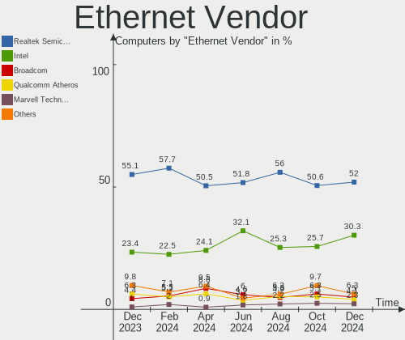
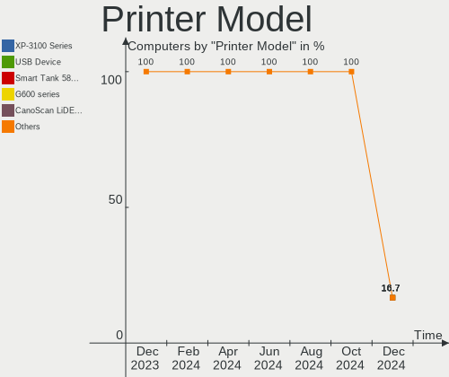

Zorin Hardware Trends
---------------------

A project to identify most popular hardware characteristics and track their change
over time based on data collected by Zorin users at https://Linux-Hardware.org.

Anyone can contribute to this report by the [hw-probe](https://github.com/linuxhw/hw-probe) tool:

    sudo -E hw-probe -all -upload

This is a report for all computer types. See also reports for [desktops](/Dist/Zorin/Desktop/README.md) and [notebooks](/Dist/Zorin/Notebook/README.md).

Full-feature report is available here: https://linux-hardware.org/?view=trends

Period: Jan, 2022.

Contents
--------

* [ System ](#system)
  - [ OS                       ](#os)
  - [ OS Family                ](#os-family)
  - [ Kernel                   ](#kernel)
  - [ Kernel Family            ](#kernel-family)
  - [ Kernel Major Ver.        ](#kernel-major-ver)
  - [ Arch                     ](#arch)
  - [ DE                       ](#de)
  - [ Display Server           ](#display-server)
  - [ Display Manager          ](#display-manager)
  - [ OS Lang                  ](#os-lang)
  - [ Boot Mode                ](#boot-mode)
  - [ Filesystem               ](#filesystem)
  - [ Part. scheme             ](#part-scheme)
  - [ Dual Boot with Linux/BSD ](#dual-boot-with-linuxbsd)
  - [ Dual Boot (Win)          ](#dual-boot-win)

* [ Board ](#board)
  - [ Vendor                   ](#vendor)
  - [ Model                    ](#model)
  - [ Model Family             ](#model-family)
  - [ MFG Year                 ](#mfg-year)
  - [ Form Factor              ](#form-factor)
  - [ Secure Boot              ](#secure-boot)
  - [ Coreboot                 ](#coreboot)
  - [ RAM Size                 ](#ram-size)
  - [ RAM Used                 ](#ram-used)
  - [ Total Drives             ](#total-drives)
  - [ Has CD-ROM               ](#has-cd-rom)
  - [ Has Ethernet             ](#has-ethernet)
  - [ Has WiFi                 ](#has-wifi)
  - [ Has Bluetooth            ](#has-bluetooth)

* [ Location ](#location)
  - [ Country                  ](#country)
  - [ City                     ](#city)

* [ Drives ](#drives)
  - [ Drive Vendor             ](#drive-vendor)
  - [ Drive Model              ](#drive-model)
  - [ HDD Vendor               ](#hdd-vendor)
  - [ SSD Vendor               ](#ssd-vendor)
  - [ Drive Kind               ](#drive-kind)
  - [ Drive Connector          ](#drive-connector)
  - [ Drive Size               ](#drive-size)
  - [ Space Total              ](#space-total)
  - [ Space Used               ](#space-used)
  - [ Malfunc. Drives          ](#malfunc-drives)
  - [ Malfunc. Drive Vendor    ](#malfunc-drive-vendor)
  - [ Malfunc. HDD Vendor      ](#malfunc-hdd-vendor)
  - [ Malfunc. Drive Kind      ](#malfunc-drive-kind)
  - [ Failed Drives            ](#failed-drives)
  - [ Failed Drive Vendor      ](#failed-drive-vendor)
  - [ Drive Status             ](#drive-status)

* [ Storage controller ](#storage-controller)
  - [ Storage Vendor           ](#storage-vendor)
  - [ Storage Model            ](#storage-model)
  - [ Storage Kind             ](#storage-kind)

* [ Processor ](#processor)
  - [ CPU Vendor               ](#cpu-vendor)
  - [ CPU Model                ](#cpu-model)
  - [ CPU Model Family         ](#cpu-model-family)
  - [ CPU Cores                ](#cpu-cores)
  - [ CPU Sockets              ](#cpu-sockets)
  - [ CPU Threads              ](#cpu-threads)
  - [ CPU Op-Modes             ](#cpu-op-modes)
  - [ CPU Microcode            ](#cpu-microcode)
  - [ CPU Microarch            ](#cpu-microarch)

* [ Graphics ](#graphics)
  - [ GPU Vendor               ](#gpu-vendor)
  - [ GPU Model                ](#gpu-model)
  - [ GPU Combo                ](#gpu-combo)
  - [ GPU Driver               ](#gpu-driver)
  - [ GPU Memory               ](#gpu-memory)

* [ Monitor ](#monitor)
  - [ Monitor Vendor           ](#monitor-vendor)
  - [ Monitor Model            ](#monitor-model)
  - [ Monitor Resolution       ](#monitor-resolution)
  - [ Monitor Diagonal         ](#monitor-diagonal)
  - [ Monitor Width            ](#monitor-width)
  - [ Aspect Ratio             ](#aspect-ratio)
  - [ Monitor Area             ](#monitor-area)
  - [ Pixel Density            ](#pixel-density)
  - [ Multiple Monitors        ](#multiple-monitors)

* [ Network ](#network)
  - [ Net Controller Vendor    ](#net-controller-vendor)
  - [ Net Controller Model     ](#net-controller-model)
  - [ Wireless Vendor          ](#wireless-vendor)
  - [ Wireless Model           ](#wireless-model)
  - [ Ethernet Vendor          ](#ethernet-vendor)
  - [ Ethernet Model           ](#ethernet-model)
  - [ Net Controller Kind      ](#net-controller-kind)
  - [ Used Controller          ](#used-controller)
  - [ NICs                     ](#nics)
  - [ IPv6                     ](#ipv6)

* [ Bluetooth ](#bluetooth)
  - [ Bluetooth Vendor         ](#bluetooth-vendor)
  - [ Bluetooth Model          ](#bluetooth-model)

* [ Sound ](#sound)
  - [ Sound Vendor             ](#sound-vendor)
  - [ Sound Model              ](#sound-model)

* [ Memory ](#memory)
  - [ Memory Vendor            ](#memory-vendor)
  - [ Memory Model             ](#memory-model)
  - [ Memory Kind              ](#memory-kind)
  - [ Memory Form Factor       ](#memory-form-factor)
  - [ Memory Size              ](#memory-size)
  - [ Memory Speed             ](#memory-speed)

* [ Printers & scanners ](#printers--scanners)
  - [ Printer Vendor           ](#printer-vendor)
  - [ Printer Model            ](#printer-model)
  - [ Scanner Vendor           ](#scanner-vendor)
  - [ Scanner Model            ](#scanner-model)

* [ Camera ](#camera)
  - [ Camera Vendor            ](#camera-vendor)
  - [ Camera Model             ](#camera-model)

* [ Security ](#security)
  - [ Fingerprint Vendor       ](#fingerprint-vendor)
  - [ Fingerprint Model        ](#fingerprint-model)
  - [ Chipcard Vendor          ](#chipcard-vendor)
  - [ Chipcard Model           ](#chipcard-model)

* [ Unsupported ](#unsupported)
  - [ Unsupported Devices      ](#unsupported-devices)
  - [ Unsupported Device Types ](#unsupported-device-types)

System
------

OS
--

Installed operating systems

| Name     | Computers | Percent |
|----------|-----------|---------|
| Zorin 16 | 166       | 89.25%  |
| Zorin 15 | 20        | 10.75%  |

OS Family
---------

OS without a version

| Name  | Computers | Percent |
|-------|-----------|---------|
| Zorin | 186       | 100%    |

Kernel
------

Version of the Linux kernel

| Version                     | Computers | Percent |
|-----------------------------|-----------|---------|
| 5.13.0-27-generic           | 44        | 23.66%  |
| 5.11.0-44-generic           | 35        | 18.82%  |
| 5.11.0-46-generic           | 33        | 17.74%  |
| 5.11.0-43-generic           | 30        | 16.13%  |
| 5.4.0-92-generic            | 7         | 3.76%   |
| 5.11.0-41-generic           | 7         | 3.76%   |
| 5.11.0-38-generic           | 6         | 3.23%   |
| 5.4.0-96-generic            | 4         | 2.15%   |
| 5.4.0-94-generic            | 3         | 1.61%   |
| 5.4.0-91-generic            | 3         | 1.61%   |
| 5.13.0-25-generic           | 3         | 1.61%   |
| 5.11.0-40-generic           | 2         | 1.08%   |
| 5.11.0-27-generic           | 2         | 1.08%   |
| 5.8.0-49-generic            | 1         | 0.54%   |
| 5.4.0-87-generic            | 1         | 0.54%   |
| 5.4.0-86-generic            | 1         | 0.54%   |
| 5.4.0-47-generic            | 1         | 0.54%   |
| 5.16.0-051600rc8-lowlatency | 1         | 0.54%   |
| 5.15.13-051513-generic      | 1         | 0.54%   |
| 5.13.0-28-generic           | 1         | 0.54%   |

Kernel Family
-------------

Linux kernel without a distro release

| Version | Computers | Percent |
|---------|-----------|---------|
| 5.11.0  | 115       | 61.83%  |
| 5.13.0  | 48        | 25.81%  |
| 5.4.0   | 20        | 10.75%  |
| 5.8.0   | 1         | 0.54%   |
| 5.16.0  | 1         | 0.54%   |
| 5.15.13 | 1         | 0.54%   |

Kernel Major Ver.
-----------------

Linux kernel major version

| Version | Computers | Percent |
|---------|-----------|---------|
| 5.11    | 115       | 61.83%  |
| 5.13    | 48        | 25.81%  |
| 5.4     | 20        | 10.75%  |
| 5.8     | 1         | 0.54%   |
| 5.16    | 1         | 0.54%   |
| 5.15    | 1         | 0.54%   |

Arch
----

OS architecture (x86_64, i586, etc.)

| Name   | Computers | Percent |
|--------|-----------|---------|
| x86_64 | 180       | 96.77%  |
| i686   | 6         | 3.23%   |

DE
--

Desktop Environment

| Name       | Computers | Percent |
|------------|-----------|---------|
| GNOME      | 150       | 80.65%  |
| XFCE       | 33        | 17.74%  |
| Unknown    | 2         | 1.08%   |
| X-Cinnamon | 1         | 0.54%   |

Display Server
--------------

X11 or Wayland

| Name    | Computers | Percent |
|---------|-----------|---------|
| X11     | 184       | 98.92%  |
| Wayland | 2         | 1.08%   |

Display Manager
---------------

SDDM, LightDM, etc.

| Name    | Computers | Percent |
|---------|-----------|---------|
| Unknown | 135       | 72.58%  |
| GDM3    | 28        | 15.05%  |
| LightDM | 13        | 6.99%   |
| GDM     | 10        | 5.38%   |

OS Lang
-------

Language

| Lang  | Computers | Percent |
|-------|-----------|---------|
| en_US | 77        | 41.4%   |
| de_DE | 22        | 11.83%  |
| pt_BR | 11        | 5.91%   |
| pl_PL | 8         | 4.3%    |
| en_GB | 8         | 4.3%    |
| es_ES | 7         | 3.76%   |
| ru_RU | 4         | 2.15%   |
| nl_NL | 4         | 2.15%   |
| it_IT | 4         | 2.15%   |
| fr_FR | 4         | 2.15%   |
| en_IN | 4         | 2.15%   |
| cs_CZ | 4         | 2.15%   |
| pt_PT | 3         | 1.61%   |
| es_MX | 3         | 1.61%   |
| en_ZA | 3         | 1.61%   |
| en_CA | 3         | 1.61%   |
| nl_BE | 2         | 1.08%   |
| ja_JP | 2         | 1.08%   |
| hu_HU | 2         | 1.08%   |
| es_AR | 2         | 1.08%   |
| en_AU | 2         | 1.08%   |
| de_AT | 2         | 1.08%   |
| sk_SK | 1         | 0.54%   |
| ro_RO | 1         | 0.54%   |
| es_CL | 1         | 0.54%   |
| C     | 1         | 0.54%   |
| ar_EG | 1         | 0.54%   |

Boot Mode
---------

EFI or BIOS

| Mode | Computers | Percent |
|------|-----------|---------|
| BIOS | 106       | 56.99%  |
| EFI  | 80        | 43.01%  |

Filesystem
----------

Type of filesystem

| Type    | Computers | Percent |
|---------|-----------|---------|
| Ext4    | 177       | 95.16%  |
| Overlay | 4         | 2.15%   |
| Btrfs   | 3         | 1.61%   |
| Zfs     | 2         | 1.08%   |

Part. scheme
------------

Scheme of partitioning

| Type    | Computers | Percent |
|---------|-----------|---------|
| Unknown | 175       | 94.09%  |
| GPT     | 11        | 5.91%   |

Dual Boot with Linux/BSD
------------------------

Hosting more than one Linux/BSD

| Dual boot | Computers | Percent |
|-----------|-----------|---------|
| No        | 177       | 95.16%  |
| Yes       | 9         | 4.84%   |

Dual Boot (Win)
---------------

Hosting Linux and Windows

| Dual boot | Computers | Percent |
|-----------|-----------|---------|
| No        | 166       | 89.25%  |
| Yes       | 20        | 10.75%  |

Board
-----

Vendor
------

Motherboard manufacturer

| Name                | Computers | Percent |
|---------------------|-----------|---------|
| ASUSTek Computer    | 34        | 18.28%  |
| Dell                | 25        | 13.44%  |
| Hewlett-Packard     | 24        | 12.9%   |
| Lenovo              | 23        | 12.37%  |
| Gigabyte Technology | 12        | 6.45%   |
| Acer                | 11        | 5.91%   |
| MSI                 | 9         | 4.84%   |
| Apple               | 8         | 4.3%    |
| Toshiba             | 6         | 3.23%   |
| ASRock              | 4         | 2.15%   |
| Samsung Electronics | 2         | 1.08%   |
| Jumper              | 2         | 1.08%   |
| Intel               | 2         | 1.08%   |
| Fujitsu             | 2         | 1.08%   |
| Foxconn             | 2         | 1.08%   |
| Wortmann AG         | 1         | 0.54%   |
| WinSome             | 1         | 0.54%   |
| TWC                 | 1         | 0.54%   |
| Sony                | 1         | 0.54%   |
| Shuttle             | 1         | 0.54%   |
| Razer               | 1         | 0.54%   |
| Positivo            | 1         | 0.54%   |
| Phitronics          | 1         | 0.54%   |
| Packard Bell        | 1         | 0.54%   |
| Oracle              | 1         | 0.54%   |
| NEC Computers       | 1         | 0.54%   |
| Multilaser          | 1         | 0.54%   |
| Microsoft           | 1         | 0.54%   |
| Mediacom            | 1         | 0.54%   |
| HUAWEI              | 1         | 0.54%   |
| Google              | 1         | 0.54%   |
| EVGA                | 1         | 0.54%   |
| eMachines           | 1         | 0.54%   |
| Clevo               | 1         | 0.54%   |
| Unknown             | 1         | 0.54%   |

Model
-----

Motherboard model

| Name                                  | Computers | Percent |
|---------------------------------------|-----------|---------|
| Jumper EZbook                         | 2         | 1.08%   |
| HP Pavilion dv7                       | 2         | 1.08%   |
| Gigabyte B450 AORUS M                 | 2         | 1.08%   |
| Dell Precision T1600                  | 2         | 1.08%   |
| ASUS TUF GAMING X570-PLUS             | 2         | 1.08%   |
| ASUS All Series                       | 2         | 1.08%   |
| Unknown                               | 2         | 1.08%   |
| Wortmann AG TERRA_PC                  | 1         | 0.54%   |
| WinSome A14C                          | 1         | 0.54%   |
| Toshiba TECRA A9                      | 1         | 0.54%   |
| Toshiba Satellite Pro C660            | 1         | 0.54%   |
| Toshiba Satellite M505                | 1         | 0.54%   |
| Toshiba Satellite C870-1C2            | 1         | 0.54%   |
| Toshiba Satellite C660                | 1         | 0.54%   |
| Toshiba Satellite A200                | 1         | 0.54%   |
| Sony SVF15213CBW                      | 1         | 0.54%   |
| Shuttle FB62                          | 1         | 0.54%   |
| Samsung R59P/R60P/R61P                | 1         | 0.54%   |
| Samsung 340XAA/350XAA/550XAA          | 1         | 0.54%   |
| Razer Blade Stealth                   | 1         | 0.54%   |
| Positivo C464C                        | 1         | 0.54%   |
| Phitronics P33G                       | 1         | 0.54%   |
| Packard Bell EasyNote MZ35            | 1         | 0.54%   |
| Oracle Sun Fire X4270 M3              | 1         | 0.54%   |
| NEC Computers PC-LL550RG              | 1         | 0.54%   |
| Multilaser UB32X                      | 1         | 0.54%   |
| MSI MS-7C80                           | 1         | 0.54%   |
| MSI MS-7B93                           | 1         | 0.54%   |
| MSI MS-7B51                           | 1         | 0.54%   |
| MSI MS-7918                           | 1         | 0.54%   |
| MSI MS-7695                           | 1         | 0.54%   |
| MSI MS-7680                           | 1         | 0.54%   |
| MSI MS-7053                           | 1         | 0.54%   |
| MSI GE75 Raider 8SF                   | 1         | 0.54%   |
| MSI 500-017c                          | 1         | 0.54%   |
| Microsoft Surface Pro                 | 1         | 0.54%   |
| Mediacom GTZS                         | 1         | 0.54%   |
| Lenovo Yoga 530-14IKB 81EK            | 1         | 0.54%   |
| Lenovo V14-IIL 82C4                   | 1         | 0.54%   |
| Lenovo ThinkPad X61 7673C44           | 1         | 0.54%   |
| Lenovo ThinkPad X270 W10DG 20K5S1S704 | 1         | 0.54%   |
| Lenovo ThinkPad X250 20CLS03Y00       | 1         | 0.54%   |
| Lenovo ThinkPad X230 2325WR3          | 1         | 0.54%   |
| Lenovo ThinkPad X1 1294BL5            | 1         | 0.54%   |
| Lenovo ThinkPad T540p 20BFS56300      | 1         | 0.54%   |
| Lenovo ThinkPad T490 20N3S6US00       | 1         | 0.54%   |
| Lenovo ThinkPad T460s 20FAS09Y04      | 1         | 0.54%   |
| Lenovo ThinkPad T410s 292494G         | 1         | 0.54%   |
| Lenovo ThinkPad Edge E530c 33663VG    | 1         | 0.54%   |
| Lenovo ThinkPad E15 Gen 2 20TD003TRT  | 1         | 0.54%   |
| Lenovo ThinkCentre M91p 4524WAP       | 1         | 0.54%   |
| Lenovo ThinkCentre M800 10FVS0JJ00    | 1         | 0.54%   |
| Lenovo ThinkBook 14 G2 ITL 20VD       | 1         | 0.54%   |
| Lenovo IdeaPad Yoga 13 20175          | 1         | 0.54%   |
| Lenovo IdeaPad S540-15IWL GTX 81SW    | 1         | 0.54%   |
| Lenovo IdeaPad 330-17ICH 81FL         | 1         | 0.54%   |
| Lenovo H30-50 90B8003BGE              | 1         | 0.54%   |
| Lenovo G780 20138                     | 1         | 0.54%   |
| Lenovo G500 20236                     | 1         | 0.54%   |
| Lenovo G50-70 20351                   | 1         | 0.54%   |

Model Family
------------

Motherboard model prefix

| Name                     | Computers | Percent |
|--------------------------|-----------|---------|
| Lenovo ThinkPad          | 11        | 5.91%   |
| Dell Inspiron            | 8         | 4.3%    |
| Acer Aspire              | 8         | 4.3%    |
| HP Pavilion              | 6         | 3.23%   |
| Dell Latitude            | 6         | 3.23%   |
| Toshiba Satellite        | 5         | 2.69%   |
| HP ProBook               | 4         | 2.15%   |
| HP Laptop                | 4         | 2.15%   |
| Dell OptiPlex            | 4         | 2.15%   |
| ASUS TUF                 | 4         | 2.15%   |
| Lenovo IdeaPad           | 3         | 1.61%   |
| HP Compaq                | 3         | 1.61%   |
| Dell Vostro              | 3         | 1.61%   |
| Lenovo ThinkCentre       | 2         | 1.08%   |
| Jumper EZbook            | 2         | 1.08%   |
| Gigabyte B450            | 2         | 1.08%   |
| Fujitsu ESPRIMO          | 2         | 1.08%   |
| Dell XPS                 | 2         | 1.08%   |
| Dell Precision           | 2         | 1.08%   |
| ASUS VivoBook            | 2         | 1.08%   |
| ASUS ROG                 | 2         | 1.08%   |
| ASUS PRIME               | 2         | 1.08%   |
| ASUS All                 | 2         | 1.08%   |
| Unknown                  | 2         | 1.08%   |
| Wortmann AG TERRA        | 1         | 0.54%   |
| WinSome A14C             | 1         | 0.54%   |
| Toshiba TECRA            | 1         | 0.54%   |
| Sony SVF15213CBW         | 1         | 0.54%   |
| Shuttle FB62             | 1         | 0.54%   |
| Samsung R59P             | 1         | 0.54%   |
| Samsung 340XAA           | 1         | 0.54%   |
| Razer Blade              | 1         | 0.54%   |
| Positivo C464C           | 1         | 0.54%   |
| Phitronics P33G          | 1         | 0.54%   |
| Packard Bell EasyNote    | 1         | 0.54%   |
| Oracle Sun               | 1         | 0.54%   |
| NEC Computers PC-LL550RG | 1         | 0.54%   |
| Multilaser UB32X         | 1         | 0.54%   |
| MSI MS-7C80              | 1         | 0.54%   |
| MSI MS-7B93              | 1         | 0.54%   |
| MSI MS-7B51              | 1         | 0.54%   |
| MSI MS-7918              | 1         | 0.54%   |
| MSI MS-7695              | 1         | 0.54%   |
| MSI MS-7680              | 1         | 0.54%   |
| MSI MS-7053              | 1         | 0.54%   |
| MSI GE75                 | 1         | 0.54%   |
| MSI 500-017c             | 1         | 0.54%   |
| Microsoft Surface        | 1         | 0.54%   |
| Mediacom GTZS            | 1         | 0.54%   |
| Lenovo Yoga              | 1         | 0.54%   |
| Lenovo V14-IIL           | 1         | 0.54%   |
| Lenovo ThinkBook         | 1         | 0.54%   |
| Lenovo H30-50            | 1         | 0.54%   |
| Lenovo G780              | 1         | 0.54%   |
| Lenovo G500              | 1         | 0.54%   |
| Lenovo G50-70            | 1         | 0.54%   |
| Intel DH55TC             | 1         | 0.54%   |
| Intel DH55PJ             | 1         | 0.54%   |
| HUAWEI NBLK-WAX9X        | 1         | 0.54%   |
| HP Z400                  | 1         | 0.54%   |

MFG Year
--------

Motherboard manufacture year

| Year | Computers | Percent |
|------|-----------|---------|
| 2019 | 17        | 9.14%   |
| 2011 | 17        | 9.14%   |
| 2010 | 17        | 9.14%   |
| 2013 | 16        | 8.6%    |
| 2018 | 15        | 8.06%   |
| 2020 | 14        | 7.53%   |
| 2012 | 13        | 6.99%   |
| 2017 | 12        | 6.45%   |
| 2016 | 11        | 5.91%   |
| 2014 | 11        | 5.91%   |
| 2021 | 10        | 5.38%   |
| 2007 | 9         | 4.84%   |
| 2015 | 7         | 3.76%   |
| 2008 | 7         | 3.76%   |
| 2009 | 6         | 3.23%   |
| 2006 | 2         | 1.08%   |
| 2005 | 1         | 0.54%   |
| 2003 | 1         | 0.54%   |

Form Factor
-----------

Physical design of the computer

| Name        | Computers | Percent |
|-------------|-----------|---------|
| Notebook    | 106       | 56.99%  |
| Desktop     | 66        | 35.48%  |
| Convertible | 4         | 2.15%   |
| Mini pc     | 4         | 2.15%   |
| All in one  | 4         | 2.15%   |
| Tablet      | 1         | 0.54%   |
| Server      | 1         | 0.54%   |

Secure Boot
-----------

Enabled or disabled

| State    | Computers | Percent |
|----------|-----------|---------|
| Disabled | 167       | 89.78%  |
| Enabled  | 19        | 10.22%  |

Coreboot
--------

Have coreboot on board

| Used | Computers | Percent |
|------|-----------|---------|
| No   | 185       | 99.46%  |
| Yes  | 1         | 0.54%   |

RAM Size
--------

Total RAM memory

| Size in GB  | Computers | Percent |
|-------------|-----------|---------|
| 4.01-8.0    | 58        | 31.18%  |
| 3.01-4.0    | 44        | 23.66%  |
| 16.01-24.0  | 29        | 15.59%  |
| 8.01-16.0   | 27        | 14.52%  |
| 32.01-64.0  | 11        | 5.91%   |
| 1.01-2.0    | 8         | 4.3%    |
| 2.01-3.0    | 5         | 2.69%   |
| 64.01-256.0 | 3         | 1.61%   |
| 24.01-32.0  | 1         | 0.54%   |

RAM Used
--------

Used RAM memory

| Used GB   | Computers | Percent |
|-----------|-----------|---------|
| 1.01-2.0  | 80        | 43.01%  |
| 2.01-3.0  | 63        | 33.87%  |
| 3.01-4.0  | 21        | 11.29%  |
| 4.01-8.0  | 15        | 8.06%   |
| 0.51-1.0  | 5         | 2.69%   |
| 8.01-16.0 | 2         | 1.08%   |

Total Drives
------------

Number of drives on board

| Drives | Computers | Percent |
|--------|-----------|---------|
| 1      | 120       | 64.52%  |
| 2      | 35        | 18.82%  |
| 3      | 16        | 8.6%    |
| 5      | 6         | 3.23%   |
| 4      | 4         | 2.15%   |
| 6      | 2         | 1.08%   |
| 0      | 2         | 1.08%   |
| 30     | 1         | 0.54%   |

Has CD-ROM
----------

Has CD-ROM on board

| Presented | Computers | Percent |
|-----------|-----------|---------|
| No        | 94        | 50.54%  |
| Yes       | 92        | 49.46%  |

Has Ethernet
------------

Has Ethernet on board

| Presented | Computers | Percent |
|-----------|-----------|---------|
| Yes       | 163       | 87.63%  |
| No        | 23        | 12.37%  |

Has WiFi
--------

Has WiFi module

| Presented | Computers | Percent |
|-----------|-----------|---------|
| Yes       | 150       | 80.65%  |
| No        | 36        | 19.35%  |

Has Bluetooth
-------------

Has Bluetooth module

| Presented | Computers | Percent |
|-----------|-----------|---------|
| Yes       | 106       | 56.99%  |
| No        | 80        | 43.01%  |

Location
--------

Country
-------

Geographic location (country)

| Country      | Computers | Percent |
|--------------|-----------|---------|
| USA          | 47        | 25.27%  |
| Germany      | 20        | 10.75%  |
| Brazil       | 12        | 6.45%   |
| Spain        | 11        | 5.91%   |
| Poland       | 7         | 3.76%   |
| Netherlands  | 7         | 3.76%   |
| India        | 5         | 2.69%   |
| UK           | 4         | 2.15%   |
| South Africa | 4         | 2.15%   |
| Italy        | 4         | 2.15%   |
| Czechia      | 4         | 2.15%   |
| Canada       | 4         | 2.15%   |
| Belgium      | 4         | 2.15%   |
| Austria      | 4         | 2.15%   |
| Ukraine      | 3         | 1.61%   |
| Sweden       | 3         | 1.61%   |
| Portugal     | 3         | 1.61%   |
| Mexico       | 3         | 1.61%   |
| France       | 3         | 1.61%   |
| Saudi Arabia | 2         | 1.08%   |
| Russia       | 2         | 1.08%   |
| New Zealand  | 2         | 1.08%   |
| Lithuania    | 2         | 1.08%   |
| Japan        | 2         | 1.08%   |
| Hungary      | 2         | 1.08%   |
| Finland      | 2         | 1.08%   |
| Bulgaria     | 2         | 1.08%   |
| Australia    | 2         | 1.08%   |
| Argentina    | 2         | 1.08%   |
| UAE          | 1         | 0.54%   |
| Turkey       | 1         | 0.54%   |
| Switzerland  | 1         | 0.54%   |
| Slovakia     | 1         | 0.54%   |
| Serbia       | 1         | 0.54%   |
| Romania      | 1         | 0.54%   |
| Pakistan     | 1         | 0.54%   |
| Norway       | 1         | 0.54%   |
| Morocco      | 1         | 0.54%   |
| Moldova      | 1         | 0.54%   |
| Israel       | 1         | 0.54%   |
| Greece       | 1         | 0.54%   |
| Chile        | 1         | 0.54%   |
| Belarus      | 1         | 0.54%   |

City
----

Geographic location (city)

| City                 | Computers | Percent |
|----------------------|-----------|---------|
| Vienna               | 4         | 2.15%   |
| Valencia             | 3         | 1.61%   |
| Neath                | 3         | 1.61%   |
| Torun                | 2         | 1.08%   |
| Seattle              | 2         | 1.08%   |
| New York             | 2         | 1.08%   |
| Minneapolis          | 2         | 1.08%   |
| Kyiv                 | 2         | 1.08%   |
| Helsinki             | 2         | 1.08%   |
| Chicago              | 2         | 1.08%   |
| Berlin               | 2         | 1.08%   |
| Zurich               | 1         | 0.54%   |
| Zlate Moravce        | 1         | 0.54%   |
| Zaio                 | 1         | 0.54%   |
| Yeles                | 1         | 0.54%   |
| Wroclaw              | 1         | 0.54%   |
| Worden               | 1         | 0.54%   |
| Winnipeg             | 1         | 0.54%   |
| Weinolsheim          | 1         | 0.54%   |
| Waterford            | 1         | 0.54%   |
| Warsaw               | 1         | 0.54%   |
| Waregem              | 1         | 0.54%   |
| Vitebsk              | 1         | 0.54%   |
| Vincentown           | 1         | 0.54%   |
| Vilnius              | 1         | 0.54%   |
| Vilamar              | 1         | 0.54%   |
| Victoria             | 1         | 0.54%   |
| Vi?±a del Mar        | 1         | 0.54%   |
| Velikiye Luki        | 1         | 0.54%   |
| Ulft                 | 1         | 0.54%   |
| Trostberg an der Alz | 1         | 0.54%   |
| Trinec               | 1         | 0.54%   |
| Tiraspol             | 1         | 0.54%   |
| The Hague            | 1         | 0.54%   |
| Thame                | 1         | 0.54%   |
| Tel Aviv             | 1         | 0.54%   |
| T??bor               | 1         | 0.54%   |
| Tafalla              | 1         | 0.54%   |
| Szigetszentmiklos    | 1         | 0.54%   |
| Stuttgart            | 1         | 0.54%   |
| Stow                 | 1         | 0.54%   |
| Stockholm            | 1         | 0.54%   |
| Staten Island        | 1         | 0.54%   |
| St Louis             | 1         | 0.54%   |
| Soweto               | 1         | 0.54%   |
| Someren              | 1         | 0.54%   |
| Sofia                | 1         | 0.54%   |
| Smyrna               | 1         | 0.54%   |
| Skorzewo             | 1         | 0.54%   |
| Shibata              | 1         | 0.54%   |
| Sharjah              | 1         | 0.54%   |
| Seevetal             | 1         | 0.54%   |
| Schramberg           | 1         | 0.54%   |
| S?¶lvesborg          | 1         | 0.54%   |
| S??o Paulo           | 1         | 0.54%   |
| San Jose             | 1         | 0.54%   |
| Salt Lake City       | 1         | 0.54%   |
| Saint-Cannat         | 1         | 0.54%   |
| Rousse               | 1         | 0.54%   |
| Roseville            | 1         | 0.54%   |

Drives
------

Drive Vendor
------------

Hard drive vendors

| Vendor                | Computers | Drives | Percent |
|-----------------------|-----------|--------|---------|
| Seagate               | 45        | 56     | 17.24%  |
| WDC                   | 40        | 46     | 15.33%  |
| Samsung Electronics   | 37        | 45     | 14.18%  |
| Toshiba               | 20        | 22     | 7.66%   |
| SanDisk               | 19        | 19     | 7.28%   |
| Hitachi               | 13        | 25     | 4.98%   |
| Unknown               | 12        | 12     | 4.6%    |
| Kingston              | 12        | 13     | 4.6%    |
| Crucial               | 10        | 10     | 3.83%   |
| Intel                 | 4         | 4      | 1.53%   |
| Apple                 | 4         | 4      | 1.53%   |
| Silicon Motion        | 3         | 4      | 1.15%   |
| Micron Technology     | 3         | 3      | 1.15%   |
| HGST                  | 3         | 3      | 1.15%   |
| Transcend             | 2         | 17     | 0.77%   |
| Super Talent          | 2         | 2      | 0.77%   |
| SK Hynix              | 2         | 2      | 0.77%   |
| MAXTOR                | 2         | 2      | 0.77%   |
| LITEON                | 2         | 2      | 0.77%   |
| Hewlett-Packard       | 2         | 3      | 0.77%   |
| Fujitsu               | 2         | 2      | 0.77%   |
| China                 | 2         | 2      | 0.77%   |
| A-DATA Technology     | 2         | 2      | 0.77%   |
| XPG                   | 1         | 1      | 0.38%   |
| WD MediaMax           | 1         | 1      | 0.38%   |
| TO Exter              | 1         | 1      | 0.38%   |
| SPCC                  | 1         | 1      | 0.38%   |
| Space ke              | 1         | 1      | 0.38%   |
| Realtek Semiconductor | 1         | 1      | 0.38%   |
| PNY                   | 1         | 1      | 0.38%   |
| Patriot               | 1         | 1      | 0.38%   |
| OWC                   | 1         | 1      | 0.38%   |
| OCZ                   | 1         | 1      | 0.38%   |
| LS                    | 1         | 1      | 0.38%   |
| KIOXIA-EXCERIA        | 1         | 1      | 0.38%   |
| KIOXIA                | 1         | 1      | 0.38%   |
| KingSpec              | 1         | 1      | 0.38%   |
| JMicron               | 1         | 1      | 0.38%   |
| Gigabyte Technology   | 1         | 1      | 0.38%   |
| Apacer                | 1         | 1      | 0.38%   |
| Unknown               | 1         | 1      | 0.38%   |

Drive Model
-----------

Hard drive models

| Model                                | Computers | Percent |
|--------------------------------------|-----------|---------|
| Sandisk NVMe SSD Drive 256GB         | 6         | 2.1%    |
| Kingston SA400S37240G 240GB SSD      | 5         | 1.75%   |
| Toshiba MQ04ABF100 1TB               | 4         | 1.4%    |
| Toshiba MQ01ABD100 1TB               | 4         | 1.4%    |
| Seagate ST1000DM010-2EP102 1TB       | 4         | 1.4%    |
| Unknown MMC Card  64GB               | 3         | 1.05%   |
| Unknown MMC Card  32GB               | 3         | 1.05%   |
| Unknown MMC Card  128GB              | 3         | 1.05%   |
| Seagate ST500DM002-1BD142 500GB      | 3         | 1.05%   |
| Samsung SSD 850 EVO 500GB            | 3         | 1.05%   |
| Samsung NVMe SSD Drive 256GB         | 3         | 1.05%   |
| Hitachi HUA723020ALA641 2TB          | 3         | 1.05%   |
| WDC WDS100T2B0B-00YS70 1TB SSD       | 2         | 0.7%    |
| WDC WDBNCE5000PNC 500GB SSD          | 2         | 0.7%    |
| Unknown MMC Card  256GB              | 2         | 0.7%    |
| Toshiba KBG30ZMS128G 128GB NVMe SSD  | 2         | 0.7%    |
| Super Talent FTM51N325H 512GB        | 2         | 0.7%    |
| Seagate ST3500413AS 500GB            | 2         | 0.7%    |
| Seagate ST3500312CS 500GB            | 2         | 0.7%    |
| Seagate ST3250318AS 250GB            | 2         | 0.7%    |
| Seagate ST2000DM001-1CH164 2TB       | 2         | 0.7%    |
| Seagate ST1000LM035-1RK172 1TB       | 2         | 0.7%    |
| Seagate ST1000LM024 HN-M101MBB 1TB   | 2         | 0.7%    |
| Seagate ST1000DM003-1CH162 1TB       | 2         | 0.7%    |
| SanDisk SSD PLUS 240GB               | 2         | 0.7%    |
| Sandisk NVMe SSD Drive 512GB         | 2         | 0.7%    |
| Samsung SSD 850 EVO 250GB            | 2         | 0.7%    |
| Samsung MZNLN256HCHP-00000 256GB SSD | 2         | 0.7%    |
| Samsung HD103SJ 1TB                  | 2         | 0.7%    |
| Kingston SV300S37A240G 240GB SSD     | 2         | 0.7%    |
| Kingston SA400S37480G 480GB SSD      | 2         | 0.7%    |
| Kingston SA400S37120G 120GB SSD      | 2         | 0.7%    |
| Hitachi HDP725050GLA360 500GB        | 2         | 0.7%    |
| HGST HTS721010A9E630 1TB             | 2         | 0.7%    |
| Crucial CT240BX500SSD1 240GB         | 2         | 0.7%    |
| Apple HDD ST1000DM003 1TB            | 2         | 0.7%    |
| XPG GAMMIX S11L 256GB                | 1         | 0.35%   |
| WDC WDS500G2B0A-00SM50 500GB SSD     | 1         | 0.35%   |
| WDC WDS240G2G0A-00JH30 240GB SSD     | 1         | 0.35%   |
| WDC WDS120G1G0B-00RC30 120GB SSD     | 1         | 0.35%   |
| WDC WD800BD-22MRA1 80GB              | 1         | 0.35%   |
| WDC WD7500AADS-00M2B0 752GB          | 1         | 0.35%   |
| WDC WD5003ABYX-01WERA1 500GB         | 1         | 0.35%   |
| WDC WD5000LPVX-80V0TT0 500GB         | 1         | 0.35%   |
| WDC WD5000LPVX-22V0TT0 500GB         | 1         | 0.35%   |
| WDC WD5000LPVT-22G33T0 500GB         | 1         | 0.35%   |
| WDC WD5000LPCX-24C6HT0 500GB         | 1         | 0.35%   |
| WDC WD5000BPVT-75HXZT3 500GB         | 1         | 0.35%   |
| WDC WD5000BPVT-75HXZT1 500GB         | 1         | 0.35%   |
| WDC WD5000BPKX-75HPJT0 500GB         | 1         | 0.35%   |
| WDC WD5000AAKS-75V0A0 500GB          | 1         | 0.35%   |
| WDC WD40EFRX-68WT0N0 4TB             | 1         | 0.35%   |
| WDC WD40 EFRX-68WT0N0 4TB            | 1         | 0.35%   |
| WDC WD3200BPVT-35ZEST0 320GB         | 1         | 0.35%   |
| WDC WD3200BPVT-22JJ5T0 320GB         | 1         | 0.35%   |
| WDC WD30EZRZ-00GXCB0 3TB             | 1         | 0.35%   |
| WDC WD30EFRX-68AX9N0 3TB             | 1         | 0.35%   |
| WDC WD2500BPVT-26JJ5T0 250GB         | 1         | 0.35%   |
| WDC WD2500AVVS-62L2B0 250GB          | 1         | 0.35%   |
| WDC WD2500AAKX-221CA1 250GB          | 1         | 0.35%   |

HDD Vendor
----------

Hard disk drive vendors

| Vendor              | Computers | Drives | Percent |
|---------------------|-----------|--------|---------|
| Seagate             | 45        | 55     | 35.16%  |
| WDC                 | 35        | 37     | 27.34%  |
| Toshiba             | 16        | 18     | 12.5%   |
| Hitachi             | 13        | 25     | 10.16%  |
| Samsung Electronics | 6         | 6      | 4.69%   |
| Apple               | 4         | 4      | 3.13%   |
| HGST                | 3         | 3      | 2.34%   |
| MAXTOR              | 2         | 2      | 1.56%   |
| Fujitsu             | 2         | 2      | 1.56%   |
| TO Exter            | 1         | 1      | 0.78%   |
| Hewlett-Packard     | 1         | 1      | 0.78%   |

SSD Vendor
----------

Solid state drive vendors

| Vendor              | Computers | Drives | Percent |
|---------------------|-----------|--------|---------|
| Samsung Electronics | 23        | 28     | 26.74%  |
| Kingston            | 12        | 13     | 13.95%  |
| Crucial             | 10        | 10     | 11.63%  |
| SanDisk             | 8         | 8      | 9.3%    |
| WDC                 | 7         | 8      | 8.14%   |
| Transcend           | 2         | 17     | 2.33%   |
| Toshiba             | 2         | 2      | 2.33%   |
| Super Talent        | 2         | 2      | 2.33%   |
| Micron Technology   | 2         | 2      | 2.33%   |
| LITEON              | 2         | 2      | 2.33%   |
| Intel               | 2         | 2      | 2.33%   |
| China               | 2         | 2      | 2.33%   |
| A-DATA Technology   | 2         | 2      | 2.33%   |
| SPCC                | 1         | 1      | 1.16%   |
| PNY                 | 1         | 1      | 1.16%   |
| Patriot             | 1         | 1      | 1.16%   |
| OWC                 | 1         | 1      | 1.16%   |
| OCZ                 | 1         | 1      | 1.16%   |
| KIOXIA-EXCERIA      | 1         | 1      | 1.16%   |
| KingSpec            | 1         | 1      | 1.16%   |
| Hewlett-Packard     | 1         | 2      | 1.16%   |
| Gigabyte Technology | 1         | 1      | 1.16%   |
| Apacer              | 1         | 1      | 1.16%   |

Drive Kind
----------

HDD or SSD

| Kind    | Computers | Drives | Percent |
|---------|-----------|--------|---------|
| HDD     | 106       | 154    | 45.69%  |
| SSD     | 77        | 109    | 33.19%  |
| NVMe    | 30        | 36     | 12.93%  |
| MMC     | 14        | 14     | 6.03%   |
| Unknown | 5         | 5      | 2.16%   |

Drive Connector
---------------

SATA, SAS, NVMe, etc.

| Type | Computers | Drives | Percent |
|------|-----------|--------|---------|
| SATA | 161       | 263    | 76.67%  |
| NVMe | 30        | 36     | 14.29%  |
| MMC  | 14        | 14     | 6.67%   |
| SAS  | 5         | 5      | 2.38%   |

Drive Size
----------

Size of hard drive

| Size in TB | Computers | Drives | Percent |
|------------|-----------|--------|---------|
| 0.01-0.5   | 117       | 162    | 59.39%  |
| 0.51-1.0   | 58        | 65     | 29.44%  |
| 1.01-2.0   | 15        | 17     | 7.61%   |
| 2.01-3.0   | 4         | 16     | 2.03%   |
| 3.01-4.0   | 3         | 3      | 1.52%   |

Space Total
-----------

Amount of disk space available on the file system

| Size in GB     | Computers | Percent |
|----------------|-----------|---------|
| 101-250        | 62        | 33.33%  |
| 251-500        | 37        | 19.89%  |
| 501-1000       | 34        | 18.28%  |
| 51-100         | 16        | 8.6%    |
| 21-50          | 10        | 5.38%   |
| 2001-3000      | 7         | 3.76%   |
| More than 3000 | 6         | 3.23%   |
| 1001-2000      | 6         | 3.23%   |
| 1-20           | 6         | 3.23%   |
| Unknown        | 2         | 1.08%   |

Space Used
----------

Amount of used disk space

| Used GB        | Computers | Percent |
|----------------|-----------|---------|
| 1-20           | 74        | 39.78%  |
| 21-50          | 51        | 27.42%  |
| 51-100         | 24        | 12.9%   |
| 101-250        | 16        | 8.6%    |
| 251-500        | 8         | 4.3%    |
| 501-1000       | 4         | 2.15%   |
| 1001-2000      | 3         | 1.61%   |
| More than 3000 | 2         | 1.08%   |
| 2001-3000      | 2         | 1.08%   |
| Unknown        | 2         | 1.08%   |

Malfunc. Drives
---------------

Drive models with a malfunction

Zero info for selected period =(

Malfunc. Drive Vendor
---------------------

Vendors of faulty drives

Zero info for selected period =(

Malfunc. HDD Vendor
-------------------

Vendors of faulty HDD drives

Zero info for selected period =(

Malfunc. Drive Kind
-------------------

Kinds of faulty drives

Zero info for selected period =(

Failed Drives
-------------

Failed drive models

Zero info for selected period =(

Failed Drive Vendor
-------------------

Failed drive vendors

Zero info for selected period =(

Drive Status
------------

Number of failed and malfunc. drives

| Status   | Computers | Drives | Percent |
|----------|-----------|--------|---------|
| Detected | 176       | 291    | 93.12%  |
| Works    | 13        | 27     | 6.88%   |

Storage controller
------------------

Storage Vendor
--------------

Storage controller vendors

| Vendor                           | Computers | Percent |
|----------------------------------|-----------|---------|
| Intel                            | 138       | 62.73%  |
| AMD                              | 35        | 15.91%  |
| Sandisk                          | 10        | 4.55%   |
| Samsung Electronics              | 10        | 4.55%   |
| ASMedia Technology               | 6         | 2.73%   |
| Nvidia                           | 4         | 1.82%   |
| Silicon Motion                   | 3         | 1.36%   |
| Toshiba America Info Systems     | 2         | 0.91%   |
| SK Hynix                         | 2         | 0.91%   |
| VIA Technologies                 | 1         | 0.45%   |
| Silicon Integrated Systems [SiS] | 1         | 0.45%   |
| Silicon Image                    | 1         | 0.45%   |
| Seagate Technology               | 1         | 0.45%   |
| Realtek Semiconductor            | 1         | 0.45%   |
| Micron Technology                | 1         | 0.45%   |
| Marvell Technology Group         | 1         | 0.45%   |
| LSI Logic / Symbios Logic        | 1         | 0.45%   |
| KIOXIA                           | 1         | 0.45%   |
| Broadcom / LSI                   | 1         | 0.45%   |

Storage Model
-------------

Storage controller models

| Model                                                                                   | Computers | Percent |
|-----------------------------------------------------------------------------------------|-----------|---------|
| AMD FCH SATA Controller [AHCI mode]                                                     | 21        | 7.98%   |
| Intel 7 Series Chipset Family 6-port SATA Controller [AHCI mode]                        | 15        | 5.7%    |
| Intel Sunrise Point-LP SATA Controller [AHCI mode]                                      | 10        | 3.8%    |
| Intel 82801 Mobile SATA Controller [RAID mode]                                          | 9         | 3.42%   |
| Intel 6 Series/C200 Series Chipset Family 6 port Desktop SATA AHCI Controller           | 8         | 3.04%   |
| Intel 8 Series/C220 Series Chipset Family 6-port SATA Controller 1 [AHCI mode]          | 7         | 2.66%   |
| Intel Q170/Q150/B150/H170/H110/Z170/CM236 Chipset SATA Controller [AHCI Mode]           | 6         | 2.28%   |
| Intel Celeron N3350/Pentium N4200/Atom E3900 Series SATA AHCI Controller                | 6         | 2.28%   |
| AMD SB7x0/SB8x0/SB9x0 SATA Controller [IDE mode]                                        | 6         | 2.28%   |
| Intel Volume Management Device NVMe RAID Controller                                     | 5         | 1.9%    |
| Intel 82801IBM/IEM (ICH9M/ICH9M-E) 4 port SATA Controller [AHCI mode]                   | 5         | 1.9%    |
| Intel 82801HM/HEM (ICH8M/ICH8M-E) IDE Controller                                        | 5         | 1.9%    |
| Intel 6 Series/C200 Series Chipset Family 6 port Mobile SATA AHCI Controller            | 5         | 1.9%    |
| Intel 5 Series/3400 Series Chipset 4 port SATA AHCI Controller                          | 5         | 1.9%    |
| ASMedia ASM1062 Serial ATA Controller                                                   | 5         | 1.9%    |
| AMD SB7x0/SB8x0/SB9x0 IDE Controller                                                    | 5         | 1.9%    |
| Sandisk WD Blue SN500 / PC SN520 NVMe SSD                                               | 4         | 1.52%   |
| Samsung NVMe SSD Controller 980                                                         | 4         | 1.52%   |
| Intel SATA Controller [RAID mode]                                                       | 4         | 1.52%   |
| Intel Atom/Celeron/Pentium Processor x5-E8000/J3xxx/N3xxx Series SATA Controller        | 4         | 1.52%   |
| Intel 82801HM/HEM (ICH8M/ICH8M-E) SATA Controller [AHCI mode]                           | 4         | 1.52%   |
| AMD SB7x0/SB8x0/SB9x0 SATA Controller [AHCI mode]                                       | 4         | 1.52%   |
| AMD FCH IDE Controller                                                                  | 4         | 1.52%   |
| AMD 400 Series Chipset SATA Controller                                                  | 4         | 1.52%   |
| Samsung NVMe SSD Controller SM981/PM981/PM983                                           | 3         | 1.14%   |
| Intel Cannon Lake PCH SATA AHCI Controller                                              | 3         | 1.14%   |
| Intel 8 Series SATA Controller 1 [AHCI mode]                                            | 3         | 1.14%   |
| Intel 6 Series/C200 Series Chipset Family Desktop SATA Controller (IDE mode, ports 4-5) | 3         | 1.14%   |
| Intel 6 Series/C200 Series Chipset Family Desktop SATA Controller (IDE mode, ports 0-3) | 3         | 1.14%   |
| Toshiba America Info Systems BG3 NVMe SSD Controller                                    | 2         | 0.76%   |
| Silicon Motion SM2263EN/SM2263XT SSD Controller                                         | 2         | 0.76%   |
| Sandisk WD Black SN750 / PC SN730 NVMe SSD                                              | 2         | 0.76%   |
| Samsung NVMe SSD Controller PM9A1/PM9A3/980PRO                                          | 2         | 0.76%   |
| Intel Tiger Lake-LP SATA Controller [AHCI mode]                                         | 2         | 0.76%   |
| Intel SSD 660P Series                                                                   | 2         | 0.76%   |
| Intel NM10/ICH7 Family SATA Controller [IDE mode]                                       | 2         | 0.76%   |
| Intel NM10/ICH7 Family SATA Controller [AHCI mode]                                      | 2         | 0.76%   |
| Intel HM170/QM170 Chipset SATA Controller [AHCI Mode]                                   | 2         | 0.76%   |
| Intel Cannon Point-LP SATA Controller [AHCI Mode]                                       | 2         | 0.76%   |
| Intel Cannon Lake Mobile PCH SATA AHCI Controller                                       | 2         | 0.76%   |
| Intel 9 Series Chipset Family SATA Controller [AHCI Mode]                               | 2         | 0.76%   |
| Intel 82801G (ICH7 Family) IDE Controller                                               | 2         | 0.76%   |
| Intel 6 Series/C200 Series Chipset Family Mobile SATA Controller (IDE mode, ports 4-5)  | 2         | 0.76%   |
| Intel 6 Series/C200 Series Chipset Family Mobile SATA Controller (IDE mode, ports 0-3)  | 2         | 0.76%   |
| Intel 5 Series/3400 Series Chipset PT IDER Controller                                   | 2         | 0.76%   |
| Intel 5 Series/3400 Series Chipset 6 port SATA AHCI Controller                          | 2         | 0.76%   |
| Intel 5 Series/3400 Series Chipset 4 port SATA IDE Controller                           | 2         | 0.76%   |
| Intel 5 Series/3400 Series Chipset 2 port SATA IDE Controller                           | 2         | 0.76%   |
| Intel 200 Series PCH SATA controller [AHCI mode]                                        | 2         | 0.76%   |
| AMD SB600 Non-Raid-5 SATA                                                               | 2         | 0.76%   |
| AMD SB600 IDE                                                                           | 2         | 0.76%   |
| AMD FCH SATA Controller [IDE mode]                                                      | 2         | 0.76%   |
| VIA VT6410 ATA133 RAID controller                                                       | 1         | 0.38%   |
| SK Hynix Gold P31 SSD                                                                   | 1         | 0.38%   |
| SK Hynix BC501 NVMe Solid State Drive                                                   | 1         | 0.38%   |
| Silicon Motion Non-Volatile memory controller                                           | 1         | 0.38%   |
| Silicon Integrated Systems [SiS] SATA Controller / IDE mode                             | 1         | 0.38%   |
| Silicon Integrated Systems [SiS] 5513 IDE Controller                                    | 1         | 0.38%   |
| Silicon Image SiI 3114 [SATALink/SATARaid] Serial ATA Controller                        | 1         | 0.38%   |
| Seagate FireCuda 520 SSD                                                                | 1         | 0.38%   |

Storage Kind
------------

Kind of storage controller (IDE, SATA, NVMe, SAS, ...)

| Kind | Computers | Percent |
|------|-----------|---------|
| SATA | 140       | 61.14%  |
| IDE  | 35        | 15.28%  |
| NVMe | 30        | 13.1%   |
| RAID | 23        | 10.04%  |
| SAS  | 1         | 0.44%   |

Processor
---------

CPU Vendor
----------

Processor vendors

| Vendor | Computers | Percent |
|--------|-----------|---------|
| Intel  | 148       | 79.57%  |
| AMD    | 38        | 20.43%  |

CPU Model
---------

Processor models

| Model                                        | Computers | Percent |
|----------------------------------------------|-----------|---------|
| Intel Core i5-8265U CPU @ 1.60GHz            | 3         | 1.61%   |
| Intel Core i5-6300U CPU @ 2.40GHz            | 3         | 1.61%   |
| Intel Core i3-7020U CPU @ 2.30GHz            | 3         | 1.61%   |
| Intel Core i3-4160 CPU @ 3.60GHz             | 3         | 1.61%   |
| Intel Celeron CPU N3450 @ 1.10GHz            | 3         | 1.61%   |
| Intel 11th Gen Core i5-1135G7 @ 2.40GHz      | 3         | 1.61%   |
| Intel Core i7-8750H CPU @ 2.20GHz            | 2         | 1.08%   |
| Intel Core i7-6700HQ CPU @ 2.60GHz           | 2         | 1.08%   |
| Intel Core i7-2670QM CPU @ 2.20GHz           | 2         | 1.08%   |
| Intel Core i7 CPU Q 740 @ 1.73GHz            | 2         | 1.08%   |
| Intel Core i5-2520M CPU @ 2.50GHz            | 2         | 1.08%   |
| Intel Core i5-2500 CPU @ 3.30GHz             | 2         | 1.08%   |
| Intel Core i5-2415M CPU @ 2.30GHz            | 2         | 1.08%   |
| Intel Core i3-3110M CPU @ 2.40GHz            | 2         | 1.08%   |
| Intel Core i3-1005G1 CPU @ 1.20GHz           | 2         | 1.08%   |
| Intel Celeron CPU N3350 @ 1.10GHz            | 2         | 1.08%   |
| Intel Celeron CPU N3150 @ 1.60GHz            | 2         | 1.08%   |
| Intel Celeron CPU N3050 @ 1.60GHz            | 2         | 1.08%   |
| AMD Ryzen 5 2600 Six-Core Processor          | 2         | 1.08%   |
| AMD Athlon 64 X2 Dual Core Processor 4600+   | 2         | 1.08%   |
| AMD A9-9420 RADEON R5, 5 COMPUTE CORES 2C+3G | 2         | 1.08%   |
| Intel Xeon CPU W3680 @ 3.33GHz               | 1         | 0.54%   |
| Intel Xeon CPU E5-2630L 0 @ 2.00GHz          | 1         | 0.54%   |
| Intel Xeon CPU E31225 @ 3.10GHz              | 1         | 0.54%   |
| Intel Xeon CPU E31220 @ 3.10GHz              | 1         | 0.54%   |
| Intel Pentium Silver N5030 CPU @ 1.10GHz     | 1         | 0.54%   |
| Intel Pentium Gold 7505 @ 2.00GHz            | 1         | 0.54%   |
| Intel Pentium Dual CPU T3200 @ 2.00GHz       | 1         | 0.54%   |
| Intel Pentium Dual CPU T2390 @ 1.86GHz       | 1         | 0.54%   |
| Intel Pentium Dual CPU E2200 @ 2.20GHz       | 1         | 0.54%   |
| Intel Pentium Dual CPU E2140 @ 1.60GHz       | 1         | 0.54%   |
| Intel Pentium CPU P6000 @ 1.87GHz            | 1         | 0.54%   |
| Intel Pentium CPU N3520 @ 2.16GHz            | 1         | 0.54%   |
| Intel Pentium CPU J3710 @ 1.60GHz            | 1         | 0.54%   |
| Intel Pentium CPU G620 @ 2.60GHz             | 1         | 0.54%   |
| Intel Pentium CPU G4560 @ 3.50GHz            | 1         | 0.54%   |
| Intel Pentium CPU G4500 @ 3.50GHz            | 1         | 0.54%   |
| Intel Pentium CPU G2020 @ 2.90GHz            | 1         | 0.54%   |
| Intel Pentium CPU B950 @ 2.10GHz             | 1         | 0.54%   |
| Intel Pentium 4 CPU 3.60GHz                  | 1         | 0.54%   |
| Intel Core i7-9750H CPU @ 2.60GHz            | 1         | 0.54%   |
| Intel Core i7-9700K CPU @ 3.60GHz            | 1         | 0.54%   |
| Intel Core i7-8565U CPU @ 1.80GHz            | 1         | 0.54%   |
| Intel Core i7-8550U CPU @ 1.80GHz            | 1         | 0.54%   |
| Intel Core i7-7500U CPU @ 2.70GHz            | 1         | 0.54%   |
| Intel Core i7-6600U CPU @ 2.60GHz            | 1         | 0.54%   |
| Intel Core i7-6500U CPU @ 2.50GHz            | 1         | 0.54%   |
| Intel Core i7-5600U CPU @ 2.60GHz            | 1         | 0.54%   |
| Intel Core i7-4810MQ CPU @ 2.80GHz           | 1         | 0.54%   |
| Intel Core i7-4790 CPU @ 3.60GHz             | 1         | 0.54%   |
| Intel Core i7-4600U CPU @ 2.10GHz            | 1         | 0.54%   |
| Intel Core i7-4500U CPU @ 1.80GHz            | 1         | 0.54%   |
| Intel Core i7-3770 CPU @ 3.40GHz             | 1         | 0.54%   |
| Intel Core i7-3632QM CPU @ 2.20GHz           | 1         | 0.54%   |
| Intel Core i7-3517U CPU @ 1.90GHz            | 1         | 0.54%   |
| Intel Core i7-2600 CPU @ 3.40GHz             | 1         | 0.54%   |
| Intel Core i7 CPU Q 720 @ 1.60GHz            | 1         | 0.54%   |
| Intel Core i7 CPU M 620 @ 2.67GHz            | 1         | 0.54%   |
| Intel Core i7 CPU 870 @ 2.93GHz              | 1         | 0.54%   |
| Intel Core i5-9400 CPU @ 2.90GHz             | 1         | 0.54%   |

CPU Model Family
----------------

Processor model prefix

| Model                   | Computers | Percent |
|-------------------------|-----------|---------|
| Intel Core i5           | 42        | 22.58%  |
| Intel Core i7           | 27        | 14.52%  |
| Intel Core i3           | 20        | 10.75%  |
| Intel Celeron           | 17        | 9.14%   |
| Intel Core 2 Duo        | 12        | 6.45%   |
| Intel Pentium           | 8         | 4.3%    |
| Other                   | 7         | 3.76%   |
| AMD Ryzen 5             | 6         | 3.23%   |
| AMD Ryzen 7             | 5         | 2.69%   |
| Intel Xeon              | 4         | 2.15%   |
| Intel Pentium Dual      | 4         | 2.15%   |
| Intel Atom              | 4         | 2.15%   |
| AMD Athlon II X2        | 4         | 2.15%   |
| AMD Ryzen 9             | 3         | 1.61%   |
| AMD FX                  | 3         | 1.61%   |
| AMD Athlon 64 X2        | 3         | 1.61%   |
| AMD A6                  | 3         | 1.61%   |
| AMD A8                  | 2         | 1.08%   |
| AMD A10                 | 2         | 1.08%   |
| Intel Pentium Silver    | 1         | 0.54%   |
| Intel Pentium Gold      | 1         | 0.54%   |
| Intel Pentium 4         | 1         | 0.54%   |
| Intel Celeron M         | 1         | 0.54%   |
| Intel Celeron Dual-Core | 1         | 0.54%   |
| AMD Phenom II           | 1         | 0.54%   |
| AMD E1                  | 1         | 0.54%   |
| AMD Athlon X2           | 1         | 0.54%   |
| AMD Athlon II           | 1         | 0.54%   |
| AMD Athlon              | 1         | 0.54%   |

CPU Cores
---------

Number of processor cores

| Number | Computers | Percent |
|--------|-----------|---------|
| 2      | 99        | 53.23%  |
| 4      | 59        | 31.72%  |
| 6      | 10        | 5.38%   |
| 8      | 9         | 4.84%   |
| 1      | 5         | 2.69%   |
| 12     | 2         | 1.08%   |
| 16     | 1         | 0.54%   |
| 3      | 1         | 0.54%   |

CPU Sockets
-----------

Number of sockets

| Number | Computers | Percent |
|--------|-----------|---------|
| 1      | 185       | 99.46%  |
| 2      | 1         | 0.54%   |

CPU Threads
-----------

Threads per core (Hyper-Threading)

| Number | Computers | Percent |
|--------|-----------|---------|
| 2      | 103       | 55.38%  |
| 1      | 83        | 44.62%  |

CPU Op-Modes
------------

CPU Operation Modes (32-bit, 64-bit)

| Op mode        | Computers | Percent |
|----------------|-----------|---------|
| 32-bit, 64-bit | 184       | 98.92%  |
| 32-bit         | 2         | 1.08%   |

CPU Microcode
-------------

Microcode number

| Number     | Computers | Percent |
|------------|-----------|---------|
| 0x206a7    | 19        | 10.22%  |
| Unknown    | 13        | 6.99%   |
| 0x306a9    | 12        | 6.45%   |
| 0x306c3    | 9         | 4.84%   |
| 0x6fd      | 8         | 4.3%    |
| 0x806e9    | 7         | 3.76%   |
| 0x506e3    | 7         | 3.76%   |
| 0x806ec    | 6         | 3.23%   |
| 0x806c1    | 5         | 2.69%   |
| 0x506c9    | 5         | 2.69%   |
| 0x406e3    | 5         | 2.69%   |
| 0x20655    | 5         | 2.69%   |
| 0x1067a    | 5         | 2.69%   |
| 0x406c3    | 4         | 2.15%   |
| 0x40651    | 4         | 2.15%   |
| 0x106e5    | 4         | 2.15%   |
| 0x010000c8 | 4         | 2.15%   |
| 0x906ea    | 3         | 1.61%   |
| 0x906e9    | 3         | 1.61%   |
| 0x08701021 | 3         | 1.61%   |
| 0x06000852 | 3         | 1.61%   |
| 0x806ea    | 2         | 1.08%   |
| 0x706e5    | 2         | 1.08%   |
| 0x6fb      | 2         | 1.08%   |
| 0x406c4    | 2         | 1.08%   |
| 0x30678    | 2         | 1.08%   |
| 0x30661    | 2         | 1.08%   |
| 0x0a50000b | 2         | 1.08%   |
| 0x08600106 | 2         | 1.08%   |
| 0x07030105 | 2         | 1.08%   |
| 0x06001119 | 2         | 1.08%   |
| 0x03000027 | 2         | 1.08%   |
| 0xf4a      | 1         | 0.54%   |
| 0xf29      | 1         | 0.54%   |
| 0xa0671    | 1         | 0.54%   |
| 0xa0653    | 1         | 0.54%   |
| 0x906ed    | 1         | 0.54%   |
| 0x906eb    | 1         | 0.54%   |
| 0x806d1    | 1         | 0.54%   |
| 0x706a8    | 1         | 0.54%   |
| 0x6e8      | 1         | 0.54%   |
| 0x506ca    | 1         | 0.54%   |
| 0x306d4    | 1         | 0.54%   |
| 0x30673    | 1         | 0.54%   |
| 0x206d7    | 1         | 0.54%   |
| 0x206c2    | 1         | 0.54%   |
| 0x20652    | 1         | 0.54%   |
| 0x10676    | 1         | 0.54%   |
| 0x10661    | 1         | 0.54%   |
| 0x0a201016 | 1         | 0.54%   |
| 0x0a201009 | 1         | 0.54%   |
| 0x08108109 | 1         | 0.54%   |
| 0x08108102 | 1         | 0.54%   |
| 0x08101016 | 1         | 0.54%   |
| 0x0800820d | 1         | 0.54%   |
| 0x0700010f | 1         | 0.54%   |
| 0x06006705 | 1         | 0.54%   |
| 0x06006704 | 1         | 0.54%   |
| 0x0600611a | 1         | 0.54%   |
| 0x0600111f | 1         | 0.54%   |

CPU Microarch
-------------

Microarchitecture

| Name            | Computers | Percent |
|-----------------|-----------|---------|
| KabyLake        | 25        | 13.44%  |
| SandyBridge     | 22        | 11.83%  |
| IvyBridge       | 14        | 7.53%   |
| Skylake         | 13        | 6.99%   |
| Haswell         | 13        | 6.99%   |
| Core            | 11        | 5.91%   |
| Silvermont      | 9         | 4.84%   |
| Westmere        | 7         | 3.76%   |
| Penryn          | 7         | 3.76%   |
| Piledriver      | 6         | 3.23%   |
| K10             | 6         | 3.23%   |
| Goldmont        | 6         | 3.23%   |
| Zen 2           | 5         | 2.69%   |
| TigerLake       | 5         | 2.69%   |
| Zen+            | 4         | 2.15%   |
| Zen 3           | 4         | 2.15%   |
| Nehalem         | 4         | 2.15%   |
| Icelake         | 4         | 2.15%   |
| K8 Hammer       | 3         | 1.61%   |
| Excavator       | 3         | 1.61%   |
| Puma            | 2         | 1.08%   |
| NetBurst        | 2         | 1.08%   |
| K10 Llano       | 2         | 1.08%   |
| Bonnell         | 2         | 1.08%   |
| Zen             | 1         | 0.54%   |
| P6              | 1         | 0.54%   |
| K8 & K10 hybrid | 1         | 0.54%   |
| Jaguar          | 1         | 0.54%   |
| Goldmont plus   | 1         | 0.54%   |
| CometLake       | 1         | 0.54%   |
| Broadwell       | 1         | 0.54%   |

Graphics
--------

GPU Vendor
----------

Vendors of graphics cards

| Vendor                           | Computers | Percent |
|----------------------------------|-----------|---------|
| Intel                            | 116       | 54.72%  |
| AMD                              | 51        | 24.06%  |
| Nvidia                           | 43        | 20.28%  |
| Silicon Integrated Systems [SiS] | 1         | 0.47%   |
| ASPEED Technology                | 1         | 0.47%   |

GPU Model
---------

Graphics card models

| Model                                                                                    | Computers | Percent |
|------------------------------------------------------------------------------------------|-----------|---------|
| Intel 2nd Generation Core Processor Family Integrated Graphics Controller                | 17        | 7.76%   |
| Intel 3rd Gen Core processor Graphics Controller                                         | 11        | 5.02%   |
| Intel Skylake GT2 [HD Graphics 520]                                                      | 6         | 2.74%   |
| Intel HD Graphics 500                                                                    | 6         | 2.74%   |
| Intel Atom/Celeron/Pentium Processor x5-E8000/J3xxx/N3xxx Integrated Graphics Controller | 6         | 2.74%   |
| Intel WhiskeyLake-U GT2 [UHD Graphics 620]                                               | 5         | 2.28%   |
| Intel Mobile 4 Series Chipset Integrated Graphics Controller                             | 5         | 2.28%   |
| Intel HD Graphics 620                                                                    | 5         | 2.28%   |
| Intel HD Graphics 530                                                                    | 4         | 1.83%   |
| Intel Haswell-ULT Integrated Graphics Controller                                         | 4         | 1.83%   |
| Intel Core Processor Integrated Graphics Controller                                      | 4         | 1.83%   |
| Nvidia GF117M [GeForce 610M/710M/810M/820M / GT 620M/625M/630M/720M]                     | 3         | 1.37%   |
| Intel TigerLake-LP GT2 [Iris Xe Graphics]                                                | 3         | 1.37%   |
| Intel Mobile GM965/GL960 Integrated Graphics Controller (secondary)                      | 3         | 1.37%   |
| Intel Mobile GM965/GL960 Integrated Graphics Controller (primary)                        | 3         | 1.37%   |
| Intel Atom Processor Z36xxx/Z37xxx Series Graphics & Display                             | 3         | 1.37%   |
| AMD Topaz XT [Radeon R7 M260/M265 / M340/M360 / M440/M445 / 530/535 / 620/625 Mobile]    | 3         | 1.37%   |
| AMD Ellesmere [Radeon RX 470/480/570/570X/580/580X/590]                                  | 3         | 1.37%   |
| Nvidia TU117M [GeForce GTX 1650 Mobile / Max-Q]                                          | 2         | 0.91%   |
| Nvidia GT218M [NVS 3100M]                                                                | 2         | 0.91%   |
| Nvidia GM108M [GeForce MX130]                                                            | 2         | 0.91%   |
| Intel UHD Graphics 620                                                                   | 2         | 0.91%   |
| Intel Tiger Lake UHD Graphics                                                            | 2         | 0.91%   |
| Intel Iris Plus Graphics G1 (Ice Lake)                                                   | 2         | 0.91%   |
| Intel HD Graphics 630                                                                    | 2         | 0.91%   |
| Intel CoffeeLake-S GT2 [UHD Graphics 630]                                                | 2         | 0.91%   |
| Intel CoffeeLake-H GT2 [UHD Graphics 630]                                                | 2         | 0.91%   |
| Intel Atom Processor D2xxx/N2xxx Integrated Graphics Controller                          | 2         | 0.91%   |
| Intel 82G33/G31 Express Integrated Graphics Controller                                   | 2         | 0.91%   |
| Intel 4th Generation Core Processor Family Integrated Graphics Controller                | 2         | 0.91%   |
| Intel 4th Gen Core Processor Integrated Graphics Controller                              | 2         | 0.91%   |
| AMD Trinity [Radeon HD 7560D]                                                            | 2         | 0.91%   |
| AMD Stoney [Radeon R2/R3/R4/R5 Graphics]                                                 | 2         | 0.91%   |
| AMD RV610/M72-S [Mobility Radeon HD 2400]                                                | 2         | 0.91%   |
| AMD RS880M [Mobility Radeon HD 4225/4250]                                                | 2         | 0.91%   |
| AMD RS780L [Radeon 3000]                                                                 | 2         | 0.91%   |
| AMD Renoir                                                                               | 2         | 0.91%   |
| AMD Picasso/Raven 2 [Radeon Vega Series / Radeon Vega Mobile Series]                     | 2         | 0.91%   |
| AMD Navi 10 [Radeon RX 5600 OEM/5600 XT / 5700/5700 XT]                                  | 2         | 0.91%   |
| AMD Cezanne                                                                              | 2         | 0.91%   |
| AMD Cedar [Radeon HD 5000/6000/7350/8350 Series]                                         | 2         | 0.91%   |
| AMD Baffin [Radeon RX 550 640SP / RX 560/560X]                                           | 2         | 0.91%   |
| Silicon Integrated Systems [SiS] 771/671 PCIE VGA Display Adapter                        | 1         | 0.46%   |
| Nvidia TU116M [GeForce GTX 1660 Ti Mobile]                                               | 1         | 0.46%   |
| Nvidia TU106M [GeForce RTX 2070 Mobile]                                                  | 1         | 0.46%   |
| Nvidia TU106 [GeForce GTX 1650]                                                          | 1         | 0.46%   |
| Nvidia TU104 [GeForce RTX 2060]                                                          | 1         | 0.46%   |
| Nvidia MCP89 [GeForce 320M]                                                              | 1         | 0.46%   |
| Nvidia GT218 [GeForce 210]                                                               | 1         | 0.46%   |
| Nvidia GT216M [GeForce GT 330M]                                                          | 1         | 0.46%   |
| Nvidia GT200 [GeForce GTX 260]                                                           | 1         | 0.46%   |
| Nvidia GP107M [GeForce GTX 1050 Mobile]                                                  | 1         | 0.46%   |
| Nvidia GP107 [GeForce GTX 1050 Ti]                                                       | 1         | 0.46%   |
| Nvidia GM206 [GeForce GTX 960]                                                           | 1         | 0.46%   |
| Nvidia GM204M [GeForce GTX 970M]                                                         | 1         | 0.46%   |
| Nvidia GM107M [GeForce GTX 960M]                                                         | 1         | 0.46%   |
| Nvidia GM107 [GeForce GTX 750]                                                           | 1         | 0.46%   |
| Nvidia GM107 [GeForce GTX 750 Ti]                                                        | 1         | 0.46%   |
| Nvidia GM107 [GeForce 940MX]                                                             | 1         | 0.46%   |
| Nvidia GK208B [GeForce GT 710]                                                           | 1         | 0.46%   |

GPU Combo
---------

Combinations of graphics cards

| Name           | Computers | Percent |
|----------------|-----------|---------|
| 1 x Intel      | 93        | 50%     |
| 1 x AMD        | 38        | 20.43%  |
| 1 x Nvidia     | 24        | 12.9%   |
| Intel + Nvidia | 16        | 8.6%    |
| Intel + AMD    | 6         | 3.23%   |
| 2 x AMD        | 4         | 2.15%   |
| AMD + Nvidia   | 3         | 1.61%   |
| 1 x SiS        | 1         | 0.54%   |
| 1 x ASPEED     | 1         | 0.54%   |

GPU Driver
----------

Free vs proprietary

| Driver      | Computers | Percent |
|-------------|-----------|---------|
| Free        | 160       | 86.02%  |
| Proprietary | 24        | 12.9%   |
| Unknown     | 2         | 1.08%   |

GPU Memory
----------

Total video memory

| Size in GB | Computers | Percent |
|------------|-----------|---------|
| Unknown    | 105       | 56.45%  |
| 0.01-0.5   | 29        | 15.59%  |
| 0.51-1.0   | 18        | 9.68%   |
| 1.01-2.0   | 17        | 9.14%   |
| 3.01-4.0   | 8         | 4.3%    |
| 5.01-6.0   | 4         | 2.15%   |
| 7.01-8.0   | 3         | 1.61%   |
| 8.01-16.0  | 2         | 1.08%   |

Monitor
-------

Monitor Vendor
--------------

Monitor vendors

| Vendor                  | Computers | Percent |
|-------------------------|-----------|---------|
| AU Optronics            | 25        | 13.51%  |
| Samsung Electronics     | 22        | 11.89%  |
| Chimei Innolux          | 22        | 11.89%  |
| LG Display              | 17        | 9.19%   |
| Dell                    | 13        | 7.03%   |
| BOE                     | 11        | 5.95%   |
| Goldstar                | 9         | 4.86%   |
| Sharp                   | 5         | 2.7%    |
| Hewlett-Packard         | 5         | 2.7%    |
| Apple                   | 5         | 2.7%    |
| Sceptre Tech            | 4         | 2.16%   |
| LG Electronics          | 4         | 2.16%   |
| Lenovo                  | 4         | 2.16%   |
| BenQ                    | 4         | 2.16%   |
| Ancor Communications    | 4         | 2.16%   |
| LG Philips              | 3         | 1.62%   |
| AOC                     | 3         | 1.62%   |
| Sony                    | 2         | 1.08%   |
| PANDA                   | 2         | 1.08%   |
| NEC Computers           | 2         | 1.08%   |
| FUS                     | 2         | 1.08%   |
| Chi Mei Optoelectronics | 2         | 1.08%   |
| ASUSTek Computer        | 2         | 1.08%   |
| Acer                    | 2         | 1.08%   |
| VIE                     | 1         | 0.54%   |
| SLD                     | 1         | 0.54%   |
| Quanta Display          | 1         | 0.54%   |
| Philips                 | 1         | 0.54%   |
| Packard Bell            | 1         | 0.54%   |
| Mitsubishi              | 1         | 0.54%   |
| Medion                  | 1         | 0.54%   |
| Lenovo Group Limited    | 1         | 0.54%   |
| Fujitsu Siemens         | 1         | 0.54%   |
| Eizo                    | 1         | 0.54%   |
| BOE Technology Group    | 1         | 0.54%   |

Monitor Model
-------------

Monitor models

| Model                                                                   | Computers | Percent |
|-------------------------------------------------------------------------|-----------|---------|
| AU Optronics LCD Monitor AUO403D 1920x1080 309x173mm 13.9-inch          | 3         | 1.58%   |
| AU Optronics LCD Monitor AUO109E 1600x900 382x214mm 17.2-inch           | 3         | 1.58%   |
| Samsung Electronics LCD Monitor SAM065D 1920x1080                       | 2         | 1.05%   |
| Samsung Electronics C27F390 SAM0D32 1920x1080 598x336mm 27.0-inch       | 2         | 1.05%   |
| LG Display LCD Monitor LGD033A 1366x768 344x194mm 15.5-inch             | 2         | 1.05%   |
| Goldstar LG FULL HD GSM5B55 1920x1080 480x270mm 21.7-inch               | 2         | 1.05%   |
| Dell P190S DEL405B 1280x1024 380x300mm 19.1-inch                        | 2         | 1.05%   |
| Chimei Innolux LCD Monitor CMN1738 1920x1080 381x214mm 17.2-inch        | 2         | 1.05%   |
| Chimei Innolux LCD Monitor CMN1728 1600x900 382x215mm 17.3-inch         | 2         | 1.05%   |
| Chimei Innolux LCD Monitor CMN15DB 1366x768 344x193mm 15.5-inch         | 2         | 1.05%   |
| Chimei Innolux LCD Monitor CMN15BE 1366x768 344x193mm 15.5-inch         | 2         | 1.05%   |
| AU Optronics LCD Monitor AUO26EC 1366x768 344x193mm 15.5-inch           | 2         | 1.05%   |
| AU Optronics LCD Monitor AUO21EC 1366x768 344x193mm 15.5-inch           | 2         | 1.05%   |
| AU Optronics LCD Monitor AUO139E 1600x900 382x214mm 17.2-inch           | 2         | 1.05%   |
| VIE A/G2056 VIE2000 1600x900 443x249mm 20.0-inch                        | 1         | 0.53%   |
| Sony TV SNYAC03 1360x768                                                | 1         | 0.53%   |
| Sony TV SNY4B03 1920x1080 708x398mm 32.0-inch                           | 1         | 0.53%   |
| SLD LCD Monitor SLD003C 1366x768 309x173mm 13.9-inch                    | 1         | 0.53%   |
| Sharp LQ156M1JW25 SHP152C 1920x1080 344x194mm 15.5-inch                 | 1         | 0.53%   |
| Sharp LCD SHP3225 1360x768 640x360mm 28.9-inch                          | 1         | 0.53%   |
| Sharp LCD Monitor SHP14D1 1920x1200 336x210mm 15.6-inch                 | 1         | 0.53%   |
| Sharp LCD Monitor SHP14B8 1920x1080 294x165mm 13.3-inch                 | 1         | 0.53%   |
| Sharp LC-32LB261U SHP3243 1920x1080 698x392mm 31.5-inch                 | 1         | 0.53%   |
| Sceptre Tech X505BV-FMQC SPT13C0 1920x1080                              | 1         | 0.53%   |
| Sceptre Tech Sceptre T24 SPT09AB 1920x1080 520x320mm 24.0-inch          | 1         | 0.53%   |
| Sceptre Tech Sceptre O35 SPT8928 3440x1440 819x346mm 35.0-inch          | 1         | 0.53%   |
| Sceptre Tech Sceptre E24 SPT099D 1920x1080 521x293mm 23.5-inch          | 1         | 0.53%   |
| Samsung Electronics U28D590 SAM0B80 3840x2160 607x345mm 27.5-inch       | 1         | 0.53%   |
| Samsung Electronics SMT27A300 SAM0875 1920x1080 598x336mm 27.0-inch     | 1         | 0.53%   |
| Samsung Electronics S34J55x SAM0F72 3440x1440 797x333mm 34.0-inch       | 1         | 0.53%   |
| Samsung Electronics S23C350 SAM0A36 1920x1080 510x287mm 23.0-inch       | 1         | 0.53%   |
| Samsung Electronics S22B350 SAM08D4 1920x1080 477x268mm 21.5-inch       | 1         | 0.53%   |
| Samsung Electronics LF24T35 SAM707D 1920x1080 528x297mm 23.9-inch       | 1         | 0.53%   |
| Samsung Electronics LCD Monitor SEC5541 1366x768 344x193mm 15.5-inch    | 1         | 0.53%   |
| Samsung Electronics LCD Monitor SEC544B 1600x900 344x194mm 15.5-inch    | 1         | 0.53%   |
| Samsung Electronics LCD Monitor SEC5441 1366x768 344x194mm 15.5-inch    | 1         | 0.53%   |
| Samsung Electronics LCD Monitor SEC3441 1366x768 309x174mm 14.0-inch    | 1         | 0.53%   |
| Samsung Electronics LCD Monitor SEC3358 1280x800 331x207mm 15.4-inch    | 1         | 0.53%   |
| Samsung Electronics LCD Monitor SEC334A 1366x768 344x194mm 15.5-inch    | 1         | 0.53%   |
| Samsung Electronics LCD Monitor SEC3245 1366x768 344x194mm 15.5-inch    | 1         | 0.53%   |
| Samsung Electronics LCD Monitor SEC304C 1366x768 353x198mm 15.9-inch    | 1         | 0.53%   |
| Samsung Electronics LCD Monitor SDC4951 1366x768 344x194mm 15.5-inch    | 1         | 0.53%   |
| Samsung Electronics LCD Monitor SAM7129 3840x2160 950x540mm 43.0-inch   | 1         | 0.53%   |
| Samsung Electronics LCD Monitor SAM0F14 3840x2160 1872x1053mm 84.6-inch | 1         | 0.53%   |
| Samsung Electronics LCD Monitor SAM0902 1920x1080 890x500mm 40.2-inch   | 1         | 0.53%   |
| Samsung Electronics LCD Monitor SAM0504 1360x768 410x256mm 19.0-inch    | 1         | 0.53%   |
| Quanta Display LCD Monitor QDS004B 1280x800 331x207mm 15.4-inch         | 1         | 0.53%   |
| Philips PHL 436M6VBP PHLC179 3840x2160 941x529mm 42.5-inch              | 1         | 0.53%   |
| PANDA LM133LF1L01 NCP13FB 1920x1080 294x165mm 13.3-inch                 | 1         | 0.53%   |
| PANDA LCD Monitor NCP0036 1920x1080 340x190mm 15.3-inch                 | 1         | 0.53%   |
| Packard Bell Viseo 223Ws PKB008B 1680x1050 464x290mm 21.5-inch          | 1         | 0.53%   |
| NEC Computers LCD2070NX NEC667B 1600x1200 410x310mm 20.2-inch           | 1         | 0.53%   |
| NEC Computers EA234WMi NEC6921 1920x1080 509x286mm 23.0-inch            | 1         | 0.53%   |
| Mitsubishi RDT241WEX MEL47E7 1920x1200 518x324mm 24.1-inch              | 1         | 0.53%   |
| Medion MD6155AH MED471A 1280x1024 338x270mm 17.0-inch                   | 1         | 0.53%   |
| LG Philips LP154WX4-TLC8 LPL0120 1280x800 331x207mm 15.4-inch           | 1         | 0.53%   |
| LG Philips LCD Monitor LPL2E01 1280x800 331x207mm 15.4-inch             | 1         | 0.53%   |
| LG Philips LCD Monitor LPL1C01 1280x800 331x207mm 15.4-inch             | 1         | 0.53%   |
| LG Electronics LCD Monitor MP59G 1920x1080                              | 1         | 0.53%   |
| LG Electronics LCD Monitor LG ULTRAWIDE 2560x1080                       | 1         | 0.53%   |

Monitor Resolution
------------------

Monitor screen resolution

| Resolution         | Computers | Percent |
|--------------------|-----------|---------|
| 1920x1080 (FHD)    | 66        | 36.07%  |
| 1366x768 (WXGA)    | 46        | 25.14%  |
| 1600x900 (HD+)     | 17        | 9.29%   |
| 3840x2160 (4K)     | 10        | 5.46%   |
| 1280x1024 (SXGA)   | 7         | 3.83%   |
| 1680x1050 (WSXGA+) | 6         | 3.28%   |
| 1280x800 (WXGA)    | 6         | 3.28%   |
| 1440x900 (WXGA+)   | 5         | 2.73%   |
| 3440x1440          | 4         | 2.19%   |
| 2560x1080          | 3         | 1.64%   |
| 1920x1200 (WUXGA)  | 3         | 1.64%   |
| 1360x768           | 3         | 1.64%   |
| 2560x1440 (QHD)    | 2         | 1.09%   |
| Unknown            | 2         | 1.09%   |
| 5760x1080          | 1         | 0.55%   |
| 2736x1824          | 1         | 0.55%   |
| 1600x1200          | 1         | 0.55%   |

Monitor Diagonal
----------------

Diagonal size in inches

| Inches  | Computers | Percent |
|---------|-----------|---------|
| 15      | 49        | 26.06%  |
| 17      | 17        | 9.04%   |
| 13      | 14        | 7.45%   |
| Unknown | 14        | 7.45%   |
| 14      | 12        | 6.38%   |
| 27      | 10        | 5.32%   |
| 24      | 10        | 5.32%   |
| 23      | 9         | 4.79%   |
| 19      | 8         | 4.26%   |
| 21      | 7         | 3.72%   |
| 20      | 7         | 3.72%   |
| 12      | 6         | 3.19%   |
| 18      | 4         | 2.13%   |
| 34      | 3         | 1.6%    |
| 11      | 3         | 1.6%    |
| 84      | 2         | 1.06%   |
| 35      | 2         | 1.06%   |
| 28      | 2         | 1.06%   |
| 22      | 2         | 1.06%   |
| 72      | 1         | 0.53%   |
| 54      | 1         | 0.53%   |
| 50      | 1         | 0.53%   |
| 42      | 1         | 0.53%   |
| 31      | 1         | 0.53%   |
| 26      | 1         | 0.53%   |
| 25      | 1         | 0.53%   |

Monitor Width
-------------

Physical width

| Width in mm | Computers | Percent |
|-------------|-----------|---------|
| 301-350     | 70        | 37.43%  |
| 501-600     | 29        | 15.51%  |
| 401-500     | 24        | 12.83%  |
| 351-400     | 20        | 10.7%   |
| 201-300     | 15        | 8.02%   |
| Unknown     | 14        | 7.49%   |
| 601-700     | 4         | 2.14%   |
| 701-800     | 3         | 1.6%    |
| 1501-2000   | 3         | 1.6%    |
| 801-900     | 2         | 1.07%   |
| 1001-1500   | 2         | 1.07%   |
| 901-1000    | 1         | 0.53%   |

Aspect Ratio
------------

Proportional relationship between the width and the height

| Ratio   | Computers | Percent |
|---------|-----------|---------|
| 16/9    | 132       | 74.16%  |
| 16/10   | 20        | 11.24%  |
| Unknown | 12        | 6.74%   |
| 5/4     | 6         | 3.37%   |
| 21/9    | 6         | 3.37%   |
| 4/3     | 1         | 0.56%   |
| 3/2     | 1         | 0.56%   |

Monitor Area
------------

Area in inch²

| Area in inch² | Computers | Percent |
|----------------|-----------|---------|
| 101-110        | 49        | 26.06%  |
| 201-250        | 24        | 12.77%  |
| 81-90          | 20        | 10.64%  |
| 151-200        | 17        | 9.04%   |
| Unknown        | 14        | 7.45%   |
| 121-130        | 12        | 6.38%   |
| 301-350        | 10        | 5.32%   |
| 71-80          | 7         | 3.72%   |
| 351-500        | 7         | 3.72%   |
| 251-300        | 6         | 3.19%   |
| 141-150        | 6         | 3.19%   |
| More than 1000 | 5         | 2.66%   |
| 61-70          | 5         | 2.66%   |
| 51-60          | 3         | 1.6%    |
| 131-140        | 2         | 1.06%   |
| 501-1000       | 1         | 0.53%   |

Pixel Density
-------------

Pixels per inch

| Density | Computers | Percent |
|---------|-----------|---------|
| 101-120 | 60        | 32.79%  |
| 51-100  | 60        | 32.79%  |
| 121-160 | 37        | 20.22%  |
| Unknown | 14        | 7.65%   |
| 161-240 | 9         | 4.92%   |
| 1-50    | 3         | 1.64%   |

Multiple Monitors
-----------------

Total monitors connected

| Total | Computers | Percent |
|-------|-----------|---------|
| 1     | 165       | 88.71%  |
| 2     | 20        | 10.75%  |
| 0     | 1         | 0.54%   |

Network
-------

Net Controller Vendor
---------------------

Controller vendors

| Vendor                            | Computers | Percent |
|-----------------------------------|-----------|---------|
| Realtek Semiconductor             | 99        | 33.79%  |
| Intel                             | 73        | 24.91%  |
| Qualcomm Atheros                  | 36        | 12.29%  |
| Broadcom                          | 29        | 9.9%    |
| Broadcom Limited                  | 10        | 3.41%   |
| Ralink                            | 5         | 1.71%   |
| Marvell Technology Group          | 5         | 1.71%   |
| ASIX Electronics                  | 4         | 1.37%   |
| Ralink Technology                 | 3         | 1.02%   |
| Dell                              | 3         | 1.02%   |
| Xiaomi                            | 2         | 0.68%   |
| Sierra Wireless                   | 2         | 0.68%   |
| Samsung Electronics               | 2         | 0.68%   |
| Nvidia                            | 2         | 0.68%   |
| NetGear                           | 2         | 0.68%   |
| JMicron Technology                | 2         | 0.68%   |
| TP-Link                           | 1         | 0.34%   |
| Toshiba                           | 1         | 0.34%   |
| Sun Microsystems                  | 1         | 0.34%   |
| Silicon Integrated Systems [SiS]  | 1         | 0.34%   |
| Qualcomm Atheros Communications   | 1         | 0.34%   |
| Padix (Rockfire)                  | 1         | 0.34%   |
| Mellanox Technologies             | 1         | 0.34%   |
| MediaTek                          | 1         | 0.34%   |
| Lenovo                            | 1         | 0.34%   |
| Hewlett-Packard                   | 1         | 0.34%   |
| Ericsson Business Mobile Networks | 1         | 0.34%   |
| Edimax Technology                 | 1         | 0.34%   |
| DisplayLink                       | 1         | 0.34%   |
| ASUSTek Computer                  | 1         | 0.34%   |

Net Controller Model
--------------------

Controller models

| Model                                                                   | Computers | Percent |
|-------------------------------------------------------------------------|-----------|---------|
| Realtek RTL8111/8168/8411 PCI Express Gigabit Ethernet Controller       | 59        | 16.91%  |
| Realtek RTL810xE PCI Express Fast Ethernet controller                   | 16        | 4.58%   |
| Qualcomm Atheros QCA9565 / AR9565 Wireless Network Adapter              | 10        | 2.87%   |
| Intel 82579LM Gigabit Network Connection (Lewisville)                   | 9         | 2.58%   |
| Intel Wireless 8260                                                     | 6         | 1.72%   |
| Realtek RTL8821CE 802.11ac PCIe Wireless Network Adapter                | 5         | 1.43%   |
| Qualcomm Atheros AR9285 Wireless Network Adapter (PCI-Express)          | 5         | 1.43%   |
| Intel Wireless 3165                                                     | 5         | 1.43%   |
| Intel Wi-Fi 6 AX200                                                     | 5         | 1.43%   |
| Realtek RTL88x2bu [AC1200 Techkey]                                      | 4         | 1.15%   |
| Realtek RTL8822CE 802.11ac PCIe Wireless Network Adapter                | 4         | 1.15%   |
| Realtek RTL8723BE PCIe Wireless Network Adapter                         | 4         | 1.15%   |
| Realtek RTL8188CE 802.11b/g/n WiFi Adapter                              | 4         | 1.15%   |
| Realtek 802.11ac NIC                                                    | 4         | 1.15%   |
| Qualcomm Atheros QCA9377 802.11ac Wireless Network Adapter              | 4         | 1.15%   |
| Intel Wireless 7260                                                     | 4         | 1.15%   |
| Intel Wi-Fi 6 AX201                                                     | 4         | 1.15%   |
| Intel Ethernet Connection I219-LM                                       | 4         | 1.15%   |
| Intel Ethernet Connection I217-LM                                       | 4         | 1.15%   |
| Broadcom NetXtreme BCM57766 Gigabit Ethernet PCIe                       | 4         | 1.15%   |
| Realtek RTL8153 Gigabit Ethernet Adapter                                | 3         | 0.86%   |
| Realtek RTL-8100/8101L/8139 PCI Fast Ethernet Adapter                   | 3         | 0.86%   |
| Intel Ethernet Connection (7) I219-V                                    | 3         | 0.86%   |
| Intel Centrino Advanced-N 6205 [Taylor Peak]                            | 3         | 0.86%   |
| Intel Cannon Point-LP CNVi [Wireless-AC]                                | 3         | 0.86%   |
| Intel 82577LM Gigabit Network Connection                                | 3         | 0.86%   |
| Broadcom NetXtreme BCM57765 Gigabit Ethernet PCIe                       | 3         | 0.86%   |
| Broadcom Limited BCM4312 802.11b/g LP-PHY                               | 3         | 0.86%   |
| Broadcom BCM4360 802.11ac Wireless Network Adapter                      | 3         | 0.86%   |
| Broadcom BCM43224 802.11a/b/g/n                                         | 3         | 0.86%   |
| Broadcom BCM43142 802.11b/g/n                                           | 3         | 0.86%   |
| Xiaomi Mi/Redmi series (RNDIS)                                          | 2         | 0.57%   |
| Sierra Wireless EM7345 4G LTE                                           | 2         | 0.57%   |
| Samsung Galaxy series, misc. (tethering mode)                           | 2         | 0.57%   |
| Realtek RTL8723BU 802.11b/g/n WLAN Adapter                              | 2         | 0.57%   |
| Realtek RTL8723AE PCIe Wireless Network Adapter                         | 2         | 0.57%   |
| Realtek RTL8188EUS 802.11n Wireless Network Adapter                     | 2         | 0.57%   |
| Ralink MT7601U Wireless Adapter                                         | 2         | 0.57%   |
| Ralink RT5390 Wireless 802.11n 1T/1R PCIe                               | 2         | 0.57%   |
| Qualcomm Atheros QCA6174 802.11ac Wireless Network Adapter              | 2         | 0.57%   |
| Qualcomm Atheros AR8161 Gigabit Ethernet                                | 2         | 0.57%   |
| Qualcomm Atheros AR242x / AR542x Wireless Network Adapter (PCI-Express) | 2         | 0.57%   |
| NetGear A6210                                                           | 2         | 0.57%   |
| Intel Wireless-AC 9260                                                  | 2         | 0.57%   |
| Intel Wireless 8265 / 8275                                              | 2         | 0.57%   |
| Intel Wireless 7265                                                     | 2         | 0.57%   |
| Intel WiFi Link 5100                                                    | 2         | 0.57%   |
| Intel PRO/Wireless 4965 AG or AGN [Kedron] Network Connection           | 2         | 0.57%   |
| Intel I211 Gigabit Network Connection                                   | 2         | 0.57%   |
| Intel Ethernet Connection (2) I219-V                                    | 2         | 0.57%   |
| Intel Ethernet Connection (2) I219-LM                                   | 2         | 0.57%   |
| Intel Centrino Ultimate-N 6300                                          | 2         | 0.57%   |
| Intel Cannon Lake PCH CNVi WiFi                                         | 2         | 0.57%   |
| Intel 82578DC Gigabit Network Connection                                | 2         | 0.57%   |
| Intel 82566MM Gigabit Network Connection                                | 2         | 0.57%   |
| Dell DW5550                                                             | 2         | 0.57%   |
| Broadcom NetXtreme BCM5764M Gigabit Ethernet PCIe                       | 2         | 0.57%   |
| Broadcom NetLink BCM57780 Gigabit Ethernet PCIe                         | 2         | 0.57%   |
| Broadcom BCM43602 802.11ac Wireless LAN SoC                             | 2         | 0.57%   |
| Broadcom BCM43228 802.11a/b/g/n                                         | 2         | 0.57%   |

Wireless Vendor
---------------

Wireless vendors

| Vendor                          | Computers | Percent |
|---------------------------------|-----------|---------|
| Intel                           | 52        | 32.1%   |
| Realtek Semiconductor           | 38        | 23.46%  |
| Qualcomm Atheros                | 27        | 16.67%  |
| Broadcom                        | 18        | 11.11%  |
| Broadcom Limited                | 7         | 4.32%   |
| Ralink                          | 5         | 3.09%   |
| Ralink Technology               | 3         | 1.85%   |
| Sierra Wireless                 | 2         | 1.23%   |
| NetGear                         | 2         | 1.23%   |
| Marvell Technology Group        | 2         | 1.23%   |
| Qualcomm Atheros Communications | 1         | 0.62%   |
| MediaTek                        | 1         | 0.62%   |
| Hewlett-Packard                 | 1         | 0.62%   |
| Edimax Technology               | 1         | 0.62%   |
| Dell                            | 1         | 0.62%   |
| ASUSTek Computer                | 1         | 0.62%   |

Wireless Model
--------------

Wireless models

| Model                                                                   | Computers | Percent |
|-------------------------------------------------------------------------|-----------|---------|
| Qualcomm Atheros QCA9565 / AR9565 Wireless Network Adapter              | 10        | 6.13%   |
| Intel Wireless 8260                                                     | 6         | 3.68%   |
| Realtek RTL8821CE 802.11ac PCIe Wireless Network Adapter                | 5         | 3.07%   |
| Qualcomm Atheros AR9285 Wireless Network Adapter (PCI-Express)          | 5         | 3.07%   |
| Intel Wireless 3165                                                     | 5         | 3.07%   |
| Intel Wi-Fi 6 AX200                                                     | 5         | 3.07%   |
| Realtek RTL88x2bu [AC1200 Techkey]                                      | 4         | 2.45%   |
| Realtek RTL8822CE 802.11ac PCIe Wireless Network Adapter                | 4         | 2.45%   |
| Realtek RTL8723BE PCIe Wireless Network Adapter                         | 4         | 2.45%   |
| Realtek RTL8188CE 802.11b/g/n WiFi Adapter                              | 4         | 2.45%   |
| Realtek 802.11ac NIC                                                    | 4         | 2.45%   |
| Qualcomm Atheros QCA9377 802.11ac Wireless Network Adapter              | 4         | 2.45%   |
| Intel Wireless 7260                                                     | 4         | 2.45%   |
| Intel Wi-Fi 6 AX201                                                     | 4         | 2.45%   |
| Intel Centrino Advanced-N 6205 [Taylor Peak]                            | 3         | 1.84%   |
| Intel Cannon Point-LP CNVi [Wireless-AC]                                | 3         | 1.84%   |
| Broadcom Limited BCM4312 802.11b/g LP-PHY                               | 3         | 1.84%   |
| Broadcom BCM4360 802.11ac Wireless Network Adapter                      | 3         | 1.84%   |
| Broadcom BCM43224 802.11a/b/g/n                                         | 3         | 1.84%   |
| Broadcom BCM43142 802.11b/g/n                                           | 3         | 1.84%   |
| Sierra Wireless EM7345 4G LTE                                           | 2         | 1.23%   |
| Realtek RTL8723BU 802.11b/g/n WLAN Adapter                              | 2         | 1.23%   |
| Realtek RTL8723AE PCIe Wireless Network Adapter                         | 2         | 1.23%   |
| Realtek RTL8188EUS 802.11n Wireless Network Adapter                     | 2         | 1.23%   |
| Ralink MT7601U Wireless Adapter                                         | 2         | 1.23%   |
| Ralink RT5390 Wireless 802.11n 1T/1R PCIe                               | 2         | 1.23%   |
| Qualcomm Atheros QCA6174 802.11ac Wireless Network Adapter              | 2         | 1.23%   |
| Qualcomm Atheros AR242x / AR542x Wireless Network Adapter (PCI-Express) | 2         | 1.23%   |
| NetGear A6210                                                           | 2         | 1.23%   |
| Intel Wireless-AC 9260                                                  | 2         | 1.23%   |
| Intel Wireless 8265 / 8275                                              | 2         | 1.23%   |
| Intel Wireless 7265                                                     | 2         | 1.23%   |
| Intel WiFi Link 5100                                                    | 2         | 1.23%   |
| Intel PRO/Wireless 4965 AG or AGN [Kedron] Network Connection           | 2         | 1.23%   |
| Intel Centrino Ultimate-N 6300                                          | 2         | 1.23%   |
| Intel Cannon Lake PCH CNVi WiFi                                         | 2         | 1.23%   |
| Broadcom BCM43602 802.11ac Wireless LAN SoC                             | 2         | 1.23%   |
| Broadcom BCM43228 802.11a/b/g/n                                         | 2         | 1.23%   |
| Broadcom BCM4312 802.11b/g LP-PHY                                       | 2         | 1.23%   |
| Realtek RTL8822BE 802.11a/b/g/n/ac WiFi adapter                         | 1         | 0.61%   |
| Realtek RTL8821AE 802.11ac PCIe Wireless Network Adapter                | 1         | 0.61%   |
| Realtek RTL8723DE Wireless Network Adapter                              | 1         | 0.61%   |
| Realtek RTL8723AU 802.11n WLAN Adapter                                  | 1         | 0.61%   |
| Realtek RTL8192CU 802.11n WLAN Adapter                                  | 1         | 0.61%   |
| Realtek RTL8191SEvA Wireless LAN Controller                             | 1         | 0.61%   |
| Realtek RTL8188FTV 802.11b/g/n 1T1R 2.4G WLAN Adapter                   | 1         | 0.61%   |
| Realtek 802.11n WLAN Adapter                                            | 1         | 0.61%   |
| Ralink RT3572 Wireless Adapter                                          | 1         | 0.61%   |
| Ralink RT5390R 802.11bgn PCIe Wireless Network Adapter                  | 1         | 0.61%   |
| Ralink RT2790 Wireless 802.11n 1T/2R PCIe                               | 1         | 0.61%   |
| Ralink RT2561/RT61 rev B 802.11g                                        | 1         | 0.61%   |
| Qualcomm Atheros AR9271 802.11n                                         | 1         | 0.61%   |
| Qualcomm Atheros AR9485 Wireless Network Adapter                        | 1         | 0.61%   |
| Qualcomm Atheros AR9462 Wireless Network Adapter                        | 1         | 0.61%   |
| Qualcomm Atheros AR928X Wireless Network Adapter (PCI-Express)          | 1         | 0.61%   |
| Qualcomm Atheros AR9287 Wireless Network Adapter (PCI-Express)          | 1         | 0.61%   |
| MediaTek WiFi                                                           | 1         | 0.61%   |
| Marvell Group 88W8897 [AVASTAR] 802.11ac Wireless                       | 1         | 0.61%   |
| Marvell Group 88w8335 [Libertas] 802.11b/g Wireless                     | 1         | 0.61%   |
| Intel Tiger Lake PCH CNVi WiFi                                          | 1         | 0.61%   |

Ethernet Vendor
---------------

Ethernet vendors

| Vendor                           | Computers | Percent |
|----------------------------------|-----------|---------|
| Realtek Semiconductor            | 81        | 45.76%  |
| Intel                            | 44        | 24.86%  |
| Broadcom                         | 18        | 10.17%  |
| Qualcomm Atheros                 | 11        | 6.21%   |
| ASIX Electronics                 | 4         | 2.26%   |
| Marvell Technology Group         | 3         | 1.69%   |
| Broadcom Limited                 | 3         | 1.69%   |
| Xiaomi                           | 2         | 1.13%   |
| Samsung Electronics              | 2         | 1.13%   |
| Nvidia                           | 2         | 1.13%   |
| JMicron Technology               | 2         | 1.13%   |
| TP-Link                          | 1         | 0.56%   |
| Sun Microsystems                 | 1         | 0.56%   |
| Silicon Integrated Systems [SiS] | 1         | 0.56%   |
| Lenovo                           | 1         | 0.56%   |
| DisplayLink                      | 1         | 0.56%   |

Ethernet Model
--------------

Ethernet models

| Model                                                                         | Computers | Percent |
|-------------------------------------------------------------------------------|-----------|---------|
| Realtek RTL8111/8168/8411 PCI Express Gigabit Ethernet Controller             | 59        | 32.78%  |
| Realtek RTL810xE PCI Express Fast Ethernet controller                         | 16        | 8.89%   |
| Intel 82579LM Gigabit Network Connection (Lewisville)                         | 9         | 5%      |
| Intel Ethernet Connection I219-LM                                             | 4         | 2.22%   |
| Intel Ethernet Connection I217-LM                                             | 4         | 2.22%   |
| Broadcom NetXtreme BCM57766 Gigabit Ethernet PCIe                             | 4         | 2.22%   |
| Realtek RTL8153 Gigabit Ethernet Adapter                                      | 3         | 1.67%   |
| Realtek RTL-8100/8101L/8139 PCI Fast Ethernet Adapter                         | 3         | 1.67%   |
| Intel Ethernet Connection (7) I219-V                                          | 3         | 1.67%   |
| Intel 82577LM Gigabit Network Connection                                      | 3         | 1.67%   |
| Broadcom NetXtreme BCM57765 Gigabit Ethernet PCIe                             | 3         | 1.67%   |
| Xiaomi Mi/Redmi series (RNDIS)                                                | 2         | 1.11%   |
| Samsung Galaxy series, misc. (tethering mode)                                 | 2         | 1.11%   |
| Qualcomm Atheros AR8161 Gigabit Ethernet                                      | 2         | 1.11%   |
| Intel I211 Gigabit Network Connection                                         | 2         | 1.11%   |
| Intel Ethernet Connection (2) I219-V                                          | 2         | 1.11%   |
| Intel Ethernet Connection (2) I219-LM                                         | 2         | 1.11%   |
| Intel 82578DC Gigabit Network Connection                                      | 2         | 1.11%   |
| Intel 82566MM Gigabit Network Connection                                      | 2         | 1.11%   |
| Broadcom NetXtreme BCM5764M Gigabit Ethernet PCIe                             | 2         | 1.11%   |
| Broadcom NetLink BCM57780 Gigabit Ethernet PCIe                               | 2         | 1.11%   |
| ASIX AX88772                                                                  | 2         | 1.11%   |
| ASIX AX88179 Gigabit Ethernet                                                 | 2         | 1.11%   |
| TP-Link UE300 10/100/1000 LAN (ethernet mode) [Realtek RTL8153]               | 1         | 0.56%   |
| Sun Microsystems Ethernet (RNDIS and CDC ethernet)                            | 1         | 0.56%   |
| Silicon Integrated Systems [SiS] 191 Gigabit Ethernet Adapter                 | 1         | 0.56%   |
| Realtek RTL8152 Fast Ethernet Adapter                                         | 1         | 0.56%   |
| Realtek RTL8125 2.5GbE Controller                                             | 1         | 0.56%   |
| Qualcomm Atheros QCA8172 Fast Ethernet                                        | 1         | 0.56%   |
| Qualcomm Atheros Killer E2500 Gigabit Ethernet Controller                     | 1         | 0.56%   |
| Qualcomm Atheros Killer E2400 Gigabit Ethernet Controller                     | 1         | 0.56%   |
| Qualcomm Atheros Killer E220x Gigabit Ethernet Controller                     | 1         | 0.56%   |
| Qualcomm Atheros AR8162 Fast Ethernet                                         | 1         | 0.56%   |
| Qualcomm Atheros AR8152 v2.0 Fast Ethernet                                    | 1         | 0.56%   |
| Qualcomm Atheros AR8151 v2.0 Gigabit Ethernet                                 | 1         | 0.56%   |
| Qualcomm Atheros AR8132 Fast Ethernet                                         | 1         | 0.56%   |
| Qualcomm Atheros AR8121/AR8113/AR8114 Gigabit or Fast Ethernet                | 1         | 0.56%   |
| Nvidia MCP61 Ethernet                                                         | 1         | 0.56%   |
| Nvidia MCP51 Ethernet Controller                                              | 1         | 0.56%   |
| Marvell Group 88E8072 PCI-E Gigabit Ethernet Controller                       | 1         | 0.56%   |
| Marvell Group 88E8040 PCI-E Fast Ethernet Controller                          | 1         | 0.56%   |
| Marvell Group 88E8039 PCI-E Fast Ethernet Controller                          | 1         | 0.56%   |
| Lenovo ThinkPad TBT 3 Dock                                                    | 1         | 0.56%   |
| JMicron JMC260 PCI Express Fast Ethernet Controller                           | 1         | 0.56%   |
| JMicron JMC250 PCI Express Gigabit Ethernet Controller                        | 1         | 0.56%   |
| Intel I210 Gigabit Network Connection                                         | 1         | 0.56%   |
| Intel Ethernet Controller 10-Gigabit X540-AT2                                 | 1         | 0.56%   |
| Intel Ethernet Connection I218-LM                                             | 1         | 0.56%   |
| Intel Ethernet Connection (6) I219-LM                                         | 1         | 0.56%   |
| Intel Ethernet Connection (3) I218-LM                                         | 1         | 0.56%   |
| Intel Ethernet Connection (13) I219-V                                         | 1         | 0.56%   |
| Intel Ethernet Connection (12) I219-V                                         | 1         | 0.56%   |
| Intel 82571EB/82571GB Gigabit Ethernet Controller D0/D1 (copper applications) | 1         | 0.56%   |
| Intel 82566MC Gigabit Network Connection                                      | 1         | 0.56%   |
| Intel 82562V-2 10/100 Network Connection                                      | 1         | 0.56%   |
| Intel 82562EZ 10/100 Ethernet Controller                                      | 1         | 0.56%   |
| Intel 82562ET/EZ/GT/GZ - PRO/100 VE (LOM) Ethernet Controller                 | 1         | 0.56%   |
| DisplayLink USB3.0 5K Graphic Docking                                         | 1         | 0.56%   |
| Broadcom NetXtreme BCM57786 Gigabit Ethernet PCIe                             | 1         | 0.56%   |
| Broadcom NetXtreme BCM5761 Gigabit Ethernet PCIe                              | 1         | 0.56%   |

Net Controller Kind
-------------------

Ethernet, WiFi or modem

| Kind     | Computers | Percent |
|----------|-----------|---------|
| Ethernet | 163       | 51.1%   |
| WiFi     | 150       | 47.02%  |
| Modem    | 4         | 1.25%   |
| Unknown  | 2         | 0.63%   |

Used Controller
---------------

Currently used network controller

| Kind     | Computers | Percent |
|----------|-----------|---------|
| Ethernet | 157       | 51.82%  |
| WiFi     | 144       | 47.52%  |
| Modem    | 1         | 0.33%   |
| Unknown  | 1         | 0.33%   |

NICs
----

Total network controllers on board

| Total | Computers | Percent |
|-------|-----------|---------|
| 2     | 112       | 60.22%  |
| 1     | 62        | 33.33%  |
| 0     | 7         | 3.76%   |
| 3     | 4         | 2.15%   |
| 5     | 1         | 0.54%   |

IPv6
----

IPv6 vs IPv4

| Used | Computers | Percent |
|------|-----------|---------|
| No   | 137       | 73.66%  |
| Yes  | 49        | 26.34%  |

Bluetooth
---------

Bluetooth Vendor
----------------

Controller vendors

| Vendor                          | Computers | Percent |
|---------------------------------|-----------|---------|
| Intel                           | 37        | 34.91%  |
| Realtek Semiconductor           | 12        | 11.32%  |
| Apple                           | 9         | 8.49%   |
| Qualcomm Atheros Communications | 8         | 7.55%   |
| Lite-On Technology              | 8         | 7.55%   |
| Broadcom                        | 7         | 6.6%    |
| Cambridge Silicon Radio         | 6         | 5.66%   |
| IMC Networks                    | 5         | 4.72%   |
| Foxconn / Hon Hai               | 4         | 3.77%   |
| Toshiba                         | 2         | 1.89%   |
| Hewlett-Packard                 | 2         | 1.89%   |
| Dell                            | 2         | 1.89%   |
| TP-Link                         | 1         | 0.94%   |
| Realtek                         | 1         | 0.94%   |
| Marvell Semiconductor           | 1         | 0.94%   |
| Dynex                           | 1         | 0.94%   |

Bluetooth Model
---------------

Controller models

| Model                                                    | Computers | Percent |
|----------------------------------------------------------|-----------|---------|
| Intel Bluetooth Device                                   | 19        | 17.92%  |
| Realtek Bluetooth Radio                                  | 7         | 6.6%    |
| Intel Bluetooth wireless interface                       | 7         | 6.6%    |
| Intel Bluetooth 9460/9560 Jefferson Peak (JfP)           | 6         | 5.66%   |
| Cambridge Silicon Radio Bluetooth Dongle (HCI mode)      | 6         | 5.66%   |
| Apple Bluetooth Host Controller                          | 5         | 4.72%   |
| Qualcomm Atheros  Bluetooth Device                       | 4         | 3.77%   |
| Apple Bluetooth USB Host Controller                      | 4         | 3.77%   |
| Realtek  Bluetooth 4.2 Adapter                           | 3         | 2.83%   |
| Lite-On Atheros AR3012 Bluetooth                         | 3         | 2.83%   |
| Intel Centrino Bluetooth Wireless Transceiver            | 3         | 2.83%   |
| IMC Networks Bluetooth Device                            | 3         | 2.83%   |
| Qualcomm Atheros AR3011 Bluetooth                        | 2         | 1.89%   |
| Lite-On Qualcomm Atheros QCA9377 Bluetooth               | 2         | 1.89%   |
| Lite-On Bluetooth Device                                 | 2         | 1.89%   |
| Intel Wireless-AC 9260 Bluetooth Adapter                 | 2         | 1.89%   |
| HP Broadcom 2070 Bluetooth Combo                         | 2         | 1.89%   |
| Broadcom BCM43142A0 Bluetooth 4.0                        | 2         | 1.89%   |
| Broadcom BCM2045B (BDC-2.1)                              | 2         | 1.89%   |
| TP-Link UB500 Adapter                                    | 1         | 0.94%   |
| Toshiba RT Bluetooth Radio                               | 1         | 0.94%   |
| Toshiba Integrated Bluetooth HCI                         | 1         | 0.94%   |
| Realtek RTL8723B Bluetooth                               | 1         | 0.94%   |
| Realtek CSR BS8510                                       | 1         | 0.94%   |
| Realtek Bluetooth Radio                                  | 1         | 0.94%   |
| Qualcomm Atheros QCA61x4 Bluetooth 4.0                   | 1         | 0.94%   |
| Qualcomm Atheros AR3012 Bluetooth 4.0                    | 1         | 0.94%   |
| Marvell Bluetooth and Wireless LAN Composite Device      | 1         | 0.94%   |
| Lite-On Bluetooth Radio                                  | 1         | 0.94%   |
| IMC Networks Bluetooth Radio                             | 1         | 0.94%   |
| IMC Networks Bluetooth                                   | 1         | 0.94%   |
| Foxconn / Hon Hai Broadcom BCM20702 Bluetooth            | 1         | 0.94%   |
| Foxconn / Hon Hai Bluetooth Device                       | 1         | 0.94%   |
| Foxconn / Hon Hai BCM43142A0                             | 1         | 0.94%   |
| Foxconn / Hon Hai BCM20702A0                             | 1         | 0.94%   |
| Dynex Bluetooth 4.0 Adapter [Broadcom, 1.12, BCM20702A0] | 1         | 0.94%   |
| Dell Wireless 365 Bluetooth                              | 1         | 0.94%   |
| Dell DW375 Bluetooth Module                              | 1         | 0.94%   |
| Broadcom BCM20702A0 Bluetooth 4.0                        | 1         | 0.94%   |
| Broadcom BCM20702 Bluetooth 4.0 [ThinkPad]               | 1         | 0.94%   |
| Broadcom BCM2045B (BDC-2) [Bluetooth Controller]         | 1         | 0.94%   |

Sound
-----

Sound Vendor
------------

Sound card vendors

| Vendor                           | Computers | Percent |
|----------------------------------|-----------|---------|
| Intel                            | 141       | 59.75%  |
| AMD                              | 48        | 20.34%  |
| Nvidia                           | 30        | 12.71%  |
| GN Netcom                        | 2         | 0.85%   |
| C-Media Electronics              | 2         | 0.85%   |
| Syntek                           | 1         | 0.42%   |
| Swissonic                        | 1         | 0.42%   |
| SteelSeries ApS                  | 1         | 0.42%   |
| Silicon Integrated Systems [SiS] | 1         | 0.42%   |
| Realtek Semiconductor            | 1         | 0.42%   |
| Plantronics                      | 1         | 0.42%   |
| Logitech                         | 1         | 0.42%   |
| Lenovo                           | 1         | 0.42%   |
| iCreate Technologies             | 1         | 0.42%   |
| Generalplus Technology           | 1         | 0.42%   |
| Creative Technology              | 1         | 0.42%   |
| Creative Labs                    | 1         | 0.42%   |
| Asahi Kasei Microsystems         | 1         | 0.42%   |

Sound Model
-----------

Sound card models

| Model                                                                                             | Computers | Percent |
|---------------------------------------------------------------------------------------------------|-----------|---------|
| Intel 6 Series/C200 Series Chipset Family High Definition Audio Controller                        | 20        | 7.33%   |
| Intel 7 Series/C216 Chipset Family High Definition Audio Controller                               | 16        | 5.86%   |
| Intel Sunrise Point-LP HD Audio                                                                   | 15        | 5.49%   |
| AMD SBx00 Azalia (Intel HDA)                                                                      | 11        | 4.03%   |
| Intel 5 Series/3400 Series Chipset High Definition Audio                                          | 10        | 3.66%   |
| Intel 100 Series/C230 Series Chipset Family HD Audio Controller                                   | 9         | 3.3%    |
| Intel 82801I (ICH9 Family) HD Audio Controller                                                    | 8         | 2.93%   |
| AMD FCH Azalia Controller                                                                         | 8         | 2.93%   |
| Intel 8 Series/C220 Series Chipset High Definition Audio Controller                               | 7         | 2.56%   |
| Intel Celeron N3350/Pentium N4200/Atom E3900 Series Audio Cluster                                 | 6         | 2.2%    |
| Intel Cannon Lake PCH cAVS                                                                        | 6         | 2.2%    |
| AMD Family 17h (Models 10h-1fh) HD Audio Controller                                               | 6         | 2.2%    |
| Intel Xeon E3-1200 v3/4th Gen Core Processor HD Audio Controller                                  | 5         | 1.83%   |
| Intel Tiger Lake-LP Smart Sound Technology Audio Controller                                       | 5         | 1.83%   |
| Intel Cannon Point-LP High Definition Audio Controller                                            | 5         | 1.83%   |
| Intel Atom/Celeron/Pentium Processor x5-E8000/J3xxx/N3xxx Series High Definition Audio Controller | 5         | 1.83%   |
| Intel 82801H (ICH8 Family) HD Audio Controller                                                    | 5         | 1.83%   |
| AMD Starship/Matisse HD Audio Controller                                                          | 5         | 1.83%   |
| Intel NM10/ICH7 Family High Definition Audio Controller                                           | 4         | 1.47%   |
| Intel Haswell-ULT HD Audio Controller                                                             | 4         | 1.47%   |
| Intel 8 Series HD Audio Controller                                                                | 4         | 1.47%   |
| AMD Renoir Radeon High Definition Audio Controller                                                | 4         | 1.47%   |
| AMD Kabini HDMI/DP Audio                                                                          | 4         | 1.47%   |
| Nvidia High Definition Audio Controller                                                           | 3         | 1.1%    |
| Nvidia GM107 High Definition Audio Controller [GeForce 940MX]                                     | 3         | 1.1%    |
| Nvidia GF108 High Definition Audio Controller                                                     | 3         | 1.1%    |
| AMD RS780 HDMI Audio [Radeon 3000/3100 / HD 3200/3300]                                            | 3         | 1.1%    |
| AMD Family 15h (Models 60h-6fh) Audio Controller                                                  | 3         | 1.1%    |
| AMD Ellesmere HDMI Audio [Radeon RX 470/480 / 570/580/590]                                        | 3         | 1.1%    |
| AMD Cedar HDMI Audio [Radeon HD 5400/6300/7300 Series]                                            | 3         | 1.1%    |
| Nvidia TU107 GeForce GTX 1650 High Definition Audio Controller                                    | 2         | 0.73%   |
| Nvidia TU106 High Definition Audio Controller                                                     | 2         | 0.73%   |
| Nvidia GF119 HDMI Audio Controller                                                                | 2         | 0.73%   |
| Intel Ice Lake-LP Smart Sound Technology Audio Controller                                         | 2         | 0.73%   |
| Intel Atom Processor Z36xxx/Z37xxx Series High Definition Audio Controller                        | 2         | 0.73%   |
| Intel 9 Series Chipset Family HD Audio Controller                                                 | 2         | 0.73%   |
| AMD Trinity HDMI Audio Controller                                                                 | 2         | 0.73%   |
| AMD Raven/Raven2/Fenghuang HDMI/DP Audio Controller                                               | 2         | 0.73%   |
| AMD Navi 10 HDMI Audio                                                                            | 2         | 0.73%   |
| AMD High Definition Audio Controller                                                              | 2         | 0.73%   |
| AMD Family 17h (Models 00h-0fh) HD Audio Controller                                               | 2         | 0.73%   |
| AMD BeaverCreek HDMI Audio [Radeon HD 6500D and 6400G-6600G series]                               | 2         | 0.73%   |
| AMD Baffin HDMI/DP Audio [Radeon RX 550 640SP / RX 560/560X]                                      | 2         | 0.73%   |
| Syntek STK1160 Video Capture Device                                                               | 1         | 0.37%   |
| Swissonic UA-2X2                                                                                  | 1         | 0.37%   |
| SteelSeries ApS SteelSeries Arctis Pro                                                            | 1         | 0.37%   |
| Silicon Integrated Systems [SiS] Azalia Audio Controller                                          | 1         | 0.37%   |
| Realtek Semiconductor USB Audio                                                                   | 1         | 0.37%   |
| Plantronics Savi 8200 Office Series                                                               | 1         | 0.37%   |
| Nvidia TU116 High Definition Audio Controller                                                     | 1         | 0.37%   |
| Nvidia TU104 HD Audio Controller                                                                  | 1         | 0.37%   |
| Nvidia MCP89 High Definition Audio                                                                | 1         | 0.37%   |
| Nvidia MCP72XE/MCP72P/MCP78U/MCP78S High Definition Audio                                         | 1         | 0.37%   |
| Nvidia MCP61 High Definition Audio                                                                | 1         | 0.37%   |
| Nvidia MCP51 High Definition Audio                                                                | 1         | 0.37%   |
| Nvidia GT216 HDMI Audio Controller                                                                | 1         | 0.37%   |
| Nvidia GP107GL High Definition Audio Controller                                                   | 1         | 0.37%   |
| Nvidia GM206 High Definition Audio Controller                                                     | 1         | 0.37%   |
| Nvidia GM204 High Definition Audio Controller                                                     | 1         | 0.37%   |
| Nvidia GK208 HDMI/DP Audio Controller                                                             | 1         | 0.37%   |

Memory
------

Memory Vendor
-------------

Memory module vendors

| Vendor              | Computers | Percent |
|---------------------|-----------|---------|
| Unknown             | 5         | 21.74%  |
| Unknown (ABCD)      | 3         | 13.04%  |
| SK Hynix            | 3         | 13.04%  |
| Samsung Electronics | 3         | 13.04%  |
| Kingston            | 3         | 13.04%  |
| Micron Technology   | 2         | 8.7%    |
| Team                | 1         | 4.35%   |
| Ramaxel Technology  | 1         | 4.35%   |
| Nanya Technology    | 1         | 4.35%   |
| Crucial             | 1         | 4.35%   |

Memory Model
------------

Memory module models

| Model                                                            | Computers | Percent |
|------------------------------------------------------------------|-----------|---------|
| Unknown (ABCD) RAM 123456789012345678 4GB SODIMM LPDDR3 2400MT/s | 2         | 8%      |
| Unknown RAM Module 8192MB DIMM DDR3 1333MT/s                     | 1         | 4%      |
| Unknown RAM Module 4GB SODIMM DDR3                               | 1         | 4%      |
| Unknown RAM Module 4096MB DIMM DDR3 1333MT/s                     | 1         | 4%      |
| Unknown RAM Module 2GB SODIMM DDR2                               | 1         | 4%      |
| Unknown RAM Module 1GB DIMM SDRAM                                | 1         | 4%      |
| Unknown RAM Module 16384MB SODIMM DDR4 2133MT/s                  | 1         | 4%      |
| Unknown (ABCD) RAM 123456789012345678 4GB DIMM LPDDR4 2400MT/s   | 1         | 4%      |
| Team RAM TEAMGROUP-UD3-1600 8192MB DIMM DDR3 1600MT/s            | 1         | 4%      |
| SK Hynix RAM Module 2GB SODIMM DDR3 1600MT/s                     | 1         | 4%      |
| SK Hynix RAM HYMP125S64CP8-S6 2GB SODIMM DDR 975MT/s             | 1         | 4%      |
| SK Hynix RAM HYMP112S64CP6-S6 1GB SODIMM DDR 975MT/s             | 1         | 4%      |
| SK Hynix RAM HMA81GS6JJR8N-VK 8GB SODIMM DDR4 2667MT/s           | 1         | 4%      |
| Samsung RAM Module 8192MB DIMM DDR3 1333MT/s                     | 1         | 4%      |
| Samsung RAM M471A5244CB0-CTD 4GB SODIMM DDR4 3266MT/s            | 1         | 4%      |
| Samsung RAM M471A1K43EB1-CWE 8192MB SODIMM DDR4 3200MT/s         | 1         | 4%      |
| Ramaxel RAM RMSA3260MD78HAF-2666 8192MB SODIMM DDR4 2667MT/s     | 1         | 4%      |
| Nanya RAM NT4GC64C88B0NS-DI 4096MB SODIMM DDR3 1600MT/s          | 1         | 4%      |
| Micron RAM Module 4GB SODIMM DDR3 1600MT/s                       | 1         | 4%      |
| Micron RAM 16KTF1G64AZ-1G6P1 8192MB DIMM DDR3 1600MT/s           | 1         | 4%      |
| Kingston RAM KHX2666C16/8G 8GB DIMM DDR4 3200MT/s                | 1         | 4%      |
| Kingston RAM HP536727-H41-ELD 4096MB SODIMM DDR3 1600MT/s        | 1         | 4%      |
| Kingston RAM ACR16D3LS1KFG/4G 4096MB SODIMM DDR3 1600MT/s        | 1         | 4%      |
| Crucial RAM CT16G4SFD824A.C16FDD 16GB SODIMM DDR4 2400MT/s       | 1         | 4%      |

Memory Kind
-----------

Memory module kinds

| Kind   | Computers | Percent |
|--------|-----------|---------|
| DDR3   | 9         | 42.86%  |
| DDR4   | 6         | 28.57%  |
| LPDDR4 | 3         | 14.29%  |
| DDR2   | 2         | 9.52%   |
| SDRAM  | 1         | 4.76%   |

Memory Form Factor
------------------

Physical design of the memory module

| Name   | Computers | Percent |
|--------|-----------|---------|
| SODIMM | 14        | 66.67%  |
| DIMM   | 7         | 33.33%  |

Memory Size
-----------

Memory module size

| Size  | Computers | Percent |
|-------|-----------|---------|
| 8192  | 8         | 33.33%  |
| 4096  | 8         | 33.33%  |
| 16384 | 3         | 12.5%   |
| 2048  | 3         | 12.5%   |
| 1024  | 2         | 8.33%   |

Memory Speed
------------

Memory module speed

| Speed   | Computers | Percent |
|---------|-----------|---------|
| 1600    | 5         | 22.73%  |
| 2400    | 4         | 18.18%  |
| Unknown | 3         | 13.64%  |
| 3200    | 2         | 9.09%   |
| 2667    | 2         | 9.09%   |
| 1333    | 2         | 9.09%   |
| 3266    | 1         | 4.55%   |
| 2133    | 1         | 4.55%   |
| 1800    | 1         | 4.55%   |
| 975     | 1         | 4.55%   |

Printers & scanners
-------------------

Printer Vendor
--------------

Printer device vendors

| Vendor              | Computers | Percent |
|---------------------|-----------|---------|
| Samsung Electronics | 2         | 40%     |
| Hewlett-Packard     | 2         | 40%     |
| Canon               | 1         | 20%     |

Printer Model
-------------

Printer device models

| Model                        | Computers | Percent |
|------------------------------|-----------|---------|
| Samsung SCX-4200 series      | 1         | 20%     |
| Samsung C460 Series          | 1         | 20%     |
| HP OfficeJet Pro 9010 series | 1         | 20%     |
| HP DeskJet 1110 series       | 1         | 20%     |
| Canon iP4200                 | 1         | 20%     |

Scanner Vendor
--------------

Scanner device vendors

| Vendor      | Computers | Percent |
|-------------|-----------|---------|
| Seiko Epson | 1         | 100%    |

Scanner Model
-------------

Scanner device models

| Model                                       | Computers | Percent |
|---------------------------------------------|-----------|---------|
| Seiko Epson GT-X750 [Perfection 4490 Photo] | 1         | 100%    |

Camera
------

Camera Vendor
-------------

Camera device vendors

| Vendor                                 | Computers | Percent |
|----------------------------------------|-----------|---------|
| Chicony Electronics                    | 25        | 22.73%  |
| IMC Networks                           | 14        | 12.73%  |
| Realtek Semiconductor                  | 10        | 9.09%   |
| Alcor Micro                            | 6         | 5.45%   |
| Suyin                                  | 5         | 4.55%   |
| Microdia                               | 5         | 4.55%   |
| Logitech                               | 5         | 4.55%   |
| Cheng Uei Precision Industry (Foxlink) | 5         | 4.55%   |
| Apple                                  | 5         | 4.55%   |
| Acer                                   | 5         | 4.55%   |
| Sunplus Innovation Technology          | 4         | 3.64%   |
| Syntek                                 | 3         | 2.73%   |
| Quanta                                 | 3         | 2.73%   |
| Z-Star Microelectronics                | 1         | 0.91%   |
| Silicon Motion                         | 1         | 0.91%   |
| Samsung Electronics                    | 1         | 0.91%   |
| Ricoh                                  | 1         | 0.91%   |
| Panasonic (Matsushita)                 | 1         | 0.91%   |
| Microsoft                              | 1         | 0.91%   |
| Luxvisions Innotech Limited            | 1         | 0.91%   |
| Lite-On Technology                     | 1         | 0.91%   |
| lihappe8                               | 1         | 0.91%   |
| Lenovo                                 | 1         | 0.91%   |
| INOGENI                                | 1         | 0.91%   |
| GEMBIRD                                | 1         | 0.91%   |
| Denron                                 | 1         | 0.91%   |
| AVerMedia Technologies                 | 1         | 0.91%   |
| ALi                                    | 1         | 0.91%   |

Camera Model
------------

Camera device models

| Model                                             | Computers | Percent |
|---------------------------------------------------|-----------|---------|
| Alcor Micro USB 2.0 Web Camera                    | 4         | 3.6%    |
| IMC Networks USB2.0 VGA UVC WebCam                | 3         | 2.7%    |
| IMC Networks USB2.0 HD UVC WebCam                 | 3         | 2.7%    |
| IMC Networks Integrated Camera                    | 3         | 2.7%    |
| Chicony Integrated Camera                         | 3         | 2.7%    |
| Apple FaceTime HD Camera (Built-in)               | 3         | 2.7%    |
| Acer Integrated Camera                            | 3         | 2.7%    |
| Syntek Integrated Camera                          | 2         | 1.8%    |
| Realtek Lenovo EasyCamera                         | 2         | 1.8%    |
| Realtek Integrated Webcam                         | 2         | 1.8%    |
| Logitech Webcam C270                              | 2         | 1.8%    |
| IMC Networks HP TrueVision HD Camera              | 2         | 1.8%    |
| Chicony USB2.0 VGA UVC WebCam                     | 2         | 1.8%    |
| Chicony USB2.0 HD UVC WebCam                      | 2         | 1.8%    |
| Chicony Integrated Camera [ThinkPad]              | 2         | 1.8%    |
| Chicony HD WebCam                                 | 2         | 1.8%    |
| Chicony CNF9055 Toshiba Webcam                    | 2         | 1.8%    |
| Z-Star Vega USB 2.0 Camera                        | 1         | 0.9%    |
| Syntek EasyCamera                                 | 1         | 0.9%    |
| Suyin USB 2.0 Camera                              | 1         | 0.9%    |
| Suyin HP TrueVision HD                            | 1         | 0.9%    |
| Suyin HP Integrated Webcam                        | 1         | 0.9%    |
| Suyin HD WebCam                                   | 1         | 0.9%    |
| Suyin Acer/HP Integrated Webcam [CN0314]          | 1         | 0.9%    |
| Sunplus Laptop_Integrated_Webcam_HD               | 1         | 0.9%    |
| Sunplus Integrated_Webcam_HD                      | 1         | 0.9%    |
| Sunplus HD WebCam                                 | 1         | 0.9%    |
| Sunplus HD 720P webcam                            | 1         | 0.9%    |
| Silicon Motion Web Camera                         | 1         | 0.9%    |
| Samsung Galaxy A5 (MTP)                           | 1         | 0.9%    |
| Ricoh Integrated_Webcam_1.3M                      | 1         | 0.9%    |
| Realtek USB2.0 VGA UVC WebCam                     | 1         | 0.9%    |
| Realtek USB Camera                                | 1         | 0.9%    |
| Realtek Integrated Webcam HD                      | 1         | 0.9%    |
| Realtek HP Truevision HD integrated webcam        | 1         | 0.9%    |
| Realtek HD Webcam - Realtek                       | 1         | 0.9%    |
| Realtek Front Camera                              | 1         | 0.9%    |
| Quanta VGA WebCam                                 | 1         | 0.9%    |
| Quanta HP Webcam                                  | 1         | 0.9%    |
| Quanta HP TrueVision HD Camera                    | 1         | 0.9%    |
| Panasonic (Matsushita) TY-CC20W                   | 1         | 0.9%    |
| Microsoft LifeCam HD-3000                         | 1         | 0.9%    |
| Microdia Webcam Vitade AF                         | 1         | 0.9%    |
| Microdia Laptop_Integrated_Webcam_0.3M            | 1         | 0.9%    |
| Microdia Integrated_Webcam_HD                     | 1         | 0.9%    |
| Microdia Integrated_Webcam_1.3M                   | 1         | 0.9%    |
| Microdia Integrated Webcam                        | 1         | 0.9%    |
| Luxvisions Innotech Limited HP HD Camera          | 1         | 0.9%    |
| Logitech Webcam Pro 9000                          | 1         | 0.9%    |
| Logitech HD Webcam C615                           | 1         | 0.9%    |
| Logitech HD Webcam C525                           | 1         | 0.9%    |
| Logitech C922 Pro Stream Webcam                   | 1         | 0.9%    |
| Lite-On HP Wide Vision HD Camera                  | 1         | 0.9%    |
| lihappe8 USB 2.0 Camera                           | 1         | 0.9%    |
| Lenovo Integrated Webcam [R5U877]                 | 1         | 0.9%    |
| INOGENI 1C2F-INOGENI 4K2USB3                      | 1         | 0.9%    |
| IMC Networks USB2.0 UVC HD Webcam                 | 1         | 0.9%    |
| IMC Networks ov9734_azurewave_camera              | 1         | 0.9%    |
| IMC Networks Integrated Webcam                    | 1         | 0.9%    |
| GEMBIRD Generic UVC 1.00 camera [AppoTech AX2311] | 1         | 0.9%    |

Security
--------

Fingerprint Vendor
------------------

Fingerprint sensor vendors

| Vendor                     | Computers | Percent |
|----------------------------|-----------|---------|
| Validity Sensors           | 5         | 31.25%  |
| Synaptics                  | 3         | 18.75%  |
| Shenzhen Goodix Technology | 3         | 18.75%  |
| Upek                       | 2         | 12.5%   |
| STMicroelectronics         | 2         | 12.5%   |
| AuthenTec                  | 1         | 6.25%   |

Fingerprint Model
-----------------

Fingerprint sensor models

| Model                                                  | Computers | Percent |
|--------------------------------------------------------|-----------|---------|
| Shenzhen Goodix  FingerPrint Device                    | 3         | 18.75%  |
| Upek Biometric Touchchip/Touchstrip Fingerprint Sensor | 2         | 12.5%   |
| STMicroelectronics Fingerprint Reader                  | 2         | 12.5%   |
| Validity Sensors VFS495 Fingerprint Reader             | 1         | 6.25%   |
| Validity Sensors VFS451 Fingerprint Reader             | 1         | 6.25%   |
| Validity Sensors VFS 5011 fingerprint sensor           | 1         | 6.25%   |
| Validity Sensors Synaptics WBDI                        | 1         | 6.25%   |
| Validity Sensors Fingerprint scanner                   | 1         | 6.25%   |
| Synaptics  WBDI                                        | 1         | 6.25%   |
| Synaptics Prometheus MIS Touch Fingerprint Reader      | 1         | 6.25%   |
| AuthenTec AES2501 Fingerprint Sensor                   | 1         | 6.25%   |
| Unknown                                                | 1         | 6.25%   |

Chipcard Vendor
---------------

Chipcard module vendors

| Vendor                            | Computers | Percent |
|-----------------------------------|-----------|---------|
| Broadcom                          | 4         | 36.36%  |
| Alcor Micro                       | 2         | 18.18%  |
| VASCO Data Security International | 1         | 9.09%   |
| Upek                              | 1         | 9.09%   |
| SCM Microsystems                  | 1         | 9.09%   |
| OmniKey                           | 1         | 9.09%   |
| O2 Micro                          | 1         | 9.09%   |

Chipcard Model
--------------

Chipcard module models

| Model                                                                        | Computers | Percent |
|------------------------------------------------------------------------------|-----------|---------|
| Broadcom BCM5880 Secure Applications Processor                               | 2         | 18.18%  |
| Alcor Micro AU9540 Smartcard Reader                                          | 2         | 18.18%  |
| VASCO Data Security International DIGIPASS 870                               | 1         | 9.09%   |
| Upek TouchChip Fingerprint Coprocessor (WBF advanced mode)                   | 1         | 9.09%   |
| SCM Microsystems SCR3340 - ExpressCard54 Smart Card Reader                   | 1         | 9.09%   |
| OmniKey CardMan 3021 / 3121                                                  | 1         | 9.09%   |
| O2 Micro OZ776 CCID Smartcard Reader                                         | 1         | 9.09%   |
| Broadcom BCM5880 Secure Applications Processor with fingerprint swipe sensor | 1         | 9.09%   |
| Broadcom 5880                                                                | 1         | 9.09%   |

Unsupported
-----------

Unsupported Devices
-------------------

Total unsupported devices on board

| Total | Computers | Percent |
|-------|-----------|---------|
| 0     | 144       | 77.42%  |
| 1     | 33        | 17.74%  |
| 2     | 8         | 4.3%    |
| 3     | 1         | 0.54%   |

Unsupported Device Types
------------------------

Types of unsupported devices

| Type                     | Computers | Percent |
|--------------------------|-----------|---------|
| Fingerprint reader       | 16        | 32%     |
| Chipcard                 | 9         | 18%     |
| Net/wireless             | 8         | 16%     |
| Graphics card            | 7         | 14%     |
| Multimedia controller    | 4         | 8%      |
| Storage                  | 3         | 6%      |
| Storage/ide              | 1         | 2%      |
| Network                  | 1         | 2%      |
| Communication controller | 1         | 2%      |

