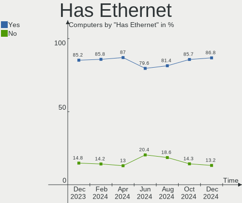
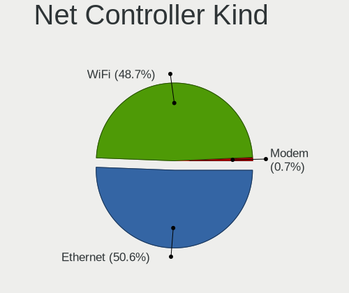

Zorin Hardware Trends
---------------------

A project to identify most popular hardware characteristics and track their change
over time based on data collected by Linux users at https://Linux-Hardware.org.

Anyone can contribute to this report by the [hw-probe](https://github.com/linuxhw/hw-probe) tool:

    sudo -E hw-probe -all -upload

This is a report for all computer types. See also reports for [desktops](/Dist/Zorin/Desktop/README.md) and [notebooks](/Dist/Zorin/Notebook/README.md).

Full-feature report is available here: https://linux-hardware.org/?view=trends

Period: Jul, 2021.

Contents
--------

* [ System ](#system)
  - [ OS                       ](#os)
  - [ OS Family                ](#os-family)
  - [ Kernel                   ](#kernel)
  - [ Kernel Family            ](#kernel-family)
  - [ Kernel Major Ver.        ](#kernel-major-ver)
  - [ Arch                     ](#arch)
  - [ DE                       ](#de)
  - [ Display Server           ](#display-server)
  - [ Display Manager          ](#display-manager)
  - [ OS Lang                  ](#os-lang)
  - [ Boot Mode                ](#boot-mode)
  - [ Filesystem               ](#filesystem)
  - [ Part. scheme             ](#part-scheme)
  - [ Dual Boot with Linux/BSD ](#dual-boot-with-linuxbsd)
  - [ Dual Boot (Win)          ](#dual-boot-win)

* [ Board ](#board)
  - [ Vendor                   ](#vendor)
  - [ Model                    ](#model)
  - [ Model Family             ](#model-family)
  - [ MFG Year                 ](#mfg-year)
  - [ Form Factor              ](#form-factor)
  - [ Secure Boot              ](#secure-boot)
  - [ Coreboot                 ](#coreboot)
  - [ RAM Size                 ](#ram-size)
  - [ RAM Used                 ](#ram-used)
  - [ Total Drives             ](#total-drives)
  - [ Has CD-ROM               ](#has-cd-rom)
  - [ Has Ethernet             ](#has-ethernet)
  - [ Has WiFi                 ](#has-wifi)
  - [ Has Bluetooth            ](#has-bluetooth)

* [ Location ](#location)
  - [ Country                  ](#country)
  - [ City                     ](#city)

* [ Drives ](#drives)
  - [ Drive Vendor             ](#drive-vendor)
  - [ Drive Model              ](#drive-model)
  - [ HDD Vendor               ](#hdd-vendor)
  - [ SSD Vendor               ](#ssd-vendor)
  - [ Drive Kind               ](#drive-kind)
  - [ Drive Connector          ](#drive-connector)
  - [ Drive Size               ](#drive-size)
  - [ Space Total              ](#space-total)
  - [ Space Used               ](#space-used)
  - [ Malfunc. Drives          ](#malfunc-drives)
  - [ Malfunc. Drive Vendor    ](#malfunc-drive-vendor)
  - [ Malfunc. HDD Vendor      ](#malfunc-hdd-vendor)
  - [ Malfunc. Drive Kind      ](#malfunc-drive-kind)
  - [ Failed Drives            ](#failed-drives)
  - [ Failed Drive Vendor      ](#failed-drive-vendor)
  - [ Drive Status             ](#drive-status)

* [ Storage controller ](#storage-controller)
  - [ Storage Vendor           ](#storage-vendor)
  - [ Storage Model            ](#storage-model)
  - [ Storage Kind             ](#storage-kind)

* [ Processor ](#processor)
  - [ CPU Vendor               ](#cpu-vendor)
  - [ CPU Model                ](#cpu-model)
  - [ CPU Model Family         ](#cpu-model-family)
  - [ CPU Cores                ](#cpu-cores)
  - [ CPU Sockets              ](#cpu-sockets)
  - [ CPU Threads              ](#cpu-threads)
  - [ CPU Op-Modes             ](#cpu-op-modes)
  - [ CPU Microcode            ](#cpu-microcode)
  - [ CPU Microarch            ](#cpu-microarch)

* [ Graphics ](#graphics)
  - [ GPU Vendor               ](#gpu-vendor)
  - [ GPU Model                ](#gpu-model)
  - [ GPU Combo                ](#gpu-combo)
  - [ GPU Driver               ](#gpu-driver)
  - [ GPU Memory               ](#gpu-memory)

* [ Monitor ](#monitor)
  - [ Monitor Vendor           ](#monitor-vendor)
  - [ Monitor Model            ](#monitor-model)
  - [ Monitor Resolution       ](#monitor-resolution)
  - [ Monitor Diagonal         ](#monitor-diagonal)
  - [ Monitor Width            ](#monitor-width)
  - [ Aspect Ratio             ](#aspect-ratio)
  - [ Monitor Area             ](#monitor-area)
  - [ Pixel Density            ](#pixel-density)
  - [ Multiple Monitors        ](#multiple-monitors)

* [ Network ](#network)
  - [ Net Controller Vendor    ](#net-controller-vendor)
  - [ Net Controller Model     ](#net-controller-model)
  - [ Wireless Vendor          ](#wireless-vendor)
  - [ Wireless Model           ](#wireless-model)
  - [ Ethernet Vendor          ](#ethernet-vendor)
  - [ Ethernet Model           ](#ethernet-model)
  - [ Net Controller Kind      ](#net-controller-kind)
  - [ Used Controller          ](#used-controller)
  - [ NICs                     ](#nics)
  - [ IPv6                     ](#ipv6)

* [ Bluetooth ](#bluetooth)
  - [ Bluetooth Vendor         ](#bluetooth-vendor)
  - [ Bluetooth Model          ](#bluetooth-model)

* [ Sound ](#sound)
  - [ Sound Vendor             ](#sound-vendor)
  - [ Sound Model              ](#sound-model)

* [ Memory ](#memory)
  - [ Memory Vendor            ](#memory-vendor)
  - [ Memory Model             ](#memory-model)
  - [ Memory Kind              ](#memory-kind)
  - [ Memory Form Factor       ](#memory-form-factor)
  - [ Memory Size              ](#memory-size)
  - [ Memory Speed             ](#memory-speed)

* [ Printers & scanners ](#printers-&-scanners)
  - [ Printer Vendor           ](#printer-vendor)
  - [ Printer Model            ](#printer-model)
  - [ Scanner Vendor           ](#scanner-vendor)
  - [ Scanner Model            ](#scanner-model)

* [ Camera ](#camera)
  - [ Camera Vendor            ](#camera-vendor)
  - [ Camera Model             ](#camera-model)

* [ Security ](#security)
  - [ Fingerprint Vendor       ](#fingerprint-vendor)
  - [ Fingerprint Model        ](#fingerprint-model)
  - [ Chipcard Vendor          ](#chipcard-vendor)
  - [ Chipcard Model           ](#chipcard-model)

* [ Unsupported ](#unsupported)
  - [ Unsupported Devices      ](#unsupported-devices)
  - [ Unsupported Device Types ](#unsupported-device-types)

System
------

OS
--

Installed operating systems

| Name     | Computers | Percent |
|----------|-----------|---------|
| Zorin 15 | 40        | 83.33%  |
| Zorin 16 | 8         | 16.67%  |

OS Family
---------

OS without a version

| Name  | Computers | Percent |
|-------|-----------|---------|
| Zorin | 48        | 100%    |

Kernel
------

Version of the Linux kernel

| Version          | Computers | Percent |
|------------------|-----------|---------|
| 5.4.0-77-generic | 22        | 45.83%  |
| 5.4.0-80-generic | 12        | 25%     |
| 5.8.0-59-generic | 5         | 10.42%  |
| 5.4.0-47-generic | 2         | 4.17%   |
| 5.8.0-63-generic | 1         | 2.08%   |
| 5.8.0-49-generic | 1         | 2.08%   |
| 5.4.0-74-generic | 1         | 2.08%   |
| 5.4.0-73-generic | 1         | 2.08%   |
| 5.4.0-72-generic | 1         | 2.08%   |
| 5.4.0-45-generic | 1         | 2.08%   |
| 5.4.0-42-generic | 1         | 2.08%   |

Kernel Family
-------------

Linux kernel without a distro release

| Version | Computers | Percent |
|---------|-----------|---------|
| 5.4.0   | 41        | 85.42%  |
| 5.8.0   | 7         | 14.58%  |

Kernel Major Ver.
-----------------

Linux kernel major version

| Version | Computers | Percent |
|---------|-----------|---------|
| 5.4     | 41        | 85.42%  |
| 5.8     | 7         | 14.58%  |

Arch
----

OS architecture (x86_64, i586, etc.)

| Name   | Computers | Percent |
|--------|-----------|---------|
| x86_64 | 43        | 89.58%  |
| i686   | 5         | 10.42%  |

DE
--

Desktop Environment

| Name    | Computers | Percent |
|---------|-----------|---------|
| GNOME   | 38        | 79.17%  |
| XFCE    | 8         | 16.67%  |
| Unknown | 2         | 4.17%   |

Display Server
--------------

X11 or Wayland

| Name    | Computers | Percent |
|---------|-----------|---------|
| X11     | 46        | 95.83%  |
| Unknown | 2         | 4.17%   |

Display Manager
---------------

SDDM, LightDM, etc.

| Name    | Computers | Percent |
|---------|-----------|---------|
| Unknown | 47        | 97.92%  |
| GDM     | 1         | 2.08%   |

OS Lang
-------

Language

| Lang  | Computers | Percent |
|-------|-----------|---------|
| en_US | 21        | 43.75%  |
| pl_PL | 4         | 8.33%   |
| en_IN | 3         | 6.25%   |
| pt_BR | 2         | 4.17%   |
| en_ZA | 2         | 4.17%   |
| en_GB | 2         | 4.17%   |
| C     | 2         | 4.17%   |
| tr_TR | 1         | 2.08%   |
| ru_UA | 1         | 2.08%   |
| ru_RU | 1         | 2.08%   |
| pt_PT | 1         | 2.08%   |
| hu_HU | 1         | 2.08%   |
| fr_FR | 1         | 2.08%   |
| es_MX | 1         | 2.08%   |
| es_CL | 1         | 2.08%   |
| es_AR | 1         | 2.08%   |
| en_PH | 1         | 2.08%   |
| en_IL | 1         | 2.08%   |
| de_DE | 1         | 2.08%   |

Boot Mode
---------

EFI or BIOS

| Mode | Computers | Percent |
|------|-----------|---------|
| BIOS | 32        | 66.67%  |
| EFI  | 16        | 33.33%  |

Filesystem
----------

Type of filesystem

| Type    | Computers | Percent |
|---------|-----------|---------|
| Ext4    | 44        | 91.67%  |
| Overlay | 2         | 4.17%   |
| Ext3    | 1         | 2.08%   |
| Unknown | 1         | 2.08%   |

Part. scheme
------------

Scheme of partitioning

| Type    | Computers | Percent |
|---------|-----------|---------|
| Unknown | 47        | 97.92%  |
| GPT     | 1         | 2.08%   |

Dual Boot with Linux/BSD
------------------------

Hosting more than one Linux/BSD

| Dual boot | Computers | Percent |
|-----------|-----------|---------|
| No        | 44        | 91.67%  |
| Yes       | 4         | 8.33%   |

Dual Boot (Win)
---------------

Hosting Linux and Windows

| Dual boot | Computers | Percent |
|-----------|-----------|---------|
| No        | 34        | 70.83%  |
| Yes       | 14        | 29.17%  |

Board
-----

Vendor
------

Motherboard manufacturer

| Name                | Computers | Percent |
|---------------------|-----------|---------|
| ASUSTek Computer    | 9         | 18.75%  |
| Dell                | 8         | 16.67%  |
| Hewlett-Packard     | 7         | 14.58%  |
| Gigabyte Technology | 6         | 12.5%   |
| Lenovo              | 4         | 8.33%   |
| Acer                | 4         | 8.33%   |
| Sony                | 3         | 6.25%   |
| Samsung Electronics | 2         | 4.17%   |
| Xi3                 | 1         | 2.08%   |
| Pegatron            | 1         | 2.08%   |
| Gateway             | 1         | 2.08%   |
| Apple               | 1         | 2.08%   |
| Unknown             | 1         | 2.08%   |

Model
-----

Motherboard model

| Name                                                                                     | Computers | Percent |
|------------------------------------------------------------------------------------------|-----------|---------|
| Xi3 401-0001-303 303                                                                     | 1         | 2.08%   |
| Sony VPCSB25FB                                                                           | 1         | 2.08%   |
| Sony VPCEH16EA                                                                           | 1         | 2.08%   |
| Sony SVE14A2V1EW                                                                         | 1         | 2.08%   |
| Samsung N145P/N250P/N260P                                                                | 1         | 2.08%   |
| Samsung 355V4C/355V4X/355V5C/355V5X/356V4C/356V4X/356V5C/356V5X/3445VC/3445VX/3545VC/354 | 1         | 2.08%   |
| Pegatron HPE-532sc                                                                       | 1         | 2.08%   |
| Lenovo Yoga 330-11IGM 81A6                                                               | 1         | 2.08%   |
| Lenovo Y70-70 Touch 80DU                                                                 | 1         | 2.08%   |
| Lenovo ThinkCentre M73 10AY008CUS                                                        | 1         | 2.08%   |
| Lenovo IdeaPad 330-15AST 81D6                                                            | 1         | 2.08%   |
| HP rp5700 Business System                                                                | 1         | 2.08%   |
| HP Notebook                                                                              | 1         | 2.08%   |
| HP ENVY x360 Convertible 15m-ee0xxx                                                      | 1         | 2.08%   |
| HP EliteBook 820 G2                                                                      | 1         | 2.08%   |
| HP Compaq CQ58                                                                           | 1         | 2.08%   |
| HP 255 G7 Notebook PC                                                                    | 1         | 2.08%   |
| HP 250 G7 Notebook PC                                                                    | 1         | 2.08%   |
| Gigabyte M61PME-S2                                                                       | 1         | 2.08%   |
| Gigabyte H61M-USB3-B3                                                                    | 1         | 2.08%   |
| Gigabyte GA-78LMT-USB3                                                                   | 1         | 2.08%   |
| Gigabyte G31M-ES2C                                                                       | 1         | 2.08%   |
| Gigabyte B460MDS3H                                                                       | 1         | 2.08%   |
| Gigabyte 970A-DS3P                                                                       | 1         | 2.08%   |
| Gateway MX8711                                                                           | 1         | 2.08%   |
| Dell XPS L501X                                                                           | 1         | 2.08%   |
| Dell XPS 8940                                                                            | 1         | 2.08%   |
| Dell OptiPlex 9010                                                                       | 1         | 2.08%   |
| Dell OptiPlex 3010                                                                       | 1         | 2.08%   |
| Dell Latitude 5480                                                                       | 1         | 2.08%   |
| Dell Inspiron N5010                                                                      | 1         | 2.08%   |
| Dell Inspiron 3521                                                                       | 1         | 2.08%   |
| Dell G3 3579                                                                             | 1         | 2.08%   |
| ASUS TUF GAMING X570-PLUS                                                                | 1         | 2.08%   |
| ASUS P8H61-M LE                                                                          | 1         | 2.08%   |
| ASUS P7H55-USB3                                                                          | 1         | 2.08%   |
| ASUS P5KC                                                                                | 1         | 2.08%   |
| ASUS P5G41T-M LX3                                                                        | 1         | 2.08%   |
| ASUS M2N68-AM Plus                                                                       | 1         | 2.08%   |
| ASUS K30AD_M31AD_M51AD                                                                   | 1         | 2.08%   |
| ASUS G50V                                                                                | 1         | 2.08%   |
| ASUS A58M-A/BR                                                                           | 1         | 2.08%   |
| Apple iMac17,1                                                                           | 1         | 2.08%   |
| Acer Extensa 5220                                                                        | 1         | 2.08%   |
| Acer Aspire X3950                                                                        | 1         | 2.08%   |
| Acer Aspire E5-551G                                                                      | 1         | 2.08%   |
| Acer Aspire A515-45                                                                      | 1         | 2.08%   |
| Unknown                                                                                  | 1         | 2.08%   |

Model Family
------------

Motherboard model prefix

| Name                   | Computers | Percent |
|------------------------|-----------|---------|
| Acer Aspire            | 3         | 6.25%   |
| Dell XPS               | 2         | 4.17%   |
| Dell OptiPlex          | 2         | 4.17%   |
| Dell Inspiron          | 2         | 4.17%   |
| Xi3 401-0001-303       | 1         | 2.08%   |
| Sony VPCSB25FB         | 1         | 2.08%   |
| Sony VPCEH16EA         | 1         | 2.08%   |
| Sony SVE14A2V1EW       | 1         | 2.08%   |
| Samsung N145P          | 1         | 2.08%   |
| Samsung 355V4C         | 1         | 2.08%   |
| Pegatron HPE-532sc     | 1         | 2.08%   |
| Lenovo Yoga            | 1         | 2.08%   |
| Lenovo Y70-70          | 1         | 2.08%   |
| Lenovo ThinkCentre     | 1         | 2.08%   |
| Lenovo IdeaPad         | 1         | 2.08%   |
| HP rp5700              | 1         | 2.08%   |
| HP Notebook            | 1         | 2.08%   |
| HP ENVY                | 1         | 2.08%   |
| HP EliteBook           | 1         | 2.08%   |
| HP Compaq              | 1         | 2.08%   |
| HP 255                 | 1         | 2.08%   |
| HP 250                 | 1         | 2.08%   |
| Gigabyte M61PME-S2     | 1         | 2.08%   |
| Gigabyte H61M-USB3-B3  | 1         | 2.08%   |
| Gigabyte GA-78LMT-USB3 | 1         | 2.08%   |
| Gigabyte G31M-ES2C     | 1         | 2.08%   |
| Gigabyte B460MDS3H     | 1         | 2.08%   |
| Gigabyte 970A-DS3P     | 1         | 2.08%   |
| Gateway MX8711         | 1         | 2.08%   |
| Dell Latitude          | 1         | 2.08%   |
| Dell G3                | 1         | 2.08%   |
| ASUS TUF               | 1         | 2.08%   |
| ASUS P8H61-M           | 1         | 2.08%   |
| ASUS P7H55-USB3        | 1         | 2.08%   |
| ASUS P5KC              | 1         | 2.08%   |
| ASUS P5G41T-M          | 1         | 2.08%   |
| ASUS M2N68-AM          | 1         | 2.08%   |
| ASUS K30AD             | 1         | 2.08%   |
| ASUS G50V              | 1         | 2.08%   |
| ASUS A58M-A            | 1         | 2.08%   |
| Apple iMac17           | 1         | 2.08%   |
| Acer Extensa           | 1         | 2.08%   |
| Unknown                | 1         | 2.08%   |

MFG Year
--------

Motherboard manufacture year

| Year | Computers | Percent |
|------|-----------|---------|
| 2012 | 7         | 14.58%  |
| 2010 | 7         | 14.58%  |
| 2021 | 5         | 10.42%  |
| 2011 | 5         | 10.42%  |
| 2020 | 4         | 8.33%   |
| 2015 | 4         | 8.33%   |
| 2017 | 3         | 6.25%   |
| 2013 | 3         | 6.25%   |
| 2019 | 2         | 4.17%   |
| 2014 | 2         | 4.17%   |
| 2009 | 2         | 4.17%   |
| 2008 | 2         | 4.17%   |
| 2018 | 1         | 2.08%   |
| 2006 | 1         | 2.08%   |

Form Factor
-----------

Physical design of the computer

| Name        | Computers | Percent |
|-------------|-----------|---------|
| Notebook    | 23        | 47.92%  |
| Desktop     | 22        | 45.83%  |
| Convertible | 2         | 4.17%   |
| All in one  | 1         | 2.08%   |

Secure Boot
-----------

Enabled or disabled

| State    | Computers | Percent |
|----------|-----------|---------|
| Disabled | 44        | 91.67%  |
| Enabled  | 4         | 8.33%   |

Coreboot
--------

Have coreboot on board

| Used | Computers | Percent |
|------|-----------|---------|
| No   | 48        | 100%    |

RAM Size
--------

Total RAM memory

| Size in GB | Computers | Percent |
|------------|-----------|---------|
| 3.01-4.0   | 13        | 27.08%  |
| 8.01-16.0  | 10        | 20.83%  |
| 4.01-8.0   | 8         | 16.67%  |
| 1.01-2.0   | 8         | 16.67%  |
| 32.01-64.0 | 3         | 6.25%   |
| 16.01-24.0 | 3         | 6.25%   |
| 2.01-3.0   | 2         | 4.17%   |
| 0.51-1.0   | 1         | 2.08%   |

RAM Used
--------

Used RAM memory

| Used GB    | Computers | Percent |
|------------|-----------|---------|
| 1.01-2.0   | 21        | 43.75%  |
| 2.01-3.0   | 16        | 33.33%  |
| 3.01-4.0   | 5         | 10.42%  |
| 0.51-1.0   | 4         | 8.33%   |
| 4.01-8.0   | 1         | 2.08%   |
| 16.01-24.0 | 1         | 2.08%   |

Total Drives
------------

Number of drives on board

| Drives | Computers | Percent |
|--------|-----------|---------|
| 1      | 34        | 70.83%  |
| 2      | 9         | 18.75%  |
| 3      | 3         | 6.25%   |
| 5      | 2         | 4.17%   |

Has CD-ROM
----------

Has CD-ROM on board

| Presented | Computers | Percent |
|-----------|-----------|---------|
| Yes       | 24        | 50%     |
| No        | 24        | 50%     |

Has Ethernet
------------

Has Ethernet on board

| Presented | Computers | Percent |
|-----------|-----------|---------|
| Yes       | 46        | 95.83%  |
| No        | 2         | 4.17%   |

Has WiFi
--------

Has WiFi module

| Presented | Computers | Percent |
|-----------|-----------|---------|
| Yes       | 33        | 68.75%  |
| No        | 15        | 31.25%  |

Has Bluetooth
-------------

Has Bluetooth module

| Presented | Computers | Percent |
|-----------|-----------|---------|
| Yes       | 27        | 56.25%  |
| No        | 21        | 43.75%  |

Location
--------

Country
-------

Geographic location (country)

| Country      | Computers | Percent |
|--------------|-----------|---------|
| USA          | 10        | 20.83%  |
| Indonesia    | 5         | 10.42%  |
| UK           | 3         | 6.25%   |
| South Africa | 3         | 6.25%   |
| Poland       | 3         | 6.25%   |
| India        | 3         | 6.25%   |
| Brazil       | 3         | 6.25%   |
| Germany      | 2         | 4.17%   |
| Denmark      | 2         | 4.17%   |
| Ukraine      | 1         | 2.08%   |
| Switzerland  | 1         | 2.08%   |
| Saudi Arabia | 1         | 2.08%   |
| Russia       | 1         | 2.08%   |
| Portugal     | 1         | 2.08%   |
| Philippines  | 1         | 2.08%   |
| Palestine    | 1         | 2.08%   |
| Norway       | 1         | 2.08%   |
| Mexico       | 1         | 2.08%   |
| Malaysia     | 1         | 2.08%   |
| Hungary      | 1         | 2.08%   |
| France       | 1         | 2.08%   |
| Chile        | 1         | 2.08%   |
| Argentina    | 1         | 2.08%   |

City
----

Geographic location (city)

| City                   | Computers | Percent |
|------------------------|-----------|---------|
| Malang                 | 3         | 6.25%   |
| Warsaw                 | 2         | 4.17%   |
| Copenhagen             | 2         | 4.17%   |
| Cape Town              | 2         | 4.17%   |
| Zillah                 | 1         | 2.08%   |
| Whitefield             | 1         | 2.08%   |
| West Monroe            | 1         | 2.08%   |
| Viedma                 | 1         | 2.08%   |
| Vi?±a del Mar          | 1         | 2.08%   |
| Trivandrum             | 1         | 2.08%   |
| São Luís             | 1         | 2.08%   |
| Stavropol              | 1         | 2.08%   |
| Riyadh                 | 1         | 2.08%   |
| Quezon City            | 1         | 2.08%   |
| Puchong Batu Dua Belas | 1         | 2.08%   |
| Prospect Park          | 1         | 2.08%   |
| Penafiel               | 1         | 2.08%   |
| Pekalongan             | 1         | 2.08%   |
| Oslo                   | 1         | 2.08%   |
| New Delhi              | 1         | 2.08%   |
| Monheim am Rhein       | 1         | 2.08%   |
| Mexico City            | 1         | 2.08%   |
| Maryville              | 1         | 2.08%   |
| Mage                   | 1         | 2.08%   |
| Lubbock                | 1         | 2.08%   |
| London                 | 1         | 2.08%   |
| Kyiv                   | 1         | 2.08%   |
| Killeen                | 1         | 2.08%   |
| Johannesburg           | 1         | 2.08%   |
| Jenin                  | 1         | 2.08%   |
| Gmina Koszęcin        | 1         | 2.08%   |
| Geneva                 | 1         | 2.08%   |
| Eugene                 | 1         | 2.08%   |
| Dudley                 | 1         | 2.08%   |
| Dortmund               | 1         | 2.08%   |
| Dayton                 | 1         | 2.08%   |
| Cormeilles-en-Parisis  | 1         | 2.08%   |
| Contagem               | 1         | 2.08%   |
| Chesterfield           | 1         | 2.08%   |
| Caturtunggal           | 1         | 2.08%   |
| Budapest               | 1         | 2.08%   |
| Bengaluru              | 1         | 2.08%   |
| Antioch                | 1         | 2.08%   |

Drives
------

Drive Vendor
------------

Hard drive vendors

| Vendor              | Computers | Drives | Percent |
|---------------------|-----------|--------|---------|
| Seagate             | 14        | 14     | 21.21%  |
| Samsung Electronics | 10        | 10     | 15.15%  |
| WDC                 | 9         | 9      | 13.64%  |
| Toshiba             | 8         | 10     | 12.12%  |
| Kingston            | 7         | 7      | 10.61%  |
| Unknown             | 4         | 5      | 6.06%   |
| SanDisk             | 4         | 4      | 6.06%   |
| Hitachi             | 2         | 2      | 3.03%   |
| XPG                 | 1         | 1      | 1.52%   |
| Micron Technology   | 1         | 1      | 1.52%   |
| Lexar               | 1         | 1      | 1.52%   |
| Intel               | 1         | 1      | 1.52%   |
| Hewlett-Packard     | 1         | 1      | 1.52%   |
| Fujitsu             | 1         | 1      | 1.52%   |
| Crucial             | 1         | 1      | 1.52%   |
| Apple               | 1         | 1      | 1.52%   |

Drive Model
-----------

Hard drive models

| Model                                   | Computers | Percent |
|-----------------------------------------|-----------|---------|
| Kingston SA400S37480G 480GB SSD         | 3         | 4.48%   |
| Unknown MMC Card  32GB                  | 2         | 2.99%   |
| Unknown MMC Card  128GB                 | 2         | 2.99%   |
| Toshiba MQ01ABF050 500GB                | 2         | 2.99%   |
| Seagate ST3160813AS 160GB               | 2         | 2.99%   |
| Samsung NVMe SSD Drive 500GB            | 2         | 2.99%   |
| Kingston SV300S37A120G 120GB SSD        | 2         | 2.99%   |
| Kingston SA400S37240G 240GB SSD         | 2         | 2.99%   |
| XPG NVMe SSD Drive 1024GB               | 1         | 1.49%   |
| WDC WDS500G2B0A-00SM50 500GB SSD        | 1         | 1.49%   |
| WDC WD5000AAKX-75U6AA0 500GB            | 1         | 1.49%   |
| WDC WD5000AAKX-001CA0 500GB             | 1         | 1.49%   |
| WDC WD20EZRX-22D8PB0 2TB                | 1         | 1.49%   |
| WDC WD2003FZEX-00SRLA0 2TB              | 1         | 1.49%   |
| WDC WD10JPVX-22JC3T0 1TB                | 1         | 1.49%   |
| WDC WD10EZEX-08M2NA0 1TB                | 1         | 1.49%   |
| WDC WD10EARS-22Y5B1 1TB                 | 1         | 1.49%   |
| WDC WD1000BEVS-22LAT0 100GB             | 1         | 1.49%   |
| Unknown 32GB 6G mSATA w/                | 1         | 1.49%   |
| Toshiba Q300. 240GB SSD                 | 1         | 1.49%   |
| Toshiba MQ01ABD100 1TB                  | 1         | 1.49%   |
| Toshiba MQ01ABD050 500GB                | 1         | 1.49%   |
| Toshiba KSG60ZMV256G M.2 2280 256GB SSD | 1         | 1.49%   |
| Toshiba DT01ACA200 2TB                  | 1         | 1.49%   |
| Toshiba DT01ACA100 1TB                  | 1         | 1.49%   |
| Seagate ST9320325AS 320GB               | 1         | 1.49%   |
| Seagate ST9250410AS 250GB               | 1         | 1.49%   |
| Seagate ST500LT012-9WS142 500GB         | 1         | 1.49%   |
| Seagate ST500LM012 HN-M500MBB 500GB     | 1         | 1.49%   |
| Seagate ST4000DM004-2CV104 4TB          | 1         | 1.49%   |
| Seagate ST3160815AS 160GB               | 1         | 1.49%   |
| Seagate ST1000VX005-2EZ102 1TB          | 1         | 1.49%   |
| Seagate ST1000LM035-1RK172 1TB          | 1         | 1.49%   |
| Seagate ST1000DM010-2EP102 1TB          | 1         | 1.49%   |
| Seagate ST1000DM003-1ER162 1TB          | 1         | 1.49%   |
| Seagate ST1000DM003-1CH162 1TB          | 1         | 1.49%   |
| Seagate BUP BK 4TB                      | 1         | 1.49%   |
| SanDisk SSD PLUS 480 GB                 | 1         | 1.49%   |
| SanDisk SSD PLUS 120GB                  | 1         | 1.49%   |
| SanDisk SD9SN8W-128G-1006 128GB SSD     | 1         | 1.49%   |
| SanDisk SD7SB6S-256G-1006 256GB SSD     | 1         | 1.49%   |
| Samsung SSD 860 EVO 500GB               | 1         | 1.49%   |
| Samsung SSD 860 EVO 250GB               | 1         | 1.49%   |
| Samsung SSD 850 120GB                   | 1         | 1.49%   |
| Samsung SSD 830 Series 128GB            | 1         | 1.49%   |
| Samsung HM640JJ 640GB                   | 1         | 1.49%   |
| Samsung HM250HI 250GB                   | 1         | 1.49%   |
| Samsung HD322HJ 320GB                   | 1         | 1.49%   |
| Samsung HD256GJ 250GB                   | 1         | 1.49%   |
| Micron NVMe SSD Drive 512GB             | 1         | 1.49%   |
| Lexar 256GB SSD                         | 1         | 1.49%   |
| Intel NVMe SSD Drive 512GB              | 1         | 1.49%   |
| Hitachi HTS547575A9E384 752GB           | 1         | 1.49%   |
| Hitachi HDE721010SLA330 1TB             | 1         | 1.49%   |
| HP VK0240GEPQN 240GB SSD                | 1         | 1.49%   |
| Fujitsu MHZ2320BH G2 320GB              | 1         | 1.49%   |
| Crucial CT500MX500SSD1 500GB            | 1         | 1.49%   |
| Apple HDD ST1000DM003 1TB               | 1         | 1.49%   |

HDD Vendor
----------

Hard disk drive vendors

| Vendor              | Computers | Drives | Percent |
|---------------------|-----------|--------|---------|
| Seagate             | 14        | 14     | 38.89%  |
| WDC                 | 8         | 8      | 22.22%  |
| Toshiba             | 6         | 8      | 16.67%  |
| Samsung Electronics | 4         | 4      | 11.11%  |
| Hitachi             | 2         | 2      | 5.56%   |
| Fujitsu             | 1         | 1      | 2.78%   |
| Apple               | 1         | 1      | 2.78%   |

SSD Vendor
----------

Solid state drive vendors

| Vendor              | Computers | Drives | Percent |
|---------------------|-----------|--------|---------|
| Kingston            | 7         | 7      | 33.33%  |
| SanDisk             | 4         | 4      | 19.05%  |
| Samsung Electronics | 4         | 4      | 19.05%  |
| Toshiba             | 2         | 2      | 9.52%   |
| WDC                 | 1         | 1      | 4.76%   |
| Lexar               | 1         | 1      | 4.76%   |
| Hewlett-Packard     | 1         | 1      | 4.76%   |
| Crucial             | 1         | 1      | 4.76%   |

Drive Kind
----------

HDD or SSD

| Kind    | Computers | Drives | Percent |
|---------|-----------|--------|---------|
| HDD     | 30        | 38     | 51.72%  |
| SSD     | 19        | 21     | 32.76%  |
| NVMe    | 5         | 5      | 8.62%   |
| MMC     | 3         | 4      | 5.17%   |
| Unknown | 1         | 1      | 1.72%   |

Drive Connector
---------------

SATA, SAS, NVMe, etc.

| Type | Computers | Drives | Percent |
|------|-----------|--------|---------|
| SATA | 42        | 59     | 82.35%  |
| NVMe | 5         | 5      | 9.8%    |
| MMC  | 3         | 4      | 5.88%   |
| SAS  | 1         | 1      | 1.96%   |

Drive Size
----------

Size of hard drive

| Size in TB | Computers | Drives | Percent |
|------------|-----------|--------|---------|
| 0.01-0.5   | 34        | 38     | 68%     |
| 0.51-1.0   | 11        | 15     | 22%     |
| 1.01-2.0   | 3         | 4      | 6%      |
| 3.01-4.0   | 2         | 2      | 4%      |

Space Total
-----------

Amount of disk space available on the file system

| Size in GB     | Computers | Percent |
|----------------|-----------|---------|
| 101-250        | 14        | 29.17%  |
| 251-500        | 11        | 22.92%  |
| 51-100         | 6         | 12.5%   |
| 21-50          | 5         | 10.42%  |
| 501-1000       | 5         | 10.42%  |
| 1-20           | 3         | 6.25%   |
| More than 3000 | 2         | 4.17%   |
| 1001-2000      | 2         | 4.17%   |

Space Used
----------

Amount of used disk space

| Used GB   | Computers | Percent |
|-----------|-----------|---------|
| 1-20      | 31        | 64.58%  |
| 21-50     | 6         | 12.5%   |
| 101-250   | 3         | 6.25%   |
| 51-100    | 3         | 6.25%   |
| 251-500   | 2         | 4.17%   |
| 501-1000  | 2         | 4.17%   |
| 1001-2000 | 1         | 2.08%   |

Malfunc. Drives
---------------

Drive models with a malfunction

Zero info for selected period =(

Malfunc. Drive Vendor
---------------------

Vendors of faulty drives

Zero info for selected period =(

Malfunc. HDD Vendor
-------------------

Vendors of faulty HDD drives

Zero info for selected period =(

Malfunc. Drive Kind
-------------------

Kinds of faulty drives

Zero info for selected period =(

Failed Drives
-------------

Failed drive models

Zero info for selected period =(

Failed Drive Vendor
-------------------

Failed drive vendors

Zero info for selected period =(

Drive Status
------------

Number of failed and malfunc. drives

| Status   | Computers | Drives | Percent |
|----------|-----------|--------|---------|
| Detected | 47        | 67     | 97.92%  |
| Works    | 1         | 2      | 2.08%   |

Storage controller
------------------

Storage Vendor
--------------

Storage controller vendors

| Vendor              | Computers | Percent |
|---------------------|-----------|---------|
| Intel               | 35        | 67.31%  |
| AMD                 | 10        | 19.23%  |
| Samsung Electronics | 2         | 3.85%   |
| Nvidia              | 2         | 3.85%   |
| Micron Technology   | 1         | 1.92%   |
| JMicron Technology  | 1         | 1.92%   |
| ADATA Technology    | 1         | 1.92%   |

Storage Model
-------------

Storage controller models

| Model                                                                                   | Computers | Percent |
|-----------------------------------------------------------------------------------------|-----------|---------|
| AMD FCH SATA Controller [AHCI mode]                                                     | 7         | 11.29%  |
| Intel 8 Series/C220 Series Chipset Family 6-port SATA Controller 1 [AHCI mode]          | 3         | 4.84%   |
| Intel 7 Series Chipset Family 6-port SATA Controller [AHCI mode]                        | 3         | 4.84%   |
| Intel 6 Series/C200 Series Chipset Family 6 port Desktop SATA AHCI Controller           | 3         | 4.84%   |
| Intel 5 Series/3400 Series Chipset 6 port SATA AHCI Controller                          | 3         | 4.84%   |
| Samsung NVMe SSD Controller SM981/PM981/PM983                                           | 2         | 3.23%   |
| Nvidia MCP61 SATA Controller                                                            | 2         | 3.23%   |
| Nvidia MCP61 IDE                                                                        | 2         | 3.23%   |
| Intel Sunrise Point-LP SATA Controller [AHCI mode]                                      | 2         | 3.23%   |
| Intel NM10/ICH7 Family SATA Controller [IDE mode]                                       | 2         | 3.23%   |
| Intel 82801G (ICH7 Family) IDE Controller                                               | 2         | 3.23%   |
| Intel 82801 Mobile SATA Controller [RAID mode]                                          | 2         | 3.23%   |
| Intel 6 Series/C200 Series Chipset Family 6 port Mobile SATA AHCI Controller            | 2         | 3.23%   |
| AMD SB7x0/SB8x0/SB9x0 SATA Controller [IDE mode]                                        | 2         | 3.23%   |
| AMD SB7x0/SB8x0/SB9x0 IDE Controller                                                    | 2         | 3.23%   |
| Micron Non-Volatile memory controller                                                   | 1         | 1.61%   |
| JMicron JMB363 SATA/IDE Controller                                                      | 1         | 1.61%   |
| Intel Wildcat Point-LP SATA Controller [AHCI Mode]                                      | 1         | 1.61%   |
| Intel SSD 660P Series                                                                   | 1         | 1.61%   |
| Intel SATA Controller [RAID mode]                                                       | 1         | 1.61%   |
| Intel Q170/Q150/B150/H170/H110/Z170/CM236 Chipset SATA Controller [AHCI Mode]           | 1         | 1.61%   |
| Intel NM10/ICH7 Family SATA Controller [AHCI mode]                                      | 1         | 1.61%   |
| Intel Celeron/Pentium Silver Processor SATA Controller                                  | 1         | 1.61%   |
| Intel 82801IBM/IEM (ICH9M/ICH9M-E) 4 port SATA Controller [AHCI mode]                   | 1         | 1.61%   |
| Intel 82801IB (ICH9) 2 port SATA Controller [IDE mode]                                  | 1         | 1.61%   |
| Intel 82801I (ICH9 Family) 2 port SATA Controller [IDE mode]                            | 1         | 1.61%   |
| Intel 82801HM/HEM (ICH8M/ICH8M-E) SATA Controller [IDE mode]                            | 1         | 1.61%   |
| Intel 82801HM/HEM (ICH8M/ICH8M-E) IDE Controller                                        | 1         | 1.61%   |
| Intel 82801H (ICH8 Family) 4 port SATA Controller [IDE mode]                            | 1         | 1.61%   |
| Intel 82801GBM/GHM (ICH7-M Family) SATA Controller [AHCI mode]                          | 1         | 1.61%   |
| Intel 7 Series/C210 Series Chipset Family 6-port SATA Controller [AHCI mode]            | 1         | 1.61%   |
| Intel 6 Series/C200 Series Chipset Family Desktop SATA Controller (IDE mode, ports 4-5) | 1         | 1.61%   |
| Intel 6 Series/C200 Series Chipset Family Desktop SATA Controller (IDE mode, ports 0-3) | 1         | 1.61%   |
| Intel 5 Series/3400 Series Chipset 4 port SATA IDE Controller                           | 1         | 1.61%   |
| Intel 5 Series/3400 Series Chipset 2 port SATA IDE Controller                           | 1         | 1.61%   |
| Intel 400 Series Chipset Family SATA RAID Controller                                    | 1         | 1.61%   |
| AMD SB7x0/SB8x0/SB9x0 SATA Controller [AHCI mode]                                       | 1         | 1.61%   |
| ADATA XPG SX8200 Pro PCIe Gen3x4 M.2 2280 Solid State Drive                             | 1         | 1.61%   |

Storage Kind
------------

Kind of storage controller (IDE, SATA, NVMe, SAS, ...)

| Kind | Computers | Percent |
|------|-----------|---------|
| SATA | 33        | 61.11%  |
| IDE  | 12        | 22.22%  |
| NVMe | 5         | 9.26%   |
| RAID | 4         | 7.41%   |

Processor
---------

CPU Vendor
----------

Processor vendors

| Vendor | Computers | Percent |
|--------|-----------|---------|
| Intel  | 35        | 72.92%  |
| AMD    | 13        | 27.08%  |

CPU Model
---------

Processor models

| Model                                         | Computers | Percent |
|-----------------------------------------------|-----------|---------|
| Intel Core i3-2100 CPU @ 3.10GHz              | 2         | 4.17%   |
| Intel Core 2 Duo CPU E8400 @ 3.00GHz          | 2         | 4.17%   |
| Intel Core 2 Duo CPU E7400 @ 2.80GHz          | 2         | 4.17%   |
| Intel Pentium CPU G850 @ 2.90GHz              | 1         | 2.08%   |
| Intel Genuine CPU T2250 @ 1.73GHz             | 1         | 2.08%   |
| Intel Core i7-4720HQ CPU @ 2.60GHz            | 1         | 2.08%   |
| Intel Core i7-10700K CPU @ 3.80GHz            | 1         | 2.08%   |
| Intel Core i7 CPU Q 740 @ 1.73GHz             | 1         | 2.08%   |
| Intel Core i7 CPU 870 @ 2.93GHz               | 1         | 2.08%   |
| Intel Core i5-8300H CPU @ 2.30GHz             | 1         | 2.08%   |
| Intel Core i5-7200U CPU @ 2.50GHz             | 1         | 2.08%   |
| Intel Core i5-6500 CPU @ 3.20GHz              | 1         | 2.08%   |
| Intel Core i5-5300U CPU @ 2.30GHz             | 1         | 2.08%   |
| Intel Core i5-4590T CPU @ 2.00GHz             | 1         | 2.08%   |
| Intel Core i5-4460 CPU @ 3.20GHz              | 1         | 2.08%   |
| Intel Core i5-3470 CPU @ 3.20GHz              | 1         | 2.08%   |
| Intel Core i5-3210M CPU @ 2.50GHz             | 1         | 2.08%   |
| Intel Core i5-2500 CPU @ 3.30GHz              | 1         | 2.08%   |
| Intel Core i5-2410M CPU @ 2.30GHz             | 1         | 2.08%   |
| Intel Core i3-7020U CPU @ 2.30GHz             | 1         | 2.08%   |
| Intel Core i3-6006U CPU @ 2.00GHz             | 1         | 2.08%   |
| Intel Core i3-3217U CPU @ 1.80GHz             | 1         | 2.08%   |
| Intel Core i3-2310M CPU @ 2.10GHz             | 1         | 2.08%   |
| Intel Core i3 CPU M 350 @ 2.27GHz             | 1         | 2.08%   |
| Intel Core i3 CPU 550 @ 3.20GHz               | 1         | 2.08%   |
| Intel Core 2 Duo CPU T9400 @ 2.53GHz          | 1         | 2.08%   |
| Intel Celeron N4000 CPU @ 1.10GHz             | 1         | 2.08%   |
| Intel Celeron CPU B830 @ 1.80GHz              | 1         | 2.08%   |
| Intel Celeron CPU 550 @ 2.00GHz               | 1         | 2.08%   |
| Intel Atom x5-Z8350 CPU @ 1.44GHz             | 1         | 2.08%   |
| Intel Atom CPU N450 @ 1.66GHz                 | 1         | 2.08%   |
| Intel 11th Gen Core i7-11700 @ 2.50GHz        | 1         | 2.08%   |
| AMD Ryzen 7 4700U with Radeon Graphics        | 1         | 2.08%   |
| AMD Ryzen 7 3700X 8-Core Processor            | 1         | 2.08%   |
| AMD Ryzen 5 5500U with Radeon Graphics        | 1         | 2.08%   |
| AMD FX-8350 Eight-Core Processor              | 1         | 2.08%   |
| AMD FX-7500 Radeon R7, 10 Compute Cores 4C+6G | 1         | 2.08%   |
| AMD FX-4130 Quad-Core Processor               | 1         | 2.08%   |
| AMD E2-9000 RADEON R2, 4 COMPUTE CORES 2C+2G  | 1         | 2.08%   |
| AMD Athlon II X3 400e Processor               | 1         | 2.08%   |
| AMD Athlon 64 X2 Dual Core Processor 4600+    | 1         | 2.08%   |
| AMD Athlon 64 X2 Dual Core Processor 3400+    | 1         | 2.08%   |
| AMD A6-4400M APU with Radeon HD Graphics      | 1         | 2.08%   |
| AMD A4-9125 RADEON R3, 4 COMPUTE CORES 2C+2G  | 1         | 2.08%   |
| AMD A4-4000 APU with Radeon HD Graphics       | 1         | 2.08%   |

CPU Model Family
----------------

Processor model prefix

| Model            | Computers | Percent |
|------------------|-----------|---------|
| Intel Core i5    | 10        | 20.83%  |
| Intel Core i3    | 8         | 16.67%  |
| Intel Core 2 Duo | 5         | 10.42%  |
| Intel Core i7    | 4         | 8.33%   |
| Intel Celeron    | 3         | 6.25%   |
| AMD FX           | 3         | 6.25%   |
| Intel Atom       | 2         | 4.17%   |
| AMD Ryzen 7      | 2         | 4.17%   |
| AMD Athlon 64 X2 | 2         | 4.17%   |
| AMD A4           | 2         | 4.17%   |
| Other            | 1         | 2.08%   |
| Intel Pentium    | 1         | 2.08%   |
| Intel Genuine    | 1         | 2.08%   |
| AMD Ryzen 5      | 1         | 2.08%   |
| AMD E2           | 1         | 2.08%   |
| AMD Athlon II X3 | 1         | 2.08%   |
| AMD A6           | 1         | 2.08%   |

CPU Cores
---------

Number of processor cores

| Number | Computers | Percent |
|--------|-----------|---------|
| 2      | 27        | 56.25%  |
| 4      | 11        | 22.92%  |
| 8      | 4         | 8.33%   |
| 1      | 4         | 8.33%   |
| 6      | 1         | 2.08%   |
| 3      | 1         | 2.08%   |

CPU Sockets
-----------

Number of sockets

| Number | Computers | Percent |
|--------|-----------|---------|
| 1      | 48        | 100%    |

CPU Threads
-----------

Threads per core (Hyper-Threading)

| Number | Computers | Percent |
|--------|-----------|---------|
| 2      | 26        | 54.17%  |
| 1      | 22        | 45.83%  |

CPU Op-Modes
------------

CPU Operation Modes (32-bit, 64-bit)

| Op mode        | Computers | Percent |
|----------------|-----------|---------|
| 32-bit, 64-bit | 47        | 97.92%  |
| 32-bit         | 1         | 2.08%   |

CPU Microcode
-------------

Microcode number

| Number     | Computers | Percent |
|------------|-----------|---------|
| Unknown    | 8         | 16.67%  |
| 0x206a7    | 7         | 14.58%  |
| 0x306c3    | 3         | 6.25%   |
| 0x1067a    | 3         | 6.25%   |
| 0x806e9    | 2         | 4.17%   |
| 0x306a9    | 2         | 4.17%   |
| 0x10676    | 2         | 4.17%   |
| 0x06006705 | 2         | 4.17%   |
| 0x06001119 | 2         | 4.17%   |
| 0xa0671    | 1         | 2.08%   |
| 0x906ea    | 1         | 2.08%   |
| 0x6e8      | 1         | 2.08%   |
| 0x506e3    | 1         | 2.08%   |
| 0x406e3    | 1         | 2.08%   |
| 0x406c4    | 1         | 2.08%   |
| 0x306d4    | 1         | 2.08%   |
| 0x20655    | 1         | 2.08%   |
| 0x20652    | 1         | 2.08%   |
| 0x106ca    | 1         | 2.08%   |
| 0x10661    | 1         | 2.08%   |
| 0x08608102 | 1         | 2.08%   |
| 0x08600106 | 1         | 2.08%   |
| 0x06003106 | 1         | 2.08%   |
| 0x06000852 | 1         | 2.08%   |
| 0x0600063e | 1         | 2.08%   |
| 0x010000db | 1         | 2.08%   |

CPU Microarch
-------------

Microarchitecture

| Name          | Computers | Percent |
|---------------|-----------|---------|
| SandyBridge   | 7         | 14.58%  |
| Penryn        | 5         | 10.42%  |
| Piledriver    | 3         | 6.25%   |
| KabyLake      | 3         | 6.25%   |
| IvyBridge     | 3         | 6.25%   |
| Haswell       | 3         | 6.25%   |
| Zen 2         | 2         | 4.17%   |
| Westmere      | 2         | 4.17%   |
| Skylake       | 2         | 4.17%   |
| Nehalem       | 2         | 4.17%   |
| K8 Hammer     | 2         | 4.17%   |
| Excavator     | 2         | 4.17%   |
| Unknown       | 2         | 4.17%   |
| Steamroller   | 1         | 2.08%   |
| Silvermont    | 1         | 2.08%   |
| P6            | 1         | 2.08%   |
| K10           | 1         | 2.08%   |
| Goldmont plus | 1         | 2.08%   |
| Core          | 1         | 2.08%   |
| CometLake     | 1         | 2.08%   |
| Bulldozer     | 1         | 2.08%   |
| Broadwell     | 1         | 2.08%   |
| Bonnell       | 1         | 2.08%   |

Graphics
--------

GPU Vendor
----------

Vendors of graphics cards

| Vendor | Computers | Percent |
|--------|-----------|---------|
| Intel  | 23        | 46%     |
| Nvidia | 15        | 30%     |
| AMD    | 12        | 24%     |

GPU Model
---------

Graphics card models

| Model                                                                                    | Computers | Percent |
|------------------------------------------------------------------------------------------|-----------|---------|
| Intel 2nd Generation Core Processor Family Integrated Graphics Controller                | 4         | 7.55%   |
| Nvidia G96C [GeForce 9500 GT]                                                            | 2         | 3.77%   |
| Intel HD Graphics 620                                                                    | 2         | 3.77%   |
| Intel Core Processor Integrated Graphics Controller                                      | 2         | 3.77%   |
| Intel 3rd Gen Core processor Graphics Controller                                         | 2         | 3.77%   |
| AMD Stoney [Radeon R2/R3/R4/R5 Graphics]                                                 | 2         | 3.77%   |
| Nvidia TU106 [GeForce RTX 2060 SUPER]                                                    | 1         | 1.89%   |
| Nvidia GT218 [GeForce 210]                                                               | 1         | 1.89%   |
| Nvidia GP107M [GeForce GTX 1050 Mobile]                                                  | 1         | 1.89%   |
| Nvidia GM107M [GeForce GTX 960M]                                                         | 1         | 1.89%   |
| Nvidia GM107 [GeForce GTX 750 Ti]                                                        | 1         | 1.89%   |
| Nvidia GK208B [GeForce GT 730]                                                           | 1         | 1.89%   |
| Nvidia GK107 [GeForce GTX 650]                                                           | 1         | 1.89%   |
| Nvidia GK106GL [Quadro K4000]                                                            | 1         | 1.89%   |
| Nvidia GF119M [GeForce 410M]                                                             | 1         | 1.89%   |
| Nvidia GF108M [GeForce GT 435M]                                                          | 1         | 1.89%   |
| Nvidia GF108 [GeForce GT 420]                                                            | 1         | 1.89%   |
| Nvidia G96M [GeForce 9700M GT]                                                           | 1         | 1.89%   |
| Nvidia G94 [GeForce 9600 GT]                                                             | 1         | 1.89%   |
| Intel Xeon E3-1200 v3/4th Gen Core Processor Integrated Graphics Controller              | 1         | 1.89%   |
| Intel Skylake GT2 [HD Graphics 520]                                                      | 1         | 1.89%   |
| Intel Mobile GM965/GL960 Integrated Graphics Controller (secondary)                      | 1         | 1.89%   |
| Intel Mobile GM965/GL960 Integrated Graphics Controller (primary)                        | 1         | 1.89%   |
| Intel Mobile 945GM/GMS/GME, 943/940GML Express Integrated Graphics Controller            | 1         | 1.89%   |
| Intel Mobile 945GM/GMS, 943/940GML Express Integrated Graphics Controller                | 1         | 1.89%   |
| Intel HD Graphics 5500                                                                   | 1         | 1.89%   |
| Intel GeminiLake [UHD Graphics 600]                                                      | 1         | 1.89%   |
| Intel CometLake-S GT2 [UHD Graphics 630]                                                 | 1         | 1.89%   |
| Intel CoffeeLake-H GT2 [UHD Graphics 630]                                                | 1         | 1.89%   |
| Intel Atom/Celeron/Pentium Processor x5-E8000/J3xxx/N3xxx Integrated Graphics Controller | 1         | 1.89%   |
| Intel Atom Processor D4xx/D5xx/N4xx/N5xx Integrated Graphics Controller                  | 1         | 1.89%   |
| Intel 82Q963/Q965 Integrated Graphics Controller                                         | 1         | 1.89%   |
| Intel 82G33/G31 Express Integrated Graphics Controller                                   | 1         | 1.89%   |
| Intel 4th Gen Core Processor Integrated Graphics Controller                              | 1         | 1.89%   |
| AMD Turks XT [Radeon HD 6670/7670]                                                       | 1         | 1.89%   |
| AMD Trinity 2 [Radeon HD 7520G]                                                          | 1         | 1.89%   |
| AMD Tobago PRO [Radeon R7 360 / R9 360 OEM]                                              | 1         | 1.89%   |
| AMD Saturn XT [FirePro M6100]                                                            | 1         | 1.89%   |
| AMD RS780L [Radeon 3000]                                                                 | 1         | 1.89%   |
| AMD RS780E [Radeon HD 3200]                                                              | 1         | 1.89%   |
| AMD Renoir                                                                               | 1         | 1.89%   |
| AMD Opal XT [Radeon R7 M265/M365X/M465]                                                  | 1         | 1.89%   |
| AMD Lucienne                                                                             | 1         | 1.89%   |
| AMD Kaveri [Radeon R6/R7 Graphics]                                                       | 1         | 1.89%   |
| AMD Ellesmere [Radeon RX 470/480/570/570X/580/580X/590]                                  | 1         | 1.89%   |

GPU Combo
---------

Combinations of graphics cards

| Name           | Computers | Percent |
|----------------|-----------|---------|
| 1 x Intel      | 21        | 43.75%  |
| 1 x Nvidia     | 13        | 27.08%  |
| 1 x AMD        | 11        | 22.92%  |
| Intel + Nvidia | 2         | 4.17%   |
| 2 x AMD        | 1         | 2.08%   |

GPU Driver
----------

Free vs proprietary

| Driver      | Computers | Percent |
|-------------|-----------|---------|
| Free        | 36        | 75%     |
| Proprietary | 7         | 14.58%  |
| Unknown     | 5         | 10.42%  |

GPU Memory
----------

Total video memory

| Size in GB | Computers | Percent |
|------------|-----------|---------|
| Unknown    | 26        | 54.17%  |
| 0.01-0.5   | 8         | 16.67%  |
| 1.01-2.0   | 5         | 10.42%  |
| 0.51-1.0   | 5         | 10.42%  |
| 3.01-4.0   | 2         | 4.17%   |
| 7.01-8.0   | 1         | 2.08%   |
| 2.01-3.0   | 1         | 2.08%   |

Monitor
-------

Monitor Vendor
--------------

Monitor vendors

| Vendor                  | Computers | Percent |
|-------------------------|-----------|---------|
| Samsung Electronics     | 6         | 13.04%  |
| AU Optronics            | 5         | 10.87%  |
| LG Display              | 4         | 8.7%    |
| Dell                    | 4         | 8.7%    |
| BOE                     | 4         | 8.7%    |
| Goldstar                | 3         | 6.52%   |
| Chimei Innolux          | 3         | 6.52%   |
| Philips                 | 2         | 4.35%   |
| AOC                     | 2         | 4.35%   |
| ___                     | 1         | 2.17%   |
| Vizio                   | 1         | 2.17%   |
| Unknown                 | 1         | 2.17%   |
| Sanyo                   | 1         | 2.17%   |
| NEC Computers           | 1         | 2.17%   |
| LGD                     | 1         | 2.17%   |
| InfoVision              | 1         | 2.17%   |
| Hewlett-Packard         | 1         | 2.17%   |
| Chi Mei Optoelectronics | 1         | 2.17%   |
| BenQ                    | 1         | 2.17%   |
| Apple                   | 1         | 2.17%   |
| Ancor Communications    | 1         | 2.17%   |
| AMI                     | 1         | 2.17%   |

Monitor Model
-------------

Monitor models

| Model                                                                    | Computers | Percent |
|--------------------------------------------------------------------------|-----------|---------|
| ___ LCDTV16 ___0101 1600x1200 1600x900mm 72.3-inch                       | 1         | 2.08%   |
| Vizio D32h-F0 VIZ1028 1366x768 698x392mm 31.5-inch                       | 1         | 2.08%   |
| Unknown LCD TV 0101 1920x1080 1600x900mm 72.3-inch                       | 1         | 2.08%   |
| Sanyo LCD SAN0A46 1920x540                                               | 1         | 2.08%   |
| Samsung Electronics SMB2430H SAM064E 1920x1080                           | 1         | 2.08%   |
| Samsung Electronics SMB2430H SAM064C 1920x1080 531x299mm 24.0-inch       | 1         | 2.08%   |
| Samsung Electronics LCD Monitor SEC5441 1366x768 344x194mm 15.5-inch     | 1         | 2.08%   |
| Samsung Electronics LCD Monitor SEC3945 1280x800 331x207mm 15.4-inch     | 1         | 2.08%   |
| Samsung Electronics LCD Monitor SEC3847 1440x900 367x230mm 17.1-inch     | 1         | 2.08%   |
| Samsung Electronics LCD Monitor S22D300 1920x1080                        | 1         | 2.08%   |
| Philips PHL 243V5 PHLC0D1 1920x1080 521x293mm 23.5-inch                  | 1         | 2.08%   |
| Philips PHL 242M8 PHLC253 1920x1080 527x296mm 23.8-inch                  | 1         | 2.08%   |
| NEC Computers LCD22WV NEC671E 1680x1050 470x290mm 21.7-inch              | 1         | 2.08%   |
| LGD LCD Monitor 1366x768                                                 | 1         | 2.08%   |
| LG Display LCD Monitor LGD0469 1920x1080 382x215mm 17.3-inch             | 1         | 2.08%   |
| LG Display LCD Monitor LGD03DF 1366x768 344x194mm 15.5-inch              | 1         | 2.08%   |
| LG Display LCD Monitor LGD033F 1366x768 309x174mm 14.0-inch              | 1         | 2.08%   |
| LG Display LCD Monitor LGD02F2 1366x768 344x194mm 15.5-inch              | 1         | 2.08%   |
| InfoVision LCD Monitor IVO048E 1366x768 256x144mm 11.6-inch              | 1         | 2.08%   |
| Hewlett-Packard LCD Monitor Z23i                                         | 1         | 2.08%   |
| Hewlett-Packard LCD Monitor P221 1920x1080                               | 1         | 2.08%   |
| Hewlett-Packard LCD Monitor P221                                         | 1         | 2.08%   |
| Goldstar StudioWorks 8 80LC GSM4651 1280x1024 359x287mm 18.1-inch        | 1         | 2.08%   |
| Goldstar MP59G GSM5B34 1920x1080 480x270mm 21.7-inch                     | 1         | 2.08%   |
| Goldstar E2242 GSM58BE 1680x1050 480x270mm 21.7-inch                     | 1         | 2.08%   |
| Dell SE2417HG DELD08C 1920x1080 521x293mm 23.5-inch                      | 1         | 2.08%   |
| Dell LCD Monitor E2311H 5760x1080                                        | 1         | 2.08%   |
| Dell E2210 DELD036 1680x1050 473x296mm 22.0-inch                         | 1         | 2.08%   |
| Dell 1907FP DEL4014 1280x1024 376x301mm 19.0-inch                        | 1         | 2.08%   |
| Chimei Innolux LCD Monitor CMN15DB 1366x768 344x193mm 15.5-inch          | 1         | 2.08%   |
| Chimei Innolux LCD Monitor CMN15D5 1920x1080 340x190mm 15.3-inch         | 1         | 2.08%   |
| Chimei Innolux LCD Monitor CMN15C6 1366x768 340x190mm 15.3-inch          | 1         | 2.08%   |
| Chi Mei Optoelectronics LCD Monitor CMO1007 1024x600 222x125mm 10.0-inch | 1         | 2.08%   |
| BOE LCD Monitor BOE08A8 1920x1080 344x194mm 15.5-inch                    | 1         | 2.08%   |
| BOE LCD Monitor BOE06E2 1920x1080 309x173mm 13.9-inch                    | 1         | 2.08%   |
| BOE LCD Monitor BOE06A5 1366x768 344x194mm 15.5-inch                     | 1         | 2.08%   |
| BOE LCD Monitor BOE05F5 1366x768 277x156mm 12.5-inch                     | 1         | 2.08%   |
| BenQ BL2480T BNQ802F 1920x1080 527x296mm 23.8-inch                       | 1         | 2.08%   |
| AU Optronics LCD Monitor AUO63ED 1920x1080 344x193mm 15.5-inch           | 1         | 2.08%   |
| AU Optronics LCD Monitor AUO40EC 1366x768 340x190mm 15.3-inch            | 1         | 2.08%   |
| AU Optronics LCD Monitor AUO1B7B 1680x1050 331x207mm 15.4-inch           | 1         | 2.08%   |
| AU Optronics LCD Monitor AUO193C 1366x768 309x173mm 13.9-inch            | 1         | 2.08%   |
| AU Optronics LCD Monitor 1366x768                                        | 1         | 2.08%   |
| Apple iMac APPAE05 3840x2160 597x336mm 27.0-inch                         | 1         | 2.08%   |
| AOC LCD Monitor 2269W 1920x1080                                          | 1         | 2.08%   |
| AOC 32G2WG3 AOC3202 1920x1080 698x393mm 31.5-inch                        | 1         | 2.08%   |
| Ancor Communications LCD Monitor MX259 1920x1080                         | 1         | 2.08%   |
| AMI Amitech 612 AMI0612 1280x1024 337x270mm 17.0-inch                    | 1         | 2.08%   |

Monitor Resolution
------------------

Monitor screen resolution

| Resolution         | Computers | Percent |
|--------------------|-----------|---------|
| 1920x1080 (FHD)    | 16        | 36.36%  |
| 1366x768 (WXGA)    | 14        | 31.82%  |
| 1680x1050 (WSXGA+) | 3         | 6.82%   |
| 1280x1024 (SXGA)   | 3         | 6.82%   |
| 5760x1080          | 1         | 2.27%   |
| 3840x2160 (4K)     | 1         | 2.27%   |
| 2560x1440 (QHD)    | 1         | 2.27%   |
| 1920x540           | 1         | 2.27%   |
| 1440x900 (WXGA+)   | 1         | 2.27%   |
| 1280x800 (WXGA)    | 1         | 2.27%   |
| 1024x600           | 1         | 2.27%   |
| Unknown            | 1         | 2.27%   |

Monitor Diagonal
----------------

Diagonal size in inches

| Inches  | Computers | Percent |
|---------|-----------|---------|
| 15      | 12        | 27.27%  |
| Unknown | 8         | 18.18%  |
| 23      | 4         | 9.09%   |
| 21      | 3         | 6.82%   |
| 17      | 3         | 6.82%   |
| 31      | 2         | 4.55%   |
| 13      | 2         | 4.55%   |
| 72      | 1         | 2.27%   |
| 27      | 1         | 2.27%   |
| 24      | 1         | 2.27%   |
| 22      | 1         | 2.27%   |
| 19      | 1         | 2.27%   |
| 18      | 1         | 2.27%   |
| 14      | 1         | 2.27%   |
| 12      | 1         | 2.27%   |
| 11      | 1         | 2.27%   |
| 10      | 1         | 2.27%   |

Monitor Width
-------------

Physical width

| Width in mm | Computers | Percent |
|-------------|-----------|---------|
| 301-350     | 15        | 34.09%  |
| Unknown     | 8         | 18.18%  |
| 501-600     | 6         | 13.64%  |
| 351-400     | 5         | 11.36%  |
| 401-500     | 4         | 9.09%   |
| 201-300     | 3         | 6.82%   |
| 601-700     | 2         | 4.55%   |
| 1501-2000   | 1         | 2.27%   |

Aspect Ratio
------------

Proportional relationship between the width and the height

| Ratio   | Computers | Percent |
|---------|-----------|---------|
| 16/9    | 27        | 64.29%  |
| Unknown | 6         | 14.29%  |
| 16/10   | 5         | 11.9%   |
| 5/4     | 3         | 7.14%   |
| 32/9    | 1         | 2.38%   |

Monitor Area
------------

Area in inch²

| Area in inch² | Computers | Percent |
|----------------|-----------|---------|
| 101-110        | 12        | 27.91%  |
| 201-250        | 8         | 18.6%   |
| Unknown        | 8         | 18.6%   |
| 81-90          | 3         | 6.98%   |
| 351-500        | 2         | 4.65%   |
| 151-200        | 2         | 4.65%   |
| More than 1000 | 1         | 2.33%   |
| 61-70          | 1         | 2.33%   |
| 51-60          | 1         | 2.33%   |
| 41-50          | 1         | 2.33%   |
| 301-350        | 1         | 2.33%   |
| 141-150        | 1         | 2.33%   |
| 131-140        | 1         | 2.33%   |
| 121-130        | 1         | 2.33%   |

Pixel Density
-------------

Pixels per inch

| Density | Computers | Percent |
|---------|-----------|---------|
| 51-100  | 14        | 31.82%  |
| 101-120 | 11        | 25%     |
| 121-160 | 8         | 18.18%  |
| Unknown | 8         | 18.18%  |
| 1-50    | 2         | 4.55%   |
| 161-240 | 1         | 2.27%   |

Multiple Monitors
-----------------

Total monitors connected

| Total | Computers | Percent |
|-------|-----------|---------|
| 1     | 38        | 79.17%  |
| 0     | 5         | 10.42%  |
| 2     | 4         | 8.33%   |
| 3     | 1         | 2.08%   |

Network
-------

Net Controller Vendor
---------------------

Controller vendors

| Vendor                   | Computers | Percent |
|--------------------------|-----------|---------|
| Realtek Semiconductor    | 32        | 41.56%  |
| Intel                    | 15        | 19.48%  |
| Qualcomm Atheros         | 11        | 14.29%  |
| Broadcom                 | 7         | 9.09%   |
| Ralink                   | 3         | 3.9%    |
| Nvidia                   | 2         | 2.6%    |
| Marvell Technology Group | 2         | 2.6%    |
| Sitecom Europe           | 1         | 1.3%    |
| Samsung Electronics      | 1         | 1.3%    |
| Motorola PCS             | 1         | 1.3%    |
| Google                   | 1         | 1.3%    |
| Broadcom Limited         | 1         | 1.3%    |

Net Controller Model
--------------------

Controller models

| Model                                                                         | Computers | Percent |
|-------------------------------------------------------------------------------|-----------|---------|
| Realtek RTL8111/8168/8411 PCI Express Gigabit Ethernet Controller             | 22        | 25.88%  |
| Realtek RTL810xE PCI Express Fast Ethernet controller                         | 6         | 7.06%   |
| Realtek RTL8821CE 802.11ac PCIe Wireless Network Adapter                      | 3         | 3.53%   |
| Qualcomm Atheros AR9285 Wireless Network Adapter (PCI-Express)                | 2         | 2.35%   |
| Nvidia MCP61 Ethernet                                                         | 2         | 2.35%   |
| Intel Ethernet Connection I217-V                                              | 2         | 2.35%   |
| Broadcom BCM43142 802.11b/g/n                                                 | 2         | 2.35%   |
| Sitecom Europe WL-344 Wireless Adapter 300N X2 [Ralink RT3071]                | 1         | 1.18%   |
| Samsung Galaxy series, misc. (tethering mode)                                 | 1         | 1.18%   |
| Realtek RTL88x2bu [AC1200 Techkey]                                            | 1         | 1.18%   |
| Realtek RTL8821AE 802.11ac PCIe Wireless Network Adapter                      | 1         | 1.18%   |
| Realtek RTL8723BE PCIe Wireless Network Adapter                               | 1         | 1.18%   |
| Realtek RTL8152 Fast Ethernet Adapter                                         | 1         | 1.18%   |
| Realtek RTL-8100/8101L/8139 PCI Fast Ethernet Adapter                         | 1         | 1.18%   |
| Ralink RT3092 Wireless 802.11n 2T/2R PCIe                                     | 1         | 1.18%   |
| Ralink RT3090 Wireless 802.11n 1T/1R PCIe                                     | 1         | 1.18%   |
| Ralink RT2600 802.11 MIMO                                                     | 1         | 1.18%   |
| Qualcomm Atheros QCA9565 / AR9565 Wireless Network Adapter                    | 1         | 1.18%   |
| Qualcomm Atheros QCA9377 802.11ac Wireless Network Adapter                    | 1         | 1.18%   |
| Qualcomm Atheros QCA6174 802.11ac Wireless Network Adapter                    | 1         | 1.18%   |
| Qualcomm Atheros Attansic L1 Gigabit Ethernet                                 | 1         | 1.18%   |
| Qualcomm Atheros AR9485 Wireless Network Adapter                              | 1         | 1.18%   |
| Qualcomm Atheros AR8151 v2.0 Gigabit Ethernet                                 | 1         | 1.18%   |
| Qualcomm Atheros AR8151 v1.0 Gigabit Ethernet                                 | 1         | 1.18%   |
| Qualcomm Atheros AR242x / AR542x Wireless Network Adapter (PCI-Express)       | 1         | 1.18%   |
| Qualcomm Atheros AR2413/AR2414 Wireless Network Adapter [AR5005G(S) 802.11bg] | 1         | 1.18%   |
| Motorola PCS moto g 5G plus                                                   | 1         | 1.18%   |
| Marvell Group 88E8057 PCI-E Gigabit Ethernet Controller                       | 1         | 1.18%   |
| Marvell Group 88E8040 PCI-E Fast Ethernet Controller                          | 1         | 1.18%   |
| Intel Wireless-AC 9260                                                        | 1         | 1.18%   |
| Intel Wireless 8265 / 8275                                                    | 1         | 1.18%   |
| Intel Wireless 7265                                                           | 1         | 1.18%   |
| Intel Wireless 7260                                                           | 1         | 1.18%   |
| Intel Wireless 3165                                                           | 1         | 1.18%   |
| Intel WiFi Link 5100                                                          | 1         | 1.18%   |
| Intel Wi-Fi 6 AX200                                                           | 1         | 1.18%   |
| Intel PRO/100 VE Network Connection                                           | 1         | 1.18%   |
| Intel Ethernet Connection (4) I219-LM                                         | 1         | 1.18%   |
| Intel Ethernet Connection (3) I218-LM                                         | 1         | 1.18%   |
| Intel Comet Lake PCH CNVi WiFi                                                | 1         | 1.18%   |
| Intel Centrino Wireless-N 2230                                                | 1         | 1.18%   |
| Intel Centrino Wireless-N 1000 [Condor Peak]                                  | 1         | 1.18%   |
| Intel Cannon Lake PCH CNVi WiFi                                               | 1         | 1.18%   |
| Intel 82579LM Gigabit Network Connection (Lewisville)                         | 1         | 1.18%   |
| Intel 82574L Gigabit Network Connection                                       | 1         | 1.18%   |
| Google Nexus/Pixel Device (tether)                                            | 1         | 1.18%   |
| Broadcom NetXtreme BCM57766 Gigabit Ethernet PCIe                             | 1         | 1.18%   |
| Broadcom NetXtreme BCM5755 Gigabit Ethernet PCI Express                       | 1         | 1.18%   |
| Broadcom NetLink BCM5787M Gigabit Ethernet PCI Express                        | 1         | 1.18%   |
| Broadcom Limited BCM4352 802.11ac Wireless Network Adapter                    | 1         | 1.18%   |
| Broadcom BCM43602 802.11ac Wireless LAN SoC                                   | 1         | 1.18%   |
| Broadcom BCM4313 802.11bgn Wireless Network Adapter                           | 1         | 1.18%   |
| Broadcom BCM4311 802.11b/g WLAN                                               | 1         | 1.18%   |

Wireless Vendor
---------------

Wireless vendors

| Vendor                | Computers | Percent |
|-----------------------|-----------|---------|
| Intel                 | 11        | 31.43%  |
| Qualcomm Atheros      | 8         | 22.86%  |
| Realtek Semiconductor | 6         | 17.14%  |
| Broadcom              | 5         | 14.29%  |
| Ralink                | 3         | 8.57%   |
| Sitecom Europe        | 1         | 2.86%   |
| Broadcom Limited      | 1         | 2.86%   |

Wireless Model
--------------

Wireless models

| Model                                                                         | Computers | Percent |
|-------------------------------------------------------------------------------|-----------|---------|
| Realtek RTL8821CE 802.11ac PCIe Wireless Network Adapter                      | 3         | 8.57%   |
| Qualcomm Atheros AR9285 Wireless Network Adapter (PCI-Express)                | 2         | 5.71%   |
| Broadcom BCM43142 802.11b/g/n                                                 | 2         | 5.71%   |
| Sitecom Europe WL-344 Wireless Adapter 300N X2 [Ralink RT3071]                | 1         | 2.86%   |
| Realtek RTL88x2bu [AC1200 Techkey]                                            | 1         | 2.86%   |
| Realtek RTL8821AE 802.11ac PCIe Wireless Network Adapter                      | 1         | 2.86%   |
| Realtek RTL8723BE PCIe Wireless Network Adapter                               | 1         | 2.86%   |
| Ralink RT3092 Wireless 802.11n 2T/2R PCIe                                     | 1         | 2.86%   |
| Ralink RT3090 Wireless 802.11n 1T/1R PCIe                                     | 1         | 2.86%   |
| Ralink RT2600 802.11 MIMO                                                     | 1         | 2.86%   |
| Qualcomm Atheros QCA9565 / AR9565 Wireless Network Adapter                    | 1         | 2.86%   |
| Qualcomm Atheros QCA9377 802.11ac Wireless Network Adapter                    | 1         | 2.86%   |
| Qualcomm Atheros QCA6174 802.11ac Wireless Network Adapter                    | 1         | 2.86%   |
| Qualcomm Atheros AR9485 Wireless Network Adapter                              | 1         | 2.86%   |
| Qualcomm Atheros AR242x / AR542x Wireless Network Adapter (PCI-Express)       | 1         | 2.86%   |
| Qualcomm Atheros AR2413/AR2414 Wireless Network Adapter [AR5005G(S) 802.11bg] | 1         | 2.86%   |
| Intel Wireless-AC 9260                                                        | 1         | 2.86%   |
| Intel Wireless 8265 / 8275                                                    | 1         | 2.86%   |
| Intel Wireless 7265                                                           | 1         | 2.86%   |
| Intel Wireless 7260                                                           | 1         | 2.86%   |
| Intel Wireless 3165                                                           | 1         | 2.86%   |
| Intel WiFi Link 5100                                                          | 1         | 2.86%   |
| Intel Wi-Fi 6 AX200                                                           | 1         | 2.86%   |
| Intel Comet Lake PCH CNVi WiFi                                                | 1         | 2.86%   |
| Intel Centrino Wireless-N 2230                                                | 1         | 2.86%   |
| Intel Centrino Wireless-N 1000 [Condor Peak]                                  | 1         | 2.86%   |
| Intel Cannon Lake PCH CNVi WiFi                                               | 1         | 2.86%   |
| Broadcom Limited BCM4352 802.11ac Wireless Network Adapter                    | 1         | 2.86%   |
| Broadcom BCM43602 802.11ac Wireless LAN SoC                                   | 1         | 2.86%   |
| Broadcom BCM4313 802.11bgn Wireless Network Adapter                           | 1         | 2.86%   |
| Broadcom BCM4311 802.11b/g WLAN                                               | 1         | 2.86%   |

Ethernet Vendor
---------------

Ethernet vendors

| Vendor                   | Computers | Percent |
|--------------------------|-----------|---------|
| Realtek Semiconductor    | 30        | 60%     |
| Intel                    | 7         | 14%     |
| Qualcomm Atheros         | 3         | 6%      |
| Broadcom                 | 3         | 6%      |
| Nvidia                   | 2         | 4%      |
| Marvell Technology Group | 2         | 4%      |
| Samsung Electronics      | 1         | 2%      |
| Motorola PCS             | 1         | 2%      |
| Google                   | 1         | 2%      |

Ethernet Model
--------------

Ethernet models

| Model                                                             | Computers | Percent |
|-------------------------------------------------------------------|-----------|---------|
| Realtek RTL8111/8168/8411 PCI Express Gigabit Ethernet Controller | 22        | 44%     |
| Realtek RTL810xE PCI Express Fast Ethernet controller             | 6         | 12%     |
| Nvidia MCP61 Ethernet                                             | 2         | 4%      |
| Intel Ethernet Connection I217-V                                  | 2         | 4%      |
| Samsung Galaxy series, misc. (tethering mode)                     | 1         | 2%      |
| Realtek RTL8152 Fast Ethernet Adapter                             | 1         | 2%      |
| Realtek RTL-8100/8101L/8139 PCI Fast Ethernet Adapter             | 1         | 2%      |
| Qualcomm Atheros Attansic L1 Gigabit Ethernet                     | 1         | 2%      |
| Qualcomm Atheros AR8151 v2.0 Gigabit Ethernet                     | 1         | 2%      |
| Qualcomm Atheros AR8151 v1.0 Gigabit Ethernet                     | 1         | 2%      |
| Motorola PCS moto g 5G plus                                       | 1         | 2%      |
| Marvell Group 88E8057 PCI-E Gigabit Ethernet Controller           | 1         | 2%      |
| Marvell Group 88E8040 PCI-E Fast Ethernet Controller              | 1         | 2%      |
| Intel PRO/100 VE Network Connection                               | 1         | 2%      |
| Intel Ethernet Connection (4) I219-LM                             | 1         | 2%      |
| Intel Ethernet Connection (3) I218-LM                             | 1         | 2%      |
| Intel 82579LM Gigabit Network Connection (Lewisville)             | 1         | 2%      |
| Intel 82574L Gigabit Network Connection                           | 1         | 2%      |
| Google Nexus/Pixel Device (tether)                                | 1         | 2%      |
| Broadcom NetXtreme BCM57766 Gigabit Ethernet PCIe                 | 1         | 2%      |
| Broadcom NetXtreme BCM5755 Gigabit Ethernet PCI Express           | 1         | 2%      |
| Broadcom NetLink BCM5787M Gigabit Ethernet PCI Express            | 1         | 2%      |

Net Controller Kind
-------------------

Ethernet, WiFi or modem

| Kind     | Computers | Percent |
|----------|-----------|---------|
| Ethernet | 46        | 58.23%  |
| WiFi     | 33        | 41.77%  |

Used Controller
---------------

Currently used network controller

| Kind     | Computers | Percent |
|----------|-----------|---------|
| Ethernet | 30        | 54.55%  |
| WiFi     | 25        | 45.45%  |

NICs
----

Total network controllers on board

| Total | Computers | Percent |
|-------|-----------|---------|
| 2     | 27        | 56.25%  |
| 1     | 19        | 39.58%  |
| 3     | 2         | 4.17%   |

IPv6
----

IPv6 vs IPv4

| Used | Computers | Percent |
|------|-----------|---------|
| No   | 40        | 83.33%  |
| Yes  | 8         | 16.67%  |

Bluetooth
---------

Bluetooth Vendor
----------------

Controller vendors

| Vendor                          | Computers | Percent |
|---------------------------------|-----------|---------|
| Intel                           | 9         | 32.14%  |
| Realtek Semiconductor           | 5         | 17.86%  |
| Qualcomm Atheros Communications | 3         | 10.71%  |
| Lite-On Technology              | 2         | 7.14%   |
| Foxconn / Hon Hai               | 2         | 7.14%   |
| Cambridge Silicon Radio         | 2         | 7.14%   |
| Broadcom                        | 2         | 7.14%   |
| IMC Networks                    | 1         | 3.57%   |
| ASUSTek Computer                | 1         | 3.57%   |
| Apple                           | 1         | 3.57%   |

Bluetooth Model
---------------

Controller models

| Model                                                                               | Computers | Percent |
|-------------------------------------------------------------------------------------|-----------|---------|
| Intel Bluetooth wireless interface                                                  | 4         | 14.29%  |
| Realtek Bluetooth Radio                                                             | 3         | 10.71%  |
| Realtek  Bluetooth 4.2 Adapter                                                      | 2         | 7.14%   |
| Cambridge Silicon Radio Bluetooth Dongle (HCI mode)                                 | 2         | 7.14%   |
| Qualcomm Atheros  Bluetooth Device                                                  | 1         | 3.57%   |
| Qualcomm Atheros AR9462 Bluetooth                                                   | 1         | 3.57%   |
| Qualcomm Atheros AR3011 Bluetooth                                                   | 1         | 3.57%   |
| Lite-On Bluetooth Device                                                            | 1         | 3.57%   |
| Lite-On BCM43142A0                                                                  | 1         | 3.57%   |
| Intel Wireless-AC 9260 Bluetooth Adapter                                            | 1         | 3.57%   |
| Intel Centrino Bluetooth Wireless Transceiver                                       | 1         | 3.57%   |
| Intel Bluetooth 9460/9560 Jefferson Peak (JfP)                                      | 1         | 3.57%   |
| Intel AX201 Bluetooth                                                               | 1         | 3.57%   |
| Intel AX200 Bluetooth                                                               | 1         | 3.57%   |
| IMC Networks Bluetooth Radio                                                        | 1         | 3.57%   |
| Foxconn / Hon Hai Foxconn T77H114 BCM2070 [Single-Chip Bluetooth 2.1 + EDR Adapter] | 1         | 3.57%   |
| Foxconn / Hon Hai BCM20702A0                                                        | 1         | 3.57%   |
| Broadcom BRCM2070 BT 2.1 + HS USB Module                                            | 1         | 3.57%   |
| Broadcom BCM43142 Bluetooth 4.0                                                     | 1         | 3.57%   |
| ASUS BT-253 Bluetooth Adapter                                                       | 1         | 3.57%   |
| Apple Bluetooth USB Host Controller                                                 | 1         | 3.57%   |

Sound
-----

Sound Vendor
------------

Sound card vendors

| Vendor   | Computers | Percent |
|----------|-----------|---------|
| Intel    | 34        | 55.74%  |
| AMD      | 15        | 24.59%  |
| Nvidia   | 11        | 18.03%  |
| Logitech | 1         | 1.64%   |

Sound Model
-----------

Sound card models

| Model                                                                      | Computers | Percent |
|----------------------------------------------------------------------------|-----------|---------|
| Intel 6 Series/C200 Series Chipset Family High Definition Audio Controller | 6         | 8.22%   |
| Intel NM10/ICH7 Family High Definition Audio Controller                    | 4         | 5.48%   |
| Intel 7 Series/C216 Chipset Family High Definition Audio Controller        | 4         | 5.48%   |
| Intel 5 Series/3400 Series Chipset High Definition Audio                   | 4         | 5.48%   |
| Intel Sunrise Point-LP HD Audio                                            | 3         | 4.11%   |
| Intel 8 Series/C220 Series Chipset High Definition Audio Controller        | 3         | 4.11%   |
| AMD SBx00 Azalia (Intel HDA)                                               | 3         | 4.11%   |
| AMD FCH Azalia Controller                                                  | 3         | 4.11%   |
| Nvidia MCP61 High Definition Audio                                         | 2         | 2.74%   |
| Nvidia GF108 High Definition Audio Controller                              | 2         | 2.74%   |
| Intel Xeon E3-1200 v3/4th Gen Core Processor HD Audio Controller           | 2         | 2.74%   |
| Intel 82801I (ICH9 Family) HD Audio Controller                             | 2         | 2.74%   |
| Intel 82801H (ICH8 Family) HD Audio Controller                             | 2         | 2.74%   |
| AMD Tobago HDMI Audio [Radeon R7 360 / R9 360 OEM]                         | 2         | 2.74%   |
| AMD RS780 HDMI Audio [Radeon 3000/3100 / HD 3200/3300]                     | 2         | 2.74%   |
| AMD Renoir Radeon High Definition Audio Controller                         | 2         | 2.74%   |
| AMD High Definition Audio Controller                                       | 2         | 2.74%   |
| AMD Family 17h (Models 10h-1fh) HD Audio Controller                        | 2         | 2.74%   |
| AMD Family 15h (Models 60h-6fh) Audio Controller                           | 2         | 2.74%   |
| Nvidia TU106 High Definition Audio Controller                              | 1         | 1.37%   |
| Nvidia High Definition Audio Controller                                    | 1         | 1.37%   |
| Nvidia GP107GL High Definition Audio Controller                            | 1         | 1.37%   |
| Nvidia GM107 High Definition Audio Controller [GeForce 940MX]              | 1         | 1.37%   |
| Nvidia GK208 HDMI/DP Audio Controller                                      | 1         | 1.37%   |
| Nvidia GK107 HDMI Audio Controller                                         | 1         | 1.37%   |
| Nvidia GK106 HDMI Audio Controller                                         | 1         | 1.37%   |
| Nvidia GF119 HDMI Audio Controller                                         | 1         | 1.37%   |
| Logitech USB Headset H540                                                  | 1         | 1.37%   |
| Intel Wildcat Point-LP High Definition Audio Controller                    | 1         | 1.37%   |
| Intel Comet Lake PCH-V Smart Sound Technology Audio Controller             | 1         | 1.37%   |
| Intel Celeron/Pentium Silver Processor High Definition Audio               | 1         | 1.37%   |
| Intel Cannon Lake PCH cAVS                                                 | 1         | 1.37%   |
| Intel Broadwell-U Audio Controller                                         | 1         | 1.37%   |
| Intel Audio device                                                         | 1         | 1.37%   |
| Intel 100 Series/C230 Series Chipset Family HD Audio Controller            | 1         | 1.37%   |
| AMD Turks HDMI Audio [Radeon HD 6500/6600 / 6700M Series]                  | 1         | 1.37%   |
| AMD Trinity HDMI Audio Controller                                          | 1         | 1.37%   |
| AMD Starship/Matisse HD Audio Controller                                   | 1         | 1.37%   |
| AMD Kaveri HDMI/DP Audio Controller                                        | 1         | 1.37%   |
| AMD Ellesmere HDMI Audio [Radeon RX 470/480 / 570/580/590]                 | 1         | 1.37%   |

Memory
------

Memory Vendor
-------------

Memory module vendors

| Vendor            | Computers | Percent |
|-------------------|-----------|---------|
| Unknown           | 5         | 50%     |
| Micron Technology | 3         | 30%     |
| Kingston          | 1         | 10%     |
| Elpida            | 1         | 10%     |

Memory Model
------------

Memory module models

| Model                                                     | Computers | Percent |
|-----------------------------------------------------------|-----------|---------|
| Unknown SODIMM 1GB SODIMM DDR2 533MT/s                    | 1         | 10%     |
| Unknown RAM Module 8GB DIMM DDR3 1333MT/s                 | 1         | 10%     |
| Unknown RAM Module 4GB DIMM 1333MT/s                      | 1         | 10%     |
| Unknown RAM Module 2GB DIMM 800MT/s                       | 1         | 10%     |
| Unknown RAM Module 2048MB DIMM 800MT/s                    | 1         | 10%     |
| Micron RAM CT51264BF160BJ.C8F 4GB SODIMM DDR3 1600MT/s    | 1         | 10%     |
| Micron RAM 8HTF12864AZ-800H1 1GB DIMM DDR2 800MT/s        | 1         | 10%     |
| Micron RAM 16KTF51264HZ-1G6M1 4096MB SODIMM DDR3 1600MT/s | 1         | 10%     |
| Kingston RAM ACR16D3LS1KFG/4G 4GB SODIMM DDR3 1600MT/s    | 1         | 10%     |
| Elpida RAM EBJ20UF8BCF0-DJ-F 2GB DIMM DDR3 1333MT/s       | 1         | 10%     |

Memory Kind
-----------

Memory module kinds

| Kind    | Computers | Percent |
|---------|-----------|---------|
| DDR3    | 4         | 44.44%  |
| Unknown | 3         | 33.33%  |
| DDR2    | 2         | 22.22%  |

Memory Form Factor
------------------

Physical design of the memory module

| Name   | Computers | Percent |
|--------|-----------|---------|
| DIMM   | 6         | 66.67%  |
| SODIMM | 3         | 33.33%  |

Memory Size
-----------

Memory module size

| Size | Computers | Percent |
|------|-----------|---------|
| 4096 | 3         | 33.33%  |
| 2048 | 3         | 33.33%  |
| 1024 | 2         | 22.22%  |
| 8192 | 1         | 11.11%  |

Memory Speed
------------

Memory module speed

| Speed | Computers | Percent |
|-------|-----------|---------|
| 1333  | 3         | 33.33%  |
| 800   | 3         | 33.33%  |
| 1600  | 2         | 22.22%  |
| 533   | 1         | 11.11%  |

Printers & scanners
-------------------

Printer Vendor
--------------

Printer device vendors

| Vendor              | Computers | Percent |
|---------------------|-----------|---------|
| Samsung Electronics | 1         | 33.33%  |
| Hewlett-Packard     | 1         | 33.33%  |
| Brother Industries  | 1         | 33.33%  |

Printer Model
-------------

Printer device models

| Model                               | Computers | Percent |
|-------------------------------------|-----------|---------|
| Samsung ML-2010P Mono Laser Printer | 1         | 33.33%  |
| HP ENVY 5000 series                 | 1         | 33.33%  |
| Brother DCP-1610W                   | 1         | 33.33%  |

Scanner Vendor
--------------

Scanner device vendors

Zero info for selected period =(

Scanner Model
-------------

Scanner device models

Zero info for selected period =(

Camera
------

Camera Vendor
-------------

Camera device vendors

| Vendor                                 | Computers | Percent |
|----------------------------------------|-----------|---------|
| Chicony Electronics                    | 7         | 28%     |
| Sunplus Innovation Technology          | 2         | 8%      |
| Silicon Motion                         | 2         | 8%      |
| Microdia                               | 2         | 8%      |
| Apple                                  | 2         | 8%      |
| Syntek                                 | 1         | 4%      |
| Suyin                                  | 1         | 4%      |
| Sunplus Technology                     | 1         | 4%      |
| Quanta                                 | 1         | 4%      |
| Logitech                               | 1         | 4%      |
| Jieli Technology                       | 1         | 4%      |
| IMC Networks                           | 1         | 4%      |
| Foxconn / Hon Hai                      | 1         | 4%      |
| Cheng Uei Precision Industry (Foxlink) | 1         | 4%      |
| Acer                                   | 1         | 4%      |

Camera Model
------------

Camera device models

| Model                                                   | Computers | Percent |
|---------------------------------------------------------|-----------|---------|
| Sunplus Integrated_Webcam_HD                            | 2         | 8%      |
| Syntek EasyCamera                                       | 1         | 4%      |
| Suyin USB 2.0 UVC 2.0M WebCam                           | 1         | 4%      |
| Sunplus HD Camera                                       | 1         | 4%      |
| Silicon Motion WebCam SCB-0355N                         | 1         | 4%      |
| Silicon Motion WebCam SC-03FFL11939N                    | 1         | 4%      |
| Quanta Laptop_Integrated_Webcam_2HDM                    | 1         | 4%      |
| Microdia Sony Visual Communication Camera               | 1         | 4%      |
| Microdia Dell Laptop Integrated Webcam HD               | 1         | 4%      |
| Logitech Webcam C270                                    | 1         | 4%      |
| Jieli USB PHY 2.0                                       | 1         | 4%      |
| IMC Networks HP TrueVision HD Camera                    | 1         | 4%      |
| Foxconn / Hon Hai USB2.0 Camera                         | 1         | 4%      |
| Chicony USB2.0 Camera                                   | 1         | 4%      |
| Chicony HP Wide Vision HD Camera                        | 1         | 4%      |
| Chicony HP Webcam                                       | 1         | 4%      |
| Chicony HP TrueVision HD                                | 1         | 4%      |
| Chicony HD WebCam                                       | 1         | 4%      |
| Chicony HD User Facing                                  | 1         | 4%      |
| Chicony EasyCamera                                      | 1         | 4%      |
| Cheng Uei Precision Industry (Foxlink) HP Truevision HD | 1         | 4%      |
| Apple iPhone 5/5C/5S/6/SE                               | 1         | 4%      |
| Apple FaceTime HD Camera (Built-in)                     | 1         | 4%      |
| Acer Lenovo EasyCamera                                  | 1         | 4%      |

Security
--------

Fingerprint Vendor
------------------

Fingerprint sensor vendors

| Vendor           | Computers | Percent |
|------------------|-----------|---------|
| Validity Sensors | 1         | 50%     |
| AuthenTec        | 1         | 50%     |

Fingerprint Model
-----------------

Fingerprint sensor models

| Model                                      | Computers | Percent |
|--------------------------------------------|-----------|---------|
| Validity Sensors VFS495 Fingerprint Reader | 1         | 50%     |
| AuthenTec AES1660 Fingerprint Sensor       | 1         | 50%     |

Chipcard Vendor
---------------

Chipcard module vendors

| Vendor      | Computers | Percent |
|-------------|-----------|---------|
| Broadcom    | 1         | 50%     |
| Alcor Micro | 1         | 50%     |

Chipcard Model
--------------

Chipcard module models

| Model                               | Computers | Percent |
|-------------------------------------|-----------|---------|
| Broadcom 5880                       | 1         | 50%     |
| Alcor Micro AU9540 Smartcard Reader | 1         | 50%     |

Unsupported
-----------

Unsupported Devices
-------------------

Total unsupported devices on board

| Total | Computers | Percent |
|-------|-----------|---------|
| 0     | 38        | 79.17%  |
| 1     | 9         | 18.75%  |
| 2     | 1         | 2.08%   |

Unsupported Device Types
------------------------

Types of unsupported devices

| Type               | Computers | Percent |
|--------------------|-----------|---------|
| Graphics card      | 5         | 45.45%  |
| Net/wireless       | 2         | 18.18%  |
| Fingerprint reader | 2         | 18.18%  |
| Chipcard           | 2         | 18.18%  |

