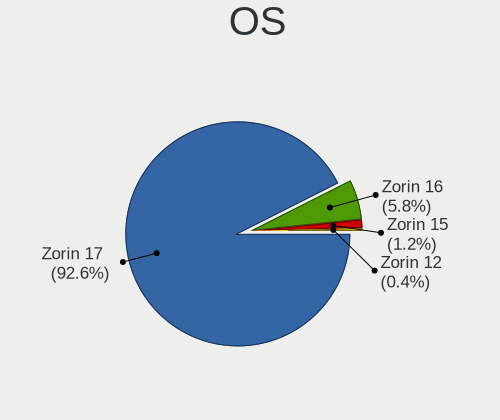
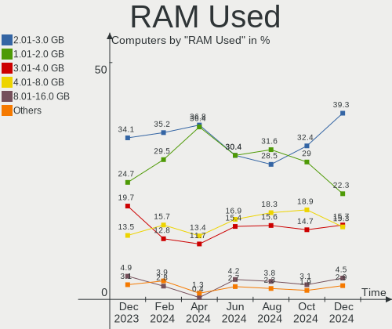
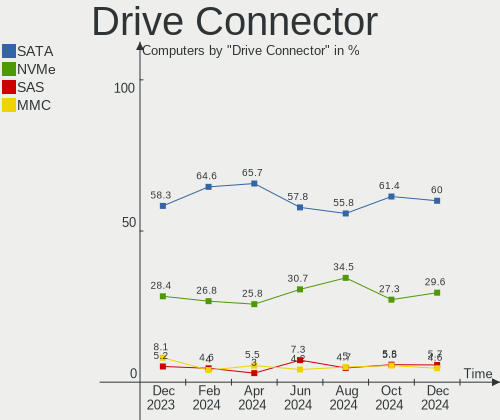
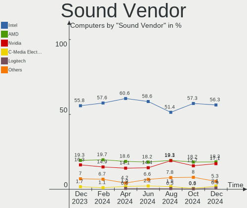

Zorin - Hardware Trends
-----------------------

A project to identify most popular hardware characteristics and track their change
over time based on data collected by Linux users at https://Linux-Hardware.org.

Anyone can contribute to this report by the [hw-probe](https://github.com/linuxhw/hw-probe) tool:

    sudo -E hw-probe -all -upload

This is a report for all computer types. See also reports for [desktops](/Dist/Zorin/Desktop/README.md) and [notebooks](/Dist/Zorin/Notebook/README.md).

This report is for one last month. Overall report since the beginning of time: [TestCoverage](https://github.com/linuxhw/TestCoverage)

Period: Nov, 2022.

Contents
--------

* [ System ](#system)
  - [ OS                       ](#os)
  - [ OS Family                ](#os-family)
  - [ Kernel                   ](#kernel)
  - [ Kernel Family            ](#kernel-family)
  - [ Kernel Major Ver.        ](#kernel-major-ver)
  - [ Arch                     ](#arch)
  - [ DE                       ](#de)
  - [ Display Server           ](#display-server)
  - [ Display Manager          ](#display-manager)
  - [ OS Lang                  ](#os-lang)
  - [ Boot Mode                ](#boot-mode)
  - [ Filesystem               ](#filesystem)
  - [ Part. scheme             ](#part-scheme)
  - [ Dual Boot with Linux/BSD ](#dual-boot-with-linuxbsd)
  - [ Dual Boot (Win)          ](#dual-boot-win)

* [ Board ](#board)
  - [ Vendor                   ](#vendor)
  - [ Model                    ](#model)
  - [ Model Family             ](#model-family)
  - [ MFG Year                 ](#mfg-year)
  - [ Form Factor              ](#form-factor)
  - [ Secure Boot              ](#secure-boot)
  - [ Coreboot                 ](#coreboot)
  - [ RAM Size                 ](#ram-size)
  - [ RAM Used                 ](#ram-used)
  - [ Total Drives             ](#total-drives)
  - [ Has CD-ROM               ](#has-cd-rom)
  - [ Has Ethernet             ](#has-ethernet)
  - [ Has WiFi                 ](#has-wifi)
  - [ Has Bluetooth            ](#has-bluetooth)

* [ Location ](#location)
  - [ Country                  ](#country)
  - [ City                     ](#city)

* [ Drives ](#drives)
  - [ Drive Vendor             ](#drive-vendor)
  - [ Drive Model              ](#drive-model)
  - [ HDD Vendor               ](#hdd-vendor)
  - [ SSD Vendor               ](#ssd-vendor)
  - [ Drive Kind               ](#drive-kind)
  - [ Drive Connector          ](#drive-connector)
  - [ Drive Size               ](#drive-size)
  - [ Space Total              ](#space-total)
  - [ Space Used               ](#space-used)
  - [ Malfunc. Drives          ](#malfunc-drives)
  - [ Malfunc. Drive Vendor    ](#malfunc-drive-vendor)
  - [ Malfunc. HDD Vendor      ](#malfunc-hdd-vendor)
  - [ Malfunc. Drive Kind      ](#malfunc-drive-kind)
  - [ Failed Drives            ](#failed-drives)
  - [ Failed Drive Vendor      ](#failed-drive-vendor)
  - [ Drive Status             ](#drive-status)

* [ Storage controller ](#storage-controller)
  - [ Storage Vendor           ](#storage-vendor)
  - [ Storage Model            ](#storage-model)
  - [ Storage Kind             ](#storage-kind)

* [ Processor ](#processor)
  - [ CPU Vendor               ](#cpu-vendor)
  - [ CPU Model                ](#cpu-model)
  - [ CPU Model Family         ](#cpu-model-family)
  - [ CPU Cores                ](#cpu-cores)
  - [ CPU Sockets              ](#cpu-sockets)
  - [ CPU Threads              ](#cpu-threads)
  - [ CPU Op-Modes             ](#cpu-op-modes)
  - [ CPU Microcode            ](#cpu-microcode)
  - [ CPU Microarch            ](#cpu-microarch)

* [ Graphics ](#graphics)
  - [ GPU Vendor               ](#gpu-vendor)
  - [ GPU Model                ](#gpu-model)
  - [ GPU Combo                ](#gpu-combo)
  - [ GPU Driver               ](#gpu-driver)
  - [ GPU Memory               ](#gpu-memory)

* [ Monitor ](#monitor)
  - [ Monitor Vendor           ](#monitor-vendor)
  - [ Monitor Model            ](#monitor-model)
  - [ Monitor Resolution       ](#monitor-resolution)
  - [ Monitor Diagonal         ](#monitor-diagonal)
  - [ Monitor Width            ](#monitor-width)
  - [ Aspect Ratio             ](#aspect-ratio)
  - [ Monitor Area             ](#monitor-area)
  - [ Pixel Density            ](#pixel-density)
  - [ Multiple Monitors        ](#multiple-monitors)

* [ Network ](#network)
  - [ Net Controller Vendor    ](#net-controller-vendor)
  - [ Net Controller Model     ](#net-controller-model)
  - [ Wireless Vendor          ](#wireless-vendor)
  - [ Wireless Model           ](#wireless-model)
  - [ Ethernet Vendor          ](#ethernet-vendor)
  - [ Ethernet Model           ](#ethernet-model)
  - [ Net Controller Kind      ](#net-controller-kind)
  - [ Used Controller          ](#used-controller)
  - [ NICs                     ](#nics)
  - [ IPv6                     ](#ipv6)

* [ Bluetooth ](#bluetooth)
  - [ Bluetooth Vendor         ](#bluetooth-vendor)
  - [ Bluetooth Model          ](#bluetooth-model)

* [ Sound ](#sound)
  - [ Sound Vendor             ](#sound-vendor)
  - [ Sound Model              ](#sound-model)

* [ Memory ](#memory)
  - [ Memory Vendor            ](#memory-vendor)
  - [ Memory Model             ](#memory-model)
  - [ Memory Kind              ](#memory-kind)
  - [ Memory Form Factor       ](#memory-form-factor)
  - [ Memory Size              ](#memory-size)
  - [ Memory Speed             ](#memory-speed)

* [ Printers & scanners ](#printers--scanners)
  - [ Printer Vendor           ](#printer-vendor)
  - [ Printer Model            ](#printer-model)
  - [ Scanner Vendor           ](#scanner-vendor)
  - [ Scanner Model            ](#scanner-model)

* [ Camera ](#camera)
  - [ Camera Vendor            ](#camera-vendor)
  - [ Camera Model             ](#camera-model)

* [ Security ](#security)
  - [ Fingerprint Vendor       ](#fingerprint-vendor)
  - [ Fingerprint Model        ](#fingerprint-model)
  - [ Chipcard Vendor          ](#chipcard-vendor)
  - [ Chipcard Model           ](#chipcard-model)

* [ Unsupported ](#unsupported)
  - [ Unsupported Devices      ](#unsupported-devices)
  - [ Unsupported Device Types ](#unsupported-device-types)

System
------

OS
--

Installed operating systems

| Name     | Computers | Percent |
|----------|-----------|---------|
| Zorin 16 | 154       | 96.25%  |
| Zorin 15 | 6         | 3.75%   |

OS Family
---------

OS without a version

| Name  | Computers | Percent |
|-------|-----------|---------|
| Zorin | 160       | 100%    |

Kernel
------

Version of the Linux kernel

| Version                    | Computers | Percent |
|----------------------------|-----------|---------|
| 5.15.0-52-generic          | 80        | 50%     |
| 5.15.0-53-generic          | 62        | 38.75%  |
| 5.4.0-131-generic          | 5         | 3.13%   |
| 5.15.0-41-generic          | 3         | 1.88%   |
| 5.13.0-30-generic          | 2         | 1.25%   |
| 6.0.8-060008-generic       | 1         | 0.63%   |
| 5.4.0-132-generic          | 1         | 0.63%   |
| 5.19.12-051912-generic     | 1         | 0.63%   |
| 5.19.0-17.2-liquorix-amd64 | 1         | 0.63%   |
| 5.15.0-48-generic          | 1         | 0.63%   |
| 5.15.0-43-generic          | 1         | 0.63%   |
| 5.14.0-1054-oem            | 1         | 0.63%   |
| 5.13.0-40-generic          | 1         | 0.63%   |

Kernel Family
-------------

Linux kernel without a distro release

| Version | Computers | Percent |
|---------|-----------|---------|
| 5.15.0  | 147       | 91.88%  |
| 5.4.0   | 6         | 3.75%   |
| 5.13.0  | 3         | 1.88%   |
| 6.0.8   | 1         | 0.63%   |
| 5.19.12 | 1         | 0.63%   |
| 5.19.0  | 1         | 0.63%   |
| 5.14.0  | 1         | 0.63%   |

Kernel Major Ver.
-----------------

Linux kernel major version

| Version | Computers | Percent |
|---------|-----------|---------|
| 5.15    | 147       | 91.88%  |
| 5.4     | 6         | 3.75%   |
| 5.13    | 3         | 1.88%   |
| 5.19    | 2         | 1.25%   |
| 6.0     | 1         | 0.63%   |
| 5.14    | 1         | 0.63%   |

Arch
----

OS architecture (x86_64, i586, etc.)

| Name   | Computers | Percent |
|--------|-----------|---------|
| x86_64 | 157       | 98.13%  |
| i686   | 3         | 1.88%   |

DE
--

Desktop Environment

| Name    | Computers | Percent |
|---------|-----------|---------|
| GNOME   | 132       | 82.5%   |
| XFCE    | 26        | 16.25%  |
| i3      | 1         | 0.63%   |
| Unknown | 1         | 0.63%   |

Display Server
--------------

X11 or Wayland

| Name    | Computers | Percent |
|---------|-----------|---------|
| X11     | 159       | 99.38%  |
| Unknown | 1         | 0.63%   |

Display Manager
---------------

SDDM, LightDM, etc.

| Name    | Computers | Percent |
|---------|-----------|---------|
| Unknown | 126       | 78.75%  |
| GDM     | 15        | 9.38%   |
| GDM3    | 12        | 7.5%    |
| LightDM | 6         | 3.75%   |
| SDDM    | 1         | 0.63%   |

OS Lang
-------

Language

| Lang  | Computers | Percent |
|-------|-----------|---------|
| en_US | 60        | 37.5%   |
| en_GB | 15        | 9.38%   |
| de_DE | 13        | 8.13%   |
| pt_BR | 12        | 7.5%    |
| it_IT | 12        | 7.5%    |
| fr_FR | 7         | 4.38%   |
| en_IN | 6         | 3.75%   |
| ru_RU | 3         | 1.88%   |
| es_AR | 3         | 1.88%   |
| en_AU | 3         | 1.88%   |
| sv_SE | 2         | 1.25%   |
| pl_PL | 2         | 1.25%   |
| nl_NL | 2         | 1.25%   |
| hu_HU | 2         | 1.25%   |
| es_US | 2         | 1.25%   |
| es_ES | 2         | 1.25%   |
| es_CR | 2         | 1.25%   |
| en_CA | 2         | 1.25%   |
| tr_TR | 1         | 0.63%   |
| nl_BE | 1         | 0.63%   |
| nb_NO | 1         | 0.63%   |
| fr_CA | 1         | 0.63%   |
| et_EE | 1         | 0.63%   |
| es_PE | 1         | 0.63%   |
| en_ZA | 1         | 0.63%   |
| en_SG | 1         | 0.63%   |
| en_PH | 1         | 0.63%   |
| el_GR | 1         | 0.63%   |

Boot Mode
---------

EFI or BIOS

| Mode | Computers | Percent |
|------|-----------|---------|
| EFI  | 92        | 57.5%   |
| BIOS | 68        | 42.5%   |

Filesystem
----------

Type of filesystem

| Type | Computers | Percent |
|------|-----------|---------|
| Ext4 | 156       | 97.5%   |
| Zfs  | 4         | 2.5%    |

Part. scheme
------------

Scheme of partitioning

| Type    | Computers | Percent |
|---------|-----------|---------|
| Unknown | 129       | 80.63%  |
| GPT     | 23        | 14.38%  |
| MBR     | 8         | 5%      |

Dual Boot with Linux/BSD
------------------------

Hosting more than one Linux/BSD

| Dual boot | Computers | Percent |
|-----------|-----------|---------|
| No        | 157       | 98.13%  |
| Yes       | 3         | 1.88%   |

Dual Boot (Win)
---------------

Hosting Linux and Windows

| Dual boot | Computers | Percent |
|-----------|-----------|---------|
| No        | 145       | 90.63%  |
| Yes       | 15        | 9.38%   |

Board
-----

Vendor
------

Motherboard manufacturer

| Name                | Computers | Percent |
|---------------------|-----------|---------|
| Hewlett-Packard     | 26        | 16.25%  |
| Dell                | 24        | 15%     |
| Lenovo              | 20        | 12.5%   |
| ASUSTek Computer    | 16        | 10%     |
| Gigabyte Technology | 9         | 5.63%   |
| MSI                 | 8         | 5%      |
| ASRock              | 6         | 3.75%   |
| Apple               | 5         | 3.13%   |
| Acer                | 5         | 3.13%   |
| Toshiba             | 4         | 2.5%    |
| Gateway             | 3         | 1.88%   |
| Samsung Electronics | 2         | 1.25%   |
| Microtech           | 2         | 1.25%   |
| Microsoft           | 2         | 1.25%   |
| Intel               | 2         | 1.25%   |
| Unknown             | 2         | 1.25%   |
| Thomson             | 1         | 0.63%   |
| Quanta              | 1         | 0.63%   |
| Pegatron            | 1         | 0.63%   |
| Panasonic           | 1         | 0.63%   |
| Packard Bell        | 1         | 0.63%   |
| OEM                 | 1         | 0.63%   |
| Notebook            | 1         | 0.63%   |
| Megaware            | 1         | 0.63%   |
| Linx                | 1         | 0.63%   |
| JGINYUE             | 1         | 0.63%   |
| HUAWEI              | 1         | 0.63%   |
| Huanan              | 1         | 0.63%   |
| HOUTER              | 1         | 0.63%   |
| Hampoo              | 1         | 0.63%   |
| H-BUSTER            | 1         | 0.63%   |
| Fujitsu Siemens     | 1         | 0.63%   |
| Fujitsu             | 1         | 0.63%   |
| Framework           | 1         | 0.63%   |
| Biostar             | 1         | 0.63%   |
| BESSTAR Tech        | 1         | 0.63%   |
| BANGHO              | 1         | 0.63%   |
| ALURIN              | 1         | 0.63%   |
| ALLDOCUBE           | 1         | 0.63%   |
| A-DATA Technology   | 1         | 0.63%   |

Model
-----

Motherboard model

| Name                                        | Computers | Percent |
|---------------------------------------------|-----------|---------|
| Dell OptiPlex 380                           | 3         | 1.88%   |
| Dell Latitude E6540                         | 3         | 1.88%   |
| HP Pavilion Notebook                        | 2         | 1.25%   |
| Dell Studio 1558                            | 2         | 1.25%   |
| ASUS K55VD                                  | 2         | 1.25%   |
| Apple iMac12,2                              | 2         | 1.25%   |
| Unknown                                     | 2         | 1.25%   |
| Toshiba Satellite S55t-B                    | 1         | 0.63%   |
| Toshiba Satellite C55-C                     | 1         | 0.63%   |
| Toshiba Satellite C50D-B                    | 1         | 0.63%   |
| Toshiba PORTEGE Z30-A                       | 1         | 0.63%   |
| Thomson GEN17V3C8WH256                      | 1         | 0.63%   |
| Samsung RV411/RV511/E3511/S3511/RV711/E3411 | 1         | 0.63%   |
| Samsung 600B4B/600B5B                       | 1         | 0.63%   |
| Quanta TW8/SW8/DW8                          | 1         | 0.63%   |
| Pegatron Pro 3405 Series                    | 1         | 0.63%   |
| Panasonic CF-19AHN3BFF                      | 1         | 0.63%   |
| Packard Bell EasyNote TS11HR                | 1         | 0.63%   |
| OEM H110                                    | 1         | 0.63%   |
| Notebook NP5x_NP6x_NP7xPNP                  | 1         | 0.63%   |
| MSI Pentino H-Series                        | 1         | 0.63%   |
| MSI MS-7C75                                 | 1         | 0.63%   |
| MSI MS-7C52                                 | 1         | 0.63%   |
| MSI MS-7A36                                 | 1         | 0.63%   |
| MSI MS-7817                                 | 1         | 0.63%   |
| MSI MS-7758                                 | 1         | 0.63%   |
| MSI GE75 Raider 10SE                        | 1         | 0.63%   |
| MSI 700-056                                 | 1         | 0.63%   |
| Microtech ebookLite                         | 1         | 0.63%   |
| Microtech CoreBook                          | 1         | 0.63%   |
| Microsoft Surface Pro 4                     | 1         | 0.63%   |
| Microsoft Surface Book 2                    | 1         | 0.63%   |
| Megaware MW-NM70HD-MI                       | 1         | 0.63%   |
| Linx LINX1010B                              | 1         | 0.63%   |
| Lenovo Yoga 530-14IKB 81EK                  | 1         | 0.63%   |
| Lenovo ThinkPad X201 36809T1                | 1         | 0.63%   |
| Lenovo ThinkPad X1 Carbon 4th 20FCCTO1WW    | 1         | 0.63%   |
| Lenovo ThinkPad P17 Gen 2i 20YU0028FR       | 1         | 0.63%   |
| Lenovo ThinkPad P16 Gen 1 21D7S0L500        | 1         | 0.63%   |
| Lenovo ThinkPad Edge E530c 33663VG          | 1         | 0.63%   |

Model Family
------------

Motherboard model prefix

| Name                   | Computers | Percent |
|------------------------|-----------|---------|
| Dell Inspiron          | 7         | 4.38%   |
| Lenovo ThinkPad        | 6         | 3.75%   |
| HP Pavilion            | 6         | 3.75%   |
| Dell OptiPlex          | 5         | 3.13%   |
| Dell Latitude          | 5         | 3.13%   |
| Lenovo IdeaPad         | 4         | 2.5%    |
| Toshiba Satellite      | 3         | 1.88%   |
| Dell XPS               | 3         | 1.88%   |
| ASUS ROG               | 3         | 1.88%   |
| Microsoft Surface      | 2         | 1.25%   |
| Lenovo ThinkCentre     | 2         | 1.25%   |
| HP ProDesk             | 2         | 1.25%   |
| HP ProBook             | 2         | 1.25%   |
| HP ENVY                | 2         | 1.25%   |
| HP EliteBook           | 2         | 1.25%   |
| HP Compaq              | 2         | 1.25%   |
| Dell Studio            | 2         | 1.25%   |
| ASUS K55VD             | 2         | 1.25%   |
| ASUS ASUS              | 2         | 1.25%   |
| ASRock B450M           | 2         | 1.25%   |
| Apple iMac12           | 2         | 1.25%   |
| Acer Veriton           | 2         | 1.25%   |
| Acer Aspire            | 2         | 1.25%   |
| Unknown                | 2         | 1.25%   |
| Toshiba PORTEGE        | 1         | 0.63%   |
| Thomson GEN17V3C8WH256 | 1         | 0.63%   |
| Samsung RV411          | 1         | 0.63%   |
| Samsung 600B4B         | 1         | 0.63%   |
| Quanta TW8             | 1         | 0.63%   |
| Pegatron Pro           | 1         | 0.63%   |
| Panasonic CF-19AHN3BFF | 1         | 0.63%   |
| Packard Bell EasyNote  | 1         | 0.63%   |
| OEM H110               | 1         | 0.63%   |
| Notebook NP5x          | 1         | 0.63%   |
| MSI Pentino            | 1         | 0.63%   |
| MSI MS-7C75            | 1         | 0.63%   |
| MSI MS-7C52            | 1         | 0.63%   |
| MSI MS-7A36            | 1         | 0.63%   |
| MSI MS-7817            | 1         | 0.63%   |
| MSI MS-7758            | 1         | 0.63%   |

MFG Year
--------

Motherboard manufacture year

| Year | Computers | Percent |
|------|-----------|---------|
| 2021 | 21        | 13.13%  |
| 2011 | 21        | 13.13%  |
| 2013 | 17        | 10.63%  |
| 2012 | 13        | 8.13%   |
| 2014 | 12        | 7.5%    |
| 2010 | 12        | 7.5%    |
| 2020 | 10        | 6.25%   |
| 2016 | 9         | 5.63%   |
| 2009 | 8         | 5%      |
| 2018 | 7         | 4.38%   |
| 2015 | 6         | 3.75%   |
| 2022 | 5         | 3.13%   |
| 2019 | 5         | 3.13%   |
| 2017 | 4         | 2.5%    |
| 2006 | 4         | 2.5%    |
| 2008 | 3         | 1.88%   |
| 2007 | 3         | 1.88%   |

Form Factor
-----------

Physical design of the computer

| Name        | Computers | Percent |
|-------------|-----------|---------|
| Notebook    | 90        | 56.25%  |
| Desktop     | 58        | 36.25%  |
| All in one  | 5         | 3.13%   |
| Tablet      | 3         | 1.88%   |
| Convertible | 3         | 1.88%   |
| Mini pc     | 1         | 0.63%   |

Secure Boot
-----------

Enabled or disabled

| State    | Computers | Percent |
|----------|-----------|---------|
| Disabled | 141       | 88.13%  |
| Enabled  | 19        | 11.88%  |

Coreboot
--------

Have coreboot on board

| Used | Computers | Percent |
|------|-----------|---------|
| No   | 160       | 100%    |

RAM Size
--------

Total RAM memory

| Size in GB  | Computers | Percent |
|-------------|-----------|---------|
| 4.01-8.0    | 47        | 29.38%  |
| 3.01-4.0    | 36        | 22.5%   |
| 8.01-16.0   | 33        | 20.63%  |
| 16.01-24.0  | 21        | 13.13%  |
| 32.01-64.0  | 10        | 6.25%   |
| 1.01-2.0    | 7         | 4.38%   |
| 2.01-3.0    | 4         | 2.5%    |
| 24.01-32.0  | 1         | 0.63%   |
| 64.01-256.0 | 1         | 0.63%   |

RAM Used
--------

Used RAM memory

| Used GB   | Computers | Percent |
|-----------|-----------|---------|
| 1.01-2.0  | 59        | 36.88%  |
| 2.01-3.0  | 49        | 30.63%  |
| 3.01-4.0  | 23        | 14.38%  |
| 4.01-8.0  | 22        | 13.75%  |
| 8.01-16.0 | 4         | 2.5%    |
| 0.51-1.0  | 3         | 1.88%   |

Total Drives
------------

Number of drives on board

| Drives | Computers | Percent |
|--------|-----------|---------|
| 1      | 113       | 70.63%  |
| 2      | 35        | 21.88%  |
| 3      | 6         | 3.75%   |
| 4      | 3         | 1.88%   |
| 5      | 2         | 1.25%   |
| 6      | 1         | 0.63%   |

Has CD-ROM
----------

Has CD-ROM on board

| Presented | Computers | Percent |
|-----------|-----------|---------|
| No        | 85        | 53.13%  |
| Yes       | 75        | 46.88%  |

Has Ethernet
------------

Has Ethernet on board

| Presented | Computers | Percent |
|-----------|-----------|---------|
| Yes       | 134       | 83.75%  |
| No        | 26        | 16.25%  |

Has WiFi
--------

Has WiFi module

| Presented | Computers | Percent |
|-----------|-----------|---------|
| Yes       | 132       | 82.5%   |
| No        | 28        | 17.5%   |

Has Bluetooth
-------------

Has Bluetooth module

| Presented | Computers | Percent |
|-----------|-----------|---------|
| Yes       | 88        | 55%     |
| No        | 72        | 45%     |

Location
--------

Country
-------

Geographic location (country)

| Country       | Computers | Percent |
|---------------|-----------|---------|
| USA           | 30        | 18.75%  |
| Germany       | 15        | 9.38%   |
| UK            | 14        | 8.75%   |
| Italy         | 13        | 8.13%   |
| Brazil        | 11        | 6.88%   |
| India         | 6         | 3.75%   |
| Spain         | 5         | 3.13%   |
| France        | 5         | 3.13%   |
| Sweden        | 4         | 2.5%    |
| Netherlands   | 4         | 2.5%    |
| Mexico        | 4         | 2.5%    |
| Greece        | 4         | 2.5%    |
| Canada        | 4         | 2.5%    |
| Australia     | 3         | 1.88%   |
| Argentina     | 3         | 1.88%   |
| Russia        | 2         | 1.25%   |
| Romania       | 2         | 1.25%   |
| Portugal      | 2         | 1.25%   |
| Poland        | 2         | 1.25%   |
| Indonesia     | 2         | 1.25%   |
| Hungary       | 2         | 1.25%   |
| Egypt         | 2         | 1.25%   |
| Costa Rica    | 2         | 1.25%   |
| Bulgaria      | 2         | 1.25%   |
| Turkey        | 1         | 0.63%   |
| Tunisia       | 1         | 0.63%   |
| South Africa  | 1         | 0.63%   |
| Singapore     | 1         | 0.63%   |
| Serbia        | 1         | 0.63%   |
| Philippines   | 1         | 0.63%   |
| Peru          | 1         | 0.63%   |
| Pakistan      | 1         | 0.63%   |
| Norway        | 1         | 0.63%   |
| Malaysia      | 1         | 0.63%   |
| Kuwait        | 1         | 0.63%   |
| French Guiana | 1         | 0.63%   |
| Finland       | 1         | 0.63%   |
| Estonia       | 1         | 0.63%   |
| Colombia      | 1         | 0.63%   |
| Chile         | 1         | 0.63%   |

City
----

Geographic location (city)

| City           | Computers | Percent |
|----------------|-----------|---------|
| Athens         | 3         | 1.88%   |
| Rio de Janeiro | 2         | 1.25%   |
| New York       | 2         | 1.25%   |
| Naples         | 2         | 1.25%   |
| Milan          | 2         | 1.25%   |
| Miami          | 2         | 1.25%   |
| Jakarta        | 2         | 1.25%   |
| Gex            | 2         | 1.25%   |
| Cairo          | 2         | 1.25%   |
| Bocholt        | 2         | 1.25%   |
| Bengaluru      | 2         | 1.25%   |
| Yekaterinburg  | 1         | 0.63%   |
| Wyong          | 1         | 0.63%   |
| Wigton         | 1         | 0.63%   |
| Wiesbaden      | 1         | 0.63%   |
| Viseu          | 1         | 0.63%   |
| Victoria       | 1         | 0.63%   |
| Verona         | 1         | 0.63%   |
| Tunis          | 1         | 0.63%   |
| Tullahoma      | 1         | 0.63%   |
| Totnes         | 1         | 0.63%   |
| Torrevieja     | 1         | 0.63%   |
| The Hague      | 1         | 0.63%   |
| Telford        | 1         | 0.63%   |
| Teano          | 1         | 0.63%   |
| Tatuí         | 1         | 0.63%   |
| Tallinn        | 1         | 0.63%   |
| Tabaco         | 1         | 0.63%   |
| Szendro        | 1         | 0.63%   |
| Surprise       | 1         | 0.63%   |
| Surbiton       | 1         | 0.63%   |
| Stafford       | 1         | 0.63%   |
| St. Petersburg | 1         | 0.63%   |
| South Bend     | 1         | 0.63%   |
| Solna          | 1         | 0.63%   |
| Sofia          | 1         | 0.63%   |
| Södertälje   | 1         | 0.63%   |
| Sint-Michiels  | 1         | 0.63%   |
| Singapore      | 1         | 0.63%   |
| Silistra       | 1         | 0.63%   |

Drives
------

Drive Vendor
------------

Hard drive vendors

| Vendor                      | Computers | Drives | Percent |
|-----------------------------|-----------|--------|---------|
| Seagate                     | 38        | 46     | 17.92%  |
| WDC                         | 24        | 27     | 11.32%  |
| Samsung Electronics         | 24        | 27     | 11.32%  |
| Toshiba                     | 15        | 16     | 7.08%   |
| Unknown                     | 10        | 12     | 4.72%   |
| Kingston                    | 10        | 14     | 4.72%   |
| Crucial                     | 9         | 9      | 4.25%   |
| Sandisk                     | 8         | 8      | 3.77%   |
| Hitachi                     | 7         | 7      | 3.3%    |
| SPCC                        | 5         | 5      | 2.36%   |
| SK hynix                    | 5         | 5      | 2.36%   |
| Patriot                     | 5         | 5      | 2.36%   |
| Phison Electronics          | 4         | 4      | 1.89%   |
| Micron Technology           | 4         | 4      | 1.89%   |
| Intel                       | 4         | 5      | 1.89%   |
| China                       | 4         | 4      | 1.89%   |
| A-DATA Technology           | 4         | 4      | 1.89%   |
| Silicon Motion              | 3         | 3      | 1.42%   |
| Unknown                     | 3         | 3      | 1.42%   |
| Phison                      | 2         | 2      | 0.94%   |
| Maxtor                      | 2         | 3      | 0.94%   |
| Apacer                      | 2         | 3      | 0.94%   |
| ZADAK                       | 1         | 1      | 0.47%   |
| XPG                         | 1         | 1      | 0.47%   |
| Transcend                   | 1         | 1      | 0.47%   |
| T-FORCE                     | 1         | 1      | 0.47%   |
| SABRENT                     | 1         | 1      | 0.47%   |
| PNY                         | 1         | 1      | 0.47%   |
| Neo                         | 1         | 1      | 0.47%   |
| LITEONIT                    | 1         | 1      | 0.47%   |
| Lexar                       | 1         | 1      | 0.47%   |
| Kingston Technology Company | 1         | 1      | 0.47%   |
| KingSpec                    | 1         | 1      | 0.47%   |
| KingFast                    | 1         | 1      | 0.47%   |
| JMicron Technology          | 1         | 1      | 0.47%   |
| Intenso                     | 1         | 1      | 0.47%   |
| HS-SSD-C100                 | 1         | 1      | 0.47%   |
| Fanxiang                    | 1         | 1      | 0.47%   |
| Drevo                       | 1         | 1      | 0.47%   |
| Apple                       | 1         | 1      | 0.47%   |

Drive Model
-----------

Hard drive models

| Model                                                 | Computers | Percent |
|-------------------------------------------------------|-----------|---------|
| Unknown MMC Card  32GB                                | 4         | 1.72%   |
| Unknown MMC Card  64GB                                | 3         | 1.29%   |
| Toshiba MQ01ABD100 1TB                                | 3         | 1.29%   |
| SPCC Solid State Disk 256GB                           | 3         | 1.29%   |
| Silicon Motion SM2263EN/SM2263XT SSD Controller 128GB | 3         | 1.29%   |
| Seagate ST500DM002-1BD142 500GB                       | 3         | 1.29%   |
| Seagate ST1000LM035-1RK172 1TB                        | 3         | 1.29%   |
| Seagate ST1000DM010-2EP102 1TB                        | 3         | 1.29%   |
| Unknown                                               | 3         | 1.29%   |
| Toshiba HDWD110 1TB                                   | 2         | 0.86%   |
| Seagate ST750LM022 HN-M750MBB 752GB                   | 2         | 0.86%   |
| Seagate ST500LT012-9WS142 500GB                       | 2         | 0.86%   |
| Seagate ST500LT012-1DG142 500GB                       | 2         | 0.86%   |
| Seagate ST1000LM048-2E7172 1TB                        | 2         | 0.86%   |
| Samsung SSD 840 EVO 250GB                             | 2         | 0.86%   |
| Phison E12 NVMe Controller 2TB                        | 2         | 0.86%   |
| Patriot Burst 120GB SSD                               | 2         | 0.86%   |
| Kingston SA400S37480G 480GB SSD                       | 2         | 0.86%   |
| Kingston SA400S37240G 240GB SSD                       | 2         | 0.86%   |
| Crucial CT240BX500SSD1 240GB                          | 2         | 0.86%   |
| China SATA SSD 256GB                                  | 2         | 0.86%   |
| ZADAK TWSS3 512GB                                     | 1         | 0.43%   |
| XPG GAMMIX S50 Lite 1TB                               | 1         | 0.43%   |
| WDC WDS480G2G0B-00EPW0 480GB SSD                      | 1         | 0.43%   |
| WDC WDS240G2G0C-00AJM0 240GB                          | 1         | 0.43%   |
| WDC WDS240G2G0A-00JH30 240GB SSD                      | 1         | 0.43%   |
| WDC WDBNCE0010PNC 1TB SSD                             | 1         | 0.43%   |
| WDC WD6400BEVT-22A0RT0 640GB                          | 1         | 0.43%   |
| WDC WD5003ABYX-01WERA1 500GB                          | 1         | 0.43%   |
| WDC WD5000LPVX-60V0TT0 500GB                          | 1         | 0.43%   |
| WDC WD5000LPCX-24C6HT0 500GB                          | 1         | 0.43%   |
| WDC WD5000LPCX-21VHAT0 500GB                          | 1         | 0.43%   |
| WDC WD5000AZLX-22JKKA0 500GB                          | 1         | 0.43%   |
| WDC WD5000AAKX-75U6AA0 500GB                          | 1         | 0.43%   |
| WDC WD5000AAKX-00ERMA0 500GB                          | 1         | 0.43%   |
| WDC WD3200AVVS-63L2B0 320GB                           | 1         | 0.43%   |
| WDC WD3000BLHX-88A56V0 304GB                          | 1         | 0.43%   |
| WDC WD2500BPVT-22ZEST0 250GB                          | 1         | 0.43%   |
| WDC WD2500BEVS-22UST0 250GB                           | 1         | 0.43%   |
| WDC WD2003FZEX-00SRLA0 2TB                            | 1         | 0.43%   |

HDD Vendor
----------

Hard disk drive vendors

| Vendor              | Computers | Drives | Percent |
|---------------------|-----------|--------|---------|
| Seagate             | 38        | 45     | 46.34%  |
| WDC                 | 18        | 20     | 21.95%  |
| Toshiba             | 11        | 11     | 13.41%  |
| Hitachi             | 7         | 7      | 8.54%   |
| Samsung Electronics | 4         | 5      | 4.88%   |
| Maxtor              | 2         | 3      | 2.44%   |
| Unknown             | 1         | 1      | 1.22%   |
| Apple               | 1         | 1      | 1.22%   |

SSD Vendor
----------

Solid state drive vendors

| Vendor              | Computers | Drives | Percent |
|---------------------|-----------|--------|---------|
| Samsung Electronics | 16        | 16     | 20.78%  |
| Crucial             | 9         | 9      | 11.69%  |
| Kingston            | 8         | 10     | 10.39%  |
| SanDisk             | 6         | 6      | 7.79%   |
| SPCC                | 5         | 5      | 6.49%   |
| Patriot             | 4         | 4      | 5.19%   |
| A-DATA Technology   | 4         | 4      | 5.19%   |
| WDC                 | 3         | 3      | 3.9%    |
| Toshiba             | 3         | 3      | 3.9%    |
| Intel               | 2         | 2      | 2.6%    |
| China               | 2         | 2      | 2.6%    |
| Apacer              | 2         | 3      | 2.6%    |
| Unknown             | 2         | 2      | 2.6%    |
| Transcend           | 1         | 1      | 1.3%    |
| SK hynix            | 1         | 1      | 1.3%    |
| Seagate             | 1         | 1      | 1.3%    |
| PNY                 | 1         | 1      | 1.3%    |
| Neo                 | 1         | 1      | 1.3%    |
| LITEONIT            | 1         | 1      | 1.3%    |
| Lexar               | 1         | 1      | 1.3%    |
| KingSpec            | 1         | 1      | 1.3%    |
| JMicron Technology  | 1         | 1      | 1.3%    |
| Drevo               | 1         | 1      | 1.3%    |
| Acer                | 1         | 1      | 1.3%    |

Drive Kind
----------

HDD or SSD

| Kind    | Computers | Drives | Percent |
|---------|-----------|--------|---------|
| HDD     | 77        | 93     | 38.89%  |
| SSD     | 69        | 80     | 34.85%  |
| NVMe    | 33        | 41     | 16.67%  |
| Unknown | 10        | 11     | 5.05%   |
| MMC     | 9         | 11     | 4.55%   |

Drive Connector
---------------

SATA, SAS, NVMe, etc.

| Type | Computers | Drives | Percent |
|------|-----------|--------|---------|
| SATA | 131       | 175    | 72.78%  |
| NVMe | 33        | 40     | 18.33%  |
| MMC  | 9         | 11     | 5%      |
| SAS  | 7         | 10     | 3.89%   |

Drive Size
----------

Size of hard drive

| Size in TB | Computers | Drives | Percent |
|------------|-----------|--------|---------|
| 0.01-0.5   | 96        | 116    | 69.06%  |
| 0.51-1.0   | 35        | 45     | 25.18%  |
| 1.01-2.0   | 5         | 6      | 3.6%    |
| 3.01-4.0   | 2         | 2      | 1.44%   |
| 10.01-20.0 | 1         | 4      | 0.72%   |

Space Total
-----------

Amount of disk space available on the file system

| Size in GB     | Computers | Percent |
|----------------|-----------|---------|
| 101-250        | 54        | 33.75%  |
| 251-500        | 42        | 26.25%  |
| 501-1000       | 26        | 16.25%  |
| 51-100         | 16        | 10%     |
| 21-50          | 8         | 5%      |
| 1001-2000      | 4         | 2.5%    |
| 1-20           | 4         | 2.5%    |
| Unknown        | 3         | 1.88%   |
| More than 3000 | 2         | 1.25%   |
| 2001-3000      | 1         | 0.63%   |

Space Used
----------

Amount of used disk space

| Used GB        | Computers | Percent |
|----------------|-----------|---------|
| 1-20           | 60        | 37.5%   |
| 21-50          | 45        | 28.13%  |
| 51-100         | 25        | 15.63%  |
| 101-250        | 15        | 9.38%   |
| 501-1000       | 5         | 3.13%   |
| 251-500        | 4         | 2.5%    |
| Unknown        | 3         | 1.88%   |
| More than 3000 | 2         | 1.25%   |
| 1001-2000      | 1         | 0.63%   |

Malfunc. Drives
---------------

Drive models with a malfunction

| Model                                 | Computers | Drives | Percent |
|---------------------------------------|-----------|--------|---------|
| WDC WD6400BEVT-22A0RT0 640GB          | 1         | 1      | 25%     |
| Toshiba MQ01ABD100 1TB                | 1         | 1      | 25%     |
| Seagate ST9500325AS 500GB             | 1         | 1      | 25%     |
| LITEONIT LCT-256M3S 2.5 7mm 256GB SSD | 1         | 1      | 25%     |

Malfunc. Drive Vendor
---------------------

Vendors of faulty drives

| Vendor   | Computers | Drives | Percent |
|----------|-----------|--------|---------|
| WDC      | 1         | 1      | 25%     |
| Toshiba  | 1         | 1      | 25%     |
| Seagate  | 1         | 1      | 25%     |
| LITEONIT | 1         | 1      | 25%     |

Malfunc. HDD Vendor
-------------------

Vendors of faulty HDD drives

| Vendor  | Computers | Drives | Percent |
|---------|-----------|--------|---------|
| WDC     | 1         | 1      | 33.33%  |
| Toshiba | 1         | 1      | 33.33%  |
| Seagate | 1         | 1      | 33.33%  |

Malfunc. Drive Kind
-------------------

Kinds of faulty drives

| Kind | Computers | Drives | Percent |
|------|-----------|--------|---------|
| HDD  | 3         | 3      | 75%     |
| SSD  | 1         | 1      | 25%     |

Failed Drives
-------------

Failed drive models

Zero info for selected period =(

Failed Drive Vendor
-------------------

Failed drive vendors

Zero info for selected period =(

Drive Status
------------

Number of failed and malfunc. drives

| Status   | Computers | Drives | Percent |
|----------|-----------|--------|---------|
| Detected | 144       | 209    | 86.75%  |
| Works    | 18        | 23     | 10.84%  |
| Malfunc  | 4         | 4      | 2.41%   |

Storage controller
------------------

Storage Vendor
--------------

Storage controller vendors

| Vendor                           | Computers | Percent |
|----------------------------------|-----------|---------|
| Intel                            | 112       | 61.88%  |
| AMD                              | 28        | 15.47%  |
| Phison Electronics               | 6         | 3.31%   |
| SanDisk                          | 5         | 2.76%   |
| Samsung Electronics              | 5         | 2.76%   |
| SK hynix                         | 4         | 2.21%   |
| Micron Technology                | 4         | 2.21%   |
| Silicon Motion                   | 3         | 1.66%   |
| Kingston Technology Company      | 3         | 1.66%   |
| JMicron Technology               | 3         | 1.66%   |
| Toshiba America Info Systems     | 2         | 1.1%    |
| Silicon Integrated Systems [SiS] | 1         | 0.55%   |
| Nvidia                           | 1         | 0.55%   |
| Marvell Technology Group         | 1         | 0.55%   |
| INNOGRIT                         | 1         | 0.55%   |
| ASMedia Technology               | 1         | 0.55%   |
| ADATA Technology                 | 1         | 0.55%   |

Storage Model
-------------

Storage controller models

| Model                                                                          | Computers | Percent |
|--------------------------------------------------------------------------------|-----------|---------|
| AMD FCH SATA Controller [AHCI mode]                                            | 21        | 10.05%  |
| Intel 6 Series/C200 Series Chipset Family 6 port Mobile SATA AHCI Controller   | 11        | 5.26%   |
| Intel 7 Series Chipset Family 6-port SATA Controller [AHCI mode]               | 9         | 4.31%   |
| Intel 8 Series/C220 Series Chipset Family 6-port SATA Controller 1 [AHCI mode] | 8         | 3.83%   |
| Intel NM10/ICH7 Family SATA Controller [IDE mode]                              | 6         | 2.87%   |
| Intel 82801 Mobile SATA Controller [RAID mode]                                 | 6         | 2.87%   |
| Intel 82801G (ICH7 Family) IDE Controller                                      | 5         | 2.39%   |
| Intel 8 Series SATA Controller 1 [AHCI mode]                                   | 5         | 2.39%   |
| Intel 6 Series/C200 Series Chipset Family 6 port Desktop SATA AHCI Controller  | 5         | 2.39%   |
| Intel 5 Series/3400 Series Chipset 4 port SATA AHCI Controller                 | 5         | 2.39%   |
| Micron Non-Volatile memory controller                                          | 4         | 1.91%   |
| Intel Wildcat Point-LP SATA Controller [AHCI Mode]                             | 4         | 1.91%   |
| Intel Volume Management Device NVMe RAID Controller                            | 4         | 1.91%   |
| Intel Atom Processor E3800 Series SATA AHCI Controller                         | 4         | 1.91%   |
| Intel 7 Series/C210 Series Chipset Family 6-port SATA Controller [AHCI mode]   | 4         | 1.91%   |
| Intel 5 Series/3400 Series Chipset 6 port SATA AHCI Controller                 | 4         | 1.91%   |
| Silicon Motion SM2263EN/SM2263XT SSD Controller                                | 3         | 1.44%   |
| SanDisk Non-Volatile memory controller                                         | 3         | 1.44%   |
| Kingston Company Company Non-Volatile memory controller                        | 3         | 1.44%   |
| Intel SATA Controller [RAID mode]                                              | 3         | 1.44%   |
| Intel Q170/Q150/B150/H170/H110/Z170/CM236 Chipset SATA Controller [AHCI Mode]  | 3         | 1.44%   |
| Intel 5 Series/3400 Series Chipset 4 port SATA IDE Controller                  | 3         | 1.44%   |
| Intel 5 Series/3400 Series Chipset 2 port SATA IDE Controller                  | 3         | 1.44%   |
| AMD SB7x0/SB8x0/SB9x0 IDE Controller                                           | 3         | 1.44%   |
| AMD 400 Series Chipset SATA Controller                                         | 3         | 1.44%   |
| SK hynix PC401 NVMe Solid State Drive 256GB                                    | 2         | 0.96%   |
| Samsung NVMe SSD Controller 980                                                | 2         | 0.96%   |
| Phison E18 PCIe4 NVMe Controller                                               | 2         | 0.96%   |
| Phison E12 NVMe Controller                                                     | 2         | 0.96%   |
| JMicron JMB363 SATA/IDE Controller                                             | 2         | 0.96%   |
| Intel Sunrise Point-LP SATA Controller [AHCI mode]                             | 2         | 0.96%   |
| Intel Comet Lake SATA AHCI Controller                                          | 2         | 0.96%   |
| Intel Celeron/Pentium Silver Processor SATA Controller                         | 2         | 0.96%   |
| Intel Celeron N3350/Pentium N4200/Atom E3900 Series SATA AHCI Controller       | 2         | 0.96%   |
| Intel Alder Lake-S PCH SATA Controller [AHCI Mode]                             | 2         | 0.96%   |
| Intel 82801IBM/IEM (ICH9M/ICH9M-E) 2 port SATA Controller [IDE mode]           | 2         | 0.96%   |
| Intel 500 Series Chipset Family SATA AHCI Controller                           | 2         | 0.96%   |
| AMD SB7x0/SB8x0/SB9x0 SATA Controller [IDE mode]                               | 2         | 0.96%   |
| AMD SB7x0/SB8x0/SB9x0 SATA Controller [AHCI mode]                              | 2         | 0.96%   |
| AMD FCH SATA Controller D                                                      | 2         | 0.96%   |

Storage Kind
------------

Kind of storage controller (IDE, SATA, NVMe, SAS, ...)

| Kind | Computers | Percent |
|------|-----------|---------|
| SATA | 115       | 61.83%  |
| NVMe | 33        | 17.74%  |
| IDE  | 25        | 13.44%  |
| RAID | 13        | 6.99%   |

Processor
---------

CPU Vendor
----------

Processor vendors

| Vendor | Computers | Percent |
|--------|-----------|---------|
| Intel  | 129       | 80.63%  |
| AMD    | 31        | 19.38%  |

CPU Model
---------

Processor models

| Model                                       | Computers | Percent |
|---------------------------------------------|-----------|---------|
| Intel Core i7-4800MQ CPU @ 2.70GHz          | 3         | 1.88%   |
| Intel Core i5-2520M CPU @ 2.50GHz           | 3         | 1.88%   |
| Intel Core i7-8550U CPU @ 1.80GHz           | 2         | 1.25%   |
| Intel Core i7-2620M CPU @ 2.70GHz           | 2         | 1.25%   |
| Intel Core i5-6300U CPU @ 2.40GHz           | 2         | 1.25%   |
| Intel Core i5-5200U CPU @ 2.20GHz           | 2         | 1.25%   |
| Intel Core i5-4570 CPU @ 3.20GHz            | 2         | 1.25%   |
| Intel Core i5-1035G1 CPU @ 1.00GHz          | 2         | 1.25%   |
| Intel Core i5 CPU M 430 @ 2.27GHz           | 2         | 1.25%   |
| Intel Core i3-2310M CPU @ 2.10GHz           | 2         | 1.25%   |
| Intel Core 2 Duo CPU E7500 @ 2.93GHz        | 2         | 1.25%   |
| Intel Celeron N4020 CPU @ 1.10GHz           | 2         | 1.25%   |
| Intel Celeron CPU N2840 @ 2.16GHz           | 2         | 1.25%   |
| Intel Atom CPU Z3735F @ 1.33GHz             | 2         | 1.25%   |
| Intel 11th Gen Core i7-11800H @ 2.30GHz     | 2         | 1.25%   |
| Intel 11th Gen Core i7-1165G7 @ 2.80GHz     | 2         | 1.25%   |
| Intel Xeon CPU X5450 @ 3.00GHz              | 1         | 0.63%   |
| Intel Xeon CPU E5-2670 0 @ 2.60GHz          | 1         | 0.63%   |
| Intel Xeon CPU E5-2640 v3 @ 2.60GHz         | 1         | 0.63%   |
| Intel Pentium Dual-Core CPU T4200 @ 2.00GHz | 1         | 0.63%   |
| Intel Pentium Dual-Core CPU E6500 @ 2.93GHz | 1         | 0.63%   |
| Intel Pentium Dual-Core CPU E5700 @ 3.00GHz | 1         | 0.63%   |
| Intel Pentium Dual CPU T2370 @ 1.73GHz      | 1         | 0.63%   |
| Intel Pentium CPU P6200 @ 2.13GHz           | 1         | 0.63%   |
| Intel Pentium CPU P6100 @ 2.00GHz           | 1         | 0.63%   |
| Intel Pentium CPU N4200 @ 1.10GHz           | 1         | 0.63%   |
| Intel Pentium CPU N3540 @ 2.16GHz           | 1         | 0.63%   |
| Intel Pentium CPU G3260 @ 3.30GHz           | 1         | 0.63%   |
| Intel Pentium CPU G2020 @ 2.90GHz           | 1         | 0.63%   |
| Intel Pentium CPU 4405U @ 2.10GHz           | 1         | 0.63%   |
| Intel Pentium 4 CPU 3.40GHz                 | 1         | 0.63%   |
| Intel Pentium 3558U @ 1.70GHz               | 1         | 0.63%   |
| Intel Genuine CPU T2130 @ 1.86GHz           | 1         | 0.63%   |
| Intel Core i7-8750H CPU @ 2.20GHz           | 1         | 0.63%   |
| Intel Core i7-8650U CPU @ 1.90GHz           | 1         | 0.63%   |
| Intel Core i7-8565U CPU @ 1.80GHz           | 1         | 0.63%   |
| Intel Core i7-7700HQ CPU @ 2.80GHz          | 1         | 0.63%   |
| Intel Core i7-5500U CPU @ 2.40GHz           | 1         | 0.63%   |
| Intel Core i7-4790 CPU @ 3.60GHz            | 1         | 0.63%   |
| Intel Core i7-4710HQ CPU @ 2.50GHz          | 1         | 0.63%   |

CPU Model Family
----------------

Processor model prefix

| Model                   | Computers | Percent |
|-------------------------|-----------|---------|
| Intel Core i5           | 36        | 22.5%   |
| Intel Core i7           | 23        | 14.38%  |
| Intel Core i3           | 17        | 10.63%  |
| Other                   | 13        | 8.13%   |
| Intel Celeron           | 9         | 5.63%   |
| Intel Pentium           | 8         | 5%      |
| Intel Core 2 Duo        | 8         | 5%      |
| Intel Atom              | 4         | 2.5%    |
| AMD Ryzen 9             | 4         | 2.5%    |
| AMD Ryzen 5             | 4         | 2.5%    |
| Intel Xeon              | 3         | 1.88%   |
| Intel Pentium Dual-Core | 3         | 1.88%   |
| AMD Ryzen 7             | 3         | 1.88%   |
| AMD A8                  | 3         | 1.88%   |
| AMD A10                 | 3         | 1.88%   |
| Intel Core 2            | 2         | 1.25%   |
| AMD Ryzen 3             | 2         | 1.25%   |
| AMD FX                  | 2         | 1.25%   |
| AMD E2                  | 2         | 1.25%   |
| AMD A6                  | 2         | 1.25%   |
| Intel Pentium Dual      | 1         | 0.63%   |
| Intel Pentium 4         | 1         | 0.63%   |
| Intel Genuine           | 1         | 0.63%   |
| AMD Z                   | 1         | 0.63%   |
| AMD Turion 64 Mobile    | 1         | 0.63%   |
| AMD Ryzen 5 PRO         | 1         | 0.63%   |
| AMD Phenom II X4        | 1         | 0.63%   |
| AMD E1                  | 1         | 0.63%   |
| AMD Athlon 64 X2        | 1         | 0.63%   |

CPU Cores
---------

Number of processor cores

| Number | Computers | Percent |
|--------|-----------|---------|
| 2      | 78        | 48.75%  |
| 4      | 55        | 34.38%  |
| 8      | 11        | 6.88%   |
| 6      | 8         | 5%      |
| 16     | 2         | 1.25%   |
| 3      | 2         | 1.25%   |
| 1      | 2         | 1.25%   |
| 14     | 1         | 0.63%   |
| 12     | 1         | 0.63%   |

CPU Sockets
-----------

Number of sockets

| Number | Computers | Percent |
|--------|-----------|---------|
| 1      | 160       | 100%    |

CPU Threads
-----------

Threads per core (Hyper-Threading)

| Number | Computers | Percent |
|--------|-----------|---------|
| 2      | 94        | 58.75%  |
| 1      | 66        | 41.25%  |

CPU Op-Modes
------------

CPU Operation Modes (32-bit, 64-bit)

| Op mode        | Computers | Percent |
|----------------|-----------|---------|
| 32-bit, 64-bit | 159       | 99.38%  |
| 32-bit         | 1         | 0.63%   |

CPU Microcode
-------------

Microcode number

| Number     | Computers | Percent |
|------------|-----------|---------|
| 0x206a7    | 20        | 12.5%   |
| 0x306a9    | 11        | 6.88%   |
| Unknown    | 11        | 6.88%   |
| 0x306c3    | 10        | 6.25%   |
| 0x1067a    | 8         | 5%      |
| 0x30678    | 7         | 4.38%   |
| 0x20655    | 6         | 3.75%   |
| 0x806ea    | 4         | 2.5%    |
| 0x806c1    | 4         | 2.5%    |
| 0x40651    | 4         | 2.5%    |
| 0x306d4    | 4         | 2.5%    |
| 0x506e3    | 3         | 1.88%   |
| 0x406e3    | 3         | 1.88%   |
| 0x20652    | 3         | 1.88%   |
| 0x07030105 | 3         | 1.88%   |
| 0xa0671    | 2         | 1.25%   |
| 0x906ea    | 2         | 1.25%   |
| 0x906e9    | 2         | 1.25%   |
| 0x706e5    | 2         | 1.25%   |
| 0x706a8    | 2         | 1.25%   |
| 0x6fd      | 2         | 1.25%   |
| 0x6f6      | 2         | 1.25%   |
| 0x506c9    | 2         | 1.25%   |
| 0x10676    | 2         | 1.25%   |
| 0x08600106 | 2         | 1.25%   |
| 0x08600104 | 2         | 1.25%   |
| 0x06006118 | 2         | 1.25%   |
| 0x06001119 | 2         | 1.25%   |
| 0xf62      | 1         | 0.63%   |
| 0xa0653    | 1         | 0.63%   |
| 0xa0652    | 1         | 0.63%   |
| 0x906c0    | 1         | 0.63%   |
| 0x906a3    | 1         | 0.63%   |
| 0x90675    | 1         | 0.63%   |
| 0x806ec    | 1         | 0.63%   |
| 0x806eb    | 1         | 0.63%   |
| 0x806e9    | 1         | 0.63%   |
| 0x806d1    | 1         | 0.63%   |
| 0x6fb      | 1         | 0.63%   |
| 0x6ec      | 1         | 0.63%   |

CPU Microarch
-------------

Microarchitecture

| Name             | Computers | Percent |
|------------------|-----------|---------|
| SandyBridge      | 21        | 13.13%  |
| Haswell          | 16        | 10%     |
| KabyLake         | 11        | 6.88%   |
| IvyBridge        | 11        | 6.88%   |
| Westmere         | 10        | 6.25%   |
| Penryn           | 10        | 6.25%   |
| Silvermont       | 8         | 5%      |
| Skylake          | 6         | 3.75%   |
| Unknown          | 6         | 3.75%   |
| TigerLake        | 5         | 3.13%   |
| Icelake          | 5         | 3.13%   |
| Core             | 5         | 3.13%   |
| Zen 2            | 4         | 2.5%    |
| Piledriver       | 4         | 2.5%    |
| Broadwell        | 4         | 2.5%    |
| Zen+             | 3         | 1.88%   |
| Puma             | 3         | 1.88%   |
| Nehalem          | 3         | 1.88%   |
| Excavator        | 3         | 1.88%   |
| Zen 3            | 2         | 1.25%   |
| Zen              | 2         | 1.25%   |
| K8 Hammer        | 2         | 1.25%   |
| Goldmont plus    | 2         | 1.25%   |
| Goldmont         | 2         | 1.25%   |
| CometLake        | 2         | 1.25%   |
| Alderlake Hybrid | 2         | 1.25%   |
| Tremont          | 1         | 0.63%   |
| P6               | 1         | 0.63%   |
| NetBurst         | 1         | 0.63%   |
| K10 Llano        | 1         | 0.63%   |
| K10              | 1         | 0.63%   |
| Jaguar           | 1         | 0.63%   |
| Bulldozer        | 1         | 0.63%   |
| Bobcat           | 1         | 0.63%   |

Graphics
--------

GPU Vendor
----------

Vendors of graphics cards

| Vendor | Computers | Percent |
|--------|-----------|---------|
| Intel  | 102       | 53.4%   |
| AMD    | 47        | 24.61%  |
| Nvidia | 42        | 21.99%  |

GPU Model
---------

Graphics card models

| Model                                                                       | Computers | Percent |
|-----------------------------------------------------------------------------|-----------|---------|
| Intel 2nd Generation Core Processor Family Integrated Graphics Controller   | 19        | 9.74%   |
| Intel Atom Processor Z36xxx/Z37xxx Series Graphics & Display                | 7         | 3.59%   |
| Intel Core Processor Integrated Graphics Controller                         | 6         | 3.08%   |
| Intel 4th Gen Core Processor Integrated Graphics Controller                 | 5         | 2.56%   |
| Intel 3rd Gen Core processor Graphics Controller                            | 5         | 2.56%   |
| Intel UHD Graphics 620                                                      | 4         | 2.05%   |
| Intel TigerLake-LP GT2 [Iris Xe Graphics]                                   | 4         | 2.05%   |
| Intel HD Graphics 5500                                                      | 4         | 2.05%   |
| Intel Haswell-ULT Integrated Graphics Controller                            | 4         | 2.05%   |
| Intel 4 Series Chipset Integrated Graphics Controller                       | 4         | 2.05%   |
| AMD Renoir                                                                  | 4         | 2.05%   |
| AMD Park [Mobility Radeon HD 5430/5450/5470]                                | 3         | 1.54%   |
| AMD Mars XTX [Radeon HD 8790M]                                              | 3         | 1.54%   |
| AMD Cedar [Radeon HD 5000/6000/7350/8350 Series]                            | 3         | 1.54%   |
| Nvidia GP107M [GeForce GTX 1050 Mobile]                                     | 2         | 1.03%   |
| Nvidia GK208B [GeForce GT 710]                                              | 2         | 1.03%   |
| Nvidia GF119M [GeForce 610M]                                                | 2         | 1.03%   |
| Nvidia GF108 [GeForce GT 630]                                               | 2         | 1.03%   |
| Intel Xeon E3-1200 v3/4th Gen Core Processor Integrated Graphics Controller | 2         | 1.03%   |
| Intel Xeon E3-1200 v2/3rd Gen Core processor Graphics Controller            | 2         | 1.03%   |
| Intel TigerLake-H GT1 [UHD Graphics]                                        | 2         | 1.03%   |
| Intel Skylake GT2 [HD Graphics 520]                                         | 2         | 1.03%   |
| Intel Iris Plus Graphics G1 (Ice Lake)                                      | 2         | 1.03%   |
| Intel HD Graphics 630                                                       | 2         | 1.03%   |
| Intel HD Graphics 530                                                       | 2         | 1.03%   |
| Intel HD Graphics 510                                                       | 2         | 1.03%   |
| Intel GeminiLake [UHD Graphics 600]                                         | 2         | 1.03%   |
| AMD Wani [Radeon R5/R6/R7 Graphics]                                         | 2         | 1.03%   |
| AMD Raven Ridge [Radeon Vega Series / Radeon Vega Mobile Series]            | 2         | 1.03%   |
| AMD Picasso/Raven 2 [Radeon Vega Series / Radeon Vega Mobile Series]        | 2         | 1.03%   |
| AMD Mullins [Radeon R4/R5 Graphics]                                         | 2         | 1.03%   |
| AMD Lucienne                                                                | 2         | 1.03%   |
| Nvidia TU117GLM [T1200 Laptop GPU]                                          | 1         | 0.51%   |
| Nvidia TU116 [GeForce GTX 1660 Ti]                                          | 1         | 0.51%   |
| Nvidia TU116 [GeForce GTX 1650]                                             | 1         | 0.51%   |
| Nvidia TU116 [GeForce GTX 1650 SUPER]                                       | 1         | 0.51%   |
| Nvidia TU106M [GeForce RTX 2060 Mobile]                                     | 1         | 0.51%   |
| Nvidia TU106M [GeForce RTX 2060 Max-Q]                                      | 1         | 0.51%   |
| Nvidia TU106 [GeForce RTX 2060 Rev. A]                                      | 1         | 0.51%   |
| Nvidia GT218 [GeForce 210]                                                  | 1         | 0.51%   |

GPU Combo
---------

Combinations of graphics cards

| Name           | Computers | Percent |
|----------------|-----------|---------|
| 1 x Intel      | 74        | 46.25%  |
| 1 x AMD        | 37        | 23.13%  |
| 1 x Nvidia     | 20        | 12.5%   |
| Intel + Nvidia | 19        | 11.88%  |
| Intel + AMD    | 5         | 3.13%   |
| AMD + Nvidia   | 3         | 1.88%   |
| 2 x AMD        | 2         | 1.25%   |

GPU Driver
----------

Free vs proprietary

| Driver      | Computers | Percent |
|-------------|-----------|---------|
| Free        | 128       | 80%     |
| Proprietary | 30        | 18.75%  |
| Unknown     | 2         | 1.25%   |

GPU Memory
----------

Total video memory

| Size in GB | Computers | Percent |
|------------|-----------|---------|
| Unknown    | 96        | 60%     |
| 0.01-0.5   | 21        | 13.13%  |
| 1.01-2.0   | 16        | 10%     |
| 0.51-1.0   | 14        | 8.75%   |
| 3.01-4.0   | 10        | 6.25%   |
| 5.01-6.0   | 1         | 0.63%   |
| 2.01-3.0   | 1         | 0.63%   |
| 8.01-16.0  | 1         | 0.63%   |

Monitor
-------

Monitor Vendor
--------------

Monitor vendors

| Vendor                  | Computers | Percent |
|-------------------------|-----------|---------|
| AU Optronics            | 26        | 15.38%  |
| Samsung Electronics     | 23        | 13.61%  |
| BOE                     | 18        | 10.65%  |
| LG Display              | 10        | 5.92%   |
| Dell                    | 10        | 5.92%   |
| Chimei Innolux          | 10        | 5.92%   |
| Goldstar                | 9         | 5.33%   |
| Hewlett-Packard         | 6         | 3.55%   |
| Acer                    | 6         | 3.55%   |
| Philips                 | 5         | 2.96%   |
| Apple                   | 5         | 2.96%   |
| Unknown                 | 4         | 2.37%   |
| Chi Mei Optoelectronics | 3         | 1.78%   |
| Sharp                   | 2         | 1.18%   |
| LG Electronics          | 2         | 1.18%   |
| Iiyama                  | 2         | 1.18%   |
| AUS                     | 2         | 1.18%   |
| AGO                     | 2         | 1.18%   |
| ___                     | 1         | 0.59%   |
| Vizio                   | 1         | 0.59%   |
| ViewSonic               | 1         | 0.59%   |
| Sony                    | 1         | 0.59%   |
| RTK                     | 1         | 0.59%   |
| Positivo                | 1         | 0.59%   |
| PANDA                   | 1         | 0.59%   |
| LG Philips              | 1         | 0.59%   |
| Lenovo Group Limited    | 1         | 0.59%   |
| Lenovo                  | 1         | 0.59%   |
| Kogan                   | 1         | 0.59%   |
| KDC                     | 1         | 0.59%   |
| ITE                     | 1         | 0.59%   |
| InnoLux Display         | 1         | 0.59%   |
| HPN                     | 1         | 0.59%   |
| HannStar                | 1         | 0.59%   |
| GDH                     | 1         | 0.59%   |
| Eizo                    | 1         | 0.59%   |
| CSO                     | 1         | 0.59%   |
| CPT                     | 1         | 0.59%   |
| ASUSTek Computer        | 1         | 0.59%   |
| AOC                     | 1         | 0.59%   |

Monitor Model
-------------

Monitor models

| Model                                                                   | Computers | Percent |
|-------------------------------------------------------------------------|-----------|---------|
| Samsung Electronics LCD Monitor SEC5441 1366x768 344x194mm 15.5-inch    | 3         | 1.73%   |
| BOE LCD Monitor BOE08E2 1920x1080 344x194mm 15.5-inch                   | 3         | 1.73%   |
| AU Optronics LCD Monitor AUO26EC 1366x768 344x193mm 15.5-inch           | 3         | 1.73%   |
| Unknown LCD Monitor SAMSUNG 1920x1080                                   | 2         | 1.16%   |
| Philips PHL 277E6 PHLC0E6 1920x1080 598x336mm 27.0-inch                 | 2         | 1.16%   |
| Chimei Innolux LCD Monitor CMN15BA 1920x1080 344x194mm 15.5-inch        | 2         | 1.16%   |
| BOE LCD Monitor BOE0602 1366x768 344x193mm 15.5-inch                    | 2         | 1.16%   |
| AU Optronics LCD Monitor AUO21ED 1920x1080 344x193mm 15.5-inch          | 2         | 1.16%   |
| AU Optronics LCD Monitor AUO10EC 1366x768 344x193mm 15.5-inch           | 2         | 1.16%   |
| Apple iMac APPA007 2560x1440 597x336mm 27.0-inch                        | 2         | 1.16%   |
| Acer P206HV ACR01ED 1600x900 443x249mm 20.0-inch                        | 2         | 1.16%   |
| ___ LCD TV ___9000 1360x768                                             | 1         | 0.58%   |
| Vizio E40-D0 VIZ2001 1920x1080 885x498mm 40.0-inch                      | 1         | 0.58%   |
| ViewSonic VX1935wm-3 VSCB81E 1440x900 410x256mm 19.0-inch               | 1         | 0.58%   |
| Unknown LCD TV 9000 1360x768 1600x900mm 72.3-inch                       | 1         | 0.58%   |
| Unknown LCD Monitor DellSP2008WFP 1680x1050                             | 1         | 0.58%   |
| Sony TV XV SNY8300 1920x1080                                            | 1         | 0.58%   |
| Sony LCD Monitor TV XV                                                  | 1         | 0.58%   |
| Sharp LCD Monitor SHP14D1 1920x1200 336x210mm 15.6-inch                 | 1         | 0.58%   |
| Sharp LCD Monitor SHP1476 3840x2160 346x194mm 15.6-inch                 | 1         | 0.58%   |
| Samsung Electronics SyncMaster SAM0593 1920x1080 477x268mm 21.5-inch    | 1         | 0.58%   |
| Samsung Electronics S24F350 SAM0D20 1920x1080 521x293mm 23.5-inch       | 1         | 0.58%   |
| Samsung Electronics S24D300 SAM0B43 1920x1080 531x299mm 24.0-inch       | 1         | 0.58%   |
| Samsung Electronics LF22T35 SAM707B 1920x1080 480x270mm 21.7-inch       | 1         | 0.58%   |
| Samsung Electronics LCD Monitor SEC4251 1366x768 344x194mm 15.5-inch    | 1         | 0.58%   |
| Samsung Electronics LCD Monitor SEC3945 1280x800 331x207mm 15.4-inch    | 1         | 0.58%   |
| Samsung Electronics LCD Monitor SEC3449 1366x768 309x174mm 14.0-inch    | 1         | 0.58%   |
| Samsung Electronics LCD Monitor SDC4C51 1366x768 344x194mm 15.5-inch    | 1         | 0.58%   |
| Samsung Electronics LCD Monitor SDC4752 1366x768 344x194mm 15.5-inch    | 1         | 0.58%   |
| Samsung Electronics LCD Monitor SDC4347 1366x768 344x193mm 15.5-inch    | 1         | 0.58%   |
| Samsung Electronics LCD Monitor SDC4146 1366x768 344x194mm 15.5-inch    | 1         | 0.58%   |
| Samsung Electronics LCD Monitor SDC4141 1366x768 344x194mm 15.5-inch    | 1         | 0.58%   |
| Samsung Electronics LCD Monitor SDC3853 2736x1824 260x173mm 12.3-inch   | 1         | 0.58%   |
| Samsung Electronics LCD Monitor SAM0FEE 3840x2160 950x540mm 43.0-inch   | 1         | 0.58%   |
| Samsung Electronics LCD Monitor SAM0FA5 3840x2160 1872x1053mm 84.6-inch | 1         | 0.58%   |
| Samsung Electronics LCD Monitor SAM0F13 3840x2160 1872x1053mm 84.6-inch | 1         | 0.58%   |
| Samsung Electronics LCD Monitor SAM0658 1920x1080 886x498mm 40.0-inch   | 1         | 0.58%   |
| Samsung Electronics LCD Monitor SAM04FC 1360x768 410x256mm 19.0-inch    | 1         | 0.58%   |
| Samsung Electronics LC27G7xT SAM105C 2560x1440 597x336mm 27.0-inch      | 1         | 0.58%   |
| Samsung Electronics C27F390 SAM0D32 1920x1080 598x336mm 27.0-inch       | 1         | 0.58%   |

Monitor Resolution
------------------

Monitor screen resolution

| Resolution         | Computers | Percent |
|--------------------|-----------|---------|
| 1366x768 (WXGA)    | 49        | 30.25%  |
| 1920x1080 (FHD)    | 48        | 29.63%  |
| 3840x2160 (4K)     | 13        | 8.02%   |
| 2560x1440 (QHD)    | 7         | 4.32%   |
| 1600x900 (HD+)     | 6         | 3.7%    |
| 1440x900 (WXGA+)   | 6         | 3.7%    |
| 1280x800 (WXGA)    | 5         | 3.09%   |
| 1280x1024 (SXGA)   | 5         | 3.09%   |
| 1920x1200 (WUXGA)  | 4         | 2.47%   |
| 1360x768           | 3         | 1.85%   |
| Unknown            | 3         | 1.85%   |
| 1680x1050 (WSXGA+) | 2         | 1.23%   |
| 5760x1080          | 1         | 0.62%   |
| 3520x1080          | 1         | 0.62%   |
| 3440x1440          | 1         | 0.62%   |
| 3240x2160          | 1         | 0.62%   |
| 3072x1920          | 1         | 0.62%   |
| 2944x1080          | 1         | 0.62%   |
| 2736x1824          | 1         | 0.62%   |
| 2560x1600          | 1         | 0.62%   |
| 2256x1504          | 1         | 0.62%   |
| 1600x1200          | 1         | 0.62%   |
| 1024x768 (XGA)     | 1         | 0.62%   |

Monitor Diagonal
----------------

Diagonal size in inches

| Inches  | Computers | Percent |
|---------|-----------|---------|
| 15      | 53        | 31.93%  |
| 27      | 14        | 8.43%   |
| 13      | 13        | 7.83%   |
| Unknown | 11        | 6.63%   |
| 23      | 10        | 6.02%   |
| 24      | 8         | 4.82%   |
| 14      | 8         | 4.82%   |
| 21      | 6         | 3.61%   |
| 17      | 6         | 3.61%   |
| 20      | 5         | 3.01%   |
| 18      | 5         | 3.01%   |
| 19      | 4         | 2.41%   |
| 12      | 4         | 2.41%   |
| 11      | 4         | 2.41%   |
| 84      | 3         | 1.81%   |
| 72      | 2         | 1.2%    |
| 40      | 2         | 1.2%    |
| 25      | 2         | 1.2%    |
| 16      | 2         | 1.2%    |
| 34      | 1         | 0.6%    |
| 31      | 1         | 0.6%    |
| 22      | 1         | 0.6%    |
| 10      | 1         | 0.6%    |

Monitor Width
-------------

Physical width

| Width in mm | Computers | Percent |
|-------------|-----------|---------|
| 301-350     | 67        | 41.61%  |
| 501-600     | 27        | 16.77%  |
| 401-500     | 19        | 11.8%   |
| 201-300     | 16        | 9.94%   |
| Unknown     | 11        | 6.83%   |
| 351-400     | 10        | 6.21%   |
| 1501-2000   | 5         | 3.11%   |
| 601-700     | 3         | 1.86%   |
| 801-900     | 2         | 1.24%   |
| 701-800     | 1         | 0.62%   |

Aspect Ratio
------------

Proportional relationship between the width and the height

| Ratio   | Computers | Percent |
|---------|-----------|---------|
| 16/9    | 112       | 75.68%  |
| 16/10   | 17        | 11.49%  |
| Unknown | 10        | 6.76%   |
| 3/2     | 4         | 2.7%    |
| 5/4     | 3         | 2.03%   |
| 4/3     | 1         | 0.68%   |
| 21/9    | 1         | 0.68%   |

Monitor Area
------------

Area in inch²

| Area in inch² | Computers | Percent |
|----------------|-----------|---------|
| 101-110        | 53        | 32.52%  |
| 201-250        | 21        | 12.88%  |
| 81-90          | 15        | 9.2%    |
| 301-350        | 14        | 8.59%   |
| 151-200        | 11        | 6.75%   |
| Unknown        | 11        | 6.75%   |
| More than 1000 | 5         | 3.07%   |
| 71-80          | 5         | 3.07%   |
| 61-70          | 4         | 2.45%   |
| 51-60          | 4         | 2.45%   |
| 141-150        | 4         | 2.45%   |
| 121-130        | 4         | 2.45%   |
| 251-300        | 3         | 1.84%   |
| 351-500        | 2         | 1.23%   |
| 111-120        | 2         | 1.23%   |
| 501-1000       | 2         | 1.23%   |
| 41-50          | 1         | 0.61%   |
| 131-140        | 1         | 0.61%   |
| 91-100         | 1         | 0.61%   |

Pixel Density
-------------

Pixels per inch

| Density       | Computers | Percent |
|---------------|-----------|---------|
| 101-120       | 54        | 33.75%  |
| 51-100        | 49        | 30.63%  |
| 121-160       | 31        | 19.38%  |
| Unknown       | 11        | 6.88%   |
| More than 240 | 7         | 4.38%   |
| 161-240       | 6         | 3.75%   |
| 1-50          | 2         | 1.25%   |

Multiple Monitors
-----------------

Total monitors connected

| Total | Computers | Percent |
|-------|-----------|---------|
| 1     | 135       | 84.38%  |
| 2     | 19        | 11.88%  |
| 3     | 2         | 1.25%   |
| 0     | 2         | 1.25%   |
| 5     | 1         | 0.63%   |
| 4     | 1         | 0.63%   |

Network
-------

Net Controller Vendor
---------------------

Controller vendors

| Vendor                            | Computers | Percent |
|-----------------------------------|-----------|---------|
| Realtek Semiconductor             | 93        | 37.96%  |
| Intel                             | 59        | 24.08%  |
| Qualcomm Atheros                  | 29        | 11.84%  |
| Broadcom                          | 21        | 8.57%   |
| Broadcom Limited                  | 6         | 2.45%   |
| MediaTek                          | 5         | 2.04%   |
| Marvell Technology Group          | 4         | 1.63%   |
| TP-Link                           | 3         | 1.22%   |
| Ralink Technology                 | 3         | 1.22%   |
| Qualcomm Atheros Communications   | 2         | 0.82%   |
| NetGear                           | 2         | 0.82%   |
| Linksys                           | 2         | 0.82%   |
| JMicron Technology                | 2         | 0.82%   |
| Xiaomi                            | 1         | 0.41%   |
| Sierra Wireless                   | 1         | 0.41%   |
| Samsung Electronics               | 1         | 0.41%   |
| Ralink                            | 1         | 0.41%   |
| Ovislink                          | 1         | 0.41%   |
| OnePlus Technology (Shenzhen)     | 1         | 0.41%   |
| Nvidia                            | 1         | 0.41%   |
| Mercucys                          | 1         | 0.41%   |
| Ericsson Business Mobile Networks | 1         | 0.41%   |
| DisplayLink                       | 1         | 0.41%   |
| Belkin Components                 | 1         | 0.41%   |
| ASUSTek Computer                  | 1         | 0.41%   |
| Askey Computer                    | 1         | 0.41%   |
| AMD                               | 1         | 0.41%   |

Net Controller Model
--------------------

Controller models

| Model                                                             | Computers | Percent |
|-------------------------------------------------------------------|-----------|---------|
| Realtek RTL8111/8168/8411 PCI Express Gigabit Ethernet Controller | 60        | 21.05%  |
| Realtek RTL810xE PCI Express Fast Ethernet controller             | 16        | 5.61%   |
| Qualcomm Atheros AR9485 Wireless Network Adapter                  | 6         | 2.11%   |
| Intel Wi-Fi 6 AX200                                               | 6         | 2.11%   |
| Qualcomm Atheros QCA9565 / AR9565 Wireless Network Adapter        | 5         | 1.75%   |
| Intel Wi-Fi 6 AX210/AX211/AX411 160MHz                            | 5         | 1.75%   |
| Intel Ethernet Connection I217-LM                                 | 5         | 1.75%   |
| Intel 82579LM Gigabit Network Connection (Lewisville)             | 5         | 1.75%   |
| Broadcom NetLink BCM57780 Gigabit Ethernet PCIe                   | 5         | 1.75%   |
| Qualcomm Atheros AR9285 Wireless Network Adapter (PCI-Express)    | 4         | 1.4%    |
| Broadcom BCM43142 802.11b/g/n                                     | 4         | 1.4%    |
| Realtek RTL8723BE PCIe Wireless Network Adapter                   | 3         | 1.05%   |
| Realtek RTL-8100/8101L/8139 PCI Fast Ethernet Adapter             | 3         | 1.05%   |
| Realtek 802.11ac NIC                                              | 3         | 1.05%   |
| MediaTek MT7921 802.11ax PCI Express Wireless Network Adapter     | 3         | 1.05%   |
| Intel Wi-Fi 6 AX201                                               | 3         | 1.05%   |
| Intel Ethernet Controller I225-V                                  | 3         | 1.05%   |
| Intel Centrino Ultimate-N 6300                                    | 3         | 1.05%   |
| Broadcom NetXtreme BCM57765 Gigabit Ethernet PCIe                 | 3         | 1.05%   |
| Broadcom Limited BCM4312 802.11b/g LP-PHY                         | 3         | 1.05%   |
| Realtek RTL88x2bu [AC1200 Techkey]                                | 2         | 0.7%    |
| Realtek RTL8821CE 802.11ac PCIe Wireless Network Adapter          | 2         | 0.7%    |
| Realtek RTL8811AU 802.11a/b/g/n/ac WLAN Adapter                   | 2         | 0.7%    |
| Realtek RTL8188EUS 802.11n Wireless Network Adapter               | 2         | 0.7%    |
| Realtek RTL8153 Gigabit Ethernet Adapter                          | 2         | 0.7%    |
| Realtek RTL8152 Fast Ethernet Adapter                             | 2         | 0.7%    |
| Realtek RTL8125 2.5GbE Controller                                 | 2         | 0.7%    |
| Realtek 802.11n WLAN Adapter                                      | 2         | 0.7%    |
| Qualcomm Atheros QCA9377 802.11ac Wireless Network Adapter        | 2         | 0.7%    |
| Qualcomm Atheros QCA6174 802.11ac Wireless Network Adapter        | 2         | 0.7%    |
| Qualcomm Atheros AR9271 802.11n                                   | 2         | 0.7%    |
| Qualcomm Atheros AR93xx Wireless Network Adapter                  | 2         | 0.7%    |
| Marvell Group 88W8897 [AVASTAR] 802.11ac Wireless                 | 2         | 0.7%    |
| JMicron JMC250 PCI Express Gigabit Ethernet Controller            | 2         | 0.7%    |
| Intel Wireless 7265                                               | 2         | 0.7%    |
| Intel Wireless 7260                                               | 2         | 0.7%    |
| Intel Wireless 3160                                               | 2         | 0.7%    |
| Intel WiFi Link 5100                                              | 2         | 0.7%    |
| Intel Centrino Wireless-N 2230                                    | 2         | 0.7%    |
| Intel Centrino Advanced-N 6235                                    | 2         | 0.7%    |

Wireless Vendor
---------------

Wireless vendors

| Vendor                          | Computers | Percent |
|---------------------------------|-----------|---------|
| Intel                           | 49        | 35%     |
| Realtek Semiconductor           | 25        | 17.86%  |
| Qualcomm Atheros                | 25        | 17.86%  |
| Broadcom                        | 12        | 8.57%   |
| MediaTek                        | 4         | 2.86%   |
| Broadcom Limited                | 4         | 2.86%   |
| TP-Link                         | 3         | 2.14%   |
| Ralink Technology               | 3         | 2.14%   |
| Qualcomm Atheros Communications | 2         | 1.43%   |
| NetGear                         | 2         | 1.43%   |
| Marvell Technology Group        | 2         | 1.43%   |
| Linksys                         | 2         | 1.43%   |
| Sierra Wireless                 | 1         | 0.71%   |
| Ralink                          | 1         | 0.71%   |
| Ovislink                        | 1         | 0.71%   |
| Mercucys                        | 1         | 0.71%   |
| Belkin Components               | 1         | 0.71%   |
| ASUSTek Computer                | 1         | 0.71%   |
| Askey Computer                  | 1         | 0.71%   |

Wireless Model
--------------

Wireless models

| Model                                                          | Computers | Percent |
|----------------------------------------------------------------|-----------|---------|
| Qualcomm Atheros AR9485 Wireless Network Adapter               | 6         | 4.23%   |
| Intel Wi-Fi 6 AX200                                            | 6         | 4.23%   |
| Qualcomm Atheros QCA9565 / AR9565 Wireless Network Adapter     | 5         | 3.52%   |
| Intel Wi-Fi 6 AX210/AX211/AX411 160MHz                         | 5         | 3.52%   |
| Qualcomm Atheros AR9285 Wireless Network Adapter (PCI-Express) | 4         | 2.82%   |
| Broadcom BCM43142 802.11b/g/n                                  | 4         | 2.82%   |
| Realtek RTL8723BE PCIe Wireless Network Adapter                | 3         | 2.11%   |
| Realtek 802.11ac NIC                                           | 3         | 2.11%   |
| MediaTek MT7921 802.11ax PCI Express Wireless Network Adapter  | 3         | 2.11%   |
| Intel Wi-Fi 6 AX201                                            | 3         | 2.11%   |
| Intel Centrino Ultimate-N 6300                                 | 3         | 2.11%   |
| Broadcom Limited BCM4312 802.11b/g LP-PHY                      | 3         | 2.11%   |
| Realtek RTL88x2bu [AC1200 Techkey]                             | 2         | 1.41%   |
| Realtek RTL8821CE 802.11ac PCIe Wireless Network Adapter       | 2         | 1.41%   |
| Realtek RTL8811AU 802.11a/b/g/n/ac WLAN Adapter                | 2         | 1.41%   |
| Realtek RTL8188EUS 802.11n Wireless Network Adapter            | 2         | 1.41%   |
| Realtek 802.11n WLAN Adapter                                   | 2         | 1.41%   |
| Qualcomm Atheros QCA9377 802.11ac Wireless Network Adapter     | 2         | 1.41%   |
| Qualcomm Atheros QCA6174 802.11ac Wireless Network Adapter     | 2         | 1.41%   |
| Qualcomm Atheros AR9271 802.11n                                | 2         | 1.41%   |
| Qualcomm Atheros AR93xx Wireless Network Adapter               | 2         | 1.41%   |
| Marvell Group 88W8897 [AVASTAR] 802.11ac Wireless              | 2         | 1.41%   |
| Intel Wireless 7265                                            | 2         | 1.41%   |
| Intel Wireless 7260                                            | 2         | 1.41%   |
| Intel Wireless 3160                                            | 2         | 1.41%   |
| Intel WiFi Link 5100                                           | 2         | 1.41%   |
| Intel Centrino Wireless-N 2230                                 | 2         | 1.41%   |
| Intel Centrino Advanced-N 6235                                 | 2         | 1.41%   |
| Intel Centrino Advanced-N 6205 [Taylor Peak]                   | 2         | 1.41%   |
| Broadcom BCM4313 802.11bgn Wireless Network Adapter            | 2         | 1.41%   |
| TP-Link TL-WN821N v5/v6 [RTL8192EU]                            | 1         | 0.7%    |
| TP-Link Archer T2U PLUS [RTL8821AU]                            | 1         | 0.7%    |
| TP-Link 802.11n NIC                                            | 1         | 0.7%    |
| Sierra Wireless EM7305                                         | 1         | 0.7%    |
| Realtek RTL8822BE 802.11a/b/g/n/ac WiFi adapter                | 1         | 0.7%    |
| Realtek RTL8821AE 802.11ac PCIe Wireless Network Adapter       | 1         | 0.7%    |
| Realtek RTL8812AE 802.11ac PCIe Wireless Network Adapter       | 1         | 0.7%    |
| Realtek RTL8723DE Wireless Network Adapter                     | 1         | 0.7%    |
| Realtek RTL8192EE PCIe Wireless Network Adapter                | 1         | 0.7%    |
| Realtek RTL8192CU 802.11n WLAN Adapter                         | 1         | 0.7%    |

Ethernet Vendor
---------------

Ethernet vendors

| Vendor                        | Computers | Percent |
|-------------------------------|-----------|---------|
| Realtek Semiconductor         | 85        | 60.71%  |
| Intel                         | 27        | 19.29%  |
| Broadcom                      | 11        | 7.86%   |
| Qualcomm Atheros              | 5         | 3.57%   |
| Marvell Technology Group      | 2         | 1.43%   |
| JMicron Technology            | 2         | 1.43%   |
| Broadcom Limited              | 2         | 1.43%   |
| Xiaomi                        | 1         | 0.71%   |
| Samsung Electronics           | 1         | 0.71%   |
| OnePlus Technology (Shenzhen) | 1         | 0.71%   |
| Nvidia                        | 1         | 0.71%   |
| MediaTek                      | 1         | 0.71%   |
| DisplayLink                   | 1         | 0.71%   |

Ethernet Model
--------------

Ethernet models

| Model                                                             | Computers | Percent |
|-------------------------------------------------------------------|-----------|---------|
| Realtek RTL8111/8168/8411 PCI Express Gigabit Ethernet Controller | 60        | 42.55%  |
| Realtek RTL810xE PCI Express Fast Ethernet controller             | 16        | 11.35%  |
| Intel Ethernet Connection I217-LM                                 | 5         | 3.55%   |
| Intel 82579LM Gigabit Network Connection (Lewisville)             | 5         | 3.55%   |
| Broadcom NetLink BCM57780 Gigabit Ethernet PCIe                   | 5         | 3.55%   |
| Realtek RTL-8100/8101L/8139 PCI Fast Ethernet Adapter             | 3         | 2.13%   |
| Intel Ethernet Controller I225-V                                  | 3         | 2.13%   |
| Broadcom NetXtreme BCM57765 Gigabit Ethernet PCIe                 | 3         | 2.13%   |
| Realtek RTL8153 Gigabit Ethernet Adapter                          | 2         | 1.42%   |
| Realtek RTL8152 Fast Ethernet Adapter                             | 2         | 1.42%   |
| Realtek RTL8125 2.5GbE Controller                                 | 2         | 1.42%   |
| JMicron JMC250 PCI Express Gigabit Ethernet Controller            | 2         | 1.42%   |
| Broadcom Limited NetXtreme BCM5761 Gigabit Ethernet PCIe          | 2         | 1.42%   |
| Xiaomi Mi/Redmi series (RNDIS)                                    | 1         | 0.71%   |
| Samsung Kiera                                                     | 1         | 0.71%   |
| Qualcomm Atheros QCA8172 Fast Ethernet                            | 1         | 0.71%   |
| Qualcomm Atheros Killer E2500 Gigabit Ethernet Controller         | 1         | 0.71%   |
| Qualcomm Atheros AR8162 Fast Ethernet                             | 1         | 0.71%   |
| Qualcomm Atheros AR8161 Gigabit Ethernet                          | 1         | 0.71%   |
| Qualcomm Atheros AR8151 v2.0 Gigabit Ethernet                     | 1         | 0.71%   |
| OnePlus (Shenzhen) AC2003                                         | 1         | 0.71%   |
| Nvidia MCP79 Ethernet                                             | 1         | 0.71%   |
| MediaTek N152DL                                                   | 1         | 0.71%   |
| Marvell Group 88E8053 PCI-E Gigabit Ethernet Controller           | 1         | 0.71%   |
| Marvell Group 88E8040 PCI-E Fast Ethernet Controller              | 1         | 0.71%   |
| Intel WiMAX Connection 2400m                                      | 1         | 0.71%   |
| Intel PRO/100 VM Network Connection                               | 1         | 0.71%   |
| Intel I211 Gigabit Network Connection                             | 1         | 0.71%   |
| Intel Ethernet Connection I219-LM                                 | 1         | 0.71%   |
| Intel Ethernet Connection I218-LM                                 | 1         | 0.71%   |
| Intel Ethernet Connection (3) I218-LM                             | 1         | 0.71%   |
| Intel Ethernet Connection (2) I219-V                              | 1         | 0.71%   |
| Intel Ethernet Connection (16) I219-V                             | 1         | 0.71%   |
| Intel Ethernet Connection (10) I219-V                             | 1         | 0.71%   |
| Intel 82579V Gigabit Network Connection                           | 1         | 0.71%   |
| Intel 82578DC Gigabit Network Connection                          | 1         | 0.71%   |
| Intel 82577LC Gigabit Network Connection                          | 1         | 0.71%   |
| Intel 82567LM-3 Gigabit Network Connection                        | 1         | 0.71%   |
| Intel 82566DM-2 Gigabit Network Connection                        | 1         | 0.71%   |
| DisplayLink USB-C Dual-4K Dock                                    | 1         | 0.71%   |

Net Controller Kind
-------------------

Ethernet, WiFi or modem

| Kind     | Computers | Percent |
|----------|-----------|---------|
| Ethernet | 134       | 50.19%  |
| WiFi     | 131       | 49.06%  |
| Modem    | 2         | 0.75%   |

Used Controller
---------------

Currently used network controller

| Kind     | Computers | Percent |
|----------|-----------|---------|
| WiFi     | 96        | 59.63%  |
| Ethernet | 65        | 40.37%  |

NICs
----

Total network controllers on board

| Total | Computers | Percent |
|-------|-----------|---------|
| 2     | 85        | 53.13%  |
| 1     | 65        | 40.63%  |
| 0     | 8         | 5%      |
| 3     | 2         | 1.25%   |

IPv6
----

IPv6 vs IPv4

| Used | Computers | Percent |
|------|-----------|---------|
| No   | 101       | 63.13%  |
| Yes  | 59        | 36.88%  |

Bluetooth
---------

Bluetooth Vendor
----------------

Controller vendors

| Vendor                          | Computers | Percent |
|---------------------------------|-----------|---------|
| Intel                           | 34        | 38.2%   |
| Realtek Semiconductor           | 11        | 12.36%  |
| Cambridge Silicon Radio         | 8         | 8.99%   |
| Qualcomm Atheros Communications | 7         | 7.87%   |
| IMC Networks                    | 5         | 5.62%   |
| Foxconn / Hon Hai               | 4         | 4.49%   |
| Broadcom                        | 4         | 4.49%   |
| Apple                           | 4         | 4.49%   |
| Toshiba                         | 2         | 2.25%   |
| Marvell Semiconductor           | 2         | 2.25%   |
| Lite-On Technology              | 2         | 2.25%   |
| TP-Link                         | 1         | 1.12%   |
| Qcom                            | 1         | 1.12%   |
| MediaTek                        | 1         | 1.12%   |
| Dell                            | 1         | 1.12%   |
| Belkin Components               | 1         | 1.12%   |
| Alps Electric                   | 1         | 1.12%   |

Bluetooth Model
---------------

Controller models

| Model                                               | Computers | Percent |
|-----------------------------------------------------|-----------|---------|
| Intel Bluetooth wireless interface                  | 8         | 8.89%   |
| Cambridge Silicon Radio Bluetooth Dongle (HCI mode) | 8         | 8.89%   |
| Realtek Bluetooth Radio                             | 7         | 7.78%   |
| Intel AX201 Bluetooth                               | 7         | 7.78%   |
| Intel AX200 Bluetooth                               | 6         | 6.67%   |
| Intel AX210 Bluetooth                               | 5         | 5.56%   |
| Qualcomm Atheros AR3012 Bluetooth 4.0               | 3         | 3.33%   |
| Intel Bluetooth 9460/9560 Jefferson Peak (JfP)      | 3         | 3.33%   |
| Realtek RTL8723B Bluetooth                          | 2         | 2.22%   |
| Realtek  Bluetooth 4.2 Adapter                      | 2         | 2.22%   |
| Qualcomm Atheros AR3011 Bluetooth                   | 2         | 2.22%   |
| Marvell Bluetooth and Wireless LAN Composite        | 2         | 2.22%   |
| Intel Centrino Bluetooth Wireless Transceiver       | 2         | 2.22%   |
| IMC Networks Bluetooth Device                       | 2         | 2.22%   |
| Foxconn / Hon Hai Wireless_Device                   | 2         | 2.22%   |
| Broadcom BCM43142A0 Bluetooth 4.0                   | 2         | 2.22%   |
| Apple Built-in Bluetooth 2.0+EDR HCI                | 2         | 2.22%   |
| Apple Bluetooth Host Controller                     | 2         | 2.22%   |
| TP-Link UB500 Adapter                               | 1         | 1.11%   |
| Toshiba Bluetooth Device                            | 1         | 1.11%   |
| Toshiba BCM43142A0                                  | 1         | 1.11%   |
| Qualcomm Atheros  Bluetooth Device                  | 1         | 1.11%   |
| Qualcomm Atheros Bluetooth USB Host Controller      | 1         | 1.11%   |
| Qualcomm Atheros AR9462 Bluetooth                   | 1         | 1.11%   |
| Qcom Broadcom Bluetooth USB                         | 1         | 1.11%   |
| MediaTek Wireless_Device                            | 1         | 1.11%   |
| Lite-On Qualcomm Atheros Bluetooth                  | 1         | 1.11%   |
| Lite-On Atheros AR3012 Bluetooth                    | 1         | 1.11%   |
| Intel Wireless-AC 3168 Bluetooth                    | 1         | 1.11%   |
| Intel Centrino Advanced-N 6230 Bluetooth adapter    | 1         | 1.11%   |
| Intel Bluetooth Device                              | 1         | 1.11%   |
| IMC Networks Wireless_Device                        | 1         | 1.11%   |
| IMC Networks Bluetooth Radio                        | 1         | 1.11%   |
| IMC Networks Atheros AR3012 Bluetooth 4.0 Adapter   | 1         | 1.11%   |
| Foxconn / Hon Hai Bluetooth Device                  | 1         | 1.11%   |
| Foxconn / Hon Hai BCM20702A0                        | 1         | 1.11%   |
| Dell DW375 Bluetooth Module                         | 1         | 1.11%   |
| Broadcom HP Portable SoftSailing                    | 1         | 1.11%   |
| Broadcom BCM92046DG-CL1ROM Bluetooth 2.1 Adapter    | 1         | 1.11%   |
| Belkin Components Bluetooth Mini Dongle             | 1         | 1.11%   |

Sound
-----

Sound Vendor
------------

Sound card vendors

| Vendor                           | Computers | Percent |
|----------------------------------|-----------|---------|
| Intel                            | 122       | 57.55%  |
| AMD                              | 42        | 19.81%  |
| Nvidia                           | 27        | 12.74%  |
| C-Media Electronics              | 5         | 2.36%   |
| Realtek Semiconductor            | 2         | 0.94%   |
| DCMT Technology                  | 2         | 0.94%   |
| Silicon Integrated Systems [SiS] | 1         | 0.47%   |
| Schiit Audio                     | 1         | 0.47%   |
| RODE Microphones                 | 1         | 0.47%   |
| Oculus                           | 1         | 0.47%   |
| Logitech                         | 1         | 0.47%   |
| JMTek                            | 1         | 0.47%   |
| Creative Labs                    | 1         | 0.47%   |
| Conexant Systems                 | 1         | 0.47%   |
| CMX Systems                      | 1         | 0.47%   |
| ASUSTek Computer                 | 1         | 0.47%   |
| Astro Gaming                     | 1         | 0.47%   |
| Apple                            | 1         | 0.47%   |

Sound Model
-----------

Sound card models

| Model                                                                      | Computers | Percent |
|----------------------------------------------------------------------------|-----------|---------|
| Intel 6 Series/C200 Series Chipset Family High Definition Audio Controller | 17        | 6.69%   |
| Intel 7 Series/C216 Chipset Family High Definition Audio Controller        | 14        | 5.51%   |
| Intel 5 Series/3400 Series Chipset High Definition Audio                   | 12        | 4.72%   |
| Intel 8 Series/C220 Series Chipset High Definition Audio Controller        | 11        | 4.33%   |
| AMD Family 17h/19h HD Audio Controller                                     | 11        | 4.33%   |
| AMD FCH Azalia Controller                                                  | 9         | 3.54%   |
| Intel Sunrise Point-LP HD Audio                                            | 8         | 3.15%   |
| Intel Xeon E3-1200 v3/4th Gen Core Processor HD Audio Controller           | 7         | 2.76%   |
| Intel NM10/ICH7 Family High Definition Audio Controller                    | 7         | 2.76%   |
| AMD Renoir Radeon High Definition Audio Controller                         | 6         | 2.36%   |
| AMD Kabini HDMI/DP Audio                                                   | 6         | 2.36%   |
| Intel Tiger Lake-LP Smart Sound Technology Audio Controller                | 5         | 1.97%   |
| Intel Haswell-ULT HD Audio Controller                                      | 5         | 1.97%   |
| Intel 8 Series HD Audio Controller                                         | 5         | 1.97%   |
| AMD Cedar HDMI Audio [Radeon HD 5400/6300/7300 Series]                     | 5         | 1.97%   |
| Nvidia GF108 High Definition Audio Controller                              | 4         | 1.57%   |
| Intel Wildcat Point-LP High Definition Audio Controller                    | 4         | 1.57%   |
| Intel Broadwell-U Audio Controller                                         | 4         | 1.57%   |
| Intel Atom Processor Z36xxx/Z37xxx Series High Definition Audio Controller | 4         | 1.57%   |
| Intel 82801I (ICH9 Family) HD Audio Controller                             | 4         | 1.57%   |
| Intel 100 Series/C230 Series Chipset Family HD Audio Controller            | 4         | 1.57%   |
| AMD SBx00 Azalia (Intel HDA)                                               | 4         | 1.57%   |
| AMD Raven/Raven2/Fenghuang HDMI/DP Audio Controller                        | 4         | 1.57%   |
| Nvidia TU116 High Definition Audio Controller                              | 3         | 1.18%   |
| Nvidia TU106 High Definition Audio Controller                              | 3         | 1.18%   |
| Nvidia GP107GL High Definition Audio Controller                            | 3         | 1.18%   |
| Nvidia GA106 High Definition Audio Controller                              | 3         | 1.18%   |
| Intel Tiger Lake-H HD Audio Controller                                     | 3         | 1.18%   |
| Intel Alder Lake-S HD Audio Controller                                     | 3         | 1.18%   |
| AMD Family 15h (Models 60h-6fh) Audio Controller                           | 3         | 1.18%   |
| Nvidia GK208 HDMI/DP Audio Controller                                      | 2         | 0.79%   |
| Intel USB PnP Sound Device                                                 | 2         | 0.79%   |
| Intel Ice Lake-LP Smart Sound Technology Audio Controller                  | 2         | 0.79%   |
| Intel Celeron/Pentium Silver Processor High Definition Audio               | 2         | 0.79%   |
| Intel Celeron N3350/Pentium N4200/Atom E3900 Series Audio Cluster          | 2         | 0.79%   |
| Intel Cannon Lake PCH cAVS                                                 | 2         | 0.79%   |
| Intel Audio device                                                         | 2         | 0.79%   |
| Intel 82801JI (ICH10 Family) HD Audio Controller                           | 2         | 0.79%   |
| DCMT Technology USB Condenser Microphone                                   | 2         | 0.79%   |
| AMD Turks HDMI Audio [Radeon HD 6500/6600 / 6700M Series]                  | 2         | 0.79%   |

Memory
------

Memory Vendor
-------------

Memory module vendors

| Vendor              | Computers | Percent |
|---------------------|-----------|---------|
| Samsung Electronics | 10        | 33.33%  |
| SK hynix            | 5         | 16.67%  |
| Micron Technology   | 5         | 16.67%  |
| Unknown (ABCD)      | 2         | 6.67%   |
| Unknown             | 1         | 3.33%   |
| Kingston            | 1         | 3.33%   |
| Elpida              | 1         | 3.33%   |
| Crucial             | 1         | 3.33%   |
| Corsair             | 1         | 3.33%   |
| Avant               | 1         | 3.33%   |
| A-DATA Technology   | 1         | 3.33%   |
| Unknown             | 1         | 3.33%   |

Memory Model
------------

Memory module models

| Model                                                            | Computers | Percent |
|------------------------------------------------------------------|-----------|---------|
| Unknown (ABCD) RAM 123456789012345678 2GB SODIMM LPDDR4 2400MT/s | 2         | 5.56%   |
| Samsung RAM M471B5173DB0-YK0 4096MB SODIMM DDR3 1600MT/s         | 2         | 5.56%   |
| Samsung RAM M471A1G44AB0-CWE 8GB SODIMM DDR4 3200MT/s            | 2         | 5.56%   |
| Unknown RAM Module 4GB SODIMM DDR3 1333MT/s                      | 1         | 2.78%   |
| Unknown RAM Module 2GB SODIMM DDR3 1333MT/s                      | 1         | 2.78%   |
| SK hynix RAM Module 8GB SODIMM DDR4 2133MT/s                     | 1         | 2.78%   |
| SK hynix RAM HMT41GU6AFR8A-PB 8192MB DIMM DDR3 1600MT/s          | 1         | 2.78%   |
| SK hynix RAM HMT351S6EFR8A-PB 4096MB SODIMM DDR3 1600MT/s        | 1         | 2.78%   |
| SK hynix RAM HMT125S6TFR8C-H9 2048MB SODIMM DDR3 1334MT/s        | 1         | 2.78%   |
| SK hynix RAM HMA81GS6CJR8N-VK 8GB SODIMM DDR4 2667MT/s           | 1         | 2.78%   |
| SK hynix RAM HMA81GS6AFR8N-UH 8GB SODIMM DDR4 2667MT/s           | 1         | 2.78%   |
| Samsung RAM Module 8GB SODIMM DDR4 2133MT/s                      | 1         | 2.78%   |
| Samsung RAM Module 2048MB Row Of Chips LPDDR3 1867MT/s           | 1         | 2.78%   |
| Samsung RAM M471B5273DH0-CH9 4GB SODIMM DDR3 1334MT/s            | 1         | 2.78%   |
| Samsung RAM M471B5273CH0-CH9 4GB SODIMM DDR3 1334MT/s            | 1         | 2.78%   |
| Samsung RAM M471A2G43AB2-CWE 16GB SODIMM DDR4 3200MT/s           | 1         | 2.78%   |
| Samsung RAM M378B5273DH0-CK0 4096MB DIMM DDR3 2200MT/s           | 1         | 2.78%   |
| Samsung RAM K4E6E304EE-EGCF 4GB SODIMM LPDDR3 1867MT/s           | 1         | 2.78%   |
| Samsung RAM K4E6E304EE-EGCF 4GB Chip LPDDR3 1867MT/s             | 1         | 2.78%   |
| Micron RAM MTC16C2085S1SC48BA1 32GB SODIMM 4800MT/s              | 1         | 2.78%   |
| Micron RAM 53E1G32D4NQ-046 2GB Row Of Chips LPDDR4 4267MT/s      | 1         | 2.78%   |
| Micron RAM 53D512M64D4RQ-046 6144MB Row Of Chips LPDDR4 4267MT/s | 1         | 2.78%   |
| Micron RAM 16KTF1G64HZ-1G6E1 8GB SODIMM DDR3 1600MT/s            | 1         | 2.78%   |
| Micron RAM 16ATF2G64HZ-2G6E1 16GB SODIMM DDR4 2667MT/s           | 1         | 2.78%   |
| Kingston RAM KTW149-ELD 1024MB DIMM DDR3 1333MT/s                | 1         | 2.78%   |
| Kingston RAM 9905471-006.A00LF 4096MB DIMM DDR3 1333MT/s         | 1         | 2.78%   |
| Elpida RAM EBJ41UF8BCS0-DJ-F 4GB SODIMM DDR3 1334MT/s            | 1         | 2.78%   |
| Crucial RAM CT8G4SFRA32A.M8FRS 8192MB SODIMM DDR4 3200MT/s       | 1         | 2.78%   |
| Corsair RAM CMK8GX4M1A2666C16 8192MB DIMM DDR4 3000MT/s          | 1         | 2.78%   |
| Corsair RAM CM4X8GE2666C16K2 8192MB DIMM DDR4 2667MT/s           | 1         | 2.78%   |
| Avant RAM W641GU42J2320NN 8192MB DIMM DDR4 2666MT/s              | 1         | 2.78%   |
| A-DATA RAM DDR4 3000 8GB DIMM DDR4 3600MT/s                      | 1         | 2.78%   |
| Unknown                                                          | 1         | 2.78%   |

Memory Kind
-----------

Memory module kinds

| Kind    | Computers | Percent |
|---------|-----------|---------|
| DDR4    | 12        | 42.86%  |
| DDR3    | 9         | 32.14%  |
| LPDDR4  | 4         | 14.29%  |
| LPDDR3  | 2         | 7.14%   |
| Unknown | 1         | 3.57%   |

Memory Form Factor
------------------

Physical design of the memory module

| Name         | Computers | Percent |
|--------------|-----------|---------|
| SODIMM       | 19        | 65.52%  |
| DIMM         | 6         | 20.69%  |
| Row Of Chips | 3         | 10.34%  |
| Chip         | 1         | 3.45%   |

Memory Size
-----------

Memory module size

| Size  | Computers | Percent |
|-------|-----------|---------|
| 8192  | 13        | 40.63%  |
| 4096  | 9         | 28.13%  |
| 16384 | 4         | 12.5%   |
| 2048  | 4         | 12.5%   |
| 32768 | 1         | 3.13%   |
| 1024  | 1         | 3.13%   |

Memory Speed
------------

Memory module speed

| Speed | Computers | Percent |
|-------|-----------|---------|
| 1600  | 5         | 16.13%  |
| 3200  | 4         | 12.9%   |
| 2667  | 4         | 12.9%   |
| 1334  | 3         | 9.68%   |
| 4267  | 2         | 6.45%   |
| 2400  | 2         | 6.45%   |
| 1867  | 2         | 6.45%   |
| 1333  | 2         | 6.45%   |
| 4800  | 1         | 3.23%   |
| 3600  | 1         | 3.23%   |
| 3000  | 1         | 3.23%   |
| 2933  | 1         | 3.23%   |
| 2666  | 1         | 3.23%   |
| 2200  | 1         | 3.23%   |
| 2133  | 1         | 3.23%   |

Printers & scanners
-------------------

Printer Vendor
--------------

Printer device vendors

| Vendor          | Computers | Percent |
|-----------------|-----------|---------|
| Hewlett-Packard | 3         | 100%    |

Printer Model
-------------

Printer device models

| Model                  | Computers | Percent |
|------------------------|-----------|---------|
| HP DeskJet 2130 series | 2         | 66.67%  |
| HP Deskjet 4610 series | 1         | 33.33%  |

Scanner Vendor
--------------

Scanner device vendors

Zero info for selected period =(

Scanner Model
-------------

Scanner device models

Zero info for selected period =(

Camera
------

Camera Vendor
-------------

Camera device vendors

| Vendor                                 | Computers | Percent |
|----------------------------------------|-----------|---------|
| Chicony Electronics                    | 18        | 19.78%  |
| Microdia                               | 11        | 12.09%  |
| Sunplus Innovation Technology          | 7         | 7.69%   |
| IMC Networks                           | 7         | 7.69%   |
| Apple                                  | 7         | 7.69%   |
| Realtek Semiconductor                  | 6         | 6.59%   |
| Acer                                   | 6         | 6.59%   |
| Cheng Uei Precision Industry (Foxlink) | 5         | 5.49%   |
| USB Camera                             | 3         | 3.3%    |
| Syntek                                 | 3         | 3.3%    |
| Suyin                                  | 3         | 3.3%    |
| Silicon Motion                         | 3         | 3.3%    |
| Samsung Electronics                    | 2         | 2.2%    |
| Quanta                                 | 2         | 2.2%    |
| ALi                                    | 2         | 2.2%    |
| Ricoh                                  | 1         | 1.1%    |
| Razer USA                              | 1         | 1.1%    |
| Microsoft                              | 1         | 1.1%    |
| Logitech                               | 1         | 1.1%    |
| Generalplus Technology                 | 1         | 1.1%    |
| EC2U200                                | 1         | 1.1%    |

Camera Model
------------

Camera device models

| Model                                          | Computers | Percent |
|------------------------------------------------|-----------|---------|
| Microdia Integrated Webcam                     | 4         | 4.3%    |
| USB Camera USB Camera                          | 3         | 3.23%   |
| Apple iPhone 5/5C/5S/6/SE                      | 3         | 3.23%   |
| Syntek Integrated Camera                       | 2         | 2.15%   |
| Suyin HP Truevision HD                         | 2         | 2.15%   |
| Sunplus Asus Webcam                            | 2         | 2.15%   |
| Samsung Galaxy series, misc. (MTP mode)        | 2         | 2.15%   |
| Realtek USB Camera                             | 2         | 2.15%   |
| Realtek Integrated_Webcam_HD                   | 2         | 2.15%   |
| Microdia Lenovo EasyCamera                     | 2         | 2.15%   |
| Microdia Integrated_Webcam_HD                  | 2         | 2.15%   |
| IMC Networks USB2.0 HD UVC WebCam              | 2         | 2.15%   |
| Chicony VGA Webcam                             | 2         | 2.15%   |
| Chicony Integrated Camera                      | 2         | 2.15%   |
| Chicony HP TrueVision HD                       | 2         | 2.15%   |
| Chicony HP HD Webcam                           | 2         | 2.15%   |
| Apple FaceTime HD Camera (Built-in)            | 2         | 2.15%   |
| ALi Gateway Webcam                             | 2         | 2.15%   |
| Acer Lenovo EasyCamera                         | 2         | 2.15%   |
| Acer Integrated Camera                         | 2         | 2.15%   |
| Syntek Web Cam - Asus A8J, F3S, F5R, VX2S, V1S | 1         | 1.08%   |
| Suyin HP TrueVision HD Integrated Webcam       | 1         | 1.08%   |
| Sunplus Laptop_Integrated_Webcam_FHD           | 1         | 1.08%   |
| Sunplus Laptop Integrated Webcam FHD           | 1         | 1.08%   |
| Sunplus Integrated_Webcam_HD                   | 1         | 1.08%   |
| Sunplus HP Truevision HD                       | 1         | 1.08%   |
| Sunplus AAPDQT-0622-W                          | 1         | 1.08%   |
| Silicon Motion WebCam SCB-0385N                | 1         | 1.08%   |
| Silicon Motion WebCam SC-13HDN10939N           | 1         | 1.08%   |
| Silicon Motion 300k Pixel Camera               | 1         | 1.08%   |
| Ricoh Integrated Webcam                        | 1         | 1.08%   |
| Realtek Lenovo EasyCamera                      | 1         | 1.08%   |
| Realtek HP Truevision HD                       | 1         | 1.08%   |
| Razer USA Gaming Webcam [Kiyo]                 | 1         | 1.08%   |
| Quanta USB Webcam                              | 1         | 1.08%   |
| Quanta Laptop_Integrated_Webcam_2HDM           | 1         | 1.08%   |
| Microsoft LifeCam HD-5000                      | 1         | 1.08%   |
| Microdia Laptop_Integrated_Webcam_HD           | 1         | 1.08%   |
| Microdia Integrated Camera                     | 1         | 1.08%   |
| Microdia 1.3 MPixel Integrated Webcam          | 1         | 1.08%   |

Security
--------

Fingerprint Vendor
------------------

Fingerprint sensor vendors

| Vendor                     | Computers | Percent |
|----------------------------|-----------|---------|
| Validity Sensors           | 5         | 41.67%  |
| Shenzhen Goodix Technology | 4         | 33.33%  |
| Synaptics                  | 2         | 16.67%  |
| AuthenTec                  | 1         | 8.33%   |

Fingerprint Model
-----------------

Fingerprint sensor models

| Model                                             | Computers | Percent |
|---------------------------------------------------|-----------|---------|
| Shenzhen Goodix  FingerPrint Device               | 3         | 25%     |
| Validity Sensors VFS7552 Touch Fingerprint Sensor | 1         | 8.33%   |
| Validity Sensors VFS7500 Touch Fingerprint Sensor | 1         | 8.33%   |
| Validity Sensors VFS495 Fingerprint Reader        | 1         | 8.33%   |
| Validity Sensors VFS491                           | 1         | 8.33%   |
| Validity Sensors Fingerprint scanner              | 1         | 8.33%   |
| Synaptics  WBDI                                   | 1         | 8.33%   |
| Synaptics Prometheus MIS Touch Fingerprint Reader | 1         | 8.33%   |
| Shenzhen Goodix Fingerprint Reader                | 1         | 8.33%   |
| AuthenTec Fingerprint Sensor                      | 1         | 8.33%   |

Chipcard Vendor
---------------

Chipcard module vendors

| Vendor           | Computers | Percent |
|------------------|-----------|---------|
| Alcor Micro      | 2         | 50%     |
| SCM Microsystems | 1         | 25%     |
| O2 Micro         | 1         | 25%     |

Chipcard Model
--------------

Chipcard module models

| Model                                                  | Computers | Percent |
|--------------------------------------------------------|-----------|---------|
| Alcor Micro AU9540 Smartcard Reader                    | 2         | 50%     |
| SCM Microsystems SCR331-LC1 / SCR3310 SmartCard Reader | 1         | 25%     |
| O2 Micro OZ776 CCID Smartcard Reader                   | 1         | 25%     |

Unsupported
-----------

Unsupported Devices
-------------------

Total unsupported devices on board

| Total | Computers | Percent |
|-------|-----------|---------|
| 0     | 123       | 76.88%  |
| 1     | 32        | 20%     |
| 2     | 5         | 3.13%   |

Unsupported Device Types
------------------------

Types of unsupported devices

| Type                     | Computers | Percent |
|--------------------------|-----------|---------|
| Fingerprint reader       | 11        | 26.19%  |
| Graphics card            | 9         | 21.43%  |
| Net/wireless             | 8         | 19.05%  |
| Multimedia controller    | 5         | 11.9%   |
| Chipcard                 | 4         | 9.52%   |
| Storage                  | 1         | 2.38%   |
| Network                  | 1         | 2.38%   |
| Communication controller | 1         | 2.38%   |
| Card reader              | 1         | 2.38%   |
| Bluetooth                | 1         | 2.38%   |

