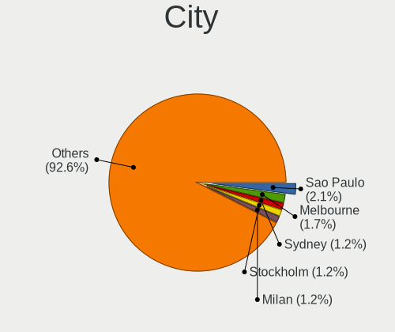

Zorin - Hardware Trends
-----------------------

A project to identify most popular hardware characteristics and track their change
over time based on data collected by Linux users at https://Linux-Hardware.org.

Anyone can contribute to this report by the [hw-probe](https://github.com/linuxhw/hw-probe) tool:

    sudo -E hw-probe -all -upload

This is a report for all computer types. See also reports for [desktops](/Dist/Zorin/Desktop/README.md) and [notebooks](/Dist/Zorin/Notebook/README.md).

This report is for one last month. Overall report since the beginning of time: [TestCoverage](https://github.com/linuxhw/TestCoverage)

Period: Jul, 2022.

Contents
--------

* [ System ](#system)
  - [ OS                       ](#os)
  - [ OS Family                ](#os-family)
  - [ Kernel                   ](#kernel)
  - [ Kernel Family            ](#kernel-family)
  - [ Kernel Major Ver.        ](#kernel-major-ver)
  - [ Arch                     ](#arch)
  - [ DE                       ](#de)
  - [ Display Server           ](#display-server)
  - [ Display Manager          ](#display-manager)
  - [ OS Lang                  ](#os-lang)
  - [ Boot Mode                ](#boot-mode)
  - [ Filesystem               ](#filesystem)
  - [ Part. scheme             ](#part-scheme)
  - [ Dual Boot with Linux/BSD ](#dual-boot-with-linuxbsd)
  - [ Dual Boot (Win)          ](#dual-boot-win)

* [ Board ](#board)
  - [ Vendor                   ](#vendor)
  - [ Model                    ](#model)
  - [ Model Family             ](#model-family)
  - [ MFG Year                 ](#mfg-year)
  - [ Form Factor              ](#form-factor)
  - [ Secure Boot              ](#secure-boot)
  - [ Coreboot                 ](#coreboot)
  - [ RAM Size                 ](#ram-size)
  - [ RAM Used                 ](#ram-used)
  - [ Total Drives             ](#total-drives)
  - [ Has CD-ROM               ](#has-cd-rom)
  - [ Has Ethernet             ](#has-ethernet)
  - [ Has WiFi                 ](#has-wifi)
  - [ Has Bluetooth            ](#has-bluetooth)

* [ Location ](#location)
  - [ Country                  ](#country)
  - [ City                     ](#city)

* [ Drives ](#drives)
  - [ Drive Vendor             ](#drive-vendor)
  - [ Drive Model              ](#drive-model)
  - [ HDD Vendor               ](#hdd-vendor)
  - [ SSD Vendor               ](#ssd-vendor)
  - [ Drive Kind               ](#drive-kind)
  - [ Drive Connector          ](#drive-connector)
  - [ Drive Size               ](#drive-size)
  - [ Space Total              ](#space-total)
  - [ Space Used               ](#space-used)
  - [ Malfunc. Drives          ](#malfunc-drives)
  - [ Malfunc. Drive Vendor    ](#malfunc-drive-vendor)
  - [ Malfunc. HDD Vendor      ](#malfunc-hdd-vendor)
  - [ Malfunc. Drive Kind      ](#malfunc-drive-kind)
  - [ Failed Drives            ](#failed-drives)
  - [ Failed Drive Vendor      ](#failed-drive-vendor)
  - [ Drive Status             ](#drive-status)

* [ Storage controller ](#storage-controller)
  - [ Storage Vendor           ](#storage-vendor)
  - [ Storage Model            ](#storage-model)
  - [ Storage Kind             ](#storage-kind)

* [ Processor ](#processor)
  - [ CPU Vendor               ](#cpu-vendor)
  - [ CPU Model                ](#cpu-model)
  - [ CPU Model Family         ](#cpu-model-family)
  - [ CPU Cores                ](#cpu-cores)
  - [ CPU Sockets              ](#cpu-sockets)
  - [ CPU Threads              ](#cpu-threads)
  - [ CPU Op-Modes             ](#cpu-op-modes)
  - [ CPU Microcode            ](#cpu-microcode)
  - [ CPU Microarch            ](#cpu-microarch)

* [ Graphics ](#graphics)
  - [ GPU Vendor               ](#gpu-vendor)
  - [ GPU Model                ](#gpu-model)
  - [ GPU Combo                ](#gpu-combo)
  - [ GPU Driver               ](#gpu-driver)
  - [ GPU Memory               ](#gpu-memory)

* [ Monitor ](#monitor)
  - [ Monitor Vendor           ](#monitor-vendor)
  - [ Monitor Model            ](#monitor-model)
  - [ Monitor Resolution       ](#monitor-resolution)
  - [ Monitor Diagonal         ](#monitor-diagonal)
  - [ Monitor Width            ](#monitor-width)
  - [ Aspect Ratio             ](#aspect-ratio)
  - [ Monitor Area             ](#monitor-area)
  - [ Pixel Density            ](#pixel-density)
  - [ Multiple Monitors        ](#multiple-monitors)

* [ Network ](#network)
  - [ Net Controller Vendor    ](#net-controller-vendor)
  - [ Net Controller Model     ](#net-controller-model)
  - [ Wireless Vendor          ](#wireless-vendor)
  - [ Wireless Model           ](#wireless-model)
  - [ Ethernet Vendor          ](#ethernet-vendor)
  - [ Ethernet Model           ](#ethernet-model)
  - [ Net Controller Kind      ](#net-controller-kind)
  - [ Used Controller          ](#used-controller)
  - [ NICs                     ](#nics)
  - [ IPv6                     ](#ipv6)

* [ Bluetooth ](#bluetooth)
  - [ Bluetooth Vendor         ](#bluetooth-vendor)
  - [ Bluetooth Model          ](#bluetooth-model)

* [ Sound ](#sound)
  - [ Sound Vendor             ](#sound-vendor)
  - [ Sound Model              ](#sound-model)

* [ Memory ](#memory)
  - [ Memory Vendor            ](#memory-vendor)
  - [ Memory Model             ](#memory-model)
  - [ Memory Kind              ](#memory-kind)
  - [ Memory Form Factor       ](#memory-form-factor)
  - [ Memory Size              ](#memory-size)
  - [ Memory Speed             ](#memory-speed)

* [ Printers & scanners ](#printers--scanners)
  - [ Printer Vendor           ](#printer-vendor)
  - [ Printer Model            ](#printer-model)
  - [ Scanner Vendor           ](#scanner-vendor)
  - [ Scanner Model            ](#scanner-model)

* [ Camera ](#camera)
  - [ Camera Vendor            ](#camera-vendor)
  - [ Camera Model             ](#camera-model)

* [ Security ](#security)
  - [ Fingerprint Vendor       ](#fingerprint-vendor)
  - [ Fingerprint Model        ](#fingerprint-model)
  - [ Chipcard Vendor          ](#chipcard-vendor)
  - [ Chipcard Model           ](#chipcard-model)

* [ Unsupported ](#unsupported)
  - [ Unsupported Devices      ](#unsupported-devices)
  - [ Unsupported Device Types ](#unsupported-device-types)

System
------

OS
--

Installed operating systems

| Name     | Computers | Percent |
|----------|-----------|---------|
| Zorin 16 | 136       | 92.52%  |
| Zorin 15 | 11        | 7.48%   |

OS Family
---------

OS without a version

| Name  | Computers | Percent |
|-------|-----------|---------|
| Zorin | 147       | 100%    |

Kernel
------

Version of the Linux kernel

| Version           | Computers | Percent |
|-------------------|-----------|---------|
| 5.13.0-52-generic | 59        | 40.14%  |
| 5.15.0-41-generic | 58        | 39.46%  |
| 5.13.0-51-generic | 7         | 4.76%   |
| 5.13.0-30-generic | 6         | 4.08%   |
| 5.4.0-121-generic | 5         | 3.4%    |
| 5.4.0-122-generic | 4         | 2.72%   |
| 5.4.0-110-generic | 2         | 1.36%   |
| 5.15.49-xanmod1   | 1         | 0.68%   |
| 5.13.0-48-generic | 1         | 0.68%   |
| 5.13.0-41-generic | 1         | 0.68%   |
| 5.13.0-40-generic | 1         | 0.68%   |
| 5.13.0-35-generic | 1         | 0.68%   |
| 5.13.0-28-generic | 1         | 0.68%   |

Kernel Family
-------------

Linux kernel without a distro release

| Version | Computers | Percent |
|---------|-----------|---------|
| 5.13.0  | 77        | 52.38%  |
| 5.15.0  | 58        | 39.46%  |
| 5.4.0   | 11        | 7.48%   |
| 5.15.49 | 1         | 0.68%   |

Kernel Major Ver.
-----------------

Linux kernel major version

| Version | Computers | Percent |
|---------|-----------|---------|
| 5.13    | 77        | 52.38%  |
| 5.15    | 59        | 40.14%  |
| 5.4     | 11        | 7.48%   |

Arch
----

OS architecture (x86_64, i586, etc.)

| Name   | Computers | Percent |
|--------|-----------|---------|
| x86_64 | 142       | 96.6%   |
| i686   | 5         | 3.4%    |

DE
--

Desktop Environment

| Name  | Computers | Percent |
|-------|-----------|---------|
| GNOME | 123       | 83.67%  |
| XFCE  | 24        | 16.33%  |

Display Server
--------------

X11 or Wayland

| Name    | Computers | Percent |
|---------|-----------|---------|
| X11     | 141       | 95.92%  |
| Wayland | 6         | 4.08%   |

Display Manager
---------------

SDDM, LightDM, etc.

| Name    | Computers | Percent |
|---------|-----------|---------|
| Unknown | 106       | 72.11%  |
| GDM     | 17        | 11.56%  |
| GDM3    | 14        | 9.52%   |
| LightDM | 10        | 6.8%    |

OS Lang
-------

Language

| Lang  | Computers | Percent |
|-------|-----------|---------|
| en_US | 51        | 34.69%  |
| de_DE | 15        | 10.2%   |
| en_GB | 14        | 9.52%   |
| fr_FR | 9         | 6.12%   |
| pt_BR | 6         | 4.08%   |
| en_IN | 5         | 3.4%    |
| pl_PL | 4         | 2.72%   |
| es_MX | 4         | 2.72%   |
| cs_CZ | 4         | 2.72%   |
| it_IT | 3         | 2.04%   |
| es_AR | 3         | 2.04%   |
| en_NZ | 3         | 2.04%   |
| en_AU | 3         | 2.04%   |
| tr_TR | 2         | 1.36%   |
| pt_PT | 2         | 1.36%   |
| hu_HU | 2         | 1.36%   |
| es_VE | 2         | 1.36%   |
| es_CL | 2         | 1.36%   |
| en_ZA | 2         | 1.36%   |
| en_IL | 2         | 1.36%   |
| nl_BE | 1         | 0.68%   |
| nb_NO | 1         | 0.68%   |
| fr_CA | 1         | 0.68%   |
| es_ES | 1         | 0.68%   |
| es_CR | 1         | 0.68%   |
| en_CA | 1         | 0.68%   |
| de_CH | 1         | 0.68%   |
| da_DK | 1         | 0.68%   |
| bg_BG | 1         | 0.68%   |

Boot Mode
---------

EFI or BIOS

| Mode | Computers | Percent |
|------|-----------|---------|
| EFI  | 74        | 50.34%  |
| BIOS | 73        | 49.66%  |

Filesystem
----------

Type of filesystem

| Type    | Computers | Percent |
|---------|-----------|---------|
| Ext4    | 143       | 97.28%  |
| Zfs     | 1         | 0.68%   |
| Xfs     | 1         | 0.68%   |
| Overlay | 1         | 0.68%   |
| Btrfs   | 1         | 0.68%   |

Part. scheme
------------

Scheme of partitioning

| Type    | Computers | Percent |
|---------|-----------|---------|
| Unknown | 127       | 86.39%  |
| GPT     | 13        | 8.84%   |
| MBR     | 7         | 4.76%   |

Dual Boot with Linux/BSD
------------------------

Hosting more than one Linux/BSD

| Dual boot | Computers | Percent |
|-----------|-----------|---------|
| No        | 141       | 95.92%  |
| Yes       | 6         | 4.08%   |

Dual Boot (Win)
---------------

Hosting Linux and Windows

| Dual boot | Computers | Percent |
|-----------|-----------|---------|
| No        | 134       | 91.16%  |
| Yes       | 13        | 8.84%   |

Board
-----

Vendor
------

Motherboard manufacturer

| Name                | Computers | Percent |
|---------------------|-----------|---------|
| Hewlett-Packard     | 26        | 17.69%  |
| Dell                | 20        | 13.61%  |
| ASUSTek Computer    | 18        | 12.24%  |
| Lenovo              | 17        | 11.56%  |
| Gigabyte Technology | 16        | 10.88%  |
| Acer                | 8         | 5.44%   |
| Samsung Electronics | 5         | 3.4%    |
| MSI                 | 5         | 3.4%    |
| Intel               | 4         | 2.72%   |
| Packard Bell        | 3         | 2.04%   |
| Toshiba             | 2         | 1.36%   |
| Fujitsu             | 2         | 1.36%   |
| Foxconn             | 2         | 1.36%   |
| System76            | 1         | 0.68%   |
| Supermicro          | 1         | 0.68%   |
| Star Labs           | 1         | 0.68%   |
| Sony                | 1         | 0.68%   |
| Pegatron            | 1         | 0.68%   |
| OEM_MB              | 1         | 0.68%   |
| OEM                 | 1         | 0.68%   |
| Kogan               | 1         | 0.68%   |
| HUAWEI              | 1         | 0.68%   |
| Google              | 1         | 0.68%   |
| Fujitsu Siemens     | 1         | 0.68%   |
| eMachines           | 1         | 0.68%   |
| Deffad              | 1         | 0.68%   |
| Biostar             | 1         | 0.68%   |
| ASRock              | 1         | 0.68%   |
| Apple               | 1         | 0.68%   |
| AMI                 | 1         | 0.68%   |
| Alienware           | 1         | 0.68%   |
| Unknown             | 1         | 0.68%   |

Model
-----

Motherboard model

| Name                                        | Computers | Percent |
|---------------------------------------------|-----------|---------|
| Unknown                                     | 5         | 3.4%    |
| Lenovo YB1-X91L                             | 2         | 1.36%   |
| Dell OptiPlex 780                           | 2         | 1.36%   |
| Dell Inspiron 5520                          | 2         | 1.36%   |
| Toshiba TECRA S11                           | 1         | 0.68%   |
| Toshiba Satellite L655                      | 1         | 0.68%   |
| System76 Thelio                             | 1         | 0.68%   |
| Supermicro Mediasite Recorder               | 1         | 0.68%   |
| Star Labs StarBook                          | 1         | 0.68%   |
| Sony VGN-Z31XN_B                            | 1         | 0.68%   |
| Samsung RV411/RV511/E3511/S3511/RV711/E3411 | 1         | 0.68%   |
| Samsung Galaxy Book 12 LTE                  | 1         | 0.68%   |
| Samsung 550XDA                              | 1         | 0.68%   |
| Samsung 500R5M/500R5W/501R5M                | 1         | 0.68%   |
| Samsung 300E4C/300E5C/300E7C                | 1         | 0.68%   |
| Pegatron NE502AV-ABA a6750t                 | 1         | 0.68%   |
| Packard Bell IXTREME M5741                  | 1         | 0.68%   |
| Packard Bell H17HV                          | 1         | 0.68%   |
| Packard Bell EasyNote TE69KB                | 1         | 0.68%   |
| OEM_MB KQ496AAR-ABA a6530f                  | 1         | 0.68%   |
| OEM G41 775 ICH7 8712                       | 1         | 0.68%   |
| MSI MS-7917                                 | 1         | 0.68%   |
| MSI MS-7798                                 | 1         | 0.68%   |
| MSI FJ452AA-AC4 a6615br                     | 1         | 0.68%   |
| MSI Creator 15 A10SET                       | 1         | 0.68%   |
| MSI CR620                                   | 1         | 0.68%   |
| Lenovo V14-ADA 82C6                         | 1         | 0.68%   |
| Lenovo ThinkPad T61 6457B5S                 | 1         | 0.68%   |
| Lenovo ThinkPad T500 2055A38                | 1         | 0.68%   |
| Lenovo ThinkPad T400 2768GB4                | 1         | 0.68%   |
| Lenovo ThinkPad E570 20H50047US             | 1         | 0.68%   |
| Lenovo ThinkCentre M91 7516AD1              | 1         | 0.68%   |
| Lenovo ThinkCentre M73 10B00005US           | 1         | 0.68%   |
| Lenovo S21e-20 80M4                         | 1         | 0.68%   |
| Lenovo MIIX 320-10ICR 80XF                  | 1         | 0.68%   |
| Lenovo MIIX 310-10ICR 80SG                  | 1         | 0.68%   |
| Lenovo IdeaPad C340-14API 81N6              | 1         | 0.68%   |
| Lenovo IdeaPad 3 15IIL05 81WE               | 1         | 0.68%   |
| Lenovo IdeaPad 1 14IGL05 81VU               | 1         | 0.68%   |
| Lenovo H30-05 90BJ00CNMT                    | 1         | 0.68%   |
| Lenovo G40-45 80E1                          | 1         | 0.68%   |
| Kogan KALAP13S300VA                         | 1         | 0.68%   |
| Intel X79 V2.72B                            | 1         | 0.68%   |
| Intel NUC8i5BEH                             | 1         | 0.68%   |
| Intel NUC6i7KYB H90766-402                  | 1         | 0.68%   |
| Intel NUC11PAHi5                            | 1         | 0.68%   |
| HUAWEI HVY-WXX9                             | 1         | 0.68%   |
| HP Stream Notebook                          | 1         | 0.68%   |
| HP ProBook 6475b                            | 1         | 0.68%   |
| HP ProBook 640 G1                           | 1         | 0.68%   |
| HP ProBook 455 G1                           | 1         | 0.68%   |
| HP ProBook 4540s                            | 1         | 0.68%   |
| HP ProBook 440 G8 Notebook PC               | 1         | 0.68%   |
| HP Pavilion Laptop 15-eg0xxx                | 1         | 0.68%   |
| HP Pavilion Gaming Laptop 15-ec2xxx         | 1         | 0.68%   |
| HP Pavilion Desktop PC 570-p0xx             | 1         | 0.68%   |
| HP Pavilion 15                              | 1         | 0.68%   |
| HP Mini 110-3100                            | 1         | 0.68%   |
| HP Laptop 15s-du2xxx                        | 1         | 0.68%   |
| HP Laptop 15-dw3xxx                         | 1         | 0.68%   |

Model Family
------------

Motherboard model prefix

| Name                  | Computers | Percent |
|-----------------------|-----------|---------|
| Dell Inspiron         | 8         | 5.44%   |
| HP ProBook            | 5         | 3.4%    |
| Dell OptiPlex         | 5         | 3.4%    |
| Acer Aspire           | 5         | 3.4%    |
| Unknown               | 5         | 3.4%    |
| Lenovo ThinkPad       | 4         | 2.72%   |
| HP Pavilion           | 4         | 2.72%   |
| HP Compaq             | 4         | 2.72%   |
| Lenovo IdeaPad        | 3         | 2.04%   |
| HP ENVY               | 3         | 2.04%   |
| ASUS PRIME            | 3         | 2.04%   |
| Lenovo YB1-X91L       | 2         | 1.36%   |
| Lenovo ThinkCentre    | 2         | 1.36%   |
| Lenovo MIIX           | 2         | 1.36%   |
| HP Laptop             | 2         | 1.36%   |
| Fujitsu ESPRIMO       | 2         | 1.36%   |
| Dell Latitude         | 2         | 1.36%   |
| ASUS VivoBook         | 2         | 1.36%   |
| Toshiba TECRA         | 1         | 0.68%   |
| Toshiba Satellite     | 1         | 0.68%   |
| System76 Thelio       | 1         | 0.68%   |
| Supermicro Mediasite  | 1         | 0.68%   |
| Star Labs StarBook    | 1         | 0.68%   |
| Sony VGN-Z31XN        | 1         | 0.68%   |
| Samsung RV411         | 1         | 0.68%   |
| Samsung Galaxy        | 1         | 0.68%   |
| Samsung 550XDA        | 1         | 0.68%   |
| Samsung 500R5M        | 1         | 0.68%   |
| Samsung 300E4C        | 1         | 0.68%   |
| Pegatron NE502AV-ABA  | 1         | 0.68%   |
| Packard Bell IXTREME  | 1         | 0.68%   |
| Packard Bell H17HV    | 1         | 0.68%   |
| Packard Bell EasyNote | 1         | 0.68%   |
| OEM_MB KQ496AAR-ABA   | 1         | 0.68%   |
| OEM G41               | 1         | 0.68%   |
| MSI MS-7917           | 1         | 0.68%   |
| MSI MS-7798           | 1         | 0.68%   |
| MSI FJ452AA-AC4       | 1         | 0.68%   |
| MSI Creator           | 1         | 0.68%   |
| MSI CR620             | 1         | 0.68%   |
| Lenovo V14-ADA        | 1         | 0.68%   |
| Lenovo S21e-20        | 1         | 0.68%   |
| Lenovo H30-05         | 1         | 0.68%   |
| Lenovo G40-45         | 1         | 0.68%   |
| Kogan KALAP13S300VA   | 1         | 0.68%   |
| Intel X79             | 1         | 0.68%   |
| Intel NUC8i5BEH       | 1         | 0.68%   |
| Intel NUC6i7KYB       | 1         | 0.68%   |
| Intel NUC11PAHi5      | 1         | 0.68%   |
| HUAWEI HVY-WXX9       | 1         | 0.68%   |
| HP Stream             | 1         | 0.68%   |
| HP Mini               | 1         | 0.68%   |
| HP EliteDesk          | 1         | 0.68%   |
| HP EliteBook          | 1         | 0.68%   |
| HP 550                | 1         | 0.68%   |
| HP 290                | 1         | 0.68%   |
| Google Butterfly      | 1         | 0.68%   |
| Gigabyte Z97X-UD3H    | 1         | 0.68%   |
| Gigabyte Z97X-SLI     | 1         | 0.68%   |
| Gigabyte Z77-D3H      | 1         | 0.68%   |

MFG Year
--------

Motherboard manufacture year

| Year | Computers | Percent |
|------|-----------|---------|
| 2020 | 18        | 12.24%  |
| 2008 | 14        | 9.52%   |
| 2010 | 13        | 8.84%   |
| 2016 | 12        | 8.16%   |
| 2012 | 11        | 7.48%   |
| 2021 | 10        | 6.8%    |
| 2018 | 10        | 6.8%    |
| 2014 | 10        | 6.8%    |
| 2011 | 10        | 6.8%    |
| 2013 | 9         | 6.12%   |
| 2017 | 7         | 4.76%   |
| 2019 | 5         | 3.4%    |
| 2015 | 5         | 3.4%    |
| 2009 | 5         | 3.4%    |
| 2022 | 2         | 1.36%   |
| 2007 | 2         | 1.36%   |
| 2006 | 2         | 1.36%   |
| 2005 | 2         | 1.36%   |

Form Factor
-----------

Physical design of the computer

| Name        | Computers | Percent |
|-------------|-----------|---------|
| Notebook    | 77        | 52.38%  |
| Desktop     | 56        | 38.1%   |
| Convertible | 6         | 4.08%   |
| Tablet      | 4         | 2.72%   |
| Mini pc     | 3         | 2.04%   |
| All in one  | 1         | 0.68%   |

Secure Boot
-----------

Enabled or disabled

| State    | Computers | Percent |
|----------|-----------|---------|
| Disabled | 129       | 87.76%  |
| Enabled  | 18        | 12.24%  |

Coreboot
--------

Have coreboot on board

| Used | Computers | Percent |
|------|-----------|---------|
| No   | 145       | 98.64%  |
| Yes  | 2         | 1.36%   |

RAM Size
--------

Total RAM memory

| Size in GB  | Computers | Percent |
|-------------|-----------|---------|
| 4.01-8.0    | 36        | 24.49%  |
| 3.01-4.0    | 34        | 23.13%  |
| 16.01-24.0  | 25        | 17.01%  |
| 8.01-16.0   | 20        | 13.61%  |
| 1.01-2.0    | 17        | 11.56%  |
| 32.01-64.0  | 11        | 7.48%   |
| 2.01-3.0    | 3         | 2.04%   |
| 64.01-256.0 | 1         | 0.68%   |

RAM Used
--------

Used RAM memory

| Used GB    | Computers | Percent |
|------------|-----------|---------|
| 1.01-2.0   | 65        | 44.22%  |
| 2.01-3.0   | 39        | 26.53%  |
| 3.01-4.0   | 21        | 14.29%  |
| 4.01-8.0   | 14        | 9.52%   |
| 0.51-1.0   | 5         | 3.4%    |
| 16.01-24.0 | 1         | 0.68%   |
| 8.01-16.0  | 1         | 0.68%   |
| 0.01-0.5   | 1         | 0.68%   |

Total Drives
------------

Number of drives on board

| Drives | Computers | Percent |
|--------|-----------|---------|
| 1      | 92        | 62.59%  |
| 2      | 35        | 23.81%  |
| 3      | 10        | 6.8%    |
| 4      | 7         | 4.76%   |
| 6      | 1         | 0.68%   |
| 5      | 1         | 0.68%   |
| 0      | 1         | 0.68%   |

Has CD-ROM
----------

Has CD-ROM on board

| Presented | Computers | Percent |
|-----------|-----------|---------|
| Yes       | 76        | 51.7%   |
| No        | 71        | 48.3%   |

Has Ethernet
------------

Has Ethernet on board

| Presented | Computers | Percent |
|-----------|-----------|---------|
| Yes       | 122       | 82.99%  |
| No        | 25        | 17.01%  |

Has WiFi
--------

Has WiFi module

| Presented | Computers | Percent |
|-----------|-----------|---------|
| Yes       | 112       | 76.19%  |
| No        | 35        | 23.81%  |

Has Bluetooth
-------------

Has Bluetooth module

| Presented | Computers | Percent |
|-----------|-----------|---------|
| Yes       | 77        | 52.38%  |
| No        | 70        | 47.62%  |

Location
--------

Country
-------

Geographic location (country)

| Country      | Computers | Percent |
|--------------|-----------|---------|
| USA          | 31        | 21.09%  |
| Germany      | 16        | 10.88%  |
| UK           | 14        | 9.52%   |
| France       | 8         | 5.44%   |
| Brazil       | 8         | 5.44%   |
| Poland       | 5         | 3.4%    |
| India        | 5         | 3.4%    |
| Mexico       | 4         | 2.72%   |
| Czechia      | 4         | 2.72%   |
| Australia    | 4         | 2.72%   |
| Argentina    | 4         | 2.72%   |
| Romania      | 3         | 2.04%   |
| Norway       | 3         | 2.04%   |
| New Zealand  | 3         | 2.04%   |
| Italy        | 3         | 2.04%   |
| Venezuela    | 2         | 1.36%   |
| Turkey       | 2         | 1.36%   |
| Spain        | 2         | 1.36%   |
| South Africa | 2         | 1.36%   |
| Portugal     | 2         | 1.36%   |
| Kenya        | 2         | 1.36%   |
| Israel       | 2         | 1.36%   |
| Hungary      | 2         | 1.36%   |
| Denmark      | 2         | 1.36%   |
| Chile        | 2         | 1.36%   |
| Canada       | 2         | 1.36%   |
| Belgium      | 2         | 1.36%   |
| UAE          | 1         | 0.68%   |
| Switzerland  | 1         | 0.68%   |
| Sweden       | 1         | 0.68%   |
| Sri Lanka    | 1         | 0.68%   |
| Greece       | 1         | 0.68%   |
| Finland      | 1         | 0.68%   |
| Costa Rica   | 1         | 0.68%   |
| Bulgaria     | 1         | 0.68%   |

City
----

Geographic location (city)

| City                      | Computers | Percent |
|---------------------------|-----------|---------|
| Wuppertal                 | 3         | 2.04%   |
| Bucharest                 | 3         | 2.04%   |
| Tel Aviv                  | 2         | 1.36%   |
| Rio de Janeiro            | 2         | 1.36%   |
| Nairobi                   | 2         | 1.36%   |
| Milwaukee                 | 2         | 1.36%   |
| Lyon                      | 2         | 1.36%   |
| Delhi                     | 2         | 1.36%   |
| Copenhagen                | 2         | 1.36%   |
| Chenove                   | 2         | 1.36%   |
| Buenos Aires              | 2         | 1.36%   |
| Berlin                    | 2         | 1.36%   |
| Bathgate                  | 2         | 1.36%   |
| Wylie                     | 1         | 0.68%   |
| Worthing                  | 1         | 0.68%   |
| Whaley Bridge             | 1         | 0.68%   |
| Westmoreland              | 1         | 0.68%   |
| Wellington                | 1         | 0.68%   |
| Watford                   | 1         | 0.68%   |
| Victoria                  | 1         | 0.68%   |
| Vesilahti                 | 1         | 0.68%   |
| Varna                     | 1         | 0.68%   |
| Vanse                     | 1         | 0.68%   |
| Valencia                  | 1         | 0.68%   |
| Union Dale                | 1         | 0.68%   |
| Trondheim                 | 1         | 0.68%   |
| Torrevieja                | 1         | 0.68%   |
| The Bronx                 | 1         | 0.68%   |
| Sydney                    | 1         | 0.68%   |
| Świnoujście             | 1         | 0.68%   |
| Stockholm                 | 1         | 0.68%   |
| Springfield               | 1         | 0.68%   |
| Skorcz                    | 1         | 0.68%   |
| Shippensburg              | 1         | 0.68%   |
| Secunda                   | 1         | 0.68%   |
| Seattle                   | 1         | 0.68%   |
| Schwenksville             | 1         | 0.68%   |
| Schoftland                | 1         | 0.68%   |
| San José                 | 1         | 0.68%   |
| San Antonio               | 1         | 0.68%   |
| Saint-Hilaire-sur-Benaize | 1         | 0.68%   |
| Rotherham                 | 1         | 0.68%   |
| Rosemead                  | 1         | 0.68%   |
| Riscle                    | 1         | 0.68%   |
| Reggio Emilia             | 1         | 0.68%   |
| Quilmes                   | 1         | 0.68%   |
| Queens                    | 1         | 0.68%   |
| Pune                      | 1         | 0.68%   |
| Pudahuel                  | 1         | 0.68%   |
| Port Montt                | 1         | 0.68%   |
| Poitiers                  | 1         | 0.68%   |
| Pocao                     | 1         | 0.68%   |
| Perth                     | 1         | 0.68%   |
| Pelotas                   | 1         | 0.68%   |
| Parma                     | 1         | 0.68%   |
| Oscoda                    | 1         | 0.68%   |
| Orlando                   | 1         | 0.68%   |
| Niederndodeleben          | 1         | 0.68%   |
| Niederkruchten            | 1         | 0.68%   |
| New York                  | 1         | 0.68%   |

Drives
------

Drive Vendor
------------

Hard drive vendors

| Vendor                    | Computers | Drives | Percent |
|---------------------------|-----------|--------|---------|
| Seagate                   | 34        | 41     | 16.11%  |
| WDC                       | 28        | 28     | 13.27%  |
| Samsung Electronics       | 25        | 28     | 11.85%  |
| Unknown                   | 17        | 23     | 8.06%   |
| Toshiba                   | 14        | 14     | 6.64%   |
| Kingston                  | 13        | 13     | 6.16%   |
| SanDisk                   | 10        | 11     | 4.74%   |
| Crucial                   | 9         | 9      | 4.27%   |
| Hitachi                   | 8         | 9      | 3.79%   |
| SK hynix                  | 5         | 5      | 2.37%   |
| A-DATA Technology         | 4         | 4      | 1.9%    |
| Team                      | 3         | 3      | 1.42%   |
| Intel                     | 3         | 3      | 1.42%   |
| HGST                      | 3         | 3      | 1.42%   |
| PNY                       | 2         | 2      | 0.95%   |
| Phison                    | 2         | 2      | 0.95%   |
| Micron Technology         | 2         | 3      | 0.95%   |
| Leven                     | 2         | 2      | 0.95%   |
| Intenso                   | 2         | 2      | 0.95%   |
| Hewlett-Packard           | 2         | 2      | 0.95%   |
| GOODRAM                   | 2         | 2      | 0.95%   |
| Transcend                 | 1         | 1      | 0.47%   |
| Timetec                   | 1         | 1      | 0.47%   |
| Star Drive                | 1         | 1      | 0.47%   |
| SPCC                      | 1         | 1      | 0.47%   |
| SABRENT                   | 1         | 1      | 0.47%   |
| S3+                       | 1         | 1      | 0.47%   |
| Realtek Semiconductor     | 1         | 1      | 0.47%   |
| Patriot                   | 1         | 1      | 0.47%   |
| OCZ                       | 1         | 1      | 0.47%   |
| Netac                     | 1         | 2      | 0.47%   |
| Micron/Crucial Technology | 1         | 1      | 0.47%   |
| LDLC                      | 1         | 1      | 0.47%   |
| LaCie                     | 1         | 1      | 0.47%   |
| KIOXIA                    | 1         | 1      | 0.47%   |
| HUAWEI                    | 1         | 1      | 0.47%   |
| HS-SSD-C100               | 1         | 1      | 0.47%   |
| Gigabyte Technology       | 1         | 1      | 0.47%   |
| Fujitsu                   | 1         | 1      | 0.47%   |
| China                     | 1         | 1      | 0.47%   |
| ADATA Technology          | 1         | 1      | 0.47%   |
| Unknown                   | 1         | 1      | 0.47%   |

Drive Model
-----------

Hard drive models

| Model                                | Computers | Percent |
|--------------------------------------|-----------|---------|
| Unknown MMC Card  64GB               | 5         | 2.2%    |
| Crucial CT240BX500SSD1 240GB         | 5         | 2.2%    |
| Samsung NVMe SSD Drive 256GB         | 4         | 1.76%   |
| Unknown MMC Card  32GB               | 3         | 1.32%   |
| Unknown MMC Card  128GB              | 3         | 1.32%   |
| Seagate ST500DM002-1BD142 500GB      | 3         | 1.32%   |
| Samsung SSD 860 EVO 500GB            | 3         | 1.32%   |
| Hitachi HTS545032B9A300 320GB        | 3         | 1.32%   |
| WDC WD10SPZX-21Z10T0 1TB             | 2         | 0.88%   |
| Unknown SDW32G  32GB                 | 2         | 0.88%   |
| Unknown SD/MMC/MS PRO 64GB           | 2         | 0.88%   |
| Toshiba MQ01ABF050 500GB             | 2         | 0.88%   |
| Toshiba DT01ACA100 1TB               | 2         | 0.88%   |
| SK hynix NVMe SSD Drive 512GB        | 2         | 0.88%   |
| Seagate ST9640320AS 640GB            | 2         | 0.88%   |
| Seagate ST9250315AS 250GB            | 2         | 0.88%   |
| Seagate Expansion 1TB                | 2         | 0.88%   |
| SanDisk SSD PLUS 480GB               | 2         | 0.88%   |
| SanDisk NVMe SSD Drive 500GB         | 2         | 0.88%   |
| Samsung SSD 870 EVO 1TB              | 2         | 0.88%   |
| Samsung SSD 850 EVO 250GB            | 2         | 0.88%   |
| Samsung SP0612N 64GB                 | 2         | 0.88%   |
| Samsung HD161GJ 160GB                | 2         | 0.88%   |
| Kingston SV300S37A120G 120GB SSD     | 2         | 0.88%   |
| Kingston SA400S37480G 480GB SSD      | 2         | 0.88%   |
| Kingston SA400S37240G 240GB SSD      | 2         | 0.88%   |
| WDC WD800BD-22LRA0 80GB              | 1         | 0.44%   |
| WDC WD5001ABYS-01YNA0 500GB          | 1         | 0.44%   |
| WDC WD5000LPVX-80V0TT0 500GB         | 1         | 0.44%   |
| WDC WD5000LPCX-22VHAT1 500GB         | 1         | 0.44%   |
| WDC WD5000BPKT-75PK4T0 500GB         | 1         | 0.44%   |
| WDC WD5000BEVT-22ZAT0 500GB          | 1         | 0.44%   |
| WDC WD5000AZLX-60K2TA0 500GB         | 1         | 0.44%   |
| WDC WD5000AAKX-08U6AA0 500GB         | 1         | 0.44%   |
| WDC WD5000AAKX-001CA0 500GB          | 1         | 0.44%   |
| WDC WD5000AAKS-00UU3A0 500GB         | 1         | 0.44%   |
| WDC WD5000AADS-56S9B1 500GB          | 1         | 0.44%   |
| WDC WD3200JS-00PDB0 320GB            | 1         | 0.44%   |
| WDC WD3200BEVT-75ZCT2 320GB          | 1         | 0.44%   |
| WDC WD3200AVVS-63L2B0 320GB          | 1         | 0.44%   |
| WDC WD30EZRZ-22Z5HB0 3TB             | 1         | 0.44%   |
| WDC WD2500BJKT-00F4T0 250GB          | 1         | 0.44%   |
| WDC WD2500AVVS-62L2B0 250GB          | 1         | 0.44%   |
| WDC WD20EZRZ-60Z5HB0 2TB             | 1         | 0.44%   |
| WDC WD20EZAZ-00L9GB0 2TB             | 1         | 0.44%   |
| WDC WD20EARX-00PASB0 2TB             | 1         | 0.44%   |
| WDC WD1600AAJS-00L7A0 160GB          | 1         | 0.44%   |
| WDC WD10EZRX-00A3KB0 1TB             | 1         | 0.44%   |
| WDC WD10EZEX-00BN5A0 1TB             | 1         | 0.44%   |
| WDC WD10EFRX-68JCSN0 1TB             | 1         | 0.44%   |
| WDC WD10EADS-00M2B0 1TB              | 1         | 0.44%   |
| WDC PC SN730 SDBPNTY-512G-1027 512GB | 1         | 0.44%   |
| Unknown SLD32G  32GB                 | 1         | 0.44%   |
| Unknown SD64G  64GB                  | 1         | 0.44%   |
| Unknown NCard  16GB                  | 1         | 0.44%   |
| Unknown MMC Card  4GB                | 1         | 0.44%   |
| Unknown MMC Card  393GB              | 1         | 0.44%   |
| Unknown MMC Card  1GB                | 1         | 0.44%   |
| Unknown MMC Card  16GB               | 1         | 0.44%   |
| Unknown DA4064  64GB                 | 1         | 0.44%   |

HDD Vendor
----------

Hard disk drive vendors

| Vendor              | Computers | Drives | Percent |
|---------------------|-----------|--------|---------|
| Seagate             | 34        | 40     | 35.42%  |
| WDC                 | 27        | 27     | 28.13%  |
| Toshiba             | 13        | 13     | 13.54%  |
| Hitachi             | 8         | 9      | 8.33%   |
| Samsung Electronics | 7         | 7      | 7.29%   |
| HGST                | 3         | 3      | 3.13%   |
| Unknown             | 2         | 2      | 2.08%   |
| SABRENT             | 1         | 1      | 1.04%   |
| Fujitsu             | 1         | 1      | 1.04%   |

SSD Vendor
----------

Solid state drive vendors

| Vendor              | Computers | Drives | Percent |
|---------------------|-----------|--------|---------|
| Samsung Electronics | 10        | 11     | 16.39%  |
| Kingston            | 10        | 10     | 16.39%  |
| Crucial             | 8         | 8      | 13.11%  |
| SanDisk             | 5         | 5      | 8.2%    |
| A-DATA Technology   | 4         | 4      | 6.56%   |
| Team                | 3         | 3      | 4.92%   |
| PNY                 | 2         | 2      | 3.28%   |
| Leven               | 2         | 2      | 3.28%   |
| Intel               | 2         | 2      | 3.28%   |
| Hewlett-Packard     | 2         | 2      | 3.28%   |
| Transcend           | 1         | 1      | 1.64%   |
| SPCC                | 1         | 1      | 1.64%   |
| SK hynix            | 1         | 1      | 1.64%   |
| S3+                 | 1         | 1      | 1.64%   |
| Patriot             | 1         | 1      | 1.64%   |
| Netac               | 1         | 2      | 1.64%   |
| Micron Technology   | 1         | 1      | 1.64%   |
| LDLC                | 1         | 1      | 1.64%   |
| Intenso             | 1         | 1      | 1.64%   |
| HS-SSD-C100         | 1         | 1      | 1.64%   |
| GOODRAM             | 1         | 1      | 1.64%   |
| Gigabyte Technology | 1         | 1      | 1.64%   |
| China               | 1         | 1      | 1.64%   |

Drive Kind
----------

HDD or SSD

| Kind    | Computers | Drives | Percent |
|---------|-----------|--------|---------|
| HDD     | 80        | 103    | 42.33%  |
| SSD     | 55        | 63     | 29.1%   |
| NVMe    | 33        | 39     | 17.46%  |
| MMC     | 17        | 22     | 8.99%   |
| Unknown | 4         | 4      | 2.12%   |

Drive Connector
---------------

SATA, SAS, NVMe, etc.

| Type | Computers | Drives | Percent |
|------|-----------|--------|---------|
| SATA | 114       | 162    | 66.28%  |
| NVMe | 33        | 39     | 19.19%  |
| MMC  | 17        | 22     | 9.88%   |
| SAS  | 8         | 8      | 4.65%   |

Drive Size
----------

Size of hard drive

| Size in TB | Computers | Drives | Percent |
|------------|-----------|--------|---------|
| 0.01-0.5   | 100       | 118    | 71.43%  |
| 0.51-1.0   | 26        | 31     | 18.57%  |
| 1.01-2.0   | 11        | 14     | 7.86%   |
| 2.01-3.0   | 2         | 2      | 1.43%   |
| 3.01-4.0   | 1         | 1      | 0.71%   |

Space Total
-----------

Amount of disk space available on the file system

| Size in GB     | Computers | Percent |
|----------------|-----------|---------|
| 101-250        | 50        | 34.01%  |
| 251-500        | 31        | 21.09%  |
| 501-1000       | 20        | 13.61%  |
| 51-100         | 19        | 12.93%  |
| More than 3000 | 8         | 5.44%   |
| 1001-2000      | 6         | 4.08%   |
| 21-50          | 5         | 3.4%    |
| 1-20           | 5         | 3.4%    |
| 2001-3000      | 3         | 2.04%   |

Space Used
----------

Amount of used disk space

| Used GB        | Computers | Percent |
|----------------|-----------|---------|
| 1-20           | 74        | 50.34%  |
| 21-50          | 29        | 19.73%  |
| 51-100         | 13        | 8.84%   |
| 101-250        | 12        | 8.16%   |
| 251-500        | 11        | 7.48%   |
| 501-1000       | 4         | 2.72%   |
| More than 3000 | 3         | 2.04%   |
| 2001-3000      | 1         | 0.68%   |

Malfunc. Drives
---------------

Drive models with a malfunction

| Model                           | Computers | Drives | Percent |
|---------------------------------|-----------|--------|---------|
| Toshiba MK8046GSX 80GB          | 1         | 1      | 25%     |
| Seagate ST9250315AS 250GB       | 1         | 1      | 25%     |
| Seagate ST320LT012-1DG14C 320GB | 1         | 1      | 25%     |
| Seagate ST1000LX015-1U7172 1TB  | 1         | 1      | 25%     |

Malfunc. Drive Vendor
---------------------

Vendors of faulty drives

| Vendor  | Computers | Drives | Percent |
|---------|-----------|--------|---------|
| Seagate | 3         | 3      | 75%     |
| Toshiba | 1         | 1      | 25%     |

Malfunc. HDD Vendor
-------------------

Vendors of faulty HDD drives

| Vendor  | Computers | Drives | Percent |
|---------|-----------|--------|---------|
| Seagate | 3         | 3      | 75%     |
| Toshiba | 1         | 1      | 25%     |

Malfunc. Drive Kind
-------------------

Kinds of faulty drives

| Kind | Computers | Drives | Percent |
|------|-----------|--------|---------|
| HDD  | 4         | 4      | 100%    |

Failed Drives
-------------

Failed drive models

Zero info for selected period =(

Failed Drive Vendor
-------------------

Failed drive vendors

Zero info for selected period =(

Drive Status
------------

Number of failed and malfunc. drives

| Status   | Computers | Drives | Percent |
|----------|-----------|--------|---------|
| Detected | 131       | 209    | 87.92%  |
| Works    | 14        | 18     | 9.4%    |
| Malfunc  | 4         | 4      | 2.68%   |

Storage controller
------------------

Storage Vendor
--------------

Storage controller vendors

| Vendor                       | Computers | Percent |
|------------------------------|-----------|---------|
| Intel                        | 98        | 58.68%  |
| AMD                          | 23        | 13.77%  |
| Samsung Electronics          | 10        | 5.99%   |
| SanDisk                      | 6         | 3.59%   |
| Nvidia                       | 5         | 2.99%   |
| SK hynix                     | 4         | 2.4%    |
| Phison Electronics           | 3         | 1.8%    |
| Kingston Technology Company  | 3         | 1.8%    |
| JMicron Technology           | 3         | 1.8%    |
| VIA Technologies             | 2         | 1.2%    |
| Micron/Crucial Technology    | 2         | 1.2%    |
| Toshiba America Info Systems | 1         | 0.6%    |
| Silicon Motion               | 1         | 0.6%    |
| Seagate Technology           | 1         | 0.6%    |
| Realtek Semiconductor        | 1         | 0.6%    |
| OCZ Technology Group         | 1         | 0.6%    |
| Micron Technology            | 1         | 0.6%    |
| KIOXIA                       | 1         | 0.6%    |
| ADATA Technology             | 1         | 0.6%    |

Storage Model
-------------

Storage controller models

| Model                                                                          | Computers | Percent |
|--------------------------------------------------------------------------------|-----------|---------|
| AMD FCH SATA Controller [AHCI mode]                                            | 17        | 8.81%   |
| Intel Volume Management Device NVMe RAID Controller                            | 7         | 3.63%   |
| Intel Sunrise Point-LP SATA Controller [AHCI mode]                             | 7         | 3.63%   |
| Intel 7 Series Chipset Family 6-port SATA Controller [AHCI mode]               | 7         | 3.63%   |
| Intel 82801IBM/IEM (ICH9M/ICH9M-E) 4 port SATA Controller [AHCI mode]          | 6         | 3.11%   |
| Intel 8 Series/C220 Series Chipset Family 6-port SATA Controller 1 [AHCI mode] | 6         | 3.11%   |
| Intel 9 Series Chipset Family SATA Controller [AHCI Mode]                      | 4         | 2.07%   |
| Intel 82801G (ICH7 Family) IDE Controller                                      | 4         | 2.07%   |
| Intel 7 Series/C210 Series Chipset Family 6-port SATA Controller [AHCI mode]   | 4         | 2.07%   |
| Samsung NVMe SSD Controller PM9A1/PM9A3/980PRO                                 | 3         | 1.55%   |
| Intel Tiger Lake-LP SATA Controller                                            | 3         | 1.55%   |
| Intel SATA Controller [RAID mode]                                              | 3         | 1.55%   |
| Intel Q170/Q150/B150/H170/H110/Z170/CM236 Chipset SATA Controller [AHCI Mode]  | 3         | 1.55%   |
| Intel NM10/ICH7 Family SATA Controller [IDE mode]                              | 3         | 1.55%   |
| Intel 82801HM/HEM (ICH8M/ICH8M-E) SATA Controller [AHCI mode]                  | 3         | 1.55%   |
| Intel 82801HM/HEM (ICH8M/ICH8M-E) IDE Controller                               | 3         | 1.55%   |
| Intel 6 Series/C200 Series Chipset Family 6 port Desktop SATA AHCI Controller  | 3         | 1.55%   |
| Intel 5 Series/3400 Series Chipset 4 port SATA AHCI Controller                 | 3         | 1.55%   |
| Intel 200 Series PCH SATA controller [AHCI mode]                               | 3         | 1.55%   |
| VIA VT82C586A/B/VT82C686/A/B/VT823x/A/C PIPC Bus Master IDE                    | 2         | 1.04%   |
| SK hynix Gold P31 SSD                                                          | 2         | 1.04%   |
| SanDisk WD Black SN750 / PC SN730 NVMe SSD                                     | 2         | 1.04%   |
| SanDisk Non-Volatile memory controller                                         | 2         | 1.04%   |
| Samsung NVMe SSD Controller SM981/PM981/PM983                                  | 2         | 1.04%   |
| Samsung NVMe SSD Controller SM951/PM951                                        | 2         | 1.04%   |
| Samsung NVMe SSD Controller 980                                                | 2         | 1.04%   |
| Nvidia MCP78S [GeForce 8200] SATA Controller (non-AHCI mode)                   | 2         | 1.04%   |
| Nvidia MCP61 SATA Controller                                                   | 2         | 1.04%   |
| Nvidia MCP61 IDE                                                               | 2         | 1.04%   |
| JMicron JMB363 SATA/IDE Controller                                             | 2         | 1.04%   |
| Intel Wildcat Point-LP SATA Controller [AHCI Mode]                             | 2         | 1.04%   |
| Intel Celeron/Pentium Silver Processor SATA Controller                         | 2         | 1.04%   |
| Intel Cannon Point-LP SATA Controller [AHCI Mode]                              | 2         | 1.04%   |
| Intel C600/X79 series chipset 6-Port SATA AHCI Controller                      | 2         | 1.04%   |
| Intel 82801JI (ICH10 Family) 4 port SATA IDE Controller #1                     | 2         | 1.04%   |
| Intel 82801JI (ICH10 Family) 2 port SATA IDE Controller #2                     | 2         | 1.04%   |
| Intel 82801IBM/IEM (ICH9M/ICH9M-E) 2 port SATA Controller [IDE mode]           | 2         | 1.04%   |
| Intel 82801GBM/GHM (ICH7-M Family) SATA Controller [AHCI mode]                 | 2         | 1.04%   |
| Intel 8 Series SATA Controller 1 [AHCI mode]                                   | 2         | 1.04%   |
| Intel 6 Series/C200 Series Chipset Family 6 port Mobile SATA AHCI Controller   | 2         | 1.04%   |
| Intel 5 Series/3400 Series Chipset 6 port SATA AHCI Controller                 | 2         | 1.04%   |
| Intel 4 Series Chipset PT IDER Controller                                      | 2         | 1.04%   |
| AMD SB7x0/SB8x0/SB9x0 SATA Controller [IDE mode]                               | 2         | 1.04%   |
| AMD SB7x0/SB8x0/SB9x0 SATA Controller [AHCI mode]                              | 2         | 1.04%   |
| AMD SB7x0/SB8x0/SB9x0 IDE Controller                                           | 2         | 1.04%   |
| AMD 500 Series Chipset SATA Controller                                         | 2         | 1.04%   |
| AMD 400 Series Chipset SATA Controller                                         | 2         | 1.04%   |
| VIA Serial ATA Controller                                                      | 1         | 0.52%   |
| Toshiba America Info Systems XG6 NVMe SSD Controller                           | 1         | 0.52%   |
| SK hynix PC300 NVMe Solid State Drive 512GB                                    | 1         | 0.52%   |
| SK hynix BC511                                                                 | 1         | 0.52%   |
| Silicon Motion SM2263EN/SM2263XT SSD Controller                                | 1         | 0.52%   |
| Seagate Non-Volatile memory controller                                         | 1         | 0.52%   |
| SanDisk WD Blue SN570 NVMe SSD                                                 | 1         | 0.52%   |
| SanDisk PC SN520 NVMe SSD                                                      | 1         | 0.52%   |
| Samsung NVMe SSD Controller SM961/PM961/SM963                                  | 1         | 0.52%   |
| Realtek Realtek Non-Volatile memory controller                                 | 1         | 0.52%   |
| Phison PS5013 E13 NVMe Controller                                              | 1         | 0.52%   |
| Phison E18 PCIe4 NVMe Controller                                               | 1         | 0.52%   |
| Phison E12 NVMe Controller                                                     | 1         | 0.52%   |

Storage Kind
------------

Kind of storage controller (IDE, SATA, NVMe, SAS, ...)

| Kind | Computers | Percent |
|------|-----------|---------|
| SATA | 99        | 57.23%  |
| NVMe | 33        | 19.08%  |
| IDE  | 30        | 17.34%  |
| RAID | 11        | 6.36%   |

Processor
---------

CPU Vendor
----------

Processor vendors

| Vendor | Computers | Percent |
|--------|-----------|---------|
| Intel  | 117       | 79.59%  |
| AMD    | 30        | 20.41%  |

CPU Model
---------

Processor models

| Model                                       | Computers | Percent |
|---------------------------------------------|-----------|---------|
| Intel Atom x5-Z8350 CPU @ 1.44GHz           | 4         | 2.72%   |
| Intel Core i7-7500U CPU @ 2.70GHz           | 3         | 2.04%   |
| Intel Core i7-3770 CPU @ 3.40GHz            | 3         | 2.04%   |
| Intel Core i5-7200U CPU @ 2.50GHz           | 3         | 2.04%   |
| Intel Core i5-3210M CPU @ 2.50GHz           | 3         | 2.04%   |
| Intel 11th Gen Core i5-1135G7 @ 2.40GHz     | 3         | 2.04%   |
| Intel Pentium Dual-Core CPU T4200 @ 2.00GHz | 2         | 1.36%   |
| Intel Pentium Dual-Core CPU E5300 @ 2.60GHz | 2         | 1.36%   |
| Intel Core i7-4790K CPU @ 4.00GHz           | 2         | 1.36%   |
| Intel Core i5-6600 CPU @ 3.30GHz            | 2         | 1.36%   |
| Intel Core i3-1005G1 CPU @ 1.20GHz          | 2         | 1.36%   |
| Intel Core 2 Quad CPU Q9550 @ 2.83GHz       | 2         | 1.36%   |
| Intel Core 2 Duo CPU E8400 @ 3.00GHz        | 2         | 1.36%   |
| Intel Celeron CPU N2840 @ 2.16GHz           | 2         | 1.36%   |
| Intel Atom x5-Z8550 CPU @ 1.44GHz           | 2         | 1.36%   |
| Intel 11th Gen Core i7-1165G7 @ 2.80GHz     | 2         | 1.36%   |
| AMD Ryzen 5 3600 6-Core Processor           | 2         | 1.36%   |
| Intel Xeon CPU W3550 @ 3.07GHz              | 1         | 0.68%   |
| Intel Xeon CPU E5-2640 0 @ 2.50GHz          | 1         | 0.68%   |
| Intel Xeon CPU E5-2630 v2 @ 2.60GHz         | 1         | 0.68%   |
| Intel Xeon CPU E3-1231 v3 @ 3.40GHz         | 1         | 0.68%   |
| Intel Pentium Silver J5040 CPU @ 2.00GHz    | 1         | 0.68%   |
| Intel Pentium Gold 7505 @ 2.00GHz           | 1         | 0.68%   |
| Intel Pentium Dual CPU T3400 @ 2.16GHz      | 1         | 0.68%   |
| Intel Pentium Dual CPU E2200 @ 2.20GHz      | 1         | 0.68%   |
| Intel Pentium Dual CPU E2160 @ 1.80GHz      | 1         | 0.68%   |
| Intel Pentium CPU P6200 @ 2.13GHz           | 1         | 0.68%   |
| Intel Pentium CPU N3540 @ 2.16GHz           | 1         | 0.68%   |
| Intel Pentium CPU G860 @ 3.00GHz            | 1         | 0.68%   |
| Intel Pentium CPU G620 @ 2.60GHz            | 1         | 0.68%   |
| Intel Pentium CPU 2117U @ 1.80GHz           | 1         | 0.68%   |
| Intel Pentium 4 CPU 3.00GHz                 | 1         | 0.68%   |
| Intel Core i9-9900K CPU @ 3.60GHz           | 1         | 0.68%   |
| Intel Core i7-7Y75 CPU @ 1.30GHz            | 1         | 0.68%   |
| Intel Core i7-7700 CPU @ 3.60GHz            | 1         | 0.68%   |
| Intel Core i7-6770HQ CPU @ 2.60GHz          | 1         | 0.68%   |
| Intel Core i7-6700K CPU @ 4.00GHz           | 1         | 0.68%   |
| Intel Core i7-5500U CPU @ 2.40GHz           | 1         | 0.68%   |
| Intel Core i7-4770 CPU @ 3.40GHz            | 1         | 0.68%   |
| Intel Core i7-4710HQ CPU @ 2.50GHz          | 1         | 0.68%   |
| Intel Core i7-10875H CPU @ 2.30GHz          | 1         | 0.68%   |
| Intel Core i7 CPU Q 720 @ 1.60GHz           | 1         | 0.68%   |
| Intel Core i5-8365U CPU @ 1.60GHz           | 1         | 0.68%   |
| Intel Core i5-8259U CPU @ 2.30GHz           | 1         | 0.68%   |
| Intel Core i5-7400 CPU @ 3.00GHz            | 1         | 0.68%   |
| Intel Core i5-6500 CPU @ 3.20GHz            | 1         | 0.68%   |
| Intel Core i5-6200U CPU @ 2.30GHz           | 1         | 0.68%   |
| Intel Core i5-5300U CPU @ 2.30GHz           | 1         | 0.68%   |
| Intel Core i5-5287U CPU @ 2.90GHz           | 1         | 0.68%   |
| Intel Core i5-4690K CPU @ 3.50GHz           | 1         | 0.68%   |
| Intel Core i5-4670 CPU @ 3.40GHz            | 1         | 0.68%   |
| Intel Core i5-4570 CPU @ 3.20GHz            | 1         | 0.68%   |
| Intel Core i5-4310M CPU @ 2.70GHz           | 1         | 0.68%   |
| Intel Core i5-3570S CPU @ 3.10GHz           | 1         | 0.68%   |
| Intel Core i5-3570 CPU @ 3.40GHz            | 1         | 0.68%   |
| Intel Core i5-3230M CPU @ 2.60GHz           | 1         | 0.68%   |
| Intel Core i5-2540M CPU @ 2.60GHz           | 1         | 0.68%   |
| Intel Core i5-2430M CPU @ 2.40GHz           | 1         | 0.68%   |
| Intel Core i5-2400 CPU @ 3.10GHz            | 1         | 0.68%   |
| Intel Core i5-2300 CPU @ 2.80GHz            | 1         | 0.68%   |

CPU Model Family
----------------

Processor model prefix

| Model                   | Computers | Percent |
|-------------------------|-----------|---------|
| Intel Core i5           | 29        | 19.73%  |
| Intel Core i7           | 17        | 11.56%  |
| Intel Core 2 Duo        | 12        | 8.16%   |
| Other                   | 11        | 7.48%   |
| Intel Core i3           | 10        | 6.8%    |
| Intel Atom              | 8         | 5.44%   |
| AMD Ryzen 5             | 6         | 4.08%   |
| Intel Pentium           | 5         | 3.4%    |
| Intel Celeron           | 5         | 3.4%    |
| Intel Xeon              | 4         | 2.72%   |
| Intel Pentium Dual-Core | 4         | 2.72%   |
| Intel Pentium Dual      | 3         | 2.04%   |
| AMD Ryzen 9             | 3         | 2.04%   |
| AMD A6                  | 3         | 2.04%   |
| Intel Core 2 Quad       | 2         | 1.36%   |
| Intel Core 2            | 2         | 1.36%   |
| Intel Celeron M         | 2         | 1.36%   |
| AMD Ryzen 3             | 2         | 1.36%   |
| AMD Athlon II X4        | 2         | 1.36%   |
| AMD Athlon II X2        | 2         | 1.36%   |
| AMD A4                  | 2         | 1.36%   |
| Intel Pentium Silver    | 1         | 0.68%   |
| Intel Pentium Gold      | 1         | 0.68%   |
| Intel Pentium 4         | 1         | 0.68%   |
| Intel Core i9           | 1         | 0.68%   |
| AMD Ryzen 7 PRO         | 1         | 0.68%   |
| AMD Ryzen 7             | 1         | 0.68%   |
| AMD Phenom II X4        | 1         | 0.68%   |
| AMD Phenom              | 1         | 0.68%   |
| AMD FX                  | 1         | 0.68%   |
| AMD E1                  | 1         | 0.68%   |
| AMD Athlon 64 X2        | 1         | 0.68%   |
| AMD A8                  | 1         | 0.68%   |
| AMD A10                 | 1         | 0.68%   |

CPU Cores
---------

Number of processor cores

| Number | Computers | Percent |
|--------|-----------|---------|
| 2      | 69        | 46.94%  |
| 4      | 56        | 38.1%   |
| 6      | 9         | 6.12%   |
| 8      | 5         | 3.4%    |
| 1      | 5         | 3.4%    |
| 12     | 2         | 1.36%   |
| 3      | 1         | 0.68%   |

CPU Sockets
-----------

Number of sockets

| Number | Computers | Percent |
|--------|-----------|---------|
| 1      | 147       | 100%    |

CPU Threads
-----------

Threads per core (Hyper-Threading)

| Number | Computers | Percent |
|--------|-----------|---------|
| 2      | 77        | 52.38%  |
| 1      | 70        | 47.62%  |

CPU Op-Modes
------------

CPU Operation Modes (32-bit, 64-bit)

| Op mode        | Computers | Percent |
|----------------|-----------|---------|
| 32-bit, 64-bit | 145       | 98.64%  |
| 32-bit         | 2         | 1.36%   |

CPU Microcode
-------------

Microcode number

| Number     | Computers | Percent |
|------------|-----------|---------|
| 0x1067a    | 15        | 10.2%   |
| 0x306a9    | 11        | 7.48%   |
| 0x306c3    | 10        | 6.8%    |
| 0x206a7    | 8         | 5.44%   |
| 0x806e9    | 7         | 4.76%   |
| 0x406c4    | 7         | 4.76%   |
| 0x806c1    | 6         | 4.08%   |
| Unknown    | 6         | 4.08%   |
| 0x506e3    | 5         | 3.4%    |
| 0x6fd      | 4         | 2.72%   |
| 0x906e9    | 3         | 2.04%   |
| 0x306d4    | 3         | 2.04%   |
| 0x30678    | 3         | 2.04%   |
| 0x20655    | 3         | 2.04%   |
| 0x08108109 | 3         | 2.04%   |
| 0x07030105 | 3         | 2.04%   |
| 0x806ea    | 2         | 1.36%   |
| 0x806d1    | 2         | 1.36%   |
| 0x706e5    | 2         | 1.36%   |
| 0x706a8    | 2         | 1.36%   |
| 0x40651    | 2         | 1.36%   |
| 0x10676    | 2         | 1.36%   |
| 0x08701021 | 2         | 1.36%   |
| 0x06001119 | 2         | 1.36%   |
| 0x010000db | 2         | 1.36%   |
| 0x010000c8 | 2         | 1.36%   |
| 0xf43      | 1         | 0.68%   |
| 0xa0652    | 1         | 0.68%   |
| 0x906ec    | 1         | 0.68%   |
| 0x90672    | 1         | 0.68%   |
| 0x806ec    | 1         | 0.68%   |
| 0x706a1    | 1         | 0.68%   |
| 0x6f6      | 1         | 0.68%   |
| 0x6f2      | 1         | 0.68%   |
| 0x6e8      | 1         | 0.68%   |
| 0x6d8      | 1         | 0.68%   |
| 0x406e3    | 1         | 0.68%   |
| 0x306e4    | 1         | 0.68%   |
| 0x206d7    | 1         | 0.68%   |
| 0x20652    | 1         | 0.68%   |
| 0x106e5    | 1         | 0.68%   |
| 0x106ca    | 1         | 0.68%   |
| 0x106a5    | 1         | 0.68%   |
| 0x0a50000c | 1         | 0.68%   |
| 0x0a201016 | 1         | 0.68%   |
| 0x0a201009 | 1         | 0.68%   |
| 0x08701011 | 1         | 0.68%   |
| 0x08600106 | 1         | 0.68%   |
| 0x08600104 | 1         | 0.68%   |
| 0x08200103 | 1         | 0.68%   |
| 0x08108102 | 1         | 0.68%   |
| 0x0700010f | 1         | 0.68%   |
| 0x06003106 | 1         | 0.68%   |
| 0x06000852 | 1         | 0.68%   |
| 0x03000027 | 1         | 0.68%   |
| 0x01000083 | 1         | 0.68%   |

CPU Microarch
-------------

Microarchitecture

| Name             | Computers | Percent |
|------------------|-----------|---------|
| Penryn           | 17        | 11.56%  |
| KabyLake         | 14        | 9.52%   |
| IvyBridge        | 12        | 8.16%   |
| Haswell          | 12        | 8.16%   |
| Silvermont       | 10        | 6.8%    |
| SandyBridge      | 9         | 6.12%   |
| TigerLake        | 8         | 5.44%   |
| Skylake          | 6         | 4.08%   |
| K10              | 6         | 4.08%   |
| Core             | 6         | 4.08%   |
| Zen 2            | 5         | 3.4%    |
| Zen+             | 4         | 2.72%   |
| Zen 3            | 4         | 2.72%   |
| Westmere         | 4         | 2.72%   |
| Icelake          | 4         | 2.72%   |
| Puma             | 3         | 2.04%   |
| Piledriver       | 3         | 2.04%   |
| Nehalem          | 3         | 2.04%   |
| Goldmont plus    | 3         | 2.04%   |
| Broadwell        | 3         | 2.04%   |
| P6               | 2         | 1.36%   |
| Zen              | 1         | 0.68%   |
| Steamroller      | 1         | 0.68%   |
| NetBurst         | 1         | 0.68%   |
| K8 Hammer        | 1         | 0.68%   |
| K10 Llano        | 1         | 0.68%   |
| Jaguar           | 1         | 0.68%   |
| CometLake        | 1         | 0.68%   |
| Bonnell          | 1         | 0.68%   |
| Alderlake Hybrid | 1         | 0.68%   |

Graphics
--------

GPU Vendor
----------

Vendors of graphics cards

| Vendor           | Computers | Percent |
|------------------|-----------|---------|
| Intel            | 86        | 51.81%  |
| Nvidia           | 45        | 27.11%  |
| AMD              | 33        | 19.88%  |
| VIA Technologies | 2         | 1.2%    |

GPU Model
---------

Graphics card models

| Model                                                                                    | Computers | Percent |
|------------------------------------------------------------------------------------------|-----------|---------|
| Intel Mobile 4 Series Chipset Integrated Graphics Controller                             | 8         | 4.68%   |
| Intel HD Graphics 620                                                                    | 7         | 4.09%   |
| Intel Atom/Celeron/Pentium Processor x5-E8000/J3xxx/N3xxx Integrated Graphics Controller | 7         | 4.09%   |
| Intel 3rd Gen Core processor Graphics Controller                                         | 6         | 3.51%   |
| Intel TigerLake-LP GT2 [Iris Xe Graphics]                                                | 5         | 2.92%   |
| Intel 2nd Generation Core Processor Family Integrated Graphics Controller                | 5         | 2.92%   |
| AMD Picasso/Raven 2 [Radeon Vega Series / Radeon Vega Mobile Series]                     | 4         | 2.34%   |
| Nvidia GK208B [GeForce GT 730]                                                           | 3         | 1.75%   |
| Intel Xeon E3-1200 v3/4th Gen Core Processor Integrated Graphics Controller              | 3         | 1.75%   |
| Intel Tiger Lake UHD Graphics                                                            | 3         | 1.75%   |
| Intel Atom Processor Z36xxx/Z37xxx Series Graphics & Display                             | 3         | 1.75%   |
| Intel 4 Series Chipset Integrated Graphics Controller                                    | 3         | 1.75%   |
| AMD Ellesmere [Radeon RX 470/480/570/570X/580/580X/590]                                  | 3         | 1.75%   |
| Nvidia GP107 [GeForce GTX 1050 Ti]                                                       | 2         | 1.17%   |
| Nvidia GM204 [GeForce GTX 970]                                                           | 2         | 1.17%   |
| Nvidia GK208B [GeForce GT 710]                                                           | 2         | 1.17%   |
| Nvidia GF117M [GeForce 610M/710M/810M/820M / GT 620M/625M/630M/720M]                     | 2         | 1.17%   |
| Nvidia GA107M [GeForce RTX 3050 Mobile]                                                  | 2         | 1.17%   |
| Intel TigerLake-H GT1 [UHD Graphics]                                                     | 2         | 1.17%   |
| Intel Mobile 945GM/GMS/GME, 943/940GML Express Integrated Graphics Controller            | 2         | 1.17%   |
| Intel Mobile 945GM/GMS, 943/940GML Express Integrated Graphics Controller                | 2         | 1.17%   |
| Intel IvyBridge GT2 [HD Graphics 4000]                                                   | 2         | 1.17%   |
| Intel Iris Plus Graphics G1 (Ice Lake)                                                   | 2         | 1.17%   |
| Intel HD Graphics 5500                                                                   | 2         | 1.17%   |
| Intel HD Graphics 530                                                                    | 2         | 1.17%   |
| Intel Haswell-ULT Integrated Graphics Controller                                         | 2         | 1.17%   |
| Intel GeminiLake [UHD Graphics 600]                                                      | 2         | 1.17%   |
| Intel Core Processor Integrated Graphics Controller                                      | 2         | 1.17%   |
| Intel 4th Gen Core Processor Integrated Graphics Controller                              | 2         | 1.17%   |
| AMD Seymour [Radeon HD 6400M/7400M Series]                                               | 2         | 1.17%   |
| AMD Renoir                                                                               | 2         | 1.17%   |
| AMD Mullins [Radeon R4/R5 Graphics]                                                      | 2         | 1.17%   |
| AMD Cezanne                                                                              | 2         | 1.17%   |
| VIA Technologies CN896/VN896/P4M900 [Chrome 9 HC]                                        | 1         | 0.58%   |
| VIA Technologies CN400/PM800/PM880/PN800/PN880 [S3 UniChrome Pro]                        | 1         | 0.58%   |
| Nvidia TU117 [GeForce GTX 1650]                                                          | 1         | 0.58%   |
| Nvidia TU106M [GeForce RTX 2060 Mobile]                                                  | 1         | 0.58%   |
| Nvidia GT218M [NVS 2100M]                                                                | 1         | 0.58%   |
| Nvidia GT218M [GeForce 315M]                                                             | 1         | 0.58%   |
| Nvidia GT215 [GeForce GT 320]                                                            | 1         | 0.58%   |
| Nvidia GM204 [GeForce GTX 980]                                                           | 1         | 0.58%   |
| Nvidia GM108M [GeForce MX130]                                                            | 1         | 0.58%   |
| Nvidia GM108M [GeForce 940MX]                                                            | 1         | 0.58%   |
| Nvidia GM108M [GeForce 840M]                                                             | 1         | 0.58%   |
| Nvidia GM107M [GeForce GTX 950M]                                                         | 1         | 0.58%   |
| Nvidia GM107 [GeForce GTX 750 Ti]                                                        | 1         | 0.58%   |
| Nvidia GK208BM [GeForce 920M]                                                            | 1         | 0.58%   |
| Nvidia GK110B [GeForce GTX TITAN Black]                                                  | 1         | 0.58%   |
| Nvidia GK107 [GeForce GT 740]                                                            | 1         | 0.58%   |
| Nvidia GK107 [GeForce GT 640 OEM]                                                        | 1         | 0.58%   |
| Nvidia GK106 [GeForce GTX 660]                                                           | 1         | 0.58%   |
| Nvidia GK104 [GeForce GTX 680]                                                           | 1         | 0.58%   |
| Nvidia GF119 [GeForce GT 610]                                                            | 1         | 0.58%   |
| Nvidia GF108M [GeForce GT 540M]                                                          | 1         | 0.58%   |
| Nvidia GF108M [GeForce GT 525M]                                                          | 1         | 0.58%   |
| Nvidia GF108GL [Quadro 600]                                                              | 1         | 0.58%   |
| Nvidia GA106 [Geforce RTX 3050]                                                          | 1         | 0.58%   |
| Nvidia GA104M [GeForce RTX 3070 Mobile / Max-Q]                                          | 1         | 0.58%   |
| Nvidia GA104 [GeForce RTX 3060 Ti Lite Hash Rate]                                        | 1         | 0.58%   |
| Nvidia G98M [GeForce 9300M GS]                                                           | 1         | 0.58%   |

GPU Combo
---------

Combinations of graphics cards

| Name           | Computers | Percent |
|----------------|-----------|---------|
| 1 x Intel      | 68        | 46.26%  |
| 1 x Nvidia     | 31        | 21.09%  |
| 1 x AMD        | 27        | 18.37%  |
| Intel + Nvidia | 13        | 8.84%   |
| Intel + AMD    | 3         | 2.04%   |
| 2 x AMD        | 2         | 1.36%   |
| 1 x VIA        | 2         | 1.36%   |
| AMD + Nvidia   | 1         | 0.68%   |

GPU Driver
----------

Free vs proprietary

| Driver      | Computers | Percent |
|-------------|-----------|---------|
| Free        | 118       | 80.27%  |
| Proprietary | 20        | 13.61%  |
| Unknown     | 9         | 6.12%   |

GPU Memory
----------

Total video memory

| Size in GB | Computers | Percent |
|------------|-----------|---------|
| Unknown    | 93        | 63.27%  |
| 1.01-2.0   | 14        | 9.52%   |
| 0.01-0.5   | 14        | 9.52%   |
| 0.51-1.0   | 13        | 8.84%   |
| 3.01-4.0   | 9         | 6.12%   |
| 7.01-8.0   | 3         | 2.04%   |
| 5.01-6.0   | 1         | 0.68%   |

Monitor
-------

Monitor Vendor
--------------

Monitor vendors

| Vendor               | Computers | Percent |
|----------------------|-----------|---------|
| Samsung Electronics  | 26        | 18.84%  |
| Chimei Innolux       | 17        | 12.32%  |
| AU Optronics         | 15        | 10.87%  |
| LG Display           | 12        | 8.7%    |
| BOE                  | 9         | 6.52%   |
| Goldstar             | 8         | 5.8%    |
| Dell                 | 7         | 5.07%   |
| Hewlett-Packard      | 6         | 4.35%   |
| LG Philips           | 4         | 2.9%    |
| Lenovo               | 4         | 2.9%    |
| Unknown              | 3         | 2.17%   |
| Sony                 | 2         | 1.45%   |
| Sharp                | 2         | 1.45%   |
| Philips              | 2         | 1.45%   |
| NEC Computers        | 2         | 1.45%   |
| InfoVision           | 2         | 1.45%   |
| BenQ                 | 2         | 1.45%   |
| ASUSTek Computer     | 2         | 1.45%   |
| AOC                  | 2         | 1.45%   |
| Ancor Communications | 2         | 1.45%   |
| ___                  | 1         | 0.72%   |
| Vizio                | 1         | 0.72%   |
| Sceptre Tech         | 1         | 0.72%   |
| PKB                  | 1         | 0.72%   |
| ONN                  | 1         | 0.72%   |
| HPN                  | 1         | 0.72%   |
| FUS                  | 1         | 0.72%   |
| Fujitsu Siemens      | 1         | 0.72%   |
| Apple                | 1         | 0.72%   |

Monitor Model
-------------

Monitor models

| Model                                                                  | Computers | Percent |
|------------------------------------------------------------------------|-----------|---------|
| Goldstar IPS FULLHD GSM5AB8 1920x1080 480x270mm 21.7-inch              | 3         | 2.16%   |
| NEC Computers LCD1715 NEC6618 1280x1024 338x270mm 17.0-inch            | 2         | 1.44%   |
| Chimei Innolux LCD Monitor CMN15F5 1920x1080 344x193mm 15.5-inch       | 2         | 1.44%   |
| AU Optronics LCD Monitor AUO20EC 1366x768 344x193mm 15.5-inch          | 2         | 1.44%   |
| ___ LCD TV ___0101 1360x768                                            | 1         | 0.72%   |
| Vizio D24f-G1 VIZ1027 1920x1080 527x296mm 23.8-inch                    | 1         | 0.72%   |
| Unknown LCD TV 0101 1920x1080 1600x900mm 72.3-inch                     | 1         | 0.72%   |
| Unknown LCD Monitor XMI Mi Monitor 3440x1440                           | 1         | 0.72%   |
| Unknown LCD Monitor SAMSUNG 3840x2160                                  | 1         | 0.72%   |
| Sony TV SNY8002 1920x1080                                              | 1         | 0.72%   |
| Sony TV SNY2601 1360x768 710x400mm 32.1-inch                           | 1         | 0.72%   |
| Sharp LCD Monitor SHP146A 1920x1080 294x165mm 13.3-inch                | 1         | 0.72%   |
| Sharp LCD Monitor SHP13C1 1920x1200 366x229mm 17.0-inch                | 1         | 0.72%   |
| Sceptre Tech E32 SPT0CB8 1366x768 575x323mm 26.0-inch                  | 1         | 0.72%   |
| Samsung Electronics SyncMaster SAM05EC 1920x1080 597x336mm 27.0-inch   | 1         | 0.72%   |
| Samsung Electronics SyncMaster SAM0597 1440x900 408x255mm 18.9-inch    | 1         | 0.72%   |
| Samsung Electronics SyncMaster SAM0529 1920x1080 510x287mm 23.0-inch   | 1         | 0.72%   |
| Samsung Electronics SyncMaster SAM011F 1280x1024 376x301mm 19.0-inch   | 1         | 0.72%   |
| Samsung Electronics SMT27A550 SAM07B8 1920x1080 598x336mm 27.0-inch    | 1         | 0.72%   |
| Samsung Electronics SMBX2335 SAM0702 1920x1080 510x287mm 23.0-inch     | 1         | 0.72%   |
| Samsung Electronics SMB1930N SAM0632 1366x768 410x230mm 18.5-inch      | 1         | 0.72%   |
| Samsung Electronics SA300/SA350 SAM0849 1920x1080 477x268mm 21.5-inch  | 1         | 0.72%   |
| Samsung Electronics S24D300 SAM0B43 1920x1080 531x299mm 24.0-inch      | 1         | 0.72%   |
| Samsung Electronics S24B350 SAM08DA 1920x1080 531x299mm 24.0-inch      | 1         | 0.72%   |
| Samsung Electronics S23B350 SAM08D5 1920x1080 510x287mm 23.0-inch      | 1         | 0.72%   |
| Samsung Electronics LCD Monitor SEC5441 1366x768 344x194mm 15.5-inch   | 1         | 0.72%   |
| Samsung Electronics LCD Monitor SEC3651 1366x768 344x194mm 15.5-inch   | 1         | 0.72%   |
| Samsung Electronics LCD Monitor SEC3358 1280x800 331x207mm 15.4-inch   | 1         | 0.72%   |
| Samsung Electronics LCD Monitor SDCA029 3840x2160 344x194mm 15.5-inch  | 1         | 0.72%   |
| Samsung Electronics LCD Monitor SDC5441 1366x768 344x193mm 15.5-inch   | 1         | 0.72%   |
| Samsung Electronics LCD Monitor SDC4C48 1920x1080 309x174mm 14.0-inch  | 1         | 0.72%   |
| Samsung Electronics LCD Monitor SDC4951 1366x768 344x194mm 15.5-inch   | 1         | 0.72%   |
| Samsung Electronics LCD Monitor SDC4752 1366x768 344x194mm 15.5-inch   | 1         | 0.72%   |
| Samsung Electronics LCD Monitor SDC4161 1920x1080 344x194mm 15.5-inch  | 1         | 0.72%   |
| Samsung Electronics LCD Monitor SDC415A 3200x1800 293x165mm 13.2-inch  | 1         | 0.72%   |
| Samsung Electronics LCD Monitor SAM0D74 1920x1080 1210x680mm 54.6-inch | 1         | 0.72%   |
| Samsung Electronics LCD Monitor SAM0D4F 1920x1080 1210x680mm 54.6-inch | 1         | 0.72%   |
| Samsung Electronics LCD Monitor SAM0902 1920x1080 890x500mm 40.2-inch  | 1         | 0.72%   |
| Samsung Electronics LCD Monitor SAM0659 1920x1080                      | 1         | 0.72%   |
| Samsung Electronics C27F390 SAM0D32 1920x1080 598x336mm 27.0-inch      | 1         | 0.72%   |
| PKB LCD Monitor Viseo 223Ws 1680x1050                                  | 1         | 0.72%   |
| Philips 19S PHL0878 1280x1024 376x301mm 19.0-inch                      | 1         | 0.72%   |
| Philips 192E PHLC04D 1366x768 410x230mm 18.5-inch                      | 1         | 0.72%   |
| ONN onn. TV ONN0074 3840x2160 800x450mm 36.1-inch                      | 1         | 0.72%   |
| LG Philips LP154WX4-TLCB LPL3101 1280x800 331x207mm 15.4-inch          | 1         | 0.72%   |
| LG Philips LP154WX4-TLAB LPL3D01 1280x800 331x207mm 15.4-inch          | 1         | 0.72%   |
| LG Philips LCD Monitor LPL1151 1024x768 304x228mm 15.0-inch            | 1         | 0.72%   |
| LG Philips LCD Monitor LPL0132 1280x800 304x190mm 14.1-inch            | 1         | 0.72%   |
| LG Display LCD Monitor LGD7001 1366x768 340x190mm 15.3-inch            | 1         | 0.72%   |
| LG Display LCD Monitor LGD0590 1920x1080 344x194mm 15.5-inch           | 1         | 0.72%   |
| LG Display LCD Monitor LGD0563 1920x1080 344x194mm 15.5-inch           | 1         | 0.72%   |
| LG Display LCD Monitor LGD04AF 1366x768 344x194mm 15.5-inch            | 1         | 0.72%   |
| LG Display LCD Monitor LGD045E 1366x768 309x174mm 14.0-inch            | 1         | 0.72%   |
| LG Display LCD Monitor LGD0456 1366x768 344x194mm 15.5-inch            | 1         | 0.72%   |
| LG Display LCD Monitor LGD03FB 1920x1080 382x215mm 17.3-inch           | 1         | 0.72%   |
| LG Display LCD Monitor LGD03D9 1366x768 345x194mm 15.6-inch            | 1         | 0.72%   |
| LG Display LCD Monitor LGD0395 1366x768 344x194mm 15.5-inch            | 1         | 0.72%   |
| LG Display LCD Monitor LGD02E1 1600x900 382x215mm 17.3-inch            | 1         | 0.72%   |
| LG Display LCD Monitor LGD02DC 1366x768 344x194mm 15.5-inch            | 1         | 0.72%   |
| LG Display LCD Monitor LGD02B2 1366x768 310x174mm 14.0-inch            | 1         | 0.72%   |

Monitor Resolution
------------------

Monitor screen resolution

| Resolution         | Computers | Percent |
|--------------------|-----------|---------|
| 1920x1080 (FHD)    | 55        | 41.67%  |
| 1366x768 (WXGA)    | 33        | 25%     |
| 1680x1050 (WSXGA+) | 7         | 5.3%    |
| 1600x900 (HD+)     | 6         | 4.55%   |
| 1280x800 (WXGA)    | 6         | 4.55%   |
| 1280x1024 (SXGA)   | 5         | 3.79%   |
| 2560x1440 (QHD)    | 4         | 3.03%   |
| 3840x2160 (4K)     | 3         | 2.27%   |
| 1920x1200 (WUXGA)  | 3         | 2.27%   |
| 1440x900 (WXGA+)   | 3         | 2.27%   |
| 3840x2400          | 1         | 0.76%   |
| 3440x1440          | 1         | 0.76%   |
| 2560x1600          | 1         | 0.76%   |
| 2560x1080          | 1         | 0.76%   |
| 2256x1504          | 1         | 0.76%   |
| 1360x768           | 1         | 0.76%   |
| 1024x768 (XGA)     | 1         | 0.76%   |

Monitor Diagonal
----------------

Diagonal size in inches

| Inches  | Computers | Percent |
|---------|-----------|---------|
| 15      | 42        | 30.22%  |
| 14      | 12        | 8.63%   |
| 21      | 10        | 7.19%   |
| 17      | 10        | 7.19%   |
| 13      | 10        | 7.19%   |
| Unknown | 9         | 6.47%   |
| 23      | 7         | 5.04%   |
| 27      | 6         | 4.32%   |
| 18      | 6         | 4.32%   |
| 24      | 5         | 3.6%    |
| 54      | 3         | 2.16%   |
| 19      | 3         | 2.16%   |
| 11      | 3         | 2.16%   |
| 72      | 2         | 1.44%   |
| 32      | 2         | 1.44%   |
| 22      | 2         | 1.44%   |
| 20      | 2         | 1.44%   |
| 49      | 1         | 0.72%   |
| 36      | 1         | 0.72%   |
| 34      | 1         | 0.72%   |
| 31      | 1         | 0.72%   |
| 16      | 1         | 0.72%   |

Monitor Width
-------------

Physical width

| Width in mm | Computers | Percent |
|-------------|-----------|---------|
| 301-350     | 62        | 45.26%  |
| 401-500     | 20        | 14.6%   |
| 501-600     | 17        | 12.41%  |
| 351-400     | 11        | 8.03%   |
| Unknown     | 9         | 6.57%   |
| 201-300     | 7         | 5.11%   |
| 701-800     | 4         | 2.92%   |
| 1001-1500   | 4         | 2.92%   |
| 1501-2000   | 2         | 1.46%   |
| 601-700     | 1         | 0.73%   |

Aspect Ratio
------------

Proportional relationship between the width and the height

| Ratio   | Computers | Percent |
|---------|-----------|---------|
| 16/9    | 94        | 74.02%  |
| 16/10   | 17        | 13.39%  |
| Unknown | 8         | 6.3%    |
| 5/4     | 5         | 3.94%   |
| 4/3     | 1         | 0.79%   |
| 3/2     | 1         | 0.79%   |
| 21/9    | 1         | 0.79%   |

Monitor Area
------------

Area in inch²

| Area in inch² | Computers | Percent |
|----------------|-----------|---------|
| 101-110        | 43        | 31.16%  |
| 81-90          | 20        | 14.49%  |
| 201-250        | 19        | 13.77%  |
| 151-200        | 9         | 6.52%   |
| Unknown        | 9         | 6.52%   |
| 141-150        | 8         | 5.8%    |
| More than 1000 | 6         | 4.35%   |
| 301-350        | 6         | 4.35%   |
| 121-130        | 5         | 3.62%   |
| 351-500        | 4         | 2.9%    |
| 51-60          | 3         | 2.17%   |
| 71-80          | 2         | 1.45%   |
| 131-140        | 2         | 1.45%   |
| 251-300        | 1         | 0.72%   |
| 501-1000       | 1         | 0.72%   |

Pixel Density
-------------

Pixels per inch

| Density       | Computers | Percent |
|---------------|-----------|---------|
| 101-120       | 41        | 30.6%   |
| 51-100        | 40        | 29.85%  |
| 121-160       | 31        | 23.13%  |
| Unknown       | 9         | 6.72%   |
| 1-50          | 7         | 5.22%   |
| 161-240       | 4         | 2.99%   |
| More than 240 | 2         | 1.49%   |

Multiple Monitors
-----------------

Total monitors connected

| Total | Computers | Percent |
|-------|-----------|---------|
| 1     | 124       | 84.35%  |
| 2     | 14        | 9.52%   |
| 0     | 8         | 5.44%   |
| 3     | 1         | 0.68%   |

Network
-------

Net Controller Vendor
---------------------

Controller vendors

| Vendor                          | Computers | Percent |
|---------------------------------|-----------|---------|
| Realtek Semiconductor           | 79        | 35.11%  |
| Intel                           | 57        | 25.33%  |
| Qualcomm Atheros                | 30        | 13.33%  |
| Broadcom                        | 19        | 8.44%   |
| Ralink                          | 5         | 2.22%   |
| Broadcom Limited                | 5         | 2.22%   |
| Samsung Electronics             | 4         | 1.78%   |
| Marvell Technology Group        | 4         | 1.78%   |
| TP-Link                         | 3         | 1.33%   |
| Nvidia                          | 3         | 1.33%   |
| MediaTek                        | 3         | 1.33%   |
| VIA Technologies                | 2         | 0.89%   |
| DisplayLink                     | 2         | 0.89%   |
| Shenzhen Goodix Technology      | 1         | 0.44%   |
| Ralink Technology               | 1         | 0.44%   |
| Qualcomm Atheros Communications | 1         | 0.44%   |
| OPPO Electronics                | 1         | 0.44%   |
| Motorola PCS                    | 1         | 0.44%   |
| Microsoft                       | 1         | 0.44%   |
| InterBiometrics                 | 1         | 0.44%   |
| Huawei Technologies             | 1         | 0.44%   |
| D-Link System                   | 1         | 0.44%   |

Net Controller Model
--------------------

Controller models

| Model                                                             | Computers | Percent |
|-------------------------------------------------------------------|-----------|---------|
| Realtek RTL8111/8168/8411 PCI Express Gigabit Ethernet Controller | 43        | 16.86%  |
| Realtek RTL810xE PCI Express Fast Ethernet controller             | 18        | 7.06%   |
| Qualcomm Atheros QCA9377 802.11ac Wireless Network Adapter        | 7         | 2.75%   |
| Qualcomm Atheros QCA9565 / AR9565 Wireless Network Adapter        | 6         | 2.35%   |
| Intel 82579LM Gigabit Network Connection (Lewisville)             | 6         | 2.35%   |
| Intel Wi-Fi 6 AX201                                               | 5         | 1.96%   |
| Realtek RTL8188EUS 802.11n Wireless Network Adapter               | 4         | 1.57%   |
| Qualcomm Atheros AR9485 Wireless Network Adapter                  | 4         | 1.57%   |
| Intel Wi-Fi 6 AX200                                               | 4         | 1.57%   |
| Intel Ethernet Connection I217-V                                  | 4         | 1.57%   |
| Broadcom BCM43142 802.11b/g/n                                     | 4         | 1.57%   |
| Samsung Galaxy series, misc. (tethering mode)                     | 3         | 1.18%   |
| Realtek RTL88x2bu [AC1200 Techkey]                                | 3         | 1.18%   |
| Realtek RTL8821CE 802.11ac PCIe Wireless Network Adapter          | 3         | 1.18%   |
| Intel Wireless 8265 / 8275                                        | 3         | 1.18%   |
| Intel Ethernet Controller I225-V                                  | 3         | 1.18%   |
| Intel Ethernet Connection (2) I219-V                              | 3         | 1.18%   |
| Intel 82567LM Gigabit Network Connection                          | 3         | 1.18%   |
| VIA VT6102/VT6103 [Rhine-II]                                      | 2         | 0.78%   |
| Realtek RTL8822CE 802.11ac PCIe Wireless Network Adapter          | 2         | 0.78%   |
| Realtek RTL8153 Gigabit Ethernet Adapter                          | 2         | 0.78%   |
| Realtek RTL8125 2.5GbE Controller                                 | 2         | 0.78%   |
| Realtek 802.11ac NIC                                              | 2         | 0.78%   |
| Qualcomm Atheros QCA6174 802.11ac Wireless Network Adapter        | 2         | 0.78%   |
| Qualcomm Atheros Killer E220x Gigabit Ethernet Controller         | 2         | 0.78%   |
| Qualcomm Atheros AR9285 Wireless Network Adapter (PCI-Express)    | 2         | 0.78%   |
| Qualcomm Atheros AR8151 v2.0 Gigabit Ethernet                     | 2         | 0.78%   |
| Nvidia MCP61 Ethernet                                             | 2         | 0.78%   |
| MediaTek MT7921 802.11ax PCI Express Wireless Network Adapter     | 2         | 0.78%   |
| Marvell Group 88E8040 PCI-E Fast Ethernet Controller              | 2         | 0.78%   |
| Intel Wireless 8260                                               | 2         | 0.78%   |
| Intel Wireless 7265                                               | 2         | 0.78%   |
| Intel WiFi Link 5100                                              | 2         | 0.78%   |
| Intel Gemini Lake PCH CNVi WiFi                                   | 2         | 0.78%   |
| Intel Centrino Advanced-N 6205 [Taylor Peak]                      | 2         | 0.78%   |
| Intel Cannon Point-LP CNVi [Wireless-AC]                          | 2         | 0.78%   |
| Intel 82567LM-3 Gigabit Network Connection                        | 2         | 0.78%   |
| Broadcom Limited BCM4356 802.11ac Wireless Network Adapter        | 2         | 0.78%   |
| Broadcom BCM4313 802.11bgn Wireless Network Adapter               | 2         | 0.78%   |
| Broadcom BCM4312 802.11b/g LP-PHY                                 | 2         | 0.78%   |
| Broadcom BCM4311 802.11b/g WLAN                                   | 2         | 0.78%   |
| VIA AC'97 Modem Controller                                        | 1         | 0.39%   |
| TP-Link TL-WN821N v5/v6 [RTL8192EU]                               | 1         | 0.39%   |
| TP-Link AC600 wireless Realtek RTL8811AU [Archer T2U Nano]        | 1         | 0.39%   |
| TP-Link 802.11ac WLAN Adapter                                     | 1         | 0.39%   |
| Shenzhen Goodix Unknow device                                     | 1         | 0.39%   |
| Samsung GT-I9070 (network tethering, USB debugging enabled)       | 1         | 0.39%   |
| Realtek USB 10/100/1G/2.5G LAN                                    | 1         | 0.39%   |
| Realtek RTL8852AE 802.11ax PCIe Wireless Network Adapter          | 1         | 0.39%   |
| Realtek RTL8814AU 802.11a/b/g/n/ac Wireless Adapter               | 1         | 0.39%   |
| Realtek RTL8812AE 802.11ac PCIe Wireless Network Adapter          | 1         | 0.39%   |
| Realtek RTL8723BE PCIe Wireless Network Adapter                   | 1         | 0.39%   |
| Realtek RTL8188EE Wireless Network Adapter                        | 1         | 0.39%   |
| Realtek RTL8188CUS 802.11n WLAN Adapter                           | 1         | 0.39%   |
| Realtek RTL8188CE 802.11b/g/n WiFi Adapter                        | 1         | 0.39%   |
| Realtek RTL-8100/8101L/8139 PCI Fast Ethernet Adapter             | 1         | 0.39%   |
| Realtek Realtek Ethernet controller                               | 1         | 0.39%   |
| Ralink WLAN controller                                            | 1         | 0.39%   |
| Ralink RT2870/RT3070 Wireless Adapter                             | 1         | 0.39%   |
| Ralink RT3090 Wireless 802.11n 1T/1R PCIe                         | 1         | 0.39%   |

Wireless Vendor
---------------

Wireless vendors

| Vendor                          | Computers | Percent |
|---------------------------------|-----------|---------|
| Intel                           | 39        | 33.33%  |
| Qualcomm Atheros                | 25        | 21.37%  |
| Realtek Semiconductor           | 21        | 17.95%  |
| Broadcom                        | 15        | 12.82%  |
| Ralink                          | 5         | 4.27%   |
| TP-Link                         | 3         | 2.56%   |
| MediaTek                        | 3         | 2.56%   |
| Broadcom Limited                | 3         | 2.56%   |
| Ralink Technology               | 1         | 0.85%   |
| Qualcomm Atheros Communications | 1         | 0.85%   |
| Microsoft                       | 1         | 0.85%   |

Wireless Model
--------------

Wireless models

| Model                                                                   | Computers | Percent |
|-------------------------------------------------------------------------|-----------|---------|
| Qualcomm Atheros QCA9377 802.11ac Wireless Network Adapter              | 7         | 5.98%   |
| Qualcomm Atheros QCA9565 / AR9565 Wireless Network Adapter              | 6         | 5.13%   |
| Intel Wi-Fi 6 AX201                                                     | 5         | 4.27%   |
| Realtek RTL8188EUS 802.11n Wireless Network Adapter                     | 4         | 3.42%   |
| Qualcomm Atheros AR9485 Wireless Network Adapter                        | 4         | 3.42%   |
| Intel Wi-Fi 6 AX200                                                     | 4         | 3.42%   |
| Broadcom BCM43142 802.11b/g/n                                           | 4         | 3.42%   |
| Realtek RTL88x2bu [AC1200 Techkey]                                      | 3         | 2.56%   |
| Realtek RTL8821CE 802.11ac PCIe Wireless Network Adapter                | 3         | 2.56%   |
| Intel Wireless 8265 / 8275                                              | 3         | 2.56%   |
| Realtek RTL8822CE 802.11ac PCIe Wireless Network Adapter                | 2         | 1.71%   |
| Realtek 802.11ac NIC                                                    | 2         | 1.71%   |
| Qualcomm Atheros QCA6174 802.11ac Wireless Network Adapter              | 2         | 1.71%   |
| Qualcomm Atheros AR9285 Wireless Network Adapter (PCI-Express)          | 2         | 1.71%   |
| MediaTek MT7921 802.11ax PCI Express Wireless Network Adapter           | 2         | 1.71%   |
| Intel Wireless 8260                                                     | 2         | 1.71%   |
| Intel Wireless 7265                                                     | 2         | 1.71%   |
| Intel WiFi Link 5100                                                    | 2         | 1.71%   |
| Intel Gemini Lake PCH CNVi WiFi                                         | 2         | 1.71%   |
| Intel Centrino Advanced-N 6205 [Taylor Peak]                            | 2         | 1.71%   |
| Intel Cannon Point-LP CNVi [Wireless-AC]                                | 2         | 1.71%   |
| Broadcom Limited BCM4356 802.11ac Wireless Network Adapter              | 2         | 1.71%   |
| Broadcom BCM4313 802.11bgn Wireless Network Adapter                     | 2         | 1.71%   |
| Broadcom BCM4312 802.11b/g LP-PHY                                       | 2         | 1.71%   |
| Broadcom BCM4311 802.11b/g WLAN                                         | 2         | 1.71%   |
| TP-Link TL-WN821N v5/v6 [RTL8192EU]                                     | 1         | 0.85%   |
| TP-Link AC600 wireless Realtek RTL8811AU [Archer T2U Nano]              | 1         | 0.85%   |
| TP-Link 802.11ac WLAN Adapter                                           | 1         | 0.85%   |
| Realtek RTL8852AE 802.11ax PCIe Wireless Network Adapter                | 1         | 0.85%   |
| Realtek RTL8814AU 802.11a/b/g/n/ac Wireless Adapter                     | 1         | 0.85%   |
| Realtek RTL8812AE 802.11ac PCIe Wireless Network Adapter                | 1         | 0.85%   |
| Realtek RTL8723BE PCIe Wireless Network Adapter                         | 1         | 0.85%   |
| Realtek RTL8188EE Wireless Network Adapter                              | 1         | 0.85%   |
| Realtek RTL8188CUS 802.11n WLAN Adapter                                 | 1         | 0.85%   |
| Realtek RTL8188CE 802.11b/g/n WiFi Adapter                              | 1         | 0.85%   |
| Ralink WLAN controller                                                  | 1         | 0.85%   |
| Ralink RT2870/RT3070 Wireless Adapter                                   | 1         | 0.85%   |
| Ralink RT3090 Wireless 802.11n 1T/1R PCIe                               | 1         | 0.85%   |
| Ralink RT2800 802.11n PCI                                               | 1         | 0.85%   |
| Ralink RT2760 Wireless 802.11n 1T/2R                                    | 1         | 0.85%   |
| Ralink RT2500 Wireless 802.11bg                                         | 1         | 0.85%   |
| Qualcomm Atheros QCA6164 802.11ac Wireless Network Adapter              | 1         | 0.85%   |
| Qualcomm Atheros AR9271 802.11n                                         | 1         | 0.85%   |
| Qualcomm Atheros AR9462 Wireless Network Adapter                        | 1         | 0.85%   |
| Qualcomm Atheros AR9287 Wireless Network Adapter (PCI-Express)          | 1         | 0.85%   |
| Qualcomm Atheros AR242x / AR542x Wireless Network Adapter (PCI-Express) | 1         | 0.85%   |
| Microsoft Xbox 360 Wireless Adapter                                     | 1         | 0.85%   |
| MediaTek WiFi                                                           | 1         | 0.85%   |
| Intel Wireless-AC 9260                                                  | 1         | 0.85%   |
| Intel Wireless 7260                                                     | 1         | 0.85%   |
| Intel Wireless 3165                                                     | 1         | 0.85%   |
| Intel Wireless 3160                                                     | 1         | 0.85%   |
| Intel Wi-Fi 6 AX210/AX211/AX411 160MHz                                  | 1         | 0.85%   |
| Intel PRO/Wireless 5100 AGN [Shiloh] Network Connection                 | 1         | 0.85%   |
| Intel PRO/Wireless 4965 AG or AGN [Kedron] Network Connection           | 1         | 0.85%   |
| Intel PRO/Wireless 3945ABG [Golan] Network Connection                   | 1         | 0.85%   |
| Intel Ice Lake-LP PCH CNVi WiFi                                         | 1         | 0.85%   |
| Intel Comet Lake PCH CNVi WiFi                                          | 1         | 0.85%   |
| Intel Centrino Wireless-N 2230                                          | 1         | 0.85%   |
| Intel Centrino Wireless-N 1030 [Rainbow Peak]                           | 1         | 0.85%   |

Ethernet Vendor
---------------

Ethernet vendors

| Vendor                   | Computers | Percent |
|--------------------------|-----------|---------|
| Realtek Semiconductor    | 67        | 51.15%  |
| Intel                    | 32        | 24.43%  |
| Qualcomm Atheros         | 7         | 5.34%   |
| Broadcom                 | 5         | 3.82%   |
| Samsung Electronics      | 4         | 3.05%   |
| Marvell Technology Group | 4         | 3.05%   |
| Nvidia                   | 3         | 2.29%   |
| VIA Technologies         | 2         | 1.53%   |
| DisplayLink              | 2         | 1.53%   |
| Broadcom Limited         | 2         | 1.53%   |
| OPPO Electronics         | 1         | 0.76%   |
| Motorola PCS             | 1         | 0.76%   |
| D-Link System            | 1         | 0.76%   |

Ethernet Model
--------------

Ethernet models

| Model                                                             | Computers | Percent |
|-------------------------------------------------------------------|-----------|---------|
| Realtek RTL8111/8168/8411 PCI Express Gigabit Ethernet Controller | 43        | 32.09%  |
| Realtek RTL810xE PCI Express Fast Ethernet controller             | 18        | 13.43%  |
| Intel 82579LM Gigabit Network Connection (Lewisville)             | 6         | 4.48%   |
| Intel Ethernet Connection I217-V                                  | 4         | 2.99%   |
| Samsung Galaxy series, misc. (tethering mode)                     | 3         | 2.24%   |
| Intel Ethernet Controller I225-V                                  | 3         | 2.24%   |
| Intel Ethernet Connection (2) I219-V                              | 3         | 2.24%   |
| Intel 82567LM Gigabit Network Connection                          | 3         | 2.24%   |
| VIA VT6102/VT6103 [Rhine-II]                                      | 2         | 1.49%   |
| Realtek RTL8153 Gigabit Ethernet Adapter                          | 2         | 1.49%   |
| Realtek RTL8125 2.5GbE Controller                                 | 2         | 1.49%   |
| Qualcomm Atheros Killer E220x Gigabit Ethernet Controller         | 2         | 1.49%   |
| Qualcomm Atheros AR8151 v2.0 Gigabit Ethernet                     | 2         | 1.49%   |
| Nvidia MCP61 Ethernet                                             | 2         | 1.49%   |
| Marvell Group 88E8040 PCI-E Fast Ethernet Controller              | 2         | 1.49%   |
| Intel 82567LM-3 Gigabit Network Connection                        | 2         | 1.49%   |
| Samsung GT-I9070 (network tethering, USB debugging enabled)       | 1         | 0.75%   |
| Realtek USB 10/100/1G/2.5G LAN                                    | 1         | 0.75%   |
| Realtek RTL-8100/8101L/8139 PCI Fast Ethernet Adapter             | 1         | 0.75%   |
| Realtek Realtek Ethernet controller                               | 1         | 0.75%   |
| Qualcomm Atheros QCA8171 Gigabit Ethernet                         | 1         | 0.75%   |
| Qualcomm Atheros AR8152 v1.1 Fast Ethernet                        | 1         | 0.75%   |
| Qualcomm Atheros AR8131 Gigabit Ethernet                          | 1         | 0.75%   |
| OPPO SDM720G-IDP _SN:B922E265                                     | 1         | 0.75%   |
| Nvidia MCP77 Ethernet                                             | 1         | 0.75%   |
| Motorola PCS moto g(9) play                                       | 1         | 0.75%   |
| Marvell Group 88E8056 PCI-E Gigabit Ethernet Controller           | 1         | 0.75%   |
| Marvell Group 88E8042 PCI-E Fast Ethernet Controller              | 1         | 0.75%   |
| Intel I211 Gigabit Network Connection                             | 1         | 0.75%   |
| Intel Ethernet Connection I217-LM                                 | 1         | 0.75%   |
| Intel Ethernet Connection (7) I219-V                              | 1         | 0.75%   |
| Intel Ethernet Connection (6) I219-V                              | 1         | 0.75%   |
| Intel Ethernet Connection (6) I219-LM                             | 1         | 0.75%   |
| Intel Ethernet Connection (5) I219-V                              | 1         | 0.75%   |
| Intel Ethernet Connection (3) I218-LM                             | 1         | 0.75%   |
| Intel 82578DC Gigabit Network Connection                          | 1         | 0.75%   |
| Intel 82577LM Gigabit Network Connection                          | 1         | 0.75%   |
| Intel 82574L Gigabit Network Connection                           | 1         | 0.75%   |
| Intel 82566MM Gigabit Network Connection                          | 1         | 0.75%   |
| Intel 82562GT 10/100 Network Connection                           | 1         | 0.75%   |
| DisplayLink USB-C Hybrid UHD Video Dock                           | 1         | 0.75%   |
| DisplayLink Plugable UD-3900                                      | 1         | 0.75%   |
| DisplayLink Dell Universal Dock D6000                             | 1         | 0.75%   |
| D-Link System DGE-530T Gigabit Ethernet Adapter (rev 11)          | 1         | 0.75%   |
| Broadcom NetXtreme BCM5753M Gigabit Ethernet PCI Express          | 1         | 0.75%   |
| Broadcom NetXtreme BCM5752 Gigabit Ethernet PCI Express           | 1         | 0.75%   |
| Broadcom NetLink BCM5787 Gigabit Ethernet PCI Express             | 1         | 0.75%   |
| Broadcom NetLink BCM5784M Gigabit Ethernet PCIe                   | 1         | 0.75%   |
| Broadcom NetLink BCM57785 Gigabit Ethernet PCIe                   | 1         | 0.75%   |
| Broadcom Limited NetLink BCM57785 Gigabit Ethernet PCIe           | 1         | 0.75%   |
| Broadcom Limited BCM4401-B0 100Base-TX                            | 1         | 0.75%   |

Net Controller Kind
-------------------

Ethernet, WiFi or modem

| Kind     | Computers | Percent |
|----------|-----------|---------|
| Ethernet | 121       | 51.05%  |
| WiFi     | 112       | 47.26%  |
| Modem    | 3         | 1.27%   |
| Unknown  | 1         | 0.42%   |

Used Controller
---------------

Currently used network controller

| Kind     | Computers | Percent |
|----------|-----------|---------|
| WiFi     | 86        | 55.48%  |
| Ethernet | 69        | 44.52%  |

NICs
----

Total network controllers on board

| Total | Computers | Percent |
|-------|-----------|---------|
| 2     | 76        | 51.7%   |
| 1     | 66        | 44.9%   |
| 0     | 3         | 2.04%   |
| 3     | 2         | 1.36%   |

IPv6
----

IPv6 vs IPv4

| Used | Computers | Percent |
|------|-----------|---------|
| No   | 101       | 68.71%  |
| Yes  | 46        | 31.29%  |

Bluetooth
---------

Bluetooth Vendor
----------------

Controller vendors

| Vendor                          | Computers | Percent |
|---------------------------------|-----------|---------|
| Intel                           | 30        | 38.96%  |
| Qualcomm Atheros Communications | 11        | 14.29%  |
| Realtek Semiconductor           | 7         | 9.09%   |
| Broadcom                        | 6         | 7.79%   |
| Lite-On Technology              | 5         | 6.49%   |
| IMC Networks                    | 5         | 6.49%   |
| Cambridge Silicon Radio         | 5         | 6.49%   |
| Hewlett-Packard                 | 4         | 5.19%   |
| TP-Link                         | 1         | 1.3%    |
| Foxconn International           | 1         | 1.3%    |
| ASUSTek Computer                | 1         | 1.3%    |
| Apple                           | 1         | 1.3%    |

Bluetooth Model
---------------

Controller models

| Model                                               | Computers | Percent |
|-----------------------------------------------------|-----------|---------|
| Intel Bluetooth wireless interface                  | 10        | 12.99%  |
| Qualcomm Atheros  Bluetooth Device                  | 7         | 9.09%   |
| Intel Bluetooth 9460/9560 Jefferson Peak (JfP)      | 7         | 9.09%   |
| Realtek Bluetooth Radio                             | 5         | 6.49%   |
| Intel AX201 Bluetooth                               | 5         | 6.49%   |
| Cambridge Silicon Radio Bluetooth Dongle (HCI mode) | 5         | 6.49%   |
| Lite-On Qualcomm Atheros QCA9377 Bluetooth          | 4         | 5.19%   |
| Intel Bluetooth Device                              | 3         | 3.9%    |
| Intel AX200 Bluetooth                               | 3         | 3.9%    |
| HP Bluetooth 2.0 Interface [Broadcom BCM2045]       | 3         | 3.9%    |
| Realtek  Bluetooth 4.2 Adapter                      | 2         | 2.6%    |
| Qualcomm Atheros AR9462 Bluetooth                   | 2         | 2.6%    |
| Qualcomm Atheros AR3012 Bluetooth 4.0               | 2         | 2.6%    |
| IMC Networks Wireless_Device                        | 2         | 2.6%    |
| IMC Networks Bluetooth Device                       | 2         | 2.6%    |
| Broadcom BCM43142 Bluetooth 4.0                     | 2         | 2.6%    |
| TP-Link TP-hink UB500 Adapter                       | 1         | 1.3%    |
| Lite-On Atheros AR3012 Bluetooth                    | 1         | 1.3%    |
| Intel Centrino Bluetooth Wireless Transceiver       | 1         | 1.3%    |
| Intel AX210 Bluetooth                               | 1         | 1.3%    |
| IMC Networks Atheros AR3012 Bluetooth 4.0 Adapter   | 1         | 1.3%    |
| HP Broadcom 2070 Bluetooth Combo                    | 1         | 1.3%    |
| Foxconn International BCM43142A0 Bluetooth module   | 1         | 1.3%    |
| Broadcom HP Portable SoftSailing                    | 1         | 1.3%    |
| Broadcom BCM43142A0 Bluetooth Device                | 1         | 1.3%    |
| Broadcom BCM2045B (BDC-2.1) [Bluetooth Controller]  | 1         | 1.3%    |
| Broadcom BCM2045B (BDC-2) [Bluetooth Controller]    | 1         | 1.3%    |
| ASUS BT-270 Bluetooth Adapter                       | 1         | 1.3%    |
| Apple Bluetooth Host Controller                     | 1         | 1.3%    |

Sound
-----

Sound Vendor
------------

Sound card vendors

| Vendor                 | Computers | Percent |
|------------------------|-----------|---------|
| Intel                  | 107       | 56.91%  |
| Nvidia                 | 34        | 18.09%  |
| AMD                    | 34        | 18.09%  |
| VIA Technologies       | 2         | 1.06%   |
| Generalplus Technology | 2         | 1.06%   |
| Creative Labs          | 2         | 1.06%   |
| Texas Instruments      | 1         | 0.53%   |
| Realtek Semiconductor  | 1         | 0.53%   |
| Philips (or NXP)       | 1         | 0.53%   |
| Logitech               | 1         | 0.53%   |
| Hangzhou Worlde        | 1         | 0.53%   |
| DCMT Technology        | 1         | 0.53%   |
| C-Media Electronics    | 1         | 0.53%   |

Sound Model
-----------

Sound card models

| Model                                                                             | Computers | Percent |
|-----------------------------------------------------------------------------------|-----------|---------|
| Intel 7 Series/C216 Chipset Family High Definition Audio Controller               | 12        | 5.43%   |
| Intel Sunrise Point-LP HD Audio                                                   | 9         | 4.07%   |
| Intel 82801I (ICH9 Family) HD Audio Controller                                    | 9         | 4.07%   |
| AMD Family 17h/19h HD Audio Controller                                            | 9         | 4.07%   |
| Intel Tiger Lake-LP Smart Sound Technology Audio Controller                       | 8         | 3.62%   |
| AMD FCH Azalia Controller                                                         | 8         | 3.62%   |
| Intel NM10/ICH7 Family High Definition Audio Controller                           | 7         | 3.17%   |
| Intel 6 Series/C200 Series Chipset Family High Definition Audio Controller        | 7         | 3.17%   |
| Nvidia GK208 HDMI/DP Audio Controller                                             | 6         | 2.71%   |
| Intel Xeon E3-1200 v3/4th Gen Core Processor HD Audio Controller                  | 6         | 2.71%   |
| Intel 8 Series/C220 Series Chipset High Definition Audio Controller               | 6         | 2.71%   |
| Intel 5 Series/3400 Series Chipset High Definition Audio                          | 6         | 2.71%   |
| Intel 100 Series/C230 Series Chipset Family HD Audio Controller                   | 5         | 2.26%   |
| AMD Starship/Matisse HD Audio Controller                                          | 5         | 2.26%   |
| AMD SBx00 Azalia (Intel HDA)                                                      | 4         | 1.81%   |
| AMD Raven/Raven2/Fenghuang HDMI/DP Audio Controller                               | 4         | 1.81%   |
| AMD Kabini HDMI/DP Audio                                                          | 4         | 1.81%   |
| Nvidia High Definition Audio Controller                                           | 3         | 1.36%   |
| Nvidia GM204 High Definition Audio Controller                                     | 3         | 1.36%   |
| Nvidia GF108 High Definition Audio Controller                                     | 3         | 1.36%   |
| Intel Wildcat Point-LP High Definition Audio Controller                           | 3         | 1.36%   |
| Intel Celeron/Pentium Silver Processor High Definition Audio                      | 3         | 1.36%   |
| Intel Broadwell-U Audio Controller                                                | 3         | 1.36%   |
| Intel Atom Processor Z36xxx/Z37xxx Series High Definition Audio Controller        | 3         | 1.36%   |
| Intel 9 Series Chipset Family HD Audio Controller                                 | 3         | 1.36%   |
| Intel 82801JI (ICH10 Family) HD Audio Controller                                  | 3         | 1.36%   |
| Intel 82801H (ICH8 Family) HD Audio Controller                                    | 3         | 1.36%   |
| Intel 200 Series PCH HD Audio                                                     | 3         | 1.36%   |
| AMD Renoir Radeon High Definition Audio Controller                                | 3         | 1.36%   |
| AMD Ellesmere HDMI Audio [Radeon RX 470/480 / 570/580/590]                        | 3         | 1.36%   |
| Nvidia MCP72XE/MCP72P/MCP78U/MCP78S High Definition Audio                         | 2         | 0.9%    |
| Nvidia MCP61 High Definition Audio                                                | 2         | 0.9%    |
| Nvidia GK107 HDMI Audio Controller                                                | 2         | 0.9%    |
| Nvidia GA104 High Definition Audio Controller                                     | 2         | 0.9%    |
| Nvidia Audio device                                                               | 2         | 0.9%    |
| Intel Tiger Lake-H HD Audio Controller                                            | 2         | 0.9%    |
| Intel Ice Lake-LP Smart Sound Technology Audio Controller                         | 2         | 0.9%    |
| Intel Haswell-ULT HD Audio Controller                                             | 2         | 0.9%    |
| Intel Cannon Point-LP High Definition Audio Controller                            | 2         | 0.9%    |
| Intel C600/X79 series chipset High Definition Audio Controller                    | 2         | 0.9%    |
| Intel 82801JD/DO (ICH10 Family) HD Audio Controller                               | 2         | 0.9%    |
| Intel 8 Series HD Audio Controller                                                | 2         | 0.9%    |
| Generalplus Technology USB Audio Device                                           | 2         | 0.9%    |
| Creative Labs Sound Core3D [Sound Blaster Recon3D / Z-Series]                     | 2         | 0.9%    |
| AMD Trinity HDMI Audio Controller                                                 | 2         | 0.9%    |
| AMD Caicos HDMI Audio [Radeon HD 6450 / 7450/8450/8490 OEM / R5 230/235/235X OEM] | 2         | 0.9%    |
| VIA Technologies VX900/VT8xxx High Definition Audio Controller                    | 1         | 0.45%   |
| VIA Technologies VT8233/A/8235/8237 AC97 Audio Controller                         | 1         | 0.45%   |
| Texas Instruments PCM2902 Audio Codec                                             | 1         | 0.45%   |
| Realtek Semiconductor USB Audio                                                   | 1         | 0.45%   |
| Philips (or NXP) UAC3553B                                                         | 1         | 0.45%   |
| Nvidia TU107 GeForce GTX 1650 High Definition Audio Controller                    | 1         | 0.45%   |
| Nvidia TU106 High Definition Audio Controller                                     | 1         | 0.45%   |
| Nvidia MCP79 High Definition Audio                                                | 1         | 0.45%   |
| Nvidia GP107GL High Definition Audio Controller                                   | 1         | 0.45%   |
| Nvidia GM107 High Definition Audio Controller [GeForce 940MX]                     | 1         | 0.45%   |
| Nvidia GK110 High Definition Audio Controller                                     | 1         | 0.45%   |
| Nvidia GK106 HDMI Audio Controller                                                | 1         | 0.45%   |
| Nvidia GK104 HDMI Audio Controller                                                | 1         | 0.45%   |
| Nvidia GF119 HDMI Audio Controller                                                | 1         | 0.45%   |

Memory
------

Memory Vendor
-------------

Memory module vendors

| Vendor              | Computers | Percent |
|---------------------|-----------|---------|
| Samsung Electronics | 8         | 25%     |
| SK hynix            | 6         | 18.75%  |
| Micron Technology   | 5         | 15.63%  |
| Kingston            | 4         | 12.5%   |
| Unknown (ABCD)      | 1         | 3.13%   |
| Unifosa             | 1         | 3.13%   |
| Qimonda             | 1         | 3.13%   |
| Nanya Technology    | 1         | 3.13%   |
| Kingmax             | 1         | 3.13%   |
| GSkill              | 1         | 3.13%   |
| G.Skill             | 1         | 3.13%   |
| Essencore           | 1         | 3.13%   |
| Crucial             | 1         | 3.13%   |

Memory Model
------------

Memory module models

| Model                                                             | Computers | Percent |
|-------------------------------------------------------------------|-----------|---------|
| Samsung RAM M471A1G44AB0-CWE 8192MB SODIMM DDR4 3200MT/s          | 2         | 5.88%   |
| Unknown (ABCD) RAM 123456789012345678 4GB SODIMM LPDDR4 2400MT/s  | 1         | 2.94%   |
| Unifosa RAM GU512303EP0202 2GB DIMM DDR3 1333MT/s                 | 1         | 2.94%   |
| SK hynix RAM Module 16384MB SODIMM DDR4 3200MT/s                  | 1         | 2.94%   |
| SK hynix RAM HYMP512S64CP8-Y5 1GB SODIMM DDR2 667MT/s             | 1         | 2.94%   |
| SK hynix RAM HYMP125S64CP8-Y5 2048MB SODIMM DDR2 667MT/s          | 1         | 2.94%   |
| SK hynix RAM HYMP112S64CP6-S6 1GB SODIMM DDR2 975MT/s             | 1         | 2.94%   |
| SK hynix RAM HMT425S6CFR6A-PB 2GB SODIMM DDR3 1600MT/s            | 1         | 2.94%   |
| SK hynix RAM HMA451U6AFR8N-TF 4096MB DIMM DDR4 2133MT/s           | 1         | 2.94%   |
| Samsung RAM M471B5773DH0-CH9 2048MB DIMM DDR3 1333MT/s            | 1         | 2.94%   |
| Samsung RAM M471B5273DH0-CH9 4GB SODIMM DDR3 1334MT/s             | 1         | 2.94%   |
| Samsung RAM M471B5273CH0-CH9 4096MB DIMM DDR3 1333MT/s            | 1         | 2.94%   |
| Samsung RAM M393B1K70DH0 8192MB DIMM DDR3 1866MT/s                | 1         | 2.94%   |
| Samsung RAM M393B1K70BH1 8192MB DIMM DDR3 1333MT/s                | 1         | 2.94%   |
| Samsung RAM M378B5173QH0-YK0 4096MB DIMM DDR3 1600MT/s            | 1         | 2.94%   |
| Samsung RAM K4EBE304EB-EGCF 8GB Row Of Chips LPDDR3 1867MT/s      | 1         | 2.94%   |
| Qimonda RAM 64T128021HDL3SB 1GB SODIMM DDR 667MT/s                | 1         | 2.94%   |
| Nanya RAM NT512T64UH8A0FN-37 512MB SODIMM DDR2 533MT/s            | 1         | 2.94%   |
| Micron RAM MT41K256M16LY-107 2048MB Row Of Chips DDR3 1333MT/s    | 1         | 2.94%   |
| Micron RAM MT40A512M16TB-062E:J 4096MB Row Of Chips DDR4 3200MT/s | 1         | 2.94%   |
| Micron RAM 8KTF51264HZ-1G6E1 4GB SODIMM DDR3 1600MT/s             | 1         | 2.94%   |
| Micron RAM 4ATF1G64HZ-3G2E1 8GB Row Of Chips DDR4 3200MT/s        | 1         | 2.94%   |
| Micron RAM 16HTF25664HY-667E1 2048MB SODIMM DDR 667MT/s           | 1         | 2.94%   |
| Kingston RAM Module 1024MB SODIMM DDR2 667MT/s                    | 1         | 2.94%   |
| Kingston RAM KP223C-ELD 2048MB DIMM DDR3 1600MT/s                 | 1         | 2.94%   |
| Kingston RAM KHX1600C10D3/8G 4096MB DIMM DDR3 1600MT/s            | 1         | 2.94%   |
| Kingston RAM 99U5428-040.A01LF 4096MB SODIMM DDR3 1334MT/s        | 1         | 2.94%   |
| Kingmax RAM FSFF65F-C8ML9 4096MB SODIMM DDR3 1333MT/s             | 1         | 2.94%   |
| GSkill RAM F4-3200C22-32GRS 32GB SODIMM DDR4 3200MT/s             | 1         | 2.94%   |
| G.Skill RAM F3-12800CL9-4GBRL 4GB DIMM DDR3 1866MT/s              | 1         | 2.94%   |
| Essencore RAM KD48GS881-26N1900 8GB SODIMM DDR4 2667MT/s          | 1         | 2.94%   |
| Crucial RAM CT16G4SFD824A.M16FRS 16GB SODIMM DDR4 2400MT/s        | 1         | 2.94%   |
| Crucial RAM CT16G4SFD824A.C16FN 16384MB SODIMM DDR4 2400MT/s      | 1         | 2.94%   |

Memory Kind
-----------

Memory module kinds

| Kind   | Computers | Percent |
|--------|-----------|---------|
| DDR3   | 12        | 44.44%  |
| DDR4   | 9         | 33.33%  |
| DDR2   | 4         | 14.81%  |
| LPDDR4 | 1         | 3.7%    |
| LPDDR3 | 1         | 3.7%    |

Memory Form Factor
------------------

Physical design of the memory module

| Name         | Computers | Percent |
|--------------|-----------|---------|
| SODIMM       | 15        | 55.56%  |
| DIMM         | 8         | 29.63%  |
| Row Of Chips | 4         | 14.81%  |

Memory Size
-----------

Memory module size

| Size  | Computers | Percent |
|-------|-----------|---------|
| 4096  | 9         | 29.03%  |
| 8192  | 8         | 25.81%  |
| 2048  | 7         | 22.58%  |
| 1024  | 3         | 9.68%   |
| 16384 | 2         | 6.45%   |
| 32768 | 1         | 3.23%   |
| 512   | 1         | 3.23%   |

Memory Speed
------------

Memory module speed

| Speed | Computers | Percent |
|-------|-----------|---------|
| 3200  | 6         | 19.35%  |
| 1333  | 5         | 16.13%  |
| 1600  | 4         | 12.9%   |
| 667   | 4         | 12.9%   |
| 2400  | 2         | 6.45%   |
| 1867  | 2         | 6.45%   |
| 1866  | 2         | 6.45%   |
| 1334  | 2         | 6.45%   |
| 2667  | 1         | 3.23%   |
| 2133  | 1         | 3.23%   |
| 975   | 1         | 3.23%   |
| 533   | 1         | 3.23%   |

Printers & scanners
-------------------

Printer Vendor
--------------

Printer device vendors

| Vendor              | Computers | Percent |
|---------------------|-----------|---------|
| Samsung Electronics | 1         | 50%     |
| Hewlett-Packard     | 1         | 50%     |

Printer Model
-------------

Printer device models

| Model                  | Computers | Percent |
|------------------------|-----------|---------|
| Samsung ML-2950 Series | 1         | 50%     |
| HP DeskJet 2300 series | 1         | 50%     |

Scanner Vendor
--------------

Scanner device vendors

| Vendor | Computers | Percent |
|--------|-----------|---------|
| Canon  | 3         | 100%    |

Scanner Model
-------------

Scanner device models

| Model                   | Computers | Percent |
|-------------------------|-----------|---------|
| Canon CanoScan LIDE 25  | 1         | 33.33%  |
| Canon CanoScan LiDE 100 | 1         | 33.33%  |
| Canon CanoScan D660U    | 1         | 33.33%  |

Camera
------

Camera Vendor
-------------

Camera device vendors

| Vendor                                 | Computers | Percent |
|----------------------------------------|-----------|---------|
| Chicony Electronics                    | 17        | 21.52%  |
| Microdia                               | 10        | 12.66%  |
| Realtek Semiconductor                  | 9         | 11.39%  |
| Suyin                                  | 4         | 5.06%   |
| Quanta                                 | 4         | 5.06%   |
| IMC Networks                           | 4         | 5.06%   |
| Cheng Uei Precision Industry (Foxlink) | 4         | 5.06%   |
| Sunplus Innovation Technology          | 3         | 3.8%    |
| Silicon Motion                         | 3         | 3.8%    |
| Acer                                   | 3         | 3.8%    |
| Syntek                                 | 2         | 2.53%   |
| Ricoh                                  | 2         | 2.53%   |
| Primax Electronics                     | 2         | 2.53%   |
| Lenovo                                 | 2         | 2.53%   |
| Xiongmai                               | 1         | 1.27%   |
| Sonix Technology                       | 1         | 1.27%   |
| Samsung Electronics                    | 1         | 1.27%   |
| Microsoft                              | 1         | 1.27%   |
| Luxvisions Innotech Limited            | 1         | 1.27%   |
| Logitech                               | 1         | 1.27%   |
| Huawei Technologies                    | 1         | 1.27%   |
| GEMBIRD                                | 1         | 1.27%   |
| Apple                                  | 1         | 1.27%   |
| Alcor Micro                            | 1         | 1.27%   |

Camera Model
------------

Camera device models

| Model                                               | Computers | Percent |
|-----------------------------------------------------|-----------|---------|
| Primax HP HD Webcam [Fixed]                         | 2         | 2.53%   |
| Microdia Integrated_Webcam_HD                       | 2         | 2.53%   |
| Microdia Amcrest AWC2198 USB Webcam                 | 2         | 2.53%   |
| IMC Networks USB2.0 HD UVC WebCam                   | 2         | 2.53%   |
| Chicony Integrated Camera                           | 2         | 2.53%   |
| Chicony HP Truevision HD                            | 2         | 2.53%   |
| Chicony HP HD Webcam                                | 2         | 2.53%   |
| Cheng Uei Precision Industry (Foxlink) Webcam       | 2         | 2.53%   |
| Xiongmai web camera                                 | 1         | 1.27%   |
| Syntek Integrated Camera                            | 1         | 1.27%   |
| Syntek HP Webcam                                    | 1         | 1.27%   |
| Suyin UVC 1.3MPixel WebCam                          | 1         | 1.27%   |
| Suyin HD WebCam                                     | 1         | 1.27%   |
| Suyin Acer/HP Integrated Webcam [CN0314]            | 1         | 1.27%   |
| Suyin 1.3M HD WebCam                                | 1         | 1.27%   |
| Sunplus Laptop_Integrated_Webcam_HD                 | 1         | 1.27%   |
| Sunplus Laptop Integrated Webcam HD                 | 1         | 1.27%   |
| Sunplus Integrated_Webcam_HD                        | 1         | 1.27%   |
| Sonix USB2.0 HD UVC WebCam                          | 1         | 1.27%   |
| Silicon Motion WebCam SCB-0385N                     | 1         | 1.27%   |
| Silicon Motion WebCam SC-13HDL11939N                | 1         | 1.27%   |
| Silicon Motion Web Camera                           | 1         | 1.27%   |
| Samsung Galaxy A5 (MTP)                             | 1         | 1.27%   |
| Ricoh Sony Vaio Integrated Webcam                   | 1         | 1.27%   |
| Ricoh Integrated Webcam                             | 1         | 1.27%   |
| Realtek USB Camera                                  | 1         | 1.27%   |
| Realtek MTD camera                                  | 1         | 1.27%   |
| Realtek Lenovo EasyCamera                           | 1         | 1.27%   |
| Realtek Integrated_Webcam_HD                        | 1         | 1.27%   |
| Realtek Integrated Webcam HD                        | 1         | 1.27%   |
| Realtek Integrated Webcam                           | 1         | 1.27%   |
| Realtek HP "Truevision HD" laptop camera            | 1         | 1.27%   |
| Realtek HD WebCam                                   | 1         | 1.27%   |
| Realtek EasyCamera                                  | 1         | 1.27%   |
| Quanta VGA WebCam                                   | 1         | 1.27%   |
| Quanta HP Wide Vision HD Camera                     | 1         | 1.27%   |
| Quanta HP TrueVision HD Camera                      | 1         | 1.27%   |
| Quanta HD Webcam                                    | 1         | 1.27%   |
| Microsoft LifeCam HD-3000                           | 1         | 1.27%   |
| Microdia USB 2.0 Camera                             | 1         | 1.27%   |
| Microdia Laptop_Integrated_Webcam_HD                | 1         | 1.27%   |
| Microdia Laptop_Integrated_Webcam_E4HD              | 1         | 1.27%   |
| Microdia Integrated Webcam                          | 1         | 1.27%   |
| Microdia Integrated Camera                          | 1         | 1.27%   |
| Microdia HDP Webcam USB                             | 1         | 1.27%   |
| Luxvisions Innotech Limited HP TrueVision HD Camera | 1         | 1.27%   |
| Logitech Webcam C925e                               | 1         | 1.27%   |
| Lenovo UVC Camera                                   | 1         | 1.27%   |
| Lenovo Integrated Webcam                            | 1         | 1.27%   |
| IMC Networks VGA camera                             | 1         | 1.27%   |
| IMC Networks 2M Integrated Webcam                   | 1         | 1.27%   |
| Huawei HiCamera                                     | 1         | 1.27%   |
| GEMBIRD Generic UVC 1.00 camera [AppoTech AX2311]   | 1         | 1.27%   |
| Chicony USB2.0 VGA UVC WebCam                       | 1         | 1.27%   |
| Chicony USB2.0 UVC WebCam                           | 1         | 1.27%   |
| Chicony USB2.0 HD UVC WebCam                        | 1         | 1.27%   |
| Chicony Integrated HP HD Webcam                     | 1         | 1.27%   |
| Chicony HP Wide Vision HD Camera                    | 1         | 1.27%   |
| Chicony HP TrueVision HD Camera                     | 1         | 1.27%   |
| Chicony HP HD Camera                                | 1         | 1.27%   |

Security
--------

Fingerprint Vendor
------------------

Fingerprint sensor vendors

| Vendor                | Computers | Percent |
|-----------------------|-----------|---------|
| Validity Sensors      | 5         | 35.71%  |
| AuthenTec             | 4         | 28.57%  |
| Synaptics             | 2         | 14.29%  |
| Upek                  | 1         | 7.14%   |
| STMicroelectronics    | 1         | 7.14%   |
| Elan Microelectronics | 1         | 7.14%   |

Fingerprint Model
-----------------

Fingerprint sensor models

| Model                                                  | Computers | Percent |
|--------------------------------------------------------|-----------|---------|
| Validity Sensors VFS491                                | 2         | 14.29%  |
| AuthenTec AES2810                                      | 2         | 14.29%  |
| Unknown                                                | 2         | 14.29%  |
| Validity Sensors VFS7552 Touch Fingerprint Sensor      | 1         | 7.14%   |
| Validity Sensors VFS5011 Fingerprint Reader            | 1         | 7.14%   |
| Validity Sensors VFS495 Fingerprint Reader             | 1         | 7.14%   |
| Upek Biometric Touchchip/Touchstrip Fingerprint Sensor | 1         | 7.14%   |
| STMicroelectronics Fingerprint Reader                  | 1         | 7.14%   |
| Elan ELAN:ARM-M4                                       | 1         | 7.14%   |
| AuthenTec Fingerprint Sensor                           | 1         | 7.14%   |
| AuthenTec AES2501 Fingerprint Sensor                   | 1         | 7.14%   |

Chipcard Vendor
---------------

Chipcard module vendors

| Vendor                    | Computers | Percent |
|---------------------------|-----------|---------|
| O2 Micro                  | 2         | 33.33%  |
| Broadcom                  | 2         | 33.33%  |
| Lenovo                    | 1         | 16.67%  |
| Fujitsu Siemens Computers | 1         | 16.67%  |

Chipcard Model
--------------

Chipcard module models

| Model                                          | Computers | Percent |
|------------------------------------------------|-----------|---------|
| O2 Micro Oz776 SmartCard Reader                | 1         | 16.67%  |
| O2 Micro OZ776 CCID Smartcard Reader           | 1         | 16.67%  |
| Lenovo Integrated Smart Card Reader            | 1         | 16.67%  |
| Fujitsu Siemens Computers SmartCard Reader 2A  | 1         | 16.67%  |
| Broadcom BCM5880 Secure Applications Processor | 1         | 16.67%  |
| Broadcom 58200                                 | 1         | 16.67%  |

Unsupported
-----------

Unsupported Devices
-------------------

Total unsupported devices on board

| Total | Computers | Percent |
|-------|-----------|---------|
| 0     | 96        | 65.31%  |
| 1     | 41        | 27.89%  |
| 2     | 10        | 6.8%    |

Unsupported Device Types
------------------------

Types of unsupported devices

| Type                     | Computers | Percent |
|--------------------------|-----------|---------|
| Graphics card            | 18        | 29.51%  |
| Fingerprint reader       | 14        | 22.95%  |
| Multimedia controller    | 9         | 14.75%  |
| Net/wireless             | 7         | 11.48%  |
| Chipcard                 | 6         | 9.84%   |
| Communication controller | 4         | 6.56%   |
| Sound                    | 1         | 1.64%   |
| Network                  | 1         | 1.64%   |
| Modem                    | 1         | 1.64%   |

