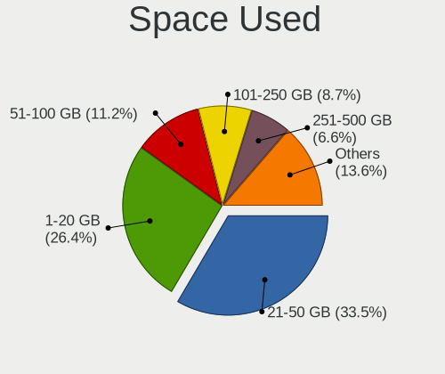
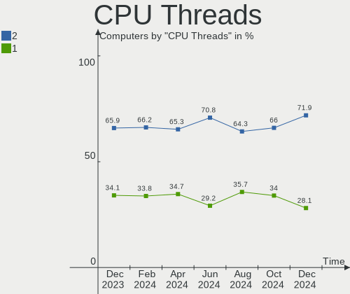
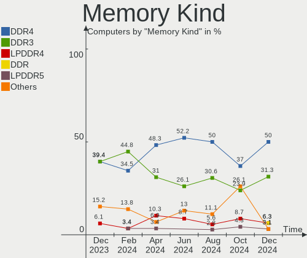

Zorin - Hardware Trends
-----------------------

A project to identify most popular hardware characteristics and track their change
over time based on data collected by Linux users at https://Linux-Hardware.org.

Anyone can contribute to this report by the [hw-probe](https://github.com/linuxhw/hw-probe) tool:

    sudo -E hw-probe -all -upload

This is a report for all computer types. See also reports for [desktops](/Dist/Zorin/Desktop/README.md) and [notebooks](/Dist/Zorin/Notebook/README.md).

This report is for one last month. Overall report since the beginning of time: [TestDays](https://github.com/linuxhw/TestDays)

Period: Jul, 2023.

Contents
--------

* [ System ](#system)
  - [ OS                       ](#os)
  - [ OS Family                ](#os-family)
  - [ Kernel                   ](#kernel)
  - [ Kernel Family            ](#kernel-family)
  - [ Kernel Major Ver.        ](#kernel-major-ver)
  - [ Arch                     ](#arch)
  - [ DE                       ](#de)
  - [ Display Server           ](#display-server)
  - [ Display Manager          ](#display-manager)
  - [ OS Lang                  ](#os-lang)
  - [ Boot Mode                ](#boot-mode)
  - [ Filesystem               ](#filesystem)
  - [ Part. scheme             ](#part-scheme)
  - [ Dual Boot with Linux/BSD ](#dual-boot-with-linuxbsd)
  - [ Dual Boot (Win)          ](#dual-boot-win)

* [ Board ](#board)
  - [ Vendor                   ](#vendor)
  - [ Model                    ](#model)
  - [ Model Family             ](#model-family)
  - [ MFG Year                 ](#mfg-year)
  - [ Form Factor              ](#form-factor)
  - [ Secure Boot              ](#secure-boot)
  - [ Coreboot                 ](#coreboot)
  - [ RAM Size                 ](#ram-size)
  - [ RAM Used                 ](#ram-used)
  - [ Total Drives             ](#total-drives)
  - [ Has CD-ROM               ](#has-cd-rom)
  - [ Has Ethernet             ](#has-ethernet)
  - [ Has WiFi                 ](#has-wifi)
  - [ Has Bluetooth            ](#has-bluetooth)

* [ Location ](#location)
  - [ Country                  ](#country)
  - [ City                     ](#city)

* [ Drives ](#drives)
  - [ Drive Vendor             ](#drive-vendor)
  - [ Drive Model              ](#drive-model)
  - [ HDD Vendor               ](#hdd-vendor)
  - [ SSD Vendor               ](#ssd-vendor)
  - [ Drive Kind               ](#drive-kind)
  - [ Drive Connector          ](#drive-connector)
  - [ Drive Size               ](#drive-size)
  - [ Space Total              ](#space-total)
  - [ Space Used               ](#space-used)
  - [ Malfunc. Drives          ](#malfunc-drives)
  - [ Malfunc. Drive Vendor    ](#malfunc-drive-vendor)
  - [ Malfunc. HDD Vendor      ](#malfunc-hdd-vendor)
  - [ Malfunc. Drive Kind      ](#malfunc-drive-kind)
  - [ Failed Drives            ](#failed-drives)
  - [ Failed Drive Vendor      ](#failed-drive-vendor)
  - [ Drive Status             ](#drive-status)

* [ Storage controller ](#storage-controller)
  - [ Storage Vendor           ](#storage-vendor)
  - [ Storage Model            ](#storage-model)
  - [ Storage Kind             ](#storage-kind)

* [ Processor ](#processor)
  - [ CPU Vendor               ](#cpu-vendor)
  - [ CPU Model                ](#cpu-model)
  - [ CPU Model Family         ](#cpu-model-family)
  - [ CPU Cores                ](#cpu-cores)
  - [ CPU Sockets              ](#cpu-sockets)
  - [ CPU Threads              ](#cpu-threads)
  - [ CPU Op-Modes             ](#cpu-op-modes)
  - [ CPU Microcode            ](#cpu-microcode)
  - [ CPU Microarch            ](#cpu-microarch)

* [ Graphics ](#graphics)
  - [ GPU Vendor               ](#gpu-vendor)
  - [ GPU Model                ](#gpu-model)
  - [ GPU Combo                ](#gpu-combo)
  - [ GPU Driver               ](#gpu-driver)
  - [ GPU Memory               ](#gpu-memory)

* [ Monitor ](#monitor)
  - [ Monitor Vendor           ](#monitor-vendor)
  - [ Monitor Model            ](#monitor-model)
  - [ Monitor Resolution       ](#monitor-resolution)
  - [ Monitor Diagonal         ](#monitor-diagonal)
  - [ Monitor Width            ](#monitor-width)
  - [ Aspect Ratio             ](#aspect-ratio)
  - [ Monitor Area             ](#monitor-area)
  - [ Pixel Density            ](#pixel-density)
  - [ Multiple Monitors        ](#multiple-monitors)

* [ Network ](#network)
  - [ Net Controller Vendor    ](#net-controller-vendor)
  - [ Net Controller Model     ](#net-controller-model)
  - [ Wireless Vendor          ](#wireless-vendor)
  - [ Wireless Model           ](#wireless-model)
  - [ Ethernet Vendor          ](#ethernet-vendor)
  - [ Ethernet Model           ](#ethernet-model)
  - [ Net Controller Kind      ](#net-controller-kind)
  - [ Used Controller          ](#used-controller)
  - [ NICs                     ](#nics)
  - [ IPv6                     ](#ipv6)

* [ Bluetooth ](#bluetooth)
  - [ Bluetooth Vendor         ](#bluetooth-vendor)
  - [ Bluetooth Model          ](#bluetooth-model)

* [ Sound ](#sound)
  - [ Sound Vendor             ](#sound-vendor)
  - [ Sound Model              ](#sound-model)

* [ Memory ](#memory)
  - [ Memory Vendor            ](#memory-vendor)
  - [ Memory Model             ](#memory-model)
  - [ Memory Kind              ](#memory-kind)
  - [ Memory Form Factor       ](#memory-form-factor)
  - [ Memory Size              ](#memory-size)
  - [ Memory Speed             ](#memory-speed)

* [ Printers & scanners ](#printers--scanners)
  - [ Printer Vendor           ](#printer-vendor)
  - [ Printer Model            ](#printer-model)
  - [ Scanner Vendor           ](#scanner-vendor)
  - [ Scanner Model            ](#scanner-model)

* [ Camera ](#camera)
  - [ Camera Vendor            ](#camera-vendor)
  - [ Camera Model             ](#camera-model)

* [ Security ](#security)
  - [ Fingerprint Vendor       ](#fingerprint-vendor)
  - [ Fingerprint Model        ](#fingerprint-model)
  - [ Chipcard Vendor          ](#chipcard-vendor)
  - [ Chipcard Model           ](#chipcard-model)

* [ Unsupported ](#unsupported)
  - [ Unsupported Devices      ](#unsupported-devices)
  - [ Unsupported Device Types ](#unsupported-device-types)

System
------

OS
--

Installed operating systems

| Name     | Computers | Percent |
|----------|-----------|---------|
| Zorin 16 | 148       | 93.08%  |
| Zorin 15 | 11        | 6.92%   |

OS Family
---------

OS without a version

| Name  | Computers | Percent |
|-------|-----------|---------|
| Zorin | 159       | 100%    |

Kernel
------

Version of the Linux kernel

| Version           | Computers | Percent |
|-------------------|-----------|---------|
| 5.15.0-76-generic | 97        | 61.01%  |
| 5.15.0-78-generic | 26        | 16.35%  |
| 5.4.0-150-generic | 7         | 4.4%    |
| 5.15.0-75-generic | 6         | 3.77%   |
| 5.15.0-73-generic | 6         | 3.77%   |
| 5.15.0-56-generic | 4         | 2.52%   |
| 5.15.0-71-generic | 3         | 1.89%   |
| 5.4.0-45-generic  | 1         | 0.63%   |
| 5.4.0-153-generic | 1         | 0.63%   |
| 5.4.0-148-generic | 1         | 0.63%   |
| 5.4.0-146-generic | 1         | 0.63%   |
| 5.4.0-120-generic | 1         | 0.63%   |
| 5.15.0-72-generic | 1         | 0.63%   |
| 5.15.0-67-generic | 1         | 0.63%   |
| 5.15.0-60-generic | 1         | 0.63%   |
| 5.15.0-58-generic | 1         | 0.63%   |
| 5.15.0-52-generic | 1         | 0.63%   |

Kernel Family
-------------

Linux kernel without a distro release

| Version | Computers | Percent |
|---------|-----------|---------|
| 5.15.0  | 147       | 92.45%  |
| 5.4.0   | 12        | 7.55%   |

Kernel Major Ver.
-----------------

Linux kernel major version

| Version | Computers | Percent |
|---------|-----------|---------|
| 5.15    | 147       | 92.45%  |
| 5.4     | 12        | 7.55%   |

Arch
----

OS architecture (x86_64, i586, etc.)

| Name   | Computers | Percent |
|--------|-----------|---------|
| x86_64 | 153       | 96.23%  |
| i686   | 6         | 3.77%   |

DE
--

Desktop Environment

| Name    | Computers | Percent |
|---------|-----------|---------|
| GNOME   | 113       | 71.07%  |
| XFCE    | 42        | 26.42%  |
| KDE5    | 2         | 1.26%   |
| i3      | 1         | 0.63%   |
| Unknown | 1         | 0.63%   |

Display Server
--------------

X11 or Wayland

| Name    | Computers | Percent |
|---------|-----------|---------|
| X11     | 155       | 97.48%  |
| Wayland | 3         | 1.89%   |
| Unknown | 1         | 0.63%   |

Display Manager
---------------

SDDM, LightDM, etc.

| Name    | Computers | Percent |
|---------|-----------|---------|
| Unknown | 110       | 69.18%  |
| LightDM | 19        | 11.95%  |
| GDM3    | 19        | 11.95%  |
| GDM     | 11        | 6.92%   |

OS Lang
-------

Language

| Lang  | Computers | Percent |
|-------|-----------|---------|
| en_US | 62        | 38.99%  |
| en_GB | 15        | 9.43%   |
| pt_BR | 12        | 7.55%   |
| fr_FR | 8         | 5.03%   |
| de_DE | 8         | 5.03%   |
| it_IT | 6         | 3.77%   |
| pl_PL | 5         | 3.14%   |
| es_ES | 5         | 3.14%   |
| sv_SE | 4         | 2.52%   |
| es_AR | 4         | 2.52%   |
| en_ZA | 3         | 1.89%   |
| nl_BE | 2         | 1.26%   |
| es_VE | 2         | 1.26%   |
| es_MX | 2         | 1.26%   |
| en_AU | 2         | 1.26%   |
| zh_CN | 1         | 0.63%   |
| tr_TR | 1         | 0.63%   |
| sk_SK | 1         | 0.63%   |
| ru_RU | 1         | 0.63%   |
| pt_PT | 1         | 0.63%   |
| nl_NL | 1         | 0.63%   |
| it_CH | 1         | 0.63%   |
| hu_HU | 1         | 0.63%   |
| fr_BE | 1         | 0.63%   |
| es_CO | 1         | 0.63%   |
| en_NZ | 1         | 0.63%   |
| en_NG | 1         | 0.63%   |
| en_IN | 1         | 0.63%   |
| en_IE | 1         | 0.63%   |
| en_CA | 1         | 0.63%   |
| de_CH | 1         | 0.63%   |
| cs_CZ | 1         | 0.63%   |
| C     | 1         | 0.63%   |
| ar_EG | 1         | 0.63%   |

Boot Mode
---------

EFI or BIOS

| Mode | Computers | Percent |
|------|-----------|---------|
| EFI  | 84        | 52.83%  |
| BIOS | 75        | 47.17%  |

Filesystem
----------

Type of filesystem

| Type    | Computers | Percent |
|---------|-----------|---------|
| Ext4    | 123       | 77.36%  |
| Tmpfs   | 30        | 18.87%  |
| Zfs     | 3         | 1.89%   |
| Overlay | 2         | 1.26%   |
| Btrfs   | 1         | 0.63%   |

Part. scheme
------------

Scheme of partitioning

| Type    | Computers | Percent |
|---------|-----------|---------|
| Unknown | 116       | 72.96%  |
| GPT     | 31        | 19.5%   |
| MBR     | 12        | 7.55%   |

Dual Boot with Linux/BSD
------------------------

Hosting more than one Linux/BSD

| Dual boot | Computers | Percent |
|-----------|-----------|---------|
| No        | 152       | 95.6%   |
| Yes       | 7         | 4.4%    |

Dual Boot (Win)
---------------

Hosting Linux and Windows

| Dual boot | Computers | Percent |
|-----------|-----------|---------|
| No        | 144       | 90.57%  |
| Yes       | 15        | 9.43%   |

Board
-----

Vendor
------

Motherboard manufacturer

| Name                | Computers | Percent |
|---------------------|-----------|---------|
| Hewlett-Packard     | 33        | 20.75%  |
| Dell                | 26        | 16.35%  |
| ASUSTek Computer    | 18        | 11.32%  |
| Lenovo              | 14        | 8.81%   |
| MSI                 | 9         | 5.66%   |
| Apple               | 9         | 5.66%   |
| Gigabyte Technology | 7         | 4.4%    |
| ASRock              | 6         | 3.77%   |
| Acer                | 6         | 3.77%   |
| Toshiba             | 3         | 1.89%   |
| Sony                | 2         | 1.26%   |
| Positivo            | 2         | 1.26%   |
| Intel               | 2         | 1.26%   |
| Fujitsu             | 2         | 1.26%   |
| Unknown             | 2         | 1.26%   |
| Win Element         | 1         | 0.63%   |
| TrekStor            | 1         | 0.63%   |
| SONIQ Digital Media | 1         | 0.63%   |
| Samsung Electronics | 1         | 0.63%   |
| Pegatron            | 1         | 0.63%   |
| OTVOC               | 1         | 0.63%   |
| MP                  | 1         | 0.63%   |
| Microtech           | 1         | 0.63%   |
| Microsoft           | 1         | 0.63%   |
| Medion              | 1         | 0.63%   |
| HUAWEI              | 1         | 0.63%   |
| Google              | 1         | 0.63%   |
| Foxconn             | 1         | 0.63%   |
| Digibras            | 1         | 0.63%   |
| Chuwi               | 1         | 0.63%   |
| AZW                 | 1         | 0.63%   |
| AMI                 | 1         | 0.63%   |
| Alienware           | 1         | 0.63%   |

Model
-----

Motherboard model

| Name                                                    | Computers | Percent |
|---------------------------------------------------------|-----------|---------|
| HP Pavilion dv4                                         | 2         | 1.26%   |
| HP 15                                                   | 2         | 1.26%   |
| Dell OptiPlex 7010                                      | 2         | 1.26%   |
| ASUS All Series                                         | 2         | 1.26%   |
| Apple MacBookPro9,2                                     | 2         | 1.26%   |
| Acer Nitro AN515-44                                     | 2         | 1.26%   |
| Unknown                                                 | 2         | 1.26%   |
| Win Element M9                                          | 1         | 0.63%   |
| TrekStor YOURBOOK C11B                                  | 1         | 0.63%   |
| Toshiba Satellite L670                                  | 1         | 0.63%   |
| Toshiba Satellite L50-B                                 | 1         | 0.63%   |
| Toshiba QOSMIO X770                                     | 1         | 0.63%   |
| Sony VPCF13Z1E                                          | 1         | 0.63%   |
| Sony VPCEE23FX                                          | 1         | 0.63%   |
| SONIQ Digital Media Soniq 11.6inch Convertible Notebook | 1         | 0.63%   |
| Samsung 300V3A/300V4A/300V5A/200A4B/200A5B              | 1         | 0.63%   |
| Positivo POS-EIH61CE                                    | 1         | 0.63%   |
| Positivo Mobile                                         | 1         | 0.63%   |
| Pegatron Compaq dx2450                                  | 1         | 0.63%   |
| OTVOC N1                                                | 1         | 0.63%   |
| MSI Z1-7641                                             | 1         | 0.63%   |
| MSI MS-7D75                                             | 1         | 0.63%   |
| MSI MS-7D25                                             | 1         | 0.63%   |
| MSI MS-7C09                                             | 1         | 0.63%   |
| MSI MS-7B86                                             | 1         | 0.63%   |
| MSI MS-7808                                             | 1         | 0.63%   |
| MSI H310 Gaming Infinite S (MS-B928)                    | 1         | 0.63%   |
| MSI GS73VR 7RF                                          | 1         | 0.63%   |
| MSI GE72MVR 7RG                                         | 1         | 0.63%   |
| MP MS-7848                                              | 1         | 0.63%   |
| Microtech ebookPro                                      | 1         | 0.63%   |
| Microsoft Surface 3                                     | 1         | 0.63%   |
| Medion E15301                                           | 1         | 0.63%   |
| Lenovo Yoga 3 Pro-1370 80HE                             | 1         | 0.63%   |
| Lenovo ThinkPad Yoga 260 20FES3H800                     | 1         | 0.63%   |
| Lenovo ThinkPad X220 4286CTO                            | 1         | 0.63%   |
| Lenovo ThinkPad E15 20RD0011GE                          | 1         | 0.63%   |
| Lenovo ThinkPad 8 20BN001RMN                            | 1         | 0.63%   |
| Lenovo ThinkPad 10 2nd 20E4S0JA00                       | 1         | 0.63%   |
| Lenovo ThinkCentre M900 10FLS27400                      | 1         | 0.63%   |

Model Family
------------

Motherboard model prefix

| Name                      | Computers | Percent |
|---------------------------|-----------|---------|
| Dell OptiPlex             | 8         | 5.03%   |
| HP Pavilion               | 7         | 4.4%    |
| HP Compaq                 | 7         | 4.4%    |
| Dell Inspiron             | 6         | 3.77%   |
| Lenovo ThinkPad           | 5         | 3.14%   |
| Dell Latitude             | 5         | 3.14%   |
| HP EliteBook              | 4         | 2.52%   |
| ASUS TUF                  | 4         | 2.52%   |
| Lenovo IdeaPad            | 3         | 1.89%   |
| Toshiba Satellite         | 2         | 1.26%   |
| Lenovo ThinkCentre        | 2         | 1.26%   |
| HP ProBook                | 2         | 1.26%   |
| HP Laptop                 | 2         | 1.26%   |
| HP ENVY                   | 2         | 1.26%   |
| HP 15                     | 2         | 1.26%   |
| Fujitsu ESPRIMO           | 2         | 1.26%   |
| Dell XPS                  | 2         | 1.26%   |
| Dell Precision            | 2         | 1.26%   |
| ASUS VivoBook             | 2         | 1.26%   |
| ASUS All                  | 2         | 1.26%   |
| Apple MacBookPro9         | 2         | 1.26%   |
| Acer Nitro                | 2         | 1.26%   |
| Unknown                   | 2         | 1.26%   |
| Win Element M9            | 1         | 0.63%   |
| TrekStor YOURBOOK         | 1         | 0.63%   |
| Toshiba QOSMIO            | 1         | 0.63%   |
| Sony VPCF13Z1E            | 1         | 0.63%   |
| Sony VPCEE23FX            | 1         | 0.63%   |
| SONIQ Digital Media Soniq | 1         | 0.63%   |
| Samsung 300V3A            | 1         | 0.63%   |
| Positivo POS-EIH61CE      | 1         | 0.63%   |
| Positivo Mobile           | 1         | 0.63%   |
| Pegatron Compaq           | 1         | 0.63%   |
| OTVOC N1                  | 1         | 0.63%   |
| MSI Z1-7641               | 1         | 0.63%   |
| MSI MS-7D75               | 1         | 0.63%   |
| MSI MS-7D25               | 1         | 0.63%   |
| MSI MS-7C09               | 1         | 0.63%   |
| MSI MS-7B86               | 1         | 0.63%   |
| MSI MS-7808               | 1         | 0.63%   |

MFG Year
--------

Motherboard manufacture year

| Year    | Computers | Percent |
|---------|-----------|---------|
| 2018    | 15        | 9.43%   |
| 2020    | 14        | 8.81%   |
| 2013    | 14        | 8.81%   |
| 2012    | 14        | 8.81%   |
| 2011    | 12        | 7.55%   |
| 2014    | 11        | 6.92%   |
| 2010    | 11        | 6.92%   |
| 2017    | 10        | 6.29%   |
| 2008    | 10        | 6.29%   |
| 2015    | 9         | 5.66%   |
| 2022    | 8         | 5.03%   |
| 2019    | 8         | 5.03%   |
| 2021    | 5         | 3.14%   |
| 2016    | 5         | 3.14%   |
| 2009    | 5         | 3.14%   |
| 2023    | 3         | 1.89%   |
| 2007    | 3         | 1.89%   |
| 2006    | 1         | 0.63%   |
| Unknown | 1         | 0.63%   |

Form Factor
-----------

Physical design of the computer

| Name        | Computers | Percent |
|-------------|-----------|---------|
| Notebook    | 82        | 51.57%  |
| Desktop     | 61        | 38.36%  |
| All in one  | 5         | 3.14%   |
| Tablet      | 4         | 2.52%   |
| Convertible | 3         | 1.89%   |
| Mini pc     | 3         | 1.89%   |
| Server      | 1         | 0.63%   |

Secure Boot
-----------

Enabled or disabled

| State    | Computers | Percent |
|----------|-----------|---------|
| Disabled | 140       | 88.05%  |
| Enabled  | 19        | 11.95%  |

Coreboot
--------

Have coreboot on board

| Used | Computers | Percent |
|------|-----------|---------|
| No   | 158       | 99.37%  |
| Yes  | 1         | 0.63%   |

RAM Size
--------

Total RAM memory

| Size in GB  | Computers | Percent |
|-------------|-----------|---------|
| 4.01-8.0    | 40        | 25.16%  |
| 16.01-24.0  | 33        | 20.75%  |
| 8.01-16.0   | 32        | 20.13%  |
| 3.01-4.0    | 30        | 18.87%  |
| 32.01-64.0  | 10        | 6.29%   |
| 1.01-2.0    | 8         | 5.03%   |
| 24.01-32.0  | 3         | 1.89%   |
| 64.01-256.0 | 3         | 1.89%   |

RAM Used
--------

Used RAM memory

| Used GB    | Computers | Percent |
|------------|-----------|---------|
| 2.01-3.0   | 54        | 33.96%  |
| 1.01-2.0   | 54        | 33.96%  |
| 4.01-8.0   | 21        | 13.21%  |
| 3.01-4.0   | 15        | 9.43%   |
| 0.51-1.0   | 10        | 6.29%   |
| 8.01-16.0  | 4         | 2.52%   |
| 16.01-24.0 | 1         | 0.63%   |

Total Drives
------------

Number of drives on board

| Drives | Computers | Percent |
|--------|-----------|---------|
| 1      | 105       | 66.04%  |
| 2      | 35        | 22.01%  |
| 3      | 13        | 8.18%   |
| 4      | 3         | 1.89%   |
| 5      | 2         | 1.26%   |
| 6      | 1         | 0.63%   |

Has CD-ROM
----------

Has CD-ROM on board

| Presented | Computers | Percent |
|-----------|-----------|---------|
| No        | 85        | 53.46%  |
| Yes       | 74        | 46.54%  |

Has Ethernet
------------

Has Ethernet on board

| Presented | Computers | Percent |
|-----------|-----------|---------|
| Yes       | 132       | 83.02%  |
| No        | 27        | 16.98%  |

Has WiFi
--------

Has WiFi module

| Presented | Computers | Percent |
|-----------|-----------|---------|
| Yes       | 124       | 77.99%  |
| No        | 35        | 22.01%  |

Has Bluetooth
-------------

Has Bluetooth module

| Presented | Computers | Percent |
|-----------|-----------|---------|
| Yes       | 86        | 54.09%  |
| No        | 73        | 45.91%  |

Location
--------

Country
-------

Geographic location (country)

| Country      | Computers | Percent |
|--------------|-----------|---------|
| USA          | 40        | 25.16%  |
| UK           | 13        | 8.18%   |
| Brazil       | 13        | 8.18%   |
| France       | 8         | 5.03%   |
| Mexico       | 7         | 4.4%    |
| Germany      | 7         | 4.4%    |
| Italy        | 6         | 3.77%   |
| Sweden       | 5         | 3.14%   |
| Spain        | 5         | 3.14%   |
| Poland       | 4         | 2.52%   |
| Netherlands  | 4         | 2.52%   |
| Belgium      | 4         | 2.52%   |
| Argentina    | 4         | 2.52%   |
| South Africa | 3         | 1.89%   |
| Australia    | 3         | 1.89%   |
| Venezuela    | 2         | 1.26%   |
| Switzerland  | 2         | 1.26%   |
| Portugal     | 2         | 1.26%   |
| Norway       | 2         | 1.26%   |
| Turkey       | 1         | 0.63%   |
| Slovakia     | 1         | 0.63%   |
| Russia       | 1         | 0.63%   |
| Nigeria      | 1         | 0.63%   |
| New Zealand  | 1         | 0.63%   |
| Malaysia     | 1         | 0.63%   |
| Luxembourg   | 1         | 0.63%   |
| Lithuania    | 1         | 0.63%   |
| Japan        | 1         | 0.63%   |
| Ireland      | 1         | 0.63%   |
| Iraq         | 1         | 0.63%   |
| Indonesia    | 1         | 0.63%   |
| India        | 1         | 0.63%   |
| Hungary      | 1         | 0.63%   |
| Guyana       | 1         | 0.63%   |
| Finland      | 1         | 0.63%   |
| Egypt        | 1         | 0.63%   |
| Czechia      | 1         | 0.63%   |
| Colombia     | 1         | 0.63%   |
| China        | 1         | 0.63%   |
| Canada       | 1         | 0.63%   |

City
----

Geographic location (city)

| City                 | Computers | Percent |
|----------------------|-----------|---------|
| Lerum                | 3         | 1.89%   |
| Florianópolis       | 3         | 1.89%   |
| Tijuana              | 2         | 1.26%   |
| Sanford              | 2         | 1.26%   |
| Rio de Janeiro       | 2         | 1.26%   |
| Recife               | 2         | 1.26%   |
| Puebla City          | 2         | 1.26%   |
| Los Angeles          | 2         | 1.26%   |
| Denver               | 2         | 1.26%   |
| Cape Town            | 2         | 1.26%   |
| Zwijndrecht          | 1         | 0.63%   |
| Zielona Góra        | 1         | 0.63%   |
| Zaragoza             | 1         | 0.63%   |
| Yardley              | 1         | 0.63%   |
| Yambol               | 1         | 0.63%   |
| Wigan                | 1         | 0.63%   |
| Wauwatosa            | 1         | 0.63%   |
| Washington           | 1         | 0.63%   |
| Warsaw               | 1         | 0.63%   |
| Vespasiano           | 1         | 0.63%   |
| Valrico              | 1         | 0.63%   |
| Valencia             | 1         | 0.63%   |
| Utrecht              | 1         | 0.63%   |
| Ulm                  | 1         | 0.63%   |
| Tukh                 | 1         | 0.63%   |
| Tudela               | 1         | 0.63%   |
| Trivero              | 1         | 0.63%   |
| Třebíč            | 1         | 0.63%   |
| Toronto              | 1         | 0.63%   |
| Tokyo                | 1         | 0.63%   |
| Tlalpan              | 1         | 0.63%   |
| Tallahassee          | 1         | 0.63%   |
| Swindon              | 1         | 0.63%   |
| Stockholm            | 1         | 0.63%   |
| St Louis             | 1         | 0.63%   |
| Spokane              | 1         | 0.63%   |
| Sarajevo             | 1         | 0.63%   |
| Sao José dos Campos | 1         | 0.63%   |
| Santa Rosa           | 1         | 0.63%   |
| Salerno              | 1         | 0.63%   |

Drives
------

Drive Vendor
------------

Hard drive vendors

| Vendor                       | Computers | Drives | Percent |
|------------------------------|-----------|--------|---------|
| WDC                          | 40        | 43     | 18.02%  |
| Seagate                      | 31        | 34     | 13.96%  |
| Samsung Electronics          | 21        | 23     | 9.46%   |
| Toshiba                      | 18        | 18     | 8.11%   |
| Unknown                      | 16        | 17     | 7.21%   |
| SanDisk                      | 10        | 12     | 4.5%    |
| Kingston                     | 8         | 9      | 3.6%    |
| China                        | 8         | 8      | 3.6%    |
| SK hynix                     | 7         | 7      | 3.15%   |
| Apple                        | 6         | 6      | 2.7%    |
| SPCC                         | 4         | 5      | 1.8%    |
| Patriot                      | 4         | 4      | 1.8%    |
| HGST                         | 4         | 4      | 1.8%    |
| Crucial                      | 4         | 5      | 1.8%    |
| A-DATA Technology            | 4         | 4      | 1.8%    |
| Micron/Crucial Technology    | 3         | 3      | 1.35%   |
| Hitachi                      | 3         | 3      | 1.35%   |
| GOODRAM                      | 3         | 4      | 1.35%   |
| Silicon Motion               | 2         | 2      | 0.9%    |
| PNY                          | 2         | 2      | 0.9%    |
| Micron Technology            | 2         | 2      | 0.9%    |
| MAXIO Technology (Hangzhou)  | 2         | 2      | 0.9%    |
| Intel                        | 2         | 2      | 0.9%    |
| X12                          | 1         | 1      | 0.45%   |
| Wibtek                       | 1         | 1      | 0.45%   |
| UMIS                         | 1         | 1      | 0.45%   |
| Team                         | 1         | 1      | 0.45%   |
| Solid State Storage          | 1         | 1      | 0.45%   |
| Shenzhen Longsys Electronics | 1         | 1      | 0.45%   |
| SABRENT                      | 1         | 1      | 0.45%   |
| Realtek Semiconductor        | 1         | 1      | 0.45%   |
| Plextor                      | 1         | 1      | 0.45%   |
| Phison Electronics           | 1         | 1      | 0.45%   |
| Phison                       | 1         | 1      | 0.45%   |
| Netac                        | 1         | 1      | 0.45%   |
| Microtech                    | 1         | 1      | 0.45%   |
| Lexar                        | 1         | 1      | 0.45%   |
| KIOXIA                       | 1         | 1      | 0.45%   |
| Intenso                      | 1         | 1      | 0.45%   |
| AMD                          | 1         | 2      | 0.45%   |

Drive Model
-----------

Hard drive models

| Model                                               | Computers | Percent |
|-----------------------------------------------------|-----------|---------|
| Kingston SA400S37240G 240GB SSD                     | 6         | 2.54%   |
| Unknown MMC Card  64GB                              | 5         | 2.12%   |
| Toshiba HDWD110 1TB                                 | 4         | 1.69%   |
| Unknown MMC Card  32GB                              | 3         | 1.27%   |
| Seagate ST500DM002-1BD142 500GB                     | 3         | 1.27%   |
| Samsung NVMe SSD Controller SM981/PM981/PM983 500GB | 3         | 1.27%   |
| WDC WD3200BPVT-75ZEST0 320GB                        | 2         | 0.85%   |
| Unknown NVMe SSD Drive 512GB                        | 2         | 0.85%   |
| Unknown MMC Card  128GB                             | 2         | 0.85%   |
| Toshiba MQ01ABD100 1TB                              | 2         | 0.85%   |
| SPCC Solid State Disk 512GB                         | 2         | 0.85%   |
| Seagate ST9120822AS 120GB                           | 2         | 0.85%   |
| Seagate ST1000LM024 HN-M101MBB 1TB                  | 2         | 0.85%   |
| Seagate ST1000DM003-1CH162 1TB                      | 2         | 0.85%   |
| Sandisk WD Blue SN570 1TB                           | 2         | 0.85%   |
| Samsung SSD 980 1TB                                 | 2         | 0.85%   |
| Samsung HM160HI 160GB                               | 2         | 0.85%   |
| Patriot Burst Elite 240GB SSD                       | 2         | 0.85%   |
| MAXIO (Hangzhou) NVMe SSD Controller MAP1202 256GB  | 2         | 0.85%   |
| Kingston SA400S37480G 480GB SSD                     | 2         | 0.85%   |
| GOODRAM SSDPR-CX400-512 512GB                       | 2         | 0.85%   |
| Crucial CT500MX500SSD1 500GB                        | 2         | 0.85%   |
| China SATA SSD 120GB                                | 2         | 0.85%   |
| X12 SSD 1TB                                         | 1         | 0.42%   |
| Wibtek W800S 512GB SSD                              | 1         | 0.42%   |
| WDC WDS500G2B0B-00YS70 500GB SSD                    | 1         | 0.42%   |
| WDC WDS240G2G0A-00JH30 240GB SSD                    | 1         | 0.42%   |
| WDC WDS100T2B0B-00YS70 1TB SSD                      | 1         | 0.42%   |
| WDC WDBNCE5000PNC 500GB SSD                         | 1         | 0.42%   |
| WDC WDBNCE0010PNC 1TB SSD                           | 1         | 0.42%   |
| WDC WD800JD-75MSA2 80GB                             | 1         | 0.42%   |
| WDC WD5000LPVX-75V0TT0 500GB                        | 1         | 0.42%   |
| WDC WD5000LPCX-16VHAT1 500GB                        | 1         | 0.42%   |
| WDC WD5000BPVT-24HXZT3 500GB                        | 1         | 0.42%   |
| WDC WD5000AAKX-001CA0 500GB                         | 1         | 0.42%   |
| WDC WD5000AAKS-60A7B0 500GB                         | 1         | 0.42%   |
| WDC WD5000AAKS-00TMA0 500GB                         | 1         | 0.42%   |
| WDC WD40EFRX-68N32N0 4TB                            | 1         | 0.42%   |
| WDC WD3200BEKT-60F3T1 320GB                         | 1         | 0.42%   |
| WDC WD3200AAKS-75VYA0 320GB                         | 1         | 0.42%   |

HDD Vendor
----------

Hard disk drive vendors

| Vendor              | Computers | Drives | Percent |
|---------------------|-----------|--------|---------|
| WDC                 | 33        | 36     | 37.08%  |
| Seagate             | 30        | 33     | 33.71%  |
| Toshiba             | 14        | 14     | 15.73%  |
| HGST                | 4         | 4      | 4.49%   |
| Samsung Electronics | 3         | 3      | 3.37%   |
| Hitachi             | 3         | 3      | 3.37%   |
| Apple               | 2         | 2      | 2.25%   |

SSD Vendor
----------

Solid state drive vendors

| Vendor              | Computers | Drives | Percent |
|---------------------|-----------|--------|---------|
| Samsung Electronics | 12        | 12     | 15.79%  |
| Kingston            | 8         | 8      | 10.53%  |
| China               | 8         | 8      | 10.53%  |
| WDC                 | 5         | 5      | 6.58%   |
| SanDisk             | 5         | 5      | 6.58%   |
| SPCC                | 4         | 5      | 5.26%   |
| Patriot             | 4         | 4      | 5.26%   |
| Crucial             | 4         | 5      | 5.26%   |
| Apple               | 4         | 4      | 5.26%   |
| A-DATA Technology   | 4         | 4      | 5.26%   |
| GOODRAM             | 3         | 4      | 3.95%   |
| Toshiba             | 2         | 2      | 2.63%   |
| PNY                 | 2         | 2      | 2.63%   |
| X12                 | 1         | 1      | 1.32%   |
| Wibtek              | 1         | 1      | 1.32%   |
| Team                | 1         | 1      | 1.32%   |
| SK hynix            | 1         | 1      | 1.32%   |
| SABRENT             | 1         | 1      | 1.32%   |
| Plextor             | 1         | 1      | 1.32%   |
| Phison              | 1         | 1      | 1.32%   |
| Netac               | 1         | 1      | 1.32%   |
| Microtech           | 1         | 1      | 1.32%   |
| Lexar               | 1         | 1      | 1.32%   |
| Intenso             | 1         | 1      | 1.32%   |

Drive Kind
----------

HDD or SSD

| Kind    | Computers | Drives | Percent |
|---------|-----------|--------|---------|
| HDD     | 78        | 95     | 38.24%  |
| SSD     | 68        | 79     | 33.33%  |
| NVMe    | 41        | 45     | 20.1%   |
| MMC     | 15        | 17     | 7.35%   |
| Unknown | 2         | 2      | 0.98%   |

Drive Connector
---------------

SATA, SAS, NVMe, etc.

| Type | Computers | Drives | Percent |
|------|-----------|--------|---------|
| SATA | 126       | 168    | 67.02%  |
| NVMe | 41        | 45     | 21.81%  |
| MMC  | 15        | 17     | 7.98%   |
| SAS  | 6         | 8      | 3.19%   |

Drive Size
----------

Size of hard drive

| Size in TB | Computers | Drives | Percent |
|------------|-----------|--------|---------|
| 0.01-0.5   | 88        | 110    | 59.46%  |
| 0.51-1.0   | 49        | 53     | 33.11%  |
| 1.01-2.0   | 7         | 7      | 4.73%   |
| 4.01-10.0  | 3         | 3      | 2.03%   |
| 3.01-4.0   | 1         | 1      | 0.68%   |

Space Total
-----------

Amount of disk space available on the file system

| Size in GB     | Computers | Percent |
|----------------|-----------|---------|
| 101-250        | 65        | 40.88%  |
| 251-500        | 32        | 20.13%  |
| 501-1000       | 21        | 13.21%  |
| 1001-2000      | 14        | 8.81%   |
| 51-100         | 10        | 6.29%   |
| More than 3000 | 4         | 2.52%   |
| 2001-3000      | 4         | 2.52%   |
| 1-20           | 4         | 2.52%   |
| 21-50          | 3         | 1.89%   |
| Unknown        | 2         | 1.26%   |

Space Used
----------

Amount of used disk space

| Used GB        | Computers | Percent |
|----------------|-----------|---------|
| 21-50          | 50        | 31.45%  |
| 1-20           | 47        | 29.56%  |
| 101-250        | 18        | 11.32%  |
| 51-100         | 17        | 10.69%  |
| 251-500        | 13        | 8.18%   |
| 501-1000       | 6         | 3.77%   |
| 1001-2000      | 3         | 1.89%   |
| More than 3000 | 2         | 1.26%   |
| Unknown        | 2         | 1.26%   |
| 2001-3000      | 1         | 0.63%   |

Malfunc. Drives
---------------

Drive models with a malfunction

| Model                           | Computers | Drives | Percent |
|---------------------------------|-----------|--------|---------|
| Seagate ST500LT012-1DG142 500GB | 1         | 1      | 50%     |
| HGST HTS545050A7E380 500GB      | 1         | 1      | 50%     |

Malfunc. Drive Vendor
---------------------

Vendors of faulty drives

| Vendor  | Computers | Drives | Percent |
|---------|-----------|--------|---------|
| Seagate | 1         | 1      | 50%     |
| HGST    | 1         | 1      | 50%     |

Malfunc. HDD Vendor
-------------------

Vendors of faulty HDD drives

| Vendor  | Computers | Drives | Percent |
|---------|-----------|--------|---------|
| Seagate | 1         | 1      | 50%     |
| HGST    | 1         | 1      | 50%     |

Malfunc. Drive Kind
-------------------

Kinds of faulty drives

| Kind | Computers | Drives | Percent |
|------|-----------|--------|---------|
| HDD  | 2         | 2      | 100%    |

Failed Drives
-------------

Failed drive models

Zero info for selected period =(

Failed Drive Vendor
-------------------

Failed drive vendors

Zero info for selected period =(

Drive Status
------------

Number of failed and malfunc. drives

| Status   | Computers | Drives | Percent |
|----------|-----------|--------|---------|
| Detected | 142       | 215    | 87.65%  |
| Works    | 18        | 21     | 11.11%  |
| Malfunc  | 2         | 2      | 1.23%   |

Storage controller
------------------

Storage Vendor
--------------

Storage controller vendors

| Vendor                           | Computers | Percent |
|----------------------------------|-----------|---------|
| Intel                            | 109       | 57.07%  |
| AMD                              | 29        | 15.18%  |
| Samsung Electronics              | 12        | 6.28%   |
| SanDisk                          | 7         | 3.66%   |
| SK hynix                         | 5         | 2.62%   |
| Nvidia                           | 4         | 2.09%   |
| Micron/Crucial Technology        | 3         | 1.57%   |
| Toshiba America Info Systems     | 2         | 1.05%   |
| Silicon Motion                   | 2         | 1.05%   |
| Micron Technology                | 2         | 1.05%   |
| MAXIO Technology (Hangzhou)      | 2         | 1.05%   |
| ASMedia Technology               | 2         | 1.05%   |
| Union Memory (Shenzhen)          | 1         | 0.52%   |
| Solid State Storage Technology   | 1         | 0.52%   |
| Silicon Integrated Systems [SiS] | 1         | 0.52%   |
| Shenzhen Longsys Electronics     | 1         | 0.52%   |
| Realtek Semiconductor            | 1         | 0.52%   |
| Phison Electronics               | 1         | 0.52%   |
| Netac Technology                 | 1         | 0.52%   |
| LSI Logic / Symbios Logic        | 1         | 0.52%   |
| KIOXIA                           | 1         | 0.52%   |
| Kingston Technology Company      | 1         | 0.52%   |
| JMicron Technology               | 1         | 0.52%   |
| INNOGRIT                         | 1         | 0.52%   |

Storage Model
-------------

Storage controller models

| Model                                                                          | Computers | Percent |
|--------------------------------------------------------------------------------|-----------|---------|
| AMD FCH SATA Controller [AHCI mode]                                            | 20        | 8.93%   |
| Intel 7 Series Chipset Family 6-port SATA Controller [AHCI mode]               | 10        | 4.46%   |
| Intel 8 Series/C220 Series Chipset Family 6-port SATA Controller 1 [AHCI mode] | 8         | 3.57%   |
| Intel Q170/Q150/B150/H170/H110/Z170/CM236 Chipset SATA Controller [AHCI Mode]  | 7         | 3.13%   |
| Intel 82801G (ICH7 Family) IDE Controller                                      | 5         | 2.23%   |
| Intel 82801 Mobile SATA Controller [RAID mode]                                 | 5         | 2.23%   |
| Intel 6 Series/C200 Series Chipset Family 6 port Mobile SATA AHCI Controller   | 5         | 2.23%   |
| Intel 200 Series PCH SATA controller [AHCI mode]                               | 5         | 2.23%   |
| AMD SB7x0/SB8x0/SB9x0 SATA Controller [AHCI mode]                              | 5         | 2.23%   |
| Intel SATA Controller [RAID mode]                                              | 4         | 1.79%   |
| Intel NM10/ICH7 Family SATA Controller [IDE mode]                              | 4         | 1.79%   |
| Intel 82801HM/HEM (ICH8M/ICH8M-E) IDE Controller                               | 4         | 1.79%   |
| AMD SB7x0/SB8x0/SB9x0 IDE Controller                                           | 4         | 1.79%   |
| SK hynix Gold P31/BC711/PC711 NVMe Solid State Drive                           | 3         | 1.34%   |
| Samsung S4LN058A01[SSUBX] AHCI SSD Controller (Apple slot)                     | 3         | 1.34%   |
| Samsung NVMe SSD Controller SM981/PM981/PM983                                  | 3         | 1.34%   |
| Samsung NVMe SSD Controller 980                                                | 3         | 1.34%   |
| Nvidia MCP61 SATA Controller                                                   | 3         | 1.34%   |
| Intel Sunrise Point-LP SATA Controller [AHCI mode]                             | 3         | 1.34%   |
| Intel Celeron/Pentium Silver Processor SATA Controller                         | 3         | 1.34%   |
| Intel 82801HM/HEM (ICH8M/ICH8M-E) SATA Controller [AHCI mode]                  | 3         | 1.34%   |
| Intel 8 Series SATA Controller 1 [AHCI mode]                                   | 3         | 1.34%   |
| Intel 7 Series/C210 Series Chipset Family 6-port SATA Controller [AHCI mode]   | 3         | 1.34%   |
| Intel 6 Series/C200 Series Chipset Family 6 port Desktop SATA AHCI Controller  | 3         | 1.34%   |
| Intel 5 Series/3400 Series Chipset 4 port SATA AHCI Controller                 | 3         | 1.34%   |
| Intel 400 Series Chipset Family SATA AHCI Controller                           | 3         | 1.34%   |
| AMD 400 Series Chipset SATA Controller                                         | 3         | 1.34%   |
| SK hynix BC511 NVMe SSD                                                        | 2         | 0.89%   |
| SanDisk WD Blue SN570 NVMe SSD 1TB                                             | 2         | 0.89%   |
| MAXIO (Hangzhou) NVMe SSD Controller MAP1202                                   | 2         | 0.89%   |
| Intel Wildcat Point-LP SATA Controller [AHCI Mode]                             | 2         | 0.89%   |
| Intel Mobile PM965/GM965 PT IDER Controller                                    | 2         | 0.89%   |
| Intel HM170/QM170 Chipset SATA Controller [AHCI Mode]                          | 2         | 0.89%   |
| Intel Comet Lake SATA AHCI Controller                                          | 2         | 0.89%   |
| Intel Celeron N3350/Pentium N4200/Atom E3900 Series SATA AHCI Controller       | 2         | 0.89%   |
| Intel Cannon Point-LP SATA Controller [AHCI Mode]                              | 2         | 0.89%   |
| Intel Cannon Lake Mobile PCH SATA AHCI Controller                              | 2         | 0.89%   |
| Intel 9 Series Chipset Family SATA Controller [AHCI Mode]                      | 2         | 0.89%   |
| Intel 82801IBM/IEM (ICH9M/ICH9M-E) 2 port SATA Controller [IDE mode]           | 2         | 0.89%   |
| Intel 7 Series/C210 Series Chipset Family 4-port SATA Controller [IDE mode]    | 2         | 0.89%   |

Storage Kind
------------

Kind of storage controller (IDE, SATA, NVMe, SAS, ...)

| Kind | Computers | Percent |
|------|-----------|---------|
| SATA | 118       | 59%     |
| NVMe | 41        | 20.5%   |
| IDE  | 29        | 14.5%   |
| RAID | 12        | 6%      |

Processor
---------

CPU Vendor
----------

Processor vendors

| Vendor | Computers | Percent |
|--------|-----------|---------|
| Intel  | 123       | 77.36%  |
| AMD    | 36        | 22.64%  |

CPU Model
---------

Processor models

| Model                                       | Computers | Percent |
|---------------------------------------------|-----------|---------|
| Intel Core 2 Duo CPU E7500 @ 2.93GHz        | 3         | 1.89%   |
| Intel Atom x5-Z8350 CPU @ 1.44GHz           | 3         | 1.89%   |
| Intel Core i7-7700HQ CPU @ 2.80GHz          | 2         | 1.26%   |
| Intel Core i7-4790 CPU @ 3.60GHz            | 2         | 1.26%   |
| Intel Core i7-4500U CPU @ 1.80GHz           | 2         | 1.26%   |
| Intel Core i7-10510U CPU @ 1.80GHz          | 2         | 1.26%   |
| Intel Core i5-6500T CPU @ 2.50GHz           | 2         | 1.26%   |
| Intel Core i5-6500 CPU @ 3.20GHz            | 2         | 1.26%   |
| Intel Core i5-6300U CPU @ 2.40GHz           | 2         | 1.26%   |
| Intel Core i5-4590 CPU @ 3.30GHz            | 2         | 1.26%   |
| Intel Core i5-4460 CPU @ 3.20GHz            | 2         | 1.26%   |
| Intel Core i5-3230M CPU @ 2.60GHz           | 2         | 1.26%   |
| Intel Core i5-3210M CPU @ 2.50GHz           | 2         | 1.26%   |
| Intel Core i5-2520M CPU @ 2.50GHz           | 2         | 1.26%   |
| Intel Core i5 CPU 650 @ 3.20GHz             | 2         | 1.26%   |
| Intel Core i3-4160 CPU @ 3.60GHz            | 2         | 1.26%   |
| Intel Core i3-2310M CPU @ 2.10GHz           | 2         | 1.26%   |
| Intel Core i3 CPU 540 @ 3.07GHz             | 2         | 1.26%   |
| Intel Celeron CPU N3350 @ 1.10GHz           | 2         | 1.26%   |
| Intel Atom x7-Z8700 CPU @ 1.60GHz           | 2         | 1.26%   |
| AMD Ryzen 7 4800H with Radeon Graphics      | 2         | 1.26%   |
| AMD A4-3305M APU with Radeon HD Graphics    | 2         | 1.26%   |
| Intel Xeon E-2124 CPU @ 3.30GHz             | 1         | 0.63%   |
| Intel Xeon CPU E3-1240 v5 @ 3.50GHz         | 1         | 0.63%   |
| Intel Pentium Silver N5000 CPU @ 1.10GHz    | 1         | 0.63%   |
| Intel Pentium Dual-Core CPU T4300 @ 2.10GHz | 1         | 0.63%   |
| Intel Pentium Dual CPU E2160 @ 1.80GHz      | 1         | 0.63%   |
| Intel Pentium Dual CPU E2140 @ 1.60GHz      | 1         | 0.63%   |
| Intel Pentium D CPU 2.80GHz                 | 1         | 0.63%   |
| Intel Pentium CPU N3710 @ 1.60GHz           | 1         | 0.63%   |
| Intel Pentium CPU G4400 @ 3.30GHz           | 1         | 0.63%   |
| Intel N100                                  | 1         | 0.63%   |
| Intel Core M-5Y71 CPU @ 1.20GHz             | 1         | 0.63%   |
| Intel Core i7-8850H CPU @ 2.60GHz           | 1         | 0.63%   |
| Intel Core i7-8750H CPU @ 2.20GHz           | 1         | 0.63%   |
| Intel Core i7-8559U CPU @ 2.70GHz           | 1         | 0.63%   |
| Intel Core i7-8550U CPU @ 1.80GHz           | 1         | 0.63%   |
| Intel Core i7-7600U CPU @ 2.80GHz           | 1         | 0.63%   |
| Intel Core i7-6500U CPU @ 2.50GHz           | 1         | 0.63%   |
| Intel Core i7-5557U CPU @ 3.10GHz           | 1         | 0.63%   |

CPU Model Family
----------------

Processor model prefix

| Model                   | Computers | Percent |
|-------------------------|-----------|---------|
| Intel Core i5           | 34        | 21.38%  |
| Intel Core i7           | 28        | 17.61%  |
| Intel Core i3           | 19        | 11.95%  |
| Intel Core 2 Duo        | 10        | 6.29%   |
| Intel Celeron           | 10        | 6.29%   |
| AMD Ryzen 5             | 9         | 5.66%   |
| AMD Ryzen 7             | 7         | 4.4%    |
| Other                   | 6         | 3.77%   |
| Intel Atom              | 6         | 3.77%   |
| AMD Athlon II X2        | 3         | 1.89%   |
| AMD A4                  | 3         | 1.89%   |
| Intel Xeon              | 2         | 1.26%   |
| Intel Pentium Dual      | 2         | 1.26%   |
| Intel Pentium           | 2         | 1.26%   |
| AMD Ryzen 9             | 2         | 1.26%   |
| Intel Pentium Silver    | 1         | 0.63%   |
| Intel Pentium Dual-Core | 1         | 0.63%   |
| Intel Pentium D         | 1         | 0.63%   |
| Intel Core M            | 1         | 0.63%   |
| Intel Core Duo          | 1         | 0.63%   |
| AMD Turion II Dual-Core | 1         | 0.63%   |
| AMD Sempron             | 1         | 0.63%   |
| AMD Ryzen 3             | 1         | 0.63%   |
| AMD Phenom II X4        | 1         | 0.63%   |
| AMD FX                  | 1         | 0.63%   |
| AMD E1                  | 1         | 0.63%   |
| AMD E                   | 1         | 0.63%   |
| AMD Athlon II           | 1         | 0.63%   |
| AMD Athlon Dual Core    | 1         | 0.63%   |
| AMD A8                  | 1         | 0.63%   |
| AMD A6                  | 1         | 0.63%   |

CPU Cores
---------

Number of processor cores

| Number | Computers | Percent |
|--------|-----------|---------|
| 2      | 75        | 47.17%  |
| 4      | 58        | 36.48%  |
| 6      | 11        | 6.92%   |
| 8      | 9         | 5.66%   |
| 12     | 2         | 1.26%   |
| 1      | 2         | 1.26%   |
| 14     | 1         | 0.63%   |
| 3      | 1         | 0.63%   |

CPU Sockets
-----------

Number of sockets

| Number | Computers | Percent |
|--------|-----------|---------|
| 1      | 159       | 100%    |

CPU Threads
-----------

Threads per core (Hyper-Threading)

| Number | Computers | Percent |
|--------|-----------|---------|
| 2      | 89        | 55.97%  |
| 1      | 70        | 44.03%  |

CPU Op-Modes
------------

CPU Operation Modes (32-bit, 64-bit)

| Op mode        | Computers | Percent |
|----------------|-----------|---------|
| 32-bit, 64-bit | 158       | 99.37%  |
| 32-bit         | 1         | 0.63%   |

CPU Microcode
-------------

Microcode number

| Number     | Computers | Percent |
|------------|-----------|---------|
| 0x306c3    | 12        | 7.55%   |
| 0x306a9    | 12        | 7.55%   |
| 0x206a7    | 12        | 7.55%   |
| 0x506e3    | 7         | 4.4%    |
| Unknown    | 6         | 3.77%   |
| 0x906e9    | 5         | 3.14%   |
| 0x6fd      | 5         | 3.14%   |
| 0x406c4    | 5         | 3.14%   |
| 0x906ea    | 4         | 2.52%   |
| 0x306d4    | 4         | 2.52%   |
| 0x20655    | 4         | 2.52%   |
| 0x1067a    | 4         | 2.52%   |
| 0x03000027 | 4         | 2.52%   |
| 0x010000c8 | 4         | 2.52%   |
| 0x806ec    | 3         | 1.89%   |
| 0x406e3    | 3         | 1.89%   |
| 0x40651    | 3         | 1.89%   |
| 0x10676    | 3         | 1.89%   |
| 0xa0653    | 2         | 1.26%   |
| 0x906eb    | 2         | 1.26%   |
| 0x806ea    | 2         | 1.26%   |
| 0x806c1    | 2         | 1.26%   |
| 0x706e5    | 2         | 1.26%   |
| 0x706a8    | 2         | 1.26%   |
| 0x506c9    | 2         | 1.26%   |
| 0x406c3    | 2         | 1.26%   |
| 0x0a601203 | 2         | 1.26%   |
| 0x0a50000d | 2         | 1.26%   |
| 0x08600103 | 2         | 1.26%   |
| 0x08108109 | 2         | 1.26%   |
| 0x0800820d | 2         | 1.26%   |
| 0x08001138 | 2         | 1.26%   |
| 0xf47      | 1         | 0.63%   |
| 0xb06e0    | 1         | 0.63%   |
| 0xb0671    | 1         | 0.63%   |
| 0xa0655    | 1         | 0.63%   |
| 0xa0652    | 1         | 0.63%   |
| 0x906c0    | 1         | 0.63%   |
| 0x906a3    | 1         | 0.63%   |
| 0x806e9    | 1         | 0.63%   |

CPU Microarch
-------------

Microarchitecture

| Name             | Computers | Percent |
|------------------|-----------|---------|
| KabyLake         | 18        | 11.32%  |
| Haswell          | 16        | 10.06%  |
| IvyBridge        | 13        | 8.18%   |
| SandyBridge      | 12        | 7.55%   |
| Skylake          | 10        | 6.29%   |
| Silvermont       | 9         | 5.66%   |
| Penryn           | 7         | 4.4%    |
| Core             | 7         | 4.4%    |
| Westmere         | 6         | 3.77%   |
| K10              | 6         | 3.77%   |
| Unknown          | 6         | 3.77%   |
| CometLake        | 5         | 3.14%   |
| Zen+             | 4         | 2.52%   |
| Zen 3            | 4         | 2.52%   |
| Zen 2            | 4         | 2.52%   |
| K10 Llano        | 4         | 2.52%   |
| Broadwell        | 4         | 2.52%   |
| Zen              | 3         | 1.89%   |
| Goldmont plus    | 3         | 1.89%   |
| TigerLake        | 2         | 1.26%   |
| IceLake          | 2         | 1.26%   |
| Goldmont         | 2         | 1.26%   |
| Bobcat           | 2         | 1.26%   |
| Tremont          | 1         | 0.63%   |
| Puma             | 1         | 0.63%   |
| Piledriver       | 1         | 0.63%   |
| P6               | 1         | 0.63%   |
| NetBurst         | 1         | 0.63%   |
| Nehalem          | 1         | 0.63%   |
| K8 Hammer        | 1         | 0.63%   |
| K8 & K10 hybrid  | 1         | 0.63%   |
| Excavator        | 1         | 0.63%   |
| Alderlake Hybrid | 1         | 0.63%   |

Graphics
--------

GPU Vendor
----------

Vendors of graphics cards

| Vendor                           | Computers | Percent |
|----------------------------------|-----------|---------|
| Intel                            | 91        | 50.56%  |
| AMD                              | 49        | 27.22%  |
| Nvidia                           | 38        | 21.11%  |
| Silicon Integrated Systems [SiS] | 1         | 0.56%   |
| Matrox Electronics Systems       | 1         | 0.56%   |

GPU Model
---------

Graphics card models

| Model                                                                                    | Computers | Percent |
|------------------------------------------------------------------------------------------|-----------|---------|
| Intel 3rd Gen Core processor Graphics Controller                                         | 9         | 4.79%   |
| Intel 2nd Generation Core Processor Family Integrated Graphics Controller                | 8         | 4.26%   |
| Intel Atom/Celeron/Pentium Processor x5-E8000/J3xxx/N3xxx Integrated Graphics Controller | 7         | 3.72%   |
| Intel Xeon E3-1200 v3/4th Gen Core Processor Integrated Graphics Controller              | 6         | 3.19%   |
| Intel HD Graphics 530                                                                    | 4         | 2.13%   |
| Intel Core Processor Integrated Graphics Controller                                      | 4         | 2.13%   |
| AMD Ellesmere [Radeon RX 470/480/570/570X/580/580X/590]                                  | 4         | 2.13%   |
| Nvidia TU117M                                                                            | 3         | 1.6%    |
| Nvidia GK208B [GeForce GT 710]                                                           | 3         | 1.6%    |
| Intel Skylake GT2 [HD Graphics 520]                                                      | 3         | 1.6%    |
| Intel HD Graphics 630                                                                    | 3         | 1.6%    |
| Intel Haswell-ULT Integrated Graphics Controller                                         | 3         | 1.6%    |
| AMD Renoir                                                                               | 3         | 1.6%    |
| AMD Cedar [Radeon HD 5000/6000/7350/8350 Series]                                         | 3         | 1.6%    |
| Nvidia GP107 [GeForce GTX 1050 Ti]                                                       | 2         | 1.06%   |
| Nvidia GP106M [GeForce GTX 1060 Mobile]                                                  | 2         | 1.06%   |
| Intel UHD Graphics 620                                                                   | 2         | 1.06%   |
| Intel TigerLake-LP GT2 [Iris Xe Graphics]                                                | 2         | 1.06%   |
| Intel Mobile GM965/GL960 Integrated Graphics Controller (secondary)                      | 2         | 1.06%   |
| Intel Mobile GM965/GL960 Integrated Graphics Controller (primary)                        | 2         | 1.06%   |
| Intel Mobile 4 Series Chipset Integrated Graphics Controller                             | 2         | 1.06%   |
| Intel IvyBridge GT2 [HD Graphics 4000]                                                   | 2         | 1.06%   |
| Intel Iris Plus Graphics G1 (Ice Lake)                                                   | 2         | 1.06%   |
| Intel HD Graphics 500                                                                    | 2         | 1.06%   |
| Intel GeminiLake [UHD Graphics 600]                                                      | 2         | 1.06%   |
| Intel CometLake-U GT2 [UHD Graphics]                                                     | 2         | 1.06%   |
| Intel Atom Processor Z36xxx/Z37xxx Series Graphics & Display                             | 2         | 1.06%   |
| Intel 4th Generation Core Processor Family Integrated Graphics Controller                | 2         | 1.06%   |
| Intel 4th Gen Core Processor Integrated Graphics Controller                              | 2         | 1.06%   |
| Intel 4 Series Chipset Integrated Graphics Controller                                    | 2         | 1.06%   |
| AMD Topaz XT [Radeon R7 M260/M265 / M340/M360 / M440/M445 / 530/535 / 620/625 Mobile]    | 2         | 1.06%   |
| AMD SuperSumo [Radeon HD 6480G]                                                          | 2         | 1.06%   |
| AMD RS880M [Mobility Radeon HD 4225/4250]                                                | 2         | 1.06%   |
| AMD Raphael                                                                              | 2         | 1.06%   |
| AMD Picasso/Raven 2 [Radeon Vega Series / Radeon Vega Mobile Series]                     | 2         | 1.06%   |
| AMD Cezanne [Radeon Vega Series / Radeon Vega Mobile Series]                             | 2         | 1.06%   |
| Silicon Integrated Systems [SiS] 771/671 PCIE VGA Display Adapter                        | 1         | 0.53%   |
| Nvidia TU117M [GeForce MX450]                                                            | 1         | 0.53%   |
| Nvidia TU117 [GeForce GTX 1650]                                                          | 1         | 0.53%   |
| Nvidia TU116 [GeForce GTX 1660]                                                          | 1         | 0.53%   |

GPU Combo
---------

Combinations of graphics cards

| Name           | Computers | Percent |
|----------------|-----------|---------|
| 1 x Intel      | 75        | 47.17%  |
| 1 x AMD        | 35        | 22.01%  |
| 1 x Nvidia     | 24        | 15.09%  |
| Intel + Nvidia | 9         | 5.66%   |
| Intel + AMD    | 5         | 3.14%   |
| AMD + Nvidia   | 5         | 3.14%   |
| 2 x AMD        | 4         | 2.52%   |
| 1 x SiS        | 1         | 0.63%   |
| 1 x Matrox     | 1         | 0.63%   |

GPU Driver
----------

Free vs proprietary

| Driver      | Computers | Percent |
|-------------|-----------|---------|
| Free        | 132       | 83.02%  |
| Proprietary | 21        | 13.21%  |
| Unknown     | 6         | 3.77%   |

GPU Memory
----------

Total video memory

| Size in GB | Computers | Percent |
|------------|-----------|---------|
| Unknown    | 93        | 58.49%  |
| 0.01-0.5   | 26        | 16.35%  |
| 1.01-2.0   | 14        | 8.81%   |
| 0.51-1.0   | 12        | 7.55%   |
| 3.01-4.0   | 7         | 4.4%    |
| 7.01-8.0   | 3         | 1.89%   |
| 2.01-3.0   | 3         | 1.89%   |
| 8.01-16.0  | 1         | 0.63%   |

Monitor
-------

Monitor Vendor
--------------

Monitor vendors

| Vendor                  | Computers | Percent |
|-------------------------|-----------|---------|
| Samsung Electronics     | 19        | 12.42%  |
| Chimei Innolux          | 17        | 11.11%  |
| AU Optronics            | 16        | 10.46%  |
| BOE                     | 13        | 8.5%    |
| Goldstar                | 11        | 7.19%   |
| Dell                    | 8         | 5.23%   |
| Apple                   | 8         | 5.23%   |
| LG Display              | 7         | 4.58%   |
| Hewlett-Packard         | 7         | 4.58%   |
| Philips                 | 4         | 2.61%   |
| Chi Mei Optoelectronics | 4         | 2.61%   |
| AOC                     | 4         | 2.61%   |
| Acer                    | 4         | 2.61%   |
| Lenovo                  | 3         | 1.96%   |
| BenQ                    | 3         | 1.96%   |
| LG Philips              | 2         | 1.31%   |
| Iiyama                  | 2         | 1.31%   |
| HKC                     | 2         | 1.31%   |
| Ancor Communications    | 2         | 1.31%   |
| Westinghouse            | 1         | 0.65%   |
| Vizio                   | 1         | 0.65%   |
| Vita                    | 1         | 0.65%   |
| Toshiba                 | 1         | 0.65%   |
| STB                     | 1         | 0.65%   |
| SNC                     | 1         | 0.65%   |
| Sharp                   | 1         | 0.65%   |
| Seiko/Epson             | 1         | 0.65%   |
| Plain Tree Systems      | 1         | 0.65%   |
| MS_ Nvidia              | 1         | 0.65%   |
| LG Electronics          | 1         | 0.65%   |
| Idek Iiyama             | 1         | 0.65%   |
| HUAWEI                  | 1         | 0.65%   |
| Gigabyte Technology     | 1         | 0.65%   |
| BOE Technology Group    | 1         | 0.65%   |
| ASUSTek Computer        | 1         | 0.65%   |
| Unknown                 | 1         | 0.65%   |

Monitor Model
-------------

Monitor models

| Model                                                                  | Computers | Percent |
|------------------------------------------------------------------------|-----------|---------|
| Goldstar FULL HD GSM5B55 1920x1080 480x270mm 21.7-inch                 | 2         | 1.28%   |
| Chimei Innolux LCD Monitor CMN1747 1920x1080 381x214mm 17.2-inch       | 2         | 1.28%   |
| Chimei Innolux LCD Monitor CMN15B6 1366x768 344x194mm 15.5-inch        | 2         | 1.28%   |
| AU Optronics LCD Monitor AUOAF90 1920x1080 344x193mm 15.5-inch         | 2         | 1.28%   |
| Westinghouse WD32HN1640 WET0316 1366x768 700x390mm 31.5-inch           | 1         | 0.64%   |
| Vizio VW32L HDTV20A VIZ0027 1280x720 700x390mm 31.5-inch               | 1         | 0.64%   |
| Vita VT988 VIT03DC 1280x1024 376x301mm 19.0-inch                       | 1         | 0.64%   |
| Toshiba TV TSB0206 1920x1080 1600x1000mm 74.3-inch                     | 1         | 0.64%   |
| STB DTV STB5456 1600x1200 708x398mm 32.0-inch                          | 1         | 0.64%   |
| SNC G24-001 SKP SNC2409 1920x1080 600x330mm 27.0-inch                  | 1         | 0.64%   |
| Sharp LCD Monitor SHP144A 3200x1800 294x165mm 13.3-inch                | 1         | 0.64%   |
| Seiko/Epson LCD Monitor 1280x800                                       | 1         | 0.64%   |
| Samsung Electronics T24B301 SAM098E 1920x1080 521x293mm 23.5-inch      | 1         | 0.64%   |
| Samsung Electronics SyncMaster SAM02B5 1920x1200 518x324mm 24.1-inch   | 1         | 0.64%   |
| Samsung Electronics SyncMaster SAM027C 1680x1050 433x271mm 20.1-inch   | 1         | 0.64%   |
| Samsung Electronics LCD Monitor SEC5142 1280x800 303x190mm 14.1-inch   | 1         | 0.64%   |
| Samsung Electronics LCD Monitor SEC4E45 1280x800 331x207mm 15.4-inch   | 1         | 0.64%   |
| Samsung Electronics LCD Monitor SEC4542 1366x768 309x174mm 14.0-inch   | 1         | 0.64%   |
| Samsung Electronics LCD Monitor SEC4149 1366x768 292x174mm 13.4-inch   | 1         | 0.64%   |
| Samsung Electronics LCD Monitor SEC3358 1280x800 331x207mm 15.4-inch   | 1         | 0.64%   |
| Samsung Electronics LCD Monitor SEC3355 1366x768 293x165mm 13.2-inch   | 1         | 0.64%   |
| Samsung Electronics LCD Monitor SDC544B 1600x900 309x174mm 14.0-inch   | 1         | 0.64%   |
| Samsung Electronics LCD Monitor SDC5441 1366x768 309x174mm 14.0-inch   | 1         | 0.64%   |
| Samsung Electronics LCD Monitor SDC434A 3200x1800 293x165mm 13.2-inch  | 1         | 0.64%   |
| Samsung Electronics LCD Monitor SDC416E 2880x1620 344x194mm 15.5-inch  | 1         | 0.64%   |
| Samsung Electronics LCD Monitor SAM71A5 1920x1080 1210x680mm 54.6-inch | 1         | 0.64%   |
| Samsung Electronics LCD Monitor SAM0C39 1920x1080 885x498mm 40.0-inch  | 1         | 0.64%   |
| Samsung Electronics LCD Monitor SAM065D 1920x1080                      | 1         | 0.64%   |
| Samsung Electronics LCD Monitor S34J55x 3440x1440                      | 1         | 0.64%   |
| Samsung Electronics C24F390 SAM0D2C 1920x1080 521x293mm 23.5-inch      | 1         | 0.64%   |
| Samsung Electronics 173HT02-T01 SEC5044 1920x1080 382x215mm 17.3-inch  | 1         | 0.64%   |
| Plain Tree Systems Monitor PTS0770 1440x900 410x256mm 19.0-inch        | 1         | 0.64%   |
| Philips PHL 272S1 PHL094F 1920x1080 600x340mm 27.2-inch                | 1         | 0.64%   |
| Philips PHL 221S6L PHL08F9 1920x1080 477x268mm 21.5-inch               | 1         | 0.64%   |
| Philips LCD Monitor PHL0001 1920x1080 708x398mm 32.0-inch              | 1         | 0.64%   |
| Philips 202EL PHLC05C 1600x900 443x249mm 20.0-inch                     | 1         | 0.64%   |
| MS_ Nvidia LCD Monitor Default Flat Panel 1920x1080                    | 1         | 0.64%   |
| LG Philips LCD Monitor LPL0132 1280x800 304x190mm 14.1-inch            | 1         | 0.64%   |
| LG Philips LCD Monitor LPL012B 1280x800 304x190mm 14.1-inch            | 1         | 0.64%   |
| LG Electronics LCD Monitor LG TV 1366x768                              | 1         | 0.64%   |

Monitor Resolution
------------------

Monitor screen resolution

| Resolution         | Computers | Percent |
|--------------------|-----------|---------|
| 1920x1080 (FHD)    | 52        | 35.86%  |
| 1366x768 (WXGA)    | 33        | 22.76%  |
| 1280x800 (WXGA)    | 10        | 6.9%    |
| 1440x900 (WXGA+)   | 8         | 5.52%   |
| 1600x900 (HD+)     | 6         | 4.14%   |
| 1280x1024 (SXGA)   | 6         | 4.14%   |
| 3840x2160 (4K)     | 5         | 3.45%   |
| 3440x1440          | 3         | 2.07%   |
| 2560x1440 (QHD)    | 3         | 2.07%   |
| 2560x1080          | 3         | 2.07%   |
| 1920x1200 (WUXGA)  | 3         | 2.07%   |
| 3200x1800 (QHD+)   | 2         | 1.38%   |
| 5120x1440          | 1         | 0.69%   |
| 2880x1800          | 1         | 0.69%   |
| 2880x1620          | 1         | 0.69%   |
| 2560x1600          | 1         | 0.69%   |
| 2160x1440          | 1         | 0.69%   |
| 1920x515           | 1         | 0.69%   |
| 1680x1050 (WSXGA+) | 1         | 0.69%   |
| 1360x768           | 1         | 0.69%   |
| 1280x720 (HD)      | 1         | 0.69%   |
| 1024x768 (XGA)     | 1         | 0.69%   |
| Unknown            | 1         | 0.69%   |

Monitor Diagonal
----------------

Diagonal size in inches

| Inches  | Computers | Percent |
|---------|-----------|---------|
| 15      | 36        | 24%     |
| 13      | 17        | 11.33%  |
| 14      | 11        | 7.33%   |
| 24      | 10        | 6.67%   |
| Unknown | 10        | 6.67%   |
| 21      | 8         | 5.33%   |
| 19      | 8         | 5.33%   |
| 17      | 8         | 5.33%   |
| 31      | 6         | 4%      |
| 27      | 6         | 4%      |
| 23      | 5         | 3.33%   |
| 12      | 5         | 3.33%   |
| 20      | 4         | 2.67%   |
| 34      | 3         | 2%      |
| 11      | 3         | 2%      |
| 54      | 2         | 1.33%   |
| 18      | 2         | 1.33%   |
| 74      | 1         | 0.67%   |
| 47      | 1         | 0.67%   |
| 40      | 1         | 0.67%   |
| 32      | 1         | 0.67%   |
| 26      | 1         | 0.67%   |
| 16      | 1         | 0.67%   |

Monitor Width
-------------

Physical width

| Width in mm | Computers | Percent |
|-------------|-----------|---------|
| 301-350     | 56        | 37.58%  |
| 501-600     | 20        | 13.42%  |
| 201-300     | 19        | 12.75%  |
| 401-500     | 17        | 11.41%  |
| 351-400     | 11        | 7.38%   |
| Unknown     | 10        | 6.71%   |
| 601-700     | 7         | 4.7%    |
| 701-800     | 4         | 2.68%   |
| 1001-1500   | 3         | 2.01%   |
| 801-900     | 1         | 0.67%   |
| 1501-2000   | 1         | 0.67%   |

Aspect Ratio
------------

Proportional relationship between the width and the height

| Ratio   | Computers | Percent |
|---------|-----------|---------|
| 16/9    | 94        | 67.14%  |
| 16/10   | 24        | 17.14%  |
| Unknown | 8         | 5.71%   |
| 5/4     | 6         | 4.29%   |
| 21/9    | 3         | 2.14%   |
| 4/3     | 2         | 1.43%   |
| 6/5     | 1         | 0.71%   |
| 3/2     | 1         | 0.71%   |
| 3.73    | 1         | 0.71%   |

Monitor Area
------------

Area in inch²

| Area in inch² | Computers | Percent |
|----------------|-----------|---------|
| 101-110        | 35        | 23.18%  |
| 81-90          | 23        | 15.23%  |
| 201-250        | 18        | 11.92%  |
| 151-200        | 15        | 9.93%   |
| 351-500        | 10        | 6.62%   |
| Unknown        | 10        | 6.62%   |
| 301-350        | 7         | 4.64%   |
| 71-80          | 5         | 3.31%   |
| 61-70          | 5         | 3.31%   |
| 121-130        | 5         | 3.31%   |
| 141-150        | 4         | 2.65%   |
| More than 1000 | 3         | 1.99%   |
| 51-60          | 3         | 1.99%   |
| 251-300        | 3         | 1.99%   |
| 501-1000       | 2         | 1.32%   |
| 131-140        | 1         | 0.66%   |
| 111-120        | 1         | 0.66%   |
| 91-100         | 1         | 0.66%   |

Pixel Density
-------------

Pixels per inch

| Density       | Computers | Percent |
|---------------|-----------|---------|
| 51-100        | 49        | 32.67%  |
| 101-120       | 42        | 28%     |
| 121-160       | 34        | 22.67%  |
| Unknown       | 10        | 6.67%   |
| 1-50          | 7         | 4.67%   |
| 161-240       | 5         | 3.33%   |
| More than 240 | 3         | 2%      |

Multiple Monitors
-----------------

Total monitors connected

| Total | Computers | Percent |
|-------|-----------|---------|
| 1     | 133       | 83.65%  |
| 2     | 18        | 11.32%  |
| 0     | 7         | 4.4%    |
| 4     | 1         | 0.63%   |

Network
-------

Net Controller Vendor
---------------------

Controller vendors

| Vendor                           | Computers | Percent |
|----------------------------------|-----------|---------|
| Intel                            | 76        | 32.07%  |
| Realtek Semiconductor            | 68        | 28.69%  |
| Qualcomm Atheros                 | 28        | 11.81%  |
| Broadcom                         | 18        | 7.59%   |
| MediaTek                         | 7         | 2.95%   |
| Ralink Technology                | 6         | 2.53%   |
| Ralink                           | 4         | 1.69%   |
| Nvidia                           | 4         | 1.69%   |
| Marvell Technology Group         | 4         | 1.69%   |
| Broadcom Limited                 | 4         | 1.69%   |
| TP-Link                          | 3         | 1.27%   |
| Xiaomi                           | 2         | 0.84%   |
| NetGear                          | 2         | 0.84%   |
| Dell                             | 2         | 0.84%   |
| Silicon Integrated Systems [SiS] | 1         | 0.42%   |
| Samsung Electronics              | 1         | 0.42%   |
| MPP Engineering                  | 1         | 0.42%   |
| Lenovo                           | 1         | 0.42%   |
| Huawei Technologies              | 1         | 0.42%   |
| HTC (High Tech Computer)         | 1         | 0.42%   |
| DisplayLink                      | 1         | 0.42%   |
| ASIX Electronics                 | 1         | 0.42%   |
| Apple                            | 1         | 0.42%   |

Net Controller Model
--------------------

Controller models

| Model                                                             | Computers | Percent |
|-------------------------------------------------------------------|-----------|---------|
| Realtek RTL8111/8168/8411 PCI Express Gigabit Ethernet Controller | 37        | 13.75%  |
| Realtek RTL810xE PCI Express Fast Ethernet controller             | 13        | 4.83%   |
| Intel 82579LM Gigabit Network Connection (Lewisville)             | 8         | 2.97%   |
| Intel Wi-Fi 6 AX200                                               | 7         | 2.6%    |
| Qualcomm Atheros AR9485 Wireless Network Adapter                  | 5         | 1.86%   |
| Qualcomm Atheros AR9285 Wireless Network Adapter (PCI-Express)    | 5         | 1.86%   |
| Intel Wireless 7265                                               | 5         | 1.86%   |
| Intel Ethernet Connection (2) I219-V                              | 5         | 1.86%   |
| Realtek RTL8821CE 802.11ac PCIe Wireless Network Adapter          | 4         | 1.49%   |
| Intel Wireless 3165                                               | 4         | 1.49%   |
| Realtek RTL8188EUS 802.11n Wireless Network Adapter               | 3         | 1.12%   |
| Realtek RTL8125 2.5GbE Controller                                 | 3         | 1.12%   |
| Ralink MT7601U Wireless Adapter                                   | 3         | 1.12%   |
| Qualcomm Atheros QCA9565 / AR9565 Wireless Network Adapter        | 3         | 1.12%   |
| Qualcomm Atheros QCA6174 802.11ac Wireless Network Adapter        | 3         | 1.12%   |
| Qualcomm Atheros AR9462 Wireless Network Adapter                  | 3         | 1.12%   |
| Nvidia MCP61 Ethernet                                             | 3         | 1.12%   |
| MediaTek MT7922 802.11ax PCI Express Wireless Network Adapter     | 3         | 1.12%   |
| Intel Wireless 8260                                               | 3         | 1.12%   |
| Intel Ethernet Controller I225-V                                  | 3         | 1.12%   |
| Intel Ethernet Connection I217-V                                  | 3         | 1.12%   |
| Intel Ethernet Connection (12) I219-V                             | 3         | 1.12%   |
| Broadcom NetXtreme BCM57765 Gigabit Ethernet PCIe                 | 3         | 1.12%   |
| TP-Link TL-WN823N v2/v3 [Realtek RTL8192EU]                       | 2         | 0.74%   |
| Realtek RTL8852BE PCIe 802.11ax Wireless Network Controller       | 2         | 0.74%   |
| Realtek RTL8153 Gigabit Ethernet Adapter                          | 2         | 0.74%   |
| Realtek Killer E2600 Gigabit Ethernet Controller                  | 2         | 0.74%   |
| Ralink RT5370 Wireless Adapter                                    | 2         | 0.74%   |
| Ralink RT5390 Wireless 802.11n 1T/1R PCIe                         | 2         | 0.74%   |
| Qualcomm Atheros Killer E2500 Gigabit Ethernet Controller         | 2         | 0.74%   |
| Qualcomm Atheros AR93xx Wireless Network Adapter                  | 2         | 0.74%   |
| Qualcomm Atheros AR928X Wireless Network Adapter (PCI-Express)    | 2         | 0.74%   |
| Qualcomm Atheros AR8151 v2.0 Gigabit Ethernet                     | 2         | 0.74%   |
| MediaTek MT7921 802.11ax PCI Express Wireless Network Adapter     | 2         | 0.74%   |
| Intel Wireless 8265 / 8275                                        | 2         | 0.74%   |
| Intel Wi-Fi 6 AX210/AX211/AX411 160MHz                            | 2         | 0.74%   |
| Intel PRO/Wireless 4965 AG or AGN [Kedron] Network Connection     | 2         | 0.74%   |
| Intel PRO/Wireless 3945ABG [Golan] Network Connection             | 2         | 0.74%   |
| Intel I211 Gigabit Network Connection                             | 2         | 0.74%   |
| Intel Ethernet Connection I219-LM                                 | 2         | 0.74%   |

Wireless Vendor
---------------

Wireless vendors

| Vendor                   | Computers | Percent |
|--------------------------|-----------|---------|
| Intel                    | 48        | 38.1%   |
| Qualcomm Atheros         | 25        | 19.84%  |
| Realtek Semiconductor    | 17        | 13.49%  |
| Broadcom                 | 11        | 8.73%   |
| Ralink Technology        | 6         | 4.76%   |
| MediaTek                 | 5         | 3.97%   |
| Ralink                   | 4         | 3.17%   |
| TP-Link                  | 3         | 2.38%   |
| Broadcom Limited         | 3         | 2.38%   |
| NetGear                  | 2         | 1.59%   |
| Marvell Technology Group | 1         | 0.79%   |
| Dell                     | 1         | 0.79%   |

Wireless Model
--------------

Wireless models

| Model                                                          | Computers | Percent |
|----------------------------------------------------------------|-----------|---------|
| Intel Wi-Fi 6 AX200                                            | 7         | 5.51%   |
| Qualcomm Atheros AR9485 Wireless Network Adapter               | 5         | 3.94%   |
| Qualcomm Atheros AR9285 Wireless Network Adapter (PCI-Express) | 5         | 3.94%   |
| Intel Wireless 7265                                            | 5         | 3.94%   |
| Realtek RTL8821CE 802.11ac PCIe Wireless Network Adapter       | 4         | 3.15%   |
| Intel Wireless 3165                                            | 4         | 3.15%   |
| Realtek RTL8188EUS 802.11n Wireless Network Adapter            | 3         | 2.36%   |
| Ralink MT7601U Wireless Adapter                                | 3         | 2.36%   |
| Qualcomm Atheros QCA9565 / AR9565 Wireless Network Adapter     | 3         | 2.36%   |
| Qualcomm Atheros QCA6174 802.11ac Wireless Network Adapter     | 3         | 2.36%   |
| Qualcomm Atheros AR9462 Wireless Network Adapter               | 3         | 2.36%   |
| MediaTek MT7922 802.11ax PCI Express Wireless Network Adapter  | 3         | 2.36%   |
| Intel Wireless 8260                                            | 3         | 2.36%   |
| TP-Link TL-WN823N v2/v3 [Realtek RTL8192EU]                    | 2         | 1.57%   |
| Realtek RTL8852BE PCIe 802.11ax Wireless Network Controller    | 2         | 1.57%   |
| Ralink RT5370 Wireless Adapter                                 | 2         | 1.57%   |
| Ralink RT5390 Wireless 802.11n 1T/1R PCIe                      | 2         | 1.57%   |
| Qualcomm Atheros AR93xx Wireless Network Adapter               | 2         | 1.57%   |
| Qualcomm Atheros AR928X Wireless Network Adapter (PCI-Express) | 2         | 1.57%   |
| MediaTek MT7921 802.11ax PCI Express Wireless Network Adapter  | 2         | 1.57%   |
| Intel Wireless 8265 / 8275                                     | 2         | 1.57%   |
| Intel Wi-Fi 6 AX210/AX211/AX411 160MHz                         | 2         | 1.57%   |
| Intel PRO/Wireless 4965 AG or AGN [Kedron] Network Connection  | 2         | 1.57%   |
| Intel PRO/Wireless 3945ABG [Golan] Network Connection          | 2         | 1.57%   |
| Intel Comet Lake PCH-LP CNVi WiFi                              | 2         | 1.57%   |
| Intel Centrino Advanced-N 6205 [Taylor Peak]                   | 2         | 1.57%   |
| Intel Cannon Lake PCH CNVi WiFi                                | 2         | 1.57%   |
| Broadcom BCM4331 802.11a/b/g/n                                 | 2         | 1.57%   |
| TP-Link TL-WN822N Version 4 RTL8192EU                          | 1         | 0.79%   |
| Realtek RTL88x2bu [AC1200 Techkey]                             | 1         | 0.79%   |
| Realtek RTL8822CE 802.11ac PCIe Wireless Network Adapter       | 1         | 0.79%   |
| Realtek RTL8822BE 802.11a/b/g/n/ac WiFi adapter                | 1         | 0.79%   |
| Realtek RTL8821AE 802.11ac PCIe Wireless Network Adapter       | 1         | 0.79%   |
| Realtek RTL8723BE PCIe Wireless Network Adapter                | 1         | 0.79%   |
| Realtek RTL8192EU 802.11b/g/n WLAN Adapter                     | 1         | 0.79%   |
| Realtek RTL8188EE Wireless Network Adapter                     | 1         | 0.79%   |
| Realtek RTL8188CE 802.11b/g/n WiFi Adapter                     | 1         | 0.79%   |
| Realtek RTL8187B Wireless 802.11g 54Mbps Network Adapter       | 1         | 0.79%   |
| Ralink RT5572 Wireless Adapter                                 | 1         | 0.79%   |
| Ralink RT3290 Wireless 802.11n 1T/1R PCIe                      | 1         | 0.79%   |

Ethernet Vendor
---------------

Ethernet vendors

| Vendor                           | Computers | Percent |
|----------------------------------|-----------|---------|
| Realtek Semiconductor            | 57        | 41.01%  |
| Intel                            | 47        | 33.81%  |
| Broadcom                         | 9         | 6.47%   |
| Qualcomm Atheros                 | 7         | 5.04%   |
| Nvidia                           | 4         | 2.88%   |
| Marvell Technology Group         | 3         | 2.16%   |
| Xiaomi                           | 2         | 1.44%   |
| MediaTek                         | 2         | 1.44%   |
| Silicon Integrated Systems [SiS] | 1         | 0.72%   |
| Lenovo                           | 1         | 0.72%   |
| Huawei Technologies              | 1         | 0.72%   |
| HTC (High Tech Computer)         | 1         | 0.72%   |
| DisplayLink                      | 1         | 0.72%   |
| Broadcom Limited                 | 1         | 0.72%   |
| ASIX Electronics                 | 1         | 0.72%   |
| Apple                            | 1         | 0.72%   |

Ethernet Model
--------------

Ethernet models

| Model                                                             | Computers | Percent |
|-------------------------------------------------------------------|-----------|---------|
| Realtek RTL8111/8168/8411 PCI Express Gigabit Ethernet Controller | 37        | 26.62%  |
| Realtek RTL810xE PCI Express Fast Ethernet controller             | 13        | 9.35%   |
| Intel 82579LM Gigabit Network Connection (Lewisville)             | 8         | 5.76%   |
| Intel Ethernet Connection (2) I219-V                              | 5         | 3.6%    |
| Realtek RTL8125 2.5GbE Controller                                 | 3         | 2.16%   |
| Nvidia MCP61 Ethernet                                             | 3         | 2.16%   |
| Intel Ethernet Controller I225-V                                  | 3         | 2.16%   |
| Intel Ethernet Connection I217-V                                  | 3         | 2.16%   |
| Intel Ethernet Connection (12) I219-V                             | 3         | 2.16%   |
| Broadcom NetXtreme BCM57765 Gigabit Ethernet PCIe                 | 3         | 2.16%   |
| Realtek RTL8153 Gigabit Ethernet Adapter                          | 2         | 1.44%   |
| Realtek Killer E2600 Gigabit Ethernet Controller                  | 2         | 1.44%   |
| Qualcomm Atheros Killer E2500 Gigabit Ethernet Controller         | 2         | 1.44%   |
| Qualcomm Atheros AR8151 v2.0 Gigabit Ethernet                     | 2         | 1.44%   |
| Intel I211 Gigabit Network Connection                             | 2         | 1.44%   |
| Intel Ethernet Connection I219-LM                                 | 2         | 1.44%   |
| Intel Ethernet Connection I217-LM                                 | 2         | 1.44%   |
| Intel Ethernet Connection (4) I219-LM                             | 2         | 1.44%   |
| Intel Ethernet Connection (2) I219-LM                             | 2         | 1.44%   |
| Intel Ethernet Connection (2) I218-V                              | 2         | 1.44%   |
| Intel 82567LM-3 Gigabit Network Connection                        | 2         | 1.44%   |
| Intel 82567LM Gigabit Network Connection                          | 2         | 1.44%   |
| Intel 82566MM Gigabit Network Connection                          | 2         | 1.44%   |
| Broadcom NetLink BCM57785 Gigabit Ethernet PCIe                   | 2         | 1.44%   |
| Xiaomi Mi/Redmi series (RNDIS)                                    | 1         | 0.72%   |
| Xiaomi Mi/Redmi series (RNDIS + ADB)                              | 1         | 0.72%   |
| Silicon Integrated Systems [SiS] 191 Gigabit Ethernet Adapter     | 1         | 0.72%   |
| Qualcomm Atheros QCA8171 Gigabit Ethernet                         | 1         | 0.72%   |
| Qualcomm Atheros AR8152 v2.0 Fast Ethernet                        | 1         | 0.72%   |
| Qualcomm Atheros AR8121/AR8113/AR8114 Gigabit or Fast Ethernet    | 1         | 0.72%   |
| Nvidia MCP77 Ethernet                                             | 1         | 0.72%   |
| MediaTek Titan pocket                                             | 1         | 0.72%   |
| MediaTek 100026191                                                | 1         | 0.72%   |
| Marvell Group 88E8072 PCI-E Gigabit Ethernet Controller           | 1         | 0.72%   |
| Marvell Group 88E8058 PCI-E Gigabit Ethernet Controller           | 1         | 0.72%   |
| Marvell Group 88E8057 PCI-E Gigabit Ethernet Controller           | 1         | 0.72%   |
| Lenovo USB-C Dock Ethernet                                        | 1         | 0.72%   |
| Intel NM10/ICH7 Family LAN Controller                             | 1         | 0.72%   |
| Intel Ethernet Connection (7) I219-LM                             | 1         | 0.72%   |
| Intel Ethernet Connection (6) I219-V                              | 1         | 0.72%   |

Net Controller Kind
-------------------

Ethernet, WiFi or modem

| Kind     | Computers | Percent |
|----------|-----------|---------|
| Ethernet | 132       | 50.97%  |
| WiFi     | 124       | 47.88%  |
| Modem    | 3         | 1.16%   |

Used Controller
---------------

Currently used network controller

| Kind     | Computers | Percent |
|----------|-----------|---------|
| WiFi     | 100       | 62.5%   |
| Ethernet | 60        | 37.5%   |

NICs
----

Total network controllers on board

| Total | Computers | Percent |
|-------|-----------|---------|
| 2     | 84        | 52.83%  |
| 1     | 70        | 44.03%  |
| 0     | 5         | 3.14%   |

IPv6
----

IPv6 vs IPv4

| Used | Computers | Percent |
|------|-----------|---------|
| No   | 103       | 64.78%  |
| Yes  | 56        | 35.22%  |

Bluetooth
---------

Bluetooth Vendor
----------------

Controller vendors

| Vendor                          | Computers | Percent |
|---------------------------------|-----------|---------|
| Intel                           | 37        | 43.02%  |
| Apple                           | 9         | 10.47%  |
| Realtek Semiconductor           | 8         | 9.3%    |
| Qualcomm Atheros Communications | 7         | 8.14%   |
| Foxconn / Hon Hai               | 6         | 6.98%   |
| Broadcom                        | 4         | 4.65%   |
| Hewlett-Packard                 | 3         | 3.49%   |
| Cambridge Silicon Radio         | 3         | 3.49%   |
| IMC Networks                    | 2         | 2.33%   |
| ASUSTek Computer                | 2         | 2.33%   |
| Toshiba                         | 1         | 1.16%   |
| Ralink                          | 1         | 1.16%   |
| MediaTek                        | 1         | 1.16%   |
| Marvell Semiconductor           | 1         | 1.16%   |
| Dell                            | 1         | 1.16%   |

Bluetooth Model
---------------

Controller models

| Model                                                                               | Computers | Percent |
|-------------------------------------------------------------------------------------|-----------|---------|
| Intel Bluetooth wireless interface                                                  | 14        | 16.28%  |
| Intel AX200 Bluetooth                                                               | 7         | 8.14%   |
| Realtek Bluetooth Radio                                                             | 6         | 6.98%   |
| Intel AX201 Bluetooth                                                               | 5         | 5.81%   |
| Intel Bluetooth 9460/9560 Jefferson Peak (JfP)                                      | 4         | 4.65%   |
| Qualcomm Atheros AR9462 Bluetooth                                                   | 3         | 3.49%   |
| HP Bluetooth 2.0 Interface [Broadcom BCM2045]                                       | 3         | 3.49%   |
| Cambridge Silicon Radio Bluetooth Dongle (HCI mode)                                 | 3         | 3.49%   |
| Apple Built-in Bluetooth 2.0+EDR HCI                                                | 3         | 3.49%   |
| Apple Bluetooth USB Host Controller                                                 | 3         | 3.49%   |
| Realtek  Bluetooth 4.2 Adapter                                                      | 2         | 2.33%   |
| Qualcomm Atheros QCA61x4 Bluetooth 4.0                                              | 2         | 2.33%   |
| Qualcomm Atheros Bluetooth                                                          | 2         | 2.33%   |
| Intel AX210 Bluetooth                                                               | 2         | 2.33%   |
| IMC Networks Wireless_Device                                                        | 2         | 2.33%   |
| Foxconn / Hon Hai Wireless_Device                                                   | 2         | 2.33%   |
| Foxconn / Hon Hai Bluetooth Device                                                  | 2         | 2.33%   |
| Apple Bluetooth Host Controller                                                     | 2         | 2.33%   |
| Toshiba Askey Bluetooth Module                                                      | 1         | 1.16%   |
| Ralink RT3290 Bluetooth                                                             | 1         | 1.16%   |
| MediaTek Wireless_Device                                                            | 1         | 1.16%   |
| Marvell Bluetooth and Wireless LAN Composite                                        | 1         | 1.16%   |
| Intel Wireless-AC 9260 Bluetooth Adapter                                            | 1         | 1.16%   |
| Intel Wireless-AC 3168 Bluetooth                                                    | 1         | 1.16%   |
| Intel Centrino Bluetooth Wireless Transceiver                                       | 1         | 1.16%   |
| Intel Centrino Advanced-N 6230 Bluetooth adapter                                    | 1         | 1.16%   |
| Intel Bluetooth Device                                                              | 1         | 1.16%   |
| Foxconn / Hon Hai Foxconn T77H114 BCM2070 [Single-Chip Bluetooth 2.1 + EDR Adapter] | 1         | 1.16%   |
| Foxconn / Hon Hai Broadcom BCM20702A1 Bluetooth                                     | 1         | 1.16%   |
| Dell DW375 Bluetooth Module                                                         | 1         | 1.16%   |
| Broadcom HP Portable SoftSailing                                                    | 1         | 1.16%   |
| Broadcom BCM43142 Bluetooth 4.0                                                     | 1         | 1.16%   |
| Broadcom BCM20702A0 Bluetooth 4.0                                                   | 1         | 1.16%   |
| Broadcom BCM2045A0                                                                  | 1         | 1.16%   |
| ASUS Bluetooth Radio                                                                | 1         | 1.16%   |
| ASUS ASUS USB-BT500                                                                 | 1         | 1.16%   |
| Apple Bluetooth HCI                                                                 | 1         | 1.16%   |

Sound
-----

Sound Vendor
------------

Sound card vendors

| Vendor                                       | Computers | Percent |
|----------------------------------------------|-----------|---------|
| Intel                                        | 115       | 53.99%  |
| AMD                                          | 45        | 21.13%  |
| Nvidia                                       | 32        | 15.02%  |
| C-Media Electronics                          | 3         | 1.41%   |
| JMTek                                        | 2         | 0.94%   |
| ASUSTek Computer                             | 2         | 0.94%   |
| Zoran Co. Personal Media Division (Nogatech) | 1         | 0.47%   |
| Tenx Technology                              | 1         | 0.47%   |
| Silicon Integrated Systems [SiS]             | 1         | 0.47%   |
| Realtek Semiconductor                        | 1         | 0.47%   |
| Razer USA                                    | 1         | 0.47%   |
| PreSonus Audio Electronics                   | 1         | 0.47%   |
| Plantronics                                  | 1         | 0.47%   |
| Micro Star International                     | 1         | 0.47%   |
| Lenovo                                       | 1         | 0.47%   |
| Kingston Technology                          | 1         | 0.47%   |
| Generalplus Technology                       | 1         | 0.47%   |
| Creative Technology                          | 1         | 0.47%   |
| BEHRINGER International                      | 1         | 0.47%   |
| Asahi Kasei Microsystems                     | 1         | 0.47%   |

Sound Model
-----------

Sound card models

| Model                                                                             | Computers | Percent |
|-----------------------------------------------------------------------------------|-----------|---------|
| Intel 7 Series/C216 Chipset Family High Definition Audio Controller               | 16        | 6.23%   |
| AMD Family 17h/19h HD Audio Controller                                            | 12        | 4.67%   |
| Intel 8 Series/C220 Series Chipset High Definition Audio Controller               | 10        | 3.89%   |
| Intel Xeon E3-1200 v3/4th Gen Core Processor HD Audio Controller                  | 9         | 3.5%    |
| Intel 6 Series/C200 Series Chipset Family High Definition Audio Controller        | 9         | 3.5%    |
| Intel 5 Series/3400 Series Chipset High Definition Audio                          | 7         | 2.72%   |
| Intel 100 Series/C230 Series Chipset Family HD Audio Controller                   | 7         | 2.72%   |
| Intel Sunrise Point-LP HD Audio                                                   | 6         | 2.33%   |
| Intel 200 Series PCH HD Audio                                                     | 6         | 2.33%   |
| AMD SBx00 Azalia (Intel HDA)                                                      | 6         | 2.33%   |
| AMD FCH Azalia Controller                                                         | 6         | 2.33%   |
| Nvidia GP107GL High Definition Audio Controller                                   | 5         | 1.95%   |
| Intel NM10/ICH7 Family High Definition Audio Controller                           | 5         | 1.95%   |
| AMD Renoir Radeon High Definition Audio Controller                                | 5         | 1.95%   |
| Nvidia TU107 GeForce GTX 1650 High Definition Audio Controller                    | 4         | 1.56%   |
| Nvidia GK208 HDMI/DP Audio Controller                                             | 4         | 1.56%   |
| Intel Wildcat Point-LP High Definition Audio Controller                           | 4         | 1.56%   |
| Intel Broadwell-U Audio Controller                                                | 4         | 1.56%   |
| Intel 82801I (ICH9 Family) HD Audio Controller                                    | 4         | 1.56%   |
| Intel 82801H (ICH8 Family) HD Audio Controller                                    | 4         | 1.56%   |
| AMD Family 17h (Models 00h-0fh) HD Audio Controller                               | 4         | 1.56%   |
| AMD Ellesmere HDMI Audio [Radeon RX 470/480 / 570/580/590]                        | 4         | 1.56%   |
| AMD Caicos HDMI Audio [Radeon HD 6450 / 7450/8450/8490 OEM / R5 230/235/235X OEM] | 4         | 1.56%   |
| Nvidia MCP61 High Definition Audio                                                | 3         | 1.17%   |
| Nvidia GP106 High Definition Audio Controller                                     | 3         | 1.17%   |
| Intel Haswell-ULT HD Audio Controller                                             | 3         | 1.17%   |
| Intel Comet Lake PCH-V cAVS                                                       | 3         | 1.17%   |
| Intel Celeron/Pentium Silver Processor High Definition Audio                      | 3         | 1.17%   |
| Intel 9 Series Chipset Family HD Audio Controller                                 | 3         | 1.17%   |
| Intel 8 Series HD Audio Controller                                                | 3         | 1.17%   |
| AMD Rembrandt Radeon High Definition Audio Controller                             | 3         | 1.17%   |
| AMD BeaverCreek HDMI Audio [Radeon HD 6500D and 6400G-6600G series]               | 3         | 1.17%   |
| Nvidia GF116 High Definition Audio Controller                                     | 2         | 0.78%   |
| Nvidia GF108 High Definition Audio Controller                                     | 2         | 0.78%   |
| Nvidia GA104 High Definition Audio Controller                                     | 2         | 0.78%   |
| JMTek USB PnP Audio Device                                                        | 2         | 0.78%   |
| Intel Tiger Lake-LP Smart Sound Technology Audio Controller                       | 2         | 0.78%   |
| Intel Ice Lake-LP Smart Sound Technology Audio Controller                         | 2         | 0.78%   |
| Intel Comet Lake PCH-LP cAVS                                                      | 2         | 0.78%   |
| Intel Comet Lake PCH cAVS                                                         | 2         | 0.78%   |

Memory
------

Memory Vendor
-------------

Memory module vendors

| Vendor              | Computers | Percent |
|---------------------|-----------|---------|
| SK hynix            | 8         | 29.63%  |
| Micron Technology   | 5         | 18.52%  |
| Unknown             | 3         | 11.11%  |
| Samsung Electronics | 2         | 7.41%   |
| Unknown (ABCD)      | 1         | 3.7%    |
| Timetec             | 1         | 3.7%    |
| Smart               | 1         | 3.7%    |
| Silicon Power       | 1         | 3.7%    |
| Ramaxel Technology  | 1         | 3.7%    |
| Elpida              | 1         | 3.7%    |
| Crucial             | 1         | 3.7%    |
| A-DATA Technology   | 1         | 3.7%    |
| Unknown             | 1         | 3.7%    |

Memory Model
------------

Memory module models

| Model                                                            | Computers | Percent |
|------------------------------------------------------------------|-----------|---------|
| SK hynix RAM HMT351S6CFR8C-PB 4GB SODIMM DDR3 1600MT/s           | 2         | 7.41%   |
| Unknown RAM Module 4GB SODIMM DDR3                               | 1         | 3.7%    |
| Unknown RAM Module 2048MB SODIMM DDR3 1600MT/s                   | 1         | 3.7%    |
| Unknown RAM Module 2048MB Row Of Chips LPDDR4 4267MT/s           | 1         | 3.7%    |
| Unknown (ABCD) RAM 123456789012345678 2GB SODIMM LPDDR4 2400MT/s | 1         | 3.7%    |
| Timetec RAM S8G-1600 8GB SODIMM DDR3 1600MT/s                    | 1         | 3.7%    |
| Smart RAM SMS4WEC8C1K0446FCG 8GB SODIMM DDR4 3200MT/s            | 1         | 3.7%    |
| SK hynix RAM Module 4096MB SODIMM DDR3 1600MT/s                  | 1         | 3.7%    |
| SK hynix RAM Module 16GB SODIMM DDR4 2133MT/s                    | 1         | 3.7%    |
| SK hynix RAM HYMP125S64CP8-S6 2GB SODIMM DDR2 800MT/s            | 1         | 3.7%    |
| SK hynix RAM HMT41GU6BFR8A-PB 8GB DIMM DDR3 2000MT/s             | 1         | 3.7%    |
| SK hynix RAM HMT351U6CFR8C-H9 4GB DIMM DDR3 1600MT/s             | 1         | 3.7%    |
| SK hynix RAM HMA82GS6JJR8N-VK 16GB SODIMM DDR4 2667MT/s          | 1         | 3.7%    |
| Silicon Power RAM Module 8192MB SODIMM DDR4 2133MT/s             | 1         | 3.7%    |
| Samsung RAM M471A1G44BB0-CWE 8GB SODIMM DDR4 3200MT/s            | 1         | 3.7%    |
| Samsung RAM M378B5173QH0-CK0 4GB DIMM DDR3 1600MT/s              | 1         | 3.7%    |
| Ramaxel RAM RMSA3320MJ78HAF-3200 8GB SODIMM DDR4 3200MT/s        | 1         | 3.7%    |
| Micron RAM MT62F1G32D4DR-031 WT 4GB SODIMM LPDDR5 6400MT/s       | 1         | 3.7%    |
| Micron RAM 53E2G32D4NQ-046 4GB Row Of Chips LPDDR4 4267MT/s      | 1         | 3.7%    |
| Micron RAM 4ATF51264HZ-2G6E1 4GB SODIMM DDR4 2667MT/s            | 1         | 3.7%    |
| Micron RAM 4ATF1G64HZ-3G2F1 8GB SODIMM DDR4 3200MT/s             | 1         | 3.7%    |
| Micron RAM 16HTF25664HY-800G1 2048MB SODIMM DDR2 2048MT/s        | 1         | 3.7%    |
| Elpida RAM EBJ41UF8BCS0-DJ-F 4GB SODIMM DDR3 1334MT/s            | 1         | 3.7%    |
| Crucial RAM CT102464BF160B.C16 8GB SODIMM DDR3 1600MT/s          | 1         | 3.7%    |
| A-DATA RAM Module 4096MB DIMM 1600MT/s                           | 1         | 3.7%    |
| Unknown                                                          | 1         | 3.7%    |

Memory Kind
-----------

Memory module kinds

| Kind    | Computers | Percent |
|---------|-----------|---------|
| DDR3    | 11        | 42.31%  |
| DDR4    | 8         | 30.77%  |
| LPDDR4  | 3         | 11.54%  |
| SDRAM   | 1         | 3.85%   |
| LPDDR5  | 1         | 3.85%   |
| DDR2    | 1         | 3.85%   |
| Unknown | 1         | 3.85%   |

Memory Form Factor
------------------

Physical design of the memory module

| Name         | Computers | Percent |
|--------------|-----------|---------|
| SODIMM       | 20        | 76.92%  |
| DIMM         | 4         | 15.38%  |
| Row Of Chips | 2         | 7.69%   |

Memory Size
-----------

Memory module size

| Size  | Computers | Percent |
|-------|-----------|---------|
| 8192  | 10        | 38.46%  |
| 4096  | 10        | 38.46%  |
| 2048  | 4         | 15.38%  |
| 16384 | 2         | 7.69%   |

Memory Speed
------------

Memory module speed

| Speed   | Computers | Percent |
|---------|-----------|---------|
| 1600    | 8         | 29.63%  |
| 3200    | 4         | 14.81%  |
| 4267    | 2         | 7.41%   |
| 2667    | 2         | 7.41%   |
| 2133    | 2         | 7.41%   |
| 6400    | 1         | 3.7%    |
| 2400    | 1         | 3.7%    |
| 2048    | 1         | 3.7%    |
| 2000    | 1         | 3.7%    |
| 1866    | 1         | 3.7%    |
| 1334    | 1         | 3.7%    |
| 800     | 1         | 3.7%    |
| 666     | 1         | 3.7%    |
| Unknown | 1         | 3.7%    |

Printers & scanners
-------------------

Printer Vendor
--------------

Printer device vendors

| Vendor      | Computers | Percent |
|-------------|-----------|---------|
| Seiko Epson | 1         | 50%     |
| Ricoh       | 1         | 50%     |

Printer Model
-------------

Printer device models

| Model                   | Computers | Percent |
|-------------------------|-----------|---------|
| Seiko Epson L805 Series | 1         | 50%     |
| Ricoh SP 112SU          | 1         | 50%     |

Scanner Vendor
--------------

Scanner device vendors

| Vendor | Computers | Percent |
|--------|-----------|---------|
| Canon  | 1         | 100%    |

Scanner Model
-------------

Scanner device models

| Model                   | Computers | Percent |
|-------------------------|-----------|---------|
| Canon CanoScan LiDE 220 | 1         | 100%    |

Camera
------

Camera Vendor
-------------

Camera device vendors

| Vendor                                 | Computers | Percent |
|----------------------------------------|-----------|---------|
| Chicony Electronics                    | 16        | 18.39%  |
| Microdia                               | 10        | 11.49%  |
| Logitech                               | 7         | 8.05%   |
| Apple                                  | 6         | 6.9%    |
| Realtek Semiconductor                  | 5         | 5.75%   |
| Cheng Uei Precision Industry (Foxlink) | 5         | 5.75%   |
| Alcor Micro                            | 5         | 5.75%   |
| Sunplus Innovation Technology          | 4         | 4.6%    |
| IMC Networks                           | 4         | 4.6%    |
| Sonix Technology                       | 3         | 3.45%   |
| Lite-On Technology                     | 3         | 3.45%   |
| Syntek                                 | 2         | 2.3%    |
| Suyin                                  | 2         | 2.3%    |
| Silicon Motion                         | 2         | 2.3%    |
| Quanta                                 | 2         | 2.3%    |
| Bison Electronics                      | 2         | 2.3%    |
| Z-Star Microelectronics                | 1         | 1.15%   |
| Y Media                                | 1         | 1.15%   |
| Samsung Electronics                    | 1         | 1.15%   |
| Primax Electronics                     | 1         | 1.15%   |
| OmniVision Technologies                | 1         | 1.15%   |
| Luxvisions Innotech Limited            | 1         | 1.15%   |
| icSpring                               | 1         | 1.15%   |
| Genesys Logic                          | 1         | 1.15%   |
| GEMBIRD                                | 1         | 1.15%   |

Camera Model
------------

Camera device models

| Model                                                   | Computers | Percent |
|---------------------------------------------------------|-----------|---------|
| Lite-On HP HD Camera                                    | 3         | 3.45%   |
| Alcor Micro USB 2.0 Camera                              | 3         | 3.45%   |
| Sonix USB2.0 FHD UVC WebCam                             | 2         | 2.3%    |
| Realtek Integrated_Webcam_HD                            | 2         | 2.3%    |
| Microdia Integrated_Webcam_HD                           | 2         | 2.3%    |
| Logitech Webcam C270                                    | 2         | 2.3%    |
| Chicony Integrated Camera                               | 2         | 2.3%    |
| Chicony HD WebCam                                       | 2         | 2.3%    |
| Cheng Uei Precision Industry (Foxlink) HP Truevision HD | 2         | 2.3%    |
| Apple FaceTime HD Camera (Built-in)                     | 2         | 2.3%    |
| Apple FaceTime HD Camera                                | 2         | 2.3%    |
| Apple Built-in iSight                                   | 2         | 2.3%    |
| Z-Star Lenovo USB2.0 UVC Camera                         | 1         | 1.15%   |
| Y Media USB Camera                                      | 1         | 1.15%   |
| Syntek USB Camera Device                                | 1         | 1.15%   |
| Syntek Integrated Camera                                | 1         | 1.15%   |
| Suyin Sony Visual Communication Camera                  | 1         | 1.15%   |
| Suyin HP Truevision HD                                  | 1         | 1.15%   |
| Sunplus Lenovo EasyCamera                               | 1         | 1.15%   |
| Sunplus HD 720P webcam                                  | 1         | 1.15%   |
| Sunplus Depstech webcam                                 | 1         | 1.15%   |
| Sunplus Dell E5570 integrated webcam                    | 1         | 1.15%   |
| Sonix Integrated Webcam_FHD                             | 1         | 1.15%   |
| Silicon Motion WebCam SCB-1100N                         | 1         | 1.15%   |
| Silicon Motion HP Webcam                                | 1         | 1.15%   |
| Samsung Galaxy series, misc. (MTP mode)                 | 1         | 1.15%   |
| Realtek Integrated Webcam HD                            | 1         | 1.15%   |
| Realtek HP High Definition 1MP Webcam                   | 1         | 1.15%   |
| Realtek HD WebCam                                       | 1         | 1.15%   |
| Quanta HP HD Camera                                     | 1         | 1.15%   |
| Quanta HD User Facing                                   | 1         | 1.15%   |
| Primax HP HD Webcam [Fixed]                             | 1         | 1.15%   |
| OmniVision OV2640 Webcam                                | 1         | 1.15%   |
| Microdia Webcam Vitade AF                               | 1         | 1.15%   |
| Microdia USB 2.0 Camera                                 | 1         | 1.15%   |
| Microdia Sonix Integrated Webcam                        | 1         | 1.15%   |
| Microdia Laptop_Integrated_Webcam_HD                    | 1         | 1.15%   |
| Microdia Laptop_Integrated_Webcam_E4HD                  | 1         | 1.15%   |
| Microdia Laptop_Integrated_Webcam_2M                    | 1         | 1.15%   |
| Microdia Front camera                                   | 1         | 1.15%   |

Security
--------

Fingerprint Vendor
------------------

Fingerprint sensor vendors

| Vendor                             | Computers | Percent |
|------------------------------------|-----------|---------|
| Validity Sensors                   | 7         | 50%     |
| AuthenTec                          | 3         | 21.43%  |
| Realtek USB2.0 Finger Print Bridge | 2         | 14.29%  |
| Synaptics                          | 1         | 7.14%   |
| Elan Microelectronics              | 1         | 7.14%   |

Fingerprint Model
-----------------

Fingerprint sensor models

| Model                                                                      | Computers | Percent |
|----------------------------------------------------------------------------|-----------|---------|
| AuthenTec AES2501 Fingerprint Sensor                                       | 3         | 21.43%  |
| Validity Sensors Fingerprint scanner                                       | 2         | 14.29%  |
| Realtek USB2.0 Finger Print Bridge FocalTech Fingerprint Device            | 2         | 14.29%  |
| Validity Sensors VFS7500 Touch Fingerprint Sensor                          | 1         | 7.14%   |
| Validity Sensors VFS495 Fingerprint Reader                                 | 1         | 7.14%   |
| Validity Sensors VFS491                                                    | 1         | 7.14%   |
| Validity Sensors VFS471 Fingerprint Reader                                 | 1         | 7.14%   |
| Validity Sensors Synaptics VFS7552 Touch Fingerprint Sensor with PurePrint | 1         | 7.14%   |
| Synaptics UWP WBDI                                                         | 1         | 7.14%   |
| Elan ELAN:ARM-M4                                                           | 1         | 7.14%   |

Chipcard Vendor
---------------

Chipcard module vendors

| Vendor               | Computers | Percent |
|----------------------|-----------|---------|
| Broadcom             | 5         | 71.43%  |
| Jing-Mold Enterprise | 1         | 14.29%  |
| Alcor Micro          | 1         | 14.29%  |

Chipcard Model
--------------

Chipcard module models

| Model                                                                        | Computers | Percent |
|------------------------------------------------------------------------------|-----------|---------|
| Broadcom BCM5880 Secure Applications Processor                               | 3         | 42.86%  |
| Jing-Mold Enterprise HP USB Business Slim Smartcard CCID Keyboard            | 1         | 14.29%  |
| Broadcom BCM5880 Secure Applications Processor with fingerprint swipe sensor | 1         | 14.29%  |
| Broadcom 5880                                                                | 1         | 14.29%  |
| Alcor Micro AU9540 Smartcard Reader                                          | 1         | 14.29%  |

Unsupported
-----------

Unsupported Devices
-------------------

Total unsupported devices on board

| Total | Computers | Percent |
|-------|-----------|---------|
| 0     | 113       | 71.07%  |
| 1     | 41        | 25.79%  |
| 2     | 5         | 3.14%   |

Unsupported Device Types
------------------------

Types of unsupported devices

| Type                     | Computers | Percent |
|--------------------------|-----------|---------|
| Fingerprint reader       | 14        | 27.45%  |
| Graphics card            | 12        | 23.53%  |
| Multimedia controller    | 8         | 15.69%  |
| Chipcard                 | 6         | 11.76%  |
| Net/wireless             | 4         | 7.84%   |
| Communication controller | 3         | 5.88%   |
| Network                  | 1         | 1.96%   |
| Dvb card                 | 1         | 1.96%   |
| Card reader              | 1         | 1.96%   |
| Bluetooth                | 1         | 1.96%   |

