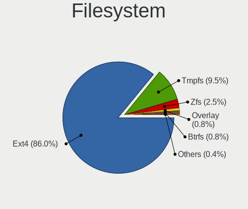
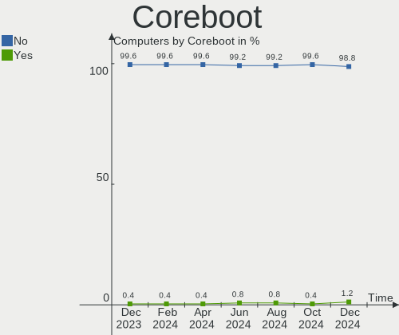
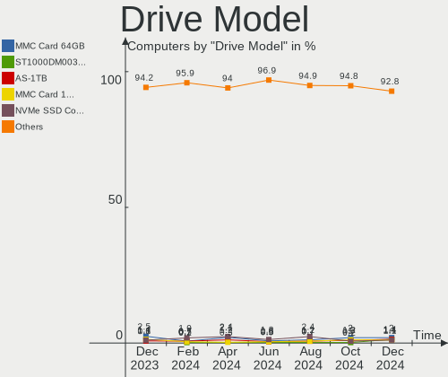
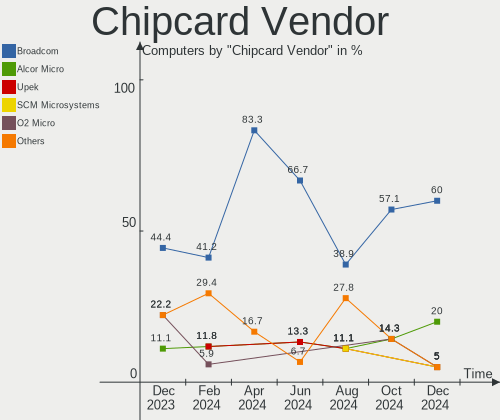

Zorin Hardware Trends
---------------------

A project to identify most popular hardware characteristics and track their change
over time based on data collected by Zorin users at https://Linux-Hardware.org.

Anyone can contribute to the study by uploading probes of their computers by
the [hw-probe](https://github.com/linuxhw/hw-probe) tool:

    sudo -E hw-probe -all -upload

This is a report for all computer types. See also reports for [desktops](/Dist/Zorin/Desktop/README.md) and [notebooks](/Dist/Zorin/Notebook/README.md).

Full-feature report is available here: https://linux-hardware.org/?view=trends

Period: Jun, 2021.

Contents
--------

- [ OS                       ](#os)
- [ OS Family                ](#os-family)
- [ Kernel                   ](#kernel)
- [ Kernel Family            ](#kernel-family)
- [ Kernel Major Ver.        ](#kernel-major-ver)
- [ Arch                     ](#arch)
- [ DE                       ](#de)
- [ Display Server           ](#display-server)
- [ Display Manager          ](#display-manager)
- [ OS Lang                  ](#os-lang)
- [ Boot Mode                ](#boot-mode)
- [ Filesystem               ](#filesystem)
- [ Part. scheme             ](#part-scheme)
- [ Dual Boot with Linux/BSD ](#dual-boot-with-linux/bsd)
- [ Dual Boot (Win)          ](#dual-boot-win)
- [ Country                  ](#country)
- [ City                     ](#city)
- [ Vendor                   ](#vendor)
- [ Model                    ](#model)
- [ Model Family             ](#model-family)
- [ MFG Year                 ](#mfg-year)
- [ Form Factor              ](#form-factor)
- [ Secure Boot              ](#secure-boot)
- [ Coreboot                 ](#coreboot)
- [ RAM Size                 ](#ram-size)
- [ RAM Used                 ](#ram-used)
- [ Has CD-ROM               ](#has-cd-rom)
- [ Total Drives             ](#total-drives)
- [ Has Ethernet             ](#has-ethernet)
- [ Has WiFi                 ](#has-wifi)
- [ Has Bluetooth            ](#has-bluetooth)
- [ Drive Vendor             ](#drive-vendor)
- [ Drive Model              ](#drive-model)
- [ HDD Vendor               ](#hdd-vendor)
- [ SSD Vendor               ](#ssd-vendor)
- [ Drive Kind               ](#drive-kind)
- [ Drive Connector          ](#drive-connector)
- [ Drive Size               ](#drive-size)
- [ Space Total              ](#space-total)
- [ Space Used               ](#space-used)
- [ Malfunc. Drives          ](#malfunc-drives)
- [ Malfunc. Drive Vendor    ](#malfunc-drive-vendor)
- [ Malfunc. HDD Vendor      ](#malfunc-hdd-vendor)
- [ Malfunc. Drive Kind      ](#malfunc-drive-kind)
- [ Failed Drives            ](#failed-drives)
- [ Failed Drive Vendor      ](#failed-drive-vendor)
- [ Drive Status             ](#drive-status)
- [ Storage Vendor           ](#storage-vendor)
- [ Storage Model            ](#storage-model)
- [ Storage Kind             ](#storage-kind)
- [ CPU Vendor               ](#cpu-vendor)
- [ CPU Model                ](#cpu-model)
- [ CPU Model Family         ](#cpu-model-family)
- [ CPU Cores                ](#cpu-cores)
- [ CPU Sockets              ](#cpu-sockets)
- [ CPU Threads              ](#cpu-threads)
- [ CPU Op-Modes             ](#cpu-op-modes)
- [ CPU Microcode            ](#cpu-microcode)
- [ CPU Microarch            ](#cpu-microarch)
- [ GPU Vendor               ](#gpu-vendor)
- [ GPU Model                ](#gpu-model)
- [ GPU Combo                ](#gpu-combo)
- [ GPU Driver               ](#gpu-driver)
- [ GPU Memory               ](#gpu-memory)
- [ Monitor Vendor           ](#monitor-vendor)
- [ Monitor Model            ](#monitor-model)
- [ Monitor Resolution       ](#monitor-resolution)
- [ Monitor Diagonal         ](#monitor-diagonal)
- [ Monitor Width            ](#monitor-width)
- [ Aspect Ratio             ](#aspect-ratio)
- [ Monitor Area             ](#monitor-area)
- [ Pixel Density            ](#pixel-density)
- [ Multiple Monitors        ](#multiple-monitors)
- [ Net Controller Vendor    ](#net-controller-vendor)
- [ Net Controller Model     ](#net-controller-model)
- [ Wireless Vendor          ](#wireless-vendor)
- [ Wireless Model           ](#wireless-model)
- [ Ethernet Vendor          ](#ethernet-vendor)
- [ Ethernet Model           ](#ethernet-model)
- [ Net Controller Kind      ](#net-controller-kind)
- [ Used Controller          ](#used-controller)
- [ NICs                     ](#nics)
- [ IPv6                     ](#ipv6)
- [ Memory Vendor            ](#memory-vendor)
- [ Memory Model             ](#memory-model)
- [ Memory Kind              ](#memory-kind)
- [ Memory Form Factor       ](#memory-form-factor)
- [ Memory Size              ](#memory-size)
- [ Memory Speed             ](#memory-speed)
- [ Sound Vendor             ](#sound-vendor)
- [ Sound Model              ](#sound-model)
- [ Camera Vendor            ](#camera-vendor)
- [ Camera Model             ](#camera-model)
- [ Fingerprint Vendor       ](#fingerprint-vendor)
- [ Fingerprint Model        ](#fingerprint-model)
- [ Chipcard Vendor          ](#chipcard-vendor)
- [ Chipcard Model           ](#chipcard-model)
- [ Printer Vendor           ](#printer-vendor)
- [ Printer Model            ](#printer-model)
- [ Scanner Vendor           ](#scanner-vendor)
- [ Scanner Model            ](#scanner-model)
- [ Bluetooth Vendor         ](#bluetooth-vendor)
- [ Bluetooth Model          ](#bluetooth-model)
- [ Unsupported Devices      ](#unsupported-devices)
- [ Unsupported Device Types ](#unsupported-device-types)

OS
--

Installed operating systems

| Name     | Computers | Percent |
|----------|-----------|---------|
| Zorin 15 | 40        | 70.18%  |
| Zorin 16 | 16        | 28.07%  |
| Zorin 12 | 1         | 1.75%   |

OS Family
---------

OS without a version

| Name  | Computers | Percent |
|-------|-----------|---------|
| Zorin | 57        | 100%    |

Kernel
------

Version of the Linux kernel

| Version            | Computers | Percent |
|--------------------|-----------|---------|
| 5.4.0-74-generic   | 26        | 45.61%  |
| 5.8.0-55-generic   | 10        | 17.54%  |
| 5.4.0-73-generic   | 5         | 8.77%   |
| 5.4.0-45-generic   | 5         | 8.77%   |
| 5.4.0-77-generic   | 4         | 7.02%   |
| 5.8.0-59-generic   | 3         | 5.26%   |
| 5.8.0-53-generic   | 3         | 5.26%   |
| 4.15.0-117-generic | 1         | 1.75%   |

Kernel Family
-------------

Linux kernel without a distro release

| Version | Computers | Percent |
|---------|-----------|---------|
| 5.4.0   | 40        | 70.18%  |
| 5.8.0   | 16        | 28.07%  |
| 4.15.0  | 1         | 1.75%   |

Kernel Major Ver.
-----------------

Linux kernel major version

| Version | Computers | Percent |
|---------|-----------|---------|
| 5.4     | 40        | 70.18%  |
| 5.8     | 16        | 28.07%  |
| 4.15    | 1         | 1.75%   |

Arch
----

OS architecture (x86_64, i586, etc.)

| Name   | Computers | Percent |
|--------|-----------|---------|
| x86_64 | 51        | 89.47%  |
| i686   | 6         | 10.53%  |

DE
--

Desktop Environment

| Name    | Computers | Percent |
|---------|-----------|---------|
| GNOME   | 42        | 73.68%  |
| XFCE    | 13        | 22.81%  |
| Unknown | 2         | 3.51%   |

Display Server
--------------

X11 or Wayland

| Name    | Computers | Percent |
|---------|-----------|---------|
| X11     | 54        | 94.74%  |
| Unknown | 2         | 3.51%   |
| Wayland | 1         | 1.75%   |

Display Manager
---------------

SDDM, LightDM, etc.

| Name    | Computers | Percent |
|---------|-----------|---------|
| Unknown | 55        | 96.49%  |
| TDM     | 1         | 1.75%   |
| GDM     | 1         | 1.75%   |

OS Lang
-------

Language

| Lang  | Computers | Percent |
|-------|-----------|---------|
| en_US | 22        | 38.6%   |
| en_IN | 6         | 10.53%  |
| pt_BR | 4         | 7.02%   |
| fr_FR | 3         | 5.26%   |
| de_DE | 3         | 5.26%   |
| sv_SE | 2         | 3.51%   |
| it_IT | 2         | 3.51%   |
| es_ES | 2         | 3.51%   |
| tr_TR | 1         | 1.75%   |
| sr_RS | 1         | 1.75%   |
| ru_RU | 1         | 1.75%   |
| pt_PT | 1         | 1.75%   |
| nl_NL | 1         | 1.75%   |
| nb_NO | 1         | 1.75%   |
| ja_JP | 1         | 1.75%   |
| es_VE | 1         | 1.75%   |
| es_AR | 1         | 1.75%   |
| en_ZA | 1         | 1.75%   |
| en_PH | 1         | 1.75%   |
| en_GB | 1         | 1.75%   |
| en_CA | 1         | 1.75%   |

Boot Mode
---------

EFI or BIOS

| Mode | Computers | Percent |
|------|-----------|---------|
| BIOS | 32        | 56.14%  |
| EFI  | 25        | 43.86%  |

Filesystem
----------

Type of filesystem

| Type    | Computers | Percent |
|---------|-----------|---------|
| Ext4    | 53        | 92.98%  |
| Overlay | 2         | 3.51%   |
| Btrfs   | 2         | 3.51%   |

Part. scheme
------------

Scheme of partitioning

| Type    | Computers | Percent |
|---------|-----------|---------|
| Unknown | 55        | 96.49%  |
| MBR     | 1         | 1.75%   |
| GPT     | 1         | 1.75%   |

Dual Boot with Linux/BSD
------------------------

Hosting more than one Linux/BSD

| Dual boot | Computers | Percent |
|-----------|-----------|---------|
| No        | 55        | 96.49%  |
| Yes       | 2         | 3.51%   |

Dual Boot (Win)
---------------

Hosting Linux and Windows

| Dual boot | Computers | Percent |
|-----------|-----------|---------|
| No        | 44        | 77.19%  |
| Yes       | 13        | 22.81%  |

Country
-------

Geographic location (country)

| Country                | Computers | Percent |
|------------------------|-----------|---------|
| USA                    | 12        | 21.05%  |
| India                  | 6         | 10.53%  |
| Brazil                 | 4         | 7.02%   |
| Spain                  | 3         | 5.26%   |
| Germany                | 3         | 5.26%   |
| France                 | 3         | 5.26%   |
| Sweden                 | 2         | 3.51%   |
| Norway                 | 2         | 3.51%   |
| Italy                  | 2         | 3.51%   |
| Indonesia              | 2         | 3.51%   |
| Venezuela              | 1         | 1.75%   |
| UK                     | 1         | 1.75%   |
| Turkey                 | 1         | 1.75%   |
| Thailand               | 1         | 1.75%   |
| South Africa           | 1         | 1.75%   |
| Russia                 | 1         | 1.75%   |
| Portugal               | 1         | 1.75%   |
| Philippines            | 1         | 1.75%   |
| Netherlands            | 1         | 1.75%   |
| Malaysia               | 1         | 1.75%   |
| Madagascar             | 1         | 1.75%   |
| Japan                  | 1         | 1.75%   |
| Iran                   | 1         | 1.75%   |
| Croatia                | 1         | 1.75%   |
| Canada                 | 1         | 1.75%   |
| Bulgaria               | 1         | 1.75%   |
| Bosnia and Herzegovina | 1         | 1.75%   |
| Argentina              | 1         | 1.75%   |

City
----

Geographic location (city)

| City                  | Computers | Percent |
|-----------------------|-----------|---------|
| Hyderabad             | 3         | 5.26%   |
| Rio de Janeiro        | 2         | 3.51%   |
| Yuba City             | 1         | 1.75%   |
| Willingboro           | 1         | 1.75%   |
| Vila Nova de Gaia     | 1         | 1.75%   |
| Venice                | 1         | 1.75%   |
| Sutton Coldfield      | 1         | 1.75%   |
| Subang Jaya           | 1         | 1.75%   |
| Stadskanaal           | 1         | 1.75%   |
| St Petersburg         | 1         | 1.75%   |
| Sorreisa              | 1         | 1.75%   |
| Sofia                 | 1         | 1.75%   |
| Sinj                  | 1         | 1.75%   |
| Sharon                | 1         | 1.75%   |
| San Donà di Piave    | 1         | 1.75%   |
| Sacramento            | 1         | 1.75%   |
| Roestanga             | 1         | 1.75%   |
| Pretoria              | 1         | 1.75%   |
| Pilar                 | 1         | 1.75%   |
| Phuket                | 1         | 1.75%   |
| Pascoag               | 1         | 1.75%   |
| Paris                 | 1         | 1.75%   |
| Oslo                  | 1         | 1.75%   |
| Olympia               | 1         | 1.75%   |
| Ohmbach               | 1         | 1.75%   |
| Notre-Dame-de-Monts   | 1         | 1.75%   |
| Málaga               | 1         | 1.75%   |
| Myrtle Beach          | 1         | 1.75%   |
| Maersta               | 1         | 1.75%   |
| Madrid                | 1         | 1.75%   |
| Ludwigsburg           | 1         | 1.75%   |
| Las Vegas             | 1         | 1.75%   |
| Kumamoto              | 1         | 1.75%   |
| Kerman                | 1         | 1.75%   |
| Jakarta               | 1         | 1.75%   |
| Indore                | 1         | 1.75%   |
| Hamburg               | 1         | 1.75%   |
| Fortaleza             | 1         | 1.75%   |
| Fond du Lac           | 1         | 1.75%   |
| Foca                  | 1         | 1.75%   |
| Cormeilles-en-Parisis | 1         | 1.75%   |
| Columbia              | 1         | 1.75%   |
| Charlottesville       | 1         | 1.75%   |
| Ceilandia             | 1         | 1.75%   |
| Caturtunggal          | 1         | 1.75%   |
| Calgary               | 1         | 1.75%   |
| Cagayan de Oro        | 1         | 1.75%   |
| Bengaluru             | 1         | 1.75%   |
| Bellingham            | 1         | 1.75%   |
| Baltimore             | 1         | 1.75%   |
| Antananarivo          | 1         | 1.75%   |
| Antalya               | 1         | 1.75%   |
| Aldaia                | 1         | 1.75%   |
| Ahmedabad             | 1         | 1.75%   |

Vendor
------

Motherboard manufacturer

| Name                    | Computers | Percent |
|-------------------------|-----------|---------|
| Hewlett-Packard         | 10        | 17.54%  |
| Dell                    | 10        | 17.54%  |
| Lenovo                  | 7         | 12.28%  |
| ASUSTek Computer        | 7         | 12.28%  |
| Sony                    | 2         | 3.51%   |
| MSI                     | 2         | 3.51%   |
| Gigabyte Technology     | 2         | 3.51%   |
| Apple                   | 2         | 3.51%   |
| Acer                    | 2         | 3.51%   |
| Unknown                 | 2         | 3.51%   |
| Wistron                 | 1         | 1.75%   |
| Toshiba                 | 1         | 1.75%   |
| Shuttle                 | 1         | 1.75%   |
| Samsung Electronics     | 1         | 1.75%   |
| Positivo                | 1         | 1.75%   |
| Intel                   | 1         | 1.75%   |
| HCL Infosystems Limited | 1         | 1.75%   |
| Fujitsu                 | 1         | 1.75%   |
| ECS                     | 1         | 1.75%   |
| Biostar                 | 1         | 1.75%   |
| ASRock                  | 1         | 1.75%   |

Model
-----

Motherboard model

| Name                                    | Computers | Percent |
|-----------------------------------------|-----------|---------|
| Unknown                                 | 3         | 5.26%   |
| Lenovo G40-30 80FY                      | 2         | 3.51%   |
| Wistron ProLiant ML110 G5               | 1         | 1.75%   |
| Toshiba Satellite M70                   | 1         | 1.75%   |
| Sony VPCSB16FG                          | 1         | 1.75%   |
| Sony VGN-BX51VN                         | 1         | 1.75%   |
| Shuttle SH61R                           | 1         | 1.75%   |
| Samsung N150/N210/N220                  | 1         | 1.75%   |
| Positivo POS-MI945AA                    | 1         | 1.75%   |
| MSI Pro 3515 Series                     | 1         | 1.75%   |
| MSI MS-7721                             | 1         | 1.75%   |
| Lenovo ThinkPad E15 Gen 2 20TD000HZA    | 1         | 1.75%   |
| Lenovo ThinkCentre M70e 0830WK7         | 1         | 1.75%   |
| Lenovo IdeaPad 330-15IKB 81DE           | 1         | 1.75%   |
| Lenovo IdeaCentre 510S-08IKL 90GB004RUS | 1         | 1.75%   |
| Intel DG31GL AAE33912-200               | 1         | 1.75%   |
| HP Z840 Workstation                     | 1         | 1.75%   |
| HP Z1 Entry Tower G5                    | 1         | 1.75%   |
| HP Stream Notebook                      | 1         | 1.75%   |
| HP Pavilion dv6700                      | 1         | 1.75%   |
| HP Pavilion dv5                         | 1         | 1.75%   |
| HP Laptop 15-da0xxx                     | 1         | 1.75%   |
| HP EliteBook x360 1040 G6               | 1         | 1.75%   |
| HP Compaq dc5750 Microtower             | 1         | 1.75%   |
| HP 290 G2 MT Business PC                | 1         | 1.75%   |
| HP 15                                   | 1         | 1.75%   |
| HCL Infosystems Limited HCL ME Laptop   | 1         | 1.75%   |
| Gigabyte B85-HD3                        | 1         | 1.75%   |
| Gigabyte 8IPE1000-G/L                   | 1         | 1.75%   |
| Fujitsu LIFEBOOK AH532                  | 1         | 1.75%   |
| ECS G41T-M2                             | 1         | 1.75%   |
| Dell XPS 8940                           | 1         | 1.75%   |
| Dell XPS 13 9370                        | 1         | 1.75%   |
| Dell Precision T1600                    | 1         | 1.75%   |
| Dell Precision 7520                     | 1         | 1.75%   |
| Dell OptiPlex 7020                      | 1         | 1.75%   |
| Dell OptiPlex 390                       | 1         | 1.75%   |
| Dell Latitude E6520                     | 1         | 1.75%   |
| Dell Inspiron N4010                     | 1         | 1.75%   |
| Dell Inspiron 3582                      | 1         | 1.75%   |
| Dell Inspiron 3576                      | 1         | 1.75%   |
| Biostar TA870+                          | 1         | 1.75%   |
| ASUS Z170-P D3                          | 1         | 1.75%   |
| ASUS VivoBook 15_ASUS Laptop X507LA     | 1         | 1.75%   |
| ASUS TUF Gaming FX505DT_FX505DT         | 1         | 1.75%   |
| ASUS Q524UQ                             | 1         | 1.75%   |
| ASUS PRIME X570-P                       | 1         | 1.75%   |
| ASUS PRIME B450M-GAMING/BR              | 1         | 1.75%   |
| ASUS K54HR                              | 1         | 1.75%   |
| ASRock 990FX Extreme6                   | 1         | 1.75%   |
| Apple MacBookPro12,1                    | 1         | 1.75%   |
| Apple iMac18,2                          | 1         | 1.75%   |
| Acer Veriton L480G                      | 1         | 1.75%   |
| Acer Aspire 3100                        | 1         | 1.75%   |

Model Family
------------

Motherboard model prefix

| Name                        | Computers | Percent |
|-----------------------------|-----------|---------|
| Dell Inspiron               | 3         | 5.26%   |
| Unknown                     | 3         | 5.26%   |
| Lenovo G40-30               | 2         | 3.51%   |
| HP Pavilion                 | 2         | 3.51%   |
| Dell XPS                    | 2         | 3.51%   |
| Dell Precision              | 2         | 3.51%   |
| Dell OptiPlex               | 2         | 3.51%   |
| ASUS PRIME                  | 2         | 3.51%   |
| Wistron ProLiant            | 1         | 1.75%   |
| Toshiba Satellite           | 1         | 1.75%   |
| Sony VPCSB16FG              | 1         | 1.75%   |
| Sony VGN-BX51VN             | 1         | 1.75%   |
| Shuttle SH61R               | 1         | 1.75%   |
| Samsung N150                | 1         | 1.75%   |
| Positivo POS-MI945AA        | 1         | 1.75%   |
| MSI Pro                     | 1         | 1.75%   |
| MSI MS-7721                 | 1         | 1.75%   |
| Lenovo ThinkPad             | 1         | 1.75%   |
| Lenovo ThinkCentre          | 1         | 1.75%   |
| Lenovo IdeaPad              | 1         | 1.75%   |
| Lenovo IdeaCentre           | 1         | 1.75%   |
| Intel DG31GL                | 1         | 1.75%   |
| HP Z840                     | 1         | 1.75%   |
| HP Z1                       | 1         | 1.75%   |
| HP Stream                   | 1         | 1.75%   |
| HP Laptop                   | 1         | 1.75%   |
| HP EliteBook                | 1         | 1.75%   |
| HP Compaq                   | 1         | 1.75%   |
| HP 290                      | 1         | 1.75%   |
| HP 15                       | 1         | 1.75%   |
| HCL Infosystems Limited HCL | 1         | 1.75%   |
| Gigabyte B85-HD3            | 1         | 1.75%   |
| Gigabyte 8IPE1000-G         | 1         | 1.75%   |
| Fujitsu LIFEBOOK            | 1         | 1.75%   |
| ECS G41T-M2                 | 1         | 1.75%   |
| Dell Latitude               | 1         | 1.75%   |
| Biostar TA870+              | 1         | 1.75%   |
| ASUS Z170-P                 | 1         | 1.75%   |
| ASUS VivoBook               | 1         | 1.75%   |
| ASUS TUF                    | 1         | 1.75%   |
| ASUS Q524UQ                 | 1         | 1.75%   |
| ASUS K54HR                  | 1         | 1.75%   |
| ASRock 990FX                | 1         | 1.75%   |
| Apple MacBookPro12          | 1         | 1.75%   |
| Apple iMac18                | 1         | 1.75%   |
| Acer Veriton                | 1         | 1.75%   |
| Acer Aspire                 | 1         | 1.75%   |

MFG Year
--------

Motherboard manufacture year

| Year | Computers | Percent |
|------|-----------|---------|
| 2021 | 10        | 17.54%  |
| 2020 | 6         | 10.53%  |
| 2018 | 5         | 8.77%   |
| 2011 | 5         | 8.77%   |
| 2008 | 5         | 8.77%   |
| 2019 | 4         | 7.02%   |
| 2015 | 3         | 5.26%   |
| 2014 | 3         | 5.26%   |
| 2010 | 3         | 5.26%   |
| 2009 | 3         | 5.26%   |
| 2016 | 2         | 3.51%   |
| 2013 | 2         | 3.51%   |
| 2012 | 2         | 3.51%   |
| 2017 | 1         | 1.75%   |
| 2007 | 1         | 1.75%   |
| 2006 | 1         | 1.75%   |
| 2005 | 1         | 1.75%   |

Form Factor
-----------

Physical design of the computer

| Name        | Computers | Percent |
|-------------|-----------|---------|
| Notebook    | 29        | 50.88%  |
| Desktop     | 26        | 45.61%  |
| Convertible | 1         | 1.75%   |
| All in one  | 1         | 1.75%   |

Secure Boot
-----------

Enabled or disabled

| State    | Computers | Percent |
|----------|-----------|---------|
| Disabled | 50        | 87.72%  |
| Enabled  | 7         | 12.28%  |

Coreboot
--------

Have coreboot on board

| Used | Computers | Percent |
|------|-----------|---------|
| No   | 57        | 100%    |

RAM Size
--------

Total RAM memory

| Size in GB  | Computers | Percent |
|-------------|-----------|---------|
| 3.01-4.0    | 17        | 29.82%  |
| 4.01-8.0    | 11        | 19.3%   |
| 16.01-24.0  | 11        | 19.3%   |
| 1.01-2.0    | 9         | 15.79%  |
| 8.01-16.0   | 5         | 8.77%   |
| 32.01-64.0  | 2         | 3.51%   |
| 2.01-3.0    | 1         | 1.75%   |
| 64.01-256.0 | 1         | 1.75%   |

RAM Used
--------

Used RAM memory

| Used GB   | Computers | Percent |
|-----------|-----------|---------|
| 1.01-2.0  | 25        | 43.86%  |
| 2.01-3.0  | 14        | 24.56%  |
| 0.51-1.0  | 7         | 12.28%  |
| 3.01-4.0  | 6         | 10.53%  |
| 4.01-8.0  | 4         | 7.02%   |
| 8.01-16.0 | 1         | 1.75%   |

Has CD-ROM
----------

Has CD-ROM on board

| Presented | Computers | Percent |
|-----------|-----------|---------|
| Yes       | 29        | 50.88%  |
| No        | 28        | 49.12%  |

Total Drives
------------

Number of drives on board

| Drives | Computers | Percent |
|--------|-----------|---------|
| 1      | 40        | 70.18%  |
| 2      | 9         | 15.79%  |
| 4      | 4         | 7.02%   |
| 3      | 3         | 5.26%   |
| 5      | 1         | 1.75%   |

Has Ethernet
------------

Has Ethernet on board

| Presented | Computers | Percent |
|-----------|-----------|---------|
| Yes       | 50        | 87.72%  |
| No        | 7         | 12.28%  |

Has WiFi
--------

Has WiFi module

| Presented | Computers | Percent |
|-----------|-----------|---------|
| Yes       | 41        | 71.93%  |
| No        | 16        | 28.07%  |

Has Bluetooth
-------------

Has Bluetooth module

| Presented | Computers | Percent |
|-----------|-----------|---------|
| Yes       | 32        | 56.14%  |
| No        | 25        | 43.86%  |

Drive Vendor
------------

Hard drive vendors

| Vendor                    | Computers | Drives | Percent |
|---------------------------|-----------|--------|---------|
| WDC                       | 14        | 16     | 18.18%  |
| Seagate                   | 12        | 12     | 15.58%  |
| Samsung Electronics       | 8         | 9      | 10.39%  |
| Kingston                  | 6         | 7      | 7.79%   |
| SanDisk                   | 5         | 5      | 6.49%   |
| Hitachi                   | 5         | 5      | 6.49%   |
| Unknown                   | 3         | 4      | 3.9%    |
| Crucial                   | 3         | 3      | 3.9%    |
| Toshiba                   | 2         | 2      | 2.6%    |
| Phison                    | 2         | 2      | 2.6%    |
| Micron/Crucial Technology | 2         | 2      | 2.6%    |
| Maxtor                    | 2         | 2      | 2.6%    |
| Intel                     | 2         | 2      | 2.6%    |
| HGST                      | 2         | 2      | 2.6%    |
| Apple                     | 2         | 2      | 2.6%    |
| Silicon Motion            | 1         | 2      | 1.3%    |
| QUANTUM                   | 1         | 1      | 1.3%    |
| PNY                       | 1         | 1      | 1.3%    |
| moweek                    | 1         | 1      | 1.3%    |
| Kston                     | 1         | 1      | 1.3%    |
| Hewlett-Packard           | 1         | 1      | 1.3%    |
| G-RAID                    | 1         | 1      | 1.3%    |

Drive Model
-----------

Hard drive models

| Model                                | Computers | Percent |
|--------------------------------------|-----------|---------|
| Kingston SA400S37240G 240GB SSD      | 3         | 3.66%   |
| Unknown SD/MMC/MS PRO 128GB          | 2         | 2.44%   |
| Samsung NVMe SSD Drive 512GB         | 2         | 2.44%   |
| Crucial CT480BX500SSD1 480GB         | 2         | 2.44%   |
| WDC WD800JD-22MSA1 80GB              | 1         | 1.22%   |
| WDC WD800JD-00LSA0 80GB              | 1         | 1.22%   |
| WDC WD5000LPCX-24C6HT0 500GB         | 1         | 1.22%   |
| WDC WD5000BPVT-24HXZT3 500GB         | 1         | 1.22%   |
| WDC WD5000AAVS-57ZTB0 500GB          | 1         | 1.22%   |
| WDC WD5000AAKX-221CA1 500GB          | 1         | 1.22%   |
| WDC WD40EZAZ-00SF3B0 4TB             | 1         | 1.22%   |
| WDC WD3200BPVT-55ZEST0 320GB         | 1         | 1.22%   |
| WDC WD3200BEVT-00A0RT0 320GB         | 1         | 1.22%   |
| WDC WD3200AAJS-00L7A0 320GB          | 1         | 1.22%   |
| WDC WD30EFRX-68EUZN0 3TB             | 1         | 1.22%   |
| WDC WD10JPVX-60JC3T1 1TB             | 1         | 1.22%   |
| WDC WD10EZEX-60M2NA0 1TB             | 1         | 1.22%   |
| WDC WD10EZEX-08WN4A0 1TB             | 1         | 1.22%   |
| WDC WD10EZEX-08M2NA0 1TB             | 1         | 1.22%   |
| WDC WD10EURX-63FH1Y0 1TB             | 1         | 1.22%   |
| Unknown MMC Card  32GB               | 1         | 1.22%   |
| Unknown GSDSM128TY2F1QGCX 128GB      | 1         | 1.22%   |
| Toshiba NVMe SSD Drive 1024GB        | 1         | 1.22%   |
| Toshiba MK3259GSXP 320GB             | 1         | 1.22%   |
| Silicon Motion NVMe SSD Drive 128GB  | 1         | 1.22%   |
| Silicon Motion NVME SSD 128GB        | 1         | 1.22%   |
| Seagate ST500VT000-1DK142 500GB      | 1         | 1.22%   |
| Seagate ST500LM030-1RK17D 500GB      | 1         | 1.22%   |
| Seagate ST500LM012 HN-M500MBB 500GB  | 1         | 1.22%   |
| Seagate ST4000DM004-2CV104 4TB       | 1         | 1.22%   |
| Seagate ST3500312CS 500GB            | 1         | 1.22%   |
| Seagate ST3250310AS 250GB            | 1         | 1.22%   |
| Seagate ST2000LM003 HN-M201RAD 2TB   | 1         | 1.22%   |
| Seagate ST1000LM035-1RK172 1TB       | 1         | 1.22%   |
| Seagate ST1000DM010-2EP102 1TB       | 1         | 1.22%   |
| Seagate ST1000DM003-1SB10C 1TB       | 1         | 1.22%   |
| Seagate ST1000DM003-1SB102 1TB       | 1         | 1.22%   |
| Seagate Backup+ Hub BK 8TB           | 1         | 1.22%   |
| SanDisk SSD PLUS 480GB               | 1         | 1.22%   |
| SanDisk SSD PLUS 240GB               | 1         | 1.22%   |
| SanDisk SDSSDHII240G 240GB           | 1         | 1.22%   |
| SanDisk SDSSDA120G 120GB             | 1         | 1.22%   |
| Sandisk NVMe SSD Drive 250GB         | 1         | 1.22%   |
| Samsung SSD 860 QVO 1TB              | 1         | 1.22%   |
| Samsung SSD 850 120GB                | 1         | 1.22%   |
| Samsung SSD 840 EVO 250GB            | 1         | 1.22%   |
| Samsung SSD 840 EVO 120GB            | 1         | 1.22%   |
| Samsung NVMe SSD Drive 32GB          | 1         | 1.22%   |
| Samsung MZ7LN128HCHP-000H1 128GB SSD | 1         | 1.22%   |
| Samsung HD103UJ 1TB                  | 1         | 1.22%   |
| QUANTUM FIREBALLlct15 30 32GB        | 1         | 1.22%   |
| PNY CS900 480GB SSD                  | 1         | 1.22%   |
| Phison NVMe SSD Drive 2TB            | 1         | 1.22%   |
| Phison NVMe SSD Drive 1TB            | 1         | 1.22%   |
| moweek 240GB                         | 1         | 1.22%   |
| Micron/Crucial NVMe SSD Drive 500GB  | 1         | 1.22%   |
| Micron/Crucial NVMe SSD Drive 1TB    | 1         | 1.22%   |
| MAXTOR STM380211AS 80GB              | 1         | 1.22%   |
| Maxtor 6Y080L0 81GB                  | 1         | 1.22%   |
| Kston 128GB                          | 1         | 1.22%   |

HDD Vendor
----------

Hard disk drive vendors

| Vendor              | Computers | Drives | Percent |
|---------------------|-----------|--------|---------|
| WDC                 | 14        | 16     | 35.9%   |
| Seagate             | 11        | 11     | 28.21%  |
| Hitachi             | 5         | 5      | 12.82%  |
| Maxtor              | 2         | 2      | 5.13%   |
| HGST                | 2         | 2      | 5.13%   |
| Toshiba             | 1         | 1      | 2.56%   |
| Samsung Electronics | 1         | 1      | 2.56%   |
| QUANTUM             | 1         | 1      | 2.56%   |
| Hewlett-Packard     | 1         | 1      | 2.56%   |
| Apple               | 1         | 1      | 2.56%   |

SSD Vendor
----------

Solid state drive vendors

| Vendor              | Computers | Drives | Percent |
|---------------------|-----------|--------|---------|
| Samsung Electronics | 5         | 5      | 25%     |
| Kingston            | 5         | 6      | 25%     |
| SanDisk             | 4         | 4      | 20%     |
| Crucial             | 3         | 3      | 15%     |
| PNY                 | 1         | 1      | 5%      |
| Intel               | 1         | 1      | 5%      |
| Apple               | 1         | 1      | 5%      |

Drive Kind
----------

HDD or SSD

| Kind    | Computers | Drives | Percent |
|---------|-----------|--------|---------|
| HDD     | 36        | 41     | 50%     |
| SSD     | 19        | 21     | 26.39%  |
| NVMe    | 11        | 13     | 15.28%  |
| Unknown | 5         | 7      | 6.94%   |
| MMC     | 1         | 1      | 1.39%   |

Drive Connector
---------------

SATA, SAS, NVMe, etc.

| Type | Computers | Drives | Percent |
|------|-----------|--------|---------|
| SATA | 51        | 66     | 77.27%  |
| NVMe | 11        | 13     | 16.67%  |
| SAS  | 3         | 3      | 4.55%   |
| MMC  | 1         | 1      | 1.52%   |

Drive Size
----------

Size of hard drive

| Size in TB | Computers | Drives | Percent |
|------------|-----------|--------|---------|
| 0.01-0.5   | 38        | 43     | 69.09%  |
| 0.51-1.0   | 12        | 14     | 21.82%  |
| 3.01-4.0   | 2         | 2      | 3.64%   |
| 1.01-2.0   | 2         | 2      | 3.64%   |
| 2.01-3.0   | 1         | 1      | 1.82%   |

Space Total
-----------

Amount of disk space available on the file system

| Size in GB     | Computers | Percent |
|----------------|-----------|---------|
| 251-500        | 23        | 40.35%  |
| 101-250        | 13        | 22.81%  |
| 51-100         | 6         | 10.53%  |
| 501-1000       | 5         | 8.77%   |
| More than 3000 | 3         | 5.26%   |
| 1-20           | 3         | 5.26%   |
| 21-50          | 2         | 3.51%   |
| 2001-3000      | 1         | 1.75%   |
| 1001-2000      | 1         | 1.75%   |

Space Used
----------

Amount of used disk space

| Used GB        | Computers | Percent |
|----------------|-----------|---------|
| 1-20           | 34        | 59.65%  |
| 21-50          | 7         | 12.28%  |
| 51-100         | 6         | 10.53%  |
| 101-250        | 4         | 7.02%   |
| More than 3000 | 2         | 3.51%   |
| 251-500        | 2         | 3.51%   |
| 1001-2000      | 1         | 1.75%   |
| 501-1000       | 1         | 1.75%   |

Malfunc. Drives
---------------

Drive models with a malfunction

| Model                        | Computers | Drives | Percent |
|------------------------------|-----------|--------|---------|
| WDC WD3200BPVT-55ZEST0 320GB | 1         | 1      | 100%    |

Malfunc. Drive Vendor
---------------------

Vendors of faulty drives

| Vendor | Computers | Drives | Percent |
|--------|-----------|--------|---------|
| WDC    | 1         | 1      | 100%    |

Malfunc. HDD Vendor
-------------------

Vendors of faulty HDD drives

| Vendor | Computers | Drives | Percent |
|--------|-----------|--------|---------|
| WDC    | 1         | 1      | 100%    |

Malfunc. Drive Kind
-------------------

Kinds of faulty drives

| Kind | Computers | Drives | Percent |
|------|-----------|--------|---------|
| HDD  | 1         | 1      | 100%    |

Failed Drives
-------------

Failed drive models

Zero info for selected period =(

Failed Drive Vendor
-------------------

Failed drive vendors

Zero info for selected period =(

Drive Status
------------

Number of failed and malfunc. drives

| Status   | Computers | Drives | Percent |
|----------|-----------|--------|---------|
| Detected | 54        | 79     | 93.1%   |
| Works    | 3         | 3      | 5.17%   |
| Malfunc  | 1         | 1      | 1.72%   |

Storage Vendor
--------------

Storage controller vendors

| Vendor                       | Computers | Percent |
|------------------------------|-----------|---------|
| Intel                        | 44        | 64.71%  |
| AMD                          | 8         | 11.76%  |
| Samsung Electronics          | 4         | 5.88%   |
| Phison Electronics           | 2         | 2.94%   |
| Micron/Crucial Technology    | 2         | 2.94%   |
| VIA Technologies             | 1         | 1.47%   |
| Toshiba America Info Systems | 1         | 1.47%   |
| Silicon Motion               | 1         | 1.47%   |
| Sandisk                      | 1         | 1.47%   |
| Kingston Technology Company  | 1         | 1.47%   |
| JMicron Technology           | 1         | 1.47%   |
| Broadcom / LSI               | 1         | 1.47%   |
| ASMedia Technology           | 1         | 1.47%   |

Storage Model
-------------

Storage controller models

| Model                                                                                   | Computers | Percent |
|-----------------------------------------------------------------------------------------|-----------|---------|
| Intel NM10/ICH7 Family SATA Controller [IDE mode]                                       | 5         | 6.1%    |
| Intel 82801G (ICH7 Family) IDE Controller                                               | 4         | 4.88%   |
| Intel Sunrise Point-LP SATA Controller [AHCI mode]                                      | 3         | 3.66%   |
| Intel Q170/Q150/B150/H170/H110/Z170/CM236 Chipset SATA Controller [AHCI Mode]           | 3         | 3.66%   |
| AMD FCH SATA Controller [AHCI mode]                                                     | 3         | 3.66%   |
| Intel Celeron/Pentium Silver Processor SATA Controller                                  | 2         | 2.44%   |
| Intel Cannon Lake PCH SATA AHCI Controller                                              | 2         | 2.44%   |
| Intel 82801 Mobile SATA Controller [RAID mode]                                          | 2         | 2.44%   |
| Intel 8 Series/C220 Series Chipset Family 6-port SATA Controller 1 [AHCI mode]          | 2         | 2.44%   |
| Intel 8 Series SATA Controller 1 [AHCI mode]                                            | 2         | 2.44%   |
| Intel 7 Series Chipset Family 6-port SATA Controller [AHCI mode]                        | 2         | 2.44%   |
| Intel 6 Series/C200 Series Chipset Family 6 port Mobile SATA AHCI Controller            | 2         | 2.44%   |
| AMD SB7x0/SB8x0/SB9x0 SATA Controller [AHCI mode]                                       | 2         | 2.44%   |
| AMD SB7x0/SB8x0/SB9x0 IDE Controller                                                    | 2         | 2.44%   |
| VIA VT6415 PATA IDE Host Controller                                                     | 1         | 1.22%   |
| Toshiba America Info Systems Toshiba America Info Non-Volatile memory controller        | 1         | 1.22%   |
| Silicon Motion SM2263EN/SM2263XT SSD Controller                                         | 1         | 1.22%   |
| Sandisk WD Black 2018/SN750 / PC SN720 NVMe SSD                                         | 1         | 1.22%   |
| Samsung NVMe SSD Controller SM961/PM961/SM963                                           | 1         | 1.22%   |
| Samsung NVMe Controller                                                                 | 1         | 1.22%   |
| Samsung Electronics SATA controller                                                     | 1         | 1.22%   |
| Samsung Electronics Non-Volatile memory controller                                      | 1         | 1.22%   |
| Phison E16 PCIe4 NVMe Controller                                                        | 1         | 1.22%   |
| Phison E12 NVMe Controller                                                              | 1         | 1.22%   |
| Micron/Crucial P1 NVMe PCIe SSD                                                         | 1         | 1.22%   |
| Micron/Crucial NVMe Controller                                                          | 1         | 1.22%   |
| Kingston Company U-SNS8154P3 NVMe SSD                                                   | 1         | 1.22%   |
| JMicron JMB363 SATA/IDE Controller                                                      | 1         | 1.22%   |
| Intel Wildcat Point-LP SATA Controller [AHCI Mode]                                      | 1         | 1.22%   |
| Intel SSD 660P Series                                                                   | 1         | 1.22%   |
| Intel SATA Controller [RAID mode]                                                       | 1         | 1.22%   |
| Intel C610/X99 series chipset sSATA Controller [RAID mode]                              | 1         | 1.22%   |
| Intel C600/X79 series chipset SATA RAID Controller                                      | 1         | 1.22%   |
| Intel Atom Processor E3800 Series SATA IDE Controller                                   | 1         | 1.22%   |
| Intel Atom Processor E3800 Series SATA AHCI Controller                                  | 1         | 1.22%   |
| Intel 82801JI (ICH10 Family) SATA AHCI Controller                                       | 1         | 1.22%   |
| Intel 82801IR/IO/IH (ICH9R/DO/DH) 4 port SATA Controller [IDE mode]                     | 1         | 1.22%   |
| Intel 82801IBM/IEM (ICH9M/ICH9M-E) 4 port SATA Controller [AHCI mode]                   | 1         | 1.22%   |
| Intel 82801I (ICH9 Family) 2 port SATA Controller [IDE mode]                            | 1         | 1.22%   |
| Intel 82801HM/HEM (ICH8M/ICH8M-E) SATA Controller [IDE mode]                            | 1         | 1.22%   |
| Intel 82801HM/HEM (ICH8M/ICH8M-E) SATA Controller [AHCI mode]                           | 1         | 1.22%   |
| Intel 82801HM/HEM (ICH8M/ICH8M-E) IDE Controller                                        | 1         | 1.22%   |
| Intel 82801FBM (ICH6M) SATA Controller                                                  | 1         | 1.22%   |
| Intel 82801FB/FBM/FR/FW/FRW (ICH6 Family) IDE Controller                                | 1         | 1.22%   |
| Intel 82801EB/ER (ICH5/ICH5R) IDE Controller                                            | 1         | 1.22%   |
| Intel 82801EB (ICH5) SATA Controller                                                    | 1         | 1.22%   |
| Intel 6 Series/C200 Series Chipset Family Desktop SATA Controller (IDE mode, ports 4-5) | 1         | 1.22%   |
| Intel 6 Series/C200 Series Chipset Family Desktop SATA Controller (IDE mode, ports 0-3) | 1         | 1.22%   |
| Intel 6 Series/C200 Series Chipset Family 6 port Desktop SATA AHCI Controller           | 1         | 1.22%   |
| Intel 5 Series/3400 Series Chipset 6 port SATA AHCI Controller                          | 1         | 1.22%   |
| Intel 5 Series/3400 Series Chipset 4 port SATA AHCI Controller                          | 1         | 1.22%   |
| Intel 400 Series Chipset Family SATA RAID Controller                                    | 1         | 1.22%   |
| Intel 200 Series PCH SATA controller [AHCI mode]                                        | 1         | 1.22%   |
| Broadcom / LSI SAS2308 PCI-Express Fusion-MPT SAS-2                                     | 1         | 1.22%   |
| ASMedia 106x SATA/RAID Controller                                                       | 1         | 1.22%   |
| AMD SB600 Non-Raid-5 SATA                                                               | 1         | 1.22%   |
| AMD SB600 IDE                                                                           | 1         | 1.22%   |
| AMD IXP SB4x0 Serial ATA Controller                                                     | 1         | 1.22%   |
| AMD IXP SB4x0 IDE Controller                                                            | 1         | 1.22%   |
| AMD 400 Series Chipset SATA Controller                                                  | 1         | 1.22%   |

Storage Kind
------------

Kind of storage controller (IDE, SATA, NVMe, SAS, ...)

| Kind | Computers | Percent |
|------|-----------|---------|
| SATA | 36        | 52.17%  |
| IDE  | 16        | 23.19%  |
| NVMe | 11        | 15.94%  |
| RAID | 5         | 7.25%   |
| SAS  | 1         | 1.45%   |

CPU Vendor
----------

Processor vendors

| Vendor | Computers | Percent |
|--------|-----------|---------|
| Intel  | 48        | 84.21%  |
| AMD    | 9         | 15.79%  |

CPU Model
---------

Processor models

| Model                                         | Computers | Percent |
|-----------------------------------------------|-----------|---------|
| Intel Core i7-8550U CPU @ 1.80GHz             | 2         | 3.51%   |
| Intel Core i3-8100 CPU @ 3.60GHz              | 2         | 3.51%   |
| Intel Xeon CPU X3210 @ 2.13GHz                | 1         | 1.75%   |
| Intel Xeon CPU E5-2630 v4 @ 2.20GHz           | 1         | 1.75%   |
| Intel Xeon CPU E31225 @ 3.10GHz               | 1         | 1.75%   |
| Intel Pentium M processor 1.73GHz             | 1         | 1.75%   |
| Intel Pentium Dual-Core CPU E5700 @ 3.00GHz   | 1         | 1.75%   |
| Intel Pentium Dual-Core CPU E5400 @ 2.70GHz   | 1         | 1.75%   |
| Intel Pentium Dual CPU E2140 @ 1.60GHz        | 1         | 1.75%   |
| Intel Pentium CPU P6100 @ 2.00GHz             | 1         | 1.75%   |
| Intel Pentium CPU 2020M @ 2.40GHz             | 1         | 1.75%   |
| Intel Pentium 4 CPU 2.80GHz                   | 1         | 1.75%   |
| Intel Core i7-7920HQ CPU @ 3.10GHz            | 1         | 1.75%   |
| Intel Core i7-6500U CPU @ 2.50GHz             | 1         | 1.75%   |
| Intel Core i7-4790 CPU @ 3.60GHz              | 1         | 1.75%   |
| Intel Core i7-4600U CPU @ 2.10GHz             | 1         | 1.75%   |
| Intel Core i5-8265U CPU @ 1.60GHz             | 1         | 1.75%   |
| Intel Core i5-8250U CPU @ 1.60GHz             | 1         | 1.75%   |
| Intel Core i5-7500 CPU @ 3.40GHz              | 1         | 1.75%   |
| Intel Core i5-6600K CPU @ 3.50GHz             | 1         | 1.75%   |
| Intel Core i5-5287U CPU @ 2.90GHz             | 1         | 1.75%   |
| Intel Core i5-4590 CPU @ 3.30GHz              | 1         | 1.75%   |
| Intel Core i5-4210U CPU @ 1.70GHz             | 1         | 1.75%   |
| Intel Core i5-3210M CPU @ 2.50GHz             | 1         | 1.75%   |
| Intel Core i5-2540M CPU @ 2.60GHz             | 1         | 1.75%   |
| Intel Core i5-2500 CPU @ 3.30GHz              | 1         | 1.75%   |
| Intel Core i5-2410M CPU @ 2.30GHz             | 1         | 1.75%   |
| Intel Core i5-2400 CPU @ 3.10GHz              | 1         | 1.75%   |
| Intel Core i3-7100 CPU @ 3.90GHz              | 1         | 1.75%   |
| Intel Core i3-7020U CPU @ 2.30GHz             | 1         | 1.75%   |
| Intel Core i3-5005U CPU @ 2.00GHz             | 1         | 1.75%   |
| Intel Core i3-2350M CPU @ 2.30GHz             | 1         | 1.75%   |
| Intel Core i3 CPU M 380 @ 2.53GHz             | 1         | 1.75%   |
| Intel Core 2 Duo CPU T7250 @ 2.00GHz          | 1         | 1.75%   |
| Intel Core 2 Duo CPU T5550 @ 1.83GHz          | 1         | 1.75%   |
| Intel Core 2 Duo CPU P8600 @ 2.40GHz          | 1         | 1.75%   |
| Intel Core 2 Duo CPU E7300 @ 2.66GHz          | 1         | 1.75%   |
| Intel Celeron N4000 CPU @ 1.10GHz             | 1         | 1.75%   |
| Intel Celeron J4125 CPU @ 2.00GHz             | 1         | 1.75%   |
| Intel Celeron CPU N3050 @ 1.60GHz             | 1         | 1.75%   |
| Intel Celeron CPU N2840 @ 2.16GHz             | 1         | 1.75%   |
| Intel Celeron CPU N2830 @ 2.16GHz             | 1         | 1.75%   |
| Intel Celeron CPU E3200 @ 2.40GHz             | 1         | 1.75%   |
| Intel Atom CPU N450 @ 1.66GHz                 | 1         | 1.75%   |
| Intel 11th Gen Core i7-11700 @ 2.50GHz        | 1         | 1.75%   |
| Intel 11th Gen Core i7-1165G7 @ 2.80GHz       | 1         | 1.75%   |
| AMD Ryzen 7 3700X 8-Core Processor            | 1         | 1.75%   |
| AMD Ryzen 5 3550H with Radeon Vega Mobile Gfx | 1         | 1.75%   |
| AMD Ryzen 3 2200G with Radeon Vega Graphics   | 1         | 1.75%   |
| AMD Mobile Sempron Processor 3400+            | 1         | 1.75%   |
| AMD FX-9590 Eight-Core Processor              | 1         | 1.75%   |
| AMD Athlon II X2 260 Processor                | 1         | 1.75%   |
| AMD Athlon 64 X2 Dual Core Processor 4600+    | 1         | 1.75%   |
| AMD A6-6400K APU with Radeon HD Graphics      | 1         | 1.75%   |
| AMD A6-5400K APU with Radeon HD Graphics      | 1         | 1.75%   |

CPU Model Family
----------------

Processor model prefix

| Model                   | Computers | Percent |
|-------------------------|-----------|---------|
| Intel Core i5           | 12        | 21.05%  |
| Intel Core i3           | 7         | 12.28%  |
| Intel Core i7           | 6         | 10.53%  |
| Intel Celeron           | 6         | 10.53%  |
| Intel Core 2 Duo        | 4         | 7.02%   |
| Intel Xeon              | 3         | 5.26%   |
| Other                   | 2         | 3.51%   |
| Intel Pentium Dual-Core | 2         | 3.51%   |
| Intel Pentium           | 2         | 3.51%   |
| AMD A6                  | 2         | 3.51%   |
| Intel Pentium M         | 1         | 1.75%   |
| Intel Pentium Dual      | 1         | 1.75%   |
| Intel Pentium 4         | 1         | 1.75%   |
| Intel Atom              | 1         | 1.75%   |
| AMD Ryzen 7             | 1         | 1.75%   |
| AMD Ryzen 5             | 1         | 1.75%   |
| AMD Ryzen 3             | 1         | 1.75%   |
| AMD Mobile Sempron      | 1         | 1.75%   |
| AMD FX                  | 1         | 1.75%   |
| AMD Athlon II X2        | 1         | 1.75%   |
| AMD Athlon 64 X2        | 1         | 1.75%   |

CPU Cores
---------

Number of processor cores

| Number | Computers | Percent |
|--------|-----------|---------|
| 2      | 28        | 49.12%  |
| 4      | 20        | 35.09%  |
| 1      | 6         | 10.53%  |
| 8      | 2         | 3.51%   |
| 20     | 1         | 1.75%   |

CPU Sockets
-----------

Number of sockets

| Number | Computers | Percent |
|--------|-----------|---------|
| 1      | 56        | 98.25%  |
| 2      | 1         | 1.75%   |

CPU Threads
-----------

Threads per core (Hyper-Threading)

| Number | Computers | Percent |
|--------|-----------|---------|
| 1      | 29        | 50.88%  |
| 2      | 28        | 49.12%  |

CPU Op-Modes
------------

CPU Operation Modes (32-bit, 64-bit)

| Op mode        | Computers | Percent |
|----------------|-----------|---------|
| 32-bit, 64-bit | 55        | 96.49%  |
| 32-bit         | 2         | 3.51%   |

CPU Microcode
-------------

Microcode number

| Number     | Computers | Percent |
|------------|-----------|---------|
| 0x206a7    | 6         | 10.53%  |
| 0x806ea    | 4         | 7.02%   |
| Unknown    | 4         | 7.02%   |
| 0x6fd      | 3         | 5.26%   |
| 0x1067a    | 3         | 5.26%   |
| 0x906eb    | 2         | 3.51%   |
| 0x906e9    | 2         | 3.51%   |
| 0x40651    | 2         | 3.51%   |
| 0x306d4    | 2         | 3.51%   |
| 0x306c3    | 2         | 3.51%   |
| 0x306a9    | 2         | 3.51%   |
| 0x30678    | 2         | 3.51%   |
| 0x20655    | 2         | 3.51%   |
| 0x10676    | 2         | 3.51%   |
| 0xf33      | 1         | 1.75%   |
| 0xa0671    | 1         | 1.75%   |
| 0x806ec    | 1         | 1.75%   |
| 0x806c1    | 1         | 1.75%   |
| 0x706a8    | 1         | 1.75%   |
| 0x706a1    | 1         | 1.75%   |
| 0x6fb      | 1         | 1.75%   |
| 0x6d8      | 1         | 1.75%   |
| 0x506e3    | 1         | 1.75%   |
| 0x406f1    | 1         | 1.75%   |
| 0x406e3    | 1         | 1.75%   |
| 0x406c3    | 1         | 1.75%   |
| 0x106ca    | 1         | 1.75%   |
| 0x08701021 | 1         | 1.75%   |
| 0x08108102 | 1         | 1.75%   |
| 0x08101016 | 1         | 1.75%   |
| 0x06001119 | 1         | 1.75%   |
| 0x06000852 | 1         | 1.75%   |
| 0x010000c8 | 1         | 1.75%   |

CPU Microarch
-------------

Microarchitecture

| Name          | Computers | Percent |
|---------------|-----------|---------|
| KabyLake      | 10        | 17.54%  |
| SandyBridge   | 6         | 10.53%  |
| Penryn        | 5         | 8.77%   |
| Haswell       | 4         | 7.02%   |
| Core          | 4         | 7.02%   |
| Silvermont    | 3         | 5.26%   |
| Piledriver    | 3         | 5.26%   |
| Broadwell     | 3         | 5.26%   |
| Westmere      | 2         | 3.51%   |
| Skylake       | 2         | 3.51%   |
| K8 Hammer     | 2         | 3.51%   |
| IvyBridge     | 2         | 3.51%   |
| Goldmont plus | 2         | 3.51%   |
| Zen+          | 1         | 1.75%   |
| Zen 2         | 1         | 1.75%   |
| Zen           | 1         | 1.75%   |
| TigerLake     | 1         | 1.75%   |
| P6            | 1         | 1.75%   |
| NetBurst      | 1         | 1.75%   |
| K10           | 1         | 1.75%   |
| Bonnell       | 1         | 1.75%   |
| Unknown       | 1         | 1.75%   |

GPU Vendor
----------

Vendors of graphics cards

| Vendor                     | Computers | Percent |
|----------------------------|-----------|---------|
| Intel                      | 38        | 57.58%  |
| Nvidia                     | 15        | 22.73%  |
| AMD                        | 11        | 16.67%  |
| Trident Microsystems       | 1         | 1.52%   |
| Matrox Electronics Systems | 1         | 1.52%   |

GPU Model
---------

Graphics card models

| Model                                                                                    | Computers | Percent |
|------------------------------------------------------------------------------------------|-----------|---------|
| Intel UHD Graphics 620                                                                   | 3         | 4.29%   |
| Intel 4 Series Chipset Integrated Graphics Controller                                    | 3         | 4.29%   |
| Intel 2nd Generation Core Processor Family Integrated Graphics Controller                | 3         | 4.29%   |
| Nvidia GM107 [GeForce GTX 750 Ti]                                                        | 2         | 2.86%   |
| Nvidia GF117M [GeForce 610M/710M/810M/820M / GT 620M/625M/630M/720M]                     | 2         | 2.86%   |
| Intel Mobile GM965/GL960 Integrated Graphics Controller (secondary)                      | 2         | 2.86%   |
| Intel Mobile GM965/GL960 Integrated Graphics Controller (primary)                        | 2         | 2.86%   |
| Intel HD Graphics 630                                                                    | 2         | 2.86%   |
| Intel Haswell-ULT Integrated Graphics Controller                                         | 2         | 2.86%   |
| Intel GeminiLake [UHD Graphics 600]                                                      | 2         | 2.86%   |
| Intel Core Processor Integrated Graphics Controller                                      | 2         | 2.86%   |
| Intel CoffeeLake-S GT2 [UHD Graphics 630]                                                | 2         | 2.86%   |
| Intel Atom Processor Z36xxx/Z37xxx Series Graphics & Display                             | 2         | 2.86%   |
| Intel 3rd Gen Core processor Graphics Controller                                         | 2         | 2.86%   |
| AMD Seymour [Radeon HD 6400M/7400M Series]                                               | 2         | 2.86%   |
| Trident Microsystems XGI Volari XP5                                                      | 1         | 1.43%   |
| Nvidia TU117M [GeForce GTX 1650 Mobile / Max-Q]                                          | 1         | 1.43%   |
| Nvidia TU106 [GeForce RTX 2060 Rev. A]                                                   | 1         | 1.43%   |
| Nvidia GP107 [GeForce GTX 1050 Ti]                                                       | 1         | 1.43%   |
| Nvidia GM204GL [Quadro M5000]                                                            | 1         | 1.43%   |
| Nvidia GM204 [GeForce GTX 970]                                                           | 1         | 1.43%   |
| Nvidia GM107GLM [Quadro M1200 Mobile]                                                    | 1         | 1.43%   |
| Nvidia GM107 [GeForce 940MX]                                                             | 1         | 1.43%   |
| Nvidia GF119M [NVS 4200M]                                                                | 1         | 1.43%   |
| Nvidia GF108GL [Quadro 600]                                                              | 1         | 1.43%   |
| Nvidia GA106 [GeForce RTX 3060]                                                          | 1         | 1.43%   |
| Nvidia G96CM [GeForce 9600M GT]                                                          | 1         | 1.43%   |
| Matrox Electronics Systems MGA G200e [Pilot] ServerEngines (SEP1)                        | 1         | 1.43%   |
| Intel Xeon E3-1200 v3/4th Gen Core Processor Integrated Graphics Controller              | 1         | 1.43%   |
| Intel WhiskeyLake-U GT2 [UHD Graphics 620]                                               | 1         | 1.43%   |
| Intel TigerLake-LP GT2 [Iris Xe Graphics]                                                | 1         | 1.43%   |
| Intel Skylake GT2 [HD Graphics 520]                                                      | 1         | 1.43%   |
| Intel RocketLake-S GT1 [UHD Graphics 750]                                                | 1         | 1.43%   |
| Intel Mobile 915GM/GMS/910GML Express Graphics Controller                                | 1         | 1.43%   |
| Intel Iris Graphics 6100                                                                 | 1         | 1.43%   |
| Intel HD Graphics 620                                                                    | 1         | 1.43%   |
| Intel HD Graphics 5500                                                                   | 1         | 1.43%   |
| Intel Atom/Celeron/Pentium Processor x5-E8000/J3xxx/N3xxx Integrated Graphics Controller | 1         | 1.43%   |
| Intel Atom Processor D4xx/D5xx/N4xx/N5xx Integrated Graphics Controller                  | 1         | 1.43%   |
| Intel 82G33/G31 Express Integrated Graphics Controller                                   | 1         | 1.43%   |
| Intel 82945G/GZ Integrated Graphics Controller                                           | 1         | 1.43%   |
| AMD Trinity 2 [Radeon HD 7540D]                                                          | 1         | 1.43%   |
| AMD Tobago PRO [Radeon R7 360 / R9 360 OEM]                                              | 1         | 1.43%   |
| AMD RS482M [Mobility Radeon Xpress 200]                                                  | 1         | 1.43%   |
| AMD RS482/RS485 [Radeon Xpress 1100/1150]                                                | 1         | 1.43%   |
| AMD RS480 [Radeon Xpress 1150] (Secondary)                                               | 1         | 1.43%   |
| AMD Richland [Radeon HD 8470D]                                                           | 1         | 1.43%   |
| AMD Raven Ridge [Radeon Vega Series / Radeon Vega Mobile Series]                         | 1         | 1.43%   |
| AMD Picasso                                                                              | 1         | 1.43%   |
| AMD Jet PRO [Radeon R5 M230 / R7 M260DX / Radeon 520 Mobile]                             | 1         | 1.43%   |
| AMD Baffin [Radeon RX 550 640SP / RX 560/560X]                                           | 1         | 1.43%   |
| AMD Baffin [Radeon RX 460/560D / Pro 450/455/460/555/555X/560/560X]                      | 1         | 1.43%   |

GPU Combo
---------

Combinations of graphics cards

| Name                     | Computers | Percent |
|--------------------------|-----------|---------|
| 1 x Intel                | 30        | 52.63%  |
| 1 x Nvidia               | 8         | 14.04%  |
| Intel + Nvidia           | 6         | 10.53%  |
| 1 x AMD                  | 6         | 10.53%  |
| 2 x AMD                  | 2         | 3.51%   |
| Intel + AMD              | 2         | 3.51%   |
| 1 x Trident Microsystems | 1         | 1.75%   |
| 1 x Matrox               | 1         | 1.75%   |
| AMD + Nvidia             | 1         | 1.75%   |

GPU Driver
----------

Free vs proprietary

| Driver      | Computers | Percent |
|-------------|-----------|---------|
| Free        | 45        | 78.95%  |
| Proprietary | 9         | 15.79%  |
| Unknown     | 3         | 5.26%   |

GPU Memory
----------

Total video memory

| Size in GB | Computers | Percent |
|------------|-----------|---------|
| Unknown    | 38        | 66.67%  |
| 1.01-2.0   | 7         | 12.28%  |
| 0.01-0.5   | 6         | 10.53%  |
| 3.01-4.0   | 2         | 3.51%   |
| 0.51-1.0   | 2         | 3.51%   |
| 7.01-8.0   | 1         | 1.75%   |
| 5.01-6.0   | 1         | 1.75%   |

Monitor Vendor
--------------

Monitor vendors

| Vendor                  | Computers | Percent |
|-------------------------|-----------|---------|
| Samsung Electronics     | 8         | 15.38%  |
| LG Display              | 4         | 7.69%   |
| Hewlett-Packard         | 4         | 7.69%   |
| Lenovo                  | 3         | 5.77%   |
| Dell                    | 3         | 5.77%   |
| Chimei Innolux          | 3         | 5.77%   |
| AU Optronics            | 3         | 5.77%   |
| Philips                 | 2         | 3.85%   |
| InfoVision              | 2         | 3.85%   |
| BOE                     | 2         | 3.85%   |
| Apple                   | 2         | 3.85%   |
| AOC                     | 2         | 3.85%   |
| Acer                    | 2         | 3.85%   |
| Vizio                   | 1         | 1.92%   |
| ViewSonic               | 1         | 1.92%   |
| UTV                     | 1         | 1.92%   |
| Sharp                   | 1         | 1.92%   |
| Quanta Display          | 1         | 1.92%   |
| PANDA                   | 1         | 1.92%   |
| OPD                     | 1         | 1.92%   |
| NEC Computers           | 1         | 1.92%   |
| LG Philips              | 1         | 1.92%   |
| Gigabyte Technology     | 1         | 1.92%   |
| Chi Mei Optoelectronics | 1         | 1.92%   |
| Ancor Communications    | 1         | 1.92%   |

Monitor Model
-------------

Monitor models

| Model                                                                    | Computers | Percent |
|--------------------------------------------------------------------------|-----------|---------|
| Samsung Electronics LCD Monitor SEC5441 1366x768 344x194mm 15.5-inch     | 3         | 5.66%   |
| AU Optronics LCD Monitor AUO71EC 1366x768 340x190mm 15.3-inch            | 2         | 3.77%   |
| Vizio E241i-A1 VIZ1005 1920x1080 521x293mm 23.5-inch                     | 1         | 1.89%   |
| ViewSonic VA2432-FHD VSCB639 1920x1080 527x296mm 23.8-inch               | 1         | 1.89%   |
| UTV MONITOR UTV0030 3840x2160 1872x1053mm 84.6-inch                      | 1         | 1.89%   |
| Sharp LCD Monitor SHP148B 3840x2160 294x165mm 13.3-inch                  | 1         | 1.89%   |
| Samsung Electronics U32R59x SAM0F96 3840x2160 697x392mm 31.5-inch        | 1         | 1.89%   |
| Samsung Electronics U28E590 SAM0C4E 3840x2160 608x345mm 27.5-inch        | 1         | 1.89%   |
| Samsung Electronics T27B300 SAM0933 1920x1080 598x336mm 27.0-inch        | 1         | 1.89%   |
| Samsung Electronics SyncMaster SAM0564 1024x768 410x230mm 18.5-inch      | 1         | 1.89%   |
| Samsung Electronics LCD Monitor SEC3642 1366x768 344x194mm 15.5-inch     | 1         | 1.89%   |
| Quanta Display LCD Monitor QDS0041 1280x800 331x207mm 15.4-inch          | 1         | 1.89%   |
| Philips PHL 328E8Q PHLC164 1920x1080 698x393mm 31.5-inch                 | 1         | 1.89%   |
| Philips PHL 242M8 PHLC253 1920x1080 527x296mm 23.8-inch                  | 1         | 1.89%   |
| PANDA LCD Monitor NCP0036 1920x1080 344x194mm 15.5-inch                  | 1         | 1.89%   |
| OPD WBXML32 OPD0001 1920x1080 597x335mm 27.0-inch                        | 1         | 1.89%   |
| NEC Computers LCD2070NX NEC667B 1600x1200 408x306mm 20.1-inch            | 1         | 1.89%   |
| LG Philips LCD Monitor LPL0701 1280x800 331x207mm 15.4-inch              | 1         | 1.89%   |
| LG Display LP154WX4-TLCC LGD0242 1280x800 331x207mm 15.4-inch            | 1         | 1.89%   |
| LG Display LCD Monitor LGD049B 1920x1080 340x190mm 15.3-inch             | 1         | 1.89%   |
| LG Display LCD Monitor LGD046F 1920x1080 344x194mm 15.5-inch             | 1         | 1.89%   |
| LG Display LCD Monitor LGD044C 1366x768 310x174mm 14.0-inch              | 1         | 1.89%   |
| Lenovo LEN T23i-10 LEN61AB 1920x1080 509x286mm 23.0-inch                 | 1         | 1.89%   |
| Lenovo LCD Monitor LEN40BA 1920x1080 344x194mm 15.5-inch                 | 1         | 1.89%   |
| Lenovo D22-20 LEN66AD 1920x1080 477x268mm 21.5-inch                      | 1         | 1.89%   |
| InfoVision LCD Monitor IVO8C66 1920x1080 309x174mm 14.0-inch             | 1         | 1.89%   |
| InfoVision LCD Monitor IVO03F4 1920x1200 263x164mm 12.2-inch             | 1         | 1.89%   |
| Hewlett-Packard LCD Monitor Z27n 1920x1080                               | 1         | 1.89%   |
| Hewlett-Packard LCD Monitor P221                                         | 1         | 1.89%   |
| Hewlett-Packard LCD Monitor P201 5440x1080                               | 1         | 1.89%   |
| Hewlett-Packard Compaq S1922 HWP290A 1366x768 413x234mm 18.7-inch        | 1         | 1.89%   |
| Hewlett-Packard 22cwa HWP3183 1920x1080 476x268mm 21.5-inch              | 1         | 1.89%   |
| Gigabyte Technology G34WQC GBT3400 3440x1440 797x334mm 34.0-inch         | 1         | 1.89%   |
| Dell S1709W DELD018 1440x900 370x230mm 17.2-inch                         | 1         | 1.89%   |
| Dell P2419H DELD0DA 1920x1080 527x296mm 23.8-inch                        | 1         | 1.89%   |
| Dell LCD Monitor E2311H                                                  | 1         | 1.89%   |
| Chimei Innolux LCD Monitor CMN15AB 1366x768 350x190mm 15.7-inch          | 1         | 1.89%   |
| Chimei Innolux LCD Monitor CMN1487 1366x768 310x170mm 13.9-inch          | 1         | 1.89%   |
| Chimei Innolux LCD Monitor CMN1131 1366x768 256x144mm 11.6-inch          | 1         | 1.89%   |
| Chi Mei Optoelectronics LCD Monitor CMO15A3 1366x768 344x193mm 15.5-inch | 1         | 1.89%   |
| BOE LCD Monitor BOE0704 1366x768 344x194mm 15.5-inch                     | 1         | 1.89%   |
| BOE LCD Monitor BOE06A4 1366x768 344x194mm 15.5-inch                     | 1         | 1.89%   |
| AU Optronics LCD Monitor AUO38ED 1920x1080 340x190mm 15.3-inch           | 1         | 1.89%   |
| Apple iMac APPAE19 3840x2160 475x267mm 21.5-inch                         | 1         | 1.89%   |
| Apple Color LCD APPA029 2560x1600 290x180mm 13.4-inch                    | 1         | 1.89%   |
| AOC LCD Monitor 2243W 1920x1080                                          | 1         | 1.89%   |
| AOC AG323FWG3R3 AOC3230 1920x1080 698x393mm 31.5-inch                    | 1         | 1.89%   |
| Ancor Communications MW221 ACI22B1 1680x1050 473x296mm 22.0-inch         | 1         | 1.89%   |
| Acer LCD Monitor S271HL 1920x1080                                        | 1         | 1.89%   |
| Acer EB192Q ACR0517 1366x768 410x230mm 18.5-inch                         | 1         | 1.89%   |

Monitor Resolution
------------------

Monitor screen resolution

| Resolution         | Computers | Percent |
|--------------------|-----------|---------|
| 1920x1080 (FHD)    | 20        | 38.46%  |
| 1366x768 (WXGA)    | 15        | 28.85%  |
| 3840x2160 (4K)     | 5         | 9.62%   |
| 1280x800 (WXGA)    | 3         | 5.77%   |
| 5440x1080          | 1         | 1.92%   |
| 3440x1440          | 1         | 1.92%   |
| 2560x1600          | 1         | 1.92%   |
| 1920x1200 (WUXGA)  | 1         | 1.92%   |
| 1680x1050 (WSXGA+) | 1         | 1.92%   |
| 1600x1200          | 1         | 1.92%   |
| 1440x900 (WXGA+)   | 1         | 1.92%   |
| 1360x768           | 1         | 1.92%   |
| Unknown            | 1         | 1.92%   |

Monitor Diagonal
----------------

Diagonal size in inches

| Inches  | Computers | Percent |
|---------|-----------|---------|
| 15      | 19        | 37.25%  |
| 31      | 4         | 7.84%   |
| Unknown | 4         | 7.84%   |
| 27      | 3         | 5.88%   |
| 23      | 3         | 5.88%   |
| 21      | 3         | 5.88%   |
| 18      | 3         | 5.88%   |
| 14      | 3         | 5.88%   |
| 13      | 2         | 3.92%   |
| 84      | 1         | 1.96%   |
| 34      | 1         | 1.96%   |
| 24      | 1         | 1.96%   |
| 22      | 1         | 1.96%   |
| 20      | 1         | 1.96%   |
| 17      | 1         | 1.96%   |
| 11      | 1         | 1.96%   |

Monitor Width
-------------

Physical width

| Width in mm | Computers | Percent |
|-------------|-----------|---------|
| 301-350     | 19        | 38.78%  |
| 401-500     | 7         | 14.29%  |
| 501-600     | 6         | 12.24%  |
| 601-700     | 4         | 8.16%   |
| 351-400     | 4         | 8.16%   |
| Unknown     | 4         | 8.16%   |
| 201-300     | 3         | 6.12%   |
| 701-800     | 1         | 2.04%   |
| 1501-2000   | 1         | 2.04%   |

Aspect Ratio
------------

Proportional relationship between the width and the height

| Ratio   | Computers | Percent |
|---------|-----------|---------|
| 16/9    | 37        | 75.51%  |
| 16/10   | 6         | 12.24%  |
| Unknown | 4         | 8.16%   |
| 4/3     | 1         | 2.04%   |
| 21/9    | 1         | 2.04%   |

Monitor Area
------------

Area in inch²

| Area in inch² | Computers | Percent |
|----------------|-----------|---------|
| 101-110        | 19        | 37.25%  |
| 201-250        | 6         | 11.76%  |
| 351-500        | 5         | 9.8%    |
| 81-90          | 4         | 7.84%   |
| Unknown        | 4         | 7.84%   |
| 301-350        | 3         | 5.88%   |
| 151-200        | 3         | 5.88%   |
| 141-150        | 3         | 5.88%   |
| More than 1000 | 1         | 1.96%   |
| 71-80          | 1         | 1.96%   |
| 51-60          | 1         | 1.96%   |
| 131-140        | 1         | 1.96%   |

Pixel Density
-------------

Pixels per inch

| Density       | Computers | Percent |
|---------------|-----------|---------|
| 51-100        | 23        | 46%     |
| 101-120       | 11        | 22%     |
| 121-160       | 9         | 18%     |
| Unknown       | 4         | 8%      |
| 161-240       | 2         | 4%      |
| More than 240 | 1         | 2%      |

Multiple Monitors
-----------------

Total monitors connected

| Total | Computers | Percent |
|-------|-----------|---------|
| 1     | 51        | 89.47%  |
| 2     | 3         | 5.26%   |
| 0     | 2         | 3.51%   |
| 3     | 1         | 1.75%   |

Net Controller Vendor
---------------------

Controller vendors

| Vendor                          | Computers | Percent |
|---------------------------------|-----------|---------|
| Realtek Semiconductor           | 32        | 37.21%  |
| Intel                           | 20        | 23.26%  |
| Qualcomm Atheros                | 13        | 15.12%  |
| Broadcom                        | 6         | 6.98%   |
| Marvell Technology Group        | 4         | 4.65%   |
| Broadcom Limited                | 3         | 3.49%   |
| Samsung Electronics             | 1         | 1.16%   |
| Ralink Technology               | 1         | 1.16%   |
| Ralink                          | 1         | 1.16%   |
| Qualcomm Atheros Communications | 1         | 1.16%   |
| OPPO Electronics                | 1         | 1.16%   |
| JMicron Technology              | 1         | 1.16%   |
| DisplayLink                     | 1         | 1.16%   |
| D-Link                          | 1         | 1.16%   |

Net Controller Model
--------------------

Controller models

| Model                                                                       | Computers | Percent |
|-----------------------------------------------------------------------------|-----------|---------|
| Realtek RTL8111/8168/8411 PCI Express Gigabit Ethernet Controller           | 22        | 21.78%  |
| Realtek RTL810xE PCI Express Fast Ethernet controller                       | 4         | 3.96%   |
| Qualcomm Atheros QCA9565 / AR9565 Wireless Network Adapter                  | 4         | 3.96%   |
| Realtek RTL8188EUS 802.11n Wireless Network Adapter                         | 3         | 2.97%   |
| Intel Centrino Wireless-N 1000 [Condor Peak]                                | 3         | 2.97%   |
| Realtek RTL-8100/8101L/8139 PCI Fast Ethernet Adapter                       | 2         | 1.98%   |
| Realtek 802.11ac NIC                                                        | 2         | 1.98%   |
| Qualcomm Atheros AR9285 Wireless Network Adapter (PCI-Express)              | 2         | 1.98%   |
| Intel Wireless 8265 / 8275                                                  | 2         | 1.98%   |
| Intel I210 Gigabit Network Connection                                       | 2         | 1.98%   |
| Intel Dual Band Wireless-AC 3165 Plus Bluetooth                             | 2         | 1.98%   |
| Intel 82579LM Gigabit Network Connection (Lewisville)                       | 2         | 1.98%   |
| Broadcom BCM43602 802.11ac Wireless LAN SoC                                 | 2         | 1.98%   |
| Broadcom BCM43142 802.11b/g/n                                               | 2         | 1.98%   |
| Broadcom BCM4312 802.11b/g LP-PHY                                           | 2         | 1.98%   |
| Samsung Galaxy series, misc. (tethering mode)                               | 1         | 0.99%   |
| Realtek RTL8821CE 802.11ac PCIe Wireless Network Adapter                    | 1         | 0.99%   |
| Realtek RTL8723DE Wireless Network Adapter                                  | 1         | 0.99%   |
| Realtek RTL8188ETV Wireless LAN 802.11n Network Adapter                     | 1         | 0.99%   |
| Realtek RTL8169 PCI Gigabit Ethernet Controller                             | 1         | 0.99%   |
| Realtek Killer E2600 Gigabit Ethernet Controller                            | 1         | 0.99%   |
| Ralink MT7601U Wireless Adapter                                             | 1         | 0.99%   |
| Ralink RT3290 Wireless 802.11n 1T/1R PCIe                                   | 1         | 0.99%   |
| Qualcomm Atheros QCA9377 802.11ac Wireless Network Adapter                  | 1         | 0.99%   |
| Qualcomm Atheros QCA8171 Gigabit Ethernet                                   | 1         | 0.99%   |
| Qualcomm Atheros QCA6174 802.11ac Wireless Network Adapter                  | 1         | 0.99%   |
| Qualcomm Atheros AR9271 802.11n                                             | 1         | 0.99%   |
| Qualcomm Atheros AR9485 Wireless Network Adapter                            | 1         | 0.99%   |
| Qualcomm Atheros AR93xx Wireless Network Adapter                            | 1         | 0.99%   |
| Qualcomm Atheros AR8161 Gigabit Ethernet                                    | 1         | 0.99%   |
| Qualcomm Atheros AR8152 v1.1 Fast Ethernet                                  | 1         | 0.99%   |
| Qualcomm Atheros AR8151 v2.0 Gigabit Ethernet                               | 1         | 0.99%   |
| OPPO OPPO A83                                                               | 1         | 0.99%   |
| Marvell Group 88E8071 PCI-E Gigabit Ethernet Controller                     | 1         | 0.99%   |
| Marvell Group 88E8057 PCI-E Gigabit Ethernet Controller                     | 1         | 0.99%   |
| Marvell Group 88E8055 PCI-E Gigabit Ethernet Controller                     | 1         | 0.99%   |
| Marvell Group 88E8040 PCI-E Fast Ethernet Controller                        | 1         | 0.99%   |
| JMicron JMC250 PCI Express Gigabit Ethernet Controller                      | 1         | 0.99%   |
| Intel Wireless 7265                                                         | 1         | 0.99%   |
| Intel WiMAX Connection 2400m                                                | 1         | 0.99%   |
| Intel Wi-Fi 6 AX201                                                         | 1         | 0.99%   |
| Intel Wi-Fi 6 AX200                                                         | 1         | 0.99%   |
| Intel Ultimate N WiFi Link 5300                                             | 1         | 0.99%   |
| Intel PRO/Wireless 3945ABG [Golan] Network Connection                       | 1         | 0.99%   |
| Intel PRO/Wireless 2915ABG [Calexico2] Network Connection                   | 1         | 0.99%   |
| Intel PRO/100 VE Network Connection                                         | 1         | 0.99%   |
| Intel Ethernet Connection I217-LM                                           | 1         | 0.99%   |
| Intel Ethernet Connection (7) I219-LM                                       | 1         | 0.99%   |
| Intel Ethernet Connection (5) I219-LM                                       | 1         | 0.99%   |
| Intel Ethernet Connection (2) I218-LM                                       | 1         | 0.99%   |
| Intel Comet Lake PCH CNVi WiFi                                              | 1         | 0.99%   |
| Intel Centrino Wireless-N 2230                                              | 1         | 0.99%   |
| Intel Centrino Advanced-N + WiMAX 6250 [Kilmer Peak]                        | 1         | 0.99%   |
| Intel 82801FB/FBM/FR/FW/FRW (ICH6 Family) AC'97 Modem Controller            | 1         | 0.99%   |
| DisplayLink Dell Universal Dock D6000                                       | 1         | 0.99%   |
| D-Link DWA-131 Wireless N Nano Adapter (Rev. E1) [Realtek RTL8192EU]        | 1         | 0.99%   |
| Broadcom NetXtreme BCM57766 Gigabit Ethernet PCIe                           | 1         | 0.99%   |
| Broadcom Limited NetXtreme BCM5755 Gigabit Ethernet PCI Express             | 1         | 0.99%   |
| Broadcom Limited NetXtreme BCM5722 Gigabit Ethernet PCI Express             | 1         | 0.99%   |
| Broadcom Limited BCM4318 [AirForce One 54g] 802.11g Wireless LAN Controller | 1         | 0.99%   |

Wireless Vendor
---------------

Wireless vendors

| Vendor                          | Computers | Percent |
|---------------------------------|-----------|---------|
| Intel                           | 16        | 35.56%  |
| Qualcomm Atheros                | 10        | 22.22%  |
| Realtek Semiconductor           | 8         | 17.78%  |
| Broadcom                        | 6         | 13.33%  |
| Ralink Technology               | 1         | 2.22%   |
| Ralink                          | 1         | 2.22%   |
| Qualcomm Atheros Communications | 1         | 2.22%   |
| D-Link                          | 1         | 2.22%   |
| Broadcom Limited                | 1         | 2.22%   |

Wireless Model
--------------

Wireless models

| Model                                                                       | Computers | Percent |
|-----------------------------------------------------------------------------|-----------|---------|
| Qualcomm Atheros QCA9565 / AR9565 Wireless Network Adapter                  | 4         | 8.89%   |
| Realtek RTL8188EUS 802.11n Wireless Network Adapter                         | 3         | 6.67%   |
| Intel Centrino Wireless-N 1000 [Condor Peak]                                | 3         | 6.67%   |
| Realtek 802.11ac NIC                                                        | 2         | 4.44%   |
| Qualcomm Atheros AR9285 Wireless Network Adapter (PCI-Express)              | 2         | 4.44%   |
| Intel Wireless 8265 / 8275                                                  | 2         | 4.44%   |
| Intel Dual Band Wireless-AC 3165 Plus Bluetooth                             | 2         | 4.44%   |
| Broadcom BCM43602 802.11ac Wireless LAN SoC                                 | 2         | 4.44%   |
| Broadcom BCM43142 802.11b/g/n                                               | 2         | 4.44%   |
| Broadcom BCM4312 802.11b/g LP-PHY                                           | 2         | 4.44%   |
| Realtek RTL8821CE 802.11ac PCIe Wireless Network Adapter                    | 1         | 2.22%   |
| Realtek RTL8723DE Wireless Network Adapter                                  | 1         | 2.22%   |
| Realtek RTL8188ETV Wireless LAN 802.11n Network Adapter                     | 1         | 2.22%   |
| Ralink MT7601U Wireless Adapter                                             | 1         | 2.22%   |
| Ralink RT3290 Wireless 802.11n 1T/1R PCIe                                   | 1         | 2.22%   |
| Qualcomm Atheros QCA9377 802.11ac Wireless Network Adapter                  | 1         | 2.22%   |
| Qualcomm Atheros QCA6174 802.11ac Wireless Network Adapter                  | 1         | 2.22%   |
| Qualcomm Atheros AR9271 802.11n                                             | 1         | 2.22%   |
| Qualcomm Atheros AR9485 Wireless Network Adapter                            | 1         | 2.22%   |
| Qualcomm Atheros AR93xx Wireless Network Adapter                            | 1         | 2.22%   |
| Intel Wireless 7265                                                         | 1         | 2.22%   |
| Intel Wi-Fi 6 AX201                                                         | 1         | 2.22%   |
| Intel Wi-Fi 6 AX200                                                         | 1         | 2.22%   |
| Intel Ultimate N WiFi Link 5300                                             | 1         | 2.22%   |
| Intel PRO/Wireless 3945ABG [Golan] Network Connection                       | 1         | 2.22%   |
| Intel PRO/Wireless 2915ABG [Calexico2] Network Connection                   | 1         | 2.22%   |
| Intel Comet Lake PCH CNVi WiFi                                              | 1         | 2.22%   |
| Intel Centrino Wireless-N 2230                                              | 1         | 2.22%   |
| Intel Centrino Advanced-N + WiMAX 6250 [Kilmer Peak]                        | 1         | 2.22%   |
| D-Link DWA-131 Wireless N Nano Adapter (Rev. E1) [Realtek RTL8192EU]        | 1         | 2.22%   |
| Broadcom Limited BCM4318 [AirForce One 54g] 802.11g Wireless LAN Controller | 1         | 2.22%   |

Ethernet Vendor
---------------

Ethernet vendors

| Vendor                   | Computers | Percent |
|--------------------------|-----------|---------|
| Realtek Semiconductor    | 30        | 57.69%  |
| Intel                    | 7         | 13.46%  |
| Qualcomm Atheros         | 4         | 7.69%   |
| Marvell Technology Group | 4         | 7.69%   |
| Broadcom Limited         | 2         | 3.85%   |
| Samsung Electronics      | 1         | 1.92%   |
| OPPO Electronics         | 1         | 1.92%   |
| JMicron Technology       | 1         | 1.92%   |
| DisplayLink              | 1         | 1.92%   |
| Broadcom                 | 1         | 1.92%   |

Ethernet Model
--------------

Ethernet models

| Model                                                             | Computers | Percent |
|-------------------------------------------------------------------|-----------|---------|
| Realtek RTL8111/8168/8411 PCI Express Gigabit Ethernet Controller | 22        | 40%     |
| Realtek RTL810xE PCI Express Fast Ethernet controller             | 4         | 7.27%   |
| Realtek RTL-8100/8101L/8139 PCI Fast Ethernet Adapter             | 2         | 3.64%   |
| Intel I210 Gigabit Network Connection                             | 2         | 3.64%   |
| Intel 82579LM Gigabit Network Connection (Lewisville)             | 2         | 3.64%   |
| Samsung Galaxy series, misc. (tethering mode)                     | 1         | 1.82%   |
| Realtek RTL8169 PCI Gigabit Ethernet Controller                   | 1         | 1.82%   |
| Realtek Killer E2600 Gigabit Ethernet Controller                  | 1         | 1.82%   |
| Qualcomm Atheros QCA8171 Gigabit Ethernet                         | 1         | 1.82%   |
| Qualcomm Atheros AR8161 Gigabit Ethernet                          | 1         | 1.82%   |
| Qualcomm Atheros AR8152 v1.1 Fast Ethernet                        | 1         | 1.82%   |
| Qualcomm Atheros AR8151 v2.0 Gigabit Ethernet                     | 1         | 1.82%   |
| OPPO OPPO A83                                                     | 1         | 1.82%   |
| Marvell Group 88E8071 PCI-E Gigabit Ethernet Controller           | 1         | 1.82%   |
| Marvell Group 88E8057 PCI-E Gigabit Ethernet Controller           | 1         | 1.82%   |
| Marvell Group 88E8055 PCI-E Gigabit Ethernet Controller           | 1         | 1.82%   |
| Marvell Group 88E8040 PCI-E Fast Ethernet Controller              | 1         | 1.82%   |
| JMicron JMC250 PCI Express Gigabit Ethernet Controller            | 1         | 1.82%   |
| Intel WiMAX Connection 2400m                                      | 1         | 1.82%   |
| Intel PRO/100 VE Network Connection                               | 1         | 1.82%   |
| Intel Ethernet Connection I217-LM                                 | 1         | 1.82%   |
| Intel Ethernet Connection (7) I219-LM                             | 1         | 1.82%   |
| Intel Ethernet Connection (5) I219-LM                             | 1         | 1.82%   |
| Intel Ethernet Connection (2) I218-LM                             | 1         | 1.82%   |
| DisplayLink Dell Universal Dock D6000                             | 1         | 1.82%   |
| Broadcom NetXtreme BCM57766 Gigabit Ethernet PCIe                 | 1         | 1.82%   |
| Broadcom Limited NetXtreme BCM5755 Gigabit Ethernet PCI Express   | 1         | 1.82%   |
| Broadcom Limited NetXtreme BCM5722 Gigabit Ethernet PCI Express   | 1         | 1.82%   |

Net Controller Kind
-------------------

Ethernet, WiFi or modem

| Kind     | Computers | Percent |
|----------|-----------|---------|
| Ethernet | 50        | 54.35%  |
| WiFi     | 41        | 44.57%  |
| Modem    | 1         | 1.09%   |

Used Controller
---------------

Currently used network controller

| Kind     | Computers | Percent |
|----------|-----------|---------|
| WiFi     | 35        | 53.03%  |
| Ethernet | 31        | 46.97%  |

NICs
----

Total network controllers on board

| Total | Computers | Percent |
|-------|-----------|---------|
| 2     | 30        | 52.63%  |
| 1     | 27        | 47.37%  |

IPv6
----

IPv6 vs IPv4

| Used | Computers | Percent |
|------|-----------|---------|
| No   | 45        | 78.95%  |
| Yes  | 12        | 21.05%  |

Memory Vendor
-------------

Memory module vendors

| Vendor              | Computers | Percent |
|---------------------|-----------|---------|
| Unknown             | 5         | 38.46%  |
| SK Hynix            | 3         | 23.08%  |
| SHARETRONIC         | 1         | 7.69%   |
| Samsung Electronics | 1         | 7.69%   |
| Nanya Technology    | 1         | 7.69%   |
| Micron Technology   | 1         | 7.69%   |
| Kingston            | 1         | 7.69%   |

Memory Model
------------

Memory module models

| Model                                                     | Computers | Percent |
|-----------------------------------------------------------|-----------|---------|
| Unknown RAM TM44D18UD04MU-NUK 4096MB DIMM DDR4 2400MT/s   | 1         | 6.67%   |
| Unknown RAM Module 8GB DIMM DDR4 2400MT/s                 | 1         | 6.67%   |
| Unknown RAM Module 4096MB SODIMM DDR3                     | 1         | 6.67%   |
| Unknown RAM Module 2GB SODIMM DDR2 667MT/s                | 1         | 6.67%   |
| Unknown RAM Module 2GB DIMM SDRAM 800MT/s                 | 1         | 6.67%   |
| Unknown RAM Module 2GB DIMM 667MT/s                       | 1         | 6.67%   |
| Unknown RAM 04S2400CL17A 4096MB DIMM DDR4 2400MT/s        | 1         | 6.67%   |
| SK Hynix RAM HMT351S6BFR8C-H9 4GB SODIMM DDR3 1333MT/s    | 1         | 6.67%   |
| SK Hynix RAM HMT325S6CFR8C-H9 2GB SODIMM DDR3 1334MT/s    | 1         | 6.67%   |
| SK Hynix RAM HMA81GS6JJR8N-VK 8192MB SODIMM DDR4 2667MT/s | 1         | 6.67%   |
| SHARETRONIC RAM Module 4GB SODIMM DDR3 1333MT/s           | 1         | 6.67%   |
| Samsung RAM M471B5773CHS-CH9 2048MB SODIMM DDR3 4199MT/s  | 1         | 6.67%   |
| Nanya RAM NT2GC64B88B0NS-CG 2GB SODIMM DDR3 1334MT/s      | 1         | 6.67%   |
| Micron RAM V01D3LF2GB18818813 2GB DIMM 1333MT/s           | 1         | 6.67%   |
| Kingston RAM 9905469-153.A00LF 4GB SODIMM DDR3 1333MT/s   | 1         | 6.67%   |

Memory Kind
-----------

Memory module kinds

| Kind    | Computers | Percent |
|---------|-----------|---------|
| DDR3    | 6         | 50%     |
| SDRAM   | 2         | 16.67%  |
| DDR4    | 2         | 16.67%  |
| DDR2    | 1         | 8.33%   |
| Unknown | 1         | 8.33%   |

Memory Form Factor
------------------

Physical design of the memory module

| Name   | Computers | Percent |
|--------|-----------|---------|
| SODIMM | 7         | 70%     |
| DIMM   | 3         | 30%     |

Memory Size
-----------

Memory module size

| Size | Computers | Percent |
|------|-----------|---------|
| 2048 | 5         | 45.45%  |
| 4096 | 4         | 36.36%  |
| 8192 | 2         | 18.18%  |

Memory Speed
------------

Memory module speed

| Speed   | Computers | Percent |
|---------|-----------|---------|
| 1333    | 3         | 25%     |
| 1334    | 2         | 16.67%  |
| 667     | 2         | 16.67%  |
| 4199    | 1         | 8.33%   |
| 2667    | 1         | 8.33%   |
| 2400    | 1         | 8.33%   |
| 800     | 1         | 8.33%   |
| Unknown | 1         | 8.33%   |

Sound Vendor
------------

Sound card vendors

| Vendor              | Computers | Percent |
|---------------------|-----------|---------|
| Intel               | 48        | 64%     |
| Nvidia              | 12        | 16%     |
| AMD                 | 10        | 13.33%  |
| C-Media Electronics | 2         | 2.67%   |
| Logitech            | 1         | 1.33%   |
| Klipsch Audio       | 1         | 1.33%   |
| Creative Labs       | 1         | 1.33%   |

Sound Model
-----------

Sound card models

| Model                                                                                             | Computers | Percent |
|---------------------------------------------------------------------------------------------------|-----------|---------|
| Intel 6 Series/C200 Series Chipset Family High Definition Audio Controller                        | 6         | 7.14%   |
| Intel Sunrise Point-LP HD Audio                                                                   | 5         | 5.95%   |
| Intel NM10/ICH7 Family High Definition Audio Controller                                           | 5         | 5.95%   |
| Nvidia GM107 High Definition Audio Controller [GeForce 940MX]                                     | 4         | 4.76%   |
| AMD SBx00 Azalia (Intel HDA)                                                                      | 3         | 3.57%   |
| Nvidia GM204 High Definition Audio Controller                                                     | 2         | 2.38%   |
| Intel Wildcat Point-LP High Definition Audio Controller                                           | 2         | 2.38%   |
| Intel Haswell-ULT HD Audio Controller                                                             | 2         | 2.38%   |
| Intel Celeron/Pentium Silver Processor High Definition Audio                                      | 2         | 2.38%   |
| Intel Cannon Lake PCH cAVS                                                                        | 2         | 2.38%   |
| Intel Broadwell-U Audio Controller                                                                | 2         | 2.38%   |
| Intel Atom Processor Z36xxx/Z37xxx Series High Definition Audio Controller                        | 2         | 2.38%   |
| Intel 82801H (ICH8 Family) HD Audio Controller                                                    | 2         | 2.38%   |
| Intel 8 Series/C220 Series Chipset High Definition Audio Controller                               | 2         | 2.38%   |
| Intel 8 Series HD Audio Controller                                                                | 2         | 2.38%   |
| Intel 7 Series/C216 Chipset Family High Definition Audio Controller                               | 2         | 2.38%   |
| Intel 5 Series/3400 Series Chipset High Definition Audio                                          | 2         | 2.38%   |
| Intel 100 Series/C230 Series Chipset Family HD Audio Controller                                   | 2         | 2.38%   |
| C-Media Electronics Audio Adapter (Unitek Y-247A)                                                 | 2         | 2.38%   |
| AMD FCH Azalia Controller                                                                         | 2         | 2.38%   |
| AMD Family 17h (Models 10h-1fh) HD Audio Controller                                               | 2         | 2.38%   |
| AMD Baffin HDMI/DP Audio [Radeon RX 550 640SP / RX 560/560X]                                      | 2         | 2.38%   |
| Nvidia TU107 GeForce GTX 1650 High Definition Audio Controller                                    | 1         | 1.19%   |
| Nvidia TU106 High Definition Audio Controller                                                     | 1         | 1.19%   |
| Nvidia GP107GL High Definition Audio Controller                                                   | 1         | 1.19%   |
| Nvidia GF119 HDMI Audio Controller                                                                | 1         | 1.19%   |
| Nvidia GF108 High Definition Audio Controller                                                     | 1         | 1.19%   |
| Nvidia Audio device                                                                               | 1         | 1.19%   |
| Logitech USB Headset H540                                                                         | 1         | 1.19%   |
| Klipsch Audio Klipsch KG-200 Headphones                                                           | 1         | 1.19%   |
| Intel Xeon E3-1200 v3/4th Gen Core Processor HD Audio Controller                                  | 1         | 1.19%   |
| Intel USB PnP Sound Device                                                                        | 1         | 1.19%   |
| Intel Tiger Lake-LP Smart Sound Technology Audio Controller                                       | 1         | 1.19%   |
| Intel CM238 HD Audio Controller                                                                   | 1         | 1.19%   |
| Intel Cannon Point-LP High Definition Audio Controller                                            | 1         | 1.19%   |
| Intel C610/X99 series chipset HD Audio Controller                                                 | 1         | 1.19%   |
| Intel Audio device                                                                                | 1         | 1.19%   |
| Intel Atom/Celeron/Pentium Processor x5-E8000/J3xxx/N3xxx Series High Definition Audio Controller | 1         | 1.19%   |
| Intel 82801JI (ICH10 Family) HD Audio Controller                                                  | 1         | 1.19%   |
| Intel 82801I (ICH9 Family) HD Audio Controller                                                    | 1         | 1.19%   |
| Intel 82801FB/FBM/FR/FW/FRW (ICH6 Family) AC'97 Audio Controller                                  | 1         | 1.19%   |
| Intel 82801EB/ER (ICH5/ICH5R) AC'97 Audio Controller                                              | 1         | 1.19%   |
| Intel 200 Series PCH HD Audio                                                                     | 1         | 1.19%   |
| Creative Labs CA0108/CA10300 [Sound Blaster Audigy Series]                                        | 1         | 1.19%   |
| AMD Trinity HDMI Audio Controller                                                                 | 1         | 1.19%   |
| AMD Tobago HDMI Audio [Radeon R7 360 / R9 360 OEM]                                                | 1         | 1.19%   |
| AMD Raven/Raven2/Fenghuang HDMI/DP Audio Controller                                               | 1         | 1.19%   |
| AMD IXP SB4x0 High Definition Audio Controller                                                    | 1         | 1.19%   |
| AMD Caicos HDMI Audio [Radeon HD 6450 / 7450/8450/8490 OEM / R5 230/235/235X OEM]                 | 1         | 1.19%   |

Camera Vendor
-------------

Camera device vendors

| Vendor                                 | Computers | Percent |
|----------------------------------------|-----------|---------|
| Acer                                   | 4         | 14.81%  |
| Realtek Semiconductor                  | 3         | 11.11%  |
| IMC Networks                           | 3         | 11.11%  |
| Chicony Electronics                    | 3         | 11.11%  |
| Sunplus Innovation Technology          | 2         | 7.41%   |
| Quanta                                 | 2         | 7.41%   |
| Microdia                               | 2         | 7.41%   |
| Cheng Uei Precision Industry (Foxlink) | 2         | 7.41%   |
| Alcor Micro                            | 2         | 7.41%   |
| Z-Star Microelectronics                | 1         | 3.7%    |
| Ricoh                                  | 1         | 3.7%    |
| Logitech                               | 1         | 3.7%    |
| Apple                                  | 1         | 3.7%    |

Camera Model
------------

Camera device models

| Model                                                   | Computers | Percent |
|---------------------------------------------------------|-----------|---------|
| Z-Star Webcam                                           | 1         | 3.7%    |
| Sunplus Laptop_Integrated_Webcam_FHD                    | 1         | 3.7%    |
| Sunplus Integrated_Webcam_HD                            | 1         | 3.7%    |
| Ricoh Visual Communication Camera VGP-VCC6 [R5U870]     | 1         | 3.7%    |
| Realtek Lenovo EasyCamera                               | 1         | 3.7%    |
| Realtek Integrated_Webcam_HD                            | 1         | 3.7%    |
| Realtek Integrated Webcam_HD                            | 1         | 3.7%    |
| Quanta HP TrueVision HD Camera                          | 1         | 3.7%    |
| Quanta HP Full-HD Camera                                | 1         | 3.7%    |
| Microdia Sonix 1.3 MP Laptop Integrated Webcam          | 1         | 3.7%    |
| Microdia Integrated_Webcam_HD                           | 1         | 3.7%    |
| Logitech Webcam C310                                    | 1         | 3.7%    |
| IMC Networks USB2.0 VGA UVC WebCam                      | 1         | 3.7%    |
| IMC Networks USB2.0 HD UVC WebCam                       | 1         | 3.7%    |
| IMC Networks EasyCamera                                 | 1         | 3.7%    |
| Chicony USB2.0 HD UVC WebCam                            | 1         | 3.7%    |
| Chicony USB2.0 Camera                                   | 1         | 3.7%    |
| Chicony FJ Camera                                       | 1         | 3.7%    |
| Cheng Uei Precision Industry (Foxlink) Webcam           | 1         | 3.7%    |
| Cheng Uei Precision Industry (Foxlink) HP Truevision HD | 1         | 3.7%    |
| Apple FaceTime HD Camera (Built-in)                     | 1         | 3.7%    |
| Alcor Micro USB 2.0 Camera                              | 1         | 3.7%    |
| Alcor Micro Asus Integrated Webcam                      | 1         | 3.7%    |
| Acer Lenovo Integrated Webcam                           | 1         | 3.7%    |
| Acer Lenovo EasyCamera                                  | 1         | 3.7%    |
| Acer Integrated Camera                                  | 1         | 3.7%    |
| Acer HP Webcam                                          | 1         | 3.7%    |

Fingerprint Vendor
------------------

Fingerprint sensor vendors

| Vendor             | Computers | Percent |
|--------------------|-----------|---------|
| Validity Sensors   | 1         | 25%     |
| Synaptics          | 1         | 25%     |
| STMicroelectronics | 1         | 25%     |
| AuthenTec          | 1         | 25%     |

Fingerprint Model
-----------------

Fingerprint sensor models

| Model                                                      | Computers | Percent |
|------------------------------------------------------------|-----------|---------|
| Validity Sensors VFS101 Fingerprint Reader                 | 1         | 25%     |
| Synaptics  VFS7552 Touch Fingerprint Sensor with PurePrint | 1         | 25%     |
| STMicroelectronics Fingerprint Reader                      | 1         | 25%     |
| AuthenTec AES1660 Fingerprint Sensor                       | 1         | 25%     |

Chipcard Vendor
---------------

Chipcard module vendors

| Vendor   | Computers | Percent |
|----------|-----------|---------|
| Broadcom | 2         | 100%    |

Chipcard Model
--------------

Chipcard module models

| Model                                          | Computers | Percent |
|------------------------------------------------|-----------|---------|
| Broadcom BCM5880 Secure Applications Processor | 1         | 50%     |
| Broadcom 5880                                  | 1         | 50%     |

Printer Vendor
--------------

Printer device vendors

| Vendor          | Computers | Percent |
|-----------------|-----------|---------|
| Hewlett-Packard | 2         | 66.67%  |
| Pantum          | 1         | 33.33%  |

Printer Model
-------------

Printer device models

| Model                  | Computers | Percent |
|------------------------|-----------|---------|
| Pantum P2500W series   | 1         | 33.33%  |
| HP ENVY 5000 series    | 1         | 33.33%  |
| HP DeskJet 2700 series | 1         | 33.33%  |

Scanner Vendor
--------------

Scanner device vendors

Zero info for selected period =(

Scanner Model
-------------

Scanner device models

Zero info for selected period =(

Bluetooth Vendor
----------------

Controller vendors

| Vendor                          | Computers | Percent |
|---------------------------------|-----------|---------|
| Intel                           | 9         | 28.13%  |
| Qualcomm Atheros Communications | 5         | 15.63%  |
| Cambridge Silicon Radio         | 3         | 9.38%   |
| Realtek Semiconductor           | 2         | 6.25%   |
| IMC Networks                    | 2         | 6.25%   |
| Foxconn / Hon Hai               | 2         | 6.25%   |
| Broadcom                        | 2         | 6.25%   |
| Apple                           | 2         | 6.25%   |
| Ralink                          | 1         | 3.13%   |
| Hewlett-Packard                 | 1         | 3.13%   |
| Foxconn International           | 1         | 3.13%   |
| Dell                            | 1         | 3.13%   |
| Alps Electric                   | 1         | 3.13%   |

Bluetooth Model
---------------

Controller models

| Model                                                                               | Computers | Percent |
|-------------------------------------------------------------------------------------|-----------|---------|
| Intel Bluetooth wireless interface                                                  | 5         | 15.63%  |
| Cambridge Silicon Radio Bluetooth Dongle (HCI mode)                                 | 3         | 9.38%   |
| Qualcomm Atheros  Bluetooth Device                                                  | 2         | 6.25%   |
| Qualcomm Atheros AR3012 Bluetooth 4.0                                               | 2         | 6.25%   |
| Intel Bluetooth Device                                                              | 2         | 6.25%   |
| Realtek  Bluetooth 4.2 Adapter                                                      | 1         | 3.13%   |
| Realtek Bluetooth Radio                                                             | 1         | 3.13%   |
| Ralink RT3290 Bluetooth                                                             | 1         | 3.13%   |
| Qualcomm Atheros Bluetooth                                                          | 1         | 3.13%   |
| Intel Centrino Bluetooth Wireless Transceiver                                       | 1         | 3.13%   |
| Intel AX200 Bluetooth                                                               | 1         | 3.13%   |
| IMC Networks Bluetooth Radio                                                        | 1         | 3.13%   |
| IMC Networks Bluetooth Device                                                       | 1         | 3.13%   |
| HP Bluetooth 2.0 Interface [Broadcom BCM2045]                                       | 1         | 3.13%   |
| Foxconn International BCM43142A0 Bluetooth module                                   | 1         | 3.13%   |
| Foxconn / Hon Hai Foxconn T77H114 BCM2070 [Single-Chip Bluetooth 2.1 + EDR Adapter] | 1         | 3.13%   |
| Foxconn / Hon Hai Bluetooth Device                                                  | 1         | 3.13%   |
| Dell Wireless 365 Bluetooth                                                         | 1         | 3.13%   |
| Broadcom Bluetooth 2.1 Device                                                       | 1         | 3.13%   |
| Broadcom BCM43142A0 Bluetooth 4.0                                                   | 1         | 3.13%   |
| Apple Bluetooth USB Host Controller                                                 | 1         | 3.13%   |
| Apple Bluetooth Host Controller                                                     | 1         | 3.13%   |
| Alps Electric Bluetooth Controller (ALPS/UGPZ6)                                     | 1         | 3.13%   |

Unsupported Devices
-------------------

Total unsupported devices on board

| Total | Computers | Percent |
|-------|-----------|---------|
| 0     | 40        | 70.18%  |
| 1     | 11        | 19.3%   |
| 2     | 6         | 10.53%  |

Unsupported Device Types
------------------------

Types of unsupported devices

| Type               | Computers | Percent |
|--------------------|-----------|---------|
| Graphics card      | 6         | 27.27%  |
| Net/wireless       | 4         | 18.18%  |
| Fingerprint reader | 4         | 18.18%  |
| Chipcard           | 2         | 9.09%   |
| Unassigned class   | 1         | 4.55%   |
| Storage            | 1         | 4.55%   |
| Modem              | 1         | 4.55%   |
| Flash memory       | 1         | 4.55%   |
| Camera             | 1         | 4.55%   |
| Bluetooth          | 1         | 4.55%   |

