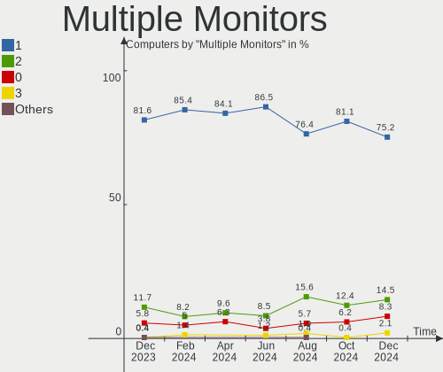

Zorin - Hardware Trends
-----------------------

A project to identify most popular hardware characteristics and track their change
over time based on data collected by Linux users at https://Linux-Hardware.org.

Anyone can contribute to this report by the [hw-probe](https://github.com/linuxhw/hw-probe) tool:

    sudo -E hw-probe -all -upload

This is a report for all computer types. See also reports for [desktops](/Dist/Zorin/Desktop/README.md) and [notebooks](/Dist/Zorin/Notebook/README.md).

This report is for one last month. Overall report since the beginning of time: [TestCoverage](https://github.com/linuxhw/TestCoverage)

Period: Dec, 2022.

Contents
--------

* [ System ](#system)
  - [ OS                       ](#os)
  - [ OS Family                ](#os-family)
  - [ Kernel                   ](#kernel)
  - [ Kernel Family            ](#kernel-family)
  - [ Kernel Major Ver.        ](#kernel-major-ver)
  - [ Arch                     ](#arch)
  - [ DE                       ](#de)
  - [ Display Server           ](#display-server)
  - [ Display Manager          ](#display-manager)
  - [ OS Lang                  ](#os-lang)
  - [ Boot Mode                ](#boot-mode)
  - [ Filesystem               ](#filesystem)
  - [ Part. scheme             ](#part-scheme)
  - [ Dual Boot with Linux/BSD ](#dual-boot-with-linuxbsd)
  - [ Dual Boot (Win)          ](#dual-boot-win)

* [ Board ](#board)
  - [ Vendor                   ](#vendor)
  - [ Model                    ](#model)
  - [ Model Family             ](#model-family)
  - [ MFG Year                 ](#mfg-year)
  - [ Form Factor              ](#form-factor)
  - [ Secure Boot              ](#secure-boot)
  - [ Coreboot                 ](#coreboot)
  - [ RAM Size                 ](#ram-size)
  - [ RAM Used                 ](#ram-used)
  - [ Total Drives             ](#total-drives)
  - [ Has CD-ROM               ](#has-cd-rom)
  - [ Has Ethernet             ](#has-ethernet)
  - [ Has WiFi                 ](#has-wifi)
  - [ Has Bluetooth            ](#has-bluetooth)

* [ Location ](#location)
  - [ Country                  ](#country)
  - [ City                     ](#city)

* [ Drives ](#drives)
  - [ Drive Vendor             ](#drive-vendor)
  - [ Drive Model              ](#drive-model)
  - [ HDD Vendor               ](#hdd-vendor)
  - [ SSD Vendor               ](#ssd-vendor)
  - [ Drive Kind               ](#drive-kind)
  - [ Drive Connector          ](#drive-connector)
  - [ Drive Size               ](#drive-size)
  - [ Space Total              ](#space-total)
  - [ Space Used               ](#space-used)
  - [ Malfunc. Drives          ](#malfunc-drives)
  - [ Malfunc. Drive Vendor    ](#malfunc-drive-vendor)
  - [ Malfunc. HDD Vendor      ](#malfunc-hdd-vendor)
  - [ Malfunc. Drive Kind      ](#malfunc-drive-kind)
  - [ Failed Drives            ](#failed-drives)
  - [ Failed Drive Vendor      ](#failed-drive-vendor)
  - [ Drive Status             ](#drive-status)

* [ Storage controller ](#storage-controller)
  - [ Storage Vendor           ](#storage-vendor)
  - [ Storage Model            ](#storage-model)
  - [ Storage Kind             ](#storage-kind)

* [ Processor ](#processor)
  - [ CPU Vendor               ](#cpu-vendor)
  - [ CPU Model                ](#cpu-model)
  - [ CPU Model Family         ](#cpu-model-family)
  - [ CPU Cores                ](#cpu-cores)
  - [ CPU Sockets              ](#cpu-sockets)
  - [ CPU Threads              ](#cpu-threads)
  - [ CPU Op-Modes             ](#cpu-op-modes)
  - [ CPU Microcode            ](#cpu-microcode)
  - [ CPU Microarch            ](#cpu-microarch)

* [ Graphics ](#graphics)
  - [ GPU Vendor               ](#gpu-vendor)
  - [ GPU Model                ](#gpu-model)
  - [ GPU Combo                ](#gpu-combo)
  - [ GPU Driver               ](#gpu-driver)
  - [ GPU Memory               ](#gpu-memory)

* [ Monitor ](#monitor)
  - [ Monitor Vendor           ](#monitor-vendor)
  - [ Monitor Model            ](#monitor-model)
  - [ Monitor Resolution       ](#monitor-resolution)
  - [ Monitor Diagonal         ](#monitor-diagonal)
  - [ Monitor Width            ](#monitor-width)
  - [ Aspect Ratio             ](#aspect-ratio)
  - [ Monitor Area             ](#monitor-area)
  - [ Pixel Density            ](#pixel-density)
  - [ Multiple Monitors        ](#multiple-monitors)

* [ Network ](#network)
  - [ Net Controller Vendor    ](#net-controller-vendor)
  - [ Net Controller Model     ](#net-controller-model)
  - [ Wireless Vendor          ](#wireless-vendor)
  - [ Wireless Model           ](#wireless-model)
  - [ Ethernet Vendor          ](#ethernet-vendor)
  - [ Ethernet Model           ](#ethernet-model)
  - [ Net Controller Kind      ](#net-controller-kind)
  - [ Used Controller          ](#used-controller)
  - [ NICs                     ](#nics)
  - [ IPv6                     ](#ipv6)

* [ Bluetooth ](#bluetooth)
  - [ Bluetooth Vendor         ](#bluetooth-vendor)
  - [ Bluetooth Model          ](#bluetooth-model)

* [ Sound ](#sound)
  - [ Sound Vendor             ](#sound-vendor)
  - [ Sound Model              ](#sound-model)

* [ Memory ](#memory)
  - [ Memory Vendor            ](#memory-vendor)
  - [ Memory Model             ](#memory-model)
  - [ Memory Kind              ](#memory-kind)
  - [ Memory Form Factor       ](#memory-form-factor)
  - [ Memory Size              ](#memory-size)
  - [ Memory Speed             ](#memory-speed)

* [ Printers & scanners ](#printers--scanners)
  - [ Printer Vendor           ](#printer-vendor)
  - [ Printer Model            ](#printer-model)
  - [ Scanner Vendor           ](#scanner-vendor)
  - [ Scanner Model            ](#scanner-model)

* [ Camera ](#camera)
  - [ Camera Vendor            ](#camera-vendor)
  - [ Camera Model             ](#camera-model)

* [ Security ](#security)
  - [ Fingerprint Vendor       ](#fingerprint-vendor)
  - [ Fingerprint Model        ](#fingerprint-model)
  - [ Chipcard Vendor          ](#chipcard-vendor)
  - [ Chipcard Model           ](#chipcard-model)

* [ Unsupported ](#unsupported)
  - [ Unsupported Devices      ](#unsupported-devices)
  - [ Unsupported Device Types ](#unsupported-device-types)

System
------

OS
--

Installed operating systems

| Name     | Computers | Percent |
|----------|-----------|---------|
| Zorin 16 | 181       | 95.77%  |
| Zorin 15 | 7         | 3.7%    |
| Zorin 12 | 1         | 0.53%   |

OS Family
---------

OS without a version

| Name  | Computers | Percent |
|-------|-----------|---------|
| Zorin | 189       | 100%    |

Kernel
------

Version of the Linux kernel

| Version                | Computers | Percent |
|------------------------|-----------|---------|
| 5.15.0-56-generic      | 150       | 79.37%  |
| 5.15.0-53-generic      | 15        | 7.94%   |
| 5.15.0-52-generic      | 7         | 3.7%    |
| 5.4.0-135-generic      | 6         | 3.17%   |
| 5.15.0-48-generic      | 2         | 1.06%   |
| 5.13.0-30-generic      | 2         | 1.06%   |
| 5.4.0-42-generic       | 1         | 0.53%   |
| 5.19.12-051912-generic | 1         | 0.53%   |
| 5.15.0-43-generic      | 1         | 0.53%   |
| 5.15.0-41-generic      | 1         | 0.53%   |
| 5.13.0-48-generic      | 1         | 0.53%   |
| 5.13.0-35-generic      | 1         | 0.53%   |
| 4.15.0-142-generic     | 1         | 0.53%   |

Kernel Family
-------------

Linux kernel without a distro release

| Version | Computers | Percent |
|---------|-----------|---------|
| 5.15.0  | 176       | 93.12%  |
| 5.4.0   | 7         | 3.7%    |
| 5.13.0  | 4         | 2.12%   |
| 5.19.12 | 1         | 0.53%   |
| 4.15.0  | 1         | 0.53%   |

Kernel Major Ver.
-----------------

Linux kernel major version

| Version | Computers | Percent |
|---------|-----------|---------|
| 5.15    | 176       | 93.12%  |
| 5.4     | 7         | 3.7%    |
| 5.13    | 4         | 2.12%   |
| 5.19    | 1         | 0.53%   |
| 4.15    | 1         | 0.53%   |

Arch
----

OS architecture (x86_64, i586, etc.)

| Name   | Computers | Percent |
|--------|-----------|---------|
| x86_64 | 187       | 98.94%  |
| i686   | 2         | 1.06%   |

DE
--

Desktop Environment

| Name    | Computers | Percent |
|---------|-----------|---------|
| GNOME   | 158       | 83.6%   |
| XFCE    | 27        | 14.29%  |
| Unknown | 2         | 1.06%   |
| LXDE    | 1         | 0.53%   |
| Budgie  | 1         | 0.53%   |

Display Server
--------------

X11 or Wayland

| Name    | Computers | Percent |
|---------|-----------|---------|
| X11     | 182       | 96.3%   |
| Wayland | 6         | 3.17%   |
| Unknown | 1         | 0.53%   |

Display Manager
---------------

SDDM, LightDM, etc.

| Name    | Computers | Percent |
|---------|-----------|---------|
| Unknown | 145       | 76.72%  |
| GDM     | 22        | 11.64%  |
| GDM3    | 14        | 7.41%   |
| LightDM | 7         | 3.7%    |
| LXDM    | 1         | 0.53%   |

OS Lang
-------

Language

| Lang  | Computers | Percent |
|-------|-----------|---------|
| en_US | 79        | 41.8%   |
| de_DE | 22        | 11.64%  |
| pt_BR | 10        | 5.29%   |
| en_GB | 9         | 4.76%   |
| it_IT | 7         | 3.7%    |
| fr_FR | 7         | 3.7%    |
| es_ES | 7         | 3.7%    |
| ru_RU | 6         | 3.17%   |
| en_CA | 5         | 2.65%   |
| en_AU | 5         | 2.65%   |
| pl_PL | 4         | 2.12%   |
| nl_BE | 3         | 1.59%   |
| ja_JP | 3         | 1.59%   |
| hu_HU | 3         | 1.59%   |
| en_IN | 3         | 1.59%   |
| en_NG | 2         | 1.06%   |
| ca_ES | 2         | 1.06%   |
| sv_SE | 1         | 0.53%   |
| sk_SK | 1         | 0.53%   |
| ro_RO | 1         | 0.53%   |
| pt_PT | 1         | 0.53%   |
| nl_NL | 1         | 0.53%   |
| nb_NO | 1         | 0.53%   |
| es_MX | 1         | 0.53%   |
| es_CO | 1         | 0.53%   |
| en_ZA | 1         | 0.53%   |
| en_NZ | 1         | 0.53%   |
| da_DK | 1         | 0.53%   |
| cs_CZ | 1         | 0.53%   |

Boot Mode
---------

EFI or BIOS

| Mode | Computers | Percent |
|------|-----------|---------|
| EFI  | 112       | 59.26%  |
| BIOS | 77        | 40.74%  |

Filesystem
----------

Type of filesystem

| Type    | Computers | Percent |
|---------|-----------|---------|
| Ext4    | 178       | 94.18%  |
| Overlay | 6         | 3.17%   |
| Zfs     | 4         | 2.12%   |
| Ext2    | 1         | 0.53%   |

Part. scheme
------------

Scheme of partitioning

| Type    | Computers | Percent |
|---------|-----------|---------|
| Unknown | 146       | 77.25%  |
| GPT     | 30        | 15.87%  |
| MBR     | 13        | 6.88%   |

Dual Boot with Linux/BSD
------------------------

Hosting more than one Linux/BSD

| Dual boot | Computers | Percent |
|-----------|-----------|---------|
| No        | 184       | 97.35%  |
| Yes       | 5         | 2.65%   |

Dual Boot (Win)
---------------

Hosting Linux and Windows

| Dual boot | Computers | Percent |
|-----------|-----------|---------|
| No        | 167       | 88.36%  |
| Yes       | 22        | 11.64%  |

Board
-----

Vendor
------

Motherboard manufacturer

| Name                | Computers | Percent |
|---------------------|-----------|---------|
| Lenovo              | 31        | 16.4%   |
| Hewlett-Packard     | 28        | 14.81%  |
| Dell                | 23        | 12.17%  |
| ASUSTek Computer    | 22        | 11.64%  |
| MSI                 | 13        | 6.88%   |
| Gigabyte Technology | 9         | 4.76%   |
| Apple               | 8         | 4.23%   |
| ASRock              | 6         | 3.17%   |
| Toshiba             | 5         | 2.65%   |
| Sony                | 4         | 2.12%   |
| Acer                | 4         | 2.12%   |
| Intel               | 3         | 1.59%   |
| Biostar             | 3         | 1.59%   |
| AZW                 | 3         | 1.59%   |
| Samsung Electronics | 2         | 1.06%   |
| PCWare              | 2         | 1.06%   |
| Packard Bell        | 2         | 1.06%   |
| GPU Company         | 2         | 1.06%   |
| Fujitsu             | 2         | 1.06%   |
| NZXT                | 1         | 0.53%   |
| Microsoft           | 1         | 0.53%   |
| MACHINIST           | 1         | 0.53%   |
| Machcreator         | 1         | 0.53%   |
| Jumper              | 1         | 0.53%   |
| IP3 Tech            | 1         | 0.53%   |
| HUAWEI              | 1         | 0.53%   |
| HOUTER              | 1         | 0.53%   |
| Hampoo              | 1         | 0.53%   |
| GPD                 | 1         | 0.53%   |
| Google              | 1         | 0.53%   |
| Fusion5             | 1         | 0.53%   |
| Foxconn             | 1         | 0.53%   |
| ECS                 | 1         | 0.53%   |
| Chuwi               | 1         | 0.53%   |
| Alienware           | 1         | 0.53%   |
| Unknown             | 1         | 0.53%   |

Model
-----

Motherboard model

| Name                                       | Computers | Percent |
|--------------------------------------------|-----------|---------|
| Lenovo IdeaPad 3 15ITL6 82H8               | 2         | 1.06%   |
| GPU Company GWTC116-2                      | 2         | 1.06%   |
| Dell OptiPlex 3010                         | 2         | 1.06%   |
| Dell Latitude E6540                        | 2         | 1.06%   |
| AZW GTR                                    | 2         | 1.06%   |
| Toshiba Satellite P500                     | 1         | 0.53%   |
| Toshiba Satellite L855                     | 1         | 0.53%   |
| Toshiba Satellite L500                     | 1         | 0.53%   |
| Toshiba Satellite C870-1C2                 | 1         | 0.53%   |
| Toshiba Satellite C50-B                    | 1         | 0.53%   |
| Sony VPCEB2M1E                             | 1         | 0.53%   |
| Sony VPCEB1M1E                             | 1         | 0.53%   |
| Sony VJZ13A                                | 1         | 0.53%   |
| Sony VGN-NR32M_S                           | 1         | 0.53%   |
| Samsung 305E4A/305E5A/305E7A               | 1         | 0.53%   |
| Samsung 300V3A/300V4A/300V5A/200A4B/200A5B | 1         | 0.53%   |
| PCWare IPMH61R1                            | 1         | 0.53%   |
| PCWare IPMH310 PRO 2.0                     | 1         | 0.53%   |
| Packard Bell EasyNote TK85                 | 1         | 0.53%   |
| Packard Bell EasyNote TE11BZ               | 1         | 0.53%   |
| NZXT N7 Z590                               | 1         | 0.53%   |
| MSI Vig625M                                | 1         | 0.53%   |
| MSI MS-7C75                                | 1         | 0.53%   |
| MSI MS-7C37                                | 1         | 0.53%   |
| MSI MS-7B89                                | 1         | 0.53%   |
| MSI MS-7885                                | 1         | 0.53%   |
| MSI MS-7758                                | 1         | 0.53%   |
| MSI MS-7680                                | 1         | 0.53%   |
| MSI MS-7376                                | 1         | 0.53%   |
| MSI MS-1035                                | 1         | 0.53%   |
| MSI GS73VR 7RF                             | 1         | 0.53%   |
| MSI GP75 Leopard 10SEK                     | 1         | 0.53%   |
| MSI GF63 Thin 10SC                         | 1         | 0.53%   |
| MSI B250 Gaming Nightblade MIB (MS-B090)   | 1         | 0.53%   |
| Microsoft Surface Pro                      | 1         | 0.53%   |
| MACHINIST E5-MR9A PRO V1.0                 | 1         | 0.53%   |
| Machcreator 14                             | 1         | 0.53%   |
| Lenovo Yoga 7 14ACN6 82N7                  | 1         | 0.53%   |
| Lenovo Yoga 6 13ALC7 82UD                  | 1         | 0.53%   |
| Lenovo Yoga 300-11IBR 80M1                 | 1         | 0.53%   |

Model Family
------------

Motherboard model prefix

| Name                  | Computers | Percent |
|-----------------------|-----------|---------|
| Lenovo ThinkPad       | 10        | 5.29%   |
| Lenovo IdeaPad        | 7         | 3.7%    |
| HP Pavilion           | 7         | 3.7%    |
| Dell Latitude         | 7         | 3.7%    |
| Dell Inspiron         | 7         | 3.7%    |
| Toshiba Satellite     | 5         | 2.65%   |
| Lenovo ThinkCentre    | 5         | 2.65%   |
| Lenovo Yoga           | 4         | 2.12%   |
| Dell OptiPlex         | 4         | 2.12%   |
| Acer Aspire           | 4         | 2.12%   |
| HP Laptop             | 3         | 1.59%   |
| HP Compaq             | 3         | 1.59%   |
| Dell XPS              | 3         | 1.59%   |
| ASUS VivoBook         | 3         | 1.59%   |
| ASUS ROG              | 3         | 1.59%   |
| Packard Bell EasyNote | 2         | 1.06%   |
| HP EliteBook          | 2         | 1.06%   |
| GPU Company GWTC116-2 | 2         | 1.06%   |
| Fujitsu ESPRIMO       | 2         | 1.06%   |
| Dell Studio           | 2         | 1.06%   |
| AZW GTR               | 2         | 1.06%   |
| ASUS TUF              | 2         | 1.06%   |
| ASUS PRIME            | 2         | 1.06%   |
| Sony VPCEB2M1E        | 1         | 0.53%   |
| Sony VPCEB1M1E        | 1         | 0.53%   |
| Sony VJZ13A           | 1         | 0.53%   |
| Sony VGN-NR32M        | 1         | 0.53%   |
| Samsung 305E4A        | 1         | 0.53%   |
| Samsung 300V3A        | 1         | 0.53%   |
| PCWare IPMH61R1       | 1         | 0.53%   |
| PCWare IPMH310        | 1         | 0.53%   |
| NZXT N7               | 1         | 0.53%   |
| MSI Vig625M           | 1         | 0.53%   |
| MSI MS-7C75           | 1         | 0.53%   |
| MSI MS-7C37           | 1         | 0.53%   |
| MSI MS-7B89           | 1         | 0.53%   |
| MSI MS-7885           | 1         | 0.53%   |
| MSI MS-7758           | 1         | 0.53%   |
| MSI MS-7680           | 1         | 0.53%   |
| MSI MS-7376           | 1         | 0.53%   |

MFG Year
--------

Motherboard manufacture year

| Year | Computers | Percent |
|------|-----------|---------|
| 2021 | 27        | 14.29%  |
| 2012 | 18        | 9.52%   |
| 2018 | 17        | 8.99%   |
| 2010 | 17        | 8.99%   |
| 2013 | 14        | 7.41%   |
| 2011 | 14        | 7.41%   |
| 2008 | 12        | 6.35%   |
| 2017 | 11        | 5.82%   |
| 2019 | 10        | 5.29%   |
| 2015 | 10        | 5.29%   |
| 2020 | 8         | 4.23%   |
| 2014 | 8         | 4.23%   |
| 2022 | 7         | 3.7%    |
| 2016 | 7         | 3.7%    |
| 2009 | 5         | 2.65%   |
| 2005 | 2         | 1.06%   |
| 2007 | 1         | 0.53%   |
| 2006 | 1         | 0.53%   |

Form Factor
-----------

Physical design of the computer

| Name        | Computers | Percent |
|-------------|-----------|---------|
| Notebook    | 93        | 49.21%  |
| Desktop     | 74        | 39.15%  |
| Convertible | 6         | 3.17%   |
| Mini pc     | 6         | 3.17%   |
| All in one  | 6         | 3.17%   |
| Tablet      | 4         | 2.12%   |

Secure Boot
-----------

Enabled or disabled

| State    | Computers | Percent |
|----------|-----------|---------|
| Disabled | 168       | 88.89%  |
| Enabled  | 21        | 11.11%  |

Coreboot
--------

Have coreboot on board

| Used | Computers | Percent |
|------|-----------|---------|
| No   | 188       | 99.47%  |
| Yes  | 1         | 0.53%   |

RAM Size
--------

Total RAM memory

| Size in GB  | Computers | Percent |
|-------------|-----------|---------|
| 4.01-8.0    | 50        | 26.46%  |
| 3.01-4.0    | 48        | 25.4%   |
| 16.01-24.0  | 34        | 17.99%  |
| 8.01-16.0   | 26        | 13.76%  |
| 32.01-64.0  | 16        | 8.47%   |
| 1.01-2.0    | 6         | 3.17%   |
| 64.01-256.0 | 4         | 2.12%   |
| 2.01-3.0    | 3         | 1.59%   |
| 24.01-32.0  | 2         | 1.06%   |

RAM Used
--------

Used RAM memory

| Used GB    | Computers | Percent |
|------------|-----------|---------|
| 1.01-2.0   | 70        | 37.04%  |
| 2.01-3.0   | 51        | 26.98%  |
| 3.01-4.0   | 28        | 14.81%  |
| 4.01-8.0   | 25        | 13.23%  |
| 0.51-1.0   | 7         | 3.7%    |
| 8.01-16.0  | 5         | 2.65%   |
| 16.01-24.0 | 2         | 1.06%   |
| 32.01-64.0 | 1         | 0.53%   |

Total Drives
------------

Number of drives on board

| Drives | Computers | Percent |
|--------|-----------|---------|
| 1      | 121       | 64.02%  |
| 2      | 48        | 25.4%   |
| 3      | 8         | 4.23%   |
| 4      | 6         | 3.17%   |
| 6      | 3         | 1.59%   |
| 5      | 2         | 1.06%   |
| 8      | 1         | 0.53%   |

Has CD-ROM
----------

Has CD-ROM on board

| Presented | Computers | Percent |
|-----------|-----------|---------|
| No        | 112       | 59.26%  |
| Yes       | 77        | 40.74%  |

Has Ethernet
------------

Has Ethernet on board

| Presented | Computers | Percent |
|-----------|-----------|---------|
| Yes       | 157       | 83.07%  |
| No        | 32        | 16.93%  |

Has WiFi
--------

Has WiFi module

| Presented | Computers | Percent |
|-----------|-----------|---------|
| Yes       | 146       | 77.25%  |
| No        | 43        | 22.75%  |

Has Bluetooth
-------------

Has Bluetooth module

| Presented | Computers | Percent |
|-----------|-----------|---------|
| Yes       | 108       | 57.14%  |
| No        | 81        | 42.86%  |

Location
--------

Country
-------

Geographic location (country)

| Country            | Computers | Percent |
|--------------------|-----------|---------|
| USA                | 49        | 25.93%  |
| Germany            | 24        | 12.7%   |
| Brazil             | 13        | 6.88%   |
| UK                 | 10        | 5.29%   |
| Spain              | 10        | 5.29%   |
| Italy              | 7         | 3.7%    |
| France             | 7         | 3.7%    |
| Russia             | 5         | 2.65%   |
| Canada             | 5         | 2.65%   |
| Netherlands        | 4         | 2.12%   |
| Belgium            | 4         | 2.12%   |
| Australia          | 4         | 2.12%   |
| Slovakia           | 3         | 1.59%   |
| Japan              | 3         | 1.59%   |
| Indonesia          | 3         | 1.59%   |
| India              | 3         | 1.59%   |
| Hungary            | 3         | 1.59%   |
| Romania            | 2         | 1.06%   |
| Portugal           | 2         | 1.06%   |
| Poland             | 2         | 1.06%   |
| Nigeria            | 2         | 1.06%   |
| Mexico             | 2         | 1.06%   |
| Greece             | 2         | 1.06%   |
| Finland            | 2         | 1.06%   |
| Vietnam            | 1         | 0.53%   |
| Venezuela          | 1         | 0.53%   |
| UAE                | 1         | 0.53%   |
| Sweden             | 1         | 0.53%   |
| South Africa       | 1         | 0.53%   |
| Saudi Arabia       | 1         | 0.53%   |
| Philippines        | 1         | 0.53%   |
| Norway             | 1         | 0.53%   |
| New Zealand        | 1         | 0.53%   |
| Monaco             | 1         | 0.53%   |
| Egypt              | 1         | 0.53%   |
| Dominican Republic | 1         | 0.53%   |
| Denmark            | 1         | 0.53%   |
| Czechia            | 1         | 0.53%   |
| Colombia           | 1         | 0.53%   |
| Bulgaria           | 1         | 0.53%   |

City
----

Geographic location (city)

| City                 | Computers | Percent |
|----------------------|-----------|---------|
| Phoenix              | 4         | 2.12%   |
| Berlin               | 4         | 2.12%   |
| Madrid               | 3         | 1.59%   |
| Toronto              | 2         | 1.06%   |
| Shibata              | 2         | 1.06%   |
| Perth                | 2         | 1.06%   |
| Munich               | 2         | 1.06%   |
| Moscow               | 2         | 1.06%   |
| Milan                | 2         | 1.06%   |
| Manitowoc            | 2         | 1.06%   |
| Lorena               | 2         | 1.06%   |
| London               | 2         | 1.06%   |
| Lisbon               | 2         | 1.06%   |
| Falls Church         | 2         | 1.06%   |
| Zvolen               | 1         | 0.53%   |
| Wrexham              | 1         | 0.53%   |
| Woldegk              | 1         | 0.53%   |
| Wismar               | 1         | 0.53%   |
| West Valley          | 1         | 0.53%   |
| Wesley Chapel        | 1         | 0.53%   |
| Wernigerode          | 1         | 0.53%   |
| Warwick              | 1         | 0.53%   |
| Wake Forest          | 1         | 0.53%   |
| Waalwijk             | 1         | 0.53%   |
| Vincentown           | 1         | 0.53%   |
| Vejle                | 1         | 0.53%   |
| Valladolid           | 1         | 0.53%   |
| Uelzen               | 1         | 0.53%   |
| Tyumen               | 1         | 0.53%   |
| Tucson               | 1         | 0.53%   |
| Tsuchihashi          | 1         | 0.53%   |
| Trostberg an der Alz | 1         | 0.53%   |
| Topoľčany          | 1         | 0.53%   |
| Sydney               | 1         | 0.53%   |
| Susegana             | 1         | 0.53%   |
| Surabaya             | 1         | 0.53%   |
| Springdale           | 1         | 0.53%   |
| Sofia                | 1         | 0.53%   |
| Smizany              | 1         | 0.53%   |
| Severinia            | 1         | 0.53%   |

Drives
------

Drive Vendor
------------

Hard drive vendors

| Vendor                      | Computers | Drives | Percent |
|-----------------------------|-----------|--------|---------|
| Samsung Electronics         | 48        | 52     | 17.65%  |
| WDC                         | 38        | 42     | 13.97%  |
| Seagate                     | 29        | 39     | 10.66%  |
| Kingston                    | 18        | 23     | 6.62%   |
| Toshiba                     | 16        | 16     | 5.88%   |
| Unknown                     | 15        | 17     | 5.51%   |
| SanDisk                     | 15        | 16     | 5.51%   |
| Hitachi                     | 9         | 10     | 3.31%   |
| Intel                       | 8         | 10     | 2.94%   |
| Crucial                     | 8         | 9      | 2.94%   |
| SK hynix                    | 4         | 4      | 1.47%   |
| Phison Electronics          | 4         | 4      | 1.47%   |
| Netac                       | 4         | 5      | 1.47%   |
| HGST                        | 4         | 4      | 1.47%   |
| China                       | 4         | 4      | 1.47%   |
| Kingston Technology Company | 3         | 3      | 1.1%    |
| A-DATA Technology           | 3         | 3      | 1.1%    |
| Union Memory                | 2         | 2      | 0.74%   |
| Micron Technology           | 2         | 2      | 0.74%   |
| Maxtor                      | 2         | 2      | 0.74%   |
| LITEON                      | 2         | 2      | 0.74%   |
| KIOXIA                      | 2         | 2      | 0.74%   |
| KingSpec                    | 2         | 2      | 0.74%   |
| Apple                       | 2         | 2      | 0.74%   |
| ZOTAC                       | 1         | 1      | 0.37%   |
| UMIS                        | 1         | 1      | 0.37%   |
| Transcend                   | 1         | 1      | 0.37%   |
| SSSTC                       | 1         | 1      | 0.37%   |
| Silicon Motion              | 1         | 1      | 0.37%   |
| SAM                         | 1         | 1      | 0.37%   |
| PNY                         | 1         | 1      | 0.37%   |
| Phison                      | 1         | 1      | 0.37%   |
| Patriot                     | 1         | 1      | 0.37%   |
| OCZ-VERTEX3                 | 1         | 1      | 0.37%   |
| NGFF                        | 1         | 1      | 0.37%   |
| Micron/Crucial Technology   | 1         | 1      | 0.37%   |
| Mercury                     | 1         | 1      | 0.37%   |
| LITEONIT                    | 1         | 1      | 0.37%   |
| Lite-On Technology          | 1         | 1      | 0.37%   |
| LDLC                        | 1         | 1      | 0.37%   |

Drive Model
-----------

Hard drive models

| Model                                               | Computers | Percent |
|-----------------------------------------------------|-----------|---------|
| Samsung NVMe SSD Controller SM981/PM981/PM983 500GB | 7         | 2.39%   |
| Kingston SA400S37480G 480GB SSD                     | 5         | 1.71%   |
| Kingston SA400S37240G 240GB SSD                     | 5         | 1.71%   |
| Unknown MMC Card  32GB                              | 4         | 1.37%   |
| Seagate ST500LT012-1DG142 500GB                     | 4         | 1.37%   |
| Unknown SD/MMC/MS PRO 64GB                          | 3         | 1.02%   |
| Unknown MMC Card  64GB                              | 3         | 1.02%   |
| Toshiba HDWD110 1TB                                 | 3         | 1.02%   |
| Seagate ST500DM002-1BD142 500GB                     | 3         | 1.02%   |
| Samsung SSD 870 QVO 1TB                             | 3         | 1.02%   |
| Samsung SSD 870 EVO 1TB                             | 3         | 1.02%   |
| Samsung NVMe SSD Controller PM9A1/PM9A3/980PRO 2TB  | 3         | 1.02%   |
| Phison E12 NVMe Controller 1TB                      | 3         | 1.02%   |
| Crucial CT250MX500SSD1 250GB                        | 3         | 1.02%   |
| WDC WD5000LPCX-24VHAT0 500GB                        | 2         | 0.68%   |
| WDC WD400JD-19MSA1 40GB                             | 2         | 0.68%   |
| WDC WD10EZEX-22MFCA0 1TB                            | 2         | 0.68%   |
| Unknown MMC Card  128GB                             | 2         | 0.68%   |
| Toshiba MQ01ABD100 1TB                              | 2         | 0.68%   |
| Seagate ST4000DM000-2AE166 4TB                      | 2         | 0.68%   |
| Seagate ST2000DM001-1ER164 2TB                      | 2         | 0.68%   |
| Seagate ST1000DM010-2EP102 1TB                      | 2         | 0.68%   |
| Seagate ST1000DM003-1SB102 1TB                      | 2         | 0.68%   |
| SanDisk SSD PLUS 1000GB                             | 2         | 0.68%   |
| SanDisk Extreme SSD 500GB                           | 2         | 0.68%   |
| Samsung SSD 850 EVO 500GB                           | 2         | 0.68%   |
| Samsung SSD 840 EVO 250GB                           | 2         | 0.68%   |
| Samsung SSD 750 EVO 500GB                           | 2         | 0.68%   |
| Samsung NVMe SSD Controller SM961/PM961/SM963 256GB | 2         | 0.68%   |
| Kingston Company U-SNS8154P3 NVMe SSD 512GB         | 2         | 0.68%   |
| Kingston SUV400S37120G 120GB SSD                    | 2         | 0.68%   |
| Intel HBRPEKNX0202AO 32GB                           | 2         | 0.68%   |
| Intel HBRPEKNX0202A 512GB                           | 2         | 0.68%   |
| ZOTAC ZTSSD-A3C-128G                                | 1         | 0.34%   |
| WDC WDS120G2G0A-00JH30 120GB SSD                    | 1         | 0.34%   |
| WDC WD7500BPVX-22JC3T0 752GB                        | 1         | 0.34%   |
| WDC WD6401AALS-00L3B2 640GB                         | 1         | 0.34%   |
| WDC WD6400BEVT-22A0RT0 640GB                        | 1         | 0.34%   |
| WDC WD5003ABYX-01WERA1 500GB                        | 1         | 0.34%   |
| WDC WD5000LPVX-75V0TT0 500GB                        | 1         | 0.34%   |

HDD Vendor
----------

Hard disk drive vendors

| Vendor              | Computers | Drives | Percent |
|---------------------|-----------|--------|---------|
| WDC                 | 37        | 41     | 33.64%  |
| Seagate             | 29        | 39     | 26.36%  |
| Toshiba             | 13        | 13     | 11.82%  |
| Samsung Electronics | 10        | 10     | 9.09%   |
| Hitachi             | 9         | 10     | 8.18%   |
| HGST                | 4         | 4      | 3.64%   |
| Unknown             | 3         | 3      | 2.73%   |
| Maxtor              | 2         | 2      | 1.82%   |
| JMicron Technology  | 1         | 1      | 0.91%   |
| Fujitsu             | 1         | 1      | 0.91%   |
| Apple               | 1         | 1      | 0.91%   |

SSD Vendor
----------

Solid state drive vendors

| Vendor              | Computers | Drives | Percent |
|---------------------|-----------|--------|---------|
| Samsung Electronics | 22        | 24     | 23.91%  |
| Kingston            | 15        | 18     | 16.3%   |
| SanDisk             | 12        | 13     | 13.04%  |
| Crucial             | 7         | 8      | 7.61%   |
| Netac               | 4         | 4      | 4.35%   |
| China               | 4         | 4      | 4.35%   |
| Intel               | 3         | 3      | 3.26%   |
| A-DATA Technology   | 3         | 3      | 3.26%   |
| Micron Technology   | 2         | 2      | 2.17%   |
| LITEON              | 2         | 2      | 2.17%   |
| ZOTAC               | 1         | 1      | 1.09%   |
| WDC                 | 1         | 1      | 1.09%   |
| Transcend           | 1         | 1      | 1.09%   |
| Toshiba             | 1         | 1      | 1.09%   |
| SAM                 | 1         | 1      | 1.09%   |
| PNY                 | 1         | 1      | 1.09%   |
| Phison              | 1         | 1      | 1.09%   |
| Patriot             | 1         | 1      | 1.09%   |
| OCZ-VERTEX3         | 1         | 1      | 1.09%   |
| NGFF                | 1         | 1      | 1.09%   |
| Mercury             | 1         | 1      | 1.09%   |
| LITEONIT            | 1         | 1      | 1.09%   |
| LDLC                | 1         | 1      | 1.09%   |
| KingSpec            | 1         | 1      | 1.09%   |
| HS-SSD-C100         | 1         | 1      | 1.09%   |
| Apple               | 1         | 1      | 1.09%   |
| Apacer              | 1         | 1      | 1.09%   |
| Unknown             | 1         | 1      | 1.09%   |

Drive Kind
----------

HDD or SSD

| Kind    | Computers | Drives | Percent |
|---------|-----------|--------|---------|
| HDD     | 92        | 125    | 37.25%  |
| SSD     | 84        | 99     | 34.01%  |
| NVMe    | 53        | 60     | 21.46%  |
| MMC     | 13        | 14     | 5.26%   |
| Unknown | 5         | 5      | 2.02%   |

Drive Connector
---------------

SATA, SAS, NVMe, etc.

| Type | Computers | Drives | Percent |
|------|-----------|--------|---------|
| SATA | 146       | 215    | 65.18%  |
| NVMe | 53        | 60     | 23.66%  |
| MMC  | 13        | 14     | 5.8%    |
| SAS  | 12        | 14     | 5.36%   |

Drive Size
----------

Size of hard drive

| Size in TB | Computers | Drives | Percent |
|------------|-----------|--------|---------|
| 0.01-0.5   | 119       | 144    | 65.38%  |
| 0.51-1.0   | 44        | 56     | 24.18%  |
| 1.01-2.0   | 11        | 12     | 6.04%   |
| 3.01-4.0   | 3         | 3      | 1.65%   |
| 2.01-3.0   | 2         | 2      | 1.1%    |
| 4.01-10.0  | 2         | 3      | 1.1%    |
| 10.01-20.0 | 1         | 4      | 0.55%   |

Space Total
-----------

Amount of disk space available on the file system

| Size in GB     | Computers | Percent |
|----------------|-----------|---------|
| 101-250        | 63        | 33.33%  |
| 251-500        | 55        | 29.1%   |
| 501-1000       | 25        | 13.23%  |
| 51-100         | 12        | 6.35%   |
| 21-50          | 11        | 5.82%   |
| 1001-2000      | 11        | 5.82%   |
| More than 3000 | 6         | 3.17%   |
| 1-20           | 3         | 1.59%   |
| 2001-3000      | 2         | 1.06%   |
| Unknown        | 1         | 0.53%   |

Space Used
----------

Amount of used disk space

| Used GB        | Computers | Percent |
|----------------|-----------|---------|
| 21-50          | 65        | 34.39%  |
| 1-20           | 53        | 28.04%  |
| 101-250        | 29        | 15.34%  |
| 51-100         | 22        | 11.64%  |
| 251-500        | 10        | 5.29%   |
| More than 3000 | 4         | 2.12%   |
| 501-1000       | 4         | 2.12%   |
| 1001-2000      | 1         | 0.53%   |
| Unknown        | 1         | 0.53%   |

Malfunc. Drives
---------------

Drive models with a malfunction

| Model                                            | Computers | Drives | Percent |
|--------------------------------------------------|-----------|--------|---------|
| Seagate ST8000DM004-2CX188 8TB                   | 1         | 1      | 12.5%   |
| Seagate ST500LT012-1DG142 500GB                  | 1         | 1      | 12.5%   |
| Samsung Electronics MZHPV256HDGL-00000 256GB SSD | 1         | 1      | 12.5%   |
| Samsung Electronics HD154UI 1TB                  | 1         | 1      | 12.5%   |
| Kingston SUV400S37240G 240GB SSD                 | 1         | 1      | 12.5%   |
| Hitachi HTS542516K9SA00 160GB                    | 1         | 1      | 12.5%   |
| HGST HTS545050A7E380 500GB                       | 1         | 1      | 12.5%   |
| A-DATA Technology SU630 240GB SSD                | 1         | 1      | 12.5%   |

Malfunc. Drive Vendor
---------------------

Vendors of faulty drives

| Vendor              | Computers | Drives | Percent |
|---------------------|-----------|--------|---------|
| Seagate             | 2         | 2      | 25%     |
| Samsung Electronics | 2         | 2      | 25%     |
| Kingston            | 1         | 1      | 12.5%   |
| Hitachi             | 1         | 1      | 12.5%   |
| HGST                | 1         | 1      | 12.5%   |
| A-DATA Technology   | 1         | 1      | 12.5%   |

Malfunc. HDD Vendor
-------------------

Vendors of faulty HDD drives

| Vendor              | Computers | Drives | Percent |
|---------------------|-----------|--------|---------|
| Seagate             | 2         | 2      | 40%     |
| Samsung Electronics | 1         | 1      | 20%     |
| Hitachi             | 1         | 1      | 20%     |
| HGST                | 1         | 1      | 20%     |

Malfunc. Drive Kind
-------------------

Kinds of faulty drives

| Kind | Computers | Drives | Percent |
|------|-----------|--------|---------|
| HDD  | 4         | 5      | 57.14%  |
| SSD  | 3         | 3      | 42.86%  |

Failed Drives
-------------

Failed drive models

Zero info for selected period =(

Failed Drive Vendor
-------------------

Failed drive vendors

Zero info for selected period =(

Drive Status
------------

Number of failed and malfunc. drives

| Status   | Computers | Drives | Percent |
|----------|-----------|--------|---------|
| Detected | 168       | 262    | 85.28%  |
| Works    | 22        | 33     | 11.17%  |
| Malfunc  | 7         | 8      | 3.55%   |

Storage controller
------------------

Storage Vendor
--------------

Storage controller vendors

| Vendor                         | Computers | Percent |
|--------------------------------|-----------|---------|
| Intel                          | 133       | 58.33%  |
| AMD                            | 37        | 16.23%  |
| Samsung Electronics            | 19        | 8.33%   |
| Phison Electronics             | 5         | 2.19%   |
| Kingston Technology Company    | 5         | 2.19%   |
| Nvidia                         | 4         | 1.75%   |
| Union Memory (Shenzhen)        | 3         | 1.32%   |
| SK hynix                       | 3         | 1.32%   |
| SanDisk                        | 3         | 1.32%   |
| Toshiba America Info Systems   | 2         | 0.88%   |
| Micron/Crucial Technology      | 2         | 0.88%   |
| KIOXIA                         | 2         | 0.88%   |
| Solid State Storage Technology | 1         | 0.44%   |
| Silicon Motion                 | 1         | 0.44%   |
| Netac Technology               | 1         | 0.44%   |
| Marvell Technology Group       | 1         | 0.44%   |
| Lite-On Technology             | 1         | 0.44%   |
| JMicron Technology             | 1         | 0.44%   |
| Biwin Storage Technology       | 1         | 0.44%   |
| Beijing Starblaze Technology   | 1         | 0.44%   |
| ASMedia Technology             | 1         | 0.44%   |
| ADATA Technology               | 1         | 0.44%   |

Storage Model
-------------

Storage controller models

| Model                                                                            | Computers | Percent |
|----------------------------------------------------------------------------------|-----------|---------|
| AMD FCH SATA Controller [AHCI mode]                                              | 27        | 10.27%  |
| Intel 7 Series Chipset Family 6-port SATA Controller [AHCI mode]                 | 10        | 3.8%    |
| Samsung NVMe SSD Controller SM981/PM981/PM983                                    | 8         | 3.04%   |
| Intel 8 Series/C220 Series Chipset Family 6-port SATA Controller 1 [AHCI mode]   | 8         | 3.04%   |
| Intel 6 Series/C200 Series Chipset Family 6 port Desktop SATA AHCI Controller    | 8         | 3.04%   |
| Intel Sunrise Point-LP SATA Controller [AHCI mode]                               | 7         | 2.66%   |
| Intel 82801 Mobile SATA Controller [RAID mode]                                   | 7         | 2.66%   |
| Intel Q170/Q150/B150/H170/H110/Z170/CM236 Chipset SATA Controller [AHCI Mode]    | 5         | 1.9%    |
| Intel Comet Lake SATA AHCI Controller                                            | 5         | 1.9%    |
| Intel Celeron/Pentium Silver Processor SATA Controller                           | 5         | 1.9%    |
| Intel 6 Series/C200 Series Chipset Family 6 port Mobile SATA AHCI Controller     | 5         | 1.9%    |
| Intel 5 Series/3400 Series Chipset 6 port SATA AHCI Controller                   | 5         | 1.9%    |
| Intel 5 Series/3400 Series Chipset 4 port SATA AHCI Controller                   | 5         | 1.9%    |
| Intel NM10/ICH7 Family SATA Controller [IDE mode]                                | 4         | 1.52%   |
| Intel 82801HM/HEM (ICH8M/ICH8M-E) IDE Controller                                 | 4         | 1.52%   |
| Intel 7 Series/C210 Series Chipset Family 6-port SATA Controller [AHCI mode]     | 4         | 1.52%   |
| Intel 200 Series PCH SATA controller [AHCI mode]                                 | 4         | 1.52%   |
| AMD SB7x0/SB8x0/SB9x0 IDE Controller                                             | 4         | 1.52%   |
| AMD 400 Series Chipset SATA Controller                                           | 4         | 1.52%   |
| Union Memory (Shenzhen) Non-Volatile memory controller                           | 3         | 1.14%   |
| Samsung NVMe SSD Controller PM9A1/PM9A3/980PRO                                   | 3         | 1.14%   |
| Samsung NVMe SSD Controller 980                                                  | 3         | 1.14%   |
| Phison E12 NVMe Controller                                                       | 3         | 1.14%   |
| Kingston Company Company Non-Volatile memory controller                          | 3         | 1.14%   |
| Intel Volume Management Device NVMe RAID Controller                              | 3         | 1.14%   |
| Intel SATA Controller [RAID mode]                                                | 3         | 1.14%   |
| Intel Non-Volatile memory controller                                             | 3         | 1.14%   |
| Intel Atom/Celeron/Pentium Processor x5-E8000/J3xxx/N3xxx Series SATA Controller | 3         | 1.14%   |
| Intel Atom Processor E3800 Series SATA AHCI Controller                           | 3         | 1.14%   |
| Intel 82801JI (ICH10 Family) SATA AHCI Controller                                | 3         | 1.14%   |
| Intel 82801IBM/IEM (ICH9M/ICH9M-E) 4 port SATA Controller [AHCI mode]            | 3         | 1.14%   |
| Intel 82801HM/HEM (ICH8M/ICH8M-E) SATA Controller [AHCI mode]                    | 3         | 1.14%   |
| Intel 82801G (ICH7 Family) IDE Controller                                        | 3         | 1.14%   |
| Intel 8 Series SATA Controller 1 [AHCI mode]                                     | 3         | 1.14%   |
| AMD SB7x0/SB8x0/SB9x0 SATA Controller [IDE mode]                                 | 3         | 1.14%   |
| AMD 500 Series Chipset SATA Controller                                           | 3         | 1.14%   |
| AMD 300 Series Chipset SATA Controller                                           | 3         | 1.14%   |
| SK hynix Gold P31/PC711 NVMe Solid State Drive                                   | 2         | 0.76%   |
| Samsung NVMe SSD Controller SM961/PM961/SM963                                    | 2         | 0.76%   |
| Micron/Crucial P1 NVMe PCIe SSD                                                  | 2         | 0.76%   |

Storage Kind
------------

Kind of storage controller (IDE, SATA, NVMe, SAS, ...)

| Kind | Computers | Percent |
|------|-----------|---------|
| SATA | 146       | 60.58%  |
| NVMe | 53        | 21.99%  |
| IDE  | 28        | 11.62%  |
| RAID | 14        | 5.81%   |

Processor
---------

CPU Vendor
----------

Processor vendors

| Vendor | Computers | Percent |
|--------|-----------|---------|
| Intel  | 146       | 77.25%  |
| AMD    | 43        | 22.75%  |

CPU Model
---------

Processor models

| Model                                       | Computers | Percent |
|---------------------------------------------|-----------|---------|
| AMD Ryzen 9 5900X 12-Core Processor         | 4         | 2.12%   |
| Intel Core i7-2600 CPU @ 3.40GHz            | 3         | 1.59%   |
| Intel Celeron N4020 CPU @ 1.10GHz           | 3         | 1.59%   |
| AMD Ryzen 5 5500U with Radeon Graphics      | 3         | 1.59%   |
| Intel Core i7-4800MQ CPU @ 2.70GHz          | 2         | 1.06%   |
| Intel Core i7-3630QM CPU @ 2.40GHz          | 2         | 1.06%   |
| Intel Core i5-7400 CPU @ 3.00GHz            | 2         | 1.06%   |
| Intel Core i5-7300U CPU @ 2.60GHz           | 2         | 1.06%   |
| Intel Core i5-6500T CPU @ 2.50GHz           | 2         | 1.06%   |
| Intel Core i5-3230M CPU @ 2.60GHz           | 2         | 1.06%   |
| Intel Core i5-2410M CPU @ 2.30GHz           | 2         | 1.06%   |
| Intel Core i5-2400 CPU @ 3.10GHz            | 2         | 1.06%   |
| Intel Core i5-10210U CPU @ 1.60GHz          | 2         | 1.06%   |
| Intel Core i3-7100 CPU @ 3.90GHz            | 2         | 1.06%   |
| Intel Core 2 Duo CPU E8400 @ 3.00GHz        | 2         | 1.06%   |
| Intel Celeron N4000 CPU @ 1.10GHz           | 2         | 1.06%   |
| Intel Celeron CPU N3050 @ 1.60GHz           | 2         | 1.06%   |
| Intel Atom x5-Z8350 CPU @ 1.44GHz           | 2         | 1.06%   |
| Intel 11th Gen Core i5-1135G7 @ 2.40GHz     | 2         | 1.06%   |
| AMD Ryzen 9 5900HX with Radeon Graphics     | 2         | 1.06%   |
| AMD Ryzen 7 5700U with Radeon Graphics      | 2         | 1.06%   |
| AMD A4-3305M APU with Radeon HD Graphics    | 2         | 1.06%   |
| Intel Xeon CPU X5690 @ 3.47GHz              | 1         | 0.53%   |
| Intel Xeon CPU E5649 @ 2.53GHz              | 1         | 0.53%   |
| Intel Xeon CPU E5-2666 v3 @ 2.90GHz         | 1         | 0.53%   |
| Intel Xeon CPU E3-1231 v3 @ 3.40GHz         | 1         | 0.53%   |
| Intel Pentium Silver N5000 CPU @ 1.10GHz    | 1         | 0.53%   |
| Intel Pentium M processor 1.73GHz           | 1         | 0.53%   |
| Intel Pentium Gold G5400 CPU @ 3.70GHz      | 1         | 0.53%   |
| Intel Pentium Dual-Core CPU E5800 @ 3.20GHz | 1         | 0.53%   |
| Intel Pentium Dual-Core CPU E5700 @ 3.00GHz | 1         | 0.53%   |
| Intel Pentium Dual CPU T2370 @ 1.73GHz      | 1         | 0.53%   |
| Intel Pentium CPU P6100 @ 2.00GHz           | 1         | 0.53%   |
| Intel Pentium CPU N3540 @ 2.16GHz           | 1         | 0.53%   |
| Intel Pentium CPU G630 @ 2.70GHz            | 1         | 0.53%   |
| Intel Pentium CPU G2020 @ 2.90GHz           | 1         | 0.53%   |
| Intel Pentium CPU 4405U @ 2.10GHz           | 1         | 0.53%   |
| Intel Pentium 4 CPU 3.00GHz                 | 1         | 0.53%   |
| Intel Core M-5Y71 CPU @ 1.20GHz             | 1         | 0.53%   |
| Intel Core i9-10900K CPU @ 3.70GHz          | 1         | 0.53%   |

CPU Model Family
----------------

Processor model prefix

| Model                   | Computers | Percent |
|-------------------------|-----------|---------|
| Intel Core i5           | 49        | 25.93%  |
| Intel Core i7           | 29        | 15.34%  |
| Intel Celeron           | 17        | 8.99%   |
| Intel Core i3           | 15        | 7.94%   |
| Intel Core 2 Duo        | 9         | 4.76%   |
| AMD Ryzen 7             | 8         | 4.23%   |
| AMD Ryzen 5             | 8         | 4.23%   |
| AMD Ryzen 9             | 7         | 3.7%    |
| Other                   | 5         | 2.65%   |
| Intel Pentium           | 5         | 2.65%   |
| Intel Xeon              | 4         | 2.12%   |
| Intel Atom              | 3         | 1.59%   |
| AMD FX                  | 3         | 1.59%   |
| AMD A4                  | 3         | 1.59%   |
| Intel Pentium Dual-Core | 2         | 1.06%   |
| AMD E1                  | 2         | 1.06%   |
| AMD A6                  | 2         | 1.06%   |
| Intel Pentium Silver    | 1         | 0.53%   |
| Intel Pentium M         | 1         | 0.53%   |
| Intel Pentium Gold      | 1         | 0.53%   |
| Intel Pentium Dual      | 1         | 0.53%   |
| Intel Pentium 4         | 1         | 0.53%   |
| Intel Core M            | 1         | 0.53%   |
| Intel Core i9           | 1         | 0.53%   |
| Intel Core 2            | 1         | 0.53%   |
| AMD Sempron             | 1         | 0.53%   |
| AMD Ryzen 3             | 1         | 0.53%   |
| AMD Phenom II X6        | 1         | 0.53%   |
| AMD Phenom II X4        | 1         | 0.53%   |
| AMD Phenom              | 1         | 0.53%   |
| AMD E2                  | 1         | 0.53%   |
| AMD C-70                | 1         | 0.53%   |
| AMD Athlon II X3        | 1         | 0.53%   |
| AMD Athlon II X2        | 1         | 0.53%   |
| AMD A10                 | 1         | 0.53%   |

CPU Cores
---------

Number of processor cores

| Number | Computers | Percent |
|--------|-----------|---------|
| 2      | 83        | 43.92%  |
| 4      | 62        | 32.8%   |
| 6      | 16        | 8.47%   |
| 8      | 12        | 6.35%   |
| 12     | 6         | 3.17%   |
| 1      | 5         | 2.65%   |
| 10     | 2         | 1.06%   |
| 3      | 2         | 1.06%   |
| 16     | 1         | 0.53%   |

CPU Sockets
-----------

Number of sockets

| Number | Computers | Percent |
|--------|-----------|---------|
| 1      | 188       | 99.47%  |
| 2      | 1         | 0.53%   |

CPU Threads
-----------

Threads per core (Hyper-Threading)

| Number | Computers | Percent |
|--------|-----------|---------|
| 2      | 119       | 62.96%  |
| 1      | 70        | 37.04%  |

CPU Op-Modes
------------

CPU Operation Modes (32-bit, 64-bit)

| Op mode        | Computers | Percent |
|----------------|-----------|---------|
| 32-bit, 64-bit | 188       | 99.47%  |
| 32-bit         | 1         | 0.53%   |

CPU Microcode
-------------

Microcode number

| Number     | Computers | Percent |
|------------|-----------|---------|
| 0x306a9    | 15        | 7.94%   |
| 0x206a7    | 15        | 7.94%   |
| 0x306c3    | 10        | 5.29%   |
| Unknown    | 8         | 4.23%   |
| 0x1067a    | 7         | 3.7%    |
| 0x806e9    | 6         | 3.17%   |
| 0x906ea    | 5         | 2.65%   |
| 0x20655    | 5         | 2.65%   |
| 0x906e9    | 4         | 2.12%   |
| 0x806ea    | 4         | 2.12%   |
| 0x506e3    | 4         | 2.12%   |
| 0x40651    | 4         | 2.12%   |
| 0x30678    | 4         | 2.12%   |
| 0x20652    | 4         | 2.12%   |
| 0x08701021 | 4         | 2.12%   |
| 0x08608103 | 4         | 2.12%   |
| 0x806ec    | 3         | 1.59%   |
| 0x706e5    | 3         | 1.59%   |
| 0x706a8    | 3         | 1.59%   |
| 0x706a1    | 3         | 1.59%   |
| 0x406e3    | 3         | 1.59%   |
| 0x406c3    | 3         | 1.59%   |
| 0x306d4    | 3         | 1.59%   |
| 0x106e5    | 3         | 1.59%   |
| 0x0a50000c | 3         | 1.59%   |
| 0xa0655    | 2         | 1.06%   |
| 0xa0652    | 2         | 1.06%   |
| 0x906eb    | 2         | 1.06%   |
| 0x806eb    | 2         | 1.06%   |
| 0x806c1    | 2         | 1.06%   |
| 0x6fd      | 2         | 1.06%   |
| 0x406c4    | 2         | 1.06%   |
| 0x306f2    | 2         | 1.06%   |
| 0x206c2    | 2         | 1.06%   |
| 0x10676    | 2         | 1.06%   |
| 0x0a20120a | 2         | 1.06%   |
| 0x0a201009 | 2         | 1.06%   |
| 0x06000852 | 2         | 1.06%   |
| 0x05000119 | 2         | 1.06%   |
| 0x03000027 | 2         | 1.06%   |

CPU Microarch
-------------

Microarchitecture

| Name          | Computers | Percent |
|---------------|-----------|---------|
| KabyLake      | 27        | 14.29%  |
| Haswell       | 16        | 8.47%   |
| SandyBridge   | 15        | 7.94%   |
| IvyBridge     | 15        | 7.94%   |
| Westmere      | 11        | 5.82%   |
| Zen 3         | 10        | 5.29%   |
| Silvermont    | 9         | 4.76%   |
| Penryn        | 9         | 4.76%   |
| Unknown       | 8         | 4.23%   |
| Skylake       | 7         | 3.7%    |
| Goldmont plus | 7         | 3.7%    |
| K10           | 6         | 3.17%   |
| Zen 2         | 5         | 2.65%   |
| Core          | 5         | 2.65%   |
| CometLake     | 5         | 2.65%   |
| Nehalem       | 4         | 2.12%   |
| Icelake       | 4         | 2.12%   |
| TigerLake     | 3         | 1.59%   |
| Piledriver    | 3         | 1.59%   |
| K10 Llano     | 3         | 1.59%   |
| Broadwell     | 3         | 1.59%   |
| Zen           | 2         | 1.06%   |
| Goldmont      | 2         | 1.06%   |
| Excavator     | 2         | 1.06%   |
| Bobcat        | 2         | 1.06%   |
| Zen+          | 1         | 0.53%   |
| Puma          | 1         | 0.53%   |
| P6            | 1         | 0.53%   |
| NetBurst      | 1         | 0.53%   |
| Jaguar        | 1         | 0.53%   |
| Bulldozer     | 1         | 0.53%   |

Graphics
--------

GPU Vendor
----------

Vendors of graphics cards

| Vendor | Computers | Percent |
|--------|-----------|---------|
| Intel  | 113       | 53.3%   |
| AMD    | 51        | 24.06%  |
| Nvidia | 48        | 22.64%  |

GPU Model
---------

Graphics card models

| Model                                                                                    | Computers | Percent |
|------------------------------------------------------------------------------------------|-----------|---------|
| Intel 2nd Generation Core Processor Family Integrated Graphics Controller                | 12        | 5.61%   |
| Intel 3rd Gen Core processor Graphics Controller                                         | 7         | 3.27%   |
| Intel GeminiLake [UHD Graphics 600]                                                      | 6         | 2.8%    |
| Intel Xeon E3-1200 v2/3rd Gen Core processor Graphics Controller                         | 5         | 2.34%   |
| Intel Atom/Celeron/Pentium Processor x5-E8000/J3xxx/N3xxx Integrated Graphics Controller | 5         | 2.34%   |
| AMD Lucienne                                                                             | 5         | 2.34%   |
| Intel UHD Graphics 620                                                                   | 4         | 1.87%   |
| Intel HD Graphics 620                                                                    | 4         | 1.87%   |
| Intel HD Graphics 530                                                                    | 4         | 1.87%   |
| Intel Core Processor Integrated Graphics Controller                                      | 4         | 1.87%   |
| Intel Atom Processor Z36xxx/Z37xxx Series Graphics & Display                             | 4         | 1.87%   |
| Intel 4th Gen Core Processor Integrated Graphics Controller                              | 4         | 1.87%   |
| AMD Ellesmere [Radeon RX 470/480/570/570X/580/580X/590]                                  | 4         | 1.87%   |
| AMD Cezanne [Radeon Vega Series / Radeon Vega Mobile Series]                             | 4         | 1.87%   |
| Nvidia GP106 [GeForce GTX 1060 6GB]                                                      | 3         | 1.4%    |
| Intel Xeon E3-1200 v3/4th Gen Core Processor Integrated Graphics Controller              | 3         | 1.4%    |
| Intel TigerLake-LP GT2 [Iris Xe Graphics]                                                | 3         | 1.4%    |
| Intel Mobile 4 Series Chipset Integrated Graphics Controller                             | 3         | 1.4%    |
| Intel HD Graphics 630                                                                    | 3         | 1.4%    |
| Intel Haswell-ULT Integrated Graphics Controller                                         | 3         | 1.4%    |
| Intel CometLake-U GT2 [UHD Graphics]                                                     | 3         | 1.4%    |
| Intel CometLake-S GT2 [UHD Graphics 630]                                                 | 3         | 1.4%    |
| Intel CoffeeLake-H GT2 [UHD Graphics 630]                                                | 3         | 1.4%    |
| Nvidia TU117M [GeForce GTX 1650 Mobile / Max-Q]                                          | 2         | 0.93%   |
| Nvidia TU106 [GeForce RTX 2060 SUPER]                                                    | 2         | 0.93%   |
| Nvidia GP108 [GeForce GT 1030]                                                           | 2         | 0.93%   |
| Nvidia GP107 [GeForce GTX 1050 Ti]                                                       | 2         | 0.93%   |
| Nvidia GP106M [GeForce GTX 1060 Mobile]                                                  | 2         | 0.93%   |
| Nvidia GK208B [GeForce GT 710]                                                           | 2         | 0.93%   |
| Intel WhiskeyLake-U GT2 [UHD Graphics 620]                                               | 2         | 0.93%   |
| Intel Mobile GM965/GL960 Integrated Graphics Controller (secondary)                      | 2         | 0.93%   |
| Intel Mobile GM965/GL960 Integrated Graphics Controller (primary)                        | 2         | 0.93%   |
| Intel Iris Plus Graphics G1 (Ice Lake)                                                   | 2         | 0.93%   |
| Intel HD Graphics 500                                                                    | 2         | 0.93%   |
| Intel CometLake-H GT2 [UHD Graphics]                                                     | 2         | 0.93%   |
| Intel CoffeeLake-S GT1 [UHD Graphics 610]                                                | 2         | 0.93%   |
| Intel 4 Series Chipset Integrated Graphics Controller                                    | 2         | 0.93%   |
| AMD Tonga PRO [Radeon R9 285/380]                                                        | 2         | 0.93%   |
| AMD SuperSumo [Radeon HD 6480G]                                                          | 2         | 0.93%   |
| AMD RV730/M96-XT [Mobility Radeon HD 4670]                                               | 2         | 0.93%   |

GPU Combo
---------

Combinations of graphics cards

| Name           | Computers | Percent |
|----------------|-----------|---------|
| 1 x Intel      | 93        | 49.21%  |
| 1 x AMD        | 43        | 22.75%  |
| 1 x Nvidia     | 32        | 16.93%  |
| Intel + Nvidia | 12        | 6.35%   |
| Intel + AMD    | 5         | 2.65%   |
| AMD + Nvidia   | 3         | 1.59%   |
| Other          | 1         | 0.53%   |

GPU Driver
----------

Free vs proprietary

| Driver      | Computers | Percent |
|-------------|-----------|---------|
| Free        | 158       | 83.6%   |
| Proprietary | 29        | 15.34%  |
| Unknown     | 2         | 1.06%   |

GPU Memory
----------

Total video memory

| Size in GB | Computers | Percent |
|------------|-----------|---------|
| Unknown    | 109       | 57.67%  |
| 0.01-0.5   | 21        | 11.11%  |
| 1.01-2.0   | 18        | 9.52%   |
| 0.51-1.0   | 18        | 9.52%   |
| 7.01-8.0   | 9         | 4.76%   |
| 3.01-4.0   | 7         | 3.7%    |
| 5.01-6.0   | 3         | 1.59%   |
| 2.01-3.0   | 3         | 1.59%   |
| 8.01-16.0  | 1         | 0.53%   |

Monitor
-------

Monitor Vendor
--------------

Monitor vendors

| Vendor                  | Computers | Percent |
|-------------------------|-----------|---------|
| AU Optronics            | 29        | 14.15%  |
| Samsung Electronics     | 21        | 10.24%  |
| BOE                     | 19        | 9.27%   |
| Chimei Innolux          | 18        | 8.78%   |
| Hewlett-Packard         | 12        | 5.85%   |
| Dell                    | 12        | 5.85%   |
| LG Display              | 9         | 4.39%   |
| Acer                    | 9         | 4.39%   |
| Goldstar                | 7         | 3.41%   |
| Apple                   | 7         | 3.41%   |
| Ancor Communications    | 7         | 3.41%   |
| Philips                 | 5         | 2.44%   |
| LG Electronics          | 4         | 1.95%   |
| ASUSTek Computer        | 4         | 1.95%   |
| Unknown                 | 3         | 1.46%   |
| Sony                    | 3         | 1.46%   |
| Chi Mei Optoelectronics | 3         | 1.46%   |
| BenQ                    | 3         | 1.46%   |
| ViewSonic               | 2         | 0.98%   |
| Onkyo                   | 2         | 0.98%   |
| LG Philips              | 2         | 0.98%   |
| Lenovo                  | 2         | 0.98%   |
| Eizo                    | 2         | 0.98%   |
| AOC                     | 2         | 0.98%   |
| ___                     | 1         | 0.49%   |
| Viotek                  | 1         | 0.49%   |
| Toshiba                 | 1         | 0.49%   |
| TCL                     | 1         | 0.49%   |
| Skyworth                | 1         | 0.49%   |
| Sceptre Tech            | 1         | 0.49%   |
| RTK                     | 1         | 0.49%   |
| Planar                  | 1         | 0.49%   |
| PANDA                   | 1         | 0.49%   |
| Panasonic               | 1         | 0.49%   |
| NCS                     | 1         | 0.49%   |
| Medion                  | 1         | 0.49%   |
| LLL                     | 1         | 0.49%   |
| JDI                     | 1         | 0.49%   |
| ITE                     | 1         | 0.49%   |
| InfoVision              | 1         | 0.49%   |

Monitor Model
-------------

Monitor models

| Model                                                                  | Computers | Percent |
|------------------------------------------------------------------------|-----------|---------|
| AU Optronics LCD Monitor AUO405C 1366x768 256x144mm 11.6-inch          | 3         | 1.44%   |
| Sony NvidiaDefault SNY05FA 1366x768 290x170mm 13.2-inch                | 2         | 0.96%   |
| Samsung Electronics SyncMaster SAM011E 1280x1024 338x270mm 17.0-inch   | 2         | 0.96%   |
| Onkyo LA21TW ONK5060 1920x1080 478x269mm 21.6-inch                     | 2         | 0.96%   |
| Dell U2715H DELD066 2560x1440 597x336mm 27.0-inch                      | 2         | 0.96%   |
| Chimei Innolux LCD Monitor CMN15DB 1366x768 344x193mm 15.5-inch        | 2         | 0.96%   |
| Chimei Innolux LCD Monitor CMN151E 1920x1080 344x193mm 15.5-inch       | 2         | 0.96%   |
| AU Optronics LCD Monitor AUO2D3C 1366x768 309x173mm 13.9-inch          | 2         | 0.96%   |
| AU Optronics LCD Monitor AUO21ED 1920x1080 344x193mm 15.5-inch         | 2         | 0.96%   |
| Ancor Communications ASUS VE278 ACI27F6 1920x1080 598x336mm 27.0-inch  | 2         | 0.96%   |
| ___ LCDTV16 ___9000 1360x768                                           | 1         | 0.48%   |
| Viotek GN27DB VTK0270 2560x1440 597x336mm 27.0-inch                    | 1         | 0.48%   |
| ViewSonic VX2257 VSCB731 1920x1080 477x268mm 21.5-inch                 | 1         | 0.48%   |
| ViewSonic VA2246 SERIES VSC6F2E 1920x1080 477x268mm 21.5-inch          | 1         | 0.48%   |
| Unknown LCDTV16 9000 1360x768 1600x900mm 72.3-inch                     | 1         | 0.48%   |
| Unknown LCD Monitor XXX Union TV 1920x1080                             | 1         | 0.48%   |
| Unknown LCD Monitor SAMSUNG                                            | 1         | 0.48%   |
| Toshiba LCD-MONITOR LCDE980 1440x900 408x255mm 18.9-inch               | 1         | 0.48%   |
| TCL SMART TV TCL6586 3840x2160 1209x680mm 54.6-inch                    | 1         | 0.48%   |
| Sony TV SNY4602 1360x768                                               | 1         | 0.48%   |
| Skyworth SII SPRT RPT SII9575 1920x1080 698x392mm 31.5-inch            | 1         | 0.48%   |
| Sceptre Tech Sceptre C27 SPT0AD7 1920x1080 598x336mm 27.0-inch         | 1         | 0.48%   |
| Samsung Electronics T24D391 SAM0B73 1920x1080 521x293mm 23.5-inch      | 1         | 0.48%   |
| Samsung Electronics SMT22A300 SAM087B 1920x1080 477x268mm 21.5-inch    | 1         | 0.48%   |
| Samsung Electronics SMT-1934 SAM04FC 1280x1024 376x301mm 19.0-inch     | 1         | 0.48%   |
| Samsung Electronics S24D300 SAM0B43 1920x1080 531x299mm 24.0-inch      | 1         | 0.48%   |
| Samsung Electronics LCD Monitor SEC5541 1366x768 344x193mm 15.5-inch   | 1         | 0.48%   |
| Samsung Electronics LCD Monitor SEC5448 1920x1080 353x198mm 15.9-inch  | 1         | 0.48%   |
| Samsung Electronics LCD Monitor SEC5442 1440x900 331x207mm 15.4-inch   | 1         | 0.48%   |
| Samsung Electronics LCD Monitor SEC5441 1366x768 344x194mm 15.5-inch   | 1         | 0.48%   |
| Samsung Electronics LCD Monitor SEC4147 1680x1050 365x228mm 16.9-inch  | 1         | 0.48%   |
| Samsung Electronics LCD Monitor SEC364D 1600x900 382x214mm 17.2-inch   | 1         | 0.48%   |
| Samsung Electronics LCD Monitor SEC3542 2160x1440 254x169mm 12.0-inch  | 1         | 0.48%   |
| Samsung Electronics LCD Monitor SEC3245 1366x768 344x194mm 15.5-inch   | 1         | 0.48%   |
| Samsung Electronics LCD Monitor SDC4C48 1920x1080 239x134mm 10.8-inch  | 1         | 0.48%   |
| Samsung Electronics LCD Monitor SDC4852 1366x768 340x190mm 15.3-inch   | 1         | 0.48%   |
| Samsung Electronics LCD Monitor SDC4752 1366x768 344x194mm 15.5-inch   | 1         | 0.48%   |
| Samsung Electronics LCD Monitor SDC4347 1366x768 344x193mm 15.5-inch   | 1         | 0.48%   |
| Samsung Electronics LCD Monitor SAM7048 1366x768 522x293mm 23.6-inch   | 1         | 0.48%   |
| Samsung Electronics LCD Monitor SAM0C26 1920x1080 1209x680mm 54.6-inch | 1         | 0.48%   |

Monitor Resolution
------------------

Monitor screen resolution

| Resolution         | Computers | Percent |
|--------------------|-----------|---------|
| 1920x1080 (FHD)    | 79        | 38.73%  |
| 1366x768 (WXGA)    | 43        | 21.08%  |
| 2560x1440 (QHD)    | 13        | 6.37%   |
| 1600x900 (HD+)     | 11        | 5.39%   |
| 3840x2160 (4K)     | 9         | 4.41%   |
| 1680x1050 (WSXGA+) | 7         | 3.43%   |
| 1440x900 (WXGA+)   | 6         | 2.94%   |
| Unknown            | 5         | 2.45%   |
| 1920x1200 (WUXGA)  | 4         | 1.96%   |
| 1360x768           | 4         | 1.96%   |
| 1280x800 (WXGA)    | 4         | 1.96%   |
| 1280x1024 (SXGA)   | 4         | 1.96%   |
| 3840x1080          | 3         | 1.47%   |
| 2560x1600          | 2         | 0.98%   |
| 4480x1080          | 1         | 0.49%   |
| 3600x1080          | 1         | 0.49%   |
| 3520x1080          | 1         | 0.49%   |
| 2880x1920          | 1         | 0.49%   |
| 2736x1824          | 1         | 0.49%   |
| 2560x1080          | 1         | 0.49%   |
| 2160x1440          | 1         | 0.49%   |
| 1920x540           | 1         | 0.49%   |
| 1600x1200          | 1         | 0.49%   |
| 1024x768 (XGA)     | 1         | 0.49%   |

Monitor Diagonal
----------------

Diagonal size in inches

| Inches  | Computers | Percent |
|---------|-----------|---------|
| 15      | 47        | 23.38%  |
| 13      | 18        | 8.96%   |
| 27      | 16        | 7.96%   |
| 17      | 15        | 7.46%   |
| Unknown | 14        | 6.97%   |
| 23      | 12        | 5.97%   |
| 24      | 11        | 5.47%   |
| 21      | 11        | 5.47%   |
| 11      | 10        | 4.98%   |
| 20      | 5         | 2.49%   |
| 18      | 5         | 2.49%   |
| 14      | 5         | 2.49%   |
| 22      | 4         | 1.99%   |
| 19      | 4         | 1.99%   |
| 31      | 3         | 1.49%   |
| 16      | 3         | 1.49%   |
| 12      | 3         | 1.49%   |
| 72      | 2         | 1%      |
| 54      | 2         | 1%      |
| 40      | 2         | 1%      |
| 25      | 2         | 1%      |
| 65      | 1         | 0.5%    |
| 60      | 1         | 0.5%    |
| 57      | 1         | 0.5%    |
| 49      | 1         | 0.5%    |
| 39      | 1         | 0.5%    |
| 34      | 1         | 0.5%    |
| 32      | 1         | 0.5%    |

Monitor Width
-------------

Physical width

| Width in mm | Computers | Percent |
|-------------|-----------|---------|
| 301-350     | 64        | 32.82%  |
| 501-600     | 37        | 18.97%  |
| 401-500     | 26        | 13.33%  |
| 201-300     | 22        | 11.28%  |
| 351-400     | 15        | 7.69%   |
| Unknown     | 14        | 7.18%   |
| 1001-1500   | 6         | 3.08%   |
| 601-700     | 4         | 2.05%   |
| 801-900     | 3         | 1.54%   |
| 701-800     | 2         | 1.03%   |
| 1501-2000   | 2         | 1.03%   |

Aspect Ratio
------------

Proportional relationship between the width and the height

| Ratio   | Computers | Percent |
|---------|-----------|---------|
| 16/9    | 142       | 76.34%  |
| 16/10   | 21        | 11.29%  |
| Unknown | 12        | 6.45%   |
| 5/4     | 4         | 2.15%   |
| 4/3     | 3         | 1.61%   |
| 32/9    | 2         | 1.08%   |
| 3/2     | 1         | 0.54%   |
| 21/9    | 1         | 0.54%   |

Monitor Area
------------

Area in inch²

| Area in inch² | Computers | Percent |
|----------------|-----------|---------|
| 101-110        | 46        | 23.35%  |
| 201-250        | 26        | 13.2%   |
| 301-350        | 16        | 8.12%   |
| 151-200        | 16        | 8.12%   |
| 81-90          | 15        | 7.61%   |
| Unknown        | 14        | 7.11%   |
| 51-60          | 10        | 5.08%   |
| 121-130        | 9         | 4.57%   |
| 71-80          | 8         | 4.06%   |
| 141-150        | 8         | 4.06%   |
| More than 1000 | 6         | 3.05%   |
| 251-300        | 6         | 3.05%   |
| 351-500        | 5         | 2.54%   |
| 501-1000       | 4         | 2.03%   |
| 131-140        | 3         | 1.52%   |
| 61-70          | 2         | 1.02%   |
| 91-100         | 2         | 1.02%   |
| 111-120        | 1         | 0.51%   |

Pixel Density
-------------

Pixels per inch

| Density       | Computers | Percent |
|---------------|-----------|---------|
| 51-100        | 62        | 32.12%  |
| 101-120       | 61        | 31.61%  |
| 121-160       | 40        | 20.73%  |
| Unknown       | 14        | 7.25%   |
| 161-240       | 8         | 4.15%   |
| 1-50          | 5         | 2.59%   |
| More than 240 | 3         | 1.55%   |

Multiple Monitors
-----------------

Total monitors connected

| Total | Computers | Percent |
|-------|-----------|---------|
| 1     | 156       | 82.54%  |
| 2     | 28        | 14.81%  |
| 0     | 3         | 1.59%   |
| 3     | 2         | 1.06%   |

Network
-------

Net Controller Vendor
---------------------

Controller vendors

| Vendor                   | Computers | Percent |
|--------------------------|-----------|---------|
| Realtek Semiconductor    | 106       | 37.32%  |
| Intel                    | 75        | 26.41%  |
| Qualcomm Atheros         | 41        | 14.44%  |
| Broadcom                 | 17        | 5.99%   |
| Marvell Technology Group | 7         | 2.46%   |
| Broadcom Limited         | 7         | 2.46%   |
| Ralink Technology        | 6         | 2.11%   |
| TP-Link                  | 5         | 1.76%   |
| MediaTek                 | 5         | 1.76%   |
| Nvidia                   | 3         | 1.06%   |
| Samsung Electronics      | 2         | 0.7%    |
| Ralink                   | 2         | 0.7%    |
| Qualcomm                 | 2         | 0.7%    |
| Sierra Wireless          | 1         | 0.35%   |
| Linksys                  | 1         | 0.35%   |
| Hewlett-Packard          | 1         | 0.35%   |
| GoPro                    | 1         | 0.35%   |
| Google                   | 1         | 0.35%   |
| ASIX Electronics         | 1         | 0.35%   |

Net Controller Model
--------------------

Controller models

| Model                                                             | Computers | Percent |
|-------------------------------------------------------------------|-----------|---------|
| Realtek RTL8111/8168/8411 PCI Express Gigabit Ethernet Controller | 68        | 20.86%  |
| Realtek RTL810xE PCI Express Fast Ethernet controller             | 14        | 4.29%   |
| Realtek RTL8125 2.5GbE Controller                                 | 7         | 2.15%   |
| Qualcomm Atheros QCA9565 / AR9565 Wireless Network Adapter        | 7         | 2.15%   |
| Intel Wireless 7265                                               | 6         | 1.84%   |
| Intel Ethernet Connection I217-LM                                 | 6         | 1.84%   |
| Qualcomm Atheros AR9485 Wireless Network Adapter                  | 5         | 1.53%   |
| Qualcomm Atheros AR9285 Wireless Network Adapter (PCI-Express)    | 5         | 1.53%   |
| Intel Wireless 8265 / 8275                                        | 5         | 1.53%   |
| Intel Wireless 7260                                               | 5         | 1.53%   |
| Intel Dual Band Wireless-AC 3168NGW [Stone Peak]                  | 5         | 1.53%   |
| Realtek 802.11n WLAN Adapter                                      | 4         | 1.23%   |
| Qualcomm Atheros QCA6174 802.11ac Wireless Network Adapter        | 4         | 1.23%   |
| Intel 82579LM Gigabit Network Connection (Lewisville)             | 4         | 1.23%   |
| Realtek RTL8822CE 802.11ac PCIe Wireless Network Adapter          | 3         | 0.92%   |
| Ralink MT7601U Wireless Adapter                                   | 3         | 0.92%   |
| Qualcomm Atheros QCA9377 802.11ac Wireless Network Adapter        | 3         | 0.92%   |
| Qualcomm Atheros AR8151 v2.0 Gigabit Ethernet                     | 3         | 0.92%   |
| MediaTek MT7921K (RZ608) Wi-Fi 6E 80MHz                           | 3         | 0.92%   |
| Intel Wi-Fi 6 AX210/AX211/AX411 160MHz                            | 3         | 0.92%   |
| Intel I211 Gigabit Network Connection                             | 3         | 0.92%   |
| Intel Ethernet Connection (4) I219-LM                             | 3         | 0.92%   |
| Intel Comet Lake PCH-LP CNVi WiFi                                 | 3         | 0.92%   |
| Intel Comet Lake PCH CNVi WiFi                                    | 3         | 0.92%   |
| Intel Centrino Wireless-N 2230                                    | 3         | 0.92%   |
| Intel Centrino Ultimate-N 6300                                    | 3         | 0.92%   |
| TP-Link TL-WN823N v2/v3 [Realtek RTL8192EU]                       | 2         | 0.61%   |
| TP-Link TL-WN722N v2/v3 [Realtek RTL8188EUS]                      | 2         | 0.61%   |
| Realtek RTL8852AE 802.11ax PCIe Wireless Network Adapter          | 2         | 0.61%   |
| Realtek RTL8822BE 802.11a/b/g/n/ac WiFi adapter                   | 2         | 0.61%   |
| Realtek RTL8821CE 802.11ac PCIe Wireless Network Adapter          | 2         | 0.61%   |
| Realtek RTL8723AE PCIe Wireless Network Adapter                   | 2         | 0.61%   |
| Realtek RTL8191SEvB Wireless LAN Controller                       | 2         | 0.61%   |
| Realtek RTL8188EUS 802.11n Wireless Network Adapter               | 2         | 0.61%   |
| Realtek RTL8188EE Wireless Network Adapter                        | 2         | 0.61%   |
| Realtek Realtek Network controller                                | 2         | 0.61%   |
| Realtek 802.11ac NIC                                              | 2         | 0.61%   |
| Ralink RT5370 Wireless Adapter                                    | 2         | 0.61%   |
| Qualcomm MegaFon M150-4                                           | 2         | 0.61%   |
| Qualcomm Atheros AR93xx Wireless Network Adapter                  | 2         | 0.61%   |

Wireless Vendor
---------------

Wireless vendors

| Vendor                   | Computers | Percent |
|--------------------------|-----------|---------|
| Intel                    | 59        | 38.06%  |
| Qualcomm Atheros         | 32        | 20.65%  |
| Realtek Semiconductor    | 29        | 18.71%  |
| Broadcom                 | 11        | 7.1%    |
| Ralink Technology        | 6         | 3.87%   |
| TP-Link                  | 5         | 3.23%   |
| MediaTek                 | 4         | 2.58%   |
| Broadcom Limited         | 4         | 2.58%   |
| Ralink                   | 2         | 1.29%   |
| Sierra Wireless          | 1         | 0.65%   |
| Marvell Technology Group | 1         | 0.65%   |
| Linksys                  | 1         | 0.65%   |

Wireless Model
--------------

Wireless models

| Model                                                          | Computers | Percent |
|----------------------------------------------------------------|-----------|---------|
| Qualcomm Atheros QCA9565 / AR9565 Wireless Network Adapter     | 7         | 4.43%   |
| Intel Wireless 7265                                            | 6         | 3.8%    |
| Qualcomm Atheros AR9485 Wireless Network Adapter               | 5         | 3.16%   |
| Qualcomm Atheros AR9285 Wireless Network Adapter (PCI-Express) | 5         | 3.16%   |
| Intel Wireless 8265 / 8275                                     | 5         | 3.16%   |
| Intel Wireless 7260                                            | 5         | 3.16%   |
| Intel Dual Band Wireless-AC 3168NGW [Stone Peak]               | 5         | 3.16%   |
| Realtek 802.11n WLAN Adapter                                   | 4         | 2.53%   |
| Qualcomm Atheros QCA6174 802.11ac Wireless Network Adapter     | 4         | 2.53%   |
| Realtek RTL8822CE 802.11ac PCIe Wireless Network Adapter       | 3         | 1.9%    |
| Ralink MT7601U Wireless Adapter                                | 3         | 1.9%    |
| Qualcomm Atheros QCA9377 802.11ac Wireless Network Adapter     | 3         | 1.9%    |
| MediaTek MT7921K (RZ608) Wi-Fi 6E 80MHz                        | 3         | 1.9%    |
| Intel Wi-Fi 6 AX210/AX211/AX411 160MHz                         | 3         | 1.9%    |
| Intel Comet Lake PCH-LP CNVi WiFi                              | 3         | 1.9%    |
| Intel Comet Lake PCH CNVi WiFi                                 | 3         | 1.9%    |
| Intel Centrino Wireless-N 2230                                 | 3         | 1.9%    |
| Intel Centrino Ultimate-N 6300                                 | 3         | 1.9%    |
| TP-Link TL-WN823N v2/v3 [Realtek RTL8192EU]                    | 2         | 1.27%   |
| TP-Link TL-WN722N v2/v3 [Realtek RTL8188EUS]                   | 2         | 1.27%   |
| Realtek RTL8852AE 802.11ax PCIe Wireless Network Adapter       | 2         | 1.27%   |
| Realtek RTL8822BE 802.11a/b/g/n/ac WiFi adapter                | 2         | 1.27%   |
| Realtek RTL8821CE 802.11ac PCIe Wireless Network Adapter       | 2         | 1.27%   |
| Realtek RTL8723AE PCIe Wireless Network Adapter                | 2         | 1.27%   |
| Realtek RTL8191SEvB Wireless LAN Controller                    | 2         | 1.27%   |
| Realtek RTL8188EUS 802.11n Wireless Network Adapter            | 2         | 1.27%   |
| Realtek RTL8188EE Wireless Network Adapter                     | 2         | 1.27%   |
| Realtek Realtek Network controller                             | 2         | 1.27%   |
| Realtek 802.11ac NIC                                           | 2         | 1.27%   |
| Ralink RT5370 Wireless Adapter                                 | 2         | 1.27%   |
| Qualcomm Atheros AR93xx Wireless Network Adapter               | 2         | 1.27%   |
| Intel Wi-Fi 6 AX201                                            | 2         | 1.27%   |
| Intel Wi-Fi 6 AX200                                            | 2         | 1.27%   |
| Intel Gemini Lake PCH CNVi WiFi                                | 2         | 1.27%   |
| Intel Centrino Advanced-N 6235                                 | 2         | 1.27%   |
| Broadcom Limited BCM4312 802.11b/g LP-PHY                      | 2         | 1.27%   |
| Broadcom BCM4360 802.11ac Wireless Network Adapter             | 2         | 1.27%   |
| Broadcom BCM4321 802.11a/b/g/n                                 | 2         | 1.27%   |
| Broadcom BCM4313 802.11bgn Wireless Network Adapter            | 2         | 1.27%   |
| TP-Link TL-WN821N v5/v6 [RTL8192EU]                            | 1         | 0.63%   |

Ethernet Vendor
---------------

Ethernet vendors

| Vendor                   | Computers | Percent |
|--------------------------|-----------|---------|
| Realtek Semiconductor    | 91        | 55.15%  |
| Intel                    | 34        | 20.61%  |
| Qualcomm Atheros         | 12        | 7.27%   |
| Broadcom                 | 8         | 4.85%   |
| Marvell Technology Group | 6         | 3.64%   |
| Nvidia                   | 3         | 1.82%   |
| Broadcom Limited         | 3         | 1.82%   |
| Samsung Electronics      | 2         | 1.21%   |
| Qualcomm                 | 2         | 1.21%   |
| MediaTek                 | 1         | 0.61%   |
| GoPro                    | 1         | 0.61%   |
| Google                   | 1         | 0.61%   |
| ASIX Electronics         | 1         | 0.61%   |

Ethernet Model
--------------

Ethernet models

| Model                                                                          | Computers | Percent |
|--------------------------------------------------------------------------------|-----------|---------|
| Realtek RTL8111/8168/8411 PCI Express Gigabit Ethernet Controller              | 68        | 40.96%  |
| Realtek RTL810xE PCI Express Fast Ethernet controller                          | 14        | 8.43%   |
| Realtek RTL8125 2.5GbE Controller                                              | 7         | 4.22%   |
| Intel Ethernet Connection I217-LM                                              | 6         | 3.61%   |
| Intel 82579LM Gigabit Network Connection (Lewisville)                          | 4         | 2.41%   |
| Qualcomm Atheros AR8151 v2.0 Gigabit Ethernet                                  | 3         | 1.81%   |
| Intel I211 Gigabit Network Connection                                          | 3         | 1.81%   |
| Intel Ethernet Connection (4) I219-LM                                          | 3         | 1.81%   |
| Qualcomm MegaFon M150-4                                                        | 2         | 1.2%    |
| Qualcomm Atheros AR8161 Gigabit Ethernet                                       | 2         | 1.2%    |
| Marvell Group Yukon Optima 88E8059 [PCIe Gigabit Ethernet Controller with AVB] | 2         | 1.2%    |
| Marvell Group 88E8058 PCI-E Gigabit Ethernet Controller                        | 2         | 1.2%    |
| Intel Ethernet Connection (4) I219-V                                           | 2         | 1.2%    |
| Intel Ethernet Connection (2) I219-V                                           | 2         | 1.2%    |
| Intel Ethernet Connection (11) I219-LM                                         | 2         | 1.2%    |
| Broadcom NetXtreme BCM57765 Gigabit Ethernet PCIe                              | 2         | 1.2%    |
| Samsung GT-I9070 (network tethering, USB debugging enabled)                    | 1         | 0.6%    |
| Samsung Galaxy series, misc. (tethering mode)                                  | 1         | 0.6%    |
| Realtek RTL8169 PCI Gigabit Ethernet Controller                                | 1         | 0.6%    |
| Realtek RTL8153 Gigabit Ethernet Adapter                                       | 1         | 0.6%    |
| Realtek RTL-8100/8101L/8139 PCI Fast Ethernet Adapter                          | 1         | 0.6%    |
| Qualcomm Atheros QCA8172 Fast Ethernet                                         | 1         | 0.6%    |
| Qualcomm Atheros QCA8171 Gigabit Ethernet                                      | 1         | 0.6%    |
| Qualcomm Atheros Killer E2500 Gigabit Ethernet Controller                      | 1         | 0.6%    |
| Qualcomm Atheros Killer E220x Gigabit Ethernet Controller                      | 1         | 0.6%    |
| Qualcomm Atheros AR8152 v2.0 Fast Ethernet                                     | 1         | 0.6%    |
| Qualcomm Atheros AR8131 Gigabit Ethernet                                       | 1         | 0.6%    |
| Qualcomm Atheros AR8121/AR8113/AR8114 Gigabit or Fast Ethernet                 | 1         | 0.6%    |
| Nvidia MCP79 Ethernet                                                          | 1         | 0.6%    |
| Nvidia MCP77 Ethernet                                                          | 1         | 0.6%    |
| Nvidia MCP61 Ethernet                                                          | 1         | 0.6%    |
| MediaTek Infinix NOTE 11                                                       | 1         | 0.6%    |
| Marvell Group 88E8056 PCI-E Gigabit Ethernet Controller                        | 1         | 0.6%    |
| Marvell Group 88E8039 PCI-E Fast Ethernet Controller                           | 1         | 0.6%    |
| Intel Ethernet Controller I225-V                                               | 1         | 0.6%    |
| Intel Ethernet Connection I219-V                                               | 1         | 0.6%    |
| Intel Ethernet Connection I218-LM                                              | 1         | 0.6%    |
| Intel Ethernet Connection I217-V                                               | 1         | 0.6%    |
| Intel Ethernet Connection (7) I219-LM                                          | 1         | 0.6%    |
| Intel Ethernet Connection (2) I219-LM                                          | 1         | 0.6%    |

Net Controller Kind
-------------------

Ethernet, WiFi or modem

| Kind     | Computers | Percent |
|----------|-----------|---------|
| Ethernet | 157       | 51.31%  |
| WiFi     | 147       | 48.04%  |
| Modem    | 2         | 0.65%   |

Used Controller
---------------

Currently used network controller

| Kind     | Computers | Percent |
|----------|-----------|---------|
| WiFi     | 114       | 58.16%  |
| Ethernet | 82        | 41.84%  |

NICs
----

Total network controllers on board

| Total | Computers | Percent |
|-------|-----------|---------|
| 2     | 99        | 52.38%  |
| 1     | 76        | 40.21%  |
| 3     | 7         | 3.7%    |
| 0     | 7         | 3.7%    |

IPv6
----

IPv6 vs IPv4

| Used | Computers | Percent |
|------|-----------|---------|
| No   | 123       | 65.08%  |
| Yes  | 66        | 34.92%  |

Bluetooth
---------

Bluetooth Vendor
----------------

Controller vendors

| Vendor                          | Computers | Percent |
|---------------------------------|-----------|---------|
| Intel                           | 44        | 40.37%  |
| Realtek Semiconductor           | 15        | 13.76%  |
| Qualcomm Atheros Communications | 12        | 11.01%  |
| Apple                           | 8         | 7.34%   |
| IMC Networks                    | 5         | 4.59%   |
| Broadcom                        | 5         | 4.59%   |
| Cambridge Silicon Radio         | 4         | 3.67%   |
| Toshiba                         | 3         | 2.75%   |
| MediaTek                        | 3         | 2.75%   |
| Foxconn / Hon Hai               | 2         | 1.83%   |
| Dell                            | 2         | 1.83%   |
| TP-Link                         | 1         | 0.92%   |
| Ralink                          | 1         | 0.92%   |
| Marvell Semiconductor           | 1         | 0.92%   |
| Lite-On Technology              | 1         | 0.92%   |
| Hewlett-Packard                 | 1         | 0.92%   |
| Actions                         | 1         | 0.92%   |

Bluetooth Model
---------------

Controller models

| Model                                               | Computers | Percent |
|-----------------------------------------------------|-----------|---------|
| Intel Bluetooth wireless interface                  | 15        | 13.76%  |
| Realtek Bluetooth Radio                             | 10        | 9.17%   |
| Intel Bluetooth 9460/9560 Jefferson Peak (JfP)      | 6         | 5.5%    |
| Intel AX201 Bluetooth                               | 6         | 5.5%    |
| Intel Wireless-AC 3168 Bluetooth                    | 5         | 4.59%   |
| Intel Centrino Bluetooth Wireless Transceiver       | 5         | 4.59%   |
| Realtek  Bluetooth 4.2 Adapter                      | 4         | 3.67%   |
| Qualcomm Atheros  Bluetooth Device                  | 4         | 3.67%   |
| Cambridge Silicon Radio Bluetooth Dongle (HCI mode) | 4         | 3.67%   |
| Apple Built-in Bluetooth 2.0+EDR HCI                | 4         | 3.67%   |
| Qualcomm Atheros QCA61x4 Bluetooth 4.0              | 3         | 2.75%   |
| MediaTek Wireless_Device                            | 3         | 2.75%   |
| Intel AX210 Bluetooth                               | 3         | 2.75%   |
| Qualcomm Atheros AR3012 Bluetooth 4.0               | 2         | 1.83%   |
| Qualcomm Atheros AR3011 Bluetooth                   | 2         | 1.83%   |
| Intel AX200 Bluetooth                               | 2         | 1.83%   |
| IMC Networks Bluetooth Device                       | 2         | 1.83%   |
| Apple Bluetooth HCI                                 | 2         | 1.83%   |
| TP-Link UB500 Adapter                               | 1         | 0.92%   |
| Toshiba RT Bluetooth Radio                          | 1         | 0.92%   |
| Toshiba Integrated Bluetooth HCI                    | 1         | 0.92%   |
| Toshiba Bluetooth Device                            | 1         | 0.92%   |
| Realtek RTL8821A Bluetooth                          | 1         | 0.92%   |
| Ralink RT3290 Bluetooth                             | 1         | 0.92%   |
| Qualcomm Atheros Bluetooth                          | 1         | 0.92%   |
| Marvell Bluetooth and Wireless LAN Composite        | 1         | 0.92%   |
| Lite-On Qualcomm Atheros QCA9377 Bluetooth          | 1         | 0.92%   |
| Intel Wireless-AC 9260 Bluetooth Adapter            | 1         | 0.92%   |
| Intel Centrino Advanced-N 6230 Bluetooth adapter    | 1         | 0.92%   |
| IMC Networks Bluetooth USB Host Controller          | 1         | 0.92%   |
| IMC Networks Bluetooth Radio                        | 1         | 0.92%   |
| IMC Networks BCM20702A0                             | 1         | 0.92%   |
| HP Bluetooth 2.0 Interface [Broadcom BCM2045]       | 1         | 0.92%   |
| Foxconn / Hon Hai Wireless_Device                   | 1         | 0.92%   |
| Foxconn / Hon Hai Bluetooth Device                  | 1         | 0.92%   |
| Dell Wireless 370 Bluetooth Mini-card               | 1         | 0.92%   |
| Dell DW375 Bluetooth Module                         | 1         | 0.92%   |
| Broadcom Bluetooth 2.0+eDR dongle                   | 1         | 0.92%   |
| Broadcom BCM92046DG-CL1ROM Bluetooth 2.1 Adapter    | 1         | 0.92%   |
| Broadcom BCM20702A0 Bluetooth 4.0                   | 1         | 0.92%   |

Sound
-----

Sound Vendor
------------

Sound card vendors

| Vendor                  | Computers | Percent |
|-------------------------|-----------|---------|
| Intel                   | 141       | 53.82%  |
| AMD                     | 55        | 20.99%  |
| Nvidia                  | 43        | 16.41%  |
| Kingston Technology     | 3         | 1.15%   |
| C-Media Electronics     | 3         | 1.15%   |
| ASUSTek Computer        | 3         | 1.15%   |
| KTMicro                 | 2         | 0.76%   |
| BEHRINGER International | 2         | 0.76%   |
| RODE Microphones        | 1         | 0.38%   |
| Realtek Semiconductor   | 1         | 0.38%   |
| Razer USA               | 1         | 0.38%   |
| Native Instruments      | 1         | 0.38%   |
| Midiplus                | 1         | 0.38%   |
| Logitech                | 1         | 0.38%   |
| Lenovo                  | 1         | 0.38%   |
| Creative Labs           | 1         | 0.38%   |
| B & W Group             | 1         | 0.38%   |
| Audio-Technica          | 1         | 0.38%   |

Sound Model
-----------

Sound card models

| Model                                                                                             | Computers | Percent |
|---------------------------------------------------------------------------------------------------|-----------|---------|
| Intel 7 Series/C216 Chipset Family High Definition Audio Controller                               | 15        | 4.92%   |
| Intel 6 Series/C200 Series Chipset Family High Definition Audio Controller                        | 14        | 4.59%   |
| Intel Sunrise Point-LP HD Audio                                                                   | 13        | 4.26%   |
| AMD Family 17h/19h HD Audio Controller                                                            | 13        | 4.26%   |
| Intel 5 Series/3400 Series Chipset High Definition Audio                                          | 12        | 3.93%   |
| Intel 8 Series/C220 Series Chipset High Definition Audio Controller                               | 11        | 3.61%   |
| AMD Renoir Radeon High Definition Audio Controller                                                | 10        | 3.28%   |
| AMD Starship/Matisse HD Audio Controller                                                          | 9         | 2.95%   |
| AMD FCH Azalia Controller                                                                         | 8         | 2.62%   |
| Intel Celeron/Pentium Silver Processor High Definition Audio                                      | 7         | 2.3%    |
| Intel Xeon E3-1200 v3/4th Gen Core Processor HD Audio Controller                                  | 6         | 1.97%   |
| Intel 100 Series/C230 Series Chipset Family HD Audio Controller                                   | 6         | 1.97%   |
| AMD SBx00 Azalia (Intel HDA)                                                                      | 6         | 1.97%   |
| Nvidia GP106 High Definition Audio Controller                                                     | 5         | 1.64%   |
| Nvidia GF108 High Definition Audio Controller                                                     | 5         | 1.64%   |
| Intel Comet Lake PCH cAVS                                                                         | 5         | 1.64%   |
| Intel Cannon Lake PCH cAVS                                                                        | 5         | 1.64%   |
| Intel 82801JI (ICH10 Family) HD Audio Controller                                                  | 5         | 1.64%   |
| AMD Ellesmere HDMI Audio [Radeon RX 470/480 / 570/580/590]                                        | 5         | 1.64%   |
| Nvidia GK208 HDMI/DP Audio Controller                                                             | 4         | 1.31%   |
| Intel NM10/ICH7 Family High Definition Audio Controller                                           | 4         | 1.31%   |
| Intel Haswell-ULT HD Audio Controller                                                             | 4         | 1.31%   |
| Intel 82801H (ICH8 Family) HD Audio Controller                                                    | 4         | 1.31%   |
| Intel 8 Series HD Audio Controller                                                                | 4         | 1.31%   |
| Intel 200 Series PCH HD Audio                                                                     | 4         | 1.31%   |
| Nvidia TU107 GeForce GTX 1650 High Definition Audio Controller                                    | 3         | 0.98%   |
| Nvidia TU106 High Definition Audio Controller                                                     | 3         | 0.98%   |
| Nvidia GP107GL High Definition Audio Controller                                                   | 3         | 0.98%   |
| Nvidia GK107 HDMI Audio Controller                                                                | 3         | 0.98%   |
| Intel Tiger Lake-LP Smart Sound Technology Audio Controller                                       | 3         | 0.98%   |
| Intel Ice Lake-LP Smart Sound Technology Audio Controller                                         | 3         | 0.98%   |
| Intel Comet Lake PCH-LP cAVS                                                                      | 3         | 0.98%   |
| Intel Broadwell-U Audio Controller                                                                | 3         | 0.98%   |
| Intel Atom/Celeron/Pentium Processor x5-E8000/J3xxx/N3xxx Series High Definition Audio Controller | 3         | 0.98%   |
| Intel Atom Processor Z36xxx/Z37xxx Series High Definition Audio Controller                        | 3         | 0.98%   |
| Intel 82801I (ICH9 Family) HD Audio Controller                                                    | 3         | 0.98%   |
| AMD RV710/730 HDMI Audio [Radeon HD 4000 series]                                                  | 3         | 0.98%   |
| AMD Kabini HDMI/DP Audio                                                                          | 3         | 0.98%   |
| AMD BeaverCreek HDMI Audio [Radeon HD 6500D and 6400G-6600G series]                               | 3         | 0.98%   |
| Nvidia TU116 High Definition Audio Controller                                                     | 2         | 0.66%   |

Memory
------

Memory Vendor
-------------

Memory module vendors

| Vendor              | Computers | Percent |
|---------------------|-----------|---------|
| Samsung Electronics | 8         | 20%     |
| Unknown             | 7         | 17.5%   |
| SK hynix            | 7         | 17.5%   |
| Crucial             | 4         | 10%     |
| Unknown (ABCD)      | 2         | 5%      |
| Micron Technology   | 2         | 5%      |
| Kingston            | 2         | 5%      |
| Teikon              | 1         | 2.5%    |
| Patriot             | 1         | 2.5%    |
| ff                  | 1         | 2.5%    |
| Corsair             | 1         | 2.5%    |
| AMD                 | 1         | 2.5%    |
| A-DATA Technology   | 1         | 2.5%    |
| 4ea5                | 1         | 2.5%    |
| Unknown             | 1         | 2.5%    |

Memory Model
------------

Memory module models

| Model                                                            | Computers | Percent |
|------------------------------------------------------------------|-----------|---------|
| Unknown (ABCD) RAM 123456789012345678 2GB SODIMM LPDDR4 2400MT/s | 2         | 4.65%   |
| Samsung RAM M471B5173QH0-YK0 4GB SODIMM DDR3 1600MT/s            | 2         | 4.65%   |
| Unknown RAM Module 8GB DIMM DDR3 1066MT/s                        | 1         | 2.33%   |
| Unknown RAM Module 8192MB SODIMM LPDDR3 1600MT/s                 | 1         | 2.33%   |
| Unknown RAM Module 2GB SODIMM DDR3                               | 1         | 2.33%   |
| Unknown RAM Module 2048MB DIMM SDRAM                             | 1         | 2.33%   |
| Unknown RAM Module 2048MB DIMM DDR2 667MT/s                      | 1         | 2.33%   |
| Unknown RAM Module 2048MB DIMM DDR 1066MT/s                      | 1         | 2.33%   |
| Unknown RAM Module 16384MB DIMM DDR4 3200MT/s                    | 1         | 2.33%   |
| Unknown RAM Module 1024MB DIMM SDRAM                             | 1         | 2.33%   |
| Teikon RAM TMA851S6AFR6N-UHSC 4GB SODIMM DDR4 2400MT/s           | 1         | 2.33%   |
| SK hynix RAM HMT451S6AFR8C-PB 4GB SODIMM DDR3 1600MT/s           | 1         | 2.33%   |
| SK hynix RAM HMT351S6CFR8C-PB 4GB SODIMM DDR3 1600MT/s           | 1         | 2.33%   |
| SK hynix RAM HMA851S6DJR6N-XN 4GB Row Of Chips DDR4 3200MT/s     | 1         | 2.33%   |
| SK hynix RAM H9JCNNNFA5MLYR-N6E 8192MB DIMM 6400MT/s             | 1         | 2.33%   |
| SK hynix RAM H9HCNNN8KUMLHR-NME 1GB LPDDR4 2400MT/s              | 1         | 2.33%   |
| SK hynix RAM H9CCNNNCLGALAR-NVD 8GB Row Of Chips LPDDR3 2133MT/s | 1         | 2.33%   |
| SK hynix RAM 484D543335315336 4096MB SODIMM DDR3 1600MT/s        | 1         | 2.33%   |
| Samsung RAM M471B5273DH0-CH9 4096MB SODIMM DDR3 1334MT/s         | 1         | 2.33%   |
| Samsung RAM M471B5173EB0-YK0 4GB SODIMM DDR3 1600MT/s            | 1         | 2.33%   |
| Samsung RAM M471B5173DB0-YK0 4GB SODIMM DDR3 1600MT/s            | 1         | 2.33%   |
| Samsung RAM M471B1G73QH0-YK0 8192MB SODIMM DDR3 1600MT/s         | 1         | 2.33%   |
| Samsung RAM M471A5244CB0-CWE 4GB SODIMM DDR4 3200MT/s            | 1         | 2.33%   |
| Samsung RAM M471A1G44AB0-CWE 8GB SODIMM DDR4 3200MT/s            | 1         | 2.33%   |
| Samsung RAM K4U6E3S4AA-MGCL 4096MB Row Of Chips LPDDR4 4267MT/s  | 1         | 2.33%   |
| Samsung RAM K4E6E304EB-EGCF 4096MB Row Of Chips LPDDR3 1867MT/s  | 1         | 2.33%   |
| Patriot RAM PSD48G213381 8192MB DIMM DDR4 2133MT/s               | 1         | 2.33%   |
| Micron RAM 8KTF51264HZ-1G6E1 4GB SODIMM DDR3 1600MT/s            | 1         | 2.33%   |
| Micron RAM 4ATF1G64HZ-3G2E1 8GB Row Of Chips DDR4 3200MT/s       | 1         | 2.33%   |
| Kingston RAM KHX3200C16D4/8GX 8GB DIMM DDR4 3600MT/s             | 1         | 2.33%   |
| Kingston RAM KHX2400C15/8G 8192MB DIMM DDR4 3400MT/s             | 1         | 2.33%   |
| ff RAM H9HCNNN8KUMLHR-NME 1GB LPDDR4 2400MT/s                    | 1         | 2.33%   |
| Crucial RAM Module 2048MB SODIMM DDR2 667MT/s                    | 1         | 2.33%   |
| Crucial RAM CT4G4DFS824A.C8FADP 4096MB DIMM DDR4 2400MT/s        | 1         | 2.33%   |
| Crucial RAM CT16G4SFS832A.M8FF 16384MB SODIMM DDR4 3200MT/s      | 1         | 2.33%   |
| Crucial RAM CT102464BF160B.C16 8GB SODIMM DDR3 1600MT/s          | 1         | 2.33%   |
| Corsair RAM CMK16GX4M2B3200C16 8GB DIMM DDR4 3600MT/s            | 1         | 2.33%   |
| AMD RAM R744G2133U1S 4GB DIMM DDR4 2133MT/s                      | 1         | 2.33%   |
| A-DATA RAM AM1P32NC8T1-BFKS 8192MB SODIMM DDR4 3200MT/s          | 1         | 2.33%   |
| 4ea5 RAM H9HCNNN8KUMLHR-NME 1GB LPDDR4 2400MT/s                  | 1         | 2.33%   |

Memory Kind
-----------

Memory module kinds

| Kind   | Computers | Percent |
|--------|-----------|---------|
| DDR4   | 10        | 30.3%   |
| DDR3   | 10        | 30.3%   |
| LPDDR4 | 5         | 15.15%  |
| LPDDR3 | 3         | 9.09%   |
| DDR2   | 2         | 6.06%   |
| SDRAM  | 1         | 3.03%   |
| LPDDR5 | 1         | 3.03%   |
| DDR    | 1         | 3.03%   |

Memory Form Factor
------------------

Physical design of the memory module

| Name         | Computers | Percent |
|--------------|-----------|---------|
| SODIMM       | 18        | 51.43%  |
| DIMM         | 10        | 28.57%  |
| Row Of Chips | 6         | 17.14%  |
| Unknown      | 1         | 2.86%   |

Memory Size
-----------

Memory module size

| Size  | Computers | Percent |
|-------|-----------|---------|
| 4096  | 14        | 38.89%  |
| 8192  | 13        | 36.11%  |
| 2048  | 5         | 13.89%  |
| 16384 | 2         | 5.56%   |
| 1024  | 2         | 5.56%   |

Memory Speed
------------

Memory module speed

| Speed   | Computers | Percent |
|---------|-----------|---------|
| 1600    | 8         | 23.53%  |
| 3200    | 5         | 14.71%  |
| 2400    | 5         | 14.71%  |
| 2133    | 2         | 5.88%   |
| 1066    | 2         | 5.88%   |
| 667     | 2         | 5.88%   |
| Unknown | 2         | 5.88%   |
| 6400    | 1         | 2.94%   |
| 4267    | 1         | 2.94%   |
| 4266    | 1         | 2.94%   |
| 3600    | 1         | 2.94%   |
| 3400    | 1         | 2.94%   |
| 2667    | 1         | 2.94%   |
| 1867    | 1         | 2.94%   |
| 1334    | 1         | 2.94%   |

Printers & scanners
-------------------

Printer Vendor
--------------

Printer device vendors

| Vendor          | Computers | Percent |
|-----------------|-----------|---------|
| Seiko Epson     | 2         | 66.67%  |
| Hewlett-Packard | 1         | 33.33%  |

Printer Model
-------------

Printer device models

| Model                   | Computers | Percent |
|-------------------------|-----------|---------|
| Seiko Epson L365 Series | 1         | 33.33%  |
| Seiko Epson L355 Series | 1         | 33.33%  |
| HP Deskjet 4610 series  | 1         | 33.33%  |

Scanner Vendor
--------------

Scanner device vendors

Zero info for selected period =(

Scanner Model
-------------

Scanner device models

Zero info for selected period =(

Camera
------

Camera Vendor
-------------

Camera device vendors

| Vendor                                 | Computers | Percent |
|----------------------------------------|-----------|---------|
| Microdia                               | 15        | 13.39%  |
| Chicony Electronics                    | 15        | 13.39%  |
| IMC Networks                           | 11        | 9.82%   |
| Realtek Semiconductor                  | 8         | 7.14%   |
| Apple                                  | 8         | 7.14%   |
| Acer                                   | 8         | 7.14%   |
| Suyin                                  | 5         | 4.46%   |
| Syntek                                 | 4         | 3.57%   |
| Sunplus Innovation Technology          | 4         | 3.57%   |
| Cheng Uei Precision Industry (Foxlink) | 4         | 3.57%   |
| Quanta                                 | 3         | 2.68%   |
| Logitech                               | 3         | 2.68%   |
| SunplusIT                              | 2         | 1.79%   |
| Silicon Motion                         | 2         | 1.79%   |
| Microsoft                              | 2         | 1.79%   |
| Lite-On Technology                     | 2         | 1.79%   |
| Generalplus Technology                 | 2         | 1.79%   |
| Z-Star Microelectronics                | 1         | 0.89%   |
| YGTek                                  | 1         | 0.89%   |
| USB Camera                             | 1         | 0.89%   |
| Trust                                  | 1         | 0.89%   |
| Tripath Technology                     | 1         | 0.89%   |
| Sonix Technology                       | 1         | 0.89%   |
| Ruision                                | 1         | 0.89%   |
| Razer USA                              | 1         | 0.89%   |
| Primax Electronics                     | 1         | 0.89%   |
| Nebraska Furniture Mart                | 1         | 0.89%   |
| Lenovo                                 | 1         | 0.89%   |
| Importek                               | 1         | 0.89%   |
| Aveo Technology                        | 1         | 0.89%   |
| Alcor Micro                            | 1         | 0.89%   |

Camera Model
------------

Camera device models

| Model                                                       | Computers | Percent |
|-------------------------------------------------------------|-----------|---------|
| Syntek Integrated Camera                                    | 4         | 3.54%   |
| IMC Networks Integrated Camera                              | 4         | 3.54%   |
| Realtek Lenovo EasyCamera                                   | 3         | 2.65%   |
| Realtek Integrated_Webcam_HD                                | 3         | 2.65%   |
| Microdia Integrated Webcam                                  | 3         | 2.65%   |
| Apple FaceTime HD Camera (Built-in)                         | 3         | 2.65%   |
| Acer Integrated Camera                                      | 3         | 2.65%   |
| Suyin HP TrueVision HD Integrated Webcam                    | 2         | 1.77%   |
| SunplusIT MTD camera                                        | 2         | 1.77%   |
| Quanta HP TrueVision HD Camera                              | 2         | 1.77%   |
| Microdia Webcam Vitade AF                                   | 2         | 1.77%   |
| Microdia USB 2.0 Camera                                     | 2         | 1.77%   |
| Microdia Integrated_Webcam_HD                               | 2         | 1.77%   |
| IMC Networks USB2.0 HD UVC WebCam                           | 2         | 1.77%   |
| Generalplus 808 Camera #9 (web-cam mode)                    | 2         | 1.77%   |
| Chicony Integrated Camera                                   | 2         | 1.77%   |
| Cheng Uei Precision Industry (Foxlink) HP Truevision HD     | 2         | 1.77%   |
| Apple Built-in iSight                                       | 2         | 1.77%   |
| Z-Star Integrated Camera                                    | 1         | 0.88%   |
| YGTek webcam                                                | 1         | 0.88%   |
| USB Camera USB Camera                                       | 1         | 0.88%   |
| Trust Webcam                                                | 1         | 0.88%   |
| Tripath PC Camera                                           | 1         | 0.88%   |
| Suyin USB 2.0 Camera                                        | 1         | 0.88%   |
| Suyin HD WebCam                                             | 1         | 0.88%   |
| Suyin 1.3M WebCam (notebook emachines E730, Acer sub-brand) | 1         | 0.88%   |
| Sunplus SPCA2650 AV Camera                                  | 1         | 0.88%   |
| Sunplus HD WebCam                                           | 1         | 0.88%   |
| Sunplus HD 720P webcam                                      | 1         | 0.88%   |
| Sunplus ASUS Webcam                                         | 1         | 0.88%   |
| Sonix USB2.0 HD UVC WebCam                                  | 1         | 0.88%   |
| Silicon Motion WebCam SCB-1100N                             | 1         | 0.88%   |
| Silicon Motion WebCam SC-0311139N                           | 1         | 0.88%   |
| Ruision UVC Camera                                          | 1         | 0.88%   |
| Realtek USB Camera                                          | 1         | 0.88%   |
| Realtek Rear Camera                                         | 1         | 0.88%   |
| Razer USA Gaming Webcam [Kiyo]                              | 1         | 0.88%   |
| Quanta HD User Facing                                       | 1         | 0.88%   |
| Primax Dell Laptop Integrated Webcam 2Mpix                  | 1         | 0.88%   |
| Nebraska Furniture Mart USB 2.0 PC cam                      | 1         | 0.88%   |

Security
--------

Fingerprint Vendor
------------------

Fingerprint sensor vendors

| Vendor                     | Computers | Percent |
|----------------------------|-----------|---------|
| Validity Sensors           | 7         | 43.75%  |
| Synaptics                  | 3         | 18.75%  |
| Shenzhen Goodix Technology | 2         | 12.5%   |
| LighTuning Technology      | 2         | 12.5%   |
| AuthenTec                  | 2         | 12.5%   |

Fingerprint Model
-----------------

Fingerprint sensor models

| Model                                                                      | Computers | Percent |
|----------------------------------------------------------------------------|-----------|---------|
| Validity Sensors VFS 5011 fingerprint sensor                               | 2         | 12.5%   |
| Shenzhen Goodix Fingerprint Reader                                         | 2         | 12.5%   |
| LighTuning Fingerprint Sensor                                              | 2         | 12.5%   |
| Validity Sensors VFS7552 Touch Fingerprint Sensor                          | 1         | 6.25%   |
| Validity Sensors VFS495 Fingerprint Reader                                 | 1         | 6.25%   |
| Validity Sensors Synaptics WBDI                                            | 1         | 6.25%   |
| Validity Sensors Synaptics VFS7552 Touch Fingerprint Sensor with PurePrint | 1         | 6.25%   |
| Validity Sensors Fingerprint scanner                                       | 1         | 6.25%   |
| Synaptics Metallica MOH Touch Fingerprint Reader                           | 1         | 6.25%   |
| Synaptics Metallica MIS Touch Fingerprint Reader                           | 1         | 6.25%   |
| AuthenTec AES2810                                                          | 1         | 6.25%   |
| AuthenTec AES2501 Fingerprint Sensor                                       | 1         | 6.25%   |
| Unknown                                                                    | 1         | 6.25%   |

Chipcard Vendor
---------------

Chipcard module vendors

| Vendor      | Computers | Percent |
|-------------|-----------|---------|
| Broadcom    | 2         | 50%     |
| Lenovo      | 1         | 25%     |
| Alcor Micro | 1         | 25%     |

Chipcard Model
--------------

Chipcard module models

| Model                                                                        | Computers | Percent |
|------------------------------------------------------------------------------|-----------|---------|
| Lenovo Integrated Smart Card Reader                                          | 1         | 25%     |
| Broadcom BCM5880 Secure Applications Processor with fingerprint swipe sensor | 1         | 25%     |
| Broadcom BCM5880 Secure Applications Processor                               | 1         | 25%     |
| Alcor Micro AU9540 Smartcard Reader                                          | 1         | 25%     |

Unsupported
-----------

Unsupported Devices
-------------------

Total unsupported devices on board

| Total | Computers | Percent |
|-------|-----------|---------|
| 0     | 158       | 83.6%   |
| 1     | 27        | 14.29%  |
| 2     | 4         | 2.12%   |

Unsupported Device Types
------------------------

Types of unsupported devices

| Type                  | Computers | Percent |
|-----------------------|-----------|---------|
| Fingerprint reader    | 16        | 47.06%  |
| Multimedia controller | 4         | 11.76%  |
| Chipcard              | 4         | 11.76%  |
| Graphics card         | 3         | 8.82%   |
| Net/wireless          | 2         | 5.88%   |
| Unassigned class      | 1         | 2.94%   |
| Storage               | 1         | 2.94%   |
| Modem                 | 1         | 2.94%   |
| Dvb card              | 1         | 2.94%   |
| Bluetooth             | 1         | 2.94%   |

