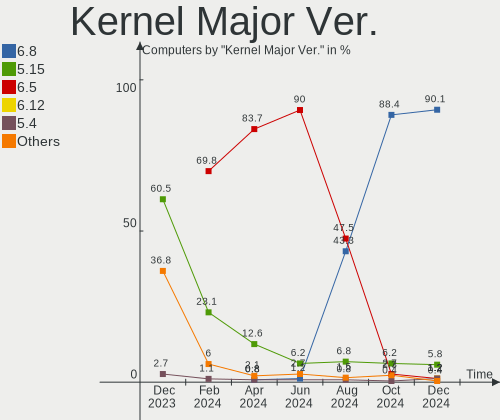
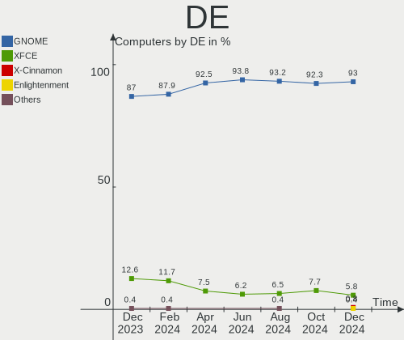
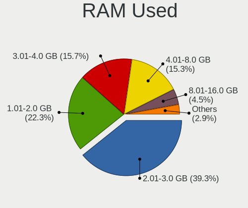
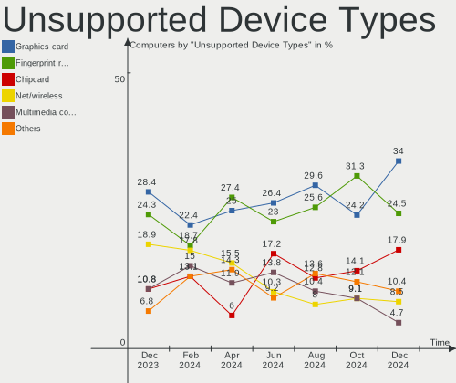

Zorin Hardware Trends
---------------------

A project to identify most popular hardware characteristics and track their change
over time based on data collected by Zorin users at https://Linux-Hardware.org.

Anyone can contribute to this report by the [hw-probe](https://github.com/linuxhw/hw-probe) tool:

    sudo -E hw-probe -all -upload

This is a report for all computer types. See also reports for [desktops](/Dist/Zorin/Desktop/README.md) and [notebooks](/Dist/Zorin/Notebook/README.md).

Full-feature report is available here: https://linux-hardware.org/?view=trends

Period: Oct, 2021.

Contents
--------

* [ System ](#system)
  - [ OS                       ](#os)
  - [ OS Family                ](#os-family)
  - [ Kernel                   ](#kernel)
  - [ Kernel Family            ](#kernel-family)
  - [ Kernel Major Ver.        ](#kernel-major-ver)
  - [ Arch                     ](#arch)
  - [ DE                       ](#de)
  - [ Display Server           ](#display-server)
  - [ Display Manager          ](#display-manager)
  - [ OS Lang                  ](#os-lang)
  - [ Boot Mode                ](#boot-mode)
  - [ Filesystem               ](#filesystem)
  - [ Part. scheme             ](#part-scheme)
  - [ Dual Boot with Linux/BSD ](#dual-boot-with-linuxbsd)
  - [ Dual Boot (Win)          ](#dual-boot-win)

* [ Board ](#board)
  - [ Vendor                   ](#vendor)
  - [ Model                    ](#model)
  - [ Model Family             ](#model-family)
  - [ MFG Year                 ](#mfg-year)
  - [ Form Factor              ](#form-factor)
  - [ Secure Boot              ](#secure-boot)
  - [ Coreboot                 ](#coreboot)
  - [ RAM Size                 ](#ram-size)
  - [ RAM Used                 ](#ram-used)
  - [ Total Drives             ](#total-drives)
  - [ Has CD-ROM               ](#has-cd-rom)
  - [ Has Ethernet             ](#has-ethernet)
  - [ Has WiFi                 ](#has-wifi)
  - [ Has Bluetooth            ](#has-bluetooth)

* [ Location ](#location)
  - [ Country                  ](#country)
  - [ City                     ](#city)

* [ Drives ](#drives)
  - [ Drive Vendor             ](#drive-vendor)
  - [ Drive Model              ](#drive-model)
  - [ HDD Vendor               ](#hdd-vendor)
  - [ SSD Vendor               ](#ssd-vendor)
  - [ Drive Kind               ](#drive-kind)
  - [ Drive Connector          ](#drive-connector)
  - [ Drive Size               ](#drive-size)
  - [ Space Total              ](#space-total)
  - [ Space Used               ](#space-used)
  - [ Malfunc. Drives          ](#malfunc-drives)
  - [ Malfunc. Drive Vendor    ](#malfunc-drive-vendor)
  - [ Malfunc. HDD Vendor      ](#malfunc-hdd-vendor)
  - [ Malfunc. Drive Kind      ](#malfunc-drive-kind)
  - [ Failed Drives            ](#failed-drives)
  - [ Failed Drive Vendor      ](#failed-drive-vendor)
  - [ Drive Status             ](#drive-status)

* [ Storage controller ](#storage-controller)
  - [ Storage Vendor           ](#storage-vendor)
  - [ Storage Model            ](#storage-model)
  - [ Storage Kind             ](#storage-kind)

* [ Processor ](#processor)
  - [ CPU Vendor               ](#cpu-vendor)
  - [ CPU Model                ](#cpu-model)
  - [ CPU Model Family         ](#cpu-model-family)
  - [ CPU Cores                ](#cpu-cores)
  - [ CPU Sockets              ](#cpu-sockets)
  - [ CPU Threads              ](#cpu-threads)
  - [ CPU Op-Modes             ](#cpu-op-modes)
  - [ CPU Microcode            ](#cpu-microcode)
  - [ CPU Microarch            ](#cpu-microarch)

* [ Graphics ](#graphics)
  - [ GPU Vendor               ](#gpu-vendor)
  - [ GPU Model                ](#gpu-model)
  - [ GPU Combo                ](#gpu-combo)
  - [ GPU Driver               ](#gpu-driver)
  - [ GPU Memory               ](#gpu-memory)

* [ Monitor ](#monitor)
  - [ Monitor Vendor           ](#monitor-vendor)
  - [ Monitor Model            ](#monitor-model)
  - [ Monitor Resolution       ](#monitor-resolution)
  - [ Monitor Diagonal         ](#monitor-diagonal)
  - [ Monitor Width            ](#monitor-width)
  - [ Aspect Ratio             ](#aspect-ratio)
  - [ Monitor Area             ](#monitor-area)
  - [ Pixel Density            ](#pixel-density)
  - [ Multiple Monitors        ](#multiple-monitors)

* [ Network ](#network)
  - [ Net Controller Vendor    ](#net-controller-vendor)
  - [ Net Controller Model     ](#net-controller-model)
  - [ Wireless Vendor          ](#wireless-vendor)
  - [ Wireless Model           ](#wireless-model)
  - [ Ethernet Vendor          ](#ethernet-vendor)
  - [ Ethernet Model           ](#ethernet-model)
  - [ Net Controller Kind      ](#net-controller-kind)
  - [ Used Controller          ](#used-controller)
  - [ NICs                     ](#nics)
  - [ IPv6                     ](#ipv6)

* [ Bluetooth ](#bluetooth)
  - [ Bluetooth Vendor         ](#bluetooth-vendor)
  - [ Bluetooth Model          ](#bluetooth-model)

* [ Sound ](#sound)
  - [ Sound Vendor             ](#sound-vendor)
  - [ Sound Model              ](#sound-model)

* [ Memory ](#memory)
  - [ Memory Vendor            ](#memory-vendor)
  - [ Memory Model             ](#memory-model)
  - [ Memory Kind              ](#memory-kind)
  - [ Memory Form Factor       ](#memory-form-factor)
  - [ Memory Size              ](#memory-size)
  - [ Memory Speed             ](#memory-speed)

* [ Printers & scanners ](#printers--scanners)
  - [ Printer Vendor           ](#printer-vendor)
  - [ Printer Model            ](#printer-model)
  - [ Scanner Vendor           ](#scanner-vendor)
  - [ Scanner Model            ](#scanner-model)

* [ Camera ](#camera)
  - [ Camera Vendor            ](#camera-vendor)
  - [ Camera Model             ](#camera-model)

* [ Security ](#security)
  - [ Fingerprint Vendor       ](#fingerprint-vendor)
  - [ Fingerprint Model        ](#fingerprint-model)
  - [ Chipcard Vendor          ](#chipcard-vendor)
  - [ Chipcard Model           ](#chipcard-model)

* [ Unsupported ](#unsupported)
  - [ Unsupported Devices      ](#unsupported-devices)
  - [ Unsupported Device Types ](#unsupported-device-types)

System
------

OS
--

Installed operating systems

| Name     | Computers | Percent |
|----------|-----------|---------|
| Zorin 16 | 181       | 84.98%  |
| Zorin 15 | 31        | 14.55%  |
| Zorin 12 | 1         | 0.47%   |

OS Family
---------

OS without a version

| Name  | Computers | Percent |
|-------|-----------|---------|
| Zorin | 213       | 100%    |

Kernel
------

Version of the Linux kernel

| Version            | Computers | Percent |
|--------------------|-----------|---------|
| 5.11.0-37-generic  | 100       | 46.95%  |
| 5.11.0-38-generic  | 66        | 30.99%  |
| 5.4.0-87-generic   | 18        | 8.45%   |
| 5.11.0-27-generic  | 9         | 4.23%   |
| 5.4.0-89-generic   | 8         | 3.76%   |
| 5.4.0-81-generic   | 2         | 0.94%   |
| 5.11.0-36-generic  | 2         | 0.94%   |
| 5.11.0-34-generic  | 2         | 0.94%   |
| 5.8.0-55-generic   | 1         | 0.47%   |
| 5.4.0-86-generic   | 1         | 0.47%   |
| 5.4.0-66-generic   | 1         | 0.47%   |
| 5.4.0-47-generic   | 1         | 0.47%   |
| 5.11.0-25-generic  | 1         | 0.47%   |
| 4.15.0-142-generic | 1         | 0.47%   |

Kernel Family
-------------

Linux kernel without a distro release

| Version | Computers | Percent |
|---------|-----------|---------|
| 5.11.0  | 180       | 84.51%  |
| 5.4.0   | 31        | 14.55%  |
| 5.8.0   | 1         | 0.47%   |
| 4.15.0  | 1         | 0.47%   |

Kernel Major Ver.
-----------------

Linux kernel major version

| Version | Computers | Percent |
|---------|-----------|---------|
| 5.11    | 180       | 84.51%  |
| 5.4     | 31        | 14.55%  |
| 5.8     | 1         | 0.47%   |
| 4.15    | 1         | 0.47%   |

Arch
----

OS architecture (x86_64, i586, etc.)

| Name   | Computers | Percent |
|--------|-----------|---------|
| x86_64 | 204       | 95.77%  |
| i686   | 9         | 4.23%   |

DE
--

Desktop Environment

| Name    | Computers | Percent |
|---------|-----------|---------|
| GNOME   | 187       | 87.79%  |
| XFCE    | 21        | 9.86%   |
| Unknown | 4         | 1.88%   |
| MATE    | 1         | 0.47%   |

Display Server
--------------

X11 or Wayland

| Name    | Computers | Percent |
|---------|-----------|---------|
| X11     | 210       | 98.59%  |
| Unknown | 2         | 0.94%   |
| Wayland | 1         | 0.47%   |

Display Manager
---------------

SDDM, LightDM, etc.

| Name    | Computers | Percent |
|---------|-----------|---------|
| Unknown | 167       | 78.4%   |
| GDM3    | 21        | 9.86%   |
| LightDM | 18        | 8.45%   |
| GDM     | 7         | 3.29%   |

OS Lang
-------

Language

| Lang  | Computers | Percent |
|-------|-----------|---------|
| en_US | 95        | 44.6%   |
| de_DE | 22        | 10.33%  |
| en_GB | 19        | 8.92%   |
| pt_BR | 8         | 3.76%   |
| es_ES | 8         | 3.76%   |
| fr_FR | 7         | 3.29%   |
| en_IN | 7         | 3.29%   |
| ru_RU | 5         | 2.35%   |
| it_IT | 5         | 2.35%   |
| en_CA | 5         | 2.35%   |
| nl_NL | 4         | 1.88%   |
| es_MX | 4         | 1.88%   |
| sv_SE | 2         | 0.94%   |
| es_CL | 2         | 0.94%   |
| en_NZ | 2         | 0.94%   |
| en_AU | 2         | 0.94%   |
| C     | 2         | 0.94%   |
| tr_TR | 1         | 0.47%   |
| pt_PT | 1         | 0.47%   |
| pl_PL | 1         | 0.47%   |
| nl_BE | 1         | 0.47%   |
| hu_HU | 1         | 0.47%   |
| fr_CH | 1         | 0.47%   |
| es_CO | 1         | 0.47%   |
| es_AR | 1         | 0.47%   |
| en_ZA | 1         | 0.47%   |
| en_SG | 1         | 0.47%   |
| de_CH | 1         | 0.47%   |
| de_AT | 1         | 0.47%   |
| cs_CZ | 1         | 0.47%   |
| bg_BG | 1         | 0.47%   |

Boot Mode
---------

EFI or BIOS

| Mode | Computers | Percent |
|------|-----------|---------|
| EFI  | 123       | 57.75%  |
| BIOS | 90        | 42.25%  |

Filesystem
----------

Type of filesystem

| Type    | Computers | Percent |
|---------|-----------|---------|
| Ext4    | 200       | 93.9%   |
| Btrfs   | 4         | 1.88%   |
| Zfs     | 3         | 1.41%   |
| Overlay | 2         | 0.94%   |
| Xfs     | 1         | 0.47%   |
| Ext3    | 1         | 0.47%   |
| Ext2    | 1         | 0.47%   |
| Unknown | 1         | 0.47%   |

Part. scheme
------------

Scheme of partitioning

| Type    | Computers | Percent |
|---------|-----------|---------|
| Unknown | 203       | 95.31%  |
| GPT     | 10        | 4.69%   |

Dual Boot with Linux/BSD
------------------------

Hosting more than one Linux/BSD

| Dual boot | Computers | Percent |
|-----------|-----------|---------|
| No        | 207       | 97.18%  |
| Yes       | 6         | 2.82%   |

Dual Boot (Win)
---------------

Hosting Linux and Windows

| Dual boot | Computers | Percent |
|-----------|-----------|---------|
| No        | 192       | 90.14%  |
| Yes       | 21        | 9.86%   |

Board
-----

Vendor
------

Motherboard manufacturer

| Name                           | Computers | Percent |
|--------------------------------|-----------|---------|
| Hewlett-Packard                | 36        | 16.9%   |
| Dell                           | 35        | 16.43%  |
| ASUSTek Computer               | 28        | 13.15%  |
| Lenovo                         | 27        | 12.68%  |
| Acer                           | 15        | 7.04%   |
| Gigabyte Technology            | 13        | 6.1%    |
| Toshiba                        | 8         | 3.76%   |
| MSI                            | 7         | 3.29%   |
| Unknown                        | 7         | 3.29%   |
| ASRock                         | 6         | 2.82%   |
| Apple                          | 5         | 2.35%   |
| Intel                          | 4         | 1.88%   |
| Fujitsu                        | 3         | 1.41%   |
| Samsung Electronics            | 2         | 0.94%   |
| Notebook                       | 2         | 0.94%   |
| eMachines                      | 2         | 0.94%   |
| Biostar                        | 2         | 0.94%   |
| Thomson                        | 1         | 0.47%   |
| Star Labs                      | 1         | 0.47%   |
| Sony                           | 1         | 0.47%   |
| Schenker                       | 1         | 0.47%   |
| Quanta                         | 1         | 0.47%   |
| MECER                          | 1         | 0.47%   |
| Matsushita Electric Industrial | 1         | 0.47%   |
| Google                         | 1         | 0.47%   |
| Giani Limited                  | 1         | 0.47%   |
| American Megatrends            | 1         | 0.47%   |
| Alienware                      | 1         | 0.47%   |

Model
-----

Motherboard model

| Name                                                  | Computers | Percent |
|-------------------------------------------------------|-----------|---------|
| Unknown                                               | 8         | 3.76%   |
| ASUS All Series                                       | 3         | 1.41%   |
| HP Notebook                                           | 2         | 0.94%   |
| Dell OptiPlex 990                                     | 2         | 0.94%   |
| Dell Latitude E7470                                   | 2         | 0.94%   |
| Dell Latitude E6420                                   | 2         | 0.94%   |
| Dell Inspiron N5010                                   | 2         | 0.94%   |
| Dell Inspiron 3542                                    | 2         | 0.94%   |
| Toshiba Satellite U400                                | 1         | 0.47%   |
| Toshiba Satellite Pro T110                            | 1         | 0.47%   |
| Toshiba Satellite Pro C660                            | 1         | 0.47%   |
| Toshiba Satellite L755                                | 1         | 0.47%   |
| Toshiba Satellite L455D                               | 1         | 0.47%   |
| Toshiba Satellite C870-1C2                            | 1         | 0.47%   |
| Toshiba Satellite C70-B                               | 1         | 0.47%   |
| Toshiba PORTEGE Z20t-C                                | 1         | 0.47%   |
| Thomson N17C512                                       | 1         | 0.47%   |
| Star Labs LabTop                                      | 1         | 0.47%   |
| Sony VPCEA20FB                                        | 1         | 0.47%   |
| Schenker VIA 15 Pro                                   | 1         | 0.47%   |
| Samsung 700Z3C/700Z5C                                 | 1         | 0.47%   |
| Samsung 300E5EV/300E4EV/270E5EV/270E4EV/2470EV/2470EE | 1         | 0.47%   |
| Quanta CA27                                           | 1         | 0.47%   |
| Notebook X170SM                                       | 1         | 0.47%   |
| Notebook W94_95_97SU2,SUY,-C,-T                       | 1         | 0.47%   |
| MSI Pro 3515 Series                                   | 1         | 0.47%   |
| MSI MS-7C94                                           | 1         | 0.47%   |
| MSI MS-7C79                                           | 1         | 0.47%   |
| MSI MS-7751                                           | 1         | 0.47%   |
| MSI MS-7750                                           | 1         | 0.47%   |
| MSI Modern 14 B10MW                                   | 1         | 0.47%   |
| MSI GE66 Raider 10UH                                  | 1         | 0.47%   |
| MECER Z140C+Home                                      | 1         | 0.47%   |
| Matsushita Electric Industrial CF-19CHB23BE           | 1         | 0.47%   |
| Lenovo Z50-75 80EC                                    | 1         | 0.47%   |
| Lenovo Yoga 530-14IKB 81EK                            | 1         | 0.47%   |
| Lenovo Yoga 510-14ISK 80S7                            | 1         | 0.47%   |
| Lenovo Yoga 3 Pro-1370 80HE                           | 1         | 0.47%   |
| Lenovo Y520-15IKBM 80YY                               | 1         | 0.47%   |
| Lenovo ThinkStation P510 30B4S0F616                   | 1         | 0.47%   |
| Lenovo ThinkPad X220 Tablet 4298Y19                   | 1         | 0.47%   |
| Lenovo ThinkPad X220 Tablet 4298WBT                   | 1         | 0.47%   |
| Lenovo ThinkPad X220 4286CTO                          | 1         | 0.47%   |
| Lenovo ThinkPad T520 4242W4F                          | 1         | 0.47%   |
| Lenovo ThinkPad T470s W10DG 20JTS0280G                | 1         | 0.47%   |
| Lenovo ThinkPad T460s 20FAS3F300                      | 1         | 0.47%   |
| Lenovo ThinkPad L470 20J5A00FLM                       | 1         | 0.47%   |
| Lenovo ThinkCentre M93p 10AAS0ME00                    | 1         | 0.47%   |
| Lenovo ThinkBook 15-IIL 20SM                          | 1         | 0.47%   |
| Lenovo Legion Y920-17IKB Laptop 80YW                  | 1         | 0.47%   |
| Lenovo Legion 5 Pro 16ACH6H 82JQ                      | 1         | 0.47%   |
| Lenovo IdeaPad Z580                                   | 1         | 0.47%   |
| Lenovo IdeaPad S340-14API 81NB                        | 1         | 0.47%   |
| Lenovo IdeaPad S145-15IWL 81S9                        | 1         | 0.47%   |
| Lenovo IdeaPad S145-15API 81V7                        | 1         | 0.47%   |
| Lenovo IdeaPad FLEX-14API 81SS                        | 1         | 0.47%   |
| Lenovo IdeaPad 320-15AST 80XV                         | 1         | 0.47%   |
| Lenovo IdeaPad 3 15IIL05 81WE                         | 1         | 0.47%   |
| Lenovo G570 4334                                      | 1         | 0.47%   |
| Lenovo G50-70 20351                                   | 1         | 0.47%   |

Model Family
------------

Motherboard model prefix

| Name                                        | Computers | Percent |
|---------------------------------------------|-----------|---------|
| Dell Latitude                               | 14        | 6.57%   |
| Dell Inspiron                               | 11        | 5.16%   |
| Acer Aspire                                 | 10        | 4.69%   |
| Unknown                                     | 8         | 3.76%   |
| Toshiba Satellite                           | 7         | 3.29%   |
| Lenovo ThinkPad                             | 7         | 3.29%   |
| Lenovo IdeaPad                              | 7         | 3.29%   |
| Dell OptiPlex                               | 7         | 3.29%   |
| HP Pavilion                                 | 5         | 2.35%   |
| HP Laptop                                   | 5         | 2.35%   |
| Lenovo Yoga                                 | 3         | 1.41%   |
| HP ProBook                                  | 3         | 1.41%   |
| HP EliteBook                                | 3         | 1.41%   |
| HP Compaq                                   | 3         | 1.41%   |
| HP 255                                      | 3         | 1.41%   |
| ASUS All                                    | 3         | 1.41%   |
| Lenovo Legion                               | 2         | 0.94%   |
| HP Stream                                   | 2         | 0.94%   |
| HP Notebook                                 | 2         | 0.94%   |
| HP ENVY                                     | 2         | 0.94%   |
| Gigabyte X570                               | 2         | 0.94%   |
| Gigabyte GA-78LMT-USB3                      | 2         | 0.94%   |
| Fujitsu LIFEBOOK                            | 2         | 0.94%   |
| ASUS ROG                                    | 2         | 0.94%   |
| ASUS PRIME                                  | 2         | 0.94%   |
| ASUS P7H55-M                                | 2         | 0.94%   |
| Acer TravelMate                             | 2         | 0.94%   |
| Toshiba PORTEGE                             | 1         | 0.47%   |
| Thomson N17C512                             | 1         | 0.47%   |
| Star Labs LabTop                            | 1         | 0.47%   |
| Sony VPCEA20FB                              | 1         | 0.47%   |
| Schenker VIA                                | 1         | 0.47%   |
| Samsung 700Z3C                              | 1         | 0.47%   |
| Samsung 300E5EV                             | 1         | 0.47%   |
| Quanta CA27                                 | 1         | 0.47%   |
| Notebook X170SM                             | 1         | 0.47%   |
| Notebook W94                                | 1         | 0.47%   |
| MSI Pro                                     | 1         | 0.47%   |
| MSI MS-7C94                                 | 1         | 0.47%   |
| MSI MS-7C79                                 | 1         | 0.47%   |
| MSI MS-7751                                 | 1         | 0.47%   |
| MSI MS-7750                                 | 1         | 0.47%   |
| MSI Modern                                  | 1         | 0.47%   |
| MSI GE66                                    | 1         | 0.47%   |
| MECER Z140C+Home                            | 1         | 0.47%   |
| Matsushita Electric Industrial CF-19CHB23BE | 1         | 0.47%   |
| Lenovo Z50-75                               | 1         | 0.47%   |
| Lenovo Y520-15IKBM                          | 1         | 0.47%   |
| Lenovo ThinkStation                         | 1         | 0.47%   |
| Lenovo ThinkCentre                          | 1         | 0.47%   |
| Lenovo ThinkBook                            | 1         | 0.47%   |
| Lenovo G570                                 | 1         | 0.47%   |
| Lenovo G50-70                               | 1         | 0.47%   |
| Lenovo Flex                                 | 1         | 0.47%   |
| Intel S5520HC                               | 1         | 0.47%   |
| Intel NUC7i5BNB                             | 1         | 0.47%   |
| Intel NUC6i7KYB                             | 1         | 0.47%   |
| Intel DH67CL                                | 1         | 0.47%   |
| HP Z420                                     | 1         | 0.47%   |
| HP Z1                                       | 1         | 0.47%   |

MFG Year
--------

Motherboard manufacture year

| Year | Computers | Percent |
|------|-----------|---------|
| 2021 | 36        | 16.9%   |
| 2020 | 24        | 11.27%  |
| 2018 | 24        | 11.27%  |
| 2012 | 17        | 7.98%   |
| 2010 | 17        | 7.98%   |
| 2015 | 16        | 7.51%   |
| 2016 | 12        | 5.63%   |
| 2013 | 12        | 5.63%   |
| 2019 | 11        | 5.16%   |
| 2017 | 11        | 5.16%   |
| 2014 | 11        | 5.16%   |
| 2011 | 7         | 3.29%   |
| 2009 | 6         | 2.82%   |
| 2008 | 4         | 1.88%   |
| 2005 | 3         | 1.41%   |
| 2007 | 2         | 0.94%   |

Form Factor
-----------

Physical design of the computer

| Name        | Computers | Percent |
|-------------|-----------|---------|
| Notebook    | 134       | 62.91%  |
| Desktop     | 67        | 31.46%  |
| All in one  | 6         | 2.82%   |
| Convertible | 3         | 1.41%   |
| Mini pc     | 2         | 0.94%   |
| Server      | 1         | 0.47%   |

Secure Boot
-----------

Enabled or disabled

| State    | Computers | Percent |
|----------|-----------|---------|
| Disabled | 183       | 85.92%  |
| Enabled  | 30        | 14.08%  |

Coreboot
--------

Have coreboot on board

| Used | Computers | Percent |
|------|-----------|---------|
| No   | 211       | 99.06%  |
| Yes  | 2         | 0.94%   |

RAM Size
--------

Total RAM memory

| Size in GB  | Computers | Percent |
|-------------|-----------|---------|
| 4.01-8.0    | 68        | 31.92%  |
| 3.01-4.0    | 45        | 21.13%  |
| 8.01-16.0   | 33        | 15.49%  |
| 16.01-24.0  | 30        | 14.08%  |
| 32.01-64.0  | 14        | 6.57%   |
| 1.01-2.0    | 11        | 5.16%   |
| 24.01-32.0  | 4         | 1.88%   |
| 2.01-3.0    | 4         | 1.88%   |
| 64.01-256.0 | 3         | 1.41%   |
| 0.51-1.0    | 1         | 0.47%   |

RAM Used
--------

Used RAM memory

| Used GB   | Computers | Percent |
|-----------|-----------|---------|
| 1.01-2.0  | 95        | 44.6%   |
| 2.01-3.0  | 61        | 28.64%  |
| 3.01-4.0  | 26        | 12.21%  |
| 4.01-8.0  | 21        | 9.86%   |
| 0.51-1.0  | 8         | 3.76%   |
| 8.01-16.0 | 2         | 0.94%   |

Total Drives
------------

Number of drives on board

| Drives | Computers | Percent |
|--------|-----------|---------|
| 1      | 138       | 64.79%  |
| 2      | 50        | 23.47%  |
| 3      | 11        | 5.16%   |
| 4      | 6         | 2.82%   |
| 5      | 5         | 2.35%   |
| 6      | 2         | 0.94%   |
| 8      | 1         | 0.47%   |

Has CD-ROM
----------

Has CD-ROM on board

| Presented | Computers | Percent |
|-----------|-----------|---------|
| No        | 110       | 51.64%  |
| Yes       | 103       | 48.36%  |

Has Ethernet
------------

Has Ethernet on board

| Presented | Computers | Percent |
|-----------|-----------|---------|
| Yes       | 192       | 90.14%  |
| No        | 21        | 9.86%   |

Has WiFi
--------

Has WiFi module

| Presented | Computers | Percent |
|-----------|-----------|---------|
| Yes       | 174       | 81.69%  |
| No        | 39        | 18.31%  |

Has Bluetooth
-------------

Has Bluetooth module

| Presented | Computers | Percent |
|-----------|-----------|---------|
| Yes       | 129       | 60.56%  |
| No        | 84        | 39.44%  |

Location
--------

Country
-------

Geographic location (country)

| Country      | Computers | Percent |
|--------------|-----------|---------|
| USA          | 62        | 29.11%  |
| Germany      | 29        | 13.62%  |
| UK           | 16        | 7.51%   |
| Netherlands  | 9         | 4.23%   |
| Brazil       | 9         | 4.23%   |
| Spain        | 8         | 3.76%   |
| Italy        | 7         | 3.29%   |
| India        | 7         | 3.29%   |
| France       | 7         | 3.29%   |
| Canada       | 5         | 2.35%   |
| Mexico       | 4         | 1.88%   |
| Russia       | 3         | 1.41%   |
| Austria      | 3         | 1.41%   |
| Turkey       | 2         | 0.94%   |
| Switzerland  | 2         | 0.94%   |
| Sweden       | 2         | 0.94%   |
| South Africa | 2         | 0.94%   |
| Norway       | 2         | 0.94%   |
| New Zealand  | 2         | 0.94%   |
| Japan        | 2         | 0.94%   |
| Denmark      | 2         | 0.94%   |
| Chile        | 2         | 0.94%   |
| Belgium      | 2         | 0.94%   |
| Australia    | 2         | 0.94%   |
| Argentina    | 2         | 0.94%   |
| Venezuela    | 1         | 0.47%   |
| Singapore    | 1         | 0.47%   |
| Qatar        | 1         | 0.47%   |
| Poland       | 1         | 0.47%   |
| Philippines  | 1         | 0.47%   |
| Nigeria      | 1         | 0.47%   |
| Morocco      | 1         | 0.47%   |
| Malaysia     | 1         | 0.47%   |
| Jersey       | 1         | 0.47%   |
| Jamaica      | 1         | 0.47%   |
| Ireland      | 1         | 0.47%   |
| Hungary      | 1         | 0.47%   |
| Greece       | 1         | 0.47%   |
| Ghana        | 1         | 0.47%   |
| El Salvador  | 1         | 0.47%   |
| Egypt        | 1         | 0.47%   |
| Czechia      | 1         | 0.47%   |
| Colombia     | 1         | 0.47%   |
| Bulgaria     | 1         | 0.47%   |
| Bangladesh   | 1         | 0.47%   |

City
----

Geographic location (city)

| City               | Computers | Percent |
|--------------------|-----------|---------|
| Munich             | 4         | 1.88%   |
| Vienna             | 3         | 1.41%   |
| Berlin             | 3         | 1.41%   |
| Bengaluru          | 3         | 1.41%   |
| The Hague          | 2         | 0.94%   |
| Santiago           | 2         | 0.94%   |
| San Francisco      | 2         | 0.94%   |
| Rome               | 2         | 0.94%   |
| London             | 2         | 0.94%   |
| Kaiserslautern     | 2         | 0.94%   |
| Johannesburg       | 2         | 0.94%   |
| Independence       | 2         | 0.94%   |
| Hamburg            | 2         | 0.94%   |
| Glasgow            | 2         | 0.94%   |
| Frankfurt am Main  | 2         | 0.94%   |
| Converse           | 2         | 0.94%   |
| Chicago            | 2         | 0.94%   |
| Barcelona          | 2         | 0.94%   |
| Athens             | 2         | 0.94%   |
| Zwolle             | 1         | 0.47%   |
| Zephyrhills        | 1         | 0.47%   |
| Winston-Salem      | 1         | 0.47%   |
| Williamsburg       | 1         | 0.47%   |
| Weymouth           | 1         | 0.47%   |
| Washington         | 1         | 0.47%   |
| Warsaw             | 1         | 0.47%   |
| Warrenton          | 1         | 0.47%   |
| Vogtsburg          | 1         | 0.47%   |
| Varna              | 1         | 0.47%   |
| Tunnel Hill        | 1         | 0.47%   |
| Triunfo            | 1         | 0.47%   |
| Toulouse           | 1         | 0.47%   |
| Tokyo              | 1         | 0.47%   |
| Titusville         | 1         | 0.47%   |
| Teltow             | 1         | 0.47%   |
| Tatu?­             | 1         | 0.47%   |
| Sydney             | 1         | 0.47%   |
| Stuttgart          | 1         | 0.47%   |
| Spanish Town       | 1         | 0.47%   |
| South Charleston   | 1         | 0.47%   |
| Shimla             | 1         | 0.47%   |
| Shelbyville        | 1         | 0.47%   |
| Serra              | 1         | 0.47%   |
| Seattle            | 1         | 0.47%   |
| S??o Paulo         | 1         | 0.47%   |
| Saratov            | 1         | 0.47%   |
| Sanremo            | 1         | 0.47%   |
| San Salvador       | 1         | 0.47%   |
| San Jose           | 1         | 0.47%   |
| Saint Helier       | 1         | 0.47%   |
| Roundup            | 1         | 0.47%   |
| Roquefort-les-Pins | 1         | 0.47%   |
| Rochester          | 1         | 0.47%   |
| Ripon              | 1         | 0.47%   |
| Rio Branco         | 1         | 0.47%   |
| Richmond           | 1         | 0.47%   |
| Ribeirao Pires     | 1         | 0.47%   |
| Rhyl               | 1         | 0.47%   |
| Reutlingen         | 1         | 0.47%   |
| Rennes             | 1         | 0.47%   |

Drives
------

Drive Vendor
------------

Hard drive vendors

| Vendor              | Computers | Drives | Percent |
|---------------------|-----------|--------|---------|
| Samsung Electronics | 50        | 67     | 17.67%  |
| Seagate             | 43        | 61     | 15.19%  |
| WDC                 | 31        | 31     | 10.95%  |
| Toshiba             | 21        | 23     | 7.42%   |
| Sandisk             | 17        | 18     | 6.01%   |
| Hitachi             | 15        | 15     | 5.3%    |
| Unknown             | 14        | 17     | 4.95%   |
| Kingston            | 12        | 13     | 4.24%   |
| Crucial             | 9         | 12     | 3.18%   |
| SK Hynix            | 7         | 8      | 2.47%   |
| HGST                | 7         | 7      | 2.47%   |
| Phison              | 5         | 5      | 1.77%   |
| MAXTOR              | 5         | 5      | 1.77%   |
| A-DATA Technology   | 4         | 5      | 1.41%   |
| Micron Technology   | 3         | 3      | 1.06%   |
| JMicron             | 3         | 3      | 1.06%   |
| Intel               | 3         | 4      | 1.06%   |
| PNY                 | 2         | 2      | 0.71%   |
| LITEONIT            | 2         | 2      | 0.71%   |
| KIOXIA              | 2         | 2      | 0.71%   |
| Intenso             | 2         | 2      | 0.71%   |
| Hewlett-Packard     | 2         | 2      | 0.71%   |
| Apple               | 2         | 2      | 0.71%   |
| XPG                 | 1         | 1      | 0.35%   |
| USB30               | 1         | 1      | 0.35%   |
| Transcend           | 1         | 1      | 0.35%   |
| Team                | 1         | 1      | 0.35%   |
| SuperSSpeed         | 1         | 1      | 0.35%   |
| Super Talent        | 1         | 1      | 0.35%   |
| Star                | 1         | 1      | 0.35%   |
| SPCC                | 1         | 1      | 0.35%   |
| Smartbuy            | 1         | 1      | 0.35%   |
| SABRENT             | 1         | 1      | 0.35%   |
| OCZ                 | 1         | 1      | 0.35%   |
| Netac               | 1         | 1      | 0.35%   |
| MyDigitalSSD        | 1         | 1      | 0.35%   |
| Mushkin             | 1         | 1      | 0.35%   |
| Lite-On             | 1         | 1      | 0.35%   |
| INNOVATION IT       | 1         | 1      | 0.35%   |
| GOODRAM             | 1         | 1      | 0.35%   |
| Gigabyte Technology | 1         | 2      | 0.35%   |
| E535N               | 1         | 1      | 0.35%   |
| China               | 1         | 1      | 0.35%   |
| ASMT109x            | 1         | 1      | 0.35%   |
| Unknown             | 1         | 1      | 0.35%   |

Drive Model
-----------

Hard drive models

| Model                                  | Computers | Percent |
|----------------------------------------|-----------|---------|
| Unknown MMC Card  32GB                 | 9         | 2.86%   |
| Seagate ST1000LM024 HN-M101MBB 1TB     | 5         | 1.59%   |
| Samsung SSD 860 EVO 500GB              | 5         | 1.59%   |
| Samsung NVMe SSD Drive 500GB           | 5         | 1.59%   |
| Samsung SSD 850 EVO 500GB              | 4         | 1.27%   |
| Samsung PM963 2.5" NVMe PCIe SSD 512GB | 4         | 1.27%   |
| Unknown MMC Card  64GB                 | 3         | 0.95%   |
| Toshiba MK2555GSX 250GB                | 3         | 0.95%   |
| Toshiba MK2552GSX 250GB                | 3         | 0.95%   |
| Samsung SSD 850 EVO 250GB              | 3         | 0.95%   |
| Samsung NVMe SSD Drive 256GB           | 3         | 0.95%   |
| Kingston SA400S37240G 240GB SSD        | 3         | 0.95%   |
| JMicron Tech 250GB                     | 3         | 0.95%   |
| HGST HTS541010B7E610 1TB               | 3         | 0.95%   |
| Crucial CT500MX500SSD1 500GB           | 3         | 0.95%   |
| WDC WD10SPZX-24Z10 1TB                 | 2         | 0.63%   |
| Toshiba MQ04ABF100 1TB                 | 2         | 0.63%   |
| Toshiba MQ01ABF050 500GB               | 2         | 0.63%   |
| Toshiba DT01ACA100 1TB                 | 2         | 0.63%   |
| Toshiba DT01ACA050 500GB               | 2         | 0.63%   |
| SK Hynix NVMe SSD Drive 256GB          | 2         | 0.63%   |
| Seagate ST500LT012-1DG142 500GB        | 2         | 0.63%   |
| Seagate ST500DM002-1BD142 500GB        | 2         | 0.63%   |
| Seagate ST3500418AS 500GB              | 2         | 0.63%   |
| Seagate ST3250310AS 250GB              | 2         | 0.63%   |
| Seagate ST2000LM007-1R8174 2TB         | 2         | 0.63%   |
| Seagate ST2000DM001-1ER164 2TB         | 2         | 0.63%   |
| Seagate ST2000DM001-1CH164 2TB         | 2         | 0.63%   |
| Seagate ST1000LM035-1RK172 1TB         | 2         | 0.63%   |
| Seagate Expansion Desk 4TB             | 2         | 0.63%   |
| SanDisk SSD PLUS 240GB                 | 2         | 0.63%   |
| Sandisk NVMe SSD Drive 1TB             | 2         | 0.63%   |
| Samsung SSD 870 QVO 1TB                | 2         | 0.63%   |
| Samsung SSD 870 EVO 1TB                | 2         | 0.63%   |
| Samsung SSD 860 EVO 250GB              | 2         | 0.63%   |
| Samsung SSD 860 EVO 1TB                | 2         | 0.63%   |
| Samsung SSD 840 EVO 250GB              | 2         | 0.63%   |
| Samsung SM963 2.5" NVMe PCIe SSD 250GB | 2         | 0.63%   |
| Samsung NVMe SSD Drive 1TB             | 2         | 0.63%   |
| Phison NVMe SSD Drive 1TB              | 2         | 0.63%   |
| Kingston SV300S37A120G 120GB SSD       | 2         | 0.63%   |
| Kingston SA400S37480G 480GB SSD        | 2         | 0.63%   |
| Hitachi HTS723232A7A364 320GB          | 2         | 0.63%   |
| Hitachi HTS547575A9E384 752GB          | 2         | 0.63%   |
| A-DATA SU800 512GB SSD                 | 2         | 0.63%   |
| XPG NVMe SSD Drive 512GB               | 1         | 0.32%   |
| WDC WDS500G2B0B-00YS70 500GB SSD       | 1         | 0.32%   |
| WDC WDS500G2B0A 500GB SSD              | 1         | 0.32%   |
| WDC WDS240G2G0A-00JH30 240GB SSD       | 1         | 0.32%   |
| WDC WDS100T2B0A-00SM50 1TB SSD         | 1         | 0.32%   |
| WDC WD800JD-75MSA3 80GB                | 1         | 0.32%   |
| WDC WD60EZAZ-00SF3B0 6TB               | 1         | 0.32%   |
| WDC WD5000LPVX-22V0TT0 500GB           | 1         | 0.32%   |
| WDC WD5000LPLX-60ZNTT1 500GB           | 1         | 0.32%   |
| WDC WD4002FFWX-68TZ4N0 4TB             | 1         | 0.32%   |
| WDC WD3200BEVT-75A23T0 320GB           | 1         | 0.32%   |
| WDC WD2500JS-60NCB1 250GB              | 1         | 0.32%   |
| WDC WD2500BEVS-22UST0 250GB            | 1         | 0.32%   |
| WDC WD20EZRZ-00Z5HB0 2TB               | 1         | 0.32%   |
| WDC WD1600BEVT-35VW9T0 160GB           | 1         | 0.32%   |

HDD Vendor
----------

Hard disk drive vendors

| Vendor              | Computers | Drives | Percent |
|---------------------|-----------|--------|---------|
| Seagate             | 43        | 60     | 34.96%  |
| WDC                 | 25        | 25     | 20.33%  |
| Toshiba             | 20        | 22     | 16.26%  |
| Hitachi             | 15        | 15     | 12.2%   |
| HGST                | 7         | 7      | 5.69%   |
| MAXTOR              | 4         | 4      | 3.25%   |
| Samsung Electronics | 3         | 4      | 2.44%   |
| Unknown             | 1         | 1      | 0.81%   |
| SABRENT             | 1         | 1      | 0.81%   |
| Intenso             | 1         | 1      | 0.81%   |
| Hewlett-Packard     | 1         | 1      | 0.81%   |
| ASMT109x            | 1         | 1      | 0.81%   |
| Apple               | 1         | 1      | 0.81%   |

SSD Vendor
----------

Solid state drive vendors

| Vendor              | Computers | Drives | Percent |
|---------------------|-----------|--------|---------|
| Samsung Electronics | 35        | 40     | 33.02%  |
| SanDisk             | 12        | 13     | 11.32%  |
| Kingston            | 11        | 12     | 10.38%  |
| Crucial             | 9         | 12     | 8.49%   |
| WDC                 | 4         | 4      | 3.77%   |
| SK Hynix            | 4         | 4      | 3.77%   |
| A-DATA Technology   | 4         | 5      | 3.77%   |
| PNY                 | 2         | 2      | 1.89%   |
| LITEONIT            | 2         | 2      | 1.89%   |
| USB30               | 1         | 1      | 0.94%   |
| Transcend           | 1         | 1      | 0.94%   |
| Toshiba             | 1         | 1      | 0.94%   |
| Team                | 1         | 1      | 0.94%   |
| SuperSSpeed         | 1         | 1      | 0.94%   |
| Super Talent        | 1         | 1      | 0.94%   |
| Star                | 1         | 1      | 0.94%   |
| SPCC                | 1         | 1      | 0.94%   |
| Smartbuy            | 1         | 1      | 0.94%   |
| OCZ                 | 1         | 1      | 0.94%   |
| Netac               | 1         | 1      | 0.94%   |
| MyDigitalSSD        | 1         | 1      | 0.94%   |
| Mushkin             | 1         | 1      | 0.94%   |
| Micron Technology   | 1         | 1      | 0.94%   |
| MAXTOR              | 1         | 1      | 0.94%   |
| Intenso             | 1         | 1      | 0.94%   |
| Intel               | 1         | 1      | 0.94%   |
| INNOVATION IT       | 1         | 1      | 0.94%   |
| Hewlett-Packard     | 1         | 1      | 0.94%   |
| GOODRAM             | 1         | 1      | 0.94%   |
| Gigabyte Technology | 1         | 2      | 0.94%   |
| China               | 1         | 1      | 0.94%   |
| Apple               | 1         | 1      | 0.94%   |

Drive Kind
----------

HDD or SSD

| Kind    | Computers | Drives | Percent |
|---------|-----------|--------|---------|
| HDD     | 104       | 143    | 39.54%  |
| SSD     | 99        | 118    | 37.64%  |
| NVMe    | 42        | 49     | 15.97%  |
| MMC     | 12        | 15     | 4.56%   |
| Unknown | 6         | 7      | 2.28%   |

Drive Connector
---------------

SATA, SAS, NVMe, etc.

| Type | Computers | Drives | Percent |
|------|-----------|--------|---------|
| SATA | 182       | 250    | 73.09%  |
| NVMe | 42        | 49     | 16.87%  |
| SAS  | 13        | 18     | 5.22%   |
| MMC  | 12        | 15     | 4.82%   |

Drive Size
----------

Size of hard drive

| Size in TB | Computers | Drives | Percent |
|------------|-----------|--------|---------|
| 0.01-0.5   | 127       | 153    | 59.62%  |
| 0.51-1.0   | 55        | 66     | 25.82%  |
| 1.01-2.0   | 19        | 24     | 8.92%   |
| 3.01-4.0   | 7         | 11     | 3.29%   |
| 4.01-10.0  | 4         | 5      | 1.88%   |
| 2.01-3.0   | 1         | 2      | 0.47%   |

Space Total
-----------

Amount of disk space available on the file system

| Size in GB     | Computers | Percent |
|----------------|-----------|---------|
| 101-250        | 68        | 31.92%  |
| 251-500        | 59        | 27.7%   |
| 501-1000       | 29        | 13.62%  |
| 51-100         | 20        | 9.39%   |
| More than 3000 | 11        | 5.16%   |
| 21-50          | 9         | 4.23%   |
| 1001-2000      | 7         | 3.29%   |
| 2001-3000      | 4         | 1.88%   |
| Unknown        | 4         | 1.88%   |
| 1-20           | 2         | 0.94%   |

Space Used
----------

Amount of used disk space

| Used GB        | Computers | Percent |
|----------------|-----------|---------|
| 1-20           | 79        | 37.09%  |
| 21-50          | 63        | 29.58%  |
| 101-250        | 23        | 10.8%   |
| 51-100         | 22        | 10.33%  |
| More than 3000 | 7         | 3.29%   |
| 251-500        | 6         | 2.82%   |
| 1001-2000      | 4         | 1.88%   |
| 501-1000       | 4         | 1.88%   |
| Unknown        | 4         | 1.88%   |
| 2001-3000      | 1         | 0.47%   |

Malfunc. Drives
---------------

Drive models with a malfunction

| Model                          | Computers | Drives | Percent |
|--------------------------------|-----------|--------|---------|
| Seagate ST2000DM001-9YN164 2TB | 1         | 1      | 50%     |
| Seagate ST2000DL003-9VT166 2TB | 1         | 1      | 50%     |

Malfunc. Drive Vendor
---------------------

Vendors of faulty drives

| Vendor  | Computers | Drives | Percent |
|---------|-----------|--------|---------|
| Seagate | 2         | 2      | 100%    |

Malfunc. HDD Vendor
-------------------

Vendors of faulty HDD drives

| Vendor  | Computers | Drives | Percent |
|---------|-----------|--------|---------|
| Seagate | 2         | 2      | 100%    |

Malfunc. Drive Kind
-------------------

Kinds of faulty drives

| Kind | Computers | Drives | Percent |
|------|-----------|--------|---------|
| HDD  | 2         | 2      | 100%    |

Failed Drives
-------------

Failed drive models

Zero info for selected period =(

Failed Drive Vendor
-------------------

Failed drive vendors

Zero info for selected period =(

Drive Status
------------

Number of failed and malfunc. drives

| Status   | Computers | Drives | Percent |
|----------|-----------|--------|---------|
| Detected | 203       | 315    | 93.98%  |
| Works    | 11        | 15     | 5.09%   |
| Malfunc  | 2         | 2      | 0.93%   |

Storage controller
------------------

Storage Vendor
--------------

Storage controller vendors

| Vendor                      | Computers | Percent |
|-----------------------------|-----------|---------|
| Intel                       | 149       | 61.32%  |
| AMD                         | 42        | 17.28%  |
| Samsung Electronics         | 19        | 7.82%   |
| Sandisk                     | 7         | 2.88%   |
| Phison Electronics          | 5         | 2.06%   |
| SK Hynix                    | 3         | 1.23%   |
| Nvidia                      | 3         | 1.23%   |
| JMicron Technology          | 3         | 1.23%   |
| Micron Technology           | 2         | 0.82%   |
| KIOXIA                      | 2         | 0.82%   |
| ASMedia Technology          | 2         | 0.82%   |
| Silicon Image               | 1         | 0.41%   |
| Lite-On Technology          | 1         | 0.41%   |
| Kingston Technology Company | 1         | 0.41%   |
| Broadcom / LSI              | 1         | 0.41%   |
| ADATA Technology            | 1         | 0.41%   |
| Adaptec                     | 1         | 0.41%   |

Storage Model
-------------

Storage controller models

| Model                                                                                   | Computers | Percent |
|-----------------------------------------------------------------------------------------|-----------|---------|
| AMD FCH SATA Controller [AHCI mode]                                                     | 29        | 10.1%   |
| Intel 8 Series SATA Controller 1 [AHCI mode]                                            | 14        | 4.88%   |
| Intel 6 Series/C200 Series Chipset Family 6 port Mobile SATA AHCI Controller            | 12        | 4.18%   |
| Intel Sunrise Point-LP SATA Controller [AHCI mode]                                      | 10        | 3.48%   |
| Intel 82801 Mobile SATA Controller [RAID mode]                                          | 10        | 3.48%   |
| Intel 7 Series Chipset Family 6-port SATA Controller [AHCI mode]                        | 10        | 3.48%   |
| AMD SB7x0/SB8x0/SB9x0 SATA Controller [AHCI mode]                                       | 8         | 2.79%   |
| Samsung NVMe SSD Controller SM961/PM961/SM963                                           | 7         | 2.44%   |
| Samsung NVMe SSD Controller SM981/PM981/PM983                                           | 6         | 2.09%   |
| AMD SB7x0/SB8x0/SB9x0 IDE Controller                                                    | 6         | 2.09%   |
| Intel SATA Controller [RAID mode]                                                       | 5         | 1.74%   |
| Intel 82801G (ICH7 Family) IDE Controller                                               | 5         | 1.74%   |
| Intel 8 Series/C220 Series Chipset Family 6-port SATA Controller 1 [AHCI mode]          | 5         | 1.74%   |
| Intel 6 Series/C200 Series Chipset Family 6 port Desktop SATA AHCI Controller           | 5         | 1.74%   |
| Intel 5 Series/3400 Series Chipset 4 port SATA AHCI Controller                          | 5         | 1.74%   |
| Sandisk WD Blue SN550 NVMe SSD                                                          | 4         | 1.39%   |
| Intel Wildcat Point-LP SATA Controller [AHCI Mode]                                      | 4         | 1.39%   |
| Intel NM10/ICH7 Family SATA Controller [IDE mode]                                       | 4         | 1.39%   |
| Intel 82801IBM/IEM (ICH9M/ICH9M-E) 4 port SATA Controller [AHCI mode]                   | 4         | 1.39%   |
| Intel 82801HM/HEM (ICH8M/ICH8M-E) SATA Controller [AHCI mode]                           | 4         | 1.39%   |
| Intel 82801HM/HEM (ICH8M/ICH8M-E) IDE Controller                                        | 4         | 1.39%   |
| Intel 6 Series/C200 Series Chipset Family Desktop SATA Controller (IDE mode, ports 4-5) | 4         | 1.39%   |
| Intel 5 Series/3400 Series Chipset 6 port SATA AHCI Controller                          | 4         | 1.39%   |
| Samsung NVMe SSD Controller PM9A1/PM9A3/980PRO                                          | 3         | 1.05%   |
| Phison E12 NVMe Controller                                                              | 3         | 1.05%   |
| Intel Volume Management Device NVMe RAID Controller                                     | 3         | 1.05%   |
| Intel Q170/Q150/B150/H170/H110/Z170/CM236 Chipset SATA Controller [AHCI Mode]           | 3         | 1.05%   |
| Intel Ice Lake-LP SATA Controller [AHCI mode]                                           | 3         | 1.05%   |
| Intel HM170/QM170 Chipset SATA Controller [AHCI Mode]                                   | 3         | 1.05%   |
| Intel Comet Lake SATA AHCI Controller                                                   | 3         | 1.05%   |
| Intel Cannon Lake PCH SATA AHCI Controller                                              | 3         | 1.05%   |
| Intel 6 Series/C200 Series Chipset Family Desktop SATA Controller (IDE mode, ports 0-3) | 3         | 1.05%   |
| Intel 200 Series PCH SATA controller [AHCI mode]                                        | 3         | 1.05%   |
| AMD FCH IDE Controller                                                                  | 3         | 1.05%   |
| AMD 400 Series Chipset SATA Controller                                                  | 3         | 1.05%   |
| Sandisk WD Blue SN500 / PC SN520 NVMe SSD                                               | 2         | 0.7%    |
| Samsung NVMe SSD Controller 980                                                         | 2         | 0.7%    |
| Micron Non-Volatile memory controller                                                   | 2         | 0.7%    |
| KIOXIA Non-Volatile memory controller                                                   | 2         | 0.7%    |
| JMicron JMB368 IDE controller                                                           | 2         | 0.7%    |
| Intel 82801JI (ICH10 Family) 4 port SATA IDE Controller #1                              | 2         | 0.7%    |
| Intel 82801JI (ICH10 Family) 2 port SATA IDE Controller #2                              | 2         | 0.7%    |
| Intel 82801FB/FBM/FR/FW/FRW (ICH6 Family) IDE Controller                                | 2         | 0.7%    |
| Intel 7 Series/C210 Series Chipset Family 6-port SATA Controller [AHCI mode]            | 2         | 0.7%    |
| Intel 7 Series/C210 Series Chipset Family 4-port SATA Controller [IDE mode]             | 2         | 0.7%    |
| Intel 7 Series/C210 Series Chipset Family 2-port SATA Controller [IDE mode]             | 2         | 0.7%    |
| Intel 500 Series Chipset Family SATA AHCI Controller                                    | 2         | 0.7%    |
| Intel 5 Series/3400 Series Chipset 4 port SATA IDE Controller                           | 2         | 0.7%    |
| Intel 5 Series/3400 Series Chipset 2 port SATA IDE Controller                           | 2         | 0.7%    |
| ASMedia ASM1062 Serial ATA Controller                                                   | 2         | 0.7%    |
| AMD Starship/Matisse Chipset SATA Controller [AHCI mode]                                | 2         | 0.7%    |
| AMD SB7x0/SB8x0/SB9x0 SATA Controller [IDE mode]                                        | 2         | 0.7%    |
| SK Hynix PC401 NVMe Solid State Drive 256GB                                             | 1         | 0.35%   |
| SK Hynix BC511                                                                          | 1         | 0.35%   |
| SK Hynix BC501 NVMe Solid State Drive                                                   | 1         | 0.35%   |
| Silicon Image SiI 3114 [SATALink/SATARaid] Serial ATA Controller                        | 1         | 0.35%   |
| Sandisk WD Black SN750 / PC SN730 NVMe SSD                                              | 1         | 0.35%   |
| Samsung NVMe SSD Controller SM951/PM951                                                 | 1         | 0.35%   |
| Samsung Apple PCIe SSD                                                                  | 1         | 0.35%   |
| Phison NVMe Storage Controller                                                          | 1         | 0.35%   |

Storage Kind
------------

Kind of storage controller (IDE, SATA, NVMe, SAS, ...)

| Kind | Computers | Percent |
|------|-----------|---------|
| SATA | 158       | 61.24%  |
| NVMe | 42        | 16.28%  |
| IDE  | 36        | 13.95%  |
| RAID | 20        | 7.75%   |
| SAS  | 1         | 0.39%   |
| SCSI | 1         | 0.39%   |

Processor
---------

CPU Vendor
----------

Processor vendors

| Vendor | Computers | Percent |
|--------|-----------|---------|
| Intel  | 166       | 77.93%  |
| AMD    | 47        | 22.07%  |

CPU Model
---------

Processor models

| Model                                         | Computers | Percent |
|-----------------------------------------------|-----------|---------|
| Intel Core i7-2640M CPU @ 2.80GHz             | 3         | 1.41%   |
| Intel Core i5-3210M CPU @ 2.50GHz             | 3         | 1.41%   |
| Intel Core i5-2520M CPU @ 2.50GHz             | 3         | 1.41%   |
| Intel Core i5 CPU M 430 @ 2.27GHz             | 3         | 1.41%   |
| Intel Core i3-4005U CPU @ 1.70GHz             | 3         | 1.41%   |
| Intel Atom x5-Z8350 CPU @ 1.44GHz             | 3         | 1.41%   |
| AMD Ryzen 5 3500U with Radeon Vega Mobile Gfx | 3         | 1.41%   |
| Intel Core i7-7700HQ CPU @ 2.80GHz            | 2         | 0.94%   |
| Intel Core i7-6600U CPU @ 2.60GHz             | 2         | 0.94%   |
| Intel Core i7-5500U CPU @ 2.40GHz             | 2         | 0.94%   |
| Intel Core i5-7200U CPU @ 2.50GHz             | 2         | 0.94%   |
| Intel Core i5-6300U CPU @ 2.40GHz             | 2         | 0.94%   |
| Intel Core i5-6200U CPU @ 2.30GHz             | 2         | 0.94%   |
| Intel Core i5-4570 CPU @ 3.20GHz              | 2         | 0.94%   |
| Intel Core i5-4200U CPU @ 1.60GHz             | 2         | 0.94%   |
| Intel Core i5-3337U CPU @ 1.80GHz             | 2         | 0.94%   |
| Intel Core i5-2540M CPU @ 2.60GHz             | 2         | 0.94%   |
| Intel Core i5-2400 CPU @ 3.10GHz              | 2         | 0.94%   |
| Intel Core i5-1035G1 CPU @ 1.00GHz            | 2         | 0.94%   |
| Intel Core i5-10210U CPU @ 1.60GHz            | 2         | 0.94%   |
| Intel Core i5 CPU M 460 @ 2.53GHz             | 2         | 0.94%   |
| Intel Core i3-8100 CPU @ 3.60GHz              | 2         | 0.94%   |
| Intel Core i3-2370M CPU @ 2.40GHz             | 2         | 0.94%   |
| Intel Core i3-1005G1 CPU @ 1.20GHz            | 2         | 0.94%   |
| Intel Core i3 CPU M 350 @ 2.27GHz             | 2         | 0.94%   |
| Intel Core 2 Duo CPU T7500 @ 2.20GHz          | 2         | 0.94%   |
| Intel Core 2 Duo CPU P8400 @ 2.26GHz          | 2         | 0.94%   |
| Intel Celeron CPU N3060 @ 1.60GHz             | 2         | 0.94%   |
| Intel 11th Gen Core i7-1165G7 @ 2.80GHz       | 2         | 0.94%   |
| AMD Ryzen 7 3700X 8-Core Processor            | 2         | 0.94%   |
| AMD FX-6100 Six-Core Processor                | 2         | 0.94%   |
| AMD A6-9225 RADEON R4, 5 COMPUTE CORES 2C+3G  | 2         | 0.94%   |
| AMD A6-6310 APU with AMD Radeon R4 Graphics   | 2         | 0.94%   |
| Intel Xeon CPU X5450 @ 3.00GHz                | 1         | 0.47%   |
| Intel Xeon CPU E5620 @ 2.40GHz                | 1         | 0.47%   |
| Intel Xeon CPU E5-1620 v4 @ 3.50GHz           | 1         | 0.47%   |
| Intel Xeon CPU E5-1620 0 @ 3.60GHz            | 1         | 0.47%   |
| Intel Xeon CPU E31225 @ 3.10GHz               | 1         | 0.47%   |
| Intel Xeon CPU E31220 @ 3.10GHz               | 1         | 0.47%   |
| Intel Pentium M processor 2.00GHz             | 1         | 0.47%   |
| Intel Pentium M processor 1.86GHz             | 1         | 0.47%   |
| Intel Pentium Dual-Core CPU E6700 @ 3.20GHz   | 1         | 0.47%   |
| Intel Pentium Dual-Core CPU E5700 @ 3.00GHz   | 1         | 0.47%   |
| Intel Pentium Dual-Core CPU E5400 @ 2.70GHz   | 1         | 0.47%   |
| Intel Pentium CPU N3710 @ 1.60GHz             | 1         | 0.47%   |
| Intel Pentium CPU G3420 @ 3.20GHz             | 1         | 0.47%   |
| Intel Pentium CPU B960 @ 2.20GHz              | 1         | 0.47%   |
| Intel Pentium CPU 3825U @ 1.90GHz             | 1         | 0.47%   |
| Intel Pentium 4 CPU 3.00GHz                   | 1         | 0.47%   |
| Intel Core m5-6Y57 CPU @ 1.10GHz              | 1         | 0.47%   |
| Intel Core M-5Y71 CPU @ 1.20GHz               | 1         | 0.47%   |
| Intel Core i9-10900K CPU @ 3.70GHz            | 1         | 0.47%   |
| Intel Core i7-9750H CPU @ 2.60GHz             | 1         | 0.47%   |
| Intel Core i7-8650U CPU @ 1.90GHz             | 1         | 0.47%   |
| Intel Core i7-8550U CPU @ 1.80GHz             | 1         | 0.47%   |
| Intel Core i7-7820HK CPU @ 2.90GHz            | 1         | 0.47%   |
| Intel Core i7-7700K CPU @ 4.20GHz             | 1         | 0.47%   |
| Intel Core i7-6820HQ CPU @ 2.70GHz            | 1         | 0.47%   |
| Intel Core i7-6770HQ CPU @ 2.60GHz            | 1         | 0.47%   |
| Intel Core i7-6700K CPU @ 4.00GHz             | 1         | 0.47%   |

CPU Model Family
----------------

Processor model prefix

| Model                   | Computers | Percent |
|-------------------------|-----------|---------|
| Intel Core i5           | 53        | 24.88%  |
| Intel Core i7           | 33        | 15.49%  |
| Intel Core i3           | 26        | 12.21%  |
| Intel Celeron           | 13        | 6.1%    |
| Intel Core 2 Duo        | 9         | 4.23%   |
| AMD Ryzen 7             | 8         | 3.76%   |
| AMD FX                  | 8         | 3.76%   |
| AMD A6                  | 8         | 3.76%   |
| Intel Xeon              | 6         | 2.82%   |
| AMD Ryzen 5             | 6         | 2.82%   |
| Other                   | 5         | 2.35%   |
| Intel Atom              | 5         | 2.35%   |
| Intel Pentium           | 4         | 1.88%   |
| Intel Pentium Dual-Core | 3         | 1.41%   |
| AMD A8                  | 3         | 1.41%   |
| AMD A10                 | 3         | 1.41%   |
| Intel Pentium M         | 2         | 0.94%   |
| Intel Core 2 Quad       | 2         | 0.94%   |
| AMD Ryzen 9             | 2         | 0.94%   |
| Intel Pentium 4         | 1         | 0.47%   |
| Intel Core m5           | 1         | 0.47%   |
| Intel Core M            | 1         | 0.47%   |
| Intel Core i9           | 1         | 0.47%   |
| Intel Core Duo          | 1         | 0.47%   |
| AMD Sempron             | 1         | 0.47%   |
| AMD Ryzen 5 PRO         | 1         | 0.47%   |
| AMD Ryzen 3             | 1         | 0.47%   |
| AMD Phenom II X6        | 1         | 0.47%   |
| AMD E2                  | 1         | 0.47%   |
| AMD Athlon X4           | 1         | 0.47%   |
| AMD Athlon II X2        | 1         | 0.47%   |
| AMD Athlon II           | 1         | 0.47%   |
| AMD A4                  | 1         | 0.47%   |

CPU Cores
---------

Number of processor cores

| Number | Computers | Percent |
|--------|-----------|---------|
| 2      | 110       | 51.64%  |
| 4      | 70        | 32.86%  |
| 8      | 11        | 5.16%   |
| 6      | 9         | 4.23%   |
| 1      | 7         | 3.29%   |
| 3      | 3         | 1.41%   |
| 16     | 1         | 0.47%   |
| 12     | 1         | 0.47%   |
| 10     | 1         | 0.47%   |

CPU Sockets
-----------

Number of sockets

| Number | Computers | Percent |
|--------|-----------|---------|
| 1      | 213       | 100%    |

CPU Threads
-----------

Threads per core (Hyper-Threading)

| Number | Computers | Percent |
|--------|-----------|---------|
| 2      | 138       | 64.79%  |
| 1      | 75        | 35.21%  |

CPU Op-Modes
------------

CPU Operation Modes (32-bit, 64-bit)

| Op mode        | Computers | Percent |
|----------------|-----------|---------|
| 32-bit, 64-bit | 210       | 98.59%  |
| 32-bit         | 3         | 1.41%   |

CPU Microcode
-------------

Microcode number

| Number     | Computers | Percent |
|------------|-----------|---------|
| 0x206a7    | 27        | 12.68%  |
| 0x40651    | 14        | 6.57%   |
| 0x306a9    | 12        | 5.63%   |
| 0x1067a    | 12        | 5.63%   |
| Unknown    | 8         | 3.76%   |
| 0x906e9    | 7         | 3.29%   |
| 0x406e3    | 7         | 3.29%   |
| 0x406c4    | 6         | 2.82%   |
| 0x306c3    | 6         | 2.82%   |
| 0x20655    | 6         | 2.82%   |
| 0x20652    | 6         | 2.82%   |
| 0x706e5    | 5         | 2.35%   |
| 0x07030105 | 5         | 2.35%   |
| 0x806ec    | 4         | 1.88%   |
| 0x806ea    | 4         | 1.88%   |
| 0x806e9    | 4         | 1.88%   |
| 0x506e3    | 4         | 1.88%   |
| 0x306d4    | 4         | 1.88%   |
| 0x0600063e | 4         | 1.88%   |
| 0x906ea    | 3         | 1.41%   |
| 0x30678    | 3         | 1.41%   |
| 0x08108102 | 3         | 1.41%   |
| 0x06006705 | 3         | 1.41%   |
| 0x06001119 | 3         | 1.41%   |
| 0xa0671    | 2         | 0.94%   |
| 0xa0655    | 2         | 0.94%   |
| 0x906eb    | 2         | 0.94%   |
| 0x806c1    | 2         | 0.94%   |
| 0x6fb      | 2         | 0.94%   |
| 0x6d8      | 2         | 0.94%   |
| 0x10676    | 2         | 0.94%   |
| 0x0a201016 | 2         | 0.94%   |
| 0x08608103 | 2         | 0.94%   |
| 0x08600103 | 2         | 0.94%   |
| 0x0600611a | 2         | 0.94%   |
| 0x06003106 | 2         | 0.94%   |
| 0x06000852 | 2         | 0.94%   |
| 0xf43      | 1         | 0.47%   |
| 0xa0652    | 1         | 0.47%   |
| 0x706a8    | 1         | 0.47%   |
| 0x6fd      | 1         | 0.47%   |
| 0x6ec      | 1         | 0.47%   |
| 0x506c9    | 1         | 0.47%   |
| 0x406f1    | 1         | 0.47%   |
| 0x406c3    | 1         | 0.47%   |
| 0x40661    | 1         | 0.47%   |
| 0x206d7    | 1         | 0.47%   |
| 0x206c2    | 1         | 0.47%   |
| 0x106a4    | 1         | 0.47%   |
| 0x10661    | 1         | 0.47%   |
| 0x0a50000c | 1         | 0.47%   |
| 0x08701021 | 1         | 0.47%   |
| 0x08701013 | 1         | 0.47%   |
| 0x08600106 | 1         | 0.47%   |
| 0x08108109 | 1         | 0.47%   |
| 0x0800820d | 1         | 0.47%   |
| 0x0800820c | 1         | 0.47%   |
| 0x08001137 | 1         | 0.47%   |
| 0x0700010f | 1         | 0.47%   |
| 0x06006704 | 1         | 0.47%   |

CPU Microarch
-------------

Microarchitecture

| Name            | Computers | Percent |
|-----------------|-----------|---------|
| SandyBridge     | 29        | 13.62%  |
| KabyLake        | 24        | 11.27%  |
| Haswell         | 22        | 10.33%  |
| Penryn          | 14        | 6.57%   |
| Westmere        | 13        | 6.1%    |
| IvyBridge       | 13        | 6.1%    |
| Skylake         | 11        | 5.16%   |
| Silvermont      | 10        | 4.69%   |
| Zen+            | 6         | 2.82%   |
| Zen 2           | 6         | 2.82%   |
| Piledriver      | 6         | 2.82%   |
| Icelake         | 6         | 2.82%   |
| Excavator       | 6         | 2.82%   |
| Puma            | 5         | 2.35%   |
| Broadwell       | 5         | 2.35%   |
| Core            | 4         | 1.88%   |
| CometLake       | 4         | 1.88%   |
| Bulldozer       | 4         | 1.88%   |
| Zen 3           | 3         | 1.41%   |
| TigerLake       | 3         | 1.41%   |
| P6              | 3         | 1.41%   |
| K10             | 3         | 1.41%   |
| Unknown         | 3         | 1.41%   |
| Steamroller     | 2         | 0.94%   |
| Zen             | 1         | 0.47%   |
| NetBurst        | 1         | 0.47%   |
| Nehalem         | 1         | 0.47%   |
| K8 & K10 hybrid | 1         | 0.47%   |
| K10 Llano       | 1         | 0.47%   |
| Jaguar          | 1         | 0.47%   |
| Goldmont plus   | 1         | 0.47%   |
| Goldmont        | 1         | 0.47%   |

Graphics
--------

GPU Vendor
----------

Vendors of graphics cards

| Vendor                     | Computers | Percent |
|----------------------------|-----------|---------|
| Intel                      | 131       | 54.13%  |
| Nvidia                     | 60        | 24.79%  |
| AMD                        | 50        | 20.66%  |
| Matrox Electronics Systems | 1         | 0.41%   |

GPU Model
---------

Graphics card models

| Model                                                                                    | Computers | Percent |
|------------------------------------------------------------------------------------------|-----------|---------|
| Intel 2nd Generation Core Processor Family Integrated Graphics Controller                | 22        | 8.87%   |
| Intel Haswell-ULT Integrated Graphics Controller                                         | 14        | 5.65%   |
| Intel Core Processor Integrated Graphics Controller                                      | 10        | 4.03%   |
| Intel 3rd Gen Core processor Graphics Controller                                         | 9         | 3.63%   |
| Intel Atom/Celeron/Pentium Processor x5-E8000/J3xxx/N3xxx Integrated Graphics Controller | 7         | 2.82%   |
| Intel Skylake GT2 [HD Graphics 520]                                                      | 6         | 2.42%   |
| Intel Mobile 4 Series Chipset Integrated Graphics Controller                             | 5         | 2.02%   |
| AMD Mullins [Radeon R4/R5 Graphics]                                                      | 5         | 2.02%   |
| Intel Xeon E3-1200 v3/4th Gen Core Processor Integrated Graphics Controller              | 4         | 1.61%   |
| Intel Iris Plus Graphics G1 (Ice Lake)                                                   | 4         | 1.61%   |
| Intel HD Graphics 620                                                                    | 4         | 1.61%   |
| AMD Stoney [Radeon R2/R3/R4/R5 Graphics]                                                 | 4         | 1.61%   |
| AMD Renoir                                                                               | 4         | 1.61%   |
| AMD Picasso                                                                              | 4         | 1.61%   |
| Nvidia GK208B [GeForce GT 710]                                                           | 3         | 1.21%   |
| Intel UHD Graphics 620                                                                   | 3         | 1.21%   |
| Intel HD Graphics 630                                                                    | 3         | 1.21%   |
| Intel CometLake-U GT2 [UHD Graphics]                                                     | 3         | 1.21%   |
| Intel Atom Processor Z36xxx/Z37xxx Series Graphics & Display                             | 3         | 1.21%   |
| AMD Ellesmere [Radeon RX 470/480/570/570X/580/580X/590]                                  | 3         | 1.21%   |
| Nvidia GT218 [GeForce 8400 GS Rev. 3]                                                    | 2         | 0.81%   |
| Nvidia GT216M [GeForce GT 325M]                                                          | 2         | 0.81%   |
| Nvidia GM206 [GeForce GTX 960]                                                           | 2         | 0.81%   |
| Nvidia GK208M [GeForce GT 740M]                                                          | 2         | 0.81%   |
| Nvidia GF119M [NVS 4200M]                                                                | 2         | 0.81%   |
| Nvidia GF108M [GeForce GT 525M]                                                          | 2         | 0.81%   |
| Nvidia GF108 [GeForce GT 630]                                                            | 2         | 0.81%   |
| Nvidia G96C [GeForce GT 120]                                                             | 2         | 0.81%   |
| Intel TigerLake-LP GT2 [Iris Xe Graphics]                                                | 2         | 0.81%   |
| Intel Mobile GM965/GL960 Integrated Graphics Controller (secondary)                      | 2         | 0.81%   |
| Intel Mobile GM965/GL960 Integrated Graphics Controller (primary)                        | 2         | 0.81%   |
| Intel HD Graphics 5500                                                                   | 2         | 0.81%   |
| Intel HD Graphics 530                                                                    | 2         | 0.81%   |
| Intel CoffeeLake-S GT2 [UHD Graphics 630]                                                | 2         | 0.81%   |
| Intel 4 Series Chipset Integrated Graphics Controller                                    | 2         | 0.81%   |
| AMD Wani [Radeon R5/R6/R7 Graphics]                                                      | 2         | 0.81%   |
| AMD Topaz XT [Radeon R7 M260/M265 / M340/M360 / M440/M445 / 530/535 / 620/625 Mobile]    | 2         | 0.81%   |
| AMD Tahiti XT [Radeon HD 7970/8970 OEM / R9 280X]                                        | 2         | 0.81%   |
| AMD Sun XT [Radeon HD 8670A/8670M/8690M / R5 M330 / M430 / Radeon 520 Mobile]            | 2         | 0.81%   |
| AMD Sun LE [Radeon HD 8550M / R5 M230]                                                   | 2         | 0.81%   |
| AMD Lucienne                                                                             | 2         | 0.81%   |
| Nvidia TU117M [GeForce GTX 1650 Mobile / Max-Q]                                          | 1         | 0.4%    |
| Nvidia TU117M                                                                            | 1         | 0.4%    |
| Nvidia TU116 [GeForce GTX 1660]                                                          | 1         | 0.4%    |
| Nvidia TU116 [GeForce GTX 1660 Ti]                                                       | 1         | 0.4%    |
| Nvidia TU116 [GeForce GTX 1650 SUPER]                                                    | 1         | 0.4%    |
| Nvidia TU106BM [GeForce RTX 2060 Mobile]                                                 | 1         | 0.4%    |
| Nvidia TU106 [GeForce RTX 2070 Rev. A]                                                   | 1         | 0.4%    |
| Nvidia TU104 [GeForce RTX 2070 SUPER]                                                    | 1         | 0.4%    |
| Nvidia NV43M [GeForce Go 6600]                                                           | 1         | 0.4%    |
| Nvidia GT218 [GeForce 210]                                                               | 1         | 0.4%    |
| Nvidia GP108M [GeForce MX150]                                                            | 1         | 0.4%    |
| Nvidia GP107M [GeForce GTX 1050 Mobile]                                                  | 1         | 0.4%    |
| Nvidia GP106M [GeForce GTX 1060 Mobile]                                                  | 1         | 0.4%    |
| Nvidia GP104BM [GeForce GTX 1080 Mobile]                                                 | 1         | 0.4%    |
| Nvidia GP104BM [GeForce GTX 1070 Mobile]                                                 | 1         | 0.4%    |
| Nvidia GM206GL [Quadro M2000]                                                            | 1         | 0.4%    |
| Nvidia GM204 [GeForce GTX 970]                                                           | 1         | 0.4%    |
| Nvidia GM200 [GeForce GTX 980 Ti]                                                        | 1         | 0.4%    |
| Nvidia GM108M [GeForce 940M]                                                             | 1         | 0.4%    |

GPU Combo
---------

Combinations of graphics cards

| Name           | Computers | Percent |
|----------------|-----------|---------|
| 1 x Intel      | 103       | 48.36%  |
| 1 x AMD        | 41        | 19.25%  |
| 1 x Nvidia     | 40        | 18.78%  |
| Intel + Nvidia | 19        | 8.92%   |
| Intel + AMD    | 5         | 2.35%   |
| 2 x AMD        | 3         | 1.41%   |
| 1 x Matrox     | 1         | 0.47%   |
| AMD + Nvidia   | 1         | 0.47%   |

GPU Driver
----------

Free vs proprietary

| Driver      | Computers | Percent |
|-------------|-----------|---------|
| Free        | 171       | 80.28%  |
| Proprietary | 35        | 16.43%  |
| Unknown     | 7         | 3.29%   |

GPU Memory
----------

Total video memory

| Size in GB | Computers | Percent |
|------------|-----------|---------|
| Unknown    | 124       | 58.22%  |
| 0.01-0.5   | 24        | 11.27%  |
| 0.51-1.0   | 23        | 10.8%   |
| 1.01-2.0   | 19        | 8.92%   |
| 7.01-8.0   | 7         | 3.29%   |
| 3.01-4.0   | 6         | 2.82%   |
| 5.01-6.0   | 4         | 1.88%   |
| 2.01-3.0   | 3         | 1.41%   |
| 8.01-16.0  | 3         | 1.41%   |

Monitor
-------

Monitor Vendor
--------------

Monitor vendors

| Vendor                  | Computers | Percent |
|-------------------------|-----------|---------|
| Samsung Electronics     | 36        | 16.29%  |
| AU Optronics            | 33        | 14.93%  |
| LG Display              | 19        | 8.6%    |
| BOE                     | 18        | 8.14%   |
| Chimei Innolux          | 17        | 7.69%   |
| Dell                    | 16        | 7.24%   |
| Goldstar                | 8         | 3.62%   |
| Acer                    | 8         | 3.62%   |
| BenQ                    | 6         | 2.71%   |
| Hewlett-Packard         | 5         | 2.26%   |
| Apple                   | 5         | 2.26%   |
| AOC                     | 5         | 2.26%   |
| Vizio                   | 4         | 1.81%   |
| Philips                 | 3         | 1.36%   |
| PANDA                   | 3         | 1.36%   |
| ViewSonic               | 2         | 0.9%    |
| Sceptre Tech            | 2         | 0.9%    |
| MStar                   | 2         | 0.9%    |
| Microstep               | 2         | 0.9%    |
| LGD                     | 2         | 0.9%    |
| Lenovo                  | 2         | 0.9%    |
| HannStar                | 2         | 0.9%    |
| Chi Mei Optoelectronics | 2         | 0.9%    |
| Unknown                 | 2         | 0.9%    |
| Unknown                 | 1         | 0.45%   |
| Toshiba                 | 1         | 0.45%   |
| Sharp                   | 1         | 0.45%   |
| Sceptre                 | 1         | 0.45%   |
| Sanyo                   | 1         | 0.45%   |
| Quanta Display          | 1         | 0.45%   |
| Medion                  | 1         | 0.45%   |
| Lenovo Group Limited    | 1         | 0.45%   |
| Iiyama                  | 1         | 0.45%   |
| HPN                     | 1         | 0.45%   |
| HCL                     | 1         | 0.45%   |
| GDH                     | 1         | 0.45%   |
| Gateway                 | 1         | 0.45%   |
| FUS                     | 1         | 0.45%   |
| Fujitsu Siemens         | 1         | 0.45%   |
| Eizo                    | 1         | 0.45%   |
| Ancor Communications    | 1         | 0.45%   |

Monitor Model
-------------

Monitor models

| Model                                                                  | Computers | Percent |
|------------------------------------------------------------------------|-----------|---------|
| Samsung Electronics LCD Monitor SEC5441 1366x768 344x194mm 15.5-inch   | 5         | 2.21%   |
| Samsung Electronics LCD Monitor SDC5441 1366x768 340x190mm 15.3-inch   | 3         | 1.33%   |
| LG Display LCD Monitor LGD02D8 1366x768 277x156mm 12.5-inch            | 3         | 1.33%   |
| Chimei Innolux LCD Monitor CMN14D4 1920x1080 309x173mm 13.9-inch       | 3         | 1.33%   |
| AU Optronics LCD Monitor AUO38ED 1920x1080 340x190mm 15.3-inch         | 3         | 1.33%   |
| Sceptre Tech E248W-1920 SPT099D 1920x1080 443x249mm 20.0-inch          | 2         | 0.88%   |
| Samsung Electronics LCD Monitor LC32G7xT                               | 2         | 0.88%   |
| Goldstar IPS FULLHD GSM5AB6 1920x1080 480x270mm 21.7-inch              | 2         | 0.88%   |
| BOE LCD Monitor BOE095F 2256x1504 285x190mm 13.5-inch                  | 2         | 0.88%   |
| BOE LCD Monitor BOE06A4 1366x768 344x194mm 15.5-inch                   | 2         | 0.88%   |
| BOE LCD Monitor BOE0653 1920x1080 309x173mm 13.9-inch                  | 2         | 0.88%   |
| AU Optronics LCD Monitor AUO109D 1920x1080 381x214mm 17.2-inch         | 2         | 0.88%   |
| Unknown                                                                | 2         | 0.88%   |
| Vizio VO37LFHDTV10A VIZ0043 1920x1080 820x460mm 37.0-inch              | 1         | 0.44%   |
| Vizio PC VIZCA27 1920x1080 597x336mm 27.0-inch                         | 1         | 0.44%   |
| Vizio M422i-B1 VIZ1006 1920x1080 930x523mm 42.0-inch                   | 1         | 0.44%   |
| Vizio D32f-F1 VIZ1027 1920x1080 698x392mm 31.5-inch                    | 1         | 0.44%   |
| ViewSonic VX3258 series VSCA037 1920x1080 700x390mm 31.5-inch          | 1         | 0.44%   |
| ViewSonic LCD Monitor VA2718-FHD 1920x1080                             | 1         | 0.44%   |
| Unknown LCD Monitor CSO 2560x1600                                      | 1         | 0.44%   |
| Toshiba TV TSB0206 1920x1080 886x498mm 40.0-inch                       | 1         | 0.44%   |
| Sharp LQ156M1JW01 SHP14C3 1920x1080 344x194mm 15.5-inch                | 1         | 0.44%   |
| Sceptre LCD Monitor M24 3840x1080                                      | 1         | 0.44%   |
| Sceptre LCD Monitor M24                                                | 1         | 0.44%   |
| Sanyo LED MONITOR SAN952D 1920x1080 443x249mm 20.0-inch                | 1         | 0.44%   |
| Samsung Electronics U32J59x SAM0F33 3840x2160 697x392mm 31.5-inch      | 1         | 0.44%   |
| Samsung Electronics U28E590 SAM0C4C 3840x2160 608x345mm 27.5-inch      | 1         | 0.44%   |
| Samsung Electronics SyncMaster SAM03E5 1680x1050 470x300mm 22.0-inch   | 1         | 0.44%   |
| Samsung Electronics SMS27A650 SAM082D 1920x1080 598x336mm 27.0-inch    | 1         | 0.44%   |
| Samsung Electronics SMS27A550H SAM07CB 1680x1050 600x340mm 27.2-inch   | 1         | 0.44%   |
| Samsung Electronics SME1920N SAM06A3 1366x768 410x230mm 18.5-inch      | 1         | 0.44%   |
| Samsung Electronics S19C450 SAM09C0 1440x900 408x255mm 18.9-inch       | 1         | 0.44%   |
| Samsung Electronics LF27T450F SAM7097 1920x1080 600x340mm 27.2-inch    | 1         | 0.44%   |
| Samsung Electronics LCD Monitor SEC5541 1366x768 344x193mm 15.5-inch   | 1         | 0.44%   |
| Samsung Electronics LCD Monitor SEC544B 1600x900 382x214mm 17.2-inch   | 1         | 0.44%   |
| Samsung Electronics LCD Monitor SEC5442 1440x900 367x230mm 17.1-inch   | 1         | 0.44%   |
| Samsung Electronics LCD Monitor SEC504B 1600x900 382x215mm 17.3-inch   | 1         | 0.44%   |
| Samsung Electronics LCD Monitor SEC4251 1366x768 344x194mm 15.5-inch   | 1         | 0.44%   |
| Samsung Electronics LCD Monitor SEC3959 1366x768 344x194mm 15.5-inch   | 1         | 0.44%   |
| Samsung Electronics LCD Monitor SEC3741 1280x800 331x207mm 15.4-inch   | 1         | 0.44%   |
| Samsung Electronics LCD Monitor SEC3642 1366x768 344x194mm 15.5-inch   | 1         | 0.44%   |
| Samsung Electronics LCD Monitor SEC314F 1600x900 382x215mm 17.3-inch   | 1         | 0.44%   |
| Samsung Electronics LCD Monitor SEC314B 1680x945 409x230mm 18.5-inch   | 1         | 0.44%   |
| Samsung Electronics LCD Monitor SDC4E51 1366x768 340x190mm 15.3-inch   | 1         | 0.44%   |
| Samsung Electronics LCD Monitor SDC4852 3840x2160 340x190mm 15.3-inch  | 1         | 0.44%   |
| Samsung Electronics LCD Monitor SDC484E 1600x900 309x174mm 14.0-inch   | 1         | 0.44%   |
| Samsung Electronics LCD Monitor SDC434A 3200x1800 293x165mm 13.2-inch  | 1         | 0.44%   |
| Samsung Electronics LCD Monitor SDC4250 1920x1080 276x156mm 12.5-inch  | 1         | 0.44%   |
| Samsung Electronics LCD Monitor SDC3854 1920x1080 382x215mm 17.3-inch  | 1         | 0.44%   |
| Samsung Electronics LCD Monitor SAM0A7A 1920x1080 1060x626mm 48.5-inch | 1         | 0.44%   |
| Samsung Electronics LCD Monitor SAM052F 1360x768 410x256mm 19.0-inch   | 1         | 0.44%   |
| Samsung Electronics LCD Monitor S27A950D 4480x1440                     | 1         | 0.44%   |
| Quanta Display LCD Monitor QDS002C 1280x800 304x190mm 14.1-inch        | 1         | 0.44%   |
| Philips LCD Monitor PHL 278M1R 5760x2160                               | 1         | 0.44%   |
| Philips LCD Monitor PHILIPS FTV 1920x1080                              | 1         | 0.44%   |
| Philips LCD Monitor 278G4 4480x1600                                    | 1         | 0.44%   |
| PANDA LM156LF1L03 NCP001C 1920x1080 344x194mm 15.5-inch                | 1         | 0.44%   |
| PANDA LCD Monitor NCP003F 1920x1080 344x194mm 15.5-inch                | 1         | 0.44%   |
| PANDA LC133LF1L02 NCP0019 1920x1080 294x165mm 13.3-inch                | 1         | 0.44%   |
| MStar TV_MONITOR MST0030 1440x900 1150x650mm 52.0-inch                 | 1         | 0.44%   |

Monitor Resolution
------------------

Monitor screen resolution

| Resolution         | Computers | Percent |
|--------------------|-----------|---------|
| 1920x1080 (FHD)    | 80        | 36.36%  |
| 1366x768 (WXGA)    | 61        | 27.73%  |
| 1600x900 (HD+)     | 15        | 6.82%   |
| 3840x2160 (4K)     | 10        | 4.55%   |
| 1440x900 (WXGA+)   | 8         | 3.64%   |
| Unknown            | 8         | 3.64%   |
| 1680x1050 (WSXGA+) | 7         | 3.18%   |
| 2560x1440 (QHD)    | 5         | 2.27%   |
| 1280x800 (WXGA)    | 5         | 2.27%   |
| 3840x1080          | 3         | 1.36%   |
| 2256x1504          | 3         | 1.36%   |
| 1360x768           | 2         | 0.91%   |
| 1280x1024 (SXGA)   | 2         | 0.91%   |
| 5760x2160          | 1         | 0.45%   |
| 4480x1600          | 1         | 0.45%   |
| 4480x1440          | 1         | 0.45%   |
| 3440x1440          | 1         | 0.45%   |
| 3360x1050          | 1         | 0.45%   |
| 3200x1800 (QHD+)   | 1         | 0.45%   |
| 3200x1200          | 1         | 0.45%   |
| 2880x1800          | 1         | 0.45%   |
| 2560x1600          | 1         | 0.45%   |
| 1680x945           | 1         | 0.45%   |
| 1024x768 (XGA)     | 1         | 0.45%   |

Monitor Diagonal
----------------

Diagonal size in inches

| Inches  | Computers | Percent |
|---------|-----------|---------|
| 15      | 61        | 28.37%  |
| 13      | 21        | 9.77%   |
| Unknown | 21        | 9.77%   |
| 27      | 17        | 7.91%   |
| 17      | 17        | 7.91%   |
| 14      | 15        | 6.98%   |
| 21      | 11        | 5.12%   |
| 24      | 7         | 3.26%   |
| 18      | 7         | 3.26%   |
| 19      | 5         | 2.33%   |
| 23      | 4         | 1.86%   |
| 22      | 4         | 1.86%   |
| 20      | 4         | 1.86%   |
| 12      | 4         | 1.86%   |
| 11      | 4         | 1.86%   |
| 31      | 2         | 0.93%   |
| 74      | 1         | 0.47%   |
| 72      | 1         | 0.47%   |
| 64      | 1         | 0.47%   |
| 52      | 1         | 0.47%   |
| 49      | 1         | 0.47%   |
| 48      | 1         | 0.47%   |
| 41      | 1         | 0.47%   |
| 32      | 1         | 0.47%   |
| 26      | 1         | 0.47%   |
| 16      | 1         | 0.47%   |
| 10      | 1         | 0.47%   |

Monitor Width
-------------

Physical width

| Width in mm | Computers | Percent |
|-------------|-----------|---------|
| 301-350     | 86        | 40.38%  |
| 401-500     | 30        | 14.08%  |
| 501-600     | 24        | 11.27%  |
| 351-400     | 21        | 9.86%   |
| Unknown     | 21        | 9.86%   |
| 201-300     | 17        | 7.98%   |
| 601-700     | 6         | 2.82%   |
| 1001-1500   | 4         | 1.88%   |
| 1501-2000   | 2         | 0.94%   |
| 701-800     | 1         | 0.47%   |
| 901-1000    | 1         | 0.47%   |

Aspect Ratio
------------

Proportional relationship between the width and the height

| Ratio   | Computers | Percent |
|---------|-----------|---------|
| 16/9    | 149       | 74.87%  |
| 16/10   | 24        | 12.06%  |
| Unknown | 21        | 10.55%  |
| 3/2     | 3         | 1.51%   |
| 5/4     | 2         | 1.01%   |

Monitor Area
------------

Area in inch²

| Area in inch² | Computers | Percent |
|----------------|-----------|---------|
| 101-110        | 62        | 29.11%  |
| 81-90          | 32        | 15.02%  |
| 201-250        | 22        | 10.33%  |
| Unknown        | 21        | 9.86%   |
| 301-350        | 17        | 7.98%   |
| 151-200        | 15        | 7.04%   |
| 121-130        | 13        | 6.1%    |
| More than 1000 | 6         | 2.82%   |
| 141-150        | 5         | 2.35%   |
| 71-80          | 4         | 1.88%   |
| 61-70          | 4         | 1.88%   |
| 51-60          | 4         | 1.88%   |
| 351-500        | 3         | 1.41%   |
| 131-140        | 2         | 0.94%   |
| 41-50          | 1         | 0.47%   |
| 251-300        | 1         | 0.47%   |
| 501-1000       | 1         | 0.47%   |

Pixel Density
-------------

Pixels per inch

| Density       | Computers | Percent |
|---------------|-----------|---------|
| 101-120       | 70        | 33.49%  |
| 51-100        | 53        | 25.36%  |
| 121-160       | 51        | 24.4%   |
| Unknown       | 21        | 10.05%  |
| 161-240       | 8         | 3.83%   |
| 1-50          | 5         | 2.39%   |
| More than 240 | 1         | 0.48%   |

Multiple Monitors
-----------------

Total monitors connected

| Total | Computers | Percent |
|-------|-----------|---------|
| 1     | 173       | 81.22%  |
| 2     | 32        | 15.02%  |
| 0     | 8         | 3.76%   |

Network
-------

Net Controller Vendor
---------------------

Controller vendors

| Vendor                            | Computers | Percent |
|-----------------------------------|-----------|---------|
| Realtek Semiconductor             | 124       | 37.01%  |
| Intel                             | 96        | 28.66%  |
| Qualcomm Atheros                  | 41        | 12.24%  |
| Broadcom                          | 20        | 5.97%   |
| Broadcom Limited                  | 9         | 2.69%   |
| Ralink Technology                 | 7         | 2.09%   |
| TP-Link                           | 3         | 0.9%    |
| Ralink                            | 3         | 0.9%    |
| Marvell Technology Group          | 3         | 0.9%    |
| Dell                              | 3         | 0.9%    |
| ASIX Electronics                  | 3         | 0.9%    |
| T & A Mobile Phones               | 2         | 0.6%    |
| Nvidia                            | 2         | 0.6%    |
| Sierra Wireless                   | 1         | 0.3%    |
| Samsung Electronics               | 1         | 0.3%    |
| Realtek                           | 1         | 0.3%    |
| Qualcomm                          | 1         | 0.3%    |
| Panasonic (Matsushita)            | 1         | 0.3%    |
| Novatel Wireless                  | 1         | 0.3%    |
| Motorola PCS                      | 1         | 0.3%    |
| Motorola BCS                      | 1         | 0.3%    |
| Microsoft                         | 1         | 0.3%    |
| MEDIATEK                          | 1         | 0.3%    |
| Lite-On Technology                | 1         | 0.3%    |
| Linksys                           | 1         | 0.3%    |
| Huawei Technologies               | 1         | 0.3%    |
| Exar                              | 1         | 0.3%    |
| Ericsson Business Mobile Networks | 1         | 0.3%    |
| DisplayLink                       | 1         | 0.3%    |
| D-Link System                     | 1         | 0.3%    |
| D-Link                            | 1         | 0.3%    |
| ADMtek                            | 1         | 0.3%    |

Net Controller Model
--------------------

Controller models

| Model                                                             | Computers | Percent |
|-------------------------------------------------------------------|-----------|---------|
| Realtek RTL8111/8168/8411 PCI Express Gigabit Ethernet Controller | 75        | 18.89%  |
| Realtek RTL810xE PCI Express Fast Ethernet controller             | 23        | 5.79%   |
| Intel 82579LM Gigabit Network Connection (Lewisville)             | 16        | 4.03%   |
| Qualcomm Atheros QCA9565 / AR9565 Wireless Network Adapter        | 12        | 3.02%   |
| Qualcomm Atheros AR9285 Wireless Network Adapter (PCI-Express)    | 8         | 2.02%   |
| Intel Wireless 8260                                               | 7         | 1.76%   |
| Intel Wi-Fi 6 AX200                                               | 7         | 1.76%   |
| Realtek RTL8125 2.5GbE Controller                                 | 6         | 1.51%   |
| Realtek RTL8153 Gigabit Ethernet Adapter                          | 5         | 1.26%   |
| Intel Wireless 8265 / 8275                                        | 5         | 1.26%   |
| Intel Wireless 7265                                               | 5         | 1.26%   |
| Intel Wireless 3165                                               | 5         | 1.26%   |
| Intel Ethernet Connection I219-LM                                 | 5         | 1.26%   |
| Ralink MT7601U Wireless Adapter                                   | 4         | 1.01%   |
| Qualcomm Atheros AR9485 Wireless Network Adapter                  | 4         | 1.01%   |
| Intel Wireless 7260                                               | 4         | 1.01%   |
| Intel I211 Gigabit Network Connection                             | 4         | 1.01%   |
| Intel Centrino Advanced-N 6205 [Taylor Peak]                      | 4         | 1.01%   |
| Realtek RTL8822BE 802.11a/b/g/n/ac WiFi adapter                   | 3         | 0.76%   |
| Realtek RTL8821CE 802.11ac PCIe Wireless Network Adapter          | 3         | 0.76%   |
| Realtek RTL8723DE Wireless Network Adapter                        | 3         | 0.76%   |
| Realtek RTL8723BE PCIe Wireless Network Adapter                   | 3         | 0.76%   |
| Realtek RTL8188CE 802.11b/g/n WiFi Adapter                        | 3         | 0.76%   |
| Realtek RTL8152 Fast Ethernet Adapter                             | 3         | 0.76%   |
| Ralink RT2870/RT3070 Wireless Adapter                             | 3         | 0.76%   |
| Qualcomm Atheros QCA9377 802.11ac Wireless Network Adapter        | 3         | 0.76%   |
| Qualcomm Atheros AR8131 Gigabit Ethernet                          | 3         | 0.76%   |
| Intel WiFi Link 5100                                              | 3         | 0.76%   |
| Intel Wi-Fi 6 AX201                                               | 3         | 0.76%   |
| Intel Ice Lake-LP PCH CNVi WiFi                                   | 3         | 0.76%   |
| Intel Comet Lake PCH-LP CNVi WiFi                                 | 3         | 0.76%   |
| Intel Centrino Wireless-N 2230                                    | 3         | 0.76%   |
| Broadcom BCM43142 802.11b/g/n                                     | 3         | 0.76%   |
| Broadcom BCM4313 802.11bgn Wireless Network Adapter               | 3         | 0.76%   |
| ASIX AX88179 Gigabit Ethernet                                     | 3         | 0.76%   |
| TP-Link TL-WN722N v2/v3 [Realtek RTL8188EUS]                      | 2         | 0.5%    |
| Realtek RTL8852AE 802.11ax PCIe Wireless Network Adapter          | 2         | 0.5%    |
| Realtek RTL8822CE 802.11ac PCIe Wireless Network Adapter          | 2         | 0.5%    |
| Realtek RTL-8100/8101L/8139 PCI Fast Ethernet Adapter             | 2         | 0.5%    |
| Qualcomm Atheros QCA8171 Gigabit Ethernet                         | 2         | 0.5%    |
| Qualcomm Atheros QCA6174 802.11ac Wireless Network Adapter        | 2         | 0.5%    |
| Qualcomm Atheros AR9462 Wireless Network Adapter                  | 2         | 0.5%    |
| Qualcomm Atheros AR8151 v2.0 Gigabit Ethernet                     | 2         | 0.5%    |
| Intel Wi-Fi 6 AX210/AX211/AX411 160MHz                            | 2         | 0.5%    |
| Intel Ethernet Connection I218-LM                                 | 2         | 0.5%    |
| Intel Ethernet Connection (4) I219-V                              | 2         | 0.5%    |
| Intel Ethernet Connection (2) I219-V                              | 2         | 0.5%    |
| Intel Ethernet Connection (2) I219-LM                             | 2         | 0.5%    |
| Intel Dual Band Wireless-AC 3168NGW [Stone Peak]                  | 2         | 0.5%    |
| Intel Dual Band Wireless-AC 3165 Plus Bluetooth                   | 2         | 0.5%    |
| Intel Comet Lake PCH CNVi WiFi                                    | 2         | 0.5%    |
| Intel Centrino Ultimate-N 6300                                    | 2         | 0.5%    |
| Intel Centrino Advanced-N 6235                                    | 2         | 0.5%    |
| Intel Centrino Advanced-N 6200                                    | 2         | 0.5%    |
| Intel 82579V Gigabit Network Connection                           | 2         | 0.5%    |
| Intel 82577LM Gigabit Network Connection                          | 2         | 0.5%    |
| Dell DW5550                                                       | 2         | 0.5%    |
| Broadcom NetXtreme BCM57765 Gigabit Ethernet PCIe                 | 2         | 0.5%    |
| Broadcom Limited BCM4352 802.11ac Wireless Network Adapter        | 2         | 0.5%    |
| Broadcom BCM4360 802.11ac Wireless Network Adapter                | 2         | 0.5%    |

Wireless Vendor
---------------

Wireless vendors

| Vendor                 | Computers | Percent |
|------------------------|-----------|---------|
| Intel                  | 73        | 39.67%  |
| Qualcomm Atheros       | 36        | 19.57%  |
| Realtek Semiconductor  | 31        | 16.85%  |
| Broadcom               | 15        | 8.15%   |
| Ralink Technology      | 7         | 3.8%    |
| Broadcom Limited       | 5         | 2.72%   |
| TP-Link                | 3         | 1.63%   |
| Ralink                 | 3         | 1.63%   |
| Sierra Wireless        | 1         | 0.54%   |
| Realtek                | 1         | 0.54%   |
| Panasonic (Matsushita) | 1         | 0.54%   |
| Microsoft              | 1         | 0.54%   |
| MEDIATEK               | 1         | 0.54%   |
| Lite-On Technology     | 1         | 0.54%   |
| Linksys                | 1         | 0.54%   |
| Dell                   | 1         | 0.54%   |
| D-Link System          | 1         | 0.54%   |
| D-Link                 | 1         | 0.54%   |
| ADMtek                 | 1         | 0.54%   |

Wireless Model
--------------

Wireless models

| Model                                                               | Computers | Percent |
|---------------------------------------------------------------------|-----------|---------|
| Qualcomm Atheros QCA9565 / AR9565 Wireless Network Adapter          | 12        | 6.49%   |
| Qualcomm Atheros AR9285 Wireless Network Adapter (PCI-Express)      | 8         | 4.32%   |
| Intel Wireless 8260                                                 | 7         | 3.78%   |
| Intel Wi-Fi 6 AX200                                                 | 7         | 3.78%   |
| Intel Wireless 8265 / 8275                                          | 5         | 2.7%    |
| Intel Wireless 7265                                                 | 5         | 2.7%    |
| Intel Wireless 3165                                                 | 5         | 2.7%    |
| Ralink MT7601U Wireless Adapter                                     | 4         | 2.16%   |
| Qualcomm Atheros AR9485 Wireless Network Adapter                    | 4         | 2.16%   |
| Intel Wireless 7260                                                 | 4         | 2.16%   |
| Intel Centrino Advanced-N 6205 [Taylor Peak]                        | 4         | 2.16%   |
| Realtek RTL8822BE 802.11a/b/g/n/ac WiFi adapter                     | 3         | 1.62%   |
| Realtek RTL8821CE 802.11ac PCIe Wireless Network Adapter            | 3         | 1.62%   |
| Realtek RTL8723DE Wireless Network Adapter                          | 3         | 1.62%   |
| Realtek RTL8723BE PCIe Wireless Network Adapter                     | 3         | 1.62%   |
| Realtek RTL8188CE 802.11b/g/n WiFi Adapter                          | 3         | 1.62%   |
| Ralink RT2870/RT3070 Wireless Adapter                               | 3         | 1.62%   |
| Qualcomm Atheros QCA9377 802.11ac Wireless Network Adapter          | 3         | 1.62%   |
| Intel WiFi Link 5100                                                | 3         | 1.62%   |
| Intel Wi-Fi 6 AX201                                                 | 3         | 1.62%   |
| Intel Ice Lake-LP PCH CNVi WiFi                                     | 3         | 1.62%   |
| Intel Comet Lake PCH-LP CNVi WiFi                                   | 3         | 1.62%   |
| Intel Centrino Wireless-N 2230                                      | 3         | 1.62%   |
| Broadcom BCM43142 802.11b/g/n                                       | 3         | 1.62%   |
| Broadcom BCM4313 802.11bgn Wireless Network Adapter                 | 3         | 1.62%   |
| TP-Link TL-WN722N v2/v3 [Realtek RTL8188EUS]                        | 2         | 1.08%   |
| Realtek RTL8852AE 802.11ax PCIe Wireless Network Adapter            | 2         | 1.08%   |
| Realtek RTL8822CE 802.11ac PCIe Wireless Network Adapter            | 2         | 1.08%   |
| Qualcomm Atheros QCA6174 802.11ac Wireless Network Adapter          | 2         | 1.08%   |
| Qualcomm Atheros AR9462 Wireless Network Adapter                    | 2         | 1.08%   |
| Intel Wi-Fi 6 AX210/AX211/AX411 160MHz                              | 2         | 1.08%   |
| Intel Dual Band Wireless-AC 3168NGW [Stone Peak]                    | 2         | 1.08%   |
| Intel Dual Band Wireless-AC 3165 Plus Bluetooth                     | 2         | 1.08%   |
| Intel Comet Lake PCH CNVi WiFi                                      | 2         | 1.08%   |
| Intel Centrino Ultimate-N 6300                                      | 2         | 1.08%   |
| Intel Centrino Advanced-N 6235                                      | 2         | 1.08%   |
| Intel Centrino Advanced-N 6200                                      | 2         | 1.08%   |
| Broadcom Limited BCM4352 802.11ac Wireless Network Adapter          | 2         | 1.08%   |
| Broadcom BCM4360 802.11ac Wireless Network Adapter                  | 2         | 1.08%   |
| Broadcom BCM43228 802.11a/b/g/n                                     | 2         | 1.08%   |
| Broadcom BCM4318 [AirForce One 54g] 802.11g Wireless LAN Controller | 2         | 1.08%   |
| TP-Link AC600 wireless Realtek RTL8811AU [Archer T2U Nano]          | 1         | 0.54%   |
| Sierra Wireless EM7455                                              | 1         | 0.54%   |
| Realtek RTL88x2bu [AC1200 Techkey]                                  | 1         | 0.54%   |
| Realtek RTL8821AE 802.11ac PCIe Wireless Network Adapter            | 1         | 0.54%   |
| Realtek RTL8812AU 802.11a/b/g/n/ac 2T2R DB WLAN Adapter             | 1         | 0.54%   |
| Realtek RTL8723AE PCIe Wireless Network Adapter                     | 1         | 0.54%   |
| Realtek RTL8192EU 802.11b/g/n WLAN Adapter                          | 1         | 0.54%   |
| Realtek RTL8192EE PCIe Wireless Network Adapter                     | 1         | 0.54%   |
| Realtek RTL8192CU 802.11n WLAN Adapter                              | 1         | 0.54%   |
| Realtek RTL8191SEvB Wireless LAN Controller                         | 1         | 0.54%   |
| Realtek RTL8188FTV 802.11b/g/n 1T1R 2.4G WLAN Adapter               | 1         | 0.54%   |
| Realtek RTL8188EE Wireless Network Adapter                          | 1         | 0.54%   |
| Realtek RTL8187SE Wireless LAN Controller                           | 1         | 0.54%   |
| Realtek 802.11ac NIC                                                | 1         | 0.54%   |
| Realtek 802.11n NIC                                                 | 1         | 0.54%   |
| Ralink RT5390 Wireless 802.11n 1T/1R PCIe                           | 1         | 0.54%   |
| Ralink RT3290 Wireless 802.11n 1T/1R PCIe                           | 1         | 0.54%   |
| Ralink RT3062 Wireless 802.11n 2T/2R                                | 1         | 0.54%   |
| Qualcomm Atheros QCA6164 802.11ac Wireless Network Adapter          | 1         | 0.54%   |

Ethernet Vendor
---------------

Ethernet vendors

| Vendor                   | Computers | Percent |
|--------------------------|-----------|---------|
| Realtek Semiconductor    | 115       | 56.93%  |
| Intel                    | 49        | 24.26%  |
| Qualcomm Atheros         | 11        | 5.45%   |
| Broadcom                 | 8         | 3.96%   |
| Broadcom Limited         | 4         | 1.98%   |
| Marvell Technology Group | 3         | 1.49%   |
| ASIX Electronics         | 3         | 1.49%   |
| Nvidia                   | 2         | 0.99%   |
| Samsung Electronics      | 1         | 0.5%    |
| Qualcomm                 | 1         | 0.5%    |
| Novatel Wireless         | 1         | 0.5%    |
| Motorola PCS             | 1         | 0.5%    |
| Motorola BCS             | 1         | 0.5%    |
| Huawei Technologies      | 1         | 0.5%    |
| DisplayLink              | 1         | 0.5%    |

Ethernet Model
--------------

Ethernet models

| Model                                                                          | Computers | Percent |
|--------------------------------------------------------------------------------|-----------|---------|
| Realtek RTL8111/8168/8411 PCI Express Gigabit Ethernet Controller              | 75        | 36.59%  |
| Realtek RTL810xE PCI Express Fast Ethernet controller                          | 23        | 11.22%  |
| Intel 82579LM Gigabit Network Connection (Lewisville)                          | 16        | 7.8%    |
| Realtek RTL8125 2.5GbE Controller                                              | 6         | 2.93%   |
| Realtek RTL8153 Gigabit Ethernet Adapter                                       | 5         | 2.44%   |
| Intel Ethernet Connection I219-LM                                              | 5         | 2.44%   |
| Intel I211 Gigabit Network Connection                                          | 4         | 1.95%   |
| Realtek RTL8152 Fast Ethernet Adapter                                          | 3         | 1.46%   |
| Qualcomm Atheros AR8131 Gigabit Ethernet                                       | 3         | 1.46%   |
| ASIX AX88179 Gigabit Ethernet                                                  | 3         | 1.46%   |
| Realtek RTL-8100/8101L/8139 PCI Fast Ethernet Adapter                          | 2         | 0.98%   |
| Qualcomm Atheros QCA8171 Gigabit Ethernet                                      | 2         | 0.98%   |
| Qualcomm Atheros AR8151 v2.0 Gigabit Ethernet                                  | 2         | 0.98%   |
| Intel Ethernet Connection I218-LM                                              | 2         | 0.98%   |
| Intel Ethernet Connection (4) I219-V                                           | 2         | 0.98%   |
| Intel Ethernet Connection (2) I219-V                                           | 2         | 0.98%   |
| Intel Ethernet Connection (2) I219-LM                                          | 2         | 0.98%   |
| Intel 82579V Gigabit Network Connection                                        | 2         | 0.98%   |
| Intel 82577LM Gigabit Network Connection                                       | 2         | 0.98%   |
| Broadcom NetXtreme BCM57765 Gigabit Ethernet PCIe                              | 2         | 0.98%   |
| Samsung GT-I9070 (network tethering, USB debugging enabled)                    | 1         | 0.49%   |
| Realtek RTL8169 PCI Gigabit Ethernet Controller                                | 1         | 0.49%   |
| Realtek Killer E3000 2.5GbE Controller                                         | 1         | 0.49%   |
| Realtek Killer E2600 Gigabit Ethernet Controller                               | 1         | 0.49%   |
| Qualcomm Mobile Router                                                         | 1         | 0.49%   |
| Qualcomm Atheros Killer E2500 Gigabit Ethernet Controller                      | 1         | 0.49%   |
| Qualcomm Atheros AR8161 Gigabit Ethernet                                       | 1         | 0.49%   |
| Qualcomm Atheros AR8152 v2.0 Fast Ethernet                                     | 1         | 0.49%   |
| Qualcomm Atheros AR8132 Fast Ethernet                                          | 1         | 0.49%   |
| Nvidia MCP73 Ethernet                                                          | 1         | 0.49%   |
| Nvidia MCP61 Ethernet                                                          | 1         | 0.49%   |
| Novatel Wireless MiFi 7730L                                                    | 1         | 0.49%   |
| Motorola PCS moto g(7)                                                         | 1         | 0.49%   |
| Motorola BCS SurfBoard SB5101 Cable Modem                                      | 1         | 0.49%   |
| Marvell Group Yukon Optima 88E8059 [PCIe Gigabit Ethernet Controller with AVB] | 1         | 0.49%   |
| Marvell Group 88E8058 PCI-E Gigabit Ethernet Controller                        | 1         | 0.49%   |
| Marvell Group 88E8040T PCI-E Fast Ethernet Controller                          | 1         | 0.49%   |
| Intel WiMAX Connection 2400m                                                   | 1         | 0.49%   |
| Intel I210 Gigabit Network Connection                                          | 1         | 0.49%   |
| Intel Ethernet Controller I225-V                                               | 1         | 0.49%   |
| Intel Ethernet controller                                                      | 1         | 0.49%   |
| Intel Ethernet Connection I217-LM                                              | 1         | 0.49%   |
| Intel Ethernet Connection (7) I219-LM                                          | 1         | 0.49%   |
| Intel Ethernet Connection (2) I218-V                                           | 1         | 0.49%   |
| Intel Ethernet Connection (2) I218-LM                                          | 1         | 0.49%   |
| Intel 82577LC Gigabit Network Connection                                       | 1         | 0.49%   |
| Intel 82575EB Gigabit Network Connection                                       | 1         | 0.49%   |
| Intel 82567LM Gigabit Network Connection                                       | 1         | 0.49%   |
| Intel 82566MM Gigabit Network Connection                                       | 1         | 0.49%   |
| Intel 82566DM-2 Gigabit Network Connection                                     | 1         | 0.49%   |
| Huawei E353/E3131                                                              | 1         | 0.49%   |
| DisplayLink Dell 4-in-1 Adapter                                                | 1         | 0.49%   |
| Broadcom NetXtreme BCM57786 Gigabit Ethernet PCIe                              | 1         | 0.49%   |
| Broadcom NetXtreme BCM57766 Gigabit Ethernet PCIe                              | 1         | 0.49%   |
| Broadcom NetXtreme BCM5761 Gigabit Ethernet PCIe                               | 1         | 0.49%   |
| Broadcom NetXtreme BCM5755M Gigabit Ethernet PCI Express                       | 1         | 0.49%   |
| Broadcom NetLink BCM5906M Fast Ethernet PCI Express                            | 1         | 0.49%   |
| Broadcom Limited NetXtreme BCM5764M Gigabit Ethernet PCIe                      | 1         | 0.49%   |
| Broadcom Limited NetXtreme BCM5761e Gigabit Ethernet PCIe                      | 1         | 0.49%   |
| Broadcom Limited NetXtreme BCM5761 Gigabit Ethernet PCIe                       | 1         | 0.49%   |

Net Controller Kind
-------------------

Ethernet, WiFi or modem

| Kind     | Computers | Percent |
|----------|-----------|---------|
| Ethernet | 192       | 51.34%  |
| WiFi     | 175       | 46.79%  |
| Modem    | 6         | 1.6%    |
| Unknown  | 1         | 0.27%   |

Used Controller
---------------

Currently used network controller

| Kind     | Computers | Percent |
|----------|-----------|---------|
| Ethernet | 164       | 50.77%  |
| WiFi     | 158       | 48.92%  |
| Modem    | 1         | 0.31%   |

NICs
----

Total network controllers on board

| Total | Computers | Percent |
|-------|-----------|---------|
| 2     | 134       | 62.91%  |
| 1     | 69        | 32.39%  |
| 0     | 6         | 2.82%   |
| 3     | 4         | 1.88%   |

IPv6
----

IPv6 vs IPv4

| Used | Computers | Percent |
|------|-----------|---------|
| No   | 142       | 66.67%  |
| Yes  | 71        | 33.33%  |

Bluetooth
---------

Bluetooth Vendor
----------------

Controller vendors

| Vendor                          | Computers | Percent |
|---------------------------------|-----------|---------|
| Intel                           | 49        | 36.84%  |
| Realtek Semiconductor           | 20        | 15.04%  |
| Qualcomm Atheros Communications | 14        | 10.53%  |
| Cambridge Silicon Radio         | 10        | 7.52%   |
| Broadcom                        | 10        | 7.52%   |
| Lite-On Technology              | 6         | 4.51%   |
| Dell                            | 4         | 3.01%   |
| Apple                           | 4         | 3.01%   |
| Toshiba                         | 3         | 2.26%   |
| Hewlett-Packard                 | 3         | 2.26%   |
| Foxconn / Hon Hai               | 2         | 1.5%    |
| ASUSTek Computer                | 2         | 1.5%    |
| Taiyo Yuden                     | 1         | 0.75%   |
| Ralink                          | 1         | 0.75%   |
| MediaTek                        | 1         | 0.75%   |
| Integrated System Solution      | 1         | 0.75%   |
| IMC Networks                    | 1         | 0.75%   |
| Askey Computer                  | 1         | 0.75%   |

Bluetooth Model
---------------

Controller models

| Model                                                                               | Computers | Percent |
|-------------------------------------------------------------------------------------|-----------|---------|
| Intel Bluetooth Device                                                              | 15        | 11.28%  |
| Intel Bluetooth wireless interface                                                  | 14        | 10.53%  |
| Realtek Bluetooth Radio                                                             | 12        | 9.02%   |
| Cambridge Silicon Radio Bluetooth Dongle (HCI mode)                                 | 10        | 7.52%   |
| Intel AX201 Bluetooth                                                               | 8         | 6.02%   |
| Realtek  Bluetooth 4.2 Adapter                                                      | 5         | 3.76%   |
| Intel Bluetooth 9460/9560 Jefferson Peak (JfP)                                      | 5         | 3.76%   |
| Qualcomm Atheros  Bluetooth Device                                                  | 4         | 3.01%   |
| Lite-On Atheros AR3012 Bluetooth                                                    | 4         | 3.01%   |
| Intel AX200 Bluetooth                                                               | 4         | 3.01%   |
| Broadcom BCM2045B (BDC-2.1)                                                         | 4         | 3.01%   |
| Qualcomm Atheros AR9462 Bluetooth                                                   | 3         | 2.26%   |
| Broadcom BCM43142A0 Bluetooth 4.0                                                   | 3         | 2.26%   |
| Qualcomm Atheros QCA61x4 Bluetooth 4.0                                              | 2         | 1.5%    |
| Qualcomm Atheros AR3012 Bluetooth 4.0                                               | 2         | 1.5%    |
| Lite-On Bluetooth Device                                                            | 2         | 1.5%    |
| HP Broadcom 2070 Bluetooth Combo                                                    | 2         | 1.5%    |
| Dell BCM20702A0 Bluetooth Module                                                    | 2         | 1.5%    |
| Apple Bluetooth Host Controller                                                     | 2         | 1.5%    |
| Toshiba RT Bluetooth Radio                                                          | 1         | 0.75%   |
| Toshiba Integrated Bluetooth (Taiyo Yuden)                                          | 1         | 0.75%   |
| Toshiba Askey for                                                                   | 1         | 0.75%   |
| Taiyo Yuden Bluetooth Device(BC04-External)                                         | 1         | 0.75%   |
| Realtek RTL8822BE Bluetooth 4.2 Adapter                                             | 1         | 0.75%   |
| Realtek RTL8821A Bluetooth                                                          | 1         | 0.75%   |
| Realtek RTL8723B Bluetooth                                                          | 1         | 0.75%   |
| Ralink RT3290 Bluetooth                                                             | 1         | 0.75%   |
| Qualcomm Atheros Bluetooth USB Host Controller                                      | 1         | 0.75%   |
| Qualcomm Atheros AR3012 Bluetooth                                                   | 1         | 0.75%   |
| Qualcomm Atheros AR3011 Bluetooth                                                   | 1         | 0.75%   |
| MediaTek MT7630e Bluetooth Adapter                                                  | 1         | 0.75%   |
| Intel Wireless-AC 9260 Bluetooth Adapter                                            | 1         | 0.75%   |
| Intel Wireless-AC 3168 Bluetooth                                                    | 1         | 0.75%   |
| Intel AX210 Bluetooth                                                               | 1         | 0.75%   |
| Integrated System Solution KY-BT100 Bluetooth Adapter                               | 1         | 0.75%   |
| IMC Networks Bluetooth Device                                                       | 1         | 0.75%   |
| HP Bluetooth 2.0 Interface [Broadcom BCM2045]                                       | 1         | 0.75%   |
| Foxconn / Hon Hai Foxconn T77H114 BCM2070 [Single-Chip Bluetooth 2.1 + EDR Adapter] | 1         | 0.75%   |
| Foxconn / Hon Hai BCM20702A0                                                        | 1         | 0.75%   |
| Dell Wireless 365 Bluetooth                                                         | 1         | 0.75%   |
| Dell DW375 Bluetooth Module                                                         | 1         | 0.75%   |
| Broadcom BCM92046DG-CL1ROM Bluetooth 2.1 Adapter                                    | 1         | 0.75%   |
| Broadcom BCM20702A0 Bluetooth 4.0                                                   | 1         | 0.75%   |
| Broadcom BCM20702A0                                                                 | 1         | 0.75%   |
| ASUS Qualcomm Bluetooth 4.1                                                         | 1         | 0.75%   |
| ASUS Broadcom BCM20702A0 Bluetooth                                                  | 1         | 0.75%   |
| Askey Bluetooth Device                                                              | 1         | 0.75%   |
| Apple Built-in Bluetooth 2.0+EDR HCI                                                | 1         | 0.75%   |
| Apple Bluetooth HCI                                                                 | 1         | 0.75%   |

Sound
-----

Sound Vendor
------------

Sound card vendors

| Vendor                    | Computers | Percent |
|---------------------------|-----------|---------|
| Intel                     | 157       | 54.33%  |
| AMD                       | 57        | 19.72%  |
| Nvidia                    | 48        | 16.61%  |
| Texas Instruments         | 3         | 1.04%   |
| C-Media Electronics       | 3         | 1.04%   |
| Logitech                  | 2         | 0.69%   |
| JMTek                     | 2         | 0.69%   |
| Creative Labs             | 2         | 0.69%   |
| Tenx Technology           | 1         | 0.35%   |
| SteelSeries ApS           | 1         | 0.35%   |
| Sennheiser Communications | 1         | 0.35%   |
| SAVITECH                  | 1         | 0.35%   |
| ROCCAT                    | 1         | 0.35%   |
| Realtek Semiconductor     | 1         | 0.35%   |
| Razer USA                 | 1         | 0.35%   |
| Micronas                  | 1         | 0.35%   |
| Klipsch Audio             | 1         | 0.35%   |
| Kingston Technology       | 1         | 0.35%   |
| Insignia (Best Buy)       | 1         | 0.35%   |
| GN Netcom                 | 1         | 0.35%   |
| Focusrite-Novation        | 1         | 0.35%   |
| Creative Technology       | 1         | 0.35%   |
| Corsair                   | 1         | 0.35%   |

Sound Model
-----------

Sound card models

| Model                                                                                             | Computers | Percent |
|---------------------------------------------------------------------------------------------------|-----------|---------|
| Intel 6 Series/C200 Series Chipset Family High Definition Audio Controller                        | 23        | 6.71%   |
| Intel 7 Series/C216 Chipset Family High Definition Audio Controller                               | 18        | 5.25%   |
| Intel Sunrise Point-LP HD Audio                                                                   | 15        | 4.37%   |
| Intel Haswell-ULT HD Audio Controller                                                             | 14        | 4.08%   |
| Intel 8 Series HD Audio Controller                                                                | 14        | 4.08%   |
| Intel 5 Series/3400 Series Chipset High Definition Audio                                          | 12        | 3.5%    |
| AMD FCH Azalia Controller                                                                         | 12        | 3.5%    |
| AMD Family 17h (Models 10h-1fh) HD Audio Controller                                               | 11        | 3.21%   |
| AMD SBx00 Azalia (Intel HDA)                                                                      | 10        | 2.92%   |
| Nvidia GF108 High Definition Audio Controller                                                     | 7         | 2.04%   |
| Intel 8 Series/C220 Series Chipset High Definition Audio Controller                               | 7         | 2.04%   |
| AMD Kabini HDMI/DP Audio                                                                          | 7         | 2.04%   |
| Intel 82801I (ICH9 Family) HD Audio Controller                                                    | 6         | 1.75%   |
| AMD Family 15h (Models 60h-6fh) Audio Controller                                                  | 6         | 1.75%   |
| Intel Xeon E3-1200 v3/4th Gen Core Processor HD Audio Controller                                  | 5         | 1.46%   |
| Intel NM10/ICH7 Family High Definition Audio Controller                                           | 5         | 1.46%   |
| Intel Ice Lake-LP Smart Sound Technology Audio Controller                                         | 5         | 1.46%   |
| Intel Cannon Lake PCH cAVS                                                                        | 5         | 1.46%   |
| AMD Renoir Radeon High Definition Audio Controller                                                | 5         | 1.46%   |
| Nvidia GK208 HDMI/DP Audio Controller                                                             | 4         | 1.17%   |
| Intel Wildcat Point-LP High Definition Audio Controller                                           | 4         | 1.17%   |
| Intel Comet Lake PCH cAVS                                                                         | 4         | 1.17%   |
| Intel CM238 HD Audio Controller                                                                   | 4         | 1.17%   |
| Intel Broadwell-U Audio Controller                                                                | 4         | 1.17%   |
| Intel 82801H (ICH8 Family) HD Audio Controller                                                    | 4         | 1.17%   |
| AMD Starship/Matisse HD Audio Controller                                                          | 4         | 1.17%   |
| AMD Raven/Raven2/Fenghuang HDMI/DP Audio Controller                                               | 4         | 1.17%   |
| AMD High Definition Audio Controller                                                              | 4         | 1.17%   |
| Nvidia TU116 High Definition Audio Controller                                                     | 3         | 0.87%   |
| Nvidia High Definition Audio Controller                                                           | 3         | 0.87%   |
| Nvidia GM206 High Definition Audio Controller                                                     | 3         | 0.87%   |
| Nvidia GF119 HDMI Audio Controller                                                                | 3         | 0.87%   |
| Intel Tiger Lake-LP Smart Sound Technology Audio Controller                                       | 3         | 0.87%   |
| Intel Comet Lake PCH-LP cAVS                                                                      | 3         | 0.87%   |
| Intel Atom/Celeron/Pentium Processor x5-E8000/J3xxx/N3xxx Series High Definition Audio Controller | 3         | 0.87%   |
| Intel 200 Series PCH HD Audio                                                                     | 3         | 0.87%   |
| Intel 100 Series/C230 Series Chipset Family HD Audio Controller                                   | 3         | 0.87%   |
| AMD Family 17h (Models 00h-0fh) HD Audio Controller                                               | 3         | 0.87%   |
| AMD Ellesmere HDMI Audio [Radeon RX 470/480 / 570/580/590]                                        | 3         | 0.87%   |
| Nvidia TU107 GeForce GTX 1650 High Definition Audio Controller                                    | 2         | 0.58%   |
| Nvidia TU106 High Definition Audio Controller                                                     | 2         | 0.58%   |
| Nvidia GT216 HDMI Audio Controller                                                                | 2         | 0.58%   |
| Nvidia GP104 High Definition Audio Controller                                                     | 2         | 0.58%   |
| Nvidia GK104 HDMI Audio Controller                                                                | 2         | 0.58%   |
| Nvidia Audio device                                                                               | 2         | 0.58%   |
| Intel Tiger Lake-H HD Audio Controller                                                            | 2         | 0.58%   |
| Intel Atom Processor Z36xxx/Z37xxx Series High Definition Audio Controller                        | 2         | 0.58%   |
| Intel 82801JI (ICH10 Family) HD Audio Controller                                                  | 2         | 0.58%   |
| Intel 82801FB/FBM/FR/FW/FRW (ICH6 Family) AC'97 Audio Controller                                  | 2         | 0.58%   |
| C-Media Electronics USB Advanced Audio Device                                                     | 2         | 0.58%   |
| AMD Tahiti HDMI Audio [Radeon HD 7870 XT / 7950/7970]                                             | 2         | 0.58%   |
| AMD Oland/Hainan/Cape Verde/Pitcairn HDMI Audio [Radeon HD 7000 Series]                           | 2         | 0.58%   |
| AMD Kaveri HDMI/DP Audio Controller                                                               | 2         | 0.58%   |
| Texas Instruments PCM2904 Audio Codec                                                             | 1         | 0.29%   |
| Texas Instruments PCM2903B Audio CODEC                                                            | 1         | 0.29%   |
| Texas Instruments PCM2902 Audio Codec                                                             | 1         | 0.29%   |
| Tenx Technology USB AUDIO                                                                         | 1         | 0.29%   |
| SteelSeries ApS SteelSeries GameDAC                                                               | 1         | 0.29%   |
| Sennheiser Communications EPOS GSA 70                                                             | 1         | 0.29%   |
| SAVITECH JDS Labs Element DAC                                                                     | 1         | 0.29%   |

Memory
------

Memory Vendor
-------------

Memory module vendors

| Vendor              | Computers | Percent |
|---------------------|-----------|---------|
| Samsung Electronics | 8         | 25%     |
| SK Hynix            | 6         | 18.75%  |
| Micron Technology   | 6         | 18.75%  |
| Unknown             | 3         | 9.38%   |
| Kingston            | 3         | 9.38%   |
| Crucial             | 2         | 6.25%   |
| Toshiba             | 1         | 3.13%   |
| Smart               | 1         | 3.13%   |
| Ramaxel Technology  | 1         | 3.13%   |
| Corsair             | 1         | 3.13%   |

Memory Model
------------

Memory module models

| Model                                                             | Computers | Percent |
|-------------------------------------------------------------------|-----------|---------|
| Samsung RAM M471A5143EB0-CPB 4096MB SODIMM DDR4 2133MT/s          | 2         | 5.88%   |
| Unknown RAM Module 8GB DIMM 1333MT/s                              | 1         | 2.94%   |
| Unknown RAM Module 4096MB Chip DDR4 2133MT/s                      | 1         | 2.94%   |
| Unknown RAM ICF 2GB SODIMM DDR2                                   | 1         | 2.94%   |
| Toshiba RAM 8HTF12864HDY-800G1 2048MB SODIMM 1066MT/s             | 1         | 2.94%   |
| Toshiba RAM 64T128020EDL2.5C2 2048MB SODIMM 1066MT/s              | 1         | 2.94%   |
| Smart RAM SH564568FJ8NZRNSDR 2GB SODIMM DDR3 1600MT/s             | 1         | 2.94%   |
| Smart RAM SH564128FJ8NWRNSQR 4GB SODIMM DDR3 1600MT/s             | 1         | 2.94%   |
| SK Hynix RAM HMT451U6AFR8C-PB 4096MB DIMM DDR3 1600MT/s           | 1         | 2.94%   |
| SK Hynix RAM HMT351S6EFR8A-PB 4096MB SODIMM DDR3 1600MT/s         | 1         | 2.94%   |
| SK Hynix RAM HMT351S6CFR8C-H9 4GB SODIMM DDR3 1333MT/s            | 1         | 2.94%   |
| SK Hynix RAM HMA82GS6JJR8N-VK 16GB SODIMM DDR4 2667MT/s           | 1         | 2.94%   |
| SK Hynix RAM HMA81GS6AFR8N-UH 8GB SODIMM DDR4 2667MT/s            | 1         | 2.94%   |
| SK Hynix RAM HCNNNCPMBLHR-NEE 8192MB Row Of Chips LPDDR4 4267MT/s | 1         | 2.94%   |
| Samsung RAM Module 4096MB SODIMM LPDDR3 1600MT/s                  | 1         | 2.94%   |
| Samsung RAM M471A1K43CB1-CTD 8GB SODIMM DDR4 2667MT/s             | 1         | 2.94%   |
| Samsung RAM M471A1K43CB1-CRC 8GB SODIMM DDR4 2667MT/s             | 1         | 2.94%   |
| Samsung RAM M471A1K43BB1-CRC 8GB SODIMM DDR4 2667MT/s             | 1         | 2.94%   |
| Samsung RAM M4 70T5663EH3-CF7 2048MB SODIMM DDR2 667MT/s          | 1         | 2.94%   |
| Samsung RAM M3 78T2863DZS-CE6 1GB DIMM DDR2 667MT/s               | 1         | 2.94%   |
| Ramaxel RAM RMSA3270MB86H9F2400 4096MB SODIMM DDR4 2400MT/s       | 1         | 2.94%   |
| Micron RAM Module 16GB SODIMM DDR4 3200MT/s                       | 1         | 2.94%   |
| Micron RAM 8KTF51264AZ-1G6E1 4GB DIMM DDR3 1600MT/s               | 1         | 2.94%   |
| Micron RAM 4ATF51264HZ-2G6E1 4096MB SODIMM DDR4 2667MT/s          | 1         | 2.94%   |
| Micron RAM 4ATF1G64HZ-3G2E1 8GB SODIMM DDR4 3200MT/s              | 1         | 2.94%   |
| Micron RAM 16KTF51264HZ-1G4M1 4096MB SODIMM DDR3 1333MT/s         | 1         | 2.94%   |
| Micron RAM 16JSF51264HZ-1G4D1 4096MB SODIMM 1334MT/s              | 1         | 2.94%   |
| Kingston RAM KCM633-ELC 1GB DIMM DDR2 2048MT/s                    | 1         | 2.94%   |
| Kingston RAM 99U5471-012.A00LF 4096MB DIMM DDR3 1600MT/s          | 1         | 2.94%   |
| Kingston RAM 99U5428-052.A00G 8GB SODIMM DDR3 1333MT/s            | 1         | 2.94%   |
| Crucial RAM CT102464BA160B.C16 8GB DIMM DDR3 1600MT/s             | 1         | 2.94%   |
| Crucial RAM BLT4G3D1608ET3LX0. 4GB DIMM DDR3 1600MT/s             | 1         | 2.94%   |
| Corsair RAM CMH32GX4M2D3600C18 16GB DIMM DDR4 2133MT/s            | 1         | 2.94%   |

Memory Kind
-----------

Memory module kinds

| Kind    | Computers | Percent |
|---------|-----------|---------|
| DDR4    | 11        | 39.29%  |
| DDR3    | 10        | 35.71%  |
| DDR2    | 3         | 10.71%  |
| SDRAM   | 1         | 3.57%   |
| LPDDR4  | 1         | 3.57%   |
| LPDDR3  | 1         | 3.57%   |
| Unknown | 1         | 3.57%   |

Memory Form Factor
------------------

Physical design of the memory module

| Name         | Computers | Percent |
|--------------|-----------|---------|
| SODIMM       | 19        | 67.86%  |
| DIMM         | 7         | 25%     |
| Row Of Chips | 1         | 3.57%   |
| Chip         | 1         | 3.57%   |

Memory Size
-----------

Memory module size

| Size  | Computers | Percent |
|-------|-----------|---------|
| 4096  | 14        | 48.28%  |
| 8192  | 9         | 31.03%  |
| 16384 | 3         | 10.34%  |
| 2048  | 2         | 6.9%    |
| 1024  | 1         | 3.45%   |

Memory Speed
------------

Memory module speed

| Speed   | Computers | Percent |
|---------|-----------|---------|
| 1600    | 7         | 23.33%  |
| 2667    | 6         | 20%     |
| 1333    | 4         | 13.33%  |
| 2133    | 3         | 10%     |
| 3200    | 2         | 6.67%   |
| 2048    | 2         | 6.67%   |
| 4267    | 1         | 3.33%   |
| 2400    | 1         | 3.33%   |
| 1334    | 1         | 3.33%   |
| 1066    | 1         | 3.33%   |
| 667     | 1         | 3.33%   |
| Unknown | 1         | 3.33%   |

Printers & scanners
-------------------

Printer Vendor
--------------

Printer device vendors

| Vendor             | Computers | Percent |
|--------------------|-----------|---------|
| Seiko Epson        | 2         | 33.33%  |
| Hewlett-Packard    | 2         | 33.33%  |
| Canon              | 1         | 16.67%  |
| Brother Industries | 1         | 16.67%  |

Printer Model
-------------

Printer device models

| Model                             | Computers | Percent |
|-----------------------------------|-----------|---------|
| Seiko Epson XP-202 203 206 Series | 1         | 16.67%  |
| Seiko Epson L3110 Series          | 1         | 16.67%  |
| HP LaserJet Professional P 1102w  | 1         | 16.67%  |
| HP Deskjet 3050A                  | 1         | 16.67%  |
| Canon TR4500 series               | 1         | 16.67%  |
| Brother DCP-L2540DW               | 1         | 16.67%  |

Scanner Vendor
--------------

Scanner device vendors

| Vendor          | Computers | Percent |
|-----------------|-----------|---------|
| Hewlett-Packard | 1         | 100%    |

Scanner Model
-------------

Scanner device models

| Model            | Computers | Percent |
|------------------|-----------|---------|
| HP ScanJet 2400c | 1         | 100%    |

Camera
------

Camera Vendor
-------------

Camera device vendors

| Vendor                                 | Computers | Percent |
|----------------------------------------|-----------|---------|
| Chicony Electronics                    | 34        | 26.15%  |
| Realtek Semiconductor                  | 14        | 10.77%  |
| Suyin                                  | 8         | 6.15%   |
| Sunplus Innovation Technology          | 8         | 6.15%   |
| Microdia                               | 8         | 6.15%   |
| IMC Networks                           | 7         | 5.38%   |
| Syntek                                 | 5         | 3.85%   |
| Cheng Uei Precision Industry (Foxlink) | 5         | 3.85%   |
| Apple                                  | 5         | 3.85%   |
| Acer                                   | 5         | 3.85%   |
| Quanta                                 | 4         | 3.08%   |
| Logitech                               | 3         | 2.31%   |
| Lite-On Technology                     | 3         | 2.31%   |
| Silicon Motion                         | 2         | 1.54%   |
| Samsung Electronics                    | 2         | 1.54%   |
| Ricoh                                  | 2         | 1.54%   |
| Luxvisions Innotech Limited            | 2         | 1.54%   |
| Y Media                                | 1         | 0.77%   |
| webcam vendor                          | 1         | 0.77%   |
| Sunplus Technology                     | 1         | 0.77%   |
| Sonix Technology                       | 1         | 0.77%   |
| Razer USA                              | 1         | 0.77%   |
| Microsoft                              | 1         | 0.77%   |
| LG Electronics                         | 1         | 0.77%   |
| icSpring                               | 1         | 0.77%   |
| Huawei Technologies                    | 1         | 0.77%   |
| Genesys Logic                          | 1         | 0.77%   |
| Generalplus Technology                 | 1         | 0.77%   |
| DJKANA1RSF34LM                         | 1         | 0.77%   |
| Alcor Micro                            | 1         | 0.77%   |

Camera Model
------------

Camera device models

| Model                                               | Computers | Percent |
|-----------------------------------------------------|-----------|---------|
| Chicony HD WebCam                                   | 4         | 3.08%   |
| Syntek Lenovo EasyCamera                            | 3         | 2.31%   |
| Suyin Laptop_Integrated_Webcam_HD                   | 3         | 2.31%   |
| Sunplus Integrated_Webcam_HD                        | 3         | 2.31%   |
| IMC Networks Integrated Camera                      | 3         | 2.31%   |
| IMC Networks 2M Integrated Webcam                   | 3         | 2.31%   |
| Chicony USB 2.0 Camera                              | 3         | 2.31%   |
| Chicony Lenovo Integrated Camera (0.3MP)            | 3         | 2.31%   |
| Chicony HD User Facing                              | 3         | 2.31%   |
| Syntek Integrated Camera                            | 2         | 1.54%   |
| Suyin Acer/HP Integrated Webcam [CN0314]            | 2         | 1.54%   |
| Samsung Galaxy A5 (MTP)                             | 2         | 1.54%   |
| Ricoh Laptop_Integrated_Webcam_FHD                  | 2         | 1.54%   |
| Realtek USB2.0 HD UVC WebCam                        | 2         | 1.54%   |
| Realtek Integrated_Webcam_HD                        | 2         | 1.54%   |
| Realtek Integrated Webcam HD                        | 2         | 1.54%   |
| Microdia Integrated_Webcam_HD                       | 2         | 1.54%   |
| Lite-On HP Webcam                                   | 2         | 1.54%   |
| Chicony VGA Webcam                                  | 2         | 1.54%   |
| Chicony USB2.0 VGA UVC WebCam                       | 2         | 1.54%   |
| Chicony TOSHIBA Web Camera - HD                     | 2         | 1.54%   |
| Chicony Integrated Camera                           | 2         | 1.54%   |
| Chicony HP TrueVision HD                            | 2         | 1.54%   |
| Apple FaceTime HD Camera (Built-in)                 | 2         | 1.54%   |
| Acer Integrated Camera                              | 2         | 1.54%   |
| Y Media USB Camera                                  | 1         | 0.77%   |
| webcam vendor webcam product                        | 1         | 0.77%   |
| Suyin USB 2.0 Camera                                | 1         | 0.77%   |
| Suyin HP Webcam-101                                 | 1         | 0.77%   |
| Suyin HP Truevision HD                              | 1         | 0.77%   |
| Sunplus General Image Devic                         | 1         | 0.77%   |
| Sunplus MTD Camera                                  | 1         | 0.77%   |
| Sunplus Lenovo EasyCamera                           | 1         | 0.77%   |
| Sunplus Laptop Integrated Webcam HD                 | 1         | 0.77%   |
| Sunplus HP TrueVision HD Camera                     | 1         | 0.77%   |
| Sunplus Dell Integrated Webcam                      | 1         | 0.77%   |
| Sonix USB 2.0 Camera                                | 1         | 0.77%   |
| Silicon Motion WebCam SC-13HDL12131N                | 1         | 0.77%   |
| Silicon Motion USB 2.0 PC Cam                       | 1         | 0.77%   |
| Realtek Webcam                                      | 1         | 0.77%   |
| Realtek USB Camera                                  | 1         | 0.77%   |
| Realtek Lenovo EasyCamera                           | 1         | 0.77%   |
| Realtek Integrated Camera                           | 1         | 0.77%   |
| Realtek HP Truevision HD                            | 1         | 0.77%   |
| Realtek HD Webcam - Realtek                         | 1         | 0.77%   |
| Realtek Asus laptop camera                          | 1         | 0.77%   |
| Realtek 2SF022                                      | 1         | 0.77%   |
| Razer USA Gaming Webcam [Kiyo]                      | 1         | 0.77%   |
| Quanta VGA WebCam                                   | 1         | 0.77%   |
| Quanta HP Wide Vision HD Camera                     | 1         | 0.77%   |
| Quanta HP TrueVision HD Camera                      | 1         | 0.77%   |
| Quanta HD WebCam                                    | 1         | 0.77%   |
| Microsoft LifeCam HD-3000                           | 1         | 0.77%   |
| Microdia Webcam SC-10HDD12636P                      | 1         | 0.77%   |
| Microdia Laptop_Integrated_Webcam_HD                | 1         | 0.77%   |
| Microdia Laptop_Integrated_Webcam_2HDM              | 1         | 0.77%   |
| Microdia Laptop_Integrated_Webcam_0.3M              | 1         | 0.77%   |
| Microdia HP Webcam                                  | 1         | 0.77%   |
| Microdia 1.3 MPixel Integrated Webcam               | 1         | 0.77%   |
| Luxvisions Innotech Limited HP TrueVision HD Camera | 1         | 0.77%   |

Security
--------

Fingerprint Vendor
------------------

Fingerprint sensor vendors

| Vendor                     | Computers | Percent |
|----------------------------|-----------|---------|
| Validity Sensors           | 6         | 50%     |
| Upek                       | 2         | 16.67%  |
| Synaptics                  | 2         | 16.67%  |
| Shenzhen Goodix Technology | 1         | 8.33%   |
| AuthenTec                  | 1         | 8.33%   |

Fingerprint Model
-----------------

Fingerprint sensor models

| Model                                                  | Computers | Percent |
|--------------------------------------------------------|-----------|---------|
| Validity Sensors VFS495 Fingerprint Reader             | 2         | 16.67%  |
| Validity Sensors Fingerprint scanner                   | 2         | 16.67%  |
| Upek Biometric Touchchip/Touchstrip Fingerprint Sensor | 2         | 16.67%  |
| Validity Sensors VFS5011 Fingerprint Reader            | 1         | 8.33%   |
| Validity Sensors Synaptics WBDI                        | 1         | 8.33%   |
| Synaptics  WBDI                                        | 1         | 8.33%   |
| Shenzhen Goodix Fingerprint Reader                     | 1         | 8.33%   |
| AuthenTec AES2501 Fingerprint Sensor                   | 1         | 8.33%   |
| Unknown                                                | 1         | 8.33%   |

Chipcard Vendor
---------------

Chipcard module vendors

| Vendor           | Computers | Percent |
|------------------|-----------|---------|
| Broadcom         | 10        | 71.43%  |
| Yubico.com       | 1         | 7.14%   |
| SCM Microsystems | 1         | 7.14%   |
| O2 Micro         | 1         | 7.14%   |
| Alcor Micro      | 1         | 7.14%   |

Chipcard Model
--------------

Chipcard module models

| Model                                                                        | Computers | Percent |
|------------------------------------------------------------------------------|-----------|---------|
| Broadcom BCM5880 Secure Applications Processor with fingerprint swipe sensor | 4         | 28.57%  |
| Broadcom BCM5880 Secure Applications Processor                               | 3         | 21.43%  |
| Broadcom 5880                                                                | 3         | 21.43%  |
| Yubico.com Yubikey 4/5 U2F+CCID                                              | 1         | 7.14%   |
| SCM Microsystems SCR3340 - ExpressCard54 Smart Card Reader                   | 1         | 7.14%   |
| O2 Micro OZ776 CCID Smartcard Reader                                         | 1         | 7.14%   |
| Alcor Micro AU9540 Smartcard Reader                                          | 1         | 7.14%   |

Unsupported
-----------

Unsupported Devices
-------------------

Total unsupported devices on board

| Total | Computers | Percent |
|-------|-----------|---------|
| 0     | 154       | 72.3%   |
| 1     | 46        | 21.6%   |
| 2     | 12        | 5.63%   |
| 3     | 1         | 0.47%   |

Unsupported Device Types
------------------------

Types of unsupported devices

| Type                     | Computers | Percent |
|--------------------------|-----------|---------|
| Graphics card            | 14        | 19.44%  |
| Chipcard                 | 13        | 18.06%  |
| Net/wireless             | 12        | 16.67%  |
| Fingerprint reader       | 12        | 16.67%  |
| Multimedia controller    | 9         | 12.5%   |
| Storage                  | 4         | 5.56%   |
| Bluetooth                | 3         | 4.17%   |
| Communication controller | 2         | 2.78%   |
| Unassigned class         | 1         | 1.39%   |
| Sound                    | 1         | 1.39%   |
| Modem                    | 1         | 1.39%   |

