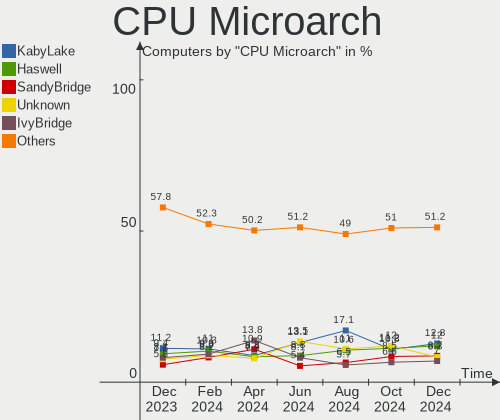
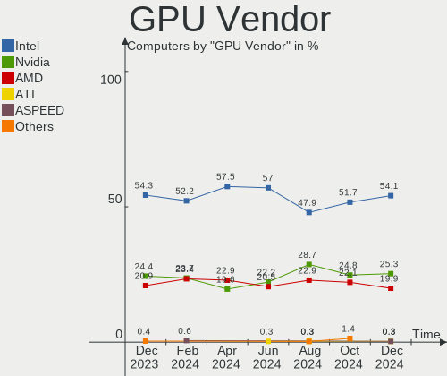

Zorin - Hardware Trends
-----------------------

A project to identify most popular hardware characteristics and track their change
over time based on data collected by Linux users at https://Linux-Hardware.org.

Anyone can contribute to this report by the [hw-probe](https://github.com/linuxhw/hw-probe) tool:

    sudo -E hw-probe -all -upload

This is a report for all computer types. See also reports for [desktops](/Dist/Zorin/Desktop/README.md) and [notebooks](/Dist/Zorin/Notebook/README.md).

This report is for one last month. Overall report since the beginning of time: [TestCoverage](https://github.com/linuxhw/TestCoverage)

Period: Sep, 2022.

Contents
--------

* [ System ](#system)
  - [ OS                       ](#os)
  - [ OS Family                ](#os-family)
  - [ Kernel                   ](#kernel)
  - [ Kernel Family            ](#kernel-family)
  - [ Kernel Major Ver.        ](#kernel-major-ver)
  - [ Arch                     ](#arch)
  - [ DE                       ](#de)
  - [ Display Server           ](#display-server)
  - [ Display Manager          ](#display-manager)
  - [ OS Lang                  ](#os-lang)
  - [ Boot Mode                ](#boot-mode)
  - [ Filesystem               ](#filesystem)
  - [ Part. scheme             ](#part-scheme)
  - [ Dual Boot with Linux/BSD ](#dual-boot-with-linuxbsd)
  - [ Dual Boot (Win)          ](#dual-boot-win)

* [ Board ](#board)
  - [ Vendor                   ](#vendor)
  - [ Model                    ](#model)
  - [ Model Family             ](#model-family)
  - [ MFG Year                 ](#mfg-year)
  - [ Form Factor              ](#form-factor)
  - [ Secure Boot              ](#secure-boot)
  - [ Coreboot                 ](#coreboot)
  - [ RAM Size                 ](#ram-size)
  - [ RAM Used                 ](#ram-used)
  - [ Total Drives             ](#total-drives)
  - [ Has CD-ROM               ](#has-cd-rom)
  - [ Has Ethernet             ](#has-ethernet)
  - [ Has WiFi                 ](#has-wifi)
  - [ Has Bluetooth            ](#has-bluetooth)

* [ Location ](#location)
  - [ Country                  ](#country)
  - [ City                     ](#city)

* [ Drives ](#drives)
  - [ Drive Vendor             ](#drive-vendor)
  - [ Drive Model              ](#drive-model)
  - [ HDD Vendor               ](#hdd-vendor)
  - [ SSD Vendor               ](#ssd-vendor)
  - [ Drive Kind               ](#drive-kind)
  - [ Drive Connector          ](#drive-connector)
  - [ Drive Size               ](#drive-size)
  - [ Space Total              ](#space-total)
  - [ Space Used               ](#space-used)
  - [ Malfunc. Drives          ](#malfunc-drives)
  - [ Malfunc. Drive Vendor    ](#malfunc-drive-vendor)
  - [ Malfunc. HDD Vendor      ](#malfunc-hdd-vendor)
  - [ Malfunc. Drive Kind      ](#malfunc-drive-kind)
  - [ Failed Drives            ](#failed-drives)
  - [ Failed Drive Vendor      ](#failed-drive-vendor)
  - [ Drive Status             ](#drive-status)

* [ Storage controller ](#storage-controller)
  - [ Storage Vendor           ](#storage-vendor)
  - [ Storage Model            ](#storage-model)
  - [ Storage Kind             ](#storage-kind)

* [ Processor ](#processor)
  - [ CPU Vendor               ](#cpu-vendor)
  - [ CPU Model                ](#cpu-model)
  - [ CPU Model Family         ](#cpu-model-family)
  - [ CPU Cores                ](#cpu-cores)
  - [ CPU Sockets              ](#cpu-sockets)
  - [ CPU Threads              ](#cpu-threads)
  - [ CPU Op-Modes             ](#cpu-op-modes)
  - [ CPU Microcode            ](#cpu-microcode)
  - [ CPU Microarch            ](#cpu-microarch)

* [ Graphics ](#graphics)
  - [ GPU Vendor               ](#gpu-vendor)
  - [ GPU Model                ](#gpu-model)
  - [ GPU Combo                ](#gpu-combo)
  - [ GPU Driver               ](#gpu-driver)
  - [ GPU Memory               ](#gpu-memory)

* [ Monitor ](#monitor)
  - [ Monitor Vendor           ](#monitor-vendor)
  - [ Monitor Model            ](#monitor-model)
  - [ Monitor Resolution       ](#monitor-resolution)
  - [ Monitor Diagonal         ](#monitor-diagonal)
  - [ Monitor Width            ](#monitor-width)
  - [ Aspect Ratio             ](#aspect-ratio)
  - [ Monitor Area             ](#monitor-area)
  - [ Pixel Density            ](#pixel-density)
  - [ Multiple Monitors        ](#multiple-monitors)

* [ Network ](#network)
  - [ Net Controller Vendor    ](#net-controller-vendor)
  - [ Net Controller Model     ](#net-controller-model)
  - [ Wireless Vendor          ](#wireless-vendor)
  - [ Wireless Model           ](#wireless-model)
  - [ Ethernet Vendor          ](#ethernet-vendor)
  - [ Ethernet Model           ](#ethernet-model)
  - [ Net Controller Kind      ](#net-controller-kind)
  - [ Used Controller          ](#used-controller)
  - [ NICs                     ](#nics)
  - [ IPv6                     ](#ipv6)

* [ Bluetooth ](#bluetooth)
  - [ Bluetooth Vendor         ](#bluetooth-vendor)
  - [ Bluetooth Model          ](#bluetooth-model)

* [ Sound ](#sound)
  - [ Sound Vendor             ](#sound-vendor)
  - [ Sound Model              ](#sound-model)

* [ Memory ](#memory)
  - [ Memory Vendor            ](#memory-vendor)
  - [ Memory Model             ](#memory-model)
  - [ Memory Kind              ](#memory-kind)
  - [ Memory Form Factor       ](#memory-form-factor)
  - [ Memory Size              ](#memory-size)
  - [ Memory Speed             ](#memory-speed)

* [ Printers & scanners ](#printers--scanners)
  - [ Printer Vendor           ](#printer-vendor)
  - [ Printer Model            ](#printer-model)
  - [ Scanner Vendor           ](#scanner-vendor)
  - [ Scanner Model            ](#scanner-model)

* [ Camera ](#camera)
  - [ Camera Vendor            ](#camera-vendor)
  - [ Camera Model             ](#camera-model)

* [ Security ](#security)
  - [ Fingerprint Vendor       ](#fingerprint-vendor)
  - [ Fingerprint Model        ](#fingerprint-model)
  - [ Chipcard Vendor          ](#chipcard-vendor)
  - [ Chipcard Model           ](#chipcard-model)

* [ Unsupported ](#unsupported)
  - [ Unsupported Devices      ](#unsupported-devices)
  - [ Unsupported Device Types ](#unsupported-device-types)

System
------

OS
--

Installed operating systems

| Name     | Computers | Percent |
|----------|-----------|---------|
| Zorin 16 | 135       | 91.84%  |
| Zorin 15 | 11        | 7.48%   |
| Zorin 12 | 1         | 0.68%   |

OS Family
---------

OS without a version

| Name  | Computers | Percent |
|-------|-----------|---------|
| Zorin | 147       | 100%    |

Kernel
------

Version of the Linux kernel

| Version                   | Computers | Percent |
|---------------------------|-----------|---------|
| 5.15.0-46-generic         | 79        | 53.74%  |
| 5.15.0-48-generic         | 42        | 28.57%  |
| 5.4.0-125-generic         | 6         | 4.08%   |
| 5.4.0-126-generic         | 3         | 2.04%   |
| 5.13.0-40-generic         | 2         | 1.36%   |
| 5.13.0-30-generic         | 2         | 1.36%   |
| 5.13.0-28-generic         | 2         | 1.36%   |
| 5.4.0-124-generic         | 1         | 0.68%   |
| 5.4.0-110-generic         | 1         | 0.68%   |
| 5.19.9-051909-generic     | 1         | 0.68%   |
| 5.19.6-xanmod1            | 1         | 0.68%   |
| 5.19.1-051901-generic     | 1         | 0.68%   |
| 5.19.0-8.2-liquorix-amd64 | 1         | 0.68%   |
| 5.18.6-051806-generic     | 1         | 0.68%   |
| 5.15.0-41-generic         | 1         | 0.68%   |
| 5.14.0-1051-oem           | 1         | 0.68%   |
| 5.11.0-27-generic         | 1         | 0.68%   |
| 4.15.0-142-generic        | 1         | 0.68%   |

Kernel Family
-------------

Linux kernel without a distro release

| Version | Computers | Percent |
|---------|-----------|---------|
| 5.15.0  | 122       | 82.99%  |
| 5.4.0   | 11        | 7.48%   |
| 5.13.0  | 6         | 4.08%   |
| 5.19.9  | 1         | 0.68%   |
| 5.19.6  | 1         | 0.68%   |
| 5.19.1  | 1         | 0.68%   |
| 5.19.0  | 1         | 0.68%   |
| 5.18.6  | 1         | 0.68%   |
| 5.14.0  | 1         | 0.68%   |
| 5.11.0  | 1         | 0.68%   |
| 4.15.0  | 1         | 0.68%   |

Kernel Major Ver.
-----------------

Linux kernel major version

| Version | Computers | Percent |
|---------|-----------|---------|
| 5.15    | 122       | 82.99%  |
| 5.4     | 11        | 7.48%   |
| 5.13    | 6         | 4.08%   |
| 5.19    | 4         | 2.72%   |
| 5.18    | 1         | 0.68%   |
| 5.14    | 1         | 0.68%   |
| 5.11    | 1         | 0.68%   |
| 4.15    | 1         | 0.68%   |

Arch
----

OS architecture (x86_64, i586, etc.)

| Name   | Computers | Percent |
|--------|-----------|---------|
| x86_64 | 141       | 95.92%  |
| i686   | 6         | 4.08%   |

DE
--

Desktop Environment

| Name    | Computers | Percent |
|---------|-----------|---------|
| GNOME   | 124       | 84.35%  |
| XFCE    | 22        | 14.97%  |
| Unknown | 1         | 0.68%   |

Display Server
--------------

X11 or Wayland

| Name    | Computers | Percent |
|---------|-----------|---------|
| X11     | 145       | 98.64%  |
| Wayland | 2         | 1.36%   |

Display Manager
---------------

SDDM, LightDM, etc.

| Name    | Computers | Percent |
|---------|-----------|---------|
| Unknown | 107       | 72.79%  |
| GDM3    | 17        | 11.56%  |
| GDM     | 14        | 9.52%   |
| LightDM | 9         | 6.12%   |

OS Lang
-------

Language

| Lang  | Computers | Percent |
|-------|-----------|---------|
| en_US | 66        | 44.9%   |
| de_DE | 18        | 12.24%  |
| pt_BR | 12        | 8.16%   |
| en_GB | 9         | 6.12%   |
| it_IT | 6         | 4.08%   |
| fr_FR | 6         | 4.08%   |
| en_IN | 4         | 2.72%   |
| es_ES | 3         | 2.04%   |
| pl_PL | 2         | 1.36%   |
| nl_NL | 2         | 1.36%   |
| nl_BE | 2         | 1.36%   |
| en_CA | 2         | 1.36%   |
| cs_CZ | 2         | 1.36%   |
| tr_TR | 1         | 0.68%   |
| ru_UA | 1         | 0.68%   |
| ko_KR | 1         | 0.68%   |
| fr_BE | 1         | 0.68%   |
| es_VE | 1         | 0.68%   |
| es_UY | 1         | 0.68%   |
| es_AR | 1         | 0.68%   |
| en_PH | 1         | 0.68%   |
| en_NZ | 1         | 0.68%   |
| en_IL | 1         | 0.68%   |
| en_AU | 1         | 0.68%   |
| de_AT | 1         | 0.68%   |
| ca_ES | 1         | 0.68%   |

Boot Mode
---------

EFI or BIOS

| Mode | Computers | Percent |
|------|-----------|---------|
| EFI  | 75        | 51.02%  |
| BIOS | 72        | 48.98%  |

Filesystem
----------

Type of filesystem

| Type | Computers | Percent |
|------|-----------|---------|
| Ext4 | 142       | 96.6%   |
| Zfs  | 3         | 2.04%   |
| Ext3 | 1         | 0.68%   |
| Ext2 | 1         | 0.68%   |

Part. scheme
------------

Scheme of partitioning

| Type    | Computers | Percent |
|---------|-----------|---------|
| Unknown | 130       | 88.44%  |
| GPT     | 10        | 6.8%    |
| MBR     | 7         | 4.76%   |

Dual Boot with Linux/BSD
------------------------

Hosting more than one Linux/BSD

| Dual boot | Computers | Percent |
|-----------|-----------|---------|
| No        | 144       | 97.96%  |
| Yes       | 3         | 2.04%   |

Dual Boot (Win)
---------------

Hosting Linux and Windows

| Dual boot | Computers | Percent |
|-----------|-----------|---------|
| No        | 137       | 93.2%   |
| Yes       | 10        | 6.8%    |

Board
-----

Vendor
------

Motherboard manufacturer

| Name                | Computers | Percent |
|---------------------|-----------|---------|
| Hewlett-Packard     | 32        | 21.77%  |
| Dell                | 21        | 14.29%  |
| ASUSTek Computer    | 19        | 12.93%  |
| Lenovo              | 18        | 12.24%  |
| Acer                | 7         | 4.76%   |
| Gigabyte Technology | 6         | 4.08%   |
| Apple               | 6         | 4.08%   |
| MSI                 | 5         | 3.4%    |
| ASRock              | 5         | 3.4%    |
| Toshiba             | 4         | 2.72%   |
| Samsung Electronics | 3         | 2.04%   |
| Notebook            | 2         | 1.36%   |
| Fujitsu             | 2         | 1.36%   |
| UMAX                | 1         | 0.68%   |
| Positivo            | 1         | 0.68%   |
| Microtech           | 1         | 0.68%   |
| Medion              | 1         | 0.68%   |
| Itautec             | 1         | 0.68%   |
| Irbis               | 1         | 0.68%   |
| IP3 Tech            | 1         | 0.68%   |
| Intel               | 1         | 0.68%   |
| HUAWEI              | 1         | 0.68%   |
| Gateway             | 1         | 0.68%   |
| Ematic              | 1         | 0.68%   |
| ECS                 | 1         | 0.68%   |
| Chuwi               | 1         | 0.68%   |
| Biostar             | 1         | 0.68%   |
| AZW                 | 1         | 0.68%   |
| Alienware           | 1         | 0.68%   |
| Unknown             | 1         | 0.68%   |

Model
-----

Motherboard model

| Name                               | Computers | Percent |
|------------------------------------|-----------|---------|
| HP Pavilion g7                     | 2         | 1.36%   |
| HP EliteBook 840 G6                | 2         | 1.36%   |
| ASUS ROG CROSSHAIR VIII HERO       | 2         | 1.36%   |
| UMAX VisionBook N14G Plus          | 1         | 0.68%   |
| Toshiba Satellite P200             | 1         | 0.68%   |
| Toshiba Satellite L855             | 1         | 0.68%   |
| Toshiba Satellite C855             | 1         | 0.68%   |
| Toshiba Satellite C55-C            | 1         | 0.68%   |
| Samsung 950XCJ/951XCJ/950XCR       | 1         | 0.68%   |
| Samsung 800G5M/800G5W              | 1         | 0.68%   |
| Samsung 600B4B/600B5B              | 1         | 0.68%   |
| Positivo C14CR01                   | 1         | 0.68%   |
| Notebook NJ50_70CU                 | 1         | 0.68%   |
| Notebook NJ50GU                    | 1         | 0.68%   |
| MSI MS-7918                        | 1         | 0.68%   |
| MSI MS-7915                        | 1         | 0.68%   |
| MSI MS-7260                        | 1         | 0.68%   |
| MSI H310 Gaming Trident3 (MS-B920) | 1         | 0.68%   |
| MSI 700-056                        | 1         | 0.68%   |
| Microtech CoreBook                 | 1         | 0.68%   |
| Medion Akoya E1318T                | 1         | 0.68%   |
| Lenovo Yoga S740-15IRH 81NX        | 1         | 0.68%   |
| Lenovo ThinkPad Edge E530 3259CTO  | 1         | 0.68%   |
| Lenovo ThinkPad E570 20H50047US    | 1         | 0.68%   |
| Lenovo ThinkPad 11e 20DAS09U00     | 1         | 0.68%   |
| Lenovo ThinkCentre M93p 10A9CTO1WW | 1         | 0.68%   |
| Lenovo ThinkCentre M92 3229A11     | 1         | 0.68%   |
| Lenovo ThinkCentre M71e 3157AE2    | 1         | 0.68%   |
| Lenovo ThinkCentre M58e 7298A76    | 1         | 0.68%   |
| Lenovo IdeaPadFlex 15D 20334       | 1         | 0.68%   |
| Lenovo IdeaPad S130-11IGM 81J1     | 1         | 0.68%   |
| Lenovo IdeaPad 5 14ALC05 82LM      | 1         | 0.68%   |
| Lenovo IdeaPad 3 15ADA6 82KR       | 1         | 0.68%   |
| Lenovo IdeaPad 130-15IKB 81H7      | 1         | 0.68%   |
| Lenovo IdeaPad 130-15AST 81H5      | 1         | 0.68%   |
| Lenovo IdeaPad 110-15ACL 80TJ      | 1         | 0.68%   |
| Lenovo H30-05 90BJ00CNMT           | 1         | 0.68%   |
| Lenovo G560 20042                  | 1         | 0.68%   |
| Lenovo G400s VILG1                 | 1         | 0.68%   |
| Itautec Infoway                    | 1         | 0.68%   |

Model Family
------------

Motherboard model prefix

| Name               | Computers | Percent |
|--------------------|-----------|---------|
| HP Pavilion        | 9         | 6.12%   |
| Dell Latitude      | 8         | 5.44%   |
| Lenovo IdeaPad     | 6         | 4.08%   |
| Dell Inspiron      | 6         | 4.08%   |
| Acer Aspire        | 6         | 4.08%   |
| HP EliteBook       | 5         | 3.4%    |
| Toshiba Satellite  | 4         | 2.72%   |
| Lenovo ThinkCentre | 4         | 2.72%   |
| HP Compaq          | 4         | 2.72%   |
| ASUS ROG           | 4         | 2.72%   |
| Lenovo ThinkPad    | 3         | 2.04%   |
| Dell OptiPlex      | 3         | 2.04%   |
| ASUS PRIME         | 3         | 2.04%   |
| HP Stream          | 2         | 1.36%   |
| HP Laptop          | 2         | 1.36%   |
| Dell XPS           | 2         | 1.36%   |
| UMAX VisionBook    | 1         | 0.68%   |
| Samsung 950XCJ     | 1         | 0.68%   |
| Samsung 800G5M     | 1         | 0.68%   |
| Samsung 600B4B     | 1         | 0.68%   |
| Positivo C14CR01   | 1         | 0.68%   |
| Notebook NJ50GU    | 1         | 0.68%   |
| Notebook NJ50      | 1         | 0.68%   |
| MSI MS-7918        | 1         | 0.68%   |
| MSI MS-7915        | 1         | 0.68%   |
| MSI MS-7260        | 1         | 0.68%   |
| MSI H310           | 1         | 0.68%   |
| MSI 700-056        | 1         | 0.68%   |
| Microtech CoreBook | 1         | 0.68%   |
| Medion Akoya       | 1         | 0.68%   |
| Lenovo Yoga        | 1         | 0.68%   |
| Lenovo IdeaPadFlex | 1         | 0.68%   |
| Lenovo H30-05      | 1         | 0.68%   |
| Lenovo G560        | 1         | 0.68%   |
| Lenovo G400s       | 1         | 0.68%   |
| Itautec Infoway    | 1         | 0.68%   |
| Irbis NB61         | 1         | 0.68%   |
| IP3 Tech HeroBox   | 1         | 0.68%   |
| Intel SKYBAY       | 1         | 0.68%   |
| HUAWEI NBLK-WAX9X  | 1         | 0.68%   |

MFG Year
--------

Motherboard manufacture year

| Year | Computers | Percent |
|------|-----------|---------|
| 2018 | 15        | 10.2%   |
| 2021 | 12        | 8.16%   |
| 2019 | 11        | 7.48%   |
| 2014 | 11        | 7.48%   |
| 2013 | 11        | 7.48%   |
| 2012 | 11        | 7.48%   |
| 2016 | 10        | 6.8%    |
| 2015 | 10        | 6.8%    |
| 2011 | 9         | 6.12%   |
| 2007 | 9         | 6.12%   |
| 2020 | 7         | 4.76%   |
| 2010 | 6         | 4.08%   |
| 2009 | 6         | 4.08%   |
| 2017 | 5         | 3.4%    |
| 2008 | 5         | 3.4%    |
| 2006 | 5         | 3.4%    |
| 2022 | 2         | 1.36%   |
| 2005 | 2         | 1.36%   |

Form Factor
-----------

Physical design of the computer

| Name       | Computers | Percent |
|------------|-----------|---------|
| Notebook   | 88        | 59.86%  |
| Desktop    | 54        | 36.73%  |
| All in one | 3         | 2.04%   |
| Mini pc    | 2         | 1.36%   |

Secure Boot
-----------

Enabled or disabled

| State    | Computers | Percent |
|----------|-----------|---------|
| Disabled | 128       | 87.07%  |
| Enabled  | 19        | 12.93%  |

Coreboot
--------

Have coreboot on board

| Used | Computers | Percent |
|------|-----------|---------|
| No   | 147       | 100%    |

RAM Size
--------

Total RAM memory

| Size in GB  | Computers | Percent |
|-------------|-----------|---------|
| 3.01-4.0    | 40        | 27.21%  |
| 4.01-8.0    | 35        | 23.81%  |
| 16.01-24.0  | 26        | 17.69%  |
| 8.01-16.0   | 24        | 16.33%  |
| 1.01-2.0    | 11        | 7.48%   |
| 32.01-64.0  | 6         | 4.08%   |
| 2.01-3.0    | 4         | 2.72%   |
| 64.01-256.0 | 1         | 0.68%   |

RAM Used
--------

Used RAM memory

| Used GB   | Computers | Percent |
|-----------|-----------|---------|
| 1.01-2.0  | 55        | 37.41%  |
| 2.01-3.0  | 46        | 31.29%  |
| 4.01-8.0  | 19        | 12.93%  |
| 3.01-4.0  | 15        | 10.2%   |
| 0.51-1.0  | 7         | 4.76%   |
| 8.01-16.0 | 5         | 3.4%    |

Total Drives
------------

Number of drives on board

| Drives | Computers | Percent |
|--------|-----------|---------|
| 1      | 99        | 67.35%  |
| 2      | 32        | 21.77%  |
| 3      | 10        | 6.8%    |
| 4      | 3         | 2.04%   |
| 8      | 1         | 0.68%   |
| 6      | 1         | 0.68%   |
| 5      | 1         | 0.68%   |

Has CD-ROM
----------

Has CD-ROM on board

| Presented | Computers | Percent |
|-----------|-----------|---------|
| No        | 77        | 52.38%  |
| Yes       | 70        | 47.62%  |

Has Ethernet
------------

Has Ethernet on board

| Presented | Computers | Percent |
|-----------|-----------|---------|
| Yes       | 123       | 83.67%  |
| No        | 24        | 16.33%  |

Has WiFi
--------

Has WiFi module

| Presented | Computers | Percent |
|-----------|-----------|---------|
| Yes       | 118       | 80.27%  |
| No        | 29        | 19.73%  |

Has Bluetooth
-------------

Has Bluetooth module

| Presented | Computers | Percent |
|-----------|-----------|---------|
| Yes       | 78        | 53.06%  |
| No        | 69        | 46.94%  |

Location
--------

Country
-------

Geographic location (country)

| Country       | Computers | Percent |
|---------------|-----------|---------|
| USA           | 44        | 29.93%  |
| Germany       | 19        | 12.93%  |
| Brazil        | 10        | 6.8%    |
| Italy         | 8         | 5.44%   |
| UK            | 7         | 4.76%   |
| Netherlands   | 5         | 3.4%    |
| Spain         | 4         | 2.72%   |
| India         | 4         | 2.72%   |
| France        | 4         | 2.72%   |
| Czechia       | 3         | 2.04%   |
| Canada        | 3         | 2.04%   |
| Belgium       | 3         | 2.04%   |
| Russia        | 2         | 1.36%   |
| Poland        | 2         | 1.36%   |
| Egypt         | 2         | 1.36%   |
| Argentina     | 2         | 1.36%   |
| Yemen         | 1         | 0.68%   |
| Venezuela     | 1         | 0.68%   |
| Uruguay       | 1         | 0.68%   |
| Ukraine       | 1         | 0.68%   |
| Turkey        | 1         | 0.68%   |
| Tunisia       | 1         | 0.68%   |
| South Korea   | 1         | 0.68%   |
| Romania       | 1         | 0.68%   |
| Puerto Rico   | 1         | 0.68%   |
| Philippines   | 1         | 0.68%   |
| Nigeria       | 1         | 0.68%   |
| New Zealand   | 1         | 0.68%   |
| Malaysia      | 1         | 0.68%   |
| Japan         | 1         | 0.68%   |
| Israel        | 1         | 0.68%   |
| Ireland       | 1         | 0.68%   |
| Iraq          | 1         | 0.68%   |
| Iran          | 1         | 0.68%   |
| French Guiana | 1         | 0.68%   |
| Faroe Islands | 1         | 0.68%   |
| Denmark       | 1         | 0.68%   |
| China         | 1         | 0.68%   |
| Bulgaria      | 1         | 0.68%   |
| Austria       | 1         | 0.68%   |

City
----

Geographic location (city)

| City                   | Computers | Percent |
|------------------------|-----------|---------|
| Sao Paulo              | 5         | 3.4%    |
| Munich                 | 4         | 2.72%   |
| Seattle                | 2         | 1.36%   |
| Rome                   | 2         | 1.36%   |
| Phoenix                | 2         | 1.36%   |
| Madrid                 | 2         | 1.36%   |
| Leidschendam           | 2         | 1.36%   |
| Krakow                 | 2         | 1.36%   |
| Denver                 | 2         | 1.36%   |
| Clausthal-Zellerfeld   | 2         | 1.36%   |
| Unknown                | 2         | 1.36%   |
| Zeist                  | 1         | 0.68%   |
| Wiednitz               | 1         | 0.68%   |
| West Plains            | 1         | 0.68%   |
| Walled Lake            | 1         | 0.68%   |
| Vilas                  | 1         | 0.68%   |
| Vienna                 | 1         | 0.68%   |
| Valencia               | 1         | 0.68%   |
| Umeda                  | 1         | 0.68%   |
| Ufa                    | 1         | 0.68%   |
| Tyler                  | 1         | 0.68%   |
| Turin                  | 1         | 0.68%   |
| Tring                  | 1         | 0.68%   |
| Tórshavn              | 1         | 0.68%   |
| Tel Aviv               | 1         | 0.68%   |
| Surbo                  | 1         | 0.68%   |
| Stralsund              | 1         | 0.68%   |
| Springdale             | 1         | 0.68%   |
| Spring                 | 1         | 0.68%   |
| Sofia                  | 1         | 0.68%   |
| Shanghai               | 1         | 0.68%   |
| Seville                | 1         | 0.68%   |
| Scarborough            | 1         | 0.68%   |
| Sanaa                  | 1         | 0.68%   |
| San Miguel de Tucumán | 1         | 0.68%   |
| Salisbury              | 1         | 0.68%   |
| Saint John             | 1         | 0.68%   |
| Running Springs        | 1         | 0.68%   |
| Roseville              | 1         | 0.68%   |
| Rho                    | 1         | 0.68%   |

Drives
------

Drive Vendor
------------

Hard drive vendors

| Vendor              | Computers | Drives | Percent |
|---------------------|-----------|--------|---------|
| WDC                 | 31        | 31     | 15.35%  |
| Seagate             | 30        | 32     | 14.85%  |
| Samsung Electronics | 22        | 27     | 10.89%  |
| Toshiba             | 19        | 19     | 9.41%   |
| SanDisk             | 12        | 12     | 5.94%   |
| Kingston            | 10        | 12     | 4.95%   |
| Crucial             | 10        | 10     | 4.95%   |
| Unknown             | 9         | 13     | 4.46%   |
| Intel               | 5         | 5      | 2.48%   |
| Micron Technology   | 4         | 5      | 1.98%   |
| HGST                | 4         | 4      | 1.98%   |
| SK hynix            | 3         | 3      | 1.49%   |
| Patriot             | 3         | 3      | 1.49%   |
| Hitachi             | 3         | 3      | 1.49%   |
| Apple               | 3         | 3      | 1.49%   |
| Team                | 2         | 2      | 0.99%   |
| SPCC                | 2         | 2      | 0.99%   |
| PNY                 | 2         | 2      | 0.99%   |
| Netac               | 2         | 2      | 0.99%   |
| LITEON              | 2         | 2      | 0.99%   |
| Leven               | 2         | 2      | 0.99%   |
| KingSpec            | 2         | 2      | 0.99%   |
| Intenso             | 2         | 2      | 0.99%   |
| A-DATA Technology   | 2         | 3      | 0.99%   |
| Unknown             | 2         | 2      | 0.99%   |
| V300                | 1         | 1      | 0.5%    |
| USB3.0              | 1         | 1      | 0.5%    |
| Transcend           | 1         | 1      | 0.5%    |
| OCZ                 | 1         | 1      | 0.5%    |
| Mushkin             | 1         | 1      | 0.5%    |
| Lite-On Technology  | 1         | 1      | 0.5%    |
| Lexar               | 1         | 1      | 0.5%    |
| HS-SSD-C100         | 1         | 1      | 0.5%    |
| GLOWAY              | 1         | 1      | 0.5%    |
| Fujitsu             | 1         | 1      | 0.5%    |
| China               | 1         | 1      | 0.5%    |
| BHT                 | 1         | 1      | 0.5%    |
| AFOX                | 1         | 1      | 0.5%    |
| Acer                | 1         | 1      | 0.5%    |

Drive Model
-----------

Hard drive models

| Model                                               | Computers | Percent |
|-----------------------------------------------------|-----------|---------|
| Toshiba MQ01ABF050 500GB                            | 4         | 1.86%   |
| Kingston SA400S37480G 480GB SSD                     | 4         | 1.86%   |
| Unknown MMC Card  64GB                              | 3         | 1.4%    |
| Unknown MMC Card  32GB                              | 3         | 1.4%    |
| Samsung SSD 850 EVO 250GB                           | 3         | 1.4%    |
| Samsung NVMe SSD Drive 1TB                          | 3         | 1.4%    |
| Kingston SA400S37240G 240GB SSD                     | 3         | 1.4%    |
| WDC WD10EZEX-60M2NA0 1TB                            | 2         | 0.93%   |
| WDC WD10EZEX-08M2NA0 1TB                            | 2         | 0.93%   |
| Toshiba MQ01ABD100 1TB                              | 2         | 0.93%   |
| Toshiba DT01ACA050 500GB                            | 2         | 0.93%   |
| SK hynix NVMe SSD Drive 512GB                       | 2         | 0.93%   |
| Seagate ST9500325AS 500GB                           | 2         | 0.93%   |
| Seagate ST500LT012-1DG142 500GB                     | 2         | 0.93%   |
| Seagate ST2000DM008-2FR102 2TB                      | 2         | 0.93%   |
| Seagate ST1000DM010-2EP102 1TB                      | 2         | 0.93%   |
| Seagate ST1000DM003-1SB102 1TB                      | 2         | 0.93%   |
| Seagate Expansion 1TB                               | 2         | 0.93%   |
| Samsung SSD 870 EVO 1TB                             | 2         | 0.93%   |
| Samsung NVMe SSD Controller SM981/PM981/PM983 256GB | 2         | 0.93%   |
| Micron NVMe SSD Drive 256GB                         | 2         | 0.93%   |
| Crucial CT240BX500SSD1 240GB                        | 2         | 0.93%   |
| Crucial CT1000MX500SSD1 1TB                         | 2         | 0.93%   |
| Unknown                                             | 2         | 0.93%   |
| WDC WDS500G2B0A-00SM50 500GB SSD                    | 1         | 0.47%   |
| WDC WDS480G2G0A-00JH30 480GB SSD                    | 1         | 0.47%   |
| WDC WDS100T2B0A-00SM50 1TB SSD                      | 1         | 0.47%   |
| WDC WDBNCE0010PNC 1TB SSD                           | 1         | 0.47%   |
| WDC WD5000LPVX-22V0TT0 500GB                        | 1         | 0.47%   |
| WDC WD5000LPVX-00V0TT0 500GB                        | 1         | 0.47%   |
| WDC WD5000LPLX-00ZNTT0 500GB                        | 1         | 0.47%   |
| WDC WD5000LPCX-75VHAT0 500GB                        | 1         | 0.47%   |
| WDC WD5000LPCX-24C6HT0 500GB                        | 1         | 0.47%   |
| WDC WD5000BPKX-75HPJT0 500GB                        | 1         | 0.47%   |
| WDC WD5000AAKX-22ERMA0 500GB                        | 1         | 0.47%   |
| WDC WD5000AAKS-75V0A0 500GB                         | 1         | 0.47%   |
| WDC WD5000AAKS-00UU3A0 500GB                        | 1         | 0.47%   |
| WDC WD40EZRZ-00GXCB0 4TB                            | 1         | 0.47%   |
| WDC WD400VE-75HDT1 40GB                             | 1         | 0.47%   |
| WDC WD3200AVJS-63B6A0 320GB                         | 1         | 0.47%   |

HDD Vendor
----------

Hard disk drive vendors

| Vendor              | Computers | Drives | Percent |
|---------------------|-----------|--------|---------|
| Seagate             | 28        | 30     | 34.15%  |
| WDC                 | 25        | 25     | 30.49%  |
| Toshiba             | 16        | 16     | 19.51%  |
| HGST                | 4         | 4      | 4.88%   |
| Hitachi             | 3         | 3      | 3.66%   |
| Samsung Electronics | 2         | 2      | 2.44%   |
| USB3.0              | 1         | 1      | 1.22%   |
| Unknown             | 1         | 1      | 1.22%   |
| Fujitsu             | 1         | 1      | 1.22%   |
| Apple               | 1         | 1      | 1.22%   |

SSD Vendor
----------

Solid state drive vendors

| Vendor              | Computers | Drives | Percent |
|---------------------|-----------|--------|---------|
| Samsung Electronics | 11        | 13     | 13.92%  |
| Crucial             | 10        | 10     | 12.66%  |
| Kingston            | 9         | 10     | 11.39%  |
| SanDisk             | 8         | 8      | 10.13%  |
| WDC                 | 4         | 4      | 5.06%   |
| Patriot             | 3         | 3      | 3.8%    |
| Intel               | 3         | 3      | 3.8%    |
| Toshiba             | 2         | 2      | 2.53%   |
| Team                | 2         | 2      | 2.53%   |
| SPCC                | 2         | 2      | 2.53%   |
| PNY                 | 2         | 2      | 2.53%   |
| Netac               | 2         | 2      | 2.53%   |
| LITEON              | 2         | 2      | 2.53%   |
| Leven               | 2         | 2      | 2.53%   |
| KingSpec            | 2         | 2      | 2.53%   |
| A-DATA Technology   | 2         | 3      | 2.53%   |
| Transcend           | 1         | 1      | 1.27%   |
| OCZ                 | 1         | 1      | 1.27%   |
| Mushkin             | 1         | 1      | 1.27%   |
| Micron Technology   | 1         | 1      | 1.27%   |
| Lexar               | 1         | 1      | 1.27%   |
| Intenso             | 1         | 1      | 1.27%   |
| GLOWAY              | 1         | 1      | 1.27%   |
| China               | 1         | 1      | 1.27%   |
| BHT                 | 1         | 1      | 1.27%   |
| Apple               | 1         | 1      | 1.27%   |
| AFOX                | 1         | 1      | 1.27%   |
| Acer                | 1         | 1      | 1.27%   |
| Unknown             | 1         | 1      | 1.27%   |

Drive Kind
----------

HDD or SSD

| Kind    | Computers | Drives | Percent |
|---------|-----------|--------|---------|
| HDD     | 75        | 84     | 40.11%  |
| SSD     | 69        | 83     | 36.9%   |
| NVMe    | 29        | 32     | 15.51%  |
| MMC     | 8         | 11     | 4.28%   |
| Unknown | 6         | 7      | 3.21%   |

Drive Connector
---------------

SATA, SAS, NVMe, etc.

| Type | Computers | Drives | Percent |
|------|-----------|--------|---------|
| SATA | 124       | 162    | 72.51%  |
| NVMe | 29        | 32     | 16.96%  |
| SAS  | 10        | 12     | 5.85%   |
| MMC  | 8         | 11     | 4.68%   |

Drive Size
----------

Size of hard drive

| Size in TB | Computers | Drives | Percent |
|------------|-----------|--------|---------|
| 0.01-0.5   | 95        | 113    | 66.43%  |
| 0.51-1.0   | 36        | 42     | 25.17%  |
| 1.01-2.0   | 8         | 8      | 5.59%   |
| 2.01-3.0   | 2         | 2      | 1.4%    |
| 3.01-4.0   | 1         | 1      | 0.7%    |
| 10.01-20.0 | 1         | 1      | 0.7%    |

Space Total
-----------

Amount of disk space available on the file system

| Size in GB     | Computers | Percent |
|----------------|-----------|---------|
| 101-250        | 53        | 36.05%  |
| 251-500        | 39        | 26.53%  |
| 501-1000       | 17        | 11.56%  |
| 21-50          | 12        | 8.16%   |
| 1001-2000      | 10        | 6.8%    |
| 51-100         | 8         | 5.44%   |
| More than 3000 | 4         | 2.72%   |
| Unknown        | 3         | 2.04%   |
| 1-20           | 1         | 0.68%   |

Space Used
----------

Amount of used disk space

| Used GB        | Computers | Percent |
|----------------|-----------|---------|
| 1-20           | 51        | 34.69%  |
| 21-50          | 38        | 25.85%  |
| 51-100         | 24        | 16.33%  |
| 101-250        | 15        | 10.2%   |
| 251-500        | 8         | 5.44%   |
| 501-1000       | 3         | 2.04%   |
| Unknown        | 3         | 2.04%   |
| 2001-3000      | 2         | 1.36%   |
| 1001-2000      | 2         | 1.36%   |
| More than 3000 | 1         | 0.68%   |

Malfunc. Drives
---------------

Drive models with a malfunction

| Model                          | Computers | Drives | Percent |
|--------------------------------|-----------|--------|---------|
| Toshiba MQ01ABF050 500GB       | 1         | 1      | 25%     |
| Seagate ST3250318AS 250GB      | 1         | 1      | 25%     |
| Seagate ST2000DM008-2FR102 2TB | 1         | 1      | 25%     |
| Intel SSDSC2CW060A3 64GB       | 1         | 1      | 25%     |

Malfunc. Drive Vendor
---------------------

Vendors of faulty drives

| Vendor  | Computers | Drives | Percent |
|---------|-----------|--------|---------|
| Seagate | 2         | 2      | 50%     |
| Toshiba | 1         | 1      | 25%     |
| Intel   | 1         | 1      | 25%     |

Malfunc. HDD Vendor
-------------------

Vendors of faulty HDD drives

| Vendor  | Computers | Drives | Percent |
|---------|-----------|--------|---------|
| Seagate | 2         | 2      | 66.67%  |
| Toshiba | 1         | 1      | 33.33%  |

Malfunc. Drive Kind
-------------------

Kinds of faulty drives

| Kind | Computers | Drives | Percent |
|------|-----------|--------|---------|
| HDD  | 3         | 3      | 75%     |
| SSD  | 1         | 1      | 25%     |

Failed Drives
-------------

Failed drive models

Zero info for selected period =(

Failed Drive Vendor
-------------------

Failed drive vendors

Zero info for selected period =(

Drive Status
------------

Number of failed and malfunc. drives

| Status   | Computers | Drives | Percent |
|----------|-----------|--------|---------|
| Detected | 132       | 199    | 89.19%  |
| Works    | 12        | 14     | 8.11%   |
| Malfunc  | 4         | 4      | 2.7%    |

Storage controller
------------------

Storage Vendor
--------------

Storage controller vendors

| Vendor                       | Computers | Percent |
|------------------------------|-----------|---------|
| Intel                        | 100       | 59.52%  |
| AMD                          | 30        | 17.86%  |
| Samsung Electronics          | 12        | 7.14%   |
| Nvidia                       | 6         | 3.57%   |
| SanDisk                      | 5         | 2.98%   |
| SK hynix                     | 3         | 1.79%   |
| Micron Technology            | 3         | 1.79%   |
| ASMedia Technology           | 2         | 1.19%   |
| Toshiba America Info Systems | 1         | 0.6%    |
| Silicon Image                | 1         | 0.6%    |
| Seagate Technology           | 1         | 0.6%    |
| Lite-On Technology           | 1         | 0.6%    |
| Kingston Technology Company  | 1         | 0.6%    |
| JMicron Technology           | 1         | 0.6%    |
| Apple                        | 1         | 0.6%    |

Storage Model
-------------

Storage controller models

| Model                                                                            | Computers | Percent |
|----------------------------------------------------------------------------------|-----------|---------|
| AMD FCH SATA Controller [AHCI mode]                                              | 24        | 12.18%  |
| Intel 8 Series/C220 Series Chipset Family 6-port SATA Controller 1 [AHCI mode]   | 10        | 5.08%   |
| Intel Sunrise Point-LP SATA Controller [AHCI mode]                               | 7         | 3.55%   |
| Intel Celeron/Pentium Silver Processor SATA Controller                           | 7         | 3.55%   |
| Intel 82801G (ICH7 Family) IDE Controller                                        | 6         | 3.05%   |
| Intel 7 Series Chipset Family 6-port SATA Controller [AHCI mode]                 | 6         | 3.05%   |
| Intel Volume Management Device NVMe RAID Controller                              | 5         | 2.54%   |
| Intel 82801 Mobile SATA Controller [RAID mode]                                   | 5         | 2.54%   |
| Intel 6 Series/C200 Series Chipset Family 6 port Mobile SATA AHCI Controller     | 5         | 2.54%   |
| Samsung NVMe SSD Controller SM981/PM981/PM983                                    | 4         | 2.03%   |
| Samsung NVMe SSD Controller PM9A1/PM9A3/980PRO                                   | 4         | 2.03%   |
| Intel Wildcat Point-LP SATA Controller [AHCI Mode]                               | 4         | 2.03%   |
| Micron Non-Volatile memory controller                                            | 3         | 1.52%   |
| Intel SATA Controller [RAID mode]                                                | 3         | 1.52%   |
| Intel Atom Processor E3800 Series SATA AHCI Controller                           | 3         | 1.52%   |
| Intel 82801IBM/IEM (ICH9M/ICH9M-E) 4 port SATA Controller [AHCI mode]            | 3         | 1.52%   |
| Intel 6 Series/C200 Series Chipset Family 6 port Desktop SATA AHCI Controller    | 3         | 1.52%   |
| Intel 5 Series/3400 Series Chipset 4 port SATA AHCI Controller                   | 3         | 1.52%   |
| AMD 400 Series Chipset SATA Controller                                           | 3         | 1.52%   |
| SanDisk WD Black SN750 / PC SN730 NVMe SSD                                       | 2         | 1.02%   |
| Samsung NVMe SSD Controller SM961/PM961/SM963                                    | 2         | 1.02%   |
| Nvidia MCP67 AHCI Controller                                                     | 2         | 1.02%   |
| Intel NM10/ICH7 Family SATA Controller [AHCI mode]                               | 2         | 1.02%   |
| Intel HM170/QM170 Chipset SATA Controller [AHCI Mode]                            | 2         | 1.02%   |
| Intel Cannon Lake PCH SATA AHCI Controller                                       | 2         | 1.02%   |
| Intel Atom/Celeron/Pentium Processor x5-E8000/J3xxx/N3xxx Series SATA Controller | 2         | 1.02%   |
| Intel Alder Lake-S PCH SATA Controller [AHCI Mode]                               | 2         | 1.02%   |
| Intel 9 Series Chipset Family SATA Controller [AHCI Mode]                        | 2         | 1.02%   |
| Intel 82801HM/HEM (ICH8M/ICH8M-E) IDE Controller                                 | 2         | 1.02%   |
| Intel 82801GBM/GHM (ICH7-M Family) SATA Controller [AHCI mode]                   | 2         | 1.02%   |
| Intel 7 Series/C210 Series Chipset Family 4-port SATA Controller [IDE mode]      | 2         | 1.02%   |
| Intel 7 Series/C210 Series Chipset Family 2-port SATA Controller [IDE mode]      | 2         | 1.02%   |
| ASMedia ASM1062 Serial ATA Controller                                            | 2         | 1.02%   |
| AMD SB7x0/SB8x0/SB9x0 SATA Controller [IDE mode]                                 | 2         | 1.02%   |
| AMD SB7x0/SB8x0/SB9x0 IDE Controller                                             | 2         | 1.02%   |
| AMD FCH SATA Controller [IDE mode]                                               | 2         | 1.02%   |
| AMD 300 Series Chipset SATA Controller                                           | 2         | 1.02%   |
| Toshiba America Info Systems BG3 NVMe SSD Controller                             | 1         | 0.51%   |
| SK hynix Non-Volatile memory controller                                          | 1         | 0.51%   |
| SK hynix BC511                                                                   | 1         | 0.51%   |

Storage Kind
------------

Kind of storage controller (IDE, SATA, NVMe, SAS, ...)

| Kind | Computers | Percent |
|------|-----------|---------|
| SATA | 111       | 61.33%  |
| NVMe | 29        | 16.02%  |
| IDE  | 25        | 13.81%  |
| RAID | 16        | 8.84%   |

Processor
---------

CPU Vendor
----------

Processor vendors

| Vendor | Computers | Percent |
|--------|-----------|---------|
| Intel  | 111       | 75.51%  |
| AMD    | 36        | 24.49%  |

CPU Model
---------

Processor models

| Model                                         | Computers | Percent |
|-----------------------------------------------|-----------|---------|
| Intel Core i5-4590 CPU @ 3.30GHz              | 4         | 2.72%   |
| Intel Core i7-7500U CPU @ 2.70GHz             | 3         | 2.04%   |
| Intel Core i5-2430M CPU @ 2.40GHz             | 3         | 2.04%   |
| Intel Core i7-7700HQ CPU @ 2.80GHz            | 2         | 1.36%   |
| Intel Core i7-5600U CPU @ 2.60GHz             | 2         | 1.36%   |
| Intel Core i7-3770 CPU @ 3.40GHz              | 2         | 1.36%   |
| Intel Core i5-2400 CPU @ 3.10GHz              | 2         | 1.36%   |
| Intel Core i5-10210U CPU @ 1.60GHz            | 2         | 1.36%   |
| Intel Core 2 Duo CPU E6550 @ 2.33GHz          | 2         | 1.36%   |
| Intel Celeron N4000 CPU @ 1.10GHz             | 2         | 1.36%   |
| Intel Celeron CPU N3060 @ 1.60GHz             | 2         | 1.36%   |
| Intel Atom x5-Z8350 CPU @ 1.44GHz             | 2         | 1.36%   |
| AMD Ryzen 5 3500U with Radeon Vega Mobile Gfx | 2         | 1.36%   |
| AMD Phenom II X6 1055T Processor              | 2         | 1.36%   |
| AMD A8-7410 APU with AMD Radeon R5 Graphics   | 2         | 1.36%   |
| Intel Xeon CPU E5-2650 v2 @ 2.60GHz           | 1         | 0.68%   |
| Intel Xeon CPU E3-1231 v3 @ 3.40GHz           | 1         | 0.68%   |
| Intel Pentium Silver N5030 CPU @ 1.10GHz      | 1         | 0.68%   |
| Intel Pentium Silver J5040 CPU @ 2.00GHz      | 1         | 0.68%   |
| Intel Pentium M processor 2.00GHz             | 1         | 0.68%   |
| Intel Pentium Dual-Core CPU T4500 @ 2.30GHz   | 1         | 0.68%   |
| Intel Pentium Dual CPU E2140 @ 1.60GHz        | 1         | 0.68%   |
| Intel Pentium CPU N3540 @ 2.16GHz             | 1         | 0.68%   |
| Intel Pentium CPU J3710 @ 1.60GHz             | 1         | 0.68%   |
| Intel Pentium CPU G850 @ 2.90GHz              | 1         | 0.68%   |
| Intel Pentium CPU G2030 @ 3.00GHz             | 1         | 0.68%   |
| Intel Genuine CPU T2250 @ 1.73GHz             | 1         | 0.68%   |
| Intel Genuine CPU 1300 @ 1.66GHz              | 1         | 0.68%   |
| Intel Core i9-9900K CPU @ 3.60GHz             | 1         | 0.68%   |
| Intel Core i7-8700 CPU @ 3.20GHz              | 1         | 0.68%   |
| Intel Core i7-8550U CPU @ 1.80GHz             | 1         | 0.68%   |
| Intel Core i7-7700K CPU @ 4.20GHz             | 1         | 0.68%   |
| Intel Core i7-6500U CPU @ 2.50GHz             | 1         | 0.68%   |
| Intel Core i7-4810MQ CPU @ 2.80GHz            | 1         | 0.68%   |
| Intel Core i7-4800MQ CPU @ 2.70GHz            | 1         | 0.68%   |
| Intel Core i7-4790K CPU @ 4.00GHz             | 1         | 0.68%   |
| Intel Core i7-4790 CPU @ 3.60GHz              | 1         | 0.68%   |
| Intel Core i7-4770 CPU @ 3.40GHz              | 1         | 0.68%   |
| Intel Core i7-4600U CPU @ 2.10GHz             | 1         | 0.68%   |
| Intel Core i7-3630QM CPU @ 2.40GHz            | 1         | 0.68%   |

CPU Model Family
----------------

Processor model prefix

| Model                   | Computers | Percent |
|-------------------------|-----------|---------|
| Intel Core i5           | 26        | 17.69%  |
| Intel Core i7           | 23        | 15.65%  |
| Intel Celeron           | 13        | 8.84%   |
| Intel Core 2 Duo        | 11        | 7.48%   |
| Intel Core i3           | 10        | 6.8%    |
| AMD Ryzen 5             | 8         | 5.44%   |
| Other                   | 6         | 4.08%   |
| Intel Pentium           | 4         | 2.72%   |
| Intel Atom              | 4         | 2.72%   |
| AMD A6                  | 4         | 2.72%   |
| AMD A4                  | 4         | 2.72%   |
| Intel Core 2            | 3         | 2.04%   |
| AMD Ryzen 7             | 3         | 2.04%   |
| AMD A8                  | 3         | 2.04%   |
| AMD A10                 | 3         | 2.04%   |
| Intel Xeon              | 2         | 1.36%   |
| Intel Pentium Silver    | 2         | 1.36%   |
| Intel Genuine           | 2         | 1.36%   |
| AMD Turion 64 X2 Mobile | 2         | 1.36%   |
| AMD Ryzen 3             | 2         | 1.36%   |
| AMD Phenom II X6        | 2         | 1.36%   |
| AMD Athlon              | 2         | 1.36%   |
| Intel Pentium M         | 1         | 0.68%   |
| Intel Pentium Dual-Core | 1         | 0.68%   |
| Intel Pentium Dual      | 1         | 0.68%   |
| Intel Core i9           | 1         | 0.68%   |
| Intel Core 2 Quad       | 1         | 0.68%   |
| Intel Celeron M         | 1         | 0.68%   |
| AMD Ryzen 9             | 1         | 0.68%   |
| AMD Athlon 64 X2        | 1         | 0.68%   |

CPU Cores
---------

Number of processor cores

| Number | Computers | Percent |
|--------|-----------|---------|
| 2      | 71        | 48.3%   |
| 4      | 56        | 38.1%   |
| 6      | 8         | 5.44%   |
| 8      | 5         | 3.4%    |
| 1      | 4         | 2.72%   |
| 16     | 2         | 1.36%   |
| 12     | 1         | 0.68%   |

CPU Sockets
-----------

Number of sockets

| Number | Computers | Percent |
|--------|-----------|---------|
| 1      | 146       | 99.32%  |
| 2      | 1         | 0.68%   |

CPU Threads
-----------

Threads per core (Hyper-Threading)

| Number | Computers | Percent |
|--------|-----------|---------|
| 2      | 76        | 51.7%   |
| 1      | 71        | 48.3%   |

CPU Op-Modes
------------

CPU Operation Modes (32-bit, 64-bit)

| Op mode        | Computers | Percent |
|----------------|-----------|---------|
| 32-bit, 64-bit | 143       | 97.28%  |
| 32-bit         | 4         | 2.72%   |

CPU Microcode
-------------

Microcode number

| Number     | Computers | Percent |
|------------|-----------|---------|
| Unknown    | 16        | 10.88%  |
| 0x306c3    | 12        | 8.16%   |
| 0x206a7    | 10        | 6.8%    |
| 0x306a9    | 7         | 4.76%   |
| 0x6fd      | 5         | 3.4%    |
| 0x406c4    | 5         | 3.4%    |
| 0x306d4    | 5         | 3.4%    |
| 0x806ec    | 4         | 2.72%   |
| 0x806e9    | 4         | 2.72%   |
| 0x706a8    | 4         | 2.72%   |
| 0x1067a    | 4         | 2.72%   |
| 0x906ea    | 3         | 2.04%   |
| 0x706a1    | 3         | 2.04%   |
| 0x406e3    | 3         | 2.04%   |
| 0x30678    | 3         | 2.04%   |
| 0x08108109 | 3         | 2.04%   |
| 0x07030105 | 3         | 2.04%   |
| 0x0700010f | 3         | 2.04%   |
| 0x906e9    | 2         | 1.36%   |
| 0x806c1    | 2         | 1.36%   |
| 0x6fb      | 2         | 1.36%   |
| 0x6f6      | 2         | 1.36%   |
| 0x6d8      | 2         | 1.36%   |
| 0x20655    | 2         | 1.36%   |
| 0x20652    | 2         | 1.36%   |
| 0x10676    | 2         | 1.36%   |
| 0x08701021 | 2         | 1.36%   |
| 0x08108102 | 2         | 1.36%   |
| 0x06006704 | 2         | 1.36%   |
| 0x06001119 | 2         | 1.36%   |
| 0x03000027 | 2         | 1.36%   |
| 0x010000dc | 2         | 1.36%   |
| 0x906ed    | 1         | 0.68%   |
| 0x90672    | 1         | 0.68%   |
| 0x806ea    | 1         | 0.68%   |
| 0x806d1    | 1         | 0.68%   |
| 0x6f2      | 1         | 0.68%   |
| 0x506e3    | 1         | 0.68%   |
| 0x506c9    | 1         | 0.68%   |
| 0x406c3    | 1         | 0.68%   |

CPU Microarch
-------------

Microarchitecture

| Name             | Computers | Percent |
|------------------|-----------|---------|
| KabyLake         | 16        | 10.88%  |
| Haswell          | 15        | 10.2%   |
| SandyBridge      | 12        | 8.16%   |
| Silvermont       | 10        | 6.8%    |
| Core             | 10        | 6.8%    |
| IvyBridge        | 8         | 5.44%   |
| Penryn           | 7         | 4.76%   |
| Goldmont plus    | 7         | 4.76%   |
| Zen+             | 5         | 3.4%    |
| Zen 2            | 5         | 3.4%    |
| Broadwell        | 5         | 3.4%    |
| Westmere         | 4         | 2.72%   |
| Skylake          | 4         | 2.72%   |
| Puma             | 4         | 2.72%   |
| P6               | 4         | 2.72%   |
| K8 Hammer        | 4         | 2.72%   |
| Jaguar           | 3         | 2.04%   |
| Excavator        | 3         | 2.04%   |
| Zen 3            | 2         | 1.36%   |
| Zen              | 2         | 1.36%   |
| TigerLake        | 2         | 1.36%   |
| Piledriver       | 2         | 1.36%   |
| K10 Llano        | 2         | 1.36%   |
| K10              | 2         | 1.36%   |
| Unknown          | 2         | 1.36%   |
| Steamroller      | 1         | 0.68%   |
| Nehalem          | 1         | 0.68%   |
| Icelake          | 1         | 0.68%   |
| Goldmont         | 1         | 0.68%   |
| CometLake        | 1         | 0.68%   |
| Bonnell          | 1         | 0.68%   |
| Alderlake Hybrid | 1         | 0.68%   |

Graphics
--------

GPU Vendor
----------

Vendors of graphics cards

| Vendor | Computers | Percent |
|--------|-----------|---------|
| Intel  | 86        | 51.19%  |
| AMD    | 42        | 25%     |
| Nvidia | 40        | 23.81%  |

GPU Model
---------

Graphics card models

| Model                                                                                    | Computers | Percent |
|------------------------------------------------------------------------------------------|-----------|---------|
| Intel 2nd Generation Core Processor Family Integrated Graphics Controller                | 12        | 6.94%   |
| Intel Atom/Celeron/Pentium Processor x5-E8000/J3xxx/N3xxx Integrated Graphics Controller | 6         | 3.47%   |
| Intel GeminiLake [UHD Graphics 600]                                                      | 5         | 2.89%   |
| AMD Picasso/Raven 2 [Radeon Vega Series / Radeon Vega Mobile Series]                     | 5         | 2.89%   |
| Intel Xeon E3-1200 v3/4th Gen Core Processor Integrated Graphics Controller              | 4         | 2.31%   |
| Intel HD Graphics 5500                                                                   | 4         | 2.31%   |
| Intel Atom Processor Z36xxx/Z37xxx Series Graphics & Display                             | 4         | 2.31%   |
| Intel 3rd Gen Core processor Graphics Controller                                         | 4         | 2.31%   |
| Intel Mobile 945GM/GMS, 943/940GML Express Integrated Graphics Controller                | 3         | 1.73%   |
| Intel Mobile 4 Series Chipset Integrated Graphics Controller                             | 3         | 1.73%   |
| Intel HD Graphics 620                                                                    | 3         | 1.73%   |
| Intel Core Processor Integrated Graphics Controller                                      | 3         | 1.73%   |
| AMD Mullins [Radeon R4/R5 Graphics]                                                      | 3         | 1.73%   |
| Nvidia TU117M [GeForce GTX 1650 Mobile / Max-Q]                                          | 2         | 1.16%   |
| Nvidia GA102 [GeForce RTX 3080 Lite Hash Rate]                                           | 2         | 1.16%   |
| Nvidia C67 [GeForce 7150M / nForce 630M]                                                 | 2         | 1.16%   |
| Intel WhiskeyLake-U GT2 [UHD Graphics 620]                                               | 2         | 1.16%   |
| Intel Skylake GT2 [HD Graphics 520]                                                      | 2         | 1.16%   |
| Intel Mobile 945GM/GMS/GME, 943/940GML Express Integrated Graphics Controller            | 2         | 1.16%   |
| Intel HD Graphics 630                                                                    | 2         | 1.16%   |
| Intel GeminiLake [UHD Graphics 605]                                                      | 2         | 1.16%   |
| Intel CometLake-U GT2 [UHD Graphics]                                                     | 2         | 1.16%   |
| Intel 4th Generation Core Processor Family Integrated Graphics Controller                | 2         | 1.16%   |
| AMD Stoney [Radeon R2/R3/R4/R5 Graphics]                                                 | 2         | 1.16%   |
| AMD Raven Ridge [Radeon Vega Series / Radeon Vega Mobile Series]                         | 2         | 1.16%   |
| AMD Ellesmere [Radeon RX 470/480/570/570X/580/580X/590]                                  | 2         | 1.16%   |
| Nvidia TU117M                                                                            | 1         | 0.58%   |
| Nvidia TU116 [GeForce GTX 1660 Ti]                                                       | 1         | 0.58%   |
| Nvidia TU116 [GeForce GTX 1660 SUPER]                                                    | 1         | 0.58%   |
| Nvidia TU106 [GeForce RTX 2060 Rev. A]                                                   | 1         | 0.58%   |
| Nvidia NV44 [GeForce 7100 GS]                                                            | 1         | 0.58%   |
| Nvidia GT218M [ION 2]                                                                    | 1         | 0.58%   |
| Nvidia GT216 [GeForce 210]                                                               | 1         | 0.58%   |
| Nvidia GP107M [GeForce GTX 1050 Mobile]                                                  | 1         | 0.58%   |
| Nvidia GP107 [GeForce GTX 1050 Ti]                                                       | 1         | 0.58%   |
| Nvidia GP106M [GeForce GTX 1060 Mobile]                                                  | 1         | 0.58%   |
| Nvidia GP104 [GeForce GTX 1080]                                                          | 1         | 0.58%   |
| Nvidia GP104 [GeForce GTX 1070]                                                          | 1         | 0.58%   |
| Nvidia GM108M [GeForce 940MX]                                                            | 1         | 0.58%   |
| Nvidia GM107M [GeForce GTX 950M]                                                         | 1         | 0.58%   |

GPU Combo
---------

Combinations of graphics cards

| Name           | Computers | Percent |
|----------------|-----------|---------|
| 1 x Intel      | 67        | 45.58%  |
| 1 x AMD        | 34        | 23.13%  |
| 1 x Nvidia     | 27        | 18.37%  |
| Intel + Nvidia | 10        | 6.8%    |
| Intel + AMD    | 5         | 3.4%    |
| AMD + Nvidia   | 2         | 1.36%   |
| 2 x Nvidia     | 1         | 0.68%   |
| 2 x AMD        | 1         | 0.68%   |

GPU Driver
----------

Free vs proprietary

| Driver      | Computers | Percent |
|-------------|-----------|---------|
| Free        | 115       | 78.23%  |
| Proprietary | 24        | 16.33%  |
| Unknown     | 8         | 5.44%   |

GPU Memory
----------

Total video memory

| Size in GB | Computers | Percent |
|------------|-----------|---------|
| Unknown    | 85        | 57.82%  |
| 0.01-0.5   | 25        | 17.01%  |
| 1.01-2.0   | 13        | 8.84%   |
| 0.51-1.0   | 10        | 6.8%    |
| 3.01-4.0   | 6         | 4.08%   |
| 7.01-8.0   | 3         | 2.04%   |
| 8.01-16.0  | 3         | 2.04%   |
| 5.01-6.0   | 1         | 0.68%   |
| 2.01-3.0   | 1         | 0.68%   |

Monitor
-------

Monitor Vendor
--------------

Monitor vendors

| Vendor                  | Computers | Percent |
|-------------------------|-----------|---------|
| LG Display              | 17        | 11.56%  |
| BOE                     | 16        | 10.88%  |
| AU Optronics            | 15        | 10.2%   |
| Samsung Electronics     | 14        | 9.52%   |
| Goldstar                | 10        | 6.8%    |
| Chimei Innolux          | 8         | 5.44%   |
| Dell                    | 6         | 4.08%   |
| Philips                 | 5         | 3.4%    |
| Hewlett-Packard         | 4         | 2.72%   |
| Apple                   | 4         | 2.72%   |
| Sharp                   | 3         | 2.04%   |
| PANDA                   | 3         | 2.04%   |
| Chi Mei Optoelectronics | 3         | 2.04%   |
| BenQ                    | 3         | 2.04%   |
| AOC                     | 3         | 2.04%   |
| ViewSonic               | 2         | 1.36%   |
| Unknown                 | 2         | 1.36%   |
| Sceptre Tech            | 2         | 1.36%   |
| LG Philips              | 2         | 1.36%   |
| LG Electronics          | 2         | 1.36%   |
| InfoVision              | 2         | 1.36%   |
| FUS                     | 2         | 1.36%   |
| Ancor Communications    | 2         | 1.36%   |
| Vizio                   | 1         | 0.68%   |
| Toshiba                 | 1         | 0.68%   |
| Sony                    | 1         | 0.68%   |
| SDC                     | 1         | 0.68%   |
| Ruijiang                | 1         | 0.68%   |
| PKB                     | 1         | 0.68%   |
| Microstep               | 1         | 0.68%   |
| Lenovo                  | 1         | 0.68%   |
| KDI                     | 1         | 0.68%   |
| JVC                     | 1         | 0.68%   |
| Idek Iiyama             | 1         | 0.68%   |
| HannStar                | 1         | 0.68%   |
| Gateway                 | 1         | 0.68%   |
| Fujitsu Siemens         | 1         | 0.68%   |
| CPT                     | 1         | 0.68%   |
| ASUSTek Computer        | 1         | 0.68%   |
| Acer                    | 1         | 0.68%   |

Monitor Model
-------------

Monitor models

| Model                                                                 | Computers | Percent |
|-----------------------------------------------------------------------|-----------|---------|
| BOE LCD Monitor BOE0675 1366x768 344x194mm 15.5-inch                  | 2         | 1.32%   |
| AU Optronics LCD Monitor AUO403D 1920x1080 309x174mm 14.0-inch        | 2         | 1.32%   |
| Vizio E40-D0 VIZ2001 1920x1080 885x498mm 40.0-inch                    | 1         | 0.66%   |
| ViewSonic VA2342 SERIES VSCFA2B 1920x1080 509x286mm 23.0-inch         | 1         | 0.66%   |
| ViewSonic LCD Monitor VX2757 1920x1080                                | 1         | 0.66%   |
| Unknown SMART TV 0563 1920x1080 1209x680mm 54.6-inch                  | 1         | 0.66%   |
| Unknown LCD Monitor SAMSUNG 3840x2160                                 | 1         | 0.66%   |
| Toshiba LCD Monitor LCD2207 1280x800 287x180mm 13.3-inch              | 1         | 0.66%   |
| Sony TV SNYB800 1280x768 690x390mm 31.2-inch                          | 1         | 0.66%   |
| Sharp LQ133M1JW01 SHP141B 1920x1080 294x165mm 13.3-inch               | 1         | 0.66%   |
| Sharp LCD Monitor SHP14D1 1920x1200 336x210mm 15.6-inch               | 1         | 0.66%   |
| Sharp LC-32LE440U SHP3244 1366x768 698x392mm 31.5-inch                | 1         | 0.66%   |
| SDC LCD Monitor 1920x1080                                             | 1         | 0.66%   |
| Sceptre Tech Sceptre F27 SPT0AD7 1920x1080 600x330mm 27.0-inch        | 1         | 0.66%   |
| Sceptre Tech E22 SPT08D5 1920x1080 409x230mm 18.5-inch                | 1         | 0.66%   |
| Samsung Electronics T27C350 SAM0AC5 1920x1080 598x336mm 27.0-inch     | 1         | 0.66%   |
| Samsung Electronics T22B300 SAM092D 1920x1080 477x268mm 21.5-inch     | 1         | 0.66%   |
| Samsung Electronics T22B300 SAM092B 1920x1080 477x268mm 21.5-inch     | 1         | 0.66%   |
| Samsung Electronics SMBX2335 SAM0702 1920x1080 510x287mm 23.0-inch    | 1         | 0.66%   |
| Samsung Electronics LCD Monitor SEC5441 1366x768 353x198mm 15.9-inch  | 1         | 0.66%   |
| Samsung Electronics LCD Monitor SEC3454 1600x900 382x215mm 17.3-inch  | 1         | 0.66%   |
| Samsung Electronics LCD Monitor SEC3449 1366x768 309x174mm 14.0-inch  | 1         | 0.66%   |
| Samsung Electronics LCD Monitor SEC3345 1280x800 331x207mm 15.4-inch  | 1         | 0.66%   |
| Samsung Electronics LCD Monitor SEC3157 1280x800 303x190mm 14.1-inch  | 1         | 0.66%   |
| Samsung Electronics LCD Monitor SDC415A 3200x1800 293x165mm 13.2-inch | 1         | 0.66%   |
| Samsung Electronics LCD Monitor SDC4141 1366x768 344x194mm 15.5-inch  | 1         | 0.66%   |
| Samsung Electronics LCD Monitor SAM0504 1360x768 410x256mm 19.0-inch  | 1         | 0.66%   |
| Samsung Electronics LCD Monitor SAM04FD 1360x768                      | 1         | 0.66%   |
| Samsung Electronics C27R50x SAM0F9D 1920x1080 598x336mm 27.0-inch     | 1         | 0.66%   |
| Ruijiang RJT HDMI RJT1200 1920x1200 320x180mm 14.5-inch               | 1         | 0.66%   |
| PKB LCD Monitor Viseo 223Ws 1680x1050                                 | 1         | 0.66%   |
| Philips PHL 246V5 PHLC0C5 1920x1080 531x299mm 24.0-inch               | 1         | 0.66%   |
| Philips PHL 243V7 PHLC155 1920x1080 527x296mm 23.8-inch               | 1         | 0.66%   |
| Philips PHL 203V5 PHLC0CE 1600x900 434x236mm 19.4-inch                | 1         | 0.66%   |
| Philips LCD Monitor FTV                                               | 1         | 0.66%   |
| Philips 225B PHL088B 1680x1050 474x296mm 22.0-inch                    | 1         | 0.66%   |
| PANDA LCD Monitor NCP0063 1920x1080 344x194mm 15.5-inch               | 1         | 0.66%   |
| PANDA LCD Monitor NCP0056 1920x1080 309x174mm 14.0-inch               | 1         | 0.66%   |
| PANDA LCD Monitor NCP002D 1920x1080 344x194mm 15.5-inch               | 1         | 0.66%   |
| Microstep LCD Monitor MSI G32C4 1920x1080                             | 1         | 0.66%   |

Monitor Resolution
------------------

Monitor screen resolution

| Resolution         | Computers | Percent |
|--------------------|-----------|---------|
| 1920x1080 (FHD)    | 52        | 36.11%  |
| 1366x768 (WXGA)    | 40        | 27.78%  |
| 1600x900 (HD+)     | 8         | 5.56%   |
| 1440x900 (WXGA+)   | 6         | 4.17%   |
| 3840x2160 (4K)     | 5         | 3.47%   |
| 1680x1050 (WSXGA+) | 5         | 3.47%   |
| 1280x800 (WXGA)    | 5         | 3.47%   |
| 1280x1024 (SXGA)   | 5         | 3.47%   |
| 2560x1440 (QHD)    | 3         | 2.08%   |
| 2560x1080          | 2         | 1.39%   |
| 1920x1200 (WUXGA)  | 2         | 1.39%   |
| 1360x768           | 2         | 1.39%   |
| Unknown            | 2         | 1.39%   |
| 5040x1050          | 1         | 0.69%   |
| 3840x2400          | 1         | 0.69%   |
| 3840x1080          | 1         | 0.69%   |
| 1920x540           | 1         | 0.69%   |
| 1280x768           | 1         | 0.69%   |
| 1280x720 (HD)      | 1         | 0.69%   |
| 1024x768 (XGA)     | 1         | 0.69%   |

Monitor Diagonal
----------------

Diagonal size in inches

| Inches  | Computers | Percent |
|---------|-----------|---------|
| 15      | 40        | 27.4%   |
| 17      | 14        | 9.59%   |
| 14      | 11        | 7.53%   |
| Unknown | 11        | 7.53%   |
| 13      | 10        | 6.85%   |
| 27      | 8         | 5.48%   |
| 23      | 7         | 4.79%   |
| 21      | 7         | 4.79%   |
| 24      | 5         | 3.42%   |
| 19      | 5         | 3.42%   |
| 11      | 5         | 3.42%   |
| 22      | 4         | 2.74%   |
| 31      | 3         | 2.05%   |
| 18      | 3         | 2.05%   |
| 12      | 3         | 2.05%   |
| 34      | 2         | 1.37%   |
| 20      | 2         | 1.37%   |
| 86      | 1         | 0.68%   |
| 54      | 1         | 0.68%   |
| 40      | 1         | 0.68%   |
| 29      | 1         | 0.68%   |
| 25      | 1         | 0.68%   |
| 10      | 1         | 0.68%   |

Monitor Width
-------------

Physical width

| Width in mm | Computers | Percent |
|-------------|-----------|---------|
| 301-350     | 58        | 40.56%  |
| 501-600     | 19        | 13.29%  |
| 401-500     | 18        | 12.59%  |
| 201-300     | 15        | 10.49%  |
| 351-400     | 13        | 9.09%   |
| Unknown     | 11        | 7.69%   |
| 601-700     | 4         | 2.8%    |
| 701-800     | 2         | 1.4%    |
| 801-900     | 1         | 0.7%    |
| 1501-2000   | 1         | 0.7%    |
| 1001-1500   | 1         | 0.7%    |

Aspect Ratio
------------

Proportional relationship between the width and the height

| Ratio   | Computers | Percent |
|---------|-----------|---------|
| 16/9    | 97        | 71.32%  |
| 16/10   | 19        | 13.97%  |
| Unknown | 10        | 7.35%   |
| 5/4     | 6         | 4.41%   |
| 21/9    | 2         | 1.47%   |
| 4/3     | 1         | 0.74%   |
| 32/9    | 1         | 0.74%   |

Monitor Area
------------

Area in inch²

| Area in inch² | Computers | Percent |
|----------------|-----------|---------|
| 101-110        | 40        | 27.78%  |
| 81-90          | 16        | 11.11%  |
| 201-250        | 16        | 11.11%  |
| 151-200        | 12        | 8.33%   |
| Unknown        | 11        | 7.64%   |
| 301-350        | 8         | 5.56%   |
| 121-130        | 8         | 5.56%   |
| 351-500        | 6         | 4.17%   |
| 51-60          | 5         | 3.47%   |
| 141-150        | 5         | 3.47%   |
| 71-80          | 4         | 2.78%   |
| 61-70          | 3         | 2.08%   |
| 251-300        | 3         | 2.08%   |
| More than 1000 | 2         | 1.39%   |
| 131-140        | 2         | 1.39%   |
| 41-50          | 1         | 0.69%   |
| 501-1000       | 1         | 0.69%   |
| 91-100         | 1         | 0.69%   |

Pixel Density
-------------

Pixels per inch

| Density       | Computers | Percent |
|---------------|-----------|---------|
| 51-100        | 46        | 32.39%  |
| 101-120       | 41        | 28.87%  |
| 121-160       | 33        | 23.24%  |
| Unknown       | 11        | 7.75%   |
| 161-240       | 5         | 3.52%   |
| 1-50          | 4         | 2.82%   |
| More than 240 | 2         | 1.41%   |

Multiple Monitors
-----------------

Total monitors connected

| Total | Computers | Percent |
|-------|-----------|---------|
| 1     | 126       | 85.71%  |
| 2     | 12        | 8.16%   |
| 0     | 6         | 4.08%   |
| 3     | 2         | 1.36%   |
| 4     | 1         | 0.68%   |

Network
-------

Net Controller Vendor
---------------------

Controller vendors

| Vendor                   | Computers | Percent |
|--------------------------|-----------|---------|
| Realtek Semiconductor    | 74        | 33.04%  |
| Intel                    | 60        | 26.79%  |
| Qualcomm Atheros         | 29        | 12.95%  |
| Broadcom                 | 20        | 8.93%   |
| Nvidia                   | 6         | 2.68%   |
| Marvell Technology Group | 5         | 2.23%   |
| Broadcom Limited         | 5         | 2.23%   |
| TP-Link                  | 4         | 1.79%   |
| MediaTek                 | 3         | 1.34%   |
| Samsung Electronics      | 2         | 0.89%   |
| Ralink Technology        | 2         | 0.89%   |
| Xiaomi                   | 1         | 0.45%   |
| VIA Technologies         | 1         | 0.45%   |
| Ralink                   | 1         | 0.45%   |
| Qualcomm                 | 1         | 0.45%   |
| Microsoft                | 1         | 0.45%   |
| Microchip Technology     | 1         | 0.45%   |
| JMicron Technology       | 1         | 0.45%   |
| Huawei Technologies      | 1         | 0.45%   |
| Hewlett-Packard          | 1         | 0.45%   |
| Edimax Technology        | 1         | 0.45%   |
| DisplayLink              | 1         | 0.45%   |
| D-Link System            | 1         | 0.45%   |
| AVM                      | 1         | 0.45%   |
| ASUSTek Computer         | 1         | 0.45%   |

Net Controller Model
--------------------

Controller models

| Model                                                             | Computers | Percent |
|-------------------------------------------------------------------|-----------|---------|
| Realtek RTL8111/8168/8411 PCI Express Gigabit Ethernet Controller | 34        | 12.69%  |
| Realtek RTL810xE PCI Express Fast Ethernet controller             | 17        | 6.34%   |
| Intel Wi-Fi 6 AX200                                               | 8         | 2.99%   |
| Qualcomm Atheros QCA9377 802.11ac Wireless Network Adapter        | 6         | 2.24%   |
| Intel 82579LM Gigabit Network Connection (Lewisville)             | 6         | 2.24%   |
| Qualcomm Atheros QCA9565 / AR9565 Wireless Network Adapter        | 5         | 1.87%   |
| Realtek RTL8822CE 802.11ac PCIe Wireless Network Adapter          | 4         | 1.49%   |
| Realtek RTL8821CE 802.11ac PCIe Wireless Network Adapter          | 4         | 1.49%   |
| Realtek 802.11ac NIC                                              | 4         | 1.49%   |
| Qualcomm Atheros AR9485 Wireless Network Adapter                  | 4         | 1.49%   |
| Intel Wireless 7265                                               | 4         | 1.49%   |
| Intel I211 Gigabit Network Connection                             | 4         | 1.49%   |
| Intel Ethernet Connection I217-LM                                 | 4         | 1.49%   |
| Intel Dual Band Wireless-AC 3168NGW [Stone Peak]                  | 4         | 1.49%   |
| Realtek RTL8723BE PCIe Wireless Network Adapter                   | 3         | 1.12%   |
| Realtek RTL8153 Gigabit Ethernet Adapter                          | 3         | 1.12%   |
| Realtek RTL8125 2.5GbE Controller                                 | 3         | 1.12%   |
| Qualcomm Atheros Killer E220x Gigabit Ethernet Controller         | 3         | 1.12%   |
| Qualcomm Atheros AR9285 Wireless Network Adapter (PCI-Express)    | 3         | 1.12%   |
| Qualcomm Atheros AR8162 Fast Ethernet                             | 3         | 1.12%   |
| Intel Wireless 7260                                               | 3         | 1.12%   |
| Intel Cannon Lake PCH CNVi WiFi                                   | 3         | 1.12%   |
| Broadcom BCM43142 802.11b/g/n                                     | 3         | 1.12%   |
| TP-Link TL-WN823N v2/v3 [Realtek RTL8192EU]                       | 2         | 0.75%   |
| Realtek RTL8723BU 802.11b/g/n WLAN Adapter                        | 2         | 0.75%   |
| Realtek RTL8192CU 802.11n WLAN Adapter                            | 2         | 0.75%   |
| Realtek RTL8188EE Wireless Network Adapter                        | 2         | 0.75%   |
| Realtek RTL8188CE 802.11b/g/n WiFi Adapter                        | 2         | 0.75%   |
| Realtek RTL-8100/8101L/8139 PCI Fast Ethernet Adapter             | 2         | 0.75%   |
| Qualcomm Atheros AR8161 Gigabit Ethernet                          | 2         | 0.75%   |
| Nvidia MCP79 Ethernet                                             | 2         | 0.75%   |
| Nvidia MCP67 Ethernet                                             | 2         | 0.75%   |
| MediaTek WiFi                                                     | 2         | 0.75%   |
| Marvell Group 88E8053 PCI-E Gigabit Ethernet Controller           | 2         | 0.75%   |
| Intel Wireless 8265 / 8275                                        | 2         | 0.75%   |
| Intel Wi-Fi 6 AX210/AX211/AX411 160MHz                            | 2         | 0.75%   |
| Intel PRO/Wireless 3945ABG [Golan] Network Connection             | 2         | 0.75%   |
| Intel Ethernet Controller I225-V                                  | 2         | 0.75%   |
| Intel Ethernet Connection I217-V                                  | 2         | 0.75%   |
| Intel Ethernet Connection (3) I218-LM                             | 2         | 0.75%   |

Wireless Vendor
---------------

Wireless vendors

| Vendor                   | Computers | Percent |
|--------------------------|-----------|---------|
| Intel                    | 40        | 31.01%  |
| Realtek Semiconductor    | 32        | 24.81%  |
| Broadcom                 | 20        | 15.5%   |
| Qualcomm Atheros         | 19        | 14.73%  |
| TP-Link                  | 4         | 3.1%    |
| MediaTek                 | 3         | 2.33%   |
| Ralink Technology        | 2         | 1.55%   |
| Broadcom Limited         | 2         | 1.55%   |
| Ralink                   | 1         | 0.78%   |
| Microsoft                | 1         | 0.78%   |
| Marvell Technology Group | 1         | 0.78%   |
| Edimax Technology        | 1         | 0.78%   |
| D-Link System            | 1         | 0.78%   |
| AVM                      | 1         | 0.78%   |
| ASUSTek Computer         | 1         | 0.78%   |

Wireless Model
--------------

Wireless models

| Model                                                          | Computers | Percent |
|----------------------------------------------------------------|-----------|---------|
| Intel Wi-Fi 6 AX200                                            | 8         | 6.11%   |
| Qualcomm Atheros QCA9377 802.11ac Wireless Network Adapter     | 6         | 4.58%   |
| Qualcomm Atheros QCA9565 / AR9565 Wireless Network Adapter     | 5         | 3.82%   |
| Realtek RTL8822CE 802.11ac PCIe Wireless Network Adapter       | 4         | 3.05%   |
| Realtek RTL8821CE 802.11ac PCIe Wireless Network Adapter       | 4         | 3.05%   |
| Realtek 802.11ac NIC                                           | 4         | 3.05%   |
| Qualcomm Atheros AR9485 Wireless Network Adapter               | 4         | 3.05%   |
| Intel Wireless 7265                                            | 4         | 3.05%   |
| Intel Dual Band Wireless-AC 3168NGW [Stone Peak]               | 4         | 3.05%   |
| Realtek RTL8723BE PCIe Wireless Network Adapter                | 3         | 2.29%   |
| Qualcomm Atheros AR9285 Wireless Network Adapter (PCI-Express) | 3         | 2.29%   |
| Intel Wireless 7260                                            | 3         | 2.29%   |
| Intel Cannon Lake PCH CNVi WiFi                                | 3         | 2.29%   |
| Broadcom BCM43142 802.11b/g/n                                  | 3         | 2.29%   |
| TP-Link TL-WN823N v2/v3 [Realtek RTL8192EU]                    | 2         | 1.53%   |
| Realtek RTL8723BU 802.11b/g/n WLAN Adapter                     | 2         | 1.53%   |
| Realtek RTL8192CU 802.11n WLAN Adapter                         | 2         | 1.53%   |
| Realtek RTL8188EE Wireless Network Adapter                     | 2         | 1.53%   |
| Realtek RTL8188CE 802.11b/g/n WiFi Adapter                     | 2         | 1.53%   |
| MediaTek WiFi                                                  | 2         | 1.53%   |
| Intel Wireless 8265 / 8275                                     | 2         | 1.53%   |
| Intel Wi-Fi 6 AX210/AX211/AX411 160MHz                         | 2         | 1.53%   |
| Intel PRO/Wireless 3945ABG [Golan] Network Connection          | 2         | 1.53%   |
| Broadcom BCM4360 802.11ac Wireless Network Adapter             | 2         | 1.53%   |
| Broadcom BCM43225 802.11b/g/n                                  | 2         | 1.53%   |
| Broadcom BCM4311 802.11b/g WLAN                                | 2         | 1.53%   |
| TP-Link TL-WN722N v2/v3 [Realtek RTL8188EUS]                   | 1         | 0.76%   |
| TP-Link 802.11ac WLAN Adapter                                  | 1         | 0.76%   |
| Realtek RTL8822BE 802.11a/b/g/n/ac WiFi adapter                | 1         | 0.76%   |
| Realtek RTL8821AE 802.11ac PCIe Wireless Network Adapter       | 1         | 0.76%   |
| Realtek RTL8723DE Wireless Network Adapter                     | 1         | 0.76%   |
| Realtek RTL8723AE PCIe Wireless Network Adapter                | 1         | 0.76%   |
| Realtek RTL8192EE PCIe Wireless Network Adapter                | 1         | 0.76%   |
| Realtek RTL8191SEvA Wireless LAN Controller                    | 1         | 0.76%   |
| Realtek RTL8190 802.11n PCI Wireless Network Adapter           | 1         | 0.76%   |
| Realtek RTL8188FTV 802.11b/g/n 1T1R 2.4G WLAN Adapter          | 1         | 0.76%   |
| Realtek RTL8188EUS 802.11n Wireless Network Adapter            | 1         | 0.76%   |
| Realtek RTL8188CUS 802.11n WLAN Adapter                        | 1         | 0.76%   |
| Realtek 802.11n WLAN Adapter                                   | 1         | 0.76%   |
| Ralink RT5370 Wireless Adapter                                 | 1         | 0.76%   |

Ethernet Vendor
---------------

Ethernet vendors

| Vendor                   | Computers | Percent |
|--------------------------|-----------|---------|
| Realtek Semiconductor    | 58        | 43.94%  |
| Intel                    | 37        | 28.03%  |
| Qualcomm Atheros         | 12        | 9.09%   |
| Nvidia                   | 6         | 4.55%   |
| Marvell Technology Group | 4         | 3.03%   |
| Broadcom                 | 4         | 3.03%   |
| Broadcom Limited         | 3         | 2.27%   |
| Samsung Electronics      | 2         | 1.52%   |
| Xiaomi                   | 1         | 0.76%   |
| VIA Technologies         | 1         | 0.76%   |
| Qualcomm                 | 1         | 0.76%   |
| JMicron Technology       | 1         | 0.76%   |
| Hewlett-Packard          | 1         | 0.76%   |
| DisplayLink              | 1         | 0.76%   |

Ethernet Model
--------------

Ethernet models

| Model                                                             | Computers | Percent |
|-------------------------------------------------------------------|-----------|---------|
| Realtek RTL8111/8168/8411 PCI Express Gigabit Ethernet Controller | 34        | 25.56%  |
| Realtek RTL810xE PCI Express Fast Ethernet controller             | 17        | 12.78%  |
| Intel 82579LM Gigabit Network Connection (Lewisville)             | 6         | 4.51%   |
| Intel I211 Gigabit Network Connection                             | 4         | 3.01%   |
| Intel Ethernet Connection I217-LM                                 | 4         | 3.01%   |
| Realtek RTL8153 Gigabit Ethernet Adapter                          | 3         | 2.26%   |
| Realtek RTL8125 2.5GbE Controller                                 | 3         | 2.26%   |
| Qualcomm Atheros Killer E220x Gigabit Ethernet Controller         | 3         | 2.26%   |
| Qualcomm Atheros AR8162 Fast Ethernet                             | 3         | 2.26%   |
| Realtek RTL-8100/8101L/8139 PCI Fast Ethernet Adapter             | 2         | 1.5%    |
| Qualcomm Atheros AR8161 Gigabit Ethernet                          | 2         | 1.5%    |
| Nvidia MCP79 Ethernet                                             | 2         | 1.5%    |
| Nvidia MCP67 Ethernet                                             | 2         | 1.5%    |
| Marvell Group 88E8053 PCI-E Gigabit Ethernet Controller           | 2         | 1.5%    |
| Intel Ethernet Controller I225-V                                  | 2         | 1.5%    |
| Intel Ethernet Connection I217-V                                  | 2         | 1.5%    |
| Intel Ethernet Connection (3) I218-LM                             | 2         | 1.5%    |
| Intel Ethernet Connection (2) I219-V                              | 2         | 1.5%    |
| Xiaomi Mi/Redmi series (RNDIS)                                    | 1         | 0.75%   |
| VIA VT6105/VT6106S [Rhine-III]                                    | 1         | 0.75%   |
| Samsung Kiera                                                     | 1         | 0.75%   |
| Samsung Galaxy series, misc. (tethering mode)                     | 1         | 0.75%   |
| Qualcomm MDM9207-MTP _SN:F0565CAE                                 | 1         | 0.75%   |
| Qualcomm Atheros AR8151 v2.0 Gigabit Ethernet                     | 1         | 0.75%   |
| Qualcomm Atheros AR8151 v1.0 Gigabit Ethernet                     | 1         | 0.75%   |
| Qualcomm Atheros AR8132 Fast Ethernet                             | 1         | 0.75%   |
| Qualcomm Atheros AR8131 Gigabit Ethernet                          | 1         | 0.75%   |
| Nvidia MCP61 Ethernet                                             | 1         | 0.75%   |
| Nvidia MCP55 Ethernet                                             | 1         | 0.75%   |
| Marvell Group 88E8057 PCI-E Gigabit Ethernet Controller           | 1         | 0.75%   |
| Marvell Group 88E8042 PCI-E Fast Ethernet Controller              | 1         | 0.75%   |
| JMicron JMC250 PCI Express Gigabit Ethernet Controller            | 1         | 0.75%   |
| Intel Ethernet Connection I218-LM                                 | 1         | 0.75%   |
| Intel Ethernet Connection (7) I219-V                              | 1         | 0.75%   |
| Intel Ethernet Connection (6) I219-V                              | 1         | 0.75%   |
| Intel Ethernet Connection (6) I219-LM                             | 1         | 0.75%   |
| Intel Ethernet Connection (2) I219-LM                             | 1         | 0.75%   |
| Intel Ethernet Connection (2) I218-V                              | 1         | 0.75%   |
| Intel Ethernet Connection (10) I219-V                             | 1         | 0.75%   |
| Intel 82578DM Gigabit Network Connection                          | 1         | 0.75%   |

Net Controller Kind
-------------------

Ethernet, WiFi or modem

| Kind     | Computers | Percent |
|----------|-----------|---------|
| Ethernet | 123       | 50.2%   |
| WiFi     | 118       | 48.16%  |
| Modem    | 4         | 1.63%   |

Used Controller
---------------

Currently used network controller

| Kind     | Computers | Percent |
|----------|-----------|---------|
| WiFi     | 97        | 62.18%  |
| Ethernet | 59        | 37.82%  |

NICs
----

Total network controllers on board

| Total | Computers | Percent |
|-------|-----------|---------|
| 2     | 85        | 57.82%  |
| 1     | 54        | 36.73%  |
| 0     | 6         | 4.08%   |
| 3     | 2         | 1.36%   |

IPv6
----

IPv6 vs IPv4

| Used | Computers | Percent |
|------|-----------|---------|
| No   | 94        | 63.95%  |
| Yes  | 53        | 36.05%  |

Bluetooth
---------

Bluetooth Vendor
----------------

Controller vendors

| Vendor                          | Computers | Percent |
|---------------------------------|-----------|---------|
| Intel                           | 30        | 38.46%  |
| Realtek Semiconductor           | 10        | 12.82%  |
| Cambridge Silicon Radio         | 8         | 10.26%  |
| Qualcomm Atheros Communications | 7         | 8.97%   |
| IMC Networks                    | 5         | 6.41%   |
| Apple                           | 5         | 6.41%   |
| ASUSTek Computer                | 4         | 5.13%   |
| Broadcom                        | 3         | 3.85%   |
| Lite-On Technology              | 2         | 2.56%   |
| Dell                            | 2         | 2.56%   |
| Toshiba                         | 1         | 1.28%   |
| Realtek                         | 1         | 1.28%   |

Bluetooth Model
---------------

Controller models

| Model                                               | Computers | Percent |
|-----------------------------------------------------|-----------|---------|
| Intel Bluetooth wireless interface                  | 11        | 14.1%   |
| Realtek Bluetooth Radio                             | 8         | 10.26%  |
| Cambridge Silicon Radio Bluetooth Dongle (HCI mode) | 8         | 10.26%  |
| Intel AX200 Bluetooth                               | 6         | 7.69%   |
| Qualcomm Atheros  Bluetooth Device                  | 5         | 6.41%   |
| Intel Wireless-AC 3168 Bluetooth                    | 4         | 5.13%   |
| Intel Bluetooth 9460/9560 Jefferson Peak (JfP)      | 4         | 5.13%   |
| Realtek  Bluetooth 4.2 Adapter                      | 2         | 2.56%   |
| Qualcomm Atheros AR3012 Bluetooth 4.0               | 2         | 2.56%   |
| Intel AX210 Bluetooth                               | 2         | 2.56%   |
| Intel AX201 Bluetooth                               | 2         | 2.56%   |
| IMC Networks Bluetooth Radio                        | 2         | 2.56%   |
| Apple Bluetooth USB Host Controller                 | 2         | 2.56%   |
| Apple Bluetooth Host Controller                     | 2         | 2.56%   |
| Toshiba BCM43142A0                                  | 1         | 1.28%   |
| Realtek Bluetooth Radio                             | 1         | 1.28%   |
| Lite-On Qualcomm Atheros QCA9377 Bluetooth          | 1         | 1.28%   |
| Lite-On Atheros AR3012 Bluetooth                    | 1         | 1.28%   |
| Intel Centrino Advanced-N 6230 Bluetooth adapter    | 1         | 1.28%   |
| IMC Networks Wireless_Device                        | 1         | 1.28%   |
| IMC Networks Bluetooth Device                       | 1         | 1.28%   |
| IMC Networks BCM20702A0                             | 1         | 1.28%   |
| Dell Wireless 365 Bluetooth                         | 1         | 1.28%   |
| Dell DW375 Bluetooth Module                         | 1         | 1.28%   |
| Broadcom BCM43142A0 Bluetooth 4.0                   | 1         | 1.28%   |
| Broadcom BCM43142 Bluetooth 4.0                     | 1         | 1.28%   |
| Broadcom BCM20702A0                                 | 1         | 1.28%   |
| ASUS BT-270 Bluetooth Adapter                       | 1         | 1.28%   |
| ASUS BT-183 Bluetooth 2.0+EDR adapter               | 1         | 1.28%   |
| ASUS Broadcom BCM20702A0 Bluetooth                  | 1         | 1.28%   |
| ASUS Bluetooth Radio                                | 1         | 1.28%   |
| Apple Bluetooth HCI                                 | 1         | 1.28%   |

Sound
-----

Sound Vendor
------------

Sound card vendors

| Vendor                 | Computers | Percent |
|------------------------|-----------|---------|
| Intel                  | 105       | 54.4%   |
| AMD                    | 42        | 21.76%  |
| Nvidia                 | 29        | 15.03%  |
| C-Media Electronics    | 3         | 1.55%   |
| Texas Instruments      | 2         | 1.04%   |
| ASUSTek Computer       | 2         | 1.04%   |
| SteelSeries ApS        | 1         | 0.52%   |
| Sony                   | 1         | 0.52%   |
| RODE Microphones       | 1         | 0.52%   |
| Realtek Semiconductor  | 1         | 0.52%   |
| Razer USA              | 1         | 0.52%   |
| Logitech               | 1         | 0.52%   |
| JMTek                  | 1         | 0.52%   |
| Generalplus Technology | 1         | 0.52%   |
| Creative Labs          | 1         | 0.52%   |
| Conexant Systems       | 1         | 0.52%   |

Sound Model
-----------

Sound card models

| Model                                                                                             | Computers | Percent |
|---------------------------------------------------------------------------------------------------|-----------|---------|
| AMD FCH Azalia Controller                                                                         | 12        | 5.17%   |
| Intel 8 Series/C220 Series Chipset High Definition Audio Controller                               | 11        | 4.74%   |
| Intel 7 Series/C216 Chipset Family High Definition Audio Controller                               | 10        | 4.31%   |
| Intel 6 Series/C200 Series Chipset Family High Definition Audio Controller                        | 9         | 3.88%   |
| AMD Family 17h/19h HD Audio Controller                                                            | 9         | 3.88%   |
| Intel Sunrise Point-LP HD Audio                                                                   | 8         | 3.45%   |
| AMD Kabini HDMI/DP Audio                                                                          | 8         | 3.45%   |
| Intel Celeron/Pentium Silver Processor High Definition Audio                                      | 7         | 3.02%   |
| Intel 82801I (ICH9 Family) HD Audio Controller                                                    | 7         | 3.02%   |
| Intel Xeon E3-1200 v3/4th Gen Core Processor HD Audio Controller                                  | 6         | 2.59%   |
| Intel NM10/ICH7 Family High Definition Audio Controller                                           | 6         | 2.59%   |
| AMD Starship/Matisse HD Audio Controller                                                          | 6         | 2.59%   |
| AMD Raven/Raven2/Fenghuang HDMI/DP Audio Controller                                               | 6         | 2.59%   |
| Intel Wildcat Point-LP High Definition Audio Controller                                           | 5         | 2.16%   |
| Intel Broadwell-U Audio Controller                                                                | 5         | 2.16%   |
| Intel 5 Series/3400 Series Chipset High Definition Audio                                          | 5         | 2.16%   |
| Intel Cannon Lake PCH cAVS                                                                        | 4         | 1.72%   |
| Intel Atom/Celeron/Pentium Processor x5-E8000/J3xxx/N3xxx Series High Definition Audio Controller | 4         | 1.72%   |
| Nvidia GA102 High Definition Audio Controller                                                     | 3         | 1.29%   |
| Intel Atom Processor Z36xxx/Z37xxx Series High Definition Audio Controller                        | 3         | 1.29%   |
| Intel 82801H (ICH8 Family) HD Audio Controller                                                    | 3         | 1.29%   |
| AMD Family 15h (Models 60h-6fh) Audio Controller                                                  | 3         | 1.29%   |
| Texas Instruments PCM2902 Audio Codec                                                             | 2         | 0.86%   |
| Nvidia TU116 High Definition Audio Controller                                                     | 2         | 0.86%   |
| Nvidia TU107 GeForce GTX 1650 High Definition Audio Controller                                    | 2         | 0.86%   |
| Nvidia MCP79 High Definition Audio                                                                | 2         | 0.86%   |
| Nvidia GP104 High Definition Audio Controller                                                     | 2         | 0.86%   |
| Nvidia GK208 HDMI/DP Audio Controller                                                             | 2         | 0.86%   |
| Nvidia GK107 HDMI Audio Controller                                                                | 2         | 0.86%   |
| Nvidia GK106 HDMI Audio Controller                                                                | 2         | 0.86%   |
| Nvidia GF108 High Definition Audio Controller                                                     | 2         | 0.86%   |
| Intel Tiger Lake-LP Smart Sound Technology Audio Controller                                       | 2         | 0.86%   |
| Intel Comet Lake PCH-LP cAVS                                                                      | 2         | 0.86%   |
| Intel CM238 HD Audio Controller                                                                   | 2         | 0.86%   |
| Intel Cannon Point-LP High Definition Audio Controller                                            | 2         | 0.86%   |
| Intel Alder Lake-S HD Audio Controller                                                            | 2         | 0.86%   |
| Intel 9 Series Chipset Family HD Audio Controller                                                 | 2         | 0.86%   |
| Intel 82801FB/FBM/FR/FW/FRW (ICH6 Family) AC'97 Audio Controller                                  | 2         | 0.86%   |
| ASUSTek Computer USB Audio                                                                        | 2         | 0.86%   |
| AMD SBx00 Azalia (Intel HDA)                                                                      | 2         | 0.86%   |

Memory
------

Memory Vendor
-------------

Memory module vendors

| Vendor              | Computers | Percent |
|---------------------|-----------|---------|
| Samsung Electronics | 10        | 34.48%  |
| SK hynix            | 3         | 10.34%  |
| Unknown             | 2         | 6.9%    |
| Kingston            | 2         | 6.9%    |
| Crucial             | 2         | 6.9%    |
| Corsair             | 2         | 6.9%    |
| A-DATA Technology   | 2         | 6.9%    |
| Qimonda             | 1         | 3.45%   |
| Nanya Technology    | 1         | 3.45%   |
| Micron Technology   | 1         | 3.45%   |
| Kingmax             | 1         | 3.45%   |
| G.Skill             | 1         | 3.45%   |
| Unknown             | 1         | 3.45%   |

Memory Model
------------

Memory module models

| Model                                                       | Computers | Percent |
|-------------------------------------------------------------|-----------|---------|
| Unknown RAM Module 4GB SODIMM DDR3 1333MT/s                 | 1         | 3.23%   |
| Unknown RAM Module 2048MB DIMM SDRAM 800MT/s                | 1         | 3.23%   |
| Unknown RAM Module 1024MB DIMM SDRAM 800MT/s                | 1         | 3.23%   |
| SK hynix RAM Module 2048MB DIMM DDR3 1066MT/s               | 1         | 3.23%   |
| SK hynix RAM HMT41GU6AFR8A-PB 8192MB DIMM DDR3 1600MT/s     | 1         | 3.23%   |
| SK hynix RAM HMT125S6BFR8C-H9 2048MB SODIMM DDR3 1333MT/s   | 1         | 3.23%   |
| Samsung RAM Module 8GB SODIMM DDR4 2400MT/s                 | 1         | 3.23%   |
| Samsung RAM Module 2GB SODIMM DDR 667MT/s                   | 1         | 3.23%   |
| Samsung RAM M471B5773DH0-CH9 2GB SODIMM DDR3 1600MT/s       | 1         | 3.23%   |
| Samsung RAM M471B5273DH0-CH9 4GB SODIMM DDR3 1334MT/s       | 1         | 3.23%   |
| Samsung RAM M471B1G73QH0-YK0 8192MB SODIMM DDR3 1600MT/s    | 1         | 3.23%   |
| Samsung RAM M471B1G73EB0-YK0 8GB SODIMM DDR3 1600MT/s       | 1         | 3.23%   |
| Samsung RAM M471A5244CB0-CTD 4GB SODIMM DDR4 3266MT/s       | 1         | 3.23%   |
| Samsung RAM M471A5244CB0-CTD 4GB Row Of Chips DDR4 2667MT/s | 1         | 3.23%   |
| Samsung RAM M471A1K43DB1-CWE 8192MB SODIMM DDR4 3200MT/s    | 1         | 3.23%   |
| Samsung RAM M471A1G44AB0-CTD 8192MB DDR4 2667MT/s           | 1         | 3.23%   |
| Samsung RAM M378B5273DH0-CK0 4GB DIMM DDR3 2200MT/s         | 1         | 3.23%   |
| Qimonda RAM 64T256020EU2.5C2 2048MB DIMM DDR2 800MT/s       | 1         | 3.23%   |
| Nanya RAM NT4GC64B8HG0NF-CG 4096MB DIMM DDR3 1333MT/s       | 1         | 3.23%   |
| Micron RAM 4ATF1G64HZ-3G2E1 8GB Row Of Chips DDR4 3200MT/s  | 1         | 3.23%   |
| Kingston RAM Module 2048MB DIMM DDR2 800MT/s                | 1         | 3.23%   |
| Kingston RAM 9905469-137.A00LF 4GB SODIMM DDR3 1333MT/s     | 1         | 3.23%   |
| Kingmax RAM FSFF65F-C8ML9 4096MB SODIMM DDR3 1333MT/s       | 1         | 3.23%   |
| G.Skill RAM F4-3600C16-8GTZNC 8192MB DIMM DDR4 3800MT/s     | 1         | 3.23%   |
| Crucial RAM CT8G4SFRA266.C8FJ 8192MB DDR4 2667MT/s          | 1         | 3.23%   |
| Crucial RAM CT25664AA800.M16FM 2048MB DIMM DDR2 800MT/s     | 1         | 3.23%   |
| Corsair RAM CMX4GX3M1A1600C11 4GB DIMM DDR3 1600MT/s        | 1         | 3.23%   |
| Corsair RAM CMH16GX4M2E3200C16 8192MB DIMM DDR4 3200MT/s    | 1         | 3.23%   |
| A-DATA RAM AO1P24HC4R1-BQZS 4096MB SODIMM DDR4 2133MT/s     | 1         | 3.23%   |
| A-DATA RAM AM1U16BC4P2-B19H 4GB SODIMM DDR3 1600MT/s        | 1         | 3.23%   |
| Unknown                                                     | 1         | 3.23%   |

Memory Kind
-----------

Memory module kinds

| Kind  | Computers | Percent |
|-------|-----------|---------|
| DDR3  | 9         | 40.91%  |
| DDR4  | 8         | 36.36%  |
| SDRAM | 2         | 9.09%   |
| DDR2  | 2         | 9.09%   |
| DDR   | 1         | 4.55%   |

Memory Form Factor
------------------

Physical design of the memory module

| Name         | Computers | Percent |
|--------------|-----------|---------|
| SODIMM       | 10        | 47.62%  |
| DIMM         | 8         | 38.1%   |
| Row Of Chips | 2         | 9.52%   |
| Unknown      | 1         | 4.76%   |

Memory Size
-----------

Memory module size

| Size | Computers | Percent |
|------|-----------|---------|
| 4096 | 9         | 37.5%   |
| 8192 | 8         | 33.33%  |
| 2048 | 6         | 25%     |
| 1024 | 1         | 4.17%   |

Memory Speed
------------

Memory module speed

| Speed | Computers | Percent |
|-------|-----------|---------|
| 1600  | 5         | 18.52%  |
| 2667  | 4         | 14.81%  |
| 1333  | 4         | 14.81%  |
| 3200  | 3         | 11.11%  |
| 800   | 3         | 11.11%  |
| 3800  | 1         | 3.7%    |
| 3266  | 1         | 3.7%    |
| 2400  | 1         | 3.7%    |
| 2200  | 1         | 3.7%    |
| 2133  | 1         | 3.7%    |
| 1334  | 1         | 3.7%    |
| 1066  | 1         | 3.7%    |
| 667   | 1         | 3.7%    |

Printers & scanners
-------------------

Printer Vendor
--------------

Printer device vendors

| Vendor              | Computers | Percent |
|---------------------|-----------|---------|
| Canon               | 2         | 66.67%  |
| QinHeng Electronics | 1         | 33.33%  |

Printer Model
-------------

Printer device models

| Model               | Computers | Percent |
|---------------------|-----------|---------|
| QinHeng CH340S      | 1         | 33.33%  |
| Canon TS3100 series | 1         | 33.33%  |
| Canon E410 series   | 1         | 33.33%  |

Scanner Vendor
--------------

Scanner device vendors

| Vendor          | Computers | Percent |
|-----------------|-----------|---------|
| Canon           | 2         | 66.67%  |
| Hewlett-Packard | 1         | 33.33%  |

Scanner Model
-------------

Scanner device models

| Model                   | Computers | Percent |
|-------------------------|-----------|---------|
| HP PSC 1200             | 1         | 33.33%  |
| Canon CanoScan LiDE 110 | 1         | 33.33%  |
| Canon CanoScan LiDE 100 | 1         | 33.33%  |

Camera
------

Camera Vendor
-------------

Camera device vendors

| Vendor                                 | Computers | Percent |
|----------------------------------------|-----------|---------|
| Chicony Electronics                    | 19        | 21.84%  |
| Microdia                               | 8         | 9.2%    |
| Realtek Semiconductor                  | 6         | 6.9%    |
| IMC Networks                           | 6         | 6.9%    |
| Sunplus Innovation Technology          | 5         | 5.75%   |
| Logitech                               | 5         | 5.75%   |
| Acer                                   | 5         | 5.75%   |
| Quanta                                 | 4         | 4.6%    |
| Cheng Uei Precision Industry (Foxlink) | 4         | 4.6%    |
| Apple                                  | 3         | 3.45%   |
| Suyin                                  | 2         | 2.3%    |
| Silicon Motion                         | 2         | 2.3%    |
| Ricoh                                  | 2         | 2.3%    |
| Importek                               | 2         | 2.3%    |
| icSpring                               | 2         | 2.3%    |
| Huawei Technologies                    | 2         | 2.3%    |
| Unknown                                | 1         | 1.15%   |
| Tobii Technology AB                    | 1         | 1.15%   |
| Sunplus Technology                     | 1         | 1.15%   |
| Sonix Technology                       | 1         | 1.15%   |
| Primax Electronics                     | 1         | 1.15%   |
| Microsoft                              | 1         | 1.15%   |
| Lite-On Technology                     | 1         | 1.15%   |
| GEMBIRD                                | 1         | 1.15%   |
| Alcor Micro                            | 1         | 1.15%   |
| A4Tech                                 | 1         | 1.15%   |

Camera Model
------------

Camera device models

| Model                                                       | Computers | Percent |
|-------------------------------------------------------------|-----------|---------|
| Chicony Integrated Camera                                   | 5         | 5.75%   |
| Microdia Integrated_Webcam_HD                               | 3         | 3.45%   |
| Realtek USB2.0 camera                                       | 2         | 2.3%    |
| Quanta HP TrueVision HD Camera                              | 2         | 2.3%    |
| Microdia Integrated Webcam                                  | 2         | 2.3%    |
| IMC Networks EasyCamera                                     | 2         | 2.3%    |
| icSpring camera                                             | 2         | 2.3%    |
| Huawei HiCamera                                             | 2         | 2.3%    |
| Chicony USB 2.0 Camera                                      | 2         | 2.3%    |
| Chicony HP TrueVision HD Camera                             | 2         | 2.3%    |
| Chicony HP Truevision HD                                    | 2         | 2.3%    |
| Cheng Uei Precision Industry (Foxlink) HP Webcam            | 2         | 2.3%    |
| Acer BisonCam,NB Pro                                        | 2         | 2.3%    |
| Unknown 720p HD Camera                                      | 1         | 1.15%   |
| Tobii AB EyeChip                                            | 1         | 1.15%   |
| Suyin Integrated_Webcam_HD                                  | 1         | 1.15%   |
| Suyin 1.3M WebCam (notebook emachines E730, Acer sub-brand) | 1         | 1.15%   |
| Sunplus General Image Device                                | 1         | 1.15%   |
| Sunplus SPCA2085 PC Camera                                  | 1         | 1.15%   |
| Sunplus Laptop_Integrated_Webcam_HD                         | 1         | 1.15%   |
| Sunplus Laptop_Integrated_Webcam_FHD                        | 1         | 1.15%   |
| Sunplus HD WebCam                                           | 1         | 1.15%   |
| Sunplus 1.3M HD WebCam                                      | 1         | 1.15%   |
| Sonix USB2.0 HD UVC WebCam                                  | 1         | 1.15%   |
| Silicon Motion WebCam SC-13HDN10939N                        | 1         | 1.15%   |
| Silicon Motion Web Camera                                   | 1         | 1.15%   |
| Ricoh Webcam 1000                                           | 1         | 1.15%   |
| Ricoh HD Webcam                                             | 1         | 1.15%   |
| Realtek Lenovo EasyCamera                                   | 1         | 1.15%   |
| Realtek Integrated_Webcam_HD                                | 1         | 1.15%   |
| Realtek Asus laptop camera                                  | 1         | 1.15%   |
| Realtek Acer 640 x 480 laptop camera                        | 1         | 1.15%   |
| Quanta HP Wide Vision HD Camera                             | 1         | 1.15%   |
| Quanta HP HD Camera                                         | 1         | 1.15%   |
| Primax Villem                                               | 1         | 1.15%   |
| Microsoft LifeCam VX-500 [1357]                             | 1         | 1.15%   |
| Microdia Sonix USB 2.0 Camera                               | 1         | 1.15%   |
| Microdia Laptop_Integrated_Webcam_HD                        | 1         | 1.15%   |
| Microdia Laptop_Integrated_Webcam_FHD                       | 1         | 1.15%   |
| Logitech Webcam Pro 9000                                    | 1         | 1.15%   |

Security
--------

Fingerprint Vendor
------------------

Fingerprint sensor vendors

| Vendor                     | Computers | Percent |
|----------------------------|-----------|---------|
| Validity Sensors           | 3         | 33.33%  |
| Synaptics                  | 3         | 33.33%  |
| Shenzhen Goodix Technology | 2         | 22.22%  |
| Samsung Electronics        | 1         | 11.11%  |

Fingerprint Model
-----------------

Fingerprint sensor models

| Model                                                      | Computers | Percent |
|------------------------------------------------------------|-----------|---------|
| Synaptics  VFS7552 Touch Fingerprint Sensor with PurePrint | 2         | 22.22%  |
| Shenzhen Goodix  Fingerprint Device                        | 2         | 22.22%  |
| Validity Sensors VFS5011 Fingerprint Reader                | 1         | 11.11%  |
| Validity Sensors VFS495 Fingerprint Reader                 | 1         | 11.11%  |
| Validity Sensors Swipe Fingerprint Sensor                  | 1         | 11.11%  |
| Samsung Fingerprint Sensor Device - 730B                   | 1         | 11.11%  |
| Unknown                                                    | 1         | 11.11%  |

Chipcard Vendor
---------------

Chipcard module vendors

| Vendor      | Computers | Percent |
|-------------|-----------|---------|
| Broadcom    | 4         | 66.67%  |
| O2 Micro    | 1         | 16.67%  |
| Alcor Micro | 1         | 16.67%  |

Chipcard Model
--------------

Chipcard module models

| Model                                                                        | Computers | Percent |
|------------------------------------------------------------------------------|-----------|---------|
| Broadcom BCM5880 Secure Applications Processor                               | 3         | 50%     |
| O2 Micro OZ776 CCID Smartcard Reader                                         | 1         | 16.67%  |
| Broadcom BCM5880 Secure Applications Processor with fingerprint swipe sensor | 1         | 16.67%  |
| Alcor Micro AU9540 Smartcard Reader                                          | 1         | 16.67%  |

Unsupported
-----------

Unsupported Devices
-------------------

Total unsupported devices on board

| Total | Computers | Percent |
|-------|-----------|---------|
| 0     | 105       | 71.43%  |
| 1     | 36        | 24.49%  |
| 2     | 5         | 3.4%    |
| 3     | 1         | 0.68%   |

Unsupported Device Types
------------------------

Types of unsupported devices

| Type                     | Computers | Percent |
|--------------------------|-----------|---------|
| Net/wireless             | 11        | 22.92%  |
| Graphics card            | 11        | 22.92%  |
| Fingerprint reader       | 9         | 18.75%  |
| Chipcard                 | 6         | 12.5%   |
| Communication controller | 3         | 6.25%   |
| Storage                  | 2         | 4.17%   |
| Multimedia controller    | 2         | 4.17%   |
| Modem                    | 2         | 4.17%   |
| Camera                   | 2         | 4.17%   |

