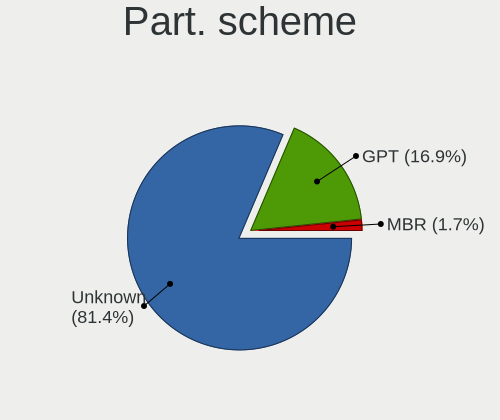
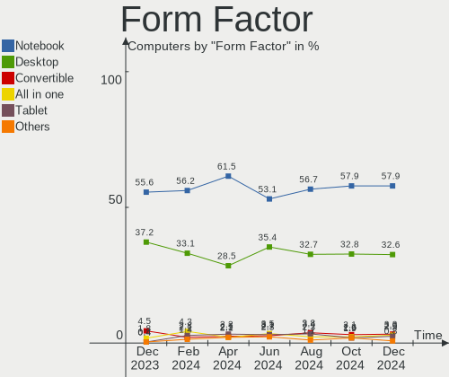
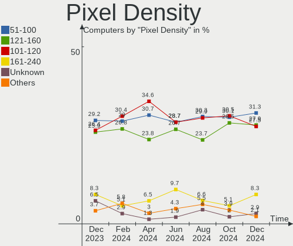
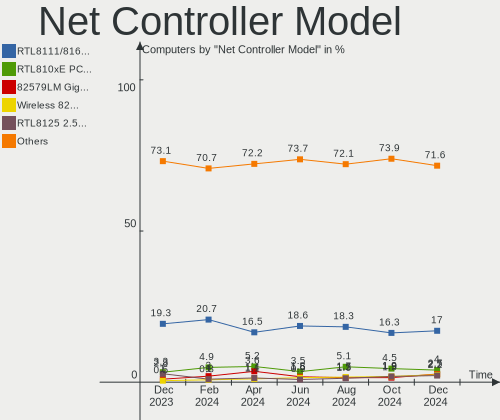
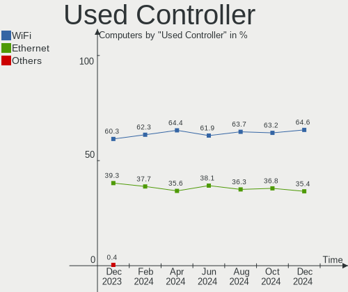
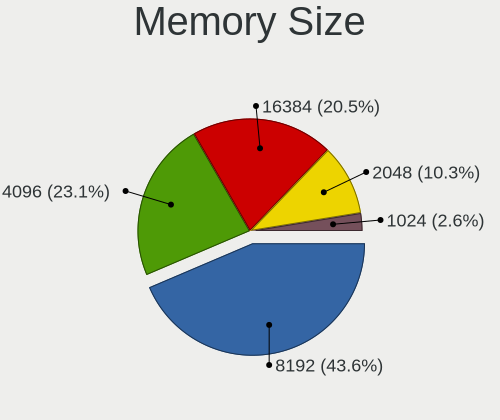

Zorin Hardware Trends
---------------------

A project to identify most popular hardware characteristics and track their change
over time based on data collected by Zorin users at https://Linux-Hardware.org.

Anyone can contribute to this report by the [hw-probe](https://github.com/linuxhw/hw-probe) tool:

    sudo -E hw-probe -all -upload

This is a report for all computer types. See also reports for [desktops](/Dist/Zorin/Desktop/README.md) and [notebooks](/Dist/Zorin/Notebook/README.md).

Full-feature report is available here: https://linux-hardware.org/?view=trends

Period: Nov, 2021.

Contents
--------

* [ System ](#system)
  - [ OS                       ](#os)
  - [ OS Family                ](#os-family)
  - [ Kernel                   ](#kernel)
  - [ Kernel Family            ](#kernel-family)
  - [ Kernel Major Ver.        ](#kernel-major-ver)
  - [ Arch                     ](#arch)
  - [ DE                       ](#de)
  - [ Display Server           ](#display-server)
  - [ Display Manager          ](#display-manager)
  - [ OS Lang                  ](#os-lang)
  - [ Boot Mode                ](#boot-mode)
  - [ Filesystem               ](#filesystem)
  - [ Part. scheme             ](#part-scheme)
  - [ Dual Boot with Linux/BSD ](#dual-boot-with-linuxbsd)
  - [ Dual Boot (Win)          ](#dual-boot-win)

* [ Board ](#board)
  - [ Vendor                   ](#vendor)
  - [ Model                    ](#model)
  - [ Model Family             ](#model-family)
  - [ MFG Year                 ](#mfg-year)
  - [ Form Factor              ](#form-factor)
  - [ Secure Boot              ](#secure-boot)
  - [ Coreboot                 ](#coreboot)
  - [ RAM Size                 ](#ram-size)
  - [ RAM Used                 ](#ram-used)
  - [ Total Drives             ](#total-drives)
  - [ Has CD-ROM               ](#has-cd-rom)
  - [ Has Ethernet             ](#has-ethernet)
  - [ Has WiFi                 ](#has-wifi)
  - [ Has Bluetooth            ](#has-bluetooth)

* [ Location ](#location)
  - [ Country                  ](#country)
  - [ City                     ](#city)

* [ Drives ](#drives)
  - [ Drive Vendor             ](#drive-vendor)
  - [ Drive Model              ](#drive-model)
  - [ HDD Vendor               ](#hdd-vendor)
  - [ SSD Vendor               ](#ssd-vendor)
  - [ Drive Kind               ](#drive-kind)
  - [ Drive Connector          ](#drive-connector)
  - [ Drive Size               ](#drive-size)
  - [ Space Total              ](#space-total)
  - [ Space Used               ](#space-used)
  - [ Malfunc. Drives          ](#malfunc-drives)
  - [ Malfunc. Drive Vendor    ](#malfunc-drive-vendor)
  - [ Malfunc. HDD Vendor      ](#malfunc-hdd-vendor)
  - [ Malfunc. Drive Kind      ](#malfunc-drive-kind)
  - [ Failed Drives            ](#failed-drives)
  - [ Failed Drive Vendor      ](#failed-drive-vendor)
  - [ Drive Status             ](#drive-status)

* [ Storage controller ](#storage-controller)
  - [ Storage Vendor           ](#storage-vendor)
  - [ Storage Model            ](#storage-model)
  - [ Storage Kind             ](#storage-kind)

* [ Processor ](#processor)
  - [ CPU Vendor               ](#cpu-vendor)
  - [ CPU Model                ](#cpu-model)
  - [ CPU Model Family         ](#cpu-model-family)
  - [ CPU Cores                ](#cpu-cores)
  - [ CPU Sockets              ](#cpu-sockets)
  - [ CPU Threads              ](#cpu-threads)
  - [ CPU Op-Modes             ](#cpu-op-modes)
  - [ CPU Microcode            ](#cpu-microcode)
  - [ CPU Microarch            ](#cpu-microarch)

* [ Graphics ](#graphics)
  - [ GPU Vendor               ](#gpu-vendor)
  - [ GPU Model                ](#gpu-model)
  - [ GPU Combo                ](#gpu-combo)
  - [ GPU Driver               ](#gpu-driver)
  - [ GPU Memory               ](#gpu-memory)

* [ Monitor ](#monitor)
  - [ Monitor Vendor           ](#monitor-vendor)
  - [ Monitor Model            ](#monitor-model)
  - [ Monitor Resolution       ](#monitor-resolution)
  - [ Monitor Diagonal         ](#monitor-diagonal)
  - [ Monitor Width            ](#monitor-width)
  - [ Aspect Ratio             ](#aspect-ratio)
  - [ Monitor Area             ](#monitor-area)
  - [ Pixel Density            ](#pixel-density)
  - [ Multiple Monitors        ](#multiple-monitors)

* [ Network ](#network)
  - [ Net Controller Vendor    ](#net-controller-vendor)
  - [ Net Controller Model     ](#net-controller-model)
  - [ Wireless Vendor          ](#wireless-vendor)
  - [ Wireless Model           ](#wireless-model)
  - [ Ethernet Vendor          ](#ethernet-vendor)
  - [ Ethernet Model           ](#ethernet-model)
  - [ Net Controller Kind      ](#net-controller-kind)
  - [ Used Controller          ](#used-controller)
  - [ NICs                     ](#nics)
  - [ IPv6                     ](#ipv6)

* [ Bluetooth ](#bluetooth)
  - [ Bluetooth Vendor         ](#bluetooth-vendor)
  - [ Bluetooth Model          ](#bluetooth-model)

* [ Sound ](#sound)
  - [ Sound Vendor             ](#sound-vendor)
  - [ Sound Model              ](#sound-model)

* [ Memory ](#memory)
  - [ Memory Vendor            ](#memory-vendor)
  - [ Memory Model             ](#memory-model)
  - [ Memory Kind              ](#memory-kind)
  - [ Memory Form Factor       ](#memory-form-factor)
  - [ Memory Size              ](#memory-size)
  - [ Memory Speed             ](#memory-speed)

* [ Printers & scanners ](#printers--scanners)
  - [ Printer Vendor           ](#printer-vendor)
  - [ Printer Model            ](#printer-model)
  - [ Scanner Vendor           ](#scanner-vendor)
  - [ Scanner Model            ](#scanner-model)

* [ Camera ](#camera)
  - [ Camera Vendor            ](#camera-vendor)
  - [ Camera Model             ](#camera-model)

* [ Security ](#security)
  - [ Fingerprint Vendor       ](#fingerprint-vendor)
  - [ Fingerprint Model        ](#fingerprint-model)
  - [ Chipcard Vendor          ](#chipcard-vendor)
  - [ Chipcard Model           ](#chipcard-model)

* [ Unsupported ](#unsupported)
  - [ Unsupported Devices      ](#unsupported-devices)
  - [ Unsupported Device Types ](#unsupported-device-types)

System
------

OS
--

Installed operating systems

| Name     | Computers | Percent |
|----------|-----------|---------|
| Zorin 16 | 195       | 87.84%  |
| Zorin 15 | 27        | 12.16%  |

OS Family
---------

OS without a version

| Name  | Computers | Percent |
|-------|-----------|---------|
| Zorin | 222       | 100%    |

Kernel
------

Version of the Linux kernel

| Version                    | Computers | Percent |
|----------------------------|-----------|---------|
| 5.11.0-40-generic          | 105       | 47.3%   |
| 5.11.0-38-generic          | 77        | 34.68%  |
| 5.4.0-90-generic           | 14        | 6.31%   |
| 5.4.0-89-generic           | 9         | 4.05%   |
| 5.11.0-41-generic          | 6         | 2.7%    |
| 5.11.0-27-generic          | 3         | 1.35%   |
| 5.11.0-37-generic          | 2         | 0.9%    |
| 5.4.0-84-generic           | 1         | 0.45%   |
| 5.4.0-74-generic           | 1         | 0.45%   |
| 5.4.0-62-generic           | 1         | 0.45%   |
| 5.15.0-3.2-liquorix-amd64  | 1         | 0.45%   |
| 5.14.0-15.1-liquorix-amd64 | 1         | 0.45%   |
| 5.11.0-34-generic          | 1         | 0.45%   |

Kernel Family
-------------

Linux kernel without a distro release

| Version | Computers | Percent |
|---------|-----------|---------|
| 5.11.0  | 194       | 87.39%  |
| 5.4.0   | 26        | 11.71%  |
| 5.15.0  | 1         | 0.45%   |
| 5.14.0  | 1         | 0.45%   |

Kernel Major Ver.
-----------------

Linux kernel major version

| Version | Computers | Percent |
|---------|-----------|---------|
| 5.11    | 194       | 87.39%  |
| 5.4     | 26        | 11.71%  |
| 5.15    | 1         | 0.45%   |
| 5.14    | 1         | 0.45%   |

Arch
----

OS architecture (x86_64, i586, etc.)

| Name   | Computers | Percent |
|--------|-----------|---------|
| x86_64 | 215       | 96.85%  |
| i686   | 7         | 3.15%   |

DE
--

Desktop Environment

| Name    | Computers | Percent |
|---------|-----------|---------|
| GNOME   | 206       | 92.79%  |
| XFCE    | 14        | 6.31%   |
| Unknown | 2         | 0.9%    |

Display Server
--------------

X11 or Wayland

| Name    | Computers | Percent |
|---------|-----------|---------|
| X11     | 219       | 98.65%  |
| Wayland | 2         | 0.9%    |
| Unknown | 1         | 0.45%   |

Display Manager
---------------

SDDM, LightDM, etc.

| Name    | Computers | Percent |
|---------|-----------|---------|
| Unknown | 151       | 68.02%  |
| GDM3    | 40        | 18.02%  |
| GDM     | 19        | 8.56%   |
| LightDM | 12        | 5.41%   |

OS Lang
-------

Language

| Lang  | Computers | Percent |
|-------|-----------|---------|
| en_US | 82        | 36.94%  |
| en_GB | 25        | 11.26%  |
| de_DE | 23        | 10.36%  |
| pt_BR | 12        | 5.41%   |
| en_CA | 9         | 4.05%   |
| it_IT | 8         | 3.6%    |
| pl_PL | 6         | 2.7%    |
| nl_NL | 6         | 2.7%    |
| fr_FR | 6         | 2.7%    |
| ru_RU | 3         | 1.35%   |
| nb_NO | 3         | 1.35%   |
| es_MX | 3         | 1.35%   |
| es_ES | 3         | 1.35%   |
| en_NZ | 3         | 1.35%   |
| en_IN | 3         | 1.35%   |
| tr_TR | 2         | 0.9%    |
| sl_SI | 2         | 0.9%    |
| nl_BE | 2         | 0.9%    |
| hu_HU | 2         | 0.9%    |
| hr_HR | 2         | 0.9%    |
| es_AR | 2         | 0.9%    |
| en_ZA | 2         | 0.9%    |
| sv_SE | 1         | 0.45%   |
| sr_RS | 1         | 0.45%   |
| ru_UA | 1         | 0.45%   |
| pt_PT | 1         | 0.45%   |
| he_IL | 1         | 0.45%   |
| fr_CA | 1         | 0.45%   |
| es_UY | 1         | 0.45%   |
| es_EC | 1         | 0.45%   |
| es_CR | 1         | 0.45%   |
| en_IL | 1         | 0.45%   |
| en_AU | 1         | 0.45%   |
| el_GR | 1         | 0.45%   |
| da_DK | 1         | 0.45%   |

Boot Mode
---------

EFI or BIOS

| Mode | Computers | Percent |
|------|-----------|---------|
| BIOS | 117       | 52.7%   |
| EFI  | 105       | 47.3%   |

Filesystem
----------

Type of filesystem

| Type    | Computers | Percent |
|---------|-----------|---------|
| Ext4    | 211       | 95.05%  |
| Zfs     | 6         | 2.7%    |
| Overlay | 3         | 1.35%   |
| Ext2    | 1         | 0.45%   |
| Btrfs   | 1         | 0.45%   |

Part. scheme
------------

Scheme of partitioning

| Type    | Computers | Percent |
|---------|-----------|---------|
| Unknown | 202       | 90.99%  |
| GPT     | 17        | 7.66%   |
| MBR     | 3         | 1.35%   |

Dual Boot with Linux/BSD
------------------------

Hosting more than one Linux/BSD

| Dual boot | Computers | Percent |
|-----------|-----------|---------|
| No        | 210       | 94.59%  |
| Yes       | 12        | 5.41%   |

Dual Boot (Win)
---------------

Hosting Linux and Windows

| Dual boot | Computers | Percent |
|-----------|-----------|---------|
| No        | 195       | 87.84%  |
| Yes       | 27        | 12.16%  |

Board
-----

Vendor
------

Motherboard manufacturer

| Name                | Computers | Percent |
|---------------------|-----------|---------|
| Hewlett-Packard     | 47        | 21.17%  |
| ASUSTek Computer    | 36        | 16.22%  |
| Dell                | 29        | 13.06%  |
| Lenovo              | 19        | 8.56%   |
| Gigabyte Technology | 16        | 7.21%   |
| MSI                 | 11        | 4.95%   |
| ASRock              | 10        | 4.5%    |
| Acer                | 10        | 4.5%    |
| Toshiba             | 7         | 3.15%   |
| Intel               | 6         | 2.7%    |
| Sony                | 4         | 1.8%    |
| Samsung Electronics | 3         | 1.35%   |
| Fujitsu Siemens     | 3         | 1.35%   |
| Fujitsu             | 3         | 1.35%   |
| Apple               | 3         | 1.35%   |
| Notebook            | 2         | 0.9%    |
| Medion              | 2         | 0.9%    |
| Google              | 2         | 0.9%    |
| TUXEDO              | 1         | 0.45%   |
| Pegatron            | 1         | 0.45%   |
| Microsoft           | 1         | 0.45%   |
| LG Electronics      | 1         | 0.45%   |
| LattePanda          | 1         | 0.45%   |
| HUAWEI              | 1         | 0.45%   |
| Foxconn             | 1         | 0.45%   |
| ECS                 | 1         | 0.45%   |
| Chuwi               | 1         | 0.45%   |

Model
-----

Motherboard model

| Name                                      | Computers | Percent |
|-------------------------------------------|-----------|---------|
| HP Notebook                               | 4         | 1.8%    |
| Dell OptiPlex 7010                        | 3         | 1.35%   |
| MSI MS-7C02                               | 2         | 0.9%    |
| HP Pavilion dv7                           | 2         | 0.9%    |
| HP Pavilion 15                            | 2         | 0.9%    |
| Dell OptiPlex 990                         | 2         | 0.9%    |
| Dell OptiPlex 790                         | 2         | 0.9%    |
| Dell Inspiron 15-3567                     | 2         | 0.9%    |
| ASUS P8Z77-V LX                           | 2         | 0.9%    |
| ASUS M5A78L-M/USB3                        | 2         | 0.9%    |
| ASUS A68HM-PLUS                           | 2         | 0.9%    |
| TUXEDO InfinityBook Pro 14 Gen6           | 1         | 0.45%   |
| Toshiba Satellite U300                    | 1         | 0.45%   |
| Toshiba Satellite L750                    | 1         | 0.45%   |
| Toshiba Satellite L500                    | 1         | 0.45%   |
| Toshiba Satellite C870-1C2                | 1         | 0.45%   |
| Toshiba Satellite C655D                   | 1         | 0.45%   |
| Toshiba Satellite C50D-B                  | 1         | 0.45%   |
| Toshiba PORTEGE R705                      | 1         | 0.45%   |
| Sony VPCSA3N9E                            | 1         | 0.45%   |
| Sony VPCEG23EL                            | 1         | 0.45%   |
| Sony SVF14211CLB                          | 1         | 0.45%   |
| Sony SVE1713D1EW                          | 1         | 0.45%   |
| Samsung 950QDB                            | 1         | 0.45%   |
| Samsung 900X3C/900X3D/900X4C/900X4D       | 1         | 0.45%   |
| Samsung 370E4K                            | 1         | 0.45%   |
| Pegatron SAISHIAT2                        | 1         | 0.45%   |
| Notebook NH50_70RA                        | 1         | 0.45%   |
| Notebook N85_N87HCHNHZ                    | 1         | 0.45%   |
| MSI p6745nl                               | 1         | 0.45%   |
| MSI MS-7B89                               | 1         | 0.45%   |
| MSI MS-7B85                               | 1         | 0.45%   |
| MSI MS-7B53                               | 1         | 0.45%   |
| MSI MS-7A33                               | 1         | 0.45%   |
| MSI MS-7693                               | 1         | 0.45%   |
| MSI MS-7592                               | 1         | 0.45%   |
| MSI GF63 Thin 9SC                         | 1         | 0.45%   |
| MSI GF63 Thin 10SC                        | 1         | 0.45%   |
| Microsoft Surface Laptop 4                | 1         | 0.45%   |
| Medion P8610                              | 1         | 0.45%   |
| Medion MS-7707                            | 1         | 0.45%   |
| LG S460-G.BG31P1                          | 1         | 0.45%   |
| Lenovo Yoga 530-14ARR 81H9                | 1         | 0.45%   |
| Lenovo ThinkPad X260 20F5S1GW1Q           | 1         | 0.45%   |
| Lenovo ThinkPad X1 1294BL5                | 1         | 0.45%   |
| Lenovo ThinkPad T460 20FMS7DA00           | 1         | 0.45%   |
| Lenovo ThinkPad T430 2349ED5              | 1         | 0.45%   |
| Lenovo ThinkPad T430 23445PU              | 1         | 0.45%   |
| Lenovo ThinkPad L13 Yoga Gen 2 20VKCTO1WW | 1         | 0.45%   |
| Lenovo ThinkPad E15 Gen 3 20YG0041MX      | 1         | 0.45%   |
| Lenovo S10-3                              | 1         | 0.45%   |
| Lenovo Legion C530-19ICB 90JX0040GE       | 1         | 0.45%   |
| Lenovo IdeaPad Z580                       | 1         | 0.45%   |
| Lenovo IdeaPad Yoga 13 20175              | 1         | 0.45%   |
| Lenovo IdeaPad S130-11IGM 81J1            | 1         | 0.45%   |
| Lenovo IdeaPad 300-17ISK 80QH             | 1         | 0.45%   |
| Lenovo IdeaPad 2in1 14 81CW               | 1         | 0.45%   |
| Lenovo IdeaCentre 310S-08ASR 90G9002VUK   | 1         | 0.45%   |
| Lenovo G580 20150                         | 1         | 0.45%   |
| Lenovo G560 0679                          | 1         | 0.45%   |

Model Family
------------

Motherboard model prefix

| Name                  | Computers | Percent |
|-----------------------|-----------|---------|
| Dell OptiPlex         | 11        | 4.95%   |
| HP Pavilion           | 10        | 4.5%    |
| Dell Latitude         | 8         | 3.6%    |
| Lenovo ThinkPad       | 7         | 3.15%   |
| HP Compaq             | 7         | 3.15%   |
| Toshiba Satellite     | 6         | 2.7%    |
| Lenovo IdeaPad        | 5         | 2.25%   |
| HP ENVY               | 5         | 2.25%   |
| HP EliteBook          | 5         | 2.25%   |
| HP Notebook           | 4         | 1.8%    |
| Dell Inspiron         | 4         | 1.8%    |
| Acer Aspire           | 4         | 1.8%    |
| HP EliteDesk          | 3         | 1.35%   |
| Dell XPS              | 3         | 1.35%   |
| ASUS VivoBook         | 3         | 1.35%   |
| ASUS M5A78L-M         | 3         | 1.35%   |
| MSI MS-7C02           | 2         | 0.9%    |
| MSI GF63              | 2         | 0.9%    |
| HP ProBook            | 2         | 0.9%    |
| Gigabyte B450         | 2         | 0.9%    |
| Fujitsu Siemens AMILO | 2         | 0.9%    |
| ASUS PRIME            | 2         | 0.9%    |
| ASUS P8Z77-V          | 2         | 0.9%    |
| ASUS A68HM-PLUS       | 2         | 0.9%    |
| ASRock B450M          | 2         | 0.9%    |
| Acer Swift            | 2         | 0.9%    |
| Acer Spin             | 2         | 0.9%    |
| TUXEDO InfinityBook   | 1         | 0.45%   |
| Toshiba PORTEGE       | 1         | 0.45%   |
| Sony VPCSA3N9E        | 1         | 0.45%   |
| Sony VPCEG23EL        | 1         | 0.45%   |
| Sony SVF14211CLB      | 1         | 0.45%   |
| Sony SVE1713D1EW      | 1         | 0.45%   |
| Samsung 950QDB        | 1         | 0.45%   |
| Samsung 900X3C        | 1         | 0.45%   |
| Samsung 370E4K        | 1         | 0.45%   |
| Pegatron SAISHIAT2    | 1         | 0.45%   |
| Notebook NH50         | 1         | 0.45%   |
| Notebook N85          | 1         | 0.45%   |
| MSI p6745nl           | 1         | 0.45%   |
| MSI MS-7B89           | 1         | 0.45%   |
| MSI MS-7B85           | 1         | 0.45%   |
| MSI MS-7B53           | 1         | 0.45%   |
| MSI MS-7A33           | 1         | 0.45%   |
| MSI MS-7693           | 1         | 0.45%   |
| MSI MS-7592           | 1         | 0.45%   |
| Microsoft Surface     | 1         | 0.45%   |
| Medion P8610          | 1         | 0.45%   |
| Medion MS-7707        | 1         | 0.45%   |
| LG S460-G.BG31P1      | 1         | 0.45%   |
| Lenovo Yoga           | 1         | 0.45%   |
| Lenovo S10-3          | 1         | 0.45%   |
| Lenovo Legion         | 1         | 0.45%   |
| Lenovo IdeaCentre     | 1         | 0.45%   |
| Lenovo G580           | 1         | 0.45%   |
| Lenovo G560           | 1         | 0.45%   |
| Lenovo Flex           | 1         | 0.45%   |
| LattePanda Alpha      | 1         | 0.45%   |
| Intel S5520HC         | 1         | 0.45%   |
| Intel NUC7i5BNB       | 1         | 0.45%   |

MFG Year
--------

Motherboard manufacture year

| Year | Computers | Percent |
|------|-----------|---------|
| 2021 | 34        | 15.32%  |
| 2018 | 23        | 10.36%  |
| 2019 | 21        | 9.46%   |
| 2011 | 19        | 8.56%   |
| 2013 | 17        | 7.66%   |
| 2012 | 17        | 7.66%   |
| 2020 | 14        | 6.31%   |
| 2010 | 14        | 6.31%   |
| 2015 | 13        | 5.86%   |
| 2014 | 12        | 5.41%   |
| 2016 | 10        | 4.5%    |
| 2007 | 7         | 3.15%   |
| 2017 | 6         | 2.7%    |
| 2008 | 6         | 2.7%    |
| 2009 | 5         | 2.25%   |
| 2006 | 3         | 1.35%   |
| 2005 | 1         | 0.45%   |

Form Factor
-----------

Physical design of the computer

| Name        | Computers | Percent |
|-------------|-----------|---------|
| Notebook    | 119       | 53.6%   |
| Desktop     | 85        | 38.29%  |
| Convertible | 10        | 4.5%    |
| Mini pc     | 3         | 1.35%   |
| All in one  | 3         | 1.35%   |
| Tablet      | 1         | 0.45%   |
| Server      | 1         | 0.45%   |

Secure Boot
-----------

Enabled or disabled

| State    | Computers | Percent |
|----------|-----------|---------|
| Disabled | 202       | 90.99%  |
| Enabled  | 20        | 9.01%   |

Coreboot
--------

Have coreboot on board

| Used | Computers | Percent |
|------|-----------|---------|
| No   | 220       | 99.1%   |
| Yes  | 2         | 0.9%    |

RAM Size
--------

Total RAM memory

| Size in GB  | Computers | Percent |
|-------------|-----------|---------|
| 4.01-8.0    | 51        | 22.97%  |
| 16.01-24.0  | 47        | 21.17%  |
| 3.01-4.0    | 46        | 20.72%  |
| 8.01-16.0   | 39        | 17.57%  |
| 1.01-2.0    | 16        | 7.21%   |
| 32.01-64.0  | 12        | 5.41%   |
| 2.01-3.0    | 5         | 2.25%   |
| 24.01-32.0  | 3         | 1.35%   |
| 64.01-256.0 | 3         | 1.35%   |

RAM Used
--------

Used RAM memory

| Used GB    | Computers | Percent |
|------------|-----------|---------|
| 1.01-2.0   | 103       | 46.4%   |
| 2.01-3.0   | 62        | 27.93%  |
| 4.01-8.0   | 26        | 11.71%  |
| 3.01-4.0   | 24        | 10.81%  |
| 0.51-1.0   | 4         | 1.8%    |
| 8.01-16.0  | 2         | 0.9%    |
| 24.01-32.0 | 1         | 0.45%   |

Total Drives
------------

Number of drives on board

| Drives | Computers | Percent |
|--------|-----------|---------|
| 1      | 137       | 61.71%  |
| 2      | 56        | 25.23%  |
| 3      | 14        | 6.31%   |
| 6      | 6         | 2.7%    |
| 4      | 6         | 2.7%    |
| 7      | 1         | 0.45%   |
| 5      | 1         | 0.45%   |
| 0      | 1         | 0.45%   |

Has CD-ROM
----------

Has CD-ROM on board

| Presented | Computers | Percent |
|-----------|-----------|---------|
| No        | 118       | 53.15%  |
| Yes       | 104       | 46.85%  |

Has Ethernet
------------

Has Ethernet on board

| Presented | Computers | Percent |
|-----------|-----------|---------|
| Yes       | 196       | 88.29%  |
| No        | 26        | 11.71%  |

Has WiFi
--------

Has WiFi module

| Presented | Computers | Percent |
|-----------|-----------|---------|
| Yes       | 173       | 77.93%  |
| No        | 49        | 22.07%  |

Has Bluetooth
-------------

Has Bluetooth module

| Presented | Computers | Percent |
|-----------|-----------|---------|
| Yes       | 123       | 55.41%  |
| No        | 99        | 44.59%  |

Location
--------

Country
-------

Geographic location (country)

| Country                | Computers | Percent |
|------------------------|-----------|---------|
| USA                    | 50        | 22.52%  |
| Germany                | 27        | 12.16%  |
| UK                     | 25        | 11.26%  |
| Brazil                 | 12        | 5.41%   |
| Canada                 | 10        | 4.5%    |
| Italy                  | 9         | 4.05%   |
| Netherlands            | 8         | 3.6%    |
| Norway                 | 6         | 2.7%    |
| Poland                 | 4         | 1.8%    |
| Mexico                 | 4         | 1.8%    |
| France                 | 4         | 1.8%    |
| Turkey                 | 3         | 1.35%   |
| Spain                  | 3         | 1.35%   |
| Russia                 | 3         | 1.35%   |
| Portugal               | 3         | 1.35%   |
| New Zealand            | 3         | 1.35%   |
| India                  | 3         | 1.35%   |
| Denmark                | 3         | 1.35%   |
| Croatia                | 3         | 1.35%   |
| Vietnam                | 2         | 0.9%    |
| Ukraine                | 2         | 0.9%    |
| Switzerland            | 2         | 0.9%    |
| South Africa           | 2         | 0.9%    |
| Slovenia               | 2         | 0.9%    |
| Indonesia              | 2         | 0.9%    |
| Hungary                | 2         | 0.9%    |
| Belgium                | 2         | 0.9%    |
| Argentina              | 2         | 0.9%    |
| Uruguay                | 1         | 0.45%   |
| Sweden                 | 1         | 0.45%   |
| Singapore              | 1         | 0.45%   |
| Serbia                 | 1         | 0.45%   |
| Saudi Arabia           | 1         | 0.45%   |
| Romania                | 1         | 0.45%   |
| Palestine              | 1         | 0.45%   |
| Kenya                  | 1         | 0.45%   |
| Israel                 | 1         | 0.45%   |
| Ireland                | 1         | 0.45%   |
| Guyana                 | 1         | 0.45%   |
| Greece                 | 1         | 0.45%   |
| Ecuador                | 1         | 0.45%   |
| Costa Rica             | 1         | 0.45%   |
| Colombia               | 1         | 0.45%   |
| Cambodia               | 1         | 0.45%   |
| Bosnia and Herzegovina | 1         | 0.45%   |
| Bangladesh             | 1         | 0.45%   |
| Austria                | 1         | 0.45%   |
| Australia              | 1         | 0.45%   |
| Algeria                | 1         | 0.45%   |

City
----

Geographic location (city)

| City                   | Computers | Percent |
|------------------------|-----------|---------|
| Berlin                 | 4         | 1.8%    |
| Zagreb                 | 3         | 1.35%   |
| Stoke-on-Trent         | 2         | 0.9%    |
| Munich                 | 2         | 0.9%    |
| Mainz                  | 2         | 0.9%    |
| Genoa                  | 2         | 0.9%    |
| Bryan                  | 2         | 0.9%    |
| Auckland               | 2         | 0.9%    |
| Athens                 | 2         | 0.9%    |
| Ankara                 | 2         | 0.9%    |
| Zhytomyr               | 1         | 0.45%   |
| Yuba City              | 1         | 0.45%   |
| Yenakiieve             | 1         | 0.45%   |
| Wysoka Glogowska       | 1         | 0.45%   |
| Woking                 | 1         | 0.45%   |
| Winnipeg               | 1         | 0.45%   |
| Willingboro            | 1         | 0.45%   |
| Wilderness Rim         | 1         | 0.45%   |
| Wigan                  | 1         | 0.45%   |
| Westervoort            | 1         | 0.45%   |
| Warsaw                 | 1         | 0.45%   |
| Warner Robins          | 1         | 0.45%   |
| Wahlstedt              | 1         | 0.45%   |
| Vila Nova de Gaia      | 1         | 0.45%   |
| Victoria               | 1         | 0.45%   |
| Vechelde               | 1         | 0.45%   |
| Vancouver              | 1         | 0.45%   |
| Upper Langwith         | 1         | 0.45%   |
| Twickenham             | 1         | 0.45%   |
| Trondheim              | 1         | 0.45%   |
| Trebgast               | 1         | 0.45%   |
| The Hague              | 1         | 0.45%   |
| Teltow                 | 1         | 0.45%   |
| Tel Aviv               | 1         | 0.45%   |
| Tallaght               | 1         | 0.45%   |
| Sydney                 | 1         | 0.45%   |
| Surrey                 | 1         | 0.45%   |
| Suldalsosen            | 1         | 0.45%   |
| Stavanger              | 1         | 0.45%   |
| St Petersburg          | 1         | 0.45%   |
| Spring Hill            | 1         | 0.45%   |
| Southend-on-Sea        | 1         | 0.45%   |
| Smyrna                 | 1         | 0.45%   |
| Skien                  | 1         | 0.45%   |
| Sittensen              | 1         | 0.45%   |
| Singapore              | 1         | 0.45%   |
| Sherbrooke             | 1         | 0.45%   |
| Sertaozinho            | 1         | 0.45%   |
| Schinveld              | 1         | 0.45%   |
| S??o Paulo             | 1         | 0.45%   |
| S??o Bernardo do Campo | 1         | 0.45%   |
| Savannah               | 1         | 0.45%   |
| Sarajevo               | 1         | 0.45%   |
| Santo Andr?©           | 1         | 0.45%   |
| Santa Clara            | 1         | 0.45%   |
| Sandnes                | 1         | 0.45%   |
| San Jose               | 1         | 0.45%   |
| San Carlos             | 1         | 0.45%   |
| Samarinda              | 1         | 0.45%   |
| Salford                | 1         | 0.45%   |

Drives
------

Drive Vendor
------------

Hard drive vendors

| Vendor                      | Computers | Drives | Percent |
|-----------------------------|-----------|--------|---------|
| Seagate                     | 50        | 59     | 15.77%  |
| WDC                         | 49        | 61     | 15.46%  |
| Samsung Electronics         | 39        | 44     | 12.3%   |
| SanDisk                     | 30        | 30     | 9.46%   |
| Toshiba                     | 28        | 29     | 8.83%   |
| Kingston                    | 19        | 21     | 5.99%   |
| Hitachi                     | 15        | 16     | 4.73%   |
| Crucial                     | 11        | 12     | 3.47%   |
| Unknown                     | 10        | 11     | 3.15%   |
| HGST                        | 6         | 6      | 1.89%   |
| Intel                       | 5         | 5      | 1.58%   |
| PNY                         | 4         | 4      | 1.26%   |
| Micron Technology           | 4         | 4      | 1.26%   |
| A-DATA Technology           | 4         | 4      | 1.26%   |
| SK Hynix                    | 3         | 4      | 0.95%   |
| Silicon Motion              | 3         | 3      | 0.95%   |
| Phison                      | 3         | 3      | 0.95%   |
| Intenso                     | 3         | 3      | 0.95%   |
| Hewlett-Packard             | 3         | 3      | 0.95%   |
| China                       | 3         | 3      | 0.95%   |
| Micron/Crucial Technology   | 2         | 2      | 0.63%   |
| BHT                         | 2         | 2      | 0.63%   |
| Yangtze Memory Technologies | 1         | 1      | 0.32%   |
| XrayDisk                    | 1         | 1      | 0.32%   |
| Transcend                   | 1         | 1      | 0.32%   |
| T-FORCE                     | 1         | 1      | 0.32%   |
| SuperSSpeed                 | 1         | 1      | 0.32%   |
| SPCC                        | 1         | 1      | 0.32%   |
| SABRENT                     | 1         | 1      | 0.32%   |
| Realtek Semiconductor       | 1         | 1      | 0.32%   |
| OSCOO                       | 1         | 1      | 0.32%   |
| ORTIAL                      | 1         | 1      | 0.32%   |
| Netac                       | 1         | 1      | 0.32%   |
| MidasForce                  | 1         | 1      | 0.32%   |
| MAXTOR                      | 1         | 1      | 0.32%   |
| Lexar                       | 1         | 1      | 0.32%   |
| JMicron                     | 1         | 1      | 0.32%   |
| HS-SSD-E100                 | 1         | 1      | 0.32%   |
| HS-SSD-C100                 | 1         | 1      | 0.32%   |
| GOODRAM                     | 1         | 1      | 0.32%   |
| Gigabyte Technology         | 1         | 1      | 0.32%   |
| Dogfish                     | 1         | 1      | 0.32%   |
| Corsair                     | 1         | 1      | 0.32%   |

Drive Model
-----------

Hard drive models

| Model                               | Computers | Percent |
|-------------------------------------|-----------|---------|
| Kingston SA400S37240G 240GB SSD     | 9         | 2.59%   |
| Unknown MMC Card  32GB              | 6         | 1.73%   |
| Seagate ST500DM002-1BD142 500GB     | 5         | 1.44%   |
| Sandisk NVMe SSD Drive 512GB        | 5         | 1.44%   |
| Seagate ST3500418AS 500GB           | 4         | 1.15%   |
| Seagate ST1000LM024 HN-M101MBB 1TB  | 4         | 1.15%   |
| Samsung SSD 860 EVO 500GB           | 4         | 1.15%   |
| Toshiba MQ04ABF100 1TB              | 3         | 0.86%   |
| Seagate ST3500413AS 500GB           | 3         | 0.86%   |
| Seagate ST2000DM008-2FR102 2TB      | 3         | 0.86%   |
| Samsung NVMe SSD Drive 1TB          | 3         | 0.86%   |
| Kingston SA400S37120G 120GB SSD     | 3         | 0.86%   |
| Crucial CT500MX500SSD1 500GB        | 3         | 0.86%   |
| WDC WDS500G2B0A-00SM50 500GB SSD    | 2         | 0.58%   |
| WDC WD10JPVX-00JC3T0 1TB            | 2         | 0.58%   |
| WDC WD10EZEX-08WN4A0 1TB            | 2         | 0.58%   |
| WDC WD10EZEX-00BN5A0 1TB            | 2         | 0.58%   |
| WDC WD10EARS-00Y5B1 1TB             | 2         | 0.58%   |
| Toshiba NVMe SSD Drive 256GB        | 2         | 0.58%   |
| Toshiba MQ01ABF050 500GB            | 2         | 0.58%   |
| Toshiba MQ01ABD050 500GB            | 2         | 0.58%   |
| Toshiba DT01ACA100 1TB              | 2         | 0.58%   |
| SK Hynix NVMe SSD Drive 512GB       | 2         | 0.58%   |
| Seagate ST9500325AS 500GB           | 2         | 0.58%   |
| Seagate ST1000DM003-1CH162 1TB      | 2         | 0.58%   |
| Seagate Expansion 1TB               | 2         | 0.58%   |
| SanDisk SSD PLUS 480GB              | 2         | 0.58%   |
| SanDisk SDSSDXPS240G 240GB          | 2         | 0.58%   |
| SanDisk SDSSDA240G 240GB            | 2         | 0.58%   |
| Sandisk NVMe SSD Drive 500GB        | 2         | 0.58%   |
| Sandisk NVMe SSD Drive 1TB          | 2         | 0.58%   |
| Samsung SSD 870 QVO 1TB             | 2         | 0.58%   |
| Samsung SSD 840 EVO 250GB           | 2         | 0.58%   |
| Samsung NVMe SSD Drive 512GB        | 2         | 0.58%   |
| Samsung NVMe SSD Drive 500GB        | 2         | 0.58%   |
| Samsung HD103UJ 1TB                 | 2         | 0.58%   |
| PNY CS900 240GB SSD                 | 2         | 0.58%   |
| PNY CS900 120GB SSD                 | 2         | 0.58%   |
| HGST HTS545050A7E680 500GB          | 2         | 0.58%   |
| HGST HTS541010B7E610 1TB            | 2         | 0.58%   |
| Yangtze Memory NVMe SSD Drive 256GB | 1         | 0.29%   |
| XrayDisk 256GB                      | 1         | 0.29%   |
| WDC WDS250G2B0A-00SM50 250GB SSD    | 1         | 0.29%   |
| WDC WDS240G2G0B-00EPW0 240GB SSD    | 1         | 0.29%   |
| WDC WDS240G2G0A-00JH30 240GB SSD    | 1         | 0.29%   |
| WDC WDS100T2B0C-00PXH0 1TB          | 1         | 0.29%   |
| WDC WDS100T2B0B-00YS70 1TB SSD      | 1         | 0.29%   |
| WDC WDS100T2B0B 1TB SSD             | 1         | 0.29%   |
| WDC WD800AAJS-60WAA0 80GB           | 1         | 0.29%   |
| WDC WD7500BPKX-80HPJT0 752GB        | 1         | 0.29%   |
| WDC WD6400AARS-00Y5B1 640GB         | 1         | 0.29%   |
| WDC WD6400AAKS-22A7B2 640GB         | 1         | 0.29%   |
| WDC WD6400AAKS-00A7B2 640GB         | 1         | 0.29%   |
| WDC WD5003AZEX-00K1GA0 500GB        | 1         | 0.29%   |
| WDC WD5000LPLX-60ZNTT1 500GB        | 1         | 0.29%   |
| WDC WD5000BPVT-75HXZT3 500GB        | 1         | 0.29%   |
| WDC WD5000BPKX-75HPJT0 500GB        | 1         | 0.29%   |
| WDC WD5000AZLX-08K2TA0 500GB        | 1         | 0.29%   |
| WDC WD5000AAKX-001CA0 500GB         | 1         | 0.29%   |
| WDC WD5000AAKS-00V1A0 500GB         | 1         | 0.29%   |

HDD Vendor
----------

Hard disk drive vendors

| Vendor              | Computers | Drives | Percent |
|---------------------|-----------|--------|---------|
| Seagate             | 50        | 56     | 34.48%  |
| WDC                 | 43        | 52     | 29.66%  |
| Toshiba             | 21        | 22     | 14.48%  |
| Hitachi             | 15        | 16     | 10.34%  |
| Samsung Electronics | 8         | 11     | 5.52%   |
| HGST                | 6         | 6      | 4.14%   |
| Unknown             | 1         | 1      | 0.69%   |
| MAXTOR              | 1         | 1      | 0.69%   |

SSD Vendor
----------

Solid state drive vendors

| Vendor              | Computers | Drives | Percent |
|---------------------|-----------|--------|---------|
| Samsung Electronics | 21        | 22     | 17.65%  |
| SanDisk             | 20        | 20     | 16.81%  |
| Kingston            | 18        | 20     | 15.13%  |
| Crucial             | 11        | 11     | 9.24%   |
| WDC                 | 7         | 7      | 5.88%   |
| Toshiba             | 4         | 4      | 3.36%   |
| PNY                 | 4         | 4      | 3.36%   |
| Intenso             | 3         | 3      | 2.52%   |
| Intel               | 3         | 3      | 2.52%   |
| Hewlett-Packard     | 3         | 3      | 2.52%   |
| China               | 3         | 3      | 2.52%   |
| A-DATA Technology   | 3         | 3      | 2.52%   |
| Micron Technology   | 2         | 2      | 1.68%   |
| BHT                 | 2         | 2      | 1.68%   |
| Transcend           | 1         | 1      | 0.84%   |
| SuperSSpeed         | 1         | 1      | 0.84%   |
| SPCC                | 1         | 1      | 0.84%   |
| Seagate             | 1         | 1      | 0.84%   |
| OSCOO               | 1         | 1      | 0.84%   |
| ORTIAL              | 1         | 1      | 0.84%   |
| Netac               | 1         | 1      | 0.84%   |
| MidasForce          | 1         | 1      | 0.84%   |
| Lexar               | 1         | 1      | 0.84%   |
| JMicron             | 1         | 1      | 0.84%   |
| HS-SSD-E100         | 1         | 1      | 0.84%   |
| GOODRAM             | 1         | 1      | 0.84%   |
| Gigabyte Technology | 1         | 1      | 0.84%   |
| Dogfish             | 1         | 1      | 0.84%   |
| Corsair             | 1         | 1      | 0.84%   |

Drive Kind
----------

HDD or SSD

| Kind    | Computers | Drives | Percent |
|---------|-----------|--------|---------|
| HDD     | 119       | 165    | 42.65%  |
| SSD     | 105       | 122    | 37.63%  |
| NVMe    | 43        | 49     | 15.41%  |
| MMC     | 8         | 8      | 2.87%   |
| Unknown | 4         | 6      | 1.43%   |

Drive Connector
---------------

SATA, SAS, NVMe, etc.

| Type | Computers | Drives | Percent |
|------|-----------|--------|---------|
| SATA | 190       | 280    | 76%     |
| NVMe | 43        | 48     | 17.2%   |
| SAS  | 9         | 14     | 3.6%    |
| MMC  | 8         | 8      | 3.2%    |

Drive Size
----------

Size of hard drive

| Size in TB | Computers | Drives | Percent |
|------------|-----------|--------|---------|
| 0.01-0.5   | 142       | 178    | 62.01%  |
| 0.51-1.0   | 69        | 87     | 30.13%  |
| 1.01-2.0   | 8         | 10     | 3.49%   |
| 3.01-4.0   | 6         | 7      | 2.62%   |
| 2.01-3.0   | 2         | 3      | 0.87%   |
| 4.01-10.0  | 2         | 2      | 0.87%   |

Space Total
-----------

Amount of disk space available on the file system

| Size in GB     | Computers | Percent |
|----------------|-----------|---------|
| 101-250        | 66        | 29.73%  |
| 251-500        | 58        | 26.13%  |
| 501-1000       | 36        | 16.22%  |
| 51-100         | 16        | 7.21%   |
| 1001-2000      | 13        | 5.86%   |
| More than 3000 | 11        | 4.95%   |
| 21-50          | 10        | 4.5%    |
| 1-20           | 5         | 2.25%   |
| Unknown        | 5         | 2.25%   |
| 2001-3000      | 2         | 0.9%    |

Space Used
----------

Amount of used disk space

| Used GB        | Computers | Percent |
|----------------|-----------|---------|
| 1-20           | 95        | 42.79%  |
| 21-50          | 49        | 22.07%  |
| 51-100         | 26        | 11.71%  |
| 101-250        | 18        | 8.11%   |
| 501-1000       | 9         | 4.05%   |
| 251-500        | 8         | 3.6%    |
| More than 3000 | 5         | 2.25%   |
| 1001-2000      | 5         | 2.25%   |
| Unknown        | 5         | 2.25%   |
| 2001-3000      | 2         | 0.9%    |

Malfunc. Drives
---------------

Drive models with a malfunction

| Model                              | Computers | Drives | Percent |
|------------------------------------|-----------|--------|---------|
| WDC WD3200AAKS-22B3A0 320GB        | 1         | 1      | 12.5%   |
| WDC WD10SPZX-75Z10T2 1TB           | 1         | 1      | 12.5%   |
| Seagate ST9500325AS 500GB          | 1         | 1      | 12.5%   |
| Seagate ST3500514NS 500GB          | 1         | 1      | 12.5%   |
| Seagate ST3320620AS 320GB          | 1         | 1      | 12.5%   |
| Seagate ST1000LM024 HN-M101MBB 1TB | 1         | 1      | 12.5%   |
| HGST HTS545050A7E680 500GB         | 1         | 1      | 12.5%   |
| Hewlett-Packard SSD S600 240GB     | 1         | 1      | 12.5%   |

Malfunc. Drive Vendor
---------------------

Vendors of faulty drives

| Vendor          | Computers | Drives | Percent |
|-----------------|-----------|--------|---------|
| Seagate         | 3         | 4      | 42.86%  |
| WDC             | 2         | 2      | 28.57%  |
| HGST            | 1         | 1      | 14.29%  |
| Hewlett-Packard | 1         | 1      | 14.29%  |

Malfunc. HDD Vendor
-------------------

Vendors of faulty HDD drives

| Vendor  | Computers | Drives | Percent |
|---------|-----------|--------|---------|
| Seagate | 3         | 4      | 50%     |
| WDC     | 2         | 2      | 33.33%  |
| HGST    | 1         | 1      | 16.67%  |

Malfunc. Drive Kind
-------------------

Kinds of faulty drives

| Kind | Computers | Drives | Percent |
|------|-----------|--------|---------|
| HDD  | 5         | 7      | 83.33%  |
| SSD  | 1         | 1      | 16.67%  |

Failed Drives
-------------

Failed drive models

Zero info for selected period =(

Failed Drive Vendor
-------------------

Failed drive vendors

Zero info for selected period =(

Drive Status
------------

Number of failed and malfunc. drives

| Status   | Computers | Drives | Percent |
|----------|-----------|--------|---------|
| Detected | 199       | 310    | 87.28%  |
| Works    | 23        | 32     | 10.09%  |
| Malfunc  | 6         | 8      | 2.63%   |

Storage controller
------------------

Storage Vendor
--------------

Storage controller vendors

| Vendor                       | Computers | Percent |
|------------------------------|-----------|---------|
| Intel                        | 156       | 58.87%  |
| AMD                          | 45        | 16.98%  |
| Sandisk                      | 11        | 4.15%   |
| Samsung Electronics          | 11        | 4.15%   |
| Nvidia                       | 7         | 2.64%   |
| VIA Technologies             | 4         | 1.51%   |
| Toshiba America Info Systems | 3         | 1.13%   |
| SK Hynix                     | 3         | 1.13%   |
| Silicon Motion               | 3         | 1.13%   |
| Phison Electronics           | 3         | 1.13%   |
| Micron/Crucial Technology    | 3         | 1.13%   |
| Marvell Technology Group     | 3         | 1.13%   |
| Realtek Semiconductor        | 2         | 0.75%   |
| Micron Technology            | 2         | 0.75%   |
| JMicron Technology           | 2         | 0.75%   |
| ASMedia Technology           | 2         | 0.75%   |
| Yangtze Memory Technologies  | 1         | 0.38%   |
| Kingston Technology Company  | 1         | 0.38%   |
| Broadcom / LSI               | 1         | 0.38%   |
| ADATA Technology             | 1         | 0.38%   |
| Adaptec                      | 1         | 0.38%   |

Storage Model
-------------

Storage controller models

| Model                                                                                   | Computers | Percent |
|-----------------------------------------------------------------------------------------|-----------|---------|
| AMD FCH SATA Controller [AHCI mode]                                                     | 30        | 9.43%   |
| Intel Sunrise Point-LP SATA Controller [AHCI mode]                                      | 16        | 5.03%   |
| Intel 7 Series Chipset Family 6-port SATA Controller [AHCI mode]                        | 15        | 4.72%   |
| Intel 6 Series/C200 Series Chipset Family 6 port Mobile SATA AHCI Controller            | 12        | 3.77%   |
| Intel 8 Series/C220 Series Chipset Family 6-port SATA Controller 1 [AHCI mode]          | 11        | 3.46%   |
| AMD 400 Series Chipset SATA Controller                                                  | 11        | 3.46%   |
| Intel NM10/ICH7 Family SATA Controller [IDE mode]                                       | 8         | 2.52%   |
| Intel 82801 Mobile SATA Controller [RAID mode]                                          | 8         | 2.52%   |
| Intel 7 Series/C210 Series Chipset Family 6-port SATA Controller [AHCI mode]            | 8         | 2.52%   |
| Intel Wildcat Point-LP SATA Controller [AHCI Mode]                                      | 7         | 2.2%    |
| AMD SB7x0/SB8x0/SB9x0 IDE Controller                                                    | 7         | 2.2%    |
| Samsung NVMe SSD Controller SM981/PM981/PM983                                           | 6         | 1.89%   |
| Intel 82801HM/HEM (ICH8M/ICH8M-E) SATA Controller [AHCI mode]                           | 6         | 1.89%   |
| Intel 82801HM/HEM (ICH8M/ICH8M-E) IDE Controller                                        | 6         | 1.89%   |
| Intel 82801G (ICH7 Family) IDE Controller                                               | 6         | 1.89%   |
| Intel 6 Series/C200 Series Chipset Family 6 port Desktop SATA AHCI Controller           | 6         | 1.89%   |
| Intel 5 Series/3400 Series Chipset 4 port SATA AHCI Controller                          | 6         | 1.89%   |
| AMD SB7x0/SB8x0/SB9x0 SATA Controller [AHCI mode]                                       | 6         | 1.89%   |
| Sandisk WD Blue SN550 NVMe SSD                                                          | 4         | 1.26%   |
| Sandisk Non-Volatile memory controller                                                  | 4         | 1.26%   |
| Intel SATA Controller [RAID mode]                                                       | 4         | 1.26%   |
| Intel 8 Series SATA Controller 1 [AHCI mode]                                            | 4         | 1.26%   |
| Nvidia MCP79 AHCI Controller                                                            | 3         | 0.94%   |
| Intel Volume Management Device NVMe RAID Controller                                     | 3         | 0.94%   |
| Intel Cannon Lake PCH SATA AHCI Controller                                              | 3         | 0.94%   |
| Intel 400 Series Chipset Family SATA AHCI Controller                                    | 3         | 0.94%   |
| AMD SB7x0/SB8x0/SB9x0 SATA Controller [IDE mode]                                        | 3         | 0.94%   |
| AMD FCH IDE Controller                                                                  | 3         | 0.94%   |
| VIA VT82C586A/B/VT82C686/A/B/VT823x/A/C PIPC Bus Master IDE                             | 2         | 0.63%   |
| VIA VT6421 IDE/SATA Controller                                                          | 2         | 0.63%   |
| SK Hynix BC501 NVMe Solid State Drive                                                   | 2         | 0.63%   |
| Silicon Motion Non-Volatile memory controller                                           | 2         | 0.63%   |
| Sandisk WD Blue SN500 / PC SN520 NVMe SSD                                               | 2         | 0.63%   |
| Samsung NVMe SSD Controller 980                                                         | 2         | 0.63%   |
| Realtek Realtek Non-Volatile memory controller                                          | 2         | 0.63%   |
| Phison E16 PCIe4 NVMe Controller                                                        | 2         | 0.63%   |
| Nvidia MCP61 SATA Controller                                                            | 2         | 0.63%   |
| Nvidia MCP61 IDE                                                                        | 2         | 0.63%   |
| Micron Non-Volatile memory controller                                                   | 2         | 0.63%   |
| Marvell Group 88SE9215 PCIe 2.0 x1 4-port SATA 6 Gb/s Controller                        | 2         | 0.63%   |
| Marvell Group 88SE9120 SATA 6Gb/s Controller                                            | 2         | 0.63%   |
| Intel SSD 660P Series                                                                   | 2         | 0.63%   |
| Intel Q170/Q150/B150/H170/H110/Z170/CM236 Chipset SATA Controller [AHCI Mode]           | 2         | 0.63%   |
| Intel HM170/QM170 Chipset SATA Controller [AHCI Mode]                                   | 2         | 0.63%   |
| Intel Comet Lake SATA AHCI Controller                                                   | 2         | 0.63%   |
| Intel Celeron/Pentium Silver Processor SATA Controller                                  | 2         | 0.63%   |
| Intel Cannon Lake Mobile PCH SATA AHCI Controller                                       | 2         | 0.63%   |
| Intel Atom/Celeron/Pentium Processor x5-E8000/J3xxx/N3xxx Series SATA Controller        | 2         | 0.63%   |
| Intel 82Q35 Express PT IDER Controller                                                  | 2         | 0.63%   |
| Intel 82801IBM/IEM (ICH9M/ICH9M-E) 4 port SATA Controller [AHCI mode]                   | 2         | 0.63%   |
| Intel 6 Series/C200 Series Chipset Family Desktop SATA Controller (IDE mode, ports 4-5) | 2         | 0.63%   |
| Intel 6 Series/C200 Series Chipset Family Desktop SATA Controller (IDE mode, ports 0-3) | 2         | 0.63%   |
| Intel 5 Series/3400 Series Chipset 6 port SATA AHCI Controller                          | 2         | 0.63%   |
| Intel 5 Series/3400 Series Chipset 4 port SATA IDE Controller                           | 2         | 0.63%   |
| Intel 5 Series/3400 Series Chipset 2 port SATA IDE Controller                           | 2         | 0.63%   |
| AMD X370 Series Chipset SATA Controller                                                 | 2         | 0.63%   |
| Yangtze Memory Non-Volatile memory controller                                           | 1         | 0.31%   |
| VIA VT8237A SATA 2-Port Controller                                                      | 1         | 0.31%   |
| VIA VT8237/8251 Serial ATA Controller                                                   | 1         | 0.31%   |
| Toshiba America Info Systems XG6 NVMe SSD Controller                                    | 1         | 0.31%   |

Storage Kind
------------

Kind of storage controller (IDE, SATA, NVMe, SAS, ...)

| Kind | Computers | Percent |
|------|-----------|---------|
| SATA | 169       | 61.01%  |
| NVMe | 43        | 15.52%  |
| IDE  | 43        | 15.52%  |
| RAID | 21        | 7.58%   |
| SCSI | 1         | 0.36%   |

Processor
---------

CPU Vendor
----------

Processor vendors

| Vendor | Computers | Percent |
|--------|-----------|---------|
| Intel  | 172       | 77.48%  |
| AMD    | 50        | 22.52%  |

CPU Model
---------

Processor models

| Model                                       | Computers | Percent |
|---------------------------------------------|-----------|---------|
| Intel Core i5-2430M CPU @ 2.40GHz           | 4         | 1.8%    |
| Intel Core i5-2400 CPU @ 3.10GHz            | 4         | 1.8%    |
| Intel 11th Gen Core i7-1165G7 @ 2.80GHz     | 4         | 1.8%    |
| AMD Ryzen 5 3600 6-Core Processor           | 4         | 1.8%    |
| Intel Pentium Dual-Core CPU E5700 @ 3.00GHz | 3         | 1.35%   |
| Intel Core i5-3470 CPU @ 3.20GHz            | 3         | 1.35%   |
| Intel Core i5 CPU M 460 @ 2.53GHz           | 3         | 1.35%   |
| Intel Core i3-3220 CPU @ 3.30GHz            | 3         | 1.35%   |
| Intel Pentium CPU 3825U @ 1.90GHz           | 2         | 0.9%    |
| Intel Pentium CPU 2020M @ 2.40GHz           | 2         | 0.9%    |
| Intel Core i7-9750H CPU @ 2.60GHz           | 2         | 0.9%    |
| Intel Core i7-8565U CPU @ 1.80GHz           | 2         | 0.9%    |
| Intel Core i7-7500U CPU @ 2.70GHz           | 2         | 0.9%    |
| Intel Core i7-6700 CPU @ 3.40GHz            | 2         | 0.9%    |
| Intel Core i7-4770 CPU @ 3.40GHz            | 2         | 0.9%    |
| Intel Core i7-3520M CPU @ 2.90GHz           | 2         | 0.9%    |
| Intel Core i7-2670QM CPU @ 2.20GHz          | 2         | 0.9%    |
| Intel Core i7-2600 CPU @ 3.40GHz            | 2         | 0.9%    |
| Intel Core i7-10750H CPU @ 2.60GHz          | 2         | 0.9%    |
| Intel Core i5-9300H CPU @ 2.40GHz           | 2         | 0.9%    |
| Intel Core i5-8400 CPU @ 2.80GHz            | 2         | 0.9%    |
| Intel Core i5-8250U CPU @ 1.60GHz           | 2         | 0.9%    |
| Intel Core i5-6300U CPU @ 2.40GHz           | 2         | 0.9%    |
| Intel Core i5-6200U CPU @ 2.30GHz           | 2         | 0.9%    |
| Intel Core i5-4690K CPU @ 3.50GHz           | 2         | 0.9%    |
| Intel Core i5-4590T CPU @ 2.00GHz           | 2         | 0.9%    |
| Intel Core i3-7020U CPU @ 2.30GHz           | 2         | 0.9%    |
| Intel Core 2 Duo CPU T7500 @ 2.20GHz        | 2         | 0.9%    |
| Intel Celeron CPU N3050 @ 1.60GHz           | 2         | 0.9%    |
| AMD Ryzen 7 2700X Eight-Core Processor      | 2         | 0.9%    |
| AMD Ryzen 5 4500U with Radeon Graphics      | 2         | 0.9%    |
| AMD Ryzen 5 2600 Six-Core Processor         | 2         | 0.9%    |
| AMD E1-6010 APU with AMD Radeon R2 Graphics | 2         | 0.9%    |
| AMD A6-3400M APU with Radeon HD Graphics    | 2         | 0.9%    |
| Intel Xeon CPU E5620 @ 2.40GHz              | 1         | 0.45%   |
| Intel Xeon CPU E5430 @ 2.66GHz              | 1         | 0.45%   |
| Intel Pentium M processor 1.73GHz           | 1         | 0.45%   |
| Intel Pentium Gold G6405 CPU @ 4.10GHz      | 1         | 0.45%   |
| Intel Pentium Dual-Core CPU E5300 @ 2.60GHz | 1         | 0.45%   |
| Intel Pentium Dual-Core CPU E5200 @ 2.50GHz | 1         | 0.45%   |
| Intel Pentium Dual CPU T2330 @ 1.60GHz      | 1         | 0.45%   |
| Intel Pentium Dual CPU E2160 @ 1.80GHz      | 1         | 0.45%   |
| Intel Pentium D CPU 2.80GHz                 | 1         | 0.45%   |
| Intel Pentium CPU P6100 @ 2.00GHz           | 1         | 0.45%   |
| Intel Pentium CPU N4200 @ 1.10GHz           | 1         | 0.45%   |
| Intel Pentium CPU N3700 @ 1.60GHz           | 1         | 0.45%   |
| Intel Pentium CPU 4415U @ 2.30GHz           | 1         | 0.45%   |
| Intel Pentium CPU 4405U @ 2.10GHz           | 1         | 0.45%   |
| Intel Pentium CPU 2117U @ 1.80GHz           | 1         | 0.45%   |
| Intel Core m5-6Y57 CPU @ 1.10GHz            | 1         | 0.45%   |
| Intel Core m5-6Y54 CPU @ 1.10GHz            | 1         | 0.45%   |
| Intel Core m3-8100Y CPU @ 1.10GHz           | 1         | 0.45%   |
| Intel Core i7-8750H CPU @ 2.20GHz           | 1         | 0.45%   |
| Intel Core i7-7700HQ CPU @ 2.80GHz          | 1         | 0.45%   |
| Intel Core i7-6700HQ CPU @ 2.60GHz          | 1         | 0.45%   |
| Intel Core i7-5557U CPU @ 3.10GHz           | 1         | 0.45%   |
| Intel Core i7-5500U CPU @ 2.40GHz           | 1         | 0.45%   |
| Intel Core i7-4790 CPU @ 3.60GHz            | 1         | 0.45%   |
| Intel Core i7-4770S CPU @ 3.10GHz           | 1         | 0.45%   |
| Intel Core i7-4700MQ CPU @ 2.40GHz          | 1         | 0.45%   |

CPU Model Family
----------------

Processor model prefix

| Model                   | Computers | Percent |
|-------------------------|-----------|---------|
| Intel Core i5           | 55        | 24.77%  |
| Intel Core i7           | 35        | 15.77%  |
| Intel Core i3           | 20        | 9.01%   |
| AMD Ryzen 5             | 15        | 6.76%   |
| Intel Core 2 Duo        | 12        | 5.41%   |
| Intel Pentium           | 10        | 4.5%    |
| Other                   | 8         | 3.6%    |
| Intel Celeron           | 7         | 3.15%   |
| AMD A6                  | 6         | 2.7%    |
| Intel Pentium Dual-Core | 5         | 2.25%   |
| AMD FX                  | 5         | 2.25%   |
| Intel Core 2 Quad       | 4         | 1.8%    |
| AMD Ryzen 7             | 3         | 1.35%   |
| AMD Ryzen 3             | 3         | 1.35%   |
| AMD E1                  | 3         | 1.35%   |
| AMD A8                  | 3         | 1.35%   |
| AMD A10                 | 3         | 1.35%   |
| Intel Xeon              | 2         | 0.9%    |
| Intel Pentium Dual      | 2         | 0.9%    |
| Intel Core m5           | 2         | 0.9%    |
| Intel Core 2            | 2         | 0.9%    |
| Intel Atom              | 2         | 0.9%    |
| AMD E                   | 2         | 0.9%    |
| Intel Pentium M         | 1         | 0.45%   |
| Intel Pentium Gold      | 1         | 0.45%   |
| Intel Pentium D         | 1         | 0.45%   |
| Intel Core m3           | 1         | 0.45%   |
| Intel Core Duo          | 1         | 0.45%   |
| Intel Celeron Dual-Core | 1         | 0.45%   |
| AMD Turion 64 X2 Mobile | 1         | 0.45%   |
| AMD Phenom II X4        | 1         | 0.45%   |
| AMD Athlon X4           | 1         | 0.45%   |
| AMD Athlon II X4        | 1         | 0.45%   |
| AMD Athlon II X2        | 1         | 0.45%   |
| AMD Athlon 64           | 1         | 0.45%   |
| AMD A4                  | 1         | 0.45%   |

CPU Cores
---------

Number of processor cores

| Number | Computers | Percent |
|--------|-----------|---------|
| 2      | 115       | 51.8%   |
| 4      | 76        | 34.23%  |
| 6      | 22        | 9.91%   |
| 1      | 4         | 1.8%    |
| 8      | 3         | 1.35%   |
| 3      | 2         | 0.9%    |

CPU Sockets
-----------

Number of sockets

| Number | Computers | Percent |
|--------|-----------|---------|
| 1      | 222       | 100%    |

CPU Threads
-----------

Threads per core (Hyper-Threading)

| Number | Computers | Percent |
|--------|-----------|---------|
| 2      | 134       | 60.36%  |
| 1      | 88        | 39.64%  |

CPU Op-Modes
------------

CPU Operation Modes (32-bit, 64-bit)

| Op mode        | Computers | Percent |
|----------------|-----------|---------|
| 32-bit, 64-bit | 220       | 99.1%   |
| 32-bit         | 2         | 0.9%    |

CPU Microcode
-------------

Microcode number

| Number     | Computers | Percent |
|------------|-----------|---------|
| 0x206a7    | 27        | 12.16%  |
| 0x306a9    | 19        | 8.56%   |
| 0x306c3    | 12        | 5.41%   |
| 0x1067a    | 11        | 4.95%   |
| Unknown    | 10        | 4.5%    |
| 0x306d4    | 9         | 4.05%   |
| 0x406e3    | 8         | 3.6%    |
| 0x906ea    | 7         | 3.15%   |
| 0x806e9    | 7         | 3.15%   |
| 0x806c1    | 5         | 2.25%   |
| 0x40651    | 5         | 2.25%   |
| 0x20655    | 5         | 2.25%   |
| 0x10676    | 5         | 2.25%   |
| 0x806ec    | 4         | 1.8%    |
| 0x6fb      | 4         | 1.8%    |
| 0x406c3    | 4         | 1.8%    |
| 0x08701021 | 4         | 1.8%    |
| 0x07030105 | 4         | 1.8%    |
| 0x6fd      | 3         | 1.35%   |
| 0x506e3    | 3         | 1.35%   |
| 0x20652    | 3         | 1.35%   |
| 0x0800820d | 3         | 1.35%   |
| 0x06001119 | 3         | 1.35%   |
| 0x06000852 | 3         | 1.35%   |
| 0xa0652    | 2         | 0.9%    |
| 0x806ea    | 2         | 0.9%    |
| 0x106e5    | 2         | 0.9%    |
| 0x08608103 | 2         | 0.9%    |
| 0x08600106 | 2         | 0.9%    |
| 0x0810100b | 2         | 0.9%    |
| 0x08001137 | 2         | 0.9%    |
| 0x07030106 | 2         | 0.9%    |
| 0x06003106 | 2         | 0.9%    |
| 0x0600063e | 2         | 0.9%    |
| 0x05000119 | 2         | 0.9%    |
| 0x03000027 | 2         | 0.9%    |
| 0xf47      | 1         | 0.45%   |
| 0xa0671    | 1         | 0.45%   |
| 0xa0653    | 1         | 0.45%   |
| 0x906ed    | 1         | 0.45%   |
| 0x906eb    | 1         | 0.45%   |
| 0x906e9    | 1         | 0.45%   |
| 0x806eb    | 1         | 0.45%   |
| 0x806d1    | 1         | 0.45%   |
| 0x706a8    | 1         | 0.45%   |
| 0x706a1    | 1         | 0.45%   |
| 0x6fa      | 1         | 0.45%   |
| 0x6f6      | 1         | 0.45%   |
| 0x6f2      | 1         | 0.45%   |
| 0x6ec      | 1         | 0.45%   |
| 0x6d8      | 1         | 0.45%   |
| 0x506c9    | 1         | 0.45%   |
| 0x206c2    | 1         | 0.45%   |
| 0x106ca    | 1         | 0.45%   |
| 0x0a50000c | 1         | 0.45%   |
| 0x0a201009 | 1         | 0.45%   |
| 0x08701013 | 1         | 0.45%   |
| 0x08108109 | 1         | 0.45%   |
| 0x08108102 | 1         | 0.45%   |
| 0x0700010f | 1         | 0.45%   |

CPU Microarch
-------------

Microarchitecture

| Name          | Computers | Percent |
|---------------|-----------|---------|
| SandyBridge   | 27        | 12.16%  |
| KabyLake      | 26        | 11.71%  |
| IvyBridge     | 20        | 9.01%   |
| Haswell       | 18        | 8.11%   |
| Penryn        | 17        | 7.66%   |
| Skylake       | 12        | 5.41%   |
| Core          | 10        | 4.5%    |
| Westmere      | 9         | 4.05%   |
| Broadwell     | 9         | 4.05%   |
| Zen 2         | 7         | 3.15%   |
| Zen+          | 6         | 2.7%    |
| TigerLake     | 6         | 2.7%    |
| Puma          | 6         | 2.7%    |
| Piledriver    | 6         | 2.7%    |
| Zen           | 4         | 1.8%    |
| Silvermont    | 4         | 1.8%    |
| K10           | 3         | 1.35%   |
| Excavator     | 3         | 1.35%   |
| CometLake     | 3         | 1.35%   |
| Zen 3         | 2         | 0.9%    |
| Steamroller   | 2         | 0.9%    |
| P6            | 2         | 0.9%    |
| Nehalem       | 2         | 0.9%    |
| K8 Hammer     | 2         | 0.9%    |
| K10 Llano     | 2         | 0.9%    |
| Icelake       | 2         | 0.9%    |
| Goldmont plus | 2         | 0.9%    |
| Bulldozer     | 2         | 0.9%    |
| Bobcat        | 2         | 0.9%    |
| Unknown       | 2         | 0.9%    |
| NetBurst      | 1         | 0.45%   |
| Jaguar        | 1         | 0.45%   |
| Goldmont      | 1         | 0.45%   |
| Bonnell       | 1         | 0.45%   |

Graphics
--------

GPU Vendor
----------

Vendors of graphics cards

| Vendor           | Computers | Percent |
|------------------|-----------|---------|
| Intel            | 131       | 51.78%  |
| Nvidia           | 64        | 25.3%   |
| AMD              | 57        | 22.53%  |
| VIA Technologies | 1         | 0.4%    |

GPU Model
---------

Graphics card models

| Model                                                                                    | Computers | Percent |
|------------------------------------------------------------------------------------------|-----------|---------|
| Intel 2nd Generation Core Processor Family Integrated Graphics Controller                | 23        | 8.81%   |
| Intel 3rd Gen Core processor Graphics Controller                                         | 12        | 4.6%    |
| Intel Core Processor Integrated Graphics Controller                                      | 8         | 3.07%   |
| Intel Xeon E3-1200 v3/4th Gen Core Processor Integrated Graphics Controller              | 7         | 2.68%   |
| Intel TigerLake-LP GT2 [Iris Xe Graphics]                                                | 6         | 2.3%    |
| Intel Skylake GT2 [HD Graphics 520]                                                      | 5         | 1.92%   |
| Intel Haswell-ULT Integrated Graphics Controller                                         | 5         | 1.92%   |
| Nvidia GK208B [GeForce GT 710]                                                           | 4         | 1.53%   |
| Intel Xeon E3-1200 v2/3rd Gen Core processor Graphics Controller                         | 4         | 1.53%   |
| Intel HD Graphics 5500                                                                   | 4         | 1.53%   |
| Intel CoffeeLake-H GT2 [UHD Graphics 630]                                                | 4         | 1.53%   |
| Intel Atom/Celeron/Pentium Processor x5-E8000/J3xxx/N3xxx Integrated Graphics Controller | 4         | 1.53%   |
| AMD Ellesmere [Radeon RX 470/480/570/570X/580/580X/590]                                  | 4         | 1.53%   |
| Nvidia TU117M [GeForce GTX 1650 Mobile / Max-Q]                                          | 3         | 1.15%   |
| Nvidia GM107 [GeForce GTX 750 Ti]                                                        | 3         | 1.15%   |
| Intel WhiskeyLake-U GT2 [UHD Graphics 620]                                               | 3         | 1.15%   |
| Intel UHD Graphics 620                                                                   | 3         | 1.15%   |
| Intel Mobile GM965/GL960 Integrated Graphics Controller (secondary)                      | 3         | 1.15%   |
| Intel Mobile GM965/GL960 Integrated Graphics Controller (primary)                        | 3         | 1.15%   |
| Intel HD Graphics 620                                                                    | 3         | 1.15%   |
| Intel HD Graphics 530                                                                    | 3         | 1.15%   |
| Intel HD Graphics                                                                        | 3         | 1.15%   |
| AMD Mullins [Radeon R4/R5 Graphics]                                                      | 3         | 1.15%   |
| AMD Caicos [Radeon HD 6450/7450/8450 / R5 230 OEM]                                       | 3         | 1.15%   |
| Nvidia GP107 [GeForce GTX 1050]                                                          | 2         | 0.77%   |
| Nvidia GP106 [GeForce GTX 1060 6GB]                                                      | 2         | 0.77%   |
| Nvidia GP102 [GeForce GTX 1080 Ti]                                                       | 2         | 0.77%   |
| Nvidia GK208M [GeForce GT 740M]                                                          | 2         | 0.77%   |
| Nvidia GK208BM [GeForce 920M]                                                            | 2         | 0.77%   |
| Nvidia G86M [GeForce 8400M GS]                                                           | 2         | 0.77%   |
| Intel Mobile 4 Series Chipset Integrated Graphics Controller                             | 2         | 0.77%   |
| Intel Kaby Lake-U GT2f HD 620 Graphics Controller                                        | 2         | 0.77%   |
| Intel HD Graphics 515                                                                    | 2         | 0.77%   |
| Intel GeminiLake [UHD Graphics 600]                                                      | 2         | 0.77%   |
| Intel CometLake-U GT2 [UHD Graphics]                                                     | 2         | 0.77%   |
| Intel CometLake-H GT2 [UHD Graphics]                                                     | 2         | 0.77%   |
| Intel 82Q35 Express Integrated Graphics Controller                                       | 2         | 0.77%   |
| Intel 4th Gen Core Processor Integrated Graphics Controller                              | 2         | 0.77%   |
| Intel 4 Series Chipset Integrated Graphics Controller                                    | 2         | 0.77%   |
| AMD Whistler [Radeon HD 6630M/6650M/6750M/7670M/7690M]                                   | 2         | 0.77%   |
| AMD Turks XT [Radeon HD 6670/7670]                                                       | 2         | 0.77%   |
| AMD Topaz XT [Radeon R7 M260/M265 / M340/M360 / M440/M445 / 530/535 / 620/625 Mobile]    | 2         | 0.77%   |
| AMD Sumo [Radeon HD 6520G]                                                               | 2         | 0.77%   |
| AMD Stoney [Radeon R2/R3/R4/R5 Graphics]                                                 | 2         | 0.77%   |
| AMD RS780L [Radeon 3000]                                                                 | 2         | 0.77%   |
| AMD Renoir                                                                               | 2         | 0.77%   |
| AMD Raven Ridge [Radeon Vega Series / Radeon Vega Mobile Series]                         | 2         | 0.77%   |
| AMD Picasso/Raven 2 [Radeon Vega Series / Radeon Vega Mobile Series]                     | 2         | 0.77%   |
| AMD Navi 10 [Radeon RX 5600 OEM/5600 XT / 5700/5700 XT]                                  | 2         | 0.77%   |
| AMD Mullins [Radeon R2 Graphics]                                                         | 2         | 0.77%   |
| AMD Lucienne                                                                             | 2         | 0.77%   |
| AMD Cedar [Radeon HD 5000/6000/7350/8350 Series]                                         | 2         | 0.77%   |
| VIA Technologies CN896/VN896/P4M900 [Chrome 9 HC]                                        | 1         | 0.38%   |
| Nvidia TU117 [GeForce GTX 1650]                                                          | 1         | 0.38%   |
| Nvidia TU116M [GeForce GTX 1660 Ti Mobile]                                               | 1         | 0.38%   |
| Nvidia TU116 [GeForce GTX 1660 SUPER]                                                    | 1         | 0.38%   |
| Nvidia TU106M [GeForce RTX 2070 Mobile]                                                  | 1         | 0.38%   |
| Nvidia TU106M [GeForce RTX 2070 Mobile / Max-Q Refresh]                                  | 1         | 0.38%   |
| Nvidia TU106 [GeForce RTX 2070]                                                          | 1         | 0.38%   |
| Nvidia TU106 [GeForce RTX 2070 Rev. A]                                                   | 1         | 0.38%   |

GPU Combo
---------

Combinations of graphics cards

| Name           | Computers | Percent |
|----------------|-----------|---------|
| 1 x Intel      | 104       | 46.85%  |
| 1 x AMD        | 48        | 21.62%  |
| 1 x Nvidia     | 38        | 17.12%  |
| Intel + Nvidia | 22        | 9.91%   |
| 2 x AMD        | 3         | 1.35%   |
| Intel + AMD    | 3         | 1.35%   |
| 2 x Nvidia     | 2         | 0.9%    |
| 1 x VIA        | 1         | 0.45%   |
| AMD + Nvidia   | 1         | 0.45%   |

GPU Driver
----------

Free vs proprietary

| Driver      | Computers | Percent |
|-------------|-----------|---------|
| Free        | 176       | 79.28%  |
| Proprietary | 39        | 17.57%  |
| Unknown     | 7         | 3.15%   |

GPU Memory
----------

Total video memory

| Size in GB | Computers | Percent |
|------------|-----------|---------|
| Unknown    | 121       | 54.5%   |
| 0.01-0.5   | 32        | 14.41%  |
| 1.01-2.0   | 26        | 11.71%  |
| 0.51-1.0   | 23        | 10.36%  |
| 3.01-4.0   | 8         | 3.6%    |
| 7.01-8.0   | 5         | 2.25%   |
| 5.01-6.0   | 4         | 1.8%    |
| 8.01-16.0  | 2         | 0.9%    |
| 2.01-3.0   | 1         | 0.45%   |

Monitor
-------

Monitor Vendor
--------------

Monitor vendors

| Vendor                  | Computers | Percent |
|-------------------------|-----------|---------|
| Samsung Electronics     | 41        | 17.37%  |
| AU Optronics            | 23        | 9.75%   |
| LG Display              | 21        | 8.9%    |
| Chimei Innolux          | 21        | 8.9%    |
| Goldstar                | 13        | 5.51%   |
| Hewlett-Packard         | 11        | 4.66%   |
| Chi Mei Optoelectronics | 11        | 4.66%   |
| BOE                     | 10        | 4.24%   |
| Acer                    | 9         | 3.81%   |
| Dell                    | 7         | 2.97%   |
| AOC                     | 7         | 2.97%   |
| Ancor Communications    | 5         | 2.12%   |
| Sharp                   | 4         | 1.69%   |
| InfoVision              | 4         | 1.69%   |
| BenQ                    | 4         | 1.69%   |
| Philips                 | 3         | 1.27%   |
| Iiyama                  | 3         | 1.27%   |
| Apple                   | 3         | 1.27%   |
| Unknown                 | 3         | 1.27%   |
| Vizio                   | 2         | 0.85%   |
| ViewSonic               | 2         | 0.85%   |
| Toshiba                 | 2         | 0.85%   |
| Sony                    | 2         | 0.85%   |
| Seiko/Epson             | 2         | 0.85%   |
| Sceptre Tech            | 2         | 0.85%   |
| LG Electronics          | 2         | 0.85%   |
| Lenovo                  | 2         | 0.85%   |
| CPT                     | 2         | 0.85%   |
| Vestel                  | 1         | 0.42%   |
| Sanyo                   | 1         | 0.42%   |
| PANDA                   | 1         | 0.42%   |
| Panasonic               | 1         | 0.42%   |
| Microstep               | 1         | 0.42%   |
| LG Philips              | 1         | 0.42%   |
| KTC                     | 1         | 0.42%   |
| ITE                     | 1         | 0.42%   |
| HIC                     | 1         | 0.42%   |
| Fujitsu Siemens         | 1         | 0.42%   |
| Eizo                    | 1         | 0.42%   |
| CVT                     | 1         | 0.42%   |
| BOE Technology Group    | 1         | 0.42%   |
| Belinea                 | 1         | 0.42%   |
| Arnos Instruments       | 1         | 0.42%   |

Monitor Model
-------------

Monitor models

| Model                                                                    | Computers | Percent |
|--------------------------------------------------------------------------|-----------|---------|
| Chimei Innolux LCD Monitor CMN1734 1600x900 382x214mm 17.2-inch          | 3         | 1.24%   |
| Chi Mei Optoelectronics LCD Monitor CMO15A7 1366x768 350x190mm 15.7-inch | 3         | 1.24%   |
| Unknown                                                                  | 3         | 1.24%   |
| Samsung Electronics LCD Monitor SEC5541 1366x768 344x193mm 15.5-inch     | 2         | 0.83%   |
| Samsung Electronics LCD Monitor SDC4E51 1366x768 340x190mm 15.3-inch     | 2         | 0.83%   |
| LG Display LCD Monitor LGD0362 1600x900 309x174mm 14.0-inch              | 2         | 0.83%   |
| Goldstar W1942 GSM4B6F 1440x900 408x255mm 18.9-inch                      | 2         | 0.83%   |
| Goldstar IPS FULLHD GSM5AB8 1920x1080 480x270mm 21.7-inch                | 2         | 0.83%   |
| Chimei Innolux LCD Monitor CMN1728 1600x900 382x215mm 17.3-inch          | 2         | 0.83%   |
| Chimei Innolux LCD Monitor CMN15DB 1366x768 344x193mm 15.5-inch          | 2         | 0.83%   |
| Chimei Innolux LCD Monitor CMN15AB 1366x768 350x190mm 15.7-inch          | 2         | 0.83%   |
| Chi Mei Optoelectronics LCD Monitor CMO1590 1366x768 344x194mm 15.5-inch | 2         | 0.83%   |
| BOE LCD Monitor BOE095F 2256x1504 285x190mm 13.5-inch                    | 2         | 0.83%   |
| AU Optronics LCD Monitor AUO313C 1366x768 310x170mm 13.9-inch            | 2         | 0.83%   |
| AU Optronics LCD Monitor AUO21ED 1920x1080 344x194mm 15.5-inch           | 2         | 0.83%   |
| Ancor Communications ASUS VP228 ACI22C3 1920x1080 480x270mm 21.7-inch    | 2         | 0.83%   |
| Vizio D32f-F1 VIZ1027 1920x1080 698x392mm 31.5-inch                      | 1         | 0.41%   |
| Vizio D28h-C1 VIZ0095 1360x768 607x345mm 27.5-inch                       | 1         | 0.41%   |
| ViewSonic VG510s VSCCA18 1024x768 304x228mm 15.0-inch                    | 1         | 0.41%   |
| ViewSonic LCD Monitor VP3268-4K 1920x1080                                | 1         | 0.41%   |
| Vestel LCD Monitor 48UHD_LCD_TV 3840x2160                                | 1         | 0.41%   |
| Toshiba LCD Monitor TV                                                   | 1         | 0.41%   |
| Toshiba LCD Monitor LCD2306 1280x800 287x180mm 13.3-inch                 | 1         | 0.41%   |
| Sony TV SNYEE01 1920x1080 1600x900mm 72.3-inch                           | 1         | 0.41%   |
| Sony TV SNY5803 1920x1080 1600x900mm 72.3-inch                           | 1         | 0.41%   |
| Sony LCD Monitor TV 3840x1080                                            | 1         | 0.41%   |
| Sharp LQ156M1JW09 SHP14D3 1920x1080 344x194mm 15.5-inch                  | 1         | 0.41%   |
| Sharp LQ150P1JX51 SHP14B4 2496x1664 317x211mm 15.0-inch                  | 1         | 0.41%   |
| Sharp LCD Monitor SHP144F 1920x1080 276x156mm 12.5-inch                  | 1         | 0.41%   |
| Sharp HDMI SHP0FE8 1920x1080 1152x648mm 52.0-inch                        | 1         | 0.41%   |
| Seiko/Epson LCD Monitor 1680x945                                         | 1         | 0.41%   |
| Seiko/Epson LCD Monitor 1440x900                                         | 1         | 0.41%   |
| Sceptre Tech Sceptre M25 SPT09FB 1920x1080 540x300mm 24.3-inch           | 1         | 0.41%   |
| Sceptre Tech E248W-1920 SPT099D 1920x1080 443x249mm 20.0-inch            | 1         | 0.41%   |
| Sanyo LCD SAN0A49 1920x1080                                              | 1         | 0.41%   |
| Samsung Electronics U28E590 SAM0C4E 3840x2160 608x345mm 27.5-inch        | 1         | 0.41%   |
| Samsung Electronics SyncMaster SAM0626 1920x1080                         | 1         | 0.41%   |
| Samsung Electronics SyncMaster SAM05FC 1920x1080                         | 1         | 0.41%   |
| Samsung Electronics SyncMaster SAM05EB 1920x1080 597x336mm 27.0-inch     | 1         | 0.41%   |
| Samsung Electronics SyncMaster SAM0467 1920x1200 518x324mm 24.1-inch     | 1         | 0.41%   |
| Samsung Electronics SyncMaster SAM03E5 1680x1050 470x300mm 22.0-inch     | 1         | 0.41%   |
| Samsung Electronics SyncMaster SAM0373 1680x1050 459x296mm 21.5-inch     | 1         | 0.41%   |
| Samsung Electronics SyncMaster SAM0350 1440x900 428x255mm 19.6-inch      | 1         | 0.41%   |
| Samsung Electronics SyncMaster SAM022B 1280x1024 338x270mm 17.0-inch     | 1         | 0.41%   |
| Samsung Electronics SMS22A200/460 SAM0832 1920x1080 477x268mm 21.5-inch  | 1         | 0.41%   |
| Samsung Electronics SMB1930N SAM0632 1366x768 410x230mm 18.5-inch        | 1         | 0.41%   |
| Samsung Electronics S24F350 SAM0D20 1920x1080 521x293mm 23.5-inch        | 1         | 0.41%   |
| Samsung Electronics S24D332 SAM0F5E 1920x1080 531x299mm 24.0-inch        | 1         | 0.41%   |
| Samsung Electronics S22B300 SAM08AB 1920x1080 477x268mm 21.5-inch        | 1         | 0.41%   |
| Samsung Electronics S19C300 SAM0A13 1366x768 410x230mm 18.5-inch         | 1         | 0.41%   |
| Samsung Electronics LCD Monitor SyncMaster 1280x1024                     | 1         | 0.41%   |
| Samsung Electronics LCD Monitor SMS22A200/460 1920x1080                  | 1         | 0.41%   |
| Samsung Electronics LCD Monitor SEC544B 1600x900 382x214mm 17.2-inch     | 1         | 0.41%   |
| Samsung Electronics LCD Monitor SEC4745 1280x800 331x207mm 15.4-inch     | 1         | 0.41%   |
| Samsung Electronics LCD Monitor SEC4149 1366x768 292x174mm 13.4-inch     | 1         | 0.41%   |
| Samsung Electronics LCD Monitor SEC3642 1366x768 344x194mm 15.5-inch     | 1         | 0.41%   |
| Samsung Electronics LCD Monitor SEC3546 1600x900 293x165mm 13.2-inch     | 1         | 0.41%   |
| Samsung Electronics LCD Monitor SEC3046 1366x768 340x190mm 15.3-inch     | 1         | 0.41%   |
| Samsung Electronics LCD Monitor SEC3041 1366x768 353x198mm 15.9-inch     | 1         | 0.41%   |
| Samsung Electronics LCD Monitor SDC4E42 1366x768 309x174mm 14.0-inch     | 1         | 0.41%   |

Monitor Resolution
------------------

Monitor screen resolution

| Resolution         | Computers | Percent |
|--------------------|-----------|---------|
| 1920x1080 (FHD)    | 81        | 35.37%  |
| 1366x768 (WXGA)    | 59        | 25.76%  |
| 1600x900 (HD+)     | 22        | 9.61%   |
| 1680x1050 (WSXGA+) | 9         | 3.93%   |
| 3840x2160 (4K)     | 8         | 3.49%   |
| 1280x800 (WXGA)    | 8         | 3.49%   |
| 2560x1440 (QHD)    | 6         | 2.62%   |
| 1280x1024 (SXGA)   | 6         | 2.62%   |
| 1440x900 (WXGA+)   | 5         | 2.18%   |
| Unknown            | 5         | 2.18%   |
| 3840x1080          | 3         | 1.31%   |
| 1920x1200 (WUXGA)  | 3         | 1.31%   |
| 2256x1504          | 2         | 0.87%   |
| 1360x768           | 2         | 0.87%   |
| 1024x768 (XGA)     | 2         | 0.87%   |
| 5760x1080          | 1         | 0.44%   |
| 3780x2160          | 1         | 0.44%   |
| 3600x1080          | 1         | 0.44%   |
| 2496x1664          | 1         | 0.44%   |
| 2160x1440          | 1         | 0.44%   |
| 1920x1280          | 1         | 0.44%   |
| 1680x945           | 1         | 0.44%   |
| 1024x600           | 1         | 0.44%   |

Monitor Diagonal
----------------

Diagonal size in inches

| Inches  | Computers | Percent |
|---------|-----------|---------|
| 15      | 51        | 21.79%  |
| 13      | 25        | 10.68%  |
| Unknown | 24        | 10.26%  |
| 14      | 22        | 9.4%    |
| 17      | 21        | 8.97%   |
| 24      | 14        | 5.98%   |
| 21      | 14        | 5.98%   |
| 27      | 11        | 4.7%    |
| 22      | 8         | 3.42%   |
| 23      | 7         | 2.99%   |
| 31      | 6         | 2.56%   |
| 20      | 6         | 2.56%   |
| 18      | 6         | 2.56%   |
| 12      | 5         | 2.14%   |
| 19      | 4         | 1.71%   |
| 72      | 2         | 0.85%   |
| 33      | 2         | 0.85%   |
| 11      | 2         | 0.85%   |
| 84      | 1         | 0.43%   |
| 52      | 1         | 0.43%   |
| 49      | 1         | 0.43%   |
| 10      | 1         | 0.43%   |

Monitor Width
-------------

Physical width

| Width in mm | Computers | Percent |
|-------------|-----------|---------|
| 301-350     | 86        | 37.55%  |
| 401-500     | 35        | 15.28%  |
| 501-600     | 28        | 12.23%  |
| Unknown     | 24        | 10.48%  |
| 201-300     | 22        | 9.61%   |
| 351-400     | 19        | 8.3%    |
| 601-700     | 8         | 3.49%   |
| 1501-2000   | 3         | 1.31%   |
| 701-800     | 2         | 0.87%   |
| 1001-1500   | 2         | 0.87%   |

Aspect Ratio
------------

Proportional relationship between the width and the height

| Ratio   | Computers | Percent |
|---------|-----------|---------|
| 16/9    | 157       | 73.71%  |
| 16/10   | 22        | 10.33%  |
| Unknown | 21        | 9.86%   |
| 5/4     | 5         | 2.35%   |
| 3/2     | 5         | 2.35%   |
| 4/3     | 3         | 1.41%   |

Monitor Area
------------

Area in inch²

| Area in inch² | Computers | Percent |
|----------------|-----------|---------|
| 101-110        | 51        | 21.89%  |
| 81-90          | 36        | 15.45%  |
| 201-250        | 35        | 15.02%  |
| Unknown        | 24        | 10.3%   |
| 121-130        | 13        | 5.58%   |
| 151-200        | 12        | 5.15%   |
| 71-80          | 11        | 4.72%   |
| 301-350        | 11        | 4.72%   |
| 141-150        | 10        | 4.29%   |
| 351-500        | 8         | 3.43%   |
| More than 1000 | 5         | 2.15%   |
| 251-300        | 5         | 2.15%   |
| 61-70          | 4         | 1.72%   |
| 131-140        | 4         | 1.72%   |
| 51-60          | 2         | 0.86%   |
| 41-50          | 1         | 0.43%   |
| 91-100         | 1         | 0.43%   |

Pixel Density
-------------

Pixels per inch

| Density       | Computers | Percent |
|---------------|-----------|---------|
| 101-120       | 77        | 33.92%  |
| 51-100        | 69        | 30.4%   |
| 121-160       | 38        | 16.74%  |
| Unknown       | 24        | 10.57%  |
| 161-240       | 11        | 4.85%   |
| 1-50          | 7         | 3.08%   |
| More than 240 | 1         | 0.44%   |

Multiple Monitors
-----------------

Total monitors connected

| Total | Computers | Percent |
|-------|-----------|---------|
| 1     | 183       | 82.43%  |
| 2     | 29        | 13.06%  |
| 0     | 8         | 3.6%    |
| 3     | 2         | 0.9%    |

Network
-------

Net Controller Vendor
---------------------

Controller vendors

| Vendor                          | Computers | Percent |
|---------------------------------|-----------|---------|
| Realtek Semiconductor           | 120       | 35.5%   |
| Intel                           | 99        | 29.29%  |
| Qualcomm Atheros                | 44        | 13.02%  |
| Broadcom                        | 22        | 6.51%   |
| Ralink Technology               | 8         | 2.37%   |
| Broadcom Limited                | 7         | 2.07%   |
| Ralink                          | 6         | 1.78%   |
| Nvidia                          | 6         | 1.78%   |
| JMicron Technology              | 3         | 0.89%   |
| Xiaomi                          | 2         | 0.59%   |
| VIA Technologies                | 2         | 0.59%   |
| TP-Link                         | 2         | 0.59%   |
| Qualcomm Atheros Communications | 2         | 0.59%   |
| Hewlett-Packard                 | 2         | 0.59%   |
| Edimax Technology               | 2         | 0.59%   |
| Dell                            | 2         | 0.59%   |
| Senao                           | 1         | 0.3%    |
| NetGear                         | 1         | 0.3%    |
| Motorola PCS                    | 1         | 0.3%    |
| Microsoft                       | 1         | 0.3%    |
| MEDIATEK                        | 1         | 0.3%    |
| Marvell Technology Group        | 1         | 0.3%    |
| Huawei Technologies             | 1         | 0.3%    |
| Exar                            | 1         | 0.3%    |
| Arduino SA                      | 1         | 0.3%    |

Net Controller Model
--------------------

Controller models

| Model                                                                         | Computers | Percent |
|-------------------------------------------------------------------------------|-----------|---------|
| Realtek RTL8111/8168/8411 PCI Express Gigabit Ethernet Controller             | 81        | 20.66%  |
| Realtek RTL810xE PCI Express Fast Ethernet controller                         | 22        | 5.61%   |
| Intel 82579LM Gigabit Network Connection (Lewisville)                         | 15        | 3.83%   |
| Intel Wireless 7265                                                           | 10        | 2.55%   |
| Qualcomm Atheros QCA9565 / AR9565 Wireless Network Adapter                    | 8         | 2.04%   |
| Broadcom BCM43142 802.11b/g/n                                                 | 8         | 2.04%   |
| Qualcomm Atheros AR9285 Wireless Network Adapter (PCI-Express)                | 7         | 1.79%   |
| Qualcomm Atheros AR8151 v2.0 Gigabit Ethernet                                 | 6         | 1.53%   |
| Intel Wi-Fi 6 AX200                                                           | 6         | 1.53%   |
| Intel Centrino Advanced-N 6205 [Taylor Peak]                                  | 6         | 1.53%   |
| Realtek RTL8723BE PCIe Wireless Network Adapter                               | 5         | 1.28%   |
| Intel Wireless 8265 / 8275                                                    | 5         | 1.28%   |
| Intel Wireless 8260                                                           | 5         | 1.28%   |
| Intel Wi-Fi 6 AX201                                                           | 5         | 1.28%   |
| Realtek RTL8821CE 802.11ac PCIe Wireless Network Adapter                      | 4         | 1.02%   |
| Realtek RTL8188CE 802.11b/g/n WiFi Adapter                                    | 4         | 1.02%   |
| Realtek RTL-8100/8101L/8139 PCI Fast Ethernet Adapter                         | 4         | 1.02%   |
| Ralink MT7601U Wireless Adapter                                               | 4         | 1.02%   |
| Qualcomm Atheros AR9485 Wireless Network Adapter                              | 4         | 1.02%   |
| Intel I211 Gigabit Network Connection                                         | 4         | 1.02%   |
| Intel Ethernet Connection I217-LM                                             | 4         | 1.02%   |
| Broadcom BCM4313 802.11bgn Wireless Network Adapter                           | 4         | 1.02%   |
| Realtek RTL88x2bu [AC1200 Techkey]                                            | 3         | 0.77%   |
| Qualcomm Atheros QCA9377 802.11ac Wireless Network Adapter                    | 3         | 0.77%   |
| Nvidia MCP79 Ethernet                                                         | 3         | 0.77%   |
| JMicron JMC250 PCI Express Gigabit Ethernet Controller                        | 3         | 0.77%   |
| Intel PRO/Wireless 4965 AG or AGN [Kedron] Network Connection                 | 3         | 0.77%   |
| Intel Centrino Ultimate-N 6300                                                | 3         | 0.77%   |
| Intel Cannon Lake PCH CNVi WiFi                                               | 3         | 0.77%   |
| Xiaomi Mi/Redmi series (RNDIS)                                                | 2         | 0.51%   |
| VIA VT6102/VT6103 [Rhine-II]                                                  | 2         | 0.51%   |
| Realtek RTL8822CE 802.11ac PCIe Wireless Network Adapter                      | 2         | 0.51%   |
| Realtek RTL8723AE PCIe Wireless Network Adapter                               | 2         | 0.51%   |
| Realtek RTL8188EUS 802.11n Wireless Network Adapter                           | 2         | 0.51%   |
| Realtek RTL8153 Gigabit Ethernet Adapter                                      | 2         | 0.51%   |
| Ralink RT3290 Wireless 802.11n 1T/1R PCIe                                     | 2         | 0.51%   |
| Qualcomm Atheros QCA8171 Gigabit Ethernet                                     | 2         | 0.51%   |
| Qualcomm Atheros AR9271 802.11n                                               | 2         | 0.51%   |
| Qualcomm Atheros AR93xx Wireless Network Adapter                              | 2         | 0.51%   |
| Qualcomm Atheros AR928X Wireless Network Adapter (PCI-Express)                | 2         | 0.51%   |
| Qualcomm Atheros AR9227 Wireless Network Adapter                              | 2         | 0.51%   |
| Qualcomm Atheros AR2413/AR2414 Wireless Network Adapter [AR5005G(S) 802.11bg] | 2         | 0.51%   |
| Nvidia MCP61 Ethernet                                                         | 2         | 0.51%   |
| Intel Wireless-AC 9260                                                        | 2         | 0.51%   |
| Intel Wireless 7260                                                           | 2         | 0.51%   |
| Intel PRO/Wireless 3945ABG [Golan] Network Connection                         | 2         | 0.51%   |
| Intel Ethernet Connection I219-LM                                             | 2         | 0.51%   |
| Intel Ethernet Connection I217-V                                              | 2         | 0.51%   |
| Intel Ethernet Connection (4) I219-LM                                         | 2         | 0.51%   |
| Intel Ethernet Connection (3) I218-V                                          | 2         | 0.51%   |
| Intel Dual Band Wireless-AC 3165 Plus Bluetooth                               | 2         | 0.51%   |
| Intel Comet Lake PCH-LP CNVi WiFi                                             | 2         | 0.51%   |
| Intel Comet Lake PCH CNVi WiFi                                                | 2         | 0.51%   |
| Intel Cannon Point-LP CNVi [Wireless-AC]                                      | 2         | 0.51%   |
| Intel 82579V Gigabit Network Connection                                       | 2         | 0.51%   |
| Intel 82567LM-3 Gigabit Network Connection                                    | 2         | 0.51%   |
| Intel 82566MM Gigabit Network Connection                                      | 2         | 0.51%   |
| Intel 82566DM-2 Gigabit Network Connection                                    | 2         | 0.51%   |
| Broadcom BCM43228 802.11a/b/g/n                                               | 2         | 0.51%   |
| TP-Link TL-WN722N v2/v3 [Realtek RTL8188EUS]                                  | 1         | 0.26%   |

Wireless Vendor
---------------

Wireless vendors

| Vendor                          | Computers | Percent |
|---------------------------------|-----------|---------|
| Intel                           | 71        | 38.8%   |
| Qualcomm Atheros                | 32        | 17.49%  |
| Realtek Semiconductor           | 31        | 16.94%  |
| Broadcom                        | 18        | 9.84%   |
| Ralink Technology               | 8         | 4.37%   |
| Ralink                          | 6         | 3.28%   |
| Broadcom Limited                | 5         | 2.73%   |
| TP-Link                         | 2         | 1.09%   |
| Qualcomm Atheros Communications | 2         | 1.09%   |
| Edimax Technology               | 2         | 1.09%   |
| Dell                            | 2         | 1.09%   |
| Senao                           | 1         | 0.55%   |
| NetGear                         | 1         | 0.55%   |
| Microsoft                       | 1         | 0.55%   |
| MEDIATEK                        | 1         | 0.55%   |

Wireless Model
--------------

Wireless models

| Model                                                                         | Computers | Percent |
|-------------------------------------------------------------------------------|-----------|---------|
| Intel Wireless 7265                                                           | 10        | 5.38%   |
| Qualcomm Atheros QCA9565 / AR9565 Wireless Network Adapter                    | 8         | 4.3%    |
| Broadcom BCM43142 802.11b/g/n                                                 | 8         | 4.3%    |
| Qualcomm Atheros AR9285 Wireless Network Adapter (PCI-Express)                | 7         | 3.76%   |
| Intel Wi-Fi 6 AX200                                                           | 6         | 3.23%   |
| Intel Centrino Advanced-N 6205 [Taylor Peak]                                  | 6         | 3.23%   |
| Realtek RTL8723BE PCIe Wireless Network Adapter                               | 5         | 2.69%   |
| Intel Wireless 8265 / 8275                                                    | 5         | 2.69%   |
| Intel Wireless 8260                                                           | 5         | 2.69%   |
| Intel Wi-Fi 6 AX201                                                           | 5         | 2.69%   |
| Realtek RTL8821CE 802.11ac PCIe Wireless Network Adapter                      | 4         | 2.15%   |
| Realtek RTL8188CE 802.11b/g/n WiFi Adapter                                    | 4         | 2.15%   |
| Ralink MT7601U Wireless Adapter                                               | 4         | 2.15%   |
| Qualcomm Atheros AR9485 Wireless Network Adapter                              | 4         | 2.15%   |
| Broadcom BCM4313 802.11bgn Wireless Network Adapter                           | 4         | 2.15%   |
| Realtek RTL88x2bu [AC1200 Techkey]                                            | 3         | 1.61%   |
| Qualcomm Atheros QCA9377 802.11ac Wireless Network Adapter                    | 3         | 1.61%   |
| Intel PRO/Wireless 4965 AG or AGN [Kedron] Network Connection                 | 3         | 1.61%   |
| Intel Centrino Ultimate-N 6300                                                | 3         | 1.61%   |
| Intel Cannon Lake PCH CNVi WiFi                                               | 3         | 1.61%   |
| Realtek RTL8822CE 802.11ac PCIe Wireless Network Adapter                      | 2         | 1.08%   |
| Realtek RTL8723AE PCIe Wireless Network Adapter                               | 2         | 1.08%   |
| Realtek RTL8188EUS 802.11n Wireless Network Adapter                           | 2         | 1.08%   |
| Ralink RT3290 Wireless 802.11n 1T/1R PCIe                                     | 2         | 1.08%   |
| Qualcomm Atheros AR9271 802.11n                                               | 2         | 1.08%   |
| Qualcomm Atheros AR93xx Wireless Network Adapter                              | 2         | 1.08%   |
| Qualcomm Atheros AR928X Wireless Network Adapter (PCI-Express)                | 2         | 1.08%   |
| Qualcomm Atheros AR9227 Wireless Network Adapter                              | 2         | 1.08%   |
| Qualcomm Atheros AR2413/AR2414 Wireless Network Adapter [AR5005G(S) 802.11bg] | 2         | 1.08%   |
| Intel Wireless-AC 9260                                                        | 2         | 1.08%   |
| Intel Wireless 7260                                                           | 2         | 1.08%   |
| Intel PRO/Wireless 3945ABG [Golan] Network Connection                         | 2         | 1.08%   |
| Intel Dual Band Wireless-AC 3165 Plus Bluetooth                               | 2         | 1.08%   |
| Intel Comet Lake PCH-LP CNVi WiFi                                             | 2         | 1.08%   |
| Intel Comet Lake PCH CNVi WiFi                                                | 2         | 1.08%   |
| Intel Cannon Point-LP CNVi [Wireless-AC]                                      | 2         | 1.08%   |
| Broadcom BCM43228 802.11a/b/g/n                                               | 2         | 1.08%   |
| TP-Link TL-WN722N v2/v3 [Realtek RTL8188EUS]                                  | 1         | 0.54%   |
| TP-Link TL WN823N RTL8192EU                                                   | 1         | 0.54%   |
| Senao EUB9706 802.11n Wireless Adapter [Ralink RT3072]                        | 1         | 0.54%   |
| Realtek RTL8821AE 802.11ac PCIe Wireless Network Adapter                      | 1         | 0.54%   |
| Realtek RTL8814AU 802.11a/b/g/n/ac Wireless Adapter                           | 1         | 0.54%   |
| Realtek RTL8723DE Wireless Network Adapter                                    | 1         | 0.54%   |
| Realtek RTL8723AU 802.11n WLAN Adapter                                        | 1         | 0.54%   |
| Realtek RTL8192EE PCIe Wireless Network Adapter                               | 1         | 0.54%   |
| Realtek RTL8191SU 802.11n WLAN Adapter                                        | 1         | 0.54%   |
| Realtek RTL8191SEvB Wireless LAN Controller                                   | 1         | 0.54%   |
| Realtek RTL8188EE Wireless Network Adapter                                    | 1         | 0.54%   |
| Realtek RTL8187 Wireless Adapter                                              | 1         | 0.54%   |
| Realtek RTL-8185 IEEE 802.11a/b/g Wireless LAN Controller                     | 1         | 0.54%   |
| Realtek 802.11ac NIC                                                          | 1         | 0.54%   |
| Ralink RT5572 Wireless Adapter                                                | 1         | 0.54%   |
| Ralink RT5372 Wireless Adapter                                                | 1         | 0.54%   |
| Ralink RT5370 Wireless Adapter                                                | 1         | 0.54%   |
| Ralink RT2870/RT3070 Wireless Adapter                                         | 1         | 0.54%   |
| Ralink RT5390 Wireless 802.11n 1T/1R PCIe                                     | 1         | 0.54%   |
| Ralink RT3092 Wireless 802.11n 2T/2R PCIe                                     | 1         | 0.54%   |
| Ralink RT3060 Wireless 802.11n 1T/1R                                          | 1         | 0.54%   |
| Ralink RT2790 Wireless 802.11n 1T/2R PCIe                                     | 1         | 0.54%   |
| Qualcomm Atheros AR9462 Wireless Network Adapter                              | 1         | 0.54%   |

Ethernet Vendor
---------------

Ethernet vendors

| Vendor                   | Computers | Percent |
|--------------------------|-----------|---------|
| Realtek Semiconductor    | 109       | 55.05%  |
| Intel                    | 52        | 26.26%  |
| Qualcomm Atheros         | 15        | 7.58%   |
| Nvidia                   | 6         | 3.03%   |
| Broadcom                 | 4         | 2.02%   |
| JMicron Technology       | 3         | 1.52%   |
| Broadcom Limited         | 3         | 1.52%   |
| Xiaomi                   | 2         | 1.01%   |
| VIA Technologies         | 2         | 1.01%   |
| Marvell Technology Group | 1         | 0.51%   |
| Hewlett-Packard          | 1         | 0.51%   |

Ethernet Model
--------------

Ethernet models

| Model                                                             | Computers | Percent |
|-------------------------------------------------------------------|-----------|---------|
| Realtek RTL8111/8168/8411 PCI Express Gigabit Ethernet Controller | 81        | 40.5%   |
| Realtek RTL810xE PCI Express Fast Ethernet controller             | 22        | 11%     |
| Intel 82579LM Gigabit Network Connection (Lewisville)             | 15        | 7.5%    |
| Qualcomm Atheros AR8151 v2.0 Gigabit Ethernet                     | 6         | 3%      |
| Realtek RTL-8100/8101L/8139 PCI Fast Ethernet Adapter             | 4         | 2%      |
| Intel I211 Gigabit Network Connection                             | 4         | 2%      |
| Intel Ethernet Connection I217-LM                                 | 4         | 2%      |
| Nvidia MCP79 Ethernet                                             | 3         | 1.5%    |
| JMicron JMC250 PCI Express Gigabit Ethernet Controller            | 3         | 1.5%    |
| Xiaomi Mi/Redmi series (RNDIS)                                    | 2         | 1%      |
| VIA VT6102/VT6103 [Rhine-II]                                      | 2         | 1%      |
| Realtek RTL8153 Gigabit Ethernet Adapter                          | 2         | 1%      |
| Qualcomm Atheros QCA8171 Gigabit Ethernet                         | 2         | 1%      |
| Nvidia MCP61 Ethernet                                             | 2         | 1%      |
| Intel Ethernet Connection I219-LM                                 | 2         | 1%      |
| Intel Ethernet Connection I217-V                                  | 2         | 1%      |
| Intel Ethernet Connection (4) I219-LM                             | 2         | 1%      |
| Intel Ethernet Connection (3) I218-V                              | 2         | 1%      |
| Intel 82579V Gigabit Network Connection                           | 2         | 1%      |
| Intel 82567LM-3 Gigabit Network Connection                        | 2         | 1%      |
| Intel 82566MM Gigabit Network Connection                          | 2         | 1%      |
| Intel 82566DM-2 Gigabit Network Connection                        | 2         | 1%      |
| Realtek Killer E2500 Gigabit Ethernet Controller                  | 1         | 0.5%    |
| Qualcomm Atheros Killer E220x Gigabit Ethernet Controller         | 1         | 0.5%    |
| Qualcomm Atheros AR8162 Fast Ethernet                             | 1         | 0.5%    |
| Qualcomm Atheros AR8161 Gigabit Ethernet                          | 1         | 0.5%    |
| Qualcomm Atheros AR8152 v1.1 Fast Ethernet                        | 1         | 0.5%    |
| Qualcomm Atheros AR8151 v1.0 Gigabit Ethernet                     | 1         | 0.5%    |
| Qualcomm Atheros AR8131 Gigabit Ethernet                          | 1         | 0.5%    |
| Qualcomm Atheros AR8121/AR8113/AR8114 Gigabit or Fast Ethernet    | 1         | 0.5%    |
| Nvidia MCP73 Ethernet                                             | 1         | 0.5%    |
| Marvell Group 88E8040 PCI-E Fast Ethernet Controller              | 1         | 0.5%    |
| Intel I350 Gigabit Network Connection                             | 1         | 0.5%    |
| Intel Ethernet Connection I218-LM                                 | 1         | 0.5%    |
| Intel Ethernet Connection (5) I219-LM                             | 1         | 0.5%    |
| Intel Ethernet Connection (4) I219-V                              | 1         | 0.5%    |
| Intel Ethernet Connection (3) I218-LM                             | 1         | 0.5%    |
| Intel Ethernet Connection (2) I219-V                              | 1         | 0.5%    |
| Intel Ethernet Connection (2) I219-LM                             | 1         | 0.5%    |
| Intel Ethernet Connection (2) I218-V                              | 1         | 0.5%    |
| Intel Ethernet Connection (14) I219-V                             | 1         | 0.5%    |
| Intel Ethernet Connection (13) I219-V                             | 1         | 0.5%    |
| Intel Centrino Advanced-N + WiMAX 6250                            | 1         | 0.5%    |
| Intel 82577LM Gigabit Network Connection                          | 1         | 0.5%    |
| Intel 82577LC Gigabit Network Connection                          | 1         | 0.5%    |
| Intel 82575EB Gigabit Network Connection                          | 1         | 0.5%    |
| HP lt4120 Snapdragon X5 LTE                                       | 1         | 0.5%    |
| Broadcom NetXtreme BCM5755 Gigabit Ethernet PCI Express           | 1         | 0.5%    |
| Broadcom NetXtreme BCM5751M Gigabit Ethernet PCI Express          | 1         | 0.5%    |
| Broadcom NetXtreme BCM5751 Gigabit Ethernet PCI Express           | 1         | 0.5%    |
| Broadcom NetLink BCM5787M Gigabit Ethernet PCI Express            | 1         | 0.5%    |
| Broadcom Limited NetXtreme BCM5761 Gigabit Ethernet PCIe          | 1         | 0.5%    |
| Broadcom Limited NetLink BCM5906M Fast Ethernet PCI Express       | 1         | 0.5%    |
| Broadcom Limited NetLink BCM5787M Gigabit Ethernet PCI Express    | 1         | 0.5%    |

Net Controller Kind
-------------------

Ethernet, WiFi or modem

| Kind     | Computers | Percent |
|----------|-----------|---------|
| Ethernet | 195       | 52.14%  |
| WiFi     | 173       | 46.26%  |
| Modem    | 5         | 1.34%   |
| Unknown  | 1         | 0.27%   |

Used Controller
---------------

Currently used network controller

| Kind     | Computers | Percent |
|----------|-----------|---------|
| WiFi     | 161       | 50%     |
| Ethernet | 161       | 50%     |

NICs
----

Total network controllers on board

| Total | Computers | Percent |
|-------|-----------|---------|
| 2     | 131       | 59.01%  |
| 1     | 88        | 39.64%  |
| 0     | 2         | 0.9%    |
| 5     | 1         | 0.45%   |

IPv6
----

IPv6 vs IPv4

| Used | Computers | Percent |
|------|-----------|---------|
| No   | 153       | 68.92%  |
| Yes  | 69        | 31.08%  |

Bluetooth
---------

Bluetooth Vendor
----------------

Controller vendors

| Vendor                          | Computers | Percent |
|---------------------------------|-----------|---------|
| Intel                           | 50        | 40%     |
| Realtek Semiconductor           | 17        | 13.6%   |
| Broadcom                        | 12        | 9.6%    |
| Qualcomm Atheros Communications | 8         | 6.4%    |
| Cambridge Silicon Radio         | 8         | 6.4%    |
| IMC Networks                    | 5         | 4%      |
| Hewlett-Packard                 | 5         | 4%      |
| Foxconn / Hon Hai               | 5         | 4%      |
| Lite-On Technology              | 4         | 3.2%    |
| Toshiba                         | 3         | 2.4%    |
| Ralink                          | 2         | 1.6%    |
| Apple                           | 2         | 1.6%    |
| National Semiconductor          | 1         | 0.8%    |
| Foxconn International           | 1         | 0.8%    |
| Dell                            | 1         | 0.8%    |
| ASUSTek Computer                | 1         | 0.8%    |

Bluetooth Model
---------------

Controller models

| Model                                               | Computers | Percent |
|-----------------------------------------------------|-----------|---------|
| Intel Bluetooth wireless interface                  | 22        | 17.6%   |
| Realtek Bluetooth Radio                             | 13        | 10.4%   |
| Intel Bluetooth Device                              | 10        | 8%      |
| Cambridge Silicon Radio Bluetooth Dongle (HCI mode) | 8         | 6.4%    |
| Intel Bluetooth 9460/9560 Jefferson Peak (JfP)      | 7         | 5.6%    |
| Intel AX200 Bluetooth                               | 6         | 4.8%    |
| Broadcom BCM43142A0 Bluetooth 4.0                   | 5         | 4%      |
| Qualcomm Atheros  Bluetooth Device                  | 3         | 2.4%    |
| Ralink RT3290 Bluetooth                             | 2         | 1.6%    |
| Qualcomm Atheros AR3011 Bluetooth                   | 2         | 1.6%    |
| Intel Wireless-AC 9260 Bluetooth Adapter            | 2         | 1.6%    |
| Intel Centrino Advanced-N 6230 Bluetooth adapter    | 2         | 1.6%    |
| IMC Networks Bluetooth Device                       | 2         | 1.6%    |
| HP Broadcom 2070 Bluetooth Combo                    | 2         | 1.6%    |
| HP Bluetooth 2.0 Interface [Broadcom BCM2045]       | 2         | 1.6%    |
| Foxconn / Hon Hai Bluetooth Device                  | 2         | 1.6%    |
| Apple Built-in Bluetooth 2.0+EDR HCI                | 2         | 1.6%    |
| Toshiba RT Bluetooth Radio                          | 1         | 0.8%    |
| Toshiba Integrated Bluetooth HCI                    | 1         | 0.8%    |
| Toshiba Bluetooth Device                            | 1         | 0.8%    |
| Realtek RTL8821A Bluetooth                          | 1         | 0.8%    |
| Realtek RTL8723B Bluetooth                          | 1         | 0.8%    |
| Realtek  Bluetooth 4.2 Adapter                      | 1         | 0.8%    |
| Realtek 802.11n WLAN Adapter                        | 1         | 0.8%    |
| Qualcomm Atheros Bluetooth USB Host Controller      | 1         | 0.8%    |
| Qualcomm Atheros AR9462 Bluetooth                   | 1         | 0.8%    |
| Qualcomm Atheros AR3012 Bluetooth 4.0               | 1         | 0.8%    |
| National Bluetooth Dongle                           | 1         | 0.8%    |
| Lite-On Qualcomm Atheros QCA9377 Bluetooth          | 1         | 0.8%    |
| Lite-On Broadcom BCM43142A0 Bluetooth Device        | 1         | 0.8%    |
| Lite-On Bluetooth Device                            | 1         | 0.8%    |
| Lite-On Atheros AR3012 Bluetooth                    | 1         | 0.8%    |
| Intel AX210 Bluetooth                               | 1         | 0.8%    |
| IMC Networks Wireless_Device                        | 1         | 0.8%    |
| IMC Networks Bluetooth                              | 1         | 0.8%    |
| IMC Networks BCM20702A0                             | 1         | 0.8%    |
| HP Bluetooth 1.2 Interface [Broadcom BCM2035]       | 1         | 0.8%    |
| Foxconn International BCM43142A0 Bluetooth module   | 1         | 0.8%    |
| Foxconn / Hon Hai Bluetooth USB Host Controller     | 1         | 0.8%    |
| Foxconn / Hon Hai BCM43142A0                        | 1         | 0.8%    |
| Foxconn / Hon Hai Acer Module                       | 1         | 0.8%    |
| Dell BCM20702A0                                     | 1         | 0.8%    |
| Broadcom HP Portable Bumble Bee                     | 1         | 0.8%    |
| Broadcom BCM43142 Bluetooth 4.0                     | 1         | 0.8%    |
| Broadcom BCM20702A0 Bluetooth 4.0                   | 1         | 0.8%    |
| Broadcom BCM20702 Bluetooth 4.0 [ThinkPad]          | 1         | 0.8%    |
| Broadcom BCM2070 Bluetooth 2.1 + EDR                | 1         | 0.8%    |
| Broadcom BCM2045B (BDC-2.1)                         | 1         | 0.8%    |
| Broadcom BCM2045 Bluetooth                          | 1         | 0.8%    |
| ASUS BT-270 Bluetooth Adapter                       | 1         | 0.8%    |

Sound
-----

Sound Vendor
------------

Sound card vendors

| Vendor                               | Computers | Percent |
|--------------------------------------|-----------|---------|
| Intel                                | 161       | 55.14%  |
| AMD                                  | 64        | 21.92%  |
| Nvidia                               | 49        | 16.78%  |
| C-Media Electronics                  | 3         | 1.03%   |
| VIA Technologies                     | 2         | 0.68%   |
| Thesycon Systemsoftware & Consulting | 2         | 0.68%   |
| Razer USA                            | 2         | 0.68%   |
| Plantronics                          | 2         | 0.68%   |
| JMTek                                | 2         | 0.68%   |
| Tenx Technology                      | 1         | 0.34%   |
| LucidSound                           | 1         | 0.34%   |
| Logitech                             | 1         | 0.34%   |
| Focusrite-Novation                   | 1         | 0.34%   |
| Creative Labs                        | 1         | 0.34%   |

Sound Model
-----------

Sound card models

| Model                                                                                             | Computers | Percent |
|---------------------------------------------------------------------------------------------------|-----------|---------|
| Intel 6 Series/C200 Series Chipset Family High Definition Audio Controller                        | 24        | 6.86%   |
| Intel 7 Series/C216 Chipset Family High Definition Audio Controller                               | 23        | 6.57%   |
| Intel Sunrise Point-LP HD Audio                                                                   | 19        | 5.43%   |
| AMD FCH Azalia Controller                                                                         | 14        | 4%      |
| Intel 8 Series/C220 Series Chipset High Definition Audio Controller                               | 12        | 3.43%   |
| Intel 5 Series/3400 Series Chipset High Definition Audio                                          | 10        | 2.86%   |
| Intel Xeon E3-1200 v3/4th Gen Core Processor HD Audio Controller                                  | 9         | 2.57%   |
| Intel Wildcat Point-LP High Definition Audio Controller                                           | 9         | 2.57%   |
| Intel Cannon Lake PCH cAVS                                                                        | 9         | 2.57%   |
| Intel Broadwell-U Audio Controller                                                                | 9         | 2.57%   |
| AMD SBx00 Azalia (Intel HDA)                                                                      | 9         | 2.57%   |
| AMD Family 17h (Models 10h-1fh) HD Audio Controller                                               | 9         | 2.57%   |
| Intel NM10/ICH7 Family High Definition Audio Controller                                           | 8         | 2.29%   |
| AMD Kabini HDMI/DP Audio                                                                          | 8         | 2.29%   |
| Nvidia GK208 HDMI/DP Audio Controller                                                             | 7         | 2%      |
| Intel Tiger Lake-LP Smart Sound Technology Audio Controller                                       | 6         | 1.71%   |
| Intel 82801H (ICH8 Family) HD Audio Controller                                                    | 6         | 1.71%   |
| AMD Starship/Matisse HD Audio Controller                                                          | 6         | 1.71%   |
| AMD Family 17h (Models 00h-0fh) HD Audio Controller                                               | 6         | 1.71%   |
| Nvidia GF108 High Definition Audio Controller                                                     | 5         | 1.43%   |
| Intel 8 Series HD Audio Controller                                                                | 5         | 1.43%   |
| AMD Renoir Radeon High Definition Audio Controller                                                | 5         | 1.43%   |
| Nvidia TU106 High Definition Audio Controller                                                     | 4         | 1.14%   |
| Nvidia High Definition Audio Controller                                                           | 4         | 1.14%   |
| Intel Haswell-ULT HD Audio Controller                                                             | 4         | 1.14%   |
| Intel 82801I (ICH9 Family) HD Audio Controller                                                    | 4         | 1.14%   |
| AMD Raven/Raven2/Fenghuang HDMI/DP Audio Controller                                               | 4         | 1.14%   |
| AMD Ellesmere HDMI Audio [Radeon RX 470/480 / 570/580/590]                                        | 4         | 1.14%   |
| AMD Cedar HDMI Audio [Radeon HD 5400/6300/7300 Series]                                            | 4         | 1.14%   |
| AMD Caicos HDMI Audio [Radeon HD 6450 / 7450/8450/8490 OEM / R5 230/235/235X OEM]                 | 4         | 1.14%   |
| Nvidia MCP79 High Definition Audio                                                                | 3         | 0.86%   |
| Nvidia GP107GL High Definition Audio Controller                                                   | 3         | 0.86%   |
| Nvidia GP106 High Definition Audio Controller                                                     | 3         | 0.86%   |
| Nvidia GM107 High Definition Audio Controller [GeForce 940MX]                                     | 3         | 0.86%   |
| Intel Cannon Point-LP High Definition Audio Controller                                            | 3         | 0.86%   |
| Intel Atom/Celeron/Pentium Processor x5-E8000/J3xxx/N3xxx Series High Definition Audio Controller | 3         | 0.86%   |
| Intel 100 Series/C230 Series Chipset Family HD Audio Controller                                   | 3         | 0.86%   |
| AMD Family 15h (Models 60h-6fh) Audio Controller                                                  | 3         | 0.86%   |
| VIA Technologies VX900/VT8xxx High Definition Audio Controller                                    | 2         | 0.57%   |
| Nvidia TU116 High Definition Audio Controller                                                     | 2         | 0.57%   |
| Nvidia TU107 GeForce GTX 1650 High Definition Audio Controller                                    | 2         | 0.57%   |
| Nvidia MCP61 High Definition Audio                                                                | 2         | 0.57%   |
| Nvidia GP102 HDMI Audio Controller                                                                | 2         | 0.57%   |
| Nvidia GK104 HDMI Audio Controller                                                                | 2         | 0.57%   |
| JMTek USB PnP Audio Device                                                                        | 2         | 0.57%   |
| Intel Tiger Lake-H HD Audio Controller                                                            | 2         | 0.57%   |
| Intel Comet Lake PCH-LP cAVS                                                                      | 2         | 0.57%   |
| Intel Comet Lake PCH cAVS                                                                         | 2         | 0.57%   |
| Intel Celeron/Pentium Silver Processor High Definition Audio                                      | 2         | 0.57%   |
| Intel 82801JD/DO (ICH10 Family) HD Audio Controller                                               | 2         | 0.57%   |
| AMD Turks HDMI Audio [Radeon HD 6500/6600 / 6700M Series]                                         | 2         | 0.57%   |
| AMD Trinity HDMI Audio Controller                                                                 | 2         | 0.57%   |
| AMD RV770 HDMI Audio [Radeon HD 4850/4870]                                                        | 2         | 0.57%   |
| AMD RS780 HDMI Audio [Radeon 3000/3100 / HD 3200/3300]                                            | 2         | 0.57%   |
| AMD Oland/Hainan/Cape Verde/Pitcairn HDMI Audio [Radeon HD 7000 Series]                           | 2         | 0.57%   |
| AMD Navi 10 HDMI Audio                                                                            | 2         | 0.57%   |
| AMD Kaveri HDMI/DP Audio Controller                                                               | 2         | 0.57%   |
| AMD High Definition Audio Controller                                                              | 2         | 0.57%   |
| AMD BeaverCreek HDMI Audio [Radeon HD 6500D and 6400G-6600G series]                               | 2         | 0.57%   |
| Thesycon Systemsoftware & Consulting USB HiRes Audio                                              | 1         | 0.29%   |

Memory
------

Memory Vendor
-------------

Memory module vendors

| Vendor              | Computers | Percent |
|---------------------|-----------|---------|
| SK Hynix            | 10        | 23.26%  |
| Samsung Electronics | 8         | 18.6%   |
| Unknown             | 6         | 13.95%  |
| Micron Technology   | 4         | 9.3%    |
| Corsair             | 3         | 6.98%   |
| Kingston            | 2         | 4.65%   |
| Crucial             | 2         | 4.65%   |
| Team                | 1         | 2.33%   |
| Smart               | 1         | 2.33%   |
| Ramaxel Technology  | 1         | 2.33%   |
| Puskill             | 1         | 2.33%   |
| Patriot             | 1         | 2.33%   |
| High Bridge         | 1         | 2.33%   |
| G.Skill             | 1         | 2.33%   |
| F7852C80            | 1         | 2.33%   |

Memory Model
------------

Memory module models

| Model                                                          | Computers | Percent |
|----------------------------------------------------------------|-----------|---------|
| SK Hynix RAM HMT451S6BFR8A-PB 4GB SODIMM DDR3 1600MT/s         | 3         | 6.67%   |
| SK Hynix RAM HMA851S6CJR6N-VK 4096MB SODIMM DDR4 2667MT/s      | 2         | 4.44%   |
| Corsair RAM CMK8GX4M1D3000C16 8GB DIMM DDR4 3200MT/s           | 2         | 4.44%   |
| Unknown RAM Module 8GB SODIMM DDR4 2667MT/s                    | 1         | 2.22%   |
| Unknown RAM Module 4GB SODIMM DDR3                             | 1         | 2.22%   |
| Unknown RAM Module 4096MB SODIMM DDR3                          | 1         | 2.22%   |
| Unknown RAM Module 4096MB DIMM DDR3 1600MT/s                   | 1         | 2.22%   |
| Unknown RAM Module 4096MB DIMM DDR 1600MT/s                    | 1         | 2.22%   |
| Unknown RAM Module 2GB SODIMM DDR3                             | 1         | 2.22%   |
| Unknown RAM Module 2GB SODIMM DDR2 533MT/s                     | 1         | 2.22%   |
| Team RAM TEAMGROUP-SD4-2400 16GB SODIMM DDR4 2667MT/s          | 1         | 2.22%   |
| Smart RAM SH564128FJ8NZRNSDG 4096MB SODIMM DDR3 1600MT/s       | 1         | 2.22%   |
| SK Hynix RAM Module 4096MB SODIMM LPDDR3 1867MT/s              | 1         | 2.22%   |
| SK Hynix RAM Module 2GB SODIMM DDR3 1333MT/s                   | 1         | 2.22%   |
| SK Hynix RAM HYMP532S64P6-E3 256MB SODIMM DDR2 400MT/s         | 1         | 2.22%   |
| SK Hynix RAM HYMP125S64CP8-Y5 2GB SODIMM DDR2 667MT/s          | 1         | 2.22%   |
| SK Hynix RAM HMA851S6AFR6N-UH 4096MB SODIMM DDR4 2667MT/s      | 1         | 2.22%   |
| SK Hynix RAM HMA41GS6AFR8N-TF 8192MB SODIMM DDR4 2667MT/s      | 1         | 2.22%   |
| Samsung RAM UBE3D4AA-MGCR 8GB Row Of Chips LPDDR4 4267MT/s     | 1         | 2.22%   |
| Samsung RAM Module 8192MB DIMM DDR4 2133MT/s                   | 1         | 2.22%   |
| Samsung RAM M471B5674BM0-CK0 2GB SODIMM DDR3 1600MT/s          | 1         | 2.22%   |
| Samsung RAM M471B5173EB0-YK0 4096MB SODIMM DDR3 1600MT/s       | 1         | 2.22%   |
| Samsung RAM M471B5173BH0-CK0 4096MB SODIMM DDR3 1600MT/s       | 1         | 2.22%   |
| Samsung RAM M471A5244CB0-CTD 4GB SODIMM DDR4 3266MT/s          | 1         | 2.22%   |
| Samsung RAM M471A2K43DB1-CWE 16GB SODIMM DDR4 3200MT/s         | 1         | 2.22%   |
| Samsung RAM M471A2K43CB1-CTD 16384MB SODIMM DDR4 2667MT/s      | 1         | 2.22%   |
| Ramaxel RAM RMUA5110ME78HAF-2666 8192MB DIMM DDR4 2667MT/s     | 1         | 2.22%   |
| Puskill RAM PJ16TFK512M8 8192MB SODIMM DDR3 1600MT/s           | 1         | 2.22%   |
| Patriot RAM 2666 C18 Series .... 16384MB SODIMM DDR4 2667MT/s  | 1         | 2.22%   |
| Micron RAM MT40A512M16TB-062E:J 4GB Row Of Chips DDR4 3200MT/s | 1         | 2.22%   |
| Micron RAM 4ATF51264HZ-2G6E1 4GB SODIMM DDR4 2667MT/s          | 1         | 2.22%   |
| Micron RAM 16ATF2G64HZ-2G6E1 16GB SODIMM DDR4 2667MT/s         | 1         | 2.22%   |
| Micron RAM 16ATF2G64HZ-2G3E1 16GB SODIMM DDR4 2667MT/s         | 1         | 2.22%   |
| Kingston RAM KHX1600C10D3/8G 8192MB DIMM DDR3 1867MT/s         | 1         | 2.22%   |
| Kingston RAM 99U5428-040.A01LF 4GB SODIMM DDR3 1334MT/s        | 1         | 2.22%   |
| High Bridge RAM HB3SU002GFM8DMB33. 2048MB SODIMM DDR3 1067MT/s | 1         | 2.22%   |
| G.Skill RAM F4-3200C16-8GFX 8GB DIMM DDR4 3200MT/s             | 1         | 2.22%   |
| F7852C80 RAM F641GU67F1600G0000 8GB DIMM DDR3 1333MT/s         | 1         | 2.22%   |
| Crucial RAM CT4G4SFS824A.C8FF 4096MB SODIMM DDR4 2400MT/s      | 1         | 2.22%   |
| Crucial RAM BL8G32C16U4B.M8FE1 8192MB DIMM DDR4 3200MT/s       | 1         | 2.22%   |
| Corsair RAM CMD16GX3M2A18 8192MB DIMM DDR3 1333MT/s            | 1         | 2.22%   |

Memory Kind
-----------

Memory module kinds

| Kind   | Computers | Percent |
|--------|-----------|---------|
| DDR4   | 17        | 44.74%  |
| DDR3   | 15        | 39.47%  |
| LPDDR4 | 2         | 5.26%   |
| DDR2   | 2         | 5.26%   |
| LPDDR3 | 1         | 2.63%   |
| DDR    | 1         | 2.63%   |

Memory Form Factor
------------------

Physical design of the memory module

| Name         | Computers | Percent |
|--------------|-----------|---------|
| SODIMM       | 25        | 67.57%  |
| DIMM         | 10        | 27.03%  |
| Row Of Chips | 2         | 5.41%   |

Memory Size
-----------

Memory module size

| Size  | Computers | Percent |
|-------|-----------|---------|
| 4096  | 16        | 37.21%  |
| 8192  | 14        | 32.56%  |
| 16384 | 6         | 13.95%  |
| 2048  | 6         | 13.95%  |
| 256   | 1         | 2.33%   |

Memory Speed
------------

Memory module speed

| Speed   | Computers | Percent |
|---------|-----------|---------|
| 2667    | 10        | 25%     |
| 1600    | 9         | 22.5%   |
| 3200    | 5         | 12.5%   |
| 1333    | 3         | 7.5%    |
| 1867    | 2         | 5%      |
| Unknown | 2         | 5%      |
| 4267    | 1         | 2.5%    |
| 3266    | 1         | 2.5%    |
| 2400    | 1         | 2.5%    |
| 2133    | 1         | 2.5%    |
| 1334    | 1         | 2.5%    |
| 1067    | 1         | 2.5%    |
| 667     | 1         | 2.5%    |
| 533     | 1         | 2.5%    |
| 400     | 1         | 2.5%    |

Printers & scanners
-------------------

Printer Vendor
--------------

Printer device vendors

| Vendor              | Computers | Percent |
|---------------------|-----------|---------|
| Canon               | 3         | 60%     |
| Samsung Electronics | 1         | 20%     |
| Hewlett-Packard     | 1         | 20%     |

Printer Model
-------------

Printer device models

| Model                        | Computers | Percent |
|------------------------------|-----------|---------|
| Canon TS3100 series          | 2         | 40%     |
| Samsung SCX-483x 5x3x Series | 1         | 20%     |
| HP ENVY Photo 6200 series    | 1         | 20%     |
| Canon PIXMA MG3000 series    | 1         | 20%     |

Scanner Vendor
--------------

Scanner device vendors

| Vendor          | Computers | Percent |
|-----------------|-----------|---------|
| Seiko Epson     | 1         | 50%     |
| Hewlett-Packard | 1         | 50%     |

Scanner Model
-------------

Scanner device models

| Model                                       | Computers | Percent |
|---------------------------------------------|-----------|---------|
| Seiko Epson GT-X750 [Perfection 4490 Photo] | 1         | 50%     |
| HP ScanJet 2400c                            | 1         | 50%     |

Camera
------

Camera Vendor
-------------

Camera device vendors

| Vendor                                 | Computers | Percent |
|----------------------------------------|-----------|---------|
| Chicony Electronics                    | 40        | 31.25%  |
| Realtek Semiconductor                  | 13        | 10.16%  |
| Microdia                               | 11        | 8.59%   |
| IMC Networks                           | 8         | 6.25%   |
| Cheng Uei Precision Industry (Foxlink) | 6         | 4.69%   |
| Syntek                                 | 5         | 3.91%   |
| Suyin                                  | 5         | 3.91%   |
| Logitech                               | 5         | 3.91%   |
| Apple                                  | 5         | 3.91%   |
| Sunplus Innovation Technology          | 3         | 2.34%   |
| Quanta                                 | 3         | 2.34%   |
| Microsoft                              | 3         | 2.34%   |
| Silicon Motion                         | 2         | 1.56%   |
| Samsung Electronics                    | 2         | 1.56%   |
| Lite-On Technology                     | 2         | 1.56%   |
| ARC International                      | 2         | 1.56%   |
| Acer                                   | 2         | 1.56%   |
| Unknown                                | 1         | 0.78%   |
| Ricoh                                  | 1         | 0.78%   |
| Panasonic (Matsushita)                 | 1         | 0.78%   |
| OmniVision Technologies                | 1         | 0.78%   |
| Guillemot                              | 1         | 0.78%   |
| Genesys Logic                          | 1         | 0.78%   |
| eMPIA Technology                       | 1         | 0.78%   |
| Creative Technology                    | 1         | 0.78%   |
| Arkmicro Technologies                  | 1         | 0.78%   |
| Anchor Chips                           | 1         | 0.78%   |
| Alcor Micro                            | 1         | 0.78%   |

Camera Model
------------

Camera device models

| Model                                                   | Computers | Percent |
|---------------------------------------------------------|-----------|---------|
| Chicony HD WebCam                                       | 6         | 4.69%   |
| Microdia Integrated_Webcam_HD                           | 3         | 2.34%   |
| Microdia Integrated Webcam                              | 3         | 2.34%   |
| Logitech Webcam C270                                    | 3         | 2.34%   |
| IMC Networks USB2.0 HD UVC WebCam                       | 3         | 2.34%   |
| Chicony Lenovo EasyCamera                               | 3         | 2.34%   |
| Chicony HP Truevision HD                                | 3         | 2.34%   |
| Syntek Lenovo EasyCamera                                | 2         | 1.56%   |
| Suyin HP TrueVision HD                                  | 2         | 1.56%   |
| Suyin Acer CrystalEye Webcam                            | 2         | 1.56%   |
| Samsung Galaxy A5 (MTP)                                 | 2         | 1.56%   |
| Realtek USB Camera                                      | 2         | 1.56%   |
| Realtek Integrated_Webcam_HD                            | 2         | 1.56%   |
| Realtek HP Truevision HD integrated webcam              | 2         | 1.56%   |
| Realtek 2SF022                                          | 2         | 1.56%   |
| Microsoft LifeCam HD-3000                               | 2         | 1.56%   |
| Chicony USB2.0 VGA UVC WebCam                           | 2         | 1.56%   |
| Chicony USB2.0 HD UVC WebCam                            | 2         | 1.56%   |
| Chicony USB2.0 Camera                                   | 2         | 1.56%   |
| Chicony Integrated Camera                               | 2         | 1.56%   |
| Chicony CNFA078                                         | 2         | 1.56%   |
| Cheng Uei Precision Industry (Foxlink) HP Webcam        | 2         | 1.56%   |
| ARC International Camera                                | 2         | 1.56%   |
| Apple iPhone 5/5C/5S/6/SE                               | 2         | 1.56%   |
| Apple Built-in iSight                                   | 2         | 1.56%   |
| Unknown 720p HD Camera                                  | 1         | 0.78%   |
| Syntek USB2.0 Camera                                    | 1         | 0.78%   |
| Syntek Integrated Camera                                | 1         | 0.78%   |
| Syntek EasyCamera                                       | 1         | 0.78%   |
| Suyin 1.3M HD WebCam                                    | 1         | 0.78%   |
| Sunplus Lenovo EasyCamera                               | 1         | 0.78%   |
| Sunplus HP HD Webcam [Fixed]                            | 1         | 0.78%   |
| Sunplus Asus Webcam                                     | 1         | 0.78%   |
| Silicon Motion Webcam SC-13HDL11624N [Namuga Co., Ltd.] | 1         | 0.78%   |
| Silicon Motion ATIV VGA Camera                          | 1         | 0.78%   |
| Ricoh USB2.0 Camera                                     | 1         | 0.78%   |
| Realtek WEB CAMERA M9 Pro                               | 1         | 0.78%   |
| Realtek USB2.0 VGA UVC WebCam                           | 1         | 0.78%   |
| Realtek Integrated Webcam                               | 1         | 0.78%   |
| Realtek HP "Truevision HD" laptop camera                | 1         | 0.78%   |
| Realtek 2SF001                                          | 1         | 0.78%   |
| Quanta VGA WebCam                                       | 1         | 0.78%   |
| Quanta HP Full-HD Camera                                | 1         | 0.78%   |
| Quanta HD User Facing                                   | 1         | 0.78%   |
| Panasonic (Matsushita) TY-CC20W                         | 1         | 0.78%   |
| OmniVision OV7670 Webcam                                | 1         | 0.78%   |
| Microsoft Surface Camera Front                          | 1         | 0.78%   |
| Microdia Webcam Vitade AF                               | 1         | 0.78%   |
| Microdia Sony Visual Communication Camera               | 1         | 0.78%   |
| Microdia Integrated_Webcam_1.3M                         | 1         | 0.78%   |
| Microdia Integrated Camera                              | 1         | 0.78%   |
| Microdia Camera                                         | 1         | 0.78%   |
| Logitech Portable Webcam C905                           | 1         | 0.78%   |
| Logitech HD Webcam C615                                 | 1         | 0.78%   |
| Lite-On HP Webcam                                       | 1         | 0.78%   |
| Lite-On HP HD Camera                                    | 1         | 0.78%   |
| IMC Networks UVC VGA Webcam                             | 1         | 0.78%   |
| IMC Networks TOSHIBA Web Camera - HD                    | 1         | 0.78%   |
| IMC Networks Lenovo EasyCamera                          | 1         | 0.78%   |
| IMC Networks Integrated Camera                          | 1         | 0.78%   |

Security
--------

Fingerprint Vendor
------------------

Fingerprint sensor vendors

| Vendor                     | Computers | Percent |
|----------------------------|-----------|---------|
| Validity Sensors           | 9         | 40.91%  |
| Synaptics                  | 4         | 18.18%  |
| AuthenTec                  | 3         | 13.64%  |
| LighTuning Technology      | 2         | 9.09%   |
| Upek                       | 1         | 4.55%   |
| STMicroelectronics         | 1         | 4.55%   |
| Shenzhen Goodix Technology | 1         | 4.55%   |
| Elan Microelectronics      | 1         | 4.55%   |

Fingerprint Model
-----------------

Fingerprint sensor models

| Model                                                      | Computers | Percent |
|------------------------------------------------------------|-----------|---------|
| Validity Sensors VFS495 Fingerprint Reader                 | 2         | 9.09%   |
| Validity Sensors VFS471 Fingerprint Reader                 | 2         | 9.09%   |
| LighTuning EgisTec Touch Fingerprint Sensor                | 2         | 9.09%   |
| AuthenTec AES2501 Fingerprint Sensor                       | 2         | 9.09%   |
| Unknown                                                    | 2         | 9.09%   |
| Validity Sensors VFS301 Fingerprint Reader                 | 1         | 4.55%   |
| Validity Sensors VFS Fingerprint sensor                    | 1         | 4.55%   |
| Validity Sensors VFS 5011 fingerprint sensor               | 1         | 4.55%   |
| Validity Sensors Swipe Fingerprint Sensor                  | 1         | 4.55%   |
| Validity Sensors Fingerprint scanner                       | 1         | 4.55%   |
| Upek Biometric Touchchip/Touchstrip Fingerprint Sensor     | 1         | 4.55%   |
| Synaptics  WBDI                                            | 1         | 4.55%   |
| Synaptics  VFS7552 Touch Fingerprint Sensor with PurePrint | 1         | 4.55%   |
| STMicroelectronics Fingerprint Reader                      | 1         | 4.55%   |
| Shenzhen Goodix  Fingerprint Device                        | 1         | 4.55%   |
| Elan ELAN:Fingerprint                                      | 1         | 4.55%   |
| AuthenTec AES1660 Fingerprint Sensor                       | 1         | 4.55%   |

Chipcard Vendor
---------------

Chipcard module vendors

| Vendor                   | Computers | Percent |
|--------------------------|-----------|---------|
| Broadcom                 | 3         | 30%     |
| Alcor Micro              | 3         | 30%     |
| Yubico.com               | 1         | 10%     |
| Upek                     | 1         | 10%     |
| Reiner SCT Kartensysteme | 1         | 10%     |
| OmniKey                  | 1         | 10%     |

Chipcard Model
--------------

Chipcard module models

| Model                                                      | Computers | Percent |
|------------------------------------------------------------|-----------|---------|
| Alcor Micro AU9540 Smartcard Reader                        | 3         | 30%     |
| Broadcom 5880                                              | 2         | 20%     |
| Yubico.com Yubikey 4 U2F+CCID                              | 1         | 10%     |
| Upek TouchChip Fingerprint Coprocessor (WBF advanced mode) | 1         | 10%     |
| Reiner SCT Kartensysteme cyberJack e-com/pinpad            | 1         | 10%     |
| OmniKey CardMan 3021 / 3121                                | 1         | 10%     |
| Broadcom BCM5880 Secure Applications Processor             | 1         | 10%     |

Unsupported
-----------

Unsupported Devices
-------------------

Total unsupported devices on board

| Total | Computers | Percent |
|-------|-----------|---------|
| 0     | 173       | 77.93%  |
| 1     | 38        | 17.12%  |
| 2     | 9         | 4.05%   |
| 3     | 2         | 0.9%    |

Unsupported Device Types
------------------------

Types of unsupported devices

| Type                     | Computers | Percent |
|--------------------------|-----------|---------|
| Fingerprint reader       | 21        | 33.87%  |
| Graphics card            | 15        | 24.19%  |
| Net/wireless             | 9         | 14.52%  |
| Chipcard                 | 6         | 9.68%   |
| Multimedia controller    | 3         | 4.84%   |
| Storage                  | 2         | 3.23%   |
| Bluetooth                | 2         | 3.23%   |
| Modem                    | 1         | 1.61%   |
| Flash memory             | 1         | 1.61%   |
| Communication controller | 1         | 1.61%   |
| Camera                   | 1         | 1.61%   |

