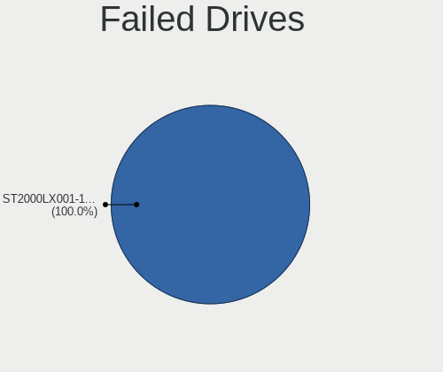
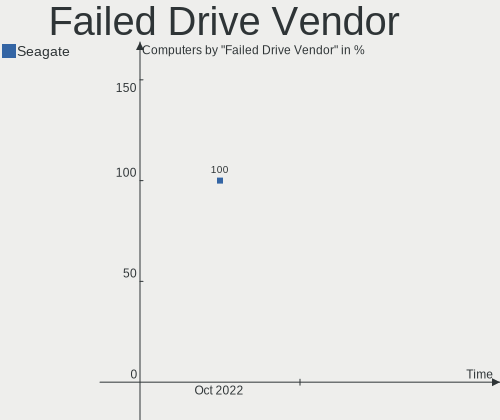

Zorin - Hardware Trends
-----------------------

A project to identify most popular hardware characteristics and track their change
over time based on data collected by Linux users at https://Linux-Hardware.org.

Anyone can contribute to this report by the [hw-probe](https://github.com/linuxhw/hw-probe) tool:

    sudo -E hw-probe -all -upload

This is a report for all computer types. See also reports for [desktops](/Dist/Zorin/Desktop/README.md) and [notebooks](/Dist/Zorin/Notebook/README.md).

This report is for one last month. Overall report since the beginning of time: [TestCoverage](https://github.com/linuxhw/TestCoverage)

Period: Oct, 2022.

Contents
--------

* [ System ](#system)
  - [ OS                       ](#os)
  - [ OS Family                ](#os-family)
  - [ Kernel                   ](#kernel)
  - [ Kernel Family            ](#kernel-family)
  - [ Kernel Major Ver.        ](#kernel-major-ver)
  - [ Arch                     ](#arch)
  - [ DE                       ](#de)
  - [ Display Server           ](#display-server)
  - [ Display Manager          ](#display-manager)
  - [ OS Lang                  ](#os-lang)
  - [ Boot Mode                ](#boot-mode)
  - [ Filesystem               ](#filesystem)
  - [ Part. scheme             ](#part-scheme)
  - [ Dual Boot with Linux/BSD ](#dual-boot-with-linuxbsd)
  - [ Dual Boot (Win)          ](#dual-boot-win)

* [ Board ](#board)
  - [ Vendor                   ](#vendor)
  - [ Model                    ](#model)
  - [ Model Family             ](#model-family)
  - [ MFG Year                 ](#mfg-year)
  - [ Form Factor              ](#form-factor)
  - [ Secure Boot              ](#secure-boot)
  - [ Coreboot                 ](#coreboot)
  - [ RAM Size                 ](#ram-size)
  - [ RAM Used                 ](#ram-used)
  - [ Total Drives             ](#total-drives)
  - [ Has CD-ROM               ](#has-cd-rom)
  - [ Has Ethernet             ](#has-ethernet)
  - [ Has WiFi                 ](#has-wifi)
  - [ Has Bluetooth            ](#has-bluetooth)

* [ Location ](#location)
  - [ Country                  ](#country)
  - [ City                     ](#city)

* [ Drives ](#drives)
  - [ Drive Vendor             ](#drive-vendor)
  - [ Drive Model              ](#drive-model)
  - [ HDD Vendor               ](#hdd-vendor)
  - [ SSD Vendor               ](#ssd-vendor)
  - [ Drive Kind               ](#drive-kind)
  - [ Drive Connector          ](#drive-connector)
  - [ Drive Size               ](#drive-size)
  - [ Space Total              ](#space-total)
  - [ Space Used               ](#space-used)
  - [ Malfunc. Drives          ](#malfunc-drives)
  - [ Malfunc. Drive Vendor    ](#malfunc-drive-vendor)
  - [ Malfunc. HDD Vendor      ](#malfunc-hdd-vendor)
  - [ Malfunc. Drive Kind      ](#malfunc-drive-kind)
  - [ Failed Drives            ](#failed-drives)
  - [ Failed Drive Vendor      ](#failed-drive-vendor)
  - [ Drive Status             ](#drive-status)

* [ Storage controller ](#storage-controller)
  - [ Storage Vendor           ](#storage-vendor)
  - [ Storage Model            ](#storage-model)
  - [ Storage Kind             ](#storage-kind)

* [ Processor ](#processor)
  - [ CPU Vendor               ](#cpu-vendor)
  - [ CPU Model                ](#cpu-model)
  - [ CPU Model Family         ](#cpu-model-family)
  - [ CPU Cores                ](#cpu-cores)
  - [ CPU Sockets              ](#cpu-sockets)
  - [ CPU Threads              ](#cpu-threads)
  - [ CPU Op-Modes             ](#cpu-op-modes)
  - [ CPU Microcode            ](#cpu-microcode)
  - [ CPU Microarch            ](#cpu-microarch)

* [ Graphics ](#graphics)
  - [ GPU Vendor               ](#gpu-vendor)
  - [ GPU Model                ](#gpu-model)
  - [ GPU Combo                ](#gpu-combo)
  - [ GPU Driver               ](#gpu-driver)
  - [ GPU Memory               ](#gpu-memory)

* [ Monitor ](#monitor)
  - [ Monitor Vendor           ](#monitor-vendor)
  - [ Monitor Model            ](#monitor-model)
  - [ Monitor Resolution       ](#monitor-resolution)
  - [ Monitor Diagonal         ](#monitor-diagonal)
  - [ Monitor Width            ](#monitor-width)
  - [ Aspect Ratio             ](#aspect-ratio)
  - [ Monitor Area             ](#monitor-area)
  - [ Pixel Density            ](#pixel-density)
  - [ Multiple Monitors        ](#multiple-monitors)

* [ Network ](#network)
  - [ Net Controller Vendor    ](#net-controller-vendor)
  - [ Net Controller Model     ](#net-controller-model)
  - [ Wireless Vendor          ](#wireless-vendor)
  - [ Wireless Model           ](#wireless-model)
  - [ Ethernet Vendor          ](#ethernet-vendor)
  - [ Ethernet Model           ](#ethernet-model)
  - [ Net Controller Kind      ](#net-controller-kind)
  - [ Used Controller          ](#used-controller)
  - [ NICs                     ](#nics)
  - [ IPv6                     ](#ipv6)

* [ Bluetooth ](#bluetooth)
  - [ Bluetooth Vendor         ](#bluetooth-vendor)
  - [ Bluetooth Model          ](#bluetooth-model)

* [ Sound ](#sound)
  - [ Sound Vendor             ](#sound-vendor)
  - [ Sound Model              ](#sound-model)

* [ Memory ](#memory)
  - [ Memory Vendor            ](#memory-vendor)
  - [ Memory Model             ](#memory-model)
  - [ Memory Kind              ](#memory-kind)
  - [ Memory Form Factor       ](#memory-form-factor)
  - [ Memory Size              ](#memory-size)
  - [ Memory Speed             ](#memory-speed)

* [ Printers & scanners ](#printers--scanners)
  - [ Printer Vendor           ](#printer-vendor)
  - [ Printer Model            ](#printer-model)
  - [ Scanner Vendor           ](#scanner-vendor)
  - [ Scanner Model            ](#scanner-model)

* [ Camera ](#camera)
  - [ Camera Vendor            ](#camera-vendor)
  - [ Camera Model             ](#camera-model)

* [ Security ](#security)
  - [ Fingerprint Vendor       ](#fingerprint-vendor)
  - [ Fingerprint Model        ](#fingerprint-model)
  - [ Chipcard Vendor          ](#chipcard-vendor)
  - [ Chipcard Model           ](#chipcard-model)

* [ Unsupported ](#unsupported)
  - [ Unsupported Devices      ](#unsupported-devices)
  - [ Unsupported Device Types ](#unsupported-device-types)

System
------

OS
--

Installed operating systems

| Name     | Computers | Percent |
|----------|-----------|---------|
| Zorin 16 | 153       | 93.29%  |
| Zorin 15 | 11        | 6.71%   |

OS Family
---------

OS without a version

| Name  | Computers | Percent |
|-------|-----------|---------|
| Zorin | 164       | 100%    |

Kernel
------

Version of the Linux kernel

| Version                    | Computers | Percent |
|----------------------------|-----------|---------|
| 5.15.0-52-generic          | 60        | 36.59%  |
| 5.15.0-48-generic          | 51        | 31.1%   |
| 5.15.0-50-generic          | 19        | 11.59%  |
| 5.15.0-46-generic          | 6         | 3.66%   |
| 5.13.0-30-generic          | 6         | 3.66%   |
| 5.4.0-126-generic          | 5         | 3.05%   |
| 5.4.0-131-generic          | 4         | 2.44%   |
| 5.15.0-43-generic          | 2         | 1.22%   |
| 5.14.0-1052-oem            | 2         | 1.22%   |
| 5.13.0-52-generic          | 2         | 1.22%   |
| 6.0.0-060000-generic       | 1         | 0.61%   |
| 5.4.0-128-generic          | 1         | 0.61%   |
| 5.4.0-125-generic          | 1         | 0.61%   |
| 5.19.14-051914-generic     | 1         | 0.61%   |
| 5.19.12-051912-generic     | 1         | 0.61%   |
| 5.19.0-16.2-liquorix-amd64 | 1         | 0.61%   |
| 5.13.0-35-generic          | 1         | 0.61%   |

Kernel Family
-------------

Linux kernel without a distro release

| Version | Computers | Percent |
|---------|-----------|---------|
| 5.15.0  | 138       | 84.15%  |
| 5.4.0   | 11        | 6.71%   |
| 5.13.0  | 9         | 5.49%   |
| 5.14.0  | 2         | 1.22%   |
| 6.0.0   | 1         | 0.61%   |
| 5.19.14 | 1         | 0.61%   |
| 5.19.12 | 1         | 0.61%   |
| 5.19.0  | 1         | 0.61%   |

Kernel Major Ver.
-----------------

Linux kernel major version

| Version | Computers | Percent |
|---------|-----------|---------|
| 5.15    | 138       | 84.15%  |
| 5.4     | 11        | 6.71%   |
| 5.13    | 9         | 5.49%   |
| 5.19    | 3         | 1.83%   |
| 5.14    | 2         | 1.22%   |
| 6.0     | 1         | 0.61%   |

Arch
----

OS architecture (x86_64, i586, etc.)

| Name   | Computers | Percent |
|--------|-----------|---------|
| x86_64 | 157       | 95.73%  |
| i686   | 7         | 4.27%   |

DE
--

Desktop Environment

| Name  | Computers | Percent |
|-------|-----------|---------|
| GNOME | 131       | 79.88%  |
| XFCE  | 33        | 20.12%  |

Display Server
--------------

X11 or Wayland

| Name    | Computers | Percent |
|---------|-----------|---------|
| X11     | 161       | 98.17%  |
| Wayland | 3         | 1.83%   |

Display Manager
---------------

SDDM, LightDM, etc.

| Name    | Computers | Percent |
|---------|-----------|---------|
| Unknown | 116       | 70.73%  |
| GDM3    | 19        | 11.59%  |
| GDM     | 16        | 9.76%   |
| LightDM | 13        | 7.93%   |

OS Lang
-------

Language

| Lang  | Computers | Percent |
|-------|-----------|---------|
| en_US | 65        | 39.63%  |
| en_GB | 17        | 10.37%  |
| de_DE | 11        | 6.71%   |
| it_IT | 9         | 5.49%   |
| pt_BR | 7         | 4.27%   |
| fr_FR | 7         | 4.27%   |
| en_CA | 6         | 3.66%   |
| en_AU | 6         | 3.66%   |
| es_ES | 5         | 3.05%   |
| nl_NL | 4         | 2.44%   |
| pl_PL | 3         | 1.83%   |
| en_IN | 3         | 1.83%   |
| tr_TR | 2         | 1.22%   |
| nl_BE | 2         | 1.22%   |
| sv_SE | 1         | 0.61%   |
| sr_RS | 1         | 0.61%   |
| ru_RU | 1         | 0.61%   |
| pt_PT | 1         | 0.61%   |
| ja_JP | 1         | 0.61%   |
| hu_HU | 1         | 0.61%   |
| fr_CA | 1         | 0.61%   |
| fi_FI | 1         | 0.61%   |
| es_MX | 1         | 0.61%   |
| es_CO | 1         | 0.61%   |
| es_AR | 1         | 0.61%   |
| en_ZA | 1         | 0.61%   |
| en_PH | 1         | 0.61%   |
| en_NZ | 1         | 0.61%   |
| en_IE | 1         | 0.61%   |
| el_GR | 1         | 0.61%   |
| cs_CZ | 1         | 0.61%   |

Boot Mode
---------

EFI or BIOS

| Mode | Computers | Percent |
|------|-----------|---------|
| BIOS | 82        | 50%     |
| EFI  | 82        | 50%     |

Filesystem
----------

Type of filesystem

| Type    | Computers | Percent |
|---------|-----------|---------|
| Ext4    | 157       | 95.73%  |
| Overlay | 3         | 1.83%   |
| Zfs     | 2         | 1.22%   |
| Btrfs   | 2         | 1.22%   |

Part. scheme
------------

Scheme of partitioning

| Type    | Computers | Percent |
|---------|-----------|---------|
| Unknown | 123       | 75%     |
| GPT     | 30        | 18.29%  |
| MBR     | 11        | 6.71%   |

Dual Boot with Linux/BSD
------------------------

Hosting more than one Linux/BSD

| Dual boot | Computers | Percent |
|-----------|-----------|---------|
| No        | 156       | 95.12%  |
| Yes       | 8         | 4.88%   |

Dual Boot (Win)
---------------

Hosting Linux and Windows

| Dual boot | Computers | Percent |
|-----------|-----------|---------|
| No        | 145       | 88.41%  |
| Yes       | 19        | 11.59%  |

Board
-----

Vendor
------

Motherboard manufacturer

| Name                | Computers | Percent |
|---------------------|-----------|---------|
| Hewlett-Packard     | 33        | 20.12%  |
| Dell                | 27        | 16.46%  |
| ASUSTek Computer    | 18        | 10.98%  |
| Lenovo              | 15        | 9.15%   |
| Gigabyte Technology | 9         | 5.49%   |
| MSI                 | 8         | 4.88%   |
| Acer                | 8         | 4.88%   |
| Apple               | 6         | 3.66%   |
| Toshiba             | 4         | 2.44%   |
| Fujitsu             | 4         | 2.44%   |
| Packard Bell        | 3         | 1.83%   |
| OEM                 | 2         | 1.22%   |
| HUAWEI              | 2         | 1.22%   |
| Google              | 2         | 1.22%   |
| Chuwi               | 2         | 1.22%   |
| ASRock              | 2         | 1.22%   |
| Alienware           | 2         | 1.22%   |
| Unknown             | 2         | 1.22%   |
| TERRA               | 1         | 0.61%   |
| Standard            | 1         | 0.61%   |
| Semp Toshiba        | 1         | 0.61%   |
| Seco                | 1         | 0.61%   |
| Samsung Electronics | 1         | 0.61%   |
| Phoenix/SiS         | 1         | 0.61%   |
| Panasonic           | 1         | 0.61%   |
| Microtech           | 1         | 0.61%   |
| Intel               | 1         | 0.61%   |
| Hampoo              | 1         | 0.61%   |
| Gateway             | 1         | 0.61%   |
| Biostar             | 1         | 0.61%   |
| AXDIA International | 1         | 0.61%   |
| AMI                 | 1         | 0.61%   |
| ALURIN              | 1         | 0.61%   |

Model
-----

Motherboard model

| Name                                | Computers | Percent |
|-------------------------------------|-----------|---------|
| Unknown                             | 3         | 1.83%   |
| Toshiba Satellite C660              | 2         | 1.22%   |
| OEM G41 775 ICH7 8712               | 2         | 1.22%   |
| HP Pavilion Notebook                | 2         | 1.22%   |
| Gigabyte GA-78LMT-S2                | 2         | 1.22%   |
| Dell Latitude E6500                 | 2         | 1.22%   |
| Dell Inspiron 3521                  | 2         | 1.22%   |
| ASUS All Series                     | 2         | 1.22%   |
| Apple iMac12,1                      | 2         | 1.22%   |
| Toshiba Satellite L500              | 1         | 0.61%   |
| Toshiba Satellite C55-A             | 1         | 0.61%   |
| TERRA TERRAPC                       | 1         | 0.61%   |
| Standard X50-V2                     | 1         | 0.61%   |
| Semp Toshiba K201                   | 1         | 0.61%   |
| Seco C40                            | 1         | 0.61%   |
| Samsung 305V4A/305V5A/3415VA        | 1         | 0.61%   |
| Phoenix/SiS M7x0S                   | 1         | 0.61%   |
| Panasonic CF-19-8                   | 1         | 0.61%   |
| Packard Bell EasyNote TM82          | 1         | 0.61%   |
| Packard Bell EasyNote TE69KB        | 1         | 0.61%   |
| Packard Bell EasyNote MH45          | 1         | 0.61%   |
| MSI MS-AE6111                       | 1         | 0.61%   |
| MSI MS-7D20                         | 1         | 0.61%   |
| MSI MS-7C56                         | 1         | 0.61%   |
| MSI MS-7B86                         | 1         | 0.61%   |
| MSI GT70 2PE                        | 1         | 0.61%   |
| MSI GL72 6QD                        | 1         | 0.61%   |
| MSI GE62 7RE                        | 1         | 0.61%   |
| MSI Creator Z16 A11UET              | 1         | 0.61%   |
| Microtech CoreBook                  | 1         | 0.61%   |
| Lenovo Yoga S740-15IRH 81NX         | 1         | 0.61%   |
| Lenovo V570 1066EDG                 | 1         | 0.61%   |
| Lenovo ThinkPad Yoga 11e 20DAS02G00 | 1         | 0.61%   |
| Lenovo ThinkPad T520 4243PN7        | 1         | 0.61%   |
| Lenovo ThinkPad T480 20L6S82F0C     | 1         | 0.61%   |
| Lenovo ThinkPad T460 20FMS7DA00     | 1         | 0.61%   |
| Lenovo ThinkPad T420 4180DW1        | 1         | 0.61%   |
| Lenovo ThinkPad Edge 25453BG        | 1         | 0.61%   |
| Lenovo ThinkCentre M92p 3237A1Q     | 1         | 0.61%   |
| Lenovo IdeaPad Slim 1-14AST-05 81VS | 1         | 0.61%   |

Model Family
------------

Motherboard model prefix

| Name                  | Computers | Percent |
|-----------------------|-----------|---------|
| Dell Inspiron         | 9         | 5.49%   |
| HP Pavilion           | 8         | 4.88%   |
| Lenovo ThinkPad       | 6         | 3.66%   |
| Dell Latitude         | 5         | 3.05%   |
| Acer Aspire           | 5         | 3.05%   |
| Toshiba Satellite     | 4         | 2.44%   |
| Lenovo IdeaPad        | 4         | 2.44%   |
| Dell Vostro           | 4         | 2.44%   |
| Dell OptiPlex         | 4         | 2.44%   |
| Packard Bell EasyNote | 3         | 1.83%   |
| Fujitsu ESPRIMO       | 3         | 1.83%   |
| ASUS PRIME            | 3         | 1.83%   |
| Apple iMac12          | 3         | 1.83%   |
| Unknown               | 3         | 1.83%   |
| OEM G41               | 2         | 1.22%   |
| HP Stream             | 2         | 1.22%   |
| HP ProBook            | 2         | 1.22%   |
| HP EliteBook          | 2         | 1.22%   |
| HP Compaq             | 2         | 1.22%   |
| Gigabyte GA-78LMT-S2  | 2         | 1.22%   |
| Dell Studio           | 2         | 1.22%   |
| Chuwi HeroBook        | 2         | 1.22%   |
| ASUS All              | 2         | 1.22%   |
| ASRock 970            | 2         | 1.22%   |
| Apple MacBookPro8     | 2         | 1.22%   |
| Acer Extensa          | 2         | 1.22%   |
| TERRA TERRAPC         | 1         | 0.61%   |
| Standard X50-V2       | 1         | 0.61%   |
| Semp Toshiba K201     | 1         | 0.61%   |
| Seco C40              | 1         | 0.61%   |
| Samsung 305V4A        | 1         | 0.61%   |
| Phoenix/SiS M7x0S     | 1         | 0.61%   |
| Panasonic CF-19-8     | 1         | 0.61%   |
| MSI MS-AE6111         | 1         | 0.61%   |
| MSI MS-7D20           | 1         | 0.61%   |
| MSI MS-7C56           | 1         | 0.61%   |
| MSI MS-7B86           | 1         | 0.61%   |
| MSI GT70              | 1         | 0.61%   |
| MSI GL72              | 1         | 0.61%   |
| MSI GE62              | 1         | 0.61%   |

MFG Year
--------

Motherboard manufacture year

| Year    | Computers | Percent |
|---------|-----------|---------|
| 2012    | 19        | 11.59%  |
| 2010    | 17        | 10.37%  |
| 2019    | 16        | 9.76%   |
| 2011    | 16        | 9.76%   |
| 2016    | 13        | 7.93%   |
| 2021    | 12        | 7.32%   |
| 2020    | 12        | 7.32%   |
| 2013    | 11        | 6.71%   |
| 2018    | 10        | 6.1%    |
| 2017    | 9         | 5.49%   |
| 2014    | 9         | 5.49%   |
| 2008    | 7         | 4.27%   |
| 2009    | 4         | 2.44%   |
| 2015    | 3         | 1.83%   |
| 2022    | 2         | 1.22%   |
| Unknown | 2         | 1.22%   |
| 2007    | 1         | 0.61%   |
| 2005    | 1         | 0.61%   |

Form Factor
-----------

Physical design of the computer

| Name       | Computers | Percent |
|------------|-----------|---------|
| Notebook   | 100       | 60.98%  |
| Desktop    | 57        | 34.76%  |
| All in one | 6         | 3.66%   |
| Tablet     | 1         | 0.61%   |

Secure Boot
-----------

Enabled or disabled

| State    | Computers | Percent |
|----------|-----------|---------|
| Disabled | 148       | 90.24%  |
| Enabled  | 16        | 9.76%   |

Coreboot
--------

Have coreboot on board

| Used | Computers | Percent |
|------|-----------|---------|
| No   | 162       | 98.78%  |
| Yes  | 2         | 1.22%   |

RAM Size
--------

Total RAM memory

| Size in GB  | Computers | Percent |
|-------------|-----------|---------|
| 4.01-8.0    | 48        | 29.27%  |
| 3.01-4.0    | 41        | 25%     |
| 8.01-16.0   | 28        | 17.07%  |
| 16.01-24.0  | 26        | 15.85%  |
| 32.01-64.0  | 8         | 4.88%   |
| 1.01-2.0    | 7         | 4.27%   |
| 64.01-256.0 | 3         | 1.83%   |
| 24.01-32.0  | 1         | 0.61%   |
| 2.01-3.0    | 1         | 0.61%   |
| 0.51-1.0    | 1         | 0.61%   |

RAM Used
--------

Used RAM memory

| Used GB   | Computers | Percent |
|-----------|-----------|---------|
| 1.01-2.0  | 59        | 35.98%  |
| 2.01-3.0  | 55        | 33.54%  |
| 4.01-8.0  | 19        | 11.59%  |
| 3.01-4.0  | 18        | 10.98%  |
| 0.51-1.0  | 9         | 5.49%   |
| 8.01-16.0 | 4         | 2.44%   |

Total Drives
------------

Number of drives on board

| Drives | Computers | Percent |
|--------|-----------|---------|
| 1      | 96        | 58.54%  |
| 2      | 44        | 26.83%  |
| 3      | 12        | 7.32%   |
| 5      | 4         | 2.44%   |
| 4      | 4         | 2.44%   |
| 0      | 2         | 1.22%   |
| 51     | 1         | 0.61%   |
| 6      | 1         | 0.61%   |

Has CD-ROM
----------

Has CD-ROM on board

| Presented | Computers | Percent |
|-----------|-----------|---------|
| No        | 86        | 52.44%  |
| Yes       | 78        | 47.56%  |

Has Ethernet
------------

Has Ethernet on board

| Presented | Computers | Percent |
|-----------|-----------|---------|
| Yes       | 145       | 88.41%  |
| No        | 19        | 11.59%  |

Has WiFi
--------

Has WiFi module

| Presented | Computers | Percent |
|-----------|-----------|---------|
| Yes       | 134       | 81.71%  |
| No        | 30        | 18.29%  |

Has Bluetooth
-------------

Has Bluetooth module

| Presented | Computers | Percent |
|-----------|-----------|---------|
| Yes       | 91        | 55.49%  |
| No        | 73        | 44.51%  |

Location
--------

Country
-------

Geographic location (country)

| Country      | Computers | Percent |
|--------------|-----------|---------|
| USA          | 33        | 20.12%  |
| UK           | 13        | 7.93%   |
| Germany      | 13        | 7.93%   |
| Italy        | 11        | 6.71%   |
| Canada       | 9         | 5.49%   |
| France       | 8         | 4.88%   |
| Brazil       | 8         | 4.88%   |
| Spain        | 6         | 3.66%   |
| Australia    | 6         | 3.66%   |
| Poland       | 5         | 3.05%   |
| Egypt        | 5         | 3.05%   |
| Netherlands  | 4         | 2.44%   |
| India        | 4         | 2.44%   |
| Belgium      | 3         | 1.83%   |
| Turkey       | 2         | 1.22%   |
| Norway       | 2         | 1.22%   |
| Mexico       | 2         | 1.22%   |
| Jordan       | 2         | 1.22%   |
| Greece       | 2         | 1.22%   |
| Finland      | 2         | 1.22%   |
| Argentina    | 2         | 1.22%   |
| Venezuela    | 1         | 0.61%   |
| Thailand     | 1         | 0.61%   |
| Switzerland  | 1         | 0.61%   |
| Sweden       | 1         | 0.61%   |
| Sri Lanka    | 1         | 0.61%   |
| South Africa | 1         | 0.61%   |
| Serbia       | 1         | 0.61%   |
| San Marino   | 1         | 0.61%   |
| Russia       | 1         | 0.61%   |
| Portugal     | 1         | 0.61%   |
| Pakistan     | 1         | 0.61%   |
| New Zealand  | 1         | 0.61%   |
| Malaysia     | 1         | 0.61%   |
| Japan        | 1         | 0.61%   |
| Ireland      | 1         | 0.61%   |
| Hungary      | 1         | 0.61%   |
| Estonia      | 1         | 0.61%   |
| Czechia      | 1         | 0.61%   |
| Colombia     | 1         | 0.61%   |

City
----

Geographic location (city)

| City                       | Computers | Percent |
|----------------------------|-----------|---------|
| Madrid                     | 3         | 1.83%   |
| Port Said                  | 2         | 1.22%   |
| Paris                      | 2         | 1.22%   |
| Munich                     | 2         | 1.22%   |
| Montreal                   | 2         | 1.22%   |
| Mexico City                | 2         | 1.22%   |
| Los Angeles                | 2         | 1.22%   |
| Krakow                     | 2         | 1.22%   |
| Istanbul                   | 2         | 1.22%   |
| Florence                   | 2         | 1.22%   |
| Buenos Aires               | 2         | 1.22%   |
| Berlin                     | 2         | 1.22%   |
| Bengaluru                  | 2         | 1.22%   |
| Athens                     | 2         | 1.22%   |
| Amman                      | 2         | 1.22%   |
| Winkel                     | 1         | 0.61%   |
| Weston-super-Mare          | 1         | 0.61%   |
| Weilheim                   | 1         | 0.61%   |
| Watford                    | 1         | 0.61%   |
| Victoria                   | 1         | 0.61%   |
| Vancouver                  | 1         | 0.61%   |
| Valencia                   | 1         | 0.61%   |
| Tullahoma                  | 1         | 0.61%   |
| Tukh                       | 1         | 0.61%   |
| Tucson                     | 1         | 0.61%   |
| Trondheim                  | 1         | 0.61%   |
| Tharston                   | 1         | 0.61%   |
| Teresopolis                | 1         | 0.61%   |
| Tallinn                    | 1         | 0.61%   |
| Surrey                     | 1         | 0.61%   |
| Subang Jaya                | 1         | 0.61%   |
| Stellendam                 | 1         | 0.61%   |
| Sohag                      | 1         | 0.61%   |
| Smyrna                     | 1         | 0.61%   |
| Simcoe                     | 1         | 0.61%   |
| Silloth                    | 1         | 0.61%   |
| Shinjuku                   | 1         | 0.61%   |
| Salt Lake City             | 1         | 0.61%   |
| Saint-Martin-de-la-Brasque | 1         | 0.61%   |
| Saint-Denis                | 1         | 0.61%   |

Drives
------

Drive Vendor
------------

Hard drive vendors

| Vendor                      | Computers | Drives | Percent |
|-----------------------------|-----------|--------|---------|
| Seagate                     | 39        | 42     | 17.26%  |
| Samsung Electronics         | 35        | 42     | 15.49%  |
| WDC                         | 34        | 46     | 15.04%  |
| Toshiba                     | 22        | 62     | 9.73%   |
| Unknown                     | 18        | 22     | 7.96%   |
| Crucial                     | 9         | 9      | 3.98%   |
| Kingston                    | 8         | 8      | 3.54%   |
| Sandisk                     | 6         | 6      | 2.65%   |
| HGST                        | 6         | 11     | 2.65%   |
| Hitachi                     | 5         | 5      | 2.21%   |
| PNY                         | 4         | 5      | 1.77%   |
| Intel                       | 4         | 5      | 1.77%   |
| Micron Technology           | 3         | 3      | 1.33%   |
| Intenso                     | 3         | 3      | 1.33%   |
| A-DATA Technology           | 3         | 3      | 1.33%   |
| Unknown                     | 3         | 3      | 1.33%   |
| SK hynix                    | 2         | 2      | 0.88%   |
| Netac                       | 2         | 2      | 0.88%   |
| JMicron Technology          | 2         | 2      | 0.88%   |
| GOODRAM                     | 2         | 2      | 0.88%   |
| China                       | 2         | 2      | 0.88%   |
| XPG                         | 1         | 2      | 0.44%   |
| Silicon Motion              | 1         | 1      | 0.44%   |
| RENICE                      | 1         | 1      | 0.44%   |
| Phison                      | 1         | 1      | 0.44%   |
| OWC                         | 1         | 1      | 0.44%   |
| OCZ                         | 1         | 2      | 0.44%   |
| Mass                        | 1         | 1      | 0.44%   |
| Lexar                       | 1         | 1      | 0.44%   |
| Lenovo                      | 1         | 1      | 0.44%   |
| KIOXIA                      | 1         | 1      | 0.44%   |
| Kingston Technology Company | 1         | 1      | 0.44%   |
| Drevo                       | 1         | 1      | 0.44%   |
| BAITITON                    | 1         | 1      | 0.44%   |
| ADATA Technology            | 1         | 1      | 0.44%   |

Drive Model
-----------

Hard drive models

| Model                                               | Computers | Percent |
|-----------------------------------------------------|-----------|---------|
| Unknown MMC Card  32GB                              | 7         | 2.8%    |
| Unknown MMC Card  64GB                              | 4         | 1.6%    |
| Unknown MMC Card  128GB                             | 4         | 1.6%    |
| Toshiba MQ01ABF050 500GB                            | 4         | 1.6%    |
| Samsung NVMe SSD Controller SM981/PM981/PM983 500GB | 4         | 1.6%    |
| Kingston SA400S37240G 240GB SSD                     | 4         | 1.6%    |
| Unknown SD/MMC/MS PRO 1TB                           | 3         | 1.2%    |
| Seagate ST500LT012-1DG142 500GB                     | 3         | 1.2%    |
| Seagate ST500DM002-1BD142 500GB                     | 3         | 1.2%    |
| Seagate ST1000DM010-2EP102 1TB                      | 3         | 1.2%    |
| Samsung SSD 870 EVO 1TB                             | 3         | 1.2%    |
| PNY CS900 240GB SSD                                 | 3         | 1.2%    |
| Unknown                                             | 3         | 1.2%    |
| WDC WD5000LPVX-75V0TT0 500GB                        | 2         | 0.8%    |
| WDC WD5000LPVX-22V0TT0 500GB                        | 2         | 0.8%    |
| WDC WD20EZRZ-00Z5HB0 2TB                            | 2         | 0.8%    |
| WDC WD10EZEX-08WN4A0 1TB                            | 2         | 0.8%    |
| Toshiba MK1652GSX 160GB                             | 2         | 0.8%    |
| SK hynix BC711 HFM512GD3JX013N 512GB                | 2         | 0.8%    |
| Seagate ST9500420AS 500GB                           | 2         | 0.8%    |
| Seagate ST500VT000-1DK142 500GB                     | 2         | 0.8%    |
| Seagate ST500LT012-9WS142 500GB                     | 2         | 0.8%    |
| Seagate ST500LM021-1KJ152 500GB                     | 2         | 0.8%    |
| Seagate ST3500414CS 500GB                           | 2         | 0.8%    |
| Seagate ST320LT020-9YG142 320GB                     | 2         | 0.8%    |
| Seagate ST2000DM008-2FR102 2TB                      | 2         | 0.8%    |
| Seagate ST2000DM001-1ER164 2TB                      | 2         | 0.8%    |
| Seagate ST1000LM035-1RK172 1TB                      | 2         | 0.8%    |
| Sandisk WD Blue SN550 NVMe SSD 1TB                  | 2         | 0.8%    |
| Samsung SSD 860 QVO 2TB                             | 2         | 0.8%    |
| Samsung SSD 860 EVO 1TB                             | 2         | 0.8%    |
| Samsung SSD 850 EVO 500GB                           | 2         | 0.8%    |
| Samsung NVMe SSD Controller SM951/PM951 512GB       | 2         | 0.8%    |
| Samsung MZALQ256HBJD-00BL2 256GB                    | 2         | 0.8%    |
| Samsung HM121HI 120GB                               | 2         | 0.8%    |
| JMicron Generic 500GB                               | 2         | 0.8%    |
| HGST HTS545032A7E380 320GB                          | 2         | 0.8%    |
| HGST HTS541010A9E680 1TB                            | 2         | 0.8%    |
| GOODRAM SSDPR-CX400-128 128GB                       | 2         | 0.8%    |
| XPG SX950U 240GB                                    | 1         | 0.4%    |

HDD Vendor
----------

Hard disk drive vendors

| Vendor              | Computers | Drives | Percent |
|---------------------|-----------|--------|---------|
| Seagate             | 39        | 42     | 36.11%  |
| WDC                 | 30        | 39     | 27.78%  |
| Toshiba             | 18        | 58     | 16.67%  |
| Samsung Electronics | 7         | 8      | 6.48%   |
| HGST                | 6         | 11     | 5.56%   |
| Hitachi             | 5         | 5      | 4.63%   |
| Unknown             | 3         | 3      | 2.78%   |

SSD Vendor
----------

Solid state drive vendors

| Vendor              | Computers | Drives | Percent |
|---------------------|-----------|--------|---------|
| Samsung Electronics | 15        | 17     | 23.08%  |
| Kingston            | 8         | 8      | 12.31%  |
| Crucial             | 8         | 8      | 12.31%  |
| WDC                 | 4         | 5      | 6.15%   |
| SanDisk             | 4         | 4      | 6.15%   |
| PNY                 | 4         | 5      | 6.15%   |
| Toshiba             | 3         | 3      | 4.62%   |
| A-DATA Technology   | 3         | 3      | 4.62%   |
| Netac               | 2         | 2      | 3.08%   |
| GOODRAM             | 2         | 2      | 3.08%   |
| China               | 2         | 2      | 3.08%   |
| Unknown             | 2         | 2      | 3.08%   |
| XPG                 | 1         | 1      | 1.54%   |
| OWC                 | 1         | 1      | 1.54%   |
| OCZ                 | 1         | 2      | 1.54%   |
| Lexar               | 1         | 1      | 1.54%   |
| Intenso             | 1         | 1      | 1.54%   |
| Intel               | 1         | 1      | 1.54%   |
| Drevo               | 1         | 1      | 1.54%   |
| BAITITON            | 1         | 1      | 1.54%   |

Drive Kind
----------

HDD or SSD

| Kind    | Computers | Drives | Percent |
|---------|-----------|--------|---------|
| HDD     | 93        | 166    | 44.5%   |
| SSD     | 61        | 70     | 29.19%  |
| NVMe    | 33        | 40     | 15.79%  |
| MMC     | 18        | 21     | 8.61%   |
| Unknown | 4         | 4      | 1.91%   |

Drive Connector
---------------

SATA, SAS, NVMe, etc.

| Type | Computers | Drives | Percent |
|------|-----------|--------|---------|
| SATA | 132       | 234    | 70.21%  |
| NVMe | 31        | 38     | 16.49%  |
| MMC  | 18        | 21     | 9.57%   |
| SAS  | 7         | 8      | 3.72%   |

Drive Size
----------

Size of hard drive

| Size in TB | Computers | Drives | Percent |
|------------|-----------|--------|---------|
| 0.01-0.5   | 92        | 112    | 56.79%  |
| 0.51-1.0   | 52        | 55     | 32.1%   |
| 1.01-2.0   | 12        | 15     | 7.41%   |
| 3.01-4.0   | 2         | 41     | 1.23%   |
| 4.01-10.0  | 2         | 6      | 1.23%   |
| 2.01-3.0   | 1         | 2      | 0.62%   |
| 10.01-20.0 | 1         | 5      | 0.62%   |

Space Total
-----------

Amount of disk space available on the file system

| Size in GB     | Computers | Percent |
|----------------|-----------|---------|
| 251-500        | 56        | 34.15%  |
| 101-250        | 48        | 29.27%  |
| 501-1000       | 28        | 17.07%  |
| 51-100         | 9         | 5.49%   |
| 21-50          | 7         | 4.27%   |
| 1001-2000      | 7         | 4.27%   |
| More than 3000 | 5         | 3.05%   |
| 2001-3000      | 2         | 1.22%   |
| 1-20           | 1         | 0.61%   |
| Unknown        | 1         | 0.61%   |

Space Used
----------

Amount of used disk space

| Used GB        | Computers | Percent |
|----------------|-----------|---------|
| 1-20           | 60        | 36.59%  |
| 21-50          | 48        | 29.27%  |
| 51-100         | 21        | 12.8%   |
| 101-250        | 18        | 10.98%  |
| 501-1000       | 6         | 3.66%   |
| More than 3000 | 5         | 3.05%   |
| 251-500        | 3         | 1.83%   |
| 1001-2000      | 2         | 1.22%   |
| Unknown        | 1         | 0.61%   |

Malfunc. Drives
---------------

Drive models with a malfunction

| Model                                  | Computers | Drives | Percent |
|----------------------------------------|-----------|--------|---------|
| Toshiba THNSNK256GCS8 SATA 256GB SSD   | 1         | 1      | 25%     |
| Seagate ST500LT012-9WS142 500GB        | 1         | 1      | 25%     |
| Kingston RBU-SNS8152S3256GG2 256GB SSD | 1         | 1      | 25%     |
| HGST HTS541010A9E680 1TB               | 1         | 1      | 25%     |

Malfunc. Drive Vendor
---------------------

Vendors of faulty drives

| Vendor   | Computers | Drives | Percent |
|----------|-----------|--------|---------|
| Toshiba  | 1         | 1      | 25%     |
| Seagate  | 1         | 1      | 25%     |
| Kingston | 1         | 1      | 25%     |
| HGST     | 1         | 1      | 25%     |

Malfunc. HDD Vendor
-------------------

Vendors of faulty HDD drives

| Vendor  | Computers | Drives | Percent |
|---------|-----------|--------|---------|
| Seagate | 1         | 1      | 50%     |
| HGST    | 1         | 1      | 50%     |

Malfunc. Drive Kind
-------------------

Kinds of faulty drives

| Kind | Computers | Drives | Percent |
|------|-----------|--------|---------|
| SSD  | 2         | 2      | 50%     |
| HDD  | 2         | 2      | 50%     |

Failed Drives
-------------

Failed drive models

| Model                          | Computers | Drives | Percent |
|--------------------------------|-----------|--------|---------|
| Seagate ST2000LX001-1RG174 2TB | 1         | 1      | 100%    |

Failed Drive Vendor
-------------------

Failed drive vendors

| Vendor  | Computers | Drives | Percent |
|---------|-----------|--------|---------|
| Seagate | 1         | 1      | 100%    |

Drive Status
------------

Number of failed and malfunc. drives

| Status   | Computers | Drives | Percent |
|----------|-----------|--------|---------|
| Detected | 142       | 218    | 85.54%  |
| Works    | 20        | 78     | 12.05%  |
| Malfunc  | 3         | 4      | 1.81%   |
| Failed   | 1         | 1      | 0.6%    |

Storage controller
------------------

Storage Vendor
--------------

Storage controller vendors

| Vendor                           | Computers | Percent |
|----------------------------------|-----------|---------|
| Intel                            | 108       | 58.06%  |
| AMD                              | 35        | 18.82%  |
| Samsung Electronics              | 16        | 8.6%    |
| SanDisk                          | 3         | 1.61%   |
| Micron Technology                | 3         | 1.61%   |
| SK hynix                         | 2         | 1.08%   |
| Nvidia                           | 2         | 1.08%   |
| Marvell Technology Group         | 2         | 1.08%   |
| ASMedia Technology               | 2         | 1.08%   |
| VIA Technologies                 | 1         | 0.54%   |
| Unknown                          | 1         | 0.54%   |
| Toshiba America Info Systems     | 1         | 0.54%   |
| Silicon Motion                   | 1         | 0.54%   |
| Silicon Integrated Systems [SiS] | 1         | 0.54%   |
| Silicon Image                    | 1         | 0.54%   |
| Phison Electronics               | 1         | 0.54%   |
| OCZ Technology Group             | 1         | 0.54%   |
| Micron/Crucial Technology        | 1         | 0.54%   |
| Lenovo                           | 1         | 0.54%   |
| KIOXIA                           | 1         | 0.54%   |
| Kingston Technology Company      | 1         | 0.54%   |
| ADATA Technology                 | 1         | 0.54%   |

Storage Model
-------------

Storage controller models

| Model                                                                          | Computers | Percent |
|--------------------------------------------------------------------------------|-----------|---------|
| AMD FCH SATA Controller [AHCI mode]                                            | 23        | 10.55%  |
| Intel 82801 Mobile SATA Controller [RAID mode]                                 | 8         | 3.67%   |
| Intel 7 Series Chipset Family 6-port SATA Controller [AHCI mode]               | 8         | 3.67%   |
| Intel 8 Series/C220 Series Chipset Family 6-port SATA Controller 1 [AHCI mode] | 7         | 3.21%   |
| Intel 6 Series/C200 Series Chipset Family 6 port Mobile SATA AHCI Controller   | 7         | 3.21%   |
| Intel 5 Series/3400 Series Chipset 4 port SATA AHCI Controller                 | 7         | 3.21%   |
| Samsung NVMe SSD Controller SM981/PM981/PM983                                  | 6         | 2.75%   |
| Samsung NVMe SSD Controller 980                                                | 6         | 2.75%   |
| Intel 7 Series/C210 Series Chipset Family 6-port SATA Controller [AHCI mode]   | 6         | 2.75%   |
| AMD SB7x0/SB8x0/SB9x0 SATA Controller [IDE mode]                               | 6         | 2.75%   |
| AMD SB7x0/SB8x0/SB9x0 IDE Controller                                           | 6         | 2.75%   |
| Intel NM10/ICH7 Family SATA Controller [IDE mode]                              | 5         | 2.29%   |
| Intel 82801IBM/IEM (ICH9M/ICH9M-E) 4 port SATA Controller [AHCI mode]          | 5         | 2.29%   |
| Intel 6 Series/C200 Series Chipset Family 6 port Desktop SATA AHCI Controller  | 5         | 2.29%   |
| Intel Sunrise Point-LP SATA Controller [AHCI mode]                             | 4         | 1.83%   |
| Intel SATA Controller [RAID mode]                                              | 4         | 1.83%   |
| AMD SB7x0/SB8x0/SB9x0 SATA Controller [AHCI mode]                              | 4         | 1.83%   |
| AMD 400 Series Chipset SATA Controller                                         | 4         | 1.83%   |
| SanDisk WD Blue SN550 NVMe SSD                                                 | 3         | 1.38%   |
| Micron Non-Volatile memory controller                                          | 3         | 1.38%   |
| Intel Celeron/Pentium Silver Processor SATA Controller                         | 3         | 1.38%   |
| Intel Celeron N3350/Pentium N4200/Atom E3900 Series SATA AHCI Controller       | 3         | 1.38%   |
| Intel 82801G (ICH7 Family) IDE Controller                                      | 3         | 1.38%   |
| Intel 8 Series SATA Controller 1 [AHCI mode]                                   | 3         | 1.38%   |
| Intel 5 Series/3400 Series Chipset 6 port SATA AHCI Controller                 | 3         | 1.38%   |
| Intel 200 Series PCH SATA controller [AHCI mode]                               | 3         | 1.38%   |
| AMD 300 Series Chipset SATA Controller                                         | 3         | 1.38%   |
| SK hynix Gold P31 SSD                                                          | 2         | 0.92%   |
| Samsung NVMe SSD Controller SM951/PM951                                        | 2         | 0.92%   |
| Nvidia MCP51 Serial ATA Controller                                             | 2         | 0.92%   |
| Intel Wildcat Point-LP SATA Controller [AHCI Mode]                             | 2         | 0.92%   |
| Intel Volume Management Device NVMe RAID Controller                            | 2         | 0.92%   |
| Intel HM170/QM170 Chipset SATA Controller [AHCI Mode]                          | 2         | 0.92%   |
| Intel Cannon Lake PCH SATA AHCI Controller                                     | 2         | 0.92%   |
| Intel Cannon Lake Mobile PCH SATA AHCI Controller                              | 2         | 0.92%   |
| Intel Atom Processor E3800 Series SATA AHCI Controller                         | 2         | 0.92%   |
| Intel 82801HM/HEM (ICH8M/ICH8M-E) SATA Controller [AHCI mode]                  | 2         | 0.92%   |
| Intel 82801HM/HEM (ICH8M/ICH8M-E) IDE Controller                               | 2         | 0.92%   |
| VIA VT82C586A/B/VT82C686/A/B/VT823x/A/C PIPC Bus Master IDE                    | 1         | 0.46%   |
| VIA VT8237A SATA 2-Port Controller                                             | 1         | 0.46%   |

Storage Kind
------------

Kind of storage controller (IDE, SATA, NVMe, SAS, ...)

| Kind | Computers | Percent |
|------|-----------|---------|
| SATA | 120       | 62.5%   |
| NVMe | 32        | 16.67%  |
| IDE  | 24        | 12.5%   |
| RAID | 15        | 7.81%   |
| SCSI | 1         | 0.52%   |

Processor
---------

CPU Vendor
----------

Processor vendors

| Vendor | Computers | Percent |
|--------|-----------|---------|
| Intel  | 124       | 75.61%  |
| AMD    | 40        | 24.39%  |

CPU Model
---------

Processor models

| Model                                           | Computers | Percent |
|-------------------------------------------------|-----------|---------|
| Intel Core i5-2430M CPU @ 2.40GHz               | 3         | 1.83%   |
| Intel 11th Gen Core i5-1135G7 @ 2.40GHz         | 3         | 1.83%   |
| Intel Pentium Dual-Core CPU T4500 @ 2.30GHz     | 2         | 1.22%   |
| Intel Pentium Dual-Core CPU T4200 @ 2.00GHz     | 2         | 1.22%   |
| Intel Pentium CPU 2020M @ 2.40GHz               | 2         | 1.22%   |
| Intel Core i7-9700F CPU @ 3.00GHz               | 2         | 1.22%   |
| Intel Core i7-7500U CPU @ 2.70GHz               | 2         | 1.22%   |
| Intel Core i7-10750H CPU @ 2.60GHz              | 2         | 1.22%   |
| Intel Core i5-9300H CPU @ 2.40GHz               | 2         | 1.22%   |
| Intel Core i5-3470 CPU @ 3.20GHz                | 2         | 1.22%   |
| Intel Core i5-2520M CPU @ 2.50GHz               | 2         | 1.22%   |
| Intel Core i5-2400 CPU @ 3.10GHz                | 2         | 1.22%   |
| Intel Core i3 CPU M 380 @ 2.53GHz               | 2         | 1.22%   |
| Intel Core 2 Duo CPU E7500 @ 2.93GHz            | 2         | 1.22%   |
| Intel Celeron N4020 CPU @ 1.10GHz               | 2         | 1.22%   |
| Intel Celeron CPU N3450 @ 1.10GHz               | 2         | 1.22%   |
| AMD Ryzen 7 PRO 2700U w/ Radeon Vega Mobile Gfx | 2         | 1.22%   |
| AMD Ryzen 7 2700 Eight-Core Processor           | 2         | 1.22%   |
| Intel Xeon E-2224G CPU @ 3.50GHz                | 1         | 0.61%   |
| Intel Xeon E-2186M CPU @ 2.90GHz                | 1         | 0.61%   |
| Intel Xeon CPU E5-2630 v4 @ 2.20GHz             | 1         | 0.61%   |
| Intel Xeon CPU E3-1270 V2 @ 3.50GHz             | 1         | 0.61%   |
| Intel Pentium Dual-Core CPU T4400 @ 2.20GHz     | 1         | 0.61%   |
| Intel Pentium Dual CPU T3400 @ 2.16GHz          | 1         | 0.61%   |
| Intel Pentium Dual CPU T3200 @ 2.00GHz          | 1         | 0.61%   |
| Intel Pentium CPU P6100 @ 2.00GHz               | 1         | 0.61%   |
| Intel Pentium CPU N4200 @ 1.10GHz               | 1         | 0.61%   |
| Intel Genuine CPU U7300 @ 1.30GHz               | 1         | 0.61%   |
| Intel Genuine CPU T1400 @ 1.73GHz               | 1         | 0.61%   |
| Intel Core i9-9900 CPU @ 3.10GHz                | 1         | 0.61%   |
| Intel Core i7-7700HQ CPU @ 2.80GHz              | 1         | 0.61%   |
| Intel Core i7-6700K CPU @ 4.00GHz               | 1         | 0.61%   |
| Intel Core i7-6700HQ CPU @ 2.60GHz              | 1         | 0.61%   |
| Intel Core i7-6500U CPU @ 2.50GHz               | 1         | 0.61%   |
| Intel Core i7-5500U CPU @ 2.40GHz               | 1         | 0.61%   |
| Intel Core i7-4810MQ CPU @ 2.80GHz              | 1         | 0.61%   |
| Intel Core i7-4800MQ CPU @ 2.70GHz              | 1         | 0.61%   |
| Intel Core i7-4770 CPU @ 3.40GHz                | 1         | 0.61%   |
| Intel Core i7-4710HQ CPU @ 2.50GHz              | 1         | 0.61%   |
| Intel Core i7-4500U CPU @ 1.80GHz               | 1         | 0.61%   |

CPU Model Family
----------------

Processor model prefix

| Model                   | Computers | Percent |
|-------------------------|-----------|---------|
| Intel Core i5           | 40        | 24.39%  |
| Intel Core i7           | 20        | 12.2%   |
| Intel Core i3           | 17        | 10.37%  |
| Intel Celeron           | 10        | 6.1%    |
| Other                   | 7         | 4.27%   |
| Intel Pentium Dual-Core | 5         | 3.05%   |
| Intel Atom              | 5         | 3.05%   |
| Intel Xeon              | 4         | 2.44%   |
| Intel Pentium           | 4         | 2.44%   |
| Intel Core 2 Duo        | 4         | 2.44%   |
| AMD Ryzen 5             | 4         | 2.44%   |
| AMD FX                  | 4         | 2.44%   |
| AMD A4                  | 4         | 2.44%   |
| Intel Core 2 Quad       | 3         | 1.83%   |
| AMD Ryzen 7             | 3         | 1.83%   |
| AMD Ryzen 3             | 3         | 1.83%   |
| AMD A8                  | 3         | 1.83%   |
| Intel Pentium Dual      | 2         | 1.22%   |
| Intel Genuine           | 2         | 1.22%   |
| AMD Ryzen 7 PRO         | 2         | 1.22%   |
| AMD Phenom II X6        | 2         | 1.22%   |
| AMD A10                 | 2         | 1.22%   |
| Intel Core i9           | 1         | 0.61%   |
| Intel Celeron M         | 1         | 0.61%   |
| AMD V120                | 1         | 0.61%   |
| AMD Turion 64 X2 Mobile | 1         | 0.61%   |
| AMD Ryzen Embedded      | 1         | 0.61%   |
| AMD Ryzen 9             | 1         | 0.61%   |
| AMD QC                  | 1         | 0.61%   |
| AMD PRO A10             | 1         | 0.61%   |
| AMD Phenom II X4        | 1         | 0.61%   |
| AMD E1                  | 1         | 0.61%   |
| AMD Athlon II X2        | 1         | 0.61%   |
| AMD Athlon II Neo       | 1         | 0.61%   |
| AMD Athlon 64 X2        | 1         | 0.61%   |
| AMD Athlon              | 1         | 0.61%   |

CPU Cores
---------

Number of processor cores

| Number | Computers | Percent |
|--------|-----------|---------|
| 2      | 78        | 47.56%  |
| 4      | 63        | 38.41%  |
| 6      | 10        | 6.1%    |
| 8      | 7         | 4.27%   |
| 1      | 4         | 2.44%   |
| 16     | 1         | 0.61%   |
| 10     | 1         | 0.61%   |

CPU Sockets
-----------

Number of sockets

| Number | Computers | Percent |
|--------|-----------|---------|
| 1      | 164       | 100%    |

CPU Threads
-----------

Threads per core (Hyper-Threading)

| Number | Computers | Percent |
|--------|-----------|---------|
| 2      | 95        | 57.93%  |
| 1      | 69        | 42.07%  |

CPU Op-Modes
------------

CPU Operation Modes (32-bit, 64-bit)

| Op mode        | Computers | Percent |
|----------------|-----------|---------|
| 32-bit, 64-bit | 162       | 98.78%  |
| 32-bit         | 2         | 1.22%   |

CPU Microcode
-------------

Microcode number

| Number     | Computers | Percent |
|------------|-----------|---------|
| Unknown    | 20        | 12.2%   |
| 0x306a9    | 14        | 8.54%   |
| 0x206a7    | 14        | 8.54%   |
| 0x1067a    | 11        | 6.71%   |
| 0x20655    | 9         | 5.49%   |
| 0x906ea    | 6         | 3.66%   |
| 0x306c3    | 6         | 3.66%   |
| 0x906e9    | 4         | 2.44%   |
| 0x806c1    | 4         | 2.44%   |
| 0x906ed    | 3         | 1.83%   |
| 0x806e9    | 3         | 1.83%   |
| 0x706a8    | 3         | 1.83%   |
| 0x6fd      | 3         | 1.83%   |
| 0x506c9    | 3         | 1.83%   |
| 0x406c4    | 3         | 1.83%   |
| 0x40651    | 3         | 1.83%   |
| 0x30678    | 3         | 1.83%   |
| 0x20652    | 3         | 1.83%   |
| 0x06000852 | 3         | 1.83%   |
| 0x010000c8 | 3         | 1.83%   |
| 0xa0652    | 2         | 1.22%   |
| 0x406e3    | 2         | 1.22%   |
| 0x08701021 | 2         | 1.22%   |
| 0x0810100b | 2         | 1.22%   |
| 0x0800820d | 2         | 1.22%   |
| 0x06006705 | 2         | 1.22%   |
| 0xa0653    | 1         | 0.61%   |
| 0x90672    | 1         | 0.61%   |
| 0x806ec    | 1         | 0.61%   |
| 0x806ea    | 1         | 0.61%   |
| 0x806d1    | 1         | 0.61%   |
| 0x706e5    | 1         | 0.61%   |
| 0x706a1    | 1         | 0.61%   |
| 0x6fb      | 1         | 0.61%   |
| 0x6d8      | 1         | 0.61%   |
| 0x506e3    | 1         | 0.61%   |
| 0x406f1    | 1         | 0.61%   |
| 0x306d4    | 1         | 0.61%   |
| 0x30661    | 1         | 0.61%   |
| 0x106e5    | 1         | 0.61%   |

CPU Microarch
-------------

Microarchitecture

| Name             | Computers | Percent |
|------------------|-----------|---------|
| KabyLake         | 18        | 10.98%  |
| SandyBridge      | 16        | 9.76%   |
| IvyBridge        | 15        | 9.15%   |
| Westmere         | 12        | 7.32%   |
| Penryn           | 12        | 7.32%   |
| Haswell          | 11        | 6.71%   |
| Silvermont       | 7         | 4.27%   |
| K10              | 6         | 3.66%   |
| Excavator        | 6         | 3.66%   |
| Zen              | 5         | 3.05%   |
| Skylake          | 5         | 3.05%   |
| Piledriver       | 5         | 3.05%   |
| Zen+             | 4         | 2.44%   |
| Zen 2            | 4         | 2.44%   |
| TigerLake        | 4         | 2.44%   |
| Goldmont plus    | 4         | 2.44%   |
| Core             | 4         | 2.44%   |
| Jaguar           | 3         | 1.83%   |
| Goldmont         | 3         | 1.83%   |
| CometLake        | 3         | 1.83%   |
| Broadwell        | 3         | 1.83%   |
| Zen 3            | 2         | 1.22%   |
| K8 Hammer        | 2         | 1.22%   |
| Icelake          | 2         | 1.22%   |
| Bonnell          | 2         | 1.22%   |
| Steamroller      | 1         | 0.61%   |
| P6               | 1         | 0.61%   |
| Nehalem          | 1         | 0.61%   |
| K10 Llano        | 1         | 0.61%   |
| Alderlake Hybrid | 1         | 0.61%   |
| Unknown          | 1         | 0.61%   |

Graphics
--------

GPU Vendor
----------

Vendors of graphics cards

| Vendor                           | Computers | Percent |
|----------------------------------|-----------|---------|
| Intel                            | 96        | 50.53%  |
| AMD                              | 48        | 25.26%  |
| Nvidia                           | 44        | 23.16%  |
| VIA Technologies                 | 1         | 0.53%   |
| Silicon Integrated Systems [SiS] | 1         | 0.53%   |

GPU Model
---------

Graphics card models

| Model                                                                                    | Computers | Percent |
|------------------------------------------------------------------------------------------|-----------|---------|
| Intel 2nd Generation Core Processor Family Integrated Graphics Controller                | 14        | 7.25%   |
| Intel Core Processor Integrated Graphics Controller                                      | 9         | 4.66%   |
| Intel 3rd Gen Core processor Graphics Controller                                         | 8         | 4.15%   |
| Intel Mobile 4 Series Chipset Integrated Graphics Controller                             | 6         | 3.11%   |
| Intel Xeon E3-1200 v3/4th Gen Core Processor Integrated Graphics Controller              | 4         | 2.07%   |
| Intel TigerLake-LP GT2 [Iris Xe Graphics]                                                | 4         | 2.07%   |
| Intel GeminiLake [UHD Graphics 600]                                                      | 4         | 2.07%   |
| Intel Atom Processor Z36xxx/Z37xxx Series Graphics & Display                             | 4         | 2.07%   |
| AMD Raven Ridge [Radeon Vega Series / Radeon Vega Mobile Series]                         | 4         | 2.07%   |
| AMD Park [Mobility Radeon HD 5430/5450/5470]                                             | 4         | 2.07%   |
| Nvidia GP107 [GeForce GTX 1050 Ti]                                                       | 3         | 1.55%   |
| Nvidia GK208B [GeForce GT 710]                                                           | 3         | 1.55%   |
| Intel Xeon E3-1200 v2/3rd Gen Core processor Graphics Controller                         | 3         | 1.55%   |
| Intel Skylake GT2 [HD Graphics 520]                                                      | 3         | 1.55%   |
| Intel HD Graphics 630                                                                    | 3         | 1.55%   |
| Intel HD Graphics 620                                                                    | 3         | 1.55%   |
| Intel Haswell-ULT Integrated Graphics Controller                                         | 3         | 1.55%   |
| Intel CoffeeLake-H GT2 [UHD Graphics 630]                                                | 3         | 1.55%   |
| Intel Atom/Celeron/Pentium Processor x5-E8000/J3xxx/N3xxx Integrated Graphics Controller | 3         | 1.55%   |
| AMD Whistler [Radeon HD 6630M/6650M/6750M/7670M/7690M]                                   | 3         | 1.55%   |
| AMD Wani [Radeon R5/R6/R7 Graphics]                                                      | 3         | 1.55%   |
| AMD Stoney [Radeon R2/R3/R4/R5 Graphics]                                                 | 3         | 1.55%   |
| AMD RS780L [Radeon 3000]                                                                 | 3         | 1.55%   |
| Nvidia TU116 [GeForce GTX 1660 SUPER]                                                    | 2         | 1.04%   |
| Nvidia GK208B [GeForce GT 730]                                                           | 2         | 1.04%   |
| Intel HD Graphics 5500                                                                   | 2         | 1.04%   |
| Intel HD Graphics 500                                                                    | 2         | 1.04%   |
| Intel CometLake-H GT2 [UHD Graphics]                                                     | 2         | 1.04%   |
| Intel 4th Gen Core Processor Integrated Graphics Controller                              | 2         | 1.04%   |
| Intel 4 Series Chipset Integrated Graphics Controller                                    | 2         | 1.04%   |
| AMD RS880M [Mobility Radeon HD 4225/4250]                                                | 2         | 1.04%   |
| AMD Picasso/Raven 2 [Radeon Vega Series / Radeon Vega Mobile Series]                     | 2         | 1.04%   |
| AMD Navi 23 [Radeon RX 6600/6600 XT/6600M]                                               | 2         | 1.04%   |
| VIA Technologies CN896/VN896/P4M900 [Chrome 9 HC]                                        | 1         | 0.52%   |
| Silicon Integrated Systems [SiS] 771/671 PCIE VGA Display Adapter                        | 1         | 0.52%   |
| Nvidia TU117M [GeForce GTX 1650 Mobile / Max-Q]                                          | 1         | 0.52%   |
| Nvidia TU116M [GeForce GTX 1660 Ti Mobile]                                               | 1         | 0.52%   |
| Nvidia TU116 [GeForce GTX 1660 Ti]                                                       | 1         | 0.52%   |
| Nvidia TU106M [GeForce RTX 2060 Max-Q]                                                   | 1         | 0.52%   |
| Nvidia TU106 [GeForce RTX 2060 Rev. A]                                                   | 1         | 0.52%   |

GPU Combo
---------

Combinations of graphics cards

| Name           | Computers | Percent |
|----------------|-----------|---------|
| 1 x Intel      | 70        | 42.68%  |
| 1 x AMD        | 42        | 25.61%  |
| 1 x Nvidia     | 26        | 15.85%  |
| Intel + Nvidia | 18        | 10.98%  |
| Intel + AMD    | 4         | 2.44%   |
| 2 x AMD        | 2         | 1.22%   |
| 1 x VIA        | 1         | 0.61%   |
| 1 x SiS        | 1         | 0.61%   |

GPU Driver
----------

Free vs proprietary

| Driver      | Computers | Percent |
|-------------|-----------|---------|
| Free        | 132       | 80.49%  |
| Proprietary | 24        | 14.63%  |
| Unknown     | 8         | 4.88%   |

GPU Memory
----------

Total video memory

| Size in GB | Computers | Percent |
|------------|-----------|---------|
| Unknown    | 102       | 62.2%   |
| 0.01-0.5   | 23        | 14.02%  |
| 1.01-2.0   | 11        | 6.71%   |
| 0.51-1.0   | 9         | 5.49%   |
| 7.01-8.0   | 6         | 3.66%   |
| 3.01-4.0   | 6         | 3.66%   |
| 5.01-6.0   | 4         | 2.44%   |
| 2.01-3.0   | 2         | 1.22%   |
| 8.01-16.0  | 1         | 0.61%   |

Monitor
-------

Monitor Vendor
--------------

Monitor vendors

| Vendor                  | Computers | Percent |
|-------------------------|-----------|---------|
| LG Display              | 18        | 10.59%  |
| Chimei Innolux          | 18        | 10.59%  |
| AU Optronics            | 17        | 10%     |
| Samsung Electronics     | 15        | 8.82%   |
| BOE                     | 14        | 8.24%   |
| Hewlett-Packard         | 9         | 5.29%   |
| Dell                    | 9         | 5.29%   |
| Ancor Communications    | 8         | 4.71%   |
| Apple                   | 6         | 3.53%   |
| AOC                     | 6         | 3.53%   |
| Chi Mei Optoelectronics | 5         | 2.94%   |
| BenQ                    | 5         | 2.94%   |
| Goldstar                | 4         | 2.35%   |
| Acer                    | 4         | 2.35%   |
| Unknown                 | 2         | 1.18%   |
| Sony                    | 2         | 1.18%   |
| PANDA                   | 2         | 1.18%   |
| MSI                     | 2         | 1.18%   |
| Xiaomi                  | 1         | 0.59%   |
| WYT                     | 1         | 0.59%   |
| Vizio                   | 1         | 0.59%   |
| Unknown (XXX)           | 1         | 0.59%   |
| Toshiba                 | 1         | 0.59%   |
| STD                     | 1         | 0.59%   |
| Sharp                   | 1         | 0.59%   |
| Philips                 | 1         | 0.59%   |
| Medion                  | 1         | 0.59%   |
| LKM                     | 1         | 0.59%   |
| LG Philips              | 1         | 0.59%   |
| LG Electronics          | 1         | 0.59%   |
| Kogan                   | 1         | 0.59%   |
| JDI                     | 1         | 0.59%   |
| InfoVision              | 1         | 0.59%   |
| Iiyama                  | 1         | 0.59%   |
| HannStar                | 1         | 0.59%   |
| Fujitsu Siemens         | 1         | 0.59%   |
| EQV                     | 1         | 0.59%   |
| Eizo                    | 1         | 0.59%   |
| CTL                     | 1         | 0.59%   |
| CPT                     | 1         | 0.59%   |

Monitor Model
-------------

Monitor models

| Model                                                                    | Computers | Percent |
|--------------------------------------------------------------------------|-----------|---------|
| Samsung Electronics LCD Monitor SEC5441 1366x768 344x194mm 15.5-inch     | 3         | 1.75%   |
| Hewlett-Packard 24f HPN3545 1920x1080 527x296mm 23.8-inch                | 2         | 1.17%   |
| Chimei Innolux LCD Monitor CMN15DC 1366x768 344x193mm 15.5-inch          | 2         | 1.17%   |
| Chimei Innolux LCD Monitor CMN14C3 1366x768 309x173mm 13.9-inch          | 2         | 1.17%   |
| Chi Mei Optoelectronics LCD Monitor CMO1592 1366x768 344x193mm 15.5-inch | 2         | 1.17%   |
| AU Optronics LCD Monitor AUO45EC 1366x768 344x193mm 15.5-inch            | 2         | 1.17%   |
| AU Optronics LCD Monitor AUO22EC 1366x768 344x193mm 15.5-inch            | 2         | 1.17%   |
| Apple LCD Monitor APP9CA3 1440x900 331x207mm 15.4-inch                   | 2         | 1.17%   |
| Apple iMac APPA00C 1920x1080 475x267mm 21.5-inch                         | 2         | 1.17%   |
| Ancor Communications ASUS VE278 ACI27F6 1920x1080 598x336mm 27.0-inch    | 2         | 1.17%   |
| Xiaomi Mi TV XMD00E2 3840x2160 800x450mm 36.1-inch                       | 1         | 0.58%   |
| WYT MNT-ANALOG19W WYT1113 1440x900 410x256mm 19.0-inch                   | 1         | 0.58%   |
| Vizio E370VL VIZ0070 1920x1080 820x461mm 37.0-inch                       | 1         | 0.58%   |
| Unknown LCD Monitor SAMSUNG 3840x2160                                    | 1         | 0.58%   |
| Unknown LCD Monitor DellSP2008WFP 1680x1050                              | 1         | 0.58%   |
| Unknown (XXX) Beyond TV XXX2851 1920x1080 1209x680mm 54.6-inch           | 1         | 0.58%   |
| Toshiba TV TSB0108 1920x540 698x393mm 31.5-inch                          | 1         | 0.58%   |
| STD LED STD0110 1280x800 360x290mm 18.2-inch                             | 1         | 0.58%   |
| Sony TV SNY3002 1920x1080 886x498mm 40.0-inch                            | 1         | 0.58%   |
| Sony LCD Monitor TV XV                                                   | 1         | 0.58%   |
| Sharp HDMI SHP108E 1360x768 820x460mm 37.0-inch                          | 1         | 0.58%   |
| Samsung Electronics LF27T35 SAM7080 1920x1080 598x337mm 27.0-inch        | 1         | 0.58%   |
| Samsung Electronics LCD Monitor SEC3358 1280x800 331x207mm 15.4-inch     | 1         | 0.58%   |
| Samsung Electronics LCD Monitor SEC324A 1366x768 344x194mm 15.5-inch     | 1         | 0.58%   |
| Samsung Electronics LCD Monitor SDC5344 1920x1080 344x194mm 15.5-inch    | 1         | 0.58%   |
| Samsung Electronics LCD Monitor SDC4C48 1920x1080 410x230mm 18.5-inch    | 1         | 0.58%   |
| Samsung Electronics LCD Monitor SDC4752 1366x768 344x194mm 15.5-inch     | 1         | 0.58%   |
| Samsung Electronics LCD Monitor SDC4347 1366x768 344x193mm 15.5-inch     | 1         | 0.58%   |
| Samsung Electronics LCD Monitor SAM7016 3840x2160 950x540mm 43.0-inch    | 1         | 0.58%   |
| Samsung Electronics LCD Monitor SAM0FEE 3840x2160 950x540mm 43.0-inch    | 1         | 0.58%   |
| Samsung Electronics LCD Monitor SAM07BF 1920x1080 886x498mm 40.0-inch    | 1         | 0.58%   |
| Samsung Electronics LCD Monitor SAM0512 1920x540                         | 1         | 0.58%   |
| Samsung Electronics LCD Monitor SAM04FB 1920x1080                        | 1         | 0.58%   |
| Samsung Electronics LCD Monitor SAM0344 1440x900 410x256mm 19.0-inch     | 1         | 0.58%   |
| Philips 220WS PHI0851 1680x1050 474x296mm 22.0-inch                      | 1         | 0.58%   |
| PANDA LCD Monitor NCP0063 1920x1080 344x194mm 15.5-inch                  | 1         | 0.58%   |
| PANDA LCD Monitor NCP004A 1920x1080 309x174mm 14.0-inch                  | 1         | 0.58%   |
| MSI MAG241C MSI3EA2 1920x1080 521x293mm 23.5-inch                        | 1         | 0.58%   |
| MSI AIO PC MSI0001 1920x1080 476x268mm 21.5-inch                         | 1         | 0.58%   |
| Medion MD30422PV MED86F7 1680x1050 474x296mm 22.0-inch                   | 1         | 0.58%   |

Monitor Resolution
------------------

Monitor screen resolution

| Resolution         | Computers | Percent |
|--------------------|-----------|---------|
| 1920x1080 (FHD)    | 65        | 39.63%  |
| 1366x768 (WXGA)    | 48        | 29.27%  |
| 3840x2160 (4K)     | 8         | 4.88%   |
| 1680x1050 (WSXGA+) | 6         | 3.66%   |
| 2560x1440 (QHD)    | 5         | 3.05%   |
| 1920x1200 (WUXGA)  | 5         | 3.05%   |
| 1440x900 (WXGA+)   | 5         | 3.05%   |
| 1280x800 (WXGA)    | 5         | 3.05%   |
| 1600x900 (HD+)     | 3         | 1.83%   |
| 1280x1024 (SXGA)   | 3         | 1.83%   |
| 1920x540           | 2         | 1.22%   |
| 5760x1080          | 1         | 0.61%   |
| 3000x2000          | 1         | 0.61%   |
| 2560x1600          | 1         | 0.61%   |
| 2160x1440          | 1         | 0.61%   |
| 1600x1200          | 1         | 0.61%   |
| 1360x768           | 1         | 0.61%   |
| 1024x768 (XGA)     | 1         | 0.61%   |
| 1024x600           | 1         | 0.61%   |
| Unknown            | 1         | 0.61%   |

Monitor Diagonal
----------------

Diagonal size in inches

| Inches  | Computers | Percent |
|---------|-----------|---------|
| 15      | 57        | 34.13%  |
| 21      | 13        | 7.78%   |
| 24      | 11        | 6.59%   |
| 13      | 10        | 5.99%   |
| 23      | 9         | 5.39%   |
| 27      | 8         | 4.79%   |
| 17      | 8         | 4.79%   |
| 14      | 8         | 4.79%   |
| Unknown | 8         | 4.79%   |
| 19      | 6         | 3.59%   |
| 11      | 5         | 2.99%   |
| 22      | 4         | 2.4%    |
| 18      | 3         | 1.8%    |
| 84      | 2         | 1.2%    |
| 40      | 2         | 1.2%    |
| 31      | 2         | 1.2%    |
| 20      | 2         | 1.2%    |
| 72      | 1         | 0.6%    |
| 54      | 1         | 0.6%    |
| 42      | 1         | 0.6%    |
| 37      | 1         | 0.6%    |
| 36      | 1         | 0.6%    |
| 33      | 1         | 0.6%    |
| 25      | 1         | 0.6%    |
| 16      | 1         | 0.6%    |
| 10      | 1         | 0.6%    |

Monitor Width
-------------

Physical width

| Width in mm | Computers | Percent |
|-------------|-----------|---------|
| 301-350     | 68        | 41.46%  |
| 501-600     | 26        | 15.85%  |
| 401-500     | 24        | 14.63%  |
| 351-400     | 14        | 8.54%   |
| 201-300     | 11        | 6.71%   |
| Unknown     | 8         | 4.88%   |
| 801-900     | 3         | 1.83%   |
| 601-700     | 3         | 1.83%   |
| 1501-2000   | 3         | 1.83%   |
| 701-800     | 2         | 1.22%   |
| 1001-1500   | 1         | 0.61%   |
| 901-1000    | 1         | 0.61%   |

Aspect Ratio
------------

Proportional relationship between the width and the height

| Ratio   | Computers | Percent |
|---------|-----------|---------|
| 16/9    | 120       | 77.42%  |
| 16/10   | 21        | 13.55%  |
| Unknown | 6         | 3.87%   |
| 5/4     | 3         | 1.94%   |
| 4/3     | 2         | 1.29%   |
| 3/2     | 2         | 1.29%   |
| 32/9    | 1         | 0.65%   |

Monitor Area
------------

Area in inch

| Area in inch | Computers | Percent |
|----------------|-----------|---------|
| 101-110        | 57        | 33.93%  |
| 201-250        | 28        | 16.67%  |
| 81-90          | 15        | 8.93%   |
| 151-200        | 13        | 7.74%   |
| 301-350        | 8         | 4.76%   |
| 121-130        | 8         | 4.76%   |
| Unknown        | 8         | 4.76%   |
| 251-300        | 6         | 3.57%   |
| 51-60          | 5         | 2.98%   |
| 501-1000       | 5         | 2.98%   |
| More than 1000 | 4         | 2.38%   |
| 351-500        | 3         | 1.79%   |
| 141-150        | 3         | 1.79%   |
| 71-80          | 2         | 1.19%   |
| 41-50          | 1         | 0.6%    |
| 111-120        | 1         | 0.6%    |
| 91-100         | 1         | 0.6%    |

Pixel Density
-------------

Pixels per inch

| Density       | Computers | Percent |
|---------------|-----------|---------|
| 51-100        | 56        | 34.57%  |
| 101-120       | 54        | 33.33%  |
| 121-160       | 37        | 22.84%  |
| Unknown       | 8         | 4.94%   |
| 161-240       | 4         | 2.47%   |
| 1-50          | 2         | 1.23%   |
| More than 240 | 1         | 0.62%   |

Multiple Monitors
-----------------

Total monitors connected

| Total | Computers | Percent |
|-------|-----------|---------|
| 1     | 134       | 81.71%  |
| 2     | 20        | 12.2%   |
| 0     | 8         | 4.88%   |
| 3     | 2         | 1.22%   |

Network
-------

Net Controller Vendor
---------------------

Controller vendors

| Vendor                           | Computers | Percent |
|----------------------------------|-----------|---------|
| Realtek Semiconductor            | 97        | 35.27%  |
| Intel                            | 69        | 25.09%  |
| Qualcomm Atheros                 | 36        | 13.09%  |
| Broadcom                         | 27        | 9.82%   |
| Broadcom Limited                 | 7         | 2.55%   |
| TP-Link                          | 4         | 1.45%   |
| Ralink                           | 3         | 1.09%   |
| Samsung Electronics              | 2         | 0.73%   |
| NetGear                          | 2         | 0.73%   |
| MediaTek                         | 2         | 0.73%   |
| D-Link                           | 2         | 0.73%   |
| ASUSTek Computer                 | 2         | 0.73%   |
| Aquantia                         | 2         | 0.73%   |
| Xiaomi                           | 1         | 0.36%   |
| VIA Technologies                 | 1         | 0.36%   |
| U-Blox                           | 1         | 0.36%   |
| Silicon Integrated Systems [SiS] | 1         | 0.36%   |
| Sigma Sport                      | 1         | 0.36%   |
| Sierra Wireless                  | 1         | 0.36%   |
| Ralink Technology                | 1         | 0.36%   |
| Qualcomm Atheros Communications  | 1         | 0.36%   |
| Qualcomm                         | 1         | 0.36%   |
| Nvidia                           | 1         | 0.36%   |
| Marvell Technology Group         | 1         | 0.36%   |
| JMicron Technology               | 1         | 0.36%   |
| HMD Global                       | 1         | 0.36%   |
| FIBOCOM                          | 1         | 0.36%   |
| Edimax Technology                | 1         | 0.36%   |
| DisplayLink                      | 1         | 0.36%   |
| D-Link System                    | 1         | 0.36%   |
| Bluegiga Technologies            | 1         | 0.36%   |
| Attansic Technology              | 1         | 0.36%   |
| ASIX Electronics                 | 1         | 0.36%   |

Net Controller Model
--------------------

Controller models

| Model                                                             | Computers | Percent |
|-------------------------------------------------------------------|-----------|---------|
| Realtek RTL8111/8168/8411 PCI Express Gigabit Ethernet Controller | 53        | 17.1%   |
| Realtek RTL810xE PCI Express Fast Ethernet controller             | 18        | 5.81%   |
| Intel Wi-Fi 6 AX200                                               | 10        | 3.23%   |
| Intel 82579LM Gigabit Network Connection (Lewisville)             | 10        | 3.23%   |
| Qualcomm Atheros QCA9565 / AR9565 Wireless Network Adapter        | 6         | 1.94%   |
| Broadcom NetXtreme BCM57765 Gigabit Ethernet PCIe                 | 6         | 1.94%   |
| Realtek RTL8188CE 802.11b/g/n WiFi Adapter                        | 5         | 1.61%   |
| Realtek 802.11ac NIC                                              | 5         | 1.61%   |
| Qualcomm Atheros AR9485 Wireless Network Adapter                  | 5         | 1.61%   |
| Intel Wireless 8265 / 8275                                        | 5         | 1.61%   |
| Intel Wireless 3165                                               | 5         | 1.61%   |
| Broadcom BCM4313 802.11bgn Wireless Network Adapter               | 5         | 1.61%   |
| Realtek RTL8153 Gigabit Ethernet Adapter                          | 4         | 1.29%   |
| Qualcomm Atheros QCA9377 802.11ac Wireless Network Adapter        | 4         | 1.29%   |
| Intel Wireless 7260                                               | 4         | 1.29%   |
| Broadcom BCM43142 802.11b/g/n                                     | 4         | 1.29%   |
| Realtek RTL88x2bu [AC1200 Techkey]                                | 3         | 0.97%   |
| Realtek RTL8822BE 802.11a/b/g/n/ac WiFi adapter                   | 3         | 0.97%   |
| Qualcomm Atheros QCA8171 Gigabit Ethernet                         | 3         | 0.97%   |
| Qualcomm Atheros QCA6174 802.11ac Wireless Network Adapter        | 3         | 0.97%   |
| Qualcomm Atheros AR93xx Wireless Network Adapter                  | 3         | 0.97%   |
| Intel Cannon Lake PCH CNVi WiFi                                   | 3         | 0.97%   |
| Broadcom Limited BCM4312 802.11b/g LP-PHY                         | 3         | 0.97%   |
| Broadcom BCM4331 802.11a/b/g/n                                    | 3         | 0.97%   |
| Realtek RTL8188EE Wireless Network Adapter                        | 2         | 0.65%   |
| Realtek RTL8187B Wireless 802.11g 54Mbps Network Adapter          | 2         | 0.65%   |
| Realtek RTL8125 2.5GbE Controller                                 | 2         | 0.65%   |
| Qualcomm Atheros Killer E2500 Gigabit Ethernet Controller         | 2         | 0.65%   |
| Qualcomm Atheros Killer E220x Gigabit Ethernet Controller         | 2         | 0.65%   |
| Qualcomm Atheros AR9285 Wireless Network Adapter (PCI-Express)    | 2         | 0.65%   |
| Intel Wireless 8260                                               | 2         | 0.65%   |
| Intel Wireless 7265                                               | 2         | 0.65%   |
| Intel WiFi Link 5100                                              | 2         | 0.65%   |
| Intel Wi-Fi 6 AX201                                               | 2         | 0.65%   |
| Intel I211 Gigabit Network Connection                             | 2         | 0.65%   |
| Intel Ethernet Connection (7) I219-LM                             | 2         | 0.65%   |
| Intel Ethernet Connection (2) I219-V                              | 2         | 0.65%   |
| Intel Dual Band Wireless-AC 3168NGW [Stone Peak]                  | 2         | 0.65%   |
| Intel Centrino Advanced-N 6205 [Taylor Peak]                      | 2         | 0.65%   |
| Intel 82577LM Gigabit Network Connection                          | 2         | 0.65%   |

Wireless Vendor
---------------

Wireless vendors

| Vendor                          | Computers | Percent |
|---------------------------------|-----------|---------|
| Intel                           | 47        | 32.41%  |
| Realtek Semiconductor           | 31        | 21.38%  |
| Qualcomm Atheros                | 27        | 18.62%  |
| Broadcom                        | 19        | 13.1%   |
| Broadcom Limited                | 4         | 2.76%   |
| TP-Link                         | 3         | 2.07%   |
| Ralink                          | 3         | 2.07%   |
| NetGear                         | 2         | 1.38%   |
| D-Link                          | 2         | 1.38%   |
| Sierra Wireless                 | 1         | 0.69%   |
| Ralink Technology               | 1         | 0.69%   |
| Qualcomm Atheros Communications | 1         | 0.69%   |
| MediaTek                        | 1         | 0.69%   |
| FIBOCOM                         | 1         | 0.69%   |
| Edimax Technology               | 1         | 0.69%   |
| ASUSTek Computer                | 1         | 0.69%   |

Wireless Model
--------------

Wireless models

| Model                                                          | Computers | Percent |
|----------------------------------------------------------------|-----------|---------|
| Intel Wi-Fi 6 AX200                                            | 10        | 6.71%   |
| Qualcomm Atheros QCA9565 / AR9565 Wireless Network Adapter     | 6         | 4.03%   |
| Realtek RTL8188CE 802.11b/g/n WiFi Adapter                     | 5         | 3.36%   |
| Realtek 802.11ac NIC                                           | 5         | 3.36%   |
| Qualcomm Atheros AR9485 Wireless Network Adapter               | 5         | 3.36%   |
| Intel Wireless 8265 / 8275                                     | 5         | 3.36%   |
| Intel Wireless 3165                                            | 5         | 3.36%   |
| Broadcom BCM4313 802.11bgn Wireless Network Adapter            | 5         | 3.36%   |
| Qualcomm Atheros QCA9377 802.11ac Wireless Network Adapter     | 4         | 2.68%   |
| Intel Wireless 7260                                            | 4         | 2.68%   |
| Broadcom BCM43142 802.11b/g/n                                  | 4         | 2.68%   |
| Realtek RTL88x2bu [AC1200 Techkey]                             | 3         | 2.01%   |
| Realtek RTL8822BE 802.11a/b/g/n/ac WiFi adapter                | 3         | 2.01%   |
| Qualcomm Atheros QCA6174 802.11ac Wireless Network Adapter     | 3         | 2.01%   |
| Qualcomm Atheros AR93xx Wireless Network Adapter               | 3         | 2.01%   |
| Intel Cannon Lake PCH CNVi WiFi                                | 3         | 2.01%   |
| Broadcom Limited BCM4312 802.11b/g LP-PHY                      | 3         | 2.01%   |
| Broadcom BCM4331 802.11a/b/g/n                                 | 3         | 2.01%   |
| Realtek RTL8188EE Wireless Network Adapter                     | 2         | 1.34%   |
| Realtek RTL8187B Wireless 802.11g 54Mbps Network Adapter       | 2         | 1.34%   |
| Qualcomm Atheros AR9285 Wireless Network Adapter (PCI-Express) | 2         | 1.34%   |
| Intel Wireless 8260                                            | 2         | 1.34%   |
| Intel Wireless 7265                                            | 2         | 1.34%   |
| Intel WiFi Link 5100                                           | 2         | 1.34%   |
| Intel Wi-Fi 6 AX201                                            | 2         | 1.34%   |
| Intel Dual Band Wireless-AC 3168NGW [Stone Peak]               | 2         | 1.34%   |
| Intel Centrino Advanced-N 6205 [Taylor Peak]                   | 2         | 1.34%   |
| Broadcom BCM4311 802.11b/g WLAN                                | 2         | 1.34%   |
| TP-Link TL-WN823N v2/v3 [Realtek RTL8192EU]                    | 1         | 0.67%   |
| TP-Link TL-WN822N Version 4 RTL8192EU                          | 1         | 0.67%   |
| TP-Link AC600 wireless Realtek RTL8811AU [Archer T2U Nano]     | 1         | 0.67%   |
| Sierra Wireless EM7305 Modem                                   | 1         | 0.67%   |
| Realtek RTL8822CE 802.11ac PCIe Wireless Network Adapter       | 1         | 0.67%   |
| Realtek RTL8821CE 802.11ac PCIe Wireless Network Adapter       | 1         | 0.67%   |
| Realtek RTL8812AU 802.11a/b/g/n/ac 2T2R DB WLAN Adapter        | 1         | 0.67%   |
| Realtek RTL8812AE 802.11ac PCIe Wireless Network Adapter       | 1         | 0.67%   |
| Realtek RTL8811AU 802.11a/b/g/n/ac WLAN Adapter                | 1         | 0.67%   |
| Realtek RTL8723BU 802.11b/g/n WLAN Adapter                     | 1         | 0.67%   |
| Realtek RTL8723BE PCIe Wireless Network Adapter                | 1         | 0.67%   |
| Realtek RTL8192EU 802.11b/g/n WLAN Adapter                     | 1         | 0.67%   |

Ethernet Vendor
---------------

Ethernet vendors

| Vendor                           | Computers | Percent |
|----------------------------------|-----------|---------|
| Realtek Semiconductor            | 78        | 50%     |
| Intel                            | 33        | 21.15%  |
| Qualcomm Atheros                 | 12        | 7.69%   |
| Broadcom                         | 11        | 7.05%   |
| Broadcom Limited                 | 3         | 1.92%   |
| Samsung Electronics              | 2         | 1.28%   |
| Aquantia                         | 2         | 1.28%   |
| Xiaomi                           | 1         | 0.64%   |
| VIA Technologies                 | 1         | 0.64%   |
| TP-Link                          | 1         | 0.64%   |
| Silicon Integrated Systems [SiS] | 1         | 0.64%   |
| Qualcomm                         | 1         | 0.64%   |
| Nvidia                           | 1         | 0.64%   |
| MediaTek                         | 1         | 0.64%   |
| Marvell Technology Group         | 1         | 0.64%   |
| JMicron Technology               | 1         | 0.64%   |
| HMD Global                       | 1         | 0.64%   |
| DisplayLink                      | 1         | 0.64%   |
| D-Link System                    | 1         | 0.64%   |
| Attansic Technology              | 1         | 0.64%   |
| ASUSTek Computer                 | 1         | 0.64%   |
| ASIX Electronics                 | 1         | 0.64%   |

Ethernet Model
--------------

Ethernet models

| Model                                                             | Computers | Percent |
|-------------------------------------------------------------------|-----------|---------|
| Realtek RTL8111/8168/8411 PCI Express Gigabit Ethernet Controller | 53        | 33.76%  |
| Realtek RTL810xE PCI Express Fast Ethernet controller             | 18        | 11.46%  |
| Intel 82579LM Gigabit Network Connection (Lewisville)             | 10        | 6.37%   |
| Broadcom NetXtreme BCM57765 Gigabit Ethernet PCIe                 | 6         | 3.82%   |
| Realtek RTL8153 Gigabit Ethernet Adapter                          | 4         | 2.55%   |
| Qualcomm Atheros QCA8171 Gigabit Ethernet                         | 3         | 1.91%   |
| Realtek RTL8125 2.5GbE Controller                                 | 2         | 1.27%   |
| Qualcomm Atheros Killer E2500 Gigabit Ethernet Controller         | 2         | 1.27%   |
| Qualcomm Atheros Killer E220x Gigabit Ethernet Controller         | 2         | 1.27%   |
| Intel I211 Gigabit Network Connection                             | 2         | 1.27%   |
| Intel Ethernet Connection (7) I219-LM                             | 2         | 1.27%   |
| Intel Ethernet Connection (2) I219-V                              | 2         | 1.27%   |
| Intel 82577LM Gigabit Network Connection                          | 2         | 1.27%   |
| Intel 82567LM Gigabit Network Connection                          | 2         | 1.27%   |
| Broadcom NetLink BCM57780 Gigabit Ethernet PCIe                   | 2         | 1.27%   |
| Broadcom Limited NetLink BCM57780 Gigabit Ethernet PCIe           | 2         | 1.27%   |
| Xiaomi Mi/Redmi series (RNDIS + ADB)                              | 1         | 0.64%   |
| VIA VT6102/VT6103 [Rhine-II]                                      | 1         | 0.64%   |
| TP-Link UE300 10/100/1000 LAN (ethernet mode) [Realtek RTL8153]   | 1         | 0.64%   |
| Silicon Integrated Systems [SiS] 191 Gigabit Ethernet Adapter     | 1         | 0.64%   |
| Samsung GT-I9070 (network tethering, USB debugging enabled)       | 1         | 0.64%   |
| Samsung Galaxy series, misc. (tethering mode)                     | 1         | 0.64%   |
| Realtek RTL8152 Fast Ethernet Adapter                             | 1         | 0.64%   |
| Realtek Killer E2600 Gigabit Ethernet Controller                  | 1         | 0.64%   |
| Qualcomm SDM845-BERYLLIUM _SN:CD5379A7                            | 1         | 0.64%   |
| Qualcomm Atheros QCA8172 Fast Ethernet                            | 1         | 0.64%   |
| Qualcomm Atheros Killer E2400 Gigabit Ethernet Controller         | 1         | 0.64%   |
| Qualcomm Atheros AR8162 Fast Ethernet                             | 1         | 0.64%   |
| Qualcomm Atheros AR8151 v2.0 Gigabit Ethernet                     | 1         | 0.64%   |
| Qualcomm Atheros AR8131 Gigabit Ethernet                          | 1         | 0.64%   |
| Nvidia MCP51 Ethernet Controller                                  | 1         | 0.64%   |
| MediaTek moto e(7) power                                          | 1         | 0.64%   |
| Marvell Group 88E8040 PCI-E Fast Ethernet Controller              | 1         | 0.64%   |
| JMicron JMC260 PCI Express Fast Ethernet Controller               | 1         | 0.64%   |
| Intel Ethernet Connection I219-LM                                 | 1         | 0.64%   |
| Intel Ethernet Connection I217-V                                  | 1         | 0.64%   |
| Intel Ethernet Connection I217-LM                                 | 1         | 0.64%   |
| Intel Ethernet Connection (6) I219-V                              | 1         | 0.64%   |
| Intel Ethernet Connection (5) I219-LM                             | 1         | 0.64%   |
| Intel Ethernet Connection (4) I219-LM                             | 1         | 0.64%   |

Net Controller Kind
-------------------

Ethernet, WiFi or modem

| Kind     | Computers | Percent |
|----------|-----------|---------|
| Ethernet | 145       | 51.42%  |
| WiFi     | 134       | 47.52%  |
| Modem    | 3         | 1.06%   |

Used Controller
---------------

Currently used network controller

| Kind     | Computers | Percent |
|----------|-----------|---------|
| WiFi     | 107       | 62.94%  |
| Ethernet | 63        | 37.06%  |

NICs
----

Total network controllers on board

| Total | Computers | Percent |
|-------|-----------|---------|
| 2     | 95        | 57.93%  |
| 1     | 64        | 39.02%  |
| 0     | 3         | 1.83%   |
| 5     | 1         | 0.61%   |
| 3     | 1         | 0.61%   |

IPv6
----

IPv6 vs IPv4

| Used | Computers | Percent |
|------|-----------|---------|
| No   | 111       | 67.68%  |
| Yes  | 53        | 32.32%  |

Bluetooth
---------

Bluetooth Vendor
----------------

Controller vendors

| Vendor                          | Computers | Percent |
|---------------------------------|-----------|---------|
| Intel                           | 39        | 41.94%  |
| Qualcomm Atheros Communications | 10        | 10.75%  |
| Realtek Semiconductor           | 8         | 8.6%    |
| Cambridge Silicon Radio         | 8         | 8.6%    |
| Broadcom                        | 6         | 6.45%   |
| Apple                           | 6         | 6.45%   |
| Lite-On Technology              | 4         | 4.3%    |
| IMC Networks                    | 4         | 4.3%    |
| ASUSTek Computer                | 3         | 3.23%   |
| Dell                            | 2         | 2.15%   |
| Sitecom Europe                  | 1         | 1.08%   |
| Ralink                          | 1         | 1.08%   |
| Foxconn / Hon Hai               | 1         | 1.08%   |

Bluetooth Model
---------------

Controller models

| Model                                                     | Computers | Percent |
|-----------------------------------------------------------|-----------|---------|
| Intel Bluetooth wireless interface                        | 18        | 19.35%  |
| Intel AX200 Bluetooth                                     | 9         | 9.68%   |
| Cambridge Silicon Radio Bluetooth Dongle (HCI mode)       | 8         | 8.6%    |
| Realtek Bluetooth Radio                                   | 5         | 5.38%   |
| Intel Bluetooth 9460/9560 Jefferson Peak (JfP)            | 4         | 4.3%    |
| Realtek  Bluetooth 4.2 Adapter                            | 3         | 3.23%   |
| Qualcomm Atheros AR3012 Bluetooth 4.0                     | 3         | 3.23%   |
| Intel AX201 Bluetooth                                     | 3         | 3.23%   |
| Apple Built-in Bluetooth 2.0+EDR HCI                      | 3         | 3.23%   |
| Qualcomm Atheros  Bluetooth Device                        | 2         | 2.15%   |
| Qualcomm Atheros QCA61x4 Bluetooth 4.0                    | 2         | 2.15%   |
| Lite-On Atheros AR3012 Bluetooth                          | 2         | 2.15%   |
| Intel Wireless-AC 3168 Bluetooth                          | 2         | 2.15%   |
| IMC Networks Bluetooth Device                             | 2         | 2.15%   |
| Broadcom BCM43142A0 Bluetooth 4.0                         | 2         | 2.15%   |
| Apple Bluetooth Host Controller                           | 2         | 2.15%   |
| Sitecom Europe Sitecom bluetooth2.0 class 2 dongle CN-512 | 1         | 1.08%   |
| Ralink RT3290 Bluetooth                                   | 1         | 1.08%   |
| Qualcomm Atheros Bluetooth                                | 1         | 1.08%   |
| Qualcomm Atheros AR9462 Bluetooth                         | 1         | 1.08%   |
| Qualcomm Atheros AR3011 Bluetooth                         | 1         | 1.08%   |
| Lite-On Qualcomm Atheros QCA9377 Bluetooth                | 1         | 1.08%   |
| Lite-On Qualcomm Atheros Bluetooth                        | 1         | 1.08%   |
| Intel Wireless-AC 9260 Bluetooth Adapter                  | 1         | 1.08%   |
| Intel Centrino Bluetooth Wireless Transceiver             | 1         | 1.08%   |
| Intel AX210 Bluetooth                                     | 1         | 1.08%   |
| IMC Networks Wireless_Device                              | 1         | 1.08%   |
| IMC Networks Atheros AR3012 Bluetooth 4.0 Adapter         | 1         | 1.08%   |
| Foxconn / Hon Hai Broadcom Bluetooth 2.1 Device           | 1         | 1.08%   |
| Dell Wireless 370 Bluetooth Mini-card                     | 1         | 1.08%   |
| Dell DW375 Bluetooth Module                               | 1         | 1.08%   |
| Broadcom HP Portable Bumble Bee                           | 1         | 1.08%   |
| Broadcom BCM43142 Bluetooth 4.0                           | 1         | 1.08%   |
| Broadcom BCM2070 Bluetooth 2.1 + EDR                      | 1         | 1.08%   |
| Broadcom BCM2045B (BDC-2.1)                               | 1         | 1.08%   |
| ASUS Qualcomm Bluetooth 4.1                               | 1         | 1.08%   |
| ASUS Broadcom BCM20702A0 Bluetooth                        | 1         | 1.08%   |
| ASUS ASUS USB-BT500                                       | 1         | 1.08%   |
| Apple Bluetooth USB Host Controller                       | 1         | 1.08%   |

Sound
-----

Sound Vendor
------------

Sound card vendors

| Vendor                           | Computers | Percent |
|----------------------------------|-----------|---------|
| Intel                            | 118       | 55.14%  |
| AMD                              | 48        | 22.43%  |
| Nvidia                           | 35        | 16.36%  |
| VIA Technologies                 | 1         | 0.47%   |
| Silicon Integrated Systems [SiS] | 1         | 0.47%   |
| RODE Microphones                 | 1         | 0.47%   |
| Razer USA                        | 1         | 0.47%   |
| Plantronics                      | 1         | 0.47%   |
| Logitech                         | 1         | 0.47%   |
| Lenovo                           | 1         | 0.47%   |
| GN Netcom                        | 1         | 0.47%   |
| Creative Technology              | 1         | 0.47%   |
| Creative Labs                    | 1         | 0.47%   |
| CMX Systems                      | 1         | 0.47%   |
| C-Media Electronics              | 1         | 0.47%   |
| Astro Gaming                     | 1         | 0.47%   |

Sound Model
-----------

Sound card models

| Model                                                                      | Computers | Percent |
|----------------------------------------------------------------------------|-----------|---------|
| Intel 7 Series/C216 Chipset Family High Definition Audio Controller        | 18        | 7.23%   |
| Intel 6 Series/C200 Series Chipset Family High Definition Audio Controller | 13        | 5.22%   |
| Intel 5 Series/3400 Series Chipset High Definition Audio                   | 13        | 5.22%   |
| AMD SBx00 Azalia (Intel HDA)                                               | 9         | 3.61%   |
| AMD Family 17h/19h HD Audio Controller                                     | 9         | 3.61%   |
| Intel Cannon Lake PCH cAVS                                                 | 8         | 3.21%   |
| Intel 82801I (ICH9 Family) HD Audio Controller                             | 8         | 3.21%   |
| Intel Sunrise Point-LP HD Audio                                            | 7         | 2.81%   |
| Nvidia GP107GL High Definition Audio Controller                            | 6         | 2.41%   |
| Intel 8 Series/C220 Series Chipset High Definition Audio Controller        | 6         | 2.41%   |
| AMD Raven/Raven2/Fenghuang HDMI/DP Audio Controller                        | 6         | 2.41%   |
| AMD Kabini HDMI/DP Audio                                                   | 6         | 2.41%   |
| AMD FCH Azalia Controller                                                  | 6         | 2.41%   |
| Nvidia GK208 HDMI/DP Audio Controller                                      | 5         | 2.01%   |
| Intel NM10/ICH7 Family High Definition Audio Controller                    | 5         | 2.01%   |
| AMD Family 15h (Models 60h-6fh) Audio Controller                           | 5         | 2.01%   |
| Nvidia TU116 High Definition Audio Controller                              | 4         | 1.61%   |
| Intel Tiger Lake-LP Smart Sound Technology Audio Controller                | 4         | 1.61%   |
| Intel Celeron/Pentium Silver Processor High Definition Audio               | 4         | 1.61%   |
| Intel 200 Series PCH HD Audio                                              | 4         | 1.61%   |
| AMD Turks HDMI Audio [Radeon HD 6500/6600 / 6700M Series]                  | 4         | 1.61%   |
| Nvidia GF108 High Definition Audio Controller                              | 3         | 1.2%    |
| Intel Xeon E3-1200 v3/4th Gen Core Processor HD Audio Controller           | 3         | 1.2%    |
| Intel Haswell-ULT HD Audio Controller                                      | 3         | 1.2%    |
| Intel Celeron N3350/Pentium N4200/Atom E3900 Series Audio Cluster          | 3         | 1.2%    |
| Intel Atom Processor Z36xxx/Z37xxx Series High Definition Audio Controller | 3         | 1.2%    |
| Intel 8 Series HD Audio Controller                                         | 3         | 1.2%    |
| AMD Starship/Matisse HD Audio Controller                                   | 3         | 1.2%    |
| AMD Renoir Radeon High Definition Audio Controller                         | 3         | 1.2%    |
| AMD Navi 21/23 HDMI/DP Audio Controller                                    | 3         | 1.2%    |
| AMD High Definition Audio Controller                                       | 3         | 1.2%    |
| AMD Family 17h (Models 00h-0fh) HD Audio Controller                        | 3         | 1.2%    |
| AMD Cedar HDMI Audio [Radeon HD 5400/6300/7300 Series]                     | 3         | 1.2%    |
| Nvidia TU106 High Definition Audio Controller                              | 2         | 0.8%    |
| Nvidia MCP51 High Definition Audio                                         | 2         | 0.8%    |
| Nvidia GP104 High Definition Audio Controller                              | 2         | 0.8%    |
| Nvidia GM107 High Definition Audio Controller [GeForce 940MX]              | 2         | 0.8%    |
| Nvidia GK107 HDMI Audio Controller                                         | 2         | 0.8%    |
| Nvidia GF119 HDMI Audio Controller                                         | 2         | 0.8%    |
| Intel Wildcat Point-LP High Definition Audio Controller                    | 2         | 0.8%    |

Memory
------

Memory Vendor
-------------

Memory module vendors

| Vendor              | Computers | Percent |
|---------------------|-----------|---------|
| Samsung Electronics | 12        | 34.29%  |
| SK hynix            | 6         | 17.14%  |
| Micron Technology   | 3         | 8.57%   |
| Unknown (ABCD)      | 2         | 5.71%   |
| Unknown             | 2         | 5.71%   |
| Kingston            | 2         | 5.71%   |
| Wilk                | 1         | 2.86%   |
| Timetec             | 1         | 2.86%   |
| Team                | 1         | 2.86%   |
| CSX                 | 1         | 2.86%   |
| Corsair             | 1         | 2.86%   |
| Avant               | 1         | 2.86%   |
| A-DATA Technology   | 1         | 2.86%   |
| Unknown             | 1         | 2.86%   |

Memory Model
------------

Memory module models

| Model                                                            | Computers | Percent |
|------------------------------------------------------------------|-----------|---------|
| SK hynix RAM Module 8192MB SODIMM DDR4 2400MT/s                  | 2         | 5.56%   |
| Wilk RAM IRX3200D464L16A/16G 16GB DIMM DDR4 3200MT/s             | 1         | 2.78%   |
| Unknown RAM Module 8192MB DIMM DDR3 1600MT/s                     | 1         | 2.78%   |
| Unknown RAM Module 4GB DIMM SDRAM 1066MT/s                       | 1         | 2.78%   |
| Unknown (ABCD) RAM 123456789012345678 8GB DIMM DDR4 2400MT/s     | 1         | 2.78%   |
| Unknown (ABCD) RAM 123456789012345678 2GB SODIMM LPDDR4 2400MT/s | 1         | 2.78%   |
| Timetec RAM Module 8192MB SODIMM DDR3 1600MT/s                   | 1         | 2.78%   |
| Team RAM TEAMGROUP-UD4-2666 16384MB DIMM DDR4 3000MT/s           | 1         | 2.78%   |
| SK hynix RAM Module 16384MB SODIMM DDR4 2667MT/s                 | 1         | 2.78%   |
| SK hynix RAM HMT351U6CFR8C-H9 4096MB DIMM DDR3 1600MT/s          | 1         | 2.78%   |
| SK hynix RAM HMA81GS6CJR8N-VK 8GB SODIMM DDR4 2667MT/s           | 1         | 2.78%   |
| SK hynix RAM HMA81GS6AFR8N-UH 8GB SODIMM DDR4 2667MT/s           | 1         | 2.78%   |
| SK hynix RAM HMA41GS6AFR8N-TF 8192MB SODIMM DDR4 2667MT/s        | 1         | 2.78%   |
| Samsung RAM Module 8192MB SODIMM DDR4 2667MT/s                   | 1         | 2.78%   |
| Samsung RAM Module 4096MB SODIMM DDR3 1333MT/s                   | 1         | 2.78%   |
| Samsung RAM Module 16384MB SODIMM DDR4 2667MT/s                  | 1         | 2.78%   |
| Samsung RAM M471B5773DH0-CK0 2048MB SODIMM DDR3 1600MT/s         | 1         | 2.78%   |
| Samsung RAM M471B1G73QH0-YK0 8GB SODIMM DDR3 1600MT/s            | 1         | 2.78%   |
| Samsung RAM M471A5143SB1-CRC 4GB SODIMM DDR4 2400MT/s            | 1         | 2.78%   |
| Samsung RAM M471A1K43DB1-CWE 8GB SODIMM DDR4 3200MT/s            | 1         | 2.78%   |
| Samsung RAM M471A1K43DB1-CTD 8GB SODIMM DDR4 2667MT/s            | 1         | 2.78%   |
| Samsung RAM M471A1G44BB0-CWE 8192MB Row Of Chips DDR4 3200MT/s   | 1         | 2.78%   |
| Samsung RAM M471A1G44AB0-CWE 8GB SODIMM DDR4 3200MT/s            | 1         | 2.78%   |
| Samsung RAM M471A1G44AB0-CWE 8GB Row Of Chips DDR4 3200MT/s      | 1         | 2.78%   |
| Samsung RAM M378B5773DH0-CH9 2GB DIMM DDR3 1333MT/s              | 1         | 2.78%   |
| Micron RAM MT52L512M32D2PF-09 4GB Row Of Chips LPDDR3 2133MT/s   | 1         | 2.78%   |
| Micron RAM 8ATF1G64HZ-2G3B1 8GB SODIMM DDR4 2400MT/s             | 1         | 2.78%   |
| Micron RAM 16KTF1G64HZ-1G6E1 8GB SODIMM DDR3 1600MT/s            | 1         | 2.78%   |
| Kingston RAM Module 8192MB SODIMM DDR3 1600MT/s                  | 1         | 2.78%   |
| Kingston RAM KHX2400C14S4/8G 8GB SODIMM DDR4 2400MT/s            | 1         | 2.78%   |
| CSX RAM V01L3S84GB52852816 4096MB SODIMM DDR3 1600MT/s           | 1         | 2.78%   |
| Corsair RAM CMZ8GX3M1A1600C10 8GB DIMM DDR3 1600MT/s             | 1         | 2.78%   |
| Avant RAM W641GU42J9266NC 8GB DIMM DDR4 2666MT/s                 | 1         | 2.78%   |
| A-DATA RAM Module 8192MB SODIMM DDR3 1600MT/s                    | 1         | 2.78%   |
| Unknown                                                          | 1         | 2.78%   |

Memory Kind
-----------

Memory module kinds

| Kind   | Computers | Percent |
|--------|-----------|---------|
| DDR4   | 17        | 56.67%  |
| DDR3   | 8         | 26.67%  |
| SDRAM  | 2         | 6.67%   |
| LPDDR4 | 2         | 6.67%   |
| LPDDR3 | 1         | 3.33%   |

Memory Form Factor
------------------

Physical design of the memory module

| Name         | Computers | Percent |
|--------------|-----------|---------|
| SODIMM       | 18        | 62.07%  |
| DIMM         | 8         | 27.59%  |
| Row Of Chips | 3         | 10.34%  |

Memory Size
-----------

Memory module size

| Size  | Computers | Percent |
|-------|-----------|---------|
| 8192  | 19        | 57.58%  |
| 4096  | 7         | 21.21%  |
| 16384 | 5         | 15.15%  |
| 2048  | 2         | 6.06%   |

Memory Speed
------------

Memory module speed

| Speed | Computers | Percent |
|-------|-----------|---------|
| 2667  | 8         | 24.24%  |
| 2400  | 7         | 21.21%  |
| 1600  | 7         | 21.21%  |
| 3200  | 5         | 15.15%  |
| 1333  | 2         | 6.06%   |
| 3000  | 1         | 3.03%   |
| 2666  | 1         | 3.03%   |
| 2133  | 1         | 3.03%   |
| 1066  | 1         | 3.03%   |

Printers & scanners
-------------------

Printer Vendor
--------------

Printer device vendors

| Vendor             | Computers | Percent |
|--------------------|-----------|---------|
| Hewlett-Packard    | 2         | 40%     |
| Seiko Epson        | 1         | 20%     |
| Canon              | 1         | 20%     |
| Brother Industries | 1         | 20%     |

Printer Model
-------------

Printer device models

| Model                        | Computers | Percent |
|------------------------------|-----------|---------|
| Seiko Epson XP-7100 Series   | 1         | 20%     |
| HP PSC 1100 series           | 1         | 20%     |
| HP Officejet 6600            | 1         | 20%     |
| Canon PIXMA MX320 series     | 1         | 20%     |
| Brother QL-500 label printer | 1         | 20%     |

Scanner Vendor
--------------

Scanner device vendors

| Vendor | Computers | Percent |
|--------|-----------|---------|
| Canon  | 2         | 100%    |

Scanner Model
-------------

Scanner device models

| Model                   | Computers | Percent |
|-------------------------|-----------|---------|
| Canon CanoScan LiDE 200 | 1         | 50%     |
| Canon CanoScan LiDE 110 | 1         | 50%     |

Camera
------

Camera Vendor
-------------

Camera device vendors

| Vendor                                 | Computers | Percent |
|----------------------------------------|-----------|---------|
| Chicony Electronics                    | 18        | 18.18%  |
| Acer                                   | 10        | 10.1%   |
| Microdia                               | 9         | 9.09%   |
| Apple                                  | 9         | 9.09%   |
| Sunplus Innovation Technology          | 8         | 8.08%   |
| Suyin                                  | 7         | 7.07%   |
| Realtek Semiconductor                  | 6         | 6.06%   |
| Quanta                                 | 5         | 5.05%   |
| IMC Networks                           | 4         | 4.04%   |
| Logitech                               | 3         | 3.03%   |
| icSpring                               | 3         | 3.03%   |
| Cheng Uei Precision Industry (Foxlink) | 3         | 3.03%   |
| Syntek                                 | 2         | 2.02%   |
| Alcor Micro                            | 2         | 2.02%   |
| Silicon Motion                         | 1         | 1.01%   |
| Ricoh                                  | 1         | 1.01%   |
| Razer USA                              | 1         | 1.01%   |
| Pixart Imaging                         | 1         | 1.01%   |
| Luxvisions Innotech Limited            | 1         | 1.01%   |
| Lite-On Technology                     | 1         | 1.01%   |
| Huawei Technologies                    | 1         | 1.01%   |
| Google                                 | 1         | 1.01%   |
| ARC International                      | 1         | 1.01%   |
| ALi                                    | 1         | 1.01%   |

Camera Model
------------

Camera device models

| Model                                                       | Computers | Percent |
|-------------------------------------------------------------|-----------|---------|
| Chicony integrated camera                                   | 4         | 3.96%   |
| icSpring camera                                             | 3         | 2.97%   |
| Apple iPhone 5/5C/5S/6/SE                                   | 3         | 2.97%   |
| Apple FaceTime HD Camera (Built-in)                         | 3         | 2.97%   |
| Apple FaceTime HD Camera                                    | 3         | 2.97%   |
| Acer BisonCam, NB Pro                                       | 3         | 2.97%   |
| Syntek Integrated Camera                                    | 2         | 1.98%   |
| Sunplus HD WebCam                                           | 2         | 1.98%   |
| Realtek HP Truevision HD                                    | 2         | 1.98%   |
| Quanta HP Wide Vision HD Camera                             | 2         | 1.98%   |
| Microdia Dell Laptop Integrated Webcam HD                   | 2         | 1.98%   |
| Chicony VGA WebCam                                          | 2         | 1.98%   |
| Chicony HP Wide Vision HD Camera                            | 2         | 1.98%   |
| Chicony HP Truevision HD                                    | 2         | 1.98%   |
| Chicony HP HD Camera                                        | 2         | 1.98%   |
| Acer Lenovo EasyCamera                                      | 2         | 1.98%   |
| Suyin USB 2.0 Camera                                        | 1         | 0.99%   |
| Suyin Laptop_Integrated_Webcam_2M                           | 1         | 0.99%   |
| Suyin Integrated_Webcam_HD                                  | 1         | 0.99%   |
| Suyin Integrated Webcam                                     | 1         | 0.99%   |
| Suyin HP TrueVision HD Integrated Webcam                    | 1         | 0.99%   |
| Suyin HD WebCam                                             | 1         | 0.99%   |
| Suyin 1.3M WebCam (notebook emachines E730, Acer sub-brand) | 1         | 0.99%   |
| Sunplus Integrated Webcam                                   | 1         | 0.99%   |
| Sunplus HP Truevision HD                                    | 1         | 0.99%   |
| Sunplus HP Truevision Full HD                               | 1         | 0.99%   |
| Sunplus HP 2.0MP High Definition Webcam - Rear              | 1         | 0.99%   |
| Sunplus FHD Camera Microphone                               | 1         | 0.99%   |
| Sunplus EKACOM-K30                                          | 1         | 0.99%   |
| Silicon Motion WebCam SCB-1100N                             | 1         | 0.99%   |
| Ricoh HD Webcam                                             | 1         | 0.99%   |
| Realtek USB2.0 VGA UVC WebCam                               | 1         | 0.99%   |
| Realtek MTD camera                                          | 1         | 0.99%   |
| Realtek Lenovo EasyCamera                                   | 1         | 0.99%   |
| Realtek Integrated_Webcam_HD                                | 1         | 0.99%   |
| Razer USA Gaming Webcam [Kiyo]                              | 1         | 0.99%   |
| Quanta HP Webcam                                            | 1         | 0.99%   |
| Quanta HP HD Camera                                         | 1         | 0.99%   |
| Quanta HD Webcam                                            | 1         | 0.99%   |
| Pixart Imaging GE 1.3 MP MiniCam Pro                        | 1         | 0.99%   |

Security
--------

Fingerprint Vendor
------------------

Fingerprint sensor vendors

| Vendor                     | Computers | Percent |
|----------------------------|-----------|---------|
| Validity Sensors           | 3         | 33.33%  |
| Synaptics                  | 3         | 33.33%  |
| Upek                       | 1         | 11.11%  |
| Shenzhen Goodix Technology | 1         | 11.11%  |
| LighTuning Technology      | 1         | 11.11%  |

Fingerprint Model
-----------------

Fingerprint sensor models

| Model                                                                      | Computers | Percent |
|----------------------------------------------------------------------------|-----------|---------|
| Validity Sensors Synaptics VFS7552 Touch Fingerprint Sensor with PurePrint | 2         | 22.22%  |
| Synaptics  VFS7552 Touch Fingerprint Sensor with PurePrint                 | 2         | 22.22%  |
| Validity Sensors Fingerprint scanner                                       | 1         | 11.11%  |
| Upek Biometric Touchchip/Touchstrip Fingerprint Sensor                     | 1         | 11.11%  |
| Shenzhen Goodix  Fingerprint Device                                        | 1         | 11.11%  |
| LighTuning EgisTec_ES603                                                   | 1         | 11.11%  |
| Unknown                                                                    | 1         | 11.11%  |

Chipcard Vendor
---------------

Chipcard module vendors

| Vendor                | Computers | Percent |
|-----------------------|-----------|---------|
| Broadcom              | 4         | 57.14%  |
| Realtek Semiconductor | 1         | 14.29%  |
| Alcor Micro           | 1         | 14.29%  |
| Advanced Card Systems | 1         | 14.29%  |

Chipcard Model
--------------

Chipcard module models

| Model                                             | Computers | Percent |
|---------------------------------------------------|-----------|---------|
| Broadcom BCM5880 Secure Applications Processor    | 4         | 57.14%  |
| Realtek Semiconductor Smart Card Reader Interface | 1         | 14.29%  |
| Alcor Micro AU9540 Smartcard Reader               | 1         | 14.29%  |
| Advanced Card Systems ACR1281 1S Dual Reader      | 1         | 14.29%  |

Unsupported
-----------

Unsupported Devices
-------------------

Total unsupported devices on board

| Total | Computers | Percent |
|-------|-----------|---------|
| 0     | 116       | 70.73%  |
| 1     | 44        | 26.83%  |
| 2     | 4         | 2.44%   |

Unsupported Device Types
------------------------

Types of unsupported devices

| Type                  | Computers | Percent |
|-----------------------|-----------|---------|
| Net/wireless          | 13        | 25.49%  |
| Graphics card         | 11        | 21.57%  |
| Fingerprint reader    | 9         | 17.65%  |
| Chipcard              | 6         | 11.76%  |
| Multimedia controller | 5         | 9.8%    |
| Unassigned class      | 1         | 1.96%   |
| Storage/nvme          | 1         | 1.96%   |
| Modem                 | 1         | 1.96%   |
| Flash memory          | 1         | 1.96%   |
| Dvb card              | 1         | 1.96%   |
| Card reader           | 1         | 1.96%   |
| Bluetooth             | 1         | 1.96%   |

