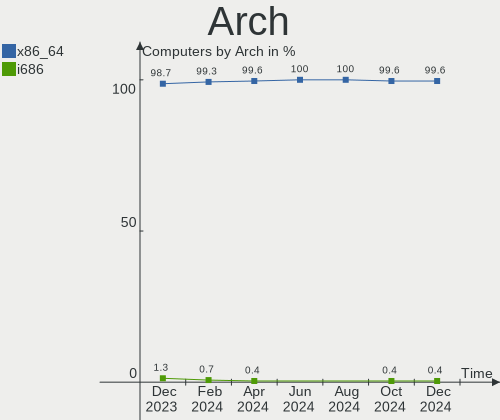
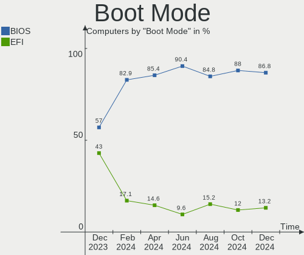
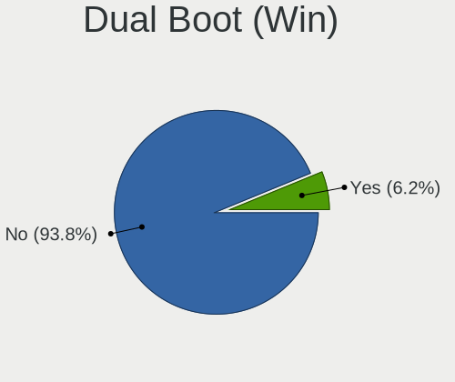
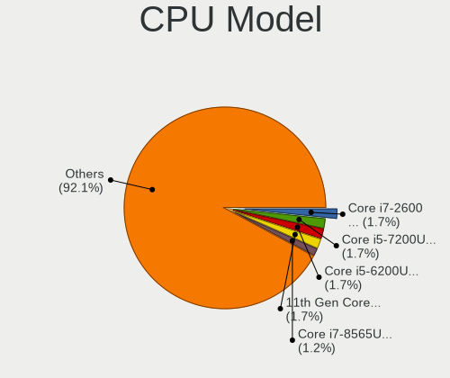
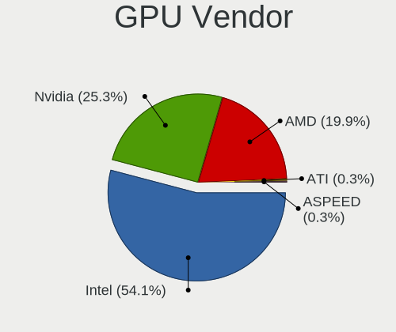
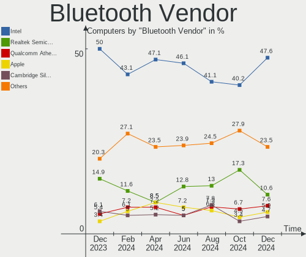

Zorin - Hardware Trends
-----------------------

A project to identify most popular hardware characteristics and track their change
over time based on data collected by Linux users at https://Linux-Hardware.org.

Anyone can contribute to this report by the [hw-probe](https://github.com/linuxhw/hw-probe) tool:

    sudo -E hw-probe -all -upload

This is a report for all computer types. See also reports for [desktops](/Dist/Zorin/Desktop/README.md) and [notebooks](/Dist/Zorin/Notebook/README.md).

This report is for one last month. Overall report since the beginning of time: [TestCoverage](https://github.com/linuxhw/TestCoverage)

Period: Jun, 2022.

Contents
--------

* [ System ](#system)
  - [ OS                       ](#os)
  - [ OS Family                ](#os-family)
  - [ Kernel                   ](#kernel)
  - [ Kernel Family            ](#kernel-family)
  - [ Kernel Major Ver.        ](#kernel-major-ver)
  - [ Arch                     ](#arch)
  - [ DE                       ](#de)
  - [ Display Server           ](#display-server)
  - [ Display Manager          ](#display-manager)
  - [ OS Lang                  ](#os-lang)
  - [ Boot Mode                ](#boot-mode)
  - [ Filesystem               ](#filesystem)
  - [ Part. scheme             ](#part-scheme)
  - [ Dual Boot with Linux/BSD ](#dual-boot-with-linuxbsd)
  - [ Dual Boot (Win)          ](#dual-boot-win)

* [ Board ](#board)
  - [ Vendor                   ](#vendor)
  - [ Model                    ](#model)
  - [ Model Family             ](#model-family)
  - [ MFG Year                 ](#mfg-year)
  - [ Form Factor              ](#form-factor)
  - [ Secure Boot              ](#secure-boot)
  - [ Coreboot                 ](#coreboot)
  - [ RAM Size                 ](#ram-size)
  - [ RAM Used                 ](#ram-used)
  - [ Total Drives             ](#total-drives)
  - [ Has CD-ROM               ](#has-cd-rom)
  - [ Has Ethernet             ](#has-ethernet)
  - [ Has WiFi                 ](#has-wifi)
  - [ Has Bluetooth            ](#has-bluetooth)

* [ Location ](#location)
  - [ Country                  ](#country)
  - [ City                     ](#city)

* [ Drives ](#drives)
  - [ Drive Vendor             ](#drive-vendor)
  - [ Drive Model              ](#drive-model)
  - [ HDD Vendor               ](#hdd-vendor)
  - [ SSD Vendor               ](#ssd-vendor)
  - [ Drive Kind               ](#drive-kind)
  - [ Drive Connector          ](#drive-connector)
  - [ Drive Size               ](#drive-size)
  - [ Space Total              ](#space-total)
  - [ Space Used               ](#space-used)
  - [ Malfunc. Drives          ](#malfunc-drives)
  - [ Malfunc. Drive Vendor    ](#malfunc-drive-vendor)
  - [ Malfunc. HDD Vendor      ](#malfunc-hdd-vendor)
  - [ Malfunc. Drive Kind      ](#malfunc-drive-kind)
  - [ Failed Drives            ](#failed-drives)
  - [ Failed Drive Vendor      ](#failed-drive-vendor)
  - [ Drive Status             ](#drive-status)

* [ Storage controller ](#storage-controller)
  - [ Storage Vendor           ](#storage-vendor)
  - [ Storage Model            ](#storage-model)
  - [ Storage Kind             ](#storage-kind)

* [ Processor ](#processor)
  - [ CPU Vendor               ](#cpu-vendor)
  - [ CPU Model                ](#cpu-model)
  - [ CPU Model Family         ](#cpu-model-family)
  - [ CPU Cores                ](#cpu-cores)
  - [ CPU Sockets              ](#cpu-sockets)
  - [ CPU Threads              ](#cpu-threads)
  - [ CPU Op-Modes             ](#cpu-op-modes)
  - [ CPU Microcode            ](#cpu-microcode)
  - [ CPU Microarch            ](#cpu-microarch)

* [ Graphics ](#graphics)
  - [ GPU Vendor               ](#gpu-vendor)
  - [ GPU Model                ](#gpu-model)
  - [ GPU Combo                ](#gpu-combo)
  - [ GPU Driver               ](#gpu-driver)
  - [ GPU Memory               ](#gpu-memory)

* [ Monitor ](#monitor)
  - [ Monitor Vendor           ](#monitor-vendor)
  - [ Monitor Model            ](#monitor-model)
  - [ Monitor Resolution       ](#monitor-resolution)
  - [ Monitor Diagonal         ](#monitor-diagonal)
  - [ Monitor Width            ](#monitor-width)
  - [ Aspect Ratio             ](#aspect-ratio)
  - [ Monitor Area             ](#monitor-area)
  - [ Pixel Density            ](#pixel-density)
  - [ Multiple Monitors        ](#multiple-monitors)

* [ Network ](#network)
  - [ Net Controller Vendor    ](#net-controller-vendor)
  - [ Net Controller Model     ](#net-controller-model)
  - [ Wireless Vendor          ](#wireless-vendor)
  - [ Wireless Model           ](#wireless-model)
  - [ Ethernet Vendor          ](#ethernet-vendor)
  - [ Ethernet Model           ](#ethernet-model)
  - [ Net Controller Kind      ](#net-controller-kind)
  - [ Used Controller          ](#used-controller)
  - [ NICs                     ](#nics)
  - [ IPv6                     ](#ipv6)

* [ Bluetooth ](#bluetooth)
  - [ Bluetooth Vendor         ](#bluetooth-vendor)
  - [ Bluetooth Model          ](#bluetooth-model)

* [ Sound ](#sound)
  - [ Sound Vendor             ](#sound-vendor)
  - [ Sound Model              ](#sound-model)

* [ Memory ](#memory)
  - [ Memory Vendor            ](#memory-vendor)
  - [ Memory Model             ](#memory-model)
  - [ Memory Kind              ](#memory-kind)
  - [ Memory Form Factor       ](#memory-form-factor)
  - [ Memory Size              ](#memory-size)
  - [ Memory Speed             ](#memory-speed)

* [ Printers & scanners ](#printers--scanners)
  - [ Printer Vendor           ](#printer-vendor)
  - [ Printer Model            ](#printer-model)
  - [ Scanner Vendor           ](#scanner-vendor)
  - [ Scanner Model            ](#scanner-model)

* [ Camera ](#camera)
  - [ Camera Vendor            ](#camera-vendor)
  - [ Camera Model             ](#camera-model)

* [ Security ](#security)
  - [ Fingerprint Vendor       ](#fingerprint-vendor)
  - [ Fingerprint Model        ](#fingerprint-model)
  - [ Chipcard Vendor          ](#chipcard-vendor)
  - [ Chipcard Model           ](#chipcard-model)

* [ Unsupported ](#unsupported)
  - [ Unsupported Devices      ](#unsupported-devices)
  - [ Unsupported Device Types ](#unsupported-device-types)

System
------

OS
--

Installed operating systems

| Name     | Computers | Percent |
|----------|-----------|---------|
| Zorin 16 | 109       | 93.97%  |
| Zorin 15 | 7         | 6.03%   |

OS Family
---------

OS without a version

| Name  | Computers | Percent |
|-------|-----------|---------|
| Zorin | 116       | 100%    |

Kernel
------

Version of the Linux kernel

| Version           | Computers | Percent |
|-------------------|-----------|---------|
| 5.13.0-44-generic | 38        | 32.76%  |
| 5.13.0-51-generic | 33        | 28.45%  |
| 5.13.0-48-generic | 20        | 17.24%  |
| 5.4.0-120-generic | 6         | 5.17%   |
| 5.13.0-40-generic | 4         | 3.45%   |
| 5.13.0-30-generic | 4         | 3.45%   |
| 5.13.0-41-generic | 3         | 2.59%   |
| 5.13.0-39-generic | 3         | 2.59%   |
| 5.11.0-38-generic | 2         | 1.72%   |
| 5.4.0-58-generic  | 1         | 0.86%   |
| 5.4.0-117-generic | 1         | 0.86%   |
| 5.11.0-41-generic | 1         | 0.86%   |

Kernel Family
-------------

Linux kernel without a distro release

| Version | Computers | Percent |
|---------|-----------|---------|
| 5.13.0  | 105       | 90.52%  |
| 5.4.0   | 8         | 6.9%    |
| 5.11.0  | 3         | 2.59%   |

Kernel Major Ver.
-----------------

Linux kernel major version

| Version | Computers | Percent |
|---------|-----------|---------|
| 5.13    | 105       | 90.52%  |
| 5.4     | 8         | 6.9%    |
| 5.11    | 3         | 2.59%   |

Arch
----

OS architecture (x86_64, i586, etc.)

| Name   | Computers | Percent |
|--------|-----------|---------|
| x86_64 | 113       | 97.41%  |
| i686   | 3         | 2.59%   |

DE
--

Desktop Environment

| Name    | Computers | Percent |
|---------|-----------|---------|
| GNOME   | 99        | 85.34%  |
| XFCE    | 16        | 13.79%  |
| Unknown | 1         | 0.86%   |

Display Server
--------------

X11 or Wayland

| Name    | Computers | Percent |
|---------|-----------|---------|
| X11     | 114       | 98.28%  |
| Wayland | 2         | 1.72%   |

Display Manager
---------------

SDDM, LightDM, etc.

| Name    | Computers | Percent |
|---------|-----------|---------|
| Unknown | 86        | 74.14%  |
| GDM3    | 13        | 11.21%  |
| GDM     | 11        | 9.48%   |
| LightDM | 6         | 5.17%   |

OS Lang
-------

Language

| Lang  | Computers | Percent |
|-------|-----------|---------|
| en_US | 39        | 33.62%  |
| de_DE | 16        | 13.79%  |
| en_GB | 12        | 10.34%  |
| pt_BR | 8         | 6.9%    |
| en_CA | 7         | 6.03%   |
| fr_FR | 6         | 5.17%   |
| it_IT | 5         | 4.31%   |
| pt_PT | 3         | 2.59%   |
| es_ES | 3         | 2.59%   |
| en_IN | 3         | 2.59%   |
| tr_TR | 2         | 1.72%   |
| es_MX | 2         | 1.72%   |
| cs_CZ | 2         | 1.72%   |
| fr_BE | 1         | 0.86%   |
| es_VE | 1         | 0.86%   |
| es_AR | 1         | 0.86%   |
| en_ZA | 1         | 0.86%   |
| en_NZ | 1         | 0.86%   |
| en_AU | 1         | 0.86%   |
| da_DK | 1         | 0.86%   |
| ar_EG | 1         | 0.86%   |

Boot Mode
---------

EFI or BIOS

| Mode | Computers | Percent |
|------|-----------|---------|
| EFI  | 68        | 58.62%  |
| BIOS | 48        | 41.38%  |

Filesystem
----------

Type of filesystem

| Type    | Computers | Percent |
|---------|-----------|---------|
| Ext4    | 114       | 98.28%  |
| Xfs     | 1         | 0.86%   |
| Overlay | 1         | 0.86%   |

Part. scheme
------------

Scheme of partitioning

| Type    | Computers | Percent |
|---------|-----------|---------|
| Unknown | 102       | 87.93%  |
| GPT     | 11        | 9.48%   |
| MBR     | 3         | 2.59%   |

Dual Boot with Linux/BSD
------------------------

Hosting more than one Linux/BSD

| Dual boot | Computers | Percent |
|-----------|-----------|---------|
| No        | 112       | 96.55%  |
| Yes       | 4         | 3.45%   |

Dual Boot (Win)
---------------

Hosting Linux and Windows

| Dual boot | Computers | Percent |
|-----------|-----------|---------|
| No        | 108       | 93.1%   |
| Yes       | 8         | 6.9%    |

Board
-----

Vendor
------

Motherboard manufacturer

| Name                    | Computers | Percent |
|-------------------------|-----------|---------|
| Dell                    | 23        | 19.83%  |
| Lenovo                  | 18        | 15.52%  |
| ASUSTek Computer        | 17        | 14.66%  |
| Hewlett-Packard         | 13        | 11.21%  |
| Gigabyte Technology     | 6         | 5.17%   |
| Acer                    | 6         | 5.17%   |
| MSI                     | 4         | 3.45%   |
| Toshiba                 | 3         | 2.59%   |
| Samsung Electronics     | 2         | 1.72%   |
| Positivo                | 2         | 1.72%   |
| Intel                   | 2         | 1.72%   |
| Fujitsu Siemens         | 2         | 1.72%   |
| Biostar                 | 2         | 1.72%   |
| TrekStor                | 1         | 0.86%   |
| Primux Tech             | 1         | 0.86%   |
| Pegatron                | 1         | 0.86%   |
| Medion                  | 1         | 0.86%   |
| HUAWEI                  | 1         | 0.86%   |
| GPU Company             | 1         | 0.86%   |
| Google                  | 1         | 0.86%   |
| Global Distribution FZE | 1         | 0.86%   |
| Fujitsu                 | 1         | 0.86%   |
| Foxconn                 | 1         | 0.86%   |
| Ematic                  | 1         | 0.86%   |
| BESSTAR Tech            | 1         | 0.86%   |
| AWOW                    | 1         | 0.86%   |
| ASRock                  | 1         | 0.86%   |
| Apple                   | 1         | 0.86%   |
| AMI                     | 1         | 0.86%   |

Model
-----

Motherboard model

| Name                                                  | Computers | Percent |
|-------------------------------------------------------|-----------|---------|
| HP Pavilion Notebook                                  | 2         | 1.72%   |
| TrekStor Surfbook A13                                 | 1         | 0.86%   |
| Toshiba Satellite C870-1C2                            | 1         | 0.86%   |
| Toshiba Satellite A200                                | 1         | 0.86%   |
| Toshiba QOSMIO X770                                   | 1         | 0.86%   |
| Samsung 600B4B/600B5B                                 | 1         | 0.86%   |
| Samsung 300E5EV/300E4EV/270E5EV/270E4EV/2470EV/2470EE | 1         | 0.86%   |
| Primux Tech Primux_1402F_W10                          | 1         | 0.86%   |
| Positivo Q464C                                        | 1         | 0.86%   |
| Positivo C4500D                                       | 1         | 0.86%   |
| Pegatron PEGATRON                                     | 1         | 0.86%   |
| MSI MS-7823                                           | 1         | 0.86%   |
| MSI MS-7817                                           | 1         | 0.86%   |
| MSI MS-7695                                           | 1         | 0.86%   |
| MSI CR620                                             | 1         | 0.86%   |
| Medion WIM2180                                        | 1         | 0.86%   |
| Lenovo Yoga710-14ISK 80TY                             | 1         | 0.86%   |
| Lenovo Yoga 3 Pro-1370 80HE                           | 1         | 0.86%   |
| Lenovo V14-IIL 82C4                                   | 1         | 0.86%   |
| Lenovo V14-ADA 82C6                                   | 1         | 0.86%   |
| Lenovo ThinkPad X220 Tablet 42984TU                   | 1         | 0.86%   |
| Lenovo ThinkPad T540p 20BF0038GE                      | 1         | 0.86%   |
| Lenovo ThinkPad T430s 23539MU                         | 1         | 0.86%   |
| Lenovo ThinkPad T420 4236J73                          | 1         | 0.86%   |
| Lenovo ThinkPad P50 20EQS28400                        | 1         | 0.86%   |
| Lenovo ThinkCentre M73 10B00005US                     | 1         | 0.86%   |
| Lenovo Legion T5 28IMB05 90NC00R5US                   | 1         | 0.86%   |
| Lenovo IdeaPadFlex 5 14ITL05 82HS                     | 1         | 0.86%   |
| Lenovo IdeaPad 3 14ALC6 82KT                          | 1         | 0.86%   |
| Lenovo IdeaPad 110-14IBR 80UJ                         | 1         | 0.86%   |
| Lenovo H30-05 90BJ00CNMT                              | 1         | 0.86%   |
| Lenovo G780 2182                                      | 1         | 0.86%   |
| Lenovo G50-70 20351                                   | 1         | 0.86%   |
| Lenovo Flex 2-15 20405                                | 1         | 0.86%   |
| Intel NUC7i3DNHE                                      | 1         | 0.86%   |
| Intel NUC5i3RYB H41000-507                            | 1         | 0.86%   |
| HUAWEI NBLK-WAX9X                                     | 1         | 0.86%   |
| HP ZBook Studio G7 Mobile Workstation                 | 1         | 0.86%   |
| HP ProBook 450 G3                                     | 1         | 0.86%   |
| HP Pavilion dv6                                       | 1         | 0.86%   |
| HP Pavilion 17                                        | 1         | 0.86%   |
| HP Laptop 15-db0xxx                                   | 1         | 0.86%   |
| HP Laptop 14-dq0xxx                                   | 1         | 0.86%   |
| HP ENVY x360 Convertible 15-ee1xxx                    | 1         | 0.86%   |
| HP ENVY x360 Convertible 15-ds0xxx                    | 1         | 0.86%   |
| HP EliteBook 840 G1                                   | 1         | 0.86%   |
| HP Compaq dc5850 Small Form Factor                    | 1         | 0.86%   |
| HP 290 G1 MT                                          | 1         | 0.86%   |
| GPU Company GWTC116-2                                 | 1         | 0.86%   |
| Google Candy                                          | 1         | 0.86%   |
| Global Distribution FZE W11651                        | 1         | 0.86%   |
| Gigabyte Z77-DS3H                                     | 1         | 0.86%   |
| Gigabyte X570 AORUS ELITE                             | 1         | 0.86%   |
| Gigabyte EX58-UD3R                                    | 1         | 0.86%   |
| Gigabyte EP45-UD3P                                    | 1         | 0.86%   |
| Gigabyte B450 AORUS M                                 | 1         | 0.86%   |
| Gigabyte B360M-HD3                                    | 1         | 0.86%   |
| Fujitsu Siemens ESPRIMO Mobile V6535                  | 1         | 0.86%   |
| Fujitsu Siemens ESPRIMO Mobile V5535                  | 1         | 0.86%   |
| Fujitsu ESPRIMO E720                                  | 1         | 0.86%   |

Model Family
------------

Motherboard model prefix

| Name                           | Computers | Percent |
|--------------------------------|-----------|---------|
| Dell Inspiron                  | 9         | 7.76%   |
| Lenovo ThinkPad                | 5         | 4.31%   |
| Acer Aspire                    | 5         | 4.31%   |
| HP Pavilion                    | 4         | 3.45%   |
| Dell XPS                       | 4         | 3.45%   |
| Dell Latitude                  | 4         | 3.45%   |
| ASUS TUF                       | 4         | 3.45%   |
| Toshiba Satellite              | 2         | 1.72%   |
| Lenovo IdeaPad                 | 2         | 1.72%   |
| HP Laptop                      | 2         | 1.72%   |
| HP ENVY                        | 2         | 1.72%   |
| Fujitsu Siemens ESPRIMO        | 2         | 1.72%   |
| Dell OptiPlex                  | 2         | 1.72%   |
| ASUS ROG                       | 2         | 1.72%   |
| ASUS PRIME                     | 2         | 1.72%   |
| TrekStor Surfbook              | 1         | 0.86%   |
| Toshiba QOSMIO                 | 1         | 0.86%   |
| Samsung 600B4B                 | 1         | 0.86%   |
| Samsung 300E5EV                | 1         | 0.86%   |
| Primux Tech Primux             | 1         | 0.86%   |
| Positivo Q464C                 | 1         | 0.86%   |
| Positivo C4500D                | 1         | 0.86%   |
| Pegatron PEGATRON              | 1         | 0.86%   |
| MSI MS-7823                    | 1         | 0.86%   |
| MSI MS-7817                    | 1         | 0.86%   |
| MSI MS-7695                    | 1         | 0.86%   |
| MSI CR620                      | 1         | 0.86%   |
| Medion WIM2180                 | 1         | 0.86%   |
| Lenovo Yoga710-14ISK           | 1         | 0.86%   |
| Lenovo Yoga                    | 1         | 0.86%   |
| Lenovo V14-IIL                 | 1         | 0.86%   |
| Lenovo V14-ADA                 | 1         | 0.86%   |
| Lenovo ThinkCentre             | 1         | 0.86%   |
| Lenovo Legion                  | 1         | 0.86%   |
| Lenovo IdeaPadFlex             | 1         | 0.86%   |
| Lenovo H30-05                  | 1         | 0.86%   |
| Lenovo G780                    | 1         | 0.86%   |
| Lenovo G50-70                  | 1         | 0.86%   |
| Lenovo Flex                    | 1         | 0.86%   |
| Intel NUC7i3DNHE               | 1         | 0.86%   |
| Intel NUC5i3RYB                | 1         | 0.86%   |
| HUAWEI NBLK-WAX9X              | 1         | 0.86%   |
| HP ZBook                       | 1         | 0.86%   |
| HP ProBook                     | 1         | 0.86%   |
| HP EliteBook                   | 1         | 0.86%   |
| HP Compaq                      | 1         | 0.86%   |
| HP 290                         | 1         | 0.86%   |
| GPU Company GWTC116-2          | 1         | 0.86%   |
| Google Candy                   | 1         | 0.86%   |
| Global Distribution FZE W11651 | 1         | 0.86%   |
| Gigabyte Z77-DS3H              | 1         | 0.86%   |
| Gigabyte X570                  | 1         | 0.86%   |
| Gigabyte EX58-UD3R             | 1         | 0.86%   |
| Gigabyte EP45-UD3P             | 1         | 0.86%   |
| Gigabyte B450                  | 1         | 0.86%   |
| Gigabyte B360M-HD3             | 1         | 0.86%   |
| Fujitsu ESPRIMO                | 1         | 0.86%   |
| Foxconn NQ824AA-ABZ            | 1         | 0.86%   |
| Ematic EWT935DK                | 1         | 0.86%   |
| Dell Vostro                    | 1         | 0.86%   |

MFG Year
--------

Motherboard manufacture year

| Year | Computers | Percent |
|------|-----------|---------|
| 2020 | 12        | 10.34%  |
| 2013 | 12        | 10.34%  |
| 2012 | 11        | 9.48%   |
| 2021 | 10        | 8.62%   |
| 2019 | 10        | 8.62%   |
| 2018 | 9         | 7.76%   |
| 2017 | 8         | 6.9%    |
| 2008 | 7         | 6.03%   |
| 2015 | 6         | 5.17%   |
| 2014 | 6         | 5.17%   |
| 2011 | 5         | 4.31%   |
| 2007 | 5         | 4.31%   |
| 2016 | 4         | 3.45%   |
| 2010 | 4         | 3.45%   |
| 2009 | 4         | 3.45%   |
| 2022 | 2         | 1.72%   |
| 2006 | 1         | 0.86%   |

Form Factor
-----------

Physical design of the computer

| Name        | Computers | Percent |
|-------------|-----------|---------|
| Notebook    | 64        | 55.17%  |
| Desktop     | 41        | 35.34%  |
| Convertible | 5         | 4.31%   |
| Mini pc     | 4         | 3.45%   |
| Tablet      | 1         | 0.86%   |
| All in one  | 1         | 0.86%   |

Secure Boot
-----------

Enabled or disabled

| State    | Computers | Percent |
|----------|-----------|---------|
| Disabled | 100       | 86.21%  |
| Enabled  | 16        | 13.79%  |

Coreboot
--------

Have coreboot on board

| Used | Computers | Percent |
|------|-----------|---------|
| No   | 115       | 99.14%  |
| Yes  | 1         | 0.86%   |

RAM Size
--------

Total RAM memory

| Size in GB  | Computers | Percent |
|-------------|-----------|---------|
| 4.01-8.0    | 33        | 28.45%  |
| 3.01-4.0    | 29        | 25%     |
| 8.01-16.0   | 20        | 17.24%  |
| 16.01-24.0  | 15        | 12.93%  |
| 32.01-64.0  | 7         | 6.03%   |
| 1.01-2.0    | 5         | 4.31%   |
| 2.01-3.0    | 3         | 2.59%   |
| 64.01-256.0 | 3         | 2.59%   |
| 0.51-1.0    | 1         | 0.86%   |

RAM Used
--------

Used RAM memory

| Used GB   | Computers | Percent |
|-----------|-----------|---------|
| 1.01-2.0  | 47        | 40.52%  |
| 2.01-3.0  | 39        | 33.62%  |
| 3.01-4.0  | 16        | 13.79%  |
| 4.01-8.0  | 9         | 7.76%   |
| 0.51-1.0  | 3         | 2.59%   |
| 8.01-16.0 | 2         | 1.72%   |

Total Drives
------------

Number of drives on board

| Drives | Computers | Percent |
|--------|-----------|---------|
| 1      | 66        | 56.9%   |
| 2      | 31        | 26.72%  |
| 3      | 10        | 8.62%   |
| 4      | 3         | 2.59%   |
| 7      | 2         | 1.72%   |
| 6      | 2         | 1.72%   |
| 5      | 2         | 1.72%   |

Has CD-ROM
----------

Has CD-ROM on board

| Presented | Computers | Percent |
|-----------|-----------|---------|
| No        | 68        | 58.62%  |
| Yes       | 48        | 41.38%  |

Has Ethernet
------------

Has Ethernet on board

| Presented | Computers | Percent |
|-----------|-----------|---------|
| Yes       | 85        | 73.28%  |
| No        | 31        | 26.72%  |

Has WiFi
--------

Has WiFi module

| Presented | Computers | Percent |
|-----------|-----------|---------|
| Yes       | 95        | 81.9%   |
| No        | 21        | 18.1%   |

Has Bluetooth
-------------

Has Bluetooth module

| Presented | Computers | Percent |
|-----------|-----------|---------|
| Yes       | 72        | 62.07%  |
| No        | 44        | 37.93%  |

Location
--------

Country
-------

Geographic location (country)

| Country             | Computers | Percent |
|---------------------|-----------|---------|
| USA                 | 26        | 22.41%  |
| Germany             | 17        | 14.66%  |
| UK                  | 11        | 9.48%   |
| Canada              | 8         | 6.9%    |
| Brazil              | 8         | 6.9%    |
| Italy               | 4         | 3.45%   |
| France              | 4         | 3.45%   |
| Spain               | 3         | 2.59%   |
| Portugal            | 3         | 2.59%   |
| Netherlands         | 3         | 2.59%   |
| India               | 3         | 2.59%   |
| Turkey              | 2         | 1.72%   |
| Switzerland         | 2         | 1.72%   |
| South Africa        | 2         | 1.72%   |
| Mexico              | 2         | 1.72%   |
| Czechia             | 2         | 1.72%   |
| Venezuela           | 1         | 0.86%   |
| U.S. Virgin Islands | 1         | 0.86%   |
| Trinidad and Tobago | 1         | 0.86%   |
| Poland              | 1         | 0.86%   |
| Norway              | 1         | 0.86%   |
| New Zealand         | 1         | 0.86%   |
| Lebanon             | 1         | 0.86%   |
| Ghana               | 1         | 0.86%   |
| Egypt               | 1         | 0.86%   |
| Denmark             | 1         | 0.86%   |
| Chile               | 1         | 0.86%   |
| Burkina Faso        | 1         | 0.86%   |
| Belgium             | 1         | 0.86%   |
| Bangladesh          | 1         | 0.86%   |
| Australia           | 1         | 0.86%   |
| Argentina           | 1         | 0.86%   |

City
----

Geographic location (city)

| City                  | Computers | Percent |
|-----------------------|-----------|---------|
| Kiel                  | 3         | 2.59%   |
| Frankfurt am Main     | 3         | 2.59%   |
| Toronto               | 2         | 1.72%   |
| Prague                | 2         | 1.72%   |
| Kingston              | 2         | 1.72%   |
| Zurich                | 1         | 0.86%   |
| Willingboro           | 1         | 0.86%   |
| Washington            | 1         | 0.86%   |
| Warren                | 1         | 0.86%   |
| Waldbroel             | 1         | 0.86%   |
| Vitória da Conquista | 1         | 0.86%   |
| Vicosa do Ceara       | 1         | 0.86%   |
| The Bronx             | 1         | 0.86%   |
| Subingen              | 1         | 0.86%   |
| Sterling              | 1         | 0.86%   |
| St Helens             | 1         | 0.86%   |
| Springfield           | 1         | 0.86%   |
| Solingen              | 1         | 0.86%   |
| Sherbrooke            | 1         | 0.86%   |
| Sharm el Sheikh       | 1         | 0.86%   |
| Seattle               | 1         | 0.86%   |
| Schenectady           | 1         | 0.86%   |
| Sarpsborg             | 1         | 0.86%   |
| San Francisco         | 1         | 0.86%   |
| Saint-Leu-la-Foret    | 1         | 0.86%   |
| Rotherham             | 1         | 0.86%   |
| Rome                  | 1         | 0.86%   |
| Reno                  | 1         | 0.86%   |
| Puyallup              | 1         | 0.86%   |
| Providencia           | 1         | 0.86%   |
| Portland              | 1         | 0.86%   |
| Portishead            | 1         | 0.86%   |
| Port of Spain         | 1         | 0.86%   |
| Port Elizabeth        | 1         | 0.86%   |
| Phoenix               | 1         | 0.86%   |
| Ouagadougou           | 1         | 0.86%   |
| Oeversee              | 1         | 0.86%   |
| Ochten                | 1         | 0.86%   |
| Oceanside             | 1         | 0.86%   |
| New York              | 1         | 0.86%   |
| Narsingdi             | 1         | 0.86%   |
| Muriaé               | 1         | 0.86%   |
| Mount Olive           | 1         | 0.86%   |
| Mossoro               | 1         | 0.86%   |
| Montreal              | 1         | 0.86%   |
| Montijo               | 1         | 0.86%   |
| Mönchengladbach      | 1         | 0.86%   |
| Marquette             | 1         | 0.86%   |
| Maracaibo             | 1         | 0.86%   |
| Magnesia ad Sipylum   | 1         | 0.86%   |
| London                | 1         | 0.86%   |
| Lincoln               | 1         | 0.86%   |
| Leganés              | 1         | 0.86%   |
| Latiano               | 1         | 0.86%   |
| Laguna de Duero       | 1         | 0.86%   |
| La Louvière          | 1         | 0.86%   |
| Kurukshetra           | 1         | 0.86%   |
| Krakow                | 1         | 0.86%   |
| Juiz de Fora          | 1         | 0.86%   |
| Johannesburg          | 1         | 0.86%   |

Drives
------

Drive Vendor
------------

Hard drive vendors

| Vendor                | Computers | Drives | Percent |
|-----------------------|-----------|--------|---------|
| Seagate               | 26        | 33     | 15.12%  |
| Samsung Electronics   | 25        | 32     | 14.53%  |
| WDC                   | 20        | 24     | 11.63%  |
| Unknown               | 13        | 17     | 7.56%   |
| Toshiba               | 12        | 13     | 6.98%   |
| Kingston              | 11        | 15     | 6.4%    |
| SanDisk               | 10        | 10     | 5.81%   |
| Intel                 | 5         | 6      | 2.91%   |
| Hitachi               | 5         | 5      | 2.91%   |
| Crucial               | 5         | 5      | 2.91%   |
| China                 | 4         | 4      | 2.33%   |
| Team                  | 3         | 3      | 1.74%   |
| Intenso               | 3         | 3      | 1.74%   |
| SK hynix              | 2         | 2      | 1.16%   |
| Patriot               | 2         | 2      | 1.16%   |
| OCZ                   | 2         | 2      | 1.16%   |
| Lexar                 | 2         | 2      | 1.16%   |
| XrayDisk              | 1         | 2      | 0.58%   |
| XPG                   | 1         | 1      | 0.58%   |
| WD MediaMax           | 1         | 1      | 0.58%   |
| USB3.0                | 1         | 1      | 0.58%   |
| SPCC                  | 1         | 1      | 0.58%   |
| SABRENT               | 1         | 1      | 0.58%   |
| S3+                   | 1         | 1      | 0.58%   |
| Realtek Semiconductor | 1         | 1      | 0.58%   |
| PNY                   | 1         | 1      | 0.58%   |
| Phison                | 1         | 1      | 0.58%   |
| Netac                 | 1         | 1      | 0.58%   |
| Mushkin               | 1         | 1      | 0.58%   |
| LITEON                | 1         | 1      | 0.58%   |
| HS-SSD-C100           | 1         | 1      | 0.58%   |
| HGST                  | 1         | 1      | 0.58%   |
| Hewlett-Packard       | 1         | 1      | 0.58%   |
| Gigabyte Technology   | 1         | 2      | 0.58%   |
| Fujitsu               | 1         | 1      | 0.58%   |
| FORESEE               | 1         | 1      | 0.58%   |
| ASMT                  | 1         | 1      | 0.58%   |
| AS201                 | 1         | 1      | 0.58%   |
| A-DATA Technology     | 1         | 1      | 0.58%   |

Drive Model
-----------

Hard drive models

| Model                                | Computers | Percent |
|--------------------------------------|-----------|---------|
| Samsung NVMe SSD Drive 1TB           | 4         | 2.03%   |
| Samsung NVMe SSD Drive 1024GB        | 4         | 2.03%   |
| Unknown MMC Card  32GB               | 3         | 1.52%   |
| Seagate Expansion 1TB                | 3         | 1.52%   |
| Kingston SA400S37240G 240GB SSD      | 3         | 1.52%   |
| Unknown NCard  32GB                  | 2         | 1.02%   |
| Unknown MMC Card  64GB               | 2         | 1.02%   |
| Unknown MMC Card  16GB               | 2         | 1.02%   |
| Unknown MMC Card  128GB              | 2         | 1.02%   |
| Toshiba KBG30ZMS128G 128GB NVMe SSD  | 2         | 1.02%   |
| Seagate ST500DM002-1BD142 500GB      | 2         | 1.02%   |
| Seagate ST4000DM004-2CV104 4TB       | 2         | 1.02%   |
| Seagate ST3500418AS 500GB            | 2         | 1.02%   |
| Seagate ST3500312CS 500GB            | 2         | 1.02%   |
| Seagate Expansion+ Desk 4TB          | 2         | 1.02%   |
| SanDisk NVMe SSD Drive 256GB         | 2         | 1.02%   |
| SanDisk NVMe SSD Drive 1TB           | 2         | 1.02%   |
| Samsung SSD 850 EVO 500GB            | 2         | 1.02%   |
| Samsung SSD 850 EVO 250GB            | 2         | 1.02%   |
| Samsung NVMe SSD Drive 512GB         | 2         | 1.02%   |
| Samsung NVMe SSD Drive 2TB           | 2         | 1.02%   |
| Samsung MZ7PD256HCGM-000H7 256GB SSD | 2         | 1.02%   |
| Kingston SA400S37120G 120GB SSD      | 2         | 1.02%   |
| Crucial CT240BX500SSD1 240GB         | 2         | 1.02%   |
| XrayDisk 480GB                       | 1         | 0.51%   |
| XrayDisk 1TB                         | 1         | 0.51%   |
| XPG NVMe SSD Drive 512GB             | 1         | 0.51%   |
| WDC WDS250G2B0A-00SM50 250GB SSD     | 1         | 0.51%   |
| WDC WDS120G2G0A-00JH30 120GB SSD     | 1         | 0.51%   |
| WDC WD7500AADS-00M2B0 752GB          | 1         | 0.51%   |
| WDC WD5000LPCX-24VHAT0 500GB         | 1         | 0.51%   |
| WDC WD5000LPCX-24C6HT0 500GB         | 1         | 0.51%   |
| WDC WD5000BPVT-00A1YT0 500GB         | 1         | 0.51%   |
| WDC WD5000BEVT-22A0RT0 500GB         | 1         | 0.51%   |
| WDC WD5000AVDS-63U7B1 500GB          | 1         | 0.51%   |
| WDC WD5000AAKX-60U6AA0 500GB         | 1         | 0.51%   |
| WDC WD5000AAKX-001CA0 500GB          | 1         | 0.51%   |
| WDC WD3200BEVT-22ZCT0 320GB          | 1         | 0.51%   |
| WDC WD3200AAKS-75L9A0 320GB          | 1         | 0.51%   |
| WDC WD3200AAJS-65M0A0 320GB          | 1         | 0.51%   |
| WDC WD2500KS-00MJB0 250GB            | 1         | 0.51%   |
| WDC WD2000FYYZ-01UL1B2 2TB           | 1         | 0.51%   |
| WDC WD1600BB-55RDA0 160GB            | 1         | 0.51%   |
| WDC WD15EARS-00MVWB0 1TB             | 1         | 0.51%   |
| WDC WD1200BEVS-22UST0 120GB          | 1         | 0.51%   |
| WDC WD10SPZX-21Z10T0 1TB             | 1         | 0.51%   |
| WDC WD10SPZX-00Z10T0 1TB             | 1         | 0.51%   |
| WDC WD10JPVT-55A1YT0 1TB             | 1         | 0.51%   |
| WDC WD10EZEX-08WN4A0 1TB             | 1         | 0.51%   |
| WDC WD10EFRX-68JCSN0 1TB             | 1         | 0.51%   |
| WDC WD10EARS-00Y5B1 1TB              | 1         | 0.51%   |
| WD MediaMax WL1000GSA6472 1TB        | 1         | 0.51%   |
| USB3.0 Disk 240GB                    | 1         | 0.51%   |
| Unknown SLD64G  64GB                 | 1         | 0.51%   |
| Unknown SD/MMC/M.S.PRO 32GB          | 1         | 0.51%   |
| Unknown SD/MMC 16GB                  | 1         | 0.51%   |
| Unknown SA08G  8GB                   | 1         | 0.51%   |
| Unknown MMC Card  393GB              | 1         | 0.51%   |
| Unknown M.S./M.S.Pro/HG 16GB         | 1         | 0.51%   |
| Toshiba THNSNF128GMCS 128GB SSD      | 1         | 0.51%   |

HDD Vendor
----------

Hard disk drive vendors

| Vendor              | Computers | Drives | Percent |
|---------------------|-----------|--------|---------|
| Seagate             | 26        | 33     | 40%     |
| WDC                 | 19        | 22     | 29.23%  |
| Toshiba             | 8         | 9      | 12.31%  |
| Hitachi             | 5         | 5      | 7.69%   |
| USB3.0              | 1         | 1      | 1.54%   |
| Samsung Electronics | 1         | 1      | 1.54%   |
| Intenso             | 1         | 1      | 1.54%   |
| HGST                | 1         | 1      | 1.54%   |
| Hewlett-Packard     | 1         | 1      | 1.54%   |
| Fujitsu             | 1         | 1      | 1.54%   |
| ASMT                | 1         | 1      | 1.54%   |

SSD Vendor
----------

Solid state drive vendors

| Vendor              | Computers | Drives | Percent |
|---------------------|-----------|--------|---------|
| Samsung Electronics | 12        | 15     | 20%     |
| Kingston            | 9         | 13     | 15%     |
| Crucial             | 5         | 5      | 8.33%   |
| China               | 4         | 4      | 6.67%   |
| Team                | 3         | 3      | 5%      |
| SanDisk             | 3         | 3      | 5%      |
| WDC                 | 2         | 2      | 3.33%   |
| SK hynix            | 2         | 2      | 3.33%   |
| Patriot             | 2         | 2      | 3.33%   |
| OCZ                 | 2         | 2      | 3.33%   |
| Lexar               | 2         | 2      | 3.33%   |
| Intenso             | 2         | 2      | 3.33%   |
| Toshiba             | 1         | 1      | 1.67%   |
| SPCC                | 1         | 1      | 1.67%   |
| S3+                 | 1         | 1      | 1.67%   |
| PNY                 | 1         | 1      | 1.67%   |
| Netac               | 1         | 1      | 1.67%   |
| Mushkin             | 1         | 1      | 1.67%   |
| LITEON              | 1         | 1      | 1.67%   |
| Intel               | 1         | 1      | 1.67%   |
| HS-SSD-C100         | 1         | 1      | 1.67%   |
| FORESEE             | 1         | 1      | 1.67%   |
| AS201               | 1         | 1      | 1.67%   |
| A-DATA Technology   | 1         | 1      | 1.67%   |

Drive Kind
----------

HDD or SSD

| Kind    | Computers | Drives | Percent |
|---------|-----------|--------|---------|
| SSD     | 53        | 67     | 34.87%  |
| HDD     | 51        | 76     | 33.55%  |
| NVMe    | 32        | 38     | 21.05%  |
| MMC     | 13        | 15     | 8.55%   |
| Unknown | 3         | 6      | 1.97%   |

Drive Connector
---------------

SATA, SAS, NVMe, etc.

| Type | Computers | Drives | Percent |
|------|-----------|--------|---------|
| SATA | 86        | 134    | 60.14%  |
| NVMe | 31        | 37     | 21.68%  |
| SAS  | 13        | 16     | 9.09%   |
| MMC  | 13        | 15     | 9.09%   |

Drive Size
----------

Size of hard drive

| Size in TB | Computers | Drives | Percent |
|------------|-----------|--------|---------|
| 0.01-0.5   | 69        | 94     | 62.73%  |
| 0.51-1.0   | 26        | 29     | 23.64%  |
| 1.01-2.0   | 6         | 10     | 5.45%   |
| 3.01-4.0   | 4         | 5      | 3.64%   |
| 2.01-3.0   | 3         | 3      | 2.73%   |
| 4.01-10.0  | 2         | 2      | 1.82%   |

Space Total
-----------

Amount of disk space available on the file system

| Size in GB     | Computers | Percent |
|----------------|-----------|---------|
| 101-250        | 39        | 33.62%  |
| 251-500        | 24        | 20.69%  |
| 501-1000       | 23        | 19.83%  |
| 51-100         | 12        | 10.34%  |
| More than 3000 | 6         | 5.17%   |
| 21-50          | 5         | 4.31%   |
| 1001-2000      | 4         | 3.45%   |
| 2001-3000      | 2         | 1.72%   |
| 1-20           | 1         | 0.86%   |

Space Used
----------

Amount of used disk space

| Used GB        | Computers | Percent |
|----------------|-----------|---------|
| 21-50          | 37        | 31.9%   |
| 1-20           | 34        | 29.31%  |
| 101-250        | 14        | 12.07%  |
| 51-100         | 14        | 12.07%  |
| 251-500        | 8         | 6.9%    |
| 501-1000       | 5         | 4.31%   |
| More than 3000 | 3         | 2.59%   |
| 2001-3000      | 1         | 0.86%   |

Malfunc. Drives
---------------

Drive models with a malfunction

| Model                            | Computers | Drives | Percent |
|----------------------------------|-----------|--------|---------|
| WDC WD10JPVT-55A1YT0 1TB         | 1         | 1      | 50%     |
| Kingston SUV400S37240G 240GB SSD | 1         | 1      | 50%     |

Malfunc. Drive Vendor
---------------------

Vendors of faulty drives

| Vendor   | Computers | Drives | Percent |
|----------|-----------|--------|---------|
| WDC      | 1         | 1      | 50%     |
| Kingston | 1         | 1      | 50%     |

Malfunc. HDD Vendor
-------------------

Vendors of faulty HDD drives

| Vendor | Computers | Drives | Percent |
|--------|-----------|--------|---------|
| WDC    | 1         | 1      | 100%    |

Malfunc. Drive Kind
-------------------

Kinds of faulty drives

| Kind | Computers | Drives | Percent |
|------|-----------|--------|---------|
| SSD  | 1         | 1      | 50%     |
| HDD  | 1         | 1      | 50%     |

Failed Drives
-------------

Failed drive models

Zero info for selected period =(

Failed Drive Vendor
-------------------

Failed drive vendors

Zero info for selected period =(

Drive Status
------------

Number of failed and malfunc. drives

| Status   | Computers | Drives | Percent |
|----------|-----------|--------|---------|
| Detected | 106       | 183    | 89.08%  |
| Works    | 11        | 17     | 9.24%   |
| Malfunc  | 2         | 2      | 1.68%   |

Storage controller
------------------

Storage Vendor
--------------

Storage controller vendors

| Vendor                           | Computers | Percent |
|----------------------------------|-----------|---------|
| Intel                            | 79        | 58.09%  |
| AMD                              | 21        | 15.44%  |
| Samsung Electronics              | 13        | 9.56%   |
| SanDisk                          | 6         | 4.41%   |
| JMicron Technology               | 4         | 2.94%   |
| Toshiba America Info Systems     | 3         | 2.21%   |
| Phison Electronics               | 2         | 1.47%   |
| Kingston Technology Company      | 2         | 1.47%   |
| Silicon Integrated Systems [SiS] | 1         | 0.74%   |
| Silicon Image                    | 1         | 0.74%   |
| Realtek Semiconductor            | 1         | 0.74%   |
| Nvidia                           | 1         | 0.74%   |
| ASMedia Technology               | 1         | 0.74%   |
| ADATA Technology                 | 1         | 0.74%   |

Storage Model
-------------

Storage controller models

| Model                                                                            | Computers | Percent |
|----------------------------------------------------------------------------------|-----------|---------|
| AMD FCH SATA Controller [AHCI mode]                                              | 16        | 10.53%  |
| Intel 7 Series Chipset Family 6-port SATA Controller [AHCI mode]                 | 9         | 5.92%   |
| Samsung NVMe SSD Controller SM981/PM981/PM983                                    | 8         | 5.26%   |
| Intel Sunrise Point-LP SATA Controller [AHCI mode]                               | 6         | 3.95%   |
| Intel 8 Series/C220 Series Chipset Family 6-port SATA Controller 1 [AHCI mode]   | 6         | 3.95%   |
| Intel 8 Series SATA Controller 1 [AHCI mode]                                     | 5         | 3.29%   |
| Intel 82801 Mobile SATA Controller [RAID mode]                                   | 4         | 2.63%   |
| JMicron JMB363 SATA/IDE Controller                                               | 3         | 1.97%   |
| Intel SATA Controller [RAID mode]                                                | 3         | 1.97%   |
| Intel Non-Volatile memory controller                                             | 3         | 1.97%   |
| Intel NM10/ICH7 Family SATA Controller [IDE mode]                                | 3         | 1.97%   |
| Intel Celeron/Pentium Silver Processor SATA Controller                           | 3         | 1.97%   |
| Intel 82801G (ICH7 Family) IDE Controller                                        | 3         | 1.97%   |
| Intel 7 Series/C210 Series Chipset Family 6-port SATA Controller [AHCI mode]     | 3         | 1.97%   |
| Intel 6 Series/C200 Series Chipset Family 6 port Mobile SATA AHCI Controller     | 3         | 1.97%   |
| SanDisk Non-Volatile memory controller                                           | 2         | 1.32%   |
| Samsung NVMe SSD Controller SM961/PM961/SM963                                    | 2         | 1.32%   |
| Samsung NVMe SSD Controller PM9A1/PM9A3/980PRO                                   | 2         | 1.32%   |
| Samsung NVMe SSD Controller 980                                                  | 2         | 1.32%   |
| Phison E16 PCIe4 NVMe Controller                                                 | 2         | 1.32%   |
| Intel Wildcat Point-LP SATA Controller [AHCI Mode]                               | 2         | 1.32%   |
| Intel Q170/Q150/B150/H170/H110/Z170/CM236 Chipset SATA Controller [AHCI Mode]    | 2         | 1.32%   |
| Intel Ice Lake-LP SATA Controller [AHCI mode]                                    | 2         | 1.32%   |
| Intel Celeron N3350/Pentium N4200/Atom E3900 Series SATA AHCI Controller         | 2         | 1.32%   |
| Intel 82801JI (ICH10 Family) SATA AHCI Controller                                | 2         | 1.32%   |
| Intel 82801JI (ICH10 Family) 4 port SATA IDE Controller #1                       | 2         | 1.32%   |
| Intel 82801JI (ICH10 Family) 2 port SATA IDE Controller #2                       | 2         | 1.32%   |
| Intel 82801IBM/IEM (ICH9M/ICH9M-E) 4 port SATA Controller [AHCI mode]            | 2         | 1.32%   |
| Intel 82801HM/HEM (ICH8M/ICH8M-E) SATA Controller [AHCI mode]                    | 2         | 1.32%   |
| Intel 82801HM/HEM (ICH8M/ICH8M-E) IDE Controller                                 | 2         | 1.32%   |
| Intel 5 Series/3400 Series Chipset 4 port SATA AHCI Controller                   | 2         | 1.32%   |
| Intel 200 Series PCH SATA controller [AHCI mode]                                 | 2         | 1.32%   |
| AMD FCH SATA Controller [IDE mode]                                               | 2         | 1.32%   |
| Toshiba America Info Systems XG6 NVMe SSD Controller                             | 1         | 0.66%   |
| Toshiba America Info Systems XG4 NVMe SSD Controller                             | 1         | 0.66%   |
| Toshiba America Info Systems BG3 NVMe SSD Controller                             | 1         | 0.66%   |
| Silicon Integrated Systems [SiS] SATA Controller / IDE mode                      | 1         | 0.66%   |
| Silicon Integrated Systems [SiS] 5513 IDE Controller                             | 1         | 0.66%   |
| Silicon Image SiI 3531 [SATALink/SATARaid] Serial ATA Controller                 | 1         | 0.66%   |
| SanDisk WD PC SN810 / Black SN850 NVMe SSD                                       | 1         | 0.66%   |
| SanDisk WD Blue SN500 / PC SN520 NVMe SSD                                        | 1         | 0.66%   |
| SanDisk WD Black 2018/SN750 / PC SN720 NVMe SSD                                  | 1         | 0.66%   |
| SanDisk PC SN520 NVMe SSD                                                        | 1         | 0.66%   |
| Realtek RTS5763DL NVMe SSD Controller                                            | 1         | 0.66%   |
| Nvidia MCP73 SATA Controller (IDE mode)                                          | 1         | 0.66%   |
| Nvidia MCP73 IDE Controller                                                      | 1         | 0.66%   |
| Kingston Company Company Non-Volatile memory controller                          | 1         | 0.66%   |
| Kingston Company OM3PDP3 NVMe SSD                                                | 1         | 0.66%   |
| JMicron JMB368 IDE controller                                                    | 1         | 0.66%   |
| Intel Volume Management Device NVMe RAID Controller                              | 1         | 0.66%   |
| Intel Tiger Lake-LP SATA Controller [AHCI mode]                                  | 1         | 0.66%   |
| Intel NVMe Optane Memory Series                                                  | 1         | 0.66%   |
| Intel Comet Lake PCH-LP SATA RAID Premium Controller                             | 1         | 0.66%   |
| Intel Cannon Lake PCH SATA AHCI Controller                                       | 1         | 0.66%   |
| Intel Cannon Lake Mobile PCH SATA AHCI Controller                                | 1         | 0.66%   |
| Intel Atom/Celeron/Pentium Processor x5-E8000/J3xxx/N3xxx Series SATA Controller | 1         | 0.66%   |
| Intel Atom Processor E3800 Series SATA AHCI Controller                           | 1         | 0.66%   |
| Intel 82Q35 Express PT IDER Controller                                           | 1         | 0.66%   |
| Intel 82801IR/IO/IH (ICH9R/DO/DH) 6 port SATA Controller [AHCI mode]             | 1         | 0.66%   |
| Intel 82801GBM/GHM (ICH7-M Family) SATA Controller [AHCI mode]                   | 1         | 0.66%   |

Storage Kind
------------

Kind of storage controller (IDE, SATA, NVMe, SAS, ...)

| Kind | Computers | Percent |
|------|-----------|---------|
| SATA | 84        | 60.43%  |
| NVMe | 30        | 21.58%  |
| IDE  | 15        | 10.79%  |
| RAID | 10        | 7.19%   |

Processor
---------

CPU Vendor
----------

Processor vendors

| Vendor | Computers | Percent |
|--------|-----------|---------|
| Intel  | 93        | 80.17%  |
| AMD    | 23        | 19.83%  |

CPU Model
---------

Processor models

| Model                                       | Computers | Percent |
|---------------------------------------------|-----------|---------|
| Intel Atom x5-Z8350 CPU @ 1.44GHz           | 3         | 2.59%   |
| Intel Core i7 CPU 920 @ 2.67GHz             | 2         | 1.72%   |
| Intel Core i5-6200U CPU @ 2.30GHz           | 2         | 1.72%   |
| Intel Core i5-3320M CPU @ 2.60GHz           | 2         | 1.72%   |
| Intel Core i3-7100U CPU @ 2.40GHz           | 2         | 1.72%   |
| Intel Core i3-4030U CPU @ 1.90GHz           | 2         | 1.72%   |
| Intel Core 2 Duo CPU E8400 @ 3.00GHz        | 2         | 1.72%   |
| Intel Celeron N4020 CPU @ 1.10GHz           | 2         | 1.72%   |
| Intel Celeron CPU N3060 @ 1.60GHz           | 2         | 1.72%   |
| AMD Ryzen 9 5900X 12-Core Processor         | 2         | 1.72%   |
| AMD Ryzen 7 5700U with Radeon Graphics      | 2         | 1.72%   |
| Intel Xeon CPU E3110 @ 3.00GHz              | 1         | 0.86%   |
| Intel Pentium Silver J5040 CPU @ 2.00GHz    | 1         | 0.86%   |
| Intel Pentium Dual-Core CPU T4500 @ 2.30GHz | 1         | 0.86%   |
| Intel Pentium Dual-Core CPU T4400 @ 2.20GHz | 1         | 0.86%   |
| Intel Pentium Dual-Core CPU E5400 @ 2.70GHz | 1         | 0.86%   |
| Intel Pentium Dual-Core CPU E5200 @ 2.50GHz | 1         | 0.86%   |
| Intel Pentium Dual CPU E2140 @ 1.60GHz      | 1         | 0.86%   |
| Intel Pentium D CPU 2.80GHz                 | 1         | 0.86%   |
| Intel Pentium CPU N4200 @ 1.10GHz           | 1         | 0.86%   |
| Intel Pentium CPU N3530 @ 2.16GHz           | 1         | 0.86%   |
| Intel Core M-5Y51 CPU @ 1.10GHz             | 1         | 0.86%   |
| Intel Core i9-10885H CPU @ 2.40GHz          | 1         | 0.86%   |
| Intel Core i7-8750H CPU @ 2.20GHz           | 1         | 0.86%   |
| Intel Core i7-8565U CPU @ 1.80GHz           | 1         | 0.86%   |
| Intel Core i7-7700K CPU @ 4.20GHz           | 1         | 0.86%   |
| Intel Core i7-7600U CPU @ 2.80GHz           | 1         | 0.86%   |
| Intel Core i7-6820HQ CPU @ 2.70GHz          | 1         | 0.86%   |
| Intel Core i7-6500U CPU @ 2.50GHz           | 1         | 0.86%   |
| Intel Core i7-4810MQ CPU @ 2.80GHz          | 1         | 0.86%   |
| Intel Core i7-4790S CPU @ 3.20GHz           | 1         | 0.86%   |
| Intel Core i7-4500U CPU @ 1.80GHz           | 1         | 0.86%   |
| Intel Core i7-3740QM CPU @ 2.70GHz          | 1         | 0.86%   |
| Intel Core i7-3720QM CPU @ 2.60GHz          | 1         | 0.86%   |
| Intel Core i7-3687U CPU @ 2.10GHz           | 1         | 0.86%   |
| Intel Core i7-2640M CPU @ 2.80GHz           | 1         | 0.86%   |
| Intel Core i7-2630QM CPU @ 2.00GHz          | 1         | 0.86%   |
| Intel Core i7-1065G7 CPU @ 1.30GHz          | 1         | 0.86%   |
| Intel Core i7-10510U CPU @ 1.80GHz          | 1         | 0.86%   |
| Intel Core i5-9600K CPU @ 3.70GHz           | 1         | 0.86%   |
| Intel Core i5-8250U CPU @ 1.60GHz           | 1         | 0.86%   |
| Intel Core i5-7200U CPU @ 2.50GHz           | 1         | 0.86%   |
| Intel Core i5-6500 CPU @ 3.20GHz            | 1         | 0.86%   |
| Intel Core i5-4690K CPU @ 3.50GHz           | 1         | 0.86%   |
| Intel Core i5-4590 CPU @ 3.30GHz            | 1         | 0.86%   |
| Intel Core i5-4570 CPU @ 3.20GHz            | 1         | 0.86%   |
| Intel Core i5-4460 CPU @ 3.20GHz            | 1         | 0.86%   |
| Intel Core i5-4300M CPU @ 2.60GHz           | 1         | 0.86%   |
| Intel Core i5-4200U CPU @ 1.60GHz           | 1         | 0.86%   |
| Intel Core i5-3470 CPU @ 3.20GHz            | 1         | 0.86%   |
| Intel Core i5-3337U CPU @ 1.80GHz           | 1         | 0.86%   |
| Intel Core i5-3210M CPU @ 2.50GHz           | 1         | 0.86%   |
| Intel Core i5-2520M CPU @ 2.50GHz           | 1         | 0.86%   |
| Intel Core i5-2300 CPU @ 2.80GHz            | 1         | 0.86%   |
| Intel Core i5-10400F CPU @ 2.90GHz          | 1         | 0.86%   |
| Intel Core i5-1035G1 CPU @ 1.00GHz          | 1         | 0.86%   |
| Intel Core i5 CPU M 450 @ 2.40GHz           | 1         | 0.86%   |
| Intel Core i3-8100 CPU @ 3.60GHz            | 1         | 0.86%   |
| Intel Core i3-7100 CPU @ 3.90GHz            | 1         | 0.86%   |
| Intel Core i3-5010U CPU @ 2.10GHz           | 1         | 0.86%   |

CPU Model Family
----------------

Processor model prefix

| Model                   | Computers | Percent |
|-------------------------|-----------|---------|
| Intel Core i5           | 22        | 18.97%  |
| Intel Core i7           | 18        | 15.52%  |
| Intel Core i3           | 15        | 12.93%  |
| Intel Celeron           | 9         | 7.76%   |
| Other                   | 6         | 5.17%   |
| Intel Atom              | 6         | 5.17%   |
| AMD Ryzen 7             | 5         | 4.31%   |
| Intel Pentium Dual-Core | 4         | 3.45%   |
| Intel Core 2 Duo        | 4         | 3.45%   |
| AMD Ryzen 9             | 4         | 3.45%   |
| AMD Ryzen 5             | 3         | 2.59%   |
| AMD A6                  | 3         | 2.59%   |
| Intel Pentium           | 2         | 1.72%   |
| AMD A10                 | 2         | 1.72%   |
| Intel Xeon              | 1         | 0.86%   |
| Intel Pentium Silver    | 1         | 0.86%   |
| Intel Pentium Dual      | 1         | 0.86%   |
| Intel Pentium D         | 1         | 0.86%   |
| Intel Core M            | 1         | 0.86%   |
| Intel Core i9           | 1         | 0.86%   |
| Intel Core 2 Extreme    | 1         | 0.86%   |
| Intel Core 2            | 1         | 0.86%   |
| Intel Celeron D         | 1         | 0.86%   |
| AMD Ryzen 3             | 1         | 0.86%   |
| AMD Phenom II X6        | 1         | 0.86%   |
| AMD E1                  | 1         | 0.86%   |
| AMD Athlon Dual Core    | 1         | 0.86%   |

CPU Cores
---------

Number of processor cores

| Number | Computers | Percent |
|--------|-----------|---------|
| 2      | 60        | 51.72%  |
| 4      | 37        | 31.9%   |
| 6      | 7         | 6.03%   |
| 8      | 6         | 5.17%   |
| 16     | 2         | 1.72%   |
| 12     | 2         | 1.72%   |
| 1      | 2         | 1.72%   |

CPU Sockets
-----------

Number of sockets

| Number | Computers | Percent |
|--------|-----------|---------|
| 1      | 116       | 100%    |

CPU Threads
-----------

Threads per core (Hyper-Threading)

| Number | Computers | Percent |
|--------|-----------|---------|
| 2      | 67        | 57.76%  |
| 1      | 49        | 42.24%  |

CPU Op-Modes
------------

CPU Operation Modes (32-bit, 64-bit)

| Op mode        | Computers | Percent |
|----------------|-----------|---------|
| 32-bit, 64-bit | 116       | 100%    |

CPU Microcode
-------------

Microcode number

| Number     | Computers | Percent |
|------------|-----------|---------|
| 0x306a9    | 11        | 9.48%   |
| 0x306c3    | 7         | 6.03%   |
| 0x206a7    | 6         | 5.17%   |
| 0x1067a    | 6         | 5.17%   |
| 0x406c4    | 5         | 4.31%   |
| 0x40651    | 5         | 4.31%   |
| Unknown    | 5         | 4.31%   |
| 0x806e9    | 4         | 3.45%   |
| 0x706a8    | 4         | 3.45%   |
| 0x30678    | 4         | 3.45%   |
| 0x6fd      | 3         | 2.59%   |
| 0x406e3    | 3         | 2.59%   |
| 0x906e9    | 2         | 1.72%   |
| 0x806d1    | 2         | 1.72%   |
| 0x806c1    | 2         | 1.72%   |
| 0x706e5    | 2         | 1.72%   |
| 0x506e3    | 2         | 1.72%   |
| 0x506c9    | 2         | 1.72%   |
| 0x306d4    | 2         | 1.72%   |
| 0x20655    | 2         | 1.72%   |
| 0x0a201016 | 2         | 1.72%   |
| 0x08608103 | 2         | 1.72%   |
| 0x08108102 | 2         | 1.72%   |
| 0xf65      | 1         | 0.86%   |
| 0xf47      | 1         | 0.86%   |
| 0xa0653    | 1         | 0.86%   |
| 0xa0652    | 1         | 0.86%   |
| 0x906ed    | 1         | 0.86%   |
| 0x906eb    | 1         | 0.86%   |
| 0x906ea    | 1         | 0.86%   |
| 0x806ec    | 1         | 0.86%   |
| 0x806eb    | 1         | 0.86%   |
| 0x806ea    | 1         | 0.86%   |
| 0x6fa      | 1         | 0.86%   |
| 0x6f6      | 1         | 0.86%   |
| 0x406c3    | 1         | 0.86%   |
| 0x20652    | 1         | 0.86%   |
| 0x106a5    | 1         | 0.86%   |
| 0x10676    | 1         | 0.86%   |
| 0x0a50000c | 1         | 0.86%   |
| 0x0a50000b | 1         | 0.86%   |
| 0x0a201204 | 1         | 0.86%   |
| 0x0a201006 | 1         | 0.86%   |
| 0x08701021 | 1         | 0.86%   |
| 0x08200103 | 1         | 0.86%   |
| 0x08108109 | 1         | 0.86%   |
| 0x07030106 | 1         | 0.86%   |
| 0x07030105 | 1         | 0.86%   |
| 0x06006705 | 1         | 0.86%   |
| 0x06006704 | 1         | 0.86%   |
| 0x06001119 | 1         | 0.86%   |
| 0x03000027 | 1         | 0.86%   |
| 0x010000dc | 1         | 0.86%   |
| 0x00000000 | 1         | 0.86%   |

CPU Microarch
-------------

Microarchitecture

| Name          | Computers | Percent |
|---------------|-----------|---------|
| KabyLake      | 12        | 10.34%  |
| Haswell       | 12        | 10.34%  |
| IvyBridge     | 11        | 9.48%   |
| Silvermont    | 10        | 8.62%   |
| Penryn        | 8         | 6.9%    |
| Zen 3         | 7         | 6.03%   |
| SandyBridge   | 7         | 6.03%   |
| Skylake       | 5         | 4.31%   |
| Core          | 5         | 4.31%   |
| Icelake       | 4         | 3.45%   |
| Goldmont plus | 4         | 3.45%   |
| Zen+          | 3         | 2.59%   |
| Westmere      | 3         | 2.59%   |
| TigerLake     | 2         | 1.72%   |
| Puma          | 2         | 1.72%   |
| Piledriver    | 2         | 1.72%   |
| NetBurst      | 2         | 1.72%   |
| Nehalem       | 2         | 1.72%   |
| Goldmont      | 2         | 1.72%   |
| Excavator     | 2         | 1.72%   |
| CometLake     | 2         | 1.72%   |
| Broadwell     | 2         | 1.72%   |
| Unknown       | 2         | 1.72%   |
| Zen 2         | 1         | 0.86%   |
| Zen           | 1         | 0.86%   |
| K8 Hammer     | 1         | 0.86%   |
| K10 Llano     | 1         | 0.86%   |
| K10           | 1         | 0.86%   |

Graphics
--------

GPU Vendor
----------

Vendors of graphics cards

| Vendor                           | Computers | Percent |
|----------------------------------|-----------|---------|
| Intel                            | 72        | 52.55%  |
| AMD                              | 34        | 24.82%  |
| Nvidia                           | 30        | 21.9%   |
| Silicon Integrated Systems [SiS] | 1         | 0.73%   |

GPU Model
---------

Graphics card models

| Model                                                                                    | Computers | Percent |
|------------------------------------------------------------------------------------------|-----------|---------|
| Intel 3rd Gen Core processor Graphics Controller                                         | 8         | 5.63%   |
| Intel 2nd Generation Core Processor Family Integrated Graphics Controller                | 7         | 4.93%   |
| Intel Atom/Celeron/Pentium Processor x5-E8000/J3xxx/N3xxx Integrated Graphics Controller | 6         | 4.23%   |
| Intel Haswell-ULT Integrated Graphics Controller                                         | 5         | 3.52%   |
| Intel HD Graphics 620                                                                    | 4         | 2.82%   |
| Intel Atom Processor Z36xxx/Z37xxx Series Graphics & Display                             | 4         | 2.82%   |
| AMD Picasso/Raven 2 [Radeon Vega Series / Radeon Vega Mobile Series]                     | 4         | 2.82%   |
| Intel Skylake GT2 [HD Graphics 520]                                                      | 3         | 2.11%   |
| Intel Mobile 4 Series Chipset Integrated Graphics Controller                             | 3         | 2.11%   |
| Intel GeminiLake [UHD Graphics 600]                                                      | 3         | 2.11%   |
| Nvidia GF119 [GeForce GT 610]                                                            | 2         | 1.41%   |
| Intel Xeon E3-1200 v2/3rd Gen Core processor Graphics Controller                         | 2         | 1.41%   |
| Intel TigerLake-H GT1 [UHD Graphics]                                                     | 2         | 1.41%   |
| Intel HD Graphics 530                                                                    | 2         | 1.41%   |
| Intel Core Processor Integrated Graphics Controller                                      | 2         | 1.41%   |
| Intel 4th Gen Core Processor Integrated Graphics Controller                              | 2         | 1.41%   |
| AMD Sun XT [Radeon HD 8670A/8670M/8690M / R5 M330 / M430 / Radeon 520 Mobile]            | 2         | 1.41%   |
| AMD Stoney [Radeon R2/R3/R4/R5 Graphics]                                                 | 2         | 1.41%   |
| AMD Lucienne                                                                             | 2         | 1.41%   |
| AMD Cezanne                                                                              | 2         | 1.41%   |
| Silicon Integrated Systems [SiS] 771/671 PCIE VGA Display Adapter                        | 1         | 0.7%    |
| Nvidia TU116 [GeForce GTX 1660]                                                          | 1         | 0.7%    |
| Nvidia TU116 [GeForce GTX 1650 SUPER]                                                    | 1         | 0.7%    |
| Nvidia TU106GLM [Quadro RTX 3000 Mobile / Max-Q]                                         | 1         | 0.7%    |
| Nvidia NV43 [GeForce 6600 GT]                                                            | 1         | 0.7%    |
| Nvidia GP108M [GeForce MX330]                                                            | 1         | 0.7%    |
| Nvidia GP108M [GeForce MX150]                                                            | 1         | 0.7%    |
| Nvidia GP108 [GeForce GT 1030]                                                           | 1         | 0.7%    |
| Nvidia GP107M [GeForce MX350]                                                            | 1         | 0.7%    |
| Nvidia GP104 [GeForce GTX 1070]                                                          | 1         | 0.7%    |
| Nvidia GP104 [GeForce GTX 1070 Ti]                                                       | 1         | 0.7%    |
| Nvidia GM108M [GeForce 940M]                                                             | 1         | 0.7%    |
| Nvidia GM108M [GeForce 940MX]                                                            | 1         | 0.7%    |
| Nvidia GM107GLM [Quadro M2000M]                                                          | 1         | 0.7%    |
| Nvidia GM107 [GeForce GTX 750]                                                           | 1         | 0.7%    |
| Nvidia GM107 [GeForce GTX 750 Ti]                                                        | 1         | 0.7%    |
| Nvidia GK208BM [GeForce 920M]                                                            | 1         | 0.7%    |
| Nvidia GK208B [GeForce GT 710]                                                           | 1         | 0.7%    |
| Nvidia GK107GLM [Quadro K2000M]                                                          | 1         | 0.7%    |
| Nvidia GK107GLM [Quadro K1000M]                                                          | 1         | 0.7%    |
| Nvidia GK107 [GeForce GT 740]                                                            | 1         | 0.7%    |
| Nvidia GF116M [GeForce GT 560M]                                                          | 1         | 0.7%    |
| Nvidia GF108GLM [NVS 5200M]                                                              | 1         | 0.7%    |
| Nvidia GA107M [GeForce RTX 3050 Ti Mobile]                                               | 1         | 0.7%    |
| Nvidia GA107M [GeForce RTX 3050 Mobile]                                                  | 1         | 0.7%    |
| Nvidia GA102 [GeForce RTX 3090]                                                          | 1         | 0.7%    |
| Nvidia GA102 [GeForce RTX 3080]                                                          | 1         | 0.7%    |
| Nvidia G94 [GeForce 9600 GT]                                                             | 1         | 0.7%    |
| Nvidia G86M [GeForce 9300M G]                                                            | 1         | 0.7%    |
| Nvidia C73 [GeForce 7100 / nForce 630i]                                                  | 1         | 0.7%    |
| Intel Xeon E3-1200 v3/4th Gen Core Processor Integrated Graphics Controller              | 1         | 0.7%    |
| Intel WhiskeyLake-U GT2 [UHD Graphics 620]                                               | 1         | 0.7%    |
| Intel UHD Graphics 620                                                                   | 1         | 0.7%    |
| Intel TigerLake-LP GT2 [Iris Xe Graphics]                                                | 1         | 0.7%    |
| Intel Tiger Lake UHD Graphics                                                            | 1         | 0.7%    |
| Intel Mobile 945GM/GMS/GME, 943/940GML Express Integrated Graphics Controller            | 1         | 0.7%    |
| Intel Mobile 945GM/GMS, 943/940GML Express Integrated Graphics Controller                | 1         | 0.7%    |
| Intel Iris Plus Graphics G7                                                              | 1         | 0.7%    |
| Intel Iris Plus Graphics G1 (Ice Lake)                                                   | 1         | 0.7%    |
| Intel HD Graphics 630                                                                    | 1         | 0.7%    |

GPU Combo
---------

Combinations of graphics cards

| Name           | Computers | Percent |
|----------------|-----------|---------|
| 1 x Intel      | 52        | 44.83%  |
| 1 x AMD        | 26        | 22.41%  |
| 1 x Nvidia     | 14        | 12.07%  |
| Intel + Nvidia | 14        | 12.07%  |
| Intel + AMD    | 5         | 4.31%   |
| 2 x AMD        | 3         | 2.59%   |
| 2 x Nvidia     | 1         | 0.86%   |
| 1 x SiS        | 1         | 0.86%   |

GPU Driver
----------

Free vs proprietary

| Driver      | Computers | Percent |
|-------------|-----------|---------|
| Free        | 93        | 80.17%  |
| Proprietary | 17        | 14.66%  |
| Unknown     | 6         | 5.17%   |

GPU Memory
----------

Total video memory

| Size in GB | Computers | Percent |
|------------|-----------|---------|
| Unknown    | 72        | 62.07%  |
| 0.01-0.5   | 16        | 13.79%  |
| 1.01-2.0   | 7         | 6.03%   |
| 0.51-1.0   | 7         | 6.03%   |
| 7.01-8.0   | 5         | 4.31%   |
| 3.01-4.0   | 5         | 4.31%   |
| 8.01-16.0  | 3         | 2.59%   |
| 16.01-24.0 | 1         | 0.86%   |

Monitor
-------

Monitor Vendor
--------------

Monitor vendors

| Vendor                  | Computers | Percent |
|-------------------------|-----------|---------|
| Samsung Electronics     | 15        | 12.4%   |
| LG Display              | 14        | 11.57%  |
| Chimei Innolux          | 14        | 11.57%  |
| AU Optronics            | 10        | 8.26%   |
| Dell                    | 7         | 5.79%   |
| BOE                     | 7         | 5.79%   |
| Hewlett-Packard         | 5         | 4.13%   |
| Philips                 | 4         | 3.31%   |
| Goldstar                | 4         | 3.31%   |
| Acer                    | 4         | 3.31%   |
| Sharp                   | 3         | 2.48%   |
| Eizo                    | 3         | 2.48%   |
| BenQ                    | 3         | 2.48%   |
| ASUSTek Computer        | 3         | 2.48%   |
| Lenovo                  | 2         | 1.65%   |
| Ancor Communications    | 2         | 1.65%   |
| Vita                    | 1         | 0.83%   |
| TM@                     | 1         | 0.83%   |
| Tianma XM               | 1         | 0.83%   |
| Sceptre Tech            | 1         | 0.83%   |
| Panasonic               | 1         | 0.83%   |
| ONB                     | 1         | 0.83%   |
| NEC Computers           | 1         | 0.83%   |
| Medion                  | 1         | 0.83%   |
| LSC                     | 1         | 0.83%   |
| LG Philips              | 1         | 0.83%   |
| LG Electronics          | 1         | 0.83%   |
| InfoVision              | 1         | 0.83%   |
| HRG                     | 1         | 0.83%   |
| HPN                     | 1         | 0.83%   |
| HannStar                | 1         | 0.83%   |
| Haier                   | 1         | 0.83%   |
| GDH                     | 1         | 0.83%   |
| Envision                | 1         | 0.83%   |
| Chi Mei Optoelectronics | 1         | 0.83%   |
| Apple                   | 1         | 0.83%   |
| AOC                     | 1         | 0.83%   |

Monitor Model
-------------

Monitor models

| Model                                                                  | Computers | Percent |
|------------------------------------------------------------------------|-----------|---------|
| Samsung Electronics LCD Monitor SEC3651 1366x768 344x194mm 15.5-inch   | 2         | 1.63%   |
| BenQ GL2580 BNQ78E5 1920x1080 544x303mm 24.5-inch                      | 2         | 1.63%   |
| Vita VT988 VIT03DC 1280x1024 376x301mm 19.0-inch                       | 1         | 0.81%   |
| TM@ LCD Monitor TM@1390 1920x1080 310x170mm 13.9-inch                  | 1         | 0.81%   |
| Tianma XM LCD Monitor 1390 1920x1080 308x173mm 13.9-inch               | 1         | 0.81%   |
| Sharp LCD Monitor SHP14D1 1920x1200 336x210mm 15.6-inch                | 1         | 0.81%   |
| Sharp LCD Monitor SHP148D 3840x2160 344x194mm 15.5-inch                | 1         | 0.81%   |
| Sharp LCD Monitor SHP1449 1920x1080 294x165mm 13.3-inch                | 1         | 0.81%   |
| Sceptre Tech X505BV-FMQC SPT13C0 1920x1080                             | 1         | 0.81%   |
| Samsung Electronics T27B551 SAM09A8 1920x1080 598x336mm 27.0-inch      | 1         | 0.81%   |
| Samsung Electronics SyncMaster SAM011E 1280x1024 338x270mm 17.0-inch   | 1         | 0.81%   |
| Samsung Electronics S24E450 SAM0CA0 1920x1080 531x299mm 24.0-inch      | 1         | 0.81%   |
| Samsung Electronics LCD Monitor SEC4845 1280x800 331x207mm 15.4-inch   | 1         | 0.81%   |
| Samsung Electronics LCD Monitor SEC4256 1600x900 382x215mm 17.3-inch   | 1         | 0.81%   |
| Samsung Electronics LCD Monitor SEC3645 1280x800 330x210mm 15.4-inch   | 1         | 0.81%   |
| Samsung Electronics LCD Monitor SEC3449 1366x768 309x174mm 14.0-inch   | 1         | 0.81%   |
| Samsung Electronics LCD Monitor SEC324C 1600x900 310x174mm 14.0-inch   | 1         | 0.81%   |
| Samsung Electronics LCD Monitor SDC4C51 1366x768 344x194mm 15.5-inch   | 1         | 0.81%   |
| Samsung Electronics LCD Monitor SDC4752 1366x768 344x194mm 15.5-inch   | 1         | 0.81%   |
| Samsung Electronics LCD Monitor SDC434A 3200x1800 293x165mm 13.2-inch  | 1         | 0.81%   |
| Samsung Electronics LCD Monitor SAM5448 1920x1080                      | 1         | 0.81%   |
| Samsung Electronics LCD Monitor SAM0D4F 1920x1080 1210x680mm 54.6-inch | 1         | 0.81%   |
| Samsung Electronics LCD Monitor SAM0504 1360x768 410x256mm 19.0-inch   | 1         | 0.81%   |
| Samsung Electronics C27F398 SAM0D45 1920x1080 598x336mm 27.0-inch      | 1         | 0.81%   |
| Philips PHL 243V7 PHLC155 1920x1080 527x296mm 23.8-inch                | 1         | 0.81%   |
| Philips PHL 242B1 PHL0943 1920x1080 527x296mm 23.8-inch                | 1         | 0.81%   |
| Philips 200WB PHL0842 1680x1050 433x271mm 20.1-inch                    | 1         | 0.81%   |
| Philips 107S PHL770C 1280x960 306x230mm 15.1-inch                      | 1         | 0.81%   |
| Panasonic TV MEIC329 1920x1080 698x392mm 31.5-inch                     | 1         | 0.81%   |
| ONB LCD Monitor ONB0026 1366x768                                       | 1         | 0.81%   |
| NEC Computers EA244WMi NEC68D5 1920x1200 519x324mm 24.1-inch           | 1         | 0.81%   |
| Medion MD30422PV MED86F7 1680x1050 474x296mm 22.0-inch                 | 1         | 0.81%   |
| LSC IPPSB-DB LSC282B 1920x1080 479x269mm 21.6-inch                     | 1         | 0.81%   |
| LG Philips LCD Monitor LPLE600 1280x800 331x207mm 15.4-inch            | 1         | 0.81%   |
| LG Electronics LCD Monitor L194W                                       | 1         | 0.81%   |
| LG Display LCD Monitor LGD069D 3840x2160 344x194mm 15.5-inch           | 1         | 0.81%   |
| LG Display LCD Monitor LGD060F 1920x1080 309x174mm 14.0-inch           | 1         | 0.81%   |
| LG Display LCD Monitor LGD0599 1920x1080 309x174mm 14.0-inch           | 1         | 0.81%   |
| LG Display LCD Monitor LGD0589 1920x1080 294x165mm 13.3-inch           | 1         | 0.81%   |
| LG Display LCD Monitor LGD0563 1920x1080 344x194mm 15.5-inch           | 1         | 0.81%   |
| LG Display LCD Monitor LGD0535 1920x1080 344x194mm 15.5-inch           | 1         | 0.81%   |
| LG Display LCD Monitor LGD04F5 1920x1080 309x174mm 14.0-inch           | 1         | 0.81%   |
| LG Display LCD Monitor LGD046F 1920x1080 344x194mm 15.5-inch           | 1         | 0.81%   |
| LG Display LCD Monitor LGD0438 1366x768 344x194mm 15.5-inch            | 1         | 0.81%   |
| LG Display LCD Monitor LGD03BD 1920x1080 276x156mm 12.5-inch           | 1         | 0.81%   |
| LG Display LCD Monitor LGD03AB 1366x768 344x194mm 15.5-inch            | 1         | 0.81%   |
| LG Display LCD Monitor LGD0372 1600x900 382x215mm 17.3-inch            | 1         | 0.81%   |
| LG Display LCD Monitor LGD02D8 1366x768 277x156mm 12.5-inch            | 1         | 0.81%   |
| LG Display LCD Monitor LGD01F5 1280x800 304x190mm 14.1-inch            | 1         | 0.81%   |
| Lenovo LEN LT2252pwA LEN0A0C 1680x1050 474x296mm 22.0-inch             | 1         | 0.81%   |
| Lenovo LCD Monitor LEN40B1 1600x900 344x194mm 15.5-inch                | 1         | 0.81%   |
| InfoVision LCD Monitor IVO057E 1366x768 309x174mm 14.0-inch            | 1         | 0.81%   |
| HRG A632N HRG321C 1360x768 697x392mm 31.5-inch                         | 1         | 0.81%   |
| HPN LCD Monitor HP P224 3360x1080                                      | 1         | 0.81%   |
| Hewlett-Packard S2031 HWP2904 1600x900 443x249mm 20.0-inch             | 1         | 0.81%   |
| Hewlett-Packard LP2475w HWP26F6 1920x1200 546x352mm 25.6-inch          | 1         | 0.81%   |
| Hewlett-Packard L1740 HWP2649 1280x1024 338x270mm 17.0-inch            | 1         | 0.81%   |
| Hewlett-Packard E232 HWP327A 1920x1080 509x286mm 23.0-inch             | 1         | 0.81%   |
| Hewlett-Packard 22fw HPN3541 1920x1080 476x268mm 21.5-inch             | 1         | 0.81%   |
| HannStar HW191 HSD8991 1440x900 408x255mm 18.9-inch                    | 1         | 0.81%   |

Monitor Resolution
------------------

Monitor screen resolution

| Resolution         | Computers | Percent |
|--------------------|-----------|---------|
| 1920x1080 (FHD)    | 43        | 38.39%  |
| 1366x768 (WXGA)    | 26        | 23.21%  |
| 3840x2160 (4K)     | 9         | 8.04%   |
| 1600x900 (HD+)     | 8         | 7.14%   |
| 1280x1024 (SXGA)   | 6         | 5.36%   |
| 1280x800 (WXGA)    | 5         | 4.46%   |
| 1920x1200 (WUXGA)  | 3         | 2.68%   |
| 1680x1050 (WSXGA+) | 3         | 2.68%   |
| Unknown            | 3         | 2.68%   |
| 1360x768           | 2         | 1.79%   |
| 3360x1080          | 1         | 0.89%   |
| 3200x1800 (QHD+)   | 1         | 0.89%   |
| 2560x1440 (QHD)    | 1         | 0.89%   |
| 1440x900 (WXGA+)   | 1         | 0.89%   |

Monitor Diagonal
----------------

Diagonal size in inches

| Inches  | Computers | Percent |
|---------|-----------|---------|
| 15      | 34        | 28.57%  |
| 14      | 12        | 10.08%  |
| 24      | 10        | 8.4%    |
| 13      | 10        | 8.4%    |
| Unknown | 8         | 6.72%   |
| 27      | 7         | 5.88%   |
| 17      | 6         | 5.04%   |
| 23      | 5         | 4.2%    |
| 21      | 5         | 4.2%    |
| 19      | 4         | 3.36%   |
| 11      | 3         | 2.52%   |
| 31      | 2         | 1.68%   |
| 25      | 2         | 1.68%   |
| 22      | 2         | 1.68%   |
| 20      | 2         | 1.68%   |
| 12      | 2         | 1.68%   |
| 54      | 1         | 0.84%   |
| 52      | 1         | 0.84%   |
| 40      | 1         | 0.84%   |
| 32      | 1         | 0.84%   |
| 26      | 1         | 0.84%   |

Monitor Width
-------------

Physical width

| Width in mm | Computers | Percent |
|-------------|-----------|---------|
| 301-350     | 52        | 46.02%  |
| 501-600     | 20        | 17.7%   |
| 401-500     | 11        | 9.73%   |
| 201-300     | 9         | 7.96%   |
| Unknown     | 8         | 7.08%   |
| 351-400     | 7         | 6.19%   |
| 601-700     | 2         | 1.77%   |
| 1001-1500   | 2         | 1.77%   |
| 801-900     | 1         | 0.88%   |
| 701-800     | 1         | 0.88%   |

Aspect Ratio
------------

Proportional relationship between the width and the height

| Ratio   | Computers | Percent |
|---------|-----------|---------|
| 16/9    | 82        | 78.1%   |
| 16/10   | 12        | 11.43%  |
| Unknown | 6         | 5.71%   |
| 5/4     | 4         | 3.81%   |
| 4/3     | 1         | 0.95%   |

Monitor Area
------------

Area in inch²

| Area in inch² | Computers | Percent |
|----------------|-----------|---------|
| 101-110        | 34        | 29.06%  |
| 81-90          | 19        | 16.24%  |
| 201-250        | 15        | 12.82%  |
| 151-200        | 9         | 7.69%   |
| Unknown        | 8         | 6.84%   |
| 301-350        | 7         | 5.98%   |
| 251-300        | 5         | 4.27%   |
| 71-80          | 3         | 2.56%   |
| 51-60          | 3         | 2.56%   |
| 351-500        | 3         | 2.56%   |
| 121-130        | 3         | 2.56%   |
| More than 1000 | 2         | 1.71%   |
| 61-70          | 2         | 1.71%   |
| 141-150        | 2         | 1.71%   |
| 131-140        | 1         | 0.85%   |
| 501-1000       | 1         | 0.85%   |

Pixel Density
-------------

Pixels per inch

| Density       | Computers | Percent |
|---------------|-----------|---------|
| 101-120       | 34        | 30.09%  |
| 51-100        | 32        | 28.32%  |
| 121-160       | 26        | 23.01%  |
| Unknown       | 8         | 7.08%   |
| 161-240       | 6         | 5.31%   |
| More than 240 | 4         | 3.54%   |
| 1-50          | 3         | 2.65%   |

Multiple Monitors
-----------------

Total monitors connected

| Total | Computers | Percent |
|-------|-----------|---------|
| 1     | 93        | 80.17%  |
| 2     | 16        | 13.79%  |
| 0     | 4         | 3.45%   |
| 3     | 3         | 2.59%   |

Network
-------

Net Controller Vendor
---------------------

Controller vendors

| Vendor                           | Computers | Percent |
|----------------------------------|-----------|---------|
| Realtek Semiconductor            | 63        | 34.62%  |
| Intel                            | 47        | 25.82%  |
| Qualcomm Atheros                 | 24        | 13.19%  |
| Broadcom                         | 11        | 6.04%   |
| Ralink                           | 5         | 2.75%   |
| Broadcom Limited                 | 5         | 2.75%   |
| TP-Link                          | 4         | 2.2%    |
| Ralink Technology                | 3         | 1.65%   |
| MediaTek                         | 3         | 1.65%   |
| D-Link                           | 2         | 1.1%    |
| Xiaomi                           | 1         | 0.55%   |
| U-Blox                           | 1         | 0.55%   |
| TRENDnet                         | 1         | 0.55%   |
| T & A Mobile Phones              | 1         | 0.55%   |
| Silicon Integrated Systems [SiS] | 1         | 0.55%   |
| Sierra Wireless                  | 1         | 0.55%   |
| Samsung Electronics              | 1         | 0.55%   |
| QinHeng Electronics              | 1         | 0.55%   |
| Prolific Technology              | 1         | 0.55%   |
| Nvidia                           | 1         | 0.55%   |
| NetGear                          | 1         | 0.55%   |
| Marvell Technology Group         | 1         | 0.55%   |
| Gemtek                           | 1         | 0.55%   |
| D-Link System                    | 1         | 0.55%   |
| ASIX Electronics                 | 1         | 0.55%   |

Net Controller Model
--------------------

Controller models

| Model                                                                                 | Computers | Percent |
|---------------------------------------------------------------------------------------|-----------|---------|
| Realtek RTL8111/8168/8411 PCI Express Gigabit Ethernet Controller                     | 32        | 15.84%  |
| Realtek RTL810xE PCI Express Fast Ethernet controller                                 | 16        | 7.92%   |
| Intel 82579LM Gigabit Network Connection (Lewisville)                                 | 7         | 3.47%   |
| Qualcomm Atheros QCA9565 / AR9565 Wireless Network Adapter                            | 6         | 2.97%   |
| Qualcomm Atheros QCA9377 802.11ac Wireless Network Adapter                            | 5         | 2.48%   |
| Qualcomm Atheros AR9485 Wireless Network Adapter                                      | 4         | 1.98%   |
| Intel Wireless 7260                                                                   | 4         | 1.98%   |
| Intel Wireless 3165                                                                   | 4         | 1.98%   |
| Intel Wi-Fi 6 AX200                                                                   | 4         | 1.98%   |
| Intel I211 Gigabit Network Connection                                                 | 4         | 1.98%   |
| Broadcom BCM4313 802.11bgn Wireless Network Adapter                                   | 4         | 1.98%   |
| Realtek RTL8822CE 802.11ac PCIe Wireless Network Adapter                              | 3         | 1.49%   |
| Ralink MT7601U Wireless Adapter                                                       | 3         | 1.49%   |
| Intel Wireless 7265                                                                   | 3         | 1.49%   |
| Intel Centrino Advanced-N 6205 [Taylor Peak]                                          | 3         | 1.49%   |
| TP-Link UE300 10/100/1000 LAN (ethernet mode) [Realtek RTL8153]                       | 2         | 0.99%   |
| Realtek RTL88x2bu [AC1200 Techkey]                                                    | 2         | 0.99%   |
| Realtek RTL8153 Gigabit Ethernet Adapter                                              | 2         | 0.99%   |
| Realtek RTL8125 2.5GbE Controller                                                     | 2         | 0.99%   |
| Ralink RT3290 Wireless 802.11n 1T/1R PCIe                                             | 2         | 0.99%   |
| Qualcomm Atheros QCA6174 802.11ac Wireless Network Adapter                            | 2         | 0.99%   |
| Intel Wireless 8265 / 8275                                                            | 2         | 0.99%   |
| Intel Ethernet Controller I225-V                                                      | 2         | 0.99%   |
| Intel Ethernet Connection I217-V                                                      | 2         | 0.99%   |
| Intel Ethernet Connection I217-LM                                                     | 2         | 0.99%   |
| Broadcom BCM43225 802.11b/g/n                                                         | 2         | 0.99%   |
| Broadcom BCM43142 802.11b/g/n                                                         | 2         | 0.99%   |
| Xiaomi MediaTek MT7601U [MI WiFi]                                                     | 1         | 0.5%    |
| U-Blox [u-blox 7]                                                                     | 1         | 0.5%    |
| TRENDnet 802.11ac NIC                                                                 | 1         | 0.5%    |
| TP-Link TL-WN722N v2/v3 [Realtek RTL8188EUS]                                          | 1         | 0.5%    |
| TP-Link Archer T2U PLUS [RTL8821AU]                                                   | 1         | 0.5%    |
| T & A Mobile Phones Mobilebroadband                                                   | 1         | 0.5%    |
| Silicon Integrated Systems [SiS] 191 Gigabit Ethernet Adapter                         | 1         | 0.5%    |
| Sierra Wireless EM7455                                                                | 1         | 0.5%    |
| Samsung Kiera                                                                         | 1         | 0.5%    |
| Realtek RTL8852AE 802.11ax PCIe Wireless Network Adapter                              | 1         | 0.5%    |
| Realtek RTL8822BE 802.11a/b/g/n/ac WiFi adapter                                       | 1         | 0.5%    |
| Realtek RTL8821AE 802.11ac PCIe Wireless Network Adapter                              | 1         | 0.5%    |
| Realtek RTL8812AE 802.11ac PCIe Wireless Network Adapter                              | 1         | 0.5%    |
| Realtek RTL8811AU 802.11a/b/g/n/ac WLAN Adapter                                       | 1         | 0.5%    |
| Realtek RTL8723DE Wireless Network Adapter                                            | 1         | 0.5%    |
| Realtek RTL8723BU 802.11b/g/n WLAN Adapter                                            | 1         | 0.5%    |
| Realtek RTL8723AE PCIe Wireless Network Adapter                                       | 1         | 0.5%    |
| Realtek RTL8192CU 802.11n WLAN Adapter                                                | 1         | 0.5%    |
| Realtek RTL8188EUS 802.11n Wireless Network Adapter                                   | 1         | 0.5%    |
| Realtek Realtek Ethernet controller                                                   | 1         | 0.5%    |
| Realtek 802.11n WLAN Adapter                                                          | 1         | 0.5%    |
| Ralink RT3090 Wireless 802.11n 1T/1R PCIe                                             | 1         | 0.5%    |
| Ralink RT2790 Wireless 802.11n 1T/2R PCIe                                             | 1         | 0.5%    |
| Ralink RT2561/RT61 802.11g PCI                                                        | 1         | 0.5%    |
| Qualcomm Atheros Attansic L2 Fast Ethernet                                            | 1         | 0.5%    |
| Qualcomm Atheros AR9287 Wireless Network Adapter (PCI-Express)                        | 1         | 0.5%    |
| Qualcomm Atheros AR9285 Wireless Network Adapter (PCI-Express)                        | 1         | 0.5%    |
| Qualcomm Atheros AR8162 Fast Ethernet                                                 | 1         | 0.5%    |
| Qualcomm Atheros AR8151 v2.0 Gigabit Ethernet                                         | 1         | 0.5%    |
| Qualcomm Atheros AR5418 Wireless Network Adapter [AR5008E 802.11(a)bgn] (PCI-Express) | 1         | 0.5%    |
| Qualcomm Atheros AR242x / AR542x Wireless Network Adapter (PCI-Express)               | 1         | 0.5%    |
| QinHeng USB Single Serial                                                             | 1         | 0.5%    |
| Prolific IC-705                                                                       | 1         | 0.5%    |

Wireless Vendor
---------------

Wireless vendors

| Vendor                | Computers | Percent |
|-----------------------|-----------|---------|
| Intel                 | 34        | 32.38%  |
| Qualcomm Atheros      | 21        | 20%     |
| Realtek Semiconductor | 15        | 14.29%  |
| Broadcom              | 11        | 10.48%  |
| Ralink                | 5         | 4.76%   |
| Ralink Technology     | 3         | 2.86%   |
| MediaTek              | 3         | 2.86%   |
| Broadcom Limited      | 3         | 2.86%   |
| TP-Link               | 2         | 1.9%    |
| D-Link                | 2         | 1.9%    |
| Xiaomi                | 1         | 0.95%   |
| TRENDnet              | 1         | 0.95%   |
| Sierra Wireless       | 1         | 0.95%   |
| NetGear               | 1         | 0.95%   |
| Gemtek                | 1         | 0.95%   |
| D-Link System         | 1         | 0.95%   |

Wireless Model
--------------

Wireless models

| Model                                                                                 | Computers | Percent |
|---------------------------------------------------------------------------------------|-----------|---------|
| Qualcomm Atheros QCA9565 / AR9565 Wireless Network Adapter                            | 6         | 5.66%   |
| Qualcomm Atheros QCA9377 802.11ac Wireless Network Adapter                            | 5         | 4.72%   |
| Qualcomm Atheros AR9485 Wireless Network Adapter                                      | 4         | 3.77%   |
| Intel Wireless 7260                                                                   | 4         | 3.77%   |
| Intel Wireless 3165                                                                   | 4         | 3.77%   |
| Intel Wi-Fi 6 AX200                                                                   | 4         | 3.77%   |
| Broadcom BCM4313 802.11bgn Wireless Network Adapter                                   | 4         | 3.77%   |
| Realtek RTL8822CE 802.11ac PCIe Wireless Network Adapter                              | 3         | 2.83%   |
| Ralink MT7601U Wireless Adapter                                                       | 3         | 2.83%   |
| Intel Wireless 7265                                                                   | 3         | 2.83%   |
| Intel Centrino Advanced-N 6205 [Taylor Peak]                                          | 3         | 2.83%   |
| Realtek RTL88x2bu [AC1200 Techkey]                                                    | 2         | 1.89%   |
| Ralink RT3290 Wireless 802.11n 1T/1R PCIe                                             | 2         | 1.89%   |
| Qualcomm Atheros QCA6174 802.11ac Wireless Network Adapter                            | 2         | 1.89%   |
| Intel Wireless 8265 / 8275                                                            | 2         | 1.89%   |
| Broadcom BCM43225 802.11b/g/n                                                         | 2         | 1.89%   |
| Broadcom BCM43142 802.11b/g/n                                                         | 2         | 1.89%   |
| Xiaomi MediaTek MT7601U [MI WiFi]                                                     | 1         | 0.94%   |
| TRENDnet 802.11ac NIC                                                                 | 1         | 0.94%   |
| TP-Link TL-WN722N v2/v3 [Realtek RTL8188EUS]                                          | 1         | 0.94%   |
| TP-Link Archer T2U PLUS [RTL8821AU]                                                   | 1         | 0.94%   |
| Sierra Wireless EM7455                                                                | 1         | 0.94%   |
| Realtek RTL8852AE 802.11ax PCIe Wireless Network Adapter                              | 1         | 0.94%   |
| Realtek RTL8822BE 802.11a/b/g/n/ac WiFi adapter                                       | 1         | 0.94%   |
| Realtek RTL8821AE 802.11ac PCIe Wireless Network Adapter                              | 1         | 0.94%   |
| Realtek RTL8812AE 802.11ac PCIe Wireless Network Adapter                              | 1         | 0.94%   |
| Realtek RTL8811AU 802.11a/b/g/n/ac WLAN Adapter                                       | 1         | 0.94%   |
| Realtek RTL8723DE Wireless Network Adapter                                            | 1         | 0.94%   |
| Realtek RTL8723BU 802.11b/g/n WLAN Adapter                                            | 1         | 0.94%   |
| Realtek RTL8723AE PCIe Wireless Network Adapter                                       | 1         | 0.94%   |
| Realtek RTL8192CU 802.11n WLAN Adapter                                                | 1         | 0.94%   |
| Realtek RTL8188EUS 802.11n Wireless Network Adapter                                   | 1         | 0.94%   |
| Realtek 802.11n WLAN Adapter                                                          | 1         | 0.94%   |
| Ralink RT3090 Wireless 802.11n 1T/1R PCIe                                             | 1         | 0.94%   |
| Ralink RT2790 Wireless 802.11n 1T/2R PCIe                                             | 1         | 0.94%   |
| Ralink RT2561/RT61 802.11g PCI                                                        | 1         | 0.94%   |
| Qualcomm Atheros AR9287 Wireless Network Adapter (PCI-Express)                        | 1         | 0.94%   |
| Qualcomm Atheros AR9285 Wireless Network Adapter (PCI-Express)                        | 1         | 0.94%   |
| Qualcomm Atheros AR5418 Wireless Network Adapter [AR5008E 802.11(a)bgn] (PCI-Express) | 1         | 0.94%   |
| Qualcomm Atheros AR242x / AR542x Wireless Network Adapter (PCI-Express)               | 1         | 0.94%   |
| NetGear A6210                                                                         | 1         | 0.94%   |
| MediaTek WiFi                                                                         | 1         | 0.94%   |
| MediaTek MT7921K (RZ608) Wi-Fi 6E 80MHz                                               | 1         | 0.94%   |
| MediaTek MT7921 802.11ax PCI Express Wireless Network Adapter                         | 1         | 0.94%   |
| Intel Wireless-AC 9260                                                                | 1         | 0.94%   |
| Intel Wireless 8260                                                                   | 1         | 0.94%   |
| Intel Wi-Fi 6 AX210/AX211/AX411 160MHz                                                | 1         | 0.94%   |
| Intel Wi-Fi 6 AX201                                                                   | 1         | 0.94%   |
| Intel Tiger Lake PCH CNVi WiFi                                                        | 1         | 0.94%   |
| Intel PRO/Wireless 4965 AG or AGN [Kedron] Network Connection                         | 1         | 0.94%   |
| Intel Ice Lake-LP PCH CNVi WiFi                                                       | 1         | 0.94%   |
| Intel Gemini Lake PCH CNVi WiFi                                                       | 1         | 0.94%   |
| Intel Comet Lake PCH-LP CNVi WiFi                                                     | 1         | 0.94%   |
| Intel Comet Lake PCH CNVi WiFi                                                        | 1         | 0.94%   |
| Intel Centrino Ultimate-N 6300                                                        | 1         | 0.94%   |
| Intel Centrino Advanced-N 6235                                                        | 1         | 0.94%   |
| Intel Centrino Advanced-N 6230 [Rainbow Peak]                                         | 1         | 0.94%   |
| Intel Cannon Point-LP CNVi [Wireless-AC]                                              | 1         | 0.94%   |
| Gemtek WUBR-177G [Ralink RT2571W]                                                     | 1         | 0.94%   |
| D-Link System DWA-140 RangeBooster N Adapter(rev.B2) [Ralink RT3072]                  | 1         | 0.94%   |

Ethernet Vendor
---------------

Ethernet vendors

| Vendor                           | Computers | Percent |
|----------------------------------|-----------|---------|
| Realtek Semiconductor            | 53        | 58.24%  |
| Intel                            | 26        | 28.57%  |
| Qualcomm Atheros                 | 3         | 3.3%    |
| TP-Link                          | 2         | 2.2%    |
| Broadcom Limited                 | 2         | 2.2%    |
| Silicon Integrated Systems [SiS] | 1         | 1.1%    |
| Samsung Electronics              | 1         | 1.1%    |
| Nvidia                           | 1         | 1.1%    |
| Marvell Technology Group         | 1         | 1.1%    |
| ASIX Electronics                 | 1         | 1.1%    |

Ethernet Model
--------------

Ethernet models

| Model                                                             | Computers | Percent |
|-------------------------------------------------------------------|-----------|---------|
| Realtek RTL8111/8168/8411 PCI Express Gigabit Ethernet Controller | 32        | 34.78%  |
| Realtek RTL810xE PCI Express Fast Ethernet controller             | 16        | 17.39%  |
| Intel 82579LM Gigabit Network Connection (Lewisville)             | 7         | 7.61%   |
| Intel I211 Gigabit Network Connection                             | 4         | 4.35%   |
| TP-Link UE300 10/100/1000 LAN (ethernet mode) [Realtek RTL8153]   | 2         | 2.17%   |
| Realtek RTL8153 Gigabit Ethernet Adapter                          | 2         | 2.17%   |
| Realtek RTL8125 2.5GbE Controller                                 | 2         | 2.17%   |
| Intel Ethernet Controller I225-V                                  | 2         | 2.17%   |
| Intel Ethernet Connection I217-V                                  | 2         | 2.17%   |
| Intel Ethernet Connection I217-LM                                 | 2         | 2.17%   |
| Silicon Integrated Systems [SiS] 191 Gigabit Ethernet Adapter     | 1         | 1.09%   |
| Samsung Kiera                                                     | 1         | 1.09%   |
| Realtek Realtek Ethernet controller                               | 1         | 1.09%   |
| Qualcomm Atheros Attansic L2 Fast Ethernet                        | 1         | 1.09%   |
| Qualcomm Atheros AR8162 Fast Ethernet                             | 1         | 1.09%   |
| Qualcomm Atheros AR8151 v2.0 Gigabit Ethernet                     | 1         | 1.09%   |
| Nvidia MCP73 Ethernet                                             | 1         | 1.09%   |
| Marvell Group 88E8053 PCI-E Gigabit Ethernet Controller           | 1         | 1.09%   |
| Intel NM10/ICH7 Family LAN Controller                             | 1         | 1.09%   |
| Intel Ethernet Connection I219-LM                                 | 1         | 1.09%   |
| Intel Ethernet Connection I218-LM                                 | 1         | 1.09%   |
| Intel Ethernet Connection (7) I219-V                              | 1         | 1.09%   |
| Intel Ethernet Connection (3) I218-V                              | 1         | 1.09%   |
| Intel Ethernet Connection (2) I219-V                              | 1         | 1.09%   |
| Intel Ethernet Connection (2) I219-LM                             | 1         | 1.09%   |
| Intel 82576 Gigabit Network Connection                            | 1         | 1.09%   |
| Intel 82567LM Gigabit Network Connection                          | 1         | 1.09%   |
| Intel 82566DM-2 Gigabit Network Connection                        | 1         | 1.09%   |
| Broadcom Limited NetXtreme BCM5754 Gigabit Ethernet PCI Express   | 1         | 1.09%   |
| Broadcom Limited NetLink BCM57780 Gigabit Ethernet PCIe           | 1         | 1.09%   |
| ASIX AX88772                                                      | 1         | 1.09%   |

Net Controller Kind
-------------------

Ethernet, WiFi or modem

| Kind     | Computers | Percent |
|----------|-----------|---------|
| WiFi     | 95        | 51.63%  |
| Ethernet | 85        | 46.2%   |
| Modem    | 4         | 2.17%   |

Used Controller
---------------

Currently used network controller

| Kind     | Computers | Percent |
|----------|-----------|---------|
| WiFi     | 76        | 65.52%  |
| Ethernet | 39        | 33.62%  |
| Modem    | 1         | 0.86%   |

NICs
----

Total network controllers on board

| Total | Computers | Percent |
|-------|-----------|---------|
| 2     | 57        | 49.14%  |
| 1     | 48        | 41.38%  |
| 0     | 8         | 6.9%    |
| 3     | 2         | 1.72%   |
| 7     | 1         | 0.86%   |

IPv6
----

IPv6 vs IPv4

| Used | Computers | Percent |
|------|-----------|---------|
| No   | 79        | 68.1%   |
| Yes  | 37        | 31.9%   |

Bluetooth
---------

Bluetooth Vendor
----------------

Controller vendors

| Vendor                          | Computers | Percent |
|---------------------------------|-----------|---------|
| Intel                           | 25        | 33.33%  |
| Qualcomm Atheros Communications | 10        | 13.33%  |
| Cambridge Silicon Radio         | 8         | 10.67%  |
| Realtek Semiconductor           | 6         | 8%      |
| Broadcom                        | 6         | 8%      |
| IMC Networks                    | 5         | 6.67%   |
| Ralink                          | 2         | 2.67%   |
| MediaTek                        | 2         | 2.67%   |
| Lite-On Technology              | 2         | 2.67%   |
| Dell                            | 2         | 2.67%   |
| ASUSTek Computer                | 2         | 2.67%   |
| Apple                           | 2         | 2.67%   |
| Toshiba                         | 1         | 1.33%   |
| Realtek                         | 1         | 1.33%   |
| Foxconn / Hon Hai               | 1         | 1.33%   |

Bluetooth Model
---------------

Controller models

| Model                                               | Computers | Percent |
|-----------------------------------------------------|-----------|---------|
| Intel Bluetooth wireless interface                  | 12        | 16%     |
| Cambridge Silicon Radio Bluetooth Dongle (HCI mode) | 8         | 10.67%  |
| Realtek Bluetooth Radio                             | 4         | 5.33%   |
| Qualcomm Atheros  Bluetooth Device                  | 4         | 5.33%   |
| Intel Bluetooth Device                              | 4         | 5.33%   |
| Qualcomm Atheros AR3012 Bluetooth 4.0               | 3         | 4%      |
| Intel Bluetooth 9460/9560 Jefferson Peak (JfP)      | 3         | 4%      |
| Intel AX200 Bluetooth                               | 3         | 4%      |
| Realtek  Bluetooth 4.2 Adapter                      | 2         | 2.67%   |
| Ralink RT3290 Bluetooth                             | 2         | 2.67%   |
| MediaTek Wireless_Device                            | 2         | 2.67%   |
| Lite-On Qualcomm Atheros QCA9377 Bluetooth          | 2         | 2.67%   |
| IMC Networks Bluetooth Device                       | 2         | 2.67%   |
| Toshiba RT Bluetooth Radio                          | 1         | 1.33%   |
| Realtek Bluetooth Radio                             | 1         | 1.33%   |
| Qualcomm Atheros QCA61x4 Bluetooth 4.0              | 1         | 1.33%   |
| Qualcomm Atheros Bluetooth USB Host Controller      | 1         | 1.33%   |
| Qualcomm Atheros AR3012 Bluetooth                   | 1         | 1.33%   |
| Intel Wireless-AC 9260 Bluetooth Adapter            | 1         | 1.33%   |
| Intel Centrino Bluetooth Wireless Transceiver       | 1         | 1.33%   |
| Intel AX210 Bluetooth                               | 1         | 1.33%   |
| IMC Networks Wireless_Device                        | 1         | 1.33%   |
| IMC Networks Bluetooth Radio                        | 1         | 1.33%   |
| IMC Networks Bluetooth Module                       | 1         | 1.33%   |
| Foxconn / Hon Hai BCM20702A0                        | 1         | 1.33%   |
| Dell Wireless 370 Bluetooth Mini-card               | 1         | 1.33%   |
| Dell Wireless 365 Bluetooth                         | 1         | 1.33%   |
| Broadcom BCM43142A0 Bluetooth 4.0                   | 1         | 1.33%   |
| Broadcom BCM43142 Bluetooth 4.0                     | 1         | 1.33%   |
| Broadcom BCM20702 Bluetooth 4.0 [ThinkPad]          | 1         | 1.33%   |
| Broadcom BCM2070 Bluetooth Device                   | 1         | 1.33%   |
| Broadcom BCM2070 Bluetooth 2.1 + EDR                | 1         | 1.33%   |
| Broadcom BCM2045B (BDC-2.1)                         | 1         | 1.33%   |
| ASUS Broadcom BCM20702A0 Bluetooth                  | 1         | 1.33%   |
| ASUS BCM20702A0                                     | 1         | 1.33%   |
| Apple Bluetooth Host Controller                     | 1         | 1.33%   |
| Apple Bluetooth HCI                                 | 1         | 1.33%   |

Sound
-----

Sound Vendor
------------

Sound card vendors

| Vendor                           | Computers | Percent |
|----------------------------------|-----------|---------|
| Intel                            | 86        | 56.58%  |
| AMD                              | 31        | 20.39%  |
| Nvidia                           | 21        | 13.82%  |
| Kingston Technology              | 3         | 1.97%   |
| Texas Instruments                | 2         | 1.32%   |
| Realtek Semiconductor            | 2         | 1.32%   |
| Creative Labs                    | 2         | 1.32%   |
| C-Media Electronics              | 2         | 1.32%   |
| Silicon Integrated Systems [SiS] | 1         | 0.66%   |
| AudioQuest                       | 1         | 0.66%   |
| Audio-Technica                   | 1         | 0.66%   |

Sound Model
-----------

Sound card models

| Model                                                                                             | Computers | Percent |
|---------------------------------------------------------------------------------------------------|-----------|---------|
| Intel 7 Series/C216 Chipset Family High Definition Audio Controller                               | 13        | 7.1%    |
| Intel Sunrise Point-LP HD Audio                                                                   | 8         | 4.37%   |
| AMD Family 17h/19h HD Audio Controller                                                            | 8         | 4.37%   |
| Intel 8 Series/C220 Series Chipset High Definition Audio Controller                               | 7         | 3.83%   |
| AMD Starship/Matisse HD Audio Controller                                                          | 6         | 3.28%   |
| Intel Haswell-ULT HD Audio Controller                                                             | 5         | 2.73%   |
| Intel 82801I (ICH9 Family) HD Audio Controller                                                    | 5         | 2.73%   |
| Intel 8 Series HD Audio Controller                                                                | 5         | 2.73%   |
| Intel 6 Series/C200 Series Chipset Family High Definition Audio Controller                        | 5         | 2.73%   |
| AMD FCH Azalia Controller                                                                         | 5         | 2.73%   |
| Intel NM10/ICH7 Family High Definition Audio Controller                                           | 4         | 2.19%   |
| Intel Celeron/Pentium Silver Processor High Definition Audio                                      | 4         | 2.19%   |
| Intel 82801JI (ICH10 Family) HD Audio Controller                                                  | 4         | 2.19%   |
| AMD Renoir Radeon High Definition Audio Controller                                                | 4         | 2.19%   |
| AMD Raven/Raven2/Fenghuang HDMI/DP Audio Controller                                               | 4         | 2.19%   |
| Nvidia GM107 High Definition Audio Controller [GeForce 940MX]                                     | 3         | 1.64%   |
| Nvidia GK107 HDMI Audio Controller                                                                | 3         | 1.64%   |
| Intel Xeon E3-1200 v3/4th Gen Core Processor HD Audio Controller                                  | 3         | 1.64%   |
| Intel Cannon Lake PCH cAVS                                                                        | 3         | 1.64%   |
| Intel 5 Series/3400 Series Chipset High Definition Audio                                          | 3         | 1.64%   |
| AMD Navi 21/23 HDMI/DP Audio Controller                                                           | 3         | 1.64%   |
| AMD Cedar HDMI Audio [Radeon HD 5400/6300/7300 Series]                                            | 3         | 1.64%   |
| Realtek Semiconductor USB Audio                                                                   | 2         | 1.09%   |
| Nvidia TU116 High Definition Audio Controller                                                     | 2         | 1.09%   |
| Nvidia GP104 High Definition Audio Controller                                                     | 2         | 1.09%   |
| Nvidia GK208 HDMI/DP Audio Controller                                                             | 2         | 1.09%   |
| Nvidia GF119 HDMI Audio Controller                                                                | 2         | 1.09%   |
| Nvidia GA102 High Definition Audio Controller                                                     | 2         | 1.09%   |
| Intel Wildcat Point-LP High Definition Audio Controller                                           | 2         | 1.09%   |
| Intel Tiger Lake-LP Smart Sound Technology Audio Controller                                       | 2         | 1.09%   |
| Intel Tiger Lake-H HD Audio Controller                                                            | 2         | 1.09%   |
| Intel Ice Lake-LP Smart Sound Technology Audio Controller                                         | 2         | 1.09%   |
| Intel Celeron N3350/Pentium N4200/Atom E3900 Series Audio Cluster                                 | 2         | 1.09%   |
| Intel Broadwell-U Audio Controller                                                                | 2         | 1.09%   |
| Intel Atom/Celeron/Pentium Processor x5-E8000/J3xxx/N3xxx Series High Definition Audio Controller | 2         | 1.09%   |
| Intel Atom Processor Z36xxx/Z37xxx Series High Definition Audio Controller                        | 2         | 1.09%   |
| Intel 82801H (ICH8 Family) HD Audio Controller                                                    | 2         | 1.09%   |
| Intel 200 Series PCH HD Audio                                                                     | 2         | 1.09%   |
| Intel 100 Series/C230 Series Chipset Family HD Audio Controller                                   | 2         | 1.09%   |
| AMD Trinity HDMI Audio Controller                                                                 | 2         | 1.09%   |
| AMD Kabini HDMI/DP Audio                                                                          | 2         | 1.09%   |
| AMD High Definition Audio Controller                                                              | 2         | 1.09%   |
| AMD Family 15h (Models 60h-6fh) Audio Controller                                                  | 2         | 1.09%   |
| Texas Instruments SMSL M-3 Desktop DAC                                                            | 1         | 0.55%   |
| Texas Instruments PCM2901 Audio Codec                                                             | 1         | 0.55%   |
| Silicon Integrated Systems [SiS] Azalia Audio Controller                                          | 1         | 0.55%   |
| Realtek Semiconductor Realtek Audio USB                                                           | 1         | 0.55%   |
| Nvidia TU106 High Definition Audio Controller                                                     | 1         | 0.55%   |
| Nvidia MCP73 High Definition Audio                                                                | 1         | 0.55%   |
| Nvidia GP108 High Definition Audio Controller                                                     | 1         | 0.55%   |
| Nvidia GF116 High Definition Audio Controller                                                     | 1         | 0.55%   |
| Nvidia GF108 High Definition Audio Controller                                                     | 1         | 0.55%   |
| Nvidia Audio device                                                                               | 1         | 0.55%   |
| Kingston Technology HyperX QuadCast S                                                             | 1         | 0.55%   |
| Kingston Technology HyperX Quadcast                                                               | 1         | 0.55%   |
| Kingston Technology HyperX Cloud Flight S                                                         | 1         | 0.55%   |
| Intel Comet Lake PCH-V cAVS                                                                       | 1         | 0.55%   |
| Intel Comet Lake PCH-LP cAVS                                                                      | 1         | 0.55%   |
| Intel Comet Lake PCH cAVS                                                                         | 1         | 0.55%   |
| Intel Cannon Point-LP High Definition Audio Controller                                            | 1         | 0.55%   |

Memory
------

Memory Vendor
-------------

Memory module vendors

| Vendor              | Computers | Percent |
|---------------------|-----------|---------|
| SK hynix            | 9         | 39.13%  |
| Samsung Electronics | 5         | 21.74%  |
| Kingston            | 4         | 17.39%  |
| Unknown             | 1         | 4.35%   |
| Netlist             | 1         | 4.35%   |
| Micron Technology   | 1         | 4.35%   |
| Elpida              | 1         | 4.35%   |
| Crucial             | 1         | 4.35%   |

Memory Model
------------

Memory module models

| Model                                                             | Computers | Percent |
|-------------------------------------------------------------------|-----------|---------|
| Unknown RAM Module 1024MB SODIMM DDR3 1333MT/s                    | 1         | 4%      |
| SK hynix RAM Module 4096MB SODIMM DDR3 1066MT/s                   | 1         | 4%      |
| SK hynix RAM Module 2048MB DIMM DDR3 1600MT/s                     | 1         | 4%      |
| SK hynix RAM HYMP125S64CP8-S6 2048MB SODIMM DDR2 975MT/s          | 1         | 4%      |
| SK hynix RAM HMT451S6AFR8A-PB 4GB SODIMM DDR3 1600MT/s            | 1         | 4%      |
| SK hynix RAM HMT41GS6BFR8A-PB 8192MB SODIMM DDR3 1600MT/s         | 1         | 4%      |
| SK hynix RAM HMT41GS6AFR8A-PB 8192MB SODIMM DDR3 1600MT/s         | 1         | 4%      |
| SK hynix RAM HMT351S6CFR8C-PB 4GB SODIMM DDR3 1600MT/s            | 1         | 4%      |
| SK hynix RAM HMT125S6BFR8C-H9 2048MB SODIMM DDR3 1333MT/s         | 1         | 4%      |
| SK hynix RAM HMA851S6DJR6N-XN 4096MB SODIMM DDR4 3200MT/s         | 1         | 4%      |
| SK hynix RAM HKNNNFBMAVAR-NEH 2048MB Row Of Chips LPDDR4 3200MT/s | 1         | 4%      |
| Samsung RAM M471A5244CB0-CWE 4GB SODIMM DDR4 3200MT/s             | 1         | 4%      |
| Samsung RAM M471A5244CB0-CWE 4GB Row Of Chips DDR4 3200MT/s       | 1         | 4%      |
| Samsung RAM M471A5244CB0-CTD 4GB Row Of Chips DDR4 2667MT/s       | 1         | 4%      |
| Samsung RAM M471A1K43DB1-CWE 8GB SODIMM DDR4 3200MT/s             | 1         | 4%      |
| Samsung RAM M471A1K43BB0-CPB 8192MB SODIMM DDR4 2133MT/s          | 1         | 4%      |
| Samsung RAM M4 70T5663QZ3-CE6 2GB SODIMM DDR2 667MT/s             | 1         | 4%      |
| Netlist RAM Module 2GB SODIMM DDR2 667MT/s                        | 1         | 4%      |
| Micron RAM 4ATF51264HZ-2G6E1 4GB SODIMM DDR4 2667MT/s             | 1         | 4%      |
| Kingston RAM KF3200C16D4/32GX 32GB DIMM DDR4 3200MT/s             | 1         | 4%      |
| Kingston RAM ACR26D4S9S1KA-4 4096MB SODIMM DDR4 2667MT/s          | 1         | 4%      |
| Kingston RAM 99U5471-056.A00LF 8GB DIMM DDR3 1600MT/s             | 1         | 4%      |
| Kingston RAM 99U5428-040.A01LF 4096MB SODIMM DDR3 1334MT/s        | 1         | 4%      |
| Elpida RAM EBJ21UE8BDS0-DJ-F 2048MB SODIMM DDR3 1334MT/s          | 1         | 4%      |
| Crucial RAM CT8G4SFRA266.M8FRS 8192MB SODIMM DDR4 2667MT/s        | 1         | 4%      |

Memory Kind
-----------

Memory module kinds

| Kind   | Computers | Percent |
|--------|-----------|---------|
| DDR3   | 9         | 47.37%  |
| DDR4   | 7         | 36.84%  |
| DDR2   | 2         | 10.53%  |
| LPDDR4 | 1         | 5.26%   |

Memory Form Factor
------------------

Physical design of the memory module

| Name         | Computers | Percent |
|--------------|-----------|---------|
| SODIMM       | 14        | 70%     |
| Row Of Chips | 3         | 15%     |
| DIMM         | 3         | 15%     |

Memory Size
-----------

Memory module size

| Size  | Computers | Percent |
|-------|-----------|---------|
| 4096  | 8         | 38.1%   |
| 8192  | 6         | 28.57%  |
| 2048  | 5         | 23.81%  |
| 32768 | 1         | 4.76%   |
| 1024  | 1         | 4.76%   |

Memory Speed
------------

Memory module speed

| Speed | Computers | Percent |
|-------|-----------|---------|
| 1600  | 5         | 23.81%  |
| 3200  | 4         | 19.05%  |
| 2667  | 3         | 14.29%  |
| 1334  | 2         | 9.52%   |
| 1333  | 2         | 9.52%   |
| 667   | 2         | 9.52%   |
| 2133  | 1         | 4.76%   |
| 1066  | 1         | 4.76%   |
| 975   | 1         | 4.76%   |

Printers & scanners
-------------------

Printer Vendor
--------------

Printer device vendors

| Vendor             | Computers | Percent |
|--------------------|-----------|---------|
| Toshiba TEC        | 1         | 25%     |
| Seiko Epson        | 1         | 25%     |
| Hewlett-Packard    | 1         | 25%     |
| Brother Industries | 1         | 25%     |

Printer Model
-------------

Printer device models

| Model                      | Computers | Percent |
|----------------------------|-----------|---------|
| Toshiba TEC e-STD120 USB   | 1         | 25%     |
| Seiko Epson XP-7100 Series | 1         | 25%     |
| HP ENVY Photo 6200 series  | 1         | 25%     |
| Brother HL-2140 series     | 1         | 25%     |

Scanner Vendor
--------------

Scanner device vendors

| Vendor | Computers | Percent |
|--------|-----------|---------|
| Canon  | 1         | 100%    |

Scanner Model
-------------

Scanner device models

| Model                   | Computers | Percent |
|-------------------------|-----------|---------|
| Canon CanoScan LiDE 110 | 1         | 100%    |

Camera
------

Camera Vendor
-------------

Camera device vendors

| Vendor                                 | Computers | Percent |
|----------------------------------------|-----------|---------|
| Chicony Electronics                    | 15        | 22.39%  |
| Microdia                               | 12        | 17.91%  |
| Acer                                   | 6         | 8.96%   |
| Realtek Semiconductor                  | 5         | 7.46%   |
| Logitech                               | 4         | 5.97%   |
| IMC Networks                           | 4         | 5.97%   |
| Cheng Uei Precision Industry (Foxlink) | 4         | 5.97%   |
| Sunplus Innovation Technology          | 3         | 4.48%   |
| Silicon Motion                         | 3         | 4.48%   |
| Syntek                                 | 2         | 2.99%   |
| Alcor Micro                            | 2         | 2.99%   |
| Suyin                                  | 1         | 1.49%   |
| Sonix Technology                       | 1         | 1.49%   |
| Quanta                                 | 1         | 1.49%   |
| Luxvisions Innotech Limited            | 1         | 1.49%   |
| Hewlett-Packard                        | 1         | 1.49%   |
| Apple                                  | 1         | 1.49%   |
| ALi                                    | 1         | 1.49%   |

Camera Model
------------

Camera device models

| Model                                                                      | Computers | Percent |
|----------------------------------------------------------------------------|-----------|---------|
| Microdia Integrated_Webcam_HD                                              | 4         | 5.97%   |
| Acer Integrated Camera                                                     | 3         | 4.48%   |
| Syntek Integrated Camera                                                   | 2         | 2.99%   |
| Realtek USB Camera                                                         | 2         | 2.99%   |
| Microdia USB 2.0 Camera                                                    | 2         | 2.99%   |
| Microdia Dell Laptop Integrated Webcam HD                                  | 2         | 2.99%   |
| Logitech Webcam C270                                                       | 2         | 2.99%   |
| Chicony Integrated Camera                                                  | 2         | 2.99%   |
| Alcor Micro USB 2.0 Camera                                                 | 2         | 2.99%   |
| Suyin Laptop_Integrated_Webcam_HD                                          | 1         | 1.49%   |
| Sunplus MTD Camera                                                         | 1         | 1.49%   |
| Sunplus Laptop_Integrated_Webcam_1.3M                                      | 1         | 1.49%   |
| Sunplus HD User Facing                                                     | 1         | 1.49%   |
| Sonix USB2.0 HD UVC WebCam                                                 | 1         | 1.49%   |
| Silicon Motion WebCam SC-13HDN10939N                                       | 1         | 1.49%   |
| Silicon Motion WebCam SC-10HDD12636N                                       | 1         | 1.49%   |
| Silicon Motion 300k Pixel Camera                                           | 1         | 1.49%   |
| Realtek Integrated_Webcam_HD                                               | 1         | 1.49%   |
| Realtek Integrated Webcam                                                  | 1         | 1.49%   |
| Realtek EasyCamera                                                         | 1         | 1.49%   |
| Quanta HP HD Camera                                                        | 1         | 1.49%   |
| Microdia Webcam Vitade AF                                                  | 1         | 1.49%   |
| Microdia NEXIGO HD Webcam                                                  | 1         | 1.49%   |
| Microdia Integrated Webcam HD                                              | 1         | 1.49%   |
| Microdia 1.3 MPixel Integrated Webcam                                      | 1         | 1.49%   |
| Luxvisions Innotech Limited HP TrueVision HD Camera                        | 1         | 1.49%   |
| Logitech Webcam Pro 9000                                                   | 1         | 1.49%   |
| Logitech Webcam C250                                                       | 1         | 1.49%   |
| IMC Networks USB2.0 UVC 1.3M WebCam                                        | 1         | 1.49%   |
| IMC Networks USB2.0 HD UVC WebCam                                          | 1         | 1.49%   |
| IMC Networks ov9734_azurewave_camera                                       | 1         | 1.49%   |
| IMC Networks Lenovo EasyCamera                                             | 1         | 1.49%   |
| HP Webcam HD 2300                                                          | 1         | 1.49%   |
| Chicony VGA WebCam                                                         | 1         | 1.49%   |
| Chicony USB2.0 VGA UVC WebCam                                              | 1         | 1.49%   |
| Chicony USB2.0 FHD UVC WebCam                                              | 1         | 1.49%   |
| Chicony USB 2.0 Camera                                                     | 1         | 1.49%   |
| Chicony TOSHIBA Web Camera - HD                                            | 1         | 1.49%   |
| Chicony Lenovo Integrated Camera (0.3MP)                                   | 1         | 1.49%   |
| Chicony Lenovo EasyCamera                                                  | 1         | 1.49%   |
| Chicony HP Truevision HD camera                                            | 1         | 1.49%   |
| Chicony HP Truevision HD                                                   | 1         | 1.49%   |
| Chicony HP HD Webcam                                                       | 1         | 1.49%   |
| Chicony HD User Facing                                                     | 1         | 1.49%   |
| Chicony EasyCamera                                                         | 1         | 1.49%   |
| Chicony CNF7150                                                            | 1         | 1.49%   |
| Cheng Uei Precision Industry (Foxlink) Webcam (UVC)                        | 1         | 1.49%   |
| Cheng Uei Precision Industry (Foxlink) HP Wide Vision HD integrated webcam | 1         | 1.49%   |
| Cheng Uei Precision Industry (Foxlink) HP Webcam                           | 1         | 1.49%   |
| Cheng Uei Precision Industry (Foxlink) HP HD Camera                        | 1         | 1.49%   |
| Apple iPhone 5/5C/5S/6/SE                                                  | 1         | 1.49%   |
| ALi Gateway Webcam                                                         | 1         | 1.49%   |
| Acer ThinkPad Integrated Camera                                            | 1         | 1.49%   |
| Acer Lenovo EasyCamera integrated webcam                                   | 1         | 1.49%   |
| Acer Lenovo EasyCamera                                                     | 1         | 1.49%   |

Security
--------

Fingerprint Vendor
------------------

Fingerprint sensor vendors

| Vendor                     | Computers | Percent |
|----------------------------|-----------|---------|
| Validity Sensors           | 5         | 33.33%  |
| Synaptics                  | 3         | 20%     |
| Elan Microelectronics      | 3         | 20%     |
| Upek                       | 1         | 6.67%   |
| Shenzhen Goodix Technology | 1         | 6.67%   |
| LighTuning Technology      | 1         | 6.67%   |
| AuthenTec                  | 1         | 6.67%   |

Fingerprint Model
-----------------

Fingerprint sensor models

| Model                                                     | Computers | Percent |
|-----------------------------------------------------------|-----------|---------|
| Elan ELAN:Fingerprint                                     | 3         | 20%     |
| Validity Sensors VFS495 Fingerprint Reader                | 2         | 13.33%  |
| Unknown                                                   | 2         | 13.33%  |
| Validity Sensors VFS7500 Touch Fingerprint Sensor         | 1         | 6.67%   |
| Validity Sensors VFS301 Fingerprint Reader                | 1         | 6.67%   |
| Validity Sensors VFS 5011 fingerprint sensor              | 1         | 6.67%   |
| Upek Biometric Touchchip/Touchstrip Fingerprint Sensor    | 1         | 6.67%   |
| Synaptics  FS7604 Touch Fingerprint Sensor with PurePrint | 1         | 6.67%   |
| Shenzhen Goodix  Fingerprint Device                       | 1         | 6.67%   |
| LighTuning EgisTec Touch Fingerprint Sensor               | 1         | 6.67%   |
| AuthenTec AES1600                                         | 1         | 6.67%   |

Chipcard Vendor
---------------

Chipcard module vendors

| Vendor      | Computers | Percent |
|-------------|-----------|---------|
| Broadcom    | 3         | 50%     |
| Upek        | 2         | 33.33%  |
| Alcor Micro | 1         | 16.67%  |

Chipcard Model
--------------

Chipcard module models

| Model                                                                        | Computers | Percent |
|------------------------------------------------------------------------------|-----------|---------|
| Upek TouchChip Fingerprint Coprocessor (WBF advanced mode)                   | 2         | 33.33%  |
| Broadcom BCM5880 Secure Applications Processor with fingerprint touch sensor | 1         | 16.67%  |
| Broadcom BCM5880 Secure Applications Processor with fingerprint swipe sensor | 1         | 16.67%  |
| Broadcom BCM5880 Secure Applications Processor                               | 1         | 16.67%  |
| Alcor Micro AU9540 Smartcard Reader                                          | 1         | 16.67%  |

Unsupported
-----------

Unsupported Devices
-------------------

Total unsupported devices on board

| Total | Computers | Percent |
|-------|-----------|---------|
| 0     | 78        | 67.24%  |
| 1     | 35        | 30.17%  |
| 2     | 2         | 1.72%   |
| 3     | 1         | 0.86%   |

Unsupported Device Types
------------------------

Types of unsupported devices

| Type                     | Computers | Percent |
|--------------------------|-----------|---------|
| Fingerprint reader       | 13        | 30.95%  |
| Graphics card            | 10        | 23.81%  |
| Chipcard                 | 6         | 14.29%  |
| Net/wireless             | 5         | 11.9%   |
| Multimedia controller    | 2         | 4.76%   |
| Bluetooth                | 2         | 4.76%   |
| Sound                    | 1         | 2.38%   |
| Net/ethernet             | 1         | 2.38%   |
| Modem                    | 1         | 2.38%   |
| Communication controller | 1         | 2.38%   |

