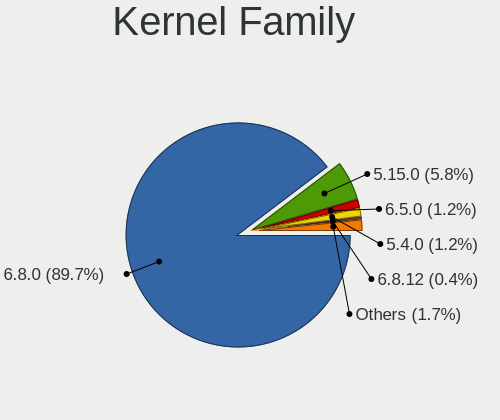
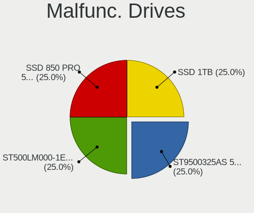
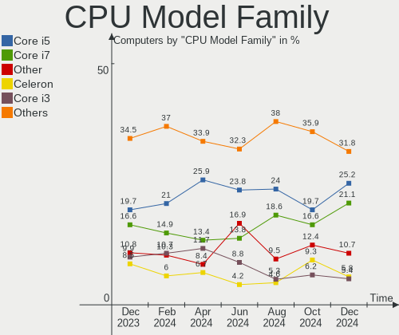
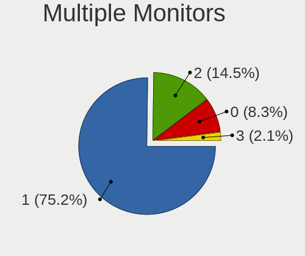
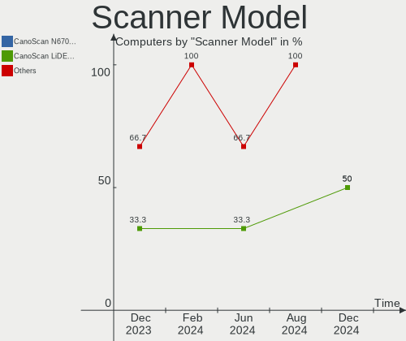

Zorin Hardware Trends
---------------------

A project to identify most popular hardware characteristics and track their change
over time based on data collected by Zorin users at https://Linux-Hardware.org.

Anyone can contribute to the study by uploading probes of their computers by
the [hw-probe](https://github.com/linuxhw/hw-probe) tool:

    sudo -E hw-probe -all -upload

This is a report for all computer types. See also reports for [desktops](/Dist/Zorin/Desktop/README.md) and [notebooks](/Dist/Zorin/Notebook/README.md).

Full-feature report is available here: https://linux-hardware.org/?view=trends

Period: Apr, 2021.

Contents
--------

- [ OS                       ](#os)
- [ OS Family                ](#os-family)
- [ Kernel                   ](#kernel)
- [ Kernel Family            ](#kernel-family)
- [ Kernel Major Ver.        ](#kernel-major-ver)
- [ Arch                     ](#arch)
- [ DE                       ](#de)
- [ Display Server           ](#display-server)
- [ Display Manager          ](#display-manager)
- [ OS Lang                  ](#os-lang)
- [ Boot Mode                ](#boot-mode)
- [ Filesystem               ](#filesystem)
- [ Part. scheme             ](#part-scheme)
- [ Dual Boot with Linux/BSD ](#dual-boot-with-linux/bsd)
- [ Dual Boot (Win)          ](#dual-boot-win)
- [ Country                  ](#country)
- [ City                     ](#city)
- [ Vendor                   ](#vendor)
- [ Model                    ](#model)
- [ Model Family             ](#model-family)
- [ MFG Year                 ](#mfg-year)
- [ Form Factor              ](#form-factor)
- [ Secure Boot              ](#secure-boot)
- [ Coreboot                 ](#coreboot)
- [ RAM Size                 ](#ram-size)
- [ RAM Used                 ](#ram-used)
- [ Has CD-ROM               ](#has-cd-rom)
- [ Total Drives             ](#total-drives)
- [ Has Ethernet             ](#has-ethernet)
- [ Has WiFi                 ](#has-wifi)
- [ Has Bluetooth            ](#has-bluetooth)
- [ Drive Vendor             ](#drive-vendor)
- [ Drive Model              ](#drive-model)
- [ HDD Vendor               ](#hdd-vendor)
- [ SSD Vendor               ](#ssd-vendor)
- [ Drive Kind               ](#drive-kind)
- [ Drive Connector          ](#drive-connector)
- [ Drive Size               ](#drive-size)
- [ Space Total              ](#space-total)
- [ Space Used               ](#space-used)
- [ Malfunc. Drives          ](#malfunc-drives)
- [ Malfunc. Drive Vendor    ](#malfunc-drive-vendor)
- [ Malfunc. HDD Vendor      ](#malfunc-hdd-vendor)
- [ Malfunc. Drive Kind      ](#malfunc-drive-kind)
- [ Failed Drives            ](#failed-drives)
- [ Failed Drive Vendor      ](#failed-drive-vendor)
- [ Drive Status             ](#drive-status)
- [ Storage Vendor           ](#storage-vendor)
- [ Storage Model            ](#storage-model)
- [ Storage Kind             ](#storage-kind)
- [ CPU Vendor               ](#cpu-vendor)
- [ CPU Model                ](#cpu-model)
- [ CPU Model Family         ](#cpu-model-family)
- [ CPU Cores                ](#cpu-cores)
- [ CPU Sockets              ](#cpu-sockets)
- [ CPU Threads              ](#cpu-threads)
- [ CPU Op-Modes             ](#cpu-op-modes)
- [ CPU Microcode            ](#cpu-microcode)
- [ CPU Microarch            ](#cpu-microarch)
- [ GPU Vendor               ](#gpu-vendor)
- [ GPU Model                ](#gpu-model)
- [ GPU Combo                ](#gpu-combo)
- [ GPU Driver               ](#gpu-driver)
- [ GPU Memory               ](#gpu-memory)
- [ Monitor Vendor           ](#monitor-vendor)
- [ Monitor Model            ](#monitor-model)
- [ Monitor Resolution       ](#monitor-resolution)
- [ Monitor Diagonal         ](#monitor-diagonal)
- [ Monitor Width            ](#monitor-width)
- [ Aspect Ratio             ](#aspect-ratio)
- [ Monitor Area             ](#monitor-area)
- [ Pixel Density            ](#pixel-density)
- [ Multiple Monitors        ](#multiple-monitors)
- [ Net Controller Vendor    ](#net-controller-vendor)
- [ Net Controller Model     ](#net-controller-model)
- [ Wireless Vendor          ](#wireless-vendor)
- [ Wireless Model           ](#wireless-model)
- [ Ethernet Vendor          ](#ethernet-vendor)
- [ Ethernet Model           ](#ethernet-model)
- [ Net Controller Kind      ](#net-controller-kind)
- [ Used Controller          ](#used-controller)
- [ NICs                     ](#nics)
- [ IPv6                     ](#ipv6)
- [ Memory Vendor            ](#memory-vendor)
- [ Memory Model             ](#memory-model)
- [ Memory Kind              ](#memory-kind)
- [ Memory Form Factor       ](#memory-form-factor)
- [ Memory Size              ](#memory-size)
- [ Memory Speed             ](#memory-speed)
- [ Sound Vendor             ](#sound-vendor)
- [ Sound Model              ](#sound-model)
- [ Camera Vendor            ](#camera-vendor)
- [ Camera Model             ](#camera-model)
- [ Fingerprint Vendor       ](#fingerprint-vendor)
- [ Fingerprint Model        ](#fingerprint-model)
- [ Chipcard Vendor          ](#chipcard-vendor)
- [ Chipcard Model           ](#chipcard-model)
- [ Printer Vendor           ](#printer-vendor)
- [ Printer Model            ](#printer-model)
- [ Scanner Vendor           ](#scanner-vendor)
- [ Scanner Model            ](#scanner-model)
- [ Bluetooth Vendor         ](#bluetooth-vendor)
- [ Bluetooth Model          ](#bluetooth-model)
- [ Unsupported Devices      ](#unsupported-devices)
- [ Unsupported Device Types ](#unsupported-device-types)

OS
--

Installed operating systems

| Name     | Computers | Percent |
|----------|-----------|---------|
| Zorin 15 | 54        | 80.6%   |
| Zorin 16 | 10        | 14.93%  |
| Zorin 12 | 3         | 4.48%   |

OS Family
---------

OS without a version

| Name  | Computers | Percent |
|-------|-----------|---------|
| Zorin | 67        | 100%    |

Kernel
------

Version of the Linux kernel

| Version            | Computers | Percent |
|--------------------|-----------|---------|
| 5.4.0-72-generic   | 22        | 32.84%  |
| 5.4.0-70-generic   | 17        | 25.37%  |
| 5.8.0-50-generic   | 9         | 13.43%  |
| 5.4.0-47-generic   | 3         | 4.48%   |
| 5.4.0-45-generic   | 3         | 4.48%   |
| 5.4.0-71-generic   | 2         | 2.99%   |
| 5.4.0-66-generic   | 2         | 2.99%   |
| 5.4.0-65-generic   | 2         | 2.99%   |
| 5.8.0-49-generic   | 1         | 1.49%   |
| 5.4.0-67-generic   | 1         | 1.49%   |
| 5.3.0-28-generic   | 1         | 1.49%   |
| 5.0.0-37-generic   | 1         | 1.49%   |
| 4.4.0-210-generic  | 1         | 1.49%   |
| 4.15.0-62-generic  | 1         | 1.49%   |
| 4.15.0-140-generic | 1         | 1.49%   |

Kernel Family
-------------

Linux kernel without a distro release

| Version | Computers | Percent |
|---------|-----------|---------|
| 5.4.0   | 52        | 77.61%  |
| 5.8.0   | 10        | 14.93%  |
| 4.15.0  | 2         | 2.99%   |
| 5.3.0   | 1         | 1.49%   |
| 5.0.0   | 1         | 1.49%   |
| 4.4.0   | 1         | 1.49%   |

Kernel Major Ver.
-----------------

Linux kernel major version

| Version | Computers | Percent |
|---------|-----------|---------|
| 5.4     | 52        | 77.61%  |
| 5.8     | 10        | 14.93%  |
| 4.15    | 2         | 2.99%   |
| 5.3     | 1         | 1.49%   |
| 5.0     | 1         | 1.49%   |
| 4.4     | 1         | 1.49%   |

Arch
----

OS architecture (x86_64, i586, etc.)

| Name   | Computers | Percent |
|--------|-----------|---------|
| x86_64 | 56        | 83.58%  |
| i686   | 11        | 16.42%  |

DE
--

Desktop Environment

| Name    | Computers | Percent |
|---------|-----------|---------|
| GNOME   | 44        | 65.67%  |
| XFCE    | 21        | 31.34%  |
| Unknown | 2         | 2.99%   |

Display Server
--------------

X11 or Wayland

| Name    | Computers | Percent |
|---------|-----------|---------|
| X11     | 66        | 98.51%  |
| Unknown | 1         | 1.49%   |

Display Manager
---------------

SDDM, LightDM, etc.

| Name    | Computers | Percent |
|---------|-----------|---------|
| Unknown | 66        | 98.51%  |
| TDM     | 1         | 1.49%   |

OS Lang
-------

Language

| Lang  | Computers | Percent |
|-------|-----------|---------|
| en_US | 30        | 44.78%  |
| pt_BR | 6         | 8.96%   |
| de_DE | 6         | 8.96%   |
| pl_PL | 3         | 4.48%   |
| en_GB | 3         | 4.48%   |
| sv_SE | 2         | 2.99%   |
| nl_NL | 2         | 2.99%   |
| es_CL | 2         | 2.99%   |
| en_CA | 2         | 2.99%   |
| C     | 2         | 2.99%   |
| nb_NO | 1         | 1.49%   |
| ja_JP | 1         | 1.49%   |
| it_IT | 1         | 1.49%   |
| es_ES | 1         | 1.49%   |
| es_CO | 1         | 1.49%   |
| en_IN | 1         | 1.49%   |
| de_CH | 1         | 1.49%   |
| cs_CZ | 1         | 1.49%   |
| bg_BG | 1         | 1.49%   |

Boot Mode
---------

EFI or BIOS

| Mode | Computers | Percent |
|------|-----------|---------|
| BIOS | 44        | 65.67%  |
| EFI  | 23        | 34.33%  |

Filesystem
----------

Type of filesystem

| Type    | Computers | Percent |
|---------|-----------|---------|
| Ext4    | 63        | 94.03%  |
| Overlay | 3         | 4.48%   |
| Btrfs   | 1         | 1.49%   |

Part. scheme
------------

Scheme of partitioning

| Type    | Computers | Percent |
|---------|-----------|---------|
| Unknown | 66        | 98.51%  |
| MBR     | 1         | 1.49%   |

Dual Boot with Linux/BSD
------------------------

Hosting more than one Linux/BSD

| Dual boot | Computers | Percent |
|-----------|-----------|---------|
| No        | 65        | 97.01%  |
| Yes       | 2         | 2.99%   |

Dual Boot (Win)
---------------

Hosting Linux and Windows

| Dual boot | Computers | Percent |
|-----------|-----------|---------|
| No        | 49        | 73.13%  |
| Yes       | 18        | 26.87%  |

Country
-------

Geographic location (country)

| Country     | Computers | Percent |
|-------------|-----------|---------|
| USA         | 19        | 28.36%  |
| Brazil      | 7         | 10.45%  |
| Germany     | 5         | 7.46%   |
| Canada      | 5         | 7.46%   |
| UK          | 3         | 4.48%   |
| Poland      | 3         | 4.48%   |
| Sweden      | 2         | 2.99%   |
| Netherlands | 2         | 2.99%   |
| Japan       | 2         | 2.99%   |
| Colombia    | 2         | 2.99%   |
| Chile       | 2         | 2.99%   |
| Bulgaria    | 2         | 2.99%   |
| Vietnam     | 1         | 1.49%   |
| Switzerland | 1         | 1.49%   |
| Romania     | 1         | 1.49%   |
| Pakistan    | 1         | 1.49%   |
| Norway      | 1         | 1.49%   |
| Mexico      | 1         | 1.49%   |
| Kenya       | 1         | 1.49%   |
| Italy       | 1         | 1.49%   |
| India       | 1         | 1.49%   |
| Ecuador     | 1         | 1.49%   |
| Czechia     | 1         | 1.49%   |
| Austria     | 1         | 1.49%   |
| Australia   | 1         | 1.49%   |

City
----

Geographic location (city)

| City                                    | Computers | Percent |
|-----------------------------------------|-----------|---------|
| Dallas                                  | 2         | 2.99%   |
| České Budějovice                     | 1         | 1.49%   |
| Zurich                                  | 1         | 1.49%   |
| Yabu                                    | 1         | 1.49%   |
| Wigan                                   | 1         | 1.49%   |
| Westbank                                | 1         | 1.49%   |
| Welwyn Garden City                      | 1         | 1.49%   |
| Waterloo                                | 1         | 1.49%   |
| Warsaw                                  | 1         | 1.49%   |
| Vienna                                  | 1         | 1.49%   |
| Valla                                   | 1         | 1.49%   |
| Union de Credito Agricola de Hermosillo | 1         | 1.49%   |
| Torre de Pedra                          | 1         | 1.49%   |
| Springfield                             | 1         | 1.49%   |
| Sorreisa                                | 1         | 1.49%   |
| Sofia                                   | 1         | 1.49%   |
| Sao Gabriel                             | 1         | 1.49%   |
| Santa Barbara                           | 1         | 1.49%   |
| San Francisco                           | 1         | 1.49%   |
| Saitama                                 | 1         | 1.49%   |
| Sabinopolis                             | 1         | 1.49%   |
| Rome                                    | 1         | 1.49%   |
| Ravadinovo                              | 1         | 1.49%   |
| Rancagua                                | 1         | 1.49%   |
| Port Montt                              | 1         | 1.49%   |
| Pineville                               | 1         | 1.49%   |
| Palm Coast                              | 1         | 1.49%   |
| Osnabrück                              | 1         | 1.49%   |
| Oscoda                                  | 1         | 1.49%   |
| Ormond Beach                            | 1         | 1.49%   |
| Nowy Targ                               | 1         | 1.49%   |
| Nairobi                                 | 1         | 1.49%   |
| Mentor                                  | 1         | 1.49%   |
| Melbourne                               | 1         | 1.49%   |
| Maple Ridge                             | 1         | 1.49%   |
| Makow Podhalanski                       | 1         | 1.49%   |
| London                                  | 1         | 1.49%   |
| Littleton                               | 1         | 1.49%   |
| Las Vegas                               | 1         | 1.49%   |
| Landskrona                              | 1         | 1.49%   |
| Karachi                                 | 1         | 1.49%   |
| Jupiter                                 | 1         | 1.49%   |
| Indianapolis                            | 1         | 1.49%   |
| Indaiatuba                              | 1         | 1.49%   |
| Haren                                   | 1         | 1.49%   |
| Hanoi                                   | 1         | 1.49%   |
| Hamburg                                 | 1         | 1.49%   |
| Guayaquil                               | 1         | 1.49%   |
| Fortaleza                               | 1         | 1.49%   |
| Fort Worth                              | 1         | 1.49%   |
| Elk Grove Village                       | 1         | 1.49%   |
| Drensteinfurt                           | 1         | 1.49%   |
| Dortmund                                | 1         | 1.49%   |
| Dorchester                              | 1         | 1.49%   |
| Denver                                  | 1         | 1.49%   |
| Delhi                                   | 1         | 1.49%   |
| Cúcuta                                 | 1         | 1.49%   |
| Charlotte                               | 1         | 1.49%   |
| Ceilandia                               | 1         | 1.49%   |
| Brejinho                                | 1         | 1.49%   |

Vendor
------

Motherboard manufacturer

| Name                | Computers | Percent |
|---------------------|-----------|---------|
| Lenovo              | 9         | 13.43%  |
| ASUSTek Computer    | 8         | 11.94%  |
| Dell                | 7         | 10.45%  |
| Hewlett-Packard     | 6         | 8.96%   |
| Toshiba             | 4         | 5.97%   |
| Gigabyte Technology | 4         | 5.97%   |
| Acer                | 4         | 5.97%   |
| Positivo            | 2         | 2.99%   |
| Pegatron            | 2         | 2.99%   |
| MSI                 | 2         | 2.99%   |
| ASRock              | 2         | 2.99%   |
| Apple               | 2         | 2.99%   |
| Unknown             | 2         | 2.99%   |
| Sony                | 1         | 1.49%   |
| Semp Toshiba        | 1         | 1.49%   |
| Samsung Electronics | 1         | 1.49%   |
| Quanta              | 1         | 1.49%   |
| Panasonic           | 1         | 1.49%   |
| Packard Bell        | 1         | 1.49%   |
| NEC Computers       | 1         | 1.49%   |
| Microsoft           | 1         | 1.49%   |
| Itautec             | 1         | 1.49%   |
| Intel               | 1         | 1.49%   |
| Fujitsu             | 1         | 1.49%   |
| Compaq              | 1         | 1.49%   |
| AMD                 | 1         | 1.49%   |

Model
-----

Motherboard model

| Name                                  | Computers | Percent |
|---------------------------------------|-----------|---------|
| Unknown                               | 3         | 4.48%   |
| Toshiba Satellite P200                | 1         | 1.49%   |
| Toshiba Satellite C55-A               | 1         | 1.49%   |
| Toshiba QOSMIO X300                   | 1         | 1.49%   |
| Toshiba dynabook R731/E               | 1         | 1.49%   |
| Sony VGN-N350FE                       | 1         | 1.49%   |
| Semp Toshiba IS 1422                  | 1         | 1.49%   |
| Samsung 550XCJ/550XCR                 | 1         | 1.49%   |
| Quanta CA27                           | 1         | 1.49%   |
| Positivo S14CT01                      | 1         | 1.49%   |
| Positivo MOBILE                       | 1         | 1.49%   |
| Pegatron NE502AV-ABA a6750t           | 1         | 1.49%   |
| Pegatron CQ2014                       | 1         | 1.49%   |
| Panasonic CF-53SALZYLM                | 1         | 1.49%   |
| Packard Bell EasyNote_BU45            | 1         | 1.49%   |
| NEC Computers PC-VY25AACZ9            | 1         | 1.49%   |
| MSI MS-7B09                           | 1         | 1.49%   |
| MSI MS-7695                           | 1         | 1.49%   |
| Microsoft Surface Laptop Go           | 1         | 1.49%   |
| Lenovo Yoga C740-15IML 81TD           | 1         | 1.49%   |
| Lenovo ThinkPad X131e 3372A14         | 1         | 1.49%   |
| Lenovo ThinkPad W540 20BHS1MX00       | 1         | 1.49%   |
| Lenovo ThinkCentre M900 10FM001GUS    | 1         | 1.49%   |
| Lenovo K450e 10181                    | 1         | 1.49%   |
| Lenovo IdeaPad Y570 0862              | 1         | 1.49%   |
| Lenovo IdeaPad Slim 1-14AST-05 81VS   | 1         | 1.49%   |
| Lenovo IdeaPad 100-15IBD 80QQ         | 1         | 1.49%   |
| Lenovo IdeaCentre K330                | 1         | 1.49%   |
| Itautec Infoway                       | 1         | 1.49%   |
| Intel DG41MJ AAE54659-206             | 1         | 1.49%   |
| HP Stream Notebook PC 11              | 1         | 1.49%   |
| HP Pavilion dv5                       | 1         | 1.49%   |
| HP EliteBook Folio 9480m              | 1         | 1.49%   |
| HP EliteBook 850 G5                   | 1         | 1.49%   |
| HP Compaq dc7800 Small Form Factor    | 1         | 1.49%   |
| HP 15                                 | 1         | 1.49%   |
| Gigabyte B75M-D3V                     | 1         | 1.49%   |
| Gigabyte B450 AORUS ELITE             | 1         | 1.49%   |
| Gigabyte AERO 15-SA                   | 1         | 1.49%   |
| Gigabyte A320M-S2H                    | 1         | 1.49%   |
| Fujitsu LIFEBOOK U772                 | 1         | 1.49%   |
| Dell OptiPlex 990                     | 1         | 1.49%   |
| Dell OptiPlex 7040                    | 1         | 1.49%   |
| Dell OptiPlex 7020                    | 1         | 1.49%   |
| Dell Latitude D630                    | 1         | 1.49%   |
| Dell Latitude D620                    | 1         | 1.49%   |
| Dell Latitude D520                    | 1         | 1.49%   |
| Dell Inspiron 5759                    | 1         | 1.49%   |
| Compaq Presario CQ-17                 | 1         | 1.49%   |
| ASUS ZenBook UX331FA_UX331FA          | 1         | 1.49%   |
| ASUS Z170-A                           | 1         | 1.49%   |
| ASUS ROG Zephyrus M15 GU502LV_GU502LV | 1         | 1.49%   |
| ASUS PRIME B250M-A                    | 1         | 1.49%   |
| ASUS P5K                              | 1         | 1.49%   |
| ASUS M4A88TD-V EVO/USB3               | 1         | 1.49%   |
| ASUS B150 PRO GAMING D3               | 1         | 1.49%   |
| ASUS All Series                       | 1         | 1.49%   |
| ASRock G41M-VS3                       | 1         | 1.49%   |
| ASRock B550M Steel Legend             | 1         | 1.49%   |
| Apple iMac7,1                         | 1         | 1.49%   |

Model Family
------------

Motherboard model prefix

| Name                       | Computers | Percent |
|----------------------------|-----------|---------|
| Lenovo IdeaPad             | 3         | 4.48%   |
| Dell OptiPlex              | 3         | 4.48%   |
| Dell Latitude              | 3         | 4.48%   |
| Unknown                    | 3         | 4.48%   |
| Toshiba Satellite          | 2         | 2.99%   |
| Lenovo ThinkPad            | 2         | 2.99%   |
| HP EliteBook               | 2         | 2.99%   |
| Acer Aspire                | 2         | 2.99%   |
| Toshiba QOSMIO             | 1         | 1.49%   |
| Toshiba dynabook           | 1         | 1.49%   |
| Sony VGN-N350FE            | 1         | 1.49%   |
| Semp Toshiba IS            | 1         | 1.49%   |
| Samsung 550XCJ             | 1         | 1.49%   |
| Quanta CA27                | 1         | 1.49%   |
| Positivo S14CT01           | 1         | 1.49%   |
| Positivo MOBILE            | 1         | 1.49%   |
| Pegatron NE502AV-ABA       | 1         | 1.49%   |
| Pegatron CQ2014            | 1         | 1.49%   |
| Panasonic CF-53SALZYLM     | 1         | 1.49%   |
| Packard Bell EasyNote      | 1         | 1.49%   |
| NEC Computers PC-VY25AACZ9 | 1         | 1.49%   |
| MSI MS-7B09                | 1         | 1.49%   |
| MSI MS-7695                | 1         | 1.49%   |
| Microsoft Surface          | 1         | 1.49%   |
| Lenovo Yoga                | 1         | 1.49%   |
| Lenovo ThinkCentre         | 1         | 1.49%   |
| Lenovo K450e               | 1         | 1.49%   |
| Lenovo IdeaCentre          | 1         | 1.49%   |
| Itautec Infoway            | 1         | 1.49%   |
| Intel DG41MJ               | 1         | 1.49%   |
| HP Stream                  | 1         | 1.49%   |
| HP Pavilion                | 1         | 1.49%   |
| HP Compaq                  | 1         | 1.49%   |
| HP 15                      | 1         | 1.49%   |
| Gigabyte B75M-D3V          | 1         | 1.49%   |
| Gigabyte B450              | 1         | 1.49%   |
| Gigabyte AERO              | 1         | 1.49%   |
| Gigabyte A320M-S2H         | 1         | 1.49%   |
| Fujitsu LIFEBOOK           | 1         | 1.49%   |
| Dell Inspiron              | 1         | 1.49%   |
| Compaq Presario            | 1         | 1.49%   |
| ASUS ZenBook               | 1         | 1.49%   |
| ASUS Z170-A                | 1         | 1.49%   |
| ASUS ROG                   | 1         | 1.49%   |
| ASUS PRIME                 | 1         | 1.49%   |
| ASUS P5K                   | 1         | 1.49%   |
| ASUS M4A88TD-V             | 1         | 1.49%   |
| ASUS B150                  | 1         | 1.49%   |
| ASUS All                   | 1         | 1.49%   |
| ASRock G41M-VS3            | 1         | 1.49%   |
| ASRock B550M               | 1         | 1.49%   |
| Apple iMac7                | 1         | 1.49%   |
| Apple iMac14               | 1         | 1.49%   |
| AMD Inagua                 | 1         | 1.49%   |
| Acer Predator              | 1         | 1.49%   |

MFG Year
--------

Motherboard manufacture year

| Year | Computers | Percent |
|------|-----------|---------|
| 2020 | 9         | 13.43%  |
| 2011 | 8         | 11.94%  |
| 2018 | 6         | 8.96%   |
| 2010 | 6         | 8.96%   |
| 2007 | 6         | 8.96%   |
| 2019 | 4         | 5.97%   |
| 2014 | 4         | 5.97%   |
| 2013 | 4         | 5.97%   |
| 2012 | 4         | 5.97%   |
| 2008 | 4         | 5.97%   |
| 2016 | 3         | 4.48%   |
| 2021 | 2         | 2.99%   |
| 2017 | 2         | 2.99%   |
| 2015 | 2         | 2.99%   |
| 2009 | 2         | 2.99%   |
| 2006 | 1         | 1.49%   |

Form Factor
-----------

Physical design of the computer

| Name        | Computers | Percent |
|-------------|-----------|---------|
| Notebook    | 35        | 52.24%  |
| Desktop     | 27        | 40.3%   |
| All in one  | 3         | 4.48%   |
| Tablet      | 1         | 1.49%   |
| Convertible | 1         | 1.49%   |

Secure Boot
-----------

Enabled or disabled

| State    | Computers | Percent |
|----------|-----------|---------|
| Disabled | 63        | 94.03%  |
| Enabled  | 4         | 5.97%   |

Coreboot
--------

Have coreboot on board

| Used | Computers | Percent |
|------|-----------|---------|
| No   | 67        | 100%    |

RAM Size
--------

Total RAM memory

| Size in GB  | Computers | Percent |
|-------------|-----------|---------|
| 4.01-8.0    | 19        | 28.36%  |
| 3.01-4.0    | 13        | 19.4%   |
| 1.01-2.0    | 11        | 16.42%  |
| 16.01-24.0  | 9         | 13.43%  |
| 8.01-16.0   | 8         | 11.94%  |
| 32.01-64.0  | 4         | 5.97%   |
| 2.01-3.0    | 1         | 1.49%   |
| 64.01-256.0 | 1         | 1.49%   |
| 0.51-1.0    | 1         | 1.49%   |

RAM Used
--------

Used RAM memory

| Used GB   | Computers | Percent |
|-----------|-----------|---------|
| 1.01-2.0  | 30        | 44.78%  |
| 2.01-3.0  | 14        | 20.9%   |
| 3.01-4.0  | 11        | 16.42%  |
| 0.51-1.0  | 7         | 10.45%  |
| 4.01-8.0  | 4         | 5.97%   |
| 8.01-16.0 | 1         | 1.49%   |

Has CD-ROM
----------

Has CD-ROM on board

| Presented | Computers | Percent |
|-----------|-----------|---------|
| Yes       | 35        | 52.24%  |
| No        | 32        | 47.76%  |

Total Drives
------------

Number of drives on board

| Drives | Computers | Percent |
|--------|-----------|---------|
| 1      | 48        | 71.64%  |
| 2      | 12        | 17.91%  |
| 4      | 3         | 4.48%   |
| 3      | 3         | 4.48%   |
| 5      | 1         | 1.49%   |

Has Ethernet
------------

Has Ethernet on board

| Presented | Computers | Percent |
|-----------|-----------|---------|
| Yes       | 59        | 88.06%  |
| No        | 8         | 11.94%  |

Has WiFi
--------

Has WiFi module

| Presented | Computers | Percent |
|-----------|-----------|---------|
| Yes       | 50        | 74.63%  |
| No        | 17        | 25.37%  |

Has Bluetooth
-------------

Has Bluetooth module

| Presented | Computers | Percent |
|-----------|-----------|---------|
| No        | 38        | 56.72%  |
| Yes       | 29        | 43.28%  |

Drive Vendor
------------

Hard drive vendors

| Vendor              | Computers | Drives | Percent |
|---------------------|-----------|--------|---------|
| WDC                 | 14        | 16     | 15.91%  |
| Samsung Electronics | 14        | 16     | 15.91%  |
| Seagate             | 12        | 12     | 13.64%  |
| Unknown             | 5         | 5      | 5.68%   |
| Kingston            | 5         | 5      | 5.68%   |
| Hitachi             | 5         | 5      | 5.68%   |
| PNY                 | 3         | 3      | 3.41%   |
| HGST                | 3         | 3      | 3.41%   |
| A-DATA Technology   | 3         | 3      | 3.41%   |
| Toshiba             | 2         | 2      | 2.27%   |
| SPCC                | 2         | 3      | 2.27%   |
| Phison              | 2         | 3      | 2.27%   |
| Micron Technology   | 2         | 2      | 2.27%   |
| JMicron             | 2         | 2      | 2.27%   |
| Intel               | 2         | 2      | 2.27%   |
| Crucial             | 2         | 2      | 2.27%   |
| USB30               | 1         | 1      | 1.14%   |
| Transcend           | 1         | 1      | 1.14%   |
| SK Hynix            | 1         | 1      | 1.14%   |
| Sandisk             | 1         | 1      | 1.14%   |
| PNY USB             | 1         | 1      | 1.14%   |
| Maxtor              | 1         | 1      | 1.14%   |
| LITEON              | 1         | 1      | 1.14%   |
| China               | 1         | 1      | 1.14%   |
| Apple               | 1         | 1      | 1.14%   |
| ADplus              | 1         | 1      | 1.14%   |

Drive Model
-----------

Hard drive models

| Model                                | Computers | Percent |
|--------------------------------------|-----------|---------|
| Unknown MMC Card  32GB               | 2         | 2.2%    |
| Unknown MMC Card  128GB              | 2         | 2.2%    |
| Samsung SSD 840 EVO 250GB            | 2         | 2.2%    |
| Samsung NVMe SSD Drive 512GB         | 2         | 2.2%    |
| Samsung NVMe SSD Drive 500GB         | 2         | 2.2%    |
| Kingston SA400S37480G 480GB SSD      | 2         | 2.2%    |
| HGST HTS725050A7E630 500GB           | 2         | 2.2%    |
| WDC WDS240G2G0A-00JH30 240GB SSD     | 1         | 1.1%    |
| WDC WD7500BPKT-22PK4T0 752GB         | 1         | 1.1%    |
| WDC WD6400BPVT-22HXZT3 640GB         | 1         | 1.1%    |
| WDC WD6400AAKS-22A7B2 640GB          | 1         | 1.1%    |
| WDC WD5000BEVT-60A0RT0 500GB         | 1         | 1.1%    |
| WDC WD5000AAKS-00YGA0 500GB          | 1         | 1.1%    |
| WDC WD40EZRZ-00GXCB0 4TB             | 1         | 1.1%    |
| WDC WD3200BUCT-63TWBY0 320GB         | 1         | 1.1%    |
| WDC WD3200BPVT-00JJ5T0 320GB         | 1         | 1.1%    |
| WDC WD2500AAKS-00VSA0 250GB          | 1         | 1.1%    |
| WDC WD20EARX-22PASB0 2TB             | 1         | 1.1%    |
| WDC WD10SPZX-35Z10T0 1TB             | 1         | 1.1%    |
| WDC WD10EZEX-08WN4A0 1TB             | 1         | 1.1%    |
| WDC WD10EURX-63FH1Y0 1TB             | 1         | 1.1%    |
| USB30 Disk 500GB                     | 1         | 1.1%    |
| Unknown MMC Card  64GB               | 1         | 1.1%    |
| Transcend TS64GSSD420K 64GB          | 1         | 1.1%    |
| Toshiba MK2035GSS 200GB              | 1         | 1.1%    |
| Toshiba MK1246GSX 120GB              | 1         | 1.1%    |
| SPCC Solid State Disk 512GB          | 1         | 1.1%    |
| SPCC Solid State Disk 256GB          | 1         | 1.1%    |
| SPCC Solid State Disk 1024GB         | 1         | 1.1%    |
| SK Hynix NVMe SSD Drive 128GB        | 1         | 1.1%    |
| Seagate ST9320325AS 320GB            | 1         | 1.1%    |
| Seagate ST500LT012-1DG142 500GB      | 1         | 1.1%    |
| Seagate ST3500630AS 500GB            | 1         | 1.1%    |
| Seagate ST3500418ASQ 500GB           | 1         | 1.1%    |
| Seagate ST3500418AS 500GB            | 1         | 1.1%    |
| Seagate ST3320820AS 320GB            | 1         | 1.1%    |
| Seagate ST3250312AS 250GB            | 1         | 1.1%    |
| Seagate ST1000LM024 HN-M101MBB 1TB   | 1         | 1.1%    |
| Seagate ST1000DM010-2EP102 1TB       | 1         | 1.1%    |
| Seagate ST1000DM003-1ER162 1TB       | 1         | 1.1%    |
| Seagate Expansion 4TB                | 1         | 1.1%    |
| Seagate BUP Slim BK 1TB              | 1         | 1.1%    |
| Sandisk NVMe SSD Drive 1024GB        | 1         | 1.1%    |
| Samsung SSD 850 EVO 500GB            | 1         | 1.1%    |
| Samsung PSSD T7 2TB                  | 1         | 1.1%    |
| Samsung NVMe SSD Drive 2TB           | 1         | 1.1%    |
| Samsung NVMe SSD Drive 256GB         | 1         | 1.1%    |
| Samsung NVMe SSD Drive 250GB         | 1         | 1.1%    |
| Samsung MZ7TD256HAFV-000L9 256GB SSD | 1         | 1.1%    |
| Samsung HM321HI 320GB                | 1         | 1.1%    |
| Samsung HM160HI 160GB                | 1         | 1.1%    |
| Samsung HD103SJ 1TB                  | 1         | 1.1%    |
| PNY USB 3.0 to SATA 250GB SSD        | 1         | 1.1%    |
| PNY SSD2SC120G1SA754D117-820 120GB   | 1         | 1.1%    |
| PNY CS900 500GB SSD                  | 1         | 1.1%    |
| PNY CS900 480GB SSD                  | 1         | 1.1%    |
| Phison NVMe SSD Drive 500GB          | 1         | 1.1%    |
| Phison NVMe SSD Drive 2TB            | 1         | 1.1%    |
| Phison NVMe SSD Drive 1024GB         | 1         | 1.1%    |
| Micron C400-MTFDDAK256MAM 256GB SSD  | 1         | 1.1%    |

HDD Vendor
----------

Hard disk drive vendors

| Vendor              | Computers | Drives | Percent |
|---------------------|-----------|--------|---------|
| WDC                 | 13        | 15     | 32.5%   |
| Seagate             | 12        | 12     | 30%     |
| Hitachi             | 5         | 5      | 12.5%   |
| Samsung Electronics | 3         | 3      | 7.5%    |
| HGST                | 3         | 3      | 7.5%    |
| Toshiba             | 2         | 2      | 5%      |
| Maxtor              | 1         | 1      | 2.5%    |
| Apple               | 1         | 1      | 2.5%    |

SSD Vendor
----------

Solid state drive vendors

| Vendor              | Computers | Drives | Percent |
|---------------------|-----------|--------|---------|
| Samsung Electronics | 5         | 5      | 16.67%  |
| Kingston            | 5         | 5      | 16.67%  |
| PNY                 | 3         | 3      | 10%     |
| A-DATA Technology   | 3         | 3      | 10%     |
| SPCC                | 2         | 3      | 6.67%   |
| Micron Technology   | 2         | 2      | 6.67%   |
| Crucial             | 2         | 2      | 6.67%   |
| WDC                 | 1         | 1      | 3.33%   |
| USB30               | 1         | 1      | 3.33%   |
| Transcend           | 1         | 1      | 3.33%   |
| PNY USB             | 1         | 1      | 3.33%   |
| LITEON              | 1         | 1      | 3.33%   |
| JMicron             | 1         | 1      | 3.33%   |
| Intel               | 1         | 1      | 3.33%   |
| China               | 1         | 1      | 3.33%   |

Drive Kind
----------

HDD or SSD

| Kind    | Computers | Drives | Percent |
|---------|-----------|--------|---------|
| HDD     | 35        | 42     | 44.87%  |
| SSD     | 25        | 31     | 32.05%  |
| NVMe    | 11        | 14     | 14.1%   |
| MMC     | 5         | 5      | 6.41%   |
| Unknown | 2         | 2      | 2.56%   |

Drive Connector
---------------

SATA, SAS, NVMe, etc.

| Type | Computers | Drives | Percent |
|------|-----------|--------|---------|
| SATA | 54        | 68     | 71.05%  |
| NVMe | 11        | 14     | 14.47%  |
| SAS  | 6         | 7      | 7.89%   |
| MMC  | 5         | 5      | 6.58%   |

Drive Size
----------

Size of hard drive

| Size in TB | Computers | Drives | Percent |
|------------|-----------|--------|---------|
| 0.01-0.5   | 44        | 52     | 69.84%  |
| 0.51-1.0   | 14        | 15     | 22.22%  |
| 1.01-2.0   | 3         | 3      | 4.76%   |
| 3.01-4.0   | 2         | 3      | 3.17%   |

Space Total
-----------

Amount of disk space available on the file system

| Size in GB     | Computers | Percent |
|----------------|-----------|---------|
| 101-250        | 24        | 35.82%  |
| 251-500        | 18        | 26.87%  |
| 501-1000       | 9         | 13.43%  |
| 2001-3000      | 5         | 7.46%   |
| 1-20           | 3         | 4.48%   |
| 51-100         | 3         | 4.48%   |
| More than 3000 | 2         | 2.99%   |
| 21-50          | 2         | 2.99%   |
| 1001-2000      | 1         | 1.49%   |

Space Used
----------

Amount of used disk space

| Used GB   | Computers | Percent |
|-----------|-----------|---------|
| 1-20      | 28        | 41.79%  |
| 51-100    | 12        | 17.91%  |
| 21-50     | 11        | 16.42%  |
| 101-250   | 8         | 11.94%  |
| 1001-2000 | 4         | 5.97%   |
| 501-1000  | 3         | 4.48%   |
| 251-500   | 1         | 1.49%   |

Malfunc. Drives
---------------

Drive models with a malfunction

| Model                     | Computers | Drives | Percent |
|---------------------------|-----------|--------|---------|
| Seagate ST9320325AS 320GB | 1         | 1      | 100%    |

Malfunc. Drive Vendor
---------------------

Vendors of faulty drives

| Vendor  | Computers | Drives | Percent |
|---------|-----------|--------|---------|
| Seagate | 1         | 1      | 100%    |

Malfunc. HDD Vendor
-------------------

Vendors of faulty HDD drives

| Vendor  | Computers | Drives | Percent |
|---------|-----------|--------|---------|
| Seagate | 1         | 1      | 100%    |

Malfunc. Drive Kind
-------------------

Kinds of faulty drives

| Kind | Computers | Drives | Percent |
|------|-----------|--------|---------|
| HDD  | 1         | 1      | 100%    |

Failed Drives
-------------

Failed drive models

Zero info for selected period =(

Failed Drive Vendor
-------------------

Failed drive vendors

Zero info for selected period =(

Drive Status
------------

Number of failed and malfunc. drives

| Status   | Computers | Drives | Percent |
|----------|-----------|--------|---------|
| Detected | 65        | 92     | 97.01%  |
| Malfunc  | 1         | 1      | 1.49%   |
| Works    | 1         | 1      | 1.49%   |

Storage Vendor
--------------

Storage controller vendors

| Vendor              | Computers | Percent |
|---------------------|-----------|---------|
| Intel               | 46        | 62.16%  |
| AMD                 | 13        | 17.57%  |
| Samsung Electronics | 7         | 9.46%   |
| VIA Technologies    | 3         | 4.05%   |
| Phison Electronics  | 2         | 2.7%    |
| SK Hynix            | 1         | 1.35%   |
| Sandisk             | 1         | 1.35%   |
| JMicron Technology  | 1         | 1.35%   |

Storage Model
-------------

Storage controller models

| Model                                                                          | Computers | Percent |
|--------------------------------------------------------------------------------|-----------|---------|
| AMD FCH SATA Controller [AHCI mode]                                            | 8         | 8.79%   |
| Intel 82801GBM/GHM (ICH7-M Family) SATA Controller [IDE mode]                  | 5         | 5.49%   |
| Samsung NVMe SSD Controller SM981/PM981/PM983                                  | 4         | 4.4%    |
| Intel Q170/Q150/B150/H170/H110/Z170/CM236 Chipset SATA Controller [AHCI Mode]  | 4         | 4.4%    |
| Intel 82801IBM/IEM (ICH9M/ICH9M-E) 4 port SATA Controller [AHCI mode]          | 4         | 4.4%    |
| Intel 8 Series/C220 Series Chipset Family 6-port SATA Controller 1 [AHCI mode] | 4         | 4.4%    |
| Intel 82801G (ICH7 Family) IDE Controller                                      | 3         | 3.3%    |
| VIA VT82C586A/B/VT82C686/A/B/VT823x/A/C PIPC Bus Master IDE                    | 2         | 2.2%    |
| VIA VT8237A SATA 2-Port Controller                                             | 2         | 2.2%    |
| Samsung NVMe SSD Controller SM961/PM961/SM963                                  | 2         | 2.2%    |
| Intel SATA Controller [RAID mode]                                              | 2         | 2.2%    |
| Intel NM10/ICH7 Family SATA Controller [IDE mode]                              | 2         | 2.2%    |
| Intel Comet Lake SATA AHCI Controller                                          | 2         | 2.2%    |
| Intel 82801I (ICH9 Family) 2 port SATA Controller [IDE mode]                   | 2         | 2.2%    |
| Intel 82801HM/HEM (ICH8M/ICH8M-E) IDE Controller                               | 2         | 2.2%    |
| Intel 7 Series Chipset Family 6-port SATA Controller [AHCI mode]               | 2         | 2.2%    |
| Intel 6 Series/C200 Series Chipset Family 6 port Mobile SATA AHCI Controller   | 2         | 2.2%    |
| Intel 6 Series/C200 Series Chipset Family 6 port Desktop SATA AHCI Controller  | 2         | 2.2%    |
| Intel 5 Series/3400 Series Chipset 4 port SATA AHCI Controller                 | 2         | 2.2%    |
| AMD SB7x0/SB8x0/SB9x0 SATA Controller [AHCI mode]                              | 2         | 2.2%    |
| AMD SB7x0/SB8x0/SB9x0 IDE Controller                                           | 2         | 2.2%    |
| VIA VT6415 PATA IDE Host Controller                                            | 1         | 1.1%    |
| SK Hynix BC501 NVMe Solid State Drive 512GB                                    | 1         | 1.1%    |
| Sandisk WD Blue SN550 NVMe SSD                                                 | 1         | 1.1%    |
| Samsung NVMe SSD Controller SM951/PM951                                        | 1         | 1.1%    |
| Phison E16 PCIe4 NVMe Controller                                               | 1         | 1.1%    |
| Phison E12 NVMe Controller                                                     | 1         | 1.1%    |
| JMicron JMB363 SATA/IDE Controller                                             | 1         | 1.1%    |
| Intel Wildcat Point-LP SATA Controller [AHCI Mode]                             | 1         | 1.1%    |
| Intel Sunrise Point-LP SATA Controller [AHCI mode]                             | 1         | 1.1%    |
| Intel SSD 660P Series                                                          | 1         | 1.1%    |
| Intel Celeron N3350/Pentium N4200/Atom E3900 Series SATA AHCI Controller       | 1         | 1.1%    |
| Intel 9 Series Chipset Family SATA Controller [AHCI Mode]                      | 1         | 1.1%    |
| Intel 82Q35 Express PT IDER Controller                                         | 1         | 1.1%    |
| Intel 82801IR/IO/IH (ICH9R/DO/DH) 6 port SATA Controller [AHCI mode]           | 1         | 1.1%    |
| Intel 82801IR/IO/IH (ICH9R/DO/DH) 4 port SATA Controller [IDE mode]            | 1         | 1.1%    |
| Intel 82801IB (ICH9) 2 port SATA Controller [IDE mode]                         | 1         | 1.1%    |
| Intel 82801HM/HEM (ICH8M/ICH8M-E) SATA Controller [IDE mode]                   | 1         | 1.1%    |
| Intel 82801HM/HEM (ICH8M/ICH8M-E) SATA Controller [AHCI mode]                  | 1         | 1.1%    |
| Intel 82801 Mobile SATA Controller [RAID mode]                                 | 1         | 1.1%    |
| Intel 8 Series SATA Controller 1 [AHCI mode]                                   | 1         | 1.1%    |
| Intel 7 Series/C210 Series Chipset Family 4-port SATA Controller [IDE mode]    | 1         | 1.1%    |
| Intel 7 Series/C210 Series Chipset Family 2-port SATA Controller [IDE mode]    | 1         | 1.1%    |
| Intel 7 Series Chipset Family 4-port SATA Controller [IDE mode]                | 1         | 1.1%    |
| Intel 7 Series Chipset Family 2-port SATA Controller [IDE mode]                | 1         | 1.1%    |
| Intel 200 Series PCH SATA controller [AHCI mode]                               | 1         | 1.1%    |
| AMD X399 Series Chipset SATA Controller                                        | 1         | 1.1%    |
| AMD Starship/Matisse Chipset SATA Controller [AHCI mode]                       | 1         | 1.1%    |
| AMD SB7x0/SB8x0/SB9x0 SATA Controller [IDE mode]                               | 1         | 1.1%    |
| AMD FCH SATA Controller [IDE mode]                                             | 1         | 1.1%    |
| AMD FCH SATA Controller D                                                      | 1         | 1.1%    |
| AMD 400 Series Chipset SATA Controller                                         | 1         | 1.1%    |

Storage Kind
------------

Kind of storage controller (IDE, SATA, NVMe, SAS, ...)

| Kind | Computers | Percent |
|------|-----------|---------|
| SATA | 43        | 58.11%  |
| IDE  | 17        | 22.97%  |
| NVMe | 11        | 14.86%  |
| RAID | 3         | 4.05%   |

CPU Vendor
----------

Processor vendors

| Vendor | Computers | Percent |
|--------|-----------|---------|
| Intel  | 54        | 80.6%   |
| AMD    | 13        | 19.4%   |

CPU Model
---------

Processor models

| Model                                          | Computers | Percent |
|------------------------------------------------|-----------|---------|
| Intel Core i7-6700K CPU @ 4.00GHz              | 2         | 2.99%   |
| Intel Core i7-2600 CPU @ 3.40GHz               | 2         | 2.99%   |
| Intel Core 2 Duo CPU P8700 @ 2.53GHz           | 2         | 2.99%   |
| Intel Pentium Dual-Core CPU T4500 @ 2.30GHz    | 1         | 1.49%   |
| Intel Pentium Dual-Core CPU E5700 @ 3.00GHz    | 1         | 1.49%   |
| Intel Pentium Dual-Core CPU E5400 @ 2.70GHz    | 1         | 1.49%   |
| Intel Pentium Dual-Core CPU E5300 @ 2.60GHz    | 1         | 1.49%   |
| Intel Pentium Dual CPU E2180 @ 2.00GHz         | 1         | 1.49%   |
| Intel Pentium CPU P6000 @ 1.87GHz              | 1         | 1.49%   |
| Intel Pentium CPU G2030 @ 3.00GHz              | 1         | 1.49%   |
| Intel Pentium CPU 2020M @ 2.40GHz              | 1         | 1.49%   |
| Intel Genuine CPU T2400 @ 1.83GHz              | 1         | 1.49%   |
| Intel Genuine CPU T2130 @ 1.86GHz              | 1         | 1.49%   |
| Intel Core i7-9750H CPU @ 2.60GHz              | 1         | 1.49%   |
| Intel Core i7-6700T CPU @ 2.80GHz              | 1         | 1.49%   |
| Intel Core i7-6700 CPU @ 3.40GHz               | 1         | 1.49%   |
| Intel Core i7-4790K CPU @ 4.00GHz              | 1         | 1.49%   |
| Intel Core i7-4700MQ CPU @ 2.40GHz             | 1         | 1.49%   |
| Intel Core i7-3667U CPU @ 2.00GHz              | 1         | 1.49%   |
| Intel Core i7-2670QM CPU @ 2.20GHz             | 1         | 1.49%   |
| Intel Core i7-10750H CPU @ 2.60GHz             | 1         | 1.49%   |
| Intel Core i5-8265U CPU @ 1.60GHz              | 1         | 1.49%   |
| Intel Core i5-7600K CPU @ 3.80GHz              | 1         | 1.49%   |
| Intel Core i5-7300U CPU @ 2.60GHz              | 1         | 1.49%   |
| Intel Core i5-5200U CPU @ 2.20GHz              | 1         | 1.49%   |
| Intel Core i5-4590 CPU @ 3.30GHz               | 1         | 1.49%   |
| Intel Core i5-4570R CPU @ 2.70GHz              | 1         | 1.49%   |
| Intel Core i5-4460 CPU @ 3.20GHz               | 1         | 1.49%   |
| Intel Core i5-4310U CPU @ 2.00GHz              | 1         | 1.49%   |
| Intel Core i5-3340M CPU @ 2.70GHz              | 1         | 1.49%   |
| Intel Core i5-3210M CPU @ 2.50GHz              | 1         | 1.49%   |
| Intel Core i5-2500S CPU @ 2.70GHz              | 1         | 1.49%   |
| Intel Core i5-2450M CPU @ 2.50GHz              | 1         | 1.49%   |
| Intel Core i5-1035G1 CPU @ 1.00GHz             | 1         | 1.49%   |
| Intel Core i5-10210U CPU @ 1.60GHz             | 1         | 1.49%   |
| Intel Core i3-6100U CPU @ 2.30GHz              | 1         | 1.49%   |
| Intel Core i3-2120 CPU @ 3.30GHz               | 1         | 1.49%   |
| Intel Core i3-10110U CPU @ 2.10GHz             | 1         | 1.49%   |
| Intel Core Duo CPU T2350 @ 1.86GHz             | 1         | 1.49%   |
| Intel Core 2 Quad CPU Q6600 @ 2.40GHz          | 1         | 1.49%   |
| Intel Core 2 Extreme CPU X7900 @ 2.80GHz       | 1         | 1.49%   |
| Intel Core 2 Duo CPU T7250 @ 2.00GHz           | 1         | 1.49%   |
| Intel Core 2 Duo CPU P8600 @ 2.40GHz           | 1         | 1.49%   |
| Intel Core 2 CPU T5600 @ 1.83GHz               | 1         | 1.49%   |
| Intel Core 2 CPU T5500 @ 1.66GHz               | 1         | 1.49%   |
| Intel Celeron M CPU 530 @ 1.73GHz              | 1         | 1.49%   |
| Intel Celeron D CPU 3.33GHz                    | 1         | 1.49%   |
| Intel Celeron CPU P4600 @ 2.00GHz              | 1         | 1.49%   |
| Intel Celeron CPU N3350 @ 1.10GHz              | 1         | 1.49%   |
| Intel Celeron CPU N2840 @ 2.16GHz              | 1         | 1.49%   |
| Intel Atom x5-Z8300 CPU @ 1.44GHz              | 1         | 1.49%   |
| AMD Ryzen Threadripper 1950X 16-Core Processor | 1         | 1.49%   |
| AMD Ryzen 7 5800X 8-Core Processor             | 1         | 1.49%   |
| AMD Ryzen 7 2700X Eight-Core Processor         | 1         | 1.49%   |
| AMD Ryzen 5 3600 6-Core Processor              | 1         | 1.49%   |
| AMD Phenom II X4 965 Processor                 | 1         | 1.49%   |
| AMD E2-9010 RADEON R2, 4 COMPUTE CORES 2C+2G   | 1         | 1.49%   |
| AMD E2-1800 APU with Radeon HD Graphics        | 1         | 1.49%   |
| AMD E1-2100 APU with Radeon HD Graphics        | 1         | 1.49%   |
| AMD E1-1200 APU with Radeon HD Graphics        | 1         | 1.49%   |

CPU Model Family
----------------

Processor model prefix

| Model                   | Computers | Percent |
|-------------------------|-----------|---------|
| Intel Core i5           | 14        | 20.9%   |
| Intel Core i7           | 12        | 17.91%  |
| Intel Pentium Dual-Core | 4         | 5.97%   |
| Intel Core 2 Duo        | 4         | 5.97%   |
| Intel Pentium           | 3         | 4.48%   |
| Intel Core i3           | 3         | 4.48%   |
| Intel Celeron           | 3         | 4.48%   |
| Intel Genuine           | 2         | 2.99%   |
| Intel Core 2            | 2         | 2.99%   |
| AMD Ryzen 7             | 2         | 2.99%   |
| AMD E2                  | 2         | 2.99%   |
| AMD E1                  | 2         | 2.99%   |
| AMD E                   | 2         | 2.99%   |
| Intel Pentium Dual      | 1         | 1.49%   |
| Intel Core Duo          | 1         | 1.49%   |
| Intel Core 2 Quad       | 1         | 1.49%   |
| Intel Core 2 Extreme    | 1         | 1.49%   |
| Intel Celeron M         | 1         | 1.49%   |
| Intel Celeron D         | 1         | 1.49%   |
| Intel Atom              | 1         | 1.49%   |
| AMD Ryzen Threadripper  | 1         | 1.49%   |
| AMD Ryzen 5             | 1         | 1.49%   |
| AMD Phenom II X4        | 1         | 1.49%   |
| AMD A8                  | 1         | 1.49%   |
| AMD A6                  | 1         | 1.49%   |

CPU Cores
---------

Number of processor cores

| Number | Computers | Percent |
|--------|-----------|---------|
| 2      | 38        | 56.72%  |
| 4      | 21        | 31.34%  |
| 6      | 3         | 4.48%   |
| 8      | 2         | 2.99%   |
| 1      | 2         | 2.99%   |
| 16     | 1         | 1.49%   |

CPU Sockets
-----------

Number of sockets

| Number | Computers | Percent |
|--------|-----------|---------|
| 1      | 67        | 100%    |

CPU Threads
-----------

Threads per core (Hyper-Threading)

| Number | Computers | Percent |
|--------|-----------|---------|
| 1      | 39        | 58.21%  |
| 2      | 28        | 41.79%  |

CPU Op-Modes
------------

CPU Operation Modes (32-bit, 64-bit)

| Op mode        | Computers | Percent |
|----------------|-----------|---------|
| 32-bit, 64-bit | 64        | 95.52%  |
| 32-bit         | 3         | 4.48%   |

CPU Microcode
-------------

Microcode number

| Number     | Computers | Percent |
|------------|-----------|---------|
| Unknown    | 7         | 10.45%  |
| 0x206a7    | 6         | 8.96%   |
| 0x1067a    | 6         | 8.96%   |
| 0x506e3    | 4         | 5.97%   |
| 0x306c3    | 4         | 5.97%   |
| 0x306a9    | 3         | 4.48%   |
| 0x05000119 | 3         | 4.48%   |
| 0x6fd      | 2         | 2.99%   |
| 0x6fb      | 2         | 2.99%   |
| 0x6f2      | 2         | 2.99%   |
| 0xf65      | 1         | 1.49%   |
| 0xa0660    | 1         | 1.49%   |
| 0xa0652    | 1         | 1.49%   |
| 0x906ea    | 1         | 1.49%   |
| 0x906e9    | 1         | 1.49%   |
| 0x806ec    | 1         | 1.49%   |
| 0x806eb    | 1         | 1.49%   |
| 0x806e9    | 1         | 1.49%   |
| 0x706e5    | 1         | 1.49%   |
| 0x6f6      | 1         | 1.49%   |
| 0x6ec      | 1         | 1.49%   |
| 0x6e8      | 1         | 1.49%   |
| 0x506c9    | 1         | 1.49%   |
| 0x406e3    | 1         | 1.49%   |
| 0x406c3    | 1         | 1.49%   |
| 0x40661    | 1         | 1.49%   |
| 0x306d4    | 1         | 1.49%   |
| 0x30678    | 1         | 1.49%   |
| 0x20655    | 1         | 1.49%   |
| 0x10676    | 1         | 1.49%   |
| 0x0a201009 | 1         | 1.49%   |
| 0x0800820d | 1         | 1.49%   |
| 0x08001137 | 1         | 1.49%   |
| 0x0700010f | 1         | 1.49%   |
| 0x06006705 | 1         | 1.49%   |
| 0x05000029 | 1         | 1.49%   |
| 0x03000027 | 1         | 1.49%   |
| 0x010000c8 | 1         | 1.49%   |

CPU Microarch
-------------

Microarchitecture

| Name        | Computers | Percent |
|-------------|-----------|---------|
| Penryn      | 7         | 10.45%  |
| Core        | 7         | 10.45%  |
| SandyBridge | 6         | 8.96%   |
| Haswell     | 6         | 8.96%   |
| Skylake     | 5         | 7.46%   |
| KabyLake    | 5         | 7.46%   |
| IvyBridge   | 5         | 7.46%   |
| Bobcat      | 4         | 5.97%   |
| P6          | 3         | 4.48%   |
| Westmere    | 2         | 2.99%   |
| Silvermont  | 2         | 2.99%   |
| Excavator   | 2         | 2.99%   |
| CometLake   | 2         | 2.99%   |
| Zen+        | 1         | 1.49%   |
| Zen 3       | 1         | 1.49%   |
| Zen 2       | 1         | 1.49%   |
| Zen         | 1         | 1.49%   |
| NetBurst    | 1         | 1.49%   |
| K10 Llano   | 1         | 1.49%   |
| K10         | 1         | 1.49%   |
| Jaguar      | 1         | 1.49%   |
| IceLake     | 1         | 1.49%   |
| Goldmont    | 1         | 1.49%   |
| Broadwell   | 1         | 1.49%   |

GPU Vendor
----------

Vendors of graphics cards

| Vendor           | Computers | Percent |
|------------------|-----------|---------|
| Intel            | 39        | 53.42%  |
| Nvidia           | 19        | 26.03%  |
| AMD              | 13        | 17.81%  |
| VIA Technologies | 2         | 2.74%   |

GPU Model
---------

Graphics card models

| Model                                                                                    | Computers | Percent |
|------------------------------------------------------------------------------------------|-----------|---------|
| Intel Mobile 945GM/GMS/GME, 943/940GML Express Integrated Graphics Controller            | 5         | 6.41%   |
| Intel Mobile 945GM/GMS, 943/940GML Express Integrated Graphics Controller                | 5         | 6.41%   |
| Intel 3rd Gen Core processor Graphics Controller                                         | 4         | 5.13%   |
| Intel 2nd Generation Core Processor Family Integrated Graphics Controller                | 4         | 5.13%   |
| Intel HD Graphics 530                                                                    | 3         | 3.85%   |
| VIA Technologies CN896/VN896/P4M900 [Chrome 9 HC]                                        | 2         | 2.56%   |
| Intel Mobile 4 Series Chipset Integrated Graphics Controller                             | 2         | 2.56%   |
| Intel Core Processor Integrated Graphics Controller                                      | 2         | 2.56%   |
| AMD Wrestler [Radeon HD 6310]                                                            | 2         | 2.56%   |
| AMD Stoney [Radeon R2/R3/R4/R5 Graphics]                                                 | 2         | 2.56%   |
| Nvidia TU116M [GeForce GTX 1660 Ti Mobile]                                               | 1         | 1.28%   |
| Nvidia TU116 [GeForce GTX 1650 SUPER]                                                    | 1         | 1.28%   |
| Nvidia TU106M [GeForce RTX 2060 Mobile]                                                  | 1         | 1.28%   |
| Nvidia TU104 [GeForce RTX 2070 SUPER]                                                    | 1         | 1.28%   |
| Nvidia GT216 [GeForce 210]                                                               | 1         | 1.28%   |
| Nvidia GP106 [GeForce GTX 1060 3GB]                                                      | 1         | 1.28%   |
| Nvidia GM206 [GeForce GTX 960]                                                           | 1         | 1.28%   |
| Nvidia GM204 [GeForce GTX 970]                                                           | 1         | 1.28%   |
| Nvidia GK208BM [GeForce 920M]                                                            | 1         | 1.28%   |
| Nvidia GK208B [GeForce GT 730]                                                           | 1         | 1.28%   |
| Nvidia GK208B [GeForce GT 710]                                                           | 1         | 1.28%   |
| Nvidia GK208 [GeForce GT 720]                                                            | 1         | 1.28%   |
| Nvidia GK107M [GeForce GT 640M LE]                                                       | 1         | 1.28%   |
| Nvidia GK107GLM [Quadro K1100M]                                                          | 1         | 1.28%   |
| Nvidia GF108M [GeForce GT 555M]                                                          | 1         | 1.28%   |
| Nvidia GF108 [GeForce GT 630]                                                            | 1         | 1.28%   |
| Nvidia G96CM [GeForce 9600M GT]                                                          | 1         | 1.28%   |
| Nvidia G94M [GeForce 9700M GTS]                                                          | 1         | 1.28%   |
| Nvidia G86M [Quadro NVS 135M]                                                            | 1         | 1.28%   |
| Intel Xeon E3-1200 v3/4th Gen Core Processor Integrated Graphics Controller              | 1         | 1.28%   |
| Intel WhiskeyLake-U GT2 [UHD Graphics 620]                                               | 1         | 1.28%   |
| Intel Skylake GT2 [HD Graphics 520]                                                      | 1         | 1.28%   |
| Intel Iris Plus Graphics G1 (Ice Lake)                                                   | 1         | 1.28%   |
| Intel HD Graphics 630                                                                    | 1         | 1.28%   |
| Intel HD Graphics 620                                                                    | 1         | 1.28%   |
| Intel HD Graphics 5500                                                                   | 1         | 1.28%   |
| Intel HD Graphics 500                                                                    | 1         | 1.28%   |
| Intel Haswell-ULT Integrated Graphics Controller                                         | 1         | 1.28%   |
| Intel Crystal Well Integrated Iris Pro Graphics 5200                                     | 1         | 1.28%   |
| Intel CometLake-U GT2 [UHD Graphics]                                                     | 1         | 1.28%   |
| Intel CometLake-H GT2 [UHD Graphics]                                                     | 1         | 1.28%   |
| Intel Comet Lake UHD Graphics                                                            | 1         | 1.28%   |
| Intel CoffeeLake-H GT2 [UHD Graphics 630]                                                | 1         | 1.28%   |
| Intel Atom/Celeron/Pentium Processor x5-E8000/J3xxx/N3xxx Integrated Graphics Controller | 1         | 1.28%   |
| Intel Atom Processor Z36xxx/Z37xxx Series Graphics & Display                             | 1         | 1.28%   |
| Intel 82Q35 Express Integrated Graphics Controller                                       | 1         | 1.28%   |
| Intel 4th Gen Core Processor Integrated Graphics Controller                              | 1         | 1.28%   |
| Intel 4 Series Chipset Integrated Graphics Controller                                    | 1         | 1.28%   |
| AMD Wrestler [Radeon HD 7340]                                                            | 1         | 1.28%   |
| AMD Wrestler [Radeon HD 7310]                                                            | 1         | 1.28%   |
| AMD Vega 10 XL/XT [Radeon RX Vega 56/64]                                                 | 1         | 1.28%   |
| AMD Sumo [Radeon HD 6550D]                                                               | 1         | 1.28%   |
| AMD RV630/M76 [Mobility Radeon HD 2600 XT/2700]                                          | 1         | 1.28%   |
| AMD RS880 [Radeon HD 4250]                                                               | 1         | 1.28%   |
| AMD Kabini [Radeon HD 8210]                                                              | 1         | 1.28%   |
| AMD Ellesmere [Radeon RX 470/480/570/570X/580/580X/590]                                  | 1         | 1.28%   |
| AMD Cedar [Radeon HD 5000/6000/7350/8350 Series]                                         | 1         | 1.28%   |

GPU Combo
---------

Combinations of graphics cards

| Name           | Computers | Percent |
|----------------|-----------|---------|
| 1 x Intel      | 33        | 49.25%  |
| 1 x Nvidia     | 13        | 19.4%   |
| 1 x AMD        | 12        | 17.91%  |
| Intel + Nvidia | 6         | 8.96%   |
| 1 x VIA        | 2         | 2.99%   |
| 2 x AMD        | 1         | 1.49%   |

GPU Driver
----------

Free vs proprietary

| Driver      | Computers | Percent |
|-------------|-----------|---------|
| Free        | 52        | 77.61%  |
| Proprietary | 11        | 16.42%  |
| Unknown     | 4         | 5.97%   |

GPU Memory
----------

Total video memory

| Size in GB | Computers | Percent |
|------------|-----------|---------|
| Unknown    | 40        | 59.7%   |
| 0.01-0.5   | 12        | 17.91%  |
| 0.51-1.0   | 4         | 5.97%   |
| 7.01-8.0   | 3         | 4.48%   |
| 3.01-4.0   | 3         | 4.48%   |
| 1.01-2.0   | 3         | 4.48%   |
| 5.01-6.0   | 1         | 1.49%   |
| 2.01-3.0   | 1         | 1.49%   |

Monitor Vendor
--------------

Monitor vendors

| Vendor                  | Computers | Percent |
|-------------------------|-----------|---------|
| AU Optronics            | 8         | 12.31%  |
| BOE                     | 7         | 10.77%  |
| LG Display              | 6         | 9.23%   |
| Samsung Electronics     | 5         | 7.69%   |
| Hewlett-Packard         | 3         | 4.62%   |
| Dell                    | 3         | 4.62%   |
| Vizio                   | 2         | 3.08%   |
| Philips                 | 2         | 3.08%   |
| LG Philips              | 2         | 3.08%   |
| Goldstar                | 2         | 3.08%   |
| Chimei Innolux          | 2         | 3.08%   |
| AUS                     | 2         | 3.08%   |
| Apple                   | 2         | 3.08%   |
| AOC                     | 2         | 3.08%   |
| Ancor Communications    | 2         | 3.08%   |
| ViewSonic               | 1         | 1.54%   |
| Unknown                 | 1         | 1.54%   |
| UMC                     | 1         | 1.54%   |
| Toshiba                 | 1         | 1.54%   |
| Sony                    | 1         | 1.54%   |
| Sceptre Tech            | 1         | 1.54%   |
| LPL                     | 1         | 1.54%   |
| Lenovo                  | 1         | 1.54%   |
| InfoVision              | 1         | 1.54%   |
| eMachines               | 1         | 1.54%   |
| Eizo                    | 1         | 1.54%   |
| CVT                     | 1         | 1.54%   |
| Chi Mei Optoelectronics | 1         | 1.54%   |
| BenQ                    | 1         | 1.54%   |
| Acer                    | 1         | 1.54%   |

Monitor Model
-------------

Monitor models

| Model                                                                    | Computers | Percent |
|--------------------------------------------------------------------------|-----------|---------|
| Vizio VO37LFHDTV10A VIZ0043 1920x1080 820x460mm 37.0-inch                | 1         | 1.52%   |
| Vizio PC VIZCA27 1920x1080 597x336mm 27.0-inch                           | 1         | 1.52%   |
| ViewSonic VX2753 SERIES VSC7228 1920x1080 597x336mm 27.0-inch            | 1         | 1.52%   |
| Unknown LCD Monitor PNS Pixio PX277P 4480x1440                           | 1         | 1.52%   |
| UMC LCD Monitor SHARP 1920x1080                                          | 1         | 1.52%   |
| Toshiba LCD Monitor LCD58EB 1280x800 261x163mm 12.1-inch                 | 1         | 1.52%   |
| Sony TV SNY0801 1360x768 1600x900mm 72.3-inch                            | 1         | 1.52%   |
| Sceptre Tech H32 SPT0CB8 1920x1080 575x323mm 26.0-inch                   | 1         | 1.52%   |
| Samsung Electronics LCD Monitor SyncMaster 1680x1050                     | 1         | 1.52%   |
| Samsung Electronics LCD Monitor SEC4650 1400x1050 304x228mm 15.0-inch    | 1         | 1.52%   |
| Samsung Electronics LCD Monitor SEC3847 1440x900 367x230mm 17.1-inch     | 1         | 1.52%   |
| Samsung Electronics LCD Monitor SDC4347 1366x768 340x190mm 15.3-inch     | 1         | 1.52%   |
| Samsung Electronics Color LCD SDCA029 2160x1440 252x168mm 11.9-inch      | 1         | 1.52%   |
| Philips PHL 328E8Q PHLC164 1920x1080 698x393mm 31.5-inch                 | 1         | 1.52%   |
| Philips PHL 243V7 PHLC155 1920x1080 530x300mm 24.0-inch                  | 1         | 1.52%   |
| LPL LCD Monitor 1440x900                                                 | 1         | 1.52%   |
| LG Philips LCD Monitor LPLA101 1440x900 367x230mm 17.1-inch              | 1         | 1.52%   |
| LG Philips LCD Monitor LPL00E0 1440x900 304x190mm 14.1-inch              | 1         | 1.52%   |
| LG Display LP154WX4-TLCC LGD0242 1280x800 331x207mm 15.4-inch            | 1         | 1.52%   |
| LG Display LCD Monitor LGD0555 2736x1824 260x173mm 12.3-inch             | 1         | 1.52%   |
| LG Display LCD Monitor LGD0385 1366x768 309x174mm 14.0-inch              | 1         | 1.52%   |
| LG Display LCD Monitor LGD036B 1366x768 309x174mm 14.0-inch              | 1         | 1.52%   |
| LG Display LCD Monitor LGD02E9 1366x768 309x174mm 14.0-inch              | 1         | 1.52%   |
| LG Display LCD Monitor LGD0171 1366x768 344x194mm 15.5-inch              | 1         | 1.52%   |
| Lenovo LEN T2424pA LEN60C8 1920x1080 527x296mm 23.8-inch                 | 1         | 1.52%   |
| InfoVision LCD Monitor IVO0489 1366x768 260x140mm 11.6-inch              | 1         | 1.52%   |
| Hewlett-Packard Z24n HWP320E 1920x1080 518x324mm 24.1-inch               | 1         | 1.52%   |
| Hewlett-Packard LCD Monitor w2408 1920x1200                              | 1         | 1.52%   |
| Hewlett-Packard LA1905 HWP2845 1440x900 408x255mm 18.9-inch              | 1         | 1.52%   |
| Goldstar W1953 GSM4BA6 1360x768 406x229mm 18.4-inch                      | 1         | 1.52%   |
| Goldstar 24EA53 GSM59AC 1920x1080 510x290mm 23.1-inch                    | 1         | 1.52%   |
| eMachines E180HV EMA0211 1366x768 409x230mm 18.5-inch                    | 1         | 1.52%   |
| Eizo S1921 ENC1832 1280x1024 376x301mm 19.0-inch                         | 1         | 1.52%   |
| Dell U4919DW DELA10D 3840x1080 1198x337mm 49.0-inch                      | 1         | 1.52%   |
| Dell ST2010 DELF019 1600x900 443x249mm 20.0-inch                         | 1         | 1.52%   |
| Dell S2715H DEL40BA 1920x1080 598x336mm 27.0-inch                        | 1         | 1.52%   |
| CVT LCD TV CVT0001 1920x1080 880x490mm 39.7-inch                         | 1         | 1.52%   |
| Chimei Innolux LCD Monitor CMN1734 1600x900 382x214mm 17.2-inch          | 1         | 1.52%   |
| Chimei Innolux LCD Monitor CMN14A4 1366x768 309x174mm 14.0-inch          | 1         | 1.52%   |
| Chi Mei Optoelectronics LCD Monitor CMO1680 1366x768 344x193mm 15.5-inch | 1         | 1.52%   |
| BOE LCD Monitor BOE085B 1920x1080 344x194mm 15.5-inch                    | 1         | 1.52%   |
| BOE LCD Monitor BOE0812 1920x1080 344x194mm 15.5-inch                    | 1         | 1.52%   |
| BOE LCD Monitor BOE075A 1366x768 309x173mm 13.9-inch                     | 1         | 1.52%   |
| BOE LCD Monitor BOE0696 1366x768 309x173mm 13.9-inch                     | 1         | 1.52%   |
| BOE LCD Monitor BOE061C 1366x768 256x144mm 11.6-inch                     | 1         | 1.52%   |
| BOE LCD Monitor BOE0615 1366x768 309x173mm 13.9-inch                     | 1         | 1.52%   |
| BOE LCD Monitor BOE05F0 1366x768 309x173mm 13.9-inch                     | 1         | 1.52%   |
| BenQ LCD Monitor GW2480 1920x1080                                        | 1         | 1.52%   |
| AUS LCD Monitor VG279                                                    | 1         | 1.52%   |
| AUS LCD Monitor ASUS VP247 1920x1080                                     | 1         | 1.52%   |
| AU Optronics LCD Monitor AUO492D 1920x1080 293x165mm 13.2-inch           | 1         | 1.52%   |
| AU Optronics LCD Monitor AUO45EC 1366x768 340x190mm 15.3-inch            | 1         | 1.52%   |
| AU Optronics LCD Monitor AUO3B44 1280x800 304x190mm 14.1-inch            | 1         | 1.52%   |
| AU Optronics LCD Monitor AUO34ED 1920x1080 340x190mm 15.3-inch           | 1         | 1.52%   |
| AU Optronics LCD Monitor AUO31EB 3840x2160 344x193mm 15.5-inch           | 1         | 1.52%   |
| AU Optronics LCD Monitor AUO23ED 1920x1080 344x193mm 15.5-inch           | 1         | 1.52%   |
| AU Optronics LCD Monitor AUO22EC 1366x768 344x193mm 15.5-inch            | 1         | 1.52%   |
| AU Optronics LCD Monitor AUO183C 1366x768 309x173mm 13.9-inch            | 1         | 1.52%   |
| Apple iMac APPA012 1920x1080 480x270mm 21.7-inch                         | 1         | 1.52%   |
| Apple Color LCD APP9C6C 1920x1200 520x320mm 24.0-inch                    | 1         | 1.52%   |

Monitor Resolution
------------------

Monitor screen resolution

| Resolution         | Computers | Percent |
|--------------------|-----------|---------|
| 1920x1080 (FHD)    | 23        | 36.51%  |
| 1366x768 (WXGA)    | 17        | 26.98%  |
| 1440x900 (WXGA+)   | 4         | 6.35%   |
| 1280x800 (WXGA)    | 3         | 4.76%   |
| 3840x2160 (4K)     | 2         | 3.17%   |
| 1920x1200 (WUXGA)  | 2         | 3.17%   |
| 1600x900 (HD+)     | 2         | 3.17%   |
| 1360x768           | 2         | 3.17%   |
| 4480x1440          | 1         | 1.59%   |
| 3840x1080          | 1         | 1.59%   |
| 2736x1824          | 1         | 1.59%   |
| 2560x1440 (QHD)    | 1         | 1.59%   |
| 1680x1050 (WSXGA+) | 1         | 1.59%   |
| 1400x1050          | 1         | 1.59%   |
| 1280x1024 (SXGA)   | 1         | 1.59%   |
| Unknown            | 1         | 1.59%   |

Monitor Diagonal
----------------

Diagonal size in inches

| Inches  | Computers | Percent |
|---------|-----------|---------|
| 15      | 13        | 20.31%  |
| Unknown | 7         | 10.94%  |
| 14      | 6         | 9.38%   |
| 13      | 6         | 9.38%   |
| 24      | 5         | 7.81%   |
| 27      | 4         | 6.25%   |
| 31      | 3         | 4.69%   |
| 23      | 3         | 4.69%   |
| 18      | 3         | 4.69%   |
| 17      | 3         | 4.69%   |
| 12      | 2         | 3.13%   |
| 11      | 2         | 3.13%   |
| 72      | 1         | 1.56%   |
| 49      | 1         | 1.56%   |
| 41      | 1         | 1.56%   |
| 39      | 1         | 1.56%   |
| 21      | 1         | 1.56%   |
| 20      | 1         | 1.56%   |
| 19      | 1         | 1.56%   |

Monitor Width
-------------

Physical width

| Width in mm | Computers | Percent |
|-------------|-----------|---------|
| 301-350     | 24        | 38.1%   |
| 501-600     | 12        | 19.05%  |
| Unknown     | 7         | 11.11%  |
| 201-300     | 5         | 7.94%   |
| 401-500     | 4         | 6.35%   |
| 351-400     | 4         | 6.35%   |
| 601-700     | 3         | 4.76%   |
| 801-900     | 1         | 1.59%   |
| 1501-2000   | 1         | 1.59%   |
| 1001-1500   | 1         | 1.59%   |
| 901-1000    | 1         | 1.59%   |

Aspect Ratio
------------

Proportional relationship between the width and the height

| Ratio   | Computers | Percent |
|---------|-----------|---------|
| 16/9    | 43        | 68.25%  |
| 16/10   | 9         | 14.29%  |
| Unknown | 7         | 11.11%  |
| 5/4     | 1         | 1.59%   |
| 4/3     | 1         | 1.59%   |
| 32/9    | 1         | 1.59%   |
| 3/2     | 1         | 1.59%   |

Monitor Area
------------

Area in inch²

| Area in inch² | Computers | Percent |
|----------------|-----------|---------|
| 101-110        | 13        | 20.63%  |
| 81-90          | 11        | 17.46%  |
| 201-250        | 7         | 11.11%  |
| Unknown        | 7         | 11.11%  |
| 301-350        | 4         | 6.35%   |
| 351-500        | 3         | 4.76%   |
| 501-1000       | 3         | 4.76%   |
| 71-80          | 2         | 3.17%   |
| 51-60          | 2         | 3.17%   |
| 251-300        | 2         | 3.17%   |
| 151-200        | 2         | 3.17%   |
| 141-150        | 2         | 3.17%   |
| 131-140        | 2         | 3.17%   |
| More than 1000 | 1         | 1.59%   |
| 61-70          | 1         | 1.59%   |
| 121-130        | 1         | 1.59%   |

Pixel Density
-------------

Pixels per inch

| Density       | Computers | Percent |
|---------------|-----------|---------|
| 51-100        | 25        | 40.32%  |
| 101-120       | 17        | 27.42%  |
| 121-160       | 9         | 14.52%  |
| Unknown       | 7         | 11.29%  |
| More than 240 | 2         | 3.23%   |
| 1-50          | 1         | 1.61%   |
| 161-240       | 1         | 1.61%   |

Multiple Monitors
-----------------

Total monitors connected

| Total | Computers | Percent |
|-------|-----------|---------|
| 1     | 57        | 85.07%  |
| 0     | 5         | 7.46%   |
| 2     | 4         | 5.97%   |
| 3     | 1         | 1.49%   |

Net Controller Vendor
---------------------

Controller vendors

| Vendor                                | Computers | Percent |
|---------------------------------------|-----------|---------|
| Realtek Semiconductor                 | 35        | 33.02%  |
| Intel                                 | 31        | 29.25%  |
| Qualcomm Atheros                      | 12        | 11.32%  |
| Broadcom                              | 7         | 6.6%    |
| Ralink Technology                     | 4         | 3.77%   |
| VIA Technologies                      | 2         | 1.89%   |
| Marvell Technology Group              | 2         | 1.89%   |
| Broadcom Limited                      | 2         | 1.89%   |
| Xiaomi                                | 1         | 0.94%   |
| TP-Link                               | 1         | 0.94%   |
| Sierra Wireless                       | 1         | 0.94%   |
| Samsung Electronics                   | 1         | 0.94%   |
| Motorola PCS                          | 1         | 0.94%   |
| JMicron Technology                    | 1         | 0.94%   |
| D-Link System                         | 1         | 0.94%   |
| D-Link                                | 1         | 0.94%   |
| ASUSTek Computer                      | 1         | 0.94%   |
| ASIX Electronics                      | 1         | 0.94%   |
| 802.11g Adapter [Linksys WUSB54GC v3] | 1         | 0.94%   |

Net Controller Model
--------------------

Controller models

| Model                                                                         | Computers | Percent |
|-------------------------------------------------------------------------------|-----------|---------|
| Realtek RTL8111/8168/8411 PCI Express Gigabit Ethernet Controller             | 19        | 15.57%  |
| Realtek RTL810xE PCI Express Fast Ethernet controller                         | 5         | 4.1%    |
| Intel PRO/Wireless 3945ABG [Golan] Network Connection                         | 3         | 2.46%   |
| Intel 82579V Gigabit Network Connection                                       | 3         | 2.46%   |
| Intel 82579LM Gigabit Network Connection (Lewisville)                         | 3         | 2.46%   |
| VIA VT6102/VT6103 [Rhine-II]                                                  | 2         | 1.64%   |
| Realtek RTL8188EE Wireless Network Adapter                                    | 2         | 1.64%   |
| Ralink MT7601U Wireless Adapter                                               | 2         | 1.64%   |
| Qualcomm Atheros AR9485 Wireless Network Adapter                              | 2         | 1.64%   |
| Qualcomm Atheros AR9285 Wireless Network Adapter (PCI-Express)                | 2         | 1.64%   |
| Qualcomm Atheros AR8152 v2.0 Fast Ethernet                                    | 2         | 1.64%   |
| Intel Wireless 8265 / 8275                                                    | 2         | 1.64%   |
| Intel Wireless 7260                                                           | 2         | 1.64%   |
| Intel Wireless 3160                                                           | 2         | 1.64%   |
| Intel Wi-Fi 6 AX200                                                           | 2         | 1.64%   |
| Intel Ethernet Connection I217-LM                                             | 2         | 1.64%   |
| Intel Ethernet Connection (2) I219-V                                          | 2         | 1.64%   |
| Intel Ethernet Connection (2) I219-LM                                         | 2         | 1.64%   |
| Intel Comet Lake PCH-LP CNVi WiFi                                             | 2         | 1.64%   |
| Xiaomi Mi/Redmi series (RNDIS)                                                | 1         | 0.82%   |
| TP-Link TL-WN821N v5/v6 [RTL8192EU]                                           | 1         | 0.82%   |
| Sierra Wireless MC7700                                                        | 1         | 0.82%   |
| Samsung Galaxy series, misc. (tethering mode)                                 | 1         | 0.82%   |
| Realtek RTL8822CE 802.11ac PCIe Wireless Network Adapter                      | 1         | 0.82%   |
| Realtek RTL8821AE 802.11ac PCIe Wireless Network Adapter                      | 1         | 0.82%   |
| Realtek RTL8811AU 802.11a/b/g/n/ac WLAN Adapter                               | 1         | 0.82%   |
| Realtek RTL8723BE PCIe Wireless Network Adapter                               | 1         | 0.82%   |
| Realtek RTL8192CU 802.11n WLAN Adapter                                        | 1         | 0.82%   |
| Realtek RTL8191SEvA Wireless LAN Controller                                   | 1         | 0.82%   |
| Realtek RTL8188GU 802.11n WLAN Adapter (After Modeswitch)                     | 1         | 0.82%   |
| Realtek RTL8188EUS 802.11n Wireless Network Adapter                           | 1         | 0.82%   |
| Realtek RTL8188CE 802.11b/g/n WiFi Adapter                                    | 1         | 0.82%   |
| Realtek RTL8169 PCI Gigabit Ethernet Controller                               | 1         | 0.82%   |
| Realtek RTL8153 Gigabit Ethernet Adapter                                      | 1         | 0.82%   |
| Realtek RTL8125 2.5GbE Controller                                             | 1         | 0.82%   |
| Realtek RTL-8100/8101L/8139 PCI Fast Ethernet Adapter                         | 1         | 0.82%   |
| Realtek Killer E2600 Gigabit Ethernet Controller                              | 1         | 0.82%   |
| Realtek 802.11ac NIC                                                          | 1         | 0.82%   |
| Ralink RT3572 Wireless Adapter                                                | 1         | 0.82%   |
| Ralink RT2870/RT3070 Wireless Adapter                                         | 1         | 0.82%   |
| Qualcomm Atheros QCA9377 802.11ac Wireless Network Adapter                    | 1         | 0.82%   |
| Qualcomm Atheros AR9462 Wireless Network Adapter                              | 1         | 0.82%   |
| Qualcomm Atheros AR93xx Wireless Network Adapter                              | 1         | 0.82%   |
| Qualcomm Atheros AR8162 Fast Ethernet                                         | 1         | 0.82%   |
| Qualcomm Atheros AR8151 v2.0 Gigabit Ethernet                                 | 1         | 0.82%   |
| Qualcomm Atheros AR242x / AR542x Wireless Network Adapter (PCI-Express)       | 1         | 0.82%   |
| Qualcomm Atheros AR2413/AR2414 Wireless Network Adapter [AR5005G(S) 802.11bg] | 1         | 0.82%   |
| Motorola PCS moto g power (2021)                                              | 1         | 0.82%   |
| Marvell Group 88E8058 PCI-E Gigabit Ethernet Controller                       | 1         | 0.82%   |
| Marvell Group 88E8036 PCI-E Fast Ethernet Controller                          | 1         | 0.82%   |
| JMicron JMC260 PCI Express Fast Ethernet Controller                           | 1         | 0.82%   |
| Intel Wireless 8260                                                           | 1         | 0.82%   |
| Intel WiFi Link 5100                                                          | 1         | 0.82%   |
| Intel Ultimate N WiFi Link 5300                                               | 1         | 0.82%   |
| Intel PRO/Wireless 4965 AG or AGN [Kedron] Network Connection                 | 1         | 0.82%   |
| Intel Killer Wi-Fi 6 AX1650i 160MHz Wireless Network Adapter (201NGW)         | 1         | 0.82%   |
| Intel I211 Gigabit Network Connection                                         | 1         | 0.82%   |
| Intel Ethernet Controller X710 for 10GbE SFP+                                 | 1         | 0.82%   |
| Intel Ethernet Connection I218-LM                                             | 1         | 0.82%   |
| Intel Ethernet Connection (4) I219-LM                                         | 1         | 0.82%   |

Wireless Vendor
---------------

Wireless vendors

| Vendor                                | Computers | Percent |
|---------------------------------------|-----------|---------|
| Intel                                 | 22        | 39.29%  |
| Realtek Semiconductor                 | 12        | 21.43%  |
| Qualcomm Atheros                      | 9         | 16.07%  |
| Ralink Technology                     | 4         | 7.14%   |
| Broadcom                              | 3         | 5.36%   |
| TP-Link                               | 1         | 1.79%   |
| Sierra Wireless                       | 1         | 1.79%   |
| D-Link                                | 1         | 1.79%   |
| Broadcom Limited                      | 1         | 1.79%   |
| ASUSTek Computer                      | 1         | 1.79%   |
| 802.11g Adapter [Linksys WUSB54GC v3] | 1         | 1.79%   |

Wireless Model
--------------

Wireless models

| Model                                                                                               | Computers | Percent |
|-----------------------------------------------------------------------------------------------------|-----------|---------|
| Intel PRO/Wireless 3945ABG [Golan] Network Connection                                               | 3         | 5.36%   |
| Realtek RTL8188EE Wireless Network Adapter                                                          | 2         | 3.57%   |
| Ralink MT7601U Wireless Adapter                                                                     | 2         | 3.57%   |
| Qualcomm Atheros AR9485 Wireless Network Adapter                                                    | 2         | 3.57%   |
| Qualcomm Atheros AR9285 Wireless Network Adapter (PCI-Express)                                      | 2         | 3.57%   |
| Intel Wireless 8265 / 8275                                                                          | 2         | 3.57%   |
| Intel Wireless 7260                                                                                 | 2         | 3.57%   |
| Intel Wireless 3160                                                                                 | 2         | 3.57%   |
| Intel Wi-Fi 6 AX200                                                                                 | 2         | 3.57%   |
| Intel Comet Lake PCH-LP CNVi WiFi                                                                   | 2         | 3.57%   |
| TP-Link TL-WN821N v5/v6 [RTL8192EU]                                                                 | 1         | 1.79%   |
| Sierra Wireless MC7700                                                                              | 1         | 1.79%   |
| Realtek RTL8822CE 802.11ac PCIe Wireless Network Adapter                                            | 1         | 1.79%   |
| Realtek RTL8821AE 802.11ac PCIe Wireless Network Adapter                                            | 1         | 1.79%   |
| Realtek RTL8811AU 802.11a/b/g/n/ac WLAN Adapter                                                     | 1         | 1.79%   |
| Realtek RTL8723BE PCIe Wireless Network Adapter                                                     | 1         | 1.79%   |
| Realtek RTL8192CU 802.11n WLAN Adapter                                                              | 1         | 1.79%   |
| Realtek RTL8191SEvA Wireless LAN Controller                                                         | 1         | 1.79%   |
| Realtek RTL8188GU 802.11n WLAN Adapter (After Modeswitch)                                           | 1         | 1.79%   |
| Realtek RTL8188EUS 802.11n Wireless Network Adapter                                                 | 1         | 1.79%   |
| Realtek RTL8188CE 802.11b/g/n WiFi Adapter                                                          | 1         | 1.79%   |
| Realtek 802.11ac NIC                                                                                | 1         | 1.79%   |
| Ralink RT3572 Wireless Adapter                                                                      | 1         | 1.79%   |
| Ralink RT2870/RT3070 Wireless Adapter                                                               | 1         | 1.79%   |
| Qualcomm Atheros QCA9377 802.11ac Wireless Network Adapter                                          | 1         | 1.79%   |
| Qualcomm Atheros AR9462 Wireless Network Adapter                                                    | 1         | 1.79%   |
| Qualcomm Atheros AR93xx Wireless Network Adapter                                                    | 1         | 1.79%   |
| Qualcomm Atheros AR242x / AR542x Wireless Network Adapter (PCI-Express)                             | 1         | 1.79%   |
| Qualcomm Atheros AR2413/AR2414 Wireless Network Adapter [AR5005G(S) 802.11bg]                       | 1         | 1.79%   |
| Intel Wireless 8260                                                                                 | 1         | 1.79%   |
| Intel WiFi Link 5100                                                                                | 1         | 1.79%   |
| Intel Ultimate N WiFi Link 5300                                                                     | 1         | 1.79%   |
| Intel PRO/Wireless 4965 AG or AGN [Kedron] Network Connection                                       | 1         | 1.79%   |
| Intel Killer Wi-Fi 6 AX1650i 160MHz Wireless Network Adapter (201NGW)                               | 1         | 1.79%   |
| Intel Comet Lake PCH CNVi WiFi                                                                      | 1         | 1.79%   |
| Intel Centrino Wireless-N 1000 [Condor Peak]                                                        | 1         | 1.79%   |
| Intel Centrino Advanced-N 6235                                                                      | 1         | 1.79%   |
| Intel Centrino Advanced-N 6205 [Taylor Peak]                                                        | 1         | 1.79%   |
| D-Link DWA-123 Wireless N 150 Adapter (rev.D1)                                                      | 1         | 1.79%   |
| Broadcom Limited BCM43228 802.11a/b/g/n                                                             | 1         | 1.79%   |
| Broadcom BCM4360 802.11ac Wireless Network Adapter                                                  | 1         | 1.79%   |
| Broadcom BCM4321 802.11a/b/g/n                                                                      | 1         | 1.79%   |
| Broadcom BCM4312 802.11b/g LP-PHY                                                                   | 1         | 1.79%   |
| ASUS WL-167G v2 802.11g Adapter [Ralink RT2571W]                                                    | 1         | 1.79%   |
| 802.11g Adapter [Linksys WUSB54GC v3] WUSB100 v2 RangePlus Wireless Network Adapter [Ralink RT3070] | 1         | 1.79%   |

Ethernet Vendor
---------------

Ethernet vendors

| Vendor                   | Computers | Percent |
|--------------------------|-----------|---------|
| Realtek Semiconductor    | 29        | 45.31%  |
| Intel                    | 16        | 25%     |
| Broadcom                 | 5         | 7.81%   |
| Qualcomm Atheros         | 4         | 6.25%   |
| VIA Technologies         | 2         | 3.13%   |
| Marvell Technology Group | 2         | 3.13%   |
| Xiaomi                   | 1         | 1.56%   |
| Samsung Electronics      | 1         | 1.56%   |
| JMicron Technology       | 1         | 1.56%   |
| D-Link System            | 1         | 1.56%   |
| Broadcom Limited         | 1         | 1.56%   |
| ASIX Electronics         | 1         | 1.56%   |

Ethernet Model
--------------

Ethernet models

| Model                                                             | Computers | Percent |
|-------------------------------------------------------------------|-----------|---------|
| Realtek RTL8111/8168/8411 PCI Express Gigabit Ethernet Controller | 19        | 29.23%  |
| Realtek RTL810xE PCI Express Fast Ethernet controller             | 5         | 7.69%   |
| Intel 82579V Gigabit Network Connection                           | 3         | 4.62%   |
| Intel 82579LM Gigabit Network Connection (Lewisville)             | 3         | 4.62%   |
| VIA VT6102/VT6103 [Rhine-II]                                      | 2         | 3.08%   |
| Qualcomm Atheros AR8152 v2.0 Fast Ethernet                        | 2         | 3.08%   |
| Intel Ethernet Connection I217-LM                                 | 2         | 3.08%   |
| Intel Ethernet Connection (2) I219-V                              | 2         | 3.08%   |
| Intel Ethernet Connection (2) I219-LM                             | 2         | 3.08%   |
| Xiaomi Mi/Redmi series (RNDIS)                                    | 1         | 1.54%   |
| Samsung Galaxy series, misc. (tethering mode)                     | 1         | 1.54%   |
| Realtek RTL8169 PCI Gigabit Ethernet Controller                   | 1         | 1.54%   |
| Realtek RTL8153 Gigabit Ethernet Adapter                          | 1         | 1.54%   |
| Realtek RTL8125 2.5GbE Controller                                 | 1         | 1.54%   |
| Realtek RTL-8100/8101L/8139 PCI Fast Ethernet Adapter             | 1         | 1.54%   |
| Realtek Killer E2600 Gigabit Ethernet Controller                  | 1         | 1.54%   |
| Qualcomm Atheros AR8162 Fast Ethernet                             | 1         | 1.54%   |
| Qualcomm Atheros AR8151 v2.0 Gigabit Ethernet                     | 1         | 1.54%   |
| Marvell Group 88E8058 PCI-E Gigabit Ethernet Controller           | 1         | 1.54%   |
| Marvell Group 88E8036 PCI-E Fast Ethernet Controller              | 1         | 1.54%   |
| JMicron JMC260 PCI Express Fast Ethernet Controller               | 1         | 1.54%   |
| Intel I211 Gigabit Network Connection                             | 1         | 1.54%   |
| Intel Ethernet Controller X710 for 10GbE SFP+                     | 1         | 1.54%   |
| Intel Ethernet Connection I218-LM                                 | 1         | 1.54%   |
| Intel Ethernet Connection (4) I219-LM                             | 1         | 1.54%   |
| Intel Ethernet Connection (2) I218-V                              | 1         | 1.54%   |
| D-Link System DGE-528T Gigabit Ethernet Adapter                   | 1         | 1.54%   |
| Broadcom NetXtreme BCM57766 Gigabit Ethernet PCIe                 | 1         | 1.54%   |
| Broadcom NetXtreme BCM5755M Gigabit Ethernet PCI Express          | 1         | 1.54%   |
| Broadcom NetLink BCM5784M Gigabit Ethernet PCIe                   | 1         | 1.54%   |
| Broadcom NetLink BCM57780 Gigabit Ethernet PCIe                   | 1         | 1.54%   |
| Broadcom Limited NetLink BCM57781 Gigabit Ethernet PCIe           | 1         | 1.54%   |
| Broadcom BCM4401-B0 100Base-TX                                    | 1         | 1.54%   |
| ASIX AX88772                                                      | 1         | 1.54%   |

Net Controller Kind
-------------------

Ethernet, WiFi or modem

| Kind     | Computers | Percent |
|----------|-----------|---------|
| Ethernet | 59        | 53.64%  |
| WiFi     | 50        | 45.45%  |
| Unknown  | 1         | 0.91%   |

Used Controller
---------------

Currently used network controller

| Kind     | Computers | Percent |
|----------|-----------|---------|
| WiFi     | 42        | 53.16%  |
| Ethernet | 37        | 46.84%  |

NICs
----

Total network controllers on board

| Total | Computers | Percent |
|-------|-----------|---------|
| 2     | 37        | 55.22%  |
| 1     | 27        | 40.3%   |
| 0     | 2         | 2.99%   |
| 3     | 1         | 1.49%   |

IPv6
----

IPv6 vs IPv4

| Used | Computers | Percent |
|------|-----------|---------|
| No   | 46        | 68.66%  |
| Yes  | 21        | 31.34%  |

Memory Vendor
-------------

Memory module vendors

| Vendor              | Computers | Percent |
|---------------------|-----------|---------|
| SK Hynix            | 3         | 25%     |
| Unknown             | 2         | 16.67%  |
| Micron Technology   | 2         | 16.67%  |
| Samsung Electronics | 1         | 8.33%   |
| Ramaxel Technology  | 1         | 8.33%   |
| Nanya Technology    | 1         | 8.33%   |
| Kingston            | 1         | 8.33%   |
| Elpida              | 1         | 8.33%   |

Memory Model
------------

Memory module models

| Model                                                          | Computers | Percent |
|----------------------------------------------------------------|-----------|---------|
| Unknown RAM Module 512MB SODIMM DDR                            | 1         | 7.69%   |
| Unknown RAM Module 2GB SODIMM DDR                              | 1         | 7.69%   |
| Unknown RAM AS2G833-13GH905 2048MB SODIMM DDR2                 | 1         | 7.69%   |
| SK Hynix RAM HYMP125S64CP8-Y5 2048MB SODIMM DDR2 667MT/s       | 1         | 7.69%   |
| SK Hynix RAM HMT451S6DFR8A-PB 4GB SODIMM DDR3 1600MT/s         | 1         | 7.69%   |
| SK Hynix RAM HMT451S6DFR8A-PB 4096MB SODIMM DDR3 1600MT/s      | 1         | 7.69%   |
| Samsung RAM M378B2873FH0-CH9 1GB DIMM DDR3 1333MT/s            | 1         | 7.69%   |
| Ramaxel RAM RMR1870EF48E8L1333 2GB DIMM DDR3 1333MT/s          | 1         | 7.69%   |
| Nanya RAM NT1GT64UH8D0FN-AD 1GB SODIMM DDR 800MT/s             | 1         | 7.69%   |
| Micron RAM MT52L512M32D2PF-09 4GB Row Of Chips LPDDR3 2133MT/s | 1         | 7.69%   |
| Micron RAM 8KTF51264HZ-1G6E1 4GB SODIMM DDR3 1600MT/s          | 1         | 7.69%   |
| Kingston RAM 9965745-002.A00G 16GB DIMM DDR4 3600MT/s          | 1         | 7.69%   |
| Elpida RAM EBJ20UF8BCF0-DJ-F 2GB DIMM DDR3 1333MT/s            | 1         | 7.69%   |

Memory Kind
-----------

Memory module kinds

| Kind   | Computers | Percent |
|--------|-----------|---------|
| DDR3   | 4         | 44.44%  |
| DDR2   | 2         | 22.22%  |
| LPDDR3 | 1         | 11.11%  |
| DDR4   | 1         | 11.11%  |
| DDR    | 1         | 11.11%  |

Memory Form Factor
------------------

Physical design of the memory module

| Name         | Computers | Percent |
|--------------|-----------|---------|
| SODIMM       | 5         | 55.56%  |
| DIMM         | 3         | 33.33%  |
| Row Of Chips | 1         | 11.11%  |

Memory Size
-----------

Memory module size

| Size  | Computers | Percent |
|-------|-----------|---------|
| 2048  | 5         | 41.67%  |
| 4096  | 3         | 25%     |
| 1024  | 2         | 16.67%  |
| 16384 | 1         | 8.33%   |
| 512   | 1         | 8.33%   |

Memory Speed
------------

Memory module speed

| Speed   | Computers | Percent |
|---------|-----------|---------|
| 1600    | 2         | 20%     |
| 1333    | 2         | 20%     |
| Unknown | 2         | 20%     |
| 3600    | 1         | 10%     |
| 2133    | 1         | 10%     |
| 800     | 1         | 10%     |
| 667     | 1         | 10%     |

Sound Vendor
------------

Sound card vendors

| Vendor                 | Computers | Percent |
|------------------------|-----------|---------|
| Intel                  | 51        | 57.95%  |
| Nvidia                 | 15        | 17.05%  |
| AMD                    | 15        | 17.05%  |
| VIA Technologies       | 2         | 2.27%   |
| ZOOM                   | 1         | 1.14%   |
| Texas Instruments      | 1         | 1.14%   |
| Hewlett-Packard        | 1         | 1.14%   |
| Generalplus Technology | 1         | 1.14%   |
| Creative Labs          | 1         | 1.14%   |

Sound Model
-----------

Sound card models

| Model                                                                      | Computers | Percent |
|----------------------------------------------------------------------------|-----------|---------|
| Intel NM10/ICH7 Family High Definition Audio Controller                    | 7         | 6.8%    |
| Intel 82801I (ICH9 Family) HD Audio Controller                             | 7         | 6.8%    |
| Intel 6 Series/C200 Series Chipset Family High Definition Audio Controller | 6         | 5.83%   |
| Intel 7 Series/C216 Chipset Family High Definition Audio Controller        | 5         | 4.85%   |
| Nvidia GK208 HDMI/DP Audio Controller                                      | 4         | 3.88%   |
| Intel 8 Series/C220 Series Chipset High Definition Audio Controller        | 4         | 3.88%   |
| Intel 100 Series/C230 Series Chipset Family HD Audio Controller            | 4         | 3.88%   |
| AMD FCH Azalia Controller                                                  | 4         | 3.88%   |
| AMD Wrestler HDMI Audio                                                    | 3         | 2.91%   |
| AMD SBx00 Azalia (Intel HDA)                                               | 3         | 2.91%   |
| VIA Technologies VX900/VT8xxx High Definition Audio Controller             | 2         | 1.94%   |
| Nvidia TU116 High Definition Audio Controller                              | 2         | 1.94%   |
| Nvidia GF108 High Definition Audio Controller                              | 2         | 1.94%   |
| Intel Xeon E3-1200 v3/4th Gen Core Processor HD Audio Controller           | 2         | 1.94%   |
| Intel Sunrise Point-LP HD Audio                                            | 2         | 1.94%   |
| Intel Comet Lake PCH-LP cAVS                                               | 2         | 1.94%   |
| Intel 82801H (ICH8 Family) HD Audio Controller                             | 2         | 1.94%   |
| Intel 5 Series/3400 Series Chipset High Definition Audio                   | 2         | 1.94%   |
| AMD Starship/Matisse HD Audio Controller                                   | 2         | 1.94%   |
| AMD High Definition Audio Controller                                       | 2         | 1.94%   |
| AMD Family 17h (Models 00h-0fh) HD Audio Controller                        | 2         | 1.94%   |
| AMD Family 15h (Models 60h-6fh) Audio Controller                           | 2         | 1.94%   |
| ZOOM U-44                                                                  | 1         | 0.97%   |
| Texas Instruments PCM2901 Audio Codec                                      | 1         | 0.97%   |
| Nvidia TU106 High Definition Audio Controller                              | 1         | 0.97%   |
| Nvidia TU104 HD Audio Controller                                           | 1         | 0.97%   |
| Nvidia GT216 HDMI Audio Controller                                         | 1         | 0.97%   |
| Nvidia GP106 High Definition Audio Controller                              | 1         | 0.97%   |
| Nvidia GM206 High Definition Audio Controller                              | 1         | 0.97%   |
| Nvidia GM204 High Definition Audio Controller                              | 1         | 0.97%   |
| Nvidia GK107 HDMI Audio Controller                                         | 1         | 0.97%   |
| Intel Wildcat Point-LP High Definition Audio Controller                    | 1         | 0.97%   |
| Intel USB PnP Sound Device                                                 | 1         | 0.97%   |
| Intel Ice Lake-LP Smart Sound Technology Audio Controller                  | 1         | 0.97%   |
| Intel Haswell-ULT HD Audio Controller                                      | 1         | 0.97%   |
| Intel Crystal Well HD Audio Controller                                     | 1         | 0.97%   |
| Intel Comet Lake PCH cAVS                                                  | 1         | 0.97%   |
| Intel Celeron N3350/Pentium N4200/Atom E3900 Series Audio Cluster          | 1         | 0.97%   |
| Intel Cannon Point-LP High Definition Audio Controller                     | 1         | 0.97%   |
| Intel Cannon Lake PCH cAVS                                                 | 1         | 0.97%   |
| Intel Broadwell-U Audio Controller                                         | 1         | 0.97%   |
| Intel Atom Processor Z36xxx/Z37xxx Series High Definition Audio Controller | 1         | 0.97%   |
| Intel 9 Series Chipset Family HD Audio Controller                          | 1         | 0.97%   |
| Intel 8 Series HD Audio Controller                                         | 1         | 0.97%   |
| Intel 200 Series PCH HD Audio                                              | 1         | 0.97%   |
| Hewlett-Packard USB Audio                                                  | 1         | 0.97%   |
| Generalplus Technology USB Audio Device                                    | 1         | 0.97%   |
| Creative Labs Sound Core3D [Sound Blaster Recon3D / Z-Series]              | 1         | 0.97%   |
| AMD Vega 10 HDMI Audio [Radeon Vega 56/64]                                 | 1         | 0.97%   |
| AMD RS880 HDMI Audio [Radeon HD 4200 Series]                               | 1         | 0.97%   |
| AMD Kabini HDMI/DP Audio                                                   | 1         | 0.97%   |
| AMD Ellesmere HDMI Audio [Radeon RX 470/480 / 570/580/590]                 | 1         | 0.97%   |
| AMD Cedar HDMI Audio [Radeon HD 5400/6300/7300 Series]                     | 1         | 0.97%   |
| AMD BeaverCreek HDMI Audio [Radeon HD 6500D and 6400G-6600G series]        | 1         | 0.97%   |

Camera Vendor
-------------

Camera device vendors

| Vendor                                 | Computers | Percent |
|----------------------------------------|-----------|---------|
| Chicony Electronics                    | 6         | 16.22%  |
| IMC Networks                           | 4         | 10.81%  |
| Acer                                   | 4         | 10.81%  |
| Microdia                               | 3         | 8.11%   |
| Logitech                               | 3         | 8.11%   |
| Suyin                                  | 2         | 5.41%   |
| Samsung Electronics                    | 2         | 5.41%   |
| Realtek Semiconductor                  | 2         | 5.41%   |
| Cheng Uei Precision Industry (Foxlink) | 2         | 5.41%   |
| Apple                                  | 2         | 5.41%   |
| Syntek                                 | 1         | 2.7%    |
| Sunplus Innovation Technology          | 1         | 2.7%    |
| Silicon Motion                         | 1         | 2.7%    |
| Microsoft                              | 1         | 2.7%    |
| Lite-On Technology                     | 1         | 2.7%    |
| Importek                               | 1         | 2.7%    |
| ALi                                    | 1         | 2.7%    |

Camera Model
------------

Camera device models

| Model                                                     | Computers | Percent |
|-----------------------------------------------------------|-----------|---------|
| Suyin HP Truevision HD                                    | 2         | 5.41%   |
| Samsung Galaxy A5 (MTP)                                   | 2         | 5.41%   |
| Chicony Integrated Camera                                 | 2         | 5.41%   |
| Syntek Web Cam - Packard Bell BU45, PB Easynote MX66-208W | 1         | 2.7%    |
| Sunplus HD WebCam                                         | 1         | 2.7%    |
| Silicon Motion Web Camera                                 | 1         | 2.7%    |
| Realtek HD WebCam                                         | 1         | 2.7%    |
| Realtek FJ Camera                                         | 1         | 2.7%    |
| Microsoft Microsoft LifeCam Cinema                      | 1         | 2.7%    |
| Microdia Sonix USB 2.0 Camera                             | 1         | 2.7%    |
| Microdia Integrated Webcam HD                             | 1         | 2.7%    |
| Microdia HP Integrated Webcam                             | 1         | 2.7%    |
| Logitech Webcam C250                                      | 1         | 2.7%    |
| Logitech QuickCam Communicate Deluxe                      | 1         | 2.7%    |
| Logitech C922 Pro Stream Webcam                           | 1         | 2.7%    |
| Lite-On HP HD Webcam                                      | 1         | 2.7%    |
| Importek TOSHIBA Web Camera - HD                          | 1         | 2.7%    |
| IMC Networks USB2.0 VGA UVC WebCam                        | 1         | 2.7%    |
| IMC Networks USB2.0 HD UVC WebCam                         | 1         | 2.7%    |
| IMC Networks Lenovo EasyCamera                            | 1         | 2.7%    |
| IMC Networks Integrated Camera                            | 1         | 2.7%    |
| Chicony VGA WebCam                                        | 1         | 2.7%    |
| Chicony USB 2.0 Camera                                    | 1         | 2.7%    |
| Chicony HP HD Camera                                      | 1         | 2.7%    |
| Chicony EasyCamera                                        | 1         | 2.7%    |
| Cheng Uei Precision Industry (Foxlink) USB HD webcam      | 1         | 2.7%    |
| Cheng Uei Precision Industry (Foxlink) HD Camera          | 1         | 2.7%    |
| Apple FaceTime HD Camera (Built-in)                       | 1         | 2.7%    |
| Apple Built-in iSight                                     | 1         | 2.7%    |
| ALi WebCam                                                | 1         | 2.7%    |
| Acer VGA WebCam                                           | 1         | 2.7%    |
| Acer USB Camera                                           | 1         | 2.7%    |
| Acer Lenovo EasyCamera                                    | 1         | 2.7%    |
| Acer HP Webcam                                            | 1         | 2.7%    |

Fingerprint Vendor
------------------

Fingerprint sensor vendors

| Vendor                     | Computers | Percent |
|----------------------------|-----------|---------|
| Validity Sensors           | 3         | 50%     |
| AuthenTec                  | 2         | 33.33%  |
| Shenzhen Goodix Technology | 1         | 16.67%  |

Fingerprint Model
-----------------

Fingerprint sensor models

| Model                                        | Computers | Percent |
|----------------------------------------------|-----------|---------|
| Validity Sensors VFS491                      | 1         | 16.67%  |
| Validity Sensors VFS101 Fingerprint Reader   | 1         | 16.67%  |
| Validity Sensors VFS 5011 fingerprint sensor | 1         | 16.67%  |
| Shenzhen Goodix Fingerprint Reader           | 1         | 16.67%  |
| AuthenTec Fingerprint Sensor                 | 1         | 16.67%  |
| AuthenTec AES1600                            | 1         | 16.67%  |

Chipcard Vendor
---------------

Chipcard module vendors

| Vendor      | Computers | Percent |
|-------------|-----------|---------|
| Alcor Micro | 3         | 60%     |
| O2 Micro    | 2         | 40%     |

Chipcard Model
--------------

Chipcard module models

| Model                                | Computers | Percent |
|--------------------------------------|-----------|---------|
| Alcor Micro AU9540 Smartcard Reader  | 3         | 60%     |
| O2 Micro Oz776 SmartCard Reader      | 1         | 20%     |
| O2 Micro OZ776 CCID Smartcard Reader | 1         | 20%     |

Printer Vendor
--------------

Printer device vendors

| Vendor          | Computers | Percent |
|-----------------|-----------|---------|
| Hewlett-Packard | 2         | 40%     |
| Seiko Epson     | 1         | 20%     |
| Pantum          | 1         | 20%     |
| Canon           | 1         | 20%     |

Printer Model
-------------

Printer device models

| Model                     | Computers | Percent |
|---------------------------|-----------|---------|
| Seiko Epson PX-105 Series | 1         | 20%     |
| Pantum P2500W series      | 1         | 20%     |
| HP LaserJet 3050          | 1         | 20%     |
| HP DeskJet 1110 series    | 1         | 20%     |
| Canon iP7200 series       | 1         | 20%     |

Scanner Vendor
--------------

Scanner device vendors

| Vendor | Computers | Percent |
|--------|-----------|---------|
| Canon  | 1         | 100%    |

Scanner Model
-------------

Scanner device models

| Model                              | Computers | Percent |
|------------------------------------|-----------|---------|
| Canon CanoScan N670U/N676U/LiDE 20 | 1         | 100%    |

Bluetooth Vendor
----------------

Controller vendors

| Vendor                  | Computers | Percent |
|-------------------------|-----------|---------|
| Intel                   | 13        | 44.83%  |
| Realtek Semiconductor   | 3         | 10.34%  |
| Cambridge Silicon Radio | 3         | 10.34%  |
| Lite-On Technology      | 2         | 6.9%    |
| Broadcom                | 2         | 6.9%    |
| Apple                   | 2         | 6.9%    |
| Hewlett-Packard         | 1         | 3.45%   |
| Foxconn / Hon Hai       | 1         | 3.45%   |
| Dell                    | 1         | 3.45%   |
| ASUSTek Computer        | 1         | 3.45%   |

Bluetooth Model
---------------

Controller models

| Model                                               | Computers | Percent |
|-----------------------------------------------------|-----------|---------|
| Intel Bluetooth Device                              | 11        | 37.93%  |
| Cambridge Silicon Radio Bluetooth Dongle (HCI mode) | 3         | 10.34%  |
| Realtek Bluetooth Radio                             | 2         | 6.9%    |
| Intel Bluetooth 9460/9560 Jefferson Peak (JfP)      | 2         | 6.9%    |
| Realtek RTL8821A Bluetooth                          | 1         | 3.45%   |
| Lite-On Qualcomm Atheros QCA9377 Bluetooth          | 1         | 3.45%   |
| Lite-On Bluetooth Device                            | 1         | 3.45%   |
| HP Bluetooth 2.0 Interface [Broadcom BCM2045]       | 1         | 3.45%   |
| Foxconn / Hon Hai BCM20702A0                        | 1         | 3.45%   |
| Dell Wireless 350 Bluetooth                         | 1         | 3.45%   |
| Broadcom BCM20702A0                                 | 1         | 3.45%   |
| Broadcom BCM2045 Bluetooth                          | 1         | 3.45%   |
| ASUS BT-183 Bluetooth 2.0+EDR adapter               | 1         | 3.45%   |
| Apple Bluetooth USB Host Controller                 | 1         | 3.45%   |
| Apple Bluetooth HCI                                 | 1         | 3.45%   |

Unsupported Devices
-------------------

Total unsupported devices on board

| Total | Computers | Percent |
|-------|-----------|---------|
| 0     | 48        | 71.64%  |
| 1     | 17        | 25.37%  |
| 3     | 1         | 1.49%   |
| 2     | 1         | 1.49%   |

Unsupported Device Types
------------------------

Types of unsupported devices

| Type               | Computers | Percent |
|--------------------|-----------|---------|
| Graphics card      | 7         | 31.82%  |
| Fingerprint reader | 6         | 27.27%  |
| Chipcard           | 5         | 22.73%  |
| Net/wireless       | 3         | 13.64%  |
| Camera             | 1         | 4.55%   |

