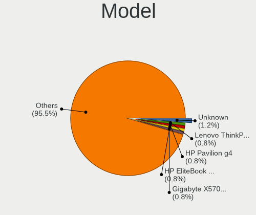
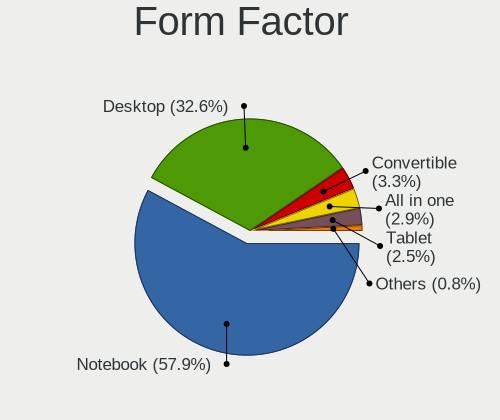
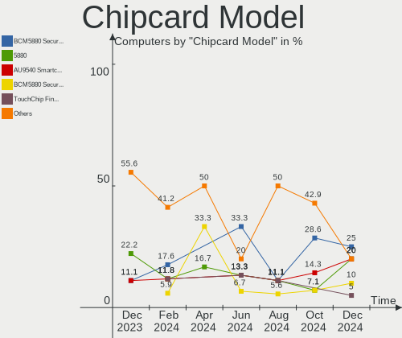

Zorin - Hardware Trends
-----------------------

A project to identify most popular hardware characteristics and track their change
over time based on data collected by Linux users at https://Linux-Hardware.org.

Anyone can contribute to this report by the [hw-probe](https://github.com/linuxhw/hw-probe) tool:

    sudo -E hw-probe -all -upload

This is a report for all computer types. See also reports for [desktops](/Dist/Zorin/Desktop/README.md) and [notebooks](/Dist/Zorin/Notebook/README.md).

This report is for one last month. Overall report since the beginning of time: [TestDays](https://github.com/linuxhw/TestDays)

Period: Nov, 2023.

Contents
--------

* [ System ](#system)
  - [ OS                       ](#os)
  - [ OS Family                ](#os-family)
  - [ Kernel                   ](#kernel)
  - [ Kernel Family            ](#kernel-family)
  - [ Kernel Major Ver.        ](#kernel-major-ver)
  - [ Arch                     ](#arch)
  - [ DE                       ](#de)
  - [ Display Server           ](#display-server)
  - [ Display Manager          ](#display-manager)
  - [ OS Lang                  ](#os-lang)
  - [ Boot Mode                ](#boot-mode)
  - [ Filesystem               ](#filesystem)
  - [ Part. scheme             ](#part-scheme)
  - [ Dual Boot with Linux/BSD ](#dual-boot-with-linuxbsd)
  - [ Dual Boot (Win)          ](#dual-boot-win)

* [ Board ](#board)
  - [ Vendor                   ](#vendor)
  - [ Model                    ](#model)
  - [ Model Family             ](#model-family)
  - [ MFG Year                 ](#mfg-year)
  - [ Form Factor              ](#form-factor)
  - [ Secure Boot              ](#secure-boot)
  - [ Coreboot                 ](#coreboot)
  - [ RAM Size                 ](#ram-size)
  - [ RAM Used                 ](#ram-used)
  - [ Total Drives             ](#total-drives)
  - [ Has CD-ROM               ](#has-cd-rom)
  - [ Has Ethernet             ](#has-ethernet)
  - [ Has WiFi                 ](#has-wifi)
  - [ Has Bluetooth            ](#has-bluetooth)

* [ Location ](#location)
  - [ Country                  ](#country)
  - [ City                     ](#city)

* [ Drives ](#drives)
  - [ Drive Vendor             ](#drive-vendor)
  - [ Drive Model              ](#drive-model)
  - [ HDD Vendor               ](#hdd-vendor)
  - [ SSD Vendor               ](#ssd-vendor)
  - [ Drive Kind               ](#drive-kind)
  - [ Drive Connector          ](#drive-connector)
  - [ Drive Size               ](#drive-size)
  - [ Space Total              ](#space-total)
  - [ Space Used               ](#space-used)
  - [ Malfunc. Drives          ](#malfunc-drives)
  - [ Malfunc. Drive Vendor    ](#malfunc-drive-vendor)
  - [ Malfunc. HDD Vendor      ](#malfunc-hdd-vendor)
  - [ Malfunc. Drive Kind      ](#malfunc-drive-kind)
  - [ Failed Drives            ](#failed-drives)
  - [ Failed Drive Vendor      ](#failed-drive-vendor)
  - [ Drive Status             ](#drive-status)

* [ Storage controller ](#storage-controller)
  - [ Storage Vendor           ](#storage-vendor)
  - [ Storage Model            ](#storage-model)
  - [ Storage Kind             ](#storage-kind)

* [ Processor ](#processor)
  - [ CPU Vendor               ](#cpu-vendor)
  - [ CPU Model                ](#cpu-model)
  - [ CPU Model Family         ](#cpu-model-family)
  - [ CPU Cores                ](#cpu-cores)
  - [ CPU Sockets              ](#cpu-sockets)
  - [ CPU Threads              ](#cpu-threads)
  - [ CPU Op-Modes             ](#cpu-op-modes)
  - [ CPU Microcode            ](#cpu-microcode)
  - [ CPU Microarch            ](#cpu-microarch)

* [ Graphics ](#graphics)
  - [ GPU Vendor               ](#gpu-vendor)
  - [ GPU Model                ](#gpu-model)
  - [ GPU Combo                ](#gpu-combo)
  - [ GPU Driver               ](#gpu-driver)
  - [ GPU Memory               ](#gpu-memory)

* [ Monitor ](#monitor)
  - [ Monitor Vendor           ](#monitor-vendor)
  - [ Monitor Model            ](#monitor-model)
  - [ Monitor Resolution       ](#monitor-resolution)
  - [ Monitor Diagonal         ](#monitor-diagonal)
  - [ Monitor Width            ](#monitor-width)
  - [ Aspect Ratio             ](#aspect-ratio)
  - [ Monitor Area             ](#monitor-area)
  - [ Pixel Density            ](#pixel-density)
  - [ Multiple Monitors        ](#multiple-monitors)

* [ Network ](#network)
  - [ Net Controller Vendor    ](#net-controller-vendor)
  - [ Net Controller Model     ](#net-controller-model)
  - [ Wireless Vendor          ](#wireless-vendor)
  - [ Wireless Model           ](#wireless-model)
  - [ Ethernet Vendor          ](#ethernet-vendor)
  - [ Ethernet Model           ](#ethernet-model)
  - [ Net Controller Kind      ](#net-controller-kind)
  - [ Used Controller          ](#used-controller)
  - [ NICs                     ](#nics)
  - [ IPv6                     ](#ipv6)

* [ Bluetooth ](#bluetooth)
  - [ Bluetooth Vendor         ](#bluetooth-vendor)
  - [ Bluetooth Model          ](#bluetooth-model)

* [ Sound ](#sound)
  - [ Sound Vendor             ](#sound-vendor)
  - [ Sound Model              ](#sound-model)

* [ Memory ](#memory)
  - [ Memory Vendor            ](#memory-vendor)
  - [ Memory Model             ](#memory-model)
  - [ Memory Kind              ](#memory-kind)
  - [ Memory Form Factor       ](#memory-form-factor)
  - [ Memory Size              ](#memory-size)
  - [ Memory Speed             ](#memory-speed)

* [ Printers & scanners ](#printers--scanners)
  - [ Printer Vendor           ](#printer-vendor)
  - [ Printer Model            ](#printer-model)
  - [ Scanner Vendor           ](#scanner-vendor)
  - [ Scanner Model            ](#scanner-model)

* [ Camera ](#camera)
  - [ Camera Vendor            ](#camera-vendor)
  - [ Camera Model             ](#camera-model)

* [ Security ](#security)
  - [ Fingerprint Vendor       ](#fingerprint-vendor)
  - [ Fingerprint Model        ](#fingerprint-model)
  - [ Chipcard Vendor          ](#chipcard-vendor)
  - [ Chipcard Model           ](#chipcard-model)

* [ Unsupported ](#unsupported)
  - [ Unsupported Devices      ](#unsupported-devices)
  - [ Unsupported Device Types ](#unsupported-device-types)

System
------

OS
--

Installed operating systems

| Name     | Computers | Percent |
|----------|-----------|---------|
| Zorin 16 | 156       | 96.89%  |
| Zorin 15 | 3         | 1.86%   |
| Zorin 12 | 2         | 1.24%   |

OS Family
---------

OS without a version

| Name  | Computers | Percent |
|-------|-----------|---------|
| Zorin | 161       | 100%    |

Kernel
------

Version of the Linux kernel

| Version                 | Computers | Percent |
|-------------------------|-----------|---------|
| 5.15.0-88-generic       | 87        | 54.04%  |
| 5.15.0-89-generic       | 32        | 19.88%  |
| 5.15.0-87-generic       | 8         | 4.97%   |
| 5.15.0-86-generic       | 4         | 2.48%   |
| 5.15.0-78-generic       | 4         | 2.48%   |
| 5.15.0-56-generic       | 4         | 2.48%   |
| 6.5.7-060507-generic    | 3         | 1.86%   |
| 6.3.13-1-liquorix-amd64 | 2         | 1.24%   |
| 5.15.0-84-generic       | 2         | 1.24%   |
| 5.15.0-82-generic       | 2         | 1.24%   |
| 6.6.1-060601-generic    | 1         | 0.62%   |
| 6.3.0-060300-generic    | 1         | 0.62%   |
| 6.2.16-060216-generic   | 1         | 0.62%   |
| 5.4.0-90-generic        | 1         | 0.62%   |
| 5.4.0-150-generic       | 1         | 0.62%   |
| 5.4.0-149-generic       | 1         | 0.62%   |
| 5.15.0-91-generic       | 1         | 0.62%   |
| 5.15.0-83-generic       | 1         | 0.62%   |
| 5.15.0-76-generic       | 1         | 0.62%   |
| 5.15.0-58-generic       | 1         | 0.62%   |
| 5.11.0-38-generic       | 1         | 0.62%   |
| 4.15.0-142-generic      | 1         | 0.62%   |
| 4.15.0-107-generic      | 1         | 0.62%   |

Kernel Family
-------------

Linux kernel without a distro release

| Version | Computers | Percent |
|---------|-----------|---------|
| 5.15.0  | 147       | 91.3%   |
| 6.5.7   | 3         | 1.86%   |
| 5.4.0   | 3         | 1.86%   |
| 6.3.13  | 2         | 1.24%   |
| 4.15.0  | 2         | 1.24%   |
| 6.6.1   | 1         | 0.62%   |
| 6.3.0   | 1         | 0.62%   |
| 6.2.16  | 1         | 0.62%   |
| 5.11.0  | 1         | 0.62%   |

Kernel Major Ver.
-----------------

Linux kernel major version

| Version | Computers | Percent |
|---------|-----------|---------|
| 5.15    | 147       | 91.3%   |
| 6.5     | 3         | 1.86%   |
| 6.3     | 3         | 1.86%   |
| 5.4     | 3         | 1.86%   |
| 4.15    | 2         | 1.24%   |
| 6.6     | 1         | 0.62%   |
| 6.2     | 1         | 0.62%   |
| 5.11    | 1         | 0.62%   |

Arch
----

OS architecture (x86_64, i586, etc.)

| Name   | Computers | Percent |
|--------|-----------|---------|
| x86_64 | 159       | 98.76%  |
| i686   | 2         | 1.24%   |

DE
--

Desktop Environment

| Name  | Computers | Percent |
|-------|-----------|---------|
| GNOME | 128       | 79.5%   |
| XFCE  | 31        | 19.25%  |
| KDE5  | 1         | 0.62%   |
| i3    | 1         | 0.62%   |

Display Server
--------------

X11 or Wayland

| Name    | Computers | Percent |
|---------|-----------|---------|
| X11     | 157       | 97.52%  |
| Wayland | 4         | 2.48%   |

Display Manager
---------------

SDDM, LightDM, etc.

| Name    | Computers | Percent |
|---------|-----------|---------|
| Unknown | 121       | 75.16%  |
| GDM     | 22        | 13.66%  |
| GDM3    | 11        | 6.83%   |
| LightDM | 6         | 3.73%   |
| SDDM    | 1         | 0.62%   |

OS Lang
-------

Language

| Lang        | Computers | Percent |
|-------------|-----------|---------|
| en_US       | 52        | 32.3%   |
| de_DE       | 24        | 14.91%  |
| en_GB       | 12        | 7.45%   |
| pt_BR       | 10        | 6.21%   |
| fr_FR       | 10        | 6.21%   |
| it_IT       | 6         | 3.73%   |
| es_ES       | 5         | 3.11%   |
| en_CA       | 5         | 3.11%   |
| tr_TR       | 3         | 1.86%   |
| pl_PL       | 3         | 1.86%   |
| en_IN       | 3         | 1.86%   |
| da_DK       | 3         | 1.86%   |
| sv_SE       | 2         | 1.24%   |
| nl_NL       | 2         | 1.24%   |
| nl_BE       | 2         | 1.24%   |
| en_NZ       | 2         | 1.24%   |
| en_AU       | 2         | 1.24%   |
| el_GR       | 2         | 1.24%   |
| de_CH       | 2         | 1.24%   |
| sr_RS@latin | 1         | 0.62%   |
| ru_RU       | 1         | 0.62%   |
| ja_JP       | 1         | 0.62%   |
| fr_CA       | 1         | 0.62%   |
| fi_FI       | 1         | 0.62%   |
| es_PE       | 1         | 0.62%   |
| es_MX       | 1         | 0.62%   |
| es_CO       | 1         | 0.62%   |
| es_CL       | 1         | 0.62%   |
| en_IE       | 1         | 0.62%   |
| de_AT       | 1         | 0.62%   |

Boot Mode
---------

EFI or BIOS

| Mode | Computers | Percent |
|------|-----------|---------|
| EFI  | 103       | 63.98%  |
| BIOS | 58        | 36.02%  |

Filesystem
----------

Type of filesystem

| Type    | Computers | Percent |
|---------|-----------|---------|
| Ext4    | 139       | 86.34%  |
| Tmpfs   | 13        | 8.07%   |
| Btrfs   | 4         | 2.48%   |
| Zfs     | 2         | 1.24%   |
| Overlay | 2         | 1.24%   |
| Ext3    | 1         | 0.62%   |

Part. scheme
------------

Scheme of partitioning

| Type    | Computers | Percent |
|---------|-----------|---------|
| Unknown | 123       | 76.4%   |
| GPT     | 33        | 20.5%   |
| MBR     | 5         | 3.11%   |

Dual Boot with Linux/BSD
------------------------

Hosting more than one Linux/BSD

| Dual boot | Computers | Percent |
|-----------|-----------|---------|
| No        | 156       | 96.89%  |
| Yes       | 5         | 3.11%   |

Dual Boot (Win)
---------------

Hosting Linux and Windows

| Dual boot | Computers | Percent |
|-----------|-----------|---------|
| No        | 146       | 90.68%  |
| Yes       | 15        | 9.32%   |

Board
-----

Vendor
------

Motherboard manufacturer

| Name                | Computers | Percent |
|---------------------|-----------|---------|
| Lenovo              | 29        | 18.01%  |
| Hewlett-Packard     | 26        | 16.15%  |
| ASUSTek Computer    | 18        | 11.18%  |
| Dell                | 14        | 8.7%    |
| Acer                | 12        | 7.45%   |
| Gigabyte Technology | 11        | 6.83%   |
| HUAWEI              | 8         | 4.97%   |
| Apple               | 6         | 3.73%   |
| Toshiba             | 5         | 3.11%   |
| MSI                 | 3         | 1.86%   |
| Unknown             | 3         | 1.86%   |
| Semp Toshiba        | 2         | 1.24%   |
| Samsung Electronics | 2         | 1.24%   |
| Medion              | 2         | 1.24%   |
| Intel               | 2         | 1.24%   |
| Fujitsu             | 2         | 1.24%   |
| AZW                 | 2         | 1.24%   |
| TrekStor            | 1         | 0.62%   |
| Timi                | 1         | 0.62%   |
| Tactus              | 1         | 0.62%   |
| PEAQ                | 1         | 0.62%   |
| ONDA                | 1         | 0.62%   |
| Notebook            | 1         | 0.62%   |
| Microsoft           | 1         | 0.62%   |
| JHZD                | 1         | 0.62%   |
| HOUTER              | 1         | 0.62%   |
| Fujitsu Siemens     | 1         | 0.62%   |
| ECS                 | 1         | 0.62%   |
| Compaq              | 1         | 0.62%   |
| AMI                 | 1         | 0.62%   |
| Adreamer            | 1         | 0.62%   |

Model
-----

Motherboard model

| Name                                        | Computers | Percent |
|---------------------------------------------|-----------|---------|
| Unknown                                     | 3         | 1.86%   |
| Lenovo IdeaPad 3 14ITL6 82H7                | 2         | 1.24%   |
| Intel H61                                   | 2         | 1.24%   |
| HUAWEI CREFG-XX                             | 2         | 1.24%   |
| HP 15                                       | 2         | 1.24%   |
| Gigabyte H510M H                            | 2         | 1.24%   |
| Dell Venue 11 Pro 5130                      | 2         | 1.24%   |
| TrekStor Surfbook W2                        | 1         | 0.62%   |
| Toshiba TECRA W50-A                         | 1         | 0.62%   |
| Toshiba TECRA R850                          | 1         | 0.62%   |
| Toshiba Satellite L850D-131                 | 1         | 0.62%   |
| Toshiba Satellite L655                      | 1         | 0.62%   |
| Toshiba PORTEGE Z30-A                       | 1         | 0.62%   |
| Timi A35                                    | 1         | 0.62%   |
| Tactus GeoBook 110                          | 1         | 0.62%   |
| Semp Toshiba STI                            | 1         | 0.62%   |
| Semp Toshiba IS 1412                        | 1         | 0.62%   |
| Samsung DeskTop System                      | 1         | 0.62%   |
| Samsung 530XBB                              | 1         | 0.62%   |
| PEAQ PNB C1014-I1B1 MD99447                 | 1         | 0.62%   |
| ONDA Tablet                                 | 1         | 0.62%   |
| Notebook NL40_50CU                          | 1         | 0.62%   |
| MSI MS-7D75                                 | 1         | 0.62%   |
| MSI MS-7B98                                 | 1         | 0.62%   |
| MSI MS-7921                                 | 1         | 0.62%   |
| Microsoft Surface Pro                       | 1         | 0.62%   |
| Medion Erazer P7643 MD60133                 | 1         | 0.62%   |
| Medion E5214                                | 1         | 0.62%   |
| Lenovo Z710 20250                           | 1         | 0.62%   |
| Lenovo Z50-75 80EC                          | 1         | 0.62%   |
| Lenovo Z40-70 20366                         | 1         | 0.62%   |
| Lenovo Yoga C640-13IML 81UE                 | 1         | 0.62%   |
| Lenovo Yoga 730-13IWL 81JR                  | 1         | 0.62%   |
| Lenovo Y520-15IKBN 80WK                     | 1         | 0.62%   |
| Lenovo ThinkPad Yoga 11e 3rd Gen 20G8S0R600 | 1         | 0.62%   |
| Lenovo ThinkPad X60 1707Y91                 | 1         | 0.62%   |
| Lenovo ThinkPad X1 Carbon Gen 8 20U9001RUS  | 1         | 0.62%   |
| Lenovo ThinkPad T570 20HAS0K501             | 1         | 0.62%   |
| Lenovo ThinkPad T460 20FMS22Q00             | 1         | 0.62%   |
| Lenovo ThinkPad T440p 20AWS08S01            | 1         | 0.62%   |

Model Family
------------

Motherboard model prefix

| Name               | Computers | Percent |
|--------------------|-----------|---------|
| Lenovo ThinkPad    | 13        | 8.07%   |
| Acer Aspire        | 10        | 6.21%   |
| ASUS ROG           | 5         | 3.11%   |
| Lenovo IdeaPad     | 4         | 2.48%   |
| HP Compaq          | 4         | 2.48%   |
| Dell Latitude      | 4         | 2.48%   |
| Lenovo ThinkCentre | 3         | 1.86%   |
| ASUS TUF           | 3         | 1.86%   |
| Unknown            | 3         | 1.86%   |
| Toshiba TECRA      | 2         | 1.24%   |
| Toshiba Satellite  | 2         | 1.24%   |
| Lenovo Yoga        | 2         | 1.24%   |
| Intel H61          | 2         | 1.24%   |
| HUAWEI CREFG-XX    | 2         | 1.24%   |
| HP Stream          | 2         | 1.24%   |
| HP Pavilion        | 2         | 1.24%   |
| HP EliteBook       | 2         | 1.24%   |
| HP 250             | 2         | 1.24%   |
| HP 15              | 2         | 1.24%   |
| Gigabyte H510M     | 2         | 1.24%   |
| Dell XPS           | 2         | 1.24%   |
| Dell Venue         | 2         | 1.24%   |
| Dell Precision     | 2         | 1.24%   |
| Dell OptiPlex      | 2         | 1.24%   |
| ASUS ASUS          | 2         | 1.24%   |
| TrekStor Surfbook  | 1         | 0.62%   |
| Toshiba PORTEGE    | 1         | 0.62%   |
| Timi A35           | 1         | 0.62%   |
| Tactus GeoBook     | 1         | 0.62%   |
| Semp Toshiba STI   | 1         | 0.62%   |
| Semp Toshiba IS    | 1         | 0.62%   |
| Samsung DeskTop    | 1         | 0.62%   |
| Samsung 530XBB     | 1         | 0.62%   |
| PEAQ PNB           | 1         | 0.62%   |
| ONDA Tablet        | 1         | 0.62%   |
| Notebook NL40      | 1         | 0.62%   |
| MSI MS-7D75        | 1         | 0.62%   |
| MSI MS-7B98        | 1         | 0.62%   |
| MSI MS-7921        | 1         | 0.62%   |
| Microsoft Surface  | 1         | 0.62%   |

MFG Year
--------

Motherboard manufacture year

| Year | Computers | Percent |
|------|-----------|---------|
| 2018 | 14        | 8.7%    |
| 2014 | 13        | 8.07%   |
| 2021 | 12        | 7.45%   |
| 2013 | 12        | 7.45%   |
| 2020 | 11        | 6.83%   |
| 2015 | 11        | 6.83%   |
| 2010 | 11        | 6.83%   |
| 2023 | 10        | 6.21%   |
| 2011 | 10        | 6.21%   |
| 2022 | 9         | 5.59%   |
| 2019 | 8         | 4.97%   |
| 2017 | 8         | 4.97%   |
| 2012 | 8         | 4.97%   |
| 2016 | 6         | 3.73%   |
| 2008 | 6         | 3.73%   |
| 2009 | 5         | 3.11%   |
| 2007 | 5         | 3.11%   |
| 2006 | 2         | 1.24%   |

Form Factor
-----------

Physical design of the computer

| Name        | Computers | Percent |
|-------------|-----------|---------|
| Notebook    | 101       | 62.73%  |
| Desktop     | 47        | 29.19%  |
| Convertible | 5         | 3.11%   |
| All in one  | 5         | 3.11%   |
| Tablet      | 2         | 1.24%   |
| Server      | 1         | 0.62%   |

Secure Boot
-----------

Enabled or disabled

| State    | Computers | Percent |
|----------|-----------|---------|
| Disabled | 144       | 89.44%  |
| Enabled  | 17        | 10.56%  |

Coreboot
--------

Have coreboot on board

| Used | Computers | Percent |
|------|-----------|---------|
| No   | 161       | 100%    |

RAM Size
--------

Total RAM memory

| Size in GB  | Computers | Percent |
|-------------|-----------|---------|
| 4.01-8.0    | 48        | 29.81%  |
| 16.01-24.0  | 34        | 21.12%  |
| 3.01-4.0    | 33        | 20.5%   |
| 8.01-16.0   | 21        | 13.04%  |
| 1.01-2.0    | 7         | 4.35%   |
| 64.01-256.0 | 6         | 3.73%   |
| 32.01-64.0  | 4         | 2.48%   |
| 24.01-32.0  | 4         | 2.48%   |
| 2.01-3.0    | 4         | 2.48%   |

RAM Used
--------

Used RAM memory

| Used GB    | Computers | Percent |
|------------|-----------|---------|
| 1.01-2.0   | 54        | 33.54%  |
| 2.01-3.0   | 50        | 31.06%  |
| 3.01-4.0   | 29        | 18.01%  |
| 4.01-8.0   | 18        | 11.18%  |
| 0.51-1.0   | 7         | 4.35%   |
| 8.01-16.0  | 2         | 1.24%   |
| 16.01-24.0 | 1         | 0.62%   |

Total Drives
------------

Number of drives on board

| Drives | Computers | Percent |
|--------|-----------|---------|
| 1      | 100       | 62.11%  |
| 2      | 43        | 26.71%  |
| 3      | 10        | 6.21%   |
| 4      | 5         | 3.11%   |
| 5      | 2         | 1.24%   |
| 7      | 1         | 0.62%   |

Has CD-ROM
----------

Has CD-ROM on board

| Presented | Computers | Percent |
|-----------|-----------|---------|
| No        | 96        | 59.63%  |
| Yes       | 65        | 40.37%  |

Has Ethernet
------------

Has Ethernet on board

| Presented | Computers | Percent |
|-----------|-----------|---------|
| Yes       | 132       | 81.99%  |
| No        | 29        | 18.01%  |

Has WiFi
--------

Has WiFi module

| Presented | Computers | Percent |
|-----------|-----------|---------|
| Yes       | 135       | 83.85%  |
| No        | 26        | 16.15%  |

Has Bluetooth
-------------

Has Bluetooth module

| Presented | Computers | Percent |
|-----------|-----------|---------|
| Yes       | 110       | 68.32%  |
| No        | 51        | 31.68%  |

Location
--------

Country
-------

Geographic location (country)

| Country         | Computers | Percent |
|-----------------|-----------|---------|
| USA             | 29        | 18.01%  |
| Germany         | 24        | 14.91%  |
| Brazil          | 11        | 6.83%   |
| UK              | 10        | 6.21%   |
| France          | 10        | 6.21%   |
| Italy           | 7         | 4.35%   |
| Canada          | 6         | 3.73%   |
| Spain           | 5         | 3.11%   |
| Poland          | 4         | 2.48%   |
| Belgium         | 4         | 2.48%   |
| Turkey          | 3         | 1.86%   |
| Switzerland     | 3         | 1.86%   |
| Serbia          | 3         | 1.86%   |
| India           | 3         | 1.86%   |
| Austria         | 3         | 1.86%   |
| Australia       | 3         | 1.86%   |
| Sweden          | 2         | 1.24%   |
| New Zealand     | 2         | 1.24%   |
| Ireland         | 2         | 1.24%   |
| Indonesia       | 2         | 1.24%   |
| Greece          | 2         | 1.24%   |
| Denmark         | 2         | 1.24%   |
| Venezuela       | 1         | 0.62%   |
| Togo            | 1         | 0.62%   |
| The Netherlands | 1         | 0.62%   |
| Slovakia        | 1         | 0.62%   |
| Peru            | 1         | 0.62%   |
| Netherlands     | 1         | 0.62%   |
| Nepal           | 1         | 0.62%   |
| Namibia         | 1         | 0.62%   |
| Mexico          | 1         | 0.62%   |
| Latvia          | 1         | 0.62%   |
| Kenya           | 1         | 0.62%   |
| Japan           | 1         | 0.62%   |
| Iran            | 1         | 0.62%   |
| French Guiana   | 1         | 0.62%   |
| Finland         | 1         | 0.62%   |
| Faroe Islands   | 1         | 0.62%   |
| Croatia         | 1         | 0.62%   |
| Colombia        | 1         | 0.62%   |

City
----

Geographic location (city)

| City                 | Computers | Percent |
|----------------------|-----------|---------|
| Rio de Janeiro       | 4         | 2.48%   |
| Rome                 | 3         | 1.86%   |
| Hamburg              | 3         | 1.86%   |
| Washington           | 2         | 1.24%   |
| Vienna               | 2         | 1.24%   |
| Thessaloniki         | 2         | 1.24%   |
| Sydney               | 2         | 1.24%   |
| Surrey               | 2         | 1.24%   |
| Rho                  | 2         | 1.24%   |
| Poznan               | 2         | 1.24%   |
| Phoenix              | 2         | 1.24%   |
| Minneapolis          | 2         | 1.24%   |
| Madrid               | 2         | 1.24%   |
| Lencois              | 2         | 1.24%   |
| Køge                | 2         | 1.24%   |
| Izmir                | 2         | 1.24%   |
| Hyderabad            | 2         | 1.24%   |
| Dresden              | 2         | 1.24%   |
| Denver               | 2         | 1.24%   |
| Curitiba             | 2         | 1.24%   |
| Boulogne-Billancourt | 2         | 1.24%   |
| Zumbrota             | 1         | 0.62%   |
| Yutz                 | 1         | 0.62%   |
| Windhoek             | 1         | 0.62%   |
| Wellington           | 1         | 0.62%   |
| Wauwatosa            | 1         | 0.62%   |
| Turnhout             | 1         | 0.62%   |
| Toronto              | 1         | 0.62%   |
| Tokushima            | 1         | 0.62%   |
| Tempio Pausania      | 1         | 0.62%   |
| Tehran               | 1         | 0.62%   |
| Tarnowskie Gory      | 1         | 0.62%   |
| Tabernacle           | 1         | 0.62%   |
| Skelmersdale         | 1         | 0.62%   |
| Shumen               | 1         | 0.62%   |
| Shakopee             | 1         | 0.62%   |
| Sedan                | 1         | 0.62%   |
| Santiago             | 1         | 0.62%   |
| Richmond             | 1         | 0.62%   |
| Remire-Montjoly      | 1         | 0.62%   |

Drives
------

Drive Vendor
------------

Hard drive vendors

| Vendor                       | Computers | Drives | Percent |
|------------------------------|-----------|--------|---------|
| Samsung Electronics          | 32        | 34     | 13.62%  |
| WDC                          | 26        | 27     | 11.06%  |
| Seagate                      | 26        | 30     | 11.06%  |
| Unknown                      | 21        | 23     | 8.94%   |
| Kingston                     | 14        | 15     | 5.96%   |
| Toshiba                      | 13        | 13     | 5.53%   |
| SanDisk                      | 13        | 14     | 5.53%   |
| Crucial                      | 10        | 10     | 4.26%   |
| Silicon Motion               | 6         | 6      | 2.55%   |
| Micron Technology            | 6         | 6      | 2.55%   |
| SK hynix                     | 5         | 5      | 2.13%   |
| Hitachi                      | 5         | 5      | 2.13%   |
| Intel                        | 4         | 4      | 1.7%    |
| HGST                         | 4         | 4      | 1.7%    |
| China                        | 4         | 4      | 1.7%    |
| Unknown                      | 4         | 4      | 1.7%    |
| SPCC                         | 3         | 3      | 1.28%   |
| PNY                          | 3         | 3      | 1.28%   |
| Phison Electronics           | 3         | 3      | 1.28%   |
| Kingston Technology Company  | 3         | 3      | 1.28%   |
| Intenso                      | 3         | 3      | 1.28%   |
| Apple                        | 3         | 3      | 1.28%   |
| MAXIO Technology (Hangzhou)  | 2         | 2      | 0.85%   |
| JMicron Technology           | 2         | 2      | 0.85%   |
| VISIPRO                      | 1         | 1      | 0.43%   |
| Teclast                      | 1         | 1      | 0.43%   |
| T-FORCE                      | 1         | 1      | 0.43%   |
| Shenzhen Longsys Electronics | 1         | 1      | 0.43%   |
| Seapiy                       | 1         | 1      | 0.43%   |
| SABRENT                      | 1         | 1      | 0.43%   |
| Phison                       | 1         | 1      | 0.43%   |
| Netac                        | 1         | 2      | 0.43%   |
| Micron/Crucial Technology    | 1         | 1      | 0.43%   |
| Maxtor                       | 1         | 1      | 0.43%   |
| LITEONIT                     | 1         | 1      | 0.43%   |
| KingSpec                     | 1         | 1      | 0.43%   |
| KingFast                     | 1         | 1      | 0.43%   |
| HGST HTS                     | 1         | 1      | 0.43%   |
| Hewlett-Packard              | 1         | 1      | 0.43%   |
| Fanxiang                     | 1         | 1      | 0.43%   |

Drive Model
-----------

Hard drive models

| Model                                                 | Computers | Percent |
|-------------------------------------------------------|-----------|---------|
| Unknown MMC Card  64GB                                | 10        | 4.1%    |
| Kingston SA400S37240G 240GB SSD                       | 6         | 2.46%   |
| Unknown MMC Card  32GB                                | 4         | 1.64%   |
| Silicon Motion SM2263EN/SM2263XT SSD Controller 256GB | 4         | 1.64%   |
| Samsung NVMe SSD Controller SM961/PM961/SM963 256GB   | 4         | 1.64%   |
| Unknown                                               | 4         | 1.64%   |
| Unknown SD/MMC/MS PRO 128GB                           | 3         | 1.23%   |
| Samsung SSD 990 PRO 2TB                               | 3         | 1.23%   |
| Samsung NVMe SSD Controller SM981/PM981/PM983 250GB   | 3         | 1.23%   |
| Toshiba MQ01ABF050 500GB                              | 2         | 0.82%   |
| Toshiba MQ01ABD100 1TB                                | 2         | 0.82%   |
| Seagate ST500LT012-1DG142 500GB                       | 2         | 0.82%   |
| Seagate ST500DM002-1BD142 500GB                       | 2         | 0.82%   |
| Seagate ST2000DM001-1ER164 2TB                        | 2         | 0.82%   |
| Seagate ST1000DM003-1CH162 1TB                        | 2         | 0.82%   |
| Sandisk WD PC SN740 SDDPNQD-1T00-1027 1TB             | 2         | 0.82%   |
| Sandisk WD Blue SN550 NVMe SSD 512GB                  | 2         | 0.82%   |
| Samsung SSD 870 EVO 500GB                             | 2         | 0.82%   |
| Samsung SSD 850 EVO 250GB                             | 2         | 0.82%   |
| Samsung HD105SI 1TB                                   | 2         | 0.82%   |
| Kingston Company SNV2S250G 250GB                      | 2         | 0.82%   |
| Kingston SA400S37480G 480GB SSD                       | 2         | 0.82%   |
| Kingston SA400S37120G 120GB SSD                       | 2         | 0.82%   |
| Crucial CT500MX500SSD1 500GB                          | 2         | 0.82%   |
| China SATA SSD 512GB                                  | 2         | 0.82%   |
| WDC WDS240G2G0C-00AJM0 240GB                          | 1         | 0.41%   |
| WDC WDS120G2G0B-00EPW0 120GB SSD                      | 1         | 0.41%   |
| WDC WD5000LPVX-22V0TT0 500GB                          | 1         | 0.41%   |
| WDC WD5000LPCX-00VHAT0 500GB                          | 1         | 0.41%   |
| WDC WD5000BPVT-08HXZT3 500GB                          | 1         | 0.41%   |
| WDC WD5000AZRX-00A8LB0 500GB                          | 1         | 0.41%   |
| WDC WD5000AZLX-21K2TA0 500GB                          | 1         | 0.41%   |
| WDC WD5000AAKX-08U6AA0 500GB                          | 1         | 0.41%   |
| WDC WD5000AAKX-08ERMA0 500GB                          | 1         | 0.41%   |
| WDC WD4005FZBX-00K5WB0 4TB                            | 1         | 0.41%   |
| WDC WD40 EFRX-68WT0N0 4TB                             | 1         | 0.41%   |
| WDC WD30EZRZ-00GXCB0 3TB                              | 1         | 0.41%   |
| WDC WD30EFRX-68EUZN0 3TB                              | 1         | 0.41%   |
| WDC WD2500BEVT-22A23T0 250GB                          | 1         | 0.41%   |
| WDC WD20EZRX-00D8PB0 2TB                              | 1         | 0.41%   |

HDD Vendor
----------

Hard disk drive vendors

| Vendor              | Computers | Drives | Percent |
|---------------------|-----------|--------|---------|
| Seagate             | 24        | 27     | 32%     |
| WDC                 | 22        | 23     | 29.33%  |
| Toshiba             | 10        | 10     | 13.33%  |
| Hitachi             | 5         | 5      | 6.67%   |
| HGST                | 4         | 4      | 5.33%   |
| Unknown             | 3         | 3      | 4%      |
| Samsung Electronics | 3         | 3      | 4%      |
| Apple               | 2         | 2      | 2.67%   |
| Maxtor              | 1         | 1      | 1.33%   |
| HGST HTS            | 1         | 1      | 1.33%   |

SSD Vendor
----------

Solid state drive vendors

| Vendor              | Computers | Drives | Percent |
|---------------------|-----------|--------|---------|
| Samsung Electronics | 17        | 17     | 24.29%  |
| Kingston            | 13        | 13     | 18.57%  |
| Crucial             | 8         | 8      | 11.43%  |
| SanDisk             | 6         | 7      | 8.57%   |
| China               | 4         | 4      | 5.71%   |
| SPCC                | 3         | 3      | 4.29%   |
| PNY                 | 3         | 3      | 4.29%   |
| Micron Technology   | 2         | 2      | 2.86%   |
| Intenso             | 2         | 2      | 2.86%   |
| WDC                 | 1         | 1      | 1.43%   |
| VISIPRO             | 1         | 1      | 1.43%   |
| Unknown             | 1         | 1      | 1.43%   |
| Teclast             | 1         | 1      | 1.43%   |
| Phison              | 1         | 1      | 1.43%   |
| Netac               | 1         | 2      | 1.43%   |
| LITEONIT            | 1         | 1      | 1.43%   |
| KingSpec            | 1         | 1      | 1.43%   |
| Hewlett-Packard     | 1         | 1      | 1.43%   |
| Fanxiang            | 1         | 1      | 1.43%   |
| ASMT                | 1         | 1      | 1.43%   |
| Apple               | 1         | 1      | 1.43%   |

Drive Kind
----------

HDD or SSD

| Kind    | Computers | Drives | Percent |
|---------|-----------|--------|---------|
| SSD     | 66        | 72     | 31.73%  |
| HDD     | 62        | 79     | 29.81%  |
| NVMe    | 50        | 62     | 24.04%  |
| MMC     | 17        | 19     | 8.17%   |
| Unknown | 13        | 15     | 6.25%   |

Drive Connector
---------------

SATA, SAS, NVMe, etc.

| Type | Computers | Drives | Percent |
|------|-----------|--------|---------|
| SATA | 115       | 150    | 59.28%  |
| NVMe | 49        | 61     | 25.26%  |
| MMC  | 17        | 19     | 8.76%   |
| SAS  | 13        | 17     | 6.7%    |

Drive Size
----------

Size of hard drive

| Size in TB | Computers | Drives | Percent |
|------------|-----------|--------|---------|
| 0.01-0.5   | 80        | 95     | 62.02%  |
| 0.51-1.0   | 32        | 37     | 24.81%  |
| 1.01-2.0   | 9         | 10     | 6.98%   |
| 3.01-4.0   | 3         | 3      | 2.33%   |
| 2.01-3.0   | 2         | 2      | 1.55%   |
| 4.01-10.0  | 2         | 3      | 1.55%   |
| 20.01-50.0 | 1         | 1      | 0.78%   |

Space Total
-----------

Amount of disk space available on the file system

| Size in GB     | Computers | Percent |
|----------------|-----------|---------|
| 101-250        | 53        | 32.92%  |
| 251-500        | 43        | 26.71%  |
| 501-1000       | 22        | 13.66%  |
| 51-100         | 11        | 6.83%   |
| More than 3000 | 10        | 6.21%   |
| 21-50          | 9         | 5.59%   |
| 1001-2000      | 5         | 3.11%   |
| 2001-3000      | 4         | 2.48%   |
| 1-20           | 2         | 1.24%   |
| Unknown        | 2         | 1.24%   |

Space Used
----------

Amount of used disk space

| Used GB        | Computers | Percent |
|----------------|-----------|---------|
| 21-50          | 50        | 31.06%  |
| 1-20           | 46        | 28.57%  |
| 51-100         | 21        | 13.04%  |
| 101-250        | 17        | 10.56%  |
| 251-500        | 12        | 7.45%   |
| 501-1000       | 6         | 3.73%   |
| More than 3000 | 4         | 2.48%   |
| 2001-3000      | 2         | 1.24%   |
| Unknown        | 2         | 1.24%   |
| 1001-2000      | 1         | 0.62%   |

Malfunc. Drives
---------------

Drive models with a malfunction

| Model                           | Computers | Drives | Percent |
|---------------------------------|-----------|--------|---------|
| WDC WD30EFRX-68EUZN0 3TB        | 1         | 1      | 20%     |
| Seagate ST500DM002-1BD142 500GB | 1         | 1      | 20%     |
| Seagate ST320LT009-9WC142 320GB | 1         | 1      | 20%     |
| Seagate ST2000LM007-1R8174 2TB  | 1         | 1      | 20%     |
| HGST HTS721010A9E630 1TB        | 1         | 1      | 20%     |

Malfunc. Drive Vendor
---------------------

Vendors of faulty drives

| Vendor  | Computers | Drives | Percent |
|---------|-----------|--------|---------|
| Seagate | 3         | 3      | 60%     |
| WDC     | 1         | 1      | 20%     |
| HGST    | 1         | 1      | 20%     |

Malfunc. HDD Vendor
-------------------

Vendors of faulty HDD drives

| Vendor  | Computers | Drives | Percent |
|---------|-----------|--------|---------|
| Seagate | 3         | 3      | 60%     |
| WDC     | 1         | 1      | 20%     |
| HGST    | 1         | 1      | 20%     |

Malfunc. Drive Kind
-------------------

Kinds of faulty drives

| Kind | Computers | Drives | Percent |
|------|-----------|--------|---------|
| HDD  | 5         | 5      | 100%    |

Failed Drives
-------------

Failed drive models

Zero info for selected period =(

Failed Drive Vendor
-------------------

Failed drive vendors

Zero info for selected period =(

Drive Status
------------

Number of failed and malfunc. drives

| Status   | Computers | Drives | Percent |
|----------|-----------|--------|---------|
| Detected | 137       | 208    | 82.04%  |
| Works    | 25        | 34     | 14.97%  |
| Malfunc  | 5         | 5      | 2.99%   |

Storage controller
------------------

Storage Vendor
--------------

Storage controller vendors

| Vendor                       | Computers | Percent |
|------------------------------|-----------|---------|
| Intel                        | 116       | 57.43%  |
| AMD                          | 19        | 9.41%   |
| Samsung Electronics          | 15        | 7.43%   |
| SanDisk                      | 10        | 4.95%   |
| Silicon Motion               | 6         | 2.97%   |
| SK hynix                     | 5         | 2.48%   |
| Kingston Technology Company  | 5         | 2.48%   |
| Phison Electronics           | 4         | 1.98%   |
| Micron Technology            | 4         | 1.98%   |
| Toshiba America Info Systems | 3         | 1.49%   |
| Nvidia                       | 3         | 1.49%   |
| Micron/Crucial Technology    | 3         | 1.49%   |
| ASMedia Technology           | 3         | 1.49%   |
| MAXIO Technology (Hangzhou)  | 2         | 0.99%   |
| JMicron Technology           | 2         | 0.99%   |
| Shenzhen Longsys Electronics | 1         | 0.5%    |
| Marvell Technology Group     | 1         | 0.5%    |

Storage Model
-------------

Storage controller models

| Model                                                                          | Computers | Percent |
|--------------------------------------------------------------------------------|-----------|---------|
| AMD FCH SATA Controller [AHCI mode]                                            | 13        | 5.65%   |
| Intel 8 Series/C220 Series Chipset Family 6-port SATA Controller 1 [AHCI mode] | 11        | 4.78%   |
| Intel Sunrise Point-LP SATA Controller [AHCI mode]                             | 8         | 3.48%   |
| Intel 82801 Mobile SATA Controller [RAID mode]                                 | 7         | 3.04%   |
| Intel Celeron/Pentium Silver Processor SATA Controller                         | 6         | 2.61%   |
| Intel 6 Series/C200 Series Chipset Family 6 port Desktop SATA AHCI Controller  | 6         | 2.61%   |
| Silicon Motion SM2263EN/SM2263XT (DRAM-less) NVMe SSD Controllers              | 5         | 2.17%   |
| Intel Volume Management Device NVMe RAID Controller                            | 5         | 2.17%   |
| Intel 6 Series/C200 Series Chipset Family 6 port Mobile SATA AHCI Controller   | 5         | 2.17%   |
| AMD SB7x0/SB8x0/SB9x0 IDE Controller                                           | 5         | 2.17%   |
| Samsung NVMe SSD Controller SM981/PM981/PM983                                  | 4         | 1.74%   |
| Samsung NVMe SSD Controller SM961/PM961/SM963                                  | 4         | 1.74%   |
| Intel Atom Processor E3800 Series SATA AHCI Controller                         | 4         | 1.74%   |
| Intel 82801HM/HEM (ICH8M/ICH8M-E) IDE Controller                               | 4         | 1.74%   |
| Intel 82801G (ICH7 Family) IDE Controller                                      | 4         | 1.74%   |
| Intel 8 Series SATA Controller 1 [AHCI mode]                                   | 4         | 1.74%   |
| AMD SB7x0/SB8x0/SB9x0 SATA Controller [IDE mode]                               | 4         | 1.74%   |
| SanDisk Ultra 3D / WD Blue SN550 NVMe SSD                                      | 3         | 1.3%    |
| Samsung NVMe SSD Controller S4LV008[Pascal]                                    | 3         | 1.3%    |
| Intel Wildcat Point-LP SATA Controller [AHCI Mode]                             | 3         | 1.3%    |
| Intel Tiger Lake-LP SATA Controller                                            | 3         | 1.3%    |
| Intel NM10/ICH7 Family SATA Controller [IDE mode]                              | 3         | 1.3%    |
| Intel Comet Lake SATA AHCI Controller                                          | 3         | 1.3%    |
| Intel 82801IBM/IEM (ICH9M/ICH9M-E) 4 port SATA Controller [AHCI mode]          | 3         | 1.3%    |
| Intel 82801HM/HEM (ICH8M/ICH8M-E) SATA Controller [AHCI mode]                  | 3         | 1.3%    |
| Intel 700 Series Chipset Family SATA AHCI Controller                           | 3         | 1.3%    |
| Intel 7 Series Chipset Family 6-port SATA Controller [AHCI mode]               | 3         | 1.3%    |
| SanDisk WD Black SN770 / PC SN740 256GB / PC SN560 (DRAM-less) NVMe SSD        | 2         | 0.87%   |
| SanDisk Extreme Pro / WD Black SN750 / PC SN730 / Red SN700 NVMe SSD           | 2         | 0.87%   |
| Samsung S4LN058A01[SSUBX] AHCI SSD Controller (Apple slot)                     | 2         | 0.87%   |
| Samsung NVMe SSD Controller 980 (DRAM-less)                                    | 2         | 0.87%   |
| Phison E18 PCIe4 NVMe Controller                                               | 2         | 0.87%   |
| Nvidia MCP79 AHCI Controller                                                   | 2         | 0.87%   |
| Micron/Crucial P2 [Nick P2] / P3 / P3 Plus NVMe PCIe SSD (DRAM-less)           | 2         | 0.87%   |
| Kingston Company NV2 NVMe SSD SM2267XT                                         | 2         | 0.87%   |
| Kingston Company NV1 NVMe SSD SM2263XT                                         | 2         | 0.87%   |
| JMicron JMB363 SATA/IDE Controller                                             | 2         | 0.87%   |
| Intel SSD DC P4101/Pro 7600p/760p/E 6100p Series                               | 2         | 0.87%   |
| Intel SSD 670p Series [Keystone Harbor]                                        | 2         | 0.87%   |
| Intel SATA Controller [RAID mode]                                              | 2         | 0.87%   |

Storage Kind
------------

Kind of storage controller (IDE, SATA, NVMe, SAS, ...)

| Kind | Computers | Percent |
|------|-----------|---------|
| SATA | 112       | 55.17%  |
| NVMe | 49        | 24.14%  |
| IDE  | 25        | 12.32%  |
| RAID | 17        | 8.37%   |

Processor
---------

CPU Vendor
----------

Processor vendors

| Vendor | Computers | Percent |
|--------|-----------|---------|
| Intel  | 138       | 85.71%  |
| AMD    | 23        | 14.29%  |

CPU Model
---------

Processor models

| Model                                       | Computers | Percent |
|---------------------------------------------|-----------|---------|
| Intel Celeron N4020 CPU @ 1.10GHz           | 4         | 2.48%   |
| Intel 13th Gen Core i9-13900H               | 3         | 1.86%   |
| Intel Core i7-8565U CPU @ 1.80GHz           | 2         | 1.24%   |
| Intel Core i7-4810MQ CPU @ 2.80GHz          | 2         | 1.24%   |
| Intel Core i5-8250U CPU @ 1.60GHz           | 2         | 1.24%   |
| Intel Core i5-7300U CPU @ 2.60GHz           | 2         | 1.24%   |
| Intel Core i5-7300HQ CPU @ 2.50GHz          | 2         | 1.24%   |
| Intel Core i5-4570 CPU @ 3.20GHz            | 2         | 1.24%   |
| Intel Core i5-2520M CPU @ 2.50GHz           | 2         | 1.24%   |
| Intel Core i5-10210U CPU @ 1.60GHz          | 2         | 1.24%   |
| Intel Core 2 Duo CPU T7300 @ 2.00GHz        | 2         | 1.24%   |
| Intel Core 2 Duo CPU E7500 @ 2.93GHz        | 2         | 1.24%   |
| Intel Celeron CPU N3350 @ 1.10GHz           | 2         | 1.24%   |
| Intel Atom CPU Z3735F @ 1.33GHz             | 2         | 1.24%   |
| Intel 11th Gen Core i7-11800H @ 2.30GHz     | 2         | 1.24%   |
| Intel 11th Gen Core i5-1135G7 @ 2.40GHz     | 2         | 1.24%   |
| AMD Ryzen 5 4600H with Radeon Graphics      | 2         | 1.24%   |
| AMD Athlon 64 X2 Dual Core Processor 4600+  | 2         | 1.24%   |
| Intel Xeon CPU X5675 @ 3.07GHz              | 1         | 0.62%   |
| Intel Xeon CPU E5430 @ 2.66GHz              | 1         | 0.62%   |
| Intel Xeon CPU E5-2407 v2 @ 2.40GHz         | 1         | 0.62%   |
| Intel Xeon CPU E31245 @ 3.30GHz             | 1         | 0.62%   |
| Intel Pentium Silver N5030 CPU @ 1.10GHz    | 1         | 0.62%   |
| Intel Pentium Dual-Core CPU T4500 @ 2.30GHz | 1         | 0.62%   |
| Intel Pentium Dual-Core CPU T4300 @ 2.10GHz | 1         | 0.62%   |
| Intel Pentium Dual-Core CPU T4200 @ 2.00GHz | 1         | 0.62%   |
| Intel Pentium Dual CPU E2160 @ 1.80GHz      | 1         | 0.62%   |
| Intel Pentium CPU P6100 @ 2.00GHz           | 1         | 0.62%   |
| Intel Pentium CPU N3700 @ 1.60GHz           | 1         | 0.62%   |
| Intel Pentium CPU N3540 @ 2.16GHz           | 1         | 0.62%   |
| Intel Pentium CPU N3530 @ 2.16GHz           | 1         | 0.62%   |
| Intel Pentium CPU N3520 @ 2.16GHz           | 1         | 0.62%   |
| Intel Pentium CPU G3260 @ 3.30GHz           | 1         | 0.62%   |
| Intel Pentium CPU B960 @ 2.20GHz            | 1         | 0.62%   |
| Intel Pentium CPU 6405U @ 2.40GHz           | 1         | 0.62%   |
| Intel Pentium CPU 4405U @ 2.10GHz           | 1         | 0.62%   |
| Intel N95                                   | 1         | 0.62%   |
| Intel N100                                  | 1         | 0.62%   |
| Intel Genuine CPU T2300 @ 1.66GHz           | 1         | 0.62%   |
| Intel Core M-5Y51 CPU @ 1.10GHz             | 1         | 0.62%   |

CPU Model Family
----------------

Processor model prefix

| Model                   | Computers | Percent |
|-------------------------|-----------|---------|
| Intel Core i5           | 35        | 21.74%  |
| Intel Core i7           | 23        | 14.29%  |
| Other                   | 19        | 11.8%   |
| Intel Core i3           | 12        | 7.45%   |
| Intel Celeron           | 12        | 7.45%   |
| Intel Pentium           | 9         | 5.59%   |
| Intel Core 2 Duo        | 9         | 5.59%   |
| Intel Atom              | 6         | 3.73%   |
| AMD Ryzen 5             | 6         | 3.73%   |
| Intel Xeon              | 4         | 2.48%   |
| Intel Pentium Dual-Core | 3         | 1.86%   |
| AMD A10                 | 3         | 1.86%   |
| AMD Ryzen 9             | 2         | 1.24%   |
| AMD Phenom II X4        | 2         | 1.24%   |
| AMD Athlon 64 X2        | 2         | 1.24%   |
| Intel Pentium Silver    | 1         | 0.62%   |
| Intel Pentium Dual      | 1         | 0.62%   |
| Intel Genuine           | 1         | 0.62%   |
| Intel Core M            | 1         | 0.62%   |
| Intel Core i9           | 1         | 0.62%   |
| Intel Core 2            | 1         | 0.62%   |
| Intel Celeron M         | 1         | 0.62%   |
| AMD Ryzen 7             | 1         | 0.62%   |
| AMD Phenom              | 1         | 0.62%   |
| AMD FX                  | 1         | 0.62%   |
| AMD Athlon II X2        | 1         | 0.62%   |
| AMD Athlon II Neo       | 1         | 0.62%   |
| AMD A8                  | 1         | 0.62%   |
| AMD A4                  | 1         | 0.62%   |

CPU Cores
---------

Number of processor cores

| Number | Computers | Percent |
|--------|-----------|---------|
| 2      | 71        | 44.1%   |
| 4      | 63        | 39.13%  |
| 8      | 6         | 3.73%   |
| 6      | 6         | 3.73%   |
| 12     | 5         | 3.11%   |
| 14     | 3         | 1.86%   |
| 1      | 3         | 1.86%   |
| 24     | 2         | 1.24%   |
| 16     | 1         | 0.62%   |
| 10     | 1         | 0.62%   |

CPU Sockets
-----------

Number of sockets

| Number | Computers | Percent |
|--------|-----------|---------|
| 1      | 159       | 98.76%  |
| 2      | 2         | 1.24%   |

CPU Threads
-----------

Threads per core (Hyper-Threading)

| Number | Computers | Percent |
|--------|-----------|---------|
| 2      | 90        | 55.9%   |
| 1      | 71        | 44.1%   |

CPU Op-Modes
------------

CPU Operation Modes (32-bit, 64-bit)

| Op mode        | Computers | Percent |
|----------------|-----------|---------|
| 32-bit, 64-bit | 160       | 99.38%  |
| 32-bit         | 1         | 0.62%   |

CPU Microcode
-------------

Microcode number

| Number     | Computers | Percent |
|------------|-----------|---------|
| Unknown    | 15        | 9.32%   |
| 0x306c3    | 13        | 8.07%   |
| 0x206a7    | 11        | 6.83%   |
| 0x306a9    | 8         | 4.97%   |
| 0x1067a    | 8         | 4.97%   |
| 0x806ec    | 7         | 4.35%   |
| 0x706a8    | 6         | 3.73%   |
| 0x30678    | 6         | 3.73%   |
| 0x306d4    | 5         | 3.11%   |
| 0xa0655    | 4         | 2.48%   |
| 0x806c1    | 4         | 2.48%   |
| 0x406e3    | 4         | 2.48%   |
| 0x40651    | 4         | 2.48%   |
| 0x010000c8 | 4         | 2.48%   |
| 0xb06a2    | 3         | 1.86%   |
| 0x806ea    | 3         | 1.86%   |
| 0x20655    | 3         | 1.86%   |
| 0x08108109 | 3         | 1.86%   |
| 0xb06e0    | 2         | 1.24%   |
| 0xb0671    | 2         | 1.24%   |
| 0x906e9    | 2         | 1.24%   |
| 0x806e9    | 2         | 1.24%   |
| 0x6fa      | 2         | 1.24%   |
| 0x6f6      | 2         | 1.24%   |
| 0x506c9    | 2         | 1.24%   |
| 0x30673    | 2         | 1.24%   |
| 0x10676    | 2         | 1.24%   |
| 0x0a601203 | 2         | 1.24%   |
| 0x08600106 | 2         | 1.24%   |
| 0x06003106 | 2         | 1.24%   |
| 0x906ec    | 1         | 0.62%   |
| 0x906c0    | 1         | 0.62%   |
| 0x906a3    | 1         | 0.62%   |
| 0x90672    | 1         | 0.62%   |
| 0x806eb    | 1         | 0.62%   |
| 0x806d1    | 1         | 0.62%   |
| 0x806c2    | 1         | 0.62%   |
| 0x706e5    | 1         | 0.62%   |
| 0x706a1    | 1         | 0.62%   |
| 0x6fd      | 1         | 0.62%   |

CPU Microarch
-------------

Microarchitecture

| Name             | Computers | Percent |
|------------------|-----------|---------|
| KabyLake         | 21        | 13.04%  |
| Haswell          | 17        | 10.56%  |
| Unknown          | 13        | 8.07%   |
| Silvermont       | 11        | 6.83%   |
| SandyBridge      | 11        | 6.83%   |
| Penryn           | 10        | 6.21%   |
| IvyBridge        | 10        | 6.21%   |
| Goldmont plus    | 7         | 4.35%   |
| Core             | 7         | 4.35%   |
| Skylake          | 6         | 3.73%   |
| TigerLake        | 5         | 3.11%   |
| K10              | 5         | 3.11%   |
| Broadwell        | 5         | 3.11%   |
| Westmere         | 4         | 2.48%   |
| CometLake        | 4         | 2.48%   |
| Zen+             | 3         | 1.86%   |
| Zen 2            | 3         | 1.86%   |
| Excavator        | 3         | 1.86%   |
| Steamroller      | 2         | 1.24%   |
| K8 Hammer        | 2         | 1.24%   |
| IceLake          | 2         | 1.24%   |
| Goldmont         | 2         | 1.24%   |
| Alderlake Hybrid | 2         | 1.24%   |
| Tremont          | 1         | 0.62%   |
| Puma             | 1         | 0.62%   |
| Piledriver       | 1         | 0.62%   |
| P6               | 1         | 0.62%   |
| Nehalem          | 1         | 0.62%   |
| Bonnell          | 1         | 0.62%   |

Graphics
--------

GPU Vendor
----------

Vendors of graphics cards

| Vendor                     | Computers | Percent |
|----------------------------|-----------|---------|
| Intel                      | 110       | 58.82%  |
| Nvidia                     | 40        | 21.39%  |
| AMD                        | 36        | 19.25%  |
| Matrox Electronics Systems | 1         | 0.53%   |

GPU Model
---------

Graphics card models

| Model                                                                                    | Computers | Percent |
|------------------------------------------------------------------------------------------|-----------|---------|
| Intel Atom Processor Z36xxx/Z37xxx Series Graphics & Display                             | 9         | 4.57%   |
| Intel 2nd Generation Core Processor Family Integrated Graphics Controller                | 9         | 4.57%   |
| Intel GeminiLake [UHD Graphics 600]                                                      | 6         | 3.05%   |
| Intel TigerLake-LP GT2 [Iris Xe Graphics]                                                | 5         | 2.54%   |
| Intel CometLake-U GT2 [UHD Graphics]                                                     | 5         | 2.54%   |
| Intel UHD Graphics 620                                                                   | 4         | 2.03%   |
| Intel Raptor Lake-P [Iris Xe Graphics]                                                   | 4         | 2.03%   |
| Intel Haswell-ULT Integrated Graphics Controller                                         | 4         | 2.03%   |
| Intel 3rd Gen Core processor Graphics Controller                                         | 4         | 2.03%   |
| Intel Xeon E3-1200 v3/4th Gen Core Processor Integrated Graphics Controller              | 3         | 1.52%   |
| Intel Skylake GT2 [HD Graphics 520]                                                      | 3         | 1.52%   |
| Intel Mobile 945GM/GMS/GME, 943/940GML Express Integrated Graphics Controller            | 3         | 1.52%   |
| Intel Mobile 945GM/GMS, 943/940GML Express Integrated Graphics Controller                | 3         | 1.52%   |
| Intel Mobile 4 Series Chipset Integrated Graphics Controller                             | 3         | 1.52%   |
| Intel HD Graphics 620                                                                    | 3         | 1.52%   |
| Intel HD Graphics 5500                                                                   | 3         | 1.52%   |
| Intel Core Processor Integrated Graphics Controller                                      | 3         | 1.52%   |
| Intel 4th Gen Core Processor Integrated Graphics Controller                              | 3         | 1.52%   |
| AMD Picasso/Raven 2 [Radeon Vega Series / Radeon Vega Mobile Series]                     | 3         | 1.52%   |
| Nvidia GP107M [GeForce MX350]                                                            | 2         | 1.02%   |
| Nvidia GP107M [GeForce GTX 1050 Mobile]                                                  | 2         | 1.02%   |
| Nvidia GK208B [GeForce GT 710]                                                           | 2         | 1.02%   |
| Nvidia AD106M [GeForce RTX 4070 Max-Q / Mobile]                                          | 2         | 1.02%   |
| Intel Xeon E3-1200 v2/3rd Gen Core processor Graphics Controller                         | 2         | 1.02%   |
| Intel WhiskeyLake-U GT2 [UHD Graphics 620]                                               | 2         | 1.02%   |
| Intel TigerLake-H GT1 [UHD Graphics]                                                     | 2         | 1.02%   |
| Intel Raptor Lake-S GT1 [UHD Graphics 770]                                               | 2         | 1.02%   |
| Intel Mobile GM965/GL960 Integrated Graphics Controller (secondary)                      | 2         | 1.02%   |
| Intel Mobile GM965/GL960 Integrated Graphics Controller (primary)                        | 2         | 1.02%   |
| Intel HD Graphics 630                                                                    | 2         | 1.02%   |
| Intel HD Graphics 500                                                                    | 2         | 1.02%   |
| Intel Atom/Celeron/Pentium Processor x5-E8000/J3xxx/N3xxx Integrated Graphics Controller | 2         | 1.02%   |
| Intel Alder Lake-N [UHD Graphics]                                                        | 2         | 1.02%   |
| Intel 4th Generation Core Processor Family Integrated Graphics Controller                | 2         | 1.02%   |
| AMD Stoney [Radeon R2/R3/R4/R5 Graphics]                                                 | 2         | 1.02%   |
| AMD Renoir [Radeon RX Vega 6 (Ryzen 4000/5000 Mobile Series)]                            | 2         | 1.02%   |
| AMD Raphael                                                                              | 2         | 1.02%   |
| AMD Jet PRO [Radeon R5 M230 / R7 M260DX / Radeon 520/610 Mobile]                         | 2         | 1.02%   |
| AMD Cedar [Radeon HD 5000/6000/7350/8350 Series]                                         | 2         | 1.02%   |
| Nvidia TU117M [GeForce MX450]                                                            | 1         | 0.51%   |

GPU Combo
---------

Combinations of graphics cards

| Name           | Computers | Percent |
|----------------|-----------|---------|
| 1 x Intel      | 87        | 54.04%  |
| 1 x AMD        | 23        | 14.29%  |
| 1 x Nvidia     | 20        | 12.42%  |
| Intel + Nvidia | 17        | 10.56%  |
| 2 x AMD        | 5         | 3.11%   |
| Intel + AMD    | 5         | 3.11%   |
| AMD + Nvidia   | 3         | 1.86%   |
| 1 x Matrox     | 1         | 0.62%   |

GPU Driver
----------

Free vs proprietary

| Driver      | Computers | Percent |
|-------------|-----------|---------|
| Free        | 125       | 77.64%  |
| Proprietary | 22        | 13.66%  |
| Unknown     | 14        | 8.7%    |

GPU Memory
----------

Total video memory

| Size in GB | Computers | Percent |
|------------|-----------|---------|
| Unknown    | 106       | 65.84%  |
| 0.01-0.5   | 17        | 10.56%  |
| 0.51-1.0   | 12        | 7.45%   |
| 1.01-2.0   | 11        | 6.83%   |
| 3.01-4.0   | 6         | 3.73%   |
| 7.01-8.0   | 3         | 1.86%   |
| 2.01-3.0   | 3         | 1.86%   |
| 5.01-6.0   | 2         | 1.24%   |
| 8.01-16.0  | 1         | 0.62%   |

Monitor
-------

Monitor Vendor
--------------

Monitor vendors

| Vendor                  | Computers | Percent |
|-------------------------|-----------|---------|
| Samsung Electronics     | 22        | 13.66%  |
| AU Optronics            | 19        | 11.8%   |
| Chimei Innolux          | 18        | 11.18%  |
| BOE                     | 18        | 11.18%  |
| LG Display              | 17        | 10.56%  |
| Hewlett-Packard         | 8         | 4.97%   |
| Dell                    | 7         | 4.35%   |
| Acer                    | 7         | 4.35%   |
| Apple                   | 6         | 3.73%   |
| Lenovo                  | 5         | 3.11%   |
| Chi Mei Optoelectronics | 5         | 3.11%   |
| PANDA                   | 3         | 1.86%   |
| LG Philips              | 3         | 1.86%   |
| Sharp                   | 2         | 1.24%   |
| Philips                 | 2         | 1.24%   |
| Goldstar                | 2         | 1.24%   |
| AOC                     | 2         | 1.24%   |
| ViewSonic               | 1         | 0.62%   |
| Unknown                 | 1         | 0.62%   |
| Sceptre Tech            | 1         | 0.62%   |
| Orion                   | 1         | 0.62%   |
| LG Electronics          | 1         | 0.62%   |
| Iiyama                  | 1         | 0.62%   |
| Hyundai ImageQuest      | 1         | 0.62%   |
| GJX                     | 1         | 0.62%   |
| FUS                     | 1         | 0.62%   |
| Eizo                    | 1         | 0.62%   |
| CSO                     | 1         | 0.62%   |
| CPT                     | 1         | 0.62%   |
| Compal                  | 1         | 0.62%   |
| CHD                     | 1         | 0.62%   |
| Ancor Communications    | 1         | 0.62%   |

Monitor Model
-------------

Monitor models

| Model                                                                  | Computers | Percent |
|------------------------------------------------------------------------|-----------|---------|
| Chimei Innolux LCD Monitor CMN15DB 1366x768 344x193mm 15.5-inch        | 3         | 1.8%    |
| BOE LCD Monitor BOE0872 1920x1080 344x194mm 15.5-inch                  | 2         | 1.2%    |
| AU Optronics LCD Monitor AUO403D 1920x1080 309x174mm 14.0-inch         | 2         | 1.2%    |
| AU Optronics LCD Monitor AUO109D 1920x1080 381x214mm 17.2-inch         | 2         | 1.2%    |
| ViewSonic XG3220 SERIES VSC1D35 3840x2160 698x393mm 31.5-inch          | 1         | 0.6%    |
| Unknown LCD Monitor HISENSE 3840x2160                                  | 1         | 0.6%    |
| Sharp LCD Monitor SHP1453 1920x1080 346x194mm 15.6-inch                | 1         | 0.6%    |
| Sharp LCD Monitor SHP140B 1920x1080 239x134mm 10.8-inch                | 1         | 0.6%    |
| Sceptre Tech E24 SPT099D 1920x1080 521x293mm 23.5-inch                 | 1         | 0.6%    |
| Samsung Electronics SyncMaster SAM0370 1680x1050 459x296mm 21.5-inch   | 1         | 0.6%    |
| Samsung Electronics SyncMaster SAM02FD 1680x1050 433x271mm 20.1-inch   | 1         | 0.6%    |
| Samsung Electronics SyncMaster SAM0285 1440x900 410x257mm 19.1-inch    | 1         | 0.6%    |
| Samsung Electronics SyncMaster SAM021D 1680x1050 433x271mm 20.1-inch   | 1         | 0.6%    |
| Samsung Electronics SMB2230H SAM0647 1920x1080 477x268mm 21.5-inch     | 1         | 0.6%    |
| Samsung Electronics SMB2030N SAM0634 1600x900 443x249mm 20.0-inch      | 1         | 0.6%    |
| Samsung Electronics S24F350 SAM0D21 1920x1080 521x293mm 23.5-inch      | 1         | 0.6%    |
| Samsung Electronics S24E650 SAM0CB7 1920x1080 521x293mm 23.5-inch      | 1         | 0.6%    |
| Samsung Electronics S19B300 SAM08A6 1366x768 410x230mm 18.5-inch       | 1         | 0.6%    |
| Samsung Electronics S19B300 SAM08A5 1366x768 410x230mm 18.5-inch       | 1         | 0.6%    |
| Samsung Electronics LCD Monitor U28E590 3840x2160                      | 1         | 0.6%    |
| Samsung Electronics LCD Monitor SEC5541 1366x768 344x193mm 15.5-inch   | 1         | 0.6%    |
| Samsung Electronics LCD Monitor SEC4545 1280x800 331x207mm 15.4-inch   | 1         | 0.6%    |
| Samsung Electronics LCD Monitor SEC3847 1440x900 367x230mm 17.1-inch   | 1         | 0.6%    |
| Samsung Electronics LCD Monitor SEC3152 1366x768 344x194mm 15.5-inch   | 1         | 0.6%    |
| Samsung Electronics LCD Monitor SEC3051 1600x900 398x232mm 18.1-inch   | 1         | 0.6%    |
| Samsung Electronics LCD Monitor SDC4C48 1920x1080 309x174mm 14.0-inch  | 1         | 0.6%    |
| Samsung Electronics LCD Monitor SDC4150 3456x2160 336x210mm 15.6-inch  | 1         | 0.6%    |
| Samsung Electronics LCD Monitor SDC4142 3840x2160 294x165mm 13.3-inch  | 1         | 0.6%    |
| Samsung Electronics LCD Monitor SAM71A5 1920x1080 1210x680mm 54.6-inch | 1         | 0.6%    |
| Samsung Electronics LCD Monitor S34J55x 3440x1440                      | 1         | 0.6%    |
| Samsung Electronics LCD Monitor S24D330 1920x1080                      | 1         | 0.6%    |
| Samsung Electronics C27F591 SAM0D37 1920x1080 598x336mm 27.0-inch      | 1         | 0.6%    |
| Samsung Electronics C27F591 SAM0D36 1920x1080 598x336mm 27.0-inch      | 1         | 0.6%    |
| Samsung Electronics AIO SEM2301 1920x1080                              | 1         | 0.6%    |
| Philips LCD Monitor FTV 1920x1080                                      | 1         | 0.6%    |
| Philips 190CW PHL084A 1440x900 400x250mm 18.6-inch                     | 1         | 0.6%    |
| PANDA LM133LF1L02 NCP0019 1920x1080 294x165mm 13.3-inch                | 1         | 0.6%    |
| PANDA LCD Monitor NCP004D 1920x1080 344x194mm 15.5-inch                | 1         | 0.6%    |
| PANDA LCD Monitor NCP0004 1920x1080 294x165mm 13.3-inch                | 1         | 0.6%    |
| Orion ORION ORN1209 1920x540                                           | 1         | 0.6%    |

Monitor Resolution
------------------

Monitor screen resolution

| Resolution         | Computers | Percent |
|--------------------|-----------|---------|
| 1920x1080 (FHD)    | 67        | 43.51%  |
| 1366x768 (WXGA)    | 35        | 22.73%  |
| 1600x900 (HD+)     | 9         | 5.84%   |
| 2560x1440 (QHD)    | 6         | 3.9%    |
| 1680x1050 (WSXGA+) | 6         | 3.9%    |
| 3840x2160 (4K)     | 5         | 3.25%   |
| 1280x800 (WXGA)    | 5         | 3.25%   |
| 1440x900 (WXGA+)   | 4         | 2.6%    |
| 1920x1200 (WUXGA)  | 3         | 1.95%   |
| 2560x1600          | 2         | 1.3%    |
| 1280x1024 (SXGA)   | 2         | 1.3%    |
| Unknown            | 2         | 1.3%    |
| 3840x1080          | 1         | 0.65%   |
| 3520x1080          | 1         | 0.65%   |
| 3456x2160          | 1         | 0.65%   |
| 3440x1440          | 1         | 0.65%   |
| 2736x1824          | 1         | 0.65%   |
| 2560x1080          | 1         | 0.65%   |
| 2520x1680          | 1         | 0.65%   |
| 1920x540           | 1         | 0.65%   |

Monitor Diagonal
----------------

Diagonal size in inches

| Inches  | Computers | Percent |
|---------|-----------|---------|
| 15      | 37        | 23.13%  |
| 13      | 22        | 13.75%  |
| 17      | 14        | 8.75%   |
| 14      | 13        | 8.13%   |
| Unknown | 11        | 6.88%   |
| 24      | 10        | 6.25%   |
| 21      | 9         | 5.63%   |
| 27      | 8         | 5%      |
| 23      | 6         | 3.75%   |
| 18      | 6         | 3.75%   |
| 20      | 5         | 3.13%   |
| 11      | 5         | 3.13%   |
| 16      | 4         | 2.5%    |
| 31      | 2         | 1.25%   |
| 19      | 2         | 1.25%   |
| 12      | 2         | 1.25%   |
| 72      | 1         | 0.63%   |
| 54      | 1         | 0.63%   |
| 26      | 1         | 0.63%   |
| 10      | 1         | 0.63%   |

Monitor Width
-------------

Physical width

| Width in mm | Computers | Percent |
|-------------|-----------|---------|
| 301-350     | 67        | 42.95%  |
| 501-600     | 22        | 14.1%   |
| 401-500     | 20        | 12.82%  |
| 201-300     | 18        | 11.54%  |
| 351-400     | 14        | 8.97%   |
| Unknown     | 11        | 7.05%   |
| 601-700     | 2         | 1.28%   |
| 1501-2000   | 1         | 0.64%   |
| 1001-1500   | 1         | 0.64%   |

Aspect Ratio
------------

Proportional relationship between the width and the height

| Ratio   | Computers | Percent |
|---------|-----------|---------|
| 16/9    | 111       | 76.55%  |
| 16/10   | 20        | 13.79%  |
| Unknown | 10        | 6.9%    |
| 5/4     | 2         | 1.38%   |
| 3/2     | 2         | 1.38%   |

Monitor Area
------------

Area in inch²

| Area in inch² | Computers | Percent |
|----------------|-----------|---------|
| 101-110        | 37        | 23.27%  |
| 81-90          | 26        | 16.35%  |
| 201-250        | 20        | 12.58%  |
| 151-200        | 11        | 6.92%   |
| Unknown        | 11        | 6.92%   |
| 71-80          | 10        | 6.29%   |
| 121-130        | 10        | 6.29%   |
| 301-350        | 9         | 5.66%   |
| 141-150        | 7         | 4.4%    |
| 51-60          | 5         | 3.14%   |
| 111-120        | 3         | 1.89%   |
| More than 1000 | 2         | 1.26%   |
| 351-500        | 2         | 1.26%   |
| 131-140        | 2         | 1.26%   |
| 61-70          | 1         | 0.63%   |
| 41-50          | 1         | 0.63%   |
| 251-300        | 1         | 0.63%   |
| 91-100         | 1         | 0.63%   |

Pixel Density
-------------

Pixels per inch

| Density       | Computers | Percent |
|---------------|-----------|---------|
| 101-120       | 50        | 31.85%  |
| 121-160       | 46        | 29.3%   |
| 51-100        | 36        | 22.93%  |
| Unknown       | 11        | 7.01%   |
| 161-240       | 10        | 6.37%   |
| More than 240 | 2         | 1.27%   |
| 1-50          | 2         | 1.27%   |

Multiple Monitors
-----------------

Total monitors connected

| Total | Computers | Percent |
|-------|-----------|---------|
| 1     | 130       | 80.75%  |
| 2     | 15        | 9.32%   |
| 0     | 12        | 7.45%   |
| 3     | 3         | 1.86%   |
| 4     | 1         | 0.62%   |

Network
-------

Net Controller Vendor
---------------------

Controller vendors

| Vendor                   | Computers | Percent |
|--------------------------|-----------|---------|
| Realtek Semiconductor    | 89        | 37.55%  |
| Intel                    | 78        | 32.91%  |
| Qualcomm Atheros         | 20        | 8.44%   |
| Broadcom                 | 17        | 7.17%   |
| MediaTek                 | 4         | 1.69%   |
| TP-Link                  | 3         | 1.27%   |
| Sierra Wireless          | 3         | 1.27%   |
| Nvidia                   | 3         | 1.27%   |
| Marvell Technology Group | 3         | 1.27%   |
| Broadcom Limited         | 3         | 1.27%   |
| Samsung Electronics      | 2         | 0.84%   |
| Ralink                   | 2         | 0.84%   |
| DisplayLink              | 2         | 0.84%   |
| Dell                     | 2         | 0.84%   |
| D-Link                   | 2         | 0.84%   |
| Toshiba                  | 1         | 0.42%   |
| Ralink Technology        | 1         | 0.42%   |
| Linksys                  | 1         | 0.42%   |
| Aquantia                 | 1         | 0.42%   |

Net Controller Model
--------------------

Controller models

| Model                                                             | Computers | Percent |
|-------------------------------------------------------------------|-----------|---------|
| Realtek RTL8111/8168/8411 PCI Express Gigabit Ethernet Controller | 53        | 18.47%  |
| Realtek RTL810xE PCI Express Fast Ethernet controller             | 10        | 3.48%   |
| Realtek RTL8822CE 802.11ac PCIe Wireless Network Adapter          | 6         | 2.09%   |
| Realtek RTL8821CE 802.11ac PCIe Wireless Network Adapter          | 6         | 2.09%   |
| Intel Wireless 7265                                               | 6         | 2.09%   |
| Intel Wireless 7260                                               | 6         | 2.09%   |
| Intel Ethernet Connection I217-LM                                 | 6         | 2.09%   |
| Intel Comet Lake PCH-LP CNVi WiFi                                 | 6         | 2.09%   |
| Intel Wireless 8265 / 8275                                        | 5         | 1.74%   |
| Intel 82579LM Gigabit Network Connection (Lewisville)             | 5         | 1.74%   |
| Realtek 802.11ac NIC                                              | 4         | 1.39%   |
| Qualcomm Atheros QCA9565 / AR9565 Wireless Network Adapter        | 4         | 1.39%   |
| Intel Raptor Lake PCH CNVi WiFi                                   | 4         | 1.39%   |
| Broadcom BCM43225 802.11b/g/n                                     | 4         | 1.39%   |
| Realtek RTL88x2bu [AC1200 Techkey]                                | 3         | 1.05%   |
| Realtek RTL8821AE 802.11ac PCIe Wireless Network Adapter          | 3         | 1.05%   |
| Realtek RTL8188EUS 802.11n Wireless Network Adapter               | 3         | 1.05%   |
| Realtek RTL8152 Fast Ethernet Adapter                             | 3         | 1.05%   |
| Intel Wireless 3160                                               | 3         | 1.05%   |
| Intel Wi-Fi 6 AX201                                               | 3         | 1.05%   |
| Intel Ethernet Controller I226-V                                  | 3         | 1.05%   |
| Intel Dual Band Wireless-AC 3168NGW [Stone Peak]                  | 3         | 1.05%   |
| Intel 700 Series Chipset Family Wi-Fi                             | 3         | 1.05%   |
| Broadcom BCM4313 802.11bgn Wireless Network Adapter               | 3         | 1.05%   |
| Sierra Wireless EM7455                                            | 2         | 0.7%    |
| Samsung Galaxy series, misc. (tethering mode)                     | 2         | 0.7%    |
| Realtek RTL8723BU 802.11b/g/n WLAN Adapter                        | 2         | 0.7%    |
| Realtek RTL8723BE PCIe Wireless Network Adapter                   | 2         | 0.7%    |
| Realtek RTL8188EE Wireless Network Adapter                        | 2         | 0.7%    |
| Realtek RTL8188CE 802.11b/g/n WiFi Adapter                        | 2         | 0.7%    |
| Realtek RTL8125 2.5GbE Controller                                 | 2         | 0.7%    |
| Realtek RTL-8100/8101L/8139 PCI Fast Ethernet Adapter             | 2         | 0.7%    |
| Qualcomm Atheros QCA9377 802.11ac Wireless Network Adapter        | 2         | 0.7%    |
| Qualcomm Atheros QCA6174 802.11ac Wireless Network Adapter        | 2         | 0.7%    |
| Qualcomm Atheros AR93xx Wireless Network Adapter                  | 2         | 0.7%    |
| Qualcomm Atheros AR928X Wireless Network Adapter (PCI-Express)    | 2         | 0.7%    |
| Qualcomm Atheros AR9285 Wireless Network Adapter (PCI-Express)    | 2         | 0.7%    |
| Qualcomm Atheros AR8151 v2.0 Gigabit Ethernet                     | 2         | 0.7%    |
| Nvidia MCP79 Ethernet                                             | 2         | 0.7%    |
| MediaTek MT7922 802.11ax PCI Express Wireless Network Adapter     | 2         | 0.7%    |

Wireless Vendor
---------------

Wireless vendors

| Vendor                   | Computers | Percent |
|--------------------------|-----------|---------|
| Intel                    | 64        | 43.24%  |
| Realtek Semiconductor    | 36        | 24.32%  |
| Qualcomm Atheros         | 16        | 10.81%  |
| Broadcom                 | 15        | 10.14%  |
| MediaTek                 | 4         | 2.7%    |
| Sierra Wireless          | 3         | 2.03%   |
| TP-Link                  | 2         | 1.35%   |
| Ralink                   | 2         | 1.35%   |
| Dell                     | 2         | 1.35%   |
| D-Link                   | 2         | 1.35%   |
| Ralink Technology        | 1         | 0.68%   |
| Marvell Technology Group | 1         | 0.68%   |

Wireless Model
--------------

Wireless models

| Model                                                          | Computers | Percent |
|----------------------------------------------------------------|-----------|---------|
| Realtek RTL8822CE 802.11ac PCIe Wireless Network Adapter       | 6         | 4%      |
| Realtek RTL8821CE 802.11ac PCIe Wireless Network Adapter       | 6         | 4%      |
| Intel Wireless 7265                                            | 6         | 4%      |
| Intel Wireless 7260                                            | 6         | 4%      |
| Intel Comet Lake PCH-LP CNVi WiFi                              | 6         | 4%      |
| Intel Wireless 8265 / 8275                                     | 5         | 3.33%   |
| Realtek 802.11ac NIC                                           | 4         | 2.67%   |
| Qualcomm Atheros QCA9565 / AR9565 Wireless Network Adapter     | 4         | 2.67%   |
| Intel Raptor Lake PCH CNVi WiFi                                | 4         | 2.67%   |
| Broadcom BCM43225 802.11b/g/n                                  | 4         | 2.67%   |
| Realtek RTL88x2bu [AC1200 Techkey]                             | 3         | 2%      |
| Realtek RTL8821AE 802.11ac PCIe Wireless Network Adapter       | 3         | 2%      |
| Realtek RTL8188EUS 802.11n Wireless Network Adapter            | 3         | 2%      |
| Intel Wireless 3160                                            | 3         | 2%      |
| Intel Wi-Fi 6 AX201                                            | 3         | 2%      |
| Intel Dual Band Wireless-AC 3168NGW [Stone Peak]               | 3         | 2%      |
| Intel 700 Series Chipset Family Wi-Fi                          | 3         | 2%      |
| Broadcom BCM4313 802.11bgn Wireless Network Adapter            | 3         | 2%      |
| Sierra Wireless EM7455                                         | 2         | 1.33%   |
| Realtek RTL8723BU 802.11b/g/n WLAN Adapter                     | 2         | 1.33%   |
| Realtek RTL8723BE PCIe Wireless Network Adapter                | 2         | 1.33%   |
| Realtek RTL8188EE Wireless Network Adapter                     | 2         | 1.33%   |
| Realtek RTL8188CE 802.11b/g/n WiFi Adapter                     | 2         | 1.33%   |
| Qualcomm Atheros QCA9377 802.11ac Wireless Network Adapter     | 2         | 1.33%   |
| Qualcomm Atheros QCA6174 802.11ac Wireless Network Adapter     | 2         | 1.33%   |
| Qualcomm Atheros AR93xx Wireless Network Adapter               | 2         | 1.33%   |
| Qualcomm Atheros AR928X Wireless Network Adapter (PCI-Express) | 2         | 1.33%   |
| Qualcomm Atheros AR9285 Wireless Network Adapter (PCI-Express) | 2         | 1.33%   |
| MediaTek MT7922 802.11ax PCI Express Wireless Network Adapter  | 2         | 1.33%   |
| MediaTek MT7921 802.11ax PCI Express Wireless Network Adapter  | 2         | 1.33%   |
| Intel Wi-Fi 6 AX210/AX211/AX411 160MHz                         | 2         | 1.33%   |
| Intel Wi-Fi 6 AX200                                            | 2         | 1.33%   |
| Intel PRO/Wireless 4965 AG or AGN [Kedron] Network Connection  | 2         | 1.33%   |
| Intel Gemini Lake PCH CNVi WiFi                                | 2         | 1.33%   |
| Intel Centrino Wireless-N 2230                                 | 2         | 1.33%   |
| Intel Centrino Wireless-N 1030 [Rainbow Peak]                  | 2         | 1.33%   |
| Intel Centrino Advanced-N 6230 [Rainbow Peak]                  | 2         | 1.33%   |
| D-Link 802.11ac NIC                                            | 2         | 1.33%   |
| Broadcom BCM43602 802.11ac Wireless LAN SoC                    | 2         | 1.33%   |
| TP-Link TL-WN821N v5/v6 [RTL8192EU]                            | 1         | 0.67%   |

Ethernet Vendor
---------------

Ethernet vendors

| Vendor                   | Computers | Percent |
|--------------------------|-----------|---------|
| Realtek Semiconductor    | 72        | 52.94%  |
| Intel                    | 39        | 28.68%  |
| Qualcomm Atheros         | 5         | 3.68%   |
| Broadcom                 | 5         | 3.68%   |
| Nvidia                   | 3         | 2.21%   |
| Broadcom Limited         | 3         | 2.21%   |
| Samsung Electronics      | 2         | 1.47%   |
| Marvell Technology Group | 2         | 1.47%   |
| DisplayLink              | 2         | 1.47%   |
| TP-Link                  | 1         | 0.74%   |
| Linksys                  | 1         | 0.74%   |
| Aquantia                 | 1         | 0.74%   |

Ethernet Model
--------------

Ethernet models

| Model                                                             | Computers | Percent |
|-------------------------------------------------------------------|-----------|---------|
| Realtek RTL8111/8168/8411 PCI Express Gigabit Ethernet Controller | 53        | 38.97%  |
| Realtek RTL810xE PCI Express Fast Ethernet controller             | 10        | 7.35%   |
| Intel Ethernet Connection I217-LM                                 | 6         | 4.41%   |
| Intel 82579LM Gigabit Network Connection (Lewisville)             | 5         | 3.68%   |
| Realtek RTL8152 Fast Ethernet Adapter                             | 3         | 2.21%   |
| Intel Ethernet Controller I226-V                                  | 3         | 2.21%   |
| Samsung Galaxy series, misc. (tethering mode)                     | 2         | 1.47%   |
| Realtek RTL8125 2.5GbE Controller                                 | 2         | 1.47%   |
| Realtek RTL-8100/8101L/8139 PCI Fast Ethernet Adapter             | 2         | 1.47%   |
| Qualcomm Atheros AR8151 v2.0 Gigabit Ethernet                     | 2         | 1.47%   |
| Nvidia MCP79 Ethernet                                             | 2         | 1.47%   |
| Intel Ethernet Connection I218-LM                                 | 2         | 1.47%   |
| Intel Ethernet Connection I217-V                                  | 2         | 1.47%   |
| Intel Ethernet Connection (4) I219-LM                             | 2         | 1.47%   |
| Intel Ethernet Connection (3) I218-LM                             | 2         | 1.47%   |
| Intel Ethernet Connection (10) I219-LM                            | 2         | 1.47%   |
| TP-Link UE300 10/100/1000 LAN (ethernet mode) [Realtek RTL8153]   | 1         | 0.74%   |
| Realtek RTL8169 PCI Gigabit Ethernet Controller                   | 1         | 0.74%   |
| Realtek PCIe GbE Family Controller                                | 1         | 0.74%   |
| Qualcomm Atheros QCA8171 Gigabit Ethernet                         | 1         | 0.74%   |
| Qualcomm Atheros AR8151 v1.0 Gigabit Ethernet                     | 1         | 0.74%   |
| Qualcomm Atheros AR8131 Gigabit Ethernet                          | 1         | 0.74%   |
| Nvidia MCP51 Ethernet Controller                                  | 1         | 0.74%   |
| Marvell Group 88E8072 PCI-E Gigabit Ethernet Controller           | 1         | 0.74%   |
| Marvell Group 88E8058 PCI-E Gigabit Ethernet Controller           | 1         | 0.74%   |
| Linksys Gigabit Ethernet Adapter                                  | 1         | 0.74%   |
| Intel I350 Gigabit Network Connection                             | 1         | 0.74%   |
| Intel Ethernet Controller I225-V                                  | 1         | 0.74%   |
| Intel Ethernet Connection I219-LM                                 | 1         | 0.74%   |
| Intel Ethernet Connection (7) I219-V                              | 1         | 0.74%   |
| Intel Ethernet Connection (6) I219-V                              | 1         | 0.74%   |
| Intel Ethernet Connection (3) I218-V                              | 1         | 0.74%   |
| Intel Ethernet Connection (2) I219-V                              | 1         | 0.74%   |
| Intel Ethernet Connection (16) I219-V                             | 1         | 0.74%   |
| Intel Ethernet Connection (12) I219-V                             | 1         | 0.74%   |
| Intel 82578DM Gigabit Network Connection                          | 1         | 0.74%   |
| Intel 82578DC Gigabit Network Connection                          | 1         | 0.74%   |
| Intel 82577LM Gigabit Network Connection                          | 1         | 0.74%   |
| Intel 82575EB Gigabit Network Connection                          | 1         | 0.74%   |
| Intel 82573L Gigabit Ethernet Controller                          | 1         | 0.74%   |

Net Controller Kind
-------------------

Ethernet, WiFi or modem

| Kind     | Computers | Percent |
|----------|-----------|---------|
| WiFi     | 135       | 50.56%  |
| Ethernet | 131       | 49.06%  |
| Modem    | 1         | 0.37%   |

Used Controller
---------------

Currently used network controller

| Kind     | Computers | Percent |
|----------|-----------|---------|
| WiFi     | 106       | 65.43%  |
| Ethernet | 56        | 34.57%  |

NICs
----

Total network controllers on board

| Total | Computers | Percent |
|-------|-----------|---------|
| 2     | 93        | 57.76%  |
| 1     | 57        | 35.4%   |
| 0     | 6         | 3.73%   |
| 3     | 5         | 3.11%   |

IPv6
----

IPv6 vs IPv4

| Used | Computers | Percent |
|------|-----------|---------|
| No   | 102       | 63.35%  |
| Yes  | 59        | 36.65%  |

Bluetooth
---------

Bluetooth Vendor
----------------

Controller vendors

| Vendor                          | Computers | Percent |
|---------------------------------|-----------|---------|
| Intel                           | 56        | 50.45%  |
| Realtek Semiconductor           | 13        | 11.71%  |
| Lite-On Technology              | 5         | 4.5%    |
| Cambridge Silicon Radio         | 5         | 4.5%    |
| Apple                           | 5         | 4.5%    |
| Qualcomm Atheros Communications | 4         | 3.6%    |
| IMC Networks                    | 4         | 3.6%    |
| Hewlett-Packard                 | 3         | 2.7%    |
| Realtek                         | 2         | 1.8%    |
| Marvell Semiconductor           | 2         | 1.8%    |
| Foxconn / Hon Hai               | 2         | 1.8%    |
| Dell                            | 2         | 1.8%    |
| Broadcom                        | 2         | 1.8%    |
| Toshiba                         | 1         | 0.9%    |
| Ralink                          | 1         | 0.9%    |
| MediaTek                        | 1         | 0.9%    |
| Foxconn International           | 1         | 0.9%    |
| ASUSTek Computer                | 1         | 0.9%    |
| Unknown                         | 1         | 0.9%    |

Bluetooth Model
---------------

Controller models

| Model                                               | Computers | Percent |
|-----------------------------------------------------|-----------|---------|
| Intel Bluetooth wireless interface                  | 21        | 18.92%  |
| Intel AX201 Bluetooth                               | 10        | 9.01%   |
| Realtek Bluetooth Radio                             | 9         | 8.11%   |
| Intel Bluetooth 9460/9560 Jefferson Peak (JfP)      | 7         | 6.31%   |
| Cambridge Silicon Radio Bluetooth Dongle (HCI mode) | 5         | 4.5%    |
| Intel Centrino Advanced-N 6230 Bluetooth adapter    | 4         | 3.6%    |
| Intel Bluetooth Device                              | 4         | 3.6%    |
| Intel Wireless-AC 3168 Bluetooth                    | 3         | 2.7%    |
| HP Bluetooth 2.0 Interface [Broadcom BCM2045]       | 3         | 2.7%    |
| Apple Bluetooth Host Controller                     | 3         | 2.7%    |
| Realtek  Bluetooth 4.2 Adapter                      | 2         | 1.8%    |
| Lite-On Atheros AR3012 Bluetooth                    | 2         | 1.8%    |
| Intel Centrino Bluetooth Wireless Transceiver       | 2         | 1.8%    |
| Intel AX210 Bluetooth                               | 2         | 1.8%    |
| Intel AX200 Bluetooth                               | 2         | 1.8%    |
| IMC Networks Wireless_Device                        | 2         | 1.8%    |
| Toshiba RT Bluetooth Radio                          | 1         | 0.9%    |
| Realtek RTL8723B Bluetooth                          | 1         | 0.9%    |
| Realtek 802.11ac WLAN Adapter                       | 1         | 0.9%    |
| Realtek Bluetooth Radio                             | 1         | 0.9%    |
| Realtek 802.11ac WLAN Adapter                       | 1         | 0.9%    |
| Ralink RT3290 Bluetooth                             | 1         | 0.9%    |
| Qualcomm Atheros QCA61x4 Bluetooth 4.0              | 1         | 0.9%    |
| Qualcomm Atheros Bluetooth USB Host Controller      | 1         | 0.9%    |
| Qualcomm Atheros AR3012 Bluetooth 4.0               | 1         | 0.9%    |
| Qualcomm Atheros AR3011 Bluetooth                   | 1         | 0.9%    |
| MediaTek Wireless_Device                            | 1         | 0.9%    |
| Marvell Bluetooth and Wireless LAN Composite Device | 1         | 0.9%    |
| Marvell Bluetooth and Wireless LAN Composite        | 1         | 0.9%    |
| Lite-On Qualcomm Atheros QCA9377 Bluetooth          | 1         | 0.9%    |
| Lite-On Bluetooth Radio                             | 1         | 0.9%    |
| Lite-On Bluetooth Device                            | 1         | 0.9%    |
| Intel Wireless-AC 9260 Bluetooth Adapter            | 1         | 0.9%    |
| IMC Networks Bluetooth Radio                        | 1         | 0.9%    |
| IMC Networks Bluetooth Device                       | 1         | 0.9%    |
| Foxconn International BCM43142A0 Bluetooth module   | 1         | 0.9%    |
| Foxconn / Hon Hai Wireless_Device                   | 1         | 0.9%    |
| Foxconn / Hon Hai Acer Bluetooth module             | 1         | 0.9%    |
| Dell Wireless 350 Bluetooth                         | 1         | 0.9%    |
| Dell DW375 Bluetooth Module                         | 1         | 0.9%    |

Sound
-----

Sound Vendor
------------

Sound card vendors

| Vendor                                       | Computers | Percent |
|----------------------------------------------|-----------|---------|
| Intel                                        | 127       | 61.95%  |
| AMD                                          | 32        | 15.61%  |
| Nvidia                                       | 30        | 14.63%  |
| Generalplus Technology                       | 2         | 0.98%   |
| Creative Labs                                | 2         | 0.98%   |
| C-Media Electronics                          | 2         | 0.98%   |
| Zoran Co. Personal Media Division (Nogatech) | 1         | 0.49%   |
| XMOS                                         | 1         | 0.49%   |
| SteelSeries ApS                              | 1         | 0.49%   |
| Micro Star International                     | 1         | 0.49%   |
| KTMicro                                      | 1         | 0.49%   |
| GN Netcom                                    | 1         | 0.49%   |
| BR25                                         | 1         | 0.49%   |
| ASUSTek Computer                             | 1         | 0.49%   |
| Apple                                        | 1         | 0.49%   |
| AKAI Professional M.I.                       | 1         | 0.49%   |

Sound Model
-----------

Sound card models

| Model                                                                      | Computers | Percent |
|----------------------------------------------------------------------------|-----------|---------|
| Intel 6 Series/C200 Series Chipset Family High Definition Audio Controller | 13        | 5.44%   |
| Intel 8 Series/C220 Series Chipset High Definition Audio Controller        | 12        | 5.02%   |
| Intel Sunrise Point-LP HD Audio                                            | 11        | 4.6%    |
| AMD Family 17h/19h HD Audio Controller                                     | 8         | 3.35%   |
| Intel Xeon E3-1200 v3/4th Gen Core Processor HD Audio Controller           | 7         | 2.93%   |
| Intel NM10/ICH7 Family High Definition Audio Controller                    | 7         | 2.93%   |
| Intel Celeron/Pentium Silver Processor High Definition Audio               | 7         | 2.93%   |
| Intel Comet Lake PCH-LP cAVS                                               | 6         | 2.51%   |
| Intel 7 Series/C216 Chipset Family High Definition Audio Controller        | 6         | 2.51%   |
| AMD SBx00 Azalia (Intel HDA)                                               | 6         | 2.51%   |
| Intel Wildcat Point-LP High Definition Audio Controller                    | 5         | 2.09%   |
| Intel Tiger Lake-LP Smart Sound Technology Audio Controller                | 5         | 2.09%   |
| Intel Broadwell-U Audio Controller                                         | 5         | 2.09%   |
| Intel Atom Processor Z36xxx/Z37xxx Series High Definition Audio Controller | 5         | 2.09%   |
| Intel 82801I (ICH9 Family) HD Audio Controller                             | 5         | 2.09%   |
| Nvidia Audio device                                                        | 4         | 1.67%   |
| Intel Raptor Lake-P/U/H cAVS                                               | 4         | 1.67%   |
| Intel Haswell-ULT HD Audio Controller                                      | 4         | 1.67%   |
| Intel 82801H (ICH8 Family) HD Audio Controller                             | 4         | 1.67%   |
| Intel 8 Series HD Audio Controller                                         | 4         | 1.67%   |
| Intel 700 Series Chipset Family Precise Touch and Stylus Port #1           | 4         | 1.67%   |
| Intel 5 Series/3400 Series Chipset High Definition Audio                   | 4         | 1.67%   |
| Intel 100 Series/C230 Series Chipset Family HD Audio Controller            | 4         | 1.67%   |
| AMD FCH Azalia Controller                                                  | 4         | 1.67%   |
| Nvidia GP107GL High Definition Audio Controller                            | 3         | 1.26%   |
| Nvidia GK208 HDMI/DP Audio Controller                                      | 3         | 1.26%   |
| Nvidia GK104 HDMI Audio Controller                                         | 3         | 1.26%   |
| AMD Renoir Radeon High Definition Audio Controller                         | 3         | 1.26%   |
| AMD Raven/Raven2/Fenghuang HDMI/DP Audio Controller                        | 3         | 1.26%   |
| AMD Family 15h (Models 60h-6fh) Audio Controller                           | 3         | 1.26%   |
| AMD Cedar HDMI Audio [Radeon HD 5400/6300/7300 Series]                     | 3         | 1.26%   |
| Nvidia TU107 GeForce GTX 1650 High Definition Audio Controller             | 2         | 0.84%   |
| Nvidia MCP79 High Definition Audio                                         | 2         | 0.84%   |
| Nvidia GP106 High Definition Audio Controller                              | 2         | 0.84%   |
| Nvidia GF108 High Definition Audio Controller                              | 2         | 0.84%   |
| Intel Tiger Lake-H HD Audio Controller                                     | 2         | 0.84%   |
| Intel Smart Sound Technology (SST) Audio Controller                        | 2         | 0.84%   |
| Intel CM238 HD Audio Controller                                            | 2         | 0.84%   |
| Intel Celeron N3350/Pentium N4200/Atom E3900 Series Audio Cluster          | 2         | 0.84%   |
| Intel Cannon Point-LP High Definition Audio Controller                     | 2         | 0.84%   |

Memory
------

Memory Vendor
-------------

Memory module vendors

| Vendor              | Computers | Percent |
|---------------------|-----------|---------|
| Samsung Electronics | 12        | 29.27%  |
| SK hynix            | 8         | 19.51%  |
| Micron Technology   | 8         | 19.51%  |
| Unknown             | 4         | 9.76%   |
| Kingston            | 4         | 9.76%   |
| Unknown (ABCD)      | 2         | 4.88%   |
| Timetec             | 1         | 2.44%   |
| Team                | 1         | 2.44%   |
| Crucial             | 1         | 2.44%   |

Memory Model
------------

Memory module models

| Model                                                            | Computers | Percent |
|------------------------------------------------------------------|-----------|---------|
| Unknown RAM Module 4096MB DIMM DDR3 1333MT/s                     | 2         | 4.88%   |
| Unknown (ABCD) RAM 123456789012345678 2GB SODIMM LPDDR4 2400MT/s | 2         | 4.88%   |
| SK hynix RAM HMT41GS6BFR8A-PB 8GB SODIMM DDR3 1600MT/s           | 2         | 4.88%   |
| Micron RAM 4ATF1G64HZ-3G2E1 8GB SODIMM DDR4 3200MT/s             | 2         | 4.88%   |
| Unknown RAM Module 2048MB SODIMM DDR3 1333MT/s                   | 1         | 2.44%   |
| Unknown RAM DDR4 NB 8G 2666 8GB SODIMM DDR4 2667MT/s             | 1         | 2.44%   |
| Timetec RAM U8G-1333 8192MB DIMM DDR3 1333MT/s                   | 1         | 2.44%   |
| Team RAM UD5-6000 32GB DIMM 6000MT/s                             | 1         | 2.44%   |
| SK hynix RAM Module 8192MB Row Of Chips LPDDR3 2133MT/s          | 1         | 2.44%   |
| SK hynix RAM HYMP125S64CP8-S6 2GB SODIMM DDR2 800MT/s            | 1         | 2.44%   |
| SK hynix RAM HMA851S6CJR6N-VK 4GB Row Of Chips DDR4 2667MT/s     | 1         | 2.44%   |
| SK hynix RAM HMA851S6AFR6N-UH 4GB SODIMM DDR4 2667MT/s           | 1         | 2.44%   |
| SK hynix RAM HMA81GS6AFR8N-UH 8GB SODIMM DDR4 2667MT/s           | 1         | 2.44%   |
| SK hynix RAM HMA41GS6AFR8N-TF 8192MB SODIMM DDR4 2133MT/s        | 1         | 2.44%   |
| Samsung RAM Module 8GB SODIMM DDR3 1333MT/s                      | 1         | 2.44%   |
| Samsung RAM Module 8192MB DIMM DDR3 1333MT/s                     | 1         | 2.44%   |
| Samsung RAM M471B5173EB0-YK0 4GB SODIMM DDR3 1600MT/s            | 1         | 2.44%   |
| Samsung RAM M471B5173DB0-YK0 4GB SODIMM DDR3 1600MT/s            | 1         | 2.44%   |
| Samsung RAM M471A5244CB0-CWE 4GB SODIMM DDR4 3200MT/s            | 1         | 2.44%   |
| Samsung RAM M471A5244CB0-CTD 4GB SODIMM DDR4 3266MT/s            | 1         | 2.44%   |
| Samsung RAM M471A2G44AM0-CWE 16GB SODIMM DDR4 3200MT/s           | 1         | 2.44%   |
| Samsung RAM M471A2G43AB2-CWE 16GB SODIMM DDR4 3200MT/s           | 1         | 2.44%   |
| Samsung RAM M471A1K43DB1-CTD 8GB SODIMM DDR4 2667MT/s            | 1         | 2.44%   |
| Samsung RAM M471A1G44AB0-CWE 8GB Row Of Chips DDR4 3200MT/s      | 1         | 2.44%   |
| Samsung RAM M471A1G44AB0-CTD 8GB SODIMM DDR4 2667MT/s            | 1         | 2.44%   |
| Samsung RAM M425R1GB4BB0-CQKOL 8GB SODIMM 4800MT/s               | 1         | 2.44%   |
| Micron RAM MTC4C10163S1SC48BA1 8GB SODIMM DDR5 4800MT/s          | 1         | 2.44%   |
| Micron RAM F6451U64F9333G 4096MB DIMM DDR3 1333MT/s              | 1         | 2.44%   |
| Micron RAM 8KTF25664HZ-1G6M1 2GB SODIMM DDR3 1600MT/s            | 1         | 2.44%   |
| Micron RAM 4ATF51264HZ-2G3B1 4096MB SODIMM DDR4 3200MT/s         | 1         | 2.44%   |
| Micron RAM 4ATF1G64HZ-3G2E1 8GB Row Of Chips DDR4 3200MT/s       | 1         | 2.44%   |
| Micron RAM 16KTF1G64HZ-1G6P1 8GB SODIMM DDR3 1600MT/s            | 1         | 2.44%   |
| Kingston RAM KNWMX1-ETF 4096MB SODIMM DDR3 1600MT/s              | 1         | 2.44%   |
| Kingston RAM HP16D3LS1KFG/4G 4096MB SODIMM DDR3 1600MT/s         | 1         | 2.44%   |
| Kingston RAM ACR16D3LS1KBGR/4G 4GB SODIMM DDR3 1600MT/s          | 1         | 2.44%   |
| Kingston RAM 9965525-120.A00LF 8192MB DIMM DDR3 1333MT/s         | 1         | 2.44%   |
| Crucial RAM CT4G4SFS8266.M8FF 4096MB SODIMM DDR4 2667MT/s        | 1         | 2.44%   |

Memory Kind
-----------

Memory module kinds

| Kind    | Computers | Percent |
|---------|-----------|---------|
| DDR4    | 14        | 43.75%  |
| DDR3    | 11        | 34.38%  |
| LPDDR4  | 3         | 9.38%   |
| LPDDR3  | 1         | 3.13%   |
| DDR5    | 1         | 3.13%   |
| DDR2    | 1         | 3.13%   |
| Unknown | 1         | 3.13%   |

Memory Form Factor
------------------

Physical design of the memory module

| Name         | Computers | Percent |
|--------------|-----------|---------|
| SODIMM       | 24        | 75%     |
| Row Of Chips | 4         | 12.5%   |
| DIMM         | 4         | 12.5%   |

Memory Size
-----------

Memory module size

| Size  | Computers | Percent |
|-------|-----------|---------|
| 8192  | 19        | 54.29%  |
| 4096  | 8         | 22.86%  |
| 16384 | 3         | 8.57%   |
| 2048  | 3         | 8.57%   |
| 32768 | 2         | 5.71%   |

Memory Speed
------------

Memory module speed

| Speed | Computers | Percent |
|-------|-----------|---------|
| 3200  | 8         | 23.53%  |
| 2667  | 7         | 20.59%  |
| 1600  | 6         | 17.65%  |
| 1333  | 5         | 14.71%  |
| 2400  | 2         | 5.88%   |
| 2133  | 2         | 5.88%   |
| 6000  | 1         | 2.94%   |
| 4800  | 1         | 2.94%   |
| 3266  | 1         | 2.94%   |
| 800   | 1         | 2.94%   |

Printers & scanners
-------------------

Printer Vendor
--------------

Printer device vendors

| Vendor              | Computers | Percent |
|---------------------|-----------|---------|
| Hewlett-Packard     | 6         | 50%     |
| Canon               | 2         | 16.67%  |
| Brother Industries  | 2         | 16.67%  |
| Seiko Epson         | 1         | 8.33%   |
| Samsung Electronics | 1         | 8.33%   |

Printer Model
-------------

Printer device models

| Model                     | Computers | Percent |
|---------------------------|-----------|---------|
| Seiko Epson L365 Series   | 1         | 8.33%   |
| Samsung M2070 Series      | 1         | 8.33%   |
| HP LaserJet Pro M148-M149 | 1         | 8.33%   |
| HP LaserJet 1022          | 1         | 8.33%   |
| HP Deskjet 4610 series    | 1         | 8.33%   |
| HP DeskJet 2700 series    | 1         | 8.33%   |
| HP Deskjet 1510           | 1         | 8.33%   |
| HP Color LaserJet CP1215  | 1         | 8.33%   |
| Canon TS3400 series       | 1         | 8.33%   |
| Canon PIXMA MG3600 Series | 1         | 8.33%   |
| Brother MFC-J5730DW       | 1         | 8.33%   |
| Brother MFC-7360N         | 1         | 8.33%   |

Scanner Vendor
--------------

Scanner device vendors

| Vendor          | Computers | Percent |
|-----------------|-----------|---------|
| Seiko Epson     | 1         | 50%     |
| Hewlett-Packard | 1         | 50%     |

Scanner Model
-------------

Scanner device models

| Model                                       | Computers | Percent |
|---------------------------------------------|-----------|---------|
| Seiko Epson GT-X750 [Perfection 4490 Photo] | 1         | 50%     |
| HP Scanjet 200                              | 1         | 50%     |

Camera
------

Camera Vendor
-------------

Camera device vendors

| Vendor                                 | Computers | Percent |
|----------------------------------------|-----------|---------|
| Chicony Electronics                    | 23        | 21.7%   |
| IMC Networks                           | 13        | 12.26%  |
| Bison Electronics                      | 10        | 9.43%   |
| Sunplus Innovation Technology          | 8         | 7.55%   |
| Quanta                                 | 7         | 6.6%    |
| Apple                                  | 6         | 5.66%   |
| Realtek Semiconductor                  | 4         | 3.77%   |
| Cheng Uei Precision Industry (Foxlink) | 4         | 3.77%   |
| Syntek                                 | 3         | 2.83%   |
| Alcor Micro                            | 3         | 2.83%   |
| Z-Star Microelectronics                | 2         | 1.89%   |
| Sonix Technology                       | 2         | 1.89%   |
| Silicon Motion                         | 2         | 1.89%   |
| Ricoh                                  | 2         | 1.89%   |
| Microdia                               | 2         | 1.89%   |
| Lite-On Technology                     | 2         | 1.89%   |
| Unknown                                | 2         | 1.89%   |
| Xiaomi                                 | 1         | 0.94%   |
| Trust                                  | 1         | 0.94%   |
| Suyin                                  | 1         | 0.94%   |
| SunplusIT                              | 1         | 0.94%   |
| Microsoft                              | 1         | 0.94%   |
| Luxvisions Innotech Limited            | 1         | 0.94%   |
| Logitech                               | 1         | 0.94%   |
| HDR webcam                             | 1         | 0.94%   |
| eMeet                                  | 1         | 0.94%   |
| Creative Technology                    | 1         | 0.94%   |
| Acer                                   | 1         | 0.94%   |

Camera Model
------------

Camera device models

| Model                                         | Computers | Percent |
|-----------------------------------------------|-----------|---------|
| Chicony Integrated Camera                     | 6         | 5.66%   |
| IMC Networks USB2.0 HD UVC WebCam             | 4         | 3.77%   |
| IMC Networks Integrated Camera                | 3         | 2.83%   |
| Apple Built-in iSight                         | 3         | 2.83%   |
| Syntek Integrated Camera                      | 2         | 1.89%   |
| Sunplus Integrated_Webcam_HD                  | 2         | 1.89%   |
| Realtek Acer 640 x 480 laptop camera          | 2         | 1.89%   |
| Quanta ov9734_techfront_camera                | 2         | 1.89%   |
| Quanta FHD Camera                             | 2         | 1.89%   |
| IMC Networks HD Camera                        | 2         | 1.89%   |
| Chicony VGA WebCam                            | 2         | 1.89%   |
| Chicony TOSHIBA Web Camera - FHD              | 2         | 1.89%   |
| Chicony HP Webcam                             | 2         | 1.89%   |
| Chicony 1.3M Webcam                           | 2         | 1.89%   |
| Cheng Uei Precision Industry (Foxlink) Webcam | 2         | 1.89%   |
| Bison SunplusIT INC. Integrated Camera        | 2         | 1.89%   |
| Bison Lenovo EasyCamera                       | 2         | 1.89%   |
| Bison Integrated Camera                       | 2         | 1.89%   |
| Alcor Micro USB 2.0 Camera                    | 2         | 1.89%   |
| Unknown                                       | 2         | 1.89%   |
| Z-Star Lenovo USB2.0 UVC Camera               | 1         | 0.94%   |
| Z-Star Integrated Camera                      | 1         | 0.94%   |
| Xiaomi Mi 11 Lite                             | 1         | 0.94%   |
| Trust Full HD Webcam                          | 1         | 0.94%   |
| Syntek HD WebCam                              | 1         | 0.94%   |
| Suyin USB 2.0 Camera                          | 1         | 0.94%   |
| SunplusIT MTD camera                          | 1         | 0.94%   |
| Sunplus SPCA2281 Web Camera                   | 1         | 0.94%   |
| Sunplus Laptop Integrated WebCam HD           | 1         | 0.94%   |
| Sunplus Laptop Integrated Webcam FHD          | 1         | 0.94%   |
| Sunplus Integrated Camera                     | 1         | 0.94%   |
| Sunplus HP Truevision HD                      | 1         | 0.94%   |
| Sunplus HD WebCam                             | 1         | 0.94%   |
| Sonix USB2.0 HD UVC WebCam                    | 1         | 0.94%   |
| Sonix Integrated Webcam_FHD                   | 1         | 0.94%   |
| Silicon Motion WebCam SCB-1100N               | 1         | 0.94%   |
| Silicon Motion Web Camera                     | 1         | 0.94%   |
| Ricoh Laptop_Integrated_Webcam_FHD            | 1         | 0.94%   |
| Ricoh Integrated Camera                       | 1         | 0.94%   |
| Realtek Integrated Webcam HD                  | 1         | 0.94%   |

Security
--------

Fingerprint Vendor
------------------

Fingerprint sensor vendors

| Vendor                     | Computers | Percent |
|----------------------------|-----------|---------|
| Validity Sensors           | 9         | 36%     |
| Synaptics                  | 7         | 28%     |
| Shenzhen Goodix Technology | 4         | 16%     |
| AuthenTec                  | 3         | 12%     |
| Samsung Electronics        | 1         | 4%      |
| Elan Microelectronics      | 1         | 4%      |

Fingerprint Model
-----------------

Fingerprint sensor models

| Model                                             | Computers | Percent |
|---------------------------------------------------|-----------|---------|
| Synaptics Prometheus MIS Touch Fingerprint Reader | 3         | 12%     |
| Shenzhen Goodix  Fingerprint Device               | 3         | 12%     |
| Validity Sensors VFS5011 Fingerprint Reader       | 2         | 8%      |
| Validity Sensors VFS495 Fingerprint Reader        | 2         | 8%      |
| AuthenTec AES2501 Fingerprint Sensor              | 2         | 8%      |
| Validity Sensors VFS101 Fingerprint Reader        | 1         | 4%      |
| Validity Sensors VFS Fingerprint sensor           | 1         | 4%      |
| Validity Sensors VFS 5011 fingerprint sensor      | 1         | 4%      |
| Validity Sensors Synaptics WBDI                   | 1         | 4%      |
| Validity Sensors Fingerprint scanner              | 1         | 4%      |
| Synaptics WBDI                                    | 1         | 4%      |
| Synaptics UWP WBDI                                | 1         | 4%      |
| Synaptics Metallica MOH Touch Fingerprint Reader  | 1         | 4%      |
| Synaptics Fingerprint reader [HP G6]              | 1         | 4%      |
| Shenzhen Goodix Fingerprint Reader                | 1         | 4%      |
| Samsung Fingerprint Device                        | 1         | 4%      |
| Elan ELAN:Fingerprint                             | 1         | 4%      |
| AuthenTec Fingerprint Sensor                      | 1         | 4%      |

Chipcard Vendor
---------------

Chipcard module vendors

| Vendor                            | Computers | Percent |
|-----------------------------------|-----------|---------|
| Broadcom                          | 4         | 44.44%  |
| Alcor Micro                       | 3         | 33.33%  |
| VASCO Data Security International | 1         | 11.11%  |
| O2 Micro                          | 1         | 11.11%  |

Chipcard Model
--------------

Chipcard module models

| Model                                                                        | Computers | Percent |
|------------------------------------------------------------------------------|-----------|---------|
| Alcor Micro AU9540 Smartcard Reader                                          | 3         | 33.33%  |
| Broadcom BCM5880 Secure Applications Processor with fingerprint swipe sensor | 2         | 22.22%  |
| VASCO Data Security International DIGIPASS 870                               | 1         | 11.11%  |
| O2 Micro OZ776 CCID Smartcard Reader                                         | 1         | 11.11%  |
| Broadcom BCM5880 Secure Applications Processor                               | 1         | 11.11%  |
| Broadcom 5880                                                                | 1         | 11.11%  |

Unsupported
-----------

Unsupported Devices
-------------------

Total unsupported devices on board

| Total | Computers | Percent |
|-------|-----------|---------|
| 0     | 101       | 62.73%  |
| 1     | 44        | 27.33%  |
| 2     | 13        | 8.07%   |
| 3     | 2         | 1.24%   |
| 4     | 1         | 0.62%   |

Unsupported Device Types
------------------------

Types of unsupported devices

| Type                     | Computers | Percent |
|--------------------------|-----------|---------|
| Fingerprint reader       | 25        | 32.47%  |
| Graphics card            | 20        | 25.97%  |
| Net/wireless             | 11        | 14.29%  |
| Chipcard                 | 9         | 11.69%  |
| Multimedia controller    | 5         | 6.49%   |
| Communication controller | 3         | 3.9%    |
| Bluetooth                | 2         | 2.6%    |
| Storage/raid             | 1         | 1.3%    |
| Storage                  | 1         | 1.3%    |

