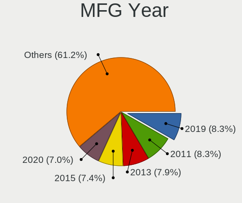
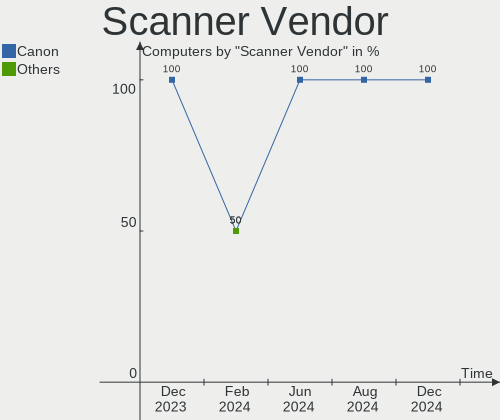

Zorin Hardware Trends
---------------------

A project to identify most popular hardware characteristics and track their change
over time based on data collected by Zorin users at https://Linux-Hardware.org.

Anyone can contribute to this report by the [hw-probe](https://github.com/linuxhw/hw-probe) tool:

    sudo -E hw-probe -all -upload

This is a report for all computer types. See also reports for [desktops](/Dist/Zorin/Desktop/README.md) and [notebooks](/Dist/Zorin/Notebook/README.md).

Full-feature report is available here: https://linux-hardware.org/?view=trends

Period: Dec, 2021.

Contents
--------

* [ System ](#system)
  - [ OS                       ](#os)
  - [ OS Family                ](#os-family)
  - [ Kernel                   ](#kernel)
  - [ Kernel Family            ](#kernel-family)
  - [ Kernel Major Ver.        ](#kernel-major-ver)
  - [ Arch                     ](#arch)
  - [ DE                       ](#de)
  - [ Display Server           ](#display-server)
  - [ Display Manager          ](#display-manager)
  - [ OS Lang                  ](#os-lang)
  - [ Boot Mode                ](#boot-mode)
  - [ Filesystem               ](#filesystem)
  - [ Part. scheme             ](#part-scheme)
  - [ Dual Boot with Linux/BSD ](#dual-boot-with-linuxbsd)
  - [ Dual Boot (Win)          ](#dual-boot-win)

* [ Board ](#board)
  - [ Vendor                   ](#vendor)
  - [ Model                    ](#model)
  - [ Model Family             ](#model-family)
  - [ MFG Year                 ](#mfg-year)
  - [ Form Factor              ](#form-factor)
  - [ Secure Boot              ](#secure-boot)
  - [ Coreboot                 ](#coreboot)
  - [ RAM Size                 ](#ram-size)
  - [ RAM Used                 ](#ram-used)
  - [ Total Drives             ](#total-drives)
  - [ Has CD-ROM               ](#has-cd-rom)
  - [ Has Ethernet             ](#has-ethernet)
  - [ Has WiFi                 ](#has-wifi)
  - [ Has Bluetooth            ](#has-bluetooth)

* [ Location ](#location)
  - [ Country                  ](#country)
  - [ City                     ](#city)

* [ Drives ](#drives)
  - [ Drive Vendor             ](#drive-vendor)
  - [ Drive Model              ](#drive-model)
  - [ HDD Vendor               ](#hdd-vendor)
  - [ SSD Vendor               ](#ssd-vendor)
  - [ Drive Kind               ](#drive-kind)
  - [ Drive Connector          ](#drive-connector)
  - [ Drive Size               ](#drive-size)
  - [ Space Total              ](#space-total)
  - [ Space Used               ](#space-used)
  - [ Malfunc. Drives          ](#malfunc-drives)
  - [ Malfunc. Drive Vendor    ](#malfunc-drive-vendor)
  - [ Malfunc. HDD Vendor      ](#malfunc-hdd-vendor)
  - [ Malfunc. Drive Kind      ](#malfunc-drive-kind)
  - [ Failed Drives            ](#failed-drives)
  - [ Failed Drive Vendor      ](#failed-drive-vendor)
  - [ Drive Status             ](#drive-status)

* [ Storage controller ](#storage-controller)
  - [ Storage Vendor           ](#storage-vendor)
  - [ Storage Model            ](#storage-model)
  - [ Storage Kind             ](#storage-kind)

* [ Processor ](#processor)
  - [ CPU Vendor               ](#cpu-vendor)
  - [ CPU Model                ](#cpu-model)
  - [ CPU Model Family         ](#cpu-model-family)
  - [ CPU Cores                ](#cpu-cores)
  - [ CPU Sockets              ](#cpu-sockets)
  - [ CPU Threads              ](#cpu-threads)
  - [ CPU Op-Modes             ](#cpu-op-modes)
  - [ CPU Microcode            ](#cpu-microcode)
  - [ CPU Microarch            ](#cpu-microarch)

* [ Graphics ](#graphics)
  - [ GPU Vendor               ](#gpu-vendor)
  - [ GPU Model                ](#gpu-model)
  - [ GPU Combo                ](#gpu-combo)
  - [ GPU Driver               ](#gpu-driver)
  - [ GPU Memory               ](#gpu-memory)

* [ Monitor ](#monitor)
  - [ Monitor Vendor           ](#monitor-vendor)
  - [ Monitor Model            ](#monitor-model)
  - [ Monitor Resolution       ](#monitor-resolution)
  - [ Monitor Diagonal         ](#monitor-diagonal)
  - [ Monitor Width            ](#monitor-width)
  - [ Aspect Ratio             ](#aspect-ratio)
  - [ Monitor Area             ](#monitor-area)
  - [ Pixel Density            ](#pixel-density)
  - [ Multiple Monitors        ](#multiple-monitors)

* [ Network ](#network)
  - [ Net Controller Vendor    ](#net-controller-vendor)
  - [ Net Controller Model     ](#net-controller-model)
  - [ Wireless Vendor          ](#wireless-vendor)
  - [ Wireless Model           ](#wireless-model)
  - [ Ethernet Vendor          ](#ethernet-vendor)
  - [ Ethernet Model           ](#ethernet-model)
  - [ Net Controller Kind      ](#net-controller-kind)
  - [ Used Controller          ](#used-controller)
  - [ NICs                     ](#nics)
  - [ IPv6                     ](#ipv6)

* [ Bluetooth ](#bluetooth)
  - [ Bluetooth Vendor         ](#bluetooth-vendor)
  - [ Bluetooth Model          ](#bluetooth-model)

* [ Sound ](#sound)
  - [ Sound Vendor             ](#sound-vendor)
  - [ Sound Model              ](#sound-model)

* [ Memory ](#memory)
  - [ Memory Vendor            ](#memory-vendor)
  - [ Memory Model             ](#memory-model)
  - [ Memory Kind              ](#memory-kind)
  - [ Memory Form Factor       ](#memory-form-factor)
  - [ Memory Size              ](#memory-size)
  - [ Memory Speed             ](#memory-speed)

* [ Printers & scanners ](#printers--scanners)
  - [ Printer Vendor           ](#printer-vendor)
  - [ Printer Model            ](#printer-model)
  - [ Scanner Vendor           ](#scanner-vendor)
  - [ Scanner Model            ](#scanner-model)

* [ Camera ](#camera)
  - [ Camera Vendor            ](#camera-vendor)
  - [ Camera Model             ](#camera-model)

* [ Security ](#security)
  - [ Fingerprint Vendor       ](#fingerprint-vendor)
  - [ Fingerprint Model        ](#fingerprint-model)
  - [ Chipcard Vendor          ](#chipcard-vendor)
  - [ Chipcard Model           ](#chipcard-model)

* [ Unsupported ](#unsupported)
  - [ Unsupported Devices      ](#unsupported-devices)
  - [ Unsupported Device Types ](#unsupported-device-types)

System
------

OS
--

Installed operating systems

| Name     | Computers | Percent |
|----------|-----------|---------|
| Zorin 16 | 209       | 92.07%  |
| Zorin 15 | 18        | 7.93%   |

OS Family
---------

OS without a version

| Name  | Computers | Percent |
|-------|-----------|---------|
| Zorin | 227       | 100%    |

Kernel
------

Version of the Linux kernel

| Version                    | Computers | Percent |
|----------------------------|-----------|---------|
| 5.11.0-41-generic          | 90        | 39.65%  |
| 5.11.0-43-generic          | 78        | 34.36%  |
| 5.11.0-40-generic          | 20        | 8.81%   |
| 5.4.0-91-generic           | 18        | 7.93%   |
| 5.11.0-38-generic          | 11        | 4.85%   |
| 5.11.0-37-generic          | 2         | 0.88%   |
| 5.16.0-051600rc4-generic   | 1         | 0.44%   |
| 5.15.0-8.1-liquorix-amd64  | 1         | 0.44%   |
| 5.15.0-10.2-liquorix-amd64 | 1         | 0.44%   |
| 5.15.0-051500-generic      | 1         | 0.44%   |
| 5.14.0-1010-oem            | 1         | 0.44%   |
| 5.13.0-1020-oem            | 1         | 0.44%   |
| 5.11.0-25-generic          | 1         | 0.44%   |
| 5.10.0-1052-oem            | 1         | 0.44%   |

Kernel Family
-------------

Linux kernel without a distro release

| Version | Computers | Percent |
|---------|-----------|---------|
| 5.11.0  | 202       | 88.99%  |
| 5.4.0   | 18        | 7.93%   |
| 5.15.0  | 3         | 1.32%   |
| 5.16.0  | 1         | 0.44%   |
| 5.14.0  | 1         | 0.44%   |
| 5.13.0  | 1         | 0.44%   |
| 5.10.0  | 1         | 0.44%   |

Kernel Major Ver.
-----------------

Linux kernel major version

| Version | Computers | Percent |
|---------|-----------|---------|
| 5.11    | 202       | 88.99%  |
| 5.4     | 18        | 7.93%   |
| 5.15    | 3         | 1.32%   |
| 5.16    | 1         | 0.44%   |
| 5.14    | 1         | 0.44%   |
| 5.13    | 1         | 0.44%   |
| 5.10    | 1         | 0.44%   |

Arch
----

OS architecture (x86_64, i586, etc.)

| Name   | Computers | Percent |
|--------|-----------|---------|
| x86_64 | 220       | 96.92%  |
| i686   | 7         | 3.08%   |

DE
--

Desktop Environment

| Name       | Computers | Percent |
|------------|-----------|---------|
| GNOME      | 190       | 83.7%   |
| XFCE       | 35        | 15.42%  |
| X-Cinnamon | 1         | 0.44%   |
| KDE        | 1         | 0.44%   |

Display Server
--------------

X11 or Wayland

| Name    | Computers | Percent |
|---------|-----------|---------|
| X11     | 223       | 98.24%  |
| Wayland | 4         | 1.76%   |

Display Manager
---------------

SDDM, LightDM, etc.

| Name    | Computers | Percent |
|---------|-----------|---------|
| Unknown | 153       | 67.4%   |
| GDM3    | 43        | 18.94%  |
| GDM     | 18        | 7.93%   |
| LightDM | 12        | 5.29%   |
| SDDM    | 1         | 0.44%   |

OS Lang
-------

Language

| Lang        | Computers | Percent |
|-------------|-----------|---------|
| en_US       | 92        | 40.53%  |
| de_DE       | 20        | 8.81%   |
| en_GB       | 12        | 5.29%   |
| pt_BR       | 11        | 4.85%   |
| pl_PL       | 8         | 3.52%   |
| fr_FR       | 7         | 3.08%   |
| es_ES       | 7         | 3.08%   |
| en_CA       | 7         | 3.08%   |
| it_IT       | 6         | 2.64%   |
| fr_BE       | 6         | 2.64%   |
| en_IN       | 5         | 2.2%    |
| nl_NL       | 4         | 1.76%   |
| en_AU       | 4         | 1.76%   |
| pt_PT       | 3         | 1.32%   |
| en_ZA       | 3         | 1.32%   |
| en_NZ       | 3         | 1.32%   |
| de_CH       | 3         | 1.32%   |
| tr_TR       | 2         | 0.88%   |
| sl_SI       | 2         | 0.88%   |
| nl_BE       | 2         | 0.88%   |
| hu_HU       | 2         | 0.88%   |
| fi_FI       | 2         | 0.88%   |
| es_CL       | 2         | 0.88%   |
| el_GR       | 2         | 0.88%   |
| zh_TW       | 1         | 0.44%   |
| sv_SE       | 1         | 0.44%   |
| sr_RS@latin | 1         | 0.44%   |
| ru_UA       | 1         | 0.44%   |
| ru_RU       | 1         | 0.44%   |
| ro_RO       | 1         | 0.44%   |
| es_SV       | 1         | 0.44%   |
| es_PA       | 1         | 0.44%   |
| es_MX       | 1         | 0.44%   |
| es_CO       | 1         | 0.44%   |
| es_AR       | 1         | 0.44%   |
| da_DK       | 1         | 0.44%   |

Boot Mode
---------

EFI or BIOS

| Mode | Computers | Percent |
|------|-----------|---------|
| BIOS | 117       | 51.54%  |
| EFI  | 110       | 48.46%  |

Filesystem
----------

Type of filesystem

| Type     | Computers | Percent |
|----------|-----------|---------|
| Ext4     | 216       | 95.15%  |
| Btrfs    | 4         | 1.76%   |
| Overlay  | 3         | 1.32%   |
| Zfs      | 2         | 0.88%   |
| Xfs      | 1         | 0.44%   |
| Reiserfs | 1         | 0.44%   |

Part. scheme
------------

Scheme of partitioning

| Type    | Computers | Percent |
|---------|-----------|---------|
| Unknown | 207       | 91.19%  |
| GPT     | 15        | 6.61%   |
| MBR     | 5         | 2.2%    |

Dual Boot with Linux/BSD
------------------------

Hosting more than one Linux/BSD

| Dual boot | Computers | Percent |
|-----------|-----------|---------|
| No        | 222       | 97.8%   |
| Yes       | 5         | 2.2%    |

Dual Boot (Win)
---------------

Hosting Linux and Windows

| Dual boot | Computers | Percent |
|-----------|-----------|---------|
| No        | 198       | 87.22%  |
| Yes       | 29        | 12.78%  |

Board
-----

Vendor
------

Motherboard manufacturer

| Name                   | Computers | Percent |
|------------------------|-----------|---------|
| Hewlett-Packard        | 38        | 16.74%  |
| Dell                   | 36        | 15.86%  |
| ASUSTek Computer       | 30        | 13.22%  |
| Lenovo                 | 19        | 8.37%   |
| Acer                   | 13        | 5.73%   |
| MSI                    | 11        | 4.85%   |
| Gigabyte Technology    | 8         | 3.52%   |
| ASRock                 | 7         | 3.08%   |
| Apple                  | 7         | 3.08%   |
| Toshiba                | 6         | 2.64%   |
| Samsung Electronics    | 5         | 2.2%    |
| Intel                  | 5         | 2.2%    |
| Packard Bell           | 4         | 1.76%   |
| Sony                   | 3         | 1.32%   |
| Microsoft              | 3         | 1.32%   |
| Unknown                | 3         | 1.32%   |
| Foxconn                | 2         | 0.88%   |
| Digibras               | 2         | 0.88%   |
| Biostar                | 2         | 0.88%   |
| ZOTAC                  | 1         | 0.44%   |
| TUXEDO                 | 1         | 0.44%   |
| TCL Communication      | 1         | 0.44%   |
| Shuttle                | 1         | 0.44%   |
| RCA                    | 1         | 0.44%   |
| Razer                  | 1         | 0.44%   |
| Quanta                 | 1         | 0.44%   |
| Primux                 | 1         | 0.44%   |
| Positivo               | 1         | 0.44%   |
| Pegatron               | 1         | 0.44%   |
| NEC Computers          | 1         | 0.44%   |
| mPTech                 | 1         | 0.44%   |
| Login Informatica      | 1         | 0.44%   |
| INTELBRAS              | 1         | 0.44%   |
| HUAWEI                 | 1         | 0.44%   |
| Google                 | 1         | 0.44%   |
| Fusion5                | 1         | 0.44%   |
| Fujitsu                | 1         | 0.44%   |
| eMachines              | 1         | 0.44%   |
| ECS                    | 1         | 0.44%   |
| Compaq                 | 1         | 0.44%   |
| Chuwi                  | 1         | 0.44%   |
| Avell High Performance | 1         | 0.44%   |

Model
-----

Motherboard model

| Name                                                  | Computers | Percent |
|-------------------------------------------------------|-----------|---------|
| Unknown                                               | 4         | 1.76%   |
| Dell OptiPlex 7010                                    | 3         | 1.32%   |
| HP 15                                                 | 2         | 0.88%   |
| Digibras NH4CU03                                      | 2         | 0.88%   |
| Dell Precision M4600                                  | 2         | 0.88%   |
| ASUS All Series                                       | 2         | 0.88%   |
| ASRock B450M Pro4                                     | 2         | 0.88%   |
| Acer Aspire V3-571                                    | 2         | 0.88%   |
| ZOTAC ZBOXNANO-ID62                                   | 1         | 0.44%   |
| TUXEDO Pulse 14 Gen1                                  | 1         | 0.44%   |
| Toshiba TECRA S11                                     | 1         | 0.44%   |
| Toshiba TECRA A9                                      | 1         | 0.44%   |
| Toshiba Satellite L655                                | 1         | 0.44%   |
| Toshiba Satellite L55-B                               | 1         | 0.44%   |
| Toshiba Satellite L300                                | 1         | 0.44%   |
| Toshiba QOSMIO X770                                   | 1         | 0.44%   |
| TCL Communication 8085                                | 1         | 0.44%   |
| Sony VPCF23M1E                                        | 1         | 0.44%   |
| Sony VGN-FW21E                                        | 1         | 0.44%   |
| Sony SVF1532Z1EB                                      | 1         | 0.44%   |
| Shuttle XH61V                                         | 1         | 0.44%   |
| Samsung N150P/N210P/N220P                             | 1         | 0.44%   |
| Samsung 700T                                          | 1         | 0.44%   |
| Samsung 355V4C/356V4C/3445VC/3545VC                   | 1         | 0.44%   |
| Samsung 300E5EV/300E4EV/270E5EV/270E4EV/2470EV/2470EE | 1         | 0.44%   |
| Samsung 300E4C/300E5C/300E7C                          | 1         | 0.44%   |
| RCA W1013DK                                           | 1         | 0.44%   |
| Razer Blade 15 Base Model (Early 2020) - RZ09-0328    | 1         | 0.44%   |
| Quanta MW1/HW1                                        | 1         | 0.44%   |
| Primux 15R5A                                          | 1         | 0.44%   |
| Positivo CHT14B                                       | 1         | 0.44%   |
| Pegatron NY537AA-ABA 300-1025                         | 1         | 0.44%   |
| Packard Bell IMEDIA D3610 FR                          | 1         | 0.44%   |
| Packard Bell EasyNote TK85                            | 1         | 0.44%   |
| Packard Bell EasyNote TE11BZ                          | 1         | 0.44%   |
| Packard Bell EasyNote MH35                            | 1         | 0.44%   |
| NEC Computers PC-TW508CAS                             | 1         | 0.44%   |
| MSI PS42 Modern 8RC                                   | 1         | 0.44%   |
| MSI MS-7D17                                           | 1         | 0.44%   |
| MSI MS-7C56                                           | 1         | 0.44%   |
| MSI MS-7C02                                           | 1         | 0.44%   |
| MSI MS-7B51                                           | 1         | 0.44%   |
| MSI MS-7817                                           | 1         | 0.44%   |
| MSI MS-7693                                           | 1         | 0.44%   |
| MSI MS-7053                                           | 1         | 0.44%   |
| MSI GT70 2OC/2OD                                      | 1         | 0.44%   |
| MSI GE-700                                            | 1         | 0.44%   |
| MSI EX705                                             | 1         | 0.44%   |
| mPTech ARC 11.6 128GB HD                              | 1         | 0.44%   |
| Microsoft Surface Pro 4                               | 1         | 0.44%   |
| Microsoft Surface Pro                                 | 1         | 0.44%   |
| Microsoft Surface Go 3                                | 1         | 0.44%   |
| Login Informatica LOG-MB47II7                         | 1         | 0.44%   |
| Lenovo Y520-15IKBN 80WK                               | 1         | 0.44%   |
| Lenovo V14-IIL 82C4                                   | 1         | 0.44%   |
| Lenovo ThinkPad X270 20HN0043AD                       | 1         | 0.44%   |
| Lenovo ThinkPad X230 2325SYU                          | 1         | 0.44%   |
| Lenovo ThinkPad X201 Tablet 3113WLL                   | 1         | 0.44%   |
| Lenovo ThinkPad X1 Extreme Gen 4i 20Y5000UUS          | 1         | 0.44%   |
| Lenovo ThinkPad T400 741722U                          | 1         | 0.44%   |

Model Family
------------

Motherboard model prefix

| Name                      | Computers | Percent |
|---------------------------|-----------|---------|
| Dell Latitude             | 13        | 5.73%   |
| Acer Aspire               | 12        | 5.29%   |
| Dell OptiPlex             | 11        | 4.85%   |
| Lenovo ThinkPad           | 6         | 2.64%   |
| HP Pavilion               | 6         | 2.64%   |
| HP EliteBook              | 6         | 2.64%   |
| Dell Inspiron             | 6         | 2.64%   |
| Lenovo IdeaPad            | 4         | 1.76%   |
| Unknown                   | 4         | 1.76%   |
| Toshiba Satellite         | 3         | 1.32%   |
| Packard Bell EasyNote     | 3         | 1.32%   |
| Microsoft Surface         | 3         | 1.32%   |
| Lenovo ThinkCentre        | 3         | 1.32%   |
| HP Compaq                 | 3         | 1.32%   |
| HP 15                     | 3         | 1.32%   |
| Dell Precision            | 3         | 1.32%   |
| ASUS VivoBook             | 3         | 1.32%   |
| Toshiba TECRA             | 2         | 0.88%   |
| HP ZBook                  | 2         | 0.88%   |
| HP ProBook                | 2         | 0.88%   |
| HP OMEN                   | 2         | 0.88%   |
| HP Laptop                 | 2         | 0.88%   |
| HP EliteDesk              | 2         | 0.88%   |
| Digibras NH4CU03          | 2         | 0.88%   |
| ASUS ROG                  | 2         | 0.88%   |
| ASUS PRIME                | 2         | 0.88%   |
| ASUS All                  | 2         | 0.88%   |
| ASRock B450M              | 2         | 0.88%   |
| ZOTAC ZBOXNANO-ID62       | 1         | 0.44%   |
| TUXEDO Pulse              | 1         | 0.44%   |
| Toshiba QOSMIO            | 1         | 0.44%   |
| TCL Communication 8085    | 1         | 0.44%   |
| Sony VPCF23M1E            | 1         | 0.44%   |
| Sony VGN-FW21E            | 1         | 0.44%   |
| Sony SVF1532Z1EB          | 1         | 0.44%   |
| Shuttle XH61V             | 1         | 0.44%   |
| Samsung N150P             | 1         | 0.44%   |
| Samsung 700T              | 1         | 0.44%   |
| Samsung 355V4C            | 1         | 0.44%   |
| Samsung 300E5EV           | 1         | 0.44%   |
| Samsung 300E4C            | 1         | 0.44%   |
| RCA W1013DK               | 1         | 0.44%   |
| Razer Blade               | 1         | 0.44%   |
| Quanta MW1                | 1         | 0.44%   |
| Primux 15R5A              | 1         | 0.44%   |
| Positivo CHT14B           | 1         | 0.44%   |
| Pegatron NY537AA-ABA      | 1         | 0.44%   |
| Packard Bell IMEDIA       | 1         | 0.44%   |
| NEC Computers PC-TW508CAS | 1         | 0.44%   |
| MSI PS42                  | 1         | 0.44%   |
| MSI MS-7D17               | 1         | 0.44%   |
| MSI MS-7C56               | 1         | 0.44%   |
| MSI MS-7C02               | 1         | 0.44%   |
| MSI MS-7B51               | 1         | 0.44%   |
| MSI MS-7817               | 1         | 0.44%   |
| MSI MS-7693               | 1         | 0.44%   |
| MSI MS-7053               | 1         | 0.44%   |
| MSI GT70                  | 1         | 0.44%   |
| MSI GE-700                | 1         | 0.44%   |
| MSI EX705                 | 1         | 0.44%   |

MFG Year
--------

Motherboard manufacture year

| Year | Computers | Percent |
|------|-----------|---------|
| 2021 | 38        | 16.74%  |
| 2019 | 24        | 10.57%  |
| 2013 | 23        | 10.13%  |
| 2020 | 20        | 8.81%   |
| 2010 | 17        | 7.49%   |
| 2015 | 15        | 6.61%   |
| 2008 | 14        | 6.17%   |
| 2018 | 12        | 5.29%   |
| 2012 | 12        | 5.29%   |
| 2016 | 11        | 4.85%   |
| 2014 | 9         | 3.96%   |
| 2011 | 9         | 3.96%   |
| 2009 | 9         | 3.96%   |
| 2007 | 6         | 2.64%   |
| 2017 | 4         | 1.76%   |
| 2006 | 3         | 1.32%   |
| 2005 | 1         | 0.44%   |

Form Factor
-----------

Physical design of the computer

| Name        | Computers | Percent |
|-------------|-----------|---------|
| Notebook    | 126       | 55.51%  |
| Desktop     | 84        | 37%     |
| Tablet      | 4         | 1.76%   |
| Convertible | 4         | 1.76%   |
| Mini pc     | 4         | 1.76%   |
| All in one  | 4         | 1.76%   |
| Server      | 1         | 0.44%   |

Secure Boot
-----------

Enabled or disabled

| State    | Computers | Percent |
|----------|-----------|---------|
| Disabled | 209       | 92.07%  |
| Enabled  | 18        | 7.93%   |

Coreboot
--------

Have coreboot on board

| Used | Computers | Percent |
|------|-----------|---------|
| No   | 226       | 99.56%  |
| Yes  | 1         | 0.44%   |

RAM Size
--------

Total RAM memory

| Size in GB  | Computers | Percent |
|-------------|-----------|---------|
| 3.01-4.0    | 60        | 26.43%  |
| 4.01-8.0    | 58        | 25.55%  |
| 16.01-24.0  | 38        | 16.74%  |
| 8.01-16.0   | 34        | 14.98%  |
| 1.01-2.0    | 13        | 5.73%   |
| 32.01-64.0  | 11        | 4.85%   |
| 2.01-3.0    | 8         | 3.52%   |
| 64.01-256.0 | 4         | 1.76%   |
| 0.51-1.0    | 1         | 0.44%   |

RAM Used
--------

Used RAM memory

| Used GB   | Computers | Percent |
|-----------|-----------|---------|
| 1.01-2.0  | 112       | 49.34%  |
| 2.01-3.0  | 65        | 28.63%  |
| 3.01-4.0  | 23        | 10.13%  |
| 4.01-8.0  | 17        | 7.49%   |
| 0.51-1.0  | 7         | 3.08%   |
| 8.01-16.0 | 3         | 1.32%   |

Total Drives
------------

Number of drives on board

| Drives | Computers | Percent |
|--------|-----------|---------|
| 1      | 146       | 64.32%  |
| 2      | 55        | 24.23%  |
| 3      | 14        | 6.17%   |
| 4      | 5         | 2.2%    |
| 6      | 2         | 0.88%   |
| 5      | 2         | 0.88%   |
| 8      | 1         | 0.44%   |
| 7      | 1         | 0.44%   |
| 0      | 1         | 0.44%   |

Has CD-ROM
----------

Has CD-ROM on board

| Presented | Computers | Percent |
|-----------|-----------|---------|
| No        | 116       | 51.1%   |
| Yes       | 111       | 48.9%   |

Has Ethernet
------------

Has Ethernet on board

| Presented | Computers | Percent |
|-----------|-----------|---------|
| Yes       | 192       | 84.58%  |
| No        | 35        | 15.42%  |

Has WiFi
--------

Has WiFi module

| Presented | Computers | Percent |
|-----------|-----------|---------|
| Yes       | 176       | 77.53%  |
| No        | 51        | 22.47%  |

Has Bluetooth
-------------

Has Bluetooth module

| Presented | Computers | Percent |
|-----------|-----------|---------|
| Yes       | 124       | 54.63%  |
| No        | 103       | 45.37%  |

Location
--------

Country
-------

Geographic location (country)

| Country      | Computers | Percent |
|--------------|-----------|---------|
| USA          | 67        | 29.52%  |
| Germany      | 22        | 9.69%   |
| Brazil       | 13        | 5.73%   |
| UK           | 10        | 4.41%   |
| France       | 9         | 3.96%   |
| Canada       | 8         | 3.52%   |
| Belgium      | 8         | 3.52%   |
| Poland       | 7         | 3.08%   |
| Spain        | 6         | 2.64%   |
| Netherlands  | 6         | 2.64%   |
| Italy        | 5         | 2.2%    |
| India        | 5         | 2.2%    |
| Switzerland  | 3         | 1.32%   |
| South Africa | 3         | 1.32%   |
| Romania      | 3         | 1.32%   |
| Portugal     | 3         | 1.32%   |
| New Zealand  | 3         | 1.32%   |
| Hungary      | 3         | 1.32%   |
| Australia    | 3         | 1.32%   |
| Turkey       | 2         | 0.88%   |
| Slovenia     | 2         | 0.88%   |
| Saudi Arabia | 2         | 0.88%   |
| Mexico       | 2         | 0.88%   |
| Malaysia     | 2         | 0.88%   |
| Japan        | 2         | 0.88%   |
| Greece       | 2         | 0.88%   |
| Finland      | 2         | 0.88%   |
| Croatia      | 2         | 0.88%   |
| Chile        | 2         | 0.88%   |
| Austria      | 2         | 0.88%   |
| Argentina    | 2         | 0.88%   |
| Ukraine      | 1         | 0.44%   |
| Taiwan       | 1         | 0.44%   |
| Sweden       | 1         | 0.44%   |
| Russia       | 1         | 0.44%   |
| Puerto Rico  | 1         | 0.44%   |
| Panama       | 1         | 0.44%   |
| Pakistan     | 1         | 0.44%   |
| Moldova      | 1         | 0.44%   |
| Jordan       | 1         | 0.44%   |
| Israel       | 1         | 0.44%   |
| Indonesia    | 1         | 0.44%   |
| Ghana        | 1         | 0.44%   |
| El Salvador  | 1         | 0.44%   |
| Denmark      | 1         | 0.44%   |
| Cyprus       | 1         | 0.44%   |
| Colombia     | 1         | 0.44%   |

City
----

Geographic location (city)

| City                   | Computers | Percent |
|------------------------|-----------|---------|
| Bernissart             | 5         | 2.2%    |
| Washington             | 3         | 1.32%   |
| Dallas                 | 3         | 1.32%   |
| Cape Town              | 3         | 1.32%   |
| Berlin                 | 3         | 1.32%   |
| Warsaw                 | 2         | 0.88%   |
| Sydney                 | 2         | 0.88%   |
| Inman                  | 2         | 0.88%   |
| Huntsville             | 2         | 0.88%   |
| Cape Coral             | 2         | 0.88%   |
| Bursa                  | 2         | 0.88%   |
| Budapest               | 2         | 0.88%   |
| Bernau bei Berlin      | 2         | 0.88%   |
| Athens                 | 2         | 0.88%   |
| Zielonka               | 1         | 0.44%   |
| Zapopan                | 1         | 0.44%   |
| Zagreb                 | 1         | 0.44%   |
| Yokkaichi              | 1         | 0.44%   |
| Wylie                  | 1         | 0.44%   |
| Wuppertal              | 1         | 0.44%   |
| Winnipeg               | 1         | 0.44%   |
| Wimbledon              | 1         | 0.44%   |
| Wilkau-Hasslau         | 1         | 0.44%   |
| West Valley City       | 1         | 0.44%   |
| West Fargo             | 1         | 0.44%   |
| Wellington             | 1         | 0.44%   |
| Wanstead               | 1         | 0.44%   |
| Vinnytsia              | 1         | 0.44%   |
| Villingen-Schwenningen | 1         | 0.44%   |
| Villaconejos           | 1         | 0.44%   |
| Vienna                 | 1         | 0.44%   |
| Vegreville             | 1         | 0.44%   |
| Valpara?­so            | 1         | 0.44%   |
| Valinhos               | 1         | 0.44%   |
| Valencia               | 1         | 0.44%   |
| Unterschleissheim      | 1         | 0.44%   |
| Twickenham             | 1         | 0.44%   |
| Tustin                 | 1         | 0.44%   |
| Toms River             | 1         | 0.44%   |
| Tel Aviv               | 1         | 0.44%   |
| Sutton Coldfield       | 1         | 0.44%   |
| Surabaya               | 1         | 0.44%   |
| Stuttgart              | 1         | 0.44%   |
| St Petersburg          | 1         | 0.44%   |
| Sleza                  | 1         | 0.44%   |
| Serra                  | 1         | 0.44%   |
| Schoonhoven            | 1         | 0.44%   |
| Scarborough            | 1         | 0.44%   |
| Santos Lugares         | 1         | 0.44%   |
| San Salvador           | 1         | 0.44%   |
| San Juan               | 1         | 0.44%   |
| San Diego              | 1         | 0.44%   |
| San Antonio            | 1         | 0.44%   |
| Salvador               | 1         | 0.44%   |
| Salt Lake City         | 1         | 0.44%   |
| Saint-Paul-sur-Isere   | 1         | 0.44%   |
| Saint-Eustache         | 1         | 0.44%   |
| Roswell                | 1         | 0.44%   |
| Riyadh                 | 1         | 0.44%   |
| Rio Tinto              | 1         | 0.44%   |

Drives
------

Drive Vendor
------------

Hard drive vendors

| Vendor                    | Computers | Drives | Percent |
|---------------------------|-----------|--------|---------|
| Seagate                   | 61        | 75     | 20%     |
| Samsung Electronics       | 44        | 57     | 14.43%  |
| WDC                       | 42        | 47     | 13.77%  |
| Unknown                   | 18        | 23     | 5.9%    |
| Toshiba                   | 17        | 17     | 5.57%   |
| Kingston                  | 15        | 17     | 4.92%   |
| SanDisk                   | 13        | 13     | 4.26%   |
| Crucial                   | 13        | 13     | 4.26%   |
| Hitachi                   | 12        | 12     | 3.93%   |
| Intel                     | 6         | 7      | 1.97%   |
| HGST                      | 5         | 5      | 1.64%   |
| A-DATA Technology         | 5         | 5      | 1.64%   |
| SK Hynix                  | 4         | 4      | 1.31%   |
| Phison                    | 4         | 5      | 1.31%   |
| Micron Technology         | 4         | 4      | 1.31%   |
| Transcend                 | 3         | 3      | 0.98%   |
| Realtek Semiconductor     | 3         | 3      | 0.98%   |
| SABRENT                   | 2         | 2      | 0.66%   |
| Patriot                   | 2         | 2      | 0.66%   |
| OCZ                       | 2         | 2      | 0.66%   |
| MAXTOR                    | 2         | 2      | 0.66%   |
| KIOXIA-EXCERIA            | 2         | 2      | 0.66%   |
| KIOXIA                    | 2         | 2      | 0.66%   |
| Fujitsu                   | 2         | 2      | 0.66%   |
| China                     | 2         | 2      | 0.66%   |
| Union Memory (Shenzhen)   | 1         | 1      | 0.33%   |
| Teclast                   | 1         | 1      | 0.33%   |
| Team                      | 1         | 1      | 0.33%   |
| PNY                       | 1         | 2      | 0.33%   |
| PLEXTOR                   | 1         | 1      | 0.33%   |
| OWC                       | 1         | 1      | 0.33%   |
| Netac                     | 1         | 1      | 0.33%   |
| Micron/Crucial Technology | 1         | 1      | 0.33%   |
| LITEON                    | 1         | 1      | 0.33%   |
| Lexar                     | 1         | 1      | 0.33%   |
| KingSpec                  | 1         | 1      | 0.33%   |
| KingFast                  | 1         | 1      | 0.33%   |
| KESU                      | 1         | 1      | 0.33%   |
| Intenso                   | 1         | 1      | 0.33%   |
| Hewlett-Packard           | 1         | 1      | 0.33%   |
| GOODRAM                   | 1         | 1      | 0.33%   |
| FORESEE                   | 1         | 1      | 0.33%   |
| Dogfish                   | 1         | 1      | 0.33%   |
| ASMT                      | 1         | 1      | 0.33%   |
| Apple                     | 1         | 1      | 0.33%   |

Drive Model
-----------

Hard drive models

| Model                               | Computers | Percent |
|-------------------------------------|-----------|---------|
| Unknown MMC Card  32GB              | 7         | 2.08%   |
| Unknown MMC Card  64GB              | 5         | 1.48%   |
| WDC WD10EZEX-08WN4A0 1TB            | 4         | 1.19%   |
| Samsung NVMe SSD Drive 512GB        | 4         | 1.19%   |
| Samsung NVMe SSD Drive 256GB        | 4         | 1.19%   |
| Unknown MMC Card  128GB             | 3         | 0.89%   |
| Toshiba MQ01ABD100 1TB              | 3         | 0.89%   |
| Toshiba DT01ACA100 1TB              | 3         | 0.89%   |
| Seagate ST500LM012 HN-M500MBB 500GB | 3         | 0.89%   |
| Seagate ST500DM002-1BD142 500GB     | 3         | 0.89%   |
| Seagate ST3500418AS 500GB           | 3         | 0.89%   |
| Seagate ST3500413AS 500GB           | 3         | 0.89%   |
| Seagate ST1000LM035-1RK172 1TB      | 3         | 0.89%   |
| Seagate Expansion 1TB               | 3         | 0.89%   |
| Kingston SA400S37240G 240GB SSD     | 3         | 0.89%   |
| Kingston SA400S37120G 120GB SSD     | 3         | 0.89%   |
| Crucial CT240BX500SSD1 240GB        | 3         | 0.89%   |
| WDC WDS100T2B0A-00SM50 1TB SSD      | 2         | 0.59%   |
| WDC WD40EFRX-68WT0N0 4TB            | 2         | 0.59%   |
| Unknown SD/MMC/MS PRO 7GB           | 2         | 0.59%   |
| Unknown MMC Card  16GB              | 2         | 0.59%   |
| Transcend TS480GSSD220S 480GB       | 2         | 0.59%   |
| Toshiba DT01ACA050 500GB            | 2         | 0.59%   |
| Seagate ST9500325AS 500GB           | 2         | 0.59%   |
| Seagate ST500LT012-9WS142 500GB     | 2         | 0.59%   |
| Seagate ST380815AS 80GB             | 2         | 0.59%   |
| Seagate ST2000DM008-2FR102 2TB      | 2         | 0.59%   |
| Seagate ST1000DM010-2EP102 1TB      | 2         | 0.59%   |
| Seagate ST1000DM003-1ER162 1TB      | 2         | 0.59%   |
| Seagate Backup+ Hub BK 8TB          | 2         | 0.59%   |
| Seagate Backup+ Desk 4TB            | 2         | 0.59%   |
| SanDisk SDSSDH3512G 512GB           | 2         | 0.59%   |
| SanDisk SD9SN8W-128G-1006 128GB SSD | 2         | 0.59%   |
| Samsung SSD 870 EVO 1TB             | 2         | 0.59%   |
| Samsung SSD 860 EVO 500GB           | 2         | 0.59%   |
| Samsung SSD 860 EVO 250GB           | 2         | 0.59%   |
| Samsung SSD 860 EVO 1TB             | 2         | 0.59%   |
| Samsung SSD 840 Series 500GB        | 2         | 0.59%   |
| Samsung NVMe SSD Drive 250GB        | 2         | 0.59%   |
| Samsung NVMe SSD Drive 1TB          | 2         | 0.59%   |
| Samsung HD322HJ 320GB               | 2         | 0.59%   |
| SABRENT Disk 500GB                  | 2         | 0.59%   |
| Phison NVMe SSD Drive 512GB         | 2         | 0.59%   |
| KIOXIA-EXCERIA SATA SSD 240GB       | 2         | 0.59%   |
| Kingston NVMe SSD Drive 500GB       | 2         | 0.59%   |
| Intel NVMe SSD Drive 1024GB         | 2         | 0.59%   |
| Hitachi HTS545050B9A300 500GB       | 2         | 0.59%   |
| HGST HTS721010A9E630 1TB            | 2         | 0.59%   |
| Crucial CT500MX500SSD1 500GB        | 2         | 0.59%   |
| Crucial CT480BX500SSD1 480GB        | 2         | 0.59%   |
| WDC WDS500G2B0A 500GB SSD           | 1         | 0.3%    |
| WDC WDS120G2G0A-00JH30 120GB SSD    | 1         | 0.3%    |
| WDC WDS100T2B0B-00YS70 1TB SSD      | 1         | 0.3%    |
| WDC WDBNCE5000PNC 500GB SSD         | 1         | 0.3%    |
| WDC WD6400BPVT-55HXZT2 640GB        | 1         | 0.3%    |
| WDC WD6400AARS-00Y5B1 640GB         | 1         | 0.3%    |
| WDC WD6400AAKS-22A7B0 640GB         | 1         | 0.3%    |
| WDC WD5000LPVX-60V0TT0 500GB        | 1         | 0.3%    |
| WDC WD5000LPLX-75ZNTT0 500GB        | 1         | 0.3%    |
| WDC WD5000LPLX-60ZNTT1 500GB        | 1         | 0.3%    |

HDD Vendor
----------

Hard disk drive vendors

| Vendor              | Computers | Drives | Percent |
|---------------------|-----------|--------|---------|
| Seagate             | 60        | 69     | 42.55%  |
| WDC                 | 35        | 39     | 24.82%  |
| Toshiba             | 14        | 14     | 9.93%   |
| Hitachi             | 12        | 12     | 8.51%   |
| Samsung Electronics | 6         | 7      | 4.26%   |
| HGST                | 5         | 5      | 3.55%   |
| Unknown             | 2         | 2      | 1.42%   |
| SABRENT             | 2         | 2      | 1.42%   |
| MAXTOR              | 2         | 2      | 1.42%   |
| Fujitsu             | 2         | 2      | 1.42%   |
| KESU                | 1         | 1      | 0.71%   |

SSD Vendor
----------

Solid state drive vendors

| Vendor              | Computers | Drives | Percent |
|---------------------|-----------|--------|---------|
| Samsung Electronics | 26        | 31     | 24.53%  |
| Crucial             | 13        | 13     | 12.26%  |
| Kingston            | 12        | 13     | 11.32%  |
| SanDisk             | 9         | 9      | 8.49%   |
| WDC                 | 6         | 6      | 5.66%   |
| Micron Technology   | 4         | 4      | 3.77%   |
| A-DATA Technology   | 4         | 4      | 3.77%   |
| Transcend           | 3         | 3      | 2.83%   |
| Toshiba             | 2         | 2      | 1.89%   |
| SK Hynix            | 2         | 2      | 1.89%   |
| Patriot             | 2         | 2      | 1.89%   |
| OCZ                 | 2         | 2      | 1.89%   |
| KIOXIA-EXCERIA      | 2         | 2      | 1.89%   |
| China               | 2         | 2      | 1.89%   |
| Teclast             | 1         | 1      | 0.94%   |
| Team                | 1         | 1      | 0.94%   |
| PNY                 | 1         | 2      | 0.94%   |
| PLEXTOR             | 1         | 1      | 0.94%   |
| OWC                 | 1         | 1      | 0.94%   |
| Netac               | 1         | 1      | 0.94%   |
| LITEON              | 1         | 1      | 0.94%   |
| Lexar               | 1         | 1      | 0.94%   |
| KingSpec            | 1         | 1      | 0.94%   |
| Intenso             | 1         | 1      | 0.94%   |
| Intel               | 1         | 1      | 0.94%   |
| Hewlett-Packard     | 1         | 1      | 0.94%   |
| GOODRAM             | 1         | 1      | 0.94%   |
| FORESEE             | 1         | 1      | 0.94%   |
| Dogfish             | 1         | 1      | 0.94%   |
| ASMT                | 1         | 1      | 0.94%   |
| Apple               | 1         | 1      | 0.94%   |

Drive Kind
----------

HDD or SSD

| Kind    | Computers | Drives | Percent |
|---------|-----------|--------|---------|
| HDD     | 121       | 155    | 42.76%  |
| SSD     | 97        | 113    | 34.28%  |
| NVMe    | 44        | 52     | 15.55%  |
| MMC     | 16        | 21     | 5.65%   |
| Unknown | 5         | 6      | 1.77%   |

Drive Connector
---------------

SATA, SAS, NVMe, etc.

| Type | Computers | Drives | Percent |
|------|-----------|--------|---------|
| SATA | 187       | 254    | 70.57%  |
| NVMe | 44        | 52     | 16.6%   |
| SAS  | 18        | 20     | 6.79%   |
| MMC  | 16        | 21     | 6.04%   |

Drive Size
----------

Size of hard drive

| Size in TB | Computers | Drives | Percent |
|------------|-----------|--------|---------|
| 0.01-0.5   | 146       | 173    | 63.76%  |
| 0.51-1.0   | 62        | 73     | 27.07%  |
| 1.01-2.0   | 10        | 11     | 4.37%   |
| 3.01-4.0   | 7         | 7      | 3.06%   |
| 2.01-3.0   | 2         | 2      | 0.87%   |
| 4.01-10.0  | 2         | 2      | 0.87%   |

Space Total
-----------

Amount of disk space available on the file system

| Size in GB     | Computers | Percent |
|----------------|-----------|---------|
| 101-250        | 92        | 40.53%  |
| 251-500        | 56        | 24.67%  |
| 501-1000       | 26        | 11.45%  |
| 51-100         | 15        | 6.61%   |
| 1001-2000      | 14        | 6.17%   |
| 21-50          | 10        | 4.41%   |
| More than 3000 | 7         | 3.08%   |
| 2001-3000      | 4         | 1.76%   |
| 1-20           | 2         | 0.88%   |
| Unknown        | 1         | 0.44%   |

Space Used
----------

Amount of used disk space

| Used GB        | Computers | Percent |
|----------------|-----------|---------|
| 1-20           | 100       | 44.05%  |
| 21-50          | 56        | 24.67%  |
| 51-100         | 27        | 11.89%  |
| 101-250        | 18        | 7.93%   |
| 251-500        | 10        | 4.41%   |
| 501-1000       | 7         | 3.08%   |
| 1001-2000      | 4         | 1.76%   |
| More than 3000 | 3         | 1.32%   |
| 2001-3000      | 1         | 0.44%   |
| Unknown        | 1         | 0.44%   |

Malfunc. Drives
---------------

Drive models with a malfunction

| Model                     | Computers | Drives | Percent |
|---------------------------|-----------|--------|---------|
| WDC WD30EFRX-68EUZN0 3TB  | 1         | 1      | 50%     |
| Seagate ST9500420AS 500GB | 1         | 1      | 50%     |

Malfunc. Drive Vendor
---------------------

Vendors of faulty drives

| Vendor  | Computers | Drives | Percent |
|---------|-----------|--------|---------|
| WDC     | 1         | 1      | 50%     |
| Seagate | 1         | 1      | 50%     |

Malfunc. HDD Vendor
-------------------

Vendors of faulty HDD drives

| Vendor  | Computers | Drives | Percent |
|---------|-----------|--------|---------|
| WDC     | 1         | 1      | 50%     |
| Seagate | 1         | 1      | 50%     |

Malfunc. Drive Kind
-------------------

Kinds of faulty drives

| Kind | Computers | Drives | Percent |
|------|-----------|--------|---------|
| HDD  | 2         | 2      | 100%    |

Failed Drives
-------------

Failed drive models

Zero info for selected period =(

Failed Drive Vendor
-------------------

Failed drive vendors

Zero info for selected period =(

Drive Status
------------

Number of failed and malfunc. drives

| Status   | Computers | Drives | Percent |
|----------|-----------|--------|---------|
| Detected | 205       | 317    | 89.91%  |
| Works    | 21        | 28     | 9.21%   |
| Malfunc  | 2         | 2      | 0.88%   |

Storage controller
------------------

Storage Vendor
--------------

Storage controller vendors

| Vendor                           | Computers | Percent |
|----------------------------------|-----------|---------|
| Intel                            | 161       | 63.14%  |
| AMD                              | 37        | 14.51%  |
| Samsung Electronics              | 15        | 5.88%   |
| Sandisk                          | 6         | 2.35%   |
| Kingston Technology Company      | 5         | 1.96%   |
| ASMedia Technology               | 5         | 1.96%   |
| Phison Electronics               | 4         | 1.57%   |
| Realtek Semiconductor            | 3         | 1.18%   |
| Nvidia                           | 3         | 1.18%   |
| Marvell Technology Group         | 3         | 1.18%   |
| SK Hynix                         | 2         | 0.78%   |
| KIOXIA                           | 2         | 0.78%   |
| VIA Technologies                 | 1         | 0.39%   |
| Union Memory (Shenzhen)          | 1         | 0.39%   |
| Toshiba America Info Systems     | 1         | 0.39%   |
| Silicon Integrated Systems [SiS] | 1         | 0.39%   |
| Seagate Technology               | 1         | 0.39%   |
| Micron/Crucial Technology        | 1         | 0.39%   |
| JMicron Technology               | 1         | 0.39%   |
| Dell                             | 1         | 0.39%   |
| ADATA Technology                 | 1         | 0.39%   |

Storage Model
-------------

Storage controller models

| Model                                                                                   | Computers | Percent |
|-----------------------------------------------------------------------------------------|-----------|---------|
| AMD FCH SATA Controller [AHCI mode]                                                     | 24        | 7.82%   |
| Intel 7 Series Chipset Family 6-port SATA Controller [AHCI mode]                        | 18        | 5.86%   |
| Intel 8 Series/C220 Series Chipset Family 6-port SATA Controller 1 [AHCI mode]          | 13        | 4.23%   |
| Intel 6 Series/C200 Series Chipset Family 6 port Mobile SATA AHCI Controller            | 11        | 3.58%   |
| Intel 82801IBM/IEM (ICH9M/ICH9M-E) 4 port SATA Controller [AHCI mode]                   | 10        | 3.26%   |
| Intel 82801G (ICH7 Family) IDE Controller                                               | 10        | 3.26%   |
| Intel 82801 Mobile SATA Controller [RAID mode]                                          | 10        | 3.26%   |
| Samsung NVMe SSD Controller SM981/PM981/PM983                                           | 9         | 2.93%   |
| Intel NM10/ICH7 Family SATA Controller [IDE mode]                                       | 9         | 2.93%   |
| AMD 400 Series Chipset SATA Controller                                                  | 7         | 2.28%   |
| Intel 8 Series SATA Controller 1 [AHCI mode]                                            | 6         | 1.95%   |
| Intel Wildcat Point-LP SATA Controller [AHCI Mode]                                      | 5         | 1.63%   |
| Intel 7 Series/C210 Series Chipset Family 6-port SATA Controller [AHCI mode]            | 5         | 1.63%   |
| ASMedia ASM1062 Serial ATA Controller                                                   | 5         | 1.63%   |
| AMD SB7x0/SB8x0/SB9x0 SATA Controller [IDE mode]                                        | 5         | 1.63%   |
| AMD SB7x0/SB8x0/SB9x0 SATA Controller [AHCI mode]                                       | 5         | 1.63%   |
| AMD SB7x0/SB8x0/SB9x0 IDE Controller                                                    | 5         | 1.63%   |
| Samsung NVMe SSD Controller 980                                                         | 4         | 1.3%    |
| Intel Sunrise Point-LP SATA Controller [AHCI mode]                                      | 4         | 1.3%    |
| Intel Q170/Q150/B150/H170/H110/Z170/CM236 Chipset SATA Controller [AHCI Mode]           | 4         | 1.3%    |
| Intel Celeron/Pentium Silver Processor SATA Controller                                  | 4         | 1.3%    |
| Intel Cannon Lake PCH SATA AHCI Controller                                              | 4         | 1.3%    |
| Intel 82801HM/HEM (ICH8M/ICH8M-E) SATA Controller [AHCI mode]                           | 4         | 1.3%    |
| Intel 82801HM/HEM (ICH8M/ICH8M-E) IDE Controller                                        | 4         | 1.3%    |
| Intel 6 Series/C200 Series Chipset Family 6 port Desktop SATA AHCI Controller           | 4         | 1.3%    |
| Intel 5 Series/3400 Series Chipset 4 port SATA IDE Controller                           | 4         | 1.3%    |
| Intel 5 Series/3400 Series Chipset 4 port SATA AHCI Controller                          | 4         | 1.3%    |
| Sandisk WD Blue SN550 NVMe SSD                                                          | 3         | 0.98%   |
| Phison E12 NVMe Controller                                                              | 3         | 0.98%   |
| Intel Volume Management Device NVMe RAID Controller                                     | 3         | 0.98%   |
| Intel SATA Controller [RAID mode]                                                       | 3         | 0.98%   |
| Intel Atom Processor E3800 Series SATA AHCI Controller                                  | 3         | 0.98%   |
| Intel 6 Series/C200 Series Chipset Family Desktop SATA Controller (IDE mode, ports 4-5) | 3         | 0.98%   |
| Intel 6 Series/C200 Series Chipset Family Desktop SATA Controller (IDE mode, ports 0-3) | 3         | 0.98%   |
| Intel 5 Series/3400 Series Chipset 2 port SATA IDE Controller                           | 3         | 0.98%   |
| Samsung NVMe SSD Controller SM961/PM961/SM963                                           | 2         | 0.65%   |
| Realtek Realtek Non-Volatile memory controller                                          | 2         | 0.65%   |
| Marvell Group 88SS9183 PCIe SSD Controller                                              | 2         | 0.65%   |
| KIOXIA Non-Volatile memory controller                                                   | 2         | 0.65%   |
| Intel Tiger Lake-LP SATA Controller [AHCI mode]                                         | 2         | 0.65%   |
| Intel SSD 660P Series                                                                   | 2         | 0.65%   |
| Intel Non-Volatile memory controller                                                    | 2         | 0.65%   |
| Intel Ice Lake-LP SATA Controller [AHCI mode]                                           | 2         | 0.65%   |
| Intel Cannon Point-LP SATA Controller [AHCI Mode]                                       | 2         | 0.65%   |
| Intel 9 Series Chipset Family SATA Controller [AHCI Mode]                               | 2         | 0.65%   |
| Intel 82801JI (ICH10 Family) 4 port SATA IDE Controller #1                              | 2         | 0.65%   |
| Intel 82801JI (ICH10 Family) 2 port SATA IDE Controller #2                              | 2         | 0.65%   |
| Intel 82801FB/FBM/FR/FW/FRW (ICH6 Family) IDE Controller                                | 2         | 0.65%   |
| Intel 631xESB/632xESB IDE Controller                                                    | 2         | 0.65%   |
| Intel 5 Series/3400 Series Chipset 6 port SATA AHCI Controller                          | 2         | 0.65%   |
| Intel 200 Series PCH SATA controller [AHCI mode]                                        | 2         | 0.65%   |
| AMD FCH SATA Controller D                                                               | 2         | 0.65%   |
| VIA VT6410 ATA133 RAID controller                                                       | 1         | 0.33%   |
| Union Memory (Shenzhen) Non-Volatile memory controller                                  | 1         | 0.33%   |
| Toshiba America Info Systems BG3 NVMe SSD Controller                                    | 1         | 0.33%   |
| SK Hynix BC511                                                                          | 1         | 0.33%   |
| SK Hynix BC501 NVMe Solid State Drive                                                   | 1         | 0.33%   |
| Silicon Integrated Systems [SiS] SATA Controller / IDE mode                             | 1         | 0.33%   |
| Silicon Integrated Systems [SiS] 5513 IDE Controller                                    | 1         | 0.33%   |
| Seagate FireCuda 510 SSD                                                                | 1         | 0.33%   |

Storage Kind
------------

Kind of storage controller (IDE, SATA, NVMe, SAS, ...)

| Kind | Computers | Percent |
|------|-----------|---------|
| SATA | 160       | 59.7%   |
| NVMe | 44        | 16.42%  |
| IDE  | 44        | 16.42%  |
| RAID | 20        | 7.46%   |

Processor
---------

CPU Vendor
----------

Processor vendors

| Vendor | Computers | Percent |
|--------|-----------|---------|
| Intel  | 182       | 80.18%  |
| AMD    | 45        | 19.82%  |

CPU Model
---------

Processor models

| Model                                         | Computers | Percent |
|-----------------------------------------------|-----------|---------|
| AMD Ryzen 5 3500U with Radeon Vega Mobile Gfx | 5         | 2.2%    |
| Intel Core i7-3632QM CPU @ 2.20GHz            | 4         | 1.76%   |
| Intel Atom x5-Z8350 CPU @ 1.44GHz             | 4         | 1.76%   |
| Intel Pentium CPU N3540 @ 2.16GHz             | 3         | 1.32%   |
| Intel Core i7-8550U CPU @ 1.80GHz             | 3         | 1.32%   |
| Intel Core i5-6200U CPU @ 2.30GHz             | 3         | 1.32%   |
| Intel Core 2 Duo CPU P8400 @ 2.26GHz          | 3         | 1.32%   |
| Intel Core 2 Duo CPU E8400 @ 3.00GHz          | 3         | 1.32%   |
| AMD Ryzen 7 4800H with Radeon Graphics        | 3         | 1.32%   |
| Intel Pentium Dual CPU E2140 @ 1.60GHz        | 2         | 0.88%   |
| Intel Core i7-4790 CPU @ 3.60GHz              | 2         | 0.88%   |
| Intel Core i5-5200U CPU @ 2.20GHz             | 2         | 0.88%   |
| Intel Core i5-4210U CPU @ 1.70GHz             | 2         | 0.88%   |
| Intel Core i5-3570 CPU @ 3.40GHz              | 2         | 0.88%   |
| Intel Core i5-2520M CPU @ 2.50GHz             | 2         | 0.88%   |
| Intel Core i5-2450M CPU @ 2.50GHz             | 2         | 0.88%   |
| Intel Core i5-2430M CPU @ 2.40GHz             | 2         | 0.88%   |
| Intel Core i3-3217U CPU @ 1.80GHz             | 2         | 0.88%   |
| Intel Core i3-2120 CPU @ 3.30GHz              | 2         | 0.88%   |
| Intel Celeron N4000 CPU @ 1.10GHz             | 2         | 0.88%   |
| Intel Celeron CPU 1007U @ 1.50GHz             | 2         | 0.88%   |
| Intel Atom CPU N450 @ 1.66GHz                 | 2         | 0.88%   |
| Intel 11th Gen Core i7-1165G7 @ 2.80GHz       | 2         | 0.88%   |
| AMD Ryzen 7 2700 Eight-Core Processor         | 2         | 0.88%   |
| AMD Ryzen 5 4500U with Radeon Graphics        | 2         | 0.88%   |
| AMD Ryzen 5 1600 Six-Core Processor           | 2         | 0.88%   |
| Intel Xeon E-2224G CPU @ 3.50GHz              | 1         | 0.44%   |
| Intel Xeon E-2186M CPU @ 2.90GHz              | 1         | 0.44%   |
| Intel Xeon CPU X5355 @ 2.66GHz                | 1         | 0.44%   |
| Intel Xeon CPU 5160 @ 3.00GHz                 | 1         | 0.44%   |
| Intel Pentium M processor 2.13GHz             | 1         | 0.44%   |
| Intel Pentium Gold 7505 @ 2.00GHz             | 1         | 0.44%   |
| Intel Pentium Dual-Core CPU T4300 @ 2.10GHz   | 1         | 0.44%   |
| Intel Pentium Dual-Core CPU E5700 @ 3.00GHz   | 1         | 0.44%   |
| Intel Pentium Dual-Core CPU E5400 @ 2.70GHz   | 1         | 0.44%   |
| Intel Pentium Dual-Core CPU E5300 @ 2.60GHz   | 1         | 0.44%   |
| Intel Pentium Dual CPU T2410 @ 2.00GHz        | 1         | 0.44%   |
| Intel Pentium Dual CPU T2370 @ 1.73GHz        | 1         | 0.44%   |
| Intel Pentium Dual CPU T2310 @ 1.46GHz        | 1         | 0.44%   |
| Intel Pentium Dual CPU E2220 @ 2.40GHz        | 1         | 0.44%   |
| Intel Pentium Dual CPU E2200 @ 2.20GHz        | 1         | 0.44%   |
| Intel Pentium Dual CPU E2160 @ 1.80GHz        | 1         | 0.44%   |
| Intel Pentium CPU P6200 @ 2.13GHz             | 1         | 0.44%   |
| Intel Pentium CPU N3710 @ 1.60GHz             | 1         | 0.44%   |
| Intel Pentium CPU GOLD 6500Y @ 1.10GHz        | 1         | 0.44%   |
| Intel Pentium CPU G840 @ 2.80GHz              | 1         | 0.44%   |
| Intel Pentium CPU G3220 @ 3.00GHz             | 1         | 0.44%   |
| Intel Pentium CPU B960 @ 2.20GHz              | 1         | 0.44%   |
| Intel Pentium CPU 2020M @ 2.40GHz             | 1         | 0.44%   |
| Intel Pentium 4 CPU 3.60GHz                   | 1         | 0.44%   |
| Intel Genuine CPU U4100 @ 1.30GHz             | 1         | 0.44%   |
| Intel Genuine CPU U2500 @ 1.20GHz             | 1         | 0.44%   |
| Intel Genuine CPU T2500 @ 2.00GHz             | 1         | 0.44%   |
| Intel Core m3-7Y30 CPU @ 1.00GHz              | 1         | 0.44%   |
| Intel Core M-5Y71 CPU @ 1.20GHz               | 1         | 0.44%   |
| Intel Core i7-8650U CPU @ 1.90GHz             | 1         | 0.44%   |
| Intel Core i7-7700HQ CPU @ 2.80GHz            | 1         | 0.44%   |
| Intel Core i7-7700 CPU @ 3.60GHz              | 1         | 0.44%   |
| Intel Core i7-7500U CPU @ 2.70GHz             | 1         | 0.44%   |
| Intel Core i7-6700K CPU @ 4.00GHz             | 1         | 0.44%   |

CPU Model Family
----------------

Processor model prefix

| Model                                | Computers | Percent |
|--------------------------------------|-----------|---------|
| Intel Core i5                        | 48        | 21.15%  |
| Intel Core i7                        | 30        | 13.22%  |
| Intel Core i3                        | 24        | 10.57%  |
| Intel Core 2 Duo                     | 15        | 6.61%   |
| Intel Celeron                        | 13        | 5.73%   |
| AMD Ryzen 5                          | 12        | 5.29%   |
| Intel Pentium                        | 10        | 4.41%   |
| Other                                | 8         | 3.52%   |
| Intel Pentium Dual                   | 8         | 3.52%   |
| Intel Atom                           | 8         | 3.52%   |
| AMD Ryzen 7                          | 6         | 2.64%   |
| Intel Xeon                           | 4         | 1.76%   |
| Intel Pentium Dual-Core              | 4         | 1.76%   |
| AMD Ryzen 3                          | 4         | 1.76%   |
| AMD A6                               | 4         | 1.76%   |
| Intel Genuine                        | 3         | 1.32%   |
| AMD Athlon II X2                     | 3         | 1.32%   |
| Intel Core 2 Quad                    | 2         | 0.88%   |
| AMD Athlon II X3                     | 2         | 0.88%   |
| AMD A10                              | 2         | 0.88%   |
| Intel Pentium M                      | 1         | 0.44%   |
| Intel Pentium Gold                   | 1         | 0.44%   |
| Intel Pentium 4                      | 1         | 0.44%   |
| Intel Core m3                        | 1         | 0.44%   |
| Intel Core M                         | 1         | 0.44%   |
| Intel Core 2                         | 1         | 0.44%   |
| AMD Turion X2 Ultra Dual-Core Mobile | 1         | 0.44%   |
| AMD Ryzen 9                          | 1         | 0.44%   |
| AMD Phenom II X4                     | 1         | 0.44%   |
| AMD Phenom                           | 1         | 0.44%   |
| AMD FX                               | 1         | 0.44%   |
| AMD E                                | 1         | 0.44%   |
| AMD C-50                             | 1         | 0.44%   |
| AMD Athlon II X4                     | 1         | 0.44%   |
| AMD Athlon 64                        | 1         | 0.44%   |
| AMD Athlon                           | 1         | 0.44%   |
| AMD A4                               | 1         | 0.44%   |

CPU Cores
---------

Number of processor cores

| Number | Computers | Percent |
|--------|-----------|---------|
| 2      | 123       | 54.19%  |
| 4      | 73        | 32.16%  |
| 6      | 13        | 5.73%   |
| 8      | 9         | 3.96%   |
| 1      | 6         | 2.64%   |
| 3      | 2         | 0.88%   |
| 12     | 1         | 0.44%   |

CPU Sockets
-----------

Number of sockets

| Number | Computers | Percent |
|--------|-----------|---------|
| 1      | 225       | 99.12%  |
| 2      | 2         | 0.88%   |

CPU Threads
-----------

Threads per core (Hyper-Threading)

| Number | Computers | Percent |
|--------|-----------|---------|
| 2      | 123       | 54.19%  |
| 1      | 104       | 45.81%  |

CPU Op-Modes
------------

CPU Operation Modes (32-bit, 64-bit)

| Op mode        | Computers | Percent |
|----------------|-----------|---------|
| 32-bit, 64-bit | 224       | 98.68%  |
| 32-bit         | 3         | 1.32%   |

CPU Microcode
-------------

Microcode number

| Number     | Computers | Percent |
|------------|-----------|---------|
| 0x306a9    | 25        | 11.01%  |
| 0x206a7    | 18        | 7.93%   |
| 0x1067a    | 17        | 7.49%   |
| 0x306c3    | 16        | 7.05%   |
| Unknown    | 12        | 5.29%   |
| 0x6fd      | 8         | 3.52%   |
| 0x806ea    | 6         | 2.64%   |
| 0x406c4    | 6         | 2.64%   |
| 0x40651    | 6         | 2.64%   |
| 0x806c1    | 5         | 2.2%    |
| 0x506e3    | 5         | 2.2%    |
| 0x406e3    | 5         | 2.2%    |
| 0x306d4    | 5         | 2.2%    |
| 0x30678    | 5         | 2.2%    |
| 0x20655    | 5         | 2.2%    |
| 0x08108109 | 5         | 2.2%    |
| 0x906ea    | 4         | 1.76%   |
| 0x806e9    | 4         | 1.76%   |
| 0x20652    | 4         | 1.76%   |
| 0x10676    | 4         | 1.76%   |
| 0x0800820d | 4         | 1.76%   |
| 0x906e9    | 3         | 1.32%   |
| 0x706a8    | 3         | 1.32%   |
| 0x08600106 | 3         | 1.32%   |
| 0x08108102 | 3         | 1.32%   |
| 0x706e5    | 2         | 0.88%   |
| 0x706a1    | 2         | 0.88%   |
| 0x6f6      | 2         | 0.88%   |
| 0x106ca    | 2         | 0.88%   |
| 0x08701021 | 2         | 0.88%   |
| 0x07030105 | 2         | 0.88%   |
| 0x03000027 | 2         | 0.88%   |
| 0x010000db | 2         | 0.88%   |
| 0x010000c8 | 2         | 0.88%   |
| 0xf4a      | 1         | 0.44%   |
| 0xa0671    | 1         | 0.44%   |
| 0x906ed    | 1         | 0.44%   |
| 0x90672    | 1         | 0.44%   |
| 0x806ec    | 1         | 0.44%   |
| 0x806eb    | 1         | 0.44%   |
| 0x806d1    | 1         | 0.44%   |
| 0x6fb      | 1         | 0.44%   |
| 0x6e8      | 1         | 0.44%   |
| 0x6d8      | 1         | 0.44%   |
| 0x10677    | 1         | 0.44%   |
| 0x0a201204 | 1         | 0.44%   |
| 0x08701013 | 1         | 0.44%   |
| 0x08600104 | 1         | 0.44%   |
| 0x08600103 | 1         | 0.44%   |
| 0x08101016 | 1         | 0.44%   |
| 0x08001138 | 1         | 0.44%   |
| 0x0700010f | 1         | 0.44%   |
| 0x06006705 | 1         | 0.44%   |
| 0x0600611a | 1         | 0.44%   |
| 0x06001119 | 1         | 0.44%   |
| 0x06000852 | 1         | 0.44%   |
| 0x05000119 | 1         | 0.44%   |
| 0x05000029 | 1         | 0.44%   |
| 0x02000057 | 1         | 0.44%   |
| 0x010000dc | 1         | 0.44%   |

CPU Microarch
-------------

Microarchitecture

| Name            | Computers | Percent |
|-----------------|-----------|---------|
| IvyBridge       | 25        | 11.01%  |
| Haswell         | 25        | 11.01%  |
| Penryn          | 22        | 9.69%   |
| KabyLake        | 21        | 9.25%   |
| SandyBridge     | 19        | 8.37%   |
| Zen+            | 12        | 5.29%   |
| Core            | 12        | 5.29%   |
| Silvermont      | 11        | 4.85%   |
| Skylake         | 10        | 4.41%   |
| Westmere        | 9         | 3.96%   |
| Zen 2           | 8         | 3.52%   |
| K10             | 8         | 3.52%   |
| TigerLake       | 5         | 2.2%    |
| Goldmont plus   | 5         | 2.2%    |
| Broadwell       | 5         | 2.2%    |
| IceLake         | 4         | 1.76%   |
| P6              | 3         | 1.32%   |
| Excavator       | 3         | 1.32%   |
| Zen             | 2         | 0.88%   |
| Puma            | 2         | 0.88%   |
| Piledriver      | 2         | 0.88%   |
| K10 Llano       | 2         | 0.88%   |
| Bonnell         | 2         | 0.88%   |
| Bobcat          | 2         | 0.88%   |
| Zen 3           | 1         | 0.44%   |
| NetBurst        | 1         | 0.44%   |
| Nehalem         | 1         | 0.44%   |
| K8 Hammer       | 1         | 0.44%   |
| K8 & K10 hybrid | 1         | 0.44%   |
| Jaguar          | 1         | 0.44%   |
| CometLake       | 1         | 0.44%   |
| Unknown         | 1         | 0.44%   |

Graphics
--------

GPU Vendor
----------

Vendors of graphics cards

| Vendor                           | Computers | Percent |
|----------------------------------|-----------|---------|
| Intel                            | 139       | 54.72%  |
| Nvidia                           | 61        | 24.02%  |
| AMD                              | 53        | 20.87%  |
| Silicon Integrated Systems [SiS] | 1         | 0.39%   |

GPU Model
---------

Graphics card models

| Model                                                                                    | Computers | Percent |
|------------------------------------------------------------------------------------------|-----------|---------|
| Intel 3rd Gen Core processor Graphics Controller                                         | 17        | 6.49%   |
| Intel 2nd Generation Core Processor Family Integrated Graphics Controller                | 14        | 5.34%   |
| Intel Xeon E3-1200 v3/4th Gen Core Processor Integrated Graphics Controller              | 8         | 3.05%   |
| Intel Haswell-ULT Integrated Graphics Controller                                         | 8         | 3.05%   |
| Intel Core Processor Integrated Graphics Controller                                      | 7         | 2.67%   |
| AMD Picasso/Raven 2 [Radeon Vega Series / Radeon Vega Mobile Series]                     | 7         | 2.67%   |
| Intel Mobile 4 Series Chipset Integrated Graphics Controller                             | 6         | 2.29%   |
| Intel Atom/Celeron/Pentium Processor x5-E8000/J3xxx/N3xxx Integrated Graphics Controller | 6         | 2.29%   |
| Intel UHD Graphics 620                                                                   | 5         | 1.91%   |
| Intel GeminiLake [UHD Graphics 600]                                                      | 5         | 1.91%   |
| Intel Atom Processor Z36xxx/Z37xxx Series Graphics & Display                             | 5         | 1.91%   |
| AMD Renoir                                                                               | 5         | 1.91%   |
| Intel Xeon E3-1200 v2/3rd Gen Core processor Graphics Controller                         | 4         | 1.53%   |
| Intel Skylake GT2 [HD Graphics 520]                                                      | 4         | 1.53%   |
| Intel HD Graphics 5500                                                                   | 4         | 1.53%   |
| Nvidia GK208B [GeForce GT 710]                                                           | 3         | 1.15%   |
| Nvidia GF117M [GeForce 610M/710M/810M/820M / GT 620M/625M/630M/720M]                     | 3         | 1.15%   |
| Nvidia GF108 [GeForce GT 730]                                                            | 3         | 1.15%   |
| Intel TigerLake-LP GT2 [Iris Xe Graphics]                                                | 3         | 1.15%   |
| Intel 4th Gen Core Processor Integrated Graphics Controller                              | 3         | 1.15%   |
| Intel 4 Series Chipset Integrated Graphics Controller                                    | 3         | 1.15%   |
| Nvidia GT218 [GeForce 210]                                                               | 2         | 0.76%   |
| Nvidia GP107 [GeForce GTX 1050 Ti]                                                       | 2         | 0.76%   |
| Nvidia GM107M [GeForce GTX 960M]                                                         | 2         | 0.76%   |
| Nvidia GK208B [GeForce GT 730]                                                           | 2         | 0.76%   |
| Nvidia GF116 [GeForce GT 545]                                                            | 2         | 0.76%   |
| Intel WhiskeyLake-U GT2 [UHD Graphics 620]                                               | 2         | 0.76%   |
| Intel Tiger Lake UHD Graphics                                                            | 2         | 0.76%   |
| Intel Mobile GM965/GL960 Integrated Graphics Controller (secondary)                      | 2         | 0.76%   |
| Intel Mobile GM965/GL960 Integrated Graphics Controller (primary)                        | 2         | 0.76%   |
| Intel Mobile 945GM/GMS/GME, 943/940GML Express Integrated Graphics Controller            | 2         | 0.76%   |
| Intel Mobile 945GM/GMS, 943/940GML Express Integrated Graphics Controller                | 2         | 0.76%   |
| Intel Iris Plus Graphics G1 (Ice Lake)                                                   | 2         | 0.76%   |
| Intel HD Graphics 630                                                                    | 2         | 0.76%   |
| Intel HD Graphics 530                                                                    | 2         | 0.76%   |
| Intel Atom Processor D4xx/D5xx/N4xx/N5xx Integrated Graphics Controller                  | 2         | 0.76%   |
| Intel 82G33/G31 Express Integrated Graphics Controller                                   | 2         | 0.76%   |
| Intel 4th Generation Core Processor Family Integrated Graphics Controller                | 2         | 0.76%   |
| AMD Thames [Radeon HD 7500M/7600M Series]                                                | 2         | 0.76%   |
| AMD Seymour [Radeon HD 6400M/7400M Series]                                               | 2         | 0.76%   |
| AMD RV620/M82 [Mobility Radeon HD 3450/3470]                                             | 2         | 0.76%   |
| AMD RS880 [Radeon HD 4200]                                                               | 2         | 0.76%   |
| AMD RS780M [Mobility Radeon HD 3200]                                                     | 2         | 0.76%   |
| AMD Mullins [Radeon R4/R5 Graphics]                                                      | 2         | 0.76%   |
| AMD Ellesmere [Radeon RX 470/480/570/570X/580/580X/590]                                  | 2         | 0.76%   |
| Silicon Integrated Systems [SiS] 771/671 PCIE VGA Display Adapter                        | 1         | 0.38%   |
| Nvidia TU117 [GeForce GTX 1650]                                                          | 1         | 0.38%   |
| Nvidia TU116M [GeForce GTX 1660 Ti Mobile]                                               | 1         | 0.38%   |
| Nvidia TU116 [GeForce GTX 1660 Ti]                                                       | 1         | 0.38%   |
| Nvidia TU116 [GeForce GTX 1660 SUPER]                                                    | 1         | 0.38%   |
| Nvidia TU116 [GeForce GTX 1650 SUPER]                                                    | 1         | 0.38%   |
| Nvidia TU106M [GeForce RTX 2070 Mobile / Max-Q Refresh]                                  | 1         | 0.38%   |
| Nvidia TU106 [GeForce RTX 2060 Rev. A]                                                   | 1         | 0.38%   |
| Nvidia NV43M [GeForce Go 6600]                                                           | 1         | 0.38%   |
| Nvidia GT218M [NVS 2100M]                                                                | 1         | 0.38%   |
| Nvidia GT218 [GeForce 8400 GS Rev. 3]                                                    | 1         | 0.38%   |
| Nvidia GP108M [GeForce MX250]                                                            | 1         | 0.38%   |
| Nvidia GP108 [GeForce GT 1030]                                                           | 1         | 0.38%   |
| Nvidia GP107M [GeForce MX350]                                                            | 1         | 0.38%   |
| Nvidia GP107M [GeForce GTX 1050 Mobile]                                                  | 1         | 0.38%   |

GPU Combo
---------

Combinations of graphics cards

| Name           | Computers | Percent |
|----------------|-----------|---------|
| 1 x Intel      | 113       | 49.78%  |
| 1 x Nvidia     | 43        | 18.94%  |
| 1 x AMD        | 42        | 18.5%   |
| Intel + Nvidia | 17        | 7.49%   |
| Intel + AMD    | 6         | 2.64%   |
| 2 x AMD        | 4         | 1.76%   |
| 1 x SiS        | 1         | 0.44%   |
| AMD + Nvidia   | 1         | 0.44%   |

GPU Driver
----------

Free vs proprietary

| Driver      | Computers | Percent |
|-------------|-----------|---------|
| Free        | 185       | 81.5%   |
| Proprietary | 34        | 14.98%  |
| Unknown     | 8         | 3.52%   |

GPU Memory
----------

Total video memory

| Size in GB | Computers | Percent |
|------------|-----------|---------|
| Unknown    | 134       | 59.03%  |
| 0.01-0.5   | 33        | 14.54%  |
| 1.01-2.0   | 23        | 10.13%  |
| 0.51-1.0   | 16        | 7.05%   |
| 3.01-4.0   | 10        | 4.41%   |
| 7.01-8.0   | 7         | 3.08%   |
| 5.01-6.0   | 3         | 1.32%   |
| 2.01-3.0   | 1         | 0.44%   |

Monitor
-------

Monitor Vendor
--------------

Monitor vendors

| Vendor                  | Computers | Percent |
|-------------------------|-----------|---------|
| Samsung Electronics     | 28        | 12.44%  |
| AU Optronics            | 26        | 11.56%  |
| BOE                     | 20        | 8.89%   |
| LG Display              | 19        | 8.44%   |
| Chimei Innolux          | 16        | 7.11%   |
| Hewlett-Packard         | 13        | 5.78%   |
| Dell                    | 10        | 4.44%   |
| Philips                 | 8         | 3.56%   |
| Goldstar                | 8         | 3.56%   |
| Chi Mei Optoelectronics | 7         | 3.11%   |
| AOC                     | 6         | 2.67%   |
| Apple                   | 5         | 2.22%   |
| Ancor Communications    | 5         | 2.22%   |
| Acer                    | 4         | 1.78%   |
| ViewSonic               | 3         | 1.33%   |
| LG Philips              | 3         | 1.33%   |
| LG Electronics          | 3         | 1.33%   |
| Fujitsu Siemens         | 3         | 1.33%   |
| BenQ                    | 3         | 1.33%   |
| Sharp                   | 2         | 0.89%   |
| PANDA                   | 2         | 0.89%   |
| Lenovo                  | 2         | 0.89%   |
| HannStar                | 2         | 0.89%   |
| Unknown                 | 2         | 0.89%   |
| Westinghouse            | 1         | 0.44%   |
| WAN                     | 1         | 0.44%   |
| Vizio                   | 1         | 0.44%   |
| Viotek                  | 1         | 0.44%   |
| Unknown (AAA)           | 1         | 0.44%   |
| Toshiba                 | 1         | 0.44%   |
| Sony                    | 1         | 0.44%   |
| Seiko/Epson             | 1         | 0.44%   |
| Seiki                   | 1         | 0.44%   |
| Sceptre Tech            | 1         | 0.44%   |
| Panasonic               | 1         | 0.44%   |
| OEM                     | 1         | 0.44%   |
| Mi                      | 1         | 0.44%   |
| LGD                     | 1         | 0.44%   |
| KDC                     | 1         | 0.44%   |
| KDB                     | 1         | 0.44%   |
| InfoVision              | 1         | 0.44%   |
| Iiyama                  | 1         | 0.44%   |
| HPN                     | 1         | 0.44%   |
| HannStar Display        | 1         | 0.44%   |
| ELD                     | 1         | 0.44%   |
| Eizo                    | 1         | 0.44%   |
| CPT                     | 1         | 0.44%   |
| Belinea                 | 1         | 0.44%   |
| BBY                     | 1         | 0.44%   |

Monitor Model
-------------

Monitor models

| Model                                                                    | Computers | Percent |
|--------------------------------------------------------------------------|-----------|---------|
| AU Optronics LCD Monitor AUO26EC 1366x768 344x193mm 15.5-inch            | 3         | 1.32%   |
| Samsung Electronics LCD Monitor SEC5441 1366x768 344x194mm 15.5-inch     | 2         | 0.88%   |
| Hewlett-Packard W2072a HWP3000 1600x900 443x249mm 20.0-inch              | 2         | 0.88%   |
| Chimei Innolux LCD Monitor CMN14D5 1920x1080 309x173mm 13.9-inch         | 2         | 0.88%   |
| Chi Mei Optoelectronics LCD Monitor CMO15A7 1366x768 350x190mm 15.7-inch | 2         | 0.88%   |
| BOE LCD Monitor BOE0618 1366x768 277x156mm 12.5-inch                     | 2         | 0.88%   |
| AU Optronics LCD Monitor AUO22EC 1366x768 344x193mm 15.5-inch            | 2         | 0.88%   |
| AU Optronics LCD Monitor AUO139E 1600x900 382x214mm 17.2-inch            | 2         | 0.88%   |
| AU Optronics LCD Monitor AUO106C 1366x768 277x156mm 12.5-inch            | 2         | 0.88%   |
| AOC 2260WG5 AOC2260 1920x1080 477x268mm 21.5-inch                        | 2         | 0.88%   |
| Unknown                                                                  | 2         | 0.88%   |
| Westinghouse SK-26H735S WDE6030 1366x768 576x324mm 26.0-inch             | 1         | 0.44%   |
| WAN 27MQ95FSHDRU WAN2700 2560x1440 600x330mm 27.0-inch                   | 1         | 0.44%   |
| Vizio E220MV VIZ0062 1920x1080 509x286mm 23.0-inch                       | 1         | 0.44%   |
| Viotek GNV27DB VTK2700 2560x1440 597x336mm 27.0-inch                     | 1         | 0.44%   |
| ViewSonic VA2445 SERIES VSC712E 1920x1080 521x293mm 23.5-inch            | 1         | 0.44%   |
| ViewSonic VA2252 SERIES VSC7731 1920x1080 476x268mm 21.5-inch            | 1         | 0.44%   |
| ViewSonic VA1931 Series VSCAC25 1366x768 410x230mm 18.5-inch             | 1         | 0.44%   |
| Unknown (AAA) LCDTV AAA3393 1360x768 890x500mm 40.2-inch                 | 1         | 0.44%   |
| Toshiba LCD Monitor LCD58E2 1280x800 261x163mm 12.1-inch                 | 1         | 0.44%   |
| Sony SDM-HX73 SNY2870 1280x1024 338x270mm 17.0-inch                      | 1         | 0.44%   |
| Sharp LCD Monitor SHP148B 3840x2160 294x165mm 13.3-inch                  | 1         | 0.44%   |
| Sharp LCD Monitor SHP1417 1366x768 260x140mm 11.6-inch                   | 1         | 0.44%   |
| Seiko/Epson LCD Monitor 1280x800                                         | 1         | 0.44%   |
| Seiki SE19HT01 SEK0C76 1360x768 410x230mm 18.5-inch                      | 1         | 0.44%   |
| Sceptre Tech E248W-1920 SPT099D 1920x1080 443x249mm 20.0-inch            | 1         | 0.44%   |
| Samsung Electronics U32J59x SAM0F35 3840x2160 697x392mm 31.5-inch        | 1         | 0.44%   |
| Samsung Electronics T22B300 SAM092B 1920x1080 477x268mm 21.5-inch        | 1         | 0.44%   |
| Samsung Electronics SyncMaster SAM0F4C 3840x2160 1420x800mm 64.2-inch    | 1         | 0.44%   |
| Samsung Electronics SyncMaster SAM049A 1920x1080 477x268mm 21.5-inch     | 1         | 0.44%   |
| Samsung Electronics SyncMaster SAM011E 1280x1024 338x270mm 17.0-inch     | 1         | 0.44%   |
| Samsung Electronics SMS23A350H SAM07D4 1920x1080 510x290mm 23.1-inch     | 1         | 0.44%   |
| Samsung Electronics SMB1630N SAM0630 1366x768 344x194mm 15.5-inch        | 1         | 0.44%   |
| Samsung Electronics S19B300 SAM08A5 1366x768 410x230mm 18.5-inch         | 1         | 0.44%   |
| Samsung Electronics LCD Monitor SEC5442 1440x900 367x230mm 17.1-inch     | 1         | 0.44%   |
| Samsung Electronics LCD Monitor SEC4256 1600x900 382x215mm 17.3-inch     | 1         | 0.44%   |
| Samsung Electronics LCD Monitor SEC4251 1366x768 344x194mm 15.5-inch     | 1         | 0.44%   |
| Samsung Electronics LCD Monitor SEC324A 1366x768 344x194mm 15.5-inch     | 1         | 0.44%   |
| Samsung Electronics LCD Monitor SEC3052 1366x768 256x144mm 11.6-inch     | 1         | 0.44%   |
| Samsung Electronics LCD Monitor SDC5344 1920x1080 344x194mm 15.5-inch    | 1         | 0.44%   |
| Samsung Electronics LCD Monitor SDC4E51 1366x768 340x190mm 15.3-inch     | 1         | 0.44%   |
| Samsung Electronics LCD Monitor SDC4C51 1366x768 344x194mm 15.5-inch     | 1         | 0.44%   |
| Samsung Electronics LCD Monitor SDC4651 1366x768 344x194mm 15.5-inch     | 1         | 0.44%   |
| Samsung Electronics LCD Monitor SDC3853 2736x1824 260x173mm 12.3-inch    | 1         | 0.44%   |
| Samsung Electronics LCD Monitor SAM7106 1920x1080 600x340mm 27.2-inch    | 1         | 0.44%   |
| Samsung Electronics LCD Monitor SAM0C39 1920x1080 1050x590mm 47.4-inch   | 1         | 0.44%   |
| Samsung Electronics LCD Monitor SAM0B60 1920x1080 1060x590mm 47.8-inch   | 1         | 0.44%   |
| Samsung Electronics LCD Monitor SAM07BC 1360x768                         | 1         | 0.44%   |
| Samsung Electronics LCD Monitor SAM065D 1920x1080                        | 1         | 0.44%   |
| Samsung Electronics LCD Monitor SAM0502 1920x1080 886x498mm 40.0-inch    | 1         | 0.44%   |
| Samsung Electronics LCD Monitor S27B370                                  | 1         | 0.44%   |
| Samsung Electronics Color LCD SDCA029 2160x1440 252x168mm 11.9-inch      | 1         | 0.44%   |
| Samsung Electronics C27F390 SAM0D32 1920x1080 600x340mm 27.2-inch        | 1         | 0.44%   |
| Samsung Electronics C24F390 SAM0D2C 1920x1080 520x290mm 23.4-inch        | 1         | 0.44%   |
| Philips PHL 436M6VBP PHLC179 3840x2160 941x529mm 42.5-inch               | 1         | 0.44%   |
| Philips PhilipsTV (5) PHL14CA 1360x768 708x398mm 32.0-inch               | 1         | 0.44%   |
| Philips LCD Monitor PHL08D7 1920x1080 620x340mm 27.8-inch                | 1         | 0.44%   |
| Philips LCD Monitor PHL0850 1680x1050 470x300mm 22.0-inch                | 1         | 0.44%   |
| Philips LCD Monitor LCD 1366x768                                         | 1         | 0.44%   |
| Philips 220CW PHLC01A 1680x1050 474x296mm 22.0-inch                      | 1         | 0.44%   |

Monitor Resolution
------------------

Monitor screen resolution

| Resolution         | Computers | Percent |
|--------------------|-----------|---------|
| 1920x1080 (FHD)    | 72        | 32.73%  |
| 1366x768 (WXGA)    | 62        | 28.18%  |
| 1600x900 (HD+)     | 14        | 6.36%   |
| 3840x2160 (4K)     | 11        | 5%      |
| 1680x1050 (WSXGA+) | 10        | 4.55%   |
| 1280x1024 (SXGA)   | 10        | 4.55%   |
| 1280x800 (WXGA)    | 9         | 4.09%   |
| 1440x900 (WXGA+)   | 6         | 2.73%   |
| 1360x768           | 4         | 1.82%   |
| 2560x1440 (QHD)    | 3         | 1.36%   |
| 2736x1824          | 2         | 0.91%   |
| 2560x1600          | 2         | 0.91%   |
| 2160x1440          | 2         | 0.91%   |
| 1920x540           | 2         | 0.91%   |
| 1920x1200 (WUXGA)  | 2         | 0.91%   |
| 1024x600           | 2         | 0.91%   |
| 6400x1440          | 1         | 0.45%   |
| 3840x2400          | 1         | 0.45%   |
| 3840x1600          | 1         | 0.45%   |
| 3440x1440          | 1         | 0.45%   |
| 1920x1280          | 1         | 0.45%   |
| 1400x1050          | 1         | 0.45%   |
| Unknown            | 1         | 0.45%   |

Monitor Diagonal
----------------

Diagonal size in inches

| Inches  | Computers | Percent |
|---------|-----------|---------|
| 15      | 46        | 20.54%  |
| 17      | 21        | 9.38%   |
| 14      | 20        | 8.93%   |
| Unknown | 19        | 8.48%   |
| 13      | 17        | 7.59%   |
| 21      | 11        | 4.91%   |
| 12      | 11        | 4.91%   |
| 23      | 10        | 4.46%   |
| 22      | 8         | 3.57%   |
| 18      | 8         | 3.57%   |
| 24      | 7         | 3.13%   |
| 20      | 7         | 3.13%   |
| 19      | 7         | 3.13%   |
| 31      | 5         | 2.23%   |
| 27      | 5         | 2.23%   |
| 11      | 4         | 1.79%   |
| 10      | 3         | 1.34%   |
| 54      | 2         | 0.89%   |
| 40      | 2         | 0.89%   |
| 32      | 2         | 0.89%   |
| 16      | 2         | 0.89%   |
| 64      | 1         | 0.45%   |
| 47      | 1         | 0.45%   |
| 42      | 1         | 0.45%   |
| 37      | 1         | 0.45%   |
| 34      | 1         | 0.45%   |
| 33      | 1         | 0.45%   |
| 26      | 1         | 0.45%   |

Monitor Width
-------------

Physical width

| Width in mm | Computers | Percent |
|-------------|-----------|---------|
| 301-350     | 78        | 34.98%  |
| 401-500     | 37        | 16.59%  |
| 201-300     | 27        | 12.11%  |
| 501-600     | 22        | 9.87%   |
| 351-400     | 22        | 9.87%   |
| Unknown     | 19        | 8.52%   |
| 601-700     | 6         | 2.69%   |
| 701-800     | 4         | 1.79%   |
| 1001-1500   | 4         | 1.79%   |
| 801-900     | 3         | 1.35%   |
| 901-1000    | 1         | 0.45%   |

Aspect Ratio
------------

Proportional relationship between the width and the height

| Ratio   | Computers | Percent |
|---------|-----------|---------|
| 16/9    | 145       | 69.05%  |
| 16/10   | 28        | 13.33%  |
| Unknown | 18        | 8.57%   |
| 5/4     | 9         | 4.29%   |
| 3/2     | 6         | 2.86%   |
| 21/9    | 2         | 0.95%   |
| 6/5     | 1         | 0.48%   |
| 4/3     | 1         | 0.48%   |

Monitor Area
------------

Area in inch²

| Area in inch² | Computers | Percent |
|----------------|-----------|---------|
| 101-110        | 46        | 20.54%  |
| 81-90          | 31        | 13.84%  |
| 201-250        | 31        | 13.84%  |
| Unknown        | 19        | 8.48%   |
| 151-200        | 18        | 8.04%   |
| 141-150        | 14        | 6.25%   |
| 121-130        | 11        | 4.91%   |
| 61-70          | 10        | 4.46%   |
| 351-500        | 9         | 4.02%   |
| 71-80          | 6         | 2.68%   |
| 51-60          | 5         | 2.23%   |
| 301-350        | 5         | 2.23%   |
| 501-1000       | 5         | 2.23%   |
| 131-140        | 4         | 1.79%   |
| More than 1000 | 3         | 1.34%   |
| 41-50          | 2         | 0.89%   |
| 251-300        | 2         | 0.89%   |
| 111-120        | 2         | 0.89%   |
| 91-100         | 1         | 0.45%   |

Pixel Density
-------------

Pixels per inch

| Density       | Computers | Percent |
|---------------|-----------|---------|
| 101-120       | 71        | 31.84%  |
| 51-100        | 68        | 30.49%  |
| 121-160       | 49        | 21.97%  |
| Unknown       | 19        | 8.52%   |
| 1-50          | 6         | 2.69%   |
| 161-240       | 6         | 2.69%   |
| More than 240 | 4         | 1.79%   |

Multiple Monitors
-----------------

Total monitors connected

| Total | Computers | Percent |
|-------|-----------|---------|
| 1     | 198       | 87.22%  |
| 2     | 19        | 8.37%   |
| 0     | 7         | 3.08%   |
| 3     | 3         | 1.32%   |

Network
-------

Net Controller Vendor
---------------------

Controller vendors

| Vendor                           | Computers | Percent |
|----------------------------------|-----------|---------|
| Realtek Semiconductor            | 112       | 32.46%  |
| Intel                            | 95        | 27.54%  |
| Qualcomm Atheros                 | 50        | 14.49%  |
| Broadcom                         | 29        | 8.41%   |
| Ralink Technology                | 11        | 3.19%   |
| Ralink                           | 7         | 2.03%   |
| Marvell Technology Group         | 6         | 1.74%   |
| Broadcom Limited                 | 6         | 1.74%   |
| TP-Link                          | 5         | 1.45%   |
| Qualcomm Atheros Communications  | 3         | 0.87%   |
| DisplayLink                      | 3         | 0.87%   |
| ASIX Electronics                 | 3         | 0.87%   |
| Xiaomi                           | 2         | 0.58%   |
| Nvidia                           | 2         | 0.58%   |
| D-Link System                    | 2         | 0.58%   |
| Silicon Integrated Systems [SiS] | 1         | 0.29%   |
| Samsung Electronics              | 1         | 0.29%   |
| Research In Motion               | 1         | 0.29%   |
| Qcom                             | 1         | 0.29%   |
| Novatel Wireless                 | 1         | 0.29%   |
| NetGear                          | 1         | 0.29%   |
| MEDIATEK                         | 1         | 0.29%   |
| Hewlett-Packard                  | 1         | 0.29%   |
| Dell                             | 1         | 0.29%   |

Net Controller Model
--------------------

Controller models

| Model                                                                   | Computers | Percent |
|-------------------------------------------------------------------------|-----------|---------|
| Realtek RTL8111/8168/8411 PCI Express Gigabit Ethernet Controller       | 72        | 18%     |
| Realtek RTL810xE PCI Express Fast Ethernet controller                   | 22        | 5.5%    |
| Intel 82579LM Gigabit Network Connection (Lewisville)                   | 13        | 3.25%   |
| Qualcomm Atheros AR9485 Wireless Network Adapter                        | 7         | 1.75%   |
| Intel Wireless 7260                                                     | 7         | 1.75%   |
| Broadcom BCM43142 802.11b/g/n                                           | 7         | 1.75%   |
| Intel Wireless 8265 / 8275                                              | 6         | 1.5%    |
| Intel Ethernet Connection I217-LM                                       | 6         | 1.5%    |
| Intel Centrino Advanced-N 6205 [Taylor Peak]                            | 6         | 1.5%    |
| Realtek RTL8822CE 802.11ac PCIe Wireless Network Adapter                | 5         | 1.25%   |
| Realtek RTL8821CE 802.11ac PCIe Wireless Network Adapter                | 5         | 1.25%   |
| Intel Wi-Fi 6 AX201                                                     | 5         | 1.25%   |
| Intel Wi-Fi 6 AX200                                                     | 5         | 1.25%   |
| Realtek RTL8723BE PCIe Wireless Network Adapter                         | 4         | 1%      |
| Ralink RT2870/RT3070 Wireless Adapter                                   | 4         | 1%      |
| Qualcomm Atheros QCA9565 / AR9565 Wireless Network Adapter              | 4         | 1%      |
| Qualcomm Atheros QCA9377 802.11ac Wireless Network Adapter              | 4         | 1%      |
| Qualcomm Atheros AR9287 Wireless Network Adapter (PCI-Express)          | 4         | 1%      |
| Qualcomm Atheros AR8151 v2.0 Gigabit Ethernet                           | 4         | 1%      |
| Intel Wi-Fi 6 AX210/AX211/AX411 160MHz                                  | 4         | 1%      |
| Intel PRO/Wireless 3945ABG [Golan] Network Connection                   | 4         | 1%      |
| Broadcom NetLink BCM57785 Gigabit Ethernet PCIe                         | 4         | 1%      |
| Realtek RTL8822BE 802.11a/b/g/n/ac WiFi adapter                         | 3         | 0.75%   |
| Realtek RTL8188EE Wireless Network Adapter                              | 3         | 0.75%   |
| Realtek RTL8188CE 802.11b/g/n WiFi Adapter                              | 3         | 0.75%   |
| Realtek RTL8153 Gigabit Ethernet Adapter                                | 3         | 0.75%   |
| Ralink RT5370 Wireless Adapter                                          | 3         | 0.75%   |
| Ralink MT7601U Wireless Adapter                                         | 3         | 0.75%   |
| Qualcomm Atheros AR9462 Wireless Network Adapter                        | 3         | 0.75%   |
| Qualcomm Atheros AR9285 Wireless Network Adapter (PCI-Express)          | 3         | 0.75%   |
| Qualcomm Atheros AR242x / AR542x Wireless Network Adapter (PCI-Express) | 3         | 0.75%   |
| Intel Wireless 7265                                                     | 3         | 0.75%   |
| Intel Cannon Point-LP CNVi [Wireless-AC]                                | 3         | 0.75%   |
| Intel 82577LM Gigabit Network Connection                                | 3         | 0.75%   |
| Intel 82567LM Gigabit Network Connection                                | 3         | 0.75%   |
| Broadcom NetXtreme BCM57765 Gigabit Ethernet PCIe                       | 3         | 0.75%   |
| Broadcom BCM4313 802.11bgn Wireless Network Adapter                     | 3         | 0.75%   |
| ASIX AX88179 Gigabit Ethernet                                           | 3         | 0.75%   |
| Xiaomi Mi/Redmi series (RNDIS)                                          | 2         | 0.5%    |
| Realtek RTL8188CUS 802.11n WLAN Adapter                                 | 2         | 0.5%    |
| Realtek RTL-8100/8101L/8139 PCI Fast Ethernet Adapter                   | 2         | 0.5%    |
| Realtek 802.11ac NIC                                                    | 2         | 0.5%    |
| Ralink RT5390 Wireless 802.11n 1T/1R PCIe                               | 2         | 0.5%    |
| Ralink RT2561/RT61 802.11g PCI                                          | 2         | 0.5%    |
| Qualcomm Atheros QCA6174 802.11ac Wireless Network Adapter              | 2         | 0.5%    |
| Qualcomm Atheros Killer E220x Gigabit Ethernet Controller               | 2         | 0.5%    |
| Qualcomm Atheros AR9271 802.11n                                         | 2         | 0.5%    |
| Qualcomm Atheros AR93xx Wireless Network Adapter                        | 2         | 0.5%    |
| Qualcomm Atheros AR928X Wireless Network Adapter (PCI-Express)          | 2         | 0.5%    |
| Qualcomm Atheros AR8152 v1.1 Fast Ethernet                              | 2         | 0.5%    |
| Qualcomm Atheros AR8121/AR8113/AR8114 Gigabit or Fast Ethernet          | 2         | 0.5%    |
| Marvell Group 88W8897 [AVASTAR] 802.11ac Wireless                       | 2         | 0.5%    |
| Intel Wireless 8260                                                     | 2         | 0.5%    |
| Intel Wireless 3165                                                     | 2         | 0.5%    |
| Intel WiFi Link 5100                                                    | 2         | 0.5%    |
| Intel Ultimate N WiFi Link 5300                                         | 2         | 0.5%    |
| Intel PRO/Wireless 5100 AGN [Shiloh] Network Connection                 | 2         | 0.5%    |
| Intel Ethernet Controller I225-V                                        | 2         | 0.5%    |
| Intel Ethernet Connection I218-LM                                       | 2         | 0.5%    |
| Intel Ethernet Connection I217-V                                        | 2         | 0.5%    |

Wireless Vendor
---------------

Wireless vendors

| Vendor                          | Computers | Percent |
|---------------------------------|-----------|---------|
| Intel                           | 67        | 34.9%   |
| Qualcomm Atheros                | 37        | 19.27%  |
| Realtek Semiconductor           | 35        | 18.23%  |
| Broadcom                        | 16        | 8.33%   |
| Ralink Technology               | 11        | 5.73%   |
| Ralink                          | 7         | 3.65%   |
| TP-Link                         | 4         | 2.08%   |
| Broadcom Limited                | 4         | 2.08%   |
| Qualcomm Atheros Communications | 3         | 1.56%   |
| Marvell Technology Group        | 2         | 1.04%   |
| D-Link System                   | 2         | 1.04%   |
| Qcom                            | 1         | 0.52%   |
| NetGear                         | 1         | 0.52%   |
| MEDIATEK                        | 1         | 0.52%   |
| Dell                            | 1         | 0.52%   |

Wireless Model
--------------

Wireless models

| Model                                                                   | Computers | Percent |
|-------------------------------------------------------------------------|-----------|---------|
| Qualcomm Atheros AR9485 Wireless Network Adapter                        | 7         | 3.65%   |
| Intel Wireless 7260                                                     | 7         | 3.65%   |
| Broadcom BCM43142 802.11b/g/n                                           | 7         | 3.65%   |
| Intel Wireless 8265 / 8275                                              | 6         | 3.13%   |
| Intel Centrino Advanced-N 6205 [Taylor Peak]                            | 6         | 3.13%   |
| Realtek RTL8822CE 802.11ac PCIe Wireless Network Adapter                | 5         | 2.6%    |
| Realtek RTL8821CE 802.11ac PCIe Wireless Network Adapter                | 5         | 2.6%    |
| Intel Wi-Fi 6 AX201                                                     | 5         | 2.6%    |
| Intel Wi-Fi 6 AX200                                                     | 5         | 2.6%    |
| Realtek RTL8723BE PCIe Wireless Network Adapter                         | 4         | 2.08%   |
| Ralink RT2870/RT3070 Wireless Adapter                                   | 4         | 2.08%   |
| Qualcomm Atheros QCA9565 / AR9565 Wireless Network Adapter              | 4         | 2.08%   |
| Qualcomm Atheros QCA9377 802.11ac Wireless Network Adapter              | 4         | 2.08%   |
| Qualcomm Atheros AR9287 Wireless Network Adapter (PCI-Express)          | 4         | 2.08%   |
| Intel Wi-Fi 6 AX210/AX211/AX411 160MHz                                  | 4         | 2.08%   |
| Intel PRO/Wireless 3945ABG [Golan] Network Connection                   | 4         | 2.08%   |
| Realtek RTL8822BE 802.11a/b/g/n/ac WiFi adapter                         | 3         | 1.56%   |
| Realtek RTL8188EE Wireless Network Adapter                              | 3         | 1.56%   |
| Realtek RTL8188CE 802.11b/g/n WiFi Adapter                              | 3         | 1.56%   |
| Ralink RT5370 Wireless Adapter                                          | 3         | 1.56%   |
| Ralink MT7601U Wireless Adapter                                         | 3         | 1.56%   |
| Qualcomm Atheros AR9462 Wireless Network Adapter                        | 3         | 1.56%   |
| Qualcomm Atheros AR9285 Wireless Network Adapter (PCI-Express)          | 3         | 1.56%   |
| Qualcomm Atheros AR242x / AR542x Wireless Network Adapter (PCI-Express) | 3         | 1.56%   |
| Intel Wireless 7265                                                     | 3         | 1.56%   |
| Intel Cannon Point-LP CNVi [Wireless-AC]                                | 3         | 1.56%   |
| Broadcom BCM4313 802.11bgn Wireless Network Adapter                     | 3         | 1.56%   |
| Realtek RTL8188CUS 802.11n WLAN Adapter                                 | 2         | 1.04%   |
| Realtek 802.11ac NIC                                                    | 2         | 1.04%   |
| Ralink RT5390 Wireless 802.11n 1T/1R PCIe                               | 2         | 1.04%   |
| Ralink RT2561/RT61 802.11g PCI                                          | 2         | 1.04%   |
| Qualcomm Atheros QCA6174 802.11ac Wireless Network Adapter              | 2         | 1.04%   |
| Qualcomm Atheros AR9271 802.11n                                         | 2         | 1.04%   |
| Qualcomm Atheros AR93xx Wireless Network Adapter                        | 2         | 1.04%   |
| Qualcomm Atheros AR928X Wireless Network Adapter (PCI-Express)          | 2         | 1.04%   |
| Marvell Group 88W8897 [AVASTAR] 802.11ac Wireless                       | 2         | 1.04%   |
| Intel Wireless 8260                                                     | 2         | 1.04%   |
| Intel Wireless 3165                                                     | 2         | 1.04%   |
| Intel WiFi Link 5100                                                    | 2         | 1.04%   |
| Intel Ultimate N WiFi Link 5300                                         | 2         | 1.04%   |
| Intel PRO/Wireless 5100 AGN [Shiloh] Network Connection                 | 2         | 1.04%   |
| Intel Centrino Wireless-N 1000 [Condor Peak]                            | 2         | 1.04%   |
| Intel Centrino Ultimate-N 6300                                          | 2         | 1.04%   |
| Intel Cannon Lake PCH CNVi WiFi                                         | 2         | 1.04%   |
| Broadcom BCM43228 802.11a/b/g/n                                         | 2         | 1.04%   |
| TP-Link TL-WN821N v5/v6 [RTL8192EU]                                     | 1         | 0.52%   |
| TP-Link Archer T4U ver.3                                                | 1         | 0.52%   |
| TP-Link Archer T3U [Realtek RTL8812BU]                                  | 1         | 0.52%   |
| TP-Link AC600 wireless Realtek RTL8811AU [Archer T2U Nano]              | 1         | 0.52%   |
| Realtek RTL8821AE 802.11ac PCIe Wireless Network Adapter                | 1         | 0.52%   |
| Realtek RTL8811AU 802.11a/b/g/n/ac WLAN Adapter                         | 1         | 0.52%   |
| Realtek RTL8723DE Wireless Network Adapter                              | 1         | 0.52%   |
| Realtek RTL8192EE PCIe Wireless Network Adapter                         | 1         | 0.52%   |
| Realtek RTL8192CU 802.11n WLAN Adapter                                  | 1         | 0.52%   |
| Realtek RTL8191SEvB Wireless LAN Controller                             | 1         | 0.52%   |
| Realtek RTL8188EUS 802.11n Wireless Network Adapter                     | 1         | 0.52%   |
| Realtek 802.11n WLAN Adapter                                            | 1         | 0.52%   |
| Ralink RT5372 Wireless Adapter                                          | 1         | 0.52%   |
| Ralink RT3092 Wireless 802.11n 2T/2R PCIe                               | 1         | 0.52%   |
| Ralink RT3090 Wireless 802.11n 1T/1R PCIe                               | 1         | 0.52%   |

Ethernet Vendor
---------------

Ethernet vendors

| Vendor                           | Computers | Percent |
|----------------------------------|-----------|---------|
| Realtek Semiconductor            | 97        | 47.55%  |
| Intel                            | 54        | 26.47%  |
| Qualcomm Atheros                 | 16        | 7.84%   |
| Broadcom                         | 16        | 7.84%   |
| Marvell Technology Group         | 4         | 1.96%   |
| DisplayLink                      | 3         | 1.47%   |
| ASIX Electronics                 | 3         | 1.47%   |
| Xiaomi                           | 2         | 0.98%   |
| Nvidia                           | 2         | 0.98%   |
| Broadcom Limited                 | 2         | 0.98%   |
| TP-Link                          | 1         | 0.49%   |
| Silicon Integrated Systems [SiS] | 1         | 0.49%   |
| Samsung Electronics              | 1         | 0.49%   |
| Research In Motion               | 1         | 0.49%   |
| Novatel Wireless                 | 1         | 0.49%   |

Ethernet Model
--------------

Ethernet models

| Model                                                             | Computers | Percent |
|-------------------------------------------------------------------|-----------|---------|
| Realtek RTL8111/8168/8411 PCI Express Gigabit Ethernet Controller | 72        | 34.78%  |
| Realtek RTL810xE PCI Express Fast Ethernet controller             | 22        | 10.63%  |
| Intel 82579LM Gigabit Network Connection (Lewisville)             | 13        | 6.28%   |
| Intel Ethernet Connection I217-LM                                 | 6         | 2.9%    |
| Qualcomm Atheros AR8151 v2.0 Gigabit Ethernet                     | 4         | 1.93%   |
| Broadcom NetLink BCM57785 Gigabit Ethernet PCIe                   | 4         | 1.93%   |
| Realtek RTL8153 Gigabit Ethernet Adapter                          | 3         | 1.45%   |
| Intel 82577LM Gigabit Network Connection                          | 3         | 1.45%   |
| Intel 82567LM Gigabit Network Connection                          | 3         | 1.45%   |
| Broadcom NetXtreme BCM57765 Gigabit Ethernet PCIe                 | 3         | 1.45%   |
| ASIX AX88179 Gigabit Ethernet                                     | 3         | 1.45%   |
| Xiaomi Mi/Redmi series (RNDIS)                                    | 2         | 0.97%   |
| Realtek RTL-8100/8101L/8139 PCI Fast Ethernet Adapter             | 2         | 0.97%   |
| Qualcomm Atheros Killer E220x Gigabit Ethernet Controller         | 2         | 0.97%   |
| Qualcomm Atheros AR8152 v1.1 Fast Ethernet                        | 2         | 0.97%   |
| Qualcomm Atheros AR8121/AR8113/AR8114 Gigabit or Fast Ethernet    | 2         | 0.97%   |
| Intel Ethernet Controller I225-V                                  | 2         | 0.97%   |
| Intel Ethernet Connection I218-LM                                 | 2         | 0.97%   |
| Intel Ethernet Connection I217-V                                  | 2         | 0.97%   |
| Intel Ethernet Connection (7) I219-V                              | 2         | 0.97%   |
| Intel Ethernet Connection (7) I219-LM                             | 2         | 0.97%   |
| Intel Ethernet Connection (4) I219-LM                             | 2         | 0.97%   |
| Intel Ethernet Connection (2) I219-V                              | 2         | 0.97%   |
| DisplayLink Dell Universal Dock D6000                             | 2         | 0.97%   |
| TP-Link USB 10/100/1000 LAN                                       | 1         | 0.48%   |
| Silicon Integrated Systems [SiS] 191 Gigabit Ethernet Adapter     | 1         | 0.48%   |
| Samsung Galaxy series, misc. (tethering mode)                     | 1         | 0.48%   |
| Research In Motion BlackBerry                                     | 1         | 0.48%   |
| Realtek RTL8125 2.5GbE Controller                                 | 1         | 0.48%   |
| Qualcomm Atheros QCA8172 Fast Ethernet                            | 1         | 0.48%   |
| Qualcomm Atheros Killer E2400 Gigabit Ethernet Controller         | 1         | 0.48%   |
| Qualcomm Atheros Attansic L2 Fast Ethernet                        | 1         | 0.48%   |
| Qualcomm Atheros AR8162 Fast Ethernet                             | 1         | 0.48%   |
| Qualcomm Atheros AR8152 v2.0 Fast Ethernet                        | 1         | 0.48%   |
| Qualcomm Atheros AR8131 Gigabit Ethernet                          | 1         | 0.48%   |
| Nvidia MCP61 Ethernet                                             | 1         | 0.48%   |
| Nvidia MCP51 Ethernet Controller                                  | 1         | 0.48%   |
| Novatel Wireless MiFi 7730L                                       | 1         | 0.48%   |
| Marvell Group 88E8058 PCI-E Gigabit Ethernet Controller           | 1         | 0.48%   |
| Marvell Group 88E8056 PCI-E Gigabit Ethernet Controller           | 1         | 0.48%   |
| Marvell Group 88E8055 PCI-E Gigabit Ethernet Controller           | 1         | 0.48%   |
| Marvell Group 88E8040 PCI-E Fast Ethernet Controller              | 1         | 0.48%   |
| Intel NM10/ICH7 Family LAN Controller                             | 1         | 0.48%   |
| Intel Ethernet Connection I219-V                                  | 1         | 0.48%   |
| Intel Ethernet Connection I219-LM                                 | 1         | 0.48%   |
| Intel Ethernet Connection (6) I219-V                              | 1         | 0.48%   |
| Intel Ethernet Connection (5) I219-LM                             | 1         | 0.48%   |
| Intel Ethernet Connection (4) I219-V                              | 1         | 0.48%   |
| Intel Ethernet Connection (3) I218-V                              | 1         | 0.48%   |
| Intel 82578DM Gigabit Network Connection                          | 1         | 0.48%   |
| Intel 82567LM-3 Gigabit Network Connection                        | 1         | 0.48%   |
| Intel 82567LF Gigabit Network Connection                          | 1         | 0.48%   |
| Intel 82566MC Gigabit Network Connection                          | 1         | 0.48%   |
| Intel 82566DM-2 Gigabit Network Connection                        | 1         | 0.48%   |
| Intel 82566DC-2 Gigabit Network Connection                        | 1         | 0.48%   |
| Intel 82562ET/EZ/GT/GZ - PRO/100 VE (LOM) Ethernet Controller     | 1         | 0.48%   |
| Intel 80003ES2LAN Gigabit Ethernet Controller (Copper)            | 1         | 0.48%   |
| DisplayLink PR08 DisplayPort Dock                                 | 1         | 0.48%   |
| Broadcom NetXtreme II BCM5708 Gigabit Ethernet                    | 1         | 0.48%   |
| Broadcom NetXtreme BCM57762 Gigabit Ethernet PCIe                 | 1         | 0.48%   |

Net Controller Kind
-------------------

Ethernet, WiFi or modem

| Kind     | Computers | Percent |
|----------|-----------|---------|
| Ethernet | 192       | 52.03%  |
| WiFi     | 176       | 47.7%   |
| Modem    | 1         | 0.27%   |

Used Controller
---------------

Currently used network controller

| Kind     | Computers | Percent |
|----------|-----------|---------|
| Ethernet | 183       | 52.44%  |
| WiFi     | 166       | 47.56%  |

NICs
----

Total network controllers on board

| Total | Computers | Percent |
|-------|-----------|---------|
| 2     | 122       | 53.74%  |
| 1     | 91        | 40.09%  |
| 3     | 7         | 3.08%   |
| 0     | 7         | 3.08%   |

IPv6
----

IPv6 vs IPv4

| Used | Computers | Percent |
|------|-----------|---------|
| No   | 159       | 70.04%  |
| Yes  | 68        | 29.96%  |

Bluetooth
---------

Bluetooth Vendor
----------------

Controller vendors

| Vendor                          | Computers | Percent |
|---------------------------------|-----------|---------|
| Intel                           | 42        | 33.87%  |
| Realtek Semiconductor           | 19        | 15.32%  |
| Qualcomm Atheros Communications | 13        | 10.48%  |
| Broadcom                        | 12        | 9.68%   |
| Foxconn / Hon Hai               | 6         | 4.84%   |
| Dell                            | 6         | 4.84%   |
| Apple                           | 6         | 4.84%   |
| Cambridge Silicon Radio         | 5         | 4.03%   |
| Marvell Semiconductor           | 2         | 1.61%   |
| IMC Networks                    | 2         | 1.61%   |
| Foxconn International           | 2         | 1.61%   |
| Dynex                           | 2         | 1.61%   |
| ASUSTek Computer                | 2         | 1.61%   |
| Toshiba                         | 1         | 0.81%   |
| Realtek                         | 1         | 0.81%   |
| MediaTek                        | 1         | 0.81%   |
| Integrated System Solution      | 1         | 0.81%   |
| Alps Electric                   | 1         | 0.81%   |

Bluetooth Model
---------------

Controller models

| Model                                                    | Computers | Percent |
|----------------------------------------------------------|-----------|---------|
| Intel Bluetooth Device                                   | 24        | 19.35%  |
| Realtek Bluetooth Radio                                  | 12        | 9.68%   |
| Intel Bluetooth wireless interface                       | 12        | 9.68%   |
| Qualcomm Atheros  Bluetooth Device                       | 5         | 4.03%   |
| Cambridge Silicon Radio Bluetooth Dongle (HCI mode)      | 5         | 4.03%   |
| Realtek  Bluetooth 4.2 Adapter                           | 4         | 3.23%   |
| Qualcomm Atheros AR9462 Bluetooth                        | 4         | 3.23%   |
| Intel AX200 Bluetooth                                    | 3         | 2.42%   |
| Dell DW375 Bluetooth Module                              | 3         | 2.42%   |
| Broadcom BCM20702A0 Bluetooth 4.0                        | 3         | 2.42%   |
| Apple Bluetooth Host Controller                          | 3         | 2.42%   |
| Realtek RTL8723B Bluetooth                               | 2         | 1.61%   |
| Qualcomm Atheros AR3012 Bluetooth 4.0                    | 2         | 1.61%   |
| Qualcomm Atheros AR3011 Bluetooth                        | 2         | 1.61%   |
| Marvell Bluetooth and Wireless LAN Composite             | 2         | 1.61%   |
| IMC Networks Bluetooth Radio                             | 2         | 1.61%   |
| Foxconn International BCM43142A0 Bluetooth module        | 2         | 1.61%   |
| Foxconn / Hon Hai Bluetooth Device                       | 2         | 1.61%   |
| Dynex Bluetooth 4.0 Adapter [Broadcom, 1.12, BCM20702A0] | 2         | 1.61%   |
| Dell Wireless 370 Bluetooth Mini-card                    | 2         | 1.61%   |
| Broadcom BCM43142A0 Bluetooth 4.0                        | 2         | 1.61%   |
| Apple Built-in Bluetooth 2.0+EDR HCI                     | 2         | 1.61%   |
| Toshiba BCM43142A0                                       | 1         | 0.81%   |
| Realtek RTL8822BE Bluetooth 4.2 Adapter                  | 1         | 0.81%   |
| Realtek Bluetooth Radio                                  | 1         | 0.81%   |
| MediaTek Wireless_Device                                 | 1         | 0.81%   |
| Intel Wireless-AC 9260 Bluetooth Adapter                 | 1         | 0.81%   |
| Intel Wireless-AC 3168 Bluetooth                         | 1         | 0.81%   |
| Intel Centrino Bluetooth Wireless Transceiver            | 1         | 0.81%   |
| Integrated System Solution KY-BT100 Bluetooth Adapter    | 1         | 0.81%   |
| Foxconn / Hon Hai Bluetooth USB Host Controller          | 1         | 0.81%   |
| Foxconn / Hon Hai BCM43142A0                             | 1         | 0.81%   |
| Foxconn / Hon Hai BCM20702A0                             | 1         | 0.81%   |
| Foxconn / Hon Hai Acer Module                            | 1         | 0.81%   |
| Dell Wireless 350 Bluetooth                              | 1         | 0.81%   |
| Broadcom HP Portable SoftSailing                         | 1         | 0.81%   |
| Broadcom HP Portable Bumble Bee                          | 1         | 0.81%   |
| Broadcom HP Bluetooth Module                             | 1         | 0.81%   |
| Broadcom Bluetooth 2.1 Device                            | 1         | 0.81%   |
| Broadcom BCM43142 Bluetooth 4.0                          | 1         | 0.81%   |
| Broadcom BCM20702 Bluetooth 4.0 [ThinkPad]               | 1         | 0.81%   |
| Broadcom BCM2070 Bluetooth Device                        | 1         | 0.81%   |
| ASUS BT-253 Bluetooth Adapter                            | 1         | 0.81%   |
| ASUS Bluetooth Radio                                     | 1         | 0.81%   |
| Apple Bluetooth HCI                                      | 1         | 0.81%   |
| Alps Electric BCM2046 Bluetooth Device                   | 1         | 0.81%   |

Sound
-----

Sound Vendor
------------

Sound card vendors

| Vendor                           | Computers | Percent |
|----------------------------------|-----------|---------|
| Intel                            | 170       | 58.82%  |
| AMD                              | 60        | 20.76%  |
| Nvidia                           | 42        | 14.53%  |
| C-Media Electronics              | 5         | 1.73%   |
| Logitech                         | 2         | 0.69%   |
| VIA Technologies                 | 1         | 0.35%   |
| Swissonic                        | 1         | 0.35%   |
| Silicon Labs                     | 1         | 0.35%   |
| Silicon Integrated Systems [SiS] | 1         | 0.35%   |
| Microsoft                        | 1         | 0.35%   |
| Kingston Technology              | 1         | 0.35%   |
| Google                           | 1         | 0.35%   |
| Creative Labs                    | 1         | 0.35%   |
| ASUSTek Computer                 | 1         | 0.35%   |
| Asahi Kasei Microsystems         | 1         | 0.35%   |

Sound Model
-----------

Sound card models

| Model                                                                             | Computers | Percent |
|-----------------------------------------------------------------------------------|-----------|---------|
| Intel 7 Series/C216 Chipset Family High Definition Audio Controller               | 25        | 7.44%   |
| Intel 6 Series/C200 Series Chipset Family High Definition Audio Controller        | 19        | 5.65%   |
| Intel 8 Series/C220 Series Chipset High Definition Audio Controller               | 15        | 4.46%   |
| Intel Sunrise Point-LP HD Audio                                                   | 14        | 4.17%   |
| Intel 82801I (ICH9 Family) HD Audio Controller                                    | 13        | 3.87%   |
| AMD Family 17h (Models 10h-1fh) HD Audio Controller                               | 13        | 3.87%   |
| Intel NM10/ICH7 Family High Definition Audio Controller                           | 12        | 3.57%   |
| Intel Xeon E3-1200 v3/4th Gen Core Processor HD Audio Controller                  | 10        | 2.98%   |
| Intel 5 Series/3400 Series Chipset High Definition Audio                          | 10        | 2.98%   |
| AMD SBx00 Azalia (Intel HDA)                                                      | 10        | 2.98%   |
| Intel 8 Series HD Audio Controller                                                | 8         | 2.38%   |
| AMD Raven/Raven2/Fenghuang HDMI/DP Audio Controller                               | 8         | 2.38%   |
| AMD FCH Azalia Controller                                                         | 7         | 2.08%   |
| Nvidia GK208 HDMI/DP Audio Controller                                             | 6         | 1.79%   |
| Nvidia GF108 High Definition Audio Controller                                     | 6         | 1.79%   |
| Intel Haswell-ULT HD Audio Controller                                             | 6         | 1.79%   |
| Intel Wildcat Point-LP High Definition Audio Controller                           | 5         | 1.49%   |
| Intel Tiger Lake-LP Smart Sound Technology Audio Controller                       | 5         | 1.49%   |
| Intel Celeron/Pentium Silver Processor High Definition Audio                      | 5         | 1.49%   |
| Intel Cannon Lake PCH cAVS                                                        | 5         | 1.49%   |
| Intel Broadwell-U Audio Controller                                                | 5         | 1.49%   |
| Intel 100 Series/C230 Series Chipset Family HD Audio Controller                   | 5         | 1.49%   |
| AMD Renoir Radeon High Definition Audio Controller                                | 5         | 1.49%   |
| Nvidia TU116 High Definition Audio Controller                                     | 4         | 1.19%   |
| Nvidia High Definition Audio Controller                                           | 4         | 1.19%   |
| Intel Atom Processor Z36xxx/Z37xxx Series High Definition Audio Controller        | 4         | 1.19%   |
| Intel 82801H (ICH8 Family) HD Audio Controller                                    | 4         | 1.19%   |
| AMD Starship/Matisse HD Audio Controller                                          | 4         | 1.19%   |
| AMD Oland/Hainan/Cape Verde/Pitcairn HDMI Audio [Radeon HD 7000 Series]           | 4         | 1.19%   |
| AMD Kabini HDMI/DP Audio                                                          | 4         | 1.19%   |
| AMD Family 17h (Models 00h-0fh) HD Audio Controller                               | 4         | 1.19%   |
| Nvidia GP104 High Definition Audio Controller                                     | 3         | 0.89%   |
| Nvidia GF116 High Definition Audio Controller                                     | 3         | 0.89%   |
| Intel Cannon Point-LP High Definition Audio Controller                            | 3         | 0.89%   |
| AMD Family 15h (Models 60h-6fh) Audio Controller                                  | 3         | 0.89%   |
| Nvidia TU106 High Definition Audio Controller                                     | 2         | 0.6%    |
| Nvidia GP107GL High Definition Audio Controller                                   | 2         | 0.6%    |
| Nvidia GK104 HDMI Audio Controller                                                | 2         | 0.6%    |
| Nvidia GF119 HDMI Audio Controller                                                | 2         | 0.6%    |
| Intel Tiger Lake-H HD Audio Controller                                            | 2         | 0.6%    |
| Intel Ice Lake-LP Smart Sound Technology Audio Controller                         | 2         | 0.6%    |
| Intel 9 Series Chipset Family HD Audio Controller                                 | 2         | 0.6%    |
| Intel 82801JI (ICH10 Family) HD Audio Controller                                  | 2         | 0.6%    |
| Intel 200 Series PCH HD Audio                                                     | 2         | 0.6%    |
| C-Media Electronics USB PnP Sound Device                                          | 2         | 0.6%    |
| AMD RV620 HDMI Audio [Radeon HD 3450/3470/3550/3570]                              | 2         | 0.6%    |
| AMD Navi 10 HDMI Audio                                                            | 2         | 0.6%    |
| AMD Ellesmere HDMI Audio [Radeon RX 470/480 / 570/580/590]                        | 2         | 0.6%    |
| AMD Caicos HDMI Audio [Radeon HD 6450 / 7450/8450/8490 OEM / R5 230/235/235X OEM] | 2         | 0.6%    |
| AMD BeaverCreek HDMI Audio [Radeon HD 6500D and 6400G-6600G series]               | 2         | 0.6%    |
| VIA Technologies VT1720/24 [Envy24PT/HT] PCI Multi-Channel Audio Controller       | 1         | 0.3%    |
| Swissonic UA-2X2                                                                  | 1         | 0.3%    |
| Silicon Labs HIRESFI USB DAC 5122A                                                | 1         | 0.3%    |
| Silicon Integrated Systems [SiS] Azalia Audio Controller                          | 1         | 0.3%    |
| Nvidia TU107 GeForce GTX 1650 High Definition Audio Controller                    | 1         | 0.3%    |
| Nvidia MCP73 High Definition Audio                                                | 1         | 0.3%    |
| Nvidia MCP61 High Definition Audio                                                | 1         | 0.3%    |
| Nvidia MCP51 AC97 Audio Controller                                                | 1         | 0.3%    |
| Nvidia GP108 High Definition Audio Controller                                     | 1         | 0.3%    |
| Nvidia GM204 High Definition Audio Controller                                     | 1         | 0.3%    |

Memory
------

Memory Vendor
-------------

Memory module vendors

| Vendor              | Computers | Percent |
|---------------------|-----------|---------|
| SK Hynix            | 12        | 26.67%  |
| Samsung Electronics | 8         | 17.78%  |
| Unknown             | 6         | 13.33%  |
| Micron Technology   | 3         | 6.67%   |
| Kingston            | 3         | 6.67%   |
| G.Skill             | 3         | 6.67%   |
| Unknown (ABCD)      | 1         | 2.22%   |
| TIMETEC             | 1         | 2.22%   |
| Teikon              | 1         | 2.22%   |
| Nanya Technology    | 1         | 2.22%   |
| Goldkey             | 1         | 2.22%   |
| ELPIDA              | 1         | 2.22%   |
| Crucial             | 1         | 2.22%   |
| Corsair             | 1         | 2.22%   |
| AXIOM               | 1         | 2.22%   |
| Avant               | 1         | 2.22%   |

Memory Model
------------

Memory module models

| Model                                                            | Computers | Percent |
|------------------------------------------------------------------|-----------|---------|
| Unknown RAM Module 8GB SODIMM DDR3 1333MT/s                      | 1         | 2.13%   |
| Unknown RAM Module 4096MB SODIMM DDR3                            | 1         | 2.13%   |
| Unknown RAM Module 4096MB DIMM 667MT/s                           | 1         | 2.13%   |
| Unknown RAM Module 2GB DIMM SDRAM                                | 1         | 2.13%   |
| Unknown RAM Module 2048MB DIMM DDR2 1333MT/s                     | 1         | 2.13%   |
| Unknown RAM Module 1GB DIMM SDRAM                                | 1         | 2.13%   |
| Unknown RAM Module 1GB DIMM DRAM                                 | 1         | 2.13%   |
| Unknown (ABCD) RAM 123456789012345678 2GB SODIMM LPDDR4 2400MT/s | 1         | 2.13%   |
| TIMETEC RAM SD3-1600 8GB SODIMM DDR3 1600MT/s                    | 1         | 2.13%   |
| Teikon RAM TMT351S6EFR8A-PBHJ 4096MB SODIMM DDR3 1600MT/s        | 1         | 2.13%   |
| SK Hynix RAM HMT451U6AFR8C-PB 4GB DIMM DDR3 1600MT/s             | 1         | 2.13%   |
| SK Hynix RAM HMT451S6BFR8A-PB 4GB SODIMM DDR3 1600MT/s           | 1         | 2.13%   |
| SK Hynix RAM HMT451S6AFR8A-PB 4GB SODIMM DDR3 1600MT/s           | 1         | 2.13%   |
| SK Hynix RAM HMT425S6AFR6A-PB 2GB SODIMM DDR3 1600MT/s           | 1         | 2.13%   |
| SK Hynix RAM HMT351U6CFR8C-PB 4GB DIMM DDR3 1800MT/s             | 1         | 2.13%   |
| SK Hynix RAM HMT351S6EFR8A-PB 4GB SODIMM DDR3 1600MT/s           | 1         | 2.13%   |
| SK Hynix RAM HMT325S6BFR8C-H9 2GB SODIMM DDR3 1334MT/s           | 1         | 2.13%   |
| SK Hynix RAM HMP351S6AFR8C-S6 4096MB SODIMM DDR2 800MT/s         | 1         | 2.13%   |
| SK Hynix RAM HMAA1GS6CJR6N-XN 8GB SODIMM DDR4 3200MT/s           | 1         | 2.13%   |
| SK Hynix RAM HMA851S6CJR6N-VK 4096MB SODIMM DDR4 2667MT/s        | 1         | 2.13%   |
| SK Hynix RAM HMA851S6AFR6N-UH 4096MB SODIMM DDR4 2667MT/s        | 1         | 2.13%   |
| SK Hynix RAM HMA81GS6AFR8N-UH 8GB SODIMM DDR4 2667MT/s           | 1         | 2.13%   |
| SK Hynix RAM H9CCNNNCLGALAR-NVD 8GB Row Of Chips LPDDR3 2133MT/s | 1         | 2.13%   |
| Samsung RAM Module 8GB SODIMM DDR4 2133MT/s                      | 1         | 2.13%   |
| Samsung RAM Module 8GB Row Of Chips LPDDR3 1867MT/s              | 1         | 2.13%   |
| Samsung RAM Module 2048MB SODIMM DDR3 1333MT/s                   | 1         | 2.13%   |
| Samsung RAM M471B5273DH0-CH9 4096MB SODIMM DDR3 1334MT/s         | 1         | 2.13%   |
| Samsung RAM M471B5173DB0-YK0 4096MB SODIMM DDR3 1600MT/s         | 1         | 2.13%   |
| Samsung RAM M471A5244BB0-CRC 4GB SODIMM DDR4 2667MT/s            | 1         | 2.13%   |
| Samsung RAM M378B1G73EB0-CK0 8192MB DIMM DDR3 1600MT/s           | 1         | 2.13%   |
| Samsung RAM K4E6E304EC-EGCG 4096MB Row Of Chips LPDDR3 2133MT/s  | 1         | 2.13%   |
| Nanya RAM NT2GT64U8HD0BN-AD 2048MB SODIMM DDR2 2048MT/s          | 1         | 2.13%   |
| Micron RAM 8ATF1G64HZ-2G6H1 8192MB SODIMM DDR4 2667MT/s          | 1         | 2.13%   |
| Micron RAM 53E1G32D4NQ-046 2GB Row Of Chips LPDDR4 4267MT/s      | 1         | 2.13%   |
| Micron RAM 4ATF51264HZ-3G2J1 4096MB SODIMM DDR4 3200MT/s         | 1         | 2.13%   |
| Kingston RAM ACR512X64D3S13C9G 4096MB SODIMM DDR3 1333MT/s       | 1         | 2.13%   |
| Kingston RAM 99U5624-003.A00G 8GB SODIMM DDR4 2667MT/s           | 1         | 2.13%   |
| Kingston RAM 99U5469-046.A00LF 4GB SODIMM DDR3 1333MT/s          | 1         | 2.13%   |
| Goldkey RAM BKH200UD25608-1333 2048MB DIMM DDR3 1400MT/s         | 1         | 2.13%   |
| G.Skill RAM F4-3200C16-8GVKB 8GB DIMM DDR4 3200MT/s              | 1         | 2.13%   |
| G.Skill RAM F4-2400C15-8GNT 8GB DIMM DDR4 2400MT/s               | 1         | 2.13%   |
| G.Skill RAM F4-2400C15-8GIS 8192MB DIMM DDR4 2400MT/s            | 1         | 2.13%   |
| ELPIDA RAM EBJ21UE8BDS0-DJ-F 2GB SODIMM DDR3 1334MT/s            | 1         | 2.13%   |
| Crucial RAM CT4G4SFS824A.C8FF 4096MB SODIMM DDR4 2400MT/s        | 1         | 2.13%   |
| Corsair RAM Module 4096MB SODIMM DDR3 1333MT/s                   | 1         | 2.13%   |
| AXIOM RAM MEMORY 4096MB SODIMM DDR3 1600MT/s                     | 1         | 2.13%   |
| Avant RAM J642GU44J2320ND 16384MB SODIMM DDR4 3200MT/s           | 1         | 2.13%   |

Memory Kind
-----------

Memory module kinds

| Kind    | Computers | Percent |
|---------|-----------|---------|
| DDR3    | 15        | 39.47%  |
| DDR4    | 11        | 28.95%  |
| LPDDR4  | 3         | 7.89%   |
| LPDDR3  | 3         | 7.89%   |
| SDRAM   | 2         | 5.26%   |
| DDR2    | 2         | 5.26%   |
| DRAM    | 1         | 2.63%   |
| Unknown | 1         | 2.63%   |

Memory Form Factor
------------------

Physical design of the memory module

| Name         | Computers | Percent |
|--------------|-----------|---------|
| SODIMM       | 23        | 62.16%  |
| DIMM         | 10        | 27.03%  |
| Row Of Chips | 4         | 10.81%  |

Memory Size
-----------

Memory module size

| Size  | Computers | Percent |
|-------|-----------|---------|
| 8192  | 16        | 37.21%  |
| 4096  | 16        | 37.21%  |
| 2048  | 8         | 18.6%   |
| 1024  | 2         | 4.65%   |
| 16384 | 1         | 2.33%   |

Memory Speed
------------

Memory module speed

| Speed   | Computers | Percent |
|---------|-----------|---------|
| 1600    | 8         | 19.05%  |
| 2667    | 6         | 14.29%  |
| 1333    | 5         | 11.9%   |
| 3200    | 4         | 9.52%   |
| 2400    | 4         | 9.52%   |
| 2133    | 3         | 7.14%   |
| Unknown | 3         | 7.14%   |
| 1334    | 2         | 4.76%   |
| 4267    | 1         | 2.38%   |
| 2048    | 1         | 2.38%   |
| 1867    | 1         | 2.38%   |
| 1800    | 1         | 2.38%   |
| 1400    | 1         | 2.38%   |
| 800     | 1         | 2.38%   |
| 667     | 1         | 2.38%   |

Printers & scanners
-------------------

Printer Vendor
--------------

Printer device vendors

| Vendor             | Computers | Percent |
|--------------------|-----------|---------|
| Hewlett-Packard    | 1         | 50%     |
| Brother Industries | 1         | 50%     |

Printer Model
-------------

Printer device models

| Model               | Computers | Percent |
|---------------------|-----------|---------|
| HP LaserJet 1200    | 1         | 50%     |
| Brother MFC-9140CDN | 1         | 50%     |

Scanner Vendor
--------------

Scanner device vendors

| Vendor | Computers | Percent |
|--------|-----------|---------|
| Canon  | 1         | 100%    |

Scanner Model
-------------

Scanner device models

| Model                  | Computers | Percent |
|------------------------|-----------|---------|
| Canon CanoScan LiDE 90 | 1         | 100%    |

Camera
------

Camera Vendor
-------------

Camera device vendors

| Vendor                                 | Computers | Percent |
|----------------------------------------|-----------|---------|
| Chicony Electronics                    | 30        | 23.62%  |
| Microdia                               | 14        | 11.02%  |
| Realtek Semiconductor                  | 11        | 8.66%   |
| Logitech                               | 8         | 6.3%    |
| IMC Networks                           | 8         | 6.3%    |
| Acer                                   | 8         | 6.3%    |
| Suyin                                  | 6         | 4.72%   |
| Sunplus Innovation Technology          | 6         | 4.72%   |
| Cheng Uei Precision Industry (Foxlink) | 6         | 4.72%   |
| Syntek                                 | 5         | 3.94%   |
| Quanta                                 | 5         | 3.94%   |
| Apple                                  | 4         | 3.15%   |
| Samsung Electronics                    | 3         | 2.36%   |
| Ricoh                                  | 3         | 2.36%   |
| Silicon Motion                         | 2         | 1.57%   |
| Z-Star Microelectronics                | 1         | 0.79%   |
| Xiongmai                               | 1         | 0.79%   |
| Pixart Imaging                         | 1         | 0.79%   |
| Panasonic (Matsushita)                 | 1         | 0.79%   |
| Microsoft                              | 1         | 0.79%   |
| Luxvisions Innotech Limited            | 1         | 0.79%   |
| DigiTech                               | 1         | 0.79%   |
| Alcor Micro                            | 1         | 0.79%   |

Camera Model
------------

Camera device models

| Model                                                          | Computers | Percent |
|----------------------------------------------------------------|-----------|---------|
| Acer Integrated Camera                                         | 5         | 3.91%   |
| Sunplus HD WebCam                                              | 4         | 3.13%   |
| Realtek USB Camera                                             | 4         | 3.13%   |
| Chicony HP Webcam                                              | 4         | 3.13%   |
| Samsung Galaxy A5 (MTP)                                        | 3         | 2.34%   |
| Realtek Integrated_Webcam_HD                                   | 3         | 2.34%   |
| Microdia Integrated_Webcam_HD                                  | 3         | 2.34%   |
| Microdia Integrated Webcam                                     | 3         | 2.34%   |
| Chicony HP HD Webcam [Fixed]                                   | 3         | 2.34%   |
| Syntek Lenovo EasyCamera                                       | 2         | 1.56%   |
| Suyin Acer/Lenovo Webcam [CN0316]                              | 2         | 1.56%   |
| Quanta HP Webcam                                               | 2         | 1.56%   |
| Quanta HD User Facing                                          | 2         | 1.56%   |
| Microdia Webcam Vitade AF                                      | 2         | 1.56%   |
| Logitech HD Pro Webcam C920                                    | 2         | 1.56%   |
| IMC Networks USB2.0 HD UVC WebCam                              | 2         | 1.56%   |
| Chicony USB2.0 VGA UVC WebCam                                  | 2         | 1.56%   |
| Chicony HD WebCam                                              | 2         | 1.56%   |
| Cheng Uei Precision Industry (Foxlink) HP TrueVision HD Camera | 2         | 1.56%   |
| Z-Star Webcam                                                  | 1         | 0.78%   |
| Xiongmai web camera                                            | 1         | 0.78%   |
| Syntek Integrated Camera                                       | 1         | 0.78%   |
| Syntek HD WebCam                                               | 1         | 0.78%   |
| Syntek EasyCamera                                              | 1         | 0.78%   |
| Suyin Laptop_Integrated_Webcam_HD                              | 1         | 0.78%   |
| Suyin HP Integrated Webcam                                     | 1         | 0.78%   |
| Suyin 1.3M WebCam (notebook emachines E730, Acer sub-brand)    | 1         | 0.78%   |
| Suyin 1.3M HD WebCam                                           | 1         | 0.78%   |
| Sunplus Integrated_Webcam_HD                                   | 1         | 0.78%   |
| Sunplus HP Truevision Full HD                                  | 1         | 0.78%   |
| Silicon Motion WebCam SC-20FHM11347N                           | 1         | 0.78%   |
| Silicon Motion Silicon Motion Camera                           | 1         | 0.78%   |
| Ricoh USB2.0 Camera                                            | 1         | 0.78%   |
| Ricoh Sony Vaio Integrated Webcam                              | 1         | 0.78%   |
| Ricoh Laptop_Integrated_Webcam_FHD                             | 1         | 0.78%   |
| Realtek Integrated_Webcam_FHD                                  | 1         | 0.78%   |
| Realtek Integrated_Webcam_8M                                   | 1         | 0.78%   |
| Realtek Integrated Webcam HD                                   | 1         | 0.78%   |
| Realtek Integrated Camera                                      | 1         | 0.78%   |
| Realtek HP High Definition 1MP Webcam                          | 1         | 0.78%   |
| Quanta HP Wide Vision HD Camera                                | 1         | 0.78%   |
| Pixart Imaging VGA Webcam                                      | 1         | 0.78%   |
| Panasonic (Matsushita) TY-CC20W                                | 1         | 0.78%   |
| Microsoft LifeCam VX-2000                                      | 1         | 0.78%   |
| Microdia WebCam SC-13HDL12639P                                 | 1         | 0.78%   |
| Microdia Webcam SC-10HDD12636P                                 | 1         | 0.78%   |
| Microdia USB Live camera                                       | 1         | 0.78%   |
| Microdia USB 2.0 Camera                                        | 1         | 0.78%   |
| Microdia Sonix USB 2.0 Camera                                  | 1         | 0.78%   |
| Microdia Dell Laptop Integrated Webcam HD                      | 1         | 0.78%   |
| Luxvisions Innotech Limited HP Wide Vision HD Camera           | 1         | 0.78%   |
| Logitech Webcam Pro 9000                                       | 1         | 0.78%   |
| Logitech Webcam C260                                           | 1         | 0.78%   |
| Logitech Webcam C170                                           | 1         | 0.78%   |
| Logitech QuickCam Pro for Notebooks                            | 1         | 0.78%   |
| Logitech HD Webcam C615                                        | 1         | 0.78%   |
| Logitech HD Webcam B990                                        | 1         | 0.78%   |
| IMC Networks XHC Camera                                        | 1         | 0.78%   |
| IMC Networks UVC VGA Webcam                                    | 1         | 0.78%   |
| IMC Networks USB2.0 VGA UVC WebCam                             | 1         | 0.78%   |

Security
--------

Fingerprint Vendor
------------------

Fingerprint sensor vendors

| Vendor                     | Computers | Percent |
|----------------------------|-----------|---------|
| Validity Sensors           | 12        | 54.55%  |
| AuthenTec                  | 5         | 22.73%  |
| Synaptics                  | 2         | 9.09%   |
| Shenzhen Goodix Technology | 2         | 9.09%   |
| STMicroelectronics         | 1         | 4.55%   |

Fingerprint Model
-----------------

Fingerprint sensor models

| Model                                                                      | Computers | Percent |
|----------------------------------------------------------------------------|-----------|---------|
| Validity Sensors VFS491                                                    | 3         | 13.64%  |
| Validity Sensors VFS495 Fingerprint Reader                                 | 2         | 9.09%   |
| Validity Sensors VFS471 Fingerprint Reader                                 | 2         | 9.09%   |
| AuthenTec AES2810                                                          | 2         | 9.09%   |
| Unknown                                                                    | 2         | 9.09%   |
| Validity Sensors VFS5011 Fingerprint Reader                                | 1         | 4.55%   |
| Validity Sensors VFS101 Fingerprint Reader                                 | 1         | 4.55%   |
| Validity Sensors Synaptics WBDI                                            | 1         | 4.55%   |
| Validity Sensors Synaptics VFS7552 Touch Fingerprint Sensor with PurePrint | 1         | 4.55%   |
| Validity Sensors Fingerprint scanner                                       | 1         | 4.55%   |
| STMicroelectronics Fingerprint Reader                                      | 1         | 4.55%   |
| Shenzhen Goodix  Fingerprint Device                                        | 1         | 4.55%   |
| Shenzhen Goodix Fingerprint Reader                                         | 1         | 4.55%   |
| AuthenTec Fingerprint Sensor                                               | 1         | 4.55%   |
| AuthenTec AES2501 Fingerprint Sensor                                       | 1         | 4.55%   |
| AuthenTec AES1600                                                          | 1         | 4.55%   |

Chipcard Vendor
---------------

Chipcard module vendors

| Vendor      | Computers | Percent |
|-------------|-----------|---------|
| Broadcom    | 8         | 61.54%  |
| O2 Micro    | 3         | 23.08%  |
| OmniKey     | 1         | 7.69%   |
| Alcor Micro | 1         | 7.69%   |

Chipcard Model
--------------

Chipcard module models

| Model                                                                        | Computers | Percent |
|------------------------------------------------------------------------------|-----------|---------|
| Broadcom BCM5880 Secure Applications Processor with fingerprint swipe sensor | 4         | 30.77%  |
| O2 Micro OZ776 CCID Smartcard Reader                                         | 2         | 15.38%  |
| Broadcom BCM5880 Secure Applications Processor                               | 2         | 15.38%  |
| Broadcom 5880                                                                | 2         | 15.38%  |
| OmniKey CardMan 3021 / 3121                                                  | 1         | 7.69%   |
| O2 Micro Oz776 SmartCard Reader                                              | 1         | 7.69%   |
| Alcor Micro AU9540 Smartcard Reader                                          | 1         | 7.69%   |

Unsupported
-----------

Unsupported Devices
-------------------

Total unsupported devices on board

| Total | Computers | Percent |
|-------|-----------|---------|
| 0     | 165       | 72.69%  |
| 1     | 45        | 19.82%  |
| 2     | 17        | 7.49%   |

Unsupported Device Types
------------------------

Types of unsupported devices

| Type                     | Computers | Percent |
|--------------------------|-----------|---------|
| Fingerprint reader       | 22        | 28.21%  |
| Graphics card            | 16        | 20.51%  |
| Chipcard                 | 12        | 15.38%  |
| Multimedia controller    | 11        | 14.1%   |
| Net/wireless             | 10        | 12.82%  |
| Storage                  | 3         | 3.85%   |
| Communication controller | 2         | 2.56%   |
| Network                  | 1         | 1.28%   |
| Camera                   | 1         | 1.28%   |

