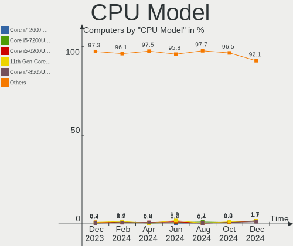
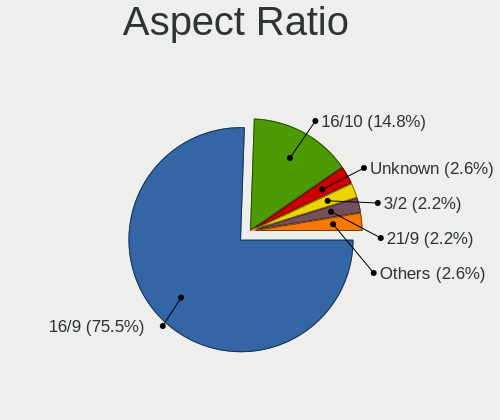
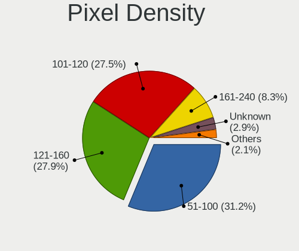

Zorin Hardware Trends
---------------------

A project to identify most popular hardware characteristics and track their change
over time based on data collected by Zorin users at https://Linux-Hardware.org.

Anyone can contribute to the study by uploading probes of their computers by
the [hw-probe](https://github.com/linuxhw/hw-probe) tool:

    sudo -E hw-probe -all -upload

This is a report for all computer types. See also reports for [desktops](/Dist/Zorin/Desktop/README.md) and [notebooks](/Dist/Zorin/Notebook/README.md).

Full-feature report is available here: https://linux-hardware.org/?view=trends

Period: Feb, 2021.

Contents
--------

- [ OS                       ](#os)
- [ OS Family                ](#os-family)
- [ Kernel                   ](#kernel)
- [ Kernel Family            ](#kernel-family)
- [ Kernel Major Ver.        ](#kernel-major-ver)
- [ Arch                     ](#arch)
- [ DE                       ](#de)
- [ Display Server           ](#display-server)
- [ Display Manager          ](#display-manager)
- [ OS Lang                  ](#os-lang)
- [ Boot Mode                ](#boot-mode)
- [ Filesystem               ](#filesystem)
- [ Part. scheme             ](#part-scheme)
- [ Dual Boot with Linux/BSD ](#dual-boot-with-linux/bsd)
- [ Dual Boot (Win)          ](#dual-boot-win)
- [ Country                  ](#country)
- [ City                     ](#city)
- [ Vendor                   ](#vendor)
- [ Model                    ](#model)
- [ Model Family             ](#model-family)
- [ MFG Year                 ](#mfg-year)
- [ Form Factor              ](#form-factor)
- [ Secure Boot              ](#secure-boot)
- [ Coreboot                 ](#coreboot)
- [ RAM Size                 ](#ram-size)
- [ RAM Used                 ](#ram-used)
- [ Has CD-ROM               ](#has-cd-rom)
- [ Total Drives             ](#total-drives)
- [ Has Ethernet             ](#has-ethernet)
- [ Drive Vendor             ](#drive-vendor)
- [ Drive Model              ](#drive-model)
- [ HDD Vendor               ](#hdd-vendor)
- [ SSD Vendor               ](#ssd-vendor)
- [ Drive Kind               ](#drive-kind)
- [ Drive Connector          ](#drive-connector)
- [ Drive Size               ](#drive-size)
- [ Space Total              ](#space-total)
- [ Space Used               ](#space-used)
- [ Malfunc. Drives          ](#malfunc-drives)
- [ Malfunc. Drive Vendor    ](#malfunc-drive-vendor)
- [ Malfunc. HDD Vendor      ](#malfunc-hdd-vendor)
- [ Malfunc. Drive Kind      ](#malfunc-drive-kind)
- [ Failed Drives            ](#failed-drives)
- [ Failed Drive Vendor      ](#failed-drive-vendor)
- [ Drive Status             ](#drive-status)
- [ Storage Vendor           ](#storage-vendor)
- [ Storage Model            ](#storage-model)
- [ Storage Kind             ](#storage-kind)
- [ CPU Vendor               ](#cpu-vendor)
- [ CPU Model                ](#cpu-model)
- [ CPU Model Family         ](#cpu-model-family)
- [ CPU Cores                ](#cpu-cores)
- [ CPU Sockets              ](#cpu-sockets)
- [ CPU Threads              ](#cpu-threads)
- [ CPU Op-Modes             ](#cpu-op-modes)
- [ CPU Microcode            ](#cpu-microcode)
- [ CPU Microarch            ](#cpu-microarch)
- [ GPU Vendor               ](#gpu-vendor)
- [ GPU Model                ](#gpu-model)
- [ GPU Combo                ](#gpu-combo)
- [ GPU Driver               ](#gpu-driver)
- [ GPU Memory               ](#gpu-memory)
- [ Monitor Vendor           ](#monitor-vendor)
- [ Monitor Model            ](#monitor-model)
- [ Monitor Resolution       ](#monitor-resolution)
- [ Monitor Diagonal         ](#monitor-diagonal)
- [ Monitor Width            ](#monitor-width)
- [ Aspect Ratio             ](#aspect-ratio)
- [ Monitor Area             ](#monitor-area)
- [ Pixel Density            ](#pixel-density)
- [ Multiple Monitors        ](#multiple-monitors)
- [ Net Controller Vendor    ](#net-controller-vendor)
- [ Net Controller Model     ](#net-controller-model)
- [ Wireless Vendor          ](#wireless-vendor)
- [ Wireless Model           ](#wireless-model)
- [ Ethernet Vendor          ](#ethernet-vendor)
- [ Ethernet Model           ](#ethernet-model)
- [ Net Controller Kind      ](#net-controller-kind)
- [ Used Controller          ](#used-controller)
- [ NICs                     ](#nics)
- [ Memory Vendor            ](#memory-vendor)
- [ Memory Model             ](#memory-model)
- [ Memory Kind              ](#memory-kind)
- [ Memory Form Factor       ](#memory-form-factor)
- [ Memory Size              ](#memory-size)
- [ Memory Speed             ](#memory-speed)
- [ Sound Vendor             ](#sound-vendor)
- [ Sound Model              ](#sound-model)
- [ Camera Vendor            ](#camera-vendor)
- [ Camera Model             ](#camera-model)
- [ Fingerprint Vendor       ](#fingerprint-vendor)
- [ Fingerprint Model        ](#fingerprint-model)
- [ Chipcard Vendor          ](#chipcard-vendor)
- [ Chipcard Model           ](#chipcard-model)
- [ Printer Vendor           ](#printer-vendor)
- [ Printer Model            ](#printer-model)
- [ Scanner Vendor           ](#scanner-vendor)
- [ Scanner Model            ](#scanner-model)
- [ Bluetooth Vendor         ](#bluetooth-vendor)
- [ Bluetooth Model          ](#bluetooth-model)
- [ Unsupported Devices      ](#unsupported-devices)
- [ Unsupported Device Types ](#unsupported-device-types)

OS
--

Installed operating systems

| Name     | Computers | Percent |
|----------|-----------|---------|
| Zorin 15 | 60        | 93.75%  |
| Zorin 12 | 4         | 6.25%   |

OS Family
---------

OS without a version

| Name  | Computers | Percent |
|-------|-----------|---------|
| Zorin | 64        | 100%    |

Kernel
------

Version of the Linux kernel

| Version            | Computers | Percent |
|--------------------|-----------|---------|
| 5.4.0-65-generic   | 42        | 65.63%  |
| 5.4.0-66-generic   | 7         | 10.94%  |
| 5.4.0-59-generic   | 2         | 3.13%   |
| 5.4.0-47-generic   | 2         | 3.13%   |
| 4.15.0-133-generic | 2         | 3.13%   |
| 5.4.0-64-generic   | 1         | 1.56%   |
| 5.4.0-58-generic   | 1         | 1.56%   |
| 5.4.0-56-generic   | 1         | 1.56%   |
| 5.4.0-54-generic   | 1         | 1.56%   |
| 5.4.0-42-generic   | 1         | 1.56%   |
| 5.10.16-custom     | 1         | 1.56%   |
| 5.0.0-36-generic   | 1         | 1.56%   |
| 4.15.0-126-generic | 1         | 1.56%   |
| 4.15.0-123-generic | 1         | 1.56%   |

Kernel Family
-------------

Linux kernel without a distro release

| Version | Computers | Percent |
|---------|-----------|---------|
| 5.4.0   | 58        | 90.63%  |
| 4.15.0  | 4         | 6.25%   |
| 5.10.16 | 1         | 1.56%   |
| 5.0.0   | 1         | 1.56%   |

Kernel Major Ver.
-----------------

Linux kernel major version

| Version | Computers | Percent |
|---------|-----------|---------|
| 5.4     | 58        | 90.63%  |
| 4.15    | 4         | 6.25%   |
| 5.10    | 1         | 1.56%   |
| 5.0     | 1         | 1.56%   |

Arch
----

OS architecture (x86_64, i586, etc.)

| Name   | Computers | Percent |
|--------|-----------|---------|
| x86_64 | 54        | 84.38%  |
| i686   | 10        | 15.63%  |

DE
--

Desktop Environment

| Name    | Computers | Percent |
|---------|-----------|---------|
| GNOME   | 40        | 62.5%   |
| XFCE    | 18        | 28.13%  |
| Unknown | 5         | 7.81%   |
| KDE     | 1         | 1.56%   |

Display Server
--------------

X11 or Wayland

| Name    | Computers | Percent |
|---------|-----------|---------|
| X11     | 59        | 92.19%  |
| Unknown | 3         | 4.69%   |
| Wayland | 2         | 3.13%   |

Display Manager
---------------

SDDM, LightDM, etc.

| Name    | Computers | Percent |
|---------|-----------|---------|
| Unknown | 64        | 100%    |

OS Lang
-------

Language

| Lang  | Computers | Percent |
|-------|-----------|---------|
| en_US | 23        | 35.94%  |
| en_GB | 6         | 9.38%   |
| pt_BR | 4         | 6.25%   |
| en_CA | 4         | 6.25%   |
| de_DE | 4         | 6.25%   |
| cs_CZ | 4         | 6.25%   |
| pl_PL | 3         | 4.69%   |
| es_MX | 3         | 4.69%   |
| tr_TR | 2         | 3.13%   |
| en_AU | 2         | 3.13%   |
| ru_UA | 1         | 1.56%   |
| ru_RU | 1         | 1.56%   |
| pt_PT | 1         | 1.56%   |
| nl_NL | 1         | 1.56%   |
| it_IT | 1         | 1.56%   |
| es_ES | 1         | 1.56%   |
| es_CL | 1         | 1.56%   |
| el_GR | 1         | 1.56%   |
| da_DK | 1         | 1.56%   |

Boot Mode
---------

EFI or BIOS

| Mode | Computers | Percent |
|------|-----------|---------|
| BIOS | 41        | 64.06%  |
| EFI  | 23        | 35.94%  |

Filesystem
----------

Type of filesystem

| Type  | Computers | Percent |
|-------|-----------|---------|
| Ext4  | 63        | 98.44%  |
| Btrfs | 1         | 1.56%   |

Part. scheme
------------

Scheme of partitioning

| Type    | Computers | Percent |
|---------|-----------|---------|
| Unknown | 64        | 100%    |

Dual Boot with Linux/BSD
------------------------

Hosting more than one Linux/BSD

| Dual boot | Computers | Percent |
|-----------|-----------|---------|
| No        | 56        | 87.5%   |
| Yes       | 8         | 12.5%   |

Dual Boot (Win)
---------------

Hosting Linux and Windows

| Dual boot | Computers | Percent |
|-----------|-----------|---------|
| No        | 43        | 67.19%  |
| Yes       | 21        | 32.81%  |

Country
-------

Geographic location (country)

| Country        | Computers | Percent |
|----------------|-----------|---------|
| USA            | 15        | 23.44%  |
| UK             | 6         | 9.38%   |
| Germany        | 5         | 7.81%   |
| Czech Republic | 4         | 6.25%   |
| Canada         | 4         | 6.25%   |
| Brazil         | 4         | 6.25%   |
| Poland         | 3         | 4.69%   |
| Mexico         | 3         | 4.69%   |
| Turkey         | 2         | 3.13%   |
| Switzerland    | 2         | 3.13%   |
| Indonesia      | 2         | 3.13%   |
| Australia      | 2         | 3.13%   |
| Ukraine        | 1         | 1.56%   |
| Spain          | 1         | 1.56%   |
| Serbia         | 1         | 1.56%   |
| Philippines    | 1         | 1.56%   |
| Netherlands    | 1         | 1.56%   |
| Italy          | 1         | 1.56%   |
| Israel         | 1         | 1.56%   |
| India          | 1         | 1.56%   |
| Greece         | 1         | 1.56%   |
| Denmark        | 1         | 1.56%   |
| Chile          | 1         | 1.56%   |
| Belgium        | 1         | 1.56%   |

City
----

Geographic location (city)

| City               | Computers | Percent |
|--------------------|-----------|---------|
| Winnipeg           | 2         | 3.13%   |
| Richmond           | 2         | 3.13%   |
| Probolinggo        | 2         | 3.13%   |
| Winston-Salem      | 1         | 1.56%   |
| Wesley Chapel      | 1         | 1.56%   |
| Weisenheim am Sand | 1         | 1.56%   |
| Wedel              | 1         | 1.56%   |
| Vigo               | 1         | 1.56%   |
| Tujunga            | 1         | 1.56%   |
| São Paulo         | 1         | 1.56%   |
| Sosnowiec          | 1         | 1.56%   |
| Sestri Levante     | 1         | 1.56%   |
| Secaucus           | 1         | 1.56%   |
| San Francisco      | 1         | 1.56%   |
| Rio de Janeiro     | 1         | 1.56%   |
| Redding            | 1         | 1.56%   |
| Prague             | 1         | 1.56%   |
| Poniatowa          | 1         | 1.56%   |
| Perth              | 1         | 1.56%   |
| Pardubice          | 1         | 1.56%   |
| Oudenaarde         | 1         | 1.56%   |
| Olympia            | 1         | 1.56%   |
| Oirsbeek           | 1         | 1.56%   |
| Ober-Ramstadt      | 1         | 1.56%   |
| Novi Sad           | 1         | 1.56%   |
| Nova Paka          | 1         | 1.56%   |
| Morphett Vale      | 1         | 1.56%   |
| Monterrey          | 1         | 1.56%   |
| Makati City        | 1         | 1.56%   |
| London             | 1         | 1.56%   |
| Lenzburg           | 1         | 1.56%   |
| Las Vegas          | 1         | 1.56%   |
| Kyiv               | 1         | 1.56%   |
| Kobenhavn O        | 1         | 1.56%   |
| Jerusalem          | 1         | 1.56%   |
| Istanbul           | 1         | 1.56%   |
| Indore             | 1         | 1.56%   |
| Huauchinango       | 1         | 1.56%   |
| Hohenhameln        | 1         | 1.56%   |
| Fribourg           | 1         | 1.56%   |
| Fort Saskatchewan  | 1         | 1.56%   |
| Folkestone         | 1         | 1.56%   |
| Eugene             | 1         | 1.56%   |
| Enfield Town       | 1         | 1.56%   |
| Elmswell           | 1         | 1.56%   |
| Davis              | 1         | 1.56%   |
| Dasice             | 1         | 1.56%   |
| Curitiba           | 1         | 1.56%   |
| Cuernavaca         | 1         | 1.56%   |
| Concepción        | 1         | 1.56%   |
| Clapham            | 1         | 1.56%   |
| Chicago            | 1         | 1.56%   |
| Chalcis            | 1         | 1.56%   |
| Canoas             | 1         | 1.56%   |
| Cambridge          | 1         | 1.56%   |
| Buxtehude          | 1         | 1.56%   |
| Buena Park         | 1         | 1.56%   |
| Brooklyn           | 1         | 1.56%   |
| Bismarck           | 1         | 1.56%   |
| Bielawa            | 1         | 1.56%   |

Vendor
------

Motherboard manufacturer

| Name                | Computers | Percent |
|---------------------|-----------|---------|
| Hewlett-Packard     | 13        | 20.31%  |
| ASUSTek Computer    | 11        | 17.19%  |
| Dell                | 9         | 14.06%  |
| Lenovo              | 6         | 9.38%   |
| Gigabyte Technology | 5         | 7.81%   |
| Toshiba             | 3         | 4.69%   |
| MSI                 | 3         | 4.69%   |
| Acer                | 3         | 4.69%   |
| Foxconn             | 2         | 3.13%   |
| ASRock              | 2         | 3.13%   |
| Samsung Electronics | 1         | 1.56%   |
| Pegatron            | 1         | 1.56%   |
| Multilaser          | 1         | 1.56%   |
| Microsoft           | 1         | 1.56%   |
| Intel               | 1         | 1.56%   |
| HUAWEI              | 1         | 1.56%   |
| Unknown             | 1         | 1.56%   |

Model
-----

Motherboard model

| Name                                   | Computers | Percent |
|----------------------------------------|-----------|---------|
| Toshiba Satellite Pro L550             | 1         | 1.56%   |
| Toshiba Satellite NB10t-A              | 1         | 1.56%   |
| Toshiba Satellite L855                 | 1         | 1.56%   |
| Samsung 370E4K                         | 1         | 1.56%   |
| Pegatron NP185AA-ABA CQ5110F           | 1         | 1.56%   |
| Multilaser PC024                       | 1         | 1.56%   |
| MSI MS-7C75                            | 1         | 1.56%   |
| MSI MS-7A38                            | 1         | 1.56%   |
| MSI MS-7914                            | 1         | 1.56%   |
| Microsoft Surface 3                    | 1         | 1.56%   |
| Lenovo ThinkPad T440s 20ARS10700       | 1         | 1.56%   |
| Lenovo ThinkPad R61 8943DKG            | 1         | 1.56%   |
| Lenovo ThinkPad Edge E531 688528U      | 1         | 1.56%   |
| Lenovo IdeaPad L340-15API 81LW         | 1         | 1.56%   |
| Lenovo H430 10091                      | 1         | 1.56%   |
| Lenovo G560 0679                       | 1         | 1.56%   |
| Intel DG45ID AAE27729-310              | 1         | 1.56%   |
| HUAWEI BOHK-WAX9X                      | 1         | 1.56%   |
| HP ZBook 17 G2                         | 1         | 1.56%   |
| HP Stream Laptop 11-y0XX               | 1         | 1.56%   |
| HP Pavilion Laptop 15-cs0xxx           | 1         | 1.56%   |
| HP Pavilion dv9500                     | 1         | 1.56%   |
| HP Pavilion dv6000 (RR398EA#B1A)       | 1         | 1.56%   |
| HP G42                                 | 1         | 1.56%   |
| HP ENVY 15                             | 1         | 1.56%   |
| HP EliteBook 2560p                     | 1         | 1.56%   |
| HP Compaq Pro 4300 SFF PC              | 1         | 1.56%   |
| HP Compaq Presario CQ61                | 1         | 1.56%   |
| HP Compaq 6510b (GR690ET#ABD)          | 1         | 1.56%   |
| HP All-in-One 24-df0xxx                | 1         | 1.56%   |
| HP 255 G5                              | 1         | 1.56%   |
| Gigabyte Z77X-UD3H                     | 1         | 1.56%   |
| Gigabyte G31M-S2C                      | 1         | 1.56%   |
| Gigabyte B460MDS3H                     | 1         | 1.56%   |
| Gigabyte B450M DS3H                    | 1         | 1.56%   |
| Gigabyte B450 I AORUS PRO WIFI         | 1         | 1.56%   |
| Foxconn Pavilion P6000 Series          | 1         | 1.56%   |
| Foxconn ELVAS                          | 1         | 1.56%   |
| Dell XPS 13 9333                       | 1         | 1.56%   |
| Dell OptiPlex 780                      | 1         | 1.56%   |
| Dell OptiPlex 755                      | 1         | 1.56%   |
| Dell Latitude E6400                    | 1         | 1.56%   |
| Dell Latitude D520                     | 1         | 1.56%   |
| Dell Inspiron 7737                     | 1         | 1.56%   |
| Dell Inspiron 530s                     | 1         | 1.56%   |
| Dell Inspiron 3543                     | 1         | 1.56%   |
| Dell Inspiron 1012                     | 1         | 1.56%   |
| ASUS X751SJ                            | 1         | 1.56%   |
| ASUS X555LD                            | 1         | 1.56%   |
| ASUS X550ZA                            | 1         | 1.56%   |
| ASUS X510UAR                           | 1         | 1.56%   |
| ASUS VivoBook_ASUSLaptop X512DA_F512DA | 1         | 1.56%   |
| ASUS U36SD                             | 1         | 1.56%   |
| ASUS PRIME Z370-A                      | 1         | 1.56%   |
| ASUS PRIME B360-PLUS                   | 1         | 1.56%   |
| ASUS P7P55D-E LX                       | 1         | 1.56%   |
| ASUS M2A-MX                            | 1         | 1.56%   |
| ASUS K52N                              | 1         | 1.56%   |
| ASRock N68C-S                          | 1         | 1.56%   |
| ASRock B450M-HDV R4.0                  | 1         | 1.56%   |

Model Family
------------

Motherboard model prefix

| Name                 | Computers | Percent |
|----------------------|-----------|---------|
| Dell Inspiron        | 4         | 6.25%   |
| Toshiba Satellite    | 3         | 4.69%   |
| Lenovo ThinkPad      | 3         | 4.69%   |
| HP Pavilion          | 3         | 4.69%   |
| HP Compaq            | 3         | 4.69%   |
| Dell OptiPlex        | 2         | 3.13%   |
| Dell Latitude        | 2         | 3.13%   |
| ASUS PRIME           | 2         | 3.13%   |
| Samsung 370E4K       | 1         | 1.56%   |
| Pegatron NP185AA-ABA | 1         | 1.56%   |
| Multilaser PC024     | 1         | 1.56%   |
| MSI MS-7C75          | 1         | 1.56%   |
| MSI MS-7A38          | 1         | 1.56%   |
| MSI MS-7914          | 1         | 1.56%   |
| Microsoft Surface    | 1         | 1.56%   |
| Lenovo IdeaPad       | 1         | 1.56%   |
| Lenovo H430          | 1         | 1.56%   |
| Lenovo G560          | 1         | 1.56%   |
| Intel DG45ID         | 1         | 1.56%   |
| HUAWEI BOHK-WAX9X    | 1         | 1.56%   |
| HP ZBook             | 1         | 1.56%   |
| HP Stream            | 1         | 1.56%   |
| HP G42               | 1         | 1.56%   |
| HP ENVY              | 1         | 1.56%   |
| HP EliteBook         | 1         | 1.56%   |
| HP All-in-One        | 1         | 1.56%   |
| HP 255               | 1         | 1.56%   |
| Gigabyte Z77X-UD3H   | 1         | 1.56%   |
| Gigabyte G31M-S2C    | 1         | 1.56%   |
| Gigabyte B460MDS3H   | 1         | 1.56%   |
| Gigabyte B450M       | 1         | 1.56%   |
| Gigabyte B450        | 1         | 1.56%   |
| Foxconn Pavilion     | 1         | 1.56%   |
| Foxconn ELVAS        | 1         | 1.56%   |
| Dell XPS             | 1         | 1.56%   |
| ASUS X751SJ          | 1         | 1.56%   |
| ASUS X555LD          | 1         | 1.56%   |
| ASUS X550ZA          | 1         | 1.56%   |
| ASUS X510UAR         | 1         | 1.56%   |
| ASUS VivoBook        | 1         | 1.56%   |
| ASUS U36SD           | 1         | 1.56%   |
| ASUS P7P55D-E        | 1         | 1.56%   |
| ASUS M2A-MX          | 1         | 1.56%   |
| ASUS K52N            | 1         | 1.56%   |
| ASRock N68C-S        | 1         | 1.56%   |
| ASRock B450M-HDV     | 1         | 1.56%   |
| Acer V5-131          | 1         | 1.56%   |
| Acer TravelMate      | 1         | 1.56%   |
| Acer Spin            | 1         | 1.56%   |
| Unknown              | 1         | 1.56%   |

MFG Year
--------

Motherboard manufacture year

| Year | Computers | Percent |
|------|-----------|---------|
| 2020 | 8         | 12.5%   |
| 2019 | 7         | 10.94%  |
| 2013 | 7         | 10.94%  |
| 2010 | 7         | 10.94%  |
| 2009 | 7         | 10.94%  |
| 2014 | 4         | 6.25%   |
| 2008 | 4         | 6.25%   |
| 2018 | 3         | 4.69%   |
| 2016 | 3         | 4.69%   |
| 2015 | 3         | 4.69%   |
| 2012 | 3         | 4.69%   |
| 2007 | 3         | 4.69%   |
| 2011 | 2         | 3.13%   |
| 2021 | 1         | 1.56%   |
| 2017 | 1         | 1.56%   |
| 2006 | 1         | 1.56%   |

Form Factor
-----------

Physical design of the computer

| Name        | Computers | Percent |
|-------------|-----------|---------|
| Notebook    | 38        | 59.38%  |
| Desktop     | 23        | 35.94%  |
| Tablet      | 1         | 1.56%   |
| Convertible | 1         | 1.56%   |
| All in one  | 1         | 1.56%   |

Secure Boot
-----------

Enabled or disabled

| State    | Computers | Percent |
|----------|-----------|---------|
| Disabled | 57        | 89.06%  |
| Enabled  | 7         | 10.94%  |

Coreboot
--------

Have coreboot on board

| Used | Computers | Percent |
|------|-----------|---------|
| No   | 64        | 100%    |

RAM Size
--------

Total RAM memory

| Size in GB | Computers | Percent |
|------------|-----------|---------|
| 3.01-4.0   | 14        | 21.88%  |
| 8.01-16.0  | 13        | 20.31%  |
| 4.01-8.0   | 12        | 18.75%  |
| 1.01-2.0   | 10        | 15.63%  |
| 16.01-24.0 | 7         | 10.94%  |
| 32.01-64.0 | 4         | 6.25%   |
| 0.51-1.0   | 2         | 3.13%   |
| 24.01-32.0 | 1         | 1.56%   |
| 2.01-3.0   | 1         | 1.56%   |

RAM Used
--------

Used RAM memory

| Used GB   | Computers | Percent |
|-----------|-----------|---------|
| 1.01-2.0  | 32        | 50%     |
| 2.01-3.0  | 9         | 14.06%  |
| 0.51-1.0  | 9         | 14.06%  |
| 3.01-4.0  | 8         | 12.5%   |
| 4.01-8.0  | 3         | 4.69%   |
| 8.01-16.0 | 2         | 3.13%   |
| 0.01-0.5  | 1         | 1.56%   |

Has CD-ROM
----------

Has CD-ROM on board

| Presented | Computers | Percent |
|-----------|-----------|---------|
| Yes       | 35        | 54.69%  |
| No        | 29        | 45.31%  |

Total Drives
------------

Number of drives on board

| Drives | Computers | Percent |
|--------|-----------|---------|
| 1      | 45        | 70.31%  |
| 2      | 14        | 21.88%  |
| 3      | 4         | 6.25%   |
| 4      | 1         | 1.56%   |

Has Ethernet
------------

Has Ethernet on board

| Presented | Computers | Percent |
|-----------|-----------|---------|
| Yes       | 56        | 87.5%   |
| No        | 8         | 12.5%   |

Drive Vendor
------------

Hard drive vendors

| Vendor              | Computers | Drives | Percent |
|---------------------|-----------|--------|---------|
| Seagate             | 25        | 26     | 31.25%  |
| WDC                 | 9         | 9      | 11.25%  |
| Samsung Electronics | 9         | 9      | 11.25%  |
| Toshiba             | 5         | 6      | 6.25%   |
| Unknown             | 4         | 6      | 5%      |
| Kingston            | 4         | 4      | 5%      |
| Hitachi             | 3         | 3      | 3.75%   |
| Sandisk             | 2         | 2      | 2.5%    |
| Phison              | 2         | 2      | 2.5%    |
| Patriot             | 2         | 2      | 2.5%    |
| HGST                | 2         | 2      | 2.5%    |
| Crucial             | 2         | 2      | 2.5%    |
| XPG                 | 1         | 1      | 1.25%   |
| Transcend           | 1         | 1      | 1.25%   |
| Sabrent             | 1         | 1      | 1.25%   |
| MAXTOR              | 1         | 1      | 1.25%   |
| Marvell             | 1         | 1      | 1.25%   |
| LITEONIT            | 1         | 1      | 1.25%   |
| Intenso             | 1         | 1      | 1.25%   |
| HS-SSD-C100         | 1         | 1      | 1.25%   |
| Fujitsu             | 1         | 1      | 1.25%   |
| Corsair             | 1         | 1      | 1.25%   |
| Apple               | 1         | 1      | 1.25%   |

Drive Model
-----------

Hard drive models

| Model                               | Computers | Percent |
|-------------------------------------|-----------|---------|
| Unknown MMC Card  32GB              | 3         | 3.61%   |
| Seagate ST500LT012-1DG142 500GB     | 2         | 2.41%   |
| Seagate ST500DM002-1BD142 500GB     | 2         | 2.41%   |
| Seagate ST1000LM014-1EJ164 1TB      | 2         | 2.41%   |
| Seagate ST1000DM010-2EP102 1TB      | 2         | 2.41%   |
| Kingston SV300S37A120G 120GB SSD    | 2         | 2.41%   |
| XPG NVMe SSD Drive 1024GB           | 1         | 1.2%    |
| WDC WDS100T2G0A-00JH30 1TB SSD      | 1         | 1.2%    |
| WDC WD3200BPVT-75ZEST0 320GB        | 1         | 1.2%    |
| WDC WD3200BPVT-24JJ5T0 320GB        | 1         | 1.2%    |
| WDC WD2500BEVT-22A23T0 250GB        | 1         | 1.2%    |
| WDC WD2500AAKX-75U6AA0 250GB        | 1         | 1.2%    |
| WDC WD1600AAJS-75WAA0 160GB         | 1         | 1.2%    |
| WDC WD10JPVX-60JC3T1 1TB            | 1         | 1.2%    |
| WDC WD10JPVT-00A1YT0 1TB            | 1         | 1.2%    |
| WDC WD10EZRZ-00HTKB0 1TB            | 1         | 1.2%    |
| Unknown PSM-256GBSATA3SSD2.5        | 1         | 1.2%    |
| Unknown MMC Card  128GB             | 1         | 1.2%    |
| Transcend TS512GMTS430S 512GB SSD   | 1         | 1.2%    |
| Toshiba THNSNK128GVN8 128GB SSD     | 1         | 1.2%    |
| Toshiba MQ04ABF100 1TB              | 1         | 1.2%    |
| Toshiba MQ01ABF050 500GB            | 1         | 1.2%    |
| Toshiba MQ01ABD100 1TB              | 1         | 1.2%    |
| Toshiba MK2565GSX 250GB             | 1         | 1.2%    |
| Toshiba DT01ACA100 1TB              | 1         | 1.2%    |
| Seagate ST9500325AS 500GB           | 1         | 1.2%    |
| Seagate ST9250827AS 250GB           | 1         | 1.2%    |
| Seagate ST9160821AS 160GB           | 1         | 1.2%    |
| Seagate ST9120817AS 120GB           | 1         | 1.2%    |
| Seagate ST500LM034-2GH17A 500GB     | 1         | 1.2%    |
| Seagate ST500LM012 HN-M500MBB 500GB | 1         | 1.2%    |
| Seagate ST4000DM004-2CV104 4TB      | 1         | 1.2%    |
| Seagate ST3750528AS 752GB           | 1         | 1.2%    |
| Seagate ST3500418AS 500GB           | 1         | 1.2%    |
| Seagate ST3400633AS 400GB           | 1         | 1.2%    |
| Seagate ST3320418AS 320GB           | 1         | 1.2%    |
| Seagate ST320LT020-9YG142 320GB     | 1         | 1.2%    |
| Seagate ST3120827AS 120GB           | 1         | 1.2%    |
| Seagate ST31000528AS 1TB            | 1         | 1.2%    |
| Seagate ST2000DM001-1ER164 2TB      | 1         | 1.2%    |
| Seagate ST1000LX015-1U7172 1TB      | 1         | 1.2%    |
| Seagate ST1000LM035-1RK172 1TB      | 1         | 1.2%    |
| Seagate BUP Slim 2TB                | 1         | 1.2%    |
| SanDisk SDSSDHP064G 64GB            | 1         | 1.2%    |
| Sandisk NVMe SSD Drive 500GB        | 1         | 1.2%    |
| Samsung SSD PM810 2.5 7mm 128GB     | 1         | 1.2%    |
| Samsung SSD 850 PRO 512GB           | 1         | 1.2%    |
| Samsung SSD 850 EVO 500GB           | 1         | 1.2%    |
| Samsung SSD 840 EVO 500GB           | 1         | 1.2%    |
| Samsung SSD 750 EVO 250GB           | 1         | 1.2%    |
| Samsung NVMe SSD Drive 256GB        | 1         | 1.2%    |
| Samsung NVMe SSD Drive 1TB          | 1         | 1.2%    |
| Samsung HM160HI 160GB               | 1         | 1.2%    |
| Samsung HD642JJ 640GB               | 1         | 1.2%    |
| Sabrent Dual SATA Bridge            | 1         | 1.2%    |
| Phison NVMe SSD Drive 256GB         | 1         | 1.2%    |
| Phison NVMe SSD Drive 120GB         | 1         | 1.2%    |
| Patriot Spark 256GB SSD             | 1         | 1.2%    |
| Patriot P200 1TB SSD                | 1         | 1.2%    |
| MAXTOR STM3500630AS 500GB           | 1         | 1.2%    |

HDD Vendor
----------

Hard disk drive vendors

| Vendor              | Computers | Drives | Percent |
|---------------------|-----------|--------|---------|
| Seagate             | 25        | 26     | 51.02%  |
| WDC                 | 8         | 8      | 16.33%  |
| Toshiba             | 5         | 5      | 10.2%   |
| Hitachi             | 3         | 3      | 6.12%   |
| Samsung Electronics | 2         | 2      | 4.08%   |
| HGST                | 2         | 2      | 4.08%   |
| Sabrent             | 1         | 1      | 2.04%   |
| MAXTOR              | 1         | 1      | 2.04%   |
| Fujitsu             | 1         | 1      | 2.04%   |
| Apple               | 1         | 1      | 2.04%   |

SSD Vendor
----------

Solid state drive vendors

| Vendor              | Computers | Drives | Percent |
|---------------------|-----------|--------|---------|
| Samsung Electronics | 5         | 5      | 25%     |
| Kingston            | 3         | 3      | 15%     |
| Patriot             | 2         | 2      | 10%     |
| Crucial             | 2         | 2      | 10%     |
| WDC                 | 1         | 1      | 5%      |
| Unknown             | 1         | 1      | 5%      |
| Transcend           | 1         | 1      | 5%      |
| Toshiba             | 1         | 1      | 5%      |
| SanDisk             | 1         | 1      | 5%      |
| LITEONIT            | 1         | 1      | 5%      |
| Intenso             | 1         | 1      | 5%      |
| Corsair             | 1         | 1      | 5%      |

Drive Kind
----------

HDD or SSD

| Kind    | Computers | Drives | Percent |
|---------|-----------|--------|---------|
| HDD     | 45        | 50     | 60.81%  |
| SSD     | 17        | 20     | 22.97%  |
| NVMe    | 8         | 8      | 10.81%  |
| MMC     | 3         | 5      | 4.05%   |
| Unknown | 1         | 1      | 1.35%   |

Drive Connector
---------------

SATA, SAS, NVMe, etc.

| Type | Computers | Drives | Percent |
|------|-----------|--------|---------|
| SATA | 58        | 69     | 82.86%  |
| NVMe | 8         | 8      | 11.43%  |
| MMC  | 3         | 5      | 4.29%   |
| SAS  | 1         | 2      | 1.43%   |

Drive Size
----------

Size of hard drive

| Size in TB | Computers | Drives | Percent |
|------------|-----------|--------|---------|
| 0.01-0.5   | 39        | 45     | 61.9%   |
| 0.51-1.0   | 19        | 20     | 30.16%  |
| 1.01-2.0   | 3         | 3      | 4.76%   |
| 3.01-4.0   | 1         | 1      | 1.59%   |
| 2.01-3.0   | 1         | 1      | 1.59%   |

Space Total
-----------

Amount of disk space available on the file system

| Size in GB     | Computers | Percent |
|----------------|-----------|---------|
| 101-250        | 23        | 35.94%  |
| 251-500        | 15        | 23.44%  |
| 501-1000       | 13        | 20.31%  |
| 51-100         | 6         | 9.38%   |
| 21-50          | 4         | 6.25%   |
| More than 3000 | 3         | 4.69%   |

Space Used
----------

Amount of used disk space

| Used GB        | Computers | Percent |
|----------------|-----------|---------|
| 1-20           | 33        | 51.56%  |
| 21-50          | 16        | 25%     |
| 51-100         | 6         | 9.38%   |
| 251-500        | 4         | 6.25%   |
| 101-250        | 2         | 3.13%   |
| More than 3000 | 1         | 1.56%   |
| 2001-3000      | 1         | 1.56%   |
| 501-1000       | 1         | 1.56%   |

Malfunc. Drives
---------------

Drive models with a malfunction

| Model                     | Computers | Drives | Percent |
|---------------------------|-----------|--------|---------|
| Seagate ST9500325AS 500GB | 1         | 1      | 100%    |

Malfunc. Drive Vendor
---------------------

Vendors of faulty drives

| Vendor  | Computers | Drives | Percent |
|---------|-----------|--------|---------|
| Seagate | 1         | 1      | 100%    |

Malfunc. HDD Vendor
-------------------

Vendors of faulty HDD drives

| Vendor  | Computers | Drives | Percent |
|---------|-----------|--------|---------|
| Seagate | 1         | 1      | 100%    |

Malfunc. Drive Kind
-------------------

Kinds of faulty drives

| Kind | Computers | Drives | Percent |
|------|-----------|--------|---------|
| HDD  | 1         | 1      | 100%    |

Failed Drives
-------------

Failed drive models

Zero info for selected period =(

Failed Drive Vendor
-------------------

Failed drive vendors

Zero info for selected period =(

Drive Status
------------

Number of failed and malfunc. drives

| Status   | Computers | Drives | Percent |
|----------|-----------|--------|---------|
| Detected | 63        | 83     | 98.44%  |
| Malfunc  | 1         | 1      | 1.56%   |

Storage Vendor
--------------

Storage controller vendors

| Vendor                           | Computers | Percent |
|----------------------------------|-----------|---------|
| Intel                            | 43        | 58.9%   |
| AMD                              | 14        | 19.18%  |
| Nvidia                           | 3         | 4.11%   |
| Marvell Technology Group         | 3         | 4.11%   |
| Samsung Electronics              | 2         | 2.74%   |
| Phison Electronics               | 2         | 2.74%   |
| Silicon Integrated Systems [SiS] | 1         | 1.37%   |
| Sandisk                          | 1         | 1.37%   |
| Kingston Technology Company      | 1         | 1.37%   |
| JMicron Technology               | 1         | 1.37%   |
| ASMedia Technology               | 1         | 1.37%   |
| ADATA Technology                 | 1         | 1.37%   |

Storage Model
-------------

Storage controller models

| Model                                                                            | Computers | Percent |
|----------------------------------------------------------------------------------|-----------|---------|
| AMD FCH SATA Controller [AHCI mode]                                              | 10        | 10.99%  |
| AMD 400 Series Chipset SATA Controller                                           | 4         | 4.4%    |
| Intel 82801IBM/IEM (ICH9M/ICH9M-E) 4 port SATA Controller [AHCI mode]            | 3         | 3.3%    |
| Intel 82801HM/HEM (ICH8M/ICH8M-E) SATA Controller [AHCI mode]                    | 3         | 3.3%    |
| Intel 82801HM/HEM (ICH8M/ICH8M-E) IDE Controller                                 | 3         | 3.3%    |
| Intel 82801 Mobile SATA Controller [RAID mode]                                   | 3         | 3.3%    |
| Intel 8 Series SATA Controller 1 [AHCI mode]                                     | 3         | 3.3%    |
| Intel 7 Series Chipset Family 6-port SATA Controller [AHCI mode]                 | 3         | 3.3%    |
| Samsung NVMe SSD Controller SM981/PM981/PM983                                    | 2         | 2.2%    |
| Nvidia MCP61 SATA Controller                                                     | 2         | 2.2%    |
| Intel Wildcat Point-LP SATA Controller [AHCI Mode]                               | 2         | 2.2%    |
| Intel Sunrise Point-LP SATA Controller [AHCI mode]                               | 2         | 2.2%    |
| Intel 8 Series/C220 Series Chipset Family 6-port SATA Controller 1 [AHCI mode]   | 2         | 2.2%    |
| Intel 6 Series/C200 Series Chipset Family 6 port Mobile SATA AHCI Controller     | 2         | 2.2%    |
| Intel 6 Series/C200 Series Chipset Family 6 port Desktop SATA AHCI Controller    | 2         | 2.2%    |
| AMD SB7x0/SB8x0/SB9x0 SATA Controller [AHCI mode]                                | 2         | 2.2%    |
| Silicon Integrated Systems [SiS] SATA Controller / IDE mode                      | 1         | 1.1%    |
| Silicon Integrated Systems [SiS] 5513 IDE Controller                             | 1         | 1.1%    |
| Sandisk WD Blue SN550 NVMe SSD                                                   | 1         | 1.1%    |
| Phison E7 NVMe Controller                                                        | 1         | 1.1%    |
| Phison E12 NVMe Controller                                                       | 1         | 1.1%    |
| Nvidia MCP67 IDE Controller                                                      | 1         | 1.1%    |
| Nvidia MCP67 AHCI Controller                                                     | 1         | 1.1%    |
| Nvidia MCP61 IDE                                                                 | 1         | 1.1%    |
| Marvell Group Marvell Non-Volatile memory controller                             | 1         | 1.1%    |
| Marvell Group 88SE9172 SATA 6Gb/s Controller                                     | 1         | 1.1%    |
| Marvell Group 88SE914D SATA-600 Controller                                       | 1         | 1.1%    |
| Kingston Company Company Non-Volatile memory controller                          | 1         | 1.1%    |
| JMicron JMB361 AHCI/IDE                                                          | 1         | 1.1%    |
| Intel SATA Controller [RAID mode]                                                | 1         | 1.1%    |
| Intel NM10/ICH7 Family SATA Controller [IDE mode]                                | 1         | 1.1%    |
| Intel NM10/ICH7 Family SATA Controller [AHCI mode]                               | 1         | 1.1%    |
| Intel Cannon Lake PCH SATA AHCI Controller                                       | 1         | 1.1%    |
| Intel Atom/Celeron/Pentium Processor x5-E8000/J3xxx/N3xxx Series SATA Controller | 1         | 1.1%    |
| Intel Atom Processor E3800 Series SATA AHCI Controller                           | 1         | 1.1%    |
| Intel 9 Series Chipset Family SATA Controller [AHCI Mode]                        | 1         | 1.1%    |
| Intel 82Q35 Express PT IDER Controller                                           | 1         | 1.1%    |
| Intel 82801JI (ICH10 Family) 4 port SATA IDE Controller #1                       | 1         | 1.1%    |
| Intel 82801JI (ICH10 Family) 2 port SATA IDE Controller #2                       | 1         | 1.1%    |
| Intel 82801JD/DO (ICH10 Family) 4-port SATA IDE Controller                       | 1         | 1.1%    |
| Intel 82801JD/DO (ICH10 Family) 2-port SATA IDE Controller                       | 1         | 1.1%    |
| Intel 82801IR/IO/IH (ICH9R/DO/DH) 6 port SATA Controller [AHCI mode]             | 1         | 1.1%    |
| Intel 82801IR/IO/IH (ICH9R/DO/DH) 4 port SATA Controller [IDE mode]              | 1         | 1.1%    |
| Intel 82801I (ICH9 Family) 2 port SATA Controller [IDE mode]                     | 1         | 1.1%    |
| Intel 82801HM/HEM (ICH8M/ICH8M-E) SATA Controller [IDE mode]                     | 1         | 1.1%    |
| Intel 82801GBM/GHM (ICH7-M Family) SATA Controller [IDE mode]                    | 1         | 1.1%    |
| Intel 82801GBM/GHM (ICH7-M Family) SATA Controller [AHCI mode]                   | 1         | 1.1%    |
| Intel 82801G (ICH7 Family) IDE Controller                                        | 1         | 1.1%    |
| Intel 7 Series/C210 Series Chipset Family 6-port SATA Controller [AHCI mode]     | 1         | 1.1%    |
| Intel 5 Series/3400 Series Chipset 6 port SATA AHCI Controller                   | 1         | 1.1%    |
| Intel 5 Series/3400 Series Chipset 4 port SATA AHCI Controller                   | 1         | 1.1%    |
| Intel 400 Series Chipset Family SATA AHCI Controller                             | 1         | 1.1%    |
| Intel 4 Series Chipset PT IDER Controller                                        | 1         | 1.1%    |
| Intel 200 Series PCH SATA controller [AHCI mode]                                 | 1         | 1.1%    |
| ASMedia ASM1062 Serial ATA Controller                                            | 1         | 1.1%    |
| AMD SB7x0/SB8x0/SB9x0 SATA Controller [IDE mode]                                 | 1         | 1.1%    |
| AMD SB600 Non-Raid-5 SATA                                                        | 1         | 1.1%    |
| AMD SB600 IDE                                                                    | 1         | 1.1%    |
| ADATA XPG SX8200 Pro PCIe Gen3x4 M.2 2280 Solid State Drive                      | 1         | 1.1%    |

Storage Kind
------------

Kind of storage controller (IDE, SATA, NVMe, SAS, ...)

| Kind | Computers | Percent |
|------|-----------|---------|
| SATA | 48        | 63.16%  |
| IDE  | 16        | 21.05%  |
| NVMe | 8         | 10.53%  |
| RAID | 4         | 5.26%   |

CPU Vendor
----------

Processor vendors

| Vendor | Computers | Percent |
|--------|-----------|---------|
| Intel  | 47        | 73.44%  |
| AMD    | 17        | 26.56%  |

CPU Model
---------

Processor models

| Model                                           | Computers | Percent |
|-------------------------------------------------|-----------|---------|
| AMD Ryzen 5 3500U with Radeon Vega Mobile Gfx   | 3         | 4.69%   |
| Intel Core i7-8550U CPU @ 1.80GHz               | 2         | 3.13%   |
| Intel Core i7-10700K CPU @ 3.80GHz              | 2         | 3.13%   |
| Intel Pentium Dual-Core CPU T4500 @ 2.30GHz     | 1         | 1.56%   |
| Intel Pentium Dual-Core CPU T4400 @ 2.20GHz     | 1         | 1.56%   |
| Intel Pentium Dual CPU E2160 @ 1.80GHz          | 1         | 1.56%   |
| Intel Pentium CPU N3700 @ 1.60GHz               | 1         | 1.56%   |
| Intel Pentium CPU G860 @ 3.00GHz                | 1         | 1.56%   |
| Intel Genuine CPU T2300 @ 1.66GHz               | 1         | 1.56%   |
| Intel Core i7-4800MQ CPU @ 2.70GHz              | 1         | 1.56%   |
| Intel Core i7-4790 CPU @ 3.60GHz                | 1         | 1.56%   |
| Intel Core i7-4700MQ CPU @ 2.40GHz              | 1         | 1.56%   |
| Intel Core i7-4600U CPU @ 2.10GHz               | 1         | 1.56%   |
| Intel Core i7-4510U CPU @ 2.00GHz               | 1         | 1.56%   |
| Intel Core i7-3632QM CPU @ 2.20GHz              | 1         | 1.56%   |
| Intel Core i5-9600K CPU @ 3.70GHz               | 1         | 1.56%   |
| Intel Core i5-8250U CPU @ 1.60GHz               | 1         | 1.56%   |
| Intel Core i5-4200U CPU @ 1.60GHz               | 1         | 1.56%   |
| Intel Core i5-3570K CPU @ 3.40GHz               | 1         | 1.56%   |
| Intel Core i5-2540M CPU @ 2.60GHz               | 1         | 1.56%   |
| Intel Core i5 CPU 760 @ 2.80GHz                 | 1         | 1.56%   |
| Intel Core i3-8100 CPU @ 3.60GHz                | 1         | 1.56%   |
| Intel Core i3-5005U CPU @ 2.00GHz               | 1         | 1.56%   |
| Intel Core i3-4030U CPU @ 1.90GHz               | 1         | 1.56%   |
| Intel Core i3-2330M CPU @ 2.20GHz               | 1         | 1.56%   |
| Intel Core i3-2130 CPU @ 3.40GHz                | 1         | 1.56%   |
| Intel Core i3 CPU M 370 @ 2.40GHz               | 1         | 1.56%   |
| Intel Core 2 Quad CPU Q8400 @ 2.66GHz           | 1         | 1.56%   |
| Intel Core 2 Quad CPU Q8200 @ 2.33GHz           | 1         | 1.56%   |
| Intel Core 2 Duo CPU T7300 @ 2.00GHz            | 1         | 1.56%   |
| Intel Core 2 Duo CPU T7250 @ 2.00GHz            | 1         | 1.56%   |
| Intel Core 2 Duo CPU T5550 @ 1.83GHz            | 1         | 1.56%   |
| Intel Core 2 Duo CPU T5250 @ 1.50GHz            | 1         | 1.56%   |
| Intel Core 2 Duo CPU P8700 @ 2.53GHz            | 1         | 1.56%   |
| Intel Core 2 Duo CPU P8600 @ 2.40GHz            | 1         | 1.56%   |
| Intel Core 2 Duo CPU E8400 @ 3.00GHz            | 1         | 1.56%   |
| Intel Core 2 CPU T5600 @ 1.83GHz                | 1         | 1.56%   |
| Intel Celeron CPU N3060 @ 1.60GHz               | 1         | 1.56%   |
| Intel Celeron CPU N2820 @ 2.13GHz               | 1         | 1.56%   |
| Intel Celeron CPU E1400 @ 2.00GHz               | 1         | 1.56%   |
| Intel Celeron CPU B800 @ 1.50GHz                | 1         | 1.56%   |
| Intel Celeron CPU 1007U @ 1.50GHz               | 1         | 1.56%   |
| Intel Celeron 3205U @ 1.50GHz                   | 1         | 1.56%   |
| Intel Atom x7-Z8700 CPU @ 1.60GHz               | 1         | 1.56%   |
| Intel Atom x5-Z8350 CPU @ 1.44GHz               | 1         | 1.56%   |
| Intel Atom CPU N450 @ 1.66GHz                   | 1         | 1.56%   |
| AMD V120 Processor                              | 1         | 1.56%   |
| AMD Ryzen 7 2700X Eight-Core Processor          | 1         | 1.56%   |
| AMD Ryzen 7 2700 Eight-Core Processor           | 1         | 1.56%   |
| AMD Ryzen 5 1600X Six-Core Processor            | 1         | 1.56%   |
| AMD Ryzen 3 3200U with Radeon Vega Mobile Gfx   | 1         | 1.56%   |
| AMD Ryzen 3 2200G with Radeon Vega Graphics     | 1         | 1.56%   |
| AMD Phenom II X4 830 Processor                  | 1         | 1.56%   |
| AMD Phenom 9350e Quad-Core Processor            | 1         | 1.56%   |
| AMD Athlon Processor 2850e                      | 1         | 1.56%   |
| AMD Athlon 7550 Dual-Core Processor             | 1         | 1.56%   |
| AMD Athlon 64 X2 Dual-Core Processor TK-55      | 1         | 1.56%   |
| AMD Athlon 64 Processor 3500+                   | 1         | 1.56%   |
| AMD A6-7310 APU with AMD Radeon R4 Graphics     | 1         | 1.56%   |
| AMD A10-7400P Radeon R6, 10 Compute Cores 4C+6G | 1         | 1.56%   |

CPU Model Family
----------------

Processor model prefix

| Model                   | Computers | Percent |
|-------------------------|-----------|---------|
| Intel Core i7           | 10        | 15.63%  |
| Intel Core 2 Duo        | 7         | 10.94%  |
| Intel Core i5           | 6         | 9.38%   |
| Intel Core i3           | 6         | 9.38%   |
| Intel Celeron           | 6         | 9.38%   |
| AMD Ryzen 5             | 4         | 6.25%   |
| Intel Atom              | 3         | 4.69%   |
| Intel Pentium Dual-Core | 2         | 3.13%   |
| Intel Pentium           | 2         | 3.13%   |
| Intel Core 2 Quad       | 2         | 3.13%   |
| AMD Ryzen 7             | 2         | 3.13%   |
| AMD Ryzen 3             | 2         | 3.13%   |
| AMD Athlon              | 2         | 3.13%   |
| Intel Pentium Dual      | 1         | 1.56%   |
| Intel Genuine           | 1         | 1.56%   |
| Intel Core 2            | 1         | 1.56%   |
| AMD V120                | 1         | 1.56%   |
| AMD Phenom II X4        | 1         | 1.56%   |
| AMD Phenom              | 1         | 1.56%   |
| AMD Athlon 64 X2        | 1         | 1.56%   |
| AMD Athlon 64           | 1         | 1.56%   |
| AMD A6                  | 1         | 1.56%   |
| AMD A10                 | 1         | 1.56%   |

CPU Cores
---------

Number of processor cores

| Number | Computers | Percent |
|--------|-----------|---------|
| 2      | 32        | 50%     |
| 4      | 22        | 34.38%  |
| 8      | 4         | 6.25%   |
| 1      | 4         | 6.25%   |
| 6      | 2         | 3.13%   |

CPU Sockets
-----------

Number of sockets

| Number | Computers | Percent |
|--------|-----------|---------|
| 1      | 64        | 100%    |

CPU Threads
-----------

Threads per core (Hyper-Threading)

| Number | Computers | Percent |
|--------|-----------|---------|
| 1      | 37        | 57.81%  |
| 2      | 27        | 42.19%  |

CPU Op-Modes
------------

CPU Operation Modes (32-bit, 64-bit)

| Op mode        | Computers | Percent |
|----------------|-----------|---------|
| 32-bit, 64-bit | 63        | 98.44%  |
| 32-bit         | 1         | 1.56%   |

CPU Microcode
-------------

Microcode number

| Number     | Computers | Percent |
|------------|-----------|---------|
| Unknown    | 8         | 12.5%   |
| 0x1067a    | 6         | 9.38%   |
| 0x6fd      | 5         | 7.81%   |
| 0x40651    | 4         | 6.25%   |
| 0x206a7    | 4         | 6.25%   |
| 0x806ea    | 3         | 4.69%   |
| 0x306c3    | 3         | 4.69%   |
| 0x306a9    | 3         | 4.69%   |
| 0xa0655    | 2         | 3.13%   |
| 0x406c3    | 2         | 3.13%   |
| 0x08108109 | 2         | 3.13%   |
| 0x08108102 | 2         | 3.13%   |
| 0x0800820d | 2         | 3.13%   |
| 0x01000083 | 2         | 3.13%   |
| 0x906ed    | 1         | 1.56%   |
| 0x906eb    | 1         | 1.56%   |
| 0x6fa      | 1         | 1.56%   |
| 0x6f6      | 1         | 1.56%   |
| 0x6e8      | 1         | 1.56%   |
| 0x406c4    | 1         | 1.56%   |
| 0x306d4    | 1         | 1.56%   |
| 0x30673    | 1         | 1.56%   |
| 0x20655    | 1         | 1.56%   |
| 0x106e5    | 1         | 1.56%   |
| 0x106ca    | 1         | 1.56%   |
| 0x0810100b | 1         | 1.56%   |
| 0x08001137 | 1         | 1.56%   |
| 0x07030105 | 1         | 1.56%   |
| 0x06003106 | 1         | 1.56%   |
| 0x010000c8 | 1         | 1.56%   |

CPU Microarch
-------------

Microarchitecture

| Name        | Computers | Percent |
|-------------|-----------|---------|
| Penryn      | 7         | 10.94%  |
| Haswell     | 7         | 10.94%  |
| Core        | 7         | 10.94%  |
| Zen+        | 6         | 9.38%   |
| Silvermont  | 5         | 7.81%   |
| SandyBridge | 5         | 7.81%   |
| KabyLake    | 5         | 7.81%   |
| K10         | 4         | 6.25%   |
| K8 Hammer   | 3         | 4.69%   |
| IvyBridge   | 3         | 4.69%   |
| Zen         | 2         | 3.13%   |
| CometLake   | 2         | 3.13%   |
| Broadwell   | 2         | 3.13%   |
| Westmere    | 1         | 1.56%   |
| Steamroller | 1         | 1.56%   |
| Puma        | 1         | 1.56%   |
| P6          | 1         | 1.56%   |
| Nehalem     | 1         | 1.56%   |
| Bonnell     | 1         | 1.56%   |

GPU Vendor
----------

Vendors of graphics cards

| Vendor                           | Computers | Percent |
|----------------------------------|-----------|---------|
| Intel                            | 36        | 50.7%   |
| AMD                              | 18        | 25.35%  |
| Nvidia                           | 16        | 22.54%  |
| Silicon Integrated Systems [SiS] | 1         | 1.41%   |

GPU Model
---------

Graphics card models

| Model                                                                                    | Computers | Percent |
|------------------------------------------------------------------------------------------|-----------|---------|
| Intel 2nd Generation Core Processor Family Integrated Graphics Controller                | 5         | 6.67%   |
| Intel Haswell-ULT Integrated Graphics Controller                                         | 4         | 5.33%   |
| Intel Atom/Celeron/Pentium Processor x5-E8000/J3xxx/N3xxx Integrated Graphics Controller | 4         | 5.33%   |
| AMD Picasso                                                                              | 4         | 5.33%   |
| Intel UHD Graphics 620                                                                   | 3         | 4%      |
| Intel Mobile 4 Series Chipset Integrated Graphics Controller                             | 3         | 4%      |
| Nvidia GF119 [GeForce GT 610]                                                            | 2         | 2.67%   |
| Intel Mobile GM965/GL960 Integrated Graphics Controller (secondary)                      | 2         | 2.67%   |
| Intel Mobile GM965/GL960 Integrated Graphics Controller (primary)                        | 2         | 2.67%   |
| Intel CometLake-S GT2 [UHD Graphics 630]                                                 | 2         | 2.67%   |
| Intel 4th Gen Core Processor Integrated Graphics Controller                              | 2         | 2.67%   |
| Intel 4 Series Chipset Integrated Graphics Controller                                    | 2         | 2.67%   |
| Intel 3rd Gen Core processor Graphics Controller                                         | 2         | 2.67%   |
| AMD RV620 LE [Radeon HD 3450]                                                            | 2         | 2.67%   |
| Silicon Integrated Systems [SiS] 771/671 PCIE VGA Display Adapter                        | 1         | 1.33%   |
| Nvidia GT218M [GeForce 310M]                                                             | 1         | 1.33%   |
| Nvidia GT216 [GeForce GT 220]                                                            | 1         | 1.33%   |
| Nvidia GP108M [GeForce MX150]                                                            | 1         | 1.33%   |
| Nvidia GM107 [GeForce GTX 750 Ti]                                                        | 1         | 1.33%   |
| Nvidia GK208M [GeForce GT 740M]                                                          | 1         | 1.33%   |
| Nvidia GK208BM [GeForce 920M]                                                            | 1         | 1.33%   |
| Nvidia GK104GLM [Quadro K3100M]                                                          | 1         | 1.33%   |
| Nvidia GF119M [GeForce GT 520M]                                                          | 1         | 1.33%   |
| Nvidia GF117M [GeForce 610M/710M/810M/820M / GT 620M/625M/630M/720M]                     | 1         | 1.33%   |
| Nvidia G92 [GeForce 9800 GTX+]                                                           | 1         | 1.33%   |
| Nvidia G84 [GeForce 8600 GT]                                                             | 1         | 1.33%   |
| Nvidia G72M [GeForce Go 7400]                                                            | 1         | 1.33%   |
| Nvidia C67 [GeForce 7150M / nForce 630M]                                                 | 1         | 1.33%   |
| Nvidia C61 [GeForce 6150SE nForce 430]                                                   | 1         | 1.33%   |
| Intel Mobile 945GM/GMS/GME, 943/940GML Express Integrated Graphics Controller            | 1         | 1.33%   |
| Intel Mobile 945GM/GMS, 943/940GML Express Integrated Graphics Controller                | 1         | 1.33%   |
| Intel HD Graphics 5500                                                                   | 1         | 1.33%   |
| Intel HD Graphics                                                                        | 1         | 1.33%   |
| Intel CoffeeLake-S GT2 [UHD Graphics 630]                                                | 1         | 1.33%   |
| Intel Atom Processor Z36xxx/Z37xxx Series Graphics & Display                             | 1         | 1.33%   |
| Intel Atom Processor D4xx/D5xx/N4xx/N5xx Integrated Graphics Controller                  | 1         | 1.33%   |
| Intel 82G33/G31 Express Integrated Graphics Controller                                   | 1         | 1.33%   |
| AMD RV710/M92 [Mobility Radeon HD 4530/4570/545v]                                        | 1         | 1.33%   |
| AMD RV610 [Radeon HD 2400 PRO]                                                           | 1         | 1.33%   |
| AMD RV550/M71 [Mobility Radeon HD 2300]                                                  | 1         | 1.33%   |
| AMD RS880M [Mobility Radeon HD 4225/4250]                                                | 1         | 1.33%   |
| AMD RS780L [Radeon 3000]                                                                 | 1         | 1.33%   |
| AMD RS740 [Radeon 2100]                                                                  | 1         | 1.33%   |
| AMD RS690 [Radeon X1200]                                                                 | 1         | 1.33%   |
| AMD Raven Ridge [Radeon Vega Series / Radeon Vega Mobile Series]                         | 1         | 1.33%   |
| AMD Mullins [Radeon R4/R5 Graphics]                                                      | 1         | 1.33%   |
| AMD Lexa PRO [Radeon 540/540X/550/550X / RX 540X/550/550X]                               | 1         | 1.33%   |
| AMD Kaveri [Radeon R6 Graphics]                                                          | 1         | 1.33%   |
| AMD Curacao XT / Trinidad XT [Radeon R7 370 / R9 270X/370X]                              | 1         | 1.33%   |
| AMD Baffin [Radeon RX 550 640SP / RX 560/560X]                                           | 1         | 1.33%   |

GPU Combo
---------

Combinations of graphics cards

| Name           | Computers | Percent |
|----------------|-----------|---------|
| 1 x Intel      | 29        | 45.31%  |
| 1 x AMD        | 16        | 25%     |
| 1 x Nvidia     | 10        | 15.63%  |
| Intel + Nvidia | 6         | 9.38%   |
| 2 x AMD        | 1         | 1.56%   |
| 1 x SiS        | 1         | 1.56%   |
| Intel + AMD    | 1         | 1.56%   |

GPU Driver
----------

Free vs proprietary

| Driver      | Computers | Percent |
|-------------|-----------|---------|
| Free        | 53        | 82.81%  |
| Proprietary | 8         | 12.5%   |
| Unknown     | 3         | 4.69%   |

GPU Memory
----------

Total video memory

| Size in GB | Computers | Percent |
|------------|-----------|---------|
| Unknown    | 35        | 54.69%  |
| 0.01-0.5   | 11        | 17.19%  |
| 0.51-1.0   | 8         | 12.5%   |
| 1.01-2.0   | 6         | 9.38%   |
| 3.01-4.0   | 4         | 6.25%   |

Monitor Vendor
--------------

Monitor vendors

| Vendor                  | Computers | Percent |
|-------------------------|-----------|---------|
| AU Optronics            | 11        | 18.33%  |
| Samsung Electronics     | 7         | 11.67%  |
| Chimei Innolux          | 7         | 11.67%  |
| LG Display              | 5         | 8.33%   |
| Hewlett-Packard         | 5         | 8.33%   |
| Dell                    | 3         | 5%      |
| AOC                     | 3         | 5%      |
| PANDA                   | 2         | 3.33%   |
| BOE                     | 2         | 3.33%   |
| Acer                    | 2         | 3.33%   |
| ViewSonic               | 1         | 1.67%   |
| Targa                   | 1         | 1.67%   |
| Sharp                   | 1         | 1.67%   |
| RKU                     | 1         | 1.67%   |
| Quanta Display          | 1         | 1.67%   |
| Plain Tree Systems      | 1         | 1.67%   |
| Philips                 | 1         | 1.67%   |
| LGD                     | 1         | 1.67%   |
| Insignia                | 1         | 1.67%   |
| Goldstar                | 1         | 1.67%   |
| CPT                     | 1         | 1.67%   |
| Chi Mei Optoelectronics | 1         | 1.67%   |
| BenQ                    | 1         | 1.67%   |

Monitor Model
-------------

Monitor models

| Model                                                                    | Computers | Percent |
|--------------------------------------------------------------------------|-----------|---------|
| LG Display LCD Monitor LGD045C 1366x768 350x190mm 15.7-inch              | 2         | 3.33%   |
| ViewSonic VA2231 Series VSCBB25 1920x1080 477x268mm 21.5-inch            | 1         | 1.67%   |
| Targa LCD Monitor LCDTV16 3200x1204                                      | 1         | 1.67%   |
| Sharp HDMI SHP10CE 1920x1080 1330x750mm 60.1-inch                        | 1         | 1.67%   |
| Samsung Electronics SyncMaster SAM0088 1024x768 304x228mm 15.0-inch      | 1         | 1.67%   |
| Samsung Electronics LCD Monitor SMB1930N 1366x768                        | 1         | 1.67%   |
| Samsung Electronics LCD Monitor SEC5442 1440x900 367x230mm 17.1-inch     | 1         | 1.67%   |
| Samsung Electronics LCD Monitor SEC4845 1280x800 331x207mm 15.4-inch     | 1         | 1.67%   |
| Samsung Electronics LCD Monitor SEC3345 1280x800 331x207mm 15.4-inch     | 1         | 1.67%   |
| Samsung Electronics LCD Monitor SEC3150 1366x768 344x193mm 15.5-inch     | 1         | 1.67%   |
| Samsung Electronics LCD Monitor SDC3352 1366x768 344x194mm 15.5-inch     | 1         | 1.67%   |
| RKU Roku TV RKU7813 3840x2160 800x450mm 36.1-inch                        | 1         | 1.67%   |
| Quanta Display LCD Monitor QDS0053 1280x800 304x190mm 14.1-inch          | 1         | 1.67%   |
| Plain Tree Systems Monitor PTS0899 1680x1050 474x296mm 22.0-inch         | 1         | 1.67%   |
| Philips PHL 243V5 PHLC0D1 1920x1080 521x293mm 23.5-inch                  | 1         | 1.67%   |
| PANDA LCD Monitor NCP0046 1920x1080 344x194mm 15.5-inch                  | 1         | 1.67%   |
| PANDA LCD Monitor NCP002D 1920x1080 344x194mm 15.5-inch                  | 1         | 1.67%   |
| LGD LCD Monitor LP156WH2-TLAA 1366x768                                   | 1         | 1.67%   |
| LG Display LCD Monitor LGD040A 1920x1080 310x170mm 13.9-inch             | 1         | 1.67%   |
| LG Display LCD Monitor LGD0269 1366x768 223x125mm 10.1-inch              | 1         | 1.67%   |
| LG Display LCD Monitor LGD01CA 1600x900 382x215mm 17.3-inch              | 1         | 1.67%   |
| Insignia NS28D310NA15 BBY0028 1680x1050 640x384mm 29.4-inch              | 1         | 1.67%   |
| Hewlett-Packard Compaq CQ1569 HWP2836 1366x768 344x194mm 15.5-inch       | 1         | 1.67%   |
| Hewlett-Packard ALL-in-One HPN4013 1920x1080 527x297mm 23.8-inch         | 1         | 1.67%   |
| Hewlett-Packard 2310t HWP289C 1920x1080 510x287mm 23.0-inch              | 1         | 1.67%   |
| Hewlett-Packard 2310e HWP288E 1920x1080 510x287mm 23.0-inch              | 1         | 1.67%   |
| Hewlett-Packard 20bw HWP302B 1600x900 440x250mm 19.9-inch                | 1         | 1.67%   |
| Goldstar MP59G GSM5B34 1920x1080 480x270mm 21.7-inch                     | 1         | 1.67%   |
| Dell SE2417HG DELD08C 1920x1080 521x293mm 23.5-inch                      | 1         | 1.67%   |
| Dell 1908FP DEL4025 1280x1024 380x300mm 19.1-inch                        | 1         | 1.67%   |
| Dell 1708FP DEL4023 1280x1024 338x270mm 17.0-inch                        | 1         | 1.67%   |
| CPT LCD Monitor COR17D8 1366x768 293x165mm 13.2-inch                     | 1         | 1.67%   |
| Chimei Innolux LCD Monitor CMN1734 1600x900 382x214mm 17.2-inch          | 1         | 1.67%   |
| Chimei Innolux LCD Monitor CMN1728 1600x900 382x215mm 17.3-inch          | 1         | 1.67%   |
| Chimei Innolux LCD Monitor CMN15F5 1920x1080 344x193mm 15.5-inch         | 1         | 1.67%   |
| Chimei Innolux LCD Monitor CMN15C5 1366x768 344x193mm 15.5-inch          | 1         | 1.67%   |
| Chimei Innolux LCD Monitor CMN14C4 1366x768 309x173mm 13.9-inch          | 1         | 1.67%   |
| Chimei Innolux LCD Monitor CMN1345 1920x1080 293x165mm 13.2-inch         | 1         | 1.67%   |
| Chimei Innolux LCD Monitor CMN1119 1366x768 260x140mm 11.6-inch          | 1         | 1.67%   |
| Chi Mei Optoelectronics LCD Monitor CMO1593 1366x768 344x193mm 15.5-inch | 1         | 1.67%   |
| BOE LCD Monitor BOE0872 1920x1080 344x194mm 15.5-inch                    | 1         | 1.67%   |
| BOE LCD Monitor BOE0590 1366x768 309x173mm 13.9-inch                     | 1         | 1.67%   |
| BenQ GW2780 BNQ78E6 1920x1080 598x336mm 27.0-inch                        | 1         | 1.67%   |
| AU Optronics LCD Monitor AUO61ED 1920x1080 340x190mm 15.3-inch           | 1         | 1.67%   |
| AU Optronics LCD Monitor AUO42EC 1366x768 340x190mm 15.3-inch            | 1         | 1.67%   |
| AU Optronics LCD Monitor AUO405C 1366x768 256x144mm 11.6-inch            | 1         | 1.67%   |
| AU Optronics LCD Monitor AUO3487 1440x900 367x230mm 17.1-inch            | 1         | 1.67%   |
| AU Optronics LCD Monitor AUO235C 1366x768 260x140mm 11.6-inch            | 1         | 1.67%   |
| AU Optronics LCD Monitor AUO2351 1024x768 304x228mm 15.0-inch            | 1         | 1.67%   |
| AU Optronics LCD Monitor AUO21ED 1920x1080 344x194mm 15.5-inch           | 1         | 1.67%   |
| AU Optronics LCD Monitor AUO219D 1920x1080 381x214mm 17.2-inch           | 1         | 1.67%   |
| AU Optronics LCD Monitor AUO206C 1366x768 277x156mm 12.5-inch            | 1         | 1.67%   |
| AU Optronics LCD Monitor AUO1C3C 1366x768 309x173mm 13.9-inch            | 1         | 1.67%   |
| AU Optronics LCD Monitor AUO11EC 1366x768 344x193mm 15.5-inch            | 1         | 1.67%   |
| AOC T2442e AOC2442 1920x1080 477x268mm 21.5-inch                         | 1         | 1.67%   |
| AOC 2369M AOC2369 1920x1080 509x286mm 23.0-inch                          | 1         | 1.67%   |
| AOC 2270W AOC2270 1920x1080 477x268mm 21.5-inch                          | 1         | 1.67%   |
| Acer K272HL ACR03DC 1920x1080 600x340mm 27.2-inch                        | 1         | 1.67%   |
| Acer B326HK ACR0410 3840x2160 708x399mm 32.0-inch                        | 1         | 1.67%   |

Monitor Resolution
------------------

Monitor screen resolution

| Resolution         | Computers | Percent |
|--------------------|-----------|---------|
| 1920x1080 (FHD)    | 21        | 35.59%  |
| 1366x768 (WXGA)    | 20        | 33.9%   |
| 1600x900 (HD+)     | 4         | 6.78%   |
| 1280x800 (WXGA)    | 3         | 5.08%   |
| 3840x2160 (4K)     | 2         | 3.39%   |
| 1440x900 (WXGA+)   | 2         | 3.39%   |
| 1280x1024 (SXGA)   | 2         | 3.39%   |
| 1024x768 (XGA)     | 2         | 3.39%   |
| 3200x1204          | 1         | 1.69%   |
| 1680x1050 (WSXGA+) | 1         | 1.69%   |
| 1360x768           | 1         | 1.69%   |

Monitor Diagonal
----------------

Diagonal size in inches

| Inches  | Computers | Percent |
|---------|-----------|---------|
| 15      | 19        | 31.67%  |
| 17      | 7         | 11.67%  |
| 23      | 6         | 10%     |
| 13      | 5         | 8.33%   |
| 21      | 4         | 6.67%   |
| 11      | 3         | 5%      |
| Unknown | 3         | 5%      |
| 27      | 2         | 3.33%   |
| 19      | 2         | 3.33%   |
| 14      | 2         | 3.33%   |
| 60      | 1         | 1.67%   |
| 36      | 1         | 1.67%   |
| 32      | 1         | 1.67%   |
| 29      | 1         | 1.67%   |
| 22      | 1         | 1.67%   |
| 12      | 1         | 1.67%   |
| 10      | 1         | 1.67%   |

Monitor Width
-------------

Physical width

| Width in mm | Computers | Percent |
|-------------|-----------|---------|
| 301-350     | 25        | 41.67%  |
| 501-600     | 8         | 13.33%  |
| 351-400     | 7         | 11.67%  |
| 201-300     | 7         | 11.67%  |
| 401-500     | 6         | 10%     |
| Unknown     | 3         | 5%      |
| 701-800     | 2         | 3.33%   |
| 601-700     | 1         | 1.67%   |
| 1001-1500   | 1         | 1.67%   |

Aspect Ratio
------------

Proportional relationship between the width and the height

| Ratio   | Computers | Percent |
|---------|-----------|---------|
| 16/9    | 45        | 77.59%  |
| 16/10   | 6         | 10.34%  |
| Unknown | 3         | 5.17%   |
| 5/4     | 2         | 3.45%   |
| 4/3     | 2         | 3.45%   |

Monitor Area
------------

Area in inch²

| Area in inch² | Computers | Percent |
|----------------|-----------|---------|
| 101-110        | 19        | 32.2%   |
| 201-250        | 8         | 13.56%  |
| 81-90          | 5         | 8.47%   |
| 151-200        | 4         | 6.78%   |
| 51-60          | 3         | 5.08%   |
| 131-140        | 3         | 5.08%   |
| 121-130        | 3         | 5.08%   |
| Unknown        | 3         | 5.08%   |
| 71-80          | 2         | 3.39%   |
| 351-500        | 2         | 3.39%   |
| 301-350        | 2         | 3.39%   |
| More than 1000 | 1         | 1.69%   |
| 61-70          | 1         | 1.69%   |
| 41-50          | 1         | 1.69%   |
| 141-150        | 1         | 1.69%   |
| 501-1000       | 1         | 1.69%   |

Pixel Density
-------------

Pixels per inch

| Density | Computers | Percent |
|---------|-----------|---------|
| 51-100  | 20        | 33.9%   |
| 101-120 | 19        | 32.2%   |
| 121-160 | 15        | 25.42%  |
| Unknown | 3         | 5.08%   |
| 1-50    | 1         | 1.69%   |
| 161-240 | 1         | 1.69%   |

Multiple Monitors
-----------------

Total monitors connected

| Total | Computers | Percent |
|-------|-----------|---------|
| 1     | 59        | 92.19%  |
| 0     | 3         | 4.69%   |
| 2     | 2         | 3.13%   |

Net Controller Vendor
---------------------

Controller vendors

| Vendor                           | Computers | Percent |
|----------------------------------|-----------|---------|
| Realtek Semiconductor            | 34        | 33.66%  |
| Intel                            | 25        | 24.75%  |
| Qualcomm Atheros                 | 14        | 13.86%  |
| Broadcom Inc. and subsidiaries   | 6         | 5.94%   |
| Broadcom Limited                 | 4         | 3.96%   |
| Nvidia                           | 3         | 2.97%   |
| Ralink Technology                | 2         | 1.98%   |
| TP-Link                          | 1         | 0.99%   |
| Silicon Integrated Systems [SiS] | 1         | 0.99%   |
| Samsung Electronics              | 1         | 0.99%   |
| Ralink                           | 1         | 0.99%   |
| Qualcomm Atheros Communications  | 1         | 0.99%   |
| Marvell Technology Group         | 1         | 0.99%   |
| JMicron Technology               | 1         | 0.99%   |
| Huawei Technologies              | 1         | 0.99%   |
| D-Link System                    | 1         | 0.99%   |
| D-Link                           | 1         | 0.99%   |
| Comneon                          | 1         | 0.99%   |
| Broadcom                         | 1         | 0.99%   |
| ASUSTek Computer                 | 1         | 0.99%   |

Net Controller Model
--------------------

Controller models

| Model                                                                   | Computers | Percent |
|-------------------------------------------------------------------------|-----------|---------|
| Realtek RTL8111/8168/8411 PCI Express Gigabit Ethernet Controller       | 19        | 16.1%   |
| Realtek RTL810xE PCI Express Fast Ethernet controller                   | 10        | 8.47%   |
| Intel Wireless 7260                                                     | 5         | 4.24%   |
| Qualcomm Atheros AR9285 Wireless Network Adapter (PCI-Express)          | 4         | 3.39%   |
| Intel PRO/Wireless 3945ABG [Golan] Network Connection                   | 4         | 3.39%   |
| Realtek RTL8821CE 802.11ac PCIe Wireless Network Adapter                | 3         | 2.54%   |
| Qualcomm Atheros QCA9565 / AR9565 Wireless Network Adapter              | 3         | 2.54%   |
| Realtek RTL88x2bu [AC1200 Techkey]                                      | 2         | 1.69%   |
| Realtek RTL8192CE PCIe Wireless Network Adapter                         | 2         | 1.69%   |
| Qualcomm Atheros AR9485 Wireless Network Adapter                        | 2         | 1.69%   |
| Qualcomm Atheros AR8151 v2.0 Gigabit Ethernet                           | 2         | 1.69%   |
| Nvidia MCP61 Ethernet                                                   | 2         | 1.69%   |
| Intel WiFi Link 5100                                                    | 2         | 1.69%   |
| TP-Link TL-WN823N v2/v3 [Realtek RTL8192EU]                             | 1         | 0.85%   |
| Silicon Integrated Systems [SiS] 191 Gigabit Ethernet Adapter           | 1         | 0.85%   |
| Samsung GT-I9070 (network tethering, USB debugging enabled)             | 1         | 0.85%   |
| Realtek RTL8822CE 802.11ac PCIe Wireless Network Adapter                | 1         | 0.85%   |
| Realtek RTL8822BE 802.11a/b/g/n/ac WiFi adapter                         | 1         | 0.85%   |
| Realtek RTL8191SEvA Wireless LAN Controller                             | 1         | 0.85%   |
| Realtek RTL8188FTV 802.11b/g/n 1T1R 2.4G WLAN Adapter                   | 1         | 0.85%   |
| Realtek RTL8125 2.5GbE Controller                                       | 1         | 0.85%   |
| Ralink RT2501/RT2573 Wireless Adapter                                   | 1         | 0.85%   |
| Ralink MT7601U Wireless Adapter                                         | 1         | 0.85%   |
| Ralink RT2561/RT61 802.11g PCI                                          | 1         | 0.85%   |
| Qualcomm Atheros QCA6174 802.11ac Wireless Network Adapter              | 1         | 0.85%   |
| Qualcomm Atheros AR9271 802.11n                                         | 1         | 0.85%   |
| Qualcomm Atheros Attansic L1 Gigabit Ethernet                           | 1         | 0.85%   |
| Qualcomm Atheros AR9227 Wireless Network Adapter                        | 1         | 0.85%   |
| Qualcomm Atheros AR8162 Fast Ethernet                                   | 1         | 0.85%   |
| Qualcomm Atheros AR242x / AR542x Wireless Network Adapter (PCI-Express) | 1         | 0.85%   |
| Nvidia MCP67 Ethernet                                                   | 1         | 0.85%   |
| Marvell Group 88W8897 [AVASTAR] 802.11ac Wireless                       | 1         | 0.85%   |
| JMicron JMC250 PCI Express Gigabit Ethernet Controller                  | 1         | 0.85%   |
| Intel Wireless-AC 9260                                                  | 1         | 0.85%   |
| Intel Wireless 8265 / 8275                                              | 1         | 0.85%   |
| Intel Wireless 7265                                                     | 1         | 0.85%   |
| Intel Wireless 3165                                                     | 1         | 0.85%   |
| Intel Wireless 3160                                                     | 1         | 0.85%   |
| Intel PRO/Wireless 4965 AG or AGN [Kedron] Network Connection           | 1         | 0.85%   |
| Intel I211 Gigabit Network Connection                                   | 1         | 0.85%   |
| Intel Ethernet Connection I218-LM                                       | 1         | 0.85%   |
| Intel Ethernet Connection I217-LM                                       | 1         | 0.85%   |
| Intel Ethernet Connection (2) I219-V                                    | 1         | 0.85%   |
| Intel Ethernet Connection (2) I218-V                                    | 1         | 0.85%   |
| Intel Centrino Wireless-N 2230                                          | 1         | 0.85%   |
| Intel Centrino Advanced-N 6205 [Taylor Peak]                            | 1         | 0.85%   |
| Intel 82579LM Gigabit Network Connection (Lewisville)                   | 1         | 0.85%   |
| Intel 82574L Gigabit Network Connection                                 | 1         | 0.85%   |
| Intel 82573L Gigabit Ethernet Controller                                | 1         | 0.85%   |
| Intel 82567LM-3 Gigabit Network Connection                              | 1         | 0.85%   |
| Intel 82567LM Gigabit Network Connection                                | 1         | 0.85%   |
| Intel 82567LF-2 Gigabit Network Connection                              | 1         | 0.85%   |
| Intel 82566MM Gigabit Network Connection                                | 1         | 0.85%   |
| Intel 82566DM-2 Gigabit Network Connection                              | 1         | 0.85%   |
| Intel 82562V-2 10/100 Network Connection                                | 1         | 0.85%   |
| Huawei JNY-LX1                                                          | 1         | 0.85%   |
| D-Link System DWA-140 RangeBooster N Adapter(rev.B2) [Ralink RT3072]    | 1         | 0.85%   |
| D-Link DWA-127 Wireless N 150 High-Gain Adapter(rev.A1) [Ralink RT3070] | 1         | 0.85%   |
| Comneon XMM7260                                                         | 1         | 0.85%   |
| Broadcom Limited NetLink BCM5787M Gigabit Ethernet PCI Express          | 1         | 0.85%   |

Wireless Vendor
---------------

Wireless vendors

| Vendor                          | Computers | Percent |
|---------------------------------|-----------|---------|
| Intel                           | 19        | 33.93%  |
| Qualcomm Atheros                | 12        | 21.43%  |
| Realtek Semiconductor           | 9         | 16.07%  |
| Broadcom Inc. and subsidiaries  | 4         | 7.14%   |
| Ralink Technology               | 2         | 3.57%   |
| Broadcom Limited                | 2         | 3.57%   |
| TP-Link                         | 1         | 1.79%   |
| Ralink                          | 1         | 1.79%   |
| Qualcomm Atheros Communications | 1         | 1.79%   |
| Marvell Technology Group        | 1         | 1.79%   |
| D-Link System                   | 1         | 1.79%   |
| D-Link                          | 1         | 1.79%   |
| Comneon                         | 1         | 1.79%   |
| ASUSTek Computer                | 1         | 1.79%   |

Wireless Model
--------------

Wireless models

| Model                                                                                     | Computers | Percent |
|-------------------------------------------------------------------------------------------|-----------|---------|
| Intel Wireless 7260                                                                       | 5         | 8.62%   |
| Qualcomm Atheros AR9285 Wireless Network Adapter (PCI-Express)                            | 4         | 6.9%    |
| Intel PRO/Wireless 3945ABG [Golan] Network Connection                                     | 4         | 6.9%    |
| Realtek RTL8821CE 802.11ac PCIe Wireless Network Adapter                                  | 3         | 5.17%   |
| Qualcomm Atheros QCA9565 / AR9565 Wireless Network Adapter                                | 3         | 5.17%   |
| Realtek RTL88x2bu [AC1200 Techkey]                                                        | 2         | 3.45%   |
| Realtek RTL8192CE PCIe Wireless Network Adapter                                           | 2         | 3.45%   |
| Qualcomm Atheros AR9485 Wireless Network Adapter                                          | 2         | 3.45%   |
| Intel WiFi Link 5100                                                                      | 2         | 3.45%   |
| TP-Link TL-WN823N v2/v3 [Realtek RTL8192EU]                                               | 1         | 1.72%   |
| Realtek RTL8822CE 802.11ac PCIe Wireless Network Adapter                                  | 1         | 1.72%   |
| Realtek RTL8822BE 802.11a/b/g/n/ac WiFi adapter                                           | 1         | 1.72%   |
| Realtek RTL8191SEvA Wireless LAN Controller                                               | 1         | 1.72%   |
| Realtek RTL8188FTV 802.11b/g/n 1T1R 2.4G WLAN Adapter                                     | 1         | 1.72%   |
| Ralink RT2501/RT2573 Wireless Adapter                                                     | 1         | 1.72%   |
| Ralink MT7601U Wireless Adapter                                                           | 1         | 1.72%   |
| Ralink RT2561/RT61 802.11g PCI                                                            | 1         | 1.72%   |
| Qualcomm Atheros QCA6174 802.11ac Wireless Network Adapter                                | 1         | 1.72%   |
| Qualcomm Atheros AR9271 802.11n                                                           | 1         | 1.72%   |
| Qualcomm Atheros AR9227 Wireless Network Adapter                                          | 1         | 1.72%   |
| Qualcomm Atheros AR242x / AR542x Wireless Network Adapter (PCI-Express)                   | 1         | 1.72%   |
| Marvell Group 88W8897 [AVASTAR] 802.11ac Wireless                                         | 1         | 1.72%   |
| Intel Wireless-AC 9260                                                                    | 1         | 1.72%   |
| Intel Wireless 8265 / 8275                                                                | 1         | 1.72%   |
| Intel Wireless 7265                                                                       | 1         | 1.72%   |
| Intel Wireless 3165                                                                       | 1         | 1.72%   |
| Intel Wireless 3160                                                                       | 1         | 1.72%   |
| Intel PRO/Wireless 4965 AG or AGN [Kedron] Network Connection                             | 1         | 1.72%   |
| Intel Centrino Wireless-N 2230                                                            | 1         | 1.72%   |
| Intel Centrino Advanced-N 6205 [Taylor Peak]                                              | 1         | 1.72%   |
| D-Link System DWA-140 RangeBooster N Adapter(rev.B2) [Ralink RT3072]                      | 1         | 1.72%   |
| D-Link DWA-127 Wireless N 150 High-Gain Adapter(rev.A1) [Ralink RT3070]                   | 1         | 1.72%   |
| Comneon XMM7260                                                                           | 1         | 1.72%   |
| Broadcom Limited BCM4360 802.11ac Wireless Network Adapter                                | 1         | 1.72%   |
| Broadcom Limited BCM43142 802.11b/g/n                                                     | 1         | 1.72%   |
| Broadcom Inc. and subsidiaries BCM4318 [AirForce One 54g] 802.11g Wireless LAN Controller | 1         | 1.72%   |
| Broadcom Inc. and subsidiaries BCM43142 802.11b/g/n                                       | 1         | 1.72%   |
| Broadcom Inc. and subsidiaries BCM4313 802.11bgn Wireless Network Adapter                 | 1         | 1.72%   |
| Broadcom Inc. and subsidiaries BCM4311 802.11a/b/g                                        | 1         | 1.72%   |
| ASUS N10 Nano 802.11n Network Adapter [Realtek RTL8192CU]                                 | 1         | 1.72%   |

Ethernet Vendor
---------------

Ethernet vendors

| Vendor                           | Computers | Percent |
|----------------------------------|-----------|---------|
| Realtek Semiconductor            | 30        | 50.85%  |
| Intel                            | 13        | 22.03%  |
| Qualcomm Atheros                 | 4         | 6.78%   |
| Nvidia                           | 3         | 5.08%   |
| Broadcom Limited                 | 2         | 3.39%   |
| Broadcom Inc. and subsidiaries   | 2         | 3.39%   |
| Silicon Integrated Systems [SiS] | 1         | 1.69%   |
| Samsung Electronics              | 1         | 1.69%   |
| JMicron Technology               | 1         | 1.69%   |
| Huawei Technologies              | 1         | 1.69%   |
| Broadcom                         | 1         | 1.69%   |

Ethernet Model
--------------

Ethernet models

| Model                                                                        | Computers | Percent |
|------------------------------------------------------------------------------|-----------|---------|
| Realtek RTL8111/8168/8411 PCI Express Gigabit Ethernet Controller            | 19        | 31.67%  |
| Realtek RTL810xE PCI Express Fast Ethernet controller                        | 10        | 16.67%  |
| Qualcomm Atheros AR8151 v2.0 Gigabit Ethernet                                | 2         | 3.33%   |
| Nvidia MCP61 Ethernet                                                        | 2         | 3.33%   |
| Silicon Integrated Systems [SiS] 191 Gigabit Ethernet Adapter                | 1         | 1.67%   |
| Samsung GT-I9070 (network tethering, USB debugging enabled)                  | 1         | 1.67%   |
| Realtek RTL8125 2.5GbE Controller                                            | 1         | 1.67%   |
| Qualcomm Atheros Attansic L1 Gigabit Ethernet                                | 1         | 1.67%   |
| Qualcomm Atheros AR8162 Fast Ethernet                                        | 1         | 1.67%   |
| Nvidia MCP67 Ethernet                                                        | 1         | 1.67%   |
| JMicron JMC250 PCI Express Gigabit Ethernet Controller                       | 1         | 1.67%   |
| Intel I211 Gigabit Network Connection                                        | 1         | 1.67%   |
| Intel Ethernet Connection I218-LM                                            | 1         | 1.67%   |
| Intel Ethernet Connection I217-LM                                            | 1         | 1.67%   |
| Intel Ethernet Connection (2) I219-V                                         | 1         | 1.67%   |
| Intel Ethernet Connection (2) I218-V                                         | 1         | 1.67%   |
| Intel 82579LM Gigabit Network Connection (Lewisville)                        | 1         | 1.67%   |
| Intel 82574L Gigabit Network Connection                                      | 1         | 1.67%   |
| Intel 82573L Gigabit Ethernet Controller                                     | 1         | 1.67%   |
| Intel 82567LM-3 Gigabit Network Connection                                   | 1         | 1.67%   |
| Intel 82567LM Gigabit Network Connection                                     | 1         | 1.67%   |
| Intel 82567LF-2 Gigabit Network Connection                                   | 1         | 1.67%   |
| Intel 82566MM Gigabit Network Connection                                     | 1         | 1.67%   |
| Intel 82566DM-2 Gigabit Network Connection                                   | 1         | 1.67%   |
| Intel 82562V-2 10/100 Network Connection                                     | 1         | 1.67%   |
| Huawei JNY-LX1                                                               | 1         | 1.67%   |
| Broadcom Limited NetLink BCM5787M Gigabit Ethernet PCI Express               | 1         | 1.67%   |
| Broadcom Limited NetLink BCM57788 Gigabit Ethernet PCIe                      | 1         | 1.67%   |
| Broadcom Inc. and subsidiaries NetLink BCM5787M Gigabit Ethernet PCI Express | 1         | 1.67%   |
| Broadcom Inc. and subsidiaries NetLink BCM57785 Gigabit Ethernet PCIe        | 1         | 1.67%   |
| Broadcom BCM4401-B0 100Base-TX                                               | 1         | 1.67%   |

Net Controller Kind
-------------------

Ethernet, WiFi or modem

| Kind     | Computers | Percent |
|----------|-----------|---------|
| Ethernet | 56        | 52.83%  |
| WiFi     | 50        | 47.17%  |

Used Controller
---------------

Currently used network controller

| Kind     | Computers | Percent |
|----------|-----------|---------|
| WiFi     | 39        | 60.94%  |
| Ethernet | 25        | 39.06%  |

NICs
----

Total network controllers on board

| Total | Computers | Percent |
|-------|-----------|---------|
| 2     | 39        | 60.94%  |
| 1     | 23        | 35.94%  |
| 3     | 1         | 1.56%   |
| 0     | 1         | 1.56%   |

Memory Vendor
-------------

Memory module vendors

| Vendor              | Computers | Percent |
|---------------------|-----------|---------|
| Unknown             | 4         | 23.53%  |
| Samsung Electronics | 4         | 23.53%  |
| Kingston            | 3         | 17.65%  |
| Elpida              | 2         | 11.76%  |
| SK Hynix            | 1         | 5.88%   |
| Nanya Technology    | 1         | 5.88%   |
| G.Skill             | 1         | 5.88%   |
| Corsair             | 1         | 5.88%   |

Memory Model
------------

Memory module models

| Model                                                        | Computers | Percent |
|--------------------------------------------------------------|-----------|---------|
| Unknown RAM Module 8GB SODIMM DDR3 1600MT/s                  | 1         | 5.88%   |
| Unknown RAM Module 512MB SODIMM DDR2 667MT/s                 | 1         | 5.88%   |
| Unknown RAM Module 4GB DIMM DDR3 1333MT/s                    | 1         | 5.88%   |
| Unknown RAM Module 1GB SODIMM 400MT/s                        | 1         | 5.88%   |
| SK Hynix RAM HMA851S6CJR6N-VK 4GB Row Of Chips DDR4 2667MT/s | 1         | 5.88%   |
| Samsung RAM M471B5673FH0-CH9 2048MB SODIMM DDR3 1334MT/s     | 1         | 5.88%   |
| Samsung RAM M471A1K43CB1-CRC 8192MB SODIMM DDR4 2667MT/s     | 1         | 5.88%   |
| Samsung RAM M378B5773DH0-CH9 2048MB DIMM DDR3 1333MT/s       | 1         | 5.88%   |
| Samsung RAM M378B5673FH0-CH9 2048MB DIMM DDR3 1600MT/s       | 1         | 5.88%   |
| Nanya RAM NT2GT64U8HD0BN-AD 2GB SODIMM DDR 975MT/s           | 1         | 5.88%   |
| Kingston RAM KCM633-ELC 1GB DIMM DDR2 2048MT/s               | 1         | 5.88%   |
| Kingston RAM CL16-18-18 D4-3000 8192MB DIMM DDR4 3000MT/s    | 1         | 5.88%   |
| Kingston RAM 99U5295-022.A00LF 2GB SODIMM DDR2 1639MT/s      | 1         | 5.88%   |
| G.Skill RAM F4-3600C16-16GTZRC 16GB DIMM DDR4 4400MT/s       | 1         | 5.88%   |
| Elpida RAM EDJ8416E6MB-GNL-F 4GB SODIMM DDR3 1600MT/s        | 1         | 5.88%   |
| Elpida RAM EDJ8416E6MB-GN-F 4GB Chip DDR3 1600MT/s           | 1         | 5.88%   |
| Corsair RAM CMK8GX4M1A2400C16 8192MB DIMM DDR4 2800MT/s      | 1         | 5.88%   |

Memory Kind
-----------

Memory module kinds

| Kind    | Computers | Percent |
|---------|-----------|---------|
| DDR3    | 6         | 37.5%   |
| DDR4    | 5         | 31.25%  |
| SDRAM   | 2         | 12.5%   |
| DDR2    | 2         | 12.5%   |
| Unknown | 1         | 6.25%   |

Memory Form Factor
------------------

Physical design of the memory module

| Name         | Computers | Percent |
|--------------|-----------|---------|
| SODIMM       | 8         | 50%     |
| DIMM         | 6         | 37.5%   |
| Row Of Chips | 1         | 6.25%   |
| Chip         | 1         | 6.25%   |

Memory Size
-----------

Memory module size

| Size  | Computers | Percent |
|-------|-----------|---------|
| 2048  | 5         | 29.41%  |
| 4096  | 4         | 23.53%  |
| 8192  | 3         | 17.65%  |
| 16384 | 2         | 11.76%  |
| 1024  | 2         | 11.76%  |
| 512   | 1         | 5.88%   |

Memory Speed
------------

Memory module speed

| Speed | Computers | Percent |
|-------|-----------|---------|
| 1600  | 4         | 23.53%  |
| 2667  | 2         | 11.76%  |
| 2048  | 2         | 11.76%  |
| 1333  | 2         | 11.76%  |
| 4400  | 1         | 5.88%   |
| 3000  | 1         | 5.88%   |
| 2800  | 1         | 5.88%   |
| 1639  | 1         | 5.88%   |
| 1334  | 1         | 5.88%   |
| 667   | 1         | 5.88%   |
| 400   | 1         | 5.88%   |

Sound Vendor
------------

Sound card vendors

| Vendor                           | Computers | Percent |
|----------------------------------|-----------|---------|
| Intel                            | 44        | 56.41%  |
| AMD                              | 18        | 23.08%  |
| Nvidia                           | 8         | 10.26%  |
| Logitech                         | 2         | 2.56%   |
| C-Media Electronics              | 2         | 2.56%   |
| Silicon Integrated Systems [SiS] | 1         | 1.28%   |
| Samsung Electronics              | 1         | 1.28%   |
| Creative Technology              | 1         | 1.28%   |
| Creative Labs                    | 1         | 1.28%   |

Sound Model
-----------

Sound card models

| Model                                                                                             | Computers | Percent |
|---------------------------------------------------------------------------------------------------|-----------|---------|
| Intel 82801I (ICH9 Family) HD Audio Controller                                                    | 6         | 6.25%   |
| AMD Raven/Raven2/Fenghuang HDMI/DP Audio Controller                                               | 5         | 5.21%   |
| AMD Family 17h (Models 10h-1fh) HD Audio Controller                                               | 5         | 5.21%   |
| Intel NM10/ICH7 Family High Definition Audio Controller                                           | 4         | 4.17%   |
| Intel Haswell-ULT HD Audio Controller                                                             | 4         | 4.17%   |
| Intel 8 Series HD Audio Controller                                                                | 4         | 4.17%   |
| Intel 7 Series/C216 Chipset Family High Definition Audio Controller                               | 4         | 4.17%   |
| Intel 6 Series/C200 Series Chipset Family High Definition Audio Controller                        | 4         | 4.17%   |
| AMD SBx00 Azalia (Intel HDA)                                                                      | 4         | 4.17%   |
| Intel Sunrise Point-LP HD Audio                                                                   | 3         | 3.13%   |
| Intel 82801H (ICH8 Family) HD Audio Controller                                                    | 3         | 3.13%   |
| AMD Family 17h (Models 00h-0fh) HD Audio Controller                                               | 3         | 3.13%   |
| Nvidia GF119 HDMI Audio Controller                                                                | 2         | 2.08%   |
| Intel Wildcat Point-LP High Definition Audio Controller                                           | 2         | 2.08%   |
| Intel Broadwell-U Audio Controller                                                                | 2         | 2.08%   |
| Intel Atom/Celeron/Pentium Processor x5-E8000/J3xxx/N3xxx Series High Definition Audio Controller | 2         | 2.08%   |
| Intel 8 Series/C220 Series Chipset High Definition Audio Controller                               | 2         | 2.08%   |
| Intel 5 Series/3400 Series Chipset High Definition Audio                                          | 2         | 2.08%   |
| AMD RV620 HDMI Audio [Radeon HD 3450/3470/3550/3570]                                              | 2         | 2.08%   |
| AMD FCH Azalia Controller                                                                         | 2         | 2.08%   |
| AMD Baffin HDMI/DP Audio [Radeon RX 550 640SP / RX 560/560X]                                      | 2         | 2.08%   |
| Silicon Integrated Systems [SiS] Azalia Audio Controller                                          | 1         | 1.04%   |
| Samsung Electronics USBC Headset                                                                  | 1         | 1.04%   |
| Nvidia MCP61 High Definition Audio                                                                | 1         | 1.04%   |
| Nvidia High Definition Audio Controller                                                           | 1         | 1.04%   |
| Nvidia GT216 HDMI Audio Controller                                                                | 1         | 1.04%   |
| Nvidia GM107 High Definition Audio Controller [GeForce 940MX]                                     | 1         | 1.04%   |
| Nvidia GK208 HDMI/DP Audio Controller                                                             | 1         | 1.04%   |
| Nvidia GK104 HDMI Audio Controller                                                                | 1         | 1.04%   |
| Logitech USB Headset H540                                                                         | 1         | 1.04%   |
| Logitech G930                                                                                     | 1         | 1.04%   |
| Intel Xeon E3-1200 v3/4th Gen Core Processor HD Audio Controller                                  | 1         | 1.04%   |
| Intel Comet Lake PCH cAVS                                                                         | 1         | 1.04%   |
| Intel Cannon Lake PCH cAVS                                                                        | 1         | 1.04%   |
| Intel Audio device                                                                                | 1         | 1.04%   |
| Intel Atom Processor Z36xxx/Z37xxx Series High Definition Audio Controller                        | 1         | 1.04%   |
| Intel 9 Series Chipset Family HD Audio Controller                                                 | 1         | 1.04%   |
| Intel 82801JI (ICH10 Family) HD Audio Controller                                                  | 1         | 1.04%   |
| Intel 82801JD/DO (ICH10 Family) HD Audio Controller                                               | 1         | 1.04%   |
| Intel 200 Series PCH HD Audio                                                                     | 1         | 1.04%   |
| Creative Technology Sound Blaster Play! 3                                                         | 1         | 1.04%   |
| Creative Labs CA0106/CA0111 [SB Live!/Audigy/X-Fi Series]                                         | 1         | 1.04%   |
| C-Media Electronics CMI8738/CMI8768 PCI Audio                                                     | 1         | 1.04%   |
| C-Media Electronics Audio Adapter (Planet UP-100, Genius G-Talk)                                  | 1         | 1.04%   |
| AMD RV710/730 HDMI Audio [Radeon HD 4000 series]                                                  | 1         | 1.04%   |
| AMD RV610 HDMI Audio [Radeon HD 2350 PRO / 2400 PRO/XT / HD 3410]                                 | 1         | 1.04%   |
| AMD RS880 HDMI Audio [Radeon HD 4200 Series]                                                      | 1         | 1.04%   |
| AMD Oland/Hainan/Cape Verde/Pitcairn HDMI Audio [Radeon HD 7000 Series]                           | 1         | 1.04%   |
| AMD Kaveri HDMI/DP Audio Controller                                                               | 1         | 1.04%   |
| AMD Kabini HDMI/DP Audio                                                                          | 1         | 1.04%   |

Camera Vendor
-------------

Camera device vendors

| Vendor                        | Computers | Percent |
|-------------------------------|-----------|---------|
| Chicony Electronics           | 12        | 31.58%  |
| Microdia                      | 4         | 10.53%  |
| IMC Networks                  | 4         | 10.53%  |
| Sunplus Innovation Technology | 3         | 7.89%   |
| Suyin                         | 2         | 5.26%   |
| Silicon Motion                | 2         | 5.26%   |
| Realtek Semiconductor         | 2         | 5.26%   |
| Acer                          | 2         | 5.26%   |
| Samsung Electronics           | 1         | 2.63%   |
| Quanta                        | 1         | 2.63%   |
| Microsoft                     | 1         | 2.63%   |
| Logitech                      | 1         | 2.63%   |
| HD WEBCAM                     | 1         | 2.63%   |
| Camera                        | 1         | 2.63%   |
| Apple                         | 1         | 2.63%   |

Camera Model
------------

Camera device models

| Model                                 | Computers | Percent |
|---------------------------------------|-----------|---------|
| Chicony USB2.0 VGA UVC WebCam         | 2         | 5.26%   |
| Chicony Integrated Camera             | 2         | 5.26%   |
| Suyin TOSHIBA Web Camera - HD         | 1         | 2.63%   |
| Suyin HP Webcam-101                   | 1         | 2.63%   |
| Sunplus Integrated_Webcam_HD          | 1         | 2.63%   |
| Sunplus HP HD Webcam [Fixed]          | 1         | 2.63%   |
| Sunplus HD WebCam                     | 1         | 2.63%   |
| Silicon Motion Lenovo EasyCamera      | 1         | 2.63%   |
| Silicon Motion ATIV VGA Camera        | 1         | 2.63%   |
| Samsung Galaxy A5 (MTP)               | 1         | 2.63%   |
| Realtek USB Camera                    | 1         | 2.63%   |
| Realtek Integrated_Webcam_HD          | 1         | 2.63%   |
| Quanta HP TrueVision HD Camera        | 1         | 2.63%   |
| Microsoft LifeCam HD-5000             | 1         | 2.63%   |
| Microdia Integrated Webcam            | 1         | 2.63%   |
| Microdia Integrated HD Webcam         | 1         | 2.63%   |
| Microdia HP Webcam                    | 1         | 2.63%   |
| Microdia 1.3 MPixel Integrated Webcam | 1         | 2.63%   |
| Logitech QuickCam Pro 9000            | 1         | 2.63%   |
| IMC Networks VGA UVC WebCam           | 1         | 2.63%   |
| IMC Networks USB2.0 HD UVC WebCam     | 1         | 2.63%   |
| IMC Networks ov9734_azurewave_camera  | 1         | 2.63%   |
| IMC Networks Integrated Webcam        | 1         | 2.63%   |
| HD WEBCAM NexiGo N60 FHD Webcam       | 1         | 2.63%   |
| Chicony USB2.0 UVC WebCam             | 1         | 2.63%   |
| Chicony USB 2.0 Camera                | 1         | 2.63%   |
| Chicony TOSHIBA Web Camera - HD       | 1         | 2.63%   |
| Chicony HP Wide Vision HD Camera      | 1         | 2.63%   |
| Chicony HP Webcam                     | 1         | 2.63%   |
| Chicony HP Truevision HD              | 1         | 2.63%   |
| Chicony HD WebCam                     | 1         | 2.63%   |
| Chicony Asus Integrated Webcam        | 1         | 2.63%   |
| Camera Camera                         | 1         | 2.63%   |
| Apple iPhone 5/5C/5S/6/SE             | 1         | 2.63%   |
| Acer Integrated Camera                | 1         | 2.63%   |
| Acer Crystal Eye Webcam               | 1         | 2.63%   |

Fingerprint Vendor
------------------

Fingerprint sensor vendors

| Vendor                     | Computers | Percent |
|----------------------------|-----------|---------|
| Validity Sensors           | 4         | 44.44%  |
| Elan Microelectronics      | 2         | 22.22%  |
| Upek                       | 1         | 11.11%  |
| STMicroelectronics         | 1         | 11.11%  |
| Shenzhen Goodix Technology | 1         | 11.11%  |

Fingerprint Model
-----------------

Fingerprint sensor models

| Model                                                  | Computers | Percent |
|--------------------------------------------------------|-----------|---------|
| Elan ELAN:Fingerprint                                  | 2         | 22.22%  |
| Validity Sensors VFS5011 Fingerprint Reader            | 1         | 11.11%  |
| Validity Sensors VFS471 Fingerprint Reader             | 1         | 11.11%  |
| Validity Sensors VFS 5011 fingerprint sensor           | 1         | 11.11%  |
| Validity Sensors Swipe Fingerprint Sensor              | 1         | 11.11%  |
| Upek Biometric Touchchip/Touchstrip Fingerprint Sensor | 1         | 11.11%  |
| STMicroelectronics Fingerprint Reader                  | 1         | 11.11%  |
| Shenzhen Goodix  Fingerprint Device                    | 1         | 11.11%  |

Chipcard Vendor
---------------

Chipcard module vendors

| Vendor   | Computers | Percent |
|----------|-----------|---------|
| Broadcom | 1         | 100%    |

Chipcard Model
--------------

Chipcard module models

| Model                                                                        | Computers | Percent |
|------------------------------------------------------------------------------|-----------|---------|
| Broadcom BCM5880 Secure Applications Processor with fingerprint swipe sensor | 1         | 100%    |

Printer Vendor
--------------

Printer device vendors

| Vendor | Computers | Percent |
|--------|-----------|---------|
| Canon  | 1         | 100%    |

Printer Model
-------------

Printer device models

| Model              | Computers | Percent |
|--------------------|-----------|---------|
| Canon FAXPHONE L80 | 1         | 100%    |

Scanner Vendor
--------------

Scanner device vendors

Zero info for selected period =(

Scanner Model
-------------

Scanner device models

Zero info for selected period =(

Bluetooth Vendor
----------------

Controller vendors

| Vendor                          | Computers | Percent |
|---------------------------------|-----------|---------|
| Intel                           | 9         | 31.03%  |
| Realtek Semiconductor           | 3         | 10.34%  |
| Lite-On Technology              | 3         | 10.34%  |
| Toshiba                         | 2         | 6.9%    |
| Qualcomm Atheros Communications | 2         | 6.9%    |
| IMC Networks                    | 2         | 6.9%    |
| Hewlett-Packard                 | 2         | 6.9%    |
| Realtek                         | 1         | 3.45%   |
| Marvell Semiconductor           | 1         | 3.45%   |
| Dell                            | 1         | 3.45%   |
| Cambridge Silicon Radio         | 1         | 3.45%   |
| Broadcom                        | 1         | 3.45%   |
| Apple                           | 1         | 3.45%   |

Bluetooth Model
---------------

Controller models

| Model                                               | Computers | Percent |
|-----------------------------------------------------|-----------|---------|
| Intel Bluetooth wireless interface                  | 8         | 27.59%  |
| Realtek  Bluetooth 4.2 Adapter                      | 2         | 6.9%    |
| Lite-On Broadcom BCM43142A0 Bluetooth Device        | 2         | 6.9%    |
| Toshiba Bluetooth Device                            | 1         | 3.45%   |
| Toshiba Askey for                                   | 1         | 3.45%   |
| Realtek Bluetooth Radio                             | 1         | 3.45%   |
| Realtek Bluetooth Radio                             | 1         | 3.45%   |
| Qualcomm Atheros AR3012 Bluetooth 4.0               | 1         | 3.45%   |
| Qualcomm Atheros AR3011 Bluetooth                   | 1         | 3.45%   |
| Marvell Bluetooth and Wireless LAN Composite        | 1         | 3.45%   |
| Lite-On Bluetooth Device                            | 1         | 3.45%   |
| Intel Wireless-AC 9260 Bluetooth Adapter            | 1         | 3.45%   |
| IMC Networks Bluetooth Radio                        | 1         | 3.45%   |
| IMC Networks Bluetooth Device                       | 1         | 3.45%   |
| HP Broadcom 2070 Bluetooth Combo                    | 1         | 3.45%   |
| HP Bluetooth 2.0 Interface [Broadcom BCM2045]       | 1         | 3.45%   |
| Dell Wireless 370 Bluetooth Mini-card               | 1         | 3.45%   |
| Cambridge Silicon Radio Bluetooth Dongle (HCI mode) | 1         | 3.45%   |
| Broadcom BCM2045B (BDC-2) [Bluetooth Controller]    | 1         | 3.45%   |
| Apple Bluetooth USB Host Controller                 | 1         | 3.45%   |

Unsupported Devices
-------------------

Total unsupported devices on board

| Total | Computers | Percent |
|-------|-----------|---------|
| 0     | 44        | 68.75%  |
| 1     | 17        | 26.56%  |
| 2     | 3         | 4.69%   |

Unsupported Device Types
------------------------

Types of unsupported devices

| Type                  | Computers | Percent |
|-----------------------|-----------|---------|
| Fingerprint reader    | 9         | 39.13%  |
| Net/wireless          | 4         | 17.39%  |
| Graphics card         | 4         | 17.39%  |
| Storage               | 1         | 4.35%   |
| Multimedia controller | 1         | 4.35%   |
| Modem                 | 1         | 4.35%   |
| Chipcard              | 1         | 4.35%   |
| Camera                | 1         | 4.35%   |
| Bluetooth             | 1         | 4.35%   |

