openSUSE - Hardware Trends
--------------------------

A project to identify most popular hardware characteristics and track their change
over time based on data collected by Linux users at https://Linux-Hardware.org.

Anyone can contribute to this report by the [hw-probe](https://github.com/linuxhw/hw-probe) tool:

    sudo -E hw-probe -all -upload

This is a report for all computer types. See also reports for [desktops](/Dist/openSUSE/Desktop/README.md) and [notebooks](/Dist/openSUSE/Notebook/README.md).

This report is for one last month. Overall report since the beginning of time: [TestDays](https://github.com/linuxhw/TestDays)

Period: Dec, 2025.

Contents
--------

* [ System ](#system)
  - [ OS                       ](#os)
  - [ OS Family                ](#os-family)
  - [ Kernel                   ](#kernel)
  - [ Kernel Family            ](#kernel-family)
  - [ Kernel Major Ver.        ](#kernel-major-ver)
  - [ Arch                     ](#arch)
  - [ DE                       ](#de)
  - [ Display Server           ](#display-server)
  - [ Display Manager          ](#display-manager)
  - [ OS Lang                  ](#os-lang)
  - [ Boot Mode                ](#boot-mode)
  - [ Filesystem               ](#filesystem)
  - [ Part. scheme             ](#part-scheme)
  - [ Dual Boot with Linux/BSD ](#dual-boot-with-linuxbsd)
  - [ Dual Boot (Win)          ](#dual-boot-win)

* [ Board ](#board)
  - [ Vendor                   ](#vendor)
  - [ Model                    ](#model)
  - [ Model Family             ](#model-family)
  - [ MFG Year                 ](#mfg-year)
  - [ Form Factor              ](#form-factor)
  - [ Secure Boot              ](#secure-boot)
  - [ Coreboot                 ](#coreboot)
  - [ RAM Size                 ](#ram-size)
  - [ RAM Used                 ](#ram-used)
  - [ Total Drives             ](#total-drives)
  - [ Has CD-ROM               ](#has-cd-rom)
  - [ Has Ethernet             ](#has-ethernet)
  - [ Has WiFi                 ](#has-wifi)
  - [ Has Bluetooth            ](#has-bluetooth)

* [ Location ](#location)
  - [ Country                  ](#country)
  - [ City                     ](#city)

* [ Drives ](#drives)
  - [ Drive Vendor             ](#drive-vendor)
  - [ Drive Model              ](#drive-model)
  - [ HDD Vendor               ](#hdd-vendor)
  - [ SSD Vendor               ](#ssd-vendor)
  - [ Drive Kind               ](#drive-kind)
  - [ Drive Connector          ](#drive-connector)
  - [ Drive Size               ](#drive-size)
  - [ Space Total              ](#space-total)
  - [ Space Used               ](#space-used)
  - [ Malfunc. Drives          ](#malfunc-drives)
  - [ Malfunc. Drive Vendor    ](#malfunc-drive-vendor)
  - [ Malfunc. HDD Vendor      ](#malfunc-hdd-vendor)
  - [ Malfunc. Drive Kind      ](#malfunc-drive-kind)
  - [ Failed Drives            ](#failed-drives)
  - [ Failed Drive Vendor      ](#failed-drive-vendor)
  - [ Drive Status             ](#drive-status)

* [ Storage controller ](#storage-controller)
  - [ Storage Vendor           ](#storage-vendor)
  - [ Storage Model            ](#storage-model)
  - [ Storage Kind             ](#storage-kind)

* [ Processor ](#processor)
  - [ CPU Vendor               ](#cpu-vendor)
  - [ CPU Model                ](#cpu-model)
  - [ CPU Model Family         ](#cpu-model-family)
  - [ CPU Cores                ](#cpu-cores)
  - [ CPU Sockets              ](#cpu-sockets)
  - [ CPU Threads              ](#cpu-threads)
  - [ CPU Op-Modes             ](#cpu-op-modes)
  - [ CPU Microcode            ](#cpu-microcode)
  - [ CPU Microarch            ](#cpu-microarch)

* [ Graphics ](#graphics)
  - [ GPU Vendor               ](#gpu-vendor)
  - [ GPU Model                ](#gpu-model)
  - [ GPU Combo                ](#gpu-combo)
  - [ GPU Driver               ](#gpu-driver)
  - [ GPU Memory               ](#gpu-memory)

* [ Monitor ](#monitor)
  - [ Monitor Vendor           ](#monitor-vendor)
  - [ Monitor Model            ](#monitor-model)
  - [ Monitor Resolution       ](#monitor-resolution)
  - [ Monitor Diagonal         ](#monitor-diagonal)
  - [ Monitor Width            ](#monitor-width)
  - [ Aspect Ratio             ](#aspect-ratio)
  - [ Monitor Area             ](#monitor-area)
  - [ Pixel Density            ](#pixel-density)
  - [ Multiple Monitors        ](#multiple-monitors)

* [ Network ](#network)
  - [ Net Controller Vendor    ](#net-controller-vendor)
  - [ Net Controller Model     ](#net-controller-model)
  - [ Wireless Vendor          ](#wireless-vendor)
  - [ Wireless Model           ](#wireless-model)
  - [ Ethernet Vendor          ](#ethernet-vendor)
  - [ Ethernet Model           ](#ethernet-model)
  - [ Net Controller Kind      ](#net-controller-kind)
  - [ Used Controller          ](#used-controller)
  - [ NICs                     ](#nics)
  - [ IPv6                     ](#ipv6)

* [ Bluetooth ](#bluetooth)
  - [ Bluetooth Vendor         ](#bluetooth-vendor)
  - [ Bluetooth Model          ](#bluetooth-model)

* [ Sound ](#sound)
  - [ Sound Vendor             ](#sound-vendor)
  - [ Sound Model              ](#sound-model)

* [ Memory ](#memory)
  - [ Memory Vendor            ](#memory-vendor)
  - [ Memory Model             ](#memory-model)
  - [ Memory Kind              ](#memory-kind)
  - [ Memory Form Factor       ](#memory-form-factor)
  - [ Memory Size              ](#memory-size)
  - [ Memory Speed             ](#memory-speed)

* [ Printers & scanners ](#printers--scanners)
  - [ Printer Vendor           ](#printer-vendor)
  - [ Printer Model            ](#printer-model)
  - [ Scanner Vendor           ](#scanner-vendor)
  - [ Scanner Model            ](#scanner-model)

* [ Camera ](#camera)
  - [ Camera Vendor            ](#camera-vendor)
  - [ Camera Model             ](#camera-model)

* [ Security ](#security)
  - [ Fingerprint Vendor       ](#fingerprint-vendor)
  - [ Fingerprint Model        ](#fingerprint-model)
  - [ Chipcard Vendor          ](#chipcard-vendor)
  - [ Chipcard Model           ](#chipcard-model)

* [ Unsupported ](#unsupported)
  - [ Unsupported Devices      ](#unsupported-devices)
  - [ Unsupported Device Types ](#unsupported-device-types)

System
------

OS
--

Installed operating systems

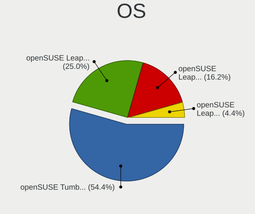

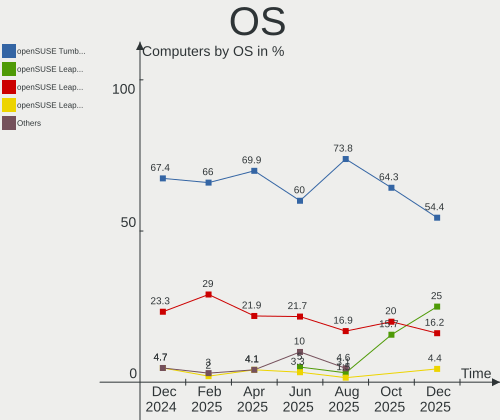

| Name                         | Computers | Percent |
|------------------------------|-----------|---------|
| openSUSE Tumbleweed-XXXXXXXX | 37        | 54.41%  |
| openSUSE Leap-16.0           | 17        | 25%     |
| openSUSE Leap-15.6           | 11        | 16.18%  |
| openSUSE Leap-15.5           | 3         | 4.41%   |

OS Family
---------

OS without a version

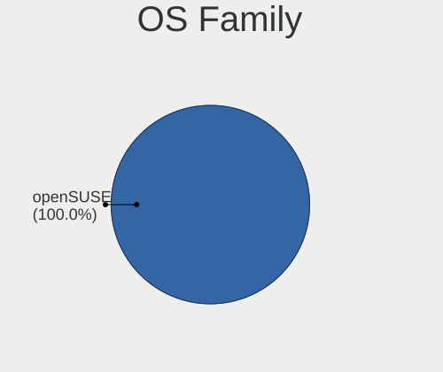

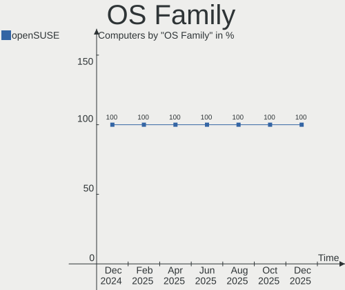

| Name     | Computers | Percent |
|----------|-----------|---------|
| openSUSE | 68        | 100%    |

Kernel
------

Version of the Linux kernel

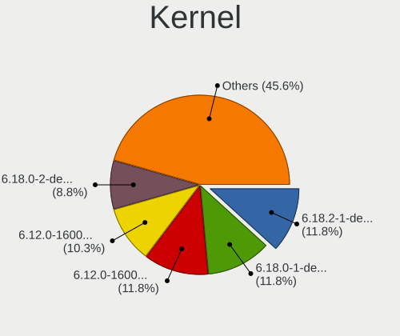

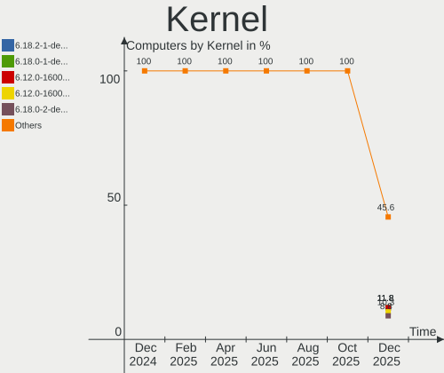

| Version                          | Computers | Percent |
|----------------------------------|-----------|---------|
| 6.18.2-1-default                 | 8         | 11.76%  |
| 6.18.0-1-default                 | 8         | 11.76%  |
| 6.12.0-160000.7-default          | 8         | 11.76%  |
| 6.12.0-160000.8-default          | 7         | 10.29%  |
| 6.18.0-2-default                 | 6         | 8.82%   |
| 6.18.1-1-default                 | 5         | 7.35%   |
| 6.17.9-1-default                 | 5         | 7.35%   |
| 6.4.0-150600.23.81-default       | 4         | 5.88%   |
| 6.4.0-150600.23.78-default       | 3         | 4.41%   |
| 5.14.21-150500.55.88-default     | 3         | 4.41%   |
| 6.4.0-150600.23.73-default       | 2         | 2.94%   |
| 6.4.0-150600.23.53-default       | 1         | 1.47%   |
| 6.4.0-150600.21-default          | 1         | 1.47%   |
| 6.18.1-3.gffe6340-default        | 1         | 1.47%   |
| 6.18.0-lp156.16.ga1b61b5-default | 1         | 1.47%   |
| 6.18.0-2-pae                     | 1         | 1.47%   |
| 6.17.8-2-default                 | 1         | 1.47%   |
| 6.17.8-1-default                 | 1         | 1.47%   |
| 6.17.7-1-default                 | 1         | 1.47%   |
| 6.12.0-160000.5-default          | 1         | 1.47%   |

Kernel Family
-------------

Linux kernel without a distro release

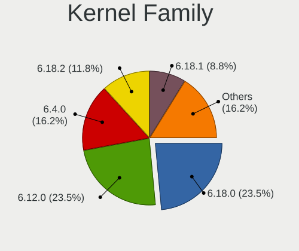

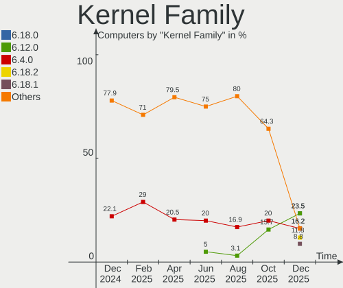

| Version | Computers | Percent |
|---------|-----------|---------|
| 6.18.0  | 16        | 23.53%  |
| 6.12.0  | 16        | 23.53%  |
| 6.4.0   | 11        | 16.18%  |
| 6.18.2  | 8         | 11.76%  |
| 6.18.1  | 6         | 8.82%   |
| 6.17.9  | 5         | 7.35%   |
| 5.14.21 | 3         | 4.41%   |
| 6.17.8  | 2         | 2.94%   |
| 6.17.7  | 1         | 1.47%   |

Kernel Major Ver.
-----------------

Linux kernel major version

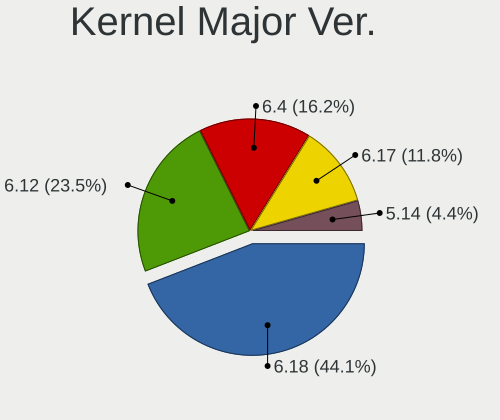

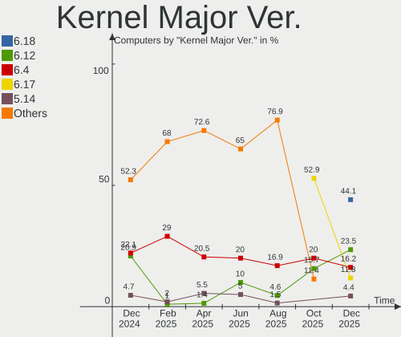

| Version | Computers | Percent |
|---------|-----------|---------|
| 6.18    | 30        | 44.12%  |
| 6.12    | 16        | 23.53%  |
| 6.4     | 11        | 16.18%  |
| 6.17    | 8         | 11.76%  |
| 5.14    | 3         | 4.41%   |

Arch
----

OS architecture (x86_64, i586, etc.)

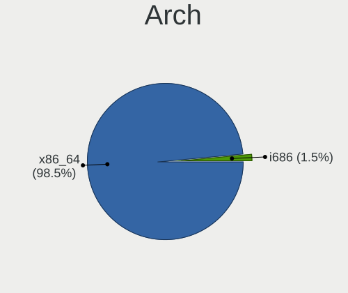

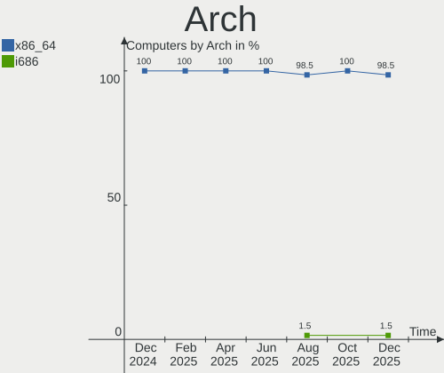

| Name   | Computers | Percent |
|--------|-----------|---------|
| x86_64 | 67        | 98.53%  |
| i686   | 1         | 1.47%   |

DE
--

Desktop Environment

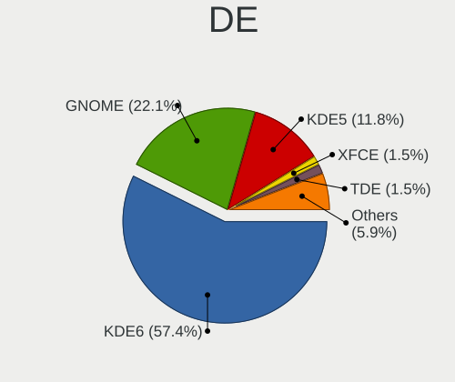

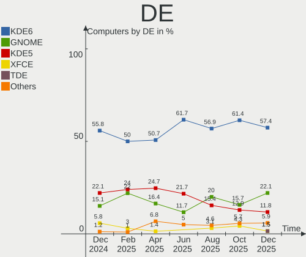

| Name          | Computers | Percent |
|---------------|-----------|---------|
| KDE6          | 39        | 57.35%  |
| GNOME         | 15        | 22.06%  |
| KDE5          | 8         | 11.76%  |
| XFCE          | 1         | 1.47%   |
| TDE           | 1         | 1.47%   |
| Hyprland      | 1         | 1.47%   |
| GNOME Classic | 1         | 1.47%   |
| Cinnamon      | 1         | 1.47%   |
| Unknown       | 1         | 1.47%   |

Display Server
--------------

X11 or Wayland

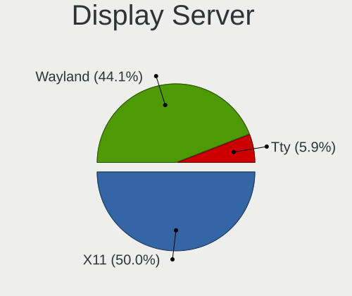

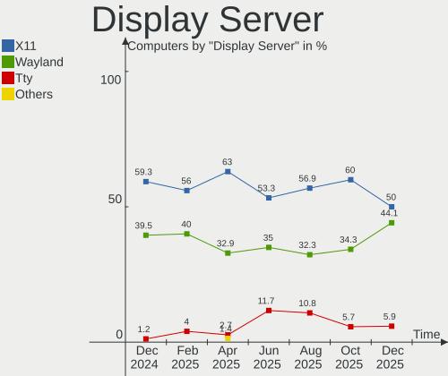

| Name    | Computers | Percent |
|---------|-----------|---------|
| X11     | 34        | 50%     |
| Wayland | 30        | 44.12%  |
| Tty     | 4         | 5.88%   |

Display Manager
---------------

SDDM, LightDM, etc.

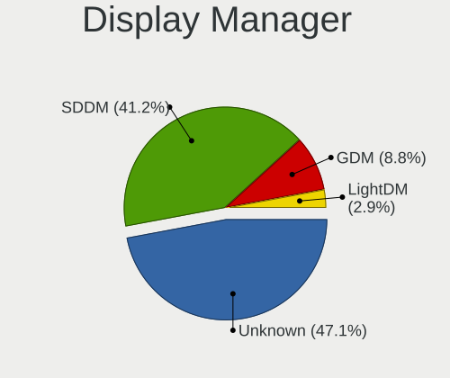

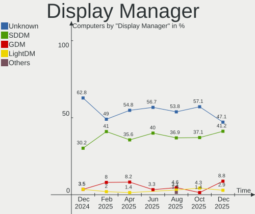

| Name    | Computers | Percent |
|---------|-----------|---------|
| Unknown | 32        | 47.06%  |
| SDDM    | 28        | 41.18%  |
| GDM     | 6         | 8.82%   |
| LightDM | 2         | 2.94%   |

OS Lang
-------

Language

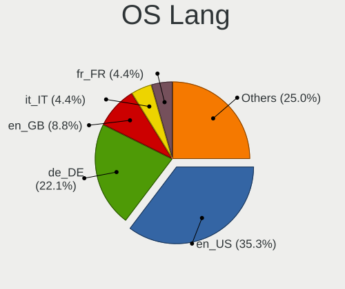

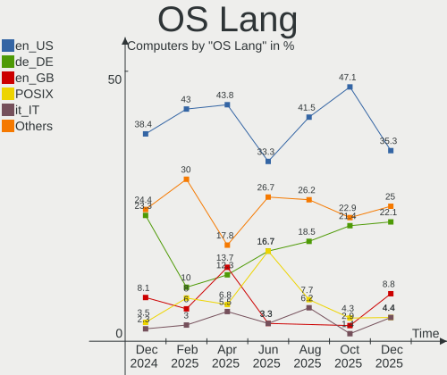

| Lang  | Computers | Percent |
|-------|-----------|---------|
| en_US | 24        | 35.29%  |
| de_DE | 15        | 22.06%  |
| en_GB | 6         | 8.82%   |
| POSIX | 3         | 4.41%   |
| it_IT | 3         | 4.41%   |
| fr_FR | 3         | 4.41%   |
| ru_RU | 2         | 2.94%   |
| pl_PL | 2         | 2.94%   |
| tr_TR | 1         | 1.47%   |
| pt_BR | 1         | 1.47%   |
| nn_NO | 1         | 1.47%   |
| nl_NL | 1         | 1.47%   |
| hu_HU | 1         | 1.47%   |
| fi_FI | 1         | 1.47%   |
| es_MX | 1         | 1.47%   |
| es_ES | 1         | 1.47%   |
| en_BW | 1         | 1.47%   |
| en_AU | 1         | 1.47%   |

Boot Mode
---------

EFI or BIOS

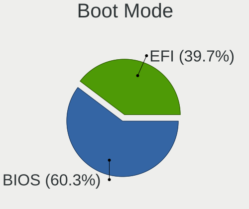

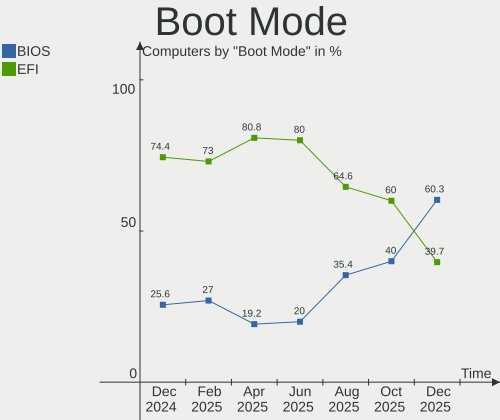

| Mode | Computers | Percent |
|------|-----------|---------|
| BIOS | 41        | 60.29%  |
| EFI  | 27        | 39.71%  |

Filesystem
----------

Type of filesystem

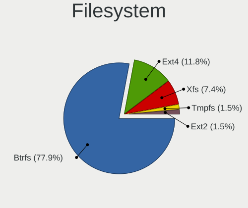

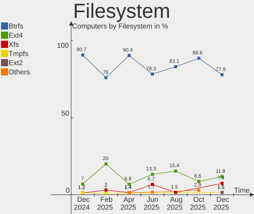

| Type  | Computers | Percent |
|-------|-----------|---------|
| Btrfs | 53        | 77.94%  |
| Ext4  | 8         | 11.76%  |
| Xfs   | 5         | 7.35%   |
| Tmpfs | 1         | 1.47%   |
| Ext2  | 1         | 1.47%   |

Part. scheme
------------

Scheme of partitioning

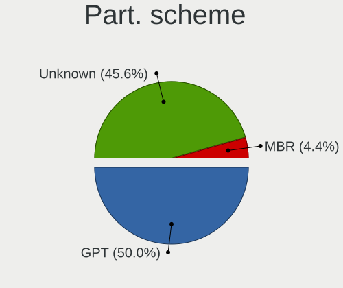

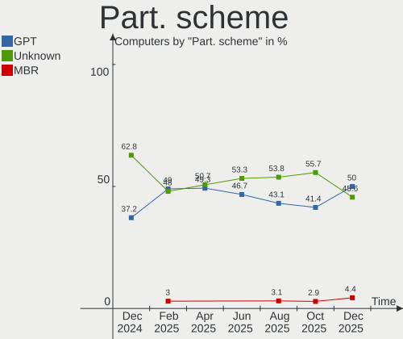

| Type    | Computers | Percent |
|---------|-----------|---------|
| GPT     | 34        | 50%     |
| Unknown | 31        | 45.59%  |
| MBR     | 3         | 4.41%   |

Dual Boot with Linux/BSD
------------------------

Hosting more than one Linux/BSD

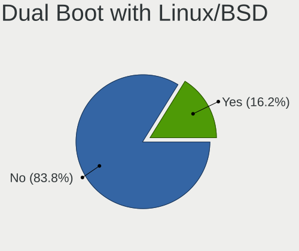

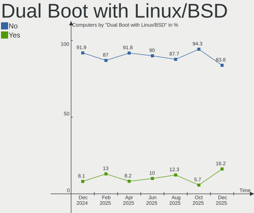

| Dual boot | Computers | Percent |
|-----------|-----------|---------|
| No        | 57        | 83.82%  |
| Yes       | 11        | 16.18%  |

Dual Boot (Win)
---------------

Hosting Linux and Windows

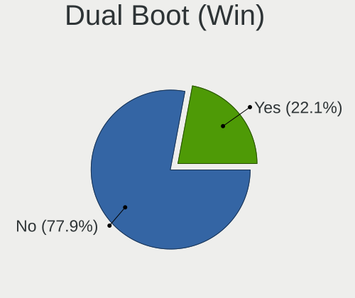

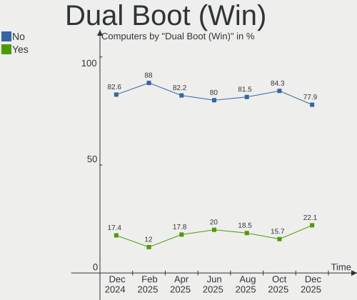

| Dual boot | Computers | Percent |
|-----------|-----------|---------|
| No        | 53        | 77.94%  |
| Yes       | 15        | 22.06%  |

Board
-----

Vendor
------

Motherboard manufacturer

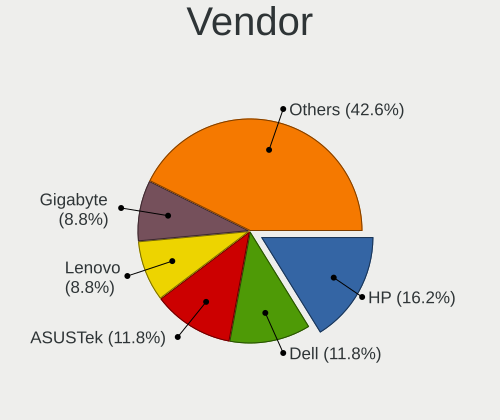

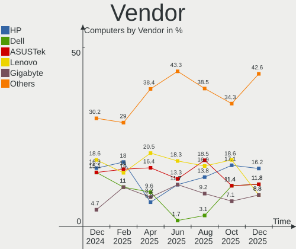

| Name                | Computers | Percent |
|---------------------|-----------|---------|
| Hewlett-Packard     | 11        | 16.18%  |
| Dell                | 8         | 11.76%  |
| ASUSTek Computer    | 8         | 11.76%  |
| Lenovo              | 6         | 8.82%   |
| Gigabyte Technology | 6         | 8.82%   |
| MSI                 | 5         | 7.35%   |
| ASRock              | 4         | 5.88%   |
| Acer                | 4         | 5.88%   |
| Fujitsu             | 2         | 2.94%   |
| Apple               | 2         | 2.94%   |
| Supermicro          | 1         | 1.47%   |
| Sony                | 1         | 1.47%   |
| Microsoft           | 1         | 1.47%   |
| Medion              | 1         | 1.47%   |
| Intel               | 1         | 1.47%   |
| HUAWEI              | 1         | 1.47%   |
| GMKtec              | 1         | 1.47%   |
| GEEKOM              | 1         | 1.47%   |
| Framework           | 1         | 1.47%   |
| Dynabook            | 1         | 1.47%   |
| Chuwi               | 1         | 1.47%   |
| AOpen               | 1         | 1.47%   |

Model
-----

Motherboard model

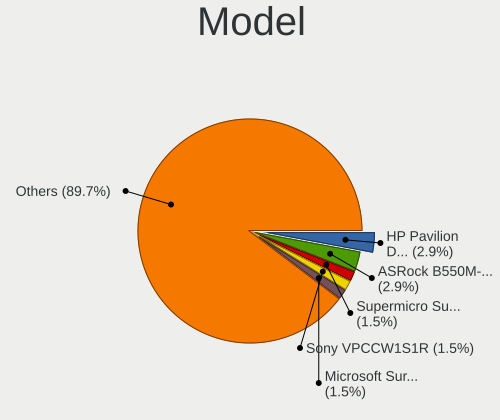

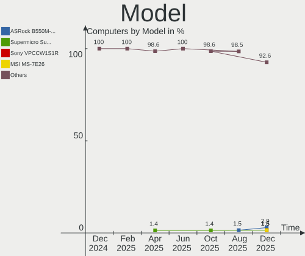

| Name                                      | Computers | Percent |
|-------------------------------------------|-----------|---------|
| HP Pavilion Desktop PC 570-p0XX           | 2         | 2.94%   |
| ASRock B550M-ITX/ac                       | 2         | 2.94%   |
| Supermicro Super Server                   | 1         | 1.47%   |
| Sony VPCCW1S1R                            | 1         | 1.47%   |
| MSI MS-7E26                               | 1         | 1.47%   |
| MSI MS-7B85                               | 1         | 1.47%   |
| MSI MS-7A38                               | 1         | 1.47%   |
| MSI MS-7673                               | 1         | 1.47%   |
| MSI GT72S 6QD                             | 1         | 1.47%   |
| Microsoft Surface Pro 7                   | 1         | 1.47%   |
| Medion P63025                             | 1         | 1.47%   |
| Lenovo ThinkPad SL 2746EHG                | 1         | 1.47%   |
| Lenovo ThinkCentre M710s 10M8S8FV00       | 1         | 1.47%   |
| Lenovo IdeaPad 5 2-in-1 14AKP10 83KT      | 1         | 1.47%   |
| Lenovo IdeaPad 110-15IBR 80W2             | 1         | 1.47%   |
| Lenovo IdeaPad 1 15AMN7 82VG              | 1         | 1.47%   |
| Lenovo G50-45 80E3                        | 1         | 1.47%   |
| Intel HM570                               | 1         | 1.47%   |
| HUAWEI MCLG-XX                            | 1         | 1.47%   |
| HP ZBook Power G7 Mobile Workstation      | 1         | 1.47%   |
| HP Victus by Laptop 16-d1xxx              | 1         | 1.47%   |
| HP Victus by Gaming Laptop 15-fb2xxx      | 1         | 1.47%   |
| HP Victus by Gaming Laptop 15-fb0xxx      | 1         | 1.47%   |
| HP Pavilion Wave Desktop 600-a0xx         | 1         | 1.47%   |
| HP Pavilion Gaming Laptop 17-cd1xxx       | 1         | 1.47%   |
| HP OmniBook 5 Laptop 16-ag1xxx            | 1         | 1.47%   |
| HP Laptop 15s-eq0xxx                      | 1         | 1.47%   |
| HP EliteDesk 800 G3 DM 35W                | 1         | 1.47%   |
| GMKtec NucBox M7 Pro                      | 1         | 1.47%   |
| Gigabyte X570 AORUS MASTER                | 1         | 1.47%   |
| Gigabyte OPTIMUS                          | 1         | 1.47%   |
| Gigabyte M57SLI-S4                        | 1         | 1.47%   |
| Gigabyte H610M S2H V3 DDR4                | 1         | 1.47%   |
| Gigabyte GA-H81M-S2H                      | 1         | 1.47%   |
| Gigabyte B550 AORUS ELITE                 | 1         | 1.47%   |
| GEEKOM A7                                 | 1         | 1.47%   |
| Fujitsu ESPRIMO Q558                      | 1         | 1.47%   |
| Fujitsu ESPRIMO P720                      | 1         | 1.47%   |
| Framework Laptop 12 (13th Gen Intel Core) | 1         | 1.47%   |
| Dynabook TECRA A50-EC                     | 1         | 1.47%   |

Model Family
------------

Motherboard model prefix

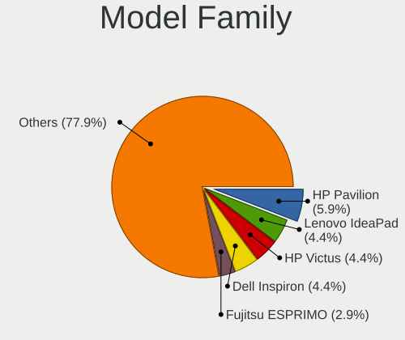

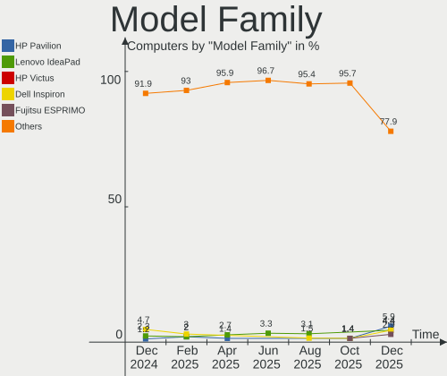

| Name                 | Computers | Percent |
|----------------------|-----------|---------|
| HP Pavilion          | 4         | 5.88%   |
| Lenovo IdeaPad       | 3         | 4.41%   |
| HP Victus            | 3         | 4.41%   |
| Dell Inspiron        | 3         | 4.41%   |
| Fujitsu ESPRIMO      | 2         | 2.94%   |
| Dell OptiPlex        | 2         | 2.94%   |
| ASUS PRIME           | 2         | 2.94%   |
| ASRock B550M-ITX     | 2         | 2.94%   |
| Supermicro Super     | 1         | 1.47%   |
| Sony VPCCW1S1R       | 1         | 1.47%   |
| MSI MS-7E26          | 1         | 1.47%   |
| MSI MS-7B85          | 1         | 1.47%   |
| MSI MS-7A38          | 1         | 1.47%   |
| MSI MS-7673          | 1         | 1.47%   |
| MSI GT72S            | 1         | 1.47%   |
| Microsoft Surface    | 1         | 1.47%   |
| Medion P63025        | 1         | 1.47%   |
| Lenovo ThinkPad      | 1         | 1.47%   |
| Lenovo ThinkCentre   | 1         | 1.47%   |
| Lenovo G50-45        | 1         | 1.47%   |
| Intel HM570          | 1         | 1.47%   |
| HUAWEI MCLG-XX       | 1         | 1.47%   |
| HP ZBook             | 1         | 1.47%   |
| HP OmniBook          | 1         | 1.47%   |
| HP Laptop            | 1         | 1.47%   |
| HP EliteDesk         | 1         | 1.47%   |
| GMKtec NucBox        | 1         | 1.47%   |
| Gigabyte X570        | 1         | 1.47%   |
| Gigabyte OPTIMUS     | 1         | 1.47%   |
| Gigabyte M57SLI-S4   | 1         | 1.47%   |
| Gigabyte H610M       | 1         | 1.47%   |
| Gigabyte GA-H81M-S2H | 1         | 1.47%   |
| Gigabyte B550        | 1         | 1.47%   |
| GEEKOM A7            | 1         | 1.47%   |
| Framework Laptop     | 1         | 1.47%   |
| Dynabook TECRA       | 1         | 1.47%   |
| Dell XPS             | 1         | 1.47%   |
| Dell PowerEdge       | 1         | 1.47%   |
| Dell Latitude        | 1         | 1.47%   |
| Chuwi CoreBook       | 1         | 1.47%   |

MFG Year
--------

Motherboard manufacture year

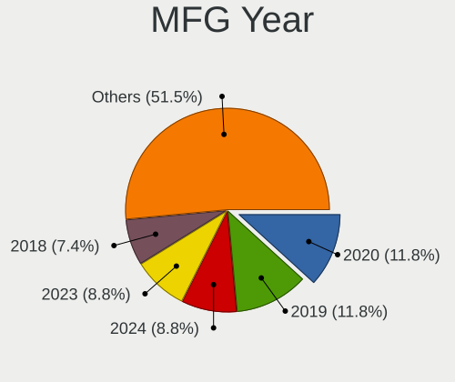

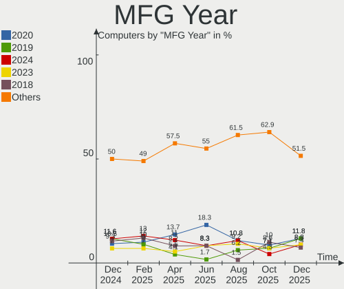

| Year | Computers | Percent |
|------|-----------|---------|
| 2020 | 8         | 11.76%  |
| 2019 | 8         | 11.76%  |
| 2024 | 6         | 8.82%   |
| 2023 | 6         | 8.82%   |
| 2018 | 5         | 7.35%   |
| 2025 | 4         | 5.88%   |
| 2022 | 4         | 5.88%   |
| 2021 | 4         | 5.88%   |
| 2017 | 4         | 5.88%   |
| 2015 | 4         | 5.88%   |
| 2016 | 3         | 4.41%   |
| 2014 | 3         | 4.41%   |
| 2013 | 2         | 2.94%   |
| 2011 | 2         | 2.94%   |
| 2006 | 2         | 2.94%   |
| 2012 | 1         | 1.47%   |
| 2009 | 1         | 1.47%   |
| 2008 | 1         | 1.47%   |

Form Factor
-----------

Physical design of the computer

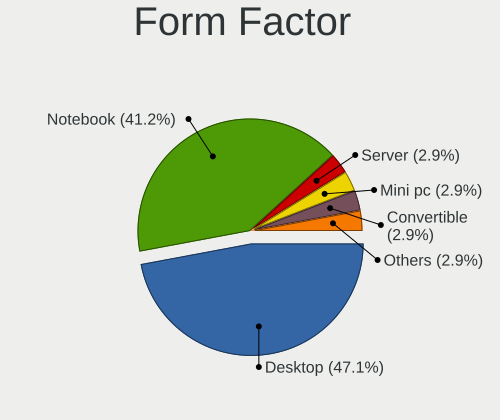

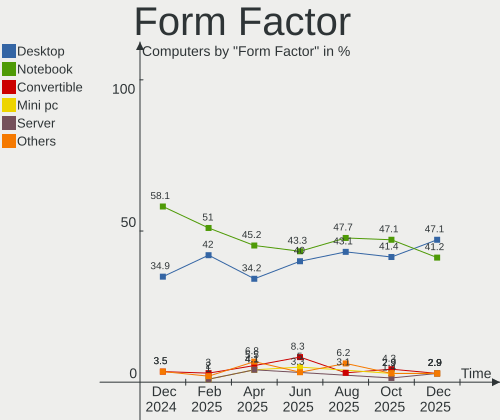

| Name        | Computers | Percent |
|-------------|-----------|---------|
| Desktop     | 32        | 47.06%  |
| Notebook    | 28        | 41.18%  |
| Convertible | 2         | 2.94%   |
| Mini pc     | 2         | 2.94%   |
| Server      | 2         | 2.94%   |
| Tablet      | 1         | 1.47%   |
| All in one  | 1         | 1.47%   |

Secure Boot
-----------

Enabled or disabled

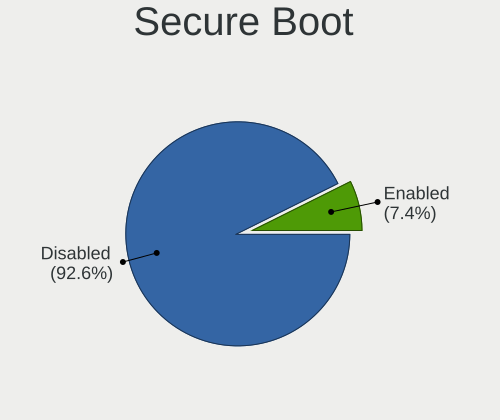

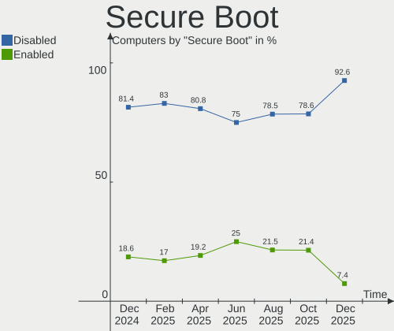

| State    | Computers | Percent |
|----------|-----------|---------|
| Disabled | 63        | 92.65%  |
| Enabled  | 5         | 7.35%   |

Coreboot
--------

Have coreboot on board

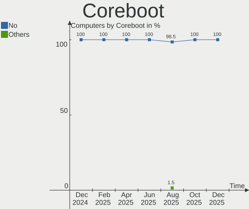

| Used | Computers | Percent |
|------|-----------|---------|
| No   | 68        | 100%    |

RAM Size
--------

Total RAM memory

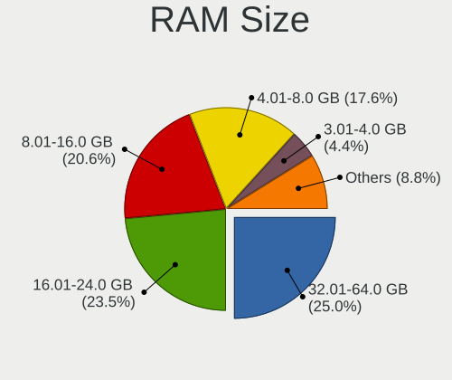

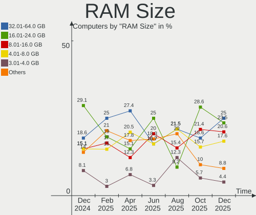

| Size in GB      | Computers | Percent |
|-----------------|-----------|---------|
| 32.01-64.0      | 17        | 25%     |
| 16.01-24.0      | 16        | 23.53%  |
| 8.01-16.0       | 14        | 20.59%  |
| 4.01-8.0        | 12        | 17.65%  |
| 3.01-4.0        | 3         | 4.41%   |
| 24.01-32.0      | 2         | 2.94%   |
| 64.01-256.0     | 2         | 2.94%   |
| More than 256.0 | 1         | 1.47%   |
| 1.01-2.0        | 1         | 1.47%   |

RAM Used
--------

Used RAM memory

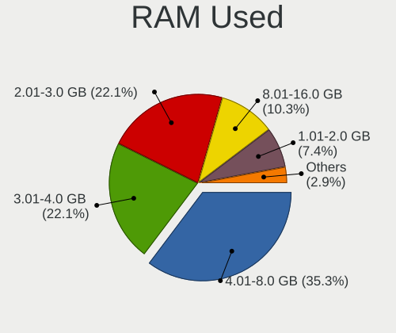

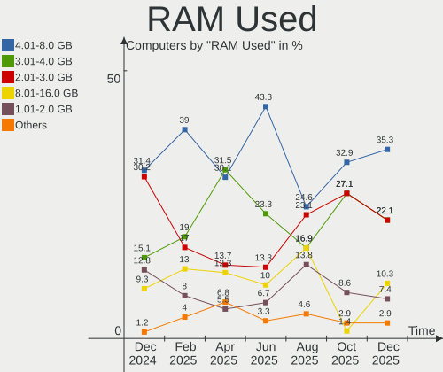

| Used GB     | Computers | Percent |
|-------------|-----------|---------|
| 4.01-8.0    | 24        | 35.29%  |
| 3.01-4.0    | 15        | 22.06%  |
| 2.01-3.0    | 15        | 22.06%  |
| 8.01-16.0   | 7         | 10.29%  |
| 1.01-2.0    | 5         | 7.35%   |
| 64.01-256.0 | 1         | 1.47%   |
| 0.51-1.0    | 1         | 1.47%   |

Total Drives
------------

Number of drives on board

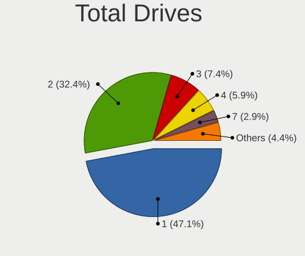

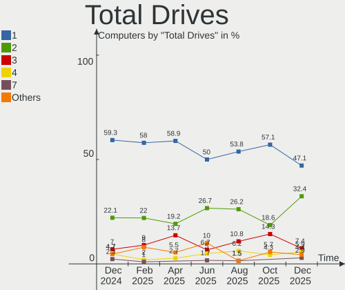

| Drives | Computers | Percent |
|--------|-----------|---------|
| 1      | 32        | 47.06%  |
| 2      | 22        | 32.35%  |
| 3      | 5         | 7.35%   |
| 4      | 4         | 5.88%   |
| 7      | 2         | 2.94%   |
| 5      | 2         | 2.94%   |
| 13     | 1         | 1.47%   |

Has CD-ROM
----------

Has CD-ROM on board

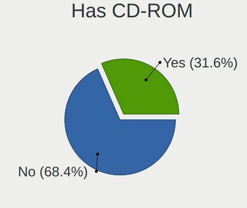

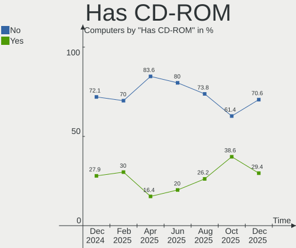

| Presented | Computers | Percent |
|-----------|-----------|---------|
| No        | 48        | 70.59%  |
| Yes       | 20        | 29.41%  |

Has Ethernet
------------

Has Ethernet on board

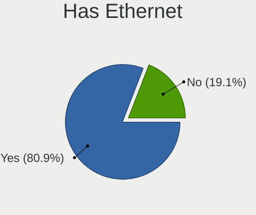

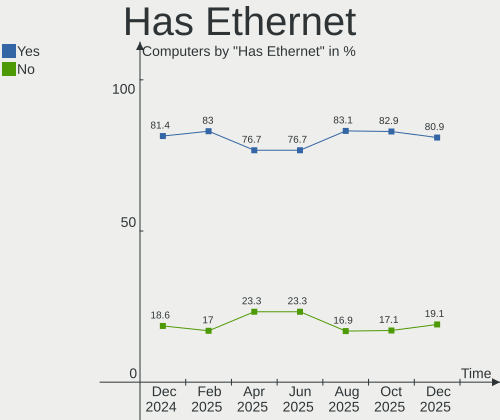

| Presented | Computers | Percent |
|-----------|-----------|---------|
| Yes       | 55        | 80.88%  |
| No        | 13        | 19.12%  |

Has WiFi
--------

Has WiFi module

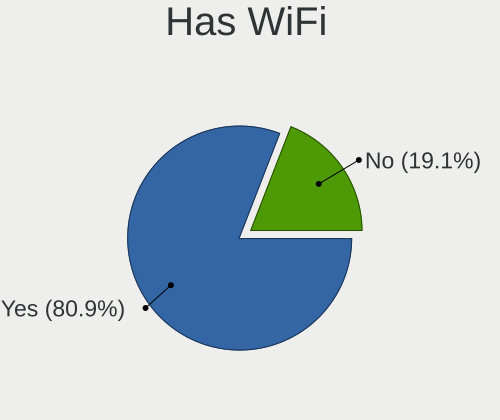

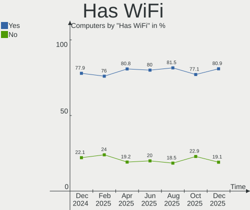

| Presented | Computers | Percent |
|-----------|-----------|---------|
| Yes       | 55        | 80.88%  |
| No        | 13        | 19.12%  |

Has Bluetooth
-------------

Has Bluetooth module

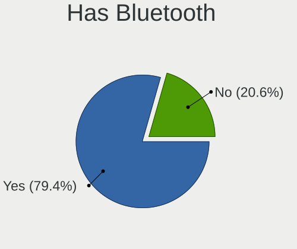

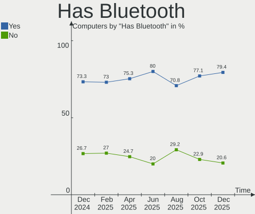

| Presented | Computers | Percent |
|-----------|-----------|---------|
| Yes       | 54        | 79.41%  |
| No        | 14        | 20.59%  |

Location
--------

Country
-------

Geographic location (country)

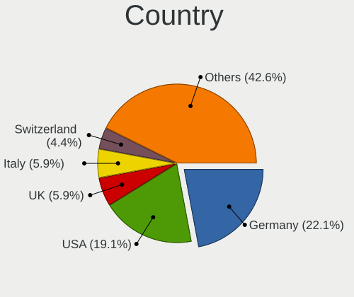

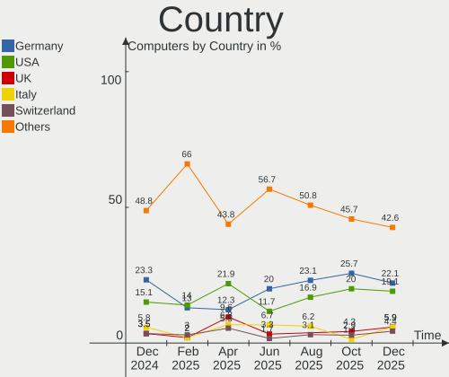

| Country     | Computers | Percent |
|-------------|-----------|---------|
| Germany     | 15        | 22.06%  |
| USA         | 13        | 19.12%  |
| UK          | 4         | 5.88%   |
| Italy       | 4         | 5.88%   |
| Switzerland | 3         | 4.41%   |
| France      | 3         | 4.41%   |
| Russia      | 2         | 2.94%   |
| Poland      | 2         | 2.94%   |
| India       | 2         | 2.94%   |
| Finland     | 2         | 2.94%   |
| Belgium     | 2         | 2.94%   |
| Australia   | 2         | 2.94%   |
| Turkey      | 1         | 1.47%   |
| Romania     | 1         | 1.47%   |
| Norway      | 1         | 1.47%   |
| Netherlands | 1         | 1.47%   |
| Mexico      | 1         | 1.47%   |
| Malaysia    | 1         | 1.47%   |
| Indonesia   | 1         | 1.47%   |
| Hungary     | 1         | 1.47%   |
| Guatemala   | 1         | 1.47%   |
| Denmark     | 1         | 1.47%   |
| Canada      | 1         | 1.47%   |
| Bulgaria    | 1         | 1.47%   |
| Brazil      | 1         | 1.47%   |
| Austria     | 1         | 1.47%   |

City
----

Geographic location (city)

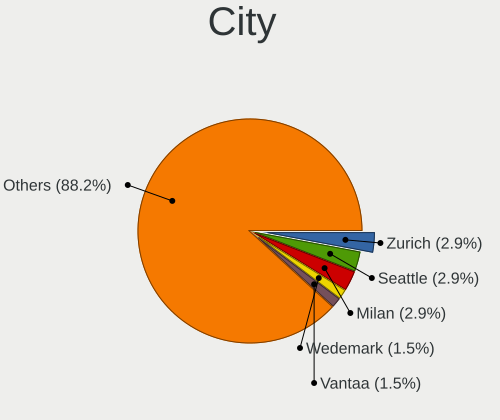

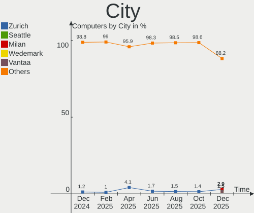

| City             | Computers | Percent |
|------------------|-----------|---------|
| Zurich           | 2         | 2.94%   |
| Seattle          | 2         | 2.94%   |
| Milan            | 2         | 2.94%   |
| Wedemark         | 1         | 1.47%   |
| Vantaa           | 1         | 1.47%   |
| Ungaran          | 1         | 1.47%   |
| Tulancingo       | 1         | 1.47%   |
| Trzebusz         | 1         | 1.47%   |
| Szigetvar        | 1         | 1.47%   |
| Stoughton        | 1         | 1.47%   |
| St Louis         | 1         | 1.47%   |
| Sofia            | 1         | 1.47%   |
| Sessa Cilento    | 1         | 1.47%   |
| Seinäjoki       | 1         | 1.47%   |
| Scunthorpe       | 1         | 1.47%   |
| Schmelz          | 1         | 1.47%   |
| Salzburg         | 1         | 1.47%   |
| Râmnicu Vâlcea | 1         | 1.47%   |
| Pforzheim        | 1         | 1.47%   |
| Orléans         | 1         | 1.47%   |
| New Kensington   | 1         | 1.47%   |
| New City         | 1         | 1.47%   |
| Munich           | 1         | 1.47%   |
| Moscow           | 1         | 1.47%   |
| Moosburg         | 1         | 1.47%   |
| Monheim am Rhein | 1         | 1.47%   |
| Melbourne        | 1         | 1.47%   |
| Mechelen         | 1         | 1.47%   |
| Marseille        | 1         | 1.47%   |
| Marrero          | 1         | 1.47%   |
| Los Angeles      | 1         | 1.47%   |
| Linsengericht    | 1         | 1.47%   |
| Leipzig          | 1         | 1.47%   |
| La Tour-de-Peilz | 1         | 1.47%   |
| Kuala Lumpur     | 1         | 1.47%   |
| Jacareí         | 1         | 1.47%   |
| Ilmenau          | 1         | 1.47%   |
| Hilpoltstein     | 1         | 1.47%   |
| Heide            | 1         | 1.47%   |
| Guildford        | 1         | 1.47%   |

Drives
------

Drive Vendor
------------

Hard drive vendors

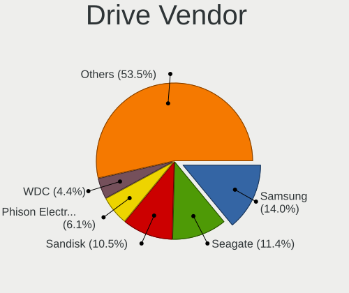

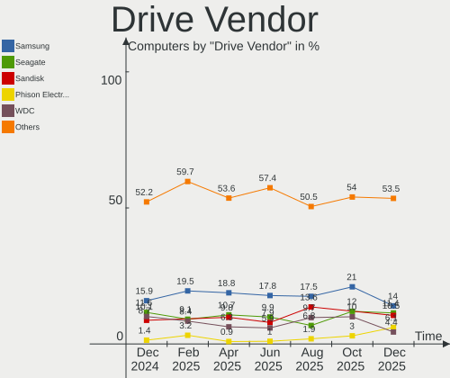

| Vendor                       | Computers | Drives | Percent |
|------------------------------|-----------|--------|---------|
| Samsung Electronics          | 16        | 29     | 14.04%  |
| Seagate                      | 13        | 13     | 11.4%   |
| Sandisk                      | 12        | 14     | 10.53%  |
| Phison Electronics           | 7         | 8      | 6.14%   |
| WDC                          | 5         | 6      | 4.39%   |
| Unknown                      | 5         | 5      | 4.39%   |
| Kingston                     | 5         | 5      | 4.39%   |
| Crucial                      | 5         | 6      | 4.39%   |
| Toshiba                      | 4         | 4      | 3.51%   |
| SK hynix                     | 3         | 3      | 2.63%   |
| Micron/Crucial Technology    | 3         | 5      | 2.63%   |
| Micron Technology            | 3         | 3      | 2.63%   |
| MAXIO Technology (Hangzhou)  | 3         | 4      | 2.63%   |
| Kingston Technology Company  | 3         | 3      | 2.63%   |
| Hitachi                      | 3         | 3      | 2.63%   |
| PNY                          | 2         | 2      | 1.75%   |
| KIOXIA                       | 2         | 2      | 1.75%   |
| Intenso                      | 2         | 2      | 1.75%   |
| Intel                        | 2         | 2      | 1.75%   |
| WDS100T3                     | 1         | 1      | 0.88%   |
| WDC WDS2                     | 1         | 1      | 0.88%   |
| VENO                         | 1         | 1      | 0.88%   |
| Transcend                    | 1         | 2      | 0.88%   |
| T-FORCE                      | 1         | 1      | 0.88%   |
| Shenzhen Longsys Electronics | 1         | 1      | 0.88%   |
| Realtek                      | 1         | 1      | 0.88%   |
| KingSpec                     | 1         | 1      | 0.88%   |
| JMicron Technology           | 1         | 1      | 0.88%   |
| HS-SSD-E100                  | 1         | 1      | 0.88%   |
| Gigabyte Technology          | 1         | 1      | 0.88%   |
| Corsair                      | 1         | 1      | 0.88%   |
| China                        | 1         | 1      | 0.88%   |
| Apple                        | 1         | 2      | 0.88%   |
| Apacer                       | 1         | 1      | 0.88%   |
| ADATA Technology             | 1         | 1      | 0.88%   |

Drive Model
-----------

Hard drive models

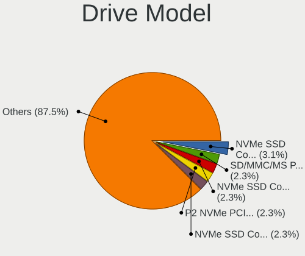

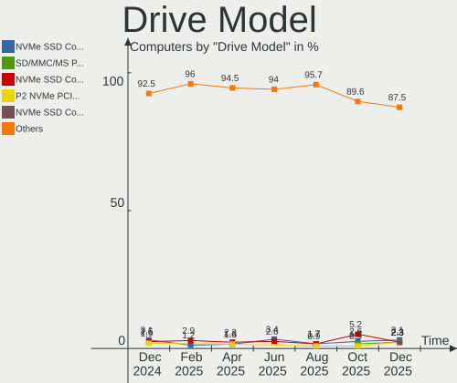

| Model                                                          | Computers | Percent |
|----------------------------------------------------------------|-----------|---------|
| Samsung NVMe SSD Controller PM9A1/PM9A3/980PRO 1TB             | 4         | 3.13%   |
| Unknown SD/MMC/MS PRO 2GB                                      | 3         | 2.34%   |
| Samsung NVMe SSD Controller SM981/PM981/PM983 1TB              | 3         | 2.34%   |
| Micron/Crucial P2 NVMe PCIe SSD 2TB                            | 3         | 2.34%   |
| MAXIO (Hangzhou) NVMe SSD Controller MAP1202 (DRAM-less) 512GB | 3         | 2.34%   |
| Seagate ST2000DM001-1ER164 2TB                                 | 2         | 1.56%   |
| Sandisk WD Blue SN570 500GB                                    | 2         | 1.56%   |
| Samsung SSD 870 EVO 2TB                                        | 2         | 1.56%   |
| Samsung SSD 850 EVO 500GB                                      | 2         | 1.56%   |
| Samsung SSD 850 EVO 250GB                                      | 2         | 1.56%   |
| Phison PS5021-E21 PCIe4 NVMe Controller (DRAM-less) 2TB        | 2         | 1.56%   |
| Kingston SA400S37480G 480GB SSD                                | 2         | 1.56%   |
| Intenso SSD SATAIII 512GB                                      | 2         | 1.56%   |
| Crucial CT1000BX500SSD1 1TB                                    | 2         | 1.56%   |
| WDS100T3 X0C-00SJG0 1TB                                        | 1         | 0.78%   |
| WDC WDS200T2B0A 2TB SSD                                        | 1         | 0.78%   |
| WDC WDS2 40G2G0A-00JH 240GB SSD                                | 1         | 0.78%   |
| WDC WD2500BEVT-22A23T0 250GB                                   | 1         | 0.78%   |
| WDC WD2002FAEX-007BA0 2TB                                      | 1         | 0.78%   |
| WDC WD10EZEX-60WN4A0 1TB                                       | 1         | 0.78%   |
| WDC WD10EZEX-08WN4A0 1TB                                       | 1         | 0.78%   |
| WDC WD10EURX-63UY4Y0 1TB                                       | 1         | 0.78%   |
| VENO SCORP SSD 256GB                                           | 1         | 0.78%   |
| Unknown MMC Card  64GB                                         | 1         | 0.78%   |
| Unknown MMC Card  2TB                                          | 1         | 0.78%   |
| Transcend TS4TSSD230S 4TB                                      | 1         | 0.78%   |
| Toshiba XG6 NVMe SSD Controller 1024GB                         | 1         | 0.78%   |
| Toshiba MQ04ABF100 1TB                                         | 1         | 0.78%   |
| Toshiba KXG50ZNV256G 256GB                                     | 1         | 0.78%   |
| Toshiba KSG60ZMV512G 512GB SSD                                 | 1         | 0.78%   |
| T-FORCE 1TB                                                    | 1         | 0.78%   |
| SK hynix SKHynix_HFS256GEM4X182N 256GB                         | 1         | 0.78%   |
| SK hynix Gold P31/BC711/PC711 NVMe Solid State Drive 512GB     | 1         | 0.78%   |
| SK hynix BC501 NVMe Solid State Drive 512GB                    | 1         | 0.78%   |
| Shenzhen Longsys Lexar SSD EQ790 1TB                           | 1         | 0.78%   |
| Seagate ST8000AS0002-1NA17Z 8TB                                | 1         | 0.78%   |
| Seagate ST380815AS 80GB                                        | 1         | 0.78%   |
| Seagate ST3500418AS 500GB                                      | 1         | 0.78%   |
| Seagate ST3500312CS 500GB                                      | 1         | 0.78%   |
| Seagate ST31000528AS 1TB                                       | 1         | 0.78%   |

HDD Vendor
----------

Hard disk drive vendors

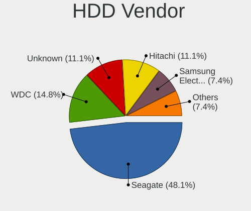

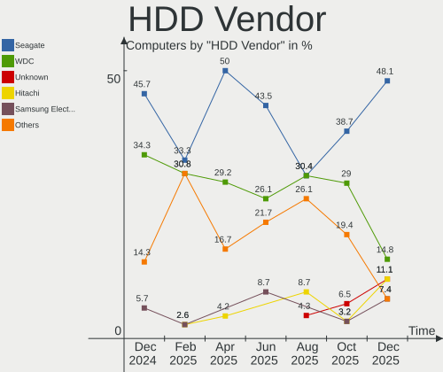

| Vendor              | Computers | Drives | Percent |
|---------------------|-----------|--------|---------|
| Seagate             | 13        | 13     | 48.15%  |
| WDC                 | 4         | 5      | 14.81%  |
| Unknown             | 3         | 3      | 11.11%  |
| Hitachi             | 3         | 3      | 11.11%  |
| Samsung Electronics | 2         | 2      | 7.41%   |
| Toshiba             | 1         | 1      | 3.7%    |
| T-FORCE             | 1         | 1      | 3.7%    |

SSD Vendor
----------

Solid state drive vendors

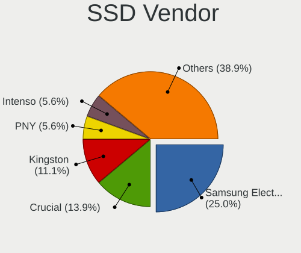

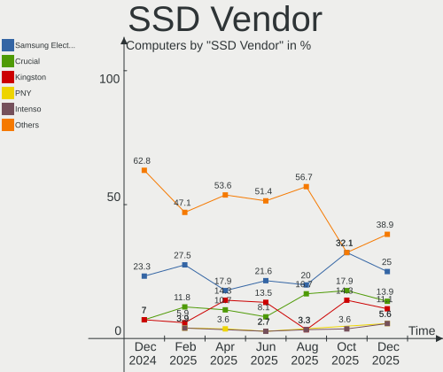

| Vendor              | Computers | Drives | Percent |
|---------------------|-----------|--------|---------|
| Samsung Electronics | 9         | 12     | 25%     |
| Crucial             | 5         | 6      | 13.89%  |
| Kingston            | 4         | 4      | 11.11%  |
| PNY                 | 2         | 2      | 5.56%   |
| Intenso             | 2         | 2      | 5.56%   |
| WDC WDS2            | 1         | 1      | 2.78%   |
| WDC                 | 1         | 1      | 2.78%   |
| VENO                | 1         | 1      | 2.78%   |
| Transcend           | 1         | 2      | 2.78%   |
| Toshiba             | 1         | 1      | 2.78%   |
| SanDisk             | 1         | 2      | 2.78%   |
| KingSpec            | 1         | 1      | 2.78%   |
| JMicron Technology  | 1         | 1      | 2.78%   |
| Intel               | 1         | 1      | 2.78%   |
| HS-SSD-E100         | 1         | 1      | 2.78%   |
| Gigabyte Technology | 1         | 1      | 2.78%   |
| Corsair             | 1         | 1      | 2.78%   |
| China               | 1         | 1      | 2.78%   |
| Apacer              | 1         | 1      | 2.78%   |

Drive Kind
----------

HDD or SSD

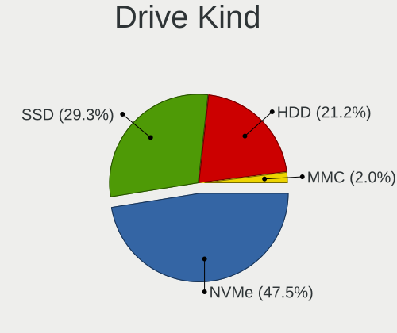

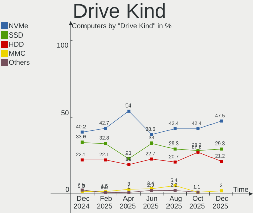

| Kind | Computers | Drives | Percent |
|------|-----------|--------|---------|
| NVMe | 47        | 65     | 47.47%  |
| SSD  | 29        | 42     | 29.29%  |
| HDD  | 21        | 28     | 21.21%  |
| MMC  | 2         | 2      | 2.02%   |

Drive Connector
---------------

SATA, SAS, NVMe, etc.

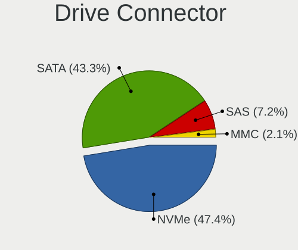

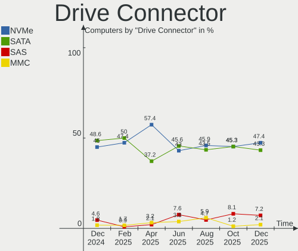

| Type | Computers | Drives | Percent |
|------|-----------|--------|---------|
| NVMe | 46        | 63     | 47.42%  |
| SATA | 42        | 63     | 43.3%   |
| SAS  | 7         | 9      | 7.22%   |
| MMC  | 2         | 2      | 2.06%   |

Drive Size
----------

Size of hard drive

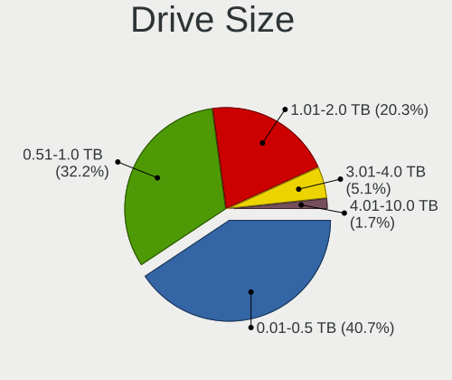

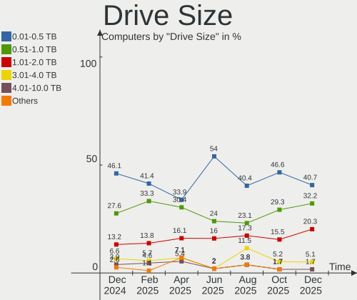

| Size in TB | Computers | Drives | Percent |
|------------|-----------|--------|---------|
| 0.01-0.5   | 24        | 30     | 40.68%  |
| 0.51-1.0   | 19        | 21     | 32.2%   |
| 1.01-2.0   | 12        | 14     | 20.34%  |
| 3.01-4.0   | 3         | 4      | 5.08%   |
| 4.01-10.0  | 1         | 1      | 1.69%   |

Space Total
-----------

Amount of disk space available on the file system

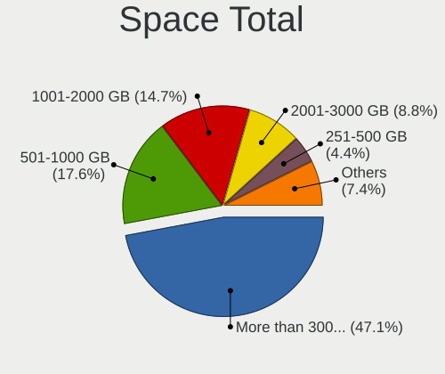

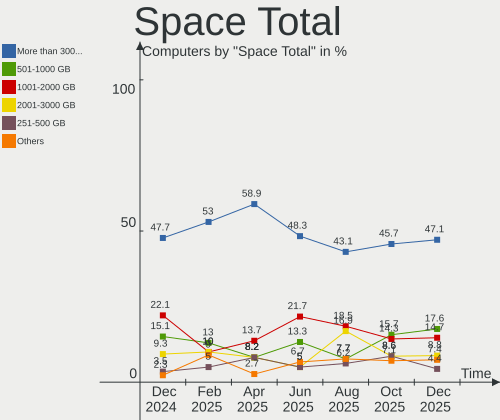

| Size in GB     | Computers | Percent |
|----------------|-----------|---------|
| More than 3000 | 32        | 47.06%  |
| 501-1000       | 12        | 17.65%  |
| 1001-2000      | 10        | 14.71%  |
| 2001-3000      | 6         | 8.82%   |
| 251-500        | 3         | 4.41%   |
| 101-250        | 3         | 4.41%   |
| 21-50          | 1         | 1.47%   |
| Unknown        | 1         | 1.47%   |

Space Used
----------

Amount of used disk space

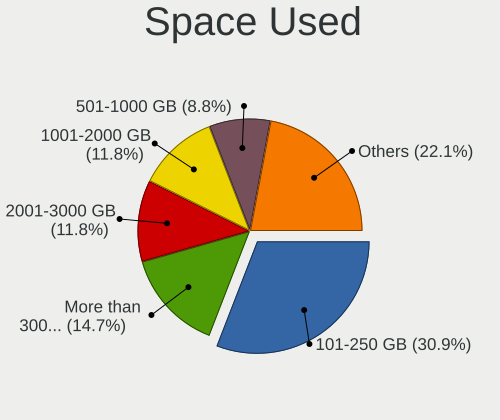

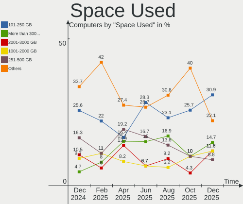

| Used GB        | Computers | Percent |
|----------------|-----------|---------|
| 101-250        | 21        | 30.88%  |
| More than 3000 | 10        | 14.71%  |
| 2001-3000      | 8         | 11.76%  |
| 1001-2000      | 8         | 11.76%  |
| 251-500        | 6         | 8.82%   |
| 501-1000       | 6         | 8.82%   |
| 1-20           | 3         | 4.41%   |
| 51-100         | 3         | 4.41%   |
| 21-50          | 2         | 2.94%   |
| Unknown        | 1         | 1.47%   |

Malfunc. Drives
---------------

Drive models with a malfunction

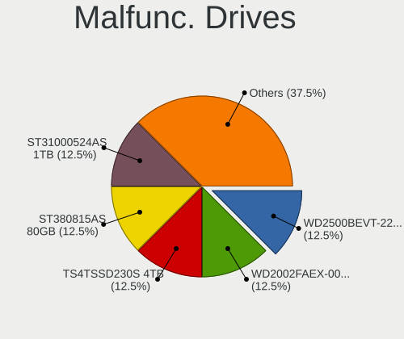

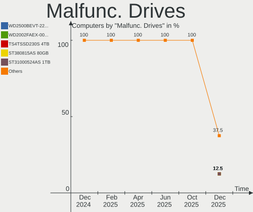

| Model                           | Computers | Drives | Percent |
|---------------------------------|-----------|--------|---------|
| WDC WD2500BEVT-22A23T0 250GB    | 1         | 1      | 12.5%   |
| WDC WD2002FAEX-007BA0 2TB       | 1         | 1      | 12.5%   |
| Transcend TS4TSSD230S 4TB       | 1         | 2      | 12.5%   |
| Seagate ST380815AS 80GB         | 1         | 1      | 12.5%   |
| Seagate ST31000524AS 1TB        | 1         | 1      | 12.5%   |
| Seagate ST2000DM008-2FR102 2TB  | 1         | 1      | 12.5%   |
| Samsung Electronics SSD 980 1TB | 1         | 1      | 12.5%   |
| Hitachi HTS545032B9A300 320GB   | 1         | 1      | 12.5%   |

Malfunc. Drive Vendor
---------------------

Vendors of faulty drives

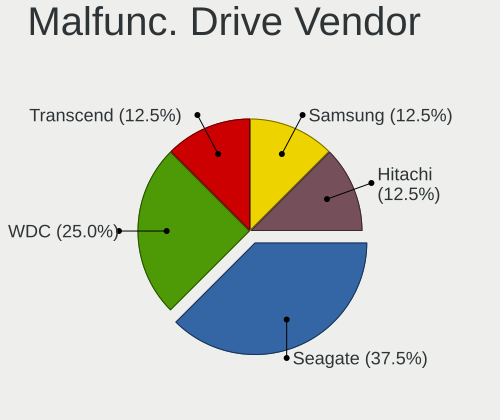

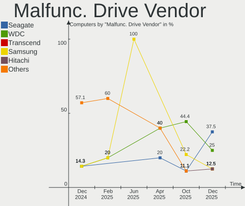

| Vendor              | Computers | Drives | Percent |
|---------------------|-----------|--------|---------|
| Seagate             | 3         | 3      | 37.5%   |
| WDC                 | 2         | 2      | 25%     |
| Transcend           | 1         | 2      | 12.5%   |
| Samsung Electronics | 1         | 1      | 12.5%   |
| Hitachi             | 1         | 1      | 12.5%   |

Malfunc. HDD Vendor
-------------------

Vendors of faulty HDD drives

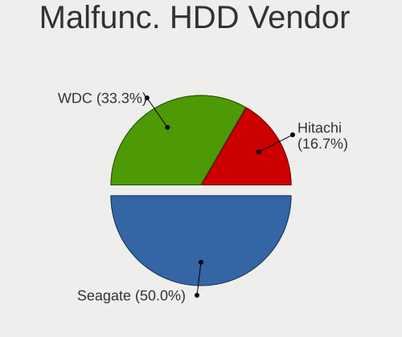

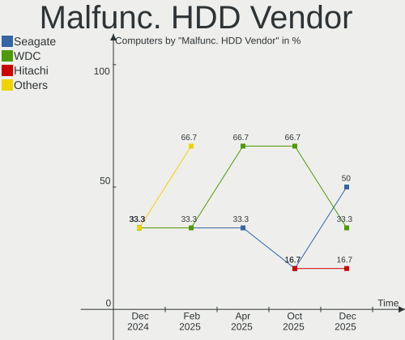

| Vendor  | Computers | Drives | Percent |
|---------|-----------|--------|---------|
| Seagate | 3         | 3      | 50%     |
| WDC     | 2         | 2      | 33.33%  |
| Hitachi | 1         | 1      | 16.67%  |

Malfunc. Drive Kind
-------------------

Kinds of faulty drives

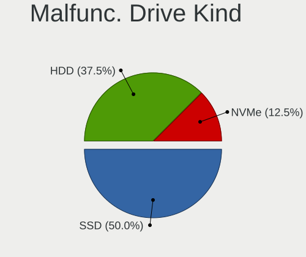

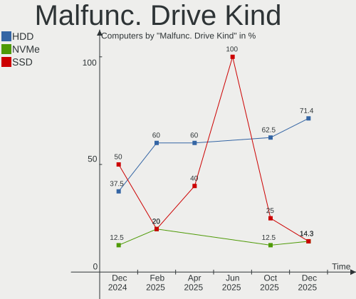

| Kind | Computers | Drives | Percent |
|------|-----------|--------|---------|
| HDD  | 5         | 6      | 71.43%  |
| NVMe | 1         | 1      | 14.29%  |
| SSD  | 1         | 2      | 14.29%  |

Failed Drives
-------------

Failed drive models

Zero info for selected period =(

Failed Drive Vendor
-------------------

Failed drive vendors

Zero info for selected period =(

Drive Status
------------

Number of failed and malfunc. drives

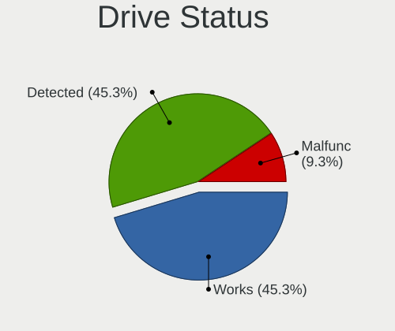

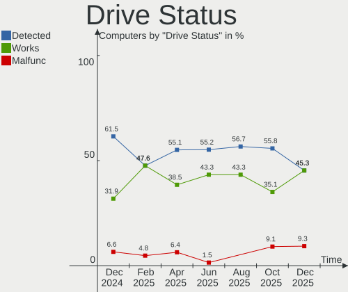

| Status   | Computers | Drives | Percent |
|----------|-----------|--------|---------|
| Detected | 34        | 60     | 45.33%  |
| Works    | 34        | 68     | 45.33%  |
| Malfunc  | 7         | 9      | 9.33%   |

Storage controller
------------------

Storage Vendor
--------------

Storage controller vendors

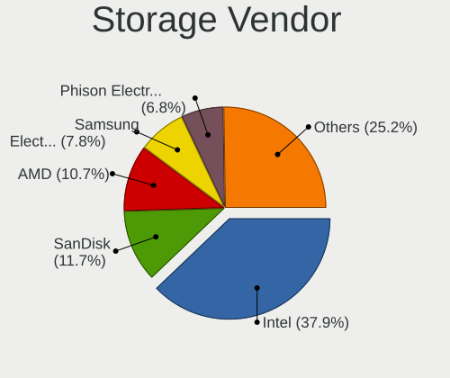

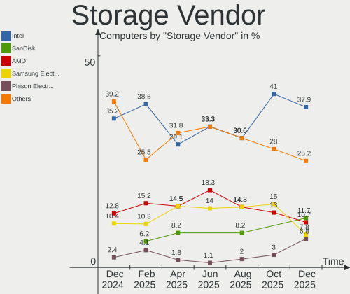

| Vendor                       | Computers | Percent |
|------------------------------|-----------|---------|
| Intel                        | 39        | 37.86%  |
| SanDisk                      | 12        | 11.65%  |
| AMD                          | 11        | 10.68%  |
| Samsung Electronics          | 8         | 7.77%   |
| Phison Electronics           | 7         | 6.8%    |
| Kingston Technology Company  | 4         | 3.88%   |
| Micron/Crucial Technology    | 3         | 2.91%   |
| Micron Technology            | 3         | 2.91%   |
| MAXIO Technology (Hangzhou)  | 3         | 2.91%   |
| Toshiba America Info Systems | 2         | 1.94%   |
| SK hynix                     | 2         | 1.94%   |
| LSI Logic / Symbios Logic    | 2         | 1.94%   |
| KIOXIA                       | 2         | 1.94%   |
| Shenzhen Longsys Electronics | 1         | 0.97%   |
| Nvidia                       | 1         | 0.97%   |
| Areca Technology             | 1         | 0.97%   |
| Apple                        | 1         | 0.97%   |
| ADATA Technology             | 1         | 0.97%   |

Storage Model
-------------

Storage controller models

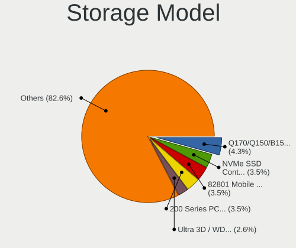

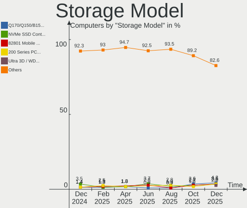

| Model                                                                          | Computers | Percent |
|--------------------------------------------------------------------------------|-----------|---------|
| Intel Q170/Q150/B150/H170/H110/Z170/CM236 Chipset SATA Controller [AHCI Mode]  | 5         | 4.35%   |
| Samsung NVMe SSD Controller PM9A1/PM9A3/980PRO                                 | 4         | 3.48%   |
| Intel 82801 Mobile SATA Controller [RAID mode]                                 | 4         | 3.48%   |
| Intel 200 Series PCH SATA controller [AHCI mode]                               | 4         | 3.48%   |
| SanDisk Ultra 3D / WD Blue SN570 NVMe SSD (DRAM-less)                          | 3         | 2.61%   |
| Samsung NVMe SSD Controller SM981/PM981/PM983                                  | 3         | 2.61%   |
| Phison PS5021-E21 PCIe4 NVMe Controller (DRAM-less)                            | 3         | 2.61%   |
| Micron/Crucial P2 [Nick P2] / P3 / P3 Plus NVMe PCIe SSD (DRAM-less)           | 3         | 2.61%   |
| MAXIO (Hangzhou) NVMe SSD Controller MAP1202 (DRAM-less)                       | 3         | 2.61%   |
| Intel Volume Management Device NVMe RAID Controller                            | 3         | 2.61%   |
| Intel Cannon Lake PCH SATA AHCI Controller                                     | 3         | 2.61%   |
| Intel 6 Series/C200 Series Chipset Family 6 port Desktop SATA AHCI Controller  | 3         | 2.61%   |
| AMD FCH SATA Controller [AHCI mode]                                            | 3         | 2.61%   |
| AMD 600 Series Chipset SATA Controller                                         | 3         | 2.61%   |
| AMD 500 Series Chipset SATA Controller                                         | 3         | 2.61%   |
| SanDisk Extreme Pro / WD Black SN750 / PC SN730 / Red SN700 NVMe SSD           | 2         | 1.74%   |
| Micron 2400 NVMe SSD (DRAM-less)                                               | 2         | 1.74%   |
| KIOXIA NVMe SSD Controller BG4 (DRAM-less)                                     | 2         | 1.74%   |
| Intel Tiger Lake-LP SATA Controller                                            | 2         | 1.74%   |
| Intel Sunrise Point-LP SATA Controller [AHCI mode]                             | 2         | 1.74%   |
| Intel Alder Lake-S PCH SATA Controller [AHCI Mode]                             | 2         | 1.74%   |
| Intel 82801IBM/IEM (ICH9M/ICH9M-E) 4 port SATA Controller [AHCI mode]          | 2         | 1.74%   |
| Intel 8 Series/C220 Series Chipset Family 6-port SATA Controller 1 [AHCI mode] | 2         | 1.74%   |
| AMD 400 Series Chipset SATA Controller                                         | 2         | 1.74%   |
| Toshiba America Info Systems XG6 NVMe SSD Controller                           | 1         | 0.87%   |
| Toshiba America Info Systems XG5 NVMe SSD Controller                           | 1         | 0.87%   |
| SK hynix PVC10 NVMe Solid State Drive (DRAM-less)                              | 1         | 0.87%   |
| SK hynix BC501 NVMe Solid State Drive                                          | 1         | 0.87%   |
| Shenzhen Longsys Lexar NM790 / Patriot Viper VP4300 Lite NVMe SSD (DRAM-less)  | 1         | 0.87%   |
| Sandisk WD_BLACK SN7100/WD PC SN7100S M.2 2280 NVMe SSD (DRAM-less)            | 1         | 0.87%   |
| SanDisk WD SN560/SN740/SN770/SN5000 NVMe SSD                                   | 1         | 0.87%   |
| SanDisk WD PC SN540 / Green SN350 NVMe SSD 1 TB (DRAM-less)                    | 1         | 0.87%   |
| Sandisk WD Blue SN5000 NVMe SSD (DRAM-less)                                    | 1         | 0.87%   |
| Sandisk WD Black SN850X NVMe SSD                                               | 1         | 0.87%   |
| Sandisk WD Black SN770M NVMe SSD (DRAM-less)                                   | 1         | 0.87%   |
| SanDisk IX SN530 NVMe SSD / microSD Express Card (DRAM-less)                   | 1         | 0.87%   |
| Samsung NVMe SSD Controller SM961/PM961/SM963                                  | 1         | 0.87%   |
| Samsung NVMe SSD Controller S4LV008[Pascal]                                    | 1         | 0.87%   |
| Samsung NVMe SSD Controller PM9C1a (DRAM-less)                                 | 1         | 0.87%   |
| Samsung NVMe SSD Controller 980 (DRAM-less)                                    | 1         | 0.87%   |

Storage Kind
------------

Kind of storage controller (IDE, SATA, NVMe, SAS, ...)

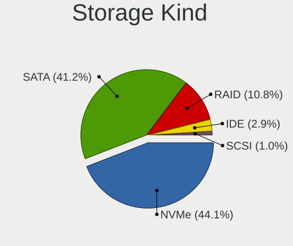

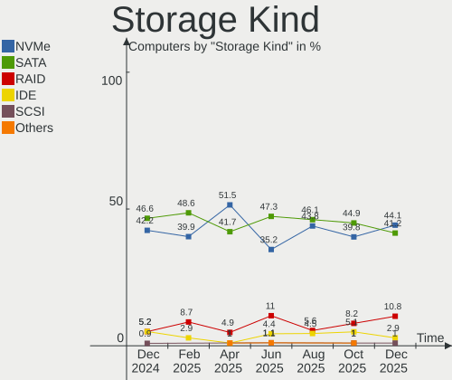

| Kind | Computers | Percent |
|------|-----------|---------|
| NVMe | 45        | 44.12%  |
| SATA | 42        | 41.18%  |
| RAID | 11        | 10.78%  |
| IDE  | 3         | 2.94%   |
| SCSI | 1         | 0.98%   |

Processor
---------

CPU Vendor
----------

Processor vendors

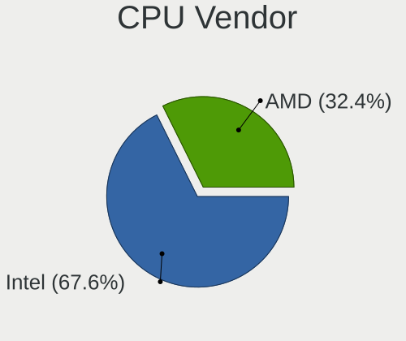

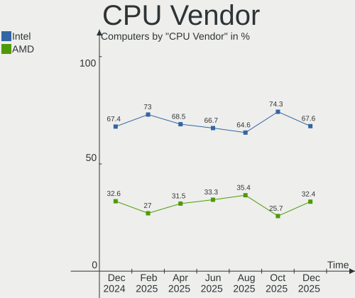

| Vendor | Computers | Percent |
|--------|-----------|---------|
| Intel  | 46        | 67.65%  |
| AMD    | 22        | 32.35%  |

CPU Model
---------

Processor models

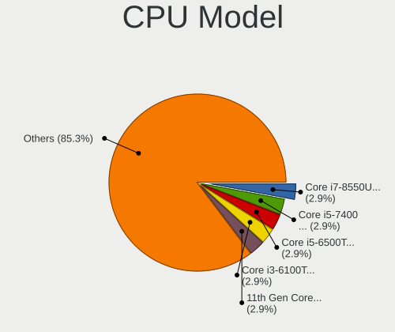

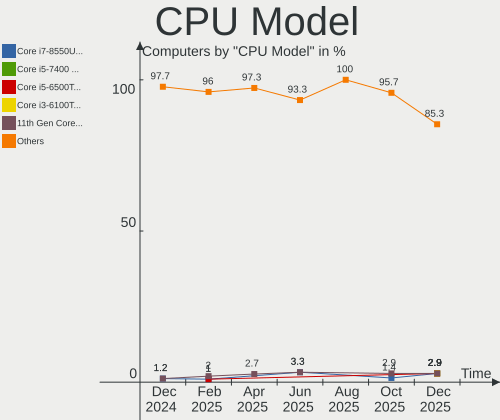

| Model                                         | Computers | Percent |
|-----------------------------------------------|-----------|---------|
| Intel Core i7-8550U CPU @ 1.80GHz             | 2         | 2.94%   |
| Intel Core i5-7400 CPU @ 3.00GHz              | 2         | 2.94%   |
| Intel Core i5-6500T CPU @ 2.50GHz             | 2         | 2.94%   |
| Intel Core i3-6100T CPU @ 3.20GHz             | 2         | 2.94%   |
| Intel 11th Gen Core i7-1165G7 @ 2.80GHz       | 2         | 2.94%   |
| AMD Ryzen AI 7 350 w/ Radeon 860M             | 2         | 2.94%   |
| AMD Ryzen 7 5700X3D 8-Core Processor          | 2         | 2.94%   |
| AMD Ryzen 5 3500U with Radeon Vega Mobile Gfx | 2         | 2.94%   |
| Intel Xeon CPU E5-2697 v2 @ 2.70GHz           | 1         | 1.47%   |
| Intel Xeon CPU E3-1260L v5 @ 2.90GHz          | 1         | 1.47%   |
| Intel Pentium M processor 2.13GHz             | 1         | 1.47%   |
| Intel Pentium CPU G3220 @ 3.00GHz             | 1         | 1.47%   |
| Intel N250                                    | 1         | 1.47%   |
| Intel Core Ultra 7 155H                       | 1         | 1.47%   |
| Intel Core m3-7Y30 CPU @ 1.00GHz              | 1         | 1.47%   |
| Intel Core i7-8700 CPU @ 3.20GHz              | 1         | 1.47%   |
| Intel Core i7-6820HK CPU @ 2.70GHz            | 1         | 1.47%   |
| Intel Core i7-6700 CPU @ 3.40GHz              | 1         | 1.47%   |
| Intel Core i7-4790 CPU @ 3.60GHz              | 1         | 1.47%   |
| Intel Core i7-2600 CPU @ 3.40GHz              | 1         | 1.47%   |
| Intel Core i7-10750H CPU @ 2.60GHz            | 1         | 1.47%   |
| Intel Core i7-10700KF CPU @ 3.80GHz           | 1         | 1.47%   |
| Intel Core i5-9300H CPU @ 2.40GHz             | 1         | 1.47%   |
| Intel Core i5-8400H CPU @ 2.50GHz             | 1         | 1.47%   |
| Intel Core i5-8400 CPU @ 2.80GHz              | 1         | 1.47%   |
| Intel Core i5-7360U CPU @ 2.30GHz             | 1         | 1.47%   |
| Intel Core i5-6600K CPU @ 3.50GHz             | 1         | 1.47%   |
| Intel Core i5-2500 CPU @ 3.30GHz              | 1         | 1.47%   |
| Intel Core i5-2400S CPU @ 2.50GHz             | 1         | 1.47%   |
| Intel Core i5-1035G4 CPU @ 1.10GHz            | 1         | 1.47%   |
| Intel Core i5-10300H CPU @ 2.50GHz            | 1         | 1.47%   |
| Intel Core i5-10210U CPU @ 1.60GHz            | 1         | 1.47%   |
| Intel Core i3-9100 CPU @ 3.60GHz              | 1         | 1.47%   |
| Intel Core i3-8130U CPU @ 2.20GHz             | 1         | 1.47%   |
| Intel Core 2 Duo CPU T6600 @ 2.20GHz          | 1         | 1.47%   |
| Intel Core 2 Duo CPU P7570 @ 2.26GHz          | 1         | 1.47%   |
| Intel Celeron CPU N3060 @ 1.60GHz             | 1         | 1.47%   |
| Intel 13th Gen Core i9-13900HK                | 1         | 1.47%   |
| Intel 13th Gen Core i5-13420H                 | 1         | 1.47%   |
| Intel 13th Gen Core i3-1315U                  | 1         | 1.47%   |

CPU Model Family
----------------

Processor model prefix

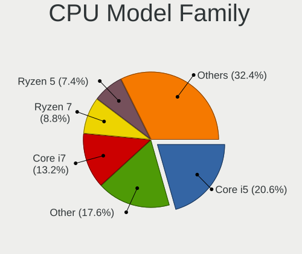

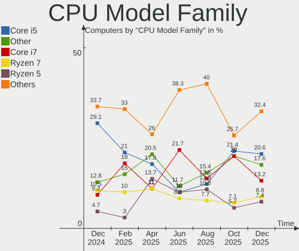

| Model                  | Computers | Percent |
|------------------------|-----------|---------|
| Intel Core i5          | 14        | 20.59%  |
| Other                  | 12        | 17.65%  |
| Intel Core i7          | 9         | 13.24%  |
| AMD Ryzen 7            | 6         | 8.82%   |
| AMD Ryzen 5            | 5         | 7.35%   |
| Intel Core i3          | 4         | 5.88%   |
| AMD Ryzen 9            | 4         | 5.88%   |
| Intel Xeon             | 2         | 2.94%   |
| Intel Core 2 Duo       | 2         | 2.94%   |
| Intel Pentium M        | 1         | 1.47%   |
| Intel Pentium          | 1         | 1.47%   |
| Intel Core m3          | 1         | 1.47%   |
| Intel Core             | 1         | 1.47%   |
| Intel Celeron          | 1         | 1.47%   |
| AMD Ryzen Threadripper | 1         | 1.47%   |
| AMD Ryzen 3            | 1         | 1.47%   |
| AMD Phenom             | 1         | 1.47%   |
| AMD FX                 | 1         | 1.47%   |
| AMD A6                 | 1         | 1.47%   |

CPU Cores
---------

Number of processor cores

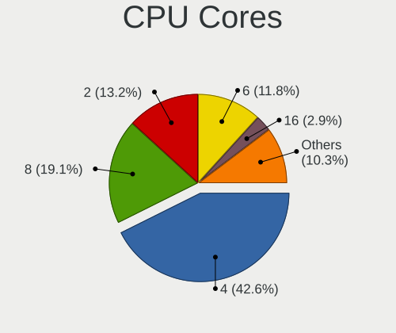

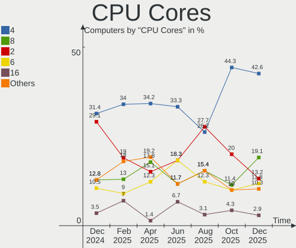

| Number | Computers | Percent |
|--------|-----------|---------|
| 4      | 29        | 42.65%  |
| 8      | 13        | 19.12%  |
| 2      | 9         | 13.24%  |
| 6      | 8         | 11.76%  |
| 16     | 2         | 2.94%   |
| 14     | 2         | 2.94%   |
| 32     | 1         | 1.47%   |
| 24     | 1         | 1.47%   |
| 12     | 1         | 1.47%   |
| 3      | 1         | 1.47%   |
| 1      | 1         | 1.47%   |

CPU Sockets
-----------

Number of sockets

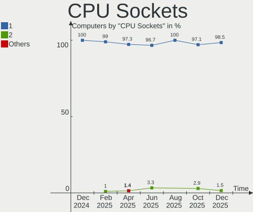

| Number | Computers | Percent |
|--------|-----------|---------|
| 1      | 67        | 98.53%  |
| 2      | 1         | 1.47%   |

CPU Threads
-----------

Threads per core (Hyper-Threading)

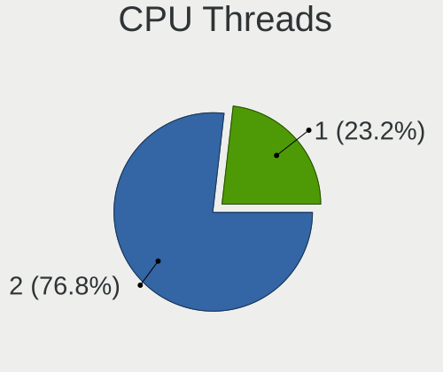

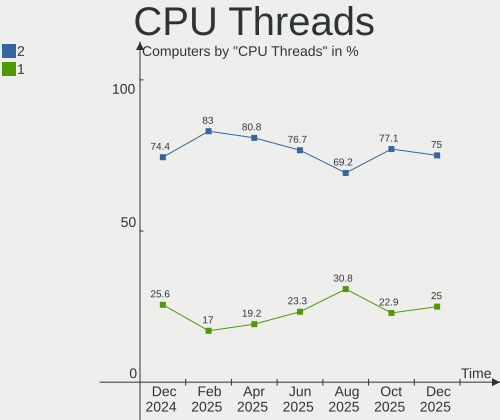

| Number | Computers | Percent |
|--------|-----------|---------|
| 2      | 51        | 75%     |
| 1      | 17        | 25%     |

CPU Op-Modes
------------

CPU Operation Modes (32-bit, 64-bit)

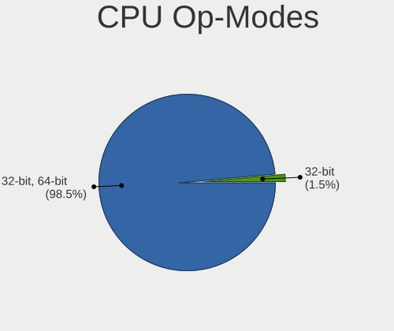

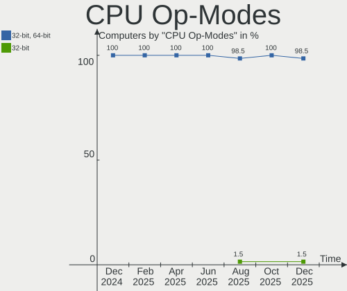

| Op mode        | Computers | Percent |
|----------------|-----------|---------|
| 32-bit, 64-bit | 67        | 98.53%  |
| 32-bit         | 1         | 1.47%   |

CPU Microcode
-------------

Microcode number

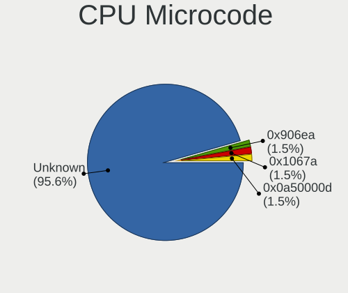

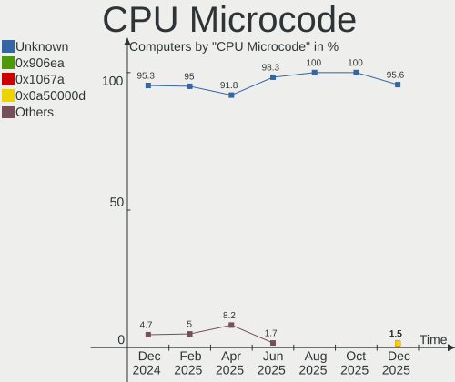

| Number     | Computers | Percent |
|------------|-----------|---------|
| Unknown    | 65        | 95.59%  |
| 0x906ea    | 1         | 1.47%   |
| 0x1067a    | 1         | 1.47%   |
| 0x0a50000d | 1         | 1.47%   |

CPU Microarch
-------------

Microarchitecture

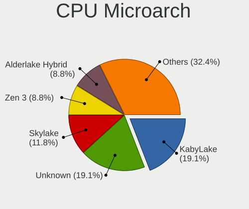

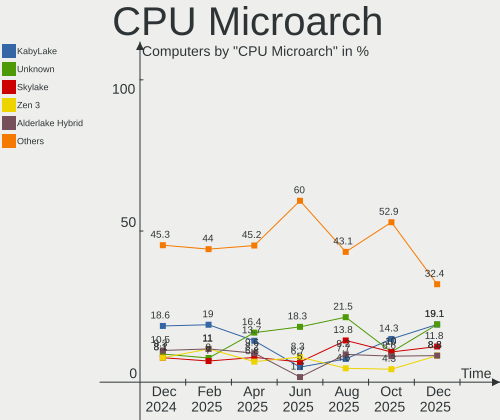

| Name             | Computers | Percent |
|------------------|-----------|---------|
| KabyLake         | 13        | 19.12%  |
| Unknown          | 13        | 19.12%  |
| Skylake          | 8         | 11.76%  |
| Zen 3            | 6         | 8.82%   |
| Alderlake Hybrid | 6         | 8.82%   |
| Zen+             | 3         | 4.41%   |
| SandyBridge      | 3         | 4.41%   |
| CometLake        | 3         | 4.41%   |
| TigerLake        | 2         | 2.94%   |
| Penryn           | 2         | 2.94%   |
| Haswell          | 2         | 2.94%   |
| Silvermont       | 1         | 1.47%   |
| Puma             | 1         | 1.47%   |
| Piledriver       | 1         | 1.47%   |
| P6               | 1         | 1.47%   |
| K10              | 1         | 1.47%   |
| IvyBridge        | 1         | 1.47%   |
| IceLake          | 1         | 1.47%   |

Graphics
--------

GPU Vendor
----------

Vendors of graphics cards

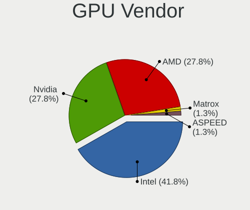

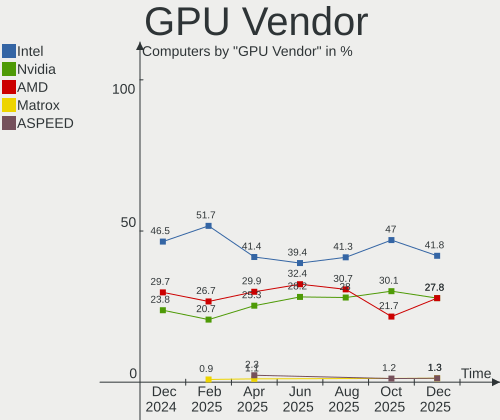

| Vendor                     | Computers | Percent |
|----------------------------|-----------|---------|
| Intel                      | 33        | 41.77%  |
| Nvidia                     | 22        | 27.85%  |
| AMD                        | 22        | 27.85%  |
| Matrox Electronics Systems | 1         | 1.27%   |
| ASPEED Technology          | 1         | 1.27%   |

GPU Model
---------

Graphics card models

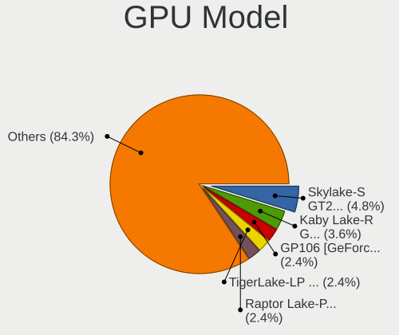

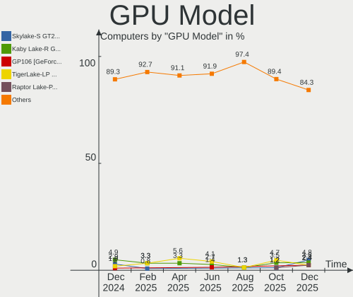

| Model                                                                       | Computers | Percent |
|-----------------------------------------------------------------------------|-----------|---------|
| Intel Skylake-S GT2 [HD Graphics 530]                                       | 4         | 4.82%   |
| Intel Kaby Lake-R GT2 [UHD Graphics 620]                                    | 3         | 3.61%   |
| Nvidia GP106 [GeForce GTX 1060 3GB]                                         | 2         | 2.41%   |
| Intel TigerLake-LP GT2 [Iris Xe Graphics]                                   | 2         | 2.41%   |
| Intel Raptor Lake-P [UHD Graphics]                                          | 2         | 2.41%   |
| Intel Kaby Lake-S GT2 [HD Graphics 630]                                     | 2         | 2.41%   |
| Intel CometLake-H GT2 [UHD Graphics]                                        | 2         | 2.41%   |
| Intel CoffeeLake-H GT2 [UHD Graphics 630]                                   | 2         | 2.41%   |
| Intel 2nd Generation Core Processor Family Integrated Graphics Controller   | 2         | 2.41%   |
| AMD Rembrandt [Radeon 680M]                                                 | 2         | 2.41%   |
| AMD Raphael                                                                 | 2         | 2.41%   |
| AMD Picasso/Raven 2 [Radeon Vega Series / Radeon Vega Mobile Series]        | 2         | 2.41%   |
| AMD Navi 32 [Radeon RX 7700 XT / 7800 XT]                                   | 2         | 2.41%   |
| AMD Navi 24 [Radeon RX 6400/6500 XT/6500M]                                  | 2         | 2.41%   |
| AMD Krackan [Radeon 840M / 860M Graphics]                                   | 2         | 2.41%   |
| AMD Caicos [Radeon HD 6450/7450/8450 / R5 230 OEM]                          | 2         | 2.41%   |
| Nvidia TU117M [GeForce GTX 1650 Ti Mobile]                                  | 1         | 1.2%    |
| Nvidia TU116M [GeForce GTX 1660 Ti Mobile]                                  | 1         | 1.2%    |
| Nvidia GT218M [GeForce G210M]                                               | 1         | 1.2%    |
| Nvidia GP108 [GeForce GT 1030]                                              | 1         | 1.2%    |
| Nvidia GP107GLM [Quadro P620]                                               | 1         | 1.2%    |
| Nvidia GP104 [GeForce GTX 1070]                                             | 1         | 1.2%    |
| Nvidia GM204M [GeForce GTX 970M]                                            | 1         | 1.2%    |
| Nvidia GM204GL [Quadro M4000]                                               | 1         | 1.2%    |
| Nvidia GM200GL [Tesla M40]                                                  | 1         | 1.2%    |
| Nvidia GK208B [GeForce GT 710]                                              | 1         | 1.2%    |
| Nvidia GB205 [GeForce RTX 5070]                                             | 1         | 1.2%    |
| Nvidia GA107M [GeForce RTX 3050 Mobile]                                     | 1         | 1.2%    |
| Nvidia GA106 [GeForce RTX 3060]                                             | 1         | 1.2%    |
| Nvidia GA106 [GeForce RTX 3060 Lite Hash Rate]                              | 1         | 1.2%    |
| Nvidia GA104 [GeForce RTX 3070]                                             | 1         | 1.2%    |
| Nvidia G98M [GeForce G 105M]                                                | 1         | 1.2%    |
| Nvidia G72 [GeForce 7300 LE]                                                | 1         | 1.2%    |
| Nvidia AD107M [GeForce RTX 4060 Max-Q / Mobile]                             | 1         | 1.2%    |
| Nvidia AD107 [GeForce RTX 4060]                                             | 1         | 1.2%    |
| Nvidia AD106M [GeForce RTX 4070 Max-Q / Mobile]                             | 1         | 1.2%    |
| Nvidia AD102 [GeForce RTX 4090]                                             | 1         | 1.2%    |
| Matrox Electronics Systems G200eR2                                          | 1         | 1.2%    |
| Intel Xeon E3-1200 v3/4th Gen Core Processor Integrated Graphics Controller | 1         | 1.2%    |
| Intel Raptor Lake-P [Iris Xe Graphics]                                      | 1         | 1.2%    |

GPU Combo
---------

Combinations of graphics cards

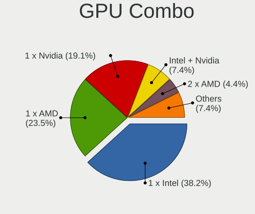

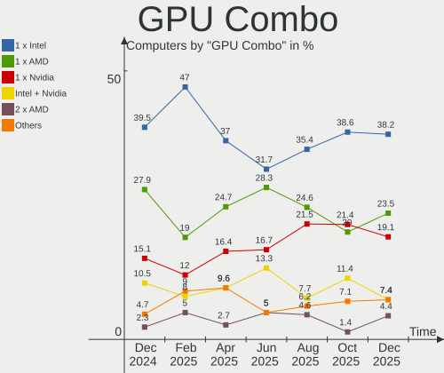

| Name                    | Computers | Percent |
|-------------------------|-----------|---------|
| 1 x Intel               | 26        | 38.24%  |
| 1 x AMD                 | 16        | 23.53%  |
| 1 x Nvidia              | 13        | 19.12%  |
| Intel + Nvidia          | 5         | 7.35%   |
| 2 x AMD                 | 3         | 4.41%   |
| AMD + Nvidia            | 2         | 2.94%   |
| 2 x Nvidia + 1 x Matrox | 1         | 1.47%   |
| Nvidia + ASPEED         | 1         | 1.47%   |
| Intel + AMD             | 1         | 1.47%   |

GPU Driver
----------

Free vs proprietary

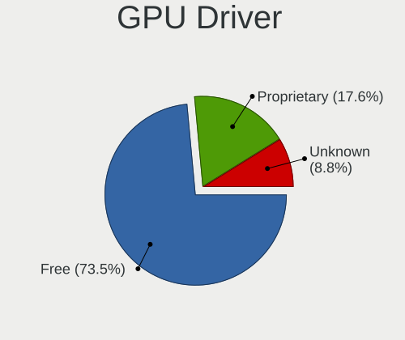

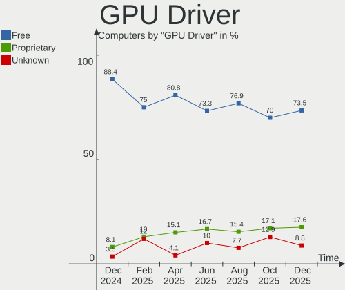

| Driver      | Computers | Percent |
|-------------|-----------|---------|
| Free        | 50        | 73.53%  |
| Proprietary | 12        | 17.65%  |
| Unknown     | 6         | 8.82%   |

GPU Memory
----------

Total video memory

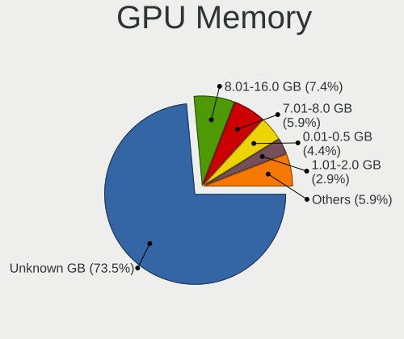

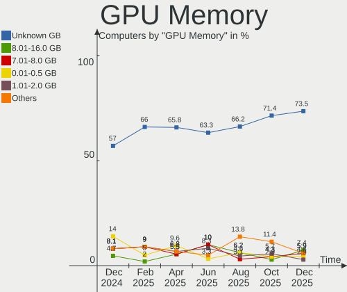

| Size in GB | Computers | Percent |
|------------|-----------|---------|
| Unknown    | 50        | 73.53%  |
| 8.01-16.0  | 5         | 7.35%   |
| 7.01-8.0   | 4         | 5.88%   |
| 0.01-0.5   | 3         | 4.41%   |
| 1.01-2.0   | 2         | 2.94%   |
| 3.01-4.0   | 1         | 1.47%   |
| 2.01-3.0   | 1         | 1.47%   |
| 16.01-24.0 | 1         | 1.47%   |
| 0.51-1.0   | 1         | 1.47%   |

Monitor
-------

Monitor Vendor
--------------

Monitor vendors

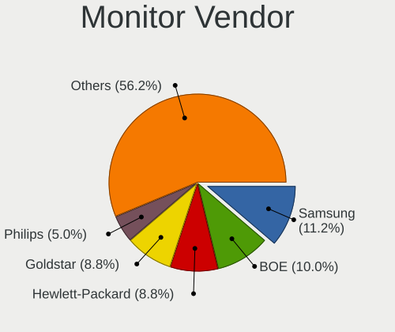

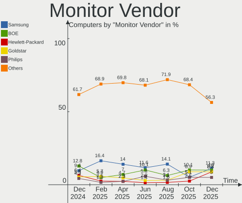

| Vendor              | Computers | Percent |
|---------------------|-----------|---------|
| Samsung Electronics | 9         | 11.25%  |
| BOE                 | 8         | 10%     |
| Hewlett-Packard     | 7         | 8.75%   |
| Goldstar            | 7         | 8.75%   |
| Philips             | 4         | 5%      |
| LG Display          | 4         | 5%      |
| Lenovo              | 4         | 5%      |
| Dell                | 4         | 5%      |
| Chimei Innolux      | 4         | 5%      |
| AU Optronics        | 4         | 5%      |
| Apple               | 3         | 3.75%   |
| Sony                | 2         | 2.5%    |
| Sharp               | 2         | 2.5%    |
| Iiyama              | 2         | 2.5%    |
| CSOT                | 2         | 2.5%    |
| BenQ                | 2         | 2.5%    |
| Vestel Elektronik   | 1         | 1.25%   |
| NEC Computers       | 1         | 1.25%   |
| MSI                 | 1         | 1.25%   |
| Mi                  | 1         | 1.25%   |
| Medion              | 1         | 1.25%   |
| IDS                 | 1         | 1.25%   |
| HKC                 | 1         | 1.25%   |
| ESP                 | 1         | 1.25%   |
| Belinea             | 1         | 1.25%   |
| ASUSTek Computer    | 1         | 1.25%   |
| AOC                 | 1         | 1.25%   |
| Acer                | 1         | 1.25%   |

Monitor Model
-------------

Monitor models

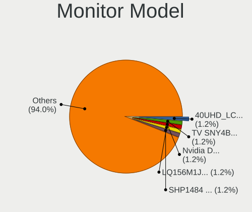

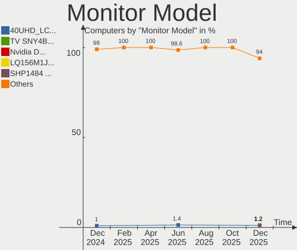

| Model                                                                  | Computers | Percent |
|------------------------------------------------------------------------|-----------|---------|
| Vestel Elektronik 40UHD_LCD_TV VES3700 3840x2160 880x500mm 39.8-inch   | 1         | 1.19%   |
| Sony TV SNY4B03 1920x1080 886x498mm 40.0-inch                          | 1         | 1.19%   |
| Sony Nvidia Defaul t Flat Panel SNY05FA 1366x768 309x174mm 14.0-inch   | 1         | 1.19%   |
| Sharp LQ156M1JW81 SHP14A4 1920x1080 344x194mm 15.5-inch                | 1         | 1.19%   |
| Sharp LCD Monitor SHP1484 1920x1080 294x165mm 13.3-inch                | 1         | 1.19%   |
| Samsung Electronics S24F350 SAM0D20 1920x1080 521x293mm 23.5-inch      | 1         | 1.19%   |
| Samsung Electronics S24E650 SAM0CC1 1920x1200 518x324mm 24.1-inch      | 1         | 1.19%   |
| Samsung Electronics S24E650 SAM0CBE 1920x1200 518x324mm 24.1-inch      | 1         | 1.19%   |
| Samsung Electronics S24C450 SAM09CF 1920x1200 518x324mm 24.1-inch      | 1         | 1.19%   |
| Samsung Electronics Odyssey G40B SAM727D 1920x1080 597x336mm 27.0-inch | 1         | 1.19%   |
| Samsung Electronics LCD Monitor SDC5441 1366x768 344x193mm 15.5-inch   | 1         | 1.19%   |
| Samsung Electronics LCD Monitor SDC4208 1920x1200 302x189mm 14.0-inch  | 1         | 1.19%   |
| Samsung Electronics LC24RG50 SAM0F90 1920x1080 532x304mm 24.1-inch     | 1         | 1.19%   |
| Samsung Electronics C27F390 SAM0D33 1920x1080 598x336mm 27.0-inch      | 1         | 1.19%   |
| Samsung Electronics C27F390 SAM0D32 1920x1080 598x336mm 27.0-inch      | 1         | 1.19%   |
| Philips PHL 328E1 PHLC204 3840x2160 697x392mm 31.5-inch                | 1         | 1.19%   |
| Philips PHL 284E5 PHLC0DE 1920x1080 621x341mm 27.9-inch                | 1         | 1.19%   |
| Philips PHL 223S7 PHL0910 1920x1080 476x268mm 21.5-inch                | 1         | 1.19%   |
| Philips 27M1N3200V PHLC279 1920x1080 598x336mm 27.0-inch               | 1         | 1.19%   |
| NEC Computers E223W NEC68EF 1680x1050 474x296mm 22.0-inch              | 1         | 1.19%   |
| NEC Computers E223W NEC68EE 1680x1050 474x296mm 22.0-inch              | 1         | 1.19%   |
| MSI MP243X MSI40B5 1920x1080 530x290mm 23.8-inch                       | 1         | 1.19%   |
| Mi Monitor XMI27B2 2560x1440 598x336mm 27.0-inch                       | 1         | 1.19%   |
| Medion MD20831 MEA5107 1920x1080 527x296mm 23.8-inch                   | 1         | 1.19%   |
| LG Display LCD Monitor LGD0796 1920x1200 345x215mm 16.0-inch           | 1         | 1.19%   |
| LG Display LCD Monitor LGD0563 1920x1080 344x194mm 15.5-inch           | 1         | 1.19%   |
| LG Display LCD Monitor LGD0555 2736x1824 260x173mm 12.3-inch           | 1         | 1.19%   |
| LG Display LCD Monitor LGD0469 1920x1080 382x215mm 17.3-inch           | 1         | 1.19%   |
| Lenovo T27hv-20 LEN62A9 2560x1440 597x336mm 27.0-inch                  | 1         | 1.19%   |
| Lenovo LEN LT2452pwC LEN1144 1920x1080 518x324mm 24.1-inch             | 1         | 1.19%   |
| Lenovo LCD Monitor LEN9050 1366x768 344x193mm 15.5-inch                | 1         | 1.19%   |
| Lenovo LCD Monitor LEN4053 1680x1050 331x207mm 15.4-inch               | 1         | 1.19%   |
| Iiyama PLE2483H IVM6113 1920x1080 531x299mm 24.0-inch                  | 1         | 1.19%   |
| Iiyama PL3482WQ IVM7649 3440x1440 797x334mm 34.0-inch                  | 1         | 1.19%   |
| IDS PT-185DW IDS0001 1366x768 340x190mm 15.3-inch                      | 1         | 1.19%   |
| HKC 34E6UC HKC3483 3440x1440 797x333mm 34.0-inch                       | 1         | 1.19%   |
| Hewlett-Packard M24m HPN3867 1920x1080 527x296mm 23.8-inch             | 1         | 1.19%   |
| Hewlett-Packard LP2475w HWP26F9 1920x1200 546x352mm 25.6-inch          | 1         | 1.19%   |
| Hewlett-Packard LP2475w HWP26F8 1920x1200 546x352mm 25.6-inch          | 1         | 1.19%   |
| Hewlett-Packard E243i HPN3463 1920x1200 518x324mm 24.1-inch            | 1         | 1.19%   |

Monitor Resolution
------------------

Monitor screen resolution

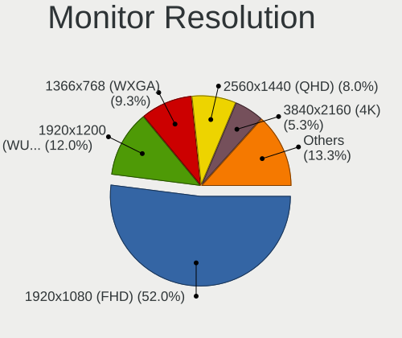

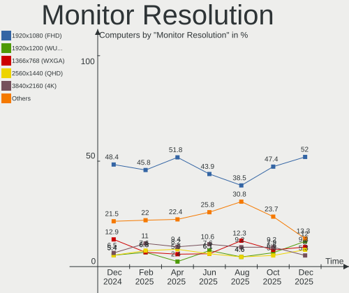

| Resolution         | Computers | Percent |
|--------------------|-----------|---------|
| 1920x1080 (FHD)    | 39        | 52%     |
| 1920x1200 (WUXGA)  | 9         | 12%     |
| 1366x768 (WXGA)    | 7         | 9.33%   |
| 2560x1440 (QHD)    | 6         | 8%      |
| 3840x2160 (4K)     | 4         | 5.33%   |
| 3440x1440          | 2         | 2.67%   |
| 1680x1050 (WSXGA+) | 2         | 2.67%   |
| 2880x1920          | 1         | 1.33%   |
| 2880x1800          | 1         | 1.33%   |
| 2560x1600          | 1         | 1.33%   |
| 2560x1080          | 1         | 1.33%   |
| 2160x1440          | 1         | 1.33%   |
| 1280x1024 (SXGA)   | 1         | 1.33%   |

Monitor Diagonal
----------------

Diagonal size in inches

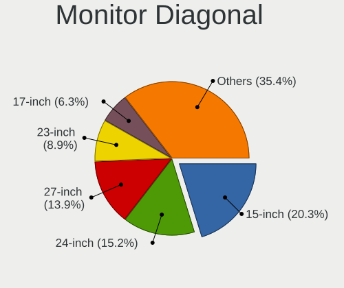

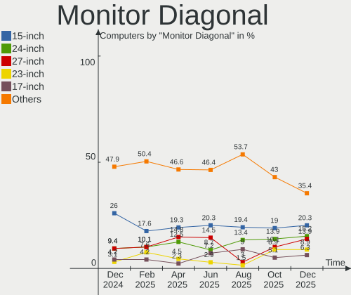

| Inches | Computers | Percent |
|--------|-----------|---------|
| 15     | 16        | 20.25%  |
| 24     | 12        | 15.19%  |
| 27     | 11        | 13.92%  |
| 23     | 7         | 8.86%   |
| 17     | 5         | 6.33%   |
| 13     | 4         | 5.06%   |
| 31     | 3         | 3.8%    |
| 21     | 3         | 3.8%    |
| 16     | 3         | 3.8%    |
| 14     | 3         | 3.8%    |
| 34     | 2         | 2.53%   |
| 25     | 2         | 2.53%   |
| 84     | 1         | 1.27%   |
| 63     | 1         | 1.27%   |
| 50     | 1         | 1.27%   |
| 40     | 1         | 1.27%   |
| 22     | 1         | 1.27%   |
| 18     | 1         | 1.27%   |
| 12     | 1         | 1.27%   |
| 11     | 1         | 1.27%   |

Monitor Width
-------------

Physical width

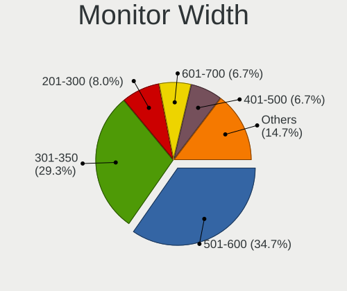

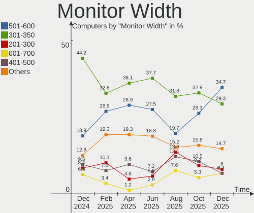

| Width in mm | Computers | Percent |
|-------------|-----------|---------|
| 501-600     | 26        | 34.67%  |
| 301-350     | 22        | 29.33%  |
| 201-300     | 6         | 8%      |
| 601-700     | 5         | 6.67%   |
| 401-500     | 5         | 6.67%   |
| 351-400     | 5         | 6.67%   |
| 701-800     | 2         | 2.67%   |
| 1001-1500   | 2         | 2.67%   |
| 801-900     | 1         | 1.33%   |
| 1501-2000   | 1         | 1.33%   |

Aspect Ratio
------------

Proportional relationship between the width and the height

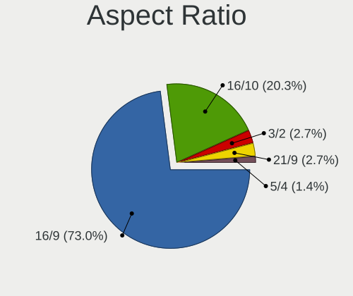

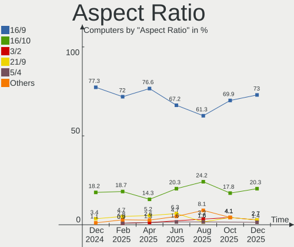

| Ratio | Computers | Percent |
|-------|-----------|---------|
| 16/9  | 54        | 72.97%  |
| 16/10 | 15        | 20.27%  |
| 3/2   | 2         | 2.7%    |
| 21/9  | 2         | 2.7%    |
| 5/4   | 1         | 1.35%   |

Monitor Area
------------

Area in inch²

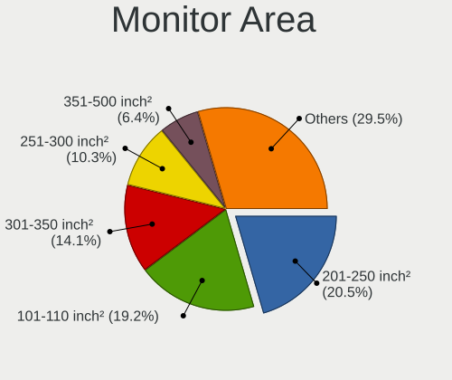

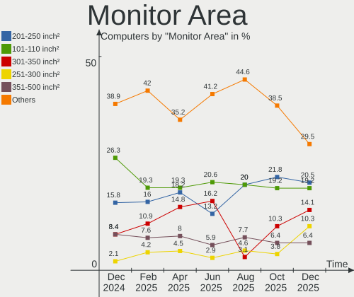

| Area in inch² | Computers | Percent |
|----------------|-----------|---------|
| 201-250        | 16        | 20.51%  |
| 101-110        | 15        | 19.23%  |
| 301-350        | 11        | 14.1%   |
| 251-300        | 8         | 10.26%  |
| 351-500        | 5         | 6.41%   |
| 121-130        | 4         | 5.13%   |
| More than 1000 | 3         | 3.85%   |
| 81-90          | 3         | 3.85%   |
| 71-80          | 3         | 3.85%   |
| 91-100         | 3         | 3.85%   |
| 141-150        | 2         | 2.56%   |
| 111-120        | 2         | 2.56%   |
| 61-70          | 1         | 1.28%   |
| 51-60          | 1         | 1.28%   |
| 501-1000       | 1         | 1.28%   |

Pixel Density
-------------

Pixels per inch

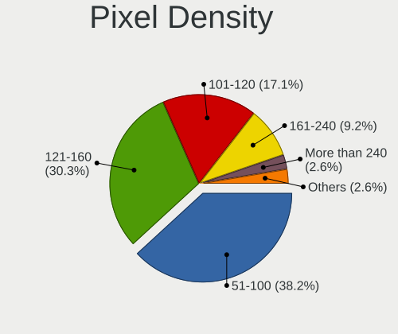

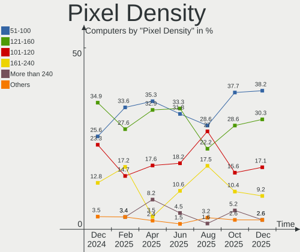

| Density       | Computers | Percent |
|---------------|-----------|---------|
| 51-100        | 29        | 38.16%  |
| 121-160       | 23        | 30.26%  |
| 101-120       | 13        | 17.11%  |
| 161-240       | 7         | 9.21%   |
| More than 240 | 2         | 2.63%   |
| 1-50          | 2         | 2.63%   |

Multiple Monitors
-----------------

Total monitors connected

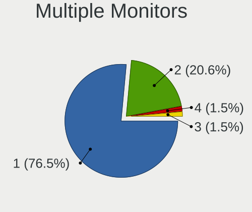

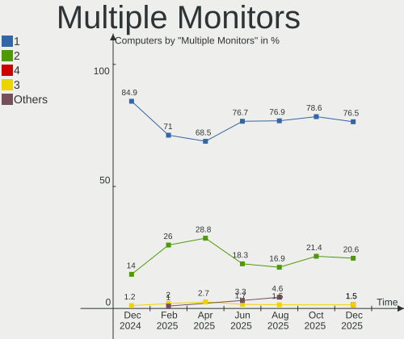

| Total | Computers | Percent |
|-------|-----------|---------|
| 1     | 52        | 76.47%  |
| 2     | 14        | 20.59%  |
| 4     | 1         | 1.47%   |
| 3     | 1         | 1.47%   |

Network
-------

Net Controller Vendor
---------------------

Controller vendors

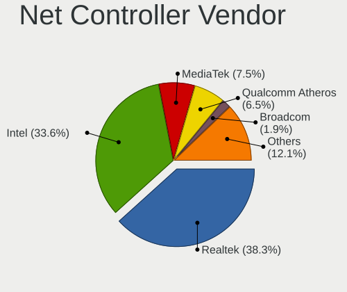

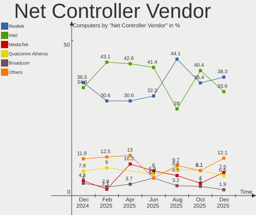

| Vendor                     | Computers | Percent |
|----------------------------|-----------|---------|
| Realtek Semiconductor      | 41        | 38.32%  |
| Intel                      | 36        | 33.64%  |
| MediaTek                   | 8         | 7.48%   |
| Qualcomm Atheros           | 7         | 6.54%   |
| Broadcom                   | 2         | 1.87%   |
| Shenzhen Goodix Technology | 1         | 0.93%   |
| Ralink Technology          | 1         | 0.93%   |
| Ralink                     | 1         | 0.93%   |
| Nvidia                     | 1         | 0.93%   |
| Microsoft                  | 1         | 0.93%   |
| Mellanox Technologies      | 1         | 0.93%   |
| Marvell Technology Group   | 1         | 0.93%   |
| Dell                       | 1         | 0.93%   |
| ASUSTek Computer           | 1         | 0.93%   |
| ASIX Electronics           | 1         | 0.93%   |
| American Megatrends        | 1         | 0.93%   |
| Adafruit                   | 1         | 0.93%   |
| 3Com                       | 1         | 0.93%   |

Net Controller Model
--------------------

Controller models

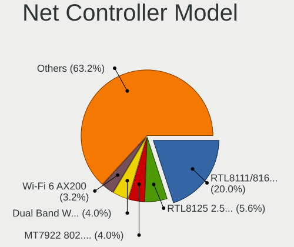

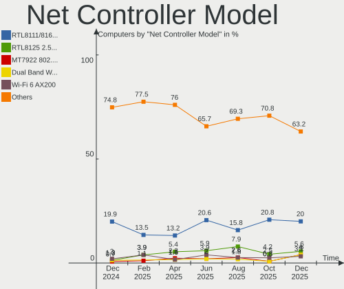

| Model                                                                  | Computers | Percent |
|------------------------------------------------------------------------|-----------|---------|
| Realtek RTL8111/8168/8211/8411 PCI Express Gigabit Ethernet Controller | 25        | 20%     |
| Realtek RTL8125 2.5GbE Controller                                      | 7         | 5.6%    |
| MediaTek MT7922 802.11ax PCI Express Wireless Network Adapter          | 5         | 4%      |
| Intel Dual Band Wireless-AC 3168NGW [Stone Peak]                       | 5         | 4%      |
| Intel Wi-Fi 6 AX200                                                    | 4         | 3.2%    |
| Qualcomm Atheros QCA6174 802.11ac Wireless Network Adapter             | 3         | 2.4%    |
| Intel Raptor Lake PCH CNVi WiFi                                        | 3         | 2.4%    |
| Intel Comet Lake PCH CNVi WiFi                                         | 3         | 2.4%    |
| Realtek RTL8821CE 802.11ac PCIe Wireless Network Adapter               | 2         | 1.6%    |
| Realtek RTL8153 Gigabit Ethernet Adapter                               | 2         | 1.6%    |
| Realtek RTL810xE PCI Express Fast Ethernet controller                  | 2         | 1.6%    |
| Realtek 802.11ac NIC                                                   | 2         | 1.6%    |
| MediaTek MT7921 802.11ax PCIe Wireless Network Adapter [Filogic 330]   | 2         | 1.6%    |
| Intel Wireless 8265 / 8275                                             | 2         | 1.6%    |
| Intel Wi-Fi 6E(802.11ax) AX210/AX1675* 2x2 [Typhoon Peak]              | 2         | 1.6%    |
| Intel Wi-Fi 5(802.11ac) Wireless-AC 9x6x [Thunder Peak]                | 2         | 1.6%    |
| Intel I211 Gigabit Network Connection                                  | 2         | 1.6%    |
| Intel Ethernet Connection (2) I219-LM                                  | 2         | 1.6%    |
| Shenzhen Goodix Fingerprint Reader                                     | 1         | 0.8%    |
| Realtek RTL8922AE 802.11be PCIe Wireless Network Adapter               | 1         | 0.8%    |
| Realtek RTL8852BE PCIe 802.11ax Wireless Network Controller            | 1         | 0.8%    |
| Realtek RTL8723BE PCIe Wireless Network Adapter                        | 1         | 0.8%    |
| Realtek RTL8192CU 802.11n WLAN Adapter                                 | 1         | 0.8%    |
| Realtek RTL8188EUS 802.11n Wireless Network Adapter                    | 1         | 0.8%    |
| Realtek RTL8169 PCI Gigabit Ethernet Controller                        | 1         | 0.8%    |
| Ralink MT7601U Wireless Adapter                                        | 1         | 0.8%    |
| Ralink RT3060 Wireless 802.11n 1T/1R                                   | 1         | 0.8%    |
| Qualcomm Atheros QCA9565 / AR9565 Wireless Network Adapter             | 1         | 0.8%    |
| Qualcomm Atheros Killer E2500 Gigabit Ethernet Controller              | 1         | 0.8%    |
| Qualcomm Atheros Killer E2400 Gigabit Ethernet Controller              | 1         | 0.8%    |
| Qualcomm Atheros AR93xx Wireless Network Adapter                       | 1         | 0.8%    |
| Qualcomm Atheros AR9227 Wireless Network Adapter                       | 1         | 0.8%    |
| Nvidia MCP55 Ethernet                                                  | 1         | 0.8%    |
| Microsoft Xbox 360 Wireless Adapter                                    | 1         | 0.8%    |
| Mellanox MT27500 Family [ConnectX-3]                                   | 1         | 0.8%    |
| MediaTek Wi-Fi 6 MT7920 Wireless Network Adapter                       | 1         | 0.8%    |
| Marvell Group 88E8057 PCI-E Gigabit Ethernet Controller                | 1         | 0.8%    |
| Intel Wireless 8260                                                    | 1         | 0.8%    |
| Intel Wireless 3165                                                    | 1         | 0.8%    |
| Intel WiFi Link 5100                                                   | 1         | 0.8%    |

Wireless Vendor
---------------

Wireless vendors

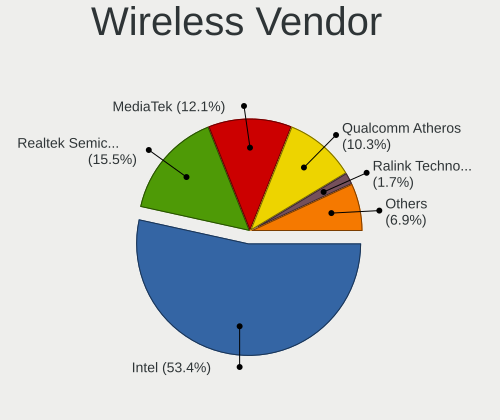

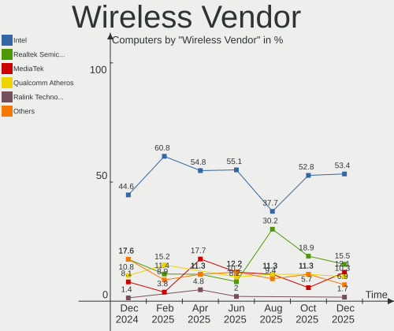

| Vendor                | Computers | Percent |
|-----------------------|-----------|---------|
| Intel                 | 31        | 53.45%  |
| Realtek Semiconductor | 9         | 15.52%  |
| MediaTek              | 7         | 12.07%  |
| Qualcomm Atheros      | 6         | 10.34%  |
| Ralink Technology     | 1         | 1.72%   |
| Ralink                | 1         | 1.72%   |
| Microsoft             | 1         | 1.72%   |
| Broadcom              | 1         | 1.72%   |
| ASUSTek Computer      | 1         | 1.72%   |

Wireless Model
--------------

Wireless models

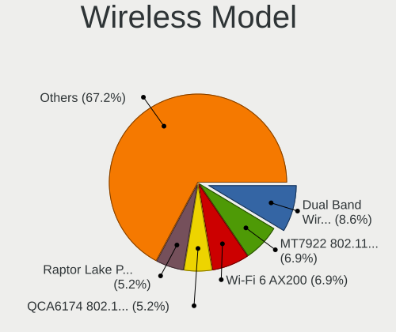

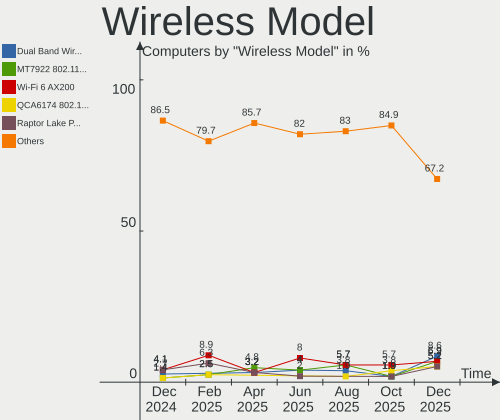

| Model                                                                | Computers | Percent |
|----------------------------------------------------------------------|-----------|---------|
| Intel Dual Band Wireless-AC 3168NGW [Stone Peak]                     | 5         | 8.62%   |
| MediaTek MT7922 802.11ax PCI Express Wireless Network Adapter        | 4         | 6.9%    |
| Intel Wi-Fi 6 AX200                                                  | 4         | 6.9%    |
| Qualcomm Atheros QCA6174 802.11ac Wireless Network Adapter           | 3         | 5.17%   |
| Intel Raptor Lake PCH CNVi WiFi                                      | 3         | 5.17%   |
| Intel Comet Lake PCH CNVi WiFi                                       | 3         | 5.17%   |
| Realtek RTL8821CE 802.11ac PCIe Wireless Network Adapter             | 2         | 3.45%   |
| Realtek 802.11ac NIC                                                 | 2         | 3.45%   |
| MediaTek MT7921 802.11ax PCIe Wireless Network Adapter [Filogic 330] | 2         | 3.45%   |
| Intel Wireless 8265 / 8275                                           | 2         | 3.45%   |
| Intel Wi-Fi 6E(802.11ax) AX210/AX1675* 2x2 [Typhoon Peak]            | 2         | 3.45%   |
| Intel Wi-Fi 5(802.11ac) Wireless-AC 9x6x [Thunder Peak]              | 2         | 3.45%   |
| Realtek RTL8922AE 802.11be PCIe Wireless Network Adapter             | 1         | 1.72%   |
| Realtek RTL8852BE PCIe 802.11ax Wireless Network Controller          | 1         | 1.72%   |
| Realtek RTL8723BE PCIe Wireless Network Adapter                      | 1         | 1.72%   |
| Realtek RTL8192CU 802.11n WLAN Adapter                               | 1         | 1.72%   |
| Realtek RTL8188EUS 802.11n Wireless Network Adapter                  | 1         | 1.72%   |
| Ralink MT7601U Wireless Adapter                                      | 1         | 1.72%   |
| Ralink RT3060 Wireless 802.11n 1T/1R                                 | 1         | 1.72%   |
| Qualcomm Atheros QCA9565 / AR9565 Wireless Network Adapter           | 1         | 1.72%   |
| Qualcomm Atheros AR93xx Wireless Network Adapter                     | 1         | 1.72%   |
| Qualcomm Atheros AR9227 Wireless Network Adapter                     | 1         | 1.72%   |
| Microsoft Xbox 360 Wireless Adapter                                  | 1         | 1.72%   |
| MediaTek Wi-Fi 6 MT7920 Wireless Network Adapter                     | 1         | 1.72%   |
| Intel Wireless 8260                                                  | 1         | 1.72%   |
| Intel Wireless 3165                                                  | 1         | 1.72%   |
| Intel WiFi Link 5100                                                 | 1         | 1.72%   |
| Intel Wi-Fi 6 AX201                                                  | 1         | 1.72%   |
| Intel PRO/Wireless 5100 AGN [Shiloh] Network Connection              | 1         | 1.72%   |
| Intel Meteor Lake PCH CNVi WiFi                                      | 1         | 1.72%   |
| Intel Ice Lake-LP PCH CNVi WiFi                                      | 1         | 1.72%   |
| Intel Comet Lake PCH-LP CNVi WiFi                                    | 1         | 1.72%   |
| Intel Alder Lake-S PCH CNVi WiFi                                     | 1         | 1.72%   |
| Intel Alder Lake-N PCH CNVi WiFi                                     | 1         | 1.72%   |
| Broadcom BCM4350 802.11ac Wireless Network Adapter                   | 1         | 1.72%   |
| ASUS 802.11ac NIC                                                    | 1         | 1.72%   |

Ethernet Vendor
---------------

Ethernet vendors

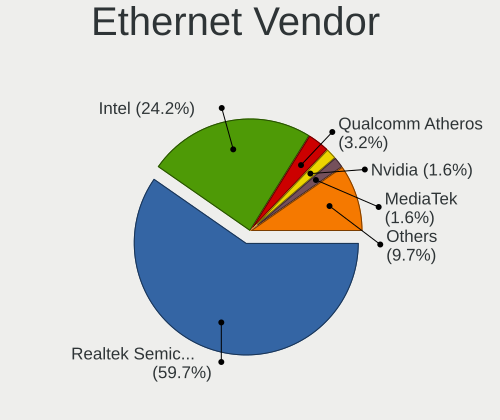

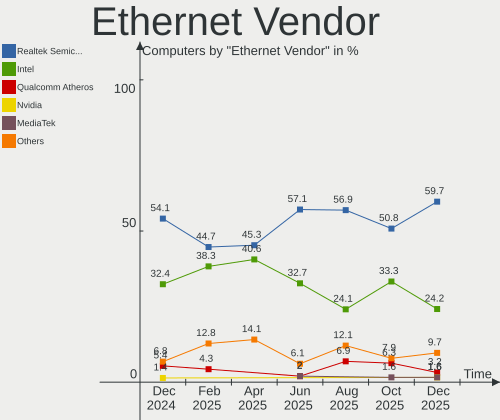

| Vendor                   | Computers | Percent |
|--------------------------|-----------|---------|
| Realtek Semiconductor    | 37        | 59.68%  |
| Intel                    | 15        | 24.19%  |
| Qualcomm Atheros         | 2         | 3.23%   |
| Nvidia                   | 1         | 1.61%   |
| MediaTek                 | 1         | 1.61%   |
| Marvell Technology Group | 1         | 1.61%   |
| Dell                     | 1         | 1.61%   |
| Broadcom                 | 1         | 1.61%   |
| ASIX Electronics         | 1         | 1.61%   |
| American Megatrends      | 1         | 1.61%   |
| 3Com                     | 1         | 1.61%   |

Ethernet Model
--------------

Ethernet models

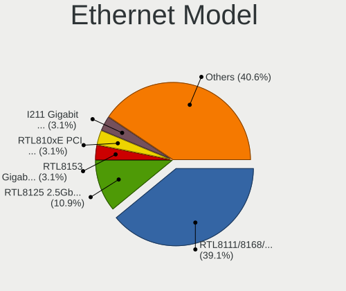

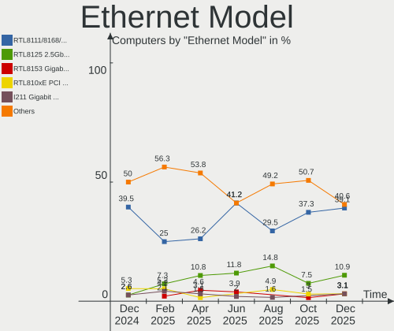

| Model                                                                  | Computers | Percent |
|------------------------------------------------------------------------|-----------|---------|
| Realtek RTL8111/8168/8211/8411 PCI Express Gigabit Ethernet Controller | 25        | 39.06%  |
| Realtek RTL8125 2.5GbE Controller                                      | 7         | 10.94%  |
| Realtek RTL8153 Gigabit Ethernet Adapter                               | 2         | 3.13%   |
| Realtek RTL810xE PCI Express Fast Ethernet controller                  | 2         | 3.13%   |
| Intel I211 Gigabit Network Connection                                  | 2         | 3.13%   |
| Intel Ethernet Connection (2) I219-LM                                  | 2         | 3.13%   |
| Realtek RTL8169 PCI Gigabit Ethernet Controller                        | 1         | 1.56%   |
| Qualcomm Atheros Killer E2500 Gigabit Ethernet Controller              | 1         | 1.56%   |
| Qualcomm Atheros Killer E2400 Gigabit Ethernet Controller              | 1         | 1.56%   |
| Nvidia MCP55 Ethernet                                                  | 1         | 1.56%   |
| MediaTek MT7922 802.11ax PCI Express Wireless Network Adapter          | 1         | 1.56%   |
| Marvell Group 88E8057 PCI-E Gigabit Ethernet Controller                | 1         | 1.56%   |
| Intel I350 Gigabit Network Connection                                  | 1         | 1.56%   |
| Intel I210 Gigabit Network Connection                                  | 1         | 1.56%   |
| Intel Ethernet Controller X710 for 10GBASE-T                           | 1         | 1.56%   |
| Intel Ethernet Controller I226-V                                       | 1         | 1.56%   |
| Intel Ethernet Controller I219-V                                       | 1         | 1.56%   |
| Intel Ethernet Connection I217-V                                       | 1         | 1.56%   |
| Intel Ethernet Connection (7) I219-V                                   | 1         | 1.56%   |
| Intel Ethernet Connection (5) I219-LM                                  | 1         | 1.56%   |
| Intel Ethernet Connection (4) I219-V                                   | 1         | 1.56%   |
| Intel Ethernet Connection (2) I219-V                                   | 1         | 1.56%   |
| Intel Ethernet Connection (13) I219-V                                  | 1         | 1.56%   |
| Intel Ethernet Connection (10) I219-LM                                 | 1         | 1.56%   |
| Intel 82574L Gigabit Network Connection                                | 1         | 1.56%   |
| Dell iDRAC Virtual NIC                                                 | 1         | 1.56%   |
| Broadcom NetXtreme BCM57765 Gigabit Ethernet PCIe                      | 1         | 1.56%   |
| ASIX AX88179 Gigabit Ethernet                                          | 1         | 1.56%   |
| American Megatrends Virtual Ethernet.                                  | 1         | 1.56%   |
| 3Com 3c905B 100BaseTX [Cyclone]                                        | 1         | 1.56%   |

Net Controller Kind
-------------------

Ethernet, WiFi or modem

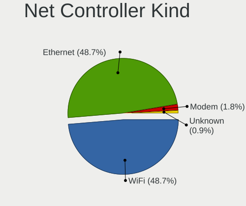

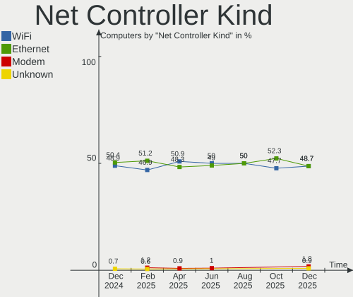

| Kind     | Computers | Percent |
|----------|-----------|---------|
| WiFi     | 55        | 48.67%  |
| Ethernet | 55        | 48.67%  |
| Modem    | 2         | 1.77%   |
| Unknown  | 1         | 0.88%   |

Used Controller
---------------

Currently used network controller

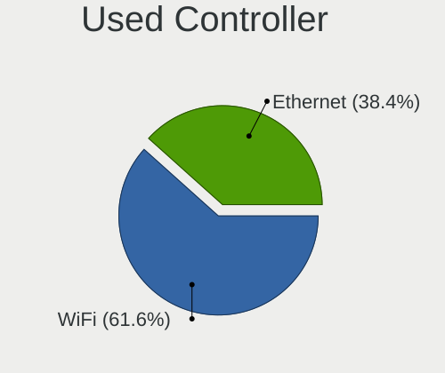

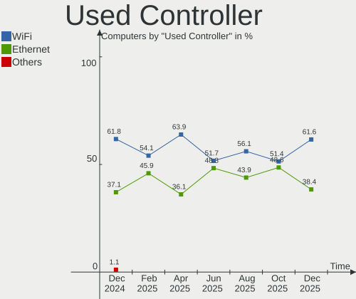

| Kind     | Computers | Percent |
|----------|-----------|---------|
| WiFi     | 45        | 61.64%  |
| Ethernet | 28        | 38.36%  |

NICs
----

Total network controllers on board

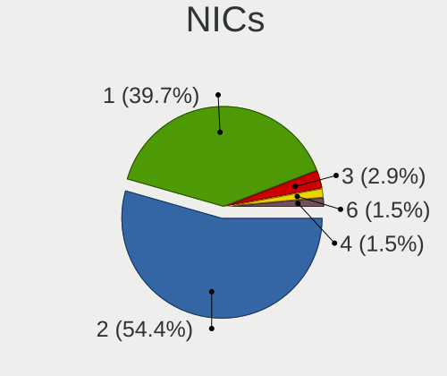

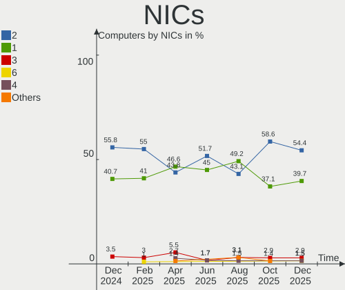

| Total | Computers | Percent |
|-------|-----------|---------|
| 2     | 37        | 54.41%  |
| 1     | 27        | 39.71%  |
| 3     | 2         | 2.94%   |
| 6     | 1         | 1.47%   |
| 4     | 1         | 1.47%   |

IPv6
----

IPv6 vs IPv4

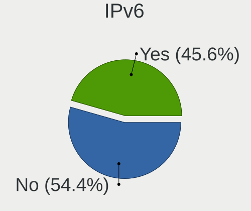

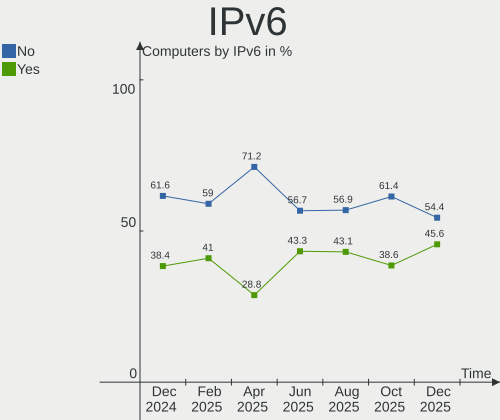

| Used | Computers | Percent |
|------|-----------|---------|
| No   | 37        | 54.41%  |
| Yes  | 31        | 45.59%  |

Bluetooth
---------

Bluetooth Vendor
----------------

Controller vendors

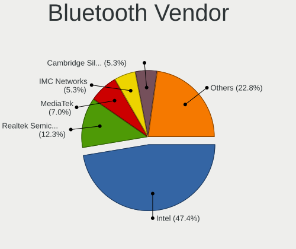

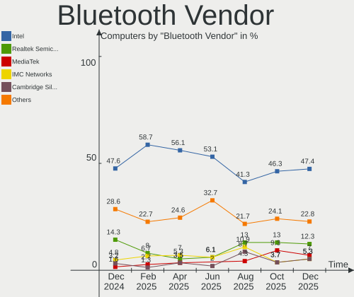

| Vendor                          | Computers | Percent |
|---------------------------------|-----------|---------|
| Intel                           | 27        | 47.37%  |
| Realtek Semiconductor           | 7         | 12.28%  |
| MediaTek                        | 4         | 7.02%   |
| IMC Networks                    | 3         | 5.26%   |
| Cambridge Silicon Radio         | 3         | 5.26%   |
| Qualcomm Atheros Communications | 2         | 3.51%   |
| Foxconn / Hon Hai               | 2         | 3.51%   |
| Broadcom                        | 2         | 3.51%   |
| Realtek                         | 1         | 1.75%   |
| Lite-On Technology              | 1         | 1.75%   |
| Edimax Technology               | 1         | 1.75%   |
| Belkin Components               | 1         | 1.75%   |
| Apple                           | 1         | 1.75%   |
| Alps Electric                   | 1         | 1.75%   |
| Unknown                         | 1         | 1.75%   |

Bluetooth Model
---------------

Controller models

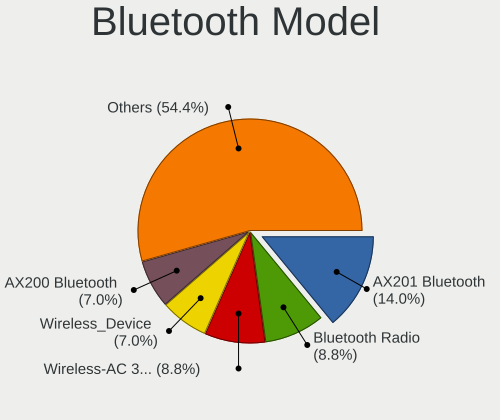

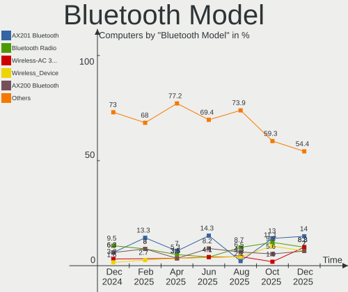

| Model                                               | Computers | Percent |
|-----------------------------------------------------|-----------|---------|
| Intel AX201 Bluetooth                               | 8         | 14.04%  |
| Realtek Bluetooth Radio                             | 5         | 8.77%   |
| Intel Wireless-AC 3168 Bluetooth                    | 5         | 8.77%   |
| MediaTek Wireless_Device                            | 4         | 7.02%   |
| Intel AX200 Bluetooth                               | 4         | 7.02%   |
| Intel Bluetooth wireless interface                  | 3         | 5.26%   |
| Intel Bluetooth Device                              | 3         | 5.26%   |
| IMC Networks Wireless_Device                        | 3         | 5.26%   |
| Cambridge Silicon Radio Bluetooth Dongle (HCI mode) | 3         | 5.26%   |
| Intel Wireless-AC 9260 Bluetooth Adapter            | 2         | 3.51%   |
| Realtek RTL8723B Bluetooth                          | 1         | 1.75%   |
| Realtek  Bluetooth 4.2 Adapter                      | 1         | 1.75%   |
| Realtek Bluetooth Radio                             | 1         | 1.75%   |
| Qualcomm Atheros  Bluetooth Device                  | 1         | 1.75%   |
| Qualcomm Atheros QCA61x4 Bluetooth 4.0              | 1         | 1.75%   |
| Lite-On Bluetooth Device                            | 1         | 1.75%   |
| Intel Bluetooth 9460/9560 Jefferson Peak (JfP)      | 1         | 1.75%   |
| Intel AX210 Bluetooth                               | 1         | 1.75%   |
| Foxconn / Hon Hai Wireless_Device                   | 1         | 1.75%   |
| Foxconn / Hon Hai Bluetooth Device                  | 1         | 1.75%   |
| Edimax Bluetooth Device                             | 1         | 1.75%   |
| Broadcom BCM20702A0 Bluetooth 4.0                   | 1         | 1.75%   |
| Broadcom BCM2045B (BDC-2.1) [Bluetooth Controller]  | 1         | 1.75%   |
| Belkin Components Bluetooth Mini Dongle             | 1         | 1.75%   |
| Apple Built-in Bluetooth 2.0+EDR HCI                | 1         | 1.75%   |
| Alps Electric BCM2046 Bluetooth Device              | 1         | 1.75%   |
| Unknown                                             | 1         | 1.75%   |

Sound
-----

Sound Vendor
------------

Sound card vendors

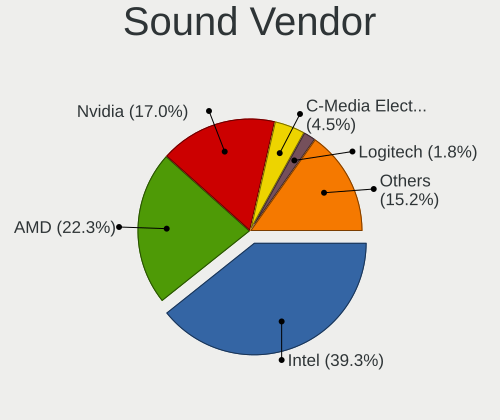

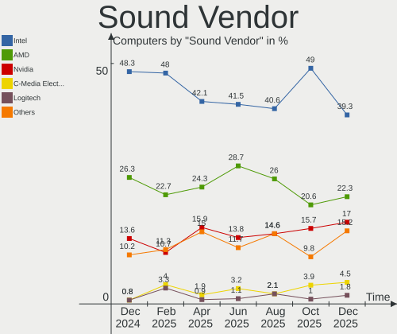

| Vendor                      | Computers | Percent |
|-----------------------------|-----------|---------|
| Intel                       | 44        | 39.29%  |
| AMD                         | 25        | 22.32%  |
| Nvidia                      | 19        | 16.96%  |
| C-Media Electronics         | 5         | 4.46%   |
| Logitech                    | 2         | 1.79%   |
| Hewlett-Packard             | 2         | 1.79%   |
| Creative Labs               | 2         | 1.79%   |
| Turtle Beach                | 1         | 0.89%   |
| Trust                       | 1         | 0.89%   |
| Sony                        | 1         | 0.89%   |
| Medeli Electronics          | 1         | 0.89%   |
| Lenovo                      | 1         | 0.89%   |
| KTMicro                     | 1         | 0.89%   |
| Kingston Technology         | 1         | 0.89%   |
| GYROCOM C&C                 | 1         | 0.89%   |
| Focusrite-Novation          | 1         | 0.89%   |
| FiiO Electronics Technology | 1         | 0.89%   |
| Creative Technology         | 1         | 0.89%   |
| Audioengine                 | 1         | 0.89%   |
| ASUSTek Computer            | 1         | 0.89%   |

Sound Model
-----------

Sound card models

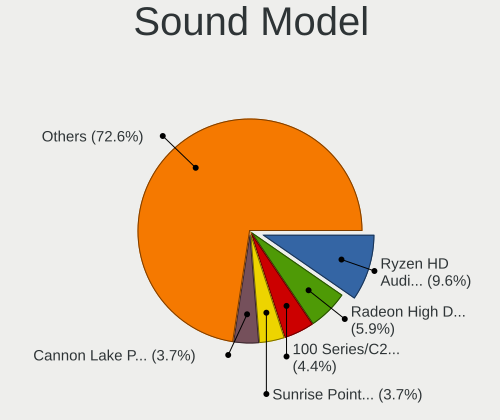

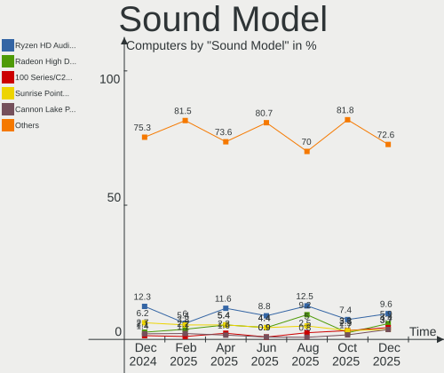

| Model                                                                             | Computers | Percent |
|-----------------------------------------------------------------------------------|-----------|---------|
| AMD Ryzen HD Audio Controller                                                     | 13        | 9.63%   |
| AMD Radeon High Definition Audio Controller                                       | 8         | 5.93%   |
| Intel 100 Series/C230 Series Chipset Family HD Audio Controller                   | 6         | 4.44%   |
| Intel Sunrise Point-LP HD Audio                                                   | 5         | 3.7%    |
| Intel Cannon Lake PCH cAVS                                                        | 5         | 3.7%    |
| Intel 200 Series PCH HD Audio                                                     | 4         | 2.96%   |
| AMD Starship/Matisse HD Audio Controller                                          | 4         | 2.96%   |
| AMD Navi 31 HDMI/DP Audio                                                         | 4         | 2.96%   |
| Intel Raptor Lake-P/U/H cAVS                                                      | 3         | 2.22%   |
| Intel Comet Lake PCH cAVS                                                         | 3         | 2.22%   |
| C-Media Electronics CMI8738/CMI8768 PCI Audio                                     | 3         | 2.22%   |
| AMD Navi 21/23 HDMI/DP Audio Controller                                           | 3         | 2.22%   |
| Nvidia GP106 High Definition Audio Controller                                     | 2         | 1.48%   |
| Nvidia GM204 High Definition Audio Controller                                     | 2         | 1.48%   |
| Nvidia GA106 High Definition Audio Controller                                     | 2         | 1.48%   |
| Nvidia AD107 High Definition Audio Controller                                     | 2         | 1.48%   |
| Intel Tiger Lake-LP Smart Sound Technology Audio Controller                       | 2         | 1.48%   |
| Intel Alder Lake-S HD Audio Controller                                            | 2         | 1.48%   |
| Intel 82801I (ICH9 Family) HD Audio Controller                                    | 2         | 1.48%   |
| Intel 8 Series/C220 Series Chipset High Definition Audio Controller               | 2         | 1.48%   |
| Intel 6 Series/C200 Series Chipset Family High Definition Audio Controller        | 2         | 1.48%   |
| C-Media Electronics Audio Adapter (Unitek Y-247A)                                 | 2         | 1.48%   |
| AMD Renoir/Cezanne HDMI/DP Audio Controller                                       | 2         | 1.48%   |
| AMD Raven/Raven2/Fenghuang HDMI/DP Audio Controller                               | 2         | 1.48%   |
| AMD Caicos HDMI Audio [Radeon HD 6450 / 7450/8450/8490 OEM / R5 230/235/235X OEM] | 2         | 1.48%   |
| Turtle Beach Stream Mic (Mic Only)                                                | 1         | 0.74%   |
| Trust GXT 232 Microphone                                                          | 1         | 0.74%   |
| Sony DualShock 4 [CUH-ZCT2x]                                                      | 1         | 0.74%   |
| Nvidia TU107 GeForce GTX 1650 High Definition Audio Controller                    | 1         | 0.74%   |
| Nvidia MCP55 High Definition Audio                                                | 1         | 0.74%   |
| Nvidia High Definition Audio Controller                                           | 1         | 0.74%   |
| Nvidia GP108 High Definition Audio Controller                                     | 1         | 0.74%   |
| Nvidia GP104 High Definition Audio Controller                                     | 1         | 0.74%   |
| Nvidia GK208 HDMI/DP Audio Controller                                             | 1         | 0.74%   |
| Nvidia GB205 High Definition Audio Controller                                     | 1         | 0.74%   |
| Nvidia GA107 High Definition Audio Controller                                     | 1         | 0.74%   |
| Nvidia GA104 High Definition Audio Controller                                     | 1         | 0.74%   |
| Nvidia AD106M High Definition Audio Controller                                    | 1         | 0.74%   |
| Nvidia AD102 High Definition Audio Controller                                     | 1         | 0.74%   |
| Medeli Electronics KRUX EDIS 1000                                                 | 1         | 0.74%   |

Memory
------

Memory Vendor
-------------

Memory module vendors

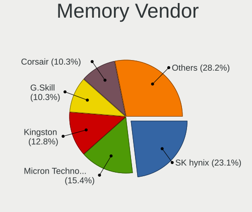

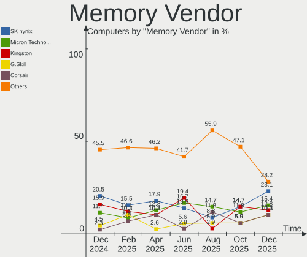

| Vendor              | Computers | Percent |
|---------------------|-----------|---------|
| SK hynix            | 9         | 23.08%  |
| Micron Technology   | 6         | 15.38%  |
| Kingston            | 5         | 12.82%  |
| G.Skill             | 4         | 10.26%  |
| Corsair             | 4         | 10.26%  |
| Unknown             | 3         | 7.69%   |
| Samsung Electronics | 3         | 7.69%   |
| Crucial             | 2         | 5.13%   |
| Unknown (0x0FC4)    | 1         | 2.56%   |
| A-DATA Technology   | 1         | 2.56%   |
| Unknown             | 1         | 2.56%   |

Memory Model
------------

Memory module models

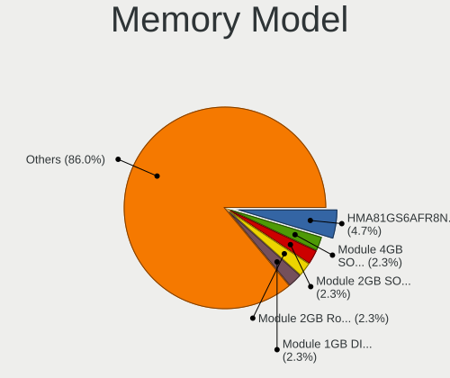

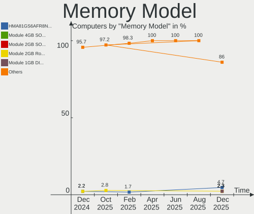

| Model                                                             | Computers | Percent |
|-------------------------------------------------------------------|-----------|---------|
| SK hynix RAM HMA81GS6AFR8N-UH 8GB SODIMM DDR4 2667MT/s            | 2         | 4.65%   |
| Unknown RAM Module 4GB SODIMM DDR3                                | 1         | 2.33%   |
| Unknown RAM Module 2GB SODIMM DDR3                                | 1         | 2.33%   |
| Unknown RAM Module 2GB Row Of Chips LPDDR4 4267MT/s               | 1         | 2.33%   |
| Unknown RAM Module 1GB DIMM SDRAM                                 | 1         | 2.33%   |
| Unknown (0x0FC4) RAM TDS4CDAG08-32SC22C 16GB SODIMM DDR4 3200MT/s | 1         | 2.33%   |
| SK hynix RAM Module 8GB SODIMM DDR3 1600MT/s                      | 1         | 2.33%   |
| SK hynix RAM HMCG88AGBSA095N 32GB SODIMM DDR5 5600MT/s            | 1         | 2.33%   |
| SK hynix RAM HMA851S6JJR6N-VK 4GB SODIMM DDR4 2667MT/s            | 1         | 2.33%   |
| SK hynix RAM HMA81GU6DJR8N-XN 8GB DIMM DDR4 3200MT/s              | 1         | 2.33%   |
| SK hynix RAM HMA81GS6CJR8N-VK 8GB SODIMM DDR4 2667MT/s            | 1         | 2.33%   |
| SK hynix RAM H9CCNNNCLGALAR-NVD 8GB Row Of Chips LPDDR3 2133MT/s  | 1         | 2.33%   |
| SK hynix RAM H58GE6AK8BX104 6GB Row Of Chips LPDDR5 7500MT/s      | 1         | 2.33%   |
| SK hynix RAM H58G56BK7BX068 4GB LPDDR5 7500MT/s                   | 1         | 2.33%   |
| Samsung RAM M471B1G73QHO-YKO 4GB SODIMM DDR3 1600MT/s             | 1         | 2.33%   |
| Samsung RAM M378A1K43CB2-CTD 8GB DIMM DDR4 3266MT/s               | 1         | 2.33%   |
| Samsung RAM M378A1K43BB2-CRC 8GB DIMM DDR4 3400MT/s               | 1         | 2.33%   |
| Micron RAM Module 8GB DIMM DDR3 1333MT/s                          | 1         | 2.33%   |
| Micron RAM Module 4GB SODIMM LPDDR3 2133MT/s                      | 1         | 2.33%   |
| Micron RAM CT16G56C46S5.M8D1 16GB SODIMM DDR5 5600MT/s            | 1         | 2.33%   |
| Micron RAM 8ATF1G64HZ-3G2R1 8GB SODIMM DDR4 3200MT/s              | 1         | 2.33%   |
| Micron RAM 4ATF51264HZ-2G3E1 4GB SODIMM DDR4 2667MT/s             | 1         | 2.33%   |
| Micron RAM 4ATF1G64HZ-3G2E2 8GB SODIMM DDR4 3200MT/s              | 1         | 2.33%   |
| Kingston RAM KHX2666C15D4/8G 8GB DIMM DDR4 3200MT/s               | 1         | 2.33%   |
| Kingston RAM KF560R32-32 32GB DIMM DDR5 4800MT/s                  | 1         | 2.33%   |
| Kingston RAM KF2933C17S4/16G 16GB SODIMM DDR4 2933MT/s            | 1         | 2.33%   |
| Kingston RAM KF2666C16D4/8G 8GB DIMM DDR4 2667MT/s                | 1         | 2.33%   |
| Kingston RAM 99U5458-005.A00LF 4GB DIMM DDR3 1333MT/s             | 1         | 2.33%   |
| Kingston RAM 9905744-062.A00G 32GB SODIMM DDR4 3200MT/s           | 1         | 2.33%   |
| G.Skill RAM F5-6000J4040F16G 16GB DIMM DDR5 6000MT/s              | 1         | 2.33%   |
| G.Skill RAM F4-3200C16-8GIS 8GB DIMM DDR4 3600MT/s                | 1         | 2.33%   |
| G.Skill RAM F4-3200C16-16GIS 16GB DIMM DDR4 3600MT/s              | 1         | 2.33%   |
| G.Skill RAM F4-2400C17-4GVR 4GB DIMM DDR4 2400MT/s                | 1         | 2.33%   |
| Crucial RAM CT16G56C46S5.M8G1 16GB SODIMM DDR5 5600MT/s           | 1         | 2.33%   |
| Crucial RAM CT102464BA1339.C16 8GB DIMM DDR3 1333MT/s             | 1         | 2.33%   |
| Corsair RAM CMW16GX4M2C3000C15 8GB DIMM DDR4 3467MT/s             | 1         | 2.33%   |
| Corsair RAM CMK8GX4M1A2400C16 8GB DIMM DDR4 3066MT/s              | 1         | 2.33%   |
| Corsair RAM CMK16GX4M2B3200C16 8GB DIMM DDR4 3600MT/s             | 1         | 2.33%   |
| Corsair RAM CMK16GX4M2B3000C15 8GB DIMM DDR4 3600MT/s             | 1         | 2.33%   |
| Corsair RAM CMK16GX4M2A2400C16 8GB DIMM DDR4 2933MT/s             | 1         | 2.33%   |

Memory Kind
-----------

Memory module kinds

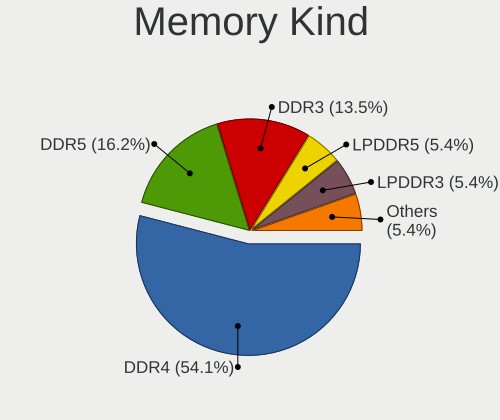

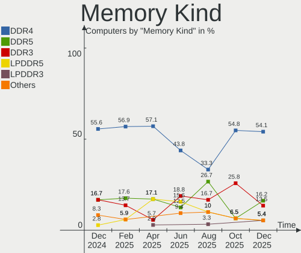

| Kind   | Computers | Percent |
|--------|-----------|---------|
| DDR4   | 20        | 54.05%  |
| DDR5   | 6         | 16.22%  |
| DDR3   | 5         | 13.51%  |
| LPDDR5 | 2         | 5.41%   |
| LPDDR3 | 2         | 5.41%   |
| SDRAM  | 1         | 2.7%    |
| LPDDR4 | 1         | 2.7%    |

Memory Form Factor
------------------

Physical design of the memory module

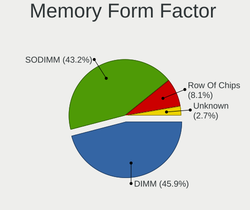

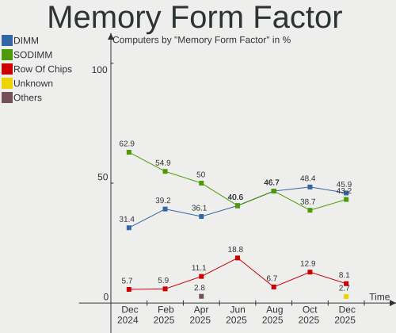

| Name         | Computers | Percent |
|--------------|-----------|---------|
| DIMM         | 17        | 45.95%  |
| SODIMM       | 16        | 43.24%  |
| Row Of Chips | 3         | 8.11%   |
| Unknown      | 1         | 2.7%    |

Memory Size
-----------

Memory module size

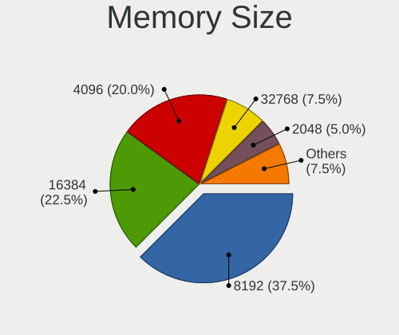

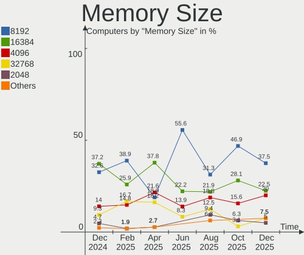

| Size  | Computers | Percent |
|-------|-----------|---------|
| 8192  | 15        | 37.5%   |
| 16384 | 9         | 22.5%   |
| 4096  | 8         | 20%     |
| 32768 | 3         | 7.5%    |
| 2048  | 2         | 5%      |
| 24576 | 1         | 2.5%    |
| 6144  | 1         | 2.5%    |
| 1024  | 1         | 2.5%    |

Memory Speed
------------

Memory module speed

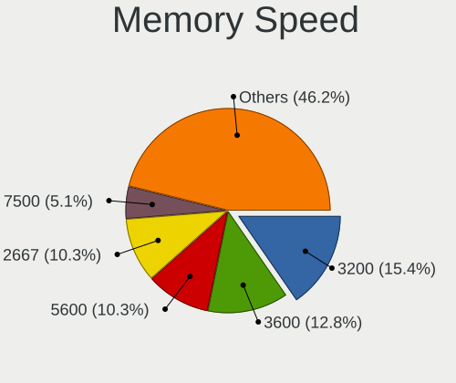

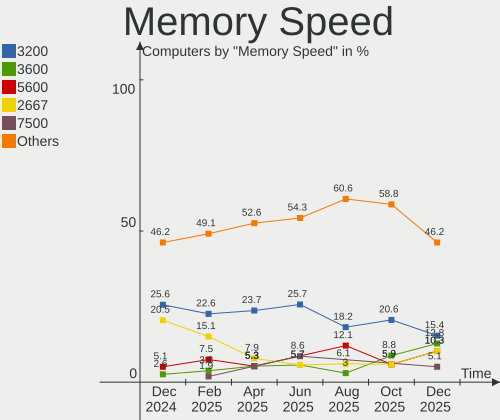

| Speed   | Computers | Percent |
|---------|-----------|---------|
| 3200    | 6         | 15.38%  |
| 3600    | 5         | 12.82%  |
| 5600    | 4         | 10.26%  |
| 2667    | 4         | 10.26%  |
| 7500    | 2         | 5.13%   |
| 2933    | 2         | 5.13%   |
| 2133    | 2         | 5.13%   |
| 1600    | 2         | 5.13%   |
| 1333    | 2         | 5.13%   |
| Unknown | 2         | 5.13%   |
| 6000    | 1         | 2.56%   |
| 4800    | 1         | 2.56%   |
| 4267    | 1         | 2.56%   |
| 3467    | 1         | 2.56%   |
| 3400    | 1         | 2.56%   |
| 3266    | 1         | 2.56%   |
| 3066    | 1         | 2.56%   |
| 2400    | 1         | 2.56%   |

Printers & scanners
-------------------

Printer Vendor
--------------

Printer device vendors

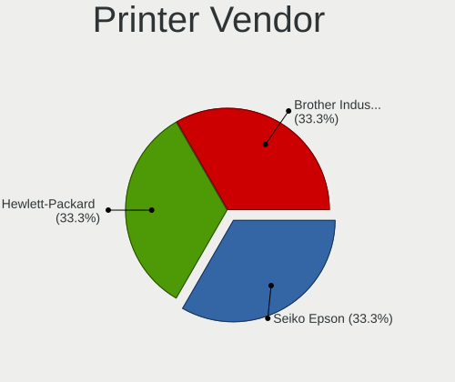

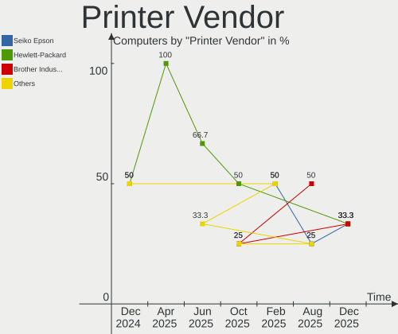

| Vendor             | Computers | Percent |
|--------------------|-----------|---------|
| Seiko Epson        | 1         | 33.33%  |
| Hewlett-Packard    | 1         | 33.33%  |
| Brother Industries | 1         | 33.33%  |

Printer Model
-------------

Printer device models

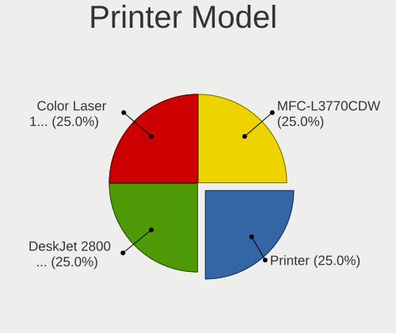

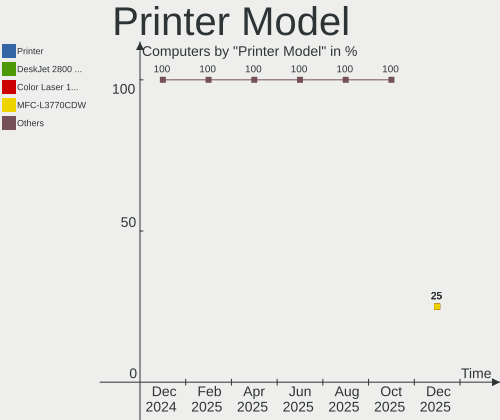

| Model                  | Computers | Percent |
|------------------------|-----------|---------|
| Seiko Epson Printer    | 1         | 25%     |
| HP DeskJet 2800 series | 1         | 25%     |
| HP Color Laser 150nw   | 1         | 25%     |
| Brother MFC-L3770CDW   | 1         | 25%     |

Scanner Vendor
--------------

Scanner device vendors

Zero info for selected period =(

Scanner Model
-------------

Scanner device models

Zero info for selected period =(

Camera
------

Camera Vendor
-------------

Camera device vendors

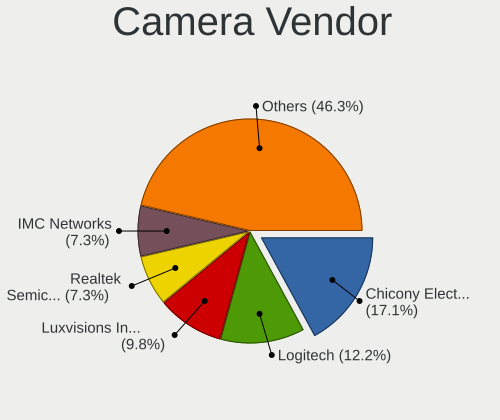

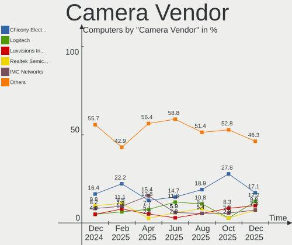

| Vendor                        | Computers | Percent |
|-------------------------------|-----------|---------|
| Chicony Electronics           | 7         | 17.07%  |
| Logitech                      | 5         | 12.2%   |
| Luxvisions Innotech Limited   | 4         | 9.76%   |
| Realtek Semiconductor         | 3         | 7.32%   |
| IMC Networks                  | 3         | 7.32%   |
| Quanta                        | 2         | 4.88%   |
| Trust                         | 1         | 2.44%   |
| Syntek                        | 1         | 2.44%   |
| Sunwingroup                   | 1         | 2.44%   |
| Sunplus Innovation Technology | 1         | 2.44%   |
| Sonix Technology              | 1         | 2.44%   |
| SHENZHEN EMEET TECHNOLOGY     | 1         | 2.44%   |
| Ricoh                         | 1         | 2.44%   |
| Razer USA                     | 1         | 2.44%   |
| Microdia                      | 1         | 2.44%   |
| MacroSilicon                  | 1         | 2.44%   |
| HYGD-XH--241023               | 1         | 2.44%   |
| Hewlett-Packard               | 1         | 2.44%   |
| Framework                     | 1         | 2.44%   |
| eMeet                         | 1         | 2.44%   |
| Creative Technology           | 1         | 2.44%   |
| Bison Electronics             | 1         | 2.44%   |
| Apple                         | 1         | 2.44%   |

Camera Model
------------

Camera device models

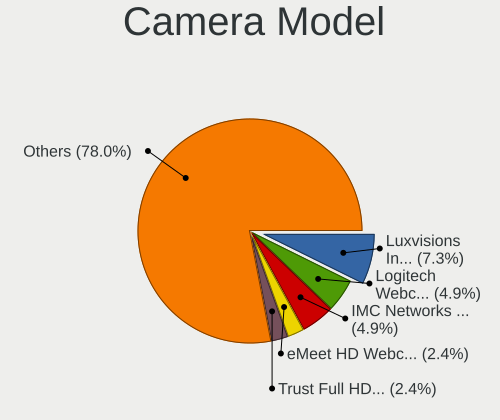

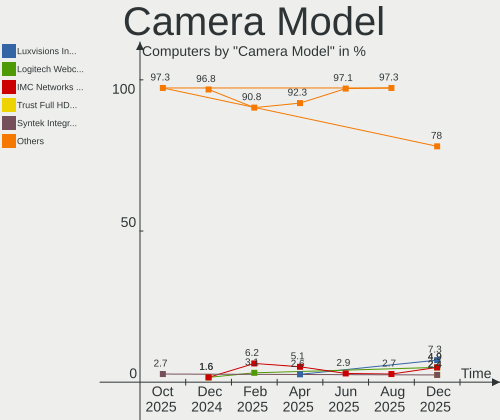

| Model                                                | Computers | Percent |
|------------------------------------------------------|-----------|---------|
| Luxvisions Innotech Limited HP Wide Vision HD Camera | 3         | 7.32%   |
| Logitech Webcam C270                                 | 2         | 4.88%   |
| IMC Networks USB2.0 HD UVC WebCam                    | 2         | 4.88%   |
| Trust Full HD Webcam                                 | 1         | 2.44%   |
| Syntek Integrated RGB Camera                         | 1         | 2.44%   |
| Sunwingroup HD Camera                                | 1         | 2.44%   |
| Sunplus Integrated_Webcam_HD                         | 1         | 2.44%   |
| Sonix USB 2.0 Camera                                 | 1         | 2.44%   |
| SHENZHEN EMEET TECHNOLOGY eMeet Nova                 | 1         | 2.44%   |
| Ricoh Sony Vaio Integrated Webcam                    | 1         | 2.44%   |
| Realtek Lenovo EasyCamera                            | 1         | 2.44%   |
| Realtek Integrated_Webcam_HD                         | 1         | 2.44%   |
| Realtek Integrated Webcam                            | 1         | 2.44%   |
| Razer USA Gaming Webcam [Kiyo]                       | 1         | 2.44%   |
| Quanta HP Display Camera                             | 1         | 2.44%   |
| Quanta HD User Facing                                | 1         | 2.44%   |
| Microdia Integrated_Webcam_HD                        | 1         | 2.44%   |
| MacroSilicon USB Video                               | 1         | 2.44%   |
| Luxvisions Innotech Limited HP TrueVision HD Camera  | 1         | 2.44%   |
| Logitech Logi Webcam C920e                           | 1         | 2.44%   |
| Logitech HD Pro Webcam C920                          | 1         | 2.44%   |
| Logitech C920 PRO HD Webcam                          | 1         | 2.44%   |
| IMC Networks Integrated Camera                       | 1         | 2.44%   |
| HYGD-XH--241023 USB Camera                           | 1         | 2.44%   |
| HP 320 FHD Webcam                                    | 1         | 2.44%   |
| Framework Laptop 12 Webcam Module                    | 1         | 2.44%   |
| eMeet HD Webcam C960                                 | 1         | 2.44%   |
| Creative Live! Cam Sync HD [VF0770]                  | 1         | 2.44%   |
| Chicony TOSHIBA Web Camera - HD                      | 1         | 2.44%   |
| Chicony Integrated Camera                            | 1         | 2.44%   |
| Chicony HP Wide Vision HD Camera                     | 1         | 2.44%   |
| Chicony HP True Vision FHD Camera                    | 1         | 2.44%   |
| Chicony HD WebCam                                    | 1         | 2.44%   |
| Chicony HD User Facing                               | 1         | 2.44%   |
| Chicony ACER FHD User Facing                         | 1         | 2.44%   |
| Bison EasyCamera                                     | 1         | 2.44%   |
| Apple FaceTime HD Camera (Built-in)                  | 1         | 2.44%   |

Security
--------

Fingerprint Vendor
------------------

Fingerprint sensor vendors

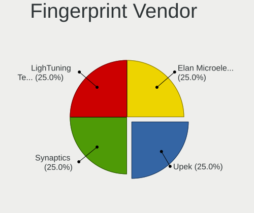

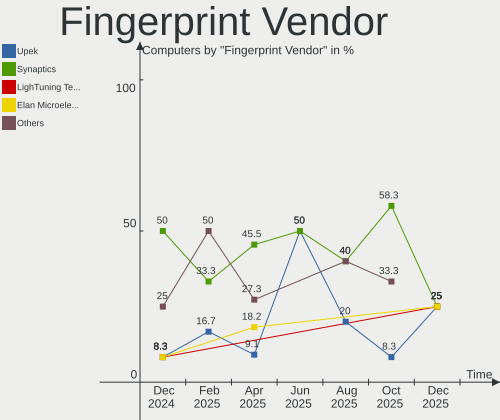

| Vendor                | Computers | Percent |
|-----------------------|-----------|---------|
| Upek                  | 1         | 25%     |
| Synaptics             | 1         | 25%     |
| LighTuning Technology | 1         | 25%     |
| Elan Microelectronics | 1         | 25%     |

Fingerprint Model
-----------------

Fingerprint sensor models

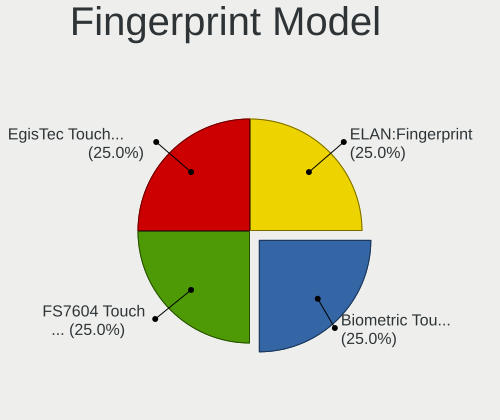

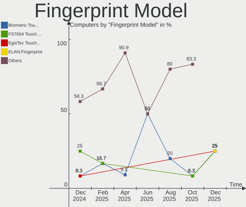

| Model                                                    | Computers | Percent |
|----------------------------------------------------------|-----------|---------|
| Upek Biometric Touchchip/Touchstrip Fingerprint Sensor   | 1         | 25%     |
| Synaptics FS7604 Touch Fingerprint Sensor with PurePrint | 1         | 25%     |
| LighTuning EgisTec Touch Fingerprint Sensor              | 1         | 25%     |
| Elan ELAN:Fingerprint                                    | 1         | 25%     |

Chipcard Vendor
---------------

Chipcard module vendors

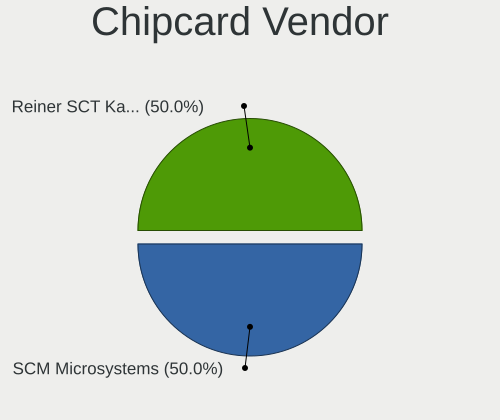

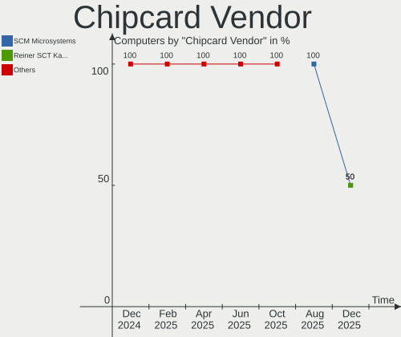

| Vendor                   | Computers | Percent |
|--------------------------|-----------|---------|
| SCM Microsystems         | 1         | 50%     |
| Reiner SCT Kartensysteme | 1         | 50%     |

Chipcard Model
--------------

Chipcard module models

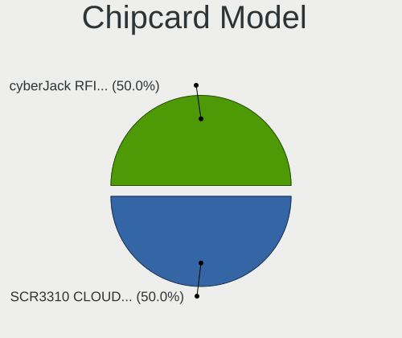

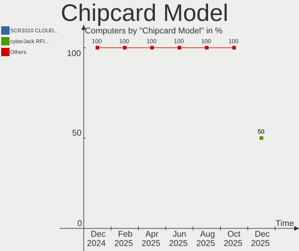

| Model                                                                      | Computers | Percent |
|----------------------------------------------------------------------------|-----------|---------|
| SCM Microsystems SCR3310 CLOUD 2700 R                                      | 1         | 50%     |
| Reiner SCT Kartensysteme cyberJack RFID basis contactless smartcard reader | 1         | 50%     |

Unsupported
-----------

Unsupported Devices
-------------------

Total unsupported devices on board

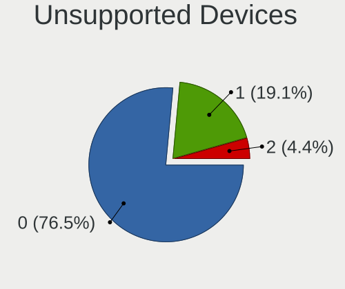

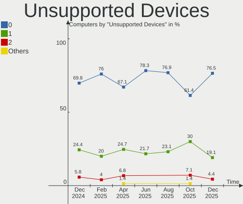

| Total | Computers | Percent |
|-------|-----------|---------|
| 0     | 52        | 76.47%  |
| 1     | 13        | 19.12%  |
| 2     | 3         | 4.41%   |

Unsupported Device Types
------------------------

Types of unsupported devices

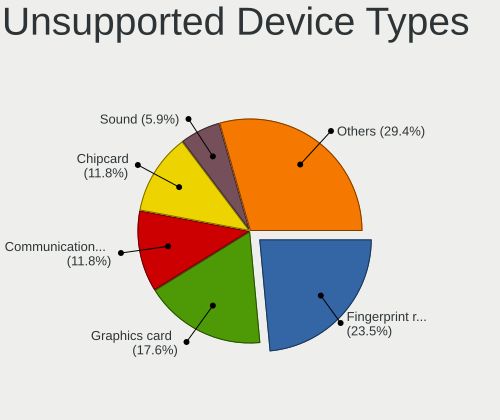

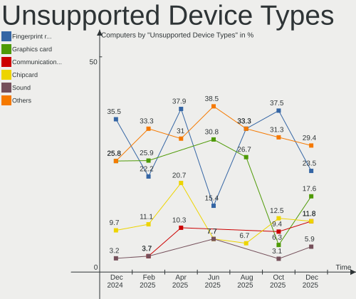

| Type                     | Computers | Percent |
|--------------------------|-----------|---------|
| Fingerprint reader       | 4         | 23.53%  |
| Graphics card            | 3         | 17.65%  |
| Communication controller | 2         | 11.76%  |
| Chipcard                 | 2         | 11.76%  |
| Sound                    | 1         | 5.88%   |
| Net/wireless             | 1         | 5.88%   |
| Multimedia controller    | 1         | 5.88%   |
| Card reader              | 1         | 5.88%   |
| Camera                   | 1         | 5.88%   |
| Bluetooth                | 1         | 5.88%   |

