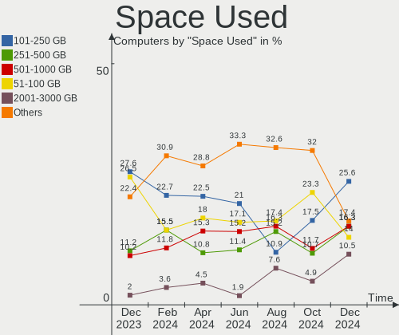
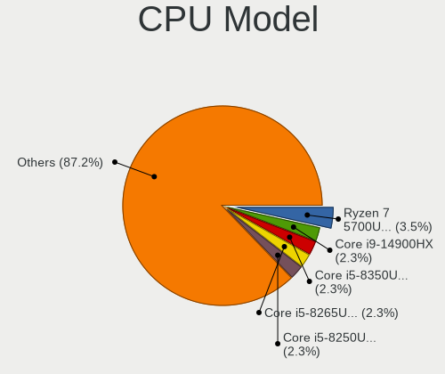
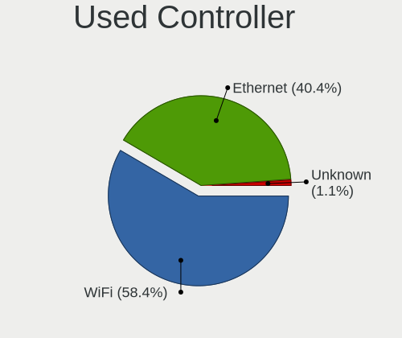
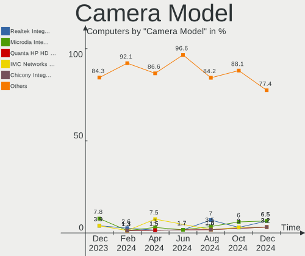

openSUSE - Hardware Trends
--------------------------

A project to identify most popular hardware characteristics and track their change
over time based on data collected by Linux users at https://Linux-Hardware.org.

Anyone can contribute to this report by the [hw-probe](https://github.com/linuxhw/hw-probe) tool:

    sudo -E hw-probe -all -upload

This is a report for all computer types. See also reports for [desktops](/Dist/openSUSE/Desktop/README.md) and [notebooks](/Dist/openSUSE/Notebook/README.md).

This report is for one last month. Overall report since the beginning of time: [TestDays](https://github.com/linuxhw/TestDays)

Period: May, 2023.

Contents
--------

* [ System ](#system)
  - [ OS                       ](#os)
  - [ OS Family                ](#os-family)
  - [ Kernel                   ](#kernel)
  - [ Kernel Family            ](#kernel-family)
  - [ Kernel Major Ver.        ](#kernel-major-ver)
  - [ Arch                     ](#arch)
  - [ DE                       ](#de)
  - [ Display Server           ](#display-server)
  - [ Display Manager          ](#display-manager)
  - [ OS Lang                  ](#os-lang)
  - [ Boot Mode                ](#boot-mode)
  - [ Filesystem               ](#filesystem)
  - [ Part. scheme             ](#part-scheme)
  - [ Dual Boot with Linux/BSD ](#dual-boot-with-linuxbsd)
  - [ Dual Boot (Win)          ](#dual-boot-win)

* [ Board ](#board)
  - [ Vendor                   ](#vendor)
  - [ Model                    ](#model)
  - [ Model Family             ](#model-family)
  - [ MFG Year                 ](#mfg-year)
  - [ Form Factor              ](#form-factor)
  - [ Secure Boot              ](#secure-boot)
  - [ Coreboot                 ](#coreboot)
  - [ RAM Size                 ](#ram-size)
  - [ RAM Used                 ](#ram-used)
  - [ Total Drives             ](#total-drives)
  - [ Has CD-ROM               ](#has-cd-rom)
  - [ Has Ethernet             ](#has-ethernet)
  - [ Has WiFi                 ](#has-wifi)
  - [ Has Bluetooth            ](#has-bluetooth)

* [ Location ](#location)
  - [ Country                  ](#country)
  - [ City                     ](#city)

* [ Drives ](#drives)
  - [ Drive Vendor             ](#drive-vendor)
  - [ Drive Model              ](#drive-model)
  - [ HDD Vendor               ](#hdd-vendor)
  - [ SSD Vendor               ](#ssd-vendor)
  - [ Drive Kind               ](#drive-kind)
  - [ Drive Connector          ](#drive-connector)
  - [ Drive Size               ](#drive-size)
  - [ Space Total              ](#space-total)
  - [ Space Used               ](#space-used)
  - [ Malfunc. Drives          ](#malfunc-drives)
  - [ Malfunc. Drive Vendor    ](#malfunc-drive-vendor)
  - [ Malfunc. HDD Vendor      ](#malfunc-hdd-vendor)
  - [ Malfunc. Drive Kind      ](#malfunc-drive-kind)
  - [ Failed Drives            ](#failed-drives)
  - [ Failed Drive Vendor      ](#failed-drive-vendor)
  - [ Drive Status             ](#drive-status)

* [ Storage controller ](#storage-controller)
  - [ Storage Vendor           ](#storage-vendor)
  - [ Storage Model            ](#storage-model)
  - [ Storage Kind             ](#storage-kind)

* [ Processor ](#processor)
  - [ CPU Vendor               ](#cpu-vendor)
  - [ CPU Model                ](#cpu-model)
  - [ CPU Model Family         ](#cpu-model-family)
  - [ CPU Cores                ](#cpu-cores)
  - [ CPU Sockets              ](#cpu-sockets)
  - [ CPU Threads              ](#cpu-threads)
  - [ CPU Op-Modes             ](#cpu-op-modes)
  - [ CPU Microcode            ](#cpu-microcode)
  - [ CPU Microarch            ](#cpu-microarch)

* [ Graphics ](#graphics)
  - [ GPU Vendor               ](#gpu-vendor)
  - [ GPU Model                ](#gpu-model)
  - [ GPU Combo                ](#gpu-combo)
  - [ GPU Driver               ](#gpu-driver)
  - [ GPU Memory               ](#gpu-memory)

* [ Monitor ](#monitor)
  - [ Monitor Vendor           ](#monitor-vendor)
  - [ Monitor Model            ](#monitor-model)
  - [ Monitor Resolution       ](#monitor-resolution)
  - [ Monitor Diagonal         ](#monitor-diagonal)
  - [ Monitor Width            ](#monitor-width)
  - [ Aspect Ratio             ](#aspect-ratio)
  - [ Monitor Area             ](#monitor-area)
  - [ Pixel Density            ](#pixel-density)
  - [ Multiple Monitors        ](#multiple-monitors)

* [ Network ](#network)
  - [ Net Controller Vendor    ](#net-controller-vendor)
  - [ Net Controller Model     ](#net-controller-model)
  - [ Wireless Vendor          ](#wireless-vendor)
  - [ Wireless Model           ](#wireless-model)
  - [ Ethernet Vendor          ](#ethernet-vendor)
  - [ Ethernet Model           ](#ethernet-model)
  - [ Net Controller Kind      ](#net-controller-kind)
  - [ Used Controller          ](#used-controller)
  - [ NICs                     ](#nics)
  - [ IPv6                     ](#ipv6)

* [ Bluetooth ](#bluetooth)
  - [ Bluetooth Vendor         ](#bluetooth-vendor)
  - [ Bluetooth Model          ](#bluetooth-model)

* [ Sound ](#sound)
  - [ Sound Vendor             ](#sound-vendor)
  - [ Sound Model              ](#sound-model)

* [ Memory ](#memory)
  - [ Memory Vendor            ](#memory-vendor)
  - [ Memory Model             ](#memory-model)
  - [ Memory Kind              ](#memory-kind)
  - [ Memory Form Factor       ](#memory-form-factor)
  - [ Memory Size              ](#memory-size)
  - [ Memory Speed             ](#memory-speed)

* [ Printers & scanners ](#printers--scanners)
  - [ Printer Vendor           ](#printer-vendor)
  - [ Printer Model            ](#printer-model)
  - [ Scanner Vendor           ](#scanner-vendor)
  - [ Scanner Model            ](#scanner-model)

* [ Camera ](#camera)
  - [ Camera Vendor            ](#camera-vendor)
  - [ Camera Model             ](#camera-model)

* [ Security ](#security)
  - [ Fingerprint Vendor       ](#fingerprint-vendor)
  - [ Fingerprint Model        ](#fingerprint-model)
  - [ Chipcard Vendor          ](#chipcard-vendor)
  - [ Chipcard Model           ](#chipcard-model)

* [ Unsupported ](#unsupported)
  - [ Unsupported Devices      ](#unsupported-devices)
  - [ Unsupported Device Types ](#unsupported-device-types)

System
------

OS
--

Installed operating systems

| Name                         | Computers | Percent |
|------------------------------|-----------|---------|
| openSUSE Tumbleweed-XXXXXXXX | 66        | 76.74%  |
| openSUSE Leap-15.5           | 9         | 10.47%  |
| openSUSE Leap-15.4           | 7         | 8.14%   |
| openSUSE Microos-XXXXXXXX    | 3         | 3.49%   |
| openSUSE Leap-15.3           | 1         | 1.16%   |

OS Family
---------

OS without a version

| Name     | Computers | Percent |
|----------|-----------|---------|
| openSUSE | 86        | 100%    |

Kernel
------

Version of the Linux kernel

| Version                      | Computers | Percent |
|------------------------------|-----------|---------|
| 6.3.2-1-default              | 25        | 29.07%  |
| 6.3.1-1-default              | 20        | 23.26%  |
| 6.2.12-1-default             | 12        | 13.95%  |
| 6.3.1-2-default              | 8         | 9.3%    |
| 5.14.21-150500.52-default    | 8         | 9.3%    |
| 5.14.21-150400.24.63-default | 3         | 3.49%   |
| 5.14.21-150400.24.60-default | 2         | 2.33%   |
| 6.3.4-1-default              | 1         | 1.16%   |
| 6.3.1-1-vanilla              | 1         | 1.16%   |
| 6.2.9-1-default              | 1         | 1.16%   |
| 6.0.0-1-default              | 1         | 1.16%   |
| 5.3.18-150300.59.49-default  | 1         | 1.16%   |
| 5.14.21-150500.50-default    | 1         | 1.16%   |
| 5.14.21-150500.43-default    | 1         | 1.16%   |
| 5.14.21-150400.24.46-default | 1         | 1.16%   |

Kernel Family
-------------

Linux kernel without a distro release

| Version | Computers | Percent |
|---------|-----------|---------|
| 6.3.1   | 29        | 33.72%  |
| 6.3.2   | 25        | 29.07%  |
| 5.14.21 | 16        | 18.6%   |
| 6.2.12  | 12        | 13.95%  |
| 6.3.4   | 1         | 1.16%   |
| 6.2.9   | 1         | 1.16%   |
| 6.0.0   | 1         | 1.16%   |
| 5.3.18  | 1         | 1.16%   |

Kernel Major Ver.
-----------------

Linux kernel major version

| Version | Computers | Percent |
|---------|-----------|---------|
| 6.3     | 55        | 63.95%  |
| 5.14    | 16        | 18.6%   |
| 6.2     | 13        | 15.12%  |
| 6.0     | 1         | 1.16%   |
| 5.3     | 1         | 1.16%   |

Arch
----

OS architecture (x86_64, i586, etc.)

| Name   | Computers | Percent |
|--------|-----------|---------|
| x86_64 | 86        | 100%    |

DE
--

Desktop Environment

| Name    | Computers | Percent |
|---------|-----------|---------|
| KDE5    | 64        | 74.42%  |
| GNOME   | 14        | 16.28%  |
| Unknown | 3         | 3.49%   |
| XFCE    | 2         | 2.33%   |
| MATE    | 1         | 1.16%   |
| LXQt    | 1         | 1.16%   |
| Deepin  | 1         | 1.16%   |

Display Server
--------------

X11 or Wayland

| Name    | Computers | Percent |
|---------|-----------|---------|
| X11     | 63        | 73.26%  |
| Wayland | 22        | 25.58%  |
| Tty     | 1         | 1.16%   |

Display Manager
---------------

SDDM, LightDM, etc.

| Name    | Computers | Percent |
|---------|-----------|---------|
| Unknown | 55        | 63.95%  |
| SDDM    | 27        | 31.4%   |
| GDM     | 2         | 2.33%   |
| XDM     | 1         | 1.16%   |
| LightDM | 1         | 1.16%   |

OS Lang
-------

Language

| Lang  | Computers | Percent |
|-------|-----------|---------|
| en_US | 37        | 43.02%  |
| de_DE | 10        | 11.63%  |
| en_GB | 6         | 6.98%   |
| ru_RU | 5         | 5.81%   |
| POSIX | 4         | 4.65%   |
| it_IT | 4         | 4.65%   |
| fr_FR | 4         | 4.65%   |
| pt_BR | 3         | 3.49%   |
| es_ES | 3         | 3.49%   |
| zh_CN | 2         | 2.33%   |
| ro_RO | 1         | 1.16%   |
| pt_PT | 1         | 1.16%   |
| pl_PL | 1         | 1.16%   |
| fi_FI | 1         | 1.16%   |
| es_DO | 1         | 1.16%   |
| en_DK | 1         | 1.16%   |
| da_DK | 1         | 1.16%   |
| bg_BG | 1         | 1.16%   |

Boot Mode
---------

EFI or BIOS

| Mode | Computers | Percent |
|------|-----------|---------|
| EFI  | 61        | 70.93%  |
| BIOS | 25        | 29.07%  |

Filesystem
----------

Type of filesystem

| Type  | Computers | Percent |
|-------|-----------|---------|
| Btrfs | 70        | 81.4%   |
| Ext4  | 11        | 12.79%  |
| Xfs   | 5         | 5.81%   |

Part. scheme
------------

Scheme of partitioning

| Type    | Computers | Percent |
|---------|-----------|---------|
| Unknown | 52        | 60.47%  |
| GPT     | 33        | 38.37%  |
| MBR     | 1         | 1.16%   |

Dual Boot with Linux/BSD
------------------------

Hosting more than one Linux/BSD

| Dual boot | Computers | Percent |
|-----------|-----------|---------|
| No        | 80        | 93.02%  |
| Yes       | 6         | 6.98%   |

Dual Boot (Win)
---------------

Hosting Linux and Windows

| Dual boot | Computers | Percent |
|-----------|-----------|---------|
| No        | 73        | 84.88%  |
| Yes       | 13        | 15.12%  |

Board
-----

Vendor
------

Motherboard manufacturer

| Name                | Computers | Percent |
|---------------------|-----------|---------|
| Lenovo              | 15        | 17.44%  |
| Hewlett-Packard     | 15        | 17.44%  |
| ASUSTek Computer    | 13        | 15.12%  |
| Dell                | 11        | 12.79%  |
| Gigabyte Technology | 8         | 9.3%    |
| Acer                | 8         | 9.3%    |
| ASRock              | 5         | 5.81%   |
| Apple               | 5         | 5.81%   |
| MSI                 | 2         | 2.33%   |
| SLIMBOOK            | 1         | 1.16%   |
| Maibenben           | 1         | 1.16%   |
| Huanan              | 1         | 1.16%   |
| Fujitsu             | 1         | 1.16%   |

Model
-----

Motherboard model

| Name                                       | Computers | Percent |
|--------------------------------------------|-----------|---------|
| Dell OptiPlex 9020                         | 2         | 2.33%   |
| SLIMBOOK PROX-AMD5                         | 1         | 1.16%   |
| MSI MS-7C79                                | 1         | 1.16%   |
| MSI MS-7C39                                | 1         | 1.16%   |
| Maibenben MaiBook M                        | 1         | 1.16%   |
| Lenovo V15-ADA 82C7                        | 1         | 1.16%   |
| Lenovo ThinkStation P520 30BE008VGE        | 1         | 1.16%   |
| Lenovo ThinkPad X201 3680HTG               | 1         | 1.16%   |
| Lenovo ThinkPad X1 Carbon Gen 9 20XWCTO1WW | 1         | 1.16%   |
| Lenovo ThinkPad W541 20EF001UGE            | 1         | 1.16%   |
| Lenovo ThinkPad T570 20HAS0UU00            | 1         | 1.16%   |
| Lenovo ThinkPad T480s 20L8S8EG00           | 1         | 1.16%   |
| Lenovo ThinkPad T410 2522K3U               | 1         | 1.16%   |
| Lenovo ThinkPad P15 Gen 1 20ST006KUS       | 1         | 1.16%   |
| Lenovo ThinkPad L540 20AUS01H00            | 1         | 1.16%   |
| Lenovo ThinkPad E14 Gen 2 20TA000DGE       | 1         | 1.16%   |
| Lenovo Slim 7 16IAH7 82VB                  | 1         | 1.16%   |
| Lenovo IdeaPad Gaming 3 15ARH05 82EY       | 1         | 1.16%   |
| Lenovo IdeaPad 110-15ACL 80TJ              | 1         | 1.16%   |
| Lenovo 70T5008FCN RD450X                   | 1         | 1.16%   |
| Huanan B75 V10.1 376                       | 1         | 1.16%   |
| HP Z400 Workstation                        | 1         | 1.16%   |
| HP Victus by Gaming Laptop 15-fb0xxx       | 1         | 1.16%   |
| HP Pavilion x360 Convertible 14-dy1xxx     | 1         | 1.16%   |
| HP Pavilion Gaming Laptop 17-cd1xxx        | 1         | 1.16%   |
| HP OMEN Laptop 15-en0xxx                   | 1         | 1.16%   |
| HP OMEN Laptop 15-ek0xxx                   | 1         | 1.16%   |
| HP Laptop 17-cn0xxx                        | 1         | 1.16%   |
| HP Laptop 15s-fq2xxx                       | 1         | 1.16%   |
| HP Laptop 15-bs1xx                         | 1         | 1.16%   |
| HP Laptop 14s-cf0xxx                       | 1         | 1.16%   |
| HP ENVY m6 Notebook                        | 1         | 1.16%   |
| HP EliteBook 850 G8 Notebook PC            | 1         | 1.16%   |
| HP EliteBook 830 G5                        | 1         | 1.16%   |
| HP Compaq Pro 6300 SFF                     | 1         | 1.16%   |
| HP Compaq 8100 Elite SFF PC                | 1         | 1.16%   |
| Gigabyte X570S AORUS PRO AX                | 1         | 1.16%   |
| Gigabyte X570 I AORUS PRO WIFI             | 1         | 1.16%   |
| Gigabyte X570 GAMING X                     | 1         | 1.16%   |
| Gigabyte P55-UD3                           | 1         | 1.16%   |

Model Family
------------

Motherboard model prefix

| Name                 | Computers | Percent |
|----------------------|-----------|---------|
| Lenovo ThinkPad      | 9         | 10.47%  |
| Acer Aspire          | 6         | 6.98%   |
| HP Laptop            | 4         | 4.65%   |
| Dell OptiPlex        | 4         | 4.65%   |
| Dell Latitude        | 3         | 3.49%   |
| ASUS TUF             | 3         | 3.49%   |
| Lenovo IdeaPad       | 2         | 2.33%   |
| HP Pavilion          | 2         | 2.33%   |
| HP OMEN              | 2         | 2.33%   |
| HP EliteBook         | 2         | 2.33%   |
| HP Compaq            | 2         | 2.33%   |
| Gigabyte X570        | 2         | 2.33%   |
| Dell Inspiron        | 2         | 2.33%   |
| ASUS VivoBook        | 2         | 2.33%   |
| ASUS PRIME           | 2         | 2.33%   |
| SLIMBOOK PROX-AMD5   | 1         | 1.16%   |
| MSI MS-7C79          | 1         | 1.16%   |
| MSI MS-7C39          | 1         | 1.16%   |
| Maibenben MaiBook    | 1         | 1.16%   |
| Lenovo V15-ADA       | 1         | 1.16%   |
| Lenovo ThinkStation  | 1         | 1.16%   |
| Lenovo Slim          | 1         | 1.16%   |
| Lenovo 70T5008FCN    | 1         | 1.16%   |
| Huanan B75           | 1         | 1.16%   |
| HP Z400              | 1         | 1.16%   |
| HP Victus            | 1         | 1.16%   |
| HP ENVY              | 1         | 1.16%   |
| Gigabyte X570S       | 1         | 1.16%   |
| Gigabyte P55-UD3     | 1         | 1.16%   |
| Gigabyte GA-970A-UD3 | 1         | 1.16%   |
| Gigabyte B85M-DS3H-A | 1         | 1.16%   |
| Gigabyte B660M       | 1         | 1.16%   |
| Gigabyte A520M       | 1         | 1.16%   |
| Fujitsu PRIMERGY     | 1         | 1.16%   |
| Dell XPS             | 1         | 1.16%   |
| Dell PowerEdge       | 1         | 1.16%   |
| ASUS Z77-A           | 1         | 1.16%   |
| ASUS P8H77-M         | 1         | 1.16%   |
| ASUS P5QD            | 1         | 1.16%   |
| ASUS H110M-C         | 1         | 1.16%   |

MFG Year
--------

Motherboard manufacture year

| Year | Computers | Percent |
|------|-----------|---------|
| 2020 | 18        | 20.93%  |
| 2021 | 11        | 12.79%  |
| 2018 | 8         | 9.3%    |
| 2012 | 7         | 8.14%   |
| 2013 | 6         | 6.98%   |
| 2022 | 5         | 5.81%   |
| 2019 | 5         | 5.81%   |
| 2015 | 5         | 5.81%   |
| 2009 | 5         | 5.81%   |
| 2016 | 4         | 4.65%   |
| 2010 | 4         | 4.65%   |
| 2017 | 3         | 3.49%   |
| 2011 | 3         | 3.49%   |
| 2014 | 2         | 2.33%   |

Form Factor
-----------

Physical design of the computer

| Name        | Computers | Percent |
|-------------|-----------|---------|
| Notebook    | 45        | 52.33%  |
| Desktop     | 35        | 40.7%   |
| Convertible | 3         | 3.49%   |
| Server      | 2         | 2.33%   |
| Mini pc     | 1         | 1.16%   |

Secure Boot
-----------

Enabled or disabled

| State    | Computers | Percent |
|----------|-----------|---------|
| Disabled | 71        | 82.56%  |
| Enabled  | 15        | 17.44%  |

Coreboot
--------

Have coreboot on board

| Used | Computers | Percent |
|------|-----------|---------|
| No   | 86        | 100%    |

RAM Size
--------

Total RAM memory

| Size in GB      | Computers | Percent |
|-----------------|-----------|---------|
| 4.01-8.0        | 23        | 26.74%  |
| 16.01-24.0      | 19        | 22.09%  |
| 32.01-64.0      | 18        | 20.93%  |
| 8.01-16.0       | 15        | 17.44%  |
| 64.01-256.0     | 4         | 4.65%   |
| 24.01-32.0      | 3         | 3.49%   |
| 3.01-4.0        | 2         | 2.33%   |
| More than 256.0 | 1         | 1.16%   |
| 1.01-2.0        | 1         | 1.16%   |

RAM Used
--------

Used RAM memory

| Used GB    | Computers | Percent |
|------------|-----------|---------|
| 4.01-8.0   | 26        | 30.23%  |
| 2.01-3.0   | 26        | 30.23%  |
| 3.01-4.0   | 16        | 18.6%   |
| 1.01-2.0   | 11        | 12.79%  |
| 8.01-16.0  | 5         | 5.81%   |
| 16.01-24.0 | 2         | 2.33%   |

Total Drives
------------

Number of drives on board

| Drives | Computers | Percent |
|--------|-----------|---------|
| 1      | 45        | 52.33%  |
| 2      | 23        | 26.74%  |
| 3      | 8         | 9.3%    |
| 5      | 4         | 4.65%   |
| 4      | 4         | 4.65%   |
| 6      | 2         | 2.33%   |

Has CD-ROM
----------

Has CD-ROM on board

| Presented | Computers | Percent |
|-----------|-----------|---------|
| No        | 62        | 72.09%  |
| Yes       | 24        | 27.91%  |

Has Ethernet
------------

Has Ethernet on board

| Presented | Computers | Percent |
|-----------|-----------|---------|
| Yes       | 73        | 84.88%  |
| No        | 13        | 15.12%  |

Has WiFi
--------

Has WiFi module

| Presented | Computers | Percent |
|-----------|-----------|---------|
| Yes       | 67        | 77.91%  |
| No        | 19        | 22.09%  |

Has Bluetooth
-------------

Has Bluetooth module

| Presented | Computers | Percent |
|-----------|-----------|---------|
| Yes       | 58        | 67.44%  |
| No        | 28        | 32.56%  |

Location
--------

Country
-------

Geographic location (country)

| Country     | Computers | Percent |
|-------------|-----------|---------|
| USA         | 19        | 22.09%  |
| Germany     | 12        | 13.95%  |
| UK          | 4         | 4.65%   |
| Russia      | 4         | 4.65%   |
| Italy       | 4         | 4.65%   |
| Brazil      | 4         | 4.65%   |
| Romania     | 3         | 3.49%   |
| France      | 3         | 3.49%   |
| Turkey      | 2         | 2.33%   |
| Spain       | 2         | 2.33%   |
| Portugal    | 2         | 2.33%   |
| Poland      | 2         | 2.33%   |
| New Zealand | 2         | 2.33%   |
| China       | 2         | 2.33%   |
| Bulgaria    | 2         | 2.33%   |
| Australia   | 2         | 2.33%   |
| Argentina   | 2         | 2.33%   |
| Ukraine     | 1         | 1.16%   |
| Thailand    | 1         | 1.16%   |
| Switzerland | 1         | 1.16%   |
| Sweden      | 1         | 1.16%   |
| Serbia      | 1         | 1.16%   |
| Netherlands | 1         | 1.16%   |
| Morocco     | 1         | 1.16%   |
| Martinique  | 1         | 1.16%   |
| Indonesia   | 1         | 1.16%   |
| India       | 1         | 1.16%   |
| Greenland   | 1         | 1.16%   |
| Finland     | 1         | 1.16%   |
| Colombia    | 1         | 1.16%   |
| Canada      | 1         | 1.16%   |
| Austria     | 1         | 1.16%   |

City
----

Geographic location (city)

| City                   | Computers | Percent |
|------------------------|-----------|---------|
| Craigsville            | 3         | 3.49%   |
| Saint Paul             | 2         | 2.33%   |
| Moscow                 | 2         | 2.33%   |
| Ithaca                 | 2         | 2.33%   |
| Berlin                 | 2         | 2.33%   |
| Woolloongabba          | 1         | 1.16%   |
| West Bend              | 1         | 1.16%   |
| Warsaw                 | 1         | 1.16%   |
| Warrington             | 1         | 1.16%   |
| Wallington             | 1         | 1.16%   |
| Wakefield              | 1         | 1.16%   |
| Victorville            | 1         | 1.16%   |
| Vaasa                  | 1         | 1.16%   |
| Tianjin                | 1         | 1.16%   |
| Sylt-Ost               | 1         | 1.16%   |
| Stockholm              | 1         | 1.16%   |
| St Petersburg          | 1         | 1.16%   |
| St Louis               | 1         | 1.16%   |
| Springdale             | 1         | 1.16%   |
| Sofia                  | 1         | 1.16%   |
| Sisimiut               | 1         | 1.16%   |
| Salem                  | 1         | 1.16%   |
| Saint-Maur-des-Fossés | 1         | 1.16%   |
| Rio de Janeiro         | 1         | 1.16%   |
| Richardson             | 1         | 1.16%   |
| Reşiţa               | 1         | 1.16%   |
| Reinach                | 1         | 1.16%   |
| Reggio Emilia          | 1         | 1.16%   |
| Recco                  | 1         | 1.16%   |
| Poznan                 | 1         | 1.16%   |
| Porto Alegre           | 1         | 1.16%   |
| Porto                  | 1         | 1.16%   |
| Plovdiv                | 1         | 1.16%   |
| Piteşti               | 1         | 1.16%   |
| Novi Sad               | 1         | 1.16%   |
| Nice                   | 1         | 1.16%   |
| Moosburg               | 1         | 1.16%   |
| Montpellier            | 1         | 1.16%   |
| Meschede               | 1         | 1.16%   |
| Melbourne              | 1         | 1.16%   |

Drives
------

Drive Vendor
------------

Hard drive vendors

| Vendor                      | Computers | Drives | Percent |
|-----------------------------|-----------|--------|---------|
| WDC                         | 25        | 34     | 17.99%  |
| Samsung Electronics         | 25        | 30     | 17.99%  |
| Seagate                     | 20        | 25     | 14.39%  |
| Toshiba                     | 8         | 8      | 5.76%   |
| Kingston                    | 6         | 6      | 4.32%   |
| Intel                       | 5         | 5      | 3.6%    |
| Sandisk                     | 4         | 5      | 2.88%   |
| KIOXIA                      | 4         | 4      | 2.88%   |
| Intenso                     | 4         | 5      | 2.88%   |
| China                       | 4         | 4      | 2.88%   |
| SK hynix                    | 3         | 3      | 2.16%   |
| MAXIO Technology (Hangzhou) | 3         | 3      | 2.16%   |
| Hitachi                     | 3         | 3      | 2.16%   |
| Crucial                     | 3         | 3      | 2.16%   |
| SSK                         | 2         | 2      | 1.44%   |
| Phison Electronics          | 2         | 2      | 1.44%   |
| Micron/Crucial Technology   | 2         | 2      | 1.44%   |
| Apple                       | 2         | 2      | 1.44%   |
| Yangtze Memory Technologies | 1         | 2      | 0.72%   |
| Smartbuy                    | 1         | 1      | 0.72%   |
| S3+                         | 1         | 1      | 0.72%   |
| PNY                         | 1         | 1      | 0.72%   |
| Pioneer                     | 1         | 1      | 0.72%   |
| Phison                      | 1         | 1      | 0.72%   |
| Patriot                     | 1         | 1      | 0.72%   |
| Mushkin                     | 1         | 1      | 0.72%   |
| Micron Technology           | 1         | 1      | 0.72%   |
| Maxone                      | 1         | 1      | 0.72%   |
| Leven                       | 1         | 1      | 0.72%   |
| JMicron Technology          | 1         | 1      | 0.72%   |
| GOODRAM                     | 1         | 1      | 0.72%   |
| AMD                         | 1         | 1      | 0.72%   |

Drive Model
-----------

Hard drive models

| Model                                               | Computers | Percent |
|-----------------------------------------------------|-----------|---------|
| Samsung NVMe SSD Controller SM981/PM981/PM983 256GB | 5         | 3.27%   |
| Samsung NVMe SSD Controller PM9A1/PM9A3/980PRO 1TB  | 4         | 2.61%   |
| Kingston SA400S37480G 480GB SSD                     | 3         | 1.96%   |
| WDC WDS100T2B0B-00YS70 1TB SSD                      | 2         | 1.31%   |
| WDC WD20EARX-00PASB0 2TB                            | 2         | 1.31%   |
| WDC WD10EZEX-75M2NA0 1TB                            | 2         | 1.31%   |
| WDC WD1002FAEX-00Z3A0 1TB                           | 2         | 1.31%   |
| SSK Disk 256GB                                      | 2         | 1.31%   |
| Seagate ST9500325AS 500GB                           | 2         | 1.31%   |
| Seagate ST1000LM035-1RK172 1TB                      | 2         | 1.31%   |
| Seagate Portable 2TB                                | 2         | 1.31%   |
| MAXIO (Hangzhou) NVMe SSD Controller MAP1202 2TB    | 2         | 1.31%   |
| KIOXIA KBG40ZNV512G 512GB                           | 2         | 1.31%   |
| Intel SSD 660P Series 512GB                         | 2         | 1.31%   |
| Crucial CT1000MX500SSD1 1TB                         | 2         | 1.31%   |
| China SSD 1TB                                       | 2         | 1.31%   |
| Yangtze Memory ZHITAI TiPlus5000 2TB                | 1         | 0.65%   |
| Yangtze Memory ZHITAI PC005 Active 512GB            | 1         | 0.65%   |
| WDC WDS500G2B0B-00YS70 500GB SSD                    | 1         | 0.65%   |
| WDC WDS500G2B0A-00SM50 500GB SSD                    | 1         | 0.65%   |
| WDC WDS240G2G0A-00JH30 240GB SSD                    | 1         | 0.65%   |
| WDC WDS100T2B0A-00SM50 1TB SSD                      | 1         | 0.65%   |
| WDC WD5000LPCX-21VHAT0 500GB                        | 1         | 0.65%   |
| WDC WD5000AAKX-75U6AA0 500GB                        | 1         | 0.65%   |
| WDC WD50 00BPVT-80HXZT3 500GB                       | 1         | 0.65%   |
| WDC WD40EFRX-68N32N0 4TB                            | 1         | 0.65%   |
| WDC WD40EFAX-68JH4N1 4TB                            | 1         | 0.65%   |
| WDC WD4002FFWX-68TZ4N0 4TB                          | 1         | 0.65%   |
| WDC WD3200BPVT-24JJ5T0 320GB                        | 1         | 0.65%   |
| WDC WD3200AAKX-00ERMA0 320GB                        | 1         | 0.65%   |
| WDC WD20EFRX-68AX9N0 2TB                            | 1         | 0.65%   |
| WDC WD1200BEVS-75UST0 120GB                         | 1         | 0.65%   |
| WDC WD10SPZX-60Z10T0 1TB                            | 1         | 0.65%   |
| WDC WD10PURZ-85U8XY0 1TB                            | 1         | 0.65%   |
| WDC WD10EZEX-21M2NA0 1TB                            | 1         | 0.65%   |
| WDC WD10EZEX-08WN4A0 1TB                            | 1         | 0.65%   |
| WDC WD10EZEX-08M2NA0 1TB                            | 1         | 0.65%   |
| WDC WD10EZEX-00RKKA0 1TB                            | 1         | 0.65%   |
| WDC WD10EZEX-00BN5A0 1TB                            | 1         | 0.65%   |
| WDC WD10EARS-22Y5B1 1TB                             | 1         | 0.65%   |

HDD Vendor
----------

Hard disk drive vendors

| Vendor              | Computers | Drives | Percent |
|---------------------|-----------|--------|---------|
| WDC                 | 20        | 26     | 38.46%  |
| Seagate             | 18        | 22     | 34.62%  |
| Toshiba             | 6         | 6      | 11.54%  |
| Hitachi             | 3         | 3      | 5.77%   |
| SSK                 | 2         | 2      | 3.85%   |
| Samsung Electronics | 1         | 1      | 1.92%   |
| Maxone              | 1         | 1      | 1.92%   |
| Intenso             | 1         | 1      | 1.92%   |

SSD Vendor
----------

Solid state drive vendors

| Vendor              | Computers | Drives | Percent |
|---------------------|-----------|--------|---------|
| Samsung Electronics | 8         | 11     | 18.6%   |
| WDC                 | 6         | 8      | 13.95%  |
| Kingston            | 6         | 6      | 13.95%  |
| China               | 4         | 4      | 9.3%    |
| Intenso             | 3         | 4      | 6.98%   |
| Crucial             | 3         | 3      | 6.98%   |
| Apple               | 2         | 2      | 4.65%   |
| Smartbuy            | 1         | 1      | 2.33%   |
| SanDisk             | 1         | 1      | 2.33%   |
| S3+                 | 1         | 1      | 2.33%   |
| PNY                 | 1         | 1      | 2.33%   |
| Pioneer             | 1         | 1      | 2.33%   |
| Patriot             | 1         | 1      | 2.33%   |
| Mushkin             | 1         | 1      | 2.33%   |
| Leven               | 1         | 1      | 2.33%   |
| JMicron Technology  | 1         | 1      | 2.33%   |
| Intel               | 1         | 1      | 2.33%   |
| GOODRAM             | 1         | 1      | 2.33%   |

Drive Kind
----------

HDD or SSD

| Kind    | Computers | Drives | Percent |
|---------|-----------|--------|---------|
| NVMe    | 42        | 48     | 34.15%  |
| HDD     | 40        | 62     | 32.52%  |
| SSD     | 39        | 49     | 31.71%  |
| Unknown | 2         | 2      | 1.63%   |

Drive Connector
---------------

SATA, SAS, NVMe, etc.

| Type | Computers | Drives | Percent |
|------|-----------|--------|---------|
| SATA | 60        | 102    | 55.05%  |
| NVMe | 42        | 48     | 38.53%  |
| SAS  | 7         | 11     | 6.42%   |

Drive Size
----------

Size of hard drive

| Size in TB | Computers | Drives | Percent |
|------------|-----------|--------|---------|
| 0.01-0.5   | 41        | 54     | 46.59%  |
| 0.51-1.0   | 29        | 37     | 32.95%  |
| 1.01-2.0   | 10        | 10     | 11.36%  |
| 3.01-4.0   | 6         | 8      | 6.82%   |
| 4.01-10.0  | 2         | 2      | 2.27%   |

Space Total
-----------

Amount of disk space available on the file system

| Size in GB     | Computers | Percent |
|----------------|-----------|---------|
| More than 3000 | 38        | 44.19%  |
| 1001-2000      | 17        | 19.77%  |
| 501-1000       | 13        | 15.12%  |
| 2001-3000      | 9         | 10.47%  |
| 251-500        | 6         | 6.98%   |
| 101-250        | 2         | 2.33%   |
| Unknown        | 1         | 1.16%   |

Space Used
----------

Amount of used disk space

| Used GB        | Computers | Percent |
|----------------|-----------|---------|
| 101-250        | 22        | 25.58%  |
| 51-100         | 14        | 16.28%  |
| 251-500        | 11        | 12.79%  |
| 501-1000       | 10        | 11.63%  |
| 1001-2000      | 9         | 10.47%  |
| More than 3000 | 6         | 6.98%   |
| 21-50          | 5         | 5.81%   |
| 2001-3000      | 5         | 5.81%   |
| 1-20           | 3         | 3.49%   |
| Unknown        | 1         | 1.16%   |

Malfunc. Drives
---------------

Drive models with a malfunction

| Model                                            | Computers | Drives | Percent |
|--------------------------------------------------|-----------|--------|---------|
| WDC WD10EZEX-75M2NA0 1TB                         | 1         | 1      | 14.29%  |
| Toshiba MQ01ABF050 500GB                         | 1         | 1      | 14.29%  |
| Seagate ST1000LM024 HN-M101MBB 1TB               | 1         | 1      | 14.29%  |
| Samsung Electronics SSD 840 EVO 120GB            | 1         | 1      | 14.29%  |
| Samsung Electronics MZ7TE256HMHP-000L7 256GB SSD | 1         | 1      | 14.29%  |
| Hitachi HTS54323 320GB                           | 1         | 1      | 14.29%  |
| Hitachi HDS721010CLA332 1TB                      | 1         | 1      | 14.29%  |

Malfunc. Drive Vendor
---------------------

Vendors of faulty drives

| Vendor              | Computers | Drives | Percent |
|---------------------|-----------|--------|---------|
| Hitachi             | 2         | 2      | 33.33%  |
| WDC                 | 1         | 1      | 16.67%  |
| Toshiba             | 1         | 1      | 16.67%  |
| Seagate             | 1         | 1      | 16.67%  |
| Samsung Electronics | 1         | 2      | 16.67%  |

Malfunc. HDD Vendor
-------------------

Vendors of faulty HDD drives

| Vendor  | Computers | Drives | Percent |
|---------|-----------|--------|---------|
| Hitachi | 2         | 2      | 40%     |
| WDC     | 1         | 1      | 20%     |
| Toshiba | 1         | 1      | 20%     |
| Seagate | 1         | 1      | 20%     |

Malfunc. Drive Kind
-------------------

Kinds of faulty drives

| Kind | Computers | Drives | Percent |
|------|-----------|--------|---------|
| HDD  | 5         | 5      | 83.33%  |
| SSD  | 1         | 2      | 16.67%  |

Failed Drives
-------------

Failed drive models

Zero info for selected period =(

Failed Drive Vendor
-------------------

Failed drive vendors

Zero info for selected period =(

Drive Status
------------

Number of failed and malfunc. drives

| Status   | Computers | Drives | Percent |
|----------|-----------|--------|---------|
| Detected | 54        | 107    | 60%     |
| Works    | 31        | 47     | 34.44%  |
| Malfunc  | 5         | 7      | 5.56%   |

Storage controller
------------------

Storage Vendor
--------------

Storage controller vendors

| Vendor                       | Computers | Percent |
|------------------------------|-----------|---------|
| Intel                        | 53        | 43.8%   |
| AMD                          | 22        | 18.18%  |
| Samsung Electronics          | 18        | 14.88%  |
| KIOXIA                       | 4         | 3.31%   |
| SK hynix                     | 3         | 2.48%   |
| SanDisk                      | 3         | 2.48%   |
| Phison Electronics           | 3         | 2.48%   |
| MAXIO Technology (Hangzhou)  | 3         | 2.48%   |
| Toshiba America Info Systems | 2         | 1.65%   |
| Micron/Crucial Technology    | 2         | 1.65%   |
| LSI Logic / Symbios Logic    | 2         | 1.65%   |
| Yangtze Memory Technologies  | 1         | 0.83%   |
| Seagate Technology           | 1         | 0.83%   |
| Nvidia                       | 1         | 0.83%   |
| Micron Technology            | 1         | 0.83%   |
| JMicron Technology           | 1         | 0.83%   |
| Broadcom / LSI               | 1         | 0.83%   |

Storage Model
-------------

Storage controller models

| Model                                                                          | Computers | Percent |
|--------------------------------------------------------------------------------|-----------|---------|
| AMD FCH SATA Controller [AHCI mode]                                            | 15        | 11.03%  |
| Intel Volume Management Device NVMe RAID Controller                            | 7         | 5.15%   |
| Samsung NVMe SSD Controller 980                                                | 6         | 4.41%   |
| Samsung NVMe SSD Controller SM981/PM981/PM983                                  | 5         | 3.68%   |
| Intel 8 Series/C220 Series Chipset Family 6-port SATA Controller 1 [AHCI mode] | 5         | 3.68%   |
| Samsung NVMe SSD Controller PM9A1/PM9A3/980PRO                                 | 4         | 2.94%   |
| Intel 82801 Mobile SATA Controller [RAID mode]                                 | 4         | 2.94%   |
| Intel 7 Series/C210 Series Chipset Family 6-port SATA Controller [AHCI mode]   | 4         | 2.94%   |
| AMD 500 Series Chipset SATA Controller                                         | 4         | 2.94%   |
| KIOXIA NVMe SSD Controller BG4                                                 | 3         | 2.21%   |
| Intel Sunrise Point-LP SATA Controller [AHCI mode]                             | 3         | 2.21%   |
| Intel 7 Series Chipset Family 6-port SATA Controller [AHCI mode]               | 3         | 2.21%   |
| Intel 5 Series/3400 Series Chipset 6 port SATA AHCI Controller                 | 3         | 2.21%   |
| AMD SB7x0/SB8x0/SB9x0 IDE Controller                                           | 3         | 2.21%   |
| SK hynix Gold P31/PC711 NVMe Solid State Drive                                 | 2         | 1.47%   |
| SanDisk WD Black 2018/SN750 / PC SN720 NVMe SSD                                | 2         | 1.47%   |
| Phison E12 NVMe Controller                                                     | 2         | 1.47%   |
| Micron/Crucial P5 Plus NVMe PCIe SSD                                           | 2         | 1.47%   |
| MAXIO (Hangzhou) NVMe SSD Controller MAP1202                                   | 2         | 1.47%   |
| LSI Logic / Symbios Logic MegaRAID SAS 2108 [Liberator]                        | 2         | 1.47%   |
| Intel Tiger Lake-LP SATA Controller                                            | 2         | 1.47%   |
| Intel SSD 660P Series                                                          | 2         | 1.47%   |
| Intel SATA Controller [RAID mode]                                              | 2         | 1.47%   |
| Intel 7 Series/C210 Series Chipset Family 4-port SATA Controller [IDE mode]    | 2         | 1.47%   |
| Intel 7 Series/C210 Series Chipset Family 2-port SATA Controller [IDE mode]    | 2         | 1.47%   |
| Intel 200 Series PCH SATA controller [AHCI mode]                               | 2         | 1.47%   |
| AMD SB7x0/SB8x0/SB9x0 SATA Controller [IDE mode]                               | 2         | 1.47%   |
| Yangtze Memory ZHITAI TiPro5000 NVMe SSD                                       | 1         | 0.74%   |
| Yangtze Memory Non-Volatile memory controller                                  | 1         | 0.74%   |
| Toshiba America Info Systems XG6 NVMe SSD Controller                           | 1         | 0.74%   |
| Toshiba America Info Systems NVMe Controller                                   | 1         | 0.74%   |
| SK hynix BC511                                                                 | 1         | 0.74%   |
| Seagate FireCuda 530 SSD                                                       | 1         | 0.74%   |
| SanDisk Non-Volatile memory controller                                         | 1         | 0.74%   |
| Samsung Electronics SATA controller                                            | 1         | 0.74%   |
| Samsung Electronics Non-Volatile memory controller                             | 1         | 0.74%   |
| Samsung Apple PCIe SSD                                                         | 1         | 0.74%   |
| Phison Electronics Non-Volatile memory controller                              | 1         | 0.74%   |
| Nvidia MCP79 AHCI Controller                                                   | 1         | 0.74%   |
| Micron NVMe Storage Controller                                                 | 1         | 0.74%   |

Storage Kind
------------

Kind of storage controller (IDE, SATA, NVMe, SAS, ...)

| Kind | Computers | Percent |
|------|-----------|---------|
| SATA | 58        | 46.77%  |
| NVMe | 42        | 33.87%  |
| RAID | 16        | 12.9%   |
| IDE  | 8         | 6.45%   |

Processor
---------

CPU Vendor
----------

Processor vendors

| Vendor | Computers | Percent |
|--------|-----------|---------|
| Intel  | 60        | 69.77%  |
| AMD    | 26        | 30.23%  |

CPU Model
---------

Processor models

| Model                                   | Computers | Percent |
|-----------------------------------------|-----------|---------|
| Intel 11th Gen Core i5-1135G7 @ 2.40GHz | 5         | 5.81%   |
| Intel Core i5-3470 CPU @ 3.20GHz        | 3         | 3.49%   |
| Intel Core i7-4770 CPU @ 3.40GHz        | 2         | 2.33%   |
| Intel Core i5-8250U CPU @ 1.60GHz       | 2         | 2.33%   |
| Intel Core i5-10300H CPU @ 2.50GHz      | 2         | 2.33%   |
| AMD Ryzen 9 5950X 16-Core Processor     | 2         | 2.33%   |
| AMD Ryzen 9 3900X 12-Core Processor     | 2         | 2.33%   |
| AMD Ryzen 7 5700U with Radeon Graphics  | 2         | 2.33%   |
| AMD Ryzen 7 4800H with Radeon Graphics  | 2         | 2.33%   |
| AMD Phenom II X6 1090T Processor        | 2         | 2.33%   |
| Intel Xeon W-2135 CPU @ 3.70GHz         | 1         | 1.16%   |
| Intel Xeon CPU W3530 @ 2.80GHz          | 1         | 1.16%   |
| Intel Xeon CPU E5620 @ 2.40GHz          | 1         | 1.16%   |
| Intel Xeon CPU E5472 @ 3.00GHz          | 1         | 1.16%   |
| Intel Xeon CPU E5-2650 v4 @ 2.20GHz     | 1         | 1.16%   |
| Intel Xeon CPU E3-1270 V2 @ 3.50GHz     | 1         | 1.16%   |
| Intel Xeon CPU E3-1240 V2 @ 3.40GHz     | 1         | 1.16%   |
| Intel Pentium CPU 4417U @ 2.30GHz       | 1         | 1.16%   |
| Intel Core i9-10885H CPU @ 2.40GHz      | 1         | 1.16%   |
| Intel Core i7-8750H CPU @ 2.20GHz       | 1         | 1.16%   |
| Intel Core i7-8650U CPU @ 1.90GHz       | 1         | 1.16%   |
| Intel Core i7-8550U CPU @ 1.80GHz       | 1         | 1.16%   |
| Intel Core i7-7600U CPU @ 2.80GHz       | 1         | 1.16%   |
| Intel Core i7-6700HQ CPU @ 2.60GHz      | 1         | 1.16%   |
| Intel Core i7-6700 CPU @ 3.40GHz        | 1         | 1.16%   |
| Intel Core i7-4850HQ CPU @ 2.30GHz      | 1         | 1.16%   |
| Intel Core i7-4810MQ CPU @ 2.80GHz      | 1         | 1.16%   |
| Intel Core i7-4790K CPU @ 4.00GHz       | 1         | 1.16%   |
| Intel Core i7-4790 CPU @ 3.60GHz        | 1         | 1.16%   |
| Intel Core i7-4578U CPU @ 3.00GHz       | 1         | 1.16%   |
| Intel Core i7-3632QM CPU @ 2.20GHz      | 1         | 1.16%   |
| Intel Core i7-2600 CPU @ 3.40GHz        | 1         | 1.16%   |
| Intel Core i7-10700K CPU @ 3.80GHz      | 1         | 1.16%   |
| Intel Core i5-4200M CPU @ 2.50GHz       | 1         | 1.16%   |
| Intel Core i5-3350P CPU @ 3.10GHz       | 1         | 1.16%   |
| Intel Core i5-3230M CPU @ 2.60GHz       | 1         | 1.16%   |
| Intel Core i5-3210M CPU @ 2.50GHz       | 1         | 1.16%   |
| Intel Core i5-2415M CPU @ 2.30GHz       | 1         | 1.16%   |
| Intel Core i5 CPU M 540 @ 2.53GHz       | 1         | 1.16%   |
| Intel Core i5 CPU M 520 @ 2.40GHz       | 1         | 1.16%   |

CPU Model Family
----------------

Processor model prefix

| Model            | Computers | Percent |
|------------------|-----------|---------|
| Intel Core i5    | 17        | 19.77%  |
| Intel Core i7    | 16        | 18.6%   |
| Other            | 14        | 16.28%  |
| AMD Ryzen 7      | 8         | 9.3%    |
| Intel Xeon       | 7         | 8.14%   |
| AMD Ryzen 9      | 5         | 5.81%   |
| AMD Ryzen 5      | 4         | 4.65%   |
| AMD Ryzen 3      | 3         | 3.49%   |
| Intel Core i3    | 2         | 2.33%   |
| AMD Phenom II X6 | 2         | 2.33%   |
| AMD FX           | 2         | 2.33%   |
| Intel Pentium    | 1         | 1.16%   |
| Intel Core i9    | 1         | 1.16%   |
| Intel Core 2 Duo | 1         | 1.16%   |
| Intel Celeron    | 1         | 1.16%   |
| AMD A6           | 1         | 1.16%   |
| AMD A10          | 1         | 1.16%   |

CPU Cores
---------

Number of processor cores

| Number | Computers | Percent |
|--------|-----------|---------|
| 4      | 37        | 43.02%  |
| 2      | 21        | 24.42%  |
| 8      | 11        | 12.79%  |
| 6      | 8         | 9.3%    |
| 12     | 3         | 3.49%   |
| 24     | 2         | 2.33%   |
| 16     | 2         | 2.33%   |
| 14     | 1         | 1.16%   |
| 10     | 1         | 1.16%   |

CPU Sockets
-----------

Number of sockets

| Number | Computers | Percent |
|--------|-----------|---------|
| 1      | 84        | 97.67%  |
| 2      | 2         | 2.33%   |

CPU Threads
-----------

Threads per core (Hyper-Threading)

| Number | Computers | Percent |
|--------|-----------|---------|
| 2      | 72        | 83.72%  |
| 1      | 14        | 16.28%  |

CPU Op-Modes
------------

CPU Operation Modes (32-bit, 64-bit)

| Op mode        | Computers | Percent |
|----------------|-----------|---------|
| 32-bit, 64-bit | 86        | 100%    |

CPU Microcode
-------------

Microcode number

| Number     | Computers | Percent |
|------------|-----------|---------|
| Unknown    | 56        | 65.12%  |
| 0x08701021 | 3         | 3.49%   |
| 0x08108109 | 3         | 3.49%   |
| 0x306c3    | 2         | 2.33%   |
| 0x0a50000d | 2         | 2.33%   |
| 0x0a50000c | 2         | 2.33%   |
| 0x0a20120a | 2         | 2.33%   |
| 0x0a201016 | 2         | 2.33%   |
| 0x08600104 | 2         | 2.33%   |
| 0x010000dc | 2         | 2.33%   |
| 0x806d1    | 1         | 1.16%   |
| 0x50654    | 1         | 1.16%   |
| 0x306a9    | 1         | 1.16%   |
| 0x106e5    | 1         | 1.16%   |
| 0x08608103 | 1         | 1.16%   |
| 0x08608102 | 1         | 1.16%   |
| 0x08600106 | 1         | 1.16%   |
| 0x07030105 | 1         | 1.16%   |
| 0x0600611a | 1         | 1.16%   |
| 0x06000852 | 1         | 1.16%   |

CPU Microarch
-------------

Microarchitecture

| Name             | Computers | Percent |
|------------------|-----------|---------|
| TigerLake        | 9         | 10.47%  |
| KabyLake         | 9         | 10.47%  |
| IvyBridge        | 9         | 10.47%  |
| Zen 3            | 8         | 9.3%    |
| Haswell          | 8         | 9.3%    |
| Zen 2            | 6         | 6.98%   |
| Westmere         | 5         | 5.81%   |
| CometLake        | 4         | 4.65%   |
| Alderlake Hybrid | 4         | 4.65%   |
| Zen+             | 3         | 3.49%   |
| Skylake          | 3         | 3.49%   |
| SandyBridge      | 2         | 2.33%   |
| Penryn           | 2         | 2.33%   |
| Nehalem          | 2         | 2.33%   |
| K10              | 2         | 2.33%   |
| Excavator        | 2         | 2.33%   |
| Unknown          | 2         | 2.33%   |
| Zen              | 1         | 1.16%   |
| Puma             | 1         | 1.16%   |
| Piledriver       | 1         | 1.16%   |
| Icelake          | 1         | 1.16%   |
| Goldmont         | 1         | 1.16%   |
| Broadwell        | 1         | 1.16%   |

Graphics
--------

GPU Vendor
----------

Vendors of graphics cards

| Vendor            | Computers | Percent |
|-------------------|-----------|---------|
| Intel             | 42        | 40.78%  |
| Nvidia            | 36        | 34.95%  |
| AMD               | 24        | 23.3%   |
| ASPEED Technology | 1         | 0.97%   |

GPU Model
---------

Graphics card models

| Model                                                                       | Computers | Percent |
|-----------------------------------------------------------------------------|-----------|---------|
| Intel TigerLake-LP GT2 [Iris Xe Graphics]                                   | 8         | 7.55%   |
| Intel UHD Graphics 620                                                      | 4         | 3.77%   |
| Intel Xeon E3-1200 v3/4th Gen Core Processor Integrated Graphics Controller | 3         | 2.83%   |
| Intel Xeon E3-1200 v2/3rd Gen Core processor Graphics Controller            | 3         | 2.83%   |
| Intel Core Processor Integrated Graphics Controller                         | 3         | 2.83%   |
| Intel 3rd Gen Core processor Graphics Controller                            | 3         | 2.83%   |
| AMD Renoir                                                                  | 3         | 2.83%   |
| AMD Picasso/Raven 2 [Radeon Vega Series / Radeon Vega Mobile Series]        | 3         | 2.83%   |
| AMD Cezanne [Radeon Vega Series / Radeon Vega Mobile Series]                | 3         | 2.83%   |
| Nvidia TU117M [GeForce GTX 1650 Mobile / Max-Q]                             | 2         | 1.89%   |
| Nvidia TU106M [GeForce RTX 2060 Mobile]                                     | 2         | 1.89%   |
| Nvidia GP107 [GeForce GTX 1050 Ti]                                          | 2         | 1.89%   |
| Nvidia GK208B [GeForce GT 730]                                              | 2         | 1.89%   |
| Intel HD Graphics 620                                                       | 2         | 1.89%   |
| Intel CometLake-H GT2 [UHD Graphics]                                        | 2         | 1.89%   |
| Intel 4th Gen Core Processor Integrated Graphics Controller                 | 2         | 1.89%   |
| AMD Wani [Radeon R5/R6/R7 Graphics]                                         | 2         | 1.89%   |
| AMD Navi 24 [Radeon RX 6400/6500 XT/6500M]                                  | 2         | 1.89%   |
| AMD Lucienne                                                                | 2         | 1.89%   |
| AMD Ellesmere [Radeon RX 470/480/570/570X/580/580X/590]                     | 2         | 1.89%   |
| Nvidia TU117M [GeForce GTX 1650 Ti Mobile]                                  | 1         | 0.94%   |
| Nvidia TU117M                                                               | 1         | 0.94%   |
| Nvidia TU117GLM [Quadro T2000 Mobile / Max-Q]                               | 1         | 0.94%   |
| Nvidia TU116 [GeForce GTX 1660 SUPER]                                       | 1         | 0.94%   |
| Nvidia TU104 [GeForce RTX 2070 SUPER]                                       | 1         | 0.94%   |
| Nvidia GT218M [NVS 3100M]                                                   | 1         | 0.94%   |
| Nvidia GP108 [GeForce GT 1030]                                              | 1         | 0.94%   |
| Nvidia GP107M [GeForce GTX 1050 Mobile]                                     | 1         | 0.94%   |
| Nvidia GP104 [GeForce GTX 1070]                                             | 1         | 0.94%   |
| Nvidia GP104 [GeForce GTX 1070 Ti]                                          | 1         | 0.94%   |
| Nvidia GP102 [GeForce GTX 1080 Ti]                                          | 1         | 0.94%   |
| Nvidia GM206 [GeForce GTX 960]                                              | 1         | 0.94%   |
| Nvidia GM204 [GeForce GTX 970]                                              | 1         | 0.94%   |
| Nvidia GM107M [GeForce GTX 960M]                                            | 1         | 0.94%   |
| Nvidia GK107M [GeForce GT 750M Mac Edition]                                 | 1         | 0.94%   |
| Nvidia GK106GLM [Quadro K2100M]                                             | 1         | 0.94%   |
| Nvidia GK106 [GeForce GTX 660]                                              | 1         | 0.94%   |
| Nvidia GK104 [GeForce GTX 660 Ti]                                           | 1         | 0.94%   |
| Nvidia GF119M [GeForce GT 520M]                                             | 1         | 0.94%   |
| Nvidia GF119 [NVS 315]                                                      | 1         | 0.94%   |

GPU Combo
---------

Combinations of graphics cards

| Name           | Computers | Percent |
|----------------|-----------|---------|
| 1 x Intel      | 32        | 37.21%  |
| 1 x Nvidia     | 20        | 23.26%  |
| 1 x AMD        | 15        | 17.44%  |
| Intel + Nvidia | 9         | 10.47%  |
| AMD + Nvidia   | 7         | 8.14%   |
| 2 x AMD        | 1         | 1.16%   |
| Intel + AMD    | 1         | 1.16%   |
| 1 x ASPEED     | 1         | 1.16%   |

GPU Driver
----------

Free vs proprietary

| Driver      | Computers | Percent |
|-------------|-----------|---------|
| Free        | 75        | 87.21%  |
| Proprietary | 11        | 12.79%  |

GPU Memory
----------

Total video memory

| Size in GB | Computers | Percent |
|------------|-----------|---------|
| Unknown    | 40        | 46.51%  |
| 1.01-2.0   | 12        | 13.95%  |
| 0.01-0.5   | 11        | 12.79%  |
| 3.01-4.0   | 10        | 11.63%  |
| 0.51-1.0   | 5         | 5.81%   |
| 7.01-8.0   | 4         | 4.65%   |
| 8.01-16.0  | 2         | 2.33%   |
| 5.01-6.0   | 1         | 1.16%   |
| 2.01-3.0   | 1         | 1.16%   |

Monitor
-------

Monitor Vendor
--------------

Monitor vendors

| Vendor               | Computers | Percent |
|----------------------|-----------|---------|
| AU Optronics         | 12        | 12.12%  |
| Samsung Electronics  | 11        | 11.11%  |
| Chimei Innolux       | 11        | 11.11%  |
| BOE                  | 8         | 8.08%   |
| Goldstar             | 6         | 6.06%   |
| BenQ                 | 6         | 6.06%   |
| Dell                 | 5         | 5.05%   |
| LG Display           | 4         | 4.04%   |
| Apple                | 4         | 4.04%   |
| PANDA                | 3         | 3.03%   |
| SKY                  | 2         | 2.02%   |
| Philips              | 2         | 2.02%   |
| Lenovo               | 2         | 2.02%   |
| Iiyama               | 2         | 2.02%   |
| Hewlett-Packard      | 2         | 2.02%   |
| CSO                  | 2         | 2.02%   |
| AOC                  | 2         | 2.02%   |
| Ancor Communications | 2         | 2.02%   |
| Acer                 | 2         | 2.02%   |
| Vizio                | 1         | 1.01%   |
| ViewSonic            | 1         | 1.01%   |
| Unknown (XXX)        | 1         | 1.01%   |
| Unknown              | 1         | 1.01%   |
| Sharp                | 1         | 1.01%   |
| NEC Computers        | 1         | 1.01%   |
| Medion               | 1         | 1.01%   |
| Insignia             | 1         | 1.01%   |
| HUAWEI               | 1         | 1.01%   |
| CTO                  | 1         | 1.01%   |
| BBY                  | 1         | 1.01%   |

Monitor Model
-------------

Monitor models

| Model                                                                   | Computers | Percent |
|-------------------------------------------------------------------------|-----------|---------|
| Goldstar ULTRAWIDE GSM59F1 2560x1080 673x284mm 28.8-inch                | 2         | 1.94%   |
| Chimei Innolux LCD Monitor CMN15F5 1920x1080 344x193mm 15.5-inch        | 2         | 1.94%   |
| Ancor Communications VE247 ACI2493 1920x1080 531x299mm 24.0-inch        | 2         | 1.94%   |
| Vizio D24h-J09 VIZ1046 1366x768 521x293mm 23.5-inch                     | 1         | 0.97%   |
| ViewSonic VA903 SERIES VSC111E 1280x1024 376x301mm 19.0-inch            | 1         | 0.97%   |
| Unknown SMART TV 0563 1920x1080 1209x680mm 54.6-inch                    | 1         | 0.97%   |
| Unknown (XXX) Union TV XXX2841 1920x1080 1209x680mm 54.6-inch           | 1         | 0.97%   |
| SKY TV-monitor SKY1801 3840x2160 708x398mm 32.0-inch                    | 1         | 0.97%   |
| SKY TV-monitor SKY0001 1360x768 890x500mm 40.2-inch                     | 1         | 0.97%   |
| Sharp LCD Monitor SHP1453 1920x1080 346x194mm 15.6-inch                 | 1         | 0.97%   |
| Samsung Electronics U28D590 SAM0B80 3840x2160 607x345mm 27.5-inch       | 1         | 0.97%   |
| Samsung Electronics SyncMaster SAM044F 1440x900 408x255mm 18.9-inch     | 1         | 0.97%   |
| Samsung Electronics SyncMaster SAM03F6 1920x1200                        | 1         | 0.97%   |
| Samsung Electronics SMB2330H SAM064A 1920x1080 509x286mm 23.0-inch      | 1         | 0.97%   |
| Samsung Electronics SMB2030N SAM0634 1600x900 440x250mm 19.9-inch       | 1         | 0.97%   |
| Samsung Electronics S32D850 SAM0BCC 2560x1440 708x398mm 32.0-inch       | 1         | 0.97%   |
| Samsung Electronics LCD Monitor SAM723F 3840x2160 700x390mm 31.5-inch   | 1         | 0.97%   |
| Samsung Electronics LCD Monitor SAM0F14 3840x2160 1872x1053mm 84.6-inch | 1         | 0.97%   |
| Samsung Electronics LCD Monitor SAM0C39 1920x1080 885x498mm 40.0-inch   | 1         | 0.97%   |
| Samsung Electronics LCD Monitor SAM0B7C 1920x1080 890x500mm 40.2-inch   | 1         | 0.97%   |
| Samsung Electronics LCD Monitor SAM07C3 1920x1080 700x390mm 31.5-inch   | 1         | 0.97%   |
| Philips PHL 345B1C PHL093D 3440x1440 797x334mm 34.0-inch                | 1         | 0.97%   |
| Philips LCD Monitor PHL 241E1 1920x1080                                 | 1         | 0.97%   |
| PANDA LCD Monitor NCP0055 1920x1080 294x165mm 13.3-inch                 | 1         | 0.97%   |
| PANDA LCD Monitor NCP004D 1920x1080 344x194mm 15.5-inch                 | 1         | 0.97%   |
| PANDA LCD Monitor NCP0040 1920x1080 344x194mm 15.5-inch                 | 1         | 0.97%   |
| NEC Computers LCD1960NX NEC661F 1280x1024 376x301mm 19.0-inch           | 1         | 0.97%   |
| Medion MD20831 MEA5107 1920x1080 527x296mm 23.8-inch                    | 1         | 0.97%   |
| LG Display LCD Monitor LGD05FE 1920x1080 344x194mm 15.5-inch            | 1         | 0.97%   |
| LG Display LCD Monitor LGD0541 1920x1080 344x194mm 15.5-inch            | 1         | 0.97%   |
| LG Display LCD Monitor LGD04FC 1366x768 344x194mm 15.5-inch             | 1         | 0.97%   |
| LG Display LCD Monitor LGD033B 1366x768 344x194mm 15.5-inch             | 1         | 0.97%   |
| Lenovo LCD Monitor LEN4036 1440x900 303x190mm 14.1-inch                 | 1         | 0.97%   |
| Lenovo LCD Monitor LEN4011 1280x800 261x163mm 12.1-inch                 | 1         | 0.97%   |
| Insignia NS39DR510NA17 BBY3963 1920x1080 853x480mm 38.5-inch            | 1         | 0.97%   |
| Iiyama PL2730H IVM663B 1920x1080 598x336mm 27.0-inch                    | 1         | 0.97%   |
| Iiyama PL2530H IVM6133 1920x1080 544x303mm 24.5-inch                    | 1         | 0.97%   |
| Iiyama PL1902 IVM4832 1280x1024 376x301mm 19.0-inch                     | 1         | 0.97%   |
| HUAWEI SSN-24 HWV6E4E 1920x1080 527x296mm 23.8-inch                     | 1         | 0.97%   |
| Hewlett-Packard V27i HPN36AF 1920x1080 598x336mm 27.0-inch              | 1         | 0.97%   |

Monitor Resolution
------------------

Monitor screen resolution

| Resolution        | Computers | Percent |
|-------------------|-----------|---------|
| 1920x1080 (FHD)   | 48        | 50%     |
| 1366x768 (WXGA)   | 13        | 13.54%  |
| 3840x2160 (4K)    | 8         | 8.33%   |
| 1920x1200 (WUXGA) | 5         | 5.21%   |
| 1280x800 (WXGA)   | 4         | 4.17%   |
| 1280x1024 (SXGA)  | 3         | 3.13%   |
| 2560x1600         | 2         | 2.08%   |
| 2560x1440 (QHD)   | 2         | 2.08%   |
| 2560x1080         | 2         | 2.08%   |
| 1600x900 (HD+)    | 2         | 2.08%   |
| 1440x900 (WXGA+)  | 2         | 2.08%   |
| 3840x1600         | 1         | 1.04%   |
| 3840x1080         | 1         | 1.04%   |
| 3440x1440         | 1         | 1.04%   |
| 2880x1800         | 1         | 1.04%   |
| Unknown           | 1         | 1.04%   |

Monitor Diagonal
----------------

Diagonal size in inches

| Inches  | Computers | Percent |
|---------|-----------|---------|
| 15      | 28        | 27.72%  |
| 24      | 11        | 10.89%  |
| 27      | 10        | 9.9%    |
| 13      | 8         | 7.92%   |
| 14      | 7         | 6.93%   |
| 19      | 4         | 3.96%   |
| 54      | 3         | 2.97%   |
| 34      | 3         | 2.97%   |
| 23      | 3         | 2.97%   |
| 21      | 3         | 2.97%   |
| 17      | 3         | 2.97%   |
| Unknown | 3         | 2.97%   |
| 32      | 2         | 1.98%   |
| 20      | 2         | 1.98%   |
| 84      | 1         | 0.99%   |
| 58      | 1         | 0.99%   |
| 47      | 1         | 0.99%   |
| 43      | 1         | 0.99%   |
| 40      | 1         | 0.99%   |
| 38      | 1         | 0.99%   |
| 37      | 1         | 0.99%   |
| 26      | 1         | 0.99%   |
| 18      | 1         | 0.99%   |
| 16      | 1         | 0.99%   |
| 12      | 1         | 0.99%   |

Monitor Width
-------------

Physical width

| Width in mm | Computers | Percent |
|-------------|-----------|---------|
| 301-350     | 38        | 38.38%  |
| 501-600     | 22        | 22.22%  |
| 351-400     | 7         | 7.07%   |
| 201-300     | 7         | 7.07%   |
| 401-500     | 6         | 6.06%   |
| 701-800     | 5         | 5.05%   |
| 1001-1500   | 5         | 5.05%   |
| 801-900     | 3         | 3.03%   |
| Unknown     | 3         | 3.03%   |
| 601-700     | 1         | 1.01%   |
| 1501-2000   | 1         | 1.01%   |
| 901-1000    | 1         | 1.01%   |

Aspect Ratio
------------

Proportional relationship between the width and the height

| Ratio   | Computers | Percent |
|---------|-----------|---------|
| 16/9    | 67        | 74.44%  |
| 16/10   | 12        | 13.33%  |
| 5/4     | 4         | 4.44%   |
| 21/9    | 4         | 4.44%   |
| Unknown | 2         | 2.22%   |
| 3/2     | 1         | 1.11%   |

Monitor Area
------------

Area in inch²

| Area in inch² | Computers | Percent |
|----------------|-----------|---------|
| 101-110        | 28        | 27.72%  |
| 201-250        | 15        | 14.85%  |
| 81-90          | 11        | 10.89%  |
| 301-350        | 11        | 10.89%  |
| 151-200        | 7         | 6.93%   |
| More than 1000 | 5         | 4.95%   |
| 351-500        | 5         | 4.95%   |
| 501-1000       | 5         | 4.95%   |
| 71-80          | 4         | 3.96%   |
| 121-130        | 3         | 2.97%   |
| Unknown        | 3         | 2.97%   |
| 251-300        | 2         | 1.98%   |
| 61-70          | 1         | 0.99%   |
| 111-120        | 1         | 0.99%   |

Pixel Density
-------------

Pixels per inch

| Density | Computers | Percent |
|---------|-----------|---------|
| 51-100  | 30        | 30.93%  |
| 121-160 | 29        | 29.9%   |
| 101-120 | 22        | 22.68%  |
| 161-240 | 8         | 8.25%   |
| 1-50    | 5         | 5.15%   |
| Unknown | 3         | 3.09%   |

Multiple Monitors
-----------------

Total monitors connected

| Total | Computers | Percent |
|-------|-----------|---------|
| 1     | 67        | 77.91%  |
| 2     | 19        | 22.09%  |

Network
-------

Net Controller Vendor
---------------------

Controller vendors

| Vendor                 | Computers | Percent |
|------------------------|-----------|---------|
| Realtek Semiconductor  | 49        | 37.12%  |
| Intel                  | 43        | 32.58%  |
| Broadcom               | 12        | 9.09%   |
| Qualcomm Atheros       | 8         | 6.06%   |
| MediaTek               | 4         | 3.03%   |
| Edimax Technology      | 2         | 1.52%   |
| Broadcom Limited       | 2         | 1.52%   |
| Belkin Components      | 2         | 1.52%   |
| Xiaomi                 | 1         | 0.76%   |
| TP-Link                | 1         | 0.76%   |
| Sierra Wireless        | 1         | 0.76%   |
| Samsung Electronics    | 1         | 0.76%   |
| Ralink Technology      | 1         | 0.76%   |
| Nvidia                 | 1         | 0.76%   |
| National Semiconductor | 1         | 0.76%   |
| Linksys                | 1         | 0.76%   |
| Dell                   | 1         | 0.76%   |
| ASUSTek Computer       | 1         | 0.76%   |

Net Controller Model
--------------------

Controller models

| Model                                                                   | Computers | Percent |
|-------------------------------------------------------------------------|-----------|---------|
| Realtek RTL8111/8168/8411 PCI Express Gigabit Ethernet Controller       | 37        | 23.57%  |
| Intel Wi-Fi 6 AX201                                                     | 6         | 3.82%   |
| Realtek RTL8153 Gigabit Ethernet Adapter                                | 4         | 2.55%   |
| Intel Wireless 8265 / 8275                                              | 4         | 2.55%   |
| Intel Wi-Fi 6 AX200                                                     | 4         | 2.55%   |
| Intel Comet Lake PCH CNVi WiFi                                          | 4         | 2.55%   |
| Intel 82579LM Gigabit Network Connection (Lewisville)                   | 4         | 2.55%   |
| Realtek RTL8821CE 802.11ac PCIe Wireless Network Adapter                | 3         | 1.91%   |
| Qualcomm Atheros QCA9377 802.11ac Wireless Network Adapter              | 3         | 1.91%   |
| Realtek RTL8169 PCI Gigabit Ethernet Controller                         | 2         | 1.27%   |
| Realtek RTL8125 2.5GbE Controller                                       | 2         | 1.27%   |
| Realtek 802.11ac WLAN Adapter                                           | 2         | 1.27%   |
| Qualcomm Atheros AR93xx Wireless Network Adapter                        | 2         | 1.27%   |
| Intel Wi-Fi 6 AX210/AX211/AX411 160MHz                                  | 2         | 1.27%   |
| Intel Ethernet Controller I225-V                                        | 2         | 1.27%   |
| Intel Ethernet Connection I217-V                                        | 2         | 1.27%   |
| Intel Ethernet Connection I217-LM                                       | 2         | 1.27%   |
| Intel Dual Band Wireless-AC 3168NGW [Stone Peak]                        | 2         | 1.27%   |
| Intel 82577LM Gigabit Network Connection                                | 2         | 1.27%   |
| Edimax EW-7811Un 802.11n Wireless Adapter [Realtek RTL8188CUS]          | 2         | 1.27%   |
| Broadcom NetXtreme BCM57765 Gigabit Ethernet PCIe                       | 2         | 1.27%   |
| Broadcom BCM4331 802.11a/b/g/n                                          | 2         | 1.27%   |
| Belkin Components F7D1101 v1 Basic Wireless Adapter [Realtek RTL8188SU] | 2         | 1.27%   |
| Xiaomi Mi/Redmi series (RNDIS)                                          | 1         | 0.64%   |
| TP-Link Archer T9UH v1 [Realtek RTL8814AU]                              | 1         | 0.64%   |
| Sierra Wireless EM7455                                                  | 1         | 0.64%   |
| Samsung WIS09ABGN LinkStick Wireless LAN Adapter                        | 1         | 0.64%   |
| Realtek RTL88x2bu [AC1200 Techkey]                                      | 1         | 0.64%   |
| Realtek RTL8852BE PCIe 802.11ax Wireless Network Controller             | 1         | 0.64%   |
| Realtek RTL8852AE WiFi 6 802.11ax PCIe Adapter                          | 1         | 0.64%   |
| Realtek RTL8822CE 802.11ac PCIe Wireless Network Adapter                | 1         | 0.64%   |
| Realtek RTL8821AE 802.11ac PCIe Wireless Network Adapter                | 1         | 0.64%   |
| Realtek RTL8723DE Wireless Network Adapter                              | 1         | 0.64%   |
| Realtek RTL810xE PCI Express Fast Ethernet controller                   | 1         | 0.64%   |
| Realtek RTL-8185 IEEE 802.11a/b/g Wireless LAN Controller               | 1         | 0.64%   |
| Realtek Killer E2600 Gigabit Ethernet Controller                        | 1         | 0.64%   |
| Ralink MT7601U Wireless Adapter                                         | 1         | 0.64%   |
| Qualcomm Atheros QCA6174 802.11ac Wireless Network Adapter              | 1         | 0.64%   |
| Qualcomm Atheros AR9462 Wireless Network Adapter                        | 1         | 0.64%   |
| Qualcomm Atheros AR9287 Wireless Network Adapter (PCI-Express)          | 1         | 0.64%   |

Wireless Vendor
---------------

Wireless vendors

| Vendor                | Computers | Percent |
|-----------------------|-----------|---------|
| Intel                 | 33        | 44%     |
| Realtek Semiconductor | 11        | 14.67%  |
| Qualcomm Atheros      | 8         | 10.67%  |
| Broadcom              | 7         | 9.33%   |
| MediaTek              | 4         | 5.33%   |
| Edimax Technology     | 2         | 2.67%   |
| Belkin Components     | 2         | 2.67%   |
| TP-Link               | 1         | 1.33%   |
| Sierra Wireless       | 1         | 1.33%   |
| Samsung Electronics   | 1         | 1.33%   |
| Ralink Technology     | 1         | 1.33%   |
| Linksys               | 1         | 1.33%   |
| Dell                  | 1         | 1.33%   |
| Broadcom Limited      | 1         | 1.33%   |
| ASUSTek Computer      | 1         | 1.33%   |

Wireless Model
--------------

Wireless models

| Model                                                                   | Computers | Percent |
|-------------------------------------------------------------------------|-----------|---------|
| Intel Wi-Fi 6 AX201                                                     | 6         | 7.89%   |
| Intel Wireless 8265 / 8275                                              | 4         | 5.26%   |
| Intel Wi-Fi 6 AX200                                                     | 4         | 5.26%   |
| Intel Comet Lake PCH CNVi WiFi                                          | 4         | 5.26%   |
| Realtek RTL8821CE 802.11ac PCIe Wireless Network Adapter                | 3         | 3.95%   |
| Qualcomm Atheros QCA9377 802.11ac Wireless Network Adapter              | 3         | 3.95%   |
| Realtek 802.11ac WLAN Adapter                                           | 2         | 2.63%   |
| Qualcomm Atheros AR93xx Wireless Network Adapter                        | 2         | 2.63%   |
| Intel Wi-Fi 6 AX210/AX211/AX411 160MHz                                  | 2         | 2.63%   |
| Intel Dual Band Wireless-AC 3168NGW [Stone Peak]                        | 2         | 2.63%   |
| Edimax EW-7811Un 802.11n Wireless Adapter [Realtek RTL8188CUS]          | 2         | 2.63%   |
| Broadcom BCM4331 802.11a/b/g/n                                          | 2         | 2.63%   |
| Belkin Components F7D1101 v1 Basic Wireless Adapter [Realtek RTL8188SU] | 2         | 2.63%   |
| TP-Link Archer T9UH v1 [Realtek RTL8814AU]                              | 1         | 1.32%   |
| Sierra Wireless EM7455                                                  | 1         | 1.32%   |
| Samsung WIS09ABGN LinkStick Wireless LAN Adapter                        | 1         | 1.32%   |
| Realtek RTL88x2bu [AC1200 Techkey]                                      | 1         | 1.32%   |
| Realtek RTL8852BE PCIe 802.11ax Wireless Network Controller             | 1         | 1.32%   |
| Realtek RTL8852AE WiFi 6 802.11ax PCIe Adapter                          | 1         | 1.32%   |
| Realtek RTL8822CE 802.11ac PCIe Wireless Network Adapter                | 1         | 1.32%   |
| Realtek RTL8821AE 802.11ac PCIe Wireless Network Adapter                | 1         | 1.32%   |
| Realtek RTL8723DE Wireless Network Adapter                              | 1         | 1.32%   |
| Realtek RTL-8185 IEEE 802.11a/b/g Wireless LAN Controller               | 1         | 1.32%   |
| Ralink MT7601U Wireless Adapter                                         | 1         | 1.32%   |
| Qualcomm Atheros QCA6174 802.11ac Wireless Network Adapter              | 1         | 1.32%   |
| Qualcomm Atheros AR9462 Wireless Network Adapter                        | 1         | 1.32%   |
| Qualcomm Atheros AR9287 Wireless Network Adapter (PCI-Express)          | 1         | 1.32%   |
| MediaTek MT7922 802.11ax PCI Express Wireless Network Adapter           | 1         | 1.32%   |
| MediaTek MT7921K (RZ608) Wi-Fi 6E 80MHz                                 | 1         | 1.32%   |
| MediaTek MT7921 802.11ax PCI Express Wireless Network Adapter           | 1         | 1.32%   |
| MediaTek 802.11AC MT7663 Wireless Network Adapter                       | 1         | 1.32%   |
| Linksys AE6000 802.11a/b/g/n/ac Wireless Adapter [MediaTek MT7610U]     | 1         | 1.32%   |
| Intel Wireless-AC 9260                                                  | 1         | 1.32%   |
| Intel Wireless 7265                                                     | 1         | 1.32%   |
| Intel Wireless 7260                                                     | 1         | 1.32%   |
| Intel Tiger Lake PCH CNVi WiFi                                          | 1         | 1.32%   |
| Intel Centrino Wireless-N 1000 [Condor Peak]                            | 1         | 1.32%   |
| Intel Centrino Advanced-N 6235                                          | 1         | 1.32%   |
| Intel Centrino Advanced-N 6205 [Taylor Peak]                            | 1         | 1.32%   |
| Intel Centrino Advanced-N 6200                                          | 1         | 1.32%   |

Ethernet Vendor
---------------

Ethernet vendors

| Vendor                 | Computers | Percent |
|------------------------|-----------|---------|
| Realtek Semiconductor  | 45        | 58.44%  |
| Intel                  | 21        | 27.27%  |
| Broadcom               | 7         | 9.09%   |
| Xiaomi                 | 1         | 1.3%    |
| Nvidia                 | 1         | 1.3%    |
| National Semiconductor | 1         | 1.3%    |
| Broadcom Limited       | 1         | 1.3%    |

Ethernet Model
--------------

Ethernet models

| Model                                                             | Computers | Percent |
|-------------------------------------------------------------------|-----------|---------|
| Realtek RTL8111/8168/8411 PCI Express Gigabit Ethernet Controller | 37        | 45.68%  |
| Realtek RTL8153 Gigabit Ethernet Adapter                          | 4         | 4.94%   |
| Intel 82579LM Gigabit Network Connection (Lewisville)             | 4         | 4.94%   |
| Realtek RTL8169 PCI Gigabit Ethernet Controller                   | 2         | 2.47%   |
| Realtek RTL8125 2.5GbE Controller                                 | 2         | 2.47%   |
| Intel Ethernet Controller I225-V                                  | 2         | 2.47%   |
| Intel Ethernet Connection I217-V                                  | 2         | 2.47%   |
| Intel Ethernet Connection I217-LM                                 | 2         | 2.47%   |
| Intel 82577LM Gigabit Network Connection                          | 2         | 2.47%   |
| Broadcom NetXtreme BCM57765 Gigabit Ethernet PCIe                 | 2         | 2.47%   |
| Xiaomi Mi/Redmi series (RNDIS)                                    | 1         | 1.23%   |
| Realtek RTL810xE PCI Express Fast Ethernet controller             | 1         | 1.23%   |
| Realtek Killer E2600 Gigabit Ethernet Controller                  | 1         | 1.23%   |
| Nvidia MCP79 Ethernet                                             | 1         | 1.23%   |
| National DP83815 (MacPhyter) Ethernet Controller                  | 1         | 1.23%   |
| Intel I350 Gigabit Network Connection                             | 1         | 1.23%   |
| Intel I211 Gigabit Network Connection                             | 1         | 1.23%   |
| Intel Ethernet Controller I226-V                                  | 1         | 1.23%   |
| Intel Ethernet Controller I219-V                                  | 1         | 1.23%   |
| Intel Ethernet Controller 10-Gigabit X540-AT2                     | 1         | 1.23%   |
| Intel Ethernet Connection I219-LM                                 | 1         | 1.23%   |
| Intel Ethernet Connection (4) I219-V                              | 1         | 1.23%   |
| Intel Ethernet Connection (4) I219-LM                             | 1         | 1.23%   |
| Intel Ethernet Connection (11) I219-LM                            | 1         | 1.23%   |
| Intel 82578DM Gigabit Network Connection                          | 1         | 1.23%   |
| Intel 82574L Gigabit Network Connection                           | 1         | 1.23%   |
| Broadcom NetXtreme II BCM5709 Gigabit Ethernet                    | 1         | 1.23%   |
| Broadcom NetXtreme BCM57766 Gigabit Ethernet PCIe                 | 1         | 1.23%   |
| Broadcom NetXtreme BCM5764M Gigabit Ethernet PCIe                 | 1         | 1.23%   |
| Broadcom NetXtreme BCM5761 Gigabit Ethernet PCIe                  | 1         | 1.23%   |
| Broadcom NetLink BCM57785 Gigabit Ethernet PCIe                   | 1         | 1.23%   |
| Broadcom Limited NetLink BCM57780 Gigabit Ethernet PCIe           | 1         | 1.23%   |

Net Controller Kind
-------------------

Ethernet, WiFi or modem

| Kind     | Computers | Percent |
|----------|-----------|---------|
| Ethernet | 73        | 52.14%  |
| WiFi     | 67        | 47.86%  |

Used Controller
---------------

Currently used network controller

| Kind     | Computers | Percent |
|----------|-----------|---------|
| WiFi     | 51        | 56.04%  |
| Ethernet | 40        | 43.96%  |

NICs
----

Total network controllers on board

| Total | Computers | Percent |
|-------|-----------|---------|
| 2     | 51        | 59.3%   |
| 1     | 32        | 37.21%  |
| 4     | 2         | 2.33%   |
| 3     | 1         | 1.16%   |

IPv6
----

IPv6 vs IPv4

| Used | Computers | Percent |
|------|-----------|---------|
| No   | 51        | 59.3%   |
| Yes  | 35        | 40.7%   |

Bluetooth
---------

Bluetooth Vendor
----------------

Controller vendors

| Vendor                          | Computers | Percent |
|---------------------------------|-----------|---------|
| Intel                           | 29        | 48.33%  |
| Realtek Semiconductor           | 7         | 11.67%  |
| Apple                           | 5         | 8.33%   |
| Lite-On Technology              | 4         | 6.67%   |
| Broadcom                        | 3         | 5%      |
| IMC Networks                    | 2         | 3.33%   |
| Foxconn / Hon Hai               | 2         | 3.33%   |
| Cambridge Silicon Radio         | 2         | 3.33%   |
| ASUSTek Computer                | 2         | 3.33%   |
| Qualcomm Atheros Communications | 1         | 1.67%   |
| MediaTek                        | 1         | 1.67%   |
| Kensington                      | 1         | 1.67%   |
| Dell                            | 1         | 1.67%   |

Bluetooth Model
---------------

Controller models

| Model                                               | Computers | Percent |
|-----------------------------------------------------|-----------|---------|
| Intel AX201 Bluetooth                               | 11        | 18.33%  |
| Intel Bluetooth wireless interface                  | 6         | 10%     |
| Realtek Bluetooth Radio                             | 5         | 8.33%   |
| Intel AX200 Bluetooth                               | 4         | 6.67%   |
| Apple Bluetooth Host Controller                     | 4         | 6.67%   |
| Lite-On Qualcomm Atheros QCA9377 Bluetooth          | 3         | 5%      |
| Intel Wireless-AC 3168 Bluetooth                    | 2         | 3.33%   |
| Intel Bluetooth Device                              | 2         | 3.33%   |
| Cambridge Silicon Radio Bluetooth Dongle (HCI mode) | 2         | 3.33%   |
| Realtek RTL8821A Bluetooth                          | 1         | 1.67%   |
| Realtek  Bluetooth 4.2 Adapter                      | 1         | 1.67%   |
| Qualcomm Atheros QCA61x4 Bluetooth 4.0              | 1         | 1.67%   |
| MediaTek Wireless_Device                            | 1         | 1.67%   |
| Lite-On Wireless_Device                             | 1         | 1.67%   |
| Kensington Bluetooth EDR Dongle                     | 1         | 1.67%   |
| Intel Wireless-AC 9260 Bluetooth Adapter            | 1         | 1.67%   |
| Intel Centrino Bluetooth Wireless Transceiver       | 1         | 1.67%   |
| Intel Bluetooth 9460/9560 Jefferson Peak (JfP)      | 1         | 1.67%   |
| Intel AX210 Bluetooth                               | 1         | 1.67%   |
| IMC Networks Wireless_Device                        | 1         | 1.67%   |
| IMC Networks Bluetooth Radio                        | 1         | 1.67%   |
| Foxconn / Hon Hai Wireless_Device                   | 1         | 1.67%   |
| Foxconn / Hon Hai Bluetooth Device                  | 1         | 1.67%   |
| Dell BCM20702A0 Bluetooth Module                    | 1         | 1.67%   |
| Broadcom BCM43142A0 Bluetooth 4.0                   | 1         | 1.67%   |
| Broadcom BCM20703A1 Bluetooth 4.1 + LE              | 1         | 1.67%   |
| Broadcom BCM2045B (BDC-2.1)                         | 1         | 1.67%   |
| ASUS Broadcom BCM20702A0 Bluetooth                  | 1         | 1.67%   |
| ASUS BCM20702A0                                     | 1         | 1.67%   |
| Apple Bluetooth USB Host Controller                 | 1         | 1.67%   |

Sound
-----

Sound Vendor
------------

Sound card vendors

| Vendor              | Computers | Percent |
|---------------------|-----------|---------|
| Intel               | 54        | 43.2%   |
| Nvidia              | 28        | 22.4%   |
| AMD                 | 28        | 22.4%   |
| C-Media Electronics | 4         | 3.2%    |
| VIA Technologies    | 1         | 0.8%    |
| Texas Instruments   | 1         | 0.8%    |
| Razer USA           | 1         | 0.8%    |
| Logitech            | 1         | 0.8%    |
| Lenovo              | 1         | 0.8%    |
| eMPIA Technology    | 1         | 0.8%    |
| Elite Silicon       | 1         | 0.8%    |
| DSEA A/S            | 1         | 0.8%    |
| Creative Labs       | 1         | 0.8%    |
| Cooler Master       | 1         | 0.8%    |
| Bose                | 1         | 0.8%    |

Sound Model
-----------

Sound card models

| Model                                                                       | Computers | Percent |
|-----------------------------------------------------------------------------|-----------|---------|
| AMD Family 17h/19h HD Audio Controller                                      | 13        | 8.61%   |
| Intel Tiger Lake-LP Smart Sound Technology Audio Controller                 | 9         | 5.96%   |
| Intel 7 Series/C216 Chipset Family High Definition Audio Controller         | 8         | 5.3%    |
| Intel Sunrise Point-LP HD Audio                                             | 7         | 4.64%   |
| Intel 8 Series/C220 Series Chipset High Definition Audio Controller         | 7         | 4.64%   |
| AMD Starship/Matisse HD Audio Controller                                    | 7         | 4.64%   |
| AMD Renoir Radeon High Definition Audio Controller                          | 7         | 4.64%   |
| Intel Xeon E3-1200 v3/4th Gen Core Processor HD Audio Controller            | 5         | 3.31%   |
| Intel 5 Series/3400 Series Chipset High Definition Audio                    | 5         | 3.31%   |
| Intel Comet Lake PCH cAVS                                                   | 4         | 2.65%   |
| AMD Raven/Raven2/Fenghuang HDMI/DP Audio Controller                         | 4         | 2.65%   |
| Nvidia TU107 GeForce GTX 1650 High Definition Audio Controller              | 3         | 1.99%   |
| AMD SBx00 Azalia (Intel HDA)                                                | 3         | 1.99%   |
| AMD Navi 21/23 HDMI/DP Audio Controller                                     | 3         | 1.99%   |
| AMD Kabini HDMI/DP Audio                                                    | 3         | 1.99%   |
| Nvidia TU106 High Definition Audio Controller                               | 2         | 1.32%   |
| Nvidia GP104 High Definition Audio Controller                               | 2         | 1.32%   |
| Nvidia GK208 HDMI/DP Audio Controller                                       | 2         | 1.32%   |
| Nvidia GK106 HDMI Audio Controller                                          | 2         | 1.32%   |
| Nvidia GF114 HDMI Audio Controller                                          | 2         | 1.32%   |
| Intel 82801JI (ICH10 Family) HD Audio Controller                            | 2         | 1.32%   |
| Intel 100 Series/C230 Series Chipset Family HD Audio Controller             | 2         | 1.32%   |
| C-Media Electronics USB Audio Device                                        | 2         | 1.32%   |
| AMD Family 15h (Models 60h-6fh) Audio Controller                            | 2         | 1.32%   |
| AMD Ellesmere HDMI Audio [Radeon RX 470/480 / 570/580/590]                  | 2         | 1.32%   |
| VIA Technologies VT1720/24 [Envy24PT/HT] PCI Multi-Channel Audio Controller | 1         | 0.66%   |
| Texas Instruments PCM2706C stereo audio DAC                                 | 1         | 0.66%   |
| Razer USA Kraken Tournament Edition                                         | 1         | 0.66%   |
| Nvidia TU116 High Definition Audio Controller                               | 1         | 0.66%   |
| Nvidia TU104 HD Audio Controller                                            | 1         | 0.66%   |
| Nvidia MCP79 High Definition Audio                                          | 1         | 0.66%   |
| Nvidia High Definition Audio Controller                                     | 1         | 0.66%   |
| Nvidia GP108 High Definition Audio Controller                               | 1         | 0.66%   |
| Nvidia GP107GL High Definition Audio Controller                             | 1         | 0.66%   |
| Nvidia GP102 HDMI Audio Controller                                          | 1         | 0.66%   |
| Nvidia GM206 High Definition Audio Controller                               | 1         | 0.66%   |
| Nvidia GM204 High Definition Audio Controller                               | 1         | 0.66%   |
| Nvidia GK107 HDMI Audio Controller                                          | 1         | 0.66%   |
| Nvidia GK104 HDMI Audio Controller                                          | 1         | 0.66%   |
| Nvidia GF119 HDMI Audio Controller                                          | 1         | 0.66%   |

Memory
------

Memory Vendor
-------------

Memory module vendors

| Vendor              | Computers | Percent |
|---------------------|-----------|---------|
| SK hynix            | 9         | 23.08%  |
| Samsung Electronics | 9         | 23.08%  |
| Kingston            | 5         | 12.82%  |
| Micron Technology   | 4         | 10.26%  |
| Crucial             | 4         | 10.26%  |
| Corsair             | 2         | 5.13%   |
| A-DATA Technology   | 2         | 5.13%   |
| Unknown             | 1         | 2.56%   |
| Team                | 1         | 2.56%   |
| Nanya Technology    | 1         | 2.56%   |
| GOODRAM             | 1         | 2.56%   |

Memory Model
------------

Memory module models

| Model                                                         | Computers | Percent |
|---------------------------------------------------------------|-----------|---------|
| Samsung RAM M471A5244CB0-CWE 4GB SODIMM DDR4 3200MT/s         | 2         | 4.88%   |
| Samsung RAM M378B5173DB0-CK0 4GB DIMM DDR3 1600MT/s           | 2         | 4.88%   |
| Unknown RAM Module 2GB DIMM 1333MT/s                          | 1         | 2.44%   |
| Team RAM TEAMGROUP-UD4-4000 8GB DIMM DDR4 2400MT/s            | 1         | 2.44%   |
| SK hynix RAM Module 8GB SODIMM DDR3 1600MT/s                  | 1         | 2.44%   |
| SK hynix RAM Module 32GB DIMM DDR4 2400MT/s                   | 1         | 2.44%   |
| SK hynix RAM Module 16GB SODIMM DDR4 3200MT/s                 | 1         | 2.44%   |
| SK hynix RAM HMAA1GS6CJR6N-XN 8GB SODIMM DDR4 3200MT/s        | 1         | 2.44%   |
| SK hynix RAM HMAA1GS6CJR6N-XN 8192MB SODIMM DDR4 3200MT/s     | 1         | 2.44%   |
| SK hynix RAM HMA851S6JJR6N-VK 4GB SODIMM DDR4 2667MT/s        | 1         | 2.44%   |
| SK hynix RAM HMA851S6CJR6N-VK 4GB SODIMM DDR4 2667MT/s        | 1         | 2.44%   |
| SK hynix RAM HMA451S6AFR8N-TF 4GB SODIMM DDR4 2133MT/s        | 1         | 2.44%   |
| SK hynix RAM HMA42GR7AFR4N-UH 16GB DIMM DDR4 2400MT/s         | 1         | 2.44%   |
| Samsung RAM Module 32GB DIMM DDR4 2400MT/s                    | 1         | 2.44%   |
| Samsung RAM M471B5173QH0-YK0 4GB SODIMM DDR3 1600MT/s         | 1         | 2.44%   |
| Samsung RAM M471B5173DB0-YK0 4GB SODIMM DDR3 1600MT/s         | 1         | 2.44%   |
| Samsung RAM M471A5244CB0-CTD 4GB SODIMM DDR4 3266MT/s         | 1         | 2.44%   |
| Samsung RAM M471A2K43DB1-CWE 16GB SODIMM DDR4 3200MT/s        | 1         | 2.44%   |
| Samsung RAM M471A1K43EB1-CWE 8GB SODIMM DDR4 3200MT/s         | 1         | 2.44%   |
| Nanya RAM NT8GA64D88AX3S-HR 8GB SODIMM DDR4 2667MT/s          | 1         | 2.44%   |
| Micron RAM 4JTF25664AZ-1G6E1 2GB DIMM DDR3 1600MT/s           | 1         | 2.44%   |
| Micron RAM 4ATF51264HZ-2G6E1 4GB SODIMM DDR4 2667MT/s         | 1         | 2.44%   |
| Micron RAM 4ATF51264HZ-2G3B1 4GB SODIMM DDR4 2400MT/s         | 1         | 2.44%   |
| Micron RAM 16JTF1G64AZ-1G6E1 8GB DIMM DDR3 1600MT/s           | 1         | 2.44%   |
| Kingston RAM KHX1600C9S3L/8G 8GB SODIMM DDR3 1600MT/s         | 1         | 2.44%   |
| Kingston RAM HP32D4S2S8MR-8 8GB SODIMM DDR4 3200MT/s          | 1         | 2.44%   |
| Kingston RAM 99U5700-027.A00G 8GB SODIMM DDR4 2667MT/s        | 1         | 2.44%   |
| Kingston RAM 9905744-086.A00G 16GB SODIMM DDR4 3200MT/s       | 1         | 2.44%   |
| Kingston RAM 9905744-024.A00G 16GB SODIMM DDR4 2667MT/s       | 1         | 2.44%   |
| GOODRAM RAM GR3200S464L22S/16G 16GB SODIMM DDR4 3200MT/s      | 1         | 2.44%   |
| Crucial RAM CT8G4SFRA32A.M8FRS 8GB Row Of Chips DDR4 2400MT/s | 1         | 2.44%   |
| Crucial RAM CT16G4SFRA32A.C8FE 16GB SODIMM DDR4 3200MT/s      | 1         | 2.44%   |
| Crucial RAM CT16G4SFD832A.M16FE 16GB SODIMM DDR4 3200MT/s     | 1         | 2.44%   |
| Crucial RAM CT16G4SFD832 16GB SODIMM DDR4 3200MT/s            | 1         | 2.44%   |
| Crucial RAM CB8GS2666.C8RT 8GB SODIMM DDR4 2667MT/s           | 1         | 2.44%   |
| Corsair RAM CMSX8GX4M1A2400C16 8GB SODIMM DDR4 2400MT/s       | 1         | 2.44%   |
| Corsair RAM CMK32GX4M2Z3600C18 16GB DIMM DDR4 3800MT/s        | 1         | 2.44%   |
| A-DATA RAM Module 4GB SODIMM DDR4 2667MT/s                    | 1         | 2.44%   |
| A-DATA RAM AO1P32NCSV1-BEWS 16GB SODIMM DDR4 3200MT/s         | 1         | 2.44%   |

Memory Kind
-----------

Memory module kinds

| Kind    | Computers | Percent |
|---------|-----------|---------|
| DDR4    | 24        | 77.42%  |
| DDR3    | 5         | 16.13%  |
| SDRAM   | 1         | 3.23%   |
| Unknown | 1         | 3.23%   |

Memory Form Factor
------------------

Physical design of the memory module

| Name         | Computers | Percent |
|--------------|-----------|---------|
| SODIMM       | 23        | 71.88%  |
| DIMM         | 8         | 25%     |
| Row Of Chips | 1         | 3.13%   |

Memory Size
-----------

Memory module size

| Size  | Computers | Percent |
|-------|-----------|---------|
| 16384 | 12        | 35.29%  |
| 8192  | 11        | 32.35%  |
| 4096  | 8         | 23.53%  |
| 2048  | 2         | 5.88%   |
| 32768 | 1         | 2.94%   |

Memory Speed
------------

Memory module speed

| Speed | Computers | Percent |
|-------|-----------|---------|
| 3200  | 12        | 34.29%  |
| 2667  | 7         | 20%     |
| 2400  | 6         | 17.14%  |
| 1600  | 6         | 17.14%  |
| 3800  | 1         | 2.86%   |
| 3266  | 1         | 2.86%   |
| 2133  | 1         | 2.86%   |
| 1333  | 1         | 2.86%   |

Printers & scanners
-------------------

Printer Vendor
--------------

Printer device vendors

| Vendor              | Computers | Percent |
|---------------------|-----------|---------|
| Hewlett-Packard     | 3         | 50%     |
| Star Micronics      | 1         | 16.67%  |
| Samsung Electronics | 1         | 16.67%  |
| Brother Industries  | 1         | 16.67%  |

Printer Model
-------------

Printer device models

| Model                             | Computers | Percent |
|-----------------------------------|-----------|---------|
| Star Micronics TSP100ECO/TSP100II | 1         | 12.5%   |
| Samsung Phaser 3121               | 1         | 12.5%   |
| HP Officejet 7110 series          | 1         | 12.5%   |
| HP OfficeJet 3830 series          | 1         | 12.5%   |
| HP LaserJet 1320                  | 1         | 12.5%   |
| HP ENVY 4520 series               | 1         | 12.5%   |
| HP Color Laser 150nw              | 1         | 12.5%   |
| Brother QL-500 label printer      | 1         | 12.5%   |

Scanner Vendor
--------------

Scanner device vendors

| Vendor          | Computers | Percent |
|-----------------|-----------|---------|
| Seiko Epson     | 1         | 50%     |
| Hewlett-Packard | 1         | 50%     |

Scanner Model
-------------

Scanner device models

| Model                                                   | Computers | Percent |
|---------------------------------------------------------|-----------|---------|
| Seiko Epson GT-F730 [GT-S630/Perfection V33/V330 Photo] | 1         | 50%     |
| HP Scanjet G2710                                        | 1         | 50%     |

Camera
------

Camera Vendor
-------------

Camera device vendors

| Vendor                                 | Computers | Percent |
|----------------------------------------|-----------|---------|
| Chicony Electronics                    | 9         | 18.37%  |
| IMC Networks                           | 8         | 16.33%  |
| Quanta                                 | 5         | 10.2%   |
| Sunplus Innovation Technology          | 4         | 8.16%   |
| Logitech                               | 4         | 8.16%   |
| Microdia                               | 3         | 6.12%   |
| Luxvisions Innotech Limited            | 3         | 6.12%   |
| Realtek Semiconductor                  | 2         | 4.08%   |
| Cheng Uei Precision Industry (Foxlink) | 2         | 4.08%   |
| Bison Electronics                      | 2         | 4.08%   |
| Apple                                  | 2         | 4.08%   |
| Syntek                                 | 1         | 2.04%   |
| Microsoft                              | 1         | 2.04%   |
| Lenovo                                 | 1         | 2.04%   |
| Generalplus Technology                 | 1         | 2.04%   |
| Canon                                  | 1         | 2.04%   |

Camera Model
------------

Camera device models

| Model                                                           | Computers | Percent |
|-----------------------------------------------------------------|-----------|---------|
| IMC Networks Integrated Camera                                  | 4         | 8.16%   |
| Luxvisions Innotech Limited HP Wide Vision HD Camera            | 3         | 6.12%   |
| Quanta HD User Facing                                           | 2         | 4.08%   |
| Microdia Integrated_Webcam_HD                                   | 2         | 4.08%   |
| IMC Networks HP TrueVision HD Camera                            | 2         | 4.08%   |
| Chicony Integrated Camera                                       | 2         | 4.08%   |
| Syntek Integrated Camera                                        | 1         | 2.04%   |
| Sunplus Webcam                                                  | 1         | 2.04%   |
| Sunplus Integrated_Webcam_HD                                    | 1         | 2.04%   |
| Sunplus HP TrueVision HD Camera                                 | 1         | 2.04%   |
| Sunplus HD WebCam                                               | 1         | 2.04%   |
| Realtek Integrated_Webcam_HD                                    | 1         | 2.04%   |
| Realtek HD WebCam                                               | 1         | 2.04%   |
| Quanta VGA WebCam                                               | 1         | 2.04%   |
| Quanta USB HD Webcam                                            | 1         | 2.04%   |
| Quanta HP HD Camera                                             | 1         | 2.04%   |
| Microsoft LifeCam VX-5000                                       | 1         | 2.04%   |
| Microdia Integrated_Webcam_FHD                                  | 1         | 2.04%   |
| Logitech Webcam C925e                                           | 1         | 2.04%   |
| Logitech Webcam C270                                            | 1         | 2.04%   |
| Logitech HD Webcam C615                                         | 1         | 2.04%   |
| Logitech BRIO 4K Stream Edition                                 | 1         | 2.04%   |
| Lenovo Integrated Webcam [R5U877]                               | 1         | 2.04%   |
| IMC Networks USB2.0 VGA UVC WebCam                              | 1         | 2.04%   |
| IMC Networks USB2.0 HD UVC WebCam                               | 1         | 2.04%   |
| Generalplus GENERAL WEBCAM                                      | 1         | 2.04%   |
| Chicony VGA WebCam                                              | 1         | 2.04%   |
| Chicony Integrated IR Camera                                    | 1         | 2.04%   |
| Chicony HP Wide Vision HD Camera                                | 1         | 2.04%   |
| Chicony HP TrueVision HD Camera                                 | 1         | 2.04%   |
| Chicony HP HD Camera                                            | 1         | 2.04%   |
| Chicony EasyCamera                                              | 1         | 2.04%   |
| Chicony 1.3M Webcam                                             | 1         | 2.04%   |
| Cheng Uei Precision Industry (Foxlink) HP Wide Vision HD Camera | 1         | 2.04%   |
| Cheng Uei Precision Industry (Foxlink) HP Truevision HD         | 1         | 2.04%   |
| Canon EOS Rebel T6                                              | 1         | 2.04%   |
| Bison SunplusIT Integrated Camera                               | 1         | 2.04%   |
| Bison Integrated Camera                                         | 1         | 2.04%   |
| Apple FaceTime HD Camera                                        | 1         | 2.04%   |
| Apple Built-in iSight                                           | 1         | 2.04%   |

Security
--------

Fingerprint Vendor
------------------

Fingerprint sensor vendors

| Vendor                | Computers | Percent |
|-----------------------|-----------|---------|
| Validity Sensors      | 3         | 60%     |
| Synaptics             | 1         | 20%     |
| Elan Microelectronics | 1         | 20%     |

Fingerprint Model
-----------------

Fingerprint sensor models

| Model                                                                      | Computers | Percent |
|----------------------------------------------------------------------------|-----------|---------|
| Validity Sensors VFS 5011 fingerprint sensor                               | 1         | 20%     |
| Validity Sensors Synaptics WBDI                                            | 1         | 20%     |
| Validity Sensors Synaptics VFS7552 Touch Fingerprint Sensor with PurePrint | 1         | 20%     |
| Synaptics Prometheus MIS Touch Fingerprint Reader                          | 1         | 20%     |
| Elan ELAN:ARM-M4                                                           | 1         | 20%     |

Chipcard Vendor
---------------

Chipcard module vendors

| Vendor             | Computers | Percent |
|--------------------|-----------|---------|
| Castles Technology | 1         | 33.33%  |
| Broadcom           | 1         | 33.33%  |
| Alcor Micro        | 1         | 33.33%  |

Chipcard Model
--------------

Chipcard module models

| Model                                       | Computers | Percent |
|---------------------------------------------|-----------|---------|
| Castles Technology EZCCID Smart Card Reader | 1         | 33.33%  |
| Broadcom 58200                              | 1         | 33.33%  |
| Alcor Micro AU9540 Smartcard Reader         | 1         | 33.33%  |

Unsupported
-----------

Unsupported Devices
-------------------

Total unsupported devices on board

| Total | Computers | Percent |
|-------|-----------|---------|
| 0     | 64        | 74.42%  |
| 1     | 15        | 17.44%  |
| 2     | 7         | 8.14%   |

Unsupported Device Types
------------------------

Types of unsupported devices

| Type                     | Computers | Percent |
|--------------------------|-----------|---------|
| Graphics card            | 7         | 24.14%  |
| Net/wireless             | 6         | 20.69%  |
| Fingerprint reader       | 5         | 17.24%  |
| Chipcard                 | 3         | 10.34%  |
| Multimedia controller    | 2         | 6.9%    |
| Card reader              | 2         | 6.9%    |
| Unassigned class         | 1         | 3.45%   |
| Firewire controller      | 1         | 3.45%   |
| Communication controller | 1         | 3.45%   |
| Camera                   | 1         | 3.45%   |

