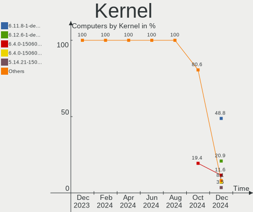
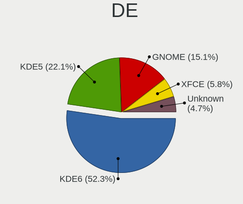
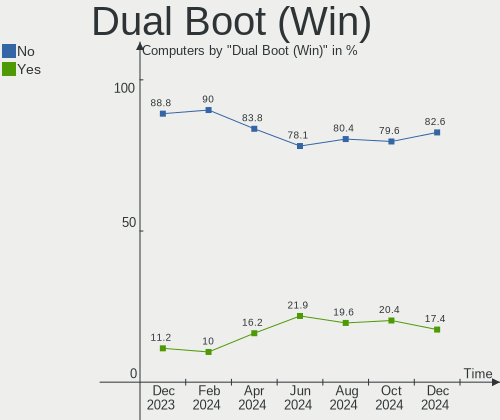
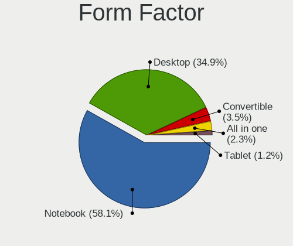
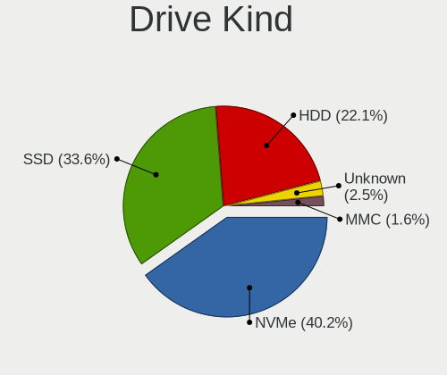
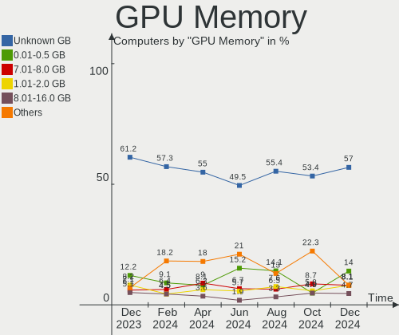
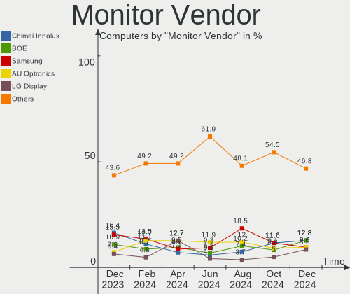
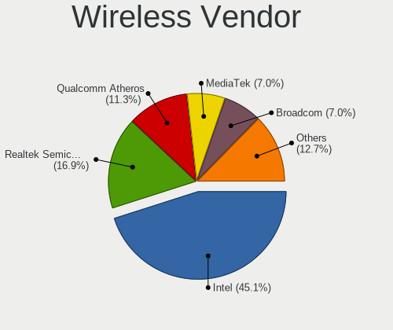
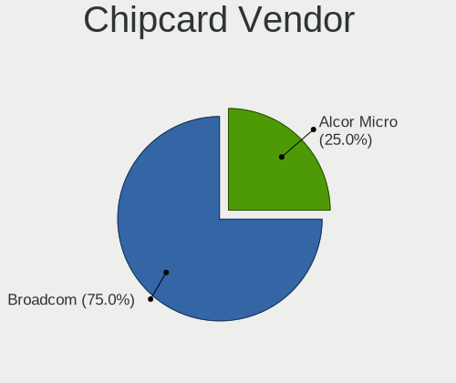
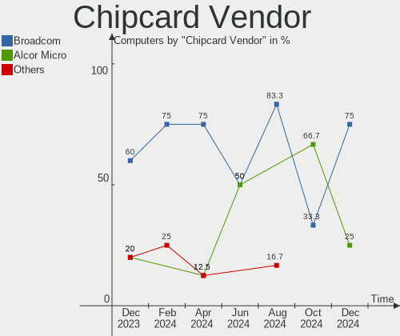

openSUSE - Hardware Trends
--------------------------

A project to identify most popular hardware characteristics and track their change
over time based on data collected by Linux users at https://Linux-Hardware.org.

Anyone can contribute to this report by the [hw-probe](https://github.com/linuxhw/hw-probe) tool:

    sudo -E hw-probe -all -upload

This is a report for all computer types. See also reports for [desktops](/Dist/openSUSE/Desktop/README.md) and [notebooks](/Dist/openSUSE/Notebook/README.md).

This report is for one last month. Overall report since the beginning of time: [TestDays](https://github.com/linuxhw/TestDays)

Period: Nov, 2023.

Contents
--------

* [ System ](#system)
  - [ OS                       ](#os)
  - [ OS Family                ](#os-family)
  - [ Kernel                   ](#kernel)
  - [ Kernel Family            ](#kernel-family)
  - [ Kernel Major Ver.        ](#kernel-major-ver)
  - [ Arch                     ](#arch)
  - [ DE                       ](#de)
  - [ Display Server           ](#display-server)
  - [ Display Manager          ](#display-manager)
  - [ OS Lang                  ](#os-lang)
  - [ Boot Mode                ](#boot-mode)
  - [ Filesystem               ](#filesystem)
  - [ Part. scheme             ](#part-scheme)
  - [ Dual Boot with Linux/BSD ](#dual-boot-with-linuxbsd)
  - [ Dual Boot (Win)          ](#dual-boot-win)

* [ Board ](#board)
  - [ Vendor                   ](#vendor)
  - [ Model                    ](#model)
  - [ Model Family             ](#model-family)
  - [ MFG Year                 ](#mfg-year)
  - [ Form Factor              ](#form-factor)
  - [ Secure Boot              ](#secure-boot)
  - [ Coreboot                 ](#coreboot)
  - [ RAM Size                 ](#ram-size)
  - [ RAM Used                 ](#ram-used)
  - [ Total Drives             ](#total-drives)
  - [ Has CD-ROM               ](#has-cd-rom)
  - [ Has Ethernet             ](#has-ethernet)
  - [ Has WiFi                 ](#has-wifi)
  - [ Has Bluetooth            ](#has-bluetooth)

* [ Location ](#location)
  - [ Country                  ](#country)
  - [ City                     ](#city)

* [ Drives ](#drives)
  - [ Drive Vendor             ](#drive-vendor)
  - [ Drive Model              ](#drive-model)
  - [ HDD Vendor               ](#hdd-vendor)
  - [ SSD Vendor               ](#ssd-vendor)
  - [ Drive Kind               ](#drive-kind)
  - [ Drive Connector          ](#drive-connector)
  - [ Drive Size               ](#drive-size)
  - [ Space Total              ](#space-total)
  - [ Space Used               ](#space-used)
  - [ Malfunc. Drives          ](#malfunc-drives)
  - [ Malfunc. Drive Vendor    ](#malfunc-drive-vendor)
  - [ Malfunc. HDD Vendor      ](#malfunc-hdd-vendor)
  - [ Malfunc. Drive Kind      ](#malfunc-drive-kind)
  - [ Failed Drives            ](#failed-drives)
  - [ Failed Drive Vendor      ](#failed-drive-vendor)
  - [ Drive Status             ](#drive-status)

* [ Storage controller ](#storage-controller)
  - [ Storage Vendor           ](#storage-vendor)
  - [ Storage Model            ](#storage-model)
  - [ Storage Kind             ](#storage-kind)

* [ Processor ](#processor)
  - [ CPU Vendor               ](#cpu-vendor)
  - [ CPU Model                ](#cpu-model)
  - [ CPU Model Family         ](#cpu-model-family)
  - [ CPU Cores                ](#cpu-cores)
  - [ CPU Sockets              ](#cpu-sockets)
  - [ CPU Threads              ](#cpu-threads)
  - [ CPU Op-Modes             ](#cpu-op-modes)
  - [ CPU Microcode            ](#cpu-microcode)
  - [ CPU Microarch            ](#cpu-microarch)

* [ Graphics ](#graphics)
  - [ GPU Vendor               ](#gpu-vendor)
  - [ GPU Model                ](#gpu-model)
  - [ GPU Combo                ](#gpu-combo)
  - [ GPU Driver               ](#gpu-driver)
  - [ GPU Memory               ](#gpu-memory)

* [ Monitor ](#monitor)
  - [ Monitor Vendor           ](#monitor-vendor)
  - [ Monitor Model            ](#monitor-model)
  - [ Monitor Resolution       ](#monitor-resolution)
  - [ Monitor Diagonal         ](#monitor-diagonal)
  - [ Monitor Width            ](#monitor-width)
  - [ Aspect Ratio             ](#aspect-ratio)
  - [ Monitor Area             ](#monitor-area)
  - [ Pixel Density            ](#pixel-density)
  - [ Multiple Monitors        ](#multiple-monitors)

* [ Network ](#network)
  - [ Net Controller Vendor    ](#net-controller-vendor)
  - [ Net Controller Model     ](#net-controller-model)
  - [ Wireless Vendor          ](#wireless-vendor)
  - [ Wireless Model           ](#wireless-model)
  - [ Ethernet Vendor          ](#ethernet-vendor)
  - [ Ethernet Model           ](#ethernet-model)
  - [ Net Controller Kind      ](#net-controller-kind)
  - [ Used Controller          ](#used-controller)
  - [ NICs                     ](#nics)
  - [ IPv6                     ](#ipv6)

* [ Bluetooth ](#bluetooth)
  - [ Bluetooth Vendor         ](#bluetooth-vendor)
  - [ Bluetooth Model          ](#bluetooth-model)

* [ Sound ](#sound)
  - [ Sound Vendor             ](#sound-vendor)
  - [ Sound Model              ](#sound-model)

* [ Memory ](#memory)
  - [ Memory Vendor            ](#memory-vendor)
  - [ Memory Model             ](#memory-model)
  - [ Memory Kind              ](#memory-kind)
  - [ Memory Form Factor       ](#memory-form-factor)
  - [ Memory Size              ](#memory-size)
  - [ Memory Speed             ](#memory-speed)

* [ Printers & scanners ](#printers--scanners)
  - [ Printer Vendor           ](#printer-vendor)
  - [ Printer Model            ](#printer-model)
  - [ Scanner Vendor           ](#scanner-vendor)
  - [ Scanner Model            ](#scanner-model)

* [ Camera ](#camera)
  - [ Camera Vendor            ](#camera-vendor)
  - [ Camera Model             ](#camera-model)

* [ Security ](#security)
  - [ Fingerprint Vendor       ](#fingerprint-vendor)
  - [ Fingerprint Model        ](#fingerprint-model)
  - [ Chipcard Vendor          ](#chipcard-vendor)
  - [ Chipcard Model           ](#chipcard-model)

* [ Unsupported ](#unsupported)
  - [ Unsupported Devices      ](#unsupported-devices)
  - [ Unsupported Device Types ](#unsupported-device-types)

System
------

OS
--

Installed operating systems

| Name                         | Computers | Percent |
|------------------------------|-----------|---------|
| openSUSE Tumbleweed-XXXXXXXX | 79        | 64.23%  |
| openSUSE Leap-15.5           | 35        | 28.46%  |
| openSUSE Microos-XXXXXXXX    | 6         | 4.88%   |
| openSUSE Leap-15.4           | 2         | 1.63%   |
| openSUSE Leap-15.6           | 1         | 0.81%   |

OS Family
---------

OS without a version

| Name     | Computers | Percent |
|----------|-----------|---------|
| openSUSE | 123       | 100%    |

Kernel
------

Version of the Linux kernel

| Version                      | Computers | Percent |
|------------------------------|-----------|---------|
| 6.5.9-1-default              | 41        | 33.33%  |
| 6.6.2-1-default              | 26        | 21.14%  |
| 5.14.21-150500.55.36-default | 22        | 17.89%  |
| 6.6.1-1-default              | 15        | 12.2%   |
| 5.14.21-150500.55.31-default | 10        | 8.13%   |
| 5.14.21-150500.53-default    | 3         | 2.44%   |
| 6.6.1-55.g1fcc265-default    | 1         | 0.81%   |
| 6.5.8-1-default              | 1         | 0.81%   |
| 6.5.2-1-default              | 1         | 0.81%   |
| 6.4.0-150600.1-default       | 1         | 0.81%   |
| 5.14.21-150400.24.97-default | 1         | 0.81%   |
| 5.14.21-150400.24.69-default | 1         | 0.81%   |

Kernel Family
-------------

Linux kernel without a distro release

| Version | Computers | Percent |
|---------|-----------|---------|
| 6.5.9   | 41        | 33.33%  |
| 5.14.21 | 37        | 30.08%  |
| 6.6.2   | 26        | 21.14%  |
| 6.6.1   | 16        | 13.01%  |
| 6.5.8   | 1         | 0.81%   |
| 6.5.2   | 1         | 0.81%   |
| 6.4.0   | 1         | 0.81%   |

Kernel Major Ver.
-----------------

Linux kernel major version

| Version | Computers | Percent |
|---------|-----------|---------|
| 6.5     | 43        | 34.96%  |
| 6.6     | 42        | 34.15%  |
| 5.14    | 37        | 30.08%  |
| 6.4     | 1         | 0.81%   |

Arch
----

OS architecture (x86_64, i586, etc.)

| Name   | Computers | Percent |
|--------|-----------|---------|
| x86_64 | 122       | 99.19%  |
| i686   | 1         | 0.81%   |

DE
--

Desktop Environment

| Name       | Computers | Percent |
|------------|-----------|---------|
| KDE5       | 80        | 65.04%  |
| GNOME      | 30        | 24.39%  |
| XFCE       | 6         | 4.88%   |
| Unknown    | 4         | 3.25%   |
| X-Cinnamon | 1         | 0.81%   |
| Trinity    | 1         | 0.81%   |
| Budgie     | 1         | 0.81%   |

Display Server
--------------

X11 or Wayland

| Name    | Computers | Percent |
|---------|-----------|---------|
| X11     | 86        | 69.92%  |
| Wayland | 34        | 27.64%  |
| Tty     | 2         | 1.63%   |
| Unknown | 1         | 0.81%   |

Display Manager
---------------

SDDM, LightDM, etc.

| Name    | Computers | Percent |
|---------|-----------|---------|
| Unknown | 77        | 62.6%   |
| SDDM    | 30        | 24.39%  |
| LightDM | 8         | 6.5%    |
| GDM     | 8         | 6.5%    |

OS Lang
-------

Language

| Lang    | Computers | Percent |
|---------|-----------|---------|
| en_US   | 57        | 46.34%  |
| de_DE   | 30        | 24.39%  |
| pt_BR   | 6         | 4.88%   |
| ru_RU   | 5         | 4.07%   |
| es_ES   | 5         | 4.07%   |
| POSIX   | 3         | 2.44%   |
| en_GB   | 3         | 2.44%   |
| it_IT   | 2         | 1.63%   |
| Unknown | 2         | 1.63%   |
| zh_CN   | 1         | 0.81%   |
| vi_VN   | 1         | 0.81%   |
| nl_NL   | 1         | 0.81%   |
| ja_JP   | 1         | 0.81%   |
| hu_HU   | 1         | 0.81%   |
| fr_FR   | 1         | 0.81%   |
| fi_FI   | 1         | 0.81%   |
| en_DK   | 1         | 0.81%   |
| en_CA   | 1         | 0.81%   |
| cs_CZ   | 1         | 0.81%   |

Boot Mode
---------

EFI or BIOS

| Mode | Computers | Percent |
|------|-----------|---------|
| EFI  | 83        | 67.48%  |
| BIOS | 40        | 32.52%  |

Filesystem
----------

Type of filesystem

| Type    | Computers | Percent |
|---------|-----------|---------|
| Btrfs   | 101       | 82.11%  |
| Ext4    | 14        | 11.38%  |
| Xfs     | 4         | 3.25%   |
| Tmpfs   | 2         | 1.63%   |
| Overlay | 1         | 0.81%   |
| Ext3    | 1         | 0.81%   |

Part. scheme
------------

Scheme of partitioning

| Type    | Computers | Percent |
|---------|-----------|---------|
| Unknown | 74        | 60.16%  |
| GPT     | 48        | 39.02%  |
| MBR     | 1         | 0.81%   |

Dual Boot with Linux/BSD
------------------------

Hosting more than one Linux/BSD

| Dual boot | Computers | Percent |
|-----------|-----------|---------|
| No        | 109       | 88.62%  |
| Yes       | 14        | 11.38%  |

Dual Boot (Win)
---------------

Hosting Linux and Windows

| Dual boot | Computers | Percent |
|-----------|-----------|---------|
| No        | 99        | 80.49%  |
| Yes       | 24        | 19.51%  |

Board
-----

Vendor
------

Motherboard manufacturer

| Name                | Computers | Percent |
|---------------------|-----------|---------|
| ASUSTek Computer    | 23        | 18.7%   |
| Lenovo              | 20        | 16.26%  |
| Hewlett-Packard     | 18        | 14.63%  |
| Dell                | 12        | 9.76%   |
| Gigabyte Technology | 11        | 8.94%   |
| MSI                 | 9         | 7.32%   |
| ASRock              | 7         | 5.69%   |
| Acer                | 5         | 4.07%   |
| Samsung Electronics | 2         | 1.63%   |
| TUXEDO              | 1         | 0.81%   |
| System76            | 1         | 0.81%   |
| PIONEERPOS          | 1         | 0.81%   |
| Notebook            | 1         | 0.81%   |
| NEC Computers       | 1         | 0.81%   |
| Intel               | 1         | 0.81%   |
| IBM                 | 1         | 0.81%   |
| HUAWEI              | 1         | 0.81%   |
| HC Technology.      | 1         | 0.81%   |
| Google              | 1         | 0.81%   |
| Fujitsu             | 1         | 0.81%   |
| Dynabook            | 1         | 0.81%   |
| Chuwi               | 1         | 0.81%   |
| Biostar             | 1         | 0.81%   |
| Apple               | 1         | 0.81%   |
| Unknown             | 1         | 0.81%   |

Model
-----

Motherboard model

| Name                                  | Computers | Percent |
|---------------------------------------|-----------|---------|
| Samsung 550XDA                        | 2         | 1.63%   |
| HP Notebook                           | 2         | 1.63%   |
| TUXEDO Pulse 15 Gen1                  | 1         | 0.81%   |
| System76 Lemur Pro                    | 1         | 0.81%   |
| PIONEERPOS STEALTH-ASTERIX            | 1         | 0.81%   |
| Notebook NL5xRU                       | 1         | 0.81%   |
| NEC Computers PC-NS100C1W-P2          | 1         | 0.81%   |
| MSI MS-7D93                           | 1         | 0.81%   |
| MSI MS-7D54                           | 1         | 0.81%   |
| MSI MS-7D46                           | 1         | 0.81%   |
| MSI MS-7D25                           | 1         | 0.81%   |
| MSI MS-7C52                           | 1         | 0.81%   |
| MSI MS-7C35                           | 1         | 0.81%   |
| MSI MS-7A33                           | 1         | 0.81%   |
| MSI Modern 14 C12M                    | 1         | 0.81%   |
| MSI Katana GF66 12UD                  | 1         | 0.81%   |
| Lenovo Yoga Pro 9 16IRP8 83BY         | 1         | 0.81%   |
| Lenovo Yoga 9 14ITL5 82BG             | 1         | 0.81%   |
| Lenovo Y520-15IKBN 80WK               | 1         | 0.81%   |
| Lenovo V15 G2 ALC 82KD                | 1         | 0.81%   |
| Lenovo ThinkPad X260 20F6CTO1WW       | 1         | 0.81%   |
| Lenovo ThinkPad W541 20EGS1LB00       | 1         | 0.81%   |
| Lenovo ThinkPad W510 4391W3V          | 1         | 0.81%   |
| Lenovo ThinkPad T490 20N2000LSP       | 1         | 0.81%   |
| Lenovo ThinkPad T470 W10DG 20JNS0JU01 | 1         | 0.81%   |
| Lenovo ThinkPad L570 W10DG 20JRS03U00 | 1         | 0.81%   |
| Lenovo ThinkPad L14 Gen 4 21H5CTO1WW  | 1         | 0.81%   |
| Lenovo ThinkPad E14 Gen 5 21JR0009CX  | 1         | 0.81%   |
| Lenovo ThinkPad E14 Gen 2 20TA004QUS  | 1         | 0.81%   |
| Lenovo ThinkCentre M900 10FH000KUS    | 1         | 0.81%   |
| Lenovo ThinkCentre E73 10DR0037IX     | 1         | 0.81%   |
| Lenovo Legion Pro 5 16ARX8 82WM       | 1         | 0.81%   |
| Lenovo Legion 5 Pro 16ITH6H 82JD      | 1         | 0.81%   |
| Lenovo IdeaPad S340-15IWL 81N8        | 1         | 0.81%   |
| Lenovo IdeaPad S145-15IIL 82DJ        | 1         | 0.81%   |
| Lenovo IdeaPad 5 Pro 16ARH7 82SN      | 1         | 0.81%   |
| Intel NUC11PAHi5                      | 1         | 0.81%   |
| IBM ThinkPad T42 2373CS8              | 1         | 0.81%   |
| HUAWEI BOHK-WAX9X                     | 1         | 0.81%   |
| HP Z440 Workstation                   | 1         | 0.81%   |

Model Family
------------

Motherboard model prefix

| Name                         | Computers | Percent |
|------------------------------|-----------|---------|
| Lenovo ThinkPad              | 9         | 7.32%   |
| Dell Latitude                | 5         | 4.07%   |
| ASUS ROG                     | 5         | 4.07%   |
| HP Pavilion                  | 4         | 3.25%   |
| Acer Aspire                  | 4         | 3.25%   |
| Lenovo IdeaPad               | 3         | 2.44%   |
| Gigabyte X570                | 3         | 2.44%   |
| Dell Inspiron                | 3         | 2.44%   |
| ASUS VivoBook                | 3         | 2.44%   |
| ASUS TUF                     | 3         | 2.44%   |
| ASUS PRIME                   | 3         | 2.44%   |
| Samsung 550XDA               | 2         | 1.63%   |
| Lenovo Yoga                  | 2         | 1.63%   |
| Lenovo ThinkCentre           | 2         | 1.63%   |
| Lenovo Legion                | 2         | 1.63%   |
| HP Notebook                  | 2         | 1.63%   |
| HP ENVY                      | 2         | 1.63%   |
| HP EliteDesk                 | 2         | 1.63%   |
| HP EliteBook                 | 2         | 1.63%   |
| Dell OptiPlex                | 2         | 1.63%   |
| TUXEDO Pulse                 | 1         | 0.81%   |
| System76 Lemur               | 1         | 0.81%   |
| PIONEERPOS STEALTH-ASTERIX   | 1         | 0.81%   |
| Notebook NL5xRU              | 1         | 0.81%   |
| NEC Computers PC-NS100C1W-P2 | 1         | 0.81%   |
| MSI MS-7D93                  | 1         | 0.81%   |
| MSI MS-7D54                  | 1         | 0.81%   |
| MSI MS-7D46                  | 1         | 0.81%   |
| MSI MS-7D25                  | 1         | 0.81%   |
| MSI MS-7C52                  | 1         | 0.81%   |
| MSI MS-7C35                  | 1         | 0.81%   |
| MSI MS-7A33                  | 1         | 0.81%   |
| MSI Modern                   | 1         | 0.81%   |
| MSI Katana                   | 1         | 0.81%   |
| Lenovo Y520-15IKBN           | 1         | 0.81%   |
| Lenovo V15                   | 1         | 0.81%   |
| Intel NUC11PAHi5             | 1         | 0.81%   |
| IBM ThinkPad                 | 1         | 0.81%   |
| HUAWEI BOHK-WAX9X            | 1         | 0.81%   |
| HP Z440                      | 1         | 0.81%   |

MFG Year
--------

Motherboard manufacture year

| Year | Computers | Percent |
|------|-----------|---------|
| 2019 | 17        | 13.82%  |
| 2021 | 16        | 13.01%  |
| 2020 | 16        | 13.01%  |
| 2022 | 13        | 10.57%  |
| 2023 | 11        | 8.94%   |
| 2017 | 9         | 7.32%   |
| 2016 | 9         | 7.32%   |
| 2015 | 6         | 4.88%   |
| 2014 | 6         | 4.88%   |
| 2012 | 5         | 4.07%   |
| 2018 | 4         | 3.25%   |
| 2010 | 4         | 3.25%   |
| 2011 | 2         | 1.63%   |
| 2007 | 2         | 1.63%   |
| 2013 | 1         | 0.81%   |
| 2008 | 1         | 0.81%   |
| 2004 | 1         | 0.81%   |

Form Factor
-----------

Physical design of the computer

| Name        | Computers | Percent |
|-------------|-----------|---------|
| Notebook    | 65        | 52.85%  |
| Desktop     | 53        | 43.09%  |
| Convertible | 4         | 3.25%   |
| Mini pc     | 1         | 0.81%   |

Secure Boot
-----------

Enabled or disabled

| State    | Computers | Percent |
|----------|-----------|---------|
| Disabled | 104       | 84.55%  |
| Enabled  | 19        | 15.45%  |

Coreboot
--------

Have coreboot on board

| Used | Computers | Percent |
|------|-----------|---------|
| No   | 121       | 98.37%  |
| Yes  | 2         | 1.63%   |

RAM Size
--------

Total RAM memory

| Size in GB  | Computers | Percent |
|-------------|-----------|---------|
| 16.01-24.0  | 36        | 29.27%  |
| 32.01-64.0  | 23        | 18.7%   |
| 8.01-16.0   | 23        | 18.7%   |
| 4.01-8.0    | 22        | 17.89%  |
| 64.01-256.0 | 10        | 8.13%   |
| 3.01-4.0    | 6         | 4.88%   |
| 24.01-32.0  | 1         | 0.81%   |
| 2.01-3.0    | 1         | 0.81%   |
| 1.01-2.0    | 1         | 0.81%   |

RAM Used
--------

Used RAM memory

| Used GB    | Computers | Percent |
|------------|-----------|---------|
| 2.01-3.0   | 35        | 28.46%  |
| 4.01-8.0   | 30        | 24.39%  |
| 3.01-4.0   | 25        | 20.33%  |
| 1.01-2.0   | 21        | 17.07%  |
| 8.01-16.0  | 10        | 8.13%   |
| 16.01-24.0 | 1         | 0.81%   |
| 0.01-0.5   | 1         | 0.81%   |

Total Drives
------------

Number of drives on board

| Drives | Computers | Percent |
|--------|-----------|---------|
| 1      | 64        | 52.03%  |
| 2      | 32        | 26.02%  |
| 3      | 13        | 10.57%  |
| 5      | 6         | 4.88%   |
| 6      | 3         | 2.44%   |
| 9      | 2         | 1.63%   |
| 4      | 2         | 1.63%   |
| 7      | 1         | 0.81%   |

Has CD-ROM
----------

Has CD-ROM on board

| Presented | Computers | Percent |
|-----------|-----------|---------|
| No        | 97        | 78.86%  |
| Yes       | 26        | 21.14%  |

Has Ethernet
------------

Has Ethernet on board

| Presented | Computers | Percent |
|-----------|-----------|---------|
| Yes       | 107       | 86.99%  |
| No        | 16        | 13.01%  |

Has WiFi
--------

Has WiFi module

| Presented | Computers | Percent |
|-----------|-----------|---------|
| Yes       | 92        | 74.8%   |
| No        | 31        | 25.2%   |

Has Bluetooth
-------------

Has Bluetooth module

| Presented | Computers | Percent |
|-----------|-----------|---------|
| Yes       | 92        | 74.8%   |
| No        | 31        | 25.2%   |

Location
--------

Country
-------

Geographic location (country)

| Country      | Computers | Percent |
|--------------|-----------|---------|
| Germany      | 32        | 26.02%  |
| USA          | 22        | 17.89%  |
| Brazil       | 8         | 6.5%    |
| Russia       | 6         | 4.88%   |
| Italy        | 6         | 4.88%   |
| Belgium      | 4         | 3.25%   |
| Spain        | 3         | 2.44%   |
| Netherlands  | 3         | 2.44%   |
| Canada       | 3         | 2.44%   |
| Vietnam      | 2         | 1.63%   |
| Ukraine      | 2         | 1.63%   |
| Turkey       | 2         | 1.63%   |
| Switzerland  | 2         | 1.63%   |
| Poland       | 2         | 1.63%   |
| Ireland      | 2         | 1.63%   |
| Greece       | 2         | 1.63%   |
| Austria      | 2         | 1.63%   |
| Argentina    | 2         | 1.63%   |
| Venezuela    | 1         | 0.81%   |
| UK           | 1         | 0.81%   |
| South Africa | 1         | 0.81%   |
| Slovenia     | 1         | 0.81%   |
| Serbia       | 1         | 0.81%   |
| Romania      | 1         | 0.81%   |
| Puerto Rico  | 1         | 0.81%   |
| Japan        | 1         | 0.81%   |
| Iraq         | 1         | 0.81%   |
| India        | 1         | 0.81%   |
| Hungary      | 1         | 0.81%   |
| Finland      | 1         | 0.81%   |
| Egypt        | 1         | 0.81%   |
| Ecuador      | 1         | 0.81%   |
| Czechia      | 1         | 0.81%   |
| China        | 1         | 0.81%   |
| Australia    | 1         | 0.81%   |
| Albania      | 1         | 0.81%   |

City
----

Geographic location (city)

| City           | Computers | Percent |
|----------------|-----------|---------|
| Berlin         | 4         | 3.25%   |
| St Petersburg  | 3         | 2.44%   |
| Haarlem        | 2         | 1.63%   |
| Griesheim      | 2         | 1.63%   |
| Dublin         | 2         | 1.63%   |
| Winnipeg       | 1         | 0.81%   |
| West Bend      | 1         | 0.81%   |
| Werdau         | 1         | 0.81%   |
| Wels           | 1         | 0.81%   |
| Waynesboro     | 1         | 0.81%   |
| Wachtberg      | 1         | 0.81%   |
| Vienna         | 1         | 0.81%   |
| Vercelli       | 1         | 0.81%   |
| Vancouver      | 1         | 0.81%   |
| Valencia       | 1         | 0.81%   |
| Union City     | 1         | 0.81%   |
| Ubatuba        | 1         | 0.81%   |
| Toronto        | 1         | 0.81%   |
| Tirana         | 1         | 0.81%   |
| Szczecin       | 1         | 0.81%   |
| Sussen         | 1         | 0.81%   |
| Staraya Russa  | 1         | 0.81%   |
| Sorocaba       | 1         | 0.81%   |
| Siegen         | 1         | 0.81%   |
| Shanghai       | 1         | 0.81%   |
| Seville        | 1         | 0.81%   |
| Seinäjoki     | 1         | 0.81%   |
| Sao Paulo      | 1         | 0.81%   |
| San Juan       | 1         | 0.81%   |
| Salisbury      | 1         | 0.81%   |
| Saint Paul     | 1         | 0.81%   |
| Saga           | 1         | 0.81%   |
| Saarbrücken   | 1         | 0.81%   |
| Rottenstuben   | 1         | 0.81%   |
| Rio de Janeiro | 1         | 0.81%   |
| Rhodes         | 1         | 0.81%   |
| Pune           | 1         | 0.81%   |
| Portland       | 1         | 0.81%   |
| Pedro Leopoldo | 1         | 0.81%   |
| Oklahoma City  | 1         | 0.81%   |

Drives
------

Drive Vendor
------------

Hard drive vendors

| Vendor                      | Computers | Drives | Percent |
|-----------------------------|-----------|--------|---------|
| Samsung Electronics         | 45        | 64     | 22.73%  |
| WDC                         | 24        | 34     | 12.12%  |
| Seagate                     | 20        | 27     | 10.1%   |
| SanDisk                     | 15        | 19     | 7.58%   |
| Kingston                    | 12        | 13     | 6.06%   |
| Toshiba                     | 10        | 15     | 5.05%   |
| Micron Technology           | 9         | 9      | 4.55%   |
| Intenso                     | 5         | 6      | 2.53%   |
| Intel                       | 5         | 6      | 2.53%   |
| Micron/Crucial Technology   | 4         | 4      | 2.02%   |
| Crucial                     | 4         | 5      | 2.02%   |
| Unknown                     | 3         | 3      | 1.52%   |
| SK hynix                    | 3         | 3      | 1.52%   |
| Phison Electronics          | 3         | 4      | 1.52%   |
| Hitachi                     | 3         | 3      | 1.52%   |
| ADATA Technology            | 3         | 3      | 1.52%   |
| Transcend                   | 2         | 2      | 1.01%   |
| Silicon Motion              | 2         | 2      | 1.01%   |
| Leven                       | 2         | 2      | 1.01%   |
| JMicron Technology          | 2         | 2      | 1.01%   |
| China                       | 2         | 2      | 1.01%   |
| A-DATA Technology           | 2         | 2      | 1.01%   |
| XSTAR                       | 1         | 1      | 0.51%   |
| Visiontek                   | 1         | 1      | 0.51%   |
| Timetec                     | 1         | 1      | 0.51%   |
| SPCC                        | 1         | 2      | 0.51%   |
| SABRENT                     | 1         | 1      | 0.51%   |
| Realtek Semiconductor       | 1         | 1      | 0.51%   |
| PNY                         | 1         | 1      | 0.51%   |
| Pioneer                     | 1         | 1      | 0.51%   |
| Patriot                     | 1         | 1      | 0.51%   |
| MAXIO Technology (Hangzhou) | 1         | 1      | 0.51%   |
| KIOXIA                      | 1         | 1      | 0.51%   |
| Kingston Technology Company | 1         | 1      | 0.51%   |
| KingFast                    | 1         | 1      | 0.51%   |
| HS-SSD-C100                 | 1         | 1      | 0.51%   |
| BR                          | 1         | 1      | 0.51%   |
| AMD                         | 1         | 1      | 0.51%   |
| AirDisk                     | 1         | 1      | 0.51%   |
| Unknown                     | 1         | 1      | 0.51%   |

Drive Model
-----------

Hard drive models

| Model                                                           | Computers | Percent |
|-----------------------------------------------------------------|-----------|---------|
| Samsung NVMe SSD Controller SM981/PM981/PM983 250GB             | 12        | 5.19%   |
| Samsung NVMe SSD Controller PM9A1/PM9A3/980PRO 2TB              | 8         | 3.46%   |
| Samsung SSD 870 EVO 1TB                                         | 6         | 2.6%    |
| Seagate ST500DM002-1BD142 500GB                                 | 3         | 1.3%    |
| Sandisk WD Black SN750 / PC SN730 NVMe SSD 500GB                | 3         | 1.3%    |
| Micron/Crucial P2 NVMe PCIe SSD 1TB                             | 3         | 1.3%    |
| Kingston SA400S37480G 480GB SSD                                 | 3         | 1.3%    |
| WDC WD10EZEX-08M2NA0 1TB                                        | 2         | 0.87%   |
| Toshiba DT01ACA200 2TB                                          | 2         | 0.87%   |
| Toshiba DT01ACA100 1TB                                          | 2         | 0.87%   |
| SK hynix SKHynix_HFS512GEJ9X115N 512GB                          | 2         | 0.87%   |
| Silicon Motion SM2263EN/SM2263XT SSD Controller 256GB           | 2         | 0.87%   |
| Seagate ST2000DM008-2FR102 2TB                                  | 2         | 0.87%   |
| Seagate ST1000DM010-2EP102 1TB                                  | 2         | 0.87%   |
| Seagate Expansion Desk 6TB                                      | 2         | 0.87%   |
| Sandisk WD_BLACK SN770 1TB                                      | 2         | 0.87%   |
| SanDisk SSD PLUS 1000GB                                         | 2         | 0.87%   |
| SanDisk SDSSDP128G 128GB                                        | 2         | 0.87%   |
| Samsung SSD 870 EVO 2TB                                         | 2         | 0.87%   |
| Samsung SSD 850 EVO 250GB                                       | 2         | 0.87%   |
| Samsung SSD 840 EVO 120GB                                       | 2         | 0.87%   |
| Micron 2210_MTFDHBA1T0QFD 1TB                                   | 2         | 0.87%   |
| Kingston SA400S37240G 240GB SSD                                 | 2         | 0.87%   |
| Intenso SSD SATAIII 512GB                                       | 2         | 0.87%   |
| ADATA XPG SX8200 Pro PCIe Gen3x4 M.2 2280 Solid State Drive 1TB | 2         | 0.87%   |
| XSTAR SSD 128GB                                                 | 1         | 0.43%   |
| WDC WDS480G2G0A-00JH30 480GB SSD                                | 1         | 0.43%   |
| WDC WDS240G2G0C-00AJM0 240GB                                    | 1         | 0.43%   |
| WDC WDS240G2G0A-00JH30 240GB SSD                                | 1         | 0.43%   |
| WDC WDS100T2G0A-00JH30 1TB SSD                                  | 1         | 0.43%   |
| WDC WDS100T2B0A-00SM50 1TB SSD                                  | 1         | 0.43%   |
| WDC WDS100T1B0A-00H9H0 1TB SSD                                  | 1         | 0.43%   |
| WDC WD7500BPKX-22HPJT0 752GB                                    | 1         | 0.43%   |
| WDC WD5000LPCX-60VHAT0 500GB                                    | 1         | 0.43%   |
| WDC WD5000AZRX-00A8LB0 500GB                                    | 1         | 0.43%   |
| WDC WD40EZRX-00SPEB0 4TB                                        | 1         | 0.43%   |
| WDC WD40EZAZ-00SF3B0 4TB                                        | 1         | 0.43%   |
| WDC WD4005FZBX-00K5WB0 4TB                                      | 1         | 0.43%   |
| WDC WD3200BPVT-00JJ5T0 320GB                                    | 1         | 0.43%   |
| WDC WD3200AAKX-00ERMA0 320GB                                    | 1         | 0.43%   |

HDD Vendor
----------

Hard disk drive vendors

| Vendor              | Computers | Drives | Percent |
|---------------------|-----------|--------|---------|
| Seagate             | 20        | 27     | 37.04%  |
| WDC                 | 19        | 26     | 35.19%  |
| Toshiba             | 9         | 14     | 16.67%  |
| Hitachi             | 3         | 3      | 5.56%   |
| Samsung Electronics | 2         | 3      | 3.7%    |
| Pioneer             | 1         | 1      | 1.85%   |

SSD Vendor
----------

Solid state drive vendors

| Vendor              | Computers | Drives | Percent |
|---------------------|-----------|--------|---------|
| Samsung Electronics | 20        | 26     | 27.78%  |
| SanDisk             | 8         | 10     | 11.11%  |
| Kingston            | 8         | 9      | 11.11%  |
| WDC                 | 7         | 7      | 9.72%   |
| Intenso             | 5         | 6      | 6.94%   |
| Crucial             | 4         | 5      | 5.56%   |
| Transcend           | 2         | 2      | 2.78%   |
| Leven               | 2         | 2      | 2.78%   |
| China               | 2         | 2      | 2.78%   |
| XSTAR               | 1         | 1      | 1.39%   |
| Toshiba             | 1         | 1      | 1.39%   |
| Timetec             | 1         | 1      | 1.39%   |
| SPCC                | 1         | 2      | 1.39%   |
| PNY                 | 1         | 1      | 1.39%   |
| Patriot             | 1         | 1      | 1.39%   |
| Micron Technology   | 1         | 1      | 1.39%   |
| JMicron Technology  | 1         | 1      | 1.39%   |
| Intel               | 1         | 1      | 1.39%   |
| HS-SSD-C100         | 1         | 1      | 1.39%   |
| AMD                 | 1         | 1      | 1.39%   |
| AirDisk             | 1         | 1      | 1.39%   |
| A-DATA Technology   | 1         | 1      | 1.39%   |
| Unknown             | 1         | 1      | 1.39%   |

Drive Kind
----------

HDD or SSD

| Kind    | Computers | Drives | Percent |
|---------|-----------|--------|---------|
| NVMe    | 66        | 85     | 38.37%  |
| SSD     | 55        | 84     | 31.98%  |
| HDD     | 45        | 74     | 26.16%  |
| MMC     | 3         | 3      | 1.74%   |
| Unknown | 3         | 3      | 1.74%   |

Drive Connector
---------------

SATA, SAS, NVMe, etc.

| Type | Computers | Drives | Percent |
|------|-----------|--------|---------|
| SATA | 76        | 153    | 50.67%  |
| NVMe | 65        | 84     | 43.33%  |
| SAS  | 6         | 9      | 4%      |
| MMC  | 3         | 3      | 2%      |

Drive Size
----------

Size of hard drive

| Size in TB | Computers | Drives | Percent |
|------------|-----------|--------|---------|
| 0.01-0.5   | 50        | 70     | 42.02%  |
| 0.51-1.0   | 43        | 51     | 36.13%  |
| 1.01-2.0   | 12        | 22     | 10.08%  |
| 3.01-4.0   | 5         | 5      | 4.2%    |
| 4.01-10.0  | 5         | 6      | 4.2%    |
| 2.01-3.0   | 4         | 4      | 3.36%   |

Space Total
-----------

Amount of disk space available on the file system

| Size in GB     | Computers | Percent |
|----------------|-----------|---------|
| More than 3000 | 54        | 43.9%   |
| 1001-2000      | 22        | 17.89%  |
| 2001-3000      | 14        | 11.38%  |
| 101-250        | 11        | 8.94%   |
| 251-500        | 10        | 8.13%   |
| 501-1000       | 9         | 7.32%   |
| Unknown        | 2         | 1.63%   |
| 21-50          | 1         | 0.81%   |

Space Used
----------

Amount of used disk space

| Used GB        | Computers | Percent |
|----------------|-----------|---------|
| 101-250        | 27        | 21.95%  |
| 51-100         | 20        | 16.26%  |
| 501-1000       | 18        | 14.63%  |
| 1001-2000      | 17        | 13.82%  |
| More than 3000 | 15        | 12.2%   |
| 251-500        | 11        | 8.94%   |
| 1-20           | 6         | 4.88%   |
| 2001-3000      | 4         | 3.25%   |
| 21-50          | 3         | 2.44%   |
| Unknown        | 2         | 1.63%   |

Malfunc. Drives
---------------

Drive models with a malfunction

| Model                                            | Computers | Drives | Percent |
|--------------------------------------------------|-----------|--------|---------|
| WDC WD Blue SA510 2.5 500GB                      | 1         | 1      | 10%     |
| Transcend TS250GMTS425S 250GB SSD                | 1         | 1      | 10%     |
| Seagate ST500DM002-1BD142 500GB                  | 1         | 1      | 10%     |
| Seagate ST3000NM0033-9ZM178 3TB                  | 1         | 1      | 10%     |
| Samsung Electronics SSD 870 EVO 1TB              | 1         | 1      | 10%     |
| Samsung Electronics SSD 840 EVO 120GB            | 1         | 1      | 10%     |
| Samsung Electronics MZVLQ512HBLU-00B00 512GB     | 1         | 1      | 10%     |
| Samsung Electronics MZ7TE256HMHP-000L7 256GB SSD | 1         | 1      | 10%     |
| Samsung Electronics HM160JC 160GB                | 1         | 1      | 10%     |
| Intel SSDSCKKF256H6 SATA 256GB                   | 1         | 1      | 10%     |

Malfunc. Drive Vendor
---------------------

Vendors of faulty drives

| Vendor              | Computers | Drives | Percent |
|---------------------|-----------|--------|---------|
| Samsung Electronics | 4         | 5      | 44.44%  |
| Seagate             | 2         | 2      | 22.22%  |
| WDC                 | 1         | 1      | 11.11%  |
| Transcend           | 1         | 1      | 11.11%  |
| Intel               | 1         | 1      | 11.11%  |

Malfunc. HDD Vendor
-------------------

Vendors of faulty HDD drives

| Vendor              | Computers | Drives | Percent |
|---------------------|-----------|--------|---------|
| Seagate             | 2         | 2      | 66.67%  |
| Samsung Electronics | 1         | 1      | 33.33%  |

Malfunc. Drive Kind
-------------------

Kinds of faulty drives

| Kind | Computers | Drives | Percent |
|------|-----------|--------|---------|
| SSD  | 4         | 6      | 50%     |
| HDD  | 3         | 3      | 37.5%   |
| NVMe | 1         | 1      | 12.5%   |

Failed Drives
-------------

Failed drive models

Zero info for selected period =(

Failed Drive Vendor
-------------------

Failed drive vendors

Zero info for selected period =(

Drive Status
------------

Number of failed and malfunc. drives

| Status   | Computers | Drives | Percent |
|----------|-----------|--------|---------|
| Detected | 77        | 144    | 57.89%  |
| Works    | 48        | 95     | 36.09%  |
| Malfunc  | 8         | 10     | 6.02%   |

Storage controller
------------------

Storage Vendor
--------------

Storage controller vendors

| Vendor                      | Computers | Percent |
|-----------------------------|-----------|---------|
| Intel                       | 67        | 37.85%  |
| AMD                         | 32        | 18.08%  |
| Samsung Electronics         | 28        | 15.82%  |
| SanDisk                     | 9         | 5.08%   |
| Micron Technology           | 8         | 4.52%   |
| Kingston Technology Company | 5         | 2.82%   |
| Micron/Crucial Technology   | 4         | 2.26%   |
| ADATA Technology            | 4         | 2.26%   |
| SK hynix                    | 3         | 1.69%   |
| Phison Electronics          | 3         | 1.69%   |
| Marvell Technology Group    | 3         | 1.69%   |
| ASMedia Technology          | 3         | 1.69%   |
| Silicon Motion              | 2         | 1.13%   |
| Realtek Semiconductor       | 1         | 0.56%   |
| Nvidia                      | 1         | 0.56%   |
| MAXIO Technology (Hangzhou) | 1         | 0.56%   |
| KIOXIA                      | 1         | 0.56%   |
| JMicron Technology          | 1         | 0.56%   |
| INNOGRIT                    | 1         | 0.56%   |

Storage Model
-------------

Storage controller models

| Model                                                                          | Computers | Percent |
|--------------------------------------------------------------------------------|-----------|---------|
| AMD FCH SATA Controller [AHCI mode]                                            | 21        | 10.55%  |
| Samsung NVMe SSD Controller SM981/PM981/PM983                                  | 12        | 6.03%   |
| Samsung NVMe SSD Controller 980 (DRAM-less)                                    | 9         | 4.52%   |
| Intel Sunrise Point-LP SATA Controller [AHCI mode]                             | 9         | 4.52%   |
| Samsung NVMe SSD Controller PM9A1/PM9A3/980PRO                                 | 8         | 4.02%   |
| AMD SB7x0/SB8x0/SB9x0 SATA Controller [IDE mode]                               | 6         | 3.02%   |
| AMD SB7x0/SB8x0/SB9x0 IDE Controller                                           | 6         | 3.02%   |
| Intel 82801 Mobile SATA Controller [RAID mode]                                 | 5         | 2.51%   |
| Intel 8 Series/C220 Series Chipset Family 6-port SATA Controller 1 [AHCI mode] | 5         | 2.51%   |
| Intel 200 Series PCH SATA controller [AHCI mode]                               | 4         | 2.01%   |
| AMD 400 Series Chipset SATA Controller                                         | 4         | 2.01%   |
| SanDisk Extreme Pro / WD Black SN750 / PC SN730 / Red SN700 NVMe SSD           | 3         | 1.51%   |
| Micron/Crucial P2 [Nick P2] / P3 / P3 Plus NVMe PCIe SSD (DRAM-less)           | 3         | 1.51%   |
| Micron 2450 NVMe SSD [HendrixV] (DRAM-less)                                    | 3         | 1.51%   |
| Micron 2400 NVMe SSD (DRAM-less)                                               | 3         | 1.51%   |
| Intel Volume Management Device NVMe RAID Controller                            | 3         | 1.51%   |
| Intel Tiger Lake-LP SATA Controller                                            | 3         | 1.51%   |
| AMD 500 Series Chipset SATA Controller                                         | 3         | 1.51%   |
| SK hynix Platinum P41/PC801 NVMe Solid State Drive                             | 2         | 1.01%   |
| Silicon Motion SM2263EN/SM2263XT (DRAM-less) NVMe SSD Controllers              | 2         | 1.01%   |
| SanDisk WD Green SN350 240GB (DRAM-less) / SN560E NVMe SSD                     | 2         | 1.01%   |
| SanDisk WD Black SN770 / PC SN740 256GB / PC SN560 (DRAM-less) NVMe SSD        | 2         | 1.01%   |
| Micron 2210 NVMe SSD [Cobain]                                                  | 2         | 1.01%   |
| Intel Wildcat Point-LP SATA Controller [AHCI Mode]                             | 2         | 1.01%   |
| Intel Volume Management Device NVMe RAID Controller Intel Corporation          | 2         | 1.01%   |
| Intel Tiger Lake SATA AHCI Controller                                          | 2         | 1.01%   |
| Intel SATA Controller [RAID mode]                                              | 2         | 1.01%   |
| Intel Q170/Q150/B150/H170/H110/Z170/CM236 Chipset SATA Controller [AHCI Mode]  | 2         | 1.01%   |
| Intel HM170/QM170 Chipset SATA Controller [AHCI Mode]                          | 2         | 1.01%   |
| Intel Alder Lake-S PCH SATA Controller [AHCI Mode]                             | 2         | 1.01%   |
| ADATA XPG SX8200 Pro PCIe Gen3x4 M.2 2280 Solid State Drive                    | 2         | 1.01%   |
| SK hynix Gold P31/BC711/PC711 NVMe Solid State Drive                           | 1         | 0.5%    |
| SanDisk WD Blue SN500 / PC SN520 x2 M.2 2280 NVMe SSD                          | 1         | 0.5%    |
| Sandisk WD Black SN850X NVMe SSD                                               | 1         | 0.5%    |
| SanDisk Ultra 3D / WD Blue SN550 NVMe SSD                                      | 1         | 0.5%    |
| Samsung NVMe SSD Controller S4LV008[Pascal]                                    | 1         | 0.5%    |
| Realtek RTS5762 NVMe SSD Controller                                            | 1         | 0.5%    |
| Phison E8 PCIe3 NVMe Controller                                                | 1         | 0.5%    |
| Phison E18 PCIe4 NVMe Controller                                               | 1         | 0.5%    |
| Phison E16 PCIe4 NVMe Controller                                               | 1         | 0.5%    |

Storage Kind
------------

Kind of storage controller (IDE, SATA, NVMe, SAS, ...)

| Kind | Computers | Percent |
|------|-----------|---------|
| SATA | 82        | 47.67%  |
| NVMe | 65        | 37.79%  |
| IDE  | 13        | 7.56%   |
| RAID | 12        | 6.98%   |

Processor
---------

CPU Vendor
----------

Processor vendors

| Vendor | Computers | Percent |
|--------|-----------|---------|
| Intel  | 77        | 62.6%   |
| AMD    | 46        | 37.4%   |

CPU Model
---------

Processor models

| Model                                    | Computers | Percent |
|------------------------------------------|-----------|---------|
| Intel 11th Gen Core i7-1165G7 @ 2.80GHz  | 5         | 4.07%   |
| AMD Ryzen 7 5700U with Radeon Graphics   | 5         | 4.07%   |
| Intel Core i5-6200U CPU @ 2.30GHz        | 3         | 2.44%   |
| AMD Ryzen 9 5900X 12-Core Processor      | 3         | 2.44%   |
| AMD Ryzen 7 5800X 8-Core Processor       | 3         | 2.44%   |
| AMD Ryzen 7 3700X 8-Core Processor       | 3         | 2.44%   |
| AMD Ryzen 5 3600 6-Core Processor        | 3         | 2.44%   |
| Intel Core i7-8565U CPU @ 1.80GHz        | 2         | 1.63%   |
| Intel Core i5-7500 CPU @ 3.40GHz         | 2         | 1.63%   |
| Intel Core i5-6300U CPU @ 2.40GHz        | 2         | 1.63%   |
| Intel 11th Gen Core i7-11800H @ 2.30GHz  | 2         | 1.63%   |
| Intel 11th Gen Core i5-1135G7 @ 2.40GHz  | 2         | 1.63%   |
| AMD Ryzen 7 4800H with Radeon Graphics   | 2         | 1.63%   |
| AMD Ryzen 5 7530U with Radeon Graphics   | 2         | 1.63%   |
| AMD Ryzen 5 5600H with Radeon Graphics   | 2         | 1.63%   |
| AMD FX-4300 Quad-Core Processor          | 2         | 1.63%   |
| Intel Xeon CPU W3530 @ 2.80GHz           | 1         | 0.81%   |
| Intel Xeon CPU E5-2667 v4 @ 3.20GHz      | 1         | 0.81%   |
| Intel Xeon CPU E5-2650 v2 @ 2.60GHz      | 1         | 0.81%   |
| Intel Xeon CPU E3-1245 v3 @ 3.40GHz      | 1         | 0.81%   |
| Intel Pentium Silver N5030 CPU @ 1.10GHz | 1         | 0.81%   |
| Intel Pentium M processor 1.70GHz        | 1         | 0.81%   |
| Intel Pentium CPU J3710 @ 1.60GHz        | 1         | 0.81%   |
| Intel Pentium CPU B970 @ 2.30GHz         | 1         | 0.81%   |
| Intel N100                               | 1         | 0.81%   |
| Intel Core i9-9900K CPU @ 3.60GHz        | 1         | 0.81%   |
| Intel Core i7-7700HQ CPU @ 2.80GHz       | 1         | 0.81%   |
| Intel Core i7-7500U CPU @ 2.70GHz        | 1         | 0.81%   |
| Intel Core i7-6700 CPU @ 3.40GHz         | 1         | 0.81%   |
| Intel Core i7-6600U CPU @ 2.60GHz        | 1         | 0.81%   |
| Intel Core i7-6500U CPU @ 2.50GHz        | 1         | 0.81%   |
| Intel Core i7-4940MX CPU @ 3.10GHz       | 1         | 0.81%   |
| Intel Core i7-4790K CPU @ 4.00GHz        | 1         | 0.81%   |
| Intel Core i7-4720HQ CPU @ 2.60GHz       | 1         | 0.81%   |
| Intel Core i7-4510U CPU @ 2.00GHz        | 1         | 0.81%   |
| Intel Core i7-2600K CPU @ 3.40GHz        | 1         | 0.81%   |
| Intel Core i7-10870H CPU @ 2.20GHz       | 1         | 0.81%   |
| Intel Core i7-10700F CPU @ 2.90GHz       | 1         | 0.81%   |
| Intel Core i7 CPU Q 720 @ 1.60GHz        | 1         | 0.81%   |
| Intel Core i7 CPU M 640 @ 2.80GHz        | 1         | 0.81%   |

CPU Model Family
----------------

Processor model prefix

| Model                | Computers | Percent |
|----------------------|-----------|---------|
| Other                | 21        | 17.07%  |
| Intel Core i5        | 21        | 17.07%  |
| AMD Ryzen 7          | 19        | 15.45%  |
| Intel Core i7        | 16        | 13.01%  |
| AMD Ryzen 5          | 10        | 8.13%   |
| AMD Ryzen 9          | 7         | 5.69%   |
| Intel Core i3        | 5         | 4.07%   |
| Intel Xeon           | 4         | 3.25%   |
| AMD FX               | 4         | 3.25%   |
| Intel Celeron        | 3         | 2.44%   |
| Intel Pentium        | 2         | 1.63%   |
| Intel Pentium Silver | 1         | 0.81%   |
| Intel Pentium M      | 1         | 0.81%   |
| Intel Core i9        | 1         | 0.81%   |
| Intel Core 2 Duo     | 1         | 0.81%   |
| Intel Atom           | 1         | 0.81%   |
| AMD Ryzen 5 PRO      | 1         | 0.81%   |
| AMD Ryzen 3          | 1         | 0.81%   |
| AMD Phenom           | 1         | 0.81%   |
| AMD Athlon II X4     | 1         | 0.81%   |
| AMD Athlon 64 X2     | 1         | 0.81%   |
| AMD A8               | 1         | 0.81%   |

CPU Cores
---------

Number of processor cores

| Number | Computers | Percent |
|--------|-----------|---------|
| 4      | 41        | 33.33%  |
| 2      | 27        | 21.95%  |
| 8      | 26        | 21.14%  |
| 6      | 12        | 9.76%   |
| 12     | 7         | 5.69%   |
| 14     | 4         | 3.25%   |
| 16     | 2         | 1.63%   |
| 10     | 2         | 1.63%   |
| 3      | 1         | 0.81%   |
| 1      | 1         | 0.81%   |

CPU Sockets
-----------

Number of sockets

| Number | Computers | Percent |
|--------|-----------|---------|
| 1      | 122       | 99.19%  |
| 2      | 1         | 0.81%   |

CPU Threads
-----------

Threads per core (Hyper-Threading)

| Number | Computers | Percent |
|--------|-----------|---------|
| 2      | 100       | 81.3%   |
| 1      | 23        | 18.7%   |

CPU Op-Modes
------------

CPU Operation Modes (32-bit, 64-bit)

| Op mode        | Computers | Percent |
|----------------|-----------|---------|
| 32-bit, 64-bit | 122       | 99.19%  |
| 32-bit         | 1         | 0.81%   |

CPU Microcode
-------------

Microcode number

| Number     | Computers | Percent |
|------------|-----------|---------|
| Unknown    | 79        | 64.23%  |
| 0x08701030 | 4         | 3.25%   |
| 0x0a601203 | 3         | 2.44%   |
| 0x0a50000d | 3         | 2.44%   |
| 0x0a50000c | 3         | 2.44%   |
| 0x08608103 | 3         | 2.44%   |
| 0x06000852 | 3         | 2.44%   |
| 0x806c1    | 2         | 1.63%   |
| 0x306c3    | 2         | 1.63%   |
| 0x0a20120a | 2         | 1.63%   |
| 0x08600106 | 2         | 1.63%   |
| 0x08108109 | 2         | 1.63%   |
| 0x906a3    | 1         | 0.81%   |
| 0x806ec    | 1         | 0.81%   |
| 0x706a8    | 1         | 0.81%   |
| 0x406e3    | 1         | 0.81%   |
| 0x0a601206 | 1         | 0.81%   |
| 0x0a404101 | 1         | 0.81%   |
| 0x0a20102b | 1         | 0.81%   |
| 0x0a201025 | 1         | 0.81%   |
| 0x0a201016 | 1         | 0.81%   |
| 0x08701021 | 1         | 0.81%   |
| 0x08701013 | 1         | 0.81%   |
| 0x08608102 | 1         | 0.81%   |
| 0x08600103 | 1         | 0.81%   |
| 0x08001137 | 1         | 0.81%   |
| 0x01000095 | 1         | 0.81%   |

CPU Microarch
-------------

Microarchitecture

| Name             | Computers | Percent |
|------------------|-----------|---------|
| KabyLake         | 16        | 13.01%  |
| Zen 3            | 15        | 12.2%   |
| Unknown          | 12        | 9.76%   |
| Skylake          | 11        | 8.94%   |
| Zen 2            | 10        | 8.13%   |
| TigerLake        | 9         | 7.32%   |
| Alderlake Hybrid | 8         | 6.5%    |
| Haswell          | 7         | 5.69%   |
| Piledriver       | 4         | 3.25%   |
| CometLake        | 4         | 3.25%   |
| SandyBridge      | 3         | 2.44%   |
| Broadwell        | 3         | 2.44%   |
| Zen+             | 2         | 1.63%   |
| Nehalem          | 2         | 1.63%   |
| K10              | 2         | 1.63%   |
| IvyBridge        | 2         | 1.63%   |
| IceLake          | 2         | 1.63%   |
| Goldmont plus    | 2         | 1.63%   |
| Zen              | 1         | 0.81%   |
| Westmere         | 1         | 0.81%   |
| Silvermont       | 1         | 0.81%   |
| Penryn           | 1         | 0.81%   |
| P6               | 1         | 0.81%   |
| K8 Hammer        | 1         | 0.81%   |
| Gracemont        | 1         | 0.81%   |
| Excavator        | 1         | 0.81%   |
| Bonnell          | 1         | 0.81%   |

Graphics
--------

GPU Vendor
----------

Vendors of graphics cards

| Vendor | Computers | Percent |
|--------|-----------|---------|
| Intel  | 62        | 42.47%  |
| AMD    | 45        | 30.82%  |
| Nvidia | 39        | 26.71%  |

GPU Model
---------

Graphics card models

| Model                                                                                 | Computers | Percent |
|---------------------------------------------------------------------------------------|-----------|---------|
| Intel TigerLake-LP GT2 [Iris Xe Graphics]                                             | 8         | 5.3%    |
| Intel Skylake GT2 [HD Graphics 520]                                                   | 8         | 5.3%    |
| AMD Lucienne                                                                          | 5         | 3.31%   |
| Intel WhiskeyLake-U GT2 [UHD Graphics 620]                                            | 4         | 2.65%   |
| Intel HD Graphics 630                                                                 | 4         | 2.65%   |
| AMD Cezanne [Radeon Vega Series / Radeon Vega Mobile Series]                          | 4         | 2.65%   |
| Nvidia GP106 [GeForce GTX 1060 6GB]                                                   | 3         | 1.99%   |
| Nvidia GM204 [GeForce GTX 970]                                                        | 3         | 1.99%   |
| Intel Raptor Lake-P [Iris Xe Graphics]                                                | 3         | 1.99%   |
| Intel HD Graphics 530                                                                 | 3         | 1.99%   |
| AMD Topaz XT [Radeon R7 M260/M265 / M340/M360 / M440/M445 / 530/535 / 620/625 Mobile] | 3         | 1.99%   |
| AMD Renoir [Radeon RX Vega 6 (Ryzen 4000/5000 Mobile Series)]                         | 3         | 1.99%   |
| AMD Raphael                                                                           | 3         | 1.99%   |
| AMD Navi 31 [Radeon RX 7900 XT/7900 XTX]                                              | 3         | 1.99%   |
| AMD Navi 23 [Radeon RX 6600/6600 XT/6600M]                                            | 3         | 1.99%   |
| AMD Ellesmere [Radeon RX 470/480/570/570X/580/580X/590]                               | 3         | 1.99%   |
| AMD Barcelo                                                                           | 3         | 1.99%   |
| Nvidia GP108 [GeForce GT 1030]                                                        | 2         | 1.32%   |
| Nvidia GP107M [GeForce GTX 1050 Mobile]                                               | 2         | 1.32%   |
| Nvidia GA107M [GeForce RTX 3050 Ti Mobile]                                            | 2         | 1.32%   |
| Intel Xeon E3-1200 v3/4th Gen Core Processor Integrated Graphics Controller           | 2         | 1.32%   |
| Intel TigerLake-H GT1 [UHD Graphics]                                                  | 2         | 1.32%   |
| Intel HD Graphics 620                                                                 | 2         | 1.32%   |
| Intel CometLake-H GT2 [UHD Graphics]                                                  | 2         | 1.32%   |
| Intel CoffeeLake-S GT2 [UHD Graphics 630]                                             | 2         | 1.32%   |
| Intel Alder Lake-P GT2 [Iris Xe Graphics]                                             | 2         | 1.32%   |
| Intel 4th Gen Core Processor Integrated Graphics Controller                           | 2         | 1.32%   |
| Intel 2nd Generation Core Processor Family Integrated Graphics Controller             | 2         | 1.32%   |
| AMD Picasso/Raven 2 [Radeon Vega Series / Radeon Vega Mobile Series]                  | 2         | 1.32%   |
| AMD Navi 22 [Radeon RX 6700/6700 XT/6750 XT / 6800M/6850M XT]                         | 2         | 1.32%   |
| Nvidia TU117M [GeForce GTX 1650 Ti Mobile]                                            | 1         | 0.66%   |
| Nvidia TU117 [GeForce GTX 1650]                                                       | 1         | 0.66%   |
| Nvidia TU116M [GeForce GTX 1660 Ti Mobile]                                            | 1         | 0.66%   |
| Nvidia TU116 [GeForce GTX 1660 SUPER]                                                 | 1         | 0.66%   |
| Nvidia TU106 [GeForce RTX 2060 SUPER]                                                 | 1         | 0.66%   |
| Nvidia GT218M [NVS 3100M]                                                             | 1         | 0.66%   |
| Nvidia GT216GLM [Quadro FX 880M]                                                      | 1         | 0.66%   |
| Nvidia GP107M [GeForce MX350]                                                         | 1         | 0.66%   |
| Nvidia GP104 [GeForce GTX 1070]                                                       | 1         | 0.66%   |
| Nvidia GM204 [GeForce GTX 980]                                                        | 1         | 0.66%   |

GPU Combo
---------

Combinations of graphics cards

| Name           | Computers | Percent |
|----------------|-----------|---------|
| 1 x Intel      | 42        | 34.15%  |
| 1 x AMD        | 32        | 26.02%  |
| 1 x Nvidia     | 21        | 17.07%  |
| Intel + Nvidia | 13        | 10.57%  |
| Intel + AMD    | 5         | 4.07%   |
| 2 x AMD        | 4         | 3.25%   |
| AMD + Nvidia   | 4         | 3.25%   |
| Other          | 1         | 0.81%   |
| 2 x Nvidia     | 1         | 0.81%   |

GPU Driver
----------

Free vs proprietary

| Driver      | Computers | Percent |
|-------------|-----------|---------|
| Free        | 100       | 81.3%   |
| Proprietary | 20        | 16.26%  |
| Unknown     | 3         | 2.44%   |

GPU Memory
----------

Total video memory

| Size in GB | Computers | Percent |
|------------|-----------|---------|
| Unknown    | 68        | 55.28%  |
| 1.01-2.0   | 12        | 9.76%   |
| 0.01-0.5   | 12        | 9.76%   |
| 3.01-4.0   | 9         | 7.32%   |
| 7.01-8.0   | 6         | 4.88%   |
| 8.01-16.0  | 6         | 4.88%   |
| 0.51-1.0   | 5         | 4.07%   |
| 16.01-24.0 | 3         | 2.44%   |
| 5.01-6.0   | 2         | 1.63%   |

Monitor
-------

Monitor Vendor
--------------

Monitor vendors

| Vendor               | Computers | Percent |
|----------------------|-----------|---------|
| Samsung Electronics  | 21        | 14.89%  |
| BOE                  | 20        | 14.18%  |
| Chimei Innolux       | 12        | 8.51%   |
| AU Optronics         | 12        | 8.51%   |
| Dell                 | 11        | 7.8%    |
| Goldstar             | 9         | 6.38%   |
| LG Display           | 8         | 5.67%   |
| Acer                 | 5         | 3.55%   |
| Sharp                | 4         | 2.84%   |
| Sony                 | 3         | 2.13%   |
| MSI                  | 3         | 2.13%   |
| Lenovo               | 3         | 2.13%   |
| Hewlett-Packard      | 3         | 2.13%   |
| CSO                  | 3         | 2.13%   |
| BenQ                 | 3         | 2.13%   |
| Ancor Communications | 3         | 2.13%   |
| ViewSonic            | 2         | 1.42%   |
| Unknown              | 2         | 1.42%   |
| Philips              | 2         | 1.42%   |
| AOC                  | 2         | 1.42%   |
| Sceptre Tech         | 1         | 0.71%   |
| RIS                  | 1         | 0.71%   |
| PXO                  | 1         | 0.71%   |
| Pixio                | 1         | 0.71%   |
| PANDA                | 1         | 0.71%   |
| HKC                  | 1         | 0.71%   |
| Hitachi              | 1         | 0.71%   |
| CHR                  | 1         | 0.71%   |
| Beko                 | 1         | 0.71%   |
| Apple                | 1         | 0.71%   |

Monitor Model
-------------

Monitor models

| Model                                                                  | Computers | Percent |
|------------------------------------------------------------------------|-----------|---------|
| Samsung Electronics LC27G5xT SAM7079 2560x1440 597x336mm 27.0-inch     | 2         | 1.38%   |
| Chimei Innolux LCD Monitor CMN15E6 1366x768 344x193mm 15.5-inch        | 2         | 1.38%   |
| BOE LCD Monitor BOE0812 1920x1080 344x194mm 15.5-inch                  | 2         | 1.38%   |
| BenQ GW2270 BNQ78DB 1920x1080 476x268mm 21.5-inch                      | 2         | 1.38%   |
| AU Optronics LCD Monitor AUOAF90 1920x1080 344x193mm 15.5-inch         | 2         | 1.38%   |
| AU Optronics LCD Monitor AUO258C 1920x1080 309x174mm 14.0-inch         | 2         | 1.38%   |
| ViewSonic VX2758-P-MHD VSC5538 1920x1080 598x336mm 27.0-inch           | 1         | 0.69%   |
| ViewSonic VA2055 Series VSC3C31 1920x1080 435x239mm 19.5-inch          | 1         | 0.69%   |
| Unknown LCD Monitor KON TV_MONITOR 1920x1080                           | 1         | 0.69%   |
| Unknown LCD Monitor FFFF 2288x1287 2550x2550mm 142.0-inch              | 1         | 0.69%   |
| Sony TV SNY2E00 1920x540                                               | 1         | 0.69%   |
| Sony TV *00 SNY4904 3840x2160                                          | 1         | 0.69%   |
| Sony TV  *00 SNYF303 1920x1080 1220x680mm 55.0-inch                    | 1         | 0.69%   |
| Sharp LQ156M1JW25 SHP152C 1920x1080 344x194mm 15.5-inch                | 1         | 0.69%   |
| Sharp LQ156D1JW04 SHP1436 3840x2160 346x194mm 15.6-inch                | 1         | 0.69%   |
| Sharp LCD Monitor SHP14B8 1920x1080 294x165mm 13.3-inch                | 1         | 0.69%   |
| Sharp LCD Monitor SHP1476 3840x2160 346x194mm 15.6-inch                | 1         | 0.69%   |
| Sceptre Tech Sceptre F24 SPT09AB 1920x1080 520x320mm 24.0-inch         | 1         | 0.69%   |
| Samsung Electronics U28E590 SAM0C4D 3840x2160 610x350mm 27.7-inch      | 1         | 0.69%   |
| Samsung Electronics U28D590 SAM0B80 3840x2160 607x345mm 27.5-inch      | 1         | 0.69%   |
| Samsung Electronics T24B350 SAM093E 1920x1080 531x299mm 24.0-inch      | 1         | 0.69%   |
| Samsung Electronics SyncMaster SAM0472 1440x900 367x229mm 17.0-inch    | 1         | 0.69%   |
| Samsung Electronics SyncMaster SAM027E 1680x1050 474x296mm 22.0-inch   | 1         | 0.69%   |
| Samsung Electronics S27H85x SAM0E0E 2560x1440 597x336mm 27.0-inch      | 1         | 0.69%   |
| Samsung Electronics S27E450 SAM0C83 1920x1080 598x336mm 27.0-inch      | 1         | 0.69%   |
| Samsung Electronics S24D330 SAM0D92 1920x1080 531x299mm 24.0-inch      | 1         | 0.69%   |
| Samsung Electronics S24D300 SAM0B42 1920x1080 531x299mm 24.0-inch      | 1         | 0.69%   |
| Samsung Electronics S22A33x SAM7122 1920x1080 479x260mm 21.5-inch      | 1         | 0.69%   |
| Samsung Electronics Odyssey G65B SAM7236 2560x1440 698x392mm 31.5-inch | 1         | 0.69%   |
| Samsung Electronics LS28AG700N SAM7177 3840x2160 632x360mm 28.6-inch   | 1         | 0.69%   |
| Samsung Electronics LCD Monitor SEC4447 1680x1050 365x228mm 16.9-inch  | 1         | 0.69%   |
| Samsung Electronics LCD Monitor SEC3859 1366x768 293x165mm 13.2-inch   | 1         | 0.69%   |
| Samsung Electronics LCD Monitor SEC325A 1366x768 344x194mm 15.5-inch   | 1         | 0.69%   |
| Samsung Electronics LCD Monitor SAM7103 3840x2160 700x390mm 31.5-inch  | 1         | 0.69%   |
| Samsung Electronics LCD Monitor SAM07C3 1920x1080 700x390mm 31.5-inch  | 1         | 0.69%   |
| Samsung Electronics LCD Monitor SAM0659 1920x1080                      | 1         | 0.69%   |
| Samsung Electronics LC27G7xT SAM105C 2560x1440 597x336mm 27.0-inch     | 1         | 0.69%   |
| Samsung Electronics C49HG9x SAM0E5E 1280x1080 1196x336mm 48.9-inch     | 1         | 0.69%   |
| Samsung Electronics C27FG70 SAM0DC9 1920x1080 598x337mm 27.0-inch      | 1         | 0.69%   |
| RIS LED236W3R RIS0902 1920x1080 521x293mm 23.5-inch                    | 1         | 0.69%   |

Monitor Resolution
------------------

Monitor screen resolution

| Resolution         | Computers | Percent |
|--------------------|-----------|---------|
| 1920x1080 (FHD)    | 76        | 55.88%  |
| 1366x768 (WXGA)    | 12        | 8.82%   |
| 3840x2160 (4K)     | 11        | 8.09%   |
| 2560x1440 (QHD)    | 7         | 5.15%   |
| 2560x1600          | 5         | 3.68%   |
| 2560x1080          | 4         | 2.94%   |
| 1920x1200 (WUXGA)  | 3         | 2.21%   |
| 1680x1050 (WSXGA+) | 3         | 2.21%   |
| 1440x900 (WXGA+)   | 3         | 2.21%   |
| 3440x1440          | 2         | 1.47%   |
| 1920x540           | 2         | 1.47%   |
| 1280x1024 (SXGA)   | 2         | 1.47%   |
| 3840x1080          | 1         | 0.74%   |
| 3200x2000          | 1         | 0.74%   |
| 2288x1287          | 1         | 0.74%   |
| 1600x900 (HD+)     | 1         | 0.74%   |
| 1280x960           | 1         | 0.74%   |
| 1280x800 (WXGA)    | 1         | 0.74%   |

Monitor Diagonal
----------------

Diagonal size in inches

| Inches  | Computers | Percent |
|---------|-----------|---------|
| 15      | 33        | 23.4%   |
| 27      | 14        | 9.93%   |
| 24      | 14        | 9.93%   |
| 14      | 11        | 7.8%    |
| 13      | 10        | 7.09%   |
| 17      | 9         | 6.38%   |
| 21      | 7         | 4.96%   |
| 34      | 5         | 3.55%   |
| 31      | 5         | 3.55%   |
| 23      | 5         | 3.55%   |
| 16      | 5         | 3.55%   |
| 32      | 3         | 2.13%   |
| 19      | 3         | 2.13%   |
| Unknown | 3         | 2.13%   |
| 72      | 2         | 1.42%   |
| 28      | 2         | 1.42%   |
| 12      | 2         | 1.42%   |
| 142     | 1         | 0.71%   |
| 75      | 1         | 0.71%   |
| 54      | 1         | 0.71%   |
| 49      | 1         | 0.71%   |
| 43      | 1         | 0.71%   |
| 22      | 1         | 0.71%   |
| 18      | 1         | 0.71%   |
| 11      | 1         | 0.71%   |

Monitor Width
-------------

Physical width

| Width in mm    | Computers | Percent |
|----------------|-----------|---------|
| 301-350        | 58        | 41.73%  |
| 501-600        | 30        | 21.58%  |
| 401-500        | 11        | 7.91%   |
| 601-700        | 9         | 6.47%   |
| 701-800        | 8         | 5.76%   |
| 201-300        | 7         | 5.04%   |
| 351-400        | 6         | 4.32%   |
| 1501-2000      | 3         | 2.16%   |
| Unknown        | 3         | 2.16%   |
| 1001-1500      | 2         | 1.44%   |
| More than 2000 | 1         | 0.72%   |
| 901-1000       | 1         | 0.72%   |

Aspect Ratio
------------

Proportional relationship between the width and the height

| Ratio   | Computers | Percent |
|---------|-----------|---------|
| 16/9    | 97        | 76.38%  |
| 16/10   | 17        | 13.39%  |
| 21/9    | 6         | 4.72%   |
| 5/4     | 3         | 2.36%   |
| 32/9    | 2         | 1.57%   |
| 1.00    | 1         | 0.79%   |
| Unknown | 1         | 0.79%   |

Monitor Area
------------

Area in inch²

| Area in inch² | Computers | Percent |
|----------------|-----------|---------|
| 101-110        | 33        | 23.57%  |
| 201-250        | 19        | 13.57%  |
| 81-90          | 18        | 12.86%  |
| 351-500        | 14        | 10%     |
| 301-350        | 14        | 10%     |
| 151-200        | 6         | 4.29%   |
| More than 1000 | 5         | 3.57%   |
| 251-300        | 5         | 3.57%   |
| 111-120        | 5         | 3.57%   |
| 141-150        | 4         | 2.86%   |
| 121-130        | 4         | 2.86%   |
| 71-80          | 3         | 2.14%   |
| Unknown        | 3         | 2.14%   |
| 61-70          | 2         | 1.43%   |
| 131-140        | 2         | 1.43%   |
| 501-1000       | 2         | 1.43%   |
| 51-60          | 1         | 0.71%   |

Pixel Density
-------------

Pixels per inch

| Density       | Computers | Percent |
|---------------|-----------|---------|
| 121-160       | 45        | 32.61%  |
| 51-100        | 45        | 32.61%  |
| 101-120       | 25        | 18.12%  |
| 161-240       | 12        | 8.7%    |
| 1-50          | 5         | 3.62%   |
| More than 240 | 3         | 2.17%   |
| Unknown       | 3         | 2.17%   |

Multiple Monitors
-----------------

Total monitors connected

| Total | Computers | Percent |
|-------|-----------|---------|
| 1     | 92        | 74.8%   |
| 2     | 24        | 19.51%  |
| 0     | 4         | 3.25%   |
| 3     | 2         | 1.63%   |
| 4     | 1         | 0.81%   |

Network
-------

Net Controller Vendor
---------------------

Controller vendors

| Vendor                | Computers | Percent |
|-----------------------|-----------|---------|
| Realtek Semiconductor | 74        | 41.11%  |
| Intel                 | 72        | 40%     |
| Qualcomm Atheros      | 12        | 6.67%   |
| MediaTek              | 8         | 4.44%   |
| Broadcom              | 3         | 1.67%   |
| Ralink                | 2         | 1.11%   |
| ASUSTek Computer      | 2         | 1.11%   |
| Xiaomi                | 1         | 0.56%   |
| Ralink Technology     | 1         | 0.56%   |
| Microsoft             | 1         | 0.56%   |
| Linksys               | 1         | 0.56%   |
| D-Link System         | 1         | 0.56%   |
| AVM                   | 1         | 0.56%   |
| Aquantia              | 1         | 0.56%   |

Net Controller Model
--------------------

Controller models

| Model                                                             | Computers | Percent |
|-------------------------------------------------------------------|-----------|---------|
| Realtek RTL8111/8168/8411 PCI Express Gigabit Ethernet Controller | 48        | 22.33%  |
| Intel Wi-Fi 6 AX201                                               | 9         | 4.19%   |
| Realtek RTL8125 2.5GbE Controller                                 | 8         | 3.72%   |
| Intel Wi-Fi 6 AX200                                               | 7         | 3.26%   |
| Intel I211 Gigabit Network Connection                             | 7         | 3.26%   |
| Realtek RTL8153 Gigabit Ethernet Adapter                          | 6         | 2.79%   |
| Realtek RTL810xE PCI Express Fast Ethernet controller             | 6         | 2.79%   |
| Intel Wi-Fi 6 AX210/AX211/AX411 160MHz                            | 6         | 2.79%   |
| Intel Wireless 8260                                               | 5         | 2.33%   |
| Qualcomm Atheros QCA9377 802.11ac Wireless Network Adapter        | 4         | 1.86%   |
| MediaTek MT7921 802.11ax PCI Express Wireless Network Adapter     | 4         | 1.86%   |
| Intel Ethernet Connection I219-LM                                 | 4         | 1.86%   |
| Realtek RTL8822CE 802.11ac PCIe Wireless Network Adapter          | 3         | 1.4%    |
| MediaTek MT7922 802.11ax PCI Express Wireless Network Adapter     | 3         | 1.4%    |
| Intel Raptor Lake PCH CNVi WiFi                                   | 3         | 1.4%    |
| Intel Ethernet Controller I225-V                                  | 3         | 1.4%    |
| Intel Ethernet Connection (2) I219-V                              | 3         | 1.4%    |
| Intel Cannon Point-LP CNVi [Wireless-AC]                          | 3         | 1.4%    |
| Intel Alder Lake-P PCH CNVi WiFi                                  | 3         | 1.4%    |
| Realtek RTL8821CE 802.11ac PCIe Wireless Network Adapter          | 2         | 0.93%   |
| Realtek 802.11ac NIC                                              | 2         | 0.93%   |
| Qualcomm Atheros QCA9565 / AR9565 Wireless Network Adapter        | 2         | 0.93%   |
| Qualcomm Atheros QCA6174 802.11ac Wireless Network Adapter        | 2         | 0.93%   |
| Intel Tiger Lake PCH CNVi WiFi                                    | 2         | 0.93%   |
| Intel Ethernet Connection (6) I219-V                              | 2         | 0.93%   |
| Intel Ethernet Connection (2) I219-LM                             | 2         | 0.93%   |
| Intel Dual Band Wireless-AC 3168NGW [Stone Peak]                  | 2         | 0.93%   |
| Intel Comet Lake PCH CNVi WiFi                                    | 2         | 0.93%   |
| Intel 82577LM Gigabit Network Connection                          | 2         | 0.93%   |
| Xiaomi Mi/Redmi series (RNDIS)                                    | 1         | 0.47%   |
| Realtek RTL88x2bu [AC1200 Techkey]                                | 1         | 0.47%   |
| Realtek RTL8852BE PCIe 802.11ax Wireless Network Controller       | 1         | 0.47%   |
| Realtek RTL8821AE 802.11ac PCIe Wireless Network Adapter          | 1         | 0.47%   |
| Realtek RTL8811AU 802.11a/b/g/n/ac WLAN Adapter                   | 1         | 0.47%   |
| Realtek RTL8723BE PCIe Wireless Network Adapter                   | 1         | 0.47%   |
| Realtek RTL8192EU 802.11b/g/n WLAN Adapter                        | 1         | 0.47%   |
| Realtek RTL8169 PCI Gigabit Ethernet Controller                   | 1         | 0.47%   |
| Realtek RTL8152 Fast Ethernet Adapter                             | 1         | 0.47%   |
| Realtek RTL-8185 IEEE 802.11a/b/g Wireless LAN Controller         | 1         | 0.47%   |
| Realtek RTL-8100/8101L/8139 PCI Fast Ethernet Adapter             | 1         | 0.47%   |

Wireless Vendor
---------------

Wireless vendors

| Vendor                | Computers | Percent |
|-----------------------|-----------|---------|
| Intel                 | 54        | 55.1%   |
| Realtek Semiconductor | 15        | 15.31%  |
| Qualcomm Atheros      | 11        | 11.22%  |
| MediaTek              | 8         | 8.16%   |
| Ralink                | 2         | 2.04%   |
| Broadcom              | 2         | 2.04%   |
| ASUSTek Computer      | 2         | 2.04%   |
| Ralink Technology     | 1         | 1.02%   |
| Microsoft             | 1         | 1.02%   |
| Linksys               | 1         | 1.02%   |
| AVM                   | 1         | 1.02%   |

Wireless Model
--------------

Wireless models

| Model                                                                   | Computers | Percent |
|-------------------------------------------------------------------------|-----------|---------|
| Intel Wi-Fi 6 AX201                                                     | 9         | 9.18%   |
| Intel Wi-Fi 6 AX200                                                     | 7         | 7.14%   |
| Intel Wi-Fi 6 AX210/AX211/AX411 160MHz                                  | 6         | 6.12%   |
| Intel Wireless 8260                                                     | 5         | 5.1%    |
| Qualcomm Atheros QCA9377 802.11ac Wireless Network Adapter              | 4         | 4.08%   |
| MediaTek MT7921 802.11ax PCI Express Wireless Network Adapter           | 4         | 4.08%   |
| Realtek RTL8822CE 802.11ac PCIe Wireless Network Adapter                | 3         | 3.06%   |
| MediaTek MT7922 802.11ax PCI Express Wireless Network Adapter           | 3         | 3.06%   |
| Intel Raptor Lake PCH CNVi WiFi                                         | 3         | 3.06%   |
| Intel Cannon Point-LP CNVi [Wireless-AC]                                | 3         | 3.06%   |
| Intel Alder Lake-P PCH CNVi WiFi                                        | 3         | 3.06%   |
| Realtek RTL8821CE 802.11ac PCIe Wireless Network Adapter                | 2         | 2.04%   |
| Realtek 802.11ac NIC                                                    | 2         | 2.04%   |
| Qualcomm Atheros QCA9565 / AR9565 Wireless Network Adapter              | 2         | 2.04%   |
| Qualcomm Atheros QCA6174 802.11ac Wireless Network Adapter              | 2         | 2.04%   |
| Intel Tiger Lake PCH CNVi WiFi                                          | 2         | 2.04%   |
| Intel Dual Band Wireless-AC 3168NGW [Stone Peak]                        | 2         | 2.04%   |
| Intel Comet Lake PCH CNVi WiFi                                          | 2         | 2.04%   |
| Realtek RTL88x2bu [AC1200 Techkey]                                      | 1         | 1.02%   |
| Realtek RTL8852BE PCIe 802.11ax Wireless Network Controller             | 1         | 1.02%   |
| Realtek RTL8821AE 802.11ac PCIe Wireless Network Adapter                | 1         | 1.02%   |
| Realtek RTL8811AU 802.11a/b/g/n/ac WLAN Adapter                         | 1         | 1.02%   |
| Realtek RTL8723BE PCIe Wireless Network Adapter                         | 1         | 1.02%   |
| Realtek RTL8192EU 802.11b/g/n WLAN Adapter                              | 1         | 1.02%   |
| Realtek RTL-8185 IEEE 802.11a/b/g Wireless LAN Controller               | 1         | 1.02%   |
| Realtek 802.11ac WLAN Adapter                                           | 1         | 1.02%   |
| Ralink RT2870/RT3070 Wireless Adapter                                   | 1         | 1.02%   |
| Ralink RT5390R PCIe 802.11b/g/n Wireless Network Adapter                | 1         | 1.02%   |
| Ralink RT2790 Wireless 802.11n 1T/2R PCIe                               | 1         | 1.02%   |
| Qualcomm Atheros AR9485 Wireless Network Adapter                        | 1         | 1.02%   |
| Qualcomm Atheros AR93xx Wireless Network Adapter                        | 1         | 1.02%   |
| Qualcomm Atheros AR242x / AR542x Wireless Network Adapter (PCI-Express) | 1         | 1.02%   |
| Microsoft XBOX ACC                                                      | 1         | 1.02%   |
| MediaTek Wi-Fi 6E MT7902 Wireless Network Adapter                       | 1         | 1.02%   |
| Linksys WUSB6300 802.11a/b/g/n/ac Wireless Adapter [Realtek RTL8812AU]  | 1         | 1.02%   |
| Intel Wireless-AC 9260                                                  | 1         | 1.02%   |
| Intel Wireless 8265 / 8275                                              | 1         | 1.02%   |
| Intel Wireless 7265                                                     | 1         | 1.02%   |
| Intel Wireless 3160                                                     | 1         | 1.02%   |
| Intel PRO/Wireless 2200BG [Calexico2] Network Connection                | 1         | 1.02%   |

Ethernet Vendor
---------------

Ethernet vendors

| Vendor                | Computers | Percent |
|-----------------------|-----------|---------|
| Realtek Semiconductor | 70        | 61.95%  |
| Intel                 | 37        | 32.74%  |
| Broadcom              | 2         | 1.77%   |
| Xiaomi                | 1         | 0.88%   |
| Qualcomm Atheros      | 1         | 0.88%   |
| D-Link System         | 1         | 0.88%   |
| Aquantia              | 1         | 0.88%   |

Ethernet Model
--------------

Ethernet models

| Model                                                             | Computers | Percent |
|-------------------------------------------------------------------|-----------|---------|
| Realtek RTL8111/8168/8411 PCI Express Gigabit Ethernet Controller | 48        | 41.38%  |
| Realtek RTL8125 2.5GbE Controller                                 | 8         | 6.9%    |
| Intel I211 Gigabit Network Connection                             | 7         | 6.03%   |
| Realtek RTL8153 Gigabit Ethernet Adapter                          | 6         | 5.17%   |
| Realtek RTL810xE PCI Express Fast Ethernet controller             | 6         | 5.17%   |
| Intel Ethernet Connection I219-LM                                 | 4         | 3.45%   |
| Intel Ethernet Controller I225-V                                  | 3         | 2.59%   |
| Intel Ethernet Connection (2) I219-V                              | 3         | 2.59%   |
| Intel Ethernet Connection (6) I219-V                              | 2         | 1.72%   |
| Intel Ethernet Connection (2) I219-LM                             | 2         | 1.72%   |
| Intel 82577LM Gigabit Network Connection                          | 2         | 1.72%   |
| Xiaomi Mi/Redmi series (RNDIS)                                    | 1         | 0.86%   |
| Realtek RTL8169 PCI Gigabit Ethernet Controller                   | 1         | 0.86%   |
| Realtek RTL8152 Fast Ethernet Adapter                             | 1         | 0.86%   |
| Realtek RTL-8100/8101L/8139 PCI Fast Ethernet Adapter             | 1         | 0.86%   |
| Realtek Killer E2600 Gigabit Ethernet Controller                  | 1         | 0.86%   |
| Qualcomm Atheros QCA8171 Gigabit Ethernet                         | 1         | 0.86%   |
| Intel Ethernet Controller I226-V                                  | 1         | 0.86%   |
| Intel Ethernet Connection I219-V                                  | 1         | 0.86%   |
| Intel Ethernet Connection I217-LM                                 | 1         | 0.86%   |
| Intel Ethernet Connection (7) I219-LM                             | 1         | 0.86%   |
| Intel Ethernet Connection (6) I219-LM                             | 1         | 0.86%   |
| Intel Ethernet Connection (4) I219-LM                             | 1         | 0.86%   |
| Intel Ethernet Connection (2) I218-LM                             | 1         | 0.86%   |
| Intel Ethernet Connection (17) I219-V                             | 1         | 0.86%   |
| Intel Ethernet Connection (16) I219-V                             | 1         | 0.86%   |
| Intel Ethernet Connection (14) I219-V                             | 1         | 0.86%   |
| Intel 82599ES 10-Gigabit SFI/SFP+ Network Connection              | 1         | 0.86%   |
| Intel 82579V Gigabit Network Connection                           | 1         | 0.86%   |
| Intel 82579LM Gigabit Network Connection (Lewisville)             | 1         | 0.86%   |
| Intel 82574L Gigabit Network Connection                           | 1         | 0.86%   |
| Intel 82540EP Gigabit Ethernet Controller (Mobile)                | 1         | 0.86%   |
| D-Link System DGE-528T Gigabit Ethernet Adapter                   | 1         | 0.86%   |
| Broadcom NetXtreme BCM57765 Gigabit Ethernet PCIe                 | 1         | 0.86%   |
| Broadcom NetXtreme BCM5764M Gigabit Ethernet PCIe                 | 1         | 0.86%   |
| Aquantia AQC107 NBase-T/IEEE 802.3bz Ethernet Controller [AQtion] | 1         | 0.86%   |

Net Controller Kind
-------------------

Ethernet, WiFi or modem

| Kind     | Computers | Percent |
|----------|-----------|---------|
| Ethernet | 107       | 53.5%   |
| WiFi     | 92        | 46%     |
| Modem    | 1         | 0.5%    |

Used Controller
---------------

Currently used network controller

| Kind     | Computers | Percent |
|----------|-----------|---------|
| WiFi     | 66        | 52.38%  |
| Ethernet | 60        | 47.62%  |

NICs
----

Total network controllers on board

| Total | Computers | Percent |
|-------|-----------|---------|
| 2     | 61        | 49.59%  |
| 1     | 55        | 44.72%  |
| 3     | 6         | 4.88%   |
| 0     | 1         | 0.81%   |

IPv6
----

IPv6 vs IPv4

| Used | Computers | Percent |
|------|-----------|---------|
| No   | 66        | 53.66%  |
| Yes  | 57        | 46.34%  |

Bluetooth
---------

Bluetooth Vendor
----------------

Controller vendors

| Vendor                          | Computers | Percent |
|---------------------------------|-----------|---------|
| Intel                           | 49        | 53.26%  |
| Realtek Semiconductor           | 10        | 10.87%  |
| Cambridge Silicon Radio         | 7         | 7.61%   |
| IMC Networks                    | 6         | 6.52%   |
| Qualcomm Atheros Communications | 5         | 5.43%   |
| Lite-On Technology              | 4         | 4.35%   |
| Foxconn / Hon Hai               | 3         | 3.26%   |
| Broadcom                        | 2         | 2.17%   |
| ASUSTek Computer                | 2         | 2.17%   |
| Realtek                         | 1         | 1.09%   |
| Hewlett-Packard                 | 1         | 1.09%   |
| Dell                            | 1         | 1.09%   |
| Apple                           | 1         | 1.09%   |

Bluetooth Model
---------------

Controller models

| Model                                               | Computers | Percent |
|-----------------------------------------------------|-----------|---------|
| Intel AX201 Bluetooth                               | 14        | 15.22%  |
| Realtek Bluetooth Radio                             | 8         | 8.7%    |
| Intel Bluetooth wireless interface                  | 8         | 8.7%    |
| Intel AX200 Bluetooth                               | 7         | 7.61%   |
| Cambridge Silicon Radio Bluetooth Dongle (HCI mode) | 7         | 7.61%   |
| Intel Bluetooth 9460/9560 Jefferson Peak (JfP)      | 6         | 6.52%   |
| Intel AX210 Bluetooth                               | 6         | 6.52%   |
| Intel Bluetooth Device                              | 5         | 5.43%   |
| IMC Networks Wireless_Device                        | 5         | 5.43%   |
| Qualcomm Atheros  Bluetooth Device                  | 4         | 4.35%   |
| Lite-On Qualcomm Atheros QCA9377 Bluetooth          | 2         | 2.17%   |
| Intel Wireless-AC 3168 Bluetooth                    | 2         | 2.17%   |
| Foxconn / Hon Hai Bluetooth Adapter                 | 2         | 2.17%   |
| Realtek  Bluetooth 4.2 Adapter                      | 1         | 1.09%   |
| Realtek 802.11ac WLAN Adapter                       | 1         | 1.09%   |
| Realtek Bluetooth Radio                             | 1         | 1.09%   |
| Qualcomm Atheros QCA61x4 Bluetooth 4.0              | 1         | 1.09%   |
| Lite-On Wireless_Device                             | 1         | 1.09%   |
| Lite-On Bluetooth Device                            | 1         | 1.09%   |
| Intel Wireless-AC 9260 Bluetooth Adapter            | 1         | 1.09%   |
| IMC Networks Bluetooth Radio                        | 1         | 1.09%   |
| HP Bluetooth 2.0 Interface [Broadcom BCM2045]       | 1         | 1.09%   |
| Foxconn / Hon Hai MediaTek Bluetooth Adapter        | 1         | 1.09%   |
| Dell DW375 Bluetooth Module                         | 1         | 1.09%   |
| Broadcom BCM20702A0 Bluetooth 4.0                   | 1         | 1.09%   |
| Broadcom BCM2045B (BDC-2.1)                         | 1         | 1.09%   |
| ASUS Broadcom BCM20702A0 Bluetooth                  | 1         | 1.09%   |
| ASUS Bluetooth Adapter                              | 1         | 1.09%   |
| Apple Bluetooth Host Controller                     | 1         | 1.09%   |

Sound
-----

Sound Vendor
------------

Sound card vendors

| Vendor                               | Computers | Percent |
|--------------------------------------|-----------|---------|
| Intel                                | 76        | 42.7%   |
| AMD                                  | 52        | 29.21%  |
| Nvidia                               | 26        | 14.61%  |
| C-Media Electronics                  | 5         | 2.81%   |
| SteelSeries ApS                      | 2         | 1.12%   |
| Logitech                             | 2         | 1.12%   |
| Conexant Systems                     | 2         | 1.12%   |
| Thesycon Systemsoftware & Consulting | 1         | 0.56%   |
| Stadium USB microphone               | 1         | 0.56%   |
| Sony                                 | 1         | 0.56%   |
| Kingston Technology                  | 1         | 0.56%   |
| JMTek                                | 1         | 0.56%   |
| Hewlett-Packard                      | 1         | 0.56%   |
| Generalplus Technology               | 1         | 0.56%   |
| FiiO Electronics Technology          | 1         | 0.56%   |
| Creative Labs                        | 1         | 0.56%   |
| BR25                                 | 1         | 0.56%   |
| Blue Microphones                     | 1         | 0.56%   |
| ASUSTek Computer                     | 1         | 0.56%   |
| Arturia                              | 1         | 0.56%   |

Sound Model
-----------

Sound card models

| Model                                                                      | Computers | Percent |
|----------------------------------------------------------------------------|-----------|---------|
| AMD Family 17h/19h HD Audio Controller                                     | 22        | 9.95%   |
| AMD Renoir Radeon High Definition Audio Controller                         | 16        | 7.24%   |
| AMD Starship/Matisse HD Audio Controller                                   | 12        | 5.43%   |
| Intel Sunrise Point-LP HD Audio                                            | 11        | 4.98%   |
| Intel Tiger Lake-LP Smart Sound Technology Audio Controller                | 9         | 4.07%   |
| AMD Navi 21/23 HDMI/DP Audio Controller                                    | 8         | 3.62%   |
| AMD SBx00 Azalia (Intel HDA)                                               | 6         | 2.71%   |
| Intel 8 Series/C220 Series Chipset High Definition Audio Controller        | 5         | 2.26%   |
| Nvidia GM204 High Definition Audio Controller                              | 4         | 1.81%   |
| Intel Xeon E3-1200 v3/4th Gen Core Processor HD Audio Controller           | 4         | 1.81%   |
| Intel Cannon Point-LP High Definition Audio Controller                     | 4         | 1.81%   |
| Intel 200 Series PCH HD Audio                                              | 4         | 1.81%   |
| AMD Rembrandt Radeon High Definition Audio Controller                      | 4         | 1.81%   |
| Nvidia GP106 High Definition Audio Controller                              | 3         | 1.36%   |
| Intel Comet Lake PCH cAVS                                                  | 3         | 1.36%   |
| Intel Alder Lake PCH-P High Definition Audio Controller                    | 3         | 1.36%   |
| Intel 100 Series/C230 Series Chipset Family HD Audio Controller            | 3         | 1.36%   |
| AMD Navi 31 HDMI/DP Audio                                                  | 3         | 1.36%   |
| AMD Ellesmere HDMI Audio [Radeon RX 470/480 / 570/580/590]                 | 3         | 1.36%   |
| Nvidia GP108 High Definition Audio Controller                              | 2         | 0.9%    |
| Nvidia GA106 High Definition Audio Controller                              | 2         | 0.9%    |
| Nvidia GA102 High Definition Audio Controller                              | 2         | 0.9%    |
| Nvidia Audio device                                                        | 2         | 0.9%    |
| Intel Wildcat Point-LP High Definition Audio Controller                    | 2         | 0.9%    |
| Intel Tiger Lake-H HD Audio Controller                                     | 2         | 0.9%    |
| Intel Raptor Lake-P/U/H cAVS                                               | 2         | 0.9%    |
| Intel CM238 HD Audio Controller                                            | 2         | 0.9%    |
| Intel Celeron/Pentium Silver Processor High Definition Audio               | 2         | 0.9%    |
| Intel Cannon Lake PCH cAVS                                                 | 2         | 0.9%    |
| Intel Broadwell-U Audio Controller                                         | 2         | 0.9%    |
| Intel Alder Lake-S HD Audio Controller                                     | 2         | 0.9%    |
| Intel 6 Series/C200 Series Chipset Family High Definition Audio Controller | 2         | 0.9%    |
| Intel 5 Series/3400 Series Chipset High Definition Audio                   | 2         | 0.9%    |
| C-Media Electronics Audio Adapter (Unitek Y-247A)                          | 2         | 0.9%    |
| AMD Raven/Raven2/Fenghuang HDMI/DP Audio Controller                        | 2         | 0.9%    |
| AMD Oland/Hainan/Cape Verde/Pitcairn HDMI Audio [Radeon HD 7000 Series]    | 2         | 0.9%    |
| AMD Baffin HDMI/DP Audio [Radeon RX 550 640SP / RX 560/560X]               | 2         | 0.9%    |
| Thesycon Systemsoftware & Consulting DX3 Pro                               | 1         | 0.45%   |
| SteelSeries ApS Arctis Nova 7                                              | 1         | 0.45%   |
| SteelSeries ApS Arctis Nova 3                                              | 1         | 0.45%   |

Memory
------

Memory Vendor
-------------

Memory module vendors

| Vendor              | Computers | Percent |
|---------------------|-----------|---------|
| Samsung Electronics | 13        | 22.81%  |
| SK hynix            | 8         | 14.04%  |
| Micron Technology   | 8         | 14.04%  |
| Crucial             | 6         | 10.53%  |
| Corsair             | 6         | 10.53%  |
| Kingston            | 5         | 8.77%   |
| Unknown             | 4         | 7.02%   |
| G.Skill             | 4         | 7.02%   |
| Lexar               | 1         | 1.75%   |
| d386                | 1         | 1.75%   |
| Unknown             | 1         | 1.75%   |

Memory Model
------------

Memory module models

| Model                                                            | Computers | Percent |
|------------------------------------------------------------------|-----------|---------|
| Samsung RAM Module 8GB SODIMM DDR4 2667MT/s                      | 2         | 3.51%   |
| Samsung RAM M471A1K43DB1-CTD 8GB SODIMM DDR4 2667MT/s            | 2         | 3.51%   |
| Unknown RAM Module 8GB SODIMM DDR4 3200MT/s                      | 1         | 1.75%   |
| Unknown RAM Module 2GB DIMM DDR2 800MT/s                         | 1         | 1.75%   |
| Unknown RAM Module 2GB DIMM                                      | 1         | 1.75%   |
| Unknown RAM Module 1GB SODIMM DDR                                | 1         | 1.75%   |
| SK hynix RAM HMT425S6CFR6A-PB 2GB SODIMM DDR3 1600MT/s           | 1         | 1.75%   |
| SK hynix RAM HMT41GS6BFR8A-PB 8GB SODIMM DDR3 1600MT/s           | 1         | 1.75%   |
| SK hynix RAM HMAA1GS6CJR6N-XN 8GB SODIMM DDR4 3200MT/s           | 1         | 1.75%   |
| SK hynix RAM HMA851S6CJR6N-VK 4GB SODIMM DDR4 2667MT/s           | 1         | 1.75%   |
| SK hynix RAM HMA851S6CJR6N-VK 4GB Row Of Chips DDR4 2667MT/s     | 1         | 1.75%   |
| SK hynix RAM HMA82GS6AFR8N-UH 16GB SODIMM DDR4 2667MT/s          | 1         | 1.75%   |
| SK hynix RAM HMA81GS6DJR8N-XN 8GB SODIMM DDR4 3200MT/s           | 1         | 1.75%   |
| SK hynix RAM HCNNNCPMMLXR-NEE 2GB Row Of Chips LPDDR4 4267MT/s   | 1         | 1.75%   |
| Samsung RAM Module 2GB Row Of Chips LPDDR5 6400MT/s              | 1         | 1.75%   |
| Samsung RAM M471B1G73DB0-YK0 8GB SODIMM DDR3 1600MT/s            | 1         | 1.75%   |
| Samsung RAM M471A5244CB0-CWE 4GB SODIMM DDR4 3200MT/s            | 1         | 1.75%   |
| Samsung RAM M471A2K43CB1-CRC 16GB SODIMM DDR4 2667MT/s           | 1         | 1.75%   |
| Samsung RAM M471A1K43EB1-CWE 8GB SODIMM DDR4 3200MT/s            | 1         | 1.75%   |
| Samsung RAM M471A1K43BB1-CRC 8192MB SODIMM DDR4 2667MT/s         | 1         | 1.75%   |
| Samsung RAM M471A1G44AB0-CWE 8GB SODIMM DDR4 3200MT/s            | 1         | 1.75%   |
| Samsung RAM M425R1GB4BB0-CWMOD 8GB SODIMM 5600MT/s               | 1         | 1.75%   |
| Samsung RAM K4UBE3D4AA-MGCR 8GB SODIMM LPDDR4 4266MT/s           | 1         | 1.75%   |
| Micron RAM MT62F1G32D4DR-031 WT 4GB Row Of Chips LPDDR5 6400MT/s | 1         | 1.75%   |
| Micron RAM MT62F1G32D2DS-026 WT 2GB Row Of Chips LPDDR5 6400MT/s | 1         | 1.75%   |
| Micron RAM MT40A512M16LY-075 4GB SODIMM DDR4 2400MT/s            | 1         | 1.75%   |
| Micron RAM Module 2GB Row Of Chips LPDDR5 6400MT/s               | 1         | 1.75%   |
| Micron RAM 8KTF51264HZ-1G9P1 4GB SODIMM DDR3 1867MT/s            | 1         | 1.75%   |
| Micron RAM 8ATF1G64HZ-2G3B1 8GB SODIMM DDR4 2400MT/s             | 1         | 1.75%   |
| Micron RAM 4ATS1G64HZ-2G6E1 8GB SODIMM DDR4 2667MT/s             | 1         | 1.75%   |
| Micron RAM 4ATF1G64HZ-3G2E1 8GB SODIMM DDR4 3200MT/s             | 1         | 1.75%   |
| Lexar RAM LD4AS016G-3200ST 16GB SODIMM DDR4 3200MT/s             | 1         | 1.75%   |
| Kingston RAM KHX3600C17D4/8GX 8GB DIMM DDR4 3600MT/s             | 1         | 1.75%   |
| Kingston RAM KHX1600C9S3L/8G 8GB SODIMM DDR3 1600MT/s            | 1         | 1.75%   |
| Kingston RAM KHX1600C9D3/8GX 8192MB DIMM DDR3 2133MT/s           | 1         | 1.75%   |
| Kingston RAM KF3200C20S4/32GX 32GB SODIMM DDR4 3200MT/s          | 1         | 1.75%   |
| Kingston RAM 9905711-059.A00G 4GB SODIMM DDR4 2667MT/s           | 1         | 1.75%   |
| G.Skill RAM F4-3800C14-16GTZN 16GB DIMM DDR4 3800MT/s            | 1         | 1.75%   |
| G.Skill RAM F4-3200C16-8GIS 8192MB DIMM DDR4 3200MT/s            | 1         | 1.75%   |
| G.Skill RAM F4-3200C16-16GIS 16GB DIMM DDR4 3600MT/s             | 1         | 1.75%   |

Memory Kind
-----------

Memory module kinds

| Kind    | Computers | Percent |
|---------|-----------|---------|
| DDR4    | 31        | 62%     |
| DDR3    | 6         | 12%     |
| LPDDR5  | 5         | 10%     |
| DDR5    | 3         | 6%      |
| LPDDR4  | 2         | 4%      |
| DDR2    | 1         | 2%      |
| DDR     | 1         | 2%      |
| Unknown | 1         | 2%      |

Memory Form Factor
------------------

Physical design of the memory module

| Name         | Computers | Percent |
|--------------|-----------|---------|
| SODIMM       | 27        | 54%     |
| DIMM         | 16        | 32%     |
| Row Of Chips | 7         | 14%     |

Memory Size
-----------

Memory module size

| Size  | Computers | Percent |
|-------|-----------|---------|
| 8192  | 26        | 48.15%  |
| 16384 | 11        | 20.37%  |
| 4096  | 7         | 12.96%  |
| 2048  | 6         | 11.11%  |
| 32768 | 3         | 5.56%   |
| 1024  | 1         | 1.85%   |

Memory Speed
------------

Memory module speed

| Speed   | Computers | Percent |
|---------|-----------|---------|
| 2667    | 12        | 23.08%  |
| 3200    | 11        | 21.15%  |
| 6400    | 5         | 9.62%   |
| 3600    | 4         | 7.69%   |
| 2400    | 3         | 5.77%   |
| 1600    | 3         | 5.77%   |
| 5600    | 2         | 3.85%   |
| Unknown | 2         | 3.85%   |
| 4800    | 1         | 1.92%   |
| 4267    | 1         | 1.92%   |
| 4266    | 1         | 1.92%   |
| 3800    | 1         | 1.92%   |
| 2666    | 1         | 1.92%   |
| 2133    | 1         | 1.92%   |
| 1867    | 1         | 1.92%   |
| 1800    | 1         | 1.92%   |
| 1333    | 1         | 1.92%   |
| 800     | 1         | 1.92%   |

Printers & scanners
-------------------

Printer Vendor
--------------

Printer device vendors

| Vendor             | Computers | Percent |
|--------------------|-----------|---------|
| Hewlett-Packard    | 3         | 75%     |
| Brother Industries | 1         | 25%     |

Printer Model
-------------

Printer device models

| Model                       | Computers | Percent |
|-----------------------------|-----------|---------|
| HP LaserJet 1018            | 1         | 25%     |
| HP ENVY Pro 6400 series     | 1         | 25%     |
| HP DeskJet Plus 4100 series | 1         | 25%     |
| Brother DCP-L2520DW         | 1         | 25%     |

Scanner Vendor
--------------

Scanner device vendors

Zero info for selected period =(

Scanner Model
-------------

Scanner device models

Zero info for selected period =(

Camera
------

Camera Vendor
-------------

Camera device vendors

| Vendor                                 | Computers | Percent |
|----------------------------------------|-----------|---------|
| Chicony Electronics                    | 14        | 17.72%  |
| Realtek Semiconductor                  | 6         | 7.59%   |
| IMC Networks                           | 6         | 7.59%   |
| Microdia                               | 5         | 6.33%   |
| Bison Electronics                      | 5         | 6.33%   |
| Syntek                                 | 4         | 5.06%   |
| Quanta                                 | 4         | 5.06%   |
| Logitech                               | 4         | 5.06%   |
| Cheng Uei Precision Industry (Foxlink) | 4         | 5.06%   |
| Trust                                  | 3         | 3.8%    |
| Sonix Technology                       | 3         | 3.8%    |
| Luxvisions Innotech Limited            | 2         | 2.53%   |
| Lite-On Technology                     | 2         | 2.53%   |
| Creative Technology                    | 2         | 2.53%   |
| Apple                                  | 2         | 2.53%   |
| Tripath Technology                     | 1         | 1.27%   |
| Suyin                                  | 1         | 1.27%   |
| Sunplus Innovation Technology          | 1         | 1.27%   |
| Shine-optics                           | 1         | 1.27%   |
| Samsung Electronics                    | 1         | 1.27%   |
| Ricoh                                  | 1         | 1.27%   |
| Razer USA                              | 1         | 1.27%   |
| Microsoft                              | 1         | 1.27%   |
| Lenovo                                 | 1         | 1.27%   |
| kingcome                               | 1         | 1.27%   |
| icSpring                               | 1         | 1.27%   |
| Generalplus Technology                 | 1         | 1.27%   |
| Acer                                   | 1         | 1.27%   |

Camera Model
------------

Camera device models

| Model                                             | Computers | Percent |
|---------------------------------------------------|-----------|---------|
| Syntek Integrated Camera                          | 4         | 5%      |
| Chicony Integrated Camera                         | 4         | 5%      |
| Sonix USB2.0 FHD UVC WebCam                       | 3         | 3.75%   |
| Realtek Integrated_Webcam_HD                      | 3         | 3.75%   |
| IMC Networks Integrated Camera                    | 3         | 3.75%   |
| Chicony HD Webcam                                 | 3         | 3.75%   |
| Quanta HP HD Camera                               | 2         | 2.5%    |
| Microdia Integrated_Webcam_HD                     | 2         | 2.5%    |
| Logitech HD Pro Webcam C920                       | 2         | 2.5%    |
| IMC Networks USB2.0 HD UVC WebCam                 | 2         | 2.5%    |
| Bison Integrated Camera                           | 2         | 2.5%    |
| Bison HD Webcam                                   | 2         | 2.5%    |
| Trust USB Camera                                  | 1         | 1.25%   |
| Trust QHD Webcam                                  | 1         | 1.25%   |
| Trust Full HD Webcam                              | 1         | 1.25%   |
| Tripath USB Camera                                | 1         | 1.25%   |
| Suyin HP Webcam-50                                | 1         | 1.25%   |
| Sunplus Integrated_Webcam_HD                      | 1         | 1.25%   |
| Shine-optics USB2.0 HD UVC WebCam                 | 1         | 1.25%   |
| Samsung Galaxy series, misc. (MTP mode)           | 1         | 1.25%   |
| Ricoh HD Webcam                                   | 1         | 1.25%   |
| Realtek USB Camera                                | 1         | 1.25%   |
| Realtek Integrated Webcam HD                      | 1         | 1.25%   |
| Realtek HP Truevision HD integrated webcam        | 1         | 1.25%   |
| Razer USA Gaming Webcam [Kiyo]                    | 1         | 1.25%   |
| Quanta VGA WebCam                                 | 1         | 1.25%   |
| Quanta HD User Facing                             | 1         | 1.25%   |
| Microsoft LifeCam HD-3000                         | 1         | 1.25%   |
| Microdia USB Live camera                          | 1         | 1.25%   |
| Microdia USB 2.0 Camera                           | 1         | 1.25%   |
| Microdia Camera                                   | 1         | 1.25%   |
| Luxvisions Innotech Limited Integrated RGB Camera | 1         | 1.25%   |
| Luxvisions Innotech Limited Integrated Camera     | 1         | 1.25%   |
| Logitech C922 Pro Stream Webcam                   | 1         | 1.25%   |
| Logitech BRIO 4K Stream Edition                   | 1         | 1.25%   |
| Lite-On Integrated Camera                         | 1         | 1.25%   |
| Lite-On HP Wide Vision HD Camera                  | 1         | 1.25%   |
| Lenovo Integrated Webcam [R5U877]                 | 1         | 1.25%   |
| kingcome 480p VGA Camera                          | 1         | 1.25%   |
| IMC Networks ov9734_azurewave_camera              | 1         | 1.25%   |

Security
--------

Fingerprint Vendor
------------------

Fingerprint sensor vendors

| Vendor                             | Computers | Percent |
|------------------------------------|-----------|---------|
| Synaptics                          | 3         | 33.33%  |
| Validity Sensors                   | 2         | 22.22%  |
| Upek                               | 1         | 11.11%  |
| Shenzhen Goodix Technology         | 1         | 11.11%  |
| Realtek USB2.0 Finger Print Bridge | 1         | 11.11%  |
| AuthenTec                          | 1         | 11.11%  |

Fingerprint Model
-----------------

Fingerprint sensor models

| Model                                                           | Computers | Percent |
|-----------------------------------------------------------------|-----------|---------|
| Validity Sensors VFS7552 Touch Fingerprint Sensor               | 1         | 11.11%  |
| Validity Sensors VFS 5011 fingerprint sensor                    | 1         | 11.11%  |
| Upek Biometric Touchchip/Touchstrip Fingerprint Sensor          | 1         | 11.11%  |
| Synaptics UWP WBDI                                              | 1         | 11.11%  |
| Synaptics Prometheus MIS Touch Fingerprint Reader               | 1         | 11.11%  |
| Synaptics Fingerprint reader [HP G6]                            | 1         | 11.11%  |
| Shenzhen Goodix  Fingerprint Device                             | 1         | 11.11%  |
| Realtek USB2.0 Finger Print Bridge FocalTech Fingerprint Device | 1         | 11.11%  |
| AuthenTec AES2501 Fingerprint Sensor                            | 1         | 11.11%  |

Chipcard Vendor
---------------

Chipcard module vendors

| Vendor           | Computers | Percent |
|------------------|-----------|---------|
| Broadcom         | 5         | 55.56%  |
| Alcor Micro      | 3         | 33.33%  |
| SCM Microsystems | 1         | 11.11%  |

Chipcard Model
--------------

Chipcard module models

| Model                                                  | Computers | Percent |
|--------------------------------------------------------|-----------|---------|
| Alcor Micro AU9540 Smartcard Reader                    | 3         | 33.33%  |
| Broadcom 5880                                          | 2         | 22.22%  |
| Broadcom 58200                                         | 2         | 22.22%  |
| SCM Microsystems SCR331-LC1 / SCR3310 SmartCard Reader | 1         | 11.11%  |
| Broadcom BCM5880 Secure Applications Processor         | 1         | 11.11%  |

Unsupported
-----------

Unsupported Devices
-------------------

Total unsupported devices on board

| Total | Computers | Percent |
|-------|-----------|---------|
| 0     | 78        | 63.41%  |
| 1     | 38        | 30.89%  |
| 2     | 6         | 4.88%   |
| 3     | 1         | 0.81%   |

Unsupported Device Types
------------------------

Types of unsupported devices

| Type                  | Computers | Percent |
|-----------------------|-----------|---------|
| Graphics card         | 11        | 21.57%  |
| Fingerprint reader    | 9         | 17.65%  |
| Net/wireless          | 8         | 15.69%  |
| Chipcard              | 8         | 15.69%  |
| Multimedia controller | 7         | 13.73%  |
| Unassigned class      | 2         | 3.92%   |
| Net/ethernet          | 2         | 3.92%   |
| Sound                 | 1         | 1.96%   |
| Network               | 1         | 1.96%   |
| Card reader           | 1         | 1.96%   |
| Camera                | 1         | 1.96%   |

