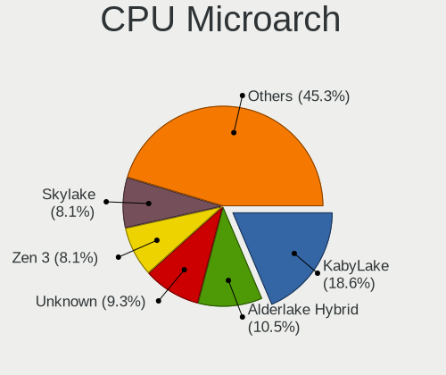
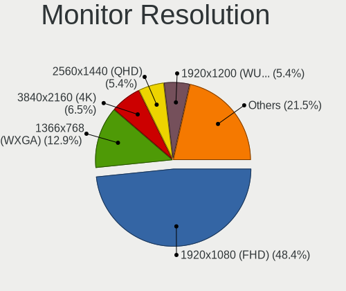

openSUSE - Hardware Trends
--------------------------

A project to identify most popular hardware characteristics and track their change
over time based on data collected by Linux users at https://Linux-Hardware.org.

Anyone can contribute to this report by the [hw-probe](https://github.com/linuxhw/hw-probe) tool:

    sudo -E hw-probe -all -upload

This is a report for all computer types. See also reports for [desktops](/Dist/openSUSE/Desktop/README.md) and [notebooks](/Dist/openSUSE/Notebook/README.md).

This report is for one last month. Overall report since the beginning of time: [TestDays](https://github.com/linuxhw/TestDays)

Period: Jan, 2024.

Contents
--------

* [ System ](#system)
  - [ OS                       ](#os)
  - [ OS Family                ](#os-family)
  - [ Kernel                   ](#kernel)
  - [ Kernel Family            ](#kernel-family)
  - [ Kernel Major Ver.        ](#kernel-major-ver)
  - [ Arch                     ](#arch)
  - [ DE                       ](#de)
  - [ Display Server           ](#display-server)
  - [ Display Manager          ](#display-manager)
  - [ OS Lang                  ](#os-lang)
  - [ Boot Mode                ](#boot-mode)
  - [ Filesystem               ](#filesystem)
  - [ Part. scheme             ](#part-scheme)
  - [ Dual Boot with Linux/BSD ](#dual-boot-with-linuxbsd)
  - [ Dual Boot (Win)          ](#dual-boot-win)

* [ Board ](#board)
  - [ Vendor                   ](#vendor)
  - [ Model                    ](#model)
  - [ Model Family             ](#model-family)
  - [ MFG Year                 ](#mfg-year)
  - [ Form Factor              ](#form-factor)
  - [ Secure Boot              ](#secure-boot)
  - [ Coreboot                 ](#coreboot)
  - [ RAM Size                 ](#ram-size)
  - [ RAM Used                 ](#ram-used)
  - [ Total Drives             ](#total-drives)
  - [ Has CD-ROM               ](#has-cd-rom)
  - [ Has Ethernet             ](#has-ethernet)
  - [ Has WiFi                 ](#has-wifi)
  - [ Has Bluetooth            ](#has-bluetooth)

* [ Location ](#location)
  - [ Country                  ](#country)
  - [ City                     ](#city)

* [ Drives ](#drives)
  - [ Drive Vendor             ](#drive-vendor)
  - [ Drive Model              ](#drive-model)
  - [ HDD Vendor               ](#hdd-vendor)
  - [ SSD Vendor               ](#ssd-vendor)
  - [ Drive Kind               ](#drive-kind)
  - [ Drive Connector          ](#drive-connector)
  - [ Drive Size               ](#drive-size)
  - [ Space Total              ](#space-total)
  - [ Space Used               ](#space-used)
  - [ Malfunc. Drives          ](#malfunc-drives)
  - [ Malfunc. Drive Vendor    ](#malfunc-drive-vendor)
  - [ Malfunc. HDD Vendor      ](#malfunc-hdd-vendor)
  - [ Malfunc. Drive Kind      ](#malfunc-drive-kind)
  - [ Failed Drives            ](#failed-drives)
  - [ Failed Drive Vendor      ](#failed-drive-vendor)
  - [ Drive Status             ](#drive-status)

* [ Storage controller ](#storage-controller)
  - [ Storage Vendor           ](#storage-vendor)
  - [ Storage Model            ](#storage-model)
  - [ Storage Kind             ](#storage-kind)

* [ Processor ](#processor)
  - [ CPU Vendor               ](#cpu-vendor)
  - [ CPU Model                ](#cpu-model)
  - [ CPU Model Family         ](#cpu-model-family)
  - [ CPU Cores                ](#cpu-cores)
  - [ CPU Sockets              ](#cpu-sockets)
  - [ CPU Threads              ](#cpu-threads)
  - [ CPU Op-Modes             ](#cpu-op-modes)
  - [ CPU Microcode            ](#cpu-microcode)
  - [ CPU Microarch            ](#cpu-microarch)

* [ Graphics ](#graphics)
  - [ GPU Vendor               ](#gpu-vendor)
  - [ GPU Model                ](#gpu-model)
  - [ GPU Combo                ](#gpu-combo)
  - [ GPU Driver               ](#gpu-driver)
  - [ GPU Memory               ](#gpu-memory)

* [ Monitor ](#monitor)
  - [ Monitor Vendor           ](#monitor-vendor)
  - [ Monitor Model            ](#monitor-model)
  - [ Monitor Resolution       ](#monitor-resolution)
  - [ Monitor Diagonal         ](#monitor-diagonal)
  - [ Monitor Width            ](#monitor-width)
  - [ Aspect Ratio             ](#aspect-ratio)
  - [ Monitor Area             ](#monitor-area)
  - [ Pixel Density            ](#pixel-density)
  - [ Multiple Monitors        ](#multiple-monitors)

* [ Network ](#network)
  - [ Net Controller Vendor    ](#net-controller-vendor)
  - [ Net Controller Model     ](#net-controller-model)
  - [ Wireless Vendor          ](#wireless-vendor)
  - [ Wireless Model           ](#wireless-model)
  - [ Ethernet Vendor          ](#ethernet-vendor)
  - [ Ethernet Model           ](#ethernet-model)
  - [ Net Controller Kind      ](#net-controller-kind)
  - [ Used Controller          ](#used-controller)
  - [ NICs                     ](#nics)
  - [ IPv6                     ](#ipv6)

* [ Bluetooth ](#bluetooth)
  - [ Bluetooth Vendor         ](#bluetooth-vendor)
  - [ Bluetooth Model          ](#bluetooth-model)

* [ Sound ](#sound)
  - [ Sound Vendor             ](#sound-vendor)
  - [ Sound Model              ](#sound-model)

* [ Memory ](#memory)
  - [ Memory Vendor            ](#memory-vendor)
  - [ Memory Model             ](#memory-model)
  - [ Memory Kind              ](#memory-kind)
  - [ Memory Form Factor       ](#memory-form-factor)
  - [ Memory Size              ](#memory-size)
  - [ Memory Speed             ](#memory-speed)

* [ Printers & scanners ](#printers--scanners)
  - [ Printer Vendor           ](#printer-vendor)
  - [ Printer Model            ](#printer-model)
  - [ Scanner Vendor           ](#scanner-vendor)
  - [ Scanner Model            ](#scanner-model)

* [ Camera ](#camera)
  - [ Camera Vendor            ](#camera-vendor)
  - [ Camera Model             ](#camera-model)

* [ Security ](#security)
  - [ Fingerprint Vendor       ](#fingerprint-vendor)
  - [ Fingerprint Model        ](#fingerprint-model)
  - [ Chipcard Vendor          ](#chipcard-vendor)
  - [ Chipcard Model           ](#chipcard-model)

* [ Unsupported ](#unsupported)
  - [ Unsupported Devices      ](#unsupported-devices)
  - [ Unsupported Device Types ](#unsupported-device-types)

System
------

OS
--

Installed operating systems

| Name                         | Computers | Percent |
|------------------------------|-----------|---------|
| openSUSE Tumbleweed-XXXXXXXX | 69        | 67.65%  |
| openSUSE Leap-15.5           | 24        | 23.53%  |
| openSUSE Microos-XXXXXXXX    | 7         | 6.86%   |
| openSUSE Leap-15.6           | 1         | 0.98%   |
| openSUSE Leap-15.4           | 1         | 0.98%   |

OS Family
---------

OS without a version

| Name     | Computers | Percent |
|----------|-----------|---------|
| openSUSE | 102       | 100%    |

Kernel
------

Version of the Linux kernel

| Version                      | Computers | Percent |
|------------------------------|-----------|---------|
| 6.6.7-1-default              | 21        | 20.59%  |
| 6.6.11-1-default             | 21        | 20.59%  |
| 5.14.21-150500.55.39-default | 19        | 18.63%  |
| 6.6.10-1-default             | 8         | 7.84%   |
| 6.6.9-1-default              | 7         | 6.86%   |
| 6.7.1-2-default              | 6         | 5.88%   |
| 6.7.1-1-default              | 6         | 5.88%   |
| 5.14.21-150500.55.36-default | 2         | 1.96%   |
| 6.8.0-rc1-3.gc619505-default | 1         | 0.98%   |
| 6.7.0-9.gaedda80-default     | 1         | 0.98%   |
| 6.6.8-lqx2-1-liquorix        | 1         | 0.98%   |
| 6.6.3-1-default              | 1         | 0.98%   |
| 6.6.10-4.ge04388e-default    | 1         | 0.98%   |
| 6.5.9-1-default              | 1         | 0.98%   |
| 6.4.0-150600.4-default       | 1         | 0.98%   |
| 6.1.8-1-default              | 1         | 0.98%   |
| 5.14.21-150500.55.44-default | 1         | 0.98%   |
| 5.14.21-150500.55.12-default | 1         | 0.98%   |
| 5.14.21-150500.53-default    | 1         | 0.98%   |
| 5.14.21-150400.24.97-default | 1         | 0.98%   |

Kernel Family
-------------

Linux kernel without a distro release

| Version | Computers | Percent |
|---------|-----------|---------|
| 5.14.21 | 25        | 24.51%  |
| 6.6.7   | 21        | 20.59%  |
| 6.6.11  | 21        | 20.59%  |
| 6.7.1   | 12        | 11.76%  |
| 6.6.10  | 9         | 8.82%   |
| 6.6.9   | 7         | 6.86%   |
| 6.8.0   | 1         | 0.98%   |
| 6.7.0   | 1         | 0.98%   |
| 6.6.8   | 1         | 0.98%   |
| 6.6.3   | 1         | 0.98%   |
| 6.5.9   | 1         | 0.98%   |
| 6.4.0   | 1         | 0.98%   |
| 6.1.8   | 1         | 0.98%   |

Kernel Major Ver.
-----------------

Linux kernel major version

| Version | Computers | Percent |
|---------|-----------|---------|
| 6.6     | 60        | 58.82%  |
| 5.14    | 25        | 24.51%  |
| 6.7     | 13        | 12.75%  |
| 6.8     | 1         | 0.98%   |
| 6.5     | 1         | 0.98%   |
| 6.4     | 1         | 0.98%   |
| 6.1     | 1         | 0.98%   |

Arch
----

OS architecture (x86_64, i586, etc.)

| Name   | Computers | Percent |
|--------|-----------|---------|
| x86_64 | 102       | 100%    |

DE
--

Desktop Environment

| Name    | Computers | Percent |
|---------|-----------|---------|
| KDE5    | 68        | 66.67%  |
| GNOME   | 24        | 23.53%  |
| Unknown | 4         | 3.92%   |
| XFCE    | 3         | 2.94%   |
| LXDE    | 2         | 1.96%   |
| sway    | 1         | 0.98%   |

Display Server
--------------

X11 or Wayland

| Name    | Computers | Percent |
|---------|-----------|---------|
| X11     | 57        | 55.88%  |
| Wayland | 41        | 40.2%   |
| Tty     | 2         | 1.96%   |
| Unknown | 2         | 1.96%   |

Display Manager
---------------

SDDM, LightDM, etc.

| Name    | Computers | Percent |
|---------|-----------|---------|
| Unknown | 54        | 52.94%  |
| SDDM    | 34        | 33.33%  |
| GDM     | 7         | 6.86%   |
| LightDM | 6         | 5.88%   |
| GREETD  | 1         | 0.98%   |

OS Lang
-------

Language

| Lang    | Computers | Percent |
|---------|-----------|---------|
| en_US   | 42        | 41.18%  |
| de_DE   | 20        | 19.61%  |
| en_GB   | 10        | 9.8%    |
| POSIX   | 6         | 5.88%   |
| ru_RU   | 5         | 4.9%    |
| it_IT   | 3         | 2.94%   |
| fr_FR   | 3         | 2.94%   |
| nl_NL   | 2         | 1.96%   |
| hu_HU   | 2         | 1.96%   |
| es_ES   | 2         | 1.96%   |
| bg_BG   | 2         | 1.96%   |
| pt_BR   | 1         | 0.98%   |
| pl_PL   | 1         | 0.98%   |
| en_DK   | 1         | 0.98%   |
| de_AT   | 1         | 0.98%   |
| Unknown | 1         | 0.98%   |

Boot Mode
---------

EFI or BIOS

| Mode | Computers | Percent |
|------|-----------|---------|
| EFI  | 77        | 75.49%  |
| BIOS | 25        | 24.51%  |

Filesystem
----------

Type of filesystem

| Type  | Computers | Percent |
|-------|-----------|---------|
| Btrfs | 80        | 78.43%  |
| Ext4  | 14        | 13.73%  |
| Xfs   | 5         | 4.9%    |
| Ext2  | 2         | 1.96%   |
| Tmpfs | 1         | 0.98%   |

Part. scheme
------------

Scheme of partitioning

| Type    | Computers | Percent |
|---------|-----------|---------|
| GPT     | 50        | 49.02%  |
| Unknown | 50        | 49.02%  |
| MBR     | 2         | 1.96%   |

Dual Boot with Linux/BSD
------------------------

Hosting more than one Linux/BSD

| Dual boot | Computers | Percent |
|-----------|-----------|---------|
| No        | 94        | 92.16%  |
| Yes       | 8         | 7.84%   |

Dual Boot (Win)
---------------

Hosting Linux and Windows

| Dual boot | Computers | Percent |
|-----------|-----------|---------|
| No        | 85        | 83.33%  |
| Yes       | 17        | 16.67%  |

Board
-----

Vendor
------

Motherboard manufacturer

| Name                | Computers | Percent |
|---------------------|-----------|---------|
| Lenovo              | 18        | 17.65%  |
| Hewlett-Packard     | 18        | 17.65%  |
| ASUSTek Computer    | 12        | 11.76%  |
| MSI                 | 11        | 10.78%  |
| Dell                | 9         | 8.82%   |
| Acer                | 7         | 6.86%   |
| TUXEDO              | 5         | 4.9%    |
| Gigabyte Technology | 4         | 3.92%   |
| ASRock              | 4         | 3.92%   |
| Intel               | 2         | 1.96%   |
| AZW                 | 2         | 1.96%   |
| Apple               | 2         | 1.96%   |
| Timi                | 1         | 0.98%   |
| SLIMBOOK            | 1         | 0.98%   |
| Samsung Electronics | 1         | 0.98%   |
| Pegatron            | 1         | 0.98%   |
| MECHREVO            | 1         | 0.98%   |
| LTD Delovoy Office  | 1         | 0.98%   |
| Framework           | 1         | 0.98%   |
| Alienware           | 1         | 0.98%   |

Model
-----

Motherboard model

| Name                                        | Computers | Percent |
|---------------------------------------------|-----------|---------|
| TUXEDO Aura 15 Gen2                         | 2         | 1.96%   |
| MSI MS-7B89                                 | 2         | 1.96%   |
| HP Laptop 15s-eq2xxx                        | 2         | 1.96%   |
| TUXEDO Pulse 15 Gen2                        | 1         | 0.98%   |
| TUXEDO InfinityBook Pro Gen8 (MK2)          | 1         | 0.98%   |
| TUXEDO Aura 15 Gen1                         | 1         | 0.98%   |
| Timi RedmiBook Pro 14S                      | 1         | 0.98%   |
| SLIMBOOK PROX15-AMD                         | 1         | 0.98%   |
| Samsung 700T                                | 1         | 0.98%   |
| Pegatron VS161AA-ABU s5206uk                | 1         | 0.98%   |
| MSI Thin GF63 12HW                          | 1         | 0.98%   |
| MSI MS-7D30                                 | 1         | 0.98%   |
| MSI MS-7D25                                 | 1         | 0.98%   |
| MSI MS-7D09                                 | 1         | 0.98%   |
| MSI MS-7C02                                 | 1         | 0.98%   |
| MSI MS-7B85                                 | 1         | 0.98%   |
| MSI MS-7A33                                 | 1         | 0.98%   |
| MSI MS-7A11                                 | 1         | 0.98%   |
| MSI GT60                                    | 1         | 0.98%   |
| MECHREVO WUJIE 14                           | 1         | 0.98%   |
| LTD Delovoy Office EVE 1470D ES1278EW       | 1         | 0.98%   |
| Lenovo Yoga C640-13IML 81UE                 | 1         | 0.98%   |
| Lenovo Yoga 730-15IKB 81CU                  | 1         | 0.98%   |
| Lenovo ThinkPad X280 20KEA03YCL             | 1         | 0.98%   |
| Lenovo ThinkPad X1 Nano Gen 3 21K1CTO1WW    | 1         | 0.98%   |
| Lenovo ThinkPad X1 Carbon Gen 11 21HM002GUS | 1         | 0.98%   |
| Lenovo ThinkPad T530 2394W19                | 1         | 0.98%   |
| Lenovo ThinkPad T490 20N3001EGE             | 1         | 0.98%   |
| Lenovo ThinkPad T470 W10DG 20JNS09G00       | 1         | 0.98%   |
| Lenovo ThinkPad T470 20HES3JR02             | 1         | 0.98%   |
| Lenovo ThinkPad P53 20QNCTO1WW              | 1         | 0.98%   |
| Lenovo ThinkPad P14s Gen 4 21HFCTO1WW       | 1         | 0.98%   |
| Lenovo ThinkPad P14s Gen 1 20Y1CTO1WW       | 1         | 0.98%   |
| Lenovo ThinkPad E14 20RAS1S600              | 1         | 0.98%   |
| Lenovo ThinkCentre M710q 10MQS0KL00         | 1         | 0.98%   |
| Lenovo Legion T5 26IOB6 90RT00TVKS          | 1         | 0.98%   |
| Lenovo IdeaPadFlex 5 14ARE05 81X2           | 1         | 0.98%   |
| Lenovo IdeaPad 3 15ITL6 82MD                | 1         | 0.98%   |
| Lenovo IdeaCentre Gaming5 17IAB7 90T100BHMZ | 1         | 0.98%   |
| Intel DX58SO2 AAG10925-205                  | 1         | 0.98%   |

Model Family
------------

Motherboard model prefix

| Name                   | Computers | Percent |
|------------------------|-----------|---------|
| Lenovo ThinkPad        | 11        | 10.78%  |
| Dell Latitude          | 7         | 6.86%   |
| HP Laptop              | 4         | 3.92%   |
| Acer Aspire            | 4         | 3.92%   |
| TUXEDO Aura            | 3         | 2.94%   |
| HP EliteBook           | 3         | 2.94%   |
| ASUS PRIME             | 3         | 2.94%   |
| MSI MS-7B89            | 2         | 1.96%   |
| Lenovo Yoga            | 2         | 1.96%   |
| HP ProBook             | 2         | 1.96%   |
| HP Pavilion            | 2         | 1.96%   |
| Gigabyte B550          | 2         | 1.96%   |
| ASUS Vivobook          | 2         | 1.96%   |
| ASUS TUF               | 2         | 1.96%   |
| Acer Swift             | 2         | 1.96%   |
| TUXEDO Pulse           | 1         | 0.98%   |
| TUXEDO InfinityBook    | 1         | 0.98%   |
| Timi RedmiBook         | 1         | 0.98%   |
| SLIMBOOK PROX15-AMD    | 1         | 0.98%   |
| Samsung 700T           | 1         | 0.98%   |
| Pegatron VS161AA-ABU   | 1         | 0.98%   |
| MSI Thin               | 1         | 0.98%   |
| MSI MS-7D30            | 1         | 0.98%   |
| MSI MS-7D25            | 1         | 0.98%   |
| MSI MS-7D09            | 1         | 0.98%   |
| MSI MS-7C02            | 1         | 0.98%   |
| MSI MS-7B85            | 1         | 0.98%   |
| MSI MS-7A33            | 1         | 0.98%   |
| MSI MS-7A11            | 1         | 0.98%   |
| MSI GT60               | 1         | 0.98%   |
| MECHREVO WUJIE         | 1         | 0.98%   |
| LTD Delovoy Office EVE | 1         | 0.98%   |
| Lenovo ThinkCentre     | 1         | 0.98%   |
| Lenovo Legion          | 1         | 0.98%   |
| Lenovo IdeaPadFlex     | 1         | 0.98%   |
| Lenovo IdeaPad         | 1         | 0.98%   |
| Lenovo IdeaCentre      | 1         | 0.98%   |
| Intel DX58SO2          | 1         | 0.98%   |
| Intel B75              | 1         | 0.98%   |
| HP Z400                | 1         | 0.98%   |

MFG Year
--------

Motherboard manufacture year

| Year | Computers | Percent |
|------|-----------|---------|
| 2023 | 16        | 15.69%  |
| 2020 | 14        | 13.73%  |
| 2021 | 12        | 11.76%  |
| 2022 | 10        | 9.8%    |
| 2018 | 10        | 9.8%    |
| 2019 | 8         | 7.84%   |
| 2012 | 6         | 5.88%   |
| 2010 | 5         | 4.9%    |
| 2009 | 5         | 4.9%    |
| 2017 | 4         | 3.92%   |
| 2016 | 4         | 3.92%   |
| 2013 | 3         | 2.94%   |
| 2014 | 2         | 1.96%   |
| 2008 | 2         | 1.96%   |
| 2015 | 1         | 0.98%   |

Form Factor
-----------

Physical design of the computer

| Name        | Computers | Percent |
|-------------|-----------|---------|
| Notebook    | 57        | 55.88%  |
| Desktop     | 39        | 38.24%  |
| Convertible | 4         | 3.92%   |
| Tablet      | 1         | 0.98%   |
| Server      | 1         | 0.98%   |

Secure Boot
-----------

Enabled or disabled

| State    | Computers | Percent |
|----------|-----------|---------|
| Disabled | 81        | 79.41%  |
| Enabled  | 21        | 20.59%  |

Coreboot
--------

Have coreboot on board

| Used | Computers | Percent |
|------|-----------|---------|
| No   | 102       | 100%    |

RAM Size
--------

Total RAM memory

| Size in GB  | Computers | Percent |
|-------------|-----------|---------|
| 32.01-64.0  | 21        | 20.59%  |
| 16.01-24.0  | 21        | 20.59%  |
| 8.01-16.0   | 19        | 18.63%  |
| 4.01-8.0    | 17        | 16.67%  |
| 64.01-256.0 | 9         | 8.82%   |
| 3.01-4.0    | 7         | 6.86%   |
| 24.01-32.0  | 7         | 6.86%   |
| 2.01-3.0    | 1         | 0.98%   |

RAM Used
--------

Used RAM memory

| Used GB    | Computers | Percent |
|------------|-----------|---------|
| 4.01-8.0   | 27        | 26.47%  |
| 2.01-3.0   | 24        | 23.53%  |
| 3.01-4.0   | 18        | 17.65%  |
| 1.01-2.0   | 15        | 14.71%  |
| 8.01-16.0  | 13        | 12.75%  |
| 16.01-24.0 | 3         | 2.94%   |
| 0.51-1.0   | 1         | 0.98%   |
| 0.01-0.5   | 1         | 0.98%   |

Total Drives
------------

Number of drives on board

| Drives | Computers | Percent |
|--------|-----------|---------|
| 1      | 57        | 55.88%  |
| 2      | 24        | 23.53%  |
| 3      | 8         | 7.84%   |
| 5      | 7         | 6.86%   |
| 4      | 5         | 4.9%    |
| 6      | 1         | 0.98%   |

Has CD-ROM
----------

Has CD-ROM on board

| Presented | Computers | Percent |
|-----------|-----------|---------|
| No        | 78        | 76.47%  |
| Yes       | 24        | 23.53%  |

Has Ethernet
------------

Has Ethernet on board

| Presented | Computers | Percent |
|-----------|-----------|---------|
| Yes       | 80        | 78.43%  |
| No        | 22        | 21.57%  |

Has WiFi
--------

Has WiFi module

| Presented | Computers | Percent |
|-----------|-----------|---------|
| Yes       | 82        | 80.39%  |
| No        | 20        | 19.61%  |

Has Bluetooth
-------------

Has Bluetooth module

| Presented | Computers | Percent |
|-----------|-----------|---------|
| Yes       | 72        | 70.59%  |
| No        | 30        | 29.41%  |

Location
--------

Country
-------

Geographic location (country)

| Country      | Computers | Percent |
|--------------|-----------|---------|
| Germany      | 24        | 23.53%  |
| USA          | 20        | 19.61%  |
| UK           | 7         | 6.86%   |
| Russia       | 6         | 5.88%   |
| Brazil       | 4         | 3.92%   |
| Austria      | 4         | 3.92%   |
| Italy        | 3         | 2.94%   |
| India        | 3         | 2.94%   |
| Hungary      | 3         | 2.94%   |
| France       | 3         | 2.94%   |
| Canada       | 3         | 2.94%   |
| Bulgaria     | 3         | 2.94%   |
| Spain        | 2         | 1.96%   |
| Netherlands  | 2         | 1.96%   |
| Turkey       | 1         | 0.98%   |
| Thailand     | 1         | 0.98%   |
| Switzerland  | 1         | 0.98%   |
| Singapore    | 1         | 0.98%   |
| Saudi Arabia | 1         | 0.98%   |
| Poland       | 1         | 0.98%   |
| Peru         | 1         | 0.98%   |
| New Zealand  | 1         | 0.98%   |
| Greece       | 1         | 0.98%   |
| DR Congo     | 1         | 0.98%   |
| Czechia      | 1         | 0.98%   |
| Chile        | 1         | 0.98%   |
| Belgium      | 1         | 0.98%   |
| Australia    | 1         | 0.98%   |
| Argentina    | 1         | 0.98%   |

City
----

Geographic location (city)

| City                      | Computers | Percent |
|---------------------------|-----------|---------|
| Munich                    | 4         | 3.92%   |
| Sofia                     | 2         | 1.96%   |
| Sandhurst                 | 2         | 1.96%   |
| Nuremberg                 | 2         | 1.96%   |
| Moscow                    | 2         | 1.96%   |
| Leeds                     | 2         | 1.96%   |
| Innsbruck                 | 2         | 1.96%   |
| Frankfurt am Main         | 2         | 1.96%   |
| Enschede                  | 2         | 1.96%   |
| Dresden                   | 2         | 1.96%   |
| Bellevue                  | 2         | 1.96%   |
| Zuchwil                   | 1         | 0.98%   |
| Wroclaw                   | 1         | 0.98%   |
| Whangarei                 | 1         | 0.98%   |
| West Bend                 | 1         | 0.98%   |
| Volgograd                 | 1         | 0.98%   |
| Villafranca de los Barros | 1         | 0.98%   |
| Vienna                    | 1         | 0.98%   |
| Varna                     | 1         | 0.98%   |
| Tver                      | 1         | 0.98%   |
| Tokaj                     | 1         | 0.98%   |
| Tikhvin                   | 1         | 0.98%   |
| Szigetszentmiklos         | 1         | 0.98%   |
| Ste-Anne-Des-Monts        | 1         | 0.98%   |
| Southampton               | 1         | 0.98%   |
| South Shore               | 1         | 0.98%   |
| Singapore                 | 1         | 0.98%   |
| Siegen                    | 1         | 0.98%   |
| Sheffield                 | 1         | 0.98%   |
| Sardina                   | 1         | 0.98%   |
| San Antonio               | 1         | 0.98%   |
| Saarbrücken              | 1         | 0.98%   |
| Rio de Janeiro            | 1         | 0.98%   |
| Ried im Innkreis          | 1         | 0.98%   |
| Regina                    | 1         | 0.98%   |
| Plainfield                | 1         | 0.98%   |
| Pistoia                   | 1         | 0.98%   |
| Petersburg                | 1         | 0.98%   |
| Perth                     | 1         | 0.98%   |
| Painesville               | 1         | 0.98%   |

Drives
------

Drive Vendor
------------

Hard drive vendors

| Vendor                         | Computers | Drives | Percent |
|--------------------------------|-----------|--------|---------|
| Samsung Electronics            | 33        | 38     | 19.64%  |
| WDC                            | 23        | 31     | 13.69%  |
| Sandisk                        | 19        | 20     | 11.31%  |
| Seagate                        | 10        | 14     | 5.95%   |
| Kingston                       | 7         | 7      | 4.17%   |
| SK hynix                       | 5         | 5      | 2.98%   |
| Phison Electronics             | 5         | 5      | 2.98%   |
| Intel                          | 5         | 5      | 2.98%   |
| PNY                            | 4         | 4      | 2.38%   |
| Micron Technology              | 4         | 4      | 2.38%   |
| KIOXIA                         | 4         | 4      | 2.38%   |
| Crucial                        | 4         | 6      | 2.38%   |
| Unknown                        | 3         | 3      | 1.79%   |
| Realtek Semiconductor          | 3         | 3      | 1.79%   |
| Micron/Crucial Technology      | 3         | 4      | 1.79%   |
| Toshiba                        | 2         | 2      | 1.19%   |
| SPCC                           | 2         | 2      | 1.19%   |
| Patriot                        | 2         | 2      | 1.19%   |
| Kingston Technology Company    | 2         | 2      | 1.19%   |
| Hitachi                        | 2         | 2      | 1.19%   |
| China                          | 2         | 5      | 1.19%   |
| Yangtze Memory Technologies    | 1         | 1      | 0.6%    |
| XrayDisk                       | 1         | 1      | 0.6%    |
| Transcend                      | 1         | 1      | 0.6%    |
| Solid State Storage Technology | 1         | 1      | 0.6%    |
| Silicon Motion                 | 1         | 1      | 0.6%    |
| Shenzhen Longsys Electronics   | 1         | 1      | 0.6%    |
| Realtek                        | 1         | 1      | 0.6%    |
| Pioneer                        | 1         | 1      | 0.6%    |
| MAXIO Technology (Hangzhou)    | 1         | 1      | 0.6%    |
| LITEONIT                       | 1         | 1      | 0.6%    |
| LaCie                          | 1         | 1      | 0.6%    |
| KingSpec                       | 1         | 1      | 0.6%    |
| KBM                            | 1         | 1      | 0.6%    |
| Intenso                        | 1         | 1      | 0.6%    |
| INTEL SS                       | 1         | 1      | 0.6%    |
| HGST                           | 1         | 1      | 0.6%    |
| Hewlett-Packard                | 1         | 1      | 0.6%    |
| G-DRIVE                        | 1         | 1      | 0.6%    |
| Fujitsu                        | 1         | 1      | 0.6%    |

Drive Model
-----------

Hard drive models

| Model                                               | Computers | Percent |
|-----------------------------------------------------|-----------|---------|
| Samsung NVMe SSD Controller SM981/PM981/PM983 1TB   | 8         | 4.32%   |
| Sandisk WD Black SN850 1024GB                       | 4         | 2.16%   |
| Samsung SSD 860 EVO 1TB                             | 4         | 2.16%   |
| Samsung NVMe SSD Controller PM9A1/PM9A3/980PRO 2TB  | 4         | 2.16%   |
| WDC WD20EZBX-00AYRA0 2TB                            | 3         | 1.62%   |
| Sandisk WD Blue SN550 NVMe SSD 512GB                | 3         | 1.62%   |
| Samsung SSD 870 QVO 1TB                             | 3         | 1.62%   |
| Realtek RTS5763DL NVMe SSD Controller 2TB           | 3         | 1.62%   |
| WDC WD20EZRZ-00Z5HB0 2TB                            | 2         | 1.08%   |
| Seagate ST1000DM003-1SB102 1TB                      | 2         | 1.08%   |
| Sandisk WD Black SN750 / PC SN730 NVMe SSD 512GB    | 2         | 1.08%   |
| Samsung SSD 860 EVO 500GB                           | 2         | 1.08%   |
| Samsung NVMe SSD Controller SM961/PM961/SM963 256GB | 2         | 1.08%   |
| Micron/Crucial P2 NVMe PCIe SSD 1TB                 | 2         | 1.08%   |
| Micron CT1000P3PSSD8 1TB                            | 2         | 1.08%   |
| KIOXIA KBG40ZNV256G 256GB                           | 2         | 1.08%   |
| Kingston SNVS500G 500GB                             | 2         | 1.08%   |
| Intel SSD Pro 7600p/760p/E 6100p Series 1024GB      | 2         | 1.08%   |
| Crucial CT500MX500SSD1 500GB                        | 2         | 1.08%   |
| Yangtze Memory YMTC PC300-1TB-B 1024GB              | 1         | 0.54%   |
| XrayDisk SSD 512GB                                  | 1         | 0.54%   |
| WDC WDS500G2B0A-00SM50 500GB SSD                    | 1         | 0.54%   |
| WDC WDS500G1B0B-00AS40 500GB SSD                    | 1         | 0.54%   |
| WDC WDS480G2G0A-00JH30 480GB SSD                    | 1         | 0.54%   |
| WDC WDS200T2B0A-00SM50 2TB SSD                      | 1         | 0.54%   |
| WDC WDS100T1B0A-00H9H0 1TB SSD                      | 1         | 0.54%   |
| WDC WD7500BPKX-22HPJT0 752GB                        | 1         | 0.54%   |
| WDC WD40EZAZ-00SF3B0 4TB                            | 1         | 0.54%   |
| WDC WD3200AAKX-00ERMA0 320GB                        | 1         | 0.54%   |
| WDC WD3200AAJS-56B4A0 320GB                         | 1         | 0.54%   |
| WDC WD30EZRZ-00GXCB0 3TB                            | 1         | 0.54%   |
| WDC WD20EZRX-00DC0B0 2TB                            | 1         | 0.54%   |
| WDC WD2002FAEX-007BA0 2TB                           | 1         | 0.54%   |
| WDC WD12 00BEVS-07LAT0 120GB                        | 1         | 0.54%   |
| WDC WD10JPCX-24UE4T0 1TB                            | 1         | 0.54%   |
| WDC WD10EZRX-00L4HB0 1TB                            | 1         | 0.54%   |
| WDC WD10EZRX-00A8LB0 1TB                            | 1         | 0.54%   |
| WDC WD10EZEX-08WN4A0 1TB                            | 1         | 0.54%   |
| WDC WD10EZEX-00WN4A0 1TB                            | 1         | 0.54%   |
| WDC WD10EZEX-00BN5A0 1TB                            | 1         | 0.54%   |

HDD Vendor
----------

Hard disk drive vendors

| Vendor              | Computers | Drives | Percent |
|---------------------|-----------|--------|---------|
| WDC                 | 18        | 24     | 56.25%  |
| Seagate             | 8         | 11     | 25%     |
| Hitachi             | 2         | 2      | 6.25%   |
| Toshiba             | 1         | 1      | 3.13%   |
| Samsung Electronics | 1         | 1      | 3.13%   |
| HGST                | 1         | 1      | 3.13%   |
| Fujitsu             | 1         | 1      | 3.13%   |

SSD Vendor
----------

Solid state drive vendors

| Vendor              | Computers | Drives | Percent |
|---------------------|-----------|--------|---------|
| Samsung Electronics | 15        | 17     | 26.32%  |
| WDC                 | 6         | 6      | 10.53%  |
| SanDisk             | 4         | 4      | 7.02%   |
| PNY                 | 4         | 4      | 7.02%   |
| Crucial             | 4         | 6      | 7.02%   |
| Kingston            | 3         | 3      | 5.26%   |
| SPCC                | 2         | 2      | 3.51%   |
| Patriot             | 2         | 2      | 3.51%   |
| Intel               | 2         | 2      | 3.51%   |
| China               | 2         | 5      | 3.51%   |
| XrayDisk            | 1         | 1      | 1.75%   |
| Transcend           | 1         | 1      | 1.75%   |
| Pioneer             | 1         | 1      | 1.75%   |
| LITEONIT            | 1         | 1      | 1.75%   |
| KingSpec            | 1         | 1      | 1.75%   |
| KBM                 | 1         | 1      | 1.75%   |
| Intenso             | 1         | 1      | 1.75%   |
| INTEL SS            | 1         | 1      | 1.75%   |
| Hewlett-Packard     | 1         | 1      | 1.75%   |
| CT1000MX            | 1         | 1      | 1.75%   |
| Apacer              | 1         | 1      | 1.75%   |
| A-DATA Technology   | 1         | 1      | 1.75%   |
| Unknown             | 1         | 1      | 1.75%   |

Drive Kind
----------

HDD or SSD

| Kind    | Computers | Drives | Percent |
|---------|-----------|--------|---------|
| NVMe    | 70        | 80     | 48.61%  |
| SSD     | 45        | 64     | 31.25%  |
| HDD     | 24        | 41     | 16.67%  |
| Unknown | 3         | 5      | 2.08%   |
| MMC     | 2         | 2      | 1.39%   |

Drive Connector
---------------

SATA, SAS, NVMe, etc.

| Type | Computers | Drives | Percent |
|------|-----------|--------|---------|
| NVMe | 70        | 79     | 53.03%  |
| SATA | 52        | 99     | 39.39%  |
| SAS  | 8         | 12     | 6.06%   |
| MMC  | 2         | 2      | 1.52%   |

Drive Size
----------

Size of hard drive

| Size in TB | Computers | Drives | Percent |
|------------|-----------|--------|---------|
| 0.01-0.5   | 36        | 43     | 45%     |
| 0.51-1.0   | 26        | 38     | 32.5%   |
| 1.01-2.0   | 13        | 18     | 16.25%  |
| 3.01-4.0   | 2         | 2      | 2.5%    |
| 2.01-3.0   | 2         | 2      | 2.5%    |
| 4.01-10.0  | 1         | 2      | 1.25%   |

Space Total
-----------

Amount of disk space available on the file system

| Size in GB     | Computers | Percent |
|----------------|-----------|---------|
| More than 3000 | 45        | 44.12%  |
| 1001-2000      | 19        | 18.63%  |
| 2001-3000      | 15        | 14.71%  |
| 251-500        | 12        | 11.76%  |
| 101-250        | 5         | 4.9%    |
| 501-1000       | 4         | 3.92%   |
| 1-20           | 1         | 0.98%   |
| Unknown        | 1         | 0.98%   |

Space Used
----------

Amount of used disk space

| Used GB        | Computers | Percent |
|----------------|-----------|---------|
| 101-250        | 23        | 22.55%  |
| 251-500        | 19        | 18.63%  |
| 1001-2000      | 14        | 13.73%  |
| 501-1000       | 13        | 12.75%  |
| 51-100         | 12        | 11.76%  |
| More than 3000 | 6         | 5.88%   |
| 21-50          | 5         | 4.9%    |
| 2001-3000      | 4         | 3.92%   |
| 1-20           | 4         | 3.92%   |
| 0              | 1         | 0.98%   |
| Unknown        | 1         | 0.98%   |

Malfunc. Drives
---------------

Drive models with a malfunction

| Model                                | Computers | Drives | Percent |
|--------------------------------------|-----------|--------|---------|
| XrayDisk SSD 512GB                   | 1         | 1      | 25%     |
| WDC WD2002FAEX-007BA0 2TB            | 1         | 1      | 25%     |
| WDC WD Blue SA510 2.5 1000GB SSD     | 1         | 1      | 25%     |
| SK hynix BC711 HFM512GD3JX013N 512GB | 1         | 1      | 25%     |

Malfunc. Drive Vendor
---------------------

Vendors of faulty drives

| Vendor   | Computers | Drives | Percent |
|----------|-----------|--------|---------|
| WDC      | 2         | 2      | 50%     |
| XrayDisk | 1         | 1      | 25%     |
| SK hynix | 1         | 1      | 25%     |

Malfunc. HDD Vendor
-------------------

Vendors of faulty HDD drives

| Vendor | Computers | Drives | Percent |
|--------|-----------|--------|---------|
| WDC    | 1         | 1      | 100%    |

Malfunc. Drive Kind
-------------------

Kinds of faulty drives

| Kind | Computers | Drives | Percent |
|------|-----------|--------|---------|
| SSD  | 2         | 2      | 50%     |
| NVMe | 1         | 1      | 25%     |
| HDD  | 1         | 1      | 25%     |

Failed Drives
-------------

Failed drive models

Zero info for selected period =(

Failed Drive Vendor
-------------------

Failed drive vendors

Zero info for selected period =(

Drive Status
------------

Number of failed and malfunc. drives

| Status   | Computers | Drives | Percent |
|----------|-----------|--------|---------|
| Detected | 56        | 112    | 51.38%  |
| Works    | 49        | 76     | 44.95%  |
| Malfunc  | 4         | 4      | 3.67%   |

Storage controller
------------------

Storage Vendor
--------------

Storage controller vendors

| Vendor                         | Computers | Percent |
|--------------------------------|-----------|---------|
| Intel                          | 50        | 31.65%  |
| AMD                            | 26        | 16.46%  |
| Samsung Electronics            | 20        | 12.66%  |
| SanDisk                        | 16        | 10.13%  |
| Kingston Technology Company    | 6         | 3.8%    |
| SK hynix                       | 5         | 3.16%   |
| Phison Electronics             | 5         | 3.16%   |
| Micron Technology              | 4         | 2.53%   |
| KIOXIA                         | 4         | 2.53%   |
| Realtek Semiconductor          | 3         | 1.9%    |
| Nvidia                         | 3         | 1.9%    |
| Micron/Crucial Technology      | 3         | 1.9%    |
| JMicron Technology             | 2         | 1.27%   |
| ASMedia Technology             | 2         | 1.27%   |
| Yangtze Memory Technologies    | 1         | 0.63%   |
| Toshiba America Info Systems   | 1         | 0.63%   |
| Solidigm                       | 1         | 0.63%   |
| Solid State Storage Technology | 1         | 0.63%   |
| Silicon Motion                 | 1         | 0.63%   |
| Shenzhen Longsys Electronics   | 1         | 0.63%   |
| Seagate Technology             | 1         | 0.63%   |
| MAXIO Technology (Hangzhou)    | 1         | 0.63%   |
| Marvell Technology Group       | 1         | 0.63%   |

Storage Model
-------------

Storage controller models

| Model                                                                          | Computers | Percent |
|--------------------------------------------------------------------------------|-----------|---------|
| AMD FCH SATA Controller [AHCI mode]                                            | 19        | 10.92%  |
| Samsung NVMe SSD Controller SM981/PM981/PM983                                  | 8         | 4.6%    |
| AMD 400 Series Chipset SATA Controller                                         | 6         | 3.45%   |
| Intel Alder Lake-S PCH SATA Controller [AHCI Mode]                             | 5         | 2.87%   |
| SanDisk WD PC SN810 / Black SN850 NVMe SSD                                     | 4         | 2.3%    |
| Samsung NVMe SSD Controller PM9A1/PM9A3/980PRO                                 | 4         | 2.3%    |
| Samsung NVMe SSD Controller 980 (DRAM-less)                                    | 4         | 2.3%    |
| Intel Volume Management Device NVMe RAID Controller                            | 4         | 2.3%    |
| Intel Sunrise Point-LP SATA Controller [AHCI mode]                             | 4         | 2.3%    |
| Intel 82801 Mobile SATA Controller [RAID mode]                                 | 4         | 2.3%    |
| SanDisk Ultra 3D / WD Blue SN550 NVMe SSD                                      | 3         | 1.72%   |
| Realtek RTS5762 NVMe SSD Controller                                            | 3         | 1.72%   |
| Nvidia MCP79 AHCI Controller                                                   | 3         | 1.72%   |
| KIOXIA NVMe SSD Controller BG4 (DRAM-less)                                     | 3         | 1.72%   |
| AMD 500 Series Chipset SATA Controller                                         | 3         | 1.72%   |
| SK hynix Platinum P41/PC801 NVMe Solid State Drive                             | 2         | 1.15%   |
| SK hynix Gold P31/BC711/PC711 NVMe Solid State Drive                           | 2         | 1.15%   |
| SanDisk WD Green SN350 240GB (DRAM-less) / SN560E NVMe SSD                     | 2         | 1.15%   |
| SanDisk Extreme Pro / WD Black SN750 / PC SN730 / Red SN700 NVMe SSD           | 2         | 1.15%   |
| Samsung NVMe SSD Controller SM961/PM961/SM963                                  | 2         | 1.15%   |
| Micron/Crucial P2 [Nick P2] / P3 / P3 Plus NVMe PCIe SSD (DRAM-less)           | 2         | 1.15%   |
| Micron 2550 NVMe SSD (DRAM-less)                                               | 2         | 1.15%   |
| Kingston Company NV1 NVMe SSD SM2263XT (DRAM-less)                             | 2         | 1.15%   |
| Intel Tiger Lake-LP SATA Controller                                            | 2         | 1.15%   |
| Intel SSD DC P4101/Pro 7600p/760p/E 6100p Series                               | 2         | 1.15%   |
| Intel NM10/ICH7 Family SATA Controller [IDE mode]                              | 2         | 1.15%   |
| Intel Comet Lake SATA AHCI Controller                                          | 2         | 1.15%   |
| Intel Celeron/Pentium Silver Processor SATA Controller                         | 2         | 1.15%   |
| Intel 8 Series/C220 Series Chipset Family 6-port SATA Controller 1 [AHCI mode] | 2         | 1.15%   |
| Intel 7 Series Chipset Family 6-port SATA Controller [AHCI mode]               | 2         | 1.15%   |
| Intel 500 Series Chipset Family SATA AHCI Controller                           | 2         | 1.15%   |
| Intel 5 Series/3400 Series Chipset 6 port SATA AHCI Controller                 | 2         | 1.15%   |
| Intel 200 Series PCH SATA controller [AHCI mode]                               | 2         | 1.15%   |
| ASMedia ASM1061/ASM1062 Serial ATA Controller                                  | 2         | 1.15%   |
| Yangtze Memory PC300 NVMe SSD (DRAM-less)                                      | 1         | 0.57%   |
| Toshiba America Info Systems XG5 NVMe SSD Controller                           | 1         | 0.57%   |
| Solidigm P41 Plus NVMe SSD (DRAM-less) [Echo Harbor]                           | 1         | 0.57%   |
| Solid State Storage CL1-3D256-Q11 NVMe SSD M.2                                 | 1         | 0.57%   |
| SK hynix BC901 NVMe Solid State Drive (DRAM-less)                              | 1         | 0.57%   |
| Silicon Motion SM2263EN/SM2263XT (DRAM-less) NVMe SSD Controllers              | 1         | 0.57%   |

Storage Kind
------------

Kind of storage controller (IDE, SATA, NVMe, SAS, ...)

| Kind | Computers | Percent |
|------|-----------|---------|
| NVMe | 70        | 46.36%  |
| SATA | 63        | 41.72%  |
| RAID | 11        | 7.28%   |
| IDE  | 6         | 3.97%   |
| SAS  | 1         | 0.66%   |

Processor
---------

CPU Vendor
----------

Processor vendors

| Vendor | Computers | Percent |
|--------|-----------|---------|
| Intel  | 62        | 60.78%  |
| AMD    | 40        | 39.22%  |

CPU Model
---------

Processor models

| Model                                       | Computers | Percent |
|---------------------------------------------|-----------|---------|
| AMD Ryzen 5 5500U with Radeon Graphics      | 4         | 3.92%   |
| Intel Core i5-8250U CPU @ 1.60GHz           | 3         | 2.94%   |
| Intel Core i5-10210U CPU @ 1.60GHz          | 2         | 1.96%   |
| Intel 13th Gen Core i7-1365U                | 2         | 1.96%   |
| AMD Ryzen 7 7840HS w/ Radeon 780M Graphics  | 2         | 1.96%   |
| AMD Ryzen 7 5700U with Radeon Graphics      | 2         | 1.96%   |
| AMD Ryzen 7 4700U with Radeon Graphics      | 2         | 1.96%   |
| AMD Ryzen 5 4500U with Radeon Graphics      | 2         | 1.96%   |
| AMD Ryzen 5 2600 Six-Core Processor         | 2         | 1.96%   |
| AMD Ryzen 3 5300U with Radeon Graphics      | 2         | 1.96%   |
| Intel Xeon E-2276M CPU @ 2.80GHz            | 1         | 0.98%   |
| Intel Xeon CPU W3530 @ 2.80GHz              | 1         | 0.98%   |
| Intel Xeon CPU E5-2670 0 @ 2.60GHz          | 1         | 0.98%   |
| Intel Pentium Silver N5030 CPU @ 1.10GHz    | 1         | 0.98%   |
| Intel Pentium Gold 7505 @ 2.00GHz           | 1         | 0.98%   |
| Intel Pentium Dual-Core CPU E5300 @ 2.60GHz | 1         | 0.98%   |
| Intel Pentium CPU G3250 @ 3.20GHz           | 1         | 0.98%   |
| Intel Pentium CPU G3240 @ 3.10GHz           | 1         | 0.98%   |
| Intel N100                                  | 1         | 0.98%   |
| Intel Core Ultra 7 155H                     | 1         | 0.98%   |
| Intel Core i9-10850K CPU @ 3.60GHz          | 1         | 0.98%   |
| Intel Core i7-8850H CPU @ 2.60GHz           | 1         | 0.98%   |
| Intel Core i7-7500U CPU @ 2.70GHz           | 1         | 0.98%   |
| Intel Core i7-6700 CPU @ 3.40GHz            | 1         | 0.98%   |
| Intel Core i7-3610QM CPU @ 2.30GHz          | 1         | 0.98%   |
| Intel Core i7-10510U CPU @ 1.80GHz          | 1         | 0.98%   |
| Intel Core i7 CPU Q 720 @ 1.60GHz           | 1         | 0.98%   |
| Intel Core i7 CPU L 640 @ 2.13GHz           | 1         | 0.98%   |
| Intel Core i7 CPU 970 @ 3.20GHz             | 1         | 0.98%   |
| Intel Core i5-8265U CPU @ 1.60GHz           | 1         | 0.98%   |
| Intel Core i5-7500T CPU @ 2.70GHz           | 1         | 0.98%   |
| Intel Core i5-7500 CPU @ 3.40GHz            | 1         | 0.98%   |
| Intel Core i5-7300U CPU @ 2.60GHz           | 1         | 0.98%   |
| Intel Core i5-6300U CPU @ 2.40GHz           | 1         | 0.98%   |
| Intel Core i5-4570 CPU @ 3.20GHz            | 1         | 0.98%   |
| Intel Core i5-4200U CPU @ 1.60GHz           | 1         | 0.98%   |
| Intel Core i5-3320M CPU @ 2.60GHz           | 1         | 0.98%   |
| Intel Core i5-3210M CPU @ 2.50GHz           | 1         | 0.98%   |
| Intel Core i5-2467M CPU @ 1.60GHz           | 1         | 0.98%   |
| Intel Core i5-2400 CPU @ 3.10GHz            | 1         | 0.98%   |

CPU Model Family
----------------

Processor model prefix

| Model                   | Computers | Percent |
|-------------------------|-----------|---------|
| Other                   | 19        | 18.63%  |
| Intel Core i5           | 16        | 15.69%  |
| AMD Ryzen 5             | 14        | 13.73%  |
| AMD Ryzen 7             | 13        | 12.75%  |
| Intel Core i7           | 8         | 7.84%   |
| AMD Ryzen 9             | 5         | 4.9%    |
| Intel Core 2 Duo        | 4         | 3.92%   |
| Intel Xeon              | 3         | 2.94%   |
| Intel Pentium           | 2         | 1.96%   |
| Intel Core i3           | 2         | 1.96%   |
| AMD Ryzen 7 PRO         | 2         | 1.96%   |
| AMD Ryzen 3             | 2         | 1.96%   |
| Intel Pentium Silver    | 1         | 0.98%   |
| Intel Pentium Gold      | 1         | 0.98%   |
| Intel Pentium Dual-Core | 1         | 0.98%   |
| Intel Core i9           | 1         | 0.98%   |
| Intel Core 2 Quad       | 1         | 0.98%   |
| Intel Core              | 1         | 0.98%   |
| Intel Celeron           | 1         | 0.98%   |
| Intel Atom              | 1         | 0.98%   |
| AMD Phenom II           | 1         | 0.98%   |
| AMD FX                  | 1         | 0.98%   |
| AMD Athlon              | 1         | 0.98%   |
| AMD A10                 | 1         | 0.98%   |

CPU Cores
---------

Number of processor cores

| Number | Computers | Percent |
|--------|-----------|---------|
| 4      | 25        | 24.51%  |
| 2      | 23        | 22.55%  |
| 8      | 20        | 19.61%  |
| 6      | 17        | 16.67%  |
| 16     | 5         | 4.9%    |
| 10     | 5         | 4.9%    |
| 12     | 4         | 3.92%   |
| 14     | 2         | 1.96%   |
| 24     | 1         | 0.98%   |

CPU Sockets
-----------

Number of sockets

| Number | Computers | Percent |
|--------|-----------|---------|
| 1      | 101       | 99.02%  |
| 2      | 1         | 0.98%   |

CPU Threads
-----------

Threads per core (Hyper-Threading)

| Number | Computers | Percent |
|--------|-----------|---------|
| 2      | 81        | 79.41%  |
| 1      | 21        | 20.59%  |

CPU Op-Modes
------------

CPU Operation Modes (32-bit, 64-bit)

| Op mode        | Computers | Percent |
|----------------|-----------|---------|
| 32-bit, 64-bit | 102       | 100%    |

CPU Microcode
-------------

Microcode number

| Number     | Computers | Percent |
|------------|-----------|---------|
| Unknown    | 63        | 61.76%  |
| 0x08608103 | 6         | 5.88%   |
| 0x08600109 | 3         | 2.94%   |
| 0x0800820d | 3         | 2.94%   |
| 0x0a704103 | 2         | 1.96%   |
| 0x0a601203 | 2         | 1.96%   |
| 0x0a50000d | 2         | 1.96%   |
| 0xb06a2    | 1         | 0.98%   |
| 0x806ec    | 1         | 0.98%   |
| 0x806ea    | 1         | 0.98%   |
| 0x806e9    | 1         | 0.98%   |
| 0x806c1    | 1         | 0.98%   |
| 0x306c3    | 1         | 0.98%   |
| 0x306a9    | 1         | 0.98%   |
| 0x0a404101 | 1         | 0.98%   |
| 0x0a201025 | 1         | 0.98%   |
| 0x08701030 | 1         | 0.98%   |
| 0x08701021 | 1         | 0.98%   |
| 0x08608102 | 1         | 0.98%   |
| 0x08600106 | 1         | 0.98%   |
| 0x08600104 | 1         | 0.98%   |
| 0x08101016 | 1         | 0.98%   |
| 0x0810100b | 1         | 0.98%   |
| 0x08001138 | 1         | 0.98%   |
| 0x08001137 | 1         | 0.98%   |
| 0x06006118 | 1         | 0.98%   |
| 0x0600063e | 1         | 0.98%   |
| 0x010000c8 | 1         | 0.98%   |

CPU Microarch
-------------

Microarchitecture

| Name              | Computers | Percent |
|-------------------|-----------|---------|
| Unknown           | 15        | 14.71%  |
| KabyLake          | 13        | 12.75%  |
| Alderlake Hybrid  | 12        | 11.76%  |
| Zen 2             | 9         | 8.82%   |
| Zen 3             | 5         | 4.9%    |
| Zen               | 5         | 4.9%    |
| Penryn            | 5         | 4.9%    |
| Zen+              | 4         | 3.92%   |
| IvyBridge         | 4         | 3.92%   |
| Haswell           | 4         | 3.92%   |
| TigerLake         | 3         | 2.94%   |
| SandyBridge       | 3         | 2.94%   |
| Icelake           | 3         | 2.94%   |
| Westmere          | 2         | 1.96%   |
| Skylake           | 2         | 1.96%   |
| Nehalem           | 2         | 1.96%   |
| Gracemont         | 2         | 1.96%   |
| Goldmont plus     | 2         | 1.96%   |
| Meteorlake Hybrid | 1         | 0.98%   |
| K10               | 1         | 0.98%   |
| Excavator         | 1         | 0.98%   |
| Core              | 1         | 0.98%   |
| CometLake         | 1         | 0.98%   |
| Bulldozer         | 1         | 0.98%   |
| Bonnell           | 1         | 0.98%   |

Graphics
--------

GPU Vendor
----------

Vendors of graphics cards

| Vendor                     | Computers | Percent |
|----------------------------|-----------|---------|
| Intel                      | 43        | 37.07%  |
| AMD                        | 41        | 35.34%  |
| Nvidia                     | 31        | 26.72%  |
| Matrox Electronics Systems | 1         | 0.86%   |

GPU Model
---------

Graphics card models

| Model                                                                       | Computers | Percent |
|-----------------------------------------------------------------------------|-----------|---------|
| AMD Lucienne                                                                | 8         | 6.45%   |
| AMD Renoir [Radeon RX Vega 6 (Ryzen 4000/5000 Mobile Series)]               | 7         | 5.65%   |
| Intel Raptor Lake-P [Iris Xe Graphics]                                      | 5         | 4.03%   |
| Intel 3rd Gen Core processor Graphics Controller                            | 4         | 3.23%   |
| Intel UHD Graphics 620                                                      | 3         | 2.42%   |
| Intel CometLake-U GT2 [UHD Graphics]                                        | 3         | 2.42%   |
| AMD Phoenix1                                                                | 3         | 2.42%   |
| AMD Ellesmere [Radeon RX 470/480/570/570X/580/580X/590]                     | 3         | 2.42%   |
| AMD Cezanne [Radeon Vega Series / Radeon Vega Mobile Series]                | 3         | 2.42%   |
| Nvidia TU116 [GeForce GTX 1660 SUPER]                                       | 2         | 1.61%   |
| Nvidia C79 [GeForce 9400M]                                                  | 2         | 1.61%   |
| Intel Xeon E3-1200 v3/4th Gen Core Processor Integrated Graphics Controller | 2         | 1.61%   |
| Intel Tiger Lake-LP GT2 [UHD Graphics G4]                                   | 2         | 1.61%   |
| Intel RocketLake-S GT1 [UHD Graphics 750]                                   | 2         | 1.61%   |
| Intel HD Graphics 620                                                       | 2         | 1.61%   |
| Intel CoffeeLake-H GT2 [UHD Graphics 630]                                   | 2         | 1.61%   |
| Intel Alder Lake-N [UHD Graphics]                                           | 2         | 1.61%   |
| AMD Raven Ridge [Radeon Vega Series / Radeon Vega Mobile Series]            | 2         | 1.61%   |
| AMD Raphael                                                                 | 2         | 1.61%   |
| AMD Navi 33 [Radeon RX 7700S/7600/7600S/7600M XT/PRO W7600]                 | 2         | 1.61%   |
| Nvidia TU116M [GeForce GTX 1660 Ti Mobile]                                  | 1         | 0.81%   |
| Nvidia TU104GLM [Quadro RTX 5000 Mobile / Max-Q]                            | 1         | 0.81%   |
| Nvidia TU104 [GeForce RTX 2080 SUPER]                                       | 1         | 0.81%   |
| Nvidia GP108M [GeForce MX250]                                               | 1         | 0.81%   |
| Nvidia GP108 [GeForce GT 1030]                                              | 1         | 0.81%   |
| Nvidia GP106 [GeForce GTX 1060 6GB]                                         | 1         | 0.81%   |
| Nvidia GP104 [GeForce GTX 1080]                                             | 1         | 0.81%   |
| Nvidia GP102 [GeForce GTX 1080 Ti]                                          | 1         | 0.81%   |
| Nvidia GN20-P0-R-K2 [GeForce RTX 3050 6GB Laptop GPU]                       | 1         | 0.81%   |
| Nvidia GM108M [GeForce MX130]                                               | 1         | 0.81%   |
| Nvidia GM107M [GeForce GTX 950M]                                            | 1         | 0.81%   |
| Nvidia GK208B [GeForce GT 710]                                              | 1         | 0.81%   |
| Nvidia GK107 [GeForce GT 640]                                               | 1         | 0.81%   |
| Nvidia GF117M [GeForce 610M/710M/810M/820M / GT 620M/625M/630M/720M]        | 1         | 0.81%   |
| Nvidia GF114M [GeForce GTX 670M]                                            | 1         | 0.81%   |
| Nvidia GF108 [GeForce GT 730]                                               | 1         | 0.81%   |
| Nvidia GF106 [GeForce GTS 450]                                              | 1         | 0.81%   |
| Nvidia GA107GLM [RTX A500 Laptop GPU]                                       | 1         | 0.81%   |
| Nvidia GA106 [GeForce RTX 3060 Lite Hash Rate]                              | 1         | 0.81%   |
| Nvidia GA106 [Geforce RTX 3050]                                             | 1         | 0.81%   |

GPU Combo
---------

Combinations of graphics cards

| Name           | Computers | Percent |
|----------------|-----------|---------|
| 1 x Intel      | 32        | 31.37%  |
| 1 x AMD        | 31        | 30.39%  |
| 1 x Nvidia     | 19        | 18.63%  |
| Intel + Nvidia | 8         | 7.84%   |
| 2 x AMD        | 5         | 4.9%    |
| AMD + Nvidia   | 3         | 2.94%   |
| 2 x Nvidia     | 1         | 0.98%   |
| 2 x Intel      | 1         | 0.98%   |
| 1 x Matrox     | 1         | 0.98%   |
| Intel + AMD    | 1         | 0.98%   |

GPU Driver
----------

Free vs proprietary

| Driver      | Computers | Percent |
|-------------|-----------|---------|
| Free        | 85        | 83.33%  |
| Proprietary | 16        | 15.69%  |
| Unknown     | 1         | 0.98%   |

GPU Memory
----------

Total video memory

| Size in GB | Computers | Percent |
|------------|-----------|---------|
| Unknown    | 48        | 47.06%  |
| 0.01-0.5   | 23        | 22.55%  |
| 7.01-8.0   | 9         | 8.82%   |
| 1.01-2.0   | 8         | 7.84%   |
| 8.01-16.0  | 5         | 4.9%    |
| 5.01-6.0   | 3         | 2.94%   |
| 3.01-4.0   | 3         | 2.94%   |
| 0.51-1.0   | 2         | 1.96%   |
| 16.01-24.0 | 1         | 0.98%   |

Monitor
-------

Monitor Vendor
--------------

Monitor vendors

| Vendor               | Computers | Percent |
|----------------------|-----------|---------|
| Samsung Electronics  | 16        | 13.56%  |
| AU Optronics         | 16        | 13.56%  |
| Chimei Innolux       | 11        | 9.32%   |
| LG Display           | 10        | 8.47%   |
| Iiyama               | 9         | 7.63%   |
| BOE                  | 9         | 7.63%   |
| Goldstar             | 6         | 5.08%   |
| AOC                  | 5         | 4.24%   |
| Ancor Communications | 5         | 4.24%   |
| Acer                 | 5         | 4.24%   |
| Gigabyte Technology  | 3         | 2.54%   |
| ViewSonic            | 2         | 1.69%   |
| InfoVision           | 2         | 1.69%   |
| Hewlett-Packard      | 2         | 1.69%   |
| CSO                  | 2         | 1.69%   |
| BenQ                 | 2         | 1.69%   |
| Apple                | 2         | 1.69%   |
| Unknown (XXX)        | 1         | 0.85%   |
| Unknown              | 1         | 0.85%   |
| TMX                  | 1         | 0.85%   |
| Sony                 | 1         | 0.85%   |
| Sharp                | 1         | 0.85%   |
| Philips              | 1         | 0.85%   |
| PANDA                | 1         | 0.85%   |
| NEC Computers        | 1         | 0.85%   |
| Hannspree            | 1         | 0.85%   |
| Dell                 | 1         | 0.85%   |
| ASUSTek Computer     | 1         | 0.85%   |

Monitor Model
-------------

Monitor models

| Model                                                                 | Computers | Percent |
|-----------------------------------------------------------------------|-----------|---------|
| LG Display LCD Monitor LGD0259 1920x1080 345x194mm 15.6-inch          | 2         | 1.65%   |
| Goldstar HDR WFHD GSM7714 2560x1080 798x334mm 34.1-inch               | 2         | 1.65%   |
| Chimei Innolux LCD Monitor CMN1538 1920x1080 344x193mm 15.5-inch      | 2         | 1.65%   |
| Chimei Innolux LCD Monitor CMN1515 1920x1080 344x193mm 15.5-inch      | 2         | 1.65%   |
| BOE LCD Monitor BOE0747 1920x1080 345x195mm 15.6-inch                 | 2         | 1.65%   |
| AU Optronics LCD Monitor AUO573D 1920x1080 309x174mm 14.0-inch        | 2         | 1.65%   |
| AU Optronics LCD Monitor AUO38ED 1920x1080 344x193mm 15.5-inch        | 2         | 1.65%   |
| AOC 27G2G8 AOC2702 1920x1080 598x336mm 27.0-inch                      | 2         | 1.65%   |
| Ancor Communications ASUS VP228 ACI22C3 1920x1080 476x268mm 21.5-inch | 2         | 1.65%   |
| ViewSonic VG2755-2K VSC4E37 2560x1440 597x336mm 27.0-inch             | 1         | 0.83%   |
| ViewSonic Q22wb VSCDB1F 1680x1050 474x296mm 22.0-inch                 | 1         | 0.83%   |
| Unknown LCD Monitor SAMSUNG                                           | 1         | 0.83%   |
| Unknown (XXX) Beyond TV XXX9615 3840x2160 1210x680mm 54.6-inch        | 1         | 0.83%   |
| TMX TL140ADXP24-0 TMX2004 2880x1800 300x190mm 14.0-inch               | 1         | 0.83%   |
| Sony TV *30 SNY7A05 3840x2160 1218x685mm 55.0-inch                    | 1         | 0.83%   |
| Sharp LQ156M1JW01 SHP14C3 1920x1080 344x194mm 15.5-inch               | 1         | 0.83%   |
| Samsung Electronics U32J59x SAM0F35 3840x2160 697x392mm 31.5-inch     | 1         | 0.83%   |
| Samsung Electronics U28E590 SAM0C4D 3840x2160 607x345mm 27.5-inch     | 1         | 0.83%   |
| Samsung Electronics SyncMaster SAM0522 1600x900 443x249mm 20.0-inch   | 1         | 0.83%   |
| Samsung Electronics SyncMaster SAM0425 1920x1200 518x324mm 24.1-inch  | 1         | 0.83%   |
| Samsung Electronics S34J55x SAM0F71 3440x1440 800x330mm 34.1-inch     | 1         | 0.83%   |
| Samsung Electronics S27C500 SAM0AF3 1920x1080 600x340mm 27.2-inch     | 1         | 0.83%   |
| Samsung Electronics S24D330 SAM0D92 1920x1080 531x299mm 24.0-inch     | 1         | 0.83%   |
| Samsung Electronics LF27T450F SAM7097 1920x1080 597x336mm 27.0-inch   | 1         | 0.83%   |
| Samsung Electronics LF24T40 SAM703D 1920x1080 521x293mm 23.5-inch     | 1         | 0.83%   |
| Samsung Electronics LCD Monitor SEC5442 1440x900 367x230mm 17.1-inch  | 1         | 0.83%   |
| Samsung Electronics LCD Monitor SEC3152 1366x768 344x194mm 15.5-inch  | 1         | 0.83%   |
| Samsung Electronics LCD Monitor SDC4181 2880x1800 302x189mm 14.0-inch | 1         | 0.83%   |
| Samsung Electronics LCD Monitor SDC416D 2880x1800 312x195mm 14.5-inch | 1         | 0.83%   |
| Samsung Electronics LCD Monitor SDC4141 3840x2160 344x194mm 15.5-inch | 1         | 0.83%   |
| Samsung Electronics LCD Monitor SAM7106 1920x1080 600x340mm 27.2-inch | 1         | 0.83%   |
| Samsung Electronics LCD Monitor SAM0B32 1366x768 607x345mm 27.5-inch  | 1         | 0.83%   |
| Samsung Electronics LCD Monitor SAM07C3 1920x1080 700x390mm 31.5-inch | 1         | 0.83%   |
| Samsung Electronics LCD Monitor S34J55x                               | 1         | 0.83%   |
| Samsung Electronics LCD Monitor S27C500 4480x1080                     | 1         | 0.83%   |
| Philips 190S PHL082F 1280x1024 338x270mm 17.0-inch                    | 1         | 0.83%   |
| PANDA LCD Monitor NCP006A 2560x1600 302x189mm 14.0-inch               | 1         | 0.83%   |
| NEC Computers EX231Wp NEC684E 1920x1080 510x287mm 23.0-inch           | 1         | 0.83%   |
| LG Display LP156WH2-TLQA LGD026A 1366x768 344x194mm 15.5-inch         | 1         | 0.83%   |
| LG Display LCD Monitor LGD068D 1920x1080 309x174mm 14.0-inch          | 1         | 0.83%   |

Monitor Resolution
------------------

Monitor screen resolution

| Resolution         | Computers | Percent |
|--------------------|-----------|---------|
| 1920x1080 (FHD)    | 49        | 42.98%  |
| 3840x2160 (4K)     | 16        | 14.04%  |
| 1366x768 (WXGA)    | 9         | 7.89%   |
| 2560x1440 (QHD)    | 6         | 5.26%   |
| 1920x1200 (WUXGA)  | 6         | 5.26%   |
| 2880x1800          | 4         | 3.51%   |
| 1600x900 (HD+)     | 4         | 3.51%   |
| 2560x1080          | 3         | 2.63%   |
| 1280x800 (WXGA)    | 3         | 2.63%   |
| 3440x1440          | 2         | 1.75%   |
| 2560x1600          | 2         | 1.75%   |
| 1440x900 (WXGA+)   | 2         | 1.75%   |
| Unknown            | 2         | 1.75%   |
| 4480x1080          | 1         | 0.88%   |
| 3286x1080          | 1         | 0.88%   |
| 2256x1504          | 1         | 0.88%   |
| 2160x1350          | 1         | 0.88%   |
| 1680x1050 (WSXGA+) | 1         | 0.88%   |
| 1280x1024 (SXGA)   | 1         | 0.88%   |

Monitor Diagonal
----------------

Diagonal size in inches

| Inches  | Computers | Percent |
|---------|-----------|---------|
| 15      | 28        | 23.53%  |
| 27      | 15        | 12.61%  |
| 14      | 13        | 10.92%  |
| 13      | 11        | 9.24%   |
| 24      | 10        | 8.4%    |
| 21      | 6         | 5.04%   |
| 34      | 5         | 4.2%    |
| 23      | 5         | 4.2%    |
| 17      | 4         | 3.36%   |
| 54      | 3         | 2.52%   |
| 31      | 3         | 2.52%   |
| 12      | 3         | 2.52%   |
| 20      | 2         | 1.68%   |
| 19      | 2         | 1.68%   |
| Unknown | 2         | 1.68%   |
| 72      | 1         | 0.84%   |
| 55      | 1         | 0.84%   |
| 42      | 1         | 0.84%   |
| 40      | 1         | 0.84%   |
| 36      | 1         | 0.84%   |
| 22      | 1         | 0.84%   |
| 16      | 1         | 0.84%   |

Monitor Width
-------------

Physical width

| Width in mm | Computers | Percent |
|-------------|-----------|---------|
| 301-350     | 44        | 37.93%  |
| 501-600     | 24        | 20.69%  |
| 201-300     | 11        | 9.48%   |
| 401-500     | 10        | 8.62%   |
| 601-700     | 7         | 6.03%   |
| 701-800     | 6         | 5.17%   |
| 351-400     | 5         | 4.31%   |
| 1001-1500   | 4         | 3.45%   |
| Unknown     | 2         | 1.72%   |
| 801-900     | 1         | 0.86%   |
| 1501-2000   | 1         | 0.86%   |
| 901-1000    | 1         | 0.86%   |

Aspect Ratio
------------

Proportional relationship between the width and the height

| Ratio   | Computers | Percent |
|---------|-----------|---------|
| 16/9    | 78        | 73.58%  |
| 16/10   | 19        | 17.92%  |
| 21/9    | 5         | 4.72%   |
| Unknown | 2         | 1.89%   |
| 5/4     | 1         | 0.94%   |
| 3/2     | 1         | 0.94%   |

Monitor Area
------------

Area in inch²

| Area in inch² | Computers | Percent |
|----------------|-----------|---------|
| 101-110        | 28        | 23.73%  |
| 81-90          | 17        | 14.41%  |
| 301-350        | 15        | 12.71%  |
| 201-250        | 13        | 11.02%  |
| 351-500        | 8         | 6.78%   |
| 71-80          | 6         | 5.08%   |
| 251-300        | 6         | 5.08%   |
| 151-200        | 6         | 5.08%   |
| More than 1000 | 5         | 4.24%   |
| 61-70          | 3         | 2.54%   |
| 121-130        | 3         | 2.54%   |
| 501-1000       | 3         | 2.54%   |
| Unknown        | 2         | 1.69%   |
| 131-140        | 1         | 0.85%   |
| 111-120        | 1         | 0.85%   |
| 91-100         | 1         | 0.85%   |

Pixel Density
-------------

Pixels per inch

| Density       | Computers | Percent |
|---------------|-----------|---------|
| 121-160       | 41        | 35.65%  |
| 51-100        | 30        | 26.09%  |
| 101-120       | 21        | 18.26%  |
| 161-240       | 14        | 12.17%  |
| More than 240 | 4         | 3.48%   |
| 1-50          | 3         | 2.61%   |
| Unknown       | 2         | 1.74%   |

Multiple Monitors
-----------------

Total monitors connected

| Total | Computers | Percent |
|-------|-----------|---------|
| 1     | 80        | 78.43%  |
| 2     | 18        | 17.65%  |
| 0     | 2         | 1.96%   |
| 4     | 1         | 0.98%   |
| 3     | 1         | 0.98%   |

Network
-------

Net Controller Vendor
---------------------

Controller vendors

| Vendor                   | Computers | Percent |
|--------------------------|-----------|---------|
| Realtek Semiconductor    | 56        | 35.44%  |
| Intel                    | 51        | 32.28%  |
| Qualcomm Atheros         | 9         | 5.7%    |
| Broadcom                 | 7         | 4.43%   |
| MediaTek                 | 6         | 3.8%    |
| Ralink Technology        | 3         | 1.9%    |
| Nvidia                   | 3         | 1.9%    |
| TP-Link                  | 2         | 1.27%   |
| Ralink                   | 2         | 1.27%   |
| Linksys                  | 2         | 1.27%   |
| DisplayLink              | 2         | 1.27%   |
| ASIX Electronics         | 2         | 1.27%   |
| Qualcomm Technologies    | 1         | 0.63%   |
| QLogic                   | 1         | 0.63%   |
| Microsoft                | 1         | 0.63%   |
| Mellanox Technologies    | 1         | 0.63%   |
| Marvell Technology Group | 1         | 0.63%   |
| Gemtek                   | 1         | 0.63%   |
| Fibocom                  | 1         | 0.63%   |
| Dell                     | 1         | 0.63%   |
| Broadcom Limited         | 1         | 0.63%   |
| AVM                      | 1         | 0.63%   |
| Atmel                    | 1         | 0.63%   |
| ASUSTek Computer         | 1         | 0.63%   |
| ADMtek                   | 1         | 0.63%   |

Net Controller Model
--------------------

Controller models

| Model                                                                  | Computers | Percent |
|------------------------------------------------------------------------|-----------|---------|
| Realtek RTL8111/8168/8211/8411 PCI Express Gigabit Ethernet Controller | 29        | 15.68%  |
| Intel Wi-Fi 6 AX200                                                    | 11        | 5.95%   |
| Realtek RTL8822CE 802.11ac PCIe Wireless Network Adapter               | 8         | 4.32%   |
| Realtek RTL8125 2.5GbE Controller                                      | 8         | 4.32%   |
| Intel Raptor Lake PCH CNVi WiFi                                        | 5         | 2.7%    |
| Intel Ethernet Controller I225-V                                       | 4         | 2.16%   |
| Realtek RTL8821CE 802.11ac PCIe Wireless Network Adapter               | 3         | 1.62%   |
| Realtek RTL8153 Gigabit Ethernet Adapter                               | 3         | 1.62%   |
| Nvidia MCP79 Ethernet                                                  | 3         | 1.62%   |
| MediaTek MT7922 802.11ax PCI Express Wireless Network Adapter          | 3         | 1.62%   |
| Intel Wireless 8265 / 8275                                             | 3         | 1.62%   |
| Intel Ethernet Connection (2) I219-V                                   | 3         | 1.62%   |
| Broadcom BCM4322 802.11a/b/g/n Wireless LAN Controller                 | 3         | 1.62%   |
| Realtek RTL8852BE PCIe 802.11ax Wireless Network Controller            | 2         | 1.08%   |
| Realtek RTL810xE PCI Express Fast Ethernet controller                  | 2         | 1.08%   |
| Ralink RT2870/RT3070 Wireless Adapter                                  | 2         | 1.08%   |
| Qualcomm Atheros QCA9565 / AR9565 Wireless Network Adapter             | 2         | 1.08%   |
| Qualcomm Atheros QCA6174 802.11ac Wireless Network Adapter             | 2         | 1.08%   |
| MediaTek MT7921 802.11ax PCI Express Wireless Network Adapter          | 2         | 1.08%   |
| Intel Wireless 8260                                                    | 2         | 1.08%   |
| Intel I211 Gigabit Network Connection                                  | 2         | 1.08%   |
| Intel Ethernet Connection (7) I219-LM                                  | 2         | 1.08%   |
| Intel Ethernet Connection (4) I219-LM                                  | 2         | 1.08%   |
| Intel Comet Lake PCH-LP CNVi WiFi                                      | 2         | 1.08%   |
| Intel Centrino Advanced-N 6205 [Taylor Peak]                           | 2         | 1.08%   |
| Intel Alder Lake-S PCH CNVi WiFi                                       | 2         | 1.08%   |
| Intel Alder Lake-P PCH CNVi WiFi                                       | 2         | 1.08%   |
| Intel 82579LM Gigabit Network Connection (Lewisville)                  | 2         | 1.08%   |
| Intel 82574L Gigabit Network Connection                                | 2         | 1.08%   |
| Intel 82567LM Gigabit Network Connection                               | 2         | 1.08%   |
| ASIX AX88179 Gigabit Ethernet                                          | 2         | 1.08%   |
| TP-Link USB 10/100 LAN                                                 | 1         | 0.54%   |
| TP-Link UE300 10/100/1000 LAN (ethernet mode) [Realtek RTL8153]        | 1         | 0.54%   |
| Realtek USB 10/100/1G/2.5G LAN                                         | 1         | 0.54%   |
| Realtek RTL8822BE 802.11a/b/g/n/ac WiFi adapter                        | 1         | 0.54%   |
| Realtek RTL8723BE PCIe Wireless Network Adapter                        | 1         | 0.54%   |
| Realtek RTL8192EU 802.11b/g/n WLAN Adapter                             | 1         | 0.54%   |
| Realtek RTL8169 PCI Gigabit Ethernet Controller                        | 1         | 0.54%   |
| Realtek 802.11n WLAN Adapter                                           | 1         | 0.54%   |
| Ralink RT5370 Wireless Adapter                                         | 1         | 0.54%   |

Wireless Vendor
---------------

Wireless vendors

| Vendor                | Computers | Percent |
|-----------------------|-----------|---------|
| Intel                 | 41        | 45.56%  |
| Realtek Semiconductor | 17        | 18.89%  |
| Qualcomm Atheros      | 8         | 8.89%   |
| MediaTek              | 6         | 6.67%   |
| Broadcom              | 4         | 4.44%   |
| Ralink Technology     | 3         | 3.33%   |
| Ralink                | 2         | 2.22%   |
| Linksys               | 2         | 2.22%   |
| Qualcomm Technologies | 1         | 1.11%   |
| Microsoft             | 1         | 1.11%   |
| Gemtek                | 1         | 1.11%   |
| Fibocom               | 1         | 1.11%   |
| Broadcom Limited      | 1         | 1.11%   |
| AVM                   | 1         | 1.11%   |
| ASUSTek Computer      | 1         | 1.11%   |

Wireless Model
--------------

Wireless models

| Model                                                                   | Computers | Percent |
|-------------------------------------------------------------------------|-----------|---------|
| Intel Wi-Fi 6 AX200                                                     | 11        | 12.22%  |
| Realtek RTL8822CE 802.11ac PCIe Wireless Network Adapter                | 8         | 8.89%   |
| Intel Raptor Lake PCH CNVi WiFi                                         | 5         | 5.56%   |
| Realtek RTL8821CE 802.11ac PCIe Wireless Network Adapter                | 3         | 3.33%   |
| MediaTek MT7922 802.11ax PCI Express Wireless Network Adapter           | 3         | 3.33%   |
| Intel Wireless 8265 / 8275                                              | 3         | 3.33%   |
| Broadcom BCM4322 802.11a/b/g/n Wireless LAN Controller                  | 3         | 3.33%   |
| Realtek RTL8852BE PCIe 802.11ax Wireless Network Controller             | 2         | 2.22%   |
| Ralink RT2870/RT3070 Wireless Adapter                                   | 2         | 2.22%   |
| Qualcomm Atheros QCA9565 / AR9565 Wireless Network Adapter              | 2         | 2.22%   |
| Qualcomm Atheros QCA6174 802.11ac Wireless Network Adapter              | 2         | 2.22%   |
| MediaTek MT7921 802.11ax PCI Express Wireless Network Adapter           | 2         | 2.22%   |
| Intel Wireless 8260                                                     | 2         | 2.22%   |
| Intel Comet Lake PCH-LP CNVi WiFi                                       | 2         | 2.22%   |
| Intel Centrino Advanced-N 6205 [Taylor Peak]                            | 2         | 2.22%   |
| Intel Alder Lake-S PCH CNVi WiFi                                        | 2         | 2.22%   |
| Intel Alder Lake-P PCH CNVi WiFi                                        | 2         | 2.22%   |
| Realtek RTL8822BE 802.11a/b/g/n/ac WiFi adapter                         | 1         | 1.11%   |
| Realtek RTL8723BE PCIe Wireless Network Adapter                         | 1         | 1.11%   |
| Realtek RTL8192EU 802.11b/g/n WLAN Adapter                              | 1         | 1.11%   |
| Realtek 802.11n WLAN Adapter                                            | 1         | 1.11%   |
| Ralink RT5370 Wireless Adapter                                          | 1         | 1.11%   |
| Ralink RT3090 Wireless 802.11n 1T/1R PCIe                               | 1         | 1.11%   |
| Ralink RT2561/RT61 rev B 802.11g                                        | 1         | 1.11%   |
| Qualcomm QCNFA765 Wireless Network Adapter                              | 1         | 1.11%   |
| Qualcomm Atheros QCA9377 802.11ac Wireless Network Adapter              | 1         | 1.11%   |
| Qualcomm Atheros AR928X Wireless Network Adapter (PCI-Express)          | 1         | 1.11%   |
| Qualcomm Atheros AR9285 Wireless Network Adapter (PCI-Express)          | 1         | 1.11%   |
| Qualcomm Atheros AR242x / AR542x Wireless Network Adapter (PCI-Express) | 1         | 1.11%   |
| Microsoft Xbox Wireless Adapter for Windows                             | 1         | 1.11%   |
| MediaTek MT7921K (RZ608) Wi-Fi 6E 80MHz                                 | 1         | 1.11%   |
| Linksys WUSB6300 802.11a/b/g/n/ac Wireless Adapter [Realtek RTL8812AU]  | 1         | 1.11%   |
| Linksys AE6000 802.11a/b/g/n/ac Wireless Adapter [MediaTek MT7610U]     | 1         | 1.11%   |
| Intel Wireless-AC                                                       | 1         | 1.11%   |
| Intel Wireless Gigabit 17265                                            | 1         | 1.11%   |
| Intel Wi-Fi 6E(802.11ax) AX210/AX1675* 2x2 [Typhoon Peak]               | 1         | 1.11%   |
| Intel Wi-Fi 6 AX201                                                     | 1         | 1.11%   |
| Intel Wi-Fi 5(802.11ac) Wireless-AC 9x6x [Thunder Peak]                 | 1         | 1.11%   |
| Intel Tiger Lake PCH CNVi WiFi                                          | 1         | 1.11%   |
| Intel Comet Lake PCH CNVi WiFi                                          | 1         | 1.11%   |

Ethernet Vendor
---------------

Ethernet vendors

| Vendor                   | Computers | Percent |
|--------------------------|-----------|---------|
| Realtek Semiconductor    | 44        | 48.89%  |
| Intel                    | 30        | 33.33%  |
| Nvidia                   | 3         | 3.33%   |
| Broadcom                 | 3         | 3.33%   |
| TP-Link                  | 2         | 2.22%   |
| DisplayLink              | 2         | 2.22%   |
| ASIX Electronics         | 2         | 2.22%   |
| Qualcomm Atheros         | 1         | 1.11%   |
| QLogic                   | 1         | 1.11%   |
| Marvell Technology Group | 1         | 1.11%   |
| ADMtek                   | 1         | 1.11%   |

Ethernet Model
--------------

Ethernet models

| Model                                                                          | Computers | Percent |
|--------------------------------------------------------------------------------|-----------|---------|
| Realtek RTL8111/8168/8211/8411 PCI Express Gigabit Ethernet Controller         | 29        | 31.87%  |
| Realtek RTL8125 2.5GbE Controller                                              | 8         | 8.79%   |
| Intel Ethernet Controller I225-V                                               | 4         | 4.4%    |
| Realtek RTL8153 Gigabit Ethernet Adapter                                       | 3         | 3.3%    |
| Nvidia MCP79 Ethernet                                                          | 3         | 3.3%    |
| Intel Ethernet Connection (2) I219-V                                           | 3         | 3.3%    |
| Realtek RTL810xE PCI Express Fast Ethernet controller                          | 2         | 2.2%    |
| Intel I211 Gigabit Network Connection                                          | 2         | 2.2%    |
| Intel Ethernet Connection (7) I219-LM                                          | 2         | 2.2%    |
| Intel Ethernet Connection (4) I219-LM                                          | 2         | 2.2%    |
| Intel 82579LM Gigabit Network Connection (Lewisville)                          | 2         | 2.2%    |
| Intel 82574L Gigabit Network Connection                                        | 2         | 2.2%    |
| Intel 82567LM Gigabit Network Connection                                       | 2         | 2.2%    |
| ASIX AX88179 Gigabit Ethernet                                                  | 2         | 2.2%    |
| TP-Link USB 10/100 LAN                                                         | 1         | 1.1%    |
| TP-Link UE300 10/100/1000 LAN (ethernet mode) [Realtek RTL8153]                | 1         | 1.1%    |
| Realtek USB 10/100/1G/2.5G LAN                                                 | 1         | 1.1%    |
| Realtek RTL8169 PCI Gigabit Ethernet Controller                                | 1         | 1.1%    |
| Qualcomm Atheros Killer E220x Gigabit Ethernet Controller                      | 1         | 1.1%    |
| QLogic ISP8324 1/10GbE Converged Network Controller                            | 1         | 1.1%    |
| Marvell Group Yukon Optima 88E8059 [PCIe Gigabit Ethernet Controller with AVB] | 1         | 1.1%    |
| Intel Ethernet Connection I219-LM                                              | 1         | 1.1%    |
| Intel Ethernet Connection I217-LM                                              | 1         | 1.1%    |
| Intel Ethernet Connection (6) I219-V                                           | 1         | 1.1%    |
| Intel Ethernet Connection (4) I219-V                                           | 1         | 1.1%    |
| Intel Ethernet Connection (23) I219-LM                                         | 1         | 1.1%    |
| Intel Ethernet Connection (17) I219-V                                          | 1         | 1.1%    |
| Intel Ethernet Connection (16) I219-LM                                         | 1         | 1.1%    |
| Intel Ethernet Connection (14) I219-LM                                         | 1         | 1.1%    |
| Intel Ethernet Connection (13) I219-V                                          | 1         | 1.1%    |
| Intel Ethernet Connection (11) I219-V                                          | 1         | 1.1%    |
| Intel 82577LM Gigabit Network Connection                                       | 1         | 1.1%    |
| Intel 82567LF-2 Gigabit Network Connection                                     | 1         | 1.1%    |
| DisplayLink USB-C Triple-4K Dock                                               | 1         | 1.1%    |
| DisplayLink Dell Universal Dock D6000                                          | 1         | 1.1%    |
| Broadcom NetXtreme BCM57786 Gigabit Ethernet PCIe                              | 1         | 1.1%    |
| Broadcom NetXtreme BCM5764M Gigabit Ethernet PCIe                              | 1         | 1.1%    |
| Broadcom NetXtreme BCM5720 Gigabit Ethernet PCIe                               | 1         | 1.1%    |
| ADMtek NC100 Network Everywhere Fast Ethernet 10/100                           | 1         | 1.1%    |

Net Controller Kind
-------------------

Ethernet, WiFi or modem

| Kind     | Computers | Percent |
|----------|-----------|---------|
| WiFi     | 82        | 49.4%   |
| Ethernet | 80        | 48.19%  |
| Modem    | 2         | 1.2%    |
| Unknown  | 2         | 1.2%    |

Used Controller
---------------

Currently used network controller

| Kind     | Computers | Percent |
|----------|-----------|---------|
| WiFi     | 59        | 54.13%  |
| Ethernet | 50        | 45.87%  |

NICs
----

Total network controllers on board

| Total | Computers | Percent |
|-------|-----------|---------|
| 2     | 53        | 51.96%  |
| 1     | 44        | 43.14%  |
| 3     | 3         | 2.94%   |
| 8     | 1         | 0.98%   |
| 0     | 1         | 0.98%   |

IPv6
----

IPv6 vs IPv4

| Used | Computers | Percent |
|------|-----------|---------|
| No   | 62        | 60.78%  |
| Yes  | 40        | 39.22%  |

Bluetooth
---------

Bluetooth Vendor
----------------

Controller vendors

| Vendor                  | Computers | Percent |
|-------------------------|-----------|---------|
| Intel                   | 34        | 47.22%  |
| Realtek Semiconductor   | 12        | 16.67%  |
| Cambridge Silicon Radio | 7         | 9.72%   |
| Lite-On Technology      | 5         | 6.94%   |
| MediaTek                | 3         | 4.17%   |
| IMC Networks            | 3         | 4.17%   |
| Foxconn / Hon Hai       | 2         | 2.78%   |
| Broadcom                | 2         | 2.78%   |
| Apple                   | 2         | 2.78%   |
| Realtek                 | 1         | 1.39%   |
| Opticis                 | 1         | 1.39%   |

Bluetooth Model
---------------

Controller models

| Model                                               | Computers | Percent |
|-----------------------------------------------------|-----------|---------|
| Intel AX200 Bluetooth                               | 11        | 15.28%  |
| Realtek Bluetooth Radio                             | 10        | 13.89%  |
| Intel AX201 Bluetooth                               | 8         | 11.11%  |
| Cambridge Silicon Radio Bluetooth Dongle (HCI mode) | 7         | 9.72%   |
| Intel Bluetooth wireless interface                  | 5         | 6.94%   |
| Intel Bluetooth Device                              | 5         | 6.94%   |
| MediaTek Wireless_Device                            | 3         | 4.17%   |
| Intel Bluetooth 9460/9560 Jefferson Peak (JfP)      | 3         | 4.17%   |
| Lite-On Bluetooth Device                            | 2         | 2.78%   |
| IMC Networks Bluetooth Radio                        | 2         | 2.78%   |
| Apple Bluetooth Host Controller                     | 2         | 2.78%   |
| Realtek RTL8822BE Bluetooth 4.2 Adapter             | 1         | 1.39%   |
| Realtek  Bluetooth 4.2 Adapter                      | 1         | 1.39%   |
| Realtek Bluetooth Radio                             | 1         | 1.39%   |
| Opticis Bluetooth Radio                             | 1         | 1.39%   |
| Lite-On Wireless_Device                             | 1         | 1.39%   |
| Lite-On Qualcomm Atheros QCA9377 Bluetooth          | 1         | 1.39%   |
| Lite-On Atheros AR3012 Bluetooth                    | 1         | 1.39%   |
| Intel Wireless-AC 9260 Bluetooth Adapter            | 1         | 1.39%   |
| Intel AX210 Bluetooth                               | 1         | 1.39%   |
| IMC Networks Wireless_Device                        | 1         | 1.39%   |
| Foxconn / Hon Hai Wireless_Device                   | 1         | 1.39%   |
| Foxconn / Hon Hai Bluetooth Device                  | 1         | 1.39%   |
| Broadcom Bluetooth 2.1 Device                       | 1         | 1.39%   |
| Broadcom BCM92046DG-CL1ROM Bluetooth 2.1 Adapter    | 1         | 1.39%   |

Sound
-----

Sound Vendor
------------

Sound card vendors

| Vendor                    | Computers | Percent |
|---------------------------|-----------|---------|
| Intel                     | 56        | 39.44%  |
| AMD                       | 46        | 32.39%  |
| Nvidia                    | 22        | 15.49%  |
| JMTek                     | 2         | 1.41%   |
| Focusrite-Novation        | 2         | 1.41%   |
| C-Media Electronics       | 2         | 1.41%   |
| SteelSeries ApS           | 1         | 0.7%    |
| Stadium USB microphone    | 1         | 0.7%    |
| Sennheiser Communications | 1         | 0.7%    |
| Razer USA                 | 1         | 0.7%    |
| Micro Star International  | 1         | 0.7%    |
| Logitech                  | 1         | 0.7%    |
| Kingston Technology       | 1         | 0.7%    |
| Huawei Technologies       | 1         | 0.7%    |
| Creative Technology       | 1         | 0.7%    |
| Cambridge Audio           | 1         | 0.7%    |
| Beyerdynamic              | 1         | 0.7%    |
| ASUSTek Computer          | 1         | 0.7%    |

Sound Model
-----------

Sound card models

| Model                                                               | Computers | Percent |
|---------------------------------------------------------------------|-----------|---------|
| AMD Family 17h/19h HD Audio Controller                              | 27        | 15%     |
| AMD Renoir Radeon High Definition Audio Controller                  | 18        | 10%     |
| Intel Sunrise Point-LP HD Audio                                     | 6         | 3.33%   |
| AMD Family 17h (Models 00h-0fh) HD Audio Controller                 | 6         | 3.33%   |
| Intel Raptor Lake-P/U/H cAVS                                        | 5         | 2.78%   |
| Intel Alder Lake-S HD Audio Controller                              | 5         | 2.78%   |
| Intel 7 Series/C216 Chipset Family High Definition Audio Controller | 5         | 2.78%   |
| AMD Rembrandt Radeon High Definition Audio Controller               | 5         | 2.78%   |
| AMD Starship/Matisse HD Audio Controller                            | 4         | 2.22%   |
| AMD Ellesmere HDMI Audio [Radeon RX 470/480 / 570/580/590]          | 4         | 2.22%   |
| Nvidia MCP79 High Definition Audio                                  | 3         | 1.67%   |
| Intel Tiger Lake-LP Smart Sound Technology Audio Controller         | 3         | 1.67%   |
| Intel Tiger Lake-H HD Audio Controller                              | 3         | 1.67%   |
| Intel Comet Lake PCH-LP cAVS                                        | 3         | 1.67%   |
| Intel Alder Lake PCH-P High Definition Audio Controller             | 3         | 1.67%   |
| AMD Navi 31 HDMI/DP Audio                                           | 3         | 1.67%   |
| AMD Navi 21/23 HDMI/DP Audio Controller                             | 3         | 1.67%   |
| Nvidia TU116 High Definition Audio Controller                       | 2         | 1.11%   |
| Nvidia TU104 HD Audio Controller                                    | 2         | 1.11%   |
| Nvidia GA106 High Definition Audio Controller                       | 2         | 1.11%   |
| Nvidia GA104 High Definition Audio Controller                       | 2         | 1.11%   |
| Nvidia GA102 High Definition Audio Controller                       | 2         | 1.11%   |
| Nvidia Audio device                                                 | 2         | 1.11%   |
| JMTek USB PnP Audio Device                                          | 2         | 1.11%   |
| Intel NM10/ICH7 Family High Definition Audio Controller             | 2         | 1.11%   |
| Intel Celeron/Pentium Silver Processor High Definition Audio        | 2         | 1.11%   |
| Intel Cannon Lake PCH cAVS                                          | 2         | 1.11%   |
| Intel Alder Lake-N PCH High Definition Audio Controller             | 2         | 1.11%   |
| Intel 82801JI (ICH10 Family) HD Audio Controller                    | 2         | 1.11%   |
| Intel 82801I (ICH9 Family) HD Audio Controller                      | 2         | 1.11%   |
| Intel 8 Series/C220 Series Chipset High Definition Audio Controller | 2         | 1.11%   |
| Intel 5 Series/3400 Series Chipset High Definition Audio            | 2         | 1.11%   |
| Intel 200 Series PCH HD Audio                                       | 2         | 1.11%   |
| Focusrite-Novation Focusrite Scarlett 2i2 2nd Gen                   | 2         | 1.11%   |
| AMD SBx00 Azalia (Intel HDA)                                        | 2         | 1.11%   |
| AMD Raven/Raven2/Fenghuang HDMI/DP Audio Controller                 | 2         | 1.11%   |
| AMD Navi 10 HDMI Audio                                              | 2         | 1.11%   |
| SteelSeries ApS Arctis Nova 3                                       | 1         | 0.56%   |
| Stadium USB microphone Stadium USB microphone                       | 1         | 0.56%   |
| Sennheiser Communications Headset [PC 8]                            | 1         | 0.56%   |

Memory
------

Memory Vendor
-------------

Memory module vendors

| Vendor              | Computers | Percent |
|---------------------|-----------|---------|
| Samsung Electronics | 18        | 29.03%  |
| SK hynix            | 11        | 17.74%  |
| Micron Technology   | 10        | 16.13%  |
| Crucial             | 7         | 11.29%  |
| G.Skill             | 4         | 6.45%   |
| Corsair             | 3         | 4.84%   |
| Ramaxel Technology  | 2         | 3.23%   |
| Kingston            | 2         | 3.23%   |
| Unknown (0x8634)    | 1         | 1.61%   |
| Unknown             | 1         | 1.61%   |
| SGS/Thomson         | 1         | 1.61%   |
| Nanya Technology    | 1         | 1.61%   |
| Hewlett-Packard     | 1         | 1.61%   |

Memory Model
------------

Memory module models

| Model                                                            | Computers | Percent |
|------------------------------------------------------------------|-----------|---------|
| Samsung RAM M471A1K43DB1-CWE 8GB SODIMM DDR4 3200MT/s            | 3         | 4.48%   |
| Samsung RAM M471A1K43EB1-CWE 8GB SODIMM DDR4 3200MT/s            | 2         | 2.99%   |
| Unknown RAM Module 4GB DIMM DDR3 1333MT/s                        | 1         | 1.49%   |
| Unknown RAM Module 2GB DIMM DDR3 1333MT/s                        | 1         | 1.49%   |
| Unknown (0x8634) RAM Module 4GB DIMM DDR3 1419MT/s               | 1         | 1.49%   |
| SK hynix RAM Module 4GB Row Of Chips LPDDR5 6400MT/s             | 1         | 1.49%   |
| SK hynix RAM Module 16GB SODIMM DDR4 3200MT/s                    | 1         | 1.49%   |
| SK hynix RAM HMT125S6BFR8C-H9 2GB SODIMM DDR3 1333MT/s           | 1         | 1.49%   |
| SK hynix RAM HMCG78AGBSA092N 16GB SODIMM DDR5 5600MT/s           | 1         | 1.49%   |
| SK hynix RAM HMCG66MEBSA092N 8GB SODIMM DDR5 4800MT/s            | 1         | 1.49%   |
| SK hynix RAM HMA851S6AFR6N-UH 4GB SODIMM DDR4 2667MT/s           | 1         | 1.49%   |
| SK hynix RAM HMA851S6AFR6N-UH 4GB SODIMM DDR4 2400MT/s           | 1         | 1.49%   |
| SK hynix RAM HMA82GS6JJR8N-VK 16GB SODIMM DDR4 2667MT/s          | 1         | 1.49%   |
| SK hynix RAM HMA81GS6AFR8N-UH 8GB SODIMM DDR4 2667MT/s           | 1         | 1.49%   |
| SK hynix RAM H58G78BK7BX114 8GB SODIMM LPDDR5 6400MT/s           | 1         | 1.49%   |
| SK hynix RAM H58G66AK6BX070 4GB Row Of Chips LPDDR5 6400MT/s     | 1         | 1.49%   |
| SGS/Thomson RAM M4 70T5663EH3-CF7 2GB SODIMM DDR2 800MT/s        | 1         | 1.49%   |
| Samsung RAM XRD3PC16-8G 8GB DIMM DDR3 1600MT/s                   | 1         | 1.49%   |
| Samsung RAM Module 16GB SODIMM DDR4 3200MT/s                     | 1         | 1.49%   |
| Samsung RAM M471B5273DH0-CK0 4GB SODIMM DDR3 1600MT/s            | 1         | 1.49%   |
| Samsung RAM M471B5173DB0-YK0 4GB SODIMM DDR3 1600MT/s            | 1         | 1.49%   |
| Samsung RAM M471A2K43DB1-CWE 16GB SODIMM DDR4 3200MT/s           | 1         | 1.49%   |
| Samsung RAM M471A2K43CB1-CTD 16GB SODIMM DDR4 8400MT/s           | 1         | 1.49%   |
| Samsung RAM M471A2G44AM0-CWE 16GB SODIMM DDR4 3200MT/s           | 1         | 1.49%   |
| Samsung RAM M471A1K43BB1-CTD 8GB SODIMM DDR4 2667MT/s            | 1         | 1.49%   |
| Samsung RAM M471A1K43BB0-CPB 8GB SODIMM DDR4 2133MT/s            | 1         | 1.49%   |
| Samsung RAM M471A1G44BB0-CWE 8GB SODIMM DDR4 3200MT/s            | 1         | 1.49%   |
| Samsung RAM M471A1G44AB0-CWE 8GB Row Of Chips DDR4 3200MT/s      | 1         | 1.49%   |
| Samsung RAM M378B2873CZ0-CF7 1GB SODIMM DDR3 800MT/s             | 1         | 1.49%   |
| Samsung RAM M378A5244CB0-CRC 4GB DIMM DDR4 3066MT/s              | 1         | 1.49%   |
| Samsung RAM M378A2G43CB3-CWE 16GB DIMM DDR4 3200MT/s             | 1         | 1.49%   |
| Ramaxel RAM RMSA3320ME88HBF-3200 16GB SODIMM DDR4 3200MT/s       | 1         | 1.49%   |
| Ramaxel RAM RMSA3320KE78HAF-3200 8GB SODIMM DDR4 3200MT/s        | 1         | 1.49%   |
| Nanya RAM NT8GA64D88CX3S-JR 8GB SODIMM DDR4 3200MT/s             | 1         | 1.49%   |
| Micron RAM MT62F1G64D4ZV-026 WT 2GB Row Of Chips LPDDR5 6400MT/s | 1         | 1.49%   |
| Micron RAM MT62F1G32D2DS-026 WT 4GB SODIMM LPDDR5 6400MT/s       | 1         | 1.49%   |
| Micron RAM MT53E512M32D2NP-046 4GB SODIMM LPDDR4 4266MT/s        | 1         | 1.49%   |
| Micron RAM MT40A512M16LY-075:E 4GB SODIMM DDR4 3200MT/s          | 1         | 1.49%   |
| Micron RAM MICRON/MT60B1G16HC-4 8GB SODIMM DDR5 4800MT/s         | 1         | 1.49%   |
| Micron RAM 8ATF1G64HZ-3G2R1 8GB SODIMM DDR4 3200MT/s             | 1         | 1.49%   |

Memory Kind
-----------

Memory module kinds

| Kind   | Computers | Percent |
|--------|-----------|---------|
| DDR4   | 32        | 61.54%  |
| DDR3   | 9         | 17.31%  |
| LPDDR5 | 5         | 9.62%   |
| DDR5   | 3         | 5.77%   |
| LPDDR4 | 2         | 3.85%   |
| DDR2   | 1         | 1.92%   |

Memory Form Factor
------------------

Physical design of the memory module

| Name         | Computers | Percent |
|--------------|-----------|---------|
| SODIMM       | 36        | 70.59%  |
| DIMM         | 11        | 21.57%  |
| Row Of Chips | 4         | 7.84%   |

Memory Size
-----------

Memory module size

| Size  | Computers | Percent |
|-------|-----------|---------|
| 8192  | 25        | 43.86%  |
| 16384 | 14        | 24.56%  |
| 4096  | 12        | 21.05%  |
| 2048  | 3         | 5.26%   |
| 32768 | 2         | 3.51%   |
| 1024  | 1         | 1.75%   |

Memory Speed
------------

Memory module speed

| Speed | Computers | Percent |
|-------|-----------|---------|
| 3200  | 21        | 36.84%  |
| 2667  | 6         | 10.53%  |
| 1600  | 6         | 10.53%  |
| 6400  | 5         | 8.77%   |
| 2400  | 4         | 7.02%   |
| 4800  | 2         | 3.51%   |
| 1333  | 2         | 3.51%   |
| 800   | 2         | 3.51%   |
| 8400  | 1         | 1.75%   |
| 5600  | 1         | 1.75%   |
| 4266  | 1         | 1.75%   |
| 3800  | 1         | 1.75%   |
| 3666  | 1         | 1.75%   |
| 3066  | 1         | 1.75%   |
| 2133  | 1         | 1.75%   |
| 1419  | 1         | 1.75%   |
| 1334  | 1         | 1.75%   |

Printers & scanners
-------------------

Printer Vendor
--------------

Printer device vendors

| Vendor                | Computers | Percent |
|-----------------------|-----------|---------|
| Brother Industries    | 2         | 50%     |
| Lexmark International | 1         | 25%     |
| Hewlett-Packard       | 1         | 25%     |

Printer Model
-------------

Printer device models

| Model                           | Computers | Percent |
|---------------------------------|-----------|---------|
| Lexmark International MC3224dwe | 1         | 25%     |
| HP DeskJet 4100 series          | 1         | 25%     |
| Brother HL-L3230CDW series      | 1         | 25%     |
| Brother HL-L2390DW              | 1         | 25%     |

Scanner Vendor
--------------

Scanner device vendors

| Vendor | Computers | Percent |
|--------|-----------|---------|
| Canon  | 1         | 100%    |

Scanner Model
-------------

Scanner device models

| Model                   | Computers | Percent |
|-------------------------|-----------|---------|
| Canon CanoScan LiDE 210 | 1         | 100%    |

Camera
------

Camera Vendor
-------------

Camera device vendors

| Vendor                        | Computers | Percent |
|-------------------------------|-----------|---------|
| Chicony Electronics           | 18        | 26.09%  |
| Quanta                        | 7         | 10.14%  |
| Microdia                      | 7         | 10.14%  |
| Realtek Semiconductor         | 4         | 5.8%    |
| Luxvisions Innotech Limited   | 4         | 5.8%    |
| IMC Networks                  | 4         | 5.8%    |
| Bison Electronics             | 4         | 5.8%    |
| Sunplus Innovation Technology | 3         | 4.35%   |
| Logitech                      | 3         | 4.35%   |
| webcamvendor                  | 2         | 2.9%    |
| Microsoft                     | 2         | 2.9%    |
| Apple                         | 2         | 2.9%    |
| Acer                          | 2         | 2.9%    |
| USB Camera CS                 | 1         | 1.45%   |
| Syntek                        | 1         | 1.45%   |
| SunplusIT                     | 1         | 1.45%   |
| Silicon Motion                | 1         | 1.45%   |
| MacroSilicon                  | 1         | 1.45%   |
| Generalplus Technology        | 1         | 1.45%   |
| DigiTech                      | 1         | 1.45%   |

Camera Model
------------

Camera device models

| Model                                               | Computers | Percent |
|-----------------------------------------------------|-----------|---------|
| Chicony Integrated Camera                           | 5         | 7.25%   |
| Luxvisions Innotech Limited HP TrueVision HD Camera | 3         | 4.35%   |
| IMC Networks USB2.0 HD UVC WebCam                   | 3         | 4.35%   |
| Bison BisonCam,NB Pro                               | 3         | 4.35%   |
| webcamvendor webcamproduct                          | 2         | 2.9%    |
| Quanta HP HD Camera                                 | 2         | 2.9%    |
| Chicony ThinkPad T490 Webcam                        | 2         | 2.9%    |
| Chicony HD Webcam                                   | 2         | 2.9%    |
| Apple Built-in iSight                               | 2         | 2.9%    |
| Acer Integrated Camera                              | 2         | 2.9%    |
| USB Camera CS USB Camera CS                         | 1         | 1.45%   |
| Syntek Integrated Camera                            | 1         | 1.45%   |
| SunplusIT FHD Webcam                                | 1         | 1.45%   |
| Sunplus XiaoMi USB 2.0 Webcam                       | 1         | 1.45%   |
| Sunplus Integrated_Webcam_HD                        | 1         | 1.45%   |
| Sunplus Full HD webcam                              | 1         | 1.45%   |
| Silicon Motion WebCam SC-20FHM11347N                | 1         | 1.45%   |
| Realtek USB2.0 HD UVC WebCam                        | 1         | 1.45%   |
| Realtek USB Camera                                  | 1         | 1.45%   |
| Realtek Integrated_Webcam_FHD                       | 1         | 1.45%   |
| Realtek Integrated Webcam_HD                        | 1         | 1.45%   |
| Quanta VGA WebCam                                   | 1         | 1.45%   |
| Quanta HP TrueVision HD Camera                      | 1         | 1.45%   |
| Quanta HD Webcam                                    | 1         | 1.45%   |
| Quanta HD User Facing                               | 1         | 1.45%   |
| Quanta ACER QHD User Facing                         | 1         | 1.45%   |
| Microsoft Microsoft LifeCam Studio                | 1         | 1.45%   |
| Microsoft LifeCam HD-3000                           | 1         | 1.45%   |
| Microdia Webcam Vitade AF                           | 1         | 1.45%   |
| Microdia USB 2.0 Camera                             | 1         | 1.45%   |
| Microdia Laptop_Integrated_Webcam_E4HD              | 1         | 1.45%   |
| Microdia Laptop_Integrated_Webcam_2M                | 1         | 1.45%   |
| Microdia Integrated_Webcam_HD                       | 1         | 1.45%   |
| Microdia Integrated_Webcam_FHD                      | 1         | 1.45%   |
| Microdia Integrated Webcam                          | 1         | 1.45%   |
| MacroSilicon USB3. 0 capture                        | 1         | 1.45%   |
| Luxvisions Innotech Limited Integrated RGB Camera   | 1         | 1.45%   |
| Logitech Webcam C270                                | 1         | 1.45%   |
| Logitech CrystalCam                                 | 1         | 1.45%   |
| Logitech C922 Pro Stream Webcam                     | 1         | 1.45%   |

Security
--------

Fingerprint Vendor
------------------

Fingerprint sensor vendors

| Vendor                     | Computers | Percent |
|----------------------------|-----------|---------|
| Synaptics                  | 11        | 57.89%  |
| Validity Sensors           | 3         | 15.79%  |
| Elan Microelectronics      | 3         | 15.79%  |
| Shenzhen Goodix Technology | 1         | 5.26%   |
| Focal-systems.Corp         | 1         | 5.26%   |

Fingerprint Model
-----------------

Fingerprint sensor models

| Model                                                     | Computers | Percent |
|-----------------------------------------------------------|-----------|---------|
| Synaptics Prometheus MIS Touch Fingerprint Reader         | 3         | 15.79%  |
| Synaptics WBDI                                            | 2         | 10.53%  |
| Synaptics FS7604 Touch Fingerprint Sensor with PurePrint  | 2         | 10.53%  |
| Elan ELAN:ARM-M4                                          | 2         | 10.53%  |
| Validity Sensors VFS451 Fingerprint Reader                | 1         | 5.26%   |
| Validity Sensors VFS301 Fingerprint Reader                | 1         | 5.26%   |
| Validity Sensors Synaptics WBDI                           | 1         | 5.26%   |
| Synaptics UWP WBDI Device                                 | 1         | 5.26%   |
| Synaptics  WBDI                                           | 1         | 5.26%   |
| Synaptics  FS7604 Touch Fingerprint Sensor with PurePrint | 1         | 5.26%   |
| Synaptics Metallica MIS Touch Fingerprint Reader          | 1         | 5.26%   |
| Shenzhen Goodix  FingerPrint Device                       | 1         | 5.26%   |
| Focal-systems.Corp FT9201Fingerprint.̚                 | 1         | 5.26%   |
| Elan ELAN:Fingerprint                                     | 1         | 5.26%   |

Chipcard Vendor
---------------

Chipcard module vendors

| Vendor                    | Computers | Percent |
|---------------------------|-----------|---------|
| Broadcom                  | 4         | 44.44%  |
| Alcor Micro               | 2         | 22.22%  |
| Upek                      | 1         | 11.11%  |
| Fujitsu Siemens Computers | 1         | 11.11%  |
| Advanced Card Systems     | 1         | 11.11%  |

Chipcard Model
--------------

Chipcard module models

| Model                                                                        | Computers | Percent |
|------------------------------------------------------------------------------|-----------|---------|
| Broadcom BCM5880 Secure Applications Processor with fingerprint swipe sensor | 2         | 22.22%  |
| Alcor Micro AU9540 Smartcard Reader                                          | 2         | 22.22%  |
| Upek TouchChip Fingerprint Coprocessor (WBF advanced mode)                   | 1         | 11.11%  |
| Fujitsu Siemens Computers Keyboard KB100 SCR eSIG                            | 1         | 11.11%  |
| Broadcom 5880                                                                | 1         | 11.11%  |
| Broadcom 58200                                                               | 1         | 11.11%  |
| Advanced Card Systems ACR1252 Dual Reader                                    | 1         | 11.11%  |

Unsupported
-----------

Unsupported Devices
-------------------

Total unsupported devices on board

| Total | Computers | Percent |
|-------|-----------|---------|
| 0     | 62        | 60.78%  |
| 1     | 30        | 29.41%  |
| 2     | 9         | 8.82%   |
| 3     | 1         | 0.98%   |

Unsupported Device Types
------------------------

Types of unsupported devices

| Type                     | Computers | Percent |
|--------------------------|-----------|---------|
| Fingerprint reader       | 18        | 36.73%  |
| Graphics card            | 11        | 22.45%  |
| Chipcard                 | 7         | 14.29%  |
| Net/wireless             | 4         | 8.16%   |
| Multimedia controller    | 3         | 6.12%   |
| Camera                   | 3         | 6.12%   |
| Sound                    | 1         | 2.04%   |
| Net/ethernet             | 1         | 2.04%   |
| Communication controller | 1         | 2.04%   |

