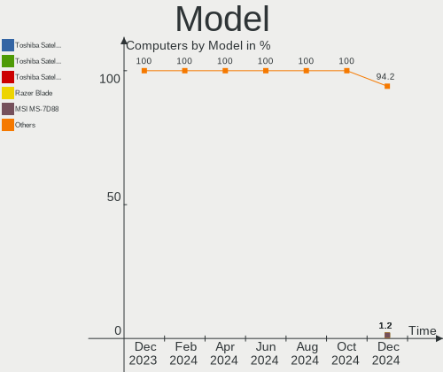
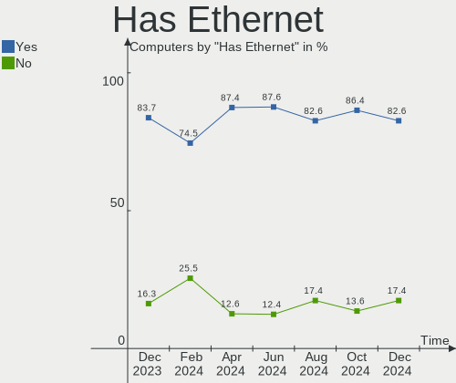
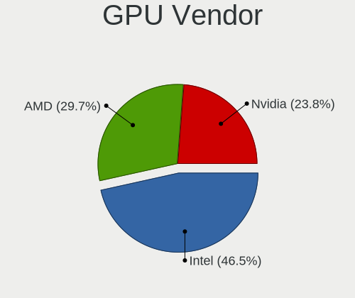
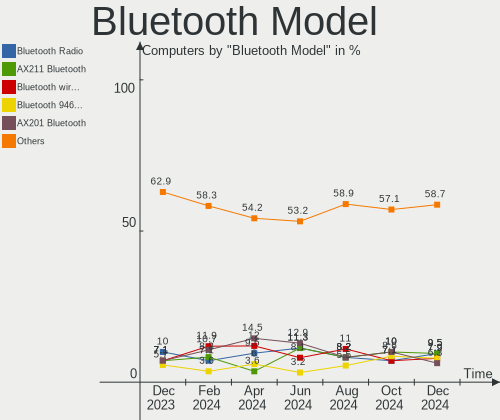

openSUSE - Hardware Trends
--------------------------

A project to identify most popular hardware characteristics and track their change
over time based on data collected by Linux users at https://Linux-Hardware.org.

Anyone can contribute to this report by the [hw-probe](https://github.com/linuxhw/hw-probe) tool:

    sudo -E hw-probe -all -upload

This is a report for all computer types. See also reports for [desktops](/Dist/openSUSE/Desktop/README.md) and [notebooks](/Dist/openSUSE/Notebook/README.md).

This report is for one last month. Overall report since the beginning of time: [TestCoverage](https://github.com/linuxhw/TestCoverage)

Period: Dec, 2022.

Contents
--------

* [ System ](#system)
  - [ OS                       ](#os)
  - [ OS Family                ](#os-family)
  - [ Kernel                   ](#kernel)
  - [ Kernel Family            ](#kernel-family)
  - [ Kernel Major Ver.        ](#kernel-major-ver)
  - [ Arch                     ](#arch)
  - [ DE                       ](#de)
  - [ Display Server           ](#display-server)
  - [ Display Manager          ](#display-manager)
  - [ OS Lang                  ](#os-lang)
  - [ Boot Mode                ](#boot-mode)
  - [ Filesystem               ](#filesystem)
  - [ Part. scheme             ](#part-scheme)
  - [ Dual Boot with Linux/BSD ](#dual-boot-with-linuxbsd)
  - [ Dual Boot (Win)          ](#dual-boot-win)

* [ Board ](#board)
  - [ Vendor                   ](#vendor)
  - [ Model                    ](#model)
  - [ Model Family             ](#model-family)
  - [ MFG Year                 ](#mfg-year)
  - [ Form Factor              ](#form-factor)
  - [ Secure Boot              ](#secure-boot)
  - [ Coreboot                 ](#coreboot)
  - [ RAM Size                 ](#ram-size)
  - [ RAM Used                 ](#ram-used)
  - [ Total Drives             ](#total-drives)
  - [ Has CD-ROM               ](#has-cd-rom)
  - [ Has Ethernet             ](#has-ethernet)
  - [ Has WiFi                 ](#has-wifi)
  - [ Has Bluetooth            ](#has-bluetooth)

* [ Location ](#location)
  - [ Country                  ](#country)
  - [ City                     ](#city)

* [ Drives ](#drives)
  - [ Drive Vendor             ](#drive-vendor)
  - [ Drive Model              ](#drive-model)
  - [ HDD Vendor               ](#hdd-vendor)
  - [ SSD Vendor               ](#ssd-vendor)
  - [ Drive Kind               ](#drive-kind)
  - [ Drive Connector          ](#drive-connector)
  - [ Drive Size               ](#drive-size)
  - [ Space Total              ](#space-total)
  - [ Space Used               ](#space-used)
  - [ Malfunc. Drives          ](#malfunc-drives)
  - [ Malfunc. Drive Vendor    ](#malfunc-drive-vendor)
  - [ Malfunc. HDD Vendor      ](#malfunc-hdd-vendor)
  - [ Malfunc. Drive Kind      ](#malfunc-drive-kind)
  - [ Failed Drives            ](#failed-drives)
  - [ Failed Drive Vendor      ](#failed-drive-vendor)
  - [ Drive Status             ](#drive-status)

* [ Storage controller ](#storage-controller)
  - [ Storage Vendor           ](#storage-vendor)
  - [ Storage Model            ](#storage-model)
  - [ Storage Kind             ](#storage-kind)

* [ Processor ](#processor)
  - [ CPU Vendor               ](#cpu-vendor)
  - [ CPU Model                ](#cpu-model)
  - [ CPU Model Family         ](#cpu-model-family)
  - [ CPU Cores                ](#cpu-cores)
  - [ CPU Sockets              ](#cpu-sockets)
  - [ CPU Threads              ](#cpu-threads)
  - [ CPU Op-Modes             ](#cpu-op-modes)
  - [ CPU Microcode            ](#cpu-microcode)
  - [ CPU Microarch            ](#cpu-microarch)

* [ Graphics ](#graphics)
  - [ GPU Vendor               ](#gpu-vendor)
  - [ GPU Model                ](#gpu-model)
  - [ GPU Combo                ](#gpu-combo)
  - [ GPU Driver               ](#gpu-driver)
  - [ GPU Memory               ](#gpu-memory)

* [ Monitor ](#monitor)
  - [ Monitor Vendor           ](#monitor-vendor)
  - [ Monitor Model            ](#monitor-model)
  - [ Monitor Resolution       ](#monitor-resolution)
  - [ Monitor Diagonal         ](#monitor-diagonal)
  - [ Monitor Width            ](#monitor-width)
  - [ Aspect Ratio             ](#aspect-ratio)
  - [ Monitor Area             ](#monitor-area)
  - [ Pixel Density            ](#pixel-density)
  - [ Multiple Monitors        ](#multiple-monitors)

* [ Network ](#network)
  - [ Net Controller Vendor    ](#net-controller-vendor)
  - [ Net Controller Model     ](#net-controller-model)
  - [ Wireless Vendor          ](#wireless-vendor)
  - [ Wireless Model           ](#wireless-model)
  - [ Ethernet Vendor          ](#ethernet-vendor)
  - [ Ethernet Model           ](#ethernet-model)
  - [ Net Controller Kind      ](#net-controller-kind)
  - [ Used Controller          ](#used-controller)
  - [ NICs                     ](#nics)
  - [ IPv6                     ](#ipv6)

* [ Bluetooth ](#bluetooth)
  - [ Bluetooth Vendor         ](#bluetooth-vendor)
  - [ Bluetooth Model          ](#bluetooth-model)

* [ Sound ](#sound)
  - [ Sound Vendor             ](#sound-vendor)
  - [ Sound Model              ](#sound-model)

* [ Memory ](#memory)
  - [ Memory Vendor            ](#memory-vendor)
  - [ Memory Model             ](#memory-model)
  - [ Memory Kind              ](#memory-kind)
  - [ Memory Form Factor       ](#memory-form-factor)
  - [ Memory Size              ](#memory-size)
  - [ Memory Speed             ](#memory-speed)

* [ Printers & scanners ](#printers--scanners)
  - [ Printer Vendor           ](#printer-vendor)
  - [ Printer Model            ](#printer-model)
  - [ Scanner Vendor           ](#scanner-vendor)
  - [ Scanner Model            ](#scanner-model)

* [ Camera ](#camera)
  - [ Camera Vendor            ](#camera-vendor)
  - [ Camera Model             ](#camera-model)

* [ Security ](#security)
  - [ Fingerprint Vendor       ](#fingerprint-vendor)
  - [ Fingerprint Model        ](#fingerprint-model)
  - [ Chipcard Vendor          ](#chipcard-vendor)
  - [ Chipcard Model           ](#chipcard-model)

* [ Unsupported ](#unsupported)
  - [ Unsupported Devices      ](#unsupported-devices)
  - [ Unsupported Device Types ](#unsupported-device-types)

System
------

OS
--

Installed operating systems

| Name                         | Computers | Percent |
|------------------------------|-----------|---------|
| openSUSE Tumbleweed-XXXXXXXX | 73        | 77.66%  |
| openSUSE Leap-15.4           | 11        | 11.7%   |
| openSUSE Microos-XXXXXXXX    | 6         | 6.38%   |
| openSUSE Leap-15.3           | 3         | 3.19%   |
| openSUSE Leap-15.1           | 1         | 1.06%   |

OS Family
---------

OS without a version

| Name     | Computers | Percent |
|----------|-----------|---------|
| openSUSE | 94        | 100%    |

Kernel
------

Version of the Linux kernel

| Version                      | Computers | Percent |
|------------------------------|-----------|---------|
| 6.0.12-1-default             | 25        | 26.6%   |
| 6.0.10-1-default             | 22        | 23.4%   |
| 6.1.0-1-default              | 10        | 10.64%  |
| 6.0.8-1-default              | 9         | 9.57%   |
| 5.14.21-150400.24.33-default | 7         | 7.45%   |
| 6.1.1-1-default              | 6         | 6.38%   |
| 5.14.21-150400.24.38-default | 3         | 3.19%   |
| 6.0.7-1-default              | 1         | 1.06%   |
| 6.0.12-1-pae                 | 1         | 1.06%   |
| 6.0.10-1-vanilla             | 1         | 1.06%   |
| 5.3.18-59.10-preempt         | 1         | 1.06%   |
| 5.3.18-150300.59.101-preempt | 1         | 1.06%   |
| 5.3.18-150300.59.101-default | 1         | 1.06%   |
| 5.19.13-1-default            | 1         | 1.06%   |
| 5.18.9-1-default             | 1         | 1.06%   |
| 5.18.15-1-default            | 1         | 1.06%   |
| 5.17.9-1-default             | 1         | 1.06%   |
| 5.14.21-150400.22-default    | 1         | 1.06%   |
| 4.12.14-lp151.28.91-default  | 1         | 1.06%   |

Kernel Family
-------------

Linux kernel without a distro release

| Version | Computers | Percent |
|---------|-----------|---------|
| 6.0.12  | 26        | 27.66%  |
| 6.0.10  | 23        | 24.47%  |
| 5.14.21 | 11        | 11.7%   |
| 6.1.0   | 10        | 10.64%  |
| 6.0.8   | 9         | 9.57%   |
| 6.1.1   | 6         | 6.38%   |
| 5.3.18  | 3         | 3.19%   |
| 6.0.7   | 1         | 1.06%   |
| 5.19.13 | 1         | 1.06%   |
| 5.18.9  | 1         | 1.06%   |
| 5.18.15 | 1         | 1.06%   |
| 5.17.9  | 1         | 1.06%   |
| 4.12.14 | 1         | 1.06%   |

Kernel Major Ver.
-----------------

Linux kernel major version

| Version | Computers | Percent |
|---------|-----------|---------|
| 6.0     | 59        | 62.77%  |
| 6.1     | 16        | 17.02%  |
| 5.14    | 11        | 11.7%   |
| 5.3     | 3         | 3.19%   |
| 5.18    | 2         | 2.13%   |
| 5.19    | 1         | 1.06%   |
| 5.17    | 1         | 1.06%   |
| 4.12    | 1         | 1.06%   |

Arch
----

OS architecture (x86_64, i586, etc.)

| Name    | Computers | Percent |
|---------|-----------|---------|
| x86_64  | 92        | 97.87%  |
| i686    | 1         | 1.06%   |
| aarch64 | 1         | 1.06%   |

DE
--

Desktop Environment

| Name       | Computers | Percent |
|------------|-----------|---------|
| KDE5       | 62        | 65.96%  |
| GNOME      | 19        | 20.21%  |
| XFCE       | 4         | 4.26%   |
| Unknown    | 2         | 2.13%   |
| X-Cinnamon | 1         | 1.06%   |
| Trinity    | 1         | 1.06%   |
| MATE       | 1         | 1.06%   |
| LXQt       | 1         | 1.06%   |
| Deepin     | 1         | 1.06%   |
| Cinnamon   | 1         | 1.06%   |
| awesome    | 1         | 1.06%   |

Display Server
--------------

X11 or Wayland

| Name    | Computers | Percent |
|---------|-----------|---------|
| X11     | 69        | 73.4%   |
| Wayland | 24        | 25.53%  |
| Tty     | 1         | 1.06%   |

Display Manager
---------------

SDDM, LightDM, etc.

| Name    | Computers | Percent |
|---------|-----------|---------|
| Unknown | 51        | 54.26%  |
| SDDM    | 26        | 27.66%  |
| LightDM | 11        | 11.7%   |
| XDM     | 6         | 6.38%   |

OS Lang
-------

Language

| Lang  | Computers | Percent |
|-------|-----------|---------|
| en_US | 47        | 50%     |
| POSIX | 13        | 13.83%  |
| de_DE | 8         | 8.51%   |
| pt_BR | 7         | 7.45%   |
| en_GB | 7         | 7.45%   |
| ru_RU | 4         | 4.26%   |
| it_IT | 3         | 3.19%   |
| sv_SE | 1         | 1.06%   |
| nn_NO | 1         | 1.06%   |
| fr_FR | 1         | 1.06%   |
| el_GR | 1         | 1.06%   |
| da_DK | 1         | 1.06%   |

Boot Mode
---------

EFI or BIOS

| Mode | Computers | Percent |
|------|-----------|---------|
| EFI  | 66        | 70.21%  |
| BIOS | 28        | 29.79%  |

Filesystem
----------

Type of filesystem

| Type    | Computers | Percent |
|---------|-----------|---------|
| Btrfs   | 72        | 76.6%   |
| Ext4    | 18        | 19.15%  |
| Overlay | 3         | 3.19%   |
| Xfs     | 1         | 1.06%   |

Part. scheme
------------

Scheme of partitioning

| Type    | Computers | Percent |
|---------|-----------|---------|
| Unknown | 48        | 51.06%  |
| GPT     | 43        | 45.74%  |
| MBR     | 3         | 3.19%   |

Dual Boot with Linux/BSD
------------------------

Hosting more than one Linux/BSD

| Dual boot | Computers | Percent |
|-----------|-----------|---------|
| No        | 85        | 90.43%  |
| Yes       | 9         | 9.57%   |

Dual Boot (Win)
---------------

Hosting Linux and Windows

| Dual boot | Computers | Percent |
|-----------|-----------|---------|
| No        | 76        | 80.85%  |
| Yes       | 18        | 19.15%  |

Board
-----

Vendor
------

Motherboard manufacturer

| Name                 | Computers | Percent |
|----------------------|-----------|---------|
| ASUSTek Computer     | 19        | 20.21%  |
| Dell                 | 12        | 12.77%  |
| Gigabyte Technology  | 11        | 11.7%   |
| Lenovo               | 10        | 10.64%  |
| Hewlett-Packard      | 10        | 10.64%  |
| ASRock               | 7         | 7.45%   |
| MSI                  | 6         | 6.38%   |
| Acer                 | 4         | 4.26%   |
| HUAWEI               | 2         | 2.13%   |
| Apple                | 2         | 2.13%   |
| TYAN Computer        | 1         | 1.06%   |
| Sony                 | 1         | 1.06%   |
| SLIMBOOK             | 1         | 1.06%   |
| Schenker             | 1         | 1.06%   |
| Samsung Electronics  | 1         | 1.06%   |
| Razer                | 1         | 1.06%   |
| Multilaser           | 1         | 1.06%   |
| Medion               | 1         | 1.06%   |
| Intel Client Systems | 1         | 1.06%   |
| Fujitsu Siemens      | 1         | 1.06%   |
| BESSTAR Tech         | 1         | 1.06%   |

Model
-----

Motherboard model

| Name                                     | Computers | Percent |
|------------------------------------------|-----------|---------|
| HP Spectre x360 Convertible 13t-aw100    | 2         | 2.13%   |
| Gigabyte B660M AORUS PRO AX DDR4         | 2         | 2.13%   |
| Dell Inspiron 3593                       | 2         | 2.13%   |
| ASUS All Series                          | 2         | 2.13%   |
| TYAN S8026GM2NRE-HOV-B                   | 1         | 1.06%   |
| Sony SVS1311N9ES                         | 1         | 1.06%   |
| SLIMBOOK PROX-AMD5                       | 1         | 1.06%   |
| Schenker VIA 15 Pro                      | 1         | 1.06%   |
| Samsung 750QUA                           | 1         | 1.06%   |
| Razer Blade 15 (2022) - RZ09-0421        | 1         | 1.06%   |
| Multilaser MLSH1H LINUX                  | 1         | 1.06%   |
| MSI MS-7C91                              | 1         | 1.06%   |
| MSI MS-7C09                              | 1         | 1.06%   |
| MSI MS-7B78                              | 1         | 1.06%   |
| MSI MS-7A38                              | 1         | 1.06%   |
| MSI MS-7850                              | 1         | 1.06%   |
| MSI MS-7673                              | 1         | 1.06%   |
| Medion Akoya P4228 D/C223                | 1         | 1.06%   |
| Lenovo Yoga 7 15ITL5 82BJ                | 1         | 1.06%   |
| Lenovo Y50-70 Touch 20349                | 1         | 1.06%   |
| Lenovo ThinkPad X1 Carbon 4th 20FQ0041MS | 1         | 1.06%   |
| Lenovo ThinkPad T440s 20AQ004EUS         | 1         | 1.06%   |
| Lenovo ThinkPad P16s Gen 1 21BT000MUK    | 1         | 1.06%   |
| Lenovo Legion 5 15ARH05 82B5             | 1         | 1.06%   |
| Lenovo IdeaPad S340-14API 81NB           | 1         | 1.06%   |
| Lenovo IdeaPad S145-15API 81UT           | 1         | 1.06%   |
| Lenovo IdeaPad 320-15IKB 81BG            | 1         | 1.06%   |
| Lenovo 1S20UDCT01WWPF1ARBNP 29UDCT01WW   | 1         | 1.06%   |
| Intel Client Systems LAPRC710            | 1         | 1.06%   |
| HUAWEI HUAWEIPGU-WBY0                    | 1         | 1.06%   |
| HUAWEI BOD-WXX9                          | 1         | 1.06%   |
| HP ZBook 15 G6                           | 1         | 1.06%   |
| HP Victus by Laptop 16-e0xxx             | 1         | 1.06%   |
| HP Pavilion 17                           | 1         | 1.06%   |
| HP Pavilion 13 x360 PC                   | 1         | 1.06%   |
| HP OMEN Laptop 15-en0xxx                 | 1         | 1.06%   |
| HP ENVY x360 2-in-1 Laptop 15-ey0xxx     | 1         | 1.06%   |
| HP EliteBook 840 G4                      | 1         | 1.06%   |
| HP 550-100nl                             | 1         | 1.06%   |
| Gigabyte Z270P-D3                        | 1         | 1.06%   |

Model Family
------------

Motherboard model prefix

| Name                          | Computers | Percent |
|-------------------------------|-----------|---------|
| Dell Inspiron                 | 4         | 4.26%   |
| ASUS Zenbook                  | 4         | 4.26%   |
| ASUS VivoBook                 | 4         | 4.26%   |
| Lenovo ThinkPad               | 3         | 3.19%   |
| Lenovo IdeaPad                | 3         | 3.19%   |
| Gigabyte B550                 | 3         | 3.19%   |
| Dell Latitude                 | 3         | 3.19%   |
| ASUS PRIME                    | 3         | 3.19%   |
| HP Spectre                    | 2         | 2.13%   |
| HP Pavilion                   | 2         | 2.13%   |
| Gigabyte B660M                | 2         | 2.13%   |
| Dell OptiPlex                 | 2         | 2.13%   |
| ASUS M5A78L-M                 | 2         | 2.13%   |
| ASUS All                      | 2         | 2.13%   |
| TYAN S8026GM2NRE-HOV-B        | 1         | 1.06%   |
| Sony SVS1311N9ES              | 1         | 1.06%   |
| SLIMBOOK PROX-AMD5            | 1         | 1.06%   |
| Schenker VIA                  | 1         | 1.06%   |
| Samsung 750QUA                | 1         | 1.06%   |
| Razer Blade                   | 1         | 1.06%   |
| Multilaser MLSH1H             | 1         | 1.06%   |
| MSI MS-7C91                   | 1         | 1.06%   |
| MSI MS-7C09                   | 1         | 1.06%   |
| MSI MS-7B78                   | 1         | 1.06%   |
| MSI MS-7A38                   | 1         | 1.06%   |
| MSI MS-7850                   | 1         | 1.06%   |
| MSI MS-7673                   | 1         | 1.06%   |
| Medion Akoya                  | 1         | 1.06%   |
| Lenovo Yoga                   | 1         | 1.06%   |
| Lenovo Y50-70                 | 1         | 1.06%   |
| Lenovo Legion                 | 1         | 1.06%   |
| Lenovo 1S20UDCT01WWPF1ARBNP   | 1         | 1.06%   |
| Intel Client Systems LAPRC710 | 1         | 1.06%   |
| HUAWEI HUAWEIPGU-WBY0         | 1         | 1.06%   |
| HUAWEI BOD-WXX9               | 1         | 1.06%   |
| HP ZBook                      | 1         | 1.06%   |
| HP Victus                     | 1         | 1.06%   |
| HP OMEN                       | 1         | 1.06%   |
| HP ENVY                       | 1         | 1.06%   |
| HP EliteBook                  | 1         | 1.06%   |

MFG Year
--------

Motherboard manufacture year

| Year | Computers | Percent |
|------|-----------|---------|
| 2021 | 14        | 14.89%  |
| 2020 | 14        | 14.89%  |
| 2018 | 11        | 11.7%   |
| 2022 | 10        | 10.64%  |
| 2019 | 10        | 10.64%  |
| 2017 | 6         | 6.38%   |
| 2013 | 6         | 6.38%   |
| 2015 | 4         | 4.26%   |
| 2014 | 4         | 4.26%   |
| 2012 | 4         | 4.26%   |
| 2011 | 4         | 4.26%   |
| 2016 | 3         | 3.19%   |
| 2008 | 2         | 2.13%   |
| 2009 | 1         | 1.06%   |
| 2005 | 1         | 1.06%   |

Form Factor
-----------

Physical design of the computer

| Name           | Computers | Percent |
|----------------|-----------|---------|
| Notebook       | 43        | 45.74%  |
| Desktop        | 41        | 43.62%  |
| Convertible    | 6         | 6.38%   |
| Mini pc        | 2         | 2.13%   |
| System on chip | 1         | 1.06%   |
| Server         | 1         | 1.06%   |

Secure Boot
-----------

Enabled or disabled

| State    | Computers | Percent |
|----------|-----------|---------|
| Disabled | 81        | 86.17%  |
| Enabled  | 13        | 13.83%  |

Coreboot
--------

Have coreboot on board

| Used | Computers | Percent |
|------|-----------|---------|
| No   | 94        | 100%    |

RAM Size
--------

Total RAM memory

| Size in GB  | Computers | Percent |
|-------------|-----------|---------|
| 32.01-64.0  | 22        | 23.4%   |
| 8.01-16.0   | 22        | 23.4%   |
| 4.01-8.0    | 17        | 18.09%  |
| 16.01-24.0  | 17        | 18.09%  |
| 3.01-4.0    | 7         | 7.45%   |
| 64.01-256.0 | 6         | 6.38%   |
| 24.01-32.0  | 3         | 3.19%   |

RAM Used
--------

Used RAM memory

| Used GB   | Computers | Percent |
|-----------|-----------|---------|
| 2.01-3.0  | 28        | 29.79%  |
| 4.01-8.0  | 25        | 26.6%   |
| 1.01-2.0  | 20        | 21.28%  |
| 3.01-4.0  | 16        | 17.02%  |
| 8.01-16.0 | 4         | 4.26%   |
| 0.51-1.0  | 1         | 1.06%   |

Total Drives
------------

Number of drives on board

| Drives | Computers | Percent |
|--------|-----------|---------|
| 1      | 53        | 56.38%  |
| 2      | 19        | 20.21%  |
| 3      | 12        | 12.77%  |
| 7      | 3         | 3.19%   |
| 4      | 3         | 3.19%   |
| 6      | 2         | 2.13%   |
| 5      | 2         | 2.13%   |

Has CD-ROM
----------

Has CD-ROM on board

| Presented | Computers | Percent |
|-----------|-----------|---------|
| No        | 70        | 74.47%  |
| Yes       | 24        | 25.53%  |

Has Ethernet
------------

Has Ethernet on board

| Presented | Computers | Percent |
|-----------|-----------|---------|
| Yes       | 76        | 80.85%  |
| No        | 18        | 19.15%  |

Has WiFi
--------

Has WiFi module

| Presented | Computers | Percent |
|-----------|-----------|---------|
| Yes       | 77        | 81.91%  |
| No        | 17        | 18.09%  |

Has Bluetooth
-------------

Has Bluetooth module

| Presented | Computers | Percent |
|-----------|-----------|---------|
| Yes       | 62        | 65.96%  |
| No        | 32        | 34.04%  |

Location
--------

Country
-------

Geographic location (country)

| Country      | Computers | Percent |
|--------------|-----------|---------|
| USA          | 18        | 19.15%  |
| Germany      | 16        | 17.02%  |
| Italy        | 8         | 8.51%   |
| Brazil       | 8         | 8.51%   |
| UK           | 5         | 5.32%   |
| Canada       | 5         | 5.32%   |
| Russia       | 4         | 4.26%   |
| France       | 4         | 4.26%   |
| Sweden       | 3         | 3.19%   |
| Greece       | 3         | 3.19%   |
| Slovakia     | 2         | 2.13%   |
| Czechia      | 2         | 2.13%   |
| Turkey       | 1         | 1.06%   |
| Switzerland  | 1         | 1.06%   |
| Spain        | 1         | 1.06%   |
| South Korea  | 1         | 1.06%   |
| South Africa | 1         | 1.06%   |
| Singapore    | 1         | 1.06%   |
| Puerto Rico  | 1         | 1.06%   |
| Portugal     | 1         | 1.06%   |
| Norway       | 1         | 1.06%   |
| Mexico       | 1         | 1.06%   |
| Latvia       | 1         | 1.06%   |
| Georgia      | 1         | 1.06%   |
| Denmark      | 1         | 1.06%   |
| China        | 1         | 1.06%   |
| Belgium      | 1         | 1.06%   |
| Bangladesh   | 1         | 1.06%   |

City
----

Geographic location (city)

| City                  | Computers | Percent |
|-----------------------|-----------|---------|
| St Petersburg         | 3         | 3.19%   |
| Konstanz              | 3         | 3.19%   |
| Sao Paulo             | 2         | 2.13%   |
| Saint Joseph          | 2         | 2.13%   |
| Prague                | 2         | 2.13%   |
| Ocala                 | 2         | 2.13%   |
| Milan                 | 2         | 2.13%   |
| Miami                 | 2         | 2.13%   |
| Athens                | 2         | 2.13%   |
| Alfonsine             | 2         | 2.13%   |
| Wingles               | 1         | 1.06%   |
| Uslar                 | 1         | 1.06%   |
| Ulm                   | 1         | 1.06%   |
| Tbilisi               | 1         | 1.06%   |
| Summerside            | 1         | 1.06%   |
| Stuttgart             | 1         | 1.06%   |
| Stockholm             | 1         | 1.06%   |
| Stazione-Fornola      | 1         | 1.06%   |
| Singapore             | 1         | 1.06%   |
| Seclin                | 1         | 1.06%   |
| Santos                | 1         | 1.06%   |
| Saint Leonards-on-Sea | 1         | 1.06%   |
| Rivarolo Canavese     | 1         | 1.06%   |
| Recife                | 1         | 1.06%   |
| Ratingen              | 1         | 1.06%   |
| Pretoria              | 1         | 1.06%   |
| Pirmasens             | 1         | 1.06%   |
| Paranaiba             | 1         | 1.06%   |
| Opelika               | 1         | 1.06%   |
| Olympia               | 1         | 1.06%   |
| Old Faliron           | 1         | 1.06%   |
| Novosibirsk           | 1         | 1.06%   |
| Nova Friburgo         | 1         | 1.06%   |
| Northallerton         | 1         | 1.06%   |
| Nîmes                | 1         | 1.06%   |
| Munich                | 1         | 1.06%   |
| Mold                  | 1         | 1.06%   |
| Modena                | 1         | 1.06%   |
| Mexico City           | 1         | 1.06%   |
| Mesa                  | 1         | 1.06%   |

Drives
------

Drive Vendor
------------

Hard drive vendors

| Vendor                      | Computers | Drives | Percent |
|-----------------------------|-----------|--------|---------|
| Samsung Electronics         | 25        | 32     | 16.13%  |
| WDC                         | 18        | 27     | 11.61%  |
| Seagate                     | 18        | 24     | 11.61%  |
| Sandisk                     | 18        | 22     | 11.61%  |
| Toshiba                     | 12        | 12     | 7.74%   |
| Kingston                    | 8         | 9      | 5.16%   |
| Crucial                     | 8         | 9      | 5.16%   |
| SK hynix                    | 6         | 6      | 3.87%   |
| Kingston Technology Company | 5         | 5      | 3.23%   |
| Unknown                     | 4         | 4      | 2.58%   |
| Phison Electronics          | 4         | 4      | 2.58%   |
| Silicon Motion              | 3         | 3      | 1.94%   |
| Intel                       | 3         | 3      | 1.94%   |
| Patriot                     | 2         | 2      | 1.29%   |
| JMicron Technology          | 2         | 2      | 1.29%   |
| China                       | 2         | 2      | 1.29%   |
| WDC WDS                     | 1         | 1      | 0.65%   |
| Union Memory (Shenzhen)     | 1         | 1      | 0.65%   |
| Transcend                   | 1         | 1      | 0.65%   |
| Team                        | 1         | 1      | 0.65%   |
| sobetter                    | 1         | 2      | 0.65%   |
| Realtek Semiconductor       | 1         | 1      | 0.65%   |
| Pioneer                     | 1         | 1      | 0.65%   |
| Micron Technology           | 1         | 1      | 0.65%   |
| Maxtor                      | 1         | 1      | 0.65%   |
| KIOXIA                      | 1         | 1      | 0.65%   |
| Hjwdz                       | 1         | 1      | 0.65%   |
| HGST                        | 1         | 3      | 0.65%   |
| Fanxiang                    | 1         | 1      | 0.65%   |
| ASMT                        | 1         | 1      | 0.65%   |
| Apple                       | 1         | 1      | 0.65%   |
| Apacer                      | 1         | 2      | 0.65%   |
| A-DATA Technology           | 1         | 1      | 0.65%   |

Drive Model
-----------

Hard drive models

| Model                                                 | Computers | Percent |
|-------------------------------------------------------|-----------|---------|
| Samsung NVMe SSD Controller SM981/PM981/PM983 500GB   | 6         | 3.39%   |
| Toshiba XG6 NVMe SSD Controller 256GB                 | 4         | 2.26%   |
| Sandisk WD Black SN750 / PC SN730 NVMe SSD 512GB      | 4         | 2.26%   |
| Sandisk WD Black SN850 1TB                            | 3         | 1.69%   |
| Sandisk PC SN520 NVMe SSD 128GB                       | 3         | 1.69%   |
| Samsung SSD 860 EVO 1TB                               | 3         | 1.69%   |
| Phison E12 NVMe Controller 1TB                        | 3         | 1.69%   |
| Kingston Company A2000 NVMe SSD 1TB                   | 3         | 1.69%   |
| Kingston SA400S37480G 480GB SSD                       | 3         | 1.69%   |
| Seagate ST2000DM008-2FR102 2TB                        | 2         | 1.13%   |
| Seagate ST2000DM001-1ER164 2TB                        | 2         | 1.13%   |
| Seagate ST1000DM003-1CH162 1TB                        | 2         | 1.13%   |
| Seagate Expansion 4TB                                 | 2         | 1.13%   |
| Sandisk WD Black 2018/SN750 / PC SN720 NVMe SSD 256GB | 2         | 1.13%   |
| SanDisk SSD PLUS 1000GB                               | 2         | 1.13%   |
| Samsung SSD 860 EVO 500GB                             | 2         | 1.13%   |
| Samsung NVMe SSD Controller SM961/PM961/SM963 256GB   | 2         | 1.13%   |
| Samsung NVMe SSD Controller PM9A1/PM9A3/980PRO 2TB    | 2         | 1.13%   |
| Kingston SNVS1000G 1TB                                | 2         | 1.13%   |
| Intel SSD 660P Series 1024GB                          | 2         | 1.13%   |
| Crucial CT500MX500SSD1 500GB                          | 2         | 1.13%   |
| China SATA SSD 120GB                                  | 2         | 1.13%   |
| WDC WDS500G2B0A-00SM50 500GB SSD                      | 1         | 0.56%   |
| WDC WDS 100T2B0A-00SM50 1TB SSD                       | 1         | 0.56%   |
| WDC WD7500BPKT-80PK4T0 752GB                          | 1         | 0.56%   |
| WDC WD6400AAKS-75A7B2 640GB                           | 1         | 0.56%   |
| WDC WD6400AAKS-22A7B2 640GB                           | 1         | 0.56%   |
| WDC WD5000AAKX-75U6AA0 500GB                          | 1         | 0.56%   |
| WDC WD40EFAX-68JH4N1 4TB                              | 1         | 0.56%   |
| WDC WD2500AAKX-001CA0 250GB                           | 1         | 0.56%   |
| WDC WD2500AAJS-75M0A0 249GB                           | 1         | 0.56%   |
| WDC WD20PURX-64P6ZY0 2TB                              | 1         | 0.56%   |
| WDC WD20EZRZ-00Z5HB0 2TB                              | 1         | 0.56%   |
| WDC WD20EZAZ-00GGJB0 2TB                              | 1         | 0.56%   |
| WDC WD2003FZEX-00Z4SA0 2TB                            | 1         | 0.56%   |
| WDC WD10SPZX-24Z10 1TB                                | 1         | 0.56%   |
| WDC WD10JPVX-22JC3T0 1TB                              | 1         | 0.56%   |
| WDC WD10EZEX-60WN4A0 1TB                              | 1         | 0.56%   |
| WDC WD10EZEX-60W 1TB                                  | 1         | 0.56%   |
| WDC WD10EZEX-21WN4A0 1TB                              | 1         | 0.56%   |

HDD Vendor
----------

Hard disk drive vendors

| Vendor              | Computers | Drives | Percent |
|---------------------|-----------|--------|---------|
| Seagate             | 18        | 24     | 35.29%  |
| WDC                 | 17        | 26     | 33.33%  |
| Toshiba             | 7         | 7      | 13.73%  |
| Samsung Electronics | 3         | 4      | 5.88%   |
| Unknown             | 1         | 1      | 1.96%   |
| Pioneer             | 1         | 1      | 1.96%   |
| Maxtor              | 1         | 1      | 1.96%   |
| HGST                | 1         | 3      | 1.96%   |
| ASMT                | 1         | 1      | 1.96%   |
| Apple               | 1         | 1      | 1.96%   |

SSD Vendor
----------

Solid state drive vendors

| Vendor              | Computers | Drives | Percent |
|---------------------|-----------|--------|---------|
| Samsung Electronics | 12        | 15     | 25.53%  |
| Crucial             | 8         | 9      | 17.02%  |
| Kingston            | 7         | 7      | 14.89%  |
| SanDisk             | 4         | 4      | 8.51%   |
| Patriot             | 2         | 2      | 4.26%   |
| China               | 2         | 2      | 4.26%   |
| WDC WDS             | 1         | 1      | 2.13%   |
| WDC                 | 1         | 1      | 2.13%   |
| Unknown             | 1         | 1      | 2.13%   |
| Transcend           | 1         | 1      | 2.13%   |
| Toshiba             | 1         | 1      | 2.13%   |
| Team                | 1         | 1      | 2.13%   |
| SK hynix            | 1         | 1      | 2.13%   |
| Micron Technology   | 1         | 1      | 2.13%   |
| JMicron Technology  | 1         | 1      | 2.13%   |
| Intel               | 1         | 1      | 2.13%   |
| Apacer              | 1         | 2      | 2.13%   |
| A-DATA Technology   | 1         | 1      | 2.13%   |

Drive Kind
----------

HDD or SSD

| Kind    | Computers | Drives | Percent |
|---------|-----------|--------|---------|
| NVMe    | 51        | 59     | 37.5%   |
| SSD     | 40        | 52     | 29.41%  |
| HDD     | 39        | 69     | 28.68%  |
| Unknown | 4         | 5      | 2.94%   |
| MMC     | 2         | 2      | 1.47%   |

Drive Connector
---------------

SATA, SAS, NVMe, etc.

| Type | Computers | Drives | Percent |
|------|-----------|--------|---------|
| SATA | 57        | 114    | 47.9%   |
| NVMe | 51        | 59     | 42.86%  |
| SAS  | 9         | 12     | 7.56%   |
| MMC  | 2         | 2      | 1.68%   |

Drive Size
----------

Size of hard drive

| Size in TB | Computers | Drives | Percent |
|------------|-----------|--------|---------|
| 0.01-0.5   | 38        | 56     | 45.24%  |
| 0.51-1.0   | 29        | 41     | 34.52%  |
| 1.01-2.0   | 8         | 10     | 9.52%   |
| 3.01-4.0   | 5         | 8      | 5.95%   |
| 4.01-10.0  | 3         | 5      | 3.57%   |
| 10.01-20.0 | 1         | 1      | 1.19%   |

Space Total
-----------

Amount of disk space available on the file system

| Size in GB     | Computers | Percent |
|----------------|-----------|---------|
| More than 3000 | 33        | 35.11%  |
| 1001-2000      | 24        | 25.53%  |
| 501-1000       | 12        | 12.77%  |
| 2001-3000      | 10        | 10.64%  |
| 251-500        | 9         | 9.57%   |
| 101-250        | 3         | 3.19%   |
| 51-100         | 2         | 2.13%   |
| 21-50          | 1         | 1.06%   |

Space Used
----------

Amount of used disk space

| Used GB        | Computers | Percent |
|----------------|-----------|---------|
| 51-100         | 22        | 23.4%   |
| 101-250        | 19        | 20.21%  |
| 501-1000       | 17        | 18.09%  |
| 251-500        | 11        | 11.7%   |
| 1001-2000      | 10        | 10.64%  |
| More than 3000 | 5         | 5.32%   |
| 21-50          | 5         | 5.32%   |
| 1-20           | 4         | 4.26%   |
| 2001-3000      | 1         | 1.06%   |

Malfunc. Drives
---------------

Drive models with a malfunction

| Model                                       | Computers | Drives | Percent |
|---------------------------------------------|-----------|--------|---------|
| WDC WD6400AAKS-22A7B2 640GB                 | 1         | 1      | 12.5%   |
| WDC WD2500AAKX-001CA0 250GB                 | 1         | 1      | 12.5%   |
| WDC WD2500AAJS-75M0A0 249GB                 | 1         | 1      | 12.5%   |
| Toshiba HDWD105 500GB                       | 1         | 1      | 12.5%   |
| Seagate ST3500418AS 500GB                   | 1         | 1      | 12.5%   |
| Seagate ST3250823AS 250GB                   | 1         | 1      | 12.5%   |
| Seagate ST1000NM0011 99Y1164 59Y1812XIV 1TB | 1         | 1      | 12.5%   |
| Samsung Electronics HM251JI 250GB           | 1         | 1      | 12.5%   |

Malfunc. Drive Vendor
---------------------

Vendors of faulty drives

| Vendor              | Computers | Drives | Percent |
|---------------------|-----------|--------|---------|
| Seagate             | 3         | 3      | 42.86%  |
| WDC                 | 2         | 3      | 28.57%  |
| Toshiba             | 1         | 1      | 14.29%  |
| Samsung Electronics | 1         | 1      | 14.29%  |

Malfunc. HDD Vendor
-------------------

Vendors of faulty HDD drives

| Vendor              | Computers | Drives | Percent |
|---------------------|-----------|--------|---------|
| Seagate             | 3         | 3      | 42.86%  |
| WDC                 | 2         | 3      | 28.57%  |
| Toshiba             | 1         | 1      | 14.29%  |
| Samsung Electronics | 1         | 1      | 14.29%  |

Malfunc. Drive Kind
-------------------

Kinds of faulty drives

| Kind | Computers | Drives | Percent |
|------|-----------|--------|---------|
| HDD  | 6         | 8      | 100%    |

Failed Drives
-------------

Failed drive models

Zero info for selected period =(

Failed Drive Vendor
-------------------

Failed drive vendors

Zero info for selected period =(

Drive Status
------------

Number of failed and malfunc. drives

| Status   | Computers | Drives | Percent |
|----------|-----------|--------|---------|
| Detected | 60        | 116    | 56.6%   |
| Works    | 40        | 63     | 37.74%  |
| Malfunc  | 6         | 8      | 5.66%   |

Storage controller
------------------

Storage Vendor
--------------

Storage controller vendors

| Vendor                       | Computers | Percent |
|------------------------------|-----------|---------|
| Intel                        | 54        | 39.71%  |
| AMD                          | 28        | 20.59%  |
| SanDisk                      | 14        | 10.29%  |
| Samsung Electronics          | 12        | 8.82%   |
| Kingston Technology Company  | 7         | 5.15%   |
| SK hynix                     | 5         | 3.68%   |
| Toshiba America Info Systems | 4         | 2.94%   |
| Silicon Motion               | 3         | 2.21%   |
| Phison Electronics           | 3         | 2.21%   |
| Union Memory (Shenzhen)      | 1         | 0.74%   |
| Realtek Semiconductor        | 1         | 0.74%   |
| Nvidia                       | 1         | 0.74%   |
| KIOXIA                       | 1         | 0.74%   |
| Huawei Technologies          | 1         | 0.74%   |
| ASMedia Technology           | 1         | 0.74%   |

Storage Model
-------------

Storage controller models

| Model                                                                          | Computers | Percent |
|--------------------------------------------------------------------------------|-----------|---------|
| AMD FCH SATA Controller [AHCI mode]                                            | 17        | 10.69%  |
| Intel Volume Management Device NVMe RAID Controller                            | 8         | 5.03%   |
| Samsung NVMe SSD Controller SM981/PM981/PM983                                  | 7         | 4.4%    |
| AMD 500 Series Chipset SATA Controller                                         | 5         | 3.14%   |
| AMD 400 Series Chipset SATA Controller                                         | 5         | 3.14%   |
| Toshiba America Info Systems XG6 NVMe SSD Controller                           | 4         | 2.52%   |
| SK hynix Gold P31/PC711 NVMe Solid State Drive                                 | 4         | 2.52%   |
| SanDisk WD Black SN750 / PC SN730 NVMe SSD                                     | 4         | 2.52%   |
| Intel Sunrise Point-LP SATA Controller [AHCI mode]                             | 4         | 2.52%   |
| Intel 8 Series/C220 Series Chipset Family 6-port SATA Controller 1 [AHCI mode] | 4         | 2.52%   |
| Intel 8 Series SATA Controller 1 [AHCI mode]                                   | 4         | 2.52%   |
| AMD SB7x0/SB8x0/SB9x0 IDE Controller                                           | 4         | 2.52%   |
| SanDisk WD PC SN810 / Black SN850 NVMe SSD                                     | 3         | 1.89%   |
| SanDisk PC SN520 NVMe SSD                                                      | 3         | 1.89%   |
| SanDisk Non-Volatile memory controller                                         | 3         | 1.89%   |
| Kingston Company A2000 NVMe SSD                                                | 3         | 1.89%   |
| Intel SATA Controller [RAID mode]                                              | 3         | 1.89%   |
| Intel Ice Lake-LP SATA Controller [AHCI mode]                                  | 3         | 1.89%   |
| Intel 82801 Mobile SATA Controller [RAID mode]                                 | 3         | 1.89%   |
| AMD SB7x0/SB8x0/SB9x0 SATA Controller [IDE mode]                               | 3         | 1.89%   |
| SanDisk WD Black 2018/SN750 / PC SN720 NVMe SSD                                | 2         | 1.26%   |
| Samsung NVMe SSD Controller SM961/PM961/SM963                                  | 2         | 1.26%   |
| Samsung NVMe SSD Controller PM9A1/PM9A3/980PRO                                 | 2         | 1.26%   |
| Phison E12 NVMe Controller                                                     | 2         | 1.26%   |
| Intel Tiger Lake-LP SATA Controller                                            | 2         | 1.26%   |
| Intel SSD 660P Series                                                          | 2         | 1.26%   |
| Intel Comet Lake SATA AHCI Controller                                          | 2         | 1.26%   |
| Intel Celeron/Pentium Silver Processor SATA Controller                         | 2         | 1.26%   |
| Intel Cannon Lake Mobile PCH SATA AHCI Controller                              | 2         | 1.26%   |
| Intel 7 Series/C210 Series Chipset Family 6-port SATA Controller [AHCI mode]   | 2         | 1.26%   |
| Intel 7 Series Chipset Family 6-port SATA Controller [AHCI mode]               | 2         | 1.26%   |
| Intel 400 Series Chipset Family SATA AHCI Controller                           | 2         | 1.26%   |
| Intel 200 Series PCH SATA controller [AHCI mode]                               | 2         | 1.26%   |
| Union Memory (Shenzhen) Non-Volatile memory controller                         | 1         | 0.63%   |
| SK hynix BC511                                                                 | 1         | 0.63%   |
| Silicon Motion SM2263EN/SM2263XT SSD Controller                                | 1         | 0.63%   |
| Silicon Motion SM2262/SM2262EN SSD Controller                                  | 1         | 0.63%   |
| Silicon Motion Non-Volatile memory controller                                  | 1         | 0.63%   |
| SanDisk WD Blue SN570 NVMe SSD                                                 | 1         | 0.63%   |
| SanDisk WD Blue SN550 NVMe SSD                                                 | 1         | 0.63%   |

Storage Kind
------------

Kind of storage controller (IDE, SATA, NVMe, SAS, ...)

| Kind | Computers | Percent |
|------|-----------|---------|
| SATA | 68        | 47.89%  |
| NVMe | 50        | 35.21%  |
| RAID | 15        | 10.56%  |
| IDE  | 8         | 5.63%   |
| SAS  | 1         | 0.7%    |

Processor
---------

CPU Vendor
----------

Processor vendors

| Vendor    | Computers | Percent |
|-----------|-----------|---------|
| Intel     | 60        | 63.83%  |
| AMD       | 33        | 35.11%  |
| HISILICON | 1         | 1.06%   |

CPU Model
---------

Processor models

| Model                                    | Computers | Percent |
|------------------------------------------|-----------|---------|
| Intel Core i5-1035G1 CPU @ 1.00GHz       | 3         | 3.19%   |
| Intel 12th Gen Core i7-1260P             | 3         | 3.19%   |
| Intel 11th Gen Core i7-1165G7 @ 2.80GHz  | 3         | 3.19%   |
| Intel Core i7-1065G7 CPU @ 1.30GHz       | 2         | 2.13%   |
| Intel Core i5-3210M CPU @ 2.50GHz        | 2         | 2.13%   |
| Intel 11th Gen Core i5-1135G7 @ 2.40GHz  | 2         | 2.13%   |
| AMD Ryzen 5 4600H with Radeon Graphics   | 2         | 2.13%   |
| AMD Ryzen 5 2600 Six-Core Processor      | 2         | 2.13%   |
| AMD Ryzen 5 1600 Six-Core Processor      | 2         | 2.13%   |
| Intel Xeon W-1250 CPU @ 3.30GHz          | 1         | 1.06%   |
| Intel Xeon W-11855M CPU @ 3.20GHz        | 1         | 1.06%   |
| Intel Xeon E-2286M CPU @ 2.40GHz         | 1         | 1.06%   |
| Intel Pentium Silver N5000 CPU @ 1.10GHz | 1         | 1.06%   |
| Intel Pentium CPU G3220 @ 3.00GHz        | 1         | 1.06%   |
| Intel Core i7-9750H CPU @ 2.60GHz        | 1         | 1.06%   |
| Intel Core i7-8565U CPU @ 1.80GHz        | 1         | 1.06%   |
| Intel Core i7-7700K CPU @ 4.20GHz        | 1         | 1.06%   |
| Intel Core i7-7700 CPU @ 3.60GHz         | 1         | 1.06%   |
| Intel Core i7-6700K CPU @ 4.00GHz        | 1         | 1.06%   |
| Intel Core i7-6500U CPU @ 2.50GHz        | 1         | 1.06%   |
| Intel Core i7-4790K CPU @ 4.00GHz        | 1         | 1.06%   |
| Intel Core i7-4790 CPU @ 3.60GHz         | 1         | 1.06%   |
| Intel Core i7-4700HQ CPU @ 2.40GHz       | 1         | 1.06%   |
| Intel Core i7-4510U CPU @ 2.00GHz        | 1         | 1.06%   |
| Intel Core i7-10750H CPU @ 2.60GHz       | 1         | 1.06%   |
| Intel Core i7-10700 CPU @ 2.90GHz        | 1         | 1.06%   |
| Intel Core i7-10610U CPU @ 1.80GHz       | 1         | 1.06%   |
| Intel Core i5-9400 CPU @ 2.90GHz         | 1         | 1.06%   |
| Intel Core i5-8350U CPU @ 1.70GHz        | 1         | 1.06%   |
| Intel Core i5-8250U CPU @ 1.60GHz        | 1         | 1.06%   |
| Intel Core i5-7500 CPU @ 3.40GHz         | 1         | 1.06%   |
| Intel Core i5-7300U CPU @ 2.60GHz        | 1         | 1.06%   |
| Intel Core i5-7300HQ CPU @ 2.50GHz       | 1         | 1.06%   |
| Intel Core i5-5200U CPU @ 2.20GHz        | 1         | 1.06%   |
| Intel Core i5-4300U CPU @ 1.90GHz        | 1         | 1.06%   |
| Intel Core i5-4260U CPU @ 1.40GHz        | 1         | 1.06%   |
| Intel Core i5-4200U CPU @ 1.60GHz        | 1         | 1.06%   |
| Intel Core i5-3570K CPU @ 3.40GHz        | 1         | 1.06%   |
| Intel Core i5-3450 CPU @ 3.10GHz         | 1         | 1.06%   |
| Intel Core i5-2500 CPU @ 3.30GHz         | 1         | 1.06%   |

CPU Model Family
----------------

Processor model prefix

| Model                | Computers | Percent |
|----------------------|-----------|---------|
| Intel Core i5        | 18        | 19.15%  |
| Other                | 16        | 17.02%  |
| Intel Core i7        | 15        | 15.96%  |
| AMD Ryzen 5          | 14        | 14.89%  |
| AMD Ryzen 7          | 6         | 6.38%   |
| Intel Xeon           | 3         | 3.19%   |
| Intel Core i3        | 3         | 3.19%   |
| Intel Core 2 Duo     | 2         | 2.13%   |
| AMD Ryzen 9          | 2         | 2.13%   |
| AMD FX               | 2         | 2.13%   |
| Intel Pentium Silver | 1         | 1.06%   |
| Intel Pentium        | 1         | 1.06%   |
| Intel Core 2 Quad    | 1         | 1.06%   |
| Intel Celeron        | 1         | 1.06%   |
| AMD Ryzen Embedded   | 1         | 1.06%   |
| AMD Ryzen 7 PRO      | 1         | 1.06%   |
| AMD EPYC             | 1         | 1.06%   |
| AMD Athlon II X3     | 1         | 1.06%   |
| AMD Athlon Dual Core | 1         | 1.06%   |
| AMD Athlon 64 X2     | 1         | 1.06%   |
| AMD A8               | 1         | 1.06%   |
| AMD A4               | 1         | 1.06%   |
| AMD A10              | 1         | 1.06%   |

CPU Cores
---------

Number of processor cores

| Number | Computers | Percent |
|--------|-----------|---------|
| 4      | 32        | 34.04%  |
| 2      | 20        | 21.28%  |
| 6      | 18        | 19.15%  |
| 8      | 9         | 9.57%   |
| 12     | 8         | 8.51%   |
| 3      | 2         | 2.13%   |
| 1      | 2         | 2.13%   |
| 24     | 1         | 1.06%   |
| 16     | 1         | 1.06%   |
| 14     | 1         | 1.06%   |

CPU Sockets
-----------

Number of sockets

| Number | Computers | Percent |
|--------|-----------|---------|
| 1      | 94        | 100%    |

CPU Threads
-----------

Threads per core (Hyper-Threading)

| Number | Computers | Percent |
|--------|-----------|---------|
| 2      | 75        | 79.79%  |
| 1      | 19        | 20.21%  |

CPU Op-Modes
------------

CPU Operation Modes (32-bit, 64-bit)

| Op mode        | Computers | Percent |
|----------------|-----------|---------|
| 32-bit, 64-bit | 93        | 98.94%  |
| 64-bit         | 1         | 1.06%   |

CPU Microcode
-------------

Microcode number

| Number     | Computers | Percent |
|------------|-----------|---------|
| Unknown    | 14        | 14.89%  |
| 0x906a3    | 6         | 6.38%   |
| 0x806c1    | 5         | 5.32%   |
| 0x306c3    | 5         | 5.32%   |
| 0x906e9    | 4         | 4.26%   |
| 0x40651    | 4         | 4.26%   |
| 0x306a9    | 4         | 4.26%   |
| 0x706e5    | 3         | 3.19%   |
| 0x906ea    | 2         | 2.13%   |
| 0x806ea    | 2         | 2.13%   |
| 0x806e9    | 2         | 2.13%   |
| 0x206a7    | 2         | 2.13%   |
| 0x0a50000c | 2         | 2.13%   |
| 0x0a201016 | 2         | 2.13%   |
| 0x08600106 | 2         | 2.13%   |
| 0x08108109 | 2         | 2.13%   |
| 0x08001138 | 2         | 2.13%   |
| 0x06000852 | 2         | 2.13%   |
| 0xa0671    | 1         | 1.06%   |
| 0xa0655    | 1         | 1.06%   |
| 0xa0652    | 1         | 1.06%   |
| 0x906ed    | 1         | 1.06%   |
| 0x90675    | 1         | 1.06%   |
| 0x90672    | 1         | 1.06%   |
| 0x806ec    | 1         | 1.06%   |
| 0x806eb    | 1         | 1.06%   |
| 0x806d1    | 1         | 1.06%   |
| 0x706a8    | 1         | 1.06%   |
| 0x706a1    | 1         | 1.06%   |
| 0x6fb      | 1         | 1.06%   |
| 0x6fa      | 1         | 1.06%   |
| 0x506e3    | 1         | 1.06%   |
| 0x406e3    | 1         | 1.06%   |
| 0x306d4    | 1         | 1.06%   |
| 0x1067a    | 1         | 1.06%   |
| 0x0a50000d | 1         | 1.06%   |
| 0x0a20120a | 1         | 1.06%   |
| 0x0a201005 | 1         | 1.06%   |
| 0x08701021 | 1         | 1.06%   |
| 0x08108102 | 1         | 1.06%   |

CPU Microarch
-------------

Microarchitecture

| Name             | Computers | Percent |
|------------------|-----------|---------|
| KabyLake         | 13        | 13.83%  |
| Haswell          | 9         | 9.57%   |
| Alderlake Hybrid | 8         | 8.51%   |
| Zen+             | 7         | 7.45%   |
| Zen 3            | 7         | 7.45%   |
| IceLake          | 7         | 7.45%   |
| Zen 2            | 6         | 6.38%   |
| TigerLake        | 5         | 5.32%   |
| Zen              | 4         | 4.26%   |
| IvyBridge        | 4         | 4.26%   |
| Piledriver       | 3         | 3.19%   |
| CometLake        | 3         | 3.19%   |
| Unknown          | 3         | 3.19%   |
| Steamroller      | 2         | 2.13%   |
| Skylake          | 2         | 2.13%   |
| SandyBridge      | 2         | 2.13%   |
| K8 Hammer        | 2         | 2.13%   |
| Goldmont plus    | 2         | 2.13%   |
| Core             | 2         | 2.13%   |
| Penryn           | 1         | 1.06%   |
| K10              | 1         | 1.06%   |
| Broadwell        | 1         | 1.06%   |

Graphics
--------

GPU Vendor
----------

Vendors of graphics cards

| Vendor            | Computers | Percent |
|-------------------|-----------|---------|
| Intel             | 52        | 45.61%  |
| Nvidia            | 34        | 29.82%  |
| AMD               | 27        | 23.68%  |
| ASPEED Technology | 1         | 0.88%   |

GPU Model
---------

Graphics card models

| Model                                                                       | Computers | Percent |
|-----------------------------------------------------------------------------|-----------|---------|
| Intel Alder Lake-P Integrated Graphics Controller                           | 6         | 5.13%   |
| Intel TigerLake-LP GT2 [Iris Xe Graphics]                                   | 5         | 4.27%   |
| Intel Haswell-ULT Integrated Graphics Controller                            | 4         | 3.42%   |
| AMD Renoir                                                                  | 4         | 3.42%   |
| AMD Picasso/Raven 2 [Radeon Vega Series / Radeon Vega Mobile Series]        | 4         | 3.42%   |
| Intel Xeon E3-1200 v3/4th Gen Core Processor Integrated Graphics Controller | 3         | 2.56%   |
| Intel Iris Plus Graphics G1 (Ice Lake)                                      | 3         | 2.56%   |
| Nvidia TU117M [GeForce GTX 1650 Ti Mobile]                                  | 2         | 1.71%   |
| Nvidia TU116M [GeForce GTX 1660 Ti Mobile]                                  | 2         | 1.71%   |
| Nvidia GP107M [GeForce GTX 1050 Mobile]                                     | 2         | 1.71%   |
| Nvidia GP106 [GeForce GTX 1060 3GB]                                         | 2         | 1.71%   |
| Nvidia GP104 [GeForce GTX 1070]                                             | 2         | 1.71%   |
| Nvidia GM107 [GeForce GTX 750 Ti]                                           | 2         | 1.71%   |
| Intel UHD Graphics 620                                                      | 2         | 1.71%   |
| Intel Iris Plus Graphics G7                                                 | 2         | 1.71%   |
| Intel HD Graphics 620                                                       | 2         | 1.71%   |
| Intel CoffeeLake-H GT2 [UHD Graphics 630]                                   | 2         | 1.71%   |
| Intel 3rd Gen Core processor Graphics Controller                            | 2         | 1.71%   |
| AMD Navi 22 [Radeon RX 6700/6700 XT/6750 XT / 6800M]                        | 2         | 1.71%   |
| AMD Cezanne [Radeon Vega Series / Radeon Vega Mobile Series]                | 2         | 1.71%   |
| Nvidia TU117M [GeForce GTX 1650 Mobile / Max-Q]                             | 1         | 0.85%   |
| Nvidia TU117GLM [T550 Laptop GPU]                                           | 1         | 0.85%   |
| Nvidia TU117GLM [Quadro T1000 Mobile]                                       | 1         | 0.85%   |
| Nvidia TU117 [GeForce GTX 1650]                                             | 1         | 0.85%   |
| Nvidia TU106 [GeForce RTX 2070 Rev. A]                                      | 1         | 0.85%   |
| Nvidia TU104 [GeForce RTX 2060]                                             | 1         | 0.85%   |
| Nvidia GP108M [GeForce MX330]                                               | 1         | 0.85%   |
| Nvidia GP108 [GeForce GT 1030]                                              | 1         | 0.85%   |
| Nvidia GP106 [GeForce GTX 1060 6GB]                                         | 1         | 0.85%   |
| Nvidia GP104 [GeForce GTX 1080]                                             | 1         | 0.85%   |
| Nvidia GM108M [GeForce 840M]                                                | 1         | 0.85%   |
| Nvidia GM107M [GeForce GTX 860M]                                            | 1         | 0.85%   |
| Nvidia GM107GL [Quadro K620]                                                | 1         | 0.85%   |
| Nvidia GM107 [GeForce GTX 750]                                              | 1         | 0.85%   |
| Nvidia GK208B [GeForce GT 730]                                              | 1         | 0.85%   |
| Nvidia GK208B [GeForce GT 710]                                              | 1         | 0.85%   |
| Nvidia GF119 [GeForce GT 520]                                               | 1         | 0.85%   |
| Nvidia GF108 [GeForce GT 430]                                               | 1         | 0.85%   |
| Nvidia GA107M [GeForce RTX 3050 Mobile]                                     | 1         | 0.85%   |
| Nvidia GA104GLM [RTX A5000 Mobile]                                          | 1         | 0.85%   |

GPU Combo
---------

Combinations of graphics cards

| Name           | Computers | Percent |
|----------------|-----------|---------|
| 1 x Intel      | 37        | 39.36%  |
| 1 x AMD        | 19        | 20.21%  |
| 1 x Nvidia     | 17        | 18.09%  |
| Intel + Nvidia | 13        | 13.83%  |
| AMD + Nvidia   | 4         | 4.26%   |
| 2 x AMD        | 2         | 2.13%   |
| Intel + AMD    | 1         | 1.06%   |
| 1 x ASPEED     | 1         | 1.06%   |

GPU Driver
----------

Free vs proprietary

| Driver      | Computers | Percent |
|-------------|-----------|---------|
| Free        | 77        | 81.91%  |
| Proprietary | 16        | 17.02%  |
| Unknown     | 1         | 1.06%   |

GPU Memory
----------

Total video memory

| Size in GB | Computers | Percent |
|------------|-----------|---------|
| Unknown    | 51        | 54.26%  |
| 1.01-2.0   | 11        | 11.7%   |
| 7.01-8.0   | 7         | 7.45%   |
| 0.01-0.5   | 7         | 7.45%   |
| 0.51-1.0   | 6         | 6.38%   |
| 3.01-4.0   | 5         | 5.32%   |
| 8.01-16.0  | 3         | 3.19%   |
| 5.01-6.0   | 2         | 2.13%   |
| 2.01-3.0   | 2         | 2.13%   |

Monitor
-------

Monitor Vendor
--------------

Monitor vendors

| Vendor               | Computers | Percent |
|----------------------|-----------|---------|
| Samsung Electronics  | 15        | 14.29%  |
| BOE                  | 15        | 14.29%  |
| Chimei Innolux       | 8         | 7.62%   |
| Acer                 | 8         | 7.62%   |
| Dell                 | 7         | 6.67%   |
| AU Optronics         | 6         | 5.71%   |
| LG Display           | 5         | 4.76%   |
| Philips              | 4         | 3.81%   |
| Goldstar             | 4         | 3.81%   |
| AOC                  | 4         | 3.81%   |
| Sharp                | 2         | 1.9%    |
| PANDA                | 2         | 1.9%    |
| MSI                  | 2         | 1.9%    |
| InfoVision           | 2         | 1.9%    |
| BenQ                 | 2         | 1.9%    |
| Yamaha               | 1         | 0.95%   |
| ViewSonic            | 1         | 0.95%   |
| Toshiba              | 1         | 0.95%   |
| TMX                  | 1         | 0.95%   |
| RTK                  | 1         | 0.95%   |
| Pioneer              | 1         | 0.95%   |
| Panasonic            | 1         | 0.95%   |
| Optoma               | 1         | 0.95%   |
| NEC Computers        | 1         | 0.95%   |
| Lenovo               | 1         | 0.95%   |
| IBM                  | 1         | 0.95%   |
| Hewlett-Packard      | 1         | 0.95%   |
| HB@                  | 1         | 0.95%   |
| Gigabyte Technology  | 1         | 0.95%   |
| GDH                  | 1         | 0.95%   |
| Fujitsu Siemens      | 1         | 0.95%   |
| Element              | 1         | 0.95%   |
| Apple                | 1         | 0.95%   |
| Ancor Communications | 1         | 0.95%   |

Monitor Model
-------------

Monitor models

| Model                                                                 | Computers | Percent |
|-----------------------------------------------------------------------|-----------|---------|
| Chimei Innolux LCD Monitor CMN15D5 1920x1080 344x193mm 15.5-inch      | 3         | 2.8%    |
| InfoVision LCD Monitor IVO8584 1920x1080 294x165mm 13.3-inch          | 2         | 1.87%   |
| AU Optronics LCD Monitor AUO123D 1920x1080 309x173mm 13.9-inch        | 2         | 1.87%   |
| AOC 2470W AOC2470 1920x1080 521x293mm 23.5-inch                       | 2         | 1.87%   |
| Acer V193W ACR0025 1440x900 408x255mm 18.9-inch                       | 2         | 1.87%   |
| Yamaha RX-V473 YMH3171 1920x540                                       | 1         | 0.93%   |
| ViewSonic VA2702w VSCE727 1920x1080 598x336mm 27.0-inch               | 1         | 0.93%   |
| Toshiba ScreenXpert TSB8888 1080x2160                                 | 1         | 0.93%   |
| TMX TL156MDMP01-0 TMX1560 3200x2000 336x210mm 15.6-inch               | 1         | 0.93%   |
| Sharp LQ156M1JW01 SHP14C3 1920x1080 344x194mm 15.5-inch               | 1         | 0.93%   |
| Sharp LCD Monitor SHP1547 1920x1200 288x180mm 13.4-inch               | 1         | 0.93%   |
| Samsung Electronics U28E590 SAM0C4E 3840x2160 608x345mm 27.5-inch     | 1         | 0.93%   |
| Samsung Electronics T27B350 SAM0945 1920x1080 598x336mm 27.0-inch     | 1         | 0.93%   |
| Samsung Electronics SyncMaster SAM027F 1680x1050 474x296mm 22.0-inch  | 1         | 0.93%   |
| Samsung Electronics SMS24A850 SAM0825 1920x1200 518x324mm 24.1-inch   | 1         | 0.93%   |
| Samsung Electronics S27A950D SAM079F 1920x1080 598x336mm 27.0-inch    | 1         | 0.93%   |
| Samsung Electronics S24E450 SAM0CA3 1920x1080 531x299mm 24.0-inch     | 1         | 0.93%   |
| Samsung Electronics S24C450 SAM09CF 1920x1200 518x324mm 24.1-inch     | 1         | 0.93%   |
| Samsung Electronics LCD Monitor SEC5441 1366x768 344x194mm 15.5-inch  | 1         | 0.93%   |
| Samsung Electronics LCD Monitor SEC3859 1366x768 293x165mm 13.2-inch  | 1         | 0.93%   |
| Samsung Electronics LCD Monitor SDC4171 2880x1800 302x189mm 14.0-inch | 1         | 0.93%   |
| Samsung Electronics LCD Monitor SDC416E 2880x1620 344x194mm 15.5-inch | 1         | 0.93%   |
| Samsung Electronics LCD Monitor SAM0D3B 3840x2160 950x540mm 43.0-inch | 1         | 0.93%   |
| Samsung Electronics LCD Monitor SAM0B60 1920x1080 887x500mm 40.1-inch | 1         | 0.93%   |
| Samsung Electronics LCD Monitor SAM07D0 1360x768 700x390mm 31.5-inch  | 1         | 0.93%   |
| Samsung Electronics C32JG5x SAM0F55 2560x1440 697x392mm 31.5-inch     | 1         | 0.93%   |
| Samsung Electronics C32H71x SAM0DD0 2560x1440 697x392mm 31.5-inch     | 1         | 0.93%   |
| RTK 32V3H-H6A RTK4C54 1440x900 697x392mm 31.5-inch                    | 1         | 0.93%   |
| Pioneer AV Receiver PIO1157 3840x2160 1872x1053mm 84.6-inch           | 1         | 0.93%   |
| Philips PHL 276B9 PHL095D 2560x1440 597x336mm 27.0-inch               | 1         | 0.93%   |
| Philips PHL 273V7 PHLC156 1920x1080 598x336mm 27.0-inch               | 1         | 0.93%   |
| Philips PHL 246V5 PHLC0C5 1920x1080 531x299mm 24.0-inch               | 1         | 0.93%   |
| Philips 247EL PHLC084 1920x1080 521x293mm 23.5-inch                   | 1         | 0.93%   |
| PANDA LCD Monitor NCP0035 1920x1080 309x174mm 14.0-inch               | 1         | 0.93%   |
| PANDA LCD Monitor NCP002D 1920x1080 344x194mm 15.5-inch               | 1         | 0.93%   |
| Panasonic LCD Monitor MEI96A2 2880x1620 344x193mm 15.5-inch           | 1         | 0.93%   |
| Optoma 1080P OTM0027 1920x1080                                        | 1         | 0.93%   |
| NEC Computers EA243WM NEC6864 1920x1200 519x324mm 24.1-inch           | 1         | 0.93%   |
| MSI G27C4 MSI3CA9 1920x1080 598x336mm 27.0-inch                       | 1         | 0.93%   |
| MSI AG321CQR MSI3DB4 2560x1440 700x390mm 31.5-inch                    | 1         | 0.93%   |

Monitor Resolution
------------------

Monitor screen resolution

| Resolution         | Computers | Percent |
|--------------------|-----------|---------|
| 1920x1080 (FHD)    | 52        | 50.98%  |
| 2560x1440 (QHD)    | 10        | 9.8%    |
| 1366x768 (WXGA)    | 8         | 7.84%   |
| 3840x2160 (4K)     | 7         | 6.86%   |
| 1680x1050 (WSXGA+) | 5         | 4.9%    |
| 1280x1024 (SXGA)   | 5         | 4.9%    |
| 1920x1200 (WUXGA)  | 4         | 3.92%   |
| 1440x900 (WXGA+)   | 3         | 2.94%   |
| 1920x540           | 2         | 1.96%   |
| 3200x2000          | 1         | 0.98%   |
| 2880x1800          | 1         | 0.98%   |
| 2880x1620          | 1         | 0.98%   |
| 1600x900 (HD+)     | 1         | 0.98%   |
| 1360x768           | 1         | 0.98%   |
| 1280x800 (WXGA)    | 1         | 0.98%   |

Monitor Diagonal
----------------

Diagonal size in inches

| Inches  | Computers | Percent |
|---------|-----------|---------|
| 15      | 30        | 28.3%   |
| 27      | 13        | 12.26%  |
| 13      | 10        | 9.43%   |
| 24      | 9         | 8.49%   |
| 31      | 6         | 5.66%   |
| 21      | 5         | 4.72%   |
| 22      | 4         | 3.77%   |
| 18      | 4         | 3.77%   |
| 17      | 4         | 3.77%   |
| 32      | 3         | 2.83%   |
| 23      | 3         | 2.83%   |
| 14      | 3         | 2.83%   |
| 84      | 2         | 1.89%   |
| 19      | 2         | 1.89%   |
| Unknown | 2         | 1.89%   |
| 72      | 1         | 0.94%   |
| 54      | 1         | 0.94%   |
| 52      | 1         | 0.94%   |
| 26      | 1         | 0.94%   |
| 20      | 1         | 0.94%   |
| 16      | 1         | 0.94%   |

Monitor Width
-------------

Physical width

| Width in mm | Computers | Percent |
|-------------|-----------|---------|
| 301-350     | 37        | 36.63%  |
| 501-600     | 23        | 22.77%  |
| 401-500     | 12        | 11.88%  |
| 601-700     | 7         | 6.93%   |
| 351-400     | 6         | 5.94%   |
| 201-300     | 6         | 5.94%   |
| 701-800     | 3         | 2.97%   |
| 1501-2000   | 3         | 2.97%   |
| 1001-1500   | 2         | 1.98%   |
| Unknown     | 2         | 1.98%   |

Aspect Ratio
------------

Proportional relationship between the width and the height

| Ratio | Computers | Percent |
|-------|-----------|---------|
| 16/9  | 79        | 81.44%  |
| 16/10 | 13        | 13.4%   |
| 5/4   | 3         | 3.09%   |
| 4/3   | 1         | 1.03%   |
| 32/9  | 1         | 1.03%   |

Monitor Area
------------

Area in inch²

| Area in inch² | Computers | Percent |
|----------------|-----------|---------|
| 101-110        | 31        | 29.52%  |
| 201-250        | 16        | 15.24%  |
| 301-350        | 14        | 13.33%  |
| 351-500        | 9         | 8.57%   |
| 81-90          | 8         | 7.62%   |
| 151-200        | 8         | 7.62%   |
| More than 1000 | 5         | 4.76%   |
| 71-80          | 5         | 4.76%   |
| 251-300        | 3         | 2.86%   |
| 121-130        | 2         | 1.9%    |
| Unknown        | 2         | 1.9%    |
| 141-150        | 1         | 0.95%   |
| 131-140        | 1         | 0.95%   |

Pixel Density
-------------

Pixels per inch

| Density       | Computers | Percent |
|---------------|-----------|---------|
| 51-100        | 37        | 37.37%  |
| 121-160       | 30        | 30.3%   |
| 101-120       | 17        | 17.17%  |
| 161-240       | 5         | 5.05%   |
| More than 240 | 4         | 4.04%   |
| 1-50          | 4         | 4.04%   |
| Unknown       | 2         | 2.02%   |

Multiple Monitors
-----------------

Total monitors connected

| Total | Computers | Percent |
|-------|-----------|---------|
| 1     | 78        | 82.98%  |
| 2     | 10        | 10.64%  |
| 3     | 3         | 3.19%   |
| 0     | 3         | 3.19%   |

Network
-------

Net Controller Vendor
---------------------

Controller vendors

| Vendor                     | Computers | Percent |
|----------------------------|-----------|---------|
| Realtek Semiconductor      | 51        | 35.17%  |
| Intel                      | 50        | 34.48%  |
| Qualcomm Atheros           | 9         | 6.21%   |
| Broadcom                   | 9         | 6.21%   |
| Ralink Technology          | 4         | 2.76%   |
| NetGear                    | 3         | 2.07%   |
| Samsung Electronics        | 2         | 1.38%   |
| MediaTek                   | 2         | 1.38%   |
| Broadcom Limited           | 2         | 1.38%   |
| ZTE WCDMA Technologies MSM | 1         | 0.69%   |
| TP-Link                    | 1         | 0.69%   |
| Sierra Wireless            | 1         | 0.69%   |
| Nvidia                     | 1         | 0.69%   |
| Marvell Technology Group   | 1         | 0.69%   |
| Intersil                   | 1         | 0.69%   |
| Huawei Technologies        | 1         | 0.69%   |
| Foxconn / Hon Hai          | 1         | 0.69%   |
| Dell                       | 1         | 0.69%   |
| D-Link System              | 1         | 0.69%   |
| Belkin Components          | 1         | 0.69%   |
| ASUSTek Computer           | 1         | 0.69%   |
| ASIX Electronics           | 1         | 0.69%   |

Net Controller Model
--------------------

Controller models

| Model                                                                                         | Computers | Percent |
|-----------------------------------------------------------------------------------------------|-----------|---------|
| Realtek RTL8111/8168/8411 PCI Express Gigabit Ethernet Controller                             | 37        | 21.51%  |
| Intel Wi-Fi 6 AX200                                                                           | 8         | 4.65%   |
| Realtek RTL8153 Gigabit Ethernet Adapter                                                      | 6         | 3.49%   |
| Intel Alder Lake-P PCH CNVi WiFi                                                              | 6         | 3.49%   |
| Realtek RTL8125 2.5GbE Controller                                                             | 4         | 2.33%   |
| Realtek RTL810xE PCI Express Fast Ethernet controller                                         | 4         | 2.33%   |
| Qualcomm Atheros QCA9377 802.11ac Wireless Network Adapter                                    | 4         | 2.33%   |
| Intel Wi-Fi 6 AX201                                                                           | 4         | 2.33%   |
| Intel Wi-Fi 6 AX210/AX211/AX411 160MHz                                                        | 3         | 1.74%   |
| Intel Ice Lake-LP PCH CNVi WiFi                                                               | 3         | 1.74%   |
| Intel I211 Gigabit Network Connection                                                         | 3         | 1.74%   |
| Intel Ethernet Connection (2) I219-V                                                          | 3         | 1.74%   |
| Samsung Galaxy series, misc. (tethering mode)                                                 | 2         | 1.16%   |
| Realtek RTL8822CE 802.11ac PCIe Wireless Network Adapter                                      | 2         | 1.16%   |
| Realtek RTL8821CE 802.11ac PCIe Wireless Network Adapter                                      | 2         | 1.16%   |
| Realtek 802.11ac NIC                                                                          | 2         | 1.16%   |
| Ralink RT5370 Wireless Adapter                                                                | 2         | 1.16%   |
| NetGear WNDA3100v2 802.11abgn [Broadcom BCM4323]                                              | 2         | 1.16%   |
| Intel Wireless 8265 / 8275                                                                    | 2         | 1.16%   |
| Intel Tiger Lake PCH CNVi WiFi                                                                | 2         | 1.16%   |
| Intel Ethernet Controller I225-V                                                              | 2         | 1.16%   |
| Intel Ethernet Connection (4) I219-LM                                                         | 2         | 1.16%   |
| Intel Dual Band Wireless-AC 3168NGW [Stone Peak]                                              | 2         | 1.16%   |
| Intel Comet Lake PCH CNVi WiFi                                                                | 2         | 1.16%   |
| Intel Alder Lake-S PCH CNVi WiFi                                                              | 2         | 1.16%   |
| Broadcom BCM43142 802.11b/g/n                                                                 | 2         | 1.16%   |
| ZTE WCDMA MSM ZTE WCDMA MSM                                                                   | 1         | 0.58%   |
| TP-Link Archer T3U [Realtek RTL8812BU]                                                        | 1         | 0.58%   |
| Sierra Wireless EM7455                                                                        | 1         | 0.58%   |
| Realtek RTL88x2bu [AC1200 Techkey]                                                            | 1         | 0.58%   |
| Realtek RTL8852AE 802.11ax PCIe Wireless Network Adapter                                      | 1         | 0.58%   |
| Realtek RTL8812AE 802.11ac PCIe Wireless Network Adapter                                      | 1         | 0.58%   |
| Realtek RTL8811AU 802.11a/b/g/n/ac WLAN Adapter                                               | 1         | 0.58%   |
| Realtek RTL8188EUS 802.11n Wireless Network Adapter                                           | 1         | 0.58%   |
| Realtek RTL8188EE Wireless Network Adapter                                                    | 1         | 0.58%   |
| Realtek Realtek 8812AU/8821AU 802.11ac WLAN Adapter [USB Wireless Dual-Band Adapter 2.4/5Ghz] | 1         | 0.58%   |
| Realtek 802.11n WLAN Adapter                                                                  | 1         | 0.58%   |
| Ralink RT2870/RT3070 Wireless Adapter                                                         | 1         | 0.58%   |
| Ralink MT7601U Wireless Adapter                                                               | 1         | 0.58%   |
| Qualcomm Atheros QCA9565 / AR9565 Wireless Network Adapter                                    | 1         | 0.58%   |

Wireless Vendor
---------------

Wireless vendors

| Vendor                | Computers | Percent |
|-----------------------|-----------|---------|
| Intel                 | 42        | 49.41%  |
| Realtek Semiconductor | 13        | 15.29%  |
| Qualcomm Atheros      | 8         | 9.41%   |
| Broadcom              | 7         | 8.24%   |
| Ralink Technology     | 4         | 4.71%   |
| NetGear               | 3         | 3.53%   |
| MediaTek              | 2         | 2.35%   |
| TP-Link               | 1         | 1.18%   |
| Sierra Wireless       | 1         | 1.18%   |
| Dell                  | 1         | 1.18%   |
| Broadcom Limited      | 1         | 1.18%   |
| Belkin Components     | 1         | 1.18%   |
| ASUSTek Computer      | 1         | 1.18%   |

Wireless Model
--------------

Wireless models

| Model                                                                                         | Computers | Percent |
|-----------------------------------------------------------------------------------------------|-----------|---------|
| Intel Wi-Fi 6 AX200                                                                           | 8         | 9.3%    |
| Intel Alder Lake-P PCH CNVi WiFi                                                              | 6         | 6.98%   |
| Qualcomm Atheros QCA9377 802.11ac Wireless Network Adapter                                    | 4         | 4.65%   |
| Intel Wi-Fi 6 AX201                                                                           | 4         | 4.65%   |
| Intel Wi-Fi 6 AX210/AX211/AX411 160MHz                                                        | 3         | 3.49%   |
| Intel Ice Lake-LP PCH CNVi WiFi                                                               | 3         | 3.49%   |
| Realtek RTL8822CE 802.11ac PCIe Wireless Network Adapter                                      | 2         | 2.33%   |
| Realtek RTL8821CE 802.11ac PCIe Wireless Network Adapter                                      | 2         | 2.33%   |
| Realtek 802.11ac NIC                                                                          | 2         | 2.33%   |
| Ralink RT5370 Wireless Adapter                                                                | 2         | 2.33%   |
| NetGear WNDA3100v2 802.11abgn [Broadcom BCM4323]                                              | 2         | 2.33%   |
| Intel Wireless 8265 / 8275                                                                    | 2         | 2.33%   |
| Intel Tiger Lake PCH CNVi WiFi                                                                | 2         | 2.33%   |
| Intel Dual Band Wireless-AC 3168NGW [Stone Peak]                                              | 2         | 2.33%   |
| Intel Comet Lake PCH CNVi WiFi                                                                | 2         | 2.33%   |
| Intel Alder Lake-S PCH CNVi WiFi                                                              | 2         | 2.33%   |
| Broadcom BCM43142 802.11b/g/n                                                                 | 2         | 2.33%   |
| TP-Link Archer T3U [Realtek RTL8812BU]                                                        | 1         | 1.16%   |
| Sierra Wireless EM7455                                                                        | 1         | 1.16%   |
| Realtek RTL88x2bu [AC1200 Techkey]                                                            | 1         | 1.16%   |
| Realtek RTL8852AE 802.11ax PCIe Wireless Network Adapter                                      | 1         | 1.16%   |
| Realtek RTL8812AE 802.11ac PCIe Wireless Network Adapter                                      | 1         | 1.16%   |
| Realtek RTL8811AU 802.11a/b/g/n/ac WLAN Adapter                                               | 1         | 1.16%   |
| Realtek RTL8188EUS 802.11n Wireless Network Adapter                                           | 1         | 1.16%   |
| Realtek RTL8188EE Wireless Network Adapter                                                    | 1         | 1.16%   |
| Realtek Realtek 8812AU/8821AU 802.11ac WLAN Adapter [USB Wireless Dual-Band Adapter 2.4/5Ghz] | 1         | 1.16%   |
| Realtek 802.11n WLAN Adapter                                                                  | 1         | 1.16%   |
| Ralink RT2870/RT3070 Wireless Adapter                                                         | 1         | 1.16%   |
| Ralink MT7601U Wireless Adapter                                                               | 1         | 1.16%   |
| Qualcomm Atheros QCA9565 / AR9565 Wireless Network Adapter                                    | 1         | 1.16%   |
| Qualcomm Atheros QCA6174 802.11ac Wireless Network Adapter                                    | 1         | 1.16%   |
| Qualcomm Atheros AR922x Wireless Network Adapter                                              | 1         | 1.16%   |
| Qualcomm Atheros AR2413/AR2414 Wireless Network Adapter [AR5005G(S) 802.11bg]                 | 1         | 1.16%   |
| NetGear A6100 AC600 DB Wireless Adapter [Realtek RTL8811AU]                                   | 1         | 1.16%   |
| MediaTek MT7922 802.11ax PCI Express Wireless Network Adapter                                 | 1         | 1.16%   |
| MediaTek MT7921K (RZ608) Wi-Fi 6E 80MHz                                                       | 1         | 1.16%   |
| Intel Wireless-AC 9260                                                                        | 1         | 1.16%   |
| Intel Wireless 8260                                                                           | 1         | 1.16%   |
| Intel Wireless 7265                                                                           | 1         | 1.16%   |
| Intel Wireless 3160                                                                           | 1         | 1.16%   |

Ethernet Vendor
---------------

Ethernet vendors

| Vendor                     | Computers | Percent |
|----------------------------|-----------|---------|
| Realtek Semiconductor      | 49        | 59.04%  |
| Intel                      | 20        | 24.1%   |
| Broadcom                   | 3         | 3.61%   |
| Samsung Electronics        | 2         | 2.41%   |
| ZTE WCDMA Technologies MSM | 1         | 1.2%    |
| Qualcomm Atheros           | 1         | 1.2%    |
| Nvidia                     | 1         | 1.2%    |
| Marvell Technology Group   | 1         | 1.2%    |
| Huawei Technologies        | 1         | 1.2%    |
| Foxconn / Hon Hai          | 1         | 1.2%    |
| D-Link System              | 1         | 1.2%    |
| Broadcom Limited           | 1         | 1.2%    |
| ASIX Electronics           | 1         | 1.2%    |

Ethernet Model
--------------

Ethernet models

| Model                                                                         | Computers | Percent |
|-------------------------------------------------------------------------------|-----------|---------|
| Realtek RTL8111/8168/8411 PCI Express Gigabit Ethernet Controller             | 37        | 43.53%  |
| Realtek RTL8153 Gigabit Ethernet Adapter                                      | 6         | 7.06%   |
| Realtek RTL8125 2.5GbE Controller                                             | 4         | 4.71%   |
| Realtek RTL810xE PCI Express Fast Ethernet controller                         | 4         | 4.71%   |
| Intel I211 Gigabit Network Connection                                         | 3         | 3.53%   |
| Intel Ethernet Connection (2) I219-V                                          | 3         | 3.53%   |
| Samsung Galaxy series, misc. (tethering mode)                                 | 2         | 2.35%   |
| Intel Ethernet Controller I225-V                                              | 2         | 2.35%   |
| Intel Ethernet Connection (4) I219-LM                                         | 2         | 2.35%   |
| ZTE WCDMA MSM ZTE WCDMA MSM                                                   | 1         | 1.18%   |
| Qualcomm Atheros Killer E2500 Gigabit Ethernet Controller                     | 1         | 1.18%   |
| Nvidia CK804 Ethernet Controller                                              | 1         | 1.18%   |
| Marvell Group 88E8055 PCI-E Gigabit Ethernet Controller                       | 1         | 1.18%   |
| Intel Ethernet Controller X550                                                | 1         | 1.18%   |
| Intel Ethernet Controller I225-LM                                             | 1         | 1.18%   |
| Intel Ethernet Connection I219-V                                              | 1         | 1.18%   |
| Intel Ethernet Connection I218-LM                                             | 1         | 1.18%   |
| Intel Ethernet Connection (7) I219-LM                                         | 1         | 1.18%   |
| Intel Ethernet Connection (2) I218-V                                          | 1         | 1.18%   |
| Intel Ethernet Connection (16) I219-V                                         | 1         | 1.18%   |
| Intel Ethernet Connection (14) I219-LM                                        | 1         | 1.18%   |
| Intel Ethernet Connection (10) I219-LM                                        | 1         | 1.18%   |
| Intel 82571EB/82571GB Gigabit Ethernet Controller D0/D1 (copper applications) | 1         | 1.18%   |
| Huawei HNS GE/10GE/25GE RDMA Network Controller                               | 1         | 1.18%   |
| Foxconn / Hon Hai SDM429-MTP _SN:0F7057F1                                     | 1         | 1.18%   |
| D-Link System DGE-528T Gigabit Ethernet Adapter                               | 1         | 1.18%   |
| Broadcom NetXtreme BCM57786 Gigabit Ethernet PCIe                             | 1         | 1.18%   |
| Broadcom NetXtreme BCM57766 Gigabit Ethernet PCIe                             | 1         | 1.18%   |
| Broadcom NetXtreme BCM57765 Gigabit Ethernet PCIe                             | 1         | 1.18%   |
| Broadcom Limited NetXtreme BCM5761e Gigabit Ethernet PCIe                     | 1         | 1.18%   |
| ASIX AX88179 Gigabit Ethernet                                                 | 1         | 1.18%   |

Net Controller Kind
-------------------

Ethernet, WiFi or modem

| Kind     | Computers | Percent |
|----------|-----------|---------|
| WiFi     | 77        | 50%     |
| Ethernet | 76        | 49.35%  |
| Unknown  | 1         | 0.65%   |

Used Controller
---------------

Currently used network controller

| Kind     | Computers | Percent |
|----------|-----------|---------|
| WiFi     | 52        | 52%     |
| Ethernet | 48        | 48%     |

NICs
----

Total network controllers on board

| Total | Computers | Percent |
|-------|-----------|---------|
| 2     | 49        | 52.13%  |
| 1     | 42        | 44.68%  |
| 3     | 2         | 2.13%   |
| 0     | 1         | 1.06%   |

IPv6
----

IPv6 vs IPv4

| Used | Computers | Percent |
|------|-----------|---------|
| No   | 64        | 68.09%  |
| Yes  | 30        | 31.91%  |

Bluetooth
---------

Bluetooth Vendor
----------------

Controller vendors

| Vendor                          | Computers | Percent |
|---------------------------------|-----------|---------|
| Intel                           | 39        | 62.9%   |
| Realtek Semiconductor           | 4         | 6.45%   |
| Qualcomm Atheros Communications | 4         | 6.45%   |
| IMC Networks                    | 3         | 4.84%   |
| Cambridge Silicon Radio         | 3         | 4.84%   |
| Apple                           | 2         | 3.23%   |
| TP-Link                         | 1         | 1.61%   |
| Taiyo Yuden                     | 1         | 1.61%   |
| MediaTek                        | 1         | 1.61%   |
| Foxconn / Hon Hai               | 1         | 1.61%   |
| Broadcom                        | 1         | 1.61%   |
| Belkin Components               | 1         | 1.61%   |
| ASUSTek Computer                | 1         | 1.61%   |

Bluetooth Model
---------------

Controller models

| Model                                               | Computers | Percent |
|-----------------------------------------------------|-----------|---------|
| Intel AX201 Bluetooth                               | 12        | 19.35%  |
| Intel AX200 Bluetooth                               | 7         | 11.29%  |
| Intel Bluetooth Device                              | 6         | 9.68%   |
| Realtek Bluetooth Radio                             | 4         | 6.45%   |
| Intel Bluetooth wireless interface                  | 4         | 6.45%   |
| Qualcomm Atheros  Bluetooth Device                  | 3         | 4.84%   |
| Intel Bluetooth 9460/9560 Jefferson Peak (JfP)      | 3         | 4.84%   |
| Intel AX210 Bluetooth                               | 3         | 4.84%   |
| Cambridge Silicon Radio Bluetooth Dongle (HCI mode) | 3         | 4.84%   |
| Intel Wireless-AC 3168 Bluetooth                    | 2         | 3.23%   |
| IMC Networks Bluetooth Radio                        | 2         | 3.23%   |
| TP-Link UB500 Adapter                               | 1         | 1.61%   |
| Taiyo Yuden Bluetooth Device (V2.0+EDR)             | 1         | 1.61%   |
| Qualcomm Atheros QCA61x4 Bluetooth 4.0              | 1         | 1.61%   |
| MediaTek Wireless_Device                            | 1         | 1.61%   |
| Intel Wireless-AC 9260 Bluetooth Adapter            | 1         | 1.61%   |
| Intel Centrino Bluetooth Wireless Transceiver       | 1         | 1.61%   |
| IMC Networks Bluetooth Device                       | 1         | 1.61%   |
| Foxconn / Hon Hai Wireless_Device                   | 1         | 1.61%   |
| Broadcom BCM43142A0 Bluetooth Device                | 1         | 1.61%   |
| Belkin Components Bluetooth Mini Dongle             | 1         | 1.61%   |
| ASUS Bluetooth Device                               | 1         | 1.61%   |
| Apple Bluetooth USB Host Controller                 | 1         | 1.61%   |
| Apple Bluetooth Host Controller                     | 1         | 1.61%   |

Sound
-----

Sound Vendor
------------

Sound card vendors

| Vendor                      | Computers | Percent |
|-----------------------------|-----------|---------|
| Intel                       | 59        | 44.36%  |
| AMD                         | 37        | 27.82%  |
| Nvidia                      | 26        | 19.55%  |
| Logitech                    | 2         | 1.5%    |
| SteelSeries ApS             | 1         | 0.75%   |
| Realtek Semiconductor       | 1         | 0.75%   |
| Razer USA                   | 1         | 0.75%   |
| Plantronics                 | 1         | 0.75%   |
| JMTek                       | 1         | 0.75%   |
| Generalplus Technology      | 1         | 0.75%   |
| FiiO Electronics Technology | 1         | 0.75%   |
| Creative Labs               | 1         | 0.75%   |
| Corsair                     | 1         | 0.75%   |

Sound Model
-----------

Sound card models

| Model                                                               | Computers | Percent |
|---------------------------------------------------------------------|-----------|---------|
| AMD Family 17h/19h HD Audio Controller                              | 13        | 8.07%   |
| Intel Alder Lake PCH-P High Definition Audio Controller             | 6         | 3.73%   |
| AMD Starship/Matisse HD Audio Controller                            | 6         | 3.73%   |
| AMD Renoir Radeon High Definition Audio Controller                  | 6         | 3.73%   |
| Intel Xeon E3-1200 v3/4th Gen Core Processor HD Audio Controller    | 5         | 3.11%   |
| Intel Tiger Lake-LP Smart Sound Technology Audio Controller         | 5         | 3.11%   |
| Intel Sunrise Point-LP HD Audio                                     | 5         | 3.11%   |
| Intel Ice Lake-LP Smart Sound Technology Audio Controller           | 5         | 3.11%   |
| AMD Raven/Raven2/Fenghuang HDMI/DP Audio Controller                 | 5         | 3.11%   |
| AMD Family 17h (Models 00h-0fh) HD Audio Controller                 | 5         | 3.11%   |
| Nvidia TU107 GeForce GTX 1650 High Definition Audio Controller      | 4         | 2.48%   |
| Nvidia GM107 High Definition Audio Controller [GeForce 940MX]       | 4         | 2.48%   |
| Intel Haswell-ULT HD Audio Controller                               | 4         | 2.48%   |
| Intel 8 Series/C220 Series Chipset High Definition Audio Controller | 4         | 2.48%   |
| Intel 8 Series HD Audio Controller                                  | 4         | 2.48%   |
| Intel 7 Series/C216 Chipset Family High Definition Audio Controller | 4         | 2.48%   |
| Intel 200 Series PCH HD Audio                                       | 4         | 2.48%   |
| AMD SBx00 Azalia (Intel HDA)                                        | 4         | 2.48%   |
| AMD Navi 21/23 HDMI/DP Audio Controller                             | 4         | 2.48%   |
| Nvidia GP106 High Definition Audio Controller                       | 3         | 1.86%   |
| Intel Tiger Lake-H HD Audio Controller                              | 3         | 1.86%   |
| AMD FCH Azalia Controller                                           | 3         | 1.86%   |
| Nvidia TU116 High Definition Audio Controller                       | 2         | 1.24%   |
| Nvidia GP104 High Definition Audio Controller                       | 2         | 1.24%   |
| Nvidia GK208 HDMI/DP Audio Controller                               | 2         | 1.24%   |
| Intel Comet Lake PCH cAVS                                           | 2         | 1.24%   |
| Intel Celeron/Pentium Silver Processor High Definition Audio        | 2         | 1.24%   |
| Intel Cannon Lake PCH cAVS                                          | 2         | 1.24%   |
| Intel Alder Lake-S HD Audio Controller                              | 2         | 1.24%   |
| AMD Baffin HDMI/DP Audio [Radeon RX 550 640SP / RX 560/560X]        | 2         | 1.24%   |
| SteelSeries ApS SteelSeries Arctis 5                                | 1         | 0.62%   |
| Realtek Semiconductor USB Audio                                     | 1         | 0.62%   |
| Razer USA Nari Ultimate                                             | 1         | 0.62%   |
| Plantronics RIG 800HX                                               | 1         | 0.62%   |
| Nvidia TU106 High Definition Audio Controller                       | 1         | 0.62%   |
| Nvidia TU104 HD Audio Controller                                    | 1         | 0.62%   |
| Nvidia GP108 High Definition Audio Controller                       | 1         | 0.62%   |
| Nvidia GP107GL High Definition Audio Controller                     | 1         | 0.62%   |
| Nvidia GF119 HDMI Audio Controller                                  | 1         | 0.62%   |
| Nvidia GF108 High Definition Audio Controller                       | 1         | 0.62%   |

Memory
------

Memory Vendor
-------------

Memory module vendors

| Vendor              | Computers | Percent |
|---------------------|-----------|---------|
| Samsung Electronics | 11        | 23.91%  |
| G.Skill             | 6         | 13.04%  |
| SK hynix            | 5         | 10.87%  |
| Kingston            | 5         | 10.87%  |
| Corsair             | 5         | 10.87%  |
| Unknown             | 3         | 6.52%   |
| Micron Technology   | 3         | 6.52%   |
| Crucial             | 2         | 4.35%   |
| Unknown (ABCD)      | 1         | 2.17%   |
| Team                | 1         | 2.17%   |
| Patriot             | 1         | 2.17%   |
| GOODRAM             | 1         | 2.17%   |
| ChangXin Memory     | 1         | 2.17%   |
| A-DATA Technology   | 1         | 2.17%   |

Memory Model
------------

Memory module models

| Model                                                        | Computers | Percent |
|--------------------------------------------------------------|-----------|---------|
| Unknown RAM Module 4GB DIMM SDRAM                            | 1         | 2.13%   |
| Unknown RAM Module 4GB DIMM 1600MT/s                         | 1         | 2.13%   |
| Unknown RAM Module 16GB DIMM DDR4 3200MT/s                   | 1         | 2.13%   |
| Unknown (ABCD) RAM 123456789012345678 4GB DIMM DDR4 2400MT/s | 1         | 2.13%   |
| Team RAM TEAMGROUP-SD4-3200 16GB SODIMM DDR4 3200MT/s        | 1         | 2.13%   |
| SK hynix RAM Module 16384MB SODIMM DDR4 2667MT/s             | 1         | 2.13%   |
| SK hynix RAM HMT41GS6BFR8A-PB 8GB SODIMM DDR3 1600MT/s       | 1         | 2.13%   |
| SK hynix RAM HMCG78MEBSA092N 16GB SODIMM DDR5 4800MT/s       | 1         | 2.13%   |
| SK hynix RAM HMA851S6AFR6N-UH 2GB SODIMM LPDDR4 2667MT/s     | 1         | 2.13%   |
| SK hynix RAM HMA81GS6AFR8N-UH 8GB SODIMM DDR4 2667MT/s       | 1         | 2.13%   |
| Samsung RAM Module 16GB SODIMM DDR4 2133MT/s                 | 1         | 2.13%   |
| Samsung RAM M471A4G43BB1-CWE 32GB SODIMM DDR4 3200MT/s       | 1         | 2.13%   |
| Samsung RAM M471A2G44AM0-CWE 16GB SODIMM DDR4 3200MT/s       | 1         | 2.13%   |
| Samsung RAM M471A2G43BB2-CWE 16GB SODIMM DDR4 3200MT/s       | 1         | 2.13%   |
| Samsung RAM M471A1K43EB1-CWE 8GB SODIMM DDR4 3200MT/s        | 1         | 2.13%   |
| Samsung RAM M471A1G44AB0-CWE 8GB SODIMM DDR4 3200MT/s        | 1         | 2.13%   |
| Samsung RAM M393A2K40DB2-CVF 16GB DIMM DDR4 2933MT/s         | 1         | 2.13%   |
| Samsung RAM M378B1G73EB0-YK0 8GB DIMM DDR3 1600MT/s          | 1         | 2.13%   |
| Samsung RAM K4E6E304EE-EGCF 4GB Chip LPDDR3 1867MT/s         | 1         | 2.13%   |
| Samsung RAM K4B8G1646B-MYK0 4GB Chip DDR3 1600MT/s           | 1         | 2.13%   |
| Samsung RAM K3LKBKB@BM-MGCP 2GB Row Of Chips 6400MT/s        | 1         | 2.13%   |
| Patriot RAM PSD34G160081 4GB DIMM DDR3 1600MT/s              | 1         | 2.13%   |
| Micron RAM Module 2GB Row Of Chips LPDDR5 6400MT/s           | 1         | 2.13%   |
| Micron RAM 9ASF2G72AZ-3G2B1 16GB DIMM DDR4 3200MT/s          | 1         | 2.13%   |
| Micron RAM 4ATS2G64HZ-3G2B1 16GB SODIMM DDR4 3200MT/s        | 1         | 2.13%   |
| Kingston RAM KF3200C20S4/16G 16GB SODIMM DDR4 3200MT/s       | 1         | 2.13%   |
| Kingston RAM ACR16D3LS1NBG/4G 4GB SODIMM DDR3 1600MT/s       | 1         | 2.13%   |
| Kingston RAM 99U5458-005.A00LF 4GB DIMM DDR3 1333MT/s        | 1         | 2.13%   |
| Kingston RAM 9965684-009.A00G 8GB DIMM DDR4 2133MT/s         | 1         | 2.13%   |
| Kingston RAM 9965669-023.A00G 8GB DIMM DDR4 2133MT/s         | 1         | 2.13%   |
| Kingston RAM 9905428-401.A00LF 8GB SODIMM DDR3 1600MT/s      | 1         | 2.13%   |
| GOODRAM RAM GR3200S464L22S/16G 16GB SODIMM DDR4 3200MT/s     | 1         | 2.13%   |
| G.Skill RAM F4-3800C14-16GTZN 16GB DIMM DDR4 3800MT/s        | 1         | 2.13%   |
| G.Skill RAM F4-3200C16-8GTZR 8GB DIMM DDR4 3200MT/s          | 1         | 2.13%   |
| G.Skill RAM F4-3000C16-8GVRB 8GB DIMM DDR4 3200MT/s          | 1         | 2.13%   |
| G.Skill RAM F3-1600C9-8GXM 8GB DIMM DDR3 1867MT/s            | 1         | 2.13%   |
| G.Skill RAM F3-1600C11-4GNS 4096MB DIMM DDR3 1600MT/s        | 1         | 2.13%   |
| G.Skill RAM F3-14900CL10-8GBXL 8GB DIMM DDR3 1867MT/s        | 1         | 2.13%   |
| Crucial RAM CT102464BF160B.C16 8GB SODIMM DDR3 1600MT/s      | 1         | 2.13%   |
| Crucial RAM CT102464BA1339.C16 8GB DIMM DDR3 1333MT/s        | 1         | 2.13%   |

Memory Kind
-----------

Memory module kinds

| Kind    | Computers | Percent |
|---------|-----------|---------|
| DDR4    | 20        | 47.62%  |
| DDR3    | 13        | 30.95%  |
| LPDDR4  | 3         | 7.14%   |
| LPDDR5  | 2         | 4.76%   |
| SDRAM   | 1         | 2.38%   |
| LPDDR3  | 1         | 2.38%   |
| DDR5    | 1         | 2.38%   |
| Unknown | 1         | 2.38%   |

Memory Form Factor
------------------

Physical design of the memory module

| Name         | Computers | Percent |
|--------------|-----------|---------|
| DIMM         | 21        | 48.84%  |
| SODIMM       | 17        | 39.53%  |
| Row Of Chips | 3         | 6.98%   |
| Chip         | 2         | 4.65%   |

Memory Size
-----------

Memory module size

| Size  | Computers | Percent |
|-------|-----------|---------|
| 8192  | 19        | 42.22%  |
| 16384 | 12        | 26.67%  |
| 4096  | 9         | 20%     |
| 32768 | 2         | 4.44%   |
| 2048  | 2         | 4.44%   |
| 1024  | 1         | 2.22%   |

Memory Speed
------------

Memory module speed

| Speed   | Computers | Percent |
|---------|-----------|---------|
| 3200    | 10        | 23.81%  |
| 1600    | 8         | 19.05%  |
| 2667    | 4         | 9.52%   |
| 2133    | 3         | 7.14%   |
| 1867    | 3         | 7.14%   |
| 1333    | 3         | 7.14%   |
| 6400    | 2         | 4.76%   |
| 2400    | 2         | 4.76%   |
| 4800    | 1         | 2.38%   |
| 3800    | 1         | 2.38%   |
| 3733    | 1         | 2.38%   |
| 3600    | 1         | 2.38%   |
| 3466    | 1         | 2.38%   |
| 2933    | 1         | 2.38%   |
| Unknown | 1         | 2.38%   |

Printers & scanners
-------------------

Printer Vendor
--------------

Printer device vendors

| Vendor          | Computers | Percent |
|-----------------|-----------|---------|
| Hewlett-Packard | 2         | 66.67%  |
| Canon           | 1         | 33.33%  |

Printer Model
-------------

Printer device models

| Model                    | Computers | Percent |
|--------------------------|-----------|---------|
| HP DeskJet 3830 series   | 1         | 33.33%  |
| HP Color LaserJet CP1215 | 1         | 33.33%  |
| Canon LiDE 400           | 1         | 33.33%  |

Scanner Vendor
--------------

Scanner device vendors

| Vendor          | Computers | Percent |
|-----------------|-----------|---------|
| Hewlett-Packard | 1         | 50%     |
| Canon           | 1         | 50%     |

Scanner Model
-------------

Scanner device models

| Model                              | Computers | Percent |
|------------------------------------|-----------|---------|
| HP ScanJet 3970c                   | 1         | 50%     |
| Canon CanoScan N670U/N676U/LiDE 20 | 1         | 50%     |

Camera
------

Camera Vendor
-------------

Camera device vendors

| Vendor                                 | Computers | Percent |
|----------------------------------------|-----------|---------|
| IMC Networks                           | 13        | 25.49%  |
| Chicony Electronics                    | 6         | 11.76%  |
| Realtek Semiconductor                  | 5         | 9.8%    |
| Quanta                                 | 4         | 7.84%   |
| Logitech                               | 4         | 7.84%   |
| Sunplus Innovation Technology          | 3         | 5.88%   |
| Microdia                               | 3         | 5.88%   |
| Syntek                                 | 2         | 3.92%   |
| Luxvisions Innotech Limited            | 2         | 3.92%   |
| Acer                                   | 2         | 3.92%   |
| Y Media                                | 1         | 1.96%   |
| Silicon Motion                         | 1         | 1.96%   |
| Microsoft                              | 1         | 1.96%   |
| Genesys Logic                          | 1         | 1.96%   |
| Foxconn / Hon Hai                      | 1         | 1.96%   |
| Cheng Uei Precision Industry (Foxlink) | 1         | 1.96%   |
| Apple                                  | 1         | 1.96%   |

Camera Model
------------

Camera device models

| Model                                                | Computers | Percent |
|------------------------------------------------------|-----------|---------|
| IMC Networks USB2.0 HD UVC WebCam                    | 5         | 9.8%    |
| Realtek Integrated_Webcam_HD                         | 3         | 5.88%   |
| IMC Networks Integrated Camera                       | 3         | 5.88%   |
| Chicony Integrated Camera                            | 3         | 5.88%   |
| Sunplus Integrated_Webcam_HD                         | 2         | 3.92%   |
| Quanta HP True Vision HD Camera                      | 2         | 3.92%   |
| Luxvisions Innotech Limited HP Wide Vision HD Camera | 2         | 3.92%   |
| IMC Networks USB2.0 VGA UVC WebCam                   | 2         | 3.92%   |
| Acer Integrated Camera                               | 2         | 3.92%   |
| Y Media USB Camera                                   | 1         | 1.96%   |
| Syntek Lenovo EasyCamera                             | 1         | 1.96%   |
| Syntek EasyCamera                                    | 1         | 1.96%   |
| Sunplus HD WebCam                                    | 1         | 1.96%   |
| Silicon Motion Web Camera                            | 1         | 1.96%   |
| Realtek Integrated Webcam_HD                         | 1         | 1.96%   |
| Realtek HP Truevision HD integrated webcam           | 1         | 1.96%   |
| Quanta HP True Vision 5MP Camera                     | 1         | 1.96%   |
| Quanta HD Webcam                                     | 1         | 1.96%   |
| Microsoft LifeCam Studio                             | 1         | 1.96%   |
| Microdia USB 2.0 Camera                              | 1         | 1.96%   |
| Microdia Integrated_Webcam_HD                        | 1         | 1.96%   |
| Microdia Camera                                      | 1         | 1.96%   |
| Logitech Webcam C270                                 | 1         | 1.96%   |
| Logitech Logi 4K Stream Edition                      | 1         | 1.96%   |
| Logitech HD Webcam C910                              | 1         | 1.96%   |
| Logitech HD Pro Webcam C920                          | 1         | 1.96%   |
| IMC Networks USB2.0 HD IR UVC WebCam                 | 1         | 1.96%   |
| IMC Networks Integrated RGB Camera                   | 1         | 1.96%   |
| IMC Networks HD Camera                               | 1         | 1.96%   |
| Genesys Logic HD camera                              | 1         | 1.96%   |
| Foxconn / Hon Hai USB2.0 Camera                      | 1         | 1.96%   |
| Chicony HP Truevision HD camera                      | 1         | 1.96%   |
| Chicony HD Webcam                                    | 1         | 1.96%   |
| Chicony HD User Facing                               | 1         | 1.96%   |
| Cheng Uei Precision Industry (Foxlink) HP HD Camera  | 1         | 1.96%   |
| Apple FaceTime HD Camera                             | 1         | 1.96%   |

Security
--------

Fingerprint Vendor
------------------

Fingerprint sensor vendors

| Vendor                     | Computers | Percent |
|----------------------------|-----------|---------|
| Synaptics                  | 3         | 33.33%  |
| Validity Sensors           | 2         | 22.22%  |
| Shenzhen Goodix Technology | 2         | 22.22%  |
| Samsung Electronics        | 1         | 11.11%  |
| AuthenTec                  | 1         | 11.11%  |

Fingerprint Model
-----------------

Fingerprint sensor models

| Model                                             | Computers | Percent |
|---------------------------------------------------|-----------|---------|
| Unknown                                           | 3         | 33.33%  |
| Validity Sensors VFS7500 Touch Fingerprint Sensor | 1         | 11.11%  |
| Validity Sensors VFS 5011 fingerprint sensor      | 1         | 11.11%  |
| Shenzhen Goodix  Fingerprint Device               | 1         | 11.11%  |
| Shenzhen Goodix Fingerprint Reader                | 1         | 11.11%  |
| Samsung Fingerprint Device                        | 1         | 11.11%  |
| AuthenTec AES1660 Fingerprint Sensor              | 1         | 11.11%  |

Chipcard Vendor
---------------

Chipcard module vendors

| Vendor      | Computers | Percent |
|-------------|-----------|---------|
| Yubico.com  | 1         | 33.33%  |
| Broadcom    | 1         | 33.33%  |
| Alcor Micro | 1         | 33.33%  |

Chipcard Model
--------------

Chipcard module models

| Model                               | Computers | Percent |
|-------------------------------------|-----------|---------|
| Yubico.com Yubikey 4/5 U2F+CCID     | 1         | 33.33%  |
| Broadcom 58200                      | 1         | 33.33%  |
| Alcor Micro AU9540 Smartcard Reader | 1         | 33.33%  |

Unsupported
-----------

Unsupported Devices
-------------------

Total unsupported devices on board

| Total | Computers | Percent |
|-------|-----------|---------|
| 0     | 64        | 68.09%  |
| 1     | 23        | 24.47%  |
| 2     | 5         | 5.32%   |
| 4     | 1         | 1.06%   |
| 3     | 1         | 1.06%   |

Unsupported Device Types
------------------------

Types of unsupported devices

| Type                     | Computers | Percent |
|--------------------------|-----------|---------|
| Fingerprint reader       | 9         | 25%     |
| Net/wireless             | 8         | 22.22%  |
| Graphics card            | 6         | 16.67%  |
| Multimedia controller    | 5         | 13.89%  |
| Sound                    | 2         | 5.56%   |
| Chipcard                 | 2         | 5.56%   |
| Storage/raid             | 1         | 2.78%   |
| Storage                  | 1         | 2.78%   |
| Communication controller | 1         | 2.78%   |
| Camera                   | 1         | 2.78%   |

