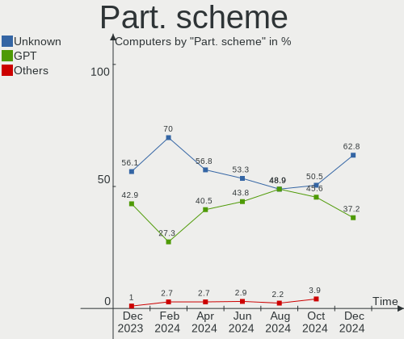
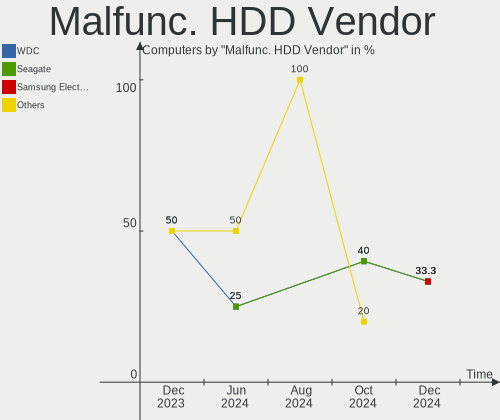
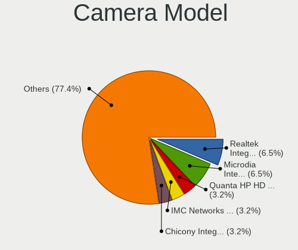

openSUSE - Hardware Trends
--------------------------

A project to identify most popular hardware characteristics and track their change
over time based on data collected by Linux users at https://Linux-Hardware.org.

Anyone can contribute to this report by the [hw-probe](https://github.com/linuxhw/hw-probe) tool:

    sudo -E hw-probe -all -upload

This is a report for all computer types. See also reports for [desktops](/Dist/openSUSE/Desktop/README.md) and [notebooks](/Dist/openSUSE/Notebook/README.md).

This report is for one last month. Overall report since the beginning of time: [TestCoverage](https://github.com/linuxhw/TestCoverage)

Period: May, 2022.

Contents
--------

* [ System ](#system)
  - [ OS                       ](#os)
  - [ OS Family                ](#os-family)
  - [ Kernel                   ](#kernel)
  - [ Kernel Family            ](#kernel-family)
  - [ Kernel Major Ver.        ](#kernel-major-ver)
  - [ Arch                     ](#arch)
  - [ DE                       ](#de)
  - [ Display Server           ](#display-server)
  - [ Display Manager          ](#display-manager)
  - [ OS Lang                  ](#os-lang)
  - [ Boot Mode                ](#boot-mode)
  - [ Filesystem               ](#filesystem)
  - [ Part. scheme             ](#part-scheme)
  - [ Dual Boot with Linux/BSD ](#dual-boot-with-linuxbsd)
  - [ Dual Boot (Win)          ](#dual-boot-win)

* [ Board ](#board)
  - [ Vendor                   ](#vendor)
  - [ Model                    ](#model)
  - [ Model Family             ](#model-family)
  - [ MFG Year                 ](#mfg-year)
  - [ Form Factor              ](#form-factor)
  - [ Secure Boot              ](#secure-boot)
  - [ Coreboot                 ](#coreboot)
  - [ RAM Size                 ](#ram-size)
  - [ RAM Used                 ](#ram-used)
  - [ Total Drives             ](#total-drives)
  - [ Has CD-ROM               ](#has-cd-rom)
  - [ Has Ethernet             ](#has-ethernet)
  - [ Has WiFi                 ](#has-wifi)
  - [ Has Bluetooth            ](#has-bluetooth)

* [ Location ](#location)
  - [ Country                  ](#country)
  - [ City                     ](#city)

* [ Drives ](#drives)
  - [ Drive Vendor             ](#drive-vendor)
  - [ Drive Model              ](#drive-model)
  - [ HDD Vendor               ](#hdd-vendor)
  - [ SSD Vendor               ](#ssd-vendor)
  - [ Drive Kind               ](#drive-kind)
  - [ Drive Connector          ](#drive-connector)
  - [ Drive Size               ](#drive-size)
  - [ Space Total              ](#space-total)
  - [ Space Used               ](#space-used)
  - [ Malfunc. Drives          ](#malfunc-drives)
  - [ Malfunc. Drive Vendor    ](#malfunc-drive-vendor)
  - [ Malfunc. HDD Vendor      ](#malfunc-hdd-vendor)
  - [ Malfunc. Drive Kind      ](#malfunc-drive-kind)
  - [ Failed Drives            ](#failed-drives)
  - [ Failed Drive Vendor      ](#failed-drive-vendor)
  - [ Drive Status             ](#drive-status)

* [ Storage controller ](#storage-controller)
  - [ Storage Vendor           ](#storage-vendor)
  - [ Storage Model            ](#storage-model)
  - [ Storage Kind             ](#storage-kind)

* [ Processor ](#processor)
  - [ CPU Vendor               ](#cpu-vendor)
  - [ CPU Model                ](#cpu-model)
  - [ CPU Model Family         ](#cpu-model-family)
  - [ CPU Cores                ](#cpu-cores)
  - [ CPU Sockets              ](#cpu-sockets)
  - [ CPU Threads              ](#cpu-threads)
  - [ CPU Op-Modes             ](#cpu-op-modes)
  - [ CPU Microcode            ](#cpu-microcode)
  - [ CPU Microarch            ](#cpu-microarch)

* [ Graphics ](#graphics)
  - [ GPU Vendor               ](#gpu-vendor)
  - [ GPU Model                ](#gpu-model)
  - [ GPU Combo                ](#gpu-combo)
  - [ GPU Driver               ](#gpu-driver)
  - [ GPU Memory               ](#gpu-memory)

* [ Monitor ](#monitor)
  - [ Monitor Vendor           ](#monitor-vendor)
  - [ Monitor Model            ](#monitor-model)
  - [ Monitor Resolution       ](#monitor-resolution)
  - [ Monitor Diagonal         ](#monitor-diagonal)
  - [ Monitor Width            ](#monitor-width)
  - [ Aspect Ratio             ](#aspect-ratio)
  - [ Monitor Area             ](#monitor-area)
  - [ Pixel Density            ](#pixel-density)
  - [ Multiple Monitors        ](#multiple-monitors)

* [ Network ](#network)
  - [ Net Controller Vendor    ](#net-controller-vendor)
  - [ Net Controller Model     ](#net-controller-model)
  - [ Wireless Vendor          ](#wireless-vendor)
  - [ Wireless Model           ](#wireless-model)
  - [ Ethernet Vendor          ](#ethernet-vendor)
  - [ Ethernet Model           ](#ethernet-model)
  - [ Net Controller Kind      ](#net-controller-kind)
  - [ Used Controller          ](#used-controller)
  - [ NICs                     ](#nics)
  - [ IPv6                     ](#ipv6)

* [ Bluetooth ](#bluetooth)
  - [ Bluetooth Vendor         ](#bluetooth-vendor)
  - [ Bluetooth Model          ](#bluetooth-model)

* [ Sound ](#sound)
  - [ Sound Vendor             ](#sound-vendor)
  - [ Sound Model              ](#sound-model)

* [ Memory ](#memory)
  - [ Memory Vendor            ](#memory-vendor)
  - [ Memory Model             ](#memory-model)
  - [ Memory Kind              ](#memory-kind)
  - [ Memory Form Factor       ](#memory-form-factor)
  - [ Memory Size              ](#memory-size)
  - [ Memory Speed             ](#memory-speed)

* [ Printers & scanners ](#printers--scanners)
  - [ Printer Vendor           ](#printer-vendor)
  - [ Printer Model            ](#printer-model)
  - [ Scanner Vendor           ](#scanner-vendor)
  - [ Scanner Model            ](#scanner-model)

* [ Camera ](#camera)
  - [ Camera Vendor            ](#camera-vendor)
  - [ Camera Model             ](#camera-model)

* [ Security ](#security)
  - [ Fingerprint Vendor       ](#fingerprint-vendor)
  - [ Fingerprint Model        ](#fingerprint-model)
  - [ Chipcard Vendor          ](#chipcard-vendor)
  - [ Chipcard Model           ](#chipcard-model)

* [ Unsupported ](#unsupported)
  - [ Unsupported Devices      ](#unsupported-devices)
  - [ Unsupported Device Types ](#unsupported-device-types)

System
------

OS
--

Installed operating systems

| Name                         | Computers | Percent |
|------------------------------|-----------|---------|
| openSUSE Tumbleweed-XXXXXXXX | 66        | 75%     |
| openSUSE Leap-15.4           | 13        | 14.77%  |
| openSUSE Leap-15.3           | 7         | 7.95%   |
| openSUSE Leap-15.2           | 2         | 2.27%   |

OS Family
---------

OS without a version

| Name     | Computers | Percent |
|----------|-----------|---------|
| openSUSE | 88        | 100%    |

Kernel
------

Version of the Linux kernel

| Version                             | Computers | Percent |
|-------------------------------------|-----------|---------|
| 5.17.4-1-default                    | 39        | 44.32%  |
| 5.17.9-1-default                    | 12        | 13.64%  |
| 5.14.21-150400.19-default           | 10        | 11.36%  |
| 5.17.5-1-default                    | 6         | 6.82%   |
| 5.17.7-1-default                    | 4         | 4.55%   |
| 5.3.18-150300.59.63-default         | 3         | 3.41%   |
| 5.18.0-rc6-lp153.2.ged50f8f-default | 2         | 2.27%   |
| 5.3.18-lp152.87-default             | 1         | 1.14%   |
| 5.3.18-lp152.36-default             | 1         | 1.14%   |
| 5.3.18-59.27-preempt                | 1         | 1.14%   |
| 5.3.18-150300.59.68-default         | 1         | 1.14%   |
| 5.3.18-150300.59.63-preempt         | 1         | 1.14%   |
| 5.3.18-150300.59.60-default         | 1         | 1.14%   |
| 5.17.6-xanmod1                      | 1         | 1.14%   |
| 5.17.5-6.g8ca9274-default           | 1         | 1.14%   |
| 5.17.3-1-default                    | 1         | 1.14%   |
| 5.17.1-1-default                    | 1         | 1.14%   |
| 5.16.4-1-default                    | 1         | 1.14%   |
| 5.14.21-150400.22-default           | 1         | 1.14%   |

Kernel Family
-------------

Linux kernel without a distro release

| Version | Computers | Percent |
|---------|-----------|---------|
| 5.17.4  | 39        | 44.32%  |
| 5.17.9  | 12        | 13.64%  |
| 5.14.21 | 11        | 12.5%   |
| 5.3.18  | 9         | 10.23%  |
| 5.17.5  | 7         | 7.95%   |
| 5.17.7  | 4         | 4.55%   |
| 5.18.0  | 2         | 2.27%   |
| 5.17.6  | 1         | 1.14%   |
| 5.17.3  | 1         | 1.14%   |
| 5.17.1  | 1         | 1.14%   |
| 5.16.4  | 1         | 1.14%   |

Kernel Major Ver.
-----------------

Linux kernel major version

| Version | Computers | Percent |
|---------|-----------|---------|
| 5.17    | 65        | 73.86%  |
| 5.14    | 11        | 12.5%   |
| 5.3     | 9         | 10.23%  |
| 5.18    | 2         | 2.27%   |
| 5.16    | 1         | 1.14%   |

Arch
----

OS architecture (x86_64, i586, etc.)

| Name   | Computers | Percent |
|--------|-----------|---------|
| x86_64 | 88        | 100%    |

DE
--

Desktop Environment

| Name        | Computers | Percent |
|-------------|-----------|---------|
| KDE5        | 58        | 65.91%  |
| GNOME       | 20        | 22.73%  |
| XFCE        | 2         | 2.27%   |
| WindowMaker | 2         | 2.27%   |
| Cinnamon    | 2         | 2.27%   |
| Unknown     | 2         | 2.27%   |
| KDE         | 1         | 1.14%   |
| i3          | 1         | 1.14%   |

Display Server
--------------

X11 or Wayland

| Name        | Computers | Percent |
|-------------|-----------|---------|
| X11         | 68        | 77.27%  |
| Wayland     | 18        | 20.45%  |
| Unspecified | 1         | 1.14%   |
| Tty         | 1         | 1.14%   |

Display Manager
---------------

SDDM, LightDM, etc.

| Name    | Computers | Percent |
|---------|-----------|---------|
| SDDM    | 44        | 50%     |
| Unknown | 18        | 20.45%  |
| LightDM | 14        | 15.91%  |
| XDM     | 10        | 11.36%  |
| GDM     | 2         | 2.27%   |

OS Lang
-------

Language

| Lang    | Computers | Percent |
|---------|-----------|---------|
| en_US   | 41        | 46.59%  |
| en_GB   | 13        | 14.77%  |
| de_DE   | 10        | 11.36%  |
| POSIX   | 5         | 5.68%   |
| es_ES   | 3         | 3.41%   |
| zh_CN   | 2         | 2.27%   |
| ru_RU   | 2         | 2.27%   |
| pt_BR   | 2         | 2.27%   |
| C       | 2         | 2.27%   |
| Unknown | 2         | 2.27%   |
| nl_NL   | 1         | 1.14%   |
| it_IT   | 1         | 1.14%   |
| es_MX   | 1         | 1.14%   |
| en_IE   | 1         | 1.14%   |
| en_FI   | 1         | 1.14%   |
| bg_BG   | 1         | 1.14%   |

Boot Mode
---------

EFI or BIOS

| Mode | Computers | Percent |
|------|-----------|---------|
| EFI  | 62        | 70.45%  |
| BIOS | 26        | 29.55%  |

Filesystem
----------

Type of filesystem

| Type    | Computers | Percent |
|---------|-----------|---------|
| Btrfs   | 71        | 80.68%  |
| Ext4    | 10        | 11.36%  |
| Xfs     | 6         | 6.82%   |
| Overlay | 1         | 1.14%   |

Part. scheme
------------

Scheme of partitioning

| Type    | Computers | Percent |
|---------|-----------|---------|
| GPT     | 61        | 69.32%  |
| Unknown | 19        | 21.59%  |
| MBR     | 8         | 9.09%   |

Dual Boot with Linux/BSD
------------------------

Hosting more than one Linux/BSD

| Dual boot | Computers | Percent |
|-----------|-----------|---------|
| No        | 70        | 79.55%  |
| Yes       | 18        | 20.45%  |

Dual Boot (Win)
---------------

Hosting Linux and Windows

| Dual boot | Computers | Percent |
|-----------|-----------|---------|
| No        | 60        | 68.18%  |
| Yes       | 28        | 31.82%  |

Board
-----

Vendor
------

Motherboard manufacturer

| Name                | Computers | Percent |
|---------------------|-----------|---------|
| ASUSTek Computer    | 19        | 21.59%  |
| Hewlett-Packard     | 14        | 15.91%  |
| Lenovo              | 11        | 12.5%   |
| Gigabyte Technology | 10        | 11.36%  |
| MSI                 | 9         | 10.23%  |
| Dell                | 7         | 7.95%   |
| ASRock              | 4         | 4.55%   |
| Clevo               | 2         | 2.27%   |
| Apple               | 2         | 2.27%   |
| TUXEDO              | 1         | 1.14%   |
| Supermicro          | 1         | 1.14%   |
| Sony                | 1         | 1.14%   |
| Samsung Electronics | 1         | 1.14%   |
| Positivo            | 1         | 1.14%   |
| Notebook            | 1         | 1.14%   |
| Monster             | 1         | 1.14%   |
| LG Electronics      | 1         | 1.14%   |
| EVGA                | 1         | 1.14%   |
| Acer                | 1         | 1.14%   |

Model
-----

Motherboard model

| Name                                  | Computers | Percent |
|---------------------------------------|-----------|---------|
| MSI MS-7C02                           | 3         | 3.41%   |
| ASUS TUF Gaming B550M-E               | 2         | 2.27%   |
| ASUS M5A78L-M/USB3                    | 2         | 2.27%   |
| ASUS M4A785TD-V EVO                   | 2         | 2.27%   |
| TUXEDO InfinityBook S 15 Gen6         | 1         | 1.14%   |
| Supermicro SSG-6047R-E1CR36N          | 1         | 1.14%   |
| Sony VPCF23S1E                        | 1         | 1.14%   |
| Samsung 550XDA                        | 1         | 1.14%   |
| Positivo DA18HV1                      | 1         | 1.14%   |
| Notebook NB50TJ1_TK1                  | 1         | 1.14%   |
| MSI MS-7D25                           | 1         | 1.14%   |
| MSI MS-7C91                           | 1         | 1.14%   |
| MSI MS-7B89                           | 1         | 1.14%   |
| MSI MS-7B86                           | 1         | 1.14%   |
| MSI MS-7B79                           | 1         | 1.14%   |
| MSI MS-7A38                           | 1         | 1.14%   |
| Monster HUMA H4 V3.1                  | 1         | 1.14%   |
| LG 15Z995-U.ARS5U1                    | 1         | 1.14%   |
| Lenovo Yoga C640-13IML 81UE           | 1         | 1.14%   |
| Lenovo Yoga 910-13IKB 80VF            | 1         | 1.14%   |
| Lenovo ThinkPad T495s 20QJ0012UK      | 1         | 1.14%   |
| Lenovo ThinkPad T470 W10DG 20JNS0GH0C | 1         | 1.14%   |
| Lenovo ThinkPad T470 20HES1RB06       | 1         | 1.14%   |
| Lenovo ThinkPad T410 25223FG          | 1         | 1.14%   |
| Lenovo ThinkPad P50 20EQS0VV0C        | 1         | 1.14%   |
| Lenovo ThinkPad E555 20DH000WGE       | 1         | 1.14%   |
| Lenovo ThinkPad E15 Gen 3 20YGCTO1WW  | 1         | 1.14%   |
| Lenovo ThinkBook 16p Gen 2 20YM       | 1         | 1.14%   |
| Lenovo IdeaPad 5 14ARE05 81YM         | 1         | 1.14%   |
| HP ZHAN 66 Pro 14 G4 Notebook PC      | 1         | 1.14%   |
| HP Z440 Workstation                   | 1         | 1.14%   |
| HP Z1 Entry Tower G5                  | 1         | 1.14%   |
| HP Pavilion dv6                       | 1         | 1.14%   |
| HP Pavilion 13 x360 PC                | 1         | 1.14%   |
| HP Notebook                           | 1         | 1.14%   |
| HP Laptop 17-ca0xxx                   | 1         | 1.14%   |
| HP ENVY Laptop 13-ba1xxx              | 1         | 1.14%   |
| HP EliteBook 855 G8 Notebook PC       | 1         | 1.14%   |
| HP EliteBook 840 G4                   | 1         | 1.14%   |
| HP EliteBook 820 G3                   | 1         | 1.14%   |
| HP EliteBook 2560p                    | 1         | 1.14%   |
| HP Compaq dc5800 Small Form Factor    | 1         | 1.14%   |
| HP 24-b116nz                          | 1         | 1.14%   |
| Gigabyte Z87X-D3H                     | 1         | 1.14%   |
| Gigabyte Z390 AORUS MASTER            | 1         | 1.14%   |
| Gigabyte X58A-UD3R                    | 1         | 1.14%   |
| Gigabyte X570 AORUS MASTER            | 1         | 1.14%   |
| Gigabyte Leopard WS                   | 1         | 1.14%   |
| Gigabyte B560 HD3                     | 1         | 1.14%   |
| Gigabyte B550 AORUS PRO V2            | 1         | 1.14%   |
| Gigabyte B550 AORUS ELITE AX V2       | 1         | 1.14%   |
| Gigabyte B450M DS3H V2                | 1         | 1.14%   |
| Gigabyte B450M DS3H                   | 1         | 1.14%   |
| EVGA 132-YW-E178-FTW                  | 1         | 1.14%   |
| Dell XPS 15 9560                      | 1         | 1.14%   |
| Dell XPS 15 9550                      | 1         | 1.14%   |
| Dell Precision 5820 Tower X-Series    | 1         | 1.14%   |
| Dell OptiPlex 5000                    | 1         | 1.14%   |
| Dell Latitude 7490                    | 1         | 1.14%   |
| Dell Latitude 7320                    | 1         | 1.14%   |

Model Family
------------

Motherboard model prefix

| Name                         | Computers | Percent |
|------------------------------|-----------|---------|
| Lenovo ThinkPad              | 7         | 7.95%   |
| HP EliteBook                 | 4         | 4.55%   |
| ASUS TUF                     | 4         | 4.55%   |
| MSI MS-7C02                  | 3         | 3.41%   |
| Dell Latitude                | 3         | 3.41%   |
| ASUS ROG                     | 3         | 3.41%   |
| Lenovo Yoga                  | 2         | 2.27%   |
| HP Pavilion                  | 2         | 2.27%   |
| Gigabyte B550                | 2         | 2.27%   |
| Gigabyte B450M               | 2         | 2.27%   |
| Dell XPS                     | 2         | 2.27%   |
| ASUS M5A78L-M                | 2         | 2.27%   |
| ASUS M4A785TD-V              | 2         | 2.27%   |
| TUXEDO InfinityBook          | 1         | 1.14%   |
| Supermicro SSG-6047R-E1CR36N | 1         | 1.14%   |
| Sony VPCF23S1E               | 1         | 1.14%   |
| Samsung 550XDA               | 1         | 1.14%   |
| Positivo DA18HV1             | 1         | 1.14%   |
| Notebook NB50TJ1             | 1         | 1.14%   |
| MSI MS-7D25                  | 1         | 1.14%   |
| MSI MS-7C91                  | 1         | 1.14%   |
| MSI MS-7B89                  | 1         | 1.14%   |
| MSI MS-7B86                  | 1         | 1.14%   |
| MSI MS-7B79                  | 1         | 1.14%   |
| MSI MS-7A38                  | 1         | 1.14%   |
| Monster HUMA                 | 1         | 1.14%   |
| LG 15Z995-U.ARS5U1           | 1         | 1.14%   |
| Lenovo ThinkBook             | 1         | 1.14%   |
| Lenovo IdeaPad               | 1         | 1.14%   |
| HP ZHAN                      | 1         | 1.14%   |
| HP Z440                      | 1         | 1.14%   |
| HP Z1                        | 1         | 1.14%   |
| HP Notebook                  | 1         | 1.14%   |
| HP Laptop                    | 1         | 1.14%   |
| HP ENVY                      | 1         | 1.14%   |
| HP Compaq                    | 1         | 1.14%   |
| HP 24-b116nz                 | 1         | 1.14%   |
| Gigabyte Z87X-D3H            | 1         | 1.14%   |
| Gigabyte Z390                | 1         | 1.14%   |
| Gigabyte X58A-UD3R           | 1         | 1.14%   |
| Gigabyte X570                | 1         | 1.14%   |
| Gigabyte Leopard             | 1         | 1.14%   |
| Gigabyte B560                | 1         | 1.14%   |
| EVGA 132-YW-E178-FTW         | 1         | 1.14%   |
| Dell Precision               | 1         | 1.14%   |
| Dell OptiPlex                | 1         | 1.14%   |
| Clevo W55xEU                 | 1         | 1.14%   |
| Clevo Modified               | 1         | 1.14%   |
| ASUS Z170-A                  | 1         | 1.14%   |
| ASUS X540LJ                  | 1         | 1.14%   |
| ASUS PRIME                   | 1         | 1.14%   |
| ASUS P8B75-V                 | 1         | 1.14%   |
| ASUS G771JW                  | 1         | 1.14%   |
| ASUS CROSSHAIR               | 1         | 1.14%   |
| ASUS ASUS                    | 1         | 1.14%   |
| ASUS 970                     | 1         | 1.14%   |
| ASRock Z390                  | 1         | 1.14%   |
| ASRock H97                   | 1         | 1.14%   |
| ASRock AB350                 | 1         | 1.14%   |
| ASRock A88M-G                | 1         | 1.14%   |

MFG Year
--------

Motherboard manufacture year

| Year | Computers | Percent |
|------|-----------|---------|
| 2021 | 17        | 19.32%  |
| 2020 | 12        | 13.64%  |
| 2019 | 10        | 11.36%  |
| 2018 | 9         | 10.23%  |
| 2015 | 8         | 9.09%   |
| 2017 | 5         | 5.68%   |
| 2016 | 5         | 5.68%   |
| 2011 | 5         | 5.68%   |
| 2012 | 4         | 4.55%   |
| 2009 | 4         | 4.55%   |
| 2022 | 3         | 3.41%   |
| 2008 | 3         | 3.41%   |
| 2014 | 2         | 2.27%   |
| 2013 | 1         | 1.14%   |

Form Factor
-----------

Physical design of the computer

| Name        | Computers | Percent |
|-------------|-----------|---------|
| Desktop     | 46        | 52.27%  |
| Notebook    | 38        | 43.18%  |
| Convertible | 2         | 2.27%   |
| All in one  | 2         | 2.27%   |

Secure Boot
-----------

Enabled or disabled

| State    | Computers | Percent |
|----------|-----------|---------|
| Disabled | 68        | 77.27%  |
| Enabled  | 20        | 22.73%  |

Coreboot
--------

Have coreboot on board

| Used | Computers | Percent |
|------|-----------|---------|
| No   | 88        | 100%    |

RAM Size
--------

Total RAM memory

| Size in GB  | Computers | Percent |
|-------------|-----------|---------|
| 16.01-24.0  | 32        | 36.36%  |
| 32.01-64.0  | 16        | 18.18%  |
| 4.01-8.0    | 15        | 17.05%  |
| 8.01-16.0   | 15        | 17.05%  |
| 3.01-4.0    | 5         | 5.68%   |
| 24.01-32.0  | 3         | 3.41%   |
| 64.01-256.0 | 2         | 2.27%   |

RAM Used
--------

Used RAM memory

| Used GB   | Computers | Percent |
|-----------|-----------|---------|
| 4.01-8.0  | 26        | 29.55%  |
| 3.01-4.0  | 20        | 22.73%  |
| 1.01-2.0  | 18        | 20.45%  |
| 2.01-3.0  | 15        | 17.05%  |
| 8.01-16.0 | 6         | 6.82%   |
| 0.51-1.0  | 3         | 3.41%   |

Total Drives
------------

Number of drives on board

| Drives | Computers | Percent |
|--------|-----------|---------|
| 1      | 41        | 46.59%  |
| 2      | 21        | 23.86%  |
| 3      | 14        | 15.91%  |
| 4      | 7         | 7.95%   |
| 6      | 2         | 2.27%   |
| 5      | 2         | 2.27%   |
| 0      | 1         | 1.14%   |

Has CD-ROM
----------

Has CD-ROM on board

| Presented | Computers | Percent |
|-----------|-----------|---------|
| No        | 60        | 68.18%  |
| Yes       | 28        | 31.82%  |

Has Ethernet
------------

Has Ethernet on board

| Presented | Computers | Percent |
|-----------|-----------|---------|
| Yes       | 81        | 92.05%  |
| No        | 7         | 7.95%   |

Has WiFi
--------

Has WiFi module

| Presented | Computers | Percent |
|-----------|-----------|---------|
| Yes       | 57        | 64.77%  |
| No        | 31        | 35.23%  |

Has Bluetooth
-------------

Has Bluetooth module

| Presented | Computers | Percent |
|-----------|-----------|---------|
| Yes       | 54        | 61.36%  |
| No        | 34        | 38.64%  |

Location
--------

Country
-------

Geographic location (country)

| Country            | Computers | Percent |
|--------------------|-----------|---------|
| Germany            | 19        | 21.59%  |
| USA                | 13        | 14.77%  |
| UK                 | 6         | 6.82%   |
| Switzerland        | 4         | 4.55%   |
| Brazil             | 4         | 4.55%   |
| Poland             | 3         | 3.41%   |
| Chile              | 3         | 3.41%   |
| Turkey             | 2         | 2.27%   |
| Sweden             | 2         | 2.27%   |
| Russia             | 2         | 2.27%   |
| Netherlands        | 2         | 2.27%   |
| Italy              | 2         | 2.27%   |
| India              | 2         | 2.27%   |
| Greece             | 2         | 2.27%   |
| France             | 2         | 2.27%   |
| Finland            | 2         | 2.27%   |
| China              | 2         | 2.27%   |
| Bulgaria           | 2         | 2.27%   |
| Thailand           | 1         | 1.14%   |
| Spain              | 1         | 1.14%   |
| Portugal           | 1         | 1.14%   |
| Mexico             | 1         | 1.14%   |
| Hungary            | 1         | 1.14%   |
| Hong Kong          | 1         | 1.14%   |
| Estonia            | 1         | 1.14%   |
| Ecuador            | 1         | 1.14%   |
| Dominican Republic | 1         | 1.14%   |
| Czechia            | 1         | 1.14%   |
| Croatia            | 1         | 1.14%   |
| Canada             | 1         | 1.14%   |
| Belarus            | 1         | 1.14%   |
| Australia          | 1         | 1.14%   |

City
----

Geographic location (city)

| City                         | Computers | Percent |
|------------------------------|-----------|---------|
| Haßfurt                     | 5         | 5.68%   |
| Santiago                     | 3         | 3.41%   |
| London                       | 3         | 3.41%   |
| Schrobenhausen               | 2         | 2.27%   |
| Sao Paulo                    | 2         | 2.27%   |
| Orlando                      | 2         | 2.27%   |
| Zagreb                       | 1         | 1.14%   |
| Wil                          | 1         | 1.14%   |
| Weselberg                    | 1         | 1.14%   |
| Waterloo                     | 1         | 1.14%   |
| Warsaw                       | 1         | 1.14%   |
| Veszprém                    | 1         | 1.14%   |
| Turku                        | 1         | 1.14%   |
| Thungersheim                 | 1         | 1.14%   |
| Thessaloniki                 | 1         | 1.14%   |
| The Hague                    | 1         | 1.14%   |
| Tallinn                      | 1         | 1.14%   |
| Sydney                       | 1         | 1.14%   |
| Stockholm                    | 1         | 1.14%   |
| Sofia                        | 1         | 1.14%   |
| Santo Domingo Este           | 1         | 1.14%   |
| Rattelsdorf                  | 1         | 1.14%   |
| Puszczykowo                  | 1         | 1.14%   |
| Puebla de Alcocer            | 1         | 1.14%   |
| Plano                        | 1         | 1.14%   |
| Pernik                       | 1         | 1.14%   |
| Nuvolera                     | 1         | 1.14%   |
| Nottingham                   | 1         | 1.14%   |
| Northport                    | 1         | 1.14%   |
| New York                     | 1         | 1.14%   |
| Munchenstein                 | 1         | 1.14%   |
| Moscow                       | 1         | 1.14%   |
| Montreal                     | 1         | 1.14%   |
| Minsk                        | 1         | 1.14%   |
| Minneapolis                  | 1         | 1.14%   |
| Mikulov                      | 1         | 1.14%   |
| Mexico City                  | 1         | 1.14%   |
| Meggen                       | 1         | 1.14%   |
| Maringá                     | 1         | 1.14%   |
| Marcon                       | 1         | 1.14%   |
| Leesburg                     | 1         | 1.14%   |
| Le Plessis-Robinson          | 1         | 1.14%   |
| Langenhagen                  | 1         | 1.14%   |
| Lafayette                    | 1         | 1.14%   |
| La Vergne                    | 1         | 1.14%   |
| Jyväskylä                  | 1         | 1.14%   |
| Joinville                    | 1         | 1.14%   |
| Izmir                        | 1         | 1.14%   |
| Istanbul                     | 1         | 1.14%   |
| Islington                    | 1         | 1.14%   |
| Huettenberg                  | 1         | 1.14%   |
| Howell                       | 1         | 1.14%   |
| Hildesheim                   | 1         | 1.14%   |
| Halle                        | 1         | 1.14%   |
| Haßfurt                   | 1         | 1.14%   |
| Gurgaon                      | 1         | 1.14%   |
| Gothenburg                   | 1         | 1.14%   |
| Gloucester                   | 1         | 1.14%   |
| Gevelsberg                   | 1         | 1.14%   |
| Figueira da Foz Municipality | 1         | 1.14%   |

Drives
------

Drive Vendor
------------

Hard drive vendors

| Vendor              | Computers | Drives | Percent |
|---------------------|-----------|--------|---------|
| Samsung Electronics | 46        | 57     | 31.72%  |
| WDC                 | 25        | 36     | 17.24%  |
| Seagate             | 17        | 23     | 11.72%  |
| Kingston            | 8         | 8      | 5.52%   |
| Crucial             | 7         | 7      | 4.83%   |
| Intel               | 6         | 7      | 4.14%   |
| SK Hynix            | 5         | 6      | 3.45%   |
| SanDisk             | 5         | 6      | 3.45%   |
| Toshiba             | 3         | 3      | 2.07%   |
| HGST                | 3         | 4      | 2.07%   |
| PNY                 | 2         | 2      | 1.38%   |
| Hitachi             | 2         | 3      | 1.38%   |
| Hewlett-Packard     | 2         | 2      | 1.38%   |
| XPG                 | 1         | 1      | 0.69%   |
| WDC WDS2            | 1         | 1      | 0.69%   |
| Unknown             | 1         | 1      | 0.69%   |
| Pioneer             | 1         | 1      | 0.69%   |
| Phison              | 1         | 1      | 0.69%   |
| Patriot             | 1         | 1      | 0.69%   |
| Micro Center        | 1         | 1      | 0.69%   |
| KIOXIA              | 1         | 1      | 0.69%   |
| Intenso             | 1         | 1      | 0.69%   |
| GOODRAM             | 1         | 1      | 0.69%   |
| Gigabyte Technology | 1         | 1      | 0.69%   |
| FORESEE             | 1         | 1      | 0.69%   |
| Apple               | 1         | 1      | 0.69%   |
| A-DATA Technology   | 1         | 1      | 0.69%   |

Drive Model
-----------

Hard drive models

| Model                                   | Computers | Percent |
|-----------------------------------------|-----------|---------|
| Samsung SSD 860 EVO 500GB               | 6         | 3.51%   |
| Samsung SSD 970 EVO Plus 1TB            | 4         | 2.34%   |
| Samsung SSD 840 EVO 120GB               | 4         | 2.34%   |
| SK Hynix NVMe SSD Drive 512GB           | 3         | 1.75%   |
| Samsung NVMe SSD Drive 1TB              | 3         | 1.75%   |
| WDC WD10EZEX-22MFCA0 1TB                | 2         | 1.17%   |
| WDC WD10EZEX-08WN4A0 1TB                | 2         | 1.17%   |
| Seagate ST31000528AS 1TB                | 2         | 1.17%   |
| SanDisk SSD PLUS 240GB                  | 2         | 1.17%   |
| Samsung SSD 970 EVO Plus 250GB          | 2         | 1.17%   |
| Samsung SSD 860 EVO 250GB               | 2         | 1.17%   |
| Samsung SSD 860 EVO 1TB                 | 2         | 1.17%   |
| Samsung SSD 850 EVO 500GB               | 2         | 1.17%   |
| Samsung SSD 850 EVO 250GB               | 2         | 1.17%   |
| Samsung SSD 850 EVO 1TB                 | 2         | 1.17%   |
| Crucial CT250MX500SSD1 250GB            | 2         | 1.17%   |
| Crucial CT240BX500SSD1 240GB            | 2         | 1.17%   |
| XPG GAMMIX S41 512GB                    | 1         | 0.58%   |
| WDC WDS512G1X0C-00ENX0 512GB            | 1         | 0.58%   |
| WDC WDS500G2B0C-00PXH0 500GB            | 1         | 0.58%   |
| WDC WDS480G2G0A-00JH30 480GB SSD        | 1         | 0.58%   |
| WDC WDS250G1B0A-00H9H0 250GB SSD        | 1         | 0.58%   |
| WDC WDS200T2B0B 2TB SSD                 | 1         | 0.58%   |
| WDC WDS2 40G2G0B-00EPW0 240GB SSD       | 1         | 0.58%   |
| WDC WDS100T3XHC-00SJG0 1TB              | 1         | 0.58%   |
| WDC WD8001FZBX-00ASYA0 8TB              | 1         | 0.58%   |
| WDC WD6400AACS-00G8B1 640GB             | 1         | 0.58%   |
| WDC WD5000AAKX-08ERMA0 500GB            | 1         | 0.58%   |
| WDC WD40EZRZ-00GXCB0 4TB                | 1         | 0.58%   |
| WDC WD40EZAZ-00SF3B0 4TB                | 1         | 0.58%   |
| WDC WD40EFAX-68JH4N1 4TB                | 1         | 0.58%   |
| WDC WD4005FZBX-00K5WB0 4TB              | 1         | 0.58%   |
| WDC WD4003FRYZ-01F0DB0 4TB              | 1         | 0.58%   |
| WDC WD4003FFBX-68MU3N0 4TB              | 1         | 0.58%   |
| WDC WD4000KS-00MNB0 400GB               | 1         | 0.58%   |
| WDC WD3200BEVT-75ZCT2 320GB             | 1         | 0.58%   |
| WDC WD30EZRS-00J99B0 3TB                | 1         | 0.58%   |
| WDC WD20EZRX-00DC0B0 2TB                | 1         | 0.58%   |
| WDC WD20EZRX-00D8PB0 2TB                | 1         | 0.58%   |
| WDC WD10SPZX-60Z10T0 1TB                | 1         | 0.58%   |
| WDC WD10PURX-64E5EY0 1TB                | 1         | 0.58%   |
| WDC WD10JPVX-60JC3T0 1TB                | 1         | 0.58%   |
| WDC WD10EZEX-60WN4A0 1TB                | 1         | 0.58%   |
| WDC WD10EZEX-22BN5A0 1TB                | 1         | 0.58%   |
| WDC WD10EAVS-22D7B0 1TB                 | 1         | 0.58%   |
| WDC WD1003FZEX-00MK2A0 1TB              | 1         | 0.58%   |
| WDC WD1003FZEX-00K3CA0 1TB              | 1         | 0.58%   |
| WDC PC SN730 SDBQNTY-512G-1001 512GB    | 1         | 0.58%   |
| WDC PC SN530 SDBPMPZ-512G-1001 512GB    | 1         | 0.58%   |
| Unknown G1J38E  64GB                    | 1         | 0.58%   |
| Toshiba MK5055GSX 500GB                 | 1         | 0.58%   |
| Toshiba MD04ACA50D 5TB                  | 1         | 0.58%   |
| Toshiba HDWD120 2TB                     | 1         | 0.58%   |
| SK Hynix NVMe SSD Drive 2TB             | 1         | 0.58%   |
| SK Hynix HFS256GD9TNG-L2A0A 256GB       | 1         | 0.58%   |
| SK Hynix BC511 HFM256GDJTNI-82A0A 256GB | 1         | 0.58%   |
| Seagate ST8000NM0055-1RM112 8TB         | 1         | 0.58%   |
| Seagate ST500LM000-1EJ162 500GB         | 1         | 0.58%   |
| Seagate ST500DM002-1SB10A 500GB         | 1         | 0.58%   |
| Seagate ST3500312CS 500GB               | 1         | 0.58%   |

HDD Vendor
----------

Hard disk drive vendors

| Vendor              | Computers | Drives | Percent |
|---------------------|-----------|--------|---------|
| WDC                 | 20        | 28     | 41.67%  |
| Seagate             | 17        | 23     | 35.42%  |
| Toshiba             | 3         | 3      | 6.25%   |
| Samsung Electronics | 3         | 4      | 6.25%   |
| HGST                | 3         | 4      | 6.25%   |
| Hitachi             | 2         | 3      | 4.17%   |

SSD Vendor
----------

Solid state drive vendors

| Vendor              | Computers | Drives | Percent |
|---------------------|-----------|--------|---------|
| Samsung Electronics | 23        | 27     | 45.1%   |
| Crucial             | 6         | 6      | 11.76%  |
| SanDisk             | 4         | 5      | 7.84%   |
| Kingston            | 4         | 4      | 7.84%   |
| WDC                 | 3         | 3      | 5.88%   |
| PNY                 | 2         | 2      | 3.92%   |
| WDC WDS2            | 1         | 1      | 1.96%   |
| Pioneer             | 1         | 1      | 1.96%   |
| Patriot             | 1         | 1      | 1.96%   |
| Micro Center        | 1         | 1      | 1.96%   |
| Intenso             | 1         | 1      | 1.96%   |
| Hewlett-Packard     | 1         | 1      | 1.96%   |
| GOODRAM             | 1         | 1      | 1.96%   |
| Gigabyte Technology | 1         | 1      | 1.96%   |
| Apple               | 1         | 1      | 1.96%   |

Drive Kind
----------

HDD or SSD

| Kind | Computers | Drives | Percent |
|------|-----------|--------|---------|
| NVMe | 47        | 56     | 36.15%  |
| SSD  | 45        | 56     | 34.62%  |
| HDD  | 37        | 65     | 28.46%  |
| MMC  | 1         | 1      | 0.77%   |

Drive Connector
---------------

SATA, SAS, NVMe, etc.

| Type | Computers | Drives | Percent |
|------|-----------|--------|---------|
| SATA | 60        | 120    | 55.05%  |
| NVMe | 47        | 56     | 43.12%  |
| SAS  | 1         | 1      | 0.92%   |
| MMC  | 1         | 1      | 0.92%   |

Drive Size
----------

Size of hard drive

| Size in TB | Computers | Drives | Percent |
|------------|-----------|--------|---------|
| 0.01-0.5   | 47        | 59     | 48.96%  |
| 0.51-1.0   | 26        | 35     | 27.08%  |
| 1.01-2.0   | 11        | 13     | 11.46%  |
| 3.01-4.0   | 6         | 8      | 6.25%   |
| 2.01-3.0   | 3         | 3      | 3.13%   |
| 4.01-10.0  | 3         | 3      | 3.13%   |

Space Total
-----------

Amount of disk space available on the file system

| Size in GB     | Computers | Percent |
|----------------|-----------|---------|
| More than 3000 | 36        | 40.91%  |
| 1001-2000      | 28        | 31.82%  |
| 501-1000       | 8         | 9.09%   |
| 251-500        | 6         | 6.82%   |
| 2001-3000      | 6         | 6.82%   |
| Unknown        | 2         | 2.27%   |
| 21-50          | 1         | 1.14%   |
| 1-20           | 1         | 1.14%   |

Space Used
----------

Amount of used disk space

| Used GB        | Computers | Percent |
|----------------|-----------|---------|
| 1001-2000      | 21        | 23.86%  |
| 501-1000       | 13        | 14.77%  |
| 251-500        | 12        | 13.64%  |
| 101-250        | 11        | 12.5%   |
| More than 3000 | 8         | 9.09%   |
| 2001-3000      | 8         | 9.09%   |
| 51-100         | 8         | 9.09%   |
| 1-20           | 4         | 4.55%   |
| Unknown        | 2         | 2.27%   |
| 21-50          | 1         | 1.14%   |

Malfunc. Drives
---------------

Drive models with a malfunction

| Model                                 | Computers | Drives | Percent |
|---------------------------------------|-----------|--------|---------|
| Samsung Electronics SSD 840 EVO 120GB | 4         | 4      | 21.05%  |
| XPG GAMMIX S41 512GB                  | 1         | 1      | 5.26%   |
| WDC WDS480G2G0A-00JH30 480GB SSD      | 1         | 1      | 5.26%   |
| WDC WD6400AACS-00G8B1 640GB           | 1         | 1      | 5.26%   |
| WDC WD10PURX-64E5EY0 1TB              | 1         | 1      | 5.26%   |
| Toshiba MK5055GSX 500GB               | 1         | 1      | 5.26%   |
| Seagate ST500LM000-1EJ162 500GB       | 1         | 1      | 5.26%   |
| Seagate ST31000528AS 1TB              | 1         | 4      | 5.26%   |
| Seagate ST3000DM001-1ER166 3TB        | 1         | 1      | 5.26%   |
| Seagate ST2000DM001-1CH164 2TB        | 1         | 1      | 5.26%   |
| Seagate ST1000LM035-1RK172 1TB        | 1         | 1      | 5.26%   |
| Samsung Electronics SSD 980 1TB       | 1         | 1      | 5.26%   |
| Samsung Electronics SSD 850 EVO 250GB | 1         | 1      | 5.26%   |
| Kingston SMS200S3240G 240GB SSD       | 1         | 1      | 5.26%   |
| Hitachi HTS545050A7E380 500GB         | 1         | 1      | 5.26%   |
| Crucial CT240BX500SSD1 240GB          | 1         | 1      | 5.26%   |

Malfunc. Drive Vendor
---------------------

Vendors of faulty drives

| Vendor              | Computers | Drives | Percent |
|---------------------|-----------|--------|---------|
| Samsung Electronics | 6         | 6      | 31.58%  |
| Seagate             | 5         | 8      | 26.32%  |
| WDC                 | 3         | 3      | 15.79%  |
| XPG                 | 1         | 1      | 5.26%   |
| Toshiba             | 1         | 1      | 5.26%   |
| Kingston            | 1         | 1      | 5.26%   |
| Hitachi             | 1         | 1      | 5.26%   |
| Crucial             | 1         | 1      | 5.26%   |

Malfunc. HDD Vendor
-------------------

Vendors of faulty HDD drives

| Vendor  | Computers | Drives | Percent |
|---------|-----------|--------|---------|
| Seagate | 5         | 8      | 55.56%  |
| WDC     | 2         | 2      | 22.22%  |
| Toshiba | 1         | 1      | 11.11%  |
| Hitachi | 1         | 1      | 11.11%  |

Malfunc. Drive Kind
-------------------

Kinds of faulty drives

| Kind | Computers | Drives | Percent |
|------|-----------|--------|---------|
| SSD  | 8         | 8      | 44.44%  |
| HDD  | 8         | 12     | 44.44%  |
| NVMe | 2         | 2      | 11.11%  |

Failed Drives
-------------

Failed drive models

Zero info for selected period =(

Failed Drive Vendor
-------------------

Failed drive vendors

Zero info for selected period =(

Drive Status
------------

Number of failed and malfunc. drives

| Status   | Computers | Drives | Percent |
|----------|-----------|--------|---------|
| Works    | 63        | 111    | 64.29%  |
| Detected | 19        | 45     | 19.39%  |
| Malfunc  | 16        | 22     | 16.33%  |

Storage controller
------------------

Storage Vendor
--------------

Storage controller vendors

| Vendor                      | Computers | Percent |
|-----------------------------|-----------|---------|
| Intel                       | 49        | 36.57%  |
| AMD                         | 29        | 21.64%  |
| Samsung Electronics         | 27        | 20.15%  |
| Sandisk                     | 6         | 4.48%   |
| SK Hynix                    | 5         | 3.73%   |
| Kingston Technology Company | 4         | 2.99%   |
| ASMedia Technology          | 4         | 2.99%   |
| Marvell Technology Group    | 2         | 1.49%   |
| Silicon Motion              | 1         | 0.75%   |
| Realtek Semiconductor       | 1         | 0.75%   |
| Phison Electronics          | 1         | 0.75%   |
| Nvidia                      | 1         | 0.75%   |
| Micron Technology           | 1         | 0.75%   |
| KIOXIA                      | 1         | 0.75%   |
| JMicron Technology          | 1         | 0.75%   |
| ADATA Technology            | 1         | 0.75%   |

Storage Model
-------------

Storage controller models

| Model                                                                          | Computers | Percent |
|--------------------------------------------------------------------------------|-----------|---------|
| AMD FCH SATA Controller [AHCI mode]                                            | 13        | 8.39%   |
| Samsung NVMe SSD Controller SM981/PM981/PM983                                  | 11        | 7.1%    |
| AMD 400 Series Chipset SATA Controller                                         | 9         | 5.81%   |
| AMD 500 Series Chipset SATA Controller                                         | 8         | 5.16%   |
| Samsung NVMe SSD Controller 980                                                | 6         | 3.87%   |
| Samsung NVMe SSD Controller SM961/PM961/SM963                                  | 5         | 3.23%   |
| AMD SB7x0/SB8x0/SB9x0 SATA Controller [AHCI mode]                              | 5         | 3.23%   |
| Intel Volume Management Device NVMe RAID Controller                            | 4         | 2.58%   |
| Intel Sunrise Point-LP SATA Controller [AHCI mode]                             | 4         | 2.58%   |
| Intel SSD 660P Series                                                          | 4         | 2.58%   |
| Intel Cannon Lake PCH SATA AHCI Controller                                     | 4         | 2.58%   |
| ASMedia ASM1062 Serial ATA Controller                                          | 4         | 2.58%   |
| AMD SB7x0/SB8x0/SB9x0 IDE Controller                                           | 4         | 2.58%   |
| Samsung NVMe SSD Controller PM9A1/PM9A3/980PRO                                 | 3         | 1.94%   |
| Intel Q170/Q150/B150/H170/H110/Z170/CM236 Chipset SATA Controller [AHCI Mode]  | 3         | 1.94%   |
| Intel Alder Lake-S PCH SATA Controller [AHCI Mode]                             | 3         | 1.94%   |
| SK Hynix Non-Volatile memory controller                                        | 2         | 1.29%   |
| SK Hynix Gold P31 SSD                                                          | 2         | 1.29%   |
| Sandisk WD Black 2018/SN750 / PC SN720 NVMe SSD                                | 2         | 1.29%   |
| Kingston Company Company Non-Volatile memory controller                        | 2         | 1.29%   |
| Intel Wildcat Point-LP SATA Controller [AHCI Mode]                             | 2         | 1.29%   |
| Intel HM170/QM170 Chipset SATA Controller [AHCI Mode]                          | 2         | 1.29%   |
| Intel 8 Series/C220 Series Chipset Family 6-port SATA Controller 1 [AHCI mode] | 2         | 1.29%   |
| Intel 7 Series Chipset Family 6-port SATA Controller [AHCI mode]               | 2         | 1.29%   |
| Intel 6 Series/C200 Series Chipset Family 6 port Mobile SATA AHCI Controller   | 2         | 1.29%   |
| Intel 500 Series Chipset Family SATA AHCI Controller                           | 2         | 1.29%   |
| Intel 5 Series/3400 Series Chipset 6 port SATA AHCI Controller                 | 2         | 1.29%   |
| Intel 200 Series PCH SATA controller [AHCI mode]                               | 2         | 1.29%   |
| SK Hynix PC401 NVMe Solid State Drive 256GB                                    | 1         | 0.65%   |
| SK Hynix BC511                                                                 | 1         | 0.65%   |
| Silicon Motion SM2263EN/SM2263XT SSD Controller                                | 1         | 0.65%   |
| Sandisk WD Blue SN550 NVMe SSD                                                 | 1         | 0.65%   |
| Sandisk WD Black SN750 / PC SN730 NVMe SSD                                     | 1         | 0.65%   |
| Sandisk WD Black NVMe SSD                                                      | 1         | 0.65%   |
| Sandisk Non-Volatile memory controller                                         | 1         | 0.65%   |
| Samsung XP941 PCIe SSD                                                         | 1         | 0.65%   |
| Samsung NVMe SSD Controller SM951/PM951                                        | 1         | 0.65%   |
| Realtek RTS5763DL NVMe SSD Controller                                          | 1         | 0.65%   |
| Phison E16 PCIe4 NVMe Controller                                               | 1         | 0.65%   |
| Nvidia MCP55 SATA Controller                                                   | 1         | 0.65%   |
| Nvidia MCP55 IDE                                                               | 1         | 0.65%   |
| Micron Non-Volatile memory controller                                          | 1         | 0.65%   |
| Marvell Group Marvell Non-Volatile memory controller                           | 1         | 0.65%   |
| Marvell Group 88SE91A3 SATA-600 Controller                                     | 1         | 0.65%   |
| KIOXIA Non-Volatile memory controller                                          | 1         | 0.65%   |
| Kingston Company SNVS2000G [NV1 NVMe PCIe SSD 2TB]                             | 1         | 0.65%   |
| Kingston Company OM3PDP3 NVMe SSD                                              | 1         | 0.65%   |
| JMicron JMB363 SATA/IDE Controller                                             | 1         | 0.65%   |
| Intel Tiger Lake-LP SATA Controller [AHCI mode]                                | 1         | 0.65%   |
| Intel Optane SSD 900P Series                                                   | 1         | 0.65%   |
| Intel Non-Volatile memory controller                                           | 1         | 0.65%   |
| Intel Comet Lake SATA AHCI Controller                                          | 1         | 0.65%   |
| Intel C610/X99 series chipset sSATA Controller [RAID mode]                     | 1         | 0.65%   |
| Intel C610/X99 series chipset 6-Port SATA Controller [AHCI mode]               | 1         | 0.65%   |
| Intel C602 chipset 4-Port SATA Storage Control Unit                            | 1         | 0.65%   |
| Intel C600/X79 series chipset SATA RAID Controller                             | 1         | 0.65%   |
| Intel C600/X79 series chipset 6-Port SATA AHCI Controller                      | 1         | 0.65%   |
| Intel 9 Series Chipset Family SATA Controller [AHCI Mode]                      | 1         | 0.65%   |
| Intel 82801JI (ICH10 Family) 4 port SATA IDE Controller #1                     | 1         | 0.65%   |
| Intel 82801JI (ICH10 Family) 2 port SATA IDE Controller #2                     | 1         | 0.65%   |

Storage Kind
------------

Kind of storage controller (IDE, SATA, NVMe, SAS, ...)

| Kind | Computers | Percent |
|------|-----------|---------|
| SATA | 66        | 51.56%  |
| NVMe | 47        | 36.72%  |
| IDE  | 9         | 7.03%   |
| RAID | 5         | 3.91%   |
| SAS  | 1         | 0.78%   |

Processor
---------

CPU Vendor
----------

Processor vendors

| Vendor | Computers | Percent |
|--------|-----------|---------|
| Intel  | 53        | 60.23%  |
| AMD    | 35        | 39.77%  |

CPU Model
---------

Processor models

| Model                                           | Computers | Percent |
|-------------------------------------------------|-----------|---------|
| AMD Ryzen 7 5700G with Radeon Graphics          | 5         | 5.68%   |
| AMD Ryzen 5 2600 Six-Core Processor             | 4         | 4.55%   |
| Intel Core i9-9900K CPU @ 3.60GHz               | 2         | 2.27%   |
| Intel Core i7-10510U CPU @ 1.80GHz              | 2         | 2.27%   |
| Intel Core i5-6200U CPU @ 2.30GHz               | 2         | 2.27%   |
| Intel 12th Gen Core i5-12600K                   | 2         | 2.27%   |
| Intel 11th Gen Core i7-1185G7 @ 3.00GHz         | 2         | 2.27%   |
| Intel 11th Gen Core i7-1165G7 @ 2.80GHz         | 2         | 2.27%   |
| AMD Ryzen 7 5700U with Radeon Graphics          | 2         | 2.27%   |
| AMD Ryzen 5 3600 6-Core Processor               | 2         | 2.27%   |
| AMD Phenom II X6 1100T Processor                | 2         | 2.27%   |
| AMD FX-8350 Eight-Core Processor                | 2         | 2.27%   |
| Intel Xeon CPU E5-2667 v2 @ 3.30GHz             | 1         | 1.14%   |
| Intel Xeon CPU E5-1650 v3 @ 3.50GHz             | 1         | 1.14%   |
| Intel Core i9-10980XE CPU @ 3.00GHz             | 1         | 1.14%   |
| Intel Core i7-9700K CPU @ 3.60GHz               | 1         | 1.14%   |
| Intel Core i7-8700 CPU @ 3.20GHz                | 1         | 1.14%   |
| Intel Core i7-7700HQ CPU @ 2.80GHz              | 1         | 1.14%   |
| Intel Core i7-7600U CPU @ 2.80GHz               | 1         | 1.14%   |
| Intel Core i7-7500U CPU @ 2.70GHz               | 1         | 1.14%   |
| Intel Core i7-6820HQ CPU @ 2.70GHz              | 1         | 1.14%   |
| Intel Core i7-6800K CPU @ 3.40GHz               | 1         | 1.14%   |
| Intel Core i7-6700T CPU @ 2.80GHz               | 1         | 1.14%   |
| Intel Core i7-6700HQ CPU @ 2.60GHz              | 1         | 1.14%   |
| Intel Core i7-4720HQ CPU @ 2.60GHz              | 1         | 1.14%   |
| Intel Core i7-3770 CPU @ 3.40GHz                | 1         | 1.14%   |
| Intel Core i7-3632QM CPU @ 2.20GHz              | 1         | 1.14%   |
| Intel Core i7-2670QM CPU @ 2.20GHz              | 1         | 1.14%   |
| Intel Core i7-2620M CPU @ 2.70GHz               | 1         | 1.14%   |
| Intel Core i7 CPU M 620 @ 2.67GHz               | 1         | 1.14%   |
| Intel Core i7 CPU 960 @ 3.20GHz                 | 1         | 1.14%   |
| Intel Core i5-9600KF CPU @ 3.70GHz              | 1         | 1.14%   |
| Intel Core i5-8350U CPU @ 1.70GHz               | 1         | 1.14%   |
| Intel Core i5-7300U CPU @ 2.60GHz               | 1         | 1.14%   |
| Intel Core i5-6600K CPU @ 3.50GHz               | 1         | 1.14%   |
| Intel Core i5-6300U CPU @ 2.40GHz               | 1         | 1.14%   |
| Intel Core i5-5200U CPU @ 2.20GHz               | 1         | 1.14%   |
| Intel Core i5-4690 CPU @ 3.50GHz                | 1         | 1.14%   |
| Intel Core i5-4670K CPU @ 3.40GHz               | 1         | 1.14%   |
| Intel Core i5-3210M CPU @ 2.50GHz               | 1         | 1.14%   |
| Intel Core i5-2400 CPU @ 3.10GHz                | 1         | 1.14%   |
| Intel Core i5-10210U CPU @ 1.60GHz              | 1         | 1.14%   |
| Intel Core i3-5005U CPU @ 2.00GHz               | 1         | 1.14%   |
| Intel Core i3-2310M CPU @ 2.10GHz               | 1         | 1.14%   |
| Intel Core i3-10100F CPU @ 3.60GHz              | 1         | 1.14%   |
| Intel Core i3 CPU M 330 @ 2.13GHz               | 1         | 1.14%   |
| Intel Core 2 Quad CPU Q8200 @ 2.33GHz           | 1         | 1.14%   |
| Intel Core 2 Quad CPU Q6600 @ 2.40GHz           | 1         | 1.14%   |
| Intel Celeron N4500 @ 1.10GHz                   | 1         | 1.14%   |
| Intel 12th Gen Core i5-12500T                   | 1         | 1.14%   |
| Intel 11th Gen Core i7-11370H @ 3.30GHz         | 1         | 1.14%   |
| Intel 11th Gen Core i5-11400F @ 2.60GHz         | 1         | 1.14%   |
| Intel 11th Gen Core i3-1115G4 @ 3.00GHz         | 1         | 1.14%   |
| AMD Ryzen 9 5900X 12-Core Processor             | 1         | 1.14%   |
| AMD Ryzen 9 5900HX with Radeon Graphics         | 1         | 1.14%   |
| AMD Ryzen 9 3900X 12-Core Processor             | 1         | 1.14%   |
| AMD Ryzen 7 PRO 3700U w/ Radeon Vega Mobile Gfx | 1         | 1.14%   |
| AMD Ryzen 7 5800X 8-Core Processor              | 1         | 1.14%   |
| AMD Ryzen 7 5800H with Radeon Graphics          | 1         | 1.14%   |
| AMD Ryzen 7 4700U with Radeon Graphics          | 1         | 1.14%   |

CPU Model Family
----------------

Processor model prefix

| Model             | Computers | Percent |
|-------------------|-----------|---------|
| Intel Core i7     | 18        | 20.45%  |
| Intel Core i5     | 13        | 14.77%  |
| AMD Ryzen 7       | 11        | 12.5%   |
| Other             | 10        | 11.36%  |
| AMD Ryzen 5       | 9         | 10.23%  |
| Intel Core i3     | 4         | 4.55%   |
| Intel Core i9     | 3         | 3.41%   |
| AMD Ryzen 9       | 3         | 3.41%   |
| Intel Xeon        | 2         | 2.27%   |
| Intel Core 2 Quad | 2         | 2.27%   |
| AMD Phenom II X6  | 2         | 2.27%   |
| AMD FX            | 2         | 2.27%   |
| Intel Celeron     | 1         | 1.14%   |
| AMD Ryzen 7 PRO   | 1         | 1.14%   |
| AMD Ryzen 5 PRO   | 1         | 1.14%   |
| AMD Ryzen 3       | 1         | 1.14%   |
| AMD Phenom II X4  | 1         | 1.14%   |
| AMD Athlon II X2  | 1         | 1.14%   |
| AMD A8            | 1         | 1.14%   |
| AMD A6            | 1         | 1.14%   |
| AMD A10           | 1         | 1.14%   |

CPU Cores
---------

Number of processor cores

| Number | Computers | Percent |
|--------|-----------|---------|
| 4      | 31        | 35.23%  |
| 2      | 19        | 21.59%  |
| 6      | 16        | 18.18%  |
| 8      | 15        | 17.05%  |
| 12     | 2         | 2.27%   |
| 10     | 2         | 2.27%   |
| 18     | 1         | 1.14%   |
| 16     | 1         | 1.14%   |
| 1      | 1         | 1.14%   |

CPU Sockets
-----------

Number of sockets

| Number | Computers | Percent |
|--------|-----------|---------|
| 1      | 87        | 98.86%  |
| 2      | 1         | 1.14%   |

CPU Threads
-----------

Threads per core (Hyper-Threading)

| Number | Computers | Percent |
|--------|-----------|---------|
| 2      | 72        | 81.82%  |
| 1      | 16        | 18.18%  |

CPU Op-Modes
------------

CPU Operation Modes (32-bit, 64-bit)

| Op mode        | Computers | Percent |
|----------------|-----------|---------|
| 32-bit, 64-bit | 88        | 100%    |

CPU Microcode
-------------

Microcode number

| Number     | Computers | Percent |
|------------|-----------|---------|
| 0x0a50000c | 8         | 9.09%   |
| 0x806c1    | 6         | 6.82%   |
| 0x506e3    | 4         | 4.55%   |
| 0x206a7    | 4         | 4.55%   |
| 0x08701021 | 4         | 4.55%   |
| 0x0800820d | 4         | 4.55%   |
| Unknown    | 4         | 4.55%   |
| 0x806ec    | 3         | 3.41%   |
| 0x806e9    | 3         | 3.41%   |
| 0x406e3    | 3         | 3.41%   |
| 0x306a9    | 3         | 3.41%   |
| 0x906ed    | 2         | 2.27%   |
| 0x906ec    | 2         | 2.27%   |
| 0x90672    | 2         | 2.27%   |
| 0x306d4    | 2         | 2.27%   |
| 0x306c3    | 2         | 2.27%   |
| 0x06000852 | 2         | 2.27%   |
| 0x010000dc | 2         | 2.27%   |
| 0xa0671    | 1         | 1.14%   |
| 0xa0653    | 1         | 1.14%   |
| 0x906ea    | 1         | 1.14%   |
| 0x906e9    | 1         | 1.14%   |
| 0x906c0    | 1         | 1.14%   |
| 0x90675    | 1         | 1.14%   |
| 0x806ea    | 1         | 1.14%   |
| 0x6fb      | 1         | 1.14%   |
| 0x50657    | 1         | 1.14%   |
| 0x406f1    | 1         | 1.14%   |
| 0x306f2    | 1         | 1.14%   |
| 0x306e4    | 1         | 1.14%   |
| 0x20652    | 1         | 1.14%   |
| 0x106a5    | 1         | 1.14%   |
| 0x1067a    | 1         | 1.14%   |
| 0x0a201205 | 1         | 1.14%   |
| 0x0a201009 | 1         | 1.14%   |
| 0x08608103 | 1         | 1.14%   |
| 0x08608102 | 1         | 1.14%   |
| 0x08600106 | 1         | 1.14%   |
| 0x08108109 | 1         | 1.14%   |
| 0x08108102 | 1         | 1.14%   |
| 0x08101016 | 1         | 1.14%   |
| 0x06006705 | 1         | 1.14%   |
| 0x06003109 | 1         | 1.14%   |
| 0x06003106 | 1         | 1.14%   |
| 0x010000c8 | 1         | 1.14%   |
| 0x010000c7 | 1         | 1.14%   |

CPU Microarch
-------------

Microarchitecture

| Name             | Computers | Percent |
|------------------|-----------|---------|
| KabyLake         | 13        | 14.77%  |
| Zen 3            | 11        | 12.5%   |
| Skylake          | 8         | 9.09%   |
| Zen+             | 7         | 7.95%   |
| TigerLake        | 6         | 6.82%   |
| Zen 2            | 5         | 5.68%   |
| SandyBridge      | 4         | 4.55%   |
| K10              | 4         | 4.55%   |
| IvyBridge        | 4         | 4.55%   |
| Haswell          | 4         | 4.55%   |
| Broadwell        | 3         | 3.41%   |
| Alderlake Hybrid | 3         | 3.41%   |
| Westmere         | 2         | 2.27%   |
| Steamroller      | 2         | 2.27%   |
| Piledriver       | 2         | 2.27%   |
| Unknown          | 2         | 2.27%   |
| Zen              | 1         | 1.14%   |
| Tremont          | 1         | 1.14%   |
| Penryn           | 1         | 1.14%   |
| Nehalem          | 1         | 1.14%   |
| Icelake          | 1         | 1.14%   |
| Excavator        | 1         | 1.14%   |
| Core             | 1         | 1.14%   |
| CometLake        | 1         | 1.14%   |

Graphics
--------

GPU Vendor
----------

Vendors of graphics cards

| Vendor | Computers | Percent |
|--------|-----------|---------|
| Nvidia | 35        | 34.65%  |
| AMD    | 35        | 34.65%  |
| Intel  | 31        | 30.69%  |

GPU Model
---------

Graphics card models

| Model                                                                                 | Computers | Percent |
|---------------------------------------------------------------------------------------|-----------|---------|
| AMD Cezanne                                                                           | 8         | 7.55%   |
| Intel TigerLake-LP GT2 [Iris Xe Graphics]                                             | 5         | 4.72%   |
| AMD Ellesmere [Radeon RX 470/480/570/570X/580/580X/590]                               | 4         | 3.77%   |
| Intel Skylake GT2 [HD Graphics 520]                                                   | 3         | 2.83%   |
| Intel HD Graphics 620                                                                 | 3         | 2.83%   |
| Intel HD Graphics 530                                                                 | 3         | 2.83%   |
| Intel CometLake-U GT2 [UHD Graphics]                                                  | 3         | 2.83%   |
| AMD Baffin [Radeon RX 550 640SP / RX 560/560X]                                        | 3         | 2.83%   |
| Nvidia GP108 [GeForce GT 1030]                                                        | 2         | 1.89%   |
| Nvidia GP107M [GeForce GTX 1050 Mobile]                                               | 2         | 1.89%   |
| Nvidia GP107 [GeForce GTX 1050 Ti]                                                    | 2         | 1.89%   |
| Nvidia GM107M [GeForce GTX 960M]                                                      | 2         | 1.89%   |
| Intel HD Graphics 5500                                                                | 2         | 1.89%   |
| Intel CoffeeLake-S GT2 [UHD Graphics 630]                                             | 2         | 1.89%   |
| Intel 3rd Gen Core processor Graphics Controller                                      | 2         | 1.89%   |
| Intel 2nd Generation Core Processor Family Integrated Graphics Controller             | 2         | 1.89%   |
| AMD RS880 [Radeon HD 4200]                                                            | 2         | 1.89%   |
| AMD Navi 22 [Radeon RX 6700/6700 XT/6750 XT / 6800M]                                  | 2         | 1.89%   |
| AMD Navi 10 [Radeon RX 5600 OEM/5600 XT / 5700/5700 XT]                               | 2         | 1.89%   |
| AMD Lucienne                                                                          | 2         | 1.89%   |
| Nvidia TU117M [GeForce MX450]                                                         | 1         | 0.94%   |
| Nvidia TU117GLM [Quadro T500 Mobile]                                                  | 1         | 0.94%   |
| Nvidia TU106 [GeForce RTX 2060 Rev. A]                                                | 1         | 0.94%   |
| Nvidia TU106 [GeForce GTX 1650]                                                       | 1         | 0.94%   |
| Nvidia TU104 [GeForce RTX 2070 SUPER]                                                 | 1         | 0.94%   |
| Nvidia TU104 [GeForce RTX 2060]                                                       | 1         | 0.94%   |
| Nvidia GT218M [NVS 3100M]                                                             | 1         | 0.94%   |
| Nvidia GT218M [GeForce G 105M]                                                        | 1         | 0.94%   |
| Nvidia GP108M [GeForce MX250]                                                         | 1         | 0.94%   |
| Nvidia GP107GL [Quadro P620]                                                          | 1         | 0.94%   |
| Nvidia GP106 [GeForce GTX 1060 6GB]                                                   | 1         | 0.94%   |
| Nvidia GP104M [GeForce GTX 1070 Mobile]                                               | 1         | 0.94%   |
| Nvidia GP104 [GeForce GTX 1080]                                                       | 1         | 0.94%   |
| Nvidia GP104 [GeForce GTX 1070]                                                       | 1         | 0.94%   |
| Nvidia GP102 [TITAN Xp]                                                               | 1         | 0.94%   |
| Nvidia GM204 [GeForce GTX 980]                                                        | 1         | 0.94%   |
| Nvidia GM204 [GeForce GTX 970]                                                        | 1         | 0.94%   |
| Nvidia GM107GLM [Quadro M1000M]                                                       | 1         | 0.94%   |
| Nvidia GM107 [GeForce GTX 750]                                                        | 1         | 0.94%   |
| Nvidia GK208BM [GeForce 920M]                                                         | 1         | 0.94%   |
| Nvidia GK208B [GeForce GT 710]                                                        | 1         | 0.94%   |
| Nvidia GK104GL [Quadro K4200]                                                         | 1         | 0.94%   |
| Nvidia GF108M [GeForce GT 540M]                                                       | 1         | 0.94%   |
| Nvidia GF104 [GeForce GTX 460]                                                        | 1         | 0.94%   |
| Nvidia GA106M [GeForce RTX 3060 Mobile / Max-Q]                                       | 1         | 0.94%   |
| Nvidia GA102GL [RTX A5000]                                                            | 1         | 0.94%   |
| Nvidia GA102 [GeForce RTX 3090]                                                       | 1         | 0.94%   |
| Nvidia GA102 [GeForce RTX 3080 Lite Hash Rate]                                        | 1         | 0.94%   |
| Nvidia G80 [GeForce 8800 GTX]                                                         | 1         | 0.94%   |
| Intel VGA compatible controller                                                       | 1         | 0.94%   |
| Intel UHD Graphics 620                                                                | 1         | 0.94%   |
| Intel Tiger Lake UHD Graphics                                                         | 1         | 0.94%   |
| Intel JasperLake [UHD Graphics]                                                       | 1         | 0.94%   |
| Intel HD Graphics 630                                                                 | 1         | 0.94%   |
| Intel 4th Gen Core Processor Integrated Graphics Controller                           | 1         | 0.94%   |
| AMD Topaz XT [Radeon R7 M260/M265 / M340/M360 / M440/M445 / 530/535 / 620/625 Mobile] | 1         | 0.94%   |
| AMD Tahiti PRO [Radeon HD 7950/8950 OEM / R9 280]                                     | 1         | 0.94%   |
| AMD Sun XT [Radeon HD 8670A/8670M/8690M / R5 M330 / M430 / Radeon 520 Mobile]         | 1         | 0.94%   |
| AMD Stoney [Radeon R2/R3/R4/R5 Graphics]                                              | 1         | 0.94%   |
| AMD Renoir                                                                            | 1         | 0.94%   |

GPU Combo
---------

Combinations of graphics cards

| Name           | Computers | Percent |
|----------------|-----------|---------|
| 1 x AMD        | 29        | 32.95%  |
| 1 x Nvidia     | 21        | 23.86%  |
| 1 x Intel      | 20        | 22.73%  |
| Intel + Nvidia | 10        | 11.36%  |
| 2 x AMD        | 3         | 3.41%   |
| 2 x Nvidia     | 2         | 2.27%   |
| AMD + Nvidia   | 2         | 2.27%   |
| Intel + AMD    | 1         | 1.14%   |

GPU Driver
----------

Free vs proprietary

| Driver      | Computers | Percent |
|-------------|-----------|---------|
| Free        | 65        | 73.86%  |
| Proprietary | 23        | 26.14%  |

GPU Memory
----------

Total video memory

| Size in GB | Computers | Percent |
|------------|-----------|---------|
| Unknown    | 29        | 32.95%  |
| 1.01-2.0   | 14        | 15.91%  |
| 0.01-0.5   | 12        | 13.64%  |
| 3.01-4.0   | 10        | 11.36%  |
| 7.01-8.0   | 9         | 10.23%  |
| 8.01-16.0  | 5         | 5.68%   |
| 0.51-1.0   | 5         | 5.68%   |
| 5.01-6.0   | 2         | 2.27%   |
| 2.01-3.0   | 1         | 1.14%   |
| 16.01-24.0 | 1         | 1.14%   |

Monitor
-------

Monitor Vendor
--------------

Monitor vendors

| Vendor                  | Computers | Percent |
|-------------------------|-----------|---------|
| Hewlett-Packard         | 11        | 10.09%  |
| Goldstar                | 10        | 9.17%   |
| Samsung Electronics     | 9         | 8.26%   |
| Dell                    | 8         | 7.34%   |
| BOE                     | 8         | 7.34%   |
| AU Optronics            | 8         | 7.34%   |
| LG Display              | 7         | 6.42%   |
| Fujitsu Siemens         | 6         | 5.5%    |
| Chimei Innolux          | 6         | 5.5%    |
| AOC                     | 4         | 3.67%   |
| Ancor Communications    | 4         | 3.67%   |
| Lenovo                  | 3         | 2.75%   |
| BenQ                    | 3         | 2.75%   |
| Apple                   | 3         | 2.75%   |
| Acer                    | 3         | 2.75%   |
| ViewSonic               | 2         | 1.83%   |
| Sharp                   | 2         | 1.83%   |
| Iiyama                  | 2         | 1.83%   |
| Vestel Elektronik       | 1         | 0.92%   |
| STA                     | 1         | 0.92%   |
| MAG                     | 1         | 0.92%   |
| InfoVision              | 1         | 0.92%   |
| HKC                     | 1         | 0.92%   |
| HannStar                | 1         | 0.92%   |
| Gigabyte Technology     | 1         | 0.92%   |
| CSO                     | 1         | 0.92%   |
| Chi Mei Optoelectronics | 1         | 0.92%   |
| AGO                     | 1         | 0.92%   |

Monitor Model
-------------

Monitor models

| Model                                                                | Computers | Percent |
|----------------------------------------------------------------------|-----------|---------|
| Fujitsu Siemens P19-2 FUS0552 1280x1024 376x301mm 19.0-inch          | 6         | 5.31%   |
| Hewlett-Packard 27fw HPN354A 1920x1080 598x336mm 27.0-inch           | 3         | 2.65%   |
| Goldstar LG HDR 4K GSM7707 3840x2160 600x340mm 27.2-inch             | 2         | 1.77%   |
| Chimei Innolux LCD Monitor CMN14D5 1920x1080 309x173mm 13.9-inch     | 2         | 1.77%   |
| BenQ GW2270 BNQ78DB 1920x1080 476x268mm 21.5-inch                    | 2         | 1.77%   |
| AOC U34G2G1 AOC3402 3440x1440 797x334mm 34.0-inch                    | 2         | 1.77%   |
| ViewSonic VX3211-2K VSCF634 2560x1440 698x392mm 31.5-inch            | 1         | 0.88%   |
| ViewSonic VG2755-2K VSC4E37 2560x1440 597x336mm 27.0-inch            | 1         | 0.88%   |
| Vestel Elektronik 22W_LCD_TV VES3700 1920x540                        | 1         | 0.88%   |
| STA LCD Monitor STA5DCA 1366x768 256x144mm 11.6-inch                 | 1         | 0.88%   |
| Sharp LCD Monitor SHP1453 1920x1080 346x194mm 15.6-inch              | 1         | 0.88%   |
| Sharp LCD Monitor SHP143E 3840x2160 346x194mm 15.6-inch              | 1         | 0.88%   |
| Samsung Electronics U28D590 SAM0B80 3840x2160 607x345mm 27.5-inch    | 1         | 0.88%   |
| Samsung Electronics T24B350 SAM093E 1920x1080 531x299mm 24.0-inch    | 1         | 0.88%   |
| Samsung Electronics SyncMaster SAM03E5 1680x1050 474x296mm 22.0-inch | 1         | 0.88%   |
| Samsung Electronics S27C230 SAM0A87 1920x1080 598x336mm 27.0-inch    | 1         | 0.88%   |
| Samsung Electronics S24D590 SAM0B47 1920x1080 521x293mm 23.5-inch    | 1         | 0.88%   |
| Samsung Electronics LCD Monitor SyncMaster 1920x1080                 | 1         | 0.88%   |
| Samsung Electronics LCD Monitor SEC4149 1366x768 292x174mm 13.4-inch | 1         | 0.88%   |
| Samsung Electronics LCD Monitor SEC3859 1366x768 293x165mm 13.2-inch | 1         | 0.88%   |
| Samsung Electronics LCD Monitor SEC3651 1366x768 344x194mm 15.5-inch | 1         | 0.88%   |
| MAG MAG MAG2380 1920x1080 452x254mm 20.4-inch                        | 1         | 0.88%   |
| LG Display LCD Monitor LGD05A8 1920x1080 344x194mm 15.5-inch         | 1         | 0.88%   |
| LG Display LCD Monitor LGD0533 1920x1080 344x194mm 15.5-inch         | 1         | 0.88%   |
| LG Display LCD Monitor LGD0521 1920x1080 309x174mm 14.0-inch         | 1         | 0.88%   |
| LG Display LCD Monitor LGD051E 3840x2160 309x174mm 14.0-inch         | 1         | 0.88%   |
| LG Display LCD Monitor LGD046C 1920x1080 382x215mm 17.3-inch         | 1         | 0.88%   |
| LG Display LCD Monitor LGD0465 1366x768 344x194mm 15.5-inch          | 1         | 0.88%   |
| LG Display LCD Monitor LGD037E 1920x1080 345x194mm 15.6-inch         | 1         | 0.88%   |
| Lenovo LEN S22e-19 LEN61C9 1920x1080 476x268mm 21.5-inch             | 1         | 0.88%   |
| Lenovo LEN L1900pA LEN114F 1280x1024 376x301mm 19.0-inch             | 1         | 0.88%   |
| Lenovo LCD Monitor LEN4035 1280x800 303x190mm 14.1-inch              | 1         | 0.88%   |
| InfoVision LCD Monitor IVO8584 1920x1080 294x165mm 13.3-inch         | 1         | 0.88%   |
| Iiyama PL2592H IVM6135 1920x1080 544x303mm 24.5-inch                 | 1         | 0.88%   |
| Iiyama PL2274HD IVM5619 1920x1080 477x268mm 21.5-inch                | 1         | 0.88%   |
| HKC '' HKC2160 1920x1080 360x270mm 17.7-inch                         | 1         | 0.88%   |
| Hewlett-Packard S2031 HWP2903 1600x900 443x249mm 20.0-inch           | 1         | 0.88%   |
| Hewlett-Packard M34d WQHD HPN374A 3440x1440 797x334mm 34.0-inch      | 1         | 0.88%   |
| Hewlett-Packard E273m HPN346E 1920x1080 598x336mm 27.0-inch          | 1         | 0.88%   |
| Hewlett-Packard E273m HPN346C 1920x1080 598x336mm 27.0-inch          | 1         | 0.88%   |
| Hewlett-Packard ALL-in-One HWP425E 1920x1080 527x297mm 23.8-inch     | 1         | 0.88%   |
| Hewlett-Packard 27xq HPN3582 2560x1440 597x336mm 27.0-inch           | 1         | 0.88%   |
| Hewlett-Packard 2509 HWP283B 1920x1080 553x311mm 25.0-inch           | 1         | 0.88%   |
| Hewlett-Packard 24es HWP3320 1920x1080 527x296mm 23.8-inch           | 1         | 0.88%   |
| Hewlett-Packard 22m HPN3576 1920x1080 476x268mm 21.5-inch            | 1         | 0.88%   |
| HannStar HT231 HSD5173 1920x1080 509x286mm 23.0-inch                 | 1         | 0.88%   |
| Goldstar ULTRAWIDE GSM76FE 2560x1080 798x334mm 34.1-inch             | 1         | 0.88%   |
| Goldstar ULTRAWIDE GSM5AFB 2560x1080 798x334mm 34.1-inch             | 1         | 0.88%   |
| Goldstar ULTRAWIDE GSM59F1 2560x1080 673x284mm 28.8-inch             | 1         | 0.88%   |
| Goldstar ULTRAGEAR GSM5BD3 2560x1440 697x392mm 31.5-inch             | 1         | 0.88%   |
| Goldstar L227W GSM566E 1680x1050 474x296mm 22.0-inch                 | 1         | 0.88%   |
| Goldstar HDR WFHD GSM7714 2560x1080 798x334mm 34.1-inch              | 1         | 0.88%   |
| Goldstar FULL HD GSM5B55 1920x1080 480x270mm 21.7-inch               | 1         | 0.88%   |
| Goldstar BK550Y GSM5B40 1920x1080 480x270mm 21.7-inch                | 1         | 0.88%   |
| Gigabyte Technology G34WQC GBT3400 3440x1440 797x334mm 34.0-inch     | 1         | 0.88%   |
| Dell U4919DW DELA107 3840x1080 1198x337mm 49.0-inch                  | 1         | 0.88%   |
| Dell U2417H DEL40E8 1920x1080 527x296mm 23.8-inch                    | 1         | 0.88%   |
| Dell U2413 DELF046 1920x1200 518x324mm 24.1-inch                     | 1         | 0.88%   |
| Dell U2412M DELA07A 1920x1200 518x324mm 24.1-inch                    | 1         | 0.88%   |
| Dell U2412M DELA079 1920x1200 518x324mm 24.1-inch                    | 1         | 0.88%   |

Monitor Resolution
------------------

Monitor screen resolution

| Resolution         | Computers | Percent |
|--------------------|-----------|---------|
| 1920x1080 (FHD)    | 54        | 50.94%  |
| 2560x1440 (QHD)    | 10        | 9.43%   |
| 1280x1024 (SXGA)   | 8         | 7.55%   |
| 3840x2160 (4K)     | 7         | 6.6%    |
| 1366x768 (WXGA)    | 7         | 6.6%    |
| 2560x1080          | 5         | 4.72%   |
| 3440x1440          | 4         | 3.77%   |
| 1920x1200 (WUXGA)  | 2         | 1.89%   |
| 1680x1050 (WSXGA+) | 2         | 1.89%   |
| 1600x900 (HD+)     | 2         | 1.89%   |
| 1280x800 (WXGA)    | 2         | 1.89%   |
| 3840x1600          | 1         | 0.94%   |
| 3840x1080          | 1         | 0.94%   |
| 2560x1600          | 1         | 0.94%   |

Monitor Diagonal
----------------

Diagonal size in inches

| Inches  | Computers | Percent |
|---------|-----------|---------|
| 27      | 15        | 13.76%  |
| 15      | 15        | 13.76%  |
| 13      | 12        | 11.01%  |
| 24      | 9         | 8.26%   |
| 34      | 8         | 7.34%   |
| 21      | 8         | 7.34%   |
| 19      | 7         | 6.42%   |
| 14      | 6         | 5.5%    |
| 23      | 5         | 4.59%   |
| 17      | 4         | 3.67%   |
| 20      | 3         | 2.75%   |
| 32      | 2         | 1.83%   |
| 31      | 2         | 1.83%   |
| 22      | 2         | 1.83%   |
| 16      | 2         | 1.83%   |
| 12      | 2         | 1.83%   |
| 84      | 1         | 0.92%   |
| 49      | 1         | 0.92%   |
| 37      | 1         | 0.92%   |
| 28      | 1         | 0.92%   |
| 25      | 1         | 0.92%   |
| 11      | 1         | 0.92%   |
| Unknown | 1         | 0.92%   |

Monitor Width
-------------

Physical width

| Width in mm | Computers | Percent |
|-------------|-----------|---------|
| 501-600     | 28        | 25.93%  |
| 301-350     | 28        | 25.93%  |
| 351-400     | 13        | 12.04%  |
| 401-500     | 12        | 11.11%  |
| 701-800     | 10        | 9.26%   |
| 201-300     | 9         | 8.33%   |
| 601-700     | 4         | 3.7%    |
| 801-900     | 1         | 0.93%   |
| 1501-2000   | 1         | 0.93%   |
| 1001-1500   | 1         | 0.93%   |
| Unknown     | 1         | 0.93%   |

Aspect Ratio
------------

Proportional relationship between the width and the height

| Ratio   | Computers | Percent |
|---------|-----------|---------|
| 16/9    | 71        | 71%     |
| 21/9    | 9         | 9%      |
| 5/4     | 8         | 8%      |
| 16/10   | 8         | 8%      |
| 4/3     | 2         | 2%      |
| 32/9    | 1         | 1%      |
| Unknown | 1         | 1%      |

Monitor Area
------------

Area in inch²

| Area in inch² | Computers | Percent |
|----------------|-----------|---------|
| 201-250        | 16        | 14.68%  |
| 301-350        | 15        | 13.76%  |
| 151-200        | 15        | 13.76%  |
| 101-110        | 15        | 13.76%  |
| 81-90          | 13        | 11.93%  |
| 351-500        | 12        | 11.01%  |
| 71-80          | 6         | 5.5%    |
| 251-300        | 6         | 5.5%    |
| 121-130        | 3         | 2.75%   |
| 111-120        | 2         | 1.83%   |
| 501-1000       | 2         | 1.83%   |
| More than 1000 | 1         | 0.92%   |
| 61-70          | 1         | 0.92%   |
| 51-60          | 1         | 0.92%   |
| Unknown        | 1         | 0.92%   |

Pixel Density
-------------

Pixels per inch

| Density       | Computers | Percent |
|---------------|-----------|---------|
| 51-100        | 40        | 38.83%  |
| 121-160       | 25        | 24.27%  |
| 101-120       | 25        | 24.27%  |
| 161-240       | 10        | 9.71%   |
| More than 240 | 2         | 1.94%   |
| Unknown       | 1         | 0.97%   |

Multiple Monitors
-----------------

Total monitors connected

| Total | Computers | Percent |
|-------|-----------|---------|
| 1     | 66        | 75%     |
| 2     | 19        | 21.59%  |
| 3     | 3         | 3.41%   |

Network
-------

Net Controller Vendor
---------------------

Controller vendors

| Vendor                    | Computers | Percent |
|---------------------------|-----------|---------|
| Realtek Semiconductor     | 52        | 40.63%  |
| Intel                     | 48        | 37.5%   |
| Qualcomm Atheros          | 9         | 7.03%   |
| Broadcom                  | 5         | 3.91%   |
| MEDIATEK                  | 4         | 3.13%   |
| ASIX Electronics          | 2         | 1.56%   |
| Solarflare Communications | 1         | 0.78%   |
| Ralink Technology         | 1         | 0.78%   |
| Nvidia                    | 1         | 0.78%   |
| Lenovo                    | 1         | 0.78%   |
| JMicron Technology        | 1         | 0.78%   |
| Edimax Technology         | 1         | 0.78%   |
| DisplayLink               | 1         | 0.78%   |
| AVM                       | 1         | 0.78%   |

Net Controller Model
--------------------

Controller models

| Model                                                             | Computers | Percent |
|-------------------------------------------------------------------|-----------|---------|
| Realtek RTL8111/8168/8411 PCI Express Gigabit Ethernet Controller | 41        | 27.15%  |
| Intel Wi-Fi 6 AX200                                               | 7         | 4.64%   |
| Realtek RTL8125 2.5GbE Controller                                 | 5         | 3.31%   |
| Intel Wi-Fi 6 AX201                                               | 5         | 3.31%   |
| Realtek RTL8153 Gigabit Ethernet Adapter                          | 3         | 1.99%   |
| Realtek RTL810xE PCI Express Fast Ethernet controller             | 3         | 1.99%   |
| MEDIATEK MT7921 802.11ax PCI Express Wireless Network Adapter     | 3         | 1.99%   |
| Intel Wireless-AC 9260                                            | 3         | 1.99%   |
| Intel Wireless 8260                                               | 3         | 1.99%   |
| Intel Ethernet Controller I225-V                                  | 3         | 1.99%   |
| Intel Ethernet Connection (4) I219-LM                             | 3         | 1.99%   |
| Intel Comet Lake PCH-LP CNVi WiFi                                 | 3         | 1.99%   |
| Realtek RTL88x2bu [AC1200 Techkey]                                | 2         | 1.32%   |
| Realtek RTL8723BE PCIe Wireless Network Adapter                   | 2         | 1.32%   |
| Qualcomm Atheros QCA6174 802.11ac Wireless Network Adapter        | 2         | 1.32%   |
| Intel Wireless 8265 / 8275                                        | 2         | 1.32%   |
| Intel I211 Gigabit Network Connection                             | 2         | 1.32%   |
| Intel Ethernet Connection (7) I219-V                              | 2         | 1.32%   |
| Intel Ethernet Connection (2) I218-V                              | 2         | 1.32%   |
| Intel Cannon Lake PCH CNVi WiFi                                   | 2         | 1.32%   |
| Broadcom NetXtreme BCM57765 Gigabit Ethernet PCIe                 | 2         | 1.32%   |
| ASIX AX88179 Gigabit Ethernet                                     | 2         | 1.32%   |
| Solarflare SFC9020 10G Ethernet Controller                        | 1         | 0.66%   |
| Realtek RTL8822CE 802.11ac PCIe Wireless Network Adapter          | 1         | 0.66%   |
| Realtek RTL8811AU 802.11a/b/g/n/ac WLAN Adapter                   | 1         | 0.66%   |
| Realtek RTL8723DE Wireless Network Adapter                        | 1         | 0.66%   |
| Realtek RTL8192CU 802.11n WLAN Adapter                            | 1         | 0.66%   |
| Realtek RTL8188CE 802.11b/g/n WiFi Adapter                        | 1         | 0.66%   |
| Realtek 802.11ac NIC                                              | 1         | 0.66%   |
| Ralink MT7601U Wireless Adapter                                   | 1         | 0.66%   |
| Qualcomm Atheros QCA9565 / AR9565 Wireless Network Adapter        | 1         | 0.66%   |
| Qualcomm Atheros Killer E2500 Gigabit Ethernet Controller         | 1         | 0.66%   |
| Qualcomm Atheros AR9485 Wireless Network Adapter                  | 1         | 0.66%   |
| Qualcomm Atheros AR9462 Wireless Network Adapter                  | 1         | 0.66%   |
| Qualcomm Atheros AR93xx Wireless Network Adapter                  | 1         | 0.66%   |
| Qualcomm Atheros AR928X Wireless Network Adapter (PCI-Express)    | 1         | 0.66%   |
| Qualcomm Atheros AR9285 Wireless Network Adapter (PCI-Express)    | 1         | 0.66%   |
| Nvidia MCP55 Ethernet                                             | 1         | 0.66%   |
| MEDIATEK MT7921K (RZ608) Wi-Fi 6E 80MHz                           | 1         | 0.66%   |
| Lenovo USB-C Dock Ethernet                                        | 1         | 0.66%   |
| JMicron JMC250 PCI Express Gigabit Ethernet Controller            | 1         | 0.66%   |
| Intel Wireless 7260                                               | 1         | 0.66%   |
| Intel Wi-Fi 6 AX210/AX211/AX411 160MHz                            | 1         | 0.66%   |
| Intel Wi-Fi 6 AX201 160MHz                                        | 1         | 0.66%   |
| Intel I350 Gigabit Network Connection                             | 1         | 0.66%   |
| Intel Ethernet Connection I219-V                                  | 1         | 0.66%   |
| Intel Ethernet Connection I219-LM                                 | 1         | 0.66%   |
| Intel Ethernet Connection I217-V                                  | 1         | 0.66%   |
| Intel Ethernet Connection (7) I219-LM                             | 1         | 0.66%   |
| Intel Ethernet Connection (5) I219-LM                             | 1         | 0.66%   |
| Intel Ethernet Connection (2) I219-V                              | 1         | 0.66%   |
| Intel Ethernet Connection (2) I219-LM                             | 1         | 0.66%   |
| Intel Ethernet Connection (2) I218-LM                             | 1         | 0.66%   |
| Intel Ethernet Connection (17) I219-LM                            | 1         | 0.66%   |
| Intel Ethernet Connection (13) I219-LM                            | 1         | 0.66%   |
| Intel Dual Band Wireless-AC 3168NGW [Stone Peak]                  | 1         | 0.66%   |
| Intel Centrino Wireless-N 2230                                    | 1         | 0.66%   |
| Intel Centrino Ultimate-N 6300                                    | 1         | 0.66%   |
| Intel Centrino Advanced-N 6205 [Taylor Peak]                      | 1         | 0.66%   |
| Intel 82583V Gigabit Network Connection                           | 1         | 0.66%   |

Wireless Vendor
---------------

Wireless vendors

| Vendor                | Computers | Percent |
|-----------------------|-----------|---------|
| Intel                 | 32        | 54.24%  |
| Realtek Semiconductor | 10        | 16.95%  |
| Qualcomm Atheros      | 8         | 13.56%  |
| MEDIATEK              | 4         | 6.78%   |
| Broadcom              | 2         | 3.39%   |
| Ralink Technology     | 1         | 1.69%   |
| Edimax Technology     | 1         | 1.69%   |
| AVM                   | 1         | 1.69%   |

Wireless Model
--------------

Wireless models

| Model                                                           | Computers | Percent |
|-----------------------------------------------------------------|-----------|---------|
| Intel Wi-Fi 6 AX200                                             | 7         | 11.86%  |
| Intel Wi-Fi 6 AX201                                             | 5         | 8.47%   |
| MEDIATEK MT7921 802.11ax PCI Express Wireless Network Adapter   | 3         | 5.08%   |
| Intel Wireless-AC 9260                                          | 3         | 5.08%   |
| Intel Wireless 8260                                             | 3         | 5.08%   |
| Intel Comet Lake PCH-LP CNVi WiFi                               | 3         | 5.08%   |
| Realtek RTL88x2bu [AC1200 Techkey]                              | 2         | 3.39%   |
| Realtek RTL8723BE PCIe Wireless Network Adapter                 | 2         | 3.39%   |
| Qualcomm Atheros QCA6174 802.11ac Wireless Network Adapter      | 2         | 3.39%   |
| Intel Wireless 8265 / 8275                                      | 2         | 3.39%   |
| Intel Cannon Lake PCH CNVi WiFi                                 | 2         | 3.39%   |
| Realtek RTL8822CE 802.11ac PCIe Wireless Network Adapter        | 1         | 1.69%   |
| Realtek RTL8811AU 802.11a/b/g/n/ac WLAN Adapter                 | 1         | 1.69%   |
| Realtek RTL8723DE Wireless Network Adapter                      | 1         | 1.69%   |
| Realtek RTL8192CU 802.11n WLAN Adapter                          | 1         | 1.69%   |
| Realtek RTL8188CE 802.11b/g/n WiFi Adapter                      | 1         | 1.69%   |
| Realtek 802.11ac NIC                                            | 1         | 1.69%   |
| Ralink MT7601U Wireless Adapter                                 | 1         | 1.69%   |
| Qualcomm Atheros QCA9565 / AR9565 Wireless Network Adapter      | 1         | 1.69%   |
| Qualcomm Atheros AR9485 Wireless Network Adapter                | 1         | 1.69%   |
| Qualcomm Atheros AR9462 Wireless Network Adapter                | 1         | 1.69%   |
| Qualcomm Atheros AR93xx Wireless Network Adapter                | 1         | 1.69%   |
| Qualcomm Atheros AR928X Wireless Network Adapter (PCI-Express)  | 1         | 1.69%   |
| Qualcomm Atheros AR9285 Wireless Network Adapter (PCI-Express)  | 1         | 1.69%   |
| MEDIATEK MT7921K (RZ608) Wi-Fi 6E 80MHz                         | 1         | 1.69%   |
| Intel Wireless 7260                                             | 1         | 1.69%   |
| Intel Wi-Fi 6 AX210/AX211/AX411 160MHz                          | 1         | 1.69%   |
| Intel Wi-Fi 6 AX201 160MHz                                      | 1         | 1.69%   |
| Intel Dual Band Wireless-AC 3168NGW [Stone Peak]                | 1         | 1.69%   |
| Intel Centrino Wireless-N 2230                                  | 1         | 1.69%   |
| Intel Centrino Ultimate-N 6300                                  | 1         | 1.69%   |
| Intel Centrino Advanced-N 6205 [Taylor Peak]                    | 1         | 1.69%   |
| Edimax EW-7822ULC 802.11ac Wireless Adapter [Realtek RTL8812AU] | 1         | 1.69%   |
| Broadcom BCM43142 802.11b/g/n                                   | 1         | 1.69%   |
| Broadcom BCM4312 802.11b/g LP-PHY                               | 1         | 1.69%   |
| AVM FRITZ!WLAN AC 860                                           | 1         | 1.69%   |

Ethernet Vendor
---------------

Ethernet vendors

| Vendor                    | Computers | Percent |
|---------------------------|-----------|---------|
| Realtek Semiconductor     | 51        | 56.04%  |
| Intel                     | 29        | 31.87%  |
| Broadcom                  | 3         | 3.3%    |
| ASIX Electronics          | 2         | 2.2%    |
| Solarflare Communications | 1         | 1.1%    |
| Qualcomm Atheros          | 1         | 1.1%    |
| Nvidia                    | 1         | 1.1%    |
| Lenovo                    | 1         | 1.1%    |
| JMicron Technology        | 1         | 1.1%    |
| DisplayLink               | 1         | 1.1%    |

Ethernet Model
--------------

Ethernet models

| Model                                                                         | Computers | Percent |
|-------------------------------------------------------------------------------|-----------|---------|
| Realtek RTL8111/8168/8411 PCI Express Gigabit Ethernet Controller             | 41        | 44.57%  |
| Realtek RTL8125 2.5GbE Controller                                             | 5         | 5.43%   |
| Realtek RTL8153 Gigabit Ethernet Adapter                                      | 3         | 3.26%   |
| Realtek RTL810xE PCI Express Fast Ethernet controller                         | 3         | 3.26%   |
| Intel Ethernet Controller I225-V                                              | 3         | 3.26%   |
| Intel Ethernet Connection (4) I219-LM                                         | 3         | 3.26%   |
| Intel I211 Gigabit Network Connection                                         | 2         | 2.17%   |
| Intel Ethernet Connection (7) I219-V                                          | 2         | 2.17%   |
| Intel Ethernet Connection (2) I218-V                                          | 2         | 2.17%   |
| Broadcom NetXtreme BCM57765 Gigabit Ethernet PCIe                             | 2         | 2.17%   |
| ASIX AX88179 Gigabit Ethernet                                                 | 2         | 2.17%   |
| Solarflare SFC9020 10G Ethernet Controller                                    | 1         | 1.09%   |
| Qualcomm Atheros Killer E2500 Gigabit Ethernet Controller                     | 1         | 1.09%   |
| Nvidia MCP55 Ethernet                                                         | 1         | 1.09%   |
| Lenovo USB-C Dock Ethernet                                                    | 1         | 1.09%   |
| JMicron JMC250 PCI Express Gigabit Ethernet Controller                        | 1         | 1.09%   |
| Intel I350 Gigabit Network Connection                                         | 1         | 1.09%   |
| Intel Ethernet Connection I219-V                                              | 1         | 1.09%   |
| Intel Ethernet Connection I219-LM                                             | 1         | 1.09%   |
| Intel Ethernet Connection I217-V                                              | 1         | 1.09%   |
| Intel Ethernet Connection (7) I219-LM                                         | 1         | 1.09%   |
| Intel Ethernet Connection (5) I219-LM                                         | 1         | 1.09%   |
| Intel Ethernet Connection (2) I219-V                                          | 1         | 1.09%   |
| Intel Ethernet Connection (2) I219-LM                                         | 1         | 1.09%   |
| Intel Ethernet Connection (2) I218-LM                                         | 1         | 1.09%   |
| Intel Ethernet Connection (17) I219-LM                                        | 1         | 1.09%   |
| Intel Ethernet Connection (13) I219-LM                                        | 1         | 1.09%   |
| Intel 82583V Gigabit Network Connection                                       | 1         | 1.09%   |
| Intel 82579LM Gigabit Network Connection (Lewisville)                         | 1         | 1.09%   |
| Intel 82577LM Gigabit Network Connection                                      | 1         | 1.09%   |
| Intel 82571EB/82571GB Gigabit Ethernet Controller D0/D1 (copper applications) | 1         | 1.09%   |
| Intel 82566DM-2 Gigabit Network Connection                                    | 1         | 1.09%   |
| Intel 82557/8/9/0/1 Ethernet Pro 100                                          | 1         | 1.09%   |
| DisplayLink Dell Universal Dock D6000                                         | 1         | 1.09%   |
| Broadcom NetXtreme BCM5720 Gigabit Ethernet PCIe                              | 1         | 1.09%   |

Net Controller Kind
-------------------

Ethernet, WiFi or modem

| Kind     | Computers | Percent |
|----------|-----------|---------|
| Ethernet | 81        | 58.7%   |
| WiFi     | 57        | 41.3%   |

Used Controller
---------------

Currently used network controller

| Kind     | Computers | Percent |
|----------|-----------|---------|
| Ethernet | 52        | 54.17%  |
| WiFi     | 44        | 45.83%  |

NICs
----

Total network controllers on board

| Total | Computers | Percent |
|-------|-----------|---------|
| 2     | 41        | 46.59%  |
| 1     | 41        | 46.59%  |
| 3     | 4         | 4.55%   |
| 5     | 1         | 1.14%   |
| 4     | 1         | 1.14%   |

IPv6
----

IPv6 vs IPv4

| Used | Computers | Percent |
|------|-----------|---------|
| No   | 52        | 59.09%  |
| Yes  | 36        | 40.91%  |

Bluetooth
---------

Bluetooth Vendor
----------------

Controller vendors

| Vendor                          | Computers | Percent |
|---------------------------------|-----------|---------|
| Intel                           | 29        | 53.7%   |
| Cambridge Silicon Radio         | 8         | 14.81%  |
| Realtek Semiconductor           | 4         | 7.41%   |
| IMC Networks                    | 4         | 7.41%   |
| Qualcomm Atheros Communications | 2         | 3.7%    |
| Broadcom                        | 2         | 3.7%    |
| MediaTek                        | 1         | 1.85%   |
| Lite-On Technology              | 1         | 1.85%   |
| Hewlett-Packard                 | 1         | 1.85%   |
| Foxconn / Hon Hai               | 1         | 1.85%   |
| Apple                           | 1         | 1.85%   |

Bluetooth Model
---------------

Controller models

| Model                                               | Computers | Percent |
|-----------------------------------------------------|-----------|---------|
| Cambridge Silicon Radio Bluetooth Dongle (HCI mode) | 8         | 14.81%  |
| Intel AX200 Bluetooth                               | 7         | 12.96%  |
| Intel Bluetooth 9460/9560 Jefferson Peak (JfP)      | 6         | 11.11%  |
| Intel Bluetooth wireless interface                  | 5         | 9.26%   |
| Intel AX201 Bluetooth                               | 5         | 9.26%   |
| Intel Wireless-AC 9260 Bluetooth Adapter            | 3         | 5.56%   |
| Qualcomm Atheros QCA61x4 Bluetooth 4.0              | 2         | 3.7%    |
| IMC Networks Wireless_Device                        | 2         | 3.7%    |
| IMC Networks Bluetooth Device                       | 2         | 3.7%    |
| Realtek RTL8723B Bluetooth                          | 1         | 1.85%   |
| Realtek  Bluetooth 4.2 Adapter                      | 1         | 1.85%   |
| Realtek Bluetooth Radio                             | 1         | 1.85%   |
| Realtek 802.11ac WLAN Adapter                       | 1         | 1.85%   |
| MediaTek Wireless_Device                            | 1         | 1.85%   |
| Lite-On Wireless_Device                             | 1         | 1.85%   |
| Intel Wireless-AC 3168 Bluetooth                    | 1         | 1.85%   |
| Intel Centrino Bluetooth Wireless Transceiver       | 1         | 1.85%   |
| Intel AX210 Bluetooth                               | 1         | 1.85%   |
| HP Broadcom 2070 Bluetooth Combo                    | 1         | 1.85%   |
| Foxconn / Hon Hai Bluetooth USB Host Controller     | 1         | 1.85%   |
| Broadcom BCM43142A0 Bluetooth Device                | 1         | 1.85%   |
| Broadcom BCM2045B (BDC-2.1)                         | 1         | 1.85%   |
| Apple Built-in Bluetooth 2.0+EDR HCI                | 1         | 1.85%   |

Sound
-----

Sound Vendor
------------

Sound card vendors

| Vendor                      | Computers | Percent |
|-----------------------------|-----------|---------|
| Intel                       | 50        | 37.31%  |
| AMD                         | 40        | 29.85%  |
| Nvidia                      | 26        | 19.4%   |
| Creative Labs               | 3         | 2.24%   |
| Logitech                    | 2         | 1.49%   |
| C-Media Electronics         | 2         | 1.49%   |
| Yamaha                      | 1         | 0.75%   |
| Tdlasunnic                  | 1         | 0.75%   |
| PreSonus Audio Electronics  | 1         | 0.75%   |
| Plantronics                 | 1         | 0.75%   |
| Lenovo                      | 1         | 0.75%   |
| Kingston Technology         | 1         | 0.75%   |
| Generalplus Technology      | 1         | 0.75%   |
| FiiO Electronics Technology | 1         | 0.75%   |
| Edifier Technology          | 1         | 0.75%   |
| BigBen Interactive          | 1         | 0.75%   |
| ASUSTek Computer            | 1         | 0.75%   |

Sound Model
-----------

Sound card models

| Model                                                                      | Computers | Percent |
|----------------------------------------------------------------------------|-----------|---------|
| AMD Family 17h/19h HD Audio Controller                                     | 14        | 8.38%   |
| AMD Renoir Radeon High Definition Audio Controller                         | 10        | 5.99%   |
| Intel Sunrise Point-LP HD Audio                                            | 7         | 4.19%   |
| Intel Tiger Lake-LP Smart Sound Technology Audio Controller                | 6         | 3.59%   |
| AMD Starship/Matisse HD Audio Controller                                   | 6         | 3.59%   |
| AMD SBx00 Azalia (Intel HDA)                                               | 6         | 3.59%   |
| Intel Cannon Lake PCH cAVS                                                 | 4         | 2.4%    |
| Intel 6 Series/C200 Series Chipset Family High Definition Audio Controller | 4         | 2.4%    |
| Intel 100 Series/C230 Series Chipset Family HD Audio Controller            | 4         | 2.4%    |
| AMD Family 17h (Models 00h-0fh) HD Audio Controller                        | 4         | 2.4%    |
| AMD Ellesmere HDMI Audio [Radeon RX 470/480 / 570/580/590]                 | 4         | 2.4%    |
| Nvidia GP107GL High Definition Audio Controller                            | 3         | 1.8%    |
| Nvidia GP104 High Definition Audio Controller                              | 3         | 1.8%    |
| Nvidia GA102 High Definition Audio Controller                              | 3         | 1.8%    |
| Intel Comet Lake PCH-LP cAVS                                               | 3         | 1.8%    |
| Intel Alder Lake-S HD Audio Controller                                     | 3         | 1.8%    |
| Intel 7 Series/C216 Chipset Family High Definition Audio Controller        | 3         | 1.8%    |
| AMD Navi 21/23 HDMI/DP Audio Controller                                    | 3         | 1.8%    |
| AMD Navi 10 HDMI Audio                                                     | 3         | 1.8%    |
| AMD Baffin HDMI/DP Audio [Radeon RX 550 640SP / RX 560/560X]               | 3         | 1.8%    |
| Nvidia TU104 HD Audio Controller                                           | 2         | 1.2%    |
| Nvidia High Definition Audio Controller                                    | 2         | 1.2%    |
| Nvidia GP108 High Definition Audio Controller                              | 2         | 1.2%    |
| Nvidia GM204 High Definition Audio Controller                              | 2         | 1.2%    |
| Nvidia GM107 High Definition Audio Controller [GeForce 940MX]              | 2         | 1.2%    |
| Intel Wildcat Point-LP High Definition Audio Controller                    | 2         | 1.2%    |
| Intel C610/X99 series chipset HD Audio Controller                          | 2         | 1.2%    |
| Intel Broadwell-U Audio Controller                                         | 2         | 1.2%    |
| Intel 8 Series/C220 Series Chipset High Definition Audio Controller        | 2         | 1.2%    |
| Intel 5 Series/3400 Series Chipset High Definition Audio                   | 2         | 1.2%    |
| Intel 200 Series PCH HD Audio                                              | 2         | 1.2%    |
| AMD RS880 HDMI Audio [Radeon HD 4200 Series]                               | 2         | 1.2%    |
| AMD Raven/Raven2/Fenghuang HDMI/DP Audio Controller                        | 2         | 1.2%    |
| AMD Kaveri HDMI/DP Audio Controller                                        | 2         | 1.2%    |
| AMD FCH Azalia Controller                                                  | 2         | 1.2%    |
| AMD Cedar HDMI Audio [Radeon HD 5400/6300/7300 Series]                     | 2         | 1.2%    |
| Yamaha MG-XU                                                               | 1         | 0.6%    |
| Tdlasunnic Sharkoon Gaming DAC Pro S                                       | 1         | 0.6%    |
| PreSonus Audio Electronics AudioBox USB 96                                 | 1         | 0.6%    |
| Plantronics Blackwire 3220 Series                                          | 1         | 0.6%    |
| Nvidia TU106 High Definition Audio Controller                              | 1         | 0.6%    |
| Nvidia MCP55 High Definition Audio                                         | 1         | 0.6%    |
| Nvidia GP106 High Definition Audio Controller                              | 1         | 0.6%    |
| Nvidia GP102 HDMI Audio Controller                                         | 1         | 0.6%    |
| Nvidia GK208 HDMI/DP Audio Controller                                      | 1         | 0.6%    |
| Nvidia GK104 HDMI Audio Controller                                         | 1         | 0.6%    |
| Nvidia GF108 High Definition Audio Controller                              | 1         | 0.6%    |
| Nvidia GF104 High Definition Audio Controller                              | 1         | 0.6%    |
| Nvidia Audio device                                                        | 1         | 0.6%    |
| Logitech G935 Gaming Headset                                               | 1         | 0.6%    |
| Logitech G433 Gaming Headset                                               | 1         | 0.6%    |
| Lenovo ThinkPad USB-C Dock Gen2 USB Audio                                  | 1         | 0.6%    |
| Kingston Technology HyperX Cloud Stinger Core + 7.1                        | 1         | 0.6%    |
| Intel Xeon E3-1200 v3/4th Gen Core Processor HD Audio Controller           | 1         | 0.6%    |
| Intel Tiger Lake-H HD Audio Controller                                     | 1         | 0.6%    |
| Intel Jasper Lake HD Audio                                                 | 1         | 0.6%    |
| Intel CM238 HD Audio Controller                                            | 1         | 0.6%    |
| Intel Audio device                                                         | 1         | 0.6%    |
| Intel 9 Series Chipset Family HD Audio Controller                          | 1         | 0.6%    |
| Intel 82801JI (ICH10 Family) HD Audio Controller                           | 1         | 0.6%    |

Memory
------

Memory Vendor
-------------

Memory module vendors

| Vendor              | Computers | Percent |
|---------------------|-----------|---------|
| Samsung Electronics | 16        | 20.78%  |
| Kingston            | 11        | 14.29%  |
| Micron Technology   | 10        | 12.99%  |
| SK Hynix            | 9         | 11.69%  |
| Unknown             | 8         | 10.39%  |
| Crucial             | 8         | 10.39%  |
| G.Skill             | 6         | 7.79%   |
| Corsair             | 5         | 6.49%   |
| Team                | 2         | 2.6%    |
| Patriot             | 1         | 1.3%    |
| Avant               | 1         | 1.3%    |

Memory Model
------------

Memory module models

| Model                                                           | Computers | Percent |
|-----------------------------------------------------------------|-----------|---------|
| Kingston RAM KF3200C16D4/32GX 32GB DIMM DDR4 3200MT/s           | 3         | 3.8%    |
| Unknown RAM Module 4096MB DIMM 1600MT/s                         | 2         | 2.53%   |
| Team RAM TEAMGROUP-UD4-3200 8GB DIMM DDR4 3200MT/s              | 2         | 2.53%   |
| SK Hynix RAM HMA81GS6AFR8N-UH 8GB SODIMM DDR4 2667MT/s          | 2         | 2.53%   |
| Samsung RAM M471A1K43DB1-CWE 8GB SODIMM DDR4 3200MT/s           | 2         | 2.53%   |
| Samsung RAM M471A1G44AB0-CWE 8GB SODIMM DDR4 3200MT/s           | 2         | 2.53%   |
| Kingston RAM KHX3200C16D4/8GX 8192MB DIMM DDR4 3533MT/s         | 2         | 2.53%   |
| Crucial RAM BL8G32C16U4B.8FE 8GB DIMM DDR4 3466MT/s             | 2         | 2.53%   |
| Unknown RAM Module 8GB DIMM 1333MT/s                            | 1         | 1.27%   |
| Unknown RAM Module 4GB SODIMM DDR3                              | 1         | 1.27%   |
| Unknown RAM Module 4GB DIMM 1333MT/s                            | 1         | 1.27%   |
| Unknown RAM Module 4096MB SODIMM DDR4 2667MT/s                  | 1         | 1.27%   |
| Unknown RAM Module 4096MB DIMM 1333MT/s                         | 1         | 1.27%   |
| Unknown RAM Module 2GB DIMM DRAM 800MT/s                        | 1         | 1.27%   |
| Unknown RAM Module 16GB DIMM DDR4 2667MT/s                      | 1         | 1.27%   |
| SK Hynix RAM Module 8GB SODIMM DDR4 2133MT/s                    | 1         | 1.27%   |
| SK Hynix RAM HMAA1GS6CJR6N-XN 8192MB SODIMM DDR4 3200MT/s       | 1         | 1.27%   |
| SK Hynix RAM HMAA1GS6CJR6N-XN 8192MB Row Of Chips DDR4 3200MT/s | 1         | 1.27%   |
| SK Hynix RAM HMA82GS6AFR8N-UH 16384MB SODIMM DDR4 2667MT/s      | 1         | 1.27%   |
| SK Hynix RAM HMA41GS6AFR8N-TF 8GB SODIMM DDR4 2667MT/s          | 1         | 1.27%   |
| SK Hynix RAM HCNNNCPMMLXR-NEE 2GB Row Of Chips LPDDR4 4267MT/s  | 1         | 1.27%   |
| SK Hynix RAM H5ANAG6NCMR-XNC 8GB SODIMM DDR4 3200MT/s           | 1         | 1.27%   |
| Samsung RAM Module 8GB SODIMM DDR4 2133MT/s                     | 1         | 1.27%   |
| Samsung RAM Module 16GB SODIMM DDR4 3200MT/s                    | 1         | 1.27%   |
| Samsung RAM Module 16GB DIMM DDR4 2667MT/s                      | 1         | 1.27%   |
| Samsung RAM M471B5273EB0-YKO 4GB SODIMM DDR3 1600MT/s           | 1         | 1.27%   |
| Samsung RAM M471B5273DH0-CH9 4GB SODIMM DDR3 1334MT/s           | 1         | 1.27%   |
| Samsung RAM M471A2K43EB1-CWE 16GB SODIMM DDR4 3200MT/s          | 1         | 1.27%   |
| Samsung RAM M471A1K43DB1-CTD 8GB SODIMM DDR4 2667MT/s           | 1         | 1.27%   |
| Samsung RAM M471A1K43CB1-CRC 8GB SODIMM DDR4 2667MT/s           | 1         | 1.27%   |
| Samsung RAM M471A1K43BB0-CPB 8GB SODIMM DDR4 2133MT/s           | 1         | 1.27%   |
| Samsung RAM M471A1G44AB0-CTD 8GB SODIMM DDR4 2667MT/s           | 1         | 1.27%   |
| Samsung RAM M3 78T2863EHS-CF7 1024MB DIMM DDR2 800MT/s          | 1         | 1.27%   |
| Samsung RAM K4U6E3S4AA-MGCR 4GB SODIMM LPDDR4 4266MT/s          | 1         | 1.27%   |
| Patriot RAM PSD22G80026 2048MB DIMM DDR2 800MT/s                | 1         | 1.27%   |
| Micron RAM MT40A512M16LY-075:E 4096MB SODIMM DDR4 3200MT/s      | 1         | 1.27%   |
| Micron RAM Module 4GB SODIMM DDR3 1600MT/s                      | 1         | 1.27%   |
| Micron RAM Module 16GB SODIMM DDR4 3200MT/s                     | 1         | 1.27%   |
| Micron RAM 8ATF1G64HZ-3G2J1 8GB SODIMM DDR4 3200MT/s            | 1         | 1.27%   |
| Micron RAM 8ATF1G64HZ-2G3H1R 8GB SODIMM DDR4 2400MT/s           | 1         | 1.27%   |
| Micron RAM 8ATF1G64HZ-2G3H1 8GB SODIMM DDR4 2400MT/s            | 1         | 1.27%   |
| Micron RAM 4ATS1G64HZ-2G6E1 8192MB SODIMM DDR4 2667MT/s         | 1         | 1.27%   |
| Micron RAM 4ATF51264HZ-3G2J1 4GB SODIMM DDR4 3200MT/s           | 1         | 1.27%   |
| Micron RAM 18ASF1G72PZ-2G1A2 8GB DIMM DDR4 2400MT/s             | 1         | 1.27%   |
| Micron RAM 16ATF1G64HZ-2G1A2 8GB SODIMM DDR4 2133MT/s           | 1         | 1.27%   |
| Kingston RAM KHX2666C16/16G 16GB DIMM DDR4 3200MT/s             | 1         | 1.27%   |
| Kingston RAM KHX2400C11D3/4GX 4GB DIMM DDR3 2400MT/s            | 1         | 1.27%   |
| Kingston RAM KHX1600C9S3/8G 8GB SODIMM DDR3 1600MT/s            | 1         | 1.27%   |
| Kingston RAM KF3200C16D4/16GX 16GB DIMM DDR4 3200MT/s           | 1         | 1.27%   |
| Kingston RAM KC5N22-MIE 16GB DIMM DDR4 3200MT/s                 | 1         | 1.27%   |
| Kingston RAM 99U5428-046.A00LF 4GB SODIMM DDR3 1600MT/s         | 1         | 1.27%   |
| G.Skill RAM F4-3200C14-8GTZR 8GB DIMM DDR4 3200MT/s             | 1         | 1.27%   |
| G.Skill RAM F4-3000C16-8GISB 8GB DIMM DDR4 3200MT/s             | 1         | 1.27%   |
| G.Skill RAM F4-2400C15-8GNT 8192MB DIMM DDR4 2666MT/s           | 1         | 1.27%   |
| G.Skill RAM F3-2400C11-4GXM 4GB DIMM DDR3 1600MT/s              | 1         | 1.27%   |
| G.Skill RAM F3-1600C7-8GTX 8GB DIMM DDR3 1600MT/s               | 1         | 1.27%   |
| G.Skill RAM F3-12800CL9-4GBXL 4GB DIMM DDR3 1867MT/s            | 1         | 1.27%   |
| Crucial RAM CT8G4SFRA266.M8FRS 8GB SODIMM DDR4 2667MT/s         | 1         | 1.27%   |
| Crucial RAM CT8G4DFS8266.M8FE 8GB DIMM DDR4 2667MT/s            | 1         | 1.27%   |
| Crucial RAM CT16G4SFD832A.M16FRS 16GB SODIMM DDR4 3200MT/s      | 1         | 1.27%   |

Memory Kind
-----------

Memory module kinds

| Kind    | Computers | Percent |
|---------|-----------|---------|
| DDR4    | 51        | 72.86%  |
| DDR3    | 11        | 15.71%  |
| Unknown | 4         | 5.71%   |
| LPDDR4  | 2         | 2.86%   |
| DRAM    | 1         | 1.43%   |
| DDR2    | 1         | 1.43%   |

Memory Form Factor
------------------

Physical design of the memory module

| Name         | Computers | Percent |
|--------------|-----------|---------|
| DIMM         | 37        | 52.86%  |
| SODIMM       | 31        | 44.29%  |
| Row Of Chips | 2         | 2.86%   |

Memory Size
-----------

Memory module size

| Size  | Computers | Percent |
|-------|-----------|---------|
| 8192  | 39        | 53.42%  |
| 4096  | 15        | 20.55%  |
| 16384 | 11        | 15.07%  |
| 32768 | 5         | 6.85%   |
| 2048  | 2         | 2.74%   |
| 1024  | 1         | 1.37%   |

Memory Speed
------------

Memory module speed

| Speed   | Computers | Percent |
|---------|-----------|---------|
| 3200    | 24        | 32.88%  |
| 2667    | 12        | 16.44%  |
| 1600    | 9         | 12.33%  |
| 2400    | 7         | 9.59%   |
| 2133    | 4         | 5.48%   |
| 1333    | 3         | 4.11%   |
| 3533    | 2         | 2.74%   |
| 3466    | 2         | 2.74%   |
| 800     | 2         | 2.74%   |
| 4267    | 1         | 1.37%   |
| 4266    | 1         | 1.37%   |
| 3400    | 1         | 1.37%   |
| 2933    | 1         | 1.37%   |
| 2666    | 1         | 1.37%   |
| 1867    | 1         | 1.37%   |
| 1334    | 1         | 1.37%   |
| Unknown | 1         | 1.37%   |

Printers & scanners
-------------------

Printer Vendor
--------------

Printer device vendors

| Vendor          | Computers | Percent |
|-----------------|-----------|---------|
| Hewlett-Packard | 1         | 100%    |

Printer Model
-------------

Printer device models

| Model                     | Computers | Percent |
|---------------------------|-----------|---------|
| HP Officejet 4500 G510g-m | 1         | 100%    |

Scanner Vendor
--------------

Scanner device vendors

Zero info for selected period =(

Scanner Model
-------------

Scanner device models

Zero info for selected period =(

Camera
------

Camera Vendor
-------------

Camera device vendors

| Vendor                                 | Computers | Percent |
|----------------------------------------|-----------|---------|
| Chicony Electronics                    | 13        | 25.49%  |
| Logitech                               | 9         | 17.65%  |
| Microdia                               | 5         | 9.8%    |
| Sunplus Innovation Technology          | 3         | 5.88%   |
| Realtek Semiconductor                  | 3         | 5.88%   |
| Luxvisions Innotech Limited            | 3         | 5.88%   |
| IMC Networks                           | 3         | 5.88%   |
| Cheng Uei Precision Industry (Foxlink) | 3         | 5.88%   |
| Quanta                                 | 2         | 3.92%   |
| Suyin                                  | 1         | 1.96%   |
| Ricoh                                  | 1         | 1.96%   |
| Lenovo                                 | 1         | 1.96%   |
| Hewlett-Packard                        | 1         | 1.96%   |
| Cypress Semiconductor                  | 1         | 1.96%   |
| Apple                                  | 1         | 1.96%   |
| Acer                                   | 1         | 1.96%   |

Camera Model
------------

Camera device models

| Model                                                                | Computers | Percent |
|----------------------------------------------------------------------|-----------|---------|
| Chicony Integrated Camera                                            | 5         | 9.62%   |
| Logitech HD Webcam C615                                              | 4         | 7.69%   |
| Microdia Integrated_Webcam_HD                                        | 3         | 5.77%   |
| Microdia USB 2.0 Camera                                              | 2         | 3.85%   |
| Luxvisions Innotech Limited Integrated Camera                        | 2         | 3.85%   |
| Chicony USB2.0 Camera                                                | 2         | 3.85%   |
| Chicony HP HD Camera                                                 | 2         | 3.85%   |
| Suyin HP Integrated Webcam                                           | 1         | 1.92%   |
| Sunplus Integrated_Webcam_FHD                                        | 1         | 1.92%   |
| Sunplus HP Universal Camera                                          | 1         | 1.92%   |
| Sunplus Canyon CNS-CWC5 Webcam                                       | 1         | 1.92%   |
| Ricoh USB2.0 Camera                                                  | 1         | 1.92%   |
| Realtek USB2.0 VGA UVC WebCam                                        | 1         | 1.92%   |
| Realtek Integrated Webcam HD                                         | 1         | 1.92%   |
| Realtek HP Truevision HD integrated webcam                           | 1         | 1.92%   |
| Quanta HP Webcam                                                     | 1         | 1.92%   |
| Quanta HD User Facing                                                | 1         | 1.92%   |
| Luxvisions Innotech Limited HP HD Camera                             | 1         | 1.92%   |
| Logitech Webcam Pro 9000                                             | 1         | 1.92%   |
| Logitech Webcam C925e                                                | 1         | 1.92%   |
| Logitech HD Webcam C910                                              | 1         | 1.92%   |
| Logitech C505 HD Webcam                                              | 1         | 1.92%   |
| Logitech BRIO Ultra HD Webcam                                        | 1         | 1.92%   |
| Lenovo Integrated Webcam [R5U877]                                    | 1         | 1.92%   |
| IMC Networks USB2.0 UVC HD Webcam                                    | 1         | 1.92%   |
| IMC Networks USB2.0 HD UVC WebCam                                    | 1         | 1.92%   |
| IMC Networks Integrated Camera                                       | 1         | 1.92%   |
| HP Webcam 3100                                                       | 1         | 1.92%   |
| Cypress CX3-UVC                                                      | 1         | 1.92%   |
| Chicony LG Camera                                                    | 1         | 1.92%   |
| Chicony Lenovo Integrated Webcam                                     | 1         | 1.92%   |
| Chicony HD Webcam                                                    | 1         | 1.92%   |
| Chicony CNFA035                                                      | 1         | 1.92%   |
| Cheng Uei Precision Industry (Foxlink) VGA Camera                    | 1         | 1.92%   |
| Cheng Uei Precision Industry (Foxlink) HP TrueVision HD              | 1         | 1.92%   |
| Cheng Uei Precision Industry (Foxlink) HP IR Camera                  | 1         | 1.92%   |
| Cheng Uei Precision Industry (Foxlink) HP High Definition 1MP Webcam | 1         | 1.92%   |
| Apple FaceTime HD Camera                                             | 1         | 1.92%   |
| Acer BisonCam, NB Pro                                                | 1         | 1.92%   |

Security
--------

Fingerprint Vendor
------------------

Fingerprint sensor vendors

| Vendor           | Computers | Percent |
|------------------|-----------|---------|
| Validity Sensors | 6         | 50%     |
| Synaptics        | 5         | 41.67%  |
| Upek             | 1         | 8.33%   |

Fingerprint Model
-----------------

Fingerprint sensor models

| Model                                                  | Computers | Percent |
|--------------------------------------------------------|-----------|---------|
| Unknown                                                | 3         | 25%     |
| Validity Sensors VFS495 Fingerprint Reader             | 2         | 16.67%  |
| Validity Sensors Synaptics WBDI                        | 2         | 16.67%  |
| Validity Sensors VFS7500 Touch Fingerprint Sensor      | 1         | 8.33%   |
| Validity Sensors VFS471 Fingerprint Reader             | 1         | 8.33%   |
| Upek Biometric Touchchip/Touchstrip Fingerprint Sensor | 1         | 8.33%   |
| Synaptics WBDI Device                                  | 1         | 8.33%   |
| Synaptics Prometheus MIS Touch Fingerprint Reader      | 1         | 8.33%   |

Chipcard Vendor
---------------

Chipcard module vendors

| Vendor      | Computers | Percent |
|-------------|-----------|---------|
| Broadcom    | 1         | 50%     |
| Alcor Micro | 1         | 50%     |

Chipcard Model
--------------

Chipcard module models

| Model                               | Computers | Percent |
|-------------------------------------|-----------|---------|
| Broadcom 58200                      | 1         | 50%     |
| Alcor Micro AU9540 Smartcard Reader | 1         | 50%     |

Unsupported
-----------

Unsupported Devices
-------------------

Total unsupported devices on board

| Total | Computers | Percent |
|-------|-----------|---------|
| 0     | 65        | 73.86%  |
| 1     | 20        | 22.73%  |
| 2     | 2         | 2.27%   |
| 3     | 1         | 1.14%   |

Unsupported Device Types
------------------------

Types of unsupported devices

| Type                     | Computers | Percent |
|--------------------------|-----------|---------|
| Fingerprint reader       | 12        | 46.15%  |
| Net/wireless             | 3         | 11.54%  |
| Graphics card            | 3         | 11.54%  |
| Unassigned class         | 2         | 7.69%   |
| Sound                    | 2         | 7.69%   |
| Multimedia controller    | 1         | 3.85%   |
| Communication controller | 1         | 3.85%   |
| Chipcard                 | 1         | 3.85%   |
| Card reader              | 1         | 3.85%   |

