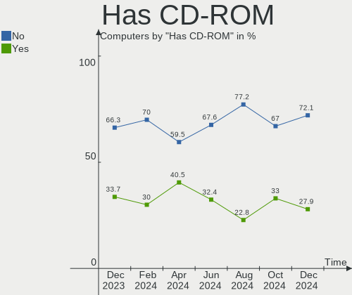
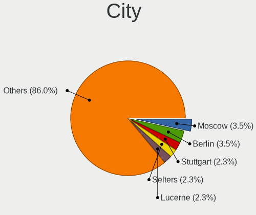
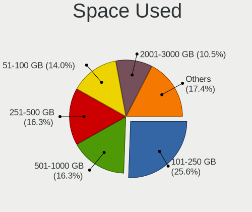
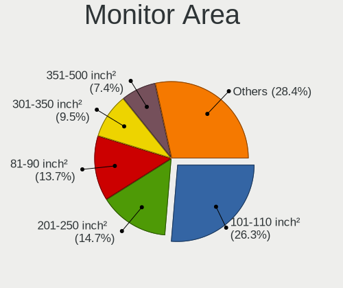
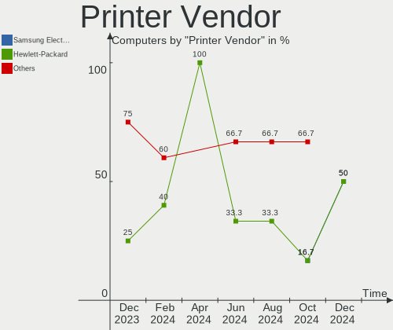

openSUSE Hardware Trends
------------------------

A project to identify most popular hardware characteristics and track their change
over time based on data collected by openSUSE users at https://Linux-Hardware.org.

Anyone can contribute to this report by the [hw-probe](https://github.com/linuxhw/hw-probe) tool:

    sudo -E hw-probe -all -upload

This is a report for all computer types. See also reports for [desktops](/Dist/openSUSE/Desktop/README.md) and [notebooks](/Dist/openSUSE/Notebook/README.md).

Full-feature report is available here: https://linux-hardware.org/?view=trends

Period: Aug, 2021.

Contents
--------

* [ System ](#system)
  - [ OS                       ](#os)
  - [ OS Family                ](#os-family)
  - [ Kernel                   ](#kernel)
  - [ Kernel Family            ](#kernel-family)
  - [ Kernel Major Ver.        ](#kernel-major-ver)
  - [ Arch                     ](#arch)
  - [ DE                       ](#de)
  - [ Display Server           ](#display-server)
  - [ Display Manager          ](#display-manager)
  - [ OS Lang                  ](#os-lang)
  - [ Boot Mode                ](#boot-mode)
  - [ Filesystem               ](#filesystem)
  - [ Part. scheme             ](#part-scheme)
  - [ Dual Boot with Linux/BSD ](#dual-boot-with-linuxbsd)
  - [ Dual Boot (Win)          ](#dual-boot-win)

* [ Board ](#board)
  - [ Vendor                   ](#vendor)
  - [ Model                    ](#model)
  - [ Model Family             ](#model-family)
  - [ MFG Year                 ](#mfg-year)
  - [ Form Factor              ](#form-factor)
  - [ Secure Boot              ](#secure-boot)
  - [ Coreboot                 ](#coreboot)
  - [ RAM Size                 ](#ram-size)
  - [ RAM Used                 ](#ram-used)
  - [ Total Drives             ](#total-drives)
  - [ Has CD-ROM               ](#has-cd-rom)
  - [ Has Ethernet             ](#has-ethernet)
  - [ Has WiFi                 ](#has-wifi)
  - [ Has Bluetooth            ](#has-bluetooth)

* [ Location ](#location)
  - [ Country                  ](#country)
  - [ City                     ](#city)

* [ Drives ](#drives)
  - [ Drive Vendor             ](#drive-vendor)
  - [ Drive Model              ](#drive-model)
  - [ HDD Vendor               ](#hdd-vendor)
  - [ SSD Vendor               ](#ssd-vendor)
  - [ Drive Kind               ](#drive-kind)
  - [ Drive Connector          ](#drive-connector)
  - [ Drive Size               ](#drive-size)
  - [ Space Total              ](#space-total)
  - [ Space Used               ](#space-used)
  - [ Malfunc. Drives          ](#malfunc-drives)
  - [ Malfunc. Drive Vendor    ](#malfunc-drive-vendor)
  - [ Malfunc. HDD Vendor      ](#malfunc-hdd-vendor)
  - [ Malfunc. Drive Kind      ](#malfunc-drive-kind)
  - [ Failed Drives            ](#failed-drives)
  - [ Failed Drive Vendor      ](#failed-drive-vendor)
  - [ Drive Status             ](#drive-status)

* [ Storage controller ](#storage-controller)
  - [ Storage Vendor           ](#storage-vendor)
  - [ Storage Model            ](#storage-model)
  - [ Storage Kind             ](#storage-kind)

* [ Processor ](#processor)
  - [ CPU Vendor               ](#cpu-vendor)
  - [ CPU Model                ](#cpu-model)
  - [ CPU Model Family         ](#cpu-model-family)
  - [ CPU Cores                ](#cpu-cores)
  - [ CPU Sockets              ](#cpu-sockets)
  - [ CPU Threads              ](#cpu-threads)
  - [ CPU Op-Modes             ](#cpu-op-modes)
  - [ CPU Microcode            ](#cpu-microcode)
  - [ CPU Microarch            ](#cpu-microarch)

* [ Graphics ](#graphics)
  - [ GPU Vendor               ](#gpu-vendor)
  - [ GPU Model                ](#gpu-model)
  - [ GPU Combo                ](#gpu-combo)
  - [ GPU Driver               ](#gpu-driver)
  - [ GPU Memory               ](#gpu-memory)

* [ Monitor ](#monitor)
  - [ Monitor Vendor           ](#monitor-vendor)
  - [ Monitor Model            ](#monitor-model)
  - [ Monitor Resolution       ](#monitor-resolution)
  - [ Monitor Diagonal         ](#monitor-diagonal)
  - [ Monitor Width            ](#monitor-width)
  - [ Aspect Ratio             ](#aspect-ratio)
  - [ Monitor Area             ](#monitor-area)
  - [ Pixel Density            ](#pixel-density)
  - [ Multiple Monitors        ](#multiple-monitors)

* [ Network ](#network)
  - [ Net Controller Vendor    ](#net-controller-vendor)
  - [ Net Controller Model     ](#net-controller-model)
  - [ Wireless Vendor          ](#wireless-vendor)
  - [ Wireless Model           ](#wireless-model)
  - [ Ethernet Vendor          ](#ethernet-vendor)
  - [ Ethernet Model           ](#ethernet-model)
  - [ Net Controller Kind      ](#net-controller-kind)
  - [ Used Controller          ](#used-controller)
  - [ NICs                     ](#nics)
  - [ IPv6                     ](#ipv6)

* [ Bluetooth ](#bluetooth)
  - [ Bluetooth Vendor         ](#bluetooth-vendor)
  - [ Bluetooth Model          ](#bluetooth-model)

* [ Sound ](#sound)
  - [ Sound Vendor             ](#sound-vendor)
  - [ Sound Model              ](#sound-model)

* [ Memory ](#memory)
  - [ Memory Vendor            ](#memory-vendor)
  - [ Memory Model             ](#memory-model)
  - [ Memory Kind              ](#memory-kind)
  - [ Memory Form Factor       ](#memory-form-factor)
  - [ Memory Size              ](#memory-size)
  - [ Memory Speed             ](#memory-speed)

* [ Printers & scanners ](#printers--scanners)
  - [ Printer Vendor           ](#printer-vendor)
  - [ Printer Model            ](#printer-model)
  - [ Scanner Vendor           ](#scanner-vendor)
  - [ Scanner Model            ](#scanner-model)

* [ Camera ](#camera)
  - [ Camera Vendor            ](#camera-vendor)
  - [ Camera Model             ](#camera-model)

* [ Security ](#security)
  - [ Fingerprint Vendor       ](#fingerprint-vendor)
  - [ Fingerprint Model        ](#fingerprint-model)
  - [ Chipcard Vendor          ](#chipcard-vendor)
  - [ Chipcard Model           ](#chipcard-model)

* [ Unsupported ](#unsupported)
  - [ Unsupported Devices      ](#unsupported-devices)
  - [ Unsupported Device Types ](#unsupported-device-types)

System
------

OS
--

Installed operating systems

| Name                         | Computers | Percent |
|------------------------------|-----------|---------|
| openSUSE Leap-15.3           | 13        | 28.26%  |
| openSUSE Leap-15.2           | 4         | 8.7%    |
| openSUSE 20210817            | 4         | 8.7%    |
| openSUSE Tumbleweed-20210810 | 3         | 6.52%   |
| openSUSE 20210810            | 3         | 6.52%   |
| openSUSE Tumbleweed-20210820 | 2         | 4.35%   |
| openSUSE 20210803            | 2         | 4.35%   |
| openSUSE 20210801            | 2         | 4.35%   |
| openSUSE Tumbleweed-20210807 | 1         | 2.17%   |
| openSUSE Tumbleweed-20210731 | 1         | 2.17%   |
| openSUSE Microos-20210820    | 1         | 2.17%   |
| openSUSE Microos-20210810    | 1         | 2.17%   |
| openSUSE Microos-20210321    | 1         | 2.17%   |
| openSUSE 20210830            | 1         | 2.17%   |
| openSUSE 20210829            | 1         | 2.17%   |
| openSUSE 20210823            | 1         | 2.17%   |
| openSUSE 20210820            | 1         | 2.17%   |
| openSUSE 20210807            | 1         | 2.17%   |
| openSUSE 20210804            | 1         | 2.17%   |
| openSUSE 20210727            | 1         | 2.17%   |
| openSUSE 20210704            | 1         | 2.17%   |

OS Family
---------

OS without a version

| Name     | Computers | Percent |
|----------|-----------|---------|
| openSUSE | 46        | 100%    |

Kernel
------

Version of the Linux kernel

| Version                 | Computers | Percent |
|-------------------------|-----------|---------|
| 5.13.8-1-default        | 12        | 26.09%  |
| 5.3.18-59.19-default    | 7         | 15.22%  |
| 5.3.18-59.16-default    | 5         | 10.87%  |
| 5.13.4-1-default        | 4         | 8.7%    |
| 5.13.12-1-default       | 4         | 8.7%    |
| 5.13.6-1-default        | 3         | 6.52%   |
| 5.3.18-lp152.81-default | 2         | 4.35%   |
| 5.3.18-lp152.78-default | 1         | 2.17%   |
| 5.3.18-lp152.50-default | 1         | 2.17%   |
| 5.3.18-59.5-default     | 1         | 2.17%   |
| 5.13.13-1-default       | 1         | 2.17%   |
| 5.13.12-2-default       | 1         | 2.17%   |
| 5.12.9-1-default        | 1         | 2.17%   |
| 5.12.13-1-default       | 1         | 2.17%   |
| 5.12.12-1-default       | 1         | 2.17%   |
| 5.11.6-1-default        | 1         | 2.17%   |

Kernel Family
-------------

Linux kernel without a distro release

| Version | Computers | Percent |
|---------|-----------|---------|
| 5.3.18  | 17        | 36.96%  |
| 5.13.8  | 12        | 26.09%  |
| 5.13.12 | 5         | 10.87%  |
| 5.13.4  | 4         | 8.7%    |
| 5.13.6  | 3         | 6.52%   |
| 5.13.13 | 1         | 2.17%   |
| 5.12.9  | 1         | 2.17%   |
| 5.12.13 | 1         | 2.17%   |
| 5.12.12 | 1         | 2.17%   |
| 5.11.6  | 1         | 2.17%   |

Kernel Major Ver.
-----------------

Linux kernel major version

| Version | Computers | Percent |
|---------|-----------|---------|
| 5.13    | 25        | 54.35%  |
| 5.3     | 17        | 36.96%  |
| 5.12    | 3         | 6.52%   |
| 5.11    | 1         | 2.17%   |

Arch
----

OS architecture (x86_64, i586, etc.)

| Name    | Computers | Percent |
|---------|-----------|---------|
| x86_64  | 45        | 97.83%  |
| aarch64 | 1         | 2.17%   |

DE
--

Desktop Environment

| Name    | Computers | Percent |
|---------|-----------|---------|
| GNOME   | 14        | 30.43%  |
| KDE5    | 13        | 28.26%  |
| KDE     | 10        | 21.74%  |
| Unknown | 5         | 10.87%  |
| XFCE    | 3         | 6.52%   |
| Budgie  | 1         | 2.17%   |

Display Server
--------------

X11 or Wayland

| Name        | Computers | Percent |
|-------------|-----------|---------|
| X11         | 32        | 69.57%  |
| Wayland     | 11        | 23.91%  |
| Unspecified | 1         | 2.17%   |
| Tty         | 1         | 2.17%   |
| Unknown     | 1         | 2.17%   |

Display Manager
---------------

SDDM, LightDM, etc.

| Name    | Computers | Percent |
|---------|-----------|---------|
| Unknown | 23        | 50%     |
| SDDM    | 10        | 21.74%  |
| LightDM | 7         | 15.22%  |
| XDM     | 6         | 13.04%  |

OS Lang
-------

Language

| Lang    | Computers | Percent |
|---------|-----------|---------|
| en_US   | 12        | 26.09%  |
| de_DE   | 11        | 23.91%  |
| es_ES   | 4         | 8.7%    |
| POSIX   | 3         | 6.52%   |
| fr_FR   | 3         | 6.52%   |
| en_GB   | 2         | 4.35%   |
| cs_CZ   | 2         | 4.35%   |
| Unknown | 2         | 4.35%   |
| pl_PL   | 1         | 2.17%   |
| nn_NO   | 1         | 2.17%   |
| nl_BE   | 1         | 2.17%   |
| nb_NO   | 1         | 2.17%   |
| ja_JP   | 1         | 2.17%   |
| hu_HU   | 1         | 2.17%   |
| C       | 1         | 2.17%   |

Boot Mode
---------

EFI or BIOS

| Mode | Computers | Percent |
|------|-----------|---------|
| EFI  | 31        | 67.39%  |
| BIOS | 15        | 32.61%  |

Filesystem
----------

Type of filesystem

| Type  | Computers | Percent |
|-------|-----------|---------|
| Btrfs | 38        | 82.61%  |
| Ext4  | 7         | 15.22%  |
| Xfs   | 1         | 2.17%   |

Part. scheme
------------

Scheme of partitioning

| Type    | Computers | Percent |
|---------|-----------|---------|
| GPT     | 23        | 50%     |
| Unknown | 19        | 41.3%   |
| MBR     | 4         | 8.7%    |

Dual Boot with Linux/BSD
------------------------

Hosting more than one Linux/BSD

| Dual boot | Computers | Percent |
|-----------|-----------|---------|
| No        | 42        | 91.3%   |
| Yes       | 4         | 8.7%    |

Dual Boot (Win)
---------------

Hosting Linux and Windows

| Dual boot | Computers | Percent |
|-----------|-----------|---------|
| No        | 32        | 69.57%  |
| Yes       | 14        | 30.43%  |

Board
-----

Vendor
------

Motherboard manufacturer

| Name                    | Computers | Percent |
|-------------------------|-----------|---------|
| Lenovo                  | 11        | 23.91%  |
| ASUSTek Computer        | 8         | 17.39%  |
| Dell                    | 6         | 13.04%  |
| Gigabyte Technology     | 5         | 10.87%  |
| Hewlett-Packard         | 4         | 8.7%    |
| Samsung Electronics     | 2         | 4.35%   |
| MSI                     | 2         | 4.35%   |
| ASRock                  | 2         | 4.35%   |
| Supermicro              | 1         | 2.17%   |
| Raspberry Pi Foundation | 1         | 2.17%   |
| Medion                  | 1         | 2.17%   |
| HARDKERNEL              | 1         | 2.17%   |
| Foxconn                 | 1         | 2.17%   |
| Apple                   | 1         | 2.17%   |

Model
-----

Motherboard model

| Name                                      | Computers | Percent |
|-------------------------------------------|-----------|---------|
| Supermicro SYS-7038A-I                    | 1         | 2.17%   |
| Samsung 600B4B/600B5B                     | 1         | 2.17%   |
| Samsung 355V4C/356V4C/3445VC/3545VC       | 1         | 2.17%   |
| RPi Raspberry Pi 4 Model B Rev 1.1        | 1         | 2.17%   |
| MSI MS-7C81                               | 1         | 2.17%   |
| MSI MS-7C37                               | 1         | 2.17%   |
| Medion S15449                             | 1         | 2.17%   |
| Lenovo Yoga 3 Pro-1370 80HE               | 1         | 2.17%   |
| Lenovo V330-15IKB 81AX                    | 1         | 2.17%   |
| Lenovo ThinkPad Yoga 260 20FES0XM00       | 1         | 2.17%   |
| Lenovo ThinkPad X1 Carbon 4th 20FB002UMC  | 1         | 2.17%   |
| Lenovo ThinkPad T61 8895W9U               | 1         | 2.17%   |
| Lenovo ThinkPad T460 20FMS75800           | 1         | 2.17%   |
| Lenovo ThinkPad P50 20EN0005GE            | 1         | 2.17%   |
| Lenovo ThinkPad L420 7827AW9              | 1         | 2.17%   |
| Lenovo ThinkCentre M700 10HY002NMX        | 1         | 2.17%   |
| Lenovo IdeaPad 3 15ADA05 81W1             | 1         | 2.17%   |
| Lenovo G500 20236                         | 1         | 2.17%   |
| HP Z440 Workstation                       | 1         | 2.17%   |
| HP Z1 Entry Tower G5                      | 1         | 2.17%   |
| HP ProBook 450 G6                         | 1         | 2.17%   |
| HP Laptop 15s-eq1xxx                      | 1         | 2.17%   |
| HARDKERNEL ODROID-H2                      | 1         | 2.17%   |
| Gigabyte Z370M D3H                        | 1         | 2.17%   |
| Gigabyte X570 I AORUS PRO WIFI            | 1         | 2.17%   |
| Gigabyte H81M-S2H                         | 1         | 2.17%   |
| Gigabyte B85-HD3-A                        | 1         | 2.17%   |
| Gigabyte B550 AORUS PRO AC                | 1         | 2.17%   |
| Foxconn p6-2346eg                         | 1         | 2.17%   |
| Dell Precision M6700                      | 1         | 2.17%   |
| Dell Latitude 5480                        | 1         | 2.17%   |
| Dell Inspiron 7460                        | 1         | 2.17%   |
| Dell Inspiron 5770                        | 1         | 2.17%   |
| Dell Inspiron 3593                        | 1         | 2.17%   |
| Dell Inspiron 3521                        | 1         | 2.17%   |
| ASUS VivoBook_ASUSLaptop X515MA_X515MA    | 1         | 2.17%   |
| ASUS ROG Zephyrus G14 GA401QM_GA401QM     | 1         | 2.17%   |
| ASUS ROG STRIX Z390-H GAMING              | 1         | 2.17%   |
| ASUS PRIME H310M-A                        | 1         | 2.17%   |
| ASUS CROSSHAIR VI HERO                    | 1         | 2.17%   |
| ASUS ASUS TUF Gaming A15 FA506QM_TUF506QM | 1         | 2.17%   |
| ASUS A88X-PLUS                            | 1         | 2.17%   |
| ASUS 970 PRO GAMING/AURA                  | 1         | 2.17%   |
| ASRock Z68 Extreme4 Gen3                  | 1         | 2.17%   |
| ASRock B450M Pro4                         | 1         | 2.17%   |
| Apple Macmini7,1                          | 1         | 2.17%   |

Model Family
------------

Motherboard model prefix

| Name                   | Computers | Percent |
|------------------------|-----------|---------|
| Lenovo ThinkPad        | 6         | 13.04%  |
| Dell Inspiron          | 4         | 8.7%    |
| ASUS ROG               | 2         | 4.35%   |
| Supermicro SYS-7038A-I | 1         | 2.17%   |
| Samsung 600B4B         | 1         | 2.17%   |
| Samsung 355V4C         | 1         | 2.17%   |
| RPi Raspberry          | 1         | 2.17%   |
| MSI MS-7C81            | 1         | 2.17%   |
| MSI MS-7C37            | 1         | 2.17%   |
| Medion S15449          | 1         | 2.17%   |
| Lenovo Yoga            | 1         | 2.17%   |
| Lenovo V330-15IKB      | 1         | 2.17%   |
| Lenovo ThinkCentre     | 1         | 2.17%   |
| Lenovo IdeaPad         | 1         | 2.17%   |
| Lenovo G500            | 1         | 2.17%   |
| HP Z440                | 1         | 2.17%   |
| HP Z1                  | 1         | 2.17%   |
| HP ProBook             | 1         | 2.17%   |
| HP Laptop              | 1         | 2.17%   |
| HARDKERNEL ODROID-H2   | 1         | 2.17%   |
| Gigabyte Z370M         | 1         | 2.17%   |
| Gigabyte X570          | 1         | 2.17%   |
| Gigabyte H81M-S2H      | 1         | 2.17%   |
| Gigabyte B85-HD3-A     | 1         | 2.17%   |
| Gigabyte B550          | 1         | 2.17%   |
| Foxconn p6-2346eg      | 1         | 2.17%   |
| Dell Precision         | 1         | 2.17%   |
| Dell Latitude          | 1         | 2.17%   |
| ASUS VivoBook          | 1         | 2.17%   |
| ASUS PRIME             | 1         | 2.17%   |
| ASUS CROSSHAIR         | 1         | 2.17%   |
| ASUS ASUS              | 1         | 2.17%   |
| ASUS A88X-PLUS         | 1         | 2.17%   |
| ASUS 970               | 1         | 2.17%   |
| ASRock Z68             | 1         | 2.17%   |
| ASRock B450M           | 1         | 2.17%   |
| Apple Macmini7         | 1         | 2.17%   |

MFG Year
--------

Motherboard manufacture year

| Year | Computers | Percent |
|------|-----------|---------|
| 2021 | 12        | 26.09%  |
| 2020 | 11        | 23.91%  |
| 2019 | 5         | 10.87%  |
| 2015 | 4         | 8.7%    |
| 2018 | 3         | 6.52%   |
| 2016 | 3         | 6.52%   |
| 2013 | 3         | 6.52%   |
| 2014 | 2         | 4.35%   |
| 2011 | 2         | 4.35%   |
| 2012 | 1         | 2.17%   |

Form Factor
-----------

Physical design of the computer

| Name           | Computers | Percent |
|----------------|-----------|---------|
| Notebook       | 23        | 50%     |
| Desktop        | 20        | 43.48%  |
| System on chip | 1         | 2.17%   |
| Convertible    | 1         | 2.17%   |
| Mini pc        | 1         | 2.17%   |

Secure Boot
-----------

Enabled or disabled

| State    | Computers | Percent |
|----------|-----------|---------|
| Disabled | 41        | 89.13%  |
| Enabled  | 5         | 10.87%  |

Coreboot
--------

Have coreboot on board

| Used | Computers | Percent |
|------|-----------|---------|
| No   | 46        | 100%    |

RAM Size
--------

Total RAM memory

| Size in GB  | Computers | Percent |
|-------------|-----------|---------|
| 16.01-24.0  | 15        | 32.61%  |
| 4.01-8.0    | 10        | 21.74%  |
| 32.01-64.0  | 7         | 15.22%  |
| 3.01-4.0    | 7         | 15.22%  |
| 8.01-16.0   | 5         | 10.87%  |
| 64.01-256.0 | 2         | 4.35%   |

RAM Used
--------

Used RAM memory

| Used GB   | Computers | Percent |
|-----------|-----------|---------|
| 2.01-3.0  | 13        | 28.26%  |
| 4.01-8.0  | 12        | 26.09%  |
| 1.01-2.0  | 8         | 17.39%  |
| 3.01-4.0  | 7         | 15.22%  |
| 8.01-16.0 | 3         | 6.52%   |
| 0.51-1.0  | 2         | 4.35%   |
| 0.01-0.5  | 1         | 2.17%   |

Total Drives
------------

Number of drives on board

| Drives | Computers | Percent |
|--------|-----------|---------|
| 1      | 21        | 45.65%  |
| 2      | 15        | 32.61%  |
| 6      | 3         | 6.52%   |
| 3      | 3         | 6.52%   |
| 4      | 2         | 4.35%   |
| 7      | 1         | 2.17%   |
| 5      | 1         | 2.17%   |

Has CD-ROM
----------

Has CD-ROM on board

| Presented | Computers | Percent |
|-----------|-----------|---------|
| No        | 30        | 65.22%  |
| Yes       | 16        | 34.78%  |

Has Ethernet
------------

Has Ethernet on board

| Presented | Computers | Percent |
|-----------|-----------|---------|
| Yes       | 39        | 84.78%  |
| No        | 7         | 15.22%  |

Has WiFi
--------

Has WiFi module

| Presented | Computers | Percent |
|-----------|-----------|---------|
| Yes       | 34        | 73.91%  |
| No        | 12        | 26.09%  |

Has Bluetooth
-------------

Has Bluetooth module

| Presented | Computers | Percent |
|-----------|-----------|---------|
| Yes       | 30        | 65.22%  |
| No        | 16        | 34.78%  |

Location
--------

Country
-------

Geographic location (country)

| Country     | Computers | Percent |
|-------------|-----------|---------|
| Germany     | 11        | 23.91%  |
| USA         | 5         | 10.87%  |
| Spain       | 5         | 10.87%  |
| France      | 3         | 6.52%   |
| Switzerland | 2         | 4.35%   |
| Norway      | 2         | 4.35%   |
| Nicaragua   | 2         | 4.35%   |
| Czechia     | 2         | 4.35%   |
| UK          | 1         | 2.17%   |
| Sweden      | 1         | 2.17%   |
| Serbia      | 1         | 2.17%   |
| Russia      | 1         | 2.17%   |
| Romania     | 1         | 2.17%   |
| Poland      | 1         | 2.17%   |
| Japan       | 1         | 2.17%   |
| Italy       | 1         | 2.17%   |
| India       | 1         | 2.17%   |
| Hungary     | 1         | 2.17%   |
| Canada      | 1         | 2.17%   |
| Brazil      | 1         | 2.17%   |
| Belgium     | 1         | 2.17%   |
| Australia   | 1         | 2.17%   |

City
----

Geographic location (city)

| City                       | Computers | Percent |
|----------------------------|-----------|---------|
| Managua                    | 2         | 4.35%   |
| Halle                      | 2         | 4.35%   |
| Frankfurt am Main          | 2         | 4.35%   |
| Zurich                     | 1         | 2.17%   |
| Zaragoza                   | 1         | 2.17%   |
| Warsaw                     | 1         | 2.17%   |
| Vecindario                 | 1         | 2.17%   |
| Tyreso Strand              | 1         | 2.17%   |
| Trondheim                  | 1         | 2.17%   |
| Tours                      | 1         | 2.17%   |
| Stabroek                   | 1         | 2.17%   |
| S??o Paulo                 | 1         | 2.17%   |
| Rendsburg                  | 1         | 2.17%   |
| Pueblo                     | 1         | 2.17%   |
| Prague                     | 1         | 2.17%   |
| Neuwied                    | 1         | 2.17%   |
| Montreal                   | 1         | 2.17%   |
| Monroeville                | 1         | 2.17%   |
| M??nster                   | 1         | 2.17%   |
| M?©rida                    | 1         | 2.17%   |
| London                     | 1         | 2.17%   |
| Lomonosov                  | 1         | 2.17%   |
| Le??n                      | 1         | 2.17%   |
| Las Palmas de Gran Canaria | 1         | 2.17%   |
| Kopervik                   | 1         | 2.17%   |
| Iizuka                     | 1         | 2.17%   |
| Heinsberg                  | 1         | 2.17%   |
| Fontenay-sous-Bois         | 1         | 2.17%   |
| Esztergom                  | 1         | 2.17%   |
| Erlinsbach                 | 1         | 2.17%   |
| Drisy                      | 1         | 2.17%   |
| Dresden                    | 1         | 2.17%   |
| Denison                    | 1         | 2.17%   |
| Cupertino                  | 1         | 2.17%   |
| Concarneau                 | 1         | 2.17%   |
| Cologne                    | 1         | 2.17%   |
| Bucharest                  | 1         | 2.17%   |
| Brisbane                   | 1         | 2.17%   |
| Berlin                     | 1         | 2.17%   |
| Bengaluru                  | 1         | 2.17%   |
| Belgrade                   | 1         | 2.17%   |
| Bari                       | 1         | 2.17%   |
| Amelia                     | 1         | 2.17%   |

Drives
------

Drive Vendor
------------

Hard drive vendors

| Vendor              | Computers | Drives | Percent |
|---------------------|-----------|--------|---------|
| Samsung Electronics | 16        | 20     | 19.05%  |
| WDC                 | 13        | 20     | 15.48%  |
| Seagate             | 8         | 8      | 9.52%   |
| SanDisk             | 6         | 6      | 7.14%   |
| Toshiba             | 5         | 5      | 5.95%   |
| SK Hynix            | 5         | 5      | 5.95%   |
| Crucial             | 5         | 5      | 5.95%   |
| Unknown             | 4         | 4      | 4.76%   |
| Kingston            | 4         | 5      | 4.76%   |
| Hitachi             | 3         | 3      | 3.57%   |
| SPCC                | 2         | 3      | 2.38%   |
| Silicon Motion      | 2         | 2      | 2.38%   |
| Intel               | 2         | 2      | 2.38%   |
| A-DATA Technology   | 2         | 3      | 2.38%   |
| Phison Electronics  | 1         | 1      | 1.19%   |
| Phison              | 1         | 1      | 1.19%   |
| OCZ                 | 1         | 1      | 1.19%   |
| Maxtor              | 1         | 1      | 1.19%   |
| KIOXIA              | 1         | 1      | 1.19%   |
| Fujitsu             | 1         | 1      | 1.19%   |
| Apple               | 1         | 1      | 1.19%   |

Drive Model
-----------

Hard drive models

| Model                                   | Computers | Percent |
|-----------------------------------------|-----------|---------|
| Samsung SSD 850 EVO 500GB               | 3         | 3.16%   |
| Silicon Motion NVMe SSD Drive 512GB     | 2         | 2.11%   |
| Seagate ST1000LM035-1RK172 1TB          | 2         | 2.11%   |
| Samsung SSD 860 EVO 1TB                 | 2         | 2.11%   |
| Samsung SSD 850 EVO 250GB               | 2         | 2.11%   |
| Samsung HD103SI 1TB                     | 2         | 2.11%   |
| WDC WDS500G1X0E-00AFY0 500GB            | 1         | 1.05%   |
| WDC WDS500G1B0B-00AS40 500GB SSD        | 1         | 1.05%   |
| WDC WDS100T2B0A-00SM50 1TB SSD          | 1         | 1.05%   |
| WDC WDS100T1X0E-00AFY0 1TB              | 1         | 1.05%   |
| WDC WD20EFRX-68EUZN0 2TB                | 1         | 1.05%   |
| WDC WD20EARX-00PASB0 2TB                | 1         | 1.05%   |
| WDC WD2001FASS-00W2B0 2TB               | 1         | 1.05%   |
| WDC WD10SPZX-60Z10T0 1TB                | 1         | 1.05%   |
| WDC WD10SPZX-00Z10T0 1TB                | 1         | 1.05%   |
| WDC WD10EZEX-60ZF5A0 1TB                | 1         | 1.05%   |
| WDC WD10EZEX-60WN4A0 1TB                | 1         | 1.05%   |
| WDC WD10EZEX-22MFCA0 1TB                | 1         | 1.05%   |
| WDC WD10EZEX-08WN4A0 1TB                | 1         | 1.05%   |
| WDC WD10EZEX-08RKKA0 1TB                | 1         | 1.05%   |
| WDC WD10EZEX-08M2NA0 1TB                | 1         | 1.05%   |
| WDC WD10EZEX-07WN4A0 1TB                | 1         | 1.05%   |
| WDC WD10EAVS-22D7B0 1TB                 | 1         | 1.05%   |
| WDC PC SN530 SDBPNPZ-256G-1002 256GB    | 1         | 1.05%   |
| WDC PC SN530 SDBPMPZ-512G-1101 512GB    | 1         | 1.05%   |
| Unknown USD00  256GB                    | 1         | 1.05%   |
| Unknown SC32G  32GB                     | 1         | 1.05%   |
| Unknown MMC Card  1TB                   | 1         | 1.05%   |
| Unknown AJTD4R  16GB                    | 1         | 1.05%   |
| Toshiba NVMe SSD Drive 512GB            | 1         | 1.05%   |
| Toshiba MQ01ABD075 752GB                | 1         | 1.05%   |
| Toshiba MQ01ABD050 500GB                | 1         | 1.05%   |
| Toshiba HDWD130 3TB                     | 1         | 1.05%   |
| Toshiba DT01ACA200 2TB                  | 1         | 1.05%   |
| SPCC Solid State Disk 256GB             | 1         | 1.05%   |
| SPCC M.2 PCIe SSD 512GB                 | 1         | 1.05%   |
| SK Hynix SC311 SATA 128GB SSD           | 1         | 1.05%   |
| SK Hynix HFM512GD3JX013N 512GB          | 1         | 1.05%   |
| SK Hynix HFM001TD3JX013N 1TB            | 1         | 1.05%   |
| SK Hynix BC511 HFM256GDJTNI-82A0A 256GB | 1         | 1.05%   |
| SK Hynix BC501A NVMe 128GB              | 1         | 1.05%   |
| Seagate ST500LM012 HN-M500MBB 500GB     | 1         | 1.05%   |
| Seagate ST4000DM005-2DP166 4TB          | 1         | 1.05%   |
| Seagate ST3750640NS 752GB               | 1         | 1.05%   |
| Seagate ST1000LM024 HN-M101MBB 1TB      | 1         | 1.05%   |
| Seagate ST1000DM003-1ER162 1TB          | 1         | 1.05%   |
| Seagate Expansion 2TB                   | 1         | 1.05%   |
| SanDisk Ultra II 480GB SSD              | 1         | 1.05%   |
| SanDisk SDSSDXPS240G 240GB              | 1         | 1.05%   |
| SanDisk SD8TN8U256G1001 256GB SSD       | 1         | 1.05%   |
| SanDisk SD8TB8U512G1001 512GB SSD       | 1         | 1.05%   |
| Sandisk NVMe SSD Drive 500GB            | 1         | 1.05%   |
| Sandisk NVMe SSD Drive 1TB              | 1         | 1.05%   |
| Samsung SSD 980 PRO 1TB                 | 1         | 1.05%   |
| Samsung SSD 970 EVO 1TB                 | 1         | 1.05%   |
| Samsung SSD 840 EVO 250GB               | 1         | 1.05%   |
| Samsung MZNTE512HMJH-000L2 512GB SSD    | 1         | 1.05%   |
| Samsung MZNLN256HCHP-000L7 256GB SSD    | 1         | 1.05%   |
| Samsung MZNLN128HAHQ-000H1 128GB SSD    | 1         | 1.05%   |
| Samsung MZ7LF192HCGS-000L1 192GB SSD    | 1         | 1.05%   |

HDD Vendor
----------

Hard disk drive vendors

| Vendor              | Computers | Drives | Percent |
|---------------------|-----------|--------|---------|
| WDC                 | 10        | 14     | 31.25%  |
| Seagate             | 8         | 8      | 25%     |
| Toshiba             | 4         | 4      | 12.5%   |
| Samsung Electronics | 4         | 5      | 12.5%   |
| Hitachi             | 3         | 3      | 9.38%   |
| Maxtor              | 1         | 1      | 3.13%   |
| Fujitsu             | 1         | 1      | 3.13%   |
| Apple               | 1         | 1      | 3.13%   |

SSD Vendor
----------

Solid state drive vendors

| Vendor              | Computers | Drives | Percent |
|---------------------|-----------|--------|---------|
| Samsung Electronics | 11        | 13     | 36.67%  |
| Crucial             | 5         | 5      | 16.67%  |
| SanDisk             | 4         | 4      | 13.33%  |
| Kingston            | 4         | 5      | 13.33%  |
| WDC                 | 2         | 2      | 6.67%   |
| SPCC                | 1         | 2      | 3.33%   |
| SK Hynix            | 1         | 1      | 3.33%   |
| OCZ                 | 1         | 1      | 3.33%   |
| A-DATA Technology   | 1         | 1      | 3.33%   |

Drive Kind
----------

HDD or SSD

| Kind | Computers | Drives | Percent |
|------|-----------|--------|---------|
| SSD  | 25        | 34     | 34.72%  |
| HDD  | 23        | 37     | 31.94%  |
| NVMe | 20        | 23     | 27.78%  |
| MMC  | 4         | 4      | 5.56%   |

Drive Connector
---------------

SATA, SAS, NVMe, etc.

| Type | Computers | Drives | Percent |
|------|-----------|--------|---------|
| SATA | 35        | 69     | 57.38%  |
| NVMe | 20        | 23     | 32.79%  |
| MMC  | 4         | 4      | 6.56%   |
| SAS  | 2         | 2      | 3.28%   |

Drive Size
----------

Size of hard drive

| Size in TB | Computers | Drives | Percent |
|------------|-----------|--------|---------|
| 0.51-1.0   | 22        | 30     | 42.31%  |
| 0.01-0.5   | 21        | 31     | 40.38%  |
| 1.01-2.0   | 7         | 8      | 13.46%  |
| 3.01-4.0   | 1         | 1      | 1.92%   |
| 2.01-3.0   | 1         | 1      | 1.92%   |

Space Total
-----------

Amount of disk space available on the file system

| Size in GB     | Computers | Percent |
|----------------|-----------|---------|
| 1001-2000      | 17        | 36.96%  |
| More than 3000 | 15        | 32.61%  |
| 251-500        | 4         | 8.7%    |
| 2001-3000      | 4         | 8.7%    |
| 501-1000       | 3         | 6.52%   |
| 21-50          | 1         | 2.17%   |
| 1-20           | 1         | 2.17%   |
| Unknown        | 1         | 2.17%   |

Space Used
----------

Amount of used disk space

| Used GB        | Computers | Percent |
|----------------|-----------|---------|
| 501-1000       | 11        | 23.91%  |
| 251-500        | 8         | 17.39%  |
| 51-100         | 8         | 17.39%  |
| 101-250        | 6         | 13.04%  |
| More than 3000 | 3         | 6.52%   |
| 1001-2000      | 3         | 6.52%   |
| 1-20           | 3         | 6.52%   |
| 2001-3000      | 2         | 4.35%   |
| 21-50          | 1         | 2.17%   |
| Unknown        | 1         | 2.17%   |

Malfunc. Drives
---------------

Drive models with a malfunction

| Model                               | Computers | Drives | Percent |
|-------------------------------------|-----------|--------|---------|
| Toshiba DT01ACA200 2TB              | 1         | 1      | 16.67%  |
| Seagate ST1000LM035-1RK172 1TB      | 1         | 1      | 16.67%  |
| Samsung Electronics SSD 970 EVO 1TB | 1         | 1      | 16.67%  |
| Maxtor 7H500F0 500GB                | 1         | 1      | 16.67%  |
| Kingston SV300S37A120G 120GB SSD    | 1         | 1      | 16.67%  |
| Crucial CT500MX200SSD4 500GB        | 1         | 1      | 16.67%  |

Malfunc. Drive Vendor
---------------------

Vendors of faulty drives

| Vendor              | Computers | Drives | Percent |
|---------------------|-----------|--------|---------|
| Toshiba             | 1         | 1      | 16.67%  |
| Seagate             | 1         | 1      | 16.67%  |
| Samsung Electronics | 1         | 1      | 16.67%  |
| Maxtor              | 1         | 1      | 16.67%  |
| Kingston            | 1         | 1      | 16.67%  |
| Crucial             | 1         | 1      | 16.67%  |

Malfunc. HDD Vendor
-------------------

Vendors of faulty HDD drives

| Vendor  | Computers | Drives | Percent |
|---------|-----------|--------|---------|
| Toshiba | 1         | 1      | 33.33%  |
| Seagate | 1         | 1      | 33.33%  |
| Maxtor  | 1         | 1      | 33.33%  |

Malfunc. Drive Kind
-------------------

Kinds of faulty drives

| Kind | Computers | Drives | Percent |
|------|-----------|--------|---------|
| HDD  | 3         | 3      | 50%     |
| SSD  | 2         | 2      | 33.33%  |
| NVMe | 1         | 1      | 16.67%  |

Failed Drives
-------------

Failed drive models

Zero info for selected period =(

Failed Drive Vendor
-------------------

Failed drive vendors

Zero info for selected period =(

Drive Status
------------

Number of failed and malfunc. drives

| Status   | Computers | Drives | Percent |
|----------|-----------|--------|---------|
| Works    | 23        | 46     | 45.1%   |
| Detected | 22        | 46     | 43.14%  |
| Malfunc  | 6         | 6      | 11.76%  |

Storage controller
------------------

Storage Vendor
--------------

Storage controller vendors

| Vendor                       | Computers | Percent |
|------------------------------|-----------|---------|
| Intel                        | 33        | 51.56%  |
| AMD                          | 8         | 12.5%   |
| Sandisk                      | 6         | 9.38%   |
| SK Hynix                     | 4         | 6.25%   |
| Phison Electronics           | 3         | 4.69%   |
| Silicon Motion               | 2         | 3.13%   |
| Samsung Electronics          | 2         | 3.13%   |
| Toshiba America Info Systems | 1         | 1.56%   |
| Marvell Technology Group     | 1         | 1.56%   |
| LSI Logic / Symbios Logic    | 1         | 1.56%   |
| KIOXIA                       | 1         | 1.56%   |
| ASMedia Technology           | 1         | 1.56%   |
| ADATA Technology             | 1         | 1.56%   |

Storage Model
-------------

Storage controller models

| Model                                                                            | Computers | Percent |
|----------------------------------------------------------------------------------|-----------|---------|
| AMD FCH SATA Controller [AHCI mode]                                              | 6         | 8.82%   |
| Intel Sunrise Point-LP SATA Controller [AHCI mode]                               | 5         | 7.35%   |
| Intel Cannon Lake PCH SATA AHCI Controller                                       | 3         | 4.41%   |
| SK Hynix NVMe SSD Controller                                                     | 2         | 2.94%   |
| Silicon Motion SM2262/SM2262EN SSD Controller                                    | 2         | 2.94%   |
| Sandisk WD Black SN850                                                           | 2         | 2.94%   |
| Phison E12 NVMe Controller                                                       | 2         | 2.94%   |
| Intel SSD 660P Series                                                            | 2         | 2.94%   |
| Intel Q170/Q150/B150/H170/H110/Z170/CM236 Chipset SATA Controller [AHCI Mode]    | 2         | 2.94%   |
| Intel Celeron/Pentium Silver Processor SATA Controller                           | 2         | 2.94%   |
| Intel C610/X99 series chipset 6-Port SATA Controller [AHCI mode]                 | 2         | 2.94%   |
| Intel 82801 Mobile SATA Controller [RAID mode]                                   | 2         | 2.94%   |
| Intel 8 Series/C220 Series Chipset Family 6-port SATA Controller 1 [AHCI mode]   | 2         | 2.94%   |
| Intel 7 Series Chipset Family 6-port SATA Controller [AHCI mode]                 | 2         | 2.94%   |
| Intel 6 Series/C200 Series Chipset Family 6 port Mobile SATA AHCI Controller     | 2         | 2.94%   |
| Intel 6 Series/C200 Series Chipset Family 6 port Desktop SATA AHCI Controller    | 2         | 2.94%   |
| Toshiba America Info Systems Toshiba America Info Non-Volatile memory controller | 1         | 1.47%   |
| SK Hynix BC511                                                                   | 1         | 1.47%   |
| SK Hynix BC501 NVMe Solid State Drive                                            | 1         | 1.47%   |
| Sandisk WD Blue SN550 NVMe SSD                                                   | 1         | 1.47%   |
| Sandisk WD Black SN750 / PC SN730 NVMe SSD                                       | 1         | 1.47%   |
| Sandisk WD Black 2018/SN750 / PC SN720 NVMe SSD                                  | 1         | 1.47%   |
| Sandisk Non-Volatile memory controller                                           | 1         | 1.47%   |
| Samsung NVMe SSD Controller SM981/PM981/PM983                                    | 1         | 1.47%   |
| Samsung NVMe SSD Controller PM9A1/PM9A3/980PRO                                   | 1         | 1.47%   |
| Phison E16 PCIe4 NVMe Controller                                                 | 1         | 1.47%   |
| Marvell Group 88SE912x SATA 6Gb/s Controller [IDE mode]                          | 1         | 1.47%   |
| LSI Logic / Symbios Logic SAS1068E PCI-Express Fusion-MPT SAS                    | 1         | 1.47%   |
| KIOXIA Non-Volatile memory controller                                            | 1         | 1.47%   |
| Intel Wildcat Point-LP SATA Controller [AHCI Mode]                               | 1         | 1.47%   |
| Intel Ice Lake-LP SATA Controller [AHCI mode]                                    | 1         | 1.47%   |
| Intel Cannon Point-LP SATA Controller [AHCI Mode]                                | 1         | 1.47%   |
| Intel C610/X99 series chipset sSATA Controller [AHCI mode]                       | 1         | 1.47%   |
| Intel 82801HM/HEM (ICH8M/ICH8M-E) SATA Controller [AHCI mode]                    | 1         | 1.47%   |
| Intel 82801HM/HEM (ICH8M/ICH8M-E) IDE Controller                                 | 1         | 1.47%   |
| Intel 8 Series SATA Controller 1 [AHCI mode]                                     | 1         | 1.47%   |
| Intel 400 Series Chipset Family SATA AHCI Controller                             | 1         | 1.47%   |
| Intel 200 Series PCH SATA controller [AHCI mode]                                 | 1         | 1.47%   |
| ASMedia ASM1062 Serial ATA Controller                                            | 1         | 1.47%   |
| AMD X370 Series Chipset SATA Controller                                          | 1         | 1.47%   |
| AMD Starship/Matisse Chipset SATA Controller [AHCI mode]                         | 1         | 1.47%   |
| AMD SB7x0/SB8x0/SB9x0 SATA Controller [AHCI mode]                                | 1         | 1.47%   |
| AMD 400 Series Chipset SATA Controller                                           | 1         | 1.47%   |
| ADATA XPG SX8200 Pro PCIe Gen3x4 M.2 2280 Solid State Drive                      | 1         | 1.47%   |

Storage Kind
------------

Kind of storage controller (IDE, SATA, NVMe, SAS, ...)

| Kind | Computers | Percent |
|------|-----------|---------|
| SATA | 37        | 59.68%  |
| NVMe | 20        | 32.26%  |
| RAID | 2         | 3.23%   |
| IDE  | 2         | 3.23%   |
| SCSI | 1         | 1.61%   |

Processor
---------

CPU Vendor
----------

Processor vendors

| Vendor | Computers | Percent |
|--------|-----------|---------|
| Intel  | 33        | 71.74%  |
| AMD    | 12        | 26.09%  |
| ARM    | 1         | 2.17%   |

CPU Model
---------

Processor models

| Model                                           | Computers | Percent |
|-------------------------------------------------|-----------|---------|
| Intel Core i7-8700 CPU @ 3.20GHz                | 2         | 4.35%   |
| Intel Core i7-8550U CPU @ 1.80GHz               | 2         | 4.35%   |
| Intel Core i7-4790 CPU @ 3.60GHz                | 2         | 4.35%   |
| Intel Core i5-7200U CPU @ 2.50GHz               | 2         | 4.35%   |
| Intel Core i5-2520M CPU @ 2.50GHz               | 2         | 4.35%   |
| Intel Xeon CPU E5-2690 v3 @ 2.60GHz             | 1         | 2.17%   |
| Intel Xeon CPU E5-2620 v4 @ 2.10GHz             | 1         | 2.17%   |
| Intel Core M-5Y71 CPU @ 1.20GHz                 | 1         | 2.17%   |
| Intel Core i7-9700K CPU @ 3.60GHz               | 1         | 2.17%   |
| Intel Core i7-6700HQ CPU @ 2.60GHz              | 1         | 2.17%   |
| Intel Core i7-6600U CPU @ 2.60GHz               | 1         | 2.17%   |
| Intel Core i7-3740QM CPU @ 2.70GHz              | 1         | 2.17%   |
| Intel Core i5-8265U CPU @ 1.60GHz               | 1         | 2.17%   |
| Intel Core i5-6300U CPU @ 2.40GHz               | 1         | 2.17%   |
| Intel Core i5-6200U CPU @ 2.30GHz               | 1         | 2.17%   |
| Intel Core i5-4260U CPU @ 1.40GHz               | 1         | 2.17%   |
| Intel Core i5-3350P CPU @ 3.10GHz               | 1         | 2.17%   |
| Intel Core i5-3317U CPU @ 1.70GHz               | 1         | 2.17%   |
| Intel Core i5-10600K CPU @ 4.10GHz              | 1         | 2.17%   |
| Intel Core i3-8100 CPU @ 3.60GHz                | 1         | 2.17%   |
| Intel Core i3-6100T CPU @ 3.20GHz               | 1         | 2.17%   |
| Intel Core i3-3110M CPU @ 2.40GHz               | 1         | 2.17%   |
| Intel Core i3-2100 CPU @ 3.10GHz                | 1         | 2.17%   |
| Intel Core i3-1005G1 CPU @ 1.20GHz              | 1         | 2.17%   |
| Intel Core 2 Duo CPU T7250 @ 2.00GHz            | 1         | 2.17%   |
| Intel Celeron N4020 CPU @ 1.10GHz               | 1         | 2.17%   |
| Intel Celeron J4115 CPU @ 1.80GHz               | 1         | 2.17%   |
| Intel 11th Gen Core i7-1165G7 @ 2.80GHz         | 1         | 2.17%   |
| ARM Processor                                   | 1         | 2.17%   |
| AMD Ryzen 9 5950X 16-Core Processor             | 1         | 2.17%   |
| AMD Ryzen 9 5900HS with Radeon Graphics         | 1         | 2.17%   |
| AMD Ryzen 9 3900X 12-Core Processor             | 1         | 2.17%   |
| AMD Ryzen 7 5800H with Radeon Graphics          | 1         | 2.17%   |
| AMD Ryzen 7 3700X 8-Core Processor              | 1         | 2.17%   |
| AMD Ryzen 7 3700U with Radeon Vega Mobile Gfx   | 1         | 2.17%   |
| AMD Ryzen 7 2700X Eight-Core Processor          | 1         | 2.17%   |
| AMD Ryzen 5 5600X 6-Core Processor              | 1         | 2.17%   |
| AMD FX-8350 Eight-Core Processor                | 1         | 2.17%   |
| AMD E2-1800 APU with Radeon HD Graphics         | 1         | 2.17%   |
| AMD Athlon Silver 3050U with Radeon Graphics    | 1         | 2.17%   |
| AMD A10-7850K Radeon R7, 12 Compute Cores 4C+8G | 1         | 2.17%   |

CPU Model Family
----------------

Processor model prefix

| Model            | Computers | Percent |
|------------------|-----------|---------|
| Intel Core i5    | 11        | 23.91%  |
| Intel Core i7    | 10        | 21.74%  |
| Intel Core i3    | 5         | 10.87%  |
| AMD Ryzen 7      | 4         | 8.7%    |
| AMD Ryzen 9      | 3         | 6.52%   |
| Other            | 2         | 4.35%   |
| Intel Xeon       | 2         | 4.35%   |
| Intel Celeron    | 2         | 4.35%   |
| Intel Core M     | 1         | 2.17%   |
| Intel Core 2 Duo | 1         | 2.17%   |
| AMD Ryzen 5      | 1         | 2.17%   |
| AMD FX           | 1         | 2.17%   |
| AMD E2           | 1         | 2.17%   |
| AMD Athlon       | 1         | 2.17%   |
| AMD A10          | 1         | 2.17%   |

CPU Cores
---------

Number of processor cores

| Number | Computers | Percent |
|--------|-----------|---------|
| 2      | 19        | 41.3%   |
| 4      | 14        | 30.43%  |
| 8      | 5         | 10.87%  |
| 6      | 4         | 8.7%    |
| 16     | 2         | 4.35%   |
| 12     | 2         | 4.35%   |

CPU Sockets
-----------

Number of sockets

| Number | Computers | Percent |
|--------|-----------|---------|
| 1      | 45        | 97.83%  |
| 2      | 1         | 2.17%   |

CPU Threads
-----------

Threads per core (Hyper-Threading)

| Number | Computers | Percent |
|--------|-----------|---------|
| 2      | 36        | 78.26%  |
| 1      | 10        | 21.74%  |

CPU Op-Modes
------------

CPU Operation Modes (32-bit, 64-bit)

| Op mode        | Computers | Percent |
|----------------|-----------|---------|
| 32-bit, 64-bit | 46        | 100%    |

CPU Microcode
-------------

Microcode number

| Number     | Computers | Percent |
|------------|-----------|---------|
| Unknown    | 10        | 21.74%  |
| 0x406e3    | 3         | 6.52%   |
| 0x906ea    | 2         | 4.35%   |
| 0x306a9    | 2         | 4.35%   |
| 0x206a7    | 2         | 4.35%   |
| 0x0a50000c | 2         | 4.35%   |
| 0x0a201016 | 2         | 4.35%   |
| 0x08108109 | 2         | 4.35%   |
| 0xa0655    | 1         | 2.17%   |
| 0x906ed    | 1         | 2.17%   |
| 0x806eb    | 1         | 2.17%   |
| 0x806ea    | 1         | 2.17%   |
| 0x806e9    | 1         | 2.17%   |
| 0x806c1    | 1         | 2.17%   |
| 0x706e5    | 1         | 2.17%   |
| 0x706a8    | 1         | 2.17%   |
| 0x706a1    | 1         | 2.17%   |
| 0x6fd      | 1         | 2.17%   |
| 0x506e3    | 1         | 2.17%   |
| 0x406f1    | 1         | 2.17%   |
| 0x40651    | 1         | 2.17%   |
| 0x306f2    | 1         | 2.17%   |
| 0x306d4    | 1         | 2.17%   |
| 0x306c3    | 1         | 2.17%   |
| 0x08701021 | 1         | 2.17%   |
| 0x0800820d | 1         | 2.17%   |
| 0x06003106 | 1         | 2.17%   |
| 0x06000852 | 1         | 2.17%   |
| 0x05000119 | 1         | 2.17%   |

CPU Microarch
-------------

Microarchitecture

| Name          | Computers | Percent |
|---------------|-----------|---------|
| KabyLake      | 9         | 19.57%  |
| Skylake       | 5         | 10.87%  |
| Zen 3         | 4         | 8.7%    |
| IvyBridge     | 4         | 8.7%    |
| Haswell       | 4         | 8.7%    |
| Zen+          | 3         | 6.52%   |
| SandyBridge   | 3         | 6.52%   |
| Zen 2         | 2         | 4.35%   |
| Goldmont plus | 2         | 4.35%   |
| Broadwell     | 2         | 4.35%   |
| TigerLake     | 1         | 2.17%   |
| Steamroller   | 1         | 2.17%   |
| Piledriver    | 1         | 2.17%   |
| IceLake       | 1         | 2.17%   |
| Core          | 1         | 2.17%   |
| CometLake     | 1         | 2.17%   |
| Bobcat        | 1         | 2.17%   |
| Unknown       | 1         | 2.17%   |

Graphics
--------

GPU Vendor
----------

Vendors of graphics cards

| Vendor | Computers | Percent |
|--------|-----------|---------|
| Intel  | 26        | 45.61%  |
| AMD    | 18        | 31.58%  |
| Nvidia | 13        | 22.81%  |

GPU Model
---------

Graphics card models

| Model                                                                                 | Computers | Percent |
|---------------------------------------------------------------------------------------|-----------|---------|
| Intel Skylake GT2 [HD Graphics 520]                                                   | 3         | 5.08%   |
| Intel 3rd Gen Core processor Graphics Controller                                      | 3         | 5.08%   |
| Intel 2nd Generation Core Processor Family Integrated Graphics Controller             | 3         | 5.08%   |
| Nvidia GA106M [GeForce RTX 3060 Mobile / Max-Q]                                       | 2         | 3.39%   |
| Intel UHD Graphics 620                                                                | 2         | 3.39%   |
| Intel HD Graphics 620                                                                 | 2         | 3.39%   |
| Intel HD Graphics 530                                                                 | 2         | 3.39%   |
| Intel GeminiLake [UHD Graphics 600]                                                   | 2         | 3.39%   |
| Intel CoffeeLake-S GT2 [UHD Graphics 630]                                             | 2         | 3.39%   |
| AMD Picasso                                                                           | 2         | 3.39%   |
| AMD Ellesmere [Radeon RX 470/480/570/570X/580/580X/590]                               | 2         | 3.39%   |
| AMD Cezanne                                                                           | 2         | 3.39%   |
| Nvidia TU117 [GeForce GTX 1650]                                                       | 1         | 1.69%   |
| Nvidia TU106 [GeForce RTX 2060 Rev. A]                                                | 1         | 1.69%   |
| Nvidia TU104 [GeForce RTX 2070 SUPER]                                                 | 1         | 1.69%   |
| Nvidia GP108 [GeForce GT 1030]                                                        | 1         | 1.69%   |
| Nvidia GP107 [GeForce GTX 1050]                                                       | 1         | 1.69%   |
| Nvidia GP106 [GeForce GTX 1060 6GB]                                                   | 1         | 1.69%   |
| Nvidia GP104 [GeForce GTX 1070]                                                       | 1         | 1.69%   |
| Nvidia GM204 [GeForce GTX 970]                                                        | 1         | 1.69%   |
| Nvidia GM108M [GeForce 940MX]                                                         | 1         | 1.69%   |
| Nvidia GM107GLM [Quadro M1000M]                                                       | 1         | 1.69%   |
| Nvidia GK104GLM [Quadro K3000M]                                                       | 1         | 1.69%   |
| Nvidia GA102 [GeForce RTX 3080 Ti]                                                    | 1         | 1.69%   |
| Intel Xeon E3-1200 v3/4th Gen Core Processor Integrated Graphics Controller           | 1         | 1.69%   |
| Intel WhiskeyLake-U GT2 [UHD Graphics 620]                                            | 1         | 1.69%   |
| Intel TigerLake-LP GT2 [Iris Xe Graphics]                                             | 1         | 1.69%   |
| Intel Mobile GM965/GL960 Integrated Graphics Controller (secondary)                   | 1         | 1.69%   |
| Intel Mobile GM965/GL960 Integrated Graphics Controller (primary)                     | 1         | 1.69%   |
| Intel Iris Plus Graphics G1 (Ice Lake)                                                | 1         | 1.69%   |
| Intel HD Graphics 5300                                                                | 1         | 1.69%   |
| Intel Haswell-ULT Integrated Graphics Controller                                      | 1         | 1.69%   |
| AMD Turks PRO [Radeon HD 7570]                                                        | 1         | 1.69%   |
| AMD Topaz XT [Radeon R7 M260/M265 / M340/M360 / M440/M445 / 530/535 / 620/625 Mobile] | 1         | 1.69%   |
| AMD Tonga PRO [Radeon R9 285/380]                                                     | 1         | 1.69%   |
| AMD Thames [Radeon HD 7500M/7600M Series]                                             | 1         | 1.69%   |
| AMD Sun PRO [Radeon HD 8570A/8570M]                                                   | 1         | 1.69%   |
| AMD Seymour [Radeon HD 6400M/7400M Series]                                            | 1         | 1.69%   |
| AMD Navi 22 [Radeon RX 6700/6700 XT / 6800M]                                          | 1         | 1.69%   |
| AMD Navi 10 [Radeon RX 5600 OEM/5600 XT / 5700/5700 XT]                               | 1         | 1.69%   |
| AMD Lexa PRO [Radeon 540/540X/550/550X / RX 540X/550/550X]                            | 1         | 1.69%   |
| AMD Kaveri [Radeon R7 Graphics]                                                       | 1         | 1.69%   |
| AMD Juniper XT [Radeon HD 5770]                                                       | 1         | 1.69%   |
| AMD Hawaii PRO [Radeon R9 290/390]                                                    | 1         | 1.69%   |

GPU Combo
---------

Combinations of graphics cards

| Name           | Computers | Percent |
|----------------|-----------|---------|
| 1 x Intel      | 17        | 36.96%  |
| 1 x AMD        | 11        | 23.91%  |
| 1 x Nvidia     | 5         | 10.87%  |
| Intel + Nvidia | 4         | 8.7%    |
| Intel + AMD    | 4         | 8.7%    |
| AMD + Nvidia   | 3         | 6.52%   |
| Other          | 1         | 2.17%   |
| 2 x Nvidia     | 1         | 2.17%   |

GPU Driver
----------

Free vs proprietary

| Driver      | Computers | Percent |
|-------------|-----------|---------|
| Free        | 38        | 82.61%  |
| Proprietary | 6         | 13.04%  |
| Unknown     | 2         | 4.35%   |

GPU Memory
----------

Total video memory

| Size in GB | Computers | Percent |
|------------|-----------|---------|
| Unknown    | 25        | 54.35%  |
| 1.01-2.0   | 6         | 13.04%  |
| 7.01-8.0   | 3         | 6.52%   |
| 3.01-4.0   | 3         | 6.52%   |
| 0.01-0.5   | 3         | 6.52%   |
| 5.01-6.0   | 2         | 4.35%   |
| 8.01-16.0  | 2         | 4.35%   |
| 0.51-1.0   | 2         | 4.35%   |

Monitor
-------

Monitor Vendor
--------------

Monitor vendors

| Vendor               | Computers | Percent |
|----------------------|-----------|---------|
| Samsung Electronics  | 9         | 16.07%  |
| Hewlett-Packard      | 7         | 12.5%   |
| AU Optronics         | 6         | 10.71%  |
| LG Display           | 5         | 8.93%   |
| Goldstar             | 5         | 8.93%   |
| Dell                 | 4         | 7.14%   |
| Chimei Innolux       | 4         | 7.14%   |
| BenQ                 | 4         | 7.14%   |
| Lenovo               | 3         | 5.36%   |
| Ancor Communications | 2         | 3.57%   |
| TMX                  | 1         | 1.79%   |
| Sceptre Tech         | 1         | 1.79%   |
| PANDA                | 1         | 1.79%   |
| InfoVision           | 1         | 1.79%   |
| Elgato               | 1         | 1.79%   |
| BOE                  | 1         | 1.79%   |
| ASUSTek Computer     | 1         | 1.79%   |

Monitor Model
-------------

Monitor models

| Model                                                                 | Computers | Percent |
|-----------------------------------------------------------------------|-----------|---------|
| Hewlett-Packard LV1911 HWP3005 1366x768 410x230mm 18.5-inch           | 2         | 3.51%   |
| AU Optronics LCD Monitor AUO61ED 1920x1080 340x190mm 15.3-inch        | 2         | 3.51%   |
| TMX TL140BDXP01-0 TMX1400 2560x1440 310x174mm 14.0-inch               | 1         | 1.75%   |
| Sceptre Tech E248W-1920 SPT099D 1920x1080 443x249mm 20.0-inch         | 1         | 1.75%   |
| Samsung Electronics U28E590 SAM0C4D 3840x2160 607x345mm 27.5-inch     | 1         | 1.75%   |
| Samsung Electronics SMBX2440 SAM068B 1920x1080 530x300mm 24.0-inch    | 1         | 1.75%   |
| Samsung Electronics LCD Monitor SyncMaster 1920x1080                  | 1         | 1.75%   |
| Samsung Electronics LCD Monitor SEC3449 1366x768 309x174mm 14.0-inch  | 1         | 1.75%   |
| Samsung Electronics LCD Monitor SDC4852 3840x2160 340x190mm 15.3-inch | 1         | 1.75%   |
| Samsung Electronics LCD Monitor SDC434A 3200x1800 293x165mm 13.2-inch | 1         | 1.75%   |
| Samsung Electronics LCD Monitor SAM0509 1920x1080                     | 1         | 1.75%   |
| Samsung Electronics C43J89x SAM0F5A 3840x1200 1052x329mm 43.4-inch    | 1         | 1.75%   |
| Samsung Electronics C32F391 SAM0D35 1920x1080 698x393mm 31.5-inch     | 1         | 1.75%   |
| PANDA LCD Monitor NCP004D 1920x1080 344x194mm 15.5-inch               | 1         | 1.75%   |
| LG Display LCD Monitor LGD062E 1920x1080 344x194mm 15.5-inch          | 1         | 1.75%   |
| LG Display LCD Monitor LGD053C 1920x1080 309x174mm 14.0-inch          | 1         | 1.75%   |
| LG Display LCD Monitor LGD0521 1920x1080 309x174mm 14.0-inch          | 1         | 1.75%   |
| LG Display LCD Monitor LGD04A9 1920x1080 309x174mm 14.0-inch          | 1         | 1.75%   |
| LG Display LCD Monitor LGD02DA 1920x1080 380x220mm 17.3-inch          | 1         | 1.75%   |
| Lenovo LEN P27q-10 LEN61A8 2560x1440 597x336mm 27.0-inch              | 1         | 1.75%   |
| Lenovo LEN L1900pA LEN114F 1280x1024 376x301mm 19.0-inch              | 1         | 1.75%   |
| Lenovo LCD Monitor LEN4020 1024x768 286x214mm 14.1-inch               | 1         | 1.75%   |
| InfoVision LCD Monitor IVO03F4 1920x1200 263x164mm 12.2-inch          | 1         | 1.75%   |
| Hewlett-Packard x2301 HWP2973 1920x1080 509x286mm 23.0-inch           | 1         | 1.75%   |
| Hewlett-Packard E273m HPN346E 1920x1080 598x336mm 27.0-inch           | 1         | 1.75%   |
| Hewlett-Packard E242 HWP326F 1920x1200 518x324mm 24.1-inch            | 1         | 1.75%   |
| Hewlett-Packard 27fw HPN354A 1920x1080 598x336mm 27.0-inch            | 1         | 1.75%   |
| Hewlett-Packard 27es HWP3326 1920x1080 598x336mm 27.0-inch            | 1         | 1.75%   |
| Goldstar HDR WFHD GSM7714 2560x1080 798x334mm 34.1-inch               | 1         | 1.75%   |
| Goldstar HDR 4K GSM7707 3840x2160 600x340mm 27.2-inch                 | 1         | 1.75%   |
| Goldstar FULL HD GSM5B54 1920x1080 480x270mm 21.7-inch                | 1         | 1.75%   |
| Goldstar E2350 GSM5791 1920x1080 510x290mm 23.1-inch                  | 1         | 1.75%   |
| Goldstar 32inch FHD GSM76F5 1920x1080 698x392mm 31.5-inch             | 1         | 1.75%   |
| Elgato HD60 S+ EGA006A 3840x2160 698x392mm 31.5-inch                  | 1         | 1.75%   |
| Dell U3011 DEL4064 1920x1200 641x401mm 29.8-inch                      | 1         | 1.75%   |
| Dell U2711 DELA057 2560x1440 597x336mm 27.0-inch                      | 1         | 1.75%   |
| Dell U2711 DELA055 2560x1440 597x336mm 27.0-inch                      | 1         | 1.75%   |
| Dell U2410 DELF017 1920x1200 518x324mm 24.1-inch                      | 1         | 1.75%   |
| Dell S2721NX DEL41FF 1920x1080 598x336mm 27.0-inch                    | 1         | 1.75%   |
| Chimei Innolux LCD Monitor CMN15DB 1366x768 344x193mm 15.5-inch       | 1         | 1.75%   |
| Chimei Innolux LCD Monitor CMN15D5 1920x1080 340x190mm 15.3-inch      | 1         | 1.75%   |
| Chimei Innolux LCD Monitor CMN14C3 1366x768 309x173mm 13.9-inch       | 1         | 1.75%   |
| Chimei Innolux LCD Monitor CMN1239 1920x1080 276x155mm 12.5-inch      | 1         | 1.75%   |
| BOE LCD Monitor BOE08E8 1920x1080 344x194mm 15.5-inch                 | 1         | 1.75%   |
| BenQ SW2700 BNQ7F47 2560x1440 596x335mm 26.9-inch                     | 1         | 1.75%   |
| BenQ LCD BNQ8024 2560x1440 597x336mm 27.0-inch                        | 1         | 1.75%   |
| BenQ GW2450H BNQ78C1 1920x1080 530x300mm 24.0-inch                    | 1         | 1.75%   |
| BenQ BL2700 BNQ8018 1920x1080 600x340mm 27.2-inch                     | 1         | 1.75%   |
| AU Optronics LCD Monitor AUO23ED 1920x1080 344x193mm 15.5-inch        | 1         | 1.75%   |
| AU Optronics LCD Monitor AUO20EC 1366x768 344x193mm 15.5-inch         | 1         | 1.75%   |
| AU Optronics LCD Monitor AUO193C 1366x768 309x173mm 13.9-inch         | 1         | 1.75%   |
| AU Optronics LCD Monitor AUO109D 1920x1080 381x214mm 17.2-inch        | 1         | 1.75%   |
| ASUSTek Computer VL279 AUS2781 1920x1080 598x336mm 27.0-inch          | 1         | 1.75%   |
| Ancor Communications ASUS VX279 ACI27E4 1920x1080 598x336mm 27.0-inch | 1         | 1.75%   |
| Ancor Communications ASUS VN248 ACI24C4 1920x1080 530x300mm 24.0-inch | 1         | 1.75%   |

Monitor Resolution
------------------

Monitor screen resolution

| Resolution        | Computers | Percent |
|-------------------|-----------|---------|
| 1920x1080 (FHD)   | 27        | 54%     |
| 2560x1440 (QHD)   | 6         | 12%     |
| 1366x768 (WXGA)   | 5         | 10%     |
| 3840x2160 (4K)    | 4         | 8%      |
| 1920x1200 (WUXGA) | 3         | 6%      |
| 3840x1200         | 1         | 2%      |
| 3200x1800 (QHD+)  | 1         | 2%      |
| 2560x1080         | 1         | 2%      |
| 1280x1024 (SXGA)  | 1         | 2%      |
| 1024x768 (XGA)    | 1         | 2%      |

Monitor Diagonal
----------------

Diagonal size in inches

| Inches  | Computers | Percent |
|---------|-----------|---------|
| 27      | 11        | 20%     |
| 15      | 11        | 20%     |
| 14      | 6         | 10.91%  |
| 24      | 5         | 9.09%   |
| 31      | 3         | 5.45%   |
| 13      | 3         | 5.45%   |
| 23      | 2         | 3.64%   |
| 18      | 2         | 3.64%   |
| 17      | 2         | 3.64%   |
| Unknown | 2         | 3.64%   |
| 43      | 1         | 1.82%   |
| 34      | 1         | 1.82%   |
| 32      | 1         | 1.82%   |
| 29      | 1         | 1.82%   |
| 26      | 1         | 1.82%   |
| 21      | 1         | 1.82%   |
| 20      | 1         | 1.82%   |
| 12      | 1         | 1.82%   |

Monitor Width
-------------

Physical width

| Width in mm | Computers | Percent |
|-------------|-----------|---------|
| 301-350     | 18        | 32.73%  |
| 501-600     | 17        | 30.91%  |
| 601-700     | 6         | 10.91%  |
| 401-500     | 3         | 5.45%   |
| 351-400     | 3         | 5.45%   |
| 201-300     | 3         | 5.45%   |
| 701-800     | 2         | 3.64%   |
| Unknown     | 2         | 3.64%   |
| 1001-1500   | 1         | 1.82%   |

Aspect Ratio
------------

Proportional relationship between the width and the height

| Ratio   | Computers | Percent |
|---------|-----------|---------|
| 16/9    | 41        | 83.67%  |
| 16/10   | 3         | 6.12%   |
| 5/4     | 1         | 2.04%   |
| 4/3     | 1         | 2.04%   |
| 3.20    | 1         | 2.04%   |
| 21/9    | 1         | 2.04%   |
| Unknown | 1         | 2.04%   |

Monitor Area
------------

Area in inch²

| Area in inch² | Computers | Percent |
|----------------|-----------|---------|
| 301-350        | 12        | 21.82%  |
| 101-110        | 11        | 20%     |
| 81-90          | 7         | 12.73%  |
| 201-250        | 7         | 12.73%  |
| 351-500        | 6         | 10.91%  |
| 141-150        | 2         | 3.64%   |
| 121-130        | 2         | 3.64%   |
| Unknown        | 2         | 3.64%   |
| 71-80          | 1         | 1.82%   |
| 61-70          | 1         | 1.82%   |
| 251-300        | 1         | 1.82%   |
| 151-200        | 1         | 1.82%   |
| 501-1000       | 1         | 1.82%   |
| 91-100         | 1         | 1.82%   |

Pixel Density
-------------

Pixels per inch

| Density       | Computers | Percent |
|---------------|-----------|---------|
| 51-100        | 20        | 37.04%  |
| 121-160       | 15        | 27.78%  |
| 101-120       | 13        | 24.07%  |
| 161-240       | 3         | 5.56%   |
| Unknown       | 2         | 3.7%    |
| More than 240 | 1         | 1.85%   |

Multiple Monitors
-----------------

Total monitors connected

| Total | Computers | Percent |
|-------|-----------|---------|
| 1     | 30        | 65.22%  |
| 2     | 14        | 30.43%  |
| 0     | 2         | 4.35%   |

Network
-------

Net Controller Vendor
---------------------

Controller vendors

| Vendor                            | Computers | Percent |
|-----------------------------------|-----------|---------|
| Intel                             | 25        | 36.23%  |
| Realtek Semiconductor             | 19        | 27.54%  |
| Qualcomm Atheros                  | 7         | 10.14%  |
| Broadcom                          | 3         | 4.35%   |
| ASIX Electronics                  | 3         | 4.35%   |
| MEDIATEK                          | 2         | 2.9%    |
| Broadcom Limited                  | 2         | 2.9%    |
| TP-Link                           | 1         | 1.45%   |
| Samsung Electronics               | 1         | 1.45%   |
| NetXen Incorporated               | 1         | 1.45%   |
| Microsoft                         | 1         | 1.45%   |
| Lenovo                            | 1         | 1.45%   |
| HMD Global                        | 1         | 1.45%   |
| Ericsson Business Mobile Networks | 1         | 1.45%   |
| Edimax Technology                 | 1         | 1.45%   |

Net Controller Model
--------------------

Controller models

| Model                                                                | Computers | Percent |
|----------------------------------------------------------------------|-----------|---------|
| Realtek RTL8111/8168/8411 PCI Express Gigabit Ethernet Controller    | 12        | 15%     |
| Intel Wireless 8260                                                  | 5         | 6.25%   |
| Realtek RTL8125 2.5GbE Controller                                    | 3         | 3.75%   |
| Realtek RTL810xE PCI Express Fast Ethernet controller                | 3         | 3.75%   |
| Qualcomm Atheros AR9485 Wireless Network Adapter                     | 3         | 3.75%   |
| Intel I211 Gigabit Network Connection                                | 3         | 3.75%   |
| Intel Ethernet Connection (2) I219-V                                 | 3         | 3.75%   |
| Qualcomm Atheros QCA9377 802.11ac Wireless Network Adapter           | 2         | 2.5%    |
| Qualcomm Atheros QCA6174 802.11ac Wireless Network Adapter           | 2         | 2.5%    |
| MEDIATEK Network controller                                          | 2         | 2.5%    |
| Intel Wireless 8265 / 8275                                           | 2         | 2.5%    |
| Intel Wi-Fi 6 AX200                                                  | 2         | 2.5%    |
| Intel Ethernet Connection I219-LM                                    | 2         | 2.5%    |
| Intel Dual Band Wireless-AC 3168NGW [Stone Peak]                     | 2         | 2.5%    |
| Intel 82579LM Gigabit Network Connection (Lewisville)                | 2         | 2.5%    |
| ASIX AX88179 Gigabit Ethernet                                        | 2         | 2.5%    |
| TP-Link Archer T4U ver.3                                             | 1         | 1.25%   |
| Samsung Kiera                                                        | 1         | 1.25%   |
| Realtek RTL8821CE 802.11ac PCIe Wireless Network Adapter             | 1         | 1.25%   |
| Realtek RTL8191SEvB Wireless LAN Controller                          | 1         | 1.25%   |
| Qualcomm Atheros QCA8172 Fast Ethernet                               | 1         | 1.25%   |
| NetXen Incorporated NX3031 Multifunction 1/10-Gigabit Server Adapter | 1         | 1.25%   |
| Microsoft Xbox 360 Wireless Adapter                                  | 1         | 1.25%   |
| Lenovo OneLink+ Giga                                                 | 1         | 1.25%   |
| Intel Wireless 7260                                                  | 1         | 1.25%   |
| Intel Wi-Fi 6 AX201                                                  | 1         | 1.25%   |
| Intel PRO/Wireless 3945ABG [Golan] Network Connection                | 1         | 1.25%   |
| Intel I210 Gigabit Network Connection                                | 1         | 1.25%   |
| Intel Ethernet Connection I219-V                                     | 1         | 1.25%   |
| Intel Ethernet Connection (7) I219-V                                 | 1         | 1.25%   |
| Intel Ethernet Connection (7) I219-LM                                | 1         | 1.25%   |
| Intel Ethernet Connection (4) I219-LM                                | 1         | 1.25%   |
| Intel Ethernet Connection (2) I218-LM                                | 1         | 1.25%   |
| Intel Centrino Advanced-N 6230 [Rainbow Peak]                        | 1         | 1.25%   |
| Intel Centrino Advanced-N 6205 [Taylor Peak]                         | 1         | 1.25%   |
| Intel Cannon Point-LP CNVi [Wireless-AC]                             | 1         | 1.25%   |
| Intel 82566MM Gigabit Network Connection                             | 1         | 1.25%   |
| HMD Global Nokia 8.1                                                 | 1         | 1.25%   |
| Ericsson Business Mobile Networks F5521gw                            | 1         | 1.25%   |
| Edimax EW-7612UAn V2 802.11n Wireless Adapter [Realtek RTL8192CU]    | 1         | 1.25%   |
| Broadcom NetXtreme BCM57766 Gigabit Ethernet PCIe                    | 1         | 1.25%   |
| Broadcom NetLink BCM57781 Gigabit Ethernet PCIe                      | 1         | 1.25%   |
| Broadcom Limited BCM4360 802.11ac Wireless Network Adapter           | 1         | 1.25%   |
| Broadcom Limited BCM4352 802.11ac Wireless Network Adapter           | 1         | 1.25%   |
| Broadcom BCM43228 802.11a/b/g/n                                      | 1         | 1.25%   |
| ASIX AX88772                                                         | 1         | 1.25%   |

Wireless Vendor
---------------

Wireless vendors

| Vendor                | Computers | Percent |
|-----------------------|-----------|---------|
| Intel                 | 17        | 50%     |
| Qualcomm Atheros      | 7         | 20.59%  |
| Realtek Semiconductor | 2         | 5.88%   |
| MEDIATEK              | 2         | 5.88%   |
| Broadcom Limited      | 2         | 5.88%   |
| TP-Link               | 1         | 2.94%   |
| Microsoft             | 1         | 2.94%   |
| Edimax Technology     | 1         | 2.94%   |
| Broadcom              | 1         | 2.94%   |

Wireless Model
--------------

Wireless models

| Model                                                             | Computers | Percent |
|-------------------------------------------------------------------|-----------|---------|
| Intel Wireless 8260                                               | 5         | 14.71%  |
| Qualcomm Atheros AR9485 Wireless Network Adapter                  | 3         | 8.82%   |
| Qualcomm Atheros QCA9377 802.11ac Wireless Network Adapter        | 2         | 5.88%   |
| Qualcomm Atheros QCA6174 802.11ac Wireless Network Adapter        | 2         | 5.88%   |
| MEDIATEK Network controller                                       | 2         | 5.88%   |
| Intel Wireless 8265 / 8275                                        | 2         | 5.88%   |
| Intel Wi-Fi 6 AX200                                               | 2         | 5.88%   |
| Intel Dual Band Wireless-AC 3168NGW [Stone Peak]                  | 2         | 5.88%   |
| TP-Link Archer T4U ver.3                                          | 1         | 2.94%   |
| Realtek RTL8821CE 802.11ac PCIe Wireless Network Adapter          | 1         | 2.94%   |
| Realtek RTL8191SEvB Wireless LAN Controller                       | 1         | 2.94%   |
| Microsoft Xbox 360 Wireless Adapter                               | 1         | 2.94%   |
| Intel Wireless 7260                                               | 1         | 2.94%   |
| Intel Wi-Fi 6 AX201                                               | 1         | 2.94%   |
| Intel PRO/Wireless 3945ABG [Golan] Network Connection             | 1         | 2.94%   |
| Intel Centrino Advanced-N 6230 [Rainbow Peak]                     | 1         | 2.94%   |
| Intel Centrino Advanced-N 6205 [Taylor Peak]                      | 1         | 2.94%   |
| Intel Cannon Point-LP CNVi [Wireless-AC]                          | 1         | 2.94%   |
| Edimax EW-7612UAn V2 802.11n Wireless Adapter [Realtek RTL8192CU] | 1         | 2.94%   |
| Broadcom Limited BCM4360 802.11ac Wireless Network Adapter        | 1         | 2.94%   |
| Broadcom Limited BCM4352 802.11ac Wireless Network Adapter        | 1         | 2.94%   |
| Broadcom BCM43228 802.11a/b/g/n                                   | 1         | 2.94%   |

Ethernet Vendor
---------------

Ethernet vendors

| Vendor                | Computers | Percent |
|-----------------------|-----------|---------|
| Realtek Semiconductor | 18        | 40.91%  |
| Intel                 | 17        | 38.64%  |
| ASIX Electronics      | 3         | 6.82%   |
| Broadcom              | 2         | 4.55%   |
| Qualcomm Atheros      | 1         | 2.27%   |
| NetXen Incorporated   | 1         | 2.27%   |
| Lenovo                | 1         | 2.27%   |
| HMD Global            | 1         | 2.27%   |

Ethernet Model
--------------

Ethernet models

| Model                                                                | Computers | Percent |
|----------------------------------------------------------------------|-----------|---------|
| Realtek RTL8111/8168/8411 PCI Express Gigabit Ethernet Controller    | 12        | 27.27%  |
| Realtek RTL8125 2.5GbE Controller                                    | 3         | 6.82%   |
| Realtek RTL810xE PCI Express Fast Ethernet controller                | 3         | 6.82%   |
| Intel I211 Gigabit Network Connection                                | 3         | 6.82%   |
| Intel Ethernet Connection (2) I219-V                                 | 3         | 6.82%   |
| Intel Ethernet Connection I219-LM                                    | 2         | 4.55%   |
| Intel 82579LM Gigabit Network Connection (Lewisville)                | 2         | 4.55%   |
| ASIX AX88179 Gigabit Ethernet                                        | 2         | 4.55%   |
| Qualcomm Atheros QCA8172 Fast Ethernet                               | 1         | 2.27%   |
| NetXen Incorporated NX3031 Multifunction 1/10-Gigabit Server Adapter | 1         | 2.27%   |
| Lenovo OneLink+ Giga                                                 | 1         | 2.27%   |
| Intel I210 Gigabit Network Connection                                | 1         | 2.27%   |
| Intel Ethernet Connection I219-V                                     | 1         | 2.27%   |
| Intel Ethernet Connection (7) I219-V                                 | 1         | 2.27%   |
| Intel Ethernet Connection (7) I219-LM                                | 1         | 2.27%   |
| Intel Ethernet Connection (4) I219-LM                                | 1         | 2.27%   |
| Intel Ethernet Connection (2) I218-LM                                | 1         | 2.27%   |
| Intel 82566MM Gigabit Network Connection                             | 1         | 2.27%   |
| HMD Global Nokia 8.1                                                 | 1         | 2.27%   |
| Broadcom NetXtreme BCM57766 Gigabit Ethernet PCIe                    | 1         | 2.27%   |
| Broadcom NetLink BCM57781 Gigabit Ethernet PCIe                      | 1         | 2.27%   |
| ASIX AX88772                                                         | 1         | 2.27%   |

Net Controller Kind
-------------------

Ethernet, WiFi or modem

| Kind     | Computers | Percent |
|----------|-----------|---------|
| Ethernet | 39        | 52%     |
| WiFi     | 34        | 45.33%  |
| Modem    | 2         | 2.67%   |

Used Controller
---------------

Currently used network controller

| Kind     | Computers | Percent |
|----------|-----------|---------|
| Ethernet | 36        | 53.73%  |
| WiFi     | 30        | 44.78%  |
| Modem    | 1         | 1.49%   |

NICs
----

Total network controllers on board

| Total | Computers | Percent |
|-------|-----------|---------|
| 2     | 26        | 56.52%  |
| 1     | 18        | 39.13%  |
| 5     | 1         | 2.17%   |
| 0     | 1         | 2.17%   |

IPv6
----

IPv6 vs IPv4

| Used | Computers | Percent |
|------|-----------|---------|
| No   | 33        | 71.74%  |
| Yes  | 13        | 28.26%  |

Bluetooth
---------

Bluetooth Vendor
----------------

Controller vendors

| Vendor                          | Computers | Percent |
|---------------------------------|-----------|---------|
| Intel                           | 9         | 30%     |
| Qualcomm Atheros Communications | 7         | 23.33%  |
| Cambridge Silicon Radio         | 4         | 13.33%  |
| IMC Networks                    | 3         | 10%     |
| Mobile Action Technology        | 1         | 3.33%   |
| Foxconn / Hon Hai               | 1         | 3.33%   |
| Dell                            | 1         | 3.33%   |
| Broadcom                        | 1         | 3.33%   |
| Belkin Components               | 1         | 3.33%   |
| ASUSTek Computer                | 1         | 3.33%   |
| Apple                           | 1         | 3.33%   |

Bluetooth Model
---------------

Controller models

| Model                                                 | Computers | Percent |
|-------------------------------------------------------|-----------|---------|
| Intel Bluetooth wireless interface                    | 4         | 13.33%  |
| Cambridge Silicon Radio Bluetooth Dongle (HCI mode)   | 4         | 13.33%  |
| Qualcomm Atheros  Bluetooth Device                    | 3         | 10%     |
| Qualcomm Atheros AR3012 Bluetooth 4.0                 | 2         | 6.67%   |
| Intel AX200 Bluetooth                                 | 2         | 6.67%   |
| IMC Networks Wireless_Device                          | 2         | 6.67%   |
| Qualcomm Atheros QCA61x4 Bluetooth 4.0                | 1         | 3.33%   |
| Qualcomm Atheros Bluetooth USB Host Controller        | 1         | 3.33%   |
| Mobile Action MA-730/MA-730G Bluetooth Adapter        | 1         | 3.33%   |
| Intel Wireless-AC 3168 Bluetooth                      | 1         | 3.33%   |
| Intel Bluetooth Device                                | 1         | 3.33%   |
| Intel Bluetooth 9460/9560 Jefferson Peak (JfP)        | 1         | 3.33%   |
| IMC Networks Bluetooth Radio                          | 1         | 3.33%   |
| Foxconn / Hon Hai BCM20702A0                          | 1         | 3.33%   |
| Dell BCM20702A0 Bluetooth Module                      | 1         | 3.33%   |
| Broadcom BCM2045B (BDC-2) [Bluetooth Controller]      | 1         | 3.33%   |
| Belkin Components F8T065BF Mini Bluetooth 4.0 Adapter | 1         | 3.33%   |
| ASUS ASUS USB-BT500                                   | 1         | 3.33%   |
| Apple Bluetooth Host Controller                       | 1         | 3.33%   |

Sound
-----

Sound Vendor
------------

Sound card vendors

| Vendor              | Computers | Percent |
|---------------------|-----------|---------|
| Intel               | 32        | 46.38%  |
| AMD                 | 19        | 27.54%  |
| Nvidia              | 11        | 15.94%  |
| Logitech            | 2         | 2.9%    |
| C-Media Electronics | 2         | 2.9%    |
| Lenovo              | 1         | 1.45%   |
| GN Netcom           | 1         | 1.45%   |
| BlackWeb            | 1         | 1.45%   |

Sound Model
-----------

Sound card models

| Model                                                                             | Computers | Percent |
|-----------------------------------------------------------------------------------|-----------|---------|
| Intel Sunrise Point-LP HD Audio                                                   | 7         | 8.75%   |
| Intel 6 Series/C200 Series Chipset Family High Definition Audio Controller        | 4         | 5%      |
| AMD Family 17h (Models 10h-1fh) HD Audio Controller                               | 4         | 5%      |
| Intel Cannon Lake PCH cAVS                                                        | 3         | 3.75%   |
| Intel 7 Series/C216 Chipset Family High Definition Audio Controller               | 3         | 3.75%   |
| AMD Starship/Matisse HD Audio Controller                                          | 3         | 3.75%   |
| Nvidia Audio device                                                               | 2         | 2.5%    |
| Logitech Headset H390                                                             | 2         | 2.5%    |
| Intel Celeron/Pentium Silver Processor High Definition Audio                      | 2         | 2.5%    |
| Intel C610/X99 series chipset HD Audio Controller                                 | 2         | 2.5%    |
| Intel 8 Series/C220 Series Chipset High Definition Audio Controller               | 2         | 2.5%    |
| Intel 100 Series/C230 Series Chipset Family HD Audio Controller                   | 2         | 2.5%    |
| AMD Renoir Radeon High Definition Audio Controller                                | 2         | 2.5%    |
| AMD Raven/Raven2/Fenghuang HDMI/DP Audio Controller                               | 2         | 2.5%    |
| AMD FCH Azalia Controller                                                         | 2         | 2.5%    |
| AMD Ellesmere HDMI Audio [Radeon RX 470/480 / 570/580/590]                        | 2         | 2.5%    |
| Nvidia TU107 GeForce GTX 1650 High Definition Audio Controller                    | 1         | 1.25%   |
| Nvidia TU104 HD Audio Controller                                                  | 1         | 1.25%   |
| Nvidia GP108 High Definition Audio Controller                                     | 1         | 1.25%   |
| Nvidia GP107GL High Definition Audio Controller                                   | 1         | 1.25%   |
| Nvidia GP106 High Definition Audio Controller                                     | 1         | 1.25%   |
| Nvidia GP104 High Definition Audio Controller                                     | 1         | 1.25%   |
| Nvidia GM204 High Definition Audio Controller                                     | 1         | 1.25%   |
| Nvidia GM107 High Definition Audio Controller [GeForce 940MX]                     | 1         | 1.25%   |
| Nvidia GK104 HDMI Audio Controller                                                | 1         | 1.25%   |
| Nvidia GA102 High Definition Audio Controller                                     | 1         | 1.25%   |
| Lenovo ThinkPad OneLink Plus Dock Audio                                           | 1         | 1.25%   |
| Intel Xeon E3-1200 v3/4th Gen Core Processor HD Audio Controller                  | 1         | 1.25%   |
| Intel Wildcat Point-LP High Definition Audio Controller                           | 1         | 1.25%   |
| Intel Tiger Lake-LP Smart Sound Technology Audio Controller                       | 1         | 1.25%   |
| Intel Ice Lake-LP Smart Sound Technology Audio Controller                         | 1         | 1.25%   |
| Intel Haswell-ULT HD Audio Controller                                             | 1         | 1.25%   |
| Intel Comet Lake PCH-V Smart Sound Technology Audio Controller                    | 1         | 1.25%   |
| Intel Cannon Point-LP High Definition Audio Controller                            | 1         | 1.25%   |
| Intel Broadwell-U Audio Controller                                                | 1         | 1.25%   |
| Intel 82801H (ICH8 Family) HD Audio Controller                                    | 1         | 1.25%   |
| Intel 8 Series HD Audio Controller                                                | 1         | 1.25%   |
| GN Netcom Jabra UC VOICE 150a MS                                                  | 1         | 1.25%   |
| C-Media Electronics TONOR TC-777 Audio Device                                     | 1         | 1.25%   |
| C-Media Electronics Audio Adapter (Unitek Y-247A)                                 | 1         | 1.25%   |
| BlackWeb BWA19HO011                                                               | 1         | 1.25%   |
| AMD Turks HDMI Audio [Radeon HD 6500/6600 / 6700M Series]                         | 1         | 1.25%   |
| AMD Tonga HDMI Audio [Radeon R9 285/380]                                          | 1         | 1.25%   |
| AMD SBx00 Azalia (Intel HDA)                                                      | 1         | 1.25%   |
| AMD Navi 21 HDMI Audio [Radeon RX 6800/6800 XT / 6900 XT]                         | 1         | 1.25%   |
| AMD Navi 10 HDMI Audio                                                            | 1         | 1.25%   |
| AMD Kaveri HDMI/DP Audio Controller                                               | 1         | 1.25%   |
| AMD Juniper HDMI Audio [Radeon HD 5700 Series]                                    | 1         | 1.25%   |
| AMD Hawaii HDMI Audio [Radeon R9 290/290X / 390/390X]                             | 1         | 1.25%   |
| AMD Family 17h (Models 00h-0fh) HD Audio Controller                               | 1         | 1.25%   |
| AMD Caicos HDMI Audio [Radeon HD 6450 / 7450/8450/8490 OEM / R5 230/235/235X OEM] | 1         | 1.25%   |
| AMD Baffin HDMI/DP Audio [Radeon RX 550 640SP / RX 560/560X]                      | 1         | 1.25%   |

Memory
------

Memory Vendor
-------------

Memory module vendors

| Vendor              | Computers | Percent |
|---------------------|-----------|---------|
| Samsung Electronics | 7         | 23.33%  |
| SK Hynix            | 6         | 20%     |
| Unknown             | 4         | 13.33%  |
| Micron Technology   | 4         | 13.33%  |
| Kingston            | 3         | 10%     |
| Corsair             | 3         | 10%     |
| G.Skill             | 2         | 6.67%   |
| Unknown (ABCD)      | 1         | 3.33%   |

Memory Model
------------

Memory module models

| Model                                                          | Computers | Percent |
|----------------------------------------------------------------|-----------|---------|
| Micron RAM 4ATF1G64HZ-3G2E2 8GB SODIMM DDR4 3200MT/s           | 2         | 6.06%   |
| Unknown RAM Module 8GB DIMM DDR4 2133MT/s                      | 1         | 3.03%   |
| Unknown RAM Module 4GB SODIMM DDR3 1600MT/s                    | 1         | 3.03%   |
| Unknown RAM Module 4GB SODIMM DDR2 667MT/s                     | 1         | 3.03%   |
| Unknown RAM Module 2GB SODIMM DDR2 667MT/s                     | 1         | 3.03%   |
| Unknown RAM 992124 (997124) 8GB DIMM DDR3 1600MT/s             | 1         | 3.03%   |
| Unknown (ABCD) RAM 123456789012345678 4GB DIMM DDR4 2400MT/s   | 1         | 3.03%   |
| SK Hynix RAM Module 8GB SODIMM DDR4 2667MT/s                   | 1         | 3.03%   |
| SK Hynix RAM Module 2GB SODIMM DDR3 1600MT/s                   | 1         | 3.03%   |
| SK Hynix RAM HMT451S6MFR8C-H9 4GB SODIMM DDR3 1334MT/s         | 1         | 3.03%   |
| SK Hynix RAM HMA851S6JJR6N-VK 4GB SODIMM DDR4 2667MT/s         | 1         | 3.03%   |
| SK Hynix RAM HMA82GS6DJR8N-VK 16GB Chip DDR4 2133MT/s          | 1         | 3.03%   |
| SK Hynix RAM HMA81GS6DJR8N-XN 8GB SODIMM DDR4 3200MT/s         | 1         | 3.03%   |
| Samsung RAM Module 16384MB DIMM DDR4 2667MT/s                  | 1         | 3.03%   |
| Samsung RAM M471B5673EH1-CH9 2048MB SODIMM DDR3 1334MT/s       | 1         | 3.03%   |
| Samsung RAM M471B1G73EB0-YK0 8192MB SODIMM DDR3 1600MT/s       | 1         | 3.03%   |
| Samsung RAM M471A2G44AM0-CWE 16384MB SODIMM DDR4 3200MT/s      | 1         | 3.03%   |
| Samsung RAM M471A2G43AB2-CWE 16GB SODIMM DDR4 3200MT/s         | 1         | 3.03%   |
| Samsung RAM M471A1G43DB0-CPB 8GB SODIMM DDR4 2400MT/s          | 1         | 3.03%   |
| Samsung RAM M393A1G40EB1-CPB 8GB DIMM DDR4 2133MT/s            | 1         | 3.03%   |
| Samsung RAM K4E6E304EE-EGCF 4GB SODIMM LPDDR3 1867MT/s         | 1         | 3.03%   |
| Samsung RAM K4E6E304EE-EGCF 4GB Chip LPDDR3 1867MT/s           | 1         | 3.03%   |
| Micron RAM 8ATF1G64HZ-2G3H1 8GB SODIMM DDR4 2400MT/s           | 1         | 3.03%   |
| Micron RAM 4ATF51264HZ-2G6E1 4096MB SODIMM DDR4 2667MT/s       | 1         | 3.03%   |
| Kingston RAM KHX3200C16D4/8GX 8GB DIMM DDR4 3533MT/s           | 1         | 3.03%   |
| Kingston RAM KHX3200C16D4/16GX 16GB DIMM DDR4 3600MT/s         | 1         | 3.03%   |
| Kingston RAM 99U5471-054.A00LF 8GB DIMM DDR3 1600MT/s          | 1         | 3.03%   |
| G.Skill RAM F4-3200C15-16GTZKY 16GB DIMM DDR4 3200MT/s         | 1         | 3.03%   |
| G.Skill RAM F3-1600C7-8GTX 8GB DIMM DDR3 1600MT/s              | 1         | 3.03%   |
| Corsair RAM CMW16GX4M2Z4000C18 8GB DIMM DDR4 2667MT/s          | 1         | 3.03%   |
| Corsair RAM CMSX8GX4M1A2400C16 8GB SODIMM DDR4 2400MT/s        | 1         | 3.03%   |
| Corsair RAM CMSX16GX4M2A2400C16 8GB Row Of Chips DDR4 2400MT/s | 1         | 3.03%   |

Memory Kind
-----------

Memory module kinds

| Kind   | Computers | Percent |
|--------|-----------|---------|
| DDR4   | 17        | 62.96%  |
| DDR3   | 7         | 25.93%  |
| LPDDR4 | 1         | 3.7%    |
| LPDDR3 | 1         | 3.7%    |
| DDR2   | 1         | 3.7%    |

Memory Form Factor
------------------

Physical design of the memory module

| Name         | Computers | Percent |
|--------------|-----------|---------|
| SODIMM       | 16        | 55.17%  |
| DIMM         | 10        | 34.48%  |
| Chip         | 2         | 6.9%    |
| Row Of Chips | 1         | 3.45%   |

Memory Size
-----------

Memory module size

| Size  | Computers | Percent |
|-------|-----------|---------|
| 8192  | 15        | 51.72%  |
| 16384 | 6         | 20.69%  |
| 4096  | 5         | 17.24%  |
| 2048  | 3         | 10.34%  |

Memory Speed
------------

Memory module speed

| Speed | Computers | Percent |
|-------|-----------|---------|
| 1600  | 6         | 20.69%  |
| 3200  | 5         | 17.24%  |
| 2667  | 5         | 17.24%  |
| 2400  | 5         | 17.24%  |
| 2133  | 2         | 6.9%    |
| 1334  | 2         | 6.9%    |
| 3600  | 1         | 3.45%   |
| 3533  | 1         | 3.45%   |
| 1867  | 1         | 3.45%   |
| 667   | 1         | 3.45%   |

Printers & scanners
-------------------

Printer Vendor
--------------

Printer device vendors

| Vendor              | Computers | Percent |
|---------------------|-----------|---------|
| Hewlett-Packard     | 2         | 66.67%  |
| Prolific Technology | 1         | 33.33%  |

Printer Model
-------------

Printer device models

| Model                         | Computers | Percent |
|-------------------------------|-----------|---------|
| Prolific PL2305 Parallel Port | 1         | 33.33%  |
| HP ENVY 4500 series           | 1         | 33.33%  |
| HP DeskJet 3630 series        | 1         | 33.33%  |

Scanner Vendor
--------------

Scanner device vendors

| Vendor | Computers | Percent |
|--------|-----------|---------|
| Canon  | 1         | 100%    |

Scanner Model
-------------

Scanner device models

| Model                   | Computers | Percent |
|-------------------------|-----------|---------|
| Canon CanoScan LiDE 210 | 1         | 100%    |

Camera
------

Camera Vendor
-------------

Camera device vendors

| Vendor                        | Computers | Percent |
|-------------------------------|-----------|---------|
| Realtek Semiconductor         | 3         | 11.11%  |
| Microdia                      | 3         | 11.11%  |
| Logitech                      | 3         | 11.11%  |
| Chicony Electronics           | 3         | 11.11%  |
| Acer                          | 3         | 11.11%  |
| Syntek                        | 2         | 7.41%   |
| Lite-On Technology            | 2         | 7.41%   |
| IMC Networks                  | 2         | 7.41%   |
| Unknown                       | 1         | 3.7%    |
| Sunplus Innovation Technology | 1         | 3.7%    |
| Sonix Technology              | 1         | 3.7%    |
| Silicon Motion                | 1         | 3.7%    |
| Guillemot                     | 1         | 3.7%    |
| DLEQNA1RSF8M7D                | 1         | 3.7%    |

Camera Model
------------

Camera device models

| Model                                    | Computers | Percent |
|------------------------------------------|-----------|---------|
| Chicony Integrated Camera                | 3         | 10.71%  |
| Acer ThinkPad P50 Integrated Camera      | 2         | 7.14%   |
| Unknown ET13R                            | 1         | 3.57%   |
| Syntek Lenovo EasyCamera                 | 1         | 3.57%   |
| Syntek Integrated Camera                 | 1         | 3.57%   |
| Sunplus Integrated_Webcam_HD             | 1         | 3.57%   |
| Sonix USB2.0 HD UVC WebCam               | 1         | 3.57%   |
| Silicon Motion WebCam SC-13HDN10939N     | 1         | 3.57%   |
| Realtek USB Camera                       | 1         | 3.57%   |
| Realtek Integrated_Webcam_HD             | 1         | 3.57%   |
| Realtek Integrated Webcam HD             | 1         | 3.57%   |
| Realtek Integrated Webcam                | 1         | 3.57%   |
| Microdia Webcam Vitade AF                | 1         | 3.57%   |
| Microdia WebCam SC-13HDL12639P           | 1         | 3.57%   |
| Microdia Integrated_Webcam_HD            | 1         | 3.57%   |
| Logitech Webcam C310                     | 1         | 3.57%   |
| Logitech Webcam C270                     | 1         | 3.57%   |
| Logitech B525 HD Webcam                  | 1         | 3.57%   |
| Lite-On Integrated Camera                | 1         | 3.57%   |
| Lite-On HP HD Camera                     | 1         | 3.57%   |
| IMC Networks USB2.0 VGA UVC WebCam       | 1         | 3.57%   |
| IMC Networks USB2.0 HD UVC WebCam        | 1         | 3.57%   |
| Guillemot USB Camera                     | 1         | 3.57%   |
| DLEQNA1RSF8M7D HP TrueVision HD Camera   | 1         | 3.57%   |
| Acer Lenovo EasyCamera integrated webcam | 1         | 3.57%   |

Security
--------

Fingerprint Vendor
------------------

Fingerprint sensor vendors

| Vendor           | Computers | Percent |
|------------------|-----------|---------|
| Validity Sensors | 4         | 66.67%  |
| Synaptics        | 2         | 33.33%  |

Fingerprint Model
-----------------

Fingerprint sensor models

| Model                                                      | Computers | Percent |
|------------------------------------------------------------|-----------|---------|
| Validity Sensors VFS7500 Touch Fingerprint Sensor          | 3         | 50%     |
| Validity Sensors VFS 5011 fingerprint sensor               | 1         | 16.67%  |
| Synaptics  WBDI                                            | 1         | 16.67%  |
| Synaptics  VFS7552 Touch Fingerprint Sensor with PurePrint | 1         | 16.67%  |

Chipcard Vendor
---------------

Chipcard module vendors

| Vendor      | Computers | Percent |
|-------------|-----------|---------|
| Alcor Micro | 2         | 66.67%  |
| Broadcom    | 1         | 33.33%  |

Chipcard Model
--------------

Chipcard module models

| Model                                          | Computers | Percent |
|------------------------------------------------|-----------|---------|
| Alcor Micro AU9540 Smartcard Reader            | 2         | 66.67%  |
| Broadcom BCM5880 Secure Applications Processor | 1         | 33.33%  |

Unsupported
-----------

Unsupported Devices
-------------------

Total unsupported devices on board

| Total | Computers | Percent |
|-------|-----------|---------|
| 0     | 31        | 67.39%  |
| 1     | 12        | 26.09%  |
| 3     | 2         | 4.35%   |
| 2     | 1         | 2.17%   |

Unsupported Device Types
------------------------

Types of unsupported devices

| Type                  | Computers | Percent |
|-----------------------|-----------|---------|
| Fingerprint reader    | 6         | 33.33%  |
| Graphics card         | 4         | 22.22%  |
| Chipcard              | 3         | 16.67%  |
| Unassigned class      | 2         | 11.11%  |
| Sound                 | 1         | 5.56%   |
| Net/wireless          | 1         | 5.56%   |
| Multimedia controller | 1         | 5.56%   |

