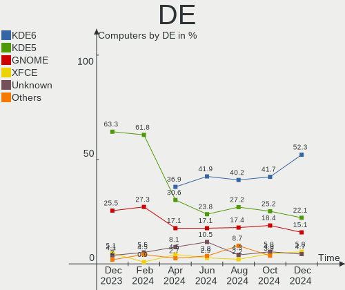
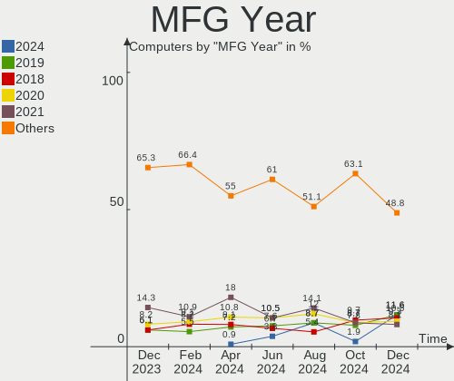
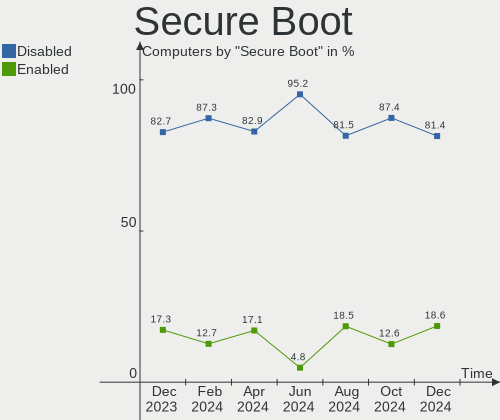
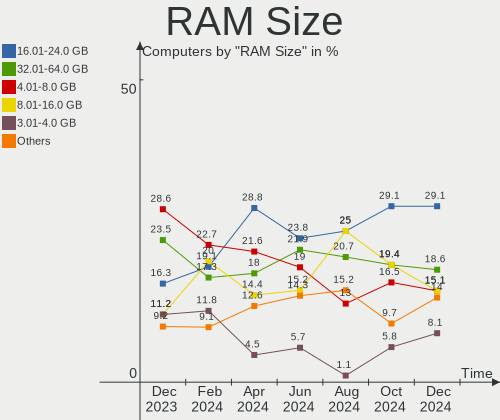
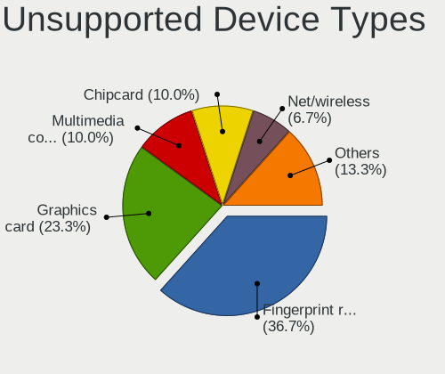

openSUSE - Hardware Trends
--------------------------

A project to identify most popular hardware characteristics and track their change
over time based on data collected by Linux users at https://Linux-Hardware.org.

Anyone can contribute to this report by the [hw-probe](https://github.com/linuxhw/hw-probe) tool:

    sudo -E hw-probe -all -upload

This is a report for all computer types. See also reports for [desktops](/Dist/openSUSE/Desktop/README.md) and [notebooks](/Dist/openSUSE/Notebook/README.md).

This report is for one last month. Overall report since the beginning of time: [TestDays](https://github.com/linuxhw/TestDays)

Period: Dec, 2024.

Contents
--------

* [ System ](#system)
  - [ OS                       ](#os)
  - [ OS Family                ](#os-family)
  - [ Kernel                   ](#kernel)
  - [ Kernel Family            ](#kernel-family)
  - [ Kernel Major Ver.        ](#kernel-major-ver)
  - [ Arch                     ](#arch)
  - [ DE                       ](#de)
  - [ Display Server           ](#display-server)
  - [ Display Manager          ](#display-manager)
  - [ OS Lang                  ](#os-lang)
  - [ Boot Mode                ](#boot-mode)
  - [ Filesystem               ](#filesystem)
  - [ Part. scheme             ](#part-scheme)
  - [ Dual Boot with Linux/BSD ](#dual-boot-with-linuxbsd)
  - [ Dual Boot (Win)          ](#dual-boot-win)

* [ Board ](#board)
  - [ Vendor                   ](#vendor)
  - [ Model                    ](#model)
  - [ Model Family             ](#model-family)
  - [ MFG Year                 ](#mfg-year)
  - [ Form Factor              ](#form-factor)
  - [ Secure Boot              ](#secure-boot)
  - [ Coreboot                 ](#coreboot)
  - [ RAM Size                 ](#ram-size)
  - [ RAM Used                 ](#ram-used)
  - [ Total Drives             ](#total-drives)
  - [ Has CD-ROM               ](#has-cd-rom)
  - [ Has Ethernet             ](#has-ethernet)
  - [ Has WiFi                 ](#has-wifi)
  - [ Has Bluetooth            ](#has-bluetooth)

* [ Location ](#location)
  - [ Country                  ](#country)
  - [ City                     ](#city)

* [ Drives ](#drives)
  - [ Drive Vendor             ](#drive-vendor)
  - [ Drive Model              ](#drive-model)
  - [ HDD Vendor               ](#hdd-vendor)
  - [ SSD Vendor               ](#ssd-vendor)
  - [ Drive Kind               ](#drive-kind)
  - [ Drive Connector          ](#drive-connector)
  - [ Drive Size               ](#drive-size)
  - [ Space Total              ](#space-total)
  - [ Space Used               ](#space-used)
  - [ Malfunc. Drives          ](#malfunc-drives)
  - [ Malfunc. Drive Vendor    ](#malfunc-drive-vendor)
  - [ Malfunc. HDD Vendor      ](#malfunc-hdd-vendor)
  - [ Malfunc. Drive Kind      ](#malfunc-drive-kind)
  - [ Failed Drives            ](#failed-drives)
  - [ Failed Drive Vendor      ](#failed-drive-vendor)
  - [ Drive Status             ](#drive-status)

* [ Storage controller ](#storage-controller)
  - [ Storage Vendor           ](#storage-vendor)
  - [ Storage Model            ](#storage-model)
  - [ Storage Kind             ](#storage-kind)

* [ Processor ](#processor)
  - [ CPU Vendor               ](#cpu-vendor)
  - [ CPU Model                ](#cpu-model)
  - [ CPU Model Family         ](#cpu-model-family)
  - [ CPU Cores                ](#cpu-cores)
  - [ CPU Sockets              ](#cpu-sockets)
  - [ CPU Threads              ](#cpu-threads)
  - [ CPU Op-Modes             ](#cpu-op-modes)
  - [ CPU Microcode            ](#cpu-microcode)
  - [ CPU Microarch            ](#cpu-microarch)

* [ Graphics ](#graphics)
  - [ GPU Vendor               ](#gpu-vendor)
  - [ GPU Model                ](#gpu-model)
  - [ GPU Combo                ](#gpu-combo)
  - [ GPU Driver               ](#gpu-driver)
  - [ GPU Memory               ](#gpu-memory)

* [ Monitor ](#monitor)
  - [ Monitor Vendor           ](#monitor-vendor)
  - [ Monitor Model            ](#monitor-model)
  - [ Monitor Resolution       ](#monitor-resolution)
  - [ Monitor Diagonal         ](#monitor-diagonal)
  - [ Monitor Width            ](#monitor-width)
  - [ Aspect Ratio             ](#aspect-ratio)
  - [ Monitor Area             ](#monitor-area)
  - [ Pixel Density            ](#pixel-density)
  - [ Multiple Monitors        ](#multiple-monitors)

* [ Network ](#network)
  - [ Net Controller Vendor    ](#net-controller-vendor)
  - [ Net Controller Model     ](#net-controller-model)
  - [ Wireless Vendor          ](#wireless-vendor)
  - [ Wireless Model           ](#wireless-model)
  - [ Ethernet Vendor          ](#ethernet-vendor)
  - [ Ethernet Model           ](#ethernet-model)
  - [ Net Controller Kind      ](#net-controller-kind)
  - [ Used Controller          ](#used-controller)
  - [ NICs                     ](#nics)
  - [ IPv6                     ](#ipv6)

* [ Bluetooth ](#bluetooth)
  - [ Bluetooth Vendor         ](#bluetooth-vendor)
  - [ Bluetooth Model          ](#bluetooth-model)

* [ Sound ](#sound)
  - [ Sound Vendor             ](#sound-vendor)
  - [ Sound Model              ](#sound-model)

* [ Memory ](#memory)
  - [ Memory Vendor            ](#memory-vendor)
  - [ Memory Model             ](#memory-model)
  - [ Memory Kind              ](#memory-kind)
  - [ Memory Form Factor       ](#memory-form-factor)
  - [ Memory Size              ](#memory-size)
  - [ Memory Speed             ](#memory-speed)

* [ Printers & scanners ](#printers--scanners)
  - [ Printer Vendor           ](#printer-vendor)
  - [ Printer Model            ](#printer-model)
  - [ Scanner Vendor           ](#scanner-vendor)
  - [ Scanner Model            ](#scanner-model)

* [ Camera ](#camera)
  - [ Camera Vendor            ](#camera-vendor)
  - [ Camera Model             ](#camera-model)

* [ Security ](#security)
  - [ Fingerprint Vendor       ](#fingerprint-vendor)
  - [ Fingerprint Model        ](#fingerprint-model)
  - [ Chipcard Vendor          ](#chipcard-vendor)
  - [ Chipcard Model           ](#chipcard-model)

* [ Unsupported ](#unsupported)
  - [ Unsupported Devices      ](#unsupported-devices)
  - [ Unsupported Device Types ](#unsupported-device-types)

System
------

OS
--

Installed operating systems

| Name                         | Computers | Percent |
|------------------------------|-----------|---------|
| openSUSE Tumbleweed-XXXXXXXX | 58        | 67.44%  |
| openSUSE Leap-15.6           | 20        | 23.26%  |
| openSUSE Leap-15.5           | 4         | 4.65%   |
| openSUSE Microos-XXXXXXXX    | 3         | 3.49%   |
| openSUSE Slowroll-20241202   | 1         | 1.16%   |

OS Family
---------

OS without a version

| Name     | Computers | Percent |
|----------|-----------|---------|
| openSUSE | 86        | 100%    |

Kernel
------

Version of the Linux kernel

| Version                      | Computers | Percent |
|------------------------------|-----------|---------|
| 6.11.8-1-default             | 42        | 48.84%  |
| 6.12.6-1-default             | 18        | 20.93%  |
| 6.4.0-150600.23.25-default   | 10        | 11.63%  |
| 6.4.0-150600.23.30-default   | 6         | 6.98%   |
| 5.14.21-150500.55.83-default | 3         | 3.49%   |
| 6.4.0-150600.21-default      | 2         | 2.33%   |
| 6.4.0-150600.23.7-default    | 1         | 1.16%   |
| 6.11.8-lp156.4-default       | 1         | 1.16%   |
| 6.11.6-2-default             | 1         | 1.16%   |
| 6.11.5-1-default             | 1         | 1.16%   |
| 5.14.21-150500.55.88-default | 1         | 1.16%   |

Kernel Family
-------------

Linux kernel without a distro release

| Version | Computers | Percent |
|---------|-----------|---------|
| 6.11.8  | 43        | 50%     |
| 6.4.0   | 19        | 22.09%  |
| 6.12.6  | 18        | 20.93%  |
| 5.14.21 | 4         | 4.65%   |
| 6.11.6  | 1         | 1.16%   |
| 6.11.5  | 1         | 1.16%   |

Kernel Major Ver.
-----------------

Linux kernel major version

| Version | Computers | Percent |
|---------|-----------|---------|
| 6.11    | 45        | 52.33%  |
| 6.4     | 19        | 22.09%  |
| 6.12    | 18        | 20.93%  |
| 5.14    | 4         | 4.65%   |

Arch
----

OS architecture (x86_64, i586, etc.)

| Name   | Computers | Percent |
|--------|-----------|---------|
| x86_64 | 86        | 100%    |

DE
--

Desktop Environment

| Name    | Computers | Percent |
|---------|-----------|---------|
| KDE6    | 45        | 52.33%  |
| KDE5    | 19        | 22.09%  |
| GNOME   | 13        | 15.12%  |
| XFCE    | 5         | 5.81%   |
| Unknown | 4         | 4.65%   |

Display Server
--------------

X11 or Wayland

| Name    | Computers | Percent |
|---------|-----------|---------|
| X11     | 51        | 59.3%   |
| Wayland | 34        | 39.53%  |
| Tty     | 1         | 1.16%   |

Display Manager
---------------

SDDM, LightDM, etc.

| Name    | Computers | Percent |
|---------|-----------|---------|
| Unknown | 54        | 62.79%  |
| SDDM    | 26        | 30.23%  |
| LightDM | 3         | 3.49%   |
| GDM     | 3         | 3.49%   |

OS Lang
-------

Language

| Lang  | Computers | Percent |
|-------|-----------|---------|
| en_US | 33        | 38.37%  |
| de_DE | 20        | 23.26%  |
| en_GB | 7         | 8.14%   |
| ru_RU | 4         | 4.65%   |
| pt_BR | 4         | 4.65%   |
| POSIX | 3         | 3.49%   |
| es_ES | 3         | 3.49%   |
| it_IT | 2         | 2.33%   |
| de_CH | 2         | 2.33%   |
| tr_TR | 1         | 1.16%   |
| sk_SK | 1         | 1.16%   |
| pt_PT | 1         | 1.16%   |
| pl_PL | 1         | 1.16%   |
| nn_NO | 1         | 1.16%   |
| hu_HU | 1         | 1.16%   |
| fr_FR | 1         | 1.16%   |
| de_AT | 1         | 1.16%   |

Boot Mode
---------

EFI or BIOS

| Mode | Computers | Percent |
|------|-----------|---------|
| EFI  | 64        | 74.42%  |
| BIOS | 22        | 25.58%  |

Filesystem
----------

Type of filesystem

| Type  | Computers | Percent |
|-------|-----------|---------|
| Btrfs | 78        | 90.7%   |
| Ext4  | 6         | 6.98%   |
| Xfs   | 1         | 1.16%   |
| Tmpfs | 1         | 1.16%   |

Part. scheme
------------

Scheme of partitioning

| Type    | Computers | Percent |
|---------|-----------|---------|
| Unknown | 54        | 62.79%  |
| GPT     | 32        | 37.21%  |

Dual Boot with Linux/BSD
------------------------

Hosting more than one Linux/BSD

| Dual boot | Computers | Percent |
|-----------|-----------|---------|
| No        | 79        | 91.86%  |
| Yes       | 7         | 8.14%   |

Dual Boot (Win)
---------------

Hosting Linux and Windows

| Dual boot | Computers | Percent |
|-----------|-----------|---------|
| No        | 71        | 82.56%  |
| Yes       | 15        | 17.44%  |

Board
-----

Vendor
------

Motherboard manufacturer

| Name                | Computers | Percent |
|---------------------|-----------|---------|
| Lenovo              | 16        | 18.6%   |
| Hewlett-Packard     | 14        | 16.28%  |
| Dell                | 13        | 15.12%  |
| ASUSTek Computer    | 13        | 15.12%  |
| ASRock              | 6         | 6.98%   |
| MSI                 | 4         | 4.65%   |
| Gigabyte Technology | 4         | 4.65%   |
| Acer                | 4         | 4.65%   |
| Toshiba             | 3         | 3.49%   |
| Apple               | 2         | 2.33%   |
| Razer               | 1         | 1.16%   |
| Intel               | 1         | 1.16%   |
| Infinix             | 1         | 1.16%   |
| HONOR               | 1         | 1.16%   |
| Getac               | 1         | 1.16%   |
| Biostar             | 1         | 1.16%   |
| Unknown             | 1         | 1.16%   |

Model
-----

Motherboard model

| Name                                      | Computers | Percent |
|-------------------------------------------|-----------|---------|
| Toshiba Satellite U400                    | 1         | 1.16%   |
| Toshiba Satellite S55-C                   | 1         | 1.16%   |
| Toshiba Satellite Pro L70-A               | 1         | 1.16%   |
| Razer Blade                               | 1         | 1.16%   |
| MSI MS-7D88                               | 1         | 1.16%   |
| MSI MS-7D25                               | 1         | 1.16%   |
| MSI MS-7793                               | 1         | 1.16%   |
| MSI MS-7673                               | 1         | 1.16%   |
| Lenovo Y520-15IKBN 80WK                   | 1         | 1.16%   |
| Lenovo ThinkPad T480 20L6SA0X00           | 1         | 1.16%   |
| Lenovo ThinkPad T480 20L6S68A00           | 1         | 1.16%   |
| Lenovo ThinkPad T16 Gen 3 21MN005RUS      | 1         | 1.16%   |
| Lenovo ThinkPad T14s Gen 1 20UH000LUS     | 1         | 1.16%   |
| Lenovo ThinkPad SL 2746EHG                | 1         | 1.16%   |
| Lenovo ThinkPad P52 20MAS25B1F            | 1         | 1.16%   |
| Lenovo ThinkBook 15 G2 ARE 20VG           | 1         | 1.16%   |
| Lenovo ThinkBook 14 G6 IRL 21KG           | 1         | 1.16%   |
| Lenovo Legion 9 16IRX9 83G0               | 1         | 1.16%   |
| Lenovo Legion 7 16IRX9 83FD               | 1         | 1.16%   |
| Lenovo Legion 5 Pro 16ITH6H 82JD          | 1         | 1.16%   |
| Lenovo IdeaPad Slim 3 15ABR8 82XM         | 1         | 1.16%   |
| Lenovo IdeaPad 320-15AST 80XV             | 1         | 1.16%   |
| Lenovo G570 4334                          | 1         | 1.16%   |
| Lenovo 70A4001MUX ThinkServer TS140       | 1         | 1.16%   |
| Intel DG41MJ AAE54659-206                 | 1         | 1.16%   |
| Infinix ZERO BOOK 13                      | 1         | 1.16%   |
| HONOR BRI-XX                              | 1         | 1.16%   |
| HP ZBook Fury 16 G9 Mobile Workstation PC | 1         | 1.16%   |
| HP Z4 G4 Workstation                      | 1         | 1.16%   |
| HP ProBook x360 435 G8 Notebook PC        | 1         | 1.16%   |
| HP ProBook 445R G6                        | 1         | 1.16%   |
| HP Pavilion x360 Convertible 15-cr0xxx    | 1         | 1.16%   |
| HP Laptop 17-cp0xxx                       | 1         | 1.16%   |
| HP Laptop 15-gw0xxx                       | 1         | 1.16%   |
| HP ENVY x360 2-in-1 Laptop 14-fa0xxx      | 1         | 1.16%   |
| HP EliteBook 8470p                        | 1         | 1.16%   |
| HP EliteBook 845 G8 Notebook PC           | 1         | 1.16%   |
| HP EliteBook 840 G6                       | 1         | 1.16%   |
| HP EliteBook 2560p                        | 1         | 1.16%   |
| HP 700-210xt                              | 1         | 1.16%   |

Model Family
------------

Motherboard model prefix

| Name                   | Computers | Percent |
|------------------------|-----------|---------|
| Lenovo ThinkPad        | 6         | 6.98%   |
| Dell Latitude          | 5         | 5.81%   |
| HP EliteBook           | 4         | 4.65%   |
| Dell Inspiron          | 4         | 4.65%   |
| Toshiba Satellite      | 3         | 3.49%   |
| Lenovo Legion          | 3         | 3.49%   |
| Dell OptiPlex          | 3         | 3.49%   |
| Acer Aspire            | 3         | 3.49%   |
| Lenovo ThinkBook       | 2         | 2.33%   |
| Lenovo IdeaPad         | 2         | 2.33%   |
| HP ProBook             | 2         | 2.33%   |
| HP Laptop              | 2         | 2.33%   |
| ASUS VivoBook          | 2         | 2.33%   |
| ASUS ROG               | 2         | 2.33%   |
| ASUS PRIME             | 2         | 2.33%   |
| Razer Blade            | 1         | 1.16%   |
| MSI MS-7D88            | 1         | 1.16%   |
| MSI MS-7D25            | 1         | 1.16%   |
| MSI MS-7793            | 1         | 1.16%   |
| MSI MS-7673            | 1         | 1.16%   |
| Lenovo Y520-15IKBN     | 1         | 1.16%   |
| Lenovo G570            | 1         | 1.16%   |
| Lenovo 70A4001MUX      | 1         | 1.16%   |
| Intel DG41MJ           | 1         | 1.16%   |
| Infinix ZERO           | 1         | 1.16%   |
| HONOR BRI-XX           | 1         | 1.16%   |
| HP ZBook               | 1         | 1.16%   |
| HP Z4                  | 1         | 1.16%   |
| HP Pavilion            | 1         | 1.16%   |
| HP ENVY                | 1         | 1.16%   |
| HP 700-210xt           | 1         | 1.16%   |
| HP 27-p014             | 1         | 1.16%   |
| Gigabyte Z490          | 1         | 1.16%   |
| Gigabyte GA-78LMT-USB3 | 1         | 1.16%   |
| Gigabyte B650          | 1         | 1.16%   |
| Gigabyte B550          | 1         | 1.16%   |
| Getac K120G3           | 1         | 1.16%   |
| Dell XPS               | 1         | 1.16%   |
| Biostar X570GT8        | 1         | 1.16%   |
| ASUS X751SA            | 1         | 1.16%   |

MFG Year
--------

Motherboard manufacture year

| Year | Computers | Percent |
|------|-----------|---------|
| 2024 | 10        | 11.63%  |
| 2019 | 10        | 11.63%  |
| 2018 | 9         | 10.47%  |
| 2020 | 8         | 9.3%    |
| 2021 | 7         | 8.14%   |
| 2023 | 6         | 6.98%   |
| 2017 | 5         | 5.81%   |
| 2016 | 5         | 5.81%   |
| 2015 | 5         | 5.81%   |
| 2014 | 5         | 5.81%   |
| 2011 | 5         | 5.81%   |
| 2022 | 3         | 3.49%   |
| 2008 | 3         | 3.49%   |
| 2013 | 2         | 2.33%   |
| 2010 | 2         | 2.33%   |
| 2009 | 1         | 1.16%   |

Form Factor
-----------

Physical design of the computer

| Name        | Computers | Percent |
|-------------|-----------|---------|
| Notebook    | 50        | 58.14%  |
| Desktop     | 30        | 34.88%  |
| Convertible | 3         | 3.49%   |
| All in one  | 2         | 2.33%   |
| Tablet      | 1         | 1.16%   |

Secure Boot
-----------

Enabled or disabled

| State    | Computers | Percent |
|----------|-----------|---------|
| Disabled | 70        | 81.4%   |
| Enabled  | 16        | 18.6%   |

Coreboot
--------

Have coreboot on board

| Used | Computers | Percent |
|------|-----------|---------|
| No   | 86        | 100%    |

RAM Size
--------

Total RAM memory

| Size in GB  | Computers | Percent |
|-------------|-----------|---------|
| 16.01-24.0  | 25        | 29.07%  |
| 32.01-64.0  | 16        | 18.6%   |
| 4.01-8.0    | 13        | 15.12%  |
| 8.01-16.0   | 13        | 15.12%  |
| 3.01-4.0    | 7         | 8.14%   |
| 24.01-32.0  | 6         | 6.98%   |
| 64.01-256.0 | 5         | 5.81%   |
| 2.01-3.0    | 1         | 1.16%   |

RAM Used
--------

Used RAM memory

| Used GB    | Computers | Percent |
|------------|-----------|---------|
| 4.01-8.0   | 27        | 31.4%   |
| 2.01-3.0   | 26        | 30.23%  |
| 3.01-4.0   | 13        | 15.12%  |
| 1.01-2.0   | 11        | 12.79%  |
| 8.01-16.0  | 8         | 9.3%    |
| 32.01-64.0 | 1         | 1.16%   |

Total Drives
------------

Number of drives on board

| Drives | Computers | Percent |
|--------|-----------|---------|
| 1      | 51        | 59.3%   |
| 2      | 19        | 22.09%  |
| 3      | 6         | 6.98%   |
| 4      | 4         | 4.65%   |
| 7      | 2         | 2.33%   |
| 6      | 2         | 2.33%   |
| 10     | 1         | 1.16%   |
| 5      | 1         | 1.16%   |

Has CD-ROM
----------

Has CD-ROM on board

| Presented | Computers | Percent |
|-----------|-----------|---------|
| No        | 62        | 72.09%  |
| Yes       | 24        | 27.91%  |

Has Ethernet
------------

Has Ethernet on board

| Presented | Computers | Percent |
|-----------|-----------|---------|
| Yes       | 71        | 82.56%  |
| No        | 15        | 17.44%  |

Has WiFi
--------

Has WiFi module

| Presented | Computers | Percent |
|-----------|-----------|---------|
| Yes       | 64        | 74.42%  |
| No        | 22        | 25.58%  |

Has Bluetooth
-------------

Has Bluetooth module

| Presented | Computers | Percent |
|-----------|-----------|---------|
| Yes       | 63        | 73.26%  |
| No        | 23        | 26.74%  |

Location
--------

Country
-------

Geographic location (country)

| Country     | Computers | Percent |
|-------------|-----------|---------|
| Germany     | 20        | 23.26%  |
| USA         | 13        | 15.12%  |
| Russia      | 7         | 8.14%   |
| Brazil      | 7         | 8.14%   |
| Italy       | 5         | 5.81%   |
| UK          | 3         | 3.49%   |
| Switzerland | 3         | 3.49%   |
| Canada      | 3         | 3.49%   |
| Vietnam     | 2         | 2.33%   |
| Turkey      | 2         | 2.33%   |
| Spain       | 2         | 2.33%   |
| Poland      | 2         | 2.33%   |
| Norway      | 2         | 2.33%   |
| Netherlands | 2         | 2.33%   |
| Hungary     | 2         | 2.33%   |
| Austria     | 2         | 2.33%   |
| Venezuela   | 1         | 1.16%   |
| Slovakia    | 1         | 1.16%   |
| Romania     | 1         | 1.16%   |
| Portugal    | 1         | 1.16%   |
| Mexico      | 1         | 1.16%   |
| Israel      | 1         | 1.16%   |
| India       | 1         | 1.16%   |
| France      | 1         | 1.16%   |
| Belgium     | 1         | 1.16%   |

City
----

Geographic location (city)

| City                       | Computers | Percent |
|----------------------------|-----------|---------|
| Moscow                     | 3         | 3.49%   |
| Berlin                     | 3         | 3.49%   |
| Stuttgart                  | 2         | 2.33%   |
| Selters                    | 2         | 2.33%   |
| Lucerne                    | 2         | 2.33%   |
| Lomonosov                  | 2         | 2.33%   |
| Zurich                     | 1         | 1.16%   |
| Zittau                     | 1         | 1.16%   |
| Wroclaw                    | 1         | 1.16%   |
| Wetteren                   | 1         | 1.16%   |
| Vught                      | 1         | 1.16%   |
| Vinh Yen                   | 1         | 1.16%   |
| Vero Beach                 | 1         | 1.16%   |
| Udine                      | 1         | 1.16%   |
| Tromsø                    | 1         | 1.16%   |
| Ternate                    | 1         | 1.16%   |
| Taufkirchen                | 1         | 1.16%   |
| Sorel-Tracy                | 1         | 1.16%   |
| Sleaford                   | 1         | 1.16%   |
| Sigmaringen                | 1         | 1.16%   |
| Serra                      | 1         | 1.16%   |
| Schkeuditz                 | 1         | 1.16%   |
| Sao Gonçalo               | 1         | 1.16%   |
| San Michele al Tagliamento | 1         | 1.16%   |
| Salzburg                   | 1         | 1.16%   |
| Rostock                    | 1         | 1.16%   |
| Rochester                  | 1         | 1.16%   |
| Richmond                   | 1         | 1.16%   |
| Reutlingen                 | 1         | 1.16%   |
| Rehovot                    | 1         | 1.16%   |
| Recife                     | 1         | 1.16%   |
| Platteville                | 1         | 1.16%   |
| Perm                       | 1         | 1.16%   |
| Paris                      | 1         | 1.16%   |
| Orihuela Costa             | 1         | 1.16%   |
| Omaha                      | 1         | 1.16%   |
| Oliva                      | 1         | 1.16%   |
| Oklahoma City              | 1         | 1.16%   |
| North Hills                | 1         | 1.16%   |
| Neustrelitz                | 1         | 1.16%   |

Drives
------

Drive Vendor
------------

Hard drive vendors

| Vendor                         | Computers | Drives | Percent |
|--------------------------------|-----------|--------|---------|
| Samsung Electronics            | 22        | 28     | 15.94%  |
| Seagate                        | 16        | 28     | 11.59%  |
| WDC                            | 14        | 19     | 10.14%  |
| Sandisk                        | 12        | 13     | 8.7%    |
| SK hynix                       | 10        | 10     | 7.25%   |
| Micron Technology              | 6         | 6      | 4.35%   |
| Kingston                       | 5         | 6      | 3.62%   |
| Intel                          | 5         | 6      | 3.62%   |
| Unknown                        | 4         | 4      | 2.9%    |
| Toshiba                        | 4         | 5      | 2.9%    |
| Shenzhen Longsys Electronics   | 3         | 3      | 2.17%   |
| Micron/Crucial Technology      | 3         | 3      | 2.17%   |
| Kingston Technology Company    | 3         | 3      | 2.17%   |
| Crucial                        | 3         | 4      | 2.17%   |
| Silicon Motion                 | 2         | 2      | 1.45%   |
| Phison Electronics             | 2         | 2      | 1.45%   |
| LITEON                         | 2         | 2      | 1.45%   |
| KIOXIA                         | 2         | 2      | 1.45%   |
| A-DATA Technology              | 2         | 2      | 1.45%   |
| Verbatim                       | 1         | 1      | 0.72%   |
| TrekStor                       | 1         | 1      | 0.72%   |
| Transcend                      | 1         | 1      | 0.72%   |
| SPCC                           | 1         | 1      | 0.72%   |
| Solid State Storage Technology | 1         | 1      | 0.72%   |
| S100                           | 1         | 1      | 0.72%   |
| Phison                         | 1         | 1      | 0.72%   |
| OCZ                            | 1         | 1      | 0.72%   |
| MAXIO Technology (Hangzhou)    | 1         | 1      | 0.72%   |
| KingSpec                       | 1         | 1      | 0.72%   |
| HS-SSD-C100                    | 1         | 1      | 0.72%   |
| HGST                           | 1         | 1      | 0.72%   |
| External                       | 1         | 1      | 0.72%   |
| Corsair                        | 1         | 1      | 0.72%   |
| China                          | 1         | 1      | 0.72%   |
| Apple                          | 1         | 1      | 0.72%   |
| ADATA Technology               | 1         | 1      | 0.72%   |
| Unknown                        | 1         | 1      | 0.72%   |

Drive Model
-----------

Hard drive models

| Model                                                 | Computers | Percent |
|-------------------------------------------------------|-----------|---------|
| Samsung NVMe SSD Controller PM9A1/PM9A3/980PRO 512GB  | 5         | 3.13%   |
| Samsung NVMe SSD Controller SM981/PM981/PM983 512GB   | 4         | 2.5%    |
| Micron/Crucial P2 NVMe PCIe SSD 500GB                 | 3         | 1.88%   |
| Silicon Motion SM2263EN/SM2263XT SSD Controller 256GB | 2         | 1.25%   |
| Seagate ST31500341AS 1TB                              | 2         | 1.25%   |
| Seagate ST2000DM008-2FR102 2TB                        | 2         | 1.25%   |
| Samsung SSD 990 PRO 2TB                               | 2         | 1.25%   |
| Samsung SSD 860 EVO 1TB                               | 2         | 1.25%   |
| Phison E12 NVMe Controller 480GB                      | 2         | 1.25%   |
| KIOXIA KBG40ZNV256G 256GB                             | 2         | 1.25%   |
| WDC WDS500G2B0A 500GB SSD                             | 1         | 0.63%   |
| WDC WDS240G2G0B-00EPW0 240GB SSD                      | 1         | 0.63%   |
| WDC WDS100T2B0A-00SM50 1TB SSD                        | 1         | 0.63%   |
| WDC WD80EDAZ-11TA3A0 8TB                              | 1         | 0.63%   |
| WDC WD60EFRX-68L0BN1 6TB                              | 1         | 0.63%   |
| WDC WD5003ABYX-88 LEN 500GB                           | 1         | 0.63%   |
| WDC WD5000LPVX-22V0TT0 500GB                          | 1         | 0.63%   |
| WDC WD40EZRZ-00GXCB0 4TB                              | 1         | 0.63%   |
| WDC WD40EZRX-00SPEB0 4TB                              | 1         | 0.63%   |
| WDC WD4005FZBX-00K5WB0 4TB                            | 1         | 0.63%   |
| WDC WD30EZRZ-00GXCB0 3TB                              | 1         | 0.63%   |
| WDC WD20SPZX-75UA7T0 2TB                              | 1         | 0.63%   |
| WDC WD1600JS-61MHB1 160GB                             | 1         | 0.63%   |
| WDC WD10SPZX-21Z10T0 1TB                              | 1         | 0.63%   |
| WDC WD10EZEX-08WN4A0 1TB                              | 1         | 0.63%   |
| WDC WD10EAVS-00D7B0 1TB                               | 1         | 0.63%   |
| WDC WD10EALX-759BA1 1TB                               | 1         | 0.63%   |
| WDC WD1002FBYS-02A6B0 1TB                             | 1         | 0.63%   |
| Verbatim Vi550 S3 256GB                               | 1         | 0.63%   |
| Unknown xD/SD/M.S.                                    | 1         | 0.63%   |
| Unknown NVMe SSD Drive 1024GB                         | 1         | 0.63%   |
| Unknown MMC Card  7GB                                 | 1         | 0.63%   |
| Unknown MMC Card  512GB                               | 1         | 0.63%   |
| TrekStor TREKSTORSSD256GB 250GB                       | 1         | 0.63%   |
| Transcend TS4TSSD230S 4TB                             | 1         | 0.63%   |
| Toshiba MQ01ABD100 1TB                                | 1         | 0.63%   |
| Toshiba MK2565GSX 250GB                               | 1         | 0.63%   |
| Toshiba KXG50ZNV256G 256GB                            | 1         | 0.63%   |
| Toshiba DT01ACA200 2TB                                | 1         | 0.63%   |
| SPCC Solid State Disk 512GB                           | 1         | 0.63%   |

HDD Vendor
----------

Hard disk drive vendors

| Vendor              | Computers | Drives | Percent |
|---------------------|-----------|--------|---------|
| Seagate             | 16        | 26     | 45.71%  |
| WDC                 | 12        | 16     | 34.29%  |
| Toshiba             | 3         | 4      | 8.57%   |
| Samsung Electronics | 2         | 2      | 5.71%   |
| HGST                | 1         | 1      | 2.86%   |
| External            | 1         | 1      | 2.86%   |

SSD Vendor
----------

Solid state drive vendors

| Vendor              | Computers | Drives | Percent |
|---------------------|-----------|--------|---------|
| Samsung Electronics | 10        | 10     | 23.26%  |
| SanDisk             | 4         | 4      | 9.3%    |
| WDC                 | 3         | 3      | 6.98%   |
| Kingston            | 3         | 4      | 6.98%   |
| Intel               | 3         | 4      | 6.98%   |
| Crucial             | 3         | 4      | 6.98%   |
| Micron Technology   | 2         | 2      | 4.65%   |
| LITEON              | 2         | 2      | 4.65%   |
| A-DATA Technology   | 2         | 2      | 4.65%   |
| TrekStor            | 1         | 1      | 2.33%   |
| Transcend           | 1         | 1      | 2.33%   |
| SPCC                | 1         | 1      | 2.33%   |
| SK hynix            | 1         | 1      | 2.33%   |
| S100                | 1         | 1      | 2.33%   |
| OCZ                 | 1         | 1      | 2.33%   |
| KingSpec            | 1         | 1      | 2.33%   |
| Corsair             | 1         | 1      | 2.33%   |
| China               | 1         | 1      | 2.33%   |
| Apple               | 1         | 1      | 2.33%   |
| Unknown             | 1         | 1      | 2.33%   |

Drive Kind
----------

HDD or SSD

| Kind    | Computers | Drives | Percent |
|---------|-----------|--------|---------|
| NVMe    | 49        | 65     | 40.16%  |
| SSD     | 41        | 46     | 33.61%  |
| HDD     | 27        | 50     | 22.13%  |
| Unknown | 3         | 3      | 2.46%   |
| MMC     | 2         | 2      | 1.64%   |

Drive Connector
---------------

SATA, SAS, NVMe, etc.

| Type | Computers | Drives | Percent |
|------|-----------|--------|---------|
| SATA | 53        | 94     | 48.62%  |
| NVMe | 49        | 65     | 44.95%  |
| SAS  | 5         | 5      | 4.59%   |
| MMC  | 2         | 2      | 1.83%   |

Drive Size
----------

Size of hard drive

| Size in TB | Computers | Drives | Percent |
|------------|-----------|--------|---------|
| 0.01-0.5   | 35        | 42     | 46.05%  |
| 0.51-1.0   | 21        | 25     | 27.63%  |
| 1.01-2.0   | 10        | 14     | 13.16%  |
| 3.01-4.0   | 5         | 8      | 6.58%   |
| 4.01-10.0  | 3         | 5      | 3.95%   |
| 2.01-3.0   | 2         | 2      | 2.63%   |

Space Total
-----------

Amount of disk space available on the file system

| Size in GB     | Computers | Percent |
|----------------|-----------|---------|
| More than 3000 | 41        | 47.67%  |
| 1001-2000      | 19        | 22.09%  |
| 501-1000       | 13        | 15.12%  |
| 2001-3000      | 8         | 9.3%    |
| 251-500        | 3         | 3.49%   |
| 101-250        | 1         | 1.16%   |
| 51-100         | 1         | 1.16%   |

Space Used
----------

Amount of used disk space

| Used GB        | Computers | Percent |
|----------------|-----------|---------|
| 101-250        | 22        | 25.58%  |
| 251-500        | 14        | 16.28%  |
| 501-1000       | 14        | 16.28%  |
| 51-100         | 12        | 13.95%  |
| 2001-3000      | 9         | 10.47%  |
| 1001-2000      | 8         | 9.3%    |
| More than 3000 | 4         | 4.65%   |
| 21-50          | 2         | 2.33%   |
| 1-20           | 1         | 1.16%   |

Malfunc. Drives
---------------

Drive models with a malfunction

| Model                                          | Computers | Drives | Percent |
|------------------------------------------------|-----------|--------|---------|
| WDC WD10SPZX-21Z10T0 1TB                       | 1         | 1      | 12.5%   |
| TrekStor TREKSTORSSD256GB 250GB                | 1         | 1      | 12.5%   |
| SK hynix HFS256G39TND-N210A 256GB SSD          | 1         | 1      | 12.5%   |
| SK hynix BC711 HFM512GD3JX013N 512GB           | 1         | 1      | 12.5%   |
| Seagate ST3640323AS 640GB                      | 1         | 1      | 12.5%   |
| Samsung Electronics SSD 830 Series 128GB       | 1         | 1      | 12.5%   |
| Samsung Electronics HD103UJ 1TB                | 1         | 1      | 12.5%   |
| Micron Technology MTFDDAK256MAM-1K12 256GB SSD | 1         | 1      | 12.5%   |

Malfunc. Drive Vendor
---------------------

Vendors of faulty drives

| Vendor              | Computers | Drives | Percent |
|---------------------|-----------|--------|---------|
| SK hynix            | 2         | 2      | 28.57%  |
| WDC                 | 1         | 1      | 14.29%  |
| TrekStor            | 1         | 1      | 14.29%  |
| Seagate             | 1         | 1      | 14.29%  |
| Samsung Electronics | 1         | 2      | 14.29%  |
| Micron Technology   | 1         | 1      | 14.29%  |

Malfunc. HDD Vendor
-------------------

Vendors of faulty HDD drives

| Vendor              | Computers | Drives | Percent |
|---------------------|-----------|--------|---------|
| WDC                 | 1         | 1      | 33.33%  |
| Seagate             | 1         | 1      | 33.33%  |
| Samsung Electronics | 1         | 1      | 33.33%  |

Malfunc. Drive Kind
-------------------

Kinds of faulty drives

| Kind | Computers | Drives | Percent |
|------|-----------|--------|---------|
| SSD  | 4         | 4      | 50%     |
| HDD  | 3         | 3      | 37.5%   |
| NVMe | 1         | 1      | 12.5%   |

Failed Drives
-------------

Failed drive models

Zero info for selected period =(

Failed Drive Vendor
-------------------

Failed drive vendors

Zero info for selected period =(

Drive Status
------------

Number of failed and malfunc. drives

| Status   | Computers | Drives | Percent |
|----------|-----------|--------|---------|
| Detected | 56        | 108    | 61.54%  |
| Works    | 29        | 50     | 31.87%  |
| Malfunc  | 6         | 8      | 6.59%   |

Storage controller
------------------

Storage Vendor
--------------

Storage controller vendors

| Vendor                         | Computers | Percent |
|--------------------------------|-----------|---------|
| Intel                          | 44        | 35.2%   |
| AMD                            | 16        | 12.8%   |
| Samsung Electronics            | 13        | 10.4%   |
| SK hynix                       | 9         | 7.2%    |
| SanDisk                        | 8         | 6.4%    |
| Kingston Technology Company    | 5         | 4%      |
| Micron Technology              | 4         | 3.2%    |
| Shenzhen Longsys Electronics   | 3         | 2.4%    |
| Phison Electronics             | 3         | 2.4%    |
| Micron/Crucial Technology      | 3         | 2.4%    |
| Marvell Technology Group       | 3         | 2.4%    |
| Silicon Motion                 | 2         | 1.6%    |
| Seagate Technology             | 2         | 1.6%    |
| KIOXIA                         | 2         | 1.6%    |
| Toshiba America Info Systems   | 1         | 0.8%    |
| Solidigm                       | 1         | 0.8%    |
| Solid State Storage Technology | 1         | 0.8%    |
| Nvidia                         | 1         | 0.8%    |
| MAXIO Technology (Hangzhou)    | 1         | 0.8%    |
| Broadcom / LSI                 | 1         | 0.8%    |
| ASMedia Technology             | 1         | 0.8%    |
| ADATA Technology               | 1         | 0.8%    |

Storage Model
-------------

Storage controller models

| Model                                                                          | Computers | Percent |
|--------------------------------------------------------------------------------|-----------|---------|
| AMD FCH SATA Controller [AHCI mode]                                            | 10        | 7.04%   |
| Samsung NVMe SSD Controller PM9A1/PM9A3/980PRO                                 | 5         | 3.52%   |
| Intel Sunrise Point-LP SATA Controller [AHCI mode]                             | 5         | 3.52%   |
| SK hynix Platinum P41/PC801 NVMe Solid State Drive                             | 4         | 2.82%   |
| Samsung NVMe SSD Controller SM981/PM981/PM983                                  | 4         | 2.82%   |
| Intel 8 Series/C220 Series Chipset Family 6-port SATA Controller 1 [AHCI mode] | 4         | 2.82%   |
| SK hynix Gold P31/BC711/PC711 NVMe Solid State Drive                           | 3         | 2.11%   |
| Samsung NVMe SSD Controller 980 (DRAM-less)                                    | 3         | 2.11%   |
| Micron/Crucial P2 [Nick P2] / P3 / P3 Plus NVMe PCIe SSD (DRAM-less)           | 3         | 2.11%   |
| Silicon Motion SM2263EN/SM2263XT (DRAM-less) NVMe SSD Controllers              | 2         | 1.41%   |
| Shenzhen Longsys Lexar NM790 NVME SSD (DRAM-less)                              | 2         | 1.41%   |
| Seagate E18 PCIe SSD                                                           | 2         | 1.41%   |
| Sandisk WD Black SN850X NVMe SSD                                               | 2         | 1.41%   |
| SanDisk WD Black SN770 / PC SN740 256GB / PC SN560 (DRAM-less) NVMe SSD        | 2         | 1.41%   |
| Samsung NVMe SSD Controller S4LV008[Pascal]                                    | 2         | 1.41%   |
| Phison E12 NVMe Controller                                                     | 2         | 1.41%   |
| Micron 2400 NVMe SSD (DRAM-less)                                               | 2         | 1.41%   |
| KIOXIA NVMe SSD Controller BG4 (DRAM-less)                                     | 2         | 1.41%   |
| Intel Volume Management Device NVMe RAID Controller                            | 2         | 1.41%   |
| Intel SATA Controller [RAID mode]                                              | 2         | 1.41%   |
| Intel Q170/Q150/B150/H170/H110/Z170/CM236 Chipset SATA Controller [AHCI Mode]  | 2         | 1.41%   |
| Intel NM10/ICH7 Family SATA Controller [IDE mode]                              | 2         | 1.41%   |
| Intel Cannon Point-LP SATA Controller [AHCI Mode]                              | 2         | 1.41%   |
| Intel Alder Lake-S PCH SATA Controller [AHCI Mode]                             | 2         | 1.41%   |
| Intel 82801IBM/IEM (ICH9M/ICH9M-E) 4 port SATA Controller [AHCI mode]          | 2         | 1.41%   |
| Intel 82801G (ICH7 Family) IDE Controller                                      | 2         | 1.41%   |
| Intel 82801 Mobile SATA Controller [RAID mode]                                 | 2         | 1.41%   |
| Intel 6 Series/C200 Series Chipset Family 6 port Desktop SATA AHCI Controller  | 2         | 1.41%   |
| Intel 200 Series PCH SATA controller [AHCI mode]                               | 2         | 1.41%   |
| AMD 600 Series Chipset SATA Controller                                         | 2         | 1.41%   |
| AMD 500 Series Chipset SATA Controller                                         | 2         | 1.41%   |
| Toshiba America Info Systems XG5 NVMe SSD Controller                           | 1         | 0.7%    |
| Solidigm P41 Plus NVMe SSD (DRAM-less) [Echo Harbor]                           | 1         | 0.7%    |
| Solid State Storage CL4-8D512 NVMe SSD M.2 (DRAM-less)                         | 1         | 0.7%    |
| SK hynix BC901 NVMe Solid State Drive (DRAM-less)                              | 1         | 0.7%    |
| SK hynix BC501 NVMe Solid State Drive                                          | 1         | 0.7%    |
| Shenzhen Longsys FORESEE XP2100 NVMe SSD (DRAM-less)                           | 1         | 0.7%    |
| SanDisk WD PC SN810 / Black SN850 NVMe SSD                                     | 1         | 0.7%    |
| Sandisk WD Blue SN580 NVMe SSD (DRAM-less)                                     | 1         | 0.7%    |
| Sandisk PC SN740 NVMe SSD (DRAM-less)                                          | 1         | 0.7%    |

Storage Kind
------------

Kind of storage controller (IDE, SATA, NVMe, SAS, ...)

| Kind | Computers | Percent |
|------|-----------|---------|
| SATA | 54        | 46.55%  |
| NVMe | 49        | 42.24%  |
| RAID | 6         | 5.17%   |
| IDE  | 6         | 5.17%   |
| SCSI | 1         | 0.86%   |

Processor
---------

CPU Vendor
----------

Processor vendors

| Vendor | Computers | Percent |
|--------|-----------|---------|
| Intel  | 58        | 67.44%  |
| AMD    | 28        | 32.56%  |

CPU Model
---------

Processor models

| Model                                       | Computers | Percent |
|---------------------------------------------|-----------|---------|
| AMD Ryzen 7 5700U with Radeon Graphics      | 3         | 3.49%   |
| Intel Core i9-14900HX                       | 2         | 2.33%   |
| Intel Core i5-8350U CPU @ 1.70GHz           | 2         | 2.33%   |
| Intel Core i5-8265U CPU @ 1.60GHz           | 2         | 2.33%   |
| Intel Core i5-8250U CPU @ 1.60GHz           | 2         | 2.33%   |
| Intel Xeon W-2123 CPU @ 3.60GHz             | 1         | 1.16%   |
| Intel Xeon CPU E3-1225 v3 @ 3.20GHz         | 1         | 1.16%   |
| Intel Pentium Dual-Core CPU T4200 @ 2.00GHz | 1         | 1.16%   |
| Intel Pentium Dual-Core CPU E6500 @ 2.93GHz | 1         | 1.16%   |
| Intel Pentium Dual CPU E2180 @ 2.00GHz      | 1         | 1.16%   |
| Intel Pentium CPU N3700 @ 1.60GHz           | 1         | 1.16%   |
| Intel N100                                  | 1         | 1.16%   |
| Intel Core Ultra 5 135U                     | 1         | 1.16%   |
| Intel Core i7-8850H CPU @ 2.60GHz           | 1         | 1.16%   |
| Intel Core i7-8750H CPU @ 2.20GHz           | 1         | 1.16%   |
| Intel Core i7-8665U CPU @ 1.90GHz           | 1         | 1.16%   |
| Intel Core i7-8550U CPU @ 1.80GHz           | 1         | 1.16%   |
| Intel Core i7-7700K CPU @ 4.20GHz           | 1         | 1.16%   |
| Intel Core i7-6700 CPU @ 3.40GHz            | 1         | 1.16%   |
| Intel Core i7-5500U CPU @ 2.40GHz           | 1         | 1.16%   |
| Intel Core i7-4770 CPU @ 3.40GHz            | 1         | 1.16%   |
| Intel Core i5-8400 CPU @ 2.80GHz            | 1         | 1.16%   |
| Intel Core i5-8365U CPU @ 1.60GHz           | 1         | 1.16%   |
| Intel Core i5-7300U CPU @ 2.60GHz           | 1         | 1.16%   |
| Intel Core i5-7300HQ CPU @ 2.50GHz          | 1         | 1.16%   |
| Intel Core i5-6600 CPU @ 3.30GHz            | 1         | 1.16%   |
| Intel Core i5-6400T CPU @ 2.20GHz           | 1         | 1.16%   |
| Intel Core i5-6300U CPU @ 2.40GHz           | 1         | 1.16%   |
| Intel Core i5-6200U CPU @ 2.30GHz           | 1         | 1.16%   |
| Intel Core i5-5257U CPU @ 2.70GHz           | 1         | 1.16%   |
| Intel Core i5-4570S CPU @ 2.90GHz           | 1         | 1.16%   |
| Intel Core i5-4210U CPU @ 1.70GHz           | 1         | 1.16%   |
| Intel Core i5-4200M CPU @ 2.50GHz           | 1         | 1.16%   |
| Intel Core i5-3320M CPU @ 2.60GHz           | 1         | 1.16%   |
| Intel Core i5-2520M CPU @ 2.50GHz           | 1         | 1.16%   |
| Intel Core i5-2500K CPU @ 3.30GHz           | 1         | 1.16%   |
| Intel Core i5-2500 CPU @ 3.30GHz            | 1         | 1.16%   |
| Intel Core i5-2430M CPU @ 2.40GHz           | 1         | 1.16%   |
| Intel Core i5-10600K CPU @ 4.10GHz          | 1         | 1.16%   |
| Intel Core i5-10500T CPU @ 2.30GHz          | 1         | 1.16%   |

CPU Model Family
----------------

Processor model prefix

| Model                   | Computers | Percent |
|-------------------------|-----------|---------|
| Intel Core i5           | 25        | 29.07%  |
| Other                   | 11        | 12.79%  |
| AMD Ryzen 7             | 9         | 10.47%  |
| Intel Core i7           | 8         | 9.3%    |
| AMD Ryzen 9             | 4         | 4.65%   |
| AMD Ryzen 5             | 4         | 4.65%   |
| Intel Core i3           | 3         | 3.49%   |
| AMD Ryzen 3             | 3         | 3.49%   |
| Intel Xeon              | 2         | 2.33%   |
| Intel Pentium Dual-Core | 2         | 2.33%   |
| Intel Core i9           | 2         | 2.33%   |
| AMD Ryzen 7 PRO         | 2         | 2.33%   |
| Intel Pentium Dual      | 1         | 1.16%   |
| Intel Pentium           | 1         | 1.16%   |
| Intel Core 2 Duo        | 1         | 1.16%   |
| Intel Core              | 1         | 1.16%   |
| Intel Celeron           | 1         | 1.16%   |
| AMD FX                  | 1         | 1.16%   |
| AMD C-50                | 1         | 1.16%   |
| AMD Athlon 64 X2        | 1         | 1.16%   |
| AMD Athlon              | 1         | 1.16%   |
| AMD A8                  | 1         | 1.16%   |
| AMD A6                  | 1         | 1.16%   |

CPU Cores
---------

Number of processor cores

| Number | Computers | Percent |
|--------|-----------|---------|
| 4      | 27        | 31.4%   |
| 2      | 25        | 29.07%  |
| 8      | 11        | 12.79%  |
| 6      | 9         | 10.47%  |
| 12     | 6         | 6.98%   |
| 16     | 3         | 3.49%   |
| 24     | 2         | 2.33%   |
| 10     | 2         | 2.33%   |
| 14     | 1         | 1.16%   |

CPU Sockets
-----------

Number of sockets

| Number | Computers | Percent |
|--------|-----------|---------|
| 1      | 86        | 100%    |

CPU Threads
-----------

Threads per core (Hyper-Threading)

| Number | Computers | Percent |
|--------|-----------|---------|
| 2      | 64        | 74.42%  |
| 1      | 22        | 25.58%  |

CPU Op-Modes
------------

CPU Operation Modes (32-bit, 64-bit)

| Op mode        | Computers | Percent |
|----------------|-----------|---------|
| 32-bit, 64-bit | 86        | 100%    |

CPU Microcode
-------------

Microcode number

| Number     | Computers | Percent |
|------------|-----------|---------|
| Unknown    | 82        | 95.35%  |
| 0x806ec    | 1         | 1.16%   |
| 0x806c1    | 1         | 1.16%   |
| 0x0a201016 | 1         | 1.16%   |
| 0x08108109 | 1         | 1.16%   |

CPU Microarch
-------------

Microarchitecture

| Name              | Computers | Percent |
|-------------------|-----------|---------|
| KabyLake          | 16        | 18.6%   |
| Alderlake Hybrid  | 9         | 10.47%  |
| Unknown           | 8         | 9.3%    |
| Zen 3             | 7         | 8.14%   |
| Skylake           | 7         | 8.14%   |
| Haswell           | 5         | 5.81%   |
| SandyBridge       | 4         | 4.65%   |
| Zen+              | 3         | 3.49%   |
| Zen 2             | 3         | 3.49%   |
| Penryn            | 3         | 3.49%   |
| Broadwell         | 3         | 3.49%   |
| Zen               | 2         | 2.33%   |
| TigerLake         | 2         | 2.33%   |
| CometLake         | 2         | 2.33%   |
| Steamroller       | 1         | 1.16%   |
| Silvermont        | 1         | 1.16%   |
| Piledriver        | 1         | 1.16%   |
| Meteorlake Hybrid | 1         | 1.16%   |
| K8 Hammer         | 1         | 1.16%   |
| IvyBridge         | 1         | 1.16%   |
| Icelake           | 1         | 1.16%   |
| Gracemont         | 1         | 1.16%   |
| Goldmont plus     | 1         | 1.16%   |
| Excavator         | 1         | 1.16%   |
| Core              | 1         | 1.16%   |
| Bobcat            | 1         | 1.16%   |

Graphics
--------

GPU Vendor
----------

Vendors of graphics cards

| Vendor | Computers | Percent |
|--------|-----------|---------|
| Intel  | 47        | 46.53%  |
| AMD    | 30        | 29.7%   |
| Nvidia | 24        | 23.76%  |

GPU Model
---------

Graphics card models

| Model                                                                     | Computers | Percent |
|---------------------------------------------------------------------------|-----------|---------|
| Intel UHD Graphics 620                                                    | 5         | 4.85%   |
| Intel WhiskeyLake-U GT2 [UHD Graphics 620]                                | 4         | 3.88%   |
| Intel Skylake GT2 [HD Graphics 520]                                       | 3         | 2.91%   |
| Intel Raptor Lake-P [Iris Xe Graphics]                                    | 3         | 2.91%   |
| Intel HD Graphics 530                                                     | 3         | 2.91%   |
| Intel 2nd Generation Core Processor Family Integrated Graphics Controller | 3         | 2.91%   |
| AMD Picasso/Raven 2 [Radeon Vega Series / Radeon Vega Mobile Series]      | 3         | 2.91%   |
| AMD Lucienne                                                              | 3         | 2.91%   |
| AMD Cezanne [Radeon Vega Series / Radeon Vega Mobile Series]              | 3         | 2.91%   |
| Nvidia GP108M [GeForce MX150]                                             | 2         | 1.94%   |
| Intel TigerLake-LP GT2 [Iris Xe Graphics]                                 | 2         | 1.94%   |
| Intel HD Graphics 630                                                     | 2         | 1.94%   |
| Intel HD Graphics 5500                                                    | 2         | 1.94%   |
| Intel CoffeeLake-H GT2 [UHD Graphics 630]                                 | 2         | 1.94%   |
| Intel 4 Series Chipset Integrated Graphics Controller                     | 2         | 1.94%   |
| AMD Renoir [Radeon Vega Series / Radeon Vega Mobile Series]               | 2         | 1.94%   |
| AMD Phoenix3                                                              | 2         | 1.94%   |
| AMD Navi 31 [Radeon RX 7900 XT/7900 XTX/7900 GRE/7900M]                   | 2         | 1.94%   |
| AMD Navi 21 [Radeon RX 6800/6800 XT / 6900 XT]                            | 2         | 1.94%   |
| Nvidia TU117M [GeForce GTX 1650 Mobile / Max-Q]                           | 1         | 0.97%   |
| Nvidia TU104 [GeForce RTX 2080 SUPER]                                     | 1         | 0.97%   |
| Nvidia GP108 [GeForce GT 1030]                                            | 1         | 0.97%   |
| Nvidia GP107M [GeForce GTX 1050 Mobile]                                   | 1         | 0.97%   |
| Nvidia GP107GLM [Quadro P1000 Mobile]                                     | 1         | 0.97%   |
| Nvidia GP106M [GeForce GTX 1060 Mobile]                                   | 1         | 0.97%   |
| Nvidia GP106 [GeForce GTX 1060 3GB]                                       | 1         | 0.97%   |
| Nvidia GP104 [GeForce GTX 1080]                                           | 1         | 0.97%   |
| Nvidia GP104 [GeForce GTX 1070]                                           | 1         | 0.97%   |
| Nvidia GM206 [GeForce GTX 960]                                            | 1         | 0.97%   |
| Nvidia GM108M [GeForce 840M]                                              | 1         | 0.97%   |
| Nvidia GK208M [GeForce GT 740M]                                           | 1         | 0.97%   |
| Nvidia GK107M [GeForce GT 750M Mac Edition]                               | 1         | 0.97%   |
| Nvidia GA107GLM [RTX A1000 Laptop GPU]                                    | 1         | 0.97%   |
| Nvidia GA104M [GeForce RTX 3070 Mobile / Max-Q]                           | 1         | 0.97%   |
| Nvidia GA104 [GeForce RTX 3070 Ti]                                        | 1         | 0.97%   |
| Nvidia GA102 [GeForce RTX 3080 Ti]                                        | 1         | 0.97%   |
| Nvidia G98M [GeForce G 105M]                                              | 1         | 0.97%   |
| Nvidia C77 [nForce 780a/980a SLI]                                         | 1         | 0.97%   |
| Nvidia AD107M [GeForce RTX 4060 Max-Q / Mobile]                           | 1         | 0.97%   |
| Nvidia AD106M [GeForce RTX 4070 Max-Q / Mobile]                           | 1         | 0.97%   |

GPU Combo
---------

Combinations of graphics cards

| Name           | Computers | Percent |
|----------------|-----------|---------|
| 1 x Intel      | 34        | 39.53%  |
| 1 x AMD        | 24        | 27.91%  |
| 1 x Nvidia     | 13        | 15.12%  |
| Intel + Nvidia | 9         | 10.47%  |
| 2 x AMD        | 2         | 2.33%   |
| Intel + AMD    | 2         | 2.33%   |
| AMD + Nvidia   | 2         | 2.33%   |

GPU Driver
----------

Free vs proprietary

| Driver      | Computers | Percent |
|-------------|-----------|---------|
| Free        | 75        | 87.21%  |
| Proprietary | 8         | 9.3%    |
| Unknown     | 3         | 3.49%   |

GPU Memory
----------

Total video memory

| Size in GB | Computers | Percent |
|------------|-----------|---------|
| Unknown    | 49        | 56.98%  |
| 0.01-0.5   | 12        | 13.95%  |
| 7.01-8.0   | 7         | 8.14%   |
| 1.01-2.0   | 7         | 8.14%   |
| 8.01-16.0  | 4         | 4.65%   |
| 3.01-4.0   | 3         | 3.49%   |
| 0.51-1.0   | 2         | 2.33%   |
| 5.01-6.0   | 1         | 1.16%   |
| 16.01-24.0 | 1         | 1.16%   |

Monitor
-------

Monitor Vendor
--------------

Monitor vendors

| Vendor               | Computers | Percent |
|----------------------|-----------|---------|
| Chimei Innolux       | 12        | 12.77%  |
| BOE                  | 12        | 12.77%  |
| Samsung Electronics  | 9         | 9.57%   |
| AU Optronics         | 9         | 9.57%   |
| LG Display           | 8         | 8.51%   |
| Hewlett-Packard      | 6         | 6.38%   |
| Goldstar             | 5         | 5.32%   |
| Philips              | 4         | 4.26%   |
| Dell                 | 4         | 4.26%   |
| Lenovo               | 3         | 3.19%   |
| AOC                  | 3         | 3.19%   |
| PANDA                | 2         | 2.13%   |
| Apple                | 2         | 2.13%   |
| ViewSonic            | 1         | 1.06%   |
| Vestel Elektronik    | 1         | 1.06%   |
| SKG                  | 1         | 1.06%   |
| Sharp                | 1         | 1.06%   |
| NEC Computers        | 1         | 1.06%   |
| MiTAC                | 1         | 1.06%   |
| LG Philips           | 1         | 1.06%   |
| KDB                  | 1         | 1.06%   |
| CSW                  | 1         | 1.06%   |
| CSO                  | 1         | 1.06%   |
| Cbox                 | 1         | 1.06%   |
| BenQ                 | 1         | 1.06%   |
| Belinea              | 1         | 1.06%   |
| ASUSTek Computer     | 1         | 1.06%   |
| Ancor Communications | 1         | 1.06%   |

Monitor Model
-------------

Monitor models

| Model                                                                 | Computers | Percent |
|-----------------------------------------------------------------------|-----------|---------|
| Samsung Electronics S24D330 SAM0D92 1920x1080 531x299mm 24.0-inch     | 2         | 2.06%   |
| Hewlett-Packard w2207 HWP26A9 1680x1050 473x296mm 22.0-inch           | 2         | 2.06%   |
| Goldstar FHD GSM5C66 1920x1080 527x296mm 23.8-inch                    | 2         | 2.06%   |
| ViewSonic VX2457 VSCB931 1920x1080 521x293mm 23.5-inch                | 1         | 1.03%   |
| Vestel Elektronik 49FHD_LCD_TV VES3700 1920x1080 1280x720mm 57.8-inch | 1         | 1.03%   |
| SKG DEXP DF24N2 SKG2413 1920x1080 597x336mm 27.0-inch                 | 1         | 1.03%   |
| Sharp LCD Monitor SHP14F9 1920x1200 288x180mm 13.4-inch               | 1         | 1.03%   |
| Samsung Electronics SyncMaster SAM7261 3840x2160 1209x680mm 54.6-inch | 1         | 1.03%   |
| Samsung Electronics LCD Monitor SEC564E 1280x720 223x125mm 10.1-inch  | 1         | 1.03%   |
| Samsung Electronics LCD Monitor SEC4149 1366x768 292x174mm 13.4-inch  | 1         | 1.03%   |
| Samsung Electronics LCD Monitor SDC4161 1920x1080 344x194mm 15.5-inch | 1         | 1.03%   |
| Samsung Electronics LCD Monitor SAM0902 1920x1080 700x390mm 31.5-inch | 1         | 1.03%   |
| Samsung Electronics LCD Monitor SAM07C0 1920x1080 890x500mm 40.2-inch | 1         | 1.03%   |
| Samsung Electronics C27FG7x SAM0E41 1920x1080 598x337mm 27.0-inch     | 1         | 1.03%   |
| Philips PHL 273V5 PHLC0D2 1920x1080 598x336mm 27.0-inch               | 1         | 1.03%   |
| Philips PHL 243V7 PHLC155 1920x1080 527x296mm 23.8-inch               | 1         | 1.03%   |
| Philips PHL 243V5 PHLC0D1 1920x1080 521x293mm 23.5-inch               | 1         | 1.03%   |
| Philips 196V4 PHLC0AF 1366x768 410x230mm 18.5-inch                    | 1         | 1.03%   |
| PANDA LM156LF1L03 NCP001C 1920x1080 344x194mm 15.5-inch               | 1         | 1.03%   |
| PANDA LCD Monitor NCP002D 1920x1080 344x194mm 15.5-inch               | 1         | 1.03%   |
| NEC Computers PA271W NEC67DC 2560x1440 597x336mm 27.0-inch            | 1         | 1.03%   |
| MiTAC TV MTC9527 1920x1080 1150x650mm 52.0-inch                       | 1         | 1.03%   |
| LG Philips LCD Monitor LPL2601 1280x800 286x179mm 13.3-inch           | 1         | 1.03%   |
| LG Display LCD Monitor LGD0738 1920x1080 344x194mm 15.5-inch          | 1         | 1.03%   |
| LG Display LCD Monitor LGD060F 1920x1080 309x174mm 14.0-inch          | 1         | 1.03%   |
| LG Display LCD Monitor LGD05C0 1920x1080 344x194mm 15.5-inch          | 1         | 1.03%   |
| LG Display LCD Monitor LGD0590 1920x1080 344x194mm 15.5-inch          | 1         | 1.03%   |
| LG Display LCD Monitor LGD0521 1920x1080 309x174mm 14.0-inch          | 1         | 1.03%   |
| LG Display LCD Monitor LGD04E2 1366x768 344x194mm 15.5-inch           | 1         | 1.03%   |
| LG Display LCD Monitor LGD0456 1366x768 344x194mm 15.5-inch           | 1         | 1.03%   |
| LG Display LCD Monitor LGD0306 1600x900 310x174mm 14.0-inch           | 1         | 1.03%   |
| Lenovo LEN S22e-19 LEN61C9 1920x1080 476x268mm 21.5-inch              | 1         | 1.03%   |
| Lenovo LCD Monitor LEN40B0 1366x768 345x194mm 15.6-inch               | 1         | 1.03%   |
| Lenovo LCD Monitor LEN4053 1680x1050 331x207mm 15.4-inch              | 1         | 1.03%   |
| KDB LCD Monitor KDB0526 1920x1080 344x194mm 15.5-inch                 | 1         | 1.03%   |
| Hewlett-Packard Z24i HWP309E 1920x1200 518x324mm 24.1-inch            | 1         | 1.03%   |
| Hewlett-Packard LA2205 HWP2849 1680x1050 473x296mm 22.0-inch          | 1         | 1.03%   |
| Hewlett-Packard All-in-One HWP4228 1920x1080 597x336mm 27.0-inch      | 1         | 1.03%   |
| Hewlett-Packard 32 Display HPN351B 1920x1080 698x393mm 31.5-inch      | 1         | 1.03%   |
| Hewlett-Packard 27h HPN392B 1920x1080 597x336mm 27.0-inch             | 1         | 1.03%   |

Monitor Resolution
------------------

Monitor screen resolution

| Resolution         | Computers | Percent |
|--------------------|-----------|---------|
| 1920x1080 (FHD)    | 45        | 48.39%  |
| 1366x768 (WXGA)    | 12        | 12.9%   |
| 3840x2160 (4K)     | 6         | 6.45%   |
| 2560x1440 (QHD)    | 5         | 5.38%   |
| 1920x1200 (WUXGA)  | 5         | 5.38%   |
| 1680x1050 (WSXGA+) | 5         | 5.38%   |
| 2560x1600          | 4         | 4.3%    |
| 1600x900 (HD+)     | 4         | 4.3%    |
| 3440x1440          | 2         | 2.15%   |
| 3200x2000          | 1         | 1.08%   |
| 2560x2880          | 1         | 1.08%   |
| 2560x1080          | 1         | 1.08%   |
| 1280x800 (WXGA)    | 1         | 1.08%   |
| 1280x720 (HD)      | 1         | 1.08%   |

Monitor Diagonal
----------------

Diagonal size in inches

| Inches | Computers | Percent |
|--------|-----------|---------|
| 15     | 25        | 26.04%  |
| 27     | 10        | 10.42%  |
| 24     | 9         | 9.38%   |
| 13     | 9         | 9.38%   |
| 14     | 8         | 8.33%   |
| 16     | 5         | 5.21%   |
| 31     | 4         | 4.17%   |
| 17     | 4         | 4.17%   |
| 34     | 3         | 3.13%   |
| 23     | 3         | 3.13%   |
| 22     | 3         | 3.13%   |
| 21     | 3         | 3.13%   |
| 54     | 2         | 2.08%   |
| 12     | 2         | 2.08%   |
| 84     | 1         | 1.04%   |
| 52     | 1         | 1.04%   |
| 46     | 1         | 1.04%   |
| 20     | 1         | 1.04%   |
| 18     | 1         | 1.04%   |
| 10     | 1         | 1.04%   |

Monitor Width
-------------

Physical width

| Width in mm | Computers | Percent |
|-------------|-----------|---------|
| 301-350     | 42        | 44.68%  |
| 501-600     | 18        | 19.15%  |
| 401-500     | 9         | 9.57%   |
| 201-300     | 8         | 8.51%   |
| 601-700     | 5         | 5.32%   |
| 351-400     | 4         | 4.26%   |
| 1001-1500   | 4         | 4.26%   |
| 701-800     | 3         | 3.19%   |
| 1501-2000   | 1         | 1.06%   |

Aspect Ratio
------------

Proportional relationship between the width and the height

| Ratio | Computers | Percent |
|-------|-----------|---------|
| 16/9  | 68        | 77.27%  |
| 16/10 | 16        | 18.18%  |
| 21/9  | 3         | 3.41%   |
| 0.89  | 1         | 1.14%   |

Monitor Area
------------

Area in inch²

| Area in inch² | Computers | Percent |
|----------------|-----------|---------|
| 101-110        | 25        | 26.32%  |
| 201-250        | 14        | 14.74%  |
| 81-90          | 13        | 13.68%  |
| 301-350        | 9         | 9.47%   |
| 351-500        | 7         | 7.37%   |
| 71-80          | 5         | 5.26%   |
| 111-120        | 5         | 5.26%   |
| More than 1000 | 4         | 4.21%   |
| 121-130        | 4         | 4.21%   |
| 151-200        | 3         | 3.16%   |
| 251-300        | 2         | 2.11%   |
| 61-70          | 1         | 1.05%   |
| 41-50          | 1         | 1.05%   |
| 141-150        | 1         | 1.05%   |
| 501-1000       | 1         | 1.05%   |

Pixel Density
-------------

Pixels per inch

| Density | Computers | Percent |
|---------|-----------|---------|
| 121-160 | 30        | 34.48%  |
| 51-100  | 22        | 25.29%  |
| 101-120 | 21        | 24.14%  |
| 161-240 | 11        | 12.64%  |
| 1-50    | 3         | 3.45%   |

Multiple Monitors
-----------------

Total monitors connected

| Total | Computers | Percent |
|-------|-----------|---------|
| 1     | 73        | 84.88%  |
| 2     | 12        | 13.95%  |
| 3     | 1         | 1.16%   |

Network
-------

Net Controller Vendor
---------------------

Controller vendors

| Vendor                   | Computers | Percent |
|--------------------------|-----------|---------|
| Realtek Semiconductor    | 46        | 36.51%  |
| Intel                    | 44        | 34.92%  |
| Qualcomm Atheros         | 10        | 7.94%   |
| MediaTek                 | 6         | 4.76%   |
| Broadcom                 | 5         | 3.97%   |
| TP-Link                  | 2         | 1.59%   |
| Ralink                   | 2         | 1.59%   |
| Sierra Wireless          | 1         | 0.79%   |
| Samsung Electronics      | 1         | 0.79%   |
| Ralink Technology        | 1         | 0.79%   |
| Qualcomm                 | 1         | 0.79%   |
| Nvidia                   | 1         | 0.79%   |
| Microsoft                | 1         | 0.79%   |
| Marvell Technology Group | 1         | 0.79%   |
| Dell                     | 1         | 0.79%   |
| ASIX Electronics         | 1         | 0.79%   |
| Aquantia                 | 1         | 0.79%   |
| AMD                      | 1         | 0.79%   |

Net Controller Model
--------------------

Controller models

| Model                                                                  | Computers | Percent |
|------------------------------------------------------------------------|-----------|---------|
| Realtek RTL8111/8168/8211/8411 PCI Express Gigabit Ethernet Controller | 30        | 19.87%  |
| Realtek RTL8821CE 802.11ac PCIe Wireless Network Adapter               | 6         | 3.97%   |
| Realtek RTL810xE PCI Express Fast Ethernet controller                  | 4         | 2.65%   |
| Qualcomm Atheros QCA9565 / AR9565 Wireless Network Adapter             | 4         | 2.65%   |
| Intel Wireless 8265 / 8275                                             | 4         | 2.65%   |
| Intel Cannon Point-LP CNVi [Wireless-AC]                               | 4         | 2.65%   |
| Intel Wi-Fi 6 AX200                                                    | 3         | 1.99%   |
| Intel Raptor Lake PCH CNVi WiFi                                        | 3         | 1.99%   |
| Intel Ethernet Controller I225-V                                       | 3         | 1.99%   |
| Intel Ethernet Connection (4) I219-LM                                  | 3         | 1.99%   |
| Realtek RTL8852AE 802.11ax PCIe Wireless Network Adapter               | 2         | 1.32%   |
| Realtek RTL8125 2.5GbE Controller                                      | 2         | 1.32%   |
| Realtek Killer E3000 2.5GbE Controller                                 | 2         | 1.32%   |
| Qualcomm Atheros AR8152 v2.0 Fast Ethernet                             | 2         | 1.32%   |
| MediaTek MT7921 802.11ax PCI Express Wireless Network Adapter          | 2         | 1.32%   |
| Intel Wireless 7265                                                    | 2         | 1.32%   |
| Intel Wi-Fi 7(802.11be) AX1775*/AX1790*/BE20*/BE401/BE1750* 2x2        | 2         | 1.32%   |
| Intel Wi-Fi 6E(802.11ax) AX210/AX1675* 2x2 [Typhoon Peak]              | 2         | 1.32%   |
| Intel Wi-Fi 6 AX201                                                    | 2         | 1.32%   |
| Intel Wi-Fi 5(802.11ac) Wireless-AC 9x6x [Thunder Peak]                | 2         | 1.32%   |
| Intel I211 Gigabit Network Connection                                  | 2         | 1.32%   |
| Intel Ethernet Connection (2) I219-V                                   | 2         | 1.32%   |
| Intel Dual Band Wireless-AC 3168NGW [Stone Peak]                       | 2         | 1.32%   |
| Intel Alder Lake-S PCH CNVi WiFi                                       | 2         | 1.32%   |
| Intel 82579LM Gigabit Network Connection (Lewisville)                  | 2         | 1.32%   |
| TP-Link AC600 wireless Realtek RTL8811AU [Archer T2U Nano]             | 1         | 0.66%   |
| TP-Link 802.11ac WLAN Adapter                                          | 1         | 0.66%   |
| Sierra Wireless EM7565 Qualcomm Snapdragon™ X16 LTE-A           | 1         | 0.66%   |
| Samsung Galaxy series, misc. (tethering mode)                          | 1         | 0.66%   |
| Realtek USB 10/100/1G/2.5G LAN                                         | 1         | 0.66%   |
| Realtek RTL8852CE PCIe 802.11ax Wireless Network Controller            | 1         | 0.66%   |
| Realtek RTL8852BE PCIe 802.11ax Wireless Network Controller            | 1         | 0.66%   |
| Realtek RTL8822CE 802.11ac PCIe Wireless Network Adapter               | 1         | 0.66%   |
| Realtek RTL8822BE 802.11a/b/g/n/ac WiFi adapter                        | 1         | 0.66%   |
| Realtek RTL8821AE 802.11ac PCIe Wireless Network Adapter               | 1         | 0.66%   |
| Realtek 802.11ac NIC                                                   | 1         | 0.66%   |
| Ralink MT7601U Wireless Adapter                                        | 1         | 0.66%   |
| Ralink RT3290 Wireless 802.11n 1T/1R PCIe                              | 1         | 0.66%   |
| Ralink RT3060 Wireless 802.11n 1T/1R                                   | 1         | 0.66%   |
| Qualcomm QCNFA765 Wireless Network Adapter                             | 1         | 0.66%   |

Wireless Vendor
---------------

Wireless vendors

| Vendor                | Computers | Percent |
|-----------------------|-----------|---------|
| Intel                 | 32        | 45.07%  |
| Realtek Semiconductor | 12        | 16.9%   |
| Qualcomm Atheros      | 8         | 11.27%  |
| MediaTek              | 5         | 7.04%   |
| Broadcom              | 5         | 7.04%   |
| TP-Link               | 2         | 2.82%   |
| Ralink                | 2         | 2.82%   |
| Sierra Wireless       | 1         | 1.41%   |
| Ralink Technology     | 1         | 1.41%   |
| Qualcomm              | 1         | 1.41%   |
| Microsoft             | 1         | 1.41%   |
| Dell                  | 1         | 1.41%   |

Wireless Model
--------------

Wireless models

| Model                                                                   | Computers | Percent |
|-------------------------------------------------------------------------|-----------|---------|
| Realtek RTL8821CE 802.11ac PCIe Wireless Network Adapter                | 6         | 8.45%   |
| Qualcomm Atheros QCA9565 / AR9565 Wireless Network Adapter              | 4         | 5.63%   |
| Intel Wireless 8265 / 8275                                              | 4         | 5.63%   |
| Intel Cannon Point-LP CNVi [Wireless-AC]                                | 4         | 5.63%   |
| Intel Wi-Fi 6 AX200                                                     | 3         | 4.23%   |
| Intel Raptor Lake PCH CNVi WiFi                                         | 3         | 4.23%   |
| Realtek RTL8852AE 802.11ax PCIe Wireless Network Adapter                | 2         | 2.82%   |
| MediaTek MT7921 802.11ax PCI Express Wireless Network Adapter           | 2         | 2.82%   |
| Intel Wireless 7265                                                     | 2         | 2.82%   |
| Intel Wi-Fi 6E(802.11ax) AX210/AX1675* 2x2 [Typhoon Peak]               | 2         | 2.82%   |
| Intel Wi-Fi 6 AX201                                                     | 2         | 2.82%   |
| Intel Wi-Fi 5(802.11ac) Wireless-AC 9x6x [Thunder Peak]                 | 2         | 2.82%   |
| Intel Dual Band Wireless-AC 3168NGW [Stone Peak]                        | 2         | 2.82%   |
| Intel Alder Lake-S PCH CNVi WiFi                                        | 2         | 2.82%   |
| TP-Link AC600 wireless Realtek RTL8811AU [Archer T2U Nano]              | 1         | 1.41%   |
| TP-Link 802.11ac WLAN Adapter                                           | 1         | 1.41%   |
| Sierra Wireless EM7565 Qualcomm Snapdragon™ X16 LTE-A            | 1         | 1.41%   |
| Realtek RTL8822CE 802.11ac PCIe Wireless Network Adapter                | 1         | 1.41%   |
| Realtek RTL8822BE 802.11a/b/g/n/ac WiFi adapter                         | 1         | 1.41%   |
| Realtek RTL8821AE 802.11ac PCIe Wireless Network Adapter                | 1         | 1.41%   |
| Realtek 802.11ac NIC                                                    | 1         | 1.41%   |
| Ralink MT7601U Wireless Adapter                                         | 1         | 1.41%   |
| Ralink RT3290 Wireless 802.11n 1T/1R PCIe                               | 1         | 1.41%   |
| Ralink RT3060 Wireless 802.11n 1T/1R                                    | 1         | 1.41%   |
| Qualcomm QCNFA765 Wireless Network Adapter                              | 1         | 1.41%   |
| Qualcomm Atheros QCA6174 802.11ac Wireless Network Adapter              | 1         | 1.41%   |
| Qualcomm Atheros AR9485 Wireless Network Adapter                        | 1         | 1.41%   |
| Qualcomm Atheros AR9285 Wireless Network Adapter (PCI-Express)          | 1         | 1.41%   |
| Qualcomm Atheros AR242x / AR542x Wireless Network Adapter (PCI-Express) | 1         | 1.41%   |
| Microsoft Xbox Wireless Adapter for Windows                             | 1         | 1.41%   |
| MediaTek WLAN controller                                                | 1         | 1.41%   |
| MediaTek WiFi                                                           | 1         | 1.41%   |
| MediaTek MT7612U 802.11a/b/g/n/ac Wireless Adapter                      | 1         | 1.41%   |
| Intel Tiger Lake PCH CNVi WiFi                                          | 1         | 1.41%   |
| Intel Raptor Lake-S PCH CNVi WiFi                                       | 1         | 1.41%   |
| Intel PRO/Wireless 5100 AGN [Shiloh] Network Connection                 | 1         | 1.41%   |
| Intel Meteor Lake PCH CNVi WiFi                                         | 1         | 1.41%   |
| Intel Centrino Advanced-N 6205 [Taylor Peak]                            | 1         | 1.41%   |
| Intel Cannon Lake PCH CNVi WiFi                                         | 1         | 1.41%   |
| Dell DW5811e Snapdragon™ X7 LTE                                    | 1         | 1.41%   |

Ethernet Vendor
---------------

Ethernet vendors

| Vendor                   | Computers | Percent |
|--------------------------|-----------|---------|
| Realtek Semiconductor    | 40        | 51.95%  |
| Intel                    | 26        | 33.77%  |
| Qualcomm Atheros         | 4         | 5.19%   |
| Samsung Electronics      | 1         | 1.3%    |
| Nvidia                   | 1         | 1.3%    |
| MediaTek                 | 1         | 1.3%    |
| Marvell Technology Group | 1         | 1.3%    |
| Broadcom                 | 1         | 1.3%    |
| ASIX Electronics         | 1         | 1.3%    |
| Aquantia                 | 1         | 1.3%    |

Ethernet Model
--------------

Ethernet models

| Model                                                                           | Computers | Percent |
|---------------------------------------------------------------------------------|-----------|---------|
| Realtek RTL8111/8168/8211/8411 PCI Express Gigabit Ethernet Controller          | 30        | 37.97%  |
| Realtek RTL810xE PCI Express Fast Ethernet controller                           | 4         | 5.06%   |
| Intel Ethernet Controller I225-V                                                | 3         | 3.8%    |
| Intel Ethernet Connection (4) I219-LM                                           | 3         | 3.8%    |
| Realtek RTL8125 2.5GbE Controller                                               | 2         | 2.53%   |
| Realtek Killer E3000 2.5GbE Controller                                          | 2         | 2.53%   |
| Qualcomm Atheros AR8152 v2.0 Fast Ethernet                                      | 2         | 2.53%   |
| Intel Wi-Fi 7(802.11be) AX1775*/AX1790*/BE20*/BE401/BE1750* 2x2                 | 2         | 2.53%   |
| Intel I211 Gigabit Network Connection                                           | 2         | 2.53%   |
| Intel Ethernet Connection (2) I219-V                                            | 2         | 2.53%   |
| Intel 82579LM Gigabit Network Connection (Lewisville)                           | 2         | 2.53%   |
| Samsung Galaxy series, misc. (tethering mode)                                   | 1         | 1.27%   |
| Realtek USB 10/100/1G/2.5G LAN                                                  | 1         | 1.27%   |
| Realtek RTL8852CE PCIe 802.11ax Wireless Network Controller                     | 1         | 1.27%   |
| Realtek RTL8852BE PCIe 802.11ax Wireless Network Controller                     | 1         | 1.27%   |
| Qualcomm Atheros AR8161 Gigabit Ethernet                                        | 1         | 1.27%   |
| Qualcomm Atheros AR8121/AR8113/AR8114 Gigabit or Fast Ethernet                  | 1         | 1.27%   |
| Nvidia MCP77 Ethernet                                                           | 1         | 1.27%   |
| MediaTek MT7922 802.11ax PCI Express Wireless Network Adapter                   | 1         | 1.27%   |
| Marvell Group 88E8040T PCI-E Fast Ethernet Controller                           | 1         | 1.27%   |
| Intel I210 Gigabit Network Connection                                           | 1         | 1.27%   |
| Intel Ethernet Controller I219-LM                                               | 1         | 1.27%   |
| Intel Ethernet Connection I217-LM                                               | 1         | 1.27%   |
| Intel Ethernet Connection (7) I219-LM                                           | 1         | 1.27%   |
| Intel Ethernet Connection (6) I219-V                                            | 1         | 1.27%   |
| Intel Ethernet Connection (6) I219-LM                                           | 1         | 1.27%   |
| Intel Ethernet Connection (5) I219-V                                            | 1         | 1.27%   |
| Intel Ethernet Connection (3) I218-LM                                           | 1         | 1.27%   |
| Intel Ethernet Connection (23) I219-V                                           | 1         | 1.27%   |
| Intel Ethernet Connection (23) I219-LM                                          | 1         | 1.27%   |
| Intel Ethernet Connection (2) I219-LM                                           | 1         | 1.27%   |
| Intel Ethernet Connection (17) I219-LM                                          | 1         | 1.27%   |
| Intel Ethernet Connection (14) I219-LM                                          | 1         | 1.27%   |
| Broadcom NetXtreme BCM57766 Gigabit Ethernet PCIe                               | 1         | 1.27%   |
| ASIX AX88179 Gigabit Ethernet                                                   | 1         | 1.27%   |
| Aquantia AQtion AQC113CS NBase-T/IEEE 802.3an Ethernet Controller [Antigua 10G] | 1         | 1.27%   |

Net Controller Kind
-------------------

Ethernet, WiFi or modem

| Kind     | Computers | Percent |
|----------|-----------|---------|
| Ethernet | 70        | 51.85%  |
| WiFi     | 64        | 47.41%  |
| Unknown  | 1         | 0.74%   |

Used Controller
---------------

Currently used network controller

| Kind     | Computers | Percent |
|----------|-----------|---------|
| WiFi     | 52        | 58.43%  |
| Ethernet | 36        | 40.45%  |
| Unknown  | 1         | 1.12%   |

NICs
----

Total network controllers on board

| Total | Computers | Percent |
|-------|-----------|---------|
| 2     | 48        | 55.81%  |
| 1     | 35        | 40.7%   |
| 3     | 3         | 3.49%   |

IPv6
----

IPv6 vs IPv4

| Used | Computers | Percent |
|------|-----------|---------|
| No   | 53        | 61.63%  |
| Yes  | 33        | 38.37%  |

Bluetooth
---------

Bluetooth Vendor
----------------

Controller vendors

| Vendor                          | Computers | Percent |
|---------------------------------|-----------|---------|
| Intel                           | 30        | 47.62%  |
| Realtek Semiconductor           | 9         | 14.29%  |
| Qualcomm Atheros Communications | 4         | 6.35%   |
| Broadcom                        | 4         | 6.35%   |
| IMC Networks                    | 3         | 4.76%   |
| Foxconn / Hon Hai               | 3         | 4.76%   |
| Toshiba                         | 2         | 3.17%   |
| Cambridge Silicon Radio         | 2         | 3.17%   |
| Apple                           | 2         | 3.17%   |
| Ralink                          | 1         | 1.59%   |
| MediaTek                        | 1         | 1.59%   |
| Lite-On Technology              | 1         | 1.59%   |
| Belkin Components               | 1         | 1.59%   |

Bluetooth Model
---------------

Controller models

| Model                                               | Computers | Percent |
|-----------------------------------------------------|-----------|---------|
| Realtek Bluetooth Radio                             | 6         | 9.52%   |
| Intel AX211 Bluetooth                               | 6         | 9.52%   |
| Intel Bluetooth wireless interface                  | 5         | 7.94%   |
| Intel Bluetooth 9460/9560 Jefferson Peak (JfP)      | 5         | 7.94%   |
| Intel AX201 Bluetooth                               | 4         | 6.35%   |
| Intel AX200 Bluetooth                               | 4         | 6.35%   |
| IMC Networks Bluetooth Radio                        | 3         | 4.76%   |
| Realtek  Bluetooth 4.2 Adapter                      | 2         | 3.17%   |
| Qualcomm Atheros  Bluetooth Device                  | 2         | 3.17%   |
| Intel Wireless-AC 3168 Bluetooth                    | 2         | 3.17%   |
| Intel Bluetooth Device                              | 2         | 3.17%   |
| Cambridge Silicon Radio Bluetooth Dongle (HCI mode) | 2         | 3.17%   |
| Apple Bluetooth Host Controller                     | 2         | 3.17%   |
| Toshiba Integrated Bluetooth (Taiyo Yuden)          | 1         | 1.59%   |
| Toshiba Bluetooth Device                            | 1         | 1.59%   |
| Realtek RTL8821A Bluetooth                          | 1         | 1.59%   |
| Ralink RT3290 Bluetooth                             | 1         | 1.59%   |
| Qualcomm Atheros QCA61x4 Bluetooth 4.0              | 1         | 1.59%   |
| Qualcomm Atheros AR3011 Bluetooth                   | 1         | 1.59%   |
| MediaTek Wireless_Device                            | 1         | 1.59%   |
| Lite-On Wireless_Device                             | 1         | 1.59%   |
| Intel Wireless-AC 9260 Bluetooth Adapter            | 1         | 1.59%   |
| Intel AX210 Bluetooth                               | 1         | 1.59%   |
| Foxconn / Hon Hai Wireless_Device                   | 1         | 1.59%   |
| Foxconn / Hon Hai MediaTek Bluetooth Adapter        | 1         | 1.59%   |
| Foxconn / Hon Hai Bluetooth Device                  | 1         | 1.59%   |
| Broadcom HP Portable SoftSailing                    | 1         | 1.59%   |
| Broadcom BCM43142 Bluetooth 4.0                     | 1         | 1.59%   |
| Broadcom BCM20702A0 Bluetooth 4.0                   | 1         | 1.59%   |
| Broadcom BCM2045B (BDC-2.1) [Bluetooth Controller]  | 1         | 1.59%   |
| Belkin Components Bluetooth Mini Dongle             | 1         | 1.59%   |

Sound
-----

Sound Vendor
------------

Sound card vendors

| Vendor                                       | Computers | Percent |
|----------------------------------------------|-----------|---------|
| Intel                                        | 57        | 48.31%  |
| AMD                                          | 31        | 26.27%  |
| Nvidia                                       | 16        | 13.56%  |
| Creative Labs                                | 2         | 1.69%   |
| Zoran Co. Personal Media Division (Nogatech) | 1         | 0.85%   |
| ZOOM                                         | 1         | 0.85%   |
| Sony                                         | 1         | 0.85%   |
| Sennheiser electronic                        | 1         | 0.85%   |
| Microsoft                                    | 1         | 0.85%   |
| Meridian                                     | 1         | 0.85%   |
| Logitech                                     | 1         | 0.85%   |
| Lenovo                                       | 1         | 0.85%   |
| JMTek                                        | 1         | 0.85%   |
| DEXP U700 microphone                         | 1         | 0.85%   |
| C-Media Electronics                          | 1         | 0.85%   |
| ASUSTek Computer                             | 1         | 0.85%   |

Sound Model
-----------

Sound card models

| Model                                                                      | Computers | Percent |
|----------------------------------------------------------------------------|-----------|---------|
| AMD Family 17h/19h/1ah HD Audio Controller                                 | 18        | 12.33%  |
| Intel Sunrise Point-LP HD Audio                                            | 9         | 6.16%   |
| AMD Renoir Radeon High Definition Audio Controller                         | 9         | 6.16%   |
| Intel Cannon Point-LP High Definition Audio Controller                     | 4         | 2.74%   |
| Intel 8 Series/C220 Series Chipset High Definition Audio Controller        | 4         | 2.74%   |
| Intel 200 Series PCH HD Audio                                              | 4         | 2.74%   |
| AMD Rembrandt Radeon High Definition Audio Controller                      | 4         | 2.74%   |
| Intel Wildcat Point-LP High Definition Audio Controller                    | 3         | 2.05%   |
| Intel Raptor Lake-P/U/H cAVS                                               | 3         | 2.05%   |
| Intel Cannon Lake PCH cAVS                                                 | 3         | 2.05%   |
| Intel Broadwell-U Audio Controller                                         | 3         | 2.05%   |
| Intel Alder Lake-S HD Audio Controller                                     | 3         | 2.05%   |
| Intel 6 Series/C200 Series Chipset Family High Definition Audio Controller | 3         | 2.05%   |
| AMD Starship/Matisse HD Audio Controller                                   | 3         | 2.05%   |
| AMD Raven/Raven2/Fenghuang HDMI/DP Audio Controller                        | 3         | 2.05%   |
| AMD Navi 21/23 HDMI/DP Audio Controller                                    | 3         | 2.05%   |
| Nvidia GP106 High Definition Audio Controller                              | 2         | 1.37%   |
| Nvidia GP104 High Definition Audio Controller                              | 2         | 1.37%   |
| Nvidia GA104 High Definition Audio Controller                              | 2         | 1.37%   |
| Intel Tiger Lake-LP Smart Sound Technology Audio Controller                | 2         | 1.37%   |
| Intel Raptor Lake High Definition Audio Controller                         | 2         | 1.37%   |
| Intel NM10/ICH7 Family High Definition Audio Controller                    | 2         | 1.37%   |
| Intel 82801I (ICH9 Family) HD Audio Controller                             | 2         | 1.37%   |
| Intel 100 Series/C230 Series Chipset Family HD Audio Controller            | 2         | 1.37%   |
| AMD SBx00 Azalia (Intel HDA)                                               | 2         | 1.37%   |
| AMD Navi 31 HDMI/DP Audio                                                  | 2         | 1.37%   |
| Zoran Co. Personal Media Division (Nogatech) USB Audio and HID             | 1         | 0.68%   |
| ZOOM Handy Recorder stereo mix                                             | 1         | 0.68%   |
| Sony DualShock 4 [CUH-ZCT2x]                                               | 1         | 0.68%   |
| Sennheiser electronic Sennheiser Profile                                   | 1         | 0.68%   |
| Nvidia TU107 GeForce GTX 1650 High Definition Audio Controller             | 1         | 0.68%   |
| Nvidia MCP72XE/MCP72P/MCP78U/MCP78S High Definition Audio                  | 1         | 0.68%   |
| Nvidia GP108 High Definition Audio Controller                              | 1         | 0.68%   |
| Nvidia GM206 High Definition Audio Controller                              | 1         | 0.68%   |
| Nvidia GK107 HDMI Audio Controller                                         | 1         | 0.68%   |
| Nvidia GA107 High Definition Audio Controller                              | 1         | 0.68%   |
| Nvidia GA102 High Definition Audio Controller                              | 1         | 0.68%   |
| Nvidia Audio device                                                        | 1         | 0.68%   |
| Nvidia AD107 High Definition Audio Controller                              | 1         | 0.68%   |
| Nvidia AD106M High Definition Audio Controller                             | 1         | 0.68%   |

Memory
------

Memory Vendor
-------------

Memory module vendors

| Vendor              | Computers | Percent |
|---------------------|-----------|---------|
| SK hynix            | 9         | 20.45%  |
| Samsung Electronics | 8         | 18.18%  |
| Kingston            | 7         | 15.91%  |
| Micron Technology   | 5         | 11.36%  |
| Crucial             | 5         | 11.36%  |
| Unknown             | 4         | 9.09%   |
| G.Skill             | 2         | 4.55%   |
| Unknown (0x0E9D)    | 1         | 2.27%   |
| Team                | 1         | 2.27%   |
| Corsair             | 1         | 2.27%   |
| Unknown             | 1         | 2.27%   |

Memory Model
------------

Memory module models

| Model                                                              | Computers | Percent |
|--------------------------------------------------------------------|-----------|---------|
| Unknown RAM Module 8GB SODIMM DDR4 3200MT/s                        | 1         | 2.17%   |
| Unknown RAM Module 4GB SODIMM DDR3 1600MT/s                        | 1         | 2.17%   |
| Unknown RAM Module 2GB SODIMM 800MT/s                              | 1         | 2.17%   |
| Unknown RAM Module 2GB Row Of Chips LPDDR4 4267MT/s                | 1         | 2.17%   |
| Unknown RAM Module 1GB SODIMM 800MT/s                              | 1         | 2.17%   |
| Unknown (0x0E9D) RAM KINSOTIN16GB2666MHZ 16GB SODIMM DDR4 2667MT/s | 1         | 2.17%   |
| Team RAM TEAMGROUP-UD4-3200 8GB DIMM DDR4 3800MT/s                 | 1         | 2.17%   |
| SK hynix RAM HMT451S6BFR8A-PB 4GB SODIMM DDR3 1600MT/s             | 1         | 2.17%   |
| SK hynix RAM HMT41GS6BFR8A-PB 8GB SODIMM DDR3 1600MT/s             | 1         | 2.17%   |
| SK hynix RAM HMCG88AGBSA095N 32GB SODIMM DDR5 5600MT/s             | 1         | 2.17%   |
| SK hynix RAM HMAA2GS6CJR8N-XN 16GB SODIMM DDR4 3200MT/s            | 1         | 2.17%   |
| SK hynix RAM HMA851S6AFR6N-UH 4GB SODIMM DDR4 2667MT/s             | 1         | 2.17%   |
| SK hynix RAM HMA82GS6JJR8N-VK 16GB SODIMM DDR4 2667MT/s            | 1         | 2.17%   |
| SK hynix RAM HMA82GS6DJR8N-XN 16GB SODIMM DDR4 3200MT/s            | 1         | 2.17%   |
| SK hynix RAM HMA81GS6DJR8N-XN 8GB SODIMM DDR4 3200MT/s             | 1         | 2.17%   |
| SK hynix RAM HMA81GS6AFR8N-UH 8GB SODIMM DDR4 2667MT/s             | 1         | 2.17%   |
| SK hynix RAM H58G76BK8HX095 8GB Row Of Chips LPDDR5 6400MT/s       | 1         | 2.17%   |
| Samsung RAM Module 16GB SODIMM DDR5 4800MT/s                       | 1         | 2.17%   |
| Samsung RAM Module 16GB SODIMM DDR4 2667MT/s                       | 1         | 2.17%   |
| Samsung RAM M471A2K43DB1-CWE 16GB SODIMM DDR4 3200MT/s             | 1         | 2.17%   |
| Samsung RAM M471A2K43CB1-CRC 16GB SODIMM DDR4 2667MT/s             | 1         | 2.17%   |
| Samsung RAM M471A1K43EB1-CWE 8GB SODIMM DDR4 3200MT/s              | 1         | 2.17%   |
| Samsung RAM M471A1K43CB1-CTD 8GB SODIMM DDR4 2667MT/s              | 1         | 2.17%   |
| Samsung RAM M425R2GA3BB0-CQKOL 16GB SODIMM DDR5 4800MT/s           | 1         | 2.17%   |
| Samsung RAM M391B5173QH0-YK0 4GB DIMM DDR3 1600MT/s                | 1         | 2.17%   |
| Micron RAM 8ATF1G64AZ-2G3E1 8GB DIMM DDR4 2666MT/s                 | 1         | 2.17%   |
| Micron RAM 4ATF51264HZ-2G6E1 4GB SODIMM DDR4 2667MT/s              | 1         | 2.17%   |
| Micron RAM 4ATF1G64HZ-3G2E1 8GB SODIMM DDR4 3200MT/s               | 1         | 2.17%   |
| Micron RAM 18KSF1G72AZ-1G6E1 8GB DIMM DDR3 1600MT/s                | 1         | 2.17%   |
| Micron RAM 16ATF2G64HZ-2G6E1 16GB SODIMM DDR4 2667MT/s             | 1         | 2.17%   |
| Kingston RAM KP4T2F-PSB 4GB DIMM DDR3 1600MT/s                     | 1         | 2.17%   |
| Kingston RAM KHX3200C16D4/16GX 16GB DIMM DDR4 3600MT/s             | 1         | 2.17%   |
| Kingston RAM KF3200C20S4/16G 16GB SODIMM DDR4 3200MT/s             | 1         | 2.17%   |
| Kingston RAM KF3200C16D4/16GX 16GB DIMM DDR4 3200MT/s              | 1         | 2.17%   |
| Kingston RAM CBD56S46BS6HA-8 8GB SODIMM DDR5 5600MT/s              | 1         | 2.17%   |
| Kingston RAM ACR16D3LS1KBGR/8G 8GB SODIMM DDR3 1600MT/s            | 1         | 2.17%   |
| Kingston RAM 99U5458-005.A00LF 4GB DIMM DDR3 1333MT/s              | 1         | 2.17%   |
| G.Skill RAM F5-6000J3040G32G 32GB DIMM DDR5 6000MT/s               | 1         | 2.17%   |
| G.Skill RAM F4-3000C15-8GVR 8GB DIMM DDR4 3000MT/s                 | 1         | 2.17%   |
| Crucial RAM CT8G4DFS8266.C8FE 8GB DIMM DDR4 2667MT/s               | 1         | 2.17%   |

Memory Kind
-----------

Memory module kinds

| Kind    | Computers | Percent |
|---------|-----------|---------|
| DDR4    | 20        | 55.56%  |
| DDR5    | 6         | 16.67%  |
| DDR3    | 6         | 16.67%  |
| LPDDR4  | 2         | 5.56%   |
| LPDDR5  | 1         | 2.78%   |
| Unknown | 1         | 2.78%   |

Memory Form Factor
------------------

Physical design of the memory module

| Name         | Computers | Percent |
|--------------|-----------|---------|
| SODIMM       | 22        | 62.86%  |
| DIMM         | 11        | 31.43%  |
| Row Of Chips | 2         | 5.71%   |

Memory Size
-----------

Memory module size

| Size  | Computers | Percent |
|-------|-----------|---------|
| 16384 | 17        | 39.53%  |
| 8192  | 14        | 32.56%  |
| 4096  | 6         | 13.95%  |
| 32768 | 3         | 6.98%   |
| 2048  | 2         | 4.65%   |
| 1024  | 1         | 2.33%   |

Memory Speed
------------

Memory module speed

| Speed | Computers | Percent |
|-------|-----------|---------|
| 3200  | 10        | 25.64%  |
| 2667  | 9         | 23.08%  |
| 1600  | 5         | 12.82%  |
| 5600  | 2         | 5.13%   |
| 4800  | 2         | 5.13%   |
| 3800  | 2         | 5.13%   |
| 6400  | 1         | 2.56%   |
| 6000  | 1         | 2.56%   |
| 5800  | 1         | 2.56%   |
| 4267  | 1         | 2.56%   |
| 3600  | 1         | 2.56%   |
| 3000  | 1         | 2.56%   |
| 2666  | 1         | 2.56%   |
| 1333  | 1         | 2.56%   |
| 800   | 1         | 2.56%   |

Printers & scanners
-------------------

Printer Vendor
--------------

Printer device vendors

| Vendor              | Computers | Percent |
|---------------------|-----------|---------|
| Samsung Electronics | 1         | 50%     |
| Hewlett-Packard     | 1         | 50%     |

Printer Model
-------------

Printer device models

| Model                                | Computers | Percent |
|--------------------------------------|-----------|---------|
| Samsung ML-216x Series Laser Printer | 1         | 33.33%  |
| HP DeskJet F4100 Printer series      | 1         | 33.33%  |
| HP DeskJet 2620 All-in-One Printer   | 1         | 33.33%  |

Scanner Vendor
--------------

Scanner device vendors

| Vendor | Computers | Percent |
|--------|-----------|---------|
| Canon  | 1         | 100%    |

Scanner Model
-------------

Scanner device models

| Model                   | Computers | Percent |
|-------------------------|-----------|---------|
| Canon CanoScan LiDE 210 | 1         | 100%    |

Camera
------

Camera Vendor
-------------

Camera device vendors

| Vendor                                 | Computers | Percent |
|----------------------------------------|-----------|---------|
| Chicony Electronics                    | 10        | 16.39%  |
| Realtek Semiconductor                  | 6         | 9.84%   |
| Quanta                                 | 6         | 9.84%   |
| Sunplus Innovation Technology          | 5         | 8.2%    |
| Microdia                               | 5         | 8.2%    |
| IMC Networks                           | 5         | 8.2%    |
| Luxvisions Innotech Limited            | 3         | 4.92%   |
| Logitech                               | 3         | 4.92%   |
| Lite-On Technology                     | 3         | 4.92%   |
| Bison Electronics                      | 3         | 4.92%   |
| Cheng Uei Precision Industry (Foxlink) | 2         | 3.28%   |
| Apple                                  | 2         | 3.28%   |
| Syntek                                 | 1         | 1.64%   |
| Suyin                                  | 1         | 1.64%   |
| SunplusIT                              | 1         | 1.64%   |
| Sonix Technology                       | 1         | 1.64%   |
| ShineOptics                            | 1         | 1.64%   |
| Microsoft                              | 1         | 1.64%   |
| Generalplus Technology                 | 1         | 1.64%   |
| 2M UVC CAMERA                          | 1         | 1.64%   |

Camera Model
------------

Camera device models

| Model                                                       | Computers | Percent |
|-------------------------------------------------------------|-----------|---------|
| Realtek Integrated_Webcam_HD                                | 4         | 6.45%   |
| Microdia Integrated_Webcam_HD                               | 4         | 6.45%   |
| Quanta HP HD Camera                                         | 2         | 3.23%   |
| IMC Networks Integrated Camera                              | 2         | 3.23%   |
| Chicony Integrated Camera (1280x720@30)                     | 2         | 3.23%   |
| Chicony Integrated Camera                                   | 2         | 3.23%   |
| Syntek Integrated Camera                                    | 1         | 1.61%   |
| Suyin 1.3M WebCam (notebook emachines E730, Acer sub-brand) | 1         | 1.61%   |
| SunplusIT USB 2.0 Camera                                    | 1         | 1.61%   |
| Sunplus USB Camera                                          | 1         | 1.61%   |
| Sunplus Integrated_Webcam_HD                                | 1         | 1.61%   |
| Sunplus HP Universal Camera                                 | 1         | 1.61%   |
| Sunplus HD User Facing                                      | 1         | 1.61%   |
| Sunplus FHD Capture                                         | 1         | 1.61%   |
| Sonix USB2.0 HD UVC WebCam                                  | 1         | 1.61%   |
| ShineOptics HD Camera                                       | 1         | 1.61%   |
| Realtek Web Camera                                          | 1         | 1.61%   |
| Realtek Bluetooth Radio                                     | 1         | 1.61%   |
| Quanta USB2.0 HD UVC WebCam                                 | 1         | 1.61%   |
| Quanta HP TrueVision HD Camera                              | 1         | 1.61%   |
| Quanta HP 5MP Camera                                        | 1         | 1.61%   |
| Quanta ACER HD User Facing                                  | 1         | 1.61%   |
| Microsoft LifeCam HD-3000                                   | 1         | 1.61%   |
| Microdia Streaming Camera W8GS                              | 1         | 1.61%   |
| Luxvisions Innotech Limited Integrated Camera               | 1         | 1.61%   |
| Luxvisions Innotech Limited HP HD Camera                    | 1         | 1.61%   |
| Luxvisions Innotech Limited HP 5MP Camera                   | 1         | 1.61%   |
| Logitech Webcam C270                                        | 1         | 1.61%   |
| Logitech Webcam C170                                        | 1         | 1.61%   |
| Logitech QuickCam Communicate Deluxe                        | 1         | 1.61%   |
| Lite-On TOSHIBA Web Camera - HD                             | 1         | 1.61%   |
| Lite-On HP Wide Vision FHD Camera                           | 1         | 1.61%   |
| Lite-On HP HD Camera                                        | 1         | 1.61%   |
| IMC Networks USB2.0 VGA UVC WebCam                          | 1         | 1.61%   |
| IMC Networks USB2.0 HD UVC WebCam                           | 1         | 1.61%   |
| IMC Networks EasyCamera                                     | 1         | 1.61%   |
| Generalplus GENERAL WEBCAM                                  | 1         | 1.61%   |
| Chicony USB2.0 VGA UVC WebCam                               | 1         | 1.61%   |
| Chicony USB 8M Camera-2                                     | 1         | 1.61%   |
| Chicony USB 2.0 Camera                                      | 1         | 1.61%   |

Security
--------

Fingerprint Vendor
------------------

Fingerprint sensor vendors

| Vendor                     | Computers | Percent |
|----------------------------|-----------|---------|
| Synaptics                  | 6         | 50%     |
| Shenzhen Goodix Technology | 2         | 16.67%  |
| Validity Sensors           | 1         | 8.33%   |
| Upek                       | 1         | 8.33%   |
| LighTuning Technology      | 1         | 8.33%   |
| Elan Microelectronics      | 1         | 8.33%   |

Fingerprint Model
-----------------

Fingerprint sensor models

| Model                                                    | Computers | Percent |
|----------------------------------------------------------|-----------|---------|
| Synaptics FS7604 Touch Fingerprint Sensor with PurePrint | 3         | 25%     |
| Synaptics Metallica MIS Touch Fingerprint Reader         | 2         | 16.67%  |
| Validity Sensors VFS491                                  | 1         | 8.33%   |
| Upek Biometric Touchchip/Touchstrip Fingerprint Sensor   | 1         | 8.33%   |
| Synaptics UWP WBDI Device                                | 1         | 8.33%   |
| Shenzhen Goodix  Fingerprint Device                      | 1         | 8.33%   |
| Shenzhen Goodix FingerPrint                              | 1         | 8.33%   |
| LighTuning EgisTec Touch Fingerprint Sensor              | 1         | 8.33%   |
| Elan ELAN:ARM-M4                                         | 1         | 8.33%   |

Chipcard Vendor
---------------

Chipcard module vendors

| Vendor      | Computers | Percent |
|-------------|-----------|---------|
| Broadcom    | 3         | 75%     |
| Alcor Micro | 1         | 25%     |

Chipcard Model
--------------

Chipcard module models

| Model                               | Computers | Percent |
|-------------------------------------|-----------|---------|
| Broadcom 5880                       | 2         | 50%     |
| Broadcom 58200                      | 1         | 25%     |
| Alcor Micro AU9540 Smartcard Reader | 1         | 25%     |

Unsupported
-----------

Unsupported Devices
-------------------

Total unsupported devices on board

| Total | Computers | Percent |
|-------|-----------|---------|
| 0     | 60        | 69.77%  |
| 1     | 22        | 25.58%  |
| 2     | 4         | 4.65%   |

Unsupported Device Types
------------------------

Types of unsupported devices

| Type                  | Computers | Percent |
|-----------------------|-----------|---------|
| Fingerprint reader    | 11        | 36.67%  |
| Graphics card         | 7         | 23.33%  |
| Multimedia controller | 3         | 10%     |
| Chipcard              | 3         | 10%     |
| Net/wireless          | 2         | 6.67%   |
| Storage               | 1         | 3.33%   |
| Sound                 | 1         | 3.33%   |
| Card reader           | 1         | 3.33%   |
| Bluetooth             | 1         | 3.33%   |

