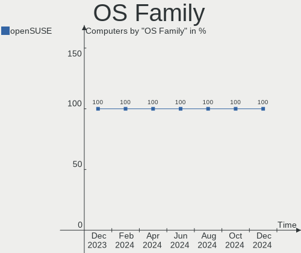
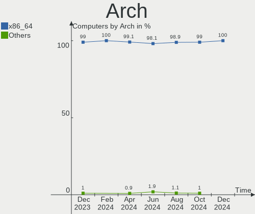
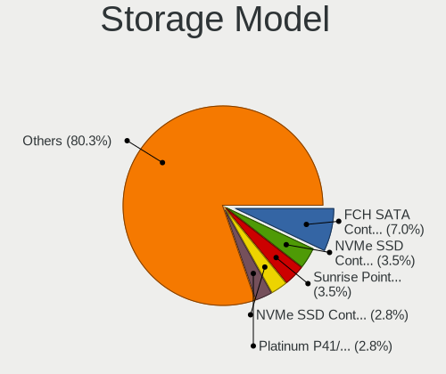
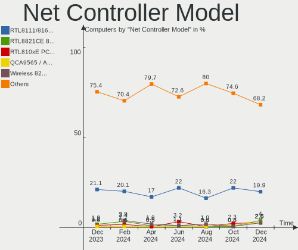
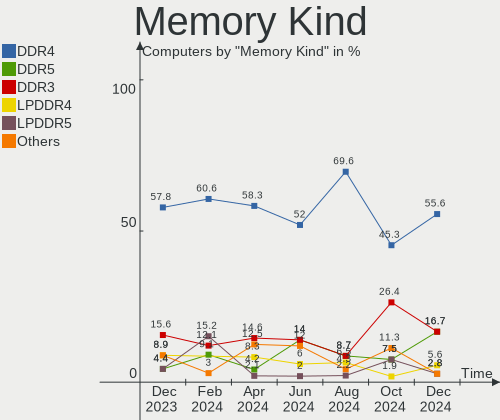
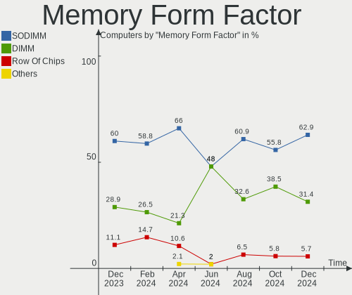
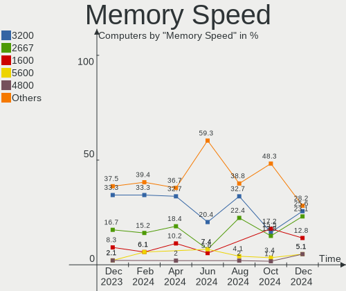

openSUSE - Hardware Trends
--------------------------

A project to identify most popular hardware characteristics and track their change
over time based on data collected by Linux users at https://Linux-Hardware.org.

Anyone can contribute to this report by the [hw-probe](https://github.com/linuxhw/hw-probe) tool:

    sudo -E hw-probe -all -upload

This is a report for all computer types. See also reports for [desktops](/Dist/openSUSE/Desktop/README.md) and [notebooks](/Dist/openSUSE/Notebook/README.md).

This report is for one last month. Overall report since the beginning of time: [TestCoverage](https://github.com/linuxhw/TestCoverage)

Period: Jan, 2023.

Contents
--------

* [ System ](#system)
  - [ OS                       ](#os)
  - [ OS Family                ](#os-family)
  - [ Kernel                   ](#kernel)
  - [ Kernel Family            ](#kernel-family)
  - [ Kernel Major Ver.        ](#kernel-major-ver)
  - [ Arch                     ](#arch)
  - [ DE                       ](#de)
  - [ Display Server           ](#display-server)
  - [ Display Manager          ](#display-manager)
  - [ OS Lang                  ](#os-lang)
  - [ Boot Mode                ](#boot-mode)
  - [ Filesystem               ](#filesystem)
  - [ Part. scheme             ](#part-scheme)
  - [ Dual Boot with Linux/BSD ](#dual-boot-with-linuxbsd)
  - [ Dual Boot (Win)          ](#dual-boot-win)

* [ Board ](#board)
  - [ Vendor                   ](#vendor)
  - [ Model                    ](#model)
  - [ Model Family             ](#model-family)
  - [ MFG Year                 ](#mfg-year)
  - [ Form Factor              ](#form-factor)
  - [ Secure Boot              ](#secure-boot)
  - [ Coreboot                 ](#coreboot)
  - [ RAM Size                 ](#ram-size)
  - [ RAM Used                 ](#ram-used)
  - [ Total Drives             ](#total-drives)
  - [ Has CD-ROM               ](#has-cd-rom)
  - [ Has Ethernet             ](#has-ethernet)
  - [ Has WiFi                 ](#has-wifi)
  - [ Has Bluetooth            ](#has-bluetooth)

* [ Location ](#location)
  - [ Country                  ](#country)
  - [ City                     ](#city)

* [ Drives ](#drives)
  - [ Drive Vendor             ](#drive-vendor)
  - [ Drive Model              ](#drive-model)
  - [ HDD Vendor               ](#hdd-vendor)
  - [ SSD Vendor               ](#ssd-vendor)
  - [ Drive Kind               ](#drive-kind)
  - [ Drive Connector          ](#drive-connector)
  - [ Drive Size               ](#drive-size)
  - [ Space Total              ](#space-total)
  - [ Space Used               ](#space-used)
  - [ Malfunc. Drives          ](#malfunc-drives)
  - [ Malfunc. Drive Vendor    ](#malfunc-drive-vendor)
  - [ Malfunc. HDD Vendor      ](#malfunc-hdd-vendor)
  - [ Malfunc. Drive Kind      ](#malfunc-drive-kind)
  - [ Failed Drives            ](#failed-drives)
  - [ Failed Drive Vendor      ](#failed-drive-vendor)
  - [ Drive Status             ](#drive-status)

* [ Storage controller ](#storage-controller)
  - [ Storage Vendor           ](#storage-vendor)
  - [ Storage Model            ](#storage-model)
  - [ Storage Kind             ](#storage-kind)

* [ Processor ](#processor)
  - [ CPU Vendor               ](#cpu-vendor)
  - [ CPU Model                ](#cpu-model)
  - [ CPU Model Family         ](#cpu-model-family)
  - [ CPU Cores                ](#cpu-cores)
  - [ CPU Sockets              ](#cpu-sockets)
  - [ CPU Threads              ](#cpu-threads)
  - [ CPU Op-Modes             ](#cpu-op-modes)
  - [ CPU Microcode            ](#cpu-microcode)
  - [ CPU Microarch            ](#cpu-microarch)

* [ Graphics ](#graphics)
  - [ GPU Vendor               ](#gpu-vendor)
  - [ GPU Model                ](#gpu-model)
  - [ GPU Combo                ](#gpu-combo)
  - [ GPU Driver               ](#gpu-driver)
  - [ GPU Memory               ](#gpu-memory)

* [ Monitor ](#monitor)
  - [ Monitor Vendor           ](#monitor-vendor)
  - [ Monitor Model            ](#monitor-model)
  - [ Monitor Resolution       ](#monitor-resolution)
  - [ Monitor Diagonal         ](#monitor-diagonal)
  - [ Monitor Width            ](#monitor-width)
  - [ Aspect Ratio             ](#aspect-ratio)
  - [ Monitor Area             ](#monitor-area)
  - [ Pixel Density            ](#pixel-density)
  - [ Multiple Monitors        ](#multiple-monitors)

* [ Network ](#network)
  - [ Net Controller Vendor    ](#net-controller-vendor)
  - [ Net Controller Model     ](#net-controller-model)
  - [ Wireless Vendor          ](#wireless-vendor)
  - [ Wireless Model           ](#wireless-model)
  - [ Ethernet Vendor          ](#ethernet-vendor)
  - [ Ethernet Model           ](#ethernet-model)
  - [ Net Controller Kind      ](#net-controller-kind)
  - [ Used Controller          ](#used-controller)
  - [ NICs                     ](#nics)
  - [ IPv6                     ](#ipv6)

* [ Bluetooth ](#bluetooth)
  - [ Bluetooth Vendor         ](#bluetooth-vendor)
  - [ Bluetooth Model          ](#bluetooth-model)

* [ Sound ](#sound)
  - [ Sound Vendor             ](#sound-vendor)
  - [ Sound Model              ](#sound-model)

* [ Memory ](#memory)
  - [ Memory Vendor            ](#memory-vendor)
  - [ Memory Model             ](#memory-model)
  - [ Memory Kind              ](#memory-kind)
  - [ Memory Form Factor       ](#memory-form-factor)
  - [ Memory Size              ](#memory-size)
  - [ Memory Speed             ](#memory-speed)

* [ Printers & scanners ](#printers--scanners)
  - [ Printer Vendor           ](#printer-vendor)
  - [ Printer Model            ](#printer-model)
  - [ Scanner Vendor           ](#scanner-vendor)
  - [ Scanner Model            ](#scanner-model)

* [ Camera ](#camera)
  - [ Camera Vendor            ](#camera-vendor)
  - [ Camera Model             ](#camera-model)

* [ Security ](#security)
  - [ Fingerprint Vendor       ](#fingerprint-vendor)
  - [ Fingerprint Model        ](#fingerprint-model)
  - [ Chipcard Vendor          ](#chipcard-vendor)
  - [ Chipcard Model           ](#chipcard-model)

* [ Unsupported ](#unsupported)
  - [ Unsupported Devices      ](#unsupported-devices)
  - [ Unsupported Device Types ](#unsupported-device-types)

System
------

OS
--

Installed operating systems

| Name                         | Computers | Percent |
|------------------------------|-----------|---------|
| openSUSE Tumbleweed-XXXXXXXX | 64        | 81.01%  |
| openSUSE Leap-15.4           | 12        | 15.19%  |
| openSUSE Microos-XXXXXXXX    | 2         | 2.53%   |
| openSUSE Leap-15.3           | 1         | 1.27%   |

OS Family
---------

OS without a version

| Name     | Computers | Percent |
|----------|-----------|---------|
| openSUSE | 79        | 100%    |

Kernel
------

Version of the Linux kernel

| Version                      | Computers | Percent |
|------------------------------|-----------|---------|
| 6.1.3-1-default              | 12        | 15.19%  |
| 6.1.4-1-default              | 11        | 13.92%  |
| 6.1.7-1-default              | 9         | 11.39%  |
| 6.1.8-1-default              | 8         | 10.13%  |
| 6.1.6-1-default              | 7         | 8.86%   |
| 6.1.1-1-default              | 7         | 8.86%   |
| 5.14.21-150400.24.38-default | 7         | 8.86%   |
| 6.1.2-1-default              | 6         | 7.59%   |
| 5.14.21-150400.24.41-default | 4         | 5.06%   |
| 6.2.0-rc5-1.g39a491d-default | 1         | 1.27%   |
| 6.2.0-rc2-2.geebb76b-default | 1         | 1.27%   |
| 6.1.0-1-default              | 1         | 1.27%   |
| 6.0.6-1-default              | 1         | 1.27%   |
| 6.0.2-1-default              | 1         | 1.27%   |
| 6.0.10-1-default             | 1         | 1.27%   |
| 5.3.18-150300.59.106-preempt | 1         | 1.27%   |
| 5.14.21-150400.22-default    | 1         | 1.27%   |

Kernel Family
-------------

Linux kernel without a distro release

| Version | Computers | Percent |
|---------|-----------|---------|
| 6.1.3   | 12        | 15.19%  |
| 5.14.21 | 12        | 15.19%  |
| 6.1.4   | 11        | 13.92%  |
| 6.1.7   | 9         | 11.39%  |
| 6.1.8   | 8         | 10.13%  |
| 6.1.6   | 7         | 8.86%   |
| 6.1.1   | 7         | 8.86%   |
| 6.1.2   | 6         | 7.59%   |
| 6.2.0   | 2         | 2.53%   |
| 6.1.0   | 1         | 1.27%   |
| 6.0.6   | 1         | 1.27%   |
| 6.0.2   | 1         | 1.27%   |
| 6.0.10  | 1         | 1.27%   |
| 5.3.18  | 1         | 1.27%   |

Kernel Major Ver.
-----------------

Linux kernel major version

| Version | Computers | Percent |
|---------|-----------|---------|
| 6.1     | 61        | 77.22%  |
| 5.14    | 12        | 15.19%  |
| 6.0     | 3         | 3.8%    |
| 6.2     | 2         | 2.53%   |
| 5.3     | 1         | 1.27%   |

Arch
----

OS architecture (x86_64, i586, etc.)

| Name   | Computers | Percent |
|--------|-----------|---------|
| x86_64 | 79        | 100%    |

DE
--

Desktop Environment

| Name     | Computers | Percent |
|----------|-----------|---------|
| KDE5     | 54        | 68.35%  |
| GNOME    | 15        | 18.99%  |
| XFCE     | 5         | 6.33%   |
| Unknown  | 3         | 3.8%    |
| MATE     | 1         | 1.27%   |
| Cinnamon | 1         | 1.27%   |

Display Server
--------------

X11 or Wayland

| Name    | Computers | Percent |
|---------|-----------|---------|
| X11     | 64        | 81.01%  |
| Wayland | 15        | 18.99%  |

Display Manager
---------------

SDDM, LightDM, etc.

| Name    | Computers | Percent |
|---------|-----------|---------|
| Unknown | 41        | 51.9%   |
| SDDM    | 21        | 26.58%  |
| LightDM | 13        | 16.46%  |
| XDM     | 4         | 5.06%   |

OS Lang
-------

Language

| Lang    | Computers | Percent |
|---------|-----------|---------|
| en_US   | 30        | 37.97%  |
| POSIX   | 8         | 10.13%  |
| de_DE   | 8         | 10.13%  |
| ru_RU   | 6         | 7.59%   |
| pt_BR   | 5         | 6.33%   |
| fr_FR   | 3         | 3.8%    |
| es_ES   | 3         | 3.8%    |
| en_GB   | 3         | 3.8%    |
| nn_NO   | 2         | 2.53%   |
| it_IT   | 2         | 2.53%   |
| Unknown | 2         | 2.53%   |
| zh_CN   | 1         | 1.27%   |
| pl_PL   | 1         | 1.27%   |
| ko_KR   | 1         | 1.27%   |
| en_FI   | 1         | 1.27%   |
| en_DE   | 1         | 1.27%   |
| en_CH   | 1         | 1.27%   |
| cs_CZ   | 1         | 1.27%   |

Boot Mode
---------

EFI or BIOS

| Mode | Computers | Percent |
|------|-----------|---------|
| EFI  | 53        | 67.09%  |
| BIOS | 26        | 32.91%  |

Filesystem
----------

Type of filesystem

| Type    | Computers | Percent |
|---------|-----------|---------|
| Btrfs   | 64        | 81.01%  |
| Ext4    | 14        | 17.72%  |
| Overlay | 1         | 1.27%   |

Part. scheme
------------

Scheme of partitioning

| Type    | Computers | Percent |
|---------|-----------|---------|
| Unknown | 38        | 48.1%   |
| GPT     | 37        | 46.84%  |
| MBR     | 4         | 5.06%   |

Dual Boot with Linux/BSD
------------------------

Hosting more than one Linux/BSD

| Dual boot | Computers | Percent |
|-----------|-----------|---------|
| No        | 70        | 88.61%  |
| Yes       | 9         | 11.39%  |

Dual Boot (Win)
---------------

Hosting Linux and Windows

| Dual boot | Computers | Percent |
|-----------|-----------|---------|
| No        | 65        | 82.28%  |
| Yes       | 14        | 17.72%  |

Board
-----

Vendor
------

Motherboard manufacturer

| Name                | Computers | Percent |
|---------------------|-----------|---------|
| Lenovo              | 16        | 20.25%  |
| ASUSTek Computer    | 13        | 16.46%  |
| Hewlett-Packard     | 12        | 15.19%  |
| Dell                | 11        | 13.92%  |
| Gigabyte Technology | 6         | 7.59%   |
| ASRock              | 4         | 5.06%   |
| Acer                | 3         | 3.8%    |
| MSI                 | 2         | 2.53%   |
| Fujitsu             | 2         | 2.53%   |
| Apple               | 2         | 2.53%   |
| TUXEDO              | 1         | 1.27%   |
| Toshiba             | 1         | 1.27%   |
| SLIMBOOK            | 1         | 1.27%   |
| Medion              | 1         | 1.27%   |
| Maibenben           | 1         | 1.27%   |
| Intel               | 1         | 1.27%   |
| HUAWEI              | 1         | 1.27%   |
| Biostar             | 1         | 1.27%   |

Model
-----

Motherboard model

| Name                                      | Computers | Percent |
|-------------------------------------------|-----------|---------|
| Dell Latitude 9420                        | 2         | 2.53%   |
| TUXEDO Pulse 15 Gen1                      | 1         | 1.27%   |
| Toshiba Satellite L500                    | 1         | 1.27%   |
| SLIMBOOK PROX-AMD5                        | 1         | 1.27%   |
| MSI MS-7A38                               | 1         | 1.27%   |
| MSI MS-7673                               | 1         | 1.27%   |
| Medion P6624                              | 1         | 1.27%   |
| Maibenben MaiBook M                       | 1         | 1.27%   |
| Lenovo Yoga 730-13IKB 81CT                | 1         | 1.27%   |
| Lenovo ThinkPad Yoga 260 20FES3TE00       | 1         | 1.27%   |
| Lenovo ThinkPad X1 Carbon 7th 20QDS3B600  | 1         | 1.27%   |
| Lenovo ThinkPad W510 4391W3V              | 1         | 1.27%   |
| Lenovo ThinkPad T14 Gen 3 21AJS1DB00      | 1         | 1.27%   |
| Lenovo ThinkPad R500 2718WA3              | 1         | 1.27%   |
| Lenovo ThinkPad L13 Yoga Gen 2 20VKCTO1WW | 1         | 1.27%   |
| Lenovo ThinkPad Edge E431 62779XP         | 1         | 1.27%   |
| Lenovo ThinkPad E15 20RD0019RT            | 1         | 1.27%   |
| Lenovo ThinkBook 14 G4+ ARA 21D0          | 1         | 1.27%   |
| Lenovo Legion T5 28IMB05 90NC007NUS       | 1         | 1.27%   |
| Lenovo IdeaPadFlex 5 14ALC05 82HU         | 1         | 1.27%   |
| Lenovo IdeaPad Y700-15ISK 80NV            | 1         | 1.27%   |
| Lenovo IdeaPad S145-15IWL 81S9            | 1         | 1.27%   |
| Lenovo IdeaPad L340-15IRH Gaming 81LK     | 1         | 1.27%   |
| Lenovo IdeaPad 330-15IKB 81FD             | 1         | 1.27%   |
| Intel X99                                 | 1         | 1.27%   |
| HUAWEI KLVL-WXXW                          | 1         | 1.27%   |
| HP ProBook 650 G1                         | 1         | 1.27%   |
| HP ProBook 4540s                          | 1         | 1.27%   |
| HP Pavilion Power Desktop 580-1xx         | 1         | 1.27%   |
| HP Pavilion dv7                           | 1         | 1.27%   |
| HP Pavilion dv4                           | 1         | 1.27%   |
| HP Laptop 15s-fq5xxx                      | 1         | 1.27%   |
| HP Laptop 15-ef2xxx                       | 1         | 1.27%   |
| HP ENVY x360 2-in-1 Laptop 15-ey0xxx      | 1         | 1.27%   |
| HP ENVY 15                                | 1         | 1.27%   |
| HP EliteBook 840 G8 Notebook PC           | 1         | 1.27%   |
| HP Dev One Notebook PC                    | 1         | 1.27%   |
| HP 280 G1 MT                              | 1         | 1.27%   |
| Gigabyte Z87X-D3H                         | 1         | 1.27%   |
| Gigabyte Z690 GAMING X DDR4               | 1         | 1.27%   |

Model Family
------------

Motherboard model prefix

| Name                   | Computers | Percent |
|------------------------|-----------|---------|
| Lenovo ThinkPad        | 8         | 10.13%  |
| Lenovo IdeaPad         | 4         | 5.06%   |
| Dell Latitude          | 4         | 5.06%   |
| HP Pavilion            | 3         | 3.8%    |
| HP ProBook             | 2         | 2.53%   |
| HP Laptop              | 2         | 2.53%   |
| HP ENVY                | 2         | 2.53%   |
| Fujitsu LIFEBOOK       | 2         | 2.53%   |
| Dell Inspiron          | 2         | 2.53%   |
| ASUS PRIME             | 2         | 2.53%   |
| TUXEDO Pulse           | 1         | 1.27%   |
| Toshiba Satellite      | 1         | 1.27%   |
| SLIMBOOK PROX-AMD5     | 1         | 1.27%   |
| MSI MS-7A38            | 1         | 1.27%   |
| MSI MS-7673            | 1         | 1.27%   |
| Medion P6624           | 1         | 1.27%   |
| Maibenben MaiBook      | 1         | 1.27%   |
| Lenovo Yoga            | 1         | 1.27%   |
| Lenovo ThinkBook       | 1         | 1.27%   |
| Lenovo Legion          | 1         | 1.27%   |
| Lenovo IdeaPadFlex     | 1         | 1.27%   |
| Intel X99              | 1         | 1.27%   |
| HUAWEI KLVL-WXXW       | 1         | 1.27%   |
| HP EliteBook           | 1         | 1.27%   |
| HP Dev                 | 1         | 1.27%   |
| HP 280                 | 1         | 1.27%   |
| Gigabyte Z87X-D3H      | 1         | 1.27%   |
| Gigabyte Z690          | 1         | 1.27%   |
| Gigabyte GA-78LMT-USB3 | 1         | 1.27%   |
| Gigabyte G31M-S2L      | 1         | 1.27%   |
| Gigabyte B75M-D3H      | 1         | 1.27%   |
| Gigabyte B650M         | 1         | 1.27%   |
| Dell PowerEdge         | 1         | 1.27%   |
| Dell OptiPlex          | 1         | 1.27%   |
| Dell G7                | 1         | 1.27%   |
| Dell G3                | 1         | 1.27%   |
| Dell DM051             | 1         | 1.27%   |
| Biostar Hi-Fi          | 1         | 1.27%   |
| ASUS Zenbook           | 1         | 1.27%   |
| ASUS X556UQK           | 1         | 1.27%   |

MFG Year
--------

Motherboard manufacture year

| Year | Computers | Percent |
|------|-----------|---------|
| 2022 | 11        | 13.92%  |
| 2021 | 9         | 11.39%  |
| 2019 | 8         | 10.13%  |
| 2020 | 6         | 7.59%   |
| 2018 | 6         | 7.59%   |
| 2017 | 6         | 7.59%   |
| 2015 | 5         | 6.33%   |
| 2012 | 5         | 6.33%   |
| 2013 | 4         | 5.06%   |
| 2010 | 4         | 5.06%   |
| 2009 | 3         | 3.8%    |
| 2008 | 3         | 3.8%    |
| 2014 | 2         | 2.53%   |
| 2011 | 2         | 2.53%   |
| 2007 | 2         | 2.53%   |
| 2016 | 1         | 1.27%   |
| 2006 | 1         | 1.27%   |
| 2005 | 1         | 1.27%   |

Form Factor
-----------

Physical design of the computer

| Name        | Computers | Percent |
|-------------|-----------|---------|
| Notebook    | 43        | 54.43%  |
| Desktop     | 29        | 36.71%  |
| Convertible | 6         | 7.59%   |
| Server      | 1         | 1.27%   |

Secure Boot
-----------

Enabled or disabled

| State    | Computers | Percent |
|----------|-----------|---------|
| Disabled | 64        | 81.01%  |
| Enabled  | 15        | 18.99%  |

Coreboot
--------

Have coreboot on board

| Used | Computers | Percent |
|------|-----------|---------|
| No   | 79        | 100%    |

RAM Size
--------

Total RAM memory

| Size in GB  | Computers | Percent |
|-------------|-----------|---------|
| 16.01-24.0  | 23        | 29.11%  |
| 4.01-8.0    | 15        | 18.99%  |
| 8.01-16.0   | 15        | 18.99%  |
| 32.01-64.0  | 14        | 17.72%  |
| 3.01-4.0    | 7         | 8.86%   |
| 24.01-32.0  | 2         | 2.53%   |
| 64.01-256.0 | 2         | 2.53%   |
| 1.01-2.0    | 1         | 1.27%   |

RAM Used
--------

Used RAM memory

| Used GB   | Computers | Percent |
|-----------|-----------|---------|
| 4.01-8.0  | 20        | 25.32%  |
| 2.01-3.0  | 20        | 25.32%  |
| 3.01-4.0  | 19        | 24.05%  |
| 1.01-2.0  | 14        | 17.72%  |
| 8.01-16.0 | 4         | 5.06%   |
| 0.51-1.0  | 2         | 2.53%   |

Total Drives
------------

Number of drives on board

| Drives | Computers | Percent |
|--------|-----------|---------|
| 1      | 42        | 53.16%  |
| 2      | 20        | 25.32%  |
| 3      | 8         | 10.13%  |
| 4      | 5         | 6.33%   |
| 5      | 2         | 2.53%   |
| 7      | 1         | 1.27%   |
| 6      | 1         | 1.27%   |

Has CD-ROM
----------

Has CD-ROM on board

| Presented | Computers | Percent |
|-----------|-----------|---------|
| No        | 52        | 65.82%  |
| Yes       | 27        | 34.18%  |

Has Ethernet
------------

Has Ethernet on board

| Presented | Computers | Percent |
|-----------|-----------|---------|
| Yes       | 69        | 87.34%  |
| No        | 10        | 12.66%  |

Has WiFi
--------

Has WiFi module

| Presented | Computers | Percent |
|-----------|-----------|---------|
| Yes       | 62        | 78.48%  |
| No        | 17        | 21.52%  |

Has Bluetooth
-------------

Has Bluetooth module

| Presented | Computers | Percent |
|-----------|-----------|---------|
| Yes       | 49        | 62.03%  |
| No        | 30        | 37.97%  |

Location
--------

Country
-------

Geographic location (country)

| Country     | Computers | Percent |
|-------------|-----------|---------|
| USA         | 16        | 20.25%  |
| Germany     | 11        | 13.92%  |
| Russia      | 6         | 7.59%   |
| Italy       | 5         | 6.33%   |
| Brazil      | 5         | 6.33%   |
| France      | 3         | 3.8%    |
| Thailand    | 2         | 2.53%   |
| Poland      | 2         | 2.53%   |
| Norway      | 2         | 2.53%   |
| Netherlands | 2         | 2.53%   |
| Greece      | 2         | 2.53%   |
| Argentina   | 2         | 2.53%   |
| Ukraine     | 1         | 1.27%   |
| UK          | 1         | 1.27%   |
| Turkey      | 1         | 1.27%   |
| Switzerland | 1         | 1.27%   |
| Sweden      | 1         | 1.27%   |
| Spain       | 1         | 1.27%   |
| South Korea | 1         | 1.27%   |
| New Zealand | 1         | 1.27%   |
| Lithuania   | 1         | 1.27%   |
| Kazakhstan  | 1         | 1.27%   |
| Japan       | 1         | 1.27%   |
| Hungary     | 1         | 1.27%   |
| Guatemala   | 1         | 1.27%   |
| Finland     | 1         | 1.27%   |
| Estonia     | 1         | 1.27%   |
| Czechia     | 1         | 1.27%   |
| China       | 1         | 1.27%   |
| Bulgaria    | 1         | 1.27%   |
| Belgium     | 1         | 1.27%   |
| Belarus     | 1         | 1.27%   |
| Austria     | 1         | 1.27%   |

City
----

Geographic location (city)

| City                      | Computers | Percent |
|---------------------------|-----------|---------|
| Sao Paulo                 | 2         | 2.53%   |
| Bangkok                   | 2         | 2.53%   |
| Zug                       | 1         | 1.27%   |
| Zakroczym                 | 1         | 1.27%   |
| Yongin-si                 | 1         | 1.27%   |
| Yekaterinburg             | 1         | 1.27%   |
| Wabasha                   | 1         | 1.27%   |
| Villafranca de los Barros | 1         | 1.27%   |
| Uslar                     | 1         | 1.27%   |
| Umeda                     | 1         | 1.27%   |
| Thornton Heath            | 1         | 1.27%   |
| Tambov                    | 1         | 1.27%   |
| Tallinn                   | 1         | 1.27%   |
| Stockholm                 | 1         | 1.27%   |
| St Petersburg             | 1         | 1.27%   |
| Schenectady               | 1         | 1.27%   |
| San Francisco             | 1         | 1.27%   |
| Sainte-Tulle              | 1         | 1.27%   |
| Rostock                   | 1         | 1.27%   |
| Rho                       | 1         | 1.27%   |
| Ravenna                   | 1         | 1.27%   |
| Putilkovo                 | 1         | 1.27%   |
| Poznan                    | 1         | 1.27%   |
| Plovdiv                   | 1         | 1.27%   |
| Peize                     | 1         | 1.27%   |
| Paris                     | 1         | 1.27%   |
| Owasso                    | 1         | 1.27%   |
| Orlando                   | 1         | 1.27%   |
| Old Faliron               | 1         | 1.27%   |
| Mount Pleasant            | 1         | 1.27%   |
| Moline                    | 1         | 1.27%   |
| Minsk                     | 1         | 1.27%   |
| Milano                    | 1         | 1.27%   |
| Milan                     | 1         | 1.27%   |
| Mesa                      | 1         | 1.27%   |
| Memphis                   | 1         | 1.27%   |
| Mainz                     | 1         | 1.27%   |
| Lubnjow                   | 1         | 1.27%   |
| Loves Park                | 1         | 1.27%   |
| Kokkola                   | 1         | 1.27%   |

Drives
------

Drive Vendor
------------

Hard drive vendors

| Vendor                         | Computers | Drives | Percent |
|--------------------------------|-----------|--------|---------|
| Samsung Electronics            | 22        | 26     | 17.46%  |
| WDC                            | 20        | 26     | 15.87%  |
| Kingston                       | 12        | 13     | 9.52%   |
| Seagate                        | 11        | 16     | 8.73%   |
| Intel                          | 8         | 9      | 6.35%   |
| SK hynix                       | 6         | 6      | 4.76%   |
| Toshiba                        | 5         | 8      | 3.97%   |
| SanDisk                        | 5         | 5      | 3.97%   |
| Crucial                        | 5         | 5      | 3.97%   |
| Solid State Storage            | 3         | 3      | 2.38%   |
| Phison Electronics             | 3         | 5      | 2.38%   |
| Micron Technology              | 3         | 3      | 2.38%   |
| Hitachi                        | 3         | 3      | 2.38%   |
| HGST                           | 3         | 3      | 2.38%   |
| KIOXIA                         | 2         | 2      | 1.59%   |
| Unknown                        | 1         | 1      | 0.79%   |
| Transcend                      | 1         | 1      | 0.79%   |
| Solid State Storage Technology | 1         | 1      | 0.79%   |
| Smartbuy                       | 1         | 1      | 0.79%   |
| Realtek Semiconductor          | 1         | 1      | 0.79%   |
| Pioneer                        | 1         | 1      | 0.79%   |
| Patriot                        | 1         | 1      | 0.79%   |
| Micron/Crucial Technology      | 1         | 1      | 0.79%   |
| Maxtor                         | 1         | 1      | 0.79%   |
| LITEON                         | 1         | 1      | 0.79%   |
| Lenovo                         | 1         | 1      | 0.79%   |
| Kingston Technology Company    | 1         | 1      | 0.79%   |
| Intenso                        | 1         | 1      | 0.79%   |
| China                          | 1         | 1      | 0.79%   |
| Unknown                        | 1         | 1      | 0.79%   |

Drive Model
-----------

Hard drive models

| Model                                                | Computers | Percent |
|------------------------------------------------------|-----------|---------|
| Samsung NVMe SSD Controller SM981/PM981/PM983 500GB  | 5         | 3.65%   |
| SK hynix BC501 NVMe Solid State Drive 512GB          | 3         | 2.19%   |
| Seagate ST2000DM001-1ER164 2TB                       | 3         | 2.19%   |
| Samsung NVMe SSD Controller PM9A1/PM9A3/980PRO 512GB | 3         | 2.19%   |
| Kingston SA400S37480G 480GB SSD                      | 3         | 2.19%   |
| WDC WDS500G2B0A-00SM50 500GB SSD                     | 2         | 1.46%   |
| WDC WDS100T2B0A-00SM50 1TB SSD                       | 2         | 1.46%   |
| Solid State Storage CL1-3D512-Q11 NVMe SSSTC 512GB   | 2         | 1.46%   |
| Seagate ST2000DM008-2FR102 2TB                       | 2         | 1.46%   |
| Seagate ST1000LM035-1RK172 1TB                       | 2         | 1.46%   |
| Samsung NVMe SSD Controller SM961/PM961/SM963 256GB  | 2         | 1.46%   |
| Phison PS5013 E13 NVMe Controller 256GB              | 2         | 1.46%   |
| Kingston SV300S37A120G 120GB SSD                     | 2         | 1.46%   |
| Intel SSD 660P Series 512GB                          | 2         | 1.46%   |
| WDC WD5000LPCX-21VHAT0 500GB                         | 1         | 0.73%   |
| WDC WD5000AVDS-63U7B1 500GB                          | 1         | 0.73%   |
| WDC WD40EZRZ-00GXCB0 4TB                             | 1         | 0.73%   |
| WDC WD40EZAZ-00SF3B0 4TB                             | 1         | 0.73%   |
| WDC WD4003FZEX-00Z4SA0 4TB                           | 1         | 0.73%   |
| WDC WD3200BPVT-22JJ5T0 320GB                         | 1         | 0.73%   |
| WDC WD30EZRX-00DC0B0 3TB                             | 1         | 0.73%   |
| WDC WD20PURX-64P6ZY0 2TB                             | 1         | 0.73%   |
| WDC WD20EZAZ-00GGJB0 2TB                             | 1         | 0.73%   |
| WDC WD20EFRX-68EUZN0 2TB                             | 1         | 0.73%   |
| WDC WD20EARS-00MVWB0 2TB                             | 1         | 0.73%   |
| WDC WD10SPZX-75Z10T0 1TB                             | 1         | 0.73%   |
| WDC WD10SPZX-24Z10 1TB                               | 1         | 0.73%   |
| WDC WD10EZEX-75WN4A0 1TB                             | 1         | 0.73%   |
| WDC WD10EZEX-00WN4A0 1TB                             | 1         | 0.73%   |
| WDC WD10EZEX-00KUWA0 1TB                             | 1         | 0.73%   |
| WDC WD10EZEX-00BBHA0 1TB                             | 1         | 0.73%   |
| WDC WD10EARX-00N0YB0 1TB                             | 1         | 0.73%   |
| WDC WD10EADS-00L5B1 1TB                              | 1         | 0.73%   |
| WDC WD Green 2.5 1000GB SSD                          | 1         | 0.73%   |
| Unknown SD/MMC/MS PRO 2GB                            | 1         | 0.73%   |
| Transcend TS480GMTS420S 480GB SSD                    | 1         | 0.73%   |
| Toshiba MQ04ABF100 1TB                               | 1         | 0.73%   |
| Toshiba MQ01ABD032 320GB                             | 1         | 0.73%   |
| Toshiba MK5055GSX 500GB                              | 1         | 0.73%   |
| Toshiba DT01ACA100 1TB                               | 1         | 0.73%   |

HDD Vendor
----------

Hard disk drive vendors

| Vendor              | Computers | Drives | Percent |
|---------------------|-----------|--------|---------|
| WDC                 | 17        | 21     | 37.78%  |
| Seagate             | 11        | 16     | 24.44%  |
| Toshiba             | 5         | 8      | 11.11%  |
| Samsung Electronics | 4         | 6      | 8.89%   |
| Hitachi             | 3         | 3      | 6.67%   |
| HGST                | 3         | 3      | 6.67%   |
| Unknown             | 1         | 1      | 2.22%   |
| Maxtor              | 1         | 1      | 2.22%   |

SSD Vendor
----------

Solid state drive vendors

| Vendor              | Computers | Drives | Percent |
|---------------------|-----------|--------|---------|
| Samsung Electronics | 8         | 9      | 19.51%  |
| Kingston            | 8         | 8      | 19.51%  |
| Crucial             | 5         | 5      | 12.2%   |
| WDC                 | 4         | 5      | 9.76%   |
| Intel               | 4         | 5      | 9.76%   |
| SanDisk             | 3         | 3      | 7.32%   |
| Transcend           | 1         | 1      | 2.44%   |
| Smartbuy            | 1         | 1      | 2.44%   |
| SK hynix            | 1         | 1      | 2.44%   |
| Pioneer             | 1         | 1      | 2.44%   |
| Patriot             | 1         | 1      | 2.44%   |
| LITEON              | 1         | 1      | 2.44%   |
| Lenovo              | 1         | 1      | 2.44%   |
| Intenso             | 1         | 1      | 2.44%   |
| China               | 1         | 1      | 2.44%   |

Drive Kind
----------

HDD or SSD

| Kind | Computers | Drives | Percent |
|------|-----------|--------|---------|
| SSD  | 39        | 44     | 34.21%  |
| NVMe | 38        | 44     | 33.33%  |
| HDD  | 36        | 59     | 31.58%  |
| MMC  | 1         | 1      | 0.88%   |

Drive Connector
---------------

SATA, SAS, NVMe, etc.

| Type | Computers | Drives | Percent |
|------|-----------|--------|---------|
| SATA | 55        | 99     | 56.12%  |
| NVMe | 38        | 44     | 38.78%  |
| SAS  | 4         | 4      | 4.08%   |
| MMC  | 1         | 1      | 1.02%   |

Drive Size
----------

Size of hard drive

| Size in TB | Computers | Drives | Percent |
|------------|-----------|--------|---------|
| 0.01-0.5   | 42        | 50     | 52.5%   |
| 0.51-1.0   | 21        | 28     | 26.25%  |
| 1.01-2.0   | 13        | 20     | 16.25%  |
| 3.01-4.0   | 3         | 4      | 3.75%   |
| 2.01-3.0   | 1         | 1      | 1.25%   |

Space Total
-----------

Amount of disk space available on the file system

| Size in GB     | Computers | Percent |
|----------------|-----------|---------|
| More than 3000 | 28        | 35.44%  |
| 1001-2000      | 18        | 22.78%  |
| 501-1000       | 14        | 17.72%  |
| 2001-3000      | 8         | 10.13%  |
| 251-500        | 5         | 6.33%   |
| 101-250        | 2         | 2.53%   |
| Unknown        | 2         | 2.53%   |
| 21-50          | 1         | 1.27%   |
| 51-100         | 1         | 1.27%   |

Space Used
----------

Amount of used disk space

| Used GB        | Computers | Percent |
|----------------|-----------|---------|
| 101-250        | 18        | 22.78%  |
| 501-1000       | 16        | 20.25%  |
| 51-100         | 15        | 18.99%  |
| 251-500        | 11        | 13.92%  |
| 1-20           | 5         | 6.33%   |
| 2001-3000      | 4         | 5.06%   |
| 21-50          | 3         | 3.8%    |
| 1001-2000      | 3         | 3.8%    |
| More than 3000 | 2         | 2.53%   |
| Unknown        | 2         | 2.53%   |

Malfunc. Drives
---------------

Drive models with a malfunction

| Model                           | Computers | Drives | Percent |
|---------------------------------|-----------|--------|---------|
| WDC WD20EFRX-68EUZN0 2TB        | 1         | 1      | 10%     |
| WDC WD20EARS-00MVWB0 2TB        | 1         | 1      | 10%     |
| WDC WD10EZEX-75WN4A0 1TB        | 1         | 1      | 10%     |
| Toshiba MK5055GSX 500GB         | 1         | 1      | 10%     |
| Seagate ST500DM002-1BD142 500GB | 1         | 1      | 10%     |
| Seagate ST2000DL003-9VT166 2TB  | 1         | 1      | 10%     |
| Seagate ST1000DM003-1CH162 1TB  | 1         | 1      | 10%     |
| Patriot Burst Elite 480GB SSD   | 1         | 1      | 10%     |
| Maxtor 6L250S0 256GB            | 1         | 1      | 10%     |
| Hitachi HDT721010SLA360 1TB     | 1         | 1      | 10%     |

Malfunc. Drive Vendor
---------------------

Vendors of faulty drives

| Vendor  | Computers | Drives | Percent |
|---------|-----------|--------|---------|
| WDC     | 3         | 3      | 33.33%  |
| Seagate | 2         | 3      | 22.22%  |
| Toshiba | 1         | 1      | 11.11%  |
| Patriot | 1         | 1      | 11.11%  |
| Maxtor  | 1         | 1      | 11.11%  |
| Hitachi | 1         | 1      | 11.11%  |

Malfunc. HDD Vendor
-------------------

Vendors of faulty HDD drives

| Vendor  | Computers | Drives | Percent |
|---------|-----------|--------|---------|
| WDC     | 3         | 3      | 37.5%   |
| Seagate | 2         | 3      | 25%     |
| Toshiba | 1         | 1      | 12.5%   |
| Maxtor  | 1         | 1      | 12.5%   |
| Hitachi | 1         | 1      | 12.5%   |

Malfunc. Drive Kind
-------------------

Kinds of faulty drives

| Kind | Computers | Drives | Percent |
|------|-----------|--------|---------|
| HDD  | 7         | 9      | 87.5%   |
| SSD  | 1         | 1      | 12.5%   |

Failed Drives
-------------

Failed drive models

Zero info for selected period =(

Failed Drive Vendor
-------------------

Failed drive vendors

Zero info for selected period =(

Drive Status
------------

Number of failed and malfunc. drives

| Status   | Computers | Drives | Percent |
|----------|-----------|--------|---------|
| Detected | 40        | 67     | 46.51%  |
| Works    | 38        | 71     | 44.19%  |
| Malfunc  | 8         | 10     | 9.3%    |

Storage controller
------------------

Storage Vendor
--------------

Storage controller vendors

| Vendor                         | Computers | Percent |
|--------------------------------|-----------|---------|
| Intel                          | 48        | 44.04%  |
| AMD                            | 17        | 15.6%   |
| Samsung Electronics            | 11        | 10.09%  |
| Kingston Technology Company    | 6         | 5.5%    |
| SK hynix                       | 5         | 4.59%   |
| Solid State Storage Technology | 4         | 3.67%   |
| Phison Electronics             | 3         | 2.75%   |
| Micron Technology              | 3         | 2.75%   |
| SanDisk                        | 2         | 1.83%   |
| Marvell Technology Group       | 2         | 1.83%   |
| KIOXIA                         | 2         | 1.83%   |
| Realtek Semiconductor          | 1         | 0.92%   |
| Nvidia                         | 1         | 0.92%   |
| Micron/Crucial Technology      | 1         | 0.92%   |
| LSI Logic / Symbios Logic      | 1         | 0.92%   |
| JMicron Technology             | 1         | 0.92%   |
| ASMedia Technology             | 1         | 0.92%   |

Storage Model
-------------

Storage controller models

| Model                                                                          | Computers | Percent |
|--------------------------------------------------------------------------------|-----------|---------|
| AMD FCH SATA Controller [AHCI mode]                                            | 8         | 6.61%   |
| Samsung NVMe SSD Controller SM981/PM981/PM983                                  | 5         | 4.13%   |
| Kingston Company Company Non-Volatile memory controller                        | 5         | 4.13%   |
| Solid State Storage Non-Volatile memory controller                             | 4         | 3.31%   |
| Intel Volume Management Device NVMe RAID Controller                            | 4         | 3.31%   |
| Intel Cannon Lake Mobile PCH SATA AHCI Controller                              | 4         | 3.31%   |
| Intel 8 Series/C220 Series Chipset Family 6-port SATA Controller 1 [AHCI mode] | 4         | 3.31%   |
| SK hynix BC501 NVMe Solid State Drive                                          | 3         | 2.48%   |
| Samsung NVMe SSD Controller PM9A1/PM9A3/980PRO                                 | 3         | 2.48%   |
| Micron Non-Volatile memory controller                                          | 3         | 2.48%   |
| Intel 82801IBM/IEM (ICH9M/ICH9M-E) 4 port SATA Controller [AHCI mode]          | 3         | 2.48%   |
| AMD SB7x0/SB8x0/SB9x0 SATA Controller [AHCI mode]                              | 3         | 2.48%   |
| SK hynix Gold P31/PC711 NVMe Solid State Drive                                 | 2         | 1.65%   |
| Samsung NVMe SSD Controller SM961/PM961/SM963                                  | 2         | 1.65%   |
| Phison PS5013 E13 NVMe Controller                                              | 2         | 1.65%   |
| Intel Sunrise Point-LP SATA Controller [AHCI mode]                             | 2         | 1.65%   |
| Intel SSD 660P Series                                                          | 2         | 1.65%   |
| Intel NM10/ICH7 Family SATA Controller [IDE mode]                              | 2         | 1.65%   |
| Intel 82801 Mobile SATA Controller [RAID mode]                                 | 2         | 1.65%   |
| Intel 7 Series/C210 Series Chipset Family 6-port SATA Controller [AHCI mode]   | 2         | 1.65%   |
| Intel 400 Series Chipset Family SATA AHCI Controller                           | 2         | 1.65%   |
| AMD SB7x0/SB8x0/SB9x0 SATA Controller [IDE mode]                               | 2         | 1.65%   |
| AMD SB7x0/SB8x0/SB9x0 IDE Controller                                           | 2         | 1.65%   |
| AMD 500 Series Chipset SATA Controller                                         | 2         | 1.65%   |
| AMD 400 Series Chipset SATA Controller                                         | 2         | 1.65%   |
| SanDisk WD PC SN810 / Black SN850 NVMe SSD                                     | 1         | 0.83%   |
| SanDisk WD Black SN750 / PC SN730 NVMe SSD                                     | 1         | 0.83%   |
| Samsung NVMe SSD Controller 980                                                | 1         | 0.83%   |
| Realtek Realtek Non-Volatile memory controller                                 | 1         | 0.83%   |
| Phison E12 NVMe Controller                                                     | 1         | 0.83%   |
| Nvidia MCP79 AHCI Controller                                                   | 1         | 0.83%   |
| Micron/Crucial P2 NVMe PCIe SSD                                                | 1         | 0.83%   |
| Marvell Group 88SE9128 PCIe SATA 6 Gb/s RAID controller                        | 1         | 0.83%   |
| Marvell Group 88SE6111/6121 SATA II / PATA Controller                          | 1         | 0.83%   |
| LSI Logic / Symbios Logic MegaRAID Tri-Mode SAS3508                            | 1         | 0.83%   |
| KIOXIA NVMe SSD Controller BG4                                                 | 1         | 0.83%   |
| KIOXIA Non-Volatile memory controller                                          | 1         | 0.83%   |
| Kingston Company U-SNS8154P3 NVMe SSD                                          | 1         | 0.83%   |
| JMicron JMB363 SATA/IDE Controller                                             | 1         | 0.83%   |
| Intel Wildcat Point-LP SATA Controller [AHCI Mode]                             | 1         | 0.83%   |

Storage Kind
------------

Kind of storage controller (IDE, SATA, NVMe, SAS, ...)

| Kind | Computers | Percent |
|------|-----------|---------|
| SATA | 52        | 49.52%  |
| NVMe | 38        | 36.19%  |
| IDE  | 8         | 7.62%   |
| RAID | 7         | 6.67%   |

Processor
---------

CPU Vendor
----------

Processor vendors

| Vendor | Computers | Percent |
|--------|-----------|---------|
| Intel  | 55        | 69.62%  |
| AMD    | 24        | 30.38%  |

CPU Model
---------

Processor models

| Model                                   | Computers | Percent |
|-----------------------------------------|-----------|---------|
| Intel 11th Gen Core i7-1165G7 @ 2.80GHz | 3         | 3.8%    |
| Intel Core i7-9750H CPU @ 2.60GHz       | 2         | 2.53%   |
| Intel Core i7-10700 CPU @ 2.90GHz       | 2         | 2.53%   |
| Intel 12th Gen Core i5-1245U            | 2         | 2.53%   |
| Intel 12th Gen Core i5-1240P            | 2         | 2.53%   |
| Intel 11th Gen Core i7-1185G7 @ 3.00GHz | 2         | 2.53%   |
| AMD Ryzen 7 5825U with Radeon Graphics  | 2         | 2.53%   |
| AMD Ryzen 7 5700U with Radeon Graphics  | 2         | 2.53%   |
| AMD Ryzen 5 5500U with Radeon Graphics  | 2         | 2.53%   |
| AMD FX-8350 Eight-Core Processor        | 2         | 2.53%   |
| Intel Xeon Silver 4110 CPU @ 2.10GHz    | 1         | 1.27%   |
| Intel Xeon CPU W3530 @ 2.80GHz          | 1         | 1.27%   |
| Intel Xeon CPU E5-2680 v3 @ 2.50GHz     | 1         | 1.27%   |
| Intel Xeon CPU E3110 @ 3.00GHz          | 1         | 1.27%   |
| Intel Pentium CPU G3250 @ 3.20GHz       | 1         | 1.27%   |
| Intel Pentium 4 CPU 3.20GHz             | 1         | 1.27%   |
| Intel Core i7-8750H CPU @ 2.20GHz       | 1         | 1.27%   |
| Intel Core i7-8665U CPU @ 1.90GHz       | 1         | 1.27%   |
| Intel Core i7-8565U CPU @ 1.80GHz       | 1         | 1.27%   |
| Intel Core i7-8550U CPU @ 1.80GHz       | 1         | 1.27%   |
| Intel Core i7-7700HQ CPU @ 2.80GHz      | 1         | 1.27%   |
| Intel Core i7-7500U CPU @ 2.70GHz       | 1         | 1.27%   |
| Intel Core i7-6600U CPU @ 2.60GHz       | 1         | 1.27%   |
| Intel Core i7-4790K CPU @ 4.00GHz       | 1         | 1.27%   |
| Intel Core i7-4770 CPU @ 3.40GHz        | 1         | 1.27%   |
| Intel Core i7-4700HQ CPU @ 2.40GHz      | 1         | 1.27%   |
| Intel Core i7-3770 CPU @ 3.40GHz        | 1         | 1.27%   |
| Intel Core i7-10510U CPU @ 1.80GHz      | 1         | 1.27%   |
| Intel Core i7 CPU Q 720 @ 1.60GHz       | 1         | 1.27%   |
| Intel Core i5-9300H CPU @ 2.40GHz       | 1         | 1.27%   |
| Intel Core i5-6300U CPU @ 2.40GHz       | 1         | 1.27%   |
| Intel Core i5-6300HQ CPU @ 2.30GHz      | 1         | 1.27%   |
| Intel Core i5-4210M CPU @ 2.60GHz       | 1         | 1.27%   |
| Intel Core i5-4200U CPU @ 1.60GHz       | 1         | 1.27%   |
| Intel Core i5-3470 CPU @ 3.20GHz        | 1         | 1.27%   |
| Intel Core i5-3230M CPU @ 2.60GHz       | 1         | 1.27%   |
| Intel Core i5-2500 CPU @ 3.30GHz        | 1         | 1.27%   |
| Intel Core i5-2450M CPU @ 2.50GHz       | 1         | 1.27%   |
| Intel Core i3-8100T CPU @ 3.10GHz       | 1         | 1.27%   |
| Intel Core i3-7020U CPU @ 2.30GHz       | 1         | 1.27%   |

CPU Model Family
----------------

Processor model prefix

| Model                   | Computers | Percent |
|-------------------------|-----------|---------|
| Intel Core i7           | 17        | 21.52%  |
| Other                   | 12        | 15.19%  |
| Intel Core i5           | 9         | 11.39%  |
| AMD Ryzen 7             | 9         | 11.39%  |
| AMD Ryzen 5             | 6         | 7.59%   |
| Intel Core i3           | 5         | 6.33%   |
| Intel Core 2 Duo        | 5         | 6.33%   |
| AMD FX                  | 4         | 5.06%   |
| Intel Xeon              | 3         | 3.8%    |
| Intel Xeon Silver       | 1         | 1.27%   |
| Intel Pentium 4         | 1         | 1.27%   |
| Intel Pentium           | 1         | 1.27%   |
| Intel Core 2 Quad       | 1         | 1.27%   |
| AMD Turion II Dual-Core | 1         | 1.27%   |
| AMD Ryzen 7 PRO         | 1         | 1.27%   |
| AMD Ryzen 3             | 1         | 1.27%   |
| AMD A8                  | 1         | 1.27%   |
| AMD A10                 | 1         | 1.27%   |

CPU Cores
---------

Number of processor cores

| Number | Computers | Percent |
|--------|-----------|---------|
| 4      | 26        | 32.91%  |
| 2      | 22        | 27.85%  |
| 8      | 12        | 15.19%  |
| 6      | 9         | 11.39%  |
| 12     | 3         | 3.8%    |
| 10     | 3         | 3.8%    |
| 24     | 1         | 1.27%   |
| 16     | 1         | 1.27%   |
| 3      | 1         | 1.27%   |
| 1      | 1         | 1.27%   |

CPU Sockets
-----------

Number of sockets

| Number | Computers | Percent |
|--------|-----------|---------|
| 1      | 77        | 97.47%  |
| 2      | 2         | 2.53%   |

CPU Threads
-----------

Threads per core (Hyper-Threading)

| Number | Computers | Percent |
|--------|-----------|---------|
| 2      | 64        | 81.01%  |
| 1      | 15        | 18.99%  |

CPU Op-Modes
------------

CPU Operation Modes (32-bit, 64-bit)

| Op mode        | Computers | Percent |
|----------------|-----------|---------|
| 32-bit, 64-bit | 79        | 100%    |

CPU Microcode
-------------

Microcode number

| Number     | Computers | Percent |
|------------|-----------|---------|
| Unknown    | 12        | 15.19%  |
| 0x806c1    | 5         | 6.33%   |
| 0x306c3    | 4         | 5.06%   |
| 0x906ea    | 3         | 3.8%    |
| 0x906a4    | 3         | 3.8%    |
| 0x806ec    | 3         | 3.8%    |
| 0x306a9    | 3         | 3.8%    |
| 0x08608103 | 3         | 3.8%    |
| 0x06000852 | 3         | 3.8%    |
| 0xa0655    | 2         | 2.53%   |
| 0x906a3    | 2         | 2.53%   |
| 0x206a7    | 2         | 2.53%   |
| 0x1067a    | 2         | 2.53%   |
| 0x10676    | 2         | 2.53%   |
| 0x0a50000d | 2         | 2.53%   |
| 0x0a50000c | 2         | 2.53%   |
| 0x0800820d | 2         | 2.53%   |
| 0x06001119 | 2         | 2.53%   |
| 0xf4a      | 1         | 1.27%   |
| 0xa0671    | 1         | 1.27%   |
| 0x90672    | 1         | 1.27%   |
| 0x806ea    | 1         | 1.27%   |
| 0x806e9    | 1         | 1.27%   |
| 0x6fb      | 1         | 1.27%   |
| 0x506e3    | 1         | 1.27%   |
| 0x50654    | 1         | 1.27%   |
| 0x406e3    | 1         | 1.27%   |
| 0x40651    | 1         | 1.27%   |
| 0x306f2    | 1         | 1.27%   |
| 0x306d4    | 1         | 1.27%   |
| 0x106e5    | 1         | 1.27%   |
| 0x10677    | 1         | 1.27%   |
| 0x0a601201 | 1         | 1.27%   |
| 0x0a404101 | 1         | 1.27%   |
| 0x08701021 | 1         | 1.27%   |
| 0x08608102 | 1         | 1.27%   |
| 0x08600104 | 1         | 1.27%   |
| 0x08600103 | 1         | 1.27%   |
| 0x08001126 | 1         | 1.27%   |
| 0x0600063e | 1         | 1.27%   |

CPU Microarch
-------------

Microarchitecture

| Name             | Computers | Percent |
|------------------|-----------|---------|
| KabyLake         | 12        | 15.19%  |
| Haswell          | 7         | 8.86%   |
| Penryn           | 6         | 7.59%   |
| Alderlake Hybrid | 6         | 7.59%   |
| Unknown          | 6         | 7.59%   |
| TigerLake        | 5         | 6.33%   |
| Piledriver       | 5         | 6.33%   |
| Zen 3            | 4         | 5.06%   |
| Skylake          | 4         | 5.06%   |
| IvyBridge        | 4         | 5.06%   |
| Zen+             | 3         | 3.8%    |
| Zen 2            | 3         | 3.8%    |
| SandyBridge      | 2         | 2.53%   |
| Nehalem          | 2         | 2.53%   |
| CometLake        | 2         | 2.53%   |
| Zen              | 1         | 1.27%   |
| Westmere         | 1         | 1.27%   |
| NetBurst         | 1         | 1.27%   |
| K10              | 1         | 1.27%   |
| Icelake          | 1         | 1.27%   |
| Core             | 1         | 1.27%   |
| Bulldozer        | 1         | 1.27%   |
| Broadwell        | 1         | 1.27%   |

Graphics
--------

GPU Vendor
----------

Vendors of graphics cards

| Vendor                     | Computers | Percent |
|----------------------------|-----------|---------|
| Intel                      | 41        | 45.05%  |
| Nvidia                     | 26        | 28.57%  |
| AMD                        | 23        | 25.27%  |
| Matrox Electronics Systems | 1         | 1.1%    |

GPU Model
---------

Graphics card models

| Model                                                                       | Computers | Percent |
|-----------------------------------------------------------------------------|-----------|---------|
| Intel TigerLake-LP GT2 [Iris Xe Graphics]                                   | 5         | 5.32%   |
| Intel CoffeeLake-H GT2 [UHD Graphics 630]                                   | 4         | 4.26%   |
| AMD Lucienne                                                                | 4         | 4.26%   |
| Intel Alder Lake-UP3 GT2 [Iris Xe Graphics]                                 | 3         | 3.19%   |
| Nvidia TU116M [GeForce GTX 1660 Ti Mobile]                                  | 2         | 2.13%   |
| Nvidia GP106 [GeForce GTX 1060 3GB]                                         | 2         | 2.13%   |
| Intel Xeon E3-1200 v3/4th Gen Core Processor Integrated Graphics Controller | 2         | 2.13%   |
| Intel WhiskeyLake-U GT2 [UHD Graphics 620]                                  | 2         | 2.13%   |
| Intel Skylake GT2 [HD Graphics 520]                                         | 2         | 2.13%   |
| Intel Mobile 4 Series Chipset Integrated Graphics Controller                | 2         | 2.13%   |
| Intel HD Graphics 620                                                       | 2         | 2.13%   |
| Intel Alder Lake-P Integrated Graphics Controller                           | 2         | 2.13%   |
| Intel 4th Gen Core Processor Integrated Graphics Controller                 | 2         | 2.13%   |
| Intel 3rd Gen Core processor Graphics Controller                            | 2         | 2.13%   |
| AMD Renoir                                                                  | 2         | 2.13%   |
| AMD Cezanne [Radeon Vega Series / Radeon Vega Mobile Series]                | 2         | 2.13%   |
| AMD Barcelo                                                                 | 2         | 2.13%   |
| Nvidia TU117M [GeForce GTX 1650 Mobile / Max-Q]                             | 1         | 1.06%   |
| Nvidia TU117 [GeForce GTX 1650]                                             | 1         | 1.06%   |
| Nvidia TU106 [GeForce RTX 2060 Rev. A]                                      | 1         | 1.06%   |
| Nvidia NV41 [GeForce 6800 XT]                                               | 1         | 1.06%   |
| Nvidia GT216GLM [Quadro FX 880M]                                            | 1         | 1.06%   |
| Nvidia GP107M [GeForce GTX 1050 Ti Mobile]                                  | 1         | 1.06%   |
| Nvidia GP106M [GeForce GTX 1060 Mobile]                                     | 1         | 1.06%   |
| Nvidia GP104 [GeForce GTX 1080]                                             | 1         | 1.06%   |
| Nvidia GM108M [GeForce MX110]                                               | 1         | 1.06%   |
| Nvidia GM108M [GeForce 940MX]                                               | 1         | 1.06%   |
| Nvidia GM108M [GeForce 930M]                                                | 1         | 1.06%   |
| Nvidia GM107M [GeForce GTX 960M]                                            | 1         | 1.06%   |
| Nvidia GK208BM [GeForce 920M]                                               | 1         | 1.06%   |
| Nvidia GK208B [GeForce GT 730]                                              | 1         | 1.06%   |
| Nvidia GK106M [GeForce GTX 760M]                                            | 1         | 1.06%   |
| Nvidia GK106 [GeForce GTX 660]                                              | 1         | 1.06%   |
| Nvidia GK104GL [Quadro K5000]                                               | 1         | 1.06%   |
| Nvidia GF110 [GeForce GTX 560 Ti 448 Cores]                                 | 1         | 1.06%   |
| Nvidia GF108M [GeForce GT 425M]                                             | 1         | 1.06%   |
| Nvidia GA106 [Geforce RTX 3050]                                             | 1         | 1.06%   |
| Nvidia G94 [GeForce GT 140]                                                 | 1         | 1.06%   |
| Nvidia C79 [GeForce 9400M]                                                  | 1         | 1.06%   |
| Matrox Electronics Systems Integrated Matrox G200eW3 Graphics Controller    | 1         | 1.06%   |

GPU Combo
---------

Combinations of graphics cards

| Name           | Computers | Percent |
|----------------|-----------|---------|
| 1 x Intel      | 28        | 35.44%  |
| 1 x AMD        | 21        | 26.58%  |
| 1 x Nvidia     | 14        | 17.72%  |
| Intel + Nvidia | 12        | 15.19%  |
| 2 x AMD        | 2         | 2.53%   |
| 2 x Intel      | 1         | 1.27%   |
| 1 x Matrox     | 1         | 1.27%   |

GPU Driver
----------

Free vs proprietary

| Driver      | Computers | Percent |
|-------------|-----------|---------|
| Free        | 69        | 87.34%  |
| Proprietary | 10        | 12.66%  |

GPU Memory
----------

Total video memory

| Size in GB | Computers | Percent |
|------------|-----------|---------|
| Unknown    | 40        | 50.63%  |
| 0.01-0.5   | 18        | 22.78%  |
| 3.01-4.0   | 7         | 8.86%   |
| 1.01-2.0   | 4         | 5.06%   |
| 7.01-8.0   | 3         | 3.8%    |
| 5.01-6.0   | 2         | 2.53%   |
| 2.01-3.0   | 2         | 2.53%   |
| 0.51-1.0   | 2         | 2.53%   |
| 8.01-16.0  | 1         | 1.27%   |

Monitor
-------

Monitor Vendor
--------------

Monitor vendors

| Vendor                  | Computers | Percent |
|-------------------------|-----------|---------|
| AU Optronics            | 13        | 14.44%  |
| Goldstar                | 12        | 13.33%  |
| BOE                     | 11        | 12.22%  |
| Chimei Innolux          | 9         | 10%     |
| Samsung Electronics     | 6         | 6.67%   |
| LG Display              | 6         | 6.67%   |
| Hewlett-Packard         | 3         | 3.33%   |
| Dell                    | 3         | 3.33%   |
| BenQ                    | 3         | 3.33%   |
| Ancor Communications    | 3         | 3.33%   |
| Acer                    | 3         | 3.33%   |
| ViewSonic               | 2         | 2.22%   |
| Lenovo                  | 2         | 2.22%   |
| InfoVision              | 2         | 2.22%   |
| Chi Mei Optoelectronics | 2         | 2.22%   |
| Yamaha                  | 1         | 1.11%   |
| STA                     | 1         | 1.11%   |
| Pixio                   | 1         | 1.11%   |
| NEC Computers           | 1         | 1.11%   |
| IBM                     | 1         | 1.11%   |
| Eizo                    | 1         | 1.11%   |
| Denver                  | 1         | 1.11%   |
| ASUSTek Computer        | 1         | 1.11%   |
| Apple                   | 1         | 1.11%   |
| AOC                     | 1         | 1.11%   |

Monitor Model
-------------

Monitor models

| Model                                                                 | Computers | Percent |
|-----------------------------------------------------------------------|-----------|---------|
| LG Display LCD Monitor LGD053F 1920x1080 344x194mm 15.5-inch          | 2         | 2.2%    |
| BOE LCD Monitor BOE0700 1920x1080 344x194mm 15.5-inch                 | 2         | 2.2%    |
| Yamaha YSP-1600 YMH331A 1920x540                                      | 1         | 1.1%    |
| ViewSonic VA2265 SERIES VSCB330 1920x1080 476x268mm 21.5-inch         | 1         | 1.1%    |
| ViewSonic VA2261 VSC0F30 1920x1080 477x268mm 21.5-inch                | 1         | 1.1%    |
| STA SEMP LEDTV STA0030 1920x540 708x398mm 32.0-inch                   | 1         | 1.1%    |
| Samsung Electronics SMB2330H SAM064B 1920x1080                        | 1         | 1.1%    |
| Samsung Electronics S24R35A SAM729F 1920x1080 527x296mm 23.8-inch     | 1         | 1.1%    |
| Samsung Electronics S23B350 SAM08F4 1920x1080 510x287mm 23.0-inch     | 1         | 1.1%    |
| Samsung Electronics LS27A600U SAM7172 2560x1440 597x337mm 27.0-inch   | 1         | 1.1%    |
| Samsung Electronics LCD Monitor SDC4171 2880x1800 302x189mm 14.0-inch | 1         | 1.1%    |
| Samsung Electronics F27G3xTF SAM710D 1920x1080 600x330mm 27.0-inch    | 1         | 1.1%    |
| Pixio U29I WAM2900 2560x1080 690x260mm 29.0-inch                      | 1         | 1.1%    |
| NEC Computers LCD1545V NEC65D7 1024x768 304x228mm 15.0-inch           | 1         | 1.1%    |
| LG Display LCD Monitor LGDD801 1366x768 344x194mm 15.5-inch           | 1         | 1.1%    |
| LG Display LCD Monitor LGD05B4 1920x1080 294x165mm 13.3-inch          | 1         | 1.1%    |
| LG Display LCD Monitor LGD04A7 1920x1080 344x194mm 15.5-inch          | 1         | 1.1%    |
| LG Display LCD Monitor LGD039F 1366x768 345x194mm 15.6-inch           | 1         | 1.1%    |
| Lenovo LCD Monitor LEN40BA 1920x1080 344x194mm 15.5-inch              | 1         | 1.1%    |
| Lenovo LCD Monitor LEN40B2 1920x1080 344x193mm 15.5-inch              | 1         | 1.1%    |
| InfoVision LCD Monitor IVO8C78 1920x1080 309x174mm 14.0-inch          | 1         | 1.1%    |
| InfoVision LCD Monitor IVO057D 1920x1080 309x174mm 14.0-inch          | 1         | 1.1%    |
| IBM LCD Monitor IBM2887 1680x1050 331x207mm 15.4-inch                 | 1         | 1.1%    |
| Hewlett-Packard X34 HPN3728 3440x1440 800x335mm 34.1-inch             | 1         | 1.1%    |
| Hewlett-Packard E223 HPN345C 1920x1080 476x268mm 21.5-inch            | 1         | 1.1%    |
| Hewlett-Packard 2210 HWP288A 1920x1080 476x268mm 21.5-inch            | 1         | 1.1%    |
| Goldstar W2242 GSM5677 1680x1050 474x296mm 22.0-inch                  | 1         | 1.1%    |
| Goldstar W2043 GSM4E9D 1600x900 443x249mm 20.0-inch                   | 1         | 1.1%    |
| Goldstar ULTRAWIDE GSM7768 3440x1440 800x334mm 34.1-inch              | 1         | 1.1%    |
| Goldstar ULTRAWIDE GSM5AE2 3440x1440 800x335mm 34.1-inch              | 1         | 1.1%    |
| Goldstar M2780D GSM57BF 1920x1080 598x336mm 27.0-inch                 | 1         | 1.1%    |
| Goldstar M208WA GSM4E62 1680x1050 430x270mm 20.0-inch                 | 1         | 1.1%    |
| Goldstar LG ULTRAWIDE GSM59F1 2560x1080 670x280mm 28.6-inch           | 1         | 1.1%    |
| Goldstar IPS235 GSM587D 1920x1080 510x290mm 23.1-inch                 | 1         | 1.1%    |
| Goldstar IPS FULLHD GSM5AB8 1920x1080 480x270mm 21.7-inch             | 1         | 1.1%    |
| Goldstar HDR QHD GSM5B95 2560x1440 698x392mm 31.5-inch                | 1         | 1.1%    |
| Goldstar FULL HD GSM5ABB 1920x1080 480x270mm 21.7-inch                | 1         | 1.1%    |
| Goldstar E2360 GSM57E4 1920x1080 510x290mm 23.1-inch                  | 1         | 1.1%    |
| Goldstar 27EA33 GSM59BD 1920x1080 598x337mm 27.0-inch                 | 1         | 1.1%    |
| Eizo L565 ENC1650 1280x1024 338x271mm 17.1-inch                       | 1         | 1.1%    |

Monitor Resolution
------------------

Monitor screen resolution

| Resolution         | Computers | Percent |
|--------------------|-----------|---------|
| 1920x1080 (FHD)    | 45        | 53.57%  |
| 1366x768 (WXGA)    | 9         | 10.71%  |
| 1680x1050 (WSXGA+) | 5         | 5.95%   |
| 3440x1440          | 3         | 3.57%   |
| 2560x1440 (QHD)    | 3         | 3.57%   |
| 1920x1200 (WUXGA)  | 3         | 3.57%   |
| 2880x1800          | 2         | 2.38%   |
| 2560x1600          | 2         | 2.38%   |
| 2560x1080          | 2         | 2.38%   |
| 1920x540           | 2         | 2.38%   |
| 1600x900 (HD+)     | 2         | 2.38%   |
| 1280x800 (WXGA)    | 2         | 2.38%   |
| 1280x1024 (SXGA)   | 2         | 2.38%   |
| 2160x1440          | 1         | 1.19%   |
| 1024x768 (XGA)     | 1         | 1.19%   |

Monitor Diagonal
----------------

Diagonal size in inches

| Inches  | Computers | Percent |
|---------|-----------|---------|
| 15      | 27        | 29.67%  |
| 14      | 13        | 14.29%  |
| 21      | 11        | 12.09%  |
| 24      | 6         | 6.59%   |
| 27      | 5         | 5.49%   |
| 23      | 5         | 5.49%   |
| 13      | 5         | 5.49%   |
| 34      | 4         | 4.4%    |
| 20      | 3         | 3.3%    |
| 17      | 3         | 3.3%    |
| Unknown | 2         | 2.2%    |
| 37      | 1         | 1.1%    |
| 31      | 1         | 1.1%    |
| 29      | 1         | 1.1%    |
| 22      | 1         | 1.1%    |
| 19      | 1         | 1.1%    |
| 16      | 1         | 1.1%    |
| 12      | 1         | 1.1%    |

Monitor Width
-------------

Physical width

| Width in mm | Computers | Percent |
|-------------|-----------|---------|
| 301-350     | 43        | 47.78%  |
| 401-500     | 16        | 17.78%  |
| 501-600     | 14        | 15.56%  |
| 201-300     | 5         | 5.56%   |
| 701-800     | 4         | 4.44%   |
| 351-400     | 3         | 3.33%   |
| 601-700     | 2         | 2.22%   |
| Unknown     | 2         | 2.22%   |
| 801-900     | 1         | 1.11%   |

Aspect Ratio
------------

Proportional relationship between the width and the height

| Ratio | Computers | Percent |
|-------|-----------|---------|
| 16/9  | 56        | 70%     |
| 16/10 | 13        | 16.25%  |
| 21/9  | 4         | 5%      |
| 3/2   | 2         | 2.5%    |
| 6/5   | 1         | 1.25%   |
| 5/4   | 1         | 1.25%   |
| 4/3   | 1         | 1.25%   |
| 32/9  | 1         | 1.25%   |
| 2.65  | 1         | 1.25%   |

Monitor Area
------------

Area in inch

| Area in inch | Computers | Percent |
|----------------|-----------|---------|
| 101-110        | 27        | 30%     |
| 201-250        | 16        | 17.78%  |
| 81-90          | 15        | 16.67%  |
| 151-200        | 9         | 10%     |
| 351-500        | 5         | 5.56%   |
| 301-350        | 5         | 5.56%   |
| 71-80          | 3         | 3.33%   |
| 251-300        | 2         | 2.22%   |
| Unknown        | 2         | 2.22%   |
| 61-70          | 1         | 1.11%   |
| 141-150        | 1         | 1.11%   |
| 131-140        | 1         | 1.11%   |
| 121-130        | 1         | 1.11%   |
| 111-120        | 1         | 1.11%   |
| 501-1000       | 1         | 1.11%   |

Pixel Density
-------------

Pixels per inch

| Density       | Computers | Percent |
|---------------|-----------|---------|
| 121-160       | 27        | 30.68%  |
| 51-100        | 25        | 28.41%  |
| 101-120       | 24        | 27.27%  |
| 161-240       | 8         | 9.09%   |
| More than 240 | 2         | 2.27%   |
| Unknown       | 2         | 2.27%   |

Multiple Monitors
-----------------

Total monitors connected

| Total | Computers | Percent |
|-------|-----------|---------|
| 1     | 61        | 77.22%  |
| 2     | 16        | 20.25%  |
| 3     | 1         | 1.27%   |
| 0     | 1         | 1.27%   |

Network
-------

Net Controller Vendor
---------------------

Controller vendors

| Vendor                                 | Computers | Percent |
|----------------------------------------|-----------|---------|
| Realtek Semiconductor                  | 52        | 40.31%  |
| Intel                                  | 39        | 30.23%  |
| Qualcomm Atheros                       | 10        | 7.75%   |
| Broadcom                               | 6         | 4.65%   |
| Ralink Technology                      | 4         | 3.1%    |
| Sierra Wireless                        | 2         | 1.55%   |
| MediaTek                               | 2         | 1.55%   |
| Lenovo                                 | 2         | 1.55%   |
| Dell                                   | 2         | 1.55%   |
| U-Blox                                 | 1         | 0.78%   |
| Sony Ericsson Mobile Communications AB | 1         | 0.78%   |
| Ralink                                 | 1         | 0.78%   |
| Padix (Rockfire)                       | 1         | 0.78%   |
| Nvidia                                 | 1         | 0.78%   |
| NetGear                                | 1         | 0.78%   |
| Marvell Technology Group               | 1         | 0.78%   |
| Cypress Semiconductor                  | 1         | 0.78%   |
| ASIX Electronics                       | 1         | 0.78%   |
| Arduino SA                             | 1         | 0.78%   |

Net Controller Model
--------------------

Controller models

| Model                                                                                         | Computers | Percent |
|-----------------------------------------------------------------------------------------------|-----------|---------|
| Realtek RTL8111/8168/8411 PCI Express Gigabit Ethernet Controller                             | 36        | 24.66%  |
| Realtek RTL8153 Gigabit Ethernet Adapter                                                      | 5         | 3.42%   |
| Intel Alder Lake-P PCH CNVi WiFi                                                              | 4         | 2.74%   |
| Realtek RTL8822CE 802.11ac PCIe Wireless Network Adapter                                      | 3         | 2.05%   |
| Realtek RTL8125 2.5GbE Controller                                                             | 3         | 2.05%   |
| Intel Wireless 8260                                                                           | 3         | 2.05%   |
| Intel Wi-Fi 6 AX210/AX211/AX411 160MHz                                                        | 3         | 2.05%   |
| Intel Wi-Fi 6 AX201                                                                           | 3         | 2.05%   |
| Intel Wi-Fi 6 AX200                                                                           | 3         | 2.05%   |
| Intel Cannon Lake PCH CNVi WiFi                                                               | 3         | 2.05%   |
| Realtek RTL8822BE 802.11a/b/g/n/ac WiFi adapter                                               | 2         | 1.37%   |
| Realtek RTL810xE PCI Express Fast Ethernet controller                                         | 2         | 1.37%   |
| Ralink MT7601U Wireless Adapter                                                               | 2         | 1.37%   |
| Qualcomm Atheros QCA9565 / AR9565 Wireless Network Adapter                                    | 2         | 1.37%   |
| Qualcomm Atheros QCA9377 802.11ac Wireless Network Adapter                                    | 2         | 1.37%   |
| Intel Wireless 8265 / 8275                                                                    | 2         | 1.37%   |
| Intel Ethernet Connection I219-LM                                                             | 2         | 1.37%   |
| Intel Ethernet Connection I217-V                                                              | 2         | 1.37%   |
| Intel Ethernet Connection (16) I219-LM                                                        | 2         | 1.37%   |
| Intel Dual Band Wireless-AC 3165 Plus Bluetooth                                               | 2         | 1.37%   |
| Broadcom BCM4322 802.11a/b/g/n Wireless LAN Controller                                        | 2         | 1.37%   |
| U-Blox [u-blox 8]                                                                             | 1         | 0.68%   |
| Sony Ericsson Mobile AB SO-52B                                                                | 1         | 0.68%   |
| Sierra Wireless EM7455                                                                        | 1         | 0.68%   |
| Sierra Wireless EM7421                                                                        | 1         | 0.68%   |
| Realtek RTL8821CE 802.11ac PCIe Wireless Network Adapter                                      | 1         | 0.68%   |
| Realtek RTL8812AE 802.11ac PCIe Wireless Network Adapter                                      | 1         | 0.68%   |
| Realtek RTL8191SEvB Wireless LAN Controller                                                   | 1         | 0.68%   |
| Realtek RTL8188CUS 802.11n WLAN Adapter                                                       | 1         | 0.68%   |
| Realtek RTL8188CE 802.11b/g/n WiFi Adapter                                                    | 1         | 0.68%   |
| Realtek RTL-8185 IEEE 802.11a/b/g Wireless LAN Controller                                     | 1         | 0.68%   |
| Realtek Realtek Network controller                                                            | 1         | 0.68%   |
| Realtek Realtek 8812AU/8821AU 802.11ac WLAN Adapter [USB Wireless Dual-Band Adapter 2.4/5Ghz] | 1         | 0.68%   |
| Realtek Killer E2500 Gigabit Ethernet Controller                                              | 1         | 0.68%   |
| Ralink RT5370 Wireless Adapter                                                                | 1         | 0.68%   |
| Ralink RT2870/RT3070 Wireless Adapter                                                         | 1         | 0.68%   |
| Ralink RT3290 Wireless 802.11n 1T/1R PCIe                                                     | 1         | 0.68%   |
| Qualcomm Atheros QCA6174 802.11ac Wireless Network Adapter                                    | 1         | 0.68%   |
| Qualcomm Atheros Killer E2500 Gigabit Ethernet Controller                                     | 1         | 0.68%   |
| Qualcomm Atheros Attansic L1 Gigabit Ethernet                                                 | 1         | 0.68%   |

Wireless Vendor
---------------

Wireless vendors

| Vendor                | Computers | Percent |
|-----------------------|-----------|---------|
| Intel                 | 32        | 47.76%  |
| Realtek Semiconductor | 13        | 19.4%   |
| Qualcomm Atheros      | 7         | 10.45%  |
| Ralink Technology     | 4         | 5.97%   |
| Broadcom              | 4         | 5.97%   |
| Sierra Wireless       | 2         | 2.99%   |
| MediaTek              | 2         | 2.99%   |
| Ralink                | 1         | 1.49%   |
| NetGear               | 1         | 1.49%   |
| Dell                  | 1         | 1.49%   |

Wireless Model
--------------

Wireless models

| Model                                                                                         | Computers | Percent |
|-----------------------------------------------------------------------------------------------|-----------|---------|
| Intel Alder Lake-P PCH CNVi WiFi                                                              | 4         | 5.97%   |
| Realtek RTL8822CE 802.11ac PCIe Wireless Network Adapter                                      | 3         | 4.48%   |
| Intel Wireless 8260                                                                           | 3         | 4.48%   |
| Intel Wi-Fi 6 AX210/AX211/AX411 160MHz                                                        | 3         | 4.48%   |
| Intel Wi-Fi 6 AX201                                                                           | 3         | 4.48%   |
| Intel Wi-Fi 6 AX200                                                                           | 3         | 4.48%   |
| Intel Cannon Lake PCH CNVi WiFi                                                               | 3         | 4.48%   |
| Realtek RTL8822BE 802.11a/b/g/n/ac WiFi adapter                                               | 2         | 2.99%   |
| Ralink MT7601U Wireless Adapter                                                               | 2         | 2.99%   |
| Qualcomm Atheros QCA9565 / AR9565 Wireless Network Adapter                                    | 2         | 2.99%   |
| Qualcomm Atheros QCA9377 802.11ac Wireless Network Adapter                                    | 2         | 2.99%   |
| Intel Wireless 8265 / 8275                                                                    | 2         | 2.99%   |
| Intel Dual Band Wireless-AC 3165 Plus Bluetooth                                               | 2         | 2.99%   |
| Broadcom BCM4322 802.11a/b/g/n Wireless LAN Controller                                        | 2         | 2.99%   |
| Sierra Wireless EM7455                                                                        | 1         | 1.49%   |
| Sierra Wireless EM7421                                                                        | 1         | 1.49%   |
| Realtek RTL8821CE 802.11ac PCIe Wireless Network Adapter                                      | 1         | 1.49%   |
| Realtek RTL8812AE 802.11ac PCIe Wireless Network Adapter                                      | 1         | 1.49%   |
| Realtek RTL8191SEvB Wireless LAN Controller                                                   | 1         | 1.49%   |
| Realtek RTL8188CUS 802.11n WLAN Adapter                                                       | 1         | 1.49%   |
| Realtek RTL8188CE 802.11b/g/n WiFi Adapter                                                    | 1         | 1.49%   |
| Realtek RTL-8185 IEEE 802.11a/b/g Wireless LAN Controller                                     | 1         | 1.49%   |
| Realtek Realtek Network controller                                                            | 1         | 1.49%   |
| Realtek Realtek 8812AU/8821AU 802.11ac WLAN Adapter [USB Wireless Dual-Band Adapter 2.4/5Ghz] | 1         | 1.49%   |
| Ralink RT5370 Wireless Adapter                                                                | 1         | 1.49%   |
| Ralink RT2870/RT3070 Wireless Adapter                                                         | 1         | 1.49%   |
| Ralink RT3290 Wireless 802.11n 1T/1R PCIe                                                     | 1         | 1.49%   |
| Qualcomm Atheros QCA6174 802.11ac Wireless Network Adapter                                    | 1         | 1.49%   |
| Qualcomm Atheros AR9462 Wireless Network Adapter                                              | 1         | 1.49%   |
| Qualcomm Atheros AR9285 Wireless Network Adapter (PCI-Express)                                | 1         | 1.49%   |
| NetGear A6150                                                                                 | 1         | 1.49%   |
| MediaTek MT7922 802.11ax PCI Express Wireless Network Adapter                                 | 1         | 1.49%   |
| MediaTek MT7921 802.11ax PCI Express Wireless Network Adapter                                 | 1         | 1.49%   |
| Intel Wireless-AC 9260                                                                        | 1         | 1.49%   |
| Intel Wireless 7260                                                                           | 1         | 1.49%   |
| Intel WiFi Link 5100                                                                          | 1         | 1.49%   |
| Intel Ultimate N WiFi Link 5300                                                               | 1         | 1.49%   |
| Intel PRO/Wireless 5100 AGN [Shiloh] Network Connection                                       | 1         | 1.49%   |
| Intel Dual Band Wireless-AC 3168NGW [Stone Peak]                                              | 1         | 1.49%   |
| Intel Comet Lake PCH-LP CNVi WiFi                                                             | 1         | 1.49%   |

Ethernet Vendor
---------------

Ethernet vendors

| Vendor                   | Computers | Percent |
|--------------------------|-----------|---------|
| Realtek Semiconductor    | 45        | 61.64%  |
| Intel                    | 16        | 21.92%  |
| Qualcomm Atheros         | 3         | 4.11%   |
| Lenovo                   | 2         | 2.74%   |
| Broadcom                 | 2         | 2.74%   |
| Nvidia                   | 1         | 1.37%   |
| Marvell Technology Group | 1         | 1.37%   |
| Dell                     | 1         | 1.37%   |
| Cypress Semiconductor    | 1         | 1.37%   |
| ASIX Electronics         | 1         | 1.37%   |

Ethernet Model
--------------

Ethernet models

| Model                                                             | Computers | Percent |
|-------------------------------------------------------------------|-----------|---------|
| Realtek RTL8111/8168/8411 PCI Express Gigabit Ethernet Controller | 36        | 48%     |
| Realtek RTL8153 Gigabit Ethernet Adapter                          | 5         | 6.67%   |
| Realtek RTL8125 2.5GbE Controller                                 | 3         | 4%      |
| Realtek RTL810xE PCI Express Fast Ethernet controller             | 2         | 2.67%   |
| Intel Ethernet Connection I219-LM                                 | 2         | 2.67%   |
| Intel Ethernet Connection I217-V                                  | 2         | 2.67%   |
| Intel Ethernet Connection (16) I219-LM                            | 2         | 2.67%   |
| Realtek Killer E2500 Gigabit Ethernet Controller                  | 1         | 1.33%   |
| Qualcomm Atheros Killer E2500 Gigabit Ethernet Controller         | 1         | 1.33%   |
| Qualcomm Atheros Attansic L1 Gigabit Ethernet                     | 1         | 1.33%   |
| Qualcomm Atheros AR8131 Gigabit Ethernet                          | 1         | 1.33%   |
| Nvidia MCP79 Ethernet                                             | 1         | 1.33%   |
| Marvell Group 88E8057 PCI-E Gigabit Ethernet Controller           | 1         | 1.33%   |
| Lenovo ThinkPad TBT3 LAN                                          | 1         | 1.33%   |
| Lenovo ThinkPad TBT 3 Dock                                        | 1         | 1.33%   |
| Intel NM10/ICH7 Family LAN Controller                             | 1         | 1.33%   |
| Intel I211 Gigabit Network Connection                             | 1         | 1.33%   |
| Intel Ethernet Connection (6) I219-LM                             | 1         | 1.33%   |
| Intel Ethernet Connection (2) I218-V                              | 1         | 1.33%   |
| Intel Ethernet Connection (13) I219-V                             | 1         | 1.33%   |
| Intel Ethernet Connection (13) I219-LM                            | 1         | 1.33%   |
| Intel Ethernet Connection (11) I219-V                             | 1         | 1.33%   |
| Intel 82583V Gigabit Network Connection                           | 1         | 1.33%   |
| Intel 82577LM Gigabit Network Connection                          | 1         | 1.33%   |
| Intel 82574L Gigabit Network Connection                           | 1         | 1.33%   |
| Dell iDRAC Virtual NIC                                            | 1         | 1.33%   |
| Cypress K38231_03                                                 | 1         | 1.33%   |
| Broadcom NetXtreme BCM5720 Gigabit Ethernet PCIe                  | 1         | 1.33%   |
| Broadcom NetLink BCM5787M Gigabit Ethernet PCI Express            | 1         | 1.33%   |
| ASIX AX88179 Gigabit Ethernet                                     | 1         | 1.33%   |

Net Controller Kind
-------------------

Ethernet, WiFi or modem

| Kind     | Computers | Percent |
|----------|-----------|---------|
| Ethernet | 68        | 50.75%  |
| WiFi     | 62        | 46.27%  |
| Modem    | 2         | 1.49%   |
| Unknown  | 2         | 1.49%   |

Used Controller
---------------

Currently used network controller

| Kind     | Computers | Percent |
|----------|-----------|---------|
| WiFi     | 50        | 60.98%  |
| Ethernet | 32        | 39.02%  |

NICs
----

Total network controllers on board

| Total | Computers | Percent |
|-------|-----------|---------|
| 2     | 44        | 55.7%   |
| 1     | 34        | 43.04%  |
| 3     | 1         | 1.27%   |

IPv6
----

IPv6 vs IPv4

| Used | Computers | Percent |
|------|-----------|---------|
| No   | 57        | 72.15%  |
| Yes  | 22        | 27.85%  |

Bluetooth
---------

Bluetooth Vendor
----------------

Controller vendors

| Vendor                          | Computers | Percent |
|---------------------------------|-----------|---------|
| Intel                           | 27        | 55.1%   |
| Realtek Semiconductor           | 6         | 12.24%  |
| Lite-On Technology              | 3         | 6.12%   |
| IMC Networks                    | 3         | 6.12%   |
| Broadcom                        | 3         | 6.12%   |
| Taiyo Yuden                     | 1         | 2.04%   |
| Realtek                         | 1         | 2.04%   |
| Ralink                          | 1         | 2.04%   |
| Qualcomm Atheros Communications | 1         | 2.04%   |
| Foxconn / Hon Hai               | 1         | 2.04%   |
| Belkin Components               | 1         | 2.04%   |
| Apple                           | 1         | 2.04%   |

Bluetooth Model
---------------

Controller models

| Model                                          | Computers | Percent |
|------------------------------------------------|-----------|---------|
| Intel Bluetooth wireless interface             | 7         | 14.29%  |
| Intel Bluetooth Device                         | 7         | 14.29%  |
| Intel Bluetooth 9460/9560 Jefferson Peak (JfP) | 5         | 10.2%   |
| Realtek Bluetooth Radio                        | 4         | 8.16%   |
| Lite-On Bluetooth Device                       | 3         | 6.12%   |
| Intel AX210 Bluetooth                          | 3         | 6.12%   |
| Intel AX200 Bluetooth                          | 3         | 6.12%   |
| IMC Networks Bluetooth Device                  | 2         | 4.08%   |
| Taiyo Yuden Bluetooth Device (V2.1+EDR)        | 1         | 2.04%   |
| Realtek RTL8822BE Bluetooth 4.2 Adapter        | 1         | 2.04%   |
| Realtek  Bluetooth 4.2 Adapter                 | 1         | 2.04%   |
| Realtek Bluetooth Radio                        | 1         | 2.04%   |
| Ralink RT3290 Bluetooth                        | 1         | 2.04%   |
| Qualcomm Atheros QCA61x4 Bluetooth 4.0         | 1         | 2.04%   |
| Intel Wireless-AC 9260 Bluetooth Adapter       | 1         | 2.04%   |
| Intel Wireless-AC 3168 Bluetooth               | 1         | 2.04%   |
| IMC Networks Wireless_Device                   | 1         | 2.04%   |
| Foxconn / Hon Hai Wireless_Device              | 1         | 2.04%   |
| Broadcom HP Portable Bumble Bee                | 1         | 2.04%   |
| Broadcom BCM20702A0 Bluetooth 4.0              | 1         | 2.04%   |
| Broadcom BCM2045B (BDC-2.1)                    | 1         | 2.04%   |
| Belkin Components Bluetooth Mini Dongle        | 1         | 2.04%   |
| Apple Built-in Bluetooth 2.0+EDR HCI           | 1         | 2.04%   |

Sound
-----

Sound Vendor
------------

Sound card vendors

| Vendor                               | Computers | Percent |
|--------------------------------------|-----------|---------|
| Intel                                | 52        | 46.85%  |
| AMD                                  | 26        | 23.42%  |
| Nvidia                               | 16        | 14.41%  |
| M-Audio                              | 2         | 1.8%    |
| Logitech                             | 2         | 1.8%    |
| Lenovo                               | 2         | 1.8%    |
| Focusrite-Novation                   | 2         | 1.8%    |
| Thesycon Systemsoftware & Consulting | 1         | 0.9%    |
| Texas Instruments                    | 1         | 0.9%    |
| Microsoft                            | 1         | 0.9%    |
| M2Tech                               | 1         | 0.9%    |
| Jieli Technology                     | 1         | 0.9%    |
| Creative Labs                        | 1         | 0.9%    |
| Cambridge Audio                      | 1         | 0.9%    |
| C-Media Electronics                  | 1         | 0.9%    |
| BlackWeb                             | 1         | 0.9%    |

Sound Model
-----------

Sound card models

| Model                                                               | Computers | Percent |
|---------------------------------------------------------------------|-----------|---------|
| AMD Family 17h/19h HD Audio Controller                              | 12        | 8.82%   |
| AMD Renoir Radeon High Definition Audio Controller                  | 10        | 7.35%   |
| Intel Tiger Lake-LP Smart Sound Technology Audio Controller         | 5         | 3.68%   |
| Intel Sunrise Point-LP HD Audio                                     | 5         | 3.68%   |
| Intel Cannon Lake PCH cAVS                                          | 5         | 3.68%   |
| Intel Alder Lake PCH-P High Definition Audio Controller             | 5         | 3.68%   |
| AMD SBx00 Azalia (Intel HDA)                                        | 5         | 3.68%   |
| Intel Xeon E3-1200 v3/4th Gen Core Processor HD Audio Controller    | 4         | 2.94%   |
| Intel 82801I (ICH9 Family) HD Audio Controller                      | 4         | 2.94%   |
| Intel 8 Series/C220 Series Chipset High Definition Audio Controller | 4         | 2.94%   |
| Intel 7 Series/C216 Chipset Family High Definition Audio Controller | 4         | 2.94%   |
| Nvidia TU107 GeForce GTX 1650 High Definition Audio Controller      | 2         | 1.47%   |
| Nvidia GP106 High Definition Audio Controller                       | 2         | 1.47%   |
| Nvidia GK208 HDMI/DP Audio Controller                               | 2         | 1.47%   |
| Intel NM10/ICH7 Family High Definition Audio Controller             | 2         | 1.47%   |
| Intel Comet Lake PCH-V cAVS                                         | 2         | 1.47%   |
| Intel Cannon Point-LP High Definition Audio Controller              | 2         | 1.47%   |
| Intel 5 Series/3400 Series Chipset High Definition Audio            | 2         | 1.47%   |
| AMD Trinity HDMI Audio Controller                                   | 2         | 1.47%   |
| AMD Rembrandt Radeon High Definition Audio Controller               | 2         | 1.47%   |
| AMD Navi 21/23 HDMI/DP Audio Controller                             | 2         | 1.47%   |
| AMD FCH Azalia Controller                                           | 2         | 1.47%   |
| AMD Family 17h (Models 00h-0fh) HD Audio Controller                 | 2         | 1.47%   |
| Thesycon Systemsoftware & Consulting D30 Pro                        | 1         | 0.74%   |
| Texas Instruments PCM2912A Audio Codec                              | 1         | 0.74%   |
| Nvidia TU116 High Definition Audio Controller                       | 1         | 0.74%   |
| Nvidia TU106 High Definition Audio Controller                       | 1         | 0.74%   |
| Nvidia MCP79 High Definition Audio                                  | 1         | 0.74%   |
| Nvidia GT216 HDMI Audio Controller                                  | 1         | 0.74%   |
| Nvidia GP104 High Definition Audio Controller                       | 1         | 0.74%   |
| Nvidia GK106 HDMI Audio Controller                                  | 1         | 0.74%   |
| Nvidia GK104 HDMI Audio Controller                                  | 1         | 0.74%   |
| Nvidia GF110 High Definition Audio Controller                       | 1         | 0.74%   |
| Nvidia GF108 High Definition Audio Controller                       | 1         | 0.74%   |
| Nvidia GA106 High Definition Audio Controller                       | 1         | 0.74%   |
| Microsoft USB Link                                                  | 1         | 0.74%   |
| M2Tech hiFaceDAC UAC2                                               | 1         | 0.74%   |
| M-Audio Oxygen Pro Mini                                             | 1         | 0.74%   |
| M-Audio M-Audio Fast Track Pro                                      | 1         | 0.74%   |
| Logitech Z305                                                       | 1         | 0.74%   |

Memory
------

Memory Vendor
-------------

Memory module vendors

| Vendor              | Computers | Percent |
|---------------------|-----------|---------|
| SK hynix            | 12        | 25%     |
| Samsung Electronics | 7         | 14.58%  |
| Kingston            | 7         | 14.58%  |
| Micron Technology   | 4         | 8.33%   |
| Crucial             | 3         | 6.25%   |
| Corsair             | 3         | 6.25%   |
| Unknown             | 2         | 4.17%   |
| Team                | 2         | 4.17%   |
| Toshiba             | 1         | 2.08%   |
| Smart               | 1         | 2.08%   |
| GOODRAM             | 1         | 2.08%   |
| G.Skill             | 1         | 2.08%   |
| Exceleram           | 1         | 2.08%   |
| CSX                 | 1         | 2.08%   |
| AMD                 | 1         | 2.08%   |
| Unknown             | 1         | 2.08%   |

Memory Model
------------

Memory module models

| Model                                                            | Computers | Percent |
|------------------------------------------------------------------|-----------|---------|
| SK hynix RAM HMAA1GS6CJR6N-XN 8GB SODIMM DDR4 3200MT/s           | 2         | 4.08%   |
| SK hynix RAM HMAA1GS6CJR6N-XN 8GB Row Of Chips DDR4 3200MT/s     | 2         | 4.08%   |
| SK hynix RAM HCNNNFAMMLXR-NEE 4GB Row Of Chips LPDDR4 4267MT/s   | 2         | 4.08%   |
| Samsung RAM M471B5173EB0-YK0 4GB SODIMM DDR3 1600MT/s            | 2         | 4.08%   |
| Unknown RAM Module 8GB DIMM 1333MT/s                             | 1         | 2.04%   |
| Unknown RAM Module 4GB DIMM DDR3 1333MT/s                        | 1         | 2.04%   |
| Toshiba RAM 8HTF12864HDY-800G1 2GB SODIMM 1066MT/s               | 1         | 2.04%   |
| Toshiba RAM 64T128020EDL2.5C2 2GB SODIMM 1066MT/s                | 1         | 2.04%   |
| Team RAM TEAMGROUP-SD4-3200 16GB SODIMM DDR4 3200MT/s            | 1         | 2.04%   |
| Team RAM Elite-1333 4GB DIMM DDR3 1333MT/s                       | 1         | 2.04%   |
| Smart RAM SG564568FG8NWKF-Z1 2GB SODIMM DDR2 800MT/s             | 1         | 2.04%   |
| SK hynix RAM Module 8GB Row Of Chips LPDDR3 2133MT/s             | 1         | 2.04%   |
| SK hynix RAM HMA851S6AFR6N-UH 4GB SODIMM DDR4 2667MT/s           | 1         | 2.04%   |
| SK hynix RAM HMA82GS6DJR8N-XN 16GB SODIMM DDR4 3200MT/s          | 1         | 2.04%   |
| SK hynix RAM HMA81GS6AFR8N-UH 8192MB SODIMM DDR4 2667MT/s        | 1         | 2.04%   |
| SK hynix RAM HMA81GR7AFR8N-VK 8192MB DIMM DDR4 2666MT/s          | 1         | 2.04%   |
| SK hynix RAM H9JCNNNCP3MLYR-N6E 2GB Row Of Chips LPDDR5 6400MT/s | 1         | 2.04%   |
| Samsung RAM Module 8GB SODIMM DDR4 3200MT/s                      | 1         | 2.04%   |
| Samsung RAM Module 8GB DIMM DDR3 1066MT/s                        | 1         | 2.04%   |
| Samsung RAM M471B1G73QH0-YK0 8GB SODIMM DDR3 1867MT/s            | 1         | 2.04%   |
| Samsung RAM M471A5244CB0-CWE 4GB SODIMM DDR4 3200MT/s            | 1         | 2.04%   |
| Samsung RAM M471A2K43CB1-CTD 16384MB SODIMM DDR4 8400MT/s        | 1         | 2.04%   |
| Micron RAM MT62F2G32D8DR-031 WT 8GB Row Of Chips LPDDR5 6400MT/s | 1         | 2.04%   |
| Micron RAM 8KTF51264HZ-1G6N1 4GB SODIMM DDR3 1600MT/s            | 1         | 2.04%   |
| Micron RAM 8KTF51264HZ-1G6E1 4GB SODIMM DDR3 1600MT/s            | 1         | 2.04%   |
| Micron RAM 4ATS2G64HZ-3G2B1 16GB SODIMM DDR4 3200MT/s            | 1         | 2.04%   |
| Kingston RAM KKRVFX-MIB 8GB SODIMM DDR4 3200MT/s                 | 1         | 2.04%   |
| Kingston RAM KHX1866C10D3/8G 8192MB DIMM DDR3 2133MT/s           | 1         | 2.04%   |
| Kingston RAM KF556C40-16 16GB DIMM DDR5 5600MT/s                 | 1         | 2.04%   |
| Kingston RAM KF3200C16D4/16GX 16GB DIMM DDR4 3200MT/s            | 1         | 2.04%   |
| Kingston RAM ACR26D4S9S8ME-8 8GB SODIMM DDR4 2667MT/s            | 1         | 2.04%   |
| Kingston RAM 99U5458-005.A00LF 4GB DIMM DDR3 1333MT/s            | 1         | 2.04%   |
| Kingston RAM 99P5458-008.A00LF 4GB DIMM DDR3 1333MT/s            | 1         | 2.04%   |
| GOODRAM RAM GR3200S464L22S/16G 16GB SODIMM DDR4 3200MT/s         | 1         | 2.04%   |
| G.Skill RAM F4-3200C16-8GVKB 8GB DIMM DDR4 3866MT/s              | 1         | 2.04%   |
| Exceleram RAM E30228A 8GB DIMM DDR3 1600MT/s                     | 1         | 2.04%   |
| CSX RAM V01D2LF1GB18864867 1GB DIMM DDR 533MT/s                  | 1         | 2.04%   |
| Crucial RAM CT8G4SFRA32A.M8FJ 8GB SODIMM DDR4 3200MT/s           | 1         | 2.04%   |
| Crucial RAM CT16G4SFS832A.C8FF 16GB SODIMM DDR4 3200MT/s         | 1         | 2.04%   |
| Crucial RAM CT102464BA1339.C16 8GB DIMM DDR3 1333MT/s            | 1         | 2.04%   |

Memory Kind
-----------

Memory module kinds

| Kind    | Computers | Percent |
|---------|-----------|---------|
| DDR4    | 20        | 51.28%  |
| DDR3    | 8         | 20.51%  |
| LPDDR4  | 3         | 7.69%   |
| LPDDR5  | 2         | 5.13%   |
| DDR2    | 2         | 5.13%   |
| LPDDR3  | 1         | 2.56%   |
| DDR5    | 1         | 2.56%   |
| DDR     | 1         | 2.56%   |
| Unknown | 1         | 2.56%   |

Memory Form Factor
------------------

Physical design of the memory module

| Name         | Computers | Percent |
|--------------|-----------|---------|
| SODIMM       | 19        | 48.72%  |
| DIMM         | 13        | 33.33%  |
| Row Of Chips | 7         | 17.95%  |

Memory Size
-----------

Memory module size

| Size  | Computers | Percent |
|-------|-----------|---------|
| 8192  | 22        | 51.16%  |
| 4096  | 9         | 20.93%  |
| 16384 | 8         | 18.6%   |
| 2048  | 2         | 4.65%   |
| 32768 | 1         | 2.33%   |
| 1024  | 1         | 2.33%   |

Memory Speed
------------

Memory module speed

| Speed | Computers | Percent |
|-------|-----------|---------|
| 3200  | 12        | 30%     |
| 2667  | 5         | 12.5%   |
| 1333  | 4         | 10%     |
| 1600  | 3         | 7.5%    |
| 6400  | 2         | 5%      |
| 4267  | 2         | 5%      |
| 3600  | 2         | 5%      |
| 2133  | 2         | 5%      |
| 1066  | 2         | 5%      |
| 8400  | 1         | 2.5%    |
| 5600  | 1         | 2.5%    |
| 3866  | 1         | 2.5%    |
| 2666  | 1         | 2.5%    |
| 800   | 1         | 2.5%    |
| 533   | 1         | 2.5%    |

Printers & scanners
-------------------

Printer Vendor
--------------

Printer device vendors

| Vendor          | Computers | Percent |
|-----------------|-----------|---------|
| Hewlett-Packard | 2         | 50%     |
| Seiko Epson     | 1         | 25%     |
| Canon           | 1         | 25%     |

Printer Model
-------------

Printer device models

| Model                      | Computers | Percent |
|----------------------------|-----------|---------|
| Seiko Epson ET-3840 Series | 1         | 25%     |
| HP LaserJet CM1415fn       | 1         | 25%     |
| HP DeskJet 3830 series     | 1         | 25%     |
| Canon TR8500 series        | 1         | 25%     |

Scanner Vendor
--------------

Scanner device vendors

Zero info for selected period =(

Scanner Model
-------------

Scanner device models

Zero info for selected period =(

Camera
------

Camera Vendor
-------------

Camera device vendors

| Vendor                                 | Computers | Percent |
|----------------------------------------|-----------|---------|
| Chicony Electronics                    | 10        | 19.23%  |
| Microdia                               | 5         | 9.62%   |
| Sunplus Innovation Technology          | 4         | 7.69%   |
| Realtek Semiconductor                  | 4         | 7.69%   |
| IMC Networks                           | 4         | 7.69%   |
| Acer                                   | 4         | 7.69%   |
| Syntek                                 | 3         | 5.77%   |
| Quanta                                 | 3         | 5.77%   |
| Apple                                  | 3         | 5.77%   |
| Suyin                                  | 2         | 3.85%   |
| Lite-On Technology                     | 2         | 3.85%   |
| Cheng Uei Precision Industry (Foxlink) | 2         | 3.85%   |
| Mitsumi                                | 1         | 1.92%   |
| Luxvisions Innotech Limited            | 1         | 1.92%   |
| Lenovo                                 | 1         | 1.92%   |
| Generalplus Technology                 | 1         | 1.92%   |
| Aveo Technology                        | 1         | 1.92%   |
| 2M UVC CAMERA                          | 1         | 1.92%   |

Camera Model
------------

Camera device models

| Model                                                           | Computers | Percent |
|-----------------------------------------------------------------|-----------|---------|
| Microdia USB 2.0 Camera                                         | 4         | 7.69%   |
| Chicony HD Webcam                                               | 3         | 5.77%   |
| Acer Integrated Camera                                          | 3         | 5.77%   |
| IMC Networks Integrated Camera                                  | 2         | 3.85%   |
| Chicony Integrated Camera                                       | 2         | 3.85%   |
| Apple iPhone 5/5C/5S/6/SE                                       | 2         | 3.85%   |
| Syntek Lenovo EasyCamera                                        | 1         | 1.92%   |
| Syntek Integrated Camera                                        | 1         | 1.92%   |
| Syntek EasyCamera                                               | 1         | 1.92%   |
| Suyin USB 2.0 Camera                                            | 1         | 1.92%   |
| Suyin HP TrueVision HD                                          | 1         | 1.92%   |
| Sunplus Laptop Integrated Webcam HD                             | 1         | 1.92%   |
| Sunplus Integrated_Webcam_FHD                                   | 1         | 1.92%   |
| Sunplus FHD Camera Microphone                                   | 1         | 1.92%   |
| Sunplus Asus Webcam                                             | 1         | 1.92%   |
| Realtek Integrated_Webcam_HD                                    | 1         | 1.92%   |
| Realtek Integrated Webcam                                       | 1         | 1.92%   |
| Realtek HP Truevision HD                                        | 1         | 1.92%   |
| Realtek HD WebCam                                               | 1         | 1.92%   |
| Quanta USB HD Webcam                                            | 1         | 1.92%   |
| Quanta HP TrueVision HD Camera                                  | 1         | 1.92%   |
| Quanta HP HD Camera                                             | 1         | 1.92%   |
| Mitsumi USB Camera                                              | 1         | 1.92%   |
| Microdia Integrated_Webcam_HD                                   | 1         | 1.92%   |
| Luxvisions Innotech Limited HP HD Camera                        | 1         | 1.92%   |
| Lite-On Integrated Camera                                       | 1         | 1.92%   |
| Lite-On HP HD Webcam                                            | 1         | 1.92%   |
| Lenovo Integrated Webcam [R5U877]                               | 1         | 1.92%   |
| IMC Networks USB2.0 VGA UVC WebCam                              | 1         | 1.92%   |
| IMC Networks USB2.0 HD UVC WebCam                               | 1         | 1.92%   |
| Generalplus GENERAL - UVC                                       | 1         | 1.92%   |
| Chicony USB2.0 VGA UVC WebCam                                   | 1         | 1.92%   |
| Chicony HP Webcam                                               | 1         | 1.92%   |
| Chicony HP True Vision 5MP Camera                               | 1         | 1.92%   |
| Chicony HP HD Webcam [Fixed]                                    | 1         | 1.92%   |
| Chicony FJ Camera                                               | 1         | 1.92%   |
| Cheng Uei Precision Industry (Foxlink) HP True Vision HD Camera | 1         | 1.92%   |
| Cheng Uei Precision Industry (Foxlink) HD Camera                | 1         | 1.92%   |
| Aveo UVC camera (Bresser microscope)                            | 1         | 1.92%   |
| Apple Built-in iSight                                           | 1         | 1.92%   |

Security
--------

Fingerprint Vendor
------------------

Fingerprint sensor vendors

| Vendor                     | Computers | Percent |
|----------------------------|-----------|---------|
| Validity Sensors           | 6         | 37.5%   |
| Synaptics                  | 3         | 18.75%  |
| Shenzhen Goodix Technology | 3         | 18.75%  |
| AuthenTec                  | 2         | 12.5%   |
| Upek                       | 1         | 6.25%   |
| Elan Microelectronics      | 1         | 6.25%   |

Fingerprint Model
-----------------

Fingerprint sensor models

| Model                                                  | Computers | Percent |
|--------------------------------------------------------|-----------|---------|
| Shenzhen Goodix Fingerprint Reader                     | 2         | 12.5%   |
| Validity Sensors VFS5011 Fingerprint Reader            | 1         | 6.25%   |
| Validity Sensors VFS495 Fingerprint Reader             | 1         | 6.25%   |
| Validity Sensors VFS491                                | 1         | 6.25%   |
| Validity Sensors VFS301 Fingerprint Reader             | 1         | 6.25%   |
| Validity Sensors Swipe Fingerprint Sensor              | 1         | 6.25%   |
| Validity Sensors Fingerprint scanner                   | 1         | 6.25%   |
| Upek Biometric Touchchip/Touchstrip Fingerprint Sensor | 1         | 6.25%   |
| Synaptics  WBDI                                        | 1         | 6.25%   |
| Synaptics Prometheus MIS Touch Fingerprint Reader      | 1         | 6.25%   |
| Shenzhen Goodix  Fingerprint Device                    | 1         | 6.25%   |
| Elan ELAN:ARM-M4                                       | 1         | 6.25%   |
| AuthenTec AES2810                                      | 1         | 6.25%   |
| AuthenTec AES2550 Fingerprint Sensor                   | 1         | 6.25%   |
| Unknown                                                | 1         | 6.25%   |

Chipcard Vendor
---------------

Chipcard module vendors

| Vendor      | Computers | Percent |
|-------------|-----------|---------|
| Broadcom    | 4         | 80%     |
| Alcor Micro | 1         | 20%     |

Chipcard Model
--------------

Chipcard module models

| Model                               | Computers | Percent |
|-------------------------------------|-----------|---------|
| Broadcom 58200                      | 3         | 60%     |
| Broadcom 5880                       | 1         | 20%     |
| Alcor Micro AU9540 Smartcard Reader | 1         | 20%     |

Unsupported
-----------

Unsupported Devices
-------------------

Total unsupported devices on board

| Total | Computers | Percent |
|-------|-----------|---------|
| 0     | 45        | 56.96%  |
| 1     | 24        | 30.38%  |
| 2     | 8         | 10.13%  |
| 4     | 1         | 1.27%   |
| 3     | 1         | 1.27%   |

Unsupported Device Types
------------------------

Types of unsupported devices

| Type                     | Computers | Percent |
|--------------------------|-----------|---------|
| Fingerprint reader       | 16        | 36.36%  |
| Graphics card            | 6         | 13.64%  |
| Multimedia controller    | 5         | 11.36%  |
| Chipcard                 | 5         | 11.36%  |
| Net/wireless             | 3         | 6.82%   |
| Unassigned class         | 2         | 4.55%   |
| Sound                    | 2         | 4.55%   |
| Communication controller | 2         | 4.55%   |
| Camera                   | 2         | 4.55%   |
| Bluetooth                | 1         | 2.27%   |

