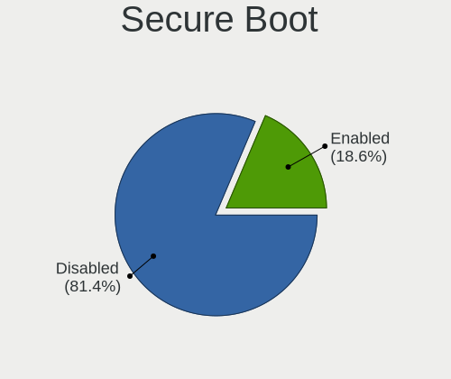
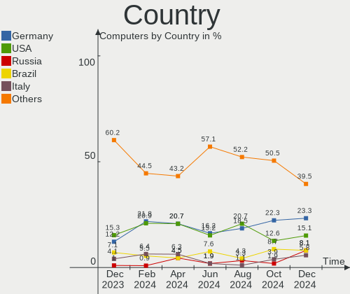
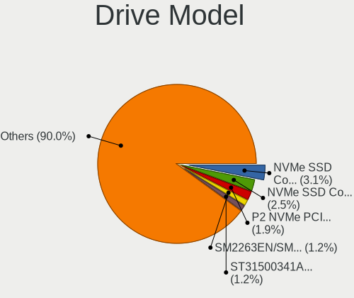
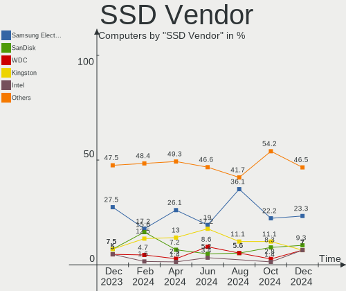
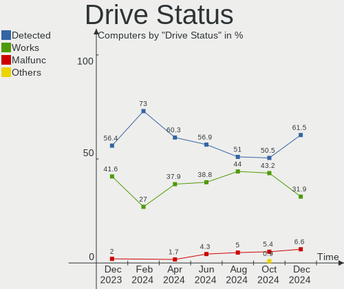
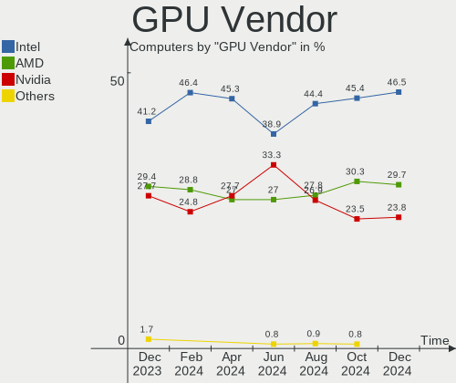
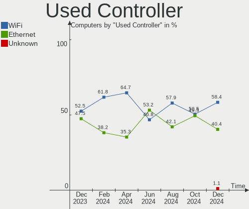
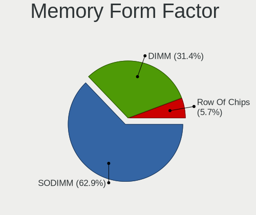

openSUSE - Hardware Trends
--------------------------

A project to identify most popular hardware characteristics and track their change
over time based on data collected by Linux users at https://Linux-Hardware.org.

Anyone can contribute to this report by the [hw-probe](https://github.com/linuxhw/hw-probe) tool:

    sudo -E hw-probe -all -upload

This is a report for all computer types. See also reports for [desktops](/Dist/openSUSE/Desktop/README.md) and [notebooks](/Dist/openSUSE/Notebook/README.md).

This report is for one last month. Overall report since the beginning of time: [TestCoverage](https://github.com/linuxhw/TestCoverage)

Period: Oct, 2022.

Contents
--------

* [ System ](#system)
  - [ OS                       ](#os)
  - [ OS Family                ](#os-family)
  - [ Kernel                   ](#kernel)
  - [ Kernel Family            ](#kernel-family)
  - [ Kernel Major Ver.        ](#kernel-major-ver)
  - [ Arch                     ](#arch)
  - [ DE                       ](#de)
  - [ Display Server           ](#display-server)
  - [ Display Manager          ](#display-manager)
  - [ OS Lang                  ](#os-lang)
  - [ Boot Mode                ](#boot-mode)
  - [ Filesystem               ](#filesystem)
  - [ Part. scheme             ](#part-scheme)
  - [ Dual Boot with Linux/BSD ](#dual-boot-with-linuxbsd)
  - [ Dual Boot (Win)          ](#dual-boot-win)

* [ Board ](#board)
  - [ Vendor                   ](#vendor)
  - [ Model                    ](#model)
  - [ Model Family             ](#model-family)
  - [ MFG Year                 ](#mfg-year)
  - [ Form Factor              ](#form-factor)
  - [ Secure Boot              ](#secure-boot)
  - [ Coreboot                 ](#coreboot)
  - [ RAM Size                 ](#ram-size)
  - [ RAM Used                 ](#ram-used)
  - [ Total Drives             ](#total-drives)
  - [ Has CD-ROM               ](#has-cd-rom)
  - [ Has Ethernet             ](#has-ethernet)
  - [ Has WiFi                 ](#has-wifi)
  - [ Has Bluetooth            ](#has-bluetooth)

* [ Location ](#location)
  - [ Country                  ](#country)
  - [ City                     ](#city)

* [ Drives ](#drives)
  - [ Drive Vendor             ](#drive-vendor)
  - [ Drive Model              ](#drive-model)
  - [ HDD Vendor               ](#hdd-vendor)
  - [ SSD Vendor               ](#ssd-vendor)
  - [ Drive Kind               ](#drive-kind)
  - [ Drive Connector          ](#drive-connector)
  - [ Drive Size               ](#drive-size)
  - [ Space Total              ](#space-total)
  - [ Space Used               ](#space-used)
  - [ Malfunc. Drives          ](#malfunc-drives)
  - [ Malfunc. Drive Vendor    ](#malfunc-drive-vendor)
  - [ Malfunc. HDD Vendor      ](#malfunc-hdd-vendor)
  - [ Malfunc. Drive Kind      ](#malfunc-drive-kind)
  - [ Failed Drives            ](#failed-drives)
  - [ Failed Drive Vendor      ](#failed-drive-vendor)
  - [ Drive Status             ](#drive-status)

* [ Storage controller ](#storage-controller)
  - [ Storage Vendor           ](#storage-vendor)
  - [ Storage Model            ](#storage-model)
  - [ Storage Kind             ](#storage-kind)

* [ Processor ](#processor)
  - [ CPU Vendor               ](#cpu-vendor)
  - [ CPU Model                ](#cpu-model)
  - [ CPU Model Family         ](#cpu-model-family)
  - [ CPU Cores                ](#cpu-cores)
  - [ CPU Sockets              ](#cpu-sockets)
  - [ CPU Threads              ](#cpu-threads)
  - [ CPU Op-Modes             ](#cpu-op-modes)
  - [ CPU Microcode            ](#cpu-microcode)
  - [ CPU Microarch            ](#cpu-microarch)

* [ Graphics ](#graphics)
  - [ GPU Vendor               ](#gpu-vendor)
  - [ GPU Model                ](#gpu-model)
  - [ GPU Combo                ](#gpu-combo)
  - [ GPU Driver               ](#gpu-driver)
  - [ GPU Memory               ](#gpu-memory)

* [ Monitor ](#monitor)
  - [ Monitor Vendor           ](#monitor-vendor)
  - [ Monitor Model            ](#monitor-model)
  - [ Monitor Resolution       ](#monitor-resolution)
  - [ Monitor Diagonal         ](#monitor-diagonal)
  - [ Monitor Width            ](#monitor-width)
  - [ Aspect Ratio             ](#aspect-ratio)
  - [ Monitor Area             ](#monitor-area)
  - [ Pixel Density            ](#pixel-density)
  - [ Multiple Monitors        ](#multiple-monitors)

* [ Network ](#network)
  - [ Net Controller Vendor    ](#net-controller-vendor)
  - [ Net Controller Model     ](#net-controller-model)
  - [ Wireless Vendor          ](#wireless-vendor)
  - [ Wireless Model           ](#wireless-model)
  - [ Ethernet Vendor          ](#ethernet-vendor)
  - [ Ethernet Model           ](#ethernet-model)
  - [ Net Controller Kind      ](#net-controller-kind)
  - [ Used Controller          ](#used-controller)
  - [ NICs                     ](#nics)
  - [ IPv6                     ](#ipv6)

* [ Bluetooth ](#bluetooth)
  - [ Bluetooth Vendor         ](#bluetooth-vendor)
  - [ Bluetooth Model          ](#bluetooth-model)

* [ Sound ](#sound)
  - [ Sound Vendor             ](#sound-vendor)
  - [ Sound Model              ](#sound-model)

* [ Memory ](#memory)
  - [ Memory Vendor            ](#memory-vendor)
  - [ Memory Model             ](#memory-model)
  - [ Memory Kind              ](#memory-kind)
  - [ Memory Form Factor       ](#memory-form-factor)
  - [ Memory Size              ](#memory-size)
  - [ Memory Speed             ](#memory-speed)

* [ Printers & scanners ](#printers--scanners)
  - [ Printer Vendor           ](#printer-vendor)
  - [ Printer Model            ](#printer-model)
  - [ Scanner Vendor           ](#scanner-vendor)
  - [ Scanner Model            ](#scanner-model)

* [ Camera ](#camera)
  - [ Camera Vendor            ](#camera-vendor)
  - [ Camera Model             ](#camera-model)

* [ Security ](#security)
  - [ Fingerprint Vendor       ](#fingerprint-vendor)
  - [ Fingerprint Model        ](#fingerprint-model)
  - [ Chipcard Vendor          ](#chipcard-vendor)
  - [ Chipcard Model           ](#chipcard-model)

* [ Unsupported ](#unsupported)
  - [ Unsupported Devices      ](#unsupported-devices)
  - [ Unsupported Device Types ](#unsupported-device-types)

System
------

OS
--

Installed operating systems

| Name                         | Computers | Percent |
|------------------------------|-----------|---------|
| openSUSE Tumbleweed-XXXXXXXX | 43        | 74.14%  |
| openSUSE Leap-15.4           | 12        | 20.69%  |
| openSUSE Leap-15.5           | 1         | 1.72%   |
| openSUSE Leap-15.3           | 1         | 1.72%   |
| openSUSE Leap-15.2           | 1         | 1.72%   |

OS Family
---------

OS without a version

| Name     | Computers | Percent |
|----------|-----------|---------|
| openSUSE | 58        | 100%    |

Kernel
------

Version of the Linux kernel

| Version                      | Computers | Percent |
|------------------------------|-----------|---------|
| 6.0.3-1-default              | 13        | 22.41%  |
| 5.14.21-150400.24.21-default | 11        | 18.97%  |
| 6.0.1-1-default              | 7         | 12.07%  |
| 6.0.0-1-default              | 6         | 10.34%  |
| 6.0.2-1-default              | 3         | 5.17%   |
| 5.19.12-1-default            | 3         | 5.17%   |
| 5.19.10-1-default            | 3         | 5.17%   |
| 5.19.8-1-default             | 2         | 3.45%   |
| 5.19.13-1-default            | 2         | 3.45%   |
| 6.0.0-rc5-1.gf7dcc92-default | 1         | 1.72%   |
| 5.3.18-lp152.106-default     | 1         | 1.72%   |
| 5.3.18-150300.59.93-default  | 1         | 1.72%   |
| 5.19.13-1-pae                | 1         | 1.72%   |
| 5.18.15-1-default            | 1         | 1.72%   |
| 5.18.12-1-default            | 1         | 1.72%   |
| 5.14.21-150400.24.18-default | 1         | 1.72%   |
| 5.14.21-150400.22-default    | 1         | 1.72%   |

Kernel Family
-------------

Linux kernel without a distro release

| Version | Computers | Percent |
|---------|-----------|---------|
| 6.0.3   | 13        | 22.41%  |
| 5.14.21 | 13        | 22.41%  |
| 6.0.1   | 7         | 12.07%  |
| 6.0.0   | 7         | 12.07%  |
| 6.0.2   | 3         | 5.17%   |
| 5.19.13 | 3         | 5.17%   |
| 5.19.12 | 3         | 5.17%   |
| 5.19.10 | 3         | 5.17%   |
| 5.3.18  | 2         | 3.45%   |
| 5.19.8  | 2         | 3.45%   |
| 5.18.15 | 1         | 1.72%   |
| 5.18.12 | 1         | 1.72%   |

Kernel Major Ver.
-----------------

Linux kernel major version

| Version | Computers | Percent |
|---------|-----------|---------|
| 6.0     | 30        | 51.72%  |
| 5.14    | 13        | 22.41%  |
| 5.19    | 11        | 18.97%  |
| 5.3     | 2         | 3.45%   |
| 5.18    | 2         | 3.45%   |

Arch
----

OS architecture (x86_64, i586, etc.)

| Name    | Computers | Percent |
|---------|-----------|---------|
| x86_64  | 56        | 96.55%  |
| i686    | 1         | 1.72%   |
| aarch64 | 1         | 1.72%   |

DE
--

Desktop Environment

| Name       | Computers | Percent |
|------------|-----------|---------|
| KDE5       | 32        | 55.17%  |
| GNOME      | 15        | 25.86%  |
| XFCE       | 4         | 6.9%    |
| Unknown    | 3         | 5.17%   |
| X-Cinnamon | 2         | 3.45%   |
| MATE       | 1         | 1.72%   |
| Cinnamon   | 1         | 1.72%   |

Display Server
--------------

X11 or Wayland

| Name    | Computers | Percent |
|---------|-----------|---------|
| X11     | 39        | 67.24%  |
| Wayland | 16        | 27.59%  |
| Tty     | 2         | 3.45%   |
| Unknown | 1         | 1.72%   |

Display Manager
---------------

SDDM, LightDM, etc.

| Name    | Computers | Percent |
|---------|-----------|---------|
| Unknown | 27        | 46.55%  |
| SDDM    | 19        | 32.76%  |
| LightDM | 9         | 15.52%  |
| XDM     | 2         | 3.45%   |
| GDM     | 1         | 1.72%   |

OS Lang
-------

Language

| Lang  | Computers | Percent |
|-------|-----------|---------|
| en_US | 23        | 39.66%  |
| POSIX | 10        | 17.24%  |
| de_DE | 8         | 13.79%  |
| pt_BR | 3         | 5.17%   |
| it_IT | 3         | 5.17%   |
| en_GB | 3         | 5.17%   |
| ru_RU | 2         | 3.45%   |
| zh_CN | 1         | 1.72%   |
| pl_PL | 1         | 1.72%   |
| nl_NL | 1         | 1.72%   |
| hu_HU | 1         | 1.72%   |
| es_ES | 1         | 1.72%   |
| es_AR | 1         | 1.72%   |

Boot Mode
---------

EFI or BIOS

| Mode | Computers | Percent |
|------|-----------|---------|
| EFI  | 34        | 58.62%  |
| BIOS | 24        | 41.38%  |

Filesystem
----------

Type of filesystem

| Type  | Computers | Percent |
|-------|-----------|---------|
| Btrfs | 43        | 74.14%  |
| Ext4  | 14        | 24.14%  |
| Xfs   | 1         | 1.72%   |

Part. scheme
------------

Scheme of partitioning

| Type    | Computers | Percent |
|---------|-----------|---------|
| GPT     | 28        | 48.28%  |
| Unknown | 25        | 43.1%   |
| MBR     | 5         | 8.62%   |

Dual Boot with Linux/BSD
------------------------

Hosting more than one Linux/BSD

| Dual boot | Computers | Percent |
|-----------|-----------|---------|
| No        | 51        | 87.93%  |
| Yes       | 7         | 12.07%  |

Dual Boot (Win)
---------------

Hosting Linux and Windows

| Dual boot | Computers | Percent |
|-----------|-----------|---------|
| No        | 46        | 79.31%  |
| Yes       | 12        | 20.69%  |

Board
-----

Vendor
------

Motherboard manufacturer

| Name                | Computers | Percent |
|---------------------|-----------|---------|
| Lenovo              | 13        | 22.41%  |
| MSI                 | 10        | 17.24%  |
| ASUSTek Computer    | 10        | 17.24%  |
| Dell                | 9         | 15.52%  |
| Toshiba             | 2         | 3.45%   |
| Hewlett-Packard     | 2         | 3.45%   |
| Gigabyte Technology | 2         | 3.45%   |
| Acer                | 2         | 3.45%   |
| Sony                | 1         | 1.72%   |
| SLIMBOOK            | 1         | 1.72%   |
| Samsung Electronics | 1         | 1.72%   |
| Radxa               | 1         | 1.72%   |
| Intel               | 1         | 1.72%   |
| Gateway             | 1         | 1.72%   |
| Fujitsu Siemens     | 1         | 1.72%   |
| Fujitsu             | 1         | 1.72%   |

Model
-----

Motherboard model

| Name                                        | Computers | Percent |
|---------------------------------------------|-----------|---------|
| MSI MS-7522                                 | 2         | 3.45%   |
| Toshiba Satellite P55t-A                    | 1         | 1.72%   |
| Toshiba Satellite L350                      | 1         | 1.72%   |
| Sony VPCEL3S1R                              | 1         | 1.72%   |
| SLIMBOOK PROX-AMD5                          | 1         | 1.72%   |
| Samsung 930QDB                              | 1         | 1.72%   |
| Radxa Zero                                  | 1         | 1.72%   |
| MSI Prestige 14 A11SCS                      | 1         | 1.72%   |
| MSI MS-7B89                                 | 1         | 1.72%   |
| MSI MS-7B86                                 | 1         | 1.72%   |
| MSI MS-7A31                                 | 1         | 1.72%   |
| MSI MS-7995                                 | 1         | 1.72%   |
| MSI MS-7971                                 | 1         | 1.72%   |
| MSI MS-7696                                 | 1         | 1.72%   |
| MSI GE70 2PE                                | 1         | 1.72%   |
| Lenovo Yoga C640-13IML 81UE                 | 1         | 1.72%   |
| Lenovo ThinkStation P520 30BE008VGE         | 1         | 1.72%   |
| Lenovo ThinkPad X1 Carbon Gen 10 21CB007BIX | 1         | 1.72%   |
| Lenovo ThinkPad W510 4391W3V                | 1         | 1.72%   |
| Lenovo ThinkPad W510 431965U                | 1         | 1.72%   |
| Lenovo ThinkPad T470 20HES0FW00             | 1         | 1.72%   |
| Lenovo ThinkPad T430 2347DS3                | 1         | 1.72%   |
| Lenovo ThinkPad T14 Gen 2a 20XK0019US       | 1         | 1.72%   |
| Lenovo ThinkPad P15s Gen 2i 20W6S00200      | 1         | 1.72%   |
| Lenovo ThinkCentre M710q 10MQS31W00         | 1         | 1.72%   |
| Lenovo ThinkBook 14 G3 ACL 21A2             | 1         | 1.72%   |
| Lenovo IdeaPad 5 14ARE05 81YM               | 1         | 1.72%   |
| Intel (R) Education Tablet                  | 1         | 1.72%   |
| HP ZBook 17                                 | 1         | 1.72%   |
| HP ZBook 15 G3                              | 1         | 1.72%   |
| Gigabyte X79-UP4                            | 1         | 1.72%   |
| Gigabyte GA-770TA-UD3                       | 1         | 1.72%   |
| Gateway NV54 Series                         | 1         | 1.72%   |
| Fujitsu Siemens PRIMERGY TX150 S5           | 1         | 1.72%   |
| Fujitsu LIFEBOOK E746                       | 1         | 1.72%   |
| Dell Vostro 3580                            | 1         | 1.72%   |
| Dell Vostro 3560                            | 1         | 1.72%   |
| Dell OptiPlex 9020                          | 1         | 1.72%   |
| Dell OptiPlex 7440 AIO                      | 1         | 1.72%   |
| Dell Latitude E6430                         | 1         | 1.72%   |

Model Family
------------

Motherboard model prefix

| Name                     | Computers | Percent |
|--------------------------|-----------|---------|
| Lenovo ThinkPad          | 7         | 12.07%  |
| Dell Latitude            | 3         | 5.17%   |
| Toshiba Satellite        | 2         | 3.45%   |
| MSI MS-7522              | 2         | 3.45%   |
| HP ZBook                 | 2         | 3.45%   |
| Dell Vostro              | 2         | 3.45%   |
| Dell OptiPlex            | 2         | 3.45%   |
| Dell Inspiron            | 2         | 3.45%   |
| ASUS ZenBook             | 2         | 3.45%   |
| Sony VPCEL3S1R           | 1         | 1.72%   |
| SLIMBOOK PROX-AMD5       | 1         | 1.72%   |
| Samsung 930QDB           | 1         | 1.72%   |
| Radxa Zero               | 1         | 1.72%   |
| MSI Prestige             | 1         | 1.72%   |
| MSI MS-7B89              | 1         | 1.72%   |
| MSI MS-7B86              | 1         | 1.72%   |
| MSI MS-7A31              | 1         | 1.72%   |
| MSI MS-7995              | 1         | 1.72%   |
| MSI MS-7971              | 1         | 1.72%   |
| MSI MS-7696              | 1         | 1.72%   |
| MSI GE70                 | 1         | 1.72%   |
| Lenovo Yoga              | 1         | 1.72%   |
| Lenovo ThinkStation      | 1         | 1.72%   |
| Lenovo ThinkCentre       | 1         | 1.72%   |
| Lenovo ThinkBook         | 1         | 1.72%   |
| Lenovo IdeaPad           | 1         | 1.72%   |
| Intel (R)                | 1         | 1.72%   |
| Gigabyte X79-UP4         | 1         | 1.72%   |
| Gigabyte GA-770TA-UD3    | 1         | 1.72%   |
| Gateway NV54             | 1         | 1.72%   |
| Fujitsu Siemens PRIMERGY | 1         | 1.72%   |
| Fujitsu LIFEBOOK         | 1         | 1.72%   |
| ASUS VivoBook            | 1         | 1.72%   |
| ASUS TUF                 | 1         | 1.72%   |
| ASUS PRIME               | 1         | 1.72%   |
| ASUS P5P43TD             | 1         | 1.72%   |
| ASUS M5A78L-M            | 1         | 1.72%   |
| ASUS F3Sv                | 1         | 1.72%   |
| ASUS ASUS                | 1         | 1.72%   |
| ASUS All                 | 1         | 1.72%   |

MFG Year
--------

Motherboard manufacture year

| Year | Computers | Percent |
|------|-----------|---------|
| 2021 | 11        | 18.97%  |
| 2022 | 5         | 8.62%   |
| 2019 | 5         | 8.62%   |
| 2012 | 5         | 8.62%   |
| 2009 | 5         | 8.62%   |
| 2017 | 4         | 6.9%    |
| 2015 | 4         | 6.9%    |
| 2020 | 3         | 5.17%   |
| 2014 | 3         | 5.17%   |
| 2018 | 2         | 3.45%   |
| 2016 | 2         | 3.45%   |
| 2013 | 2         | 3.45%   |
| 2011 | 2         | 3.45%   |
| 2010 | 2         | 3.45%   |
| 2007 | 2         | 3.45%   |
| 2008 | 1         | 1.72%   |

Form Factor
-----------

Physical design of the computer

| Name           | Computers | Percent |
|----------------|-----------|---------|
| Notebook       | 33        | 56.9%   |
| Desktop        | 19        | 32.76%  |
| Convertible    | 3         | 5.17%   |
| All in one     | 2         | 3.45%   |
| System on chip | 1         | 1.72%   |

Secure Boot
-----------

Enabled or disabled

| State    | Computers | Percent |
|----------|-----------|---------|
| Disabled | 50        | 86.21%  |
| Enabled  | 8         | 13.79%  |

Coreboot
--------

Have coreboot on board

| Used | Computers | Percent |
|------|-----------|---------|
| No   | 58        | 100%    |

RAM Size
--------

Total RAM memory

| Size in GB  | Computers | Percent |
|-------------|-----------|---------|
| 16.01-24.0  | 16        | 27.59%  |
| 4.01-8.0    | 15        | 25.86%  |
| 8.01-16.0   | 11        | 18.97%  |
| 32.01-64.0  | 7         | 12.07%  |
| 3.01-4.0    | 2         | 3.45%   |
| 64.01-256.0 | 2         | 3.45%   |
| 1.01-2.0    | 2         | 3.45%   |
| 24.01-32.0  | 1         | 1.72%   |
| 2.01-3.0    | 1         | 1.72%   |
| 0.51-1.0    | 1         | 1.72%   |

RAM Used
--------

Used RAM memory

| Used GB   | Computers | Percent |
|-----------|-----------|---------|
| 4.01-8.0  | 19        | 32.76%  |
| 1.01-2.0  | 13        | 22.41%  |
| 3.01-4.0  | 12        | 20.69%  |
| 2.01-3.0  | 8         | 13.79%  |
| 8.01-16.0 | 4         | 6.9%    |
| 0.51-1.0  | 1         | 1.72%   |
| 0.01-0.5  | 1         | 1.72%   |

Total Drives
------------

Number of drives on board

| Drives | Computers | Percent |
|--------|-----------|---------|
| 1      | 31        | 53.45%  |
| 2      | 16        | 27.59%  |
| 3      | 6         | 10.34%  |
| 5      | 2         | 3.45%   |
| 4      | 2         | 3.45%   |
| 6      | 1         | 1.72%   |

Has CD-ROM
----------

Has CD-ROM on board

| Presented | Computers | Percent |
|-----------|-----------|---------|
| No        | 39        | 67.24%  |
| Yes       | 19        | 32.76%  |

Has Ethernet
------------

Has Ethernet on board

| Presented | Computers | Percent |
|-----------|-----------|---------|
| Yes       | 50        | 86.21%  |
| No        | 8         | 13.79%  |

Has WiFi
--------

Has WiFi module

| Presented | Computers | Percent |
|-----------|-----------|---------|
| Yes       | 44        | 75.86%  |
| No        | 14        | 24.14%  |

Has Bluetooth
-------------

Has Bluetooth module

| Presented | Computers | Percent |
|-----------|-----------|---------|
| Yes       | 37        | 63.79%  |
| No        | 21        | 36.21%  |

Location
--------

Country
-------

Geographic location (country)

| Country      | Computers | Percent |
|--------------|-----------|---------|
| USA          | 11        | 18.97%  |
| Germany      | 11        | 18.97%  |
| Italy        | 5         | 8.62%   |
| Brazil       | 3         | 5.17%   |
| Sweden       | 2         | 3.45%   |
| Russia       | 2         | 3.45%   |
| India        | 2         | 3.45%   |
| Hungary      | 2         | 3.45%   |
| China        | 2         | 3.45%   |
| Ukraine      | 1         | 1.72%   |
| Thailand     | 1         | 1.72%   |
| Switzerland  | 1         | 1.72%   |
| South Africa | 1         | 1.72%   |
| Serbia       | 1         | 1.72%   |
| Puerto Rico  | 1         | 1.72%   |
| Poland       | 1         | 1.72%   |
| Norway       | 1         | 1.72%   |
| Mexico       | 1         | 1.72%   |
| Madagascar   | 1         | 1.72%   |
| Latvia       | 1         | 1.72%   |
| Kenya        | 1         | 1.72%   |
| Israel       | 1         | 1.72%   |
| Czechia      | 1         | 1.72%   |
| Belgium      | 1         | 1.72%   |
| Belarus      | 1         | 1.72%   |
| Austria      | 1         | 1.72%   |
| Argentina    | 1         | 1.72%   |

City
----

Geographic location (city)

| City                   | Computers | Percent |
|------------------------|-----------|---------|
| Zurich                 | 1         | 1.72%   |
| Zirndorf               | 1         | 1.72%   |
| Verona                 | 1         | 1.72%   |
| Västerås             | 1         | 1.72%   |
| Ulyanovsk              | 1         | 1.72%   |
| Tuckerton              | 1         | 1.72%   |
| Tann                   | 1         | 1.72%   |
| Stockholm              | 1         | 1.72%   |
| Rostov-on-Don          | 1         | 1.72%   |
| Rome                   | 1         | 1.72%   |
| Riga                   | 1         | 1.72%   |
| Puerto Eldorado        | 1         | 1.72%   |
| Portland               | 1         | 1.72%   |
| Piacenza               | 1         | 1.72%   |
| Phoenix                | 1         | 1.72%   |
| Petal                  | 1         | 1.72%   |
| Overland Park          | 1         | 1.72%   |
| Odessa                 | 1         | 1.72%   |
| Oberhausen             | 1         | 1.72%   |
| Northeim               | 1         | 1.72%   |
| Natal                  | 1         | 1.72%   |
| Nairobi                | 1         | 1.72%   |
| Mohali                 | 1         | 1.72%   |
| Mo i Rana              | 1         | 1.72%   |
| Minsk                  | 1         | 1.72%   |
| Mansfield              | 1         | 1.72%   |
| Mannheim               | 1         | 1.72%   |
| Louisville             | 1         | 1.72%   |
| Leipzig                | 1         | 1.72%   |
| Kluszkowce             | 1         | 1.72%   |
| Klerksdorp             | 1         | 1.72%   |
| Kiel                   | 1         | 1.72%   |
| Joao Pessoa            | 1         | 1.72%   |
| Houston                | 1         | 1.72%   |
| Guangzhou              | 1         | 1.72%   |
| Ghent                  | 1         | 1.72%   |
| Gerenzago              | 1         | 1.72%   |
| Garden Grove           | 1         | 1.72%   |
| Furth an der Triesting | 1         | 1.72%   |
| Frutal                 | 1         | 1.72%   |

Drives
------

Drive Vendor
------------

Hard drive vendors

| Vendor                      | Computers | Drives | Percent |
|-----------------------------|-----------|--------|---------|
| Samsung Electronics         | 15        | 17     | 17.44%  |
| Seagate                     | 11        | 20     | 12.79%  |
| WDC                         | 7         | 11     | 8.14%   |
| Toshiba                     | 6         | 6      | 6.98%   |
| SanDisk                     | 5         | 5      | 5.81%   |
| Crucial                     | 5         | 6      | 5.81%   |
| Unknown                     | 4         | 4      | 4.65%   |
| SK hynix                    | 4         | 4      | 4.65%   |
| Intel                       | 4         | 4      | 4.65%   |
| Silicon Motion              | 3         | 3      | 3.49%   |
| Kingston                    | 2         | 3      | 2.33%   |
| Intenso                     | 2         | 2      | 2.33%   |
| Hitachi                     | 2         | 2      | 2.33%   |
| HGST                        | 2         | 2      | 2.33%   |
| Hewlett-Packard             | 2         | 2      | 2.33%   |
| SPCC                        | 1         | 1      | 1.16%   |
| Solid State Storage         | 1         | 1      | 1.16%   |
| Smartbuy                    | 1         | 1      | 1.16%   |
| PNY                         | 1         | 1      | 1.16%   |
| Patriot                     | 1         | 1      | 1.16%   |
| Micron/Crucial Technology   | 1         | 1      | 1.16%   |
| MAXIO Technology (Hangzhou) | 1         | 1      | 1.16%   |
| MaxDigital                  | 1         | 1      | 1.16%   |
| Fujitsu                     | 1         | 2      | 1.16%   |
| ASMedia                     | 1         | 1      | 1.16%   |
| ADATA Technology            | 1         | 1      | 1.16%   |
| A-DATA Technology           | 1         | 1      | 1.16%   |

Drive Model
-----------

Hard drive models

| Model                                                 | Computers | Percent |
|-------------------------------------------------------|-----------|---------|
| Seagate Expansion 2TB                                 | 3         | 3.06%   |
| Samsung NVMe SSD Controller SM981/PM981/PM983 500GB   | 3         | 3.06%   |
| Toshiba MQ04ABF100 1TB                                | 2         | 2.04%   |
| Silicon Motion SM2263EN/SM2263XT SSD Controller 256GB | 2         | 2.04%   |
| Seagate ST3500418AS 500GB                             | 2         | 2.04%   |
| Seagate ST31000528AS 1TB                              | 2         | 2.04%   |
| Seagate ST2000DM001-1ER164 2TB                        | 2         | 2.04%   |
| Seagate ST2000DM001-1CH164 2TB                        | 2         | 2.04%   |
| Samsung NVMe SSD Controller SM961/PM961/SM963 250GB   | 2         | 2.04%   |
| Samsung NVMe SSD Controller PM9A1/PM9A3/980PRO 250GB  | 2         | 2.04%   |
| Samsung MZALQ512HALU-000L2 512GB                      | 2         | 2.04%   |
| Intel SSD 660P Series 1024GB                          | 2         | 2.04%   |
| Crucial CT1000BX500SSD1 1TB                           | 2         | 2.04%   |
| WDC WDS240G2G0A-00JH30 240GB SSD                      | 1         | 1.02%   |
| WDC WD5000BPVT-22HXZT3 500GB                          | 1         | 1.02%   |
| WDC WD5000AAKX-7 500GB                                | 1         | 1.02%   |
| WDC WD5000AAKX-221CA1 500GB                           | 1         | 1.02%   |
| WDC WD2003FZEX-00Z4SA0 2TB                            | 1         | 1.02%   |
| WDC WD2002FYPS-12 2TB                                 | 1         | 1.02%   |
| WDC WD1600AAJS-6 160GB                                | 1         | 1.02%   |
| WDC WD10SPZX-75Z10T0 1TB                              | 1         | 1.02%   |
| WDC WD10SPZX-24Z10 1TB                                | 1         | 1.02%   |
| WDC WD10EZEX-00RKKA0 1TB                              | 1         | 1.02%   |
| Unknown MMC Card  8GB                                 | 1         | 1.02%   |
| Unknown MMC Card  64GB                                | 1         | 1.02%   |
| Unknown MMC Card  32GB                                | 1         | 1.02%   |
| Unknown MMC Card  16GB                                | 1         | 1.02%   |
| Toshiba THNSNJ128GMCU 128GB SSD                       | 1         | 1.02%   |
| Toshiba MQ01ACF050 500GB                              | 1         | 1.02%   |
| Toshiba MK6465GSX 640GB                               | 1         | 1.02%   |
| Toshiba HDWU130 3TB                                   | 1         | 1.02%   |
| SPCC M.2 PCIe SSD 512GB                               | 1         | 1.02%   |
| Solid State Storage CL1-3D512-Q11 NVMe SSSTC 512GB    | 1         | 1.02%   |
| Smartbuy SSD 240GB                                    | 1         | 1.02%   |
| SK hynix SKHynix_HFS256GDE9X081N 256GB                | 1         | 1.02%   |
| SK hynix SKHynix_HFM512GD3HX015N 512GB                | 1         | 1.02%   |
| SK hynix SC311 SATA 128GB SSD                         | 1         | 1.02%   |
| SK hynix HFM512GD3JX016N 512GB                        | 1         | 1.02%   |
| Silicon Motion SM2262/SM2262EN SSD Controller 1024GB  | 1         | 1.02%   |
| Seagate ST9500420AS 500GB                             | 1         | 1.02%   |

HDD Vendor
----------

Hard disk drive vendors

| Vendor     | Computers | Drives | Percent |
|------------|-----------|--------|---------|
| Seagate    | 11        | 20     | 36.67%  |
| WDC        | 7         | 10     | 23.33%  |
| Toshiba    | 5         | 5      | 16.67%  |
| Hitachi    | 2         | 2      | 6.67%   |
| HGST       | 2         | 2      | 6.67%   |
| MaxDigital | 1         | 1      | 3.33%   |
| Intenso    | 1         | 1      | 3.33%   |
| Fujitsu    | 1         | 2      | 3.33%   |

SSD Vendor
----------

Solid state drive vendors

| Vendor              | Computers | Drives | Percent |
|---------------------|-----------|--------|---------|
| Samsung Electronics | 5         | 5      | 20%     |
| Crucial             | 5         | 6      | 20%     |
| SanDisk             | 3         | 3      | 12%     |
| Kingston            | 2         | 3      | 8%      |
| Hewlett-Packard     | 2         | 2      | 8%      |
| WDC                 | 1         | 1      | 4%      |
| Toshiba             | 1         | 1      | 4%      |
| Smartbuy            | 1         | 1      | 4%      |
| SK hynix            | 1         | 1      | 4%      |
| PNY                 | 1         | 1      | 4%      |
| Patriot             | 1         | 1      | 4%      |
| Intel               | 1         | 1      | 4%      |
| A-DATA Technology   | 1         | 1      | 4%      |

Drive Kind
----------

HDD or SSD

| Kind    | Computers | Drives | Percent |
|---------|-----------|--------|---------|
| NVMe    | 26        | 28     | 32.5%   |
| HDD     | 26        | 43     | 32.5%   |
| SSD     | 22        | 27     | 27.5%   |
| MMC     | 4         | 4      | 5%      |
| Unknown | 2         | 2      | 2.5%    |

Drive Connector
---------------

SATA, SAS, NVMe, etc.

| Type | Computers | Drives | Percent |
|------|-----------|--------|---------|
| SATA | 40        | 64     | 52.63%  |
| NVMe | 26        | 28     | 34.21%  |
| SAS  | 6         | 8      | 7.89%   |
| MMC  | 4         | 4      | 5.26%   |

Drive Size
----------

Size of hard drive

| Size in TB | Computers | Drives | Percent |
|------------|-----------|--------|---------|
| 0.01-0.5   | 27        | 37     | 50%     |
| 0.51-1.0   | 17        | 18     | 31.48%  |
| 1.01-2.0   | 7         | 12     | 12.96%  |
| 3.01-4.0   | 1         | 1      | 1.85%   |
| 2.01-3.0   | 1         | 1      | 1.85%   |
| 4.01-10.0  | 1         | 1      | 1.85%   |

Space Total
-----------

Amount of disk space available on the file system

| Size in GB     | Computers | Percent |
|----------------|-----------|---------|
| More than 3000 | 19        | 32.76%  |
| 2001-3000      | 11        | 18.97%  |
| 1001-2000      | 10        | 17.24%  |
| 501-1000       | 9         | 15.52%  |
| 251-500        | 7         | 12.07%  |
| 101-250        | 1         | 1.72%   |
| 1-20           | 1         | 1.72%   |

Space Used
----------

Amount of used disk space

| Used GB        | Computers | Percent |
|----------------|-----------|---------|
| 101-250        | 15        | 25.86%  |
| 251-500        | 10        | 17.24%  |
| 501-1000       | 9         | 15.52%  |
| 51-100         | 9         | 15.52%  |
| 1001-2000      | 8         | 13.79%  |
| 2001-3000      | 3         | 5.17%   |
| 1-20           | 3         | 5.17%   |
| More than 3000 | 1         | 1.72%   |

Malfunc. Drives
---------------

Drive models with a malfunction

| Model                        | Computers | Drives | Percent |
|------------------------------|-----------|--------|---------|
| WDC WD5000BPVT-22HXZT3 500GB | 1         | 1      | 33.33%  |
| Toshiba MK6465GSX 640GB      | 1         | 1      | 33.33%  |
| Seagate ST31000524AS 1TB     | 1         | 1      | 33.33%  |

Malfunc. Drive Vendor
---------------------

Vendors of faulty drives

| Vendor  | Computers | Drives | Percent |
|---------|-----------|--------|---------|
| WDC     | 1         | 1      | 33.33%  |
| Toshiba | 1         | 1      | 33.33%  |
| Seagate | 1         | 1      | 33.33%  |

Malfunc. HDD Vendor
-------------------

Vendors of faulty HDD drives

| Vendor  | Computers | Drives | Percent |
|---------|-----------|--------|---------|
| WDC     | 1         | 1      | 33.33%  |
| Toshiba | 1         | 1      | 33.33%  |
| Seagate | 1         | 1      | 33.33%  |

Malfunc. Drive Kind
-------------------

Kinds of faulty drives

| Kind | Computers | Drives | Percent |
|------|-----------|--------|---------|
| HDD  | 3         | 3      | 100%    |

Failed Drives
-------------

Failed drive models

Zero info for selected period =(

Failed Drive Vendor
-------------------

Failed drive vendors

Zero info for selected period =(

Drive Status
------------

Number of failed and malfunc. drives

| Status   | Computers | Drives | Percent |
|----------|-----------|--------|---------|
| Detected | 30        | 56     | 48.39%  |
| Works    | 29        | 45     | 46.77%  |
| Malfunc  | 3         | 3      | 4.84%   |

Storage controller
------------------

Storage Vendor
--------------

Storage controller vendors

| Vendor                         | Computers | Percent |
|--------------------------------|-----------|---------|
| Intel                          | 37        | 46.25%  |
| Samsung Electronics            | 11        | 13.75%  |
| AMD                            | 11        | 13.75%  |
| JMicron Technology             | 4         | 5%      |
| SK hynix                       | 3         | 3.75%   |
| Silicon Motion                 | 3         | 3.75%   |
| SanDisk                        | 2         | 2.5%    |
| Marvell Technology Group       | 2         | 2.5%    |
| Solid State Storage Technology | 1         | 1.25%   |
| Phison Electronics             | 1         | 1.25%   |
| Micron/Crucial Technology      | 1         | 1.25%   |
| MAXIO Technology (Hangzhou)    | 1         | 1.25%   |
| LSI Logic / Symbios Logic      | 1         | 1.25%   |
| Broadcom / LSI                 | 1         | 1.25%   |
| ADATA Technology               | 1         | 1.25%   |

Storage Model
-------------

Storage controller models

| Model                                                                          | Computers | Percent |
|--------------------------------------------------------------------------------|-----------|---------|
| AMD FCH SATA Controller [AHCI mode]                                            | 8         | 8.6%    |
| Intel Volume Management Device NVMe RAID Controller                            | 4         | 4.3%    |
| Intel Q170/Q150/B150/H170/H110/Z170/CM236 Chipset SATA Controller [AHCI Mode]  | 4         | 4.3%    |
| SK hynix Gold P31 SSD                                                          | 3         | 3.23%   |
| Samsung NVMe SSD Controller SM981/PM981/PM983                                  | 3         | 3.23%   |
| Samsung NVMe SSD Controller 980                                                | 3         | 3.23%   |
| JMicron JMB363 SATA/IDE Controller                                             | 3         | 3.23%   |
| Intel 82801JI (ICH10 Family) SATA AHCI Controller                              | 3         | 3.23%   |
| Intel 8 Series/C220 Series Chipset Family 6-port SATA Controller 1 [AHCI mode] | 3         | 3.23%   |
| Silicon Motion SM2263EN/SM2263XT SSD Controller                                | 2         | 2.15%   |
| Samsung NVMe SSD Controller SM961/PM961/SM963                                  | 2         | 2.15%   |
| Samsung NVMe SSD Controller PM9A1/PM9A3/980PRO                                 | 2         | 2.15%   |
| Intel Sunrise Point-LP SATA Controller [AHCI mode]                             | 2         | 2.15%   |
| Intel SSD 660P Series                                                          | 2         | 2.15%   |
| Intel 82801IBM/IEM (ICH9M/ICH9M-E) 2 port SATA Controller [IDE mode]           | 2         | 2.15%   |
| Intel 82801 Mobile SATA Controller [RAID mode]                                 | 2         | 2.15%   |
| Intel 8 Series SATA Controller 1 [AHCI mode]                                   | 2         | 2.15%   |
| Intel 7 Series Chipset Family 6-port SATA Controller [AHCI mode]               | 2         | 2.15%   |
| Intel 200 Series PCH SATA controller [AHCI mode]                               | 2         | 2.15%   |
| AMD SB7x0/SB8x0/SB9x0 SATA Controller [AHCI mode]                              | 2         | 2.15%   |
| AMD SB7x0/SB8x0/SB9x0 IDE Controller                                           | 2         | 2.15%   |
| AMD 400 Series Chipset SATA Controller                                         | 2         | 2.15%   |
| Solid State Storage Non-Volatile memory controller                             | 1         | 1.08%   |
| Silicon Motion SM2262/SM2262EN SSD Controller                                  | 1         | 1.08%   |
| SanDisk WD Blue SN550 NVMe SSD                                                 | 1         | 1.08%   |
| SanDisk WD Blue SN500 / PC SN520 NVMe SSD                                      | 1         | 1.08%   |
| Samsung NVMe SSD Controller SM951/PM951                                        | 1         | 1.08%   |
| Phison E12 NVMe Controller                                                     | 1         | 1.08%   |
| Micron/Crucial P1 NVMe PCIe SSD                                                | 1         | 1.08%   |
| MAXIO (Hangzhou) NVMe SSD Controller MAP1202                                   | 1         | 1.08%   |
| Marvell Group 88SE9172 SATA 6Gb/s Controller                                   | 1         | 1.08%   |
| Marvell Group 88SE9128 PCIe SATA 6 Gb/s RAID controller                        | 1         | 1.08%   |
| LSI Logic / Symbios Logic MegaRAID SAS 2108 [Liberator]                        | 1         | 1.08%   |
| JMicron JMB361 AHCI/IDE                                                        | 1         | 1.08%   |
| Intel Tiger Lake-LP SATA Controller                                            | 1         | 1.08%   |
| Intel SSD 600P Series                                                          | 1         | 1.08%   |
| Intel SATA Controller [RAID mode]                                              | 1         | 1.08%   |
| Intel NM10/ICH7 Family SATA Controller [AHCI mode]                             | 1         | 1.08%   |
| Intel Ice Lake-LP SATA Controller [AHCI mode]                                  | 1         | 1.08%   |
| Intel Cannon Point-LP SATA Controller [AHCI Mode]                              | 1         | 1.08%   |

Storage Kind
------------

Kind of storage controller (IDE, SATA, NVMe, SAS, ...)

| Kind | Computers | Percent |
|------|-----------|---------|
| SATA | 39        | 46.43%  |
| NVMe | 26        | 30.95%  |
| IDE  | 10        | 11.9%   |
| RAID | 8         | 9.52%   |
| SCSI | 1         | 1.19%   |

Processor
---------

CPU Vendor
----------

Processor vendors

| Vendor | Computers | Percent |
|--------|-----------|---------|
| Intel  | 43        | 74.14%  |
| AMD    | 14        | 24.14%  |
| ARM    | 1         | 1.72%   |

CPU Model
---------

Processor models

| Model                                       | Computers | Percent |
|---------------------------------------------|-----------|---------|
| Intel Core i7 CPU 920 @ 2.67GHz             | 2         | 3.45%   |
| Intel Core i5-4200U CPU @ 1.60GHz           | 2         | 3.45%   |
| Intel 11th Gen Core i7-1185G7 @ 3.00GHz     | 2         | 3.45%   |
| Intel 11th Gen Core i5-1135G7 @ 2.40GHz     | 2         | 3.45%   |
| AMD Ryzen 5 4500U with Radeon Graphics      | 2         | 3.45%   |
| Intel Xeon W-2135 CPU @ 3.70GHz             | 1         | 1.72%   |
| Intel Xeon CPU E5450 @ 3.00GHz              | 1         | 1.72%   |
| Intel Xeon CPU 3050 @ 2.13GHz               | 1         | 1.72%   |
| Intel Pentium Dual-Core CPU T4400 @ 2.20GHz | 1         | 1.72%   |
| Intel Pentium Dual CPU T3200 @ 2.00GHz      | 1         | 1.72%   |
| Intel Pentium CPU G4560T @ 2.90GHz          | 1         | 1.72%   |
| Intel Core i7-7700HQ CPU @ 2.80GHz          | 1         | 1.72%   |
| Intel Core i7-6820HQ CPU @ 2.70GHz          | 1         | 1.72%   |
| Intel Core i7-6700K CPU @ 4.00GHz           | 1         | 1.72%   |
| Intel Core i7-4930K CPU @ 3.40GHz           | 1         | 1.72%   |
| Intel Core i7-4790 CPU @ 3.60GHz            | 1         | 1.72%   |
| Intel Core i7-4710HQ CPU @ 2.50GHz          | 1         | 1.72%   |
| Intel Core i7-4700MQ CPU @ 2.40GHz          | 1         | 1.72%   |
| Intel Core i7-3540M CPU @ 3.00GHz           | 1         | 1.72%   |
| Intel Core i7-1065G7 CPU @ 1.30GHz          | 1         | 1.72%   |
| Intel Core i7-10510U CPU @ 1.80GHz          | 1         | 1.72%   |
| Intel Core i7 CPU Q 720 @ 1.60GHz           | 1         | 1.72%   |
| Intel Core i5-8265U CPU @ 1.60GHz           | 1         | 1.72%   |
| Intel Core i5-7300U CPU @ 2.60GHz           | 1         | 1.72%   |
| Intel Core i5-6600 CPU @ 3.30GHz            | 1         | 1.72%   |
| Intel Core i5-6500 CPU @ 3.20GHz            | 1         | 1.72%   |
| Intel Core i5-6200U CPU @ 2.30GHz           | 1         | 1.72%   |
| Intel Core i5-4460 CPU @ 3.20GHz            | 1         | 1.72%   |
| Intel Core i5-3320M CPU @ 2.60GHz           | 1         | 1.72%   |
| Intel Core i5-3230M CPU @ 2.60GHz           | 1         | 1.72%   |
| Intel Core i5 CPU M 560 @ 2.67GHz           | 1         | 1.72%   |
| Intel Core i3-6100U CPU @ 2.30GHz           | 1         | 1.72%   |
| Intel Core 2 Duo CPU T7500 @ 2.20GHz        | 1         | 1.72%   |
| Intel Atom x5-Z8350 CPU @ 1.44GHz           | 1         | 1.72%   |
| Intel 12th Gen Core i7-1260P                | 1         | 1.72%   |
| Intel 12th Gen Core i5-1235U                | 1         | 1.72%   |
| Intel 12th Gen Core i3-12100F               | 1         | 1.72%   |
| Intel 11th Gen Core i7-1165G7 @ 2.80GHz     | 1         | 1.72%   |
| Intel 11th Gen Core i5-11400 @ 2.60GHz      | 1         | 1.72%   |
| Intel 11th Gen Core i3-1115G4 @ 3.00GHz     | 1         | 1.72%   |

CPU Model Family
----------------

Processor model prefix

| Model                   | Computers | Percent |
|-------------------------|-----------|---------|
| Intel Core i7           | 13        | 22.41%  |
| Other                   | 11        | 18.97%  |
| Intel Core i5           | 11        | 18.97%  |
| AMD Ryzen 5             | 5         | 8.62%   |
| Intel Xeon              | 3         | 5.17%   |
| AMD Ryzen 7             | 2         | 3.45%   |
| AMD Ryzen 3             | 2         | 3.45%   |
| Intel Pentium Dual-Core | 1         | 1.72%   |
| Intel Pentium Dual      | 1         | 1.72%   |
| Intel Pentium           | 1         | 1.72%   |
| Intel Core i3           | 1         | 1.72%   |
| Intel Core 2 Duo        | 1         | 1.72%   |
| Intel Atom              | 1         | 1.72%   |
| AMD Ryzen 7 PRO         | 1         | 1.72%   |
| AMD Phenom II X4        | 1         | 1.72%   |
| AMD FX                  | 1         | 1.72%   |
| AMD E                   | 1         | 1.72%   |
| AMD A8                  | 1         | 1.72%   |

CPU Cores
---------

Number of processor cores

| Number  | Computers | Percent |
|---------|-----------|---------|
| 4       | 28        | 48.28%  |
| 2       | 16        | 27.59%  |
| 6       | 7         | 12.07%  |
| 8       | 3         | 5.17%   |
| 12      | 1         | 1.72%   |
| 10      | 1         | 1.72%   |
| 1       | 1         | 1.72%   |
| Unknown | 1         | 1.72%   |

CPU Sockets
-----------

Number of sockets

| Number  | Computers | Percent |
|---------|-----------|---------|
| 1       | 57        | 98.28%  |
| Unknown | 1         | 1.72%   |

CPU Threads
-----------

Threads per core (Hyper-Threading)

| Number  | Computers | Percent |
|---------|-----------|---------|
| 2       | 42        | 72.41%  |
| 1       | 15        | 25.86%  |
| Unknown | 1         | 1.72%   |

CPU Op-Modes
------------

CPU Operation Modes (32-bit, 64-bit)

| Op mode        | Computers | Percent |
|----------------|-----------|---------|
| 32-bit, 64-bit | 58        | 100%    |

CPU Microcode
-------------

Microcode number

| Number     | Computers | Percent |
|------------|-----------|---------|
| Unknown    | 11        | 18.97%  |
| 0x806c1    | 6         | 10.34%  |
| 0x506e3    | 4         | 6.9%    |
| 0x306c3    | 3         | 5.17%   |
| 0x0a50000c | 3         | 5.17%   |
| 0x906e9    | 2         | 3.45%   |
| 0x806ec    | 2         | 3.45%   |
| 0x306a9    | 2         | 3.45%   |
| 0x106a4    | 2         | 3.45%   |
| 0xa0671    | 1         | 1.72%   |
| 0x906a4    | 1         | 1.72%   |
| 0x906a3    | 1         | 1.72%   |
| 0x90675    | 1         | 1.72%   |
| 0x706e5    | 1         | 1.72%   |
| 0x6fd      | 1         | 1.72%   |
| 0x6fb      | 1         | 1.72%   |
| 0x406e3    | 1         | 1.72%   |
| 0x406c4    | 1         | 1.72%   |
| 0x40651    | 1         | 1.72%   |
| 0x306e4    | 1         | 1.72%   |
| 0x20655    | 1         | 1.72%   |
| 0x106e5    | 1         | 1.72%   |
| 0x08608103 | 1         | 1.72%   |
| 0x08600106 | 1         | 1.72%   |
| 0x08600104 | 1         | 1.72%   |
| 0x08108109 | 1         | 1.72%   |
| 0x08101016 | 1         | 1.72%   |
| 0x0810100b | 1         | 1.72%   |
| 0x06000852 | 1         | 1.72%   |
| 0x05000119 | 1         | 1.72%   |
| 0x03000027 | 1         | 1.72%   |
| 0x010000c8 | 1         | 1.72%   |

CPU Microarch
-------------

Microarchitecture

| Name             | Computers | Percent |
|------------------|-----------|---------|
| Skylake          | 7         | 12.07%  |
| TigerLake        | 6         | 10.34%  |
| Haswell          | 6         | 10.34%  |
| KabyLake         | 5         | 8.62%   |
| IvyBridge        | 4         | 6.9%    |
| Zen 3            | 3         | 5.17%   |
| Nehalem          | 3         | 5.17%   |
| Core             | 3         | 5.17%   |
| Alderlake Hybrid | 3         | 5.17%   |
| Zen+             | 2         | 3.45%   |
| Zen 2            | 2         | 3.45%   |
| Zen              | 2         | 3.45%   |
| Penryn           | 2         | 3.45%   |
| Icelake          | 2         | 3.45%   |
| Unknown          | 2         | 3.45%   |
| Westmere         | 1         | 1.72%   |
| Silvermont       | 1         | 1.72%   |
| Piledriver       | 1         | 1.72%   |
| K10 Llano        | 1         | 1.72%   |
| K10              | 1         | 1.72%   |
| Bobcat           | 1         | 1.72%   |

Graphics
--------

GPU Vendor
----------

Vendors of graphics cards

| Vendor      | Computers | Percent |
|-------------|-----------|---------|
| Intel       | 29        | 45.31%  |
| AMD         | 18        | 28.13%  |
| Nvidia      | 16        | 25%     |
| S3 Graphics | 1         | 1.56%   |

GPU Model
---------

Graphics card models

| Model                                                                                    | Computers | Percent |
|------------------------------------------------------------------------------------------|-----------|---------|
| Intel TigerLake-LP GT2 [Iris Xe Graphics]                                                | 5         | 7.69%   |
| Intel 3rd Gen Core processor Graphics Controller                                         | 3         | 4.62%   |
| AMD Cezanne                                                                              | 3         | 4.62%   |
| Nvidia GT216GLM [Quadro FX 880M]                                                         | 2         | 3.08%   |
| Intel Xeon E3-1200 v3/4th Gen Core Processor Integrated Graphics Controller              | 2         | 3.08%   |
| Intel Skylake GT2 [HD Graphics 520]                                                      | 2         | 3.08%   |
| Intel Mobile 4 Series Chipset Integrated Graphics Controller                             | 2         | 3.08%   |
| Intel HD Graphics 530                                                                    | 2         | 3.08%   |
| Intel Haswell-ULT Integrated Graphics Controller                                         | 2         | 3.08%   |
| AMD RV710 [Radeon HD 4350/4550]                                                          | 2         | 3.08%   |
| AMD Renoir                                                                               | 2         | 3.08%   |
| AMD Raven Ridge [Radeon Vega Series / Radeon Vega Mobile Series]                         | 2         | 3.08%   |
| AMD Ellesmere [Radeon RX 470/480/570/570X/580/580X/590]                                  | 2         | 3.08%   |
| S3 Graphics 86c764/765 [Trio32/64/64V+]                                                  | 1         | 1.54%   |
| Nvidia TU117M [GeForce GTX 1650 Ti Mobile]                                               | 1         | 1.54%   |
| Nvidia TU117GLM [Quadro T500 Mobile]                                                     | 1         | 1.54%   |
| Nvidia NV34GL [Quadro NVS 280 PCI]                                                       | 1         | 1.54%   |
| Nvidia GP107 [GeForce GTX 1050 Ti]                                                       | 1         | 1.54%   |
| Nvidia GP106M [GeForce GTX 1060 Mobile]                                                  | 1         | 1.54%   |
| Nvidia GP104 [GeForce GTX 1070 Ti]                                                       | 1         | 1.54%   |
| Nvidia GM108M [GeForce MX110]                                                            | 1         | 1.54%   |
| Nvidia GM107M [GeForce GTX 860M]                                                         | 1         | 1.54%   |
| Nvidia GM107GLM [Quadro M2000M]                                                          | 1         | 1.54%   |
| Nvidia GK208GLM [Quadro K610M]                                                           | 1         | 1.54%   |
| Nvidia GK208B [GeForce GT 730]                                                           | 1         | 1.54%   |
| Nvidia GK107 [GeForce GT 640]                                                            | 1         | 1.54%   |
| Nvidia GF108GLM [NVS 5200M]                                                              | 1         | 1.54%   |
| Nvidia G86M [GeForce 8600M GS]                                                           | 1         | 1.54%   |
| Intel WhiskeyLake-U GT2 [UHD Graphics 620]                                               | 1         | 1.54%   |
| Intel VGA compatible controller                                                          | 1         | 1.54%   |
| Intel Tiger Lake UHD Graphics                                                            | 1         | 1.54%   |
| Intel Iris Plus Graphics G7                                                              | 1         | 1.54%   |
| Intel HD Graphics 630                                                                    | 1         | 1.54%   |
| Intel HD Graphics 620                                                                    | 1         | 1.54%   |
| Intel HD Graphics 610                                                                    | 1         | 1.54%   |
| Intel CometLake-U GT2 [UHD Graphics]                                                     | 1         | 1.54%   |
| Intel Atom/Celeron/Pentium Processor x5-E8000/J3xxx/N3xxx Integrated Graphics Controller | 1         | 1.54%   |
| Intel Alder Lake-P Integrated Graphics Controller                                        | 1         | 1.54%   |
| Intel 4th Gen Core Processor Integrated Graphics Controller                              | 1         | 1.54%   |
| AMD Wrestler [Radeon HD 6320]                                                            | 1         | 1.54%   |

GPU Combo
---------

Combinations of graphics cards

| Name            | Computers | Percent |
|-----------------|-----------|---------|
| 1 x Intel       | 21        | 36.21%  |
| 1 x AMD         | 17        | 29.31%  |
| 1 x Nvidia      | 9         | 15.52%  |
| Intel + Nvidia  | 7         | 12.07%  |
| Other           | 1         | 1.72%   |
| 2 x Intel       | 1         | 1.72%   |
| 2 x AMD         | 1         | 1.72%   |
| 1 x S3 Graphics | 1         | 1.72%   |

GPU Driver
----------

Free vs proprietary

| Driver      | Computers | Percent |
|-------------|-----------|---------|
| Free        | 47        | 81.03%  |
| Proprietary | 8         | 13.79%  |
| Unknown     | 3         | 5.17%   |

GPU Memory
----------

Total video memory

| Size in GB | Computers | Percent |
|------------|-----------|---------|
| Unknown    | 30        | 51.72%  |
| 0.01-0.5   | 10        | 17.24%  |
| 1.01-2.0   | 7         | 12.07%  |
| 0.51-1.0   | 6         | 10.34%  |
| 3.01-4.0   | 3         | 5.17%   |
| 7.01-8.0   | 2         | 3.45%   |

Monitor
-------

Monitor Vendor
--------------

Monitor vendors

| Vendor               | Computers | Percent |
|----------------------|-----------|---------|
| Samsung Electronics  | 12        | 18.18%  |
| AU Optronics         | 10        | 15.15%  |
| Dell                 | 8         | 12.12%  |
| Goldstar             | 6         | 9.09%   |
| BOE                  | 5         | 7.58%   |
| LG Display           | 4         | 6.06%   |
| Chimei Innolux       | 4         | 6.06%   |
| Acer                 | 3         | 4.55%   |
| Iiyama               | 2         | 3.03%   |
| Pixio                | 1         | 1.52%   |
| Philips              | 1         | 1.52%   |
| PANDA                | 1         | 1.52%   |
| MTK                  | 1         | 1.52%   |
| LG Electronics       | 1         | 1.52%   |
| Lenovo               | 1         | 1.52%   |
| Hyundai ImageQuest   | 1         | 1.52%   |
| HUAWEI               | 1         | 1.52%   |
| Hewlett-Packard      | 1         | 1.52%   |
| GDH                  | 1         | 1.52%   |
| Eizo                 | 1         | 1.52%   |
| Ancor Communications | 1         | 1.52%   |

Monitor Model
-------------

Monitor models

| Model                                                                 | Computers | Percent |
|-----------------------------------------------------------------------|-----------|---------|
| Goldstar FULL HD GSM5B54 1920x1080 480x270mm 21.7-inch                | 2         | 2.9%    |
| Samsung Electronics SyncMaster SAM05C5 1920x1080                      | 1         | 1.45%   |
| Samsung Electronics S22E450 SAM0C7C 1680x1050 473x291mm 21.9-inch     | 1         | 1.45%   |
| Samsung Electronics S19C300 SAM0A12 1366x768 410x230mm 18.5-inch      | 1         | 1.45%   |
| Samsung Electronics LF27T450F SAM7097 1920x1080 597x336mm 27.0-inch   | 1         | 1.45%   |
| Samsung Electronics LCD Monitor SEC544B 1600x900 344x194mm 15.5-inch  | 1         | 1.45%   |
| Samsung Electronics LCD Monitor SEC5441 1366x768 344x194mm 15.5-inch  | 1         | 1.45%   |
| Samsung Electronics LCD Monitor SEC324C 1600x900 310x174mm 14.0-inch  | 1         | 1.45%   |
| Samsung Electronics LCD Monitor SDC4156 1920x1080 294x165mm 13.3-inch | 1         | 1.45%   |
| Samsung Electronics LCD Monitor SDC4152 2880x1800 302x189mm 14.0-inch | 1         | 1.45%   |
| Samsung Electronics LCD Monitor SDC414A 1920x1080 294x165mm 13.3-inch | 1         | 1.45%   |
| Samsung Electronics LCD Monitor SDC3754 1600x900 382x215mm 17.3-inch  | 1         | 1.45%   |
| Samsung Electronics C32R50x SAM7000 1920x1080 698x393mm 31.5-inch     | 1         | 1.45%   |
| Samsung Electronics C27F390 SAM0D32 1920x1080 598x336mm 27.0-inch     | 1         | 1.45%   |
| Pixio U29I WAM2900 2560x1080 690x260mm 29.0-inch                      | 1         | 1.45%   |
| Philips 190X PHL084C 1280x1024 376x301mm 19.0-inch                    | 1         | 1.45%   |
| PANDA LCD Monitor NCP0035 1920x1080 309x174mm 14.0-inch               | 1         | 1.45%   |
| MTK Microtek 815C MTK1021 1280x1024 359x287mm 18.1-inch               | 1         | 1.45%   |
| LG Electronics LCD Monitor E2260 1920x1080                            | 1         | 1.45%   |
| LG Display LP156WH2-TLE1 LGDCF01 1366x768 344x194mm 15.5-inch         | 1         | 1.45%   |
| LG Display LCD Monitor LGD053F 1920x1080 344x194mm 15.5-inch          | 1         | 1.45%   |
| LG Display LCD Monitor LGD0521 1920x1080 309x174mm 14.0-inch          | 1         | 1.45%   |
| LG Display LCD Monitor LGD046D 1920x1080 309x174mm 14.0-inch          | 1         | 1.45%   |
| Lenovo LCD Monitor LEN40B2 1920x1080 340x190mm 15.3-inch              | 1         | 1.45%   |
| Iiyama PL2780H IVM6609 1920x1080 600x340mm 27.2-inch                  | 1         | 1.45%   |
| Iiyama PL2288H IVM5634 1920x1080 477x268mm 21.5-inch                  | 1         | 1.45%   |
| Hyundai ImageQuest Q17 Digital IQT217D 1280x1024 330x270mm 16.8-inch  | 1         | 1.45%   |
| HUAWEI AD80HW HWV2402 1920x1080 527x296mm 23.8-inch                   | 1         | 1.45%   |
| Hewlett-Packard LE1901w HWP2842 1440x900 410x256mm 19.0-inch          | 1         | 1.45%   |
| Goldstar M2380D GSM57BC 1920x1080 598x336mm 27.0-inch                 | 1         | 1.45%   |
| Goldstar HDR WFHD GSM7714 2560x1080 798x334mm 34.1-inch               | 1         | 1.45%   |
| Goldstar HDR WFHD GSM5BA0 2560x1080 798x334mm 34.1-inch               | 1         | 1.45%   |
| Goldstar FULL HD GSM5ABB 1920x1080 480x270mm 21.7-inch                | 1         | 1.45%   |
| Goldstar 42LC46 GSM9CA6 1920x1080 700x390mm 31.5-inch                 | 1         | 1.45%   |
| Goldstar 42LC46 GSM9CA5 1920x1080 700x390mm 31.5-inch                 | 1         | 1.45%   |
| GDH PHILCO GDH0030 1920x540 708x398mm 32.0-inch                       | 1         | 1.45%   |
| Eizo EV2450 ENC2568 1920x1080 528x297mm 23.9-inch                     | 1         | 1.45%   |
| Dell P2418D DELD0C2 2560x1440 526x296mm 23.8-inch                     | 1         | 1.45%   |
| Dell P2412H DELA07D 1920x1080 531x299mm 24.0-inch                     | 1         | 1.45%   |
| Dell P2219H DELA114 1920x1080 476x267mm 21.5-inch                     | 1         | 1.45%   |

Monitor Resolution
------------------

Monitor screen resolution

| Resolution         | Computers | Percent |
|--------------------|-----------|---------|
| 1920x1080 (FHD)    | 34        | 53.97%  |
| 1600x900 (HD+)     | 5         | 7.94%   |
| 1366x768 (WXGA)    | 5         | 7.94%   |
| 1280x1024 (SXGA)   | 4         | 6.35%   |
| 3840x2160 (4K)     | 3         | 4.76%   |
| 2560x1080          | 3         | 4.76%   |
| 1440x900 (WXGA+)   | 3         | 4.76%   |
| 2560x1440 (QHD)    | 2         | 3.17%   |
| 1680x1050 (WSXGA+) | 2         | 3.17%   |
| 2880x1800          | 1         | 1.59%   |
| 1920x1200 (WUXGA)  | 1         | 1.59%   |

Monitor Diagonal
----------------

Diagonal size in inches

| Inches  | Computers | Percent |
|---------|-----------|---------|
| 15      | 17        | 25.76%  |
| 14      | 8         | 12.12%  |
| 21      | 6         | 9.09%   |
| 27      | 5         | 7.58%   |
| 19      | 4         | 6.06%   |
| 13      | 4         | 6.06%   |
| 24      | 3         | 4.55%   |
| 18      | 3         | 4.55%   |
| 17      | 3         | 4.55%   |
| 34      | 2         | 3.03%   |
| 31      | 2         | 3.03%   |
| 23      | 2         | 3.03%   |
| Unknown | 2         | 3.03%   |
| 52      | 1         | 1.52%   |
| 29      | 1         | 1.52%   |
| 22      | 1         | 1.52%   |
| 20      | 1         | 1.52%   |
| 16      | 1         | 1.52%   |

Monitor Width
-------------

Physical width

| Width in mm | Computers | Percent |
|-------------|-----------|---------|
| 301-350     | 26        | 39.39%  |
| 401-500     | 12        | 18.18%  |
| 501-600     | 10        | 15.15%  |
| 351-400     | 7         | 10.61%  |
| 601-700     | 3         | 4.55%   |
| 201-300     | 3         | 4.55%   |
| 701-800     | 2         | 3.03%   |
| Unknown     | 2         | 3.03%   |
| 1001-1500   | 1         | 1.52%   |

Aspect Ratio
------------

Proportional relationship between the width and the height

| Ratio   | Computers | Percent |
|---------|-----------|---------|
| 16/9    | 46        | 75.41%  |
| 16/10   | 7         | 11.48%  |
| 5/4     | 3         | 4.92%   |
| 21/9    | 2         | 3.28%   |
| 6/5     | 1         | 1.64%   |
| 2.65    | 1         | 1.64%   |
| Unknown | 1         | 1.64%   |

Monitor Area
------------

Area in inch²

| Area in inch² | Computers | Percent |
|----------------|-----------|---------|
| 101-110        | 17        | 25.76%  |
| 201-250        | 12        | 18.18%  |
| 81-90          | 9         | 13.64%  |
| 151-200        | 6         | 9.09%   |
| 301-350        | 5         | 7.58%   |
| 351-500        | 4         | 6.06%   |
| 71-80          | 3         | 4.55%   |
| 121-130        | 3         | 4.55%   |
| 141-150        | 2         | 3.03%   |
| Unknown        | 2         | 3.03%   |
| More than 1000 | 1         | 1.52%   |
| 251-300        | 1         | 1.52%   |
| 131-140        | 1         | 1.52%   |

Pixel Density
-------------

Pixels per inch

| Density       | Computers | Percent |
|---------------|-----------|---------|
| 51-100        | 24        | 37.5%   |
| 121-160       | 19        | 29.69%  |
| 101-120       | 12        | 18.75%  |
| More than 240 | 3         | 4.69%   |
| 161-240       | 3         | 4.69%   |
| Unknown       | 2         | 3.13%   |
| 1-50          | 1         | 1.56%   |

Multiple Monitors
-----------------

Total monitors connected

| Total | Computers | Percent |
|-------|-----------|---------|
| 1     | 43        | 74.14%  |
| 2     | 12        | 20.69%  |
| 0     | 2         | 3.45%   |
| 3     | 1         | 1.72%   |

Network
-------

Net Controller Vendor
---------------------

Controller vendors

| Vendor                | Computers | Percent |
|-----------------------|-----------|---------|
| Intel                 | 37        | 41.57%  |
| Realtek Semiconductor | 29        | 32.58%  |
| Qualcomm Atheros      | 10        | 11.24%  |
| Broadcom              | 5         | 5.62%   |
| TP-Link               | 2         | 2.25%   |
| MediaTek              | 2         | 2.25%   |
| Ralink Technology     | 1         | 1.12%   |
| NetGear               | 1         | 1.12%   |
| Cypress Semiconductor | 1         | 1.12%   |
| Broadcom Limited      | 1         | 1.12%   |

Net Controller Model
--------------------

Controller models

| Model                                                             | Computers | Percent |
|-------------------------------------------------------------------|-----------|---------|
| Realtek RTL8111/8168/8411 PCI Express Gigabit Ethernet Controller | 20        | 19.8%   |
| Realtek RTL8153 Gigabit Ethernet Adapter                          | 4         | 3.96%   |
| Intel Wireless 8260                                               | 4         | 3.96%   |
| Intel Wi-Fi 6 AX210/AX211/AX411 160MHz                            | 4         | 3.96%   |
| Qualcomm Atheros QCA9377 802.11ac Wireless Network Adapter        | 3         | 2.97%   |
| Intel Wi-Fi 6 AX201                                               | 3         | 2.97%   |
| Intel Wi-Fi 6 AX200                                               | 3         | 2.97%   |
| Intel 82579LM Gigabit Network Connection (Lewisville)             | 3         | 2.97%   |
| MediaTek MT7921 802.11ax PCI Express Wireless Network Adapter     | 2         | 1.98%   |
| Intel Wireless 8265 / 8275                                        | 2         | 1.98%   |
| Intel Wireless 7260                                               | 2         | 1.98%   |
| Intel Wireless 3160                                               | 2         | 1.98%   |
| Intel Ethernet Connection I217-LM                                 | 2         | 1.98%   |
| Intel Ethernet Connection (2) I219-LM                             | 2         | 1.98%   |
| Intel Centrino Advanced-N 6205 [Taylor Peak]                      | 2         | 1.98%   |
| Intel 82577LM Gigabit Network Connection                          | 2         | 1.98%   |
| TP-Link USB 10/100 LAN                                            | 1         | 0.99%   |
| TP-Link AC600 wireless Realtek RTL8811AU [Archer T2U Nano]        | 1         | 0.99%   |
| Realtek RTL8822CE 802.11ac PCIe Wireless Network Adapter          | 1         | 0.99%   |
| Realtek RTL8188FTV 802.11b/g/n 1T1R 2.4G WLAN Adapter             | 1         | 0.99%   |
| Realtek RTL8188EUS 802.11n Wireless Network Adapter               | 1         | 0.99%   |
| Realtek RTL8187B Wireless Adapter                                 | 1         | 0.99%   |
| Realtek RTL8152 Fast Ethernet Adapter                             | 1         | 0.99%   |
| Realtek RTL8125 2.5GbE Controller                                 | 1         | 0.99%   |
| Realtek RTL810xE PCI Express Fast Ethernet controller             | 1         | 0.99%   |
| Ralink RT5370 Wireless Adapter                                    | 1         | 0.99%   |
| Qualcomm Atheros QCA8171 Gigabit Ethernet                         | 1         | 0.99%   |
| Qualcomm Atheros Killer E220x Gigabit Ethernet Controller         | 1         | 0.99%   |
| Qualcomm Atheros Attansic L1 Gigabit Ethernet                     | 1         | 0.99%   |
| Qualcomm Atheros AR93xx Wireless Network Adapter                  | 1         | 0.99%   |
| Qualcomm Atheros AR928X Wireless Network Adapter (PCI-Express)    | 1         | 0.99%   |
| Qualcomm Atheros AR8151 v2.0 Gigabit Ethernet                     | 1         | 0.99%   |
| Qualcomm Atheros AR8121/AR8113/AR8114 Gigabit or Fast Ethernet    | 1         | 0.99%   |
| NetGear WNDA3100v3 802.11abgn 2x2:2 [MediaTek MT7632U]            | 1         | 0.99%   |
| Intel Tiger Lake PCH CNVi WiFi                                    | 1         | 0.99%   |
| Intel PRO/Wireless 4965 AG or AGN [Kedron] Network Connection     | 1         | 0.99%   |
| Intel Ice Lake-LP PCH CNVi WiFi                                   | 1         | 0.99%   |
| Intel I350 Gigabit Network Connection                             | 1         | 0.99%   |
| Intel I211 Gigabit Network Connection                             | 1         | 0.99%   |
| Intel Ethernet Connection I219-V                                  | 1         | 0.99%   |

Wireless Vendor
---------------

Wireless vendors

| Vendor                | Computers | Percent |
|-----------------------|-----------|---------|
| Intel                 | 29        | 63.04%  |
| Qualcomm Atheros      | 5         | 10.87%  |
| Realtek Semiconductor | 4         | 8.7%    |
| MediaTek              | 2         | 4.35%   |
| Broadcom              | 2         | 4.35%   |
| TP-Link               | 1         | 2.17%   |
| Ralink Technology     | 1         | 2.17%   |
| NetGear               | 1         | 2.17%   |
| Broadcom Limited      | 1         | 2.17%   |

Wireless Model
--------------

Wireless models

| Model                                                          | Computers | Percent |
|----------------------------------------------------------------|-----------|---------|
| Intel Wireless 8260                                            | 4         | 8.7%    |
| Intel Wi-Fi 6 AX210/AX211/AX411 160MHz                         | 4         | 8.7%    |
| Qualcomm Atheros QCA9377 802.11ac Wireless Network Adapter     | 3         | 6.52%   |
| Intel Wi-Fi 6 AX201                                            | 3         | 6.52%   |
| Intel Wi-Fi 6 AX200                                            | 3         | 6.52%   |
| MediaTek MT7921 802.11ax PCI Express Wireless Network Adapter  | 2         | 4.35%   |
| Intel Wireless 8265 / 8275                                     | 2         | 4.35%   |
| Intel Wireless 7260                                            | 2         | 4.35%   |
| Intel Wireless 3160                                            | 2         | 4.35%   |
| Intel Centrino Advanced-N 6205 [Taylor Peak]                   | 2         | 4.35%   |
| TP-Link AC600 wireless Realtek RTL8811AU [Archer T2U Nano]     | 1         | 2.17%   |
| Realtek RTL8822CE 802.11ac PCIe Wireless Network Adapter       | 1         | 2.17%   |
| Realtek RTL8188FTV 802.11b/g/n 1T1R 2.4G WLAN Adapter          | 1         | 2.17%   |
| Realtek RTL8188EUS 802.11n Wireless Network Adapter            | 1         | 2.17%   |
| Realtek RTL8187B Wireless Adapter                              | 1         | 2.17%   |
| Ralink RT5370 Wireless Adapter                                 | 1         | 2.17%   |
| Qualcomm Atheros AR93xx Wireless Network Adapter               | 1         | 2.17%   |
| Qualcomm Atheros AR928X Wireless Network Adapter (PCI-Express) | 1         | 2.17%   |
| NetGear WNDA3100v3 802.11abgn 2x2:2 [MediaTek MT7632U]         | 1         | 2.17%   |
| Intel Tiger Lake PCH CNVi WiFi                                 | 1         | 2.17%   |
| Intel PRO/Wireless 4965 AG or AGN [Kedron] Network Connection  | 1         | 2.17%   |
| Intel Ice Lake-LP PCH CNVi WiFi                                | 1         | 2.17%   |
| Intel Comet Lake PCH-LP CNVi WiFi                              | 1         | 2.17%   |
| Intel Centrino Ultimate-N 6300                                 | 1         | 2.17%   |
| Intel Centrino Advanced-N 6235                                 | 1         | 2.17%   |
| Intel Alder Lake-P PCH CNVi WiFi                               | 1         | 2.17%   |
| Broadcom Limited BCM4360 802.11ac Wireless Network Adapter     | 1         | 2.17%   |
| Broadcom BCM43142 802.11b/g/n                                  | 1         | 2.17%   |
| Broadcom BCM4313 802.11bgn Wireless Network Adapter            | 1         | 2.17%   |

Ethernet Vendor
---------------

Ethernet vendors

| Vendor                | Computers | Percent |
|-----------------------|-----------|---------|
| Realtek Semiconductor | 27        | 49.09%  |
| Intel                 | 18        | 32.73%  |
| Qualcomm Atheros      | 5         | 9.09%   |
| Broadcom              | 3         | 5.45%   |
| TP-Link               | 1         | 1.82%   |
| Cypress Semiconductor | 1         | 1.82%   |

Ethernet Model
--------------

Ethernet models

| Model                                                             | Computers | Percent |
|-------------------------------------------------------------------|-----------|---------|
| Realtek RTL8111/8168/8411 PCI Express Gigabit Ethernet Controller | 20        | 36.36%  |
| Realtek RTL8153 Gigabit Ethernet Adapter                          | 4         | 7.27%   |
| Intel 82579LM Gigabit Network Connection (Lewisville)             | 3         | 5.45%   |
| Intel Ethernet Connection I217-LM                                 | 2         | 3.64%   |
| Intel Ethernet Connection (2) I219-LM                             | 2         | 3.64%   |
| Intel 82577LM Gigabit Network Connection                          | 2         | 3.64%   |
| TP-Link USB 10/100 LAN                                            | 1         | 1.82%   |
| Realtek RTL8152 Fast Ethernet Adapter                             | 1         | 1.82%   |
| Realtek RTL8125 2.5GbE Controller                                 | 1         | 1.82%   |
| Realtek RTL810xE PCI Express Fast Ethernet controller             | 1         | 1.82%   |
| Qualcomm Atheros QCA8171 Gigabit Ethernet                         | 1         | 1.82%   |
| Qualcomm Atheros Killer E220x Gigabit Ethernet Controller         | 1         | 1.82%   |
| Qualcomm Atheros Attansic L1 Gigabit Ethernet                     | 1         | 1.82%   |
| Qualcomm Atheros AR8151 v2.0 Gigabit Ethernet                     | 1         | 1.82%   |
| Qualcomm Atheros AR8121/AR8113/AR8114 Gigabit or Fast Ethernet    | 1         | 1.82%   |
| Intel I350 Gigabit Network Connection                             | 1         | 1.82%   |
| Intel I211 Gigabit Network Connection                             | 1         | 1.82%   |
| Intel Ethernet Connection I219-V                                  | 1         | 1.82%   |
| Intel Ethernet Connection I218-LM                                 | 1         | 1.82%   |
| Intel Ethernet Connection (4) I219-LM                             | 1         | 1.82%   |
| Intel Ethernet Connection (2) I219-V                              | 1         | 1.82%   |
| Intel Ethernet Connection (17) I219-V                             | 1         | 1.82%   |
| Intel Ethernet Connection (13) I219-V                             | 1         | 1.82%   |
| Intel 82541PI Gigabit Ethernet Controller                         | 1         | 1.82%   |
| Cypress K38231_03                                                 | 1         | 1.82%   |
| Broadcom NetXtreme BCM57762 Gigabit Ethernet PCIe                 | 1         | 1.82%   |
| Broadcom NetXtreme BCM5721 Gigabit Ethernet PCI Express           | 1         | 1.82%   |
| Broadcom NetLink BCM5784M Gigabit Ethernet PCIe                   | 1         | 1.82%   |

Net Controller Kind
-------------------

Ethernet, WiFi or modem

| Kind     | Computers | Percent |
|----------|-----------|---------|
| Ethernet | 50        | 53.19%  |
| WiFi     | 44        | 46.81%  |

Used Controller
---------------

Currently used network controller

| Kind     | Computers | Percent |
|----------|-----------|---------|
| WiFi     | 33        | 55%     |
| Ethernet | 27        | 45%     |

NICs
----

Total network controllers on board

| Total | Computers | Percent |
|-------|-----------|---------|
| 2     | 29        | 50%     |
| 1     | 24        | 41.38%  |
| 3     | 2         | 3.45%   |
| 0     | 2         | 3.45%   |
| 4     | 1         | 1.72%   |

IPv6
----

IPv6 vs IPv4

| Used | Computers | Percent |
|------|-----------|---------|
| No   | 42        | 72.41%  |
| Yes  | 16        | 27.59%  |

Bluetooth
---------

Bluetooth Vendor
----------------

Controller vendors

| Vendor                          | Computers | Percent |
|---------------------------------|-----------|---------|
| Intel                           | 23        | 58.97%  |
| Broadcom                        | 5         | 12.82%  |
| Realtek Semiconductor           | 2         | 5.13%   |
| Cambridge Silicon Radio         | 2         | 5.13%   |
| Unknown                         | 1         | 2.56%   |
| SINO WEALTH                     | 1         | 2.56%   |
| Qualcomm Atheros Communications | 1         | 2.56%   |
| Lite-On Technology              | 1         | 2.56%   |
| IMC Networks                    | 1         | 2.56%   |
| Foxconn / Hon Hai               | 1         | 2.56%   |
| Apple                           | 1         | 2.56%   |

Bluetooth Model
---------------

Controller models

| Model                                               | Computers | Percent |
|-----------------------------------------------------|-----------|---------|
| Intel Bluetooth wireless interface                  | 8         | 20.51%  |
| Intel AX210 Bluetooth                               | 4         | 10.26%  |
| Intel Bluetooth 9460/9560 Jefferson Peak (JfP)      | 3         | 7.69%   |
| Intel AX201 Bluetooth                               | 3         | 7.69%   |
| Intel AX200 Bluetooth                               | 3         | 7.69%   |
| Broadcom BCM2045B (BDC-2.1)                         | 3         | 7.69%   |
| Realtek Bluetooth Radio                             | 2         | 5.13%   |
| Cambridge Silicon Radio Bluetooth Dongle (HCI mode) | 2         | 5.13%   |
| Unknown Bluetooth Device                            | 1         | 2.56%   |
| SINO WEALTH RK Bluetooth Keyboar                    | 1         | 2.56%   |
| Qualcomm Atheros  Bluetooth Device                  | 1         | 2.56%   |
| Lite-On Wireless_Device                             | 1         | 2.56%   |
| Intel Centrino Bluetooth Wireless Transceiver       | 1         | 2.56%   |
| Intel Bluetooth Device                              | 1         | 2.56%   |
| IMC Networks Bluetooth Device                       | 1         | 2.56%   |
| Foxconn / Hon Hai Wireless_Device                   | 1         | 2.56%   |
| Broadcom BCM43142 Bluetooth 4.0                     | 1         | 2.56%   |
| Broadcom BCM2070 Bluetooth Device                   | 1         | 2.56%   |
| Apple Bluetooth USB Host Controller                 | 1         | 2.56%   |

Sound
-----

Sound Vendor
------------

Sound card vendors

| Vendor                      | Computers | Percent |
|-----------------------------|-----------|---------|
| Intel                       | 40        | 50.63%  |
| AMD                         | 19        | 24.05%  |
| Nvidia                      | 9         | 11.39%  |
| Creative Technology         | 2         | 2.53%   |
| Texas Instruments           | 1         | 1.27%   |
| RODE Microphones            | 1         | 1.27%   |
| Realtek Semiconductor       | 1         | 1.27%   |
| GN Netcom                   | 1         | 1.27%   |
| Ensoniq                     | 1         | 1.27%   |
| Earth Computer Technologies | 1         | 1.27%   |
| Creative Labs               | 1         | 1.27%   |
| Conexant Systems            | 1         | 1.27%   |
| Audient                     | 1         | 1.27%   |

Sound Model
-----------

Sound card models

| Model                                                               | Computers | Percent |
|---------------------------------------------------------------------|-----------|---------|
| AMD Family 17h/19h HD Audio Controller                              | 9         | 9.28%   |
| Intel Tiger Lake-LP Smart Sound Technology Audio Controller         | 6         | 6.19%   |
| AMD Renoir Radeon High Definition Audio Controller                  | 6         | 6.19%   |
| Intel 8 Series/C220 Series Chipset High Definition Audio Controller | 4         | 4.12%   |
| Intel 100 Series/C230 Series Chipset Family HD Audio Controller     | 4         | 4.12%   |
| Intel Sunrise Point-LP HD Audio                                     | 3         | 3.09%   |
| Intel 82801JI (ICH10 Family) HD Audio Controller                    | 3         | 3.09%   |
| Intel 7 Series/C216 Chipset Family High Definition Audio Controller | 3         | 3.09%   |
| AMD SBx00 Azalia (Intel HDA)                                        | 3         | 3.09%   |
| AMD Raven/Raven2/Fenghuang HDMI/DP Audio Controller                 | 3         | 3.09%   |
| Nvidia GT216 HDMI Audio Controller                                  | 2         | 2.06%   |
| Nvidia GK208 HDMI/DP Audio Controller                               | 2         | 2.06%   |
| Intel Xeon E3-1200 v3/4th Gen Core Processor HD Audio Controller    | 2         | 2.06%   |
| Intel Haswell-ULT HD Audio Controller                               | 2         | 2.06%   |
| Intel Alder Lake PCH-P High Definition Audio Controller             | 2         | 2.06%   |
| Intel 82801I (ICH9 Family) HD Audio Controller                      | 2         | 2.06%   |
| Intel 8 Series HD Audio Controller                                  | 2         | 2.06%   |
| Intel 5 Series/3400 Series Chipset High Definition Audio            | 2         | 2.06%   |
| AMD RV710/730 HDMI Audio [Radeon HD 4000 series]                    | 2         | 2.06%   |
| AMD Ellesmere HDMI Audio [Radeon RX 470/480 / 570/580/590]          | 2         | 2.06%   |
| Texas Instruments PCM2912A Audio Codec                              | 1         | 1.03%   |
| RODE Microphones Podcaster                                          | 1         | 1.03%   |
| Realtek Semiconductor USB Audio                                     | 1         | 1.03%   |
| Nvidia GP107GL High Definition Audio Controller                     | 1         | 1.03%   |
| Nvidia GP104 High Definition Audio Controller                       | 1         | 1.03%   |
| Nvidia GM107 High Definition Audio Controller [GeForce 940MX]       | 1         | 1.03%   |
| Nvidia GK107 HDMI Audio Controller                                  | 1         | 1.03%   |
| Nvidia GF108 High Definition Audio Controller                       | 1         | 1.03%   |
| Intel Tiger Lake-H HD Audio Controller                              | 1         | 1.03%   |
| Intel Ice Lake-LP Smart Sound Technology Audio Controller           | 1         | 1.03%   |
| Intel Comet Lake PCH-LP cAVS                                        | 1         | 1.03%   |
| Intel CM238 HD Audio Controller                                     | 1         | 1.03%   |
| Intel Cannon Point-LP High Definition Audio Controller              | 1         | 1.03%   |
| Intel C600/X79 series chipset High Definition Audio Controller      | 1         | 1.03%   |
| Intel Alder Lake-S HD Audio Controller                              | 1         | 1.03%   |
| Intel 82801H (ICH8 Family) HD Audio Controller                      | 1         | 1.03%   |
| Intel 200 Series PCH HD Audio                                       | 1         | 1.03%   |
| GN Netcom Jabra SPEAK 410                                           | 1         | 1.03%   |
| Ensoniq 5880B / Creative Labs CT5880                                | 1         | 1.03%   |
| Earth Computer Technologies USB Microphone                          | 1         | 1.03%   |

Memory
------

Memory Vendor
-------------

Memory module vendors

| Vendor              | Computers | Percent |
|---------------------|-----------|---------|
| SK hynix            | 10        | 24.39%  |
| Samsung Electronics | 10        | 24.39%  |
| Crucial             | 6         | 14.63%  |
| Micron Technology   | 5         | 12.2%   |
| Unknown             | 3         | 7.32%   |
| Kingston            | 3         | 7.32%   |
| Nanya Technology    | 1         | 2.44%   |
| GOODRAM             | 1         | 2.44%   |
| G.Skill             | 1         | 2.44%   |
| Corsair             | 1         | 2.44%   |

Memory Model
------------

Memory module models

| Model                                                                       | Computers | Percent |
|-----------------------------------------------------------------------------|-----------|---------|
| Samsung RAM M471A1K43EB1-CWE 8GB SODIMM DDR4 3200MT/s                       | 2         | 4.65%   |
| Unknown RAM Module 2GB SODIMM DDR2 667MT/s                                  | 1         | 2.33%   |
| Unknown RAM Module 2GB DIMM 1333MT/s                                        | 1         | 2.33%   |
| Unknown RAM Module 1GB SODIMM DDR2 667MT/s                                  | 1         | 2.33%   |
| Unknown RAM FFFFFFFFFFFFFFFFFFFFFFFFFFFFFFFFFFFF 1024MB SODIMM DDR2 667MT/s | 1         | 2.33%   |
| SK hynix RAM Module 8GB SODIMM DDR4 2133MT/s                                | 1         | 2.33%   |
| SK hynix RAM Module 2GB DIMM DDR3 1600MT/s                                  | 1         | 2.33%   |
| SK hynix RAM HMT425S6AFR6A-PB 2GB SODIMM DDR3 1600MT/s                      | 1         | 2.33%   |
| SK hynix RAM HMAA1GS6CJR6N-XN 8GB Row Of Chips DDR4 3200MT/s                | 1         | 2.33%   |
| SK hynix RAM HMA851S6JJR6N-VK 4GB SODIMM DDR4 2667MT/s                      | 1         | 2.33%   |
| SK hynix RAM HMA851S6DJR6N-XN 4GB SODIMM DDR4 3200MT/s                      | 1         | 2.33%   |
| SK hynix RAM HMA82GU6AFR8N-UH 16GB DIMM DDR4 2400MT/s                       | 1         | 2.33%   |
| SK hynix RAM HMA81GS6AFR8N-UH 8GB SODIMM DDR4 2667MT/s                      | 1         | 2.33%   |
| SK hynix RAM HCNNNFAMMLXR-NEE 4GB Row Of Chips LPDDR4 4267MT/s              | 1         | 2.33%   |
| SK hynix RAM HCNNNCPMMLXR-NEE 2GB Row Of Chips LPDDR4 4267MT/s              | 1         | 2.33%   |
| Samsung RAM Module 8GB SODIMM DDR4 2133MT/s                                 | 1         | 2.33%   |
| Samsung RAM M471B5273CH0-CH9 4GB SODIMM DDR3 1334MT/s                       | 1         | 2.33%   |
| Samsung RAM M471B5173DB0-YK0 4GB SODIMM DDR3 1600MT/s                       | 1         | 2.33%   |
| Samsung RAM M471A5244CB0-CTD 4GB SODIMM DDR4 3266MT/s                       | 1         | 2.33%   |
| Samsung RAM M471A5244CB0-CRC 4GB SODIMM DDR4 2667MT/s                       | 1         | 2.33%   |
| Samsung RAM K4U6E3S4AA-MGCL 4GB SODIMM LPDDR4 4266MT/s                      | 1         | 2.33%   |
| Samsung RAM K3LKCKC0BM-MGCP 4GB Row Of Chips LPDDR5 6400MT/s                | 1         | 2.33%   |
| Samsung RAM CCCCCCCCCCCCCCCCCCCCCCCCCCCCCCCCCCCC 1GB SODIMM DDR2 667MT/s    | 1         | 2.33%   |
| Nanya RAM NT4GC64B8HD0NS-CG 4GB SODIMM DDR3 1334MT/s                        | 1         | 2.33%   |
| Micron RAM MT40A512M16LY-075:E 4GB SODIMM DDR4 3200MT/s                     | 1         | 2.33%   |
| Micron RAM Module 8GB SODIMM DDR4 3200MT/s                                  | 1         | 2.33%   |
| Micron RAM 4ATS2G64HZ-3G2B1 16GB SODIMM DDR4 3200MT/s                       | 1         | 2.33%   |
| Micron RAM 4ATF51264HZ-2G3B1 4GB SODIMM DDR4 2400MT/s                       | 1         | 2.33%   |
| Micron RAM 16ATF2G64AZ-2G1A1 16GB DIMM DDR4 2133MT/s                        | 1         | 2.33%   |
| Kingston RAM MSI16D3LS1KBG/8G 8GB SODIMM DDR3 1600MT/s                      | 1         | 2.33%   |
| Kingston RAM HP16D3LS1KBG/4G 4GB SODIMM DDR3 1600MT/s                       | 1         | 2.33%   |
| Kingston RAM 99U5403-166.A 8GB DIMM DDR3 1600MT/s                           | 1         | 2.33%   |
| GOODRAM RAM GR3200S464L22S/16G 16GB SODIMM DDR4 3200MT/s                    | 1         | 2.33%   |
| G.Skill RAM F4-3200C22-16GRS 16GB SODIMM DDR4 3200MT/s                      | 1         | 2.33%   |
| Crucial RAM CT8G4SFS8266.C8FD1 8GB SODIMM DDR4 2667MT/s                     | 1         | 2.33%   |
| Crucial RAM CT8G4DFD8213.M16FB 8GB DIMM DDR4 2133MT/s                       | 1         | 2.33%   |
| Crucial RAM CT51264BA160BJ.C8F 4GB DIMM DDR3 1600MT/s                       | 1         | 2.33%   |
| Crucial RAM CT51264BA160BJ.C8 4GB DIMM DDR3 1600MT/s                        | 1         | 2.33%   |
| Crucial RAM CT102464BF160B.M16 8GB SODIMM DDR3 1600MT/s                     | 1         | 2.33%   |
| Crucial RAM BLS8G4D240FSB.16FBD 8GB DIMM DDR4 3000MT/s                      | 1         | 2.33%   |

Memory Kind
-----------

Memory module kinds

| Kind    | Computers | Percent |
|---------|-----------|---------|
| DDR4    | 16        | 50%     |
| DDR3    | 9         | 28.13%  |
| LPDDR4  | 3         | 9.38%   |
| DDR2    | 2         | 6.25%   |
| LPDDR5  | 1         | 3.13%   |
| Unknown | 1         | 3.13%   |

Memory Form Factor
------------------

Physical design of the memory module

| Name         | Computers | Percent |
|--------------|-----------|---------|
| SODIMM       | 21        | 63.64%  |
| DIMM         | 8         | 24.24%  |
| Row Of Chips | 4         | 12.12%  |

Memory Size
-----------

Memory module size

| Size  | Computers | Percent |
|-------|-----------|---------|
| 8192  | 13        | 36.11%  |
| 4096  | 12        | 33.33%  |
| 16384 | 5         | 13.89%  |
| 2048  | 4         | 11.11%  |
| 1024  | 2         | 5.56%   |

Memory Speed
------------

Memory module speed

| Speed | Computers | Percent |
|-------|-----------|---------|
| 3200  | 7         | 19.44%  |
| 1600  | 7         | 19.44%  |
| 2667  | 5         | 13.89%  |
| 2133  | 3         | 8.33%   |
| 4267  | 2         | 5.56%   |
| 2400  | 2         | 5.56%   |
| 1334  | 2         | 5.56%   |
| 1333  | 2         | 5.56%   |
| 667   | 2         | 5.56%   |
| 6400  | 1         | 2.78%   |
| 4266  | 1         | 2.78%   |
| 3266  | 1         | 2.78%   |
| 3000  | 1         | 2.78%   |

Printers & scanners
-------------------

Printer Vendor
--------------

Printer device vendors

Zero info for selected period =(

Printer Model
-------------

Printer device models

Zero info for selected period =(

Scanner Vendor
--------------

Scanner device vendors

Zero info for selected period =(

Scanner Model
-------------

Scanner device models

Zero info for selected period =(

Camera
------

Camera Vendor
-------------

Camera device vendors

| Vendor                                 | Computers | Percent |
|----------------------------------------|-----------|---------|
| Chicony Electronics                    | 7         | 20.59%  |
| Microdia                               | 5         | 14.71%  |
| IMC Networks                           | 5         | 14.71%  |
| Acer                                   | 3         | 8.82%   |
| Suyin                                  | 2         | 5.88%   |
| Realtek Semiconductor                  | 2         | 5.88%   |
| Quanta                                 | 2         | 5.88%   |
| Cheng Uei Precision Industry (Foxlink) | 2         | 5.88%   |
| Unknown                                | 1         | 2.94%   |
| Syntek                                 | 1         | 2.94%   |
| Sunplus Innovation Technology          | 1         | 2.94%   |
| Sonix Technology                       | 1         | 2.94%   |
| Lite-On Technology                     | 1         | 2.94%   |
| Lenovo                                 | 1         | 2.94%   |

Camera Model
------------

Camera device models

| Model                                               | Computers | Percent |
|-----------------------------------------------------|-----------|---------|
| Chicony Integrated Camera                           | 4         | 11.76%  |
| Realtek Integrated_Webcam_HD                        | 2         | 5.88%   |
| Microdia Integrated_Webcam_HD                       | 2         | 5.88%   |
| Microdia Integrated Webcam                          | 2         | 5.88%   |
| IMC Networks USB2.0 HD UVC WebCam                   | 2         | 5.88%   |
| IMC Networks Integrated Camera                      | 2         | 5.88%   |
| Acer Integrated Camera                              | 2         | 5.88%   |
| Unknown 720p HD Camera                              | 1         | 2.94%   |
| Syntek Web Cam - Asus F3SA, F9J, F9S                | 1         | 2.94%   |
| Suyin USB 2.0 Webcam Device                         | 1         | 2.94%   |
| Suyin Acer/HP Integrated Webcam [CN0314]            | 1         | 2.94%   |
| Sunplus HD 720P webcam                              | 1         | 2.94%   |
| Sonix USB2.0 HD UVC WebCam                          | 1         | 2.94%   |
| Quanta HD User Facing                               | 1         | 2.94%   |
| Quanta ACER HD User Facing                          | 1         | 2.94%   |
| Microdia Camera                                     | 1         | 2.94%   |
| Lite-On TOSHIBA Web Camera - HD                     | 1         | 2.94%   |
| Lenovo Integrated Webcam [R5U877]                   | 1         | 2.94%   |
| IMC Networks USB2.0 VGA UVC WebCam                  | 1         | 2.94%   |
| Chicony thinkpad t430s camera                       | 1         | 2.94%   |
| Chicony HD Webcam                                   | 1         | 2.94%   |
| Chicony Camera                                      | 1         | 2.94%   |
| Cheng Uei Precision Industry (Foxlink) HP HD Webcam | 1         | 2.94%   |
| Cheng Uei Precision Industry (Foxlink) HP HD Camera | 1         | 2.94%   |
| Acer HD Camera                                      | 1         | 2.94%   |

Security
--------

Fingerprint Vendor
------------------

Fingerprint sensor vendors

| Vendor                     | Computers | Percent |
|----------------------------|-----------|---------|
| Synaptics                  | 4         | 50%     |
| Validity Sensors           | 1         | 12.5%   |
| Upek                       | 1         | 12.5%   |
| Shenzhen Goodix Technology | 1         | 12.5%   |
| AuthenTec                  | 1         | 12.5%   |

Fingerprint Model
-----------------

Fingerprint sensor models

| Model                                                  | Computers | Percent |
|--------------------------------------------------------|-----------|---------|
| Synaptics Prometheus MIS Touch Fingerprint Reader      | 2         | 25%     |
| Unknown                                                | 2         | 25%     |
| Validity Sensors VFS5011 Fingerprint Reader            | 1         | 12.5%   |
| Upek Biometric Touchchip/Touchstrip Fingerprint Sensor | 1         | 12.5%   |
| Shenzhen Goodix  FingerPrint Device                    | 1         | 12.5%   |
| AuthenTec AES1600                                      | 1         | 12.5%   |

Chipcard Vendor
---------------

Chipcard module vendors

| Vendor      | Computers | Percent |
|-------------|-----------|---------|
| Alcor Micro | 2         | 66.67%  |
| Broadcom    | 1         | 33.33%  |

Chipcard Model
--------------

Chipcard module models

| Model                               | Computers | Percent |
|-------------------------------------|-----------|---------|
| Alcor Micro AU9540 Smartcard Reader | 2         | 66.67%  |
| Broadcom 58200                      | 1         | 33.33%  |

Unsupported
-----------

Unsupported Devices
-------------------

Total unsupported devices on board

| Total | Computers | Percent |
|-------|-----------|---------|
| 0     | 36        | 62.07%  |
| 1     | 19        | 32.76%  |
| 2     | 3         | 5.17%   |

Unsupported Device Types
------------------------

Types of unsupported devices

| Type                     | Computers | Percent |
|--------------------------|-----------|---------|
| Fingerprint reader       | 8         | 32%     |
| Net/wireless             | 4         | 16%     |
| Graphics card            | 3         | 12%     |
| Chipcard                 | 3         | 12%     |
| Multimedia controller    | 2         | 8%      |
| Firewire controller      | 2         | 8%      |
| Camera                   | 2         | 8%      |
| Communication controller | 1         | 4%      |

