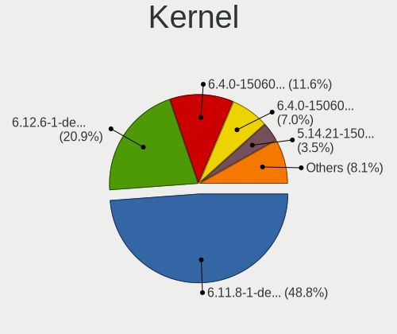
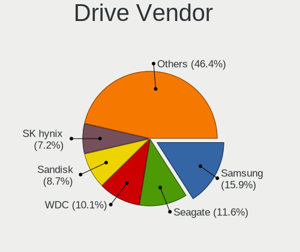
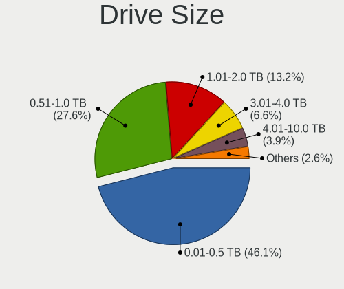
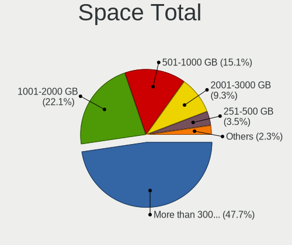
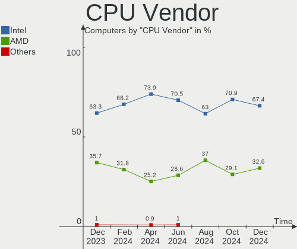
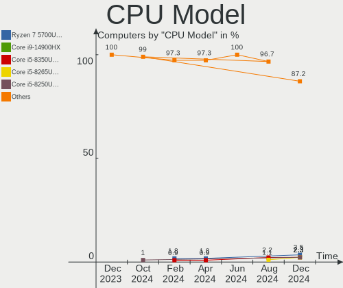
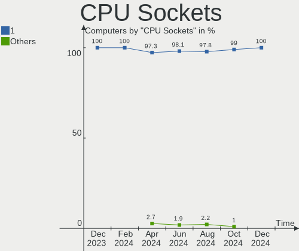
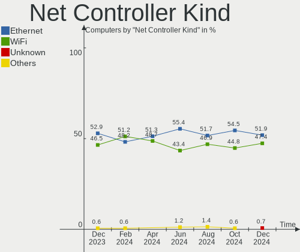
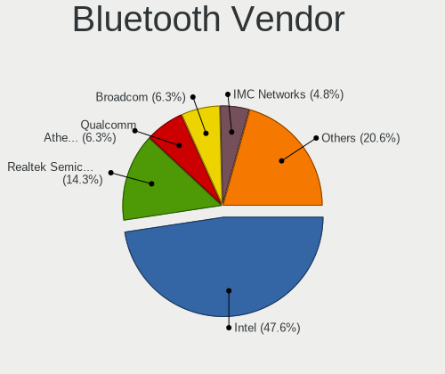
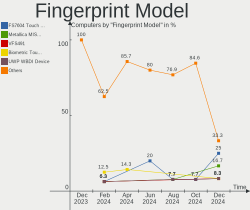

openSUSE - Hardware Trends
--------------------------

A project to identify most popular hardware characteristics and track their change
over time based on data collected by Linux users at https://Linux-Hardware.org.

Anyone can contribute to this report by the [hw-probe](https://github.com/linuxhw/hw-probe) tool:

    sudo -E hw-probe -all -upload

This is a report for all computer types. See also reports for [desktops](/Dist/openSUSE/Desktop/README.md) and [notebooks](/Dist/openSUSE/Notebook/README.md).

This report is for one last month. Overall report since the beginning of time: [TestCoverage](https://github.com/linuxhw/TestCoverage)

Period: Nov, 2022.

Contents
--------

* [ System ](#system)
  - [ OS                       ](#os)
  - [ OS Family                ](#os-family)
  - [ Kernel                   ](#kernel)
  - [ Kernel Family            ](#kernel-family)
  - [ Kernel Major Ver.        ](#kernel-major-ver)
  - [ Arch                     ](#arch)
  - [ DE                       ](#de)
  - [ Display Server           ](#display-server)
  - [ Display Manager          ](#display-manager)
  - [ OS Lang                  ](#os-lang)
  - [ Boot Mode                ](#boot-mode)
  - [ Filesystem               ](#filesystem)
  - [ Part. scheme             ](#part-scheme)
  - [ Dual Boot with Linux/BSD ](#dual-boot-with-linuxbsd)
  - [ Dual Boot (Win)          ](#dual-boot-win)

* [ Board ](#board)
  - [ Vendor                   ](#vendor)
  - [ Model                    ](#model)
  - [ Model Family             ](#model-family)
  - [ MFG Year                 ](#mfg-year)
  - [ Form Factor              ](#form-factor)
  - [ Secure Boot              ](#secure-boot)
  - [ Coreboot                 ](#coreboot)
  - [ RAM Size                 ](#ram-size)
  - [ RAM Used                 ](#ram-used)
  - [ Total Drives             ](#total-drives)
  - [ Has CD-ROM               ](#has-cd-rom)
  - [ Has Ethernet             ](#has-ethernet)
  - [ Has WiFi                 ](#has-wifi)
  - [ Has Bluetooth            ](#has-bluetooth)

* [ Location ](#location)
  - [ Country                  ](#country)
  - [ City                     ](#city)

* [ Drives ](#drives)
  - [ Drive Vendor             ](#drive-vendor)
  - [ Drive Model              ](#drive-model)
  - [ HDD Vendor               ](#hdd-vendor)
  - [ SSD Vendor               ](#ssd-vendor)
  - [ Drive Kind               ](#drive-kind)
  - [ Drive Connector          ](#drive-connector)
  - [ Drive Size               ](#drive-size)
  - [ Space Total              ](#space-total)
  - [ Space Used               ](#space-used)
  - [ Malfunc. Drives          ](#malfunc-drives)
  - [ Malfunc. Drive Vendor    ](#malfunc-drive-vendor)
  - [ Malfunc. HDD Vendor      ](#malfunc-hdd-vendor)
  - [ Malfunc. Drive Kind      ](#malfunc-drive-kind)
  - [ Failed Drives            ](#failed-drives)
  - [ Failed Drive Vendor      ](#failed-drive-vendor)
  - [ Drive Status             ](#drive-status)

* [ Storage controller ](#storage-controller)
  - [ Storage Vendor           ](#storage-vendor)
  - [ Storage Model            ](#storage-model)
  - [ Storage Kind             ](#storage-kind)

* [ Processor ](#processor)
  - [ CPU Vendor               ](#cpu-vendor)
  - [ CPU Model                ](#cpu-model)
  - [ CPU Model Family         ](#cpu-model-family)
  - [ CPU Cores                ](#cpu-cores)
  - [ CPU Sockets              ](#cpu-sockets)
  - [ CPU Threads              ](#cpu-threads)
  - [ CPU Op-Modes             ](#cpu-op-modes)
  - [ CPU Microcode            ](#cpu-microcode)
  - [ CPU Microarch            ](#cpu-microarch)

* [ Graphics ](#graphics)
  - [ GPU Vendor               ](#gpu-vendor)
  - [ GPU Model                ](#gpu-model)
  - [ GPU Combo                ](#gpu-combo)
  - [ GPU Driver               ](#gpu-driver)
  - [ GPU Memory               ](#gpu-memory)

* [ Monitor ](#monitor)
  - [ Monitor Vendor           ](#monitor-vendor)
  - [ Monitor Model            ](#monitor-model)
  - [ Monitor Resolution       ](#monitor-resolution)
  - [ Monitor Diagonal         ](#monitor-diagonal)
  - [ Monitor Width            ](#monitor-width)
  - [ Aspect Ratio             ](#aspect-ratio)
  - [ Monitor Area             ](#monitor-area)
  - [ Pixel Density            ](#pixel-density)
  - [ Multiple Monitors        ](#multiple-monitors)

* [ Network ](#network)
  - [ Net Controller Vendor    ](#net-controller-vendor)
  - [ Net Controller Model     ](#net-controller-model)
  - [ Wireless Vendor          ](#wireless-vendor)
  - [ Wireless Model           ](#wireless-model)
  - [ Ethernet Vendor          ](#ethernet-vendor)
  - [ Ethernet Model           ](#ethernet-model)
  - [ Net Controller Kind      ](#net-controller-kind)
  - [ Used Controller          ](#used-controller)
  - [ NICs                     ](#nics)
  - [ IPv6                     ](#ipv6)

* [ Bluetooth ](#bluetooth)
  - [ Bluetooth Vendor         ](#bluetooth-vendor)
  - [ Bluetooth Model          ](#bluetooth-model)

* [ Sound ](#sound)
  - [ Sound Vendor             ](#sound-vendor)
  - [ Sound Model              ](#sound-model)

* [ Memory ](#memory)
  - [ Memory Vendor            ](#memory-vendor)
  - [ Memory Model             ](#memory-model)
  - [ Memory Kind              ](#memory-kind)
  - [ Memory Form Factor       ](#memory-form-factor)
  - [ Memory Size              ](#memory-size)
  - [ Memory Speed             ](#memory-speed)

* [ Printers & scanners ](#printers--scanners)
  - [ Printer Vendor           ](#printer-vendor)
  - [ Printer Model            ](#printer-model)
  - [ Scanner Vendor           ](#scanner-vendor)
  - [ Scanner Model            ](#scanner-model)

* [ Camera ](#camera)
  - [ Camera Vendor            ](#camera-vendor)
  - [ Camera Model             ](#camera-model)

* [ Security ](#security)
  - [ Fingerprint Vendor       ](#fingerprint-vendor)
  - [ Fingerprint Model        ](#fingerprint-model)
  - [ Chipcard Vendor          ](#chipcard-vendor)
  - [ Chipcard Model           ](#chipcard-model)

* [ Unsupported ](#unsupported)
  - [ Unsupported Devices      ](#unsupported-devices)
  - [ Unsupported Device Types ](#unsupported-device-types)

System
------

OS
--

Installed operating systems

| Name                         | Computers | Percent |
|------------------------------|-----------|---------|
| openSUSE Tumbleweed-XXXXXXXX | 59        | 85.51%  |
| openSUSE Leap-15.4           | 5         | 7.25%   |
| openSUSE Microos-XXXXXXXX    | 2         | 2.9%    |
| openSUSE Leap-15.3           | 2         | 2.9%    |
| openSUSE Leap-15.0           | 1         | 1.45%   |

OS Family
---------

OS without a version

| Name     | Computers | Percent |
|----------|-----------|---------|
| openSUSE | 69        | 100%    |

Kernel
------

Version of the Linux kernel

| Version                      | Computers | Percent |
|------------------------------|-----------|---------|
| 6.0.8-1-default              | 26        | 37.68%  |
| 6.0.6-1-default              | 11        | 15.94%  |
| 6.0.7-1-default              | 10        | 14.49%  |
| 6.0.5-1-default              | 6         | 8.7%    |
| 6.0.3-1-default              | 2         | 2.9%    |
| 5.14.21-150400.24.33-default | 2         | 2.9%    |
| 5.14.21-150400.24.28-default | 2         | 2.9%    |
| 6.1.0-rc5-2.g75c82e7-default | 1         | 1.45%   |
| 6.1.0-rc3-vanilla            | 1         | 1.45%   |
| 6.0.3-1-vanilla              | 1         | 1.45%   |
| 6.0.2-1-default              | 1         | 1.45%   |
| 5.3.18-150300.59.98-default  | 1         | 1.45%   |
| 5.3.18-150300.59.90-default  | 1         | 1.45%   |
| 5.19.8-1-default             | 1         | 1.45%   |
| 5.18.6-1-default             | 1         | 1.45%   |
| 5.14.21-150400.24.21-default | 1         | 1.45%   |
| 4.12.14-lp150.12.82-default  | 1         | 1.45%   |

Kernel Family
-------------

Linux kernel without a distro release

| Version | Computers | Percent |
|---------|-----------|---------|
| 6.0.8   | 26        | 37.68%  |
| 6.0.6   | 11        | 15.94%  |
| 6.0.7   | 10        | 14.49%  |
| 6.0.5   | 6         | 8.7%    |
| 5.14.21 | 5         | 7.25%   |
| 6.0.3   | 3         | 4.35%   |
| 6.1.0   | 2         | 2.9%    |
| 5.3.18  | 2         | 2.9%    |
| 6.0.2   | 1         | 1.45%   |
| 5.19.8  | 1         | 1.45%   |
| 5.18.6  | 1         | 1.45%   |
| 4.12.14 | 1         | 1.45%   |

Kernel Major Ver.
-----------------

Linux kernel major version

| Version | Computers | Percent |
|---------|-----------|---------|
| 6.0     | 57        | 82.61%  |
| 5.14    | 5         | 7.25%   |
| 6.1     | 2         | 2.9%    |
| 5.3     | 2         | 2.9%    |
| 5.19    | 1         | 1.45%   |
| 5.18    | 1         | 1.45%   |
| 4.12    | 1         | 1.45%   |

Arch
----

OS architecture (x86_64, i586, etc.)

| Name   | Computers | Percent |
|--------|-----------|---------|
| x86_64 | 69        | 100%    |

DE
--

Desktop Environment

| Name     | Computers | Percent |
|----------|-----------|---------|
| KDE5     | 44        | 63.77%  |
| GNOME    | 15        | 21.74%  |
| Unknown  | 4         | 5.8%    |
| XFCE     | 3         | 4.35%   |
| sway     | 1         | 1.45%   |
| KDE      | 1         | 1.45%   |
| Cinnamon | 1         | 1.45%   |

Display Server
--------------

X11 or Wayland

| Name    | Computers | Percent |
|---------|-----------|---------|
| X11     | 47        | 68.12%  |
| Wayland | 20        | 28.99%  |
| Tty     | 2         | 2.9%    |

Display Manager
---------------

SDDM, LightDM, etc.

| Name    | Computers | Percent |
|---------|-----------|---------|
| Unknown | 27        | 39.13%  |
| SDDM    | 23        | 33.33%  |
| LightDM | 13        | 18.84%  |
| XDM     | 6         | 8.7%    |

OS Lang
-------

Language

| Lang    | Computers | Percent |
|---------|-----------|---------|
| en_US   | 39        | 56.52%  |
| de_DE   | 8         | 11.59%  |
| POSIX   | 7         | 10.14%  |
| pt_BR   | 4         | 5.8%    |
| it_IT   | 4         | 5.8%    |
| ru_RU   | 1         | 1.45%   |
| pl_PL   | 1         | 1.45%   |
| lv_LV   | 1         | 1.45%   |
| fr_FR   | 1         | 1.45%   |
| es_ES   | 1         | 1.45%   |
| en_GB   | 1         | 1.45%   |
| Unknown | 1         | 1.45%   |

Boot Mode
---------

EFI or BIOS

| Mode | Computers | Percent |
|------|-----------|---------|
| EFI  | 51        | 73.91%  |
| BIOS | 18        | 26.09%  |

Filesystem
----------

Type of filesystem

| Type  | Computers | Percent |
|-------|-----------|---------|
| Btrfs | 53        | 76.81%  |
| Ext4  | 12        | 17.39%  |
| Xfs   | 4         | 5.8%    |

Part. scheme
------------

Scheme of partitioning

| Type    | Computers | Percent |
|---------|-----------|---------|
| GPT     | 42        | 60.87%  |
| Unknown | 23        | 33.33%  |
| MBR     | 4         | 5.8%    |

Dual Boot with Linux/BSD
------------------------

Hosting more than one Linux/BSD

| Dual boot | Computers | Percent |
|-----------|-----------|---------|
| No        | 59        | 85.51%  |
| Yes       | 10        | 14.49%  |

Dual Boot (Win)
---------------

Hosting Linux and Windows

| Dual boot | Computers | Percent |
|-----------|-----------|---------|
| No        | 53        | 76.81%  |
| Yes       | 16        | 23.19%  |

Board
-----

Vendor
------

Motherboard manufacturer

| Name                | Computers | Percent |
|---------------------|-----------|---------|
| Hewlett-Packard     | 15        | 21.74%  |
| ASUSTek Computer    | 12        | 17.39%  |
| Dell                | 8         | 11.59%  |
| Lenovo              | 7         | 10.14%  |
| MSI                 | 6         | 8.7%    |
| Gigabyte Technology | 5         | 7.25%   |
| SLIMBOOK            | 2         | 2.9%    |
| ASRock              | 2         | 2.9%    |
| Acer                | 2         | 2.9%    |
| VA_IP3              | 1         | 1.45%   |
| TUXEDO              | 1         | 1.45%   |
| Timi                | 1         | 1.45%   |
| Supermicro          | 1         | 1.45%   |
| Semp Toshiba        | 1         | 1.45%   |
| Schenker            | 1         | 1.45%   |
| Intel               | 1         | 1.45%   |
| HUAWEI              | 1         | 1.45%   |
| Apple               | 1         | 1.45%   |
| Acidanthera         | 1         | 1.45%   |

Model
-----

Motherboard model

| Name                                               | Computers | Percent |
|----------------------------------------------------|-----------|---------|
| HP Pavilion Laptop 15-cs2xxx                       | 2         | 2.9%    |
| HP Notebook                                        | 2         | 2.9%    |
| VA_IP3 PEAQ Mini PC M100                           | 1         | 1.45%   |
| TUXEDO XMG FUSION 15 (XFU15L19)                    | 1         | 1.45%   |
| Timi TM1612                                        | 1         | 1.45%   |
| Supermicro X8DTG-D                                 | 1         | 1.45%   |
| SLIMBOOK PROX14                                    | 1         | 1.45%   |
| SLIMBOOK PROX-AMD5                                 | 1         | 1.45%   |
| Semp Toshiba IS 1422+                              | 1         | 1.45%   |
| Schenker XMG FUSION 15 (XFU15L19)                  | 1         | 1.45%   |
| MSI MS-7D46                                        | 1         | 1.45%   |
| MSI MS-7B90                                        | 1         | 1.45%   |
| MSI MS-7B89                                        | 1         | 1.45%   |
| MSI MS-7B78                                        | 1         | 1.45%   |
| MSI MS-7696                                        | 1         | 1.45%   |
| MSI GE72VR 7RF                                     | 1         | 1.45%   |
| Lenovo Yoga 7 14ARB7 82QF                          | 1         | 1.45%   |
| Lenovo ThinkPad X260 20F6005HUS                    | 1         | 1.45%   |
| Lenovo ThinkPad X1 Extreme Gen 3 20TK000AGE        | 1         | 1.45%   |
| Lenovo ThinkPad T530 2394D56                       | 1         | 1.45%   |
| Lenovo IdeaPad Gaming 3 15IHU6 82MG                | 1         | 1.45%   |
| Lenovo G50-45 80E3                                 | 1         | 1.45%   |
| Lenovo B50-80 80LT                                 | 1         | 1.45%   |
| Intel (R) Education Tablet                         | 1         | 1.45%   |
| HUAWEI BOHK-WAX9X                                  | 1         | 1.45%   |
| HP ZBook Studio 15.6 inch G8 Mobile Workstation PC | 1         | 1.45%   |
| HP ZBook 17                                        | 1         | 1.45%   |
| HP Z440 Workstation                                | 1         | 1.45%   |
| HP Pavilion 15                                     | 1         | 1.45%   |
| HP Laptop 15-ef2xxx                                | 1         | 1.45%   |
| HP EliteOne 800 G3 23.8-in Non-Touch AiO           | 1         | 1.45%   |
| HP EliteDesk 800 G2 DM 35W                         | 1         | 1.45%   |
| HP EliteBook 855 G7 Notebook PC                    | 1         | 1.45%   |
| HP EliteBook 8460p                                 | 1         | 1.45%   |
| HP EliteBook 845 G8 Notebook PC                    | 1         | 1.45%   |
| HP Compaq 6830s                                    | 1         | 1.45%   |
| Gigabyte Z390 AORUS PRO WIFI                       | 1         | 1.45%   |
| Gigabyte Z370XP SLI                                | 1         | 1.45%   |
| Gigabyte X570S AORUS PRO AX                        | 1         | 1.45%   |
| Gigabyte X570 GAMING X                             | 1         | 1.45%   |

Model Family
------------

Motherboard model prefix

| Name               | Computers | Percent |
|--------------------|-----------|---------|
| Dell Inspiron      | 4         | 5.8%    |
| Lenovo ThinkPad    | 3         | 4.35%   |
| HP Pavilion        | 3         | 4.35%   |
| HP EliteBook       | 3         | 4.35%   |
| Dell Latitude      | 3         | 4.35%   |
| ASUS PRIME         | 3         | 4.35%   |
| HP ZBook           | 2         | 2.9%    |
| HP Notebook        | 2         | 2.9%    |
| ASUS VivoBook      | 2         | 2.9%    |
| ASUS ROG           | 2         | 2.9%    |
| VA_IP3 PEAQ        | 1         | 1.45%   |
| TUXEDO XMG         | 1         | 1.45%   |
| Timi TM1612        | 1         | 1.45%   |
| Supermicro X8DTG-D | 1         | 1.45%   |
| SLIMBOOK PROX14    | 1         | 1.45%   |
| SLIMBOOK PROX-AMD5 | 1         | 1.45%   |
| Semp Toshiba IS    | 1         | 1.45%   |
| Schenker XMG       | 1         | 1.45%   |
| MSI MS-7D46        | 1         | 1.45%   |
| MSI MS-7B90        | 1         | 1.45%   |
| MSI MS-7B89        | 1         | 1.45%   |
| MSI MS-7B78        | 1         | 1.45%   |
| MSI MS-7696        | 1         | 1.45%   |
| MSI GE72VR         | 1         | 1.45%   |
| Lenovo Yoga        | 1         | 1.45%   |
| Lenovo IdeaPad     | 1         | 1.45%   |
| Lenovo G50-45      | 1         | 1.45%   |
| Lenovo B50-80      | 1         | 1.45%   |
| Intel (R)          | 1         | 1.45%   |
| HUAWEI BOHK-WAX9X  | 1         | 1.45%   |
| HP Z440            | 1         | 1.45%   |
| HP Laptop          | 1         | 1.45%   |
| HP EliteOne        | 1         | 1.45%   |
| HP EliteDesk       | 1         | 1.45%   |
| HP Compaq          | 1         | 1.45%   |
| Gigabyte Z390      | 1         | 1.45%   |
| Gigabyte Z370XP    | 1         | 1.45%   |
| Gigabyte X570S     | 1         | 1.45%   |
| Gigabyte X570      | 1         | 1.45%   |
| Gigabyte B85-HD3-A | 1         | 1.45%   |

MFG Year
--------

Motherboard manufacture year

| Year | Computers | Percent |
|------|-----------|---------|
| 2019 | 12        | 17.39%  |
| 2020 | 9         | 13.04%  |
| 2022 | 8         | 11.59%  |
| 2018 | 8         | 11.59%  |
| 2021 | 7         | 10.14%  |
| 2015 | 5         | 7.25%   |
| 2017 | 3         | 4.35%   |
| 2016 | 3         | 4.35%   |
| 2012 | 3         | 4.35%   |
| 2011 | 3         | 4.35%   |
| 2014 | 2         | 2.9%    |
| 2013 | 2         | 2.9%    |
| 2010 | 2         | 2.9%    |
| 2009 | 1         | 1.45%   |
| 2008 | 1         | 1.45%   |

Form Factor
-----------

Physical design of the computer

| Name        | Computers | Percent |
|-------------|-----------|---------|
| Notebook    | 40        | 57.97%  |
| Desktop     | 25        | 36.23%  |
| Convertible | 1         | 1.45%   |
| Mini pc     | 1         | 1.45%   |
| All in one  | 1         | 1.45%   |
| Server      | 1         | 1.45%   |

Secure Boot
-----------

Enabled or disabled

| State    | Computers | Percent |
|----------|-----------|---------|
| Disabled | 53        | 76.81%  |
| Enabled  | 16        | 23.19%  |

Coreboot
--------

Have coreboot on board

| Used | Computers | Percent |
|------|-----------|---------|
| No   | 69        | 100%    |

RAM Size
--------

Total RAM memory

| Size in GB  | Computers | Percent |
|-------------|-----------|---------|
| 32.01-64.0  | 18        | 26.09%  |
| 4.01-8.0    | 15        | 21.74%  |
| 16.01-24.0  | 12        | 17.39%  |
| 8.01-16.0   | 11        | 15.94%  |
| 3.01-4.0    | 8         | 11.59%  |
| 64.01-256.0 | 3         | 4.35%   |
| 24.01-32.0  | 1         | 1.45%   |
| 1.01-2.0    | 1         | 1.45%   |

RAM Used
--------

Used RAM memory

| Used GB   | Computers | Percent |
|-----------|-----------|---------|
| 4.01-8.0  | 20        | 28.99%  |
| 2.01-3.0  | 16        | 23.19%  |
| 3.01-4.0  | 13        | 18.84%  |
| 1.01-2.0  | 11        | 15.94%  |
| 8.01-16.0 | 7         | 10.14%  |
| 0.51-1.0  | 2         | 2.9%    |

Total Drives
------------

Number of drives on board

| Drives | Computers | Percent |
|--------|-----------|---------|
| 1      | 38        | 55.07%  |
| 2      | 17        | 24.64%  |
| 4      | 5         | 7.25%   |
| 3      | 4         | 5.8%    |
| 5      | 3         | 4.35%   |
| 7      | 1         | 1.45%   |
| 6      | 1         | 1.45%   |

Has CD-ROM
----------

Has CD-ROM on board

| Presented | Computers | Percent |
|-----------|-----------|---------|
| No        | 49        | 71.01%  |
| Yes       | 20        | 28.99%  |

Has Ethernet
------------

Has Ethernet on board

| Presented | Computers | Percent |
|-----------|-----------|---------|
| Yes       | 59        | 85.51%  |
| No        | 10        | 14.49%  |

Has WiFi
--------

Has WiFi module

| Presented | Computers | Percent |
|-----------|-----------|---------|
| Yes       | 54        | 78.26%  |
| No        | 15        | 21.74%  |

Has Bluetooth
-------------

Has Bluetooth module

| Presented | Computers | Percent |
|-----------|-----------|---------|
| Yes       | 53        | 76.81%  |
| No        | 16        | 23.19%  |

Location
--------

Country
-------

Geographic location (country)

| Country      | Computers | Percent |
|--------------|-----------|---------|
| USA          | 15        | 21.74%  |
| Germany      | 12        | 17.39%  |
| Netherlands  | 4         | 5.8%    |
| Italy        | 4         | 5.8%    |
| Brazil       | 4         | 5.8%    |
| Poland       | 3         | 4.35%   |
| Canada       | 3         | 4.35%   |
| UK           | 2         | 2.9%    |
| Serbia       | 2         | 2.9%    |
| France       | 2         | 2.9%    |
| Finland      | 2         | 2.9%    |
| Bulgaria     | 2         | 2.9%    |
| Australia    | 2         | 2.9%    |
| Turkey       | 1         | 1.45%   |
| Sweden       | 1         | 1.45%   |
| Spain        | 1         | 1.45%   |
| South Africa | 1         | 1.45%   |
| Slovenia     | 1         | 1.45%   |
| Russia       | 1         | 1.45%   |
| Philippines  | 1         | 1.45%   |
| Nepal        | 1         | 1.45%   |
| Latvia       | 1         | 1.45%   |
| Hungary      | 1         | 1.45%   |
| Guatemala    | 1         | 1.45%   |
| Belarus      | 1         | 1.45%   |

City
----

Geographic location (city)

| City                      | Computers | Percent |
|---------------------------|-----------|---------|
| Painesville               | 2         | 2.9%    |
| Lewisville                | 2         | 2.9%    |
| Kotka                     | 2         | 2.9%    |
| Budenheim                 | 2         | 2.9%    |
| Berlin                    | 2         | 2.9%    |
| Amsterdam                 | 2         | 2.9%    |
| Zevenaar                  | 1         | 1.45%   |
| Warsaw                    | 1         | 1.45%   |
| Ukhta                     | 1         | 1.45%   |
| Stockholm                 | 1         | 1.45%   |
| Sofia                     | 1         | 1.45%   |
| Skokie                    | 1         | 1.45%   |
| Schotten                  | 1         | 1.45%   |
| Sao Paulo                 | 1         | 1.45%   |
| Sao Carlos                | 1         | 1.45%   |
| San Benedetto del Tronto  | 1         | 1.45%   |
| Rio de Janeiro            | 1         | 1.45%   |
| Riga                      | 1         | 1.45%   |
| Rho                       | 1         | 1.45%   |
| Pueblo                    | 1         | 1.45%   |
| Plovdiv                   | 1         | 1.45%   |
| Pedro Leopoldo            | 1         | 1.45%   |
| Pasig                     | 1         | 1.45%   |
| Ottawa                    | 1         | 1.45%   |
| Ortenburg                 | 1         | 1.45%   |
| Novi Sad                  | 1         | 1.45%   |
| Neumarkt in der Oberpfalz | 1         | 1.45%   |
| Minsk                     | 1         | 1.45%   |
| Milan                     | 1         | 1.45%   |
| Mandurah                  | 1         | 1.45%   |
| Lubin                     | 1         | 1.45%   |
| Loveland                  | 1         | 1.45%   |
| Louisville                | 1         | 1.45%   |
| Ljubljana                 | 1         | 1.45%   |
| Konya                     | 1         | 1.45%   |
| Konstanz                  | 1         | 1.45%   |
| Klerksdorp                | 1         | 1.45%   |
| Kingston                  | 1         | 1.45%   |
| Kathmandu                 | 1         | 1.45%   |
| Heusweiler                | 1         | 1.45%   |

Drives
------

Drive Vendor
------------

Hard drive vendors

| Vendor                      | Computers | Drives | Percent |
|-----------------------------|-----------|--------|---------|
| Samsung Electronics         | 19        | 24     | 16.38%  |
| WDC                         | 16        | 21     | 13.79%  |
| Seagate                     | 13        | 14     | 11.21%  |
| SanDisk                     | 12        | 12     | 10.34%  |
| Toshiba                     | 4         | 5      | 3.45%   |
| SK hynix                    | 4         | 4      | 3.45%   |
| Intel                       | 4         | 4      | 3.45%   |
| Crucial                     | 4         | 8      | 3.45%   |
| KIOXIA                      | 3         | 3      | 2.59%   |
| Kingston Technology Company | 3         | 3      | 2.59%   |
| Kingston                    | 3         | 3      | 2.59%   |
| Intenso                     | 3         | 3      | 2.59%   |
| Unknown                     | 2         | 2      | 1.72%   |
| PNY                         | 2         | 2      | 1.72%   |
| Micron/Crucial Technology   | 2         | 2      | 1.72%   |
| Hewlett-Packard             | 2         | 2      | 1.72%   |
| Fanxiang                    | 2         | 2      | 1.72%   |
| China                       | 2         | 2      | 1.72%   |
| XrayDisk                    | 1         | 1      | 0.86%   |
| WD MediaMax                 | 1         | 1      | 0.86%   |
| Transcend                   | 1         | 1      | 0.86%   |
| SSK                         | 1         | 1      | 0.86%   |
| Pioneer                     | 1         | 1      | 0.86%   |
| Phison Electronics          | 1         | 1      | 0.86%   |
| Phison                      | 1         | 1      | 0.86%   |
| Netac                       | 1         | 1      | 0.86%   |
| Micron Technology           | 1         | 1      | 0.86%   |
| Leven                       | 1         | 1      | 0.86%   |
| KIOXIA-EXCERIA              | 1         | 1      | 0.86%   |
| HGST                        | 1         | 1      | 0.86%   |
| Fujitsu                     | 1         | 1      | 0.86%   |
| Apacer                      | 1         | 1      | 0.86%   |
| AMicro                      | 1         | 1      | 0.86%   |
| ADATA Technology            | 1         | 2      | 0.86%   |

Drive Model
-----------

Hard drive models

| Model                                             | Computers | Percent |
|---------------------------------------------------|-----------|---------|
| Samsung NVMe SSD Controller SM981/PM981/PM983 1TB | 10        | 7.69%   |
| Sandisk WD Blue SN550 NVMe SSD 1TB                | 4         | 3.08%   |
| WDC WD10EZEX-00WN4A0 1TB                          | 2         | 1.54%   |
| Seagate ST2000DM008-2FR102 2TB                    | 2         | 1.54%   |
| Seagate ST2000DM001-1CH164 2TB                    | 2         | 1.54%   |
| Samsung SSD 860 EVO 500GB                         | 2         | 1.54%   |
| HP SSD S700 500GB                                 | 2         | 1.54%   |
| Crucial CT500MX500SSD1 500GB                      | 2         | 1.54%   |
| XrayDisk SSD 256GB                                | 1         | 0.77%   |
| WDC WDS500G2B0A-00SM50 500GB SSD                  | 1         | 0.77%   |
| WDC WDS120G2G0A-00JH30 120GB SSD                  | 1         | 0.77%   |
| WDC WDS100T2B0A-00SM50 1TB SSD                    | 1         | 0.77%   |
| WDC WD5000AZLX-75K2TA0 500GB                      | 1         | 0.77%   |
| WDC WD40EFRX-68N32N0 4TB                          | 1         | 0.77%   |
| WDC WD3200BEVT-75A23T0 320GB                      | 1         | 0.77%   |
| WDC WD3200BEKT-60V5T1 320GB                       | 1         | 0.77%   |
| WDC WD30EFRX-68EUZN0 3TB                          | 1         | 0.77%   |
| WDC WD20EZRX-00D8PB0 2TB                          | 1         | 0.77%   |
| WDC WD20EFRX-68AX9N0 2TB                          | 1         | 0.77%   |
| WDC WD20EARS-00MVWB0 2TB                          | 1         | 0.77%   |
| WDC WD2000FYYZ-01UL1B0 2TB                        | 1         | 0.77%   |
| WDC WD10SPZX-75Z10T0 1TB                          | 1         | 0.77%   |
| WDC WD10SPZX-21Z10T0 1TB                          | 1         | 0.77%   |
| WDC WD10JFCX-68N6GN0 1TB                          | 1         | 0.77%   |
| WDC WD10EZEX-60ZF5A0 1TB                          | 1         | 0.77%   |
| WDC WD10EZEX-07WN4A0 1TB                          | 1         | 0.77%   |
| WDC WD1003FZEX-00K3CA0 1TB                        | 1         | 0.77%   |
| WDC WD1002FAEX-00Z3A0 1TB                         | 1         | 0.77%   |
| WD MediaMax WL5000GSA12872B 5TB                   | 1         | 0.77%   |
| Unknown MMC Card  32GB                            | 1         | 0.77%   |
| Unknown 256GB PCS 2.5" S SSD                      | 1         | 0.77%   |
| Transcend TS240GSSD220S 240GB                     | 1         | 0.77%   |
| Toshiba MQ01ABD100 1TB                            | 1         | 0.77%   |
| Toshiba MQ01ABD075 752GB                          | 1         | 0.77%   |
| Toshiba MG08ADA600E 6TB                           | 1         | 0.77%   |
| Toshiba MG03ACA200 2TB                            | 1         | 0.77%   |
| Toshiba DT01ACA050 500GB                          | 1         | 0.77%   |
| SSK Disk 500GB                                    | 1         | 0.77%   |
| SK hynix SKHynix_HFS512GD9TNI-L2B0B 512GB         | 1         | 0.77%   |
| SK hynix SC311 SATA 128GB SSD                     | 1         | 0.77%   |

HDD Vendor
----------

Hard disk drive vendors

| Vendor      | Computers | Drives | Percent |
|-------------|-----------|--------|---------|
| WDC         | 15        | 18     | 42.86%  |
| Seagate     | 12        | 13     | 34.29%  |
| Toshiba     | 4         | 5      | 11.43%  |
| WD MediaMax | 1         | 1      | 2.86%   |
| Intenso     | 1         | 1      | 2.86%   |
| HGST        | 1         | 1      | 2.86%   |
| Fujitsu     | 1         | 1      | 2.86%   |

SSD Vendor
----------

Solid state drive vendors

| Vendor              | Computers | Drives | Percent |
|---------------------|-----------|--------|---------|
| Samsung Electronics | 10        | 11     | 23.81%  |
| SanDisk             | 4         | 4      | 9.52%   |
| Crucial             | 4         | 6      | 9.52%   |
| WDC                 | 3         | 3      | 7.14%   |
| SK hynix            | 2         | 2      | 4.76%   |
| PNY                 | 2         | 2      | 4.76%   |
| Kingston            | 2         | 2      | 4.76%   |
| Hewlett-Packard     | 2         | 2      | 4.76%   |
| China               | 2         | 2      | 4.76%   |
| XrayDisk            | 1         | 1      | 2.38%   |
| Unknown             | 1         | 1      | 2.38%   |
| Transcend           | 1         | 1      | 2.38%   |
| Seagate             | 1         | 1      | 2.38%   |
| Pioneer             | 1         | 1      | 2.38%   |
| Netac               | 1         | 1      | 2.38%   |
| Micron Technology   | 1         | 1      | 2.38%   |
| Leven               | 1         | 1      | 2.38%   |
| Intenso             | 1         | 1      | 2.38%   |
| Fanxiang            | 1         | 1      | 2.38%   |
| Apacer              | 1         | 1      | 2.38%   |

Drive Kind
----------

HDD or SSD

| Kind    | Computers | Drives | Percent |
|---------|-----------|--------|---------|
| NVMe    | 38        | 43     | 35.51%  |
| SSD     | 34        | 45     | 31.78%  |
| HDD     | 30        | 40     | 28.04%  |
| Unknown | 4         | 4      | 3.74%   |
| MMC     | 1         | 1      | 0.93%   |

Drive Connector
---------------

SATA, SAS, NVMe, etc.

| Type | Computers | Drives | Percent |
|------|-----------|--------|---------|
| SATA | 48        | 84     | 52.17%  |
| NVMe | 38        | 43     | 41.3%   |
| SAS  | 5         | 5      | 5.43%   |
| MMC  | 1         | 1      | 1.09%   |

Drive Size
----------

Size of hard drive

| Size in TB | Computers | Drives | Percent |
|------------|-----------|--------|---------|
| 0.01-0.5   | 33        | 44     | 48.53%  |
| 0.51-1.0   | 19        | 22     | 27.94%  |
| 1.01-2.0   | 11        | 13     | 16.18%  |
| 2.01-3.0   | 3         | 3      | 4.41%   |
| 3.01-4.0   | 1         | 1      | 1.47%   |
| 4.01-10.0  | 1         | 2      | 1.47%   |

Space Total
-----------

Amount of disk space available on the file system

| Size in GB     | Computers | Percent |
|----------------|-----------|---------|
| More than 3000 | 26        | 37.68%  |
| 2001-3000      | 14        | 20.29%  |
| 501-1000       | 11        | 15.94%  |
| 1001-2000      | 7         | 10.14%  |
| 101-250        | 5         | 7.25%   |
| 251-500        | 3         | 4.35%   |
| 51-100         | 2         | 2.9%    |
| Unknown        | 1         | 1.45%   |

Space Used
----------

Amount of used disk space

| Used GB        | Computers | Percent |
|----------------|-----------|---------|
| 251-500        | 13        | 18.84%  |
| 51-100         | 10        | 14.49%  |
| 101-250        | 9         | 13.04%  |
| More than 3000 | 8         | 11.59%  |
| 1001-2000      | 8         | 11.59%  |
| 501-1000       | 8         | 11.59%  |
| 1-20           | 6         | 8.7%    |
| 21-50          | 3         | 4.35%   |
| 2001-3000      | 3         | 4.35%   |
| Unknown        | 1         | 1.45%   |

Malfunc. Drives
---------------

Drive models with a malfunction

| Model                           | Computers | Drives | Percent |
|---------------------------------|-----------|--------|---------|
| XrayDisk SSD 256GB              | 1         | 1      | 7.69%   |
| WDC WD3200BEVT-75A23T0 320GB    | 1         | 1      | 7.69%   |
| WDC WD10JFCX-68N6GN0 1TB        | 1         | 1      | 7.69%   |
| WD MediaMax WL5000GSA12872B 5TB | 1         | 1      | 7.69%   |
| Seagate ST500LT012-1DG142 500GB | 1         | 1      | 7.69%   |
| Seagate ST320LT007-9ZV142 320GB | 1         | 1      | 7.69%   |
| Seagate ST2000LX001-1RG174 2TB  | 1         | 1      | 7.69%   |
| Seagate ST2000DM008-2FR102 2TB  | 1         | 1      | 7.69%   |
| Seagate ST2000DM001-1CH164 2TB  | 1         | 1      | 7.69%   |
| SanDisk SSD PLUS 120 GB         | 1         | 1      | 7.69%   |
| Intenso SSD Sata III 120GB      | 1         | 1      | 7.69%   |
| Intel SSD 660P Series 512GB     | 1         | 1      | 7.69%   |
| Fujitsu MHZ2250BH G2 250GB      | 1         | 1      | 7.69%   |

Malfunc. Drive Vendor
---------------------

Vendors of faulty drives

| Vendor      | Computers | Drives | Percent |
|-------------|-----------|--------|---------|
| Seagate     | 5         | 5      | 38.46%  |
| WDC         | 2         | 2      | 15.38%  |
| XrayDisk    | 1         | 1      | 7.69%   |
| WD MediaMax | 1         | 1      | 7.69%   |
| SanDisk     | 1         | 1      | 7.69%   |
| Intenso     | 1         | 1      | 7.69%   |
| Intel       | 1         | 1      | 7.69%   |
| Fujitsu     | 1         | 1      | 7.69%   |

Malfunc. HDD Vendor
-------------------

Vendors of faulty HDD drives

| Vendor      | Computers | Drives | Percent |
|-------------|-----------|--------|---------|
| Seagate     | 5         | 5      | 55.56%  |
| WDC         | 2         | 2      | 22.22%  |
| WD MediaMax | 1         | 1      | 11.11%  |
| Fujitsu     | 1         | 1      | 11.11%  |

Malfunc. Drive Kind
-------------------

Kinds of faulty drives

| Kind | Computers | Drives | Percent |
|------|-----------|--------|---------|
| HDD  | 8         | 9      | 72.73%  |
| SSD  | 2         | 3      | 18.18%  |
| NVMe | 1         | 1      | 9.09%   |

Failed Drives
-------------

Failed drive models

Zero info for selected period =(

Failed Drive Vendor
-------------------

Failed drive vendors

Zero info for selected period =(

Drive Status
------------

Number of failed and malfunc. drives

| Status   | Computers | Drives | Percent |
|----------|-----------|--------|---------|
| Works    | 39        | 71     | 51.32%  |
| Detected | 26        | 49     | 34.21%  |
| Malfunc  | 11        | 13     | 14.47%  |

Storage controller
------------------

Storage Vendor
--------------

Storage controller vendors

| Vendor                      | Computers | Percent |
|-----------------------------|-----------|---------|
| Intel                       | 37        | 38.54%  |
| AMD                         | 21        | 21.88%  |
| Samsung Electronics         | 12        | 12.5%   |
| SanDisk                     | 7         | 7.29%   |
| KIOXIA                      | 4         | 4.17%   |
| Kingston Technology Company | 4         | 4.17%   |
| Micron/Crucial Technology   | 3         | 3.13%   |
| SK hynix                    | 2         | 2.08%   |
| Phison Electronics          | 2         | 2.08%   |
| ASMedia Technology          | 2         | 2.08%   |
| Nvidia                      | 1         | 1.04%   |
| ADATA Technology            | 1         | 1.04%   |

Storage Model
-------------

Storage controller models

| Model                                                                          | Computers | Percent |
|--------------------------------------------------------------------------------|-----------|---------|
| AMD FCH SATA Controller [AHCI mode]                                            | 17        | 15.18%  |
| Samsung NVMe SSD Controller SM981/PM981/PM983                                  | 10        | 8.93%   |
| AMD 400 Series Chipset SATA Controller                                         | 6         | 5.36%   |
| Intel 82801 Mobile SATA Controller [RAID mode]                                 | 5         | 4.46%   |
| SanDisk WD Blue SN550 NVMe SSD                                                 | 3         | 2.68%   |
| KIOXIA Non-Volatile memory controller                                          | 3         | 2.68%   |
| Intel Volume Management Device NVMe RAID Controller                            | 3         | 2.68%   |
| Intel Sunrise Point-LP SATA Controller [AHCI mode]                             | 3         | 2.68%   |
| Intel Cannon Lake Mobile PCH SATA AHCI Controller                              | 3         | 2.68%   |
| Phison E12 NVMe Controller                                                     | 2         | 1.79%   |
| Kingston Company Company Non-Volatile memory controller                        | 2         | 1.79%   |
| Intel Tiger Lake-LP SATA Controller                                            | 2         | 1.79%   |
| Intel Celeron/Pentium Silver Processor SATA Controller                         | 2         | 1.79%   |
| Intel 8 Series/C220 Series Chipset Family 6-port SATA Controller 1 [AHCI mode] | 2         | 1.79%   |
| Intel 8 Series SATA Controller 1 [AHCI mode]                                   | 2         | 1.79%   |
| Intel 200 Series PCH SATA controller [AHCI mode]                               | 2         | 1.79%   |
| ASMedia ASM1062 Serial ATA Controller                                          | 2         | 1.79%   |
| SK hynix Non-Volatile memory controller                                        | 1         | 0.89%   |
| SK hynix BC501 NVMe Solid State Drive                                          | 1         | 0.89%   |
| SanDisk WD PC SN810 / Black SN850 NVMe SSD                                     | 1         | 0.89%   |
| SanDisk WD Blue SN500 / PC SN520 NVMe SSD                                      | 1         | 0.89%   |
| SanDisk WD Black 2018/SN750 / PC SN720 NVMe SSD                                | 1         | 0.89%   |
| SanDisk PC SN520 NVMe SSD                                                      | 1         | 0.89%   |
| Samsung NVMe SSD Controller PM9A1/PM9A3/980PRO                                 | 1         | 0.89%   |
| Samsung NVMe SSD Controller 980                                                | 1         | 0.89%   |
| Nvidia MCP79 AHCI Controller                                                   | 1         | 0.89%   |
| Micron/Crucial P5 Plus NVMe PCIe SSD                                           | 1         | 0.89%   |
| Micron/Crucial P2 NVMe PCIe SSD                                                | 1         | 0.89%   |
| Micron/Crucial P1 NVMe PCIe SSD                                                | 1         | 0.89%   |
| Micron/Crucial Non-Volatile memory controller                                  | 1         | 0.89%   |
| KIOXIA NVMe SSD Controller BG4                                                 | 1         | 0.89%   |
| Kingston Company OM3PDP3 NVMe SSD                                              | 1         | 0.89%   |
| Kingston Company A2000 NVMe SSD                                                | 1         | 0.89%   |
| Intel SSD 660P Series                                                          | 1         | 0.89%   |
| Intel SSD 600P Series                                                          | 1         | 0.89%   |
| Intel Q170/Q150/B150/H170/H110/Z170/CM236 Chipset SATA Controller [AHCI Mode]  | 1         | 0.89%   |
| Intel NVMe Optane Memory Series                                                | 1         | 0.89%   |
| Intel Non-Volatile memory controller                                           | 1         | 0.89%   |
| Intel Ice Lake-LP SATA Controller [AHCI mode]                                  | 1         | 0.89%   |
| Intel HM170/QM170 Chipset SATA Controller [AHCI Mode]                          | 1         | 0.89%   |

Storage Kind
------------

Kind of storage controller (IDE, SATA, NVMe, SAS, ...)

| Kind | Computers | Percent |
|------|-----------|---------|
| SATA | 52        | 52%     |
| NVMe | 37        | 37%     |
| RAID | 8         | 8%      |
| IDE  | 3         | 3%      |

Processor
---------

CPU Vendor
----------

Processor vendors

| Vendor | Computers | Percent |
|--------|-----------|---------|
| Intel  | 41        | 59.42%  |
| AMD    | 28        | 40.58%  |

CPU Model
---------

Processor models

| Model                                    | Computers | Percent |
|------------------------------------------|-----------|---------|
| Intel Core i7-8565U CPU @ 1.80GHz        | 3         | 4.35%   |
| Intel Core i7-9750H CPU @ 2.60GHz        | 2         | 2.9%    |
| Intel Core i7-7700HQ CPU @ 2.80GHz       | 2         | 2.9%    |
| Intel Core i3-4005U CPU @ 1.70GHz        | 2         | 2.9%    |
| AMD Ryzen 7 5700U with Radeon Graphics   | 2         | 2.9%    |
| AMD A4-5000 APU with Radeon HD Graphics  | 2         | 2.9%    |
| Intel Xeon CPU X5650 @ 2.67GHz           | 1         | 1.45%   |
| Intel Xeon CPU E5-2690 v3 @ 2.60GHz      | 1         | 1.45%   |
| Intel Pentium Silver N5030 CPU @ 1.10GHz | 1         | 1.45%   |
| Intel Pentium CPU P6200 @ 2.13GHz        | 1         | 1.45%   |
| Intel Core m3-6Y30 CPU @ 0.90GHz         | 1         | 1.45%   |
| Intel Core i9-9900KS CPU @ 4.00GHz       | 1         | 1.45%   |
| Intel Core i9-10900T CPU @ 1.90GHz       | 1         | 1.45%   |
| Intel Core i7-9850H CPU @ 2.60GHz        | 1         | 1.45%   |
| Intel Core i7-8700K CPU @ 3.70GHz        | 1         | 1.45%   |
| Intel Core i7-6600U CPU @ 2.60GHz        | 1         | 1.45%   |
| Intel Core i7-4790 CPU @ 3.60GHz         | 1         | 1.45%   |
| Intel Core i7-4700MQ CPU @ 2.40GHz       | 1         | 1.45%   |
| Intel Core i7-10750H CPU @ 2.60GHz       | 1         | 1.45%   |
| Intel Core i5-7500 CPU @ 3.40GHz         | 1         | 1.45%   |
| Intel Core i5-6500T CPU @ 2.50GHz        | 1         | 1.45%   |
| Intel Core i5-6300U CPU @ 2.40GHz        | 1         | 1.45%   |
| Intel Core i5-6200U CPU @ 2.30GHz        | 1         | 1.45%   |
| Intel Core i5-2540M CPU @ 2.60GHz        | 1         | 1.45%   |
| Intel Core i5-1035G1 CPU @ 1.00GHz       | 1         | 1.45%   |
| Intel Core i5 CPU 750 @ 2.67GHz          | 1         | 1.45%   |
| Intel Core i3-8145U CPU @ 2.10GHz        | 1         | 1.45%   |
| Intel Core i3-2370M CPU @ 2.40GHz        | 1         | 1.45%   |
| Intel Core 2 Duo CPU T9400 @ 2.53GHz     | 1         | 1.45%   |
| Intel Core 2 Duo CPU P7350 @ 2.00GHz     | 1         | 1.45%   |
| Intel Celeron N4020 CPU @ 1.10GHz        | 1         | 1.45%   |
| Intel Atom x5-Z8350 CPU @ 1.44GHz        | 1         | 1.45%   |
| Intel 12th Gen Core i7-12700K            | 1         | 1.45%   |
| Intel 12th Gen Core i7-12700H            | 1         | 1.45%   |
| Intel 11th Gen Core i9-11950H @ 2.60GHz  | 1         | 1.45%   |
| Intel 11th Gen Core i5-11500T @ 1.50GHz  | 1         | 1.45%   |
| Intel 11th Gen Core i5-1135G7 @ 2.40GHz  | 1         | 1.45%   |
| Intel 11th Gen Core i5-11300H @ 3.10GHz  | 1         | 1.45%   |
| AMD Ryzen 9 7950X 16-Core Processor      | 1         | 1.45%   |
| AMD Ryzen 9 5950X 16-Core Processor      | 1         | 1.45%   |

CPU Model Family
----------------

Processor model prefix

| Model                | Computers | Percent |
|----------------------|-----------|---------|
| Intel Core i7        | 13        | 18.84%  |
| AMD Ryzen 7          | 8         | 11.59%  |
| AMD Ryzen 5          | 8         | 11.59%  |
| Intel Core i5        | 7         | 10.14%  |
| Other                | 6         | 8.7%    |
| Intel Core i3        | 4         | 5.8%    |
| AMD A4               | 3         | 4.35%   |
| Intel Xeon           | 2         | 2.9%    |
| Intel Core i9        | 2         | 2.9%    |
| Intel Core 2 Duo     | 2         | 2.9%    |
| AMD Ryzen 9          | 2         | 2.9%    |
| AMD Ryzen 7 PRO      | 2         | 2.9%    |
| AMD A8               | 2         | 2.9%    |
| Intel Pentium Silver | 1         | 1.45%   |
| Intel Pentium        | 1         | 1.45%   |
| Intel Core m3        | 1         | 1.45%   |
| Intel Celeron        | 1         | 1.45%   |
| Intel Atom           | 1         | 1.45%   |
| AMD FX               | 1         | 1.45%   |
| AMD E2               | 1         | 1.45%   |
| AMD A6               | 1         | 1.45%   |

CPU Cores
---------

Number of processor cores

| Number | Computers | Percent |
|--------|-----------|---------|
| 4      | 21        | 30.43%  |
| 2      | 14        | 20.29%  |
| 6      | 13        | 18.84%  |
| 8      | 12        | 17.39%  |
| 12     | 3         | 4.35%   |
| 16     | 2         | 2.9%    |
| 1      | 2         | 2.9%    |
| 14     | 1         | 1.45%   |
| 10     | 1         | 1.45%   |

CPU Sockets
-----------

Number of sockets

| Number | Computers | Percent |
|--------|-----------|---------|
| 1      | 68        | 98.55%  |
| 2      | 1         | 1.45%   |

CPU Threads
-----------

Threads per core (Hyper-Threading)

| Number | Computers | Percent |
|--------|-----------|---------|
| 2      | 53        | 76.81%  |
| 1      | 16        | 23.19%  |

CPU Op-Modes
------------

CPU Operation Modes (32-bit, 64-bit)

| Op mode        | Computers | Percent |
|----------------|-----------|---------|
| 32-bit, 64-bit | 69        | 100%    |

CPU Microcode
-------------

Microcode number

| Number     | Computers | Percent |
|------------|-----------|---------|
| 0x406e3    | 4         | 5.8%    |
| 0x0800820d | 4         | 5.8%    |
| Unknown    | 4         | 5.8%    |
| 0x906ea    | 3         | 4.35%   |
| 0x906e9    | 3         | 4.35%   |
| 0x08701021 | 3         | 4.35%   |
| 0x906ed    | 2         | 2.9%    |
| 0x806ec    | 2         | 2.9%    |
| 0x806eb    | 2         | 2.9%    |
| 0x806c1    | 2         | 2.9%    |
| 0x706a8    | 2         | 2.9%    |
| 0x206a7    | 2         | 2.9%    |
| 0x0a20120a | 2         | 2.9%    |
| 0x08608103 | 2         | 2.9%    |
| 0xa0671    | 1         | 1.45%   |
| 0xa0655    | 1         | 1.45%   |
| 0xa0652    | 1         | 1.45%   |
| 0x906a3    | 1         | 1.45%   |
| 0x90672    | 1         | 1.45%   |
| 0x806d1    | 1         | 1.45%   |
| 0x706e5    | 1         | 1.45%   |
| 0x506e3    | 1         | 1.45%   |
| 0x406c4    | 1         | 1.45%   |
| 0x40651    | 1         | 1.45%   |
| 0x306f2    | 1         | 1.45%   |
| 0x306c3    | 1         | 1.45%   |
| 0x20655    | 1         | 1.45%   |
| 0x106e5    | 1         | 1.45%   |
| 0x1067a    | 1         | 1.45%   |
| 0x10676    | 1         | 1.45%   |
| 0x0a601203 | 1         | 1.45%   |
| 0x0a50000d | 1         | 1.45%   |
| 0x0a50000c | 1         | 1.45%   |
| 0x0a404102 | 1         | 1.45%   |
| 0x0a404101 | 1         | 1.45%   |
| 0x08701013 | 1         | 1.45%   |
| 0x08600106 | 1         | 1.45%   |
| 0x08600104 | 1         | 1.45%   |
| 0x08108109 | 1         | 1.45%   |
| 0x07030106 | 1         | 1.45%   |

CPU Microarch
-------------

Microarchitecture

| Name             | Computers | Percent |
|------------------|-----------|---------|
| KabyLake         | 12        | 17.39%  |
| Zen 2            | 6         | 8.7%    |
| Zen+             | 5         | 7.25%   |
| Skylake          | 5         | 7.25%   |
| Haswell          | 5         | 7.25%   |
| Unknown          | 5         | 7.25%   |
| Zen 3            | 4         | 5.8%    |
| IceLake          | 3         | 4.35%   |
| Westmere         | 2         | 2.9%    |
| TigerLake        | 2         | 2.9%    |
| SandyBridge      | 2         | 2.9%    |
| Puma             | 2         | 2.9%    |
| Piledriver       | 2         | 2.9%    |
| Penryn           | 2         | 2.9%    |
| Jaguar           | 2         | 2.9%    |
| Goldmont plus    | 2         | 2.9%    |
| CometLake        | 2         | 2.9%    |
| Alderlake Hybrid | 2         | 2.9%    |
| Silvermont       | 1         | 1.45%   |
| Nehalem          | 1         | 1.45%   |
| K10 Llano        | 1         | 1.45%   |
| Bulldozer        | 1         | 1.45%   |

Graphics
--------

GPU Vendor
----------

Vendors of graphics cards

| Vendor                     | Computers | Percent |
|----------------------------|-----------|---------|
| Intel                      | 32        | 38.55%  |
| Nvidia                     | 26        | 31.33%  |
| AMD                        | 24        | 28.92%  |
| Matrox Electronics Systems | 1         | 1.2%    |

GPU Model
---------

Graphics card models

| Model                                                                     | Computers | Percent |
|---------------------------------------------------------------------------|-----------|---------|
| Intel WhiskeyLake-U GT2 [UHD Graphics 620]                                | 4         | 4.65%   |
| Nvidia GP108M [GeForce MX250]                                             | 3         | 3.49%   |
| Intel Skylake GT2 [HD Graphics 520]                                       | 3         | 3.49%   |
| Intel HD Graphics 630                                                     | 3         | 3.49%   |
| Intel CoffeeLake-H GT2 [UHD Graphics 630]                                 | 3         | 3.49%   |
| AMD Ellesmere [Radeon RX 470/480/570/570X/580/580X/590]                   | 3         | 3.49%   |
| Nvidia TU116 [GeForce GTX 1660 SUPER]                                     | 2         | 2.33%   |
| Nvidia TU106M [GeForce RTX 2070 Mobile]                                   | 2         | 2.33%   |
| Nvidia GP106M [GeForce GTX 1060 Mobile]                                   | 2         | 2.33%   |
| Intel TigerLake-LP GT2 [Iris Xe Graphics]                                 | 2         | 2.33%   |
| Intel Haswell-ULT Integrated Graphics Controller                          | 2         | 2.33%   |
| Intel 2nd Generation Core Processor Family Integrated Graphics Controller | 2         | 2.33%   |
| AMD Renoir                                                                | 2         | 2.33%   |
| AMD Rembrandt [Radeon 680M]                                               | 2         | 2.33%   |
| AMD Lucienne                                                              | 2         | 2.33%   |
| AMD Kabini [Radeon HD 8330]                                               | 2         | 2.33%   |
| AMD Juniper XT [Radeon HD 5770]                                           | 2         | 2.33%   |
| AMD Cezanne [Radeon Vega Series / Radeon Vega Mobile Series]              | 2         | 2.33%   |
| Nvidia TU117M [GeForce GTX 1650 Ti Mobile]                                | 1         | 1.16%   |
| Nvidia TU117M [GeForce GTX 1650 Mobile / Max-Q]                           | 1         | 1.16%   |
| Nvidia TU117GLM [Quadro T400 Mobile]                                      | 1         | 1.16%   |
| Nvidia TU117 [GeForce GTX 1650]                                           | 1         | 1.16%   |
| Nvidia TU104 [GeForce RTX 2080 SUPER]                                     | 1         | 1.16%   |
| Nvidia TU102 [GeForce RTX 2080 Ti Rev. A]                                 | 1         | 1.16%   |
| Nvidia GP104GL [Tesla P4]                                                 | 1         | 1.16%   |
| Nvidia GP104 [GeForce GTX 1070]                                           | 1         | 1.16%   |
| Nvidia GP104 [GeForce GTX 1070 Ti]                                        | 1         | 1.16%   |
| Nvidia GK208GLM [Quadro K610M]                                            | 1         | 1.16%   |
| Nvidia GK208B [GeForce GT 730]                                            | 1         | 1.16%   |
| Nvidia GF110GL [Tesla M2090]                                              | 1         | 1.16%   |
| Nvidia GF108M [NVS 5400M]                                                 | 1         | 1.16%   |
| Nvidia GA107M [GeForce RTX 3050 Mobile]                                   | 1         | 1.16%   |
| Nvidia GA107GLM [RTX A2000 Mobile]                                        | 1         | 1.16%   |
| Nvidia GA104 [GeForce RTX 3070]                                           | 1         | 1.16%   |
| Nvidia GA102 [GeForce RTX 3080]                                           | 1         | 1.16%   |
| Nvidia C79 [GeForce 9400M]                                                | 1         | 1.16%   |
| Matrox Electronics Systems MGA G200eW WPCM450                             | 1         | 1.16%   |
| Intel TigerLake-H GT1 [UHD Graphics]                                      | 1         | 1.16%   |
| Intel RocketLake-S GT1 [UHD Graphics 750]                                 | 1         | 1.16%   |
| Intel Iris Plus Graphics G1 (Ice Lake)                                    | 1         | 1.16%   |

GPU Combo
---------

Combinations of graphics cards

| Name            | Computers | Percent |
|-----------------|-----------|---------|
| 1 x AMD         | 22        | 31.88%  |
| 1 x Intel       | 19        | 27.54%  |
| Intel + Nvidia  | 13        | 18.84%  |
| 1 x Nvidia      | 11        | 15.94%  |
| 2 x AMD         | 2         | 2.9%    |
| 2 x Nvidia      | 1         | 1.45%   |
| Nvidia + Matrox | 1         | 1.45%   |

GPU Driver
----------

Free vs proprietary

| Driver      | Computers | Percent |
|-------------|-----------|---------|
| Free        | 56        | 81.16%  |
| Proprietary | 13        | 18.84%  |

GPU Memory
----------

Total video memory

| Size in GB | Computers | Percent |
|------------|-----------|---------|
| Unknown    | 25        | 36.23%  |
| 0.01-0.5   | 12        | 17.39%  |
| 7.01-8.0   | 7         | 10.14%  |
| 3.01-4.0   | 7         | 10.14%  |
| 0.51-1.0   | 7         | 10.14%  |
| 1.01-2.0   | 5         | 7.25%   |
| 8.01-16.0  | 3         | 4.35%   |
| 5.01-6.0   | 2         | 2.9%    |
| 2.01-3.0   | 1         | 1.45%   |

Monitor
-------

Monitor Vendor
--------------

Monitor vendors

| Vendor               | Computers | Percent |
|----------------------|-----------|---------|
| Samsung Electronics  | 12        | 15%     |
| BOE                  | 12        | 15%     |
| AU Optronics         | 11        | 13.75%  |
| Dell                 | 6         | 7.5%    |
| Chimei Innolux       | 6         | 7.5%    |
| Goldstar             | 5         | 6.25%   |
| Hewlett-Packard      | 4         | 5%      |
| LG Display           | 3         | 3.75%   |
| AOC                  | 3         | 3.75%   |
| Acer                 | 3         | 3.75%   |
| InfoVision           | 2         | 2.5%    |
| BenQ                 | 2         | 2.5%    |
| ASUSTek Computer     | 2         | 2.5%    |
| Sceptre Tech         | 1         | 1.25%   |
| Lenovo               | 1         | 1.25%   |
| IPS                  | 1         | 1.25%   |
| Iiyama               | 1         | 1.25%   |
| Hyundai ImageQuest   | 1         | 1.25%   |
| Eizo                 | 1         | 1.25%   |
| DEX                  | 1         | 1.25%   |
| Apple                | 1         | 1.25%   |
| Ancor Communications | 1         | 1.25%   |

Monitor Model
-------------

Monitor models

| Model                                                                 | Computers | Percent |
|-----------------------------------------------------------------------|-----------|---------|
| BOE LCD Monitor BOE084D 1920x1080 344x193mm 15.5-inch                 | 2         | 2.38%   |
| BOE LCD Monitor BOE080D 1920x1080 344x194mm 15.5-inch                 | 2         | 2.38%   |
| Sceptre Tech Sceptre E24 SPT099D 1920x1080 521x293mm 23.5-inch        | 1         | 1.19%   |
| Samsung Electronics T27B350 SAM0945 1920x1080 598x336mm 27.0-inch     | 1         | 1.19%   |
| Samsung Electronics T27B300 SAM0933 1920x1080 598x336mm 27.0-inch     | 1         | 1.19%   |
| Samsung Electronics SyncMaster SAM0657 1920x1080                      | 1         | 1.19%   |
| Samsung Electronics SyncMaster SAM05C5 1920x1080                      | 1         | 1.19%   |
| Samsung Electronics SyncMaster SAM010F 1280x1024 376x301mm 19.0-inch  | 1         | 1.19%   |
| Samsung Electronics S32D850 SAM0BCC 2560x1440 708x398mm 32.0-inch     | 1         | 1.19%   |
| Samsung Electronics LS49AG95 SAM71AC 2560x1440 1193x336mm 48.8-inch   | 1         | 1.19%   |
| Samsung Electronics LCD Monitor SDC894F 1920x1080 344x194mm 15.5-inch | 1         | 1.19%   |
| Samsung Electronics LCD Monitor SDC417A 2880x1800 302x189mm 14.0-inch | 1         | 1.19%   |
| Samsung Electronics LCD Monitor SDC3754 1600x900 382x215mm 17.3-inch  | 1         | 1.19%   |
| Samsung Electronics LC27G5xT SAM7079 2560x1440 597x336mm 27.0-inch    | 1         | 1.19%   |
| Samsung Electronics C32F391 SAM0D34 1920x1080 698x393mm 31.5-inch     | 1         | 1.19%   |
| Samsung Electronics C24FG70 SAM0D58 1920x1080 532x304mm 24.1-inch     | 1         | 1.19%   |
| LG Display LCD Monitor LGD053F 1920x1080 344x194mm 15.5-inch          | 1         | 1.19%   |
| LG Display LCD Monitor LGD0465 1366x768 344x194mm 15.5-inch           | 1         | 1.19%   |
| LG Display LCD Monitor LGD039F 1366x768 345x194mm 15.6-inch           | 1         | 1.19%   |
| Lenovo LCD Monitor LEN40B1 1600x900 345x194mm 15.6-inch               | 1         | 1.19%   |
| IPS IP22V1 IPS2200 1920x1080 409x330mm 20.7-inch                      | 1         | 1.19%   |
| InfoVision M140NWR2 R1 IVO057A 1366x768 309x174mm 14.0-inch           | 1         | 1.19%   |
| InfoVision LCD Monitor IVO8C78 1920x1080 309x174mm 14.0-inch          | 1         | 1.19%   |
| Iiyama PL2792QN IVM665A 2560x1440 597x336mm 27.0-inch                 | 1         | 1.19%   |
| Hyundai ImageQuest Q17 Digital IQT217D 1280x1024 330x270mm 16.8-inch  | 1         | 1.19%   |
| Hewlett-Packard Z24f G3 HPN36C6 1920x1080 527x296mm 23.8-inch         | 1         | 1.19%   |
| Hewlett-Packard LA2206 HWP2947 1920x1080 477x268mm 21.5-inch          | 1         | 1.19%   |
| Hewlett-Packard 27f HPN354B 1920x1080 598x336mm 27.0-inch             | 1         | 1.19%   |
| Hewlett-Packard 2229h HWP2854 1680x1050 473x296mm 22.0-inch           | 1         | 1.19%   |
| Goldstar W2443 GSM571C 1920x1080 510x290mm 23.1-inch                  | 1         | 1.19%   |
| Goldstar ULTRAWIDE GSM76FC 3840x1600 874x366mm 37.3-inch              | 1         | 1.19%   |
| Goldstar ULTRAWIDE GSM76FA 2560x1080 531x298mm 24.0-inch              | 1         | 1.19%   |
| Goldstar M198WDP GSM4B88 1440x900 408x229mm 18.4-inch                 | 1         | 1.19%   |
| Goldstar LG ULTRAGEAR GSM5B7F 2560x1440 600x340mm 27.2-inch           | 1         | 1.19%   |
| Goldstar HDR 4K GSM7706 3840x2160 600x340mm 27.2-inch                 | 1         | 1.19%   |
| Eizo EV2333W ENC2069 1920x1080 510x287mm 23.0-inch                    | 1         | 1.19%   |
| Eizo EV2333W ENC2068 1920x1080 510x287mm 23.0-inch                    | 1         | 1.19%   |
| DEX DEXA GRABBER DEX0001 1920x1080 477x268mm 21.5-inch                | 1         | 1.19%   |
| Dell U2717D DEL40EA 2560x1440 597x336mm 27.0-inch                     | 1         | 1.19%   |
| Dell U2415 DELA0B8 1920x1200 518x324mm 24.1-inch                      | 1         | 1.19%   |

Monitor Resolution
------------------

Monitor screen resolution

| Resolution         | Computers | Percent |
|--------------------|-----------|---------|
| 1920x1080 (FHD)    | 42        | 55.26%  |
| 1366x768 (WXGA)    | 9         | 11.84%  |
| 2560x1440 (QHD)    | 8         | 10.53%  |
| 3840x2160 (4K)     | 3         | 3.95%   |
| 1600x900 (HD+)     | 3         | 3.95%   |
| 1280x1024 (SXGA)   | 2         | 2.63%   |
| 3840x1600          | 1         | 1.32%   |
| 3840x1080          | 1         | 1.32%   |
| 2880x1800          | 1         | 1.32%   |
| 2560x1080          | 1         | 1.32%   |
| 2240x1400          | 1         | 1.32%   |
| 1920x1200 (WUXGA)  | 1         | 1.32%   |
| 1680x1050 (WSXGA+) | 1         | 1.32%   |
| 1440x900 (WXGA+)   | 1         | 1.32%   |
| 1280x800 (WXGA)    | 1         | 1.32%   |

Monitor Diagonal
----------------

Diagonal size in inches

| Inches  | Computers | Percent |
|---------|-----------|---------|
| 15      | 21        | 25.93%  |
| 27      | 13        | 16.05%  |
| 24      | 7         | 8.64%   |
| 23      | 6         | 7.41%   |
| 14      | 6         | 7.41%   |
| 17      | 5         | 6.17%   |
| 13      | 5         | 6.17%   |
| 21      | 3         | 3.7%    |
| 31      | 2         | 2.47%   |
| 12      | 2         | 2.47%   |
| Unknown | 2         | 2.47%   |
| 48      | 1         | 1.23%   |
| 37      | 1         | 1.23%   |
| 34      | 1         | 1.23%   |
| 32      | 1         | 1.23%   |
| 22      | 1         | 1.23%   |
| 20      | 1         | 1.23%   |
| 19      | 1         | 1.23%   |
| 18      | 1         | 1.23%   |
| 16      | 1         | 1.23%   |

Monitor Width
-------------

Physical width

| Width in mm | Computers | Percent |
|-------------|-----------|---------|
| 301-350     | 31        | 39.24%  |
| 501-600     | 24        | 30.38%  |
| 401-500     | 6         | 7.59%   |
| 351-400     | 6         | 7.59%   |
| 201-300     | 4         | 5.06%   |
| 701-800     | 2         | 2.53%   |
| 601-700     | 2         | 2.53%   |
| Unknown     | 2         | 2.53%   |
| 801-900     | 1         | 1.27%   |
| 1001-1500   | 1         | 1.27%   |

Aspect Ratio
------------

Proportional relationship between the width and the height

| Ratio | Computers | Percent |
|-------|-----------|---------|
| 16/9  | 58        | 82.86%  |
| 16/10 | 6         | 8.57%   |
| 6/5   | 2         | 2.86%   |
| 21/9  | 2         | 2.86%   |
| 5/4   | 1         | 1.43%   |
| 32/9  | 1         | 1.43%   |

Monitor Area
------------

Area in inch

| Area in inch | Computers | Percent |
|----------------|-----------|---------|
| 101-110        | 21        | 26.25%  |
| 301-350        | 13        | 16.25%  |
| 201-250        | 13        | 16.25%  |
| 81-90          | 10        | 12.5%   |
| 351-500        | 5         | 6.25%   |
| 121-130        | 5         | 6.25%   |
| 251-300        | 3         | 3.75%   |
| 71-80          | 2         | 2.5%    |
| 151-200        | 2         | 2.5%    |
| Unknown        | 2         | 2.5%    |
| 61-70          | 1         | 1.25%   |
| 141-150        | 1         | 1.25%   |
| 131-140        | 1         | 1.25%   |
| 501-1000       | 1         | 1.25%   |

Pixel Density
-------------

Pixels per inch

| Density       | Computers | Percent |
|---------------|-----------|---------|
| 51-100        | 29        | 36.25%  |
| 121-160       | 22        | 27.5%   |
| 101-120       | 20        | 25%     |
| 161-240       | 5         | 6.25%   |
| More than 240 | 2         | 2.5%    |
| Unknown       | 2         | 2.5%    |

Multiple Monitors
-----------------

Total monitors connected

| Total | Computers | Percent |
|-------|-----------|---------|
| 1     | 53        | 76.81%  |
| 2     | 13        | 18.84%  |
| 3     | 2         | 2.9%    |
| 4     | 1         | 1.45%   |

Network
-------

Net Controller Vendor
---------------------

Controller vendors

| Vendor                   | Computers | Percent |
|--------------------------|-----------|---------|
| Realtek Semiconductor    | 41        | 39.42%  |
| Intel                    | 39        | 37.5%   |
| Qualcomm Atheros         | 7         | 6.73%   |
| MediaTek                 | 4         | 3.85%   |
| Huawei Technologies      | 2         | 1.92%   |
| Broadcom                 | 2         | 1.92%   |
| U-Blox                   | 1         | 0.96%   |
| Ralink Technology        | 1         | 0.96%   |
| Nvidia                   | 1         | 0.96%   |
| Mellanox Technologies    | 1         | 0.96%   |
| Marvell Technology Group | 1         | 0.96%   |
| Lenovo                   | 1         | 0.96%   |
| Dell                     | 1         | 0.96%   |
| D-Link                   | 1         | 0.96%   |
| ASIX Electronics         | 1         | 0.96%   |

Net Controller Model
--------------------

Controller models

| Model                                                                                                                  | Computers | Percent |
|------------------------------------------------------------------------------------------------------------------------|-----------|---------|
| Realtek RTL8111/8168/8411 PCI Express Gigabit Ethernet Controller                                                      | 29        | 23.2%   |
| Intel Wi-Fi 6 AX200                                                                                                    | 6         | 4.8%    |
| Realtek RTL810xE PCI Express Fast Ethernet controller                                                                  | 5         | 4%      |
| Intel Wireless 8260                                                                                                    | 5         | 4%      |
| Realtek RTL8153 Gigabit Ethernet Adapter                                                                               | 3         | 2.4%    |
| Qualcomm Atheros QCA9377 802.11ac Wireless Network Adapter                                                             | 3         | 2.4%    |
| Realtek RTL8822BE 802.11a/b/g/n/ac WiFi adapter                                                                        | 2         | 1.6%    |
| Realtek RTL8723BE PCIe Wireless Network Adapter                                                                        | 2         | 1.6%    |
| Intel Wireless 8265 / 8275                                                                                             | 2         | 1.6%    |
| Intel Wi-Fi 6 AX210/AX211/AX411 160MHz                                                                                 | 2         | 1.6%    |
| Intel Tiger Lake PCH CNVi WiFi                                                                                         | 2         | 1.6%    |
| Intel I211 Gigabit Network Connection                                                                                  | 2         | 1.6%    |
| Intel Ethernet Controller I225-V                                                                                       | 2         | 1.6%    |
| Intel Ethernet Connection I219-LM                                                                                      | 2         | 1.6%    |
| Intel Comet Lake PCH CNVi WiFi                                                                                         | 2         | 1.6%    |
| Intel Cannon Lake PCH CNVi WiFi                                                                                        | 2         | 1.6%    |
| Intel 82579LM Gigabit Network Connection (Lewisville)                                                                  | 2         | 1.6%    |
| U-Blox [u-blox 8]                                                                                                      | 1         | 0.8%    |
| Realtek RTL8822CE 802.11ac PCIe Wireless Network Adapter                                                               | 1         | 0.8%    |
| Realtek RTL8821CE 802.11ac PCIe Wireless Network Adapter                                                               | 1         | 0.8%    |
| Realtek RTL8191SEvB Wireless LAN Controller                                                                            | 1         | 0.8%    |
| Realtek RTL8191SEvA Wireless LAN Controller                                                                            | 1         | 0.8%    |
| Realtek RTL8152 Fast Ethernet Adapter                                                                                  | 1         | 0.8%    |
| Realtek Realtek Network controller                                                                                     | 1         | 0.8%    |
| Realtek 802.11ac NIC                                                                                                   | 1         | 0.8%    |
| Ralink MT7601U Wireless Adapter                                                                                        | 1         | 0.8%    |
| Qualcomm Atheros QCA6174 802.11ac Wireless Network Adapter                                                             | 1         | 0.8%    |
| Qualcomm Atheros QCA6164 802.11ac Wireless Network Adapter                                                             | 1         | 0.8%    |
| Qualcomm Atheros Killer E2500 Gigabit Ethernet Controller                                                              | 1         | 0.8%    |
| Qualcomm Atheros AR9485 Wireless Network Adapter                                                                       | 1         | 0.8%    |
| Nvidia MCP79 Ethernet                                                                                                  | 1         | 0.8%    |
| Mellanox MT25408A0-FCC-QI ConnectX, Dual Port 40Gb/s InfiniBand / 10GigE Adapter IC with PCIe 2.0 x8 5.0GT/s Interface | 1         | 0.8%    |
| MediaTek WLAN controller                                                                                               | 1         | 0.8%    |
| MediaTek MT7922 802.11ax PCI Express Wireless Network Adapter                                                          | 1         | 0.8%    |
| MediaTek MT7921K (RZ608) Wi-Fi 6E 80MHz                                                                                | 1         | 0.8%    |
| MediaTek MT7921 802.11ax PCI Express Wireless Network Adapter                                                          | 1         | 0.8%    |
| Marvell Group 88E8072 PCI-E Gigabit Ethernet Controller                                                                | 1         | 0.8%    |
| Lenovo USB-C Dock Ethernet                                                                                             | 1         | 0.8%    |
| Intel Wireless-AC 9260                                                                                                 | 1         | 0.8%    |
| Intel Wireless Gigabit 17265                                                                                           | 1         | 0.8%    |

Wireless Vendor
---------------

Wireless vendors

| Vendor                | Computers | Percent |
|-----------------------|-----------|---------|
| Intel                 | 31        | 56.36%  |
| Realtek Semiconductor | 10        | 18.18%  |
| Qualcomm Atheros      | 6         | 10.91%  |
| MediaTek              | 4         | 7.27%   |
| Broadcom              | 2         | 3.64%   |
| Ralink Technology     | 1         | 1.82%   |
| Dell                  | 1         | 1.82%   |

Wireless Model
--------------

Wireless models

| Model                                                         | Computers | Percent |
|---------------------------------------------------------------|-----------|---------|
| Intel Wi-Fi 6 AX200                                           | 6         | 10.71%  |
| Intel Wireless 8260                                           | 5         | 8.93%   |
| Qualcomm Atheros QCA9377 802.11ac Wireless Network Adapter    | 3         | 5.36%   |
| Realtek RTL8822BE 802.11a/b/g/n/ac WiFi adapter               | 2         | 3.57%   |
| Realtek RTL8723BE PCIe Wireless Network Adapter               | 2         | 3.57%   |
| Intel Wireless 8265 / 8275                                    | 2         | 3.57%   |
| Intel Wi-Fi 6 AX210/AX211/AX411 160MHz                        | 2         | 3.57%   |
| Intel Tiger Lake PCH CNVi WiFi                                | 2         | 3.57%   |
| Intel Comet Lake PCH CNVi WiFi                                | 2         | 3.57%   |
| Intel Cannon Lake PCH CNVi WiFi                               | 2         | 3.57%   |
| Realtek RTL8822CE 802.11ac PCIe Wireless Network Adapter      | 1         | 1.79%   |
| Realtek RTL8821CE 802.11ac PCIe Wireless Network Adapter      | 1         | 1.79%   |
| Realtek RTL8191SEvB Wireless LAN Controller                   | 1         | 1.79%   |
| Realtek RTL8191SEvA Wireless LAN Controller                   | 1         | 1.79%   |
| Realtek Realtek Network controller                            | 1         | 1.79%   |
| Realtek 802.11ac NIC                                          | 1         | 1.79%   |
| Ralink MT7601U Wireless Adapter                               | 1         | 1.79%   |
| Qualcomm Atheros QCA6174 802.11ac Wireless Network Adapter    | 1         | 1.79%   |
| Qualcomm Atheros QCA6164 802.11ac Wireless Network Adapter    | 1         | 1.79%   |
| Qualcomm Atheros AR9485 Wireless Network Adapter              | 1         | 1.79%   |
| MediaTek WLAN controller                                      | 1         | 1.79%   |
| MediaTek MT7922 802.11ax PCI Express Wireless Network Adapter | 1         | 1.79%   |
| MediaTek MT7921K (RZ608) Wi-Fi 6E 80MHz                       | 1         | 1.79%   |
| MediaTek MT7921 802.11ax PCI Express Wireless Network Adapter | 1         | 1.79%   |
| Intel Wireless-AC 9260                                        | 1         | 1.79%   |
| Intel Wireless Gigabit 17265                                  | 1         | 1.79%   |
| Intel Wireless 3165                                           | 1         | 1.79%   |
| Intel Wireless 3160                                           | 1         | 1.79%   |
| Intel Wi-Fi 6 AX201                                           | 1         | 1.79%   |
| Intel PRO/Wireless 5100 AGN [Shiloh] Network Connection       | 1         | 1.79%   |
| Intel Gemini Lake PCH CNVi WiFi                               | 1         | 1.79%   |
| Intel Centrino Advanced-N 6235                                | 1         | 1.79%   |
| Intel Centrino Advanced-N 6205 [Taylor Peak]                  | 1         | 1.79%   |
| Intel Cannon Point-LP CNVi [Wireless-AC]                      | 1         | 1.79%   |
| Intel Alder Lake-P PCH CNVi WiFi                              | 1         | 1.79%   |
| Dell Wireless 5809e Gobi 4G LTE Mobile Broadband Card   | 1         | 1.79%   |
| Broadcom Network controller                                   | 1         | 1.79%   |
| Broadcom BCM4322 802.11a/b/g/n Wireless LAN Controller        | 1         | 1.79%   |

Ethernet Vendor
---------------

Ethernet vendors

| Vendor                   | Computers | Percent |
|--------------------------|-----------|---------|
| Realtek Semiconductor    | 37        | 56.06%  |
| Intel                    | 21        | 31.82%  |
| Huawei Technologies      | 2         | 3.03%   |
| Qualcomm Atheros         | 1         | 1.52%   |
| Nvidia                   | 1         | 1.52%   |
| Marvell Technology Group | 1         | 1.52%   |
| Lenovo                   | 1         | 1.52%   |
| D-Link                   | 1         | 1.52%   |
| ASIX Electronics         | 1         | 1.52%   |

Ethernet Model
--------------

Ethernet models

| Model                                                             | Computers | Percent |
|-------------------------------------------------------------------|-----------|---------|
| Realtek RTL8111/8168/8411 PCI Express Gigabit Ethernet Controller | 29        | 43.28%  |
| Realtek RTL810xE PCI Express Fast Ethernet controller             | 5         | 7.46%   |
| Realtek RTL8153 Gigabit Ethernet Adapter                          | 3         | 4.48%   |
| Intel I211 Gigabit Network Connection                             | 2         | 2.99%   |
| Intel Ethernet Controller I225-V                                  | 2         | 2.99%   |
| Intel Ethernet Connection I219-LM                                 | 2         | 2.99%   |
| Intel 82579LM Gigabit Network Connection (Lewisville)             | 2         | 2.99%   |
| Realtek RTL8152 Fast Ethernet Adapter                             | 1         | 1.49%   |
| Qualcomm Atheros Killer E2500 Gigabit Ethernet Controller         | 1         | 1.49%   |
| Nvidia MCP79 Ethernet                                             | 1         | 1.49%   |
| Marvell Group 88E8072 PCI-E Gigabit Ethernet Controller           | 1         | 1.49%   |
| Lenovo USB-C Dock Ethernet                                        | 1         | 1.49%   |
| Intel Ethernet Controller (2) I225-LMvP                           | 1         | 1.49%   |
| Intel Ethernet Connection I219-V                                  | 1         | 1.49%   |
| Intel Ethernet Connection I217-LM                                 | 1         | 1.49%   |
| Intel Ethernet Connection (7) I219-V                              | 1         | 1.49%   |
| Intel Ethernet Connection (7) I219-LM                             | 1         | 1.49%   |
| Intel Ethernet Connection (5) I219-LM                             | 1         | 1.49%   |
| Intel Ethernet Connection (2) I219-V                              | 1         | 1.49%   |
| Intel Ethernet Connection (2) I219-LM                             | 1         | 1.49%   |
| Intel Ethernet Connection (2) I218-LM                             | 1         | 1.49%   |
| Intel Ethernet Connection (17) I219-V                             | 1         | 1.49%   |
| Intel Ethernet Connection (11) I219-V                             | 1         | 1.49%   |
| Intel 82578DM Gigabit Network Connection                          | 1         | 1.49%   |
| Intel 82576 Gigabit Network Connection                            | 1         | 1.49%   |
| Huawei SNE-LX1                                                    | 1         | 1.49%   |
| Huawei E353/E3131                                                 | 1         | 1.49%   |
| D-Link 11ac adapter                                               | 1         | 1.49%   |
| ASIX AX88179 Gigabit Ethernet                                     | 1         | 1.49%   |

Net Controller Kind
-------------------

Ethernet, WiFi or modem

| Kind     | Computers | Percent |
|----------|-----------|---------|
| Ethernet | 59        | 51.75%  |
| WiFi     | 53        | 46.49%  |
| Modem    | 1         | 0.88%   |
| Unknown  | 1         | 0.88%   |

Used Controller
---------------

Currently used network controller

| Kind     | Computers | Percent |
|----------|-----------|---------|
| WiFi     | 39        | 52.7%   |
| Ethernet | 35        | 47.3%   |

NICs
----

Total network controllers on board

| Total | Computers | Percent |
|-------|-----------|---------|
| 2     | 38        | 55.07%  |
| 1     | 26        | 37.68%  |
| 3     | 4         | 5.8%    |
| 0     | 1         | 1.45%   |

IPv6
----

IPv6 vs IPv4

| Used | Computers | Percent |
|------|-----------|---------|
| No   | 51        | 73.91%  |
| Yes  | 18        | 26.09%  |

Bluetooth
---------

Bluetooth Vendor
----------------

Controller vendors

| Vendor                          | Computers | Percent |
|---------------------------------|-----------|---------|
| Intel                           | 28        | 52.83%  |
| Realtek Semiconductor           | 6         | 11.32%  |
| IMC Networks                    | 4         | 7.55%   |
| Cambridge Silicon Radio         | 4         | 7.55%   |
| Qualcomm Atheros Communications | 3         | 5.66%   |
| Realtek                         | 1         | 1.89%   |
| MediaTek                        | 1         | 1.89%   |
| Lite-On Technology              | 1         | 1.89%   |
| Hewlett-Packard                 | 1         | 1.89%   |
| Foxconn / Hon Hai               | 1         | 1.89%   |
| Edimax Technology               | 1         | 1.89%   |
| ASUSTek Computer                | 1         | 1.89%   |
| Apple                           | 1         | 1.89%   |

Bluetooth Model
---------------

Controller models

| Model                                                   | Computers | Percent |
|---------------------------------------------------------|-----------|---------|
| Intel Bluetooth wireless interface                      | 9         | 16.98%  |
| Intel AX200 Bluetooth                                   | 6         | 11.32%  |
| Intel AX201 Bluetooth                                   | 5         | 9.43%   |
| Realtek Bluetooth Radio                                 | 4         | 7.55%   |
| Intel Bluetooth 9460/9560 Jefferson Peak (JfP)          | 4         | 7.55%   |
| Cambridge Silicon Radio Bluetooth Dongle (HCI mode)     | 4         | 7.55%   |
| Realtek  Bluetooth 4.2 Adapter                          | 2         | 3.77%   |
| Qualcomm Atheros  Bluetooth Device                      | 2         | 3.77%   |
| Intel AX210 Bluetooth                                   | 2         | 3.77%   |
| IMC Networks Wireless_Device                            | 2         | 3.77%   |
| Realtek Bluetooth Radio                                 | 1         | 1.89%   |
| Qualcomm Atheros QCA61x4 Bluetooth 4.0                  | 1         | 1.89%   |
| MediaTek Wireless_Device                                | 1         | 1.89%   |
| Lite-On Qualcomm Atheros QCA9377 Bluetooth              | 1         | 1.89%   |
| Intel Wireless-AC 9260 Bluetooth Adapter                | 1         | 1.89%   |
| Intel Centrino Bluetooth Wireless Transceiver           | 1         | 1.89%   |
| IMC Networks Bluetooth Radio                            | 1         | 1.89%   |
| IMC Networks Bluetooth Device                           | 1         | 1.89%   |
| HP Broadcom 2070 Bluetooth Combo                        | 1         | 1.89%   |
| Foxconn / Hon Hai Wireless_Device                       | 1         | 1.89%   |
| Edimax EW-7611ULB 802.11b/g/n and Bluetooth 4.0 Adapter | 1         | 1.89%   |
| ASUS Broadcom BCM20702A0 Bluetooth                      | 1         | 1.89%   |
| Apple Bluetooth Host Controller                         | 1         | 1.89%   |

Sound
-----

Sound Vendor
------------

Sound card vendors

| Vendor                | Computers | Percent |
|-----------------------|-----------|---------|
| Intel                 | 38        | 38.38%  |
| AMD                   | 27        | 27.27%  |
| Nvidia                | 16        | 16.16%  |
| Kingston Technology   | 4         | 4.04%   |
| Logitech              | 2         | 2.02%   |
| C-Media Electronics   | 2         | 2.02%   |
| Tenx Technology       | 1         | 1.01%   |
| Samson Technologies   | 1         | 1.01%   |
| Realtek Semiconductor | 1         | 1.01%   |
| Razer USA             | 1         | 1.01%   |
| Mark of the Unicorn   | 1         | 1.01%   |
| Lenovo                | 1         | 1.01%   |
| Huawei Technologies   | 1         | 1.01%   |
| Harman International  | 1         | 1.01%   |
| Creative Labs         | 1         | 1.01%   |
| ASUSTek Computer      | 1         | 1.01%   |

Sound Model
-----------

Sound card models

| Model                                                               | Computers | Percent |
|---------------------------------------------------------------------|-----------|---------|
| AMD Family 17h/19h HD Audio Controller                              | 9         | 7.44%   |
| AMD Starship/Matisse HD Audio Controller                            | 6         | 4.96%   |
| AMD Renoir Radeon High Definition Audio Controller                  | 6         | 4.96%   |
| AMD FCH Azalia Controller                                           | 6         | 4.96%   |
| Intel Sunrise Point-LP HD Audio                                     | 4         | 3.31%   |
| Intel Cannon Point-LP High Definition Audio Controller              | 4         | 3.31%   |
| Intel Cannon Lake PCH cAVS                                          | 4         | 3.31%   |
| AMD Kabini HDMI/DP Audio                                            | 4         | 3.31%   |
| AMD Family 17h (Models 00h-0fh) HD Audio Controller                 | 3         | 2.48%   |
| AMD Ellesmere HDMI Audio [Radeon RX 470/480 / 570/580/590]          | 3         | 2.48%   |
| Nvidia TU116 High Definition Audio Controller                       | 2         | 1.65%   |
| Nvidia TU107 GeForce GTX 1650 High Definition Audio Controller      | 2         | 1.65%   |
| Nvidia GP104 High Definition Audio Controller                       | 2         | 1.65%   |
| Nvidia GK208 HDMI/DP Audio Controller                               | 2         | 1.65%   |
| Intel Tiger Lake-LP Smart Sound Technology Audio Controller         | 2         | 1.65%   |
| Intel Tiger Lake-H HD Audio Controller                              | 2         | 1.65%   |
| Intel Haswell-ULT HD Audio Controller                               | 2         | 1.65%   |
| Intel Comet Lake PCH cAVS                                           | 2         | 1.65%   |
| Intel CM238 HD Audio Controller                                     | 2         | 1.65%   |
| Intel Celeron/Pentium Silver Processor High Definition Audio        | 2         | 1.65%   |
| Intel 8 Series/C220 Series Chipset High Definition Audio Controller | 2         | 1.65%   |
| Intel 8 Series HD Audio Controller                                  | 2         | 1.65%   |
| Intel 5 Series/3400 Series Chipset High Definition Audio            | 2         | 1.65%   |
| Intel 200 Series PCH HD Audio                                       | 2         | 1.65%   |
| AMD Rembrandt Radeon High Definition Audio Controller               | 2         | 1.65%   |
| AMD Juniper HDMI Audio [Radeon HD 5700 Series]                      | 2         | 1.65%   |
| Tenx Technology USB AUDIO                                           | 1         | 0.83%   |
| Samson Technologies Q2U handheld mic with XLR                       | 1         | 0.83%   |
| Realtek Semiconductor USB Audio                                     | 1         | 0.83%   |
| Razer USA RZ19-0229 Gaming Microphone                               | 1         | 0.83%   |
| Nvidia TU106 High Definition Audio Controller                       | 1         | 0.83%   |
| Nvidia TU104 HD Audio Controller                                    | 1         | 0.83%   |
| Nvidia TU102 High Definition Audio Controller                       | 1         | 0.83%   |
| Nvidia MCP79 High Definition Audio                                  | 1         | 0.83%   |
| Nvidia GF110 High Definition Audio Controller                       | 1         | 0.83%   |
| Nvidia GF108 High Definition Audio Controller                       | 1         | 0.83%   |
| Nvidia GA102 High Definition Audio Controller                       | 1         | 0.83%   |
| Nvidia Audio device                                                 | 1         | 0.83%   |
| Mark of the Unicorn M Series                                        | 1         | 0.83%   |
| Logitech Blue Microphones                                           | 1         | 0.83%   |

Memory
------

Memory Vendor
-------------

Memory module vendors

| Vendor              | Computers | Percent |
|---------------------|-----------|---------|
| Samsung Electronics | 14        | 26.92%  |
| SK hynix            | 8         | 15.38%  |
| Corsair             | 6         | 11.54%  |
| Micron Technology   | 5         | 9.62%   |
| Unknown             | 4         | 7.69%   |
| Kingston            | 4         | 7.69%   |
| Team                | 2         | 3.85%   |
| Crucial             | 2         | 3.85%   |
| Unknown             | 2         | 3.85%   |
| Transcend           | 1         | 1.92%   |
| Ramaxel Technology  | 1         | 1.92%   |
| pqi                 | 1         | 1.92%   |
| GOODRAM             | 1         | 1.92%   |
| Elpida              | 1         | 1.92%   |

Memory Model
------------

Memory module models

| Model                                                            | Computers | Percent |
|------------------------------------------------------------------|-----------|---------|
| Unknown RAM Module 4GB DIMM DDR3 1333MT/s                        | 2         | 3.57%   |
| Samsung RAM Module 16GB SODIMM DDR4 3200MT/s                     | 2         | 3.57%   |
| Samsung RAM M471B5173QH0-YK0 4GB SODIMM DDR3 1600MT/s            | 2         | 3.57%   |
| Unknown                                                          | 2         | 3.57%   |
| Unknown RAM Module 8GB DIMM DDR4 2133MT/s                        | 1         | 1.79%   |
| Unknown RAM Module 8192MB DIMM DDR3 1600MT/s                     | 1         | 1.79%   |
| Unknown RAM Module 4096MB DIMM DDR3 1333MT/s                     | 1         | 1.79%   |
| Transcend RAM JM3200HSE-16G 16GB SODIMM DDR4 3200MT/s            | 1         | 1.79%   |
| Team RAM TEAMGROUP-UD4-3200 16GB DIMM DDR4 3800MT/s              | 1         | 1.79%   |
| Team RAM Dark-1600 4GB DIMM DDR3 1600MT/s                        | 1         | 1.79%   |
| SK hynix RAM Module 8GB SODIMM DDR4 2400MT/s                     | 1         | 1.79%   |
| SK hynix RAM Module 2GB DIMM DDR3 1600MT/s                       | 1         | 1.79%   |
| SK hynix RAM Module 16GB SODIMM DDR4 3200MT/s                    | 1         | 1.79%   |
| SK hynix RAM HMT451S6BFR8A-PB 4GB SODIMM DDR3 1600MT/s           | 1         | 1.79%   |
| SK hynix RAM HMT41GS6AFR8A-PB 8GB SODIMM DDR3 1600MT/s           | 1         | 1.79%   |
| SK hynix RAM HMA82GS6DJR8N-XN 16GB SODIMM DDR4 3200MT/s          | 1         | 1.79%   |
| SK hynix RAM HMA81GS6DJR8N-XN 8GB SODIMM DDR4 3200MT/s           | 1         | 1.79%   |
| SK hynix RAM HMA81GS6AFR8N-UH 8GB SODIMM DDR4 2667MT/s           | 1         | 1.79%   |
| SK hynix RAM HMA41GR7AFR4N-TF 8GB DIMM DDR4 2133MT/s             | 1         | 1.79%   |
| Samsung RAM M471B5173DB0-YK0 4096MB SODIMM DDR3 1600MT/s         | 1         | 1.79%   |
| Samsung RAM M471A5244CB0-CTD 4GB SODIMM DDR4 3266MT/s            | 1         | 1.79%   |
| Samsung RAM M471A5244CB0-CTD 4GB Row Of Chips DDR4 2667MT/s      | 1         | 1.79%   |
| Samsung RAM M471A2K43CB1-CTD 16GB SODIMM DDR4 8400MT/s           | 1         | 1.79%   |
| Samsung RAM M471A1K43DB1-CWE 8192MB SODIMM DDR4 3200MT/s         | 1         | 1.79%   |
| Samsung RAM M471A1K43DB1-CTD 8GB SODIMM DDR4 2667MT/s            | 1         | 1.79%   |
| Samsung RAM M471A1K43CB1-CTD 8GB SODIMM DDR4 2667MT/s            | 1         | 1.79%   |
| Samsung RAM M471A1G44AB0-CWE 8GB SODIMM DDR4 3200MT/s            | 1         | 1.79%   |
| Samsung RAM M471A1G43EB1-CPB 8GB SODIMM DDR4 2133MT/s            | 1         | 1.79%   |
| Samsung RAM M393A1G40EB1-CPB 8GB DIMM DDR4 2133MT/s              | 1         | 1.79%   |
| Samsung RAM M378B5273CH0-CH9 4GB DIMM DDR3 1867MT/s              | 1         | 1.79%   |
| Samsung RAM M378A4G43MB1-CTD 32GB DIMM DDR4 3466MT/s             | 1         | 1.79%   |
| Ramaxel RAM RMUA5090KB78HAF2133 8GB DIMM DDR4 2133MT/s           | 1         | 1.79%   |
| pqi RAM M0880008 2GB SODIMM DDR2 800MT/s                         | 1         | 1.79%   |
| Micron RAM MTC4C10163S1SC48BA1 8GB SODIMM 4800MT/s               | 1         | 1.79%   |
| Micron RAM MT62F1G32D4DR-031 WT 4GB Row Of Chips LPDDR5 6400MT/s | 1         | 1.79%   |
| Micron RAM H6456U64F9333G 2GB SODIMM DDR3 1334MT/s               | 1         | 1.79%   |
| Micron RAM 16KTF51264HZ-1G6M1 4GB SODIMM DDR3 1600MT/s           | 1         | 1.79%   |
| Micron RAM 16KTF1G64HZ-1G6E1 8GB SODIMM DDR3 1600MT/s            | 1         | 1.79%   |
| Kingston RAM KP223C-ELD 2GB DIMM DDR3 1600MT/s                   | 1         | 1.79%   |
| Kingston RAM KKRVFX-MIE 8GB SODIMM DDR4 3200MT/s                 | 1         | 1.79%   |

Memory Kind
-----------

Memory module kinds

| Kind   | Computers | Percent |
|--------|-----------|---------|
| DDR4   | 29        | 64.44%  |
| DDR3   | 12        | 26.67%  |
| LPDDR5 | 2         | 4.44%   |
| DDR5   | 1         | 2.22%   |
| DDR2   | 1         | 2.22%   |

Memory Form Factor
------------------

Physical design of the memory module

| Name         | Computers | Percent |
|--------------|-----------|---------|
| SODIMM       | 26        | 57.78%  |
| DIMM         | 17        | 37.78%  |
| Row Of Chips | 2         | 4.44%   |

Memory Size
-----------

Memory module size

| Size  | Computers | Percent |
|-------|-----------|---------|
| 8192  | 20        | 41.67%  |
| 4096  | 12        | 25%     |
| 16384 | 9         | 18.75%  |
| 2048  | 4         | 8.33%   |
| 32768 | 3         | 6.25%   |

Memory Speed
------------

Memory module speed

| Speed | Computers | Percent |
|-------|-----------|---------|
| 1600  | 9         | 18.37%  |
| 3200  | 8         | 16.33%  |
| 2667  | 5         | 10.2%   |
| 2133  | 4         | 8.16%   |
| 2400  | 3         | 6.12%   |
| 1333  | 3         | 6.12%   |
| 6400  | 2         | 4.08%   |
| 3466  | 2         | 4.08%   |
| 8400  | 1         | 2.04%   |
| 4800  | 1         | 2.04%   |
| 3800  | 1         | 2.04%   |
| 3600  | 1         | 2.04%   |
| 3400  | 1         | 2.04%   |
| 3266  | 1         | 2.04%   |
| 3000  | 1         | 2.04%   |
| 2800  | 1         | 2.04%   |
| 1867  | 1         | 2.04%   |
| 1334  | 1         | 2.04%   |
| 1066  | 1         | 2.04%   |
| 975   | 1         | 2.04%   |
| 800   | 1         | 2.04%   |

Printers & scanners
-------------------

Printer Vendor
--------------

Printer device vendors

| Vendor          | Computers | Percent |
|-----------------|-----------|---------|
| Hewlett-Packard | 1         | 100%    |

Printer Model
-------------

Printer device models

| Model                    | Computers | Percent |
|--------------------------|-----------|---------|
| HP Color LaserJet CP1215 | 1         | 100%    |

Scanner Vendor
--------------

Scanner device vendors

Zero info for selected period =(

Scanner Model
-------------

Scanner device models

Zero info for selected period =(

Camera
------

Camera Vendor
-------------

Camera device vendors

| Vendor                                 | Computers | Percent |
|----------------------------------------|-----------|---------|
| Chicony Electronics                    | 10        | 20.83%  |
| Quanta                                 | 7         | 14.58%  |
| Microdia                               | 5         | 10.42%  |
| Sunplus Innovation Technology          | 3         | 6.25%   |
| Realtek Semiconductor                  | 3         | 6.25%   |
| Logitech                               | 3         | 6.25%   |
| Lite-On Technology                     | 3         | 6.25%   |
| IMC Networks                           | 3         | 6.25%   |
| Cheng Uei Precision Industry (Foxlink) | 2         | 4.17%   |
| Acer                                   | 2         | 4.17%   |
| Tobii Technology AB                    | 1         | 2.08%   |
| Suyin                                  | 1         | 2.08%   |
| SunplusIT                              | 1         | 2.08%   |
| Oculus VR                              | 1         | 2.08%   |
| Luxvisions Innotech Limited            | 1         | 2.08%   |
| Guillemot                              | 1         | 2.08%   |
| Apple                                  | 1         | 2.08%   |

Camera Model
------------

Camera device models

| Model                                               | Computers | Percent |
|-----------------------------------------------------|-----------|---------|
| Realtek Integrated_Webcam_HD                        | 3         | 6.12%   |
| Quanta HP HD Camera                                 | 3         | 6.12%   |
| Chicony HD Webcam                                   | 3         | 6.12%   |
| Quanta USB2.0 HD UVC WebCam                         | 2         | 4.08%   |
| Lite-On HP Wide Vision FHD Camera                   | 2         | 4.08%   |
| Acer Lenovo EasyCamera                              | 2         | 4.08%   |
| Tobii AB EyeChip                                    | 1         | 2.04%   |
| Suyin HP Truevision HD                              | 1         | 2.04%   |
| SunplusIT AUKEY PCLM4                         | 1         | 2.04%   |
| Sunplus Laptop Integrated Webcam HD                 | 1         | 2.04%   |
| Sunplus HP 2.0MP High Definition Webcam             | 1         | 2.04%   |
| Sunplus Dell E5570 integrated webcam                | 1         | 2.04%   |
| Quanta VGA WebCam                                   | 1         | 2.04%   |
| Quanta HP TrueVision HD Camera                      | 1         | 2.04%   |
| Oculus VR Quest 2                                   | 1         | 2.04%   |
| Microdia Webcam Vitade AF                           | 1         | 2.04%   |
| Microdia Integrated_Webcam_HD                       | 1         | 2.04%   |
| Microdia Integrated_Webcam_FHD                      | 1         | 2.04%   |
| Microdia Integrated Camera                          | 1         | 2.04%   |
| Microdia Hy-HD-Camera                               | 1         | 2.04%   |
| Luxvisions Innotech Limited Integrated RGB Camera   | 1         | 2.04%   |
| Logitech HD Webcam C910                             | 1         | 2.04%   |
| Logitech HD Pro Webcam C920                         | 1         | 2.04%   |
| Logitech C920 PRO HD Webcam                         | 1         | 2.04%   |
| Logitech BRIO                                       | 1         | 2.04%   |
| Lite-On Integrated Camera                           | 1         | 2.04%   |
| IMC Networks USB2.0 VGA UVC WebCam                  | 1         | 2.04%   |
| IMC Networks ov9734_azurewave_camera                | 1         | 2.04%   |
| IMC Networks Integrated Camera                      | 1         | 2.04%   |
| Guillemot USB Camera                                | 1         | 2.04%   |
| Chicony XiaoMi USB 2.0 Webcam                       | 1         | 2.04%   |
| Chicony USB2.0 VGA UVC WebCam                       | 1         | 2.04%   |
| Chicony USB 2.0 Webcam Device                       | 1         | 2.04%   |
| Chicony Integrated HP HD Webcam                     | 1         | 2.04%   |
| Chicony Integrated Camera                           | 1         | 2.04%   |
| Chicony HP Truevision HD                            | 1         | 2.04%   |
| Chicony CKF7063 Webcam (HP)                         | 1         | 2.04%   |
| Cheng Uei Precision Industry (Foxlink) HP Webcam    | 1         | 2.04%   |
| Cheng Uei Precision Industry (Foxlink) HP HD Webcam | 1         | 2.04%   |
| Apple Built-in iSight                               | 1         | 2.04%   |

Security
--------

Fingerprint Vendor
------------------

Fingerprint sensor vendors

| Vendor                     | Computers | Percent |
|----------------------------|-----------|---------|
| Synaptics                  | 4         | 50%     |
| Validity Sensors           | 2         | 25%     |
| STMicroelectronics         | 1         | 12.5%   |
| Shenzhen Goodix Technology | 1         | 12.5%   |

Fingerprint Model
-----------------

Fingerprint sensor models

| Model                                                     | Computers | Percent |
|-----------------------------------------------------------|-----------|---------|
| Unknown                                                   | 2         | 25%     |
| Validity Sensors VFS471 Fingerprint Reader                | 1         | 12.5%   |
| Validity Sensors VFS 5011 fingerprint sensor              | 1         | 12.5%   |
| Synaptics  FS7604 Touch Fingerprint Sensor with PurePrint | 1         | 12.5%   |
| Synaptics Prometheus MIS Touch Fingerprint Reader         | 1         | 12.5%   |
| STMicroelectronics Fingerprint Reader                     | 1         | 12.5%   |
| Shenzhen Goodix  Fingerprint Device                       | 1         | 12.5%   |

Chipcard Vendor
---------------

Chipcard module vendors

| Vendor   | Computers | Percent |
|----------|-----------|---------|
| Broadcom | 2         | 66.67%  |
| Lenovo   | 1         | 33.33%  |

Chipcard Model
--------------

Chipcard module models

| Model                               | Computers | Percent |
|-------------------------------------|-----------|---------|
| Lenovo Integrated Smart Card Reader | 1         | 33.33%  |
| Broadcom 5880                       | 1         | 33.33%  |
| Broadcom 58200                      | 1         | 33.33%  |

Unsupported
-----------

Unsupported Devices
-------------------

Total unsupported devices on board

| Total | Computers | Percent |
|-------|-----------|---------|
| 0     | 49        | 71.01%  |
| 1     | 17        | 24.64%  |
| 2     | 3         | 4.35%   |

Unsupported Device Types
------------------------

Types of unsupported devices

| Type               | Computers | Percent |
|--------------------|-----------|---------|
| Fingerprint reader | 8         | 34.78%  |
| Graphics card      | 5         | 21.74%  |
| Sound              | 3         | 13.04%  |
| Net/wireless       | 3         | 13.04%  |
| Chipcard           | 3         | 13.04%  |
| Unassigned class   | 1         | 4.35%   |

