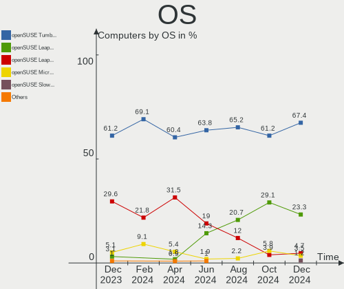
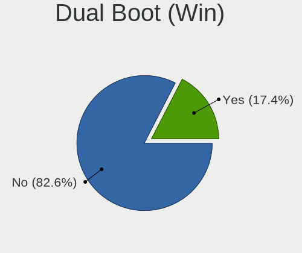
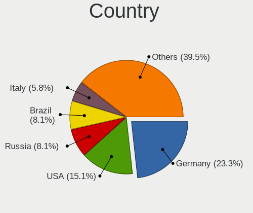
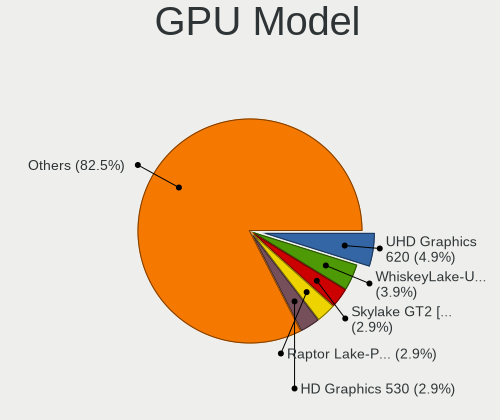
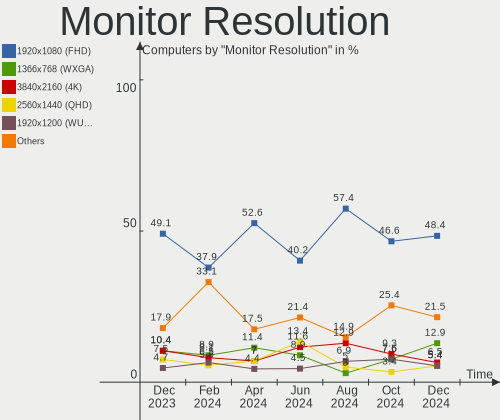
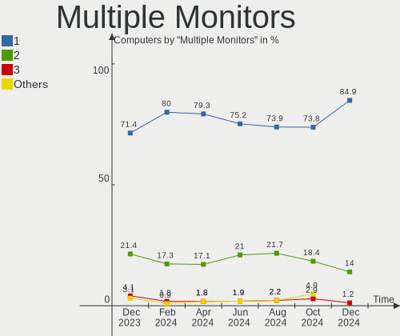
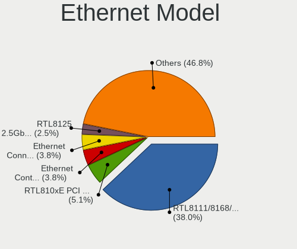
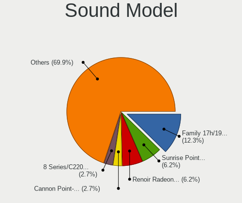
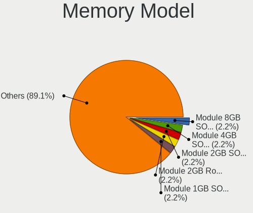
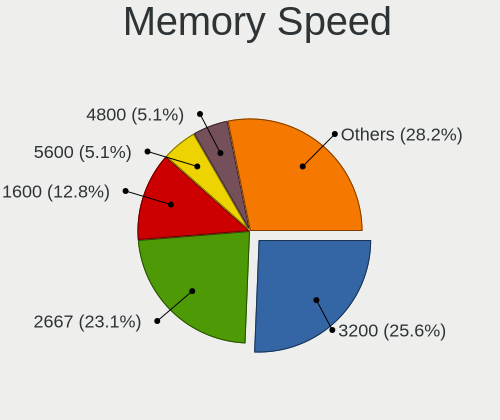

openSUSE - Hardware Trends
--------------------------

A project to identify most popular hardware characteristics and track their change
over time based on data collected by Linux users at https://Linux-Hardware.org.

Anyone can contribute to this report by the [hw-probe](https://github.com/linuxhw/hw-probe) tool:

    sudo -E hw-probe -all -upload

This is a report for all computer types. See also reports for [desktops](/Dist/openSUSE/Desktop/README.md) and [notebooks](/Dist/openSUSE/Notebook/README.md).

This report is for one last month. Overall report since the beginning of time: [TestDays](https://github.com/linuxhw/TestDays)

Period: Mar, 2023.

Contents
--------

* [ System ](#system)
  - [ OS                       ](#os)
  - [ OS Family                ](#os-family)
  - [ Kernel                   ](#kernel)
  - [ Kernel Family            ](#kernel-family)
  - [ Kernel Major Ver.        ](#kernel-major-ver)
  - [ Arch                     ](#arch)
  - [ DE                       ](#de)
  - [ Display Server           ](#display-server)
  - [ Display Manager          ](#display-manager)
  - [ OS Lang                  ](#os-lang)
  - [ Boot Mode                ](#boot-mode)
  - [ Filesystem               ](#filesystem)
  - [ Part. scheme             ](#part-scheme)
  - [ Dual Boot with Linux/BSD ](#dual-boot-with-linuxbsd)
  - [ Dual Boot (Win)          ](#dual-boot-win)

* [ Board ](#board)
  - [ Vendor                   ](#vendor)
  - [ Model                    ](#model)
  - [ Model Family             ](#model-family)
  - [ MFG Year                 ](#mfg-year)
  - [ Form Factor              ](#form-factor)
  - [ Secure Boot              ](#secure-boot)
  - [ Coreboot                 ](#coreboot)
  - [ RAM Size                 ](#ram-size)
  - [ RAM Used                 ](#ram-used)
  - [ Total Drives             ](#total-drives)
  - [ Has CD-ROM               ](#has-cd-rom)
  - [ Has Ethernet             ](#has-ethernet)
  - [ Has WiFi                 ](#has-wifi)
  - [ Has Bluetooth            ](#has-bluetooth)

* [ Location ](#location)
  - [ Country                  ](#country)
  - [ City                     ](#city)

* [ Drives ](#drives)
  - [ Drive Vendor             ](#drive-vendor)
  - [ Drive Model              ](#drive-model)
  - [ HDD Vendor               ](#hdd-vendor)
  - [ SSD Vendor               ](#ssd-vendor)
  - [ Drive Kind               ](#drive-kind)
  - [ Drive Connector          ](#drive-connector)
  - [ Drive Size               ](#drive-size)
  - [ Space Total              ](#space-total)
  - [ Space Used               ](#space-used)
  - [ Malfunc. Drives          ](#malfunc-drives)
  - [ Malfunc. Drive Vendor    ](#malfunc-drive-vendor)
  - [ Malfunc. HDD Vendor      ](#malfunc-hdd-vendor)
  - [ Malfunc. Drive Kind      ](#malfunc-drive-kind)
  - [ Failed Drives            ](#failed-drives)
  - [ Failed Drive Vendor      ](#failed-drive-vendor)
  - [ Drive Status             ](#drive-status)

* [ Storage controller ](#storage-controller)
  - [ Storage Vendor           ](#storage-vendor)
  - [ Storage Model            ](#storage-model)
  - [ Storage Kind             ](#storage-kind)

* [ Processor ](#processor)
  - [ CPU Vendor               ](#cpu-vendor)
  - [ CPU Model                ](#cpu-model)
  - [ CPU Model Family         ](#cpu-model-family)
  - [ CPU Cores                ](#cpu-cores)
  - [ CPU Sockets              ](#cpu-sockets)
  - [ CPU Threads              ](#cpu-threads)
  - [ CPU Op-Modes             ](#cpu-op-modes)
  - [ CPU Microcode            ](#cpu-microcode)
  - [ CPU Microarch            ](#cpu-microarch)

* [ Graphics ](#graphics)
  - [ GPU Vendor               ](#gpu-vendor)
  - [ GPU Model                ](#gpu-model)
  - [ GPU Combo                ](#gpu-combo)
  - [ GPU Driver               ](#gpu-driver)
  - [ GPU Memory               ](#gpu-memory)

* [ Monitor ](#monitor)
  - [ Monitor Vendor           ](#monitor-vendor)
  - [ Monitor Model            ](#monitor-model)
  - [ Monitor Resolution       ](#monitor-resolution)
  - [ Monitor Diagonal         ](#monitor-diagonal)
  - [ Monitor Width            ](#monitor-width)
  - [ Aspect Ratio             ](#aspect-ratio)
  - [ Monitor Area             ](#monitor-area)
  - [ Pixel Density            ](#pixel-density)
  - [ Multiple Monitors        ](#multiple-monitors)

* [ Network ](#network)
  - [ Net Controller Vendor    ](#net-controller-vendor)
  - [ Net Controller Model     ](#net-controller-model)
  - [ Wireless Vendor          ](#wireless-vendor)
  - [ Wireless Model           ](#wireless-model)
  - [ Ethernet Vendor          ](#ethernet-vendor)
  - [ Ethernet Model           ](#ethernet-model)
  - [ Net Controller Kind      ](#net-controller-kind)
  - [ Used Controller          ](#used-controller)
  - [ NICs                     ](#nics)
  - [ IPv6                     ](#ipv6)

* [ Bluetooth ](#bluetooth)
  - [ Bluetooth Vendor         ](#bluetooth-vendor)
  - [ Bluetooth Model          ](#bluetooth-model)

* [ Sound ](#sound)
  - [ Sound Vendor             ](#sound-vendor)
  - [ Sound Model              ](#sound-model)

* [ Memory ](#memory)
  - [ Memory Vendor            ](#memory-vendor)
  - [ Memory Model             ](#memory-model)
  - [ Memory Kind              ](#memory-kind)
  - [ Memory Form Factor       ](#memory-form-factor)
  - [ Memory Size              ](#memory-size)
  - [ Memory Speed             ](#memory-speed)

* [ Printers & scanners ](#printers--scanners)
  - [ Printer Vendor           ](#printer-vendor)
  - [ Printer Model            ](#printer-model)
  - [ Scanner Vendor           ](#scanner-vendor)
  - [ Scanner Model            ](#scanner-model)

* [ Camera ](#camera)
  - [ Camera Vendor            ](#camera-vendor)
  - [ Camera Model             ](#camera-model)

* [ Security ](#security)
  - [ Fingerprint Vendor       ](#fingerprint-vendor)
  - [ Fingerprint Model        ](#fingerprint-model)
  - [ Chipcard Vendor          ](#chipcard-vendor)
  - [ Chipcard Model           ](#chipcard-model)

* [ Unsupported ](#unsupported)
  - [ Unsupported Devices      ](#unsupported-devices)
  - [ Unsupported Device Types ](#unsupported-device-types)

System
------

OS
--

Installed operating systems

| Name                         | Computers | Percent |
|------------------------------|-----------|---------|
| openSUSE Tumbleweed-XXXXXXXX | 64        | 71.91%  |
| openSUSE Leap-15.4           | 15        | 16.85%  |
| openSUSE Microos-XXXXXXXX    | 7         | 7.87%   |
| openSUSE Leap-15.5           | 2         | 2.25%   |
| openSUSE Leap-15.3           | 1         | 1.12%   |

OS Family
---------

OS without a version

| Name     | Computers | Percent |
|----------|-----------|---------|
| openSUSE | 89        | 100%    |

Kernel
------

Version of the Linux kernel

| Version                      | Computers | Percent |
|------------------------------|-----------|---------|
| 6.2.1-1-default              | 21        | 23.6%   |
| 6.2.6-1-default              | 17        | 19.1%   |
| 5.14.21-150400.24.46-default | 15        | 16.85%  |
| 6.2.2-1-default              | 7         | 7.87%   |
| 6.2.0-1-default              | 7         | 7.87%   |
| 6.2.8-1-default              | 5         | 5.62%   |
| 6.2.4-1-default              | 5         | 5.62%   |
| 6.1.12-1-default             | 5         | 5.62%   |
| 5.14.21-150500.43-default    | 2         | 2.25%   |
| 6.1.8-1-default              | 1         | 1.12%   |
| 6.1.3-1-default              | 1         | 1.12%   |
| 6.1.1-1-default              | 1         | 1.12%   |
| 6.0.12-1-default             | 1         | 1.12%   |
| 5.3.18-150300.59.68-default  | 1         | 1.12%   |

Kernel Family
-------------

Linux kernel without a distro release

| Version | Computers | Percent |
|---------|-----------|---------|
| 6.2.1   | 21        | 23.6%   |
| 6.2.6   | 17        | 19.1%   |
| 5.14.21 | 17        | 19.1%   |
| 6.2.2   | 7         | 7.87%   |
| 6.2.0   | 7         | 7.87%   |
| 6.2.8   | 5         | 5.62%   |
| 6.2.4   | 5         | 5.62%   |
| 6.1.12  | 5         | 5.62%   |
| 6.1.8   | 1         | 1.12%   |
| 6.1.3   | 1         | 1.12%   |
| 6.1.1   | 1         | 1.12%   |
| 6.0.12  | 1         | 1.12%   |
| 5.3.18  | 1         | 1.12%   |

Kernel Major Ver.
-----------------

Linux kernel major version

| Version | Computers | Percent |
|---------|-----------|---------|
| 6.2     | 62        | 69.66%  |
| 5.14    | 17        | 19.1%   |
| 6.1     | 8         | 8.99%   |
| 6.0     | 1         | 1.12%   |
| 5.3     | 1         | 1.12%   |

Arch
----

OS architecture (x86_64, i586, etc.)

| Name   | Computers | Percent |
|--------|-----------|---------|
| x86_64 | 89        | 100%    |

DE
--

Desktop Environment

| Name     | Computers | Percent |
|----------|-----------|---------|
| KDE5     | 54        | 60.67%  |
| GNOME    | 22        | 24.72%  |
| Unknown  | 6         | 6.74%   |
| KDE      | 2         | 2.25%   |
| ICEWM    | 2         | 2.25%   |
| XFCE     | 1         | 1.12%   |
| MATE     | 1         | 1.12%   |
| Cinnamon | 1         | 1.12%   |

Display Server
--------------

X11 or Wayland

| Name    | Computers | Percent |
|---------|-----------|---------|
| X11     | 60        | 67.42%  |
| Wayland | 23        | 25.84%  |
| Tty     | 5         | 5.62%   |
| Unknown | 1         | 1.12%   |

Display Manager
---------------

SDDM, LightDM, etc.

| Name    | Computers | Percent |
|---------|-----------|---------|
| Unknown | 51        | 57.3%   |
| SDDM    | 22        | 24.72%  |
| LightDM | 11        | 12.36%  |
| XDM     | 4         | 4.49%   |
| GDM     | 1         | 1.12%   |

OS Lang
-------

Language

| Lang  | Computers | Percent |
|-------|-----------|---------|
| en_US | 37        | 41.57%  |
| de_DE | 24        | 26.97%  |
| en_GB | 7         | 7.87%   |
| pt_BR | 5         | 5.62%   |
| POSIX | 3         | 3.37%   |
| it_IT | 2         | 2.25%   |
| fr_FR | 2         | 2.25%   |
| es_ES | 2         | 2.25%   |
| en_IE | 2         | 2.25%   |
| ru_RU | 1         | 1.12%   |
| nn_NO | 1         | 1.12%   |
| de_CH | 1         | 1.12%   |
| ca_ES | 1         | 1.12%   |
| bg_BG | 1         | 1.12%   |

Boot Mode
---------

EFI or BIOS

| Mode | Computers | Percent |
|------|-----------|---------|
| EFI  | 67        | 75.28%  |
| BIOS | 22        | 24.72%  |

Filesystem
----------

Type of filesystem

| Type  | Computers | Percent |
|-------|-----------|---------|
| Btrfs | 71        | 79.78%  |
| Ext4  | 14        | 15.73%  |
| Xfs   | 4         | 4.49%   |

Part. scheme
------------

Scheme of partitioning

| Type    | Computers | Percent |
|---------|-----------|---------|
| Unknown | 48        | 53.93%  |
| GPT     | 36        | 40.45%  |
| MBR     | 5         | 5.62%   |

Dual Boot with Linux/BSD
------------------------

Hosting more than one Linux/BSD

| Dual boot | Computers | Percent |
|-----------|-----------|---------|
| No        | 83        | 93.26%  |
| Yes       | 6         | 6.74%   |

Dual Boot (Win)
---------------

Hosting Linux and Windows

| Dual boot | Computers | Percent |
|-----------|-----------|---------|
| No        | 80        | 89.89%  |
| Yes       | 9         | 10.11%  |

Board
-----

Vendor
------

Motherboard manufacturer

| Name                | Computers | Percent |
|---------------------|-----------|---------|
| Hewlett-Packard     | 18        | 20.22%  |
| Lenovo              | 16        | 17.98%  |
| MSI                 | 12        | 13.48%  |
| ASUSTek Computer    | 9         | 10.11%  |
| Gigabyte Technology | 7         | 7.87%   |
| Dell                | 5         | 5.62%   |
| Acer                | 5         | 5.62%   |
| ASRock              | 4         | 4.49%   |
| Intel               | 2         | 2.25%   |
| Fujitsu             | 2         | 2.25%   |
| Apple               | 2         | 2.25%   |
| Wortmann AG         | 1         | 1.12%   |
| TUXEDO              | 1         | 1.12%   |
| SLIMBOOK            | 1         | 1.12%   |
| Purism              | 1         | 1.12%   |
| Notebook            | 1         | 1.12%   |
| MACHINIST           | 1         | 1.12%   |
| Jumper              | 1         | 1.12%   |

Model
-----

Motherboard model

| Name                                     | Computers | Percent |
|------------------------------------------|-----------|---------|
| Wortmann AG Terra 3100                   | 1         | 1.12%   |
| TUXEDO Pulse 15 Gen1                     | 1         | 1.12%   |
| SLIMBOOK PROX-AMD5                       | 1         | 1.12%   |
| Purism Librem 13 v2                      | 1         | 1.12%   |
| Notebook PCx0Dx                          | 1         | 1.12%   |
| MSI MS-7D75                              | 1         | 1.12%   |
| MSI MS-7D54                              | 1         | 1.12%   |
| MSI MS-7C96                              | 1         | 1.12%   |
| MSI MS-7C02                              | 1         | 1.12%   |
| MSI MS-7B86                              | 1         | 1.12%   |
| MSI MS-7B45                              | 1         | 1.12%   |
| MSI MS-7A33                              | 1         | 1.12%   |
| MSI MS-7673                              | 1         | 1.12%   |
| MSI GT72 2QE                             | 1         | 1.12%   |
| MSI Delta 15 A5EFK                       | 1         | 1.12%   |
| MSI Bravo 15 B5DD                        | 1         | 1.12%   |
| MSI 700-216                              | 1         | 1.12%   |
| MACHINIST X99-RS9 V2.0                   | 1         | 1.12%   |
| Lenovo Yoga 9 14ITL5 82BG                | 1         | 1.12%   |
| Lenovo ThinkStation P500 30A6S4JU00      | 1         | 1.12%   |
| Lenovo ThinkStation P330 Tiny 30CES0BH00 | 1         | 1.12%   |
| Lenovo ThinkPad T520 42435GG             | 1         | 1.12%   |
| Lenovo ThinkPad T460s 20F9005CMN         | 1         | 1.12%   |
| Lenovo ThinkPad T14 Gen 3 21AJS0Q204     | 1         | 1.12%   |
| Lenovo ThinkPad Edge E530 3259HHG        | 1         | 1.12%   |
| Lenovo ThinkCentre Edge 91Z 7075K7G      | 1         | 1.12%   |
| Lenovo LEGION5PRO-16ACH6H 82JQ           | 1         | 1.12%   |
| Lenovo Legion 5 15ARH7H 82RD             | 1         | 1.12%   |
| Lenovo IdeaPad Y700-17ISK 80Q0           | 1         | 1.12%   |
| Lenovo IdeaPad 5 14ARE05 81YM            | 1         | 1.12%   |
| Lenovo IdeaPad 320-15IKB 81BG            | 1         | 1.12%   |
| Lenovo IdeaPad 3 15ITL6 82H8             | 1         | 1.12%   |
| Lenovo H50-55 90BF001SUK                 | 1         | 1.12%   |
| Lenovo G580 20157                        | 1         | 1.12%   |
| Jumper EZbook                            | 1         | 1.12%   |
| Intel NUC12WSHi5                         | 1         | 1.12%   |
| Intel D34010WYK H14771-303               | 1         | 1.12%   |
| HP ZBook Power G7 Mobile Workstation     | 1         | 1.12%   |
| HP Z230 Tower Workstation                | 1         | 1.12%   |
| HP Spectre x360 2-in-1 Laptop 16-f1xxx   | 1         | 1.12%   |

Model Family
------------

Motherboard model prefix

| Name                      | Computers | Percent |
|---------------------------|-----------|---------|
| Lenovo ThinkPad           | 4         | 4.49%   |
| Lenovo IdeaPad            | 4         | 4.49%   |
| HP Pavilion               | 3         | 3.37%   |
| HP ENVY                   | 3         | 3.37%   |
| Lenovo ThinkStation       | 2         | 2.25%   |
| HP ProBook                | 2         | 2.25%   |
| HP EliteBook              | 2         | 2.25%   |
| HP Compaq                 | 2         | 2.25%   |
| Fujitsu LIFEBOOK          | 2         | 2.25%   |
| Dell XPS                  | 2         | 2.25%   |
| ASUS VivoBook             | 2         | 2.25%   |
| ASUS ROG                  | 2         | 2.25%   |
| Acer Aspire               | 2         | 2.25%   |
| Wortmann AG Terra         | 1         | 1.12%   |
| TUXEDO Pulse              | 1         | 1.12%   |
| SLIMBOOK PROX-AMD5        | 1         | 1.12%   |
| Purism Librem             | 1         | 1.12%   |
| Notebook PCx0Dx           | 1         | 1.12%   |
| MSI MS-7D75               | 1         | 1.12%   |
| MSI MS-7D54               | 1         | 1.12%   |
| MSI MS-7C96               | 1         | 1.12%   |
| MSI MS-7C02               | 1         | 1.12%   |
| MSI MS-7B86               | 1         | 1.12%   |
| MSI MS-7B45               | 1         | 1.12%   |
| MSI MS-7A33               | 1         | 1.12%   |
| MSI MS-7673               | 1         | 1.12%   |
| MSI GT72                  | 1         | 1.12%   |
| MSI Delta                 | 1         | 1.12%   |
| MSI Bravo                 | 1         | 1.12%   |
| MSI 700-216               | 1         | 1.12%   |
| MACHINIST X99-RS9         | 1         | 1.12%   |
| Lenovo Yoga               | 1         | 1.12%   |
| Lenovo ThinkCentre        | 1         | 1.12%   |
| Lenovo LEGION5PRO-16ACH6H | 1         | 1.12%   |
| Lenovo Legion             | 1         | 1.12%   |
| Lenovo H50-55             | 1         | 1.12%   |
| Lenovo G580               | 1         | 1.12%   |
| Jumper EZbook             | 1         | 1.12%   |
| Intel NUC12WSHi5          | 1         | 1.12%   |
| Intel D34010WYK           | 1         | 1.12%   |

MFG Year
--------

Motherboard manufacture year

| Year | Computers | Percent |
|------|-----------|---------|
| 2022 | 16        | 17.98%  |
| 2020 | 16        | 17.98%  |
| 2021 | 13        | 14.61%  |
| 2011 | 10        | 11.24%  |
| 2017 | 6         | 6.74%   |
| 2014 | 5         | 5.62%   |
| 2013 | 5         | 5.62%   |
| 2018 | 4         | 4.49%   |
| 2012 | 3         | 3.37%   |
| 2019 | 2         | 2.25%   |
| 2016 | 2         | 2.25%   |
| 2015 | 2         | 2.25%   |
| 2009 | 2         | 2.25%   |
| 2008 | 2         | 2.25%   |
| 2023 | 1         | 1.12%   |

Form Factor
-----------

Physical design of the computer

| Name        | Computers | Percent |
|-------------|-----------|---------|
| Notebook    | 43        | 48.31%  |
| Desktop     | 36        | 40.45%  |
| Convertible | 7         | 7.87%   |
| Mini pc     | 3         | 3.37%   |

Secure Boot
-----------

Enabled or disabled

| State    | Computers | Percent |
|----------|-----------|---------|
| Disabled | 66        | 74.16%  |
| Enabled  | 23        | 25.84%  |

Coreboot
--------

Have coreboot on board

| Used | Computers | Percent |
|------|-----------|---------|
| No   | 88        | 98.88%  |
| Yes  | 1         | 1.12%   |

RAM Size
--------

Total RAM memory

| Size in GB  | Computers | Percent |
|-------------|-----------|---------|
| 16.01-24.0  | 23        | 25.84%  |
| 32.01-64.0  | 21        | 23.6%   |
| 8.01-16.0   | 20        | 22.47%  |
| 4.01-8.0    | 12        | 13.48%  |
| 3.01-4.0    | 7         | 7.87%   |
| 24.01-32.0  | 4         | 4.49%   |
| 64.01-256.0 | 1         | 1.12%   |
| 1.01-2.0    | 1         | 1.12%   |

RAM Used
--------

Used RAM memory

| Used GB    | Computers | Percent |
|------------|-----------|---------|
| 4.01-8.0   | 26        | 29.21%  |
| 2.01-3.0   | 22        | 24.72%  |
| 3.01-4.0   | 21        | 23.6%   |
| 8.01-16.0  | 9         | 10.11%  |
| 0.51-1.0   | 6         | 6.74%   |
| 1.01-2.0   | 4         | 4.49%   |
| 16.01-24.0 | 1         | 1.12%   |

Total Drives
------------

Number of drives on board

| Drives | Computers | Percent |
|--------|-----------|---------|
| 1      | 50        | 56.18%  |
| 2      | 25        | 28.09%  |
| 3      | 6         | 6.74%   |
| 5      | 4         | 4.49%   |
| 4      | 3         | 3.37%   |
| 6      | 1         | 1.12%   |

Has CD-ROM
----------

Has CD-ROM on board

| Presented | Computers | Percent |
|-----------|-----------|---------|
| No        | 62        | 69.66%  |
| Yes       | 27        | 30.34%  |

Has Ethernet
------------

Has Ethernet on board

| Presented | Computers | Percent |
|-----------|-----------|---------|
| Yes       | 73        | 82.02%  |
| No        | 16        | 17.98%  |

Has WiFi
--------

Has WiFi module

| Presented | Computers | Percent |
|-----------|-----------|---------|
| Yes       | 73        | 82.02%  |
| No        | 16        | 17.98%  |

Has Bluetooth
-------------

Has Bluetooth module

| Presented | Computers | Percent |
|-----------|-----------|---------|
| Yes       | 68        | 76.4%   |
| No        | 21        | 23.6%   |

Location
--------

Country
-------

Geographic location (country)

| Country     | Computers | Percent |
|-------------|-----------|---------|
| Germany     | 22        | 24.72%  |
| USA         | 12        | 13.48%  |
| Italy       | 5         | 5.62%   |
| Brazil      | 5         | 5.62%   |
| Switzerland | 4         | 4.49%   |
| Sweden      | 4         | 4.49%   |
| UK          | 3         | 3.37%   |
| Norway      | 3         | 3.37%   |
| Bulgaria    | 3         | 3.37%   |
| Austria     | 3         | 3.37%   |
| Spain       | 2         | 2.25%   |
| Slovenia    | 2         | 2.25%   |
| Poland      | 2         | 2.25%   |
| Netherlands | 2         | 2.25%   |
| Greece      | 2         | 2.25%   |
| France      | 2         | 2.25%   |
| Australia   | 2         | 2.25%   |
| Turkey      | 1         | 1.12%   |
| Taiwan      | 1         | 1.12%   |
| Russia      | 1         | 1.12%   |
| Philippines | 1         | 1.12%   |
| New Zealand | 1         | 1.12%   |
| Indonesia   | 1         | 1.12%   |
| Estonia     | 1         | 1.12%   |
| El Salvador | 1         | 1.12%   |
| Denmark     | 1         | 1.12%   |
| Canada      | 1         | 1.12%   |
| Bangladesh  | 1         | 1.12%   |

City
----

Geographic location (city)

| City                 | Computers | Percent |
|----------------------|-----------|---------|
| Darmstadt            | 3         | 3.37%   |
| Unterentfelden       | 2         | 2.25%   |
| Sydney               | 2         | 2.25%   |
| Stuttgart            | 2         | 2.25%   |
| Stockholm            | 2         | 2.25%   |
| Gilze                | 2         | 2.25%   |
| Zurich               | 1         | 1.12%   |
| Yogyakarta           | 1         | 1.12%   |
| Warsaw               | 1         | 1.12%   |
| Vienna               | 1         | 1.12%   |
| Varna                | 1         | 1.12%   |
| Uddevalla            | 1         | 1.12%   |
| Tallinn              | 1         | 1.12%   |
| Taichung             | 1         | 1.12%   |
| Sofia                | 1         | 1.12%   |
| Sindelfingen         | 1         | 1.12%   |
| Schonbuhl            | 1         | 1.12%   |
| Sao Francisco do Sul | 1         | 1.12%   |
| Richardson           | 1         | 1.12%   |
| Regstrup             | 1         | 1.12%   |
| Recife               | 1         | 1.12%   |
| Raesfeld             | 1         | 1.12%   |
| Porto Alegre         | 1         | 1.12%   |
| Portland             | 1         | 1.12%   |
| Painesville          | 1         | 1.12%   |
| Paese                | 1         | 1.12%   |
| Oslo                 | 1         | 1.12%   |
| Nesebar              | 1         | 1.12%   |
| Moosburg             | 1         | 1.12%   |
| Middletown           | 1         | 1.12%   |
| Memphis              | 1         | 1.12%   |
| Manchester           | 1         | 1.12%   |
| Mainhausen           | 1         | 1.12%   |
| Madrid               | 1         | 1.12%   |
| Macanet de la Selva  | 1         | 1.12%   |
| Ludwigsstadt         | 1         | 1.12%   |
| Los Angeles          | 1         | 1.12%   |
| Limeira do Oeste     | 1         | 1.12%   |
| Leonding             | 1         | 1.12%   |
| Leer                 | 1         | 1.12%   |

Drives
------

Drive Vendor
------------

Hard drive vendors

| Vendor                      | Computers | Drives  | Percent |
|-----------------------------|-----------|---------|---------|
| Samsung Electronics         | 31        | 43      | 23.48%  |
| Seagate                     | 19        | 23      | 14.39%  |
| WDC                         | 15        | 22      | 11.36%  |
| SanDisk                     | 11        | 12      | 8.33%   |
| Kingston                    | 7         | 7       | 5.3%    |
| Unknown                     | 4         | 4       | 3.03%   |
| Toshiba                     | 4         | 4       | 3.03%   |
| SK hynix                    | 4         | 4       | 3.03%   |
| Intel                       | 4         | 4       | 3.03%   |
| Realtek Semiconductor       | 3         | 3       | 2.27%   |
| Crucial                     | 3         | 3       | 2.27%   |
| XrayDisk                    | 2         | 2       | 1.52%   |
| SPCC                        | 2         | 2       | 1.52%   |
| Micron Technology           | 2         | 3       | 1.52%   |
| Kingston Technology Company | 2         | 2       | 1.52%   |
| Intenso                     | 2         | 2       | 1.52%   |
| A-DATA Technology           | 2         | 2       | 1.52%   |
| WDC WDS                     | 1         | 1       | 0.76%   |
| Union Memory                | 1         | 1       | 0.76%   |
| TO Exter                    | 1         | 1       | 0.76%   |
| StoreJet                    | 1         | 1       | 0.76%   |
| Silicon Motion              | 1         | 1       | 0.76%   |
| Plextor                     | 1         | 1       | 0.76%   |
| Pioneer                     | 1         | 1       | 0.76%   |
| OCZ                         | 1         | 1       | 0.76%   |
| KIOXIA                      | 1         | 1       | 0.76%   |
| HL-DT-ST                    | 1         | Unknown | 0.76%   |
| Hitachi                     | 1         | 1       | 0.76%   |
| HGST                        | 1         | 1       | 0.76%   |
| Hewlett-Packard             | 1         | 1       | 0.76%   |
| Biwin Storage Technology    | 1         | 1       | 0.76%   |
| Apple                       | 1         | 1       | 0.76%   |

Drive Model
-----------

Hard drive models

| Model                                               | Computers | Percent |
|-----------------------------------------------------|-----------|---------|
| Samsung NVMe SSD Controller SM981/PM981/PM983 250GB | 11        | 7.33%   |
| Samsung NVMe SSD Controller PM9A1/PM9A3/980PRO 1TB  | 4         | 2.67%   |
| Unknown MMC Card  128GB                             | 3         | 2%      |
| Seagate ST2000DM001-1ER164 2TB                      | 3         | 2%      |
| Sandisk WD Black SN850 1TB                          | 3         | 2%      |
| WDC WD40EFRX-68N32N0 4TB                            | 2         | 1.33%   |
| WDC WD20EZRZ-00Z5HB0 2TB                            | 2         | 1.33%   |
| Seagate ST31000524AS 1TB                            | 2         | 1.33%   |
| Seagate ST2000DM008-2FR102 2TB                      | 2         | 1.33%   |
| Seagate ST1000DM010-2EP102 1TB                      | 2         | 1.33%   |
| Samsung SSD 870 QVO 2TB                             | 2         | 1.33%   |
| Samsung SSD 860 EVO 1TB                             | 2         | 1.33%   |
| Kingston SA400S37480G 480GB SSD                     | 2         | 1.33%   |
| XrayDisk 480GB SSD                                  | 1         | 0.67%   |
| XrayDisk 1TB SSD                                    | 1         | 0.67%   |
| WDC WDS240G2G0A-00JH30 240GB SSD                    | 1         | 0.67%   |
| WDC WDS100T1B0A-00H9H0 1TB SSD                      | 1         | 0.67%   |
| WDC WDS 100T2B0A-00SM50 1TB SSD                     | 1         | 0.67%   |
| WDC WD7500BPVT-75HXZT3 752GB                        | 1         | 0.67%   |
| WDC WD5000AZRX-00L4HB0 500GB                        | 1         | 0.67%   |
| WDC WD40EZAZ-00SF3B0 4TB                            | 1         | 0.67%   |
| WDC WD20SPZX-22UA7T0 2TB                            | 1         | 0.67%   |
| WDC WD20EZAZ-00GGJB0 2TB                            | 1         | 0.67%   |
| WDC WD20EARS-00MVWB0 2TB                            | 1         | 0.67%   |
| WDC WD20EADS-00S2B0 2TB                             | 1         | 0.67%   |
| WDC WD1200BEVS-75UST0 120GB                         | 1         | 0.67%   |
| WDC WD10SPZX-60Z10T0 1TB                            | 1         | 0.67%   |
| WDC WD10JFCX-68N6GN0 1TB                            | 1         | 0.67%   |
| WDC WD10EZEX-08M2NA0 1TB                            | 1         | 0.67%   |
| WDC WD10EACS-32ZJB0 1TB                             | 1         | 0.67%   |
| WDC WD1003FBYX-01Y7B1 1TB                           | 1         | 0.67%   |
| WDC WD Green 2.5 480GB SSD                          | 1         | 0.67%   |
| Unknown MMC Card  256GB                             | 1         | 0.67%   |
| Union Memory UMIS RPJTJ256MEE1OWX 256GB             | 1         | 0.67%   |
| Toshiba XG6 NVMe SSD Controller 512GB               | 1         | 0.67%   |
| Toshiba THNSNJ128G8NU 128GB SSD                     | 1         | 0.67%   |
| Toshiba KXG50ZNV512G NVMe 512GB                     | 1         | 0.67%   |
| Toshiba DT01ACA200 2TB                              | 1         | 0.67%   |
| TO Exter nal USB 3.0 1TB                            | 1         | 0.67%   |
| StoreJet Transcend 256GB SSD                        | 1         | 0.67%   |

HDD Vendor
----------

Hard disk drive vendors

| Vendor              | Computers | Drives | Percent |
|---------------------|-----------|--------|---------|
| Seagate             | 19        | 23     | 48.72%  |
| WDC                 | 14        | 19     | 35.9%   |
| Samsung Electronics | 3         | 3      | 7.69%   |
| Toshiba             | 1         | 1      | 2.56%   |
| Hitachi             | 1         | 1      | 2.56%   |
| HGST                | 1         | 1      | 2.56%   |

SSD Vendor
----------

Solid state drive vendors

| Vendor              | Computers | Drives | Percent |
|---------------------|-----------|--------|---------|
| Samsung Electronics | 13        | 16     | 28.26%  |
| Kingston            | 5         | 5      | 10.87%  |
| WDC                 | 3         | 3      | 6.52%   |
| Crucial             | 3         | 3      | 6.52%   |
| XrayDisk            | 2         | 2      | 4.35%   |
| SPCC                | 2         | 2      | 4.35%   |
| SanDisk             | 2         | 2      | 4.35%   |
| Intenso             | 2         | 2      | 4.35%   |
| Intel               | 2         | 2      | 4.35%   |
| A-DATA Technology   | 2         | 2      | 4.35%   |
| WDC WDS             | 1         | 1      | 2.17%   |
| Toshiba             | 1         | 1      | 2.17%   |
| TO Exter            | 1         | 1      | 2.17%   |
| StoreJet            | 1         | 1      | 2.17%   |
| SK hynix            | 1         | 1      | 2.17%   |
| Plextor             | 1         | 1      | 2.17%   |
| Pioneer             | 1         | 1      | 2.17%   |
| OCZ                 | 1         | 1      | 2.17%   |
| Hewlett-Packard     | 1         | 1      | 2.17%   |
| Apple               | 1         | 1      | 2.17%   |

Drive Kind
----------

HDD or SSD

| Kind    | Computers | Drives  | Percent |
|---------|-----------|---------|---------|
| NVMe    | 45        | 55      | 37.19%  |
| SSD     | 39        | 49      | 32.23%  |
| HDD     | 32        | 48      | 26.45%  |
| MMC     | 4         | 4       | 3.31%   |
| Unknown | 1         | Unknown | 0.83%   |

Drive Connector
---------------

SATA, SAS, NVMe, etc.

| Type | Computers | Drives | Percent |
|------|-----------|--------|---------|
| SATA | 52        | 91     | 48.6%   |
| NVMe | 45        | 55     | 42.06%  |
| SAS  | 6         | 6      | 5.61%   |
| MMC  | 4         | 4      | 3.74%   |

Drive Size
----------

Size of hard drive

| Size in TB | Computers | Drives | Percent |
|------------|-----------|--------|---------|
| 0.01-0.5   | 30        | 41     | 40%     |
| 0.51-1.0   | 24        | 29     | 32%     |
| 1.01-2.0   | 16        | 20     | 21.33%  |
| 3.01-4.0   | 3         | 5      | 4%      |
| 2.01-3.0   | 1         | 1      | 1.33%   |
| 4.01-10.0  | 1         | 1      | 1.33%   |

Space Total
-----------

Amount of disk space available on the file system

| Size in GB     | Computers | Percent |
|----------------|-----------|---------|
| More than 3000 | 41        | 46.07%  |
| 1001-2000      | 14        | 15.73%  |
| 501-1000       | 12        | 13.48%  |
| 2001-3000      | 11        | 12.36%  |
| 251-500        | 7         | 7.87%   |
| 101-250        | 3         | 3.37%   |
| 51-100         | 1         | 1.12%   |

Space Used
----------

Amount of used disk space

| Used GB        | Computers | Percent |
|----------------|-----------|---------|
| 51-100         | 17        | 19.1%   |
| 501-1000       | 16        | 17.98%  |
| 101-250        | 14        | 15.73%  |
| 1001-2000      | 13        | 14.61%  |
| More than 3000 | 11        | 12.36%  |
| 251-500        | 8         | 8.99%   |
| 1-20           | 5         | 5.62%   |
| 21-50          | 3         | 3.37%   |
| 2001-3000      | 2         | 2.25%   |

Malfunc. Drives
---------------

Drive models with a malfunction

| Model                                             | Computers | Drives | Percent |
|---------------------------------------------------|-----------|--------|---------|
| WDC WD10JFCX-68N6GN0 1TB                          | 1         | 1      | 20%     |
| Silicon Motion SM2262/SM2262EN SSD Controller 1TB | 1         | 1      | 20%     |
| Seagate ST10000VN0004-1ZD101 10TB                 | 1         | 1      | 20%     |
| Crucial CT250BX100SSD1 250GB                      | 1         | 1      | 20%     |
| Biwin Storage Technology HP SSD EX900 1TB         | 1         | 1      | 20%     |

Malfunc. Drive Vendor
---------------------

Vendors of faulty drives

| Vendor                   | Computers | Drives | Percent |
|--------------------------|-----------|--------|---------|
| WDC                      | 1         | 1      | 20%     |
| Silicon Motion           | 1         | 1      | 20%     |
| Seagate                  | 1         | 1      | 20%     |
| Crucial                  | 1         | 1      | 20%     |
| Biwin Storage Technology | 1         | 1      | 20%     |

Malfunc. HDD Vendor
-------------------

Vendors of faulty HDD drives

| Vendor  | Computers | Drives | Percent |
|---------|-----------|--------|---------|
| WDC     | 1         | 1      | 50%     |
| Seagate | 1         | 1      | 50%     |

Malfunc. Drive Kind
-------------------

Kinds of faulty drives

| Kind | Computers | Drives | Percent |
|------|-----------|--------|---------|
| NVMe | 2         | 2      | 40%     |
| HDD  | 2         | 2      | 40%     |
| SSD  | 1         | 1      | 20%     |

Failed Drives
-------------

Failed drive models

Zero info for selected period =(

Failed Drive Vendor
-------------------

Failed drive vendors

Zero info for selected period =(

Drive Status
------------

Number of failed and malfunc. drives

| Status   | Computers | Drives | Percent |
|----------|-----------|--------|---------|
| Detected | 51        | 94     | 53.68%  |
| Works    | 39        | 57     | 41.05%  |
| Malfunc  | 5         | 5      | 5.26%   |

Storage controller
------------------

Storage Vendor
--------------

Storage controller vendors

| Vendor                       | Computers | Percent |
|------------------------------|-----------|---------|
| Intel                        | 49        | 38.58%  |
| AMD                          | 24        | 18.9%   |
| Samsung Electronics          | 21        | 16.54%  |
| SanDisk                      | 9         | 7.09%   |
| Kingston Technology Company  | 4         | 3.15%   |
| SK hynix                     | 3         | 2.36%   |
| Realtek Semiconductor        | 3         | 2.36%   |
| Toshiba America Info Systems | 2         | 1.57%   |
| Micron Technology            | 2         | 1.57%   |
| Marvell Technology Group     | 2         | 1.57%   |
| ASMedia Technology           | 2         | 1.57%   |
| Union Memory (Shenzhen)      | 1         | 0.79%   |
| Silicon Motion               | 1         | 0.79%   |
| Nvidia                       | 1         | 0.79%   |
| KIOXIA                       | 1         | 0.79%   |
| Broadcom / LSI               | 1         | 0.79%   |
| Biwin Storage Technology     | 1         | 0.79%   |

Storage Model
-------------

Storage controller models

| Model                                                                          | Computers | Percent |
|--------------------------------------------------------------------------------|-----------|---------|
| AMD FCH SATA Controller [AHCI mode]                                            | 16        | 11.43%  |
| Samsung NVMe SSD Controller SM981/PM981/PM983                                  | 12        | 8.57%   |
| Intel Sunrise Point-LP SATA Controller [AHCI mode]                             | 5         | 3.57%   |
| Intel 8 Series/C220 Series Chipset Family 6-port SATA Controller 1 [AHCI mode] | 5         | 3.57%   |
| Intel 6 Series/C200 Series Chipset Family 6 port Desktop SATA AHCI Controller  | 5         | 3.57%   |
| AMD 500 Series Chipset SATA Controller                                         | 5         | 3.57%   |
| Samsung NVMe SSD Controller PM9A1/PM9A3/980PRO                                 | 4         | 2.86%   |
| SanDisk WD PC SN810 / Black SN850 NVMe SSD                                     | 3         | 2.14%   |
| Kingston Company Company Non-Volatile memory controller                        | 3         | 2.14%   |
| Samsung NVMe SSD Controller 980                                                | 2         | 1.43%   |
| Realtek NVMe Controller                                                        | 2         | 1.43%   |
| Micron NVMe Storage Controller                                                 | 2         | 1.43%   |
| Intel Volume Management Device NVMe RAID Controller                            | 2         | 1.43%   |
| Intel 82801 Mobile SATA Controller [RAID mode]                                 | 2         | 1.43%   |
| Intel 7 Series Chipset Family 6-port SATA Controller [AHCI mode]               | 2         | 1.43%   |
| Intel 6 Series/C200 Series Chipset Family 6 port Mobile SATA AHCI Controller   | 2         | 1.43%   |
| Intel 400 Series Chipset Family SATA AHCI Controller                           | 2         | 1.43%   |
| ASMedia ASM1062 Serial ATA Controller                                          | 2         | 1.43%   |
| AMD SB7x0/SB8x0/SB9x0 SATA Controller [IDE mode]                               | 2         | 1.43%   |
| AMD SB7x0/SB8x0/SB9x0 IDE Controller                                           | 2         | 1.43%   |
| AMD 300 Series Chipset SATA Controller                                         | 2         | 1.43%   |
| Union Memory (Shenzhen) Non-Volatile memory controller                         | 1         | 0.71%   |
| Toshiba America Info Systems XG6 NVMe SSD Controller                           | 1         | 0.71%   |
| Toshiba America Info Systems XG5 NVMe SSD Controller                           | 1         | 0.71%   |
| SK hynix PC401 NVMe Solid State Drive 256GB                                    | 1         | 0.71%   |
| SK hynix Gold P31/PC711 NVMe Solid State Drive                                 | 1         | 0.71%   |
| SK hynix BC501 NVMe Solid State Drive                                          | 1         | 0.71%   |
| Silicon Motion SM2262/SM2262EN SSD Controller                                  | 1         | 0.71%   |
| Sandisk Western Digital WD Black SN850X NVMe SSD                               | 1         | 0.71%   |
| SanDisk WD Blue SN570 NVMe SSD 1TB                                             | 1         | 0.71%   |
| SanDisk WD Blue SN550 NVMe SSD                                                 | 1         | 0.71%   |
| SanDisk WD Black SN750 / PC SN730 NVMe SSD                                     | 1         | 0.71%   |
| SanDisk WD Black 2018/SN750 / PC SN720 NVMe SSD                                | 1         | 0.71%   |
| SanDisk NVMe Controller                                                        | 1         | 0.71%   |
| SanDisk Non-Volatile memory controller                                         | 1         | 0.71%   |
| Samsung NVMe SSD Controller SM961/PM961/SM963                                  | 1         | 0.71%   |
| Samsung NVMe SSD Controller SM951/PM951                                        | 1         | 0.71%   |
| Samsung Electronics Non-Volatile memory controller                             | 1         | 0.71%   |
| Samsung Apple PCIe SSD                                                         | 1         | 0.71%   |
| Realtek RTS5763DL NVMe SSD Controller                                          | 1         | 0.71%   |

Storage Kind
------------

Kind of storage controller (IDE, SATA, NVMe, SAS, ...)

| Kind | Computers | Percent |
|------|-----------|---------|
| SATA | 65        | 52.42%  |
| NVMe | 45        | 36.29%  |
| RAID | 7         | 5.65%   |
| IDE  | 6         | 4.84%   |
| SAS  | 1         | 0.81%   |

Processor
---------

CPU Vendor
----------

Processor vendors

| Vendor | Computers | Percent |
|--------|-----------|---------|
| Intel  | 57        | 64.04%  |
| AMD    | 32        | 35.96%  |

CPU Model
---------

Processor models

| Model                                    | Computers | Percent |
|------------------------------------------|-----------|---------|
| Intel Core i5-8250U CPU @ 1.60GHz        | 3         | 3.37%   |
| AMD Ryzen 5 5600G with Radeon Graphics   | 3         | 3.37%   |
| Intel 12th Gen Core i5-1240P             | 2         | 2.25%   |
| Intel 11th Gen Core i5-1135G7 @ 2.40GHz  | 2         | 2.25%   |
| AMD Ryzen 9 5900X 12-Core Processor      | 2         | 2.25%   |
| AMD Ryzen 7 6800H with Radeon Graphics   | 2         | 2.25%   |
| AMD Ryzen 7 5800H with Radeon Graphics   | 2         | 2.25%   |
| AMD Ryzen 7 5700U with Radeon Graphics   | 2         | 2.25%   |
| Intel Xeon CPU E5-2620 v3 @ 2.40GHz      | 1         | 1.12%   |
| Intel Xeon CPU E5-1620 v3 @ 3.50GHz      | 1         | 1.12%   |
| Intel Xeon CPU E3-1271 v3 @ 3.60GHz      | 1         | 1.12%   |
| Intel Pentium Silver N6000 @ 1.10GHz     | 1         | 1.12%   |
| Intel Pentium Silver N5030 CPU @ 1.10GHz | 1         | 1.12%   |
| Intel Core i7-9750H CPU @ 2.60GHz        | 1         | 1.12%   |
| Intel Core i7-9700T CPU @ 2.00GHz        | 1         | 1.12%   |
| Intel Core i7-8750H CPU @ 2.20GHz        | 1         | 1.12%   |
| Intel Core i7-8700K CPU @ 3.70GHz        | 1         | 1.12%   |
| Intel Core i7-6700HQ CPU @ 2.60GHz       | 1         | 1.12%   |
| Intel Core i7-6700 CPU @ 3.40GHz         | 1         | 1.12%   |
| Intel Core i7-6500U CPU @ 2.50GHz        | 1         | 1.12%   |
| Intel Core i7-5700HQ CPU @ 2.70GHz       | 1         | 1.12%   |
| Intel Core i7-4850HQ CPU @ 2.30GHz       | 1         | 1.12%   |
| Intel Core i7-4771 CPU @ 3.50GHz         | 1         | 1.12%   |
| Intel Core i7-4720HQ CPU @ 2.60GHz       | 1         | 1.12%   |
| Intel Core i7-4702MQ CPU @ 2.20GHz       | 1         | 1.12%   |
| Intel Core i7-3770 CPU @ 3.40GHz         | 1         | 1.12%   |
| Intel Core i7-2670QM CPU @ 2.20GHz       | 1         | 1.12%   |
| Intel Core i7-10870H CPU @ 2.20GHz       | 1         | 1.12%   |
| Intel Core i7-10850H CPU @ 2.70GHz       | 1         | 1.12%   |
| Intel Core i7-10700 CPU @ 2.90GHz        | 1         | 1.12%   |
| Intel Core i7-10510U CPU @ 1.80GHz       | 1         | 1.12%   |
| Intel Core i5-8265U CPU @ 1.60GHz        | 1         | 1.12%   |
| Intel Core i5-7300U CPU @ 2.60GHz        | 1         | 1.12%   |
| Intel Core i5-6200U CPU @ 2.30GHz        | 1         | 1.12%   |
| Intel Core i5-4440 CPU @ 3.10GHz         | 1         | 1.12%   |
| Intel Core i5-2500K CPU @ 3.30GHz        | 1         | 1.12%   |
| Intel Core i5-2500 CPU @ 3.30GHz         | 1         | 1.12%   |
| Intel Core i5-2410M CPU @ 2.30GHz        | 1         | 1.12%   |
| Intel Core i5-2400S CPU @ 2.50GHz        | 1         | 1.12%   |
| Intel Core i5-2400 CPU @ 3.10GHz         | 1         | 1.12%   |

CPU Model Family
----------------

Processor model prefix

| Model                | Computers | Percent |
|----------------------|-----------|---------|
| Intel Core i7        | 18        | 20.22%  |
| Intel Core i5        | 14        | 15.73%  |
| Other                | 11        | 12.36%  |
| AMD Ryzen 7          | 10        | 11.24%  |
| AMD Ryzen 5          | 10        | 11.24%  |
| AMD Ryzen 9          | 5         | 5.62%   |
| Intel Xeon           | 3         | 3.37%   |
| Intel Core i3        | 3         | 3.37%   |
| Intel Core 2 Duo     | 3         | 3.37%   |
| AMD A10              | 3         | 3.37%   |
| Intel Pentium Silver | 2         | 2.25%   |
| Intel Celeron        | 2         | 2.25%   |
| Intel Atom           | 1         | 1.12%   |
| AMD Ryzen 7 PRO      | 1         | 1.12%   |
| AMD Ryzen 3 PRO      | 1         | 1.12%   |
| AMD Phenom II X6     | 1         | 1.12%   |
| AMD FX               | 1         | 1.12%   |

CPU Cores
---------

Number of processor cores

| Number | Computers | Percent |
|--------|-----------|---------|
| 4      | 31        | 34.83%  |
| 8      | 17        | 19.1%   |
| 2      | 17        | 19.1%   |
| 6      | 14        | 15.73%  |
| 12     | 5         | 5.62%   |
| 10     | 3         | 3.37%   |
| 16     | 1         | 1.12%   |
| 14     | 1         | 1.12%   |

CPU Sockets
-----------

Number of sockets

| Number | Computers | Percent |
|--------|-----------|---------|
| 1      | 89        | 100%    |

CPU Threads
-----------

Threads per core (Hyper-Threading)

| Number | Computers | Percent |
|--------|-----------|---------|
| 2      | 72        | 80.9%   |
| 1      | 17        | 19.1%   |

CPU Op-Modes
------------

CPU Operation Modes (32-bit, 64-bit)

| Op mode        | Computers | Percent |
|----------------|-----------|---------|
| 32-bit, 64-bit | 89        | 100%    |

CPU Microcode
-------------

Microcode number

| Number     | Computers | Percent |
|------------|-----------|---------|
| Unknown    | 45        | 50.56%  |
| 0x206a7    | 4         | 4.49%   |
| 0x0a50000d | 4         | 4.49%   |
| 0x0a50000c | 4         | 4.49%   |
| 0x0a404101 | 3         | 3.37%   |
| 0x906a3    | 2         | 2.25%   |
| 0x806ea    | 2         | 2.25%   |
| 0x0a20120a | 2         | 2.25%   |
| 0x06003106 | 2         | 2.25%   |
| 0x906ea    | 1         | 1.12%   |
| 0x506ca    | 1         | 1.12%   |
| 0x40651    | 1         | 1.12%   |
| 0x306a9    | 1         | 1.12%   |
| 0x106ca    | 1         | 1.12%   |
| 0x1067a    | 1         | 1.12%   |
| 0x0a601203 | 1         | 1.12%   |
| 0x0a201016 | 1         | 1.12%   |
| 0x08701021 | 1         | 1.12%   |
| 0x08608103 | 1         | 1.12%   |
| 0x08608102 | 1         | 1.12%   |
| 0x08600106 | 1         | 1.12%   |
| 0x08600104 | 1         | 1.12%   |
| 0x08600103 | 1         | 1.12%   |
| 0x08101016 | 1         | 1.12%   |
| 0x0800820d | 1         | 1.12%   |
| 0x08001137 | 1         | 1.12%   |
| 0x08001126 | 1         | 1.12%   |
| 0x06001119 | 1         | 1.12%   |
| 0x06000852 | 1         | 1.12%   |
| 0x010000dc | 1         | 1.12%   |

CPU Microarch
-------------

Microarchitecture

| Name             | Computers | Percent |
|------------------|-----------|---------|
| Zen 3            | 12        | 13.48%  |
| KabyLake         | 10        | 11.24%  |
| SandyBridge      | 9         | 10.11%  |
| Haswell          | 9         | 10.11%  |
| Unknown          | 8         | 8.99%   |
| Alderlake Hybrid | 7         | 7.87%   |
| Zen 2            | 4         | 4.49%   |
| Skylake          | 4         | 4.49%   |
| CometLake        | 4         | 4.49%   |
| Zen              | 3         | 3.37%   |
| TigerLake        | 3         | 3.37%   |
| Steamroller      | 2         | 2.25%   |
| Piledriver       | 2         | 2.25%   |
| Penryn           | 2         | 2.25%   |
| Zen+             | 1         | 1.12%   |
| Westmere         | 1         | 1.12%   |
| Tremont          | 1         | 1.12%   |
| K10              | 1         | 1.12%   |
| IvyBridge        | 1         | 1.12%   |
| Goldmont plus    | 1         | 1.12%   |
| Goldmont         | 1         | 1.12%   |
| Core             | 1         | 1.12%   |
| Broadwell        | 1         | 1.12%   |
| Bonnell          | 1         | 1.12%   |

Graphics
--------

GPU Vendor
----------

Vendors of graphics cards

| Vendor | Computers | Percent |
|--------|-----------|---------|
| Intel  | 42        | 39.25%  |
| Nvidia | 37        | 34.58%  |
| AMD    | 28        | 26.17%  |

GPU Model
---------

Graphics card models

| Model                                                                       | Computers | Percent |
|-----------------------------------------------------------------------------|-----------|---------|
| AMD Cezanne [Radeon Vega Series / Radeon Vega Mobile Series]                | 8         | 7.08%   |
| Intel 2nd Generation Core Processor Family Integrated Graphics Controller   | 6         | 5.31%   |
| Intel UHD Graphics 620                                                      | 3         | 2.65%   |
| Intel TigerLake-LP GT2 [Iris Xe Graphics]                                   | 3         | 2.65%   |
| Intel CometLake-H GT2 [UHD Graphics]                                        | 3         | 2.65%   |
| Intel Alder Lake-P Integrated Graphics Controller                           | 3         | 2.65%   |
| AMD Renoir                                                                  | 3         | 2.65%   |
| AMD Rembrandt [Radeon 680M]                                                 | 3         | 2.65%   |
| Nvidia GM107 [GeForce GTX 750 Ti]                                           | 2         | 1.77%   |
| Nvidia GA102 [GeForce RTX 3080 Lite Hash Rate]                              | 2         | 1.77%   |
| Intel Xeon E3-1200 v3/4th Gen Core Processor Integrated Graphics Controller | 2         | 1.77%   |
| Intel Skylake GT2 [HD Graphics 520]                                         | 2         | 1.77%   |
| Intel CoffeeLake-H GT2 [UHD Graphics 630]                                   | 2         | 1.77%   |
| Intel Alder Lake-UP3 GT2 [Iris Xe Graphics]                                 | 2         | 1.77%   |
| Intel 4th Gen Core Processor Integrated Graphics Controller                 | 2         | 1.77%   |
| AMD Raphael                                                                 | 2         | 1.77%   |
| AMD Navi 14 [Radeon RX 5500/5500M / Pro 5500M]                              | 2         | 1.77%   |
| AMD Navi 10 [Radeon RX 5600 OEM/5600 XT / 5700/5700 XT]                     | 2         | 1.77%   |
| AMD Lucienne                                                                | 2         | 1.77%   |
| Nvidia TU117M [GeForce GTX 1650 Ti Mobile]                                  | 1         | 0.88%   |
| Nvidia TU117GL [T600]                                                       | 1         | 0.88%   |
| Nvidia TU106M [GeForce RTX 2070 Mobile]                                     | 1         | 0.88%   |
| Nvidia TU106 [GeForce RTX 2070]                                             | 1         | 0.88%   |
| Nvidia TU102 [GeForce RTX 2080 Ti Rev. A]                                   | 1         | 0.88%   |
| Nvidia GT218M [ION]                                                         | 1         | 0.88%   |
| Nvidia GP108M [GeForce MX230]                                               | 1         | 0.88%   |
| Nvidia GP108M [GeForce MX150]                                               | 1         | 0.88%   |
| Nvidia GP108 [GeForce GT 1030]                                              | 1         | 0.88%   |
| Nvidia GP107M [GeForce GTX 1050 Ti Mobile]                                  | 1         | 0.88%   |
| Nvidia GP106 [GeForce GTX 1060 3GB]                                         | 1         | 0.88%   |
| Nvidia GP104 [GeForce GTX 1080]                                             | 1         | 0.88%   |
| Nvidia GM204M [GeForce GTX 980M]                                            | 1         | 0.88%   |
| Nvidia GM204 [GeForce GTX 970]                                              | 1         | 0.88%   |
| Nvidia GM107M [GeForce GTX 960M]                                            | 1         | 0.88%   |
| Nvidia GM107M [GeForce GTX 950M]                                            | 1         | 0.88%   |
| Nvidia GM107GL [Quadro K620]                                                | 1         | 0.88%   |
| Nvidia GM107GL [Quadro K2200]                                               | 1         | 0.88%   |
| Nvidia GK107M [GeForce GT 750M]                                             | 1         | 0.88%   |
| Nvidia GK107M [GeForce GT 750M Mac Edition]                                 | 1         | 0.88%   |
| Nvidia GF119 [GeForce GT 610]                                               | 1         | 0.88%   |

GPU Combo
---------

Combinations of graphics cards

| Name           | Computers | Percent |
|----------------|-----------|---------|
| 1 x Intel      | 29        | 32.58%  |
| 1 x Nvidia     | 22        | 24.72%  |
| 1 x AMD        | 17        | 19.1%   |
| Intel + Nvidia | 10        | 11.24%  |
| 2 x AMD        | 5         | 5.62%   |
| AMD + Nvidia   | 5         | 5.62%   |
| Intel + AMD    | 1         | 1.12%   |

GPU Driver
----------

Free vs proprietary

| Driver      | Computers | Percent |
|-------------|-----------|---------|
| Free        | 67        | 75.28%  |
| Proprietary | 22        | 24.72%  |

GPU Memory
----------

Total video memory

| Size in GB | Computers | Percent |
|------------|-----------|---------|
| Unknown    | 43        | 48.31%  |
| 0.01-0.5   | 14        | 15.73%  |
| 7.01-8.0   | 9         | 10.11%  |
| 1.01-2.0   | 8         | 8.99%   |
| 3.01-4.0   | 6         | 6.74%   |
| 8.01-16.0  | 5         | 5.62%   |
| 0.51-1.0   | 3         | 3.37%   |
| 2.01-3.0   | 1         | 1.12%   |

Monitor
-------

Monitor Vendor
--------------

Monitor vendors

| Vendor               | Computers | Percent |
|----------------------|-----------|---------|
| Samsung Electronics  | 17        | 16.35%  |
| AU Optronics         | 11        | 10.58%  |
| Chimei Innolux       | 10        | 9.62%   |
| BOE                  | 8         | 7.69%   |
| Dell                 | 6         | 5.77%   |
| Sharp                | 5         | 4.81%   |
| Goldstar             | 4         | 3.85%   |
| LG Display           | 3         | 2.88%   |
| Lenovo               | 3         | 2.88%   |
| Hewlett-Packard      | 3         | 2.88%   |
| Fujitsu Siemens      | 3         | 2.88%   |
| ASUSTek Computer     | 3         | 2.88%   |
| Acer                 | 3         | 2.88%   |
| Panasonic            | 2         | 1.92%   |
| InfoVision           | 2         | 1.92%   |
| Iiyama               | 2         | 1.92%   |
| Eizo                 | 2         | 1.92%   |
| BenQ                 | 2         | 1.92%   |
| Apple                | 2         | 1.92%   |
| UGD                  | 1         | 0.96%   |
| Sony                 | 1         | 0.96%   |
| Pixio                | 1         | 0.96%   |
| Philips              | 1         | 0.96%   |
| ONN                  | 1         | 0.96%   |
| Insignia             | 1         | 0.96%   |
| InnoLux Display      | 1         | 0.96%   |
| Hitachi              | 1         | 0.96%   |
| Grundig              | 1         | 0.96%   |
| GDH                  | 1         | 0.96%   |
| CSO                  | 1         | 0.96%   |
| AOC                  | 1         | 0.96%   |
| Ancor Communications | 1         | 0.96%   |

Monitor Model
-------------

Monitor models

| Model                                                                  | Computers | Percent |
|------------------------------------------------------------------------|-----------|---------|
| Chimei Innolux LCD Monitor CMN14D4 1920x1080 309x173mm 13.9-inch       | 2         | 1.89%   |
| UGD Artist22R Pro UGD2202 1920x1080 476x268mm 21.5-inch                | 1         | 0.94%   |
| Sony TV SNYEE01 1920x1080                                              | 1         | 0.94%   |
| Sharp LQ156M1JW09 SHP14D3 1920x1080 344x194mm 15.5-inch                | 1         | 0.94%   |
| Sharp LQ156M1JW03 SHP155D 1920x1080 344x194mm 15.5-inch                | 1         | 0.94%   |
| Sharp LQ156M1JW01 SHP14C3 1920x1080 344x194mm 15.5-inch                | 1         | 0.94%   |
| Sharp LQ133M1JW35 SHP14B0 1920x1080 294x165mm 13.3-inch                | 1         | 0.94%   |
| Sharp LCD Monitor SHP148D 3840x2160 344x194mm 15.5-inch                | 1         | 0.94%   |
| Samsung Electronics T24D390 SAM0B6E 1920x1080 521x293mm 23.5-inch      | 1         | 0.94%   |
| Samsung Electronics SyncMaster SAM05CD 1920x1080                       | 1         | 0.94%   |
| Samsung Electronics SyncMaster SAM041F 2048x1152 510x287mm 23.0-inch   | 1         | 0.94%   |
| Samsung Electronics SyncMaster SAM0364 1360x768 344x194mm 15.5-inch    | 1         | 0.94%   |
| Samsung Electronics SME2320 SAM0602 1920x1080 510x287mm 23.0-inch      | 1         | 0.94%   |
| Samsung Electronics SMB2030N SAM0634 1600x900 443x249mm 20.0-inch      | 1         | 0.94%   |
| Samsung Electronics S34J55x SAM0F70 3440x1440 797x333mm 34.0-inch      | 1         | 0.94%   |
| Samsung Electronics S27E450 SAM0C83 1920x1080 598x336mm 27.0-inch      | 1         | 0.94%   |
| Samsung Electronics S24D330 SAM0D92 1920x1080 531x299mm 24.0-inch      | 1         | 0.94%   |
| Samsung Electronics S24C230 SAM0A85 1920x1080 521x293mm 23.5-inch      | 1         | 0.94%   |
| Samsung Electronics LCD Monitor SEC3152 1366x768 344x194mm 15.5-inch   | 1         | 0.94%   |
| Samsung Electronics LCD Monitor SDC4171 2880x1800 302x189mm 14.0-inch  | 1         | 0.94%   |
| Samsung Electronics LCD Monitor SDC4166 2880x1800 289x186mm 13.5-inch  | 1         | 0.94%   |
| Samsung Electronics LCD Monitor SDC324C 1920x1080 344x194mm 15.5-inch  | 1         | 0.94%   |
| Samsung Electronics LCD Monitor SDC3056 1920x1080 382x215mm 17.3-inch  | 1         | 0.94%   |
| Samsung Electronics LCD Monitor SAM7016 3840x2160 1020x570mm 46.0-inch | 1         | 0.94%   |
| Samsung Electronics LCD Monitor SAM0D3B 3840x2160 1020x570mm 46.0-inch | 1         | 0.94%   |
| Pixio OZDSP24FHD240 WAM2500 1920x1080 560x300mm 25.0-inch              | 1         | 0.94%   |
| Philips PHL 224E5 PHLC0C6 1920x1080 476x268mm 21.5-inch                | 1         | 0.94%   |
| Panasonic TV MEIC328 1920x1080 698x392mm 31.5-inch                     | 1         | 0.94%   |
| Panasonic TV MEIA296 3840x2160 698x392mm 31.5-inch                     | 1         | 0.94%   |
| ONN 100002487 ONN0101 1920x1080 517x323mm 24.0-inch                    | 1         | 0.94%   |
| LG Display LCD Monitor LGD064C 1920x1080 344x194mm 15.5-inch           | 1         | 0.94%   |
| LG Display LCD Monitor LGD0584 1920x1080 294x165mm 13.3-inch           | 1         | 0.94%   |
| LG Display LCD Monitor LGD0469 1920x1080 382x215mm 17.3-inch           | 1         | 0.94%   |
| Lenovo LEN-E91-B LEN0005 1920x1080 476x268mm 21.5-inch                 | 1         | 0.94%   |
| Lenovo LEN S24q-10 LEN61E7 2560x1440 527x296mm 23.8-inch               | 1         | 0.94%   |
| Lenovo LCD Monitor LEN40B2 1920x1080 344x193mm 15.5-inch               | 1         | 0.94%   |
| Insignia NS-43D420NA20 BBY0050 1920x1080 708x398mm 32.0-inch           | 1         | 0.94%   |
| InnoLux Display LCD Monitor INL0028 1366x768 309x174mm 14.0-inch       | 1         | 0.94%   |
| InfoVision LCD Monitor IVO8C8D 2240x1400 302x189mm 14.0-inch           | 1         | 0.94%   |
| InfoVision LCD Monitor IVO8C78 1920x1080 309x174mm 14.0-inch           | 1         | 0.94%   |

Monitor Resolution
------------------

Monitor screen resolution

| Resolution         | Computers | Percent |
|--------------------|-----------|---------|
| 1920x1080 (FHD)    | 55        | 55.56%  |
| 3840x2160 (4K)     | 10        | 10.1%   |
| 2560x1440 (QHD)    | 8         | 8.08%   |
| 1366x768 (WXGA)    | 5         | 5.05%   |
| 2880x1800          | 3         | 3.03%   |
| 1920x1200 (WUXGA)  | 3         | 3.03%   |
| 2560x1600          | 2         | 2.02%   |
| 3840x1600          | 1         | 1.01%   |
| 3440x1440          | 1         | 1.01%   |
| 3072x1920          | 1         | 1.01%   |
| 2240x1400          | 1         | 1.01%   |
| 2048x1152          | 1         | 1.01%   |
| 1680x1050 (WSXGA+) | 1         | 1.01%   |
| 1600x900 (HD+)     | 1         | 1.01%   |
| 1600x1200          | 1         | 1.01%   |
| 1440x900 (WXGA+)   | 1         | 1.01%   |
| 1360x768           | 1         | 1.01%   |
| 1280x800 (WXGA)    | 1         | 1.01%   |
| 1280x1024 (SXGA)   | 1         | 1.01%   |
| 1024x768 (XGA)     | 1         | 1.01%   |

Monitor Diagonal
----------------

Diagonal size in inches

| Inches  | Computers | Percent |
|---------|-----------|---------|
| 15      | 22        | 21.15%  |
| 13      | 13        | 12.5%   |
| 23      | 9         | 8.65%   |
| 27      | 8         | 7.69%   |
| 14      | 8         | 7.69%   |
| 31      | 7         | 6.73%   |
| 21      | 7         | 6.73%   |
| 24      | 6         | 5.77%   |
| 17      | 6         | 5.77%   |
| 84      | 3         | 2.88%   |
| 34      | 2         | 1.92%   |
| 20      | 2         | 1.92%   |
| 16      | 2         | 1.92%   |
| Unknown | 2         | 1.92%   |
| 72      | 1         | 0.96%   |
| 54      | 1         | 0.96%   |
| 52      | 1         | 0.96%   |
| 37      | 1         | 0.96%   |
| 22      | 1         | 0.96%   |
| 19      | 1         | 0.96%   |
| 12      | 1         | 0.96%   |

Monitor Width
-------------

Physical width

| Width in mm | Computers | Percent |
|-------------|-----------|---------|
| 301-350     | 38        | 36.19%  |
| 501-600     | 22        | 20.95%  |
| 401-500     | 11        | 10.48%  |
| 201-300     | 9         | 8.57%   |
| 601-700     | 8         | 7.62%   |
| 351-400     | 6         | 5.71%   |
| 1501-2000   | 4         | 3.81%   |
| 701-800     | 2         | 1.9%    |
| 1001-1500   | 2         | 1.9%    |
| Unknown     | 2         | 1.9%    |
| 801-900     | 1         | 0.95%   |

Aspect Ratio
------------

Proportional relationship between the width and the height

| Ratio   | Computers | Percent |
|---------|-----------|---------|
| 16/9    | 71        | 78.89%  |
| 16/10   | 13        | 14.44%  |
| 4/3     | 2         | 2.22%   |
| 21/9    | 2         | 2.22%   |
| 5/4     | 1         | 1.11%   |
| Unknown | 1         | 1.11%   |

Monitor Area
------------

Area in inch

| Area in inch | Computers | Percent |
|----------------|-----------|---------|
| 101-110        | 22        | 21.36%  |
| 201-250        | 18        | 17.48%  |
| 81-90          | 14        | 13.59%  |
| 351-500        | 9         | 8.74%   |
| 301-350        | 8         | 7.77%   |
| 71-80          | 7         | 6.8%    |
| More than 1000 | 6         | 5.83%   |
| 151-200        | 5         | 4.85%   |
| 121-130        | 5         | 4.85%   |
| 251-300        | 2         | 1.94%   |
| 111-120        | 2         | 1.94%   |
| Unknown        | 2         | 1.94%   |
| 61-70          | 1         | 0.97%   |
| 141-150        | 1         | 0.97%   |
| 501-1000       | 1         | 0.97%   |

Pixel Density
-------------

Pixels per inch

| Density       | Computers | Percent |
|---------------|-----------|---------|
| 121-160       | 28        | 28%     |
| 51-100        | 28        | 28%     |
| 101-120       | 21        | 21%     |
| 161-240       | 15        | 15%     |
| More than 240 | 3         | 3%      |
| 1-50          | 3         | 3%      |
| Unknown       | 2         | 2%      |

Multiple Monitors
-----------------

Total monitors connected

| Total | Computers | Percent |
|-------|-----------|---------|
| 1     | 68        | 76.4%   |
| 2     | 19        | 21.35%  |
| 3     | 1         | 1.12%   |
| 0     | 1         | 1.12%   |

Network
-------

Net Controller Vendor
---------------------

Controller vendors

| Vendor                   | Computers | Percent |
|--------------------------|-----------|---------|
| Realtek Semiconductor    | 49        | 36.03%  |
| Intel                    | 46        | 33.82%  |
| MediaTek                 | 9         | 6.62%   |
| Qualcomm Atheros         | 7         | 5.15%   |
| Broadcom                 | 5         | 3.68%   |
| Sierra Wireless          | 2         | 1.47%   |
| Ralink Technology        | 2         | 1.47%   |
| Broadcom Limited         | 2         | 1.47%   |
| ASIX Electronics         | 2         | 1.47%   |
| Wacom                    | 1         | 0.74%   |
| U-Blox                   | 1         | 0.74%   |
| Sitecom Europe           | 1         | 0.74%   |
| Ralink                   | 1         | 0.74%   |
| Nvidia                   | 1         | 0.74%   |
| Marvell Technology Group | 1         | 0.74%   |
| JMicron Technology       | 1         | 0.74%   |
| Huawei Technologies      | 1         | 0.74%   |
| Hewlett-Packard          | 1         | 0.74%   |
| DisplayLink              | 1         | 0.74%   |
| D-Link System            | 1         | 0.74%   |
| D-Link                   | 1         | 0.74%   |

Net Controller Model
--------------------

Controller models

| Model                                                             | Computers | Percent |
|-------------------------------------------------------------------|-----------|---------|
| Realtek RTL8111/8168/8411 PCI Express Gigabit Ethernet Controller | 38        | 23.9%   |
| Intel Wi-Fi 6 AX200                                               | 7         | 4.4%    |
| Realtek RTL8821CE 802.11ac PCIe Wireless Network Adapter          | 5         | 3.14%   |
| Intel Alder Lake-P PCH CNVi WiFi                                  | 5         | 3.14%   |
| Realtek RTL8125 2.5GbE Controller                                 | 4         | 2.52%   |
| MediaTek MT7921 802.11ax PCI Express Wireless Network Adapter     | 4         | 2.52%   |
| Intel 82579LM Gigabit Network Connection (Lewisville)             | 4         | 2.52%   |
| Qualcomm Atheros AR9462 Wireless Network Adapter                  | 3         | 1.89%   |
| MediaTek MT7922 802.11ax PCI Express Wireless Network Adapter     | 3         | 1.89%   |
| Intel Wireless 8265 / 8275                                        | 3         | 1.89%   |
| Intel Wi-Fi 6 AX201                                               | 3         | 1.89%   |
| Intel Comet Lake PCH CNVi WiFi                                    | 3         | 1.89%   |
| Sierra Wireless EM7455                                            | 2         | 1.26%   |
| Realtek RTL8852AE 802.11ax PCIe Wireless Network Adapter          | 2         | 1.26%   |
| Realtek RTL8812AE 802.11ac PCIe Wireless Network Adapter          | 2         | 1.26%   |
| Realtek RTL8153 Gigabit Ethernet Adapter                          | 2         | 1.26%   |
| Qualcomm Atheros QCA6174 802.11ac Wireless Network Adapter        | 2         | 1.26%   |
| MediaTek MT7921K (RZ608) Wi-Fi 6E 80MHz                           | 2         | 1.26%   |
| Intel Wireless 8260                                               | 2         | 1.26%   |
| Intel Wi-Fi 6 AX210/AX211/AX411 160MHz                            | 2         | 1.26%   |
| Intel Ethernet Controller I225-V                                  | 2         | 1.26%   |
| Intel Ethernet Connection (4) I219-LM                             | 2         | 1.26%   |
| Broadcom BCM4360 802.11ac Wireless Network Adapter                | 2         | 1.26%   |
| ASIX AX88179 Gigabit Ethernet                                     | 2         | 1.26%   |
| Wacom ACK-40401 [Wireless Accessory Kit]                          | 1         | 0.63%   |
| U-Blox [u-blox 7]                                                 | 1         | 0.63%   |
| Sitecom Europe AX88179 Gigabit Ethernet [Sitecom]                 | 1         | 0.63%   |
| Realtek RTL8822CE 802.11ac PCIe Wireless Network Adapter          | 1         | 0.63%   |
| Realtek RTL8821AE 802.11ac PCIe Wireless Network Adapter          | 1         | 0.63%   |
| Realtek RTL8188CE 802.11b/g/n WiFi Adapter                        | 1         | 0.63%   |
| Realtek RTL8152 Fast Ethernet Adapter                             | 1         | 0.63%   |
| Realtek Killer E2600 Gigabit Ethernet Controller                  | 1         | 0.63%   |
| Ralink RT5370 Wireless Adapter                                    | 1         | 0.63%   |
| Ralink MT7601U Wireless Adapter                                   | 1         | 0.63%   |
| Ralink RT5362 PCI 802.11n Wireless Network Adapter                | 1         | 0.63%   |
| Qualcomm Atheros Killer E220x Gigabit Ethernet Controller         | 1         | 0.63%   |
| Qualcomm Atheros AR8162 Fast Ethernet                             | 1         | 0.63%   |
| Qualcomm Atheros AR8161 Gigabit Ethernet                          | 1         | 0.63%   |
| Nvidia MCP79 Ethernet                                             | 1         | 0.63%   |
| Marvell Group 88E8072 PCI-E Gigabit Ethernet Controller           | 1         | 0.63%   |

Wireless Vendor
---------------

Wireless vendors

| Vendor                | Computers | Percent |
|-----------------------|-----------|---------|
| Intel                 | 38        | 49.35%  |
| Realtek Semiconductor | 12        | 15.58%  |
| MediaTek              | 9         | 11.69%  |
| Qualcomm Atheros      | 5         | 6.49%   |
| Broadcom              | 5         | 6.49%   |
| Sierra Wireless       | 2         | 2.6%    |
| Ralink Technology     | 2         | 2.6%    |
| Wacom                 | 1         | 1.3%    |
| Ralink                | 1         | 1.3%    |
| D-Link System         | 1         | 1.3%    |
| D-Link                | 1         | 1.3%    |

Wireless Model
--------------

Wireless models

| Model                                                                     | Computers | Percent |
|---------------------------------------------------------------------------|-----------|---------|
| Intel Wi-Fi 6 AX200                                                       | 7         | 9.09%   |
| Realtek RTL8821CE 802.11ac PCIe Wireless Network Adapter                  | 5         | 6.49%   |
| Intel Alder Lake-P PCH CNVi WiFi                                          | 5         | 6.49%   |
| MediaTek MT7921 802.11ax PCI Express Wireless Network Adapter             | 4         | 5.19%   |
| Qualcomm Atheros AR9462 Wireless Network Adapter                          | 3         | 3.9%    |
| MediaTek MT7922 802.11ax PCI Express Wireless Network Adapter             | 3         | 3.9%    |
| Intel Wireless 8265 / 8275                                                | 3         | 3.9%    |
| Intel Wi-Fi 6 AX201                                                       | 3         | 3.9%    |
| Intel Comet Lake PCH CNVi WiFi                                            | 3         | 3.9%    |
| Sierra Wireless EM7455                                                    | 2         | 2.6%    |
| Realtek RTL8852AE 802.11ax PCIe Wireless Network Adapter                  | 2         | 2.6%    |
| Realtek RTL8812AE 802.11ac PCIe Wireless Network Adapter                  | 2         | 2.6%    |
| Qualcomm Atheros QCA6174 802.11ac Wireless Network Adapter                | 2         | 2.6%    |
| MediaTek MT7921K (RZ608) Wi-Fi 6E 80MHz                                   | 2         | 2.6%    |
| Intel Wireless 8260                                                       | 2         | 2.6%    |
| Intel Wi-Fi 6 AX210/AX211/AX411 160MHz                                    | 2         | 2.6%    |
| Broadcom BCM4360 802.11ac Wireless Network Adapter                        | 2         | 2.6%    |
| Wacom ACK-40401 [Wireless Accessory Kit]                                  | 1         | 1.3%    |
| Realtek RTL8822CE 802.11ac PCIe Wireless Network Adapter                  | 1         | 1.3%    |
| Realtek RTL8821AE 802.11ac PCIe Wireless Network Adapter                  | 1         | 1.3%    |
| Realtek RTL8188CE 802.11b/g/n WiFi Adapter                                | 1         | 1.3%    |
| Ralink RT5370 Wireless Adapter                                            | 1         | 1.3%    |
| Ralink MT7601U Wireless Adapter                                           | 1         | 1.3%    |
| Ralink RT5362 PCI 802.11n Wireless Network Adapter                        | 1         | 1.3%    |
| Intel Wireless 7265                                                       | 1         | 1.3%    |
| Intel Wireless 7260                                                       | 1         | 1.3%    |
| Intel Wi-Fi 6 AX201 160MHz                                                | 1         | 1.3%    |
| Intel PRO/Wireless 5100 AGN [Shiloh] Network Connection                   | 1         | 1.3%    |
| Intel PRO/Wireless 3945ABG [Golan] Network Connection                     | 1         | 1.3%    |
| Intel Dual Band Wireless-AC 3168NGW [Stone Peak]                          | 1         | 1.3%    |
| Intel Comet Lake PCH-LP CNVi WiFi                                         | 1         | 1.3%    |
| Intel Centrino Wireless-N 2230                                            | 1         | 1.3%    |
| Intel Centrino Wireless-N 1000 [Condor Peak]                              | 1         | 1.3%    |
| Intel Centrino Ultimate-N 6300                                            | 1         | 1.3%    |
| Intel Centrino Advanced-N 6205 [Taylor Peak]                              | 1         | 1.3%    |
| Intel Cannon Point-LP CNVi [Wireless-AC]                                  | 1         | 1.3%    |
| Intel Cannon Lake PCH CNVi WiFi                                           | 1         | 1.3%    |
| D-Link System AirPlus G DWL-G122 Wireless Adapter(rev.E1) [Ralink RT2070] | 1         | 1.3%    |
| D-Link DWA-123 Wireless N 150 Adapter (rev.D1)                            | 1         | 1.3%    |
| Broadcom BCM4352 802.11ac Wireless Network Adapter                        | 1         | 1.3%    |

Ethernet Vendor
---------------

Ethernet vendors

| Vendor                   | Computers | Percent |
|--------------------------|-----------|---------|
| Realtek Semiconductor    | 45        | 57.69%  |
| Intel                    | 20        | 25.64%  |
| Qualcomm Atheros         | 3         | 3.85%   |
| Broadcom Limited         | 2         | 2.56%   |
| ASIX Electronics         | 2         | 2.56%   |
| Sitecom Europe           | 1         | 1.28%   |
| Nvidia                   | 1         | 1.28%   |
| Marvell Technology Group | 1         | 1.28%   |
| JMicron Technology       | 1         | 1.28%   |
| Huawei Technologies      | 1         | 1.28%   |
| DisplayLink              | 1         | 1.28%   |

Ethernet Model
--------------

Ethernet models

| Model                                                             | Computers | Percent |
|-------------------------------------------------------------------|-----------|---------|
| Realtek RTL8111/8168/8411 PCI Express Gigabit Ethernet Controller | 38        | 47.5%   |
| Realtek RTL8125 2.5GbE Controller                                 | 4         | 5%      |
| Intel 82579LM Gigabit Network Connection (Lewisville)             | 4         | 5%      |
| Realtek RTL8153 Gigabit Ethernet Adapter                          | 2         | 2.5%    |
| Intel Ethernet Controller I225-V                                  | 2         | 2.5%    |
| Intel Ethernet Connection (4) I219-LM                             | 2         | 2.5%    |
| ASIX AX88179 Gigabit Ethernet                                     | 2         | 2.5%    |
| Sitecom Europe AX88179 Gigabit Ethernet [Sitecom]                 | 1         | 1.25%   |
| Realtek RTL8152 Fast Ethernet Adapter                             | 1         | 1.25%   |
| Realtek Killer E2600 Gigabit Ethernet Controller                  | 1         | 1.25%   |
| Qualcomm Atheros Killer E220x Gigabit Ethernet Controller         | 1         | 1.25%   |
| Qualcomm Atheros AR8162 Fast Ethernet                             | 1         | 1.25%   |
| Qualcomm Atheros AR8161 Gigabit Ethernet                          | 1         | 1.25%   |
| Nvidia MCP79 Ethernet                                             | 1         | 1.25%   |
| Marvell Group 88E8072 PCI-E Gigabit Ethernet Controller           | 1         | 1.25%   |
| JMicron JMC250 PCI Express Gigabit Ethernet Controller            | 1         | 1.25%   |
| Intel I211 Gigabit Network Connection                             | 1         | 1.25%   |
| Intel Ethernet Connection I219-V                                  | 1         | 1.25%   |
| Intel Ethernet Connection I218-V                                  | 1         | 1.25%   |
| Intel Ethernet Connection I217-V                                  | 1         | 1.25%   |
| Intel Ethernet Connection I217-LM                                 | 1         | 1.25%   |
| Intel Ethernet Connection (7) I219-LM                             | 1         | 1.25%   |
| Intel Ethernet Connection (6) I219-LM                             | 1         | 1.25%   |
| Intel Ethernet Connection (2) I219-V                              | 1         | 1.25%   |
| Intel Ethernet Connection (2) I218-LM                             | 1         | 1.25%   |
| Intel Ethernet Connection (16) I219-LM                            | 1         | 1.25%   |
| Intel Ethernet Connection (10) I219-LM                            | 1         | 1.25%   |
| Intel 82579V Gigabit Network Connection                           | 1         | 1.25%   |
| Intel 82578DM Gigabit Network Connection                          | 1         | 1.25%   |
| Huawei ANA-NX9                                                    | 1         | 1.25%   |
| DisplayLink USB-C Hybrid UHD Video Dock                           | 1         | 1.25%   |
| Broadcom Limited NetXtreme BCM5755M Gigabit Ethernet PCI Express  | 1         | 1.25%   |
| Broadcom Limited NetLink BCM57780 Gigabit Ethernet PCIe           | 1         | 1.25%   |

Net Controller Kind
-------------------

Ethernet, WiFi or modem

| Kind     | Computers | Percent |
|----------|-----------|---------|
| WiFi     | 73        | 49.32%  |
| Ethernet | 73        | 49.32%  |
| Modem    | 2         | 1.35%   |

Used Controller
---------------

Currently used network controller

| Kind     | Computers | Percent |
|----------|-----------|---------|
| WiFi     | 47        | 51.65%  |
| Ethernet | 44        | 48.35%  |

NICs
----

Total network controllers on board

| Total | Computers | Percent |
|-------|-----------|---------|
| 2     | 49        | 55.06%  |
| 1     | 38        | 42.7%   |
| 3     | 2         | 2.25%   |

IPv6
----

IPv6 vs IPv4

| Used | Computers | Percent |
|------|-----------|---------|
| No   | 58        | 65.17%  |
| Yes  | 31        | 34.83%  |

Bluetooth
---------

Bluetooth Vendor
----------------

Controller vendors

| Vendor                          | Computers | Percent |
|---------------------------------|-----------|---------|
| Intel                           | 32        | 47.06%  |
| Cambridge Silicon Radio         | 9         | 13.24%  |
| Realtek Semiconductor           | 8         | 11.76%  |
| IMC Networks                    | 6         | 8.82%   |
| Qualcomm Atheros Communications | 2         | 2.94%   |
| MediaTek                        | 2         | 2.94%   |
| Lite-On Technology              | 2         | 2.94%   |
| Hewlett-Packard                 | 2         | 2.94%   |
| Apple                           | 2         | 2.94%   |
| Foxconn / Hon Hai               | 1         | 1.47%   |
| Broadcom                        | 1         | 1.47%   |
| Belkin Components               | 1         | 1.47%   |

Bluetooth Model
---------------

Controller models

| Model                                               | Computers | Percent |
|-----------------------------------------------------|-----------|---------|
| Cambridge Silicon Radio Bluetooth Dongle (HCI mode) | 9         | 13.24%  |
| Intel Bluetooth wireless interface                  | 7         | 10.29%  |
| Intel AX200 Bluetooth                               | 6         | 8.82%   |
| Realtek Bluetooth Radio                             | 5         | 7.35%   |
| Intel Bluetooth Device                              | 5         | 7.35%   |
| Intel Bluetooth 9460/9560 Jefferson Peak (JfP)      | 5         | 7.35%   |
| Intel AX201 Bluetooth                               | 5         | 7.35%   |
| IMC Networks Wireless_Device                        | 3         | 4.41%   |
| Realtek  Bluetooth 4.2 Adapter                      | 2         | 2.94%   |
| MediaTek Wireless_Device                            | 2         | 2.94%   |
| Intel AX210 Bluetooth                               | 2         | 2.94%   |
| Apple Bluetooth Host Controller                     | 2         | 2.94%   |
| Realtek RTL8821A Bluetooth                          | 1         | 1.47%   |
| Qualcomm Atheros  Bluetooth Device                  | 1         | 1.47%   |
| Qualcomm Atheros AR3012 Bluetooth 4.0               | 1         | 1.47%   |
| Lite-On Wireless_Device                             | 1         | 1.47%   |
| Lite-On Atheros AR3012 Bluetooth                    | 1         | 1.47%   |
| Intel Wireless-AC 3168 Bluetooth                    | 1         | 1.47%   |
| Intel Centrino Bluetooth Wireless Transceiver       | 1         | 1.47%   |
| IMC Networks Bluetooth Radio                        | 1         | 1.47%   |
| IMC Networks BCM20702A0                             | 1         | 1.47%   |
| IMC Networks Atheros AR3012 Bluetooth               | 1         | 1.47%   |
| HP Broadcom 2070 Bluetooth Combo                    | 1         | 1.47%   |
| HP Bluetooth 2.0 Interface [Broadcom BCM2045]       | 1         | 1.47%   |
| Foxconn / Hon Hai Wireless_Device                   | 1         | 1.47%   |
| Broadcom BCM2045B (BDC-2.1)                         | 1         | 1.47%   |
| Belkin Components Bluetooth Mini Dongle             | 1         | 1.47%   |

Sound
-----

Sound Vendor
------------

Sound card vendors

| Vendor                    | Computers | Percent |
|---------------------------|-----------|---------|
| Intel                     | 55        | 41.67%  |
| AMD                       | 34        | 25.76%  |
| Nvidia                    | 23        | 17.42%  |
| Logitech                  | 3         | 2.27%   |
| Micro Star International  | 2         | 1.52%   |
| Creative Labs             | 2         | 1.52%   |
| USB MICROPHONE            | 1         | 0.76%   |
| Texas Instruments         | 1         | 0.76%   |
| Tenx Technology           | 1         | 0.76%   |
| Sennheiser Communications | 1         | 0.76%   |
| Razer USA                 | 1         | 0.76%   |
| Plantronics               | 1         | 0.76%   |
| JMTek                     | 1         | 0.76%   |
| Generalplus Technology    | 1         | 0.76%   |
| Elgato Systems            | 1         | 0.76%   |
| Casio Computer            | 1         | 0.76%   |
| C-Media Electronics       | 1         | 0.76%   |
| BR36                      | 1         | 0.76%   |
| ASUSTek Computer          | 1         | 0.76%   |

Sound Model
-----------

Sound card models

| Model                                                                      | Computers | Percent |
|----------------------------------------------------------------------------|-----------|---------|
| AMD Family 17h/19h HD Audio Controller                                     | 19        | 11.52%  |
| AMD Renoir Radeon High Definition Audio Controller                         | 13        | 7.88%   |
| Intel 8 Series/C220 Series Chipset High Definition Audio Controller        | 7         | 4.24%   |
| Intel 6 Series/C200 Series Chipset Family High Definition Audio Controller | 7         | 4.24%   |
| Intel Sunrise Point-LP HD Audio                                            | 6         | 3.64%   |
| Intel Alder Lake PCH-P High Definition Audio Controller                    | 5         | 3.03%   |
| Nvidia GM107 High Definition Audio Controller [GeForce 940MX]              | 4         | 2.42%   |
| Intel Xeon E3-1200 v3/4th Gen Core Processor HD Audio Controller           | 4         | 2.42%   |
| AMD Starship/Matisse HD Audio Controller                                   | 4         | 2.42%   |
| AMD Rembrandt Radeon High Definition Audio Controller                      | 4         | 2.42%   |
| AMD Navi 10 HDMI Audio                                                     | 4         | 2.42%   |
| Intel Tiger Lake-LP Smart Sound Technology Audio Controller                | 3         | 1.82%   |
| Intel Comet Lake PCH cAVS                                                  | 3         | 1.82%   |
| Intel Cannon Lake PCH cAVS                                                 | 3         | 1.82%   |
| AMD FCH Azalia Controller                                                  | 3         | 1.82%   |
| AMD Family 17h (Models 00h-0fh) HD Audio Controller                        | 3         | 1.82%   |
| Nvidia TU106 High Definition Audio Controller                              | 2         | 1.21%   |
| Nvidia GM204 High Definition Audio Controller                              | 2         | 1.21%   |
| Nvidia GF119 HDMI Audio Controller                                         | 2         | 1.21%   |
| Nvidia GA102 High Definition Audio Controller                              | 2         | 1.21%   |
| Micro Star International USB Audio                                         | 2         | 1.21%   |
| Intel 7 Series/C216 Chipset Family High Definition Audio Controller        | 2         | 1.21%   |
| Intel 100 Series/C230 Series Chipset Family HD Audio Controller            | 2         | 1.21%   |
| AMD SBx00 Azalia (Intel HDA)                                               | 2         | 1.21%   |
| AMD Navi 21/23 HDMI/DP Audio Controller                                    | 2         | 1.21%   |
| AMD Ellesmere HDMI Audio [Radeon RX 470/480 / 570/580/590]                 | 2         | 1.21%   |
| USB MICROPHONE USB MICROPHONE                                              | 1         | 0.61%   |
| Texas Instruments PCM2900 Audio Codec                                      | 1         | 0.61%   |
| Tenx Technology USB AUDIO                                                  | 1         | 0.61%   |
| Sennheiser Communications Sennheiser BTD 500 USB                           | 1         | 0.61%   |
| Razer USA Razer Leviathan V2                                               | 1         | 0.61%   |
| Plantronics BT600                                                          | 1         | 0.61%   |
| Nvidia TU107 GeForce GTX 1650 High Definition Audio Controller             | 1         | 0.61%   |
| Nvidia MCP79 High Definition Audio                                         | 1         | 0.61%   |
| Nvidia High Definition Audio Controller                                    | 1         | 0.61%   |
| Nvidia GP108 High Definition Audio Controller                              | 1         | 0.61%   |
| Nvidia GP106 High Definition Audio Controller                              | 1         | 0.61%   |
| Nvidia GP104 High Definition Audio Controller                              | 1         | 0.61%   |
| Nvidia GK107 HDMI Audio Controller                                         | 1         | 0.61%   |
| Nvidia GF108 High Definition Audio Controller                              | 1         | 0.61%   |

Memory
------

Memory Vendor
-------------

Memory module vendors

| Vendor              | Computers | Percent |
|---------------------|-----------|---------|
| SK hynix            | 11        | 22.45%  |
| Samsung Electronics | 10        | 20.41%  |
| Kingston            | 5         | 10.2%   |
| Unknown             | 4         | 8.16%   |
| Crucial             | 4         | 8.16%   |
| Corsair             | 4         | 8.16%   |
| Micron Technology   | 3         | 6.12%   |
| Unknown (ABCD)      | 1         | 2.04%   |
| Transcend           | 1         | 2.04%   |
| Ramaxel Technology  | 1         | 2.04%   |
| Qimonda             | 1         | 2.04%   |
| GOODRAM             | 1         | 2.04%   |
| G.Skill             | 1         | 2.04%   |
| A-DATA Technology   | 1         | 2.04%   |
| Unknown             | 1         | 2.04%   |

Memory Model
------------

Memory module models

| Model                                                            | Computers | Percent |
|------------------------------------------------------------------|-----------|---------|
| Unknown RAM Module 8GB DIMM 1333MT/s                             | 1         | 1.89%   |
| Unknown RAM Module 4GB SODIMM DDR2 800MT/s                       | 1         | 1.89%   |
| Unknown RAM Module 4GB Chip DDR4 2133MT/s                        | 1         | 1.89%   |
| Unknown RAM Module 2GB DIMM DDR3 1333MT/s                        | 1         | 1.89%   |
| Unknown (ABCD) RAM 123456789012345678 2GB SODIMM LPDDR4 2400MT/s | 1         | 1.89%   |
| Transcend RAM JM3200HSB-16G 16GB SODIMM DDR4 3200MT/s            | 1         | 1.89%   |
| SK hynix RAM Module 8GB SODIMM DDR4 2133MT/s                     | 1         | 1.89%   |
| SK hynix RAM Module 8GB SODIMM DDR3 1600MT/s                     | 1         | 1.89%   |
| SK hynix RAM Module 32GB SODIMM DDR4 3200MT/s                    | 1         | 1.89%   |
| SK hynix RAM HMT451U6BFR8C-PB 4GB DIMM DDR3 1600MT/s             | 1         | 1.89%   |
| SK hynix RAM HMT451S6BFR8A-RD 4GB SODIMM DDR3 1777MT/s           | 1         | 1.89%   |
| SK hynix RAM HMT41GU6BFR8C-PB 8GB DIMM DDR3 1600MT/s             | 1         | 1.89%   |
| SK hynix RAM HMT351S6CFR8C-H9 4096MB SODIMM DDR3 1333MT/s        | 1         | 1.89%   |
| SK hynix RAM HMCG78MEBSA092N 16GB SODIMM DDR5 4800MT/s           | 1         | 1.89%   |
| SK hynix RAM HMAA1GS6CJR6N-XN 8GB SODIMM DDR4 3200MT/s           | 1         | 1.89%   |
| SK hynix RAM H9HCNNNFBMBLPR-NEE 8GB Row Of Chips LPDDR4 4267MT/s | 1         | 1.89%   |
| SK hynix RAM H9HCNNNCPMMLXR-NEE 8GB SODIMM LPDDR4 4266MT/s       | 1         | 1.89%   |
| SK hynix RAM H5ANAG6NCJR-XNC 8GB Row Of Chips DDR4 3200MT/s      | 1         | 1.89%   |
| Samsung RAM Module 8GB Row Of Chips LPDDR3 2133MT/s              | 1         | 1.89%   |
| Samsung RAM Module 16GB SODIMM DDR4 3200MT/s                     | 1         | 1.89%   |
| Samsung RAM M471B5273DH0-CK0 4GB SODIMM DDR3 1600MT/s            | 1         | 1.89%   |
| Samsung RAM M471B5273DH0-CH9 4GB SODIMM DDR3 1334MT/s            | 1         | 1.89%   |
| Samsung RAM M471B5273DH0-CH9 4GB DIMM DDR3 1333MT/s              | 1         | 1.89%   |
| Samsung RAM M471A5244CB0-CRC 4GB SODIMM DDR4 2667MT/s            | 1         | 1.89%   |
| Samsung RAM M471A2K43DB1-CWE 16GB SODIMM DDR4 3200MT/s           | 1         | 1.89%   |
| Samsung RAM M471A2K43CB1-CRC 16GB SODIMM DDR4 2667MT/s           | 1         | 1.89%   |
| Samsung RAM M425R1GB4BB0-CQKOL 8GB SODIMM DDR5 4800MT/s          | 1         | 1.89%   |
| Samsung RAM K4AAG165WB-BCWE 8GB SODIMM DDR4 3200MT/s             | 1         | 1.89%   |
| Ramaxel RAM RMT3160ED58E9W1600 4GB SODIMM DDR3 1600MT/s          | 1         | 1.89%   |
| Qimonda RAM 64T256020EDL2.5C2 2GB SODIMM DDR2 2048MT/s           | 1         | 1.89%   |
| Micron RAM 8JTF25664AZ-1G4D1 2GB DIMM DDR3 1333MT/s              | 1         | 1.89%   |
| Micron RAM 8ATF1G64HZ-3G2R1 8GB SODIMM DDR4 3200MT/s             | 1         | 1.89%   |
| Micron RAM 4ATS2G64HZ-3G2B1 16GB SODIMM DDR4 3200MT/s            | 1         | 1.89%   |
| Kingston RAM MSI16D3LS1MNG/8G 8GB SODIMM DDR3 1600MT/s           | 1         | 1.89%   |
| Kingston RAM KF2933C17S4/16G 16GB SODIMM DDR4 2933MT/s           | 1         | 1.89%   |
| Kingston RAM ACR16D3LS1NGG/4G 4GB SODIMM DDR3 1600MT/s           | 1         | 1.89%   |
| Kingston RAM ACR16D3LS1KBG/8G 8GB SODIMM DDR3 1600MT/s           | 1         | 1.89%   |
| Kingston RAM 99U5458-005.A00LF 4GB DIMM DDR3 1333MT/s            | 1         | 1.89%   |
| Kingston RAM 9905744-109.A00G 16GB SODIMM DDR4 2667MT/s          | 1         | 1.89%   |
| GOODRAM RAM GR3200S464L22S/16G 16GB SODIMM DDR4 3200MT/s         | 1         | 1.89%   |

Memory Kind
-----------

Memory module kinds

| Kind    | Computers | Percent |
|---------|-----------|---------|
| DDR4    | 21        | 50%     |
| DDR3    | 12        | 28.57%  |
| LPDDR4  | 3         | 7.14%   |
| DDR5    | 2         | 4.76%   |
| SDRAM   | 1         | 2.38%   |
| LPDDR3  | 1         | 2.38%   |
| DDR2    | 1         | 2.38%   |
| Unknown | 1         | 2.38%   |

Memory Form Factor
------------------

Physical design of the memory module

| Name         | Computers | Percent |
|--------------|-----------|---------|
| SODIMM       | 30        | 68.18%  |
| DIMM         | 9         | 20.45%  |
| Row Of Chips | 4         | 9.09%   |
| Chip         | 1         | 2.27%   |

Memory Size
-----------

Memory module size

| Size  | Computers | Percent |
|-------|-----------|---------|
| 8192  | 21        | 42.86%  |
| 16384 | 11        | 22.45%  |
| 4096  | 11        | 22.45%  |
| 32768 | 3         | 6.12%   |
| 2048  | 3         | 6.12%   |

Memory Speed
------------

Memory module speed

| Speed | Computers | Percent |
|-------|-----------|---------|
| 3200  | 13        | 27.66%  |
| 1600  | 8         | 17.02%  |
| 1333  | 6         | 12.77%  |
| 2667  | 4         | 8.51%   |
| 2133  | 3         | 6.38%   |
| 4800  | 2         | 4.26%   |
| 2400  | 2         | 4.26%   |
| 4267  | 1         | 2.13%   |
| 4266  | 1         | 2.13%   |
| 3400  | 1         | 2.13%   |
| 3000  | 1         | 2.13%   |
| 2933  | 1         | 2.13%   |
| 2048  | 1         | 2.13%   |
| 1777  | 1         | 2.13%   |
| 1334  | 1         | 2.13%   |
| 800   | 1         | 2.13%   |

Printers & scanners
-------------------

Printer Vendor
--------------

Printer device vendors

| Vendor              | Computers | Percent |
|---------------------|-----------|---------|
| Samsung Electronics | 1         | 33.33%  |
| Hewlett-Packard     | 1         | 33.33%  |
| Brother Industries  | 1         | 33.33%  |

Printer Model
-------------

Printer device models

| Model                     | Computers | Percent |
|---------------------------|-----------|---------|
| Samsung M267x 287x Series | 1         | 33.33%  |
| HP Officejet Pro 6230     | 1         | 33.33%  |
| Brother Printer           | 1         | 33.33%  |

Scanner Vendor
--------------

Scanner device vendors

| Vendor      | Computers | Percent |
|-------------|-----------|---------|
| Seiko Epson | 2         | 66.67%  |
| Canon       | 1         | 33.33%  |

Scanner Model
-------------

Scanner device models

| Model                                                         | Computers | Percent |
|---------------------------------------------------------------|-----------|---------|
| Seiko Epson GT-X900 [Perfection V700/V750 Photo]              | 1         | 33.33%  |
| Seiko Epson GT-8700/GT-8700F [Perfection 1640SU/1640SU PHOTO] | 1         | 33.33%  |
| Canon CanoScan LiDE 210                                       | 1         | 33.33%  |

Camera
------

Camera Vendor
-------------

Camera device vendors

| Vendor                                 | Computers | Percent |
|----------------------------------------|-----------|---------|
| Chicony Electronics                    | 11        | 22%     |
| Quanta                                 | 5         | 10%     |
| Logitech                               | 5         | 10%     |
| Syntek                                 | 4         | 8%      |
| Microdia                               | 4         | 8%      |
| Realtek Semiconductor                  | 3         | 6%      |
| Cheng Uei Precision Industry (Foxlink) | 3         | 6%      |
| Acer                                   | 3         | 6%      |
| Luxvisions Innotech Limited            | 2         | 4%      |
| IMC Networks                           | 2         | 4%      |
| Z-Star Microelectronics                | 1         | 2%      |
| Sunplus Innovation Technology          | 1         | 2%      |
| Microsoft                              | 1         | 2%      |
| Lite-On Technology                     | 1         | 2%      |
| Huawei Technologies                    | 1         | 2%      |
| Bison Electronics                      | 1         | 2%      |
| ARC International                      | 1         | 2%      |
| Apple                                  | 1         | 2%      |

Camera Model
------------

Camera device models

| Model                                                                      | Computers | Percent |
|----------------------------------------------------------------------------|-----------|---------|
| Syntek Integrated Camera                                                   | 2         | 4%      |
| Quanta HP True Vision 5MP Camera                                           | 2         | 4%      |
| Microdia USB 2.0 Camera                                                    | 2         | 4%      |
| Logitech Webcam C270                                                       | 2         | 4%      |
| Chicony Integrated Camera                                                  | 2         | 4%      |
| Chicony FJ Camera                                                          | 2         | 4%      |
| Acer HD Webcam                                                             | 2         | 4%      |
| Z-Star Integrated Camera                                                   | 1         | 2%      |
| Syntek Lenovo EasyCamera                                                   | 1         | 2%      |
| Syntek EasyCamera                                                          | 1         | 2%      |
| Sunplus WEMISS CM-A1                                                       | 1         | 2%      |
| Realtek USB2.0 camera                                                      | 1         | 2%      |
| Realtek Integrated_Webcam_HD                                               | 1         | 2%      |
| Realtek FJ 5M Camera                                                       | 1         | 2%      |
| Quanta VGA WebCam                                                          | 1         | 2%      |
| Quanta USB2.0 VGA UVC WebCam                                               | 1         | 2%      |
| Quanta HP HD Camera                                                        | 1         | 2%      |
| Microsoft LifeCam HD-3000                                                  | 1         | 2%      |
| Microdia Webcam Vitade AF                                                  | 1         | 2%      |
| Microdia Integrated_Webcam_HD                                              | 1         | 2%      |
| Luxvisions Innotech Limited Integrated RGB Camera                          | 1         | 2%      |
| Luxvisions Innotech Limited HP HD Camera                                   | 1         | 2%      |
| Logitech C922 Pro Stream Webcam                                            | 1         | 2%      |
| Logitech C920 PRO HD Webcam                                                | 1         | 2%      |
| Logitech C505 HD Webcam                                                    | 1         | 2%      |
| Lite-On HP HD Camera                                                       | 1         | 2%      |
| IMC Networks USB2.0 HD UVC WebCam                                          | 1         | 2%      |
| IMC Networks Integrated Camera                                             | 1         | 2%      |
| Huawei UVC Camera                                                          | 1         | 2%      |
| Chicony Lenovo Integrated Camera (0.3MP)                                   | 1         | 2%      |
| Chicony Integrated IR Camera                                               | 1         | 2%      |
| Chicony Integrated HP HD Webcam                                            | 1         | 2%      |
| Chicony HP Wide Vision HD Camera                                           | 1         | 2%      |
| Chicony HD WebCam                                                          | 1         | 2%      |
| Chicony HD User Facing                                                     | 1         | 2%      |
| Chicony CKF7063 Webcam (HP)                                                | 1         | 2%      |
| Cheng Uei Precision Industry (Foxlink) HP Wide Vision HD Integrated Webcam | 1         | 2%      |
| Cheng Uei Precision Industry (Foxlink) HP True Vision HD Camera            | 1         | 2%      |
| Cheng Uei Precision Industry (Foxlink) HP HD Camera                        | 1         | 2%      |
| Bison ThinkPad Integrated Camera                                           | 1         | 2%      |

Security
--------

Fingerprint Vendor
------------------

Fingerprint sensor vendors

| Vendor                     | Computers | Percent |
|----------------------------|-----------|---------|
| Synaptics                  | 4         | 33.33%  |
| Validity Sensors           | 3         | 25%     |
| Upek                       | 2         | 16.67%  |
| Elan Microelectronics      | 2         | 16.67%  |
| Shenzhen Goodix Technology | 1         | 8.33%   |

Fingerprint Model
-----------------

Fingerprint sensor models

| Model                                                    | Computers | Percent |
|----------------------------------------------------------|-----------|---------|
| Upek Biometric Touchchip/Touchstrip Fingerprint Sensor   | 2         | 16.67%  |
| Synaptics FS7604 Touch Fingerprint Sensor with PurePrint | 2         | 16.67%  |
| Validity Sensors VFS7500 Touch Fingerprint Sensor        | 1         | 8.33%   |
| Validity Sensors VFS495 Fingerprint Reader               | 1         | 8.33%   |
| Validity Sensors Swipe Fingerprint Sensor                | 1         | 8.33%   |
| Synaptics UWP WBDI                                       | 1         | 8.33%   |
| Shenzhen Goodix  FingerPrint Device                      | 1         | 8.33%   |
| Elan fingerprint sensor [FeinTech FPS00200]              | 1         | 8.33%   |
| Elan ELAN:ARM-M4                                         | 1         | 8.33%   |
| Unknown                                                  | 1         | 8.33%   |

Chipcard Vendor
---------------

Chipcard module vendors

| Vendor      | Computers | Percent |
|-------------|-----------|---------|
| Alcor Micro | 4         | 100%    |

Chipcard Model
--------------

Chipcard module models

| Model                               | Computers | Percent |
|-------------------------------------|-----------|---------|
| Alcor Micro AU9540 Smartcard Reader | 4         | 100%    |

Unsupported
-----------

Unsupported Devices
-------------------

Total unsupported devices on board

| Total | Computers | Percent |
|-------|-----------|---------|
| 0     | 63        | 70.79%  |
| 1     | 24        | 26.97%  |
| 2     | 2         | 2.25%   |

Unsupported Device Types
------------------------

Types of unsupported devices

| Type                  | Computers | Percent |
|-----------------------|-----------|---------|
| Fingerprint reader    | 12        | 42.86%  |
| Graphics card         | 4         | 14.29%  |
| Chipcard              | 4         | 14.29%  |
| Multimedia controller | 3         | 10.71%  |
| Sound                 | 2         | 7.14%   |
| Unassigned class      | 1         | 3.57%   |
| Net/wireless          | 1         | 3.57%   |
| Modem                 | 1         | 3.57%   |

