openSUSE Hardware Trends
------------------------

A project to identify most popular hardware characteristics and track their change
over time based on data collected by openSUSE users at https://Linux-Hardware.org.

Anyone can contribute to this report by the [hw-probe](https://github.com/linuxhw/hw-probe) tool:

    sudo -E hw-probe -all -upload

This is a report for all computer types. See also reports for [desktops](/Dist/openSUSE/Desktop/README.md) and [notebooks](/Dist/openSUSE/Notebook/README.md).

Full-feature report is available here: https://linux-hardware.org/?view=trends

Period: Sep, 2021.

Contents
--------

* [ System ](#system)
  - [ OS                       ](#os)
  - [ OS Family                ](#os-family)
  - [ Kernel                   ](#kernel)
  - [ Kernel Family            ](#kernel-family)
  - [ Kernel Major Ver.        ](#kernel-major-ver)
  - [ Arch                     ](#arch)
  - [ DE                       ](#de)
  - [ Display Server           ](#display-server)
  - [ Display Manager          ](#display-manager)
  - [ OS Lang                  ](#os-lang)
  - [ Boot Mode                ](#boot-mode)
  - [ Filesystem               ](#filesystem)
  - [ Part. scheme             ](#part-scheme)
  - [ Dual Boot with Linux/BSD ](#dual-boot-with-linuxbsd)
  - [ Dual Boot (Win)          ](#dual-boot-win)

* [ Board ](#board)
  - [ Vendor                   ](#vendor)
  - [ Model                    ](#model)
  - [ Model Family             ](#model-family)
  - [ MFG Year                 ](#mfg-year)
  - [ Form Factor              ](#form-factor)
  - [ Secure Boot              ](#secure-boot)
  - [ Coreboot                 ](#coreboot)
  - [ RAM Size                 ](#ram-size)
  - [ RAM Used                 ](#ram-used)
  - [ Total Drives             ](#total-drives)
  - [ Has CD-ROM               ](#has-cd-rom)
  - [ Has Ethernet             ](#has-ethernet)
  - [ Has WiFi                 ](#has-wifi)
  - [ Has Bluetooth            ](#has-bluetooth)

* [ Location ](#location)
  - [ Country                  ](#country)
  - [ City                     ](#city)

* [ Drives ](#drives)
  - [ Drive Vendor             ](#drive-vendor)
  - [ Drive Model              ](#drive-model)
  - [ HDD Vendor               ](#hdd-vendor)
  - [ SSD Vendor               ](#ssd-vendor)
  - [ Drive Kind               ](#drive-kind)
  - [ Drive Connector          ](#drive-connector)
  - [ Drive Size               ](#drive-size)
  - [ Space Total              ](#space-total)
  - [ Space Used               ](#space-used)
  - [ Malfunc. Drives          ](#malfunc-drives)
  - [ Malfunc. Drive Vendor    ](#malfunc-drive-vendor)
  - [ Malfunc. HDD Vendor      ](#malfunc-hdd-vendor)
  - [ Malfunc. Drive Kind      ](#malfunc-drive-kind)
  - [ Failed Drives            ](#failed-drives)
  - [ Failed Drive Vendor      ](#failed-drive-vendor)
  - [ Drive Status             ](#drive-status)

* [ Storage controller ](#storage-controller)
  - [ Storage Vendor           ](#storage-vendor)
  - [ Storage Model            ](#storage-model)
  - [ Storage Kind             ](#storage-kind)

* [ Processor ](#processor)
  - [ CPU Vendor               ](#cpu-vendor)
  - [ CPU Model                ](#cpu-model)
  - [ CPU Model Family         ](#cpu-model-family)
  - [ CPU Cores                ](#cpu-cores)
  - [ CPU Sockets              ](#cpu-sockets)
  - [ CPU Threads              ](#cpu-threads)
  - [ CPU Op-Modes             ](#cpu-op-modes)
  - [ CPU Microcode            ](#cpu-microcode)
  - [ CPU Microarch            ](#cpu-microarch)

* [ Graphics ](#graphics)
  - [ GPU Vendor               ](#gpu-vendor)
  - [ GPU Model                ](#gpu-model)
  - [ GPU Combo                ](#gpu-combo)
  - [ GPU Driver               ](#gpu-driver)
  - [ GPU Memory               ](#gpu-memory)

* [ Monitor ](#monitor)
  - [ Monitor Vendor           ](#monitor-vendor)
  - [ Monitor Model            ](#monitor-model)
  - [ Monitor Resolution       ](#monitor-resolution)
  - [ Monitor Diagonal         ](#monitor-diagonal)
  - [ Monitor Width            ](#monitor-width)
  - [ Aspect Ratio             ](#aspect-ratio)
  - [ Monitor Area             ](#monitor-area)
  - [ Pixel Density            ](#pixel-density)
  - [ Multiple Monitors        ](#multiple-monitors)

* [ Network ](#network)
  - [ Net Controller Vendor    ](#net-controller-vendor)
  - [ Net Controller Model     ](#net-controller-model)
  - [ Wireless Vendor          ](#wireless-vendor)
  - [ Wireless Model           ](#wireless-model)
  - [ Ethernet Vendor          ](#ethernet-vendor)
  - [ Ethernet Model           ](#ethernet-model)
  - [ Net Controller Kind      ](#net-controller-kind)
  - [ Used Controller          ](#used-controller)
  - [ NICs                     ](#nics)
  - [ IPv6                     ](#ipv6)

* [ Bluetooth ](#bluetooth)
  - [ Bluetooth Vendor         ](#bluetooth-vendor)
  - [ Bluetooth Model          ](#bluetooth-model)

* [ Sound ](#sound)
  - [ Sound Vendor             ](#sound-vendor)
  - [ Sound Model              ](#sound-model)

* [ Memory ](#memory)
  - [ Memory Vendor            ](#memory-vendor)
  - [ Memory Model             ](#memory-model)
  - [ Memory Kind              ](#memory-kind)
  - [ Memory Form Factor       ](#memory-form-factor)
  - [ Memory Size              ](#memory-size)
  - [ Memory Speed             ](#memory-speed)

* [ Printers & scanners ](#printers--scanners)
  - [ Printer Vendor           ](#printer-vendor)
  - [ Printer Model            ](#printer-model)
  - [ Scanner Vendor           ](#scanner-vendor)
  - [ Scanner Model            ](#scanner-model)

* [ Camera ](#camera)
  - [ Camera Vendor            ](#camera-vendor)
  - [ Camera Model             ](#camera-model)

* [ Security ](#security)
  - [ Fingerprint Vendor       ](#fingerprint-vendor)
  - [ Fingerprint Model        ](#fingerprint-model)
  - [ Chipcard Vendor          ](#chipcard-vendor)
  - [ Chipcard Model           ](#chipcard-model)

* [ Unsupported ](#unsupported)
  - [ Unsupported Devices      ](#unsupported-devices)
  - [ Unsupported Device Types ](#unsupported-device-types)

System
------

OS
--

Installed operating systems

| Name                         | Computers | Percent |
|------------------------------|-----------|---------|
| openSUSE Leap-15.3           | 9         | 19.57%  |
| openSUSE 20210916            | 5         | 10.87%  |
| openSUSE Leap-15.2           | 4         | 8.7%    |
| openSUSE 20210910            | 4         | 8.7%    |
| openSUSE Tumbleweed-20210830 | 3         | 6.52%   |
| openSUSE Tumbleweed-20210910 | 2         | 4.35%   |
| openSUSE 20210901            | 2         | 4.35%   |
| openSUSE Tumbleweed-20210924 | 1         | 2.17%   |
| openSUSE Tumbleweed-20210914 | 1         | 2.17%   |
| openSUSE Tumbleweed-20210913 | 1         | 2.17%   |
| openSUSE Tumbleweed-20210907 | 1         | 2.17%   |
| openSUSE Tumbleweed-20210904 | 1         | 2.17%   |
| openSUSE Microos-20210321    | 1         | 2.17%   |
| openSUSE 20210926            | 1         | 2.17%   |
| openSUSE 20210923            | 1         | 2.17%   |
| openSUSE 20210922            | 1         | 2.17%   |
| openSUSE 20210921            | 1         | 2.17%   |
| openSUSE 20210915            | 1         | 2.17%   |
| openSUSE 20210913            | 1         | 2.17%   |
| openSUSE 20210902            | 1         | 2.17%   |
| openSUSE 20210831            | 1         | 2.17%   |
| openSUSE 20210818            | 1         | 2.17%   |
| openSUSE 20210810            | 1         | 2.17%   |
| openSUSE 20210524            | 1         | 2.17%   |

OS Family
---------

OS without a version

| Name     | Computers | Percent |
|----------|-----------|---------|
| openSUSE | 46        | 100%    |

Kernel
------

Version of the Linux kernel

| Version                 | Computers | Percent |
|-------------------------|-----------|---------|
| 5.14.1-1-default        | 8         | 17.39%  |
| 5.3.18-59.19-default    | 7         | 15.22%  |
| 5.14.2-1-default        | 7         | 15.22%  |
| 5.13.13-1-default       | 6         | 13.04%  |
| 5.3.18-lp152.87-default | 3         | 6.52%   |
| 5.14.5-1-default        | 3         | 6.52%   |
| 5.14.6-1-default        | 2         | 4.35%   |
| 5.14.0-1-default        | 2         | 4.35%   |
| 5.13.8-1-default        | 2         | 4.35%   |
| 5.13.12-2-default       | 2         | 4.35%   |
| 5.3.18-lp152.92-default | 1         | 2.17%   |
| 5.3.18-59.24-preempt    | 1         | 2.17%   |
| 5.3.18-59.19-preempt    | 1         | 2.17%   |
| 5.11.6-1-default        | 1         | 2.17%   |

Kernel Family
-------------

Linux kernel without a distro release

| Version | Computers | Percent |
|---------|-----------|---------|
| 5.3.18  | 13        | 28.26%  |
| 5.14.1  | 8         | 17.39%  |
| 5.14.2  | 7         | 15.22%  |
| 5.13.13 | 6         | 13.04%  |
| 5.14.5  | 3         | 6.52%   |
| 5.14.6  | 2         | 4.35%   |
| 5.14.0  | 2         | 4.35%   |
| 5.13.8  | 2         | 4.35%   |
| 5.13.12 | 2         | 4.35%   |
| 5.11.6  | 1         | 2.17%   |

Kernel Major Ver.
-----------------

Linux kernel major version

| Version | Computers | Percent |
|---------|-----------|---------|
| 5.14    | 22        | 47.83%  |
| 5.3     | 13        | 28.26%  |
| 5.13    | 10        | 21.74%  |
| 5.11    | 1         | 2.17%   |

Arch
----

OS architecture (x86_64, i586, etc.)

| Name    | Computers | Percent |
|---------|-----------|---------|
| x86_64  | 44        | 95.65%  |
| aarch64 | 2         | 4.35%   |

DE
--

Desktop Environment

| Name    | Computers | Percent |
|---------|-----------|---------|
| KDE5    | 20        | 43.48%  |
| KDE     | 10        | 21.74%  |
| GNOME   | 9         | 19.57%  |
| XFCE    | 3         | 6.52%   |
| Unknown | 3         | 6.52%   |
| MATE    | 1         | 2.17%   |

Display Server
--------------

X11 or Wayland

| Name        | Computers | Percent |
|-------------|-----------|---------|
| X11         | 39        | 84.78%  |
| Tty         | 3         | 6.52%   |
| Wayland     | 2         | 4.35%   |
| Unspecified | 1         | 2.17%   |
| Unknown     | 1         | 2.17%   |

Display Manager
---------------

SDDM, LightDM, etc.

| Name    | Computers | Percent |
|---------|-----------|---------|
| Unknown | 23        | 50%     |
| SDDM    | 13        | 28.26%  |
| LightDM | 7         | 15.22%  |
| XDM     | 3         | 6.52%   |

OS Lang
-------

Language

| Lang    | Computers | Percent |
|---------|-----------|---------|
| en_US   | 17        | 36.96%  |
| de_DE   | 11        | 23.91%  |
| POSIX   | 4         | 8.7%    |
| en_GB   | 4         | 8.7%    |
| pt_BR   | 2         | 4.35%   |
| fr_FR   | 2         | 4.35%   |
| szl_PL  | 1         | 2.17%   |
| hr_HR   | 1         | 2.17%   |
| es_MX   | 1         | 2.17%   |
| es_ES   | 1         | 2.17%   |
| de_AT   | 1         | 2.17%   |
| Unknown | 1         | 2.17%   |

Boot Mode
---------

EFI or BIOS

| Mode | Computers | Percent |
|------|-----------|---------|
| EFI  | 28        | 60.87%  |
| BIOS | 18        | 39.13%  |

Filesystem
----------

Type of filesystem

| Type  | Computers | Percent |
|-------|-----------|---------|
| Btrfs | 33        | 71.74%  |
| Ext4  | 10        | 21.74%  |
| Xfs   | 3         | 6.52%   |

Part. scheme
------------

Scheme of partitioning

| Type    | Computers | Percent |
|---------|-----------|---------|
| GPT     | 21        | 45.65%  |
| Unknown | 20        | 43.48%  |
| MBR     | 5         | 10.87%  |

Dual Boot with Linux/BSD
------------------------

Hosting more than one Linux/BSD

| Dual boot | Computers | Percent |
|-----------|-----------|---------|
| No        | 40        | 86.96%  |
| Yes       | 6         | 13.04%  |

Dual Boot (Win)
---------------

Hosting Linux and Windows

| Dual boot | Computers | Percent |
|-----------|-----------|---------|
| No        | 42        | 91.3%   |
| Yes       | 4         | 8.7%    |

Board
-----

Vendor
------

Motherboard manufacturer

| Name                    | Computers | Percent |
|-------------------------|-----------|---------|
| ASUSTek Computer        | 8         | 17.39%  |
| MSI                     | 7         | 15.22%  |
| Dell                    | 6         | 13.04%  |
| Lenovo                  | 5         | 10.87%  |
| Hewlett-Packard         | 5         | 10.87%  |
| Samsung Electronics     | 2         | 4.35%   |
| Raspberry Pi Foundation | 2         | 4.35%   |
| Gigabyte Technology     | 2         | 4.35%   |
| VS Company              | 1         | 2.17%   |
| Timi                    | 1         | 2.17%   |
| Medion                  | 1         | 2.17%   |
| Intel                   | 1         | 2.17%   |
| HUAWEI                  | 1         | 2.17%   |
| Google                  | 1         | 2.17%   |
| Chuwi                   | 1         | 2.17%   |
| Alienware               | 1         | 2.17%   |
| Acer                    | 1         | 2.17%   |

Model
-----

Motherboard model

| Name                                         | Computers | Percent |
|----------------------------------------------|-----------|---------|
| MSI MS-7A33                                  | 2         | 4.35%   |
| VS Company VS-G31T-M                         | 1         | 2.17%   |
| Timi A35S                                    | 1         | 2.17%   |
| Samsung 500T8A/500S8A/500T9A/500S9A          | 1         | 2.17%   |
| Samsung 355V4C/356V4C/3445VC/3545VC          | 1         | 2.17%   |
| RPi Raspberry Pi 4 Model B Rev 1.4           | 1         | 2.17%   |
| RPi Raspberry Pi 4 Model B Rev 1.1           | 1         | 2.17%   |
| MSI MS-7D09                                  | 1         | 2.17%   |
| MSI MS-7B89                                  | 1         | 2.17%   |
| MSI Modern 15 A4M                            | 1         | 2.17%   |
| MSI GE72 7RD                                 | 1         | 2.17%   |
| MSI CX61 0OC/CX61 0OD/CX61 0OL               | 1         | 2.17%   |
| Medion S15449                                | 1         | 2.17%   |
| Lenovo Yoga 710-11IKB 80V6                   | 1         | 2.17%   |
| Lenovo ThinkPad X270 20HN0016GE              | 1         | 2.17%   |
| Lenovo ThinkPad T14s Gen 1 20UJS00K00        | 1         | 2.17%   |
| Lenovo ThinkPad L420 7827AW9                 | 1         | 2.17%   |
| Lenovo IdeaCentre Y710 Cube-15ISH 90FL004WGE | 1         | 2.17%   |
| Intel DG41WV AAE90316-104                    | 1         | 2.17%   |
| HUAWEI KPL-W0X                               | 1         | 2.17%   |
| HP ZBook 17                                  | 1         | 2.17%   |
| HP Z1 Entry Tower G5                         | 1         | 2.17%   |
| HP OMEN Laptop 15-en1014AX                   | 1         | 2.17%   |
| HP EliteDesk 800 G2 DM 65W                   | 1         | 2.17%   |
| HP EliteBook 840 G7 Notebook PC              | 1         | 2.17%   |
| Google Pantheon                              | 1         | 2.17%   |
| Gigabyte B85-HD3-A                           | 1         | 2.17%   |
| Gigabyte B450M GAMING                        | 1         | 2.17%   |
| Dell XPS 13 9310                             | 1         | 2.17%   |
| Dell Precision M6700                         | 1         | 2.17%   |
| Dell Precision M3800                         | 1         | 2.17%   |
| Dell Inspiron N4010                          | 1         | 2.17%   |
| Dell Inspiron 7506 2n1                       | 1         | 2.17%   |
| Dell Inspiron 3521                           | 1         | 2.17%   |
| Chuwi UBook X                                | 1         | 2.17%   |
| ASUS VivoBook_ASUSLaptop TP412FA_TP412FA     | 1         | 2.17%   |
| ASUS TUF Gaming FA706IU_FA706IU              | 1         | 2.17%   |
| ASUS PRIME A320M-K                           | 1         | 2.17%   |
| ASUS P8Z68 DELUXE/GEN3                       | 1         | 2.17%   |
| ASUS M4A89GTD-PRO/USB3                       | 1         | 2.17%   |
| ASUS M4A78T-E                                | 1         | 2.17%   |
| ASUS All Series                              | 1         | 2.17%   |
| ASUS 970 PRO GAMING/AURA                     | 1         | 2.17%   |
| Alienware X51 R2                             | 1         | 2.17%   |
| Acer Aspire A517-52G                         | 1         | 2.17%   |

Model Family
------------

Motherboard model prefix

| Name                 | Computers | Percent |
|----------------------|-----------|---------|
| Lenovo ThinkPad      | 3         | 6.52%   |
| Dell Inspiron        | 3         | 6.52%   |
| RPi Raspberry        | 2         | 4.35%   |
| MSI MS-7A33          | 2         | 4.35%   |
| Dell Precision       | 2         | 4.35%   |
| VS Company VS-G31T-M | 1         | 2.17%   |
| Timi A35S            | 1         | 2.17%   |
| Samsung 500T8A       | 1         | 2.17%   |
| Samsung 355V4C       | 1         | 2.17%   |
| MSI MS-7D09          | 1         | 2.17%   |
| MSI MS-7B89          | 1         | 2.17%   |
| MSI Modern           | 1         | 2.17%   |
| MSI GE72             | 1         | 2.17%   |
| MSI CX61             | 1         | 2.17%   |
| Medion S15449        | 1         | 2.17%   |
| Lenovo Yoga          | 1         | 2.17%   |
| Lenovo IdeaCentre    | 1         | 2.17%   |
| Intel DG41WV         | 1         | 2.17%   |
| HUAWEI KPL-W0X       | 1         | 2.17%   |
| HP ZBook             | 1         | 2.17%   |
| HP Z1                | 1         | 2.17%   |
| HP OMEN              | 1         | 2.17%   |
| HP EliteDesk         | 1         | 2.17%   |
| HP EliteBook         | 1         | 2.17%   |
| Google Pantheon      | 1         | 2.17%   |
| Gigabyte B85-HD3-A   | 1         | 2.17%   |
| Gigabyte B450M       | 1         | 2.17%   |
| Dell XPS             | 1         | 2.17%   |
| Chuwi UBook          | 1         | 2.17%   |
| ASUS VivoBook        | 1         | 2.17%   |
| ASUS TUF             | 1         | 2.17%   |
| ASUS PRIME           | 1         | 2.17%   |
| ASUS P8Z68           | 1         | 2.17%   |
| ASUS M4A89GTD-PRO    | 1         | 2.17%   |
| ASUS M4A78T-E        | 1         | 2.17%   |
| ASUS All             | 1         | 2.17%   |
| ASUS 970             | 1         | 2.17%   |
| Alienware X51        | 1         | 2.17%   |
| Acer Aspire          | 1         | 2.17%   |

MFG Year
--------

Motherboard manufacture year

| Year | Computers | Percent |
|------|-----------|---------|
| 2020 | 11        | 23.91%  |
| 2021 | 9         | 19.57%  |
| 2019 | 5         | 10.87%  |
| 2018 | 5         | 10.87%  |
| 2016 | 4         | 8.7%    |
| 2013 | 3         | 6.52%   |
| 2017 | 2         | 4.35%   |
| 2012 | 2         | 4.35%   |
| 2010 | 2         | 4.35%   |
| 2015 | 1         | 2.17%   |
| 2011 | 1         | 2.17%   |
| 2009 | 1         | 2.17%   |

Form Factor
-----------

Physical design of the computer

| Name           | Computers | Percent |
|----------------|-----------|---------|
| Notebook       | 22        | 47.83%  |
| Desktop        | 19        | 41.3%   |
| Convertible    | 3         | 6.52%   |
| System on chip | 2         | 4.35%   |

Secure Boot
-----------

Enabled or disabled

| State    | Computers | Percent |
|----------|-----------|---------|
| Disabled | 40        | 86.96%  |
| Enabled  | 6         | 13.04%  |

Coreboot
--------

Have coreboot on board

| Used | Computers | Percent |
|------|-----------|---------|
| No   | 45        | 97.83%  |
| Yes  | 1         | 2.17%   |

RAM Size
--------

Total RAM memory

| Size in GB | Computers | Percent |
|------------|-----------|---------|
| 16.01-24.0 | 19        | 41.3%   |
| 4.01-8.0   | 9         | 19.57%  |
| 8.01-16.0  | 9         | 19.57%  |
| 3.01-4.0   | 6         | 13.04%  |
| 32.01-64.0 | 3         | 6.52%   |

RAM Used
--------

Used RAM memory

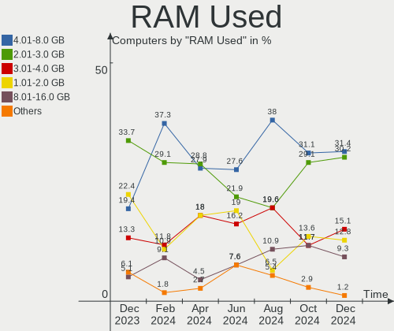

| Used GB   | Computers | Percent |
|-----------|-----------|---------|
| 4.01-8.0  | 14        | 30.43%  |
| 1.01-2.0  | 14        | 30.43%  |
| 2.01-3.0  | 6         | 13.04%  |
| 0.51-1.0  | 4         | 8.7%    |
| 3.01-4.0  | 3         | 6.52%   |
| 8.01-16.0 | 3         | 6.52%   |
| 0.01-0.5  | 2         | 4.35%   |

Total Drives
------------

Number of drives on board

| Drives | Computers | Percent |
|--------|-----------|---------|
| 1      | 23        | 50%     |
| 2      | 13        | 28.26%  |
| 3      | 5         | 10.87%  |
| 4      | 2         | 4.35%   |
| 7      | 1         | 2.17%   |
| 6      | 1         | 2.17%   |
| 5      | 1         | 2.17%   |

Has CD-ROM
----------

Has CD-ROM on board

| Presented | Computers | Percent |
|-----------|-----------|---------|
| No        | 31        | 67.39%  |
| Yes       | 15        | 32.61%  |

Has Ethernet
------------

Has Ethernet on board

| Presented | Computers | Percent |
|-----------|-----------|---------|
| Yes       | 35        | 76.09%  |
| No        | 11        | 23.91%  |

Has WiFi
--------

Has WiFi module

| Presented | Computers | Percent |
|-----------|-----------|---------|
| Yes       | 34        | 73.91%  |
| No        | 12        | 26.09%  |

Has Bluetooth
-------------

Has Bluetooth module

| Presented | Computers | Percent |
|-----------|-----------|---------|
| Yes       | 29        | 63.04%  |
| No        | 17        | 36.96%  |

Location
--------

Country
-------

Geographic location (country)

| Country     | Computers | Percent |
|-------------|-----------|---------|
| Germany     | 14        | 30.43%  |
| USA         | 4         | 8.7%    |
| France      | 3         | 6.52%   |
| Brazil      | 3         | 6.52%   |
| Austria     | 3         | 6.52%   |
| Mexico      | 2         | 4.35%   |
| Luxembourg  | 2         | 4.35%   |
| UK          | 1         | 2.17%   |
| Turkey      | 1         | 2.17%   |
| Switzerland | 1         | 2.17%   |
| Spain       | 1         | 2.17%   |
| South Korea | 1         | 2.17%   |
| Poland      | 1         | 2.17%   |
| Malaysia    | 1         | 2.17%   |
| Italy       | 1         | 2.17%   |
| Indonesia   | 1         | 2.17%   |
| India       | 1         | 2.17%   |
| Hungary     | 1         | 2.17%   |
| El Salvador | 1         | 2.17%   |
| Croatia     | 1         | 2.17%   |
| Bulgaria    | 1         | 2.17%   |
| Belgium     | 1         | 2.17%   |

City
----

Geographic location (city)

| City                  | Computers | Percent |
|-----------------------|-----------|---------|
| Schlangenbad          | 4         | 8.7%    |
| Vienna                | 2         | 4.35%   |
| Paderborn             | 2         | 4.35%   |
| Zurich                | 1         | 2.17%   |
| Wilhelmsburg          | 1         | 2.17%   |
| Warsaw                | 1         | 2.17%   |
| Trumansburg           | 1         | 2.17%   |
| Taunton               | 1         | 2.17%   |
| Sofia                 | 1         | 2.17%   |
| San Salvador          | 1         | 2.17%   |
| San Luis Potos?­ City | 1         | 2.17%   |
| Rendsburg             | 1         | 2.17%   |
| Recife                | 1         | 2.17%   |
| Pueblo                | 1         | 2.17%   |
| Portland              | 1         | 2.17%   |
| Nordenham             | 1         | 2.17%   |
| Nevez                 | 1         | 2.17%   |
| Munich                | 1         | 2.17%   |
| Milan                 | 1         | 2.17%   |
| M?©rida               | 1         | 2.17%   |
| Mahlow                | 1         | 2.17%   |
| Luxembourg            | 1         | 2.17%   |
| Kuala Lumpur          | 1         | 2.17%   |
| Jakarta               | 1         | 2.17%   |
| Henderson             | 1         | 2.17%   |
| Fontenay-sous-Bois    | 1         | 2.17%   |
| Essen                 | 1         | 2.17%   |
| Durmersheim           | 1         | 2.17%   |
| Duisburg              | 1         | 2.17%   |
| Differdange           | 1         | 2.17%   |
| Clermont-Ferrand      | 1         | 2.17%   |
| Chapec??              | 1         | 2.17%   |
| Canc??n               | 1         | 2.17%   |
| Busevec               | 1         | 2.17%   |
| Budapest              | 1         | 2.17%   |
| Braunschweig          | 1         | 2.17%   |
| Bengaluru             | 1         | 2.17%   |
| Bebedouro             | 1         | 2.17%   |
| Augsburg              | 1         | 2.17%   |
| Anyang-si             | 1         | 2.17%   |
| Ankara                | 1         | 2.17%   |

Drives
------

Drive Vendor
------------

Hard drive vendors

| Vendor                    | Computers | Drives | Percent |
|---------------------------|-----------|--------|---------|
| WDC                       | 15        | 24     | 20%     |
| Seagate                   | 9         | 11     | 12%     |
| Samsung Electronics       | 8         | 11     | 10.67%  |
| Unknown                   | 6         | 6      | 8%      |
| Kingston                  | 6         | 6      | 8%      |
| SanDisk                   | 5         | 5      | 6.67%   |
| Toshiba                   | 2         | 2      | 2.67%   |
| SK Hynix                  | 2         | 2      | 2.67%   |
| Phison                    | 2         | 2      | 2.67%   |
| Micron Technology         | 2         | 2      | 2.67%   |
| Crucial                   | 2         | 2      | 2.67%   |
| A-DATA Technology         | 2         | 2      | 2.67%   |
| XPG                       | 1         | 1      | 1.33%   |
| W800S                     | 1         | 1      | 1.33%   |
| SABRENT                   | 1         | 1      | 1.33%   |
| PNY                       | 1         | 1      | 1.33%   |
| Micron/Crucial Technology | 1         | 1      | 1.33%   |
| LITEONIT                  | 1         | 1      | 1.33%   |
| JMicron                   | 1         | 1      | 1.33%   |
| Intenso                   | 1         | 1      | 1.33%   |
| Intel                     | 1         | 1      | 1.33%   |
| imation                   | 1         | 1      | 1.33%   |
| IB-377U3                  | 1         | 1      | 1.33%   |
| Hitachi                   | 1         | 1      | 1.33%   |
| HGST HTS                  | 1         | 1      | 1.33%   |
| HGST                      | 1         | 1      | 1.33%   |

Drive Model
-----------

Hard drive models

| Model                                   | Computers | Percent |
|-----------------------------------------|-----------|---------|
| WDC WD10EZEX-08WN4A0 1TB                | 2         | 2.25%   |
| Phison NVMe SSD Drive 1024GB            | 2         | 2.25%   |
| Kingston SA400S37120G 120GB SSD         | 2         | 2.25%   |
| XPG NVMe SSD Drive 512GB                | 1         | 1.12%   |
| WDC WDS250G1B0C-00S6U0 250GB            | 1         | 1.12%   |
| WDC WDS100T1B0A-00H9H0 1TB SSD          | 1         | 1.12%   |
| WDC WD7502AAEX-00Y9A0 752GB             | 1         | 1.12%   |
| WDC WD5002AALX-00J37A0 500GB            | 1         | 1.12%   |
| WDC WD5000AAVS-00ZTB0 500GB             | 1         | 1.12%   |
| WDC WD50 00LPCX-00VHAT0 500GB           | 1         | 1.12%   |
| WDC WD40EZAZ-00SF3B0 4TB                | 1         | 1.12%   |
| WDC WD30EFRX-68AX9N0 3TB                | 1         | 1.12%   |
| WDC WD20EZRZ-00Z5HB0 2TB                | 1         | 1.12%   |
| WDC WD20EADS-00R6B0 2TB                 | 1         | 1.12%   |
| WDC WD2005FBYZ-01YCBB2 2TB              | 1         | 1.12%   |
| WDC WD10SPZX-22Z10T1 1TB                | 1         | 1.12%   |
| WDC WD10EZEX-75M2NA0 1TB                | 1         | 1.12%   |
| WDC WD10EZEX-60ZF5A0 1TB                | 1         | 1.12%   |
| WDC WD10EZEX-60WN4A0 1TB                | 1         | 1.12%   |
| WDC WD10EZEX-35WN4A0 1TB                | 1         | 1.12%   |
| WDC WD10EZEX-22MFCA0 1TB                | 1         | 1.12%   |
| WDC WD10EZEX-08RKKA0 1TB                | 1         | 1.12%   |
| WDC WD10EZEX-00KUWA0 1TB                | 1         | 1.12%   |
| WDC WD10EACS-00D6B1 1TB                 | 1         | 1.12%   |
| WDC WD1002FAEX-00Z3A0 1TB               | 1         | 1.12%   |
| WDC PC SN530 SDBPNPZ-512G-1006 512GB    | 1         | 1.12%   |
| W800S 256GB SSD                         | 1         | 1.12%   |
| Unknown SD/MMC/MS PRO 128GB             | 1         | 1.12%   |
| Unknown SC32G  32GB                     | 1         | 1.12%   |
| Unknown SC16G  16GB                     | 1         | 1.12%   |
| Unknown MMC Card  1TB                   | 1         | 1.12%   |
| Unknown DA4128  128GB                   | 1         | 1.12%   |
| Unknown 128GB SATA FLASH DRIVE          | 1         | 1.12%   |
| Toshiba MQ01ABD075 752GB                | 1         | 1.12%   |
| Toshiba KXG60ZNV512G NVMe KIOXIA 512GB  | 1         | 1.12%   |
| SK Hynix HFS128G39MND-3310A 128GB SSD   | 1         | 1.12%   |
| SK Hynix BC511 HFM256GDJTNI-82A0A 256GB | 1         | 1.12%   |
| Seagate ST500LM012 HN-M500MBB 500GB     | 1         | 1.12%   |
| Seagate ST500LM0 12 HN-M500MBB 500GB    | 1         | 1.12%   |
| Seagate ST3750630AS 752GB               | 1         | 1.12%   |
| Seagate ST3750528AS 752GB               | 1         | 1.12%   |
| Seagate ST2000DX001-1CM164 2TB          | 1         | 1.12%   |
| Seagate ST2000DM006-2DM164 2TB          | 1         | 1.12%   |
| Seagate ST2000DM001-1ER164 2TB          | 1         | 1.12%   |
| Seagate ST1000LM048-2E7172 1TB          | 1         | 1.12%   |
| Seagate ST1000LM024 HN-M101MBB 1TB      | 1         | 1.12%   |
| Seagate ST1000DM010-2EP102 1TB          | 1         | 1.12%   |
| Seagate One Touch SSD 500GB             | 1         | 1.12%   |
| SanDisk Ultra II 480GB SSD              | 1         | 1.12%   |
| SanDisk SD7TB3Q-256G-1006 256GB SSD     | 1         | 1.12%   |
| SanDisk SD7SB6S256G1001 256GB SSD       | 1         | 1.12%   |
| SanDisk SD7SB3Q-256G-1006 256GB SSD     | 1         | 1.12%   |
| Sandisk NVMe SSD Drive 1024GB           | 1         | 1.12%   |
| Samsung SSD 970 PRO 512GB               | 1         | 1.12%   |
| Samsung SSD 970 EVO Plus 1TB            | 1         | 1.12%   |
| Samsung SSD 970 EVO 1TB                 | 1         | 1.12%   |
| Samsung SSD 860 QVO 1TB                 | 1         | 1.12%   |
| Samsung SSD 860 PRO 1TB                 | 1         | 1.12%   |
| Samsung SSD 860 EVO 500GB               | 1         | 1.12%   |
| Samsung SSD 860 EVO 1TB                 | 1         | 1.12%   |

HDD Vendor
----------

Hard disk drive vendors

| Vendor  | Computers | Drives | Percent |
|---------|-----------|--------|---------|
| WDC     | 13        | 21     | 50%     |
| Seagate | 8         | 10     | 30.77%  |
| Unknown | 1         | 1      | 3.85%   |
| Toshiba | 1         | 1      | 3.85%   |
| Intenso | 1         | 1      | 3.85%   |
| Hitachi | 1         | 1      | 3.85%   |
| HGST    | 1         | 1      | 3.85%   |

SSD Vendor
----------

Solid state drive vendors

| Vendor              | Computers | Drives | Percent |
|---------------------|-----------|--------|---------|
| Samsung Electronics | 5         | 7      | 23.81%  |
| SanDisk             | 4         | 4      | 19.05%  |
| Kingston            | 3         | 3      | 14.29%  |
| WDC                 | 1         | 1      | 4.76%   |
| W800S               | 1         | 1      | 4.76%   |
| SK Hynix            | 1         | 1      | 4.76%   |
| Seagate             | 1         | 1      | 4.76%   |
| SABRENT             | 1         | 1      | 4.76%   |
| LITEONIT            | 1         | 1      | 4.76%   |
| imation             | 1         | 1      | 4.76%   |
| Crucial             | 1         | 1      | 4.76%   |
| A-DATA Technology   | 1         | 1      | 4.76%   |

Drive Kind
----------

HDD or SSD

| Kind    | Computers | Drives | Percent |
|---------|-----------|--------|---------|
| HDD     | 20        | 36     | 31.25%  |
| NVMe    | 19        | 23     | 29.69%  |
| SSD     | 19        | 23     | 29.69%  |
| MMC     | 4         | 4      | 6.25%   |
| Unknown | 2         | 3      | 3.13%   |

Drive Connector
---------------

SATA, SAS, NVMe, etc.

| Type | Computers | Drives | Percent |
|------|-----------|--------|---------|
| SATA | 29        | 54     | 49.15%  |
| NVMe | 19        | 22     | 32.2%   |
| SAS  | 7         | 9      | 11.86%  |
| MMC  | 4         | 4      | 6.78%   |

Drive Size
----------

Size of hard drive

| Size in TB | Computers | Drives | Percent |
|------------|-----------|--------|---------|
| 0.51-1.0   | 21        | 26     | 43.75%  |
| 0.01-0.5   | 19        | 24     | 39.58%  |
| 1.01-2.0   | 6         | 7      | 12.5%   |
| 3.01-4.0   | 1         | 1      | 2.08%   |
| 2.01-3.0   | 1         | 1      | 2.08%   |

Space Total
-----------

Amount of disk space available on the file system

| Size in GB     | Computers | Percent |
|----------------|-----------|---------|
| More than 3000 | 14        | 30.43%  |
| 1001-2000      | 10        | 21.74%  |
| 2001-3000      | 7         | 15.22%  |
| 501-1000       | 6         | 13.04%  |
| 251-500        | 5         | 10.87%  |
| 21-50          | 2         | 4.35%   |
| 101-250        | 2         | 4.35%   |

Space Used
----------

Amount of used disk space

| Used GB        | Computers | Percent |
|----------------|-----------|---------|
| 101-250        | 10        | 21.74%  |
| 501-1000       | 9         | 19.57%  |
| 1001-2000      | 7         | 15.22%  |
| 51-100         | 6         | 13.04%  |
| 2001-3000      | 5         | 10.87%  |
| 251-500        | 4         | 8.7%    |
| More than 3000 | 2         | 4.35%   |
| 1-20           | 2         | 4.35%   |
| 21-50          | 1         | 2.17%   |

Malfunc. Drives
---------------

Drive models with a malfunction

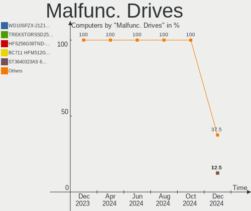

| Model                          | Computers | Drives | Percent |
|--------------------------------|-----------|--------|---------|
| Seagate ST2000DM001-1ER164 2TB | 1         | 1      | 50%     |
| HGST HTS721010A9E630 1TB       | 1         | 1      | 50%     |

Malfunc. Drive Vendor
---------------------

Vendors of faulty drives

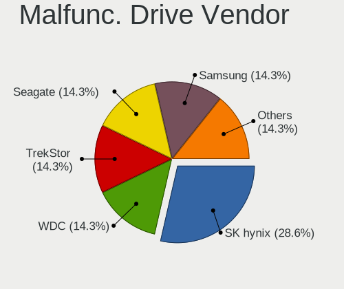

| Vendor  | Computers | Drives | Percent |
|---------|-----------|--------|---------|
| Seagate | 1         | 1      | 50%     |
| HGST    | 1         | 1      | 50%     |

Malfunc. HDD Vendor
-------------------

Vendors of faulty HDD drives

| Vendor  | Computers | Drives | Percent |
|---------|-----------|--------|---------|
| Seagate | 1         | 1      | 50%     |
| HGST    | 1         | 1      | 50%     |

Malfunc. Drive Kind
-------------------

Kinds of faulty drives

| Kind | Computers | Drives | Percent |
|------|-----------|--------|---------|
| HDD  | 2         | 2      | 100%    |

Failed Drives
-------------

Failed drive models

Zero info for selected period =(

Failed Drive Vendor
-------------------

Failed drive vendors

Zero info for selected period =(

Drive Status
------------

Number of failed and malfunc. drives

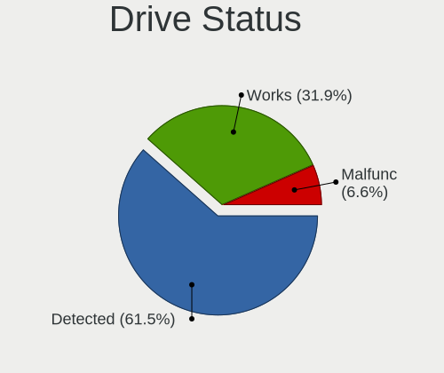

| Status   | Computers | Drives | Percent |
|----------|-----------|--------|---------|
| Detected | 24        | 52     | 48.98%  |
| Works    | 23        | 35     | 46.94%  |
| Malfunc  | 2         | 2      | 4.08%   |

Storage controller
------------------

Storage Vendor
--------------

Storage controller vendors

| Vendor                       | Computers | Percent |
|------------------------------|-----------|---------|
| Intel                        | 23        | 37.7%   |
| AMD                          | 14        | 22.95%  |
| Samsung Electronics          | 4         | 6.56%   |
| Sandisk                      | 3         | 4.92%   |
| Phison Electronics           | 3         | 4.92%   |
| Kingston Technology Company  | 3         | 4.92%   |
| Micron/Crucial Technology    | 2         | 3.28%   |
| Micron Technology            | 2         | 3.28%   |
| Toshiba America Info Systems | 1         | 1.64%   |
| SK Hynix                     | 1         | 1.64%   |
| Silicon Image                | 1         | 1.64%   |
| Marvell Technology Group     | 1         | 1.64%   |
| JMicron Technology           | 1         | 1.64%   |
| ASMedia Technology           | 1         | 1.64%   |
| ADATA Technology             | 1         | 1.64%   |

Storage Model
-------------

Storage controller models

| Model                                                                          | Computers | Percent |
|--------------------------------------------------------------------------------|-----------|---------|
| AMD FCH SATA Controller [AHCI mode]                                            | 10        | 14.49%  |
| Samsung NVMe SSD Controller SM981/PM981/PM983                                  | 4         | 5.8%    |
| Phison E12 NVMe Controller                                                     | 3         | 4.35%   |
| Intel 8 Series/C220 Series Chipset Family 6-port SATA Controller 1 [AHCI mode] | 3         | 4.35%   |
| Micron Non-Volatile memory controller                                          | 2         | 2.9%    |
| Kingston Company Company Non-Volatile memory controller                        | 2         | 2.9%    |
| Intel Volume Management Device NVMe RAID Controller                            | 2         | 2.9%    |
| Intel Q170/Q150/B150/H170/H110/Z170/CM236 Chipset SATA Controller [AHCI Mode]  | 2         | 2.9%    |
| Intel NM10/ICH7 Family SATA Controller [IDE mode]                              | 2         | 2.9%    |
| Intel Cannon Lake PCH SATA AHCI Controller                                     | 2         | 2.9%    |
| Intel 82801 Mobile SATA Controller [RAID mode]                                 | 2         | 2.9%    |
| Intel 7 Series Chipset Family 6-port SATA Controller [AHCI mode]               | 2         | 2.9%    |
| AMD X370 Series Chipset SATA Controller                                        | 2         | 2.9%    |
| AMD SB7x0/SB8x0/SB9x0 SATA Controller [AHCI mode]                              | 2         | 2.9%    |
| AMD SB7x0/SB8x0/SB9x0 IDE Controller                                           | 2         | 2.9%    |
| AMD 400 Series Chipset SATA Controller                                         | 2         | 2.9%    |
| Toshiba America Info Systems XG6 NVMe SSD Controller                           | 1         | 1.45%   |
| SK Hynix BC511                                                                 | 1         | 1.45%   |
| Silicon Image SiI 3132 Serial ATA Raid II Controller                           | 1         | 1.45%   |
| Sandisk WD Blue SN550 NVMe SSD                                                 | 1         | 1.45%   |
| Sandisk WD Blue SN500 / PC SN520 NVMe SSD                                      | 1         | 1.45%   |
| Sandisk WD Black SN750 / PC SN730 NVMe SSD                                     | 1         | 1.45%   |
| Micron/Crucial P2 NVMe PCIe SSD                                                | 1         | 1.45%   |
| Micron/Crucial P1 NVMe PCIe SSD                                                | 1         | 1.45%   |
| Marvell Group 88SE9128 PCIe SATA 6 Gb/s RAID controller with HyperDuo          | 1         | 1.45%   |
| Kingston Company A2000 NVMe SSD                                                | 1         | 1.45%   |
| JMicron JMB362 SATA Controller                                                 | 1         | 1.45%   |
| Intel Tiger Lake-LP SATA Controller [AHCI mode]                                | 1         | 1.45%   |
| Intel Sunrise Point-LP SATA Controller [AHCI mode]                             | 1         | 1.45%   |
| Intel SSD 660P Series                                                          | 1         | 1.45%   |
| Intel SATA Controller [RAID mode]                                              | 1         | 1.45%   |
| Intel HM170/QM170 Chipset SATA Controller [AHCI Mode]                          | 1         | 1.45%   |
| Intel Celeron/Pentium Silver Processor SATA Controller                         | 1         | 1.45%   |
| Intel 82801G (ICH7 Family) IDE Controller                                      | 1         | 1.45%   |
| Intel 6 Series/C200 Series Chipset Family 6 port Mobile SATA AHCI Controller   | 1         | 1.45%   |
| Intel 6 Series/C200 Series Chipset Family 6 port Desktop SATA AHCI Controller  | 1         | 1.45%   |
| Intel 500 Series Chipset Family SATA AHCI Controller                           | 1         | 1.45%   |
| Intel 5 Series/3400 Series Chipset 6 port SATA AHCI Controller                 | 1         | 1.45%   |
| ASMedia 106x SATA/RAID Controller                                              | 1         | 1.45%   |
| AMD FCH SATA Controller D                                                      | 1         | 1.45%   |
| ADATA XPG SX8200 Pro PCIe Gen3x4 M.2 2280 Solid State Drive                    | 1         | 1.45%   |

Storage Kind
------------

Kind of storage controller (IDE, SATA, NVMe, SAS, ...)

| Kind | Computers | Percent |
|------|-----------|---------|
| SATA | 30        | 50.85%  |
| NVMe | 19        | 32.2%   |
| RAID | 6         | 10.17%  |
| IDE  | 4         | 6.78%   |

Processor
---------

CPU Vendor
----------

Processor vendors

| Vendor | Computers | Percent |
|--------|-----------|---------|
| Intel  | 28        | 60.87%  |
| AMD    | 16        | 34.78%  |
| ARM    | 2         | 4.35%   |

CPU Model
---------

Processor models

| Model                                         | Computers | Percent |
|-----------------------------------------------|-----------|---------|
| Intel 11th Gen Core i7-1165G7 @ 2.80GHz       | 4         | 8.7%    |
| Intel Core i7-4790 CPU @ 3.60GHz              | 2         | 4.35%   |
| ARM Processor                                 | 2         | 4.35%   |
| Intel Pentium Gold G5400 CPU @ 3.70GHz        | 1         | 2.17%   |
| Intel Core i7-9700K CPU @ 3.60GHz             | 1         | 2.17%   |
| Intel Core i7-8550U CPU @ 1.80GHz             | 1         | 2.17%   |
| Intel Core i7-7700HQ CPU @ 2.80GHz            | 1         | 2.17%   |
| Intel Core i7-6700 CPU @ 3.40GHz              | 1         | 2.17%   |
| Intel Core i7-4702HQ CPU @ 2.20GHz            | 1         | 2.17%   |
| Intel Core i7-4600M CPU @ 2.90GHz             | 1         | 2.17%   |
| Intel Core i7-3740QM CPU @ 2.70GHz            | 1         | 2.17%   |
| Intel Core i7-2700K CPU @ 3.50GHz             | 1         | 2.17%   |
| Intel Core i5-7Y54 CPU @ 1.20GHz              | 1         | 2.17%   |
| Intel Core i5-7200U CPU @ 2.50GHz             | 1         | 2.17%   |
| Intel Core i5-6400 CPU @ 2.70GHz              | 1         | 2.17%   |
| Intel Core i5-3317U CPU @ 1.70GHz             | 1         | 2.17%   |
| Intel Core i5-3230M CPU @ 2.60GHz             | 1         | 2.17%   |
| Intel Core i5-2520M CPU @ 2.50GHz             | 1         | 2.17%   |
| Intel Core i5-10310U CPU @ 1.70GHz            | 1         | 2.17%   |
| Intel Core i3-8145U CPU @ 2.10GHz             | 1         | 2.17%   |
| Intel Core i3 CPU M 380 @ 2.53GHz             | 1         | 2.17%   |
| Intel Core 2 Quad CPU Q9300 @ 2.50GHz         | 1         | 2.17%   |
| Intel Core 2 Duo CPU E7400 @ 2.80GHz          | 1         | 2.17%   |
| Intel Celeron N4100 CPU @ 1.10GHz             | 1         | 2.17%   |
| Intel 11th Gen Core i9-11900KF @ 3.50GHz      | 1         | 2.17%   |
| AMD Sempron 2650 APU with Radeon R3           | 1         | 2.17%   |
| AMD Ryzen 9 4900H with Radeon Graphics        | 1         | 2.17%   |
| AMD Ryzen 7 PRO 4750U with Radeon Graphics    | 1         | 2.17%   |
| AMD Ryzen 7 5800H with Radeon Graphics        | 1         | 2.17%   |
| AMD Ryzen 7 1800X Eight-Core Processor        | 1         | 2.17%   |
| AMD Ryzen 7 1700 Eight-Core Processor         | 1         | 2.17%   |
| AMD Ryzen 5 5600H with Radeon Graphics        | 1         | 2.17%   |
| AMD Ryzen 5 4500U with Radeon Graphics        | 1         | 2.17%   |
| AMD Ryzen 5 3600 6-Core Processor             | 1         | 2.17%   |
| AMD Ryzen 5 2500U with Radeon Vega Mobile Gfx | 1         | 2.17%   |
| AMD Ryzen 5 1600 Six-Core Processor           | 1         | 2.17%   |
| AMD Ryzen 3 2200G with Radeon Vega Graphics   | 1         | 2.17%   |
| AMD Phenom II X4 B50 Processor                | 1         | 2.17%   |
| AMD Phenom II X4 965 Processor                | 1         | 2.17%   |
| AMD FX-8350 Eight-Core Processor              | 1         | 2.17%   |
| AMD E2-1800 APU with Radeon HD Graphics       | 1         | 2.17%   |

CPU Model Family
----------------

Processor model prefix

| Model              | Computers | Percent |
|--------------------|-----------|---------|
| Intel Core i7      | 10        | 21.74%  |
| Other              | 7         | 15.22%  |
| Intel Core i5      | 7         | 15.22%  |
| AMD Ryzen 5        | 5         | 10.87%  |
| AMD Ryzen 7        | 3         | 6.52%   |
| Intel Core i3      | 2         | 4.35%   |
| AMD Phenom II X4   | 2         | 4.35%   |
| Intel Pentium Gold | 1         | 2.17%   |
| Intel Core 2 Quad  | 1         | 2.17%   |
| Intel Core 2 Duo   | 1         | 2.17%   |
| Intel Celeron      | 1         | 2.17%   |
| AMD Sempron        | 1         | 2.17%   |
| AMD Ryzen 9        | 1         | 2.17%   |
| AMD Ryzen 7 PRO    | 1         | 2.17%   |
| AMD Ryzen 3        | 1         | 2.17%   |
| AMD FX             | 1         | 2.17%   |
| AMD E2             | 1         | 2.17%   |

CPU Cores
---------

Number of processor cores

| Number | Computers | Percent |
|--------|-----------|---------|
| 4      | 23        | 50%     |
| 2      | 12        | 26.09%  |
| 8      | 7         | 15.22%  |
| 6      | 4         | 8.7%    |

CPU Sockets
-----------

Number of sockets

| Number | Computers | Percent |
|--------|-----------|---------|
| 1      | 46        | 100%    |

CPU Threads
-----------

Threads per core (Hyper-Threading)

| Number | Computers | Percent |
|--------|-----------|---------|
| 2      | 33        | 71.74%  |
| 1      | 13        | 28.26%  |

CPU Op-Modes
------------

CPU Operation Modes (32-bit, 64-bit)

| Op mode        | Computers | Percent |
|----------------|-----------|---------|
| 32-bit, 64-bit | 46        | 100%    |

CPU Microcode
-------------

Microcode number

| Number     | Computers | Percent |
|------------|-----------|---------|
| Unknown    | 9         | 19.57%  |
| 0x806c1    | 4         | 8.7%    |
| 0x306c3    | 3         | 6.52%   |
| 0x806ec    | 2         | 4.35%   |
| 0x806e9    | 2         | 4.35%   |
| 0x306a9    | 2         | 4.35%   |
| 0x206a7    | 2         | 4.35%   |
| 0x0a50000c | 2         | 4.35%   |
| 0x08600104 | 2         | 4.35%   |
| 0x08001137 | 2         | 4.35%   |
| 0xa0671    | 1         | 2.17%   |
| 0x906ed    | 1         | 2.17%   |
| 0x906ea    | 1         | 2.17%   |
| 0x906e9    | 1         | 2.17%   |
| 0x806ea    | 1         | 2.17%   |
| 0x706a1    | 1         | 2.17%   |
| 0x20655    | 1         | 2.17%   |
| 0x10677    | 1         | 2.17%   |
| 0x08701021 | 1         | 2.17%   |
| 0x08600106 | 1         | 2.17%   |
| 0x08101016 | 1         | 2.17%   |
| 0x08101007 | 1         | 2.17%   |
| 0x08001138 | 1         | 2.17%   |
| 0x06000852 | 1         | 2.17%   |
| 0x05000119 | 1         | 2.17%   |
| 0x010000c8 | 1         | 2.17%   |

CPU Microarch
-------------

Microarchitecture

| Name          | Computers | Percent |
|---------------|-----------|---------|
| KabyLake      | 8         | 17.39%  |
| Zen           | 5         | 10.87%  |
| Zen 2         | 4         | 8.7%    |
| TigerLake     | 4         | 8.7%    |
| Haswell       | 4         | 8.7%    |
| IvyBridge     | 3         | 6.52%   |
| Zen 3         | 2         | 4.35%   |
| Skylake       | 2         | 4.35%   |
| SandyBridge   | 2         | 4.35%   |
| Penryn        | 2         | 4.35%   |
| K10           | 2         | 4.35%   |
| Unknown       | 2         | 4.35%   |
| Westmere      | 1         | 2.17%   |
| Piledriver    | 1         | 2.17%   |
| Jaguar        | 1         | 2.17%   |
| Icelake       | 1         | 2.17%   |
| Goldmont plus | 1         | 2.17%   |
| Bobcat        | 1         | 2.17%   |

Graphics
--------

GPU Vendor
----------

Vendors of graphics cards

| Vendor | Computers | Percent |
|--------|-----------|---------|
| Intel  | 23        | 42.59%  |
| AMD    | 16        | 29.63%  |
| Nvidia | 15        | 27.78%  |

GPU Model
---------

Graphics card models

| Model                                                                       | Computers | Percent |
|-----------------------------------------------------------------------------|-----------|---------|
| Intel TigerLake-LP GT2 [Iris Xe Graphics]                                   | 4         | 7.14%   |
| Intel 3rd Gen Core processor Graphics Controller                            | 3         | 5.36%   |
| AMD Renoir                                                                  | 3         | 5.36%   |
| Intel 2nd Generation Core Processor Family Integrated Graphics Controller   | 2         | 3.57%   |
| AMD Raven Ridge [Radeon Vega Series / Radeon Vega Mobile Series]            | 2         | 3.57%   |
| AMD Cezanne                                                                 | 2         | 3.57%   |
| Nvidia TU116M [GeForce GTX 1660 Ti Mobile]                                  | 1         | 1.79%   |
| Nvidia TU106 [GeForce RTX 2060 Rev. A]                                      | 1         | 1.79%   |
| Nvidia GP107M [GeForce MX350]                                               | 1         | 1.79%   |
| Nvidia GP107M [GeForce GTX 1050 Mobile]                                     | 1         | 1.79%   |
| Nvidia GP107 [GeForce GTX 1050 Ti]                                          | 1         | 1.79%   |
| Nvidia GP106 [GeForce GTX 1060 6GB]                                         | 1         | 1.79%   |
| Nvidia GP104 [GeForce GTX 1080]                                             | 1         | 1.79%   |
| Nvidia GP104 [GeForce GTX 1070]                                             | 1         | 1.79%   |
| Nvidia GM204 [GeForce GTX 980]                                              | 1         | 1.79%   |
| Nvidia GM204 [GeForce GTX 970]                                              | 1         | 1.79%   |
| Nvidia GK208M [GeForce GT 730M]                                             | 1         | 1.79%   |
| Nvidia GK208GLM [Quadro K610M]                                              | 1         | 1.79%   |
| Nvidia GK107GLM [Quadro K1100M]                                             | 1         | 1.79%   |
| Nvidia GK104GLM [Quadro K3000M]                                             | 1         | 1.79%   |
| Nvidia GA106M [GeForce RTX 3060 Mobile / Max-Q]                             | 1         | 1.79%   |
| Nvidia GA102 [GeForce RTX 3080 Ti]                                          | 1         | 1.79%   |
| Intel Xeon E3-1200 v3/4th Gen Core Processor Integrated Graphics Controller | 1         | 1.79%   |
| Intel WhiskeyLake-U GT2 [UHD Graphics 620]                                  | 1         | 1.79%   |
| Intel UHD Graphics 620                                                      | 1         | 1.79%   |
| Intel HD Graphics 630                                                       | 1         | 1.79%   |
| Intel HD Graphics 620                                                       | 1         | 1.79%   |
| Intel HD Graphics 615                                                       | 1         | 1.79%   |
| Intel HD Graphics 530                                                       | 1         | 1.79%   |
| Intel GeminiLake [UHD Graphics 600]                                         | 1         | 1.79%   |
| Intel DG1 [Iris Xe MAX Graphics]                                            | 1         | 1.79%   |
| Intel Core Processor Integrated Graphics Controller                         | 1         | 1.79%   |
| Intel CometLake-U GT2 [UHD Graphics]                                        | 1         | 1.79%   |
| Intel CoffeeLake-S GT2 [UHD Graphics 630]                                   | 1         | 1.79%   |
| Intel CoffeeLake-S GT1 [UHD Graphics 610]                                   | 1         | 1.79%   |
| Intel 4th Gen Core Processor Integrated Graphics Controller                 | 1         | 1.79%   |
| Intel 4 Series Chipset Integrated Graphics Controller                       | 1         | 1.79%   |
| AMD Tonga PRO [Radeon R9 285/380]                                           | 1         | 1.79%   |
| AMD Thames [Radeon HD 7500M/7600M Series]                                   | 1         | 1.79%   |
| AMD Seymour [Radeon HD 6400M/7400M Series]                                  | 1         | 1.79%   |
| AMD RV610 [Radeon HD 2400 PRO]                                              | 1         | 1.79%   |
| AMD Navi 23 [Radeon RX 6600/6600 XT/6600M]                                  | 1         | 1.79%   |
| AMD Kabini [Radeon HD 8240 / R3 Series]                                     | 1         | 1.79%   |
| AMD Juniper XT [Radeon HD 5770]                                             | 1         | 1.79%   |
| AMD Ellesmere [Radeon RX 470/480/570/570X/580/580X/590]                     | 1         | 1.79%   |
| AMD Curacao PRO [Radeon R7 370 / R9 270/370 OEM]                            | 1         | 1.79%   |

GPU Combo
---------

Combinations of graphics cards

| Name           | Computers | Percent |
|----------------|-----------|---------|
| 1 x Intel      | 13        | 28.26%  |
| 1 x AMD        | 13        | 28.26%  |
| 1 x Nvidia     | 6         | 13.04%  |
| Intel + Nvidia | 6         | 13.04%  |
| Other          | 3         | 6.52%   |
| AMD + Nvidia   | 2         | 4.35%   |
| 2 x Nvidia     | 1         | 2.17%   |
| 2 x Intel      | 1         | 2.17%   |
| Intel + AMD    | 1         | 2.17%   |

GPU Driver
----------

Free vs proprietary

| Driver      | Computers | Percent |
|-------------|-----------|---------|
| Free        | 33        | 71.74%  |
| Proprietary | 7         | 15.22%  |
| Unknown     | 6         | 13.04%  |

GPU Memory
----------

Total video memory

| Size in GB | Computers | Percent |
|------------|-----------|---------|
| Unknown    | 25        | 54.35%  |
| 3.01-4.0   | 5         | 10.87%  |
| 1.01-2.0   | 4         | 8.7%    |
| 0.51-1.0   | 4         | 8.7%    |
| 5.01-6.0   | 3         | 6.52%   |
| 7.01-8.0   | 2         | 4.35%   |
| 0.01-0.5   | 2         | 4.35%   |
| 8.01-16.0  | 1         | 2.17%   |

Monitor
-------

Monitor Vendor
--------------

Monitor vendors

| Vendor               | Computers | Percent |
|----------------------|-----------|---------|
| Samsung Electronics  | 8         | 14.81%  |
| Chimei Innolux       | 6         | 11.11%  |
| Dell                 | 5         | 9.26%   |
| Goldstar             | 4         | 7.41%   |
| BOE                  | 4         | 7.41%   |
| AU Optronics         | 4         | 7.41%   |
| Sharp                | 2         | 3.7%    |
| Philips              | 2         | 3.7%    |
| LG Display           | 2         | 3.7%    |
| Lenovo               | 2         | 3.7%    |
| BenQ                 | 2         | 3.7%    |
| ASUSTek Computer     | 2         | 3.7%    |
| Acer                 | 2         | 3.7%    |
| Unknown              | 1         | 1.85%   |
| InnoLux Display      | 1         | 1.85%   |
| InfoVision           | 1         | 1.85%   |
| Iiyama               | 1         | 1.85%   |
| Hewlett-Packard      | 1         | 1.85%   |
| Fujitsu Siemens      | 1         | 1.85%   |
| Denver               | 1         | 1.85%   |
| AOC                  | 1         | 1.85%   |
| Ancor Communications | 1         | 1.85%   |

Monitor Model
-------------

Monitor models

| Model                                                                 | Computers | Percent |
|-----------------------------------------------------------------------|-----------|---------|
| Chimei Innolux LCD Monitor CMN14D4 1920x1080 309x173mm 13.9-inch      | 2         | 3.57%   |
| Unknown LCD Monitor SAMSUNG                                           | 1         | 1.79%   |
| Sharp LCD Monitor SHP14F9 1920x1200 288x180mm 13.4-inch               | 1         | 1.79%   |
| Sharp LCD Monitor SHP13F8 3200x1800 346x194mm 15.6-inch               | 1         | 1.79%   |
| Samsung Electronics SA300/SA350 SAM0788 1366x768 410x230mm 18.5-inch  | 1         | 1.79%   |
| Samsung Electronics S24D330 SAM0D92 1920x1080 531x299mm 24.0-inch     | 1         | 1.79%   |
| Samsung Electronics S23B550 SAM0919 1920x1080 510x287mm 23.0-inch     | 1         | 1.79%   |
| Samsung Electronics LCD Monitor SyncMaster 1920x1080                  | 1         | 1.79%   |
| Samsung Electronics LCD Monitor SDC4150 3456x2160 336x210mm 15.6-inch | 1         | 1.79%   |
| Samsung Electronics LCD Monitor SDC3754 1600x900 382x215mm 17.3-inch  | 1         | 1.79%   |
| Samsung Electronics LCD Monitor S27A950D 5760x2160                    | 1         | 1.79%   |
| Samsung Electronics C27F390 SAM0D32 1920x1080 600x340mm 27.2-inch     | 1         | 1.79%   |
| Philips PHL 243V5 PHLC0D3 1920x1080 520x290mm 23.4-inch               | 1         | 1.79%   |
| Philips PHL 223V5LH PHLC114 1920x1080 477x268mm 21.5-inch             | 1         | 1.79%   |
| LG Display LCD Monitor LGD038E 1366x768 340x190mm 15.3-inch           | 1         | 1.79%   |
| LG Display LCD Monitor LGD02DA 1920x1080 380x220mm 17.3-inch          | 1         | 1.79%   |
| Lenovo P24h-10 LEN61AE 2560x1440 527x296mm 23.8-inch                  | 1         | 1.79%   |
| Lenovo LEN P24h-20 LEN61F4 2560x1440 527x296mm 23.8-inch              | 1         | 1.79%   |
| Lenovo LEN L1900pA LEN114F 1280x1024 376x301mm 19.0-inch              | 1         | 1.79%   |
| InnoLux Display LCD Monitor INL0014 1366x768 309x174mm 14.0-inch      | 1         | 1.79%   |
| InfoVision LCD Monitor IVO03F4 1920x1200 263x164mm 12.2-inch          | 1         | 1.79%   |
| Iiyama PL2201W IVM5602 1680x1050 490x320mm 23.0-inch                  | 1         | 1.79%   |
| Hewlett-Packard E273m HPN346E 1920x1080 598x336mm 27.0-inch           | 1         | 1.79%   |
| Goldstar L1718S GSM443C 1280x1024 338x270mm 17.0-inch                 | 1         | 1.79%   |
| Goldstar HDR WFHD GSM7714 2560x1080 798x334mm 34.1-inch               | 1         | 1.79%   |
| Goldstar E2441 GSM581F 1920x1080 531x299mm 24.0-inch                  | 1         | 1.79%   |
| Goldstar E2251 GSM586F 1920x1080 480x270mm 21.7-inch                  | 1         | 1.79%   |
| Fujitsu Siemens E22W-5 FUS07D0 1680x1050 470x300mm 22.0-inch          | 1         | 1.79%   |
| Denver UWQHD-100-V2 LHC3500 3440x1440 798x342mm 34.2-inch             | 1         | 1.79%   |
| Dell UZ2315H DELF055 1920x1080 509x286mm 23.0-inch                    | 1         | 1.79%   |
| Dell P2418D DELD0C1 2560x1440 526x296mm 23.8-inch                     | 1         | 1.79%   |
| Dell P2219H DELA114 1920x1080 476x267mm 21.5-inch                     | 1         | 1.79%   |
| Dell P2217H DELA0D9 1920x1080 476x267mm 21.5-inch                     | 1         | 1.79%   |
| Dell E2218HN DELF09D 1920x1080 476x268mm 21.5-inch                    | 1         | 1.79%   |
| Dell 1908FP DEL4026 1280x1024 376x301mm 19.0-inch                     | 1         | 1.79%   |
| Chimei Innolux LCD Monitor CMN1747 1920x1080 381x214mm 17.2-inch      | 1         | 1.79%   |
| Chimei Innolux LCD Monitor CMN14F2 1920x1080 309x173mm 13.9-inch      | 1         | 1.79%   |
| Chimei Innolux LCD Monitor CMN1239 1920x1080 276x155mm 12.5-inch      | 1         | 1.79%   |
| Chimei Innolux LCD Monitor CMN1137 1920x1080 256x144mm 11.6-inch      | 1         | 1.79%   |
| BOE LCD Monitor BOE08E8 1920x1080 344x194mm 15.5-inch                 | 1         | 1.79%   |
| BOE LCD Monitor BOE08DA 1920x1080 309x174mm 14.0-inch                 | 1         | 1.79%   |
| BOE LCD Monitor BOE084E 1920x1080 382x215mm 17.3-inch                 | 1         | 1.79%   |
| BOE LCD Monitor BOE06F4 3840x2160 345x194mm 15.6-inch                 | 1         | 1.79%   |
| BenQ T52W BNQ771F 1280x720 332x187mm 15.0-inch                        | 1         | 1.79%   |
| BenQ BL2405 BNQ8016 1920x1080 531x298mm 24.0-inch                     | 1         | 1.79%   |
| AU Optronics LCD Monitor AUO82ED 1920x1080 344x194mm 15.5-inch        | 1         | 1.79%   |
| AU Optronics LCD Monitor AUO479D 1920x1080 382x215mm 17.3-inch        | 1         | 1.79%   |
| AU Optronics LCD Monitor AUO35EB 3840x2160 344x193mm 15.5-inch        | 1         | 1.79%   |
| AU Optronics LCD Monitor AUO193C 1366x768 309x173mm 13.9-inch         | 1         | 1.79%   |
| ASUSTek Computer VL279 AUS2781 1920x1080 598x336mm 27.0-inch          | 1         | 1.79%   |
| ASUSTek Computer VG278 AUS27AF 1920x1080 598x336mm 27.0-inch          | 1         | 1.79%   |
| AOC 2250W AOC2250 1920x1080 477x268mm 21.5-inch                       | 1         | 1.79%   |
| Ancor Communications ASUS VE278 ACI27F6 1920x1080 598x336mm 27.0-inch | 1         | 1.79%   |
| Acer X163W ACR0015 1366x768 344x193mm 15.5-inch                       | 1         | 1.79%   |
| Acer GD245HQ ACR0125 1920x1080 520x290mm 23.4-inch                    | 1         | 1.79%   |

Monitor Resolution
------------------

Monitor screen resolution

| Resolution         | Computers | Percent |
|--------------------|-----------|---------|
| 1920x1080 (FHD)    | 27        | 54%     |
| 1366x768 (WXGA)    | 4         | 8%      |
| 1280x1024 (SXGA)   | 3         | 6%      |
| 3840x2160 (4K)     | 2         | 4%      |
| 2560x1440 (QHD)    | 2         | 4%      |
| 1920x1200 (WUXGA)  | 2         | 4%      |
| 1680x1050 (WSXGA+) | 2         | 4%      |
| 5760x2160          | 1         | 2%      |
| 3456x2160          | 1         | 2%      |
| 3440x1440          | 1         | 2%      |
| 3200x1800 (QHD+)   | 1         | 2%      |
| 2560x1080          | 1         | 2%      |
| 1600x900 (HD+)     | 1         | 2%      |
| 1280x720 (HD)      | 1         | 2%      |
| Unknown            | 1         | 2%      |

Monitor Diagonal
----------------

Diagonal size in inches

| Inches  | Computers | Percent |
|---------|-----------|---------|
| 15      | 10        | 19.23%  |
| 21      | 6         | 11.54%  |
| 17      | 6         | 11.54%  |
| 27      | 5         | 9.62%   |
| 23      | 5         | 9.62%   |
| 13      | 5         | 9.62%   |
| 24      | 3         | 5.77%   |
| 34      | 2         | 3.85%   |
| 14      | 2         | 3.85%   |
| Unknown | 2         | 3.85%   |
| 22      | 1         | 1.92%   |
| 20      | 1         | 1.92%   |
| 19      | 1         | 1.92%   |
| 18      | 1         | 1.92%   |
| 12      | 1         | 1.92%   |
| 11      | 1         | 1.92%   |

Monitor Width
-------------

Physical width

| Width in mm | Computers | Percent |
|-------------|-----------|---------|
| 301-350     | 17        | 32.69%  |
| 501-600     | 12        | 23.08%  |
| 401-500     | 9         | 17.31%  |
| 351-400     | 7         | 13.46%  |
| 201-300     | 3         | 5.77%   |
| 701-800     | 2         | 3.85%   |
| Unknown     | 2         | 3.85%   |

Aspect Ratio
------------

Proportional relationship between the width and the height

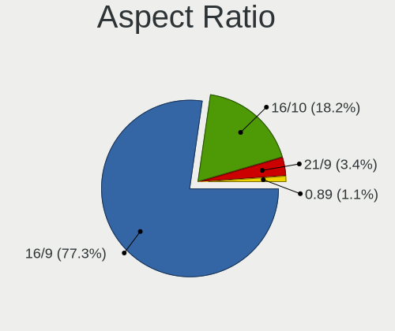

| Ratio   | Computers | Percent |
|---------|-----------|---------|
| 16/9    | 35        | 76.09%  |
| 5/4     | 3         | 6.52%   |
| 16/10   | 3         | 6.52%   |
| 21/9    | 2         | 4.35%   |
| Unknown | 2         | 4.35%   |
| 3/2     | 1         | 2.17%   |

Monitor Area
------------

Area in inch²

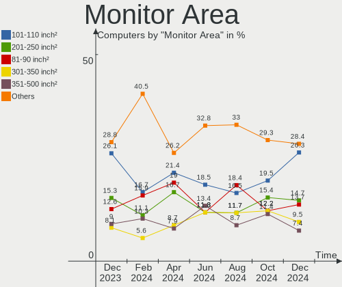

| Area in inch² | Computers | Percent |
|----------------|-----------|---------|
| 201-250        | 13        | 25.49%  |
| 101-110        | 9         | 17.65%  |
| 81-90          | 6         | 11.76%  |
| 301-350        | 5         | 9.8%    |
| 121-130        | 5         | 9.8%    |
| 151-200        | 3         | 5.88%   |
| 351-500        | 2         | 3.92%   |
| 141-150        | 2         | 3.92%   |
| Unknown        | 2         | 3.92%   |
| 71-80          | 1         | 1.96%   |
| 61-70          | 1         | 1.96%   |
| 51-60          | 1         | 1.96%   |
| 91-100         | 1         | 1.96%   |

Pixel Density
-------------

Pixels per inch

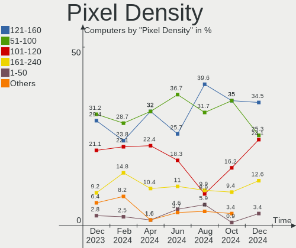

| Density       | Computers | Percent |
|---------------|-----------|---------|
| 51-100        | 16        | 32.65%  |
| 101-120       | 13        | 26.53%  |
| 121-160       | 11        | 22.45%  |
| 161-240       | 4         | 8.16%   |
| More than 240 | 3         | 6.12%   |
| Unknown       | 2         | 4.08%   |

Multiple Monitors
-----------------

Total monitors connected

| Total | Computers | Percent |
|-------|-----------|---------|
| 1     | 28        | 60.87%  |
| 2     | 11        | 23.91%  |
| 0     | 5         | 10.87%  |
| 4     | 1         | 2.17%   |
| 3     | 1         | 2.17%   |

Network
-------

Net Controller Vendor
---------------------

Controller vendors

| Vendor                            | Computers | Percent |
|-----------------------------------|-----------|---------|
| Intel                             | 27        | 40.3%   |
| Realtek Semiconductor             | 23        | 34.33%  |
| Qualcomm Atheros                  | 6         | 8.96%   |
| DisplayLink                       | 2         | 2.99%   |
| TP-Link                           | 1         | 1.49%   |
| Samsung Electronics               | 1         | 1.49%   |
| Ralink                            | 1         | 1.49%   |
| Holtek Semiconductor              | 1         | 1.49%   |
| Ericsson Business Mobile Networks | 1         | 1.49%   |
| Broadcom Limited                  | 1         | 1.49%   |
| Broadcom                          | 1         | 1.49%   |
| AVM                               | 1         | 1.49%   |
| Aquantia                          | 1         | 1.49%   |

Net Controller Model
--------------------

Controller models

| Model                                                             | Computers | Percent |
|-------------------------------------------------------------------|-----------|---------|
| Realtek RTL8111/8168/8411 PCI Express Gigabit Ethernet Controller | 18        | 24.32%  |
| Intel Wi-Fi 6 AX201                                               | 4         | 5.41%   |
| Intel Wi-Fi 6 AX200                                               | 4         | 5.41%   |
| Realtek RTL8822CE 802.11ac PCIe Wireless Network Adapter          | 2         | 2.7%    |
| Realtek RTL8153 Gigabit Ethernet Adapter                          | 2         | 2.7%    |
| Realtek RTL810xE PCI Express Fast Ethernet controller             | 2         | 2.7%    |
| Qualcomm Atheros QCA6174 802.11ac Wireless Network Adapter        | 2         | 2.7%    |
| Qualcomm Atheros AR9485 Wireless Network Adapter                  | 2         | 2.7%    |
| Intel Wireless 8265 / 8275                                        | 2         | 2.7%    |
| Intel Wireless 7260                                               | 2         | 2.7%    |
| TP-Link 802.11ac NIC                                              | 1         | 1.35%   |
| Samsung Galaxy series, misc. (tethering mode)                     | 1         | 1.35%   |
| Realtek RTL8191SEvB Wireless LAN Controller                       | 1         | 1.35%   |
| Realtek RTL8188CE 802.11b/g/n WiFi Adapter                        | 1         | 1.35%   |
| Ralink RT2561/RT61 802.11g PCI                                    | 1         | 1.35%   |
| Qualcomm Atheros Killer E2500 Gigabit Ethernet Controller         | 1         | 1.35%   |
| Qualcomm Atheros Killer E2400 Gigabit Ethernet Controller         | 1         | 1.35%   |
| Qualcomm Atheros AR8121/AR8113/AR8114 Gigabit or Fast Ethernet    | 1         | 1.35%   |
| Intel Wireless 8260                                               | 1         | 1.35%   |
| Intel Wireless 7265                                               | 1         | 1.35%   |
| Intel I211 Gigabit Network Connection                             | 1         | 1.35%   |
| Intel Gemini Lake PCH CNVi WiFi                                   | 1         | 1.35%   |
| Intel Ethernet Controller I225-V                                  | 1         | 1.35%   |
| Intel Ethernet Connection I217-LM                                 | 1         | 1.35%   |
| Intel Ethernet Connection (7) I219-LM                             | 1         | 1.35%   |
| Intel Ethernet Connection (4) I219-V                              | 1         | 1.35%   |
| Intel Ethernet Connection (2) I219-LM                             | 1         | 1.35%   |
| Intel Dual Band Wireless-AC 3168NGW [Stone Peak]                  | 1         | 1.35%   |
| Intel Comet Lake PCH-LP CNVi WiFi                                 | 1         | 1.35%   |
| Intel Centrino Wireless-N 135                                     | 1         | 1.35%   |
| Intel Centrino Wireless-N 1000 [Condor Peak]                      | 1         | 1.35%   |
| Intel Centrino Advanced-N 6205 [Taylor Peak]                      | 1         | 1.35%   |
| Intel Cannon Point-LP CNVi [Wireless-AC]                          | 1         | 1.35%   |
| Intel Cannon Lake PCH CNVi WiFi                                   | 1         | 1.35%   |
| Intel 82579V Gigabit Network Connection                           | 1         | 1.35%   |
| Intel 82579LM Gigabit Network Connection (Lewisville)             | 1         | 1.35%   |
| Holtek SKILLER SGM1                                               | 1         | 1.35%   |
| Ericsson Business Mobile Networks F5521gw                         | 1         | 1.35%   |
| DisplayLink USB3.0 Dual Video Dock                                | 1         | 1.35%   |
| DisplayLink Dell D3100 Docking Station                            | 1         | 1.35%   |
| Broadcom Limited BCM4352 802.11ac Wireless Network Adapter        | 1         | 1.35%   |
| Broadcom BCM43228 802.11a/b/g/n                                   | 1         | 1.35%   |
| AVM Fritz!WLAN N v2 [Atheros AR9271]                              | 1         | 1.35%   |
| Aquantia AQC107 NBase-T/IEEE 802.3bz Ethernet Controller [AQtion] | 1         | 1.35%   |

Wireless Vendor
---------------

Wireless vendors

| Vendor                | Computers | Percent |
|-----------------------|-----------|---------|
| Intel                 | 22        | 62.86%  |
| Realtek Semiconductor | 4         | 11.43%  |
| Qualcomm Atheros      | 4         | 11.43%  |
| TP-Link               | 1         | 2.86%   |
| Ralink                | 1         | 2.86%   |
| Broadcom Limited      | 1         | 2.86%   |
| Broadcom              | 1         | 2.86%   |
| AVM                   | 1         | 2.86%   |

Wireless Model
--------------

Wireless models

| Model                                                      | Computers | Percent |
|------------------------------------------------------------|-----------|---------|
| Intel Wi-Fi 6 AX201                                        | 4         | 11.43%  |
| Intel Wi-Fi 6 AX200                                        | 4         | 11.43%  |
| Realtek RTL8822CE 802.11ac PCIe Wireless Network Adapter   | 2         | 5.71%   |
| Qualcomm Atheros QCA6174 802.11ac Wireless Network Adapter | 2         | 5.71%   |
| Qualcomm Atheros AR9485 Wireless Network Adapter           | 2         | 5.71%   |
| Intel Wireless 8265 / 8275                                 | 2         | 5.71%   |
| Intel Wireless 7260                                        | 2         | 5.71%   |
| TP-Link 802.11ac NIC                                       | 1         | 2.86%   |
| Realtek RTL8191SEvB Wireless LAN Controller                | 1         | 2.86%   |
| Realtek RTL8188CE 802.11b/g/n WiFi Adapter                 | 1         | 2.86%   |
| Ralink RT2561/RT61 802.11g PCI                             | 1         | 2.86%   |
| Intel Wireless 8260                                        | 1         | 2.86%   |
| Intel Wireless 7265                                        | 1         | 2.86%   |
| Intel Gemini Lake PCH CNVi WiFi                            | 1         | 2.86%   |
| Intel Dual Band Wireless-AC 3168NGW [Stone Peak]           | 1         | 2.86%   |
| Intel Comet Lake PCH-LP CNVi WiFi                          | 1         | 2.86%   |
| Intel Centrino Wireless-N 135                              | 1         | 2.86%   |
| Intel Centrino Wireless-N 1000 [Condor Peak]               | 1         | 2.86%   |
| Intel Centrino Advanced-N 6205 [Taylor Peak]               | 1         | 2.86%   |
| Intel Cannon Point-LP CNVi [Wireless-AC]                   | 1         | 2.86%   |
| Intel Cannon Lake PCH CNVi WiFi                            | 1         | 2.86%   |
| Broadcom Limited BCM4352 802.11ac Wireless Network Adapter | 1         | 2.86%   |
| Broadcom BCM43228 802.11a/b/g/n                            | 1         | 2.86%   |
| AVM Fritz!WLAN N v2 [Atheros AR9271]                       | 1         | 2.86%   |

Ethernet Vendor
---------------

Ethernet vendors

| Vendor                | Computers | Percent |
|-----------------------|-----------|---------|
| Realtek Semiconductor | 22        | 59.46%  |
| Intel                 | 8         | 21.62%  |
| Qualcomm Atheros      | 3         | 8.11%   |
| DisplayLink           | 2         | 5.41%   |
| Samsung Electronics   | 1         | 2.7%    |
| Aquantia              | 1         | 2.7%    |

Ethernet Model
--------------

Ethernet models

| Model                                                             | Computers | Percent |
|-------------------------------------------------------------------|-----------|---------|
| Realtek RTL8111/8168/8411 PCI Express Gigabit Ethernet Controller | 18        | 48.65%  |
| Realtek RTL8153 Gigabit Ethernet Adapter                          | 2         | 5.41%   |
| Realtek RTL810xE PCI Express Fast Ethernet controller             | 2         | 5.41%   |
| Samsung Galaxy series, misc. (tethering mode)                     | 1         | 2.7%    |
| Qualcomm Atheros Killer E2500 Gigabit Ethernet Controller         | 1         | 2.7%    |
| Qualcomm Atheros Killer E2400 Gigabit Ethernet Controller         | 1         | 2.7%    |
| Qualcomm Atheros AR8121/AR8113/AR8114 Gigabit or Fast Ethernet    | 1         | 2.7%    |
| Intel I211 Gigabit Network Connection                             | 1         | 2.7%    |
| Intel Ethernet Controller I225-V                                  | 1         | 2.7%    |
| Intel Ethernet Connection I217-LM                                 | 1         | 2.7%    |
| Intel Ethernet Connection (7) I219-LM                             | 1         | 2.7%    |
| Intel Ethernet Connection (4) I219-V                              | 1         | 2.7%    |
| Intel Ethernet Connection (2) I219-LM                             | 1         | 2.7%    |
| Intel 82579V Gigabit Network Connection                           | 1         | 2.7%    |
| Intel 82579LM Gigabit Network Connection (Lewisville)             | 1         | 2.7%    |
| DisplayLink USB3.0 Dual Video Dock                                | 1         | 2.7%    |
| DisplayLink Dell D3100 Docking Station                            | 1         | 2.7%    |
| Aquantia AQC107 NBase-T/IEEE 802.3bz Ethernet Controller [AQtion] | 1         | 2.7%    |

Net Controller Kind
-------------------

Ethernet, WiFi or modem

| Kind     | Computers | Percent |
|----------|-----------|---------|
| WiFi     | 34        | 48.57%  |
| Ethernet | 34        | 48.57%  |
| Modem    | 1         | 1.43%   |
| Unknown  | 1         | 1.43%   |

Used Controller
---------------

Currently used network controller

| Kind     | Computers | Percent |
|----------|-----------|---------|
| WiFi     | 32        | 50.79%  |
| Ethernet | 31        | 49.21%  |

NICs
----

Total network controllers on board

| Total | Computers | Percent |
|-------|-----------|---------|
| 1     | 23        | 50%     |
| 2     | 21        | 45.65%  |
| 0     | 2         | 4.35%   |

IPv6
----

IPv6 vs IPv4

| Used | Computers | Percent |
|------|-----------|---------|
| No   | 38        | 82.61%  |
| Yes  | 8         | 17.39%  |

Bluetooth
---------

Bluetooth Vendor
----------------

Controller vendors

| Vendor                          | Computers | Percent |
|---------------------------------|-----------|---------|
| Intel                           | 18        | 64.29%  |
| Qualcomm Atheros Communications | 4         | 14.29%  |
| Dell                            | 2         | 7.14%   |
| Cambridge Silicon Radio         | 2         | 7.14%   |
| IMC Networks                    | 1         | 3.57%   |
| ASUSTek Computer                | 1         | 3.57%   |

Bluetooth Model
---------------

Controller models

| Model                                               | Computers | Percent |
|-----------------------------------------------------|-----------|---------|
| Intel AX201 Bluetooth                               | 5         | 17.86%  |
| Intel Bluetooth wireless interface                  | 4         | 14.29%  |
| Intel Bluetooth 9460/9560 Jefferson Peak (JfP)      | 3         | 10.71%  |
| Intel AX200 Bluetooth                               | 3         | 10.71%  |
| Qualcomm Atheros QCA61x4 Bluetooth 4.0              | 2         | 7.14%   |
| Intel Bluetooth Device                              | 2         | 7.14%   |
| Cambridge Silicon Radio Bluetooth Dongle (HCI mode) | 2         | 7.14%   |
| Qualcomm Atheros Bluetooth USB Host Controller      | 1         | 3.57%   |
| Qualcomm Atheros AR3012 Bluetooth 4.0               | 1         | 3.57%   |
| Intel Centrino Bluetooth Wireless Transceiver       | 1         | 3.57%   |
| IMC Networks Bluetooth Radio                        | 1         | 3.57%   |
| Dell Wireless 365 Bluetooth                         | 1         | 3.57%   |
| Dell Broadcom BCM20702A0 Bluetooth                  | 1         | 3.57%   |
| ASUS Bluetooth Device                               | 1         | 3.57%   |

Sound
-----

Sound Vendor
------------

Sound card vendors

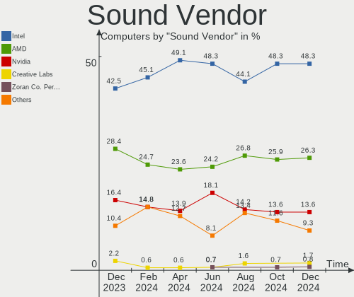

| Vendor                    | Computers | Percent |
|---------------------------|-----------|---------|
| Intel                     | 27        | 45%     |
| AMD                       | 18        | 30%     |
| Nvidia                    | 6         | 10%     |
| JMTek                     | 2         | 3.33%   |
| ZOOM                      | 1         | 1.67%   |
| Sennheiser Communications | 1         | 1.67%   |
| Samson Technologies       | 1         | 1.67%   |
| Realtek Semiconductor     | 1         | 1.67%   |
| Hewlett-Packard           | 1         | 1.67%   |
| Generalplus Technology    | 1         | 1.67%   |
| C-Media Electronics       | 1         | 1.67%   |

Sound Model
-----------

Sound card models

| Model                                                                             | Computers | Percent |
|-----------------------------------------------------------------------------------|-----------|---------|
| AMD Family 17h (Models 10h-1fh) HD Audio Controller                               | 7         | 9.46%   |
| Intel Tiger Lake-LP Smart Sound Technology Audio Controller                       | 4         | 5.41%   |
| AMD Renoir Radeon High Definition Audio Controller                                | 4         | 5.41%   |
| Intel Sunrise Point-LP HD Audio                                                   | 3         | 4.05%   |
| Intel 8 Series/C220 Series Chipset High Definition Audio Controller               | 3         | 4.05%   |
| Intel 7 Series/C216 Chipset Family High Definition Audio Controller               | 3         | 4.05%   |
| AMD Family 17h (Models 00h-0fh) HD Audio Controller                               | 3         | 4.05%   |
| Nvidia GP104 High Definition Audio Controller                                     | 2         | 2.7%    |
| Intel Xeon E3-1200 v3/4th Gen Core Processor HD Audio Controller                  | 2         | 2.7%    |
| Intel NM10/ICH7 Family High Definition Audio Controller                           | 2         | 2.7%    |
| Intel Cannon Lake PCH cAVS                                                        | 2         | 2.7%    |
| Intel 6 Series/C200 Series Chipset Family High Definition Audio Controller        | 2         | 2.7%    |
| Intel 100 Series/C230 Series Chipset Family HD Audio Controller                   | 2         | 2.7%    |
| AMD SBx00 Azalia (Intel HDA)                                                      | 2         | 2.7%    |
| AMD Raven/Raven2/Fenghuang HDMI/DP Audio Controller                               | 2         | 2.7%    |
| AMD FCH Azalia Controller                                                         | 2         | 2.7%    |
| ZOOM Handy Recorder stereo mix                                                    | 1         | 1.35%   |
| Sennheiser Communications Sennheiser 3D G4ME1                                     | 1         | 1.35%   |
| Samson Technologies Q1U dynamic microphone                                        | 1         | 1.35%   |
| Realtek Semiconductor USB Audio                                                   | 1         | 1.35%   |
| Nvidia GP107GL High Definition Audio Controller                                   | 1         | 1.35%   |
| Nvidia GP106 High Definition Audio Controller                                     | 1         | 1.35%   |
| Nvidia GM204 High Definition Audio Controller                                     | 1         | 1.35%   |
| Nvidia GK104 HDMI Audio Controller                                                | 1         | 1.35%   |
| Nvidia GA102 High Definition Audio Controller                                     | 1         | 1.35%   |
| JMTek USB PnP Audio Device(EEPROM)                                                | 1         | 1.35%   |
| JMTek Sharkoon SB1                                                                | 1         | 1.35%   |
| Intel Tiger Lake-H HD Audio Controller                                            | 1         | 1.35%   |
| Intel Comet Lake PCH-LP cAVS                                                      | 1         | 1.35%   |
| Intel CM238 HD Audio Controller                                                   | 1         | 1.35%   |
| Intel Celeron/Pentium Silver Processor High Definition Audio                      | 1         | 1.35%   |
| Intel Cannon Point-LP High Definition Audio Controller                            | 1         | 1.35%   |
| Intel 5 Series/3400 Series Chipset High Definition Audio                          | 1         | 1.35%   |
| Hewlett-Packard USB Audio                                                         | 1         | 1.35%   |
| Generalplus Technology Usb Audio Device                                           | 1         | 1.35%   |
| C-Media Electronics Audio Adapter (Unitek Y-247A)                                 | 1         | 1.35%   |
| AMD Tonga HDMI Audio [Radeon R9 285/380]                                          | 1         | 1.35%   |
| AMD Starship/Matisse HD Audio Controller                                          | 1         | 1.35%   |
| AMD RV610 HDMI Audio [Radeon HD 2350 PRO / 2400 PRO/XT / HD 3410]                 | 1         | 1.35%   |
| AMD Oland/Hainan/Cape Verde/Pitcairn HDMI Audio [Radeon HD 7000 Series]           | 1         | 1.35%   |
| AMD Navi 21 HDMI Audio [Radeon RX 6800/6800 XT / 6900 XT]                         | 1         | 1.35%   |
| AMD Kabini HDMI/DP Audio                                                          | 1         | 1.35%   |
| AMD Juniper HDMI Audio [Radeon HD 5700 Series]                                    | 1         | 1.35%   |
| AMD Ellesmere HDMI Audio [Radeon RX 470/480 / 570/580/590]                        | 1         | 1.35%   |
| AMD Caicos HDMI Audio [Radeon HD 6450 / 7450/8450/8490 OEM / R5 230/235/235X OEM] | 1         | 1.35%   |

Memory
------

Memory Vendor
-------------

Memory module vendors

| Vendor              | Computers | Percent |
|---------------------|-----------|---------|
| SK Hynix            | 6         | 20.69%  |
| Samsung Electronics | 6         | 20.69%  |
| Micron Technology   | 3         | 10.34%  |
| G.Skill             | 3         | 10.34%  |
| Unknown             | 2         | 6.9%    |
| Kingston            | 2         | 6.9%    |
| Corsair             | 2         | 6.9%    |
| Unknown (ABCD)      | 1         | 3.45%   |
| Ramaxel Technology  | 1         | 3.45%   |
| Nanya Technology    | 1         | 3.45%   |
| Crucial             | 1         | 3.45%   |
| A-DATA Technology   | 1         | 3.45%   |

Memory Model
------------

Memory module models

| Model                                                            | Computers | Percent |
|------------------------------------------------------------------|-----------|---------|
| Micron RAM 4ATF1G64HZ-3G2E1 8GB SODIMM DDR4 3200MT/s             | 2         | 6.45%   |
| Unknown RAM Module 4GB SODIMM DDR3 1600MT/s                      | 1         | 3.23%   |
| Unknown RAM Module 2GB Row Of Chips LPDDR4 4267MT/s              | 1         | 3.23%   |
| Unknown (ABCD) RAM 123456789012345678 3GB SODIMM LPDDR4 2400MT/s | 1         | 3.23%   |
| SK Hynix RAM Module 8GB SODIMM DDR4 2667MT/s                     | 1         | 3.23%   |
| SK Hynix RAM HMT451S6MFR8C-H9 4GB SODIMM DDR3 1334MT/s           | 1         | 3.23%   |
| SK Hynix RAM HMT451S6BFR8A-PB 4GB SODIMM DDR3 1600MT/s           | 1         | 3.23%   |
| SK Hynix RAM HMT351S6CFR8C-PB 4096MB SODIMM DDR3 1600MT/s        | 1         | 3.23%   |
| SK Hynix RAM HMT351S6CFR8A-PB 4096MB SODIMM DDR3 1600MT/s        | 1         | 3.23%   |
| SK Hynix RAM HCNNNCPMBLHR-NEE 2GB Row Of Chips LPDDR4 4267MT/s   | 1         | 3.23%   |
| SK Hynix RAM H5ANAG6NCMR-VKC 8GB SODIMM DDR4 2400MT/s            | 1         | 3.23%   |
| Samsung RAM Module 16GB DIMM DDR4 2667MT/s                       | 1         | 3.23%   |
| Samsung RAM Module 16384MB DIMM DDR4 2667MT/s                    | 1         | 3.23%   |
| Samsung RAM M471B5673EH1-CH9 2048MB SODIMM DDR3 1334MT/s         | 1         | 3.23%   |
| Samsung RAM M471A1K43DB1-CWE 8192MB SODIMM DDR4 3200MT/s         | 1         | 3.23%   |
| Samsung RAM M471A1G44AB0-CWE 8GB Row Of Chips DDR4 3200MT/s      | 1         | 3.23%   |
| Samsung RAM M378A1K43CB2-CRC 8192MB DIMM DDR4 3500MT/s           | 1         | 3.23%   |
| Samsung RAM K4E6E304EB-EGCF 4096MB Row Of Chips LPDDR3 1867MT/s  | 1         | 3.23%   |
| Ramaxel RAM Module 8GB SODIMM DDR4 2667MT/s                      | 1         | 3.23%   |
| Nanya RAM NT2GC64B88B0NS-CG 2048MB SODIMM DDR3 1334MT/s          | 1         | 3.23%   |
| Micron RAM MTA4ATF51264HZ-2G3B2 4GB Row Of Chips DDR4 2400MT/s   | 1         | 3.23%   |
| Kingston RAM MSI24D4S7S8MB-8 8GB SODIMM DDR4 2400MT/s            | 1         | 3.23%   |
| Kingston RAM KHX2400C15/8G 8GB DIMM DDR4 2933MT/s                | 1         | 3.23%   |
| G.Skill RAM F3-1600C9-4GSL 4GB SODIMM DDR3 1600MT/s              | 1         | 3.23%   |
| G.Skill RAM F3-1600C7-8GTX 8192MB DIMM DDR3 1600MT/s             | 1         | 3.23%   |
| G.Skill RAM F3-12800CL7-4GBXM 4GB DIMM DDR3 1333MT/s             | 1         | 3.23%   |
| Crucial RAM BL8G26C16U4W.8FE 8GB DIMM DDR4 2667MT/s              | 1         | 3.23%   |
| Corsair RAM CMSO16GX4M1A2133C15 16GB SODIMM DDR4 2133MT/s        | 1         | 3.23%   |
| Corsair RAM CMK16GX4M2A2400C14 8192MB DIMM DDR4 2800MT/s         | 1         | 3.23%   |
| A-DATA RAM Module 4GB DIMM DDR4 2400MT/s                         | 1         | 3.23%   |

Memory Kind
-----------

Memory module kinds

| Kind   | Computers | Percent |
|--------|-----------|---------|
| DDR4   | 14        | 56%     |
| DDR3   | 7         | 28%     |
| LPDDR4 | 3         | 12%     |
| LPDDR3 | 1         | 4%      |

Memory Form Factor
------------------

Physical design of the memory module

| Name         | Computers | Percent |
|--------------|-----------|---------|
| SODIMM       | 12        | 48%     |
| DIMM         | 8         | 32%     |
| Row Of Chips | 5         | 20%     |

Memory Size
-----------

Memory module size

| Size  | Computers | Percent |
|-------|-----------|---------|
| 8192  | 12        | 46.15%  |
| 4096  | 9         | 34.62%  |
| 2048  | 3         | 11.54%  |
| 16384 | 2         | 7.69%   |

Memory Speed
------------

Memory module speed

| Speed | Computers | Percent |
|-------|-----------|---------|
| 2400  | 5         | 18.52%  |
| 1600  | 5         | 18.52%  |
| 3200  | 3         | 11.11%  |
| 2667  | 3         | 11.11%  |
| 1334  | 3         | 11.11%  |
| 4267  | 2         | 7.41%   |
| 3500  | 1         | 3.7%    |
| 2933  | 1         | 3.7%    |
| 2800  | 1         | 3.7%    |
| 2133  | 1         | 3.7%    |
| 1867  | 1         | 3.7%    |
| 1333  | 1         | 3.7%    |

Printers & scanners
-------------------

Printer Vendor
--------------

Printer device vendors

| Vendor              | Computers | Percent |
|---------------------|-----------|---------|
| Samsung Electronics | 1         | 50%     |
| Kyocera             | 1         | 50%     |

Printer Model
-------------

Printer device models

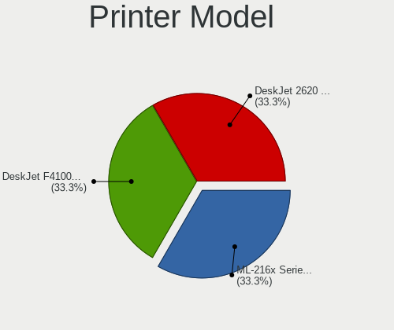

| Model                    | Computers | Percent |
|--------------------------|-----------|---------|
| Samsung SCX-4200 series  | 1         | 50%     |
| Kyocera FS-1030D printer | 1         | 50%     |

Scanner Vendor
--------------

Scanner device vendors

| Vendor | Computers | Percent |
|--------|-----------|---------|
| Canon  | 1         | 100%    |

Scanner Model
-------------

Scanner device models

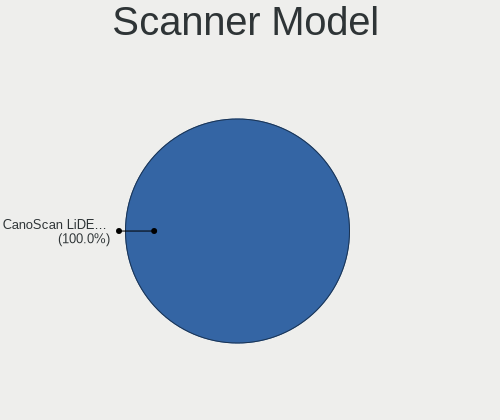

| Model                         | Computers | Percent |
|-------------------------------|-----------|---------|
| Canon CanoScan N1240U/LiDE 30 | 1         | 100%    |

Camera
------

Camera Vendor
-------------

Camera device vendors

| Vendor                                 | Computers | Percent |
|----------------------------------------|-----------|---------|
| IMC Networks                           | 6         | 20.69%  |
| Realtek Semiconductor                  | 4         | 13.79%  |
| Logitech                               | 4         | 13.79%  |
| Microdia                               | 3         | 10.34%  |
| Acer                                   | 3         | 10.34%  |
| Quanta                                 | 2         | 6.9%    |
| Chicony Electronics                    | 2         | 6.9%    |
| Cheng Uei Precision Industry (Foxlink) | 2         | 6.9%    |
| Lite-On Technology                     | 1         | 3.45%   |
| lihappe8                               | 1         | 3.45%   |
| Guillemot                              | 1         | 3.45%   |

Camera Model
------------

Camera device models

| Model                                                           | Computers | Percent |
|-----------------------------------------------------------------|-----------|---------|
| Realtek Integrated_Webcam_HD                                    | 2         | 6.67%   |
| IMC Networks USB2.0 HD UVC WebCam                               | 2         | 6.67%   |
| Realtek Integrated Webcam HD                                    | 1         | 3.33%   |
| Realtek Front Camera                                            | 1         | 3.33%   |
| Realtek Back Camera                                             | 1         | 3.33%   |
| Quanta HP HD Camera                                             | 1         | 3.33%   |
| Quanta HD User Facing                                           | 1         | 3.33%   |
| Microdia WebCam SC-13HDL12639P                                  | 1         | 3.33%   |
| Microdia Integrated_Webcam_HD                                   | 1         | 3.33%   |
| Microdia 1.3 MPixel Integrated Webcam                           | 1         | 3.33%   |
| Logitech QuickCam Pro 5000                                      | 1         | 3.33%   |
| Logitech C922 Pro Stream Webcam                                 | 1         | 3.33%   |
| Logitech C505e HD Webcam                                        | 1         | 3.33%   |
| Logitech B525 HD Webcam                                         | 1         | 3.33%   |
| Lite-On Integrated Camera                                       | 1         | 3.33%   |
| lihappe8 USB 2.0 Camera                                         | 1         | 3.33%   |
| IMC Networks XiaoMi Webcam                                      | 1         | 3.33%   |
| IMC Networks Integrated Camera                                  | 1         | 3.33%   |
| IMC Networks imx188_azurewave(p)                                | 1         | 3.33%   |
| IMC Networks EasyCamera                                         | 1         | 3.33%   |
| Guillemot USB Camera                                            | 1         | 3.33%   |
| Chicony USB2.0 VGA UVC WebCam                                   | 1         | 3.33%   |
| Chicony Integrated Camera                                       | 1         | 3.33%   |
| Cheng Uei Precision Industry (Foxlink) HP Wide Vision HD Camera | 1         | 3.33%   |
| Cheng Uei Precision Industry (Foxlink) HP HD Webcam             | 1         | 3.33%   |
| Acer Integrated Camera                                          | 1         | 3.33%   |
| Acer HD Webcam                                                  | 1         | 3.33%   |
| Acer BisonCam, NB Pro                                           | 1         | 3.33%   |

Security
--------

Fingerprint Vendor
------------------

Fingerprint sensor vendors

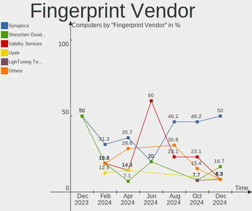

| Vendor           | Computers | Percent |
|------------------|-----------|---------|
| Validity Sensors | 1         | 50%     |
| Synaptics        | 1         | 50%     |

Fingerprint Model
-----------------

Fingerprint sensor models

| Model                                             | Computers | Percent |
|---------------------------------------------------|-----------|---------|
| Validity Sensors Synaptics WBDI                   | 1         | 50%     |
| Synaptics Prometheus MIS Touch Fingerprint Reader | 1         | 50%     |

Chipcard Vendor
---------------

Chipcard module vendors

| Vendor                | Computers | Percent |
|-----------------------|-----------|---------|
| Alcor Micro           | 2         | 50%     |
| Gemalto (was Gemplus) | 1         | 25%     |
| Broadcom              | 1         | 25%     |

Chipcard Model
--------------

Chipcard module models

| Model                                            | Computers | Percent |
|--------------------------------------------------|-----------|---------|
| Alcor Micro AU9540 Smartcard Reader              | 2         | 50%     |
| Gemalto (was Gemplus) Prox SU USB PC Link Reader | 1         | 25%     |
| Broadcom BCM5880 Secure Applications Processor   | 1         | 25%     |

Unsupported
-----------

Unsupported Devices
-------------------

Total unsupported devices on board

| Total | Computers | Percent |
|-------|-----------|---------|
| 0     | 35        | 76.09%  |
| 1     | 6         | 13.04%  |
| 2     | 5         | 10.87%  |

Unsupported Device Types
------------------------

Types of unsupported devices

| Type                  | Computers | Percent |
|-----------------------|-----------|---------|
| Graphics card         | 6         | 42.86%  |
| Chipcard              | 3         | 21.43%  |
| Multimedia controller | 2         | 14.29%  |
| Fingerprint reader    | 2         | 14.29%  |
| Net/wireless          | 1         | 7.14%   |

