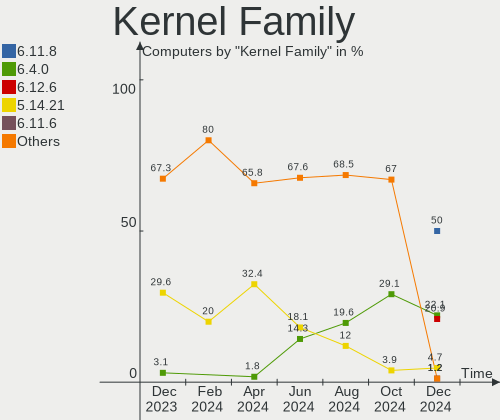
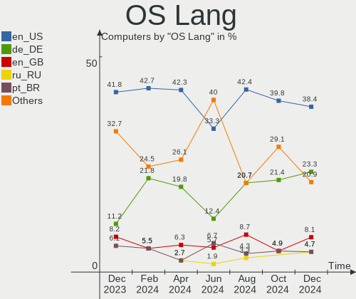
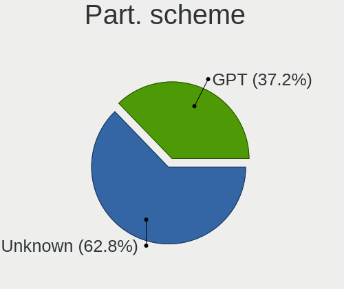
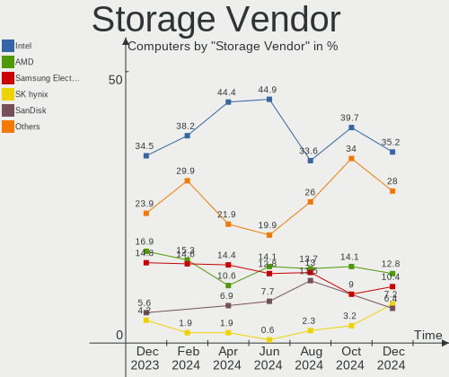
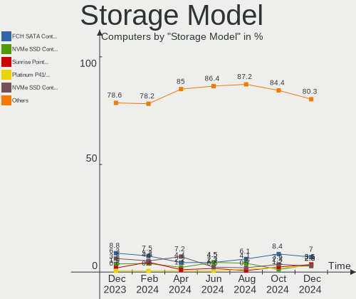
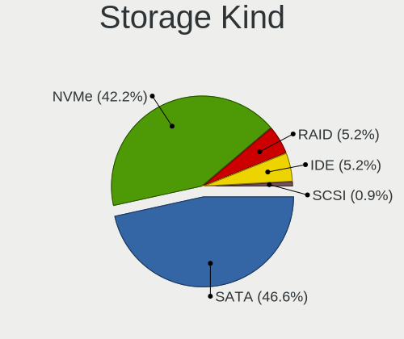
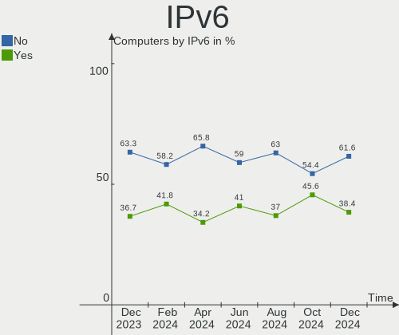
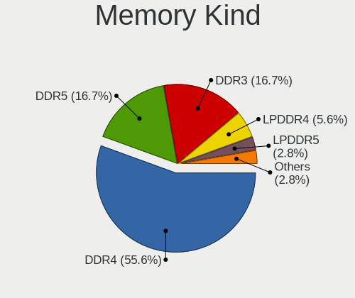

openSUSE - Hardware Trends
--------------------------

A project to identify most popular hardware characteristics and track their change
over time based on data collected by Linux users at https://Linux-Hardware.org.

Anyone can contribute to this report by the [hw-probe](https://github.com/linuxhw/hw-probe) tool:

    sudo -E hw-probe -all -upload

This is a report for all computer types. See also reports for [desktops](/Dist/openSUSE/Desktop/README.md) and [notebooks](/Dist/openSUSE/Notebook/README.md).

This report is for one last month. Overall report since the beginning of time: [TestDays](https://github.com/linuxhw/TestDays)

Period: Sep, 2023.

Contents
--------

* [ System ](#system)
  - [ OS                       ](#os)
  - [ OS Family                ](#os-family)
  - [ Kernel                   ](#kernel)
  - [ Kernel Family            ](#kernel-family)
  - [ Kernel Major Ver.        ](#kernel-major-ver)
  - [ Arch                     ](#arch)
  - [ DE                       ](#de)
  - [ Display Server           ](#display-server)
  - [ Display Manager          ](#display-manager)
  - [ OS Lang                  ](#os-lang)
  - [ Boot Mode                ](#boot-mode)
  - [ Filesystem               ](#filesystem)
  - [ Part. scheme             ](#part-scheme)
  - [ Dual Boot with Linux/BSD ](#dual-boot-with-linuxbsd)
  - [ Dual Boot (Win)          ](#dual-boot-win)

* [ Board ](#board)
  - [ Vendor                   ](#vendor)
  - [ Model                    ](#model)
  - [ Model Family             ](#model-family)
  - [ MFG Year                 ](#mfg-year)
  - [ Form Factor              ](#form-factor)
  - [ Secure Boot              ](#secure-boot)
  - [ Coreboot                 ](#coreboot)
  - [ RAM Size                 ](#ram-size)
  - [ RAM Used                 ](#ram-used)
  - [ Total Drives             ](#total-drives)
  - [ Has CD-ROM               ](#has-cd-rom)
  - [ Has Ethernet             ](#has-ethernet)
  - [ Has WiFi                 ](#has-wifi)
  - [ Has Bluetooth            ](#has-bluetooth)

* [ Location ](#location)
  - [ Country                  ](#country)
  - [ City                     ](#city)

* [ Drives ](#drives)
  - [ Drive Vendor             ](#drive-vendor)
  - [ Drive Model              ](#drive-model)
  - [ HDD Vendor               ](#hdd-vendor)
  - [ SSD Vendor               ](#ssd-vendor)
  - [ Drive Kind               ](#drive-kind)
  - [ Drive Connector          ](#drive-connector)
  - [ Drive Size               ](#drive-size)
  - [ Space Total              ](#space-total)
  - [ Space Used               ](#space-used)
  - [ Malfunc. Drives          ](#malfunc-drives)
  - [ Malfunc. Drive Vendor    ](#malfunc-drive-vendor)
  - [ Malfunc. HDD Vendor      ](#malfunc-hdd-vendor)
  - [ Malfunc. Drive Kind      ](#malfunc-drive-kind)
  - [ Failed Drives            ](#failed-drives)
  - [ Failed Drive Vendor      ](#failed-drive-vendor)
  - [ Drive Status             ](#drive-status)

* [ Storage controller ](#storage-controller)
  - [ Storage Vendor           ](#storage-vendor)
  - [ Storage Model            ](#storage-model)
  - [ Storage Kind             ](#storage-kind)

* [ Processor ](#processor)
  - [ CPU Vendor               ](#cpu-vendor)
  - [ CPU Model                ](#cpu-model)
  - [ CPU Model Family         ](#cpu-model-family)
  - [ CPU Cores                ](#cpu-cores)
  - [ CPU Sockets              ](#cpu-sockets)
  - [ CPU Threads              ](#cpu-threads)
  - [ CPU Op-Modes             ](#cpu-op-modes)
  - [ CPU Microcode            ](#cpu-microcode)
  - [ CPU Microarch            ](#cpu-microarch)

* [ Graphics ](#graphics)
  - [ GPU Vendor               ](#gpu-vendor)
  - [ GPU Model                ](#gpu-model)
  - [ GPU Combo                ](#gpu-combo)
  - [ GPU Driver               ](#gpu-driver)
  - [ GPU Memory               ](#gpu-memory)

* [ Monitor ](#monitor)
  - [ Monitor Vendor           ](#monitor-vendor)
  - [ Monitor Model            ](#monitor-model)
  - [ Monitor Resolution       ](#monitor-resolution)
  - [ Monitor Diagonal         ](#monitor-diagonal)
  - [ Monitor Width            ](#monitor-width)
  - [ Aspect Ratio             ](#aspect-ratio)
  - [ Monitor Area             ](#monitor-area)
  - [ Pixel Density            ](#pixel-density)
  - [ Multiple Monitors        ](#multiple-monitors)

* [ Network ](#network)
  - [ Net Controller Vendor    ](#net-controller-vendor)
  - [ Net Controller Model     ](#net-controller-model)
  - [ Wireless Vendor          ](#wireless-vendor)
  - [ Wireless Model           ](#wireless-model)
  - [ Ethernet Vendor          ](#ethernet-vendor)
  - [ Ethernet Model           ](#ethernet-model)
  - [ Net Controller Kind      ](#net-controller-kind)
  - [ Used Controller          ](#used-controller)
  - [ NICs                     ](#nics)
  - [ IPv6                     ](#ipv6)

* [ Bluetooth ](#bluetooth)
  - [ Bluetooth Vendor         ](#bluetooth-vendor)
  - [ Bluetooth Model          ](#bluetooth-model)

* [ Sound ](#sound)
  - [ Sound Vendor             ](#sound-vendor)
  - [ Sound Model              ](#sound-model)

* [ Memory ](#memory)
  - [ Memory Vendor            ](#memory-vendor)
  - [ Memory Model             ](#memory-model)
  - [ Memory Kind              ](#memory-kind)
  - [ Memory Form Factor       ](#memory-form-factor)
  - [ Memory Size              ](#memory-size)
  - [ Memory Speed             ](#memory-speed)

* [ Printers & scanners ](#printers--scanners)
  - [ Printer Vendor           ](#printer-vendor)
  - [ Printer Model            ](#printer-model)
  - [ Scanner Vendor           ](#scanner-vendor)
  - [ Scanner Model            ](#scanner-model)

* [ Camera ](#camera)
  - [ Camera Vendor            ](#camera-vendor)
  - [ Camera Model             ](#camera-model)

* [ Security ](#security)
  - [ Fingerprint Vendor       ](#fingerprint-vendor)
  - [ Fingerprint Model        ](#fingerprint-model)
  - [ Chipcard Vendor          ](#chipcard-vendor)
  - [ Chipcard Model           ](#chipcard-model)

* [ Unsupported ](#unsupported)
  - [ Unsupported Devices      ](#unsupported-devices)
  - [ Unsupported Device Types ](#unsupported-device-types)

System
------

OS
--

Installed operating systems

| Name                         | Computers | Percent |
|------------------------------|-----------|---------|
| openSUSE Tumbleweed-XXXXXXXX | 63        | 63.64%  |
| openSUSE Leap-15.5           | 29        | 29.29%  |
| openSUSE Microos-XXXXXXXX    | 6         | 6.06%   |
| openSUSE Leap-15.4           | 1         | 1.01%   |

OS Family
---------

OS without a version

| Name     | Computers | Percent |
|----------|-----------|---------|
| openSUSE | 99        | 100%    |

Kernel
------

Version of the Linux kernel

| Version                      | Computers | Percent |
|------------------------------|-----------|---------|
| 5.14.21-150500.55.19-default | 27        | 27.27%  |
| 6.5.3-1-default              | 19        | 19.19%  |
| 6.4.12-1-default             | 16        | 16.16%  |
| 6.5.4-1-default              | 15        | 15.15%  |
| 6.4.11-1-default             | 7         | 7.07%   |
| 6.5.2-1-default              | 6         | 6.06%   |
| 6.5.5-lqx1-1-liquorix        | 1         | 1.01%   |
| 6.5.1-1.gd232ff6-default     | 1         | 1.01%   |
| 6.4.6-1-default              | 1         | 1.01%   |
| 6.4.4-1-default              | 1         | 1.01%   |
| 6.4.2-1-default              | 1         | 1.01%   |
| 6.1.8-1-default              | 1         | 1.01%   |
| 5.14.21-150500.55.12-default | 1         | 1.01%   |
| 5.14.21-150500.53-default    | 1         | 1.01%   |
| 5.14.21-150400.24.84-default | 1         | 1.01%   |

Kernel Family
-------------

Linux kernel without a distro release

| Version | Computers | Percent |
|---------|-----------|---------|
| 5.14.21 | 30        | 30.3%   |
| 6.5.3   | 19        | 19.19%  |
| 6.4.12  | 16        | 16.16%  |
| 6.5.4   | 15        | 15.15%  |
| 6.4.11  | 7         | 7.07%   |
| 6.5.2   | 6         | 6.06%   |
| 6.5.5   | 1         | 1.01%   |
| 6.5.1   | 1         | 1.01%   |
| 6.4.6   | 1         | 1.01%   |
| 6.4.4   | 1         | 1.01%   |
| 6.4.2   | 1         | 1.01%   |
| 6.1.8   | 1         | 1.01%   |

Kernel Major Ver.
-----------------

Linux kernel major version

| Version | Computers | Percent |
|---------|-----------|---------|
| 6.5     | 42        | 42.42%  |
| 5.14    | 30        | 30.3%   |
| 6.4     | 26        | 26.26%  |
| 6.1     | 1         | 1.01%   |

Arch
----

OS architecture (x86_64, i586, etc.)

| Name   | Computers | Percent |
|--------|-----------|---------|
| x86_64 | 99        | 100%    |

DE
--

Desktop Environment

| Name     | Computers | Percent |
|----------|-----------|---------|
| KDE5     | 69        | 69.7%   |
| GNOME    | 27        | 27.27%  |
| XFCE     | 1         | 1.01%   |
| Hyprland | 1         | 1.01%   |
| Unknown  | 1         | 1.01%   |

Display Server
--------------

X11 or Wayland

| Name    | Computers | Percent |
|---------|-----------|---------|
| X11     | 61        | 61.62%  |
| Wayland | 37        | 37.37%  |
| Tty     | 1         | 1.01%   |

Display Manager
---------------

SDDM, LightDM, etc.

| Name    | Computers | Percent |
|---------|-----------|---------|
| Unknown | 64        | 64.65%  |
| SDDM    | 28        | 28.28%  |
| GDM     | 6         | 6.06%   |
| LightDM | 1         | 1.01%   |

OS Lang
-------

Language

| Lang  | Computers | Percent |
|-------|-----------|---------|
| en_US | 39        | 39.39%  |
| de_DE | 21        | 21.21%  |
| pt_BR | 7         | 7.07%   |
| POSIX | 7         | 7.07%   |
| en_GB | 7         | 7.07%   |
| ru_RU | 3         | 3.03%   |
| pl_PL | 2         | 2.02%   |
| fr_FR | 2         | 2.02%   |
| es_ES | 2         | 2.02%   |
| zh_CN | 1         | 1.01%   |
| tr_TR | 1         | 1.01%   |
| nl_NL | 1         | 1.01%   |
| nl_BE | 1         | 1.01%   |
| ko_KR | 1         | 1.01%   |
| it_IT | 1         | 1.01%   |
| hu_HU | 1         | 1.01%   |
| es_EC | 1         | 1.01%   |
| en_DK | 1         | 1.01%   |

Boot Mode
---------

EFI or BIOS

| Mode | Computers | Percent |
|------|-----------|---------|
| EFI  | 62        | 62.63%  |
| BIOS | 37        | 37.37%  |

Filesystem
----------

Type of filesystem

| Type  | Computers | Percent |
|-------|-----------|---------|
| Btrfs | 85        | 85.86%  |
| Ext4  | 11        | 11.11%  |
| Tmpfs | 2         | 2.02%   |
| Xfs   | 1         | 1.01%   |

Part. scheme
------------

Scheme of partitioning

| Type    | Computers | Percent |
|---------|-----------|---------|
| Unknown | 61        | 61.62%  |
| GPT     | 36        | 36.36%  |
| MBR     | 2         | 2.02%   |

Dual Boot with Linux/BSD
------------------------

Hosting more than one Linux/BSD

| Dual boot | Computers | Percent |
|-----------|-----------|---------|
| No        | 91        | 91.92%  |
| Yes       | 8         | 8.08%   |

Dual Boot (Win)
---------------

Hosting Linux and Windows

| Dual boot | Computers | Percent |
|-----------|-----------|---------|
| No        | 81        | 81.82%  |
| Yes       | 18        | 18.18%  |

Board
-----

Vendor
------

Motherboard manufacturer

| Name                | Computers | Percent |
|---------------------|-----------|---------|
| Lenovo              | 19        | 19.19%  |
| Hewlett-Packard     | 13        | 13.13%  |
| Dell                | 9         | 9.09%   |
| ASUSTek Computer    | 9         | 9.09%   |
| Acer                | 9         | 9.09%   |
| ASRock              | 7         | 7.07%   |
| MSI                 | 6         | 6.06%   |
| Gigabyte Technology | 4         | 4.04%   |
| Alienware           | 4         | 4.04%   |
| Fujitsu             | 3         | 3.03%   |
| Apple               | 3         | 3.03%   |
| Medion              | 2         | 2.02%   |
| Sony                | 1         | 1.01%   |
| SLIMBOOK            | 1         | 1.01%   |
| Samsung Electronics | 1         | 1.01%   |
| Panasonic           | 1         | 1.01%   |
| OEM                 | 1         | 1.01%   |
| Intel               | 1         | 1.01%   |
| HUAWEI              | 1         | 1.01%   |
| Chuwi               | 1         | 1.01%   |
| Biostar             | 1         | 1.01%   |
| ANGXUN              | 1         | 1.01%   |
| Unknown             | 1         | 1.01%   |

Model
-----

Motherboard model

| Name                                      | Computers | Percent |
|-------------------------------------------|-----------|---------|
| Sony SVF1521A7EB                          | 1         | 1.01%   |
| SLIMBOOK ONE-AM5                          | 1         | 1.01%   |
| Samsung 750QUA                            | 1         | 1.01%   |
| Panasonic CF-C2CUGZXKM                    | 1         | 1.01%   |
| OEM B75                                   | 1         | 1.01%   |
| MSI Thin GF63 12HW                        | 1         | 1.01%   |
| MSI MS-7E12                               | 1         | 1.01%   |
| MSI MS-7E07                               | 1         | 1.01%   |
| MSI MS-7C94                               | 1         | 1.01%   |
| MSI MS-7B86                               | 1         | 1.01%   |
| MSI Bravo 15 C7VE                         | 1         | 1.01%   |
| Medion S15449                             | 1         | 1.01%   |
| Medion E6224                              | 1         | 1.01%   |
| Lenovo Yoga C640-13IML 81UE               | 1         | 1.01%   |
| Lenovo Yoga 7 14ITL5 82BH                 | 1         | 1.01%   |
| Lenovo V520S-08IKL Desktop 10NN000CBP     | 1         | 1.01%   |
| Lenovo ThinkPad X200 74591P0              | 1         | 1.01%   |
| Lenovo ThinkPad X13 Gen 2i 20WKA008CD     | 1         | 1.01%   |
| Lenovo ThinkPad X1 Nano Gen 3 21K1CTO1WW  | 1         | 1.01%   |
| Lenovo ThinkPad W510 4391W3V              | 1         | 1.01%   |
| Lenovo ThinkPad W500 40624DG              | 1         | 1.01%   |
| Lenovo ThinkPad L570 W10DG 20JRS03U00     | 1         | 1.01%   |
| Lenovo ThinkPad L13 Yoga Gen 2 20VKS0LM01 | 1         | 1.01%   |
| Lenovo ThinkPad E550 20DF0040US           | 1         | 1.01%   |
| Lenovo ThinkPad E14 Gen 3 20YD001DBO      | 1         | 1.01%   |
| Lenovo ThinkPad E14 Gen 2 20TA000DGE      | 1         | 1.01%   |
| Lenovo ThinkBook 15 G2 ITL 20VE           | 1         | 1.01%   |
| Lenovo IdeaPad Y580 2099                  | 1         | 1.01%   |
| Lenovo IdeaPad S145-15API 81V7            | 1         | 1.01%   |
| Lenovo IdeaPad 3 15ITL6 82H8              | 1         | 1.01%   |
| Lenovo IdeaPad 3 15ADA05 81W1             | 1         | 1.01%   |
| Lenovo B490 37722QP                       | 1         | 1.01%   |
| Intel S1200RP                             | 1         | 1.01%   |
| HUAWEI NBD-WXX9                           | 1         | 1.01%   |
| HP ZBook Fury 16 G9 Mobile Workstation PC | 1         | 1.01%   |
| HP Z840 Workstation                       | 1         | 1.01%   |
| HP Z400 Workstation                       | 1         | 1.01%   |
| HP ProLiant DL360 G7                      | 1         | 1.01%   |
| HP ProDesk 400 G2 MT                      | 1         | 1.01%   |
| HP ProBook 6560b                          | 1         | 1.01%   |

Model Family
------------

Motherboard model prefix

| Name                   | Computers | Percent |
|------------------------|-----------|---------|
| Lenovo ThinkPad        | 10        | 10.1%   |
| Acer Aspire            | 6         | 6.06%   |
| Lenovo IdeaPad         | 4         | 4.04%   |
| Dell Latitude          | 4         | 4.04%   |
| HP ProBook             | 3         | 3.03%   |
| Lenovo Yoga            | 2         | 2.02%   |
| HP Laptop              | 2         | 2.02%   |
| Fujitsu ESPRIMO        | 2         | 2.02%   |
| Dell XPS               | 2         | 2.02%   |
| Dell Precision         | 2         | 2.02%   |
| ASUS PRIME             | 2         | 2.02%   |
| Alienware m15          | 2         | 2.02%   |
| Sony SVF1521A7EB       | 1         | 1.01%   |
| SLIMBOOK ONE-AM5       | 1         | 1.01%   |
| Samsung 750QUA         | 1         | 1.01%   |
| Panasonic CF-C2CUGZXKM | 1         | 1.01%   |
| OEM B75                | 1         | 1.01%   |
| MSI Thin               | 1         | 1.01%   |
| MSI MS-7E12            | 1         | 1.01%   |
| MSI MS-7E07            | 1         | 1.01%   |
| MSI MS-7C94            | 1         | 1.01%   |
| MSI MS-7B86            | 1         | 1.01%   |
| MSI Bravo              | 1         | 1.01%   |
| Medion S15449          | 1         | 1.01%   |
| Medion E6224           | 1         | 1.01%   |
| Lenovo V520S-08IKL     | 1         | 1.01%   |
| Lenovo ThinkBook       | 1         | 1.01%   |
| Lenovo B490            | 1         | 1.01%   |
| Intel S1200RP          | 1         | 1.01%   |
| HUAWEI NBD-WXX9        | 1         | 1.01%   |
| HP ZBook               | 1         | 1.01%   |
| HP Z840                | 1         | 1.01%   |
| HP Z400                | 1         | 1.01%   |
| HP ProLiant            | 1         | 1.01%   |
| HP ProDesk             | 1         | 1.01%   |
| HP Pavilion            | 1         | 1.01%   |
| HP ENVY                | 1         | 1.01%   |
| HP 15                  | 1         | 1.01%   |
| Gigabyte X570          | 1         | 1.01%   |
| Gigabyte H610M         | 1         | 1.01%   |

MFG Year
--------

Motherboard manufacture year

| Year | Computers | Percent |
|------|-----------|---------|
| 2021 | 17        | 17.17%  |
| 2020 | 15        | 15.15%  |
| 2023 | 9         | 9.09%   |
| 2022 | 7         | 7.07%   |
| 2019 | 7         | 7.07%   |
| 2015 | 6         | 6.06%   |
| 2013 | 6         | 6.06%   |
| 2018 | 5         | 5.05%   |
| 2017 | 5         | 5.05%   |
| 2012 | 5         | 5.05%   |
| 2011 | 5         | 5.05%   |
| 2010 | 5         | 5.05%   |
| 2014 | 2         | 2.02%   |
| 2009 | 2         | 2.02%   |
| 2007 | 2         | 2.02%   |
| 2008 | 1         | 1.01%   |

Form Factor
-----------

Physical design of the computer

| Name        | Computers | Percent |
|-------------|-----------|---------|
| Notebook    | 54        | 54.55%  |
| Desktop     | 37        | 37.37%  |
| Convertible | 4         | 4.04%   |
| Server      | 2         | 2.02%   |
| Tablet      | 1         | 1.01%   |
| Mini pc     | 1         | 1.01%   |

Secure Boot
-----------

Enabled or disabled

| State    | Computers | Percent |
|----------|-----------|---------|
| Disabled | 83        | 83.84%  |
| Enabled  | 16        | 16.16%  |

Coreboot
--------

Have coreboot on board

| Used | Computers | Percent |
|------|-----------|---------|
| No   | 98        | 98.99%  |
| Yes  | 1         | 1.01%   |

RAM Size
--------

Total RAM memory

| Size in GB  | Computers | Percent |
|-------------|-----------|---------|
| 16.01-24.0  | 27        | 27.27%  |
| 4.01-8.0    | 24        | 24.24%  |
| 8.01-16.0   | 16        | 16.16%  |
| 32.01-64.0  | 15        | 15.15%  |
| 64.01-256.0 | 8         | 8.08%   |
| 3.01-4.0    | 4         | 4.04%   |
| 24.01-32.0  | 3         | 3.03%   |
| 1.01-2.0    | 2         | 2.02%   |

RAM Used
--------

Used RAM memory

| Used GB   | Computers | Percent |
|-----------|-----------|---------|
| 2.01-3.0  | 34        | 34.34%  |
| 4.01-8.0  | 22        | 22.22%  |
| 3.01-4.0  | 20        | 20.2%   |
| 1.01-2.0  | 11        | 11.11%  |
| 8.01-16.0 | 10        | 10.1%   |
| 0.51-1.0  | 2         | 2.02%   |

Total Drives
------------

Number of drives on board

| Drives | Computers | Percent |
|--------|-----------|---------|
| 1      | 59        | 59.6%   |
| 2      | 24        | 24.24%  |
| 3      | 8         | 8.08%   |
| 5      | 3         | 3.03%   |
| 4      | 3         | 3.03%   |
| 6      | 2         | 2.02%   |

Has CD-ROM
----------

Has CD-ROM on board

| Presented | Computers | Percent |
|-----------|-----------|---------|
| No        | 70        | 70.71%  |
| Yes       | 29        | 29.29%  |

Has Ethernet
------------

Has Ethernet on board

| Presented | Computers | Percent |
|-----------|-----------|---------|
| Yes       | 81        | 81.82%  |
| No        | 18        | 18.18%  |

Has WiFi
--------

Has WiFi module

| Presented | Computers | Percent |
|-----------|-----------|---------|
| Yes       | 75        | 75.76%  |
| No        | 24        | 24.24%  |

Has Bluetooth
-------------

Has Bluetooth module

| Presented | Computers | Percent |
|-----------|-----------|---------|
| Yes       | 69        | 69.7%   |
| No        | 30        | 30.3%   |

Location
--------

Country
-------

Geographic location (country)

| Country      | Computers | Percent |
|--------------|-----------|---------|
| Germany      | 25        | 25.25%  |
| USA          | 17        | 17.17%  |
| Brazil       | 8         | 8.08%   |
| Canada       | 5         | 5.05%   |
| UK           | 4         | 4.04%   |
| Russia       | 4         | 4.04%   |
| Poland       | 3         | 3.03%   |
| Italy        | 3         | 3.03%   |
| Belgium      | 3         | 3.03%   |
| Turkey       | 2         | 2.02%   |
| Indonesia    | 2         | 2.02%   |
| China        | 2         | 2.02%   |
| Uruguay      | 1         | 1.01%   |
| Thailand     | 1         | 1.01%   |
| Sweden       | 1         | 1.01%   |
| Spain        | 1         | 1.01%   |
| South Korea  | 1         | 1.01%   |
| South Africa | 1         | 1.01%   |
| Senegal      | 1         | 1.01%   |
| Romania      | 1         | 1.01%   |
| Nicaragua    | 1         | 1.01%   |
| Malaysia     | 1         | 1.01%   |
| Jordan       | 1         | 1.01%   |
| India        | 1         | 1.01%   |
| Hungary      | 1         | 1.01%   |
| Guatemala    | 1         | 1.01%   |
| Greece       | 1         | 1.01%   |
| France       | 1         | 1.01%   |
| Ecuador      | 1         | 1.01%   |
| Croatia      | 1         | 1.01%   |
| Bulgaria     | 1         | 1.01%   |
| Barbados     | 1         | 1.01%   |
| Austria      | 1         | 1.01%   |

City
----

Geographic location (city)

| City               | Computers | Percent |
|--------------------|-----------|---------|
| Wiesbaden          | 2         | 2.02%   |
| Warsaw             | 2         | 2.02%   |
| Sao Vicente        | 2         | 2.02%   |
| Berlin             | 2         | 2.02%   |
| Aschaffenburg      | 2         | 2.02%   |
| Zlatoust           | 1         | 1.01%   |
| Zhengzhou          | 1         | 1.01%   |
| Zagreb             | 1         | 1.01%   |
| Woodbridge         | 1         | 1.01%   |
| Wolfratshausen     | 1         | 1.01%   |
| Winnipeg           | 1         | 1.01%   |
| West Bend          | 1         | 1.01%   |
| Warrenton          | 1         | 1.01%   |
| Wappingers Falls   | 1         | 1.01%   |
| Vienna             | 1         | 1.01%   |
| Vechta             | 1         | 1.01%   |
| Valencia           | 1         | 1.01%   |
| Uijeongbu-si       | 1         | 1.01%   |
| Twickenham         | 1         | 1.01%   |
| Tucson             | 1         | 1.01%   |
| Szczecin           | 1         | 1.01%   |
| Sumaré            | 1         | 1.01%   |
| Stuttgart          | 1         | 1.01%   |
| Stockbridge        | 1         | 1.01%   |
| Staraya Russa      | 1         | 1.01%   |
| St Petersburg      | 1         | 1.01%   |
| Siegen             | 1         | 1.01%   |
| Sao Paulo          | 1         | 1.01%   |
| Santa Clara        | 1         | 1.01%   |
| Saint Charles      | 1         | 1.01%   |
| Rostock            | 1         | 1.01%   |
| Rheda-Wiedenbrueck | 1         | 1.01%   |
| Reutlingen         | 1         | 1.01%   |
| Quito              | 1         | 1.01%   |
| Preston            | 1         | 1.01%   |
| Ploieşti          | 1         | 1.01%   |
| Pikine             | 1         | 1.01%   |
| Phoenix            | 1         | 1.01%   |
| Pekanbaru          | 1         | 1.01%   |
| Pavia              | 1         | 1.01%   |

Drives
------

Drive Vendor
------------

Hard drive vendors

| Vendor                         | Computers | Drives | Percent |
|--------------------------------|-----------|--------|---------|
| Samsung Electronics            | 23        | 27     | 15.86%  |
| Seagate                        | 17        | 22     | 11.72%  |
| WDC                            | 13        | 17     | 8.97%   |
| Kingston                       | 8         | 8      | 5.52%   |
| Toshiba                        | 7         | 8      | 4.83%   |
| SK hynix                       | 7         | 7      | 4.83%   |
| Sandisk                        | 7         | 9      | 4.83%   |
| Crucial                        | 7         | 8      | 4.83%   |
| Silicon Motion                 | 5         | 5      | 3.45%   |
| KIOXIA                         | 5         | 5      | 3.45%   |
| Unknown                        | 4         | 4      | 2.76%   |
| Hitachi                        | 4         | 3      | 2.76%   |
| SPCC                           | 3         | 3      | 2.07%   |
| Phison Electronics             | 3         | 3      | 2.07%   |
| China                          | 3         | 3      | 2.07%   |
| A-DATA Technology              | 3         | 3      | 2.07%   |
| Patriot                        | 2         | 2      | 1.38%   |
| Micron/Crucial Technology      | 2         | 2      | 1.38%   |
| Micron Technology              | 2         | 2      | 1.38%   |
| Union Memory                   | 1         | 1      | 0.69%   |
| Synology                       | 1         | 1      | 0.69%   |
| SSK                            | 1         | 1      | 0.69%   |
| Solid State Storage Technology | 1         | 1      | 0.69%   |
| Shenzhen Longsys Electronics   | 1         | 1      | 0.69%   |
| SABRENT                        | 1         | 1      | 0.69%   |
| Realtek Semiconductor          | 1         | 1      | 0.69%   |
| Pioneer                        | 1         | 1      | 0.69%   |
| LITEONIT                       | 1         | 1      | 0.69%   |
| Kingston Technology Company    | 1         | 1      | 0.69%   |
| Intel                          | 1         | 1      | 0.69%   |
| HS-SSD-E100                    | 1         | 1      | 0.69%   |
| EXRAM                          | 1         | 1      | 0.69%   |
| CT1000MX                       | 1         | 1      | 0.69%   |
| Biostar                        | 1         | 1      | 0.69%   |
| ASMT                           | 1         | 2      | 0.69%   |
| ASMedia                        | 1         | 1      | 0.69%   |
| Apple                          | 1         | 1      | 0.69%   |
| Apacer                         | 1         | 1      | 0.69%   |
| ADATA Technology               | 1         | 1      | 0.69%   |

Drive Model
-----------

Hard drive models

| Model                                                 | Computers | Percent |
|-------------------------------------------------------|-----------|---------|
| Samsung NVMe SSD Controller SM981/PM981/PM983 256GB   | 4         | 2.53%   |
| Kingston SA400S37480G 480GB SSD                       | 3         | 1.9%    |
| Kingston SA400S37120G 120GB SSD                       | 3         | 1.9%    |
| WDC WD10EZEX-22MFCA0 1TB                              | 2         | 1.27%   |
| Unknown SD/MMC/MS PRO 128GB                           | 2         | 1.27%   |
| SPCC Solid State Disk 512GB                           | 2         | 1.27%   |
| SK hynix PC801 NVMe 512GB                             | 2         | 1.27%   |
| Silicon Motion SM2263EN/SM2263XT SSD Controller 512GB | 2         | 1.27%   |
| Silicon Motion SM2262/SM2262EN SSD Controller 500GB   | 2         | 1.27%   |
| Seagate ST2000DM008-2FR102 2TB                        | 2         | 1.27%   |
| Samsung SSD 980 1TB                                   | 2         | 1.27%   |
| Samsung SSD 860 EVO 1TB                               | 2         | 1.27%   |
| Samsung SSD 850 EVO 250GB                             | 2         | 1.27%   |
| Samsung NVMe SSD Controller PM9A1/PM9A3/980PRO 1TB    | 2         | 1.27%   |
| Micron/Crucial P2 NVMe PCIe SSD 1TB                   | 2         | 1.27%   |
| KIOXIA KBG40ZNV256G 256GB                             | 2         | 1.27%   |
| WDC WDS500G2B0A-00SM50 500GB SSD                      | 1         | 0.63%   |
| WDC WD60EZRZ-00GZ5B1 6TB                              | 1         | 0.63%   |
| WDC WD5000AZRX-00A8LB0 500GB                          | 1         | 0.63%   |
| WDC WD5000AZLX-00K2TA0 500GB                          | 1         | 0.63%   |
| WDC WD40EFZX-68AWUN0 4TB                              | 1         | 0.63%   |
| WDC WD40EFAX-68JH4N1 4TB                              | 1         | 0.63%   |
| WDC WD3200AAKX-00ERMA0 320GB                          | 1         | 0.63%   |
| WDC WD20EZRX-00D8PB0 2TB                              | 1         | 0.63%   |
| WDC WD20EZAZ-00GGJB0 2TB                              | 1         | 0.63%   |
| WDC WD20EARS-00MVWB0 2TB                              | 1         | 0.63%   |
| WDC WD10JPVX-60JC3T0 1TB                              | 1         | 0.63%   |
| WDC WD10EZRX-00L4HB0 1TB                              | 1         | 0.63%   |
| WDC WD10EZEX-08WN4A0 1TB                              | 1         | 0.63%   |
| WDC WD1002FAEX-00Z3A0 1TB                             | 1         | 0.63%   |
| Unknown NVMe SSD Drive 1TB                            | 1         | 0.63%   |
| Unknown MMC Card  128GB                               | 1         | 0.63%   |
| Union Memory UMIS RPJTJ512MEE1OWX 512GB               | 1         | 0.63%   |
| Toshiba XG6 NVMe SSD Controller 512GB                 | 1         | 0.63%   |
| Toshiba THNSNK128GVN8 128GB SSD                       | 1         | 0.63%   |
| Toshiba MQ04ABF100 1TB                                | 1         | 0.63%   |
| Toshiba MQ02ABF050H 500GB                             | 1         | 0.63%   |
| Toshiba MK1237GSX 120GB                               | 1         | 0.63%   |
| Toshiba HDWD130 3TB                                   | 1         | 0.63%   |
| Toshiba DT01ACA300 3TB                                | 1         | 0.63%   |

HDD Vendor
----------

Hard disk drive vendors

| Vendor              | Computers | Drives | Percent |
|---------------------|-----------|--------|---------|
| Seagate             | 17        | 21     | 36.96%  |
| WDC                 | 13        | 16     | 28.26%  |
| Toshiba             | 6         | 6      | 13.04%  |
| Hitachi             | 4         | 3      | 8.7%    |
| Unknown             | 2         | 2      | 4.35%   |
| Synology            | 1         | 1      | 2.17%   |
| SSK                 | 1         | 1      | 2.17%   |
| Samsung Electronics | 1         | 1      | 2.17%   |
| ASMT                | 1         | 2      | 2.17%   |

SSD Vendor
----------

Solid state drive vendors

| Vendor              | Computers | Drives | Percent |
|---------------------|-----------|--------|---------|
| Samsung Electronics | 8         | 9      | 17.39%  |
| Kingston            | 7         | 7      | 15.22%  |
| Crucial             | 7         | 8      | 15.22%  |
| SPCC                | 3         | 3      | 6.52%   |
| China               | 3         | 3      | 6.52%   |
| A-DATA Technology   | 3         | 3      | 6.52%   |
| SanDisk             | 2         | 3      | 4.35%   |
| Patriot             | 2         | 2      | 4.35%   |
| WDC                 | 1         | 1      | 2.17%   |
| Toshiba             | 1         | 1      | 2.17%   |
| SK hynix            | 1         | 1      | 2.17%   |
| Pioneer             | 1         | 1      | 2.17%   |
| LITEONIT            | 1         | 1      | 2.17%   |
| Intel               | 1         | 1      | 2.17%   |
| EXRAM               | 1         | 1      | 2.17%   |
| CT1000MX            | 1         | 1      | 2.17%   |
| Biostar             | 1         | 1      | 2.17%   |
| ASMedia             | 1         | 1      | 2.17%   |
| Apacer              | 1         | 1      | 2.17%   |

Drive Kind
----------

HDD or SSD

| Kind    | Computers | Drives | Percent |
|---------|-----------|--------|---------|
| NVMe    | 50        | 57     | 39.06%  |
| SSD     | 42        | 49     | 32.81%  |
| HDD     | 33        | 53     | 25.78%  |
| Unknown | 2         | 2      | 1.56%   |
| MMC     | 1         | 1      | 0.78%   |

Drive Connector
---------------

SATA, SAS, NVMe, etc.

| Type | Computers | Drives | Percent |
|------|-----------|--------|---------|
| SATA | 59        | 93     | 49.58%  |
| NVMe | 50        | 57     | 42.02%  |
| SAS  | 9         | 11     | 7.56%   |
| MMC  | 1         | 1      | 0.84%   |

Drive Size
----------

Size of hard drive

| Size in TB | Computers | Drives | Percent |
|------------|-----------|--------|---------|
| 0.01-0.5   | 42        | 47     | 49.41%  |
| 0.51-1.0   | 25        | 31     | 29.41%  |
| 1.01-2.0   | 7         | 11     | 8.24%   |
| 3.01-4.0   | 5         | 7      | 5.88%   |
| 4.01-10.0  | 4         | 4      | 4.71%   |
| 2.01-3.0   | 2         | 2      | 2.35%   |

Space Total
-----------

Amount of disk space available on the file system

| Size in GB     | Computers | Percent |
|----------------|-----------|---------|
| More than 3000 | 42        | 42.42%  |
| 1001-2000      | 24        | 24.24%  |
| 501-1000       | 11        | 11.11%  |
| 2001-3000      | 10        | 10.1%   |
| 251-500        | 8         | 8.08%   |
| 101-250        | 3         | 3.03%   |
| Unknown        | 1         | 1.01%   |

Space Used
----------

Amount of used disk space

| Used GB        | Computers | Percent |
|----------------|-----------|---------|
| 1001-2000      | 20        | 20.2%   |
| 101-250        | 19        | 19.19%  |
| 51-100         | 19        | 19.19%  |
| 251-500        | 10        | 10.1%   |
| 501-1000       | 9         | 9.09%   |
| More than 3000 | 7         | 7.07%   |
| 21-50          | 7         | 7.07%   |
| 1-20           | 4         | 4.04%   |
| 2001-3000      | 3         | 3.03%   |
| Unknown        | 1         | 1.01%   |

Malfunc. Drives
---------------

Drive models with a malfunction

| Model                                                           | Computers | Drives | Percent |
|-----------------------------------------------------------------|-----------|--------|---------|
| WDC WD5000AZLX-00K2TA0 500GB                                    | 1         | 1      | 12.5%   |
| WDC WD40EFZX-68AWUN0 4TB                                        | 1         | 1      | 12.5%   |
| Toshiba DT01ACA300 3TB                                          | 1         | 1      | 12.5%   |
| Seagate ST9160827AS 160GB                                       | 1         | 1      | 12.5%   |
| Seagate ST1000LX015-1U7172 1TB                                  | 1         | 2      | 12.5%   |
| Samsung Electronics NVMe SSD Controller SM981/PM981/PM983 256GB | 1         | 1      | 12.5%   |
| LITEONIT LCT-128M3S 128GB SSD                                   | 1         | 1      | 12.5%   |
| EXRAM SSD 512GB                                                 | 1         | 1      | 12.5%   |

Malfunc. Drive Vendor
---------------------

Vendors of faulty drives

| Vendor              | Computers | Drives | Percent |
|---------------------|-----------|--------|---------|
| WDC                 | 2         | 2      | 25%     |
| Seagate             | 2         | 3      | 25%     |
| Toshiba             | 1         | 1      | 12.5%   |
| Samsung Electronics | 1         | 1      | 12.5%   |
| LITEONIT            | 1         | 1      | 12.5%   |
| EXRAM               | 1         | 1      | 12.5%   |

Malfunc. HDD Vendor
-------------------

Vendors of faulty HDD drives

| Vendor  | Computers | Drives | Percent |
|---------|-----------|--------|---------|
| WDC     | 2         | 2      | 40%     |
| Seagate | 2         | 3      | 40%     |
| Toshiba | 1         | 1      | 20%     |

Malfunc. Drive Kind
-------------------

Kinds of faulty drives

| Kind | Computers | Drives | Percent |
|------|-----------|--------|---------|
| HDD  | 4         | 6      | 57.14%  |
| SSD  | 2         | 2      | 28.57%  |
| NVMe | 1         | 1      | 14.29%  |

Failed Drives
-------------

Failed drive models

Zero info for selected period =(

Failed Drive Vendor
-------------------

Failed drive vendors

Zero info for selected period =(

Drive Status
------------

Number of failed and malfunc. drives

| Status   | Computers | Drives | Percent |
|----------|-----------|--------|---------|
| Detected | 64        | 92     | 60.95%  |
| Works    | 35        | 61     | 33.33%  |
| Malfunc  | 6         | 9      | 5.71%   |

Storage controller
------------------

Storage Vendor
--------------

Storage controller vendors

| Vendor                         | Computers | Percent |
|--------------------------------|-----------|---------|
| Intel                          | 62        | 44.6%   |
| Samsung Electronics            | 16        | 11.51%  |
| AMD                            | 13        | 9.35%   |
| SK hynix                       | 6         | 4.32%   |
| Silicon Motion                 | 5         | 3.6%    |
| SanDisk                        | 5         | 3.6%    |
| KIOXIA                         | 5         | 3.6%    |
| Phison Electronics             | 3         | 2.16%   |
| Nvidia                         | 2         | 1.44%   |
| Micron/Crucial Technology      | 2         | 1.44%   |
| Micron Technology              | 2         | 1.44%   |
| Kingston Technology Company    | 2         | 1.44%   |
| Broadcom / LSI                 | 2         | 1.44%   |
| ASMedia Technology             | 2         | 1.44%   |
| Union Memory (Shenzhen)        | 1         | 0.72%   |
| Toshiba America Info Systems   | 1         | 0.72%   |
| Solidigm                       | 1         | 0.72%   |
| Solid State Storage Technology | 1         | 0.72%   |
| Shenzhen Longsys Electronics   | 1         | 0.72%   |
| Seagate Technology             | 1         | 0.72%   |
| Realtek Semiconductor          | 1         | 0.72%   |
| Marvell Technology Group       | 1         | 0.72%   |
| Hewlett-Packard                | 1         | 0.72%   |
| Apple                          | 1         | 0.72%   |
| ADATA Technology               | 1         | 0.72%   |
| Adaptec                        | 1         | 0.72%   |

Storage Model
-------------

Storage controller models

| Model                                                                          | Computers | Percent |
|--------------------------------------------------------------------------------|-----------|---------|
| Intel Volume Management Device NVMe RAID Controller                            | 7         | 4.67%   |
| Samsung NVMe SSD Controller 980                                                | 6         | 4%      |
| AMD FCH SATA Controller [AHCI mode]                                            | 6         | 4%      |
| Intel 7 Series Chipset Family 6-port SATA Controller [AHCI mode]               | 5         | 3.33%   |
| Intel 6 Series/C200 Series Chipset Family 6 port Mobile SATA AHCI Controller   | 5         | 3.33%   |
| Samsung NVMe SSD Controller SM981/PM981/PM983                                  | 4         | 2.67%   |
| Intel Sunrise Point-LP SATA Controller [AHCI mode]                             | 4         | 2.67%   |
| Intel 8 Series/C220 Series Chipset Family 6-port SATA Controller 1 [AHCI mode] | 4         | 2.67%   |
| KIOXIA NVMe SSD Controller BG4 (DRAM-less)                                     | 3         | 2%      |
| Intel Q170/Q150/B150/H170/H110/Z170/CM236 Chipset SATA Controller [AHCI Mode]  | 3         | 2%      |
| Intel 82801 Mobile SATA Controller [RAID mode]                                 | 3         | 2%      |
| AMD 500 Series Chipset SATA Controller                                         | 3         | 2%      |
| SK hynix Platinum P41/PC801 NVMe Solid State Drive                             | 2         | 1.33%   |
| Silicon Motion SM2263EN/SM2263XT (DRAM-less) NVMe SSD Controllers              | 2         | 1.33%   |
| Silicon Motion SM2262/SM2262EN SSD Controller                                  | 2         | 1.33%   |
| Sandisk Western Digital WD Black SN850X NVMe SSD                               | 2         | 1.33%   |
| SanDisk WD Green SN350 NVMe SSD 240GB (DRAM-less)                              | 2         | 1.33%   |
| Samsung NVMe SSD Controller PM9B1                                              | 2         | 1.33%   |
| Samsung NVMe SSD Controller PM9A1/PM9A3/980PRO                                 | 2         | 1.33%   |
| Phison PS5021-E21 PCIe4 NVMe Controller (DRAM-less)                            | 2         | 1.33%   |
| Micron/Crucial P2 [Nick P2] / P3 / P3 Plus NVMe PCIe SSD (DRAM-less)           | 2         | 1.33%   |
| Intel Tiger Lake-LP SATA Controller                                            | 2         | 1.33%   |
| Intel Comet Lake SATA AHCI Controller                                          | 2         | 1.33%   |
| Intel Celeron/Pentium Silver Processor SATA Controller                         | 2         | 1.33%   |
| Intel Cannon Lake Mobile PCH SATA AHCI Controller                              | 2         | 1.33%   |
| Intel Alder Lake-S PCH SATA Controller [AHCI Mode]                             | 2         | 1.33%   |
| Intel 82801IBM/IEM (ICH9M/ICH9M-E) 4 port SATA Controller [AHCI mode]          | 2         | 1.33%   |
| Intel 8 Series SATA Controller 1 [AHCI mode]                                   | 2         | 1.33%   |
| Intel 7 Series/C210 Series Chipset Family 6-port SATA Controller [AHCI mode]   | 2         | 1.33%   |
| Intel 500 Series Chipset Family SATA AHCI Controller                           | 2         | 1.33%   |
| ASMedia ASM1062 Serial ATA Controller                                          | 2         | 1.33%   |
| AMD SB7x0/SB8x0/SB9x0 IDE Controller                                           | 2         | 1.33%   |
| AMD FCH SATA Controller D                                                      | 2         | 1.33%   |
| Union Memory (Shenzhen) AM620 PCIe 3.0 NVMe SSD 512GB                          | 1         | 0.67%   |
| Toshiba America Info Systems XG6 NVMe SSD Controller                           | 1         | 0.67%   |
| Solidigm P44 Pro NVMe SSD                                                      | 1         | 0.67%   |
| Solid State Storage CL4-8D512 NVMe SSD M.2 (DRAM-less)                         | 1         | 0.67%   |
| SK hynix PC601 NVMe Solid State Drive                                          | 1         | 0.67%   |
| SK hynix Gold P31/BC711/PC711 NVMe Solid State Drive                           | 1         | 0.67%   |
| SK hynix BC901 NVMe Solid State Drive (DRAM-less)                              | 1         | 0.67%   |

Storage Kind
------------

Kind of storage controller (IDE, SATA, NVMe, SAS, ...)

| Kind | Computers | Percent |
|------|-----------|---------|
| SATA | 64        | 46.38%  |
| NVMe | 50        | 36.23%  |
| RAID | 15        | 10.87%  |
| IDE  | 7         | 5.07%   |
| SAS  | 1         | 0.72%   |
| SCSI | 1         | 0.72%   |

Processor
---------

CPU Vendor
----------

Processor vendors

| Vendor | Computers | Percent |
|--------|-----------|---------|
| Intel  | 80        | 80.81%  |
| AMD    | 19        | 19.19%  |

CPU Model
---------

Processor models

| Model                                         | Computers | Percent |
|-----------------------------------------------|-----------|---------|
| Intel 11th Gen Core i5-1135G7 @ 2.40GHz       | 5         | 5.05%   |
| Intel Core i7-9850H CPU @ 2.60GHz             | 2         | 2.02%   |
| Intel Core i5-8250U CPU @ 1.60GHz             | 2         | 2.02%   |
| Intel Core i5-7400 CPU @ 3.00GHz              | 2         | 2.02%   |
| Intel Core i5-3470 CPU @ 3.20GHz              | 2         | 2.02%   |
| Intel 11th Gen Core i7-1165G7 @ 2.80GHz       | 2         | 2.02%   |
| AMD Ryzen 5 3500U with Radeon Vega Mobile Gfx | 2         | 2.02%   |
| AMD FX-8350 Eight-Core Processor              | 2         | 2.02%   |
| Intel Xeon CPU X5650 @ 2.67GHz                | 1         | 1.01%   |
| Intel Xeon CPU W3530 @ 2.80GHz                | 1         | 1.01%   |
| Intel Xeon CPU E5-2690 v4 @ 2.60GHz           | 1         | 1.01%   |
| Intel Xeon CPU E5-2667 v3 @ 3.20GHz           | 1         | 1.01%   |
| Intel Xeon CPU E3-1241 v3 @ 3.50GHz           | 1         | 1.01%   |
| Intel Pentium Silver N6000 @ 1.10GHz          | 1         | 1.01%   |
| Intel Pentium Silver N5030 CPU @ 1.10GHz      | 1         | 1.01%   |
| Intel Pentium Dual-Core CPU E5400 @ 2.70GHz   | 1         | 1.01%   |
| Intel Pentium Dual CPU T2390 @ 1.86GHz        | 1         | 1.01%   |
| Intel Pentium CPU 2117U @ 1.80GHz             | 1         | 1.01%   |
| Intel N95                                     | 1         | 1.01%   |
| Intel Core i9-10885H CPU @ 2.40GHz            | 1         | 1.01%   |
| Intel Core i7-8700B CPU @ 3.20GHz             | 1         | 1.01%   |
| Intel Core i7-6700 CPU @ 3.40GHz              | 1         | 1.01%   |
| Intel Core i7-6600U CPU @ 2.60GHz             | 1         | 1.01%   |
| Intel Core i7-5500U CPU @ 2.40GHz             | 1         | 1.01%   |
| Intel Core i7-3820 CPU @ 3.60GHz              | 1         | 1.01%   |
| Intel Core i7-3630QM CPU @ 2.40GHz            | 1         | 1.01%   |
| Intel Core i7-2635QM CPU @ 2.00GHz            | 1         | 1.01%   |
| Intel Core i7-2630QM CPU @ 2.00GHz            | 1         | 1.01%   |
| Intel Core i7-10875H CPU @ 2.30GHz            | 1         | 1.01%   |
| Intel Core i7-10750H CPU @ 2.60GHz            | 1         | 1.01%   |
| Intel Core i7-10700K CPU @ 3.80GHz            | 1         | 1.01%   |
| Intel Core i7-10700 CPU @ 2.90GHz             | 1         | 1.01%   |
| Intel Core i7-10510U CPU @ 1.80GHz            | 1         | 1.01%   |
| Intel Core i7 CPU Q 720 @ 1.60GHz             | 1         | 1.01%   |
| Intel Core i5-8400 CPU @ 2.80GHz              | 1         | 1.01%   |
| Intel Core i5-6500 CPU @ 3.20GHz              | 1         | 1.01%   |
| Intel Core i5-6200U CPU @ 2.30GHz             | 1         | 1.01%   |
| Intel Core i5-4590S CPU @ 3.00GHz             | 1         | 1.01%   |
| Intel Core i5-4310U CPU @ 2.00GHz             | 1         | 1.01%   |
| Intel Core i5-4210U CPU @ 1.70GHz             | 1         | 1.01%   |

CPU Model Family
----------------

Processor model prefix

| Model                   | Computers | Percent |
|-------------------------|-----------|---------|
| Other                   | 27        | 27.27%  |
| Intel Core i5           | 18        | 18.18%  |
| Intel Core i7           | 16        | 16.16%  |
| AMD Ryzen 5             | 7         | 7.07%   |
| Intel Xeon              | 5         | 5.05%   |
| Intel Core i3           | 3         | 3.03%   |
| AMD Ryzen 9             | 3         | 3.03%   |
| AMD Ryzen 7             | 3         | 3.03%   |
| Intel Pentium Silver    | 2         | 2.02%   |
| Intel Core 2 Duo        | 2         | 2.02%   |
| Intel Celeron           | 2         | 2.02%   |
| AMD Ryzen 3             | 2         | 2.02%   |
| AMD FX                  | 2         | 2.02%   |
| Intel Pentium Dual-Core | 1         | 1.01%   |
| Intel Pentium Dual      | 1         | 1.01%   |
| Intel Pentium           | 1         | 1.01%   |
| Intel Core i9           | 1         | 1.01%   |
| Intel Core 2 Extreme    | 1         | 1.01%   |
| AMD Athlon 64 X2        | 1         | 1.01%   |
| AMD Athlon              | 1         | 1.01%   |

CPU Cores
---------

Number of processor cores

| Number | Computers | Percent |
|--------|-----------|---------|
| 4      | 39        | 39.39%  |
| 2      | 20        | 20.2%   |
| 8      | 12        | 12.12%  |
| 6      | 12        | 12.12%  |
| 12     | 7         | 7.07%   |
| 16     | 3         | 3.03%   |
| 14     | 2         | 2.02%   |
| 10     | 2         | 2.02%   |
| 1      | 2         | 2.02%   |

CPU Sockets
-----------

Number of sockets

| Number | Computers | Percent |
|--------|-----------|---------|
| 1      | 97        | 97.98%  |
| 2      | 2         | 2.02%   |

CPU Threads
-----------

Threads per core (Hyper-Threading)

| Number | Computers | Percent |
|--------|-----------|---------|
| 2      | 75        | 75.76%  |
| 1      | 23        | 23.23%  |
| 4      | 1         | 1.01%   |

CPU Op-Modes
------------

CPU Operation Modes (32-bit, 64-bit)

| Op mode        | Computers | Percent |
|----------------|-----------|---------|
| 32-bit, 64-bit | 99        | 100%    |

CPU Microcode
-------------

Microcode number

| Number     | Computers | Percent |
|------------|-----------|---------|
| Unknown    | 72        | 72.73%  |
| 0xa0671    | 2         | 2.02%   |
| 0x806c1    | 2         | 2.02%   |
| 0x08701021 | 2         | 2.02%   |
| 0x08608103 | 2         | 2.02%   |
| 0x08101016 | 2         | 2.02%   |
| 0x0810100b | 2         | 2.02%   |
| 0x06000852 | 2         | 2.02%   |
| 0x906ed    | 1         | 1.01%   |
| 0x906e9    | 1         | 1.01%   |
| 0x506e3    | 1         | 1.01%   |
| 0x40651    | 1         | 1.01%   |
| 0x206d7    | 1         | 1.01%   |
| 0x0a601203 | 1         | 1.01%   |
| 0x0a50000d | 1         | 1.01%   |
| 0x0a50000c | 1         | 1.01%   |
| 0x0a404102 | 1         | 1.01%   |
| 0x0a20120a | 1         | 1.01%   |
| 0x08108109 | 1         | 1.01%   |
| 0x08108102 | 1         | 1.01%   |
| 0x08001138 | 1         | 1.01%   |

CPU Microarch
-------------

Microarchitecture

| Name             | Computers | Percent |
|------------------|-----------|---------|
| Alderlake Hybrid | 10        | 10.1%   |
| TigerLake        | 9         | 9.09%   |
| KabyLake         | 9         | 9.09%   |
| IvyBridge        | 8         | 8.08%   |
| SandyBridge      | 7         | 7.07%   |
| Icelake          | 6         | 6.06%   |
| Haswell          | 6         | 6.06%   |
| Unknown          | 6         | 6.06%   |
| Zen              | 5         | 5.05%   |
| CometLake        | 5         | 5.05%   |
| Skylake          | 4         | 4.04%   |
| Penryn           | 4         | 4.04%   |
| Zen 3            | 3         | 3.03%   |
| Zen+             | 2         | 2.02%   |
| Zen 2            | 2         | 2.02%   |
| Piledriver       | 2         | 2.02%   |
| Nehalem          | 2         | 2.02%   |
| Goldmont plus    | 2         | 2.02%   |
| Broadwell        | 2         | 2.02%   |
| Westmere         | 1         | 1.01%   |
| Tremont          | 1         | 1.01%   |
| K8 Hammer        | 1         | 1.01%   |
| Gracemont        | 1         | 1.01%   |
| Core             | 1         | 1.01%   |

Graphics
--------

GPU Vendor
----------

Vendors of graphics cards

| Vendor                     | Computers | Percent |
|----------------------------|-----------|---------|
| Intel                      | 65        | 53.28%  |
| AMD                        | 29        | 23.77%  |
| Nvidia                     | 27        | 22.13%  |
| Matrox Electronics Systems | 1         | 0.82%   |

GPU Model
---------

Graphics card models

| Model                                                                     | Computers | Percent |
|---------------------------------------------------------------------------|-----------|---------|
| Intel TigerLake-LP GT2 [Iris Xe Graphics]                                 | 8         | 6.4%    |
| Intel 2nd Generation Core Processor Family Integrated Graphics Controller | 6         | 4.8%    |
| Intel 3rd Gen Core processor Graphics Controller                          | 5         | 4%      |
| AMD Raven Ridge [Radeon Vega Series / Radeon Vega Mobile Series]          | 4         | 3.2%    |
| Intel TigerLake-H GT1 [UHD Graphics]                                      | 3         | 2.4%    |
| Intel CometLake-H GT2 [UHD Graphics]                                      | 3         | 2.4%    |
| Intel CoffeeLake-H GT2 [UHD Graphics 630]                                 | 3         | 2.4%    |
| Intel Alder Lake-P Integrated Graphics Controller                         | 3         | 2.4%    |
| Nvidia GA107M [GeForce RTX 3050 Mobile]                                   | 2         | 1.6%    |
| Intel UHD Graphics 620                                                    | 2         | 1.6%    |
| Intel Skylake GT2 [HD Graphics 520]                                       | 2         | 1.6%    |
| Intel RocketLake-S GT1 [UHD Graphics 750]                                 | 2         | 1.6%    |
| Intel Raptor Lake-P [Iris Xe Graphics]                                    | 2         | 1.6%    |
| Intel Mobile 4 Series Chipset Integrated Graphics Controller              | 2         | 1.6%    |
| Intel Haswell-ULT Integrated Graphics Controller                          | 2         | 1.6%    |
| AMD Seymour [Radeon HD 6400M/7400M Series]                                | 2         | 1.6%    |
| AMD Polaris 20 XL [Radeon RX 580 2048SP]                                  | 2         | 1.6%    |
| AMD Picasso/Raven 2 [Radeon Vega Series / Radeon Vega Mobile Series]      | 2         | 1.6%    |
| AMD Lucienne                                                              | 2         | 1.6%    |
| AMD Cezanne [Radeon Vega Series / Radeon Vega Mobile Series]              | 2         | 1.6%    |
| Nvidia TU117M [GeForce GTX 1650 Ti Mobile]                                | 1         | 0.8%    |
| Nvidia TU117 [GeForce GTX 1650]                                           | 1         | 0.8%    |
| Nvidia TU116 [GeForce GTX 1660 SUPER]                                     | 1         | 0.8%    |
| Nvidia TU106M [GeForce RTX 2060 Max-Q]                                    | 1         | 0.8%    |
| Nvidia TU104BM [GeForce RTX 2070 SUPER Mobile / Max-Q]                    | 1         | 0.8%    |
| Nvidia TU104 [GeForce RTX 2070 SUPER]                                     | 1         | 0.8%    |
| Nvidia GT216GLM [Quadro FX 880M]                                          | 1         | 0.8%    |
| Nvidia GP107M [GeForce MX150]                                             | 1         | 0.8%    |
| Nvidia GP107 [GeForce GTX 1050 Ti]                                        | 1         | 0.8%    |
| Nvidia GP106 [GeForce GTX 1060 3GB]                                       | 1         | 0.8%    |
| Nvidia GM206 [GeForce GTX 960]                                            | 1         | 0.8%    |
| Nvidia GK208B [GeForce GT 710]                                            | 1         | 0.8%    |
| Nvidia GK107M [GeForce GTX 660M]                                          | 1         | 0.8%    |
| Nvidia GK104GL [Quadro K4200]                                             | 1         | 0.8%    |
| Nvidia GF117M [GeForce 610M/710M/810M/820M / GT 620M/625M/630M/720M]      | 1         | 0.8%    |
| Nvidia GA107M [GeForce MX570]                                             | 1         | 0.8%    |
| Nvidia GA107GLM [RTX A2000 8GB Laptop GPU]                                | 1         | 0.8%    |
| Nvidia GA107BM [GeForce RTX 3050 Mobile]                                  | 1         | 0.8%    |
| Nvidia GA106M [GeForce RTX 3060 Mobile / Max-Q]                           | 1         | 0.8%    |
| Nvidia GA104GLM [RTX A3000 Mobile]                                        | 1         | 0.8%    |

GPU Combo
---------

Combinations of graphics cards

| Name           | Computers | Percent |
|----------------|-----------|---------|
| 1 x Intel      | 43        | 43.43%  |
| 1 x AMD        | 19        | 19.19%  |
| Intel + Nvidia | 13        | 13.13%  |
| 1 x Nvidia     | 12        | 12.12%  |
| Intel + AMD    | 7         | 7.07%   |
| AMD + Nvidia   | 2         | 2.02%   |
| 2 x Intel      | 1         | 1.01%   |
| 2 x AMD        | 1         | 1.01%   |
| 1 x Matrox     | 1         | 1.01%   |

GPU Driver
----------

Free vs proprietary

| Driver      | Computers | Percent |
|-------------|-----------|---------|
| Free        | 88        | 88.89%  |
| Proprietary | 9         | 9.09%   |
| Unknown     | 2         | 2.02%   |

GPU Memory
----------

Total video memory

| Size in GB | Computers | Percent |
|------------|-----------|---------|
| Unknown    | 60        | 60.61%  |
| 1.01-2.0   | 9         | 9.09%   |
| 7.01-8.0   | 8         | 8.08%   |
| 3.01-4.0   | 8         | 8.08%   |
| 0.01-0.5   | 6         | 6.06%   |
| 5.01-6.0   | 3         | 3.03%   |
| 0.51-1.0   | 3         | 3.03%   |
| 2.01-3.0   | 1         | 1.01%   |
| 8.01-16.0  | 1         | 1.01%   |

Monitor
-------

Monitor Vendor
--------------

Monitor vendors

| Vendor                  | Computers | Percent |
|-------------------------|-----------|---------|
| Goldstar                | 14        | 12.17%  |
| AU Optronics            | 14        | 12.17%  |
| Chimei Innolux          | 12        | 10.43%  |
| Samsung Electronics     | 10        | 8.7%    |
| BOE                     | 10        | 8.7%    |
| LG Display              | 8         | 6.96%   |
| Dell                    | 7         | 6.09%   |
| Acer                    | 4         | 3.48%   |
| Lenovo                  | 3         | 2.61%   |
| AOC                     | 3         | 2.61%   |
| Sony                    | 2         | 1.74%   |
| Sharp                   | 2         | 1.74%   |
| Philips                 | 2         | 1.74%   |
| Hewlett-Packard         | 2         | 1.74%   |
| Chi Mei Optoelectronics | 2         | 1.74%   |
| BenQ                    | 2         | 1.74%   |
| ASUSTek Computer        | 2         | 1.74%   |
| Apple                   | 2         | 1.74%   |
| ViewSonic               | 1         | 0.87%   |
| Unknown                 | 1         | 0.87%   |
| PANDA                   | 1         | 0.87%   |
| MSI                     | 1         | 0.87%   |
| Lanix                   | 1         | 0.87%   |
| InfoVision              | 1         | 0.87%   |
| IBM                     | 1         | 0.87%   |
| HIC                     | 1         | 0.87%   |
| GreenWood               | 1         | 0.87%   |
| Gigabyte Technology     | 1         | 0.87%   |
| GDH                     | 1         | 0.87%   |
| Fujitsu Siemens         | 1         | 0.87%   |
| CSO                     | 1         | 0.87%   |
| Ancor Communications    | 1         | 0.87%   |

Monitor Model
-------------

Monitor models

| Model                                                                 | Computers | Percent |
|-----------------------------------------------------------------------|-----------|---------|
| Chimei Innolux LCD Monitor CMN1521 1920x1080 344x193mm 15.5-inch      | 3         | 2.54%   |
| Goldstar ULTRAWIDE GSM59F1 2560x1080 673x284mm 28.8-inch              | 2         | 1.69%   |
| Dell U2518D DEL413A 2560x1440 553x311mm 25.0-inch                     | 2         | 1.69%   |
| ViewSonic VG3456 VSC653B 3440x1440 800x335mm 34.1-inch                | 1         | 0.85%   |
| Unknown LCD Monitor FFFF 2288x1287 2550x2550mm 142.0-inch             | 1         | 0.85%   |
| Sony TV SNY2203 1920x1080 560x420mm 27.6-inch                         | 1         | 0.85%   |
| Sony TV SNY1A02 1920x1080                                             | 1         | 0.85%   |
| Sharp LCD Monitor SHP154D 1920x1080 309x174mm 14.0-inch               | 1         | 0.85%   |
| Sharp LCD Monitor SHP14D0 3840x2400 336x210mm 15.6-inch               | 1         | 0.85%   |
| Samsung Electronics U32J59x SAM0F34 3840x2160 697x392mm 31.5-inch     | 1         | 0.85%   |
| Samsung Electronics SyncMaster SAM0467 1920x1200 518x324mm 24.1-inch  | 1         | 0.85%   |
| Samsung Electronics S24F350 SAM0D21 1920x1080 520x290mm 23.4-inch     | 1         | 0.85%   |
| Samsung Electronics S24F350 SAM0D20 1920x1080 521x293mm 23.5-inch     | 1         | 0.85%   |
| Samsung Electronics LU28R55 SAM1017 3840x2160 632x360mm 28.6-inch     | 1         | 0.85%   |
| Samsung Electronics LCD Monitor SEC3945 1280x800 331x207mm 15.4-inch  | 1         | 0.85%   |
| Samsung Electronics LCD Monitor SAM0C3C 1360x768 700x390mm 31.5-inch  | 1         | 0.85%   |
| Samsung Electronics LCD Monitor SAM07C5 1920x1080 700x390mm 31.5-inch | 1         | 0.85%   |
| Samsung Electronics LCD Monitor SAM07C3 1920x1080 700x390mm 31.5-inch | 1         | 0.85%   |
| Samsung Electronics LCD Monitor SAM0659 1920x1080                     | 1         | 0.85%   |
| Samsung Electronics C24F390 SAM0D2C 1920x1080 521x293mm 23.5-inch     | 1         | 0.85%   |
| Philips PHL 243V7 PHLC155 1920x1080 527x296mm 23.8-inch               | 1         | 0.85%   |
| Philips FTV PHL01EA 1920x1080 1440x810mm 65.0-inch                    | 1         | 0.85%   |
| PANDA LCD Monitor NCP002D 1920x1080 344x194mm 15.5-inch               | 1         | 0.85%   |
| MSI G251F MSI3BB2 1920x1080 543x302mm 24.5-inch                       | 1         | 0.85%   |
| LG Display LCD Monitor LGD06DA 1920x1080 344x194mm 15.5-inch          | 1         | 0.85%   |
| LG Display LCD Monitor LGD0696 1920x1200 286x179mm 13.3-inch          | 1         | 0.85%   |
| LG Display LCD Monitor LGD068D 1920x1080 309x174mm 14.0-inch          | 1         | 0.85%   |
| LG Display LCD Monitor LGD05E6 1920x1080 344x194mm 15.5-inch          | 1         | 0.85%   |
| LG Display LCD Monitor LGD0430 1366x768 345x194mm 15.6-inch           | 1         | 0.85%   |
| LG Display LCD Monitor LGD0404 1366x768 277x156mm 12.5-inch           | 1         | 0.85%   |
| LG Display LCD Monitor LGD02F1 1366x768 344x194mm 15.5-inch           | 1         | 0.85%   |
| LG Display LCD Monitor LGD01E9 1920x1080 345x194mm 15.6-inch          | 1         | 0.85%   |
| Lenovo LEN LT1913pA LEN60AA 1280x1024 376x301mm 19.0-inch             | 1         | 0.85%   |
| Lenovo LCD Monitor LEN40B2 1920x1080 344x193mm 15.5-inch              | 1         | 0.85%   |
| Lenovo LCD Monitor LEN4010 1280x800 261x163mm 12.1-inch               | 1         | 0.85%   |
| Lanix PiKVM LNX8888 1280x720 531x398mm 26.1-inch                      | 1         | 0.85%   |
| InfoVision LCD Monitor IVO03F4 1366x768 344x193mm 15.5-inch           | 1         | 0.85%   |
| IBM LCD Monitor IBM2887 1680x1050 331x207mm 15.4-inch                 | 1         | 0.85%   |
| HIC LCD Monitor HIC0001 1920x1080 256x192mm 12.6-inch                 | 1         | 0.85%   |
| Hewlett-Packard w2216 HWP2819 1680x1050 465x291mm 21.6-inch           | 1         | 0.85%   |

Monitor Resolution
------------------

Monitor screen resolution

| Resolution         | Computers | Percent |
|--------------------|-----------|---------|
| 1920x1080 (FHD)    | 54        | 50%     |
| 1366x768 (WXGA)    | 12        | 11.11%  |
| 3840x2160 (4K)     | 6         | 5.56%   |
| 2560x1440 (QHD)    | 6         | 5.56%   |
| 1920x1200 (WUXGA)  | 6         | 5.56%   |
| 1280x1024 (SXGA)   | 6         | 5.56%   |
| 1680x1050 (WSXGA+) | 5         | 4.63%   |
| 1280x800 (WXGA)    | 3         | 2.78%   |
| 3440x1440          | 2         | 1.85%   |
| 2560x1080          | 2         | 1.85%   |
| 3840x2400          | 1         | 0.93%   |
| 3840x1600          | 1         | 0.93%   |
| 2288x1287          | 1         | 0.93%   |
| 2160x1350          | 1         | 0.93%   |
| 1920x540           | 1         | 0.93%   |
| 1440x900 (WXGA+)   | 1         | 0.93%   |

Monitor Diagonal
----------------

Diagonal size in inches

| Inches  | Computers | Percent |
|---------|-----------|---------|
| 15      | 33        | 28.95%  |
| 24      | 10        | 8.77%   |
| 13      | 10        | 8.77%   |
| 23      | 9         | 7.89%   |
| 27      | 7         | 6.14%   |
| 14      | 7         | 6.14%   |
| 34      | 4         | 3.51%   |
| 17      | 4         | 3.51%   |
| 31      | 3         | 2.63%   |
| 25      | 3         | 2.63%   |
| 22      | 3         | 2.63%   |
| 19      | 3         | 2.63%   |
| 12      | 3         | 2.63%   |
| 54      | 2         | 1.75%   |
| 21      | 2         | 1.75%   |
| 16      | 2         | 1.75%   |
| 142     | 1         | 0.88%   |
| 72      | 1         | 0.88%   |
| 65      | 1         | 0.88%   |
| 52      | 1         | 0.88%   |
| 37      | 1         | 0.88%   |
| 32      | 1         | 0.88%   |
| 28      | 1         | 0.88%   |
| 18      | 1         | 0.88%   |
| Unknown | 1         | 0.88%   |

Monitor Width
-------------

Physical width

| Width in mm    | Computers | Percent |
|----------------|-----------|---------|
| 301-350        | 48        | 43.24%  |
| 501-600        | 26        | 23.42%  |
| 201-300        | 8         | 7.21%   |
| 401-500        | 6         | 5.41%   |
| 701-800        | 5         | 4.5%    |
| 601-700        | 5         | 4.5%    |
| 351-400        | 5         | 4.5%    |
| 1001-1500      | 4         | 3.6%    |
| More than 2000 | 1         | 0.9%    |
| 801-900        | 1         | 0.9%    |
| 1501-2000      | 1         | 0.9%    |
| Unknown        | 1         | 0.9%    |

Aspect Ratio
------------

Proportional relationship between the width and the height

| Ratio | Computers | Percent |
|-------|-----------|---------|
| 16/9  | 75        | 71.43%  |
| 16/10 | 16        | 15.24%  |
| 5/4   | 5         | 4.76%   |
| 21/9  | 5         | 4.76%   |
| 4/3   | 3         | 2.86%   |
| 1.00  | 1         | 0.95%   |

Monitor Area
------------

Area in inch²

| Area in inch² | Computers | Percent |
|----------------|-----------|---------|
| 101-110        | 33        | 30%     |
| 201-250        | 18        | 16.36%  |
| 81-90          | 11        | 10%     |
| 351-500        | 10        | 9.09%   |
| 251-300        | 7         | 6.36%   |
| More than 1000 | 6         | 5.45%   |
| 301-350        | 6         | 5.45%   |
| 71-80          | 5         | 4.55%   |
| 151-200        | 3         | 2.73%   |
| 141-150        | 3         | 2.73%   |
| 61-70          | 2         | 1.82%   |
| 121-130        | 2         | 1.82%   |
| 111-120        | 2         | 1.82%   |
| 501-1000       | 1         | 0.91%   |
| Unknown        | 1         | 0.91%   |

Pixel Density
-------------

Pixels per inch

| Density       | Computers | Percent |
|---------------|-----------|---------|
| 121-160       | 40        | 37.04%  |
| 51-100        | 34        | 31.48%  |
| 101-120       | 19        | 17.59%  |
| 1-50          | 7         | 6.48%   |
| 161-240       | 6         | 5.56%   |
| More than 240 | 1         | 0.93%   |
| Unknown       | 1         | 0.93%   |

Multiple Monitors
-----------------

Total monitors connected

| Total | Computers | Percent |
|-------|-----------|---------|
| 1     | 73        | 73.74%  |
| 2     | 23        | 23.23%  |
| 0     | 2         | 2.02%   |
| 3     | 1         | 1.01%   |

Network
-------

Net Controller Vendor
---------------------

Controller vendors

| Vendor                     | Computers | Percent |
|----------------------------|-----------|---------|
| Intel                      | 55        | 37.93%  |
| Realtek Semiconductor      | 49        | 33.79%  |
| Broadcom                   | 11        | 7.59%   |
| Qualcomm Atheros           | 10        | 6.9%    |
| TP-Link                    | 2         | 1.38%   |
| Ralink                     | 2         | 1.38%   |
| MediaTek                   | 2         | 1.38%   |
| DisplayLink                | 2         | 1.38%   |
| ASIX Electronics           | 2         | 1.38%   |
| U-Blox                     | 1         | 0.69%   |
| Ralink Technology          | 1         | 0.69%   |
| Quectel Wireless Solutions | 1         | 0.69%   |
| Qualcomm                   | 1         | 0.69%   |
| Nvidia                     | 1         | 0.69%   |
| Linksys                    | 1         | 0.69%   |
| Huawei Technologies        | 1         | 0.69%   |
| Dell                       | 1         | 0.69%   |
| AVM                        | 1         | 0.69%   |
| ASUSTek Computer           | 1         | 0.69%   |

Net Controller Model
--------------------

Controller models

| Model                                                             | Computers | Percent |
|-------------------------------------------------------------------|-----------|---------|
| Realtek RTL8111/8168/8411 PCI Express Gigabit Ethernet Controller | 33        | 18.75%  |
| Intel Wi-Fi 6 AX201                                               | 9         | 5.11%   |
| Intel Alder Lake-P PCH CNVi WiFi                                  | 5         | 2.84%   |
| Intel Wi-Fi 6 AX200                                               | 4         | 2.27%   |
| Realtek RTL8153 Gigabit Ethernet Adapter                          | 3         | 1.7%    |
| Qualcomm Atheros QCA6174 802.11ac Wireless Network Adapter        | 3         | 1.7%    |
| Intel Tiger Lake PCH CNVi WiFi                                    | 3         | 1.7%    |
| Intel I210 Gigabit Network Connection                             | 3         | 1.7%    |
| Realtek RTL8822CE 802.11ac PCIe Wireless Network Adapter          | 2         | 1.14%   |
| Realtek RTL8821CE 802.11ac PCIe Wireless Network Adapter          | 2         | 1.14%   |
| Realtek RTL8125 2.5GbE Controller                                 | 2         | 1.14%   |
| Realtek Killer E3000 2.5GbE Controller                            | 2         | 1.14%   |
| Realtek Killer E2600 Gigabit Ethernet Controller                  | 2         | 1.14%   |
| Ralink RT3290 Wireless 802.11n 1T/1R PCIe                         | 2         | 1.14%   |
| Qualcomm Atheros QCA9377 802.11ac Wireless Network Adapter        | 2         | 1.14%   |
| Intel Wireless 8260                                               | 2         | 1.14%   |
| Intel Wi-Fi 6 AX210/AX211/AX411 160MHz                            | 2         | 1.14%   |
| Intel Raptor Lake PCH CNVi WiFi                                   | 2         | 1.14%   |
| Intel I211 Gigabit Network Connection                             | 2         | 1.14%   |
| Intel Ethernet Controller I225-V                                  | 2         | 1.14%   |
| Intel Ethernet Connection (7) I219-LM                             | 2         | 1.14%   |
| Intel Ethernet Connection (17) I219-V                             | 2         | 1.14%   |
| Intel Ethernet Connection (14) I219-V                             | 2         | 1.14%   |
| Intel Ethernet Connection (13) I219-V                             | 2         | 1.14%   |
| Intel Cannon Lake PCH CNVi WiFi                                   | 2         | 1.14%   |
| Intel Alder Lake-S PCH CNVi WiFi                                  | 2         | 1.14%   |
| DisplayLink Dell D3100 Docking Station                            | 2         | 1.14%   |
| Broadcom BCM43142 802.11b/g/n                                     | 2         | 1.14%   |
| ASIX AX88179 Gigabit Ethernet                                     | 2         | 1.14%   |
| U-Blox [u-blox 7]                                                 | 1         | 0.57%   |
| TP-Link TL-WN823N v2/v3 [Realtek RTL8192EU]                       | 1         | 0.57%   |
| TP-Link AC600 wireless Realtek RTL8811AU [Archer T2U Nano]        | 1         | 0.57%   |
| Realtek RTL8852AE WiFi 6 802.11ax PCIe Adapter                    | 1         | 0.57%   |
| Realtek RTL8852AE 802.11ax PCIe Wireless Network Adapter          | 1         | 0.57%   |
| Realtek RTL8814AU 802.11a/b/g/n/ac Wireless Adapter               | 1         | 0.57%   |
| Realtek RTL8812AE 802.11ac PCIe Wireless Network Adapter          | 1         | 0.57%   |
| Realtek RTL8192EU 802.11b/g/n WLAN Adapter                        | 1         | 0.57%   |
| Realtek RTL8169 PCI Gigabit Ethernet Controller                   | 1         | 0.57%   |
| Realtek RTL8152 Fast Ethernet Adapter                             | 1         | 0.57%   |
| Realtek RTL810xE PCI Express Fast Ethernet controller             | 1         | 0.57%   |

Wireless Vendor
---------------

Wireless vendors

| Vendor                     | Computers | Percent |
|----------------------------|-----------|---------|
| Intel                      | 46        | 55.42%  |
| Realtek Semiconductor      | 10        | 12.05%  |
| Qualcomm Atheros           | 8         | 9.64%   |
| Broadcom                   | 6         | 7.23%   |
| TP-Link                    | 2         | 2.41%   |
| Ralink                     | 2         | 2.41%   |
| MediaTek                   | 2         | 2.41%   |
| Ralink Technology          | 1         | 1.2%    |
| Quectel Wireless Solutions | 1         | 1.2%    |
| Qualcomm                   | 1         | 1.2%    |
| Linksys                    | 1         | 1.2%    |
| Dell                       | 1         | 1.2%    |
| AVM                        | 1         | 1.2%    |
| ASUSTek Computer           | 1         | 1.2%    |

Wireless Model
--------------

Wireless models

| Model                                                                   | Computers | Percent |
|-------------------------------------------------------------------------|-----------|---------|
| Intel Wi-Fi 6 AX201                                                     | 9         | 10.84%  |
| Intel Alder Lake-P PCH CNVi WiFi                                        | 5         | 6.02%   |
| Intel Wi-Fi 6 AX200                                                     | 4         | 4.82%   |
| Qualcomm Atheros QCA6174 802.11ac Wireless Network Adapter              | 3         | 3.61%   |
| Intel Tiger Lake PCH CNVi WiFi                                          | 3         | 3.61%   |
| Realtek RTL8822CE 802.11ac PCIe Wireless Network Adapter                | 2         | 2.41%   |
| Realtek RTL8821CE 802.11ac PCIe Wireless Network Adapter                | 2         | 2.41%   |
| Ralink RT3290 Wireless 802.11n 1T/1R PCIe                               | 2         | 2.41%   |
| Qualcomm Atheros QCA9377 802.11ac Wireless Network Adapter              | 2         | 2.41%   |
| Intel Wireless 8260                                                     | 2         | 2.41%   |
| Intel Wi-Fi 6 AX210/AX211/AX411 160MHz                                  | 2         | 2.41%   |
| Intel Raptor Lake PCH CNVi WiFi                                         | 2         | 2.41%   |
| Intel Cannon Lake PCH CNVi WiFi                                         | 2         | 2.41%   |
| Intel Alder Lake-S PCH CNVi WiFi                                        | 2         | 2.41%   |
| Broadcom BCM43142 802.11b/g/n                                           | 2         | 2.41%   |
| TP-Link TL-WN823N v2/v3 [Realtek RTL8192EU]                             | 1         | 1.2%    |
| TP-Link AC600 wireless Realtek RTL8811AU [Archer T2U Nano]              | 1         | 1.2%    |
| Realtek RTL8852AE WiFi 6 802.11ax PCIe Adapter                          | 1         | 1.2%    |
| Realtek RTL8852AE 802.11ax PCIe Wireless Network Adapter                | 1         | 1.2%    |
| Realtek RTL8814AU 802.11a/b/g/n/ac Wireless Adapter                     | 1         | 1.2%    |
| Realtek RTL8812AE 802.11ac PCIe Wireless Network Adapter                | 1         | 1.2%    |
| Realtek RTL8192EU 802.11b/g/n WLAN Adapter                              | 1         | 1.2%    |
| Realtek 802.11n WLAN Adapter                                            | 1         | 1.2%    |
| Ralink RT5370 Wireless Adapter                                          | 1         | 1.2%    |
| Quectel Wireless Solutions Quectel EM05-CE                              | 1         | 1.2%    |
| Qualcomm QCA6390 Wireless Network Adapter                               | 1         | 1.2%    |
| Qualcomm Atheros QCA9565 / AR9565 Wireless Network Adapter              | 1         | 1.2%    |
| Qualcomm Atheros AR9485 Wireless Network Adapter                        | 1         | 1.2%    |
| Qualcomm Atheros AR242x / AR542x Wireless Network Adapter (PCI-Express) | 1         | 1.2%    |
| MediaTek MT7922 802.11ax PCI Express Wireless Network Adapter           | 1         | 1.2%    |
| MediaTek MT7921K (RZ608) Wi-Fi 6E 80MHz                                 | 1         | 1.2%    |
| Linksys WUSB6300 802.11a/b/g/n/ac Wireless Adapter [Realtek RTL8812AU]  | 1         | 1.2%    |
| Intel Wireless-AC 9260                                                  | 1         | 1.2%    |
| Intel Wireless 8265 / 8275                                              | 1         | 1.2%    |
| Intel Wireless 7265                                                     | 1         | 1.2%    |
| Intel Wireless 7260                                                     | 1         | 1.2%    |
| Intel PRO/Wireless 5100 AGN [Shiloh] Network Connection                 | 1         | 1.2%    |
| Intel Ice Lake-LP PCH CNVi WiFi                                         | 1         | 1.2%    |
| Intel Dual Band Wireless-AC 3168NGW [Stone Peak]                        | 1         | 1.2%    |
| Intel Comet Lake PCH-LP CNVi WiFi                                       | 1         | 1.2%    |

Ethernet Vendor
---------------

Ethernet vendors

| Vendor                | Computers | Percent |
|-----------------------|-----------|---------|
| Realtek Semiconductor | 44        | 50.57%  |
| Intel                 | 28        | 32.18%  |
| Broadcom              | 7         | 8.05%   |
| Qualcomm Atheros      | 2         | 2.3%    |
| DisplayLink           | 2         | 2.3%    |
| ASIX Electronics      | 2         | 2.3%    |
| Nvidia                | 1         | 1.15%   |
| Huawei Technologies   | 1         | 1.15%   |

Ethernet Model
--------------

Ethernet models

| Model                                                             | Computers | Percent |
|-------------------------------------------------------------------|-----------|---------|
| Realtek RTL8111/8168/8411 PCI Express Gigabit Ethernet Controller | 33        | 35.87%  |
| Realtek RTL8153 Gigabit Ethernet Adapter                          | 3         | 3.26%   |
| Intel I210 Gigabit Network Connection                             | 3         | 3.26%   |
| Realtek RTL8125 2.5GbE Controller                                 | 2         | 2.17%   |
| Realtek Killer E3000 2.5GbE Controller                            | 2         | 2.17%   |
| Realtek Killer E2600 Gigabit Ethernet Controller                  | 2         | 2.17%   |
| Intel I211 Gigabit Network Connection                             | 2         | 2.17%   |
| Intel Ethernet Controller I225-V                                  | 2         | 2.17%   |
| Intel Ethernet Connection (7) I219-LM                             | 2         | 2.17%   |
| Intel Ethernet Connection (17) I219-V                             | 2         | 2.17%   |
| Intel Ethernet Connection (14) I219-V                             | 2         | 2.17%   |
| Intel Ethernet Connection (13) I219-V                             | 2         | 2.17%   |
| DisplayLink Dell D3100 Docking Station                            | 2         | 2.17%   |
| ASIX AX88179 Gigabit Ethernet                                     | 2         | 2.17%   |
| Realtek RTL8169 PCI Gigabit Ethernet Controller                   | 1         | 1.09%   |
| Realtek RTL8152 Fast Ethernet Adapter                             | 1         | 1.09%   |
| Realtek RTL810xE PCI Express Fast Ethernet controller             | 1         | 1.09%   |
| Realtek RTL-8100/8101L/8139 PCI Fast Ethernet Adapter             | 1         | 1.09%   |
| Qualcomm Atheros AR8161 Gigabit Ethernet                          | 1         | 1.09%   |
| Qualcomm Atheros AR8151 v2.0 Gigabit Ethernet                     | 1         | 1.09%   |
| Nvidia MCP79 Ethernet                                             | 1         | 1.09%   |
| Intel I350 Gigabit Network Connection                             | 1         | 1.09%   |
| Intel Ethernet Controller I219-LM                                 | 1         | 1.09%   |
| Intel Ethernet Connection I219-V                                  | 1         | 1.09%   |
| Intel Ethernet Connection I219-LM                                 | 1         | 1.09%   |
| Intel Ethernet Connection I218-LM                                 | 1         | 1.09%   |
| Intel Ethernet Connection I217-LM                                 | 1         | 1.09%   |
| Intel Ethernet Connection (3) I218-V                              | 1         | 1.09%   |
| Intel Ethernet Connection (2) I219-V                              | 1         | 1.09%   |
| Intel Ethernet Connection (2) I218-LM                             | 1         | 1.09%   |
| Intel Ethernet Connection (16) I219-LM                            | 1         | 1.09%   |
| Intel Ethernet Connection (14) I219-LM                            | 1         | 1.09%   |
| Intel Ethernet Connection (11) I219-V                             | 1         | 1.09%   |
| Intel 82579V Gigabit Network Connection                           | 1         | 1.09%   |
| Intel 82577LM Gigabit Network Connection                          | 1         | 1.09%   |
| Intel 82567LM Gigabit Network Connection                          | 1         | 1.09%   |
| Intel 82567LF Gigabit Network Connection                          | 1         | 1.09%   |
| Huawei E353/E3131                                                 | 1         | 1.09%   |
| Broadcom NetXtreme II BCM5709 Gigabit Ethernet                    | 1         | 1.09%   |
| Broadcom NetXtreme BCM57786 Gigabit Ethernet PCIe                 | 1         | 1.09%   |

Net Controller Kind
-------------------

Ethernet, WiFi or modem

| Kind     | Computers | Percent |
|----------|-----------|---------|
| Ethernet | 81        | 51.59%  |
| WiFi     | 75        | 47.77%  |
| Modem    | 1         | 0.64%   |

Used Controller
---------------

Currently used network controller

| Kind     | Computers | Percent |
|----------|-----------|---------|
| WiFi     | 57        | 57%     |
| Ethernet | 43        | 43%     |

NICs
----

Total network controllers on board

| Total | Computers | Percent |
|-------|-----------|---------|
| 2     | 56        | 56.57%  |
| 1     | 40        | 40.4%   |
| 6     | 1         | 1.01%   |
| 4     | 1         | 1.01%   |
| 0     | 1         | 1.01%   |

IPv6
----

IPv6 vs IPv4

| Used | Computers | Percent |
|------|-----------|---------|
| No   | 63        | 63.64%  |
| Yes  | 36        | 36.36%  |

Bluetooth
---------

Bluetooth Vendor
----------------

Controller vendors

| Vendor                          | Computers | Percent |
|---------------------------------|-----------|---------|
| Intel                           | 39        | 56.52%  |
| Realtek Semiconductor           | 8         | 11.59%  |
| Qualcomm Atheros Communications | 3         | 4.35%   |
| Lite-On Technology              | 3         | 4.35%   |
| Ralink                          | 2         | 2.9%    |
| MediaTek                        | 2         | 2.9%    |
| Hewlett-Packard                 | 2         | 2.9%    |
| Foxconn / Hon Hai               | 2         | 2.9%    |
| Cambridge Silicon Radio         | 2         | 2.9%    |
| Broadcom                        | 2         | 2.9%    |
| Apple                           | 2         | 2.9%    |
| Foxconn International           | 1         | 1.45%   |
| ASUSTek Computer                | 1         | 1.45%   |

Bluetooth Model
---------------

Controller models

| Model                                               | Computers | Percent |
|-----------------------------------------------------|-----------|---------|
| Intel AX201 Bluetooth                               | 14        | 20.29%  |
| Realtek Bluetooth Radio                             | 8         | 11.59%  |
| Intel Bluetooth Device                              | 8         | 11.59%  |
| Intel Bluetooth wireless interface                  | 5         | 7.25%   |
| Intel Bluetooth 9460/9560 Jefferson Peak (JfP)      | 5         | 7.25%   |
| Intel AX200 Bluetooth                               | 4         | 5.8%    |
| Ralink RT3290 Bluetooth                             | 2         | 2.9%    |
| Qualcomm Atheros QCA61x4 Bluetooth 4.0              | 2         | 2.9%    |
| MediaTek Wireless_Device                            | 2         | 2.9%    |
| Intel AX210 Bluetooth                               | 2         | 2.9%    |
| HP Broadcom 2070 Bluetooth Combo                    | 2         | 2.9%    |
| Cambridge Silicon Radio Bluetooth Dongle (HCI mode) | 2         | 2.9%    |
| Apple Bluetooth Host Controller                     | 2         | 2.9%    |
| Qualcomm Atheros  Bluetooth Device                  | 1         | 1.45%   |
| Lite-On Qualcomm Atheros QCA9377 Bluetooth          | 1         | 1.45%   |
| Lite-On Bluetooth Device                            | 1         | 1.45%   |
| Lite-On Atheros AR3012 Bluetooth                    | 1         | 1.45%   |
| Intel Centrino Advanced-N 6230 Bluetooth adapter    | 1         | 1.45%   |
| Foxconn International BCM43142A0 Bluetooth module   | 1         | 1.45%   |
| Foxconn / Hon Hai Broadcom BCM20702 Bluetooth       | 1         | 1.45%   |
| Foxconn / Hon Hai BCM43142A0                        | 1         | 1.45%   |
| Broadcom BCM2045B (BDC-2.1) [Bluetooth Controller]  | 1         | 1.45%   |
| Broadcom BCM2045B (BDC-2.1)                         | 1         | 1.45%   |
| ASUS ASUS USB-BT500                                 | 1         | 1.45%   |

Sound
-----

Sound Vendor
------------

Sound card vendors

| Vendor                                       | Computers | Percent |
|----------------------------------------------|-----------|---------|
| Intel                                        | 76        | 55.47%  |
| AMD                                          | 28        | 20.44%  |
| Nvidia                                       | 20        | 14.6%   |
| Razer USA                                    | 2         | 1.46%   |
| C-Media Electronics                          | 2         | 1.46%   |
| Zoran Co. Personal Media Division (Nogatech) | 1         | 0.73%   |
| Texas Instruments                            | 1         | 0.73%   |
| Plantronics                                  | 1         | 0.73%   |
| Micro Star International                     | 1         | 0.73%   |
| JMTek                                        | 1         | 0.73%   |
| DSEA A/S                                     | 1         | 0.73%   |
| Creative Technology                          | 1         | 0.73%   |
| ASUSTek Computer                             | 1         | 0.73%   |
| Apple                                        | 1         | 0.73%   |

Sound Model
-----------

Sound card models

| Model                                                                      | Computers | Percent |
|----------------------------------------------------------------------------|-----------|---------|
| AMD Family 17h/19h HD Audio Controller                                     | 12        | 7.64%   |
| Intel Tiger Lake-LP Smart Sound Technology Audio Controller                | 9         | 5.73%   |
| Intel 7 Series/C216 Chipset Family High Definition Audio Controller        | 8         | 5.1%    |
| Intel 6 Series/C200 Series Chipset Family High Definition Audio Controller | 6         | 3.82%   |
| AMD Raven/Raven2/Fenghuang HDMI/DP Audio Controller                        | 6         | 3.82%   |
| Intel Tiger Lake-H HD Audio Controller                                     | 5         | 3.18%   |
| Intel Alder Lake PCH-P High Definition Audio Controller                    | 5         | 3.18%   |
| Nvidia GA104 High Definition Audio Controller                              | 4         | 2.55%   |
| Intel Sunrise Point-LP HD Audio                                            | 4         | 2.55%   |
| Intel Comet Lake PCH cAVS                                                  | 4         | 2.55%   |
| Intel Cannon Lake PCH cAVS                                                 | 4         | 2.55%   |
| AMD Renoir Radeon High Definition Audio Controller                         | 4         | 2.55%   |
| Nvidia Audio device                                                        | 3         | 1.91%   |
| Intel Alder Lake-S HD Audio Controller                                     | 3         | 1.91%   |
| Intel 8 Series/C220 Series Chipset High Definition Audio Controller        | 3         | 1.91%   |
| Intel 100 Series/C230 Series Chipset Family HD Audio Controller            | 3         | 1.91%   |
| AMD Starship/Matisse HD Audio Controller                                   | 3         | 1.91%   |
| AMD Juniper HDMI Audio [Radeon HD 5700 Series]                             | 3         | 1.91%   |
| AMD Ellesmere HDMI Audio [Radeon RX 470/480 / 570/580/590]                 | 3         | 1.91%   |
| Razer USA Kraken Tournament Edition                                        | 2         | 1.27%   |
| Nvidia TU104 HD Audio Controller                                           | 2         | 1.27%   |
| Intel Raptor Lake-P/U/H cAVS                                               | 2         | 1.27%   |
| Intel Haswell-ULT HD Audio Controller                                      | 2         | 1.27%   |
| Intel Celeron/Pentium Silver Processor High Definition Audio               | 2         | 1.27%   |
| Intel 82801I (ICH9 Family) HD Audio Controller                             | 2         | 1.27%   |
| Intel 8 Series HD Audio Controller                                         | 2         | 1.27%   |
| AMD SBx00 Azalia (Intel HDA)                                               | 2         | 1.27%   |
| AMD Rembrandt Radeon High Definition Audio Controller                      | 2         | 1.27%   |
| AMD Oland/Hainan/Cape Verde/Pitcairn HDMI Audio [Radeon HD 7000 Series]    | 2         | 1.27%   |
| AMD Navi 31 HDMI/DP Audio                                                  | 2         | 1.27%   |
| AMD Baffin HDMI/DP Audio [Radeon RX 550 640SP / RX 560/560X]               | 2         | 1.27%   |
| Zoran Co. Personal Media Division (Nogatech) USB Audio and HID             | 1         | 0.64%   |
| Texas Instruments PCM2902 Audio Codec                                      | 1         | 0.64%   |
| Plantronics BT600                                                          | 1         | 0.64%   |
| Nvidia TU116 High Definition Audio Controller                              | 1         | 0.64%   |
| Nvidia TU107 GeForce GTX 1650 High Definition Audio Controller             | 1         | 0.64%   |
| Nvidia TU106 High Definition Audio Controller                              | 1         | 0.64%   |
| Nvidia MCP79 High Definition Audio                                         | 1         | 0.64%   |
| Nvidia MCP65 High Definition Audio                                         | 1         | 0.64%   |
| Nvidia GT216 HDMI Audio Controller                                         | 1         | 0.64%   |

Memory
------

Memory Vendor
-------------

Memory module vendors

| Vendor                                  | Computers | Percent |
|-----------------------------------------|-----------|---------|
| SK hynix                                | 9         | 20%     |
| Micron Technology                       | 6         | 13.33%  |
| Samsung Electronics                     | 5         | 11.11%  |
| Kingston                                | 5         | 11.11%  |
| G.Skill                                 | 4         | 8.89%   |
| Corsair                                 | 4         | 8.89%   |
| Unknown                                 | 2         | 4.44%   |
| GOODRAM                                 | 2         | 4.44%   |
| Crucial                                 | 2         | 4.44%   |
| Silicon Power Computer & Communications | 1         | 2.22%   |
| PNY                                     | 1         | 2.22%   |
| Patriot                                 | 1         | 2.22%   |
| A-DATA Technology                       | 1         | 2.22%   |
| 2B0B00000000                            | 1         | 2.22%   |
| Unknown                                 | 1         | 2.22%   |

Memory Model
------------

Memory module models

| Model                                                          | Computers | Percent |
|----------------------------------------------------------------|-----------|---------|
| Unknown RAM Module 8GB DIMM DDR4 3200MT/s                      | 1         | 2.04%   |
| Unknown RAM CL19-19-19 D4-2666 8192MB DIMM DDR4 2400MT/s       | 1         | 2.04%   |
| SK hynix RAM Module 32GB SODIMM DDR5 4800MT/s                  | 1         | 2.04%   |
| SK hynix RAM HMT451S6BFR8A-PB 4GB SODIMM DDR3 1600MT/s         | 1         | 2.04%   |
| SK hynix RAM HMCG78MEBSA092N 16GB SODIMM DDR5 4800MT/s         | 1         | 2.04%   |
| SK hynix RAM HMAG68EXNSA051N 8GB SODIMM DDR4 3200MT/s          | 1         | 2.04%   |
| SK hynix RAM HMAA4GS6AJR8N-XN 32GB SODIMM DDR4 3200MT/s        | 1         | 2.04%   |
| SK hynix RAM HMAA1GU6CJR6N-XN 8GB DIMM DDR4 3200MT/s           | 1         | 2.04%   |
| SK hynix RAM HMAA1GS6CMR6N-XN 8GB Row Of Chips DDR4 3200MT/s   | 1         | 2.04%   |
| SK hynix RAM HMA41GS6AFR8N-TF 8GB SODIMM DDR4 2667MT/s         | 1         | 2.04%   |
| SK hynix RAM HCNNNBKMMLXR-NEE 4GB Row Of Chips LPDDR4 4267MT/s | 1         | 2.04%   |
| Silicon Power & RAM Module 8GB SODIMM DDR4 3200MT/s            | 1         | 2.04%   |
| Samsung RAM M471A5244CB0-CTD 4GB SODIMM DDR4 3266MT/s          | 1         | 2.04%   |
| Samsung RAM M471A5244BB0-CRC 4GB Row Of Chips DDR4 2400MT/s    | 1         | 2.04%   |
| Samsung RAM M471A1K43DB1-CWE 8GB SODIMM DDR4 3200MT/s          | 1         | 2.04%   |
| Samsung RAM M471A1G44AB0-CWE 8GB Row Of Chips DDR4 3200MT/s    | 1         | 2.04%   |
| Samsung RAM M425R2GA3BB0-CQKOL 16GB SODIMM DDR5 4800MT/s       | 1         | 2.04%   |
| Samsung RAM M425R1GB4BB0-CQKOD 8GB SODIMM DDR5 4800MT/s        | 1         | 2.04%   |
| PNY RAM 8GBF1X08QFHH38-135-K 8GB DIMM DDR4 3600MT/s            | 1         | 2.04%   |
| Patriot RAM 1600 CL10 Series 8GB DIMM DDR3 1600MT/s            | 1         | 2.04%   |
| Micron RAM MT62F1G64D4ZV-026 WT 2GB SODIMM LPDDR4 6400MT/s     | 1         | 2.04%   |
| Micron RAM MT40A512M16LY-075:E 4GB SODIMM DDR4 3200MT/s        | 1         | 2.04%   |
| Micron RAM 8KTF51264HZ-1G9P1 4GB SODIMM DDR3 1866MT/s          | 1         | 2.04%   |
| Micron RAM 8ATF2G64HZ-3G2E2 16GB SODIMM DDR4 3200MT/s          | 1         | 2.04%   |
| Micron RAM 8ATF1G64HZ-2G6E1 8GB SODIMM DDR4 2667MT/s           | 1         | 2.04%   |
| Micron RAM 4ATF51264HZ-2G3B1 4GB SODIMM DDR4 3200MT/s          | 1         | 2.04%   |
| Kingston RAM KHX1600C10D3/8G 8GB DIMM DDR3 1648MT/s            | 1         | 2.04%   |
| Kingston RAM KF3200C16D4/32GX 32GB DIMM DDR4 3933MT/s          | 1         | 2.04%   |
| Kingston RAM K1CXP8-MIB 16GB SODIMM DDR4 3200MT/s              | 1         | 2.04%   |
| Kingston RAM HP32D4S2S8MR-8 8GB SODIMM DDR4 3200MT/s           | 1         | 2.04%   |
| Kingston RAM 9905790-020.A00G 16GB SODIMM DDR5 4800MT/s        | 1         | 2.04%   |
| GOODRAM RAM GR3200S464L22S/8G 8GB SODIMM DDR4 3200MT/s         | 1         | 2.04%   |
| GOODRAM RAM GR2400D464L17S/4G 4GB DIMM DDR4 2866MT/s           | 1         | 2.04%   |
| G.Skill RAM F4-3200C22-32GRS 32GB SODIMM DDR4 3200MT/s         | 1         | 2.04%   |
| G.Skill RAM F4-3200C16-8GTZR 8GB DIMM DDR4 3200MT/s            | 1         | 2.04%   |
| G.Skill RAM F4-2400C16-16GRS 16GB SODIMM DDR4 2667MT/s         | 1         | 2.04%   |
| G.Skill RAM F4-2133C15-8GNT 8GB DIMM DDR4 2133MT/s             | 1         | 2.04%   |
| Crucial RAM CT16G4SFRA32A.C8FF 16GB SODIMM DDR4 3200MT/s       | 1         | 2.04%   |
| Crucial RAM BLS8G4D240FSC.16FARG 8GB DIMM DDR4 2400MT/s        | 1         | 2.04%   |
| Crucial RAM BLS8G4D240FSBK.8FBD 8GB DIMM DDR4 2400MT/s         | 1         | 2.04%   |

Memory Kind
-----------

Memory module kinds

| Kind   | Computers | Percent |
|--------|-----------|---------|
| DDR4   | 28        | 73.68%  |
| DDR5   | 4         | 10.53%  |
| DDR3   | 4         | 10.53%  |
| LPDDR4 | 2         | 5.26%   |

Memory Form Factor
------------------

Physical design of the memory module

| Name         | Computers | Percent |
|--------------|-----------|---------|
| SODIMM       | 21        | 52.5%   |
| DIMM         | 14        | 35%     |
| Row Of Chips | 5         | 12.5%   |

Memory Size
-----------

Memory module size

| Size  | Computers | Percent |
|-------|-----------|---------|
| 8192  | 20        | 47.62%  |
| 16384 | 8         | 19.05%  |
| 32768 | 7         | 16.67%  |
| 4096  | 6         | 14.29%  |
| 2048  | 1         | 2.38%   |

Memory Speed
------------

Memory module speed

| Speed | Computers | Percent |
|-------|-----------|---------|
| 3200  | 15        | 34.09%  |
| 4800  | 4         | 9.09%   |
| 2667  | 4         | 9.09%   |
| 3600  | 3         | 6.82%   |
| 2400  | 3         | 6.82%   |
| 2133  | 3         | 6.82%   |
| 1867  | 2         | 4.55%   |
| 1600  | 2         | 4.55%   |
| 6400  | 1         | 2.27%   |
| 4267  | 1         | 2.27%   |
| 3933  | 1         | 2.27%   |
| 3534  | 1         | 2.27%   |
| 3400  | 1         | 2.27%   |
| 3266  | 1         | 2.27%   |
| 2866  | 1         | 2.27%   |
| 1334  | 1         | 2.27%   |

Printers & scanners
-------------------

Printer Vendor
--------------

Printer device vendors

| Vendor | Computers | Percent |
|--------|-----------|---------|
| Xerox  | 1         | 50%     |
| Canon  | 1         | 50%     |

Printer Model
-------------

Printer device models

| Model                 | Computers | Percent |
|-----------------------|-----------|---------|
| Xerox WorkCentre 3220 | 1         | 50%     |
| Canon LiDE 400        | 1         | 50%     |

Scanner Vendor
--------------

Scanner device vendors

Zero info for selected period =(

Scanner Model
-------------

Scanner device models

Zero info for selected period =(

Camera
------

Camera Vendor
-------------

Camera device vendors

| Vendor                        | Computers | Percent |
|-------------------------------|-----------|---------|
| Chicony Electronics           | 9         | 14.52%  |
| Microdia                      | 8         | 12.9%   |
| Realtek Semiconductor         | 6         | 9.68%   |
| IMC Networks                  | 6         | 9.68%   |
| Quanta                        | 5         | 8.06%   |
| Sunplus Innovation Technology | 4         | 6.45%   |
| Bison Electronics             | 4         | 6.45%   |
| Luxvisions Innotech Limited   | 3         | 4.84%   |
| Logitech                      | 3         | 4.84%   |
| Syntek                        | 2         | 3.23%   |
| Sonix Technology              | 2         | 3.23%   |
| Lenovo                        | 2         | 3.23%   |
| Apple                         | 2         | 3.23%   |
| Trust                         | 1         | 1.61%   |
| Suyin                         | 1         | 1.61%   |
| Silicon Motion                | 1         | 1.61%   |
| Samsung Electronics           | 1         | 1.61%   |
| Mimaki Engineering            | 1         | 1.61%   |
| Creative Technology           | 1         | 1.61%   |

Camera Model
------------

Camera device models

| Model                                             | Computers | Percent |
|---------------------------------------------------|-----------|---------|
| Microdia Integrated_Webcam_HD                     | 4         | 6.45%   |
| Realtek Integrated_Webcam_HD                      | 3         | 4.84%   |
| IMC Networks Integrated Camera                    | 3         | 4.84%   |
| Syntek Integrated Camera                          | 2         | 3.23%   |
| Sonix USB2.0 HD UVC WebCam                        | 2         | 3.23%   |
| Microdia Integrated_Webcam_FHD                    | 2         | 3.23%   |
| Chicony Integrated Camera                         | 2         | 3.23%   |
| Bison Integrated Camera                           | 2         | 3.23%   |
| Trust WB-6250X Webcam                             | 1         | 1.61%   |
| Suyin HP ENVY HD Webcam                           | 1         | 1.61%   |
| Sunplus Laptop Integrated Webcam HD               | 1         | 1.61%   |
| Sunplus Integrated_Webcam_HD                      | 1         | 1.61%   |
| Sunplus HP Universal Camera                       | 1         | 1.61%   |
| Sunplus HP HD Webcam [Fixed]                      | 1         | 1.61%   |
| Silicon Motion Web Camera                         | 1         | 1.61%   |
| Samsung Galaxy series, misc. (MTP mode)           | 1         | 1.61%   |
| Realtek Integrated_Webcam_FHD                     | 1         | 1.61%   |
| Realtek HP Truevision HD integrated webcam        | 1         | 1.61%   |
| Realtek HD WebCam                                 | 1         | 1.61%   |
| Quanta VGA WebCam                                 | 1         | 1.61%   |
| Quanta ov9734_techfront_camera                    | 1         | 1.61%   |
| Quanta HP Wide Vision HD Camera                   | 1         | 1.61%   |
| Quanta HP TrueVision HD Camera                    | 1         | 1.61%   |
| Quanta HD User Facing                             | 1         | 1.61%   |
| Mimaki Engineering USB 2.0 Camera                 | 1         | 1.61%   |
| Microdia USB Live camera                          | 1         | 1.61%   |
| Microdia USB 2.0 Camera                           | 1         | 1.61%   |
| Luxvisions Innotech Limited Integrated RGB Camera | 1         | 1.61%   |
| Luxvisions Innotech Limited Integrated Camera     | 1         | 1.61%   |
| Luxvisions Innotech Limited HP 5MP Camera         | 1         | 1.61%   |
| Logitech Webcam Pro 9000                          | 1         | 1.61%   |
| Logitech Webcam C925e                             | 1         | 1.61%   |
| Logitech QuickCam Vision Pro                      | 1         | 1.61%   |
| Lenovo Integrated Webcam [R5U877]                 | 1         | 1.61%   |
| Lenovo Integrated Webcam                          | 1         | 1.61%   |
| IMC Networks VGA UVC WebCam                       | 1         | 1.61%   |
| IMC Networks Lenovo EasyCamera                    | 1         | 1.61%   |
| IMC Networks Integrated RGB Camera                | 1         | 1.61%   |
| Creative VF0530 Live! Cam Chat IM                 | 1         | 1.61%   |
| Chicony USB2.0 HD UVC WebCam                      | 1         | 1.61%   |

Security
--------

Fingerprint Vendor
------------------

Fingerprint sensor vendors

| Vendor                     | Computers | Percent |
|----------------------------|-----------|---------|
| Synaptics                  | 6         | 35.29%  |
| Shenzhen Goodix Technology | 4         | 23.53%  |
| Validity Sensors           | 2         | 11.76%  |
| Upek                       | 2         | 11.76%  |
| AuthenTec                  | 2         | 11.76%  |
| Samsung Electronics        | 1         | 5.88%   |

Fingerprint Model
-----------------

Fingerprint sensor models

| Model                                                    | Computers | Percent |
|----------------------------------------------------------|-----------|---------|
| Shenzhen Goodix  Fingerprint Device                      | 3         | 17.65%  |
| Upek Biometric Touchchip/Touchstrip Fingerprint Sensor   | 2         | 11.76%  |
| Synaptics WBDI                                           | 2         | 11.76%  |
| Synaptics Prometheus MIS Touch Fingerprint Reader        | 2         | 11.76%  |
| Validity Sensors VFS5011 Fingerprint Reader              | 1         | 5.88%   |
| Validity Sensors VFS471 Fingerprint Reader               | 1         | 5.88%   |
| Synaptics UWP WBDI Device                                | 1         | 5.88%   |
| Synaptics FS7604 Touch Fingerprint Sensor with PurePrint | 1         | 5.88%   |
| Shenzhen Goodix FingerPrint                              | 1         | 5.88%   |
| Samsung Fingerprint Device                               | 1         | 5.88%   |
| AuthenTec AES2810                                        | 1         | 5.88%   |
| AuthenTec AES2501 Fingerprint Sensor                     | 1         | 5.88%   |

Chipcard Vendor
---------------

Chipcard module vendors

| Vendor      | Computers | Percent |
|-------------|-----------|---------|
| Broadcom    | 5         | 83.33%  |
| Alcor Micro | 1         | 16.67%  |

Chipcard Model
--------------

Chipcard module models

| Model                               | Computers | Percent |
|-------------------------------------|-----------|---------|
| Broadcom 58200                      | 4         | 66.67%  |
| Broadcom 5880                       | 1         | 16.67%  |
| Alcor Micro AU9540 Smartcard Reader | 1         | 16.67%  |

Unsupported
-----------

Unsupported Devices
-------------------

Total unsupported devices on board

| Total | Computers | Percent |
|-------|-----------|---------|
| 0     | 61        | 61.62%  |
| 1     | 31        | 31.31%  |
| 2     | 7         | 7.07%   |

Unsupported Device Types
------------------------

Types of unsupported devices

| Type                  | Computers | Percent |
|-----------------------|-----------|---------|
| Fingerprint reader    | 17        | 38.64%  |
| Graphics card         | 8         | 18.18%  |
| Net/wireless          | 7         | 15.91%  |
| Chipcard              | 6         | 13.64%  |
| Bluetooth             | 2         | 4.55%   |
| Unassigned class      | 1         | 2.27%   |
| Sound                 | 1         | 2.27%   |
| Multimedia controller | 1         | 2.27%   |
| Camera                | 1         | 2.27%   |

