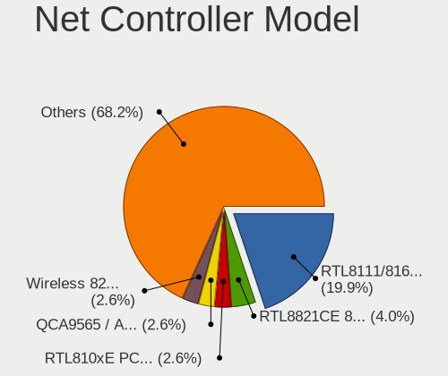

openSUSE - Hardware Trends
--------------------------

A project to identify most popular hardware characteristics and track their change
over time based on data collected by Linux users at https://Linux-Hardware.org.

Anyone can contribute to this report by the [hw-probe](https://github.com/linuxhw/hw-probe) tool:

    sudo -E hw-probe -all -upload

This is a report for all computer types. See also reports for [desktops](/Dist/openSUSE/Desktop/README.md) and [notebooks](/Dist/openSUSE/Notebook/README.md).

This report is for one last month. Overall report since the beginning of time: [TestCoverage](https://github.com/linuxhw/TestCoverage)

Period: Jun, 2022.

Contents
--------

* [ System ](#system)
  - [ OS                       ](#os)
  - [ OS Family                ](#os-family)
  - [ Kernel                   ](#kernel)
  - [ Kernel Family            ](#kernel-family)
  - [ Kernel Major Ver.        ](#kernel-major-ver)
  - [ Arch                     ](#arch)
  - [ DE                       ](#de)
  - [ Display Server           ](#display-server)
  - [ Display Manager          ](#display-manager)
  - [ OS Lang                  ](#os-lang)
  - [ Boot Mode                ](#boot-mode)
  - [ Filesystem               ](#filesystem)
  - [ Part. scheme             ](#part-scheme)
  - [ Dual Boot with Linux/BSD ](#dual-boot-with-linuxbsd)
  - [ Dual Boot (Win)          ](#dual-boot-win)

* [ Board ](#board)
  - [ Vendor                   ](#vendor)
  - [ Model                    ](#model)
  - [ Model Family             ](#model-family)
  - [ MFG Year                 ](#mfg-year)
  - [ Form Factor              ](#form-factor)
  - [ Secure Boot              ](#secure-boot)
  - [ Coreboot                 ](#coreboot)
  - [ RAM Size                 ](#ram-size)
  - [ RAM Used                 ](#ram-used)
  - [ Total Drives             ](#total-drives)
  - [ Has CD-ROM               ](#has-cd-rom)
  - [ Has Ethernet             ](#has-ethernet)
  - [ Has WiFi                 ](#has-wifi)
  - [ Has Bluetooth            ](#has-bluetooth)

* [ Location ](#location)
  - [ Country                  ](#country)
  - [ City                     ](#city)

* [ Drives ](#drives)
  - [ Drive Vendor             ](#drive-vendor)
  - [ Drive Model              ](#drive-model)
  - [ HDD Vendor               ](#hdd-vendor)
  - [ SSD Vendor               ](#ssd-vendor)
  - [ Drive Kind               ](#drive-kind)
  - [ Drive Connector          ](#drive-connector)
  - [ Drive Size               ](#drive-size)
  - [ Space Total              ](#space-total)
  - [ Space Used               ](#space-used)
  - [ Malfunc. Drives          ](#malfunc-drives)
  - [ Malfunc. Drive Vendor    ](#malfunc-drive-vendor)
  - [ Malfunc. HDD Vendor      ](#malfunc-hdd-vendor)
  - [ Malfunc. Drive Kind      ](#malfunc-drive-kind)
  - [ Failed Drives            ](#failed-drives)
  - [ Failed Drive Vendor      ](#failed-drive-vendor)
  - [ Drive Status             ](#drive-status)

* [ Storage controller ](#storage-controller)
  - [ Storage Vendor           ](#storage-vendor)
  - [ Storage Model            ](#storage-model)
  - [ Storage Kind             ](#storage-kind)

* [ Processor ](#processor)
  - [ CPU Vendor               ](#cpu-vendor)
  - [ CPU Model                ](#cpu-model)
  - [ CPU Model Family         ](#cpu-model-family)
  - [ CPU Cores                ](#cpu-cores)
  - [ CPU Sockets              ](#cpu-sockets)
  - [ CPU Threads              ](#cpu-threads)
  - [ CPU Op-Modes             ](#cpu-op-modes)
  - [ CPU Microcode            ](#cpu-microcode)
  - [ CPU Microarch            ](#cpu-microarch)

* [ Graphics ](#graphics)
  - [ GPU Vendor               ](#gpu-vendor)
  - [ GPU Model                ](#gpu-model)
  - [ GPU Combo                ](#gpu-combo)
  - [ GPU Driver               ](#gpu-driver)
  - [ GPU Memory               ](#gpu-memory)

* [ Monitor ](#monitor)
  - [ Monitor Vendor           ](#monitor-vendor)
  - [ Monitor Model            ](#monitor-model)
  - [ Monitor Resolution       ](#monitor-resolution)
  - [ Monitor Diagonal         ](#monitor-diagonal)
  - [ Monitor Width            ](#monitor-width)
  - [ Aspect Ratio             ](#aspect-ratio)
  - [ Monitor Area             ](#monitor-area)
  - [ Pixel Density            ](#pixel-density)
  - [ Multiple Monitors        ](#multiple-monitors)

* [ Network ](#network)
  - [ Net Controller Vendor    ](#net-controller-vendor)
  - [ Net Controller Model     ](#net-controller-model)
  - [ Wireless Vendor          ](#wireless-vendor)
  - [ Wireless Model           ](#wireless-model)
  - [ Ethernet Vendor          ](#ethernet-vendor)
  - [ Ethernet Model           ](#ethernet-model)
  - [ Net Controller Kind      ](#net-controller-kind)
  - [ Used Controller          ](#used-controller)
  - [ NICs                     ](#nics)
  - [ IPv6                     ](#ipv6)

* [ Bluetooth ](#bluetooth)
  - [ Bluetooth Vendor         ](#bluetooth-vendor)
  - [ Bluetooth Model          ](#bluetooth-model)

* [ Sound ](#sound)
  - [ Sound Vendor             ](#sound-vendor)
  - [ Sound Model              ](#sound-model)

* [ Memory ](#memory)
  - [ Memory Vendor            ](#memory-vendor)
  - [ Memory Model             ](#memory-model)
  - [ Memory Kind              ](#memory-kind)
  - [ Memory Form Factor       ](#memory-form-factor)
  - [ Memory Size              ](#memory-size)
  - [ Memory Speed             ](#memory-speed)

* [ Printers & scanners ](#printers--scanners)
  - [ Printer Vendor           ](#printer-vendor)
  - [ Printer Model            ](#printer-model)
  - [ Scanner Vendor           ](#scanner-vendor)
  - [ Scanner Model            ](#scanner-model)

* [ Camera ](#camera)
  - [ Camera Vendor            ](#camera-vendor)
  - [ Camera Model             ](#camera-model)

* [ Security ](#security)
  - [ Fingerprint Vendor       ](#fingerprint-vendor)
  - [ Fingerprint Model        ](#fingerprint-model)
  - [ Chipcard Vendor          ](#chipcard-vendor)
  - [ Chipcard Model           ](#chipcard-model)

* [ Unsupported ](#unsupported)
  - [ Unsupported Devices      ](#unsupported-devices)
  - [ Unsupported Device Types ](#unsupported-device-types)

System
------

OS
--

Installed operating systems

| Name                         | Computers | Percent |
|------------------------------|-----------|---------|
| openSUSE Tumbleweed-XXXXXXXX | 31        | 67.39%  |
| openSUSE Leap-15.4           | 12        | 26.09%  |
| openSUSE Leap-15.3           | 2         | 4.35%   |
| openSUSE Leap-15.2           | 1         | 2.17%   |

OS Family
---------

OS without a version

| Name     | Computers | Percent |
|----------|-----------|---------|
| openSUSE | 46        | 100%    |

Kernel
------

Version of the Linux kernel

| Version                         | Computers | Percent |
|---------------------------------|-----------|---------|
| 5.14.21-150400.22-default       | 11        | 23.91%  |
| 5.18.4-1-default                | 6         | 13.04%  |
| 5.18.2-1-default                | 6         | 13.04%  |
| 5.17.9-1-default                | 6         | 13.04%  |
| 5.18.6-1-default                | 4         | 8.7%    |
| 5.18.1-1-default                | 4         | 8.7%    |
| 5.17.7-1-default                | 3         | 6.52%   |
| 5.3.18-lp152.106-default        | 1         | 2.17%   |
| 5.3.18-150300.59.71-default     | 1         | 2.17%   |
| 5.3.18-150300.59.68-default     | 1         | 2.17%   |
| 5.18.2-lp153.4.g6d13af9-default | 1         | 2.17%   |
| 5.17.4-1-default                | 1         | 2.17%   |
| 5.16.0-1-default                | 1         | 2.17%   |

Kernel Family
-------------

Linux kernel without a distro release

| Version | Computers | Percent |
|---------|-----------|---------|
| 5.14.21 | 11        | 23.91%  |
| 5.18.2  | 7         | 15.22%  |
| 5.18.4  | 6         | 13.04%  |
| 5.17.9  | 6         | 13.04%  |
| 5.18.6  | 4         | 8.7%    |
| 5.18.1  | 4         | 8.7%    |
| 5.3.18  | 3         | 6.52%   |
| 5.17.7  | 3         | 6.52%   |
| 5.17.4  | 1         | 2.17%   |
| 5.16.0  | 1         | 2.17%   |

Kernel Major Ver.
-----------------

Linux kernel major version

| Version | Computers | Percent |
|---------|-----------|---------|
| 5.18    | 21        | 45.65%  |
| 5.14    | 11        | 23.91%  |
| 5.17    | 10        | 21.74%  |
| 5.3     | 3         | 6.52%   |
| 5.16    | 1         | 2.17%   |

Arch
----

OS architecture (x86_64, i586, etc.)

| Name   | Computers | Percent |
|--------|-----------|---------|
| x86_64 | 46        | 100%    |

DE
--

Desktop Environment

| Name     | Computers | Percent |
|----------|-----------|---------|
| KDE5     | 36        | 78.26%  |
| GNOME    | 6         | 13.04%  |
| MATE     | 1         | 2.17%   |
| KDE      | 1         | 2.17%   |
| Cinnamon | 1         | 2.17%   |
| Unknown  | 1         | 2.17%   |

Display Server
--------------

X11 or Wayland

| Name        | Computers | Percent |
|-------------|-----------|---------|
| X11         | 39        | 84.78%  |
| Wayland     | 4         | 8.7%    |
| Unspecified | 1         | 2.17%   |
| Tty         | 1         | 2.17%   |
| Unknown     | 1         | 2.17%   |

Display Manager
---------------

SDDM, LightDM, etc.

| Name    | Computers | Percent |
|---------|-----------|---------|
| SDDM    | 17        | 36.96%  |
| Unknown | 17        | 36.96%  |
| LightDM | 8         | 17.39%  |
| XDM     | 4         | 8.7%    |

OS Lang
-------

Language

| Lang    | Computers | Percent |
|---------|-----------|---------|
| en_US   | 18        | 39.13%  |
| pt_BR   | 4         | 8.7%    |
| POSIX   | 3         | 6.52%   |
| nn_NO   | 3         | 6.52%   |
| en_GB   | 3         | 6.52%   |
| de_DE   | 3         | 6.52%   |
| zh_CN   | 2         | 4.35%   |
| ru_RU   | 2         | 4.35%   |
| cs_CZ   | 2         | 4.35%   |
| pl_PL   | 1         | 2.17%   |
| nl_NL   | 1         | 2.17%   |
| hr_HR   | 1         | 2.17%   |
| fr_FR   | 1         | 2.17%   |
| en_IN   | 1         | 2.17%   |
| Unknown | 1         | 2.17%   |

Boot Mode
---------

EFI or BIOS

| Mode | Computers | Percent |
|------|-----------|---------|
| EFI  | 31        | 67.39%  |
| BIOS | 15        | 32.61%  |

Filesystem
----------

Type of filesystem

| Type    | Computers | Percent |
|---------|-----------|---------|
| Btrfs   | 39        | 84.78%  |
| Ext4    | 6         | 13.04%  |
| Overlay | 1         | 2.17%   |

Part. scheme
------------

Scheme of partitioning

| Type    | Computers | Percent |
|---------|-----------|---------|
| GPT     | 25        | 54.35%  |
| Unknown | 18        | 39.13%  |
| MBR     | 3         | 6.52%   |

Dual Boot with Linux/BSD
------------------------

Hosting more than one Linux/BSD

| Dual boot | Computers | Percent |
|-----------|-----------|---------|
| No        | 42        | 91.3%   |
| Yes       | 4         | 8.7%    |

Dual Boot (Win)
---------------

Hosting Linux and Windows

| Dual boot | Computers | Percent |
|-----------|-----------|---------|
| No        | 36        | 78.26%  |
| Yes       | 10        | 21.74%  |

Board
-----

Vendor
------

Motherboard manufacturer

| Name                | Computers | Percent |
|---------------------|-----------|---------|
| Hewlett-Packard     | 12        | 26.09%  |
| ASUSTek Computer    | 9         | 19.57%  |
| MSI                 | 5         | 10.87%  |
| Lenovo              | 5         | 10.87%  |
| Gigabyte Technology | 4         | 8.7%    |
| Dell                | 2         | 4.35%   |
| Apple               | 2         | 4.35%   |
| Toshiba             | 1         | 2.17%   |
| Timi                | 1         | 2.17%   |
| Framework           | 1         | 2.17%   |
| EVGA                | 1         | 2.17%   |
| Clevo               | 1         | 2.17%   |
| ASRock              | 1         | 2.17%   |
| Acer                | 1         | 2.17%   |

Model
-----

Motherboard model

| Name                                             | Computers | Percent |
|--------------------------------------------------|-----------|---------|
| Toshiba Satellite L500                           | 1         | 2.17%   |
| Timi A35S                                        | 1         | 2.17%   |
| MSI Raider GE76 12UH                             | 1         | 2.17%   |
| MSI MS-7D43                                      | 1         | 2.17%   |
| MSI MS-7850                                      | 1         | 2.17%   |
| MSI MS-7821                                      | 1         | 2.17%   |
| MSI MS-7673                                      | 1         | 2.17%   |
| Lenovo Yoga 9 14ITL5 82BG                        | 1         | 2.17%   |
| Lenovo ThinkStation P520 30BE008VGE              | 1         | 2.17%   |
| Lenovo ThinkPad X1 Yoga 4th 20QFCTO1WW           | 1         | 2.17%   |
| Lenovo ThinkBook 16p Gen 2 20YM                  | 1         | 2.17%   |
| Lenovo IdeaPad Gaming 3 15IMH05 82CG             | 1         | 2.17%   |
| HP ZBook Fury 15.6 inch G8 Mobile Workstation PC | 1         | 2.17%   |
| HP Z840 Workstation                              | 1         | 2.17%   |
| HP ProBook x360 435 G8 Notebook PC               | 1         | 2.17%   |
| HP ProBook 455 G8 Notebook PC                    | 1         | 2.17%   |
| HP Pavilion Laptop 14-bf0xx                      | 1         | 2.17%   |
| HP Pavilion 13 x360 PC                           | 1         | 2.17%   |
| HP OMEN 30L Desktop GT13-0xxx                    | 1         | 2.17%   |
| HP Mini 210-1000                                 | 1         | 2.17%   |
| HP Laptop 17-ca0xxx                              | 1         | 2.17%   |
| HP Laptop 15s-eq0xxx                             | 1         | 2.17%   |
| HP ENVY x360 Convertible 13-ag0xxx               | 1         | 2.17%   |
| HP ENVY TS 17                                    | 1         | 2.17%   |
| Gigabyte B85-HD3-A                               | 1         | 2.17%   |
| Gigabyte B550 AORUS ELITE AX V2                  | 1         | 2.17%   |
| Gigabyte B450 AORUS PRO WIFI                     | 1         | 2.17%   |
| Gigabyte B450 AORUS ELITE                        | 1         | 2.17%   |
| Framework Laptop                                 | 1         | 2.17%   |
| EVGA X299 FTW K                                  | 1         | 2.17%   |
| Dell OptiPlex 790                                | 1         | 2.17%   |
| Dell OptiPlex 7070                               | 1         | 2.17%   |
| Clevo P7xxTM(1)                                  | 1         | 2.17%   |
| ASUS VivoBook_ASUSLaptop X3400PH_K3400PH         | 1         | 2.17%   |
| ASUS VivoBook_ASUSLaptop X321EA_S333EA           | 1         | 2.17%   |
| ASUS TUF Gaming Z590-PLUS                        | 1         | 2.17%   |
| ASUS TUF Gaming B550M-E                          | 1         | 2.17%   |
| ASUS ROG Strix G713QE_G713QE                     | 1         | 2.17%   |
| ASUS ROG CROSSHAIR VII HERO                      | 1         | 2.17%   |
| ASUS M5A78L-M/USB3                               | 1         | 2.17%   |
| ASUS ASUS EXPERTBOOK B1500CEAE_B1500CEAE         | 1         | 2.17%   |
| ASUS 970 PRO GAMING/AURA                         | 1         | 2.17%   |
| ASRock J3355B-ITX                                | 1         | 2.17%   |
| Apple MacBookPro5,5                              | 1         | 2.17%   |
| Apple MacBook7,1                                 | 1         | 2.17%   |
| Acer Swift SFX14-41G                             | 1         | 2.17%   |

Model Family
------------

Motherboard model prefix

| Name                | Computers | Percent |
|---------------------|-----------|---------|
| HP ProBook          | 2         | 4.35%   |
| HP Pavilion         | 2         | 4.35%   |
| HP Laptop           | 2         | 4.35%   |
| HP ENVY             | 2         | 4.35%   |
| Gigabyte B450       | 2         | 4.35%   |
| Dell OptiPlex       | 2         | 4.35%   |
| ASUS VivoBook       | 2         | 4.35%   |
| ASUS TUF            | 2         | 4.35%   |
| ASUS ROG            | 2         | 4.35%   |
| Toshiba Satellite   | 1         | 2.17%   |
| Timi A35S           | 1         | 2.17%   |
| MSI Raider          | 1         | 2.17%   |
| MSI MS-7D43         | 1         | 2.17%   |
| MSI MS-7850         | 1         | 2.17%   |
| MSI MS-7821         | 1         | 2.17%   |
| MSI MS-7673         | 1         | 2.17%   |
| Lenovo Yoga         | 1         | 2.17%   |
| Lenovo ThinkStation | 1         | 2.17%   |
| Lenovo ThinkPad     | 1         | 2.17%   |
| Lenovo ThinkBook    | 1         | 2.17%   |
| Lenovo IdeaPad      | 1         | 2.17%   |
| HP ZBook            | 1         | 2.17%   |
| HP Z840             | 1         | 2.17%   |
| HP OMEN             | 1         | 2.17%   |
| HP Mini             | 1         | 2.17%   |
| Gigabyte B85-HD3-A  | 1         | 2.17%   |
| Gigabyte B550       | 1         | 2.17%   |
| Framework Laptop    | 1         | 2.17%   |
| EVGA X299           | 1         | 2.17%   |
| Clevo P7xxTM(1)     | 1         | 2.17%   |
| ASUS M5A78L-M       | 1         | 2.17%   |
| ASUS ASUS           | 1         | 2.17%   |
| ASUS 970            | 1         | 2.17%   |
| ASRock J3355B-ITX   | 1         | 2.17%   |
| Apple MacBookPro5   | 1         | 2.17%   |
| Apple MacBook7      | 1         | 2.17%   |
| Acer Swift          | 1         | 2.17%   |

MFG Year
--------

Motherboard manufacture year

| Year | Computers | Percent |
|------|-----------|---------|
| 2021 | 12        | 26.09%  |
| 2020 | 8         | 17.39%  |
| 2019 | 5         | 10.87%  |
| 2018 | 4         | 8.7%    |
| 2013 | 3         | 6.52%   |
| 2009 | 3         | 6.52%   |
| 2017 | 2         | 4.35%   |
| 2016 | 2         | 4.35%   |
| 2015 | 2         | 4.35%   |
| 2011 | 2         | 4.35%   |
| 2022 | 1         | 2.17%   |
| 2014 | 1         | 2.17%   |
| 2010 | 1         | 2.17%   |

Form Factor
-----------

Physical design of the computer

| Name        | Computers | Percent |
|-------------|-----------|---------|
| Notebook    | 22        | 47.83%  |
| Desktop     | 20        | 43.48%  |
| Convertible | 4         | 8.7%    |

Secure Boot
-----------

Enabled or disabled

| State    | Computers | Percent |
|----------|-----------|---------|
| Disabled | 40        | 86.96%  |
| Enabled  | 6         | 13.04%  |

Coreboot
--------

Have coreboot on board

| Used | Computers | Percent |
|------|-----------|---------|
| No   | 46        | 100%    |

RAM Size
--------

Total RAM memory

| Size in GB  | Computers | Percent |
|-------------|-----------|---------|
| 16.01-24.0  | 12        | 26.09%  |
| 32.01-64.0  | 10        | 21.74%  |
| 8.01-16.0   | 8         | 17.39%  |
| 4.01-8.0    | 7         | 15.22%  |
| 64.01-256.0 | 6         | 13.04%  |
| 3.01-4.0    | 1         | 2.17%   |
| 24.01-32.0  | 1         | 2.17%   |
| 0.51-1.0    | 1         | 2.17%   |

RAM Used
--------

Used RAM memory

| Used GB   | Computers | Percent |
|-----------|-----------|---------|
| 4.01-8.0  | 17        | 36.96%  |
| 2.01-3.0  | 10        | 21.74%  |
| 8.01-16.0 | 8         | 17.39%  |
| 3.01-4.0  | 6         | 13.04%  |
| 1.01-2.0  | 3         | 6.52%   |
| 0.51-1.0  | 2         | 4.35%   |

Total Drives
------------

Number of drives on board

| Drives | Computers | Percent |
|--------|-----------|---------|
| 1      | 28        | 60.87%  |
| 2      | 8         | 17.39%  |
| 3      | 6         | 13.04%  |
| 5      | 2         | 4.35%   |
| 8      | 1         | 2.17%   |
| 4      | 1         | 2.17%   |

Has CD-ROM
----------

Has CD-ROM on board

| Presented | Computers | Percent |
|-----------|-----------|---------|
| No        | 29        | 63.04%  |
| Yes       | 17        | 36.96%  |

Has Ethernet
------------

Has Ethernet on board

| Presented | Computers | Percent |
|-----------|-----------|---------|
| Yes       | 37        | 80.43%  |
| No        | 9         | 19.57%  |

Has WiFi
--------

Has WiFi module

| Presented | Computers | Percent |
|-----------|-----------|---------|
| Yes       | 37        | 80.43%  |
| No        | 9         | 19.57%  |

Has Bluetooth
-------------

Has Bluetooth module

| Presented | Computers | Percent |
|-----------|-----------|---------|
| Yes       | 34        | 73.91%  |
| No        | 12        | 26.09%  |

Location
--------

Country
-------

Geographic location (country)

| Country     | Computers | Percent |
|-------------|-----------|---------|
| USA         | 10        | 21.74%  |
| Germany     | 6         | 13.04%  |
| Brazil      | 4         | 8.7%    |
| Norway      | 3         | 6.52%   |
| Netherlands | 3         | 6.52%   |
| Russia      | 2         | 4.35%   |
| Poland      | 2         | 4.35%   |
| Italy       | 2         | 4.35%   |
| China       | 2         | 4.35%   |
| UK          | 1         | 2.17%   |
| Turkey      | 1         | 2.17%   |
| Singapore   | 1         | 2.17%   |
| Martinique  | 1         | 2.17%   |
| India       | 1         | 2.17%   |
| Iceland     | 1         | 2.17%   |
| France      | 1         | 2.17%   |
| Czechia     | 1         | 2.17%   |
| Croatia     | 1         | 2.17%   |
| Canada      | 1         | 2.17%   |
| Belarus     | 1         | 2.17%   |
| Australia   | 1         | 2.17%   |

City
----

Geographic location (city)

| City               | Computers | Percent |
|--------------------|-----------|---------|
| West Kelowna       | 1         | 2.17%   |
| Virginia Beach     | 1         | 2.17%   |
| Vaksdal            | 1         | 2.17%   |
| Stari Perkovci     | 1         | 2.17%   |
| Skeie              | 1         | 2.17%   |
| Singapore          | 1         | 2.17%   |
| Sesto San Giovanni | 1         | 2.17%   |
| Santa Rosa         | 1         | 2.17%   |
| San Ysidro         | 1         | 2.17%   |
| Ronago             | 1         | 2.17%   |
| Riviere Salee      | 1         | 2.17%   |
| Qingshanmiao       | 1         | 2.17%   |
| Pueblo             | 1         | 2.17%   |
| Prague             | 1         | 2.17%   |
| Poznan             | 1         | 2.17%   |
| Phoenix            | 1         | 2.17%   |
| Pennsville         | 1         | 2.17%   |
| Paris              | 1         | 2.17%   |
| Paranaiba          | 1         | 2.17%   |
| Nuremberg          | 1         | 2.17%   |
| New York           | 1         | 2.17%   |
| Mumbai             | 1         | 2.17%   |
| Moscow             | 1         | 2.17%   |
| Minsk              | 1         | 2.17%   |
| Meldorf            | 1         | 2.17%   |
| Maua               | 1         | 2.17%   |
| Lehrte             | 1         | 2.17%   |
| Lakeland           | 1         | 2.17%   |
| Kulmbach           | 1         | 2.17%   |
| Izmir              | 1         | 2.17%   |
| Isafjordur         | 1         | 2.17%   |
| Huettenberg        | 1         | 2.17%   |
| Houten             | 1         | 2.17%   |
| Haarlem            | 1         | 2.17%   |
| Converse           | 1         | 2.17%   |
| Chicago            | 1         | 2.17%   |
| Chelyabinsk        | 1         | 2.17%   |
| Bristol            | 1         | 2.17%   |
| Brisbane           | 1         | 2.17%   |
| Bradford           | 1         | 2.17%   |
| Bialystok          | 1         | 2.17%   |
| Bergisch Gladbach  | 1         | 2.17%   |
| Bergen             | 1         | 2.17%   |
| Belo Horizonte     | 1         | 2.17%   |
| Beijing            | 1         | 2.17%   |
| Amsterdam          | 1         | 2.17%   |

Drives
------

Drive Vendor
------------

Hard drive vendors

| Vendor                         | Computers | Drives | Percent |
|--------------------------------|-----------|--------|---------|
| Samsung Electronics            | 21        | 23     | 28.77%  |
| WDC                            | 11        | 18     | 15.07%  |
| Seagate                        | 6         | 8      | 8.22%   |
| Kingston                       | 6         | 7      | 8.22%   |
| SK hynix                       | 5         | 5      | 6.85%   |
| Intel                          | 4         | 4      | 5.48%   |
| Toshiba                        | 2         | 2      | 2.74%   |
| SanDisk                        | 2         | 2      | 2.74%   |
| HGST                           | 2         | 3      | 2.74%   |
| A-DATA Technology              | 2         | 2      | 2.74%   |
| Zheino                         | 1         | 1      | 1.37%   |
| Unknown                        | 1         | 1      | 1.37%   |
| SPCC                           | 1         | 1      | 1.37%   |
| Solid State Storage Technology | 1         | 1      | 1.37%   |
| PNY                            | 1         | 1      | 1.37%   |
| Pioneer                        | 1         | 1      | 1.37%   |
| Phison                         | 1         | 1      | 1.37%   |
| Micron Technology              | 1         | 1      | 1.37%   |
| JMicron Technology             | 1         | 1      | 1.37%   |
| Hitachi                        | 1         | 1      | 1.37%   |
| FORESEE                        | 1         | 1      | 1.37%   |
| AMD                            | 1         | 1      | 1.37%   |

Drive Model
-----------

Hard drive models

| Model                                    | Computers | Percent |
|------------------------------------------|-----------|---------|
| Samsung NVMe SSD Drive 1TB               | 5         | 6.17%   |
| Samsung SSD 980 PRO 2TB                  | 3         | 3.7%    |
| SK hynix NVMe SSD Drive 512GB            | 2         | 2.47%   |
| Zheino CHN-mSATAM3-256 256GB             | 1         | 1.23%   |
| WDC WDS500G2B0A-00SM50 500GB SSD         | 1         | 1.23%   |
| WDC WDS100T2B0A-00SM50 1TB SSD           | 1         | 1.23%   |
| WDC WD60EZRZ-00GZ5B1 6TB                 | 1         | 1.23%   |
| WDC WD6003FZBX-00K5WB0 6TB               | 1         | 1.23%   |
| WDC WD40EZRZ-19GXCB0 4TB                 | 1         | 1.23%   |
| WDC WD30EZRX-00MMMB0 3TB                 | 1         | 1.23%   |
| WDC WD20EZAZ-00L9GB0 2TB                 | 1         | 1.23%   |
| WDC WD10SPZX-80Z10T2 1TB                 | 1         | 1.23%   |
| WDC WD10SPZX-60Z10T0 1TB                 | 1         | 1.23%   |
| WDC WD10EZEX-60ZF5A0 1TB                 | 1         | 1.23%   |
| WDC WD10EZEX-22MFCA0 1TB                 | 1         | 1.23%   |
| WDC WD10EZEX-08WN4A0 1TB                 | 1         | 1.23%   |
| WDC WD10EZEX-08M2NA0 1TB                 | 1         | 1.23%   |
| WDC WD1003FZEX-00MK2A0 1TB               | 1         | 1.23%   |
| WDC PC SN730 SDBPNTY-512G-1006 512GB     | 1         | 1.23%   |
| WDC PC SN530 SDBPNPZ-256G-1002 256GB     | 1         | 1.23%   |
| Unknown MMC Card  16GB                   | 1         | 1.23%   |
| Toshiba MQ01ABD100 1TB                   | 1         | 1.23%   |
| Toshiba MK5055GSX 500GB                  | 1         | 1.23%   |
| SPCC M.2 PCIe SSD 512GB                  | 1         | 1.23%   |
| Solid State Storage NVMe SSD Drive 256GB | 1         | 1.23%   |
| SK hynix SKHynix_HFS512GDE9X084N 512GB   | 1         | 1.23%   |
| SK hynix NVMe SSD Drive 500GB            | 1         | 1.23%   |
| SK hynix BC501 HFM512GDJTNG-8310A 512GB  | 1         | 1.23%   |
| Seagate ST6000VN0033-2EE110 6TB          | 1         | 1.23%   |
| Seagate ST4000VN008-2DR166 4TB           | 1         | 1.23%   |
| Seagate ST4000DM004-2CV104 4TB           | 1         | 1.23%   |
| Seagate ST3320418AS 320GB                | 1         | 1.23%   |
| Seagate ST2000DM001-1ER164 2TB           | 1         | 1.23%   |
| Seagate ST2000DL004 HD204UI 2TB          | 1         | 1.23%   |
| Seagate ST1000DX002-2DV162 1TB           | 1         | 1.23%   |
| SanDisk SDSSDH3 1T00 1TB                 | 1         | 1.23%   |
| SanDisk NVMe SSD Drive 1TB               | 1         | 1.23%   |
| Samsung SSD 970 EVO Plus 1TB             | 1         | 1.23%   |
| Samsung SSD 870 QVO 2TB                  | 1         | 1.23%   |
| Samsung SSD 870 EVO 500GB                | 1         | 1.23%   |
| Samsung SSD 860 QVO 1TB                  | 1         | 1.23%   |
| Samsung SSD 860 EVO 500GB                | 1         | 1.23%   |
| Samsung SSD 860 EVO 1TB                  | 1         | 1.23%   |
| Samsung SSD 850 EVO 500GB                | 1         | 1.23%   |
| Samsung SSD 840 EVO 500GB                | 1         | 1.23%   |
| Samsung SSD 840 EVO 120GB                | 1         | 1.23%   |
| Samsung SM963 2.5" NVMe PCIe SSD 500GB   | 1         | 1.23%   |
| Samsung NVMe SSD Drive 1024GB            | 1         | 1.23%   |
| Samsung MZVLB512HBJQ-000H1 512GB         | 1         | 1.23%   |
| Samsung MZVL21T0HCLR-00B00 1TB           | 1         | 1.23%   |
| Samsung MZNLN256HMHQ-000H1 256GB SSD     | 1         | 1.23%   |
| PNY CS3030 2TB SSD                       | 1         | 1.23%   |
| Pioneer APS-SL3N-240 240GB               | 1         | 1.23%   |
| Phison NVMe SSD Drive 1024GB             | 1         | 1.23%   |
| Micron NVMe SSD Drive 1024GB             | 1         | 1.23%   |
| Kingston SUV500MS480G 480GB SSD          | 1         | 1.23%   |
| Kingston SHFS37A120G 120GB SSD           | 1         | 1.23%   |
| Kingston SA400S37960G 960GB SSD          | 1         | 1.23%   |
| Kingston SA400S37480G 480GB SSD          | 1         | 1.23%   |
| Kingston SA2000M8500G 500GB              | 1         | 1.23%   |

HDD Vendor
----------

Hard disk drive vendors

| Vendor             | Computers | Drives | Percent |
|--------------------|-----------|--------|---------|
| WDC                | 9         | 14     | 42.86%  |
| Seagate            | 6         | 8      | 28.57%  |
| Toshiba            | 2         | 2      | 9.52%   |
| HGST               | 2         | 3      | 9.52%   |
| JMicron Technology | 1         | 1      | 4.76%   |
| Hitachi            | 1         | 1      | 4.76%   |

SSD Vendor
----------

Solid state drive vendors

| Vendor              | Computers | Drives | Percent |
|---------------------|-----------|--------|---------|
| Samsung Electronics | 9         | 9      | 45%     |
| Kingston            | 4         | 5      | 20%     |
| WDC                 | 2         | 2      | 10%     |
| SanDisk             | 1         | 1      | 5%      |
| Pioneer             | 1         | 1      | 5%      |
| Intel               | 1         | 1      | 5%      |
| AMD                 | 1         | 1      | 5%      |
| A-DATA Technology   | 1         | 1      | 5%      |

Drive Kind
----------

HDD or SSD

| Kind    | Computers | Drives | Percent |
|---------|-----------|--------|---------|
| NVMe    | 27        | 34     | 40.91%  |
| HDD     | 21        | 29     | 31.82%  |
| SSD     | 16        | 21     | 24.24%  |
| MMC     | 1         | 1      | 1.52%   |
| Unknown | 1         | 1      | 1.52%   |

Drive Connector
---------------

SATA, SAS, NVMe, etc.

| Type | Computers | Drives | Percent |
|------|-----------|--------|---------|
| SATA | 28        | 50     | 49.12%  |
| NVMe | 27        | 34     | 47.37%  |
| SAS  | 1         | 1      | 1.75%   |
| MMC  | 1         | 1      | 1.75%   |

Drive Size
----------

Size of hard drive

| Size in TB | Computers | Drives | Percent |
|------------|-----------|--------|---------|
| 0.01-0.5   | 17        | 19     | 43.59%  |
| 0.51-1.0   | 12        | 15     | 30.77%  |
| 1.01-2.0   | 4         | 6      | 10.26%  |
| 3.01-4.0   | 3         | 4      | 7.69%   |
| 4.01-10.0  | 2         | 5      | 5.13%   |
| 2.01-3.0   | 1         | 1      | 2.56%   |

Space Total
-----------

Amount of disk space available on the file system

| Size in GB     | Computers | Percent |
|----------------|-----------|---------|
| More than 3000 | 23        | 50%     |
| 1001-2000      | 11        | 23.91%  |
| 2001-3000      | 4         | 8.7%    |
| 251-500        | 3         | 6.52%   |
| 501-1000       | 3         | 6.52%   |
| 101-250        | 1         | 2.17%   |
| 51-100         | 1         | 2.17%   |

Space Used
----------

Amount of used disk space

| Used GB        | Computers | Percent |
|----------------|-----------|---------|
| 101-250        | 11        | 23.91%  |
| 251-500        | 10        | 21.74%  |
| 1001-2000      | 8         | 17.39%  |
| 501-1000       | 7         | 15.22%  |
| More than 3000 | 3         | 6.52%   |
| 2001-3000      | 3         | 6.52%   |
| 1-20           | 3         | 6.52%   |
| 51-100         | 1         | 2.17%   |

Malfunc. Drives
---------------

Drive models with a malfunction

| Model                                 | Computers | Drives | Percent |
|---------------------------------------|-----------|--------|---------|
| Toshiba MK5055GSX 500GB               | 1         | 1      | 20%     |
| SPCC M.2 PCIe SSD 512GB               | 1         | 1      | 20%     |
| Samsung Electronics SSD 840 EVO 120GB | 1         | 1      | 20%     |
| Kingston SHFS37A120G 120GB SSD        | 1         | 1      | 20%     |
| Hitachi HTS725025A9A364 250GB         | 1         | 1      | 20%     |

Malfunc. Drive Vendor
---------------------

Vendors of faulty drives

| Vendor              | Computers | Drives | Percent |
|---------------------|-----------|--------|---------|
| Toshiba             | 1         | 1      | 20%     |
| SPCC                | 1         | 1      | 20%     |
| Samsung Electronics | 1         | 1      | 20%     |
| Kingston            | 1         | 1      | 20%     |
| Hitachi             | 1         | 1      | 20%     |

Malfunc. HDD Vendor
-------------------

Vendors of faulty HDD drives

| Vendor  | Computers | Drives | Percent |
|---------|-----------|--------|---------|
| Toshiba | 1         | 1      | 50%     |
| Hitachi | 1         | 1      | 50%     |

Malfunc. Drive Kind
-------------------

Kinds of faulty drives

| Kind | Computers | Drives | Percent |
|------|-----------|--------|---------|
| SSD  | 2         | 2      | 40%     |
| HDD  | 2         | 2      | 40%     |
| NVMe | 1         | 1      | 20%     |

Failed Drives
-------------

Failed drive models

Zero info for selected period =(

Failed Drive Vendor
-------------------

Failed drive vendors

Zero info for selected period =(

Drive Status
------------

Number of failed and malfunc. drives

| Status   | Computers | Drives | Percent |
|----------|-----------|--------|---------|
| Works    | 24        | 43     | 50%     |
| Detected | 19        | 38     | 39.58%  |
| Malfunc  | 5         | 5      | 10.42%  |

Storage controller
------------------

Storage Vendor
--------------

Storage controller vendors

| Vendor                         | Computers | Percent |
|--------------------------------|-----------|---------|
| Intel                          | 23        | 33.82%  |
| Samsung Electronics            | 12        | 17.65%  |
| AMD                            | 12        | 17.65%  |
| SK hynix                       | 5         | 7.35%   |
| SanDisk                        | 3         | 4.41%   |
| Phison Electronics             | 2         | 2.94%   |
| Nvidia                         | 2         | 2.94%   |
| Kingston Technology Company    | 2         | 2.94%   |
| Solid State Storage Technology | 1         | 1.47%   |
| Micron Technology              | 1         | 1.47%   |
| MAXIO Technology (Hangzhou)    | 1         | 1.47%   |
| Marvell Technology Group       | 1         | 1.47%   |
| Broadcom / LSI                 | 1         | 1.47%   |
| ASMedia Technology             | 1         | 1.47%   |
| ADATA Technology               | 1         | 1.47%   |

Storage Model
-------------

Storage controller models

| Model                                                                          | Computers | Percent |
|--------------------------------------------------------------------------------|-----------|---------|
| AMD FCH SATA Controller [AHCI mode]                                            | 8         | 10.39%  |
| Samsung NVMe SSD Controller SM981/PM981/PM983                                  | 5         | 6.49%   |
| SK hynix Gold P31 SSD                                                          | 4         | 5.19%   |
| Samsung NVMe SSD Controller PM9A1/PM9A3/980PRO                                 | 4         | 5.19%   |
| Intel 8 Series/C220 Series Chipset Family 6-port SATA Controller 1 [AHCI mode] | 4         | 5.19%   |
| AMD 400 Series Chipset SATA Controller                                         | 4         | 5.19%   |
| Samsung NVMe SSD Controller 980                                                | 3         | 3.9%    |
| Intel Volume Management Device NVMe RAID Controller                            | 3         | 3.9%    |
| Intel 200 Series PCH SATA controller [AHCI mode]                               | 3         | 3.9%    |
| Phison E12 NVMe Controller                                                     | 2         | 2.6%    |
| Intel SSD 660P Series                                                          | 2         | 2.6%    |
| Intel 6 Series/C200 Series Chipset Family 6 port Desktop SATA AHCI Controller  | 2         | 2.6%    |
| AMD 500 Series Chipset SATA Controller                                         | 2         | 2.6%    |
| Solid State Storage Non-Volatile memory controller                             | 1         | 1.3%    |
| SK hynix BC501 NVMe Solid State Drive                                          | 1         | 1.3%    |
| SanDisk WD Blue SN550 NVMe SSD                                                 | 1         | 1.3%    |
| SanDisk WD Black SN750 / PC SN730 NVMe SSD                                     | 1         | 1.3%    |
| SanDisk Non-Volatile memory controller                                         | 1         | 1.3%    |
| Nvidia MCP89 SATA Controller (AHCI mode)                                       | 1         | 1.3%    |
| Nvidia MCP79 AHCI Controller                                                   | 1         | 1.3%    |
| Micron Non-Volatile memory controller                                          | 1         | 1.3%    |
| MAXIO (Hangzhou) NVMe SSD Controller MAP1202                                   | 1         | 1.3%    |
| Marvell Group Marvell Non-Volatile memory controller                           | 1         | 1.3%    |
| Kingston Company Company Non-Volatile memory controller                        | 1         | 1.3%    |
| Kingston Company A2000 NVMe SSD                                                | 1         | 1.3%    |
| Intel Wildcat Point-LP SATA Controller [AHCI Mode]                             | 1         | 1.3%    |
| Intel Tiger Lake-LP SATA Controller [AHCI mode]                                | 1         | 1.3%    |
| Intel Sunrise Point-LP SATA Controller [AHCI mode]                             | 1         | 1.3%    |
| Intel Non-Volatile memory controller                                           | 1         | 1.3%    |
| Intel NM10/ICH7 Family SATA Controller [AHCI mode]                             | 1         | 1.3%    |
| Intel Celeron N3350/Pentium N4200/Atom E3900 Series SATA AHCI Controller       | 1         | 1.3%    |
| Intel Cannon Lake PCH SATA AHCI Controller                                     | 1         | 1.3%    |
| Intel C610/X99 series chipset sSATA Controller [AHCI mode]                     | 1         | 1.3%    |
| Intel C610/X99 series chipset 6-Port SATA Controller [AHCI mode]               | 1         | 1.3%    |
| Intel Alder Lake-S PCH SATA Controller [AHCI Mode]                             | 1         | 1.3%    |
| Intel 82801IBM/IEM (ICH9M/ICH9M-E) 4 port SATA Controller [AHCI mode]          | 1         | 1.3%    |
| Intel 500 Series Chipset Family SATA AHCI Controller                           | 1         | 1.3%    |
| Intel 400 Series Chipset Family SATA AHCI Controller                           | 1         | 1.3%    |
| Broadcom / LSI SAS2308 PCI-Express Fusion-MPT SAS-2                            | 1         | 1.3%    |
| ASMedia ASM1166 Serial ATA Controller                                          | 1         | 1.3%    |
| AMD SB7x0/SB8x0/SB9x0 SATA Controller [IDE mode]                               | 1         | 1.3%    |
| AMD SB7x0/SB8x0/SB9x0 SATA Controller [AHCI mode]                              | 1         | 1.3%    |
| AMD SB7x0/SB8x0/SB9x0 IDE Controller                                           | 1         | 1.3%    |
| ADATA XPG SX8200 Pro PCIe Gen3x4 M.2 2280 Solid State Drive                    | 1         | 1.3%    |

Storage Kind
------------

Kind of storage controller (IDE, SATA, NVMe, SAS, ...)

| Kind | Computers | Percent |
|------|-----------|---------|
| SATA | 34        | 51.52%  |
| NVMe | 27        | 40.91%  |
| RAID | 3         | 4.55%   |
| SAS  | 1         | 1.52%   |
| IDE  | 1         | 1.52%   |

Processor
---------

CPU Vendor
----------

Processor vendors

| Vendor | Computers | Percent |
|--------|-----------|---------|
| Intel  | 29        | 63.04%  |
| AMD    | 17        | 36.96%  |

CPU Model
---------

Processor models

| Model                                         | Computers | Percent |
|-----------------------------------------------|-----------|---------|
| AMD Ryzen 7 5800H with Radeon Graphics        | 3         | 6.52%   |
| Intel Core i5-4670K CPU @ 3.40GHz             | 2         | 4.35%   |
| Intel 11th Gen Core i5-1135G7 @ 2.40GHz       | 2         | 4.35%   |
| AMD Ryzen 7 5800U with Radeon Graphics        | 2         | 4.35%   |
| AMD Ryzen 7 3700X 8-Core Processor            | 2         | 4.35%   |
| AMD FX-8350 Eight-Core Processor              | 2         | 4.35%   |
| Intel Xeon W-2135 CPU @ 3.70GHz               | 1         | 2.17%   |
| Intel Xeon CPU E5-2667 v3 @ 3.20GHz           | 1         | 2.17%   |
| Intel Core i9-9940X CPU @ 3.30GHz             | 1         | 2.17%   |
| Intel Core i9-9900K CPU @ 3.60GHz             | 1         | 2.17%   |
| Intel Core i7-8565U CPU @ 1.80GHz             | 1         | 2.17%   |
| Intel Core i7-4790 CPU @ 3.60GHz              | 1         | 2.17%   |
| Intel Core i7-4700MQ CPU @ 2.40GHz            | 1         | 2.17%   |
| Intel Core i7-2600 CPU @ 3.40GHz              | 1         | 2.17%   |
| Intel Core i7-10750H CPU @ 2.60GHz            | 1         | 2.17%   |
| Intel Core i5-9600KF CPU @ 3.70GHz            | 1         | 2.17%   |
| Intel Core i5-5200U CPU @ 2.20GHz             | 1         | 2.17%   |
| Intel Core i5-2500 CPU @ 3.30GHz              | 1         | 2.17%   |
| Intel Core i3-7100U CPU @ 2.40GHz             | 1         | 2.17%   |
| Intel Core 2 Duo CPU T6500 @ 2.10GHz          | 1         | 2.17%   |
| Intel Core 2 Duo CPU P8700 @ 2.53GHz          | 1         | 2.17%   |
| Intel Core 2 Duo CPU P8600 @ 2.40GHz          | 1         | 2.17%   |
| Intel Celeron CPU J3355 @ 2.00GHz             | 1         | 2.17%   |
| Intel Atom CPU N450 @ 1.66GHz                 | 1         | 2.17%   |
| Intel 12th Gen Core i7-12700K                 | 1         | 2.17%   |
| Intel 12th Gen Core i7-12700H                 | 1         | 2.17%   |
| Intel 11th Gen Core i7-1185G7 @ 3.00GHz       | 1         | 2.17%   |
| Intel 11th Gen Core i7-11800H @ 2.30GHz       | 1         | 2.17%   |
| Intel 11th Gen Core i7-11700F @ 2.50GHz       | 1         | 2.17%   |
| Intel 11th Gen Core i7-1165G7 @ 2.80GHz       | 1         | 2.17%   |
| Intel 11th Gen Core i5-11300H @ 3.10GHz       | 1         | 2.17%   |
| AMD Ryzen 9 5900X 12-Core Processor           | 1         | 2.17%   |
| AMD Ryzen 7 PRO 5850U with Radeon Graphics    | 1         | 2.17%   |
| AMD Ryzen 7 5700G with Radeon Graphics        | 1         | 2.17%   |
| AMD Ryzen 7 2700X Eight-Core Processor        | 1         | 2.17%   |
| AMD Ryzen 7 2700U with Radeon Vega Mobile Gfx | 1         | 2.17%   |
| AMD Ryzen 5 3500U with Radeon Vega Mobile Gfx | 1         | 2.17%   |
| AMD Ryzen 5 2600X Six-Core Processor          | 1         | 2.17%   |
| AMD A6-9225 RADEON R4, 5 COMPUTE CORES 2C+3G  | 1         | 2.17%   |

CPU Model Family
----------------

Processor model prefix

| Model            | Computers | Percent |
|------------------|-----------|---------|
| AMD Ryzen 7      | 10        | 21.74%  |
| Other            | 9         | 19.57%  |
| Intel Core i7    | 5         | 10.87%  |
| Intel Core i5    | 5         | 10.87%  |
| Intel Core 2 Duo | 3         | 6.52%   |
| Intel Xeon       | 2         | 4.35%   |
| Intel Core i9    | 2         | 4.35%   |
| AMD Ryzen 5      | 2         | 4.35%   |
| AMD FX           | 2         | 4.35%   |
| Intel Core i3    | 1         | 2.17%   |
| Intel Celeron    | 1         | 2.17%   |
| Intel Atom       | 1         | 2.17%   |
| AMD Ryzen 9      | 1         | 2.17%   |
| AMD Ryzen 7 PRO  | 1         | 2.17%   |
| AMD A6           | 1         | 2.17%   |

CPU Cores
---------

Number of processor cores

| Number | Computers | Percent |
|--------|-----------|---------|
| 4      | 16        | 34.78%  |
| 8      | 13        | 28.26%  |
| 2      | 7         | 15.22%  |
| 6      | 4         | 8.7%    |
| 14     | 2         | 4.35%   |
| 12     | 2         | 4.35%   |
| 16     | 1         | 2.17%   |
| 1      | 1         | 2.17%   |

CPU Sockets
-----------

Number of sockets

| Number | Computers | Percent |
|--------|-----------|---------|
| 1      | 45        | 97.83%  |
| 2      | 1         | 2.17%   |

CPU Threads
-----------

Threads per core (Hyper-Threading)

| Number | Computers | Percent |
|--------|-----------|---------|
| 2      | 37        | 80.43%  |
| 1      | 9         | 19.57%  |

CPU Op-Modes
------------

CPU Operation Modes (32-bit, 64-bit)

| Op mode        | Computers | Percent |
|----------------|-----------|---------|
| 32-bit, 64-bit | 46        | 100%    |

CPU Microcode
-------------

Microcode number

| Number     | Computers | Percent |
|------------|-----------|---------|
| Unknown    | 8         | 17.39%  |
| 0x806c1    | 5         | 10.87%  |
| 0x306c3    | 4         | 8.7%    |
| 0x0a50000c | 4         | 8.7%    |
| 0x1067a    | 3         | 6.52%   |
| 0x0800820d | 2         | 4.35%   |
| 0x06000852 | 2         | 4.35%   |
| 0xa0671    | 1         | 2.17%   |
| 0x906ec    | 1         | 2.17%   |
| 0x906a3    | 1         | 2.17%   |
| 0x90672    | 1         | 2.17%   |
| 0x806ec    | 1         | 2.17%   |
| 0x806e9    | 1         | 2.17%   |
| 0x806d1    | 1         | 2.17%   |
| 0x50654    | 1         | 2.17%   |
| 0x306f2    | 1         | 2.17%   |
| 0x206a7    | 1         | 2.17%   |
| 0x106ca    | 1         | 2.17%   |
| 0x0a50000d | 1         | 2.17%   |
| 0x0a20120a | 1         | 2.17%   |
| 0x08701021 | 1         | 2.17%   |
| 0x08701013 | 1         | 2.17%   |
| 0x08108109 | 1         | 2.17%   |
| 0x0810100b | 1         | 2.17%   |
| 0x06006705 | 1         | 2.17%   |

CPU Microarch
-------------

Microarchitecture

| Name             | Computers | Percent |
|------------------|-----------|---------|
| Zen 3            | 8         | 17.39%  |
| TigerLake        | 5         | 10.87%  |
| Haswell          | 5         | 10.87%  |
| KabyLake         | 4         | 8.7%    |
| Zen+             | 3         | 6.52%   |
| Penryn           | 3         | 6.52%   |
| Zen 2            | 2         | 4.35%   |
| Skylake          | 2         | 4.35%   |
| SandyBridge      | 2         | 4.35%   |
| Piledriver       | 2         | 4.35%   |
| Icelake          | 2         | 4.35%   |
| Alderlake Hybrid | 2         | 4.35%   |
| Zen              | 1         | 2.17%   |
| Goldmont         | 1         | 2.17%   |
| Excavator        | 1         | 2.17%   |
| CometLake        | 1         | 2.17%   |
| Broadwell        | 1         | 2.17%   |
| Bonnell          | 1         | 2.17%   |

Graphics
--------

GPU Vendor
----------

Vendors of graphics cards

| Vendor | Computers | Percent |
|--------|-----------|---------|
| Nvidia | 21        | 40.38%  |
| AMD    | 16        | 30.77%  |
| Intel  | 15        | 28.85%  |

GPU Model
---------

Graphics card models

| Model                                                                                 | Computers | Percent |
|---------------------------------------------------------------------------------------|-----------|---------|
| AMD Cezanne                                                                           | 7         | 12.96%  |
| Intel TigerLake-LP GT2 [Iris Xe Graphics]                                             | 5         | 9.26%   |
| Nvidia GK208B [GeForce GT 730]                                                        | 2         | 3.7%    |
| Nvidia GA107M [GeForce RTX 3050 Ti Mobile]                                            | 2         | 3.7%    |
| Nvidia TU117M                                                                         | 1         | 1.85%   |
| Nvidia TU117GLM [T1200 Laptop GPU]                                                    | 1         | 1.85%   |
| Nvidia TU104 [GeForce RTX 2080 SUPER]                                                 | 1         | 1.85%   |
| Nvidia TU102 [GeForce RTX 2080 Ti Rev. A]                                             | 1         | 1.85%   |
| Nvidia MCP89 [GeForce 320M]                                                           | 1         | 1.85%   |
| Nvidia GP107 [GeForce GTX 1050 Ti]                                                    | 1         | 1.85%   |
| Nvidia GP106 [GeForce GTX 1060 6GB]                                                   | 1         | 1.85%   |
| Nvidia GP106 [GeForce GTX 1060 3GB]                                                   | 1         | 1.85%   |
| Nvidia GP104M [GeForce GTX 1070 Mobile]                                               | 1         | 1.85%   |
| Nvidia GP104 [GeForce GTX 1080]                                                       | 1         | 1.85%   |
| Nvidia GK208M [GeForce GT 740M]                                                       | 1         | 1.85%   |
| Nvidia GK104GL [Quadro K4200]                                                         | 1         | 1.85%   |
| Nvidia GA106M [GeForce RTX 3060 Mobile / Max-Q]                                       | 1         | 1.85%   |
| Nvidia GA106 [GeForce RTX 3060 Lite Hash Rate]                                        | 1         | 1.85%   |
| Nvidia GA106 [Geforce RTX 3050]                                                       | 1         | 1.85%   |
| Nvidia GA104M [GeForce RTX 3080 Mobile / Max-Q 8GB/16GB]                              | 1         | 1.85%   |
| Nvidia GA102 [GeForce RTX 3080 Lite Hash Rate]                                        | 1         | 1.85%   |
| Nvidia C79 [GeForce 9400M]                                                            | 1         | 1.85%   |
| Intel WhiskeyLake-U GT2 [UHD Graphics 620]                                            | 1         | 1.85%   |
| Intel HD Graphics 620                                                                 | 1         | 1.85%   |
| Intel HD Graphics 5500                                                                | 1         | 1.85%   |
| Intel HD Graphics 500                                                                 | 1         | 1.85%   |
| Intel CometLake-H GT2 [UHD Graphics]                                                  | 1         | 1.85%   |
| Intel CoffeeLake-S GT2 [UHD Graphics 630]                                             | 1         | 1.85%   |
| Intel Atom Processor D4xx/D5xx/N4xx/N5xx Integrated Graphics Controller               | 1         | 1.85%   |
| Intel AlderLake-S GT1                                                                 | 1         | 1.85%   |
| Intel Alder Lake-P Integrated Graphics Controller                                     | 1         | 1.85%   |
| Intel 4th Gen Core Processor Integrated Graphics Controller                           | 1         | 1.85%   |
| AMD Topaz XT [Radeon R7 M260/M265 / M340/M360 / M440/M445 / 530/535 / 620/625 Mobile] | 1         | 1.85%   |
| AMD Stoney [Radeon R2/R3/R4/R5 Graphics]                                              | 1         | 1.85%   |
| AMD RV710/M92 [Mobility Radeon HD 4530/4570/545v]                                     | 1         | 1.85%   |
| AMD RS780L [Radeon 3000]                                                              | 1         | 1.85%   |
| AMD Raven Ridge [Radeon Vega Series / Radeon Vega Mobile Series]                      | 1         | 1.85%   |
| AMD Picasso/Raven 2 [Radeon Vega Series / Radeon Vega Mobile Series]                  | 1         | 1.85%   |
| AMD Navi 22 [Radeon RX 6700/6700 XT/6750 XT / 6800M]                                  | 1         | 1.85%   |
| AMD Juniper XT [Radeon HD 5770]                                                       | 1         | 1.85%   |
| AMD Hawaii XT / Grenada XT [Radeon R9 290X/390X]                                      | 1         | 1.85%   |
| AMD Cedar [Radeon HD 5000/6000/7350/8350 Series]                                      | 1         | 1.85%   |

GPU Combo
---------

Combinations of graphics cards

| Name           | Computers | Percent |
|----------------|-----------|---------|
| 1 x Nvidia     | 14        | 30.43%  |
| 1 x Intel      | 12        | 26.09%  |
| 1 x AMD        | 12        | 26.09%  |
| Intel + Nvidia | 3         | 6.52%   |
| AMD + Nvidia   | 3         | 6.52%   |
| 2 x Nvidia     | 1         | 2.17%   |
| 2 x AMD        | 1         | 2.17%   |

GPU Driver
----------

Free vs proprietary

| Driver      | Computers | Percent |
|-------------|-----------|---------|
| Free        | 33        | 71.74%  |
| Proprietary | 13        | 28.26%  |

GPU Memory
----------

Total video memory

| Size in GB | Computers | Percent |
|------------|-----------|---------|
| Unknown    | 17        | 36.96%  |
| 0.01-0.5   | 10        | 21.74%  |
| 3.01-4.0   | 7         | 15.22%  |
| 8.01-16.0  | 4         | 8.7%    |
| 7.01-8.0   | 3         | 6.52%   |
| 0.51-1.0   | 3         | 6.52%   |
| 2.01-3.0   | 1         | 2.17%   |
| 1.01-2.0   | 1         | 2.17%   |

Monitor
-------

Monitor Vendor
--------------

Monitor vendors

| Vendor              | Computers | Percent |
|---------------------|-----------|---------|
| Samsung Electronics | 6         | 11.32%  |
| Goldstar            | 6         | 11.32%  |
| BOE                 | 5         | 9.43%   |
| LG Display          | 4         | 7.55%   |
| AU Optronics        | 4         | 7.55%   |
| Dell                | 3         | 5.66%   |
| Apple               | 3         | 5.66%   |
| Chimei Innolux      | 2         | 3.77%   |
| ASUSTek Computer    | 2         | 3.77%   |
| Vizio               | 1         | 1.89%   |
| Unknown             | 1         | 1.89%   |
| Sharp               | 1         | 1.89%   |
| Philips             | 1         | 1.89%   |
| PANDA               | 1         | 1.89%   |
| NEC Computers       | 1         | 1.89%   |
| MAG                 | 1         | 1.89%   |
| MacroSilicon        | 1         | 1.89%   |
| Lenovo              | 1         | 1.89%   |
| InfoVision          | 1         | 1.89%   |
| Iiyama              | 1         | 1.89%   |
| Hewlett-Packard     | 1         | 1.89%   |
| HannStar            | 1         | 1.89%   |
| GDH                 | 1         | 1.89%   |
| Fujitsu Siemens     | 1         | 1.89%   |
| CSO                 | 1         | 1.89%   |
| BenQ                | 1         | 1.89%   |
| Acer                | 1         | 1.89%   |

Monitor Model
-------------

Monitor models

| Model                                                                  | Computers | Percent |
|------------------------------------------------------------------------|-----------|---------|
| Vizio E60-E3 VIZ1018 3840x2160 1330x748mm 60.1-inch                    | 1         | 1.79%   |
| Unknown SMART TV 0563 1920x1080 1209x680mm 54.6-inch                   | 1         | 1.79%   |
| Sharp LQ173M1JW08 SHP1544 1920x1080 382x215mm 17.3-inch                | 1         | 1.79%   |
| Samsung Electronics LU28R55 SAM1015 3840x2160 632x360mm 28.6-inch      | 1         | 1.79%   |
| Samsung Electronics LCD Monitor SyncMaster 1920x1080                   | 1         | 1.79%   |
| Samsung Electronics LCD Monitor SEC3859 1366x768 293x165mm 13.2-inch   | 1         | 1.79%   |
| Samsung Electronics LCD Monitor SDC4171 2880x1800 302x189mm 14.0-inch  | 1         | 1.79%   |
| Samsung Electronics LCD Monitor SDC4150 3456x2160 336x210mm 15.6-inch  | 1         | 1.79%   |
| Samsung Electronics LCD Monitor SAM0D43 3840x2160 1020x570mm 46.0-inch | 1         | 1.79%   |
| Philips PHL 328P6A PHL0913 2560x1440 698x393mm 31.5-inch               | 1         | 1.79%   |
| Philips PHL 223V7 PHLC154 1920x1080 476x268mm 21.5-inch                | 1         | 1.79%   |
| PANDA LCD Monitor NCP0046 1920x1080 344x194mm 15.5-inch                | 1         | 1.79%   |
| NEC Computers PA301W NEC6811 2560x1600 641x400mm 29.7-inch             | 1         | 1.79%   |
| MAG MAG MAG2380 1920x1080 452x254mm 20.4-inch                          | 1         | 1.79%   |
| MacroSilicon MACROSILICON MAC0101 1920x1080 708x398mm 32.0-inch        | 1         | 1.79%   |
| LG Display LCD Monitor LGDD801 1366x768 344x194mm 15.5-inch            | 1         | 1.79%   |
| LG Display LCD Monitor LGD061F 1920x1080 309x174mm 14.0-inch           | 1         | 1.79%   |
| LG Display LCD Monitor LGD05FD 1920x1080 309x174mm 14.0-inch           | 1         | 1.79%   |
| LG Display LCD Monitor LGD05E5 1920x1080 340x190mm 15.3-inch           | 1         | 1.79%   |
| Lenovo LEN S22e-19 LEN61C9 1920x1080 476x268mm 21.5-inch               | 1         | 1.79%   |
| InfoVision LCD Monitor IVO857B 1920x1080 294x165mm 13.3-inch           | 1         | 1.79%   |
| Iiyama PL2530H IVM6132 1920x1080 540x300mm 24.3-inch                   | 1         | 1.79%   |
| Hewlett-Packard 27q HPN3564 2560x1440 597x336mm 27.0-inch              | 1         | 1.79%   |
| HannStar LCD Monitor HSD03E9 1024x600 220x129mm 10.0-inch              | 1         | 1.79%   |
| Goldstar W2234 GSM56B8 1680x1050 474x296mm 22.0-inch                   | 1         | 1.79%   |
| Goldstar ULTRAWIDE GSM5AFB 2560x1080 798x334mm 34.1-inch               | 1         | 1.79%   |
| Goldstar ULTRAGEAR GSM7766 2560x1440 697x392mm 31.5-inch               | 1         | 1.79%   |
| Goldstar ULTRAGEAR GSM5BD3 2560x1440 697x392mm 31.5-inch               | 1         | 1.79%   |
| Goldstar Ultra HD GSM5B09 3840x2160 600x340mm 27.2-inch                | 1         | 1.79%   |
| Goldstar M2380D GSM57BC 1920x1080 598x336mm 27.0-inch                  | 1         | 1.79%   |
| Goldstar FULL HD GSM5ABB 1920x1080 480x270mm 21.7-inch                 | 1         | 1.79%   |
| Goldstar 34GL750 GSM773B 2560x1080 798x334mm 34.1-inch                 | 1         | 1.79%   |
| GDH PHILCO GDH0030 1920x540 708x398mm 32.0-inch                        | 1         | 1.79%   |
| Fujitsu Siemens P19-2 FUS0552 1280x1024 376x301mm 19.0-inch            | 1         | 1.79%   |
| Dell U3417W DELA0DD 3440x1440 800x335mm 34.1-inch                      | 1         | 1.79%   |
| Dell U2414H DELA0A3 1920x1080 527x296mm 23.8-inch                      | 1         | 1.79%   |
| Dell E1916H DELF064 1366x768 410x230mm 18.5-inch                       | 1         | 1.79%   |
| CSO LCD Monitor CSO1603 2560x1600 344x215mm 16.0-inch                  | 1         | 1.79%   |
| Chimei Innolux LCD Monitor CMN1747 1920x1080 381x214mm 17.2-inch       | 1         | 1.79%   |
| Chimei Innolux LCD Monitor CMN1388 1920x1080 293x165mm 13.2-inch       | 1         | 1.79%   |
| BOE LCD Monitor BOE0995 1920x1080 382x215mm 17.3-inch                  | 1         | 1.79%   |
| BOE LCD Monitor BOE095F 2256x1504 285x190mm 13.5-inch                  | 1         | 1.79%   |
| BOE LCD Monitor BOE08E9 1920x1080 344x194mm 15.5-inch                  | 1         | 1.79%   |
| BOE LCD Monitor BOE07B8 1920x1080 294x165mm 13.3-inch                  | 1         | 1.79%   |
| BOE LCD Monitor BOE0660 1600x900 382x215mm 17.3-inch                   | 1         | 1.79%   |
| BenQ BenQG2222HDL BNQ785A 1920x1080 478x269mm 21.6-inch                | 1         | 1.79%   |
| AU Optronics LCD Monitor AUOC48A 1920x1080 344x194mm 15.5-inch         | 1         | 1.79%   |
| AU Optronics LCD Monitor AUO683D 1920x1080 309x174mm 14.0-inch         | 1         | 1.79%   |
| AU Optronics LCD Monitor AUO61ED 1920x1080 344x194mm 15.5-inch         | 1         | 1.79%   |
| AU Optronics LCD Monitor AUO219D 1920x1080 381x214mm 17.2-inch         | 1         | 1.79%   |
| ASUSTek Computer VP28U AUS28B1 3840x2160 621x341mm 27.9-inch           | 1         | 1.79%   |
| ASUSTek Computer VL279 AUS2781 1920x1080 598x336mm 27.0-inch           | 1         | 1.79%   |
| Apple LCD Monitor APP9CBD 1280x800 286x179mm 13.3-inch                 | 1         | 1.79%   |
| Apple LCD Monitor APP9C89 1280x800 286x179mm 13.3-inch                 | 1         | 1.79%   |
| Apple Color LCD APP9CC0 1280x800 261x163mm 12.1-inch                   | 1         | 1.79%   |
| Acer GF246 ACR055F 1920x1080 531x299mm 24.0-inch                       | 1         | 1.79%   |

Monitor Resolution
------------------

Monitor screen resolution

| Resolution         | Computers | Percent |
|--------------------|-----------|---------|
| 1920x1080 (FHD)    | 26        | 50%     |
| 3840x2160 (4K)     | 5         | 9.62%   |
| 2560x1440 (QHD)    | 4         | 7.69%   |
| 1366x768 (WXGA)    | 3         | 5.77%   |
| 1280x800 (WXGA)    | 3         | 5.77%   |
| 2560x1600          | 2         | 3.85%   |
| 3456x2160          | 1         | 1.92%   |
| 3440x1440          | 1         | 1.92%   |
| 2880x1800          | 1         | 1.92%   |
| 2560x1080          | 1         | 1.92%   |
| 2256x1504          | 1         | 1.92%   |
| 1680x1050 (WSXGA+) | 1         | 1.92%   |
| 1600x900 (HD+)     | 1         | 1.92%   |
| 1280x1024 (SXGA)   | 1         | 1.92%   |
| 1024x600           | 1         | 1.92%   |

Monitor Diagonal
----------------

Diagonal size in inches

| Inches  | Computers | Percent |
|---------|-----------|---------|
| 15      | 7         | 12.73%  |
| 13      | 7         | 12.73%  |
| 27      | 5         | 9.09%   |
| 17      | 5         | 9.09%   |
| 21      | 4         | 7.27%   |
| 14      | 4         | 7.27%   |
| 31      | 3         | 5.45%   |
| 24      | 3         | 5.45%   |
| 34      | 2         | 3.64%   |
| 84      | 1         | 1.82%   |
| 74      | 1         | 1.82%   |
| 54      | 1         | 1.82%   |
| 52      | 1         | 1.82%   |
| 32      | 1         | 1.82%   |
| 29      | 1         | 1.82%   |
| 28      | 1         | 1.82%   |
| 22      | 1         | 1.82%   |
| 20      | 1         | 1.82%   |
| 19      | 1         | 1.82%   |
| 18      | 1         | 1.82%   |
| 16      | 1         | 1.82%   |
| 12      | 1         | 1.82%   |
| 10      | 1         | 1.82%   |
| Unknown | 1         | 1.82%   |

Monitor Width
-------------

Physical width

| Width in mm | Computers | Percent |
|-------------|-----------|---------|
| 301-350     | 12        | 21.82%  |
| 201-300     | 9         | 16.36%  |
| 501-600     | 7         | 12.73%  |
| 401-500     | 7         | 12.73%  |
| 601-700     | 6         | 10.91%  |
| 351-400     | 6         | 10.91%  |
| 701-800     | 3         | 5.45%   |
| 1501-2000   | 2         | 3.64%   |
| 1001-1500   | 2         | 3.64%   |
| Unknown     | 1         | 1.82%   |

Aspect Ratio
------------

Proportional relationship between the width and the height

| Ratio   | Computers | Percent |
|---------|-----------|---------|
| 16/9    | 38        | 73.08%  |
| 16/10   | 9         | 17.31%  |
| 21/9    | 2         | 3.85%   |
| 5/4     | 1         | 1.92%   |
| 3/2     | 1         | 1.92%   |
| Unknown | 1         | 1.92%   |

Monitor Area
------------

Area in inch

| Area in inch | Computers | Percent |
|----------------|-----------|---------|
| 351-500        | 8         | 14.81%  |
| 101-110        | 7         | 12.96%  |
| 81-90          | 6         | 11.11%  |
| 71-80          | 5         | 9.26%   |
| 301-350        | 5         | 9.26%   |
| 201-250        | 5         | 9.26%   |
| 121-130        | 5         | 9.26%   |
| More than 1000 | 4         | 7.41%   |
| 151-200        | 3         | 5.56%   |
| 61-70          | 1         | 1.85%   |
| 41-50          | 1         | 1.85%   |
| 251-300        | 1         | 1.85%   |
| 141-150        | 1         | 1.85%   |
| 111-120        | 1         | 1.85%   |
| Unknown        | 1         | 1.85%   |

Pixel Density
-------------

Pixels per inch

| Density       | Computers | Percent |
|---------------|-----------|---------|
| 121-160       | 15        | 28.3%   |
| 51-100        | 15        | 28.3%   |
| 101-120       | 13        | 24.53%  |
| 161-240       | 5         | 9.43%   |
| More than 240 | 2         | 3.77%   |
| 1-50          | 2         | 3.77%   |
| Unknown       | 1         | 1.89%   |

Multiple Monitors
-----------------

Total monitors connected

| Total | Computers | Percent |
|-------|-----------|---------|
| 1     | 37        | 80.43%  |
| 2     | 9         | 19.57%  |

Network
-------

Net Controller Vendor
---------------------

Controller vendors

| Vendor                | Computers | Percent |
|-----------------------|-----------|---------|
| Realtek Semiconductor | 27        | 39.71%  |
| Intel                 | 23        | 33.82%  |
| Broadcom              | 4         | 5.88%   |
| Qualcomm Atheros      | 3         | 4.41%   |
| MediaTek              | 3         | 4.41%   |
| Nvidia                | 2         | 2.94%   |
| TP-Link               | 1         | 1.47%   |
| Ralink Technology     | 1         | 1.47%   |
| NetGear               | 1         | 1.47%   |
| Linksys               | 1         | 1.47%   |
| DisplayLink           | 1         | 1.47%   |
| Broadcom Limited      | 1         | 1.47%   |

Net Controller Model
--------------------

Controller models

| Model                                                               | Computers | Percent |
|---------------------------------------------------------------------|-----------|---------|
| Realtek RTL8111/8168/8411 PCI Express Gigabit Ethernet Controller   | 14        | 17.07%  |
| Intel Wi-Fi 6 AX201                                                 | 4         | 4.88%   |
| Intel Wi-Fi 6 AX200                                                 | 4         | 4.88%   |
| Realtek RTL810xE PCI Express Fast Ethernet controller               | 3         | 3.66%   |
| Intel I211 Gigabit Network Connection                               | 3         | 3.66%   |
| Realtek RTL8822CE 802.11ac PCIe Wireless Network Adapter            | 2         | 2.44%   |
| Realtek RTL8822BE 802.11a/b/g/n/ac WiFi adapter                     | 2         | 2.44%   |
| Realtek RTL8153 Gigabit Ethernet Adapter                            | 2         | 2.44%   |
| Realtek RTL8125 2.5GbE Controller                                   | 2         | 2.44%   |
| Qualcomm Atheros Killer E2500 Gigabit Ethernet Controller           | 2         | 2.44%   |
| MediaTek MT7921 802.11ax PCI Express Wireless Network Adapter       | 2         | 2.44%   |
| TP-Link TL-WN821N v5/v6 [RTL8192EU]                                 | 1         | 1.22%   |
| Realtek RTL88x2bu [AC1200 Techkey]                                  | 1         | 1.22%   |
| Realtek RTL8852AE 802.11ax PCIe Wireless Network Adapter            | 1         | 1.22%   |
| Realtek RTL8821CE 802.11ac PCIe Wireless Network Adapter            | 1         | 1.22%   |
| Realtek RTL8812AE 802.11ac PCIe Wireless Network Adapter            | 1         | 1.22%   |
| Realtek RTL8723DE Wireless Network Adapter                          | 1         | 1.22%   |
| Realtek RTL8191SEvB Wireless LAN Controller                         | 1         | 1.22%   |
| Realtek RTL8188EE Wireless Network Adapter                          | 1         | 1.22%   |
| Realtek Killer E3000 2.5GbE Controller                              | 1         | 1.22%   |
| Realtek 802.11ac NIC                                                | 1         | 1.22%   |
| Ralink RT5370 Wireless Adapter                                      | 1         | 1.22%   |
| Qualcomm Atheros Killer E220x Gigabit Ethernet Controller           | 1         | 1.22%   |
| Nvidia MCP89 Ethernet                                               | 1         | 1.22%   |
| Nvidia MCP79 Ethernet                                               | 1         | 1.22%   |
| NetGear A6150                                                       | 1         | 1.22%   |
| MediaTek MT7921K (RZ608) Wi-Fi 6E 80MHz                             | 1         | 1.22%   |
| Linksys AE6000 802.11a/b/g/n/ac Wireless Adapter [MediaTek MT7610U] | 1         | 1.22%   |
| Intel Wireless-AC 9260                                              | 1         | 1.22%   |
| Intel Wireless 8265 / 8275                                          | 1         | 1.22%   |
| Intel WiFi Link 5100                                                | 1         | 1.22%   |
| Intel Wi-Fi 6 AX210/AX211/AX411 160MHz                              | 1         | 1.22%   |
| Intel Tiger Lake PCH CNVi WiFi                                      | 1         | 1.22%   |
| Intel I350 Gigabit Network Connection                               | 1         | 1.22%   |
| Intel I210 Gigabit Network Connection                               | 1         | 1.22%   |
| Intel Ethernet Controller I225-V                                    | 1         | 1.22%   |
| Intel Ethernet Connection (7) I219-LM                               | 1         | 1.22%   |
| Intel Ethernet Connection (6) I219-V                                | 1         | 1.22%   |
| Intel Ethernet Connection (2) I219-V                                | 1         | 1.22%   |
| Intel Ethernet Connection (2) I218-LM                               | 1         | 1.22%   |
| Intel Ethernet Connection (14) I219-V                               | 1         | 1.22%   |
| Intel Ethernet Connection (13) I219-V                               | 1         | 1.22%   |
| Intel Dual Band Wireless-AC 3168NGW [Stone Peak]                    | 1         | 1.22%   |
| Intel Comet Lake PCH CNVi WiFi                                      | 1         | 1.22%   |
| Intel Cannon Point-LP CNVi [Wireless-AC]                            | 1         | 1.22%   |
| Intel Alder Lake-P PCH CNVi WiFi                                    | 1         | 1.22%   |
| Intel 82579LM Gigabit Network Connection (Lewisville)               | 1         | 1.22%   |
| DisplayLink USB3.0 Dual Video Dock                                  | 1         | 1.22%   |
| Broadcom Limited BCM4312 802.11b/g LP-PHY                           | 1         | 1.22%   |
| Broadcom BCM4360 802.11ac Wireless Network Adapter                  | 1         | 1.22%   |
| Broadcom BCM43224 802.11a/b/g/n                                     | 1         | 1.22%   |
| Broadcom BCM4322 802.11a/b/g/n Wireless LAN Controller              | 1         | 1.22%   |
| Broadcom BCM43142 802.11b/g/n                                       | 1         | 1.22%   |

Wireless Vendor
---------------

Wireless vendors

| Vendor                | Computers | Percent |
|-----------------------|-----------|---------|
| Intel                 | 17        | 41.46%  |
| Realtek Semiconductor | 12        | 29.27%  |
| Broadcom              | 4         | 9.76%   |
| MediaTek              | 3         | 7.32%   |
| TP-Link               | 1         | 2.44%   |
| Ralink Technology     | 1         | 2.44%   |
| NetGear               | 1         | 2.44%   |
| Linksys               | 1         | 2.44%   |
| Broadcom Limited      | 1         | 2.44%   |

Wireless Model
--------------

Wireless models

| Model                                                               | Computers | Percent |
|---------------------------------------------------------------------|-----------|---------|
| Intel Wi-Fi 6 AX201                                                 | 4         | 9.76%   |
| Intel Wi-Fi 6 AX200                                                 | 4         | 9.76%   |
| Realtek RTL8822CE 802.11ac PCIe Wireless Network Adapter            | 2         | 4.88%   |
| Realtek RTL8822BE 802.11a/b/g/n/ac WiFi adapter                     | 2         | 4.88%   |
| MediaTek MT7921 802.11ax PCI Express Wireless Network Adapter       | 2         | 4.88%   |
| TP-Link TL-WN821N v5/v6 [RTL8192EU]                                 | 1         | 2.44%   |
| Realtek RTL88x2bu [AC1200 Techkey]                                  | 1         | 2.44%   |
| Realtek RTL8852AE 802.11ax PCIe Wireless Network Adapter            | 1         | 2.44%   |
| Realtek RTL8821CE 802.11ac PCIe Wireless Network Adapter            | 1         | 2.44%   |
| Realtek RTL8812AE 802.11ac PCIe Wireless Network Adapter            | 1         | 2.44%   |
| Realtek RTL8723DE Wireless Network Adapter                          | 1         | 2.44%   |
| Realtek RTL8191SEvB Wireless LAN Controller                         | 1         | 2.44%   |
| Realtek RTL8188EE Wireless Network Adapter                          | 1         | 2.44%   |
| Realtek 802.11ac NIC                                                | 1         | 2.44%   |
| Ralink RT5370 Wireless Adapter                                      | 1         | 2.44%   |
| NetGear A6150                                                       | 1         | 2.44%   |
| MediaTek MT7921K (RZ608) Wi-Fi 6E 80MHz                             | 1         | 2.44%   |
| Linksys AE6000 802.11a/b/g/n/ac Wireless Adapter [MediaTek MT7610U] | 1         | 2.44%   |
| Intel Wireless-AC 9260                                              | 1         | 2.44%   |
| Intel Wireless 8265 / 8275                                          | 1         | 2.44%   |
| Intel WiFi Link 5100                                                | 1         | 2.44%   |
| Intel Wi-Fi 6 AX210/AX211/AX411 160MHz                              | 1         | 2.44%   |
| Intel Tiger Lake PCH CNVi WiFi                                      | 1         | 2.44%   |
| Intel Dual Band Wireless-AC 3168NGW [Stone Peak]                    | 1         | 2.44%   |
| Intel Comet Lake PCH CNVi WiFi                                      | 1         | 2.44%   |
| Intel Cannon Point-LP CNVi [Wireless-AC]                            | 1         | 2.44%   |
| Intel Alder Lake-P PCH CNVi WiFi                                    | 1         | 2.44%   |
| Broadcom Limited BCM4312 802.11b/g LP-PHY                           | 1         | 2.44%   |
| Broadcom BCM4360 802.11ac Wireless Network Adapter                  | 1         | 2.44%   |
| Broadcom BCM43224 802.11a/b/g/n                                     | 1         | 2.44%   |
| Broadcom BCM4322 802.11a/b/g/n Wireless LAN Controller              | 1         | 2.44%   |
| Broadcom BCM43142 802.11b/g/n                                       | 1         | 2.44%   |

Ethernet Vendor
---------------

Ethernet vendors

| Vendor                | Computers | Percent |
|-----------------------|-----------|---------|
| Realtek Semiconductor | 22        | 55%     |
| Intel                 | 12        | 30%     |
| Qualcomm Atheros      | 3         | 7.5%    |
| Nvidia                | 2         | 5%      |
| DisplayLink           | 1         | 2.5%    |

Ethernet Model
--------------

Ethernet models

| Model                                                             | Computers | Percent |
|-------------------------------------------------------------------|-----------|---------|
| Realtek RTL8111/8168/8411 PCI Express Gigabit Ethernet Controller | 14        | 34.15%  |
| Realtek RTL810xE PCI Express Fast Ethernet controller             | 3         | 7.32%   |
| Intel I211 Gigabit Network Connection                             | 3         | 7.32%   |
| Realtek RTL8153 Gigabit Ethernet Adapter                          | 2         | 4.88%   |
| Realtek RTL8125 2.5GbE Controller                                 | 2         | 4.88%   |
| Qualcomm Atheros Killer E2500 Gigabit Ethernet Controller         | 2         | 4.88%   |
| Realtek Killer E3000 2.5GbE Controller                            | 1         | 2.44%   |
| Qualcomm Atheros Killer E220x Gigabit Ethernet Controller         | 1         | 2.44%   |
| Nvidia MCP89 Ethernet                                             | 1         | 2.44%   |
| Nvidia MCP79 Ethernet                                             | 1         | 2.44%   |
| Intel I350 Gigabit Network Connection                             | 1         | 2.44%   |
| Intel I210 Gigabit Network Connection                             | 1         | 2.44%   |
| Intel Ethernet Controller I225-V                                  | 1         | 2.44%   |
| Intel Ethernet Connection (7) I219-LM                             | 1         | 2.44%   |
| Intel Ethernet Connection (6) I219-V                              | 1         | 2.44%   |
| Intel Ethernet Connection (2) I219-V                              | 1         | 2.44%   |
| Intel Ethernet Connection (2) I218-LM                             | 1         | 2.44%   |
| Intel Ethernet Connection (14) I219-V                             | 1         | 2.44%   |
| Intel Ethernet Connection (13) I219-V                             | 1         | 2.44%   |
| Intel 82579LM Gigabit Network Connection (Lewisville)             | 1         | 2.44%   |
| DisplayLink USB3.0 Dual Video Dock                                | 1         | 2.44%   |

Net Controller Kind
-------------------

Ethernet, WiFi or modem

| Kind     | Computers | Percent |
|----------|-----------|---------|
| WiFi     | 37        | 50%     |
| Ethernet | 37        | 50%     |

Used Controller
---------------

Currently used network controller

| Kind     | Computers | Percent |
|----------|-----------|---------|
| WiFi     | 30        | 57.69%  |
| Ethernet | 22        | 42.31%  |

NICs
----

Total network controllers on board

| Total | Computers | Percent |
|-------|-----------|---------|
| 2     | 25        | 54.35%  |
| 1     | 19        | 41.3%   |
| 4     | 1         | 2.17%   |
| 3     | 1         | 2.17%   |

IPv6
----

IPv6 vs IPv4

| Used | Computers | Percent |
|------|-----------|---------|
| No   | 34        | 73.91%  |
| Yes  | 12        | 26.09%  |

Bluetooth
---------

Bluetooth Vendor
----------------

Controller vendors

| Vendor                  | Computers | Percent |
|-------------------------|-----------|---------|
| Intel                   | 15        | 44.12%  |
| Realtek Semiconductor   | 7         | 20.59%  |
| Broadcom                | 2         | 5.88%   |
| ASUSTek Computer        | 2         | 5.88%   |
| Apple                   | 2         | 5.88%   |
| MediaTek                | 1         | 2.94%   |
| Lite-On Technology      | 1         | 2.94%   |
| IMC Networks            | 1         | 2.94%   |
| Hewlett-Packard         | 1         | 2.94%   |
| Cambridge Silicon Radio | 1         | 2.94%   |
| Belkin Components       | 1         | 2.94%   |

Bluetooth Model
---------------

Controller models

| Model                                                       | Computers | Percent |
|-------------------------------------------------------------|-----------|---------|
| Intel Bluetooth Device                                      | 6         | 17.65%  |
| Realtek Bluetooth Radio                                     | 4         | 11.76%  |
| Intel AX200 Bluetooth                                       | 4         | 11.76%  |
| Realtek  Bluetooth 4.2 Adapter                              | 3         | 8.82%   |
| Intel Bluetooth 9460/9560 Jefferson Peak (JfP)              | 2         | 5.88%   |
| Apple Bluetooth Host Controller                             | 2         | 5.88%   |
| MediaTek Wireless_Device                                    | 1         | 2.94%   |
| Lite-On Wireless_Device                                     | 1         | 2.94%   |
| Intel Wireless-AC 9260 Bluetooth Adapter                    | 1         | 2.94%   |
| Intel Wireless-AC 3168 Bluetooth                            | 1         | 2.94%   |
| Intel Bluetooth wireless interface                          | 1         | 2.94%   |
| IMC Networks Wireless_Device                                | 1         | 2.94%   |
| HP Integrated Module with Bluetooth 2.1 Wireless technology | 1         | 2.94%   |
| Cambridge Silicon Radio Bluetooth Dongle (HCI mode)         | 1         | 2.94%   |
| Broadcom BCM43142A0 Bluetooth Device                        | 1         | 2.94%   |
| Broadcom BCM2045 Bluetooth                                  | 1         | 2.94%   |
| Belkin Components Bluetooth Mini Dongle                     | 1         | 2.94%   |
| ASUS Broadcom BCM20702A0 Bluetooth                          | 1         | 2.94%   |
| ASUS Bluetooth Radio                                        | 1         | 2.94%   |

Sound
-----

Sound Vendor
------------

Sound card vendors

| Vendor                    | Computers | Percent |
|---------------------------|-----------|---------|
| Intel                     | 25        | 32.89%  |
| AMD                       | 21        | 27.63%  |
| Nvidia                    | 16        | 21.05%  |
| C-Media Electronics       | 3         | 3.95%   |
| Logitech                  | 2         | 2.63%   |
| Specialix                 | 1         | 1.32%   |
| ShareWave                 | 1         | 1.32%   |
| Sennheiser Communications | 1         | 1.32%   |
| Samson Technologies       | 1         | 1.32%   |
| Razer USA                 | 1         | 1.32%   |
| GN Netcom                 | 1         | 1.32%   |
| Creative Labs             | 1         | 1.32%   |
| BEHRINGER International   | 1         | 1.32%   |
| ASUSTek Computer          | 1         | 1.32%   |

Sound Model
-----------

Sound card models

| Model                                                                      | Computers | Percent |
|----------------------------------------------------------------------------|-----------|---------|
| AMD Family 17h/19h HD Audio Controller                                     | 9         | 10%     |
| AMD Renoir Radeon High Definition Audio Controller                         | 6         | 6.67%   |
| Intel Tiger Lake-LP Smart Sound Technology Audio Controller                | 5         | 5.56%   |
| Nvidia Audio device                                                        | 4         | 4.44%   |
| Intel 8 Series/C220 Series Chipset High Definition Audio Controller        | 4         | 4.44%   |
| Intel 200 Series PCH HD Audio                                              | 3         | 3.33%   |
| AMD Starship/Matisse HD Audio Controller                                   | 3         | 3.33%   |
| Nvidia GP106 High Definition Audio Controller                              | 2         | 2.22%   |
| Nvidia GP104 High Definition Audio Controller                              | 2         | 2.22%   |
| Nvidia GK208 HDMI/DP Audio Controller                                      | 2         | 2.22%   |
| Intel Tiger Lake-H HD Audio Controller                                     | 2         | 2.22%   |
| C-Media Electronics Audio Adapter (Unitek Y-247A)                          | 2         | 2.22%   |
| AMD SBx00 Azalia (Intel HDA)                                               | 2         | 2.22%   |
| AMD Raven/Raven2/Fenghuang HDMI/DP Audio Controller                        | 2         | 2.22%   |
| AMD Family 17h (Models 00h-0fh) HD Audio Controller                        | 2         | 2.22%   |
| Specialix HR-MK2-HMD                                                       | 1         | 1.11%   |
| ShareWave Usb Audio Device                                                 | 1         | 1.11%   |
| Sennheiser Communications GSP 370                                          | 1         | 1.11%   |
| Samson Technologies Meteor condenser microphone                            | 1         | 1.11%   |
| Razer USA Razer Leviathan V2                                               | 1         | 1.11%   |
| Nvidia TU104 HD Audio Controller                                           | 1         | 1.11%   |
| Nvidia TU102 High Definition Audio Controller                              | 1         | 1.11%   |
| Nvidia MCP89 High Definition Audio                                         | 1         | 1.11%   |
| Nvidia MCP79 High Definition Audio                                         | 1         | 1.11%   |
| Nvidia GP107GL High Definition Audio Controller                            | 1         | 1.11%   |
| Nvidia GK104 HDMI Audio Controller                                         | 1         | 1.11%   |
| Nvidia GA102 High Definition Audio Controller                              | 1         | 1.11%   |
| Logitech Zone Wireless                                                     | 1         | 1.11%   |
| Logitech G433 Gaming Headset                                               | 1         | 1.11%   |
| Intel Xeon E3-1200 v3/4th Gen Core Processor HD Audio Controller           | 1         | 1.11%   |
| Intel Wildcat Point-LP High Definition Audio Controller                    | 1         | 1.11%   |
| Intel Sunrise Point-LP HD Audio                                            | 1         | 1.11%   |
| Intel NM10/ICH7 Family High Definition Audio Controller                    | 1         | 1.11%   |
| Intel Comet Lake PCH cAVS                                                  | 1         | 1.11%   |
| Intel Celeron N3350/Pentium N4200/Atom E3900 Series Audio Cluster          | 1         | 1.11%   |
| Intel Cannon Point-LP High Definition Audio Controller                     | 1         | 1.11%   |
| Intel Cannon Lake PCH cAVS                                                 | 1         | 1.11%   |
| Intel Broadwell-U Audio Controller                                         | 1         | 1.11%   |
| Intel Alder Lake-S HD Audio Controller                                     | 1         | 1.11%   |
| Intel Alder Lake PCH-P High Definition Audio Controller                    | 1         | 1.11%   |
| Intel 82801I (ICH9 Family) HD Audio Controller                             | 1         | 1.11%   |
| Intel 6 Series/C200 Series Chipset Family High Definition Audio Controller | 1         | 1.11%   |
| GN Netcom Jabra SPEAK 410 USB                                              | 1         | 1.11%   |
| Creative Labs EMU10k1 [Sound Blaster Live! Series]                         | 1         | 1.11%   |
| C-Media Electronics CM8888 [Oxygen Express]                                | 1         | 1.11%   |
| BEHRINGER International UMC204HD 192k                                      | 1         | 1.11%   |
| ASUSTek Computer Xonar U5 sound card                                       | 1         | 1.11%   |
| AMD RV710/730 HDMI Audio [Radeon HD 4000 series]                           | 1         | 1.11%   |
| AMD RS780 HDMI Audio [Radeon 3000/3100 / HD 3200/3300]                     | 1         | 1.11%   |
| AMD Navi 21/23 HDMI/DP Audio Controller                                    | 1         | 1.11%   |
| AMD Juniper HDMI Audio [Radeon HD 5700 Series]                             | 1         | 1.11%   |
| AMD High Definition Audio Controller                                       | 1         | 1.11%   |
| AMD Hawaii HDMI Audio [Radeon R9 290/290X / 390/390X]                      | 1         | 1.11%   |
| AMD Family 15h (Models 60h-6fh) Audio Controller                           | 1         | 1.11%   |
| AMD Cedar HDMI Audio [Radeon HD 5400/6300/7300 Series]                     | 1         | 1.11%   |

Memory
------

Memory Vendor
-------------

Memory module vendors

| Vendor                                  | Computers | Percent |
|-----------------------------------------|-----------|---------|
| Micron Technology                       | 7         | 23.33%  |
| Samsung Electronics                     | 6         | 20%     |
| Kingston                                | 6         | 20%     |
| SK hynix                                | 2         | 6.67%   |
| G.Skill                                 | 2         | 6.67%   |
| Crucial                                 | 2         | 6.67%   |
| Corsair                                 | 2         | 6.67%   |
| Toshiba                                 | 1         | 3.33%   |
| Silicon Power Computer & Communications | 1         | 3.33%   |
| A-DATA Technology                       | 1         | 3.33%   |

Memory Model
------------

Memory module models

| Model                                                                      | Computers | Percent |
|----------------------------------------------------------------------------|-----------|---------|
| Toshiba RAM 8HTF12864HDY-800G1 2048MB SODIMM 1066MT/s                      | 1         | 3.13%   |
| Toshiba RAM 64T128020EDL2.5C2 2048MB SODIMM 1066MT/s                       | 1         | 3.13%   |
| SK hynix RAM HMAB2GS6AMR6N-XN 16GB SODIMM DDR4 3200MT/s                    | 1         | 3.13%   |
| SK hynix RAM HMA851S6JJR6N-VK 4GB SODIMM DDR4 2667MT/s                     | 1         | 3.13%   |
| Silicon Power & RAM Module 16GB DIMM DDR4 3200MT/s                         | 1         | 3.13%   |
| Samsung RAM Module 8GB Row Of Chips LPDDR3 2133MT/s                        | 1         | 3.13%   |
| Samsung RAM M471B1G73DB0-YK0 8GB SODIMM DDR3 1600MT/s                      | 1         | 3.13%   |
| Samsung RAM M471A1K43DB1-CTD 8GB SODIMM DDR4 2667MT/s                      | 1         | 3.13%   |
| Samsung RAM M471A1K43BB0-CPB 8192MB SODIMM DDR4 2133MT/s                   | 1         | 3.13%   |
| Samsung RAM M471A1G44AB0-CWE 8GB Row Of Chips DDR4 3200MT/s                | 1         | 3.13%   |
| Samsung RAM M425R2GA3BB0-CQKOD 16GB SODIMM 4800MT/s                        | 1         | 3.13%   |
| Micron RAM Module 8GB SODIMM DDR4 3200MT/s                                 | 1         | 3.13%   |
| Micron RAM Module 16GB SODIMM DDR4 3200MT/s                                | 1         | 3.13%   |
| Micron RAM Module 16384MB SODIMM DDR4 3200MT/s                             | 1         | 3.13%   |
| Micron RAM 53E512M32D2NP-046 1GB Row Of Chips LPDDR4 4267MT/s              | 1         | 3.13%   |
| Micron RAM 53E1G32D2NP-046 2048MB Row Of Chips LPDDR4 4267MT/s             | 1         | 3.13%   |
| Micron RAM 4ATF51264HZ-2G3E1 4096MB SODIMM DDR4 2667MT/s                   | 1         | 3.13%   |
| Micron RAM 18ASF1G72PZ-2G1A2 8GB DIMM DDR4 2400MT/s                        | 1         | 3.13%   |
| Kingston RAM KHX3200C16D4/16GX 16GB DIMM DDR4 3600MT/s                     | 1         | 3.13%   |
| Kingston RAM KHX2666C13/16GX 16GB DIMM DDR4 3200MT/s                       | 1         | 3.13%   |
| Kingston RAM KHX1866C10D3/8G 8GB DIMM DDR3 1867MT/s                        | 1         | 3.13%   |
| Kingston RAM KHX1600C10D3/8G 8GB DIMM DDR3 1600MT/s                        | 1         | 3.13%   |
| Kingston RAM KF3200C16D4/32GX 32GB DIMM DDR4 3200MT/s                      | 1         | 3.13%   |
| Kingston RAM 99U5458-005.A00LF 4GB DIMM DDR3 1333MT/s                      | 1         | 3.13%   |
| Kingston RAM 9905744-101.A00G 32GB SODIMM DDR4 3200MT/s                    | 1         | 3.13%   |
| G.Skill RAM F4-3000C16-8GISB 8GB DIMM DDR4 3200MT/s                        | 1         | 3.13%   |
| G.Skill RAM F3-1600C7-8GTX 8GB DIMM DDR3 1600MT/s                          | 1         | 3.13%   |
| Crucial RAM CT32G4SFD832A.C16FB 32GB SODIMM DDR4 3200MT/s                  | 1         | 3.13%   |
| Crucial RAM CT102464BA1339.C16 8GB DIMM DDR3 1333MT/s                      | 1         | 3.13%   |
| Corsair RAM CMZ16GX3M2A1600C10 8GB DIMM DDR3 1600MT/s                      | 1         | 3.13%   |
| Corsair RAM CMK64GX4M2E3200C16 32GB DIMM DDR4 3200MT/s                     | 1         | 3.13%   |
| A-DATA RAM 41444F564631413038334645202020202020 1024MB SODIMM DDR2 667MT/s | 1         | 3.13%   |

Memory Kind
-----------

Memory module kinds

| Kind    | Computers | Percent |
|---------|-----------|---------|
| DDR4    | 17        | 60.71%  |
| DDR3    | 5         | 17.86%  |
| LPDDR4  | 2         | 7.14%   |
| DDR2    | 2         | 7.14%   |
| LPDDR3  | 1         | 3.57%   |
| Unknown | 1         | 3.57%   |

Memory Form Factor
------------------

Physical design of the memory module

| Name         | Computers | Percent |
|--------------|-----------|---------|
| SODIMM       | 13        | 46.43%  |
| DIMM         | 11        | 39.29%  |
| Row Of Chips | 4         | 14.29%  |

Memory Size
-----------

Memory module size

| Size  | Computers | Percent |
|-------|-----------|---------|
| 8192  | 13        | 43.33%  |
| 16384 | 7         | 23.33%  |
| 4096  | 5         | 16.67%  |
| 32768 | 4         | 13.33%  |
| 1024  | 1         | 3.33%   |

Memory Speed
------------

Memory module speed

| Speed | Computers | Percent |
|-------|-----------|---------|
| 3200  | 11        | 37.93%  |
| 2667  | 3         | 10.34%  |
| 2133  | 3         | 10.34%  |
| 1600  | 3         | 10.34%  |
| 4267  | 2         | 6.9%    |
| 4800  | 1         | 3.45%   |
| 3600  | 1         | 3.45%   |
| 2400  | 1         | 3.45%   |
| 1867  | 1         | 3.45%   |
| 1333  | 1         | 3.45%   |
| 1066  | 1         | 3.45%   |
| 667   | 1         | 3.45%   |

Printers & scanners
-------------------

Printer Vendor
--------------

Printer device vendors

| Vendor              | Computers | Percent |
|---------------------|-----------|---------|
| Samsung Electronics | 1         | 33.33%  |
| Hewlett-Packard     | 1         | 33.33%  |
| Canon               | 1         | 33.33%  |

Printer Model
-------------

Printer device models

| Model                                 | Computers | Percent |
|---------------------------------------|-----------|---------|
| Samsung ML-191x/ML-252x Laser Printer | 1         | 33.33%  |
| HP Officejet 4500 G510g-m             | 1         | 33.33%  |
| Canon TR7500 series                   | 1         | 33.33%  |

Scanner Vendor
--------------

Scanner device vendors

Zero info for selected period =(

Scanner Model
-------------

Scanner device models

Zero info for selected period =(

Camera
------

Camera Vendor
-------------

Camera device vendors

| Vendor                        | Computers | Percent |
|-------------------------------|-----------|---------|
| Logitech                      | 6         | 19.35%  |
| IMC Networks                  | 6         | 19.35%  |
| Chicony Electronics           | 4         | 12.9%   |
| Quanta                        | 3         | 9.68%   |
| Acer                          | 3         | 9.68%   |
| Luxvisions Innotech Limited   | 2         | 6.45%   |
| Apple                         | 2         | 6.45%   |
| Syntek                        | 1         | 3.23%   |
| Suyin                         | 1         | 3.23%   |
| Sunplus Innovation Technology | 1         | 3.23%   |
| Realtek Semiconductor         | 1         | 3.23%   |
| MacroSilicon                  | 1         | 3.23%   |

Camera Model
------------

Camera device models

| Model                                               | Computers | Percent |
|-----------------------------------------------------|-----------|---------|
| IMC Networks USB2.0 HD UVC WebCam                   | 3         | 9.09%   |
| Quanta HP HD Camera                                 | 2         | 6.06%   |
| Logitech Webcam C270                                | 2         | 6.06%   |
| IMC Networks Integrated Camera                      | 2         | 6.06%   |
| Apple Built-in iSight                               | 2         | 6.06%   |
| Syntek Integrated Camera                            | 1         | 3.03%   |
| Suyin USB 2.0 Camera                                | 1         | 3.03%   |
| Sunplus FHD Camera Microphone                       | 1         | 3.03%   |
| Realtek HP Truevision HD integrated webcam          | 1         | 3.03%   |
| Quanta HP Webcam                                    | 1         | 3.03%   |
| MacroSilicon MiraBox Capture                        | 1         | 3.03%   |
| Luxvisions Innotech Limited Integrated Camera       | 1         | 3.03%   |
| Luxvisions Innotech Limited HP TrueVision HD Camera | 1         | 3.03%   |
| Logitech HD Webcam C525                             | 1         | 3.03%   |
| Logitech HD Pro Webcam C920                         | 1         | 3.03%   |
| Logitech C505 HD Webcam                             | 1         | 3.03%   |
| Logitech BRIO Ultra HD Webcam                       | 1         | 3.03%   |
| IMC Networks XiaoMi Webcam                          | 1         | 3.03%   |
| Chicony HP Wide Vision HD Camera                    | 1         | 3.03%   |
| Chicony HP Truevision HD                            | 1         | 3.03%   |
| Chicony HP IR Camera                                | 1         | 3.03%   |
| Chicony HP HD Camera                                | 1         | 3.03%   |
| Chicony HP 5MP Camera                               | 1         | 3.03%   |
| Chicony HD User Facing                              | 1         | 3.03%   |
| Acer Integrated Camera                              | 1         | 3.03%   |
| Acer HP Webcam-50                                   | 1         | 3.03%   |
| Acer BisonCam, NB Pro                               | 1         | 3.03%   |

Security
--------

Fingerprint Vendor
------------------

Fingerprint sensor vendors

| Vendor           | Computers | Percent |
|------------------|-----------|---------|
| Synaptics        | 5         | 83.33%  |
| Validity Sensors | 1         | 16.67%  |

Fingerprint Model
-----------------

Fingerprint sensor models

| Model                                             | Computers | Percent |
|---------------------------------------------------|-----------|---------|
| Unknown                                           | 3         | 50%     |
| Validity Sensors Swipe Fingerprint Sensor         | 1         | 16.67%  |
| Synaptics WBDI Device                             | 1         | 16.67%  |
| Synaptics Prometheus MIS Touch Fingerprint Reader | 1         | 16.67%  |

Chipcard Vendor
---------------

Chipcard module vendors

| Vendor                | Computers | Percent |
|-----------------------|-----------|---------|
| Gemalto (was Gemplus) | 2         | 100%    |

Chipcard Model
--------------

Chipcard module models

| Model                                             | Computers | Percent |
|---------------------------------------------------|-----------|---------|
| Gemalto (was Gemplus) GemPC Twin SmartCard Reader | 2         | 100%    |

Unsupported
-----------

Unsupported Devices
-------------------

Total unsupported devices on board

| Total | Computers | Percent |
|-------|-----------|---------|
| 0     | 27        | 58.7%   |
| 1     | 16        | 34.78%  |
| 2     | 3         | 6.52%   |

Unsupported Device Types
------------------------

Types of unsupported devices

| Type                  | Computers | Percent |
|-----------------------|-----------|---------|
| Fingerprint reader    | 6         | 30%     |
| Sound                 | 3         | 15%     |
| Net/wireless          | 3         | 15%     |
| Multimedia controller | 2         | 10%     |
| Graphics card         | 2         | 10%     |
| Chipcard              | 2         | 10%     |
| Unassigned class      | 1         | 5%      |
| Camera                | 1         | 5%      |

