openSUSE - Hardware Trends (Desktops)
-------------------------------------

A project to identify most popular hardware characteristics and track their change
over time based on data collected by Linux users at https://Linux-Hardware.org.

Anyone can contribute to this report by the [hw-probe](https://github.com/linuxhw/hw-probe) tool:

    sudo -E hw-probe -all -upload

This report is for one last month. Overall report since the beginning of time: [TestDays](https://github.com/linuxhw/TestDays)

Period: Dec, 2025.

Contents
--------

* [ System ](#system)
  - [ OS                       ](#os)
  - [ OS Family                ](#os-family)
  - [ Kernel                   ](#kernel)
  - [ Kernel Family            ](#kernel-family)
  - [ Kernel Major Ver.        ](#kernel-major-ver)
  - [ Arch                     ](#arch)
  - [ DE                       ](#de)
  - [ Display Server           ](#display-server)
  - [ Display Manager          ](#display-manager)
  - [ OS Lang                  ](#os-lang)
  - [ Boot Mode                ](#boot-mode)
  - [ Filesystem               ](#filesystem)
  - [ Part. scheme             ](#part-scheme)
  - [ Dual Boot with Linux/BSD ](#dual-boot-with-linuxbsd)
  - [ Dual Boot (Win)          ](#dual-boot-win)

* [ Board ](#board)
  - [ Vendor                   ](#vendor)
  - [ Model                    ](#model)
  - [ Model Family             ](#model-family)
  - [ MFG Year                 ](#mfg-year)
  - [ Form Factor              ](#form-factor)
  - [ Secure Boot              ](#secure-boot)
  - [ Coreboot                 ](#coreboot)
  - [ RAM Size                 ](#ram-size)
  - [ RAM Used                 ](#ram-used)
  - [ Total Drives             ](#total-drives)
  - [ Has CD-ROM               ](#has-cd-rom)
  - [ Has Ethernet             ](#has-ethernet)
  - [ Has WiFi                 ](#has-wifi)
  - [ Has Bluetooth            ](#has-bluetooth)

* [ Location ](#location)
  - [ Country                  ](#country)
  - [ City                     ](#city)

* [ Drives ](#drives)
  - [ Drive Vendor             ](#drive-vendor)
  - [ Drive Model              ](#drive-model)
  - [ HDD Vendor               ](#hdd-vendor)
  - [ SSD Vendor               ](#ssd-vendor)
  - [ Drive Kind               ](#drive-kind)
  - [ Drive Connector          ](#drive-connector)
  - [ Drive Size               ](#drive-size)
  - [ Space Total              ](#space-total)
  - [ Space Used               ](#space-used)
  - [ Malfunc. Drives          ](#malfunc-drives)
  - [ Malfunc. Drive Vendor    ](#malfunc-drive-vendor)
  - [ Malfunc. HDD Vendor      ](#malfunc-hdd-vendor)
  - [ Malfunc. Drive Kind      ](#malfunc-drive-kind)
  - [ Failed Drives            ](#failed-drives)
  - [ Failed Drive Vendor      ](#failed-drive-vendor)
  - [ Drive Status             ](#drive-status)

* [ Storage controller ](#storage-controller)
  - [ Storage Vendor           ](#storage-vendor)
  - [ Storage Model            ](#storage-model)
  - [ Storage Kind             ](#storage-kind)

* [ Processor ](#processor)
  - [ CPU Vendor               ](#cpu-vendor)
  - [ CPU Model                ](#cpu-model)
  - [ CPU Model Family         ](#cpu-model-family)
  - [ CPU Cores                ](#cpu-cores)
  - [ CPU Sockets              ](#cpu-sockets)
  - [ CPU Threads              ](#cpu-threads)
  - [ CPU Op-Modes             ](#cpu-op-modes)
  - [ CPU Microcode            ](#cpu-microcode)
  - [ CPU Microarch            ](#cpu-microarch)

* [ Graphics ](#graphics)
  - [ GPU Vendor               ](#gpu-vendor)
  - [ GPU Model                ](#gpu-model)
  - [ GPU Combo                ](#gpu-combo)
  - [ GPU Driver               ](#gpu-driver)
  - [ GPU Memory               ](#gpu-memory)

* [ Monitor ](#monitor)
  - [ Monitor Vendor           ](#monitor-vendor)
  - [ Monitor Model            ](#monitor-model)
  - [ Monitor Resolution       ](#monitor-resolution)
  - [ Monitor Diagonal         ](#monitor-diagonal)
  - [ Monitor Width            ](#monitor-width)
  - [ Aspect Ratio             ](#aspect-ratio)
  - [ Monitor Area             ](#monitor-area)
  - [ Pixel Density            ](#pixel-density)
  - [ Multiple Monitors        ](#multiple-monitors)

* [ Network ](#network)
  - [ Net Controller Vendor    ](#net-controller-vendor)
  - [ Net Controller Model     ](#net-controller-model)
  - [ Wireless Vendor          ](#wireless-vendor)
  - [ Wireless Model           ](#wireless-model)
  - [ Ethernet Vendor          ](#ethernet-vendor)
  - [ Ethernet Model           ](#ethernet-model)
  - [ Net Controller Kind      ](#net-controller-kind)
  - [ Used Controller          ](#used-controller)
  - [ NICs                     ](#nics)
  - [ IPv6                     ](#ipv6)

* [ Bluetooth ](#bluetooth)
  - [ Bluetooth Vendor         ](#bluetooth-vendor)
  - [ Bluetooth Model          ](#bluetooth-model)

* [ Sound ](#sound)
  - [ Sound Vendor             ](#sound-vendor)
  - [ Sound Model              ](#sound-model)

* [ Memory ](#memory)
  - [ Memory Vendor            ](#memory-vendor)
  - [ Memory Model             ](#memory-model)
  - [ Memory Kind              ](#memory-kind)
  - [ Memory Form Factor       ](#memory-form-factor)
  - [ Memory Size              ](#memory-size)
  - [ Memory Speed             ](#memory-speed)

* [ Printers & scanners ](#printers--scanners)
  - [ Printer Vendor           ](#printer-vendor)
  - [ Printer Model            ](#printer-model)
  - [ Scanner Vendor           ](#scanner-vendor)
  - [ Scanner Model            ](#scanner-model)

* [ Camera ](#camera)
  - [ Camera Vendor            ](#camera-vendor)
  - [ Camera Model             ](#camera-model)

* [ Security ](#security)
  - [ Fingerprint Vendor       ](#fingerprint-vendor)
  - [ Fingerprint Model        ](#fingerprint-model)
  - [ Chipcard Vendor          ](#chipcard-vendor)
  - [ Chipcard Model           ](#chipcard-model)

* [ Unsupported ](#unsupported)
  - [ Unsupported Devices      ](#unsupported-devices)
  - [ Unsupported Device Types ](#unsupported-device-types)

System
------

OS
--

Installed operating systems

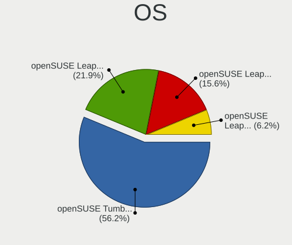

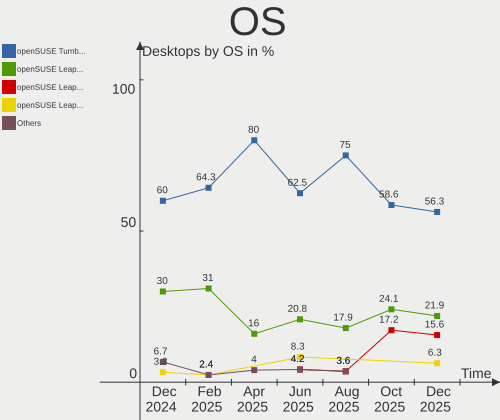

| Name                         | Desktops | Percent |
|------------------------------|----------|---------|
| openSUSE Tumbleweed-XXXXXXXX | 18       | 56.25%  |
| openSUSE Leap-15.6           | 7        | 21.88%  |
| openSUSE Leap-16.0           | 5        | 15.63%  |
| openSUSE Leap-15.5           | 2        | 6.25%   |

OS Family
---------

OS without a version

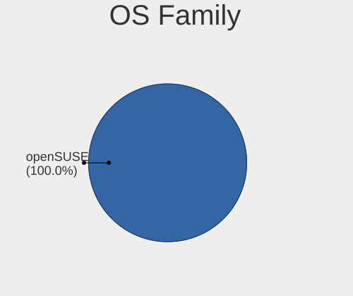

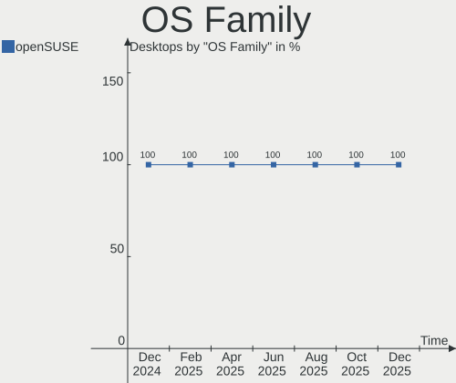

| Name     | Desktops | Percent |
|----------|----------|---------|
| openSUSE | 32       | 100%    |

Kernel
------

Version of the Linux kernel

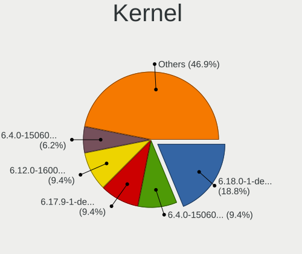

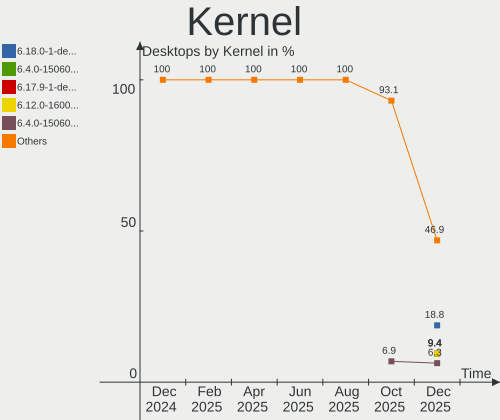

| Version                          | Desktops | Percent |
|----------------------------------|----------|---------|
| 6.18.0-1-default                 | 6        | 18.75%  |
| 6.4.0-150600.23.81-default       | 3        | 9.38%   |
| 6.17.9-1-default                 | 3        | 9.38%   |
| 6.12.0-160000.7-default          | 3        | 9.38%   |
| 6.4.0-150600.23.73-default       | 2        | 6.25%   |
| 6.18.2-1-default                 | 2        | 6.25%   |
| 6.18.1-1-default                 | 2        | 6.25%   |
| 6.18.0-2-default                 | 2        | 6.25%   |
| 5.14.21-150500.55.88-default     | 2        | 6.25%   |
| 6.4.0-150600.23.78-default       | 1        | 3.13%   |
| 6.4.0-150600.21-default          | 1        | 3.13%   |
| 6.18.0-lp156.16.ga1b61b5-default | 1        | 3.13%   |
| 6.18.0-2-pae                     | 1        | 3.13%   |
| 6.17.8-2-default                 | 1        | 3.13%   |
| 6.17.7-1-default                 | 1        | 3.13%   |
| 6.12.0-160000.8-default          | 1        | 3.13%   |

Kernel Family
-------------

Linux kernel without a distro release

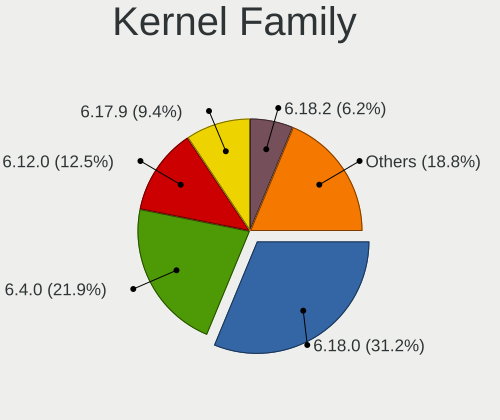

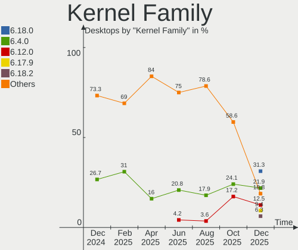

| Version | Desktops | Percent |
|---------|----------|---------|
| 6.18.0  | 10       | 31.25%  |
| 6.4.0   | 7        | 21.88%  |
| 6.12.0  | 4        | 12.5%   |
| 6.17.9  | 3        | 9.38%   |
| 6.18.2  | 2        | 6.25%   |
| 6.18.1  | 2        | 6.25%   |
| 5.14.21 | 2        | 6.25%   |
| 6.17.8  | 1        | 3.13%   |
| 6.17.7  | 1        | 3.13%   |

Kernel Major Ver.
-----------------

Linux kernel major version

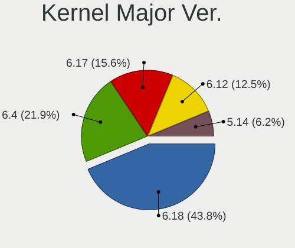

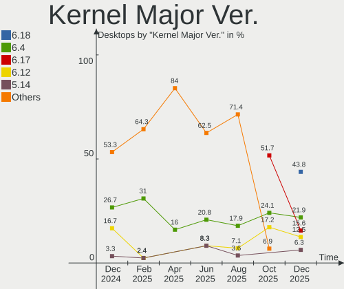

| Version | Desktops | Percent |
|---------|----------|---------|
| 6.18    | 14       | 43.75%  |
| 6.4     | 7        | 21.88%  |
| 6.17    | 5        | 15.63%  |
| 6.12    | 4        | 12.5%   |
| 5.14    | 2        | 6.25%   |

Arch
----

OS architecture (x86_64, i586, etc.)

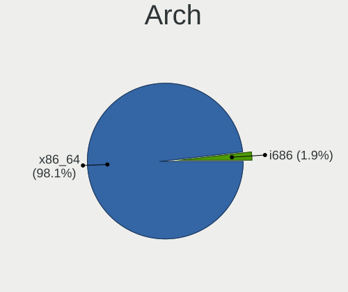

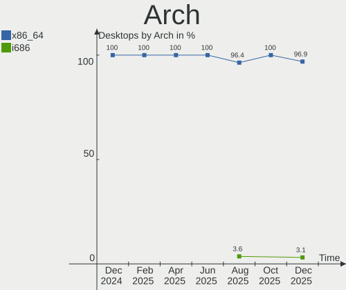

| Name   | Desktops | Percent |
|--------|----------|---------|
| x86_64 | 31       | 96.88%  |
| i686   | 1        | 3.13%   |

DE
--

Desktop Environment

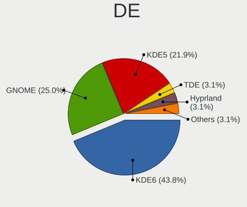

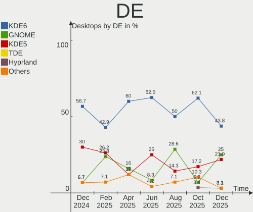

| Name          | Desktops | Percent |
|---------------|----------|---------|
| KDE6          | 14       | 43.75%  |
| GNOME         | 8        | 25%     |
| KDE5          | 7        | 21.88%  |
| TDE           | 1        | 3.13%   |
| Hyprland      | 1        | 3.13%   |
| GNOME Classic | 1        | 3.13%   |

Display Server
--------------

X11 or Wayland

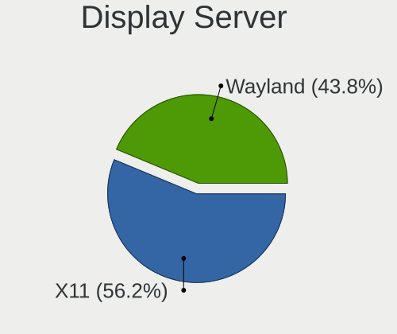

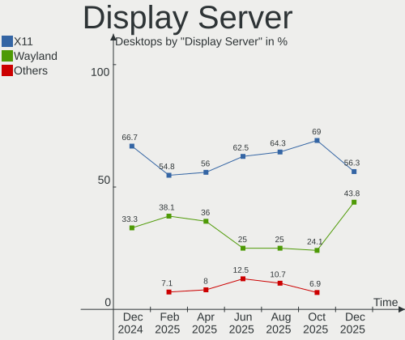

| Name    | Desktops | Percent |
|---------|----------|---------|
| X11     | 18       | 56.25%  |
| Wayland | 14       | 43.75%  |

Display Manager
---------------

SDDM, LightDM, etc.

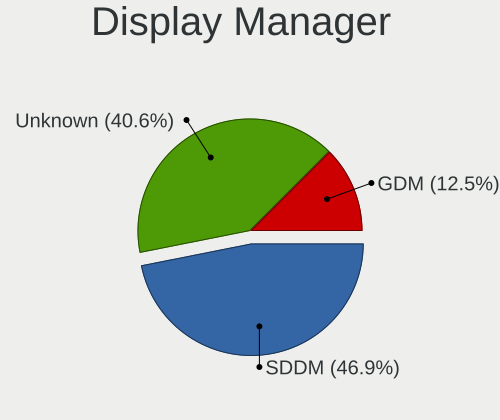

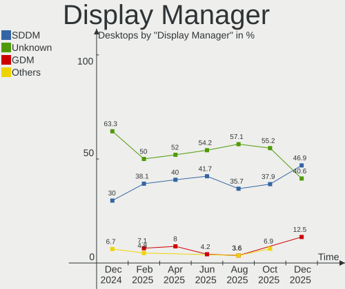

| Name    | Desktops | Percent |
|---------|----------|---------|
| SDDM    | 15       | 46.88%  |
| Unknown | 13       | 40.63%  |
| GDM     | 4        | 12.5%   |

OS Lang
-------

Language

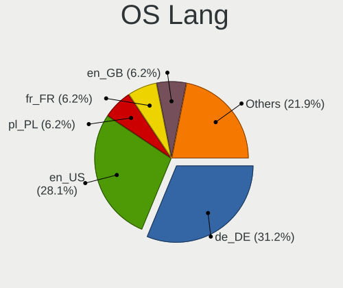

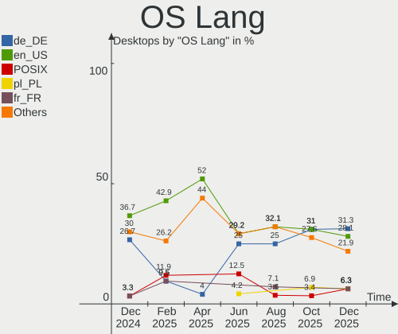

| Lang  | Desktops | Percent |
|-------|----------|---------|
| de_DE | 10       | 31.25%  |
| en_US | 9        | 28.13%  |
| POSIX | 2        | 6.25%   |
| pl_PL | 2        | 6.25%   |
| fr_FR | 2        | 6.25%   |
| en_GB | 2        | 6.25%   |
| nn_NO | 1        | 3.13%   |
| it_IT | 1        | 3.13%   |
| fi_FI | 1        | 3.13%   |
| en_BW | 1        | 3.13%   |
| en_AU | 1        | 3.13%   |

Boot Mode
---------

EFI or BIOS

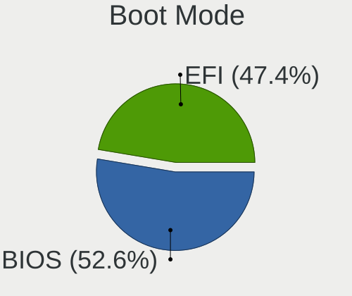

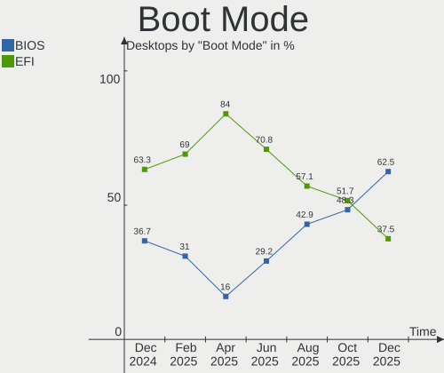

| Mode | Desktops | Percent |
|------|----------|---------|
| BIOS | 20       | 62.5%   |
| EFI  | 12       | 37.5%   |

Filesystem
----------

Type of filesystem

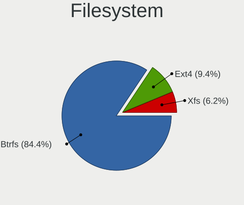

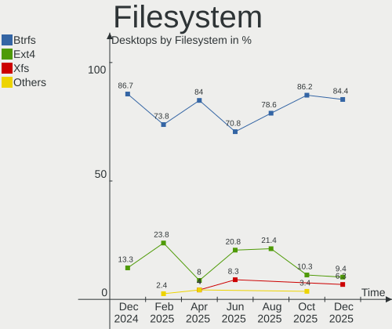

| Type  | Desktops | Percent |
|-------|----------|---------|
| Btrfs | 27       | 84.38%  |
| Ext4  | 3        | 9.38%   |
| Xfs   | 2        | 6.25%   |

Part. scheme
------------

Scheme of partitioning

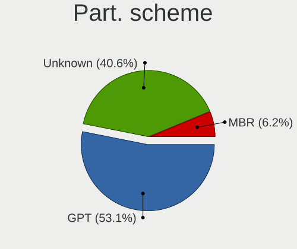

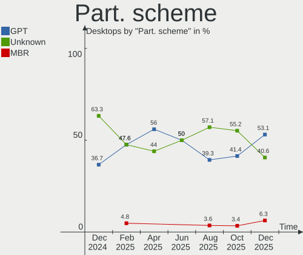

| Type    | Desktops | Percent |
|---------|----------|---------|
| GPT     | 17       | 53.13%  |
| Unknown | 13       | 40.63%  |
| MBR     | 2        | 6.25%   |

Dual Boot with Linux/BSD
------------------------

Hosting more than one Linux/BSD

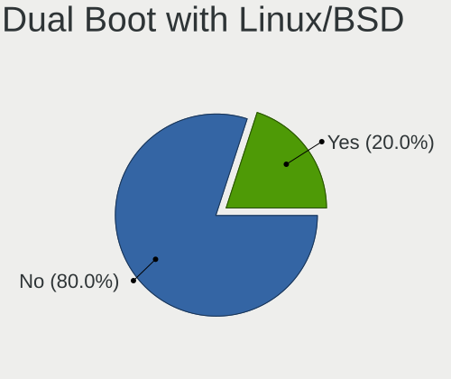

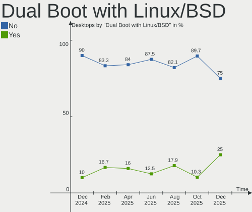

| Dual boot | Desktops | Percent |
|-----------|----------|---------|
| No        | 24       | 75%     |
| Yes       | 8        | 25%     |

Dual Boot (Win)
---------------

Hosting Linux and Windows

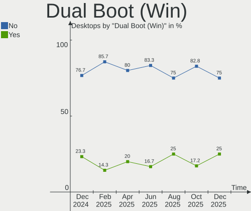

| Dual boot | Desktops | Percent |
|-----------|----------|---------|
| No        | 24       | 75%     |
| Yes       | 8        | 25%     |

Board
-----

Vendor
------

Motherboard manufacturer

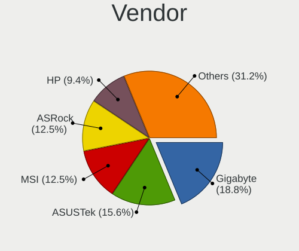

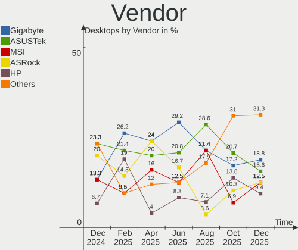

| Name                | Desktops | Percent |
|---------------------|----------|---------|
| Gigabyte Technology | 6        | 18.75%  |
| ASUSTek Computer    | 5        | 15.63%  |
| MSI                 | 4        | 12.5%   |
| ASRock              | 4        | 12.5%   |
| Hewlett-Packard     | 3        | 9.38%   |
| Fujitsu             | 2        | 6.25%   |
| Dell                | 2        | 6.25%   |
| Medion              | 1        | 3.13%   |
| Lenovo              | 1        | 3.13%   |
| Intel               | 1        | 3.13%   |
| GMKtec              | 1        | 3.13%   |
| GEEKOM              | 1        | 3.13%   |
| AOpen               | 1        | 3.13%   |

Model
-----

Motherboard model

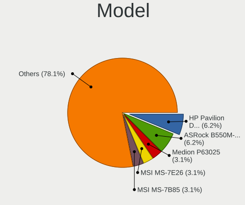

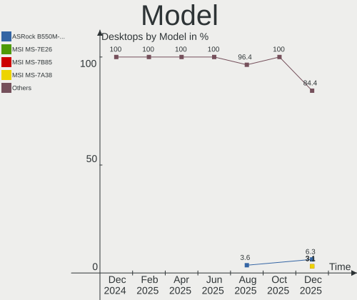

| Name                                | Desktops | Percent |
|-------------------------------------|----------|---------|
| HP Pavilion Desktop PC 570-p0XX     | 2        | 6.25%   |
| ASRock B550M-ITX/ac                 | 2        | 6.25%   |
| MSI MS-7E26                         | 1        | 3.13%   |
| MSI MS-7B85                         | 1        | 3.13%   |
| MSI MS-7A38                         | 1        | 3.13%   |
| MSI MS-7673                         | 1        | 3.13%   |
| Medion P63025                       | 1        | 3.13%   |
| Lenovo ThinkCentre M710s 10M8S8FV00 | 1        | 3.13%   |
| Intel HM570                         | 1        | 3.13%   |
| HP Pavilion Wave Desktop 600-a0xx   | 1        | 3.13%   |
| GMKtec NucBox M7 Pro                | 1        | 3.13%   |
| Gigabyte X570 AORUS MASTER          | 1        | 3.13%   |
| Gigabyte OPTIMUS                    | 1        | 3.13%   |
| Gigabyte M57SLI-S4                  | 1        | 3.13%   |
| Gigabyte H610M S2H V3 DDR4          | 1        | 3.13%   |
| Gigabyte GA-H81M-S2H                | 1        | 3.13%   |
| Gigabyte B550 AORUS ELITE           | 1        | 3.13%   |
| GEEKOM A7                           | 1        | 3.13%   |
| Fujitsu ESPRIMO Q558                | 1        | 3.13%   |
| Fujitsu ESPRIMO P720                | 1        | 3.13%   |
| Dell OptiPlex 7040                  | 1        | 3.13%   |
| Dell OptiPlex 3010                  | 1        | 3.13%   |
| ASUS Z170-A                         | 1        | 3.13%   |
| ASUS Pro WS WRX90E-SAGE SE          | 1        | 3.13%   |
| ASUS PRIME Z390-A                   | 1        | 3.13%   |
| ASUS PRIME B360-PLUS                | 1        | 3.13%   |
| ASUS H170-PRO                       | 1        | 3.13%   |
| ASRock X670E Pro RS                 | 1        | 3.13%   |
| ASRock 970 Pro3 R2.0                | 1        | 3.13%   |
| AOpen i915GMt-FSA 918ET10I9C0       | 1        | 3.13%   |

Model Family
------------

Motherboard model prefix

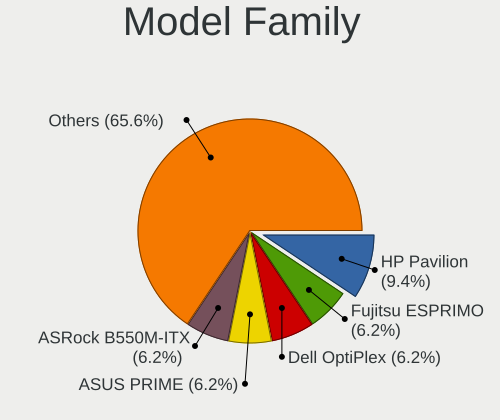

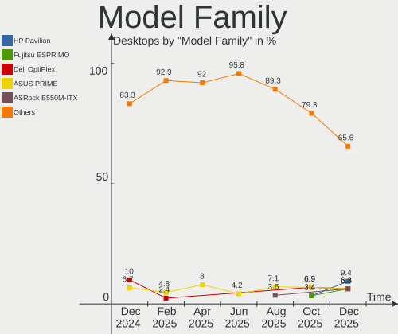

| Name                 | Desktops | Percent |
|----------------------|----------|---------|
| HP Pavilion          | 3        | 9.38%   |
| Fujitsu ESPRIMO      | 2        | 6.25%   |
| Dell OptiPlex        | 2        | 6.25%   |
| ASUS PRIME           | 2        | 6.25%   |
| ASRock B550M-ITX     | 2        | 6.25%   |
| MSI MS-7E26          | 1        | 3.13%   |
| MSI MS-7B85          | 1        | 3.13%   |
| MSI MS-7A38          | 1        | 3.13%   |
| MSI MS-7673          | 1        | 3.13%   |
| Medion P63025        | 1        | 3.13%   |
| Lenovo ThinkCentre   | 1        | 3.13%   |
| Intel HM570          | 1        | 3.13%   |
| GMKtec NucBox        | 1        | 3.13%   |
| Gigabyte X570        | 1        | 3.13%   |
| Gigabyte OPTIMUS     | 1        | 3.13%   |
| Gigabyte M57SLI-S4   | 1        | 3.13%   |
| Gigabyte H610M       | 1        | 3.13%   |
| Gigabyte GA-H81M-S2H | 1        | 3.13%   |
| Gigabyte B550        | 1        | 3.13%   |
| GEEKOM A7            | 1        | 3.13%   |
| ASUS Z170-A          | 1        | 3.13%   |
| ASUS Pro             | 1        | 3.13%   |
| ASUS H170-PRO        | 1        | 3.13%   |
| ASRock X670E         | 1        | 3.13%   |
| ASRock 970           | 1        | 3.13%   |
| AOpen i915GMt-FSA    | 1        | 3.13%   |

MFG Year
--------

Motherboard manufacture year

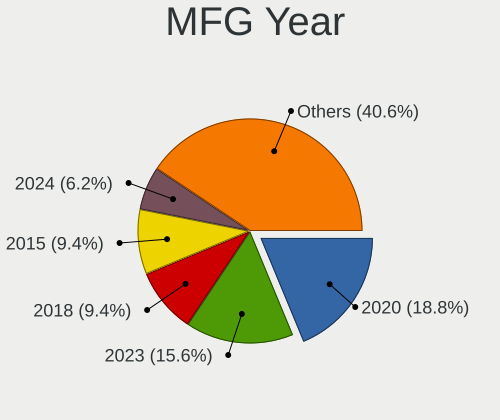

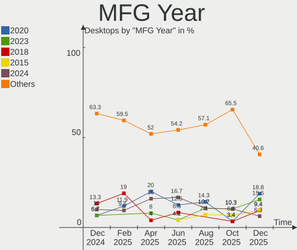

| Year | Desktops | Percent |
|------|----------|---------|
| 2020 | 6        | 18.75%  |
| 2023 | 5        | 15.63%  |
| 2018 | 3        | 9.38%   |
| 2015 | 3        | 9.38%   |
| 2024 | 2        | 6.25%   |
| 2022 | 2        | 6.25%   |
| 2019 | 2        | 6.25%   |
| 2013 | 2        | 6.25%   |
| 2006 | 2        | 6.25%   |
| 2017 | 1        | 3.13%   |
| 2016 | 1        | 3.13%   |
| 2014 | 1        | 3.13%   |
| 2012 | 1        | 3.13%   |
| 2011 | 1        | 3.13%   |

Form Factor
-----------

Physical design of the computer

| Name    | Desktops | Percent |
|---------|----------|---------|
| Desktop | 32       | 100%    |

Secure Boot
-----------

Enabled or disabled

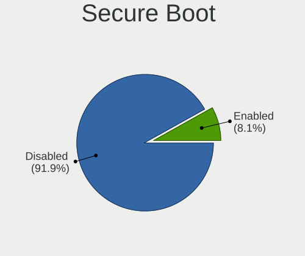

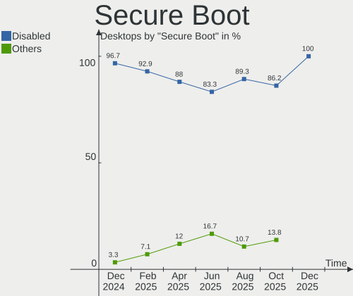

| State    | Desktops | Percent |
|----------|----------|---------|
| Disabled | 32       | 100%    |

Coreboot
--------

Have coreboot on board

| Used | Desktops | Percent |
|------|----------|---------|
| No   | 32       | 100%    |

RAM Size
--------

Total RAM memory

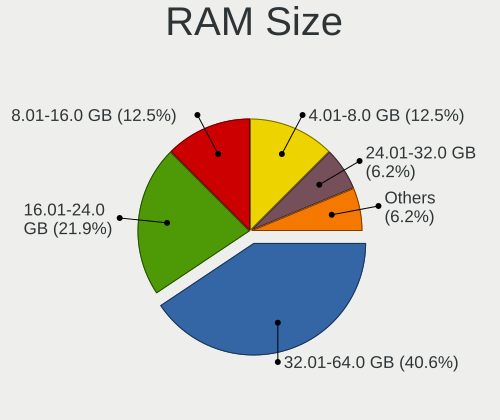

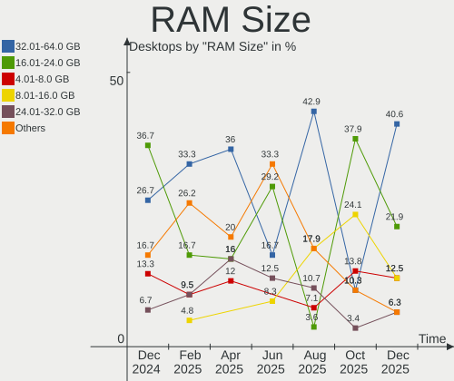

| Size in GB  | Desktops | Percent |
|-------------|----------|---------|
| 32.01-64.0  | 13       | 40.63%  |
| 16.01-24.0  | 7        | 21.88%  |
| 4.01-8.0    | 4        | 12.5%   |
| 8.01-16.0   | 4        | 12.5%   |
| 24.01-32.0  | 2        | 6.25%   |
| 64.01-256.0 | 1        | 3.13%   |
| 1.01-2.0    | 1        | 3.13%   |

RAM Used
--------

Used RAM memory

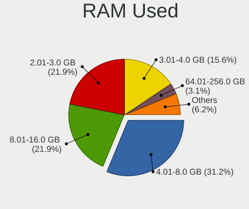

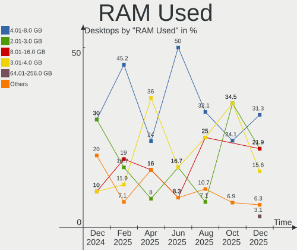

| Used GB     | Desktops | Percent |
|-------------|----------|---------|
| 4.01-8.0    | 10       | 31.25%  |
| 2.01-3.0    | 7        | 21.88%  |
| 8.01-16.0   | 7        | 21.88%  |
| 3.01-4.0    | 5        | 15.63%  |
| 64.01-256.0 | 1        | 3.13%   |
| 1.01-2.0    | 1        | 3.13%   |
| 0.51-1.0    | 1        | 3.13%   |

Total Drives
------------

Number of drives on board

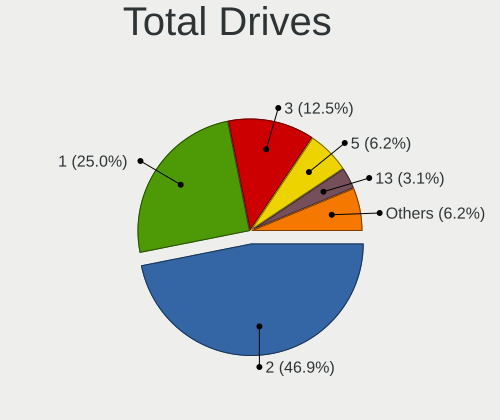

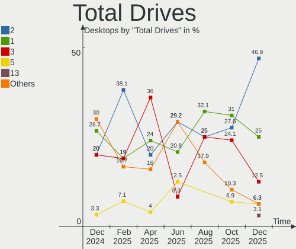

| Drives | Desktops | Percent |
|--------|----------|---------|
| 2      | 15       | 46.88%  |
| 1      | 8        | 25%     |
| 3      | 4        | 12.5%   |
| 5      | 2        | 6.25%   |
| 13     | 1        | 3.13%   |
| 7      | 1        | 3.13%   |
| 4      | 1        | 3.13%   |

Has CD-ROM
----------

Has CD-ROM on board

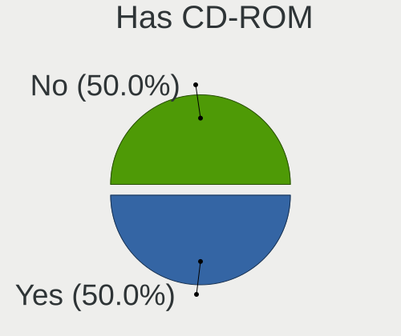

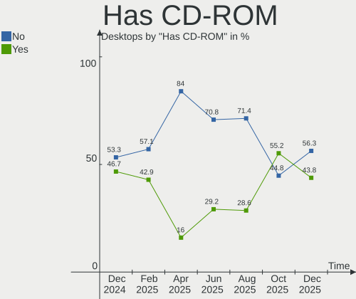

| Presented | Desktops | Percent |
|-----------|----------|---------|
| No        | 18       | 56.25%  |
| Yes       | 14       | 43.75%  |

Has Ethernet
------------

Has Ethernet on board

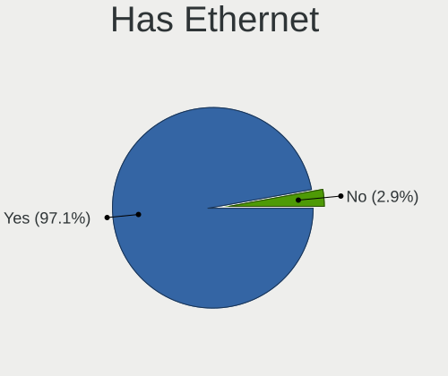

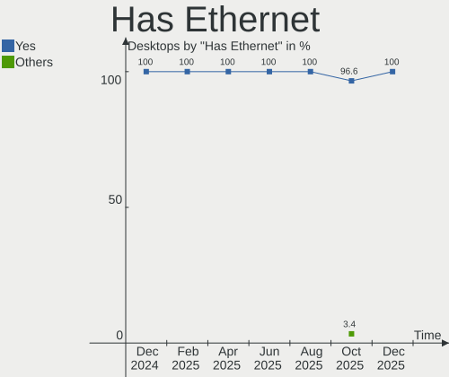

| Presented | Desktops | Percent |
|-----------|----------|---------|
| Yes       | 32       | 100%    |

Has WiFi
--------

Has WiFi module

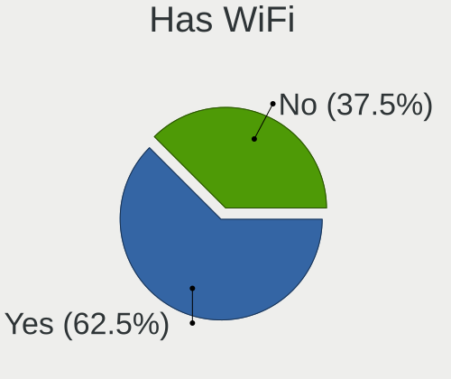

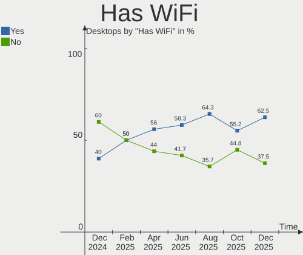

| Presented | Desktops | Percent |
|-----------|----------|---------|
| Yes       | 20       | 62.5%   |
| No        | 12       | 37.5%   |

Has Bluetooth
-------------

Has Bluetooth module

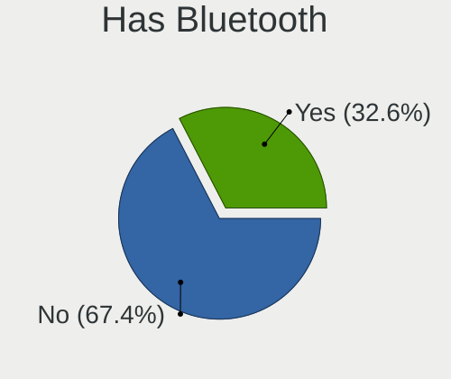

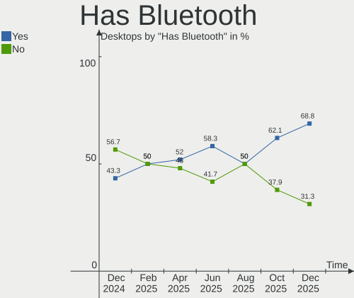

| Presented | Desktops | Percent |
|-----------|----------|---------|
| Yes       | 22       | 68.75%  |
| No        | 10       | 31.25%  |

Location
--------

Country
-------

Geographic location (country)

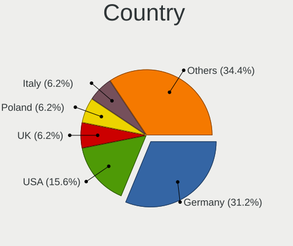

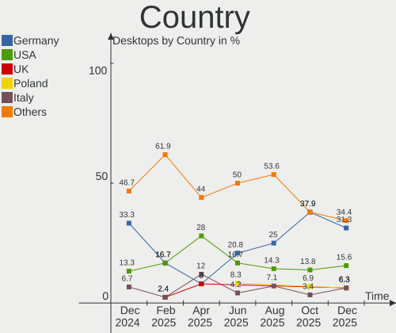

| Country     | Desktops | Percent |
|-------------|----------|---------|
| Germany     | 10       | 31.25%  |
| USA         | 5        | 15.63%  |
| UK          | 2        | 6.25%   |
| Poland      | 2        | 6.25%   |
| Italy       | 2        | 6.25%   |
| Finland     | 2        | 6.25%   |
| Belgium     | 2        | 6.25%   |
| Switzerland | 1        | 3.13%   |
| Norway      | 1        | 3.13%   |
| Netherlands | 1        | 3.13%   |
| India       | 1        | 3.13%   |
| France      | 1        | 3.13%   |
| Bulgaria    | 1        | 3.13%   |
| Australia   | 1        | 3.13%   |

City
----

Geographic location (city)

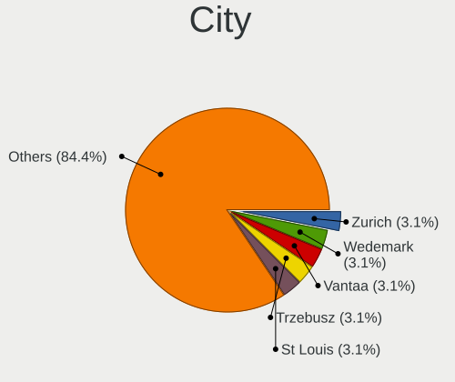

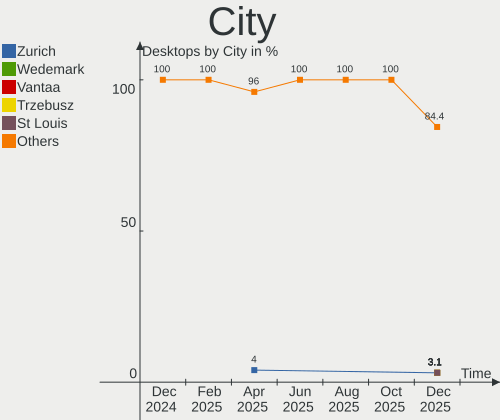

| City                    | Desktops | Percent |
|-------------------------|----------|---------|
| Zurich                  | 1        | 3.13%   |
| Wedemark                | 1        | 3.13%   |
| Vantaa                  | 1        | 3.13%   |
| Trzebusz                | 1        | 3.13%   |
| St Louis                | 1        | 3.13%   |
| Sofia                   | 1        | 3.13%   |
| Seinäjoki              | 1        | 3.13%   |
| Schmelz                 | 1        | 3.13%   |
| Pforzheim               | 1        | 3.13%   |
| Orléans                | 1        | 3.13%   |
| New City                | 1        | 3.13%   |
| Munich                  | 1        | 3.13%   |
| Monheim am Rhein        | 1        | 3.13%   |
| Milan                   | 1        | 3.13%   |
| Melbourne               | 1        | 3.13%   |
| Mechelen                | 1        | 3.13%   |
| Linsengericht           | 1        | 3.13%   |
| Leipzig                 | 1        | 3.13%   |
| Ilmenau                 | 1        | 3.13%   |
| Gdansk                  | 1        | 3.13%   |
| Fremont                 | 1        | 3.13%   |
| Fragagnano              | 1        | 3.13%   |
| Driebergen-Rijsenburg   | 1        | 3.13%   |
| Converse                | 1        | 3.13%   |
| Coburg                  | 1        | 3.13%   |
| Buffalo                 | 1        | 3.13%   |
| Brussels                | 1        | 3.13%   |
| Bromley                 | 1        | 3.13%   |
| Bradford-on-Avon        | 1        | 3.13%   |
| Bergen                  | 1        | 3.13%   |
| Bengaluru               | 1        | 3.13%   |
| Alzenau in Unterfranken | 1        | 3.13%   |

Drives
------

Drive Vendor
------------

Hard drive vendors

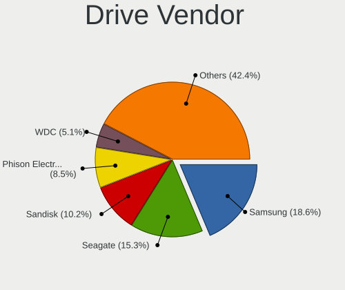

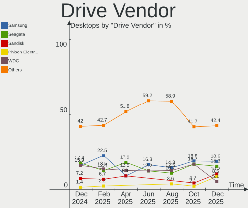

| Vendor                      | Desktops | Drives | Percent |
|-----------------------------|----------|--------|---------|
| Samsung Electronics         | 11       | 24     | 18.64%  |
| Seagate                     | 9        | 9      | 15.25%  |
| Sandisk                     | 6        | 8      | 10.17%  |
| Phison Electronics          | 5        | 6      | 8.47%   |
| WDC                         | 3        | 4      | 5.08%   |
| Unknown                     | 3        | 3      | 5.08%   |
| Kingston Technology Company | 3        | 3      | 5.08%   |
| Crucial                     | 3        | 4      | 5.08%   |
| Micron/Crucial Technology   | 2        | 3      | 3.39%   |
| Kingston                    | 2        | 2      | 3.39%   |
| VENO                        | 1        | 1      | 1.69%   |
| Transcend                   | 1        | 2      | 1.69%   |
| T-FORCE                     | 1        | 1      | 1.69%   |
| PNY                         | 1        | 1      | 1.69%   |
| MAXIO Technology (Hangzhou) | 1        | 2      | 1.69%   |
| KingSpec                    | 1        | 1      | 1.69%   |
| Intenso                     | 1        | 1      | 1.69%   |
| Intel                       | 1        | 1      | 1.69%   |
| HS-SSD-E100                 | 1        | 1      | 1.69%   |
| Hitachi                     | 1        | 1      | 1.69%   |
| Corsair                     | 1        | 1      | 1.69%   |
| ADATA Technology            | 1        | 1      | 1.69%   |

Drive Model
-----------

Hard drive models

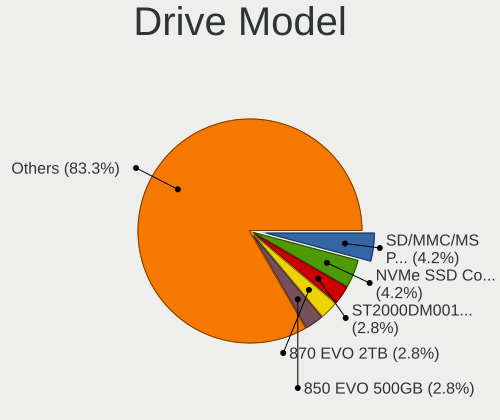

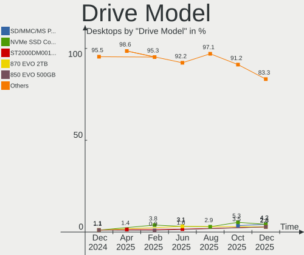

| Model                                                | Desktops | Percent |
|------------------------------------------------------|----------|---------|
| Unknown SD/MMC/MS PRO 2GB                            | 3        | 4.17%   |
| Samsung NVMe SSD Controller SM981/PM981/PM983 1TB    | 3        | 4.17%   |
| Seagate ST2000DM001-1ER164 2TB                       | 2        | 2.78%   |
| Samsung SSD 870 EVO 2TB                              | 2        | 2.78%   |
| Samsung SSD 850 EVO 500GB                            | 2        | 2.78%   |
| Samsung SSD 850 EVO 250GB                            | 2        | 2.78%   |
| Micron/Crucial P2 NVMe PCIe SSD 2TB                  | 2        | 2.78%   |
| WDC WD2002FAEX-007BA0 2TB                            | 1        | 1.39%   |
| WDC WD10EZEX-60WN4A0 1TB                             | 1        | 1.39%   |
| WDC WD10EZEX-08WN4A0 1TB                             | 1        | 1.39%   |
| WDC WD10EURX-63UY4Y0 1TB                             | 1        | 1.39%   |
| VENO SCORP SSD 256GB                                 | 1        | 1.39%   |
| Transcend TS4TSSD230S 4TB                            | 1        | 1.39%   |
| T-FORCE 1TB                                          | 1        | 1.39%   |
| Seagate ST8000AS0002-1NA17Z 8TB                      | 1        | 1.39%   |
| Seagate ST380815AS 80GB                              | 1        | 1.39%   |
| Seagate ST31000528AS 1TB                             | 1        | 1.39%   |
| Seagate ST31000524AS 1TB                             | 1        | 1.39%   |
| Seagate ST2000DM008-2FR102 2TB                       | 1        | 1.39%   |
| Seagate ST1000DX001-1CM162 1TB                       | 1        | 1.39%   |
| Seagate ST1000DM003-1SB102 1TB                       | 1        | 1.39%   |
| Sandisk WD_BLACK SN850X 4000GB                       | 1        | 1.39%   |
| Sandisk WD_BLACK SN7100 2TB                          | 1        | 1.39%   |
| Sandisk WD Green SN350 2TB                           | 1        | 1.39%   |
| Sandisk WD Blue SN570 500GB                          | 1        | 1.39%   |
| Sandisk WD Blue SN5000 4TB                           | 1        | 1.39%   |
| Sandisk Ultra 3D NVMe 1TB                            | 1        | 1.39%   |
| SanDisk SSD PLUS 2000GB                              | 1        | 1.39%   |
| Samsung SSD PM871 M.2 2280 128GB                     | 1        | 1.39%   |
| Samsung SSD 990 PRO 4TB                              | 1        | 1.39%   |
| Samsung SSD 990 EVO Plus 1TB                         | 1        | 1.39%   |
| Samsung SSD 980 1TB                                  | 1        | 1.39%   |
| Samsung SSD 9100 PRO 2TB                             | 1        | 1.39%   |
| Samsung SSD 870 QVO 1TB                              | 1        | 1.39%   |
| Samsung SSD 870 EVO 1TB                              | 1        | 1.39%   |
| Samsung SSD 860 EVO M.2 250GB                        | 1        | 1.39%   |
| Samsung SSD 860 EVO 2TB                              | 1        | 1.39%   |
| Samsung NVMe SSD Controller SM961/PM961/SM963 1024GB | 1        | 1.39%   |
| Samsung NVMe SSD Controller PM9A1/PM9A3/980PRO 1TB   | 1        | 1.39%   |
| Samsung HD321KJ 320GB                                | 1        | 1.39%   |

HDD Vendor
----------

Hard disk drive vendors

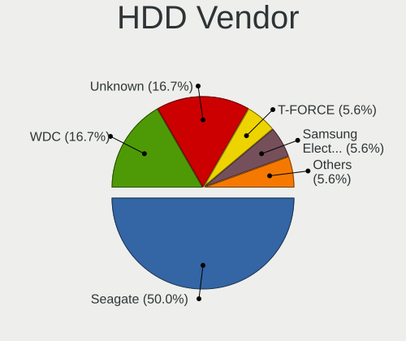

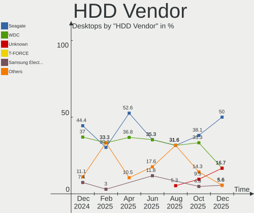

| Vendor              | Desktops | Drives | Percent |
|---------------------|----------|--------|---------|
| Seagate             | 9        | 9      | 50%     |
| WDC                 | 3        | 4      | 16.67%  |
| Unknown             | 3        | 3      | 16.67%  |
| T-FORCE             | 1        | 1      | 5.56%   |
| Samsung Electronics | 1        | 1      | 5.56%   |
| Hitachi             | 1        | 1      | 5.56%   |

SSD Vendor
----------

Solid state drive vendors

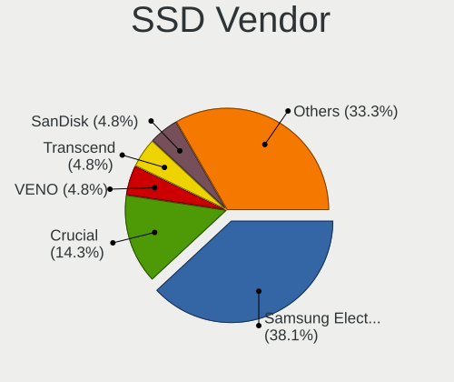

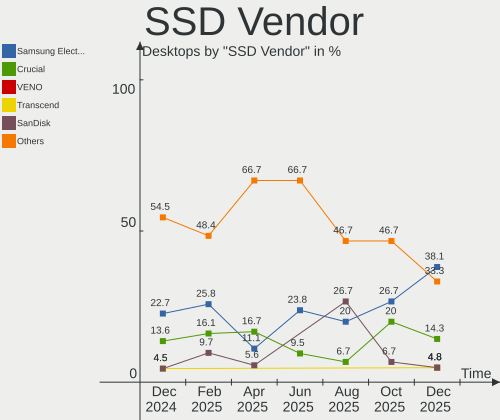

| Vendor              | Desktops | Drives | Percent |
|---------------------|----------|--------|---------|
| Samsung Electronics | 8        | 11     | 38.1%   |
| Crucial             | 3        | 4      | 14.29%  |
| VENO                | 1        | 1      | 4.76%   |
| Transcend           | 1        | 2      | 4.76%   |
| SanDisk             | 1        | 2      | 4.76%   |
| PNY                 | 1        | 1      | 4.76%   |
| Kingston            | 1        | 1      | 4.76%   |
| KingSpec            | 1        | 1      | 4.76%   |
| Intenso             | 1        | 1      | 4.76%   |
| Intel               | 1        | 1      | 4.76%   |
| HS-SSD-E100         | 1        | 1      | 4.76%   |
| Corsair             | 1        | 1      | 4.76%   |

Drive Kind
----------

HDD or SSD

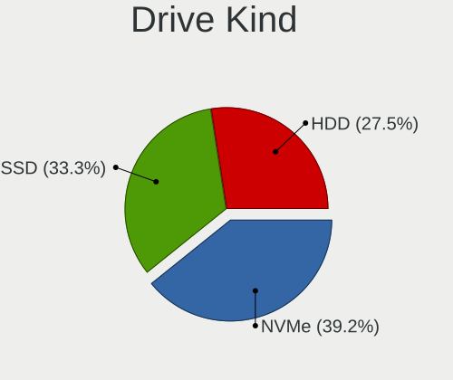

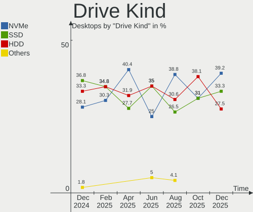

| Kind | Desktops | Drives | Percent |
|------|----------|--------|---------|
| NVMe | 20       | 34     | 39.22%  |
| SSD  | 17       | 27     | 33.33%  |
| HDD  | 14       | 19     | 27.45%  |

Drive Connector
---------------

SATA, SAS, NVMe, etc.

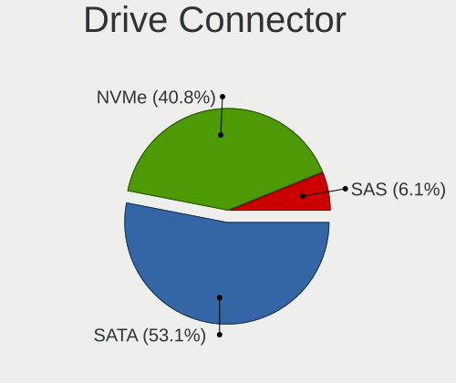

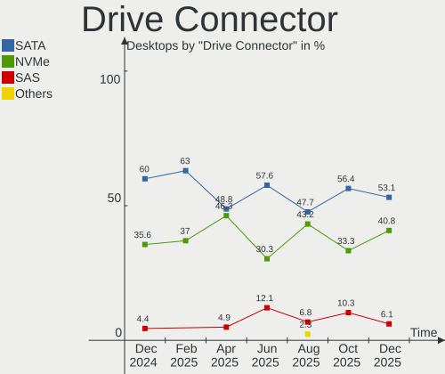

| Type | Desktops | Drives | Percent |
|------|----------|--------|---------|
| SATA | 26       | 43     | 53.06%  |
| NVMe | 20       | 34     | 40.82%  |
| SAS  | 3        | 3      | 6.12%   |

Drive Size
----------

Size of hard drive

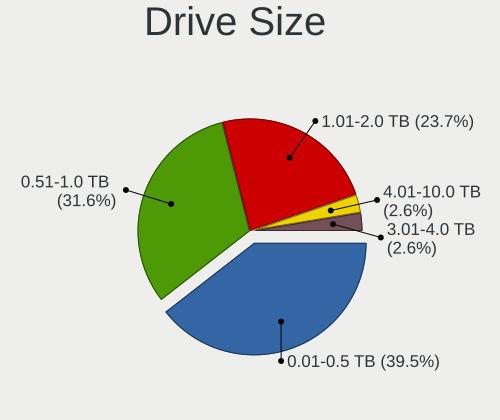

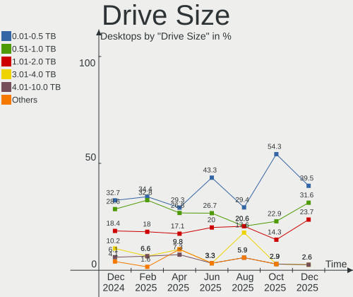

| Size in TB | Desktops | Drives | Percent |
|------------|----------|--------|---------|
| 0.01-0.5   | 15       | 18     | 39.47%  |
| 0.51-1.0   | 12       | 14     | 31.58%  |
| 1.01-2.0   | 9        | 11     | 23.68%  |
| 3.01-4.0   | 1        | 2      | 2.63%   |
| 4.01-10.0  | 1        | 1      | 2.63%   |

Space Total
-----------

Amount of disk space available on the file system

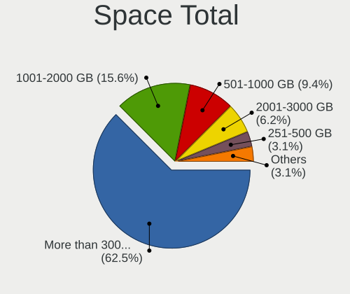

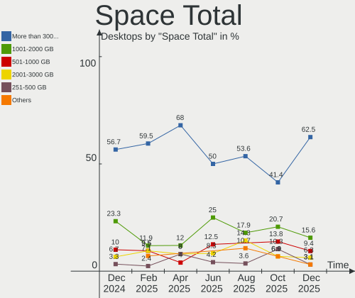

| Size in GB     | Desktops | Percent |
|----------------|----------|---------|
| More than 3000 | 20       | 62.5%   |
| 1001-2000      | 5        | 15.63%  |
| 501-1000       | 3        | 9.38%   |
| 2001-3000      | 2        | 6.25%   |
| 251-500        | 1        | 3.13%   |
| 101-250        | 1        | 3.13%   |

Space Used
----------

Amount of used disk space

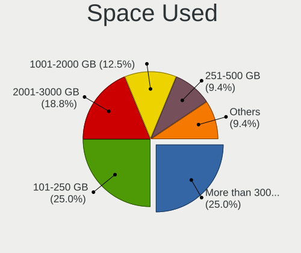

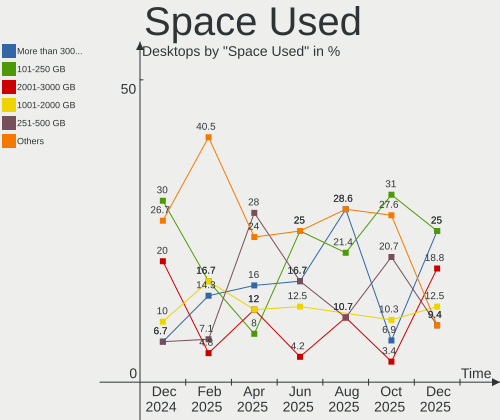

| Used GB        | Desktops | Percent |
|----------------|----------|---------|
| More than 3000 | 8        | 25%     |
| 101-250        | 8        | 25%     |
| 2001-3000      | 6        | 18.75%  |
| 1001-2000      | 4        | 12.5%   |
| 251-500        | 3        | 9.38%   |
| 21-50          | 1        | 3.13%   |
| 501-1000       | 1        | 3.13%   |
| 51-100         | 1        | 3.13%   |

Malfunc. Drives
---------------

Drive models with a malfunction

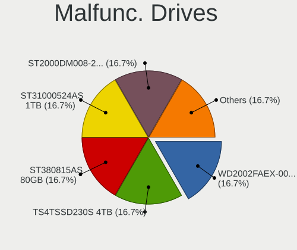

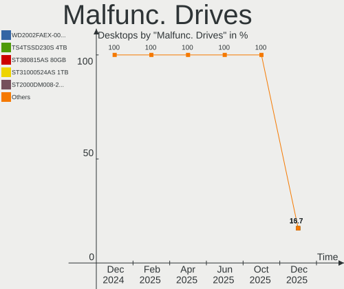

| Model                           | Desktops | Drives | Percent |
|---------------------------------|----------|--------|---------|
| WDC WD2002FAEX-007BA0 2TB       | 1        | 1      | 16.67%  |
| Transcend TS4TSSD230S 4TB       | 1        | 2      | 16.67%  |
| Seagate ST380815AS 80GB         | 1        | 1      | 16.67%  |
| Seagate ST31000524AS 1TB        | 1        | 1      | 16.67%  |
| Seagate ST2000DM008-2FR102 2TB  | 1        | 1      | 16.67%  |
| Samsung Electronics SSD 980 1TB | 1        | 1      | 16.67%  |

Malfunc. Drive Vendor
---------------------

Vendors of faulty drives

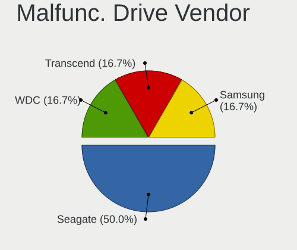

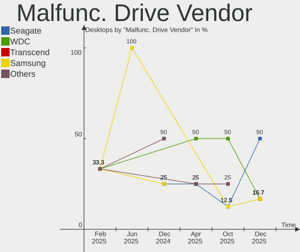

| Vendor              | Desktops | Drives | Percent |
|---------------------|----------|--------|---------|
| Seagate             | 3        | 3      | 50%     |
| WDC                 | 1        | 1      | 16.67%  |
| Transcend           | 1        | 2      | 16.67%  |
| Samsung Electronics | 1        | 1      | 16.67%  |

Malfunc. HDD Vendor
-------------------

Vendors of faulty HDD drives

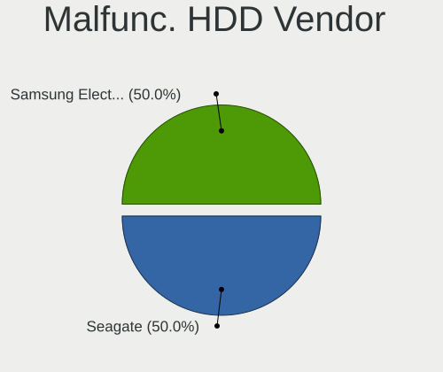

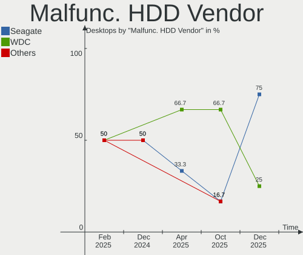

| Vendor  | Desktops | Drives | Percent |
|---------|----------|--------|---------|
| Seagate | 3        | 3      | 75%     |
| WDC     | 1        | 1      | 25%     |

Malfunc. Drive Kind
-------------------

Kinds of faulty drives

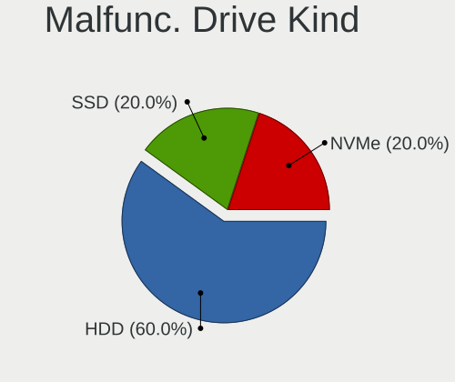

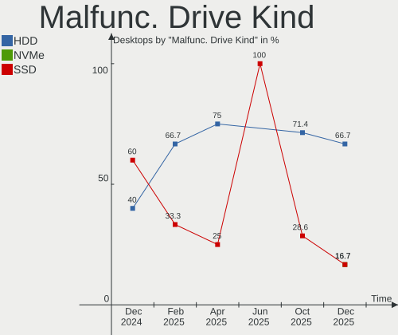

| Kind | Desktops | Drives | Percent |
|------|----------|--------|---------|
| HDD  | 4        | 4      | 66.67%  |
| NVMe | 1        | 1      | 16.67%  |
| SSD  | 1        | 2      | 16.67%  |

Failed Drives
-------------

Failed drive models

Zero info for selected period =(

Failed Drive Vendor
-------------------

Failed drive vendors

Zero info for selected period =(

Drive Status
------------

Number of failed and malfunc. drives

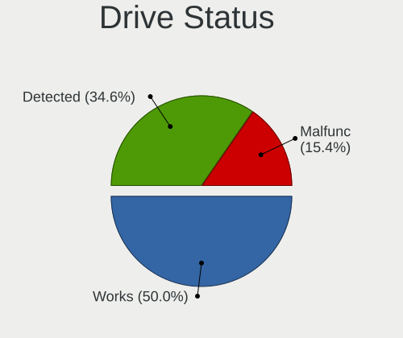

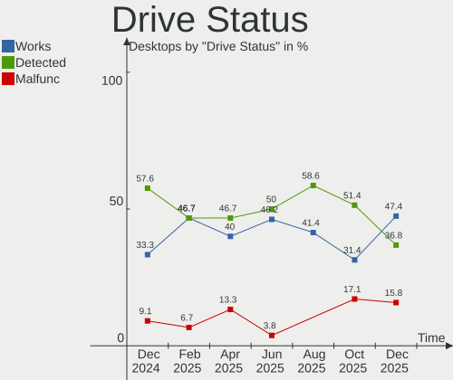

| Status   | Desktops | Drives | Percent |
|----------|----------|--------|---------|
| Works    | 18       | 45     | 47.37%  |
| Detected | 14       | 28     | 36.84%  |
| Malfunc  | 6        | 7      | 15.79%  |

Storage controller
------------------

Storage Vendor
--------------

Storage controller vendors

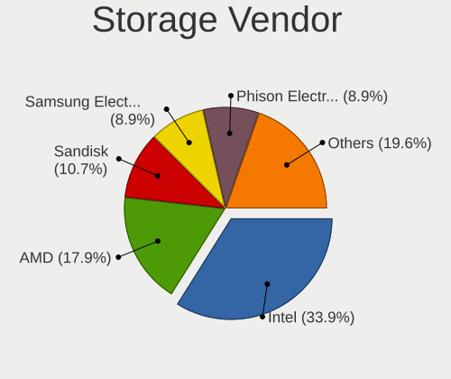

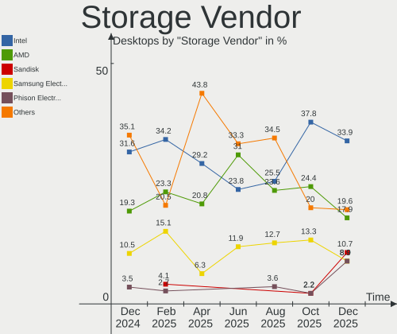

| Vendor                      | Desktops | Percent |
|-----------------------------|----------|---------|
| Intel                       | 19       | 33.93%  |
| AMD                         | 10       | 17.86%  |
| Sandisk                     | 6        | 10.71%  |
| Samsung Electronics         | 5        | 8.93%   |
| Phison Electronics          | 5        | 8.93%   |
| Kingston Technology Company | 4        | 7.14%   |
| Micron/Crucial Technology   | 2        | 3.57%   |
| Nvidia                      | 1        | 1.79%   |
| MAXIO Technology (Hangzhou) | 1        | 1.79%   |
| LSI Logic / Symbios Logic   | 1        | 1.79%   |
| Areca Technology            | 1        | 1.79%   |
| ADATA Technology            | 1        | 1.79%   |

Storage Model
-------------

Storage controller models

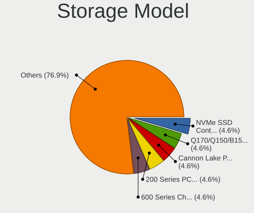

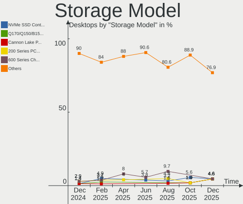

| Model                                                                          | Desktops | Percent |
|--------------------------------------------------------------------------------|----------|---------|
| Samsung NVMe SSD Controller SM981/PM981/PM983                                  | 3        | 4.62%   |
| Intel Q170/Q150/B150/H170/H110/Z170/CM236 Chipset SATA Controller [AHCI Mode]  | 3        | 4.62%   |
| Intel Cannon Lake PCH SATA AHCI Controller                                     | 3        | 4.62%   |
| Intel 200 Series PCH SATA controller [AHCI mode]                               | 3        | 4.62%   |
| AMD 600 Series Chipset SATA Controller                                         | 3        | 4.62%   |
| AMD 500 Series Chipset SATA Controller                                         | 3        | 4.62%   |
| SanDisk Ultra 3D / WD Blue SN570 NVMe SSD (DRAM-less)                          | 2        | 3.08%   |
| Phison PS5021-E21 PCIe4 NVMe Controller (DRAM-less)                            | 2        | 3.08%   |
| Micron/Crucial P2 [Nick P2] / P3 / P3 Plus NVMe PCIe SSD (DRAM-less)           | 2        | 3.08%   |
| Intel Alder Lake-S PCH SATA Controller [AHCI Mode]                             | 2        | 3.08%   |
| Intel 8 Series/C220 Series Chipset Family 6-port SATA Controller 1 [AHCI mode] | 2        | 3.08%   |
| Intel 6 Series/C200 Series Chipset Family 6 port Desktop SATA AHCI Controller  | 2        | 3.08%   |
| AMD FCH SATA Controller [AHCI mode]                                            | 2        | 3.08%   |
| AMD 400 Series Chipset SATA Controller                                         | 2        | 3.08%   |
| Sandisk WD_BLACK SN7100/WD PC SN7100S M.2 2280 NVMe SSD (DRAM-less)            | 1        | 1.54%   |
| SanDisk WD PC SN540 / Green SN350 NVMe SSD 1 TB (DRAM-less)                    | 1        | 1.54%   |
| Sandisk WD Blue SN5000 NVMe SSD (DRAM-less)                                    | 1        | 1.54%   |
| Sandisk WD Black SN850X NVMe SSD                                               | 1        | 1.54%   |
| Samsung NVMe SSD Controller SM961/PM961/SM963                                  | 1        | 1.54%   |
| Samsung NVMe SSD Controller S4LV008[Pascal]                                    | 1        | 1.54%   |
| Samsung NVMe SSD Controller PM9C1a (DRAM-less)                                 | 1        | 1.54%   |
| Samsung NVMe SSD Controller PM9A1/PM9A3/980PRO                                 | 1        | 1.54%   |
| Samsung NVMe SSD Controller 980 (DRAM-less)                                    | 1        | 1.54%   |
| Samsung NVMe SSD 9100 PRO [PM9E1]                                              | 1        | 1.54%   |
| Phison PS5019-E19 PCIe4 NVMe Controller (DRAM-less)                            | 1        | 1.54%   |
| Phison PS5013-E13 PCIe3 NVMe Controller (DRAM-less)                            | 1        | 1.54%   |
| Phison E16 PCIe4 NVMe Controller                                               | 1        | 1.54%   |
| Phison E12 NVMe Controller                                                     | 1        | 1.54%   |
| Nvidia MCP55 SATA Controller                                                   | 1        | 1.54%   |
| Nvidia MCP55 IDE                                                               | 1        | 1.54%   |
| MAXIO (Hangzhou) NVMe SSD Controller MAP1202 (DRAM-less)                       | 1        | 1.54%   |
| LSI Logic / Symbios Logic 53c1030 PCI-X Fusion-MPT Dual Ultra320 SCSI          | 1        | 1.54%   |
| Kingston Company NV2 NVMe SSD [SM2267XT] (DRAM-less)                           | 1        | 1.54%   |
| Kingston Company NV2 NVMe SSD [E21T] (DRAM-less)                               | 1        | 1.54%   |
| Kingston Company KC3000/FURY Renegade NVMe SSD [E18]                           | 1        | 1.54%   |
| Kingston Company A2000 NVMe SSD [SM2263EN]                                     | 1        | 1.54%   |
| Intel Volume Management Device NVMe RAID Controller                            | 1        | 1.54%   |
| Intel Tiger Lake SATA AHCI Controller                                          | 1        | 1.54%   |
| Intel SATA Controller [RAID mode]                                              | 1        | 1.54%   |
| Intel Comet Lake SATA AHCI Controller                                          | 1        | 1.54%   |

Storage Kind
------------

Kind of storage controller (IDE, SATA, NVMe, SAS, ...)

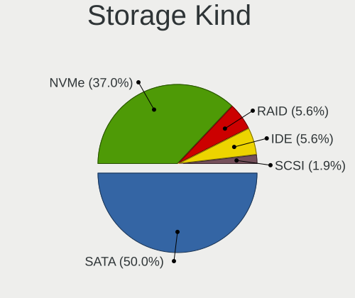

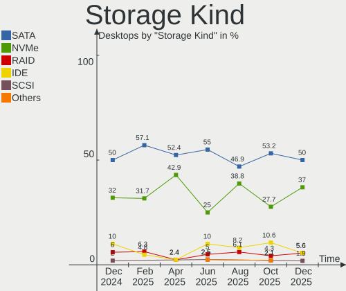

| Kind | Desktops | Percent |
|------|----------|---------|
| SATA | 27       | 50%     |
| NVMe | 20       | 37.04%  |
| RAID | 3        | 5.56%   |
| IDE  | 3        | 5.56%   |
| SCSI | 1        | 1.85%   |

Processor
---------

CPU Vendor
----------

Processor vendors

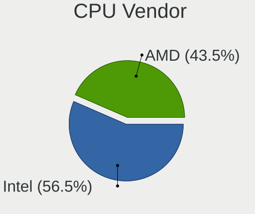

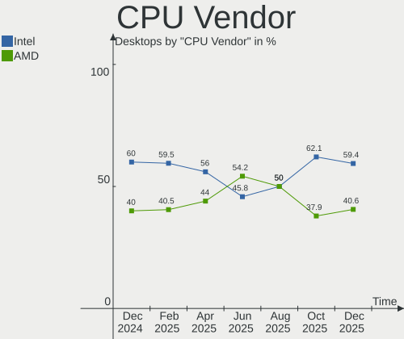

| Vendor | Desktops | Percent |
|--------|----------|---------|
| Intel  | 19       | 59.38%  |
| AMD    | 13       | 40.63%  |

CPU Model
---------

Processor models

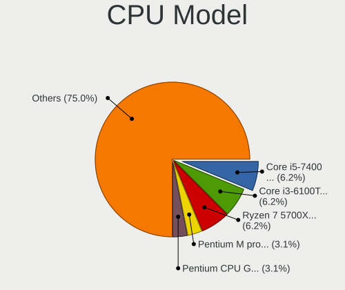

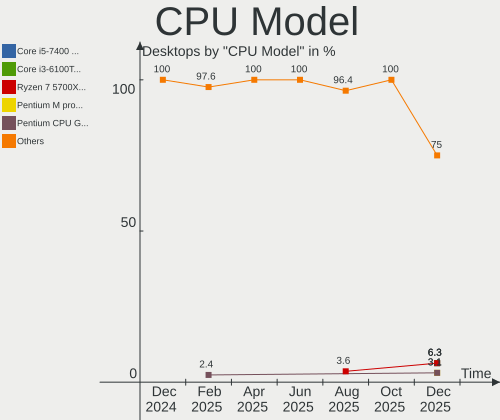

| Model                                      | Desktops | Percent |
|--------------------------------------------|----------|---------|
| Intel Core i5-7400 CPU @ 3.00GHz           | 2        | 6.25%   |
| Intel Core i3-6100T CPU @ 3.20GHz          | 2        | 6.25%   |
| AMD Ryzen 7 5700X3D 8-Core Processor       | 2        | 6.25%   |
| Intel Pentium M processor 2.13GHz          | 1        | 3.13%   |
| Intel Pentium CPU G3220 @ 3.00GHz          | 1        | 3.13%   |
| Intel Core i7-8700 CPU @ 3.20GHz           | 1        | 3.13%   |
| Intel Core i7-6700 CPU @ 3.40GHz           | 1        | 3.13%   |
| Intel Core i7-4790 CPU @ 3.60GHz           | 1        | 3.13%   |
| Intel Core i7-2600 CPU @ 3.40GHz           | 1        | 3.13%   |
| Intel Core i7-10700KF CPU @ 3.80GHz        | 1        | 3.13%   |
| Intel Core i5-8400 CPU @ 2.80GHz           | 1        | 3.13%   |
| Intel Core i5-6600K CPU @ 3.50GHz          | 1        | 3.13%   |
| Intel Core i5-6500T CPU @ 2.50GHz          | 1        | 3.13%   |
| Intel Core i5-2500 CPU @ 3.30GHz           | 1        | 3.13%   |
| Intel Core i3-9100 CPU @ 3.60GHz           | 1        | 3.13%   |
| Intel 12th Gen Core i5-12400               | 1        | 3.13%   |
| Intel 12th Gen Core i3-12100               | 1        | 3.13%   |
| Intel 11th Gen Core i7-11850H @ 2.50GHz    | 1        | 3.13%   |
| AMD Ryzen Threadripper PRO 7975WX 32-Cores | 1        | 3.13%   |
| AMD Ryzen 9 PRO 6950H with Radeon Graphics | 1        | 3.13%   |
| AMD Ryzen 9 7940HS w/ Radeon 780M Graphics | 1        | 3.13%   |
| AMD Ryzen 9 5900X 12-Core Processor        | 1        | 3.13%   |
| AMD Ryzen 7 9800X3D 8-Core Processor       | 1        | 3.13%   |
| AMD Ryzen 7 7700X 8-Core Processor         | 1        | 3.13%   |
| AMD Ryzen 7 5800X 8-Core Processor         | 1        | 3.13%   |
| AMD Ryzen 5 5600G with Radeon Graphics     | 1        | 3.13%   |
| AMD Ryzen 5 2600 Six-Core Processor        | 1        | 3.13%   |
| AMD Phenom 9600 Quad-Core Processor        | 1        | 3.13%   |
| AMD FX-6350 Six-Core Processor             | 1        | 3.13%   |

CPU Model Family
----------------

Processor model prefix

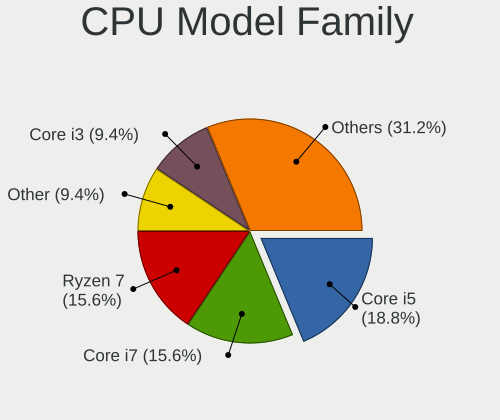

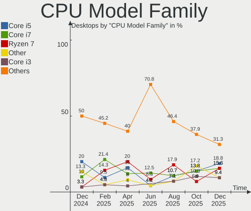

| Model                  | Desktops | Percent |
|------------------------|----------|---------|
| Intel Core i5          | 6        | 18.75%  |
| Intel Core i7          | 5        | 15.63%  |
| AMD Ryzen 7            | 5        | 15.63%  |
| Other                  | 3        | 9.38%   |
| Intel Core i3          | 3        | 9.38%   |
| AMD Ryzen 9            | 3        | 9.38%   |
| AMD Ryzen 5            | 2        | 6.25%   |
| Intel Pentium M        | 1        | 3.13%   |
| Intel Pentium          | 1        | 3.13%   |
| AMD Ryzen Threadripper | 1        | 3.13%   |
| AMD Phenom             | 1        | 3.13%   |
| AMD FX                 | 1        | 3.13%   |

CPU Cores
---------

Number of processor cores

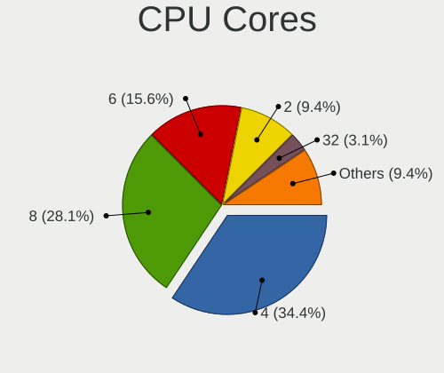

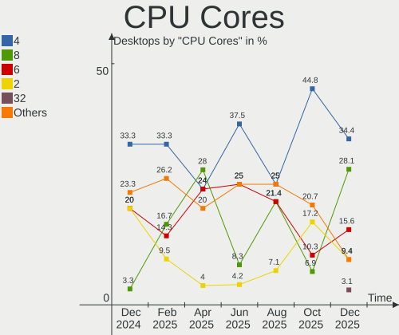

| Number | Desktops | Percent |
|--------|----------|---------|
| 4      | 11       | 34.38%  |
| 8      | 9        | 28.13%  |
| 6      | 5        | 15.63%  |
| 2      | 3        | 9.38%   |
| 32     | 1        | 3.13%   |
| 12     | 1        | 3.13%   |
| 3      | 1        | 3.13%   |
| 1      | 1        | 3.13%   |

CPU Sockets
-----------

Number of sockets

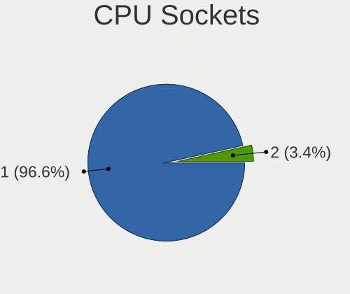

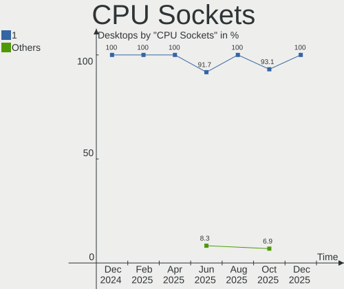

| Number | Desktops | Percent |
|--------|----------|---------|
| 1      | 32       | 100%    |

CPU Threads
-----------

Threads per core (Hyper-Threading)

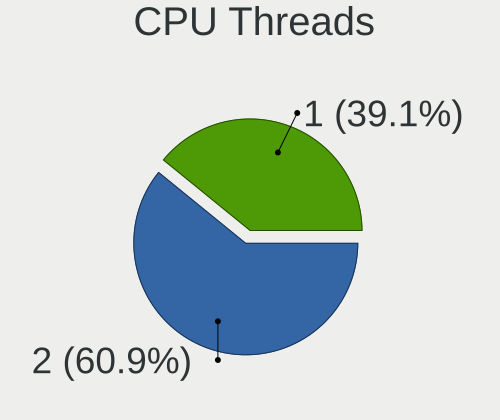

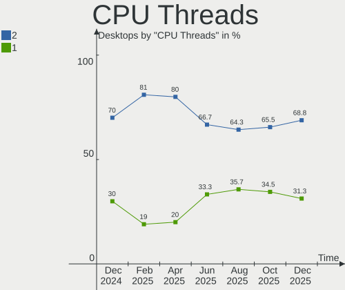

| Number | Desktops | Percent |
|--------|----------|---------|
| 2      | 22       | 68.75%  |
| 1      | 10       | 31.25%  |

CPU Op-Modes
------------

CPU Operation Modes (32-bit, 64-bit)

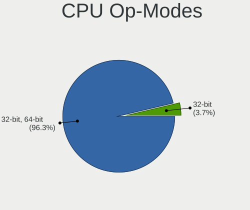

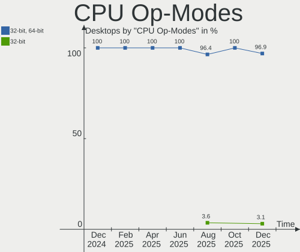

| Op mode        | Desktops | Percent |
|----------------|----------|---------|
| 32-bit, 64-bit | 31       | 96.88%  |
| 32-bit         | 1        | 3.13%   |

CPU Microcode
-------------

Microcode number

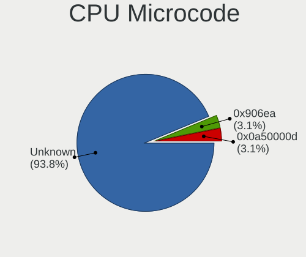

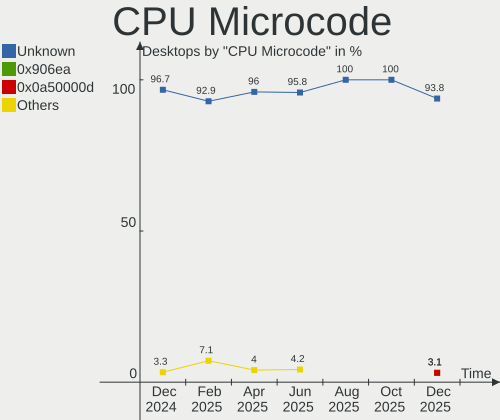

| Number     | Desktops | Percent |
|------------|----------|---------|
| Unknown    | 30       | 93.75%  |
| 0x906ea    | 1        | 3.13%   |
| 0x0a50000d | 1        | 3.13%   |

CPU Microarch
-------------

Microarchitecture

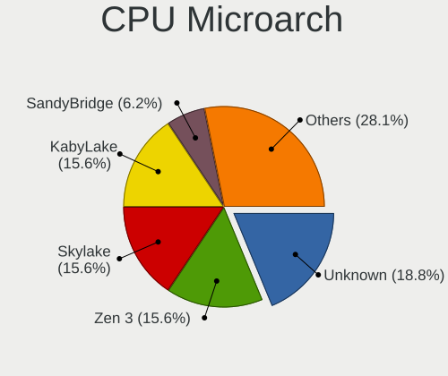

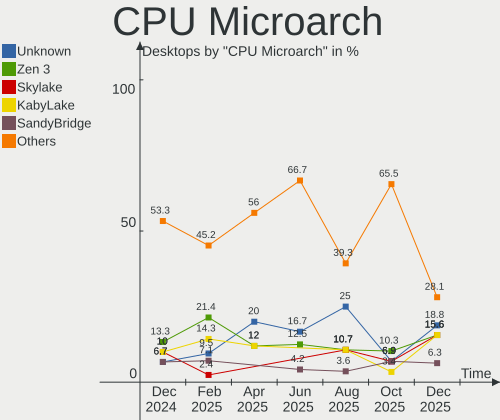

| Name             | Desktops | Percent |
|------------------|----------|---------|
| Unknown          | 6        | 18.75%  |
| Zen 3            | 5        | 15.63%  |
| Skylake          | 5        | 15.63%  |
| KabyLake         | 5        | 15.63%  |
| SandyBridge      | 2        | 6.25%   |
| Haswell          | 2        | 6.25%   |
| Alderlake Hybrid | 2        | 6.25%   |
| Zen+             | 1        | 3.13%   |
| Piledriver       | 1        | 3.13%   |
| P6               | 1        | 3.13%   |
| K10              | 1        | 3.13%   |
| CometLake        | 1        | 3.13%   |

Graphics
--------

GPU Vendor
----------

Vendors of graphics cards

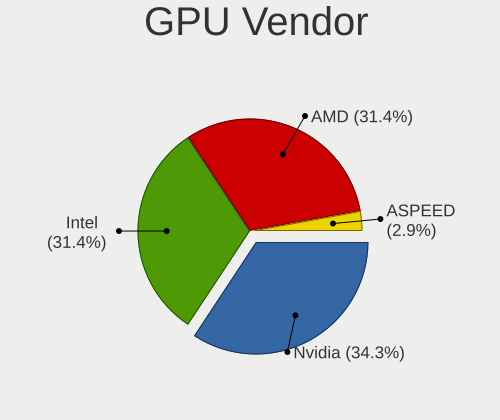

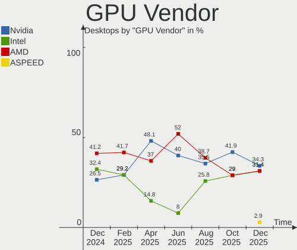

| Vendor            | Desktops | Percent |
|-------------------|----------|---------|
| Nvidia            | 12       | 34.29%  |
| Intel             | 11       | 31.43%  |
| AMD               | 11       | 31.43%  |
| ASPEED Technology | 1        | 2.86%   |

GPU Model
---------

Graphics card models

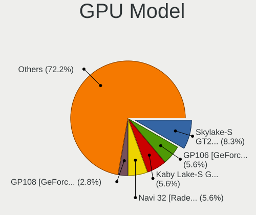

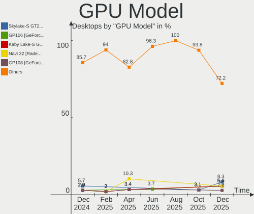

| Model                                                                       | Desktops | Percent |
|-----------------------------------------------------------------------------|----------|---------|
| Intel Skylake-S GT2 [HD Graphics 530]                                       | 3        | 8.33%   |
| Nvidia GP106 [GeForce GTX 1060 3GB]                                         | 2        | 5.56%   |
| Intel Kaby Lake-S GT2 [HD Graphics 630]                                     | 2        | 5.56%   |
| AMD Navi 32 [Radeon RX 7700 XT / 7800 XT]                                   | 2        | 5.56%   |
| Nvidia GP108 [GeForce GT 1030]                                              | 1        | 2.78%   |
| Nvidia GP104 [GeForce GTX 1070]                                             | 1        | 2.78%   |
| Nvidia GK208B [GeForce GT 710]                                              | 1        | 2.78%   |
| Nvidia GB205 [GeForce RTX 5070]                                             | 1        | 2.78%   |
| Nvidia GA106 [GeForce RTX 3060]                                             | 1        | 2.78%   |
| Nvidia GA106 [GeForce RTX 3060 Lite Hash Rate]                              | 1        | 2.78%   |
| Nvidia GA104 [GeForce RTX 3070]                                             | 1        | 2.78%   |
| Nvidia G72 [GeForce 7300 LE]                                                | 1        | 2.78%   |
| Nvidia AD107 [GeForce RTX 4060]                                             | 1        | 2.78%   |
| Nvidia AD102 [GeForce RTX 4090]                                             | 1        | 2.78%   |
| Intel Xeon E3-1200 v3/4th Gen Core Processor Integrated Graphics Controller | 1        | 2.78%   |
| Intel Mobile 915GM/GMS/910GML Express Graphics Controller                   | 1        | 2.78%   |
| Intel CoffeeLake-S GT2 [UHD Graphics 630]                                   | 1        | 2.78%   |
| Intel Battlemage G21 [Arc B580]                                             | 1        | 2.78%   |
| Intel Alder Lake-S GT1 [UHD Graphics 730]                                   | 1        | 2.78%   |
| Intel 2nd Generation Core Processor Family Integrated Graphics Controller   | 1        | 2.78%   |
| ASPEED Technology ASPEED Graphics Family                                    | 1        | 2.78%   |
| AMD Rembrandt [Radeon 680M]                                                 | 1        | 2.78%   |
| AMD Raphael                                                                 | 1        | 2.78%   |
| AMD Phoenix1                                                                | 1        | 2.78%   |
| AMD Navi 44 [Radeon RX 9060 XT]                                             | 1        | 2.78%   |
| AMD Navi 33 [Radeon RX 7600/7600 XT/7600M XT/7600S/7700S / PRO W7600]       | 1        | 2.78%   |
| AMD Navi 31 [Radeon RX 7900 XT/7900 XTX/7900 GRE/7900M]                     | 1        | 2.78%   |
| AMD Navi 21 [Radeon RX 6800/6800 XT / 6900 XT]                              | 1        | 2.78%   |
| AMD Granite Ridge [Radeon Graphics]                                         | 1        | 2.78%   |
| AMD Ellesmere [Radeon RX 470/480/570/570X/580/580X/590]                     | 1        | 2.78%   |
| AMD Caicos [Radeon HD 6450/7450/8450 / R5 230 OEM]                          | 1        | 2.78%   |

GPU Combo
---------

Combinations of graphics cards

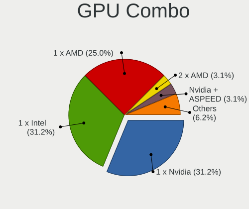

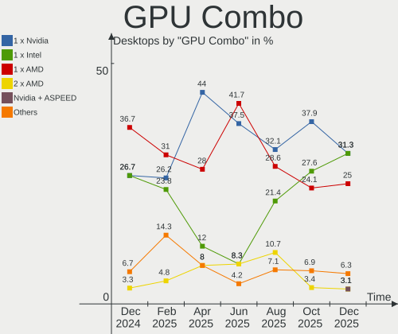

| Name            | Desktops | Percent |
|-----------------|----------|---------|
| 1 x Nvidia      | 10       | 31.25%  |
| 1 x Intel       | 10       | 31.25%  |
| 1 x AMD         | 8        | 25%     |
| 2 x AMD         | 1        | 3.13%   |
| Nvidia + ASPEED | 1        | 3.13%   |
| Intel + AMD     | 1        | 3.13%   |
| AMD + Nvidia    | 1        | 3.13%   |

GPU Driver
----------

Free vs proprietary

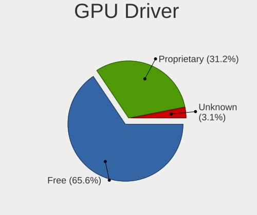

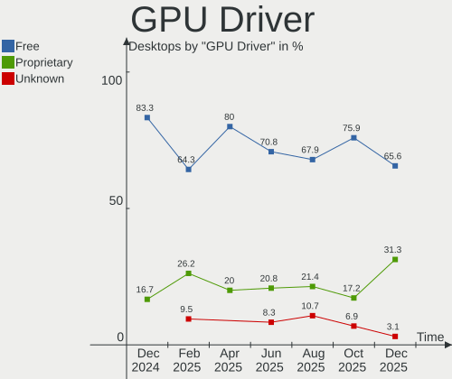

| Driver      | Desktops | Percent |
|-------------|----------|---------|
| Free        | 21       | 65.63%  |
| Proprietary | 10       | 31.25%  |
| Unknown     | 1        | 3.13%   |

GPU Memory
----------

Total video memory

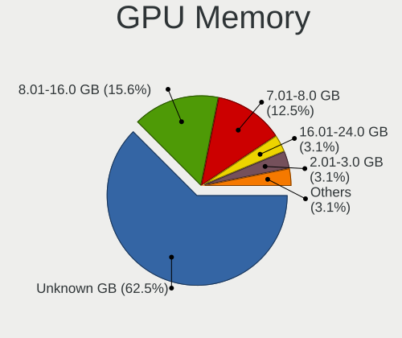

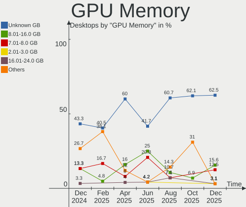

| Size in GB | Desktops | Percent |
|------------|----------|---------|
| Unknown    | 20       | 62.5%   |
| 8.01-16.0  | 5        | 15.63%  |
| 7.01-8.0   | 4        | 12.5%   |
| 2.01-3.0   | 1        | 3.13%   |
| 16.01-24.0 | 1        | 3.13%   |
| 0.01-0.5   | 1        | 3.13%   |

Monitor
-------

Monitor Vendor
--------------

Monitor vendors

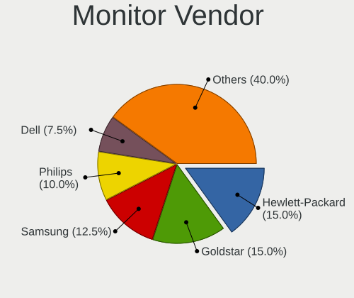

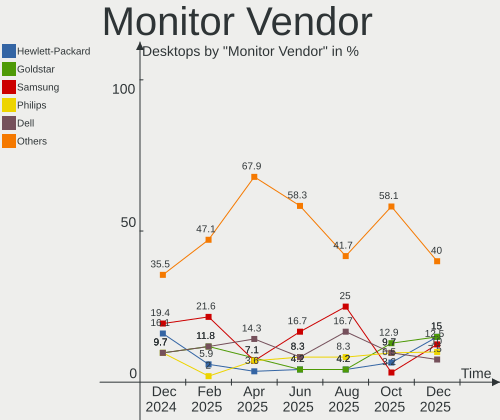

| Vendor              | Desktops | Percent |
|---------------------|----------|---------|
| Hewlett-Packard     | 6        | 15%     |
| Goldstar            | 6        | 15%     |
| Samsung Electronics | 5        | 12.5%   |
| Philips             | 4        | 10%     |
| Dell                | 3        | 7.5%    |
| Iiyama              | 2        | 5%      |
| Vestel Elektronik   | 1        | 2.5%    |
| Sony                | 1        | 2.5%    |
| NEC Computers       | 1        | 2.5%    |
| MSI                 | 1        | 2.5%    |
| Mi                  | 1        | 2.5%    |
| Medion              | 1        | 2.5%    |
| Lenovo              | 1        | 2.5%    |
| IDS                 | 1        | 2.5%    |
| HKC                 | 1        | 2.5%    |
| BenQ                | 1        | 2.5%    |
| Belinea             | 1        | 2.5%    |
| ASUSTek Computer    | 1        | 2.5%    |
| AOC                 | 1        | 2.5%    |
| Acer                | 1        | 2.5%    |

Monitor Model
-------------

Monitor models

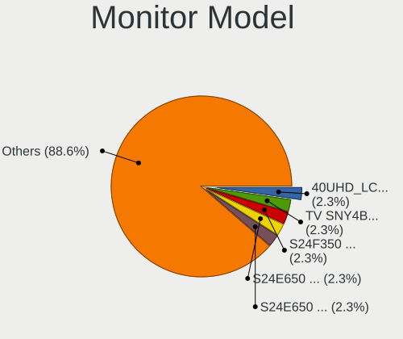

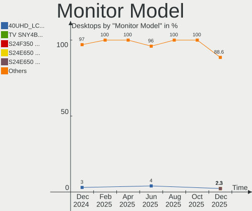

| Model                                                                  | Desktops | Percent |
|------------------------------------------------------------------------|----------|---------|
| Vestel Elektronik 40UHD_LCD_TV VES3700 3840x2160 880x500mm 39.8-inch   | 1        | 2.27%   |
| Sony TV SNY4B03 1920x1080 886x498mm 40.0-inch                          | 1        | 2.27%   |
| Samsung Electronics S24F350 SAM0D20 1920x1080 521x293mm 23.5-inch      | 1        | 2.27%   |
| Samsung Electronics S24E650 SAM0CC1 1920x1200 518x324mm 24.1-inch      | 1        | 2.27%   |
| Samsung Electronics S24E650 SAM0CBE 1920x1200 518x324mm 24.1-inch      | 1        | 2.27%   |
| Samsung Electronics S24C450 SAM09CF 1920x1200 518x324mm 24.1-inch      | 1        | 2.27%   |
| Samsung Electronics Odyssey G40B SAM727D 1920x1080 597x336mm 27.0-inch | 1        | 2.27%   |
| Samsung Electronics C27F390 SAM0D32 1920x1080 598x336mm 27.0-inch      | 1        | 2.27%   |
| Philips PHL 328E1 PHLC204 3840x2160 697x392mm 31.5-inch                | 1        | 2.27%   |
| Philips PHL 284E5 PHLC0DE 1920x1080 621x341mm 27.9-inch                | 1        | 2.27%   |
| Philips PHL 223S7 PHL0910 1920x1080 476x268mm 21.5-inch                | 1        | 2.27%   |
| Philips 27M1N3200V PHLC279 1920x1080 598x336mm 27.0-inch               | 1        | 2.27%   |
| NEC Computers E223W NEC68EF 1680x1050 474x296mm 22.0-inch              | 1        | 2.27%   |
| NEC Computers E223W NEC68EE 1680x1050 474x296mm 22.0-inch              | 1        | 2.27%   |
| MSI MP243X MSI40B5 1920x1080 530x290mm 23.8-inch                       | 1        | 2.27%   |
| Mi Monitor XMI27B2 2560x1440 598x336mm 27.0-inch                       | 1        | 2.27%   |
| Medion MD20831 MEA5107 1920x1080 527x296mm 23.8-inch                   | 1        | 2.27%   |
| Lenovo LEN LT2452pwC LEN1144 1920x1080 518x324mm 24.1-inch             | 1        | 2.27%   |
| Iiyama PLE2483H IVM6113 1920x1080 531x299mm 24.0-inch                  | 1        | 2.27%   |
| Iiyama PL3482WQ IVM7649 3440x1440 797x334mm 34.0-inch                  | 1        | 2.27%   |
| IDS PT-185DW IDS0001 1366x768 340x190mm 15.3-inch                      | 1        | 2.27%   |
| HKC 34E6UC HKC3483 3440x1440 797x333mm 34.0-inch                       | 1        | 2.27%   |
| Hewlett-Packard M24m HPN3867 1920x1080 527x296mm 23.8-inch             | 1        | 2.27%   |
| Hewlett-Packard LP2475w HWP26F9 1920x1200 546x352mm 25.6-inch          | 1        | 2.27%   |
| Hewlett-Packard LP2475w HWP26F8 1920x1200 546x352mm 25.6-inch          | 1        | 2.27%   |
| Hewlett-Packard E240 HWP3264 1920x1080 527x296mm 23.8-inch             | 1        | 2.27%   |
| Hewlett-Packard 32f HPN3659 1920x1080 699x393mm 31.6-inch              | 1        | 2.27%   |
| Hewlett-Packard 2710 HWP2893 1920x1080 600x340mm 27.2-inch             | 1        | 2.27%   |
| Hewlett-Packard 25xi HWP3035 1920x1080 553x311mm 25.0-inch             | 1        | 2.27%   |
| Goldstar ULTRAGEAR GSM7766 2560x1440 697x392mm 31.5-inch               | 1        | 2.27%   |
| Goldstar Ultra HD GSM5B09 3840x2160 600x340mm 27.2-inch                | 1        | 2.27%   |
| Goldstar L1710S GSM4357 1280x1024 338x270mm 17.0-inch                  | 1        | 2.27%   |
| Goldstar IPS235 GSM587D 1920x1080 510x290mm 23.1-inch                  | 1        | 2.27%   |
| Goldstar IPS225 GSM5879 1920x1080 510x290mm 23.1-inch                  | 1        | 2.27%   |
| Goldstar HDR WFHD GSM7714 2560x1080 798x334mm 34.1-inch                | 1        | 2.27%   |
| Goldstar HDR 4K GSM7707 3840x2160 600x340mm 27.2-inch                  | 1        | 2.27%   |
| Dell U2412M DELA07B 1920x1200 518x324mm 24.1-inch                      | 1        | 2.27%   |
| Dell U2412M DELA07A 1920x1200 518x324mm 24.1-inch                      | 1        | 2.27%   |
| Dell SE2219H DELF10F 1920x1080 476x268mm 21.5-inch                     | 1        | 2.27%   |
| BenQ GL2780 BNQ78EC 1920x1080 600x340mm 27.2-inch                      | 1        | 2.27%   |

Monitor Resolution
------------------

Monitor screen resolution

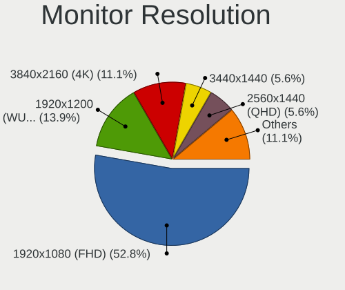

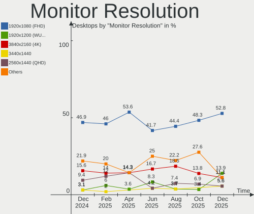

| Resolution         | Desktops | Percent |
|--------------------|----------|---------|
| 1920x1080 (FHD)    | 19       | 52.78%  |
| 1920x1200 (WUXGA)  | 5        | 13.89%  |
| 3840x2160 (4K)     | 4        | 11.11%  |
| 3440x1440          | 2        | 5.56%   |
| 2560x1440 (QHD)    | 2        | 5.56%   |
| 2560x1080          | 1        | 2.78%   |
| 1680x1050 (WSXGA+) | 1        | 2.78%   |
| 1366x768 (WXGA)    | 1        | 2.78%   |
| 1280x1024 (SXGA)   | 1        | 2.78%   |

Monitor Diagonal
----------------

Diagonal size in inches

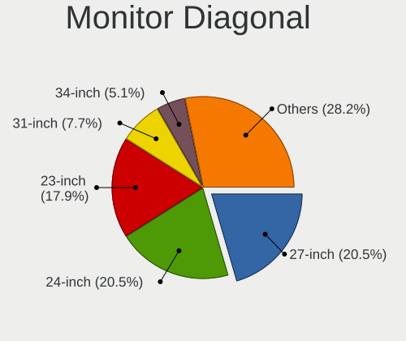

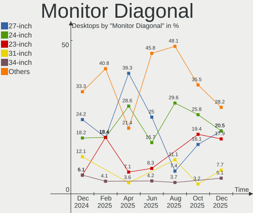

| Inches | Desktops | Percent |
|--------|----------|---------|
| 27     | 8        | 20.51%  |
| 24     | 8        | 20.51%  |
| 23     | 7        | 17.95%  |
| 31     | 3        | 7.69%   |
| 34     | 2        | 5.13%   |
| 25     | 2        | 5.13%   |
| 21     | 2        | 5.13%   |
| 84     | 1        | 2.56%   |
| 63     | 1        | 2.56%   |
| 50     | 1        | 2.56%   |
| 40     | 1        | 2.56%   |
| 22     | 1        | 2.56%   |
| 17     | 1        | 2.56%   |
| 15     | 1        | 2.56%   |

Monitor Width
-------------

Physical width

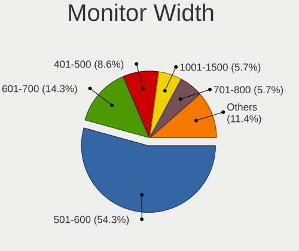

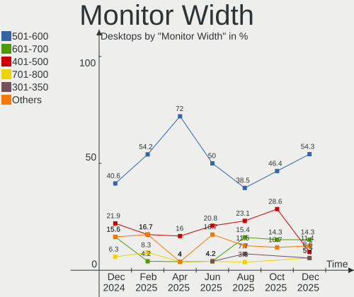

| Width in mm | Desktops | Percent |
|-------------|----------|---------|
| 501-600     | 19       | 54.29%  |
| 601-700     | 5        | 14.29%  |
| 401-500     | 3        | 8.57%   |
| 701-800     | 2        | 5.71%   |
| 301-350     | 2        | 5.71%   |
| 1001-1500   | 2        | 5.71%   |
| 801-900     | 1        | 2.86%   |
| 1501-2000   | 1        | 2.86%   |

Aspect Ratio
------------

Proportional relationship between the width and the height

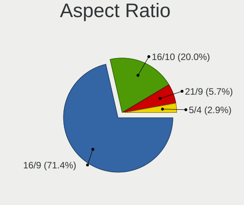

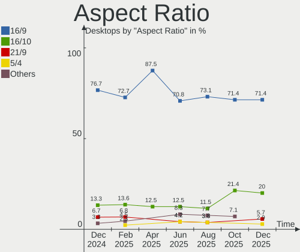

| Ratio | Desktops | Percent |
|-------|----------|---------|
| 16/9  | 25       | 71.43%  |
| 16/10 | 7        | 20%     |
| 21/9  | 2        | 5.71%   |
| 5/4   | 1        | 2.86%   |

Monitor Area
------------

Area in inch²

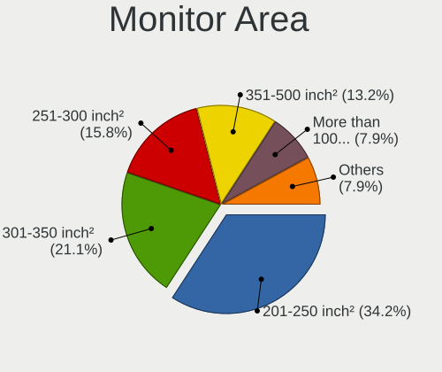

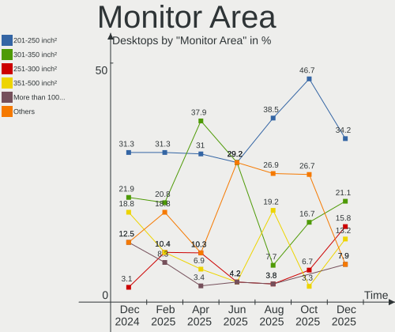

| Area in inch² | Desktops | Percent |
|----------------|----------|---------|
| 201-250        | 13       | 34.21%  |
| 301-350        | 8        | 21.05%  |
| 251-300        | 6        | 15.79%  |
| 351-500        | 5        | 13.16%  |
| More than 1000 | 3        | 7.89%   |
| 141-150        | 1        | 2.63%   |
| 501-1000       | 1        | 2.63%   |
| 91-100         | 1        | 2.63%   |

Pixel Density
-------------

Pixels per inch

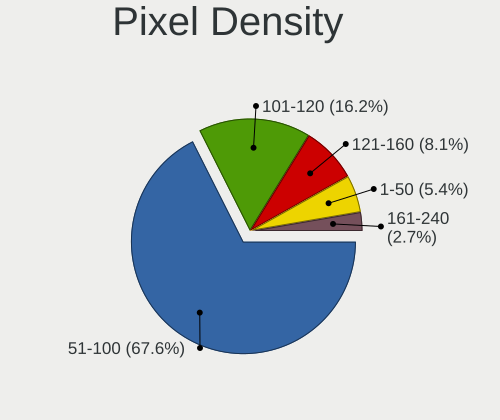

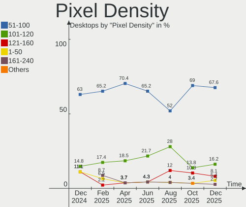

| Density | Desktops | Percent |
|---------|----------|---------|
| 51-100  | 25       | 67.57%  |
| 101-120 | 6        | 16.22%  |
| 121-160 | 3        | 8.11%   |
| 1-50    | 2        | 5.41%   |
| 161-240 | 1        | 2.7%    |

Multiple Monitors
-----------------

Total monitors connected

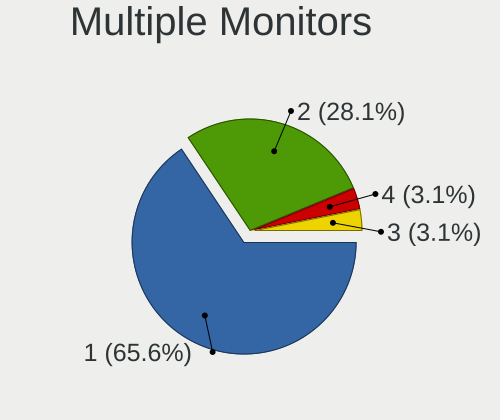

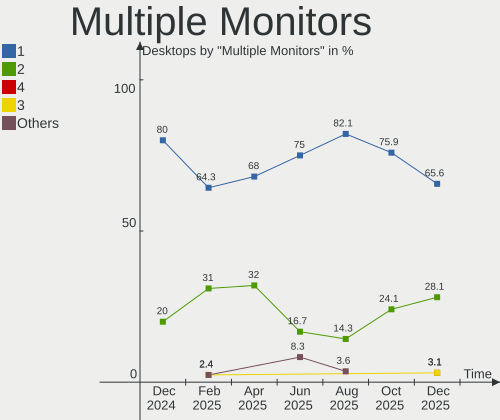

| Total | Desktops | Percent |
|-------|----------|---------|
| 1     | 21       | 65.63%  |
| 2     | 9        | 28.13%  |
| 4     | 1        | 3.13%   |
| 3     | 1        | 3.13%   |

Network
-------

Net Controller Vendor
---------------------

Controller vendors

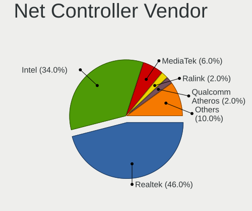

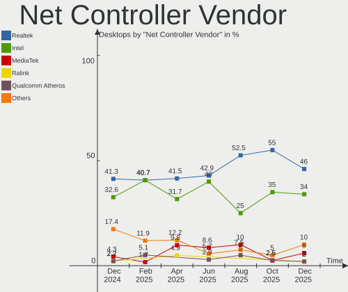

| Vendor                | Desktops | Percent |
|-----------------------|----------|---------|
| Realtek Semiconductor | 23       | 46%     |
| Intel                 | 17       | 34%     |
| MediaTek              | 3        | 6%      |
| Ralink Technology     | 1        | 2%      |
| Qualcomm Atheros      | 1        | 2%      |
| Nvidia                | 1        | 2%      |
| Microsoft             | 1        | 2%      |
| American Megatrends   | 1        | 2%      |
| Adafruit              | 1        | 2%      |
| 3Com                  | 1        | 2%      |

Net Controller Model
--------------------

Controller models

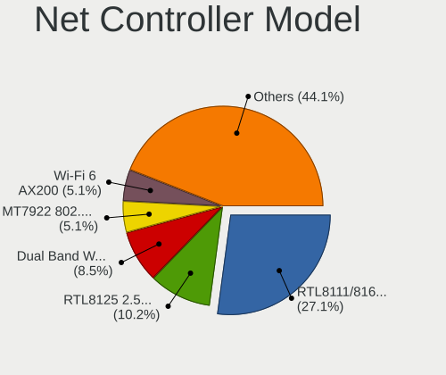

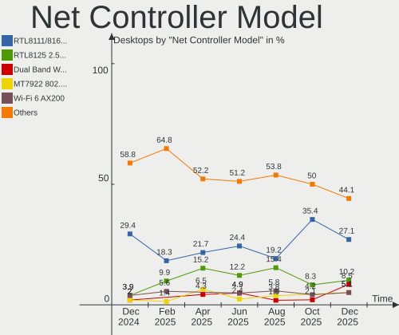

| Model                                                                  | Desktops | Percent |
|------------------------------------------------------------------------|----------|---------|
| Realtek RTL8111/8168/8211/8411 PCI Express Gigabit Ethernet Controller | 16       | 27.12%  |
| Realtek RTL8125 2.5GbE Controller                                      | 6        | 10.17%  |
| Intel Dual Band Wireless-AC 3168NGW [Stone Peak]                       | 5        | 8.47%   |
| MediaTek MT7922 802.11ax PCI Express Wireless Network Adapter          | 3        | 5.08%   |
| Intel Wi-Fi 6 AX200                                                    | 3        | 5.08%   |
| Intel Wi-Fi 5(802.11ac) Wireless-AC 9x6x [Thunder Peak]                | 2        | 3.39%   |
| Intel I211 Gigabit Network Connection                                  | 2        | 3.39%   |
| Realtek RTL8192CU 802.11n WLAN Adapter                                 | 1        | 1.69%   |
| Realtek RTL8169 PCI Gigabit Ethernet Controller                        | 1        | 1.69%   |
| Realtek 802.11ac NIC                                                   | 1        | 1.69%   |
| Ralink MT7601U Wireless Adapter                                        | 1        | 1.69%   |
| Qualcomm Atheros AR9227 Wireless Network Adapter                       | 1        | 1.69%   |
| Nvidia MCP55 Ethernet                                                  | 1        | 1.69%   |
| Microsoft Xbox 360 Wireless Adapter                                    | 1        | 1.69%   |
| Intel Wireless 8260                                                    | 1        | 1.69%   |
| Intel Wi-Fi 6E(802.11ax) AX210/AX1675* 2x2 [Typhoon Peak]              | 1        | 1.69%   |
| Intel Ethernet Controller X710 for 10GBASE-T                           | 1        | 1.69%   |
| Intel Ethernet Controller I226-V                                       | 1        | 1.69%   |
| Intel Ethernet Controller I219-V                                       | 1        | 1.69%   |
| Intel Ethernet Connection I217-V                                       | 1        | 1.69%   |
| Intel Ethernet Connection (7) I219-V                                   | 1        | 1.69%   |
| Intel Ethernet Connection (2) I219-V                                   | 1        | 1.69%   |
| Intel Ethernet Connection (2) I219-LM                                  | 1        | 1.69%   |
| Intel Comet Lake PCH CNVi WiFi                                         | 1        | 1.69%   |
| Intel Alder Lake-S PCH CNVi WiFi                                       | 1        | 1.69%   |
| Intel 82574L Gigabit Network Connection                                | 1        | 1.69%   |
| American Megatrends Virtual Ethernet.                                  | 1        | 1.69%   |
| Adafruit QT Py M0                                                      | 1        | 1.69%   |
| 3Com 3c905B 100BaseTX [Cyclone]                                        | 1        | 1.69%   |

Wireless Vendor
---------------

Wireless vendors

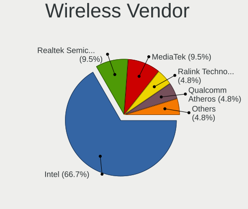

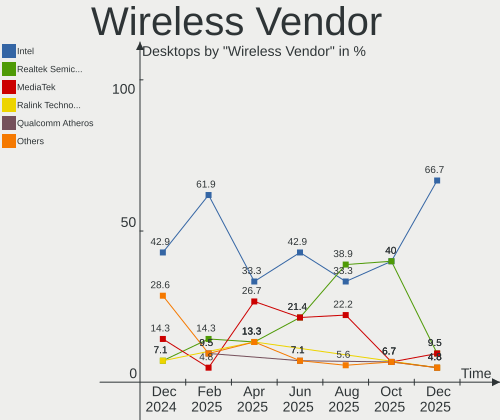

| Vendor                | Desktops | Percent |
|-----------------------|----------|---------|
| Intel                 | 14       | 66.67%  |
| Realtek Semiconductor | 2        | 9.52%   |
| MediaTek              | 2        | 9.52%   |
| Ralink Technology     | 1        | 4.76%   |
| Qualcomm Atheros      | 1        | 4.76%   |
| Microsoft             | 1        | 4.76%   |

Wireless Model
--------------

Wireless models

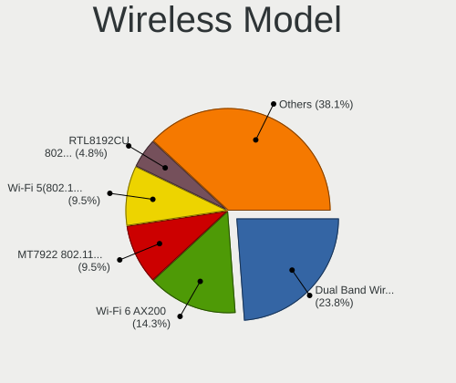

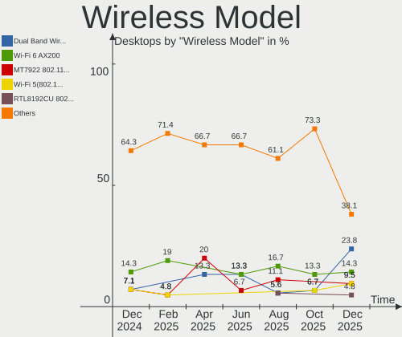

| Model                                                         | Desktops | Percent |
|---------------------------------------------------------------|----------|---------|
| Intel Dual Band Wireless-AC 3168NGW [Stone Peak]              | 5        | 23.81%  |
| Intel Wi-Fi 6 AX200                                           | 3        | 14.29%  |
| MediaTek MT7922 802.11ax PCI Express Wireless Network Adapter | 2        | 9.52%   |
| Intel Wi-Fi 5(802.11ac) Wireless-AC 9x6x [Thunder Peak]       | 2        | 9.52%   |
| Realtek RTL8192CU 802.11n WLAN Adapter                        | 1        | 4.76%   |
| Realtek 802.11ac NIC                                          | 1        | 4.76%   |
| Ralink MT7601U Wireless Adapter                               | 1        | 4.76%   |
| Qualcomm Atheros AR9227 Wireless Network Adapter              | 1        | 4.76%   |
| Microsoft Xbox 360 Wireless Adapter                           | 1        | 4.76%   |
| Intel Wireless 8260                                           | 1        | 4.76%   |
| Intel Wi-Fi 6E(802.11ax) AX210/AX1675* 2x2 [Typhoon Peak]     | 1        | 4.76%   |
| Intel Comet Lake PCH CNVi WiFi                                | 1        | 4.76%   |
| Intel Alder Lake-S PCH CNVi WiFi                              | 1        | 4.76%   |

Ethernet Vendor
---------------

Ethernet vendors

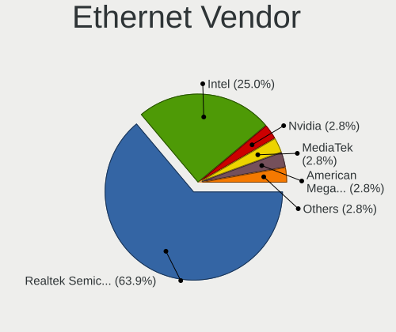

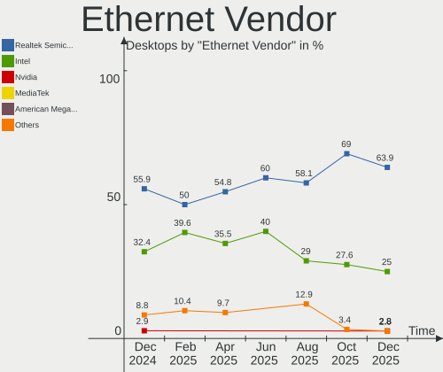

| Vendor                | Desktops | Percent |
|-----------------------|----------|---------|
| Realtek Semiconductor | 23       | 63.89%  |
| Intel                 | 9        | 25%     |
| Nvidia                | 1        | 2.78%   |
| MediaTek              | 1        | 2.78%   |
| American Megatrends   | 1        | 2.78%   |
| 3Com                  | 1        | 2.78%   |

Ethernet Model
--------------

Ethernet models

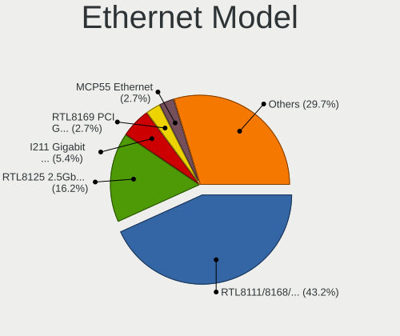

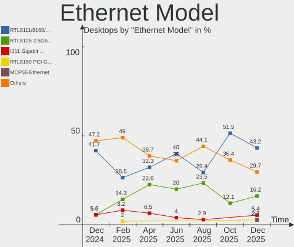

| Model                                                                  | Desktops | Percent |
|------------------------------------------------------------------------|----------|---------|
| Realtek RTL8111/8168/8211/8411 PCI Express Gigabit Ethernet Controller | 16       | 43.24%  |
| Realtek RTL8125 2.5GbE Controller                                      | 6        | 16.22%  |
| Intel I211 Gigabit Network Connection                                  | 2        | 5.41%   |
| Realtek RTL8169 PCI Gigabit Ethernet Controller                        | 1        | 2.7%    |
| Nvidia MCP55 Ethernet                                                  | 1        | 2.7%    |
| MediaTek MT7922 802.11ax PCI Express Wireless Network Adapter          | 1        | 2.7%    |
| Intel Ethernet Controller X710 for 10GBASE-T                           | 1        | 2.7%    |
| Intel Ethernet Controller I226-V                                       | 1        | 2.7%    |
| Intel Ethernet Controller I219-V                                       | 1        | 2.7%    |
| Intel Ethernet Connection I217-V                                       | 1        | 2.7%    |
| Intel Ethernet Connection (7) I219-V                                   | 1        | 2.7%    |
| Intel Ethernet Connection (2) I219-V                                   | 1        | 2.7%    |
| Intel Ethernet Connection (2) I219-LM                                  | 1        | 2.7%    |
| Intel 82574L Gigabit Network Connection                                | 1        | 2.7%    |
| American Megatrends Virtual Ethernet.                                  | 1        | 2.7%    |
| 3Com 3c905B 100BaseTX [Cyclone]                                        | 1        | 2.7%    |

Net Controller Kind
-------------------

Ethernet, WiFi or modem

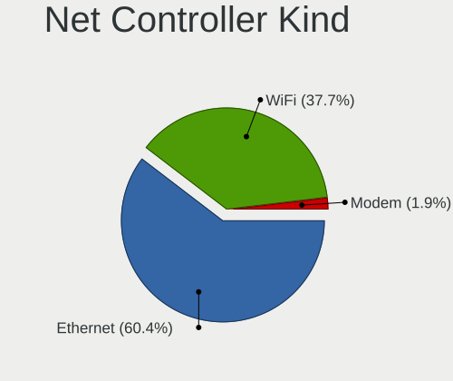

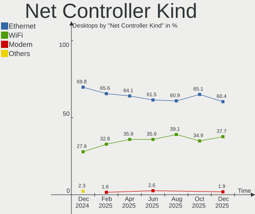

| Kind     | Desktops | Percent |
|----------|----------|---------|
| Ethernet | 32       | 60.38%  |
| WiFi     | 20       | 37.74%  |
| Modem    | 1        | 1.89%   |

Used Controller
---------------

Currently used network controller

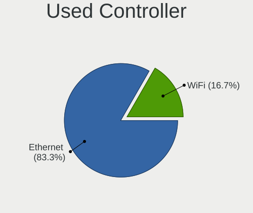

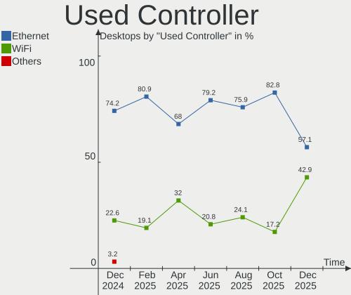

| Kind     | Desktops | Percent |
|----------|----------|---------|
| Ethernet | 20       | 57.14%  |
| WiFi     | 15       | 42.86%  |

NICs
----

Total network controllers on board

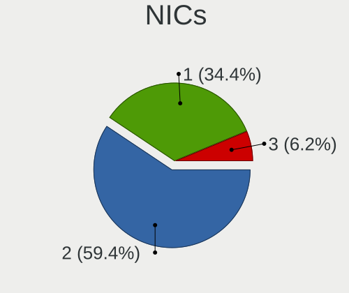

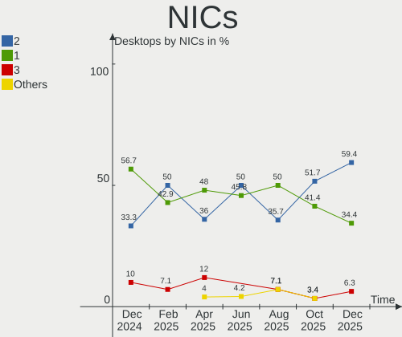

| Total | Desktops | Percent |
|-------|----------|---------|
| 2     | 19       | 59.38%  |
| 1     | 11       | 34.38%  |
| 3     | 2        | 6.25%   |

IPv6
----

IPv6 vs IPv4

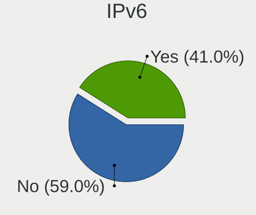

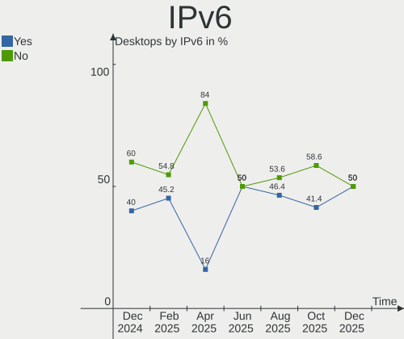

| Used | Desktops | Percent |
|------|----------|---------|
| Yes  | 16       | 50%     |
| No   | 16       | 50%     |

Bluetooth
---------

Bluetooth Vendor
----------------

Controller vendors

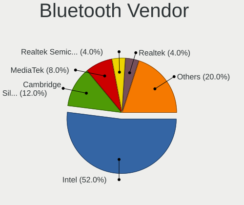

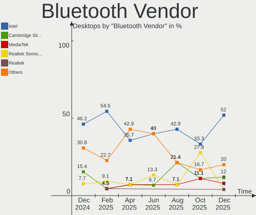

| Vendor                  | Desktops | Percent |
|-------------------------|----------|---------|
| Intel                   | 13       | 52%     |
| Cambridge Silicon Radio | 3        | 12%     |
| MediaTek                | 2        | 8%      |
| Realtek Semiconductor   | 1        | 4%      |
| Realtek                 | 1        | 4%      |
| IMC Networks            | 1        | 4%      |
| Edimax Technology       | 1        | 4%      |
| Broadcom                | 1        | 4%      |
| Belkin Components       | 1        | 4%      |
| Unknown                 | 1        | 4%      |

Bluetooth Model
---------------

Controller models

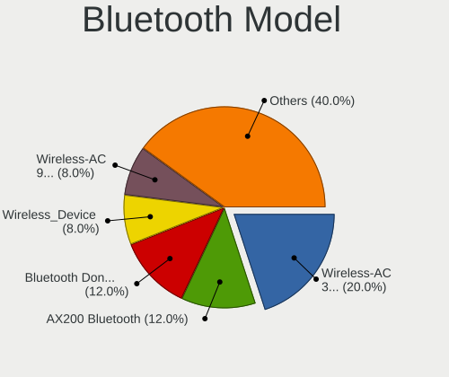

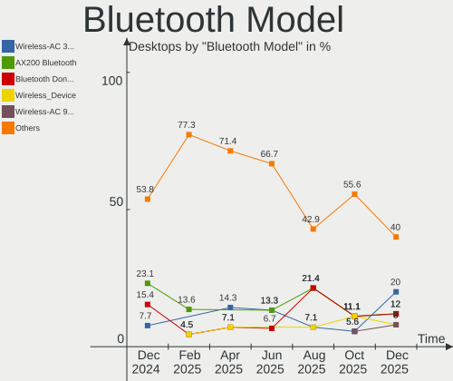

| Model                                               | Desktops | Percent |
|-----------------------------------------------------|----------|---------|
| Intel Wireless-AC 3168 Bluetooth                    | 5        | 20%     |
| Intel AX200 Bluetooth                               | 3        | 12%     |
| Cambridge Silicon Radio Bluetooth Dongle (HCI mode) | 3        | 12%     |
| MediaTek Wireless_Device                            | 2        | 8%      |
| Intel Wireless-AC 9260 Bluetooth Adapter            | 2        | 8%      |
| Realtek Bluetooth Radio                             | 1        | 4%      |
| Realtek Bluetooth Radio                             | 1        | 4%      |
| Intel Bluetooth 9460/9560 Jefferson Peak (JfP)      | 1        | 4%      |
| Intel AX210 Bluetooth                               | 1        | 4%      |
| Intel AX201 Bluetooth                               | 1        | 4%      |
| IMC Networks Wireless_Device                        | 1        | 4%      |
| Edimax Bluetooth Device                             | 1        | 4%      |
| Broadcom BCM20702A0 Bluetooth 4.0                   | 1        | 4%      |
| Belkin Components Bluetooth Mini Dongle             | 1        | 4%      |
| Unknown                                             | 1        | 4%      |

Sound
-----

Sound Vendor
------------

Sound card vendors

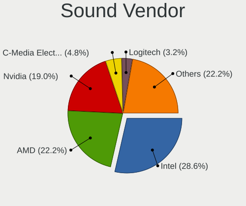

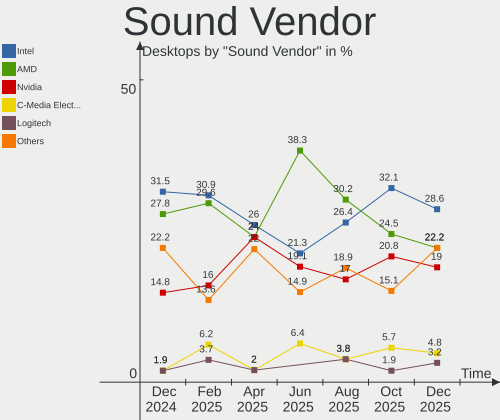

| Vendor                      | Desktops | Percent |
|-----------------------------|----------|---------|
| Intel                       | 18       | 28.57%  |
| AMD                         | 14       | 22.22%  |
| Nvidia                      | 12       | 19.05%  |
| C-Media Electronics         | 3        | 4.76%   |
| Logitech                    | 2        | 3.17%   |
| Hewlett-Packard             | 2        | 3.17%   |
| Creative Labs               | 2        | 3.17%   |
| Turtle Beach                | 1        | 1.59%   |
| Trust                       | 1        | 1.59%   |
| Sony                        | 1        | 1.59%   |
| Medeli Electronics          | 1        | 1.59%   |
| Kingston Technology         | 1        | 1.59%   |
| GYROCOM C&C                 | 1        | 1.59%   |
| Focusrite-Novation          | 1        | 1.59%   |
| FiiO Electronics Technology | 1        | 1.59%   |
| Creative Technology         | 1        | 1.59%   |
| Audioengine                 | 1        | 1.59%   |

Sound Model
-----------

Sound card models

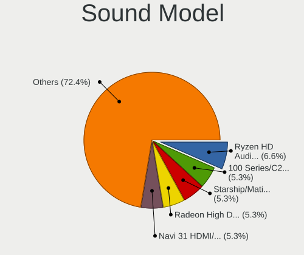

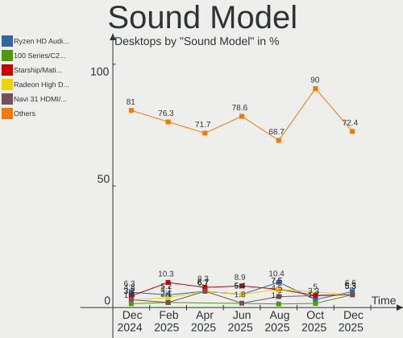

| Model                                                                      | Desktops | Percent |
|----------------------------------------------------------------------------|----------|---------|
| AMD Ryzen HD Audio Controller                                              | 5        | 6.58%   |
| Intel 100 Series/C230 Series Chipset Family HD Audio Controller            | 4        | 5.26%   |
| AMD Starship/Matisse HD Audio Controller                                   | 4        | 5.26%   |
| AMD Radeon High Definition Audio Controller                                | 4        | 5.26%   |
| AMD Navi 31 HDMI/DP Audio                                                  | 4        | 5.26%   |
| Intel Cannon Lake PCH cAVS                                                 | 3        | 3.95%   |
| Intel 200 Series PCH HD Audio                                              | 3        | 3.95%   |
| Nvidia GP106 High Definition Audio Controller                              | 2        | 2.63%   |
| Nvidia GA106 High Definition Audio Controller                              | 2        | 2.63%   |
| Intel Alder Lake-S HD Audio Controller                                     | 2        | 2.63%   |
| Intel 8 Series/C220 Series Chipset High Definition Audio Controller        | 2        | 2.63%   |
| C-Media Electronics CMI8738/CMI8768 PCI Audio                              | 2        | 2.63%   |
| C-Media Electronics Audio Adapter (Unitek Y-247A)                          | 2        | 2.63%   |
| Turtle Beach Stream Mic (Mic Only)                                         | 1        | 1.32%   |
| Trust GXT 232 Microphone                                                   | 1        | 1.32%   |
| Sony DualShock 4 [CUH-ZCT2x]                                               | 1        | 1.32%   |
| Nvidia MCP55 High Definition Audio                                         | 1        | 1.32%   |
| Nvidia GP108 High Definition Audio Controller                              | 1        | 1.32%   |
| Nvidia GP104 High Definition Audio Controller                              | 1        | 1.32%   |
| Nvidia GK208 HDMI/DP Audio Controller                                      | 1        | 1.32%   |
| Nvidia GB205 High Definition Audio Controller                              | 1        | 1.32%   |
| Nvidia GA104 High Definition Audio Controller                              | 1        | 1.32%   |
| Nvidia AD107 High Definition Audio Controller                              | 1        | 1.32%   |
| Nvidia AD102 High Definition Audio Controller                              | 1        | 1.32%   |
| Medeli Electronics KRUX EDIS 1000                                          | 1        | 1.32%   |
| Logitech QuickCam Fusion                                                   | 1        | 1.32%   |
| Logitech H600 [Wireless Headset]                                           | 1        | 1.32%   |
| Kingston Technology HyperX QuadCast                                        | 1        | 1.32%   |
| Intel Xeon E3-1200 v3/4th Gen Core Processor HD Audio Controller           | 1        | 1.32%   |
| Intel Tiger Lake-H HD Audio Controller                                     | 1        | 1.32%   |
| Intel Comet Lake PCH cAVS                                                  | 1        | 1.32%   |
| Intel Audio device                                                         | 1        | 1.32%   |
| Intel 82801FB/FBM/FR/FW/FRW (ICH6 Family) High Definition Audio Controller | 1        | 1.32%   |
| Intel 6 Series/C200 Series Chipset Family High Definition Audio Controller | 1        | 1.32%   |
| Hewlett-Packard M24m USB Audio                                             | 1        | 1.32%   |
| Hewlett-Packard HyperX Cloud III Wireless                                  | 1        | 1.32%   |
| GYROCOM C&C Fiio E10                                                       | 1        | 1.32%   |
| Focusrite-Novation Scarlett 2i2 4th Gen                                    | 1        | 1.32%   |
| FiiO Electronics Technology BTR5                                           | 1        | 1.32%   |
| Creative Technology Sound Blaster X7                                       | 1        | 1.32%   |

Memory
------

Memory Vendor
-------------

Memory module vendors

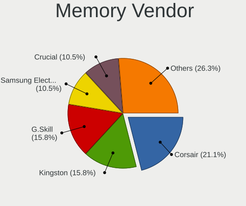

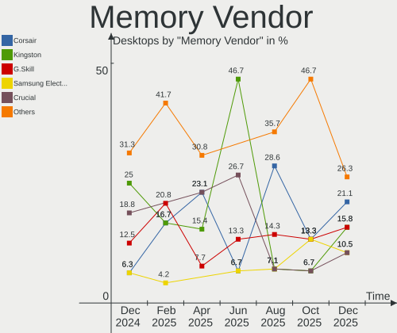

| Vendor              | Desktops | Percent |
|---------------------|----------|---------|
| Corsair             | 4        | 21.05%  |
| Kingston            | 3        | 15.79%  |
| G.Skill             | 3        | 15.79%  |
| Samsung Electronics | 2        | 10.53%  |
| Crucial             | 2        | 10.53%  |
| Unknown             | 1        | 5.26%   |
| SK hynix            | 1        | 5.26%   |
| Micron Technology   | 1        | 5.26%   |
| A-DATA Technology   | 1        | 5.26%   |
| Unknown             | 1        | 5.26%   |

Memory Model
------------

Memory module models

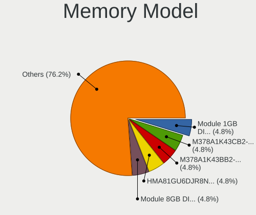

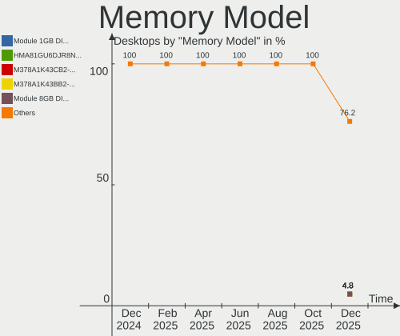

| Model                                                   | Desktops | Percent |
|---------------------------------------------------------|----------|---------|
| Unknown RAM Module 1GB DIMM SDRAM                       | 1        | 4.76%   |
| SK hynix RAM HMA81GU6DJR8N-XN 8GB DIMM DDR4 3200MT/s    | 1        | 4.76%   |
| Samsung RAM M378A1K43CB2-CTD 8GB DIMM DDR4 3266MT/s     | 1        | 4.76%   |
| Samsung RAM M378A1K43BB2-CRC 8GB DIMM DDR4 3400MT/s     | 1        | 4.76%   |
| Micron RAM Module 8GB DIMM DDR3 1333MT/s                | 1        | 4.76%   |
| Kingston RAM KHX2666C15D4/8G 8GB DIMM DDR4 3200MT/s     | 1        | 4.76%   |
| Kingston RAM KF560R32-32 32GB DIMM DDR5 4800MT/s        | 1        | 4.76%   |
| Kingston RAM KF2666C16D4/8G 8GB DIMM DDR4 2667MT/s      | 1        | 4.76%   |
| Kingston RAM 99U5458-005.A00LF 4GB DIMM DDR3 1333MT/s   | 1        | 4.76%   |
| G.Skill RAM F5-6000J4040F16G 16GB DIMM DDR5 6000MT/s    | 1        | 4.76%   |
| G.Skill RAM F4-3200C16-8GIS 8GB DIMM DDR4 3600MT/s      | 1        | 4.76%   |
| G.Skill RAM F4-3200C16-16GIS 16GB DIMM DDR4 3600MT/s    | 1        | 4.76%   |
| Crucial RAM CT16G56C46S5.M8G1 16GB SODIMM DDR5 5600MT/s | 1        | 4.76%   |
| Crucial RAM CT102464BA1339.C16 8GB DIMM DDR3 1333MT/s   | 1        | 4.76%   |
| Corsair RAM CMW16GX4M2C3000C15 8GB DIMM DDR4 3467MT/s   | 1        | 4.76%   |
| Corsair RAM CMK8GX4M1A2400C16 8GB DIMM DDR4 3066MT/s    | 1        | 4.76%   |
| Corsair RAM CMK16GX4M2B3200C16 8GB DIMM DDR4 3600MT/s   | 1        | 4.76%   |
| Corsair RAM CMK16GX4M2B3000C15 8GB DIMM DDR4 3600MT/s   | 1        | 4.76%   |
| Corsair RAM CMK16GX4M2A2400C16 8GB DIMM DDR4 2933MT/s   | 1        | 4.76%   |
| A-DATA RAM DDR4 3000 8GB DIMM DDR4 3600MT/s             | 1        | 4.76%   |
| Unknown                                                 | 1        | 4.76%   |

Memory Kind
-----------

Memory module kinds

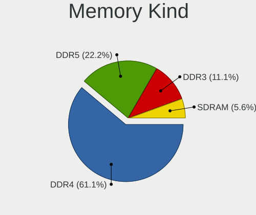

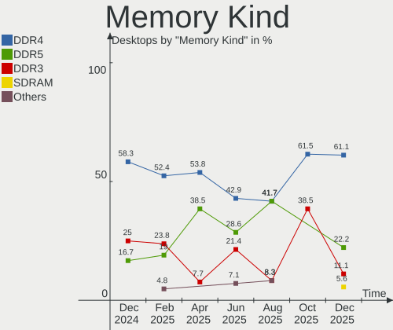

| Kind  | Desktops | Percent |
|-------|----------|---------|
| DDR4  | 11       | 61.11%  |
| DDR5  | 4        | 22.22%  |
| DDR3  | 2        | 11.11%  |
| SDRAM | 1        | 5.56%   |

Memory Form Factor
------------------

Physical design of the memory module

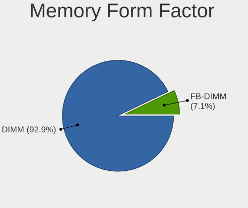

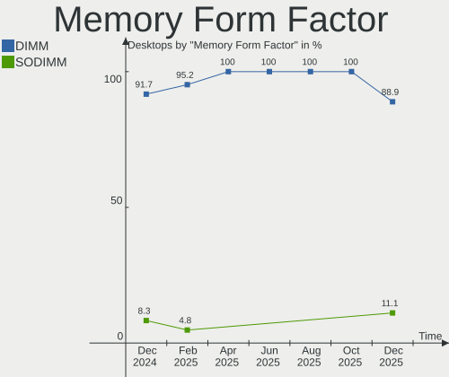

| Name   | Desktops | Percent |
|--------|----------|---------|
| DIMM   | 16       | 88.89%  |
| SODIMM | 2        | 11.11%  |

Memory Size
-----------

Memory module size

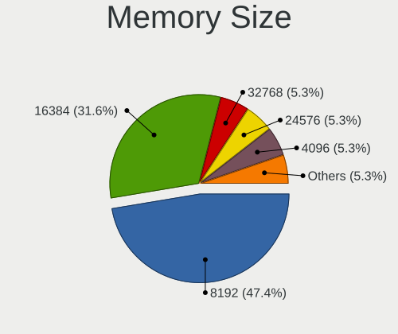

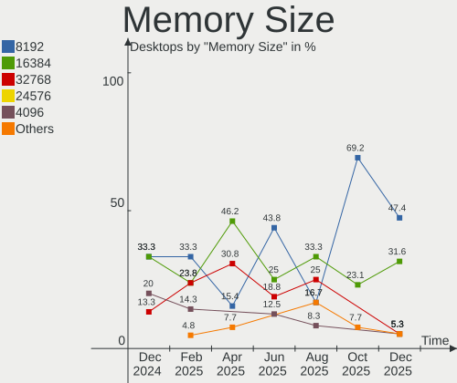

| Size  | Desktops | Percent |
|-------|----------|---------|
| 8192  | 9        | 47.37%  |
| 16384 | 6        | 31.58%  |
| 32768 | 1        | 5.26%   |
| 24576 | 1        | 5.26%   |
| 4096  | 1        | 5.26%   |
| 1024  | 1        | 5.26%   |

Memory Speed
------------

Memory module speed

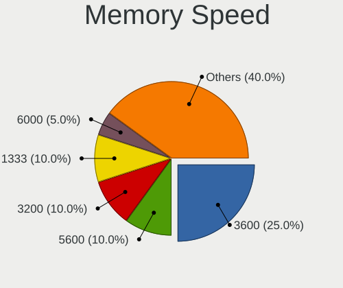

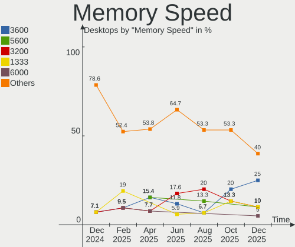

| Speed   | Desktops | Percent |
|---------|----------|---------|
| 3600    | 5        | 25%     |
| 5600    | 2        | 10%     |
| 3200    | 2        | 10%     |
| 1333    | 2        | 10%     |
| 6000    | 1        | 5%      |
| 4800    | 1        | 5%      |
| 3467    | 1        | 5%      |
| 3400    | 1        | 5%      |
| 3266    | 1        | 5%      |
| 3066    | 1        | 5%      |
| 2933    | 1        | 5%      |
| 2667    | 1        | 5%      |
| Unknown | 1        | 5%      |

Printers & scanners
-------------------

Printer Vendor
--------------

Printer device vendors

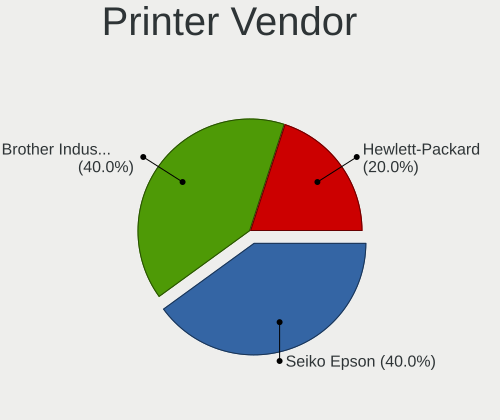

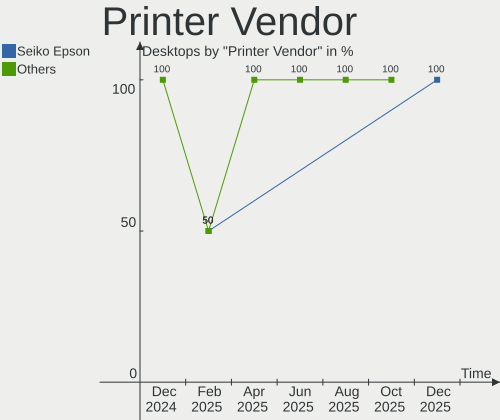

| Vendor      | Desktops | Percent |
|-------------|----------|---------|
| Seiko Epson | 1        | 100%    |

Printer Model
-------------

Printer device models

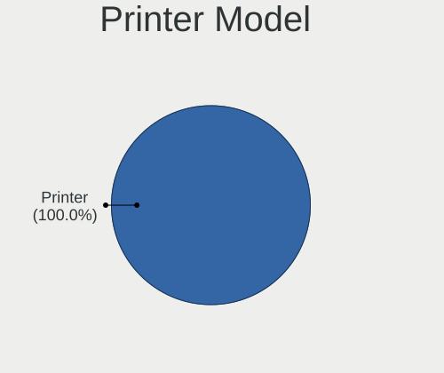

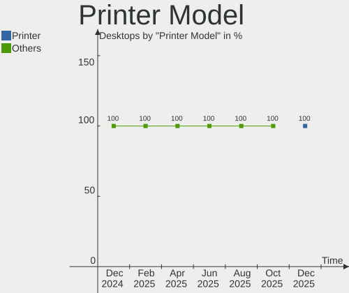

| Model               | Desktops | Percent |
|---------------------|----------|---------|
| Seiko Epson Printer | 1        | 100%    |

Scanner Vendor
--------------

Scanner device vendors

Zero info for selected period =(

Scanner Model
-------------

Scanner device models

Zero info for selected period =(

Camera
------

Camera Vendor
-------------

Camera device vendors

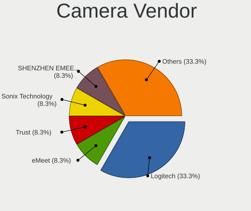

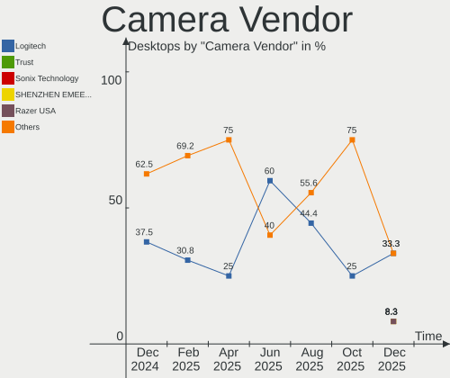

| Vendor                    | Desktops | Percent |
|---------------------------|----------|---------|
| Logitech                  | 4        | 33.33%  |
| Trust                     | 1        | 8.33%   |
| Sonix Technology          | 1        | 8.33%   |
| SHENZHEN EMEET TECHNOLOGY | 1        | 8.33%   |
| Razer USA                 | 1        | 8.33%   |
| Quanta                    | 1        | 8.33%   |
| MacroSilicon              | 1        | 8.33%   |
| eMeet                     | 1        | 8.33%   |
| Creative Technology       | 1        | 8.33%   |

Camera Model
------------

Camera device models

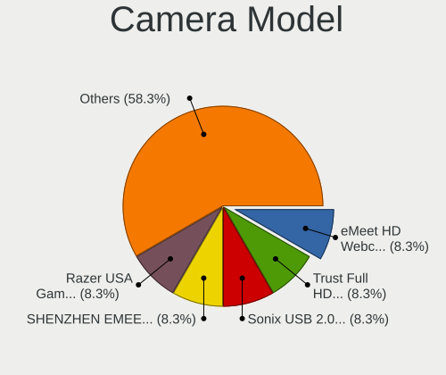

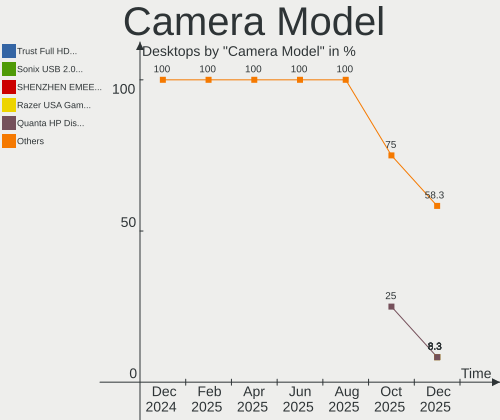

| Model                                | Desktops | Percent |
|--------------------------------------|----------|---------|
| Trust Full HD Webcam                 | 1        | 8.33%   |
| Sonix USB 2.0 Camera                 | 1        | 8.33%   |
| SHENZHEN EMEET TECHNOLOGY eMeet Nova | 1        | 8.33%   |
| Razer USA Gaming Webcam [Kiyo]       | 1        | 8.33%   |
| Quanta HP Display Camera             | 1        | 8.33%   |
| MacroSilicon USB Video               | 1        | 8.33%   |
| Logitech Webcam C270                 | 1        | 8.33%   |
| Logitech Logi Webcam C920e           | 1        | 8.33%   |
| Logitech HD Pro Webcam C920          | 1        | 8.33%   |
| Logitech C920 PRO HD Webcam          | 1        | 8.33%   |
| eMeet HD Webcam C960                 | 1        | 8.33%   |
| Creative Live! Cam Sync HD [VF0770]  | 1        | 8.33%   |

Security
--------

Fingerprint Vendor
------------------

Fingerprint sensor vendors

Zero info for selected period =(

Fingerprint Model
-----------------

Fingerprint sensor models

Zero info for selected period =(

Chipcard Vendor
---------------

Chipcard module vendors

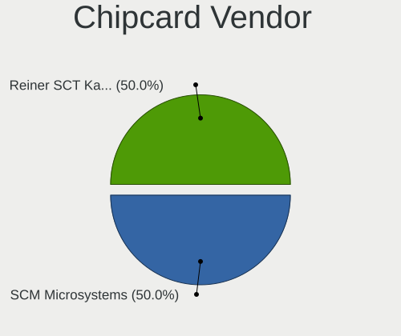

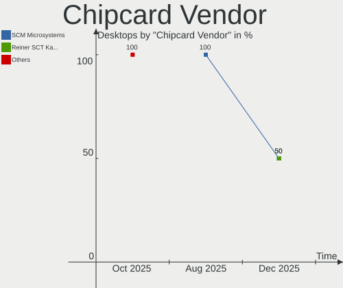

| Vendor                   | Desktops | Percent |
|--------------------------|----------|---------|
| SCM Microsystems         | 1        | 50%     |
| Reiner SCT Kartensysteme | 1        | 50%     |

Chipcard Model
--------------

Chipcard module models

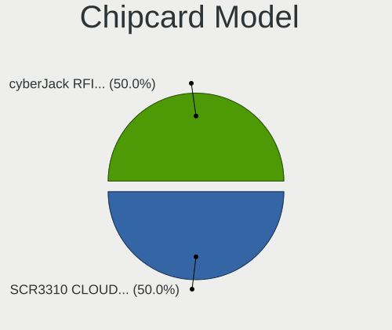

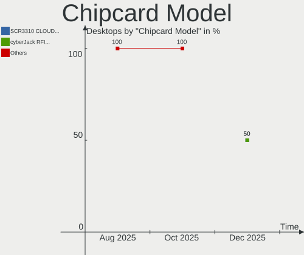

| Model                                                                      | Desktops | Percent |
|----------------------------------------------------------------------------|----------|---------|
| SCM Microsystems SCR3310 CLOUD 2700 R                                      | 1        | 50%     |
| Reiner SCT Kartensysteme cyberJack RFID basis contactless smartcard reader | 1        | 50%     |

Unsupported
-----------

Unsupported Devices
-------------------

Total unsupported devices on board

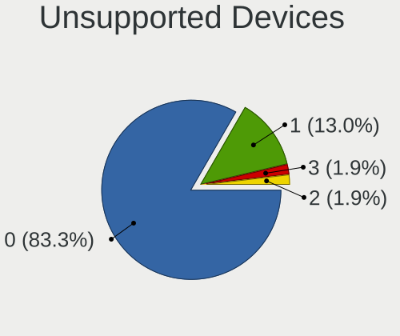

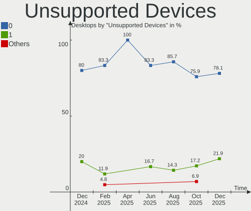

| Total | Desktops | Percent |
|-------|----------|---------|
| 0     | 25       | 78.13%  |
| 1     | 7        | 21.88%  |

Unsupported Device Types
------------------------

Types of unsupported devices

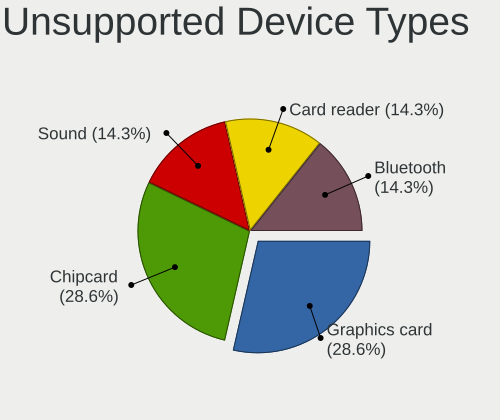

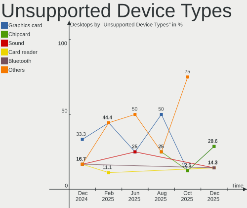

| Type          | Desktops | Percent |
|---------------|----------|---------|
| Graphics card | 2        | 28.57%  |
| Chipcard      | 2        | 28.57%  |
| Sound         | 1        | 14.29%  |
| Card reader   | 1        | 14.29%  |
| Bluetooth     | 1        | 14.29%  |

